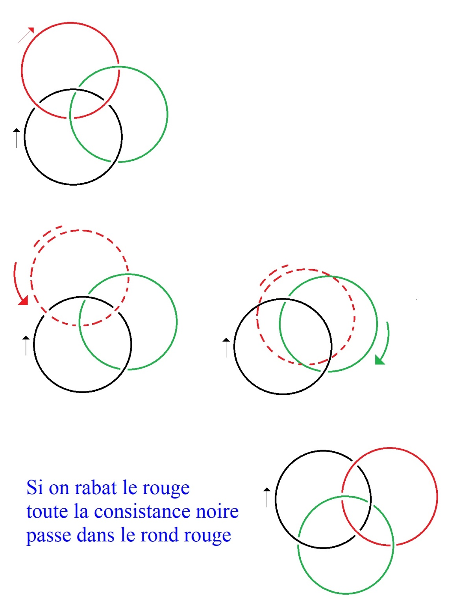

# Leçon 01 | 13 novembre 1979

  

    <label><input type="checkbox" data-lacan-toggle="original" checked> 原文</label>
    <label><input type="checkbox" data-lacan-toggle="notes" checked> 注释</label>
    <label><input type="checkbox" data-lacan-toggle="commentary" checked> 个人解读评论</label>
  

  <form class="lacan-tool-search" role="search">
    <input class="lacan-tool-search-input" type="search" placeholder="搜索全文" aria-label="搜索全文">
    <button class="lacan-tool-button" type="submit" title="搜索">搜索</button>
  </form>
  <button class="lacan-tool-button lacan-back-to-top" type="button" title="回到页面最上方" aria-label="回到页面最上方">↑</button>

<section class="parallel-paragraph" data-paragraph-ids="s27-01-0001">

s27-01-0001

原文 · s27-01-0001

Ce matin j’ai convoqué Solange Faladé  pour qu’elle m’explique quelque chose concernant le nœud borroméen.

[无对应译文]

</section>

<section class="parallel-paragraph" data-paragraph-ids="s27-01-0002">

s27-01-0002

原文 · s27-01-0002

Je dois dire que le nœud borroméen est une énigme.

[无对应译文]

</section>

<section class="parallel-paragraph" data-paragraph-ids="s27-01-0003">

s27-01-0003

原文 · s27-01-0003

Il n’y a qu’un nœud borroméen.

[无对应译文]

</section>

<section class="parallel-paragraph" data-paragraph-ids="s27-01-0004">

s27-01-0004

原文 · s27-01-0004

[无对应译文]

</section>

