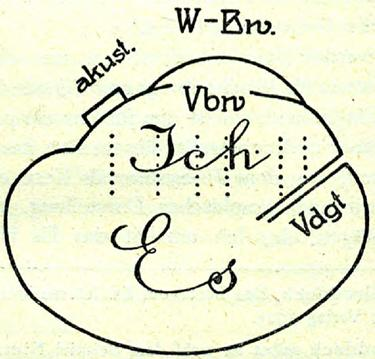
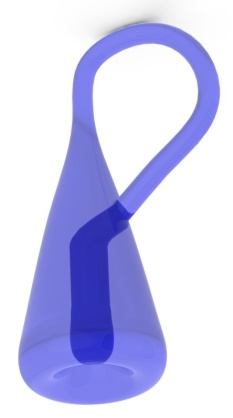
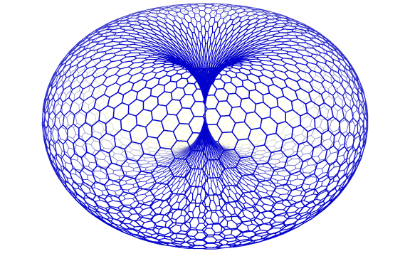

# Leçon 13 | 12 Juillet 1980 (Caracas)

  <label><input type="checkbox" data-lacan-toggle="original" checked> 原文</label>
  <label><input type="checkbox" data-lacan-toggle="notes" checked> 注释</label>
  <label><input type="checkbox" data-lacan-toggle="commentary" checked> 个人解读评论</label>

<section class="parallel-paragraph" data-paragraph-ids="s27-13-0001">

s27-13-0001

[无对应译文]

原文 · s27-13-0001

Je n’ai pas la bougeotte. La preuve en est que j’ai attendu ma 80ème année pour venir au Venezuela.

</section>

<section class="parallel-paragraph" data-paragraph-ids="s27-13-0002">

s27-13-0002

[无对应译文]

原文 · s27-13-0002

J’y suis venu parce qu’on m’a dit que c’était le lieu propice pour que j’y rencontre mes élèves d’Amérique Latine.

</section>

<section class="parallel-paragraph" data-paragraph-ids="s27-13-0003">

s27-13-0003

[无对应译文]

原文 · s27-13-0003

Est-ce que vous êtes mes élèves ?

</section>

<section class="parallel-paragraph" data-paragraph-ids="s27-13-0004">

s27-13-0004

[无对应译文]

原文 · s27-13-0004

Je ne le préjuge pas.

</section>

<section class="parallel-paragraph" data-paragraph-ids="s27-13-0005">

s27-13-0005

[无对应译文]

原文 · s27-13-0005

J’ai l’habitude de les élever moi-même.

</section>

<section class="parallel-paragraph" data-paragraph-ids="s27-13-0006">

s27-13-0006

[无对应译文]

原文 · s27-13-0006

Ça ne donne pas toujours des résultats merveilleux.

</section>

<section class="parallel-paragraph" data-paragraph-ids="s27-13-0007">

s27-13-0007

[无对应译文]

原文 · s27-13-0007

Vous n’êtes pas sans savoir les problèmes que j’ai eus avec mon École à Paris.

</section>

<section class="parallel-paragraph" data-paragraph-ids="s27-13-0008">

s27-13-0008

[无对应译文]

原文 · s27-13-0008

Je l’ai résolu comme il faut – en le prenant à la racine.

</section>

<section class="parallel-paragraph" data-paragraph-ids="s27-13-0009">

s27-13-0009

[无对应译文]

原文 · s27-13-0009

Je veux dire en déracinant ma pseudo-École.

</section>

<section class="parallel-paragraph" data-paragraph-ids="s27-13-0010">

s27-13-0010

[无对应译文]

原文 · s27-13-0010

Tout ce que j’en ai depuis obtenu me confirme que j’ai bien fait.

</section>

<section class="parallel-paragraph" data-paragraph-ids="s27-13-0011">

s27-13-0011

[无对应译文]

原文 · s27-13-0011

Mais c’est déjà de l’histoire ancienne.

</section>

<section class="parallel-paragraph" data-paragraph-ids="s27-13-0012">

s27-13-0012

[无对应译文]

原文 · s27-13-0012

À Paris, j’ai coutume de parler à un auditoire où beaucoup de têtes me sont connues pour être venues me visiter chez moi, 5 rue de Lille, où est ma pratique.

</section>

<section class="parallel-paragraph" data-paragraph-ids="s27-13-0013">

s27-13-0013

[无对应译文]

原文 · s27-13-0013

Vous, vous êtes paraît-il, de mes lecteurs.

</section>

<section class="parallel-paragraph" data-paragraph-ids="s27-13-0014">

s27-13-0014

[无对应译文]

原文 · s27-13-0014

Vous l’êtes d’autant plus que je ne vous ai jamais vu m’entendre.

</section>

<section class="parallel-paragraph" data-paragraph-ids="s27-13-0015">

s27-13-0015

[无对应译文]

原文 · s27-13-0015

Alors évidemment je suis curieux de ce qui peut me venir de vous.

</section>

<section class="parallel-paragraph" data-paragraph-ids="s27-13-0016">

s27-13-0016

[无对应译文]

原文 · s27-13-0016

C’est pourquoi je vous dis : merci, merci d’avoir répondu à mon invitation.

</section>

<section class="parallel-paragraph" data-paragraph-ids="s27-13-0017">

s27-13-0017

[无对应译文]

原文 · s27-13-0017

Vous y avez du mérite, puisque plus d’un s’est mis en travers du chemin de Caracas.

</section>

<section class="parallel-paragraph" data-paragraph-ids="s27-13-0018">

s27-13-0018

[无对应译文]

原文 · s27-13-0018

Il y a apparence, en effet, que cette Rencontre embête beaucoup de gens, et en particulier ceux qui font profession de me représenter sans me demander mon avis.

</section>

<section class="parallel-paragraph" data-paragraph-ids="s27-13-0019">

s27-13-0019

[无对应译文]

原文 · s27-13-0019

Alors quand je me présente, forcément, ils en perdent les pédales.

</section>

<section class="parallel-paragraph" data-paragraph-ids="s27-13-0020">

s27-13-0020

[无对应译文]

原文 · s27-13-0020

Il faut par contre que je remercie ceux qui ont eu l’idée de cette Rencontre,

</section>

<section class="parallel-paragraph" data-paragraph-ids="s27-13-0021">

s27-13-0021

[无对应译文]

原文 · s27-13-0021

- et nommément Diana Rabinovitch,

</section>

<section class="parallel-paragraph" data-paragraph-ids="s27-13-0022">

s27-13-0022

[无对应译文]

原文 · s27-13-0022

- je lui associe volontiers Carmen Otero et son mari Miguel, à qui j’ai fait confiance pour tout ce qui va avec un tel Congrès.

</section>

<section class="parallel-paragraph" data-paragraph-ids="s27-13-0023">

s27-13-0023

[无对应译文]

原文 · s27-13-0023

C’est grâce à eux que je me sens ici chez moi.

</section>

<section class="parallel-paragraph" data-paragraph-ids="s27-13-0024">

s27-13-0024

[无对应译文]

原文 · s27-13-0024

Je viens ici avant de lancer ma « *Cause freudienne* ».

</section>

<section class="parallel-paragraph" data-paragraph-ids="s27-13-0025">

s27-13-0025

[无对应译文]

原文 · s27-13-0025

Vous voyez que je tiens à cet adjectif.

</section>

<section class="parallel-paragraph" data-paragraph-ids="s27-13-0026">

s27-13-0026

[无对应译文]

原文 · s27-13-0026

C’est à vous d’être lacaniens, si vous voulez. Moi, je suis freudien.

</section>

<section class="parallel-paragraph" data-paragraph-ids="s27-13-0027">

s27-13-0027

[无对应译文]

原文 · s27-13-0027

C’est pourquoi je crois bienvenue de vous dire quelques mots du débat que je soutiens avec Freud, et pas d’aujourd’hui.

</section>

<section class="parallel-paragraph" data-paragraph-ids="s27-13-0028">

s27-13-0028

[无对应译文]

原文 · s27-13-0028

Voilà :

</section>

<section class="parallel-paragraph" data-paragraph-ids="s27-13-0029">

s27-13-0029

[无对应译文]

原文 · s27-13-0029

- mes trois ne sont pas les siens,

</section>

<section class="parallel-paragraph" data-paragraph-ids="s27-13-0030">

s27-13-0030

[无对应译文]

原文 · s27-13-0030

- mes trois sont le réel, le symbolique et l’imaginaire.

</section>

<section class="parallel-paragraph" data-paragraph-ids="s27-13-0031">

s27-13-0031

[无对应译文]

原文 · s27-13-0031

J’en suis venu à les situer d’une topologie, celle du nœud dit borroméen.

</section>

<section class="parallel-paragraph" data-paragraph-ids="s27-13-0032">

s27-13-0032

[无对应译文]

原文 · s27-13-0032

Le nœud borroméen met en évidence la fonction de l’au moins trois.

</section>

<section class="parallel-paragraph" data-paragraph-ids="s27-13-0033">

s27-13-0033

[无对应译文]

原文 · s27-13-0033

C’est celui qui noue les deux autres dénouées.

</section>

<section class="parallel-paragraph" data-paragraph-ids="s27-13-0034">

s27-13-0034

[无对应译文]

原文 · s27-13-0034

J’ai donné ça aux miens.

</section>

<section class="parallel-paragraph" data-paragraph-ids="s27-13-0035">

s27-13-0035

[无对应译文]

原文 · s27-13-0035

Je leur ai donné ça pour qu’ils se retrouvent dans la pratique.

</section>

<section class="parallel-paragraph" data-paragraph-ids="s27-13-0036">

s27-13-0036

[无对应译文]

原文 · s27-13-0036

Mais s’y retrouve-t-il mieux que de la topique léguée par Freud aux siens.

</section>

<section class="parallel-paragraph" data-paragraph-ids="s27-13-0037">

s27-13-0037

[无对应译文]

原文 · s27-13-0037

Il faut le dire : ce que Freud a dessiné de sa topique, dite « seconde », n’est pas sans maladresse.

</section>

<section class="parallel-paragraph" data-paragraph-ids="s27-13-0038">

s27-13-0038

[无对应译文]

原文 · s27-13-0038

J’imagine que c’était pour se faire entendre sans doute des bornes de son temps.

</section>

<section class="parallel-paragraph" data-paragraph-ids="s27-13-0039">

s27-13-0039

[无对应译文]

原文 · s27-13-0039

Mais ne pouvons-nous pas plutôt tirer profit de ce qui figure là l’approche de mon nœud ?

</section>

<section class="parallel-paragraph" data-paragraph-ids="s27-13-0040">

s27-13-0040

[无对应译文]

原文 · s27-13-0040

Qu’on considère le sac flasque à se produire comme lien du Ça dans son article à se dire : « *Das Ich und das Es* ».

</section>

<section class="parallel-paragraph" data-paragraph-ids="s27-13-0041">

s27-13-0041

[无对应译文]

原文 · s27-13-0041

Ce sac, ce serait le contenant des pulsions.

</section>

<section class="parallel-paragraph" data-paragraph-ids="s27-13-0042">

s27-13-0042

[无对应译文]

原文 · s27-13-0042

</section>

<section class="parallel-paragraph" data-paragraph-ids="s27-13-0043">

s27-13-0043

[无对应译文]

原文 · s27-13-0043

Quelle idée saugrenue que de croquer ça ainsi !

</section>

<section class="parallel-paragraph" data-paragraph-ids="s27-13-0044">

s27-13-0044

[无对应译文]

原文 · s27-13-0044

Cela ne s’explique qu’à considérer les pulsions comme des billes, à expulser des orifices du corps, après avoir fait une ingestion.

</section>

<section class="parallel-paragraph" data-paragraph-ids="s27-13-0045">

s27-13-0045

[无对应译文]

原文 · s27-13-0045

Là-dessus se broche un Ego, où semble préparé le pointillé de colonnes à en faire le compte.

</section>

<section class="parallel-paragraph" data-paragraph-ids="s27-13-0046">

s27-13-0046

[无对应译文]

原文 · s27-13-0046

Mais cela n’en laisse pas moins embarrassé à ce que le même se coiffe d’un bizarre œil perceptif, où pour beaucoup se lit aussi bien la tache germinale d’un embryon sur le vitellus.

</section>

<section class="parallel-paragraph" data-paragraph-ids="s27-13-0047">

s27-13-0047

[无对应译文]

原文 · s27-13-0047

Ce n’est pas tout encore.

</section>

<section class="parallel-paragraph" data-paragraph-ids="s27-13-0048">

s27-13-0048

[无对应译文]

原文 · s27-13-0048

La boîte enregistreuse de quelque appareil à la Marey est ici de complément.

</section>

<section class="parallel-paragraph" data-paragraph-ids="s27-13-0049">

s27-13-0049

[无对应译文]

原文 · s27-13-0049

Cela en dit long sur la difficulté de la référence au réel.

</section>

<section class="parallel-paragraph" data-paragraph-ids="s27-13-0050">

s27-13-0050

[无对应译文]

原文 · s27-13-0050

Enfin deux barres hachurent de leur joint la relation de cet ensemble baroque au sac de bille lui-même.

</section>

<section class="parallel-paragraph" data-paragraph-ids="s27-13-0051">

s27-13-0051

[无对应译文]

原文 · s27-13-0051

Voilà qui est désigné du refoulé. Cela laisse perplexe.

</section>

<section class="parallel-paragraph" data-paragraph-ids="s27-13-0052">

s27-13-0052

[无对应译文]

原文 · s27-13-0052

Disons que ce n’est pas ce que Freud a fait de mieux.

</section>

<section class="parallel-paragraph" data-paragraph-ids="s27-13-0053">

s27-13-0053

[无对应译文]

原文 · s27-13-0053

Il faut même avouer que ce n’est pas en faveur de la pertinence de la pensée que cela prétend traduire.

</section>

<section class="parallel-paragraph" data-paragraph-ids="s27-13-0054">

s27-13-0054

[无对应译文]

原文 · s27-13-0054

Quel contraste avec la définition que Freud donne des pulsions, comme liées aux orifices du corps.

</section>

<section class="parallel-paragraph" data-paragraph-ids="s27-13-0055">

s27-13-0055

[无对应译文]

原文 · s27-13-0055

C’est là une formule lumineuse, qui impose une autre figuration que cette bouteille.

</section>

<section class="parallel-paragraph" data-paragraph-ids="s27-13-0056">

s27-13-0056

[无对应译文]

原文 · s27-13-0056

Quel qu’en puisse être le bouchon.

</section>

<section class="parallel-paragraph" data-paragraph-ids="s27-13-0057">

s27-13-0057

[无对应译文]

原文 · s27-13-0057

N’est-ce pas plutôt, comme il m’est arrivé de le dire, bouteille de Klein, sans dedans ni dehors ?

</section>

<section class="parallel-paragraph" data-paragraph-ids="s27-13-0058">

s27-13-0058

[无对应译文]

原文 · s27-13-0058

Ou encore, seulement, pourquoi pas le tore ?

</section>

<section class="parallel-paragraph" data-paragraph-ids="s27-13-0059">

s27-13-0059

[无对应译文]

原文 · s27-13-0059

 

</section>

<section class="parallel-paragraph" data-paragraph-ids="s27-13-0060">

s27-13-0060

[无对应译文]

原文 · s27-13-0060

Je me contente de noter que le silence attribué au « Ça » comme tel, suppose la parlotte.

</section>

<section class="parallel-paragraph" data-paragraph-ids="s27-13-0061">

s27-13-0061

[无对应译文]

原文 · s27-13-0061

La parlotte à quoi s’attend l’oreille, celle du « *désir indestructible* » à s’en traduire.

</section>

<section class="parallel-paragraph" data-paragraph-ids="s27-13-0062">

s27-13-0062

[无对应译文]

原文 · s27-13-0062

Il est remarquable pourtant que ce brouillage n’ait pas empêché Freud de revenir après ça aux indications les plus frappantes sur la pratique de l’analyse, et nommément ses constructions.

</section>

<section class="parallel-paragraph" data-paragraph-ids="s27-13-0063">

s27-13-0063

[无对应译文]

原文 · s27-13-0063

Dois-je m’encourager à me souvenir qu’à mon âge Freud n’était pas mort.

</section>

<section class="parallel-paragraph" data-paragraph-ids="s27-13-0064">

s27-13-0064

[无对应译文]

原文 · s27-13-0064

Bien sûr, mon nœud ne dit pas tout.

</section>

<section class="parallel-paragraph" data-paragraph-ids="s27-13-0065">

s27-13-0065

[无对应译文]

原文 · s27-13-0065

Sans quoi je n’aurais même pas la chance de me repérer dans ce qu’il y a : puisqu’il n’y a, dis-je, pas-tout.

</section>

<section class="parallel-paragraph" data-paragraph-ids="s27-13-0066">

s27-13-0066

[无对应译文]

原文 · s27-13-0066

Pas-tout sûrement dans le réel, que j’aborde de ma pratique.

</section>

<section class="parallel-paragraph" data-paragraph-ids="s27-13-0067">

s27-13-0067

[无对应译文]

原文 · s27-13-0067

Remarquez que dans mon nœud, le réel reste constamment figuré de la droite infinie, soit du cercle non fermé quelle suppose. C’est ce dont se maintient qu’il ne puisse être admis que comme pas-tout.

</section>

<section class="parallel-paragraph" data-paragraph-ids="s27-13-0068">

s27-13-0068

[无对应译文]

原文 · s27-13-0068

Le surprenant est que *le nombre* nous soit fourni dans lalangue même. Avec ce qu’il véhicule du réel.

</section>

<section class="parallel-paragraph" data-paragraph-ids="s27-13-0069">

s27-13-0069

[无对应译文]

原文 · s27-13-0069

Pourquoi ne pas admettre que la paix sexuelle des animaux, à m’en prendre à celui qu’on dit être leur roi : le lion, tient à ce que le nombre ne s’introduit pas dans leur langage, quel qu’il soit.

</section>

<section class="parallel-paragraph" data-paragraph-ids="s27-13-0070">

s27-13-0070

[无对应译文]

原文 · s27-13-0070

Sans doute le dressage peut-il en donner apparence. Mais rien que ça.

</section>

<section class="parallel-paragraph" data-paragraph-ids="s27-13-0071">

s27-13-0071

[无对应译文]

原文 · s27-13-0071

La paix sexuelle veut dire qu’on sait quoi faire du corps de l’Autre.

</section>

<section class="parallel-paragraph" data-paragraph-ids="s27-13-0072">

s27-13-0072

[无对应译文]

原文 · s27-13-0072

Mais qui sait que faire d’un corps de parlêtre, hormis le serrer plus ou moins près ?

</section>

<section class="parallel-paragraph" data-paragraph-ids="s27-13-0073">

s27-13-0073

[无对应译文]

原文 · s27-13-0073

Qu’est-ce que l’Autre trouve à dire, et encore quand il veut bien ? Il dit : « *Serre-moi fort* ».

</section>

<section class="parallel-paragraph" data-paragraph-ids="s27-13-0074">

s27-13-0074

[无对应译文]

原文 · s27-13-0074

Bête comme chou pour la copulation.

</section>

<section class="parallel-paragraph" data-paragraph-ids="s27-13-0075">

s27-13-0075

[无对应译文]

原文 · s27-13-0075

N’importe qui sait y faire mieux.

</section>

<section class="parallel-paragraph" data-paragraph-ids="s27-13-0076">

s27-13-0076

[无对应译文]

原文 · s27-13-0076

Je dis n’importe qui - une grenouille par exemple.

</section>

<section class="parallel-paragraph" data-paragraph-ids="s27-13-0077">

s27-13-0077

[无对应译文]

原文 · s27-13-0077

Il y a une peinture qui me trotte dans la tête depuis longtemps.

</section>

<section class="parallel-paragraph" data-paragraph-ids="s27-13-0078">

s27-13-0078

[无对应译文]

原文 · s27-13-0078

J’ai retrouvé le nom propre de son auteur, non sans les difficultés propres à mon âge.

</section>

<section class="parallel-paragraph" data-paragraph-ids="s27-13-0079">

s27-13-0079

[无对应译文]

原文 · s27-13-0079

Elle est de Bramantino.

</section>

<section class="parallel-paragraph" data-paragraph-ids="s27-13-0080">

s27-13-0080

[无对应译文]

原文 · s27-13-0080

Eh bien, cette peinture est bien faite pour témoigner de la nostalgie qu’une femme ne soit pas une grenouille, qui est mise là sur le dos, au premier plan du tableau.

</section>

<section class="parallel-paragraph" data-paragraph-ids="s27-13-0081">

s27-13-0081

[无对应译文]

原文 · s27-13-0081

Ce qui m’a frappé le plus dans ce tableau, c’est que la Vierge - la Vierge à l’enfant - y a quelque chose comme l’ombre d’une barbe. Moyennant quoi elle ressemble à son fils, tel qu’il se peint en adulte.

</section>

<section class="parallel-paragraph" data-paragraph-ids="s27-13-0082">

s27-13-0082

[无对应译文]

原文 · s27-13-0082

La relation figurée de la Madone est plus complexe qu’on ne le pense.

</section>

<section class="parallel-paragraph" data-paragraph-ids="s27-13-0083">

s27-13-0083

[无对应译文]

原文 · s27-13-0083

Elle est d’ailleurs mal supportée.

</section>

<section class="parallel-paragraph" data-paragraph-ids="s27-13-0084">

s27-13-0084

[无对应译文]

原文 · s27-13-0084

Ça me tracasse.

</section>

<section class="parallel-paragraph" data-paragraph-ids="s27-13-0085">

s27-13-0085

[无对应译文]

原文 · s27-13-0085

Mais reste que je m’en situe, je crois mieux que Freud, dans le Réel intéressé à ce qu’il en est de l’inconscient.

</section>

<section class="parallel-paragraph" data-paragraph-ids="s27-13-0086">

s27-13-0086

[无对应译文]

原文 · s27-13-0086

Car la jouissance du corps fait point à l’encontre de l’inconscient.

</section>

<section class="parallel-paragraph" data-paragraph-ids="s27-13-0087">

s27-13-0087

[无对应译文]

原文 · s27-13-0087

D’où mes mathèmes, qui procèdent de ce que *le symbolique suit le lieu de l’Autre*, *mais qu’il n’y ait pas d’Autre de l’Autre*.

</section>

<section class="parallel-paragraph" data-paragraph-ids="s27-13-0088">

s27-13-0088

[无对应译文]

原文 · s27-13-0088

Il s’ensuit que ce que lalangue peut faire de mieux, c’est de se démontrer au service de l’instinct de mort.

</section>

<section class="parallel-paragraph" data-paragraph-ids="s27-13-0089">

s27-13-0089

[无对应译文]

原文 · s27-13-0089

C’est là une idée de Freud. C’est une idée géniale.

</section>

<section class="parallel-paragraph" data-paragraph-ids="s27-13-0090">

s27-13-0090

[无对应译文]

原文 · s27-13-0090

Ça veut dire aussi que c’est une idée grotesque.

</section>

<section class="parallel-paragraph" data-paragraph-ids="s27-13-0091">

s27-13-0091

[无对应译文]

原文 · s27-13-0091

Le plus fort, c’est que c’est une idée qui se confirme de ceci : que lalangue n’est efficace que de passer à l’écrit.

</section>

<section class="parallel-paragraph" data-paragraph-ids="s27-13-0092">

s27-13-0092

[无对应译文]

原文 · s27-13-0092

C’est ce qui m’a inspiré mes mathèmes...

</section>

<section class="parallel-paragraph" data-paragraph-ids="s27-13-0093">

s27-13-0093

[无对应译文]

原文 · s27-13-0093

> pour autant qu’on puisse parler d’inspiration
>
> pour un travail qui m’a coûté des veilles où pas une muse que je sache ne m’a visité …mais il faut croire que *ça m’amuse.*

</section>

<section class="parallel-paragraph" data-paragraph-ids="s27-13-0094">

s27-13-0094

[无对应译文]

原文 · s27-13-0094

Freud a l’idée que l’instinct de mort s’explique par le déplacement au plus bas du seuil toléré de tension par le corps. C’est ce que Freud nomme d’un au-delà du principe de plaisir - c’est-à-dire du plaisir du corps.

</section>

<section class="parallel-paragraph" data-paragraph-ids="s27-13-0095">

s27-13-0095

[无对应译文]

原文 · s27-13-0095

Il faut bien dire que c’est tout de même chez Freud l’indice d’une pensée plus délirante qu’aucune de celles dont j’ai jamais fait part.

</section>

<section class="parallel-paragraph" data-paragraph-ids="s27-13-0096">

s27-13-0096

[无对应译文]

原文 · s27-13-0096

Car bien entendu, je ne vous dis pas tout. C’est là mon mérite.

</section>

<section class="parallel-paragraph" data-paragraph-ids="s27-13-0097">

s27-13-0097

[无对应译文]

原文 · s27-13-0097

Voilà.

</section>

<section class="parallel-paragraph" data-paragraph-ids="s27-13-0098">

s27-13-0098

[无对应译文]

原文 · s27-13-0098

Je déclare ouverte cette Rencontre, qui porte sur ce que j’ai enseigné.

</section>

<section class="parallel-paragraph" data-paragraph-ids="s27-13-0099">

s27-13-0099

[无对应译文]

原文 · s27-13-0099

C’est vous, par votre présence, qui faites que j’ai enseigné quelque chose.

</section>

<section class="parallel-paragraph" data-paragraph-ids="s27-13-0100">

s27-13-0100

[无对应译文]

原文 · s27-13-0100

</section>

