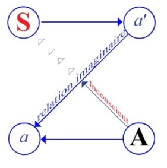

# Leçon 13 | 14 Mars 1956

  

    <label><input type="checkbox" data-lacan-toggle="original" checked> 原文</label>
    <label><input type="checkbox" data-lacan-toggle="notes" checked> 注释</label>
    <label><input type="checkbox" data-lacan-toggle="commentary" checked> 个人解读评论</label>
  

  <form class="lacan-tool-search" role="search">
    <input class="lacan-tool-search-input" type="search" placeholder="搜索全文" aria-label="搜索全文">
    <button class="lacan-tool-button" type="submit" title="搜索">搜索</button>
  </form>
  <button class="lacan-tool-button lacan-back-to-top" type="button" title="回到页面最上方" aria-label="回到页面最上方">↑</button>

<section class="parallel-paragraph" data-paragraph-ids="s3-13-0001">

s3-13-0001

原文 · s3-13-0001

Nous allons reprendre notre propos un petit peu en arrière. Je vous rappelle que nous en sommes arrivés au point où, par l’analyse - au sens courant du mot - du texte de SCHREBER nous avons mis de plus en plus fortement l’accent sur l’importance des phénomènes de langage dans l’économie de la psychose. C’est dans ce sens qu’on peut parler de « *structures freudiennes des psychoses* ».

[无对应译文]

</section>

<section class="parallel-paragraph" data-paragraph-ids="s3-13-0002">

s3-13-0002

原文 · s3-13-0002

Mais la question présente est : quelle fonction ont, dans les psychoses, ces phénomènes de langage qui y apparaissent si fréquemment ? Il serait bien surprenant que…

[无对应译文]

</section>

<section class="parallel-paragraph" data-paragraph-ids="s3-13-0003">

s3-13-0003

原文 · s3-13-0003

> si vraiment l’analyse est ce que nous disons ici, à savoir si étroitement liée
>
> aux phénomènes du langage en général, et à l’acte de la parole

[无对应译文]

</section>

<section class="parallel-paragraph" data-paragraph-ids="s3-13-0004">

s3-13-0004

原文 · s3-13-0004

…il serait très surprenant qu’elle ne nous apporte pas une façon d’apercevoir l’économie du langage dans la psychose d’une façon qui ne soit pas absolument la même que celle dont on le comprenait dans l’abord classique, celui qui ne pouvait faire mieux que de se référer à des théories psychologiques classiques, le langage et ses différents niveaux.

[无对应译文]

</section>

<section class="parallel-paragraph" data-paragraph-ids="s3-13-0005">

s3-13-0005

原文 · s3-13-0005

Nous sommes arrivés à quelque chose…

[无对应译文]

</section>

<section class="parallel-paragraph" data-paragraph-ids="s3-13-0006">

s3-13-0006

原文 · s3-13-0006

> pour se référer à notre schéma fondamental de la communication analytique

[无对应译文]

</section>

<section class="parallel-paragraph" data-paragraph-ids="s3-13-0007">

s3-13-0007

原文 · s3-13-0007

…qui se révèle au sujet S qui est en même temps ce S où le I doit devenir S à l’*Autre*, qui est ce qu’essentiellement *la parole* du sujet doit atteindre, puisqu’il est aussi ce dans quoi ce message doit lui venir, puisque c’est bien la réponse de l’Autre qui est essentielle à la parole, à la fonction fondatrice de la parole.

[无对应译文]

</section>

<section class="parallel-paragraph" data-paragraph-ids="s3-13-0008">

s3-13-0008

原文 · s3-13-0008

Entre S et A, la parole fondamentale que doit révéler l’analyse, nous avons le détour, où la dérivation, où le circuit *imaginaire* qui vient résister au passage de cette *parole*, sous la forme de ce passage par ce *a* et ce *a’* qui sont les pôles *imaginaires* du sujet. Ce \[*a* et *a’*\] qui est suffisamment indiqué par *la relation dite* *spéculaire*, celle du *stade du miroir*.

[无对应译文]

</section>

<section class="parallel-paragraph" data-paragraph-ids="s3-13-0009">

s3-13-0009

原文 · s3-13-0009

[无对应译文]

</section>

<section class="parallel-paragraph" data-paragraph-ids="s3-13-0010">

s3-13-0010

原文 · s3-13-0010

Ce \[*a* et *a’*\] par quoi le sujet dans *sa corporéité, dans sa multiplicité, dans son morcellement naturel*, qui est en *a’*, qui est l’organisme, et qui se réfère à cette *unité imaginaire* qui est le *moi*, c’est-à-dire ce *a*, où il se connaît, où il se *méconnaît* aussi, et qui est ce dont il parle - il ne sait pas à qui, puisqu’il ne sait pas non plus qui parle en lui - qui est donc ce dont il est parlé en *a’*.

[无对应译文]

</section>

<section class="parallel-paragraph" data-paragraph-ids="s3-13-0011">

s3-13-0011

原文 · s3-13-0011

*Quand le sujet commence l’analyse* - comme je le disais schématiquement dans les temps archaïques des séminaires - *le sujet commence par parler de lui*. *Quand il aura parlé de lui* - qui aura sensiblement changé dans l’intervalle - *à vous, nous serons arrivés à la fin de l’analyse*. Qu’est-ce que cela veut dire ? Je n’ai pas ici à m’étendre sur ce sujet.

[无对应译文]

</section>

<section class="parallel-paragraph" data-paragraph-ids="s3-13-0012">

s3-13-0012

原文 · s3-13-0012

Cela veut dire que l’absence de *l’analyste* en tant que *moi*, car *l’analyste* si nous le plaçons maintenant dans ce *schéma*, qui est le *schéma de la parole du sujet,* nous pouvons dire qu’ici l’analyste est quelque part en A, et que, la position étant strictement inversée, nous avons ici le *a’,* là où l’analyste pourrait parler, pourrait répondre au sujet, s’il entre dans son jeu, s’il entre dans le couplage de la résistance, s’il fait justement ce qu’on lui apprend à ne pas faire, ce qu’on essaie tout au moins de lui apprendre à ne pas faire, c’est là donc lui qui serait en *a’*.

[无对应译文]

</section>

<section class="parallel-paragraph" data-paragraph-ids="s3-13-0013">

s3-13-0013

原文 · s3-13-0013

C’est ici, c’est-à-dire *dans le sujet*, qu’il se verrait de la façon la plus naturelle, c’est à savoir : s’il n’est pas analysé. Cela arrive de temps en temps... Je dirai même que d’un certain côté l’analyste n’est jamais complètement analyste, pour la simple raison qu’il est homme, c’est-à-dire qu’il participe lui aussi aux mécanismes imaginaires qui font obstacle au passage de la parole du sujet \[S → A\].

[无对应译文]

</section>

<section class="parallel-paragraph" data-paragraph-ids="s3-13-0014">

s3-13-0014

原文 · s3-13-0014

C’est très précisément en tant qu’il saura :

[无对应译文]

</section>

<section class="parallel-paragraph" data-paragraph-ids="s3-13-0015">

s3-13-0015

原文 · s3-13-0015

- ne pas s’identifier au sujet,

[无对应译文]

</section>

<section class="parallel-paragraph" data-paragraph-ids="s3-13-0016">

s3-13-0016

原文 · s3-13-0016

- ne pas entrer dans la capture imaginaire,

[无对应译文]

</section>

<section class="parallel-paragraph" data-paragraph-ids="s3-13-0017">

s3-13-0017

原文 · s3-13-0017

- c’est-à-dire ici être assez mort pour ne pas être pris dans cette relation imaginaire

[无对应译文]

</section>

<section class="parallel-paragraph" data-paragraph-ids="s3-13-0018">

s3-13-0018

原文 · s3-13-0018

…que là il saura - à l’endroit où sa parole est toujours sollicitée d’intervenir - ne pas intervenir…

[无对应译文]

</section>

<section class="parallel-paragraph" data-paragraph-ids="s3-13-0019">

s3-13-0019

原文 · s3-13-0019

> assez pour ne pas permettre cette progressive migration de l’image du sujet en S, vers ce quelque chose
>
> qui est le S, la *Chose* à révéler, la *Chose* aussi qui n’a pas de nom, qui ne peut trouver son nom

[无对应译文]

</section>

<section class="parallel-paragraph" data-paragraph-ids="s3-13-0020">

s3-13-0020

原文 · s3-13-0020

…justement, pour autant que le circuit de la migration s’achevant directement de S vers A, c’est ce qui était sous le discours du sujet, c’est ce que le sujet avait à dire à travers son faux discours qui finira par s’achever et trouver ici un passage, d’autant plus facilement que l’économie aura été progressivement amenuisée de cette *relation imaginaire*.

[无对应译文]

</section>

<section class="parallel-paragraph" data-paragraph-ids="s3-13-0021">

s3-13-0021

原文 · s3-13-0021

Je vais vite, je ne suis pas ici pour refaire toute la théorie du dialogue analytique, mais simplement pour vous indiquer que le mot, que cette *parole*…

[无对应译文]

</section>

<section class="parallel-paragraph" data-paragraph-ids="s3-13-0022">

s3-13-0022

原文 · s3-13-0022

> avec l’accent que comporte la notion du « *mot* » comme solution d’une énigme,
>
> comme solution d’un problème, comme fonction problématique

[无对应译文]

</section>

<section class="parallel-paragraph" data-paragraph-ids="s3-13-0023">

s3-13-0023

原文 · s3-13-0023

…se situe là, dans l’Autre. C’est toujours par l’intermédiaire de l’Autre que se réalise toute *parole pleine*, toujours dans le « *tu es*... » que le sujet se situe et se reconnaît lui-même.

[无对应译文]

</section>

<section class="parallel-paragraph" data-paragraph-ids="s3-13-0024">

s3-13-0024

原文 · s3-13-0024

La notion à laquelle nous sommes arrivés en analysant la structure du délire de SCHREBER, au moment où il s’est constitué, je veux dire au moment où à la fois *le système* corrélatif qui lie le *moi* à cet *autre* *imaginaire*, à cet étrange Dieu auquel SCHREBER a affaire, ce Dieu :

[无对应译文]

</section>

<section class="parallel-paragraph" data-paragraph-ids="s3-13-0025">

s3-13-0025

原文 · s3-13-0025

- qui ne comprend rien,

[无对应译文]

</section>

<section class="parallel-paragraph" data-paragraph-ids="s3-13-0026">

s3-13-0026

原文 · s3-13-0026

- qui le méconnaît,

[无对应译文]

</section>

<section class="parallel-paragraph" data-paragraph-ids="s3-13-0027">

s3-13-0027

原文 · s3-13-0027

- qui ne répond pas,

[无对应译文]

</section>

<section class="parallel-paragraph" data-paragraph-ids="s3-13-0028">

s3-13-0028

原文 · s3-13-0028

- qui est ambigu,

[无对应译文]

</section>

<section class="parallel-paragraph" data-paragraph-ids="s3-13-0029">

s3-13-0029

原文 · s3-13-0029

- qui le trompe, …système donc où s’est achevé son délire, corrélativement à une sorte de précipitation, de localisation, je dirai, très précisément des phénomènes hallucinatoires, nous a fait aboutir, tout au moins voisiner avec la notion qu’il y a quelque chose qu’on peut, dans la psychose, reconnaître et qualifier comme une *exclusion* de cet *Autre* au sens où l’*être* s’y réalise dans cet aveu de *la parole*.

[无对应译文]

</section>

<section class="parallel-paragraph" data-paragraph-ids="s3-13-0030">

s3-13-0030

原文 · s3-13-0030

Que *les phénomènes* dont il s’agit dans *l’hallucination verbale*…

[无对应译文]

</section>

<section class="parallel-paragraph" data-paragraph-ids="s3-13-0031">

s3-13-0031

原文 · s3-13-0031

- ces phénomènes qui dans leur structure même, manifestent la relation d’écho intérieur où le sujet est par rapport à son propre discours,

[无对应译文]

</section>

<section class="parallel-paragraph" data-paragraph-ids="s3-13-0032">

s3-13-0032

原文 · s3-13-0032

- ces phénomènes *hallucinatoires* qui arrivent à devenir de plus en plus - comme s’exprime le sujet - « *insensés* » comme on dit, « *purement verbaux* », vidés de sens, faits de serinages divers, de ritournelles sans objet, …ils nous donnent le sentiment que la structure qui est à rechercher est précisément dirigée vers ceci : qu’est-ce que c’est que *ce rapport spécial à la parole* ?

[无对应译文]

</section>

<section class="parallel-paragraph" data-paragraph-ids="s3-13-0033">

s3-13-0033

原文 · s3-13-0033

Qu’est-ce qui manque pour que :

[无对应译文]

</section>

<section class="parallel-paragraph" data-paragraph-ids="s3-13-0034">

s3-13-0034

原文 · s3-13-0034

- le sujet puisse en quelque sorte arriver à être nécessité dans *la construction de tout ce monde imaginaire*,

[无对应译文]

</section>

<section class="parallel-paragraph" data-paragraph-ids="s3-13-0035">

s3-13-0035

原文 · s3-13-0035

- en même temps que de l’intérieur de lui–même il subit une sorte *d’automatisme*, à proprement parler, de la fonction du discours qui devient pour lui non seulement quelque chose d’envahissant, de parasitaire, mais quelque chose dont la présence devient en quelque sorte pour lui ce à quoi il est suspendu.

[无对应译文]

</section>

<section class="parallel-paragraph" data-paragraph-ids="s3-13-0036">

s3-13-0036

原文 · s3-13-0036

C’est là que nous en sommes arrivés. Et je dois dire qu’ici, pour faire un pas de plus, nous devons, comme il arrive souvent, faire d’abord un pas en arrière. Que le sujet, en somme, ne puisse dans la psychose se reconstituer que dans ce que j’ai appelé *l’allusion imaginaire*, ceci à propos d’autres phénomènes que je vous ai montrés « *in vivo* » dans une présentation de malade. C’est le point précis où nous en arrivons.

[无对应译文]

</section>

<section class="parallel-paragraph" data-paragraph-ids="s3-13-0037">

s3-13-0037

原文 · s3-13-0037

Et c’est de la relation de cette constitution du sujet dans la pure et simple *allusion imaginaire* - celle qui ne peut jamais aboutir - qu’est le problème, c’est-à-dire le pas que nous devons faire pour essayer de le faire avancer. Jusqu’à présent on s’en est contenté. L’*allusion imaginaire* paraissait très significative. On y retrouvait tout le matériel, tous les éléments de l’inconscient. On ne semble s’être jamais, à proprement parler, demandé ce que signifiait, au point de vue économique, le fait que cette allusion en elle-même n’eut aucun pouvoir résolutif.

[无对应译文]

</section>

<section class="parallel-paragraph" data-paragraph-ids="s3-13-0038">

s3-13-0038

原文 · s3-13-0038

Et comme tout de même on y a insisté…

[无对应译文]

</section>

<section class="parallel-paragraph" data-paragraph-ids="s3-13-0039">

s3-13-0039

原文 · s3-13-0039

> mais en y mettant comme une espèce de mystère, et je dirai presque, avec le progrès du temps, en s’efforçant d’effacer les différences radicales qu’il y a dans *cette structure par rapport à la structure des névroses*

[无对应译文]

</section>

<section class="parallel-paragraph" data-paragraph-ids="s3-13-0040">

s3-13-0040

原文 · s3-13-0040

…à Strasbourg, on m’a posé les mêmes questions qu’à Vienne.

[无对应译文]

</section>

<section class="parallel-paragraph" data-paragraph-ids="s3-13-0041">

s3-13-0041

原文 · s3-13-0041

Des gens qui paraissaient assez sensibles à certaines perspectives que j’avais abordées, finissaient par me dire :

[无对应译文]

</section>

<section class="parallel-paragraph" data-paragraph-ids="s3-13-0042">

s3-13-0042

原文 · s3-13-0042

- « *Comment opérez-vous dans les psychoses ?* ».

[无对应译文]

</section>

<section class="parallel-paragraph" data-paragraph-ids="s3-13-0043">

s3-13-0043

原文 · s3-13-0043

Comme s’il n’y avait pas assez à faire quand on a affaire à des auditoires aussi peu préparés que ceux-là, et de mettre l’accent sur le *b-a-ba* de la technique. Et je répondais :

[无对应译文]

</section>

<section class="parallel-paragraph" data-paragraph-ids="s3-13-0044">

s3-13-0044

原文 · s3-13-0044

- « *La question est un petit peu en train. Il faudra essayer de trouver quelques repères essentiels,* *avant de parler de la technique, voire de la recette psychothérapique.* »

[无对应译文]

</section>

<section class="parallel-paragraph" data-paragraph-ids="s3-13-0045">

s3-13-0045

原文 · s3-13-0045

On insistait encore :

[无对应译文]

</section>

<section class="parallel-paragraph" data-paragraph-ids="s3-13-0046">

s3-13-0046

原文 · s3-13-0046

- « *On ne peut quand même pas ne pas faire quelque chose pour eux !* »

[无对应译文]

</section>

<section class="parallel-paragraph" data-paragraph-ids="s3-13-0047">

s3-13-0047

原文 · s3-13-0047

- « *Mais oui. Mais attendons pour en parler que certaines choses soient dégagées.* »

[无对应译文]

</section>

<section class="parallel-paragraph" data-paragraph-ids="s3-13-0048">

s3-13-0048

原文 · s3-13-0048

Avant de faire ce pas, je voudrais tout de même…

[无对应译文]

</section>

<section class="parallel-paragraph" data-paragraph-ids="s3-13-0049">

s3-13-0049

原文 · s3-13-0049

> puisqu’en quelque sorte le caractère fascinant de ces phénomènes de langage dans la psychose
>
> est quelque chose qui peut renforcer ce que j’ai appelé tout à l’heure un malentendu

[无对应译文]

</section>

<section class="parallel-paragraph" data-paragraph-ids="s3-13-0050">

s3-13-0050

原文 · s3-13-0050

…je voudrais y revenir, et même d’une façon assez insistante, pour que je puisse espérer qu’après cela quelque chose sera, pour moi et pour ceux qui m’entendent aujourd’hui, sur ce point définitivement mis au point.

[无对应译文]

</section>

<section class="parallel-paragraph" data-paragraph-ids="s3-13-0051">

s3-13-0051

原文 · s3-13-0051

Je vais faire parler quelqu’un. Bien souvent je suis censé dire que j’entends situer et même reconnaître que dans *son discours* il articule verbalement tout ce que le sujet a à nous communiquer sur le plan de l’analyse. Bien entendu, la position extrême ne manque pas d’entraîner chez ceux qui s’y arrêtent des abjurations assez vives, qui se produisent dans deux attitudes :

[无对应译文]

</section>

<section class="parallel-paragraph" data-paragraph-ids="s3-13-0052">

s3-13-0052

原文 · s3-13-0052

- celle de « *la main sur le cœur* »,

[无对应译文]

</section>

<section class="parallel-paragraph" data-paragraph-ids="s3-13-0053">

s3-13-0053

原文 · s3-13-0053

- et par rapport à ce que nous appellerons l’attestation authentique d’un déplacement vers le haut, l’autre attitude c’est « *l’inclinaison* *de la tête* » qui est censée venir peser dans le plateau de la balance que je déchargerai trop au gré de mon interpellateur.

[无对应译文]

</section>

<section class="parallel-paragraph" data-paragraph-ids="s3-13-0054">

s3-13-0054

原文 · s3-13-0054

D’une façon générale, on me fait confiance. Il y a ce :

[无对应译文]

</section>

<section class="parallel-paragraph" data-paragraph-ids="s3-13-0055">

s3-13-0055

原文 · s3-13-0055

- « *Heureusement vous n’êtes pas tout seul dans la Société de psychanalyse. Et il existe d’ailleurs une femme de génie :*

[无对应译文]

</section>

<section class="parallel-paragraph" data-paragraph-ids="s3-13-0056">

s3-13-0056

原文 · s3-13-0056

> *Françoise* DOLTO*, qui nous montre dans ses séminaires la fonction tout à fait essentielle de l’image du corps, de la façon dont le sujet y prend appui dans ses relations avec le monde. Nous retrouvons là cette relation substantielle sur laquelle, sans doute, se broche la relation du langage mais qui est infiniment plus concrète, plus sensible.* »

[无对应译文]

</section>

<section class="parallel-paragraph" data-paragraph-ids="s3-13-0057">

s3-13-0057

原文 · s3-13-0057

Je ne suis pas du tout en train de faire la critique de ce qu’enseigne Françoise DOLTO, car très précisément, en tant qu’elle fait usage de sa technique, de cette extraordinaire appréhension, de cette sensibilité imaginaire du sujet, elle en fait très exactement - quoique sur un terrain différent et dans des conditions différentes, au moins quand elle s’adresse aux enfants - exactement le même usage. C’est-à-dire que de tout cela elle parle, autrement dit qu’elle apprend aussi à ceux qui l’écoutent à en parler. Mais ceci ne peut pas simplement résoudre la question que de faire cette remarque : cela laisse encore quelque chose d’obscur, et c’est bien là ce que je voudrais vous faire entendre.

[无对应译文]

</section>

<section class="parallel-paragraph" data-paragraph-ids="s3-13-0058">

s3-13-0058

原文 · s3-13-0058

Il est clair que je ne suis pas non plus surpris - j’ai encore à y revenir - si je disais que quelque chose persiste d’un malentendu à dissiper même chez des gens qui croient me suivre. Je ne m’exprimerai pas de la façon qui convient… Dire cela voudrait dire que puisque je \[...\] de la croyance de ceux qui me suivent, j’exprime là une espèce de *déception*.

[无对应译文]

</section>

<section class="parallel-paragraph" data-paragraph-ids="s3-13-0059">

s3-13-0059

原文 · s3-13-0059

Ce serait tout de même être en désaccord avec moi-même que d’éprouver, si peu que ce soit, *une déception* semblable si - comme c’est strictement au fond de la notion que je vous enseigne du discours - je me mettais tout d’un coup à méconnaître le mien : *que le fondement même du discours interhumain est le malentendu*.

[无对应译文]

</section>

<section class="parallel-paragraph" data-paragraph-ids="s3-13-0060">

s3-13-0060

原文 · s3-13-0060

Je ne vois donc pas pourquoi je serais moi-même surpris. Mais ce n’est pas seulement pour cela que je n’en suis pas surpris qu’il puisse susciter une certaine marge de malentendu. C’est qu’en plus…

[无对应译文]

</section>

<section class="parallel-paragraph" data-paragraph-ids="s3-13-0061">

s3-13-0061

原文 · s3-13-0061

- si quand même on doit être cohérent avec ses propres notions dans sa pratique,

[无对应译文]

</section>

<section class="parallel-paragraph" data-paragraph-ids="s3-13-0062">

s3-13-0062

原文 · s3-13-0062

- si toute espèce de *discours* valable doit justement être jugé sur les propres principes qu’il produit …je dirai que c’est avec une intention expresse, sinon absolument délibérée, que d’une certaine façon je poursuis ce discours, d’une façon telle que je vous offre l’occasion de ne pas tout à fait le comprendre : grâce à cette marge tout au moins, il restera toujours la possibilité que vous-même vous disiez que vous croyez me suivre, c’est-à-dire que vous restiez dans une position par rapport à ce discours problématique qui laisse toujours la porte ouverte à une progressive rectification.

[无对应译文]

</section>

<section class="parallel-paragraph" data-paragraph-ids="s3-13-0063">

s3-13-0063

原文 · s3-13-0063

En d’autres termes, si je m’arrangeais de façon à être très facilement compris, c’est-à-dire à ce que vous ayez tout à fait la certitude que vous y êtes, en raison même des prémices concernant *le discours interhumain*, le malentendu serait irrémédiable, grâce à la façon dont je crois devoir approcher les problèmes.

[无对应译文]

</section>

<section class="parallel-paragraph" data-paragraph-ids="s3-13-0064">

s3-13-0064

原文 · s3-13-0064

Il y a donc toujours pour vous la possibilité d’être ouverts à une révision de ce qui est dit d’une façon d’autant plus aisée que le fait que vous n’y avez pas été plutôt me revient entièrement, c’est-à-dire que vous pouvez vous en décharger sur moi. C’est bien à ce titre que je me permets de revenir aujourd’hui sur quelque chose qui est tout à fait essentiel et qui signifie très exactement ceci : je ne dis pas que ce qui est communiqué dans la relation analytique passe par le discours du sujet. Je n’ai donc absolument pas à distinguer dans le phénomène même de *la communication analytique* le domaine de *la communication verbale* de celui de *la communication préverbale*. Que cette communication « *pré* » ou même *extra*-verbale soit en quelque sorte permanente dans l’analyse, ceci n’est absolument pas douteux.

[无对应译文]

</section>

<section class="parallel-paragraph" data-paragraph-ids="s3-13-0065">

s3-13-0065

原文 · s3-13-0065

Il s’agit de voir ce qui dans l’analyse constitue le champ proprement analytique. C’est identique à ce qui constitue le phénomène analytique comme tel, à savoir *le symptôme*. Et un très grand nombre de phénomènes dits normaux ou sub-normaux, qui n’ont pas été jusqu’à l’analyse élucidée quant à leur sens, ces phénomènes s’étendent bien au-delà du discours et de la parole, puisque ce sont des choses qui arrivent au sujet dans la vie quotidienne d’une façon extrêmement étendue, et qui étaient restées non seulement problématiques mais inattaquées.

[无对应译文]

</section>

<section class="parallel-paragraph" data-paragraph-ids="s3-13-0066">

s3-13-0066

原文 · s3-13-0066

Puis les phénomènes de « *lapsus* », « *troubles de la mémoire* », « *les rêves *», plus encore quelques autres que l’analyse a permis d’éclairer, en particulier le phénomène du « *mot d’esprit* » qui a une valeur si essentielle dans la découverte freudienne, parce qu’il fait vraiment sentir, il permet de toucher du doigt, la cohérence parfaite qu’avait, dans l’œuvre de FREUD, cette relation du phénomène analytique au langage.

[无对应译文]

</section>

<section class="parallel-paragraph" data-paragraph-ids="s3-13-0067">

s3-13-0067

原文 · s3-13-0067

Commençons par dire ce que le phénomène analytique n’est pas. Ce « *pré-verbal* » dont il s’agit est quelque chose sur lequel précisément l’analyse a apporté d’immenses lumières, en d’autres termes, pour la compréhension duquel, pour la reconnaissance duquel, elle a apporté un instrument de choix.

[无对应译文]

</section>

<section class="parallel-paragraph" data-paragraph-ids="s3-13-0068">

s3-13-0068

原文 · s3-13-0068

Il faut distinguer ce qui est éclairé par *un instrument*, par un appareil technique, et cet appareil technique lui-même. Il faut distinguer le sujet de l’objet, l’observateur de l’observé. Ce « *pré-verbal* » c’est *quelque chose* qui est essentiellement lié dans la doctrine analytique au préconscient. C’est cette somme des impressions *internes* et *externes* dont le sujet peut supposer, à partir des relations naturelles, et si tant est qu’il y ait des relations chez l’homme qui soient tout à fait naturelles, mais il y en a, si perverties soient-elles.

[无对应译文]

</section>

<section class="parallel-paragraph" data-paragraph-ids="s3-13-0069">

s3-13-0069

原文 · s3-13-0069

Tout ce qui est de l’ordre de ce pré-verbal participe à ce que noms pouvons appeler, si je peux dire, d’une *Gestalt intramondaine*. Les informations dans le sens large du terme que le sujet en reçoit, si particulières qu’elles soient, restent des informations du monde où il vit. Là-dedans tout est possible : là il a fallu les \[...\] et la poupée infantile qu’il a été et qu’il reste. Il est l’objet excrémentiel, il est égout, il est ventouse. C’est l’analyse qui nous appelé à explorer ce monde imaginaire. Tout ceci participe d’une espèce de poésie barbare que l’analyste n’a pas été du tout le premier à faire sentir  et qui donne son charme à certaines œuvres poétiques. Nous sommes là dans ce que j’appellerai « *le chatoiement innombrable de la grande signification affective* ».

[无对应译文]

</section>

<section class="parallel-paragraph" data-paragraph-ids="s3-13-0070">

s3-13-0070

原文 · s3-13-0070

Pour exprimer tout cela, les mots justement qui lui viennent en abondance, au sujet, sont là tous à sa disposition, et aussi parfaitement accessibles, aussi inépuisables dans leurs combinaisons que la nature à laquelle ils répondent. C’est ce monde de l’enfant dans lequel vous vous sentez tout à fait à l’aise, d’autant plus que vous avez été familiarisés avec tous ces fantasmes : le haut vaut le bas, l’envers vaut l’endroit, et la plus grande et universelle équivalence en est la loi. C’est même ce qui nous laisse assez incertains pour y fixer les structures.

[无对应译文]

</section>

<section class="parallel-paragraph" data-paragraph-ids="s3-13-0071">

s3-13-0071

原文 · s3-13-0071

En fin de compte, ce *discours de la signification affective* atteint d’emblée aux sources de la fabulation. Il y a un monde entre celui-là et le *discours* de la revendication passionnelle par exemple, pauvre à côté de lui, qui déjà radote, mais c’est que là il y a déjà le heurt de la raison. Le travail de ce *discours* qui fait en fin de compte que ce *discours* est beaucoup plus couramment atteint que même son apparence peut le faire soupçonner.

[无对应译文]

</section>

<section class="parallel-paragraph" data-paragraph-ids="s3-13-0072">

s3-13-0072

原文 · s3-13-0072

Mais pour revenir à notre *discours* de la communication imaginaire en tant que justement, son support *préverbal* tout naturellement s’exprime en discours et plus et mieux qu’un autre, nous voyons aussi qu’à lui tout seul c’est le discours le plus fin, de celui que rien ne canalise. Ici nous nous trouvons dans un domaine depuis toujours exploré, et par la déduction empirique, et par la déduction même *a priori* catégorielle, nous nous retrouvons dans un terrain absolument familier. La source et le magasin de ce préconscient de ce que nous appelons *imaginaire* est même pas mal connu, je dirai qu’il a été abordé assez heureusement déjà dans une tradition philosophique. On peut dire que les idées-schèmes de KANT sont quelque chose qui se situe à l’orée de ce domaine, tout au moins c’est là qu’il pourrait trouver ses plus brillantes lettres de créance.

[无对应译文]

</section>

<section class="parallel-paragraph" data-paragraph-ids="s3-13-0073">

s3-13-0073

原文 · s3-13-0073

Quant à la pensée, il n’en reste pas moins que *la théorie de l’image et de l’imagination* sont dans la tradition classique d’une insuffisance surprenante, et que c’est bien justement un des problèmes qui s’offrent à nous, de savoir pourquoi il a fallu attendre si longtemps pour même en ouvrir, avant même d’en structurer la phénoménologie.

[无对应译文]

</section>

<section class="parallel-paragraph" data-paragraph-ids="s3-13-0074">

s3-13-0074

原文 · s3-13-0074

Nous savons bien en fin de compte, ce domaine à proprement parler insondable, que :

[无对应译文]

</section>

<section class="parallel-paragraph" data-paragraph-ids="s3-13-0075">

s3-13-0075

原文 · s3-13-0075

- si nous avons fait des progrès remarquables dans sa *phénoménologie*, nous ne le maîtrisons pas encore,

[无对应译文]

</section>

<section class="parallel-paragraph" data-paragraph-ids="s3-13-0076">

s3-13-0076

原文 · s3-13-0076

- et que le problème de l’image fondamentale n’est pas pour autant résolu parce que l’analyse a permis d’y mettre en ordre le problème de l’image dans sa valeur formatrice, qui se confond avec les problèmes qui sont ceux des origines, voire même de l’essence de la vie, qui, si l’on peut espérer un jour aller plus loin, c’est certainement bien plutôt du côté des *biologistes*, des *éthologistes*, de l’observation du comportement animal qu’il faut espérer des progrès,

[无对应译文]

</section>

<section class="parallel-paragraph" data-paragraph-ids="s3-13-0077">

s3-13-0077

原文 · s3-13-0077

- que l’inventaire analytique n’épuise absolument pas la question de la fonction imaginaire, s’il permet d’en montrer certains traits d’économie essentielle.

[无对应译文]

</section>

<section class="parallel-paragraph" data-paragraph-ids="s3-13-0078">

s3-13-0078

原文 · s3-13-0078

Donc, ce monde préconscient, en tant qu’il est le corrélatif du discours de la *Bewusstsein,* en tant qu’il recèle tout ce monde intérieur, qui est là, accumulé, prêt à resurgir, prêt à sortir au jour de la conscience, à la disposition du sujet, sauf contrordre, ce monde, je n’ai jamais dit qu’il avait en lui-même une structure de langage. Je dis, parce que c’est l’évidence, qu’il s’y inscrit, qu’il s’y refond, mais il garde toutes ses voies propres, ses communications. Ce n’est absolument pas là que l’analyse a apporté sa découverte essentielle, son appareil structural, ni même ce par quoi elle a permis de découvrir quelque chose dans ce monde.

[无对应译文]

</section>

<section class="parallel-paragraph" data-paragraph-ids="s3-13-0079">

s3-13-0079

原文 · s3-13-0079

Il est évidemment très surprenant de voir dans l’analyse l’accent mis sur la relation d’objet comme telle, la proposition au premier plan de la relation d’objet venir en somme à l’actif d’une prépondérance exclusive

[无对应译文]

</section>

<section class="parallel-paragraph" data-paragraph-ids="s3-13-0080">

s3-13-0080

原文 · s3-13-0080

de *ce monde de la relation imaginaire* - et c’est là­dessus que j’insiste - comme telle, masquer, mettre au second plan,

[无对应译文]

</section>

<section class="parallel-paragraph" data-paragraph-ids="s3-13-0081">

s3-13-0081

原文 · s3-13-0081

faire rentrer dans l’ordre, effacer, élider, ce qui est à proprement parler le champ de la découverte analytique. Je reviendrai sur les responsabilités qu’il convient de rapporter à chacun.

[无对应译文]

</section>

<section class="parallel-paragraph" data-paragraph-ids="s3-13-0082">

s3-13-0082

原文 · s3-13-0082

Il est certain qu’il est très surprenant qu’un nommé KRIS par exemple, marque bien dans le développement de ce qu’il produit depuis quelque temps la progressive dominance de cette perspective :

[无对应译文]

</section>

<section class="parallel-paragraph" data-paragraph-ids="s3-13-0083">

s3-13-0083

原文 · s3-13-0083

- en remettant au premier plan - ce qui a bien entendu tout son intérêt - l’accent essentiel dans l’économie des progrès de l’analyse sur ce qu’il appelle nommément, car il a lu FREUD, *les procès mentaux préconscients*,

[无对应译文]

</section>

<section class="parallel-paragraph" data-paragraph-ids="s3-13-0084">

s3-13-0084

原文 · s3-13-0084

- en mettant l’accent sur le caractère fécond de la régression du *moi*,

<!-- -->

[无对应译文]

</section>

<section class="parallel-paragraph" data-paragraph-ids="s3-13-0085">

s3-13-0085

原文 · s3-13-0085

- en remettant d’une façon tout entière sur le plan de l’imaginaire les voies d’accès à l’inconscient.

[无对应译文]

</section>

<section class="parallel-paragraph" data-paragraph-ids="s3-13-0086">

s3-13-0086

原文 · s3-13-0086

Ce qui est d’autant plus surprenant que si nous suivons FREUD, *il est tout à fait clair qu’aucune exploration*, si profonde, si exhaustive qu’elle soit, *du préconscient ne mènera absolument jamais à un phénomène inconscient comme tel.* Qu’en d’autres termes cette espèce de mirage auquel une prévalence tout à fait démesurée de la psychologie de l’*ego* dans la nouvelle école américaine amène à peu près quelque chose comme ceci : comme si un mathématicien que nous supposons idéal, qui aura fait tout d’un coup la découverte des valeurs négatives, se mettait soudain à espérer en divisant indéfiniment une grandeur positive par deux, espérer au bout de cette opération franchir la ligne du zéro et entrer dans le domaine rêvé de ces grandeurs entr’aperçues.

[无对应译文]

</section>

<section class="parallel-paragraph" data-paragraph-ids="s3-13-0087">

s3-13-0087

原文 · s3-13-0087

C’est une erreur d’autant plus surprenante, voire grossière, qu’il n’y a rien sur quoi FREUD insiste plus que sur cette différence radicale *de l’inconscient et du préconscient*. Seulement, comme malgré tout on considère que tout cela c’est un grand fourre-tout et qu’il n’y a pas entre l’un et l’autre de différence structurale. Encore que FREUD y insiste d’une façon tellement claire que je m’étonne qu’on ne puisse pas y reconnaître très précisément ce que je vais vous dire maintenant.

[无对应译文]

</section>

<section class="parallel-paragraph" data-paragraph-ids="s3-13-0088">

s3-13-0088

原文 · s3-13-0088

On s’imagine que quand même, on a beau dire qu’il y a une barrière, c’est comme quand on a mis dans un magasin à grains quelque chose qui sépare deux endroits, les *rats* \[*sic*\] finissent par y passer. En fin de compte l’imagination fondamentale qui semble régler actuellement la pratique analytique, c’est *qu’il y a quelque chose qui doit communiquer entre la névrose et la psychose, entre le préconscient et l’inconscient*. Il s’agit de pousser dans un sens pour arriver à perforer la paroi.

[无对应译文]

</section>

<section class="parallel-paragraph" data-paragraph-ids="s3-13-0089">

s3-13-0089

原文 · s3-13-0089

C’est une idée dont la poursuite amène les auteurs eux-mêmes qui sont tant soit peu cohérents, à développer, dans des surajouts ou adjonctions théoriques qui sont tout à fait surprenantes, le retour de « *la sphère non conflictuelle* », du moins comme on s’exprime, ce qui est une notion tout a fait exorbitante, pas simplement régressive, mais transgressive. On n’avait jamais entendu une chose pareille…

[无对应译文]

</section>

<section class="parallel-paragraph" data-paragraph-ids="s3-13-0090">

s3-13-0090

原文 · s3-13-0090

> même dans le domaine de la psychologie la plus néo-spiritualiste des facultés de l’âme

[无对应译文]

</section>

<section class="parallel-paragraph" data-paragraph-ids="s3-13-0091">

s3-13-0091

原文 · s3-13-0091

…jamais personne n’avait songé à faire de la volonté quelque chose qui se situât dans *une sorte d’empire non conflictuel*. Ce n’est à rien moins que cela qu’amènent les théoriciens de cette nouvelle école de l’« *ego* », pour expliquer comment, dans leur propre perspective, quelque chose peut encore rester l’instrument du progrès analytique.

[无对应译文]

</section>

<section class="parallel-paragraph" data-paragraph-ids="s3-13-0092">

s3-13-0092

原文 · s3-13-0092

En effet, si nous nous trouvons pris entre une notion du *moi* qui devient le cadre prévalent des phénomènes, c’est le cadre essentiel lui-même où il n’est pas question de ne pas recourir. Tout passe par le *moi*.

[无对应译文]

</section>

<section class="parallel-paragraph" data-paragraph-ids="s3-13-0093">

s3-13-0093

原文 · s3-13-0093

Il est bien certain qu’on voit mal comment *la régression du moi* - devenue elle, à son tour, la voie d’accès à *l’inconscient* - est quelque chose qui peut conserver quelque part, où que ce soit, un élément médiateur qui est absolument indispensable pour concevoir l’action du traitement analytique, si on ne le met pas dans cette espèce de « *moi* » véritablement « *idéal* » - ici entre guillemets, et au pire sens du mot - qu’est *la sphère* dite *non-conflictuelle*, laquelle devient le lieu mythique des entifications les plus incroyablement réactionnelles.

[无对应译文]

</section>

<section class="parallel-paragraph" data-paragraph-ids="s3-13-0094">

s3-13-0094

原文 · s3-13-0094

Qu’est-ce que *l’inconscient* opposé à ce domaine du *préconscient*, tel que nous venons de le situer ? Si je dis que tout ce qui est de la communication analytique *a structure de langage*, ça ne veut justement pas dire que l’inconscient s’exprime dans le discours. Je dis : *ce qui est de l’ordre de l’inconscient*. Et ceci, la lecture de FREUD :

[无对应译文]

</section>

<section class="parallel-paragraph" data-paragraph-ids="s3-13-0095">

s3-13-0095

原文 · s3-13-0095

- la « *Traumdeutung »*,

[无对应译文]

</section>

<section class="parallel-paragraph" data-paragraph-ids="s3-13-0096">

s3-13-0096

原文 · s3-13-0096

- la « *Psychopathologie de la vie quotidienne »*,

[无对应译文]

</section>

<section class="parallel-paragraph" data-paragraph-ids="s3-13-0097">

s3-13-0097

原文 · s3-13-0097

- et « *Le mot d’esprit*... », le rendent absolument clair, évident, transparent.

[无对应译文]

</section>

<section class="parallel-paragraph" data-paragraph-ids="s3-13-0098">

s3-13-0098

原文 · s3-13-0098

Rien n’est explicable des détours, du relief qu’il donne à mesure qu’il s’avance dans l’exploration de ces questions à sa recherche, si cela ne s’explique pas de la façon suivante : c’est que le phénomène analytique comme tel, et quel qu’il soit, n’est pas un langage au sens où ça voudrait dire que c’est un discours - mais je n’ai jamais dit que c’était un discours - *le phénomène analytique est structuré comme le langage*.

[无对应译文]

</section>

<section class="parallel-paragraph" data-paragraph-ids="s3-13-0099">

s3-13-0099

原文 · s3-13-0099

C’est dans ce sens qu’on peut dire qu’il est \[∃\] une variété phénoménale et non pas la moindre, mais justement la plus importante, la plus *révélatrice* des rapports, comme tels, de l’homme au domaine du langage : le phénomène analytique. Tout phénomène analytique, tout phénomène qui participe comme tel du champ analytique, de la découverte analytique, de ce à quoi nous avons affaire dans *le symptôme* et dans *la névrose* nommément, est *structuré comme le langage*.

[无对应译文]

</section>

<section class="parallel-paragraph" data-paragraph-ids="s3-13-0100">

s3-13-0100

原文 · s3-13-0100

Qu’est-ce que ceci veut dire ? Ceci veut dire que c’est un phénomène qui a présenté toujours cette duplicité essentielle du signifiant et du signifié. Ceci veut dire que le signifiant y a sa cohérence propre qui participe des caractères du signifiant dans le langage, c’est-à-dire que nous saisissons le point où ce signifiant se distingue de toute autre espèce de signe. Nous allons le suivre dans l’ordre du domaine préconscient imaginaire à la trace.

[无对应译文]

</section>

<section class="parallel-paragraph" data-paragraph-ids="s3-13-0101">

s3-13-0101

原文 · s3-13-0101

Nous partons du signe biologique, l’expérience de la psychologie animale nous a montré son importance. Il y a dans la structure même, dans la morphologie des animaux quelque chose qui a cette valeur captante grâce à quoi celui qui en est le récepteur, celui qui voit le rouge du *rouge-gorge* par exemple, et celui qui est fait pour le recevoir, entrent dans une série de comportements, dans un comportement désormais unitaire, qui lie le porteur de ce signe à celui qui le perçoit.

[无对应译文]

</section>

<section class="parallel-paragraph" data-paragraph-ids="s3-13-0102">

s3-13-0102

原文 · s3-13-0102

Ce qui est quelque chose qui nous donne une idée tout à fait précise de ce qu’on peut appeler *la signification naturelle*. Et de là, et sans chercher autrement comment ceci s’élabore pour l’homme, il est bien clair que nous pouvons en fait arriver par une suite de transitions à toute une épuration, à toute une neutralisation du signe naturel.

[无对应译文]

</section>

<section class="parallel-paragraph" data-paragraph-ids="s3-13-0103">

s3-13-0103

原文 · s3-13-0103

Il y a un point où ce signe se sépare de son objet, c’est *la trace*, *le pas sur le sable* du personnage inconnu qui deviendra le compagnon de Robinson sur son île. C’est là un signe à quoi Robinson ne se trompe pas. Je dirai que là nous avons la séparation du signe avec l’objet, la trace dans ce qu’elle comporte de négatif et de séparé est quelque chose qui nous mène à ce que j’appelais l’ordre et le champ du *signe naturel*, à la limite du point où il est à proprement parler le plus évanescent.

[无对应译文]

</section>

<section class="parallel-paragraph" data-paragraph-ids="s3-13-0104">

s3-13-0104

原文 · s3-13-0104

La distinction ici du *signe* et de *l’objet* est tout à fait claire, puisque la trace c’est justement ce que l’objet laisse et il est parti ailleurs. Je dirai même qu’objectivement il n’y a besoin d’aucune espèce de sujet, de personne qui reconnaisse *le signe* pour que *ce signe* et *cette trace* soient là. *La trace* existe même s’il n’y a *personne* pour la regarder.

[无对应译文]

</section>

<section class="parallel-paragraph" data-paragraph-ids="s3-13-0105">

s3-13-0105

原文 · s3-13-0105

À partir de quand passons-nous à ce qui est de l’ordre du *signifiant* ? Le *signifiant* est en effet là quelque part. Il peut s’étendre à beaucoup des éléments de ce domaine du *signe*. Mais *le signifiant* est un *signe* qui ne renvoie pas à un objet, même à l’état de *trace,* et dont pourtant *la trace* annonce le caractère essentiel. Il est lui aussi *signe d’une absence*. Mais *le signifiant*, en tant qu’il fait partie du langage, *c’est un signe qui renvoie à un autre signe*, en d’autres termes : pour s’opposer à lui dans un couple dont l’élément essentiel est le caractère du couple, c’est-à-dire dont l’élément essentiel est l’accord. Et je suis revenu, assez souvent ces temps-ci pour avoir surpris, sur un thème comme celui du « *jour* » déjà dans le signifiant, à partir du moment où il y a le jour et la nuit, il ne s’agit pas de quelque chose qui soit d’aucune façon définissable par l’expérience. L’expérience ne peut rien indiquer qu’une série de modulations, de transformations, voire une pulsation, une alternance de la lumière et de l’obscurité, avec toutes ses transitions.

[无对应译文]

</section>

<section class="parallel-paragraph" data-paragraph-ids="s3-13-0106">

s3-13-0106

原文 · s3-13-0106

Le langage commence à l’opposition : « *le jour et la nuit* ». Et à partir du moment où il y a *le jour* comme signifiant, ce *jour* est livré à toutes les vicissitudes *d’un jeu* où, à l’intérieur de signifiants et par des lois d’économie qui sont celles propres au signifiant, *le jour* arrivera à signifier des choses assez diverses.

[无对应译文]

</section>

<section class="parallel-paragraph" data-paragraph-ids="s3-13-0107">

s3-13-0107

原文 · s3-13-0107

Ce caractère du signifiant marque d’une façon absolument essentielle tout ce qui est de l’ordre de l’inconscient : l’œuvre de FREUD avec son énorme armature *philologique*, qui est là à jouer jusque dans l’intimité des phénomènes, est absolument impensable, si vous ne mettez pas au premier plan *la prédominance*, la dominance du signifiant dans tout ce qui est impliqué du sujet dans les phénomènes analytiques comme tels.

[无对应译文]

</section>

<section class="parallel-paragraph" data-paragraph-ids="s3-13-0108">

s3-13-0108

原文 · s3-13-0108

Ceci doit nous mener à un pas plus loin, dont il est question aujourd’hui. Je vous ai parlé de l’Autre en tant que fondamental de la parole, en tant que le sujet avoue, s’y reconnaît, s’y fait reconnaître. C’est là qu’est le point essentiel. Dans une névrose l’élément déterminant, l’élément qui sort, ce n’est pas telle ou telle relation perturbée, comme on dit, « orale », « anale », voire « génitale », tel lien homosexuel, comme tel.

[无对应译文]

</section>

<section class="parallel-paragraph" data-paragraph-ids="s3-13-0109">

s3-13-0109

原文 · s3-13-0109

Nous ne savons que trop combien nous sommes gênés au maniement par exemple de cette relation homosexuelle, que nous mettons en évidence d’une façon permanente chez des sujets dont la diversité ne permet pas de faire intervenir, sur le plan proprement des relations instinctuelles et d’une façon uniforme, de relation homosexuelle. Ce dont il s’agit c’est littéralement et à proprement parler d’*une question*, d’*un problème* par où le sujet a à se reconnaître sur le plan du signifiant, sur le plan du « *to be or not to be* » ce qui est ou ce qui n’est pas, sur le plan de son être.

[无对应译文]

</section>

<section class="parallel-paragraph" data-paragraph-ids="s3-13-0110">

s3-13-0110

原文 · s3-13-0110

Et ceci je veux vous l’illustrer par un exemple. Je n’ai pas eu besoin d’en chercher un particulièrement favorable. J’ai pris une vieille observation d’hystérie. Ce qui fait que j’ai choisi celle-là - c’est une hystérie traumatique - c’est qu’elle met au premier plan ce fantasme de grossesse, de procréation, qui est absolument dominant dans l’histoire de notre Président SCHREBER, puisqu’en fin de compte tout le *délire* aboutit à ceci : c’est que tout doit être réengendré par lui, quand enfin il sera arrivé au bout, à sa féminisation par rapport à Dieu. Enfin une nouvelle humanité d’esprit schrebérien, une série d’enfants *schrebériens* naîtront.

[无对应译文]

</section>

<section class="parallel-paragraph" data-paragraph-ids="s3-13-0111">

s3-13-0111

原文 · s3-13-0111

Et bien, je veux parler de ce cas d’hystérie, parce que justement il nous servira à serrer de près la différence qu’il y a entre *une névrose* et *une psychose*. Ici pas trace d’éléments hallucinatoires du discours. Nous sommes en plein dans un symptôme hystérique. Il s’agit d’une observation de HASLER Joseph qui était un psychologue

[无对应译文]

</section>

<section class="parallel-paragraph" data-paragraph-ids="s3-13-0112">

s3-13-0112

原文 · s3-13-0112

de l’école de Budapest, qui a publié une observation qu’il a recueilli à la fin de la guerre 1914­1918.

[无对应译文]

</section>

<section class="parallel-paragraph" data-paragraph-ids="s3-13-0113">

s3-13-0113

原文 · s3-13-0113

Il s’agit de la Révolution hongroise, et il nous raconte l’histoire d’un type qui est conducteur de tramway. Il a 33 ans, il est protestant hongrois - austérité, solidité, tradition paysanne - et il a quitté sa famille à un âge qui est celui de la fin de l’adolescence pour aller à la ville. Il a mené une vie professionnelle déjà assez marquée par des changements qui ne sont pas sans *signification*. D’abord boulanger, puis dans un laboratoire de chimie puis enfin conducteur de tramway.

[无对应译文]

</section>

<section class="parallel-paragraph" data-paragraph-ids="s3-13-0114">

s3-13-0114

原文 · s3-13-0114

Il est conducteur au sens où on dit : c’est celui qui tire la sonnette et qui poinçonne les billets. Il a été aussi au volant. Enfin, un jour il descend de son véhicule, il *trébuche* et *tombe* par terre, se fait un peu traîner. Il a une bosse, un peu mal dans le côté gauche. On l’emmène à l’hôpital où on s’aperçoit qu’il n’a rien du tout. On lui fait une piqûre au cuir chevelu pour fermer la plaie. Tout se passe bien. Il ressort après avoir été examiné sous toutes les coutures. On est bien sûr qu’il n’y a rien. On y a beaucoup radiographié, lui-même y a mis du sien.

[无对应译文]

</section>

<section class="parallel-paragraph" data-paragraph-ids="s3-13-0115">

s3-13-0115

原文 · s3-13-0115

Et puis, progressivement s’établissent une série de crises qui se caractérisent par la montée d’une douleur tout à fait spéciale à la première côte, une crise vraiment très spéciale, mystérieuse, qui diffuse à partir de ce point et qui mène le sujet à un état de malaise de plus en plus croissant. Il se couche sur le côté gauche, s’étend. Il se couche sur un oreiller qui le bloque. Et puis les choses persistent et s’aggravent avec le temps d’une façon toujours plus marquée. Ces crises douloureuses qui durent quelques jours, reviennent à périodes régulières. Elles vont de plus en plus loin, elles entraînent de véritables pertes de connaissance chez le sujet.

[无对应译文]

</section>

<section class="parallel-paragraph" data-paragraph-ids="s3-13-0116">

s3-13-0116

原文 · s3-13-0116

On repose toutes les questions : on l’examine sous toutes les coutures. On ne trouve absolument rien. On pense à une hystérie traumatique et on l’envoie à HASLER qui l’analyse. Cette observation est extrêmement instructive par ce qu’elle va nous montrer. Nous avons un *matériel* abondant. L’homme participe à *la première génération analytique*. Il voit les phénomènes avec beaucoup de fraîcheur. Il les explore en long et en large.

[无对应译文]

</section>

<section class="parallel-paragraph" data-paragraph-ids="s3-13-0117">

s3-13-0117

原文 · s3-13-0117

Néanmoins cette observation est publiée en 1921 et elle participe déjà de quelque chose qui est l’espèce de *systématisation* qui commence à frapper à ce moment-là, corrélativement semble-t-il, l’observation et la pratique, puisque c’est le tournant qui provient à ce moment dans la pratique, d’où va naître tout ce renversement qui va mettre l’accent, dans la suite, sur l’analyse des résistances. Du point de vue historique aussi, HASLER est extrêmement impressionné à ce moment-là par la nouvelle « psychologie de l’*ego* ».

[无对应译文]

</section>

<section class="parallel-paragraph" data-paragraph-ids="s3-13-0118">

s3-13-0118

原文 · s3-13-0118

Par contre il connaît bien les choses plus anciennes, à savoir les premières analyses de FREUD sur le caractère anal, c’est-à-dire la notion que les éléments économiques de la libido peuvent jouer un rôle décisif sur la formation du *moi*. Et on sent qu’il s’intéresse beaucoup au *moi* de son sujet, à son style de comportement, aux choses qui traduisent chez lui *ces éléments régressifs*, pour autant qu’ils s’inscrivent non pas seulement *dans* *les symptômes*, mais *dans la structure*.

[无对应译文]

</section>

<section class="parallel-paragraph" data-paragraph-ids="s3-13-0119">

s3-13-0119

原文 · s3-13-0119

Il marque avec beaucoup de pertinence l’importance de certains phénomènes tout à fait frappants des premières séances, à savoir d’une attitude du sujet qui le laisse assez déconcerté : après la première séance le sujet tout à coup s’assoit sur le divan et se met à le regarder avec des yeux en boule de loto, la bouche béante, comme s’il découvrait un monstre inattendu et énigmatique.

[无对应译文]

</section>

<section class="parallel-paragraph" data-paragraph-ids="s3-13-0120">

s3-13-0120

原文 · s3-13-0120

À d’autres reprises le sujet marque des manifestations de transfert assez surprenantes : en particulier, une fois, il se redresse brusquement, pour retomber dans l’autre sens du divan, met le nez contre le divan, et en offrant à l’analyste ses jambes pendantes d’une façon qui, dans sa signification générale, n’échappe pas non plus à l’analyste. Bref des éléments comme le caractère profondément significatif de *la relation imaginaire*, la précipitation tout de suite de tendances qui posent la question des tendances instinctuelles du sujet, d’une homosexualité latente, réelle même, et accompagnée de toutes sortes d’éléments régressifs que l’observateur a mis en valeur.

[无对应译文]

</section>

<section class="parallel-paragraph" data-paragraph-ids="s3-13-0121">

s3-13-0121

原文 · s3-13-0121

C’est quelque chose qui en quelque sorte s’organise et donne son sens, *son dessin général* à ce qui est observé. Observons les choses de plus près. Ce sujet est un sujet qui a été assez bien adapté. Il a des relations avec ses camarades qui sont celles d’un syndicaliste militant, un petit peu leader, et il s’intéresse beaucoup à ce qui le lie à ses camarades. Il jouit là d’un prestige incontestable. Et notre auteur de noter aussi la façon très particulière dont son auto-didactisme s’exerce : tous ses papiers sont bien en ordre. Il essaie de trouver les traits du caractère anal et il progresse. Mais en fin de compte l’interprétation qu’il donne au sujet de ses tendances, n’est ni admise ni repoussée, c’est accueilli, ça ne fait ni chaud ni froid. Rien ne bouge. Nous nous trouvons devant cette même butée devant quoi FREUD se trouve aussi avec *L’homme aux loups* quelques années auparavant, et dont FREUD ne donne pas dans *L’homme aux loups* - puisqu’il a un autre objet - dans sa recherche, toute la clé.

[无对应译文]

</section>

<section class="parallel-paragraph" data-paragraph-ids="s3-13-0122">

s3-13-0122

原文 · s3-13-0122

Regardons de plus près cette observation parce qu’elle est extrêmement significative. Ce qui va apparaître, c’est que dans le déclenchement de la névrose, je veux dire dans son aspect symptomatique, dans celui qui a rendu l’intervention de l’analyse nécessaire, qu’est-ce que nous trouvons ? On peut dire : nous trouvons effectivement qu’il y a un *trauma*, et que ce *trauma* a dû réveiller quelque chose. Nous trouvons des traumas à la pelle dans l’enfance du sujet, quand il était *tout petit* et qu’il commençait à se mettre à grouiller sur le sol, sa mère lui a marché sur le pouce. On ne manque pas de marquer qu’à ce moment-là quelque chose de décisif avait dû se produire, puisque même, au gré de la tradition familiale il aurait après cela commencé à sucer son pouce. Vous voyez castration-régression. On en trouve d’autres.

[无对应译文]

</section>

<section class="parallel-paragraph" data-paragraph-ids="s3-13-0123">

s3-13-0123

原文 · s3-13-0123

Seulement, il y a un tout petit malheur, et on s’aperçoit de ceci avec la sortie du matériel, c’est que ce qui a été décisif dans le déclenchement, dans la décompensation de la névrose - parce que naturellement le sujet était névrosé avant d’avoir son accident, sinon ça n’aurait pas produit d’hystérie - dans la décompensation de sa névrose, ce qui a joué le rôle essentiel, ça n’est pas apparemment le choc, l’accident. *Les choses se sont compliquées, aggravées, déclenchées, révélées symptomatiquement, à partir des examens radiographiques*, les examens radiographiques comme tels. Et l’auteur ne voit pas toute la portée de ce qu’il nous apporte et que s’il a une idée préconçue, c’est précisément dans l’autre sens : c’est en somme à cette preuve interrogative qui le met sous le feu d’instruments mystérieux à connaître qu’est l’appareil de radio, que le sujet déclenche ses crises. Et ces crises, le mode de ces crises, leur périodicité, leur style, apparaissent liés très évidemment par tout le contexte également du matériel, avec le fantasme d’une grossesse.

[无对应译文]

</section>

<section class="parallel-paragraph" data-paragraph-ids="s3-13-0124">

s3-13-0124

原文 · s3-13-0124

Ce qui domine donc dans *le symptôme*, dans la manifestation symptomatique du sujet, c’est sans doute ces éléments relationnels qui colorent pour lui d’une façon imaginaire ses relations aux objets, d’une façon qui permet d’y reconnaître la relation anale, ou ceci, ou cela, ou homosexuelle. Mais ce à quoi se rapporte *le symptôme*, ce justement dans quoi ces éléments même sont pris, c’est dans la question qui est posée :

[无对应译文]

</section>

<section class="parallel-paragraph" data-paragraph-ids="s3-13-0125">

s3-13-0125

原文 · s3-13-0125

« *Est-ce que je suis ou non quelqu’un qui est capable de procréer ?* »

[无对应译文]

</section>

<section class="parallel-paragraph" data-paragraph-ids="s3-13-0126">

s3-13-0126

原文 · s3-13-0126

Et de procréer selon le registre féminin. C’est *au niveau de l’Autre*, *au niveau du mot*, *au niveau de l’élément symbolique*, pour autant que nous devons comme analystes assez bien savoir que toute l’intégration de la sexualité chez le sujet humain est liée à une reconnaissance *symbolique*.

[无对应译文]

</section>

<section class="parallel-paragraph" data-paragraph-ids="s3-13-0127">

s3-13-0127

原文 · s3-13-0127

Si la reconnaissance de la position sexuelle du sujet, comme telle n’est pas liée à l’appareil *symbolique*, l’analyse et le freudisme n’ont plus qu’à disparaître, ils ne veulent absolument rien dire. Si ce n’est pas la relation…

[无对应译文]

</section>

<section class="parallel-paragraph" data-paragraph-ids="s3-13-0128">

s3-13-0128

原文 · s3-13-0128

> comme FREUD y a insisté dès le début et jusqu’à la fin, comme nous ne devons jamais l’oublier

[无对应译文]

</section>

<section class="parallel-paragraph" data-paragraph-ids="s3-13-0129">

s3-13-0129

原文 · s3-13-0129

…du *complexe d’Œdipe*, c’est-à-dire du sujet en tant qu’il trouve sa place dans un appareil *symbolique* préformé :

[无对应译文]

</section>

<section class="parallel-paragraph" data-paragraph-ids="s3-13-0130">

s3-13-0130

原文 · s3-13-0130

- qui donne la loi,

[无对应译文]

</section>

<section class="parallel-paragraph" data-paragraph-ids="s3-13-0131">

s3-13-0131

原文 · s3-13-0131

- qui instaure la loi dans la sexualité, et une loi qui désormais deviendra constituante,

[无对应译文]

</section>

<section class="parallel-paragraph" data-paragraph-ids="s3-13-0132">

s3-13-0132

原文 · s3-13-0132

- qui prend toute cette sexualité et ne l’établit, et ne l’instaure, et ne permet au sujet même de l’atteindre et de la réaliser que sur ce plan, la loi symbolique, l’analyse si elle ne savait pas ça, n’aurait absolument rien découvert.

[无对应译文]

</section>

<section class="parallel-paragraph" data-paragraph-ids="s3-13-0133">

s3-13-0133

原文 · s3-13-0133

Ce dont il s’agit chez ce sujet, c’est de la question « *qui suis-je ?* » ou « *suis-je ?* ». C’est d’une relation d’être. C’est d’une relation essentielle, c’est d’un signifiant fondamental qu’il s’agit. Et c’est pour autant que cette question est réveillée... elle était là bien sûr, et nous l’avons maintenant, avec cette clé là, retrouvée tout au long de l’observation ...c’est pour autant que cette question est réveillée en tant que symbolique…

[无对应译文]

</section>

<section class="parallel-paragraph" data-paragraph-ids="s3-13-0134">

s3-13-0134

原文 · s3-13-0134

> et non pas tant *en tant que phase de la relation intersubjective, que réactivation imaginaire de quelque type que ce soit*

[无对应译文]

</section>

<section class="parallel-paragraph" data-paragraph-ids="s3-13-0135">

s3-13-0135

原文 · s3-13-0135

…c’est en tant qu’un au-delà, quelque chose qui suppose qu’il veut arriver au mot de ce qu’il essaie *en tant que question* :

[无对应译文]

</section>

<section class="parallel-paragraph" data-paragraph-ids="s3-13-0136">

s3-13-0136

原文 · s3-13-0136

- qu’est entré le nouveau déclenchement décompensant dans sa névrose,

[无对应译文]

</section>

<section class="parallel-paragraph" data-paragraph-ids="s3-13-0137">

s3-13-0137

原文 · s3-13-0137

- que les symptômes eux-mêmes s’organisent. Et quels que soient leurs qualités, leur nature, le matériel auquel ils sont empruntés, ils prennent valeur eux-mêmes de formulation, de reformulation, d’insistance même de cette question.

[无对应译文]

</section>

<section class="parallel-paragraph" data-paragraph-ids="s3-13-0138">

s3-13-0138

原文 · s3-13-0138

Cette clé bien entendu ne se suffit pas à elle-même. Elle se confirme du fait qu’il ressort à ce moment-là que des éléments de la vie passée du sujet gardent pour lui tout leur relief. Un jour où il a pu observer, caché, une femme du voisinage de ses parents qui poussait des cris, des gémissements qui n’en finissaient plus. Il l’a surprise dans une attitude qui était celle des contorsions et des douleurs, les jambes élevées, et il a su de quoi il s’agissait. Ceci d’autant plus que l’accouchement n’aboutissant pas, le médecin doit intervenir, morcelant, et qu’il voit partir quelque part dans un couloir l’enfant en morceaux, qui est tout ce qu’on a pu tirer.

[无对应译文]

</section>

<section class="parallel-paragraph" data-paragraph-ids="s3-13-0139">

s3-13-0139

原文 · s3-13-0139

Ceci survient en connexion avec l’analyse de sa reconnaissance des troubles, lesquels troubles eux-mêmes ont là deux valeurs. Car la valeur significative, à savoir le caractère féminisé du discours du sujet, par exemple quand il parle, quand il demande l’appui du médecin, est quelque chose qui est tellement saisissable et immédiatement saisissable. Quand notre analyste fait part au sujet des premiers éléments, il obtient du sujet cette remarque : que le médecin qui l’a examiné a été sensible à quelque chose qui ressemble à cela, et qu’il a dit à sa femme :

[无对应译文]

</section>

<section class="parallel-paragraph" data-paragraph-ids="s3-13-0140">

s3-13-0140

原文 · s3-13-0140

« *Je n’arrive pas à me rendre compte de ce qu’il a. Il me semble que si c’était une femme je comprendrais bien mieux.* »

[无对应译文]

</section>

<section class="parallel-paragraph" data-paragraph-ids="s3-13-0141">

s3-13-0141

原文 · s3-13-0141

Il a perçu le côté significatif, mais il n’a pas pu…

[无对应译文]

</section>

<section class="parallel-paragraph" data-paragraph-ids="s3-13-0142">

s3-13-0142

原文 · s3-13-0142

> pour la simple raison qu’il n’avait pas l’appareil analytique,
>
> qui n’est concevable que dans le registre des structurations de langage

[无对应译文]

</section>

<section class="parallel-paragraph" data-paragraph-ids="s3-13-0143">

s3-13-0143

原文 · s3-13-0143

…s’apercevoir que tout ceci n’est encore qu’un matériel adéquat, favorable dont on peu user, mais on userait aussi bien de n’importe quel autre pour exprimer quelque chose qui est au-delà de toute relation actuelle ou inactuelle, qui est la question du sujet sur ce qui est pour lui en cause, c’est-à-dire un « *Qui suis-je ?* » :

[无对应译文]

</section>

<section class="parallel-paragraph" data-paragraph-ids="s3-13-0144">

s3-13-0144

原文 · s3-13-0144

> « *Est-ce que le suis un homme ou une femme ?* »
>
> « *Est-ce que je suis particulièrement capable d’engendrer ?* »

[无对应译文]

</section>

<section class="parallel-paragraph" data-paragraph-ids="s3-13-0145">

s3-13-0145

原文 · s3-13-0145

Quand on a cette clé, toute sa vie paraît, se réordonne dans une perspective qui devient d’une fécondité incroyable, c’est-à-dire que par exemple on parle de préoccupations anales chez ce sujet, de fonctions excrémentielles et on donne beaucoup d’éléments de l’importance que ça pouvait prendre pour lui. Mais autour de quoi jouait cet intérêt porté à ses excréments ? Autour de ceci : s’il pouvait y avoir dans les excréments des noyaux de fruits qui fussent encore capables de lever une fois mis en terre. Le sujet a une grande ambition, c’est de s’occuper de l’élevage de poulets et tout spécialement du commerce des œufs. Il s’intéresse à toutes sortes de questions de botanique, qui sont toutes centrées autour des questions de germination ou de couvée.

[无对应译文]

</section>

<section class="parallel-paragraph" data-paragraph-ids="s3-13-0146">

s3-13-0146

原文 · s3-13-0146

On peut même dire que toute une série d’accidents qui lui sont arrivés dans sa profession de conducteur de tramway sont liés à quelque chose de fondamental qui se relie à un certain nombre de faits qui sont liés au morcelage, qui sont liés à son appréhension d’une naissance qui l’a frappé dans son caractère *dramatique*. Ce n’est pas l’origine dernière que nous pouvons trouver de ce qui est la question pour le sujet, mais c’en est une particulièrement expressive.

[无对应译文]

</section>

<section class="parallel-paragraph" data-paragraph-ids="s3-13-0147">

s3-13-0147

原文 · s3-13-0147

D’autres éléments encore nous permettent de voir ces accidents et tout spécialement le dernier, comme quelque chose aussi dans quoi le sujet s’intègre par le fait que c’est tout à fait manifeste : *il tombe du tramway* qui est devenu pour lui une espèce d’appareil significatif, *il choit, il accouche lui-même*, c’est tout le thème et le thème unique du *fantasme de grossesse* avec tout ce qui est corrélation, et la fin spécialement dramatique. Mais il est dominant en tant que quoi ?

[无对应译文]

</section>

<section class="parallel-paragraph" data-paragraph-ids="s3-13-0148">

s3-13-0148

原文 · s3-13-0148

En tant que signifiant de quelque chose dont tout le contexte nous montre que c’est ce dont il s’agit pour lui, à savoir son intégration ou sa non-intégration à la fonction virile comme telle, à la fonction de père, ce à quoi il n’arrive précisément jamais. Quand il a épousé une femme, il s’est arrangé pour que ce soit une femme qui avait déjà un enfant et avec laquelle il n’a pu avoir que des relations insuffisantes. Et le caractère problématique pour lui de la question de son identification symbolique est là ce qui soutient toute compréhension possible de l’observation.

[无对应译文]

</section>

<section class="parallel-paragraph" data-paragraph-ids="s3-13-0149">

s3-13-0149

原文 · s3-13-0149

En d’autres termes :

[无对应译文]

</section>

<section class="parallel-paragraph" data-paragraph-ids="s3-13-0150">

s3-13-0150

原文 · s3-13-0150

- tout ce qui est dit,

[无对应译文]

</section>

<section class="parallel-paragraph" data-paragraph-ids="s3-13-0151">

s3-13-0151

原文 · s3-13-0151

- tout ce qui est exprimé,

[无对应译文]

</section>

<section class="parallel-paragraph" data-paragraph-ids="s3-13-0152">

s3-13-0152

原文 · s3-13-0152

- tout ce qui est gestualisé,

[无对应译文]

</section>

<section class="parallel-paragraph" data-paragraph-ids="s3-13-0153">

s3-13-0153

原文 · s3-13-0153

- tout ce qui est manifesté, ne prend son sens qu’en fonction de quelque chose qui est la réponse à formuler sur cette relation fondamentalement symbolique :

[无对应译文]

</section>

<section class="parallel-paragraph" data-paragraph-ids="s3-13-0154">

s3-13-0154

原文 · s3-13-0154

> « *Suis-je un homme ou suis-je une femme ?* »

[无对应译文]

</section>

<section class="parallel-paragraph" data-paragraph-ids="s3-13-0155">

s3-13-0155

原文 · s3-13-0155

Vous ne pouvez pas manquer quand je vous expose les choses ainsi, à propos de cette observation, en vous la résumant, de faire le rapprochement avec ce sur quoi j’ai mis l’accent dans le cas de Dora. Et à quoi aboutit-elle, si ce n’est à une question fondamentale sur le sujet de son sexe. Quand je dis de son sexe, c’est non pas quel sexe elle a, mais « *Qu’est-ce que c’est que d’être femme ?* ». Les deux rêves de Dora sont absolument transparents. On ne parle que de cela : « *Qu’est-ce qu’un organe féminin ?* ». Nous nous trouvons là devant quelque chose de *singulier*. C’est très exactement que le sujet mâle se trouve dans la même position, à savoir :

[无对应译文]

</section>

<section class="parallel-paragraph" data-paragraph-ids="s3-13-0156">

s3-13-0156

原文 · s3-13-0156

- que la femme s’interroge sur ce que c’est qu’être une femme,

[无对应译文]

</section>

<section class="parallel-paragraph" data-paragraph-ids="s3-13-0157">

s3-13-0157

原文 · s3-13-0157

- de même que le sujet mâle s’interroge sur ce que c’est qu’être une femme.

[无对应译文]

</section>

<section class="parallel-paragraph" data-paragraph-ids="s3-13-0158">

s3-13-0158

原文 · s3-13-0158

C’est là que nous reprendrons la prochaine fois.

[无对应译文]

</section>

<section class="parallel-paragraph" data-paragraph-ids="s3-13-0159">

s3-13-0159

原文 · s3-13-0159

Car ça nous introduira à mettre en valeur des éléments qui sont tout à fait essentiels dans toute compréhension de cette valeur signifiante du symptôme dans la névrose : ce sont les dissymétries que FREUD a toujours soulignées dans la relation du *complexe d’Œdipe*. En d’autres termes, si pour la femme la réalisation de son sexe ne se fait pas dans le *complexe d’Œdipe* d’une façon symétrique à celle de l’homme…

[无对应译文]

</section>

<section class="parallel-paragraph" data-paragraph-ids="s3-13-0160">

s3-13-0160

原文 · s3-13-0160

> c’est-à-dire non pas par une identification à la mère, par rapport à l’objet maternel,
>
> mais au contraire par identification à l’objet paternel, comme FREUD le souligne

[无对应译文]

</section>

<section class="parallel-paragraph" data-paragraph-ids="s3-13-0161">

s3-13-0161

原文 · s3-13-0161

…*il faut qu’elle fasse* - ce qui lui assigne une espèce de *détour* supplémentaire dont il n’a jamais démordu - *quelque chose* qu’on a pu aborder, depuis, du côté des femmes spécialement …*pour rétablir cette symétrie*. Ce n’est pas sans motif, et c’est quelque chose aussi qui confirme cette distinction de l’*imaginaire* et du *symbolique* que j’ai reprise aujourd’hui.

[无对应译文]

</section>

<section class="parallel-paragraph" data-paragraph-ids="s3-13-0162">

s3-13-0162

原文 · s3-13-0162

Mais vous le verrez : cette espèce - d’un autre côté - de *détour* *s*upplémentaire, de désavantage où se trouve la femme dans l’accès à l’identité de son propre sexe, à sa sexualisation comme telle, est quelque chose qui se retourne d’un autre côté dans l’hystérie en un avantage.

[无对应译文]

</section>

<section class="parallel-paragraph" data-paragraph-ids="s3-13-0163">

s3-13-0163

原文 · s3-13-0163

Puisque grâce à cette *identification imaginaire* au père, qui est pour elle absolument accessible en raison spécialement de sa place, de sa situation dans la compétition que l’*œdipe* lui permet d’interroger, tout naturellement pour elle dans l’hystérie les choses deviennent excessivement faciles à concevoir et à schématiser.

[无对应译文]

</section>

<section class="parallel-paragraph" data-paragraph-ids="s3-13-0164">

s3-13-0164

原文 · s3-13-0164

Vous le verrez, pour l’homme, précisément dans la mesure où *le complexe d’Œdipe* est fait d’une certaine façon pour lui permettre de réaliser et d’accéder à ce à quoi il est le plus difficile d’accéder, c’est-à-dire à *une virilité effective*, justement à cause de cela, dans la névrose et dans le détour névrotique, pour lui le chemin sera plus complexe.

[无对应译文]

</section>

