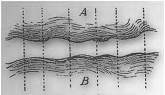
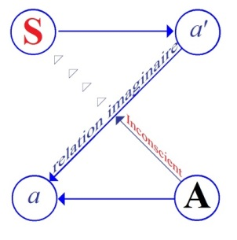

# Leçon 21 | 06 Juin 1956

  

    <label><input type="checkbox" data-lacan-toggle="original" checked> 原文</label>
    <label><input type="checkbox" data-lacan-toggle="notes" checked> 注释</label>
    <label><input type="checkbox" data-lacan-toggle="commentary" checked> 个人解读评论</label>
  

  <form class="lacan-tool-search" role="search">
    <input class="lacan-tool-search-input" type="search" placeholder="搜索全文" aria-label="搜索全文">
    <button class="lacan-tool-button" type="submit" title="搜索">搜索</button>
  </form>
  <button class="lacan-tool-button lacan-back-to-top" type="button" title="回到页面最上方" aria-label="回到页面最上方">↑</button>

<section class="parallel-paragraph" data-paragraph-ids="s3-21-0001">

s3-21-0001

原文 · s3-21-0001

Je vous ai indiqué en présence de quelle sorte de problème nous sommes. Pour être tout à fait précis : de savoir pourquoi, dans les phénomènes dits *hallucinatoires*, que rassemble SCHREBER…

[无对应译文]

</section>

<section class="parallel-paragraph" data-paragraph-ids="s3-21-0002">

s3-21-0002

原文 · s3-21-0002

> ceux dans lesquels à la fois s’expriment le trouble, un manque, et aussi, dans la perspective qui est la nôtre, proprement analytique, un effort de guérison, une restitution d’un monde comme psychotique

[无对应译文]

</section>

<section class="parallel-paragraph" data-paragraph-ids="s3-21-0003">

s3-21-0003

原文 · s3-21-0003

…pourquoi nous avons certaines *formes* dont j’ai indiqué la dernière fois en terminant que nous ne pouvions vraiment les saisir qu’à nous référer à quelque chose :

[无对应译文]

</section>

<section class="parallel-paragraph" data-paragraph-ids="s3-21-0004">

s3-21-0004

原文 · s3-21-0004

- qui soit des dimensions du discours,

[无对应译文]

</section>

<section class="parallel-paragraph" data-paragraph-ids="s3-21-0005">

s3-21-0005

原文 · s3-21-0005

- qui soit de ne pas méconnaître en quoi consiste cet acte privilégié qu’est l’acte de *la parole*, …à ne pas - pour tout dire - nous contenter de cette simple référence.

[无对应译文]

</section>

<section class="parallel-paragraph" data-paragraph-ids="s3-21-0006">

s3-21-0006

原文 · s3-21-0006

Le sujet entend-il avec son oreille quelque chose qui existe ou qui n’existe pas ? Il est bien évident que ça n’existe pas et que par conséquent c’est de l’ordre de *l’hallucination*, d’une perception fausse.

[无对应译文]

</section>

<section class="parallel-paragraph" data-paragraph-ids="s3-21-0007">

s3-21-0007

原文 · s3-21-0007

Est-ce que ceci doit nous suffire ? Est-ce que nous devons avoir à ce propos, cette sorte de conception massive de la réalité qui en somme n’aboutit qu’à une sorte d’explication mystérieuse, que dans le trou provoqué à la suite de ce que les analystes appellent le « *refus de percevoir* » dans la réalité, ce qui devrait surgir, *une tendance, une pulsion*, à ce moment repoussée, rejetée par le sujet, pourquoi dans ce trou apparaîtrait-il quelque chose d’aussi complexe, d’aussi architecturé, d’aussi riche que la parole ? Certainement, il y a déjà un progrès par rapport à la conception classique de la parole qui laisse le phénomène entièrement mystérieux. Il nous semble que nous pouvons aller plus loin et que pour dire, le phénomène de la psychose nous permet de restaurer le juste rapport qui est de plus en plus méconnu dans l’ensemble du travail analytique.

[无对应译文]

</section>

<section class="parallel-paragraph" data-paragraph-ids="s3-21-0008">

s3-21-0008

原文 · s3-21-0008

Le ressort tient tout entier dans le rapport du *signifiant* et du *signifié*.

[无对应译文]

</section>

<section class="parallel-paragraph" data-paragraph-ids="s3-21-0009">

s3-21-0009

原文 · s3-21-0009

Je rappelle quelques uns de ces phénomènes, dans le cas de *la psychose*, dans le cas du président SCHREBER. Je dis qu’il y a à un moment ce qu’on peut appeler à la fin de la période de grande perturbation, de grande dissolution de son monde extérieur, juste à la fin de cette période, et je dirai : s’enracinant dans cette période, nous voyons apparaître une certaine structuration de ces rapports avec ce qui est pour lui significatif.

[无对应译文]

</section>

<section class="parallel-paragraph" data-paragraph-ids="s3-21-0010">

s3-21-0010

原文 · s3-21-0010

Et cette structuration se présente en gros comme ceci : il y a toujours à toutes les époques, toutes les périodes de son expérience délirante, telle qu’il nous la rapporte de façon si saisissante dans cet ouvrage sans aucun doute unique dans les annales de la psychopathologie, il y a toujours en gros deux plans.

[无对应译文]

</section>

<section class="parallel-paragraph" data-paragraph-ids="s3-21-0011">

s3-21-0011

原文 · s3-21-0011

Ces deux plans se retrouvent indéfiniment subdivisés à l’intérieur de chacun d’eux. Mais l’effort même qu’il fait pour construire dans son monde délirant, pour toujours situer dans un rapport qui est un rapport d’abord antérieur, et puis un rapport qui est au-delà de celui-là, quelque chose qui lui est évidemment imposé par son expérience, nous guide sur quelque chose qui est véritablement foncier dans sa structure, et que je vous ai fait quelquefois dans la clinique toucher d’une façon très immédiate à propos des aveux, confidences du style de cet homme, l’interrogatoire du sujet délirant.

[无对应译文]

</section>

<section class="parallel-paragraph" data-paragraph-ids="s3-21-0012">

s3-21-0012

原文 · s3-21-0012

Dans un premier plan, c’est là que se produit quelque chose qui est une sorte de *glissement au cours de l’évolution* *de la psychose*. Nous voyons surtout des phénomènes qui sont considérés par le sujet comme neutralisés, comme régressant dans quelque chose qui signifie de moins en moins en face de lui un autre véritable.

[无对应译文]

</section>

<section class="parallel-paragraph" data-paragraph-ids="s3-21-0013">

s3-21-0013

原文 · s3-21-0013

Ce sont *des paroles* - dit-il très fréquemment - apprises par cœur, qu’on a *serinées* à ceux qui les lui répètent. Au reste ceux qui sont censés les lui répéter sont eux–mêmes des êtres qui ne savent pas ce qu’ils disent : des « *oiseaux du ciel* » - encore que le terme « *oiseau »* nous conduise au perroquet - ils ne jouent là qu’un rôle transmetteur de quelque chose de vide, de lassant pour le sujet, quelque chose qui l’épuise, qui n’est pas simplement à la limite de la signification, comme nous le verrons quand ces phénomènes sont d’abord naissants, mais qui en est plutôt contraire, *le résidu*, *le déchet*, *un corps vide*, et qui dans une autre forme se présente comme quelque chose aussi d’interrompu, qui s’arrête pour suggérer une suite, c’est-à-dire ce que comporte une phrase ou une trame signifiante en tant que telle, c’est-à-dire que l’unité au niveau du signifiant, l’unité pleine dans la phrase, fût-elle d’un mot, on ne peut dire que la phrase soit, même d’une façon signifiante, possible dans chacun de ses éléments repérée, sinon quand elle est achevée.

[无对应译文]

</section>

<section class="parallel-paragraph" data-paragraph-ids="s3-21-0014">

s3-21-0014

原文 · s3-21-0014

Ceci peut nous paraître aller un peu plus loin, un peu vite. Je vais tâcher aujourd’hui de vous en illustrer le sens par des exemples, parce que je crois que c’est là une chose très très importante. Dans ces *phrases arrêtées*, ces *phrases suspendues*, en général suspendues au moment où *le mot plein* de la phrase, qui lui donne son sens, *manque encore*, où il est impliqué. C’est dans le commentaire du sujet que nous trouvons que la phrase veut dire cela, ce que le sujet entend qui donne à la phrase tout son poids, son sens.

[无对应译文]

</section>

<section class="parallel-paragraph" data-paragraph-ids="s3-21-0015">

s3-21-0015

原文 · s3-21-0015

Les exemples ne manquent pas, je vous en ai déjà révélé plus d’un. Par exemple : « *Parlez-vous encore... *? », et la phrase s’arrête. Et ça veut dire : *parlez-vous encore des langues étrangères ?* Et ceci est toute une signification. Ce qu’on appelle la conception des âmes c’est tout ce dialogue beaucoup plus plein que les âmes échangent avec lui sur son propre sujet, nous faisant détecter des différents types de pensées :

[无对应译文]

</section>

<section class="parallel-paragraph" data-paragraph-ids="s3-21-0016">

s3-21-0016

原文 · s3-21-0016

- les pensées dessous,

[无对应译文]

</section>

<section class="parallel-paragraph" data-paragraph-ids="s3-21-0017">

s3-21-0017

原文 · s3-21-0017

- et les pensées de désir, toute une psychologie qui est celle qui s’échange à un niveau plus reculé, si on peut dire, avec quelque chose avec quoi il parle.

[无对应译文]

</section>

<section class="parallel-paragraph" data-paragraph-ids="s3-21-0018">

s3-21-0018

原文 · s3-21-0018

Quelque chose qui s’est d’abord manifesté par ses modes d’expression au sens plein, voire ineffable, mais eux très chargés, savoureux, qui a été ce qu’il semble avoir rencontré d’une façon assez proche au début de son délire, et qui de plus en plus s’éloigne, devient énigmatique, se situe, passe dans les plans en arrière, le Dieu ou les royaumes de Dieu d’au–delà, postérieurs, au niveau desquels se produisent ces surprenantes hallucinations, qui ne peuvent pas manquer de provoquer notre intérêt, notre arrêt, et qui est celle où dans la période plus avancée du délire, au moment où se sont multipliées les voix proches qui l’importunent, les voix qui l’énoncent, qui le connotent, qui l’interrogent mais d’une façon toujours absurde, on peut dire qu’en arrière de ces voix d’autres voix sont là qui s’expriment avec certaines formules saisissantes parmi lesquelles certaines que je vous ai déjà indiquées, d’autres que je vais vous donner aujourd’hui. Je vous en citerai une qui n’est pas des moins frappantes et que je vous ai déjà citée :

[无对应译文]

</section>

<section class="parallel-paragraph" data-paragraph-ids="s3-21-0019">

s3-21-0019

原文 · s3-21-0019

> « *Et maintenant manque la pensée principale.* »

[无对应译文]

</section>

<section class="parallel-paragraph" data-paragraph-ids="s3-21-0020">

s3-21-0020

原文 · s3-21-0020

Ou encore la *Gesinnung * : *Gesinnung* peut vouloir dire conviction et foi. C’est dans le second sens que le sujet l’interprète quand il dit que :

[无对应译文]

</section>

<section class="parallel-paragraph" data-paragraph-ids="s3-21-0021">

s3-21-0021

原文 · s3-21-0021

> « *La Gesinnung est quelque chose que nous devons à tout homme de bien, et aussi bien même au plus noir pêcheur, sous réserves des exigences de purification inhérentes à l’ordre de l’univers, que nous lui devons dans l’échange, dans cette sorte de référence qui est celle qui doit régler nos rapports avec les êtres humains.* »
>
> \[*Hin und wieder wurde auch und zwar in diesen Worten eingestanden : « Fehlt uns die Gesinnung », d. h. diejenige Gesinnung, die wir eigentlich jedem guten Menschen, ja selbst dem verworfensten Sünder gegenüber unter Vorbehalt der weltordnungsmäßigen Reinigungsmittel haben müßten*.\]

[无对应译文]

</section>

<section class="parallel-paragraph" data-paragraph-ids="s3-21-0022">

s3-21-0022

原文 · s3-21-0022

C’est bien là de *la foi* qu’il s’agit, *bonne foi* minimum qu’implique le fait que nous reconnaissons l’existence de l’Autre. Nous allons encore beaucoup plus loin à tel moment de ses hallucinations où nous avons l’expression vraiment très singulière :

[无对应译文]

</section>

<section class="parallel-paragraph" data-paragraph-ids="s3-21-0023">

s3-21-0023

原文 · s3-21-0023

> « *Avec mon consentement quelque chose doit être.* »

[无对应译文]

</section>

<section class="parallel-paragraph" data-paragraph-ids="s3-21-0024">

s3-21-0024

原文 · s3-21-0024

Ce n’est pas « *la solution* ». Ce n’est pas quelque chose extrêmement *facile à traduire*. C’est un mot rare, c’est un mot, dirai-je, après consultation de personnes qui s’y entendent, j’en étais arrivé à la notion qu’il s’agit de rien d’autre que ce que j’appelle « *le mot de base* ». C’est vraiment « *la clé* ». C’est peut-être quelque chose qui se rapproche de « *la solution* », mais c’est bien plutôt « *la cheville dernière* », « *le mot de base* ».

[无对应译文]

</section>

<section class="parallel-paragraph" data-paragraph-ids="s3-21-0025">

s3-21-0025

原文 · s3-21-0025

C’est un terme qui a une connotation très *particulière*, une connotation technique dans l’art de la chasse. Ce serait quelque chose que les chasseurs appellent de ce nom allemand usité en français, *les fumets*, c’est-à-dire les traces du gros bétail.

[无对应译文]

</section>

<section class="parallel-paragraph" data-paragraph-ids="s3-21-0026">

s3-21-0026

原文 · s3-21-0026

Bref, si nous nous arrêtons à ces choses très brièvement, je vous indique dans ce qui me parait être le relief essentiel, à savoir ce que j’ai appelé la dernière fois cette *migration du sens*, ou ce *recul du sens*, cette *dérobade du sens* sur un plan que le sujet est amené à situer comme arrière plan. D’autre part, cette opposition entre deux modes, deux styles, deux *portées* si on peut dire - j’emploie le mot « *portées* » parce qu’il est le plus proche d’un mot employé par *les linguistes* sous le nom de portée - ce pourrait être « *visées* » aussi, le style visé, *hallucinatoire*, en tant qu’elles concernent le sujet :

[无对应译文]

</section>

<section class="parallel-paragraph" data-paragraph-ids="s3-21-0027">

s3-21-0027

原文 · s3-21-0027

- ce style d’autre part problématique, cette sorte de scansion, d’interruption qui joue sur la propriété du signifiant comme tel, et une espèce de forme implicite au texte d’interrogation dont le sujet subit en quelque sorte, au sens le plus plein du terme, jusques et y compris son sens de contrainte.

[无对应译文]

</section>

<section class="parallel-paragraph" data-paragraph-ids="s3-21-0028">

s3-21-0028

原文 · s3-21-0028

Et puis *cette sorte de sens qui, lui, a pour nature de se dérober*, voire de s’accuser comme quelque chose qui se dérobe, mais qui - lui - serait *ce sens extrêmement plein*, un sens de la limite, et comme en quelque sorte aspirant par sa fuite, sa dérobade et par la poursuite qui, si le sujet expérimente, qui donnerait le cœur, le centre, *une espèce d’ombilic de tout le phénomène délirant,* *ceci appréhendé comme tel.*

[无对应译文]

</section>

<section class="parallel-paragraph" data-paragraph-ids="s3-21-0029">

s3-21-0029

原文 · s3-21-0029

Vous savez que ce terme d’« *ombilic »* que j’emploie est employé par FREUD et tout spécialement pour désigner un certain point où *le sens du rêve* semble s’achever dans une sorte de trou, de nœud au-delà duquel c’est vraiment au *cœur de l’être* que se rattache le phénomène du rêve lui-même. FREUD l’a exprimé en ces termes.

[无对应译文]

</section>

<section class="parallel-paragraph" data-paragraph-ids="s3-21-0030">

s3-21-0030

原文 · s3-21-0030

Pour cette description phénoménologique - elle n’est rien de plus - tâchez d’en tirer quelque chose, le *maximum*. Quant à ce dont il s’agit ici, je le souligne :

[无对应译文]

</section>

<section class="parallel-paragraph" data-paragraph-ids="s3-21-0031">

s3-21-0031

原文 · s3-21-0031

- c’est de trouver un mécanisme : l’explication,

[无对应译文]

</section>

<section class="parallel-paragraph" data-paragraph-ids="s3-21-0032">

s3-21-0032

原文 · s3-21-0032

- c’est de trouver un mécanisme : c’est à proprement parler se livrer à un travail d’analyse scientifique simplement portant sur quelque chose dont les registres, dont les différents modes de manifestations ne nous sont pas, en tant que médecins, et en tant que praticiens, familiers.

[无对应译文]

</section>

<section class="parallel-paragraph" data-paragraph-ids="s3-21-0033">

s3-21-0033

原文 · s3-21-0033

Et je suis là pour vous dire que la condition de familiarité avec cela est absolument essentielle pour que nous ne laissions pas toute entière glisser d’un seul côté toute l’expérience analytique et que nous n’en perdions pas littéralement le sens. Cette relation phénoménale est absolument essentielle à conserver. Elle tient toute entière dans cette distinction cent fois soulignée du *signifiant* et du *signifié*. À mesure que je la fais apparaître, sans aucun doute vous devez bien finir par vous dire :

[无对应译文]

</section>

<section class="parallel-paragraph" data-paragraph-ids="s3-21-0034">

s3-21-0034

原文 · s3-21-0034

> « *Mais en fin de compte, quand il nous parle de ce signifié et de ces significations, est-ce qu’il n’y a pas, toujours plus ou moins présent à l’intérieur, quelque chose qui est évidemment du signifiant ?* *Et toute l’expérience analytique ne nous montre-t-elle pas combien les significations qui sont celles qui orientent, polarisent l’expérience analytique, que ce signifiant est donné, et tout simplement par le corps propre ?*
>
> *Et inversement depuis quelque temps, est-ce que là quand nous parlons de signifiant, de ce signifiant dont tel élément peut*
>
> *en quelque sorte se trouver absent, ne fait-il pas là une sorte de tour de passe-passe dont il serait sensé avoir le secret,*
>
> *en fait de nous mettre au sommet du signifiant quelque chose qui est la signification la plus pleine et par conséquent*
>
> *de faire toujours passer sous je ne sais quelle muscade d’un registre dans l’autre pour les besoins de sa démonstration.* »

[无对应译文]

</section>

<section class="parallel-paragraph" data-paragraph-ids="s3-21-0035">

s3-21-0035

原文 · s3-21-0035

J’irai plus loin. J’accorderai qu’il y a en effet quelque chose qui est de cet ordre et qui est justement ce que je voudrais vous expliquer aujourd’hui. Car en fin de compte le problème est de vous faire sentir de la façon la plus vivante ce quelque chose dont tout de même vous devez avoir *l’intuition globale*, c’est que je vous ai montré certains phénomènes caractéristiques dans l’analyse de la pensée freudienne l’année dernière.

[无对应译文]

</section>

<section class="parallel-paragraph" data-paragraph-ids="s3-21-0036">

s3-21-0036

原文 · s3-21-0036

Par exemple, de tel ou tel phénomène de *la névrose* en l’illustrant par ces lettres \[α, β, γ, δ\] que certains ont retenues, ou encore cette année, à propos de *la psychose,* que vous devez sentir qu’il importe pour que vous en fassiez un élément toujours présent dans mon expérience comme dans notre pratique, c’est que :

[无对应译文]

</section>

<section class="parallel-paragraph" data-paragraph-ids="s3-21-0037">

s3-21-0037

原文 · s3-21-0037

- s’il y a *des significations élémentaires*,

[无对应译文]

</section>

<section class="parallel-paragraph" data-paragraph-ids="s3-21-0038">

s3-21-0038

原文 · s3-21-0038

- s’il y a ce quelque chose que nous appelons « *le désir* », ou « *les états* », ou « *les sentiments* », ou « *l’affectivité* », sans aucun doute assez vague, …ces *fluctuations*, ces *ombres*, voire ces *résonances*, c’est quelque chose à l’intérieur de quoi nous pouvons définir une certaine dynamique et une certaine économie.

[无对应译文]

</section>

<section class="parallel-paragraph" data-paragraph-ids="s3-21-0039">

s3-21-0039

原文 · s3-21-0039

Nous ne pouvons pas ne pas tenir compte de tout ce qui arrive, tout ce qui est à portée de notre main comme phénomène de ceci : c’est que tout aussi important que cette dynamique propre…

[无对应译文]

</section>

<section class="parallel-paragraph" data-paragraph-ids="s3-21-0040">

s3-21-0040

原文 · s3-21-0040

> à laquelle il manque tellement d’éléments pour que nous l’expliquions, souvent à laquelle nous sommes tellement forcés tout le temps d’introduire des espèces de présupposés, plus ou moins d’introduire
>
> en contrebande, quand nous nous mettons à expliquer les choses purement sur le plan de cette dynamique

[无对应译文]

</section>

<section class="parallel-paragraph" data-paragraph-ids="s3-21-0041">

s3-21-0041

原文 · s3-21-0041

…*il y a autre chose qui est* justement à proprement parler *ce plan du signifiant* :

[无对应译文]

</section>

<section class="parallel-paragraph" data-paragraph-ids="s3-21-0042">

s3-21-0042

原文 · s3-21-0042

- *en tant qu’il est structurant*,

[无对应译文]

</section>

<section class="parallel-paragraph" data-paragraph-ids="s3-21-0043">

s3-21-0043

原文 · s3-21-0043

- *en tant qu’il ne fait pas simplement que nous donner l’enveloppe*, *un récipient* de ce qui est en instance : *la signification*,

[无对应译文]

</section>

<section class="parallel-paragraph" data-paragraph-ids="s3-21-0044">

s3-21-0044

原文 · s3-21-0044

- *en tant qu’à proprement parler il la polarise, il la structure*, il l’installe dans l’existence.

[无对应译文]

</section>

<section class="parallel-paragraph" data-paragraph-ids="s3-21-0045">

s3-21-0045

原文 · s3-21-0045

Et que *sans cet ordre propre du signifiant* et une connaissance exacte de ses propriétés, quelque chose qui est simplement ce que nous commençons d’essayer ici d’articuler, de déchiffrer, *il est tout à fait impossible de comprendre quoi que ce soit*, je ne dis pas à la psychologie, il suffit de définir la psychologie, de la limiter d’une certaine façon pour que ceci ne devienne plus vrai, mais certainement pas *à l’expérience psychanalytique*.

[无对应译文]

</section>

<section class="parallel-paragraph" data-paragraph-ids="s3-21-0046">

s3-21-0046

原文 · s3-21-0046

*Cette opposition du signifiant et du signifié est*, vous le savez, *à la base de la théorie linguistique de* Ferdinand DE SAUSSURE. Elle a été exprimée quelque part dans l’un de ses chapitres explicatifs, dans le fameux *schéma des deux courbes*.

[无对应译文]

</section>

<section class="parallel-paragraph" data-paragraph-ids="s3-21-0047">

s3-21-0047

原文 · s3-21-0047

[无对应译文]

</section>

<section class="parallel-paragraph" data-paragraph-ids="s3-21-0048">

s3-21-0048

原文 · s3-21-0048

Il s’agit très précisément de ce dont je vous parle, à savoir du *signifiant* et du *signifié*, en ce sens que rien n’y est plus significatif même, que le flottement du vocabulaire saussurien. À ce niveau ici, il nous dit : « *nous avons la suite* *des pensées* », il le dit sans la moindre conviction, puisque précisément tout son développement de sa théorie consiste à réduire ce terme de « *pensées* » et à l’amener au terme beaucoup plus précis de *signifié*, en tant qu’il est distingué du *signifiant* et de *la chose*.

[无对应译文]

</section>

<section class="parallel-paragraph" data-paragraph-ids="s3-21-0049">

s3-21-0049

原文 · s3-21-0049

Le seul fait qu’il insiste sur le côté « *masse amorphe* » de ce dont il s’agit, que nous pouvons appeler provisoirement la « *masse sentimentale* » de ce qui se passe dans le courant du discours, dans le confus qu’il y a exprimé, où des unités apparaissent, des îlots, une image, un sentiment, un cri, un appel, mais quelque chose qui est fait d’*une suite*, d’*un continu.*

[无对应译文]

</section>

<section class="parallel-paragraph" data-paragraph-ids="s3-21-0050">

s3-21-0050

原文 · s3-21-0050

Et en dessous \[Chez Saussure\], *le signifiant* considéré comme pure chaîne du discours, comme succession de mots, et précisément en mettant au premier plan même dans *le signifiant*, que rien n’est isolable de cette chaîne. C’est ce que je voudrais vous montrer aujourd’hui par une expérience.

[无对应译文]

</section>

<section class="parallel-paragraph" data-paragraph-ids="s3-21-0051">

s3-21-0051

原文 · s3-21-0051

Hier soir, après une semaine où je cherchais dans des ouvrages comment faire sortir des références ce dont il s’agit, et qui est au premier plan pour nous : la différence éternelle du « *je* » et du « *moi* », j’ai cherché du côté *pronom personnel* si on ne pouvait pas vous imager dans la langue française...

[无对应译文]

</section>

<section class="parallel-paragraph" data-paragraph-ids="s3-21-0052">

s3-21-0052

原文 · s3-21-0052

- en quoi ce « *je* » et ce « *moi* » se distinguent et sont différents,

[无对应译文]

</section>

<section class="parallel-paragraph" data-paragraph-ids="s3-21-0053">

s3-21-0053

原文 · s3-21-0053

- en quoi justement *le sujet* peut perdre leur maîtrise, sinon perdre leur contact dans l’expérience de *la psychose*, ...un peu plus loin dans *la structure du terme* lui-même, car dès qu’on cherche *la notion de personne* et son fonctionnement, on va tout de suite au-delà, c’est-à-dire qu’on ne peut pas s’arrêter à cette incarnation pronominale, et c’est de la structure du terme comme tel qu’il s’agit.

[无对应译文]

</section>

<section class="parallel-paragraph" data-paragraph-ids="s3-21-0054">

s3-21-0054

原文 · s3-21-0054

Et c’est évidemment le terme qu’il faut aller chercher, au moins pour nos langues, ce dont il s’agit quand il s’agit de la personne du sujet. Tout ceci sans aucun doute assure les pas que je veux vous faire faire aujourd’hui. Je dirai qu’arrivé à hier soir, j’en avais une telle masse à cet égard de ma théorie, et étant donné les modes d’abord des linguistes dans des documents certains contradictoires, qui nécessiteraient tellement de plans pour vous montrer ce que ça veut dire, pourquoi tel auteur s’en est occupé... Bref, hier soir, reproduisant sur un papier cette double chaîne, ce double filet de la chaîne de discours prise dans son caractère purement verbal et notable de l’autre, en effet, c’est quelque chose dont nous avons bien le sentiment que c’est toujours fluide, toujours prêt à se défaire.

[无对应译文]

</section>

<section class="parallel-paragraph" data-paragraph-ids="s3-21-0055">

s3-21-0055

原文 · s3-21-0055

Nous savons, nous comme analystes plus que quiconque, ce qu’est cette expérience, ce qu’elle a d’insaisissable, combien lui-même peut hésiter avant de s’y lancer, est toujours prêt à y revenir, combien nous sentons qu’il y a là à la fois quelque chose d’irréductible et en même temps qui nous donne le plus authentiquement d’artifices pour essayer de vous dire ce que je crois qui nous permet de faire un pas en avant dans notre expérience, pour compléter ce que c’est, mais pour lui donner *un sens* vraiment utilisable.

[无对应译文]

</section>

<section class="parallel-paragraph" data-paragraph-ids="s3-21-0056">

s3-21-0056

原文 · s3-21-0056

Vous le savez, De SAUSSURE essaie de définir les segments et leur longueur dans lesquels peut en quelque façon se saisir une correspondance entre ces deux « *flots* ». Le seul fait que son expérience reste ouverte, c’est-à-dire laisse problématique la locution, la phrase entière, nous montre bien à la fois, et le sens de la méthode, et ses limites.

[无对应译文]

</section>

<section class="parallel-paragraph" data-paragraph-ids="s3-21-0057">

s3-21-0057

原文 · s3-21-0057

Eh bien, je reprends quelque chose et je me dis ceci : sur quoi allons nous partir pour prendre une expérience ? Je cherche une phrase, et un peu à la manière d’un personnage qui recréait la démarche poétique, et qui n’ayant rien à dire, rien à écrire, se promenait de long en large en commençant par dire « *To be or not to be* », et il restait là longtemps suspendu, jusqu’à ce qu’il trouve la suite en reprenant le début de la phrase : « *To be or not to be* ».

[无对应译文]

</section>

<section class="parallel-paragraph" data-paragraph-ids="s3-21-0058">

s3-21-0058

原文 · s3-21-0058

Je commence donc par un « *Oui* », et comme je ne suis pas anglophone mais de langue française, ce qui me vient après c’est : « *Oui, je viens dans son temple adorer l’Éternel* » Ce qui veut dire que *le signifiant* n’est pas isolable. C’est très facile à toucher du doigt tout de suite. Si vous arrêtez cela à « *oui, je* », pourquoi pas ? Si vous aviez une oreille véritablement semblable à une machine, à chaque instant le déroulement de la phrase suivrait un sens, et « *oui, je* » a un sens.

[无对应译文]

</section>

<section class="parallel-paragraph" data-paragraph-ids="s3-21-0059">

s3-21-0059

原文 · s3-21-0059

C’est même probablement de cela qu’il s’agit dans la portée de ce texte. Tout le monde se demande pourquoi le rideau se lève sur ce « *oui, je viens*... ». On dit : c’est la conversation qui continue. C’est d’abord parce que *ça fait sens* ! Et je dirai que - sans vouloir empiéter sur ce que nous allons voir, c’est-à-dire l’autre côté de la question - ce « *oui* » inaugural a bel et bien *un sens*, qui est justement lié à cette espèce d’ambiguïté qui reste dans le mot « *oui* » en français.

[无对应译文]

</section>

<section class="parallel-paragraph" data-paragraph-ids="s3-21-0060">

s3-21-0060

原文 · s3-21-0060

Vous savez très bien qu’il ne suffit pas de raconter l’histoire de la femme du monde pour nous apercevoir que « *oui* » veut quelquefois dire « *non* », et que quelquefois « *non* » veut dire « *peut-être* ». Le « *oui* » en français apparaît tard, après le « *si* », après le « *da* » que nous retrouvons gentiment dans notre époque sous le mot « *dac* ». Le « *oui* » est quelque chose de bien particulier, et du fait qu’il vient de quelque chose qui veut dire « *comme c’est bien ça* », le « *oui* » est en général *confirmation*, pour le moins une *concession*, le plus souvent un « *oui, mais* » est bien dans le style.

[无对应译文]

</section>

<section class="parallel-paragraph" data-paragraph-ids="s3-21-0061">

s3-21-0061

原文 · s3-21-0061

Si vous n’oubliez pas quel est le personnage qui se présente là en se poussant lui-même un tout petit peu, c’est le nommé ABNER : « *oui*... » est bien, là, au début, « ...*je viens dans son temple*... ». Il est clair qu’une phrase n’existe qu’achevée, car son anticipé, par lequel nous allons enfin savoir après coup, nécessite à tout prix que nous soyons arrivés tout à fait jusqu’au bout, c’est-à-dire du côté de ce fameux « *Éternel »* qui est là, Dieu sait pourquoi, mais à vrai dire si vous vous souvenez de quoi il s’agit, à savoir un officier de la reine, de la nommée ATHALIE[^31] qui donne son titre à la petite histoire, et qui domine assez tout ce qui se passe pour en être le personnage effectivement principal, le fait qu’un personnage commence par dire : « *Oui, je viens dans son temple*… », on ne sait pas du tout où ça va aller, et ça peut aussi bien se terminer par n’importe quoi : « ...*je viens dans son temple arrêter le grand Prêtre*... », par exemple.

[无对应译文]

</section>

<section class="parallel-paragraph" data-paragraph-ids="s3-21-0062">

s3-21-0062

原文 · s3-21-0062

Il faut vraiment que ce soit terminé pour qu’on sache de quoi il s’agit. Nous sommes dans *l’ordre des signifiants*. J’espère vous avoir fait sentir ce que c’est que *la continuité du signifiant*, à savoir que dans *une unité signifiante*, se prend au bout *une certaine boucle* bouclée qui situe les différents éléments du signifiant.

[无对应译文]

</section>

<section class="parallel-paragraph" data-paragraph-ids="s3-21-0063">

s3-21-0063

原文 · s3-21-0063

C’était là-dessus que je m’étais un instant arrêté, et à vrai dire tout ce que je viens de vous raconter ne me paraît signifier grand-chose, cette petite amorce a un intérêt beaucoup plus grand, c’est qu’elle m’a fait apercevoir que la scène toute entière est une très jolie occasion de vous faire sentir d’une façon beaucoup plus efficace et beaucoup plus pleine, là où toujours en fin de compte les psychologues s’arrêtent, parce que bien entendu leur fonction étant de comprendre quelque chose à laquelle ils ne comprennent rien, et que les linguistes s’arrêtent parce que, ayant une méthode merveilleuse entre les mains, ils n’osent pas la pousser jusqu’au bout. Nous allons essayer, nous, de passer entre les deux, et d’aller un peu plus loin.

[无对应译文]

</section>

<section class="parallel-paragraph" data-paragraph-ids="s3-21-0064">

s3-21-0064

原文 · s3-21-0064

JOAD, le grand prêtre, est en train de mijoter le petit complot qui va aboutir à la montée sur le trône de son fils adoptif qu’il a dérobé au massacre à l’âge de deux mois et demi, et élevé dans une profonde retraite, il écoute ABNER. Évidemment, vous supposez dans quels sentiments il écoute cette déclaration :

[无对应译文]

</section>

<section class="parallel-paragraph" data-paragraph-ids="s3-21-0065">

s3-21-0065

原文 · s3-21-0065

« *Oui, je viens dans son temple adorer l’Éternel* ».

[无对应译文]

</section>

<section class="parallel-paragraph" data-paragraph-ids="s3-21-0066">

s3-21-0066

原文 · s3-21-0066

Et le vieux peut bien se dire en écho : « *Qu’est-ce qu’il vient faire ?* ». Et en effet, le thème continue :

[无对应译文]

</section>

<section class="parallel-paragraph" data-paragraph-ids="s3-21-0067">

s3-21-0067

原文 · s3-21-0067

> «*Oui, je viens dans son temple adorer l’Éternel.*
>
> *Je viens, selon l’usage antique et solennel,*
>
> *Célébrer avec vous la fameuse journée,*
>
> *où sur le Mont Sinaï la loi nous fut donnée.* »

[无对应译文]

</section>

<section class="parallel-paragraph" data-paragraph-ids="s3-21-0068">

s3-21-0068

原文 · s3-21-0068

Bref, on en cause. Et après que *l’Éternel* ait été laissé là un peu en plan - on n’en parlera plus jamais, jusqu’à la fin de la pièce - on évoque des souvenirs, c’était le bon temps :

[无对应译文]

</section>

<section class="parallel-paragraph" data-paragraph-ids="s3-21-0069">

s3-21-0069

原文 · s3-21-0069

« *Le Peuple Saint en foule inondait les portiques*. »

[无对应译文]

</section>

<section class="parallel-paragraph" data-paragraph-ids="s3-21-0070">

s3-21-0070

原文 · s3-21-0070

Enfin les choses ont bien changé :

[无对应译文]

</section>

<section class="parallel-paragraph" data-paragraph-ids="s3-21-0071">

s3-21-0071

原文 · s3-21-0071

« ...*d’adorateurs zélés à peine un petit nombre* »

[无对应译文]

</section>

<section class="parallel-paragraph" data-paragraph-ids="s3-21-0072">

s3-21-0072

原文 · s3-21-0072

Là nous commençons à voir le bout, « *un petit nombre d’adorateurs* ». Nous commençons à comprendre de quoi il retourne. C’est un type qui pense que c’est le moment de rejoindre la Résistance. Alors là, nous sommes sur le plan de *la signification*. C’est-à-dire que pendant que *le signifiant* poursuit son petit chemin, « *adorateurs zélés* » indique ce dont il s’agit.

[无对应译文]

</section>

<section class="parallel-paragraph" data-paragraph-ids="s3-21-0073">

s3-21-0073

原文 · s3-21-0073

Et bien entendu, l’oreille du grand prêtre n’est pas - nous l’imaginons bien - sans recueillir ce zèle au passage...

[无对应译文]

</section>

<section class="parallel-paragraph" data-paragraph-ids="s3-21-0074">

s3-21-0074

原文 · s3-21-0074

> zèle vient du grec et veut dire quelque chose comme *émulation, rivalité, imitation* \[du grec ζῆλος « jalousie, ferveur »\]

[无对应译文]

</section>

<section class="parallel-paragraph" data-paragraph-ids="s3-21-0075">

s3-21-0075

原文 · s3-21-0075

...parce qu’on ne gagne à ce jeu évidemment qu’à faire ce qu’il convient, à se mettre *au semblant des autres*. Bref, *la pointe* apparaît à la fin du premier discours, à savoir que :

[无对应译文]

</section>

<section class="parallel-paragraph" data-paragraph-ids="s3-21-0076">

s3-21-0076

原文 · s3-21-0076

> « *Je tremble qu’Athalie, à ne vous rien cacher,*
>
> *Vous-même de l’autel vous faisant arracher,*
>
> *N’achève enfin sur vous ses vengeances funestes, etc.* »

[无对应译文]

</section>

<section class="parallel-paragraph" data-paragraph-ids="s3-21-0077">

s3-21-0077

原文 · s3-21-0077

Là, nous voyons surgir un mot qui a beaucoup d’importance, « *tremble* » - c’est le même mot étymologiquement que « *craindre* », et nous allons voir la crainte apparaître. Il est certain qu’il y a là quelque chose qui montre la pointe significative du discours, c’est-à-dire apporter une indication qui a double sens. Si nous nous plaçons au niveau du registre supérieur, à savoir ce dont il s’agit dans ce que SAUSSURE appelle « *la masse amorphe des pensées* » : ce n’est pas simplement une masse amorphe parce qu’il faut que l’autre la devine, elle est en soi une masse amorphe. Nous allons le voir dans la suite. ABNER est là, zélé sans aucun doute, mais d’un autre côté quand tout à l’heure le grand prêtre va le prendre un peu à la gorge et va lui dire :

[无对应译文]

</section>

<section class="parallel-paragraph" data-paragraph-ids="s3-21-0078">

s3-21-0078

原文 · s3-21-0078

> « *Pas tant d’histoires, de quoi retourne-t-il ?*
>
> *À quoi convient-il qu’on reconnaisse ceux qui sont vraiment autre chose que des zélés ?* »

[无对应译文]

</section>

<section class="parallel-paragraph" data-paragraph-ids="s3-21-0079">

s3-21-0079

原文 · s3-21-0079

ABNER va bien montrer combien après tout les choses sont embarrassantes : depuis cette chute très grande de celle qui s’est manifestée, Dieu n’a pas donné beaucoup de preuves de sa puissance, par contre celle d’ATHALIE et des siens s’est manifestée, jusqu’alors toujours triomphante.

[无对应译文]

</section>

<section class="parallel-paragraph" data-paragraph-ids="s3-21-0080">

s3-21-0080

原文 · s3-21-0080

De sorte que lorsqu’il aborde cette sorte de nouvelle menace, nous ne savons pas très bien où il veut en venir. C’est à double tranchant : c’est aussi bien un avertissement, un bon conseil, un conseil de prudence, voire un conseil de ce qu’on appelle sagesse. L’autre a des réponses beaucoup plus brèves. Il a beaucoup de raisons pour cela, et principalement il est le plus fort, lui a *l’atout maître* si on peut dire :

[无对应译文]

</section>

<section class="parallel-paragraph" data-paragraph-ids="s3-21-0081">

s3-21-0081

原文 · s3-21-0081

« *D’où vous vient aujourd’hui* - répond-il simplement - *ce noir pressentiment ?* »

[无对应译文]

</section>

<section class="parallel-paragraph" data-paragraph-ids="s3-21-0082">

s3-21-0082

原文 · s3-21-0082

Et le signifiant colle parfaitement avec le signifié. Mais vous pouvez voir qu’il ne livre strictement rien de ce que le personnage a à dire. Là-dessus nouveau développement d’ABNER qui commence, ma foi, à entrer un peu plus dans le jeu significatif, mélange de pommade : « Pensez-v*ous être Saint et Juste inpunément* », et de cafardage qui consiste à nous raconter qu’il y a un certain MATHAN qui, lui, est de toute façon indominable s’il ne s’avance pas très loin dans la dénonciation de la superbe ATHALIE, qui reste quand même sa reine. Il y a là un bouc émissaire qui se trouve très bien à sa place pour continuer l’*amorçage* si on peut dire.

[无对应译文]

</section>

<section class="parallel-paragraph" data-paragraph-ids="s3-21-0083">

s3-21-0083

原文 · s3-21-0083

On ne sait toujours pas à quoi on veut en venir, si ce n’est :

[无对应译文]

</section>

<section class="parallel-paragraph" data-paragraph-ids="s3-21-0084">

s3-21-0084

原文 · s3-21-0084

> « *Croyez-moi, plus j’y pense, et moins je puis en douter,*
>
> *Que sur vous son courroux ne soit prêt d’éclater*. »
>
> « *Je l’observais hier* - nous voilà sur le plan de l’officier de renseignement - *et je voyais ses yeux*
>
> *lancer sur le Lieu Saint des regards furieux*… »

[无对应译文]

</section>

<section class="parallel-paragraph" data-paragraph-ids="s3-21-0085">

s3-21-0085

原文 · s3-21-0085

Je voudrais vous faire remarquer qu’après tout ces bons procédés qu’ABNER donne en gage au cours de cette scène, si nous restons sur le plan de la signification, à la fin de la scène, il ne se sera, si l’on peut dire, rien passé. Tout peut se résumer, si nous restons sur le plan de la signification, en ceci : quelques amorces. Chacun en sait un petit peu plus long que ce qu’il est prêt à affirmer.

[无对应译文]

</section>

<section class="parallel-paragraph" data-paragraph-ids="s3-21-0086">

s3-21-0086

原文 · s3-21-0086

L’un en sait évidemment beaucoup plus long, c’est JOAD, et il ne donne qu’une allusion, pas plus, pour aller à la rencontre de ce que l’autre prétend savoir : qu’il y a anguille sous roche, autrement dit un ELIACIN dans le sanctuaire. Il sait en effet ce quelque chose qui est de l’ordre d’une communication. Mais puisque vous avez les témoignages tout à fait vifs et même saisissants de la façon véritablement précipitée dont le nommé ABNER saute sur l’allusion, je dirais presque l’appel, incitant sa fureur :

[无对应译文]

</section>

<section class="parallel-paragraph" data-paragraph-ids="s3-21-0087">

s3-21-0087

原文 · s3-21-0087

« *Ah ! si dans sa fureur elle s’était trompée* », dit-il plus tard,

[无对应译文]

</section>

<section class="parallel-paragraph" data-paragraph-ids="s3-21-0088">

s3-21-0088

原文 · s3-21-0088

c’est-à-dire : « *Avait-elle loupé une partie de massacre ?* », c’est-à-dire : « *S’il restait quelqu’un de cette fameuse famille de David ?* ».

[无对应译文]

</section>

<section class="parallel-paragraph" data-paragraph-ids="s3-21-0089">

s3-21-0089

原文 · s3-21-0089

Cette offre montre déjà assez que si ABNER vient là, c’est attiré par la chair fraîche. Il n’en sait en fin de compte ni plus ni moins à la fin du dialogue qu’au début, et cette première scène pourrait, pour se révéler avec sa plénitude significative et sa totale efficacité, se résumer à ceci : « *Je viens à la Fête-Dieu* ».

[无对应译文]

</section>

<section class="parallel-paragraph" data-paragraph-ids="s3-21-0090">

s3-21-0090

原文 · s3-21-0090

> « *Très bien* - dit l’autre - *passez, rentrez dans la procession et ne parlez pas dans les rangs.* »

[无对应译文]

</section>

<section class="parallel-paragraph" data-paragraph-ids="s3-21-0091">

s3-21-0091

原文 · s3-21-0091

Ce n’est pas cela du tout, à une seule condition, c’est que vous vous aperceviez du rôle du *signifiant*. Si vous vous apercevez du rôle du *signifiant*, vous verrez ceci, c’est qu’il y a un certain nombre de mots essentiels, de mots-clés, qui sont sous-jacents au discours des personnages et qui se recouvrent en partie. Il y a le mot « *trembler* », le mot « *crainte* », le mot « *extermination* ». Les mots « *trembler* » et « *crainte* » sont employés d’abord par ABNER. Il nous a menés jusqu’au point que je viens de vous indiquer, c’est-à-dire au moment où JOAD prend à proprement dit la parole. Il prend la parole et voici les premiers vers :

[无对应译文]

</section>

<section class="parallel-paragraph" data-paragraph-ids="s3-21-0092">

s3-21-0092

原文 · s3-21-0092

> « *Celui qui met un frein à la fureur des flots*
>
> *Sait aussi des méchants arrêter les complots.*
>
> *Soumis avec respect à sa volonté sainte,*
>
> *Je crains Dieu, cher Abner, et n’ai point d’autre crainte*. »

[无对应译文]

</section>

<section class="parallel-paragraph" data-paragraph-ids="s3-21-0093">

s3-21-0093

原文 · s3-21-0093

Il continue et engage des choses sur ceci :

[无对应译文]

</section>

<section class="parallel-paragraph" data-paragraph-ids="s3-21-0094">

s3-21-0094

原文 · s3-21-0094

> « *Je crains Dieu, dites-vous* - lui renvoie-t-il, alors qu’il n’a jamais dit cela ABNER - *sa vérité me touche,*
>
> *Voici comment ce Dieu vous répond par ma bouche *: »

[无对应译文]

</section>

<section class="parallel-paragraph" data-paragraph-ids="s3-21-0095">

s3-21-0095

原文 · s3-21-0095

Et nous voyons paraître ici le mot que je vous ai signalé au début, le mot « *zèle* » :

[无对应译文]

</section>

<section class="parallel-paragraph" data-paragraph-ids="s3-21-0096">

s3-21-0096

原文 · s3-21-0096

> «  *Du zèle de ma loi que sert de vous parer ?*
>
> *Par de stériles vœux pensez-vous m’honorer ?*
>
> *Quel fruit me revient-il de tous vos sacrifices ?*
>
> \[...\]
>
> *Du milieu de mon peuple exterminez les crimes,*

[无对应译文]

</section>

<section class="parallel-paragraph" data-paragraph-ids="s3-21-0097">

s3-21-0097

原文 · s3-21-0097

Reprise du thème « *extermination* ».

[无对应译文]

</section>

<section class="parallel-paragraph" data-paragraph-ids="s3-21-0098">

s3-21-0098

原文 · s3-21-0098

> *Et vous viendrez alors m’immoler vos victimes.* »

[无对应译文]

</section>

<section class="parallel-paragraph" data-paragraph-ids="s3-21-0099">

s3-21-0099

原文 · s3-21-0099

Les victimes dont il s’agit, il ne faudrait pas croire que ce sont d’innocentes victimes sous des formes plus ou moins fixes dans des lieux appropriés. Quand ABNER fait remarquer que :

[无对应译文]

</section>

<section class="parallel-paragraph" data-paragraph-ids="s3-21-0100">

s3-21-0100

原文 · s3-21-0100

> « *L’arche sainte est muette, et ne rend plus d’oracles.* »

[无对应译文]

</section>

<section class="parallel-paragraph" data-paragraph-ids="s3-21-0101">

s3-21-0101

原文 · s3-21-0101

On lui rétorque vivement que :

[无对应译文]

</section>

<section class="parallel-paragraph" data-paragraph-ids="s3-21-0102">

s3-21-0102

原文 · s3-21-0102

> «  *...toujours les plus grandes merveilles*
>
> *Sans ébranler ton cœur frapperont tes oreilles ?*
>
> *Faut-il, Abner, faut-il vous rappeler le cours*
>
> *Des prodiges fameux accomplis en nos jours ?*
>
> \[...\]
>
> *L’impie Achab détruit, et de son sang trempé*
>
> *Le champ que par le meurtre il avait usurpé ;*
>
> *Près de ce champ fatal Jézabel immolée,*
>
> *Sous les pieds des chevaux cette reine foulée,*
>
> *Dans son sang inhumain les chiens désaltérés,*
>
> *Et de son corps hideux les membres déchirés ;* ».

[无对应译文]

</section>

<section class="parallel-paragraph" data-paragraph-ids="s3-21-0103">

s3-21-0103

原文 · s3-21-0103

Nous savons donc de quelle sorte de victime il va s’agir. Donc ce qu’il vient de nous dire deux vers auparavant, est annoncé au moment où on dit que *Dieu n’est pas là*, n’intervient pas, nous avons la phrase :

[无对应译文]

</section>

<section class="parallel-paragraph" data-paragraph-ids="s3-21-0104">

s3-21-0104

原文 · s3-21-0104

> « *Faut-il, Abner, faut-il vous rappeler le cours*
>
> *Des prodiges fameux accomplis en nos jours ?* »

[无对应译文]

</section>

<section class="parallel-paragraph" data-paragraph-ids="s3-21-0105">

s3-21-0105

原文 · s3-21-0105

Voici les deux vers que j’ai sautés tout à l’heure :

[无对应译文]

</section>

<section class="parallel-paragraph" data-paragraph-ids="s3-21-0106">

s3-21-0106

原文 · s3-21-0106

> « *Des tyrans d’Israël les célèbres disgrâces,*
>
> *Et Dieu trouvé fidèle en toutes ses menaces ;* »

[无对应译文]

</section>

<section class="parallel-paragraph" data-paragraph-ids="s3-21-0107">

s3-21-0107

原文 · s3-21-0107

Bref, quel est le rôle de ce que j’appelle la fonction du signifiant ? C’est très précisément la distinction qui existe entre la peur, avec ce qu’elle a de particulièrement ambivalent et flottant, à savoir que, comme nous autres analystes ne l’ignorons pas, c’est aussi bien quelque chose qui vous pousse en avant et quelque chose qui vous tire en arrière, c’est quelque chose qui fait de vous essentiellement *un être double* et qui quand vous l’exprimez devant un personnage avec qui vous voulez jouer à avoir peur ensemble, vous met à chaque instant dans la posture de quelqu’un qui est lui, qui est vous.

[无对应译文]

</section>

<section class="parallel-paragraph" data-paragraph-ids="s3-21-0108">

s3-21-0108

原文 · s3-21-0108

Mais en face de cela, il y a quelque chose qui est synonyme et qui s’appelle *la crainte de Dieu*. C’est de cela que JOAD parle au moment très précis où on avertit JOAD d’un danger, JOAD sort de sa poche le signifiant qui, lui, est plutôt rigide, et lui explique ce que c’est que *la crainte de Dieu*.

[无对应译文]

</section>

<section class="parallel-paragraph" data-paragraph-ids="s3-21-0109">

s3-21-0109

原文 · s3-21-0109

*La crainte de Dieu*, je voudrais vous faire remarquer que ce terme *culturel*, absolument essentiel dans une certaine ligne de pensée religieuse dont vous auriez tort de croire que c’est simplement la ligne générale. *La crainte de Dieu* ou *La crainte des Dieux* dont LUCRÈCE veut libérer ses petits camarades, c’est tout à fait autre chose. C’est quelque chose d’infiniment plus multiforme, plus confus, plus panique, que cette *crainte de Dieu* sur laquelle une tradition qui remonte à SALOMON, est fondée, comme le principe et le commencement d’une sagesse, et qui plus est, bien plus que toute une tradition qui est très précisément la nôtre.

[无对应译文]

</section>

<section class="parallel-paragraph" data-paragraph-ids="s3-21-0110">

s3-21-0110

原文 · s3-21-0110

Mais au fondement même de l’amour de Dieu, *la crainte de Dieu*, c’est *un signifiant* qui ne traîne pas partout. Il a fallu quelqu’un pour inventer cela, proposer aux hommes, comme remède à un monde fait de terreurs multiples, la crainte d’un être qui ne peut après tout pas exercer ses sévices d’une autre façon, très précisément que ceux qui sont là, multiplement présents dans la vie humaine, c’est-à-dire remplacer les innombrables craintes par « *la crainte* », qui n’a dans le fond, aucun autre moyen de manifester sa puissance précisément que ce qui est craint derrière ces innombrables craintes.

[无对应译文]

</section>

<section class="parallel-paragraph" data-paragraph-ids="s3-21-0111">

s3-21-0111

原文 · s3-21-0111

Vous me direz : « *Voilà bien une idée de curé !* » Eh bien, vous avez tort ! Les curés n’ont absolument rien inventé dans ce genre. Pour inventer une chose pareille il faut être poète ou prophète. Autrement dit c’est précisément dans la mesure où ce JOAD l’est un peu, au moins par la grâce de RACINE, qu’il peut user de la façon dont il use, de l’introduction, si je puis dire, de ce signifiant majeur et primordial.

[无对应译文]

</section>

<section class="parallel-paragraph" data-paragraph-ids="s3-21-0112">

s3-21-0112

原文 · s3-21-0112

Je n’ai pas pu vous indiquer l’histoire culturelle de ce signifiant, mais :

[无对应译文]

</section>

<section class="parallel-paragraph" data-paragraph-ids="s3-21-0113">

s3-21-0113

原文 · s3-21-0113

- qu’il faille le situer et qu’il ne soit à proprement parler situé dans cette histoire,

[无对应译文]

</section>

<section class="parallel-paragraph" data-paragraph-ids="s3-21-0114">

s3-21-0114

原文 · s3-21-0114

- que ce soit quelque chose qui soit absolument inséparable d’une certaine structuration

[无对应译文]

</section>

<section class="parallel-paragraph" data-paragraph-ids="s3-21-0115">

s3-21-0115

原文 · s3-21-0115

> qui est celle-là et pas n’importe laquelle,

[无对应译文]

</section>

<section class="parallel-paragraph" data-paragraph-ids="s3-21-0116">

s3-21-0116

原文 · s3-21-0116

- qu’en soi-même, je vous l’ai suffisamment indiqué, ce soit le signifiant qui domine la chose, car pour ce qui est des significations, elles ont complètement changé.

[无对应译文]

</section>

<section class="parallel-paragraph" data-paragraph-ids="s3-21-0117">

s3-21-0117

原文 · s3-21-0117

Cette fameuse *crainte de Dieu* et ce qui en fait précisément le tour de passe-passe, c’est qu’elle transforme d’une minute à l’autre toutes les craintes en un parfait courage, toutes les craintes - « *Je n’ai point d’autre crainte*... » - sont échangées contre ce quelque chose qui s’appelle *la crainte de Dieu*, et qui est exactement le contraire d’une crainte, si contraignant que ce soit. Et à la fin de la scène ce qui s’est passé, c’est très exactement ceci, c’est que *la crainte de Dieu*, avec l’aspect que nous venons de dire, le nommé JOAD l’a passée à l’autre, et comme il faut, par le bon côté et sans douleur.

[无对应译文]

</section>

<section class="parallel-paragraph" data-paragraph-ids="s3-21-0118">

s3-21-0118

原文 · s3-21-0118

Et ABNER s’en va, tout à fait solide, avec ce mot qui fait écho à ce Dieu « *fidèle en toutes ses menaces* ». Il ne s’agit plus de zèle. À ce moment là il va se joindre à la troupe fidèle. Bref, il est devenu lui-même à partir de ce moment-là, le support, le sujet enfilé sur très précisément *l’amorce*, ou *l’hameçon*, où va venir se crocher la Reine, car toute la pièce à ce moment-là est déjà jouée, est finie, c’est dans toute la mesure où ABNER ne dira pas un mot des dangers véritables que court la Reine, que la Reine va se prendre à ce crochet, à cet hameçon que désormais il représente.

[无对应译文]

</section>

<section class="parallel-paragraph" data-paragraph-ids="s3-21-0119">

s3-21-0119

原文 · s3-21-0119

L’important là-dedans c’est ceci : que de par la vertu du signifiant, c’est-à-dire de ce mot « *crainte* », dont si vous voulez l’efficace a été de transformer le zèle du début dans la fidélité de la fin, mais par une transmutation qui est à proprement parler de l’ordre du signifiant comme tel, c’est-à-dire de quelque chose qu’aucune accumulation, qu’aucune superposition, aucune somme de significations prise dans leur ensemble ne peut suffire à se justifier, c’est dans cette transmutation de la situation par l’intervention du signifiant comme tel que réside le progrès de ce dialogue qui fait passer un personnage du zèle avec tout ce mot comporte ici d’ambigu, voire de douteux, voire de toujours prêt à tous les retournements, cette scène serait, autrement dit, une scène de « *deuxième bureau* »[^32] s’il n’y avait pas cet usage du signifiant par le Grand prêtre, ce que j’appelle *la fonction du signifiant* dans un discours quelconque, qu’il s’agisse d’un texte sacré, d’un roman, d’un drame, d’un monologue ou de n’importe quelle conversation, est quelque chose que vous me permettrez de représenter par une sorte d’artifice, de comparaison spatialisante.

[无对应译文]

</section>

<section class="parallel-paragraph" data-paragraph-ids="s3-21-0120">

s3-21-0120

原文 · s3-21-0120

Mais nous n’avons aucune raison de nous en priver par ce quelque chose qui est le véritable point central autour de quoi doit s’exercer toute analyse concrète du discours. Je l’appellerai un « *point de capiton* », et cette sorte d’*aiguille* *de matelassier* qui est entrée au moment : « *Dieu fidèle dans toutes ses menaces*... », qui ressort, et le gars dit « *Je vais me joindre à la troupe fidèle*... », c’est là le point de passage où nous est indiqué ce qui, si nous analysions cette scène comme on pourrait l’analyser, comme une partition musicale, c’est le point où vient se nouer :

[无对应译文]

</section>

<section class="parallel-paragraph" data-paragraph-ids="s3-21-0121">

s3-21-0121

原文 · s3-21-0121

- ce qui est de l’ordre de « *cette masse amorphe* » et toujours flottante *des significations* de ce qui se passe réellement entre ces deux personnages,

[无对应译文]

</section>

<section class="parallel-paragraph" data-paragraph-ids="s3-21-0122">

s3-21-0122

原文 · s3-21-0122

- et *ce quelque chose* qui le relie à ce texte purement admirable qui fait qu’au lieu que ce soit une pièce de boulevard, c’est très précisément une tragédie racinienne.

[无对应译文]

</section>

<section class="parallel-paragraph" data-paragraph-ids="s3-21-0123">

s3-21-0123

原文 · s3-21-0123

Et le mot « *crainte* » est ce signifiant, avec toutes ses connotations trans–significatives, qui est *le quelque chose* autour de quoi tout s’irradie, tout s’organise, à la façon si vous voulez de toutes ces petites lignes de forces qui sont formées à la surface d’une trame par le « *point de capiton* » : ce sont là les points de convergence qui permettent de situer à la fois rétroactivement et prospectivement tout ce qui se passe dans ce sens dans ce discours.

[无对应译文]

</section>

<section class="parallel-paragraph" data-paragraph-ids="s3-21-0124">

s3-21-0124

原文 · s3-21-0124

Eh bien, cette notion, cette idée, ce schéma, cette image du « *point de capiton* », c’est de cela qu’il s’agit quand il s’agit de l’expérience humaine, et à proprement parler de minimum de schéma de l’expérience humaine que FREUD nous a donnée dans le *complexe d’Œdipe*, qui garde pour nous sa valeur complètement irréductible, et est malgré tout on peut dire « *énigmatique »* pour tous ceux qui s’en sont approchés.

[无对应译文]

</section>

<section class="parallel-paragraph" data-paragraph-ids="s3-21-0125">

s3-21-0125

原文 · s3-21-0125

Pourquoi, après tout, cette valeur absolument privilégiée autour du *complexe d’Œdipe* ? Pourquoi ce fait que FREUD veut toujours, avec tellement d’insistance, retrouver ? Pourquoi est-ce là pour lui ce nœud qui lui paraît le nœud essentiel de tout le progrès de sa pensée, au point qu’il ne peut l’abandonner, même pas dans la moindre observation particulière, si ce n’est parce que la notion de « *Père* », qui est très voisine de la notion de « *crainte de Dieu* », est quelque chose qui lui donne l’élément essentiel le plus sensible dans l’expérience de ce que j’ai appelé « *point de capiton* » entre *le signifiant* et *le signifié*.

[无对应译文]

</section>

<section class="parallel-paragraph" data-paragraph-ids="s3-21-0126">

s3-21-0126

原文 · s3-21-0126

Ceci dit, qu’est-ce que tout ceci implique ? J’ai peut-être mis longtemps pour vous expliquer cela, je crois néanmoins que cela fait image et que c’est un point tout à fait essentiel pour vous faire saisir, pour faire comprendre comment, dans une certaine expérience qui est l’expérience psychotique, il peut se passer quelque chose qui nous présente tout d’un coup sous une forme complètement divisée *le signifiant* et *le signifié*.

[无对应译文]

</section>

<section class="parallel-paragraph" data-paragraph-ids="s3-21-0127">

s3-21-0127

原文 · s3-21-0127

Car nous pouvons dire - et on l’a dit - que dans une psychose tout est encore là dans le signifiant, tout à l’air d’y être. Le Président SCHREBER a l’air d’excessivement bien comprendre ce qu’après tout c’est que d’être enfilé par le professeur FLESHIG, puisque quelques autres viennent se substituer à lui, les infirmières, etc. L’ennuyeux pour notre théorie, c’est que très précisément, il le dit de la façon la plus claire, de sorte qu’on se demande vraiment pourquoi ça provoque de si grands troubles économiques puisqu’il le dit *en clair*.

[无对应译文]

</section>

<section class="parallel-paragraph" data-paragraph-ids="s3-21-0128">

s3-21-0128

原文 · s3-21-0128

C’est dans un autre registre qu’il nous faut comprendre ce qui se passe dans la psychose. Et si vous n’entrevoyez pas ce quelque chose que j’appellerai à cette occasion *l’impossibilité* pour une raison quelconque, *d’un de ces x*…

[无对应译文]

</section>

<section class="parallel-paragraph" data-paragraph-ids="s3-21-0129">

s3-21-0129

原文 · s3-21-0129

> parce que je n’en connais pas le nombre, mais ce n’est pas impossible qu’on arrive à le déterminer

[无对应译文]

</section>

<section class="parallel-paragraph" data-paragraph-ids="s3-21-0130">

s3-21-0130

原文 · s3-21-0130

…ce nombre de *x*, de points d’attache fondamentaux entre *le signifiant* et *le signifié* qui est nécessaire à ce qu’un être humain soit dit normal, à ce que quelque chose, quelque part, ne soit jamais établi ou ait laché. À savoir que, ce quelque chose, il arrive qu’il manifeste une indépendance depuis longtemps établie entre *le signifiant* et *le signifié*, ou au contraire qu’il la laisse éclater, qu’il fasse sauter si l’on peut dire, les relations au sens fondamental entre *le signifiant* et *le signifié*.

[无对应译文]

</section>

<section class="parallel-paragraph" data-paragraph-ids="s3-21-0131">

s3-21-0131

原文 · s3-21-0131

Ceci est tout à fait grossier. Ce que je veux simplement vous dire, c’est que c’est le point de précision essentiel à partir de quoi nous allons pouvoir, la prochaine fois nous poser la question de savoir quel est le rôle de la « *personnaison* » du sujet, à savoir de la façon dont le sujet dit « *je* » ou dit « *moi* », ou dit « *tu* », ou dit « *il* ». Quel est le rôle, quelle est la rela­tion qu’il y a entre cette « *personnaison* » et ce mécanisme fondamental, cette relation du *signifiant* et du *signifié* ? C’est exactement ce que j’ai ouvert tout à l’heure en vous disant : ceci peut se rechercher, s’appréhender à travers l’usage des pronoms, comme à travers l’usage du verbe.

[无对应译文]

</section>

<section class="parallel-paragraph" data-paragraph-ids="s3-21-0132">

s3-21-0132

原文 · s3-21-0132

Bien entendu, et c’est là le point sur lequel je voudrais attirer votre attention aujourd’hui, aucune langue particulière n’a de privilège dans cet ordre de signifiant, car si nous prenons le problème du discours en tant qu’il représente le \[...\] ce qui définit ce matériel signifiant, nous devons nous apercevoir que les ressources de chaque langue sont à cet endroit extrêmement différentes et toujours limitées. Or il est bien clair, d’autre part, que n’importe quelle langue peut toujours servir à couvrir toute espèce de signification.

[无对应译文]

</section>

<section class="parallel-paragraph" data-paragraph-ids="s3-21-0133">

s3-21-0133

原文 · s3-21-0133

Donc il s’agit que je vous pose la question : où est dans le signifiant la personne ? Comment un discours tient-il debout ? Jusqu’à quel point peut-il tenir debout, par exemple par une façon impersonnelle ? Et jusqu’à quel point un discours qui a l’air personnel peut-il, rien que sur le plan du signifiant, porter assez de traces d’impersonnalisation pour que le sujet ne le reconnaisse pas pour sien ?

[无对应译文]

</section>

<section class="parallel-paragraph" data-paragraph-ids="s3-21-0134">

s3-21-0134

原文 · s3-21-0134

C’est là qu’est la question de *la personnalisation* ou de *la dépersonnalisation* du discours. Je ne vous dis pas que c’est là le ressort du mécanisme de la psychose, je dis que le mécanisme de la psychose y est aussi. Je dis qu’avant de trouver, de centrer et de cerner le point précis du mécanisme de la psychose il faut que nous exercions à reconnaître aux différents étages du phénomène en quels points *le capiton* est sauté.

[无对应译文]

</section>

<section class="parallel-paragraph" data-paragraph-ids="s3-21-0135">

s3-21-0135

原文 · s3-21-0135

Si nous faisons un catalogue complet de ces points, nous pourrons voir que ça n’est pas de n’importe quelle façon que le sujet dépersonnalise son discours, nous pourrons aussi nous apercevoir que c’est pour nous une expérience vraiment à la portée de notre main, qu’il suffit que quelque chose… et CLÉRAMBAULT lui-même s’en est aperçu, parce qu’il s’intéressait à ces choses, CLÉRAMBAULT fait quelque part allusion à ce qui se passe quand nous sommes tout d’un coup pris par l’évocation à proprement parler affective de quelque chose de plus ou moins difficile à supporter dans notre passé ou dans notre souvenir. Et faisant allusion à cette espèce de point de fuite, de perte de l’évocation significative, il s’agit de quelque chose qui n’est pas du tout de l’ordre commémoratif, il s’agit de ce quelque chose qui est la résurgence d’un aspect comme tel, qui fait que

[无对应译文]

</section>

<section class="parallel-paragraph" data-paragraph-ids="s3-21-0136">

s3-21-0136

原文 · s3-21-0136

- nous souvenant d’une colère nous sommes très près de la colère,

[无对应译文]

</section>

<section class="parallel-paragraph" data-paragraph-ids="s3-21-0137">

s3-21-0137

原文 · s3-21-0137

- d’une humiliation en vivant encore l’humiliation,

[无对应译文]

</section>

<section class="parallel-paragraph" data-paragraph-ids="s3-21-0138">

s3-21-0138

原文 · s3-21-0138

- d’une rupture d’une illusion,que littéralement nous la vivons comme rompue, c’est-à-dire comme la nécessité de réorganiser tout notre équilibre, notre *champ significatif* au sens proprement de *champ social*…

[无对应译文]

</section>

<section class="parallel-paragraph" data-paragraph-ids="s3-21-0139">

s3-21-0139

原文 · s3-21-0139

Qu’à ce moment-là, c’est le moment le plus favorable pour la sortie, pour l’émergence - qu’il appelle lui : « purement automatique » - de lambeaux ou de bribes de phrases qui sont quelquefois pris dans l’expérience la plus immédiate, la plus récente, et qui n’ont à proprement parler aucune espèce de *rapport significatif* avec ce dont il s’agit. Ces phénomènes d’automatisme à la vérité sont admirablement observés, mais il y en a bien d’autres, cette sorte de manifestation concrète, qu’il nous suffit d’avoir le schéma adéquat pour situer dans le phénomène, non plus d’une façon purement descriptive, mais véritablement explicative.

[无对应译文]

</section>

<section class="parallel-paragraph" data-paragraph-ids="s3-21-0140">

s3-21-0140

原文 · s3-21-0140

C’est là l’ordre de choses auxquelles je crois que l’observation comme celle du président SCHREBER avec ses notations si fines doit au maximum nous porter. La prochaine fois je reprendrai les choses là où je les laisse à propos du « *je* », du « *tu* », non pas toujours en tant qu’ils sont exprimés, car il n’y a pas besoin que « *je* » et « *tu* » soient dans la phrase pour qu’elle soit une phrase, comme « *viens !* » est une phrase et implique un « *je* » et un « *tu* ».

[无对应译文]

</section>

<section class="parallel-paragraph" data-paragraph-ids="s3-21-0141">

s3-21-0141

原文 · s3-21-0141

[无对应译文]

</section>

<section class="parallel-paragraph" data-paragraph-ids="s3-21-0142">

s3-21-0142

原文 · s3-21-0142

Le schéma que je vous ai donné : le S, le petit *a*, le *a’* et le A, où sont-ils ce « *je* » et ce « *tu* » là-dedans ?

[无对应译文]

</section>

<section class="parallel-paragraph" data-paragraph-ids="s3-21-0143">

s3-21-0143

原文 · s3-21-0143

Aucun doute, vous vous imaginez peut-être que le « *tu* » est là \[A\] et c’est par là que nous commencerons la prochaine fois : le « *tu* » dans sa forme verbalisée, dans sa forme signifiante est loin, très très loin de se confondre et même de recouvrir, si approximativement que ce soit, ce pôle que nous avons appelé le grand A, c’est-à-dire le grand Autre.

[无对应译文]

</section>

<section class="note-block original-notes">

## Notes

[^31]: Jean Racine : *Athalie*, in [*Théâtre complet*](http://www.ebooksgratuits.com/ebooksfrance/racine_theatre_complet.pdf).

[^32]: « *Deuxième bureau* » : ancienne dénommination usuelle des services de renseignement militaire français.

</section>
