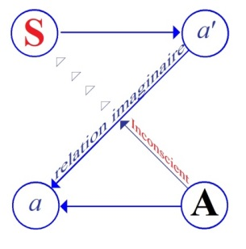

# Leçon 25 | 04 Juillet 1956

  <label><input type="checkbox" data-lacan-toggle="original" checked> 原文</label>
  <label><input type="checkbox" data-lacan-toggle="notes" checked> 注释</label>
  <label><input type="checkbox" data-lacan-toggle="commentary" checked> 个人解读评论</label>

<section class="parallel-paragraph" data-paragraph-ids="s3-25-0001">

s3-25-0001

[无对应译文]

原文 · s3-25-0001

Je ne sais pas très bien par quel bout commencer, pour finir ce cours. À tout hasard, je vous ai mis au tableau deux petits schémas* :*

</section>

<section class="parallel-paragraph" data-paragraph-ids="s3-25-0002">

s3-25-0002

[无对应译文]

原文 · s3-25-0002

- l’un que vous devez connaître qui est ancien. C’est celui d’une espèce de grille, par lequel j’ai commencé cette année à essayer de vous montrer comment se posait le problème du délire, si nous voulions

</section>

<section class="parallel-paragraph" data-paragraph-ids="s3-25-0003">

s3-25-0003

[无对应译文]

原文 · s3-25-0003

> le structurer, lorsqu’il semble bien être apparemment une relation liée par quelque bout à la parole. Ce schéma auquel je pourrai peut-être encore avoir à me référer, je vous le rappelle donc.
>
> Je pense qu’il est déjà pour vous suffisamment commenté.

</section>

<section class="parallel-paragraph" data-paragraph-ids="s3-25-0004">

s3-25-0004

[无对应译文]

原文 · s3-25-0004

</section>

<section class="parallel-paragraph" data-paragraph-ids="s3-25-0005">

s3-25-0005

[无对应译文]

原文 · s3-25-0005

- Un autre, qui est différent, tout nouveau, et auquel j’aurai peut-être besoin de me référer tout à l’heure.

</section>

<section class="parallel-paragraph" data-paragraph-ids="s3-25-0006">

s3-25-0006

[无对应译文]

原文 · s3-25-0006

Nous partons aujourd’hui du point où je vous ai laissés la dernière fois, c’est-à-dire en fin de compte de descriptions opposées :

</section>

<section class="parallel-paragraph" data-paragraph-ids="s3-25-0007">

s3-25-0007

[无对应译文]

原文 · s3-25-0007

- celle de FREUD,

</section>

<section class="parallel-paragraph" data-paragraph-ids="s3-25-0008">

s3-25-0008

[无对应译文]

原文 · s3-25-0008

- celle d’une psychanalyste qui est très loin d’être sans mérite et qui, pour représenter des tendances les plus modernes, a au moins l’avantage de le faire fort intelligemment.

</section>

<section class="parallel-paragraph" data-paragraph-ids="s3-25-0009">

s3-25-0009

[无对应译文]

原文 · s3-25-0009

Ce que je vous ai décrit cette année était avant tout centré sur le souci de remettre l’accent sur la structure du délire. Ce délire, j’ai voulu vous montrer qu’il s’éclairait *dans tous ses phénomènes*, je crois même pouvoir dire *dans sa dynamique*, très essentiellement considérée comme une perturbation de la relation à l’Autre, sans doute, et comme tel donc lié à un mécanisme transférentiel.

</section>

<section class="parallel-paragraph" data-paragraph-ids="s3-25-0010">

s3-25-0010

[无对应译文]

原文 · s3-25-0010

Mais l’intérêt, pour prendre le problème dans le registre où nous l’avons abordé…

</section>

<section class="parallel-paragraph" data-paragraph-ids="s3-25-0011">

s3-25-0011

[无对应译文]

原文 · s3-25-0011

> c’est-à-dire en référence aux fonctions et à la structure de la parole

</section>

<section class="parallel-paragraph" data-paragraph-ids="s3-25-0012">

s3-25-0012

[无对应译文]

原文 · s3-25-0012

…c’est d’arracher, de libérer ce mécanisme transférentiel de je ne sais quelles *confuses et diffuses relations d’objet*, qui par hypothèse, sera chaque fois que nous aurons affaire à un trouble considéré comme immature, mais considéré dans sa globalité, ce qui ne nous laisse pas d’autre jeu qu’une sorte de série linéaire de cette immaturation de *la relation d’objet*.

</section>

<section class="parallel-paragraph" data-paragraph-ids="s3-25-0013">

s3-25-0013

[无对应译文]

原文 · s3-25-0013

Bien loin qu’elle puisse d’une façon quelconque se situer dans une telle référence développementale…

</section>

<section class="parallel-paragraph" data-paragraph-ids="s3-25-0014">

s3-25-0014

[无对应译文]

原文 · s3-25-0014

> si tant est justement qu’elle implique, quelles qu’en soient les émergences, cette unilinéarité

</section>

<section class="parallel-paragraph" data-paragraph-ids="s3-25-0015">

s3-25-0015

[无对应译文]

原文 · s3-25-0015

…je crois que l’expérience montre que nous arrivons à des impasses, à des explications insuffisantes, immotivées, qui se superposent de façon telle qu’elles ne permettent pas de distinguer les différents cas et tout principalement et au premier plan, la différence de la névrose et de la psychose.

</section>

<section class="parallel-paragraph" data-paragraph-ids="s3-25-0016">

s3-25-0016

[无对应译文]

原文 · s3-25-0016

À elle seule, l’expérience du *délire* partiel comme tel, s’oppose à parler d’immaturation, voire de régression ou de simple modification de la relation d’objet pure et simple, comme telle. Et quand même n’aurions-nous pas *les psychoses* et seulement *les névroses*, nous verrons l’année prochaine que la notion d’*objet* n’est pas univoque, quand je vous ai annoncé que je commencerai, je pense, par opposer *l’objet des phobies* à *l’objet des perversions*. Ce sera une autre façon de reprendre le même problème au niveau de la case « *objet* » dans les relations du sujet à l’Autre. Ici, au niveau des psychoses, je dirai que c’est là les deux termes opposés.

</section>

<section class="parallel-paragraph" data-paragraph-ids="s3-25-0017">

s3-25-0017

[无对应译文]

原文 · s3-25-0017

Limitons-nous ici et résumons rapidement comment en somme, la position de FREUD sur le sujet de ce *délire* se situe, quelles sont les objections qu’on lui apporte et, si ces objections lui étant apportées, on a ébauché le moindre petit commencement de meilleure solution.

</section>

<section class="parallel-paragraph" data-paragraph-ids="s3-25-0018">

s3-25-0018

[无对应译文]

原文 · s3-25-0018

FREUD - nous dit-on - après l’avoir lu, nous explique que le délire de SCHREBER est lié à une irruption de la tendance homosexuelle, laquelle est niée par le sujet.

</section>

<section class="parallel-paragraph" data-paragraph-ids="s3-25-0019">

s3-25-0019

[无对应译文]

原文 · s3-25-0019

Pourquoi est-elle niée ? Nous allons le voir tout à l’heure. Cette négation…

</section>

<section class="parallel-paragraph" data-paragraph-ids="s3-25-0020">

s3-25-0020

[无对应译文]

原文 · s3-25-0020

> Je résume. Vous pourrez en vous reportant au texte - je pense que vous l’avez fait depuis longtemps -
>
> vous apercevoir si oui ou non mon résumé est exact, équilibré

</section>

<section class="parallel-paragraph" data-paragraph-ids="s3-25-0021">

s3-25-0021

[无对应译文]

原文 · s3-25-0021

…cette négation, dans le cas de SCHREBER qui n’est pas névrosé, aboutit à ce que nous pourrions appeler « *une érotomanie divine »*, avec ce mode de double renversement à la fois sur le plan *symbolique*, à savoir d’un accent renversé sur un des termes de la phrase, qui symbolise la situation.

</section>

<section class="parallel-paragraph" data-paragraph-ids="s3-25-0022">

s3-25-0022

[无对应译文]

原文 · s3-25-0022

Vous savez comment FREUD répartit les diverses dénégations de la tendance homosexuelle. C’est à l’intérieur d’une phrase « je l’aime... » qu’il nous dira, qu’il y a plus d’une manière d’introduire *la dénégation* dans cette simple négation de la situation :

</section>

<section class="parallel-paragraph" data-paragraph-ids="s3-25-0023">

s3-25-0023

[无对应译文]

原文 · s3-25-0023

- On peut dire : « *Ce n’est pas moi qui l’aime* ».

</section>

<section class="parallel-paragraph" data-paragraph-ids="s3-25-0024">

s3-25-0024

[无对应译文]

原文 · s3-25-0024

- On peut dire : « *Ce n’est pas lui que j’aime* ».

</section>

<section class="parallel-paragraph" data-paragraph-ids="s3-25-0025">

s3-25-0025

[无对应译文]

原文 · s3-25-0025

- On peut dire : « *Ce n’est pas d’aimer lui qu’il s’agit pour moi, je le hais* », par exemple.

</section>

<section class="parallel-paragraph" data-paragraph-ids="s3-25-0026">

s3-25-0026

[无对应译文]

原文 · s3-25-0026

Et aussi bien nous dit-il que la situation n’est jamais simple, ni se limite à ce simple *renversement symbolique* que…

</section>

<section class="parallel-paragraph" data-paragraph-ids="s3-25-0027">

s3-25-0027

[无对应译文]

原文 · s3-25-0027

> pour des raisons d’ailleurs qu’il tient pour suffisamment implicites, mais sur lesquelles,
>
> à la vérité, il n’insiste pas

</section>

<section class="parallel-paragraph" data-paragraph-ids="s3-25-0028">

s3-25-0028

[无对应译文]

原文 · s3-25-0028

…le *renversement imaginaire* de la situation dans une partie seulement de ses trois termes se produit, à savoir que par exemple le « *je le hais* » se transforme en un « *il me hait* » par un mécanisme imaginaire de la projection. Comme par exemple dans notre cas : « *ce n’est pas lui que j’aime, c’est quelqu’un d’autre* » - ici c’est un grand « *Lui* », puisque c’est *Dieu lui-même -* se renverse en un « *il m’aime* » comme dans toute *érotomanie*. Il est donc clair que FREUD nous indique que ce n’est pas sans *un renversement* très avancé *de l’appareil symbolique* comme tel, que peut se classer, se situer, se comprendre, l’issue terminale de la défense contre la tendance homosexuelle.

</section>

<section class="parallel-paragraph" data-paragraph-ids="s3-25-0029">

s3-25-0029

[无对应译文]

原文 · s3-25-0029

Pourquoi cette défense si intense qu’elle va faire au sujet traverser des épreuves qui vont à un moment à rien moins qu’à la déréalisation, non seulement du monde extérieur en général, mais des personnes mêmes qui l’entourent et jusqu’aux plus proches, de l’autre comme tel, qui nécessitent toute cette reconstruction délirante que le sujet progressivement resituera, mais d’une façon profondément perturbée, un monde où il puisse se reconnaître et d’une façon combien également perturbée. Il ne se reconnaîtra pas comme le sujet destiné dans un temps, projeté dans l’incertitude du futur, dans une échéance indéterminée mais certainement indépassable, à devenir sujet de miracle divin par excellence, d’une récréation de toute l’humanité, dont il sera lui–même le support et *le réceptacle féminin*.

</section>

<section class="parallel-paragraph" data-paragraph-ids="s3-25-0030">

s3-25-0030

[无对应译文]

原文 · s3-25-0030

L’explication de FREUD à propos de ce délire…

</section>

<section class="parallel-paragraph" data-paragraph-ids="s3-25-0031">

s3-25-0031

[无对应译文]

原文 · s3-25-0031

> qui se présente bien ici dans sa terminaison avec tous les caractères mégalomaniaques
>
> *des délires de rédemption* dans leurs formes les plus développées

</section>

<section class="parallel-paragraph" data-paragraph-ids="s3-25-0032">

s3-25-0032

[无对应译文]

原文 · s3-25-0032

…l’explication de FREUD, si on la serre de près, a l’air de tenir toute entière dans *la référence au narcissisme*. C’est d’un narcissisme menacé que part la défense contre la tendance homosexuelle. La mégalomanie représente ce par quoi la crainte narcissique s’exprime, dans un agrandissement du *moi* lui-même du sujet aux dimensions du monde, dans un fait d’économie libidinale qui se trouve apparemment entièrement sur le plan imaginaire. Le sujet se fait *l’objet* même *de l’amour de l’être suprême*. Dès lors, il peut bien abandonner ce qui lui semblait au prime abord le plus précieux de ce qu’il devait, en tout cas sauver, à savoir la marque de *sa virilité*.

</section>

<section class="parallel-paragraph" data-paragraph-ids="s3-25-0033">

s3-25-0033

[无对应译文]

原文 · s3-25-0033

En fin de compte, que voyons-nous de l’interprétation de FREUD ? Je le souligne, le pivot, le point de concours de la dialectique libidinale auquel se réfèrent tout le mécanisme et tout le développement de la névrose, est le thème de la castration. C’est la castration qui conditionne la crainte narcissique. C’est l’acceptation de la castration qui doit être payée d’un prix aussi lourd que le remaniement de toute la réalité par le sujet.

</section>

<section class="parallel-paragraph" data-paragraph-ids="s3-25-0034">

s3-25-0034

[无对应译文]

原文 · s3-25-0034

Cette prévalence sur laquelle FREUD ne démord pas, qui est celle dont on peut dire que c’est dans l’ordre matériel explicatif de la théorie freudienne, une *invariante* d’un bout à l’autre. Une *invariante*, ce n’est pas assez dire, c’est une *invariante* prévalente, je veux dire dont il n’a jamais - dans le conditionnement théorique de l’inter-jeu subjectif où s’inscrit l’histoire d’un phénomène psychanalytique quelconque - …dont il n’a jamais tiré, ni subordonné, ni même relativé la place.

</section>

<section class="parallel-paragraph" data-paragraph-ids="s3-25-0035">

s3-25-0035

[无对应译文]

原文 · s3-25-0035

Donc c’est autour de lui, dans sa communauté analytique, mais jamais dans son œuvre, qu’on a voulu lui donner des symétries, des équivalents, la place centrale de l’objet, disons le centre « phallique » et de sa fonction essentielle dans l’économie libidinale, chez l’homme comme chez la femme.

</section>

<section class="parallel-paragraph" data-paragraph-ids="s3-25-0036">

s3-25-0036

[无对应译文]

原文 · s3-25-0036

Et ce qui est tout à fait essentiel et caractéristique dans les théorisations données et maintenues par FREUD… quelque remaniement qu’il ait apporté, rendez-vous compte, c’est cela qui est important …c’est que ceci ne s’est jamais modifié à travers aucune des phrases de la schématisation qu’il a pu donner de la vie psychique : c’est autour de *la castration*.

</section>

<section class="parallel-paragraph" data-paragraph-ids="s3-25-0037">

s3-25-0037

[无对应译文]

原文 · s3-25-0037

Et ceci d’une manière d’autant plus frappante qu’en fait, si vous lisez le texte avec attention…

</section>

<section class="parallel-paragraph" data-paragraph-ids="s3-25-0038">

s3-25-0038

[无对应译文]

原文 · s3-25-0038

> ce sera là la valeur de l’objection de Mme MACALPINE, je voudrais dire, cela pourrait être sa valeur, parce que c’est la seule chose qu’elle ne mette pas vraiment en évidence. Vous verrez, je le dirai tout à l’heure,
>
> ce sur quoi elle fait tourner son argumentation

</section>

<section class="parallel-paragraph" data-paragraph-ids="s3-25-0039">

s3-25-0039

[无对应译文]

原文 · s3-25-0039

…mais si il y a quelque chose qui est vrai dans ses remarques, c’est effectivement qu’il ne s’agit jamais de castration, puisque c’est le terme latin qui sert en allemand « *Entmannung* », et que quand on lit les textes de SCHREBER, on s’aperçoit que « *Entmannung* » veut dire, et bien formellement, « *transformation* » avec tout ce que ce mot comporte de transition, « *transformation en femme* » affectif de procréation, de fécondité, mais non pas du tout de castration. N’importe ! Ce qui est frappant et essentiel dans le texte de FREUD, c’est que c’est autour du thème de la castration, de la perte de l’objet phallique, qu’il fait tourner toute la dynamique qu’il veut donner du sujet SCHREBER.

</section>

<section class="parallel-paragraph" data-paragraph-ids="s3-25-0040">

s3-25-0040

[无对应译文]

原文 · s3-25-0040

Évidemment, sans explications, nous devons constater ce bilan qu’à travers même certaines - et particulièrement celle-là - faiblesses de son argumentation, le fait de faire pivoter autour des termes : tendance homosexuelle, économie libidinale, inséré dans la dialectique imaginaire du narcissisme, point essentiel, enjeu du conflit, l’objet viril assurément nous permet de rythmer, de comprendre les différentes étapes de l’évolution du délire, ses phases et sa construction finale.

</section>

<section class="parallel-paragraph" data-paragraph-ids="s3-25-0041">

s3-25-0041

[无对应译文]

原文 · s3-25-0041

Bien plus, nous avons pu noter au passage toutes sortes de finesses, laissées en quelque sorte en amorce dans l’avenue ouverte, non complètement explorée, celles par exemple où il montre : que, seule, *la projection* ne peut pas expliquer le délire, qu’on ne peut dire qu’il ne s’agisse là que d’un reflet, en quelque sorte, un miroir du sentiment du sujet mais qu’il est indispensable d’y déterminer les étapes et, si l’on peut dire, à un moment donné une perte de *la tendance* qui vieillit.

</section>

<section class="parallel-paragraph" data-paragraph-ids="s3-25-0042">

s3-25-0042

[无对应译文]

原文 · s3-25-0042

J’ai beaucoup insisté au cours de l’année, que *ce qui a été refoulé au dedans reparaît au dehors*, ressurgit dans un arrière plan, et ne ressurgit pas dans une structure simple, mais – nous l’avons vu – dans une position, si l’on peut dire, interne, qui fait que *le sujet lui-même, qui se trouve être l’agent de la persécution* dans le cas présent, est un sujet *ambigu*, *problématique*.

</section>

<section class="parallel-paragraph" data-paragraph-ids="s3-25-0043">

s3-25-0043

[无对应译文]

原文 · s3-25-0043

Il n’est après tout dans son premier abord, que le *représentant* d’un autre sujet qui, non seulement permet, mais sans aucun doute agit en dernier terme. Bref, *d’un échelonnement dans l’altérité de l’autre*, qui est un des problèmes sur lequel FREUD à la vérité nous a conduit mais où il s’arrête. Tel est à peu près l’état des choses au moment où nous quittons le texte de FREUD.

</section>

<section class="parallel-paragraph" data-paragraph-ids="s3-25-0044">

s3-25-0044

[无对应译文]

原文 · s3-25-0044

Ida MACALPINE, après d’autres termes, mais d’une façon plus cohérente que d’autres, objecte que rien, nous dit-elle, ne nous permet de concevoir ce délire comme étant quelque chose qui suppose la maturité génitale, si j’ose dire, qui expliquerait, ferait comprendre la crainte de la castration.

</section>

<section class="parallel-paragraph" data-paragraph-ids="s3-25-0045">

s3-25-0045

[无对应译文]

原文 · s3-25-0045

La tendance homosexuelle est loin de se manifester comme quelque chose de primaire. Dès le début, ce que nous voyons ce sont *les symptômes*, d’abord *hypocondriaques*, ce sont des *symptômes* *psychotiques,* ce quelque chose de particulier qui est au fond de la relation psychotique comme de toutes sortes de phénomènes, et spécialement des phénomènes psychosomatiques qui sont, spécialement pour elle la voie d’introduction de la phénoménologie de ce cas.

</section>

<section class="parallel-paragraph" data-paragraph-ids="s3-25-0046">

s3-25-0046

[无对应译文]

原文 · s3-25-0046

Car cette clinicienne qui s’est tout spécialement occupée des phénomènes *psychosomatiques,* et c’est là qu’elle a pu avoir la préhension directe d’un certain nombre de phénomènes, structurés tout différemment de ce qui se passe dans les névroses, à savoir ce quelque chose que nous pourrions appeler je ne sais quelle empreinte ou inscription directe d’une caractéristique d’un temps, si l’on peut dire, ou même dans certains cas, du conflit, sur ce que l’on peut appeler directement enfin « *le tableau matériel* » que présente le sujet en tant *qu’être corporel*.

</section>

<section class="parallel-paragraph" data-paragraph-ids="s3-25-0047">

s3-25-0047

[无对应译文]

原文 · s3-25-0047

Tel *symptôme*, tel qu’une éruption diversement qualifiée dermatologiquement - qu’importe - de la face, sera quelque chose qui se mobilisera en fonction de tel ou tel anniversaire, et ce sera en quelque sorte, d’une façon directe :

</section>

<section class="parallel-paragraph" data-paragraph-ids="s3-25-0048">

s3-25-0048

[无对应译文]

原文 · s3-25-0048

- sans aucune *dialectique*,

</section>

<section class="parallel-paragraph" data-paragraph-ids="s3-25-0049">

s3-25-0049

[无对应译文]

原文 · s3-25-0049

- sans aucun *intermédiaire*,

</section>

<section class="parallel-paragraph" data-paragraph-ids="s3-25-0050">

s3-25-0050

[无对应译文]

原文 · s3-25-0050

- sans aucune *interprétation* que nous pourrons recouper,

</section>

<section class="parallel-paragraph" data-paragraph-ids="s3-25-0051">

s3-25-0051

[无对应译文]

原文 · s3-25-0051

- sans aucun *équivalent*,

</section>

<section class="parallel-paragraph" data-paragraph-ids="s3-25-0052">

s3-25-0052

[无对应译文]

原文 · s3-25-0052

…la correspondance du *symptôme* avec quelque chose qui est du passé du sujet.

</section>

<section class="parallel-paragraph" data-paragraph-ids="s3-25-0053">

s3-25-0053

[无对应译文]

原文 · s3-25-0053

Est-ce là quelque chose qui a poussé Ida MACALPINE à se poser le problème très singulier de telles *correspondances* ? Je dis bien, il s’agit bien là de correspondances directes entre *le symbole* et *le symptôme*. L’appareil du symbole manque tellement aux catégories mentales du psychanalyste aujourd’hui que c’est par l’intermédiaire uniquement de l’un des *fantasmes* que peuvent être conçues de telles relations.

</section>

<section class="parallel-paragraph" data-paragraph-ids="s3-25-0054">

s3-25-0054

[无对应译文]

原文 · s3-25-0054

Et aussi bien toute son argumentation consistera-t-elle à nous rapporter dans le cas du président SCHREBER le développement du délire à un thème fantastique, à une fixation imaginaire…

</section>

<section class="parallel-paragraph" data-paragraph-ids="s3-25-0055">

s3-25-0055

[无对应译文]

原文 · s3-25-0055

> selon le terme courant, dans tout développement de cet ordre de nos jours : pré–œdipien

</section>

<section class="parallel-paragraph" data-paragraph-ids="s3-25-0056">

s3-25-0056

[无对应译文]

原文 · s3-25-0056

…soulignant que ce qui tient *le désir*, ce qui le soutient, est essentiellement et avant tout un *thème de procréation*, si je puis dire, poursuivi par lui-même, asexué dans sa forme, n’entraînant le sujet dans les conditions de *dévirilisation*, de *féminisation*, comme je vous l’ai dit, également, formellement, que comme une sorte de conséquence *a posteriori*, si l’on peut dire, de l’exigence dont il s’agissait.

</section>

<section class="parallel-paragraph" data-paragraph-ids="s3-25-0057">

s3-25-0057

[无对应译文]

原文 · s3-25-0057

Le sujet est quelque chose qui doit être né dans la seule relation de l’enfant à la mère, et pour autant que l’enfant… avant toute constitution d’une *relation triangulaire* …verrait naître en lui un fantasme de désir, désir d’égaler la mère dans sa capacité de faire un enfant.

</section>

<section class="parallel-paragraph" data-paragraph-ids="s3-25-0058">

s3-25-0058

[无对应译文]

原文 · s3-25-0058

C’est aussi toute l’argumentation d’Ida MACALPINE qu’il n’y a pas de raison de poursuivre ici tous ses détails, ils sont riches, mais après tout ils sont à votre portée : elle a fait une préface et une postface, fort bien nourries à l’édition qu’elle a faite en anglais du texte de SCHREBER, où elle expose tous ses thèmes.

</section>

<section class="parallel-paragraph" data-paragraph-ids="s3-25-0059">

s3-25-0059

[无对应译文]

原文 · s3-25-0059

L’important est bien de voir en quoi ceci se rattache à une certaine réorientation de toute la dialectique analytique qui tend à faire de l’économie imaginaire du fantasme…

</section>

<section class="parallel-paragraph" data-paragraph-ids="s3-25-0060">

s3-25-0060

[无对应译文]

原文 · s3-25-0060

> et des diverses réorganisations ou désorganisations, restructurations ou déstructurations fantasmatiques

</section>

<section class="parallel-paragraph" data-paragraph-ids="s3-25-0061">

s3-25-0061

[无对应译文]

原文 · s3-25-0061

…*le point pivot*, *le point* - aussi - *efficace* de tout progrès compréhensif, et aussi de tout progrès thérapeutique.

</section>

<section class="parallel-paragraph" data-paragraph-ids="s3-25-0062">

s3-25-0062

[无对应译文]

原文 · s3-25-0062

Le schéma actuellement accepté de façon si commune, « *frustration, agressivité, régression* », est bien là, au fond de tout ce que Mme Ida MACALPINE suppose pouvoir expliquer de ce délire. Elle va très loin. Elle dit :

</section>

<section class="parallel-paragraph" data-paragraph-ids="s3-25-0063">

s3-25-0063

[无对应译文]

原文 · s3-25-0063

- il n’y a déclin du monde pour le sujet SCHREBER

</section>

<section class="parallel-paragraph" data-paragraph-ids="s3-25-0064">

s3-25-0064

[无对应译文]

原文 · s3-25-0064

- il n’y a crépuscule du monde, et à un moment donné *désordre quasi confusionnel de ses appréhensions de la réalité*, …que parce qu’il faut que ce monde soit recrée, introduisant une sorte de finalisme de l’étape même la plus profonde du désordre mental. Tout « *le mythe* » n’est construit que parce que c’est la seule façon que le sujet SCHREBER arrive à se satisfaire dans son exigence imaginaire d’un enfantement.

</section>

<section class="parallel-paragraph" data-paragraph-ids="s3-25-0065">

s3-25-0065

[无对应译文]

原文 · s3-25-0065

À la vérité, sans aucun doute ce *picturing* peut permettre de concevoir, en effet, cette sorte d’imprégnation imaginaire du sujet à renaître. Mais ce que l’on peut alors se demander, c’est si les origines de la mise en jeu imaginaire, et je dirai presque que là je calque un des thèmes du sujet qui est, comme vous le savez, la mise en jeu qui va faire toute cette construction délirante…

</section>

<section class="parallel-paragraph" data-paragraph-ids="s3-25-0066">

s3-25-0066

[无对应译文]

原文 · s3-25-0066

Qu’est-ce qui nous permet - puisqu’il ne s’agit que de fantasmes imaginaires - qu’est-ce qui nous permet dans la perspective d’Ida MACALPINE de comprendre comment *la fonction du père*, qui est au contraire si promue, si mise en évidence, que quelque envie, quelque dessein qu’on ait de combattre la prévalence donnée par FREUD dans la théorie analytique de la fonction du père, il est tout de même indéniable, frappant…

</section>

<section class="parallel-paragraph" data-paragraph-ids="s3-25-0067">

s3-25-0067

[无对应译文]

原文 · s3-25-0067

> quelles que puissent être certaines faiblesses de l’argumentation freudienne à propos de la psychose

</section>

<section class="parallel-paragraph" data-paragraph-ids="s3-25-0068">

s3-25-0068

[无对应译文]

原文 · s3-25-0068

…de voir dans ce délire *la fonction du père* promue, exaltée, au point qu’il ne faut rien moins que « *Dieu le Père* » lui-même dans le délire - et chez un sujet pour qui jusque là, comme il nous l’affirme, ceci n’a eu aucun sens - il faut rien moins que « *Dieu le Père* » lui-même, pour que le délire arrive, si l’on peut dire, à son point d’achèvement, à son point d’équilibre.

</section>

<section class="parallel-paragraph" data-paragraph-ids="s3-25-0069">

s3-25-0069

[无对应译文]

原文 · s3-25-0069

La prévalence, dans toute l’évolution de la psychose de SCHREBER, des *personnages paternels* en tant que tels…

</section>

<section class="parallel-paragraph" data-paragraph-ids="s3-25-0070">

s3-25-0070

[无对应译文]

原文 · s3-25-0070

> qui se substituent les uns aux autres, et vont toujours en s’agrandissant et en s’enveloppant les uns les autres, jusqu’à s’identifier au père divin lui-même, à la divinité marquée de l’accent proprement paternel

</section>

<section class="parallel-paragraph" data-paragraph-ids="s3-25-0071">

s3-25-0071

[无对应译文]

原文 · s3-25-0071

…est quand même quelque chose qui reste absolument inébranlable et destiné à nous faire reposer le problème. Savoir comment il se fait que quelque chose qui donne, si je puis dire, autant de raisons à FREUD, n’est quand même malgré tout, par lui abordé, que par certains biais, que sous certains modes qui, incontestablement, nous laissent pourtant à désirer ?

</section>

<section class="parallel-paragraph" data-paragraph-ids="s3-25-0072">

s3-25-0072

[无对应译文]

原文 · s3-25-0072

Tout reste en réalité équilibré. Tout reste, au contraire, ouvert et insuffisant dans la rectification qu’essaie d’en donner Mme Ida MACALPINE.

</section>

<section class="parallel-paragraph" data-paragraph-ids="s3-25-0073">

s3-25-0073

[无对应译文]

原文 · s3-25-0073

Ce n’est pas seulement cette énormité du personnage fantasmatique du père qui nous permet de dire que nous ne pouvons d’aucune façon nous fonder sur une dynamique de l’irruption du fantasme pré-œdipien. Il y a bien d’autres choses encore, jusques et y compris ce qui, et dans les deux cas, reste énigmatique, ce à quoi nous sommes spécialement accrochés cette année.

</section>

<section class="parallel-paragraph" data-paragraph-ids="s3-25-0074">

s3-25-0074

[无对应译文]

原文 · s3-25-0074

Mais ce qu’incontestablement FREUD approche beaucoup plus que Mme Ida MACALPINE, le côté écrasant, prépondérant, énorme, proliférant, végétant des phénomènes d’auditivation verbale, de cette formidable captation du sujet pris dans ce « *monde de la parole* », devenu pour lui, non seulement une perpétuelle co-présence…

</section>

<section class="parallel-paragraph" data-paragraph-ids="s3-25-0075">

s3-25-0075

[无对应译文]

原文 · s3-25-0075

> ce que j’ai appelé la dernière fois un accompagnement parlé de tous ses actes

</section>

<section class="parallel-paragraph" data-paragraph-ids="s3-25-0076">

s3-25-0076

[无对应译文]

原文 · s3-25-0076

…mais *une perpétuelle* intimation, sollicitation, voire *sommation à se manifester sur ce plan*.

</section>

<section class="parallel-paragraph" data-paragraph-ids="s3-25-0077">

s3-25-0077

[无对应译文]

原文 · s3-25-0077

Puisque ce dont il s’agit c’est que jamais un seul instant, il ne cesse lui-même de témoigner, dans l’invite constante de la parole qui l’accompagne, non pas qu’il y réponde, mais qu’il est là, présent et capable, s’il n’y répond pas, de ne pas répondre, parce que c’est peut-être - dit-il - qu’on voudrait le contraindre à dire quelque chose de bête, mais à en témoigner que - aussi bien pour *sa réponse* que pour *sa non-réponse -* il est quelqu’un de toujours éveillé à ce dialogue intérieur et dont le seul chemin qu’il ferait dans cette présence à ce dialogue, témoignerait, serait le signal pour lui de ce qu’il appelle « *Verwesung* », c’est-à-dire comme on l’a traduit justement : une sorte de *décomposition*.

</section>

<section class="parallel-paragraph" data-paragraph-ids="s3-25-0078">

s3-25-0078

[无对应译文]

原文 · s3-25-0078

C’est là-dessus que nous avons attiré l’attention et que nous insistons pour dire ce qui fait la valeur de *la position freudienne pure*, ce qui fait que, malgré *le paradoxe* que présentent certaines manifestations de *la psychose* par rapport à la dynamique que FREUD a reconnue dans *la névrose* \[la psychose\]se trouve quand même abordée d’une façon plus satisfaisante dans la perspective freudienne, c’est que, implicite à cette perspective jamais complètement dégagée…

</section>

<section class="parallel-paragraph" data-paragraph-ids="s3-25-0079">

s3-25-0079

[无对应译文]

原文 · s3-25-0079

> parce que FREUD ne l’a pas dégagée par cette voie directement, il ne l’a aperçue que par un autre abord
>
> qui est précisément celui, je vous l’ai montré, non sans dessein, l’année dernière à propos du *principe du plaisir*

</section>

<section class="parallel-paragraph" data-paragraph-ids="s3-25-0080">

s3-25-0080

[无对应译文]

原文 · s3-25-0080

…ce qui seul fait tenir la position de FREUD en présence de cette sorte de *planification*, si on peut dire, des signes instinctuels, de l’*instinct* imaginé - à quoi tend à se réduire après lui la dynamique psychanalytique - c’est que c’est précisément sous la forme de ces termes jamais abandonnés par FREUD, exigés par lui pour toute compréhension analytique possible, même là où cela ne colle qu’*approximativement*, car cela colle encore mieux de cette façon-là, que s’il ne le faisait pas entrer en jeu :

</section>

<section class="parallel-paragraph" data-paragraph-ids="s3-25-0081">

s3-25-0081

[无对应译文]

原文 · s3-25-0081

- à savoir : *la fonction du père*,

</section>

<section class="parallel-paragraph" data-paragraph-ids="s3-25-0082">

s3-25-0082

[无对应译文]

原文 · s3-25-0082

- à savoir : *le complexe de castration*.

</section>

<section class="parallel-paragraph" data-paragraph-ids="s3-25-0083">

s3-25-0083

[无对应译文]

原文 · s3-25-0083

Ce dont il s’agit ce n’est pas purement et simplement d’éléments imaginaires. Ce qu’on a retrouvé dans l’imaginaire, par exemple, sous la forme de *mère phallique*, n’est pas homogène - cela vous le savez tous - au *complexe de castration* en tant qu’il est intégré dans la situation triangulaire de l’Œdipe.

</section>

<section class="parallel-paragraph" data-paragraph-ids="s3-25-0084">

s3-25-0084

[无对应译文]

原文 · s3-25-0084

La situation triangulaire de l’Œdipe est quelque chose qui n’est pas complètement élucidé dans FREUD, mais qui, du seul fait qu’elle est *maintenue toujours*, est là pour prêter à cette élucidation, et cette élucidation n’est possible que si nous reconnaissons qu’il y a dans l’élément tiers - l’élément central pour FREUD, et à juste titre - du *Père*, un élément signifiant irréductible à toute espèce de conditionnement imaginaire. Je ne dis pas que le terme du *Père*, le *Nom du Père* soit seul un élément, que nous puissions dire ça. Je dirai que cet élément nous pouvons le dégager chaque fois que nous appréhendons quelque chose qui est à proprement parler *de l’ordre symbolique*.

</section>

<section class="parallel-paragraph" data-paragraph-ids="s3-25-0085">

s3-25-0085

[无对应译文]

原文 · s3-25-0085

J’ai relu à ce propos, parmi d’autres choses, une fois de plus, l’article de JONES sur le symbolisme. Quand on voit l’effort que fait ce poupon du maître pour serrer le symbole et nous expliquer que c’est là sans doute une déviation \[...\] je ne sais plus quoi, que de voir dans le symbole quelque chose qui en lui-même réduit tous les caractères d’une grande relation fondamentale. Il prend *un exemple*, il en prend plus d’un, mais je vais en prendre un *des plus notoires*. Il nous dit par exemple, pour l’anneau, un anneau, il n’entrera pas en jeu en tant que symbole au sens analytique, en tant qu’il représente le mariage, avec tout ce que le mariage comporte de culturel, d’élaboré. Foin de tout ceci, la peau nous en horripile. Nous ne sommes pas des gens à qui nous parlerons d’analogisme. Si l’anneau signifie quelque chose ce n’est pas en raison de sa relation à une référence ainsi « *super-sublimée* » \- car c’est comme cela qu’il s’exprime - c’est quelque part dans la sublimation que nous devons chercher que si l’anneau est le symbole du mariage, eh bien, c’est parce qu’il est le symbole de l’organe féminin.

</section>

<section class="parallel-paragraph" data-paragraph-ids="s3-25-0086">

s3-25-0086

[无对应译文]

原文 · s3-25-0086

Est-ce que ceci n’est pas de nature à nous laisser rêveur ? Nous savons bien naturellement que l’intérêt de la mise en jeu des signifiants dans le *symptôme*, est justement sans lien avec ce qui est de l’ordre de la tendance et des relations des plus bizarres. Mais se laisser emporter dans une telle dialectique, au point de ne pas s’apercevoir que l’anneau ne saurait être en aucun cas la symbolisation naturelle du sexe féminin, c’est vraiment ne pas comprendre que pour rêver qu’on passe à son doigt un anneau au moment où, comme dans le conte auquel je pense, que vous connaissez tous, tout au moins le thème, qui s’appelle « *L’Anneau de Hans Carvel* » qui est une bonne histoire du Moyen Âge reprise par BALZAC dans ses *Contes Drolatiques* [^38]: le brave homme qu’on dépeint fort coloré, et quelque fois on nous dit que c’est un curé, qui se retrouve au milieu de la nuit rêvant d’anneau et le doigt passé là où l’anneau est appelé \[...\] et, sans y répondre, *il faut vraiment avoir, des symbolisations naturelles, des idées les plus étranges*.

</section>

<section class="parallel-paragraph" data-paragraph-ids="s3-25-0087">

s3-25-0087

[无对应译文]

原文 · s3-25-0087

Car il faut bien le dire : quoi dans l’expérience peut faire correspondre - on peut bien dire les choses en mettant les points sur les « i » - l’expérience de la pénétration dans cet orifice, puisque d’orifice il s’agit, à une expérience qui ressemble en quoi que ce soit à un anneau, si on ne sait pas déjà d’avance ce que c’est qu’un anneau ? Un anneau, ce n’est pas un objet qui se rencontre dans la nature, et s’il y a quelque chose dans l’ordre de la pénétration, qui ressemble à la pénétration plus ou moins serrée, ce n’est assurément pas cela.

</section>

<section class="parallel-paragraph" data-paragraph-ids="s3-25-0088">

s3-25-0088

[无对应译文]

原文 · s3-25-0088

Je fais appel - comme disait Marie-Antoinette - non pas à toutes les mères, mais à tous ceux qui n’ont jamais mis leur doigt quelque part, ce n’est certainement pas la pénétration en cet endroit - mon Dieu - enfin, plutôt « *mollusqual* » qu’autre chose. Si quelque chose dans la nature est destiné à nous suggérer certainement des propriétés, cela se limite très précisément à ce à quoi le langage a consacré le terme « *anus* » - qui s’écrit, comme vous le savez, en latin avec un seul « n » - et qui n’est rien moins que ce que pudiquement, les commentateurs des anciens dictionnaires commentent, c’est-à-dire justement l’anneau que l’on peut trouver derrière.

</section>

<section class="parallel-paragraph" data-paragraph-ids="s3-25-0089">

s3-25-0089

[无对应译文]

原文 · s3-25-0089

Mais pour confondre l’un et l’autre quant à ce qu’il peut s’agir d’une symbolisation naturelle, il faut vraiment qu’on ait eu dans l’ordre de ces perceptions cogitatives, que FREUD lui-même ait vraiment désespéré de vous, pour ne pas vous enseigner la différence, qu’il vous ait considéré à l’extrême comme incurables buseaux.

</section>

<section class="parallel-paragraph" data-paragraph-ids="s3-25-0090">

s3-25-0090

[无对应译文]

原文 · s3-25-0090

L’élucubration, dans cette occasion de M. JONES, est justement destinée à nous montrer combien nous signifions peut-être quelque chose - là, dans cette occasion - de primitif : que si justement l’anneau peut, en l’occasion être engagé dans un rêve, voire un rêve aboutissant à une action sexuelle - que plus humoristiquement, la traduction gauloise nous donne - c’est précisément en tant que l’anneau existe déjà, comme *signifiant*, et très précisément avec ou sans les connotations.

</section>

<section class="parallel-paragraph" data-paragraph-ids="s3-25-0091">

s3-25-0091

[无对应译文]

原文 · s3-25-0091

Si ce sont les connotations culturelles qui effraient M. JONES, c’est bien là qu’il a tort, c’est qu’il ne s’imagine pas qu’un anneau c’est justement quelque chose par quoi l’homme, dans toute sa présence au monde, est capable de cristalliser bien autre chose encore que le mariage. L’anneau est primordial par rapport, par exemple, à toutes sortes d’éléments, l’élément - ce que nous appelons comme éléments, en effet - le cercle indéfini, l’éternel retour, une certaine constance dans la répétition. L’anneau est loin d’être ce qu’en fin de compte M. JONES a l’air de croire, à la façon des personnes qui croient que pour faire des *macaroni*, on prend un trou et qu’on met de la farine autour. Un anneau n’est pas un trou avec quelque chose autour, un anneau a avant tout une valeur signifiante, et c’est bien de cela qu’il s’agit.

</section>

<section class="parallel-paragraph" data-paragraph-ids="s3-25-0092">

s3-25-0092

[无对应译文]

原文 · s3-25-0092

Nous n’avons pas besoin même, de faire entrer un terme comme celui-là au premier plan comme exemple.

</section>

<section class="parallel-paragraph" data-paragraph-ids="s3-25-0093">

s3-25-0093

[无对应译文]

原文 · s3-25-0093

Ce à quoi ce discours tend, c’est *quelque chose qui vient* en fin de compte *à la parole*, et *par cette voie*. C’est que rien n’expliquera jamais dans l’expérience, qu’un homme entend, ce qui s’appelle *entendre* quelque chose à la formulation la plus simple, quelle qu’elle soit pour qu’elle s’inscrive dans le langage, et qu’elle se réduise à la forme de la parole la plus élémentaire de la fonction du langage, au « *c’est cela* », en tant que pour un homme cette formule a un sens explicatif.

</section>

<section class="parallel-paragraph" data-paragraph-ids="s3-25-0094">

s3-25-0094

[无对应译文]

原文 · s3-25-0094

Il a vu quelque chose, n’importe quoi, quelque chose qui est là : « *c’est cela* » quelle que soit la chose. Ce « *c’est cela* » est déjà quelque chose qui se situe, en présence de quoi il est, qu’il s’agisse du plus singulier, du plus bizarre, du plus ambigu. « *C’est cela maintenant* » ceci repose quelque part ailleurs que là où c’était auparavant, c’est-à-dire nulle part. Maintenant il sait ce que c’est.

</section>

<section class="parallel-paragraph" data-paragraph-ids="s3-25-0095">

s3-25-0095

[无对应译文]

原文 · s3-25-0095

Je voudrais un instant prendre en main le tissu le plus inconsistant, exprès, le plus mince de ce qui peut se présenter à l’homme, et pour cela nous avons un domaine où nous n’avons qu’à aller le chercher, parce qu’il est exemplaire, c’est celui du *météore*, quel qu’il soit. Par définition, le *météore* est justement « *cela* », c’est *réel*, et en même temps, c’est quoi ? C’est illusoire. Ce serait tout à fait *erroné* de dire que c’est *imaginaire*. L’arc en ciel, « *c’est cela* ». Quand vous dites que l’arc en ciel « *c’est cela* », quand vous dites « *c’est ça* » eh bien, après ça vous cherchez.

</section>

<section class="parallel-paragraph" data-paragraph-ids="s3-25-0096">

s3-25-0096

[无对应译文]

原文 · s3-25-0096

On s’est cassé la tête pendant un certain temps, jusqu’à M. DESCARTES qui a complètement réduit la petite affaire : on a dit que c’était une région qui s’irise, là, quelque part, dans des menues petites gouttes d’eau qui sont en suspension, qu’on appelle un nuage. Bon ! Et après ? Après, il reste ce que vous avez dit, le rayon d’un côté, et puis les gouttes plus ou moins condensées de l’autre. « *C’est cela* », ce n’était qu’apparence.

</section>

<section class="parallel-paragraph" data-paragraph-ids="s3-25-0097">

s3-25-0097

[无对应译文]

原文 · s3-25-0097

Remarquez que l’affaire n’est absolument pas réglée parce que le rayon de lumière est, comme vous le savez, onde ou corpuscule, et cette petite goutte d’eau est tout de même une curieuse chose, puisqu’en fin de compte cela n’est pas vraiment la forme gazeuse, c’est la condensation, c’est la retombée à un état qui est précisément *l’état liquide*, mais qui est retombée suspendue, entre les deux, elle est parvenue à l’état de nappe expansive qu’est l’eau.

</section>

<section class="parallel-paragraph" data-paragraph-ids="s3-25-0098">

s3-25-0098

[无对应译文]

原文 · s3-25-0098

Quand nous disons donc « *c’est cela* », nous impliquons quelque chose qui n’est *que cela*, ou « *ce n’est pas cela* », à savoir *l’apparence* à laquelle nous nous sommes arrêtés. Mais ceci nous prouve que tout ce qui est sorti dans la suite, à savoir le « *ce n’est que cela* », ou le « *ce n’est pas cela* » *était déjà impliqué* dans le « *c’est cela* » de l’origine. Autrement dit, ce phénomène véritablement est sans espèce d’intérêt imaginaire, précisément, vous n’avez jamais vu un animal faire attention à un arc-en-ciel, et à la vérité l’homme ne fait pas attention à un nombre incroyable de manifestations tout à fait voisines. Des manifestations d’irisations diverses sont excessivement répandues dans la nature et, mis à part des dons d’observation ou une recherche spéciale, personne ne s’y arrête.

</section>

<section class="parallel-paragraph" data-paragraph-ids="s3-25-0099">

s3-25-0099

[无对应译文]

原文 · s3-25-0099

Si l’arc-en-ciel est quelque chose qui existe, c’est précisément dans cette relation à ce « *c’est cela* », qui fait que nous l’avons nommé l’arc-en-ciel, et que quand on parle à quelqu’un qui ne l’a pas encore vu, il y a un moment où on lui dit : « *l’arc-en-ciel, c’est cela* ». Or que l’arc-en-ciel soit cela avec tout ce que « *c’est cela* » suppose, à savoir l’implication qui, justement, nous allons nous y engager jusqu’à ce que nous en perdions le souffle :

</section>

<section class="parallel-paragraph" data-paragraph-ids="s3-25-0100">

s3-25-0100

[无对应译文]

原文 · s3-25-0100

- de savoir qu’est-ce qu’il y a de caché derrière l’arc-en-ciel,

</section>

<section class="parallel-paragraph" data-paragraph-ids="s3-25-0101">

s3-25-0101

[无对应译文]

原文 · s3-25-0101

- à savoir quelle est la cause de l’arc-en-ciel,

</section>

<section class="parallel-paragraph" data-paragraph-ids="s3-25-0102">

s3-25-0102

[无对应译文]

原文 · s3-25-0102

- en quoi nous allons pouvoir réduire l’arc-en-ciel.

</section>

<section class="parallel-paragraph" data-paragraph-ids="s3-25-0103">

s3-25-0103

[无对应译文]

原文 · s3-25-0103

Remarquez bien que justement le caractère de *l’arc-en-ciel* et du *météore* depuis l’origine, et tout le monde le sait puisque c’est précisément pour ça qu’on l’appelle *météore,* c’est que très précisément, il n’y a rien de caché derrière. Il est justement tout entier dans cette apparence, et que néanmoins ce qui le fait subsister pour nous, au point que nous puissions nous poser sur lui des questions, tient uniquement dans le « *c’est cela* » de l’origine, dans la nomination comme telle de l’arc-en-ciel . Il n’y a rien d’autre que ce nom.

</section>

<section class="parallel-paragraph" data-paragraph-ids="s3-25-0104">

s3-25-0104

[无对应译文]

原文 · s3-25-0104

Autrement dit, si vous voulez aller plus loin, cet arc-en-ciel , il ne parle pas, mais on pourrait parler à sa place. Jamais personne ne lui parle, c’est très frappant. On interpelle l’aurore, et toute espèce d’autres choses. l’arc-en-ciel , il lui reste ce privilège, avec un certain nombre d’autres manifestations de cette espèce, de faire *qu’on ne lui parle pas*.

</section>

<section class="parallel-paragraph" data-paragraph-ids="s3-25-0105">

s3-25-0105

[无对应译文]

原文 · s3-25-0105

Il y a sans doute des raisons pour cela. Il est justement tout spécialement inconsistant, et c’est bien pour cela qu’il est choisi d’ailleurs. Mais mettons qu’on lui parle à cet arc-en-ciel : il est tout à fait clair que puisqu’on lui parle, on peut même le faire parler. On peut lui faire parler à qui on veut, si c’est le lac qui lui parle.

</section>

<section class="parallel-paragraph" data-paragraph-ids="s3-25-0106">

s3-25-0106

[无对应译文]

原文 · s3-25-0106

Si l’arc-en-ciel n’a pas de nom, ou si l’arc-en-ciel ne veut rien entendre de son nom, qu’il ne sait pas qu’il s’appelle « *arc-en-ciel* », ce lac n’a d’autres ressources que de lui montrer les mille petits mirages de l’éclat du soleil sur ses vagues et les traînées de buée qui s’élèvent, il essaiera de rejoindre l’arc-en-ciel, mais il ne le rejoindra pas, jamais, pour une simple raison, c’est que, autant les petits morceaux de soleil qui dansent à la surface du lac, de la buée qui s’en échappe, n’ont rien à faire avec la production de l’arc-en-ciel  : l’arc-en-ciel commence très exactement

</section>

<section class="parallel-paragraph" data-paragraph-ids="s3-25-0107">

s3-25-0107

[无对应译文]

原文 · s3-25-0107

- à une certaine hauteur d’inclinaison du soleil,

</section>

<section class="parallel-paragraph" data-paragraph-ids="s3-25-0108">

s3-25-0108

[无对应译文]

原文 · s3-25-0108

- à une certaine densité des gouttelettes en cause,

</section>

<section class="parallel-paragraph" data-paragraph-ids="s3-25-0109">

s3-25-0109

[无对应译文]

原文 · s3-25-0109

- à quelque chose qui est *relation, indice et rapport,*

</section>

<section class="parallel-paragraph" data-paragraph-ids="s3-25-0110">

s3-25-0110

[无对应译文]

原文 · s3-25-0110

- à quelque chose qui comme tel, dans une réalité en tant que réalité qui est pleine, et absolument insaisissable, il n’y a aucune raison de rechercher ni cette inclinaison favorable du soleil, ni aucun des indices qui déterminent le phénomène de l’arc-en-ciel tant que le phénomène n’est pas en tant que tel nommé.

</section>

<section class="parallel-paragraph" data-paragraph-ids="s3-25-0111">

s3-25-0111

[无对应译文]

原文 · s3-25-0111

Si je viens de faire cette longue étude à propos de quelque chose dont je pense que vous devez bien voir qu’il est là à cause de son caractère de ceinture sphérique, à savoir de quelque chose qui peut être à la fois déployé et reployé à quelque chose près, qui est l’intérêt dans lequel l’homme est engagé, *la dialectique imaginaire est exactement* *de la même structure*. Je veux dire que dans les rapports mère-enfant, auxquels maintenant tend de plus en plus à se limiter *la dialectique imaginaire* dans l’analyse, ce que nous voyons, c’est que ces rapports, il n’y aurait vraiment aucune raison qu’ils ne se suffisent point. L’expérience nous montre quoi ? Une mère dont on nous dit qu’une de ses exigences est très précisément de se pourvoir d’une façon quelconque d’un *phallus imaginaire*.

</section>

<section class="parallel-paragraph" data-paragraph-ids="s3-25-0112">

s3-25-0112

[无对应译文]

原文 · s3-25-0112

Eh bien, on nous l’a également expliqué, son enfant lui sert très bien de support, et même très suffisamment réel de ce prolongement imaginaire. Quant à l’enfant, nous savons également que cela ne fait pas un pli : mâle ou femelle, *le phallus*, il le localise, nous dit-on très tôt et il l’accorde généreusement, en miroir ou pas en miroir, à la mère. Il est donc bien clair que s’il intervient quelque chose, c’est quelque chose qui doit se passer au niveau d’une médiatisation, ou plus exactement d’une fonction médiatrice de ce *phallus*.

</section>

<section class="parallel-paragraph" data-paragraph-ids="s3-25-0113">

s3-25-0113

[无对应译文]

原文 · s3-25-0113

Le couple qui s’accorderait si bien en miroir autour de cette commune illusion de la phallisation *réciproque*, s’il se trouve au contraire *dans une situation de conflit*, voire d’aliénation interne, chacun de son côté, c’est très précisément parce que *le phallus*, si je puis m’expliquer ainsi, est baladeur, qu’il est ailleurs, et chacun sait, bien entendu, où le met la théorie analytique : c’est le père qui en est supposé le porteur.

</section>

<section class="parallel-paragraph" data-paragraph-ids="s3-25-0114">

s3-25-0114

[无对应译文]

原文 · s3-25-0114

Est-ce que justement, il n’y a pas lieu de s’arrêter et d’être frappé de ceci ? C’est que, si en effet, quelque chose qui ressemble à des échanges *imaginaires*, affectifs, si vous voulez, entre la mère et l’enfant, s’établissent autour de ce *manque imaginaire du phallus*, qui en fait l’élément de composition, de coaptation intersubjective, le père…

</section>

<section class="parallel-paragraph" data-paragraph-ids="s3-25-0115">

s3-25-0115

[无对应译文]

原文 · s3-25-0115

> lequel est supposé en être le véritable porteur, celui autour duquel va s’instaurer *la crainte de la perte du phallus*, chez l’enfant, *la revendication*, la privation ou l’ennui, la nostalgie *du phallus de la mère*

</section>

<section class="parallel-paragraph" data-paragraph-ids="s3-25-0116">

s3-25-0116

[无对应译文]

原文 · s3-25-0116

…le père dans cette dialectique freudienne, je ne sais pas si vous avez remarqué qu’il ne lui jamais supposé rien du tout : en tant que père, il l’a. Il a le sien, c’est tout, il ne l’échange, ni ne le donne, il n’y aucune circulation, il n’y aucune espèce de fonction dans le trio, sinon de représenter celui qui est porteur, le détenteur du *phallus*. *Le père en tant que père a le phallus*, un point c’est tout.

</section>

<section class="parallel-paragraph" data-paragraph-ids="s3-25-0117">

s3-25-0117

[无对应译文]

原文 · s3-25-0117

Le père, en d’autres termes, est ce qui, dans cette dialectique imaginaire, est ce quelque chose qu’il faut, qui doit exister pour que le *phallus* soit autre chose, lui, qu’un *météore*. Aussi bien est-ce là quelque chose de si fondamental que si nous devons quelque part situer dans un schéma ce quelque chose qui fait tenir debout la conception freudienne du *complexe d’Œdipe*, vous l’avez vu, ce n’est pas du « *triangle père-mère-enfant* » dont il s’agit, c’est du « *triangle phallus-mère-enfant* ». Et où est le père là-dedans ? Il est dans l’anneau précisément qui fait tenir tout ensemble.

</section>

<section class="parallel-paragraph" data-paragraph-ids="s3-25-0118">

s3-25-0118

[无对应译文]

原文 · s3-25-0118

La notion de père ne se suppose précisément que pourvu de toute une série de connotations signifiantes qui sont celles qui lui donnent son existence et sa consistance qui sont très loin de se confondre avec celle du génital, dont il est sémantiquement à travers toutes les traditions linguistiques différent. Je n’irai pas jusqu’à vous citer HOMÈRE et Saint PAUL pour vous dire que quand on invoque le père, que ce soit ZEUS ou quelqu’un d’autre, *c’est tout à fait autre chose à quoi on se réfère qu’à purement et simplement la fonction génitrice*. Le père a bien d’autres fonctions.

</section>

<section class="parallel-paragraph" data-paragraph-ids="s3-25-0119">

s3-25-0119

[无对应译文]

原文 · s3-25-0119

Et à partir du moment où nous serons sûrs que c’est un signifiant, nous nous apercevrons que sa fonction principale est très précisément celle-ci : d’être quelque chose qui, dans la lignée des générations…

</section>

<section class="parallel-paragraph" data-paragraph-ids="s3-25-0120">

s3-25-0120

[无对应译文]

原文 · s3-25-0120

> pour autant que les êtres vivants s’engendrent manifestement, n’est-ce pas

</section>

<section class="parallel-paragraph" data-paragraph-ids="s3-25-0121">

s3-25-0121

[无对应译文]

原文 · s3-25-0121

…dans ce quelque chose qui, d’une femme, fait sortir un nombre indéfini d’êtres, que nous supposerons masculins ou féminins, et vous voudrez bien pour un instant ne voir que des femmes - nous y viendrons d’ailleurs bientôt, d’après la presse la *parthénogenèse* est en route, et les femmes engendreront un nombre considérable de filles sans l’aide de personne.

</section>

<section class="parallel-paragraph" data-paragraph-ids="s3-25-0122">

s3-25-0122

[无对应译文]

原文 · s3-25-0122

Et bien, remarquez que s’il intervient là-dedans des éléments masculins quels qu’ils soient, ces éléments masculins dans un tel schéma peuvent jouer leur rôle, leur fonction - tant qu’on n’en a pas besoin - fécondatrice, à n’importe quel niveau de la lignée, sans être autre chose, comme dans l’animalité, qu’une espèce d’aide *latérale*, de circuit *latéral* indispensable. Rien n’introduit là-dedans aucun autre élément structurant qu’en effet l’engendrement des femmes par les femmes, avec l’aide de ces sortes d’avortés latéraux qui peuvent servir, en effet, à quelque chose pour relancer le processus. Mais à partir du moment où nous cherchons à inscrire la descendance en fonction des mâles, et uniquement à partir de là, il interviendra quelque chose dans la structure qui fait que nous ne pourrons pas faire ce tableau, qu’il faudra l’écrire d’une autre façon. \[Schéma au tableau\]

</section>

<section class="parallel-paragraph" data-paragraph-ids="s3-25-0123">

s3-25-0123

[无对应译文]

原文 · s3-25-0123

Voilà un frère, nous n’allons pas nous arrêter à quelque chose d’aussi léger qu’une indication de l’inceste entre frère et sœur, nous les ferons communier ensemble et nous obtiendrons un mâle. C’est uniquement à partir du moment où nous parlons de descendance, de rapports de mâle à mâle, que nous voyons s’introduire, à partir du moment où nous en parlons, une coupure. Et à chaque fois une coupure, c’est-à-dire la différence entre les générations. L’introduction du *signifiant du père*, introduit d’ores et déjà une ordination dans la lignée, une série des générations, et *cette série des générations* est quelque chose qui à soi tout seul introduit un élément signifiant absolument essentiel.

</section>

<section class="parallel-paragraph" data-paragraph-ids="s3-25-0124">

s3-25-0124

[无对应译文]

原文 · s3-25-0124

Nous ne sommes pas là pour développer toutes les faces de cette *fonction du père*. Je vous en fais remarquer une, et une des plus frappantes, qui est nettement *l’introduction d’un ordre, et d’un ordre mathématique* qui est, par rapport à l’ordre naturel, une nouveauté, une structure différente. C’est de cela qu’il s’agit. Nous avons été formés dans l’analyse par l’expérience des névroses. À l’intérieur de l’expérience des névroses, *la dialectique imaginaire* peut suffire si, dans le cadre que nous dessinons de cette *dialectique*, il y a déjà cette relation signifiante impliquée pour l’usage pratique qu’on en veut faire.

</section>

<section class="parallel-paragraph" data-paragraph-ids="s3-25-0125">

s3-25-0125

[无对应译文]

原文 · s3-25-0125

On mettra au moins deux ou trois générations à ne plus rien comprendre, et à faire qu’à l’intérieur des nterprétations, des développements, une chatte n’y retrouve plus ses petits, mais dans l’ensemble, tant que le thème du complexe d’Œdipe restera là, on gardera cette notion de structure signifiante essentielle pour se retrouver dans les névroses.

</section>

<section class="parallel-paragraph" data-paragraph-ids="s3-25-0126">

s3-25-0126

[无对应译文]

原文 · s3-25-0126

Mais quand il s’agit des psychoses, il s’agit de quelque chose d’autre. Dans les psychoses, c’est de la relation du sujet :

</section>

<section class="parallel-paragraph" data-paragraph-ids="s3-25-0127">

s3-25-0127

[无对应译文]

原文 · s3-25-0127

- non pas à un lien signifié à l’intérieur des structures signifiantes existantes qu’il s’agit,

</section>

<section class="parallel-paragraph" data-paragraph-ids="s3-25-0128">

s3-25-0128

[无对应译文]

原文 · s3-25-0128

- mais d’une *rencontre* - je dis exprès « *rencontre* » parce qu’il s’agit là de l’entrée dans la psychose - d’une *rencontre* du sujet dans des conditions électives avec le signifiant comme tel.

</section>

<section class="parallel-paragraph" data-paragraph-ids="s3-25-0129">

s3-25-0129

[无对应译文]

原文 · s3-25-0129

Dans le cas du Président SCHREBER *nous avons tous ces éléments*, quand nous les voyons et les cherchons de près. Le Président SCHREBER arrive à un moment de sa vie où, à plus d’une reprise, il a été mis en situation, en attente de devenir père. Il se dit lui-même qu’il a été tout d’un coup investi d’une fonction certainement considérable socialement et très chargée de valeur pour lui, qui est celle-ci : *il s’élève Président*, nous dit-on, *Président à la Cour d’Appel* puisque dans la structure administrative des fonctionnaires dont il s’agit, dans laquelle il vit encore, il s’agit de quelque chose qui ressemble plutôt au *Conseil d’État*.

</section>

<section class="parallel-paragraph" data-paragraph-ids="s3-25-0130">

s3-25-0130

[无对应译文]

原文 · s3-25-0130

Le voilà introduit non pas au sommet de la hiérarchie *législative*, mais *législatrice*, des hommes qui font des lois, et le voilà introduit au milieu de gens qui ont tous vingt ans de plus que lui, perturbation dans cet ordre des générations. Et par quoi ? Par un appel *exprès* des ministres, il est tout d’un coup promu à un niveau de son existence nominale qui est quelque chose qui, de toute façon, sollicite de lui une intégration rénovante, un passage à cet autre échelon dont il s’agit, et qui est peut-être quand même celui qui est impliqué dans toute la dialectique freudienne.

</section>

<section class="parallel-paragraph" data-paragraph-ids="s3-25-0131">

s3-25-0131

[无对应译文]

原文 · s3-25-0131

Il s’agit pour le sujet, puisque c’est du père qu’il s’agit et que c’est autour de la question du père qu’est centrée toute la recherche freudienne, toutes les perspectives qu’il a introduites dans l’expérience subjective, il s’agit en fin de compte de savoir si le sujet deviendra ou non père. Vous direz qu’on l’oublie parfaitement. Je le sais bien. Avec la relation d’objet, la plus récente technique analytique, je dirai sans hésiter…

</section>

<section class="parallel-paragraph" data-paragraph-ids="s3-25-0132">

s3-25-0132

[无对应译文]

原文 · s3-25-0132

> si vous vous souvenez de ce que nous écrit tel ou tel quand il s’agit de ce qui paraît être l’expérience suprême, cette fameuse « *distance* » prise dans la relation d’objet qui consiste finalement à fantasmatiser l’organe sexuel de l’analyste et à l’absorber imaginairement

</section>

<section class="parallel-paragraph" data-paragraph-ids="s3-25-0133">

s3-25-0133

[无对应译文]

原文 · s3-25-0133

…je dirai que la théorie analytique d’une *fellation*…

</section>

<section class="parallel-paragraph" data-paragraph-ids="s3-25-0134">

s3-25-0134

[无对应译文]

原文 · s3-25-0134

> et je ne badine pas, pour une simple raison, c’est qu’il y a un rapport entre l’usage du terme et la racine *felo*, *felal*, mais enfin ça n’est pas très précisément

</section>

<section class="parallel-paragraph" data-paragraph-ids="s3-25-0135">

s3-25-0135

[无对应译文]

原文 · s3-25-0135

…en tous cas la question est ouverte de savoir :

</section>

<section class="parallel-paragraph" data-paragraph-ids="s3-25-0136">

s3-25-0136

[无对应译文]

原文 · s3-25-0136

- si *l’expérience analytique* est ou non cette sorte de chaîne obscène qui consiste dans cette absorption imaginaire d’un objet enfin dégagé des fantasmes,

</section>

<section class="parallel-paragraph" data-paragraph-ids="s3-25-0137">

s3-25-0137

[无对应译文]

原文 · s3-25-0137

- ou s’il s’agit d’autre chose : s’il s’agit de quelque chose qui, à l’intérieur d’un certain signifiant, comporte une certaine assomption du désir.

</section>

<section class="parallel-paragraph" data-paragraph-ids="s3-25-0138">

s3-25-0138

[无对应译文]

原文 · s3-25-0138

En tout cas, pour la phénoménologie de la psychose, il nous est impossible de méconnaître l’originalité du signifiant comme tel, à savoir que c’est de l’accès, de l’appréhension d’un signifiant auquel le sujet est appelé, et auquel pour quelque raison, pour laquelle je ne m’appesantis pas pour l’instant, et autour de laquelle tourne toute la notion de la *Verwerfung* dont je suis parti, et pour laquelle - incidemment tout bien réfléchi - je vous propose en fin d’année, puisque nous aurons à le reprendre, d’adopter définitivement cette traduction que je crois la meilleure : « *la forclusion* », parce que notre « *rejet* » et tout ce qui s’ensuit, en fin de compte ne donne pas satisfaction. Mais laissons le phénomène de la *Verwerfung* en tant que tel comme point de départ.

</section>

<section class="parallel-paragraph" data-paragraph-ids="s3-25-0139">

s3-25-0139

[无对应译文]

原文 · s3-25-0139

Ce qu’il y a de tangible dans le phénomène même de tout ce qui se déroule dans la psychose, c’est qu’il s’agit de *l’abord par le sujet d’un signifiant comme tel*, et du seul fait de *l’impossibilité de l’abord même du signifiant comme tel*, de *la mise en jeu d’un processus*, qui dès lors se structure en relation avec lui, ce qui constitue ordinairement les relations du sujet humain par rapport au signifiant, *la mise en jeu d’un processus* qui comprend ce quelque chose : première étape que nous avons appelé « *cataclysme imaginaire »*.

</section>

<section class="parallel-paragraph" data-paragraph-ids="s3-25-0140">

s3-25-0140

[无对应译文]

原文 · s3-25-0140

À savoir que plus rien ne peut être amodié de cette relation mortelle qu’est en elle-même la relation à l’autre, au *petit autre imaginaire* chez le sujet lui-même puis le déploiement - d’une façon séparée de la relation au *signifié* - de la mise en jeu de tout *l’appareil signifiant* comme tel, c’est-à-dire de ces phénomènes de dissociation, de morcellement, de la mise enjeu du signifiant en tant

</section>

<section class="parallel-paragraph" data-paragraph-ids="s3-25-0141">

s3-25-0141

[无对应译文]

原文 · s3-25-0141

- que parole,

</section>

<section class="parallel-paragraph" data-paragraph-ids="s3-25-0142">

s3-25-0142

[无对应译文]

原文 · s3-25-0142

- que parole jaculatoire,

</section>

<section class="parallel-paragraph" data-paragraph-ids="s3-25-0143">

s3-25-0143

[无对应译文]

原文 · s3-25-0143

- que parole insignifiante,

</section>

<section class="parallel-paragraph" data-paragraph-ids="s3-25-0144">

s3-25-0144

[无对应译文]

原文 · s3-25-0144

- ou parole trop signifiante, lourde d’insignifiance, inconnue.

</section>

<section class="parallel-paragraph" data-paragraph-ids="s3-25-0145">

s3-25-0145

[无对应译文]

原文 · s3-25-0145

Cette décomposition du *discours intérieur* qui marque toute la structure de *la psychose* dont le Président SCHREBER, après la rencontre, la collision, le choc, avec le signifiant, qu’on ne peut pas assimiler et que dès lors il s’agit de reconstituer, et qu’il reconstitue en effet : qu’il reconstitue puisque ce père ne peut être un père tout simple, si je puis dire, un père tout rond, l’anneau de tout à l’heure, le père qu’est le père pour tout le monde, personne ne sait qu’il est inséré dans le père. Néanmoins, je voudrais quand même vous faire remarquer, avant de vous quitter cette année, que pour être des médecins, vous pouvez être des innocents, mais que pour être des psychanalystes, il conviendrait quand même que vous méditiez de temps en temps, que vous méditiez sur un thème comme celui-ci, cela ne vous mènera pas loin, le soleil et la mort ne pouvant se regarder en face.

</section>

<section class="parallel-paragraph" data-paragraph-ids="s3-25-0146">

s3-25-0146

[无对应译文]

原文 · s3-25-0146

Je ne dirai pas que le moindre petit geste pour soulever un mal donne des possibilités d’un mal plus grand mais entraîne toujours un mal plus grand, est une chose à laquelle il conviendrait quand même qu’un *psychanalyste* s’habitue, parce que sans cela, je crois qu’il n’est absolument pas capable de mener en toute conscience *sa fonction professionnelle*.

</section>

<section class="parallel-paragraph" data-paragraph-ids="s3-25-0147">

s3-25-0147

[无对应译文]

原文 · s3-25-0147

Cela ne vous mènera pas loin. D’ailleurs, ce que je dis là, tout le monde le sait, dans les journaux, on nous le dit : les progrès de la science, Dieu sait si c’est dangereux, etc. Mais cela ne nous fait ni froid ni chaud, pourquoi ? Parce que vous êtes tous, moi-même avec vous, insérés dans ce signifiant majeur qui s’appelle *le Père Noël*. Le *Père Noël*, c’est un père ! Avec *le Père Noël*, cela s’arrange toujours, et je dirai plus, non seulement ça s’arrange toujours, mais ça s’arrange bien.

</section>

<section class="parallel-paragraph" data-paragraph-ids="s3-25-0148">

s3-25-0148

[无对应译文]

原文 · s3-25-0148

Or, ce dont il s’agit chez le psychotique, supposez quelqu’un qui vraiment ne croit pas au *Père Noël*, c’est-à-dire quelqu’un pour l’instant d’impensable pour nous, quelqu’un qui vraiment a pu se réaliser, par une suffisante méditation dans notre temps, un Monsieur que l’on appelle *daltoniste*, si tant est que cela ait jamais existé. Ne croyez pas que j’accorde aucune importance à ces racontars, à ces ouï-dire.

</section>

<section class="parallel-paragraph" data-paragraph-ids="s3-25-0149">

s3-25-0149

[无对应译文]

原文 · s3-25-0149

Mais enfin cela consistait justement, précisément, à se discipliner, à ne pas croire que quand on fait quelque chose de bien, par exemple, à être vraiment convaincu que tout ce qu’on fait de bien entraîne un mal équivalent et que, par conséquent, il ne faut pas le faire. C’est une chose qui vous paraîtra peut-être discutable dans la perspective du *Père Noël*, mais il suffit que vous l’admettiez, ne serait-ce qu’un instant, pour concevoir que, par exemple, toutes sortes de choses peuvent en dépendre qui sont vraiment fondamentales et au niveau du signifiant.

</section>

<section class="parallel-paragraph" data-paragraph-ids="s3-25-0150">

s3-25-0150

[无对应译文]

原文 · s3-25-0150

Eh bien, le psychotique a sur vous ce désavantage mais aussi ce privilège d’être dans un rapport diversement posé. *Il n’a pas fait exprès*, il ne s’est pas extrait du *signifiant*, *il s’est trouvé placé* un tout petit peu de travers, *de traviole* : il faut, à partir du moment où il est sommé de s’accorder à ces signifiants, qu’il fasse un effort de rétrospective considérable qui aboutit à *des choses*, comme on dit, *extraordinairement farfelues*, et qu’on appelle tout *le développement d’une psychose*. Mais à la vérité ce développement tel qu’il nous est présenté, peut être plus ou moins exemplaire, plus ou moins significatif, plus ou moins joli. Il est tout spécialement riche.

</section>

<section class="parallel-paragraph" data-paragraph-ids="s3-25-0151">

s3-25-0151

[无对应译文]

原文 · s3-25-0151

Par exemple il est significatif dans le cas du Président SCHREBER, mais je vous assure qu’à partir du moment où vous aurez cette perspective, vous vous apercevrez avec nous, dans *ma présentation de malades*, je vous l’ai montré précisément pendant cette année, qu’on en voit au moins un peu plus avec les malades dans cette perspective, qu’on en voit habituellement, même avec les malades les plus communs.

</section>

<section class="parallel-paragraph" data-paragraph-ids="s3-25-0152">

s3-25-0152

[无对应译文]

原文 · s3-25-0152

Le dernier que j’ai montré était quelqu’un qui était très, très curieux, car on aborde au bord de l’automatisme mental, sans y être encore tout à fait. Tout le monde, justement était pour lui suspendu dans une sorte d’état d’artifice dont il définissait fort bien, en effet, les coordonnées, exactement comme ça. Il s’était aperçu que le signifiant dominait de beaucoup l’existence des êtres et qu’après tout son existence à lui, lui paraissait en fin de compte beaucoup moins certaine que n’importe quoi d’autre qui se présentait devant lui avec une certaine structure signifiante. Il le disait tout crûment, carrément, comme ça. Vous avez remarqué que je lui ai posé la question :

</section>

<section class="parallel-paragraph" data-paragraph-ids="s3-25-0153">

s3-25-0153

[无对应译文]

原文 · s3-25-0153

> « *Quand est-ce que tout a commencé ? Pendant la grossesse de votre femme ?* »

</section>

<section class="parallel-paragraph" data-paragraph-ids="s3-25-0154">

s3-25-0154

[无对应译文]

原文 · s3-25-0154

Il a été un petit peu étonné pendant un certain temps, après il a dit :

</section>

<section class="parallel-paragraph" data-paragraph-ids="s3-25-0155">

s3-25-0155

[无对应译文]

原文 · s3-25-0155

> « *Oui, c’est vrai, je n’y ai pas pensé.* »

</section>

<section class="parallel-paragraph" data-paragraph-ids="s3-25-0156">

s3-25-0156

[无对应译文]

原文 · s3-25-0156

Ce qui vous prouve quand même que ces notions ne sont pas absolument sans valeur de référence à l’intérieur de la réalité clinique. Il y en a une autre. C’est assurément ceci. C’est qu’il est tout à fait clair que dans *la perspective imaginaire*, et de plus en plus, ce que nous disions en passant dans l’analyse n’a strictement aucune espèce d’importance, puisqu’il s’agit uniquement de frustration ou de pas frustration. On le frustre, par conséquent on n’a qu’à l’accoupler. Il est agressif, il régresse et nous allons comme ça jusqu’au surgissement des *fantasmes* les plus primordiaux.

</section>

<section class="parallel-paragraph" data-paragraph-ids="s3-25-0157">

s3-25-0157

[无对应译文]

原文 · s3-25-0157

Malheureusement, ce n’est pas tout à fait la théorie correcte. Autrement dit, je n’en reviens pas encore à vous dire peut-être qu’il faut dire certaines choses, mais encore en sachant vraiment ce qu’on dit. C’est-à-dire en faisant intervenir les signifiants, non pas du tout à la façon de :

</section>

<section class="parallel-paragraph" data-paragraph-ids="s3-25-0158">

s3-25-0158

[无对应译文]

原文 · s3-25-0158

« *Je te tape dans le dos*... *T’es bien gentil*... *T’as eu un mauvais papa*... *Ça s’arrangera*... »

</section>

<section class="parallel-paragraph" data-paragraph-ids="s3-25-0159">

s3-25-0159

[无对应译文]

原文 · s3-25-0159

…mais peut-être de faire intervenir et *d’araisonner les signifiants autrement*, ou en tout cas, de n’en pas employer certains, ni à mauvais escient, ni même en aucun cas par exemple. Les indications négatives concernant certains contenus d’interprétations sont là quelque chose qui est mis par une telle perspective au premier plan à l’ordre du jour.

</section>

<section class="parallel-paragraph" data-paragraph-ids="s3-25-0160">

s3-25-0160

[无对应译文]

原文 · s3-25-0160

Enfin, je voudrais simplement laisser ces questions comme ça ouvertes… L’année se termine en patois, et pourquoi se terminerait-elle autrement ?

</section>

<section class="parallel-paragraph" data-paragraph-ids="s3-25-0161">

s3-25-0161

[无对应译文]

原文 · s3-25-0161

Je voudrais pour terminer, passer à un autre genre de style que le mien, et me référant à celui d’un admirable qui s’appelle Guillaume APOLLINAIRE. J’y ai trouvé - il y a déjà quelques semaines que je m’étais promis de finir là-dessus - une très jolie page : il s’agit de « [*L’en**chanteur pourrissant*](#Lenchanteurpourrissant)* »*.

</section>

<section class="parallel-paragraph" data-paragraph-ids="s3-25-0162">

s3-25-0162

[无对应译文]

原文 · s3-25-0162

Melle \[...\] qui nous a fait l’honneur de venir assister à ma dernière conférence cette année ne me contredira pas. Dans *L’Enchanteur pourrissant*, on trouve *l’image fondamentale* de ce que représente dans son essence, en effet, l’analyse. À la fin d’un des chapitres, *L’enchanteur*, qui pourrit dans son tombeau et qui, comme tout bon cadavre, je ne dirai pas bafouille, comme dirait BARRÈS, mais même là - comme c’est *un enchanteur* - enchante et parle au contraire très bien.

</section>

<section class="parallel-paragraph" data-paragraph-ids="s3-25-0163">

s3-25-0163

[无对应译文]

原文 · s3-25-0163

Puis, il y a *La Dame du lac* assise sur le tombeau. C’est elle qui l’y a fait rentrer en lui disant qu’il en sortirait extrêmement facilement, mais elle aussi avait ses trucs, et *L’enchanteur* est là, et il pourrit, et de temps en temps *il parle.* Et voilà où nous en sommes quand arrivent au milieu de divers cortèges quelques fous, et vous pourrez imaginer à notre compagnie habituelle, un monstre que j’espère vous allez reconnaître : ce monstre c’est vraiment celui qui a trouvé la clé analytique, le ressort des hommes, et tout spécialement dans la relation du *père-enfant* à la *mère*.

</section>

<section class="parallel-paragraph" data-paragraph-ids="s3-25-0164">

s3-25-0164

[无对应译文]

原文 · s3-25-0164

> « *J’ai miaulé, miaulé, dit le monstre Chapalu, je n’ai rencontré*
>
> *que des chats-huants qui m’ont assuré qu’il était mort.*
>
> *Je ne serai jamais prolifique.*
>
> *Pourtant ceux qui le sont ont des qualités.*
>
> *J’avoue que je ne m’en connais aucune.*
>
> *Je suis solitaire. J’ai faim, j’ai faim.*
>
> *Voici que je me découvre une qualité ; je suis affamé.*
>
> *Cherchons à manger. Celui qui mange n’est plus seul.* »

</section>

<section class="parallel-paragraph" data-paragraph-ids="s3-25-0165">

s3-25-0165

[无对应译文]

原文 · s3-25-0165

Fin du séminaire 1955-56

</section>

<section class="parallel-paragraph" data-paragraph-ids="s3-25-0166">

s3-25-0166

[无对应译文]

原文 · s3-25-0166

\[Applaudissements\]

</section>

<section class="parallel-paragraph" data-paragraph-ids="s3-25-0167">

s3-25-0167

[无对应译文]

原文 · s3-25-0167

[Guillaume Apollinaire  : L’enchanteur pourrissant](#RetourLenchanteurpourrissant)

</section>

<section class="parallel-paragraph" data-paragraph-ids="s3-25-0168">

s3-25-0168

[无对应译文]

原文 · s3-25-0168

HÉLINOR - Et la Dame ? la Dame ?

</section>

<section class="parallel-paragraph" data-paragraph-ids="s3-25-0169">

s3-25-0169

[无对应译文]

原文 · s3-25-0169

LORIE - Elle ne saura jamais la vérité.

</section>

<section class="parallel-paragraph" data-paragraph-ids="s3-25-0170">

s3-25-0170

[无对应译文]

原文 · s3-25-0170

VOIX DE L’ENCHANTEUR MORT

</section>

<section class="parallel-paragraph" data-paragraph-ids="s3-25-0171">

s3-25-0171

[无对应译文]

原文 · s3-25-0171

Je suis mort et froid. Fées, allez-vous-en ; celle que j’aime, qui est plus savante que moi-même et qui n’a point conçu de moi, veille encore sur ma tombe chargée de beaux présents. Allez-vous-en. Mon cadavre pourrira bientôt et je ne veux pas que vous puissiez jamais me le reprocher. Je suis triste jusqu’à la mort et si mon corps était vivant il suerait une sueur de sang. Mon âme est triste jusqu’à la mort à cause de ma Noël funéraire, cette nuit dramatique où une forme irréelle, raisonnable et perdue a été damnée à ma place.

</section>

<section class="parallel-paragraph" data-paragraph-ids="s3-25-0172">

s3-25-0172

[无对应译文]

原文 · s3-25-0172

LES FÉES

</section>

<section class="parallel-paragraph" data-paragraph-ids="s3-25-0173">

s3-25-0173

[无对应译文]

原文 · s3-25-0173

Allons ailleurs, puisque tout est accompli, méditer sur la damnation involontaire. Les fées s’en allèrent, et le monstre Chapalu, qui avait la tête d’un chat, les pieds d’un dragon, le corps d’un cheval et la queue d’un lion, revint, tandis que la dame du lac frissonnait sur la tombe de l’enchanteur.

</section>

<section class="parallel-paragraph" data-paragraph-ids="s3-25-0174">

s3-25-0174

[无对应译文]

原文 · s3-25-0174

MONSTRE CHAPALU

</section>

<section class="parallel-paragraph" data-paragraph-ids="s3-25-0175">

s3-25-0175

[无对应译文]

原文 · s3-25-0175

J’ai miaulé, miaulé, je n’ai rencontré que des chats-huants qui m’ont assuré qu’il était mort. Je ne serai jamais prolifique. Pourtant ceux qui le sont ont des qualités. J’avoue que je ne m’en connais aucune. Je suis solitaire. J’ai faim, j’ai faim. Voici que je me découvre une qualité : je suis affamé. Cherchons à manger. Celui qui mange n’est plus seul.

</section>

<section class="parallel-paragraph" data-paragraph-ids="s3-25-0176">

s3-25-0176

[无对应译文]

原文 · s3-25-0176

Quelques sphinx s’étaient échappés du joli troupeau de Pan. Ils arrivèrent près du monstre et apercevant ses yeux luisants et clairvoyants malgré l’obscurité, l’interrogèrent.

</section>

<section class="parallel-paragraph" data-paragraph-ids="s3-25-0177">

s3-25-0177

[无对应译文]

原文 · s3-25-0177

LES SPHINX

</section>

<section class="parallel-paragraph" data-paragraph-ids="s3-25-0178">

s3-25-0178

[无对应译文]

原文 · s3-25-0178

Tes yeux lumineux dénotent un être intelligent. Tu es multiple comme nous-mêmes. Dis la vérité. Voici l’énigme. Elle est peu profonde parce que tu n’es qu’une bête. Qu’est-ce qui est le plus ingrat ? Devine, monstre, afin que nous ayons le droit de mourir volontairement. Qu’est–ce qui est le plus ingrat ?

</section>

<section class="parallel-paragraph" data-paragraph-ids="s3-25-0179">

s3-25-0179

[无对应译文]

原文 · s3-25-0179

L’ENCHANTEUR

</section>

<section class="parallel-paragraph" data-paragraph-ids="s3-25-0180">

s3-25-0180

[无对应译文]

原文 · s3-25-0180

La blessure du suicide. Elle tue son créateur. Et je dis cela, sphinx, comme un symbole humain, afin que vous ayez le droit de mourir volontairement, vous qui fûtes toujours sur le point de mourir. Les sphinx échappés du joli troupeau de Pan se cabrèrent, ils pâlirent, leur sourire se changea en une épouvante affreuse et panique, et aussitôt, les griffes sorties, ils grimpèrent chacun à la cime d’un arbre élevé d’où ils se précipitèrent.

</section>

<section class="parallel-paragraph" data-paragraph-ids="s3-25-0181">

s3-25-0181

[无对应译文]

原文 · s3-25-0181

Le monstre Chapalu avait assisté à la mort rapide des sphinx sans en savoir la raison, car il n’avait rien deviné. Il assouvit sa faim excellente en dévorant leurs corps pantelants. Or, la forêt devenait moins obscure. Redoutant le jour, le monstre activait le travail de ses mâchoires et de sa langue lécheuse. Et l’aube poignant, le monstre Chapalu s’enfuit vers des solitudes plus sombres. Dès l’aurore, la forêt s’emplit de rumeurs et de clartés éblouissantes.

</section>

<section class="parallel-paragraph" data-paragraph-ids="s3-25-0182">

s3-25-0182

[无对应译文]

原文 · s3-25-0182

Les oiseaux chanteurs s’éveillèrent, tandis que le vieil hibou savant s’endormait. De toutes les paroles prononcées pendant cette nuit, l’enchanteur ne retint pour les approfondir que celles du druide abusé qui s’en alla vers la mer : « *J’apprends à redevenir poisson* ». Il se souvint aussi, pour en rire, de ces mots proférés par le monstre miaulant Chapalu :

</section>

<section class="parallel-paragraph" data-paragraph-ids="s3-25-0183">

s3-25-0183

[无对应译文]

原文 · s3-25-0183

« *Celui qui mange n’est plus seul* ».

</section>

<section class="note-block original-notes">

## Notes

[^38]: [Balzac : *contes drolatiques*, second dixain, prologue](http://fr.wikisource.org/wiki/Page:Balzac_-_Contes_drolatiques.djvu/248). Cf. aussi [Jean de la Fontaine : *L’anneau d’Hans Carvel*](http://fr.wikisource.org/wiki/L%E2%80%99Anneau_d%E2%80%99Hans_Carvel), *Œuvres complètes*, tome 2, XII ;

    ainsi que [Rabelais, *Pantagruel*, liv. III, ch. 28](http://athena.unige.ch/athena/rabelais/rabelais_tiers_livre.html#28).

</section>
