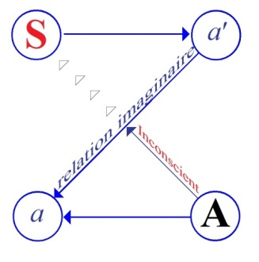
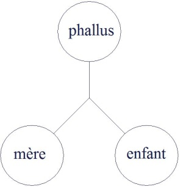

# Leçon 05 | 19 Décembre 1956

  

    <label><input type="checkbox" data-lacan-toggle="original" checked> 原文</label>
    <label><input type="checkbox" data-lacan-toggle="notes" checked> 注释</label>
    <label><input type="checkbox" data-lacan-toggle="commentary" checked> 个人解读评论</label>
  

  <form class="lacan-tool-search" role="search">
    <input class="lacan-tool-search-input" type="search" placeholder="搜索全文" aria-label="搜索全文">
    <button class="lacan-tool-button" type="submit" title="搜索">搜索</button>
  </form>
  <button class="lacan-tool-button lacan-back-to-top" type="button" title="回到页面最上方" aria-label="回到页面最上方">↑</button>

<section class="parallel-paragraph" data-paragraph-ids="s4-05-0001">

s4-05-0001

原文 · s4-05-0001

La conception analytique de *la relation d’objet* a déjà une certaine réalisation historique. Ce que j’essaye de vous montrer
la reprend dans un sens partiellement différent, partiellement aussi le même, mais qui ne l’est tout de même, bien entendu,
que pour autant qu’elle s’insère dans un ensemble différent qui lui donne une signification différente.

[无对应译文]

</section>

<section class="parallel-paragraph" data-paragraph-ids="s4-05-0002">

s4-05-0002

原文 · s4-05-0002

Il convient, au point où nous en sommes parvenus, de bien ponctuer d’une façon accusée comment cette *relation d’objet* est mise, par le groupe de ceux qui en font de plus en plus état - et j’ai pu m’en apercevoir récemment aux relectures de certains articles -
au centre de leur conception de l’analyse. Il convient de bien marquer en quoi cette formulation qui se précipite, qui s’affirme,
et même jusqu’à un certain point qui s’affirme en même temps au cours des années, aboutit à quelque chose
de maintenant très fermement articulé.

[无对应译文]

</section>

<section class="parallel-paragraph" data-paragraph-ids="s4-05-0003">

s4-05-0003

原文 · s4-05-0003

Il est arrivé que dans certains articles j’ai souhaité *ironiquement* que quelqu’un donne vraiment la raison de *la relation d’objet* telle qu’elle est pensée *dans une certaine orientation* \[PDA\]. Mon vœu a été amplement comblé depuis, c’est plus d’un qui nous a donné cette formulation, et plus spécialement une formulation qui a été plutôt en s’amollissant de la part de celui qui l’avait introduite
à propos de la névrose obsessionnelle\[Bouvet\], mais pour d’autres on peut dire qu’il y a eu un effort de précision
dans la conception dominante.

[无对应译文]

</section>

<section class="parallel-paragraph" data-paragraph-ids="s4-05-0004">

s4-05-0004

原文 · s4-05-0004

Et dans l’article sur « *La motricité dans la relation d’objet »* dans [le numéro de Janvier-Juin 1955 de la *Revue Française de Psychanalyse*](http://gallica.bnf.fr/ark:/12148/bpt6k54459170.image.langFR.r=Revue%20fran%C3%A7aise%20de%20psychanalyse,%201955), Monsieur Michel FAIN nous donne un exemple vivant et, je pense, répondant en tout au résumé que je vais vous en faire.
Les choses certainement vous paraîtront même aller beaucoup plus loin, à la lecture de l’article, que l’idée que je pourrai
vous en donner d’une façon forcément raccourcie dans ces quelques mots.

[无对应译文]

</section>

<section class="parallel-paragraph" data-paragraph-ids="s4-05-0005">

s4-05-0005

原文 · s4-05-0005

Enfin j’espère que vous verrez à quel point il est exact que la relation entre l’analysé et l’analysant est conçue au départ
comme celle qui s’établit entre un sujet (*le patient*) et un objet extérieur (*l’analyste*), et pour nous exprimer dans notre vocabulaire, l’analyste est là conçu comme *réel*. Toute la tension de la situation analytique est conçue sur cette base que c’est ce « *couple* »
qui à lui tout seul est un élément animateur du développement analytique, qu’entre un sujet couché ou non sur un divan
et *l’objet extérieur* qui est l’analyste, il ne peut en principe s’établir, se manifester que ce qui est appelé *la relation pulsionnelle primitive*, celle qui doit normalement - c’est le présupposé du développement de la relation analytique - se manifester par *une activité motrice*.

[无对应译文]

</section>

<section class="parallel-paragraph" data-paragraph-ids="s4-05-0006">

s4-05-0006

原文 · s4-05-0006

C’est du côté des petites traces soigneusement observées des époques de réaction motrice du sujet que nous trouvons le dernier mot de ce qui se passe au niveau de la pulsion qui sera là en quelque sorte localisée, sentie vivante par l’analyste :
c’est pour autant que le sujet *contient* ses mouvements, qu’il est *forcé* de les contenir dans la relation telle qu’elle est établie
par la convention analytique, c’est à ce niveau là qu’est localisé dans l’esprit de l’analyste ce dont il s’agit de manifester,
c’est à dire la pulsion en train d’émerger.

[无对应译文]

</section>

<section class="parallel-paragraph" data-paragraph-ids="s4-05-0007">

s4-05-0007

原文 · s4-05-0007

En fin de compte la situation est à la base conçue comme ne pouvant s’extérioriser que dans une *agression érotique*,
qui ne se manifeste pas parce qu’il est convenu qu’elle ne se manifestera pas, mais dont en quelque sorte il est souhaitable
que l’érection surgisse, si l’on peut dire, à tout instant.

[无对应译文]

</section>

<section class="parallel-paragraph" data-paragraph-ids="s4-05-0008">

s4-05-0008

原文 · s4-05-0008

C’est précisément dans la mesure où à l’intérieur de *la convention analytique*, la position de la règle, *la manifestation motrice de la pulsion* ne peut pas se pro­duire, qu’il nous sera permis de nous apercevoir que ce qui interfère dans cette situation - elle, considérée comme constituante - nous est très précisément formulé en ceci : qu’à la relation avec l’objet extérieur se superpose une relation avec un objet intérieur.

[无对应译文]

</section>

<section class="parallel-paragraph" data-paragraph-ids="s4-05-0009">

s4-05-0009

原文 · s4-05-0009

C’est ainsi qu’on s’exprime dans l’article que je viens de vous citer. C’est pour autant que le sujet a une certaine relation
avec un objet intérieur qui est toujours considéré comme étant la personne présente, mais prise en quelque sorte
dans les mécanismes imaginaires déjà institués dans le sujet, c’est en tant qu’une certaine *discordance* s’introduit entre
cet *objet imaginaire* et *l’objet réel*, que l’analyste va être à chaque instant apprécié, jaugé, et qu’il va modeler ses interventions
à chaque instant dans la mesure de la discordance entre :

[无对应译文]

</section>

<section class="parallel-paragraph" data-paragraph-ids="s4-05-0010">

s4-05-0010

原文 · s4-05-0010

- cet *objet intérieur* de cette relation fantasmatique à quelqu’un qui est en principe la personne présente puisqu’il n’est personne d’autre que ceux qui sont là à entrer en jeu dans la situation analytique

[无对应译文]

</section>

<section class="parallel-paragraph" data-paragraph-ids="s4-05-0011">

s4-05-0011

原文 · s4-05-0011

- et la notion mise en valeur par *l’un de ces auteurs* - suivi dans cette occasion par tous les autres - qui est celle de *« la distance névrotique »* que le sujet impose à *l’objet*, se réfère très précisément à cette *situa­tion analytique*.

[无对应译文]

</section>

<section class="parallel-paragraph" data-paragraph-ids="s4-05-0012">

s4-05-0012

原文 · s4-05-0012

C’est dans toute la mesure où à un moment *l’objet fantasmatique*, *l’objet intérieur* sera enfin - au moins dans cette position suspendue et de cette façon vécue par le sujet - réduit à la distance réelle qui est celle du sujet à l’analyste, c’est dans la mesure où le sujet réalisera son analyste comme « *présence réelle* ».

[无对应译文]

</section>

<section class="parallel-paragraph" data-paragraph-ids="s4-05-0013">

s4-05-0013

原文 · s4-05-0013

Ici les auteurs vont très loin. J’ai déjà fait plusieurs fois allusion au fait qu’un de ces auteurs - il est vrai alors dans une période postulante de sa carrière - avait parlé comme du tournant crucial d’une analyse le moment où - et ce n’était pas une métaphore -
son analysé avait pu le sentir : il ne s’agissait pas qu’il puisse le sentir psychologiquement, où il avait perçu son odeur.

[无对应译文]

</section>

<section class="parallel-paragraph" data-paragraph-ids="s4-05-0014">

s4-05-0014

原文 · s4-05-0014

Cette sorte de mise au premier plan, d’affleurement de la relation de subodoration est, je dois dire, une des conséquences mathématiques d’une conception semblable de la relation analytique. Il est bien certain que dans une position réfrénée
à l’intérieur de laquelle doit peu à peu se réaliser *une distance* qui est conçue comme *la distance* ici active, présente, réelle,
vis-à-vis de l’analyste, il est bien certain qu’un des *modes des relations* les plus directes dans cette position qui est une position réelle et simplement réfrénée, doit être ce mode d’appréhension *à distance* qui est donné par la subodoration. Je ne prends pas là
un exemple, ceci a été répété à plusieurs reprises, et il semble que dans ce milieu on tende de plus en plus à donner
une importance pivot à de tels modes d’appréhension.

[无对应译文]

</section>

<section class="parallel-paragraph" data-paragraph-ids="s4-05-0015">

s4-05-0015

原文 · s4-05-0015

Voici donc comment la position analytique est pensée à l’intérieur de cette situation qui est une situation de rapport réel de deux personnages dans un enclos à l’intérieur duquel ils sont séparés par une sorte de barrière qui est une barrière conventionnelle,
et quelque chose doit se réaliser. Je parle de la formulation théorique des choses, nous verrons après où ceci mène
quant aux conséquences pratiques.

[无对应译文]

</section>

<section class="parallel-paragraph" data-paragraph-ids="s4-05-0016">

s4-05-0016

原文 · s4-05-0016

Il est bien clair qu’une conception aussi exorbitante ne peut pas être poussée jusqu’à ses dernières conséquences.
Il est bien clair d’autre part que si ce que je vous enseigne est vrai, cette situation n’est même pas réellement cela,
il ne suffit pas de la concevoir comme telle, bien entendu pour qu’elle soit ainsi qu’on la conçoit. On la mènera de travers
en raison de la façon dont on la conçoit, mais ce qu’elle est réellement reste tout de même qu’elle est ce quelque chose
que j’essaye de vous exprimer par ce schéma :

[无对应译文]

</section>

<section class="parallel-paragraph" data-paragraph-ids="s4-05-0017">

s4-05-0017

原文 · s4-05-0017

[无对应译文]

</section>

<section class="parallel-paragraph" data-paragraph-ids="s4-05-0018">

s4-05-0018

原文 · s4-05-0018

qui fait intervenir et s’entrecroiser *la relation symbolique* et *la relation imaginaire,* l’une servant en quelque sorte de *filtre* à l’autre,
et il est bien clair que cette situation n’est pas réelle pour autant qu’on la méconnaît, c’est donc quelque chose qui se trouvera manifester l’insuffisance de cette conception. Mais inver­sement *l’insuffisance de cette conception* peut avoir quelques conséquences sur la façon de mener à bonne fin l’ensemble de la situation.

[无对应译文]

</section>

<section class="parallel-paragraph" data-paragraph-ids="s4-05-0019">

s4-05-0019

原文 · s4-05-0019

C’est un exemple d’espèce que je vais mettre en valeur aujourd’hui devant vous pour vous montrer effectivement
à quoi cela peut aboutir. Mais d’ores et déjà voici donc une situation conçue comme une situation réelle, comme une situation de *réduction* de l’*imaginaire* au *réel*, opération de *réduction* à l’intérieur de laquelle se passent un certain nombre de phénomènes
qui permettront de situer les différentes étapes où le sujet est resté plus ou moins adhérent ou fixé à cette *relation imaginaire*,
et de faire ce qu’on appelle l’exhaustion des diverses positions, *positions* essentiellement *imaginaires* comme on l’a montré,
au premier plan de la relation prégénitale comme devenant de plus en plus l’essentiel de ce qui est exploré dans l’analyse.

[无对应译文]

</section>

<section class="parallel-paragraph" data-paragraph-ids="s4-05-0020">

s4-05-0020

原文 · s4-05-0020

La caractéristique d’une telle conception est assurément que la seule chose - et ce n’est pas rien puisque *tout est là* - la seule chose qui n’est aucunement élucidée, on peut l’exprimer ainsi : c’est que l’on ne sait pas pourquoi l’*on parle* dans cette situation,
on ne le sait pas assurément, cela ne veut pas dire qu’on pourrait s’en passer, rien n’est dit quant au fait de la fonction
à proprement parler *du langage et de la parole* dans cette position.

[无对应译文]

</section>

<section class="parallel-paragraph" data-paragraph-ids="s4-05-0021">

s4-05-0021

原文 · s4-05-0021

Aussi bien d’ailleurs ce que nous verrons venir au jour c’est la valeur toute *spéciale* qui est donnée...
ceci encore vous le trouverez chez les auteurs et dans les textes cités, ponctuée de la façon la plus précise
...que seule la verbalisation impulsive, les espèces de *cris* vers l’analyste du type « *Pourquoi ne me répondez-vous pas ?* » représentent en fin de compte ce quelque chose qui est valable pour autant qu’il s’agit là de mots impulsifs, et signaler une verbalisation
n’a d’importance qu’autant qu’elle est impulsive, qu’autant qu’elle est manifestation *motrice*.

[无对应译文]

</section>

<section class="parallel-paragraph" data-paragraph-ids="s4-05-0022">

s4-05-0022

原文 · s4-05-0022

Dans cette opération du *réglage* si l’on peut dire de *la distance de l’objet interne* à laquelle toute la technique en quelque sorte
se soumettra, à quoi allons­-nous aboutir ? Qu’est-ce que notre schéma nous permet de concevoir de ce qui peut se passer ?
Cette relation \[*a*’→ *a*\] concerne *la relation imaginaire*, la relation du sujet - en tant que plus ou moins discordant, décomposé,
ouvert au morcellement - à *une image unifiante* qui est celle du *petit autre*, qui est *une image narcissique*.

[无对应译文]

</section>

<section class="parallel-paragraph" data-paragraph-ids="s4-05-0023">

s4-05-0023

原文 · s4-05-0023

C’est très essentiellement sur cette ligne que s’établit *la relation imaginaire* \[*a*’→ *a*\].

[无对应译文]

</section>

<section class="parallel-paragraph" data-paragraph-ids="s4-05-0024">

s4-05-0024

原文 · s4-05-0024

[无对应译文]

</section>

<section class="parallel-paragraph" data-paragraph-ids="s4-05-0025">

s4-05-0025

原文 · s4-05-0025

De même que c’est sur cette ligne \[A → S\], *qui n’en est pas une puisqu’il convient de l’établir*, que se produit cette relation à l’*Autre*...
qui n’est pas simplement *l’Autre qui est là*, qui est *littéralement* *le lieu de parole  :* c’est en tant qu’il y a déjà structuré dans la relation parlante cet au-delà, cet *Autre au-delà* même de cet *autre* que vous appréhendez *imaginairemen*t,
cet *Autre supposé* qui est le sujet comme tel, le sujet dans lequel votre *parole* se constitue,
parce qu’il peut comme *parole*, non seulement *l’accueillir*, *la percevoir*, mais *y répondre*
...*c’est sur cette ligne* \[A → S\] *que s’établit tout ce qui est de l’ordre transférentiel* à proprement parler, l’*imaginaire* y jouant précisément un rôle de *filtre*, voire *d’obstacle*. Bien entendu dans chaque névrose, le sujet a déjà, si l’on peut dire, son propre réglage :

[无对应译文]

</section>

<section class="parallel-paragraph" data-paragraph-ids="s4-05-0026">

s4-05-0026

原文 · s4-05-0026

- c’est à *quelque chose* que lui sert en effet de réglage par rapport à l’image,

[无对应译文]

</section>

<section class="parallel-paragraph" data-paragraph-ids="s4-05-0027">

s4-05-0027

原文 · s4-05-0027

- c’est à *quelque chose* que cela lui sert, pour à la fois entendre et ne pas entendre ce qu’il y a à entendre au lieu de la parole.

[无对应译文]

</section>

<section class="parallel-paragraph" data-paragraph-ids="s4-05-0028">

s4-05-0028

原文 · s4-05-0028

Ne disons rien de plus que ceci :

[无对应译文]

</section>

<section class="parallel-paragraph" data-paragraph-ids="s4-05-0029">

s4-05-0029

原文 · s4-05-0029

- si tout notre effort, tout notre intérêt porte uniquement sur ce qui est là \[*a*’→ *a*\] dans cette *position transverse* par rapport à *l’avè­nement de la parole* \[A → S\],

[无对应译文]

</section>

<section class="parallel-paragraph" data-paragraph-ids="s4-05-0030">

s4-05-0030

原文 · s4-05-0030

- si tout est méconnu de la relation entre *la tension imaginaire* \[*a*’→ *a*\] et ce qui doit se réaliser, venir au jour du *rapport symbolique inconscient* \[A → S\], parce que précisément c’est là toute la doctrine analytique qui est là à l’état potentiel, qu’il y a quelque chose qui doit lui permettre de s’achever, de se réaliser autant comme histoire que comme aveu,

[无对应译文]

</section>

<section class="parallel-paragraph" data-paragraph-ids="s4-05-0031">

s4-05-0031

原文 · s4-05-0031

- si nous abandonnons la notion de la fonction de *la relation imaginaire* par rapport à cette impossibilité
  de *l’avènement symbolique* qui constitue la névrose, si nous ne les pensons pas sans cesse chacun en fonction de l’Autre,
  …ce qu’on peut s’attendre en principe *qu’il y ait à dire* est ce que précisément ces auteurs, les tenants de cette concep­tion, appellent *la relation d’objet*, et cette *distance à l’objet* est précisément réglée dans une certaine fin.

[无对应译文]

</section>

<section class="parallel-paragraph" data-paragraph-ids="s4-05-0032">

s4-05-0032

原文 · s4-05-0032

Si nous ne nous intéressons à elle que pour en quelque sorte l’anéantir, si tant est que ce soit possible en ne s’intéressant
qu’à elle nous arrivions à quelque chose, à un certain résultat, qu’il suffise de savoir que nous en avons déjà, des résultats :
il nous est déjà venu en mains des sujets qui ont passé par ce style d’appréhension et d’épreuve.

[无对应译文]

</section>

<section class="parallel-paragraph" data-paragraph-ids="s4-05-0033">

s4-05-0033

原文 · s4-05-0033

Il y a quelque chose d’absolument certain, c’est qu’au moins dans un certain nombre de cas, et précisément de cas de *névrose obsessionnelle,* cette façon tout entière de situer le développement de la situation analytique dans une poursuite de la réduction
de cette fameuse « *distance* » qui serait considérée comme caractéristique de *la relation d’objet* à la *névrose obsessionnelle*,
nous obtenons ce qu’on peut appeler des *réactions perverses paradoxales*.

[无对应译文]

</section>

<section class="parallel-paragraph" data-paragraph-ids="s4-05-0034">

s4-05-0034

原文 · s4-05-0034

Par exemple l’explosion qui est tout à fait inhabituelle et qui n’existait guère dans la littérature analytique avant que fût mis

[无对应译文]

</section>

<section class="parallel-paragraph" data-paragraph-ids="s4-05-0035">

s4-05-0035

原文 · s4-05-0035

au pre­mier plan ce mode technique, la précipitation d’un attachement homosexuel pour un objet en quelque sorte tout à fait paradoxal qui dans la relation du sujet reste même là à la façon d’une sorte d’artéfact, d’une espèce de gélification d’une image,
d’une chose qui s’est cristallisée, précipitée autour des objets qui se trouvent à la portée du sujet, et qui peut manifester
pendant un certain temps une assez durable persistance. Ceci n’est pas étonnant si nous prenons *la relation de la triade imaginaire* *mère-enfant-phallus*.

[无对应译文]

</section>

<section class="parallel-paragraph" data-paragraph-ids="s4-05-0036">

s4-05-0036

原文 · s4-05-0036

[无对应译文]

</section>

<section class="parallel-paragraph" data-paragraph-ids="s4-05-0037">

s4-05-0037

原文 · s4-05-0037

Au point où j’ai poussé les choses la dernière fois vous avez vu s’ébaucher une ligne de recherche, c’est assurément pour nous
en tenir au prélude de la mise en jeu de *la relation symbolique* qui ne se fera qu’avec la *quarte* fonction qui est celle du père,
qui est introduite par la dimension de l’œdipe.

[无对应译文]

</section>

<section class="parallel-paragraph" data-paragraph-ids="s4-05-0038">

s4-05-0038

原文 · s4-05-0038

Nous sommes ici dans un triangle qui en lui-même est pré-œdipien, je le souligne, il n’est là isolé que d’une façon abstraite.
Il ne nous intéresse dans son développement que pour autant qu’il est ensuite repris dans le *quatuor* avec l’entrée en jeu de la fonction paternelle à partir de cette, disons *déception fondamentale de l’enfant* reconnaissant non seulement *qu’il n’est pas l’objet unique* de la mère - nous avons laissé ouverte la question de savoir comment il le reconnaissait - mais s’apercevant que *l’objet possible*
\- ceci plus ou moins accentué selon les cas - *de l’intérêt de la mère, est le phallus*.

[无对应译文]

</section>

<section class="parallel-paragraph" data-paragraph-ids="s4-05-0039">

s4-05-0039

原文 · s4-05-0039

Première question de la recon­naissance de la relation mère-enfant. S’apercevant en second lieu que *la mère* est justement *privée*, *manque* elle-même de cet objet, voilà le point où nous en étions parvenus la dernière fois. Je vous l’ai montré en évoquant le cas transitoire d’une phobie chez une très jeune enfant, qui nous permettait de l’étudier, en quelque sorte d’une façon très favorable parce que c’est la limite de la relation œdipienne que nous pou­vions voir à la suite de quelque double déception :

[无对应译文]

</section>

<section class="parallel-paragraph" data-paragraph-ids="s4-05-0040">

s4-05-0040

原文 · s4-05-0040

- déception imaginaire, repérage par l’enfant lui-même du *phallus* qui lui manque,

[无对应译文]

</section>

<section class="parallel-paragraph" data-paragraph-ids="s4-05-0041">

s4-05-0041

原文 · s4-05-0041

- puis ensuite dans un deuxième temps de la perception qu’à la mère, à cette mère qui est *à la limite du sym­bolique et du réel,*

[无对应译文]

</section>

<section class="parallel-paragraph" data-paragraph-ids="s4-05-0042">

s4-05-0042

原文 · s4-05-0042

> à cette mère manque aussi le *phallus*.

[无对应译文]

</section>

<section class="parallel-paragraph" data-paragraph-ids="s4-05-0043">

s4-05-0043

原文 · s4-05-0043

Et l’éclosion, l’appel par l’enfant pour soutenir en quelque sorte cette relation insoutenable, et l’in­tervention de cet être fantasmatique qui est le chien qui intervient ici comme celui qui est en quelque sorte à proprement parler le responsable
de toute la situation, celui qui *mord*, celui qui *châtre*, celui grâce à quoi est *pensable*, est *vivable symboliquement* l’ensemble
de cette situation, au moins pour une période provisoire.

[无对应译文]

</section>

<section class="parallel-paragraph" data-paragraph-ids="s4-05-0044">

s4-05-0044

原文 · s4-05-0044

Que se passe-t-il donc, quelle est la position possible quand cet attelage des trois objets imaginaires dans l’occasion est rompu ?
Il y a plus d’une solution possible, et la solution est toujours appelée dans une situation normale ou anor­male.

[无对应译文]

</section>

<section class="parallel-paragraph" data-paragraph-ids="s4-05-0045">

s4-05-0045

原文 · s4-05-0045

Que se passe-t-il dans la situation œdipienne normale ?

[无对应译文]

</section>

<section class="parallel-paragraph" data-paragraph-ids="s4-05-0046">

s4-05-0046

原文 · s4-05-0046

C’est par l’inter­médiaire d’une certaine rivalité ponctuée d’identification, dans une alternance des relations du sujet avec le père, que quelque chose pourra être établi, qui fera que *le sujet se verra* - en quelque sorte diversement, selon sa position lui­ même
de fille ou de garçon - *conférer* si l’on peut dire - pour le garçon c’est tout à fait clair - *conférer* dans certaines limites,
celles précisément qui l’introduisent à la relation symbolique, *conférer* cette puissance phallique.

[无对应译文]

</section>

<section class="parallel-paragraph" data-paragraph-ids="s4-05-0047">

s4-05-0047

原文 · s4-05-0047

Et d’une certaine façon, quand je vous ai dit l’autre jour que pour la mère l’enfant comme être réel était pris comme *symbole*
de son *manque d’objet*, de son appétit imaginaire pour le *phallus*, l’issue normale à cette situation peut se concevoir comme étant ceci précisément réalisé au niveau de l’enfant, c’est à dire que l’enfant reçoit *symboliquement* ce *phallus* dont il a besoin, mais dont pour qu’il en ait besoin il faut qu’il ait été préalablement menacé par l’instance castratrice qui est originalement
et essentiellement l’instance paternelle. C’est dans une constitution sur le plan *symbolique*, sur le plan d’une sorte de *pacte*,
de droit au *phallus* que s’établit pour l’enfant cette *identification virile* qui est au fondement d’une relation œdipienne normative.

[无对应译文]

</section>

<section class="parallel-paragraph" data-paragraph-ids="s4-05-0048">

s4-05-0048

原文 · s4-05-0048

Mais rien qu’ici je vous fais une remarque en quelque sorte latérale. Qu’est­-ce qui résulte de ceci ? Il y a quelque chose
d’assez singulier, voire de paradoxal dans les formulations originaires qui sont sous la plume de FREUD de la distinction entre

[无对应译文]

</section>

<section class="parallel-paragraph" data-paragraph-ids="s4-05-0049">

s4-05-0049

原文 · s4-05-0049

- la relation *anaclitique,*

[无对应译文]

</section>

<section class="parallel-paragraph" data-paragraph-ids="s4-05-0050">

s4-05-0050

原文 · s4-05-0050

- et la relation *narcissique*.

[无对应译文]

</section>

<section class="parallel-paragraph" data-paragraph-ids="s4-05-0051">

s4-05-0051

原文 · s4-05-0051

Dans l’œdipe cette relation libidinale... Chez l’adolescent, FREUD nous dit qu’il y a deux types d’objet d’amour :

[无对应译文]

</section>

<section class="parallel-paragraph" data-paragraph-ids="s4-05-0052">

s4-05-0052

原文 · s4-05-0052

- *l’objet d’amour anaclitique* qui porte la marque d’une dépendance primitive à la mère,

[无对应译文]

</section>

<section class="parallel-paragraph" data-paragraph-ids="s4-05-0053">

s4-05-0053

原文 · s4-05-0053

- *l’objet d’amour narcissique* qui est modelé sur *l’image*, qui est *l’image* du sujet lui-même, qui est *l’image narcissique*. C’est *cette image* que nous avons essayé ici d’élaborer en en montrant la racine dans *la relation spéculaire* à l’autre.

[无对应译文]

</section>

<section class="parallel-paragraph" data-paragraph-ids="s4-05-0054">

s4-05-0054

原文 · s4-05-0054

Le mot « *anaclitique* » - encore que nous le devions à FREUD - est vraiment bien mal fait car en grec il n’a vraiment pas le sens que FREUD lui donne qui est indiqué par le mot allemand *Anlehung*, *relation*, c’est une *relation d’appui contre*. Ceci d’ailleurs prêtant encore à toutes sortes de malentendus, certains ayant poussé cet *appui contre* jusqu’à être quelque chose qui est une sorte finalement de réaction de défense. Mais laissons cela de côté, en fait si on lit FREUD on voit bel et bien qu’il s’agit de ce besoin d’appui et de quelque chose qui en effet ne demande qu’à s’ouvrir du côté d’une relation de dépendance.

[无对应译文]

</section>

<section class="parallel-paragraph" data-paragraph-ids="s4-05-0055">

s4-05-0055

原文 · s4-05-0055

Si on pousse plus loin on verra qu’il y a de singulières contradictions dans la formulation opposée que FREUD donne

[无对应译文]

</section>

<section class="parallel-paragraph" data-paragraph-ids="s4-05-0056">

s4-05-0056

原文 · s4-05-0056

de ces deux modes de relations : *ana­clitique* et *narcissique*. Très curieusement il est amené à parler dans la relation anaclitique
d’un besoin d’être aimé beaucoup plus que d’un besoin d’aimer. Inversement et très paradoxalement le narcissique apparaît
tout d’un coup sous un jour qui nous surprend, car à la vérité certainement il est attiré par un élément d’activité inhérent

[无对应译文]

</section>

<section class="parallel-paragraph" data-paragraph-ids="s4-05-0057">

s4-05-0057

原文 · s4-05-0057

au comportement très spécial du narcissique, il appa­raît actif pour autant justement qu’il méconnaît toujours

[无对应译文]

</section>

<section class="parallel-paragraph" data-paragraph-ids="s4-05-0058">

s4-05-0058

原文 · s4-05-0058

jusqu’à un certain point l’autre.

[无对应译文]

</section>

<section class="parallel-paragraph" data-paragraph-ids="s4-05-0059">

s4-05-0059

原文 · s4-05-0059

C’est du besoin d’aimer que FREUD le revêt et dont il lui donne l’attribut, ce qui en fait tout à fait paradoxalement
et soudain une sorte de lieu naturel de ce que dans un autre vocabulaire nous appellerions *oblatif*, et qui ne peut que déconcerter.
Je crois qu’il y a là-dessus à revenir, mais qu’une fois de plus c’est dans la méconnaissancede la position des éléments intrasubjectifs que ces perspectives paradoxales prennent leur origine, et du même coup leur justification.

[无对应译文]

</section>

<section class="parallel-paragraph" data-paragraph-ids="s4-05-0060">

s4-05-0060

原文 · s4-05-0060

Ce qu’on appelle *la relation anaclitique* là où elle a de l’intérêt, c’est-à-dire au niveau de sa *persistance* chez l’adulte,
est toujours conçue comme une sorte de pure et simple survivance, prolongation de ce qu’on appelle une position infantile.

[无对应译文]

</section>

<section class="parallel-paragraph" data-paragraph-ids="s4-05-0061">

s4-05-0061

原文 · s4-05-0061

Si effectivement le sujet qui a cette position…
et qu’ailleurs dans l’article sur les types libidinaux, FREUD n’appelle ni plus ni moins
que *la position érotique*, ce qui montre bien que c’est effectivement la position la plus ouverte
…ce qui en fait méconnaître l’essence, c’est précisément de ne pas s’apercevoir que pour autant que le sujet *acquiert*
dans la relation *symbolique*, *se voit investi du phallus* comme tel, comme lui appartenant et comme étant pour lui d’un exercice
si l’on peut dire légitime, il devient par rapport à ce qui succède à l’objet maternel…
à cet objet retrouvé, marqué de la relation à la mère primitive qui sera dans la position normale de l’œdipe, toujours en principe, ceci dès l’origine de l’exposé freudien, l’objet pour le sujet mâle
…c’est à dire qu’il devient le porteur de cet objet de désir pour la femme.

[无对应译文]

</section>

<section class="parallel-paragraph" data-paragraph-ids="s4-05-0062">

s4-05-0062

原文 · s4-05-0062

La position devient anaclitique en tant que c’est de lui, du *phallus* dont il est désormais le maître, le représentant, le dépositaire, c’est en tant que la femme dépend de lui que la position est *anaclitique*. La relation de dépendance s’établit pour autant
que s’identifiant à l’autre, au partenaire objectal, il est indispensable à ce partenaire, que c’est lui qui la satisfait,
et lui seul parce qu’il est en principe le seul dépositaire de cet objet qui est l’objet du désir de la mère.

[无对应译文]

</section>

<section class="parallel-paragraph" data-paragraph-ids="s4-05-0063">

s4-05-0063

原文 · s4-05-0063

C’est en fonction d’un achèvement de la position œdipienne que le sujet se trouve dans la position que nous pouvons qualifier d’*optima* dans une certaine perspective par rapport à l’objet retrouvé qui sera le successeur de l’objet maternel primitif,

[无对应译文]

</section>

<section class="parallel-paragraph" data-paragraph-ids="s4-05-0064">

s4-05-0064

原文 · s4-05-0064

et par rapport auquel il deviendra lui, l’objet indis­pensable, et que se sachant indispensable, une partie de la vie érotique

[无对应译文]

</section>

<section class="parallel-paragraph" data-paragraph-ids="s4-05-0065">

s4-05-0065

原文 · s4-05-0065

pré­cisément des sujets qui participent de ce versant libidinal soit toute entière condi­tionnée par le besoin une fois expérimenté et assumé de l’autre, de *la femme maternelle* comme ayant besoin en lui de trouver son objet qui est *l’objet phal­lique*.

[无对应译文]

</section>

<section class="parallel-paragraph" data-paragraph-ids="s4-05-0066">

s4-05-0066

原文 · s4-05-0066

Voilà ce qui fait l’essence de *la relation anaclitique* en tant qu’opposée à *la relation narcissique*.

[无对应译文]

</section>

<section class="parallel-paragraph" data-paragraph-ids="s4-05-0067">

s4-05-0067

原文 · s4-05-0067

Ceci n’est qu’une parenthèse destinée à montrer l’utilité de mettre toujours en jeu cette dialectique de la relation, ici des trois objets premiers, autour de laquelle reste pour l’instant, sauf dans la notion générale de quelque chose qui les embrasse tous
et les lie dans *la relation symbolique*, autour de laquelle reste pour l’instant localisé le quatrième terme qui est le père
en tant qu’il introduit ici *la relation symbolique*, la possibilité de la trans­cendance de *la relation de frustration* ou de *manque d’objet*,
dans *la relation de castration* qui est tout autre chose, c’est à dire qui introduit ce *manque d’objet* dans une dialectique,

[无对应译文]

</section>

<section class="parallel-paragraph" data-paragraph-ids="s4-05-0068">

s4-05-0068

原文 · s4-05-0068

dans quelque chose qui prend et donne, qui ins­titue, investit, confère la dimension du pacte d’une interdiction, d’une loi,
de *l’interdiction de l’inceste* en particulier, dans toute cette dialectique.

[无对应译文]

</section>

<section class="parallel-paragraph" data-paragraph-ids="s4-05-0069">

s4-05-0069

原文 · s4-05-0069

Revenons à notre sujet : *que se passe-t-il si c’est la relation imaginaire qui devient la règle et la mesure de toute la relation anaclitique ?*

[无对应译文]

</section>

<section class="parallel-paragraph" data-paragraph-ids="s4-05-0070">

s4-05-0070

原文 · s4-05-0070

Il en adviendra exactement ceci : c’est qu’au moment où entrent dans le désaccord, dans le non-lien, dans la destruction des liens pour une raison quelconque évolutive des incidences historiques de la relation de l’enfant à la mère par rapport au tiers objet,
*objet phallique* qui est à la fois ce *qui manque à la femme* et ce que l’enfant a découvert *qui manque à la mère,* il y a d’autres modes de rétablissement de cette cohérence.

[无对应译文]

</section>

<section class="parallel-paragraph" data-paragraph-ids="s4-05-0071">

s4-05-0071

原文 · s4-05-0071

Ces modes sont *des modes imaginaires*, ce sont *des modes imaginaires* qui, *non typiques*, consistent dans *l’identification de l’enfant à la mère*, par exemple à partir d’un *déplacement imaginaire de l’enfant par rapport à son partenaire maternel*, le choix à sa place, l’assomption
pour elle de ce manque vers *l’objet phallique* comme tel. Le schéma que je vous donne là n’est rien d’autre que le schéma
de *la perversion fétichiste*. Voilà un exemple de solution si vous voulez, mais il y a une voie plus directe.

[无对应译文]

</section>

<section class="parallel-paragraph" data-paragraph-ids="s4-05-0072">

s4-05-0072

原文 · s4-05-0072

En d’autres termes d’autres solutions existent d’accès à ce *manque d’objet* qui est déjà sur le plan *imaginaire* la voie humaine
d’une réalisation qui est le rapport de l’homme à son existence, c’est à dire à quelque chose qui peut être mis en cause,
qui déjà fait quelque chose de différent de l’animal et de toutes les relations animales possibles sur le plan *imaginaire*,
c’est à dire à l’intérieur de certaines conditions qui seront des conditions en quelque sorte ponctuées, extra-historiques,
telles que se présente toujours le paroxysme de la perversion.

[无对应译文]

</section>

<section class="parallel-paragraph" data-paragraph-ids="s4-05-0073">

s4-05-0073

原文 · s4-05-0073

La perversion a cette propriété de réaliser un certain mode d’accès à cet au delà de l’image de l’autre qui caractérise la dimension humaine, mais elle le réalise simplement dans un moment comme en produisent toujours les paroxysmes des perversions,
qui sont en quelque sorte des moments syncopés dans l’intérieur de l’histoire du sujet.

[无对应译文]

</section>

<section class="parallel-paragraph" data-paragraph-ids="s4-05-0074">

s4-05-0074

原文 · s4-05-0074

Il y a une somme de convergence ou de montée vers le moment qui est peut-être très significativement qualifié de *passage à l’acte*, et pendant ce *passage à l’acte* quelque chose est réalisé :

[无对应译文]

</section>

<section class="parallel-paragraph" data-paragraph-ids="s4-05-0075">

s4-05-0075

原文 · s4-05-0075

- qui est fusion,

[无对应译文]

</section>

<section class="parallel-paragraph" data-paragraph-ids="s4-05-0076">

s4-05-0076

原文 · s4-05-0076

- qui est accès à cet au-delà,

[无对应译文]

</section>

<section class="parallel-paragraph" data-paragraph-ids="s4-05-0077">

s4-05-0077

原文 · s4-05-0077

- qui est à proprement parler *cette dimension tran­s-individuelle* que la théorie anaclitique freudienne formulait comme telle, et nous apprend à appeler l’*éros*, cette union de deux individus chacun étant arraché à lui-même et pour un instant plus ou moins fragile, transitoire, voire même virtuel, constituant cette *unité*. Cette *unité* est réalisée à certains moments de la perversion, et ce qui constitue la perversion est précisément qu’elle ne peut être jamais réalisée
  que dans ces moments non ordonnés *symboliquement*.

[无对应译文]

</section>

<section class="parallel-paragraph" data-paragraph-ids="s4-05-0078">

s4-05-0078

原文 · s4-05-0078

Le sujet finalement trouve son objet, et son objet *exclusif*, et il le dit lui­-même, d’autant plus *exclusif* et d’autant plus parfaitement plus satisfaisant qu’il est *inanimé*, du moins comme cela il sera bien tranquille de ne pas avoir de déception de sa part.
Quand le sujet aime une pantoufle voilà le sujet qui a vraiment, si on peut dire, l’objet de ses désirs à sa portée, c’est plus sûr,
un objet lui-même dépourvu de propriété *subjective*, *intersubjective*, voire *trans-sub­jective*. La solution fétichiste est incontestablement, pour ce qui est de réaliser la condition de manque comme tel, une des conditions les plus concevables dans cette perspective,
et elle est réalisée.

[无对应译文]

</section>

<section class="parallel-paragraph" data-paragraph-ids="s4-05-0079">

s4-05-0079

原文 · s4-05-0079

Nous savons aussi que le propre de *la relation imaginaire* étant d’être tou­jours parfaitement réciproque, puisque *c’est une relation en miroir* nous devons nous attendre à voir apparaître chez *le fétichiste* de temps en temps la position non pas d’*identification à la mère*, mais d’*identification à l’objet*. C’est effec­tivement ce que nous verrons se produire au cours d’une analyse de fétichiste,
car cette position comme telle est toujours ce qu’il y a de plus non satisfaisante.

[无对应译文]

</section>

<section class="parallel-paragraph" data-paragraph-ids="s4-05-0080">

s4-05-0080

原文 · s4-05-0080

Il ne suffit pas que pour un court instant l’*illumination* *fascinante de l’objet* qui a été l’objet maternel soit quelque chose qui satisfasse le sujet, pour qu’autour de cela puisse s’établir tout un équilibre érotique, et effectivement pour le moment si c’est à l’objet
qu’il s’identifie, il perdra on peut dire son *objet primitif*, à savoir la mère, il se considèrera lui-même pour la mère comme un objet destructeur, c’est ce perpétuel jeu, cette sorte de profonde diplopie qui marque toute l’appréhension de la manifestation fétichiste dans laquelle nous aurons à entrer plus tard.

[无对应译文]

</section>

<section class="parallel-paragraph" data-paragraph-ids="s4-05-0081">

s4-05-0081

原文 · s4-05-0081

Mais c’est tellement visible et manifeste que quelqu’un comme Phyllis GREENACRE qui a cherché à approfondir sérieusement le fondement de *la relation fétichiste*, nous dit qu’il semble qu’on soit en présence d’un sujet qui vous montrerait avec une excessive rapidité sa propre image dans deux miroirs opposés. Ça lui est sorti comme cela sans qu’elle sache très bien à ce moment là pourquoi, car cela vient *comme les cheveux sur la soupe*, mais elle a eu tout d’un coup le sentiment que c’est cela, il n’est jamais là
où il est pour la bonne raison qu’il est sorti de sa place, qu’il est passé dans une *relation spéculaire* de la mère au *phallus*, et qu’il est alternativement l’un et l’autre, position qui n’arrive à se stabiliser que pour autant qu’est saisi cette sorte de *symbole unique*, privilégié et en même temps impermanent qu’est *l’objet précis du fétichisme*, c’est à dire *le quelque chose qui symbolise le phallus*.

[无对应译文]

</section>

<section class="parallel-paragraph" data-paragraph-ids="s4-05-0082">

s4-05-0082

原文 · s4-05-0082

C’est donc sur le plan de relations analogues - tout au moins que nous pouvons concevoir comme étant essentiellement
de nature perverse - que doivent se manifester les résultats au moins transitoires, au moins en face d’une certaine manière
de manier *la relation anaclitique*, si nous la centrons toute entière sur la relation d’objet en tant que ne faisant intervenir qu’*imaginaire* et *réel*, et réglant sur un prétendu réel de « *la présence de l’analyste* » toute l’accommodation de *la relation imaginaire*.

[无对应译文]

</section>

<section class="parallel-paragraph" data-paragraph-ids="s4-05-0083">

s4-05-0083

原文 · s4-05-0083

Dans mon *Rapport de Rome* j’ai fait quelque part allusion à ce mode de relation d’objet en le comparant à ce que j’appelais
une sorte de *bundling* poussé à ses limites suprêmes en fait d’épreuve psychologique. Ce petit passage a pu passer inaperçu,
mais par une note j’éclaire le lecteur et spécifie que le [*bundling*](http://www.robinsonlibrary.com/social/family/family/bundling.htm) est quelque chose de très précis qui concerne certaines coutumes qui existent encore dans ces sortes d’îlots culturels où persistent de vieilles coutumes.

[无对应译文]

</section>

<section class="parallel-paragraph" data-paragraph-ids="s4-05-0084">

s4-05-0084

原文 · s4-05-0084

Mais nous en trouvons déjà dans STENDHAL qui raconte cela comme une espèce de particularisme des fantaisistes suisses

[无对应译文]

</section>

<section class="parallel-paragraph" data-paragraph-ids="s4-05-0085">

s4-05-0085

原文 · s4-05-0085

ou du sud de l’Allemagne, dans dif­férents endroits qui ne sont pas indifférents au point de vue géographique.

[无对应译文]

</section>

<section class="parallel-paragraph" data-paragraph-ids="s4-05-0086">

s4-05-0086

原文 · s4-05-0086

Ce *bundling* consiste très exactement dans la conception des relations amoureuses d’une technique, d’un *pattern* de relations entre mâle et femelle qui consiste en ceci qu’on admet que dans certaines conditions pour un autre partenaire par exemple qui aborde

[无对应译文]

</section>

<section class="parallel-paragraph" data-paragraph-ids="s4-05-0087">

s4-05-0087

原文 · s4-05-0087

le groupe d’une façon privilégiée, quelqu’un de la mai­son - la fille généralement - peut, au cours d’une relation qui est essentiellement fondée comme un type de relation d’hospitalité, lui offrir de partager son lit, et ceci étant lié à la condition
que le contact n’aura pas lieu, et c’est de là que vient *bundling*. La fille est très fréquemment dans ces modes d’usages enve­loppée

[无对应译文]

</section>

<section class="parallel-paragraph" data-paragraph-ids="s4-05-0088">

s4-05-0088

原文 · s4-05-0088

d’un drap, de sorte qu’il y a toutes les conditions de l’approche, mise à part la dernière.

[无对应译文]

</section>

<section class="parallel-paragraph" data-paragraph-ids="s4-05-0089">

s4-05-0089

原文 · s4-05-0089

Ceci qui peut passer pour être simplement une heureuse *fantaisie de mœurs* dont nous pouvons peut-être regretter de n’être pas par­ticipants, cela pourrait être amusant, mérite une certaine attention, car en fin de compte il n’y a rien de forcé à dire
que la situation analytique 17 ou 18 ans après la mort de FREUD est paradoxale et aboutit à être conçue, et formalisée ainsi.

[无对应译文]

</section>

<section class="parallel-paragraph" data-paragraph-ids="s4-05-0090">

s4-05-0090

原文 · s4-05-0090

Il y a là le rapport d’une séance, noté en 1933 ou 1934, avec tous les mou­vements de la patiente pendant la séance, orientés pour autant qu’elle manifeste quelque chose qui est l’élan plus ou moins manifeste à plus ou moins de distance par rapport à l’analyste qui est là, derrière son dos. Il y a là tout de même quelque chose d’assez *frappant*, encore que ce texte ait paru depuis que j’ai écrit mon rapport, et cela prouve que je n’ai rien forcé en disant que c’est à ce but et à ces conséquences psychologiques
que se réduisait la pratique de l’analyse dans une certaine conception.

[无对应译文]

</section>

<section class="parallel-paragraph" data-paragraph-ids="s4-05-0091">

s4-05-0091

原文 · s4-05-0091

Je vous indique que si nous trouvons ces paradoxes dans les us et les cou­tumes de certains îlots culturels, il y a une secte protestante sur laquelle quel­qu’un a fait des études assez avancées[^10] : c’est une secte d’origine hollandaise qui a conservé

[无对应译文]

</section>

<section class="parallel-paragraph" data-paragraph-ids="s4-05-0092">

s4-05-0092

原文 · s4-05-0092

dans ses relations d’une façon très précise *les coutumes locales* liées à une unité religieuse, c’est la secte des AMISH.

[无对应译文]

</section>

<section class="parallel-paragraph" data-paragraph-ids="s4-05-0093">

s4-05-0093

原文 · s4-05-0093

Mais il est bien clair que tout ceci ressortit à des restes incompris bien entendu, mais dont nous trouvons *la formulation symbolique* tout à fait coor­donnée, délibérée, organisée dans toute une tradition qu’on peut appeler reli­gieuse, symbolique même.

[无对应译文]

</section>

<section class="parallel-paragraph" data-paragraph-ids="s4-05-0094">

s4-05-0094

原文 · s4-05-0094

Il est clair que tout ce que nous savons de la pratique de l’amour courtois et de toute la sphère dans laquelle il s’est localisé
au Moyen­-Âge, implique cette sorte d’élaboration technique très rigoureuse de l’approche amoureuse qui comportait de longs stages réfrénés en la présence de l’objet aimé, et qui visait à la réalisation en effet de cet *au-delà* qui est cherché dans l’amour,
cet au-delà proprement érotique, et que ces techniques, toutes ces traditions à partir du moment où on en a la clé,
on en retrouve d’une façon tout à fait formulée, dans d’autres aires culturelles, les points d’émergence.

[无对应译文]

</section>

<section class="parallel-paragraph" data-paragraph-ids="s4-05-0095">

s4-05-0095

原文 · s4-05-0095

C’est un ordre de recherche dans *la réalisation amoureuse* qui, à plusieurs reprises, est posé dans l’histoire de l’humanité de façon tout à fait consciente.

[无对应译文]

</section>

<section class="parallel-paragraph" data-paragraph-ids="s4-05-0096">

s4-05-0096

原文 · s4-05-0096

Ce qui est ordonné, ce qui est effectivement atteint, nous n’avons pas ici à le poser en question, que cela visât quelque chose qui essayât d’aller au-delà du court-circuit physiologique si on peut s’exprimer ainsi, il n’est également pas douteux que ça ait
un certain intérêt. Ce n’est pas là quelque chose qui est introduit ici en dehors d’une certaine référence qui nous permet
de situer exactement, et cette métaphore, et en même temps la possibilité d’intégrer à divers niveaux, c’est-à-dire d’une façon plus ou moins consciente, ce qu’on fait de l’usage de *la relation imaginaire* comme telle...
peut-être elle-même employée *d’une façon délibérée...*l’usage si on peut dire de pratiques qui peuvent paraître aux yeux d’un naïf être des *pratiques perverses*, et qui en réalité
ne le sont pas plus que n’importe quel règlement de l’approche amoureuse d’une sphère définie des mœurs et des *patterns*, comme on s’exprime.C’est quelque chose qui mérite d’être signalé comme point de référence pour savoir où nous nous situons.

[无对应译文]

</section>

<section class="parallel-paragraph" data-paragraph-ids="s4-05-0097">

s4-05-0097

原文 · s4-05-0097

Maintenant prenons un cas qui est développé dans cette revue citée la dernière fois qui rapporte les questions sincères
des membres d’un certain groupe à propos de *la relation d’objet*. Nous avons là sous la plume d’une personne qui a pris rang
dans la communauté analytique, l’observation de ce qu’elle appelle à juste titre un sujet *phobique* [^11]. Ce sujet phobique se présente comme quelqu’un dont l’activité a été assez réduite pour arriver à une sorte d’inactivité presque complète, le sujet a comme symptôme le plus manifeste la crainte d’être trop grand, il se présente toujours dans une attitude extrê­mement penchée,

[无对应译文]

</section>

<section class="parallel-paragraph" data-paragraph-ids="s4-05-0098">

s4-05-0098

原文 · s4-05-0098

presque tout est devenu *impossible* de ses relations avec le milieu professionnel, il mène une vie réduite à l’abri du milieu familial, néan­moins non pas sans qu’il ait une maîtresse - *qui lui a été fournie par sa mère* - elle-même plus âgée que lui.

[无对应译文]

</section>

<section class="parallel-paragraph" data-paragraph-ids="s4-05-0099">

s4-05-0099

原文 · s4-05-0099

Et c’est dans cette constellation que l’analyste femme en question s’empare de lui et commence à aborder avec lui la question.
Le diagnostic du sujet est fait d’une façon fine, et le diagnostic de *phobie* ne souffre pas de difficulté malgré le paradoxe
du fait que l’objet phobogène au premier aspect n’a pas l’air d’être extérieur. Il l’est pourtant en ceci qu’à un moment
nous voyons apparaître un rêve répétitif qui est le modèle d’une anxiété extériorisée.

[无对应译文]

</section>

<section class="parallel-paragraph" data-paragraph-ids="s4-05-0100">

s4-05-0100

原文 · s4-05-0100

Dans ce cas particulier l’objet n’est découvert qu’à un second abord, c’est précisément l’objet lui-même phobique que nous savons parfaitement reconnaissable, il est le substitut de l’image paternelle qui est tout à fait carente dans ce cas, c’est l’image
d’un homme en armure, au reste pourvu d’un instrument particulièrement agressif qui n’est autre qu’un tube de *fly-tox*
qui va détruire tous les petits objets phobiques, des insectes, qui est là mer­veilleusement illustrée.

[无对应译文]

</section>

<section class="parallel-paragraph" data-paragraph-ids="s4-05-0101">

s4-05-0101

原文 · s4-05-0101

Et c’est d’être traqué et étouffé dans le noir par cet homme en armure que le sujet se révèle avoir la crainte, et cette crainte
n’est pas rien dans l’équilibre général de cette structure phobique. On obtient au bout d’un certain temps l’émergence de cette image. L’analyste femme qui a charge du sujet nous donne là une observation intitulée : *D’une réaction perverse ou de l’apparition d’une perversion au cours d’un traitement analytique*. Ce n’est pas forcer les choses - perversion sexuelle transitoire - de ma part
que d’introduire cette question de réaction perverse puisque l’auteur met l’accent sur l’intérêt de l’observation comme étant
cet intérêt, et en effet l’auteur n’est pas tranquille, non seulement l’auteur n’est pas tranquille, mais l’auteur s’est très bien aperçu que la réaction qu’elle appelle perverse - bien entendu c’est une étiquette - est apparue dans des circonstances précises.

[无对应译文]

</section>

<section class="parallel-paragraph" data-paragraph-ids="s4-05-0102">

s4-05-0102

原文 · s4-05-0102

En tout cas, le fait que l’auteur pose la question autour de ce moment prouve qu’elle a conscience que la question est là, à partir du moment où ayant enfin vu venir au jour *l’objet phobogène* - l’homme en armure - elle l’interprète comme étant *la mère phallique*.
Pourquoi *la mère phallique* alors que c’est vraiment l’homme en armure avec tout son caractère héraldique.
Pourquoi *la mère phallique* ?

[无对应译文]

</section>

<section class="parallel-paragraph" data-paragraph-ids="s4-05-0103">

s4-05-0103

原文 · s4-05-0103

Pendant toute cette observation sont rapportées avec je crois une fidélité incontestable et en tout cas assez bien soulignée,
les questions que se pose l’auteur.

[无对应译文]

</section>

<section class="parallel-paragraph" data-paragraph-ids="s4-05-0104">

s4-05-0104

原文 · s4-05-0104

L’auteur se pose la question suivante : n’ai-je pas fait là une interprétation qui n’est pas la bonne puisque tout de suite après
est apparue cette réaction perverse, et que nous avons été engagés ensuite dans rien moins qu’une période de trois ans
où par étapes le sujet a d’abord développé un fantasme pervers qui consistait à s’imaginer :

[无对应译文]

</section>

<section class="parallel-paragraph" data-paragraph-ids="s4-05-0105">

s4-05-0105

原文 · s4-05-0105

- vu urinant par une femme, qui très excitée venait alors le solliciter d’avoir avec elle des relations amoureuses,

[无对应译文]

</section>

<section class="parallel-paragraph" data-paragraph-ids="s4-05-0106">

s4-05-0106

原文 · s4-05-0106

- puis ensuite *une réversion de cette position*, c’est-à-dire lui le sujet observant en se masturbant ou en ne se mas­turbant pas, une femme en train d’uriner,

[无对应译文]

</section>

<section class="parallel-paragraph" data-paragraph-ids="s4-05-0107">

s4-05-0107

原文 · s4-05-0107

- puis dans une troisième étape la réalisation effective de cette position, c’est à dire la trouvaille dans un cinéma d’un petit local qui se trouvait providentiellement pourvu de lucarnes grâce auxquelles il pouvait effectivement observer des femmes dans les w.c. d’à côté pendant que lui-même était dans son propre cagibi.

[无对应译文]

</section>

<section class="parallel-paragraph" data-paragraph-ids="s4-05-0108">

s4-05-0108

原文 · s4-05-0108

Nous avons donc là quelque chose à propos de quoi l’auteur lui-même s’interroge sur la valeur déterminante d’un certain mode d’interprétation par rapport à la précipitation d’une chose qui d’abord a pris l’allure d’une cris­tallisation fantasmatique

[无对应译文]

</section>

<section class="parallel-paragraph" data-paragraph-ids="s4-05-0109">

s4-05-0109

原文 · s4-05-0109

de quelque chose qui fait évidemment partie des composantes du sujet, à savoir non pas de la mère phallique,
mais de la mère dans son rapport avec le *phallus*.

[无对应译文]

</section>

<section class="parallel-paragraph" data-paragraph-ids="s4-05-0110">

s4-05-0110

原文 · s4-05-0110

Mais l’idée qu’il y a dans le coup *une mère phallique*, l’auteur lui-même nous en donne la clé. L’auteur s’interroge, à un moment,
sur la menée générale du traitement, et elle observe qu’elle-même a été en fin de compte beaucoup plus interdisante
ou interdictrice que ne l’avait jamais été la mère. Tout fait apparaître que l’entité de *la mère phallique* est là produite
en raison de ce que l’auteur appelle elle-même ses propres *positions contre­-transférentielles*.

[无对应译文]

</section>

<section class="parallel-paragraph" data-paragraph-ids="s4-05-0111">

s4-05-0111

原文 · s4-05-0111

Si on suit l’analyse de près on n’en doute absolument pas, car cependant que se développait cette relation imaginaire,
bien entendu dans toute la mesure où elle avait été développée par le faux pas analytique, nous voyons:

[无对应译文]

</section>

<section class="parallel-paragraph" data-paragraph-ids="s4-05-0112">

s4-05-0112

原文 · s4-05-0112

1 ) l’analyste intervenir à propos d’un rêve où le sujet se trouvant en pré­sence d’une personne de son histoire passée,

[无对应译文]

</section>

<section class="parallel-paragraph" data-paragraph-ids="s4-05-0113">

s4-05-0113

原文 · s4-05-0113

vis-à-vis de laquelle il prétend avoir des impulsions amoureuses, se prétend empêché par la présence d’un autre sujet féminin
qui a joué également un rôle dans son histoire, une femme qu’il a vue dans son enfance uriner devant lui à une période beaucoup plus avancée de son enfance, c’est à dire passé l’âge de 13 ans.

[无对应译文]

</section>

<section class="parallel-paragraph" data-paragraph-ids="s4-05-0114">

s4-05-0114

原文 · s4-05-0114

L’analyste intervient de la façon suivante :

[无对应译文]

</section>

<section class="parallel-paragraph" data-paragraph-ids="s4-05-0115">

s4-05-0115

原文 · s4-05-0115

> « *Sans doute vous aimez mieux vous intéresser à une femme en la regardant uriner que de faire l’effort d’aller à l’assaut*
> *d’une autre femme qui peut vous plaire mais qui se trouve être quelqu’un de marié*. »

[无对应译文]

</section>

<section class="parallel-paragraph" data-paragraph-ids="s4-05-0116">

s4-05-0116

原文 · s4-05-0116

Par cette intervention l’analyste pense réintroduire la vérité d’une façon un peu forcée, car le personnage masculin n’est indiqué dans le rêve que par des associations, à savoir le mari prétendu de la mère. Le mari qui vient réintroduire le *complexe d’œdipe* intervient d’une façon qui a tous les caractères de la provocation, surtout si on sait que c’est le mari de l’analyste qui a envoyé
le sujet à celle-ci. À ce moment là, c’est précisément quelque chose qui est un virage, c’est à ce moment là que se produit

[无对应译文]

</section>

<section class="parallel-paragraph" data-paragraph-ids="s4-05-0117">

s4-05-0117

原文 · s4-05-0117

le retournement progressif du fantasme d’ob­servation, du sens d’être observé à celui d’observer soi-même.

[无对应译文]

</section>

<section class="parallel-paragraph" data-paragraph-ids="s4-05-0118">

s4-05-0118

原文 · s4-05-0118

2 ) comme si ce n’était pas assez, l’analyste, à une demande du sujet de ralentir le rythme des séances, lui répond :

[无对应译文]

</section>

<section class="parallel-paragraph" data-paragraph-ids="s4-05-0119">

s4-05-0119

原文 · s4-05-0119

« *Vous manifestez là vos positions passives parce que vous savez très bien que de toute façon vous ne l’obtiendrez pas*. »

[无对应译文]

</section>

<section class="parallel-paragraph" data-paragraph-ids="s4-05-0120">

s4-05-0120

原文 · s4-05-0120

À ce moment là le fantasme se cristallise complètement, ce qui prouve qu’il y a quelque chose de plus.
Le sujet qui comprend pas mal de choses dans ses relations d’im­possibilité d’atteindre l’objet féminin, finit par développer

[无对应译文]

</section>

<section class="parallel-paragraph" data-paragraph-ids="s4-05-0121">

s4-05-0121

原文 · s4-05-0121

ses fantasmes *à l’in­térieur du traitement* lui-même : crainte d’uriner sur le divan, etc. Il commence à avoir de ces réactions
qui manifestent un certain rapprochement de la distance à l’objet réel, il commence à épier les jambes de l’analyste,
ce que l’analyste note d’ailleurs avec une certaine satisfaction. Il y a en effet quelque chose qui est au bord de la situation réelle, de la constitution de la mère non pas phallique mais aphallique.

[无对应译文]

</section>

<section class="parallel-paragraph" data-paragraph-ids="s4-05-0122">

s4-05-0122

原文 · s4-05-0122

S’il y a quelque chose qui est en effet le principe de l’institution de *la position fétichiste*, c’est très précisément en ceci que le sujet s’arrête à un certain niveau de son investigation et de son observation de la femme en tant qu’elle a ou n’a pas l’organe qui est mis en question. Nous nous trouvons donc là devant une position qui fait aboutir peu à peu le sujet à dire :
« *Mon Dieu il n’y aurait de solution que si je couchais avec mon analyste* ». Il le dit.

[无对应译文]

</section>

<section class="parallel-paragraph" data-paragraph-ids="s4-05-0123">

s4-05-0123

原文 · s4-05-0123

À ce moment là l’analyste commence à trouver que ça lui tape un peu sur les nerfs et lui fait cette remarque
à propos de laquelle elle s’interroge ensuite anxieusement « *Ai-je bien fait de dire cela ?* » :

[无对应译文]

</section>

<section class="parallel-paragraph" data-paragraph-ids="s4-05-0124">

s4-05-0124

原文 · s4-05-0124

« *Vous vous amusez pour l’instant -* lui dit-elle - *à vous faire peur avec quelque chose dont vous savez très bien que ça n’arrivera jamais*. »

[无对应译文]

</section>

<section class="parallel-paragraph" data-paragraph-ids="s4-05-0125">

s4-05-0125

原文 · s4-05-0125

N’importe qui peut s’interroger sur *le degré de maîtrise* que comporte une intervention comme celle-là, qui est un rappel
un peu brutal des conventions de la situation analytique. C’est tout à fait en accord avec la notion que l’on peut se faire
de la position analytique comme étant une position réelle. Voilà donc les choses remises au point.

[无对应译文]

</section>

<section class="parallel-paragraph" data-paragraph-ids="s4-05-0126">

s4-05-0126

原文 · s4-05-0126

C’est très précisément après cette intervention que le sujet passe définitivement à l’acte et trouve l’endroit parfait, l’endroit élu dans le réel, à savoir l’organisation de la petite pissoire des Champs Elysées où il se trouvera cette fois réellement à la bonne distance réelle, séparé par un mur, de l’objet de son observation, qu’il pourrait cette fois observer bel et bien, non pas comme mère phallique, mais très précisément comme *mère aphal­lique*, et suspendre là pendant un certain temps toute l’activité érotique qui est tellement satisfaisante qu’il déclare que jusqu’au moment de cette découverte il a vécu comme un automate,
mais que maintenant tout est changé. Voilà où les choses en sont.

[无对应译文]

</section>

<section class="parallel-paragraph" data-paragraph-ids="s4-05-0127">

s4-05-0127

原文 · s4-05-0127

Je voulais simplement vous faire toucher du doigt qu’assurément la notion de distance de l’objet, l’analyste en tant qu’objet réel, et la notion dite de référence, peut être quelque chose qui n’est pas sans effet, ce ne sont peut-être pas les effets
les plus désirables en fin de compte. Je ne vous dis pas comment se termine ce traitement, il faudrait l’examiner minutieusement tant chaque détail est riche d’enseignement. La dernière séance est éludée, le sujet se fait également opérer de quelque varice, tout y est, la tentative timide d’accès à la castration et une certaine liberté qui peut en décou­ler y est même indiquée.

[无对应译文]

</section>

<section class="parallel-paragraph" data-paragraph-ids="s4-05-0128">

s4-05-0128

原文 · s4-05-0128

On juge après cela que c’est suffisant, le sujet retourne avec sa maîtresse, la même qu’il avait eu au début, celle qui a 15 ans
de plus que lui, et comme il ne parle plus de sa grande taille on considère que la phobie est guérie. Malheureusement à partir
de ce moment-là il ne pense plus qu’à une chose, c’est *la taille de ses souliers* : ils sont tantôt *trop grands*, il perd l’équilibre,
ou ils sont *trop petits* et ils lui serrent le pied, de sorte que le virage, la transformation de la phobie est accomplie.

[无对应译文]

</section>

<section class="parallel-paragraph" data-paragraph-ids="s4-05-0129">

s4-05-0129

原文 · s4-05-0129

Après tout, pourquoi pas considérer cela comme la fin du travail analytique ?
De toute façon, du point de vue expérimental il y a quelque chose qui n’est assurément pas dépourvu d’intérêt.

[无对应译文]

</section>

<section class="parallel-paragraph" data-paragraph-ids="s4-05-0130">

s4-05-0130

原文 · s4-05-0130

Le sommet bien entendu de l’accès à la prétendue bonne aisance, à l’objet réel est donné comme s’il y avait là presque un signe de reconnaissance - je parle entre initiés - au moment où le sujet a la perception en présence de son analyste d’une odeur d’urine, ceci étant considéré comme le moment où la distance à l’objet réel…
tout au long de l’observation il nous est indiqué que c’est là le point par où toute la relation névrotique pèche
…où la distance est enfin exacte, ceci bien entendu coïncidant avec le sommet, l’apogée de la per­version.

[无对应译文]

</section>

<section class="parallel-paragraph" data-paragraph-ids="s4-05-0131">

s4-05-0131

原文 · s4-05-0131

Quand je dis « *perversion* », dites-le vous bien - pas plus d’ailleurs que l’auteur ne se le dissimule - il ne faut pas considérer
à proprement parler ceci comme une perversion, mais bien plutôt comme *un artéfact*. Ces choses, encore qu’elles puissent être permanentes et très durables, sont tout de même *des artéfacts* susceptibles de rupture, de dissolution quelque fois assez brusques.

[无对应译文]

</section>

<section class="parallel-paragraph" data-paragraph-ids="s4-05-0132">

s4-05-0132

原文 · s4-05-0132

Au bout d’un certain temps le sujet se fait surprendre par une ouvreuse. Le seul fait d’être surpris par cette ouvreuse fait tomber du jour au lendemain la fré­quentation de l’endroit particulièrement propice que le réel était venu lui offrir à point nommé :
*le réel* offre toujours à point nommé tout ce dont on a besoin, quand on a été enfin réglé par les bonnes voies, à la bonne *distance*.

[无对应译文]

</section>

<section class="note-block original-notes">

## Notes

[^10]: Ammon Monroe Aurand : « *Little Known Facts about the Amish and the Mennonites : A Study of the Social Customs and Habits of Pennsylvania's Plain People* ».

[^11]: Ruth Lebovici : « *Perversion sexuelle transitoire au cours d’un traitement psychanalytique* », in *Bulletin d’activité* n° 25, *association des psychanalystes de Belgique*, 1956.

</section>
