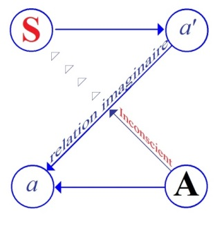
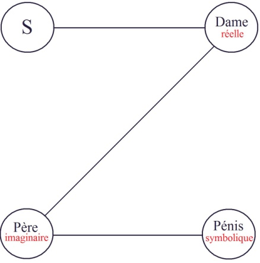

# Leçon 07 | 16 Janvier 1957

  

    <label><input type="checkbox" data-lacan-toggle="original" checked> 原文</label>
    <label><input type="checkbox" data-lacan-toggle="notes" checked> 注释</label>
    <label><input type="checkbox" data-lacan-toggle="commentary" checked> 个人解读评论</label>
  

  <form class="lacan-tool-search" role="search">
    <input class="lacan-tool-search-input" type="search" placeholder="搜索全文" aria-label="搜索全文">
    <button class="lacan-tool-button" type="submit" title="搜索">搜索</button>
  </form>
  <button class="lacan-tool-button lacan-back-to-top" type="button" title="回到页面最上方" aria-label="回到页面最上方">↑</button>

<section class="parallel-paragraph" data-paragraph-ids="s4-07-0001">

s4-07-0001

原文 · s4-07-0001

Nous avons terminé notre entretien la fois dernière en tentant de résumer le cas présenté par FREUD, *d’homosexualité féminine*.
Je vous avais ébauché au passage en même temps que les péripéties, quelque chose qu’on peut appeler la structure,
puisque si ce n’était pas sur le fond de l’analyse structurale que nous le poursuivions, ce n’aurait pas beaucoup plus d’importance
qu’un cas pittoresque. Il convient de revenir sur cette analyse structurale, car ce n’est qu’à condi­tion de la faire progresser,

[无对应译文]

</section>

<section class="parallel-paragraph" data-paragraph-ids="s4-07-0002">

s4-07-0002

原文 · s4-07-0002

et aussi loin qu’il est possible, qu’il y a intérêt dans l’analyse à s’engager dans cette voie.

[无对应译文]

</section>

<section class="parallel-paragraph" data-paragraph-ids="s4-07-0003">

s4-07-0003

原文 · s4-07-0003

Qu’il y ait *un manque* dans la théorie analytique, c’est ce qu’il me semble voir surgir à chaque instant.
Il n’est pas mauvais d’ailleurs de rappeler que *c’est pour répondre à ce manque* effectivement, qu’ici nous poursuivons notre effort.
Bien entendu ce manque est sensible partout, je le voyais récemment encore se réactiver dans mon esprit à voir se confronter
les propos de Melle Anna FREUD avec ceux de Mélanie KLEIN.

[无对应译文]

</section>

<section class="parallel-paragraph" data-paragraph-ids="s4-07-0004">

s4-07-0004

原文 · s4-07-0004

Sans doute Melle Anna FREUD a-t-elle mis beaucoup d’eau dans son vin depuis, mais elle a fondé les principes de son analyse des enfants sur des remarques telles que celle-ci :

[无对应译文]

</section>

<section class="parallel-paragraph" data-paragraph-ids="s4-07-0005">

s4-07-0005

原文 · s4-07-0005

- que par exemple il ne pouvait pas se faire de *transfert*, tout au moins pas de *névrose de transfert*, parce que les enfants étant encore inclus dans la situation créatrice de la tension névrotique, il ne pouvait pas y avoir à proprement parler de *transfert* pour quelque chose qui était en train de se jouer.

[无对应译文]

</section>

<section class="parallel-paragraph" data-paragraph-ids="s4-07-0006">

s4-07-0006

原文 · s4-07-0006

- Que d’autre part, le fait qu’ils puissent être encore en rapport avec les objets de leur attachement inaugural - autre remarque de même nature en somme, mais différente - devrait changer la position de l’analyste qui ici interviendrait en quelque sorte en tiers sur le plan actuel, qui pour autant devrait profondément modifier sa technique.

[无对应译文]

</section>

<section class="parallel-paragraph" data-paragraph-ids="s4-07-0007">

s4-07-0007

原文 · s4-07-0007

- Sa technique d’autre part, fut en quelque sorte profondément modi­fiée, et en ceci Melle Anna FREUD rend hommage à quelque chose qui est *comme un pressentiment de l’importance de la fonction essentielle de la parole dans le rapport analytique*.

[无对应译文]

</section>

<section class="parallel-paragraph" data-paragraph-ids="s4-07-0008">

s4-07-0008

原文 · s4-07-0008

- Assurément l’enfant pourra être, lui, dans un rapport différent, dit-elle, de celui de l’adulte à la parole pour, en d’autres termes, devoir être pris à l’aide des moyens de jeu qui sont la technique de l’enfant, qui devrait également se trouver dans une position qui ne permet pas à l’analyste de s’offrir à lui dans la position de neutralité ou de réceptivité qui cherche avant tout à accueillir, à permettre de s’épanouir, et à l’occasion de faire écho à *la parole*.

[无对应译文]

</section>

<section class="parallel-paragraph" data-paragraph-ids="s4-07-0009">

s4-07-0009

原文 · s4-07-0009

Je dirais donc que l’engagement de l’analyste dans une autre nature que le rapport de la parole, pour n’être pas développé,
même pas conçu, est pourtant indiqué.

[无对应译文]

</section>

<section class="parallel-paragraph" data-paragraph-ids="s4-07-0010">

s4-07-0010

原文 · s4-07-0010

Mme Mélanie KLEIN dans ses arguments, fait remarquer que rien au contraire n’est plus semblable que l’analyse d’un enfant, que même à un âge extrêmement précoce déjà, ce dont il s’agit dans l’inconscient de l’enfant n’a rien à faire - contrairement
à ce que dit Melle Anna FREUD - avec les parents réels.

[无对应译文]

</section>

<section class="parallel-paragraph" data-paragraph-ids="s4-07-0011">

s4-07-0011

原文 · s4-07-0011

Que déjà entre deux ans et demi et trois ans la situation est tellement modifiée par rapport à ce qu’on peut constater dans
la relation réelle, qu’il s’agit déjà tellement de quelque chose qui est toute une dramatisation profondément étrangère à l’actualité de la relation familiale de l’enfant, qu’on a pu constater chez un enfant qui avait par exemple été élevé à titre d’enfant unique,
chez un personnage qui habitait fort loin des parents, une vieille tante en somme, ce qui le mettait dans un rapport
tout à fait isolé, duel avec une seule personne, on a pu constater que cet enfant pour autant n’en avait pas moins reconstitué
tout un drame familial avec père, mère, et même avec frère et sœurs rivaux, je cite.

[无对应译文]

</section>

<section class="parallel-paragraph" data-paragraph-ids="s4-07-0012">

s4-07-0012

原文 · s4-07-0012

Il s’agit donc bien d’ores et déjà de révéler dans  l’analyse quelque chose qui, dans son fond, n’est pas dans le rapport immédiat pur et simple avec le *réel*, mais est quelque chose qui déjà s’inscrit dans une *sym­bolisation* dont à partir de ce moment…

[无对应译文]

</section>

<section class="parallel-paragraph" data-paragraph-ids="s4-07-0013">

s4-07-0013

原文 · s4-07-0013

je veux dire si nous admettons les affirmations de Mélanie KLEIN, ses affirmations reposent sur son expérience, et cette expérience nous est communiquée dans des observations qui poussent les choses quelquefois à l’étrange, car à la vérité on ne peut pas ne pas être frappé de voir cette sorte de « *creuset de sorcière* » ou de devineresse, au fond duquel s’agitent dans un monde imaginaire global, l’idée du contenant du corps mater­nel

[无对应译文]

</section>

<section class="parallel-paragraph" data-paragraph-ids="s4-07-0014">

s4-07-0014

原文 · s4-07-0014

…tous les fantasmes primordiaux présents - et ceci en quelque sorte dès l’ori­gine - tendent à se structurer dans un drame

[无对应译文]

</section>

<section class="parallel-paragraph" data-paragraph-ids="s4-07-0015">

s4-07-0015

原文 · s4-07-0015

qui paraît préformé, et pour lequel il faut susciter à tout instant le surgissement des instincts primordiaux les plus agressifs,
pour faire en quelque sorte mouvoir la machine.

[无对应译文]

</section>

<section class="parallel-paragraph" data-paragraph-ids="s4-07-0016">

s4-07-0016

原文 · s4-07-0016

Nous ne pouvons pas ne pas être frappés, à la fois par le témoignage d’une adéquation entre toute cette fantasmagorie et
les données uniques que Mme Mélanie KLEIN manie ici, et en même temps nous demander en présence de quoi nous sommes.

[无对应译文]

</section>

<section class="parallel-paragraph" data-paragraph-ids="s4-07-0017">

s4-07-0017

原文 · s4-07-0017

Qu’est-ce que peut vouloir dire cette symbolisation dra­matique qui semble se retrouver plus comblée à mesure qu’on remonte plus loin, comme si à la fin on pouvait admettre que plus nous nous rapprochons de l’origine, plus le complexe d’œdipe
est là comblé, articulé, prêt à entrer en action.

[无对应译文]

</section>

<section class="parallel-paragraph" data-paragraph-ids="s4-07-0018">

s4-07-0018

原文 · s4-07-0018

Ceci mérite au moins qu’on se pose une question, et cette question rejaillit partout, par ce chemin précis par lequel j’essaye
de vous mener pour l’instant, qui est celui de la perversion. Qu’est-ce que la perversion ? À l’intérieur d’un même groupe
on entend là-dessus les voix les plus discordantes :

[无对应译文]

</section>

<section class="parallel-paragraph" data-paragraph-ids="s4-07-0019">

s4-07-0019

原文 · s4-07-0019

- les uns, croyant suivre FREUD, diront qu’il faut revenir purement et sim­plement à la notion de la persistance d’une fixation portant sur une *pulsion partielle* et qui traverserait, en quelque sorte indemne, tout le progrès, toute la dialectique qui tend à s’établir de l’œdipe, mais qui n’y subirait absolument pas les avatars qui tendent à réduire les autres pulsions partielles dans un mou­vement qui en fin de compte les unifie et les fait aboutir à *la pulsion génitale*. C’est la pulsion idéale essentiellement unifiante. Que donc il s’agit dans *la perversion* d’une chose qui est une sorte d’accident de l’évolution des *pulsions*. Mais traduisant d’une façon classique la notion de FREUD que « *la perversion est le négatif de la névrose* » ils veulent purement et simplement faire de *la per­version* quelque chose où *la pulsion* n’est pas élaborée.

[无对应译文]

</section>

<section class="parallel-paragraph" data-paragraph-ids="s4-07-0020">

s4-07-0020

原文 · s4-07-0020

- D’autres, pourtant - qui ne sont pas d’ailleurs pour autant les plus pers­picaces ni les meilleurs, mais avertis par l’expérience et par quelque chose qui s’impose véritablement dans la pratique de l’analyse - essayeront de montrer que la perversion est bien loin d’être ce quelque chose de pur et qui persiste, et que pour tout dire la perversion fait bien partie elle aussi de quelque chose qui s’est réalisé à travers toutes les crises, fusions et dé-fusions dramatiques, qui présente la même richesse dimensionnelle, la même abondance, les mêmes rythmes, les mêmes étapes qu’une névrose. Ils tenteront alors d’expliquer que c’est « *le négatif de la névrose* », en poussant des formules telles que celle-ci :
  qu’il s’agit là de l’érotisation de la défense, comme en effet tous ces jeux à travers lesquels se poursuit une analyse de la réduction des défenses.

[无对应译文]

</section>

<section class="parallel-paragraph" data-paragraph-ids="s4-07-0021">

s4-07-0021

原文 · s4-07-0021

Je veux bien, cela *fait image*, mais à vrai dire *pourquoi cela peut-il être érotisé ?* C’est bien là toute la question : *d’où vient cette érotisation ?*
Où est situé le pouvoir invisible qui projetterait cette coloration qui paraît venir là comme une sorte de superflu, de changement de qualité, à mettre sur la défense ce qui est à proprement parler à considérer comme satisfaction libidinale ?

[无对应译文]

</section>

<section class="parallel-paragraph" data-paragraph-ids="s4-07-0022">

s4-07-0022

原文 · s4-07-0022

La chose à la vérité n’est pas impen­sable, mais le moins qu’on puisse dire c’est qu’elle n’est pas pensée.

[无对应译文]

</section>

<section class="parallel-paragraph" data-paragraph-ids="s4-07-0023">

s4-07-0023

原文 · s4-07-0023

En fin de compte, il ne faut pourtant pas croire qu’à l’intérieur de l’évolution de la théorie analytique, FREUD se soit avisé d’essayer là-dessus de nous donner une notion qui s’élabore. Je dirais même plus : nous en avons dans FREUD même,
un exemple qui prouve qu’assurément quand il nous dit que « *la perversion est le négatif de la névrose* », cela n’est pas une formule
à prendre comme on l’a prise longtemps, c’est à savoir qu’il faudrait tout simplement entendre que dans la perversion,
ce qui est *caché* dans l’inconscient quand nous sommes en présence d’un cas névrotique, est là *à ciel ouvert* et en quelque sorte *libre*.

[无对应译文]

</section>

<section class="parallel-paragraph" data-paragraph-ids="s4-07-0024">

s4-07-0024

原文 · s4-07-0024

C’est bien autre chose qu’il nous propose. Peut-être après tout faut-il le prendre comme de nous être donné sous ces sortes
de formules resserrées auxquelles notre analyse doit trouver son véritable sens, et c’est en essayant d’abord de le suivre et de voir par exemple comment il conçoit le mécanisme d’un phénomène qu’on peut qualifier de *pervers*, voire d’*une perversion* catégorique, que nous pourrons en fin de compte nous apercevoir de *ce qu’il veut dire quand il affirme que «* *la perversion est le négatif de la névrose* ».

[无对应译文]

</section>

<section class="parallel-paragraph" data-paragraph-ids="s4-07-0025">

s4-07-0025

原文 · s4-07-0025

Si nous regardons les choses d’un peu plus près, si nous prenions cette étude qui devrait être célèbre : « *Contribution à l’étude*

[无对应译文]

</section>

<section class="parallel-paragraph" data-paragraph-ids="s4-07-0026">

s4-07-0026

原文 · s4-07-0026

*de la genèse des per­versions sexuelles* [^15], nous remarquerions que l’attention de FREUD est carac­téristique...

[无对应译文]

</section>

<section class="parallel-paragraph" data-paragraph-ids="s4-07-0027">

s4-07-0027

原文 · s4-07-0027

et non moins caractéristique qu’il choisit comme titre ceci, il y insiste dans le texte, c’est quelque chose qui n’est pas simplement une étiquette, mais une phrase extraite directement de la déclaration des malades quand ils abordent
ce thème de leurs fantasmes, en gros : sado-masochiste, quels que soient le rôle et la fonction qu’ils prennent
dans tel et tel cas particulier
...FREUD nous dit qu’il centre son étude tout spécialement sur 6 cas qui sont tous plus ou moins *des névroses obsessionnelles*,
4 de femmes et 2 d’hommes, et que derrière il y a toute son expérience de tous les cas sur lesquels il n’a pas lui-même une aussi grande compréhension. Aussi, semble-t-il, il y a là *une sorte de résumé, de tentative d’organiser* une masse considérable d’expériences.

[无对应译文]

</section>

<section class="parallel-paragraph" data-paragraph-ids="s4-07-0028">

s4-07-0028

原文 · s4-07-0028

Quand le sujet déclare mettre en jeu dans *le traitement* ce quelque chose qui est *le fantasme*, il l’exprime ainsi sous cette forme remarquable, par cette imprécision ces questions qu’elle laisse ouvertes et auxquelles il ne répond que très difficilement,
et à la vérité auxquelles il ne peut pas donner d’emblée de réponse satisfaisante, il ne peut guère en dire plus pour se caractériser non sans cette sorte d’*aversion*, voire de *vergogne* ou de *honte*, qu’il y a non pas à la pratique de ces fantasmes plus ou moins associés, oratoires…
et qui dans leur exercice sont en général pris par les sujets comme des *activités*
qui n’entraînent pour eux aucune espèce de charte de culpabilité

[无对应译文]

</section>

<section class="parallel-paragraph" data-paragraph-ids="s4-07-0029">

s4-07-0029

原文 · s4-07-0029

…mais qui par contre présentent - c’est là quelque chose d’assez remarquable - très souvent non pas seulement de grandes difficultés à être formulés, mais provoquent chez le sujet une assez grande aversion, répugnance, culpabilité à être articulés.
Et déjà on sent bien là quelque chose qui doit nous faire dresser l’oreille, entre l’usage *fantasmatique* ou *imaginaire* de ces images
et leur formulation parlée. Déjà ce signal dans le comportement du sujet est quelque chose qui marque une limite :
ce n’est pas du même ordre d’en jouer mentalement ou d’en parler.

[无对应译文]

</section>

<section class="parallel-paragraph" data-paragraph-ids="s4-07-0030">

s4-07-0030

原文 · s4-07-0030

À propos de ce fantasme : « *On bat un enfant* », FREUD va nous dire ce que son expérience lui a montré, ce que cela signifiait chez les sujets. Nous n’ar­riverons pas au bout de cet article aujourd’hui, je veux simplement mettre en relief certains éléments tout à fait manifestes, parce qu’ils concernent directement le chemin sur lequel je vous ai engagés la dernière fois,
abordant le problème par le cas de la *psychogénèse de l’homosexualité féminine*.

[无对应译文]

</section>

<section class="parallel-paragraph" data-paragraph-ids="s4-07-0031">

s4-07-0031

原文 · s4-07-0031

FREUD nous dit : le progrès de l’analyse montre qu’il s’agit dans ce fantasme de quelque chose qui s’est substitué par une série de transformations, à d’autres fantasmes, lesquels ont eu un rôle tout à fait compréhensible au moment de l’évolution du sujet.

[无对应译文]

</section>

<section class="parallel-paragraph" data-paragraph-ids="s4-07-0032">

s4-07-0032

原文 · s4-07-0032

C’est la structure de ces états que je voudrais vous exposer, pour vous permettre d’y reconnaître quelque chose qui semble

[无对应译文]

</section>

<section class="parallel-paragraph" data-paragraph-ids="s4-07-0033">

s4-07-0033

原文 · s4-07-0033

tout à fait mani­feste à la seule condition d’avoir les yeux ouverts, au moins sur cette dimension dans laquelle nous essayons
de nous avancer, et qui se résume sous ce titre de *la structure subjective*.

[无对应译文]

</section>

<section class="parallel-paragraph" data-paragraph-ids="s4-07-0034">

s4-07-0034

原文 · s4-07-0034

Autrement dit, c’est ce contre quoi nous essayons de nous tenir toujours pour essayer de donner leur véritable position à ce qui dans la théorie, se présente souvent comme une ambiguïté, voire une impasse, voire une diplopie. C’est voir à quel niveau de
la structure subjective se passe un phénomène. Nous constatons que c’est dans trois étapes où FREUD nous dit que se scande l’histoire à mesure qu’elle s’ouvre sous la pression analytique, et qui permet de retrouver l’origine de ces fantasmes.
Il dit d’ailleurs *qu’il va se limiter*...
dans ce qui lui permet cette première formulation typique du fantasme
...*qu’il va se limiter*...
pour des raisons qu’il précisera par la suite, mais que nous laisserons de côté nous-même aujourd’hui,
dans la première partie de son exposé que nous ne mettrons pas au premier plan cette fois-ci
…*qu’il va se limiter à ce qui se passe précisément chez les femmes*.

[无对应译文]

</section>

<section class="parallel-paragraph" data-paragraph-ids="s4-07-0035">

s4-07-0035

原文 · s4-07-0035

La forme que prend *le premier fantasme*, celui que l’on peut, nous dit-il, y retrouver quand on analyse le fait, est celui-ci :

[无对应译文]

</section>

<section class="parallel-paragraph" data-paragraph-ids="s4-07-0036">

s4-07-0036

原文 · s4-07-0036

« *Mon père bât un enfant qui est l’enfant que je hais.* »

[无对应译文]

</section>

<section class="parallel-paragraph" data-paragraph-ids="s4-07-0037">

s4-07-0037

原文 · s4-07-0037

Il s’agit d’un *fantasme* plus ou moins lié dans l’histoire à l’introduction d’un frère ou d’une soeur, d’un rival qui à un moment
se trouve, par sa présence, par les soins qui lui sont donnés, frustrer l’enfant de l’affection des parents.

[无对应译文]

</section>

<section class="parallel-paragraph" data-paragraph-ids="s4-07-0038">

s4-07-0038

原文 · s4-07-0038

Ici il s’agit tout spécialement du père. Nous n’insisterons pas ici sur ce point, mais nous n’omettrons pas de remarquer qu’il s’agit d’une fille prise à un certain moment déjà où s’est constitué *le complexe d’Œdipe*, où la relation au père s’est instituée.
Nous laisserons donc pour le futur l’explication de *cette prééminence dans un fantasme tout à fait primitif de la personne du père*,
étant bien entendu que ce ne doit pas être sans rapport avec le fait qu’il s’agisse *d’une fille*. Mais laissons de côté ce problème.

[无对应译文]

</section>

<section class="parallel-paragraph" data-paragraph-ids="s4-07-0039">

s4-07-0039

原文 · s4-07-0039

L’important est ceci : nous touchons là au départ dans une perspective historique qui est rétroactive. C’est du point actuel

[无对应译文]

</section>

<section class="parallel-paragraph" data-paragraph-ids="s4-07-0040">

s4-07-0040

原文 · s4-07-0040

où nous sommes dans l’ana­lyse que le sujet formule pour le passé, organise une situation primitive dra­matique, d’une façon

[无对应译文]

</section>

<section class="parallel-paragraph" data-paragraph-ids="s4-07-0041">

s4-07-0041

原文 · s4-07-0041

qui s’inscrit pourtant dans sa parole actuelle, dans son pouvoir de symbolisation présent, et que nous retrouvons par le progrès de l’analyse comme *la chose primitive*, l’organisation primordiale la plus profonde. C’est quelque chose qui a cette complexité manifeste d’avoir trois personnages :

[无对应译文]

</section>

<section class="parallel-paragraph" data-paragraph-ids="s4-07-0042">

s4-07-0042

原文 · s4-07-0042

- *il y a l’agent du châtiment*,

[无对应译文]

</section>

<section class="parallel-paragraph" data-paragraph-ids="s4-07-0043">

s4-07-0043

原文 · s4-07-0043

- *il y a celui qui subit*, et qui est un autre que *le sujet*, nommément un enfant que le sujet hait et qu’il voit par là déchu de cette *préférence parentale* qui est en jeu, il se sent lui-même privilégié par le fait que l’autre choit de cette préférence,

[无对应译文]

</section>

<section class="parallel-paragraph" data-paragraph-ids="s4-07-0044">

s4-07-0044

原文 · s4-07-0044

- *il y a quelque chose qui*, si l’on peut dire, *implique une dimension et une tension triple* qui suppose le rapport à un sujet avec deux autres dont les rapports eux-mêmes entre eux, sont motivés par quelque chose qui est centré par le sujet :

[无对应译文]

</section>

<section class="parallel-paragraph" data-paragraph-ids="s4-07-0045">

s4-07-0045

原文 · s4-07-0045

« *Mon père* - peut-on dire, pour accentuer les choses dans un sens *- bat mon frère ou ma sœur, de peur que je croie qu’on ne me le préfère.* »

[无对应译文]

</section>

<section class="parallel-paragraph" data-paragraph-ids="s4-07-0046">

s4-07-0046

原文 · s4-07-0046

Une causalité ou une tension, une référence au sujet pris comme un tiers, en faveur de qui la chose se produit, est quelque chose qui anime et motive l’action sur le personnage second, celui qui subit. Et ce tiers qu’est le sujet, est lui-même ici invoqué, présentifié dans la situation comme celui aux yeux de qui ceci doit se passer, dans l’intention de lui faire savoir
que quelque chose à lui, lui est donné, qui est le privilège de cette préférence, qui est cette préséance, cet ordre, cette structure qui d’une façon réintroduit - de même que tout à l’heure il y avait la notion de peur - c’est-à-dire une sorte d’anticipation,
de dimension temporelle, de tension en avant qui est introduite comme motrice à l’intérieur de cette situation triple.

[无对应译文]

</section>

<section class="parallel-paragraph" data-paragraph-ids="s4-07-0047">

s4-07-0047

原文 · s4-07-0047

Il y a référence au tiers en tant que sujet, en tant qu’il a à le croire ou à inférer quelque chose d’un certain comportement
qui se porte sur l’objet second qui dans cette occasion est pris comme instrument de cette communication entre les deux sujets,
qui est en fin de compte une communication d’amour, puisque c’est aux dépens de ce second que se déclare pour celui qui est
le sujet central, ce quelque chose qu’il reçoit à cette occasion, et qui est l’expression *de son vœu, de son désir d’être préféré, d’être aimé*.

[无对应译文]

</section>

<section class="parallel-paragraph" data-paragraph-ids="s4-07-0048">

s4-07-0048

原文 · s4-07-0048

Formation bien entendu déjà elle-même dramatisée, déjà réactionnelle en tant qu’elle est issue d’une situation complexe.
Mais cette situation complexe suppose cette référence intersubjective triple avec tout ce qu’elle nécessite et introduit
de référence temporelle, de temps, de scansion, qui suppose l’introduction du second sujet qui est nécessaire. Pourquoi ?
Ce qui est à franchir d’un sujet à l’autre, il en est l’instrument, le ressort, le médium, le moyen. En fin de compte nous nous trouvons devant une structure intersubjective pleine, au sens où elle s’établit dans le fran­chissement achevé d’une parole.

[无对应译文]

</section>

<section class="parallel-paragraph" data-paragraph-ids="s4-07-0049">

s4-07-0049

原文 · s4-07-0049

Il ne s’agit pas que la chose ait été parlée, il s’agit que la structure intersubjective elle-même dans cette situation ternaire
qui est instaurée dans le fantasme primitif, porte en elle-même la marque de la même structure intersubjective
qui constitue toute parole achevée.

[无对应译文]

</section>

<section class="parallel-paragraph" data-paragraph-ids="s4-07-0050">

s4-07-0050

原文 · s4-07-0050

*La seconde étape* par rapport à la première, représente une situation réduite : FREUD nous dit qu’on trouve là d’une façon

[无对应译文]

</section>

<section class="parallel-paragraph" data-paragraph-ids="s4-07-0051">

s4-07-0051

原文 · s4-07-0051

très particulière une situa­tion réduite à deux personnages : je *suis* là le texte de FREUD. Et on l’explique comme on peut.
FREUD indique l’explication sans y peser d’ailleurs, la décrit comme une étape nécessaire et reconstruite, indispensable
pour comprendre toute la motivation de ce qui se produit dans l’histoire du sujet. Cette seconde étape produit :

[无对应译文]

</section>

<section class="parallel-paragraph" data-paragraph-ids="s4-07-0052">

s4-07-0052

原文 · s4-07-0052

« *Moi je suis battue par mon père* ».

[无对应译文]

</section>

<section class="parallel-paragraph" data-paragraph-ids="s4-07-0053">

s4-07-0053

原文 · s4-07-0053

Il s’agit ici d’*une situation réduite à deux*, dont on peut dire qu’elle exclut toute autre dimension que *celle du rapport avec l’agent batteur*. Il y a là quelque chose qui peut prêter à toutes sortes d’interprétations, mais ces interprétations elles-mêmes resteront marquées du caractère de la plus grande ambiguïté.

[无对应译文]

</section>

<section class="parallel-paragraph" data-paragraph-ids="s4-07-0054">

s4-07-0054

原文 · s4-07-0054

Si dans le premier fantasme il y a une organisation et une structure qui y met un sens qu’on pourrait indiquer par une série
de flèches, dans l’autre la situation est tellement ambiguë qu’on peut se demander un instant dans quelle mesure le sujet participe avec celui qui l’agresse et le frappe. C’est la classique ambiguïté sado-masochiste. Et si on la résout, on conclura comme le dit FREUD, que c’est là quelque chose qui est lié à cette essence du masochisme, mais que le *moi* dans cette occasion est fortement accentué dans la situation.

[无对应译文]

</section>

<section class="parallel-paragraph" data-paragraph-ids="s4-07-0055">

s4-07-0055

原文 · s4-07-0055

Le sujet se trouve dans une position réciproque, mais en même temps exclusive : c’est ou lui ou l’autre qui est battu,
et ici c’est lui, et par le fait que c’est lui, il y a quelque chose qui est indiqué, mais qui n’est pas résolu.

[无对应译文]

</section>

<section class="parallel-paragraph" data-paragraph-ids="s4-07-0056">

s4-07-0056

原文 · s4-07-0056

On peut - et la suite de la discussion le montre - voir dans cet acte même d’être battu, une transposition ou un déplacement aussi de quelque chose qui, peut-être, est déjà marqué d’érotisme. Le fait même qu’on puisse parler à cette occasion
« *d’essence du masochisme* », est tout à fait indicatif, alors qu’à l’étape précédente, FREUD l’a dit, nous étions dans une situation qui, pour extrêmement structurée qu’elle ait été, était en quelque sorte grosse de toute virtualité. Elle n’était *ni sexuelle, ni spécialement sadique*, elle les contenait en puissance, et ce quelque chose qui se précipite dans un sens ou dans l’autre, mais ambigu, se marque dans la seconde étape, dans cette étape de la relation duelle avec toute problématique qu’elle soulève sur le plan libidinal.

[无对应译文]

</section>

<section class="parallel-paragraph" data-paragraph-ids="s4-07-0057">

s4-07-0057

原文 · s4-07-0057

Cette seconde étape qui, elle, est duelle, et où le sujet se trouve inclus dans un rapport duel, et donc ambigu, avec l’autre comme tel dans cette sorte d’« *ou bien... - ou bien...* » qui est fondamental de cette relation duelle, FREUD nous dit que nous sommes presque toujours forcés de la reconstruire, tellement elle est fugi­tive. Cette fugitivité est sa caractéristique, et très vite la situation se précipite dans la troisième étape, celle où si l’on peut dire, le sujet est réduit à son point le plus extrême et retrouve apparemment sa *position tierce* sous la forme de ce pur et simple *observant*, qui en quelque sorte réduit cette situation

[无对应译文]

</section>

<section class="parallel-paragraph" data-paragraph-ids="s4-07-0058">

s4-07-0058

原文 · s4-07-0058

inter­subjective avec la situation temporelle, après être passé à la situation seconde, duelle et réciproque, à la situation tout à fait désubjectivée qui est celle du fantasme terminal, à savoir : « *On bat un enfant* ».

[无对应译文]

</section>

<section class="parallel-paragraph" data-paragraph-ids="s4-07-0059">

s4-07-0059

原文 · s4-07-0059

Bien sûr cet « *on* » est quelque chose où l’on peut retrouver vaguement la fonction paternelle, mais en général le père n’est pas reconnaissable, ce n’est qu’un substitut. D’autre part quand on dit : « *On bat un enfant* », c’est *la formule* du sujet que FREUD
a voulu respecter, mais il s’agit souvent de plusieurs enfants, la production fantasmatique le fait éclater en le multipliant
en mille exemplaires. Et cela montre bien le caractère de *désubjectivation* essentiel qui se produit dans *la relation primordiale*,
et il reste cette *objectivation*, cette *désubjectivation* en tout cas radicale, de toute la structure au niveau de laquelle le sujet n’est plus là que comme une sorte de spectateur réduit à l’état de spectateur, ou simplement d’œil, c’est à dire ce qui caractérise toujours,
à la limite et au point de la dernière réduction, toute espèce d’objet. Il faut au moins, non pas toujours un sujet,
mais un œil pour le voir, un œil, un écran sur lequel le sujet est institué.

[无对应译文]

</section>

<section class="parallel-paragraph" data-paragraph-ids="s4-07-0060">

s4-07-0060

原文 · s4-07-0060

Que voyons-nous là ? Comment pouvons-nous traduire cela dans notre langage au point précis où nous en sommes
de notre procès ? Il est clair qu’au niveau du schéma du *Sujet*, de l’*Autre* et de la *relation imaginaire* du *moi* du sujet
plus ou moins fantasmatisée, la *relation imaginaire* s’inscrit dans cette direction et dans ce rapport plus ou moins marqué
de spécularité, de réciprocité entre le *moi* et l’*autre*.

[无对应译文]

</section>

<section class="parallel-paragraph" data-paragraph-ids="s4-07-0061">

s4-07-0061

原文 · s4-07-0061

Nous nous trouvons en présence de quelque chose qui est une parole inconsciente, celle qu’il a fallu retrouver à travers tous
les artifices de l’analyse du transfert, qui est celle-ci :

[无对应译文]

</section>

<section class="parallel-paragraph" data-paragraph-ids="s4-07-0062">

s4-07-0062

原文 · s4-07-0062

« *Mon père en battant un enfant qui est l’enfant que je hais, me manifeste qu’il m’aime.* »
ou :
« *Mon père bat un enfant de peur que je croie que je ne sois pas préféré.* »

[无对应译文]

</section>

<section class="parallel-paragraph" data-paragraph-ids="s4-07-0063">

s4-07-0063

原文 · s4-07-0063

…ou tout autre formule qui d’une façon quelconque mette en valeur un des accents de cette relation dramatique.

[无对应译文]

</section>

<section class="parallel-paragraph" data-paragraph-ids="s4-07-0064">

s4-07-0064

原文 · s4-07-0064

Ceci qui est exclu, qui n’est pas présent dans *la névrose*, qu’il faut retrouver et qui va avoir des évolutions qui se manifestent par ailleurs dans tous *les symptômes* constitutifs de cette *névrose,* ceci est retrouvé dans un élément du tableau clinique qui est *ce fantasme.*
Comment se présente-t-il ? Il se présente d’une façon qui porte en lui encore très visible le témoignage des éléments signifiants de la parole articulée au niveau de ce *trans-objet* si on peut dire, c’est *le grand Autre*, le lieu où s’*articule* la parole inconsciente,
le *Es* en tant qu’il est *parole*, histoire, mémoire, structure articulée.

[无对应译文]

</section>

<section class="parallel-paragraph" data-paragraph-ids="s4-07-0065">

s4-07-0065

原文 · s4-07-0065

La perversion ou - disons pour nous limiter là - le fantasme pervers, a une propriété que nous pouvons maintenant dégager.
Qu’est-ce que cette sorte de résidu, de réduction symbolique qui progressivement a éliminé toute la structure subjective
de la situation, pour n’en laisser émerger que quelque chose d’en­tièrement objectivé, et en fin de compte *énigmatique* qui garde
à la fois toute la charge, mais la charge non révélée, inconstituée, non assumée par le sujet, de ce qui est au niveau de l’Autre comme structure articulée où le sujet est engagé ?

[无对应译文]

</section>

<section class="parallel-paragraph" data-paragraph-ids="s4-07-0066">

s4-07-0066

原文 · s4-07-0066

Nous nous trouvons là au niveau du fantasme pervers, de quelque chose qui en a à la fois tous les éléments, mais qui en a perdu tout ce qui est signification, à savoir *la relation intersubjective*, c’est en quelque sorte le maintien à l’état pur de ce qu’on peut appeler là-dedans des signifiants à l’état pur, sans la relation intersubjective, les signifiants vidés de leur sujet, une sorte d’objectivation
des signifiants de la situation comme telle. Ce quelque chose qui est indiqué dans le sens d’une relation structurante fondamentale de l’histoire du sujet au niveau de la perversion, est à la fois maintenu, contenu, mais sous la forme d’un pur signe.

[无对应译文]

</section>

<section class="parallel-paragraph" data-paragraph-ids="s4-07-0067">

s4-07-0067

原文 · s4-07-0067

Et qu’est-ce que c’est d’autre que tout ce que nous retrouvons au niveau de la perversion ?

[无对应译文]

</section>

<section class="parallel-paragraph" data-paragraph-ids="s4-07-0068">

s4-07-0068

原文 · s4-07-0068

Repré­sentez-vous maintenant ce que vous savez par exemple du *fétiche*, *ce fétiche* dont on vous dit qu’il est explicable
par *cet au-delà jamais vu*. Et pour cause ! *C’est le pénis de la mère phallique*, et qui est lié par le sujet…
le plus souvent après un bref effort analytique, tout au moins dans les souvenirs encore acces­sibles au sujet

[无对应译文]

</section>

<section class="parallel-paragraph" data-paragraph-ids="s4-07-0069">

s4-07-0069

原文 · s4-07-0069

…à une situation où si l’on peut dire, l’enfant dans son observation s’est arrêté, au moins dans son souvenir, au bord de la robe de la mère où nous nous trouvons voir une sorte de remarquable concours entre la structure de ce qu’on peut appeler *le souvenir-écran*, c’est-à-dire le moment où la chaîne de la mémoire s’arrête, *et elle s’arrête en effet au bord de la robe, pas plus haut que la cheville* :

[无对应译文]

</section>

<section class="parallel-paragraph" data-paragraph-ids="s4-07-0070">

s4-07-0070

原文 · s4-07-0070

et c’est bien pour cela que c’est là qu’on rencontre la chaussure,

[无对应译文]

</section>

<section class="parallel-paragraph" data-paragraph-ids="s4-07-0071">

s4-07-0071

原文 · s4-07-0071

et c’est bien pour cela aussi que la chaussure peut, tout au moins dans certains cas particuliers, mais c’est un cas exemplaire, prendre sa fonction de substitut de ce qui n’est pas vu, mais de ce qui est articulé, formulé, comme étant ici vraiment
pour le sujet, de la mère qui possède ce *phallus*, *imaginaire* sans doute, mais essentiel à *sa fondation symbolique comme mère phallique*.

[无对应译文]

</section>

<section class="parallel-paragraph" data-paragraph-ids="s4-07-0072">

s4-07-0072

原文 · s4-07-0072

Nous nous trouvons là aussi devant quelque chose qui est du même ordre, devant *ce quelque chose qui fige, réduit à l’état d’instantané le cours de la mémoire* en l’arrêtant à ce point qui s’appelle *souvenir-écran*, à la façon de quelque chose qui se déroulerait assez rapidement et s’arrêterait tout d’un coup en un point, *figeant tous les personnages* comme dans un mouvement cinématographique.

[无对应译文]

</section>

<section class="parallel-paragraph" data-paragraph-ids="s4-07-0073">

s4-07-0073

原文 · s4-07-0073

Cette sorte d’ *instantané* qui est la caractéristique de cette réduc­tion de la scène pleine, signifiante, articulée de sujet à sujet,
à quelque chose *qui s’immobilise dans ce fantasme*, qui reste chargé de toutes les valeurs éro­tiques qui sont incluses

[无对应译文]

</section>

<section class="parallel-paragraph" data-paragraph-ids="s4-07-0074">

s4-07-0074

原文 · s4-07-0074

dans ce qu’il a exprimé, et dont il est en quelque sorte le témoignage, le support, le dernier support restant.

[无对应译文]

</section>

<section class="parallel-paragraph" data-paragraph-ids="s4-07-0075">

s4-07-0075

原文 · s4-07-0075

Nous touchons là du doigt comment se forme ce qu’on peut appeler « *le moule de la perversion* », à savoir *cette valorisation de l’image* pour autant qu’elle reste le témoin privilégié de quelque chose qui dans l’inconscient, doit être articulé, remis en jeu dans la dialectique du transfert, c’est-à-dire dans ce quelque chose qui doit reprendre ses dimensions à l’intérieur du dialogue ana­lytique.

[无对应译文]

</section>

<section class="parallel-paragraph" data-paragraph-ids="s4-07-0076">

s4-07-0076

原文 · s4-07-0076

La valeur donc, de dimension *imaginaire* apparaît prévalente chaque fois qu’il s’agit d’une perversion.

[无对应译文]

</section>

<section class="parallel-paragraph" data-paragraph-ids="s4-07-0077">

s4-07-0077

原文 · s4-07-0077

Et c’est en tant que cette *relation imaginaire* est sur le chemin de ce qui se passe du sujet à l’Autre, ou plus exactement
de ce qui reste du sujet situé dans l’Autre, pour autant que justement c’est *refoulé*, que la parole…
qui est bien celle du sujet et qui pourtant comme elle est de par sa nature de parole un message
qu’il doit recevoir de l’Autre sous forme inversée
…peut aussi bien y rester dans l’Autre, c’est à dire y constituer *le refoulé* de l’inconscient, instaurant une relation possible
mais non réalisée.

[无对应译文]

</section>

<section class="parallel-paragraph" data-paragraph-ids="s4-07-0078">

s4-07-0078

原文 · s4-07-0078

« *Possible* » d’ail­leurs ça n’est pas tout dire, il faut bien aussi qu’il y ait là-dedans quelque *impossibilité*, sans cela ce ne serait pas refoulé, et c’est bien justement parce qu’il y a cette impossibilité dans les situations ordinaires qu’il faut tous *les artifices du transfert* pour rendre de nouveau *passable*, *formulable*, ce qui doit se communiquer de cet Autre, grand Autre, au sujet, en tant que le « *je* » du sujet vient à être.

[无对应译文]

</section>

<section class="parallel-paragraph" data-paragraph-ids="s4-07-0079">

s4-07-0079

原文 · s4-07-0079

À l’intérieur de cette indication que nous donne l’analyse freudienne de la façon la plus nette, et tout est dit et articulé encore beaucoup plus loin que ce que je dis là, FREUD marque bel et bien à cette occasion que c’est à travers les avatars et l’aventure de l’œdipe, à l’avancement et la résolution de l’œdipe, que nous devons prendre la question, le problème de la constitution
de toute perversion.

[无对应译文]

</section>

<section class="parallel-paragraph" data-paragraph-ids="s4-07-0080">

s4-07-0080

原文 · s4-07-0080

Il est stupéfiant qu’on ait pu même songer à maintenir l’indication, la traduction en quelque sorte populaire, de la perversion comme étant « *le négatif de la névrose* », simplement en ceci que la perversion serait une pulsion non élaborée
par le mécanisme œdipien et névrotique, purement et simplement sur­vivance, persistance d’une pulsion partielle irréductible,

[无对应译文]

</section>

<section class="parallel-paragraph" data-paragraph-ids="s4-07-0081">

s4-07-0081

原文 · s4-07-0081

alors que FREUD, à propos de cet article primordial et en beaucoup d’autres points encore, indique suffisamment

[无对应译文]

</section>

<section class="parallel-paragraph" data-paragraph-ids="s4-07-0082">

s4-07-0082

原文 · s4-07-0082

qu’aucune structuration perverse, si primitive que nous la sup­posions - de celles en tout cas qui viennent à notre connaissance
à nous analystes - n’est articulable que comme moyen, cheville, élément de quelque chose qui en fin de compte se conçoit,
se comprend et s’articule dans, par et pour - et uniquement *dans, par et pour* - *le procès, l’organisation, l’articulation du complexe d’Œdipe*.

[无对应译文]

</section>

<section class="parallel-paragraph" data-paragraph-ids="s4-07-0083">

s4-07-0083

原文 · s4-07-0083

[无对应译文]

</section>

<section class="parallel-paragraph" data-paragraph-ids="s4-07-0084">

s4-07-0084

原文 · s4-07-0084

Essayons d’inscrire notre cas de l’autre jour dans cette relation croisée du *Sujet* à l’*Autre*, en tant que :

[无对应译文]

</section>

<section class="parallel-paragraph" data-paragraph-ids="s4-07-0085">

s4-07-0085

原文 · s4-07-0085

- c’est là \[A → S\] que doit s’avérer, s’établir *la signification symbolique*, tout *la genèse* actuelle du sujet,

[无对应译文]

</section>

<section class="parallel-paragraph" data-paragraph-ids="s4-07-0086">

s4-07-0086

原文 · s4-07-0086

- et *l’interposition* *imaginaire* \[*a’*→ *a*\] qui est d’autre part ce en quoi il trouve son statut, *sa structure d’objet* par lui reconnue comme telle, installée dans une certaine capture par rapport à des *objets*, disons pour lui immédiatement attrayants, qui sont les correspondants de ce désir, pour autant qu’il s’engage dans les voies, dans les rails *imaginaires* qui forment ce qu’on appelle ses fixations libidinales.

[无对应译文]

</section>

<section class="parallel-paragraph" data-paragraph-ids="s4-07-0087">

s4-07-0087

原文 · s4-07-0087

Essayons simplement - quoiqu’aujourd’hui nous ne le pousserons pas jusqu’à son terme - de résumer. Que voyons-nous ?
On peut mettre 5 temps pour décrire les phénomènes majeurs de cette instauration, non seulement de la perversion,
que nous la considérions comme *fondamentale ou acquise*, peu importe dans cette occasion, nous savons quand cette perversion
s’est indiquée, puis établie, puis précipitée, nous en avons *les ressorts* et nous en avons *le départ*.

[无对应译文]

</section>

<section class="parallel-paragraph" data-paragraph-ids="s4-07-0088">

s4-07-0088

原文 · s4-07-0088

C’est une perversion qui s’est constituée *tardivement*, cela ne veut pas dire qu’elle n’avait pas ses prémisses dans des phénomènes tout à fait primordiaux, mais tâchons de comprendre ce que nous voyons au niveau où FREUD lui-même a dégagé les avenues.
Il y a un état qui est primordial au moment où cette femme est installée au moment de la puberté vers 13-14 ans.
Cette fille chérit un objet qui lui est lié par des liens d’affection, un enfant qu’elle soigne, elle se montre aux yeux de tous particulièrement bien orientée dans ce sens, précisément dans les voies que tous peuvent espérer comme étant la vocation typique de la femme celle de la maternité.

[无对应译文]

</section>

<section class="parallel-paragraph" data-paragraph-ids="s4-07-0089">

s4-07-0089

原文 · s4-07-0089

Et c’est sur cette base que quelque chose se produit qui va faire chez elle une espèce de retournement, celui qui va s’établir quand elle va s’intéresser à des objets d’amour qui vont être d’abord marqués du signe de la féminité, ce sont des femmes
en situation plus ou moins maternelle, néo-maternisantes, puis finalement qui l’amèneront à cette passion qu’on nous appelle littéralement « *dévorante* », pour cette personne qu’on nous appelle éga­lement « *La Dame »*, et ce n’est pas pour rien,

[无对应译文]

</section>

<section class="parallel-paragraph" data-paragraph-ids="s4-07-0090">

s4-07-0090

原文 · s4-07-0090

pour cette *Dame* qu’elle traite dans *un style de rapports chevaleresques* et littéralement *masculins*, un style hautement élaboré du plan
et du point de vue *masculin*.

[无对应译文]

</section>

<section class="parallel-paragraph" data-paragraph-ids="s4-07-0091">

s4-07-0091

原文 · s4-07-0091

Cette passion pour *La dame* est servie en quelque sorte sans aucune exigence, sans désir, sans espoir même de retour avec ce caractère de don, de projection de l’*aimant* au-delà même de toute espèce de manifestation de l’*aimé*, qui est *une des formes* les plus *caractéristiques*, les plus élaborées de la relation amoureuse dans ses formes les plus hautement cultivées.

[无对应译文]

</section>

<section class="parallel-paragraph" data-paragraph-ids="s4-07-0092">

s4-07-0092

原文 · s4-07-0092

Comment pouvons-nous concevoir cette transformation ? Je vous en ai donné *le temps premier*, et entre les deux il s’est produit *quelque chose*, et l’on nous dit quoi. Cette transformation nous allons l’impliquer dans les mêmes termes qui ont servi à analyser
la position.

[无对应译文]

</section>

<section class="parallel-paragraph" data-paragraph-ids="s4-07-0093">

s4-07-0093

原文 · s4-07-0093

Nous savons par FREUD que l’élément par quoi le sujet masculin ou féminin…
c’est là le sens de ce que nous dit FREUD quand il parle de *la phase phallique de l’organisation génitale infantile*
…arrive, juste avant la période de latence, est cette *phase phallique* qui indique le point de *réalisation* du génital.

[无对应译文]

</section>

<section class="parallel-paragraph" data-paragraph-ids="s4-07-0094">

s4-07-0094

原文 · s4-07-0094

Tout y est, jusque et y compris le choix de l’objet. Il y a cependant quelque chose qui n’y est pas, c’est une pleine réalisation
de la fonction génitale pour autant qu’elle est structurée, organisée réellement. Il reste ce quelque chose de fantasmatique, d’essentiellement *imaginaire* qui est la prévalence du *phallus*, moyennant quoi il y a deux types d’êtres dans le monde :
les êtres qui ont le *phallus* et ceux qui ne l’ont pas, c’est-à-dire qui en sont châtrés, FREUD formule ceci ainsi.

[无对应译文]

</section>

<section class="parallel-paragraph" data-paragraph-ids="s4-07-0095">

s4-07-0095

原文 · s4-07-0095

Il est tout à fait clair qu’il y a là quelque chose qui vraiment suggère une pro­blématique dont à la vérité les auteurs n’arrivent pas à sortir, pour autant qu’il s’agit de justifier cela d’une façon quelconque par des motifs déterminés pour le sujet dans le réel.
Je vous ai déjà dit que je mettrai entre parenthèses les extraordinaires modes d’explication auxquels ceci a contraint les auteurs.
Leur mode général se résume à peu près à ceci : il faut bien que, comme chacun sait, tout soit déjà deviné et inscrit
dans les tendances inconscientes, que le sujet ait déjà la préformation de par sa nature de ce quelque chose qui rend adéquate
la coopération des sexes.

[无对应译文]

</section>

<section class="parallel-paragraph" data-paragraph-ids="s4-07-0096">

s4-07-0096

原文 · s4-07-0096

Il faut donc bien que ceci soit déjà une espèce de formation où le sujet trouve quelque avantage, et que déjà il doit y avoir là
un processus de défense. Ceci n’est pas, en effet, inconcevable dans une espèce de perspective, mais c’est reculer le problème,
et cela en effet engage les auteurs dans une série de *construc­tions* qui ne font que remettre à l’origine toute la dialectique symbolique, et qui deviennent de plus en plus impensables à mesure que l’on remonte vers l’origine.

[无对应译文]

</section>

<section class="parallel-paragraph" data-paragraph-ids="s4-07-0097">

s4-07-0097

原文 · s4-07-0097

Admettons cela simplement pour le moment, et admettons aussi cette chose, plus facile à admettre pour nous que pour
les auteurs : c’est simplement que dans cette occasion *le phallus* se trouve cet élément *imaginaire* - c’est un fait qu’il faut prendre comme fait - par lequel le sujet au niveau génital est introduit dans *la symbolique du don*.

[无对应译文]

</section>

<section class="parallel-paragraph" data-paragraph-ids="s4-07-0098">

s4-07-0098

原文 · s4-07-0098

La *symbolique du don* et la maturation génitale sont deux choses différentes, elles sont liées par quelque chose qui est inclus dans
la situation humaine réelle par le fait que c’est au niveau des règles instaurées par la loi dans l’exercice de ses fonctions génitales en tant qu’elles viennent effectivement en jeu dans l’échange inter-humain, c’est parce que les choses se passent à ce niveau, qu’ef­fectivement il y a un lien tellement étroit entre *la symbolique du don* et *la maturation génitale*.

[无对应译文]

</section>

<section class="parallel-paragraph" data-paragraph-ids="s4-07-0099">

s4-07-0099

原文 · s4-07-0099

Mais c’est quelque chose qui n’a aucune espèce de cohé­rence inter-biologique individuelle *pour le sujet*. Par contre il s’avère
que le fantasme du *phallus* à l’intérieur de cette *symbolique du don* au niveau génital, prend sa valeur, et FREUD y insiste.
Il n’a pas, pour une bonne raison, la même valeur pour celui qui possède réellement le *phallus*, c’est-à-dire l’enfant mâle,
et pour l’enfant qui ne le possède pas, c’est-à-dire pour l’enfant femelle.

[无对应译文]

</section>

<section class="parallel-paragraph" data-paragraph-ids="s4-07-0100">

s4-07-0100

原文 · s4-07-0100

Pour l’enfant femelle c’est très précisément en tant qu’elle ne le possède pas qu’elle va être introduite à *la symbolique du don*,
c’est-à-dire que c’est en tant qu’elle phallicise la situation, c’est-à-dire qu’il s’agit d’avoir ou de n’avoir pas le *phallus*,
qu’elle entre dans le *complexe d’Œdipe*, alors que ce que nous souligne FREUD, c’est que pour le garçon ce n’est pas là
qu’il y entre, c’est par là qu’il en sort. C’est-à-dire qu’à la fin du *complexe d’Œdipe*, c’est-à-dire au moment où il aura réalisé
sur un certain plan *la symbolique du don*, il faudra effectivement qu’il fasse don de ce qu’il a.

[无对应译文]

</section>

<section class="parallel-paragraph" data-paragraph-ids="s4-07-0101">

s4-07-0101

原文 · s4-07-0101

Alors que si la fille entre dans le *complexe d’Œdipe*, c’est pour autant que *ce qu’elle n’a pas*, elle a à le trouver dans le complexe d’œdipe, mais *ce qu’elle n’a pas*…
parce que nous sommes déjà au niveau et au plan où quelque chose d’*imaginaire* entre dans une dia­lectique *symbolique*,

[无对应译文]

</section>

<section class="parallel-paragraph" data-paragraph-ids="s4-07-0102">

s4-07-0102

原文 · s4-07-0102

…*ce qu’on n’a pas* est simplement quelque chose qui est tout aussi existant que le reste, et qui est marqué du *signe moins*, simplement elle entre donc avec ce *moins*.

[无对应译文]

</section>

<section class="parallel-paragraph" data-paragraph-ids="s4-07-0103">

s4-07-0103

原文 · s4-07-0103

Y entrer avec le *moins* ou y entrer avec le *plus* n’empêche pas que ce dont il s’agit…
il faut qu’il y ait quelque chose pour qu’on puisse mettre *plus* ou *moins*, *présence* ou *absence*
…que ce dont il s’agit est là en jeu, et c’est cette mise en jeu du *phallus* qui, nous dit FREUD, est le ressort de l’entrée de la fille dans le *complexe d’Œdipe*. À l’intérieur de cette *symbolique du don*, toutes sortes de choses peuvent être données en échange, tellement de choses peuvent être données en échange, qu’en fin de compte c’est bien pour cela que nous avons tellement d’équivalents du *phallus* dans ce qui se passe effectivement dans les *symptômes*.

[无对应译文]

</section>

<section class="parallel-paragraph" data-paragraph-ids="s4-07-0104">

s4-07-0104

原文 · s4-07-0104

Et FREUD va plus loin. Vous trouverez dans cet « *On bat un enfant »*, l’indication formulée en termes tout crus, que si tellement d’éléments des relations prégénitales entrent en jeu dans la dialectique œdipienne, c’est-à-dire si des frustrations aux niveaux anal, oral, tendent à se produire, qui sont pourtant quelques choses qui viennent réaliser les frustrations, les accidents,
les éléments dramatiques de la relation œdipienne, c’est-à-dire quelque chose qui d’après les prémisses devrait se satis­faire uniquement dans l’élaboration génitale, FREUD dit ceci : c’est que, par rapport à ce quelque chose d’obscur qui se passe
*au niveau du moi*, car bien entendu l’enfant n’en a pas l’expérience, les *éléments*, les *objets* qui font partie des autres *relations prégénitales* sont plus accessibles à des *représentations ver­bales*.

[无对应译文]

</section>

<section class="parallel-paragraph" data-paragraph-ids="s4-07-0105">

s4-07-0105

原文 · s4-07-0105

Il va jusqu’à dire que si les objets prégénitaux sont mis en jeu dans la dialectique œdipienne c’est en tant qu’ils se prêtent plus facilement à des *représentations ver­bales*, c’est-à-dire que l’enfant peut se dire plus facilement que ce que le père donne à la mère
à l’occasion c’est son urine, parce que son urine c’est quelque chose dont il connaît bien l’usage, très bien la fonction
et l’existence comme objet qu’il est plus facile de symboliser, c’est-à-dire de pourvoir du signe *plus* ou *moins,* qu’un objet qui a pris une certaine réalisation dans l’imagination de l’enfant, que quelque chose qui reste malgré tout extrêmement difficile à saisir, et difficile d’accès pour la fille.

[无对应译文]

</section>

<section class="parallel-paragraph" data-paragraph-ids="s4-07-0106">

s4-07-0106

原文 · s4-07-0106

Voici donc la fille dans une position dont on nous dit que la première introduction dans la dialectique de l’œdipe, tient à ceci que le pénis qu’elle désire, elle en recevra du père à la façon d’un *substitut *: *l’enfant*. Mais dans l’exemple qui nous occupe,
il s’agit d’un enfant réel car elle pouponne un enfant consistant qui est dans le jeu.

[无对应译文]

</section>

<section class="parallel-paragraph" data-paragraph-ids="s4-07-0107">

s4-07-0107

原文 · s4-07-0107

D’autre part l’enfant qu’elle pouponne, puisque cela peut satisfaire en elle quelque chose qui est *la substitution imaginaire phallique*, c’est en *le substituant* et en se constituant elle comme sujet sans le savoir, comme *mère imaginaire*, qu’elle se satisfait en ayant
cet enfant. C’est bien d’acquérir ce pénis imaginaire dont elle est fondamentalement frustrée, donc en mettant ce pénis *imaginaire* au niveau du *moi*.

[无对应译文]

</section>

<section class="parallel-paragraph" data-paragraph-ids="s4-07-0108">

s4-07-0108

原文 · s4-07-0108

Je ne fais rien d’autre que de mettre en valeur ceci qui est caractéristique de la frustration originaire, c’est que tout objet qui est introduit au titre de la *frustration*, je veux dire qui est introduit par une *frustration* réalisée, ne peut être et ne saurait être
qu’un objet que le sujet prend dans cette position ambiguë qui est celle de l’appartenance à son propre corps.

[无对应译文]

</section>

<section class="parallel-paragraph" data-paragraph-ids="s4-07-0109">

s4-07-0109

原文 · s4-07-0109

Je vous le souligne car lors­qu’on parle des relations primordiales de l’enfant et de la mère, on met entiè­rement l’accent

[无对应译文]

</section>

<section class="parallel-paragraph" data-paragraph-ids="s4-07-0110">

s4-07-0110

原文 · s4-07-0110

sur la notion prise passivement de *frustration*. On nous dit : l’enfant fait la première épreuve du rapport du *principe de plaisir* et
du *principe de réalité* dans les frustrations ressenties de la part de la mère, et à la suite de cela vous voyez employé indifféremment le terme de frustration de l’objet, ou de perte de l’objet d’amour.

[无对应译文]

</section>

<section class="parallel-paragraph" data-paragraph-ids="s4-07-0111">

s4-07-0111

原文 · s4-07-0111

Or s’il y a quelque chose sur quoi j’ai insisté dans les précédentes leçons, c’est bien sur la bipolarité ou l’opposition tout à fait marquée qu’il y a entre

[无对应译文]

</section>

<section class="parallel-paragraph" data-paragraph-ids="s4-07-0112">

s4-07-0112

原文 · s4-07-0112

- l’objet réel, pour autant que l’enfant peut en être frustré, à savoir le sein de la mère,

[无对应译文]

</section>

<section class="parallel-paragraph" data-paragraph-ids="s4-07-0113">

s4-07-0113

原文 · s4-07-0113

- et d’autre part la mère en tant qu’elle est en posture d’accorder ou de ne pas accorder cet objet réel.
  Ceci suppose qu’il y ait distinction entre le sein et la mère comme objet total, et que c’est ce dont parle Mme Mélanie KLEIN quand elle parle des objets partiels d’abord, et pour la mère pour autant qu’elle s’institue comme objet total et qu’elle peut créer chez l’enfant la fameuse position dépressive.

[无对应译文]

</section>

<section class="parallel-paragraph" data-paragraph-ids="s4-07-0114">

s4-07-0114

原文 · s4-07-0114

Ceci est en effet une façon de voir les choses, mais ce qui est éludé dans cette position, c’est que *ces deux objets ne sont pas*
*de la même nature*. Mais qu’ils soient distingués ou non, il reste que la mère en tant qu’agent est instituée par la fonction de l’appel, qu’elle est d’ores et déjà sous la plus rudi­mentaire prise comme objet marqué et connoté d’une possibilité de *plus* ou de *moins*
en tant que *présence* ou *absence*, que la *frustration* réalisée par quoi que ce soit qui se rapporte à la mère comme telle,
est *frustration d’amour*, que tout ce qui vient de la mère comme répondant à cet appel, est quelque chose qui est don,
c’est-à-dire autre chose que l’objet.

[无对应译文]

</section>

<section class="parallel-paragraph" data-paragraph-ids="s4-07-0115">

s4-07-0115

原文 · s4-07-0115

En d’autres termes il y a une différence radicale entre

[无对应译文]

</section>

<section class="parallel-paragraph" data-paragraph-ids="s4-07-0116">

s4-07-0116

原文 · s4-07-0116

- le don comme signe d’amour, et qui comme tel est quelque chose qui radicalement vise un au-delà, quelque chose d’autre, l’amour de la mère,

[无对应译文]

</section>

<section class="parallel-paragraph" data-paragraph-ids="s4-07-0117">

s4-07-0117

原文 · s4-07-0117

- et d’autre part l’objet quel qu’il soit qui vienne là pour la satisfaction des besoins de l’enfant.

[无对应译文]

</section>

<section class="parallel-paragraph" data-paragraph-ids="s4-07-0118">

s4-07-0118

原文 · s4-07-0118

La *frustration de l’amour* et la *frustration de la jouissance* sont deux choses, parce que *la frustration de l’amour* est en elle-même grosse
de toutes les relations inter-subjectives telles qu’elles pourront se constituer par la suite. Mais *la frus­tration de la jouissance*

[无对应译文]

</section>

<section class="parallel-paragraph" data-paragraph-ids="s4-07-0119">

s4-07-0119

原文 · s4-07-0119

n’est pas du tout en elle-même grosse de n’importe quoi.

[无对应译文]

</section>

<section class="parallel-paragraph" data-paragraph-ids="s4-07-0120">

s4-07-0120

原文 · s4-07-0120

Contrairement à ce qu’on dit, ce n’est pas *la frustration de la jouissance* qui engendre la réalité, comme l’a fort bien aperçu
\- avec la confusion ordinaire qui se lit dans la littérature analytique, mais très bien entendu tout de même - M. WINNICOTT.
Nous ne pouvons pas fonder la moindre genèse de la réalité à propos du fait que l’enfant a ou n’a pas le sein : s’il n’a pas le sein,
il a faim et il continuera à crier.

[无对应译文]

</section>

<section class="parallel-paragraph" data-paragraph-ids="s4-07-0121">

s4-07-0121

原文 · s4-07-0121

Autrement dit, *qu’est-ce que produit la frustration de la jouissance *? Elle produit la relance du désir tout au plus, mais aucune espèce
de constitution d’objet quel qu’il soit. Et en fin de compte c’est bien pour cela que M. WINNICOTT est amené à nous faire
la remarque que la chose véritablement saisissable dans le comportement de l’enfant, qui nous permet d’éclairer
qu’il y ait effectivement un progrès - progrès qui est constitué et qui nécessite une explication originale - ce n’est pas simplement parce que l’enfant est privé du sein de la mère qu’il en fomente *l’image fondamentale*, ni non plus aucune espèce d’image,
il est nécessaire que cette image en elle-même soit prise comme une dimension originale, cette pointe du sein qui est absolument essentielle, c’est à lui que se substituera et se superposera *le phallus*.

[无对应译文]

</section>

<section class="parallel-paragraph" data-paragraph-ids="s4-07-0122">

s4-07-0122

原文 · s4-07-0122

Ils montrent à cette occasion eux-mêmes qu’ils ont en commun ce caractère de devoir nous arrêter en tant qu’ils se constituent comme image, c’est-à-dire que ce qui subsiste, ce qui succède, c’est une dimension originale. Ce qui succède à la *frustration*
*de l’objet de jouissance* *chez l’enfant*, c’est quelque chose qui se maintient dans le sujet à l’état de *relation imaginaire*, qui n’est pas simplement quelque chose qui polarise la lancée du désir à la façon où, comme chez l’animal, c’est toujours un certain leurre
en fin de compte qui s’oriente - ces comportements ont toujours quelque chose de *significatif* - dans *les plumes* ou dans *les nageoires* de son adversaire, qui en fait un adversaire, et on peut toujours lui trouver *ce quelque chose qui individualise l’image dans le biologique*.
C’est là présent sans doute, mais avec ce quelque chose qui l’ac­centue chez l’homme, et qui est observable

[无对应译文]

</section>

<section class="parallel-paragraph" data-paragraph-ids="s4-07-0123">

s4-07-0123

原文 · s4-07-0123

dans le comportement de l’enfant.

[无对应译文]

</section>

<section class="parallel-paragraph" data-paragraph-ids="s4-07-0124">

s4-07-0124

原文 · s4-07-0124

Ces images sont référées à cette image fondamentale qui lui donne son statut global, comme cette forme d’ensemble à laquelle
il s’accroche à *l’autre* comme tel, qui fait qu’il y a là aussi cette image autour de laquelle peuvent se grouper et se dégrouper
les sujets, comme appartenance ou non appartenance, et en somme le problème n’est pas de savoir à quel degré plus ou moins grand le narcissisme conçu au départ comme une espèce d’auto-érotisme imaginé et idéal s’élabore, c’est au contraire

[无对应译文]

</section>

<section class="parallel-paragraph" data-paragraph-ids="s4-07-0125">

s4-07-0125

原文 · s4-07-0125

de connaître quelle est la fonction du nar­cissisme originel dans la constitution d’un monde objectal comme tel.
C’est pour cela que WINNICOTT s’arrête sur ces objets qu’il appelle « *objets transitionnels* » et dont, sans eux, nous n’aurions aucune espèce de témoignage de la façon dont l’enfant pourrait constituer un monde au départ, de ses frus­trations,

[无对应译文]

</section>

<section class="parallel-paragraph" data-paragraph-ids="s4-07-0126">

s4-07-0126

原文 · s4-07-0126

car bien entendu il constitue un monde.

[无对应译文]

</section>

<section class="parallel-paragraph" data-paragraph-ids="s4-07-0127">

s4-07-0127

原文 · s4-07-0127

Mais il ne faut pas nous dire que c’est à propos de l’objet de ses désirs dont il est frustré à l’origine. Il constitue un monde
pour autant que se dirigeant vers quelque chose qu’il désire, il peut se rencontrer avec quelque chose contre lequel il se cogne
ou se brûle. Mais ce n’est pas du tout un objet comme engendré d’une façon quelconque par l’objet du désir,
ce n’est pas quelque chose qui puisse être modelé par les étapes du développement du désir en tant qu’il s’institue et s’organise dans le déve­loppement infantile, c’est autre chose.

[无对应译文]

</section>

<section class="parallel-paragraph" data-paragraph-ids="s4-07-0128">

s4-07-0128

原文 · s4-07-0128

L’objet pour autant qu’il est engendré par la frustration elle-même, c’est quelque chose dans lequel nous devons admettre l’autonomie de cette production *imaginaire* dans sa relation à *l’image du corps*, à savoir comme cet *objet ambigu* qui est entre les deux,
à propos duquel on ne peut parler ni de réalité, ni parler d’irréalité. C’est ainsi que s’exprime avec beaucoup de pertinence
M. WINNICOTT, et au lieu de nous introduire dans tout ce que cela ouvre comme problèmes à propos de l’introduction
de cet objet dans l’ordre du *symbolique*, il y vient comme malgré lui parce qu’on est forcé d’y aller du moment qu’on s’engage
dans cette voie de ces objets mi-réels qui sont *les objets transitionnels* qu’il désigne.

[无对应译文]

</section>

<section class="parallel-paragraph" data-paragraph-ids="s4-07-0129">

s4-07-0129

原文 · s4-07-0129

Ces objets auxquels l’enfant tient par une espèce d’accrochage qui sont un petit coin de son drap, un bout de bavette,
et ceci ne se voit pas chez tous les enfants mais chez la plupart, ces objets dont il voit très bien quelle doit être la relation terminale avec le fétiche, qu’il a tort d’appeler fétiche pri­mitif, mais en effet qui en est l’origine, Monsieur WINNICOTT
s’arrête et se dit qu’après tout cet objet, qui n’est ni réel ni irréel, est ce quelque chose auquel nous n’accordons ni pleine réalité, ni un caractère pleinement illusoire.

[无对应译文]

</section>

<section class="parallel-paragraph" data-paragraph-ids="s4-07-0130">

s4-07-0130

原文 · s4-07-0130

Tout ce au milieu de quoi un bon citoyen anglais vit en sachant d’avance comment il faut se comporter, c’est-à-dire vos idées philosophiques, c’est-à-dire votre système religieux, personne ne songe à dire que vous croyez à telle ou telle doctrine
en matière religieuse ou philosophique, personne non plus ne songe à vous les retirer, c’est ce domaine entre les deux.
Et il n’a pas tort en effet, c’est bien au milieu de cela que se situe la vie, mais comment organiser le reste s’il n’y avait pas cela ?
Il fait remarquer qu’il ne faut pas non plus là avoir trop d’exigence, et que le caractère de *demi-existence* dans lequel ces choses sont instituées est bien marqué par la seule chose à laquelle personne ne songe, à moins d’être forcé de l’imposer aux autres comme étant un objet auquel il faut adhérer, l’authenticité ou la réalité « dure comme fer » de ce que vous promouvez
en tant qu’idée religieuse ou qu’illusion philosophique. Bref, que le monde bien inspiré indique que chacun a le droit d’être fou, et à condition de rester fou séparément, et c’est là que commencerait la folie d’imposer sa folie privée à l’ensemble des sujets, constitués chacun dans une sorte de *nomadisme de l’objet transitionnel*.

[无对应译文]

</section>

<section class="parallel-paragraph" data-paragraph-ids="s4-07-0131">

s4-07-0131

原文 · s4-07-0131

Cet *objet transitionnel*, ce *pénis imaginaire* du fait d’avoir son enfant, ce n’est pas autre chose qu’on nous dit en nous affirmant
qu’en somme elle l’a *son pénis imaginaire* du moment qu’elle pouponne *son enfant*. Alors que faut-­il pour qu’elle passe au 3ème temps, c’est à dire à la 2nde étape des 5 situations que nous ne verrons pas aujourd’hui, à laquelle arrive cette jeune fille amoureuse. Elle est homosexuelle, et elle aime comme un homme nous dit FREUD.

[无对应译文]

</section>

<section class="parallel-paragraph" data-paragraph-ids="s4-07-0132">

s4-07-0132

原文 · s4-07-0132

 

[无对应译文]

</section>

<section class="parallel-paragraph" data-paragraph-ids="s4-07-0133">

s4-07-0133

原文 · s4-07-0133

Bien que le traducteur ait traduit cela par « *féminin* », notre homosexuelle va être dans la position virile, c’est à dire que ce père qui était au niveau du *grand A* dans la première étape, est au niveau du *moi*, pour autant qu’elle a pris la position masculine.
Ici il y a *La Dame*, l’objet d’amour qui s’est substitué à l’enfant, puis *le pénis symbolique*, c’est-à-dire ce qui est dans l’amour
à son point le plus élaboré, ce qui est *au-delà* du sujet aimé. Ce qui dans l’amour est aimé, c’est ce qui est au-delà du sujet,
c’est littéralement *ce qu’il n’a pas*, c’est en tant précisément que *La Dame n’a pas le pénis symbolique* , mais elle a tout pour l’avoir
car elle est *l’objet élu* de toutes les adorations pour le sujet, qu’elle est aimée.

[无对应译文]

</section>

<section class="parallel-paragraph" data-paragraph-ids="s4-07-0134">

s4-07-0134

原文 · s4-07-0134

Il se produit une permutation qui fait que *le père symbolique* est passé dans *l’imaginaire* par *identification du sujet à la fonction du père*. Quelque chose d’autre est venu ici dans le *moi* en matière d’objet d’amour, c’est justement d’avoir cet au–delà qui est le pénis symbolique qui se trouvait d’abord au niveau imaginaire.

[无对应译文]

</section>

<section class="parallel-paragraph" data-paragraph-ids="s4-07-0135">

s4-07-0135

原文 · s4-07-0135

Faisons simplement remarquer ceci : que s’est-il passé entre les deux ? Le 2ème temps, et la caractéristique de l’observation
\- et que l’on retrouve au 4ème - c’est qu’il y a eu au niveau de *la relation imaginaire* introduction de l’action réelle du père,
ce *père symbolique* qui était là dans l’inconscient. Car quand l’enfant réel commence à se substituer au désir du pénis,
un enfant que va lui donner le père, c’est un enfant imaginaire ou réel déjà là. C’est assez inquiétant qu’il soit réel,
mais il l’était d’un père qui, lui, reste quand même - et d’autant plus que l’enfant était réel - inconscient comme progéniteur.

[无对应译文]

</section>

<section class="parallel-paragraph" data-paragraph-ids="s4-07-0136">

s4-07-0136

原文 · s4-07-0136

Seulement le père a donné réellement un enfant, non pas à sa fille, mais à la mère, c’est-à-dire que cet enfant réel désiré inconsciemment par la fille, et auquel elle donnait ce substitut dans lequel elle se satisfaisait, montre déjà sans aucun doute
une accentuation du besoin qui donne à la situation son dramatisme. Le sujet en a été frustré d’une façon très particulière
par le fait que l’enfant réel, comme venant du père en tant que *père symbolique,* a été donné à sa propre mère.

[无对应译文]

</section>

<section class="parallel-paragraph" data-paragraph-ids="s4-07-0137">

s4-07-0137

原文 · s4-07-0137

Voilà la caractéristique de l’observation. Quand on dit que c’est sans aucun doute à quelque accommodation des instincts
ou des tendances, ou de telle pulsion primitive, que nous devons dans tel cas que les choses se soient précisées dans le sens d’une perversion, fait-on toujours bien le départ de ces 3 éléments absolument essentiels, à condition de les distinguer,

[无对应译文]

</section>

<section class="parallel-paragraph" data-paragraph-ids="s4-07-0138">

s4-07-0138

原文 · s4-07-0138

que sont *imaginaire*, *sym­bolique* et *réel* ?

[无对应译文]

</section>

<section class="parallel-paragraph" data-paragraph-ids="s4-07-0139">

s4-07-0139

原文 · s4-07-0139

Ici vous pouvez remarquer que c’est en tant que s’est introduit le *réel*, un *réel* qui répondait à la situation inconsciente au niveau du plan de *l’ima­ginaire*, que la situation s’est révélée pour des raisons très structurées, relation de jalousie. Le caractère intenable de cette satisfaction *imaginaire* à laquelle l’enfant se confinait est que par une sorte d’interposition il est là, réalisé sur le plan
de *la relation imaginaire*, il est entré effectivement en jeu, et non plus comme *père symbolique*.

[无对应译文]

</section>

<section class="parallel-paragraph" data-paragraph-ids="s4-07-0140">

s4-07-0140

原文 · s4-07-0140

À ce moment là s’instaure une autre *relation imaginaire* que l’enfant complètera comme elle le pourra, mais qui est marquée
de ce fait : que ce qui était articulé d’une façon latente au niveau du grand Autre, commence à la façon de la perversion…
et c’est pour cela d’ailleurs que ça aboutit à une per­version et pas pour autre chose

[无对应译文]

</section>

<section class="parallel-paragraph" data-paragraph-ids="s4-07-0141">

s4-07-0141

原文 · s4-07-0141

…commence à s’articuler d’une façon *imaginaire,* en ceci que la fille s’identifie à ce moment au père, elle prend son rôle
et devient elle-même *le père imaginaire*, et elle aussi aura gardé son pénis et s’attache à un *objet* auquel nécessairement
*il faut qu’elle donne ce quelque chose que l’objet n’a pas*.

[无对应译文]

</section>

<section class="parallel-paragraph" data-paragraph-ids="s4-07-0142">

s4-07-0142

原文 · s4-07-0142

C’est cette nécessité de motiver, d’axer son amour sur, non pas l’objet, mais *sur ce que l’objet n’a pas*, ce quelque chose qui
nous met justement au cœur de la relation amoureuse comme telle et du *don* comme tel, ce quelque chose qui rend nécessaire
la constellation tierce de l’histoire de ce sujet.

[无对应译文]

</section>

<section class="parallel-paragraph" data-paragraph-ids="s4-07-0143">

s4-07-0143

原文 · s4-07-0143

C’est là que nous reprendrons les choses la prochaine fois.

[无对应译文]

</section>

<section class="parallel-paragraph" data-paragraph-ids="s4-07-0144">

s4-07-0144

原文 · s4-07-0144

Ceci nous per­mettra d’approfondir à la fois la dialectique du don en tant qu’elle est vue et éprouvée tout à fait primordialement par le sujet, à savoir de voir l’autre face, celle que nous avons laissé de côté tout à l’heure. J’ai accentué les paradoxes de
la frustration du côté de l’objet, mais je n’ai pas dit ce que donnait la frustration d’amour, et ce qu’elle signifiait comme telle.

[无对应译文]

</section>

<section class="note-block original-notes">

## Notes

[^15]: Sigmund Freud : [« *Ein Kind wird geschlagen* »](http://www.psychanalyse-paris.com/Ein-Kind-wird-geschlagen.html) , « [*On bat un enfant*](http://www.psychanalyse-paris.com/On-bat-un-enfant.html) », trad. H. Hoesli, in [*Revue Française de Psychanalyse*](http://gallica.bnf.fr/ark:/12148/bpt6k5443894t.image.langEN), 1933, n° 3-4, Paris, pp. 274-297.

</section>
