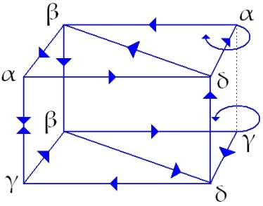
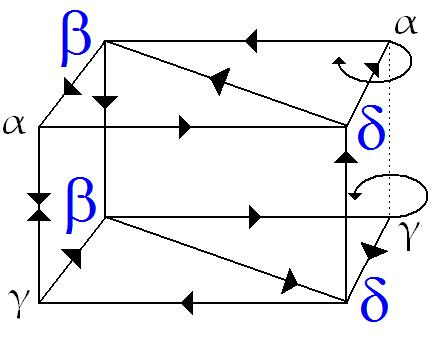
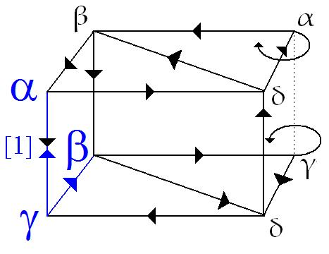
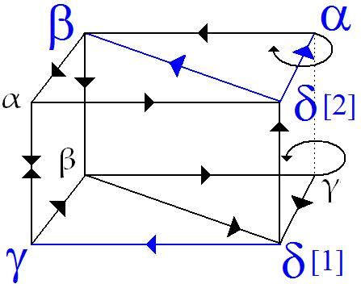

# Leçon 14 | 20 Mars 1957

  

    <label><input type="checkbox" data-lacan-toggle="original" checked> 原文</label>
    <label><input type="checkbox" data-lacan-toggle="notes" checked> 注释</label>
    <label><input type="checkbox" data-lacan-toggle="commentary" checked> 个人解读评论</label>
  

  <form class="lacan-tool-search" role="search">
    <input class="lacan-tool-search-input" type="search" placeholder="搜索全文" aria-label="搜索全文">
    <button class="lacan-tool-button" type="submit" title="搜索">搜索</button>
  </form>
  <button class="lacan-tool-button lacan-back-to-top" type="button" title="回到页面最上方" aria-label="回到页面最上方">↑</button>

<section class="parallel-paragraph" data-paragraph-ids="s4-14-0001">

s4-14-0001

原文 · s4-14-0001

Je voudrais commencer par mettre au point quelque chose concernant l’ar­ticle paru dans *La Psychanalyse* N°2

[无对应译文]

</section>

<section class="parallel-paragraph" data-paragraph-ids="s4-14-0002">

s4-14-0002

原文 · s4-14-0002

sous le titre de l’un de mes séminaires \[« [*Le séminaire sur la lettre volée*](http://staferla.free.fr/Lacan/la_lettre_volee.htm) »\], et spécialement son introduction.

[无对应译文]

</section>

<section class="parallel-paragraph" data-paragraph-ids="s4-14-0003">

s4-14-0003

原文 · s4-14-0003

Un certain nombre d’entre vous ont eu le temps de le lire et d’y regarder d’un peu près. Je suis reconnaissant à ceux qui se sont consacrés à cet examen, de leur attention. Néanmoins, il faut croire que le souvenir d’un contexte dans lequel ce qui est apporté dans cette intro­duction a été amené n’est pas facile à tous à retrouver puisqu’ils retombent - si on peut dire, à propos
de la compréhension de ce texte - dans cette sorte d’erreur réalisante d’une autre espèce qui est celle à laquelle certains
avaient pu se laisser prendre au moment où j’exposais ces termes, par exemple quand ils s’imaginaient que je niais le hasard.

[无对应译文]

</section>

<section class="parallel-paragraph" data-paragraph-ids="s4-14-0004">

s4-14-0004

原文 · s4-14-0004

Je fais allusion à cela dans mon texte même, et je n’y reviens pas. Pour éclairer ce dont il s’agit…
c’est ce qu’a fait une des personnes qui ont le mieux compris et le mieux examiné cette chose,
et de la façon la plus précise, je dirais presque de la façon la plus compétente,
puisqu’en somme cette personne a retrouvé un réseau que l’on peut dessiner ainsi
…il suffit d’avoir ordonné dans une série de symboles 1, 2, 3, les regroupements de signes : +,+, – ,
ordonnés au hasard dans une succession temporelle. Alors nous ordonnons comme 1, 2, 3 ces séries de signes
selon qu’ils représentent :

[无对应译文]

</section>

<section class="parallel-paragraph" data-paragraph-ids="s4-14-0005">

s4-14-0005

原文 · s4-14-0005

- soit (1) *une succession de signes identiques* \[( + + + ) , ( – – – )\]

[无对应译文]

</section>

<section class="parallel-paragraph" data-paragraph-ids="s4-14-0006">

s4-14-0006

原文 · s4-14-0006

- soit (3) *une alternance* \[( + – + ) , ( – + – )\]

[无对应译文]

</section>

<section class="parallel-paragraph" data-paragraph-ids="s4-14-0007">

s4-14-0007

原文 · s4-14-0007

- soit (2) au contraire *quelque chose* de plus différent qui est représenté par ceci : \[( – + + ) , ( – – + )\], mais aussi bien cela :
  \[( + – – ) , ( + + – )\], c’est-à-dire un signe qui au premier aspect se distingue des autres, *qui n’a* *pas de symétrie*.

[无对应译文]

</section>

<section class="parallel-paragraph" data-paragraph-ids="s4-14-0008">

s4-14-0008

原文 · s4-14-0008

C’est ce que j’appelle, d’un terme intraduisible en français, *odd*. C’est *le dissymétrique*, c’est celui qui dès l’abord saute aux yeux comme étant *impair*, *boiteux*. C’est une simple question de définition, il suffit de le poser comme cela, pour que ce soit instauré comme une convention, l’existence d’un symbole.

[无对应译文]

</section>

<section class="parallel-paragraph" data-paragraph-ids="s4-14-0009">

s4-14-0009

原文 · s4-14-0009

Je vous rappelle que les α, les β et les γ, vous donneront ici 2, 2, 2, puis encore ici 3, puis ensuite encore le signe 3, naturellement chaque signe se rapportant aux trois qui précèdent dans la succession temporelle. C’est ce qui je crois est inscrit dans mon texte sans aucune ambiguïté, mais - pour dire - d’une façon *assez res­serrée* pour que ça ait fait difficulté pour certains, mais le contexte empêche que l’on prenne un seul instant pour autre chose que pour cette définition cette convention
qui en est la convention de départ.

[无对应译文]

</section>

<section class="parallel-paragraph" data-paragraph-ids="s4-14-0010">

s4-14-0010

原文 · s4-14-0010

À partir de là, il s’agit d’appeler α, β, γ, δ, *une autre série de symboles* qui se construisent à partir de la seconde série, et ceci étant fondé sur cette remarque que lorsque l’on connaît les deux termes extrêmes dans la seconde série, le terme médian est univoque.
Nous tiendrons donc compte pour définir les termes α, β, γ, δ, que les deux extrêmes dans la série étant un cas comme celui-là, vous voyez où cela va de *odd* à *odd**.* La convention est fondée donc d’inscrire un signe qui se trouve par son ampleur, attraper

[无对应译文]

</section>

<section class="parallel-paragraph" data-paragraph-ids="s4-14-0011">

s4-14-0011

原文 · s4-14-0011

les cinq anté­cédents de la première ligne par le signe γ, donc *du même au même*, c’est-à-dire *de symétrique à symétrique*, qu’il s’agisse :

[无对应译文]

</section>

<section class="parallel-paragraph" data-paragraph-ids="s4-14-0012">

s4-14-0012

原文 · s4-14-0012

- de 1 à 1, de 1 à 3, de 3 à 1 : *c’est* α,

[无对应译文]

</section>

<section class="parallel-paragraph" data-paragraph-ids="s4-14-0013">

s4-14-0013

原文 · s4-14-0013

- de *odd* à *odd* : *c’est* β,

[无对应译文]

</section>

<section class="parallel-paragraph" data-paragraph-ids="s4-14-0014">

s4-14-0014

原文 · s4-14-0014

- partir pour arriver à *odd* : *c’est* γ,

[无对应译文]

</section>

<section class="parallel-paragraph" data-paragraph-ids="s4-14-0015">

s4-14-0015

原文 · s4-14-0015

- revenir de *odd* : *c’est* δ.

[无对应译文]

</section>

<section class="parallel-paragraph" data-paragraph-ids="s4-14-0016">

s4-14-0016

原文 · s4-14-0016

Telles sont les conventions. À partir de là, si on veut définir par un réseau tout ce qui est possible, nous arrivons à construire
un réseau qui est ainsi fabriqué :

[无对应译文]

</section>

<section class="parallel-paragraph" data-paragraph-ids="s4-14-0017">

s4-14-0017

原文 · s4-14-0017

[无对应译文]

</section>

<section class="parallel-paragraph" data-paragraph-ids="s4-14-0018">

s4-14-0018

原文 · s4-14-0018

Il faut qu’il soit orienté, et voici exactement comment il l’est. Le α peut se reproduire indéfiniment par ce vecteur.
Ceci ne peut pas ne pas avoir cet actionnement à chacun des sommets, sauf si ceci est expressément indiqué par la boucle ainsi définie. Vous voyez résumé sur ce réseau d’une façon exhaus­tive *toutes les successions possibles*, et les seules possibles indiqués là, c’est-à-dire qu’une série quelconque qui ne peut pas se coucher sur ce réseau est une série impossible.

[无对应译文]

</section>

<section class="parallel-paragraph" data-paragraph-ids="s4-14-0019">

s4-14-0019

原文 · s4-14-0019

Pourquoi n’ai-je pas mis cela dans mon texte ? D’abord parce que je ne l’avais pas représenté ici. C’est une espèce d’*appareil de contrôle*, de façon d’*envelopper*, de *verrouiller*, définitivement le problème de façon à s’apercevoir et à être sûr qu’on n’a omis aucune

[无对应译文]

</section>

<section class="parallel-paragraph" data-paragraph-ids="s4-14-0020">

s4-14-0020

原文 · s4-14-0020

des possibilités, aucune des solutions pos­sibles. C’est un simple contrôle des calculs.

[无对应译文]

</section>

<section class="parallel-paragraph" data-paragraph-ids="s4-14-0021">

s4-14-0021

原文 · s4-14-0021

Il a cet intérêt que vous pouvez toujours vous y reporter comme à quelque chose à quoi vous pouvez vous fier, qui vous indiquera que vous avez peut-être, dans certains cas, oublié une solution possible, quelque soit le problème que vous vous posiez à propos de cette série, ou que vous vous êtes complètement trompés.

[无对应译文]

</section>

<section class="parallel-paragraph" data-paragraph-ids="s4-14-0022">

s4-14-0022

原文 · s4-14-0022

J’arrive au point litigieux. Vous le voyez sur ce réseau, ceci vous montre qu’il y a en quelque sorte :

[无对应译文]

</section>

<section class="parallel-paragraph" data-paragraph-ids="s4-14-0023">

s4-14-0023

原文 · s4-14-0023

- deux espèces de β,

[无对应译文]

</section>

<section class="parallel-paragraph" data-paragraph-ids="s4-14-0024">

s4-14-0024

原文 · s4-14-0024

- et deux espèces de δ.

[无对应译文]

</section>

<section class="parallel-paragraph" data-paragraph-ids="s4-14-0025">

s4-14-0025

原文 · s4-14-0025

[无对应译文]

</section>

<section class="parallel-paragraph" data-paragraph-ids="s4-14-0026">

s4-14-0026

原文 · s4-14-0026

Si vous regardez chacun de ces sommets, vous voyez qu’il y a toujours une division dichotomique qui se propose
à partir de chacun de ces sommets.

[无对应译文]

</section>

<section class="parallel-paragraph" data-paragraph-ids="s4-14-0027">

s4-14-0027

原文 · s4-14-0027

[无对应译文]

</section>

<section class="parallel-paragraph" data-paragraph-ids="s4-14-0028">

s4-14-0028

原文 · s4-14-0028

Exemple, voilà γ :

[无对应译文]

</section>

<section class="parallel-paragraph" data-paragraph-ids="s4-14-0029">

s4-14-0029

原文 · s4-14-0029

- il peut y avoir après γ : un β,

[无对应译文]

</section>

<section class="parallel-paragraph" data-paragraph-ids="s4-14-0030">

s4-14-0030

原文 · s4-14-0030

- et il peut y avoir après γ : un α, parce que ce vecteur \[1\] là a un privilège d’être à deux sens.

[无对应译文]

</section>

<section class="parallel-paragraph" data-paragraph-ids="s4-14-0031">

s4-14-0031

原文 · s4-14-0031

[无对应译文]

</section>

<section class="parallel-paragraph" data-paragraph-ids="s4-14-0032">

s4-14-0032

原文 · s4-14-0032

Ici vous voyez également un δ, et il y a deux issues possibles :

[无对应译文]

</section>

<section class="parallel-paragraph" data-paragraph-ids="s4-14-0033">

s4-14-0033

原文 · s4-14-0033

- il peut y avoir ce δ \[1\] là et après γ, ou un autre δ \[2\],

[无对应译文]

</section>

<section class="parallel-paragraph" data-paragraph-ids="s4-14-0034">

s4-14-0034

原文 · s4-14-0034

- ce n’est pas la même chose que ce δ là \[1\] après lequel il peut y avoir un β ou un α.

[无对应译文]

</section>

<section class="parallel-paragraph" data-paragraph-ids="s4-14-0035">

s4-14-0035

原文 · s4-14-0035

L’objection que certains ont faite, à propos de la mise en évidence de cette diversité fonctionnelle, est la suivante : selon eux
on pourrait par exemple les appeler par 8 *lettres différentes* au lieu de les appeler par 4 *lettres dif­férentes*, ou bien mettre un *a* ou *a2.*

[无对应译文]

</section>

<section class="parallel-paragraph" data-paragraph-ids="s4-14-0036">

s4-14-0036

原文 · s4-14-0036

Et il m’a été dit qu’il n’y avait pas là *une définition* d’un *symbole* qui fut, en quelque sorte, clair et distinct, et que par conséquent
tout ce que je représentais et articulais de ce qui est dit dans mon texte, n’était qu’une sorte d’opacification du mécanisme
à propos du jeu des *symboles*, une sorte de création qui ferait surgir de soi-même une sorte de *loi interne* qui est toujours…
et c’est là que commence l’espèce de trouble qui se produit dans l’esprit de certains
…une implication de quelque chose qui est introduit par la création du *symbole*, qui va au-delà de ce qui est donné au départ,
à savoir le *pur hasard*.

[无对应译文]

</section>

<section class="parallel-paragraph" data-paragraph-ids="s4-14-0037">

s4-14-0037

原文 · s4-14-0037

C’est là-dessus que je crois devoir m’expliquer. C’est tout à fait exact, et d’une certaine façon on peut dire en effet
que dans le choix des *symboles* il y a une certaine *ambiguïté* en quelque sorte déjà donnée au départ,
et elle est donnée à partir du moment où vous faites les *symboles*.

[无对应译文]

</section>

<section class="parallel-paragraph" data-paragraph-ids="s4-14-0038">

s4-14-0038

原文 · s4-14-0038

La simple indication de l’*oddity*, c’est-à-dire de la dissymétrie, alors que puisque nous avons parlé d’une *succession temporelle*,

[无对应译文]

</section>

<section class="parallel-paragraph" data-paragraph-ids="s4-14-0039">

s4-14-0039

原文 · s4-14-0039

les choses sont orien­tées, et il n’est évidemment pas la même chose qu’il y ait d’abord 2 puis 1, ou 1 puis 2. Les confondre
serait introduire dans le *symbole* lui-même quelque chose que, dans la référence affirmée, l’on peut exprimer plus clairement.
Mais il s’agit de savoir ce que veut dire la clarté en question.

[无对应译文]

</section>

<section class="parallel-paragraph" data-paragraph-ids="s4-14-0040">

s4-14-0040

原文 · s4-14-0040

C’est quelque chose que vous pouvez appeler « *ambiguïté »*, mais dites-vous bien que *c’est justement cela qu’il s’agit de faire sentir*,
à savoir que c’est dans la mesure où le symbole à un certain niveau, est à tous les niveaux, que :

[无对应译文]

</section>

<section class="parallel-paragraph" data-paragraph-ids="s4-14-0041">

s4-14-0041

原文 · s4-14-0041

- le *symbole* en tant qu’il est +, suppose le –,

[无对应译文]

</section>

<section class="parallel-paragraph" data-paragraph-ids="s4-14-0042">

s4-14-0042

原文 · s4-14-0042

- le *symbole* en tant qu’il est –, suppose le +.

[无对应译文]

</section>

<section class="parallel-paragraph" data-paragraph-ids="s4-14-0043">

s4-14-0043

原文 · s4-14-0043

L’ambiguïté est toujours là, plus nous avançons dans la construction, et j’ai fait le pas *minimum* que l’on puisse faire en les groupant par trois. Je ne l’ai pas démontré au cours de l’article parce que je n’avais pas d’autre but que de vous rappeler dans quel contexte avait été introduite *La lettre volée*. Admettez pour un instant que c’est le pas *minimum*. Quand vous faites ce pas *minimum*, c’est justement dans la mesure où le symbole recèle cette ambiguïté qu’apparaît ce que j’appelle *la loi*.
En d’autres termes, si vous supposiez que vous remplacez quatre des sommets par la suite ε, ζ, η, θ, vous aurez en effet
des séquences possibles qui seront *différentes*, qui seront extrêmement *compliquées* puisque vous aurez à faire à huit termes,
et que chacun se couplera avec deux des autres, selon un ordre qui sera loin d’être immédiatement évident.

[无对应译文]

</section>

<section class="parallel-paragraph" data-paragraph-ids="s4-14-0044">

s4-14-0044

原文 · s4-14-0044

Mais c’est justement l’intérêt du choix de ces *symboles* *ambigus* qui couplent, parce qu’ils sont bien couplés par quelque chose,
ce sommet α avec un autre sommet que nous avons appelé α aussi, et qui en effet a des fonctions différentes.
C’est en cela qu’il est intéressant de voir que *les groupant ainsi*, vous voyez sortir la loi extrêmement simple
que je vous ai exprimée par *un des schémas du texte* \[p.5\], celle qui permet de dire que *d’un temps* au *troisième temps*,
vous avez toujours ceci que j’écris d’une façon un peu différente :

[无对应译文]

</section>

<section class="parallel-paragraph" data-paragraph-ids="s4-14-0045">

s4-14-0045

原文 · s4-14-0045

> <u>α, δ</u> → α, β, γ, δ → <u>α, β</u>
>
> γ, β γ, δ
>
> 1er temps 2ème temps 3ème temps

[无对应译文]

</section>

<section class="parallel-paragraph" data-paragraph-ids="s4-14-0046">

s4-14-0046

原文 · s4-14-0046

Vous pouvez avoir ici \[1er temps\] n’importe quel α, δ/γ, β et ici \[2ème temps\] vous avez α, β/γ, δ.

[无对应译文]

</section>

<section class="parallel-paragraph" data-paragraph-ids="s4-14-0047">

s4-14-0047

原文 · s4-14-0047

*Du premier au troisième temps vous pouvez retrouver le* α *et le* γ, \[aux mêmes places\] *mais le* δ \[qui suit α au 1er temps\] *et le* β \[qui suit γ au 1er temps\] *sont* \[au 3ème temps\] *deux impossibilités essentielles par rapport à une dichotomie qui exclut* :

[无对应译文]

</section>

<section class="parallel-paragraph" data-paragraph-ids="s4-14-0048">

s4-14-0048

原文 · s4-14-0048

- *que du premier au troisième temps succèdent un* γ *ou un* δ, *à un* α *ou un* δ,

[无对应译文]

</section>

<section class="parallel-paragraph" data-paragraph-ids="s4-14-0049">

s4-14-0049

原文 · s4-14-0049

- *de même que, à un* β *ou à un* γ, *succèdent un* α *ou un* β. \[cf. *La Psychanalyse* n°2, p.5\]

[无对应译文]

</section>

<section class="parallel-paragraph" data-paragraph-ids="s4-14-0050">

s4-14-0050

原文 · s4-14-0050

Dans mon texte j’ai indiqué certaines suites de cela, certaines propriétés qui ont pour intérêt de mettre en évidence toutes sortes d’autres phases de *la forme*, lois de syntaxe qui peuvent se déduire de cette formule extrêmement simple, et j’ai essayé de les faire d’une façon telle qu’elles soient *métaphoriques*.

[无对应译文]

</section>

<section class="parallel-paragraph" data-paragraph-ids="s4-14-0051">

s4-14-0051

原文 · s4-14-0051

C’est-à-dire qu’elles vous permettent d’entrevoir ce en quoi le *signifiant* est véritablement organisateur de quelque chose d’inhérent à la mémoire humaine, pour autant que la mémoire humaine en impliquant dans sa trame toujours quelques élé­ments de *signifiant* se trouve fondamentalement structurée d’une façon différente de toute espèce de conception possible de la mémoire vitale, à savoir de la persistance ou de l’effacement ou du maintien d’une impression. Pourquoi ?

[无对应译文]

</section>

<section class="parallel-paragraph" data-paragraph-ids="s4-14-0052">

s4-14-0052

原文 · s4-14-0052

Parce que ce qui est important à voir dès que nous introduisons le *signifiant* dans le *réel*, et il est introduit dans le *réel* à partir
du moment où simplement *on parle*, mais encore à partir du moment où simplement *on compte*, tout ce qui est appréhendé
dans l’ordre de la mémoire est pris dans quelque chose qui la structure essentiellement d’une façon fondamentalement différente
de tout ce qu’une théorie de la mémoire fondée sur le thème de la propriété vitale pure et simple peut arriver à faire concevoir.

[无对应译文]

</section>

<section class="parallel-paragraph" data-paragraph-ids="s4-14-0053">

s4-14-0053

原文 · s4-14-0053

C’est cela que j’essaie d’illustrer, et là évidemment métaphoriquement, quand je vous parle du futur, du futur antérieur,
quand je fais intervenir après *le troisième temps*, *le quatrième temps*, c’est à savoir que si on se fixe à ce *quatrième temps*, un point d’arrivée, c’est-à-dire l’un des symboles possibles, n’importe lequel peut être fixé puisque ce *quatrième temps* redevient la même fonction qu’un *second temps*, c’est-à-dire que α, β, γ, δ, peuvent se retrouver *à ce moment là, à ce quatrième temps*.

[无对应译文]

</section>

<section class="parallel-paragraph" data-paragraph-ids="s4-14-0054">

s4-14-0054

原文 · s4-14-0054

Si vous fixez *à ce quatrième temps* comme point de terminaison un α, β, γ, δ, il en résultera certaines éliminations au *deuxième*
et au *troisième temps*, ce qui peut en quelque sorte servir à imaginer ce qui se précise dans *un futur immédiat*, à partir du moment
où il devient - *par rapport à un but*, à un projet déterminé - *le futur antérieur*.

[无对应译文]

</section>

<section class="parallel-paragraph" data-paragraph-ids="s4-14-0055">

s4-14-0055

原文 · s4-14-0055

Le fait que certains éléments de signifiant soient rendus impossibles de ce seul fait, est quelque chose que j’illustrerai *métaphoriquement* comme la fonction que nous pourrions donner à ce que j’appellerai dans cette occasion « *le signifiant impossible* ».

[无对应译文]

</section>

<section class="parallel-paragraph" data-paragraph-ids="s4-14-0056">

s4-14-0056

原文 · s4-14-0056

Ce que je veux vous marquer aujourd’hui, c’est que bien entendu j’ai inter­rompu là mon développement, mais comme certains

[无对应译文]

</section>

<section class="parallel-paragraph" data-paragraph-ids="s4-14-0057">

s4-14-0057

原文 · s4-14-0057

\[soutiennent ?\] justement, au nom d’une espèce de fausse évidence qui pourrait sortir du fait que toute espèce de mystère
ne disparaît pas car il peut se dégager des lois, et toutes aussi simples, à considérer d’une façon différenciée les termes
des différents sommets dans la construction parallélépipédique que je vous ai donnée.

[无对应译文]

</section>

<section class="parallel-paragraph" data-paragraph-ids="s4-14-0058">

s4-14-0058

原文 · s4-14-0058

La question n’est pas là. Ce que je voudrais que vous souteniez un instant devant votre esprit, c’est que ceci veut simplement dire que *dès qu’il y a une graphie, il y a une orthographe*, et je vais vous l’illustrer tout de suite d’une autre façon que celle-ci qui aura peut-être à vos yeux une valeur plus probante, bien que je n’ai pas *fabriqué* tout ceci comme *une espèce d’excursion à la mathé­matique*,

[无对应译文]

</section>

<section class="parallel-paragraph" data-paragraph-ids="s4-14-0059">

s4-14-0059

原文 · s4-14-0059

avec *l’incompétence universelle* qui me caractériserait.

[无对应译文]

</section>

<section class="parallel-paragraph" data-paragraph-ids="s4-14-0060">

s4-14-0060

原文 · s4-14-0060

Vous auriez tort de le croire. D’abord ce ne sont pas des choses sur lesquelles je réfléchis depuis hier, ensuite je l’ai fait contrôler par un mathématicien. Ne croyez pas que parce que ces précisions ont été apportées, le moindre élément d’incertitude
ou de fragilité ait été introduit, je vous le répète : ceci a été contrôlé.

[无对应译文]

</section>

<section class="parallel-paragraph" data-paragraph-ids="s4-14-0061">

s4-14-0061

原文 · s4-14-0061

Je veux maintenant vous dire en quoi ceci a cette valeur qui illustre d’une façon pertinente ce que j’ai voulu dire tout à l’heure, quand je vous ai dit : « *dès qu’il y a graphie, il y a orthographe* ». C’est qu’à partir de ces données hypo­thétiques simples,

[无对应译文]

</section>

<section class="parallel-paragraph" data-paragraph-ids="s4-14-0062">

s4-14-0062

原文 · s4-14-0062

et en raison d’une certaine simplicité sur laquelle je reviendrai tout à l’heure en particulier pour justifier pourquoi je suis parti
de *odd* et non pas ce que j’aurais aussi bien pu faire au départ, distinguer en effet comme on me l’a dit :

[无对应译文]

</section>

<section class="parallel-paragraph" data-paragraph-ids="s4-14-0063">

s4-14-0063

原文 · s4-14-0063

- le *odd* avec *deux pieds légers au début*, \[( – – + ), ( + + – )\],

[无对应译文]

</section>

<section class="parallel-paragraph" data-paragraph-ids="s4-14-0064">

s4-14-0064

原文 · s4-14-0064

- ou le *odd* avec *deux pieds légers à la fin*, \[( – + + ), ( + – – )\],

[无对应译文]

</section>

<section class="parallel-paragraph" data-paragraph-ids="s4-14-0065">

s4-14-0065

原文 · s4-14-0065

- l’[*anapeste*](http://www.cnrtl.fr/definition/anapeste) \[Pied de trois syllabes, deux brèves suivies d’une longue\],

[无对应译文]

</section>

<section class="parallel-paragraph" data-paragraph-ids="s4-14-0066">

s4-14-0066

原文 · s4-14-0066

- du [*dactyle*](http://www.cnrtl.fr/definition/dactyle) \[Pied formé d’une syllabe longue suivie de deux brèves\].

[无对应译文]

</section>

<section class="parallel-paragraph" data-paragraph-ids="s4-14-0067">

s4-14-0067

原文 · s4-14-0067

Je ne l’ai pas fait - nous y reviendrons - et c’est justement en cela que consiste l’intérêt de la question, c’est à savoir que, à partir de certaines définitions, peut-être en effet tout à fait rudimentaires et éliminées elles-mêmes, certains éléments intuitifs
et spécialement cet élément intuitif particulièrement saisissant qui est celui fondé sur la scansion,
comportent déjà toute une sorte d’engagement corporel.

[无对应译文]

</section>

<section class="parallel-paragraph" data-paragraph-ids="s4-14-0068">

s4-14-0068

原文 · s4-14-0068

La poésie commence là, mais nous n’entrons même pas dans la poésie, nous faisons uniquement intervenir la notion de symétrie ou d’asymétrie, et je vous dirai pourquoi il me semble intéressant de limiter à ce strict élément, la création du premier signifiant,
à partir donc de cette hypothèse, mais pas dans le sens où l’usage habituel entend le mot hypothèse, dans le sens de défi­nition, action ou prémisses extrêmement simples qui en résultent.

[无对应译文]

</section>

<section class="parallel-paragraph" data-paragraph-ids="s4-14-0069">

s4-14-0069

原文 · s4-14-0069

> <u>α, δ</u> → α, β, γ, δ → <u>α, β</u>
>
> γ, β γ, δ
>
> 1er temps 2ème temps 3ème temps

[无对应译文]

</section>

<section class="parallel-paragraph" data-paragraph-ids="s4-14-0070">

s4-14-0070

原文 · s4-14-0070

Je reproduis ici mon tableau avec ici *le deuxième temps indéterminé* et ici \[3ème temps\] α, β au dessus et γ, δ en dessous.
Maintenant arrivons au *cinquième temps* : α, β, δ en dessus et au dessous qui nous montre qu’ici, si nous notons

[无对应译文]

</section>

<section class="parallel-paragraph" data-paragraph-ids="s4-14-0071">

s4-14-0071

原文 · s4-14-0071

- ce qui est possible après un α,

[无对应译文]

</section>

<section class="parallel-paragraph" data-paragraph-ids="s4-14-0072">

s4-14-0072

原文 · s4-14-0072

- puis ce qui est possible après un β,

[无对应译文]

</section>

<section class="parallel-paragraph" data-paragraph-ids="s4-14-0073">

s4-14-0073

原文 · s4-14-0073

- puis ce qui est possible après chacun des autres,
  nous voyons ici que peut se produire α, β, γ, δ.

[无对应译文]

</section>

<section class="parallel-paragraph" data-paragraph-ids="s4-14-0074">

s4-14-0074

原文 · s4-14-0074

Vous voyez *l’excès de possibilités* que nous avons, nous avons tous les possibles, et nous les avons *aux deux niveaux*.
Seulement le moindre examen de la situation vous montre que si vous choisissez ici comme point d’arrivée, donc au *cinquième temps*, une lettre quel­conque, la lettre δ par exemple, vous vous apercevez que si vous prenez aussi comme point de départ
une autre lettre, par exemple la lettre α, si vous dites je veux avoir une série telle qu’au *premier temps* il y ait α et qu’au *cinquième temps* il y ait β, vous voyez tout aussitôt que ça ne peut être en aucun cas cette lettre-là, ni rien de cette ligne là. Puisque, du fait qu’au départ vous partez de α, vous ne pouvez avoir que ce qui se produit ici au-dessus de *la ligne de dichotomie*, c’est-à-dire α
ou β et ensuite donc vous ne pouvez avoir que ce qui est aussi au-dessus de cette *ligne dichotomique*, c’est-à-dire α, β, γ, δ.

[无对应译文]

</section>

<section class="parallel-paragraph" data-paragraph-ids="s4-14-0075">

s4-14-0075

原文 · s4-14-0075

Mais que faut-il pour que vous ayez β ? II faut qu’ici vous ayez α parce que β, ne peut provenir que de α. Il en résulte
que quand vous avez le dessein de faire une série où se trouvent deux lettres déterminées, à un espacement de *temps* 5
la lettre médiane, celle-ci, au *troisième temps* est déterminée d’une façon absolument univoque.

[无对应译文]

</section>

<section class="parallel-paragraph" data-paragraph-ids="s4-14-0076">

s4-14-0076

原文 · s4-14-0076

Je pourrais vous montrer d’autres propriétés aussi frappantes, mais je me tiendrai à celles-là pour vous montrer si ceci peut faire surgir à votre esprit la dimension qu’il s’agit d’évoquer. C’est qu’il résulte de cette propriété que si vous prenez *un terme quelconque*, en considérant *le terme deux fois antérieur* et *le terme deux fois postérieur*, vous pouvez immédiatement vérifier - et alors cela
d’une façon simple qui ne comporte absolument aucun trouble à l’œil, c’est une vérification que peut faire un typographe -
à *un point quelconque de la chaîne* s’il y a une faute. Il suffit de se reporter au terme qui est *deux fois antérieur* et au terme
qui est *deux fois postérieur*. Il ne peut y avoir dans ce cas qu’une seule lettre possible.

[无对应译文]

</section>

<section class="parallel-paragraph" data-paragraph-ids="s4-14-0077">

s4-14-0077

原文 · s4-14-0077

En d’autres termes, dès qu’il y a *graphie*, le moindre surgissement de la *graphie* fait surgir en même temps l’*orthographe*, c’est-à-dire
*le contrôle* possible d’une faute\[cf. supra p. 117 : « *appareil de contrôle* »\] . C’est pour cela qu’est construit cet exemple, pour vous montrer que dès le surgissement le plus simple, le plus élémentaire du *signifiant*, la loi surgit tout à fait - bien entendu - indépendamment de tout élément *réel*. Cela ne veut pas dire que d’une façon quelconque *le hasard* soit commandé, c’est que *la loi sort avec le signifiant*, antérieurement indépendante précisément de toute expérience.

[无对应译文]

</section>

<section class="parallel-paragraph" data-paragraph-ids="s4-14-0078">

s4-14-0078

原文 · s4-14-0078

C’est ceci qui est fait pour être démontré par cette spéculation sur les α, β, γ, δ.
Ces choses semblent entraîner un certain nombre de très grandes résistances pour quelques esprits.

[无对应译文]

</section>

<section class="parallel-paragraph" data-paragraph-ids="s4-14-0079">

s4-14-0079

原文 · s4-14-0079

Néanmoins il m’a semblé que c’était une voie plus simple pour faire sentir une certaine dimension, que de conseiller
par exemple la lecture, voire de la commenter, de M. FREGE, mathématicien de ce siècle qui s’est consacré à cette science
en apparence la plus simple des simples, qui est l’arithmétique, et qui a cru devoir faire des détours considérables…
parce que *plus une chose est près de la simplicité plus elle est difficile à saisir*
…mais assurément des détours tout à fait convaincants pour démontrer qu’il n’y a aucune déduction possible du nombre 3,
à partir de l’expérience seulement.

[无对应译文]

</section>

<section class="parallel-paragraph" data-paragraph-ids="s4-14-0080">

s4-14-0080

原文 · s4-14-0080

Ceci bien entendu nous entraîne dans une série de spéculations *philosophiques* ou *mathématiques* desquelles je n’ai pas cru devoir vous faire subir l’épreuve. Ceci est néanmoins très important, car si aucune déduction de l’expérience…
contrairement à ce qu’en pouvait croire M. JUNG
…ne peut nous faire accéder au nombre 3, il est certain que la distinction de *l’ordre symbolique* par rapport à *l’ordre réel* entre dans le *réel* comme un soc et y introduit une dimension originale, et que cette dimension, nous autres analystes et pour autant que nous travaillons sur ce registre de *la parole*, nous devons tenir compte de son ori­ginalité. C’est *ceci qui est en cause* dans l’occasion.

[无对应译文]

</section>

<section class="parallel-paragraph" data-paragraph-ids="s4-14-0081">

s4-14-0081

原文 · s4-14-0081

Pour tout dire je crains de vous fatiguer, et je vais vous faire autre chose, je vais vous dire *une idée plus intuitive* qui m’est venue,
et celle-là est moins certaine dans son affirmation. Néanmoins je peux vous la dire, c’est la remarque qui m’est venue un jour
à l’esprit, alors que je me trouvais dans un *formidable zoo* situé quelque part à soixante kilomètres de Londres et où les animaux
y paraissent dans la plus entière liberté, les grilles étant enterrées dans le sol au fond de fossés invisibles. Je contemplais le lion entouré de trois magnifique lionnes, ceci dans l’aspect de la bonne entente et de l’humeur la plus pacifique.

[无对应译文]

</section>

<section class="parallel-paragraph" data-paragraph-ids="s4-14-0082">

s4-14-0082

原文 · s4-14-0082

Il me semble que je n’ai pas fait dans mon esprit un saut trop grand alors que je me demandais pourquoi cette bonne entente entre ces animaux à propos desquels je devais normalement, d’après ce que nous connaissons, voir éclater les signes de la rivalité ou du conflit les plus manifestes. C’est simplement parce que le lion ne sait pas compter jusqu’à 3. Entendez bien que c’est
parce que le lion ne sait pas compter jusqu’à trois que les lionnes n’éprouvent pas entre elles le moindre sentiment de jalousie,
au moins apparent. Je livre ceci à votre méditation.

[无对应译文]

</section>

<section class="parallel-paragraph" data-paragraph-ids="s4-14-0083">

s4-14-0083

原文 · s4-14-0083

En d’autres termes, nous ne devons en aucun cas négliger l’introduction du signifiant, pour comprendre le surgissement
dont il s’agit, chaque fois que nous nous trouvons devant l’apparence de la réalité qui est notre objet principal dans l’analyse,
la réalité du conflit interhumain. On pourrait même aller plus loin et dire qu’en fin de compte, c’est parce que les hommes
ne savent pas beaucoup mieux compter que le lion - à savoir que ce nombre 3 n’est jamais complètement intégré,
qu’il est seulement articulé - que le conflit existe.

[无对应译文]

</section>

<section class="parallel-paragraph" data-paragraph-ids="s4-14-0084">

s4-14-0084

原文 · s4-14-0084

Parce que bien entendu, le maintien de la relation duelle fondamentalement animale, ne continue pas moins à prévaloir
dans *une certaine zone*, celle précisément de *l’imaginaire*, et c’est justement dans la mesure où l’homme sait tout de même compter,
qu’il se produit en dernière analyse ce quelque chose que nous appelons conflit.

[无对应译文]

</section>

<section class="parallel-paragraph" data-paragraph-ids="s4-14-0085">

s4-14-0085

原文 · s4-14-0085

Si ce n’était pas si difficile d’arriver jusqu’à articuler le nombre trois, il n’y aurait pas ce *gap* entre *le pré-œdipien* et *l’œdipien*
que nous essayons justement ces jours-ci de franchir comme nous le pouvons, à l’aide de petites *échelles de corde* et autres trucs, dont je veux simplement vous faire apercevoir que à partir du moment où on essaie de le franchir, c’est toujours aux trucs auxquels on est livré qu’il n’y a aucune espèce de franchissement véritablement *expérientiel* de ce *gap* entre le 2 et le 3.

[无对应译文]

</section>

<section class="parallel-paragraph" data-paragraph-ids="s4-14-0086">

s4-14-0086

原文 · s4-14-0086

C’est très précisément au point où nous en sommes arrivés avec le petit Hans, au moment où il va aborder ce passage que
nous avons défini, et qui s’appelle *le complexe de castration*, et dont nous pouvons apercevoir qu’au départ c’est bien évidemment
ce qu’il n’a pas, car il joue avec ce *Wiwimacher* qui est ici, qui n’est pas là, qui est *celui de sa mère* ou *du* *grand cheval* ou *du petit cheval* ou *de papa*, qui est le sien aussi mais dont en fin de compte on ne voit pas un seul instant que ce soit pour lui autre chose
qu’un très joli objet de *jeu de cache-cache*, et même auquel il est capable de prendre le plus grand *plaisir*.

[无对应译文]

</section>

<section class="parallel-paragraph" data-paragraph-ids="s4-14-0087">

s4-14-0087

原文 · s4-14-0087

Car un certain nombre d’entre vous, je pense, se seront rapportés à ce texte. C’est de là que l’on part, c’est uniquement de cela qu’il s’agit. Cet enfant se trouve - sans doute à l’intention de ses parents - nous présenter au départ cette sorte de *problématique*
*du phallus imaginaire qui est partout et qui n’est nulle part*, comme étant *l’élément essentiel de son rapport avec* ce qui est pour lui
ce que FREUD appellerait à ce moment là « *l’autre personne »* de la façon la plus nette, et qui est la mère.

[无对应译文]

</section>

<section class="parallel-paragraph" data-paragraph-ids="s4-14-0088">

s4-14-0088

原文 · s4-14-0088

C’est là qu’il en est arrivé, et c’est à ce moment là alors que tout semble aller tellement bien que FREUD nous le souligne,
grâce à *une espèce de libéralisme* voire *de laxisme éducatif* assez caractéristique de la pédagogie qui semble s’être dégagé les premiers temps de la psychanalyse, nous voyons l’enfant se déve­lopper de la façon la plus franche, la plus claire, la plus heureuse.

[无对应译文]

</section>

<section class="parallel-paragraph" data-paragraph-ids="s4-14-0089">

s4-14-0089

原文 · s4-14-0089

C’est en effet après ces trois jolis antécédents, à la surprise générale, qu’il arrive ce que nous pouvons appeler sans trop dramatiser, un petit accroc : *la phobie*. C’est-à-dire qu’à partir d’un certain moment cet enfant a marqué un grand effroi
devant quelque chose, cet objet privilégié qui se trouve être le cheval, dont je vous ai déjà annoncé qu’il était d’une certaine façon métaphorique. Dans le texte, quand l’enfant avait dit à sa mère : « *Si tu as un fait–pipi, tu dois avoir un très grand fait-pipi,*
*un fait-pipi comme un cheval* ». Il est clair que si nous voyons apparaître à l’horizon l’image du cheval, c’est à partir de ce moment que l’enfant entre dans la phobie.

[无对应译文]

</section>

<section class="parallel-paragraph" data-paragraph-ids="s4-14-0090">

s4-14-0090

原文 · s4-14-0090

Pour faire ce trajet métaphoriquement à travers l’observation du petit Hans, il faut comprendre comment l’enfant va passer d’une relation si simple, en fin de compte si heureuse, si clairement articulée, à la phobie.
Où est l’inconscient à ce moment là ? Où est le refoulement ? Il ne semble pas qu’il y en ait aucun :

[无对应译文]

</section>

<section class="parallel-paragraph" data-paragraph-ids="s4-14-0091">

s4-14-0091

原文 · s4-14-0091

- il interroge sur la présence ou l’absence du *fait-pipi* avec la plus grande liberté, son père, sa mère,

[无对应译文]

</section>

<section class="parallel-paragraph" data-paragraph-ids="s4-14-0092">

s4-14-0092

原文 · s4-14-0092

- il leur dit qu’il a été au *zoo* et qu’il a vu un animal, le lion en l’occasion pourvu d’un grand *fait-pipipi*.

[无对应译文]

</section>

<section class="parallel-paragraph" data-paragraph-ids="s4-14-0093">

s4-14-0093

原文 · s4-14-0093

Et le *fait-pipi* joue un rôle qui d’ailleurs tend à se présentifier pour toutes sortes de raisons, pas dites tout à fait au début de l’observation, mais que nous voyons apparaître après coup.

[无对应译文]

</section>

<section class="parallel-paragraph" data-paragraph-ids="s4-14-0094">

s4-14-0094

原文 · s4-14-0094

Que l’enfant trouve un grand plaisir à s’exhiber lui­-même, certains de ses jeux montrant bien le caractère essentiellement,
à ce moment là, *symbolique* du *fait-pipi*, il va l’exhiber dans le noir, il le montre à la fois comme objet caché, il s’en sert également *comme élément intermédiaire pour ses relations avec* les objets de son intérêt, c’est à dire *les petites filles* auxquelles il demande d’intervenir, de l’aider, auxquelles il le laisse regarder. Que le fait que sa mère ou son père l’aident - ce qui est souligné également - joue
le plus grand rôle dans l’instauration de ses organes comme d’un élément d’intérêt par où sans aucun doute il se donne la joie
de captiver l’attention, l’intérêt, voire les caresses d’un certain nombre de gens de son entourage.

[无对应译文]

</section>

<section class="parallel-paragraph" data-paragraph-ids="s4-14-0095">

s4-14-0095

原文 · s4-14-0095

C’est là que nous en sommes quand va se produire quelque chose. Pour avoir une idée de l’harmonie que trouve ce quelque chose, dites-vous que c’est avant la phobie que le petit Hans se trouve manifester *sur le plan imaginaire*, toutes les attitudes
les plus formellement typiques qu’on puisse attendre de ce que nous appelons dans notre rude langage « *l’agression virile* ».

[无对应译文]

</section>

<section class="parallel-paragraph" data-paragraph-ids="s4-14-0096">

s4-14-0096

原文 · s4-14-0096

Il est avec les petites filles dans cet état de mise en jeu d’une cour qui est plus ou moins présente, et qui même se différencie,
se distancie en deux modes :

[无对应译文]

</section>

<section class="parallel-paragraph" data-paragraph-ids="s4-14-0097">

s4-14-0097

原文 · s4-14-0097

- il y a les petites filles qu’il presse, qu’il étreint, qu’il agresse,

[无对应译文]

</section>

<section class="parallel-paragraph" data-paragraph-ids="s4-14-0098">

s4-14-0098

原文 · s4-14-0098

- il y en a d’autres avec lesquelles il traite sous le mode du *Lieberklass-distanz*,
  ...deux modes de relations très différenciés, déjà *très subtiles*, je dirais presque *très civilisés*, *très ordonnés*, *très cultivés*.
  Le terme même « *cultivé* » est employé par FREUD pour désigner la différenciation que fait le petit Hans dans ses *objets*.
  Il ne se conduit pas de la même façon avec les petites filles qu’il considère comme des dames cultivées, *des dames de son monde*,
  et avec les petites filles de son propriétaire.

[无对应译文]

</section>

<section class="parallel-paragraph" data-paragraph-ids="s4-14-0099">

s4-14-0099

原文 · s4-14-0099

Il y a là toute l’apparence d’un débouché particulièrement heureux dans ce qu’on peut appeler le transfert, le réinvestissement des sentiments portés à l’objet féminin, sous l’aspect de la mère, vers d’autres objets féminins. Nous pouvons concevoir
qu’il y ait quelque chose qui se produit, qui apporte dans ce développement rendu facile, nous dit-on, par cette relation particulièrement ouverte, dialoguante, qui n’interdit en rien *aucun mode d’expression* à l’enfant.

[无对应译文]

</section>

<section class="parallel-paragraph" data-paragraph-ids="s4-14-0100">

s4-14-0100

原文 · s4-14-0100

Qu’est-ce qui se produit ? Comment déjà pouvons-nous essayer d’aborder le problème, puisqu’il s’agit non pas de survoler comme je l’ai fait jusqu’à présent, mais de suivre *pas à pas* la critique de l’observation ? Je pense ne pas forcer le texte en disant déjà quel est le signe de cette structuration sous-jacente qui est celle que je vous ai donnée comme celle de *la relation de l’enfant*
*à la mère*, et à partir de quoi se conçoit l’introduction de la crise, sous la forme de *la mise en jeu*, de *l’entrée dans le jeu* du pénis réel.

[无对应译文]

</section>

<section class="parallel-paragraph" data-paragraph-ids="s4-14-0101">

s4-14-0101

原文 · s4-14-0101

Il y a une chose qui dans le texte n’a jamais été commentée. L’enfant fait un rêve, il pense qu’il est avec *la petite* Mariedl,
qui est une de ses petites camarades qu’il voit l’été dans une station d’Autriche. Il raconte qu’il est avec la petite fille,
puis on re-raconte son rêve et on dit :

[无对应译文]

</section>

<section class="parallel-paragraph" data-paragraph-ids="s4-14-0102">

s4-14-0102

原文 · s4-14-0102

« *C’est amusant il a rêvé qu’il était avec la petite fille* »

[无对应译文]

</section>

<section class="parallel-paragraph" data-paragraph-ids="s4-14-0103">

s4-14-0103

原文 · s4-14-0103

Et il y a une très jolie rectification de Hans :

[无对应译文]

</section>

<section class="parallel-paragraph" data-paragraph-ids="s4-14-0104">

s4-14-0104

原文 · s4-14-0104

« *Pas seulement avec Mariedl, tout seul avec Mariedl….* »

[无对应译文]

</section>

<section class="parallel-paragraph" data-paragraph-ids="s4-14-0105">

s4-14-0105

原文 · s4-14-0105

Je pense que cette réplique…
qui comme beaucoup d’autres choses, foisonnantes dans l’observations, passe à la lecture,
ou plus exactement dont on se débarrasse dans ce sens que ce ne sont que des histoires d’enfant
…a son importance, et FREUD le dit bien : tout a une signification. Je pense que ceci n’est strictement concevable que dans cette dialectique imaginaire qui est celle que je vous ai ouverte comme étant le plan de départ des relations de l’enfant à la mère.

[无对应译文]

</section>

<section class="parallel-paragraph" data-paragraph-ids="s4-14-0106">

s4-14-0106

原文 · s4-14-0106

Ceci se produit à 3 *ans et* 9 *mois*, et on nous a dit qu’à 3 *ans et* 6 *mois* *avait eu lieu la naissance de la petite soeur*, par conséquent ceci

[无对应译文]

</section>

<section class="parallel-paragraph" data-paragraph-ids="s4-14-0107">

s4-14-0107

原文 · s4-14-0107

peut déjà bien entendu vous satisfaire. « *Pas seu­lement avec, mais tout seul avec…* », c’est-à-dire qu’on peut être avec tout à fait seul,
c’est-à-dire ne pas avoir, comme avec la mère, cette *intruse*. Il n’y a aucun doute à ce moment-là que l’enfant Hans
se met à s’habituer à la présence de *la petite sœur*. Je pense donc que sur le plan de la remarque du type la plus classique,
ceci ne peut en tout cas que vous apparaître pour évident, et vous satisfaire.

[无对应译文]

</section>

<section class="parallel-paragraph" data-paragraph-ids="s4-14-0108">

s4-14-0108

原文 · s4-14-0108

Néanmoins vous savez bien que ce n’est pas là que je m’en tiens, c’est à savoir que je dis que assurément cette intrusion réelle
de l’autre enfant dans la relation de l’enfant avec la mère est bien faite pour précipiter tel ou tel moment critique,
telle ou telle angoisse décisive, mais que ce dont je suis parti et ce sur quoi j’insiste, et ce pourquoi je n’hésite pas à mettre l’accent à propos de ce « *tout seul avec* », c’est que - quelle que soit la position - l’enfant n’est jamais seul avec la mère.

[无对应译文]

</section>

<section class="parallel-paragraph" data-paragraph-ids="s4-14-0109">

s4-14-0109

原文 · s4-14-0109

Tout le progrès de ce qui se passe dans la relation apparemment duelle de l’enfant avec la mère est marqué de cet élément absolument essentiel, c’est que l’enfant n’intervient…
comme l’expérience de l’analyse de la sexualité féminine nous en donne l’assurance, et à laquelle il faut garder le point
de référence, l’axe, avec fermeté, de ce que FREUD a maintenu jusqu’au terme concer­nant cette sexualité féminine

[无对应译文]

</section>

<section class="parallel-paragraph" data-paragraph-ids="s4-14-0110">

s4-14-0110

原文 · s4-14-0110

…que comme *substitut*, *compensation*, bref dans une référence quelconque à ce quelque chose qui est ce qui manque

[无对应译文]

</section>

<section class="parallel-paragraph" data-paragraph-ids="s4-14-0111">

s4-14-0111

原文 · s4-14-0111

essen­tiellement à la mère, et qui donc *ne le laisse jamais seul avec la mère*.

[无对应译文]

</section>

<section class="parallel-paragraph" data-paragraph-ids="s4-14-0112">

s4-14-0112

原文 · s4-14-0112

C’est dans la mesure où la mère se situe, et peu à peu est apprise par l’enfant, comme étant marquée de ce manque fondamental, et de ce manque après lequel elle-même elle cherche, et dont lui, l’enfant, ne lui donne une satis­faction que - si nous voulons l’appeler ainsi provisoirement - que substitutive. C’est sur cette base essentiellement que s’introduit, que se conçoit toute espèce de nouvelle béance, toute espèce de réouverture de la question, et spécialement celle qui survient avec la maturation génitale réelle, c’est-à-dire chez le garçon avec l’introduction de la masturbation, cette jouissance réelle avec son propre pénis réel.

[无对应译文]

</section>

<section class="parallel-paragraph" data-paragraph-ids="s4-14-0113">

s4-14-0113

原文 · s4-14-0113

C’est dans cette constellation que rien ne peut être compris autrement que dans cette constellation de départ, qui est celle
qui est le fondement par où peuvent s’introduire les éléments critiques qui peuvent avoir les débouchés divers qui constituent

[无对应译文]

</section>

<section class="parallel-paragraph" data-paragraph-ids="s4-14-0114">

s4-14-0114

原文 · s4-14-0114

- *un complexe d’Œdipe* à issue normale,

[无对应译文]

</section>

<section class="parallel-paragraph" data-paragraph-ids="s4-14-0115">

s4-14-0115

原文 · s4-14-0115

- ou *un complexe d’Œdipe plus ou moins abordé de façon plus ou moins négativée, et qui n’est pas du tout* - ce qu’on vous enseigne d’habitude - *une névrose*.

[无对应译文]

</section>

<section class="parallel-paragraph" data-paragraph-ids="s4-14-0116">

s4-14-0116

原文 · s4-14-0116

Reprenons donc là où nous en sommes, et faisons ici un petit bout de remarque, à savoir que si l’enfant a à découvrir
cette dimension, à savoir que quelque chose est désiré par la mère au-delà de lui-même, c’est-à-dire au-delà de l’objet du plaisir d’abord qu’il ressent être lui-même dans sa mère, et qu’il aspire à être, la situation ne doit se concevoir, comme toute espèce
de situation analytique, que dans la référence essentiellement *intersubjective* qui comporte toujours et à la fois, et corrélativement, la dimension originale de chaque sujet, mais en même temps la réalité de cette perspective intersubjective telle qu’elle est entrée dans chaque sujet. Autrement dit, je vous fais remarquer au passage ce quelque chose qui est voilé au départ,
et que nous n’arriverons à dévoiler qu’à la fin.

[无对应译文]

</section>

<section class="parallel-paragraph" data-paragraph-ids="s4-14-0117">

s4-14-0117

原文 · s4-14-0117

Mais vous en savez déjà assez de l’observation pour pouvoir au moins vous poser la ques­tion, et vous référer à des termes que j’ai employés autrefois à bon ou à mauvais escient, à savoir ces termes essentiels comme d’une division tout à fait majeure de l’abord signifiant de quelque réalité que ce soit chez un sujet, à savoir *la métaphore* et *la métonymie*. C’est bien le cas de l’appliquer
et au moins de laisser aller tant de points d’interrogation. C’est que *dans toute situation intersubjective telle qu’elle s’éta­blit entre l’enfant*

[无对应译文]

</section>

<section class="parallel-paragraph" data-paragraph-ids="s4-14-0118">

s4-14-0118

原文 · s4-14-0118

*et la mère* nous aurons *une question préalable* si l’on peut dire, à nous poser. Elle sera préalable et ce sera probablement seulement
à la fin qu’elle sera tranchée, à savoir *que dans cette fonction de substitution ce qui finalement fait image pour l’exprimer ne veut rien dire*.

[无对应译文]

</section>

<section class="parallel-paragraph" data-paragraph-ids="s4-14-0119">

s4-14-0119

原文 · s4-14-0119

*Substitution*, c’est facile à dire, essayons donc de substituer un caillou à un morceau de pain. Quand vous le mettez
dans la trompe de l’éléphant, il ne le prendra pas tout à fait du ton uni que vous pourriez croire. Il ne s’agit pas de *substitution*,
il s’agit de savoir ce que signifie cette *substitution signifiante*, et pour tout dire il s’agit de savoir, pour la mère et par rapport
à ce *phallus* qui est l’objet de son désir, quelle est la fonction de l’enfant.

[无对应译文]

</section>

<section class="parallel-paragraph" data-paragraph-ids="s4-14-0120">

s4-14-0120

原文 · s4-14-0120

Il est clair que ce n’est pas tout à fait la même chose

[无对应译文]

</section>

<section class="parallel-paragraph" data-paragraph-ids="s4-14-0121">

s4-14-0121

原文 · s4-14-0121

- si l’enfant par exemple est *la métaphore* de son amour pour le père,

[无对应译文]

</section>

<section class="parallel-paragraph" data-paragraph-ids="s4-14-0122">

s4-14-0122

原文 · s4-14-0122

- ou s’il est *la métonymie* de son désir du *phallus* qu’elle n’a pas et qu’elle n’aura jamais.

[无对应译文]

</section>

<section class="parallel-paragraph" data-paragraph-ids="s4-14-0123">

s4-14-0123

原文 · s4-14-0123

*Tout indique très précisément dans la conduite de la mère*…
qui est là tout à fait évidente, avec cet enfant qu’elle traîne littéralement partout avec elle, depuis les W.C. jusqu’à son lit
…*que l’enfant lui est un appendice absolument indispensable* *et que par conséquent*…
car c’est exactement cela la mère de Hans, que FREUD adore, cette mère qu’il a soignée, cette mère si bonne
et si aux petits soins pour cet enfant - et en plus elle est jolie - c’est cette dame qui trouve le moyen de changer de culotte devant son enfant, c’est tout de même d’une dimension bien particulière
…et si quelque chose est fait dans cette observation, si quelque chose se trouve illustrer ce que je vous dis d’essentiel dans cet ordre, c’est que ce qui est derrière le voile, c’est bien l’observation du petit Hans et bien d’autres encore qui nous le montrent.
Qu’est-ce que veut dire que : *l’enfant est la métonymie de son désir pour le phallus* ?

[无对应译文]

</section>

<section class="parallel-paragraph" data-paragraph-ids="s4-14-0124">

s4-14-0124

原文 · s4-14-0124

Cela ne veut pas dire qu’elle ait plus de *considération* pour *le phallus* de l’enfant, comme elle le montre bien,
à la vérité, cette personne si libérale, quand il s’agit d’éducation, de parler *des choses*, quand il s’agit de venir au fait
et d’y mettre le doigt sur *ce petit bout de machin* que l’enfant lui sort, elle est saisie d’une peur bleue.

[无对应译文]

</section>

<section class="parallel-paragraph" data-paragraph-ids="s4-14-0125">

s4-14-0125

原文 · s4-14-0125

C’est tout de même comme cela dans cette espèce de *tonus* vivant, il faut tâcher de rebriquer cette observation du petit Hans pour qu’elle brille. Donc vous le voyez, ce n’est pas tout à fait la même chose que de dire que l’enfant est pris *comme une métonymie du désir du phallus de la mère*, cela implique cette chose très importante que ça n’est pas en tant que *phallophore*
qu’il est *métonymique, c’est en tant que totalité*.

[无对应译文]

</section>

<section class="parallel-paragraph" data-paragraph-ids="s4-14-0126">

s4-14-0126

原文 · s4-14-0126

C’est là justement que s’établit le drame. Pour lui tout irait très bien s’il s’agissait de *Wiwimacher*, mais c’est qu’il ne s’agit pas
de cela, c’est lui tout entier qui est en cause, et c’est parce que c’est lui tout entier qui est en cause que la différence commence très sérieu­sement à apparaître au moment où entre enjeu le *Wiwimacher réel*. Il devient pour lui un objet de satisfaction.
C’est à ce moment là que commence à se produire ce qu’on appelle *l’angoisse*.

[无对应译文]

</section>

<section class="parallel-paragraph" data-paragraph-ids="s4-14-0127">

s4-14-0127

原文 · s4-14-0127

Ce qu’on appelle *l’angoisse* tient à ceci : c’est qu’il peut mesurer toute la différence qu’il y a entre *ce pour quoi il est aimé*,
et *ce qu’il peut donner*, et qu’à partir de ce moment là cet enfant qui, du seul fait qu’il est dans la position qui est la position *originaire* de l’enfant par rapport à la mère, c’est-à-dire qu’il est là pour être *objet de plaisir,* donc qu’il est dans une relation où il est fondamentalement *imaginé*, et tout ce qu’il peut lui arriver de meilleur, c’est de passer de l’état purement passif…
c’est ce qui est essentiel : cette passivité primordiale, nous la reverrons, et si nous ne voyons pas que c’est là que s’insère cette passivation primordiale, nous ne pouvons rien comprendre à l’observation de *L’Homme aux loups*
…ce qu’il peut faire de mieux…
au-delà d’être imaginé, pris dans la capture, dans le piège de ce *quelque chose* où il s’introduit pour être l’objet
de sa mère et où il se rend compte, si on peut dire, peu à peu de ce qu’il est vraiment, il est imaginé

[无对应译文]

</section>

<section class="parallel-paragraph" data-paragraph-ids="s4-14-0128">

s4-14-0128

原文 · s4-14-0128

…ce qu’il peut faire de mieux, c’est de s’ima­giner tel qu’il est imaginé, c’est à dire de passer à la voix moyenne[^27],

[无对应译文]

</section>

<section class="parallel-paragraph" data-paragraph-ids="s4-14-0129">

s4-14-0129

原文 · s4-14-0129

si on peut s’exprimer ainsi.

[无对应译文]

</section>

<section class="parallel-paragraph" data-paragraph-ids="s4-14-0130">

s4-14-0130

原文 · s4-14-0130

À partir du moment où il existe aussi comme réel, il n’a pas beaucoup le choix : évidemment il est certain qu’il peut s’imaginer comme fondamen­talement autre et rejeté, autre que ce qui est désiré, et comme tel hors du champ imaginaire où elle pouvait jusque là trouver à se satisfaire par la place qu’il y occupait.

[无对应译文]

</section>

<section class="parallel-paragraph" data-paragraph-ids="s4-14-0131">

s4-14-0131

原文 · s4-14-0131

FREUD le souligne : ce dont il s’agit, c’est de quelque chose qui survient d’abord, une *angoisse*, mais *angoisse de quoi* ?
Nous en avons des traces : un rêve, il se réveille sanglotant parce que sa mère allait partir, où « *tu allais partir* » dit-il au père, quelque chose qui est une séparation.

[无对应译文]

</section>

<section class="parallel-paragraph" data-paragraph-ids="s4-14-0132">

s4-14-0132

原文 · s4-14-0132

Nous pouvons compléter ces termes par mille autres traits: c’est en tant qu’il est séparé de sa mère et quand il est avec quelqu’un d’autre, que se manifestent ces angoisses. Ce qu’il y a de certain, c’est que ces angoisses apparaissent d’abord,
et FREUD le souligne : *le sentiment d’angoisse se distingue de la phobie*, c’est-à-dire de ce quelque chose qui n’est pas tellement facile
à saisir, et que nous allons essayer de cerner.

[无对应译文]

</section>

<section class="parallel-paragraph" data-paragraph-ids="s4-14-0133">

s4-14-0133

原文 · s4-14-0133

Qu’est-ce qu’une phobie ? Naturellement on peut sauter gaiement et dire : la phobie, c’est l’élément représentatif là-dedans.
Je veux bien, mais vous êtes bien avancés après :

[无对应译文]

</section>

<section class="parallel-paragraph" data-paragraph-ids="s4-14-0134">

s4-14-0134

原文 · s4-14-0134

- pour­quoi cet élément représentatif ?

[无对应译文]

</section>

<section class="parallel-paragraph" data-paragraph-ids="s4-14-0135">

s4-14-0135

原文 · s4-14-0135

- Et pourquoi une représentation si singulière ?

[无对应译文]

</section>

<section class="parallel-paragraph" data-paragraph-ids="s4-14-0136">

s4-14-0136

原文 · s4-14-0136

- Et quel rôle joue-t-elle ?

[无对应译文]

</section>

<section class="parallel-paragraph" data-paragraph-ids="s4-14-0137">

s4-14-0137

原文 · s4-14-0137

Un autre piège consiste à se dire qu’il y a une finalité, et qu’elle doit servir à quelque chose.

[无对应译文]

</section>

<section class="parallel-paragraph" data-paragraph-ids="s4-14-0138">

s4-14-0138

原文 · s4-14-0138

- Pourquoi donc servirait-elle à quelque chose ?

[无对应译文]

</section>

<section class="parallel-paragraph" data-paragraph-ids="s4-14-0139">

s4-14-0139

原文 · s4-14-0139

- N’y aurait-il pas aussi des choses qui *ne servent à rien* ?

[无对应译文]

</section>

<section class="parallel-paragraph" data-paragraph-ids="s4-14-0140">

s4-14-0140

原文 · s4-14-0140

- Pourquoi tran­cher d’avance que *la phobie sert à quelque chose* ?

[无对应译文]

</section>

<section class="parallel-paragraph" data-paragraph-ids="s4-14-0141">

s4-14-0141

原文 · s4-14-0141

- Peut-être ne sert-elle exac­tement à rien ?

[无对应译文]

</section>

<section class="parallel-paragraph" data-paragraph-ids="s4-14-0142">

s4-14-0142

原文 · s4-14-0142

Tout se serait aussi bien passé si elle n’avait pas été là, pourquoi avoir des idées préconçues de *finalité* à cette occasion ?
Nous allons tâcher de savoir *la fonction* de la phobie. Qu’est-ce que la phobie en cette occasion ? En d’autres termes,
quelle est la structure particulière de la phobie du petit Hans ? Ce qui nous amènera peut-être à avoir quelques notions
sur ce qu’est *la structure générale d’une phobie*.

[无对应译文]

</section>

<section class="parallel-paragraph" data-paragraph-ids="s4-14-0143">

s4-14-0143

原文 · s4-14-0143

Quoiqu’il en soit, je voudrais dès maintenant vous faire remarquer à ce propos la différence entre *l’angoisse* et *la phobie*,
elle est ici tout à fait sensible. Je ne sais pas si la phobie est une chose tellement représentative que cela, car nous allons voir
qu’il est très difficile de savoir de quoi il a peur. Il l’articule de mille façons, mais il reste un résidu tout à fait singulier.
Si vous avez lu l’observation, vous savez que ce *cheval* - qui est brun, blanc, noir, vert et ces couleurs ne sont pas sans intérêt -
pose une énigme qui jusqu’au bout de l’observation n’est jamais résolue. C’est je ne sais quelle espèce de *tâche noire* qu’il a par là, qui en fait *un animal des temps préhistoriques*.

[无对应译文]

</section>

<section class="parallel-paragraph" data-paragraph-ids="s4-14-0144">

s4-14-0144

原文 · s4-14-0144

Devant ce [chanfrein](http://www.cnrtl.fr/definition/chanfrein) de cheval il y a cette espèce de tache noire, et le père d’interroger l’enfant :

[无对应译文]

</section>

<section class="parallel-paragraph" data-paragraph-ids="s4-14-0145">

s4-14-0145

原文 · s4-14-0145

- « *Est-ce le fer qu’il a dans la bouche ?* »

[无对应译文]

</section>

<section class="parallel-paragraph" data-paragraph-ids="s4-14-0146">

s4-14-0146

原文 · s4-14-0146

- « *Pas du tout.* » dit l’enfant.

[无对应译文]

</section>

<section class="parallel-paragraph" data-paragraph-ids="s4-14-0147">

s4-14-0147

原文 · s4-14-0147

- « *Est-ce le harnais ?* »

[无对应译文]

</section>

<section class="parallel-paragraph" data-paragraph-ids="s4-14-0148">

s4-14-0148

原文 · s4-14-0148

- « *Non, non*… »

[无对应译文]

</section>

<section class="parallel-paragraph" data-paragraph-ids="s4-14-0149">

s4-14-0149

原文 · s4-14-0149

- « *Et celui que tu vois là, a-t-il la tâche ? »*

[无对应译文]

</section>

<section class="parallel-paragraph" data-paragraph-ids="s4-14-0150">

s4-14-0150

原文 · s4-14-0150

- « *Non, non*… » dit l’enfant.

[无对应译文]

</section>

<section class="parallel-paragraph" data-paragraph-ids="s4-14-0151">

s4-14-0151

原文 · s4-14-0151

- Et puis un beau jour, fatigué, il dit : « *Oui, celui-là l’a, n’en parlons plus* ».

[无对应译文]

</section>

<section class="parallel-paragraph" data-paragraph-ids="s4-14-0152">

s4-14-0152

原文 · s4-14-0152

Ce qu’il y a de certain, c’est qu’on ne sait jamais ce que c’est que ce noir qui est devant la bouche du cheval.
Ce n’est donc pas si simple que cela une phobie, puisqu’il y a même des éléments quasiment irréductibles.

[无对应译文]

</section>

<section class="parallel-paragraph" data-paragraph-ids="s4-14-0153">

s4-14-0153

原文 · s4-14-0153

C’est assez peu représentatif, et si il y a quelque chose qui donne bien le sentiment de ce sur quoi on s’est exprimé dans ces poussées qui surviennent périodiquement dans l’analyse, cette notion d’une espèce d’élément négatif hallucinatoire, c’est bien là quelque chose dans cette sorte de flou, car c’est en fin de compte cela qui nous apparaît le plus clair dans cette tête de cheval,
et qui est bien fait pour nous en donner l’idée.

[无对应译文]

</section>

<section class="parallel-paragraph" data-paragraph-ids="s4-14-0154">

s4-14-0154

原文 · s4-14-0154

Mais il y a une chose certaine, c’est qu’il y a une différence radicale entre deux sentiments, entre *ce sentiment d’angoisse* pour autant que l’enfant se sent tout d’un coup lui-même, comme quelque chose qui peut être tout d’un coup complètement mis *hors de jeu*.
Bien sûr la petite sœur prépare, et au maximum, la question, et je vous le répète, c’est sur un fond beaucoup plus profond
que la crise s’ouvre, que le sol se dérobe sous les pieds, à partir du moment où l’enfant peut concevoir qu’il peut tout d’un coup ne plus remplir d’aucune façon sa *fonction*, qu’il peut n’être plus rien, et que tout simplement il n’est rien de plus que ce quelque chose *qui a l’air d’être quelque chose*, mais qui en même temps n’est rien, et qui s’appelle *une métonymie*.

[无对应译文]

</section>

<section class="parallel-paragraph" data-paragraph-ids="s4-14-0155">

s4-14-0155

原文 · s4-14-0155

C’est-à-dire - je parle de quelque chose que nous avons déjà vu - la *métonymie* c’est le procédé du roman réaliste : si un roman réaliste nous intéresse, ce n’est pas à cause de tout le menu chatoiement réel qui nous est apporté car le roman réaliste
n’est toujours en fin de compte qu’un amoncellement de clichés, si ces clichés nous intéressent, c’est justement parce que derrière cela ils visent toujours autre chose, ils visent précisément exactement ce qui a l’air d’être le plus contraire, c’est-à-dire *tout ce qui manque*, tout ce qui fait que c’est très au-delà de tous ces détails, de toute *cette espèce de scintillement de cailloux* qui nous est donné, il y a le quelque chose qui précisément nous attache, plus c’est *métonymique*, plus c’est audelà qu’est la visée du roman.

[无对应译文]

</section>

<section class="parallel-paragraph" data-paragraph-ids="s4-14-0156">

s4-14-0156

原文 · s4-14-0156

Notre cher petit Hans se voit donc là tout d’un coup précipité, ou pré­cipitable tout au moins, dans sa fonction de *métonymie*.

[无对应译文]

</section>

<section class="parallel-paragraph" data-paragraph-ids="s4-14-0157">

s4-14-0157

原文 · s4-14-0157

Il s’imagine comme un néant pour arriver tout de même à dire ce mot d’une façon plus vivante que théorique. Que se passe-t-il à partir du moment où entre en jeu dans son existence, *la phobie* ? Une chose en tout cas est certaine, c’est que devant *les chevaux*, ce n’est pas de l’angoisse qu’il éprouve, c’est de la peur. Il a peur qu’il arrive quelque chose de réel, deux choses nous dit-il :

[无对应译文]

</section>

<section class="parallel-paragraph" data-paragraph-ids="s4-14-0158">

s4-14-0158

原文 · s4-14-0158

- que les chevaux mordent,

[无对应译文]

</section>

<section class="parallel-paragraph" data-paragraph-ids="s4-14-0159">

s4-14-0159

原文 · s4-14-0159

- que les chevaux tombent.

[无对应译文]

</section>

<section class="parallel-paragraph" data-paragraph-ids="s4-14-0160">

s4-14-0160

原文 · s4-14-0160

La différence qu’il y a entre *l’angoisse*…
qui littéralement est quelque chose de *sans objet*, et là je ne fais que répéter FREUD parce qu’il l’a parfaitement articulé
…et *la phobie*, c’est que pour la phobie ce dont il s’agit, ce n’est pas du tout d’angoisse, malgré le ton qu’il donne ici aux chevaux : les chevaux portent de l’angoisse, mais ce qu’ils portent, c’est la peur, et la peur d’une certaine façon concerne toujours
quelque chose d’articulable, de nommable, de réel :

[无对应译文]

</section>

<section class="parallel-paragraph" data-paragraph-ids="s4-14-0161">

s4-14-0161

原文 · s4-14-0161

- ces chevaux peuvent mordre,

[无对应译文]

</section>

<section class="parallel-paragraph" data-paragraph-ids="s4-14-0162">

s4-14-0162

原文 · s4-14-0162

- ces chevaux peuvent tom­ber.

[无对应译文]

</section>

<section class="parallel-paragraph" data-paragraph-ids="s4-14-0163">

s4-14-0163

原文 · s4-14-0163

Ils ont bien d’autres propriétés : qu’ils peuvent garder en eux-mêmes la trace de l’angoisse dont il s’agit, et peut-être en effet,
y a-t-il quelque rapport. Nous verrons par la suite les rapports qu’il y a entre ce flou, cette espèce de tâche noire,
car les chevaux recouvrent quelque chose, et il y a quand même quelque chose par en-dessous qui apparaît, qui fait lumière derrière ce qui commence à flotter, c’est ce noir.

[无对应译文]

</section>

<section class="parallel-paragraph" data-paragraph-ids="s4-14-0164">

s4-14-0164

原文 · s4-14-0164

Mais dans le vécu comme tel de l’angoisse, ce qu’il y a chez le petit Hans c’est la peur. La peur de quoi ? Pas la peur du cheval,
la peur des chevaux, de sorte qu’à partir de ce moment-là, le monde apparaît ponctué de toute une série de *points dangereux*,
de *points d’alarme* si on peut dire, qui est *quelque chose qui,* d’une certaine façon, *le restructure*.

[无对应译文]

</section>

<section class="parallel-paragraph" data-paragraph-ids="s4-14-0165">

s4-14-0165

原文 · s4-14-0165

Ici selon le conseil de FREUD, qui se pose à un moment donné des questions sur la fonction de la phobie, et qui conseille
lui-même pour trancher entre ces questions de se rapporter à d’autres cas. N’oublions quand même pas qu’une des formes
les plus typiques de la phobie…
nous verrons aussi après ce qu’est une phobie, est-ce une espèce morbide, ou est-ce un syndrome
…une des formes les plus répandues de la phobie, c’est l’*agoraphobie*, la *phobie de la castration*. L’*agoraphobie* est quelque chose
qui assurément porte en soi sa valeur : voilà le monde ponctué de signes d’alarme, l’*agoraphobie* nous montre même
que ces signes d’alarme dessinent *un champ, un domaine, une aire*.

[无对应译文]

</section>

<section class="parallel-paragraph" data-paragraph-ids="s4-14-0166">

s4-14-0166

原文 · s4-14-0166

Jusqu’à un certain point nous pouvons dire que nous savons, s’il nous faut absolument tenter, dans quelle direction s’amorce,
je ne dirais pas la fonction, parce qu’il ne faut pas se précipiter, mais *le sens* de la phobie, c’est bien cela : c’est d’in­troduire dans

[无对应译文]

</section>

<section class="parallel-paragraph" data-paragraph-ids="s4-14-0167">

s4-14-0167

原文 · s4-14-0167

le monde de l’enfant une structure, une certaine façon de mettre au premier plan la fonction d’un intérieur et d’un extérieur.
Jusque là l’enfant était en somme dans l’intérieur de sa mère, il vient d’en être rejeté, où de s’en imaginer rejeté dans l’angoisse,
le voilà qui, à l’aide de quelque chose - c’est une tentative, nous abordons la phobie de ce côté - la phobie en somme instaure
un nouvel ordre de l’intérieur et de l’extérieur, une série de seuils se mettent à structurer le monde.

[无对应译文]

</section>

<section class="parallel-paragraph" data-paragraph-ids="s4-14-0168">

s4-14-0168

原文 · s4-14-0168

Ce n’est pas *si simple*, je suis persuadé qu’il y aurait beaucoup à apprendre ici d’une étude de certains éléments qui nous sont donnés *par l’ethnographe*, de la façon dont sont construits dans un village les espaces. Dans les civilisations primitives
on ne construit pas les villages n’importe comment, il y a des champs défrichés, et d’autres vierges, et à l’intérieur de cela
il y a encore des limites qui signifient des choses vraiment fondamentales quant aux repères de ces gens plus ou moins près
du dégagement de la nature, il y aurait là beaucoup à apprendre, peut-être vous en dirai-je tout de même quelques mots.
Quoi qu’il en soit il y a *seuil*. Il y a plus : il y a aussi quelque chose qui peut présenter à ce *seuil* comme une image de ce qui le *garde*, le terme de *Schutzbau* \[construction de protection\] ou de *Vorbau* \[porche\] d’édifice qui vient en avant, ou d’édifice de garde.
\[*Es bleibt ihr nichts anderes übrig, als jeden der möglichen Anlässe zur Angstentwicklung durch einen psychischen Vorbau von der Art einer Vorsicht, einer Hemmung, eines Verbots zu sperren, und diese Schutzbauten sind es, die uns als Phobien erscheinen und für unsere Wahrnehmung das Wesen der Krankheit ausmachen.*\]

[无对应译文]

</section>

<section class="parallel-paragraph" data-paragraph-ids="s4-14-0169">

s4-14-0169

原文 · s4-14-0169

C’est le terme par lequel FREUD a expressément articulé la phobie, c’est quelque chose qui est construit en avant du point d’angoisse. Déjà quand même là quelque chose commence à nous apparaître, à s’ar­ticuler qui nous montre *sa fonction*.

[无对应译文]

</section>

<section class="parallel-paragraph" data-paragraph-ids="s4-14-0170">

s4-14-0170

原文 · s4-14-0170

Je veux simplement ne pas aller trop vite et je vous demande de ne pas vous en tenir là, parce qu’on se contente de peu d’habitude, et après tout l’idée que c’est très joli, que nous avons transformé l’*angoisse* en *peur*, la *peur* est apparemment
plus rassurante que l’*angoisse*, ce n’est pas certain non plus.

[无对应译文]

</section>

<section class="parallel-paragraph" data-paragraph-ids="s4-14-0171">

s4-14-0171

原文 · s4-14-0171

Simplement nous voulons ponctuer aujourd’hui que dans la genèse, nous ne pouvons absolument pas marquer la peur
comme un élément primitif, primordial dans la construction du *moi*, selon que l’a arti­culé de la façon la plus formelle

[无对应译文]

</section>

<section class="parallel-paragraph" data-paragraph-ids="s4-14-0172">

s4-14-0172

原文 · s4-14-0172

comme base de toute sa doctrine, *quelqu’un que je ne nomme jamais* et qui se trouve sur le \[texte\] d’un rapport à une certaine « *école* »
dite - à plus ou moins juste titre - « *parisienne* ».

[无对应译文]

</section>

<section class="parallel-paragraph" data-paragraph-ids="s4-14-0173">

s4-14-0173

原文 · s4-14-0173

La peur en aucun cas ne peut être considérée *comme un élément primitif*, *comme un premier élément* dans la structure de la névrose.
S’il y a un point sur lequel nous le touchons, où nous voyons que la peur intervient dans le conflit névrotique comme une chose qui défend en avant, comme quelque chose de tout à fait autre, qui est essen­tiellement et par nature sans objet, qui est l’angoisse, c’est bien la phobie qui nous permet de l’articuler.

[无对应译文]

</section>

<section class="parallel-paragraph" data-paragraph-ids="s4-14-0174">

s4-14-0174

原文 · s4-14-0174

Je resterai aussi aujourd’hui sur ce *Vorbau* de mon discours. Je pense vous avoir amenés sur ce point précis où la question
de la phobie se pose, par rapport à quoi elle est amenée - et je vous prie de le prendre au sens le plus profond du terme -
à *répondre*. Nous essaierons de voir la prochaine fois où la suite des choses pourra nous mener.

[无对应译文]

</section>

<section class="note-block original-notes">

## Notes

[^27]: Les actants du processus verbal sont répartis entre « acteur » (« voix active ») et « patient » (« voix passive »). La « voix moyenne » indique que le sujet

    accomplit l'action dans son propre intérêt,  il est à la fois l’agent et le patient.

</section>
