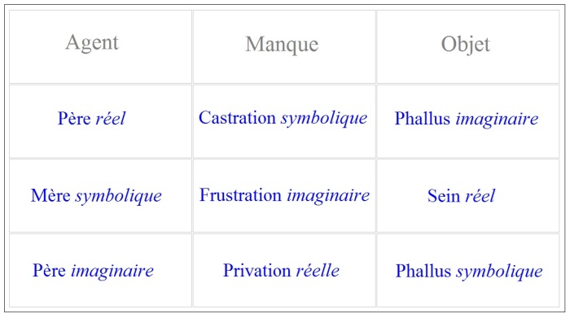
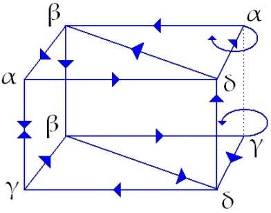
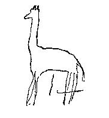

# Leçon 15 | 27 Mars 1957

  

    <label><input type="checkbox" data-lacan-toggle="original" checked> 原文</label>
    <label><input type="checkbox" data-lacan-toggle="notes" checked> 注释</label>
    <label><input type="checkbox" data-lacan-toggle="commentary" checked> 个人解读评论</label>
  

  <form class="lacan-tool-search" role="search">
    <input class="lacan-tool-search-input" type="search" placeholder="搜索全文" aria-label="搜索全文">
    <button class="lacan-tool-button" type="submit" title="搜索">搜索</button>
  </form>
  <button class="lacan-tool-button lacan-back-to-top" type="button" title="回到页面最上方" aria-label="回到页面最上方">↑</button>

<section class="parallel-paragraph" data-paragraph-ids="s4-15-0001">

s4-15-0001

原文 · s4-15-0001

Le fait de se promener n’est pas une mauvaise façon de se reconnaître dans un espace considéré. Si vous considériez les choses ainsi : qu’il s’agit dans un champ dans lequel certains *itinéraires* ont été parcourus, il s’agit de vous apprendre à *imaginer*
*sa topographie en dehors des itinéraires*. Je veux dire de vous apercevoir quand vous êtes, par exemple, revenu à votre point de départ et vous ne vous en apercevez pas, ou encore par exemple de réfléchir quand vous êtes dans un lieu aussi familier
et aussi parfaitement autonome que votre salle de bains, il ne vous viendra pas souvent à l’esprit que si vous perciez le mur,
vous vous trouveriez au premier étage de la librairie voisine, et je vais même jusqu’à vous dire que tous les jours
quand vous prenez votre bain, le travail continue dans la librairie voisine, et que c’est là à portée de votre main.
Alors on dit « *Quel métaphysicien, ce sacré* LACAN ! ».

[无对应译文]

</section>

<section class="parallel-paragraph" data-paragraph-ids="s4-15-0002">

s4-15-0002

原文 · s4-15-0002

C’est pourtant de cela, à peu près, qu’il s’agit, il s’agit de vous permettre de repérer certaines connexions, du même coup
de vous faire apercevoir les éléments du plan d’ensemble de façon à ce que vous ne soyez pas réduits à ce que j’appellerai,
avec intention, « *le cérémonial des itinéraires repérés* ».

[无对应译文]

</section>

<section class="parallel-paragraph" data-paragraph-ids="s4-15-0003">

s4-15-0003

原文 · s4-15-0003

Nous voici donc, avec le petit Hans, parvenus au point où, dans cette situa­tion où tout n’allait pas si mal, arrivent l’angoisse

[无对应译文]

</section>

<section class="parallel-paragraph" data-paragraph-ids="s4-15-0004">

s4-15-0004

原文 · s4-15-0004

et la phobie. Ce n’est pas sans intention que j’ai distingué l’un de l’autre, me conformant en cela d’ailleurs strictement
à ce que vous pouvez trouver dans le texte de FREUD.

[无对应译文]

</section>

<section class="parallel-paragraph" data-paragraph-ids="s4-15-0005">

s4-15-0005

原文 · s4-15-0005

Comme il s’agit de *topographie* et non pas de promenade au hasard, encore que ce soit par une promenade inhabituelle
que j’espère pouvoir vous représenter cette topographie : elle est inhabituelle, ce n’est pas qu’elle ne soit pas déjà parcourue,
elle est déjà parcourue dans l’observation du petit Hans, je veux simplement commencer à vous montrer ces sortes de choses que le premier imbécile venu pourrait y trouver. Sauf un psychanalyste, parce que ce n’est pas le premier imbécile venu.

[无对应译文]

</section>

<section class="parallel-paragraph" data-paragraph-ids="s4-15-0006">

s4-15-0006

原文 · s4-15-0006

[无对应译文]

</section>

<section class="parallel-paragraph" data-paragraph-ids="s4-15-0007">

s4-15-0007

原文 · s4-15-0007

Cette *mère symbolique* devient *réelle*, précisément en tant qu’elle se mani­feste dans son refus d’amour, et l’objet de la satisfaction lui-même, le sein, devient *symbolique* de *la frustration *: refus d’objet d’amour. Ce *trou réel* est justement cette chose qui n’existe pas. Le *réel* étant plein de par sa nature, pour faire un *trou réel* il faut y introduire un objet *symbolique*. De quoi s’agit-il ?

[无对应译文]

</section>

<section class="parallel-paragraph" data-paragraph-ids="s4-15-0008">

s4-15-0008

原文 · s4-15-0008

Nous en sommes arrivés au point où l’enfant dont le procès - celui qui est dit « *pré-œdipien » -* va consister en somme,
*pour se faire lui-même objet d’amour*…
pour cette mère qui est pour lui ce qu’il y a de plus important, qui est même essentiellement ce qui importe
…*pour se faire objet d’amour* est amené progressivement à s’apercevoir qu’il s’introduit en tiers, qu’il doit se glisser,
qu’il doit s’enfoncer quelque part entre ce désir de sa mère qu’il apprend à expérimenter, et cet *objet imaginaire* qui est le *phallus*.

[无对应译文]

</section>

<section class="parallel-paragraph" data-paragraph-ids="s4-15-0009">

s4-15-0009

原文 · s4-15-0009

Ceci que nous devons postuler, parce que c’est la représentation la plus simple qui nous permet de synthétiser toute une série d’accidents qui sont incon­cevables autrement que comme fruits de cette structure de relation *symbolique-imaginaire* de la période préœdipienne, ceci est strictement articulé comme je vous le dis dans un chapitre des [*Trois Essais sur la sexualité* ](http://staferla.free.fr/Freud/freud.htm) de FREUD, *volume* V, p. 85, chapitre intitulé : « *Recherches de l’enfant sur la sexualité »*, ou « *Théories infantiles sur la sexualité »*.

[无对应译文]

</section>

<section class="parallel-paragraph" data-paragraph-ids="s4-15-0010">

s4-15-0010

原文 · s4-15-0010

Vous y verrez formulé comme je vous le dis, que c’est très précisément de sa relation avec *la théorie infantile de la mère phallique*,
et la nécessité du passage par *le complexe de castration*, que ce que l’on appelle les perversions dans leur ensemble,
se conçoivent et s’expliquent.

[无对应译文]

</section>

<section class="parallel-paragraph" data-paragraph-ids="s4-15-0011">

s4-15-0011

原文 · s4-15-0011

De sorte que la notion qu’il se trouve des gens encore pour soutenir, que la perversion est quelque chose de fondamentalement tendanciel, instinctuel, qu’il y a quelque chose dans le pervers de direct, une sorte de court-circuit dans le sens de la satisfaction qui est quelque chose qui fait vraiment sa densité et son équilibre, et qui pensent ainsi interpréter la notion de la perversion « négatif de la névrose », comme si la perversion était en somme en elle-même la satisfaction qui est refoulée dans la névrose, comme si elle était le positif, ce qui est exactement le contraire, parce que le négatif d’une négation n’est pas du tout forcément son positif.

[无对应译文]

</section>

<section class="parallel-paragraph" data-paragraph-ids="s4-15-0012">

s4-15-0012

原文 · s4-15-0012

Comme le démontre le fait que FREUD affirme de la façon la plus nette, que la perversion est structurée en relation
avec tout ce qui s’ordonne autour de la notion « *absence et présence du phallus »*, et que la perversion a toujours quelque rapport,
ne serait-ce que d’horizon, avec le *complexe de castration* en lui-même. Par consé­quent elle est tenue au même niveau

[无对应译文]

</section>

<section class="parallel-paragraph" data-paragraph-ids="s4-15-0013">

s4-15-0013

原文 · s4-15-0013

si on peut dire du point de vue génétique, que la névrose. Elle est structurée d’une façon à être son négatif,

[无对应译文]

</section>

<section class="parallel-paragraph" data-paragraph-ids="s4-15-0014">

s4-15-0014

原文 · s4-15-0014

ou plus exac­tement son inverse, peut-être, mais qui est tout autant structuré qu’elle. Elle est structurée par la même dialectique, pour employer le vocabulaire proche de celui dont je me sers ici.

[无对应译文]

</section>

<section class="parallel-paragraph" data-paragraph-ids="s4-15-0015">

s4-15-0015

原文 · s4-15-0015

Cette référence aux *théories infantiles de la sexualité*, mérite incontesta­blement que nous nous arrêtions sur cette notion

[无对应译文]

</section>

<section class="parallel-paragraph" data-paragraph-ids="s4-15-0016">

s4-15-0016

原文 · s4-15-0016

de l’importance donnée par FREUD très vite à la notion même de *la théorie infantile*, et de l’importance dans l’économie
du développement de l’enfant de cette théorie, mais dont le plein épanouissement - à savoir le chapitre que je vous désigne précisément ici - n’a été ajouté aux *Trois Essais sur la sexualité* que beaucoup plus tard, en 1920 je crois. C’est le défaut de l’édition allemande de ne pas rappeler à propos de chaque chapitre, la date à laquelle il est venu s’ajouter à cette composition
des *Trois Essais sur la sexualité*. Les « *théories infantiles de la sexualité* » et leur importance dans le dévelop­pement libidinal,

[无对应译文]

</section>

<section class="parallel-paragraph" data-paragraph-ids="s4-15-0017">

s4-15-0017

原文 · s4-15-0017

est quelque chose qui à soi tout seul, devrait apprendre à un psychanalyste à relativer cette notion massive et légèrement marquée de péjoration qu’il manie à tout bout de champ sous le terme d’intellectualisation, je veux dire à nous apercevoir
que quelque chose qui, au premier abord, peut se présenter comme se situant dans le domaine intellectuel, a bien évidemment une importance que la simple et massive *opposition de l’intellectuel et de l’affectif* ne saurait aucunement rendre compte.

[无对应译文]

</section>

<section class="parallel-paragraph" data-paragraph-ids="s4-15-0018">

s4-15-0018

原文 · s4-15-0018

Il est tout à fait certain que ce qu’on appelle « *théorie infantile* », ou cette activité de recherche concernant la réalité sexuelle
qui est celle de l’enfant, est une tout autre nécessité que ce que nous appelons - d’ailleurs indûment - mais ce qu’il faut reconnaître être une espèce de notion diffuse du caractère supers­tructural de l’activité intellectuelle qui est plus ou moins implicitement admise dans ce qu’on peut appeler le fond de croyance auquel la conscience commune s’ordonne.

[无对应译文]

</section>

<section class="parallel-paragraph" data-paragraph-ids="s4-15-0019">

s4-15-0019

原文 · s4-15-0019

C’est bien d’autre chose qu’il s’agit, c’est de quelque chose qui se situe - si l’on peut employer également ce terme –
dans l’ensemble du corps, où son sens commun est beaucoup plus profond. Cette chose est beaucoup plus profonde parce qu’elle enveloppe *toute l’activité du sujet*, et qu’elle motive ce qu’on peut appeler également les termes affectifs, ce qui veut dire qu’elle dirige *les affects* ou *affections* du sujet selon des lignes d’images maîtresses, qu’elle est en somme corrélative de toute
une série d’accomplissements au sens le plus large, qui se manifestent en actions tout à fait irréductibles à des fins utilitaires.

[无对应译文]

</section>

<section class="parallel-paragraph" data-paragraph-ids="s4-15-0020">

s4-15-0020

原文 · s4-15-0020

Si vous voulez, classons cet ensemble d’actions ou d’activités par un terme qui n’est peut-être pas le meilleur, ni le plus global, mais celui auquel je me réfère et que je prends pour sa *valeur expressive*, en le qualifiant d’activités *cérémoniales*, et non pas seulement *cérémonielles*. Je veux dire : l’ensemble de tout ce qui, dans la vie individuelle comme dans la vie collective,
peut se mettre à ce registre, et vous savez que c’est partout, qu’il n’y a pas d’exemple d’une activité humaine qui les élimine,
que même les civilisations à tendance très fortement utilitaire et fonctionnelle voient singulièrement ces activités céré­monielles se reproduire dans les niches les plus inattendues. Il faut qu’il y ait à cela quelque raison.

[无对应译文]

</section>

<section class="parallel-paragraph" data-paragraph-ids="s4-15-0021">

s4-15-0021

原文 · s4-15-0021

Pour tout dire, ce à quoi nous devons nous référer pour centrer l’importance exacte, la valeur de ce qu’on appelle *théories infantiles de la sexualité*  et de tout l’ordre d’activités qui, chez l’enfant, sont structurées autour, c’est assu­rément à la notion de *mythe*,

[无对应译文]

</section>

<section class="parallel-paragraph" data-paragraph-ids="s4-15-0022">

s4-15-0022

原文 · s4-15-0022

et il n’est pas besoin d’être grand clerc, je veux dire d’avoir approfondi cette notion de *mythe*. Ce qui est pourtant bien
mon intention de faire ici. J’essaierai de le faire doucement, par étapes, puisque aussi bien il me semble nécessaire d’accentuer toujours plus la continuité entre ce qui est notre champ d’éléments référentiels auxquels je crois devoir les raccorder,
non pas du tout que comme quelquefois on me l’a dit, je prétends ici vous donner une métaphysique générale, ni couvrir
tout le champ de la réalité, mais seulement de vous parler de la nôtre et des plus voisines, des plus immédia­tement connexes.

[无对应译文]

</section>

<section class="parallel-paragraph" data-paragraph-ids="s4-15-0023">

s4-15-0023

原文 · s4-15-0023

C’est précisément pour ne pas tomber dans un indu « *système du monde* », dans une projection tout à fait insuffisante et pauvre,
qui se fait très fréquemment, de ce qui est notre domaine, avec toute une série d’ordres et de champs étagés de la réalité,
qui peuvent avoir avec ce que nous faisons - parce que *le grand* se retrouve toujours dans *le petit* - quelque analogie d’ensemble, mais qui assu­rément ne sauraient aucunement épuiser la réalité et même l’ensemble des pro­blèmes humains.

[无对应译文]

</section>

<section class="parallel-paragraph" data-paragraph-ids="s4-15-0024">

s4-15-0024

原文 · s4-15-0024

Mais par contre, ne pas isoler complètement notre champ et nous refuser à voir ce qui dans notre champ, est, non pas *analogue*, mais directement en connexion, je veux dire directement *en prise*, *embrayé* avec une réalité qui nous est accessible par d’autres disciplines et d’autres sciences humaines, c’est ce qui me semble indispensable précisément pour bien situer notre domaine,
et même simplement pour nous y retrouver : c’est le pourquoi de la notion des « *théories infantiles* » sur laquelle nous débouchons maintenant de la façon la plus naturelle.

[无对应译文]

</section>

<section class="parallel-paragraph" data-paragraph-ids="s4-15-0025">

s4-15-0025

原文 · s4-15-0025

Parce que depuis le temps que je vous parle de Hans, vous avez pu vous apercevoir que si cette observation est un labyrinthe, voire au premier abord un fouillis, c’est justement en raison de la place que tiennent toute une série d’*élucubrations* du petit Hans, qui sont - certaines - très riches, et qui donnent l’impression d’une prolifération, d’un luxe qui ne peut pas manquer
de vous apparaître comme rentrant précisément dans la classe de ces élaborations théoriques \[*infantiles*\] qui jouent un si grand rôle.

[无对应译文]

</section>

<section class="parallel-paragraph" data-paragraph-ids="s4-15-0026">

s4-15-0026

原文 · s4-15-0026

Nous allons simplement approcher *du mythe* comme d’une première évi­dence. Ce qu’on appelle *un mythe*, quel qu’il soit, religieux, folklorique, je veux dire pris à différentes étapes de son legs,c’est quelque chose qui se présente comme une sorte de récit.

[无对应译文]

</section>

<section class="parallel-paragraph" data-paragraph-ids="s4-15-0027">

s4-15-0027

原文 · s4-15-0027

- On peut dire beaucoup de choses de ce récit.

[无对应译文]

</section>

<section class="parallel-paragraph" data-paragraph-ids="s4-15-0028">

s4-15-0028

原文 · s4-15-0028

- On peut le prendre sous différents *aspects structuraux*, par exemple dire qu’il y a quelque chose d’*atemporel*.

[无对应译文]

</section>

<section class="parallel-paragraph" data-paragraph-ids="s4-15-0029">

s4-15-0029

原文 · s4-15-0029

- On peut aussi essayer de définir sa structure quant aux sites qu’il définit.

[无对应译文]

</section>

<section class="parallel-paragraph" data-paragraph-ids="s4-15-0030">

s4-15-0030

原文 · s4-15-0030

- On peut aussi le prendre sous le caractère, la forme littéraire dont il nous paraît frappant qu’il ait quelque parenté avec la création poétique, et en même temps qu’il soit quelque chose qui en est très distinct, en ce sens que lié à certaines constances absolument non soumises à l’invention subjective.

[无对应译文]

</section>

<section class="parallel-paragraph" data-paragraph-ids="s4-15-0031">

s4-15-0031

原文 · s4-15-0031

C’est aussi quelque chose qui nous permettrait au moins d’en indi­quer les problèmes qu’il pose. Je crois que dans l’ensemble nous dirons que cela a un caractère de *fiction *

[无对应译文]

</section>

<section class="parallel-paragraph" data-paragraph-ids="s4-15-0032">

s4-15-0032

原文 · s4-15-0032

- mais d’une *fiction* qui a en elle-même une sorte de stabilité qui ne la rend pas du tout malléable à telle ou telle modification qui peut lui être apportée, ou plus exactement qui implique que toute modification
  en implique de ce fait même une autre, suggérant invariablement la notion d’une *structure*.

[无对应译文]

</section>

<section class="parallel-paragraph" data-paragraph-ids="s4-15-0033">

s4-15-0033

原文 · s4-15-0033

- Que cette *fiction* d’autre part n’ait qu’un rapport singulier avec quelque chose de toujours impliqué derrière, et même dont elle porte en elle-même le message formellement indiqué, à savoir avec la vérité, c’est aussi quelque chose qui ne peut pas être détaché du *mythe*.

[无对应译文]

</section>

<section class="parallel-paragraph" data-paragraph-ids="s4-15-0034">

s4-15-0034

原文 · s4-15-0034

Je vous fais remarquer à cette occasion que j’ai pu écrire quelque part dans le séminaire sur *La lettre volée*, à propos du fait
que j’analysais une *fiction,* que j’entendais, au moins dans un certain sens, que cette opération était tout à fait légitime
parce qu’aussi bien disais-je, dans *toute fiction* correctement structurée, on peut toucher du doigt cette structure qui dans *la vérité* elle-même, peut être désignée comme la même que celle de la *fiction*. La nécessité structurale qui est emportée
par toute expression de *la vérité,* est justement une structure qui est la même : *la vérité a une structure* - si on peut dire - *de fiction.*

[无对应译文]

</section>

<section class="parallel-paragraph" data-paragraph-ids="s4-15-0035">

s4-15-0035

原文 · s4-15-0035

Ces vérités, ou cette vérité, cette visée du *mythe* se présente avec *un carac­tère* encore tout à fait frappant, c’est *un caractère*

[无对应译文]

</section>

<section class="parallel-paragraph" data-paragraph-ids="s4-15-0036">

s4-15-0036

原文 · s4-15-0036

qui se présente d’abord comme *un caractère* d’inépuisable, je veux dire qu’il participe de ce qu’on pourrait appeler, pour employer rapidement un terme ancien, le *caractère* d’un *schème*, quelque chose qui est justement beaucoup plus près de *la structure*
que de tout contenu, et qui se retrouve et se réapplique - au sens le plus matériel du mot - sur toutes sortes de données,
avec cette sorte d’efficacité ambiguë qui caractérise tout le *mythe*.

[无对应译文]

</section>

<section class="parallel-paragraph" data-paragraph-ids="s4-15-0037">

s4-15-0037

原文 · s4-15-0037

*Ce qui est structuré*, ce qui est le plus adéquat à cette sorte de moule que donne la catégorie mythique, *c’est un certain type de vérité* dont, pour nous limiter à ce qui est notre champ et notre expérience, nous ne pouvons pas ne pas voir qu’il s’agit
d’une relation de *l’Homme*, mais à quoi ?

[无对应译文]

</section>

<section class="parallel-paragraph" data-paragraph-ids="s4-15-0038">

s4-15-0038

原文 · s4-15-0038

Nous ne le dirons certainement pas tout à fait au hasard, ni tout à fait facilement, et nous ne répondrons pas trop vite
à cet « *à quoi ?* ». Répondre : « *à la nature* », nous laissera, je pense, très vite insatisfait après les remarques que je vous ai faites :
la nature, dès qu’elle se présente à l’homme, telle qu’elle se compte avec lui, est toujours profondément dénaturée.
Si nous disons « *à l’être* », nous ne dirons certainement pas qu’elles sont inexactes, mais nous irons peut-être un peu trop loin,
à déboucher dans *la philosophie* - voire celle la plus récente de notre ami HEIDEGGER, toute pertinente que soit cette référence.

[无对应译文]

</section>

<section class="parallel-paragraph" data-paragraph-ids="s4-15-0039">

s4-15-0039

原文 · s4-15-0039

Assurément nous avons des références plus proches, des termes plus arti­culés. Ce sont ceux-là mêmes que nous pouvons immédiatement aborder dans notre expérience quand nous nous apercevons qu’il s’agit des thèmes *de la vie et de la mort*,
*de l’existence et de la non-existence*, *de la naissance* tout spé­cialement, c’est-à-dire de l’apparition de ce qui n’existe pas encore,
et qui est particulièrement lié à l’existence du sujet lui-même et aux horizons que son expérience lui apporte, et que d’autre part le sujet d’un sexe, et tout spécialement du sien propre - son sexe naturel - est ce quelque chose à quoi notre expérience
nous montre que cette activité mythique se limite. Il y a chez l’enfant - et employée - cette *activité mythique*.

[无对应译文]

</section>

<section class="parallel-paragraph" data-paragraph-ids="s4-15-0040">

s4-15-0040

原文 · s4-15-0040

Nous voyons donc là, et facilement, que *par son contenu, par sa visée*, elle se trouve à la fois en accord et en même temps

[无对应译文]

</section>

<section class="parallel-paragraph" data-paragraph-ids="s4-15-0041">

s4-15-0041

原文 · s4-15-0041

ne recouvrant pas complè­tement ce que nous trouvons *sous le terme* propre et à proprement parler *de mythe*.
Dans l’exploration spécialement ethnographique les *mythes* tels qu’ils se présentent dans leur *fiction*, sont toujours plus ou moins des mythes visant, non plus l’origine individuelle de l’homme, mais son origine spécifique, la création de l’homme,
la genèse de *ses relations nourricières fondamentales*, l’invention, comme on dit, des grandes ressources humaines, celle du feu,

[无对应译文]

</section>

<section class="parallel-paragraph" data-paragraph-ids="s4-15-0042">

s4-15-0042

原文 · s4-15-0042

celle de l’agri­culture, celle de la domestication des animaux. Voici ce que nous trouvons dans les *mythes*.

[无对应译文]

</section>

<section class="parallel-paragraph" data-paragraph-ids="s4-15-0043">

s4-15-0043

原文 · s4-15-0043

C’est également *la fiction* qui explique comment est venu à l’homme ce rapport avec ce quelque chose qui se trouve constamment mis en question dans les mythes, à savoir cette force secrète maléfique ou bénéfique, mais essen­tiellement caractérisée

[无对应译文]

</section>

<section class="parallel-paragraph" data-paragraph-ids="s4-15-0044">

s4-15-0044

原文 · s4-15-0044

par son *caractère sacré* de relation à *la puissance sacrée*, diversement désignée dans les récits mythiques, mais qui assurément
se laisse pour nous situer dans une identité manifeste avec la relation de l’homme à *ce pouvoir de la signification*, et très spécialement de son instrument *signifiant*, de ce qui fait que l’homme dans la nature introduit ce quelque chose qui, de l’éloigner,
rapproche l’homme de l’univers, et qui le fait capable d’introduire dans l’ordre naturel non seulement ses propres besoins…

[无对应译文]

</section>

<section class="parallel-paragraph" data-paragraph-ids="s4-15-0045">

s4-15-0045

原文 · s4-15-0045

ses facteurs de trans­formation soumis à ses besoins

[无对应译文]

</section>

<section class="parallel-paragraph" data-paragraph-ids="s4-15-0046">

s4-15-0046

原文 · s4-15-0046

…mais quelque chose qui assurément va au-delà, la notion d’une identité profonde jamais complètement - ni même à si peu près que ce soit - saisie, entre ce pouvoir qu’il a de manier ou d’être manié, de s’inclure dans un signifiant, et le pouvoir qu’il a d’incarner l’instance de ce signifiant dans une série d’interventions qui ne se posent pas à l’origine tellement comme activités gratuites, comme la pure et simple introduction de l’instrument signifiant dans la chaîne des choses naturelles.

[无对应译文]

</section>

<section class="parallel-paragraph" data-paragraph-ids="s4-15-0047">

s4-15-0047

原文 · s4-15-0047

Ces *mythes*, dont la connexion, le rapport de contiguïté avec *la création mythique infantile* s’indique assez par les rapprochements
que je viens de vous faire, nous posent en somme ce problème de quelque chose qui dure depuis déjà quelque temps,
qui s’appelle *l’investigation des mythes*, si vous voulez *la mythologie scientifique* ou comparée, qui de plus en plus élabore
dans une méthode dont le caractère de formalisation indique déjà qu’un certain pas est franchi…
et aussi par le caractère de fécondité que cette formalisation comporte
…que c’est dans ce sens que peut-être pourra être en fin de compte…
plus que par la loi des analogies et des diverses références culturalistes,
naturalistes, qui ont été employées jusqu’ici dans l’analyse des mythes
…par cette formalisation, être dégagés dans les *mythes* ce qu’on peut appeler des éléments ou des unités qui, à leur niveau,
ont le caractère d’un fonctionnement structural comparable - sans être pour autant identique \[mythèmes/sémantèmes\] -

[无对应译文]

</section>

<section class="parallel-paragraph" data-paragraph-ids="s4-15-0048">

s4-15-0048

原文 · s4-15-0048

à celui que dégagent dans l’étude de la lin­guistique, les élaborations des différents éléments modernes taxiaires [^28].

[无对应译文]

</section>

<section class="parallel-paragraph" data-paragraph-ids="s4-15-0049">

s4-15-0049

原文 · s4-15-0049

On a pu construire et mettre en pratique l’efficacité de l’isolement de tel et tel élément que nous définissons comme l’unité
de la construction mythique qu’on appelle *mythes*. Mais de s’apercevoir qu’à en poursuivre l’expérience dans une série de *mythes*,
qu’on met à l’épreuve précisément de cette décomposition, pour voir comment vont fonctionner leurs recompositions,
on s’aperçoit d’une surprenante *unité entre les mythes* en apparence les plus éloignés, à cette condi­tion de s’écarter

[无对应译文]

</section>

<section class="parallel-paragraph" data-paragraph-ids="s4-15-0050">

s4-15-0050

原文 · s4-15-0050

de ce qu’on peut appeler l’analogie faciale du mythe.

[无对应译文]

</section>

<section class="parallel-paragraph" data-paragraph-ids="s4-15-0051">

s4-15-0051

原文 · s4-15-0051

Par exemple dire qu’un inceste et un meurtre sont deux choses équivalentes, c’est une chose qui au premier abord
ne vous viendra pas à l’esprit, mais qui, en comparant deux *mythes* ou deux étages du *mythe*, par exemple ce qui se passe
à deux générations différentes, nous fait apercevoir qu’à poser dans *une constellation* qui aura un aspect tout à fait comparable
à ces petits cubes que je vous dessinais la dernière fois au tableau :

[无对应译文]

</section>

<section class="parallel-paragraph" data-paragraph-ids="s4-15-0052">

s4-15-0052

原文 · s4-15-0052

[无对应译文]

</section>

<section class="parallel-paragraph" data-paragraph-ids="s4-15-0053">

s4-15-0053

原文 · s4-15-0053

Il semble que c’est en disposant aux différents sommets de cette construction les termes de « *père* », « *mère* », par exemple…
mère inconnue au sujet, père dans telle et telle position à la 1ère génération
…que vous trouvez également « *inceste* », par exemple à faire tel ou tel autre sommet, et quand vous passez à la génération suivante vous trouvez point par point…
et selon des lois qui n’ont d’intérêt qu’à pouvoir leur donner une formalisation stricte et sans ambiguïté
…la notion de *frères jumeaux* recouper et être en quelque sorte la transformation prévue du *couple père-mère* dans la 1ère génération.
Vous voyez arriver le meurtre situé à la même place par cette opération de transformation déjà réglée par un certain nombre d’hypothèses structurales sur la façon dont nous devons traiter le *mythe*.

[无对应译文]

</section>

<section class="parallel-paragraph" data-paragraph-ids="s4-15-0054">

s4-15-0054

原文 · s4-15-0054

Ceci alors nous donne une idée de ce que je pourrais appeler le poids, la présence, *l’instance du signifiant* comme tel,
son impact propre, d’isoler quelque chose qui est en quelque sorte toujours le plus caché, puisqu’il s’agit de quelque chose
qui en soi ne signifie rien, mais qui assurément porte tout l’ordre des significations.

[无对应译文]

</section>

<section class="parallel-paragraph" data-paragraph-ids="s4-15-0055">

s4-15-0055

原文 · s4-15-0055

Si quelque chose de cette nature existe, ce n’est nulle part plus sensible que dans le *mythe*.

[无对应译文]

</section>

<section class="parallel-paragraph" data-paragraph-ids="s4-15-0056">

s4-15-0056

原文 · s4-15-0056

Ce préambule nécessaire vous indique dans quel sens nous pensons nous approcher pour le soumettre à cette épreuve de ce foisonnement de *thèmes* au premier abord franchement *imaginatifs…*
voire, comme FREUD lui-même dans l’observation l’évoque comme possible,

puisqu’il le suggère comme étant le pro­pos supposé d’un interlocuteur

[无对应译文]

</section>

<section class="parallel-paragraph" data-paragraph-ids="s4-15-0057">

s4-15-0057

原文 · s4-15-0057

…*thèmes imaginatifs* qui pourraient aussi bien être *suggérés*, si tant est que ce terme doive être pris dans le sens le plus simple,
à savoir que *quelque chose qui est articulé par un sujet passe dans l’autre sujet à l’état de vérité reçue*, tout au moins de forme acceptée
avec un certain caractère *de croyance*, en quelque sorte un revêtement, un habit, donné à la réalité, qui est reçue donc d’un sujet dans un autre et qui peut supposer donc quelque doute, et par le *terme de* « *suggestion* » impliqué, concernant l’authenticité
de la construction dont il s’agit.

[无对应译文]

</section>

<section class="parallel-paragraph" data-paragraph-ids="s4-15-0058">

s4-15-0058

原文 · s4-15-0058

C’est une construction reçue par le sujet, et bien entendu il n’y a pas de notion qui soit toujours plus facile à voir venir comme élément de critique, pourquoi pas légitime, et *qui* plus que nous, ne songerait à penser qu’il y a là quelque chose qui mérite d’autant plus d’être pris en considération ? Nous sou­tenons bien que *les éléments culturels d’organisation symbolique du monde* sont quelque chose qui est très précisément, de par sa nature, *n’appartenant à personne*, est quelque chose qui doit être reçu, appris,
et bien entendu il y a quelque chose qui donne le fondement incontestable à cette notion de *suggestion*. Ce qui est *frappant* également, c’est que non seulement cette *suggestion* existe dans le cas du petit Hans, mais que nous la voyons s’étaler à ciel ouvert. On peut dire que le mode interrogatoire du père du petit Hans se présente à tout instant comme représentant une véritable inquisition quelquefois présente, voire même ayant tous les caractères d’une direction donnée aux réponses de l’enfant.

[无对应译文]

</section>

<section class="parallel-paragraph" data-paragraph-ids="s4-15-0059">

s4-15-0059

原文 · s4-15-0059

Assurément le père - comme FREUD le souligne en maints endroits - inter­vient d’une façon approximative, grossière,

[无对应译文]

</section>

<section class="parallel-paragraph" data-paragraph-ids="s4-15-0060">

s4-15-0060

原文 · s4-15-0060

voire franchement maladroite. Il manifeste d’ailleurs lui-même toutes sortes de malentendus dans la façon dont il enregistre
les réponses de l’enfant, dont il le presse pour trop comprendre, et trop vite, ce que FREUD souligne également.
Et ce qui est tout à fait manifeste également à la lecture de l’observation, c’est que justement quelque chose se produit qui est loin d’être *indépendant* de cette intervention paternelle, avec tous ses défauts à tout instant pointés et désignés par FREUD.
C’est tout à fait manifeste :

[无对应译文]

</section>

<section class="parallel-paragraph" data-paragraph-ids="s4-15-0061">

s4-15-0061

原文 · s4-15-0061

- on voit le comportement de Hans et ses constructions,

[无对应译文]

</section>

<section class="parallel-paragraph" data-paragraph-ids="s4-15-0062">

s4-15-0062

原文 · s4-15-0062

- on le voit à la façon la plus sensible de répondre à telle intervention paternelle,

[无对应译文]

</section>

<section class="parallel-paragraph" data-paragraph-ids="s4-15-0063">

s4-15-0063

原文 · s4-15-0063

- on le voit même en particulier à partir d’un certain moment, s’emballer si on peut dire, et la phobie prendre un caractère d’ac­célération, d’hyperproductivité tout à fait sensible.

[无对应译文]

</section>

<section class="parallel-paragraph" data-paragraph-ids="s4-15-0064">

s4-15-0064

原文 · s4-15-0064

Bien entendu il est tout ce qu’il y a de plus intéressant de voir à quoi correspondent ces différents moments de la production mythique chez le petit Hans, et il y a aussi une chose qui est tout à fait manifeste, c’est que cette production tout en ayant
ce caractère qu’indique d’une façon implicite dans le vocabulaire de tout un chacun le terme d’imaginatif, à savoir ce caractère d’inventé, de gratuité même, qui est impliquée dans l’usage qu’on fait de ce terme.

[无对应译文]

</section>

<section class="parallel-paragraph" data-paragraph-ids="s4-15-0065">

s4-15-0065

原文 · s4-15-0065

Quelqu’un récemment à propos d’un interrogatoire que je faisais d’un des malades que je présente, m’avait souligné

[无对应译文]

</section>

<section class="parallel-paragraph" data-paragraph-ids="s4-15-0066">

s4-15-0066

原文 · s4-15-0066

chez ce malade le caractère ima­ginatif de certaines de ses constructions. Et c’était pour lui quelque chose qui lui semblait toujours indiquer je ne sais quelle note hystérique de « *suggestion* » ou d’effet de la suggestion dans cette production du malade.
Alors qu’il était facile de s’apercevoir qu’il n’en était rien, mais que - quoique provoquée, stimulée par une question –
la productivité pré-délirante du malade s’était manifestée avec son cachet et sa force de prolifération propres,
selon strictement ses propres structures. Cela n’est pas même du tout l’impression que l’on a quand il s’agit de Hans.

[无对应译文]

</section>

<section class="parallel-paragraph" data-paragraph-ids="s4-15-0067">

s4-15-0067

原文 · s4-15-0067

On n’a pas l’impression à aucun moment d’une production délirante, je dirais bien plus : on a l’impression nettement
d’une production de jeu, non seulement de jeu, mais il est tout à fait clair que c’est tellement ludique que Hans lui-même
a quelque embarras pour boucler la boucle et soutenir telle ou telle voie dans laquelle il s’engage après avoir indiqué

[无对应译文]

</section>

<section class="parallel-paragraph" data-paragraph-ids="s4-15-0068">

s4-15-0068

原文 · s4-15-0068

je ne sais quelle magni­fique et énorme histoire confinant à la farce, sur l’intervention par exemple de la cigogne à propos
de la naissance de sa petite sœur Anna. Il est fort capable de dire : « *Et puis après tout, ce que je viens de vous dire là, n’y croyez pas.* »

[无对应译文]

</section>

<section class="parallel-paragraph" data-paragraph-ids="s4-15-0069">

s4-15-0069

原文 · s4-15-0069

Néanmoins, il n’en reste pas moins que dans ce jeu apparaissent moins des termes constants qu’une certaine configuration, fuyante quelquefois, d’autres fois saisissable d’une façon frappante, et c’est là ce dans quoi je voudrais vous introduire,
à savoir cette sorte de nécessité structurale qui préside, non seulement à la construction de chacun de ce que l’on peut appeler, avec toutes les pré­cautions d’usage, « *les petits mythes de* Hans », mais aussi bien de leur progrès, de leur transformation, et spécialement en essayant d’attirer votre attention vers ceci : que ce n’est pas toujours obligatoirement leur contenu qui importe.

[无对应译文]

</section>

<section class="parallel-paragraph" data-paragraph-ids="s4-15-0070">

s4-15-0070

原文 · s4-15-0070

Je veux dire que la reviviscence plus ou moins ordonnée d’*états d’âme antérieurs*, de ce qu’on appelle à cette occasion encore
« *le complexe anal* » par exemple, qui sera épuisé dans tout ce que Hans se laisse aller à montrer à propos du *Lumpf*
qui joue son rôle dans cette observation, et qui littéralement pour le père…
que FREUD nous dit avoir laissé délibérément dans l’ignorance de thèmes

dont il était fort probable qu’il les rencontrerait, et que lui FREUD prévoyait
…est inattendue. FREUD en nomme deux, et qui sont surgis au cours de l’ex­ploration de l’enfant par son père, à savoir :

[无对应译文]

</section>

<section class="parallel-paragraph" data-paragraph-ids="s4-15-0071">

s4-15-0071

原文 · s4-15-0071

*le complexe anal*, et ni plus ni moins : *le complexe de castration*.

[无对应译文]

</section>

<section class="parallel-paragraph" data-paragraph-ids="s4-15-0072">

s4-15-0072

原文 · s4-15-0072

N’oublions pas que *le complexe de castration* dans la théorie analytique à l’époque où nous nous situons \[1906-1908\] est une espèce
de clé déjà capitale pour FREUD, mais qui n’est pas du tout, à ce moment là, mise en pleine lumière, révélée à tous
comme étant la clé centrale. Bien loin de là, c’est une petite clé qui traîne parmi les autres, avec *un petit air de rien du tout*,
et en fin de compte FREUD veut dire que le père n’était aucunement averti de quelque chose qui dut se rapporter à ce rapport essentiel qui fait que *le complexe de castration* est la cheville majeure : par où passe l’instauration de sa constellation

[无对应译文]

</section>

<section class="parallel-paragraph" data-paragraph-ids="s4-15-0073">

s4-15-0073

原文 · s4-15-0073

et la réso­lution de sa constellation, par où passe la phase ascendante ou descendante de l’œdipe.

[无对应译文]

</section>

<section class="parallel-paragraph" data-paragraph-ids="s4-15-0074">

s4-15-0074

原文 · s4-15-0074

Donc nous voyons que le petit Hans en effet réagit. Il réagit tout au cours de l’intervention du *père réel*, à savoir de mise en serre chaude de ces feux­ croisés de l’interrogation paternelle sous lesquels il se trouve pendant un certain temps, et qui à voir l’observation massivement, se montrent avoir été favorables à un véritable développement, à une véritable culture même,
chez Hans, de quelque chose qui ne nous permet pas de penser, vu sa richesse, ni que la phobie aurait eu ses prolongements
et ses échos sans l’intervention paternelle, ni même non plus qu’elle aurait eu son centre même, ni ce développement,
ni cette richesse, sans cette insistance si prévenante pendant un certain temps.

[无对应译文]

</section>

<section class="parallel-paragraph" data-paragraph-ids="s4-15-0075">

s4-15-0075

原文 · s4-15-0075

Ceci est admis par FREUD, et je dirais même repris par lui à son compte, je veux dire qu’il admet même qu’il y a pu avoir momentanément une espèce de *flambée*, de précipitation, d’accélération, d’intensification même de la phobie
sous l’action du père. Tout ceci ne sont que des vérités premières, encore faut-il les dire.

[无对应译文]

</section>

<section class="parallel-paragraph" data-paragraph-ids="s4-15-0076">

s4-15-0076

原文 · s4-15-0076

Repre­nons les choses au point où nous en sommes, et pour tout de même ne pas vous laisser tout à fait devant la cohue,
je vais vous indiquer quel est en quelque sorte *le schéma général* autour duquel je pense, va s’ordonner d’une façon satisfaisante pour nous ce que nous allons essayer de comprendre dans le phénomène de *l’analyse de* Hans, *son départ* et *ses résultats*.

[无对应译文]

</section>

<section class="parallel-paragraph" data-paragraph-ids="s4-15-0077">

s4-15-0077

原文 · s4-15-0077

Hans est donc dans un certain rapport avec sa mère, où se mêle le besoin direct qu’il a de *l’amour de sa mère*, avec quelque chose que nous avons appelé le jeu du leurre intersubjectif, à savoir ce quelque chose qui se manifeste de la façon la plus claire
dans les propos de l’enfant, et qui indique de toutes parts - il suffit de lire le commencement de l’observation pour le voir -
qu’il lui faut que sa mère ait *un phallus*, ce qui ne veut pas dire pour autant que pour lui ce *phallus* soit quelque chose de *réel*.

[无对应译文]

</section>

<section class="parallel-paragraph" data-paragraph-ids="s4-15-0078">

s4-15-0078

原文 · s4-15-0078

À tout instant au contraire, éclate dans son propos l’ambiguïté que fait apparaître ce rapport dans une perspective de jeu. L’enfant sait bien en fin de compte quelque chose, tout au moins qui indique, il le dit : « *J’avais justement pensé* », et il s’interrompt.
Ce à quoi il a pensé, c’est à : « *l’a-t-elle, ou ne l’a-t-elle pas ?* » Et il le lui demande, et il le lui fait dire, et qui sait à quel point
la réponse le satisfait, qu’elle en a un *Wiwimacher* comme on dit dans l’observation, c’est-à-dire un *fait-pipi*, et ce « *Macher* »
quelque chose qui n’est pas complètement traduit, c’est un *faiseur de pipi* il y a *un masculin* impliqué là-dedans,
ceci se retrouve dans d’autres mots précédés du préfixe *wiwi*.

[无对应译文]

</section>

<section class="parallel-paragraph" data-paragraph-ids="s4-15-0079">

s4-15-0079

原文 · s4-15-0079

L’enfant est dans cette intimité, cette connivence de *jeu imaginaire* avec sa mère, et il se trouve tout d’un coup dans une situation, où par quelque coté, une certaine décompensation survient puisqu’il se produit quelque chose qui se manifeste par *une angoisse*
se manifestant très précisément dans les rapports avec sa mère.

[无对应译文]

</section>

<section class="parallel-paragraph" data-paragraph-ids="s4-15-0080">

s4-15-0080

原文 · s4-15-0080

La dernière fois nous avons essayé de voir à quoi répondait cette angoisse. Cette angoisse est liée, nous l’avons dit,
à divers éléments de réel qui viennent en quelque sorte compliquer la situation. Ces éléments de réel ne sont pas univoques,
il y a des éléments de réel dans les objets de la mère qui sont nou­veaux :

[无对应译文]

</section>

<section class="parallel-paragraph" data-paragraph-ids="s4-15-0081">

s4-15-0081

原文 · s4-15-0081

- il y a *la naissance de la petite sœur* avec toutes les réactions qu’elle entraîne chez Hans, mais qui ne viennent pas tout de suite, c’est seulement 15 mois après qu’éclate la phobie,

[无对应译文]

</section>

<section class="parallel-paragraph" data-paragraph-ids="s4-15-0082">

s4-15-0082

原文 · s4-15-0082

- il y a l’intervention du pénis réel, mais le pénis réel est là en jeu depuis un bout de temps également, au moins depuis un an, la masturbation est avouée par l’enfant grâce aux bonnes relations qui existent entre lui et ses parents, sur le plan de l’élocution par le petit Hans, et nous n’avons aucun doute également que ce *pénis réel*, avec ce qu’il introduit de complications dans la situation, est là également depuis un certain temps.

[无对应译文]

</section>

<section class="parallel-paragraph" data-paragraph-ids="s4-15-0083">

s4-15-0083

原文 · s4-15-0083

Nous avons également remarqué la dernière fois, par où ces éléments de décompensation peuvent entrer en jeu :
dans un cas c’est Hans qui est exclu, qui choit si on peut dire de la situation, qui est éjecté de la situation par la petite sœur,
dans l’autre cas c’est quelque chose d’autre, c’est l’intervention du *phallus* sous une forme - je parle de la masturbation -
c’est l’intervention qui reste pour Hans le même objet, mais le même objet qui se présente sous une forme tout à fait différente, et disons-le tout de suite : l’intégration des sensations liées à tout le moins à la turgescence, et très possiblement à quelque chose que nous pouvons aller jusqu’à qualifier d’*orgasme,* et bien entendu il ne s’agit pas d’éjaculation.

[无对应译文]

</section>

<section class="parallel-paragraph" data-paragraph-ids="s4-15-0084">

s4-15-0084

原文 · s4-15-0084

Il est bien entendu qu’il y a autour de cela une question et un problème. Je veux dire que par exemple FREUD ne le tranche pas, il n’a pas à ce moment là assez d’observations pour aborder ce difficile problème de l’orgasme dans la masturbation infantile, que je n’aborde pas tout de suite et d’emblée à ce propos, et dont je vous signale qu’il est à l’horizon de notre questionnement.

[无对应译文]

</section>

<section class="parallel-paragraph" data-paragraph-ids="s4-15-0085">

s4-15-0085

原文 · s4-15-0085

Et que c’est même une question de savoir pourquoi, à propos de quelque chose de très évident qui est arrivé

[无对应译文]

</section>

<section class="parallel-paragraph" data-paragraph-ids="s4-15-0086">

s4-15-0086

原文 · s4-15-0086

dans le cours de l’observation, à propos du « *cha­rivari* », du tumulte qui est une des craintes que l’enfant a de l’objet de la phobie, devant le cheval donc, *la question est presque que* FREUD *ne pose pas la question* de savoir si justement il n’y a pas là quelque chose qui est en rapport avec *l’orgasme* : voire avec *un orgasme* qui ne serait pas le sien, voire une scène aperçue des parents par exemple.

[无对应译文]

</section>

<section class="parallel-paragraph" data-paragraph-ids="s4-15-0087">

s4-15-0087

原文 · s4-15-0087

FREUD admet bien aisément l’affirmation que les parents lui donnent, « *que rien de pareil n’a pu être entrevu par l’enfant* ».
C’est une petite énigme dons nous aurons la solution absolument certaine, mais assurément voilà donc quelque chose
dont toute notre expérience nous indique qu’il y a dans le passé des enfants, dans leur vécu, dans leur déve­loppement,

[无对应译文]

</section>

<section class="parallel-paragraph" data-paragraph-ids="s4-15-0088">

s4-15-0088

原文 · s4-15-0088

quelque chose de fort difficile à intégrer, et je dirais qui est très manifeste.

[无对应译文]

</section>

<section class="parallel-paragraph" data-paragraph-ids="s4-15-0089">

s4-15-0089

原文 · s4-15-0089

J’y ai insisté depuis longtemps, je crois que c’est dans ma thèse ou dans quelque chose de presque contemporain,

[无对应译文]

</section>

<section class="parallel-paragraph" data-paragraph-ids="s4-15-0090">

s4-15-0090

原文 · s4-15-0090

c’est le caractère ravageant - très spé­cialement chez le paranoïaque - de la première sensation orgastique complexe. Pourquoi chez le paranoïaque ? Nous tâcherons de répondre à cela en route, mais assurément c’est un témoignage que nous trouvons d’une façon très constante, du caractère d’invasion déchirante, d’irruption chavirante, que pré­sente chez certains sujets, d’une façon particulièrement claire, cette expérience, nous indiquant par là que de toute autre façon au détour où nous nous trouvons, ceci doit jouer son rôle comme un élément d’intégration difficile, que *cette nou­veauté du pénis réel*.

[无对应译文]

</section>

<section class="parallel-paragraph" data-paragraph-ids="s4-15-0091">

s4-15-0091

原文 · s4-15-0091

Néanmoins ce n’est pas tout de suite ce qui se présente au premier plan à propos de *l’éclosion de l’angoisse*, puisque déjà cela dure. Qu’est-ce qui fait en fin de compte que l’angoisse arrive à ce moment, et rien qu’à ce moment ?
La question - et très évidemment - reste posée.

[无对应译文]

</section>

<section class="parallel-paragraph" data-paragraph-ids="s4-15-0092">

s4-15-0092

原文 · s4-15-0092

Voilà donc notre petit Hans arrivé à un moment qui est celui de l’apparition de la phobie. Prenons cette apparition de la phobie, et tout de suite voyons que ce n’est pas FREUD, que c’est sans aucun doute le père communiquant avec FREUD, comme
la suite de tout le texte de l’observation le promeut, que le père a tout de suite la notion qu’il y a quelque chose qui est lié
à une tension avec la mère. Et pour le reste, pour le caractère de ce qui déclenche particulièrement *la phobie*, il est également \[...\]
et il le pose dans les premières lignes avec le caractère tout à fait clair et qui donne toute sa portée au 1er récit de l’observation :

[无对应译文]

</section>

<section class="parallel-paragraph" data-paragraph-ids="s4-15-0093">

s4-15-0093

原文 · s4-15-0093

« *L’excitateur de ce qui est à proprement parler le trouble, je ne saurais d’aucune façon vous le donner*… »

[无对应译文]

</section>

<section class="parallel-paragraph" data-paragraph-ids="s4-15-0094">

s4-15-0094

原文 · s4-15-0094

Et il entre dans la description de la phobie. De quoi s’agit-il ? Laissons de côté la suite de *l’apparition de la phobie*, et réfléchissons.
Nous avons donné toute cette importance à la mère, et à ce rapport *symbolique-imaginaire* de l’enfant avec elle,
nous disons que la mère pour l’enfant se présente avec cette « *exigence* » de *ce qui lui manque*, de *ce phallus qu’elle n’a pas*.

[无对应译文]

</section>

<section class="parallel-paragraph" data-paragraph-ids="s4-15-0095">

s4-15-0095

原文 · s4-15-0095

Nous avons dit : *ce phallus est imaginaire*. Il est *imaginaire* pour qui ? Il est *imaginaire* pour l’enfant. Si nous en parlons ainsi,
c’est *pour quelles raisons* ? C’est parce que FREUD nous a dit que cela joue toujours un rôle chez la mère. Pourquoi ?
Vous me direz : « *C’est parce qu’il l’a découvert !* ». Mais n’oublions pas que s’il l’a découvert, c’est parce que c’est *vrai*, et si c’est *vrai*, pourquoi est-ce *vrai* ? Il s’agit de savoir à quel sens c’est *vrai*, car à la vérité l’objection que font régulièrement les analystes,
tout spécialement les analystes du sexe féminin : « *On ne voit pas pourquoi les femmes seraient vouées plus que les autres à désirer justement*
*ce qu’elles n’ont pas, ou à s’en croire pourvues*. »

[无对应译文]

</section>

<section class="parallel-paragraph" data-paragraph-ids="s4-15-0096">

s4-15-0096

原文 · s4-15-0096

C’est bien pour des raisons qui sont - limitons-nous à cela - de l’ordre de *l’existence de l’instance* propre et comme telle *du signifiant*, c’est parce que *le phallus* a dans *le système signifiant*, une valeur *symbolique*, qu’il est ainsi retransmis à travers tous les textes
du discours inter-humain d’une façon telle qu’il s’impose, parmi les autres *images* et d’une façon prévalente, au désir de la femme.

[无对应译文]

</section>

<section class="parallel-paragraph" data-paragraph-ids="s4-15-0097">

s4-15-0097

原文 · s4-15-0097

Le problème n’est-il pas justement à ce détour, à ce moment de décom­pensation, que l’enfant fasse ce pas - littéralement infranchissable pour lui tout seul - fasse ce pas que cet élément *imaginaire* avec lequel il joue, du *phallus* désiré par la mère, devienne pour lui, plus encore que ce qu’il est devenu pour elle, un élément du *désir de la mère*, donc ce quelque chose par quoi
il faut qu’il en passe pour captiver la mère ? Il s’agit maintenant qu’il réalise ce quelque chose en soi-même d’insurmontable,
à savoir qu’il s’aperçoive *que cet élément imaginaire a valeur symbolique*.

[无对应译文]

</section>

<section class="parallel-paragraph" data-paragraph-ids="s4-15-0098">

s4-15-0098

原文 · s4-15-0098

En d’autres termes, si le système du signifiant…
ou le *système du langage* pour le définir *synchroniquement*, ou *du discours* pour le définir *diachroni­quement*

[无对应译文]

</section>

<section class="parallel-paragraph" data-paragraph-ids="s4-15-0099">

s4-15-0099

原文 · s4-15-0099

…est ce quelque chose dans quoi l’enfant entre d’emblée, mais n’entre pas dans toute son ampleur, dans toute l’envergure
du système, il y entre d’une façon ponctuelle à propos des rapports avec la mère *qui est là*, ou *qui n’est pas là*.

[无对应译文]

</section>

<section class="parallel-paragraph" data-paragraph-ids="s4-15-0100">

s4-15-0100

原文 · s4-15-0100

Mais la première *expérience symbolique* est quelque chose de tout à fait insuffisant, on ne peut pas construire tout le système

[无对应译文]

</section>

<section class="parallel-paragraph" data-paragraph-ids="s4-15-0101">

s4-15-0101

原文 · s4-15-0101

des rapports du signi­fiant autour du fait que quelque chose qu’on aime « *est là* » ou « *n’est pas là* », nous ne pouvons pas
nous contenter de *2 termes*, il en faut d’autres. Ce n’est pas de cela qu’il s’agit, c’est à savoir *qu’il y a un minimum de termes nécessaires au fonctionnement du système symbolique*. Il s’agit de savoir s’il est 3, s’il est 4.[^29]

[无对应译文]

</section>

<section class="parallel-paragraph" data-paragraph-ids="s4-15-0102">

s4-15-0102

原文 · s4-15-0102

Il n’est certainement pas seulement 3 : l’œdipe nous en donne trois assurément, et implique certainement un 4ème en nous disant qu’il faut que l’enfant franchisse l’œdipe, cela veut dire qu’il faut que quelqu’un intervienne dans l’affaire, que c’est le père,
et on nous dit comment, et on nous raconte toute la petite histoire, la rivalité avec le père, et du désir inhibé pour la mère.

[无对应译文]

</section>

<section class="parallel-paragraph" data-paragraph-ids="s4-15-0103">

s4-15-0103

原文 · s4-15-0103

Mais au niveau où nous sommes, c’est-à-dire quand nous allons pas à pas, et quand nous nous trouvons dans une situation particulière, nous avons déjà dit que le père a *une drôle de présence*. Nous verrons si c’est simplement cette *drôle de présence*, autrement dit ce degré de *carence paternelle*, qui joue son rôle dans cette affaire, mais avant même de nous reposer
sur ces caractères soi-disant réels et concrets, et dont il est si difficile d’avoir le fin mot, car qu’est­ ce que cela signifie
que le père est réel, est là plus ou moins carent ?

[无对应译文]

</section>

<section class="parallel-paragraph" data-paragraph-ids="s4-15-0104">

s4-15-0104

原文 · s4-15-0104

Chacun se contente sur ce point d’approximations, et finalement on nous dit, sans devoir tout de même s’y arrêter, au nom
de je ne sais quelle logique qui serait la nôtre propre, que là-dessus les choses sont plus contradictoires. Par contre, nous allons
peut-être voir que tout s’ordonne en fonction de ceci pour l’enfant, que certaines *images* ont un fonctionnement *symbolique*.

[无对应译文]

</section>

<section class="parallel-paragraph" data-paragraph-ids="s4-15-0105">

s4-15-0105

原文 · s4-15-0105

Et qu’est-ce que cela veut dire ? Cela veut dire que ces images qui sont celles que pour l’instant la réalité lui apporte,
sont trop abondantes, présentes, foisonnantes, mais assurément dans un état d’incoordination tout à fait manifeste,
car ce dont il s’agit pour lui, c’est d’aborder un monde qui jusqu’à un certain point, avait fonctionné *harmo­nieusement*,

[无对应译文]

</section>

<section class="parallel-paragraph" data-paragraph-ids="s4-15-0106">

s4-15-0106

原文 · s4-15-0106

*ce monde de la relation maternelle*, avec cet élément d’ouverture *imaginaire* ou de *manque* qui le rendait en fin de compte si amusant,
si excitant même pour la mère, dont on dit quelque part qu’elle est légèrement *irritée* au moment où le père lui dit de faire partir l’enfant du lit, et elle proteste, elle joue, elle fait la coquette, ce qu’on traduit par assez *irritée*, et cela veut dire *toute excitée*.
Ce n’est pas pour rien qu’il est là bien entendu. Nous saurons exactement un jour pourquoi il est là dans le lit de la mère,
c’est un des axes de l’observation. Qu’est-ce qui se passe ?

[无对应译文]

</section>

<section class="parallel-paragraph" data-paragraph-ids="s4-15-0107">

s4-15-0107

原文 · s4-15-0107

Dès aujourd’hui je vais vous donner un exemple de ce qui se passe et de ce que je veux dire, quand je dis que ces images
sont d’abord celles qui sortent de cette relation avec la mère, mais sont aussi *les autres*, nouvelles, que n’affronte pas mal du tout cet enfant, car bien entendu maintenant, depuis qu’il a une petite sœur, et depuis que ça ne peut plus coller tout simplement dans ce monde avec la mère, il intervient des notions auxquelles il sait très bien faire face sur le plan de la réalité :

[无对应译文]

</section>

<section class="parallel-paragraph" data-paragraph-ids="s4-15-0108">

s4-15-0108

原文 · s4-15-0108

- la notion du *grand* et du *petit*,

[无对应译文]

</section>

<section class="parallel-paragraph" data-paragraph-ids="s4-15-0109">

s4-15-0109

原文 · s4-15-0109

- la notion de *ce qui est là* et de *ce qui n’est pas là* mais de ce qui apparaît,

[无对应译文]

</section>

<section class="parallel-paragraph" data-paragraph-ids="s4-15-0110">

s4-15-0110

原文 · s4-15-0110

- la notion de la croissance et de l’émergence,

[无对应译文]

</section>

<section class="parallel-paragraph" data-paragraph-ids="s4-15-0111">

s4-15-0111

原文 · s4-15-0111

- la notion de la proportion, de la taille.

[无对应译文]

</section>

<section class="parallel-paragraph" data-paragraph-ids="s4-15-0112">

s4-15-0112

原文 · s4-15-0112

Voilà différentes phases dans lesquelles *le grand* et *le petit* se trouvent confrontés, selon des couples, des antinomies différentes.
Nous le voyons manier tout cela extrêmement bien. Quand il parle de sa petite sœur, il dit : « *Elle n’a pas encore de dents* »,
ce qui implique qu’il a une notion très exacte de cette émergence, et FREUD qui fait des ironies, fait des ironies à côté,
parce qu’il n’y a pas besoin de penser que cet enfant est métaphysicien.

[无对应译文]

</section>

<section class="parallel-paragraph" data-paragraph-ids="s4-15-0113">

s4-15-0113

原文 · s4-15-0113

Ce que dit l’enfant est tout à fait sain et normal, il s’affronte très vite, et d’une façon qui ne va pas tellement de soi, à des notions comme celle de l’apparition de quelque chose de nouveau, de l’émergence de ces trois termes : émergence d’une part,
croissance de l’autre, elle grandira ou ce qu’elle n’a pas grandira - il n’y a pas de quoi ironiser là-dessus, et puis le troisième terme, semble-t-il le plus simple, mais pas le plus immédiatement donné, de la proportion ou de la taille.

[无对应译文]

</section>

<section class="parallel-paragraph" data-paragraph-ids="s4-15-0114">

s4-15-0114

原文 · s4-15-0114

On va parler de tout cela à cet enfant, et il semble qu’il est encore tôt pour accepter ce qu’on lui donnera comme explications aussi à lui-même : il y en a qui *n’en ont pas*, le sexe féminin *n’a pas de phallus*. C’est ce que son père va lui dire, il va intervenir,
et cet enfant qui est fort capable de manier ces notions d’une façon claire, car il les a maniées lui-même antérieurement
d’une façon adroite et pertinente, loin de s’en contenter, passe par des détours qui apparaissent au premier abord stupéfiants, effrayants, morbides, faire partie de la phobie, pour arriver en fin de compte, à quoi ? À ce quelque chose que nous verrons être à la fin, la solution qu’il donne au problème.

[无对应译文]

</section>

<section class="parallel-paragraph" data-paragraph-ids="s4-15-0115">

s4-15-0115

原文 · s4-15-0115

Mais il est très clair qu’il y a des voies à cette solution, qui sont des voies qu’il doit suivre, et qui tout en ayant cette appréhension des formes qui peuvent être satisfaisantes pour objectiver le *réel*, sont néanmoins par rapport à cela, effroyablement détournées.
Ce franchissement, cet exhaussement de l’*imaginaire* et du *symbolique*, nous allons le trouver à tout instant, et vous allez voir que bien entendu cela ne peut pas se produire sans quelque chose qui est toujours la structuration dans des cercles à tout le moins *ternaires*, dont je vous montrerai la prochaine fois un certain nombre de conséquences.

[无对应译文]

</section>

<section class="parallel-paragraph" data-paragraph-ids="s4-15-0116">

s4-15-0116

原文 · s4-15-0116

Mais tout de suite aujourd’hui, je vais vous prendre un exemple. C’est justement après une intervention du père…
qui finalement sur les instructions de FREUD - et vous verrez la prochaine fois ce que veulent dire ces instructions de FREUD - lui martèle que les femmes n’ont pas de *phallus*, que c’est inutile qu’il le cherche.
Que ce soit FREUD qui ait dit au père d’intervenir ainsi, c’est un monde, car c’est strictement
en suivant les instructions de FREUD, qu’il le fait, mais laissons cela de côté
…que se produit le fantasme des girafes. Donc comment l’enfant réagit-il à cette intervention du père ?

[无对应译文]

</section>

<section class="parallel-paragraph" data-paragraph-ids="s4-15-0117">

s4-15-0117

原文 · s4-15-0117

Il réagit par *quelque chose* qui s’appelle *le fantasme des deux girafes*. L’enfant surgit en pleine nuit en disant « *J’ai pensé à quelque chose *».
Il a peur, il se réfugie - on lui dit qu’il a peur, on ne sait pas s’il a peur - quoiqu’il en soit, il vient se rendormir dans le lit
de ses parents, après quoi on le remporte dans sa chambre, et le lendemain on lui demande ce dont il s’agit.

[无对应译文]

</section>

<section class="parallel-paragraph" data-paragraph-ids="s4-15-0118">

s4-15-0118

原文 · s4-15-0118

Il s’agit d’un fantasme, ce sont les deux girafes…
« *les grandes girafes sont muettes, les petites girafes sont rares*. » \[Jacques Prévert : « *L’opéra des girafes* »\]
…là, il y a une *grande girafe* et une *petite girafe* que l’on a traduite par « *chiffonnée* » - on a traduit comme on a pu.
*Verwutzel* en allemand, veut dire rouler en boule. On demande à l’enfant de quoi il s’agit, et il le montre :
il prend un bout de papier et il le met en boule. Alors voyons comment ceci est interprété.

[无对应译文]

</section>

<section class="parallel-paragraph" data-paragraph-ids="s4-15-0119">

s4-15-0119

原文 · s4-15-0119

Cela ne fait pas de doute tout de suite pour le père, que ces deux girafes, l’une - la grande - est le symbole du père, l’autre
\- la petite - dont l’enfant s’empare pour s’asseoir dessus - ceci aux grands cris de la grande - est une réaction au *phallus maternel*,
la nostalgie de la mère et de son manque, nommé, perçu, reconnu, repéré par le père tout de suite comme étant la signification
de *la petite girafe*, ce qui ne l’empêche pas d’ailleurs d’une façon qui ne lui paraît pas contradictoire, de faire de ce couple,
*la grande* et *la petite girafe* également le couple, père-mère.

[无对应译文]

</section>

<section class="parallel-paragraph" data-paragraph-ids="s4-15-0120">

s4-15-0120

原文 · s4-15-0120

Tout ceci naturellement pose les problèmes les plus inté­ressants, je veux dire qu’on peut discuter à l’infini sur la question
de savoir si *la grande girafe* c’est le père, si *la petite girafe* c’est la mère. Il s’agit en effet pour l’enfant de reprendre possession
de la mère, pour la plus grande irritation, voire colère du père. Cette colère n’est pas une colère réelle, jamais le père ne se laisse aller à la colère, le petit Hans lui souligne du doigt : «  *Tu dois être en colère, tu dois être jaloux* ».
Malheureusement le père n’est jamais là pour faire le dieu tonnerre.

[无对应译文]

</section>

<section class="parallel-paragraph" data-paragraph-ids="s4-15-0121">

s4-15-0121

原文 · s4-15-0121

Arrêtons-nous un peu à ce qui est tout à fait manifeste et visible. Une *grande girafe* et une *petite girafe*, c’est tout de même quelque chose qui en elle-même a son pareil, *l’une est le double de l’autre*, il y a le côté *grand* et *petit*, mais il y a le côté aussi toujours « *girafe »*.
Nous retrouvons là en d’autres termes, quelque chose de tout à fait analogue à ce que je vous disais la dernière fois,
quand je vous disais que l’enfant était pris dans le désir phallique de la mère comme *une métonymie*.

[无对应译文]

</section>

<section class="parallel-paragraph" data-paragraph-ids="s4-15-0122">

s4-15-0122

原文 · s4-15-0122

L’enfant *dans sa totalité*, c’est *le phallus*, et au moment où il s’agit de restituer à la mère son *phallus*, l’enfant phallicise, sous la forme d’un double, la mère toute entière, il fabrique *une métonymie* de la mère. Ce qui jusque là n’était que le *phallus* énigmatique,
à la fois désiré, cru et pas cru, plongé dans l’ambiguïté, la croyance, et dans le terme de référence, et de jeu leurrant avec la mère,
devient quelque chose qui commence à s’articuler comme *une métonymie*.

[无对应译文]

</section>

<section class="parallel-paragraph" data-paragraph-ids="s4-15-0123">

s4-15-0123

原文 · s4-15-0123

Et comme si ce n’était pas assez qu’on nous montre la création, l’introduction de l’*image* dans un jeu proprement *symbolique*,
pour bien nous expliquer que nous sommes passés, que nous avons franchi là le passage de *l’image* au *symbole*…
cette «*petite girafe* à laquelle vraiment personne ne comprend rien dans cette observation, alors que c’est là visible
…il nous dit : cette *petite girafe* est tellement un *symbole*, que c’est quelque chose qu’on peut chiffonner, comme *la petite girafe quand elle est sur une feuille de papier*, c’est-à-dire à partir du moment où *la petite girafe* n’est plus qu’un dessin.

[无对应译文]

</section>

<section class="parallel-paragraph" data-paragraph-ids="s4-15-0124">

s4-15-0124

原文 · s4-15-0124

Le passage de l’*imaginaire* au *symbolique* ne peut pas être mieux traduit que dans ces choses en apparence absolument *contradictoires* et impensables, parce que vous faites toujours de tout ce que racontent les enfants, quelque chose qui de chaque côté
participe au domaine des trois dimensions.

[无对应译文]

</section>

<section class="parallel-paragraph" data-paragraph-ids="s4-15-0125">

s4-15-0125

原文 · s4-15-0125

Mais il y a aussi quelque chose qui du *jeu des symboles*, est dans les deux dimensions, et comme je vous l’ai dit dans *La lettre volée*, quand il ne reste plus rien, que quelque chose qui est entre les mains, et qu’il n’y a plus qu’à rouler en boule. C’est le même geste par lequel Hans s’efforce de faire comprendre de quoi il s’agit dans *la petite girafe*. *La petite girafe* chiffonnée *signifie* à ce moment là quelque chose qui est tout à fait du même ordre que le dessin d’une girafe qu’il avait autrefois, et que je vous ai donné ici,
avec son *fait-pipi*, et qui était déjà sur la voie du *symbole*.

[无对应译文]

</section>

<section class="parallel-paragraph" data-paragraph-ids="s4-15-0126">

s4-15-0126

原文 · s4-15-0126

[无对应译文]

</section>

<section class="parallel-paragraph" data-paragraph-ids="s4-15-0127">

s4-15-0127

原文 · s4-15-0127

Car alors que ce dessin est entièrement délié, et tous les membres tiennent bien à leur place, ce *fait-pipi* qu’il rajoute à la girafe
est quelque chose qui est vraiment graphique*, un trait*, et par-dessus le marché pour que nous n’en ignorions rien :
séparé du corps de la girafe.

[无对应译文]

</section>

<section class="parallel-paragraph" data-paragraph-ids="s4-15-0128">

s4-15-0128

原文 · s4-15-0128

Mais maintenant nous entrons dans le grand jeu du signifiant, le même que celui sur lequel je vous ai fait un séminaire sur
*La lettre volée*. Ce *double de la mère* est quelque chose qui est de l’ordre réduit à ce support toujours nécessaire pour la véhiculation du signifiant comme tel, à savoir quelque chose qu’on peut chiffonner, qu’on peut tenir aussi, et sur lequel on peut s’asseoir. C’est *un témoignage si amoureux, qu’il a quand même quelque chose qui est une espèce de traite, de libelle.*

[无对应译文]

</section>

<section class="parallel-paragraph" data-paragraph-ids="s4-15-0129">

s4-15-0129

原文 · s4-15-0129

Observez que ce n’est pas sur un point particulier que je vous articule ce que nous pouvons saisir de *ce passage de l’imaginaire*
*au symbolique*. Il y en a toutes sortes d’autres car nous voyons peu à peu s’établir un parallèle entre l’observation
de *L’Homme aux loups* et celle du *Petit Hans*.

[无对应译文]

</section>

<section class="parallel-paragraph" data-paragraph-ids="s4-15-0130">

s4-15-0130

原文 · s4-15-0130

Et nous pouvons remarquer que dans ces voies par où est abordée *l’image phobique*, cette *image phobique* dont nous n’avons pas encore cerné la signification, mais pour la cerner il faut bien avoir recouru à l’expérience par où est abordée l’image pho­bique par l’enfant,

[无对应译文]

</section>

<section class="parallel-paragraph" data-paragraph-ids="s4-15-0131">

s4-15-0131

原文 · s4-15-0131

- dans *L’Homme aux loups* c’est franchement une *image* sans doute, mais *une image qui est dans un livre d’images*, et la phobie de l’enfant c’est ce loup qui est sorti du livre,

[无对应译文]

</section>

<section class="parallel-paragraph" data-paragraph-ids="s4-15-0132">

s4-15-0132

原文 · s4-15-0132

- dans Hans ça n’est pas absent non plus, c’est dans une page de son livre, celle qui est juste en face de l’image qu’il nous montre, de la caisse rouge dans laquelle la cigogne apporte les enfants au haut de la cheminée, qu’il y a *un cheval que l’on est en train de ferrer comme par hasard*.

[无对应译文]

</section>

<section class="parallel-paragraph" data-paragraph-ids="s4-15-0133">

s4-15-0133

原文 · s4-15-0133

Or qu’allons-nous trouver ? Nous allons trouver - puisque nous cherchons - *des structures* tout au long de cette observation,
jouant dans une espèce de jeu tournant d’instruments logiques se complétant les un les autres, et formant une espèce de cercle
à travers lesquels le petit Hans cherche la solution. La solution de quoi ?

[无对应译文]

</section>

<section class="parallel-paragraph" data-paragraph-ids="s4-15-0134">

s4-15-0134

原文 · s4-15-0134

Dans cette série d’éléments ou d’instruments qui s’appellent : *la mère*, *lui*, et *le phallus*, avec ce nouvel élément qui fait que *le phallus* est quelque chose qui est devenu pas seulement quelque chose *avec quoi l’on joue*, c’est qu’il est devenu rétif, il a « ses fantaisies »,
si on peut s’exprimer ainsi, il a ses besoins, il a ses réclamations, et il met la pagaille partout.

[无对应译文]

</section>

<section class="parallel-paragraph" data-paragraph-ids="s4-15-0135">

s4-15-0135

原文 · s4-15-0135

Il s’agit de savoir comment cela va s’arranger, c’est-à-dire en fin de compte au moins dans ce *trio*, dans cet éternel originel, comment vont pouvoir se fixer les choses. Nous allons voir apparaître une triade : il est *enraciné* mon pénis. Voilà une forme
de garantie. Malheureusement quand on l’a amené à professer qu’il est *enraciné*, on a tout de suite après *une flambée de la phobie*.

[无对应译文]

</section>

<section class="parallel-paragraph" data-paragraph-ids="s4-15-0136">

s4-15-0136

原文 · s4-15-0136

Il faut croire *qu’il y a un danger aussi à ce qu’il soit enraciné*, alors que nous voyons apparaître d’autres termes.
Nous voyons apparaître le terme du *perforé*, et nous voyons apparaître quand nous savons le chercher d’une façon conforme
à l’analyse mythique des thèmes, ce thème de *perforé* de mille façons. D’abord :

[无对应译文]

</section>

<section class="parallel-paragraph" data-paragraph-ids="s4-15-0137">

s4-15-0137

原文 · s4-15-0137

- lui dans un rêve, est perforé,

[无对应译文]

</section>

<section class="parallel-paragraph" data-paragraph-ids="s4-15-0138">

s4-15-0138

原文 · s4-15-0138

- la poupée est perforée,

[无对应译文]

</section>

<section class="parallel-paragraph" data-paragraph-ids="s4-15-0139">

s4-15-0139

原文 · s4-15-0139

- il y a des choses perforées de dehors en dedans, de dedans en dehors.

[无对应译文]

</section>

<section class="parallel-paragraph" data-paragraph-ids="s4-15-0140">

s4-15-0140

原文 · s4-15-0140

Puis il y a un troisième terme qu’il trouve, et qui est particulièrement expressif, parce qu’il ne peut tout de même pas se déduire des formes naturelles, mais qu’il s’introduit comme instrument logique dans son passage mythique, et qui vraiment fait
du 3ème terme le sommet du triangle avec cet « *enraciné »*, et d’autre part ce « *trou béant »* laissant un vide, *car s’il n’est pas enraciné*
*il n’y a plus rien *: alors il y a une médiation, on peut le mettre et le remettre, l’enlever et le remettre, il est amovible.

[无对应译文]

</section>

<section class="parallel-paragraph" data-paragraph-ids="s4-15-0141">

s4-15-0141

原文 · s4-15-0141

Et l’enfant se sert de quoi pour cela ? Il introduit la vis. L’installateur ou le serrurier vient et dévisse, après quoi l’installateur
ou le plombier vient, et lui dévisse le pénis pour en remettre un autre plus grand. Cette introduction comme instrument logique de cette sorte de thème emprunté à sa petite expérience d’enfant, comme élément *mythique* de ce 3ème terme…
et nous verrons quel rôle il joue, car c’est à proprement parler un élément qui va amener une véritable *résolution* dans le problème, à savoir qu’en fin de compte c’est à travers la notion que ce *phallus* aussi est quelque chose qui est pris dans le *jeu symbolique*, qui peut être combiné, qui est fixe quand on le met, mais qui est mobilisable, qui circule, qui est un élément de *médiation*
…c’est à partir de ce moment là que nous allons nous trouver sur la pente où l’enfant va trouver ce premier répit
dans cette recherche frénétique de mythes conciliateurs jamais satisfaisants, qui nous mèneront tout à fait dans le dernier terme
à la solution dernière qu’il trouvera, dont vous verrez qu’elle est une solution approximative du *complexe d’Œdipe*.
Ceci pour vous indiquer dans quel sens il faut que nous analysions les termes et l’usage des termes chez cet enfant.

[无对应译文]

</section>

<section class="parallel-paragraph" data-paragraph-ids="s4-15-0142">

s4-15-0142

原文 · s4-15-0142

Un autre problème se dessine, qui n’est pas moindre, c’est que celui des éléments signifiants qu’il fait intervenir
dans leur organisation, en les empruntant déjà à des éléments symboliques : *le cheval que l’on ferre*, n’est qu’une des formes cachées dans l’observation de solutions du problème de la fixation de ce quelque chose qui est l’élément manquant,
qui peut donc comme tel être représenté par n’importe quoi, et qui plus facilement que par n’importe quoi, est représenté
par tout objet qui a en lui-même une suffisante dureté.

[无对应译文]

</section>

<section class="parallel-paragraph" data-paragraph-ids="s4-15-0143">

s4-15-0143

原文 · s4-15-0143

En fin de compte nous verrons ce que c’est que l’objet qui symbolise de la façon la plus simple dans cette *construction mythique*,
*le phallus* pour l’enfant : c’est *la pierre*. Nous la retrouvons partout, dans la scène majeure du dialogue avec le père,
le vrai dialogue résolutif que nous verrons. Vous verrez le rôle de cette *pierre*.

[无对应译文]

</section>

<section class="parallel-paragraph" data-paragraph-ids="s4-15-0144">

s4-15-0144

原文 · s4-15-0144

C’est aussi bien *le fer* que l’on martèle dans le pied du cheval, c’est elle aussi qui joue son rôle chez l’enfant dans la panique auditive : il est spécialement effrayé quand le cheval frappe sur le sol avec ce sabot auquel est fixé ce quelque chose qui ne doit pas être complètement fixé, pour lequel enfin l’enfant trouve la solution de la vis.

[无对应译文]

</section>

<section class="parallel-paragraph" data-paragraph-ids="s4-15-0145">

s4-15-0145

原文 · s4-15-0145

Bref, c’est dans *un progrès de l’imaginaire au symbolique*, c’est dans *une organisation de l’imaginaire en mythe*, c’est-à-dire tout au moins dans quelque chose qui est sur la voie d’une véritable *construction mythique*, c’est-à-dire d’une *construction mythique collective*.
C’est pour cela que par tous les côtés cela nous les rappelle, au point même que dans certains cas ça nous rappelle les systèmes de parenté. Ça ne les atteint à proprement parler jamais, puisque c’est une construction individuelle, mais c’est sur cette voie
que s’accomplit le progrès, c’est sur cette voie que quelque chose doit avoir été satisfait, qu’un certain nombre de détours doivent avoir été accomplis en nombre minimal, pour que la notion, l’efficience de cette sorte de rapport de termes
dont vous pouvez trouver le modèle, le squelette, dans la métonymie, ou si vous préférez dans mes histoires d’α, β, γ, δ.

[无对应译文]

</section>

<section class="parallel-paragraph" data-paragraph-ids="s4-15-0146">

s4-15-0146

原文 · s4-15-0146

C’est quand même quelque chose de cet ordre, et jusqu’à un certain point, qu’il faut que l’enfant ait parcouru pour trouver
son repos, son harmonie, pour avoir franchi le passage difficile, ce passage réalisé par *une certaine béance*, par *une certaine carence*.
Peut-être que tous *les complexes d’Œdipe* n’ont pas besoin de passer ainsi par cette construction mythique, mais qu’ils aient besoin de réaliser la même plénitude dans la transposition symbolique, c’est absolument certain, sous une autre forme plus efficace parce que ça peut être en action, parce que la présence du père peut avoir symbolisé la situation par *son être* ou par *son non-être*, mais assurément c’est quelque chose de cet ordre dont le franchissement est impliqué dans tout ce que nous trouvons
dans l’analyse du petit Hans.

[无对应译文]

</section>

<section class="parallel-paragraph" data-paragraph-ids="s4-15-0147">

s4-15-0147

原文 · s4-15-0147

J’espère vous le montrer plus en détails la prochaine fois.

[无对应译文]

</section>

<section class="note-block original-notes">

## Notes

[^28]: le terme de « taxième » est emprunté à la terminologie de Damourette et Pichon : relations sémantiquo-logiques telles que *syndèse, homodèse, dichodèse.*

[^29]: Cf. dans le séminaire sur « *La lettre volée* », les α, β, γ, δ.

</section>
