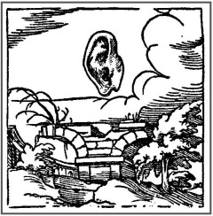

# Leçon 17 | 10 Avril 1957

  <label><input type="checkbox" data-lacan-toggle="original" checked> 原文</label>
  <label><input type="checkbox" data-lacan-toggle="notes" checked> 注释</label>
  <label><input type="checkbox" data-lacan-toggle="commentary" checked> 个人解读评论</label>

<section class="parallel-paragraph" data-paragraph-ids="s4-17-0001">

s4-17-0001

[无对应译文]

原文 · s4-17-0001

Notre progrès dans l’observation du petit Hans nous a amenés à mettre en valeur ce qu’on peut appeler « *la fonction du mythe* » dans la crise psychologique traversée par le petit Hans.

</section>

<section class="parallel-paragraph" data-paragraph-ids="s4-17-0002">

s4-17-0002

[无对应译文]

原文 · s4-17-0002

Crise inséparable de l’intervention paternelle, guidée par le conseil de FREUD, cette notion globale, massive de la fonction
de quelque chose qui s’appelle *mythe*, non par métaphore mais techniquement, tout au moins que nous supposons pouvoir être apprécié à sa juste portée, dans la mesure où cette création imaginative de Hans qui va toujours se développant à mesure
des interventions adroites, ou moins adroites, ou maladroites, du père, mais assurément suffisamment bien orientées
pour ne pas tarir, et à la fin stimuler cette série de productions de Hans qui se présentent à nous comme difficilement séparables, quoique ordonnables, par rapport à son *symptôme*, c’est à dire sa phobie.

</section>

<section class="parallel-paragraph" data-paragraph-ids="s4-17-0003">

s4-17-0003

[无对应译文]

原文 · s4-17-0003

La dernière fois nous en étions arrivés au jour anniversaire du 3 Avril, où sont relevés les propos de Hans sur le contenu
de sa phobie. Le soir du même jour le père dit en somme que si son fils a pris dans son comportement plus de courage,
c’est l’effet des évènements les plus récents, et notamment de l’intervention de FREUD le 30 mars auprès du petit Hans.
Mais si l’enfant a pris plus de courage dans son comportement, la phobie a pris elle aussi plus d’ampleur.

</section>

<section class="parallel-paragraph" data-paragraph-ids="s4-17-0004">

s4-17-0004

[无对应译文]

原文 · s4-17-0004

En effet ce jour, la phobie semble s’enrichir, dans cette ambiguïté évidemment indiscernable, s’enrichir tout autant,
et même de détails de portée et d’incidence plus fines, plus compliquées en même temps, à mesure que Hans sait mieux
en confier la portée, *le mode sous lequel cette phobie le presse et le suborne*.

</section>

<section class="parallel-paragraph" data-paragraph-ids="s4-17-0005">

s4-17-0005

[无对应译文]

原文 · s4-17-0005

C’est bien en effet à quelque renversement dans votre esprit, ou plus exac­tement de rétablissement dans votre esprit,

</section>

<section class="parallel-paragraph" data-paragraph-ids="s4-17-0006">

s4-17-0006

[无对应译文]

原文 · s4-17-0006

de la véritable fonction, et du *symptôme* et de ses productions diversement qualifiées, que l’on a résumées sous le nom
de « *symptômes transitoires de l’analyse »,* que je m’efforce ici. Et pour résumer devant vous la portée de ce que notre approche
veut dire, je pourrais essayer de poser un certain nombre de termes, de définitions et de règles du même coup.

</section>

<section class="parallel-paragraph" data-paragraph-ids="s4-17-0007">

s4-17-0007

[无对应译文]

原文 · s4-17-0007

Je vous l’ai dit la dernière fois, il faut distinguer, si nous voulons faire un travail qui soit vraiment analytique, vraiment freudien, vraiment conforme aux exemples majeurs que FREUD a développés pour nous, nous devons nous aper­cevoir de quelque chose qui ne se comprend, ne se confirme que de *la distinction du signifiant et du signifié*.

</section>

<section class="parallel-paragraph" data-paragraph-ids="s4-17-0008">

s4-17-0008

[无对应译文]

原文 · s4-17-0008

Je vous l’ai dit, aucun des *éléments signifiants* de la phobie, et il y en a beaucoup auxquels on peut s’arrêter, le premier bien entendu c’est *le cheval*, et il est impossible d’aucune façon de considérer ce *cheval* comme quelque chose qui serait purement et simplement un équivalent par exemple de la fonction du père.

</section>

<section class="parallel-paragraph" data-paragraph-ids="s4-17-0009">

s4-17-0009

[无对应译文]

原文 · s4-17-0009

On peut très rapidement - c’est une voie facile - dire que c’est une carence du père, que selon la formule classique
de *Totem et Tabou,* le cheval vient là comme une sorte de néo-production ou d’équivalence qui de quelque façon le représente, l’incarne, joue un rôle déterminé par ce qui semble bien en effet être la difficulté à ce moment là, et ce qui est même conforme
à ce que je suis en train de vous enseigner là, à savoir le passage de l’état pré-œdipien au *moment* - au *sens physique* du mot *moment* -
au *moment* œdipien.

</section>

<section class="parallel-paragraph" data-paragraph-ids="s4-17-0010">

s4-17-0010

[无对应译文]

原文 · s4-17-0010

Ce qui est tout à fait bien entendu incomplet, insuffisant, le cheval n’est pas simplement ce cheval qu’en effet peut-être à la fin
il pourra être, au moment où Hans voyant passer dans la rue un cheval avec l’air fier, il s’écrie quelque chose d’équivalent
à la fierté virile de ce cheval qui évoque le père, à un moment de la fin du trai­tement, il a cette fameuse conversation

</section>

<section class="parallel-paragraph" data-paragraph-ids="s4-17-0011">

s4-17-0011

[无对应译文]

原文 · s4-17-0011

avec son père où il lui dit quelque chose comme :

</section>

<section class="parallel-paragraph" data-paragraph-ids="s4-17-0012">

s4-17-0012

[无对应译文]

原文 · s4-17-0012

« *Tu dois être en colère contre moi, tu dois m’en vouloir d’occuper telle ou telle place,*
*ou d’accaparer l’attention de ma mère et d’occuper ta place dans son lit.* »

</section>

<section class="parallel-paragraph" data-paragraph-ids="s4-17-0013">

s4-17-0013

[无对应译文]

原文 · s4-17-0013

…et malgré les dénégations du père qui lui dit en effet qu’il n’a jamais été méchant.

</section>

<section class="parallel-paragraph" data-paragraph-ids="s4-17-0014">

s4-17-0014

[无对应译文]

原文 · s4-17-0014

Pour un instant l’enfant, sans aucun doute dûment endoctriné depuis quelque temps, fait surgir le mythe œdipien
avec une impérativité tout à fait spéciale, qui n’a pas manqué d’ailleurs de frapper certains auteurs,
nommément FLIESS qui a fait là-dessus *un article* paru dans le numéro consacré au centenaire de FREUD [^32]

</section>

<section class="parallel-paragraph" data-paragraph-ids="s4-17-0015">

s4-17-0015

[无对应译文]

原文 · s4-17-0015

Le cheval avant de remplir d’une façon terminale cette fonction métaphorique, si l’on peut dire, a joué bien d’autres rôles.

</section>

<section class="parallel-paragraph" data-paragraph-ids="s4-17-0016">

s4-17-0016

[无对应译文]

原文 · s4-17-0016

Le cheval quand il est attelé - et au 3 Avril nous avons là-dessus toutes les explications possibles données par le petit Hans -
ce cheval doit-il être attelé, ou non attelé, à une voiture à un cheval, ou à deux chevaux ? Dans chaque cas il y a une signification différente. Ce qui nous apparaît en tout cas c’est *qu’à ce moment*, si le cheval est symbolique de quelque chose, c’est - comme
la suite le montrera d’une façon plus développée - qu’il est symbolique, par un certain côté, de la mère, il est également symbolique du pénis.

</section>

<section class="parallel-paragraph" data-paragraph-ids="s4-17-0017">

s4-17-0017

[无对应译文]

原文 · s4-17-0017

En tout cas il est irréductiblement lié à cette voiture, laquelle est elle-même une voiture chargée, comme Hans y insiste

</section>

<section class="parallel-paragraph" data-paragraph-ids="s4-17-0018">

s4-17-0018

[无对应译文]

原文 · s4-17-0018

pen­dant la séance du 3 Avril, celle dans laquelle il explique quel est son intérêt, quel est l’ordre de satisfaction
qu’il doit à tout le trafic qui se passe devant la maison autour de ces voitures qui arrivent et repartent,
et qui pendant qu’elles sont là, sont déchargées, rechargées.

</section>

<section class="parallel-paragraph" data-paragraph-ids="s4-17-0019">

s4-17-0019

[无对应译文]

原文 · s4-17-0019

L’équivalence peu à peu apparaît de *la fonction de la voiture* - du cheval aussi du même coup - avec quelque chose
qui est évidemment d’un bien autre ordre, qui suggère ce qui se rapporte essentiellement à *la grossesse de la mère*
\- nous dit-on dans l’observation : FREUD et le père - qui était essentiellement liée au problème de la situation des enfants
dans le ventre de la mère, de leur issue. Le cheval aura donc à ce moment une tout autre portée, une tout autre fonction.

</section>

<section class="parallel-paragraph" data-paragraph-ids="s4-17-0020">

s4-17-0020

[无对应译文]

原文 · s4-17-0020

De même un autre élément fait pendant un long moment sujet d’inter­rogation pour le père comme pour FREUD,

</section>

<section class="parallel-paragraph" data-paragraph-ids="s4-17-0021">

s4-17-0021

[无对应译文]

原文 · s4-17-0021

c’est le fameux *Krawall,* c’est l’idée de bruit, de *tumulte*, de bruit désordonné, avec quelques prolongements qui font qu’il peut
\- paraît-il - aller jusqu’à être utilisé pour désigner un esclandre, un scandale. Dans tous les cas apparaît le caractère inquiétant, spécialement angoissant du *Krawall* tel qu’il est appréhendé par le petit Hans quand il peut se produire après que le cheval
soit tombé, ce qui a été un des évènements à son propre dire, précipitants pour lui, *Umfallen**,* de la valeur phobique du cheval.

</section>

<section class="parallel-paragraph" data-paragraph-ids="s4-17-0022">

s4-17-0022

[无对应译文]

原文 · s4-17-0022

C’est le moment de *cette chute* qui s’est produite une fois et qui se trouvera dès lors dans l’arrière-plan de la crainte.
Il y a ce qui peut arriver à certains chevaux, spécialement aux gros chevaux attelés à de grosses voitures, à des voitures chargées.
Cette chute s’accompagne du bruit du piaffement du cheval, et ce *Krawall* reviendra au cours de l’interrogatoire du petit Hans, sous plus d’un angle. À la vérité jamais d’une façon avérée à aucun moment de l’observation, quelque chose nous sera donné
qui serait une sorte d’interprétation du *Krawall*. Il faut remarquer d’ailleurs que tout au cours de l’observation,
dans le cas du petit Hans, FREUD comme le père seront amenés à rester *dans le doute, dans l’ambiguïté*, même *dans l’abstention*.

</section>

<section class="parallel-paragraph" data-paragraph-ids="s4-17-0023">

s4-17-0023

[无对应译文]

原文 · s4-17-0023

On peut dire quant à l’interprétation d’un certain nombre d’éléments, qu’il s’avère qu’ils pressent l’enfant d’avouer,
qu’ils lui suggèrent toutes les équivalences et toutes les solutions possibles, sans obtenir de lui autre chose que des évasions,
des allusions, des échappatoires, parfois même on a l’impression que par certains côtés l’enfant se moque.

</section>

<section class="parallel-paragraph" data-paragraph-ids="s4-17-0024">

s4-17-0024

[无对应译文]

原文 · s4-17-0024

Ceci n’est pas douteux, le caractère parodique de certaines des productions, des fabulations de l’enfant, est manifeste
dans l’observation, principalement de tout ce qui se passe autour de ce que je pourrais appeler le mythe de la cigogne
que le petit Hans fait si riche et si luxuriant, si chargé d’éléments humoristiques.

</section>

<section class="parallel-paragraph" data-paragraph-ids="s4-17-0025">

s4-17-0025

[无对应译文]

原文 · s4-17-0025

Ce côté parodique si caricatural de certaines des productions de l’enfant, est bien de nature à avoir frappé les observateurs
eux-mêmes, et tout ceci en fin de compte est fait pour nous mettre au cœur de ce quelque chose qui se rétablit
dans une perspective non pas d’incomplétude de l’observation, mais au contraire dans une perspective
de phase démonstrative caractéristique de l’observation.

</section>

<section class="parallel-paragraph" data-paragraph-ids="s4-17-0026">

s4-17-0026

[无对应译文]

原文 · s4-17-0026

Ça n’est pas une de ses insuffisances, c’est au contraire par cette voie qu’elle doit nous montrer le chemin d’un mode
de compréhension de ce dont il s’agit dans cette formation symptomatique, à la fois déjà si simple et déjà si riche,
qu’est la phobie, et d’autre part dans le travail lui-même, et ceci s’exprime, retrouve sa place. Il n’y a pas de meilleure illustration de cette observation dans la mesure où justement c’est une observation freudienne, c’est-à-dire une observation intelligente.

</section>

<section class="parallel-paragraph" data-paragraph-ids="s4-17-0027">

s4-17-0027

[无对应译文]

原文 · s4-17-0027

Nous voyons essentiellement *le signifiant* comme tel se distinguer du *signifié*. Le *signifiant symptomatique* était essentiellement constitué de telle sorte qu’il est de nature à recouvrir au cours du développement et de l’évolution, *les signifiés* les plus multiples, les plus différents. Que non seulement il est de nature à ce qu’il puisse faire cela, mais que c’est sa fonction.

</section>

<section class="parallel-paragraph" data-paragraph-ids="s4-17-0028">

s4-17-0028

[无对应译文]

原文 · s4-17-0028

Que le fait que l’appareil - l’ensemble des éléments signifiants qui nous sont donnés au cours de la tranche d’ob­servation

</section>

<section class="parallel-paragraph" data-paragraph-ids="s4-17-0029">

s4-17-0029

[无对应译文]

原文 · s4-17-0029

que constitue Hans - est fait de telle sorte que nous devons nous impo­ser \[un certain nombre de règles\] si nous voulons

</section>

<section class="parallel-paragraph" data-paragraph-ids="s4-17-0030">

s4-17-0030

[无对应译文]

原文 · s4-17-0030

que cette observation ne soit pas purement et simplement une énigme, une observation confuse, ratée.

</section>

<section class="parallel-paragraph" data-paragraph-ids="s4-17-0031">

s4-17-0031

[无对应译文]

原文 · s4-17-0031

Et pourquoi celle-ci serait-elle ratée, et non pas telle ou telle autre à laquelle nous avons l’habitude de nous référer ?
À ceci près que ne peut manquer de nous frapper tout le caractère arbitraire, sollicités, systématique des interprétations,
tout spécialement dans le cas des observations et des interprétations analytiques vis-à-vis de l’enfant.

</section>

<section class="parallel-paragraph" data-paragraph-ids="s4-17-0032">

s4-17-0032

[无对应译文]

原文 · s4-17-0032

Ici nous avons le témoignage - justement dans la mesure où cette observation est remarquablement riche et complexe -
qui nous est donné dans ce registre des plus rares par leur abondance, parce que si on a un sentiment quand on y pénètre,
c’est bien à tout instant celui de s’y perdre.

</section>

<section class="parallel-paragraph" data-paragraph-ids="s4-17-0033">

s4-17-0033

[无对应译文]

原文 · s4-17-0033

Un certain nombre de règles - que je voudrais ici proposer, à ce sujet - peuvent se formuler à peu près ainsi :
que dans une analyse d’enfant ou aussi bien d’adulte, nul élément que nous pouvons considérer comme *signifiant*…
au sens où nous le promouvons ici, c’est-à-dire soit *un objet*, *une relation* ou *un acte symptomatique*
…que *cet objet*, *cette relation* ou *cet acte symptomatique* soit primitif, en quelque sorte encore confus comme le premier surgissement de ce cheval quand il apparaît après un certain intervalle où se manifeste l’angoisse de l’enfant, et où *le cheval va jouer là une fonction* qu’il s’agit de définir, elle apparaît déjà bien singulièrement marquée de ce quelque chose de *dialectique*.

</section>

<section class="parallel-paragraph" data-paragraph-ids="s4-17-0034">

s4-17-0034

[无对应译文]

原文 · s4-17-0034

C’est bien ce que nous essayons de saisir, déjà suffisamment sensible dans le fait que c’est au moment précis où il s’agit
que sa mère s’en aille. C’est cela l’angoisse : il a peur que le cheval rentre dans la chambre. D’autre part qu’est-ce qui rentre
dans la chambre ? C’est lui, le petit Hans.

</section>

<section class="parallel-paragraph" data-paragraph-ids="s4-17-0035">

s4-17-0035

[无对应译文]

原文 · s4-17-0035

À tout propos nous voyons donc là une double relation très ambiguë, qui est à la fois liée à la fonction de la mère à ce moment là par la voie d’une tonalité sentimentale de l’angoisse, mais d’autre part aussi au petit Hans par son mouvement et son acte.
Déjà *le cheval*, dès qu’il apparaît, est chargé d’une profonde ambiguïté, il est déjà un signe propre à tout faire, très exactement comme l’est un signifiant typique. Dès que nous aurons fait trois pas dans l’observation du petit Hans, nous verrons cela
à tout instant déborder de tous les côtés.

</section>

<section class="parallel-paragraph" data-paragraph-ids="s4-17-0036">

s4-17-0036

[无对应译文]

原文 · s4-17-0036

Nous posons la règle : *nul élément signifiant* - étant donné qu’il est ainsi défini : objet, relation ou un acte symptomatique
dans la névrose par exemple - ne peut être considéré comme ayant une portée univoque, comme étant d’aucune façon équivalent comme tel à aucun de ces *objets, relations*, voire même *actions imaginaires* - je dis dans notre registre –
qui sont ce sur quoi se fonde la notion de *relation d’objet* toujours telle qu’elle est utilisée maintenant.

</section>

<section class="parallel-paragraph" data-paragraph-ids="s4-17-0037">

s4-17-0037

[无对应译文]

原文 · s4-17-0037

De nos jours *la relation d’objet*, avec ce qu’elle comporte de normatif, de progressif dans la vie du sujet, de génétiquement défini, de développement mental, *est quelque chose qui est du registre imaginaire*, qui bien entendu n’est pas sans valeur, qui d’un autre côté, quand on essaye de l’articuler, présente tous les caractères de contradiction intenable que j’ai dû vous dire pour vous caricaturer de la façon la plus évidente…
dans *les deux volumes* parus au début de l’année, il n’y avait qu’à lire le texte qui était devant nous
…les contradictions mêmes du jeu de cette notion à partir du moment où elle essaye de s’exprimer dans l’ordre d’une relation prégénitale qui se génitalise, avec l’idée de progrès que cela comporte. Nous sommes tout de suite dans des contradictions
et il s’agit d’ordonner là-dessus les termes de la façon même la plus sommaire.

</section>

<section class="parallel-paragraph" data-paragraph-ids="s4-17-0038">

s4-17-0038

[无对应译文]

原文 · s4-17-0038

Donc si nous suivons ce qui pour nous est *règle d’or* et qui repose sur la notion que nous avons de *la structure de l’activité symbolique*, *les éléments signifiants d’abord doivent être définis pour leur articulation avec les autres éléments signifiants*, et c’est en ceci qu’est *le rapprochement* avec la théorie récente du *mythe* telle qu’elle s’est imposée d’une façon singulièrement analogue à la façon dont simplement l’appréhension des faits nous force aussi d’articuler des choses, de la façon dont pour l’instant je les articule, qui est ce qui guide M. LÉVI-STRAUSS dans son article dans le *Journal of American Folklore*. \[[*La structure des mythes*](http://litgloss.buffalo.edu/levistrauss/text.shtml)\]

</section>

<section class="parallel-paragraph" data-paragraph-ids="s4-17-0039">

s4-17-0039

[无对应译文]

原文 · s4-17-0039

Par quoi la notion d’une étude structurale du mythe est-elle ouverte dans le texte de M. LÉVI-STRAUSS ?
C’est par cette remarque qu’il emprunte d’ailleurs lui-même intentionnellement à quelqu’un de ses confrères, à HOCART
\[[A. M. Hocart : *Social Origins*](http://classiques.uqac.ca/classiques/hocart_arthur_maurice/au_commencement/au_commencement.pdf), London, 1954, p. 7.\], pour dire que s’il y a d’abord une chose que nous devons renverser, c’est cette position qui a été prise au cours des âges et qui a consisté à rejeter les interprétations psychologiques au nom de je ne sais
quelle prévention intime anti-intellectualiste, d’un domaine présumé intellectuel dans un terrain qualifié d’affectif.

</section>

<section class="parallel-paragraph" data-paragraph-ids="s4-17-0040">

s4-17-0040

[无对应译文]

原文 · s4-17-0040

Il en résulte - dit très formellement cet auteur - qu’aux défauts déjà inhérents à ce qu’on appelle l’école psychologique…
c’est-à-dire l’école qui cherche dans son analyse des mythes, à en retrouver la source

dans cette soi-disant constante de la phi­losophie humaine, je dirais comme étant en quelque sorte générique
…on cumule déjà avec ces inconvénients, cette erreur difficile de faire dériver des idées bien définies, clairement découpées, comme toujours ce sont les choses auxquelles nous avons affaire, *autant dans le mythe que dans une production symptomatique*.

</section>

<section class="parallel-paragraph" data-paragraph-ids="s4-17-0041">

s4-17-0041

[无对应译文]

原文 · s4-17-0041

Au nom de je ne sais quel intellectualisme, nous sommes amenés à ramener à *une pulsion confuse*, quelque chose qui chez le patient se présente d’une façon très généralement articulée, c’est même ce qui en fait le paradoxe, c’est même ce qui à nos yeux
le fait apparaître comme parasite. Il suffit simplement que nous ne confondions pas ce qui est jeu mental, je ne sais quelle superfluidité de déduction intellectuelle qui ne peut se qualifier ainsi que dans une perspective de *la rationalisation du délire* par exemple, ou du *symptôme*, qui est quelque chose de tout à fait dépassé puisque dans notre perspective nous avons au contraire
la notion que *ce jeu du signifiant s’empare du sujet* et le prend bien au-delà de tout ce qu’il peut en intellectualiser,
mais ce qui n’en est pas moins *le jeu du signifiant* avec ses lois propres.

</section>

<section class="parallel-paragraph" data-paragraph-ids="s4-17-0042">

s4-17-0042

[无对应译文]

原文 · s4-17-0042

Pour tout dire, ce que nous voyons, ce qui est sensible, ce que je voudrais présentifier à vos yeux par une sorte d’image,
qu’est-ce que c’est ? Nous en avons *la notion* quand nous voyons le petit Hans peu à peu nous sortir *ces fantasmes*,
et aussi bien dans une certaine perspective quand nous avons les yeux assez décillés pour cela.

</section>

<section class="parallel-paragraph" data-paragraph-ids="s4-17-0043">

s4-17-0043

[无对应译文]

原文 · s4-17-0043

C’est que le développement d’une névrose, quand nous commençons d’en apercevoir l’histoire, le développement chez le sujet, la façon dont le sujet y a été pris, enserré, je dirais que c’est quelque chose dans lequel il n’entre pas de face,
il y entre en quelque sorte *à reculons*. Il semble que le petit Hans, au moment où est surgie au-dessus de lui cette *ombre du cheval*, entre lui-même peu à peu dans un décor qui s’ordonne et s’organise, s’édifie autour de lui, mais qui le saisit bien plus

</section>

<section class="parallel-paragraph" data-paragraph-ids="s4-17-0044">

s4-17-0044

[无对应译文]

原文 · s4-17-0044

que lui ne le déve­loppe. C’est le côté articulé avec lequel ce *délire* prend son développement, car je dis « *le délire »* presque comme un *lapsus*, c’est quelque chose qui n’a rien à faire avec une psychose, mais pour lequel le terme n’est pas inapproprié.
Nous ne pouvons d’aucune façon nous satisfaire d’une déduction à partir de vagues émotions, dit M. LÉVI-STRAUSS.

</section>

<section class="parallel-paragraph" data-paragraph-ids="s4-17-0045">

s4-17-0045

[无对应译文]

原文 · s4-17-0045

L’impression que nous avons, c’est que dans *l’édification idéique* qui - si nous pouvons l’appeler ainsi dans le cas du petit Hans -
est quelque chose qui *a sa motivation propre*, *son plan propre,son instance propre*, qui répond peut-être à tel ou tel besoin,
ou à telle ou telle fonction, assurément pas à quoi que ce soit qui puisse à aucun moment se justifier de telle *pulsion*,
de tel *élan*, de tel *mouvement émotionnel* particulier qui s’y transposerait, qui s’y exprimerait purement et simplement.

</section>

<section class="parallel-paragraph" data-paragraph-ids="s4-17-0046">

s4-17-0046

[无对应译文]

原文 · s4-17-0046

C’est d’un bien autre mécanisme qu’il s’agit, et qui nécessite ce quelque chose qui s’appelle « *l’étude structurale du mythe* »
dont le premier pas, dont la première démarche, est de ne jamais considérer aucun des éléments signifiants indépendamment des autres qui viennent à surgir, et en quelque sorte à le révéler, mais j’entends à le révéler et à le développer même sur le plan d’une série d’oppositions qui sont d’abord et avant tout de l’ordre combinatoire.

</section>

<section class="parallel-paragraph" data-paragraph-ids="s4-17-0047">

s4-17-0047

[无对应译文]

原文 · s4-17-0047

Ce que nous voyons produire au cours du développement de ce qui se passe chez le petit Hans, c’est le surgissement,
non pas d’un certain nombre de thèmes qui auraient plus ou moins leur équivalence affective ou psychologique comme on dit, mais d’un certain nombre de groupements d’éléments signifiants qui se *transposent* progressivement d’un système dans un autre.
Exemple : puisqu’il s’agit d’illustrer ce que je suis en train de vous dire, nous avons eu, après les premières tentatives d’éclaircissement du père dirigées par FREUD, un dégagement dans le cheval de cet élément spécialement pénible qui va faire que Hans réagit au premier éclaircissement qu’a donné FREUD par cette compulsion à regarder le cheval.

</section>

<section class="parallel-paragraph" data-paragraph-ids="s4-17-0048">

s4-17-0048

[无对应译文]

原文 · s4-17-0048

Puis ensuite nous trouvons quelque chose dans la suite des interventions du père, où nous pouvons voir que l’enfant se trouve,
à certains moments, soulagé par l’aide interdictive que le père lui apporte concernant sa masturbation. Nous approchons

</section>

<section class="parallel-paragraph" data-paragraph-ids="s4-17-0049">

s4-17-0049

[无对应译文]

原文 · s4-17-0049

plus près d’une première ten­tative d’analyse du souci de Hans concernant ce qui se rapporte à son *organe urinaire, le Wiwimacher* comme il l’appelle. Et à ce moment-là nous voyons qu’il y a quelque chose qui est dans la voie de l’éclaircissement réel,
ce quelque chose de fort que fait le père pour rejoindre plus directement ce qu’il pense être seulement le support réel de *l’angoisse* de l’enfant, c’est à savoir que les petites filles n’en ont pas - FREUD l’a incité à intervenir dans ce sens - et que lui en a.

</section>

<section class="parallel-paragraph" data-paragraph-ids="s4-17-0050">

s4-17-0050

[无对应译文]

原文 · s4-17-0050

Assurément Hans accuse le coup, et à ce propos d’une façon dont la signification n’échappe pas à FREUD, nous souligne

</section>

<section class="parallel-paragraph" data-paragraph-ids="s4-17-0051">

s4-17-0051

[无对应译文]

原文 · s4-17-0051

que *son fait-pipi est adhé­rent ou enraciné*, que c’est quelque chose qui *poussera, croîtra avec lui*. Ne voilà-t-il pas assurément déjà ébauché quelque chose qui paraît être dans le sens de rendre en quelque sorte inutile le support phobique, si c’est bien en effet purement et simplement l’équivalent de cette angoisse liée à l’appréhension, d’un réel qui jusque là n’a pas été pleinement réalisé par lui.

</section>

<section class="parallel-paragraph" data-paragraph-ids="s4-17-0052">

s4-17-0052

[无对应译文]

原文 · s4-17-0052

Nous voyons surgir à ce moment là *le fantasme de la grande girafe et de la petite girafe* dont je vous ai montré le caractère qui
nous rejette dans le champ d’une création dont le style, donc l’exigence symbolique est quelque chose de tout à fait saisissant.
Je le répète pour certains qui n’étaient pas ici : j’ai donné une portée, qui ne peut pas être donnée autrement que dans notre perspective, au fait que pour Hans il n’y a pas de contradiction du tout, ni même d’ambiguïté, dans le fait qu’une des girafes
\- peut-être la petite - peut être une girafe chiffonnée, et une girafe chiffonnée c’est une girafe qu’on peut chiffonner comme cela : il nous le montre.

</section>

<section class="parallel-paragraph" data-paragraph-ids="s4-17-0053">

s4-17-0053

[无对应译文]

原文 · s4-17-0053

Le caractère de passage ici d’un objet qui jusque là a eu sa fonction *ima­ginaire* à une sorte d’intervention de *symbolisation* radicale formulée par le sujet lui-même comme telle, soulignée par le geste qu’il fait ensuite de s’emparer, d’occuper si l’on peut dire
cette position *symbolique* - il s’assoit dessus, et ceci en dépit des cris et des protestations de la grande girafe - est là
chez le petit Hans quelque chose de tout spécialement satisfaisant. Ce n’est pas un rêve, c’est un fantasme qu’il a fabriqué
lui-même. Il est venu pour en parler dans la chambre de ses parents, il le développe.

</section>

<section class="parallel-paragraph" data-paragraph-ids="s4-17-0054">

s4-17-0054

[无对应译文]

原文 · s4-17-0054

La perplexité dans laquelle on reste à propos de ce dont il s’agit, une fois de plus d’ores et déjà, est là bien marquée.
Vous remarquerez l’oscillation dans l’observation elle–même, *cette grande et cette petite girafe* sont d’abord pour le père, lui, le père, et la mère. Néanmoins il s’exprime de la façon la plus formelle en disant que : la grande girafe c’est la mère, et que la petite
c’est son membre. Voilà donc une autre forme de la valeur du rapport de ces deux signi­fiants.

</section>

<section class="parallel-paragraph" data-paragraph-ids="s4-17-0055">

s4-17-0055

[无对应译文]

原文 · s4-17-0055

Mais est-ce que cela va seulement nous suffire ? Assurément pas puisque de par l’intervention du père qui dit à un moment
à la mère : « *Au revoir, grande girafe !* » en s’adressant à sa femme, et qui souligne à l’enfant que sa mère, c’est la grande girafe, l’enfant répond - qui jusque là a admis un registre interprétatif différent - de la façon suivante, et la traduction française
n’en fait pas passer - je pense - *la pointe et la portée* : il ne dit pas « *c’est vrai* » comme on l’a traduit, mais il dit : « *Pas vrai !* »
et il ajoute : « *Et la petite girafe c’est Anna* ». Que touchons-nous là du doigt ? C’est encore un mode d’interprétation,
et que vient-il faire là ?

</section>

<section class="parallel-paragraph" data-paragraph-ids="s4-17-0056">

s4-17-0056

[无对应译文]

原文 · s4-17-0056

Est-ce vraiment sur Anna, et à l’occasion sur son *Kra­wall**,* car beaucoup plus loin dans l’observation nous verrons apparaître
la petite Anna comme bien gênante par ses cris, exactement un cri qui ne peut pas - à condition que nous ayons toujours l’oreille ouverte à l’élément signifiant - pour nous être identifié au cri de la mère dans ce fantasme.

</section>

<section class="parallel-paragraph" data-paragraph-ids="s4-17-0057">

s4-17-0057

[无对应译文]

原文 · s4-17-0057

*Que veut dire* en fin de compte, et uniquement *cette ambiguïté* ? Ce qui apparaît à ce moment là de gaieté, voire déjà de pointe
de raillerie dans le « *pas vrai !* » de Hans, c’est quelque chose qui à soi tout seul nous désigne ce par quoi le père essaye de faire des *correspondances* deux par deux entre les deux termes de *la relation symbolique,* et tel ou tel élément *imaginaire* ou *réel*
qu’ils seraient là pour représenter.

</section>

<section class="parallel-paragraph" data-paragraph-ids="s4-17-0058">

s4-17-0058

[无对应译文]

原文 · s4-17-0058

Le père fait fausse route, à tout instant Hans est près de lui faire la démons­tration que ce n’est pas cela, et ce ne sera jamais cela.
Pourquoi ne serait-ce jamais cela ? Parce que, ce à quoi Hans a affaire *au moment où surgit sa phobie*, au moment de l’observation où nous parlons, c’est à quelque chose avec quoi il a à se débrouiller. C’est à une certaine appréhension de certains *rapports symbolique* qui ne sont pas jusque-là constituées pour lui, qui ont valeur propre de *relation symbolique*, qui ont rapport à ce fait :
que l’homme, parce qu’il est homme, est mis en présence de problèmes qui sont des problèmes de signifiant comme tel,
en ce que le signifiant est introduit dans le réel par son existence même de signfiant, à savoir parce qu’il y a des mots
qui se disent par exemple, ou parce qu’il y a de phrases qui s’articulent et qui s’enchaînent, liées par *un médium, une copule*
de l’ordre du « *pourquoi »* ou du « *parce que »*.

</section>

<section class="parallel-paragraph" data-paragraph-ids="s4-17-0059">

s4-17-0059

[无对应译文]

原文 · s4-17-0059

L’existence du signifiant introduit dans le monde de l’homme ce quelque chose qui…
comme je crois que dans un temps je l’exprimais à la fin d’une petite introduction au 1er numéro
de *La Psychanalyse* \[« *[Fonction et champ de la parole](http://www.ecole-lacanienne.net/documents/1953-09-26b.doc) <u>et du langage en psychanalyse</u> »*, *La psychanalyse* n° 1, PUF 1956, pp. 81-166\]
…fait que c’est à croiser diamétralement le cours des choses que le symbole s’attache, pour lui donner un autre sens,
c’est à des problèmes de création de sens, avec tout ce que cela comporte de libre, d’ambigu, de ce qu’il est possible
à tout instant de réduire au néant par le côté complètement arbitraire qu’il y a dans l’irruption du mot d’esprit.

</section>

<section class="parallel-paragraph" data-paragraph-ids="s4-17-0060">

s4-17-0060

[无对应译文]

原文 · s4-17-0060

À tout instant Hans, comme HUMPTY-DUMPTY dans « *Alice au Pays des Merveilles »,* est capable de dire :

</section>

<section class="parallel-paragraph" data-paragraph-ids="s4-17-0061">

s4-17-0061

[无对应译文]

原文 · s4-17-0061

« *Les choses sont ainsi parce que je le décrète ainsi, et parce que je suis le maître.* »
\[« Alice - *La question est de savoir si vous pouvez obliger les mots à vouloir dire des choses différentes* .
Humpty-Dumpty - *La question est de savoir qui sera le maître, un point c’est tout*. »
Lewis Carroll : « *De l’Autre Côté du Miroir* »\]

</section>

<section class="parallel-paragraph" data-paragraph-ids="s4-17-0062">

s4-17-0062

[无对应译文]

原文 · s4-17-0062

Ce qui n’empêche pas qu’il soit à ce moment complètement subordonné à la solution du problème qui pour lui surgit
d’un besoin de réviser ce qui a été jusque là son mode de rapports au monde maternel, celui qui était déjà organisé
sur une certaine dialectique, sur cette dialectique du *leurre* dont je vous ai souligné l’*importance*, entre lui et la mère :

</section>

<section class="parallel-paragraph" data-paragraph-ids="s4-17-0063">

s4-17-0063

[无对应译文]

原文 · s4-17-0063

- Lequel ou laquelle a *le phallus* ou ne l’a pas ?

</section>

<section class="parallel-paragraph" data-paragraph-ids="s4-17-0064">

s4-17-0064

[无对应译文]

原文 · s4-17-0064

- Qu’est-ce que désire la mère quand elle désire autre chose que moi, l’enfant ?

</section>

<section class="parallel-paragraph" data-paragraph-ids="s4-17-0065">

s4-17-0065

[无对应译文]

原文 · s4-17-0065

C’est là que l’enfant était, et il s’agit pour lui, exactement comme nous le voyons dans un mythe, toujours à partir du moment
où nous sommes entrés dans cette analyse correcte où nous voyons qu’un mythe est toujours une ten­tative d’articulation

</section>

<section class="parallel-paragraph" data-paragraph-ids="s4-17-0066">

s4-17-0066

[无对应译文]

原文 · s4-17-0066

de solution d’un problème, c’est-à-dire qu’il s’agit de passer d’un certain mode, disons d’explication de la relation au monde
du *sujet* ou de *la société* en question, à une transformation nécessitée par le fait que des éléments différents nouveaux viennent

</section>

<section class="parallel-paragraph" data-paragraph-ids="s4-17-0067">

s4-17-0067

[无对应译文]

原文 · s4-17-0067

en *contradiction* avec la première for­mulation, et exigent en quelque sorte un passage qui comme tel est *impossible*,
qui comme tel est *une impasse*. Ceci donne sa structure au mythe.

</section>

<section class="parallel-paragraph" data-paragraph-ids="s4-17-0068">

s4-17-0068

[无对应译文]

原文 · s4-17-0068

De même Hans est confronté à ce moment–là à quelque chose qui nécessite *la révision de la première ébauche de système symbolique*
qui structurait sa relation à la mère. Et c’est de cela qu’il s’agit avec l’apparition de *la phobie*, mais bien plus encore
avec le développement de tout ce qu’elle emporte avec elle comme *éléments signifiants*. C’est à cela qu’est confronté Hans,
et qui de ce même fait lui fait apparaître dérisoire toute tentative de lecture parcellaire à laquelle à tout instant le père s’efforce.

</section>

<section class="parallel-paragraph" data-paragraph-ids="s4-17-0069">

s4-17-0069

[无对应译文]

原文 · s4-17-0069

Je ne peux pas à propos du style de réponses de Hans, ne pas vous demander de vous rapporter aux passages absolument admirables que constitue toute cette immense œuvre de FREUD encore à peine exploitée pour notre expérience qui s’appelle
le [*Witz*](http://classiques.uqac.ca/classiques/freud_sigmund/le_mot_d_esprit/freud_le_mot_d_esprit.pdf), cet ouvrage dont il n’y a peut-être aucun équivalent dans ce qu’on peut appeler « *la philosophie psychologique »*, parce que
je ne connais pas un ouvrage qui ait apporté une chose aussi neuve et aussi tranchée que cet ouvrage, tous les ouvrages
sur le rire, qu’ils soient de BERGSON ou d’autres, seront toujours d’une pauvreté lamentable à côté de celui-ci.
Qu’est-ce qui nous est apporté d’essentiel dans le *Witz* de FREUD ?

</section>

<section class="parallel-paragraph" data-paragraph-ids="s4-17-0070">

s4-17-0070

[无对应译文]

原文 · s4-17-0070

C’est qu’il pointe directement - sans fléchissement, sans s’égarer dans des considérations - à ce qui est l’essentiel de la nature
du phénomène. Ce qu’il met dès [*le premier chapitre*](http://classiques.uqac.ca/classiques/freud_sigmund/le_mot_d_esprit/freud_le_mot_d_esprit.pdf) au premier plan, comme dans le rêve, c’est que d’abord « *le rêve est un rébus* ».

</section>

<section class="parallel-paragraph" data-paragraph-ids="s4-17-0071">

s4-17-0071

[无对应译文]

原文 · s4-17-0071

Personne ne s’en aperçoit, cette phrase est passée complè­tement inaperçue. De même on ne semble pas s’être aperçu que l’analyse du *trait d’esprit* commence avant tout par quelque chose qui est le fameux tableau familier de l’analyse du phénomène
de condensation en tant que fabrication fondée sur le signifiant, sur la superposition du familier et millionnaire.

</section>

<section class="parallel-paragraph" data-paragraph-ids="s4-17-0072">

s4-17-0072

[无对应译文]

原文 · s4-17-0072

Et tout ce qu’il va développer dans la suite va consister à nous montrer que c’est au niveau de ce cas d’*anéantissement* que se situe ce terme véritablement *détruisant*, *disrompant* le jeu du *signifiant* comme tel par rapport à ce qu’on peut appeler l’existence du *réel*,
et qui a joué avec le *signifiant*.

</section>

<section class="parallel-paragraph" data-paragraph-ids="s4-17-0073">

s4-17-0073

[无对应译文]

原文 · s4-17-0073

À tout instant l’homme met en cause son monde jusqu’à sa racine, et la valeur du *trait d’esprit* - c’est cela qui le distingue du comique - c’est sa possibilité de jouer sur, si l’on peut dire, le foncier *non–sens* de tout usage du sens, *le caractère à tout instant possible à mettre en cause de tout sens en tant qu’il est fondé sur un usage du signifiant*, c’est-à-dire sur quelque chose qui en soi-même est profondément paradoxal par rapport à toute signification possible puisqu’il y a l’instauration dans cet usage,
c’est cet usage même qui crée ce qu’il est destiné à soutenir.

</section>

<section class="parallel-paragraph" data-paragraph-ids="s4-17-0074">

s4-17-0074

[无对应译文]

原文 · s4-17-0074

La distinction est des plus claires, entre ces domaines de l’esprit, avec le domaine du comique. Quand FREUD touchera
au comique, il ne l’abordera dans ce livre que secondairement et pour l’éclairer par son opposition avec l’esprit,
et d’abord il rencontrera les notions d’intermédiaire, et il nous fera apercevoir la dimension du *naïf*.
C’est pour cela que je fais cette digression dans la dimen­sion du *naïf*, c’est-à-dire ce *naïf* si ambigu. Puisqu’il existe :

</section>

<section class="parallel-paragraph" data-paragraph-ids="s4-17-0075">

s4-17-0075

[无对应译文]

原文 · s4-17-0075

- *d’un côté* il faut bien le définir pour voir ce qui peut surgir de ce *comiqu*e, des manifestations du *naïf*,

</section>

<section class="parallel-paragraph" data-paragraph-ids="s4-17-0076">

s4-17-0076

[无对应译文]

原文 · s4-17-0076

- *d’un autre côté* nous voyons bien à quel point ce naïf est quelque chose d’intersubjectif.

</section>

<section class="parallel-paragraph" data-paragraph-ids="s4-17-0077">

s4-17-0077

[无对应译文]

原文 · s4-17-0077

*La naïveté de l’enfant, c’est nous qui lui impliquons*, et d’une certaine façon il plane toujours sur la naïveté de l’enfant quelque doute.
Pourquoi ? Là aussi une fois encore prenons un exemple. FREUD commence son illustration du naïf par quelque chose qui est l’histoire des enfants qui le soir font une grande réunion d’adultes en leur ayant promis de leur faire une petite représentation théâtrale, et le guignol commence à s’agiter.

</section>

<section class="parallel-paragraph" data-paragraph-ids="s4-17-0078">

s4-17-0078

[无对应译文]

原文 · s4-17-0078

Les jeunes acteurs, dit FREUD, commencent à raconter l’histoire d’un mari et d’une femme, qui sont dans la plus profonde misère, ils essayent de sortir de leur état, et le mari part vers des pays lointains. Il revient ayant accompli d’immenses exploits, chargé de nombreuses richesses, faisant état de sa *prospérité* devant sa femme. Sa femme l’écoute, elle ouvre un rideau qui est
au fond de la scène, et elle lui dit : « *Regarde, moi aussi j’ai bien travaillé quand tu étais parti.* » Et on voit au fond dix poupées rangées.

</section>

<section class="parallel-paragraph" data-paragraph-ids="s4-17-0079">

s4-17-0079

[无对应译文]

原文 · s4-17-0079

Voilà l’exemple que donne FREUD pour illustrer *la naïveté*, c’est-à-dire une de ces formes de comique où la décharge surgirait
si la définition du comique s’y impliquait de quelque chose qui consisterait en une espèce d’économie spon­tanément réalisée

</section>

<section class="parallel-paragraph" data-paragraph-ids="s4-17-0080">

s4-17-0080

[无对应译文]

原文 · s4-17-0080

dans quelque chose qui, dans un ordre différent, dit par une bouche moins naïve, comporterait une part de tension,
allant même jusqu’à un certain degré à engendrer la gêne.

</section>

<section class="parallel-paragraph" data-paragraph-ids="s4-17-0081">

s4-17-0081

[无对应译文]

原文 · s4-17-0081

C’est quelque chose du fait que l’enfant va directement, sans se donner la moindre peine supposée, à une énormité,
que ceci déclenche quelque chose qui devient le rire, c’est-à-dire qui devient très drôle, avec ce que ce mot drôle peut comporter de résonance étrange. Mais de quoi s’agit-il ? Si à cette occasion nous sommes dans un domaine limitrophe du comique, l’économie dont il s’agit c’est très précisément l’économie qui est faite de ce qu’aurait dû subir une construction comme celle-là, si on voulait évoquer les mêmes choses partant de la bouche d’un adulte.

</section>

<section class="parallel-paragraph" data-paragraph-ids="s4-17-0082">

s4-17-0082

[无对应译文]

原文 · s4-17-0082

L’enfant réalise en quelque sorte directement ce quelque chose qui nous porte au comble de l’absurde, il fait en quelque sorte
ce qu’on appelle un trait d’esprit naïf, c’est une histoire drôle, elle déclenche le rire parce qu’elle est dans la bouche d’un enfant, et ce qui laisse aux adultes tout le champ pour s’esbaudir : ces gosses sont impayables ! Et ils sont supposés avoir
en toute innocence et du premier coup, trouvé cela qu’un autre se serait donné forcément beaucoup plus de peine à trouver,
ou qu’il aurait fallu qu’il enrichisse de quelque subtilité supplémentaire pour que ça puisse à proprement parler passer pour drôle.

</section>

<section class="parallel-paragraph" data-paragraph-ids="s4-17-0083">

s4-17-0083

[无对应译文]

原文 · s4-17-0083

Mais cela nous permet de voir aussi que cette ignorance à laquelle il est donné de faire bouche, il n’est pas absolument sûr
qu’elle soit totale et pour tout dire la perspective du naïf dans laquelle nous incluons les histoires infantiles quand elles ont
ce caractère déconcertant qui chez nous déclenche le rire, cette naïveté n’est pas toujours - nous le savons très bien -
quelque chose que nous devrions prendre *au pied de la lettre*. Il y a être naïf, et feindre d’être naïf. Ici une naïveté feinte, c’est très précisément ce qui restitue à ce jeu de la comédie enfantine tout son caractère d’esprit des plus tendancieux, comme s’exprime FREUD, et il s’en faut d’un rien, après tout, précisément de la supposition que cette naïveté n’est pas complète,
pour que ce soit eux qui prennent le dessus et qui effectivement soient les maîtres du jeu.

</section>

<section class="parallel-paragraph" data-paragraph-ids="s4-17-0084">

s4-17-0084

[无对应译文]

原文 · s4-17-0084

En d’autres termes, ce quelque chose que FREUD également met en évidence et à quoi je vous prie de vous reporter
sur le texte, c’est que *le trait d’esprit* comporte toujours la notion d’*une troisième personne* : on raconte un *trait d’esprit* de quelqu’un, devant quelqu’un d’autre, qu’il y ait ou non réellement les trois personnes, *il y a toujours cette ternarité* nécessaire, essentielle dans
le déclenchement du rire par le *trait d’esprit*, alors que *le comique* se contente d’un rapport duel, le comique peut être déclenché simplement entre deux personnes.

</section>

<section class="parallel-paragraph" data-paragraph-ids="s4-17-0085">

s4-17-0085

[无对应译文]

原文 · s4-17-0085

La vue d’une personne qui tombe par exemple, ou qui se met à opérer par des voies absolument démesurées pour réaliser
une action ou un effort qui nous était des plus simples, est quelque chose qui à soi tout seul peut et suffit, nous dit FREUD,
à déclencher la relation du comique dans ce naïf.

</section>

<section class="parallel-paragraph" data-paragraph-ids="s4-17-0086">

s4-17-0086

[无对应译文]

原文 · s4-17-0086

Nous voyons essen­tiellement que la perspective de la 3ème personne, si elle reste virtuelle, est toujours plus ou moins impliquée.
En d’autres termes, qu’*au-delà* de cet enfant que nous tenons pour naïf, il y ait un *Autre*, qui est bien après tout celui que nous supposons pour que ça nous fasse tellement rire, il se pourrait bien après tout *qu’il feigne de feindre, c’est-à-dire qu’il affecte d’être naïf*.
Cette dimension du *symbolique*, c’est exactement ce qui, à tout instant se laisse sentir dans cette sorte de jeu de cache-cache,
de moquerie perpétuelle qui est ce qui colore, ce qui donne le ton de toutes les répliques de Hans à son père.

</section>

<section class="parallel-paragraph" data-paragraph-ids="s4-17-0087">

s4-17-0087

[无对应译文]

原文 · s4-17-0087

À un autre moment nous verrons un phénomène comme celui là se produire, le père l’interroge :

</section>

<section class="parallel-paragraph" data-paragraph-ids="s4-17-0088">

s4-17-0088

[无对应译文]

原文 · s4-17-0088

« *Qu’as-tu pensé quand tu as vu le cheval tomber ?* »

</section>

<section class="parallel-paragraph" data-paragraph-ids="s4-17-0089">

s4-17-0089

[无对应译文]

原文 · s4-17-0089

Et à propos duquel nous dit Hans, il aurait *« attrapé la bêtise*.

</section>

<section class="parallel-paragraph" data-paragraph-ids="s4-17-0090">

s4-17-0090

[无对应译文]

原文 · s4-17-0090

« *Tu as pensé, dit le père, qu’avec ses gros sabots le cheval était mort ?* »

</section>

<section class="parallel-paragraph" data-paragraph-ids="s4-17-0091">

s4-17-0091

[无对应译文]

原文 · s4-17-0091

Il est bien certain que comme le père le note par la suite c’est avec un petit air tout à fait sérieux que - au premier temps -
Hans réplique :
« *Oui, oui en effet j’ai pensé cela.* »

</section>

<section class="parallel-paragraph" data-paragraph-ids="s4-17-0092">

s4-17-0092

[无对应译文]

原文 · s4-17-0092

Et puis tout d’un coup il se ravise, il se met à rire - ceci est noté - et il dit :

</section>

<section class="parallel-paragraph" data-paragraph-ids="s4-17-0093">

s4-17-0093

[无对应译文]

原文 · s4-17-0093

« *Mais non, ce n’est pas vrai, c’est seulement une bonne plaisanterie que je viens de faire en disant cela.* »

</section>

<section class="parallel-paragraph" data-paragraph-ids="s4-17-0094">

s4-17-0094

[无对应译文]

原文 · s4-17-0094

Qu’est-ce que cela peut vouloir dire ? L’observation est ponctuée de tous ces petits traits. Qu’est-ce que cela peut vouloir dire, sinon qu’après s’être laissé prendre un instant à l’écho tragique si l’on peut dire, de la chute du cheval…
est-il bien sûr qu’il y a cet écho tragique, occasionnellement avec bien d’autres, dans la psychologie du petit Hans
…tout d’un coup l’enfant pense à l’autre, à ce père moustachu, binoclard que FREUD nous représente et qu’il a vu
à la consultation à côté du petit Hans, un drôle de petit bonhomme tout bichonnant, et l’autre qui est là, pesant,
avec plein de reflets dans ses lunettes, appliqué, plein de bonne volonté.

</section>

<section class="parallel-paragraph" data-paragraph-ids="s4-17-0095">

s4-17-0095

[无对应译文]

原文 · s4-17-0095

Un instant FREUD vacille, il s’agit à ce moment là de ce fameux « *noir* » qu’il y a devant la bouche des chevaux
sur lequel ils sont là à s’interroger, à chercher ce que ça veut dire avec une lanterne, quand FREUD se dit :
« *Mais la voilà la longue tête, c’est cet âne là pour tout dire !* » Et quand je dis « *c’est cet âne là* », dites-vous bien quand même
que cette espèce de *noir violent* qui est là et jamais élucidé devant la bouche du cheval, c’est quand même bien cette béance réelle toujours cachée derrière le voile et le miroir, et qui ressort du fond toujours comme une tâche, et que pour tout dire,
en fin de compte cette sorte de court-circuit dans un caractère supérieur divin, et non sans humour, de *la supériorité professorale*,
et cette appréciation dont l’expérience et les confidences des contemporains nous montrent qu’elle était toujours assez prête
à surgir de la bouche de FREUD qui s’exprime en lettres françaises par la troisième lettre suivie de trois petits points :

</section>

<section class="parallel-paragraph" data-paragraph-ids="s4-17-0096">

s4-17-0096

[无对应译文]

原文 · s4-17-0096

« *Quel brave pré­sident c...* ».

</section>

<section class="parallel-paragraph" data-paragraph-ids="s4-17-0097">

s4-17-0097

[无对应译文]

原文 · s4-17-0097

J’ai devant moi quelque chose qui vient recouper et rejoindre l’intuition du caractère fondamentalement *abyssal* de ce qui est là devant lui, qui sort du fond. Alors, nul doute que dans ces conditions le petit Hans mène assez bien et à tout instant le jeu,
*quand il se reprend, quand il rit, quand il annule* tout d’un coup toute une longue série de ce qu’il vient de développer devant le père.
À tout instant nous avons l’impression précisément que ce qu’il lui dit, c’est « *Je te vois venir* ». Évidemment au premier abord,
le mot « *mort* », il l’accepte comme équivalent de « *tombé* », mais au second temps il se dit : « *Tu me répètes la leçon du professeur* »,
c’est-à-dire très précisément ce que le professeur vient d’insinuer, à savoir qu’il en veut fort à son père, jusqu’à vouloir sa mort.

</section>

<section class="parallel-paragraph" data-paragraph-ids="s4-17-0098">

s4-17-0098

[无对应译文]

原文 · s4-17-0098

Tout aussi bien ce quelque chose vient donc contribuer aux « *règles* » qui sont les nôtres, je vous l’ai dit, d’abord pour repérer
*les signifiants de cette valeur essentiellement combinatoire par où l’ensemble des signifiants mis en jeu viennent là pour restructurer le réel*
*en y introduisant cette nouvelle relation combinée*. Puisqu’il faut reprendre notre référence au premier numéro de *La Psychanalyse*,
ce n’est pas pour rien que sur la couverture on trouve le symbole de la fonction du signifiant comme tel.

</section>

<section class="parallel-paragraph" data-paragraph-ids="s4-17-0099">

s4-17-0099

[无对应译文]

原文 · s4-17-0099

</section>

<section class="parallel-paragraph" data-paragraph-ids="s4-17-0100">

s4-17-0100

[无对应译文]

原文 · s4-17-0100

Le signifiant est un pont dans un domaine de significations, par conséquent les significations ne sont pas reproduites,
mais transformées, recrées. C’est de cela qu’il s’agit, et c’est pourquoi nous devons toujours centrer notre objectif,
notre question, nous devons voir quel est le tour de signifiant qu’a opéré le petit Hans pour, partant de quoi, arriver à quoi ?
Je veux dire *le tour*, c’est-à-dire à chacune de ces étapes qu’il parcourt, les cinq premiers mois de l’année 1908 au cours desquels successivement nous voyons le petit Hans s’intéresser à *ce qui se charge et ce qui se décharge*, ou à ce qui entre en mouvement tout d’un coup, d’une façon *plus ou moins brusque*, et qui est également susceptible de l’arracher prématurément de son quai de départ.

</section>

<section class="parallel-paragraph" data-paragraph-ids="s4-17-0101">

s4-17-0101

[无对应译文]

原文 · s4-17-0101

Toute cette liaison des *éléments signifiants* diversement *fantasmatiques*, autour des thèmes du mouvement, ou plus exactement
si vous le permettez, le thème de tout ce qui dans le mouvement est modification, accélération, et pour tout dire le mot « *branle* » est un élément absolument essentiel dans toute la structuration des premiers *fantasmes*, et qui de là peu à peu fait surgir d’autres éléments parmi lesquels nous ne pouvons pas ne pas donner une attention toute spéciale à ce qui se passe autour des deux culottes de la mère, l’une jaune et l’autre noire.

</section>

<section class="parallel-paragraph" data-paragraph-ids="s4-17-0102">

s4-17-0102

[无对应译文]

原文 · s4-17-0102

Ce passage - hors des perspectives qui sont celles auxquelles j’essaye de vous introduire - est absolument incompréhensible.
Le père, c’est le cas de le dire, y perd son latin. Quant à FREUD lui-même, il dit simplement que le père a inévita­blement

</section>

<section class="parallel-paragraph" data-paragraph-ids="s4-17-0103">

s4-17-0103

[无对应译文]

原文 · s4-17-0103

*brouillé le terrain*, néanmoins il nous indique à la fin un certain nombre de perspectives : sans doute le père a-t-il méconnu
une opposition fondamentale qui doit être sans doute liée à des perceptions auditives différentes,
concernant l’urination de l’homme et de la femme, par exemple.

</section>

<section class="parallel-paragraph" data-paragraph-ids="s4-17-0104">

s4-17-0104

[无对应译文]

原文 · s4-17-0104

Mais nous voyons aussi que dans une note FREUD nous dit ce que veut dire le petit Hans à ce moment, et le petit Hans
dit des choses très *incompréhensibles*. Sans doute le petit Hans veut-il nous dire qu’à mesure que la culotte est portée,
elle devient plus noire, ceci après de nombreux développements où on s’aperçoit que :

</section>

<section class="parallel-paragraph" data-paragraph-ids="s4-17-0105">

s4-17-0105

[无对应译文]

原文 · s4-17-0105

- *quand elle est jaune*, elle a pour lui telle valeur,

</section>

<section class="parallel-paragraph" data-paragraph-ids="s4-17-0106">

s4-17-0106

[无对应译文]

原文 · s4-17-0106

- *quand elle est noire* elle ne l’a pas,

</section>

<section class="parallel-paragraph" data-paragraph-ids="s4-17-0107">

s4-17-0107

[无对应译文]

原文 · s4-17-0107

- *quand elle est séparée de la mère* ça lui donne *envie de cracher*,

</section>

<section class="parallel-paragraph" data-paragraph-ids="s4-17-0108">

s4-17-0108

[无对应译文]

原文 · s4-17-0108

- *quand la mère la porte*, ça ne lui donne *pas envie de cracher*.
  Bref, FREUD insiste et dit : sans aucun doute ce que le petit Hans veut nous indiquer ici, c’est que la culotte a pour lui
  une fonction toute différente pendant qu’elle est portée par la mère, ou quand elle ne l’est pas.

</section>

<section class="parallel-paragraph" data-paragraph-ids="s4-17-0109">

s4-17-0109

[无对应译文]

原文 · s4-17-0109

Nous avons donc assez d’indications pour voir que FREUD lui-même se dirige vers *une amorce* si on peut dire, de relativation dialectique totale de ce couple, la culotte jaune et la culotte noire, qui s’avère…
au cours de la longue et compliquée conversation au cours de laquelle

le petit Hans et son père essayent de débrouiller ensemble la question
…qui s’avère à tout instant ne prendre de valeur que de manifester une série d’oppositions qu’il faut chercher dans des traits
qui passent d’abord pour tout à fait inaperçus, en tout cas qui passent radicalement ina­perçus quand on cherche à identifier massivement la culotte jaune à quelque chose qui serait par exemple l’urination, et la culotte noire à quelque chose
que l’on appelle dans le langage de Hans, le *Lumpf**,* la *défécation*. Et on a tout à fait tort d’identifier le *Lumpf* à la défécation,
et d’omettre cet élément essentiel qui serait vraiment pour Hans un *Lumpf**.*

</section>

<section class="parallel-paragraph" data-paragraph-ids="s4-17-0110">

s4-17-0110

[无对应译文]

原文 · s4-17-0110

Nous avons, du propre témoignage du père, la notion que parce que c’est là une transformation du mot *Strumpf* qui veut dire d’abord *le bas noir*, et qui associé en un autre endroit de l’observation, par le petit Hans à une blouse noire, fait partie
de cet élément absolument essentiel du vêtement en tant que cachant, il est aussi l’écran, ce sur quoi se manifeste et se projette l’objet majeur de son interrogation *pré-œdipienne*, à savoir *le phallus manquant*.

</section>

<section class="parallel-paragraph" data-paragraph-ids="s4-17-0111">

s4-17-0111

[无对应译文]

原文 · s4-17-0111

Que dès lors le fait que ce soit par un terme de cette *symbolisation* alliée à *la symbolisation du manque d’objet* que l’excrément
comme tel soit désigné, nous montre assez aussi qu’à ce niveau là la relation instinctuelle, l’analité de la chose intéressée
dans le mécanisme de la défécation, est peu de chose auprès de *la fonction symbolique* qui ici encore une fois domine
et est liée pour le petit Hans à quelque chose qui est pour lui en effet essentiel.

</section>

<section class="parallel-paragraph" data-paragraph-ids="s4-17-0112">

s4-17-0112

[无对应译文]

原文 · s4-17-0112

Qu’est-ce qui se perd ? Qu’est-ce qui peut s’en aller par le trou ?

</section>

<section class="parallel-paragraph" data-paragraph-ids="s4-17-0113">

s4-17-0113

[无对应译文]

原文 · s4-17-0113

Ce sont tous les éléments premiers de ce qu’on peut appeler *une instrumentation sym­bolique*, qui ensuite s’intégreront

</section>

<section class="parallel-paragraph" data-paragraph-ids="s4-17-0114">

s4-17-0114

[无对应译文]

原文 · s4-17-0114

dans le développement de *la construction mythique* du petit Hans sous la forme de cette baignoire que l’installateur vient dévisser, dans son premier rêve, ou plus tard de son derrière, le sien, qui sera également dévissé - pour la plus grande joie du père comme de FREUD, il faut bien le dire - de son propre pénis qui, nous dit-on, sera dévissé.

</section>

<section class="parallel-paragraph" data-paragraph-ids="s4-17-0115">

s4-17-0115

[无对应译文]

原文 · s4-17-0115

Et ces gens sont tellement dans la hâte d’imposer leur signification au petit Hans qu’ils n’attendent même pas que Hans ait fini,
à propos du dévissage de son petit pénis, pour lui dire - et FREUD lui-même ! - que la seule explication possible,
c’est naturellement pour lui en donner un plus grand. Le petit Hans n’a pas dit cela du tout, en tout cas nous ne savons pas
s’il l’aurait dit, et ce qu’il y a de certain c’est que rien n’indiquait qu’il l’aurait dit. Le petit Hans a parlé de remplacement.
C’est bien là un cas où l’on peut toucher le contre-transfert. C’est le père qui émet l’idée que si on le lui change,
c’est pour lui en donner un plus grand.

</section>

<section class="parallel-paragraph" data-paragraph-ids="s4-17-0116">

s4-17-0116

[无对应译文]

原文 · s4-17-0116

Voilà un exemple des fautes qui sont faites à tout instant, et dont on ne s’est pas fait faute de perpétuer la tradition
depuis FREUD, dans un monde d’interprétation de celui qui cherche toujours dans je ne sais quelle tendance affec­tive

</section>

<section class="parallel-paragraph" data-paragraph-ids="s4-17-0117">

s4-17-0117

[无对应译文]

原文 · s4-17-0117

ce qui voudrait à tout instant être placé pour nous motiver et nous justifier, ce qui a ses lois propres, sa structure propre,
sa gravitation propre, et ce qui doit être étudié comme tel.

</section>

<section class="parallel-paragraph" data-paragraph-ids="s4-17-0118">

s4-17-0118

[无对应译文]

原文 · s4-17-0118

Nous allons terminer en disant que ce qu’il faut considérer dans *le déve­loppement mythique d’un système signifiant symptomatique*

</section>

<section class="parallel-paragraph" data-paragraph-ids="s4-17-0119">

s4-17-0119

[无对应译文]

原文 · s4-17-0119

c’est ce quelque chose qui est *sa cohérence systématique* à chaque moment, et cette sorte de développement propre qui est le sien dans la diachronie, dans le temps, et par où on peut dire que le développement du système mythique quelconque chez *le névrosé*...
j’ai appelé cela autrefois « *Le mythe individuel du névrosé »*
...doit se présenter comme le développement, la sortie, le déboîtement progressif, et une série de médiations qui se résout
par *un enchaînement signifiant* qui a toujours un caractère plus ou moins apparemment mais fondamentalement circulaire,
en ceci que le point d’arrivée a un rapport profond avec le point de départ, et qu’il n’est néanmoins pas tout de même le même.

</section>

<section class="parallel-paragraph" data-paragraph-ids="s4-17-0120">

s4-17-0120

[无对应译文]

原文 · s4-17-0120

Je veux dire que là, quelque impasse qui est toujours contenue au départ, se retrouve dans ce qui est dans le point d’arrivée,
pour être considérée comme la solution sous une forme inversée.

</section>

<section class="parallel-paragraph" data-paragraph-ids="s4-17-0121">

s4-17-0121

[无对应译文]

原文 · s4-17-0121

Je veux dire à un changement de signe près mais que l’im­passe d’où l’on est parti se retrouve toujours sous quelque mode
à la fin du déplacement opératoire du système signifiant. Ceci je vous l’illustrerai par la suite. Nous repartons donc aujourd’hui pour un cheminement que nous ferons après les vacances, de la donnée donc qui se propose au petit Hans.

</section>

<section class="parallel-paragraph" data-paragraph-ids="s4-17-0122">

s4-17-0122

[无对应译文]

原文 · s4-17-0122

Le petit Hans au départ est confronté avec quelque chose qui jusque là était le jeu du *phallus* dans déjà cette sorte de *relation leurrante* qui suffit à entretenir entre lui et la mère, ce quelque chose de progressif qui jusque là pouvait lui donner en quelque sorte comme but, comme pers­pective, comme sens à toute sa relation maternelle, *la parfaite identification à l’objet de l’amour maternel*.

</section>

<section class="parallel-paragraph" data-paragraph-ids="s4-17-0123">

s4-17-0123

[无对应译文]

原文 · s4-17-0123

Il survient quelque chose qui est avant tout…
et là-dessus je suis d’accord avec les auteurs, avec le père et avec FREUD
…un problème dont vous ne sauriez trop exagérer l’importance dans le développement de l’enfant, qui est celui-ci :
ce n’est rien d’autre que ceci qui est fondé sur le fait que rien, dans le sujet lui-même, n’est préétabli, ordonné à l’avance
dans *l’ordre imaginaire*, qui lui permette d’assumer cette perspective à laquelle il est confronté d’une façon aiguë
à deux ou trois moments de son développement enfantin, qui est la croissance.

</section>

<section class="parallel-paragraph" data-paragraph-ids="s4-17-0124">

s4-17-0124

[无对应译文]

原文 · s4-17-0124

Et du fait que rien n’est préétabli, n’est prédéterminé sur *le plan imaginaire*, ce qui vient y apporter un élément de per­turbation essentiel, c’est très précisément un phénomène complètement distinct, mais qui pour l’enfant vient *imaginairement* s’y accoler

</section>

<section class="parallel-paragraph" data-paragraph-ids="s4-17-0125">

s4-17-0125

[无对应译文]

原文 · s4-17-0125

au moment où la pre­mière confrontation avec la *croissance* se produit, c’est le phénomène de *la turgescence*.

</section>

<section class="parallel-paragraph" data-paragraph-ids="s4-17-0126">

s4-17-0126

[无对应译文]

原文 · s4-17-0126

En d’autres termes que *le pénis, de plus petit devienne plus grand* au moment des premières masturbations ou érections infantiles,
ce n’est pas autre chose qu’un des thèmes les plus fondamentaux des fantaisies imaginaires de « *Alice au Pays des Merveilles »*,
qui l’illustrent d’une façon qui lui donne ce caractère de valeur absolument élective pour l’imagination infantile.
C’est un problème de cette sorte, à savoir l’intégration de ce quelque chose qui est lié à l’existence du pénis réel et à l’existence distincte d’un pénis qui peut lui-même devenir plus grand, ou plus petit, mais qui est aussi le pénis des petits et des grands.

</section>

<section class="parallel-paragraph" data-paragraph-ids="s4-17-0127">

s4-17-0127

[无对应译文]

原文 · s4-17-0127

Pour tout dire c’est précisément à la présence du pénis du plus grand, c’est-à-dire du père, que le problème du développement de Hans à ce moment est lié, c’est dans la mesure où Hans doit affronter *son complexe d’Œdipe* dans une situation qui nécessite
pour lui *une symbolisation* particulièrement difficile, que la phobie se produit.

</section>

<section class="parallel-paragraph" data-paragraph-ids="s4-17-0128">

s4-17-0128

[无对应译文]

原文 · s4-17-0128

Mais si la phobie se développe, si l’analyse produit cette abondance de prolifération mythique, c’est *quelque chose* qui est de nature à nous indiquer - à la façon dont *la pathologie* nous révèle *le normal -* quelle est la complexité du phénomène dont il s’agit pour que l’enfant intègre ce *réel* de sa génitalité, le caractère fondamentalement et profondément *symbolique* de moment de passage.

</section>

<section class="note-block original-notes">

## Notes

[^32]: Fliess Robert : « *Phylogenetic versus Ontogenetic Experience* ». *International Journal of Psycho-analysis*, 1956 Janvier-Février, XXXVII, (Freud Centenary Number).

</section>
