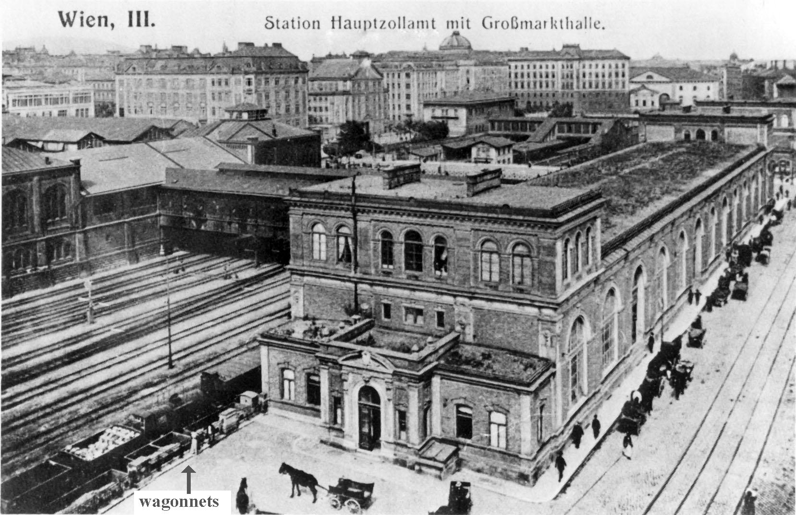
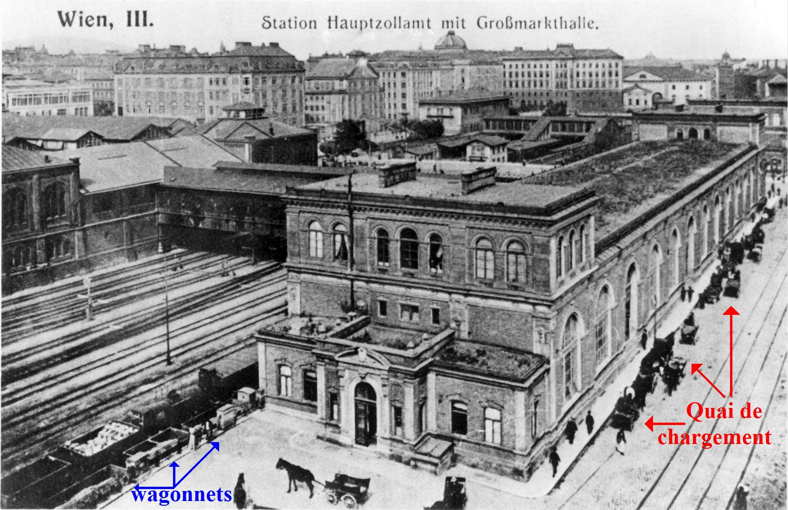
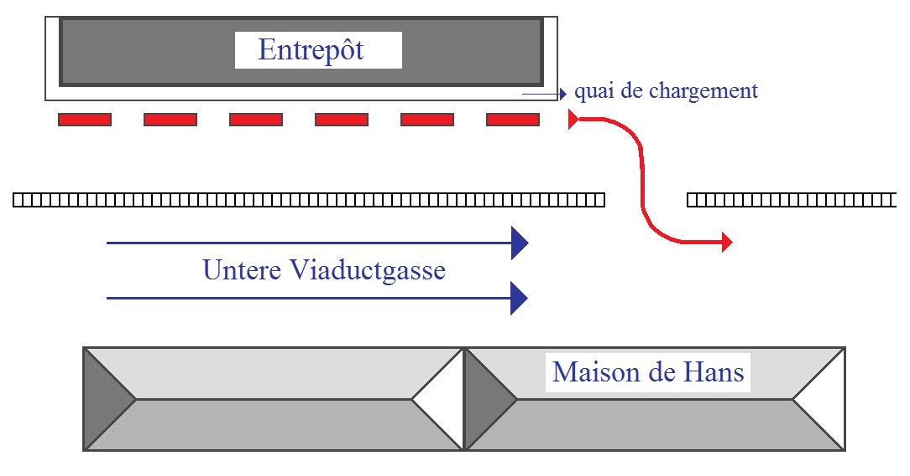
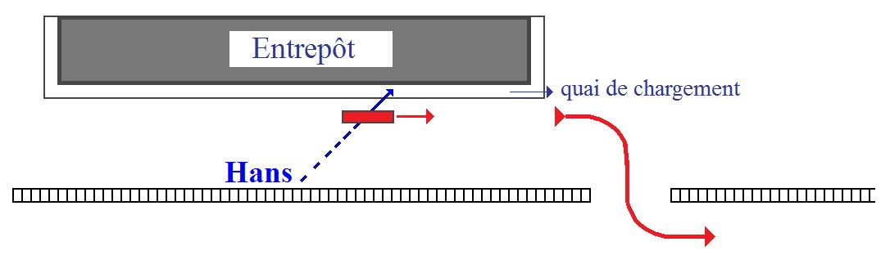

# Leçon 18 | 08 Mai 1957

  <label><input type="checkbox" data-lacan-toggle="original" checked> 原文</label>
  <label><input type="checkbox" data-lacan-toggle="notes" checked> 注释</label>
  <label><input type="checkbox" data-lacan-toggle="commentary" checked> 个人解读评论</label>

<section class="parallel-paragraph" data-paragraph-ids="s4-18-0001">

s4-18-0001

[无对应译文]

原文 · s4-18-0001

S’il fallait vous rappeler le caractère constitutif de l’incidence du *symbolique* dans le désir humain, il me semble qu’à défaut
d’une juste accommodation sur la plus commune et quotidienne expérience, une formule, un exemple tout à fait saisissant pourrait être trouvé dans la formule suivante dont *l’immédiateté, l’omniprésence* ne peut échapper à aucun :
qu’est-ce que peut vouloir dire, en termes de *coaptation instinctuelle*, comme on dit, la formulation de ce désir qui est peut-être
le plus profond de tous les désirs humains, le plus constant en tout cas, qui est difficile à méconnaître à tel ou tel tournant
de notre vie à chacun, et en tout cas de ceux auxquels nous accordons le plus d’attention, de ceux qui sont tourmentés
par quelque malaise subjectif qui s’appelle, pour le dire enfin : *le désir d’autre chose* ?

</section>

<section class="parallel-paragraph" data-paragraph-ids="s4-18-0002">

s4-18-0002

[无对应译文]

原文 · s4-18-0002

Qu’est-ce qu’il peut vouloir dire dans le registre de *la relation d’objet*…
conçue comme une sorte d’évolution, de développement mental, immanente à elle-même,
surgissant par une successive poussée qu’il ne s’agit que de favoriser
…de *la relation d’objet* comme référée à un objet typique, en quelque sorte préformé ? D’où peut venir ce *désir d’autre chose* ?

</section>

<section class="parallel-paragraph" data-paragraph-ids="s4-18-0003">

s4-18-0003

[无对应译文]

原文 · s4-18-0003

Cette remarque préliminaire, pour vous mettre - si on peut dire, comme s’exprime FREUD quelque part, à propos des milieux égyptiens, dans ses lettres - pour vous mettre dans la \[...\]. Nous reprenons les choses où nous les avons laissées,
c’est-à-dire au petit Hans. Ce que je viens de vous dire n’est d’ailleurs pas, bien entendu, sans rapport avec mon sujet.

</section>

<section class="parallel-paragraph" data-paragraph-ids="s4-18-0004">

s4-18-0004

[无对应译文]

原文 · s4-18-0004

En effet, que cherchons-nous à *détecter* jusqu’à présent, dans cette *fomentation mythique* qui nous paraît possible ? La caractéristique essen­tielle de l’observation de Hans, c’est de cela avant tout qu’il s’agit. Ce que j’appelle *fomentation mythique*, ce sont *ces différents éléments signifiants* dont je vous ai assez montré pour chacun l’ambiguïté, et combien ils sont essen­tiellement faits pour pouvoir recouvrir, nous dirons à peu près n’importe quel *signifié*, mais pas tous les signifiés, bien entendu, en même temps. Quand un
des *signifiants* retrouve tel élément du *signifié*, les autres éléments *signifiants* qui sont en cause en recouvrent d’autres. Autrement dit *la constellation signi­fiante opère par* *quelque chose* que nous pouvons appeler « *système de trans­formation »* ou *« mouvement tournant »*.

</section>

<section class="parallel-paragraph" data-paragraph-ids="s4-18-0005">

s4-18-0005

[无对应译文]

原文 · s4-18-0005

Ceci est, à regarder de plus près, quelque chose qui à chaque instant couvre d’une façon différente, et du même courant
semble exercer une action profondément remaniante sur ce qui est le *signifié*.

</section>

<section class="parallel-paragraph" data-paragraph-ids="s4-18-0006">

s4-18-0006

[无对应译文]

原文 · s4-18-0006

</section>

<section class="parallel-paragraph" data-paragraph-ids="s4-18-0007">

s4-18-0007

[无对应译文]

原文 · s4-18-0007

Pourquoi ceci ? Comment pouvons-nous concevoir la fonction dynamique de cette espèce d’opération de sorcière
dont l’instrument est le signifiant, et dont le but, la fin, le résultat doit être une réorientation, une repolarisation,
une reconstitution après une crise, du signifié ?

</section>

<section class="parallel-paragraph" data-paragraph-ids="s4-18-0008">

s4-18-0008

[无对应译文]

原文 · s4-18-0008

C’est ainsi que nous posons la question. C’est sous cet angle, que nous croyons qu’il s’impose de la poser pour la simple raison que si *la fomentation mythique*…
appelons-la d’un autre terme qui est plus courant, mais qui est exactement la même chose, encore que moins bien adapté
…*les théories infantiles de la sexualité* telles que nous les voyons, telles que nous nous y intéressons chez l’enfant.
Si nous nous y intéressons, c’est bien parce qu’elles ne sont pas sim­plement une espèce de superflu, de rêve inconsistant,

</section>

<section class="parallel-paragraph" data-paragraph-ids="s4-18-0009">

s4-18-0009

[无对应译文]

原文 · s4-18-0009

c’est bien parce qu’elles­-mêmes, en elles-mêmes, comportent un élément dynamique qui est à proprement parler ce quelque chose dont il s’agit dans l’observation de Hans, faute de quoi littéralement l’observation de Hans n’a aucune espèce de sens.

</section>

<section class="parallel-paragraph" data-paragraph-ids="s4-18-0010">

s4-18-0010

[无对应译文]

原文 · s4-18-0010

Cette fonction du signifiant, nous devons l’aborder sans idée préconçue sur cette observation là, parce qu’elle est plus exemplaire, mieux prise, mieux saisie en quelque sorte dans le miracle des origines, là où, si je puis dire, l’esprit de l’inventeur
et de ceux qui l’ont suivi n’a pas eu le temps encore de se relester de sortes d’éléments tabous, de la référence à un réel fondé
sur des préjugés qui nécessitent en quelque sorte, ou qui retrouvent je ne sais quel appui dans des références antérieures
qui sont précisément celles qui, par le champ qui vient d’être découvert, sont mises en cause, ébranlées, dévalorisées.

</section>

<section class="parallel-paragraph" data-paragraph-ids="s4-18-0011">

s4-18-0011

[无对应译文]

原文 · s4-18-0011

L’observation de Hans dans sa fraîcheur, garde encore toute sa puissance révélatrice, je dirais presque toute sa puissance explosive, et nous devons nous arrêter sur la façon dont Hans dans cette évolution complexe, est pris dans ce dialogue
avec le père qui joue à ce moment-là un rôle véritablement inséparable du progrès de la dite *fomentation mythique*.
On peut même dire que c’est à chacune des interventions du père que cette *fomentation mythique* en quelque sorte stimulée, rebondit, se met à repartir, à revégéter à nouveau. Mais, comme FREUD le remarque expressément quelque part,
elle a bien ses lois et ses nécessités propres.

</section>

<section class="parallel-paragraph" data-paragraph-ids="s4-18-0012">

s4-18-0012

[无对应译文]

原文 · s4-18-0012

Ce n’est pas toujours, et bien loin de là, ce qu’on attend que nous donne Hans, il apporte des choses qui surprennent,
et qu’en tout cas le père n’attend pas - si FREUD nous indique que lui, les a prévues - et il apporte aussi bien au-delà de ce que FREUD lui-même pouvait prévoir, puisque FREUD ne semble pas dissimuler que beaucoup d’éléments restent encore
en quelque sorte inexpliqués, à l’occasion ininterprétés. Mais avons-nous, nous-mêmes besoin qu’ils soient tous interprétés ? Nous pouvons quelquefois pousser un petit peu plus loin l’interprétation qu’ont faite les deux coopérants, le père et FREUD.

</section>

<section class="parallel-paragraph" data-paragraph-ids="s4-18-0013">

s4-18-0013

[无对应译文]

原文 · s4-18-0013

Ce que nous essayons de faire ici, ce sont les lois propres de la gravitation de la cohérence de *ce signifiant* groupé apparemment autour de ce *quelque chose* dont - FREUD nous le dit expres­sément - nous pourrions être tentés de qualifier la phobie,

</section>

<section class="parallel-paragraph" data-paragraph-ids="s4-18-0014">

s4-18-0014

[无对应译文]

原文 · s4-18-0014

par son objet, le cheval dans l’occasion, si nous ne nous apercevions que ce cheval va bien au-delà de ce qui paraît comme figure en quelque sorte prévalente, qui est beaucoup plus quelque chose comme une espèce de *figure héraldique* qui centre tout le champ, qui est lourde elle-même de toutes sortes d’implications, et ré-implications signi­fiantes avant tout.

</section>

<section class="parallel-paragraph" data-paragraph-ids="s4-18-0015">

s4-18-0015

[无对应译文]

原文 · s4-18-0015

Donc un certain nombre de *points de référence* sont nécessaires à marquer ce qui va être maintenant le progrès de notre chemin.
Il est clair que nous partons de ceci, et encore nous n’abordons absolument rien de nouveau puisque FREUD lui-même l’articule de la façon la plus expresse, après un dialogue qui est le premier dialogue où Hans avec son père commence à faire sortir de la phobie ce que j’appelle précisément ses implications *signifiantes*. À savoir tout ce que Hans est capable de construire autour, qui est riche de tout un aspect mythique ou même romanesque si vous voulez, d’une *fantasmatisation* qui n’est pas simplement du passé, mais aussi bien de ce qu’il voudrait faire avec le cheval, autour de ce cheval, de ce qui accompagne
et module sans aucun doute son angoisse, mais qui a aussi sa force propre de construction.

</section>

<section class="parallel-paragraph" data-paragraph-ids="s4-18-0016">

s4-18-0016

[无对应译文]

原文 · s4-18-0016

Après cet entretien, auquel nous allons venir maintenant, de Hans avec son père, FREUD indique à un autre moment
que la phobie ici prend plus de courage, elle se développe, elle montre ses diverses phases. Et FREUD écrit ceci :

</section>

<section class="parallel-paragraph" data-paragraph-ids="s4-18-0017">

s4-18-0017

[无对应译文]

原文 · s4-18-0017

> « *Ici nous avons l’expérience combien diffuse, et cette phobie va sur le cheval, mais aussi sur la voiture, mais aussi sur le fait*
>
> *que les chevaux tombent, et aussi sur le fait que les chevaux mordent, et sur des chevaux qui sont d’une certaine nature,*
>
> *mais aussi sur les voitures qui sont chargées ou pas… Disons tout bonnement que toutes ces particularités touchent le vif*
>
> *en ceci que l’angoisse originellement n’a absolument rien à faire avec le cheval ou les chevaux méchants, tellement qu’il sera transporté sur elle (la phobie du cheval), et que se fixera alors au lieu, non pas du cheval, mais du complexe du cheval,*
>
> *que là-dessus pourra donc se fixer et se transporter tout ce qui se montrera approprié à certains transferts*. » [^33]
>
> \[*Wir erfahren so, wie diffus sie eigentlich ist. Sie geht auf Pferde und auf Wagen, darauf, daß Pferde fallen, und daß sie beißen,*
>
> *auf Pferde besonderer Beschaffenheit, auf Wagen, die schwer beladen sind. Verraten wir gleich, daß alle diese Eigentümlichkeiten daher rühren, daß die Angst ursprünglich gar nicht den Pferden galt, sondern sekundär auf sie transponiert wurde und sich nun an den Stellen*
>
> *des Pferdekomplexes fixierte, die sich zu gewissen Übertragungen geeignet zeigten.*\]

</section>

<section class="parallel-paragraph" data-paragraph-ids="s4-18-0018">

s4-18-0018

[无对应译文]

原文 · s4-18-0018

C’est donc, de la façon la plus expressément formulée, dans FREUD.

</section>

<section class="parallel-paragraph" data-paragraph-ids="s4-18-0019">

s4-18-0019

[无对应译文]

原文 · s4-18-0019

Nous avons là deux pôles, le pôle qui est premier, qui est d’un signifiant, et ce signifiant va servir de support toute la série des *transferts*, c’est-à-dire à ce remaniement dans toutes les permutations possibles du signifié, qui en principe…
nous pouvons le supposer à titre d’hypothèse de travail,
et pour autant que c’est conforme à tout ce que notre expérience exige
…soit *différent* de ce qui était au début, c’est-à-dire que quelque chose se soit passé du côté du signifié.

</section>

<section class="parallel-paragraph" data-paragraph-ids="s4-18-0020">

s4-18-0020

[无对应译文]

原文 · s4-18-0020

Et ce quelque chose qui se passe du côté du signifié, je vous l’indique déjà, ce peut être quelque chose qui est absolument exigible : c’est que de par le signifiant, le champ du signifié se soit ou réorganisé, ou étendu d’une façon quelconque.
Et alors pourquoi le cheval ? Là dessus on peut broder : le cheval est un thème plutôt riche dans ce qui est de la mythologie, dans les légendes et les contes de fées de la mathé­matique onirique, dans ce qu’elle a de plus constant, de plus opaque,
que le cauchemar appellé « *jument de nuit* » \[« cauchemar », en anglais se dit « *nightmare* » : *jument de nuit* \].

</section>

<section class="parallel-paragraph" data-paragraph-ids="s4-18-0021">

s4-18-0021

[无对应译文]

原文 · s4-18-0021

Tout le livre de Monsieur JONES[^34] est centré là-dessus pour nous montrer à quel point il n’y a pas *simplement* là un hasard,
que « *jument de nuit* » n’est pas simplement la sorcière de nuit, l’apparition angoissante, que ce n’est pas un hasard si *la jument mère* vient là se substituer à la sorcière.

</section>

<section class="parallel-paragraph" data-paragraph-ids="s4-18-0022">

s4-18-0022

[无对应译文]

原文 · s4-18-0022

Là bien entendu, Monsieur JONES cherche - selon la bonne habitude - à trouver dans l’analyse *du côté du signifié*, ce qui l’amène
à trouver que tout est dans tout, et à nous montrer qu’il n’y a pas de jeu de *la mythologie antique*, ni même moderne, qui échappe au fait d’être par quelque côté *un cheval*. Et en effet, MARS, ODIN, ZEUS, tous ont des chevaux, il s’agit de savoir pourquoi.

</section>

<section class="parallel-paragraph" data-paragraph-ids="s4-18-0023">

s4-18-0023

[无对应译文]

原文 · s4-18-0023

Alors ils ont des chevaux, ils sont des chevaux, tout est en cheval dans ce livre. Il n’est évidemment pas difficile de montrer
à partir de là que la racine « MR » qui est à la fois *mère*, *mara*, et aussi bien *la mer* en français, est elle aussi une racine qui à elle toute seule comporte cette *signification* qui est d’autant plus facile à retrouver, qu’elle recouvre à peu près tout. Ce n’est pas évidemment par cette voie que nous procéderons, et nous n’irons pas à penser qu’il y a du côté du *cheval* toutes les implications.

</section>

<section class="parallel-paragraph" data-paragraph-ids="s4-18-0024">

s4-18-0024

[无对应译文]

原文 · s4-18-0024

Il va certainement du côté du cheval quelque chose qui comporte toutes sortes de *propensions analogiques* qui en font effectivement en tant qu’*image*, quelque chose qui peut être un réceptacle favorable à toutes sortes de *symbolisations* d’éléments naturels qui viennent au premier plan de la préoccupation infantile au tournant où nous voyons en effet le petit Hans.
L’accent que j’essaie ici de vous mettre - qui est toujours et partout omis - c’est que ce n’est pas cela l’essentiel.
L’essentiel est ceci : *un certain signifiant* est apporté à un moment critique de l’évolution du petit Hans, qui *va jouer un rôle* absolument *polarisant, recristallisant* d’une façon qui nous apparaît comme pathologique sans doute, mais qui assurément
est constituante de cette façon.

</section>

<section class="parallel-paragraph" data-paragraph-ids="s4-18-0025">

s4-18-0025

[无对应译文]

原文 · s4-18-0025

À ce moment-là le cheval se met à ponctuer le monde extérieur de ce que FREUD plus tard à propos de la phobie
du petit Hans, qualifiera de « *fonction de signal »*, signaux en effet qui restructurent à ce moment-là pour lui le monde,
profondément marqué de toutes sortes de *limites* dont nous avons maintenant à saisir la propriété et la fonction.
Qu’est-ce que veut dire que *ces limites* étant constituées, il se constitue du même coup *la possibilité, par le fantasme ou le désir*,
nous allons le voir, *d’une transgression de cette limite*, en *même temps* qu’un obstacle, une inhi­bition qui l’arrête en-deçà de cette *limite* ?

</section>

<section class="parallel-paragraph" data-paragraph-ids="s4-18-0026">

s4-18-0026

[无对应译文]

原文 · s4-18-0026

Ceci est fait avec cet élément qui est *un signifiant : le cheval*. Pour comprendre la fonction du cheval, la voie n’est pas de chercher de quel côté est *l’équivalent* du cheval : si c’est lui-même le petit Hans, ou la mère du petit Hans, ou le père du petit Hans,
car c’est successivement tout cela, et encore bien d’autres choses.

</section>

<section class="parallel-paragraph" data-paragraph-ids="s4-18-0027">

s4-18-0027

[无对应译文]

原文 · s4-18-0027

Cela peut être tout cela, cela peut être n’importe quoi de tout cela, pour autant que *le système signifiant*…
cohérent avec le cheval dans les successifs essais, disons que le petit Hans fait,
de les appliquer sur son monde pour le restructurer
…se trouve au cours de ces essais à tel ou tel moment toucher, recouvrir tel ou tel élément composant *majeur* du monde
du petit Hans, nommément son père, sa mère, lui-même, la petite Anna sa petite sœur, et les petits camarades,
les filles fantasmatiques, et bien d’autres choses. Ce dont il s’agit, c’est que d’abord nous devons considérer que le cheval,
quand il est introduit comme point central de la phobie, introduit un nouveau terme qui précisément a pour propriété
d’abord d’être un signifiant obscur.

</section>

<section class="parallel-paragraph" data-paragraph-ids="s4-18-0028">

s4-18-0028

[无对应译文]

原文 · s4-18-0028

Je dirais presque que le jeu de mots que je viens de faire en disant « *un signifiant* », vous pouvez le prendre d’une façon complète : il est par certains côtés « *insi­gnifiant* » c’est pour cela qu’il a sa fonction la plus profonde, qu’il joue ce rôle de *soc* qui va refendre d’une nouvelle façon *le réel*. Nous pouvons en concevoir la nécessité, car tout allait très bien jusque là pour le petit Hans.
C’est bien ce *quelque chose* - je pense vous l’avoir déjà suffisamment indiqué et je le répète ici - qui surgit avec l’apparition secondaire du cheval.

</section>

<section class="parallel-paragraph" data-paragraph-ids="s4-18-0029">

s4-18-0029

[无对应译文]

原文 · s4-18-0029

FREUD le souligne bien : peu de temps après l’apparition du signal diffus de l’angoisse, le cheval va entrer en fonction
et c’est par le développement de cette fonction, c’est par ce qui va se passer dans la suite - à savoir tout ce qu’on va faire
avec le cheval - et en le suivant à chaque instant et jusqu’au bout que nous pouvons arriver à comprendre ce qui s’est passé, quelle est *la fonction de ce signifiant* et de ce cheval.

</section>

<section class="parallel-paragraph" data-paragraph-ids="s4-18-0030">

s4-18-0030

[无对应译文]

原文 · s4-18-0030

Le petit Hans donc se trouve dans cette position *tout d’un coup* d’être dans une situation qui assurément est décompensée.
Et pourquoi est-il dans cette situation décompensée ? Tout semble, jusqu’à un certain moment qui est le 5 ou 6 Février 1908, c’est-à-dire à un trimestre environ avant sa cinquième année, tout semble fort bien supporté. Il y a quelque chose qui se produit à ce moment là.

</section>

<section class="parallel-paragraph" data-paragraph-ids="s4-18-0031">

s4-18-0031

[无对应译文]

原文 · s4-18-0031

Prenons-le un instant et aussi directement que possible dans les termes de références qui sont ceux que jusque-là nous voyons.
Le jeu se poursuit avec la mère sur la base de ce leurre de séduction qui est celui qui jusqu’alors a pleinement suffi
et dont je rappelle les termes : *le rapport d’amour avec la mère*, c’est ce qui *introduit l’enfant à la dynamique imaginaire* elle-même
dans laquelle peu à peu il s’initie, et dans laquelle, je dirais presque - pour introduire ici sous un nouvel angle le rapport au sein, j’entends au sens du giron - il s’insinue. Nous avons vu dans les débuts de l’observation ceci étalé à tout instant comme étant
le jeu même avec l’observation cachée que Hans fait là dans une sorte de perpétuel voilement ou dévoilement.

</section>

<section class="parallel-paragraph" data-paragraph-ids="s4-18-0032">

s4-18-0032

[无对应译文]

原文 · s4-18-0032

À la base de ses relations avec sa mère, *quelque chose* s’est produit qui est l’introduction de certains éléments réels.
Ce qui se poursuit jusque là sur la base du jeu, cette poursuite du dialogue autour du *présent* ou de *l’absent* *symboliques*,
est quelque chose dont tout d’un coup pour Hans toutes les règles sont violées, car il apparaît deux choses :
c’est au moment où Hans se trouve le plus en mesure de répondre «*cash»* au jeu, je veux dire de lui montrer enfin et pour de vrai, et dans *l’état le plus glorieux* sa petite verge, qu’à ce moment­ là il est rebuté. Sa mère lui dit littéralement, non seulement
que *c’est défendu*, mais que *c’est une petite cochonnerie*, que c’est quelque chose de répugnant et assurément nous ne pouvons pas
ne pas voir là un élément tout à fait essentiel.

</section>

<section class="parallel-paragraph" data-paragraph-ids="s4-18-0033">

s4-18-0033

[无对应译文]

原文 · s4-18-0033

FREUD d’ailleurs *souligne* que ces sortes de *contre-coups* de l’inter­vention dépréciative, sont quelque chose qui ne vient pas tout de suite. *Il souligne* littéralement ce terme que je m’exténue à répéter, à promouvoir au premier plan de la réflexion analytique
« *après coup* ». Il dit « *nachträgliche gehorsam » : nachträgliche : après coup, gehorsam : obéissance,* ce que veut dire *obéir*, *entendre* avant toute audience. Ce n’est pas tout de suite que ni de telles menaces, ni de telles rebuffades portent, elles portent après un temps.

</section>

<section class="parallel-paragraph" data-paragraph-ids="s4-18-0034">

s4-18-0034

[无对应译文]

原文 · s4-18-0034

Et aussi bien là, serais-je dans une position loin d’être partiale, apporterais-je aussi…
d’ailleurs FREUD le souligne bien, et non pas seulement entre les lignes
…un élément réel de comparaison : il a pu par des comparaisons entre *le grand* et *le petit*, situer à sa juste mesure le caractère réduit, infime, ridiculement insuffisant de l’organe en question.

</section>

<section class="parallel-paragraph" data-paragraph-ids="s4-18-0035">

s4-18-0035

[无对应译文]

原文 · s4-18-0035

C’est cet élément réel qui vient se surajouter et lester cette *rebuffade* qui déjà pour lui, met en branle jusqu’aux fondements même de l’édifice des relations avec sa mère. Ajouter à cela que la présence de la petite Anna est quelque chose qui d’abord a été pris dans diverses faces, les multiples angles des modes d’assimilation très divers sur lesquels il peut la prendre, mais qui aussi de plus en plus vient pour un instant témoigner qu’en quelque sorte un autre élément du jeu est bien *là présent*, qui peut mettre aussi en cause tout l’édifice, tous les principes, toutes les bases du jeu, et qui le rend lui-même, et même peut-être à l’occasion, *superflu*.

</section>

<section class="parallel-paragraph" data-paragraph-ids="s4-18-0036">

s4-18-0036

[无对应译文]

原文 · s4-18-0036

Ceux qui ont l’expérience de l’enfant savent bien que ce sont là des faits de l’expérience commune que l’analyse de l’enfant met tout le temps à notre portée. Pour l’instant ce qui nous occupe, c’est la façon dont ce signifiant va opérer au milieu de tout cela.
Que faut-il faire ? *Il faut aller aux textes* et faire de la construction. *Il faut savoir lire*.

</section>

<section class="parallel-paragraph" data-paragraph-ids="s4-18-0037">

s4-18-0037

[无对应译文]

原文 · s4-18-0037

Et quand nous voyons des choses qui se reproduisent d’une certaine façon avec tous les mêmes éléments, mais *en se recomposant* de façon différente, *il faut savoir les enregistrer*, et vous apercevoir que ceci n’a pas simplement une espèce de référence analogique lointaine, ne fait pas *allusion*, si on peut dire, à des *événements intérieurs* que nous extrapolons, que nous supposons chez le sujet,
ce n’est pas - comme nous le disons dans le langage ordinaire - *le symbole* de quelque chose qu’il est en train lui-même de cogiter, c’est bien autre chose.

</section>

<section class="parallel-paragraph" data-paragraph-ids="s4-18-0038">

s4-18-0038

[无对应译文]

原文 · s4-18-0038

Ce sont des lois qui manifestent cette structuration, non pas du *réel*, mais du *symbolique*, qui vont se mettre à jouer entre elles,
à opérer, si je puis dire, toutes seules d’une façon autonome, qu’il nous convient en tout cas pour un temps de considérer comme telles, de façon à nous apercevoir si en elle-même cette opération de remaniement, de restructuration est justement
ce quelque chose qui à l’occasion opère.

</section>

<section class="parallel-paragraph" data-paragraph-ids="s4-18-0039">

s4-18-0039

[无对应译文]

原文 · s4-18-0039

Je vais vous illustrer ce que je vais vous dire. Le 22 Avril, le père a - comme tous les dimanches, point essentiel - emmené
son petit Hans voir la grand-mère à Lainz. Le cœur de la ville de Vienne se situe au bord d’un bras du Danube.
C’est dans cette partie là de la ville intérieure cernée par les *Rings*, que se situe la maison des parents du petit Hans.
Derrière la maison se trouve le bureau des douanes, et un peu plus loin *la fameuse gare* dont on parle souvent dans l’observation, et devant vous avez la *Place du Minis­tère de la Guerre* et un très joli musée. \[*K.K. Österreichisches* Museum *für Kunst und Industrie*\]

</section>

<section class="parallel-paragraph" data-paragraph-ids="s4-18-0040">

s4-18-0040

[无对应译文]

原文 · s4-18-0040

C’est à cette gare que Hans pense aller quand il aura fait des progrès et sera arrivé à dépasser un certain champ qui se trouve devant la maison. Tout me laisse à penser que la maison se situe très au bout, car il fait une fois allusion au fait que tout près
de chez eux est la voie du *Nordbahn*, or le *Nordbahn* est de l’autre côté du canal du Danube. Il y a pas mal de petites organisations de chemins de fer dans Vienne : il y a tout ce qui arrive de l’Est, de l’Ouest, du Nord, du Sud, mais il y a en outre des quantités de petits chemins de fer locaux, en particulier une voie de ceinture en contre-bas, probablement celle dans laquelle s’est jetée
« *la jeune homosexuelle* » dont je vous ai parlé au début de cette année .

</section>

<section class="parallel-paragraph" data-paragraph-ids="s4-18-0041">

s4-18-0041

[无对应译文]

原文 · s4-18-0041

Mais deux voies nous intéressent pour ce qui est de l’aventure du petit Hans : il y a *un chemin de fer de liaison* qui a pour propriété de relier le *Nordbahn* à la gare de *Hauptzollamt* derrière le bloc de maisons, et où le petit Hans peut voir les wagonnets
\- les « *draisines* » comme s’exprime FREUD - sur lesquels le petit Hans convoite tellement d’aller.

</section>

<section class="parallel-paragraph" data-paragraph-ids="s4-18-0042">

s4-18-0042

[无对应译文]

原文 · s4-18-0042

</section>

<section class="parallel-paragraph" data-paragraph-ids="s4-18-0043">

s4-18-0043

[无对应译文]

原文 · s4-18-0043

Dans l’intervalle, il a touché à une autre gare. Et c’est ce chemin de fer, souterrain par endroits, qui s’en va vers *Lainz*.
Ce dimanche 22 avril, le père propose au petit Hans une route un petit peu plus compliquée que d’habitude.
Ils vont en effet faire une station à *Schönbrunn**,* sur le *Stadtbahn**,* qui est le « *Versailles viennois* », et où se trouve le jardin zoologique où va le petit Hans avec son père, et qui joue un rôle si important dans l’observation. Mais un *Versailles* beaucoup moins grandiose, la dynastie des HABSBOURG était probablement beaucoup plus près de son peuple que celle des BOURBON,
parce qu’on voit très bien que même à une époque où la ville était beaucoup moins étendue, l’horizon est là tout près.

</section>

<section class="parallel-paragraph" data-paragraph-ids="s4-18-0044">

s4-18-0044

[无对应译文]

原文 · s4-18-0044

Après la visite du parc de *Schönbrunn*, ils reprendront un tramway à vapeur - *le tramway 60* à l’époque - qui les emmènera à *Lainz*, pour vous donner un ordre de grandeur *Lainz* est à peu près la même distance de Vienne, que Vaucresson de Paris,
et qui continue jusqu’à *Mauer* et *Mödling**.* Quand ils vont directement chez la grand-mère, ils prennent un tramway
qui passe beaucoup plus au Sud et qui arrive directement.

</section>

<section class="parallel-paragraph" data-paragraph-ids="s4-18-0045">

s4-18-0045

[无对应译文]

原文 · s4-18-0045

*Une autre ligne de tramways* relie cette ligne directe et le *Stadt­bahn*, qui est *le fameux Sankt Veit*. Ceci vous permettra de comprendre ce que voudra dire le petit Hans le jour où il aura *un fantasme* de départ de *Lainz* pour revenir à la maison, quand il dira
que le train est parti avec lui et sa grand-mère, et que le père qui l’a raté, peut avoir le second train arrivé de *Sankt Veit*.
Ce réseau forme donc *une boucle virtuelle*, car les deux lignes ne communiquent pas, elles permettent simplement, les deux,
de rejoindre *Lainz*. Quelques jours après, dans une conversation avec son père, le petit Hans va produire quelque chose
qui se classe parmi ces nombreuses choses dont le petit Hans nous témoigne d’avoir pensées. Même quand on veut absolument lui faire dire *qu’il l’a rêvé*, il souligne bien qu’il s’agit *de choses qu’il a pensées*.

</section>

<section class="parallel-paragraph" data-paragraph-ids="s4-18-0046">

s4-18-0046

[无对应译文]

原文 · s4-18-0046

\[« Ich - *Hast du von den Giraffen geträumt ?*
Er - *Nein, nicht geträumt; ich hab’ mir’s gedacht … - das Ganze hab’ ich mir gedacht - aufgekommen war ich schon früher* ».\]

</section>

<section class="parallel-paragraph" data-paragraph-ids="s4-18-0047">

s4-18-0047

[无对应译文]

原文 · s4-18-0047

Le point essentiel où intervient d’une certaine façon le *Verkehrkomplex*, FREUD nous l’indique lui-même quelque part :

</section>

<section class="parallel-paragraph" data-paragraph-ids="s4-18-0048">

s4-18-0048

[无对应译文]

原文 · s4-18-0048

« *Nous pouvons voir* - dit-il - *qu’il est tout à fait naturel qu’au point où les choses en sont, ce qui se rapporte au cheval*
*et à tout ce que le cheval va faire, au rôle du cheval, s’étend beaucoup plus loin dans le système des transports* ».

</section>

<section class="parallel-paragraph" data-paragraph-ids="s4-18-0049">

s4-18-0049

[无对应译文]

原文 · s4-18-0049

En d’autres termes, à l’horizon que dessinent les circuits du cheval, il y a les circuits du chemin de fer.
Et c’est tellement vrai et évident que la première explication que donne Hans à son père quand il s’agit de lui donner les détails du vécu de sa phobie, c’est quelque chose qui est lié au fait que devant sa maison il y a une cour et une allée très large.
On comprend pourquoi c’est toute une affaire pour le petit Hans de les traverser. Devant la maison les chariots attelés viennent charger et décharger, ils se rangent le long d’une rampe de déchargement.

</section>

<section class="parallel-paragraph" data-paragraph-ids="s4-18-0050">

s4-18-0050

[无对应译文]

原文 · s4-18-0050

</section>

<section class="parallel-paragraph" data-paragraph-ids="s4-18-0051">

s4-18-0051

[无对应译文]

原文 · s4-18-0051

 

</section>

<section class="parallel-paragraph" data-paragraph-ids="s4-18-0052">

s4-18-0052

[无对应译文]

原文 · s4-18-0052

La tangence, si on peut dire, du *système circuit du cheval*, avec le *système circuit du chemin de fer*, est indiquée de la façon la plus claire
la première fois que le petit Hans commence un peu à s’expliquer sur *la phobie du cheval*. Que dit le petit Hans ?

</section>

<section class="parallel-paragraph" data-paragraph-ids="s4-18-0053">

s4-18-0053

[无对应译文]

原文 · s4-18-0053

Le petit Hans dit ceci : « *Une chose que j’aimerais follement faire, ce serait de grimper sur la voiture*... » Où il a vu des gamins jouer,
et sur les sacs et les colis, il passerait vite, et il pourrait aller sur *la planche* qui est la rampe de déchargement.

</section>

<section class="parallel-paragraph" data-paragraph-ids="s4-18-0054">

s4-18-0054

[无对应译文]

原文 · s4-18-0054

De quoi a-t-il peur ?
Que les chevaux se mettent en marche et l’empêchent de faire cette petite chose rapide, et puis vite de redescendre.

</section>

<section class="parallel-paragraph" data-paragraph-ids="s4-18-0055">

s4-18-0055

[无对应译文]

原文 · s4-18-0055

Cela doit quand même avoir un sens. Je crois que pour comprendre ce sens, comme pour comprendre quoi que ce soit

</section>

<section class="parallel-paragraph" data-paragraph-ids="s4-18-0056">

s4-18-0056

[无对应译文]

原文 · s4-18-0056

dans le système de fonction­nement signifiant, en cette occasion il ne faut pas partir de l’idée :

</section>

<section class="parallel-paragraph" data-paragraph-ids="s4-18-0057">

s4-18-0057

[无对应译文]

原文 · s4-18-0057

- *Qu’est-ce que* peut bien faire *la planche dans tout cela ?*

</section>

<section class="parallel-paragraph" data-paragraph-ids="s4-18-0058">

s4-18-0058

[无对应译文]

原文 · s4-18-0058

- *Qu’est-ce que* peut bien être la voiture ?

</section>

<section class="parallel-paragraph" data-paragraph-ids="s4-18-0059">

s4-18-0059

[无对应译文]

原文 · s4-18-0059

- *Qu’est-ce que* peut bien être le cheval ?

</section>

<section class="parallel-paragraph" data-paragraph-ids="s4-18-0060">

s4-18-0060

[无对应译文]

原文 · s4-18-0060

Le cheval est assurément quelque chose, et nous pourrons dire à la fin, quand nous le saurons d’après son fonctionnement,
à quoi il a pu servir. Mais nous ne pouvons encore rien en savoir, nous devons nous arrêter, à ce cheval, le père s’y arrête,
tout le monde s’y arrête, sauf les analystes qui relisent indéfiniment l’observation du petit Hans en cherchant à y lire autre chose. Le père, lui, s’y intéresse et lui demande pourquoi il a peur :

</section>

<section class="parallel-paragraph" data-paragraph-ids="s4-18-0061">

s4-18-0061

[无对应译文]

原文 · s4-18-0061

- «* Serait-ce par exemple parce que tu ne pourrais pas revenir ? *»

</section>

<section class="parallel-paragraph" data-paragraph-ids="s4-18-0062">

s4-18-0062

[无对应译文]

原文 · s4-18-0062

- « *Oh !* - dit le petit Hans - *pas du tout, je sais très bien où j’habite, je saurais toujours le dire et on me ramènerait. Je reviendrais peut-être même avec la voiture.* »

</section>

<section class="parallel-paragraph" data-paragraph-ids="s4-18-0063">

s4-18-0063

[无对应译文]

原文 · s4-18-0063

Il n’y a pas de difficulté. Personne ne semble s’arrêter à cela, mais il est frappant que Hans ait peur de quelque chose, et que ce quelque chose ne soit pas du tout simplement ce qui irait si bien. Cela pourrait même aller dans le sens de ce vers quoi je pense essayer de vous amorcer la compréhension des choses, d’être en effet entraîné par la situation. Ce serait une belle métaphore.
Pas du tout, il sait très bien qu’il reviendra toujours à son point de départ, au point que si nous avons un tout petit peu
de comprenoire, nous pouvons nous douter que c’est peut-être cela après tout qui est en cause, c’est-à-dire qu’en effet
quoi qu’on fasse, on ne puisse pas en sortir. C’est une simple indication que je vous fais en passant, mais ce serait peut-être
faire preuve de subtilité et de pas assez de rigueur.

</section>

<section class="parallel-paragraph" data-paragraph-ids="s4-18-0064">

s4-18-0064

[无对应译文]

原文 · s4-18-0064

Il faut nous apercevoir qu’il y a des situations qui ne peuvent pas - dans l’observation - ne pas être rapprochées de celle-là

</section>

<section class="parallel-paragraph" data-paragraph-ids="s4-18-0065">

s4-18-0065

[无对应译文]

原文 · s4-18-0065

dont nous voyons bien main­tenant qu’il faut nous y arrêter, parce que c’est la phénoménologie même de la phobie.
Nous voyons là la totale ambiguïté de ce qui est désiré et de ce qui est craint. En fin de compte nous pourrions croire
qu’en effet c’est le fait d’être entraîné, de partir, qui angoisse le petit Hans. Mais d’après ses propres témoi­gnages, ce fait de partir est tout à fait en deçà puisqu’il sait très bien qu’on revient toujours, et par conséquent que peut en effet vouloir dire
qu’il veuille en quelque sorte aller au-delà ?

</section>

<section class="parallel-paragraph" data-paragraph-ids="s4-18-0066">

s4-18-0066

[无对应译文]

原文 · s4-18-0066

Assurément déjà cette formule « *qu’il veuille aller au-delà* », c’est quelque chose que provisoirement nous pouvons, nous,

</section>

<section class="parallel-paragraph" data-paragraph-ids="s4-18-0067">

s4-18-0067

[无对应译文]

原文 · s4-18-0067

tenir dans une sorte de construc­tion minimum. Si en effet tout est - dans son système - dans un certain désarroi
du fait qu’on ne respecte plus les règles du jeu, il peut se sentir purement et simplement pris dans une situation intenable, l’élément le plus intenable de la situation étant de ne plus savoir, lui, où se situer.

</section>

<section class="parallel-paragraph" data-paragraph-ids="s4-18-0068">

s4-18-0068

[无对应译文]

原文 · s4-18-0068

Je vais donc maintenant vous rapprocher des autres éléments qui, d’une certaine façon, reproduisent ce qui est indiqué
dans le fantasme de la crainte phobique. Le petit Hans va partir avec les chevaux, et la planche de déchar­gement va s’éloigner,

</section>

<section class="parallel-paragraph" data-paragraph-ids="s4-18-0069">

s4-18-0069

[无对应译文]

原文 · s4-18-0069

et il va revenir, reconfluer - ce qui est trop désiré ou trop craint, qui sait ? - avec sa maman.
Quand nous avons lu et relu l’observation, nous devons nous souvenir de *deux autres histoires* au moins. Il s’agit d’abord
d’un fantasme qui ne vient pas à n’importe quel moment, et qui est censé se passer - il a imaginé tout le reste - avec son père.
Cette fois-ci c’est aussi sur une voie de chemin de fer, mais on est dans un wagon, et il est avec son père.
Ils arrivent à la station de *Gmünden* où ils vont passer leurs vacances d’été, ils rassemblent donc leurs affaires et ils se vêtent.

</section>

<section class="parallel-paragraph" data-paragraph-ids="s4-18-0070">

s4-18-0070

[无对应译文]

原文 · s4-18-0070

Il semble que le rassemblement et l’embarquement des bagages à une époque peut-être moins dégagée que la nôtre, ait toujours repré­senté une sorte de souci. FREUD lui-même dans *l’observation de l’homosexuelle* en fait état comme de termes de comparaison :

</section>

<section class="parallel-paragraph" data-paragraph-ids="s4-18-0071">

s4-18-0071

[无对应译文]

原文 · s4-18-0071

- la première étape de l’analyse correspond au rassemblement des bagages,

</section>

<section class="parallel-paragraph" data-paragraph-ids="s4-18-0072">

s4-18-0072

[无对应译文]

原文 · s4-18-0072

- la seconde à leur embarquement dans le train.
  Hans et son père n’ont pas le temps de se rhabiller que le train repart.

</section>

<section class="parallel-paragraph" data-paragraph-ids="s4-18-0073">

s4-18-0073

[无对应译文]

原文 · s4-18-0073

Puis il y a *le 3ème fantasme* que Hans rapporte à son père le 21 Avril, et *que nous appellerons « la scène du quai* ». Cette « *scène du quai* »
se situe juste avant ce que nous appellerons « *le grand dialogue avec le père* » étiquettes conventionnelles destinées à se repérer par
la suite. Hans a pensé qu’il partait de *Lainz* avec la grand–mère, cette femme que l’on va voir avec le père tous les dimanches, dont on ne nous dit absolument rien dans toute l’observation, et je dois dire que cela laisse fort à penser du caractère redoutable de la dame, car c’était à une époque où il était beaucoup plus facile qu’à moi de situer toute la famille.

</section>

<section class="parallel-paragraph" data-paragraph-ids="s4-18-0074">

s4-18-0074

[无对应译文]

原文 · s4-18-0074

La *lainzoise* comme l’appelle le petit Hans, est censée s’être embarquée avec lui dans le train, *avant que le père ait réussi à descendre*
*de la passerelle*, et ils sont partis. Et comme il passe souvent des trains, et que l’on voit la ligne jusqu’à *Sankt Veit*, le petit Hans raconte qu’il arrive sur le quai à temps pour prendre le second train avec son père. *Comment le petit Hans, qui était déjà parti,*
*est-il revenu ?* C’est bien là l’impasse. À la vérité c’est une impasse que personne ne réussit à élucider, mais ces questions,
le père se les pose. Dans l’observation on consacre douze lignes à ce qui a bien pu se passer dans l’esprit du petit Hans.

</section>

<section class="parallel-paragraph" data-paragraph-ids="s4-18-0075">

s4-18-0075

[无对应译文]

原文 · s4-18-0075

Quant à nous, conten­tons-nous de nos schémas :

</section>

<section class="parallel-paragraph" data-paragraph-ids="s4-18-0076">

s4-18-0076

[无对应译文]

原文 · s4-18-0076

- *dans le* 1er *schéma* on part à deux avec la grand’maman,

</section>

<section class="parallel-paragraph" data-paragraph-ids="s4-18-0077">

s4-18-0077

[无对应译文]

原文 · s4-18-0077

- *dans le* 2ème *schéma*, mystérieusement c’est la voie de l’im­possible, de la non-solution,

</section>

<section class="parallel-paragraph" data-paragraph-ids="s4-18-0078">

s4-18-0078

[无对应译文]

原文 · s4-18-0078

- *puis dans le* 3ème *on finit par repartir à deux avec le père*.

</section>

<section class="parallel-paragraph" data-paragraph-ids="s4-18-0079">

s4-18-0079

[无对应译文]

原文 · s4-18-0079

En d’autres termes, nous voyons à ce propos quelque chose qui ne peut pas manquer de nous frapper si l’on connaît en gros déjà les deux pôles de l’observation du petit Hans :

</section>

<section class="parallel-paragraph" data-paragraph-ids="s4-18-0080">

s4-18-0080

[无对应译文]

原文 · s4-18-0080

- *au départ tout ce drame maternel évident*, sans cesse souligné,

</section>

<section class="parallel-paragraph" data-paragraph-ids="s4-18-0081">

s4-18-0081

[无对应译文]

原文 · s4-18-0081

- *et à la fin je suis maintenant avec le père*.

</section>

<section class="parallel-paragraph" data-paragraph-ids="s4-18-0082">

s4-18-0082

[无对应译文]

原文 · s4-18-0082

On ne peut tout de même pas ne pas voir qu’il doit y avoir un certain rapport entre cet aller et retour implacable vers *la mère*,
et le fait qu’un beau jour au moins on rêve de repartir d’un bon pas avec *le père*, c’est une simple indication mais elle est en clair,
à ceci près que c’est tout à fait *impossible*, c’est-à-dire qu’on ne voit absolument pas comment le petit Hans - puisqu’il est déjà parti en avant avec la grand’mère - peut repartir avec le père. Cela n’est possible que dans *l’imaginaire*.

</section>

<section class="parallel-paragraph" data-paragraph-ids="s4-18-0083">

s4-18-0083

[无对应译文]

原文 · s4-18-0083

Autrement dit ce que nous voyons apparaître là comme en filigrane, c’est ce schéma fondamental que je vous ai dit être celui
de tout progrès mythique :

</section>

<section class="parallel-paragraph" data-paragraph-ids="s4-18-0084">

s4-18-0084

[无对应译文]

原文 · s4-18-0084

- qu’on part d’*un impossible* ou d’*une impasse*,

</section>

<section class="parallel-paragraph" data-paragraph-ids="s4-18-0085">

s4-18-0085

[无对应译文]

原文 · s4-18-0085

- pour arriver à *une autre impasse* et à *une autre impossibilité*.

</section>

<section class="parallel-paragraph" data-paragraph-ids="s4-18-0086">

s4-18-0086

[无对应译文]

原文 · s4-18-0086

Dans le premier cas, il *est impossible de sortir de cette mère*, on y revient toujours : « *Ne me dis pas que c’est pour cela que je suis anxieux* ».
Dans l’autre cas on peut bien en effet penser qu’il n’y a qu’à permuter et partir avec le père, comme Hans lui-même le pensait
au point même de l’écrire au Professeur - ce qui est *le meilleur usage que l’on puisse faire de ses pensées* \[*sic*\] - seulement il apparaît également dans le texte du mythe que c’est impossible, qu’il y a toujours quelque part quelque chose qui baille.

</section>

<section class="parallel-paragraph" data-paragraph-ids="s4-18-0087">

s4-18-0087

[无对应译文]

原文 · s4-18-0087

Si nous partons de *ce schéma*, nous verrons que ça ne se limite pas à ces éléments qui en quelque sorte nous donnent
tout à fait facilement et par eux-­mêmes l’occasion de les rapprocher de *ce schéma de l’attelage* : avec qui est­-on attelé ?
C’est quelque chose qui est assurément l’un des éléments absolument premiers de l’apparition du choix du signifiant du cheval, ou de son utilisation. Ici la direction dans laquelle se fait le couplage est absolument inutile à discerner, le sens dans lequel Hans opère est aussi bien dicté par les occasions favorables que lui fournit la fonction cheval, et nous pouvons dire que cela a guidé pour lui le choix du cheval.

</section>

<section class="parallel-paragraph" data-paragraph-ids="s4-18-0088">

s4-18-0088

[无对应译文]

原文 · s4-18-0088

En tout cas lui-même prend soin de nous en montrer l’origine quand il nous dit à quel moment - c’est également un *moment*
*de dialogue* avec le père, qui n’est pas plus que les autres n’importe lequel - où il dit à son père à quel moment
il pense *avoir attrapé la bêtise*, c’est-à-dire le 9 Avril. Nous verrons à la suite de quoi ceci est venu. Il nous dit qu’il jouait au cheval et qu’il s’est passé quelque chose qui a une très grande importance, à savoir ce qui donne le premier modèle de quelque chose qui sera retrouvé ensuite, à savoir le fantasme de la blessure. Il est arrivé que ce fantasme se manifeste plus tard à propos
de son père, mais qui d’abord a été extrait du réel, précisément dans l’un de ces jeux de cheval.

</section>

<section class="parallel-paragraph" data-paragraph-ids="s4-18-0089">

s4-18-0089

[无对应译文]

原文 · s4-18-0089

Son père lui demande comment était le cheval à ce moment-là : était-il attelé à une voiture ?

</section>

<section class="parallel-paragraph" data-paragraph-ids="s4-18-0090">

s4-18-0090

[无对应译文]

原文 · s4-18-0090

« *Pas forcément* - répond Hans - *le cheval peut être sans voiture, et dans ce cas la voiture est à la maison*
*ou au contraire il peut être attelé à une voiture.* »

</section>

<section class="parallel-paragraph" data-paragraph-ids="s4-18-0091">

s4-18-0091

[无对应译文]

原文 · s4-18-0091

Hans articule lui-même que d’abord et avant tout le cheval est un élément fait pour être attelé, amovible, attachable.
Ce caractère, si on peut dire, d’*ambocepteur* que nous allons retrouver tout le temps dans le fonctionnement du cheval,
est donné dans l’expérience première d’où Hans l’extrait. Le cheval avant d’être un cheval, est quelque chose qui lie,
qui coordonne et, vous allez le voir, c’est bien précisément dans cette fonction de médiation que tout au long du développement du mythe ancien, nous allons retrouver le cheval, et s’il en était besoin, pour asseoir ce qui va être confirmé de toutes parts
dans ce qu’ensuite je vais vous développer dans cette fonction du signifiant du cheval.

</section>

<section class="parallel-paragraph" data-paragraph-ids="s4-18-0092">

s4-18-0092

[无对应译文]

原文 · s4-18-0092

Nous avons tout de suite, de la bouche de Hans lui-même, l’indication que c’est dans ce sens de coordination grammaticale
du signifiant, qu’il s’agit d’aller, car c’est à ce moment-là même, au moment où il articule ceci à propos du cheval, que Hans
lui-même dit : « *J’ai attrapé la bêtise* ». Le terme « *attrapé* » sert tout le temps, pas non plus à propos de n’importe quoi, mais
à propos de « *la bêtise* », et tout le temps à propos *d’attraper des enfants* quand on dit littéralement qu’une femme « *attrape un enfant* ».

</section>

<section class="parallel-paragraph" data-paragraph-ids="s4-18-0093">

s4-18-0093

[无对应译文]

原文 · s4-18-0093

Ceci non plus je ne l’extrais pas de quelque chose qui soit passé inaperçu des auteurs, à savoir du père et de FREUD :
il y a une grande note de FREUD là dessus, et tout le monde s’y intéresse, au point que cela fait une petite difficulté
pour le traducteur qui pour une fois a été résolue très élégamment. \[p. 133\]

</section>

<section class="parallel-paragraph" data-paragraph-ids="s4-18-0094">

s4-18-0094

[无对应译文]

原文 · s4-18-0094

Hans dit : « *C’est tout le temps à cause du cheval…* » \[*wegen dem pferd*\].Il évoque en quelque sorte cette rengaine : qu’il a *attrapé la bêtise.*

</section>

<section class="parallel-paragraph" data-paragraph-ids="s4-18-0095">

s4-18-0095

[无对应译文]

原文 · s4-18-0095

Et FREUD ne peut pas s’y tromper d’identifier ce fait qu’une association de mots peut se faire entre *wegen* et *wägen,* le pluriel
de *wagen* qui veut dire *voiture*, *et de dire que c’est ainsi que fonctionne l’inconscient*.

</section>

<section class="parallel-paragraph" data-paragraph-ids="s4-18-0096">

s4-18-0096

[无对应译文]

原文 · s4-18-0096

> \[« *Ich erläutere, Hans will nicht behaupten, daß er damals die Dummheit gekriegt hat, sondern im Zusammenhange damit. Es muß ja wohl so zugehen, die Theorie fordert es, daß dasselbe einmal Gegenstand einer hohen Lust war, was heute das Objekt der Phobie ist. Und dann ergänze ich für ihn, was das Kind ja nicht zu sagen weiß, daß das Wörtchen » wegen« der Ausbreitung der Phobie vom Pferde auf die Wagen (oder wie Hans zu hören und zu sprechen gewohnt ist: Wägen) den Weg eröffnet hat. Man darf nie daran vergessen, um wieviel dinglicher das Kind die Worte behandelt als der Erwachsene, wie bedeutungsvoll ihm darum Wortgleichklänge sind.* »
>
> « *Je dois expliquer que Hans ne veut pas dire qu’il a alors attrapé la bêtise, mais que tout ceci est en connexion avec la bêtise. Il doit donc en être ainsi, car la théorie exige que ce qui est aujourd’hui l’objet d’une phobie ait été auparavant celui d’un vif plaisir, et je compléterai ici ce que l’enfant était incapable d’exprimer : que le terme « à cause de » a ouvert la voie à l’extension de la phobie des chevaux aux « voitures ». Il ne faut jamais oublier que l’enfant traite les mots de façon bien plus concrète que ne le fait l’adulte, ce qui donne pour lui aux consonances verbales une tout autre importance. Wegen (à cause de), Wagen (voiture). »*
>
> (Au lieu de « Wegen dem Pferd » (à cause du cheval) en allemand, où Wegen = Wagen = voitures au pluriel,
>
> nous avons transcrit « vois-tu le cheval » afin de rendre en français le calembour.) (N. d. T.) » Puf 1954\]

</section>

<section class="parallel-paragraph" data-paragraph-ids="s4-18-0097">

s4-18-0097

[无对应译文]

原文 · s4-18-0097

En d’autres termes, *le cheval traîne la voiture* exactement de la même façon que le *quelque chose* qui traîne derrière soi le mot *wegen**.*

</section>

<section class="parallel-paragraph" data-paragraph-ids="s4-18-0098">

s4-18-0098

[无对应译文]

原文 · s4-18-0098

Il n’y a donc abso­lument rien d’abusif à nous apercevoir que c’est précisément au moment où Hans est en proie à quelque chose qui n’est même pas un pourquoi…
car au-­delà du point où les règles du jeu sont respectées,
il n’y a plus que le trouble, le manque d’être, le manque de pourquoi
…que Hans à ce moment là fait en quelque sorte traîner son *parce que*, qui ne répond à rien, par *quelque chose* qui est justement
ce x pur et simple qu’est *le cheval*.

</section>

<section class="parallel-paragraph" data-paragraph-ids="s4-18-0099">

s4-18-0099

[无对应译文]

原文 · s4-18-0099

En d’autres termes, nous nous trouvons là à la naissance, au point même où surgit la phobie, devant le processus typique
de *la métonymie*, c’est-à-dire le passage du poids du sens - plus exactement de l’interrogation que comporte le propos -
le passage d’un point du texte, de la *ligne* textuelle, au point qui suit.

</section>

<section class="parallel-paragraph" data-paragraph-ids="s4-18-0100">

s4-18-0100

[无对应译文]

原文 · s4-18-0100

La définition de *la métonymie* est essentiellement, et dans sa structure, ceci : c’est parce que le poids de ce *wegen* est entièrement voilé et transféré à ce qui est juste à la suite : *dem Pferd, le cheval*, que le terme prend *sa valeur* *articulatoire*, à ce moment assume
en lui tous *les espoirs de solution*. Toute *la béance* de la situation de Hans à ce moment-là est attachée autour d’un transfert
de *poids grammatical* de cette même chose après tout où vous ne faites en fin de compte que retrouver les *associations concrètes*,
et non pas imaginées dans je ne sais quel hyper­espace psychologique, *associations* dont nous avons deux espèces :

</section>

<section class="parallel-paragraph" data-paragraph-ids="s4-18-0101">

s4-18-0101

[无对应译文]

原文 · s4-18-0101

- l’*association métaphorique* qui à un mot répond par un autre qui peut lui être substitué.

</section>

<section class="parallel-paragraph" data-paragraph-ids="s4-18-0102">

s4-18-0102

[无对应译文]

原文 · s4-18-0102

- l’*association métonymique* qui à un mot donne le mot suivant qui peut venir dans une phrase.

</section>

<section class="parallel-paragraph" data-paragraph-ids="s4-18-0103">

s4-18-0103

[无对应译文]

原文 · s4-18-0103

Vous avez les deux espèces de *réponse* dans l’expérience psychologique, et vous appelez cela « *association »* parce que vous voulez absolument que ça se passe quelque part dans les neurones cérébraux. Mais moi je n’en sais rien, en tout cas en tant qu’analyste, je ne veux rien en savoir. Je les trouve, ces deux différents types d’*associations* qui s’appellent « *la métaphore »* et « *la métonymie »*,
là où elles sont dans le texte de ce *bain de langage* dans lequel Hans est immergé, et dans lequel il a trouvé *la métonymie originelle*
qui apporte le premier terme, ce cheval autour duquel va se reconstituer tout son *système*.

</section>

<section class="note-block original-notes">

## Notes

[^33]: S. Freud : Cinq psychanalyses, PUF 1954, donnait : « *Nous apprenons ainsi à voir combien elle est en réalité diffuse. Elle se porte sur des chevaux et des voitures,*

    *sur le fait que des chevaux tombent et qu'ils mordent, sur des chevaux d'une nature spéciale, sur des voitures qui sont lourdement chargées. Nous pouvons dès maintenant révéler*

    *que toutes ces particularités dérivent de ce que l'angoisse originairement n'avait rien à voir avec les chevaux, mais fut transposée secondai­rement sur ceux-ci et se fixa alors*

    *sur les éléments du complexe des chevaux qui se montrèrent propres à certains transferts.* »

[^34]: Ernest Jones : « *Le cauchemar* » (*On the nightmare*, 1931), éd. Payot Rivages, 2002.

</section>
