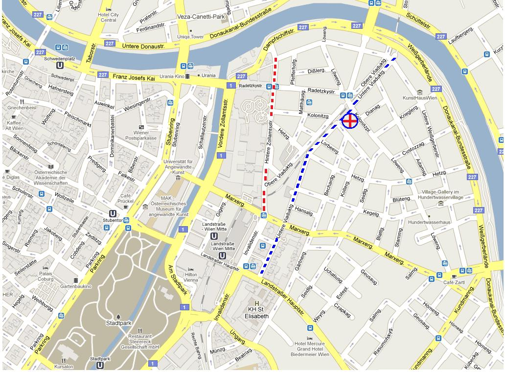

# Leçon 19 | 15 Mai 1957

  <label><input type="checkbox" data-lacan-toggle="original" checked> 原文</label>
  <label><input type="checkbox" data-lacan-toggle="notes" checked> 注释</label>
  <label><input type="checkbox" data-lacan-toggle="commentary" checked> 个人解读评论</label>

<section class="parallel-paragraph" data-paragraph-ids="s4-19-0001">

s4-19-0001

[无对应译文]

原文 · s4-19-0001

Nous voici donc arrivés à ce moment dans l’espace temporel, et pas for­cément à confondre avec la distance chronologique,

</section>

<section class="parallel-paragraph" data-paragraph-ids="s4-19-0002">

s4-19-0002

[无对应译文]

原文 · s4-19-0002

qui se joue entre le 5 et le 6 Avril. C’est le 5 que nous avons suivi l’explication par le petit Hans à son père de *fantasmes* qu’il forge où il exprime son envie de *faire une grimpette sur la voiture* qui habituellement est en train de se faire décharger devant la maison.

</section>

<section class="parallel-paragraph" data-paragraph-ids="s4-19-0003">

s4-19-0003

[无对应译文]

原文 · s4-19-0003

Je rappelle que nous avons insisté sur l’ambiguïté, à la simple perspective de *la crainte de la séparation*, de l’angoisse à laquelle Hans donne forme dans ce fantasme, et nous avons pointé cette remarque qu’assurément ce n’est pas forcément d’être séparé
de sa mère qu’il s’agit, ce n’est pas tellement cela qu’il redoute puisque devant la question de son père,
il précise lui-même qu’il est bien sûr, et presque trop sûr, qu’il pourra revenir.

</section>

<section class="parallel-paragraph" data-paragraph-ids="s4-19-0004">

s4-19-0004

[无对应译文]

原文 · s4-19-0004

C’est le 9 Avril après-midi que vient le « *wegen dem Pferd* » \[à cause du cheval\] qui surgit au cours de l’explication de la révélation d’un moment qui lui semble significatif de la façon dont « *il a attrapé la bêtise* ». Vous savez bien que ce n’est pas pour rien
que dans les rétrospections de la mémoire, ce moment où Hans « *attrape la bêtise* » est loin d’être univoque.

</section>

<section class="parallel-paragraph" data-paragraph-ids="s4-19-0005">

s4-19-0005

[无对应译文]

原文 · s4-19-0005

À chaque fois il le dit avec autant de conviction : « *J’ai attrapé la bêtise* ». À ce moment, tout est fondé là-dessus, car il ne s’agit là que d’une rétrospection symbolique liée à la signification à chaque moment présentifiée, de la plurivalence signifiante du cheval.
À au moins deux de ces moments que déjà nous connaissons, il dit « *J’ai attrapé la bêtise* », quand il va faire surgir le *wegen dem Pferd* sur lequel la dernière fois j’ai trouvé la chute de ma leçon, mais bien entendu au prix d’un certain saut qui ne m’a pas laissé
le temps de vous montrer dans quel contexte apparaît cette métonymie manifeste du *wegen dem Pferd*,
corrélative de l’histoire de la chute du petit Hans quand on joue au « *dada* » à la campagne.

</section>

<section class="parallel-paragraph" data-paragraph-ids="s4-19-0006">

s4-19-0006

[无对应译文]

原文 · s4-19-0006

Une autre fois il nous dira : « *J’ai attrapé la bêtise alors que je suis sorti avec maman* », et le même texte indique le paradoxe de cette explication, parce que si ce jour là il n’a pas décollé toute la journée de maman, c’est parce que maman avait déjà sur les bras
son angoisse intensive. Il a donc déjà commencé, et même je dirais bien plus : dans le contexte de l’accompagnement,
la phobie des chevaux est déjà déclarée. Nous voilà donc situés d’une part dans l’histoire du texte de FREUD, et d’autre part dans un commencement de déchiffrage que je vous ai donné la dernière fois au niveau de ce quelque chose qui se dessine.

</section>

<section class="parallel-paragraph" data-paragraph-ids="s4-19-0007">

s4-19-0007

[无对应译文]

原文 · s4-19-0007

Je vous en ai indiqué le graphique sous ses trois formes. Ce sont d’ailleurs toujours des choses qu’il a pensées, élucubrées, jamais il ne s’agit d’un rêve, il dit toujours à son père « *J’ai pensé telle chose* », et cette chose est toujours riche d’une résonance par­ticulière.

</section>

<section class="parallel-paragraph" data-paragraph-ids="s4-19-0008">

s4-19-0008

[无对应译文]

原文 · s4-19-0008

Nous sommes habitués à reconnaître la matière même sur laquelle nous travaillons quand nous travaillons avec les enfants,
*la matière imaginaire* dont je suis en train d’essayer de vous montrer que toutes *les résonances imaginaires* qu’on peut en quelque sorte y sonder, ne suppléent pas à cette succession de structures dont je vais essayer aujourd’hui de vous compléter la série.

</section>

<section class="parallel-paragraph" data-paragraph-ids="s4-19-0009">

s4-19-0009

[无对应译文]

原文 · s4-19-0009

Ces structures sont toutes marquées par ce quelque chose qui par exemple marquait aussi bien :

</section>

<section class="parallel-paragraph" data-paragraph-ids="s4-19-0010">

s4-19-0010

[无对应译文]

原文 · s4-19-0010

- le 1er fantasme, qui complété par l’interrogation du père, marque en somme l’idée d’un retour,

</section>

<section class="parallel-paragraph" data-paragraph-ids="s4-19-0011">

s4-19-0011

[无对应译文]

原文 · s4-19-0011

- que le 2nd où à un autre moment important de l’évolution, Hans imagine le départ de son père, non sans raison, avec la grand-mère, puis à travers un *gap*, une *béance*, le rejoint, lui, le petit Hans, dans quelque chose qui peut également aussi bien s’inscrire dans ce cycle, à cette condition près qu’ici nous avons une énigmatique impos­sibilité à cette rejonction des deux personnages un instant séparés.

</section>

<section class="parallel-paragraph" data-paragraph-ids="s4-19-0012">

s4-19-0012

[无对应译文]

原文 · s4-19-0012

Avant de nous engager plus loin dans une exploration confirmative de cette exhaustion des possibilités du signifiant qui est là l’objet, au niveau original qui est celui que je vous apporte, je vous ai déjà indiqué la tangence de ce circuit énigmatique…

</section>

<section class="parallel-paragraph" data-paragraph-ids="s4-19-0013">

s4-19-0013

[无对应译文]

原文 · s4-19-0013

manifestement angoissant dans le premier exemple, mani­festé comme impossible dans l’autre

</section>

<section class="parallel-paragraph" data-paragraph-ids="s4-19-0014">

s4-19-0014

[无对应译文]

原文 · s4-19-0014

…la tangence de ce circuit selon d’ailleurs une formule exactement énoncée de la façon la plus claire par FREUD, avec le circuit plus vaste constitué par l’autre système plus large des communications : c’est comme cela que FREUD lui-même s’exprime.

</section>

<section class="parallel-paragraph" data-paragraph-ids="s4-19-0015">

s4-19-0015

[无对应译文]

原文 · s4-19-0015

Ne nous étonnons pas que Hans jouant sur *le système des communications*, passe progressivement de ce qui est *le circuit du cheval*
au *circuit du chemin de fer*. En somme c’est entre deux nostalgies, celle de venir et celle du retour, et c’est la fonction de ce *retour*, que nous voyons affirmé par FREUD comme fondamentale de *l’objet*, puisque ce n’est jamais - souligne-t-il - que sous la forme retrouvée que *l’objet* aurait dû naître, qu’il trouve dans le développement du sujet à se constituer.

</section>

<section class="parallel-paragraph" data-paragraph-ids="s4-19-0016">

s4-19-0016

[无对应译文]

原文 · s4-19-0016

La nécessité qui est à proprement parler corrélative de la distance, de *la dimension sym­bolique* de l’éloignement de l’objet,

</section>

<section class="parallel-paragraph" data-paragraph-ids="s4-19-0017">

s4-19-0017

[无对应译文]

原文 · s4-19-0017

mais pour le retrouver, c’est cette *vérité* si je puis dire, dont la moitié est éludée, voire perdue, dans l’incidence que met
« *La psychanalyse d’aujourd’hui* » à accentuer le terme de *la frustration*, sans comprendre que *la frustration* n’est jamais
que la première étape du *retour vers l’objet* qui doit être, pour être constitué, *retrouvé*.

</section>

<section class="parallel-paragraph" data-paragraph-ids="s4-19-0018">

s4-19-0018

[无对应译文]

原文 · s4-19-0018

Rappelons *de quoi il s’agit* dans l’histoire du petit Hans. Pour FREUD il ne s’agit pas d’autre chose que du *complexe d’Œdipe*,
c’est-à-dire de ce quelque chose dont le drame apporte par lui–même une dimension nouvelle et nécessaire à la constitution
d’un monde humain achevé, et nécessaire à cette constitution de l’objet qui n’est pas purement et simplement la corrélation d’une maturation instinctuelle prétendue génitale, mais le fait que l’acquisition d’une certaine *dimension symbolique*
que nous pouvons ici, avec bien entendu tout ce que je suppose de déjà connu par vous *de mon discours*, mais qui
\- pour viser les choses ici directement - consiste en somme en ce dont il s’agit chaque fois que nous avons affaire…

</section>

<section class="parallel-paragraph" data-paragraph-ids="s4-19-0019">

s4-19-0019

[无对应译文]

原文 · s4-19-0019

- comme dans le cas du petit Hans,

</section>

<section class="parallel-paragraph" data-paragraph-ids="s4-19-0020">

s4-19-0020

[无对应译文]

原文 · s4-19-0020

- comme dans les autres cas que je vous ai cités
  …à l’apparition d’une phobie.

</section>

<section class="parallel-paragraph" data-paragraph-ids="s4-19-0021">

s4-19-0021

[无对应译文]

原文 · s4-19-0021

Ici c’est manifeste, il s’agit en quelque sorte de ce qui vient à se révéler sous un angle ou sous un biais quelconque à l’enfant,

</section>

<section class="parallel-paragraph" data-paragraph-ids="s4-19-0022">

s4-19-0022

[无对应译文]

原文 · s4-19-0022

de *la privation* fon­damentale dont est marquée *l’image de la mère*, le moment où cette *privation* est intolérable,
puisqu’en fin de compte c’est à cette *privation* qu’est suspendu le fait que l’enfant lui-même apparaît menacé de *la privation suprême*, c’est-à-dire de ne pouvoir d’aucune façon la combler. C’est cette *privation* à laquelle le père doit apporter quelque chose.

</section>

<section class="parallel-paragraph" data-paragraph-ids="s4-19-0023">

s4-19-0023

[无对应译文]

原文 · s4-19-0023

Ce quelque chose après tout c’est aussi simple que le bonjour de la copulation. Ce qu’elle n’a pas, celle-là, qu’il le lui donne !
Et c’est bien de cela qu’il s’agit dans tout le drame du petit Hans que nous voyons apparaître et surgir peu à peu,
se révéler à mesure que se poursuit le dialogue.

</section>

<section class="parallel-paragraph" data-paragraph-ids="s4-19-0024">

s4-19-0024

[无对应译文]

原文 · s4-19-0024

On dit que l’image, si on peut dire, environnementale comme on s’exprime de nos jours, du cercle familial de Hans,
n’est pas assez dessinée. Qu’est-ce qu’il leur faut ? Alors qu’il suffit de lire, même pas entre les lignes, pour voir s’étaler
au cours de l’observation cette présence appliquée, constante du père.

</section>

<section class="parallel-paragraph" data-paragraph-ids="s4-19-0025">

s4-19-0025

[无对应译文]

原文 · s4-19-0025

La mère, elle, n’est jamais signalée qu’en tant que le père lui demande si ce qu’elle vient de raconter est exact, et en fin de compte elle n’est jamais avec le petit Hans. Mais le père, bien sage, bien gentil, bien viennois, est là non seulement appliqué à couver
son petit Hans, mais en plus à faire le travail, et tous les dimanches à aller voir sa maman, avec le petit Hans bien entendu.

</section>

<section class="parallel-paragraph" data-paragraph-ids="s4-19-0026">

s4-19-0026

[无对应译文]

原文 · s4-19-0026

Et on ne peut pas ne pas être frappé de la facilité avec laquelle FREUD - dont on sait à ce moment là quelles sont, si on peut dire, les idées prévalentes - admet que ce petit Hans qui a vécu dans la chambre des parents jusqu’à l’âge de quatre ans,
n’a certainement jamais vu aucune espèce de scène qui ait pu l’in­quiéter quant à la nature fondamentale du *coït*.

</section>

<section class="parallel-paragraph" data-paragraph-ids="s4-19-0027">

s4-19-0027

[无对应译文]

原文 · s4-19-0027

Le père l’affirme dans ses écrits : « *Freud ne discute pas la question, il doit avoir probablement là-dessus son idée.* »

</section>

<section class="parallel-paragraph" data-paragraph-ids="s4-19-0028">

s4-19-0028

[无对应译文]

原文 · s4-19-0028

À la vérité ce que nous allons voir au moment où se passe cette *scène majeure* du dialogue où le petit Hans dit en quelque sorte
à son père : « *Tu dois…* » : c’est intraduisible en français, comme l’a fait remarquer le fils de FLIESS pour concentrer
son attention sur cette scène, et il n’en sort pas complètement à son honneur, mais ses remarques sont fort justes,
et il met l’accent sur ce caractère quasiment intraduisible de l’expression, on peut en sortir par la résonance du dieu jaloux,
du dieu qui est identique à la figure du père dans la théorie de la doctrine freudienne : « *Tu dois être un père, tu dois m’en vouloir.* »

</section>

<section class="parallel-paragraph" data-paragraph-ids="s4-19-0029">

s4-19-0029

[无对应译文]

原文 · s4-19-0029

Tout ceci doit être vrai, mais avant qu’il en arrive là, il passe de l’eau sous les ponts, et il lui faut pour atteindre ce moment,
un certain temps. Aussi bien posons-nous tout de suite la question de savoir si finalement le petit Hans est au cours de cette crise, d’aucune façon sur ce point satisfait. Pourquoi le serait-il, si son père est dans cette position critique dont en quelque sorte l’apparition en arrière fond doit être pour nous conçue comme un élément fondamental de l’ouverture où a surgi le fantasme phobique et sa fonction ?

</section>

<section class="parallel-paragraph" data-paragraph-ids="s4-19-0030">

s4-19-0030

[无对应译文]

原文 · s4-19-0030

Il n’est certainement pas, d’aucune façon, impensable que ce soit ce dialogue même qui ait psychanalysé, si on peut dire,
non pas le petit Hans mais son père, et qui fasse que son père à la fin de l’histoire, qui se liquide en somme assez heureusement
en quatre mois soit plus viril qu’au commencement. Autrement dit, que si c’est ce *Père réel* auquel de toute façon le petit Hans s’adresse si impérieusement, ce *Père réel*, il n’y a aucune raison pour qu’il le fasse réellement surgir.

</section>

<section class="parallel-paragraph" data-paragraph-ids="s4-19-0031">

s4-19-0031

[无对应译文]

原文 · s4-19-0031

Si donc le petit Hans arrive à une solution heureuse de la crise dans laquelle il est entré, assurément cela vaudra la peine
pour nous également d’essayer d’en faire dire si à la fin de la crise nous pouvons considérer que nous sommes à l’issue
d’*un complexe d’Œdipe qui soit complètement normal*, si la position génitale à laquelle est parvenu le petit Hans est quelque chose qui à soi tout seul suffit à nous assurer que pour l’avenir sa relation avec la femme sera tout ce qu’on peut imaginer de plus *souhaitable*.

</section>

<section class="parallel-paragraph" data-paragraph-ids="s4-19-0032">

s4-19-0032

[无对应译文]

原文 · s4-19-0032

La question reste ouverte, et non seulement elle reste ouverte, mais vous verrez que dans cette ouverture nous pouvons faire beaucoup de remarques, et déjà j’indique qu’assurément si le petit Hans est promis si on peut dire à l’hétérosexualité,
il ne nous suffit peut-être pas d’avoir cette garantie pour penser que cette hétérosexualité à elle toute seule suffise à assurer
*une consistance plénière* si on peut dire, de l’objet féminin.

</section>

<section class="parallel-paragraph" data-paragraph-ids="s4-19-0033">

s4-19-0033

[无对应译文]

原文 · s4-19-0033

Vous voyez que nous sommes forcés de *procéder par une espèce de touche concentrique*, de tendre la toile et le tableau entre les différents pôles où elle est accrochée, pour lui assurer sa fixation normale, *cet écran* sur lequel nous avons à poursuivre un *phénomène particulier*, à savoir ce qui se passe dans le développement corrélatif du traitement lui-même, *le développement de la phobie*.
Un simple petit exemple de cette espèce de côté « *essoufflé »* du père dans l’histoire, me revient à l’esprit et vient animer
cette chose dans laquelle nous poursuivons notre investigation. Après une longue explication du petit Hans avec le père concernant le cheval, ils ont passé la matinée à cela, ils déjeunent et Hans lui dit : « *Vati, renn mir nicht davon !* ».
Ce qui dans la traduction qui reste malgré tout irrésistiblement marquée de je ne sais quel *style de cuisinière*,
nous donne cette chose qui n’est pas fausse :

</section>

<section class="parallel-paragraph" data-paragraph-ids="s4-19-0034">

s4-19-0034

[无对应译文]

原文 · s4-19-0034

« *Pourquoi t’en vas-tu comme cela au galop !* ».

</section>

<section class="parallel-paragraph" data-paragraph-ids="s4-19-0035">

s4-19-0035

[无对应译文]

原文 · s4-19-0035

Et le père souligne à ce moment là être frappé de cette expression.

</section>

<section class="parallel-paragraph" data-paragraph-ids="s4-19-0036">

s4-19-0036

[无对应译文]

原文 · s4-19-0036

« *Pourquoi est-ce que tu te cavales comme cela !* ».

</section>

<section class="parallel-paragraph" data-paragraph-ids="s4-19-0037">

s4-19-0037

[无对应译文]

原文 · s4-19-0037

Et on peut ajouter, parce qu’*en allemand* c’est permis :

</section>

<section class="parallel-paragraph" data-paragraph-ids="s4-19-0038">

s4-19-0038

[无对应译文]

原文 · s4-19-0038

« *Pourquoi est-ce que tu te cavales de moi comme cela !* ».

</section>

<section class="parallel-paragraph" data-paragraph-ids="s4-19-0039">

s4-19-0039

[无对应译文]

原文 · s4-19-0039

Et c’est vrai, il ne suffit pas que nous portions la question de l’analyse du signifiant au niveau du déchiffrage hiéroglyphique

</section>

<section class="parallel-paragraph" data-paragraph-ids="s4-19-0040">

s4-19-0040

[无对应译文]

原文 · s4-19-0040

de cette *fonction mytho­logique*, pour que ça ne veuille pas dire que porter l’attention sur le signifiant, ça veut d’abord dire *savoir lire*. C’est évidemment « *la* » condition absolument préalable pour savoir traduire correctement. Ceci est à regretter pour la juste résonance que peut avoir pour les lecteurs français l’œuvre de FREUD.

</section>

<section class="parallel-paragraph" data-paragraph-ids="s4-19-0041">

s4-19-0041

[无对应译文]

原文 · s4-19-0041

Nous voici donc avec ce père, et nous avons déjà presque inscrit dans ce schéma *ce qu’il devrait être*, la place qu’il devrait occuper :
c’est par lui, à travers lui, à travers l’identification à lui, que le petit Hans devrait trouver la voie normale de ce circuit plus large sur lequel il est temps qu’il passe. Ceci est si vrai que, en quelque sorte doublant la consultation du 30 Mars, celle à laquelle
il a été emmené par son père vers FREUD, celle célèbre que je crois être - confrontés qu’ils sont - l’illustration de *ce dédoublement*, voire de *ce détriplement* de la fonction paternelle sur laquelle j’insiste comme étant l’essentiel à toute compréhension de ce qu’est aussi bien l’œdipe qu’un traitement analytique lui-même, pour autant qu’il fait entrer en jeu le *Nom du Père*, le père qui
\- devant FREUD - *représente* le super-père, le *Père symbolique*, et je dois dire : FREUD purement et simplement, et non sans que lui-même d’un trait d’humour ne le souligne, le prophétise et aborde en quelque sorte d’em­blée *le schéma de l’œdipe*.

</section>

<section class="parallel-paragraph" data-paragraph-ids="s4-19-0042">

s4-19-0042

[无对应译文]

原文 · s4-19-0042

Et le petit Hans écoute la chose avec une sorte d’intérêt amusé, du ton littéralement « *Comment peut-il savoir tout cela ?*
*Il n’est pourtant pas le confident du bon Dieu, le Professeur ! *». Et le rapport à proprement parler humoristique qui soutient tout au long
de l’observation le rapport du petit Hans avec ce père lointain qu’est FREUD, est bien aussi exem­plaire et marque à la fois

</section>

<section class="parallel-paragraph" data-paragraph-ids="s4-19-0043">

s4-19-0043

[无对应译文]

原文 · s4-19-0043

la nécessité de cette dimension transcendante, et combien on se tromperait à l’incarner toujours dans le style de la terreur
et du respect ! Elle n’est pas moins féconde que cet autre registre où sa présence permet en quelque sorte au petit Hans
de déplier son problème.

</section>

<section class="parallel-paragraph" data-paragraph-ids="s4-19-0044">

s4-19-0044

[无对应译文]

原文 · s4-19-0044

Mais parallèlement, vous ai-je dit, il se passe d’autres choses, et qui ont beaucoup plus de poids pour le progrès du petit Hans.
Lisez l’observation, et vous verrez que ce jour du lundi 30 Mars où il est emmené chez FREUD, le rapport que fait le père signale deux choses, dont d’ailleurs l’exacte fonction est un peu effacée du fait qu’il les rapporte toutes les deux *dans le préambule* malgré que la seconde succède à la consultation, c’est-à-dire que ce soit une remarque du petit Hans au retour de la consultation.

</section>

<section class="parallel-paragraph" data-paragraph-ids="s4-19-0045">

s4-19-0045

[无对应译文]

原文 · s4-19-0045

Le père du petit Hans assurément ne minimise pas dans l’observation l’impor­tance de ces deux moments. Le petit Hans au départ raconte au père - car nous sommes un lundi, donc le lendemain du dimanche où on a compliqué la visite à la grand-mère d’une petite promenade à *Schönbrunn -* qu’il faisait avec lui *une transgression*. On ne peut pas dire les choses autrement, car c’est l’image même de la transgression, il ne peut pas y en avoir de meilleure que cette *transgression* archi-pure qui est désignée
par une corde sous laquelle ils sont passés tous les deux, et le père explique quelle est cette corde, à propos de laquelle
dans le jardin de *Schönbrunn*, Hans lui a posé la question suivante :

</section>

<section class="parallel-paragraph" data-paragraph-ids="s4-19-0046">

s4-19-0046

[无对应译文]

原文 · s4-19-0046

- « *Pourquoi cette corde est-elle là ?* »

</section>

<section class="parallel-paragraph" data-paragraph-ids="s4-19-0047">

s4-19-0047

[无对应译文]

原文 · s4-19-0047

- « *C’est pour empêcher de passer sur la pelouse.* » dit le père, et Hans d’ajouter :

</section>

<section class="parallel-paragraph" data-paragraph-ids="s4-19-0048">

s4-19-0048

[无对应译文]

原文 · s4-19-0048

- « *Qu’est-ce qui empêche de passer en dessous ? *». À quoi le père répond :
  <!-- -->

</section>

<section class="parallel-paragraph" data-paragraph-ids="s4-19-0049">

s4-19-0049

[无对应译文]

原文 · s4-19-0049

- « *Les enfants bien élevés ne passent pas sous les cordes, surtout quand elles sont là pour indiquer qu’on ne doit pas les franchir.* »

</section>

<section class="parallel-paragraph" data-paragraph-ids="s4-19-0050">

s4-19-0050

[无对应译文]

原文 · s4-19-0050

Hans ne manque pas de répondre à ceci par *ce fantasme* :

</section>

<section class="parallel-paragraph" data-paragraph-ids="s4-19-0051">

s4-19-0051

[无对应译文]

原文 · s4-19-0051

- « *Mais faisons la transgression ensemble.* »

</section>

<section class="parallel-paragraph" data-paragraph-ids="s4-19-0052">

s4-19-0052

[无对应译文]

原文 · s4-19-0052

Et c’est cet « *ensemble* » qui est si important, et ensuite ils vont dire au gardien « *Voilà ce que nous avons fait* » et *hop*, il les embarque tous les deux. L’importance de *ce fantasme* semble suffisamment à saisir dans son contexte, et assurément c’est de cela qu’il s’agit :
il s’agit de passer au registre du père et de faire quelque chose qui les embarque ensemble, et la question de *l’embarquement raté* peut ainsi s’éclairer.

</section>

<section class="parallel-paragraph" data-paragraph-ids="s4-19-0053">

s4-19-0053

[无对应译文]

原文 · s4-19-0053

Il faut, bien entendu, voir le schéma à l’envers pour le comprendre, c’est la nature même du *signifiant* que de pré­senter les choses d’une façon strictement opératoire. C’est autour de *la question de l’embarquement* qu’est toute la question : il s’agit de savoir

</section>

<section class="parallel-paragraph" data-paragraph-ids="s4-19-0054">

s4-19-0054

[无对应译文]

原文 · s4-19-0054

s’il va *s’em­barquer* avec son père. Il n’est pas question qu’il s’embarque avec son père, puisque justement c’est de cette fonction que le père ne peut pas se servir, tout au moins qui est réalisée dans le commun embarquement, et nous allons voir
à quoi vont servir toutes les successives *élaborations* du petit Hans pour se rapprocher de ce but à la fois désiré et impossible.
Mais qu’il soit d’ores et déjà amorcé dans le 1er *fantasme* que je viens de vous expliquer, juste avant la consultation de FREUD, ceci est suffisamment indicatif.

</section>

<section class="parallel-paragraph" data-paragraph-ids="s4-19-0055">

s4-19-0055

[无对应译文]

原文 · s4-19-0055

Voici maintenant le 2nd, comme s’il fallait que nous ne puissions pas ignorer la fonction réciproque des deux circuits :

</section>

<section class="parallel-paragraph" data-paragraph-ids="s4-19-0056">

s4-19-0056

[无对应译文]

原文 · s4-19-0056

- le petit circuit maternel,

</section>

<section class="parallel-paragraph" data-paragraph-ids="s4-19-0057">

s4-19-0057

[无对应译文]

原文 · s4-19-0057

- et le grand, le circuit paternel.

</section>

<section class="parallel-paragraph" data-paragraph-ids="s4-19-0058">

s4-19-0058

[无对应译文]

原文 · s4-19-0058

Le fantasme se rapproche encore plus du but qui va \[...\] En revenant de chez FREUD le soir, et c’est *dans un chemin de fer* avec
son père, que le petit Hans se livre encore à une transgression. On ne peut pas mieux dire encore : *il casse une vitre*.
C’est également ce qu’il peut y avoir de mieux comme *signifiant la rupture vers le dehors*, et là encore ils sont emmenés ensemble. C’est encore la pointe, le terminus du fantasme du petit Hans.

</section>

<section class="parallel-paragraph" data-paragraph-ids="s4-19-0059">

s4-19-0059

[无对应译文]

原文 · s4-19-0059

Nous voyons le 2 Avril, c’est-à-dire trois jours après l’observation, la pre­mière amélioration dont nous soupçonnons d’ailleurs que peut-être le père lui a donné un petit coup de pouce, car une fois que Hans est guéri il corrige lui­ même auprès de FREUD :

</section>

<section class="parallel-paragraph" data-paragraph-ids="s4-19-0060">

s4-19-0060

[无对应译文]

原文 · s4-19-0060

« *Cette amélioration n’a peut-être pas été si accentuée que je vous l’ai dit.* »

</section>

<section class="parallel-paragraph" data-paragraph-ids="s4-19-0061">

s4-19-0061

[无对应译文]

原文 · s4-19-0061

Tout de même cette espèce d’envolée que le petit Hans ce jour là commence de manifester en pouvant faire un peu plus de pas devant *la porte cochère*, cette porte qui sert pour sa fonction dans le contexte de l’époque. N’oublions pas que c’est celle-là même qui représente dans la famille la bien­séance et ce qui se fait, et devant changer d’appartement, la mère lui dit : « *Changer d’étage n’a pas d’importance, mais la porte-cochère, tu la dois à ton fils !* »

</section>

<section class="parallel-paragraph" data-paragraph-ids="s4-19-0062">

s4-19-0062

[无对应译文]

原文 · s4-19-0062

La *porte cochère* n’est donc pas rien dans la topologie de ce qui se rap­porte au petit Hans, et comme je vous l’ai dit la dernière fois, cette *porte cochère* et la frontière qu’elle marque, est quelque chose qui là encore est, point par point, doublé par ce qui est un peu plus loin - peut-être moins près que ce que je vous ai dit la dernière fois - mais encore dans la vue de la façade d’entrée de *la gare* où l’on part sur le chemin de fer de la ville, celui qui mène régu­lièrement chez la grand-mère. En effet la dernière fois, grâce à une information soigneusement prise, je vous avais fait un petit schéma où la maison des parents du petit Hans était dans la rue de la douane \[Hintere Zollamtstrasse (Pointillés rouges)\]. Ce n’est pas tout à fait exact, et je m’en suis aperçu grâce à une chose qui vous révèle une fois de plus combien on est aveugle à ce qu’on a sous les yeux, et qui s’appelle *le signifiant, la lettre*.

</section>

<section class="parallel-paragraph" data-paragraph-ids="s4-19-0063">

s4-19-0063

[无对应译文]

原文 · s4-19-0063

</section>

<section class="parallel-paragraph" data-paragraph-ids="s4-19-0064">

s4-19-0064

[无对应译文]

原文 · s4-19-0064

Dans le schéma même que nous avons dans l’observation donné par FREUD, il y a le nom de la rue, c’est la *Untere Viaductgasse* \[Pointillés bleus\]. Il y a une rue cachée qui laisse supposer qu’il y a d’un côté de la voie, un petit bâtiment qui est indiqué
sur les plans de Vienne et qui correspond à ce que FREUD appelle le *Lagerhaus* c’est-à-dire un entrepôt spécial consacré
à l’octroi des droits de douane sur l’entrée des comestibles à Vienne.

</section>

<section class="parallel-paragraph" data-paragraph-ids="s4-19-0065">

s4-19-0065

[无对应译文]

原文 · s4-19-0065

Ceci explique à la fois toutes les connexions, c’est-à-dire la présence de la voie de chemin de fer du *Nordbahn*, avec laquelle
le wagonnet va jouer un certain rôle dans le fantasme de Hans, et la possibilité d’avoir juste en face de la maison, l’entrepôt
dont FREUD parle, et en même temps de conserver la maison en bonne vue de l’entrée de la gare.

</section>

<section class="parallel-paragraph" data-paragraph-ids="s4-19-0066">

s4-19-0066

[无对应译文]

原文 · s4-19-0066

Donc voici dans le décor plantée la scène sur laquelle se déroule ce drame auquel l’esprit poétique, et si vous voulez tragique,

</section>

<section class="parallel-paragraph" data-paragraph-ids="s4-19-0067">

s4-19-0067

[无对应译文]

原文 · s4-19-0067

du petit Hans, va nous per­mettre de suivre sa construction. Comment arrivons-nous à concevoir que ce passage à un cercle
plus vaste ait été pour le petit Hans une nécessité ?

</section>

<section class="parallel-paragraph" data-paragraph-ids="s4-19-0068">

s4-19-0068

[无对应译文]

原文 · s4-19-0068

Ne l’oublions pas, je vous l’ai déjà assez dit : ceci est dans la relation qui s’est établie, le point de prise, le point d’impasse
qui est survenu dans ses relations avec sa mère, et que nous trouvons également à tout moment indiqué. Le fond de cette crise de l’enfant, en ce que sa mère lui a jusqu’à ce moment là assuré, *l’appui*, *l’insertion* dans le monde, est quelque chose dont nous pou­vons saisir au pied de la lettre la traduction dans cette angoisse qui empêche le petit Hans de quitter - de plus loin
qu’un certain cercle - la vision de sa maison.

</section>

<section class="parallel-paragraph" data-paragraph-ids="s4-19-0069">

s4-19-0069

[无对应译文]

原文 · s4-19-0069

Obsédés que nous sommes par un certain nombre de significations prévalentes, nous ne voyons pas souvent ce qui est inscrit
de la façon la plus évidente dans le texte, communiqué, articulé d’un symptôme aussi à fleur du signifiant qu’est la phobie.
Si c’est sa maison vers laquelle le petit Hans au moment de s’embarquer se retourne anxieusement, pourquoi ne pas comprendre que nous n’avons qu’à traduire cela de la façon même dont il se présente ?

</section>

<section class="parallel-paragraph" data-paragraph-ids="s4-19-0070">

s4-19-0070

[无对应译文]

原文 · s4-19-0070

Ce dont il a peur, ce n’est pas simplement que tel ou tel ne soit plus là quand il reviendra à la maison, d’autant plus
que si le père - et il semble que la mère aussi y mette un bon coup de pouce - n’est pas toujours à l’intérieur du circuit,
c’est que ce qui est en question au moment où en est parvenu le petit Hans, c’est que comme l’ex­prime le fantasme

</section>

<section class="parallel-paragraph" data-paragraph-ids="s4-19-0071">

s4-19-0071

[无对应译文]

原文 · s4-19-0071

du petit Hans sur la voiture, toute la maison s’en aille.

</section>

<section class="parallel-paragraph" data-paragraph-ids="s4-19-0072">

s4-19-0072

[无对应译文]

原文 · s4-19-0072

C’est de la maison qu’il s’agit essentiellement, c’est la maison qui est en cause depuis le moment où en somme, cette mère,
il comprend qu’elle peut à la fois lui manquer et en même temps qu’il lui est resté totalement solidaire. Ce qu’il craint,
ce n’est pas d’en être séparé, c’est d’être emmené avec elle Dieu sait où. Et ceci nous le trouvons à tout instant affleurant
dans l’observation, cet élément qui tient à ce que pour autant il est solidaire de la mère, il ne sait plus où il est.
C’est bien là quelque chose que nous pouvons sentir à tous les instants de l’observation.

</section>

<section class="parallel-paragraph" data-paragraph-ids="s4-19-0073">

s4-19-0073

[无对应译文]

原文 · s4-19-0073

Je ne ferais ici allusion qu’au fait où le jour où nous dit-il…
c’est la seconde occasion dans laquelle je vous ai souligné tout à l’heure qu’il fallait relever
que le petit Hans avait relevé « *la bêtise* » d’une façon peut-être un peu arbitraire
…il était avec sa mère, et il précise : « *Juste après qu’on ait été acheter le gilet, alors on a vu un cheval d’omnibus qui tombait par terre.* »
Ces omnibus, de l’intérieur desquels il voyait les chevaux.

</section>

<section class="parallel-paragraph" data-paragraph-ids="s4-19-0074">

s4-19-0074

[无对应译文]

原文 · s4-19-0074

Si nous regardons, pas simplement d’une façon arbitraire, pour faire revivre *la fleur japonaise dans l’eau* des observations,
et si nous y ajoutions quelque chose d’autre, tout simplement nous suivrions la curiosité du père qui tout de même
à ce moment là l’interroge : « *Qu’avait-elle fait ta maman ce jour là ?* ». Et alors on voit le programme : ils ont été acheter un gilet, puis tout de suite après il y a eu la chute, et enfin - c’est quelque chose qui tranche tout à fait avec ce qu’on a suivi jusque là –
ils sont allés chez le confiseur.

</section>

<section class="parallel-paragraph" data-paragraph-ids="s4-19-0075">

s4-19-0075

[无对应译文]

原文 · s4-19-0075

Le fait qu’on ait été avec la maman toute la journée, semble indiquer qu’il y a, je ne dirais pas un trou, une censure de la part de l’enfant, mais assurément l’indication qu’à ce moment-là quelque chose se passe, quelque chose qui fait que Hans souligne bien
qu’on était bien « *avec la maman* », et qu’on n’était pas avec quelqu’un d’autre qui était peut-être là à tourner autour.

</section>

<section class="parallel-paragraph" data-paragraph-ids="s4-19-0076">

s4-19-0076

[无对应译文]

原文 · s4-19-0076

Ce « *avec la maman* » a tout à fait la même valeur d’accent dans le discours du petit Hans, que quand on lui parle au début
de Mariedl, et dont il souligne : « *Pas seulement avec Mariedl, tout à fait seul avec elle* ». Assurément ceci a le même rôle, et le ton
avec lequel le père à la fois pousse assez loin l’interrogatoire, puis en quelque sorte très rapidement l’abandonne si on peut dire, a quelque chose qui ne sera pas moins confirmé plus loin quand - c’est juste après - le père parlant avec le petit Hans
qui est venu le trouver dans son lit, le petit Hans lui indique que peut-être, lui, le père, aurait été parti.

</section>

<section class="parallel-paragraph" data-paragraph-ids="s4-19-0077">

s4-19-0077

[无对应译文]

原文 · s4-19-0077

- « *Qui a pu dire que j’étais capable de partir ?* »

</section>

<section class="parallel-paragraph" data-paragraph-ids="s4-19-0078">

s4-19-0078

[无对应译文]

原文 · s4-19-0078

- « *Personne ne m’a jamais dit que tu partirais, mais maman m’a dit un jour qu’elle s’en irait.* »

</section>

<section class="parallel-paragraph" data-paragraph-ids="s4-19-0079">

s4-19-0079

[无对应译文]

原文 · s4-19-0079

À quoi le père, pour calfater l’abîme, lui dit : « *Elle t’a sans doute dit cela parce que tu étais méchant *».

</section>

<section class="parallel-paragraph" data-paragraph-ids="s4-19-0080">

s4-19-0080

[无对应译文]

原文 · s4-19-0080

Et en effet on voit bien à tout instant ce quelque chose dont assurément nous ne pouvons pas pousser plus loin le caractère d’investigation policière, mais qui est là pour souligner que c’était exactement ce quelque chose qui pour le petit Hans mettait
en question la solidité de ce ménage de parents, que nous retrouvons dans *la catamnèse* de l’observation parfaitement dénoué,
que c’est là autour que gît cette angoisse emportée avec l’amour maternel qui montre assez sa présence dès le premier fantasme.

</section>

<section class="parallel-paragraph" data-paragraph-ids="s4-19-0081">

s4-19-0081

[无对应译文]

原文 · s4-19-0081

Ce cheval qui est là avec cette propriété de représenter *la chute* dont le petit Hans est menacé, et d’autre part ce danger
qui est exprimé par *la morsure*. Ne devons-nous pas être frappés que cette morsure…
je vous ai indiqué déjà dans la mesure où la crise s’ouvre, où le petit Hans ne peut manifestement plus satisfaire sa mère
…que cette morsure soit la rétorsion ?

</section>

<section class="parallel-paragraph" data-paragraph-ids="s4-19-0082">

s4-19-0082

[无对应译文]

原文 · s4-19-0082

II y a là le cas impliqué de ce qui est mis en usage d’une façon confuse dans l’idée de ce retour de l’impulsion sadique qui, comme vous le savez, est si importante dans les thèmes kleiniens. Ce n’est peut-être pas tellement cela que je vous ai indiqué, savoir ce dans quoi l’enfant écrase sa déception d’amour.

</section>

<section class="parallel-paragraph" data-paragraph-ids="s4-19-0083">

s4-19-0083

[无对应译文]

原文 · s4-19-0083

Inversement si lui déçoit, comment ne verrait-il pas qu’il est également à portée d’être englouti ? C’en est devenu de plus en plus menaçant par sa privation même, et insaisissable puisqu’il ne peut également le mordre. Le cheval est *ce qui représente « choir »*

</section>

<section class="parallel-paragraph" data-paragraph-ids="s4-19-0084">

s4-19-0084

[无对应译文]

原文 · s4-19-0084

et *ce qui repré­sente « mordre »*, ce sont ses deux propriétés. Je vous l’indique ici, et très précisément pour autant que dans ce premier circuit nous ne voyons en quelque sorte qu’éludé l’élément de la morsure.

</section>

<section class="parallel-paragraph" data-paragraph-ids="s4-19-0085">

s4-19-0085

[无对应译文]

原文 · s4-19-0085

Pourtant poursuivons les choses, et ponctuons aujourd’hui avant de nous quitter, quitte à revenir un par un à la succession
des *fantasmes* du petit Hans, ce qui va suivre, à partir d’un moment dont nous aurons à détacher comment il est venu : ce sont
un certain nombre d’autres *fantasmes* qui en quelque sorte ponctuent ce que j’ai appelé la succession des *permutations mythiques*.

</section>

<section class="parallel-paragraph" data-paragraph-ids="s4-19-0086">

s4-19-0086

[无对应译文]

原文 · s4-19-0086

Vous devez bien concevoir qu’ici au niveau individuel…

</section>

<section class="parallel-paragraph" data-paragraph-ids="s4-19-0087">

s4-19-0087

[无对应译文]

原文 · s4-19-0087

> si *le mythe* assu­rément par toutes sortes de caractères ne peut d’aucune façon être complètement restitué
>
> à une sorte d’identité avec la *mythologie* développée qui est celle qui est *à la base* de toute l’assiette sociale dans le monde, partout là où *les mythes* sont présents par leur fonction, et ne croyez pas que même là où ils sont absents apparemment comme dans notre civilisation scientifique, ils ne soient pas tout de même quelque part
> …tout de même au niveau individuel ce caractère est maintenu du *développement mythique*, qu’en somme nous devons concevoir
> sa fonction de solution dans une situation fermée en impasse, comme celle du petit Hans, entre son père et sa mère.

</section>

<section class="parallel-paragraph" data-paragraph-ids="s4-19-0088">

s4-19-0088

[无对应译文]

原文 · s4-19-0088

*Le mythe* reproduit en petit ce caractère foncier du *développement mythique*, partout où nous pouvons le saisir d’une façon suffisante, il est en somme la façon de faire face à une situation impossible par l’articulation successive de toutes les formes d’impossibilité de la situation. C’est en cela que, si l’on peut dire, la création mythique répond à une question, c’est de parcourir si on peut dire le cercle complet de ce qui à la fois se présente comme ouverture possible et comme ouverture impossible à prendre.
Le circuit étant accompli, quelque chose est réalisé qui signifie que le sujet s’est mis au niveau de la question.

</section>

<section class="parallel-paragraph" data-paragraph-ids="s4-19-0089">

s4-19-0089

[无对应译文]

原文 · s4-19-0089

C’est en cela que *Hans est un névrosé et pas un pervers*, et la prochaine fois je vous montrerai ce qui permet littéralement de dire
qu’il n’est pas artificiel de distinguer ce sens de son évolution, d’un autre sens possible. Il est indiqué dans l’observation même, comme je vous le montrerai la prochaine fois, que tout ce qui se passe au moment où il s’agit de *la culotte maternelle*,
indique en négatif la voie qu’aurait pu prendre Hans du côté de ce qui aboutit au fétichisme.

</section>

<section class="parallel-paragraph" data-paragraph-ids="s4-19-0090">

s4-19-0090

[无对应译文]

原文 · s4-19-0090

La petite culotte n’est là pas pour autre chose que pour nous présenter que la solution eût pu être que Hans s’attache
à cette petite culotte derrière laquelle il n’y a rien, mais sur laquelle il aurait pu vouloir peindre tout ce qu’il aurait voulu.

</section>

<section class="parallel-paragraph" data-paragraph-ids="s4-19-0091">

s4-19-0091

[无对应译文]

原文 · s4-19-0091

C’est précisément parce que le petit Hans n’est pas un simple amant de la nature, qu’il est un *métaphysicien*, que le petit Hans porte la question là où elle est, c’est-à-dire au point où il y a quelque chose qui manque, et où il demande à la *raison*
\- employez le mot au sens où on dit *raison mathématique* de ce manque - d’être où elle est.

</section>

<section class="parallel-paragraph" data-paragraph-ids="s4-19-0092">

s4-19-0092

[无对应译文]

原文 · s4-19-0092

Et il va, tout aussi bien que n’importe quel *esprit collectif de la tribu primitive*, se comporter de la façon rigoureuse que nous savons, en faisant tout le tour des solutions possibles, avec un certain choix d’une partie de signifiants choisis.
*Le signifiant n’est pas là* - *ne l’oubliez jamais* - *dans la relation au signifié pour représenter la signification,* il est là et beaucoup plus
pour compléter les béances d’une situation qui ne signifie rien. C’est parce que *la signification* littéralement est perdue,
que le fil est perdu comme dans le conte du *Petit Poucet*, que les cailloux du signifiant surgissent pour combler ce trou et ce vide.

</section>

<section class="parallel-paragraph" data-paragraph-ids="s4-19-0093">

s4-19-0093

[无对应译文]

原文 · s4-19-0093

Aujourd’hui donc, je me contenterai de serrer la suite de ces *fantasmes* dont je vous ai donné trois exemples la dernière fois :
avec *le fantasme de la voiture devant la rampe de chargement*, avec *celui de la descente du train manquée à Gmunden*,
enfin avec *celui du départ avec la grand-mère à Lainz*, et du retour vers le père par la suite, malgré son évidente impossibilité.

</section>

<section class="parallel-paragraph" data-paragraph-ids="s4-19-0094">

s4-19-0094

[无对应译文]

原文 · s4-19-0094

Nous allons voir toute une suite d’autres *fantasmes* qui, si nous savons les lire, recouvrent d’une certaine façon et *modifient justement la permutation des éléments* qui nous permet d’illustrer ce que je suis en train de vous dire.

</section>

<section class="parallel-paragraph" data-paragraph-ids="s4-19-0095">

s4-19-0095

[无对应译文]

原文 · s4-19-0095

Le premier, pour tout de suite vous montrer où est ici le passage, se place à un moment assez tardif du progrès du dialogue entre le père et le petit Hans. C’est celui de la baignoire sur lequel tout le monde se penche avec cette espèce d’attendrissement confus qui fait qu’on retrouve là je ne sais quel visage connu, en étant d’ailleurs tout à fait incapable de dire lequel.

</section>

<section class="parallel-paragraph" data-paragraph-ids="s4-19-0096">

s4-19-0096

[无对应译文]

原文 · s4-19-0096

Le fantasme de la baignoire est celui-ci : *Hans est dans la baignoire*…
je vous en ai tout de même assez dit pour que vous sentiez que ce « *dans la bai­gnoire* », est quelque chose qui est exactement aussi près que possible du « *dans la voiture* », dont il s’agit, *autrement dit du fondamental « dans la maison* », de la connexion, de la liaison à ce truc toujours prêt à se dérober au plateau du support maternel
…*et voici que quelqu’un entre*, qui est évidemment sous une certaine forme le tiers ici attendu, quelqu’un entre,
*qui est évidemment le plombier qui dévisse la baignoire*. Il ne nous est rien dit de plus.

</section>

<section class="parallel-paragraph" data-paragraph-ids="s4-19-0097">

s4-19-0097

[无对应译文]

原文 · s4-19-0097

*Il dévisse la baignoire, après cela avec son perçoir* \[Bohrer\] - et ici FREUD introduit la possibilité d’une équivoque avec *geboren*,
sans la résoudre - *il perce le ventre du petit Hans*. Avec les méthodes habituelles d’interprétation dont nous nous servons,
on essaye tout de suite de forcer les choses, et Dieu sait ce qu’on peut dire là-dessus. En tout cas, lui, le père ne manque pas
d’y voir le fait que quelque chose s’y rapporte de la scène qui se produit communément au niveau du lit de la mère, à savoir que le petit Hans chasse le père, le remplace de quelque façon, et qu’ici dans *ce fantasme* il est ensuite l’objet d’une agression du père.

</section>

<section class="parallel-paragraph" data-paragraph-ids="s4-19-0098">

s4-19-0098

[无对应译文]

原文 · s4-19-0098

Tout ceci assurément n’est pas foncièrement entaché d’erreur, mais pour rester strictement au niveau des choses,
nous disons que si la baignoire répond à ce quelque chose dont il s’agit de surmonter la solidarité avec le petit Hans,
il est certain que le fait qu’on la *déboulonne* est assurément de toute façon quelque chose qui est à retenir.

</section>

<section class="parallel-paragraph" data-paragraph-ids="s4-19-0099">

s4-19-0099

[无对应译文]

原文 · s4-19-0099

Qu’à ce niveau là d’autre part, le petit Hans, lui, dans son fantasme soit personnellement au niveau de son ventre, perforé,
est quelque chose que nous devons également retenir comme répondant à quelque chose que nous pouvons concevoir
dans le système d’une permutation où c’est lui en fin de compte qui assume personnellement le trou de la mère,
qui est justement l’abîme, le point crucial et dernier qui est en question, la chose pas regardable, la chose qui flotte sous la forme du noir à jamais insai­sissable devant la figure du cheval, et précisément au niveau où il mord, c’est-à-dire quelque part par là, cette chose qui jusque là était celle dans laquelle il ne fallait pas regarder.

</section>

<section class="parallel-paragraph" data-paragraph-ids="s4-19-0100">

s4-19-0100

[无对应译文]

原文 · s4-19-0100

Et quand je dis qu’il ne fallait pas y regarder, *c’est le petit Hans également qui le dit*. Car lorsque vous vous reporterez au moment où il s’agit de la culotte de la mère, vous verrez que le petit Hans qui est à ce moment là interrogé en dépit du bon sens par le père, apporte contre toutes les suggestions de l’in­terrogatoire paternel, deux éléments, et deux seulement. Le second je vous le dirai
la prochaine fois quand nous reviendrons sur l’analyse de ce moment, mais le premier est celui-ci :

</section>

<section class="parallel-paragraph" data-paragraph-ids="s4-19-0101">

s4-19-0101

[无对应译文]

原文 · s4-19-0101

- « *Tu vas écrire au Professeur et tu vas dire que j’ai vu la culotte, que j’ai craché, que je suis tombé par terre*
  *et que j’ai fermé les yeux pour ne pas regarder.* »

</section>

<section class="parallel-paragraph" data-paragraph-ids="s4-19-0102">

s4-19-0102

[无对应译文]

原文 · s4-19-0102

Ici au niveau du fantasme de la baignoire, le petit Hans ne regarde pas plus, mais il assume le trou, la position maternelle.
Nous sommes ici au niveau précisément du *complexe d’Œdipe* inversé dont nous voyons dans une certaine *perspective*,
celle du *signifiant*, combien il est nécessaire, combien il est littéralement une phase de *complexe d’Œdipe* positif.

</section>

<section class="parallel-paragraph" data-paragraph-ids="s4-19-0103">

s4-19-0103

[无对应译文]

原文 · s4-19-0103

Que se passe-t-il ensuite ? Nous revenons dans l’un des fantasmes qui sui­vent, à une autre position qui est celle dite *du wagonnet* :

</section>

<section class="parallel-paragraph" data-paragraph-ids="s4-19-0104">

s4-19-0104

[无对应译文]

原文 · s4-19-0104

le petit Hans par­faitement reconnaissable pour la forme du petit garçon qui est sur le wagonnet, passe une nuit toute entière
nu sur le wagonnet. C’est d’ailleurs quelque chose de très ambigu, il est monté sur le wagonnet, on l’y a laissé tout nu
toute une nuit, c’est à la fois un *désir* et une crainte, c’est strictement en liaison avec le moment où il a dit à son père
dans le dialogue que j’ai indiqué comme étant un dialogue capital, et sur lequel nous reviendrons : « *Tu étais là comme un tout nu* ».

</section>

<section class="parallel-paragraph" data-paragraph-ids="s4-19-0105">

s4-19-0105

[无对应译文]

原文 · s4-19-0105

FLIESS, dans l’article dont je vous ai parlé, souligne en quelque sorte le caractère tranchant dans le vocabulaire de l’enfant, comme si tout d’un coup c’était l’esprit biblique qu’il possédait, et à la vérité ceci déconcerte tout le monde,
au point qu’on se précipite pour combler le trou en mettant entre paren­thèses : cela veut dire qu’il doit avoir les pieds nus.
FLIESS fait très justement remarquer combien ceci est à relever, ce style du terme, c’est en effet dans la succession nette
du moment où une fois de plus il invoque son père : « *Fais ton métier* ».

</section>

<section class="parallel-paragraph" data-paragraph-ids="s4-19-0106">

s4-19-0106

[无对应译文]

原文 · s4-19-0106

Cette chose finalement qu’on ne peut pas voir, comment la mère est satisfaite, qu’au moins elle le soit : « *Tu dois le faire,*
*ceci doit être fait* ». Ce « *doit être fait* », ce qui veut dire « *sois un vrai père* », c’est juste après qu’il soit arrivé à accoucher cette formule, et montrer ce qui est appelé dans la réalité, c’est juste après cela que le petit Hans fomente dans son fantasme qu’il passe toute une nuit sur la voiture, sur le plan et le cercle plus large du chemin de fer. Il y passe toute une nuit, alors que jusque là les rapports avec la mère se sont essentiellement sustentés de relations fournies à toute vitesse. Jusque là, c’est ce qu’il souhaite. Il explique d’ailleurs à son père, encore au moment du dialogue dont je vous parle, et en effet, dit-il… car il continue le fantasme

</section>

<section class="parallel-paragraph" data-paragraph-ids="s4-19-0107">

s4-19-0107

[无对应译文]

原文 · s4-19-0107

- « *Tu devrais aller te taper le pied contre quelque chose, te blesser, saigner et disparaître et -* dit-il *- ça me donnerait juste le temps*
  *d’être à ta place pour un instant, mais tu reviendrais…*»

</section>

<section class="parallel-paragraph" data-paragraph-ids="s4-19-0108">

s4-19-0108

[无对应译文]

原文 · s4-19-0108

C’est-à-dire qu’on retrouverait le rythme de ce qu’on peut appeler « *le jeu primitif de la transgression avec la mère* » qui ne se supportait précisément que de cette *clandestinité*. Ici le petit Hans passe toute la nuit sous la forme de son fantasme sur le wagonnet,
et le lendemain matin on donne 50 000 Gulden - ce qui à l’époque de l’observation est quelque chose qui a tout son poids -
au conducteur pour qu’il permette au garçon de continuer sur le même petit train son voyage.

</section>

<section class="parallel-paragraph" data-paragraph-ids="s4-19-0109">

s4-19-0109

[无对应译文]

原文 · s4-19-0109

Autre fantasme, et fantasme celui-là qui semble être dans l’histoire, le der­nier, le sommet, le point terminus, c’est celui par lequel le petit Hans termine et qui dit cette fois que c’est, non pas seulement le plombier, mais l’installateur qui là accentue le caractère de dévissage, qui vient avec ses pinces. Il est inexact de le traduire par « *tournevis »* sous prétexte qu’il y a eu précisément
*un instrument pointu, le* *Bohrer*. *Zange* est bien la *pince*, et ce qu’on dévisse *c’est bien le derrière du petit Hans*, pour lui en mettre un autre.

</section>

<section class="parallel-paragraph" data-paragraph-ids="s4-19-0110">

s4-19-0110

[无对应译文]

原文 · s4-19-0110

Voici donc un autre pas de franchi, et dont assurément la superposition au *fantasme* précédent *de la baignoire* est suffisamment mise en évidence par le fait que les rapports de temps de ce derrière avec la baignoire ont été articulés de la façon la plus précise
et la plus complète par le petit Hans lui-même. Il se trouve que dans la baignoire que l’on a à Vienne dans la maison,
parce que son petit derrière la remplit bien, il fait le poids. C’est toute la question : fait-il ou ne fait-il pas le poids ?
Là il la remplit, il est même forcé d’y rester assis, et assurément c’est partout où la baignoire est loin de représenter
les mêmes garanties, que reprennent les fantasmes d’engloutissement, d’angoisse qui sont ceux qui lui font littéralement refuser de se baigner ailleurs.

</section>

<section class="parallel-paragraph" data-paragraph-ids="s4-19-0111">

s4-19-0111

[无对应译文]

原文 · s4-19-0111

Non pas l’équivalence bien entendu du significatif, mais la superposition dans le schéma du derrière qui est dévissé avec

</section>

<section class="parallel-paragraph" data-paragraph-ids="s4-19-0112">

s4-19-0112

[无对应译文]

原文 · s4-19-0112

la baignoire dévissée précé­demment, est aussi quelque chose que nous pouvons placer au niveau d’ou­verture où il s’agit

</section>

<section class="parallel-paragraph" data-paragraph-ids="s4-19-0113">

s4-19-0113

[无对应译文]

原文 · s4-19-0113

de quelque chose qui correspond - et avec en même temps quelque chose de changé - au fait que la voiture décolle
plus ou moins vite, décolle ou ne décolle pas, de la rampe à laquelle elle est momentanément accolée.

</section>

<section class="parallel-paragraph" data-paragraph-ids="s4-19-0114">

s4-19-0114

[无对应译文]

原文 · s4-19-0114

Et je complète *le dernier fantasme* : on dit que l’installateur dit ensuite au petit Hans : « *Retourne-toi de l’autre côté et montre ton Wiwi* »,
qui est là *l’insuffisante réalité* puisqu’il n’a pas réussi à séduire la mère, et là-dessus tout le monde complète l’interprétation :
il lui dévisse pour lui en donner un meilleur. Malheureusement ce n’est pas dans le texte, *rien n’indique qu’en fin de compte*
*le petit Hans ait parcouru complètement* si on peut dire, *d’une façon signifiante le complexe de castration*, car si *le complexe de castration*
est quelque chose, c’est cela. *Il n’y a pas* quelque part *de pénis*, mais le père est capable d’en donner un autre. Et nous dirons plus : pour autant que le passage à *l’ordre symbolique* est *nécessaire*, *il faut toujours que* jusqu’à un certain point *le pénis ait été enlevé puis rendu*. Naturellement, il ne peut jamais être rendu puisque tout ce qui est symbolique est par définition bien incapable de se rendre.

</section>

<section class="parallel-paragraph" data-paragraph-ids="s4-19-0115">

s4-19-0115

[无对应译文]

原文 · s4-19-0115

C’est autour de cela que gît le drame du *complexe de castration *: *ce n’est que symboliquement qu’il est enlevé et rendu*. Mais dans un cas comme celui­-ci *nous voyons symboliquement qu’il est enlevé et qu’il n’est pas rendu*. II s’agit donc bien de savoir dans quelle mesure
cela peut suffire d’avoir fait tout ce tour. C’est équivalent du point de vue des examens. Il a fait un circuit sup­plémentaire,

</section>

<section class="parallel-paragraph" data-paragraph-ids="s4-19-0116">

s4-19-0116

[无对应译文]

原文 · s4-19-0116

et le seul fait que ce soit *un cycle et un circuit* suffit à le rendre, quelque chose qui assure le rite de passage d’avoir une valeur égale à ce qu’il serait s’il était complètement achevé. En tout cas c’est là une question qui est posée, et ce n’est pas hors de ce terrain strict \[...\] de la liste du signifiant que nous pouvons faire progresser ce que nous pouvons comprendre *des for­mations symptomatiques*.

</section>

<section class="parallel-paragraph" data-paragraph-ids="s4-19-0117">

s4-19-0117

[无对应译文]

原文 · s4-19-0117

Avant de nous quitter, je veux vous faire remarquer une chose, parce que j’essaye toujours de terminer sur un trait qui vous amuse : dans tout cela, ce tournevis, cette pince dont il s’agit, qu’est-ce que ce sera ? Parce qu’en fin de compte on n’en a jamais parlé pendant toute l’histoire, jamais le père n’a dit : « *On te la revissera* », alors d’où vient-elle ? Là encore je ne vois pas simplement en restant au niveau du signifiant, après quoi l’installateur intervient quand il s’agit de lui *dévisser le derrière*.

</section>

<section class="parallel-paragraph" data-paragraph-ids="s4-19-0118">

s4-19-0118

[无对应译文]

原文 · s4-19-0118

Cela ne laisse donc aucun doute, il s’agit d’une pince ou d’une tenaille. Il se trouve que pour la petite expérience du cheval
que j’ai eue dans des temps anciens, que ces espèces de grandes dents avec lesquelles un cheval peut mordre un doigt
du petit Hans, s’appellent dans toutes les langues *des pinces*. Et non seulement *les dents* s’appellent *des pinces*,
mais *le devant du sabot* avec lequel le cheval fait tout son petit travail, s’appelle aussi une « *pince* » en allemand.

</section>

<section class="parallel-paragraph" data-paragraph-ids="s4-19-0119">

s4-19-0119

[无对应译文]

原文 · s4-19-0119

C’est donc quelque chose qui veut dire *pince*, *et qui veut dire pince* *dans les deux sens du mot pince en français*. Je vous dirais plus, en grec, χηλή \[kélê\] a exac­tement le même sens, et ceci bien entendu je ne l’ai pas trouvé en feuilletant en grec le manuel du serrurier
qui n’existe pas, mais je l’ai trouvé par hasard dans le prologue de la pièce [*Les phéniciennes*](http://hodoi.fltr.ucl.ac.be/concordances/euripide_pheniciennes/lecture/default.htm) \[Euripide\], à savoir que JOCASTE avant de raconter toute l’histoire d’ANTIGONE, donne un détail très curieux concernant ce qui se passe au moment du meurtre :
elle explique très bien, avec autant de soin que j’en ai mis à la construction de ces petits réseaux de chemin de fer et de ces avenues viennoises, par où l’un et l’autre sont arrivés : ils se sont rencontrés au carrefour et ils allaient tous les deux à Delphes.

</section>

<section class="parallel-paragraph" data-paragraph-ids="s4-19-0120">

s4-19-0120

[无对应译文]

原文 · s4-19-0120

À ce moment là éclate la querelle de préséance, l’un qui est sur un grand char, l’autre qui est à pied. On va, on vient, on s’attrape, enfin le plus fort, c’est-à-dire ŒDIPE, passe devant, et à ce moment là - détail que je n’ai point trouvé ailleurs - JOCASTE prend soin de remarquer que si la querelle en quelque sorte a rebondi, c’est que l’un des coursiers est allé frapper
de son sabot, χηλή, le talon d’ŒDIPE.

</section>

<section class="parallel-paragraph" data-paragraph-ids="s4-19-0121">

s4-19-0121

[无对应译文]

原文 · s4-19-0121

Ainsi il ne suffisait pas que son pied fut enflé du fait de la petite broche qu’on lui avait passée dans les chevilles,
pour qu’il accomplisse son destin, il fallait qu’il ait au pied - exactement comme le père du petit Hans - cette blessure
qui lui est faite précisément par le sabot d’un cheval, lequel sabot s’appelle en grec, comme en allemand, comme en français,
une pince, car χηλή désigne aussi *pince* ou *tenailles*.

</section>

<section class="parallel-paragraph" data-paragraph-ids="s4-19-0122">

s4-19-0122

[无对应译文]

原文 · s4-19-0122

Ceci est destiné à vous monter que quand je vous dis que dans la succession des constructions *fantasmatiques* du petit Hans,
c’est bien toujours le même matériel qui sert et qui tourne, je ne vous dis rien d’exagéré.

</section>

