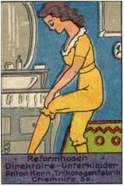

# Leçon 20 | 22 Mai 1957

  

    <label><input type="checkbox" data-lacan-toggle="original" checked> 原文</label>
    <label><input type="checkbox" data-lacan-toggle="notes" checked> 注释</label>
    <label><input type="checkbox" data-lacan-toggle="commentary" checked> 个人解读评论</label>
  

  <form class="lacan-tool-search" role="search">
    <input class="lacan-tool-search-input" type="search" placeholder="搜索全文" aria-label="搜索全文">
    <button class="lacan-tool-button" type="submit" title="搜索">搜索</button>
  </form>
  <button class="lacan-tool-button lacan-back-to-top" type="button" title="回到页面最上方" aria-label="回到页面最上方">↑</button>

<section class="parallel-paragraph" data-paragraph-ids="s4-20-0001">

s4-20-0001

原文 · s4-20-0001

> Des enfants au maillot
>
>  
>
> « *O cités de la mer, je vois chez vous vos citoyens, hommes*
>
> *et femmes, les bras et les jambes étroitement ligotés dans de solides liens par des gens qui n’entendront point votre langage, et vous ne pourrez exhaler qu’entre vous, par des plaintes larmoyantes, des lamentations et des soupirs, vos douleurs et vos regrets de la liberté perdue. Car ceux-là qui vous ligotent ne comprendront pas votre langue, non plus que vous ne les comprendrez.* »
>
> *Carnets* de Léonard De VINCI, Codice Atlantico 145. r. a. Gallimard t. II, p. 400.

[无对应译文]

</section>

<section class="parallel-paragraph" data-paragraph-ids="s4-20-0002">

s4-20-0002

原文 · s4-20-0002

Ce petit morceau extrait des *Carnets* de notes de Léonard De VINCI il y a quelque mois, et que j’avais complètement oublié,
me paraît assez propre à introduire notre leçon d’aujourd’hui. Ce passage assez grandiose n’est à entendre, bien entendu,
qu’à titre allusif.

[无对应译文]

</section>

<section class="parallel-paragraph" data-paragraph-ids="s4-20-0003">

s4-20-0003

原文 · s4-20-0003

Nous allons reprendre aujourd’hui notre lecture des textes du petit Hans, en tentant d’entendre la langue dans laquelle
le petit Hans s’exprime. La dernière fois je vous ai pointé un certain nombre d’étapes de ce déve­loppement du signifiant,

[无对应译文]

</section>

<section class="parallel-paragraph" data-paragraph-ids="s4-20-0004">

s4-20-0004

原文 · s4-20-0004

dont en somme il nous fait considérer que le centre énigmatique, à savoir *le signifiant du cheval* inclus dans la phobie,
*se présente comme ayant pour fonction celle d’un cristal dans une solution sursaturée*.

[无对应译文]

</section>

<section class="parallel-paragraph" data-paragraph-ids="s4-20-0005">

s4-20-0005

原文 · s4-20-0005

C’est *autour de ce signifiant du cheval que vient* en somme se développer, *s’épanouir en une sorte d’immense arborescence, ce développement mythique* dans lequel l’histoire du petit Hans consiste. Tout de suite, pour maintenant si je puis dire immerger *cet arbre dans le bain* de ce qui a été vécu par le petit Hans, nous devons voir quel a été le rôle de *ce développement de l’arbre*, et je veux vous indiquer
ce à quoi va tendre une sorte de bilan que nous allons avoir à faire, de ce qu’a été le progrès du petit Hans.

[无对应译文]

</section>

<section class="parallel-paragraph" data-paragraph-ids="s4-20-0006">

s4-20-0006

原文 · s4-20-0006

Tout de suite il vous indique que puisqu’il s’agit ici de *la relation d’objet* prise dans les termes d’un progrès, et pendant que le petit Hans va vivre son œdipe, rien ne nous indique dans l’observation que nous devions considérer les résultats comme
en quelque sorte pleinement satisfaisants.

[无对应译文]

</section>

<section class="parallel-paragraph" data-paragraph-ids="s4-20-0007">

s4-20-0007

原文 · s4-20-0007

Je dirais qu’il y a quelque chose que l’observation à son début accentue, c’est je ne sais quoi qu’on pourrait appeler une sorte de maturité précoce chez ce petit Hans. On ne peut pas dire qu’à ce moment là il est avant son œdipe, mais assurément à la sortie.
La façon, en d’autres termes, dont le petit Hans éprouve ses rapports avec les petites filles, a déjà - comme on nous le souligne dans l’observation - tous les caractères avancés d’une relation, nous ne dirons pas *adulte*, mais en quelque sorte qui permet
de lui reconnaître une espèce d’analogie assez brillante, qui fait que pour tout dire, FREUD lui-même le présente comme
une sorte d’heureux séducteur, et qu’assurément ce terme complexe, voire *donjuanesque*, tyrannique dont j’ai laissé sortir une fois, ici, le terme pour le plus grand scandale de certains, est tout à fait caractérisé dans cette attitude précoce du petit Hans,
qui indique l’entrée dans une sorte d’heureuse adaptation à un contexte réel. Que voyons-nous au contraire à la fin ?

[无对应译文]

</section>

<section class="parallel-paragraph" data-paragraph-ids="s4-20-0008">

s4-20-0008

原文 · s4-20-0008

À la fin, il faut bien le dire, on retrouve les mêmes petites filles habitant le monde intérieur du petit Hans.
Mais si vous lisez l’observation, vous ne pourrez pas ne pas être frappé de voir, non seulement combien elles sont *plus imaginaires*
et combien elles sont vraiment *radicalement imaginaires*. Ce sont des *fantasmes* avec lesquels le petit Hans s’entretient
et dans un rapport sensiblement changé d’ailleurs, ce sont bien plutôt ses enfants.

[无对应译文]

</section>

<section class="parallel-paragraph" data-paragraph-ids="s4-20-0009">

s4-20-0009

原文 · s4-20-0009

Je dirais que si c’est là qu’il faut voir en quelque sorte la matrice laissée par la résolution de la crise, à la future relation
du petit Hans avec les femmes, bien assurément nous pouvons dire que du point de vue de la surface, le résultat est suffisamment acquis de l’hétérosexualité du petit Hans, mais que ces filles resteront marquées de quelque chose qui sera,
si on peut dire, le stigmate de leur mode d’entrée dans la structure libidinale du petit Hans, et nous le verrons même
traiter en détail comment elles sont entrées. Assurément le style narcissique de leur position par rapport au petit Hans,
est irréfutable, et nous verrons même plus en détail ce qui le détermine, ce qui le situe.

[无对应译文]

</section>

<section class="parallel-paragraph" data-paragraph-ids="s4-20-0010">

s4-20-0010

原文 · s4-20-0010

Assurément le petit Hans, si on peut dire, aimera les femmes, mais elles resteront liées fondamentalement chez lui
à une sorte de *mise à l’épreuve* de son pouvoir. C’est aussi bien pourquoi tout nous indique qu’il ne sera jamais sans les redouter :
si on peut dire, elles seront ses maîtresses. C’est aussi bien que ce seront - et ce restera - « *les filles de son esprit* » et, vous le verrez, ravies à la mère, mais ce n’est certainement pas au-delà de la relation à l’objet féminin que s’achève chez le petit Hans \[...\]

[无对应译文]

</section>

<section class="parallel-paragraph" data-paragraph-ids="s4-20-0011">

s4-20-0011

原文 · s4-20-0011

Ceci est destiné à vous montrer ou à vous indiquer où est l’intérêt d’une telle recherche. Naturellement cela demande une reprise de notre parcours pour être confirmé. Il faut en somme que nous situions, puisque nous avons pris cela comme *point de repère par rapport au temps de la structuration signifiante du mythe* du petit Hans, *les différentes étapes de ce qui se passe*, à savoir *de son progrès*.

[无对应译文]

</section>

<section class="parallel-paragraph" data-paragraph-ids="s4-20-0012">

s4-20-0012

原文 · s4-20-0012

Nous parlons de *relation d’objet* entre les différents temps de la formation mythique signifiante. Quels sont les objets qui passent successivement au pre­mier plan de l’intérêt du petit Hans ? Quels sont en somme les progrès qui se passent corrélativement dans le signifié, dans cette période particulièrement active, féconde d’une sorte de renouvellement, de révolution de la relation du petit Hans à son monde ? Allons-nous pouvoir saisir quelque chose qui parallèlement, nous permet de saisir ce que scandent *ces successives cristallisations* sous forme de *fantasmes* ?

[无对应译文]

</section>

<section class="parallel-paragraph" data-paragraph-ids="s4-20-0013">

s4-20-0013

原文 · s4-20-0013

Sans aucun doute *successives cristallisations d’une configuration signifiante* dont je vous ai montré la dernière fois *la communauté de figure*,
à savoir que je vous ai permis tout au moins d’entrevoir comment dans ces successives figures, les mêmes éléments permutent avec les autres pour à chaque fois renouveler, tout en laissant fondamentalement la même, la *configuration signifiante*.

[无对应译文]

</section>

<section class="parallel-paragraph" data-paragraph-ids="s4-20-0014">

s4-20-0014

原文 · s4-20-0014

Le 5 Avril nous avons le thème que j’ai appelé « *du retour* » qui bien entendu n’est pas ce qu’il explique essentiellement, mais il a cela comme fond. C’est le thème de ce que nous pourrions appeler *un départ*, ou plus exactement \[le thème\] *d’une angoissante solidarité avec la voiture*, la *Wagen* qui est au bord de la rampe de départ, et que le *fantasme* du petit Hans développe en quelque sorte,
car ce n’est pas d’emblée qu’elle se présente ainsi, il faut que l’interrogation du père le facilite d’avouer ses *fantasmes*,
et en même temps *de les parler, de les organiser*, et aussi *de se les révéler* à lui-même en même temps que nous pouvons les apercevoir.

[无对应译文]

</section>

<section class="parallel-paragraph" data-paragraph-ids="s4-20-0015">

s4-20-0015

原文 · s4-20-0015

C’est le 11 Avril que nous voyons apparaître *le fantasme de la baignoire* qu’on dévisse, avec à l’intérieur le petit Hans
et son grand trou dans le ventre, sur lequel nous concentrons une silhouette approximative. Entre les deux que s’est-il passé ?

[无对应译文]

</section>

<section class="parallel-paragraph" data-paragraph-ids="s4-20-0016">

s4-20-0016

原文 · s4-20-0016

C’est le 21 Avril que nous trouvons le fantasme que nous pouvons appeler du « *nouveau départ avec le père* ». C’est *un fantasme* manifestement représenté comme *fantasmatique* et *impossible* : il part avec la grand-mère avant que le père n’arrive, quand le père le rejoint, on ne sait par quel miracle le petit Hans est là. Voilà dans quel ordre les choses se présentent.

[无对应译文]

</section>

<section class="parallel-paragraph" data-paragraph-ids="s4-20-0017">

s4-20-0017

原文 · s4-20-0017

Le 22 Avril c’est le wagonnet dans lequel le petit Hans s’en va tout seul. Et puis quelque chose d’autre marquera probablement la limite de ce à quoi nous pourrons arriver aujourd’hui.

[无对应译文]

</section>

<section class="parallel-paragraph" data-paragraph-ids="s4-20-0018">

s4-20-0018

原文 · s4-20-0018

Avant le 5 Avril, de quoi s’agit-il ? Entre le 1er Mars et le 5 Avril il s’agit essentiellement et uniquement du *phallus*.

[无对应译文]

</section>

<section class="parallel-paragraph" data-paragraph-ids="s4-20-0019">

s4-20-0019

原文 · s4-20-0019

Il s’agit du *phallus* à propos duquel le père lui apporte la remarque, lui suggère la motivation de sa phobie, c’est à savoir que c’est dans la mesure où il se touche, où il se masturbe, que la phobie a lieu. Il va plus loin : le père suggère l’équivalence de la phobie de ce qu’il craint avec ce *phallus*, au point de s’attirer de la part du petit Hans la réplique qu’un *phallus*, un « *Wiwimacher »*,
qui est très exactement le terme dans lequel le *phallus* s’inscrit dans le vocabulaire du petit Hans, ça ne mord pas.

[无对应译文]

</section>

<section class="parallel-paragraph" data-paragraph-ids="s4-20-0020">

s4-20-0020

原文 · s4-20-0020

Nous nous trouvons là à l’entrée dans les sortes de malentendus qui vont présider à *tout le dialogue* du petit Hans avec son père, en ce sens que le fait qu’un *phallus* c’est bien de cela qu’il s’agit dans ce qui mord, dans ce qui blesse. C’est quelque chose qui est si vrai que quelqu’un qui n’est pas psychanalyste et à qui j’avais fait lire cette observation du petit Hans, qui est un *mythologue*, quelqu’un qui a sur le sujet des mythes été assez loin dans la pénétration du problème, me disait :

[无对应译文]

</section>

<section class="parallel-paragraph" data-paragraph-ids="s4-20-0021">

s4-20-0021

原文 · s4-20-0021

> «* Il est tout à fait frappant de voir, en quelque sorte sous­ jacente à tout le développement de l’observation,*
> *on ne sait quelle fonction, non pas de vagina dentata, mais du phallus dentatus*. »

[无对应译文]

</section>

<section class="parallel-paragraph" data-paragraph-ids="s4-20-0022">

s4-20-0022

原文 · s4-20-0022

Seulement bien entendu, cette observation se développe tout entière sous le registre du *malentendu*.
J’ajouterai : c’est là le cas tout à fait ordinaire de toute espèce d’interprétation créatrice entre deux sujets.
C’est même comme cela qu’elle se développe : de la façon à laquelle il faut s’attendre, c’est la moins anormale qui soit.
Et je dirais que c’est justement dans la béance de ce *malentendu* que va se développer quelque chose qui aura sa fécondité :
au moment où le père lui parlera du *phallus*, il lui parlera de son *pénis réel*, de celui qu’il est en train de toucher.

[无对应译文]

</section>

<section class="parallel-paragraph" data-paragraph-ids="s4-20-0023">

s4-20-0023

原文 · s4-20-0023

Il n’a certainement pas tort, car l’entrée en jeu chez le jeune sujet de la possibilité d’érection, et tout ce qu’elle comporte pour lui d’émotions nouvelles, est quelque chose qui incontestablement a changé l’équi­libre profond de toutes ses relations

[无对应译文]

</section>

<section class="parallel-paragraph" data-paragraph-ids="s4-20-0024">

s4-20-0024

原文 · s4-20-0024

avec ce qui constitue alors le point stable, le point fixe, le point tout-puissant de son monde, à savoir la mère.

[无对应译文]

</section>

<section class="parallel-paragraph" data-paragraph-ids="s4-20-0025">

s4-20-0025

原文 · s4-20-0025

Et d’autre part, il y a quelque chose qui joue le rôle prévalent dans le fait que tout d’un coup quelque chose arrive qui est
*cette angoisse foncière* qui fait tout vaciller, au point que *tout est préférable * : même *le forgeage d’une image angoissante* en elle-même complètement fermée, *comme celle du cheval*, et qui à tout le moins au centre de cette angoisse, *marque une limite, marque un repère*.
Ce qui dans cette *image* ouvre la porte à cette *morsure*, à cette *attaque*, *c’est un autre phallus c’est le phallus imaginaire de la mère*,
en tant que c’est par là que pour le petit Hans s’ouvre la phobie intolérable, ce qui a été jus­qu’alors le jeu de montrer

[无对应译文]

</section>

<section class="parallel-paragraph" data-paragraph-ids="s4-20-0026">

s4-20-0026

原文 · s4-20-0026

ou de ne pas montrer le *phallus*, de jouer avec un *phallus* qu’il sait depuis longtemps parfaitement inexistant
et qui pour lui est l’*enjeu* des relations avec la mère.

[无对应译文]

</section>

<section class="parallel-paragraph" data-paragraph-ids="s4-20-0027">

s4-20-0027

原文 · s4-20-0027

Ce plan sur lequel s’établit ce *jeu de séduction*, non seulement *avec la mère*, mais *avec toutes les petites filles* dont il sait aussi très bien *qu’elles n’ont pas de phallus*, mais le maintien de ce jeu *qu’elles en ont quand même un*, c’est là quelque chose sur lequel l’a repoussé jusque là toute la relation fondamentalement pas simplement de leurre en quelque sorte au sens le plus immédiat,
mais de jeu à ce leurre.

[无对应译文]

</section>

<section class="parallel-paragraph" data-paragraph-ids="s4-20-0028">

s4-20-0028

原文 · s4-20-0028

Entendons que si nous nous souvenons du *fantasme* sur lequel se termine la première partie de l’observation, à partir de laquelle... celle qui commence à partir du moment où la phobie se déclare, ce *fantasme* du petit Hans se rapporte à ses parents.
C’est un *fantasme* qui est d’ailleurs, à la limite, c’est le seul qui n’est d’ailleurs pas un *fantasme*, c’est un rêve, *c’est un jeu* où l’enfant cache dans sa main quelque chose, *un jeu de gage* à la suite duquel il reçoit le droit de la petite fille à lui faire faire pipi.

[无对应译文]

</section>

<section class="parallel-paragraph" data-paragraph-ids="s4-20-0029">

s4-20-0029

原文 · s4-20-0029

Et à ce moment là FREUD et l’observation, soulignent qu’il s’agit d’un rêve auditif. Dans ce jeu de montrer ou de voir,
qui est au fond de la relation première scoptophilique avec les petites filles, l’élément *parlé*, le jeu passé dans *le symbole*,
dans *la parole* n’y est-il pas d’ores et déjà prévalent ?

[无对应译文]

</section>

<section class="parallel-paragraph" data-paragraph-ids="s4-20-0030">

s4-20-0030

原文 · s4-20-0030

Ce qui va se passer, c’est qu’à toute tentative du père, dans cette première période, du père d’introduire tout ce qui concerne
la réalité du pénis avec ce qui lui indique qu’il convient pour l’instant d’en faire très exactement, c’est-à-dire de n’y pas toucher,
répond avec une rigueur automatique chez le petit Hans, la remise au premier plan des thèmes de ce jeu.

[无对应译文]

</section>

<section class="parallel-paragraph" data-paragraph-ids="s4-20-0031">

s4-20-0031

原文 · s4-20-0031

Entendez que par exemple il sort tout de suite ce *fantasme* qu’il était avec sa mère toute nue en chemise.
C’est à ce propos que le père lui pose la question : « *Mais elle était toute nue, ou en chemise ?* ». Ce qui ne trouble pas le petit Hans : elle était avec une chemise si courte qu’on pouvait juste la voir toute nue, c’est-à-dire qu’on pouvait juste voir, et bien entendu aussi ne pas voir. Vous reconnaissez la structure du bord ou de la frange, qui caractérise l’appréhension fétichiste.

[无对应译文]

</section>

<section class="parallel-paragraph" data-paragraph-ids="s4-20-0032">

s4-20-0032

原文 · s4-20-0032

C’est toujours *jusqu’au point* où l’on pouvait *un peu voir*, et où l’on ne voit pas ce qui va apparaître, ce qui est suscité de caché dans la relation avec la mère, à savoir ce *phallus* inexistant, mais dont il faut aussi qu’on joue à ce qu’il soit là, et pour en quelque sorte accentuer le caractère de ce dont il s’agit à ce moment là, à savoir d’une défense contre l’élément bouleversant qu’apporte le père avec son insistance à parler du *phallus* en termes réels.

[无对应译文]

</section>

<section class="parallel-paragraph" data-paragraph-ids="s4-20-0033">

s4-20-0033

原文 · s4-20-0033

Dans ce fantasme, le petit Hans appelle un témoin, c’est-à-dire une petite fille qu’il appelle Grete, et qui est *empruntée aux bagages*, à sa *maison particulière*, aux petites amies avec lesquelles il poursuit ses *relations imaginaires*, mais concernant des personnages parfaitement réels qu’il poursuit à ce moment. Qu’elle s’appelle Grete et qu’elle intervienne dans ce fantasme, il n’est pas inutile de le souligner puisque nous la retrouverons plus tard. C’est elle qui est appelée dans le fantasme comme témoin de ce que maman et lui-même sont en train de faire, car à ce moment il introduit comme à la dérobée, très vite, le fait que très rapidement
il se touche un petit peu.

[无对应译文]

</section>

<section class="parallel-paragraph" data-paragraph-ids="s4-20-0034">

s4-20-0034

原文 · s4-20-0034

La formation en somme de compromis, je veux dire le fait qui pour lui montre la nécessité de faire rentrer,
sur le fond de la relation phallique avec la mère, tout ce qui peut intervenir de *nouveau*, non seulement par le fait de l’existence réelle de son pénis, mais du fait que c’est là-dessus que le père essaye de l’entraîner, est quelque chose qui littéralement structure tout la période anté­rieure au 5 Avril telle que nous la voyons dans l’observation dessinée.

[无对应译文]

</section>

<section class="parallel-paragraph" data-paragraph-ids="s4-20-0035">

s4-20-0035

原文 · s4-20-0035

Quand je dis toute la période antérieure au 5 Avril, bien entendu cela ne veut pas dire qu’il n’y ait que cela. Quelque chose
*de second* va apparaître autour de ce 30 Mars, date de la consultation avec FREUD. Assurément ce qui va apparaître à ce niveau n’est pas entièrement artificiel, puisque comme je vous l’ai dit, c’est annoncé par ce qui déjà est impliqué par la collaboration
du père du petit Hans dans *ses fantasmes* où il appelle en quelque sorte son père à son aide.

[无对应译文]

</section>

<section class="parallel-paragraph" data-paragraph-ids="s4-20-0036">

s4-20-0036

原文 · s4-20-0036

Donc entre le 1er Mars et le 15 Mars où se situe *le fantasme de Grete et de la mère*, *il s’agit avant tout* *de pénis réel et de phallus imaginaire*.
C’est justement entre le 15 Mars et *la consultation avec Freud*, qu’au moment où le père essaye de faire passer complètement
*dans la réalité le* *phallus* en lui faisant remarquer que les grands animaux ont de grands *phallus*, et que les petits en ont de petits,
et ce qui assurément entraîne le petit Hans à dire : « *Chez moi il est bien accroché, et il grandira.* » Le même schéma que celui
que je vous indiquai tout à l’heure, se reproduit, c’est à savoir quelque chose qui est une réaction.

[无对应译文]

</section>

<section class="parallel-paragraph" data-paragraph-ids="s4-20-0037">

s4-20-0037

原文 · s4-20-0037

Chez le petit Hans, si vous voulez, nous avons à ce moment là quelque chose qui est la tentative complète de réaliser le *phallus* de la part du père, et *la réaction* du petit Hans une fois de plus sera quelque chose qui ne consiste pas du tout à entériner
ce à quoi pourtant lui-même accède, mais à forger ce *fantasme des deux girafes* où se manifeste le 27 Mars ce qui en est l’essentiel.

[无对应译文]

</section>

<section class="parallel-paragraph" data-paragraph-ids="s4-20-0038">

s4-20-0038

原文 · s4-20-0038

À savoir *une symbolisation du phallus maternel*, *ce phallus maternel qui net­tement est représenté dans* *la* *petite girafe*, et qui pour le petit Hans,
en quelque sorte pris entre son attachement *imaginaire* et l’insistance du *réel* par l’inter­médiaire de la parole du père,

[无对应译文]

</section>

<section class="parallel-paragraph" data-paragraph-ids="s4-20-0039">

s4-20-0039

原文 · s4-20-0039

entre dans la voie, va donner en quelque sorte sa scansion, le schéma de tout ce qui va se développer dans *le mythe* de la phobie, c’est à savoir que *c’est le terme imaginaire qui va devenir pour lui l’élément symbolique*.

[无对应译文]

</section>

<section class="parallel-paragraph" data-paragraph-ids="s4-20-0040">

s4-20-0040

原文 · s4-20-0040

En d’autres termes, loin que dans *la relation d’objet* nous constations la voie en quelque sorte directe du passage à la signification d’un nouveau réel, d’une acquisition du maniement du *réel* au moyen d’un instrument *symbolique* pur et simple, nous voyons
au contraire, qu’au moins dans la phase critique dont il s’agit à propos du petit Hans et que la théorie analytique pointe
comme étant celle de l’œdipe, le *réel* ne peut être réordonné dans *la nouvelle configuration symbolique* qu’au prix d’une réactivation
de tous les éléments les plus *imaginaires*, qu’au prix d’une véritable *régression imaginaire* du premier abord qu’en a fait le sujet.

[无对应译文]

</section>

<section class="parallel-paragraph" data-paragraph-ids="s4-20-0041">

s4-20-0041

原文 · s4-20-0041

Nous en avons là dès les premiers pas de la névrose du petit Hans - *névrose infantile* j’entends - le modèle et le schéma :

[无对应译文]

</section>

<section class="parallel-paragraph" data-paragraph-ids="s4-20-0042">

s4-20-0042

原文 · s4-20-0042

- le père représentant de la réalité et de son nouvel ordre de l’adaptation au réel,

[无对应译文]

</section>

<section class="parallel-paragraph" data-paragraph-ids="s4-20-0043">

s4-20-0043

原文 · s4-20-0043

- le petit Hans y répondant par une sorte de *foisonnement imaginaire* qui renforce en quelque sorte d’une façon d’autant plus typique qu’elle est vraiment soutenue sur cette espèce de profond mode d’incrédulité, dans lequel d’ailleurs vous allez voir chez le petit Hans se poursuivre toute la suite, pour apercevoir ce quelque chose qui est donné au début de l’observation d’une façon en somme presque matérialisée.

[无对应译文]

</section>

<section class="parallel-paragraph" data-paragraph-ids="s4-20-0044">

s4-20-0044

原文 · s4-20-0044

Là c’est évidemment le côté exceptionnel, la valeur tombée du ciel que représente l’observation, pour nous montrer
dans quelle voie lui-même s’aperçoit que pour nous cela peut être pris, à savoir que non seulement on peut jouer avec
mais qu’on peut en faire *des bouchons de papier*, ce *quelque chose de chiffonné*.

[无对应译文]

</section>

<section class="parallel-paragraph" data-paragraph-ids="s4-20-0045">

s4-20-0045

原文 · s4-20-0045

Dans cette première image de la petite girafe, c’est le commencement de la solution, la synthèse de ce que le petit Hans apprend à faire, à savoir comment on peut jouer avec ces images, et ce quelque chose qu’il ne sait pas mais auquel il est tout simplement introduit par le fait qu’il sait déjà parler, qu’il est un petit homme, qu’il est dans *un bain de langage*.

[无对应译文]

</section>

<section class="parallel-paragraph" data-paragraph-ids="s4-20-0046">

s4-20-0046

原文 · s4-20-0046

Il sait très bien la valeur pré­cieuse que lui offre le fait de pouvoir parler, et c’est d’ailleurs ce qu’il souligne lui-même sans cesse quand il dit de ceci ou de cela, et quand on lui dit que « *c’est bien »* ou que « *c’est mal »* :

[无对应译文]

</section>

<section class="parallel-paragraph" data-paragraph-ids="s4-20-0047">

s4-20-0047

原文 · s4-20-0047

« *Peu importe -* dit-il *- c’est toujours bien, puisqu’on peut l’envoyer au Professeur.* »

[无对应译文]

</section>

<section class="parallel-paragraph" data-paragraph-ids="s4-20-0048">

s4-20-0048

原文 · s4-20-0048

Et il y a plus d’une remarque de cette espèce, où à tout instant le petit Hans en quelque sorte montre son sentiment
de cette sorte de fécondité propre, à la voie qui lui est ouverte par le fait qu’en somme, il trouve à qui parler. Et là, bien entendu, il serait bien étonnant que nous ne nous apercevions pas à cette occasion que c’est là tout le précieux, l’efficace de l’analyse.

[无对应译文]

</section>

<section class="parallel-paragraph" data-paragraph-ids="s4-20-0049">

s4-20-0049

原文 · s4-20-0049

Telle est cette *première analyse* faite avec un enfant. Assurément de son texte, de la façon dont FREUD amène son mythe d’œdipe tout crû, tout construit, sans la moindre tentative de l’adapter à quelque chose qui se présente d’im­médiat et de précis

[无对应译文]

</section>

<section class="parallel-paragraph" data-paragraph-ids="s4-20-0050">

s4-20-0050

原文 · s4-20-0050

chez l’enfant, on peut penser que c’est bien un des points les plus saisissants de l’observation.

[无对应译文]

</section>

<section class="parallel-paragraph" data-paragraph-ids="s4-20-0051">

s4-20-0051

原文 · s4-20-0051

Littéralement délibérément FREUD lui dit :

[无对应译文]

</section>

<section class="parallel-paragraph" data-paragraph-ids="s4-20-0052">

s4-20-0052

原文 · s4-20-0052

> « *Je vais te raconter cette grande histoire que j’ai inventée, que je savais avant que tu vins au monde :*
>
> *c’est qu’un jour un petit Hans viendrait qui aimerait trop sa mère, et qui à cause de cela, détesterait son père.* » \[p. 120\]
>
> \[*Lange, ehe er auf der Welt war, hätte ich schon gewußt, daß ein kleiner Hans kommen werde,*
>
> *der seine Mutter so lieb hätte, daß er sich darum vor dem Vater fürchten müßte, und hätte es seinem Vater erzählt.*\]

[无对应译文]

</section>

<section class="parallel-paragraph" data-paragraph-ids="s4-20-0053">

s4-20-0053

原文 · s4-20-0053

Je dirais que le caractère de *mythe originel* que représente l’œdipe dans la doctrine de FREUD, est là en quelque sorte,
en somme par son auteur même, pris dans une opération où son caractère fondamentalement mythique est mis à nu.
FREUD s’en sert de la même façon qu’on apprend depuis toujours aux enfants que « *Dieu a créé le ciel et la terre* »,
ou qu’on lui apprend toute espèce d’autres choses, selon le contexte culturel dans lequel il est impliqué. C’est *un mythe des origines* donné comme tel, et parce qu’en somme on fait foi à ce qu’il détermine comme orientation, comme structure, comme avenue, pour la parole chez le sujet qui en est le dépositaire, c’est littéralement sa fonction de création de la vérité qui est en cause.

[无对应译文]

</section>

<section class="parallel-paragraph" data-paragraph-ids="s4-20-0054">

s4-20-0054

原文 · s4-20-0054

Ce n’est pas autrement que FREUD l’apporte au petit Hans, et littéralement ce que nous voyons, c’est que le petit Hans
en quelque sorte dit, c’est la même ambiguïté qui est celle dans laquelle se poursuit tout son assentiment avec ce qui va
le poursuivre, le petit Hans dit quelque chose qui est à peu près ceci :

[无对应译文]

</section>

<section class="parallel-paragraph" data-paragraph-ids="s4-20-0055">

s4-20-0055

原文 · s4-20-0055

« *C’est très intéressant, c’est très excitant, comme c’est bien, il faut qu’il aille parler avec le bon Dieu pour avoir trouvé un truc pareil.* »
\[« *Spricht denn der Professor mit dem lieben Gott, daß er das alles vorher wissen kann ?* »\]

[无对应译文]

</section>

<section class="parallel-paragraph" data-paragraph-ids="s4-20-0056">

s4-20-0056

原文 · s4-20-0056

Mais quel est le résultat de ceci ? FREUD lui, nous dit, nous articule, très nettement de lui-même, de son cru, à ce moment-là,
que bien entendu il n’est pas à attendre que cette communication de sa part porte du premier coup - rien que par le coup porté -
ses fruits. Il s’agit, dit FREUD - à ce moment-là dans l’observation, l’articulant comme nous l’articulons ici -

[无对应译文]

</section>

<section class="parallel-paragraph" data-paragraph-ids="s4-20-0057">

s4-20-0057

原文 · s4-20-0057

qu’elle produise ses pro­ductions inconscientes, qu’elle permette à la phobie de se développer.

[无对应译文]

</section>

<section class="parallel-paragraph" data-paragraph-ids="s4-20-0058">

s4-20-0058

原文 · s4-20-0058

Il s’agit d’une incitation, d’*un autre cristal* si on peut dire, qui est là implanté dans la signification inachevée que représente
à lui tout seul, je veux dire dans son être tout entier, à ce moment là le petit Hans : d’une part ce qui s’est produit tout seul,
à savoir la phobie, et d’autre part FREUD qui apporte là tout entier ce à quoi c’est destiné à aboutir.

[无对应译文]

</section>

<section class="parallel-paragraph" data-paragraph-ids="s4-20-0059">

s4-20-0059

原文 · s4-20-0059

Bien entendu FREUD ne s’imagine pas un seul instant que ce mythe religieux de l’œdipe qu’il aborde à ce moment là, porte immédiatement ses fruits, il n’attend qu’une chose, il le dit, c’est que cela aide ce qui est de l’autre côté, c’est-à-dire la phobie,
à se développer. Cela fraye tout au plus les voies à ce que j’ai appelé tout à l’heure *le développement du cristal signifiant*.
On ne peut pas le dire plus clairement que dans ces deux phrases de FREUD à la date du 30 Mars,

[无对应译文]

</section>

<section class="parallel-paragraph" data-paragraph-ids="s4-20-0060">

s4-20-0060

原文 · s4-20-0060

c’est-à-dire de la consul­tation avec FREUD.

[无对应译文]

</section>

<section class="parallel-paragraph" data-paragraph-ids="s4-20-0061">

s4-20-0061

原文 · s4-20-0061

Tout ce qu’on peut dire, c’est qu’à ce moment là il y a quand même une petite réaction du côté du père.
Elle ne durera pas longtemps, je veux dire que le père, nous le retrouverons vraiment dans les relations d’objet…
comme je vous le disais tout à l’heure, qui sont ce que nous cherchons à saisir aujourd’hui
à l’intérieur des différentes étapes de la formation signifiante
…qu’à la fin, et ce n’est pas pour nous étonner. C’est *tout à la fin de la crise* que nous le verrons venir au premier plan, au moment où je vous ai dit l’autre jour que juste avant *le fantasme du wagonnet*, se passe l’affrontement avec le père dans *le dialogue de l’œdipe* :

[无对应译文]

</section>

<section class="parallel-paragraph" data-paragraph-ids="s4-20-0062">

s4-20-0062

原文 · s4-20-0062

- « *Pourquoi es-tu si jaloux ?* »

[无对应译文]

</section>

<section class="parallel-paragraph" data-paragraph-ids="s4-20-0063">

s4-20-0063

原文 · s4-20-0063

Plus exactement *passionné*, c’est le terme qui est employé, et à la protestation du père

[无对应译文]

</section>

<section class="parallel-paragraph" data-paragraph-ids="s4-20-0064">

s4-20-0064

原文 · s4-20-0064

- « *Je ne le suis pas !* »

[无对应译文]

</section>

<section class="parallel-paragraph" data-paragraph-ids="s4-20-0065">

s4-20-0065

原文 · s4-20-0065

- « *Tu dois l’être !* »

[无对应译文]

</section>

<section class="parallel-paragraph" data-paragraph-ids="s4-20-0066">

s4-20-0066

原文 · s4-20-0066

C’est le point de la rencontre avec le père, avec ce que représente de carence à ce moment-là la position paternelle.
Ici nous ne trouvons donc qu’une première apparition, un petit choc qui est donné en somme par le fait que le père,
on voit bien en quoi il est déjà là :

[无对应译文]

</section>

<section class="parallel-paragraph" data-paragraph-ids="s4-20-0067">

s4-20-0067

原文 · s4-20-0067

- il est là d’une façon qui est tout à fait brillante,

[无对应译文]

</section>

<section class="parallel-paragraph" data-paragraph-ids="s4-20-0068">

s4-20-0068

原文 · s4-20-0068

- il est là de la façon dont on peut dire que l’on s’exprime couramment : qu’*il brille par son absence*.

[无对应译文]

</section>

<section class="parallel-paragraph" data-paragraph-ids="s4-20-0069">

s4-20-0069

原文 · s4-20-0069

Et c’est bien ainsi que dès le lendemain, le petit Hans réagit : il vient le trouver, nous dit le père, et il lui dit qu’il est venu le voir parce qu’il avait peur qu’il soit parti. Il viendrait d’ailleurs aussi bien le voir comme cela, ce dont il a peur, c’est que le père soit parti. Ceci nous mènera plus loin, puisque le père aussitôt interroge : « *Mais comment une chose pareille serait-elle pos­sible ?* »

[无对应译文]

</section>

<section class="parallel-paragraph" data-paragraph-ids="s4-20-0070">

s4-20-0070

原文 · s4-20-0070

Là arrêtons-nous, apprenons à scander. Je dirais que devant cette peur de l’absence du père, ce qui est véritablement
dans la peur c’est quelque chose qui est en somme une petite *cristallisation de l’angoisse*. L’angoisse n’est pas la peur d’un objet.
*L’angoisse c’est la confrontation du sujet à cette absence d’objet où il est happé*, où il se perd et à quoi tout est préférable,
jusqu’à y compris de forger le plus étrange, le moins objectal des objets, celui d’une phobie.

[无对应译文]

</section>

<section class="parallel-paragraph" data-paragraph-ids="s4-20-0071">

s4-20-0071

原文 · s4-20-0071

La peur dont il s’agit là, son caractère irréel est justement manifesté si nous savons le voir, par sa forme, à savoir que c’est
*la peur d’une absence*, je veux dire *de cet objet* qu’on vient de lui désigner. Le petit Hans vient dire qu’il a peur de son absence, entendez-le comme quand je vous dis qu’il s’agit d’en­tendre l’anorexie mentale par, non pas que l’enfant ne mange pas,
mais qu’il mange *rien*. Ici le petit Hans a peur de *son absence*, c’est de *son absence* dont il a peur et qu’il commence là à *symboliser*.

[无对应译文]

</section>

<section class="parallel-paragraph" data-paragraph-ids="s4-20-0072">

s4-20-0072

原文 · s4-20-0072

Je veux dire que pendant que le père est en train de se casser la tête pour savoir par quel tour et par quel contre­coup l’enfant peut manifester là une peur qui ne serait que l’envers du désir, ceci n’est pas complètement faux, mais ne saisit en quelque sorte
le phénomène que par ses entours. C’est bien du commencement de la réalisation par le sujet que le père n’est justement pas
ce qu’on lui a dit qu’il serait dans le mythe, et il le dit au père :

[无对应译文]

</section>

<section class="parallel-paragraph" data-paragraph-ids="s4-20-0073">

s4-20-0073

原文 · s4-20-0073

- « *Pourquoi me dis-tu que j’ai ma mère à la bonne, alors que c’est toi que j’aime ?* »

[无对应译文]

</section>

<section class="parallel-paragraph" data-paragraph-ids="s4-20-0074">

s4-20-0074

原文 · s4-20-0074

Ce que le petit Hans vient dire ne colle pas du tout :

[无对应译文]

</section>

<section class="parallel-paragraph" data-paragraph-ids="s4-20-0075">

s4-20-0075

原文 · s4-20-0075

- «* Il faut que ce soit toi que je haïsse, ça ne va pas. *»

[无对应译文]

</section>

<section class="parallel-paragraph" data-paragraph-ids="s4-20-0076">

s4-20-0076

原文 · s4-20-0076

Et en quelque sorte ce qui est impliqué là­-dedans en dehors du petit Hans, et où il est pris, c’est que c’est bien regrettable
qu’il en soit ainsi. Mais tout de même d’avoir été mis dans la voie dont il s’agit, c’est-à-dire de pouvoir, par rapport au *mythe,* repérer où est *une absence*, est quelque chose qui s’enregistre immédiatement, que l’observation note, et si vous voulez,
pour lequel il faudrait - comme je viens de le faire - entendre *une symbolisation*.

[无对应译文]

</section>

<section class="parallel-paragraph" data-paragraph-ids="s4-20-0077">

s4-20-0077

原文 · s4-20-0077

Si nous appelons par un grand I le signifiant autour duquel la phobie ordonne sa fonction, quelque chose à ce moment là
est symbolisé que nous pouvons appeler petit sigma : σ, absence du père : I(σ P°). Ce n’est pas dire que c’est le tout de ce qui est contenu dans *le signifiant du cheval*, bien loin de là. Nous allons le voir, il ne va pas s’évanouir comme cela tout d’un coup,
parce qu’on aura dit au petit Hans : « *C’est de ton père que tu vas avoir peur, il faut que tu aies peur* ».

[无对应译文]

</section>

<section class="parallel-paragraph" data-paragraph-ids="s4-20-0078">

s4-20-0078

原文 · s4-20-0078

Non, mais assurément quand même *tout de suite le signifiant « cheval »* est déchargé de quelque chose, et l’observation l’enregistre :

[无对应译文]

</section>

<section class="parallel-paragraph" data-paragraph-ids="s4-20-0079">

s4-20-0079

原文 · s4-20-0079

« *Pas de tous les chevaux blancs…* »

[无对应译文]

</section>

<section class="parallel-paragraph" data-paragraph-ids="s4-20-0080">

s4-20-0080

原文 · s4-20-0080

Ce n’est plus maintenant de tous les chevaux blancs dont il a peur, il y en a dont il n’a plus peur, et tout de suite le père,
malgré qu’il ne passe pas par la voie de notre théorisation, comprend qu’il y en a qui sont *Vati* \[Papa\], et à partir du moment
où il sent qu’il y en a qui sont *Vati*, on n’en a plus peur.

[无对应译文]

</section>

<section class="parallel-paragraph" data-paragraph-ids="s4-20-0081">

s4-20-0081

原文 · s4-20-0081

On n’en a plus peur pourquoi ? Parce que *Vati* est tout à fait gentil, c’est ce que *le père* également comprend sans comprendre tout à fait, sans même comprendre du tout - jusqu’à la fin - que c’est bien là qu’est le drame : que *Vati* soit tout à fait gentil,
car s’il y avait eu un *Vati* dont on aurait pu vraiment avoir peur, on aurait été dans la règle du jeu si on peut dire,
c’est-à-dire qu’on aurait pu faire *un véritable œdipe*, un œdipe qui vous aide à « *sortir des jupes de votre mère* ». Mais comme il n’y a pas de *Vati* dont on a peur, comme *Vati* est trop gentil, cela explique qu’à évoquer l’agressivité possible du *Vati* dans le mythe,
le signifiant phobique de l’ἵππος \[hippos\] se décharge d’autant, et c’est enregistré dans l’après midi même.

[无对应译文]

</section>

<section class="parallel-paragraph" data-paragraph-ids="s4-20-0082">

s4-20-0082

原文 · s4-20-0082

Je ne force rien dans ce que je vous raconte, puisque c’est dans le texte, il suffit d’en *décaler imperceptiblement le point de perspective*, pour que sim­plement elle ne devienne plus une espèce de labyrinthe dans lequel on se perd, mais que chacun des détails
par contre, prenne à tout instant un sens.

[无对应译文]

</section>

<section class="parallel-paragraph" data-paragraph-ids="s4-20-0083">

s4-20-0083

原文 · s4-20-0083

Car je peux avoir l’air d’aller là assez lentement, de repartir encore du début, mais il faut bien que je vous le fasse saisir :
c’est qu’aucun détail de l’observation n’échappe à cette *mise en perspective*,qu’à partir du moment où vous voyez comment s’articule le rapport du *signifiant* rapporté tout brut par FREUD, avec le *signifié en gésine*, nous le voyons retentir mathématiquement sur les fonctions du signifiant qui est suscité à l’état spontané, naturel, dans la situation du petit Hans.

[无对应译文]

</section>

<section class="parallel-paragraph" data-paragraph-ids="s4-20-0084">

s4-20-0084

原文 · s4-20-0084

À ce moment là nous voyons s’enregistrer aussitôt ces effets de sous­traction, de décharge, pour autant simplement

[无对应译文]

</section>

<section class="parallel-paragraph" data-paragraph-ids="s4-20-0085">

s4-20-0085

原文 · s4-20-0085

qu’on a amené le père, et d’autant moins qu’il faut que ça s’inscrive d’une façon en quelque sorte mathématique,
comme sur *le plateau d’une balance*.

[无对应译文]

</section>

<section class="parallel-paragraph" data-paragraph-ids="s4-20-0086">

s4-20-0086

原文 · s4-20-0086

Il y a une partie des chevaux blancs qui ne font plus peur, et l’observation elle-même articule qu’il y a deux ordres d’angoisse, nous dit FREUD - je veux dire que FREUD en remet sur ce que je viens de dire - FREUD distingue :

[无对应译文]

</section>

<section class="parallel-paragraph" data-paragraph-ids="s4-20-0087">

s4-20-0087

原文 · s4-20-0087

- l’angoisse *autour* du père,

[无对应译文]

</section>

<section class="parallel-paragraph" data-paragraph-ids="s4-20-0088">

s4-20-0088

原文 · s4-20-0088

- qu’il oppose à l’angoisse *devant* le père.

[无对应译文]

</section>

<section class="parallel-paragraph" data-paragraph-ids="s4-20-0089">

s4-20-0089

原文 · s4-20-0089

Nous n’avons vraiment pas à prendre acte de la façon dont FREUD lui-même nous la présente, pour y retrouver exactement
les deux éléments que je viens ici de vous décrire : *l’an­goisse autour de cette place vide, creuse, que représente le père dans la confi­guration*

[无对应译文]

</section>

<section class="parallel-paragraph" data-paragraph-ids="s4-20-0090">

s4-20-0090

原文 · s4-20-0090

du petit Hans, c’est justement celle qui cherche son support dans la phobie, et dans toute la mesure où on a pu susciter,
ne serait-ce qu’à l’état d’exigence de quelque chose de postulé, une angoisse devant le père, dans toute cette mesure
*l’angoisse autour de ce qui est la fonction du père est déchargée*.

[无对应译文]

</section>

<section class="parallel-paragraph" data-paragraph-ids="s4-20-0091">

s4-20-0091

原文 · s4-20-0091

Enfin on peut avoir une angoisse devant quelque chose, malheureusement ça ne peut pas aller bien loin puisque le père,
*tout en étant là* précisément, n’est nullement apte à supporter *la fonction* établie que lui donnent les nécessités
d’une formation mythique correcte, limpide, et dans toute sa portée universelle *qu’a le mythe d’Œdipe*.

[无对应译文]

</section>

<section class="parallel-paragraph" data-paragraph-ids="s4-20-0092">

s4-20-0092

原文 · s4-20-0092

C’est précisément ce qui force notre petit Hans à retomber dans sa difficulté. Sa difficulté après cela, comme FREUD l’a prévu, va commencer à se développer, à s’incarner, à se précipiter dans les productions qui doivent se développer de sa phobie.
Et on commence tout de suite à voir plus clair, en ce sens qu’apparaît le 1er fantasme du 5 Avril d’où je suis parti l’autre fois comme d’un premier terme, et dont nous retrouvons jusqu’à la fin les transformations, et qui en somme avec tout ce qui l’entoure, tout ce qui l’annonce, met en valeur le poids, quelque chose que le petit Hans dans le jour qui le précède immédiatement, commence de bien articuler : qu’est-ce qui me fait peur ?

[无对应译文]

</section>

<section class="parallel-paragraph" data-paragraph-ids="s4-20-0093">

s4-20-0093

原文 · s4-20-0093

On commence à le voir, c’est que le cheval - et c’est articulé comme cela dans le texte - le père en met un coup, il fait vraiment de l’*analyse*, c’est-à-dire que de temps en temps il ne sait plus très bien où aller, cela lui permet de trouver des choses :
*il voit les quatre modes sous lesquels le cheval fait peur*. Ce sont tous des éléments qui mettent en jeu ce quelque chose qui
pour un homme - c’est-à-dire un animal qui est destiné à se savoir exister, à la différence des autres animaux - et c’est bien ce qui doit être \[articulé\] au moment où cela montre son instance la plus perturbante, c’est à savoir justement ce qui est développé, articulé, à ce moment-là dans les néo-productions de la phobie par le petit Hans, à savoir *le mouvement*.

[无对应译文]

</section>

<section class="parallel-paragraph" data-paragraph-ids="s4-20-0094">

s4-20-0094

原文 · s4-20-0094

Entendez bien qu’il ne s’agit pas du mouvement uniforme dont nous savons depuis toujours, ou tout au moins
depuis quelque temps, que c’est un mouvement dans lequel on ne se sent pas, un mouvement dans lequel on se sauve.
C’est là déjà depuis ARISTOTE, que la discrimination du mouvement linéaire et du mouvement rotatoire a ce sens là.
Dans un langage plus moderne : il y a une accélération.

[无对应译文]

</section>

<section class="parallel-paragraph" data-paragraph-ids="s4-20-0095">

s4-20-0095

原文 · s4-20-0095

Je veux dire là où le petit Hans nous dit que *le cheval en tant qu’il traîne quelque chose après lui, est redoutable, quand il file,*
*quand il démarre* - plus quand il démarre vite que quand il démarre lentement - *là partout où en quelque sorte on peut sentir cette inertie*
*qui fait que ce mouvement*…
pour qui n’est pas impliqué dans ce mouvement, et pour qui ce minimum de détachement de la vie consiste justement
en ce que j’ai appelé tout à l’heure « se savoir exister », être un être conscient de lui-même pris dans ce mouvement
…se manifeste, présente *cette sorte d’inertie qui fait que* - c’est là que l’angoisse est à analyser - que *l’angoisse est aussi bien*
*de l’entraînement du mouvement que son envers, à savoir le fantasme d’être laissé en arrière, d’être laissé tomber*.

[无对应译文]

</section>

<section class="parallel-paragraph" data-paragraph-ids="s4-20-0096">

s4-20-0096

原文 · s4-20-0096

*La chute profonde* que représente pour Hans cette introduction de *quelque chose qui tout d’un coup l’emporte dans un mouvement*,
à savoir de tout ce qui modifiant profondément ses relations avec cette stabilité de la mère, le met en présence de la mère, comme aussi bien en présence de quelque chose qui pour lui est vraiment subversive dans ses bases mêmes, cette mère,
il nous le dit sous la forme à ce moment là de *ce qu’il dit du cheval* : « *Umfallen und beißen wird », c’est ce qui à la fois tombera et mordra.*

[无对应译文]

</section>

<section class="parallel-paragraph" data-paragraph-ids="s4-20-0097">

s4-20-0097

原文 · s4-20-0097

*La morsure*, nous savons à quoi elle est liée : elle est liée au surgissement de ce qui *se produit chaque fois qu’en somme l’amour de la mère vient à man­quer*, au moment où la mère en somme *tombe* pour lui, elle est en même temps ce quelque chose qui n’a d’autre issue que ce qui est pour le petit Hans lui­-même, la réaction d’angoisse de nécessité, *la réaction* qu’on appelle *catastro­phique* :

[无对应译文]

</section>

<section class="parallel-paragraph" data-paragraph-ids="s4-20-0098">

s4-20-0098

原文 · s4-20-0098

- première étape : mordre,

[无对应译文]

</section>

<section class="parallel-paragraph" data-paragraph-ids="s4-20-0099">

s4-20-0099

原文 · s4-20-0099

- deuxième étape : tomber, se rouler par terre.

[无对应译文]

</section>

<section class="parallel-paragraph" data-paragraph-ids="s4-20-0100">

s4-20-0100

原文 · s4-20-0100

« *À partir de maintenant*...
nous dit le petit Hans, quand il essaye de restituer d’une façon d’ailleurs complètement fantasmatique le moment où pour lui *la phobie a été attrapée*, c’est ce quelque chose qui s’exprime pour lui aussi dans *cette formule* dont il faut retenir *la structure*
...« *À partir de maintenant, toujours les chevaux attelés à l’omnibus tomberont* ».

[无对应译文]

</section>

<section class="parallel-paragraph" data-paragraph-ids="s4-20-0101">

s4-20-0101

原文 · s4-20-0101

Telle est la formule dans laquelle s’incarne pour le petit Hans ce dont il s’agit, à savoir de la mise en question sur ces bases mêmes, de tout ce qui à ce moment là a constitué les assises de son monde.

[无对应译文]

</section>

<section class="parallel-paragraph" data-paragraph-ids="s4-20-0102">

s4-20-0102

原文 · s4-20-0102

Ceci est très précisément ce qui nous mène jusqu’au 9 Avril à l’élaboration autour de la phobie du thème de l’angoisse
du mouvement, thème dans lequel quoique ce soit qu’essaye d’apporter de tempérament le père est absolument sans effet, parce qu’en effet rien ne peut résoudre pour un être comme l’homme dont le monde se structure dans *le symbolique*, ce devenir senti,
ce quelque chose qui l’emporte dans un mouvement, et c’est pour cela qu’il faut que dans *sa structuration signifiante*,
le petit Hans fasse cette conversion qui va consister à changer, *à convertir le schéma du mouvement en schéma d’une substitution*.

[无对应译文]

</section>

<section class="parallel-paragraph" data-paragraph-ids="s4-20-0103">

s4-20-0103

原文 · s4-20-0103

Ceci par étapes. Il y aura d’abord l’introduction du *thème de l’amovible*, puis ensuite avec ceci se produira *la substitution*. C’est-à-dire les deux étapes schématiques qui sont exprimées dans la formation de la baignoire, là où elle est au moment où
on la dévisse. Et *on ne la dévisse pas sans frais*, car comme je vous l’ai dit, il faut qu’à ce moment là le petit Hans *se fasse quelque chose*,
dont nous savons que ça n’est jamais sans frais que ce passage s’opère, ce *quelque chose* qui va parfaitement consister en ceci,
qui n’est *pas assez mis en relief* dans l’observation, que pour un temps non seulement il suffit *de la castration*,
mais qu’elle est formellement symbolisée par ce *perçoir*, ce *grand perçoir* qui lui entre dans le ventre.

[无对应译文]

</section>

<section class="parallel-paragraph" data-paragraph-ids="s4-20-0104">

s4-20-0104

原文 · s4-20-0104

Puis la deuxième étape : *que quand on dévisse quelque chose, on peut revisser autre chose à la place.* Et que par cette forme signifiante
le *quelque chose* dont il s’agit, à savoir *l’opération de transformation pour le sujet, du mouvement en substitution, de la continuité du réel dans la discontinuité du symbolique,* est ce qui est par toute l’observation démontré comme *le cheminement* même sans lequel
sont *incompréhensibles* les étapes et le progrès de l’observation.

[无对应译文]

</section>

<section class="parallel-paragraph" data-paragraph-ids="s4-20-0105">

s4-20-0105

原文 · s4-20-0105

Que se passe-t-il dans *le signifié*, je veux dire dans ce qui arrive à la fois de confus et de pathétique au petit Hans, entre le 5 Avril, à savoir *le schéma du fantasme de la voiture qui démarre*, avec tout ce qui lui est attaché de la phobie, et le déboulonnage fantasmatique de la baignoire où commence à s’amor­cer cette *symbolisation de la substitution* possible ? Qu’y a-t-il entre les deux ?

[无对应译文]

</section>

<section class="parallel-paragraph" data-paragraph-ids="s4-20-0106">

s4-20-0106

原文 · s4-20-0106

Il y a entre les deux tout un entour dont je suis forcé de déblayer le matériel. C’est tout le long passage qui va durer très exactement à peu près tout ce temps pendant lequel se produit pour le petit Hans le seul élément qui est susceptible dans la situation antérieure, *d’introduire l’amovibilité* comme un élément fon­damental de sa *restructuration* de son monde. *Qu’est-ce que c’est ?*

[无对应译文]

</section>

<section class="parallel-paragraph" data-paragraph-ids="s4-20-0107">

s4-20-0107

原文 · s4-20-0107

C’est très exactement ce que je vous ai dit être l’élément qu’il faut que nous introduisions dans la dialectique du *montrer*
*et ne pas voir*, du *susciter ce qui n’est pas, comme ce qui est, mais caché* c’est-à-dire « *le voile »* lui-même.

[无对应译文]

</section>

<section class="parallel-paragraph" data-paragraph-ids="s4-20-0108">

s4-20-0108

原文 · s4-20-0108

En d’autres termes, pendant ces deux jours de questionnements anxieux, le père littéralement n’y comprend rien et ne fait par là, comme nulle part ailleurs, qu’une espèce de tâtonnement maladroit que FREUD lui-même souligne, et dont il précise
que c’est la partie en quelque sorte ratée de l’investigation analytique.

[无对应译文]

</section>

<section class="parallel-paragraph" data-paragraph-ids="s4-20-0109">

s4-20-0109

原文 · s4-20-0109

Peu importe, il nous en reste assez, non seulement pour voir ce qui en constitue l’essentiel, mais pour voir ce que FREUD
lui-même a pris soin d’y souligner comme l’essentiel : ce qui se passe devant les voiles, c’est-à-dire « *la paire de petites culottes »*
qui sont là dans leurs détails, soignées, fignolées dans l’observation, la petite culotte jaune et la culotte noire,
dont on nous dit que c’est une *reformhosen*.

[无对应译文]

</section>

<section class="parallel-paragraph" data-paragraph-ids="s4-20-0110">

s4-20-0110

原文 · s4-20-0110

[无对应译文]

</section>

<section class="parallel-paragraph" data-paragraph-ids="s4-20-0111">

s4-20-0111

原文 · s4-20-0111

La *reformhosen* est ce quelque chose qui évi­demment est une nouveauté à l’usage des femmes qui vont du vélo.
En effet nous savons bien que la mère de Hans est à la pointe du progrès. La mère de Hans, nous la retrouverons,
et je pense que quelques judicieux extraits de très jolies comédies d’APOLLINAIRE, en particulier [*Les mamelles de Tirésias*](http://www.hs-augsburg.de/~harsch/gallica/Chronologie/20siecle/Apollinaire/apo_ma_0.html),
nous aideront à *la peindre* de plus près. Comme on dit dans cet admirable drame :

[无对应译文]

</section>

<section class="parallel-paragraph" data-paragraph-ids="s4-20-0112">

s4-20-0112

原文 · s4-20-0112

> « *Elles sont tout ce que nous sommes*
> *Et cependant ne sont pas hommes *». \[Acte I, scène 9\]

[无对应译文]

</section>

<section class="parallel-paragraph" data-paragraph-ids="s4-20-0113">

s4-20-0113

原文 · s4-20-0113

C’est bien là qu’est tout le drame. C’est de là que tout est parti depuis le début, pas simplement parce que la mère du petit Hans est plus ou moins féministe, mais parce qu’il s’agit en somme pour le petit Hans de la vérité fondamentale inscrite dans les vers que je viens de vous citer, et à propos desquels FREUD ne nous a jamais dissimulé la valeur essentielle et décisive,

[无对应译文]

</section>

<section class="parallel-paragraph" data-paragraph-ids="s4-20-0114">

s4-20-0114

原文 · s4-20-0114

en nous rap­pelant la phrase que « *L’anatomie c’est le destin *».

[无对应译文]

</section>

<section class="parallel-paragraph" data-paragraph-ids="s4-20-0115">

s4-20-0115

原文 · s4-20-0115

C’est bien de cela qu’il s’agit, mais ce que nous voyons, au moment où le petit Hans articule ce qu’il a à dire, et qu’interrompent tout le temps les questions passionnées du père, qui le rendent difficile en quelque sorte à cribler, mais FREUD le fait
car ce que FREUD nous dit est l’essentiel, ce qu’on voit de plus clair là-dedans, c’est qu’il y a deux étapes sous lesquelles
le petit Hans reconnaît et différencie les culottes qui se projettent sur leur dualité d’une façon confuse, comme si chacune pouvait à un certain moment remplir plus une des fonctions que l’autre. Mais l’essentiel est ceci : les culottes en elles-mêmes sont liées pour lui à une réaction de dégoût.

[无对应译文]

</section>

<section class="parallel-paragraph" data-paragraph-ids="s4-20-0116">

s4-20-0116

原文 · s4-20-0116

Bien plus : le petit Hans a demandé qu’on écrive à FREUD que quand il avait vu les culottes, il avait craché et il était tombé
par terre, puis il avait fermé les yeux. C’est justement pour cela, à cause de cette réaction que le choix est fait que le petit Hans ne sera jamais un fétichiste. Si au contraire il avait reconnu que ces culottes étaient précisément tout son objet,
à savoir ce mystérieux *phallus* que personne ne verra jamais, il s’en serait satisfait et serait devenu fétichiste.

[无对应译文]

</section>

<section class="parallel-paragraph" data-paragraph-ids="s4-20-0117">

s4-20-0117

原文 · s4-20-0117

Mais comme le destin en a voulu autrement, le petit Hans précisément est dégoûté des culottes, mais il précise que quand c’est
la mère qui les porte, c’est une autre affaire, c’est-à-dire que là elles ne sont plus répugnantes du tout.
C’est justement cela, à savoir la différence qu’il y a entre ce qui pourrait s’offrir à lui comme objet - à savoir les culottes
en elles-mêmes - et le fait qu’elles ne gardent leur vertu si on peut dire, qu’étant en fonction, que *là où il continue à soutenir* *le leurre du phallus*, c’est là qu’est le nerf, le passage qui nous permet d’appréhender l’expérience.

[无对应译文]

</section>

<section class="parallel-paragraph" data-paragraph-ids="s4-20-0118">

s4-20-0118

原文 · s4-20-0118

À ce moment là, la réalité s’est mise en valeur par cette longue *interrogation* autour de laquelle le petit Hans essaye de s’expliquer, et dans la mesure même où il est poussé dans des directions divergentes et confuses, s’explique si mal mais dont pourtant l’essentiel est, par l’intermédiaire de cet *objet privilégié*, d’introduire *l’élément d’amovibilité* que nous allons retrouver dans la suite,
et qui à partir de ce moment là fait passer sur le plan de l’instrumentation, du formidable matériel d’instruments
que nous allons voir se développer comme dominant à partir de ce moment là, l’évolution du *mythe signifiant*.

[无对应译文]

</section>

<section class="parallel-paragraph" data-paragraph-ids="s4-20-0119">

s4-20-0119

原文 · s4-20-0119

Je vous l’ai dit la dernière fois, j’en ai amené *quelques uns*, je vous ai même montré combien déjà dans les ambiguïtés du signifiant se trouvaient inscrites des choses singulières, cette extraordinaire homonymie entre *la pince*, *le sabot* et *la dent du cheval*.
Je pourrais vous développer cela encore bien plus loin si je vous disais que *le sabot* s’appelle *la pince* au milieu,
et que des deux côtés, ça s’appelle *les mamelles* !

[无对应译文]

</section>

<section class="parallel-paragraph" data-paragraph-ids="s4-20-0120">

s4-20-0120

原文 · s4-20-0120

La dernière fois en vous parlant du *Schraubendreher* qui veut dire *tournevis*, je vous ai dit que ce n’est justement pas ce qui est
dans *le fantasme de l’installateur*, à savoir qu’il s’agit d’une pince, de tenailles, et que c’est FREUD qui ressort son *Schraubendreher*
à ce moment là, sans avoir vu très bien la valeur que lui offrait cette instrumentation. Donc ne croyez pas qu’elle soit unique, vous allez voir apparaître dans les objets qui vont venir maintenant progressivement s’imposer, les rapports non seulement
de la mère et de l’enfant, mais de cette *amovibilité* foncière qui s’exprime pour l’homme dans *la question de la naissance et de la mort*.

[无对应译文]

</section>

<section class="parallel-paragraph" data-paragraph-ids="s4-20-0121">

s4-20-0121

原文 · s4-20-0121

Vous allez les voir maintenant s’introduire, et derrière eux le personnage absolument énigmatique, inquiétant, burlesque qui va être la cigogne. Mais n’oubliez pas également qu’elle a un tout autre style, par ce Monsieur STORCH \[Cigogne\] que vous allez voir arriver avec *sa silhouette extravagante*, un petit chapeau et ses clefs, pas dans ses poches parce qu’il n’en a pas, mais dans son bec,
et il se sert aussi de son bec comme de forceps, de bascule et de cadenas.

[无对应译文]

</section>

<section class="parallel-paragraph" data-paragraph-ids="s4-20-0122">

s4-20-0122

原文 · s4-20-0122

Nous sommes submergés à partir de ce moment-là par le matériel et c’est cela en effet qui va caractériser toute la suite
de l’observation. Mais pour ne pas vous laisser partir sans quelque chose, je vous dirai que c’est le moment axial,
tournant de ce qui va se passer autour de la mère et de l’enfant.

[无对应译文]

</section>

<section class="parallel-paragraph" data-paragraph-ids="s4-20-0123">

s4-20-0123

原文 · s4-20-0123

Nous reprendrons tout cela, pas à pas, la prochaine fois, et nous verrons par l’intermédiaire de quelle forme signifiante précise cette mère et cet enfant sont toujours les mêmes, transformés.

[无对应译文]

</section>

<section class="parallel-paragraph" data-paragraph-ids="s4-20-0124">

s4-20-0124

原文 · s4-20-0124

La *voiture* deviendra une *baignoire*, puis une *boîte*, etc. Tout cela s’emboîtant les uns dans les autres. Mais à un moment qui était évidemment très joli - et ceci quand on a fait suffisamment de progrès avec la mère - et vous verrez lesquels, intervient un très joli petit fantasme qui est celui–ci : le petit Hans prend une petit poupée de caoutchouc qu’il appelle comme par hasard, Grete. On lui demande pourquoi : « *Parce que je l’ai appelée Grete* ».

[无对应译文]

</section>

<section class="parallel-paragraph" data-paragraph-ids="s4-20-0125">

s4-20-0125

原文 · s4-20-0125

Évidemment si on a bien lu l’observation, ce qui semble avoir un peu échappé au père c’est que c’est bien la même
qui était témoin du jeu avec la mère. Mais là, on a fait des progrès, comme on a déjà assez avancé dans la maîtrise de la mère,
et vous verrez que ce terme doit être employé dans son sens le plus technique, vous verrez par l’intermédiaire de qui on a appris à la conduire au bout des rênes, et même à lui taper dessus un petit peu.

[无对应译文]

</section>

<section class="parallel-paragraph" data-paragraph-ids="s4-20-0126">

s4-20-0126

原文 · s4-20-0126

Et à ce moment là, quand la petite poupée est transpercée par le couteau, on introduit quelque chose pour le faire ressortir.
Le petit Hans refait sa petite perforation, mais cette fois-ci avec un petit canif que l’on a préalablement fait entrer
par le petit trou qui est fait pour faire « *Quich…* ».

[无对应译文]

</section>

<section class="parallel-paragraph" data-paragraph-ids="s4-20-0127">

s4-20-0127

原文 · s4-20-0127

Le petit Hans a définitivement trouvé le fin mot et le fin bout de la farce : cette mère avait dans la tête, en réserve,
un petit couteau pour le lui couper, et le petit Hans lui a coupé le chemin pour le faire sortir.

[无对应译文]

</section>

