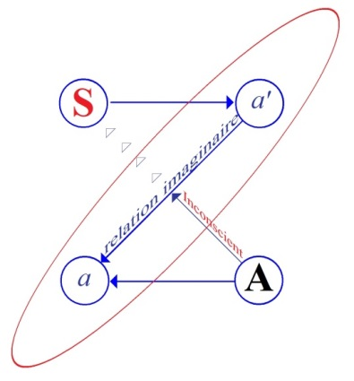
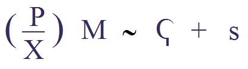
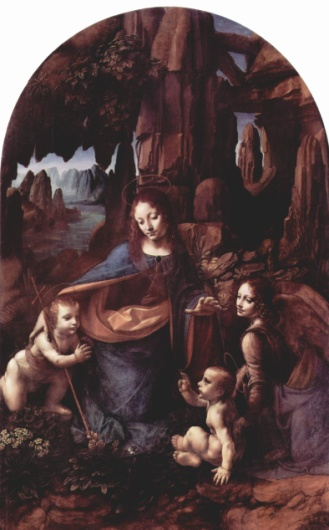
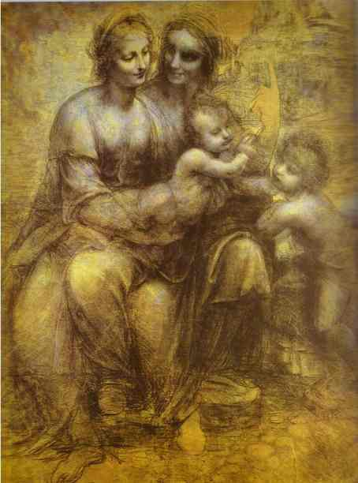
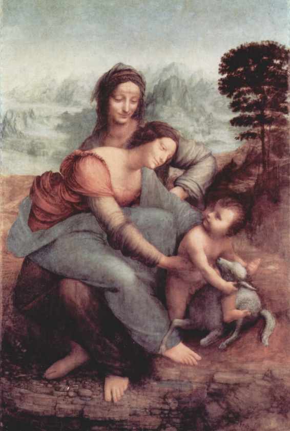
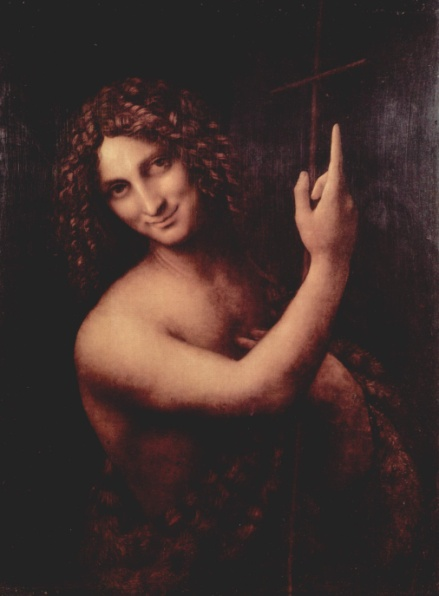

# Leçon 22 | 19 Juin 1957

  

    <label><input type="checkbox" data-lacan-toggle="original" checked> 原文</label>
    <label><input type="checkbox" data-lacan-toggle="notes" checked> 注释</label>
    <label><input type="checkbox" data-lacan-toggle="commentary" checked> 个人解读评论</label>
  

  <form class="lacan-tool-search" role="search">
    <input class="lacan-tool-search-input" type="search" placeholder="搜索全文" aria-label="搜索全文">
    <button class="lacan-tool-button" type="submit" title="搜索">搜索</button>
  </form>
  <button class="lacan-tool-button lacan-back-to-top" type="button" title="回到页面最上方" aria-label="回到页面最上方">↑</button>

<section class="parallel-paragraph" data-paragraph-ids="s4-22-0001">

s4-22-0001

原文 · s4-22-0001

L’année s’avance, le petit Hans - espérons-le - tire sur sa fin. Il conviendrait que je vous le rappelle à l’orée de cette leçon,
que nous nous sommes donnés cette année pour but la révision de la notion de *relation d’objet*. Il ne nous paraît pas inutile de prendre, pour un instant, un petit peu de recul, histoire de vous montrer, non pas ce que je n’appellerai pas « *le chemin parcouru »*, on en parcourt toujours un, mais j’espère un certain effet de démystification auquel vous savez que je tiens beaucoup.

[无对应译文]

</section>

<section class="parallel-paragraph" data-paragraph-ids="s4-22-0002">

s4-22-0002

原文 · s4-22-0002

En matière d’*analyse*, il est tout de même semble-t-il, un minimum exigible dans la formation analytique, qui est de s’apercevoir que si l’homme a affaire à *ces instincts* - *ces instincts* auxquels je crois, quoiqu’on en dise - à ces instincts y compris *l’instinct de mort*,
si c’est là *l’essentiel* de ce que nous a apporté *l’analyse*, c’est tout de même à prévoir que tout ne peut pas se résumer, aboutir,
à une formule aussi simple et aussi benoîte que celle à laquelle pourtant nous voyons communément *les psychanalystes* se rallier,
à savoir qu’en somme tout est résolu quand nous sommes arrivés à ce but dernier que les rapports du sujet avec son semblable soient comme on dit, des rapports « de personne à personne », et non pas des rapports à un objet.

[无对应译文]

</section>

<section class="parallel-paragraph" data-paragraph-ids="s4-22-0003">

s4-22-0003

原文 · s4-22-0003

Ce n’est assurément pas parce que j’ai essayé ici de vous montrer dans sa complexité réelle *la relation d’objet*, que je répugne
à ce terme de *relation d’objet*. Et en effet pourquoi *notre semblable* ne serait-il pas valablement un objet ? Je dirais même plus :
plût au ciel qu’il le fût, un objet, car à la vérité dans ce que l’*analyse* nous montre, c’est que communément et au départ
*il est encore bien moins qu’un objet, il est ce quelque chose qui vient remplir sa place de signifiant à l’intérieur de notre interrogation*,
*si tant est que la névrose est* - comme je vous l’ai dit, redit, et répété - *une question*.

[无对应译文]

</section>

<section class="parallel-paragraph" data-paragraph-ids="s4-22-0004">

s4-22-0004

原文 · s4-22-0004

[无对应译文]

</section>

<section class="parallel-paragraph" data-paragraph-ids="s4-22-0005">

s4-22-0005

原文 · s4-22-0005

- *Un objet*, ce n’est pas quelque chose d’aussi simple.

[无对应译文]

</section>

<section class="parallel-paragraph" data-paragraph-ids="s4-22-0006">

s4-22-0006

原文 · s4-22-0006

- *Un objet*, c’est quelque chose qui assurément *se conquiert*, et même comme FREUD nous le rappelle, ne se conquiert jamais sans être d’abord perdu.

[无对应译文]

</section>

<section class="parallel-paragraph" data-paragraph-ids="s4-22-0007">

s4-22-0007

原文 · s4-22-0007

- *Un objet* est toujours une reconquête, et c’est en somme et uniquement de *reprendre une place qu’il a d’abord déshabitée,* que l’homme peut arriver à ce quelque chose que l’on appelle improprement sa propre totalité.

[无对应译文]

</section>

<section class="parallel-paragraph" data-paragraph-ids="s4-22-0008">

s4-22-0008

原文 · s4-22-0008

Pour ce qui est de *la personne*, vous devez bien vous rendre compte qu’assurément il est souhaitable que *quelque chose* s’établisse entre nous et quelques sujets qui représentent en effet la plénitude de *la personne*. C’est bien le terrain sur lequel il est en fin
de compte le plus difficile d’avancer, c’est bien le terrain aussi sur lequel tous les dérapages, toutes les confusions s’établissent.

[无对应译文]

</section>

<section class="parallel-paragraph" data-paragraph-ids="s4-22-0009">

s4-22-0009

原文 · s4-22-0009

Une personne, s’imagine-t-on communément, c’est évidemment ce quelque chose auquel nous reconnaissons le droit de dire « *je* », comme à nous-mêmes. Mais comme nous sommes trop évidemment les plus embarrassés du monde chaque fois
qu’il s’agit de dire « *je* », au sens plein, ceci qui est puissamment mis en relief par l’expérience analytique, est bien fait pour nous montrer que ce dans quoi l’on glisse le plus communément chaque fois qu’il s’agit de penser à *l’autre* comme quelqu’un qui dit « *je* », c’est de lui faire dire notre propre « *je* », c’est-à-dire de l’induire dans nos propres mirages.

[无对应译文]

</section>

<section class="parallel-paragraph" data-paragraph-ids="s4-22-0010">

s4-22-0010

原文 · s4-22-0010

Bref, comme je vous l’ai souligné l’année dernière à la fin de mon séminaire sur les psychoses, c’est non pas le problème
du « *je* », mais le problème du « *tu* » qui est assurément le plus difficile à réaliser quand il s’agit de rencontrer la personne.
Et ce « *tu* », tout nous montre qu’il est *le signifiant limite*, qu’il est ce quelque chose en fin de compte à *mi-chemin* duquel
il faut toujours que nous nous arrêtions.

[无对应译文]

</section>

<section class="parallel-paragraph" data-paragraph-ids="s4-22-0011">

s4-22-0011

原文 · s4-22-0011

Néanmoins c’est tout de même de lui que nous recevons toutes *les investitures*. Ce n’est pas pour rien qu’à la fin de mon séminaire de l’année dernière, c’est sur « *Tu es celui qui me suivras* » ou « …*qui ne me suivras pas.* », ou « *qui feras ceci* » ou « …*qui ne le feras pas.* »,
que je me suis arrêté.

[无对应译文]

</section>

<section class="parallel-paragraph" data-paragraph-ids="s4-22-0012">

s4-22-0012

原文 · s4-22-0012

Si l’analyse est une expérience qui nous a montré quelque chose, c’est précisément que tout rapport inter-humain est fondé sur *cette investiture qui vient en effet de l’Autre*, un *Autre* qui est d’ores et déjà en nous sous la forme de l’inconscient, mais que rien dans notre propre développement ne peut se réaliser, si ce n’est *à travers cette constellation qui implique l’Autre absolu, comme siège de la parole*.

[无对应译文]

</section>

<section class="parallel-paragraph" data-paragraph-ids="s4-22-0013">

s4-22-0013

原文 · s4-22-0013

Et que si *le complexe d’Œdipe* a un sens, c’est pré­cisément parce qu’il donne comme étant le fondement de notre progrès,
de notre installation entre le *Réel* et le *Symbolique*, l’existence de celui qui a la parole, de celui qui peut parler, du *père*.
Pour tout dire, il le concrétise en une fonction qui, je vous le répète, est en elle-même essentiellement problématique.

[无对应译文]

</section>

<section class="parallel-paragraph" data-paragraph-ids="s4-22-0014">

s4-22-0014

原文 · s4-22-0014

L’interrogation « *Qu’est-ce que le père ?* » est en fin de compte une inter­rogation qui est posée au centre de l’expérience analytique comme une inter­rogation éternellement non résolue, du moins pour nous *analystes*. C’est là le point sur lequel je veux aujourd’hui reprendre le problème du petit Hans, vous montrer en quoi, et où le petit Hans se situe par rapport à ce que le père est
et n’est pas, et pour le reprendre de plus haut, vous faire remarquer que le seul lieu duquel il puisse être répondu d’une façon pleine et valable à l’interrogation sur le père, c’est assurément dans une certaine tra­dition. Ce n’est pas la pièce à côté,

[无对应译文]

</section>

<section class="parallel-paragraph" data-paragraph-ids="s4-22-0015">

s4-22-0015

原文 · s4-22-0015

comme je le dis souvent à propos des phé­noménologies \[Cf. supra : salle de bain et librairie\]. Nous dirons là : c’est la porte à côté.

[无对应译文]

</section>

<section class="parallel-paragraph" data-paragraph-ids="s4-22-0016">

s4-22-0016

原文 · s4-22-0016

Si *le père* doit trouver quelque part sa synthèse, son sens plein, c’est dans une *tradition* qui s’appelle *la tradition religieuse*.
Ce n’est pas pour rien que nous voyons au cours de l’histoire se former, et se former seulement dans la tradition qui est
la tradition judéo-chrétienne, cette tentative d’établir l’accord entre les sexes sur le principe d’une opposition de « *la puissance* »
et de « *l’acte* » qui trouve sa médiation dans un amour.

[无对应译文]

</section>

<section class="parallel-paragraph" data-paragraph-ids="s4-22-0017">

s4-22-0017

原文 · s4-22-0017

Mais hors de cette tradition, disons-le bien, toute relation à l’objet implique cette tierce dimension que nous voyons articulée dans ARISTOTE, qui est précisément celle qui est ensuite éliminée par - je dirais - l’ARISTOTE apocryphe,
l’ARISTOTE d’une théologie qu’on lui a attribuée bien plus tard - cha­cun sait, et quelle existe et qu’elle est apocryphe -

[无对应译文]

</section>

<section class="parallel-paragraph" data-paragraph-ids="s4-22-0018">

s4-22-0018

原文 · s4-22-0018

et le terme aristotélicien absolument essentiel à propos de toute la constitution de l’objet est opposé au troisième terme
de *la privation*. C’est autour de la notion de la *privation* …
d’ailleurs vous l’avez vu, c’est de là que je suis parti cette année
…que tourne toute *la relation d’objet* telle qu’elle est établie dans la littérature analytique et dans la doctrine freudienne.

[无对应译文]

</section>

<section class="parallel-paragraph" data-paragraph-ids="s4-22-0019">

s4-22-0019

原文 · s4-22-0019

La notion de la *privation* y est absolument centrale, et ce n’est pas en dehors de la *privation* que nous pouvons comprendre ceci :
c’est que tout le progrès de *l’intégration*, aussi bien *de l’homme* que *de la femme à son propre sexe*, exige pour l’un et pour l’autre
la reconnaissance de quelque chose

[无对应译文]

</section>

<section class="parallel-paragraph" data-paragraph-ids="s4-22-0020">

s4-22-0020

原文 · s4-22-0020

- qui est essen­tiellement *privation* à assumer pour l’un des sexes,

[无对应译文]

</section>

<section class="parallel-paragraph" data-paragraph-ids="s4-22-0021">

s4-22-0021

原文 · s4-22-0021

- et pour l’autre *privation* à assumer également pour pouvoir assumer pleinement son propre sexe.

[无对应译文]

</section>

<section class="parallel-paragraph" data-paragraph-ids="s4-22-0022">

s4-22-0022

原文 · s4-22-0022

Bref : *pénisneid* d’un côté, *complexe de castration* de l’autre. Naturellement tout ceci rejoint l’expérience la plus immédiate.
Il est assez *singulier* de voir reprendre sous une forme plus ou moins camouflée - mais aussi bien, on peut dire, jusqu’à un certain point : malhonnête - l’idée que toute matu­ration de la génitalité comporte cette *oblativité*, cette reconnaissance pleine de l’autre, moyennant quoi devrait s’établir cette harmonie supposée, ainsi pré­établie, entre *l’homme* et *la femme*, dont pourtant nous voyons bien que l’ex­périence de tous les jours n’est en quelque sorte que l’échec perpétuel.

[无对应译文]

</section>

<section class="parallel-paragraph" data-paragraph-ids="s4-22-0023">

s4-22-0023

原文 · s4-22-0023

Allez dire sous une forme plus directe à l’épouse d’aujourd’hui qu’elle est…
comme s’exprime le théologien inconnu qui s’est inscrit sous la dénomination d’ARISTOTE,
après toute une tradition médiévale et scolastique
…allez dire à l’épouse d’aujourd’hui qu’elle est « *la puissance »* et que vous l’homme, vous êtes « *l’acte »*.
Vous aurez une prompte réponse : « *Très peu pour moi !* - vous dira-t-on - *Me prenez vous pour une pâte molle ?* »
Et assurément c’est bien clair, la femme est tombée au milieu des mêmes problèmes que nous.

[无对应译文]

</section>

<section class="parallel-paragraph" data-paragraph-ids="s4-22-0024">

s4-22-0024

原文 · s4-22-0024

Et il n’est pas besoin d’aborder la face si on peut dire féministe ou sociale de la question, il suffit de citer le joli quatrain
dont APOLLINAIRE mettait la profession de foi dans la bouche de Thérèse-TIRESIAS, ou plus exactement de son mari,
qui fuyant le journaliste, lui dit :

[无对应译文]

</section>

<section class="parallel-paragraph" data-paragraph-ids="s4-22-0025">

s4-22-0025

原文 · s4-22-0025

> « *Je suis une honnête femme-monsieur*
> *Ma femme est un homme-madame.*
> *Elle a emporté le piano le violon l’assiette au beurre*
> *Elle est soldat ministre merdecin, etc…* » \[[G. Apollinaire : Les mamelles de Tirésias, I, 7.](http://fr.wikisource.org/wiki/Les_Mamelles_de_Tir%C3%A9sias/Acte_premier)\]

[无对应译文]

</section>

<section class="parallel-paragraph" data-paragraph-ids="s4-22-0026">

s4-22-0026

原文 · s4-22-0026

Assurément il faut que nous nous tenions sur nos deux pieds sur le terrain de notre expérience, et que nous nous apercevions que si l’expérience analytique a fait faire quelque progrès au problème de plus en plus présentifié par toute notre expérience du développement de la vie, voire de la névrose, c’est bien justement dans la mesure où elle a su situer les rapports entre les sexes
sur leurs différents échelons de *la relation d’objet*. Mais qu’est-ce que cela veut dire ?

[无对应译文]

</section>

<section class="parallel-paragraph" data-paragraph-ids="s4-22-0027">

s4-22-0027

原文 · s4-22-0027

Cela veut dire…
comme on s’en était bien aperçu, et comme après tout ce n’est vraiment que tirer une sorte de voile

d’une pudeur absolument indigne, d’une fausse pudeur, que de ne pas le voir
…que si l’analyse a fait faire un progrès à quelque chose, c’est très précisément sur le plan de ce qu’il faut bien appeler
par son nom, sur le plan de l’*érotisme*, c’est-à-dire sur le plan où effec­tivement les rapports entre les sexes sont élucidés pour autant qu’ils se trouvent sur le chemin de quelque chose qui est une fusion, une réalisation, une réponse à la question posée par le sujet à propos de son sexe, et en tant qu’il est quelque chose qui est à la fois entré dans le monde, et qui n’y est jamais satisfait.

[无对应译文]

</section>

<section class="parallel-paragraph" data-paragraph-ids="s4-22-0028">

s4-22-0028

原文 · s4-22-0028

Pour le reste, à savoir la fameuse et parfaite *oblativité* où se trouve être en fin de compte l’harmonie idéale de l’homme
et de la femme, nous ne le trouvons qu’à un horizon limite qui ne nous permet même pas de désigner son but
comme un but à réaliser à l’analyse.

[无对应译文]

</section>

<section class="parallel-paragraph" data-paragraph-ids="s4-22-0029">

s4-22-0029

原文 · s4-22-0029

Il faut que nous sachions, pour avoir si je puis dire une perspective salubre sur ce en quoi consiste le progrès de notre investigation, il faut que nous nous apercevions que toujours, dans le rapport de l’homme et de la femme, à partir du moment où il est consacré, reste ouverte *cette béance* qui fait que pour qu’en fin de compte quelque chose de dernier puisse en rester
de recevable aux yeux du *philosophe*, c’est-à-dire de celui qui tire son épingle du jeu, c’est après tout *la femme* - *nommément l’épouse* - qui a essentiellement la fonction de ce qu’elle était pour SOCRATE, à savoir l’épreuve de sa patience, de sa patience au *Réel*.

[无对应译文]

</section>

<section class="parallel-paragraph" data-paragraph-ids="s4-22-0030">

s4-22-0030

原文 · s4-22-0030

À la vérité, pour entrer d’une façon plus vive dans ce qui aujourd’hui va encore ponctuer ce que je suis en train d’*affirmer*,
et ce qui va nous ramener au petit Hans, je ferai état et acte d’une information que j’ai trouvée dans le journal d’information
par excellence, ou plus exactement qu’un de mes excellents amis y a relevée et m’a rapportée.

[无对应译文]

</section>

<section class="parallel-paragraph" data-paragraph-ids="s4-22-0031">

s4-22-0031

原文 · s4-22-0031

Il a lu, il y a une dizaine de jours, cette petite nouvelle qui nous vient du fond de l’Amérique, d’une femme liée à son mari
par le pacte d’un éternel amour, et vous allez voir comment. Cette femme se fait faire depuis la mort de son mari,
très exactement tous les dix mois une enfant par lui.

[无对应译文]

</section>

<section class="parallel-paragraph" data-paragraph-ids="s4-22-0032">

s4-22-0032

原文 · s4-22-0032

Ceci peut vous paraître *quelque peu surprenant*, ne croyez pas qu’il s’agisse là d’un phénomène parthénogénétique,

[无对应译文]

</section>

<section class="parallel-paragraph" data-paragraph-ids="s4-22-0033">

s4-22-0033

原文 · s4-22-0033

il s’agit au contraire d’in­sémination artificielle, à savoir que cette femme vouée à la fidélité éternelle, au moment de l’ultime maladie qui conduisit son mari à trépasser, fit emma­gasiner une quantité suffisante du liquide qui devait lui permettre
de perpétrer la race du défunt à son gré, et comme vous le voyez, dans les délais les plus courts, et comme on dirait, répétés.

[无对应译文]

</section>

<section class="parallel-paragraph" data-paragraph-ids="s4-22-0034">

s4-22-0034

原文 · s4-22-0034

Cette petite nouvelle qui n’a l’air de rien, et qu’il nous a fallu attendre, nous aurions pu l’imaginer.
À la vérité c’est l’illustration la plus saisissante me semble-t-il, que nous puissions donner de ce que j’appelle le *x* de la paternité, car en fin de compte, vous n’êtes pas je pense, sans saisir les problèmes qu’in­troduit une pareille possibilité.

[无对应译文]

</section>

<section class="parallel-paragraph" data-paragraph-ids="s4-22-0035">

s4-22-0035

原文 · s4-22-0035

Quand je vous dis que *le père symbolique, c’est le père mort*, je pense que vous en voyez là une illustration.
Mais ce que cela introduit de nouveau, et qui est bien fait pour mettre en relief l’importance de cette remarque,
c’est que dans ce cas *le père réel aussi est le père mort*. À partir de ce moment il serait véritablement très intéressant
de se poser la question de ce que devient dans ce cas *le complexe d’Œdipe*.

[无对应译文]

</section>

<section class="parallel-paragraph" data-paragraph-ids="s4-22-0036">

s4-22-0036

原文 · s4-22-0036

Sur le plan premier, celui qui est le plus proche de notre expérience, il serait naturellement facile de faire quelques traits d’esprits sur ce que peut vouloir dire à la limite, le terme de « *femme froide* » : à *femme froide*, dirait le nouveau proverbe, *mari refroidi*.
Il y a là aussi le slogan inauguré par l’un de mes amis qui voulait en faire la réclame d’une marque de « *frigidaires* ».

[无对应译文]

</section>

<section class="parallel-paragraph" data-paragraph-ids="s4-22-0037">

s4-22-0037

原文 · s4-22-0037

Il est vrai que l’on a partout quelque difficulté à l’introduction de ce slogan sur des âmes anglo-saxonnes, mais c’est bien là
que ce slogan prendrait sa valeur. On peut imaginer une belle affiche où on verrait ces dames avec un air pincé, et en dessous

[无对应译文]

</section>

<section class="parallel-paragraph" data-paragraph-ids="s4-22-0038">

s4-22-0038

原文 · s4-22-0038

la sous­cription suivante : « *She takes care of her frigid air until she turns her husband a Frigidaire* »

[无对应译文]

</section>

<section class="parallel-paragraph" data-paragraph-ids="s4-22-0039">

s4-22-0039

原文 · s4-22-0039

C’est bien le cas dans le cas présent également. À la vérité, la question qui se pose là et qui est magnifiquement illustrée,
c’est bien assurément que la notion du père, la notion réelle dans aucun cas ne se confonde, en tant que père,
avec celle de sa fécondité.

[无对应译文]

</section>

<section class="parallel-paragraph" data-paragraph-ids="s4-22-0040">

s4-22-0040

原文 · s4-22-0040

Nous voyons bien là que le problème est ailleurs, et assurément nous ne pouvons pas non plus ne pas voir qu’à nous introduire dans la notion de ce que devient la notion du *complexe d’Œdipe* - car je vous laisse le soin d’extra­poler - à partir du moment

[无对应译文]

</section>

<section class="parallel-paragraph" data-paragraph-ids="s4-22-0041">

s4-22-0041

原文 · s4-22-0041

où l’on a commencé dans cette voie, nous ferons dans une centaine d’années aux femmes, des enfants qui seront les fils directs des hommes de génie qui vivent actuellement, et qui auront été d’ici là pré­cieusement conservés dans de petits pots.

[无对应译文]

</section>

<section class="parallel-paragraph" data-paragraph-ids="s4-22-0042">

s4-22-0042

原文 · s4-22-0042

Il est certain que la question se pose : si on a coupé quelque chose au père dans cette occasion, et de la façon la plus radicale,
il semble aussi que la parole lui soit coupée, et la question est évidemment de savoir comment et par quelle voie, sous quel mode, s’inscrira dans le psychisme de l’enfant cette parole de l’ancêtre dont en fin de compte la mère sera le seul représentant
et le seul véhicule : comment fera-t-elle parler l’ancêtre mis en boîte, si je peux m’exprimer ainsi ? Ceci n’est pas, comme vous
le voyez, du tout de la science-fiction, mais simplement a l’avantage de nous dénuder une des dimensions du problème.

[无对应译文]

</section>

<section class="parallel-paragraph" data-paragraph-ids="s4-22-0043">

s4-22-0043

原文 · s4-22-0043

Ceci, soit dit entre parenthèses, puisque tout à l’heure je vous adressais - pour la solution idéale du problème du mariage -
à « *la porte à côté* », il serait intéressant de voir comment en présence de ce problème de l’insémination posthume de l’époux consacré, l’Église trouvera moyen de prendre position.

[无对应译文]

</section>

<section class="parallel-paragraph" data-paragraph-ids="s4-22-0044">

s4-22-0044

原文 · s4-22-0044

Car à la vérité qu’elle se réfère à ce qu’elle met en avant en pareil cas, à savoir le caractère fondamental des pratiques naturelles, on peut lui faire remarquer que c’est justement dans la mesure où nous sommes arrivés à parfaitement dégager la nature
de ce qui n’en est pas, qu’une telle pratique peut être introduite et est possible. Dès lors il conviendra peut-être de préciser
le terme de « *naturel* », et on viendra bien entendu à y mettre l’accent sur le coté profondément artificieux de ce qui a jusqu’ici été appelé « la nature ». Bref, nous ne serons peut-être pas, à ce moment-là, complètement inutiles comme termes de référence. Notre bonne amie Fran­çoise DOLTO, voire un de ses élèves, deviendra peut-être du même coup un père de l’Église.

[无对应译文]

</section>

<section class="parallel-paragraph" data-paragraph-ids="s4-22-0045">

s4-22-0045

原文 · s4-22-0045

Bref, toute la question *de l’Imaginaire, du Symbolique et du Réel* ne suffira peut-être pas à poser seulement les termes de ce problème qui ne me paraît pas absolument près, dès lors qu’il peut être engagé dans la réalité, d’être résolu. Mais ceci bien entendu
nous rendra plus facile de formuler, comme je désire le faire aujourd’hui, *le terme dans lequel,* non pas *en soi*, mais *pour le sujet*,
*peut s’inscrire* ce que nous pouvons appeler *la sanction de la fonction du père*. Toute espèce d’introduction si on peut dire,
à *la fonction paternelle, nous apparaît être pour le sujet*, à partir du moment où nous avons fait passer ce courant d’air qui dénude
les colonnes du décor, *de l’ordre d’une expérience métaphorique*.

[无对应译文]

</section>

<section class="parallel-paragraph" data-paragraph-ids="s4-22-0046">

s4-22-0046

原文 · s4-22-0046

Je vais l’illustrer, non pas en vous accablant de nouvelles choses, mais en vous rappelant sous quelle rubrique j’avais introduit l’année dernière ce que j’appelle ici *la métaphore*. *La métaphore* est cette fonction, cet usage de *la chaîne signifiante* qui procède
en usant, non pas de sa dimension connective dans laquelle s’installe tout *usage métonymique de la chaîne signifiante*,
mais dans cette dimension de *substitution*.

[无对应译文]

</section>

<section class="parallel-paragraph" data-paragraph-ids="s4-22-0047">

s4-22-0047

原文 · s4-22-0047

L’année dernière je n’ai pas été très loin vous chercher une chose dont il s’agissait, je me suis obligé à aller la chercher
dans ce qui est vraiment à la portée de tous, dans le dictionnaire QUILLET où j’ai pris le premier exemple qui y était donné,
à savoir le vers de HUGO : « *Sa gerbe n’était pas avare ni haineuse* ». Vous me direz que le sort m’a favorisé puisque,
aussi bien ceci nous arrive aujourd’hui dans ma démonstration, comme une bague au doigt. \[[« *Booz endormi* », *La légende des siècles,* I](http://fr.wikisource.org/wiki/Booz_endormi)\]

[无对应译文]

</section>

<section class="parallel-paragraph" data-paragraph-ids="s4-22-0048">

s4-22-0048

原文 · s4-22-0048

Je vous dirais que n’importe quelle *métaphore* pourrait servir à une démonstration analogue, mais je vais vous répéter, parce que c’est tout à fait ce qui nous conduit aujour­d’hui, et ce qui nous ramène à notre sujet de la phobie, ce que veut dire « *métaphore* ».
Ce n’est pas - comme l’ont dit les surréalistes - le passage de l’étincelle poétique entre deux termes qui *imaginairement* sont aussi disparates que pos­sible. Assurément ceci a l’air de coller, car il est bien clair qu’il n’est pas question que cette pauvre gerbe
soit avare ou haineuse, et c’est bien en effet l’étrangeté toute humaine que de s’expliquer ainsi, c’est-à-dire de mettre en relation plus par l’intermédiaire d’une négation, et cette négation est sur le fond bien entendu d’une affirmation possible.

[无对应译文]

</section>

<section class="parallel-paragraph" data-paragraph-ids="s4-22-0049">

s4-22-0049

原文 · s4-22-0049

Il n’est pas question pour tout dire, qu’elle soit ni *avare* ni *haineuse*, *l’avarice et la haine* étant des attributs qui sont la propriété
de BOOZ non moins que *la gerbe*, et BOOZ faisant aussi bien de l’un que de l’autre, à savoir de ces propriétés et de ces mérites -
l’usage qui convient sans demander avis, ni faire part de ses sentiments ni aux uns ni aux autres.

[无对应译文]

</section>

<section class="parallel-paragraph" data-paragraph-ids="s4-22-0050">

s4-22-0050

原文 · s4-22-0050

Ce entre quoi et quoi se produit *la création métaphorique*, c’est entre ce qui s’explique sous ce terme « *sa gerbe* », et celui à qui
*sa gerbe* est substituée, c’est-à-dire le monsieur dont on nous a parlé depuis un instant en termes balancés, et qui s’appelle BOOZ.
C’est très précisément dans la mesure où la gerbe est là si je puis dire, ayant pris sa place, cette place un tout petit peu cumulaire sur laquelle il est déjà, lui, pourvu de ces qualités d’être ni avare ni haineux, c’est-à-dire d’avoir déblayé un certain nombre
de vertus négatives, c’est là que la gerbe vient prendre sa place, et pour un instant littéralement l’annule.
Nous retrouvons le schéma du *symbole* en tant qu’il est *la mort de la chose*.

[无对应译文]

</section>

<section class="parallel-paragraph" data-paragraph-ids="s4-22-0051">

s4-22-0051

原文 · s4-22-0051

Là, c’est encore bien mieux : le nom du personnage est aboli, et c’est sa gerbe qui vient se substituer à lui.
Et s’il y a métaphore, si ceci a un sens, si ceci est un temps de la poésie bucolique, c’est très précisément dans ce fait
que c’est parce que quelque chose comme sa gerbe, c’est-à-dire quelque chose d’es­sentiellement naturel, peut lui être substitué, que BOOZ reparaît après avoir été éclipsé, occulté, aboli dans ce que je peux appeler « *le rayonnement précisément fécond de la gerbe »*.

[无对应译文]

</section>

<section class="parallel-paragraph" data-paragraph-ids="s4-22-0052">

s4-22-0052

原文 · s4-22-0052

Il ne connaît en effet ni avarice ni haine et il est purement et simplement fécondité naturelle, et ceci a son sens précisément
dans le morceau qui suit. Dans le poème, ce dont il s’agit, c’est de nous annoncer ou de faire annoncer, dans le rêve qui va suivre à BOOZ, que malgré qu’il ait un grand âge comme il le dit lui-même, 80 ans d’âge, il va bientôt être père, c’est-à-dire
que sort de lui et de son ventre ce grand arbre au bas duquel chantait un roi, dit le texte, et au haut duquel mourait un Dieu.

[无对应译文]

</section>

<section class="parallel-paragraph" data-paragraph-ids="s4-22-0053">

s4-22-0053

原文 · s4-22-0053

Cette fonction de *la métaphore* sur laquelle je vous montre donc ce dont il s’agit…
toute création d’un nouveau sens dans la culture humaine est essen­tiellement métaphorique

[无对应译文]

</section>

<section class="parallel-paragraph" data-paragraph-ids="s4-22-0054">

s4-22-0054

原文 · s4-22-0054

…c’est pour autant que, par une substitution qui en même temps maintient ce à quoi elle se substitue, que passe…
dans la tension entre ce qui est aboli, supprimé et ce qui lui est substitué
…ce quelque chose de nouveau qui introduit si visiblement ce qui est développé dans l’improvisation poétique,
ce quelque chose de nouveau qui dans l’occasion est, justement par ce mythe *boozien,* manifestement incarné,
à savoir la dimension nouvelle, cette fonction de la paternité.

[无对应译文]

</section>

<section class="parallel-paragraph" data-paragraph-ids="s4-22-0055">

s4-22-0055

原文 · s4-22-0055

On pourrait pousser ces choses fort loin, et voir dans ce poème où comme d’habitude le vieil HUGO est loin d’être toujours dans une voie rigoureuse, il titube un petit peu à droite et à gauche, mais ce qui est tout à fait clair, c’est que :

[无对应译文]

</section>

<section class="parallel-paragraph" data-paragraph-ids="s4-22-0056">

s4-22-0056

原文 · s4-22-0056

> «  *Pendant qu’il sommeillait, Ruth, une moabite,  
> S’était couchée aux pieds de Booz, le sein nu,  
> Espérant on ne sait quel rayon inconnu,  
> Quand viendrait du réveil la lumière subite.*  »

[无对应译文]

</section>

<section class="parallel-paragraph" data-paragraph-ids="s4-22-0057">

s4-22-0057

原文 · s4-22-0057

Je vous prie de voir à quel point le style de cela est dans cette zone ambiguë où le réalisme se mêle à je ne sais quelle lueur
un peu trop crue, voire trouble, et qui nous évoque le clair-obscur de ces tableaux de CARAVAGE, qui avec toute leur rudesse populaire sont peut-être encore ce qui de nos jours peut nous donner le plus hautement le sens de la dimension sacrée.
Un peu plus loin donc, ce dont il s’agit, c’est toujours de la même chose :

[无对应译文]

</section>

<section class="parallel-paragraph" data-paragraph-ids="s4-22-0058">

s4-22-0058

原文 · s4-22-0058

> « *Immobile, ouvrant l’œil à moitié sous ses voiles,  
> Quel dieu, quel moissonneur de l’éternel été,  
> Avait, en s’en allant, négligemment jeté  
> Cette faucille d’or dans le champ des étoiles.* »

[无对应译文]

</section>

<section class="parallel-paragraph" data-paragraph-ids="s4-22-0059">

s4-22-0059

原文 · s4-22-0059

Je n’ai pas poussé…
ni dans mon enseignement de l’année dernière,
ni dans ce que j’ai écrit récemment sur cette gerbe du poème de BOOZ et de RUTH
…je n’ai pas poussé plus loin l’investigation ni les remarques sur le sujet du point jusqu’où le poète développe *la métaphore*.
J’ai laissé de côté la faucille, parce qu’aussi bien en dehors du texte, que de ce que nous faisons ici, ç’aurait pu paraître
aux lecteurs un peu forcé.

[无对应译文]

</section>

<section class="parallel-paragraph" data-paragraph-ids="s4-22-0060">

s4-22-0060

原文 · s4-22-0060

Je ne pense pas pourtant que vous ne puissiez pas ne pas être frappés de ceci : c’est que tout le poème pointe vers une image autour de laquelle bien entendu depuis un siècle, les gens s’émerveillent pour le caractère merveilleu­sement intuitif

[无对应译文]

</section>

<section class="parallel-paragraph" data-paragraph-ids="s4-22-0061">

s4-22-0061

原文 · s4-22-0061

et comparatif de la chose. Il s’agit du fin et clair croissant de la lune.

[无对应译文]

</section>

<section class="parallel-paragraph" data-paragraph-ids="s4-22-0062">

s4-22-0062

原文 · s4-22-0062

Mais il ne peut pas, je pense, vous échapper à quel point si la chose porte, si elle est autre chose qu’un très joli trait de peinture, une touche de jaune sur le ciel bleu, c’est très précisément pour autant que *la faucille dans ce ciel* là, est *l’éternelle faucille de la maternité*, celle qui a déjà joué son petit rôle entre KRONOS et URANOS, entre JUPITER et KRONOS, et que cette féminité,

[无对应译文]

</section>

<section class="parallel-paragraph" data-paragraph-ids="s4-22-0063">

s4-22-0063

原文 · s4-22-0063

la puis­sance dont j’ai parlé tout à l’heure qui est là bel et bien représentée dans cette espèce d’attente mythique de la femme,
c’est bien en effet le quelque chose qui est toujours là, qui traîne à la portée de sa main, cette faucille avec laquelle la glaneuse
va effectivement trancher, si je puis m’exprimer ainsi, la gerbe dont il s’agit, celle de laquelle rejaillira la lignée du Messie.

[无对应译文]

</section>

<section class="parallel-paragraph" data-paragraph-ids="s4-22-0064">

s4-22-0064

原文 · s4-22-0064

Notre petit Hans, dans le développement de la phobie, dans sa création et dans sa résolution, ne peut se concevoir,
ne peut s’inscrire d’une façon correcte en équation, qu’à partir de ces termes. Je vous prie de remarquer que nous avons là
dans le complexe d’Œdipe, ce quelque chose qui est à la place *x* où est l’enfant avec tous ses problèmes par rapport à la mère,
et c’est dans la mesure où quelque chose se sera produit qui aura constitué la métaphore paternelle, que pourra se placer
cet *élément signifiant* essentiel dans tout développement individuel qui s’appelle *le complexe de castration*.

[无对应译文]

</section>

<section class="parallel-paragraph" data-paragraph-ids="s4-22-0065">

s4-22-0065

原文 · s4-22-0065

Je dis aussi bien pour l’homme que pour la femme, c’est-à-dire que nous avons à poser l’équation suivante :

[无对应译文]

</section>

<section class="parallel-paragraph" data-paragraph-ids="s4-22-0066">

s4-22-0066

原文 · s4-22-0066

[无对应译文]

</section>

<section class="parallel-paragraph" data-paragraph-ids="s4-22-0067">

s4-22-0067

原文 · s4-22-0067

Si tant est que P c’est la métaphore paternelle, et que X doit être plus ou moins élidé selon les cas, selon les points
du développement et les problèmes auxquels la période pré-œdipienne a mené l’enfant par rapport à la mère,
c’est dans la liaison de la métaphore œdipienne que nous pouvons inscrire ainsi la phase essentielle à tout concept de l’objet
qui est constituée par - inscrivons ce que nous voulons - un C ou *la faucille*, plus quelque chose qui est justement la signification, c’est-à-dire ce dans quoi l’être se retrouve, ce dans quoi l’X trouve sa solution. C’est dans une telle formule que se situe

[无对应译文]

</section>

<section class="parallel-paragraph" data-paragraph-ids="s4-22-0068">

s4-22-0068

原文 · s4-22-0068

le moment essentiel du fran­chissement de l’œdipe.

[无对应译文]

</section>

<section class="parallel-paragraph" data-paragraph-ids="s4-22-0069">

s4-22-0069

原文 · s4-22-0069

Et dans le cas du petit Hans c’est exactement ce à quoi nous avons affaire, c’est à savoir que comme je vous l’ai expliqué,
c’est pour autant que par rapport à sa mère, il y a quelque chose qui est justement le problème insoluble que, parvenu au degré où il est arrivé de son développement, constitue le fait que la mère soit quelque chose d’aussi complexe que ce :
*mère* + *phallus* + *petit a*, avec toutes les complications que cela entraîne.

[无对应译文]

</section>

<section class="parallel-paragraph" data-paragraph-ids="s4-22-0070">

s4-22-0070

原文 · s4-22-0070

C’est dans la mesure où le petit Hans est arrivé à cette impasse, et ne peut pas en sortir...

[无对应译文]

</section>

<section class="parallel-paragraph" data-paragraph-ids="s4-22-0071">

s4-22-0071

原文 · s4-22-0071

- parce qu’*il n’y a pas de père*,

[无对应译文]

</section>

<section class="parallel-paragraph" data-paragraph-ids="s4-22-0072">

s4-22-0072

原文 · s4-22-0072

- parce qu’*il n’y a rien pour métaphoriser cette relation avec sa mère*,

[无对应译文]

</section>

<section class="parallel-paragraph" data-paragraph-ids="s4-22-0073">

s4-22-0073

原文 · s4-22-0073

- parce que pour tout dire, *il n’a d’autre issue de l’autre côté*,
  ...que :
  non pas la faucille,
  non pas le grand C du complexe de castration,
  non pas la possibilité d’une médiation, c’est-à-dire de perdre, puis de retrouver son pénis, mais qu’il ne trouve de l’autre côté
  que la morsure possible de la mère…
  qui est la même avec laquelle il se précipite goulûment sur elle, pour autant qu’elle lui manque,
  pour autant qu’il n’y a pas d’autre relation réelle avec la mère que la relation qu’a pour effet de mettre en relief toute la théorie présente de l’analyse, à savoir la relation de dévoration
  …c’est pour autant qu’il est arrivé à cette impasse, qu’il ne connaît pas d’autre relation au réel que celle en effet qu’on appelle,
  à tort ou à raison « *sadique-orale »*, c’est-à-dire que le petit m, ou encore m plus tout ce qui est *le réel* à ce moment là pour lui,
  à savoir en particulier *le réel* qui vient de venir au jour et qui ne manque pas de compliquer la situation, à savoir Π *son propre pénis* :

[无对应译文]

</section>

<section class="parallel-paragraph" data-paragraph-ids="s4-22-0074">

s4-22-0074

原文 · s4-22-0074

[无对应译文]

</section>

<section class="parallel-paragraph" data-paragraph-ids="s4-22-0075">

s4-22-0075

原文 · s4-22-0075

…c’est dans la mesure où le problème se présente comme cela pour lui, qu’il est nécessaire que s’introduise,
puisqu’il n’y en a pas d’autre, cet élément de médiation méta­phorique : le cheval. C’est-à-dire que l’instauration chez le petit Hans de la phobie, s’inscrit dans cette même formule qui est celle que je vous ai donnée tout à l’heure :

[无对应译文]

</section>

<section class="parallel-paragraph" data-paragraph-ids="s4-22-0076">

s4-22-0076

原文 · s4-22-0076

[无对应译文]

</section>

<section class="parallel-paragraph" data-paragraph-ids="s4-22-0077">

s4-22-0077

原文 · s4-22-0077

...ἵππος, avec l’esprit rude, étant *le cheval*, et M *la mère*. Ceci sera l’équivalent de quelque chose qui ne sera pas plus résolu pour autant, c’est-à-dire la morsure en tant qu’elle est pour lui le danger majeur, le danger majeur de toute sa réalité, et tout à fait et plus spécialement encore de celle qui vient d’arriver au jour, à savoir de sa réalité génitale.

[无对应译文]

</section>

<section class="parallel-paragraph" data-paragraph-ids="s4-22-0078">

s4-22-0078

原文 · s4-22-0078

Ceci peut vous sembler artificiel. N’en croyez rien. Commencez d’abord par vous en servir et vous verrez après si cela peut
en effet vous rendre service. Je peux vous en montrer mille faces qui sont immédiatement applicables, et en particulier ceci :
que le cheval qui est celui dont il est dit qu’il mord et qu’il menace à la fois le pénis, est aussi celui qui tombe,
et c’est bien pour cela - d’après ce que nous dit lui–même le petit Hans - que le cheval a été amené.

[无对应译文]

</section>

<section class="parallel-paragraph" data-paragraph-ids="s4-22-0079">

s4-22-0079

原文 · s4-22-0079

Il a d’abord été amené comme le *quelque chose* qui, mis en tête du fourgon qui doit emmener les bagages de la petite Lizzie,
et ce *quelque chose* qui peut se retourner et qui mord. Mais nous dit–il, c’est là qu’il a *attrapé la bêtise*, c’est-à-dire plus exactement que ce qui était accroché déjà à une signification, a été retenu par lui comme étant quelque chose qui allait bien au-delà
de toute signification, comme quelque chose qu’il sanctionne par cette espèce d’aphorisme ou d’affirmation défini­tionnelle :

[无对应译文]

</section>

<section class="parallel-paragraph" data-paragraph-ids="s4-22-0080">

s4-22-0080

原文 · s4-22-0080

« *Maintenant tous les chevaux vont tomber.* »

[无对应译文]

</section>

<section class="parallel-paragraph" data-paragraph-ids="s4-22-0081">

s4-22-0081

原文 · s4-22-0081

C’est en effet essentiellement en tant que fonction de *la chute*, qui est pré­cisément le terme commun entre tout ce qui est

[无对应译文]

</section>

<section class="parallel-paragraph" data-paragraph-ids="s4-22-0082">

s4-22-0082

原文 · s4-22-0082

en cause dans la partie inférieure de l’équation au moment où en est arrivé le petit Hans, que s’introduit la mère.

[无对应译文]

</section>

<section class="parallel-paragraph" data-paragraph-ids="s4-22-0083">

s4-22-0083

原文 · s4-22-0083

[无对应译文]

</section>

<section class="parallel-paragraph" data-paragraph-ids="s4-22-0084">

s4-22-0084

原文 · s4-22-0084

Nous avons souligné cet élément *chute de la mère*, le *phallus* de la mère qui est ce qui n’est plus tenable, ce n’est plus de jeu
et pourtant il fait tout pour maintenir l’existence de ce jeu. Enfin la petite Anna est très essentiellement ce qu’on souhaite
le plus au monde voir tomber, voire la pousser un petit peu.

[无对应译文]

</section>

<section class="parallel-paragraph" data-paragraph-ids="s4-22-0085">

s4-22-0085

原文 · s4-22-0085

C’est en tant que le cheval remplit - d’une façon, elle, efficace, imagée et en quelque sorte active - toutes ces fonctions
de la chute réunies, qu’il commence à être introduit comme un terme essentiel, comme le terme de cette phobie où nous voyons s’affirmer, se poser ce que sont vraiment les objets pour le psychisme humain.

[无对应译文]

</section>

<section class="parallel-paragraph" data-paragraph-ids="s4-22-0086">

s4-22-0086

原文 · s4-22-0086

C’est-à-dire quelque chose comme je vous l’ai dit tout à l’heure, qui mérite peut-être le titre d’*objet*, mais dont bien entendu
on ne saurait par trop insister sur le chapitre spécial de la qualification *objet,* qu’il est néces­saire d’introduire à partir du moment où les objets dont nous nous occupons sont les objets de la phobie, ou le fétiche, dont nous savons à la fois combien ils existent comme objet, puisqu’ils ont à constituer véritablement dans le psy­chisme du sujet si on peut dire, les véritables *bornes milliaires*
du désir, dans le cas du fétiche et de ses déplacements.

[无对应译文]

</section>

<section class="parallel-paragraph" data-paragraph-ids="s4-22-0087">

s4-22-0087

原文 · s4-22-0087

Dans le cas de la phobie, cet objet est à la fois quelque chose qui est là dans le réel, et en même temps qui en est manifestement distinct, qui d’autre part d’aucune façon n’est accessible à la conceptualisation, si ce n’est par l’in­termédiaire de cette formalisation signifiante. Jusqu’à présent, disons-le bien, on n’en a pas donné d’autre plus satisfaisante, et si j’ai l’air
de vous la présenter sous une forme un peu plus compliquée que ça n’a été fait jusqu’à présent, je vous fais remarquer
que ce n’est pas autrement non plus que FREUD finit par en parler à la fin de son œuvre.

[无对应译文]

</section>

<section class="parallel-paragraph" data-paragraph-ids="s4-22-0088">

s4-22-0088

原文 · s4-22-0088

Quand il articule pleinement que reprenant la phobie, il fait du cheval en l’occasion…
puisque c’est le petit Hans lui-même qu’il reprend comme exemple
…cet objet substitué à toutes les images, à toutes les significations confuses, plus ou moins mal dégagées autour desquelles
ne peut pas arriver à se décanter l’angoisse du sujet, il en fait l’objet presque arbitraire…
et c’est pour cela qu’il l’appelle *signal*
…grâce à quoi à l’intérieur de ce champ de confusions, vont pouvoir se définir des limites qui, pour être arbitraires,
n’en introduisent pas moins l’élément de délimitation grâce à quoi, au moins possiblement, est assurée *l’amorce d’un ordre,*
*le premier cristal d’une cristallisation organisée entre le Symbolique et le Réel.*

[无对应译文]

</section>

<section class="parallel-paragraph" data-paragraph-ids="s4-22-0089">

s4-22-0089

原文 · s4-22-0089

C’est bien en effet tout ce qui va se produire au cours du progrès de ce qu’on appelle *l’analyse de* Hans, si tant est qu’on puisse
au sens plein du terme, appeler ce qui se passe dans le cas de Hans, *une analyse*. Je vous fais remarquer ceci :
c’est que les psychanalystes ne semblent pas - tout au moins à lire monsieur JONES - avoir encore compris que si FREUD
a fait quelques réserves en disant qu’il s’agissait là d’un cas tout à fait exceptionnel - en ce sens qu’il a pu être mené et réalisé
*par le père* même de l’enfant, sans doute conduit par FREUD, mais *par le père* de l’enfant - il a par conséquent fait très peu
de fondements sur l’extension possible de cette méthode.

[无对应译文]

</section>

<section class="parallel-paragraph" data-paragraph-ids="s4-22-0090">

s4-22-0090

原文 · s4-22-0090

Les ana­lystes semblent s’étonner de cette timidité chez FREUD. Ils feraient mieux de regarder les choses de plus près,
et de se demander si effectivement du fait que cette analyse a été poursuivie *par le père*, elle ne présente pas des traits spé­cifiques qui en excluent - au moins partiellement - la dimension proprement trans­férentielle, autrement dit, si la bourde proférée habituellement par Melle Anna FREUD qui dit que dans les analyses d’enfants, il n’y a pas de transfert possible,
n’est pas justement applicable dans ce cas là parce qu’il s’agit du père.

[无对应译文]

</section>

<section class="parallel-paragraph" data-paragraph-ids="s4-22-0091">

s4-22-0091

原文 · s4-22-0091

Bien entendu alors qu’il n’est que trop évident que dans toute analyse d’enfant pratiquée par un analyste, il y a bel et bien transfert, tout simplement comme - et mieux que partout ailleurs - il y en a chez l’adulte, ici il s’agit de quelque chose
d’un peu particulier, et dont nous serons amenés par la suite montrer les conséquences.

[无对应译文]

</section>

<section class="parallel-paragraph" data-paragraph-ids="s4-22-0092">

s4-22-0092

原文 · s4-22-0092

Quoi qu’il en soit, c’est autour d’une telle formule que nous pouvons de la façon la plus rigoureuse scander tout le progrès
de l’intervention du père. Cette formule est utile - et je pense vous le montrer la prochaine fois - pour autant qu’elle nous permet vraiment de situer pourquoi certaines interventions du père sont a-fécondes, pourquoi d’autres engendrent ce branle

[无对应译文]

</section>

<section class="parallel-paragraph" data-paragraph-ids="s4-22-0093">

s4-22-0093

原文 · s4-22-0093

de la trans­formation mythique, grâce à qui cette *équation* va trouver son pouvoir dans le cas du petit Hans, et pour autant

[无对应译文]

</section>

<section class="parallel-paragraph" data-paragraph-ids="s4-22-0094">

s4-22-0094

原文 · s4-22-0094

qu’y sont intervenues, que se sont mani­festées au plus vite ses possibilités de progrès, sa *richesse métaphorique* implicite,
à savoir la possibilité de la transformation d’une pareille équation.

[无对应译文]

</section>

<section class="parallel-paragraph" data-paragraph-ids="s4-22-0095">

s4-22-0095

原文 · s4-22-0095

Je me contenterai pour aujourd’hui de vous en montrer le terme dernier et extrême, écrit dans la même formalisation.
Je vous en ai déjà dit assez pour que vous puissiez en concevoir, en comprendre la portée que je vous aurai écrite.
Ce que nous voyons à la fin, c’est quelque chose qui assurément est une solution, quelque chose qui instaure le petit Hans
dans un registre des relations objectales, comme on dit, qui est vivable.

[无对应译文]

</section>

<section class="parallel-paragraph" data-paragraph-ids="s4-22-0096">

s4-22-0096

原文 · s4-22-0096

Est-il pleinement réussi du point de vue de l’intégration œdipienne ? C’est justement ce que nous essayerons de voir
de plus près la prochaine fois. D’ores et déjà nous allons voir en quoi ça l’est et ça ne l’est pas. Si nous lisons le texte
tel que le petit Hans à la fin formule *sa position*, il nous dit « *Maintenant je suis le père* ». Nous n’avons pas besoin de nous demander comment il peut faire avec un père que tout au long de l’observation il est forcé en quelque sorte de stimuler, de supplier
« *Mais, fais donc ton métier de père !* » et dont le dernier et très beau fantasme qui se produit avec le père, montre qu’en quelque sorte le père le rattrape tout juste sur le quai du train alors qu’en réalité il y a longtemps que le petit Hans cavale en avant,
et est parti avec qui ? Comme par hasard avec la grand-mère. La première chose que lui demande le père :

[无对应译文]

</section>

<section class="parallel-paragraph" data-paragraph-ids="s4-22-0097">

s4-22-0097

原文 · s4-22-0097

- « *Maintenant que ferais-tu si tu étais le père à ma place ?* »

[无对应译文]

</section>

<section class="parallel-paragraph" data-paragraph-ids="s4-22-0098">

s4-22-0098

原文 · s4-22-0098

- « *Oh ! c’est bien simple, je t’emmènerais tous les dimanches voir grand-maman*… »

[无对应译文]

</section>

<section class="parallel-paragraph" data-paragraph-ids="s4-22-0099">

s4-22-0099

原文 · s4-22-0099

Il n’y a rien de changé dans la relation entre le fils et le père. Dans occasion nous pouvons donc présumer qu’il n’y a pas là
une réalisation tout à fait typique du *complexe d’Œdipe*. Pour tout dire nous le voyons très vite si nous savons lire le texte, assurément tous les liens avec le père sont très loin d’être rompus, ils sont même fortement noués par toute cette expérience analytique, mais comme le dit très bien le petit Hans : « *Tu seras désormais le grand-père.* »

[无对应译文]

</section>

<section class="parallel-paragraph" data-paragraph-ids="s4-22-0100">

s4-22-0100

原文 · s4-22-0100

Il le dit, mais à quel moment ? Lisez bien le texte : au moment où il a commencé par dire que lui, il était le père.
Ce grand-père vient là tout à fait à part, c’est seulement après qu’on ait parlé de la mère - qui sera, nous verrons quelle sorte
de mère dans l’occasion - c’est après qu’on ait parlé de *la mère* qu’on en vient à parler de l’autre femme qui sera *la grand-mère*.

[无对应译文]

</section>

<section class="parallel-paragraph" data-paragraph-ids="s4-22-0101">

s4-22-0101

原文 · s4-22-0101

Mais aucun lien, ni de la perspective du petit Hans pour soi, entre ce grand-père et cette grand-mère. Assurément ce n’est pas
à tort que FREUD souligne à cette occasion avec une satisfaction - quant à nous qui est loin de nous donner un entier soulagement - que la question de l’œdipe a été résolue très élégamment par ce petit bonhomme qui se fait dès lors l’époux
de sa mère, et qui renvoie son *père* à *la grand-mère*. C’est une façon élégante, voire humoristique, d’éluder la question,
mais rien ne nous indique jusqu’à présent dans tout ce qu’a écrit FREUD, qu’on puisse considérer cette solution
\- c’est peut–être une solution évidente - comme *une solution typique du complexe d’Œdipe*.

[无对应译文]

</section>

<section class="parallel-paragraph" data-paragraph-ids="s4-22-0102">

s4-22-0102

原文 · s4-22-0102

Pour tout dire, ce que nous voyons à partir de ce moment, c’est quelque chose qui de la part du petit Hans, assurément maintient une certaine continuité dans l’ordre des lignées. Si on n’était pas au moins arrivé jusque là, le petit Hans
n’aurait absolument rien résolu du tout, et pour tout dire, la fonction de la phobie aurait été, à proprement parler, nulle.

[无对应译文]

</section>

<section class="parallel-paragraph" data-paragraph-ids="s4-22-0103">

s4-22-0103

原文 · s4-22-0103

C’est que le petit Hans en tant qu’il se conçoit comme *le père*, est fonction de quelque chose qui s’inscrit à peu près comme ceci : la mère est la grand-mère, la mère à la fin du progrès est dédoublée. Ceci est un point très important, il a reconnu *quelque chose* qui lui permet de trouver *un équilibre à trois pattes*, qui est bien le minimum de ce sur quoi peut s’établir *la relation avec l’objet*
comme nous l’avons toujours dit, et ce tiers qu’il n’a pas trouvé chez son père est précisément chez la grand-mère
dont il a trop bien vu en effet la valeur absolument décisive, voire écrasante dans les relations d’objet.

[无对应译文]

</section>

<section class="parallel-paragraph" data-paragraph-ids="s4-22-0104">

s4-22-0104

原文 · s4-22-0104

Son propre père, c’est précisément en tant que derrière la mère il s’en adjoint une seconde, que le petit Hans s’instaure lui,
dans *une paternité*. Quelle sorte de paternité ? Paternité *imaginaire* précisément. À partir de ce moment, que nous dit le petit Hans ? Qui va avoir des enfants ? C’est lui, il le dit très nettement. Mais quand son père mettant les pieds dans le plat, lui demande :

[无对应译文]

</section>

<section class="parallel-paragraph" data-paragraph-ids="s4-22-0105">

s4-22-0105

原文 · s4-22-0105

- « *C’est avec maman que tu vas avoir des enfants ?* »

[无对应译文]

</section>

<section class="parallel-paragraph" data-paragraph-ids="s4-22-0106">

s4-22-0106

原文 · s4-22-0106

- « *Pas du tout, lui répond le petit Hans, qu’est-ce que veut dire cette histoire ? Tu m’as dit que le père ne peut pas avoir d’enfants à lui tout seul, alors tu veux maintenant que j’en aie ?* »

[无对应译文]

</section>

<section class="parallel-paragraph" data-paragraph-ids="s4-22-0107">

s4-22-0107

原文 · s4-22-0107

Il y a là un moment d’oscillation dans le dialogue entre l’enfant et le père, qui est tout à fait frappant et qui montre *le caractère* justement et très pré­cisément refoulé de tout ce qui est de l’ordre de *la création paternelle* comme telle, alors que ce qu’il articule
au contraire à partir de ce moment-là, c’est justement qu’il va avoir des enfants *mais des enfants imaginaires*. Des enfants, il souhaite - comme il le dit de la façon la plus précise et la plus articulée - il souhaite en avoir, mais d’un autre côté il ne veut pas que
sa mère en ait. En d’autres termes, il est absolument précis, d’où les assurances qu’il désire avant tout prendre quant à l’avenir : c’est que sa mère n’ait plus d’enfant.

[无对应译文]

</section>

<section class="parallel-paragraph" data-paragraph-ids="s4-22-0108">

s4-22-0108

原文 · s4-22-0108

Pour cela on est prêt à tout jusqu’à y compris à soudoyer largement - puisque nous sommes malgré tout en présence
d’un petit rejeton de capitalistes - le grand géniteur par excellence, celui sur lequel je reviendrai la prochaine fois pour vous montrer le véritable visage, car c’est un élément très important, le géniteur par excellence qui est *la cigogne* à la figure si étrange,
nous verrons la prochaine fois très exactement quelle place et quelle fonction il convient de lui accorder, on ira jusqu’à soudoyer *le père cigogne* pour qu’il n’y ait plus d’enfant réel.

[无对应译文]

</section>

<section class="parallel-paragraph" data-paragraph-ids="s4-22-0109">

s4-22-0109

原文 · s4-22-0109

La distinction fondamentale d’une certaine fonction paternelle qu’il y a chez l’enfant - et imaginaire - s’est substituée à la mère :
il a des enfants comme elle en a, il s’occupera de ses enfants *imaginaires* à la façon dont il est arrivé à complètement résoudre
la notion de l’enfant, jusqu’à y compris celle de la petit Anna. C’est le fantasme autour de la petit Anna, dont j’ai commencé
à vous parler la dernière fois, et sur lequel je reviendrai. Tout son fantasme autour de la boîte, de la cigogne, de la petite Anna qui a existé déjà bien avant sa naissance, a consisté à l’*imaginer*, à la *fan­tasmatiser*.

[无对应译文]

</section>

<section class="parallel-paragraph" data-paragraph-ids="s4-22-0110">

s4-22-0110

原文 · s4-22-0110

Il va donc avoir des enfants fantasmatiques, il va devenir un per­sonnage essentiellement poète, *créateur dans l’ordre imaginaire*,

[无对应译文]

</section>

<section class="parallel-paragraph" data-paragraph-ids="s4-22-0111">

s4-22-0111

原文 · s4-22-0111

et la dernière forme qu’il donne à ces sortes de créations *imaginaires*, c’est celle qu’il appelle *Lodi* sur laquelle on l’interroge :

[无对应译文]

</section>

<section class="parallel-paragraph" data-paragraph-ids="s4-22-0112">

s4-22-0112

原文 · s4-22-0112

- « *Qu’est-ce que signifie cette Lodi ?* »

[无对应译文]

</section>

<section class="parallel-paragraph" data-paragraph-ids="s4-22-0113">

s4-22-0113

原文 · s4-22-0113

Et le père est très intéressé :

[无对应译文]

</section>

<section class="parallel-paragraph" data-paragraph-ids="s4-22-0114">

s4-22-0114

原文 · s4-22-0114

- « *Est-ce Chocolodi ? Est-ce Saffalodi** *? ».

[无对应译文]

</section>

<section class="parallel-paragraph" data-paragraph-ids="s4-22-0115">

s4-22-0115

原文 · s4-22-0115

Et en effet « *Saffalodi* » veut dire *petite saucisse*. L’image de caractère fondamentalement *imaginaire*, *phalloforme,* pour tout dire
la *transmutation* *imaginaire* qui s’est opérée de ce *phallus* à la fois *non recédé* et *éternellement imaginée* pour la mère,
est ce que nous voyons reproduit à l’état du petit Hans, sous cette forme.

[无对应译文]

</section>

<section class="parallel-paragraph" data-paragraph-ids="s4-22-0116">

s4-22-0116

原文 · s4-22-0116

*La femme* ne sera jamais pour lui que le *fantasme* de *ces petites sœurs-filles* autour desquelles aura tourné toute sa crise enfantine.
Ce ne sera pas tout à fait *un fétiche* puisque aussi bien ce sera justement *le vrai fétiche* si je puis dire, c’est-à-dire qu’il ne se sera pas arrêté à ce qui est inscrit sur le voile, il aura retrouvé la forme *hétérosexuelle* typique de son objet.

[无对应译文]

</section>

<section class="parallel-paragraph" data-paragraph-ids="s4-22-0117">

s4-22-0117

原文 · s4-22-0117

N’empêche que sa relation avec les femmes sera désormais et pour toujours sans aucun doute marquée de cette genèse narcissique au cours de laquelle il a trouvé à se mettre en ortho­position par rapport au partenaire féminin : le partenaire féminin aura été engendré, non pas pour tout dire à partir de la mère, mais à partir des *enfants imaginaires* qu’il peut faire à la mère,
eux-mêmes *héritiers de ce phallus* autour duquel tout le jeu primitif de *la relation d’amour*, de *captation de l’amour* à l’endroit de la mère se sera primitivement joué.

[无对应译文]

</section>

<section class="parallel-paragraph" data-paragraph-ids="s4-22-0118">

s4-22-0118

原文 · s4-22-0118

Donc nous avons en fin de compte : avec d’une part l’affirmation de sa relation, lui comme nouveau père *- comme Vati -*
à une lignée maternelle, nous en aurons comme correspondance à cette deuxième partie de l’équation d’un autre côté,
c’est à dire *la petite Anna* chevauchant le cheval, *la petite Anna* prenant la position de domination par rapport à tout le charroi,
à tout le train, à tout ce que traîne la mère après elle.

[无对应译文]

</section>

<section class="parallel-paragraph" data-paragraph-ids="s4-22-0119">

s4-22-0119

原文 · s4-22-0119

Et c’est par l’intermédiaire de *la petite Anna* que lui, le petit Hans, est arrivé à faire ce que nous avons dit la dernière fois
qu’il faisait, c’est-à-dire à dominer la mère, pas simplement à la cravacher, à savoir - comme nous montre la suite de l’histoire -
à voir ce qu’elle avait dans le ventre, à savoir à extraire le petit canif castrateur qui désormais bel et bien extrait,
la rend beaucoup plus inoffensive.

[无对应译文]

</section>

<section class="parallel-paragraph" data-paragraph-ids="s4-22-0120">

s4-22-0120

原文 · s4-22-0120

Telle est la formule qui, opposée à celle-ci, marque le point d’arrivée de *la transformation* du petit Hans. Le petit Hans assurément aura toutes les apparences d’un hétérosexuel normal, néanmoins le chemin qu’il aura parcouru dans l’œdipe pour y arriver,
est un chemin atypique lié à cette carence du père dont vous pouvez peut–être vous étonner qu’elle soit si grande,

[无对应译文]

</section>

<section class="parallel-paragraph" data-paragraph-ids="s4-22-0121">

s4-22-0121

原文 · s4-22-0121

mais dont assu­rément toute la ligne de l’observation nous montre à tout instant *les défaillances* et *les défauts*, soulignés à tout instant par l’appel du petit Hans lui-même, et dont il n’y a certainement pas lieu de s’étonner qu’elle marque d’une atypie terminale
le progrès et la résolution de la phobie.

[无对应译文]

</section>

<section class="parallel-paragraph" data-paragraph-ids="s4-22-0122">

s4-22-0122

原文 · s4-22-0122

Ceci, je vous demande simplement d’en conserver les deux termes extrêmes, pour vous dire qu’il est *possible*, qu’il est *concevable* d’essayer d’articuler par une série d’étapes *la transformation* de l’un dans l’autre. Sans aucun doute convient-il de ne pas être là trop systématique : assurément cette sorte de *logique*, si on peut dire, est nouvelle, et peut-être doit-elle être, si elle est poursuive, simplement introductive d’un certain nombre de questions quant à son for­malisme, qui nous fassent nous demander si elle a absolument les mêmes lois que ce qui a pu d’ores et déjà être formalisé dans d’autres domaines de la logique.

[无对应译文]

</section>

<section class="parallel-paragraph" data-paragraph-ids="s4-22-0123">

s4-22-0123

原文 · s4-22-0123

Assurément FREUD, au niveau de la *Traumdeutung,* a déjà commencé quelque chose qui consiste à nous dire que la logique
de l’inconscient, autrement dit des signifiants dans l’inconscient, ce n’est certainement pas la même que celle que nous avons l’habitude de manier. Il y a un vaste quart de la *Traumdeutung* qui est essentiellement consacré à nous montrer comment
un certain nombre d’articulations *logiques* essentielles - le « *ou bien*…, *ou bien*… », la *transposition*, la *causalité*, -
peuvent se transporter dans *l’ordre de l’inconscient*. Elle est peut­ être distincte de notre logique coutumière, de *la topologie*.
Vous savez ce que c’est qu’*une topologie, c’est une géométrie en caoutchouc*. Ici aussi il s’agit d’une logique en caoutchouc et qui nous demande peut-être un certain nombre de définitions de termes qui nous permettent de définir une certaine *logique en caoutchouc*.

[无对应译文]

</section>

<section class="parallel-paragraph" data-paragraph-ids="s4-22-0124">

s4-22-0124

原文 · s4-22-0124

Mais cela ne veut pas dire que tout soit possible en particulier que *deux anneaux passés l’un dans l’autre* \[*sic*\], jusqu’à nouvel ordre
rien ne nous permet de les *dénouer*, ceci pour vous dire que la logique en caoutchouc n’est pas condamnée à l’entière liberté.

[无对应译文]

</section>

<section class="parallel-paragraph" data-paragraph-ids="s4-22-0125">

s4-22-0125

原文 · s4-22-0125

Bref, ce que nous voyons là arriver à la fin de la résolution de la phobie du petit Hans, c’est une certaine configuration

[无对应译文]

</section>

<section class="parallel-paragraph" data-paragraph-ids="s4-22-0126">

s4-22-0126

原文 · s4-22-0126

qui est celle-ci : malgré la pré­sence, l’insistance même de l’action paternelle, ce dans quoi le petit Hans s’ins­crit,

[无对应译文]

</section>

<section class="parallel-paragraph" data-paragraph-ids="s4-22-0127">

s4-22-0127

原文 · s4-22-0127

c’est dans une espèce de lignée matriarcale, ou plus exactement - pour être plus simple, pour être plus strict aussi -
de reduplication maternelle, comme s’il était nécessaire qu’il y eût un troisième personnage et que faute que ç’ait été le père,
ce soit cette fameuse grand-mère.

[无对应译文]

</section>

<section class="parallel-paragraph" data-paragraph-ids="s4-22-0128">

s4-22-0128

原文 · s4-22-0128

D’autre part, quelque chose qui le met par rapport à l’objet qui sera désormais l’objet de ses désirs, et je vous ai déjà souligné
que nous avons le témoignage dans l’anamnèse de quelque chose qui l’attache essentiellement à *Gmunden* et à sa petite sœur :
c’est-à-dire très précisément aux petites filles, c’est-à-dire aux enfants en tant qu’ils sont les filles de sa mère,
mais qu’ils sont aussi ses filles à lui, les filles imaginaires.

[无对应译文]

</section>

<section class="parallel-paragraph" data-paragraph-ids="s4-22-0129">

s4-22-0129

原文 · s4-22-0129

La structure originellement narcissique de ses relations avec la femme, est indiquée à l’issue, au débouché de la solution
de sa phobie. Que va-t-il rester comme *traces*, si on peut dire, *du passage par la phobie* ?

[无对应译文]

</section>

<section class="parallel-paragraph" data-paragraph-ids="s4-22-0130">

s4-22-0130

原文 · s4-22-0130

Quelque chose de très curieux, quelque chose qui est le rôle du petit agneau avec lequel à la fin il nous dit qu’il se livre à *des jeux très particuliers*, par exemple de se faire bousculer par lui, et ce petit agneau est un agneau sur lequel on a essayé de mettre un jour à cheval sa sœur, c’est-à-dire de la mettre dans la position - comme on l’appelle dans le fantasme - de la grande boîte.

[无对应译文]

</section>

<section class="parallel-paragraph" data-paragraph-ids="s4-22-0131">

s4-22-0131

原文 · s4-22-0131

La sœur est venue dans l’imagination de Hans, c’est elle qui, si vous vous en souvenez, est à cheval sur le cheval.
C’est la dernière étape avant *la résolution* de la phobie du cheval, il a fallu que la sœur domine cela avant que lui, le petit Hans, puisse traiter le cheval comme il le mérite, c’est-à-dire lui taper dessus, et à ce moment là l’équivalence entre le cheval et la mère est assurée : battre le cheval, c’est aussi battre sa mère. À la fin donc il reste quelque chose sur quoi est montée la petite sœur,
à savoir cet agneau. Voilà la configuration qui reste à la fin.

[无对应译文]

</section>

<section class="parallel-paragraph" data-paragraph-ids="s4-22-0132">

s4-22-0132

原文 · s4-22-0132

Je ne peux pas me refuser le plaisir, ni vous refuser cette énigme, de vous montrer ce quelque chose autour de quoi notre maître FREUD a fait tourner son analyse de Léonard DE VINCI, à savoir non pas *La Vierge au rocher *:

[无对应译文]

</section>

<section class="parallel-paragraph" data-paragraph-ids="s4-22-0133">

s4-22-0133

原文 · s4-22-0133

[无对应译文]

</section>

<section class="parallel-paragraph" data-paragraph-ids="s4-22-0134">

s4-22-0134

原文 · s4-22-0134

mais le grand carton de Sainte Anne qui est au Louvre \[*La Vierge à l’Enfant avec Sainte Anne*\], et qui est précédé par un dessin qui est au Burlington House et qui est celui-ci :

[无对应译文]

</section>

<section class="parallel-paragraph" data-paragraph-ids="s4-22-0135">

s4-22-0135

原文 · s4-22-0135

 

[无对应译文]

</section>

<section class="parallel-paragraph" data-paragraph-ids="s4-22-0136">

s4-22-0136

原文 · s4-22-0136

Toute l’analyse que FREUD a faite de Léonard DE VINCI tourne autour de cette Sainte Anne à la figure
si étrangement androgyne - elle ressemble d’ailleurs au *Saint Jean–Baptiste*

[无对应译文]

</section>

<section class="parallel-paragraph" data-paragraph-ids="s4-22-0137">

s4-22-0137

原文 · s4-22-0137

[无对应译文]

</section>

<section class="parallel-paragraph" data-paragraph-ids="s4-22-0138">

s4-22-0138

原文 · s4-22-0138

…de cette *Vierge à l’enfant*, et comme on le souligne ici, non pas comme dans le carton du Burlington House, le cousin,
à savoir le Jean-Baptiste, est justement un petit agneau.

[无对应译文]

</section>

<section class="parallel-paragraph" data-paragraph-ids="s4-22-0139">

s4-22-0139

原文 · s4-22-0139

Cette configuration *très singulière* qui n’a pas manqué d’attirer l’attention de FREUD, est véritablement l’os de sa démonstration, de cette très singulière œuvre qu’est son étude *Un souvenir d’enfance de Léonard de Vinci*.

[无对应译文]

</section>

<section class="parallel-paragraph" data-paragraph-ids="s4-22-0140">

s4-22-0140

原文 · s4-22-0140

J’espère que vous vous donnerez la peine d’ici la fin de l’année - car peut-être arriverai­-je à vous faire là-dessus la clôture
de mon séminaire - de lire *Un souvenir d’enfance de Léonard de Vinci*. Si vous ne vous apercevez pas en lisant ce *souvenir d’enfance*,
du caractère invraisemblablement énigmatique de toute situation où est introduit pour la première fois le terme de narcissisme, si vous ne réalisez pas l’audace presque insensée de cela, d’écrire une chose pareille au moment où cela a été écrit…

[无对应译文]

</section>

<section class="parallel-paragraph" data-paragraph-ids="s4-22-0141">

s4-22-0141

原文 · s4-22-0141

> nous avons réussi depuis littéralement à sco­tomiser cela,
>
> à méconnaître l’existence de choses comme celles-là dans l’œuvre de FREUD
> …lisez-le pour vous apercevoir à quel point il est difficile de savoir en fin de compte ce qu’il veut arriver à dire,
> mais lisez-le en même temps pour voir à quel point ça se tient, *malgré toutes les erreurs*, car il y a des erreurs, mais cela ne fait rien, c’est quelque chose qui est absolument consistant.

[无对应译文]

</section>

<section class="parallel-paragraph" data-paragraph-ids="s4-22-0142">

s4-22-0142

原文 · s4-22-0142

Je vous demande d’en prendre connaissance, de lire ce *Souvenir d’enfance de Léonard de Vinci*.

[无对应译文]

</section>

<section class="parallel-paragraph" data-paragraph-ids="s4-22-0143">

s4-22-0143

原文 · s4-22-0143

Cette configuration singulière qui, si je puis dire, est là pour nous présenter une *humanissima trinita*, trinité très humaine,
voire trop humaine, opposée à la *divinissima* à laquelle elle se substitue, est quelque chose sur quoi nous aurons à revenir.
Ce que j’ai voulu vous indiquer comme une pierre d’attente, c’est par quelle singulière nécessité nous trouvons un 4ème terme, comme une sorte de résidu sous la forme de cet agneau, du terme animal où nous retrouvons le terme même de la phobie.

[无对应译文]

</section>

