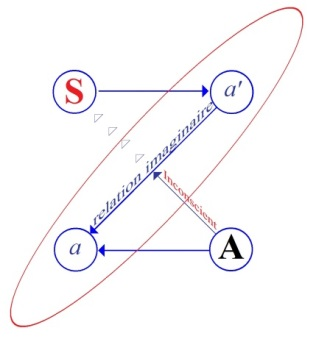
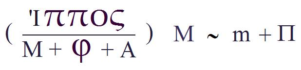
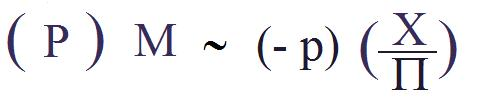
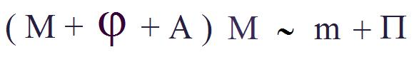
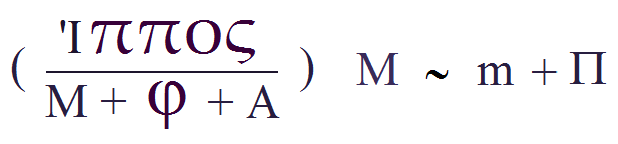
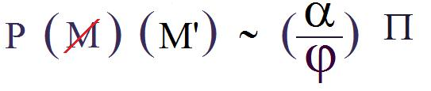
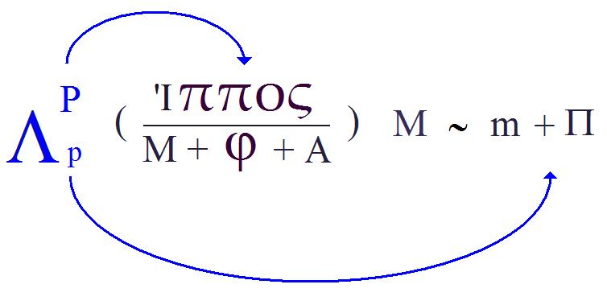
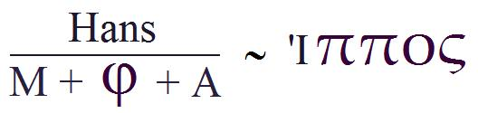
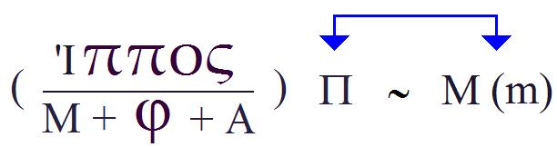

# Leçon 23 | 26 Juin 1957

  <label><input type="checkbox" data-lacan-toggle="original" checked> 原文</label>
  <label><input type="checkbox" data-lacan-toggle="notes" checked> 注释</label>
  <label><input type="checkbox" data-lacan-toggle="commentary" checked> 个人解读评论</label>

<section class="parallel-paragraph" data-paragraph-ids="s4-23-0001">

s4-23-0001

[无对应译文]

原文 · s4-23-0001

Il s’agit aujourd’hui de formaliser d’une façon un peu différente ce qui se passe dans l’observation du petit Hans.
Si cela a un intérêt - et ça n’en a qu’un seul - c’est de serrer de plus près, d’envelopper d’une façon plus rigoureuse d’abord
ce qui est dans l’observation.

</section>

<section class="parallel-paragraph" data-paragraph-ids="s4-23-0002">

s4-23-0002

[无对应译文]

原文 · s4-23-0002

Bien entendu il y a toutes les portes-­fenêtres possibles dans cette observation du petit Hans : puisque aussi bien il s’agit
d’une phobie du cheval, par exemple on pourrait délirer sur le cheval à perte de vue puisqu’en fin de compte ce cheval
est un animal très singulier, c’est le même que celui qui revient dans toute la mythologie du cheval, et qui peut aussi bien
se rapprocher valablement de celui du petit Hans.

</section>

<section class="parallel-paragraph" data-paragraph-ids="s4-23-0003">

s4-23-0003

[无对应译文]

原文 · s4-23-0003

FLIESS, *le fils du correspondant de* FREUD qui occupe une place honorable, a fait *sous le titre* « *Phylogenetic and ontogenetic experience* [^36]* »* pour le numéro *jubilaire* du centenaire de FREUD, une élucubration de mérite. Assurément elle est excessivement frappante, justement pour son caractère d’inadéquation.

</section>

<section class="parallel-paragraph" data-paragraph-ids="s4-23-0004">

s4-23-0004

[无对应译文]

原文 · s4-23-0004

Manifestement dans Hans, comme il y a des énigmes qui ne sont pas résolues, il s’efforce de les résoudre en apportant en effet au dossier toute une énorme extrapolation qui n’a que le désavantage tout à fait injustifié de supposer résolu
justement ce qui ne l’est pas. C’est une des choses les plus frappantes que de voir la façon dont il centre les choses d’une façon tout à fait valable sur le fameux dialogue entre le petit Hans et son père, ce que j’appelle « *le grand dialogue* », celui qui culmine quelque part du côté du [21 Avril](#April_21), celui où il s’agit en somme du petit Hans qui lit­téralement invoque son père en lui disant

</section>

<section class="parallel-paragraph" data-paragraph-ids="s4-23-0005">

s4-23-0005

[无对应译文]

原文 · s4-23-0005

« *Tu dois être jaloux* », alors que son père est là pour quelque chose dans le surgissement de cette phrase que l’on sent mûrie
par tout ce qui vient de précéder.

</section>

<section class="parallel-paragraph" data-paragraph-ids="s4-23-0006">

s4-23-0006

[无对应译文]

原文 · s4-23-0006

> \[Ich : « *Weshalb schimpf ich denn eigentlich ?  *»
> Er : « *Das weiß ich nicht ! *»
> Ich : « *Warum ?* »
> Er : « *Weil du eifern tust.* »
> Ich : « *Das ist doch nicht wahr !*  »
> Er : « *Ja, das ist wahr, du tust eifern, das weiß ich. Das muß wahr sein.* »\]

</section>

<section class="parallel-paragraph" data-paragraph-ids="s4-23-0007">

s4-23-0007

[无对应译文]

原文 · s4-23-0007

Le petit Hans littéralement invoque son père de jouer son rôle de père, et il lui dit : « *Tu dois être jaloux* ». « *Ceci, quoiqu’il arrive*
*et quelles que soient les dénégations effrayées, doit être vrai* ». C’est là dessus que se clôt un dialogue dans lequel le petit Hans développe
le fantasme suivant qui est celui d’imaginer que son père vient dans la chambre de sa mère, et que là il se blesse sur une pierre, comme le fit autrefois le petit Fritz, il vient heurter contre une pierre, et le sang doit couler.

</section>

<section class="parallel-paragraph" data-paragraph-ids="s4-23-0008">

s4-23-0008

[无对应译文]

原文 · s4-23-0008

Notre auteur insiste avec beaucoup de finesse sur l’usage des mots qui donnent une espèce de style plus « *soutenu* »
que partout ailleurs, à ce que dit le petit Hans, et dégage bien à ce sujet les insuffisances de la traduction anglaise.
Ce qui est intéressant, ce ne sont pas tellement ces remarques, qui assurément ont leur valeur, et qui montrent la sensibilité conservée chez les gens de la première génération - si je puis dire - analytique, au relief proprement verbal, à l’accent de certains signifiants, et à leur rôle essentiel, mais ce qui est inté­ressant, c’est évidemment aussi de voir à propos d’une spéculation assez fine sur le rôle du père dans cette occasion, l’intervention du père qui lui–même introduit, et dit-il à juste titre, pour la première fois un mot : « *schimpf* » \[schimfen : gronder\] à propos de quoi on traduit : « *Est-ce que je te querelle ? Est-ce que je t’ennuie ?* ».

</section>

<section class="parallel-paragraph" data-paragraph-ids="s4-23-0009">

s4-23-0009

[无对应译文]

原文 · s4-23-0009

L’auteur fait remarquer - et à juste titre - qu’il y a là une intervention qui vient à ce moment là d’une façon un petit peu étrangère au moment du dialogue, qui interrompt en quelque sorte l’échange avec le petit Hans et qui spécule sur ce qu’il peut y avoir
de participation de la part du père à quelque chose qui, à ce moment là, est supposé être dans le *moi* du petit Hans.

</section>

<section class="parallel-paragraph" data-paragraph-ids="s4-23-0010">

s4-23-0010

[无对应译文]

原文 · s4-23-0010

Et tout ceci ne constitue pas des extrapolations encore trop hardies, mais traduit la nécessité où il se trouve de nous dire
qu’à ce moment là, en quelque sorte, ça se constitue parce qu’il faut que ce soit comme cela, parce que c’est déjà dans
les implications d’une sorte de registre préformé qui doit être appliqué au cas. De toute façon il y a là quelque chose
qui nous fait saisir sur le vif les hésitations de l’auteur dans la façon dont il s’exprime.

</section>

<section class="parallel-paragraph" data-paragraph-ids="s4-23-0011">

s4-23-0011

[无对应译文]

原文 · s4-23-0011

Il traduit sur le vif par « *si c’est en train de naître* ». Ce n’est certainement pas encore né, la naissance du *surmoi* est quelque chose
de bien étrange, *avec référence* à ce moment là aux travaux de Monsieur ISAKOWER qui a beaucoup insisté sur la prédominance de la sphère auditive dans la formation du *surmoi*, c’est-à-dire qui assurément a pressenti tout le problème que nous posons
et reposons perpétuellement à propos de la fonction de la parole dans la genèse d’une certaine crise normative
qui est celle que nous appelons *le complexe d’Œdipe*.

</section>

<section class="parallel-paragraph" data-paragraph-ids="s4-23-0012">

s4-23-0012

[无对应译文]

原文 · s4-23-0012

Que Monsieur ISAKOWER ait fait des remarques également intéressantes et pertinentes sur la façon dont peut se manifester
à l’occasion une sorte de quelque chose dont nous saisissons la monture si on peut dire, une espèce d’appareil, de réseau
de formes qui constituent le *surmoi*, il va le saisir dans les éléments où le sujet entend, nous dit-il, des espèces de modulations purement syntaxiques, des paroles vides à proprement parler puisqu’il ne s’agit que de leur mouvement et, dit-il,
dans ces mouvements avec une certaine intensité, nous pouvons saisir sur le vif quelque chose qui doit se rapporter
à cet élément tout à fait archaïque.

</section>

<section class="parallel-paragraph" data-paragraph-ids="s4-23-0013">

s4-23-0013

[无对应译文]

原文 · s4-23-0013

L’enfant doit parler à certains moments, intégrer des moments tout à fait pri­mitifs, au moment où il ne perçoit de la parole de l’adulte que la structure avant d’en percevoir le sens. Ce serait en somme de l’intériorisation, et nous aurions la première forme de ce qui nous permettrait de concevoir ce qu’est à proprement parler le *surmoi*. C’est, là encore, une remarque intéressante,
et il serait intéressant, si c’était à l’intérieur d’un séminaire, de la voir groupée avec ce dialogue avec le père,
mais assurément pas pour y trouver quoique ce soit qui convienne.

</section>

<section class="parallel-paragraph" data-paragraph-ids="s4-23-0014">

s4-23-0014

[无对应译文]

原文 · s4-23-0014

Ce n’est certainement pas au moment où on nous parle d’une *intégration de* *la parole* dans son mouvement général,
dans sa structure fondamentale comme fondatrice d’une instance interne du *surmoi*, que nous allons rapporter cela
au moment précis où se passe le dialogue le plus extériorisé avec le père, fût-ce en croyant par là combler ses paradoxes.

</section>

<section class="parallel-paragraph" data-paragraph-ids="s4-23-0015">

s4-23-0015

[无对应译文]

原文 · s4-23-0015

Je souligne la nécessité, bien que nous devions à tout instant chercher des références générales à ce que nous décrivons,
de faire quelque chose qui doit dégager un certain progrès dans le maniement des concepts de l’expérience analytique,
de faire en le serrant d’aussi près que possible, le mouvement de l’observation du petit Hans.

</section>

<section class="parallel-paragraph" data-paragraph-ids="s4-23-0016">

s4-23-0016

[无对应译文]

原文 · s4-23-0016

Tout ce que nous avons fait jusqu’à présent, repose en somme sur un certain nombre de postulats - qui ne sont absolument pas des postulats - de nos commen­taires antérieurs, où l’on trouve tout un travail de commentaires et une réflexion
sur ce que nous donne l’expérience analytique. Il est bien certain que ces pos­tulats en question, comme par exemple celui-ci

</section>

<section class="parallel-paragraph" data-paragraph-ids="s4-23-0017">

s4-23-0017

[无对应译文]

原文 · s4-23-0017

que *la névrose est une question posée* par le sujet au niveau de son existence même :

</section>

<section class="parallel-paragraph" data-paragraph-ids="s4-23-0018">

s4-23-0018

[无对应译文]

原文 · s4-23-0018

- « *Qu’est-ce que c’est que d’avoir le sexe que j’ai ?* » ou

</section>

<section class="parallel-paragraph" data-paragraph-ids="s4-23-0019">

s4-23-0019

[无对应译文]

原文 · s4-23-0019

- « *Qu’est-ce que veut dire avoir un sexe ?*  »

</section>

<section class="parallel-paragraph" data-paragraph-ids="s4-23-0020">

s4-23-0020

[无对应译文]

原文 · s4-23-0020

- « *Qu’est-ce que veut dire que je puisse même me poser la question ?* ».

</section>

<section class="parallel-paragraph" data-paragraph-ids="s4-23-0021">

s4-23-0021

[无对应译文]

原文 · s4-23-0021

Ce qui fait l’introduction de *la dimension symbolique*, à savoir que l’homme n’est pas simplement un mâle ou une femelle,
mais qu’il faut qu’il se situe par rapport à quelque chose de symbolisé qui s’appelle mâle et femelle, si la névrose se rapporte
à cela, elle s’y rapporte encore d’une façon plus dramatique à propos d’une autre névrose, la *névrose obsessionnelle*,
non seulement du rapport du sujet à son sexe, mais au fait qu’il existe et qu’il se situe comme *obsessionnel*.

</section>

<section class="parallel-paragraph" data-paragraph-ids="s4-23-0022">

s4-23-0022

[无对应译文]

原文 · s4-23-0022

La question : « *Qu’est-ce que c’est que d’exister, comment est-ce que je suis par rapport à celui que je suis sans l’être puisque je puis en quelque sorte me dispenser de lui ?* », suffit pour concevoir si c’est à un registre comme celui-là que se pose la question de la névrose.

</section>

<section class="parallel-paragraph" data-paragraph-ids="s4-23-0023">

s4-23-0023

[无对应译文]

原文 · s4-23-0023

Si la névrose est une sorte de *question fermée* pour le sujet lui-même, mais organisée, structurée comme *question*, il est certain que nous comprenons mieux également que c’est dans le registre de ce qui organise une question, que nous pouvons comprendre

</section>

<section class="parallel-paragraph" data-paragraph-ids="s4-23-0024">

s4-23-0024

[无对应译文]

原文 · s4-23-0024

*les symptômes comme les éléments vivants de cette ques­tion articulée* sans que le sujet sache ce qu’il articule de cette question en quelque sorte vivante, sans qu’il sache dans laquelle il est souvent lui-même un élément qui se situe à divers niveaux, et qui peut se situer à un niveau tout à fait élémentaire, quasi alphabétique, comme aussi bien à un niveau syntaxique plus élevé.

</section>

<section class="parallel-paragraph" data-paragraph-ids="s4-23-0025">

s4-23-0025

[无对应译文]

原文 · s4-23-0025

Et c’est dans ce registre que nous nous permettons de parler de la fonction *hypnopompique* et *hypnagogique*, discernant et partant
de l’idée qui nous est donnée par les linguistes, tout au moins par certains d’entre eux, que ce sont là les deux grands versants
de l’articulation du langage.

</section>

<section class="parallel-paragraph" data-paragraph-ids="s4-23-0026">

s4-23-0026

[无对应译文]

原文 · s4-23-0026

Ce qui nous rend difficile de conserver, en quelque sorte, la ligne exacte, le droit fil dans le commentaire de l’observation,
c’est que toujours nous devons nous garder de verser d’une façon trop absolue, trop totale de l’un ou de l’autre des deux côtés
de ce qui nous est proposé. Pour que nous ayons une observation, il faut que nous commencions par analyser  le propre

</section>

<section class="parallel-paragraph" data-paragraph-ids="s4-23-0027">

s4-23-0027

[无对应译文]

原文 · s4-23-0027

de *la question* du névro­tique étant d’être absolument *fermée*, il n’y a aucune raison pour qu’elle se livre plus à celui qui en prendrait purement et simplement une sorte de *relevé*, ce serait tout simplement un *texte hiéroglyphique*, indéchiffrable, énigmatique,
et c’est pour cela qu’on a pu prendre des observations de névroses pendant des décades avant que FREUD arrive,
sans même soupçonner l’existence de cette *langue* à proprement parler.

</section>

<section class="parallel-paragraph" data-paragraph-ids="s4-23-0028">

s4-23-0028

[无对应译文]

原文 · s4-23-0028

Donc c’est toujours dans la mesure où quelque chose intervient qui est un commencement de déchiffrement,
que nous arrivons justement à saisir, à voir les transformations, les manipulations nécessaires pour qu’il nous soit confirmé, assuré qu’il s’agit bien d’*un texte* dans lequel nous nous retrouvons au moyen d’un certain nombre de structures qui apparaissent, mais simplement pour autant que nous le manions.

</section>

<section class="parallel-paragraph" data-paragraph-ids="s4-23-0029">

s4-23-0029

[无对应译文]

原文 · s4-23-0029

Soit que nous le manions au niveau du pur et simple découpage comme on le fait pour les énigmes…
par certains côtés c’est ainsi que nous procédons dans des cas particulièrement fermés, énig­matiques,

pas tout à fait différemment de ce que nous voyons exposé dans je ne sais quel texte de POE qui nous rappelle les pratiques communes au déchif­frement de dépêches, même envoyées dans un style codé ou archi-codé
…ou même en fin de compte en faisant le calcul des signes qui reviennent le plus grand nombre de fois, où nous arrivons à faire des suppositions intéressantes, à savoir que tel signe a une correspondance dans telle lettre dans la langue supposée
où nous aurons à traduire le texte codé. Heureusement nous en sommes, pour les névroses, à des opérations d’un ordre
plus élevé, c’est-à-dire que nous retrouvons certains ensembles syntaxiques avec lesquels nous sommes familiers.

</section>

<section class="parallel-paragraph" data-paragraph-ids="s4-23-0030">

s4-23-0030

[无对应译文]

原文 · s4-23-0030

Simplement le danger est évidemment toujours de se tromper, c’est-à-dire d’*entifier* ces ensembles syntaxiques à l’excès
vers ce qu’on peut appeler la propriété de l’âme, voire de l’έπος \[epos\]. C’est un peu trop dans le sens d’une sorte d’« *instinctualisation naturelle* », et de *ne pas nous apercevoir* que ce qui domine tout d’un coup, c’est le *nœud organisateur* qui donne
à un certain nombre d’ensembles, en effet la valeur littéralement d’*une unité-signification*, de ce qu’on appelle couramment un mot.

</section>

<section class="parallel-paragraph" data-paragraph-ids="s4-23-0031">

s4-23-0031

[无对应译文]

原文 · s4-23-0031

C’est ainsi que j’ai fait allusion dernièrement à cette fameuse « *identification* » de l’enfant à la mère, quand il s’agit du garçon.
Et je vous fais remarquer que c’est le fait général qu’une telle identification ne se fasse jamais que par rapport au mouvement général du progrès analytique, et comme FREUD le signale bien énergiquement dans cette observation :

</section>

<section class="parallel-paragraph" data-paragraph-ids="s4-23-0032">

s4-23-0032

[无对应译文]

原文 · s4-23-0032

« *C’est pourquoi la voie de l’analyse ne peut jamais répéter le mouvement de développement de la névrose.* » – texte allemand, page 205, [Gesammelte Schriften VIII](http://archive.org/details/Freud_1924_Gesammelte_Schriften_VIII_Krankengeschichten_k), 1924 - \[Le petit Hans\] \[*Bei der Bildung der Phobie aus den unbewußten Gedanken findet ja eine Verdichtung statt ;*
*darum kann der Weg der Analyse niemals den Entwicklungsgang der Neurose wiederholen*.\]
Nous voilà parvenus au vif du sujet. Dans cet effort de *déchiffrement* nous devons suivre ce qui a été *noué* effectivement
dans *le texte*, et *ce texte* est en lui-même soumis à l’utilisation d’un élément du passé du sujet, dans une situa­tion actuelle

</section>

<section class="parallel-paragraph" data-paragraph-ids="s4-23-0033">

s4-23-0033

[无对应译文]

原文 · s4-23-0033

*comme élément signifiant* par exemple. Voilà une des formes les plus claires de cet *x* *d’une condensation*.

</section>

<section class="parallel-paragraph" data-paragraph-ids="s4-23-0034">

s4-23-0034

[无对应译文]

原文 · s4-23-0034

Il est certain que si nous abordons les éléments signifiants, nous ne pouvons pas à ce moment là nous abstraire du fait que cela
nous décompose deux termes, deux points très éloigné dans l’histoire du sujet, et qu’il nous faut pourtant bien résoudre
les choses dans le mode d’organisation où elles sont actuellement. C’est cela qui nous permet en somme, et qui nous commande
de chercher les lois propres à la solution de chacun de ces discours organisés, selon les modes dans lesquels se présenteront pour nous les névroses. Seulement il y a le discours organisé, il y a quelque chose encore qui vient compliquer les choses,
c’est la façon dont un dialogue s’engage pour la solution de ce discours.

</section>

<section class="parallel-paragraph" data-paragraph-ids="s4-23-0035">

s4-23-0035

[无对应译文]

原文 · s4-23-0035

Cela ne peut pas se faire autrement sans que nous mêmes nous offrions à proprement parler notre place comme le lieu
où doit se réaliser une part des termes de ce discours qui en principe, du seul fait qu’il est un discours, comporte quelque part virtuellement et au départ, cet *Autre* qui est en somme *la place, le témoin, le garant, le lieu idéal de sa bonne foi*.

</section>

<section class="parallel-paragraph" data-paragraph-ids="s4-23-0036">

s4-23-0036

[无对应译文]

原文 · s4-23-0036

C’est bien là que nous nous plaçons en principe. C’est à partir de là que nous allons tout de suite voir arriver au jour, émerger, ces éléments de l’inconscient du sujet, c’est-à-dire ces termes qui prendront la place que nous occupons, et c’est ainsi que nous serons appelés dans le dialogue révélateur où va se formuler le sens du discours par un dialogue qui progressivement le *décrypte* en nous montrant quelle est la fonction du *personnage* que nous occupons. C’est là ce qui s’appelle le trans­fert. Et ce *personnage*

</section>

<section class="parallel-paragraph" data-paragraph-ids="s4-23-0037">

s4-23-0037

[无对应译文]

原文 · s4-23-0037

au cours de l’analyse, ne manque pas de changer. C’est ainsi que nous tentons de mettre au jour le sens de ce discours.

</section>

<section class="parallel-paragraph" data-paragraph-ids="s4-23-0038">

s4-23-0038

[无对应译文]

原文 · s4-23-0038

C’est donc bien nous même, en tant que nous sommes intégrés en tant que personne comme élément signifiant,
que nous sommes mis en mesure, en demeure en l’occasion, de résoudre le sens du discours de la névrose.
Et ces deux plans de l’*intersubjectivité* si essentiels à maintenir toujours devant nos yeux comme la structure fondamentale
dans laquelle se développe l’histoire du décryptement, c’est quelque chose qui pour une part, doit toujours être situé à propos
de telle observation et à propos du petit Hans.

</section>

<section class="parallel-paragraph" data-paragraph-ids="s4-23-0039">

s4-23-0039

[无对应译文]

原文 · s4-23-0039

Dans le cas du petit Hans, il fallait que nous mettions en évidence *la complexité* de la relation au père. Puisqu’il s’agit du père

</section>

<section class="parallel-paragraph" data-paragraph-ids="s4-23-0040">

s4-23-0040

[无对应译文]

原文 · s4-23-0040

en l’occasion, n’ou­blions pas que c’est lui qui fait l’analyse. Je vous ai dit qu’il y avait ce *Père réel*, actuel, dialoguant avec l’enfant, donc déjà *un père qui a la parole*, mais qu’*au-delà de lui il y a ce père à qui cette parole se révèle comme le témoin de sa vérité*, *ce père supérieur,*
*ce père tout-puissant* que représente FREUD. C’est là quelque chose qui ne manque pas de donner une caractéristique tout à fait essentielle à cette observation, caractéristique et structure qui méritent d’être retenues puisque, en fin de compte,
il est certain que nous devons les repérer à propos de toute espèce de relation.

</section>

<section class="parallel-paragraph" data-paragraph-ids="s4-23-0041">

s4-23-0041

[无对应译文]

原文 · s4-23-0041

Cette sorte d’instance supérieure est dans quelque chose de si inhérent au personnage paternel, où à la fonction paternelle,
que d’une façon quelconque elle tend toujours à se reproduire, et dans un sens comme je l’ai déjà signalé au cours de remarque antérieure, c’est bien là ce qui fait la spécificité du cas où le patient avait affaire au père, FREUD lui-même.

</section>

<section class="parallel-paragraph" data-paragraph-ids="s4-23-0042">

s4-23-0042

[无对应译文]

原文 · s4-23-0042

C’est que là le dédoublement n’existant pas, la super-autorité n’existant pas derrière lui, le patient sentait bien qu’il avait affaire
à quelqu’un qui, ayant fait surgir un univers nouveau de signification et cette relation de l’homme à son propre sens
et à sa propre condition, était celui-là même en face duquel il était, et à l’usage du patient qui était en face de lui.

</section>

<section class="parallel-paragraph" data-paragraph-ids="s4-23-0043">

s4-23-0043

[无对应译文]

原文 · s4-23-0043

Ceci nous explique ce qui nous apparaît paradoxal *dans les quelquefois* *très étonnants résultats*, comme aussi *dans les très étonnants modes d’intervention* qui étaient ceux de FREUD dans sa technique. Ceci étant rapporté, nous permet de mieux situer dans quel sens
se fait le glissement de notre intérêt. Je veux dire que si vous m’avez vu au long des années précédentes élaborer
*le schéma subjectif fondamental*…

</section>

<section class="parallel-paragraph" data-paragraph-ids="s4-23-0044">

s4-23-0044

[无对应译文]

原文 · s4-23-0044

</section>

<section class="parallel-paragraph" data-paragraph-ids="s4-23-0045">

s4-23-0045

[无对应译文]

原文 · s4-23-0045

à savoir que ce rapport symbolique entre le sujet et cet « *Autre à lui-même* » qui est le personnage inconscient qui le mène
et qui le guide en montrant quel rôle intermédiaire, en quelque sorte d’écran joue *l’autre imaginaire*, à savoir *le petit autre,*
si vous m’avez vu insister sur ceci au long des années qui ont précédé, vous voyez bien que peu à peu l’intérêt glisse et se *déplace*, et que c’est là à quelque chose qui ne présente pas de problèmes moins originaux et distincts des précédents, à savoir vers la structure même du discours dont il s’agit, que nous sommes peu à peu amenés.

</section>

<section class="parallel-paragraph" data-paragraph-ids="s4-23-0046">

s4-23-0046

[无对应译文]

原文 · s4-23-0046

Nous avons au cours de l’année, progressivement déplacé notre intérêt, car il y a bien entendu des lois de l’intersubjectivité,
des lois du rapport du sujet avec *le petit autre*, et avec *le grand Autre*, mais ceci n’enlève pas pour autant sans être le tout,
et cette fonction originale mérite d’être approchée pas à pas.

</section>

<section class="parallel-paragraph" data-paragraph-ids="s4-23-0047">

s4-23-0047

[无对应译文]

原文 · s4-23-0047

Le fait

</section>

<section class="parallel-paragraph" data-paragraph-ids="s4-23-0048">

s4-23-0048

[无对应译文]

原文 · s4-23-0048

- qu’il s’agit essentiellement de *langage*,

</section>

<section class="parallel-paragraph" data-paragraph-ids="s4-23-0049">

s4-23-0049

[无对应译文]

原文 · s4-23-0049

- qu’il s’agit essen­tiellement de discours,

</section>

<section class="parallel-paragraph" data-paragraph-ids="s4-23-0050">

s4-23-0050

[无对应译文]

原文 · s4-23-0050

- que le discours a des lois,

</section>

<section class="parallel-paragraph" data-paragraph-ids="s4-23-0051">

s4-23-0051

[无对应译文]

原文 · s4-23-0051

- que le rapport du *signifiant* et du *signifié* est quelque chose d’autre et de distinct, encore que cela puisse se recouvrir, comme les rapports de *l’imaginaire* et du *symbolique,*
  …c’est en somme à cela que nous avons été conduits progressivement dans tout notre mouvement de cette année à propos
  de *la relation d’objet*.

</section>

<section class="parallel-paragraph" data-paragraph-ids="s4-23-0052">

s4-23-0052

[无对应译文]

原文 · s4-23-0052

Nous avons vu se dégager comme une place originale des éléments qui sont bel et bien des objets, et qui sont même à un stade tout à fait original et fondateur, et même formateur des *objets*, mais qui sont tout de même quelque chose de tout à fait différent de ce qu’on peut appeler des objets au sens achevé, en tous cas de fort différent des objets réels, puisque c’est de l’utilisation d’objets qui peuvent être pris et extraits du malaise, mais qui sont des objets mis en *fonction de signifiant*.

</section>

<section class="parallel-paragraph" data-paragraph-ids="s4-23-0053">

s4-23-0053

[无对应译文]

原文 · s4-23-0053

Je l’ai fait d’abord pour *le fétiche*, cette année, ce dégagement, et je n’aurai pas été, d’ici à la fin de l’année, plus loin que de considérer *la phobie*. Mais si vous avez bien compris ce que nous avons tâché de mettre en jeu chaque fois que nous avons parlé de la phobie du petit Hans, vous aurez là un modèle à partir de quoi toute espèce de progrès ultérieur peut se concevoir
pour un approfondissement plus grand, plus étendu des autres névroses, et nommément de *l’hystérie* et de *la névrose obsessionnelle*.

</section>

<section class="parallel-paragraph" data-paragraph-ids="s4-23-0054">

s4-23-0054

[无对应译文]

原文 · s4-23-0054

Dans la phobie, ceci est particulièrement simple et exemplaire. Chaque fois que vous aurez affaire chez un sujet jeune
à une phobie, vous pourrez vous apercevoir qu’il s’agit toujours d’un signifiant relativement simple en apparence.
Bien entendu il ne sera pas simple dans son *maniement*, dans son jeu, à partir du moment où vous entrerez dans son jeu,

</section>

<section class="parallel-paragraph" data-paragraph-ids="s4-23-0055">

s4-23-0055

[无对应译文]

原文 · s4-23-0055

mais élémentairement c’est *un signi­fiant* qui occupe \[la place\], c’était là le sens de la formule que je vous avais donnée :

</section>

<section class="parallel-paragraph" data-paragraph-ids="s4-23-0056">

s4-23-0056

[无对应译文]

原文 · s4-23-0056

</section>

<section class="parallel-paragraph" data-paragraph-ids="s4-23-0057">

s4-23-0057

[无对应译文]

原文 · s4-23-0057

Et c’était en relation, pour autant que ces termes étaient la fonction pour laquelle était venue s’élaborer la relation chez la mère,
c’était ce qui était venu progressivement compliquer cette sorte de relation élémentaire à la mère, qui est celle dont nous sommes partis quand je vous ai parlé du schéma du symbole de la frustration : S(M), en tant que la mère est *présence* et *absence*,
et dans lequel *les relations de l’enfant à la mère* s’établissent au cours du développement au cours des âges.

</section>

<section class="parallel-paragraph" data-paragraph-ids="s4-23-0058">

s4-23-0058

[无对应译文]

原文 · s4-23-0058

Quelque chose dans le cas du petit Hans nous a fait d’abord arriver à ce stade extrêmement éprouvant où la mère se complique de toutes sortes d’élé­ments supplémentaires qui sont :

</section>

<section class="parallel-paragraph" data-paragraph-ids="s4-23-0059">

s4-23-0059

[无对应译文]

原文 · s4-23-0059

ce *phallus* dont je vous ai dit que c’était cer­tainement l’élément de béance critique de toute relation à deux, qu’on nous représente dans la dialectique analytique actuelle si fermée que l’on doit s’aper­cevoir à quel point il est lui-même dans une certaine relation
à une fonction imaginaire chez la mère et d’autre part il convient d’arriver à ce que représente cet autre enfant \[Anna\]
qui pour un instant chasse, expulse l’enfant de l’affection de la mère.

</section>

<section class="parallel-paragraph" data-paragraph-ids="s4-23-0060">

s4-23-0060

[无对应译文]

原文 · s4-23-0060

Voilà un moment critique qui est typique pour toute espèce de sujet que suppose notre discours. C’est toujours ainsi
que vous verrez apparaître une phobie chez l’enfant : c’est que quelque chose *manque* qui, à un moment donné,
vient jouer le rôle fondamental dans l’issue de cette crise, en apparence sans issue, que doit être la relation de l’enfant à la mère.

</section>

<section class="parallel-paragraph" data-paragraph-ids="s4-23-0061">

s4-23-0061

[无对应译文]

原文 · s4-23-0061

Ici nous n’avons pas besoin de faire des hypothèses. Toute la construction analytique est faite sur la consistance du *complexe d’Œdipe* qui d’une certaine façon peut se schématiser ainsi : P(M). Si le *complexe d’Œdipe* signifie quelque chose, cela veut dire
qu’à partir d’un certain moment la mère est considérée, vécue, en fonction du *Père*. Le *Père*, ici avec un grand P, parce que nous sup­posons que c’est là le père *au sens absolu* du terme, c’est le *Père* au niveau du *Père symbolique*, c’est le *Nom du Père* qui instaure l’existence du père dans cette complexité sous laquelle il se présente à nous, complexité que précisément toute l’expérience
de la psychopathologie décompose pour nous sous le *complexe d’Œdipe*. Au fond *ce n’est pas autre chose que cela*. C’est l’introduction de cet élément *symbolique* qui apporte une dimension nouvelle, complètement radicale à la relation de l’enfant avec la mère.

</section>

<section class="parallel-paragraph" data-paragraph-ids="s4-23-0062">

s4-23-0062

[无对应译文]

原文 · s4-23-0062

Nous devons partir des données empiriques. C’est l’existence de quelque chose qui, si vous voulez en gros, peut-être sous réserve de commentaires, peut à peu près s’instaurer ainsi :

</section>

<section class="parallel-paragraph" data-paragraph-ids="s4-23-0063">

s4-23-0063

[无对应译文]

原文 · s4-23-0063

</section>

<section class="parallel-paragraph" data-paragraph-ids="s4-23-0064">

s4-23-0064

[无对应译文]

原文 · s4-23-0064

Π sous X serait le pénis réel, et le (– p) justement ce quelque chose qui s’oppose à l’enfant comme une sorte d’antagonisme *imaginaire*, c’est *la fonction imaginaire du père*, pour autant que le père est agressif, pour autant que le père joue son rôle
dans ce *complexe de castration* dont l’expérience freudienne, si nous voulons la prendre au pied de la lettre, admet au moins provisoirement, si nous voulons la formaliser - et toute l’expérience l’affirme - la constance de ce *complexe de castration*.

</section>

<section class="parallel-paragraph" data-paragraph-ids="s4-23-0065">

s4-23-0065

[无对应译文]

原文 · s4-23-0065

Quelles que soient les discussions auxquelles il a pu prêter dans la suite, nous ne manquons jamais d’en garder la référence :
c’est dans la mesure où quelque chose se passe dans les relations avec la mère, et qui introduit le père comme facteur *symbolique* essentiel. C’est lui qui possède la mère, qui en jouit légitimement, c’est-à-dire une fonction même tout à fait fondamentale

</section>

<section class="parallel-paragraph" data-paragraph-ids="s4-23-0066">

s4-23-0066

[无对应译文]

原文 · s4-23-0066

et pro­blématique qui peut se fragmenter, s’affaiblir, et d’autre part la cohérence avec cela de quelque chose qui a pour fonction littéralement de faire entrer dans le jeu instinctuel du sujet, dans une assomption de ses fonctions comme une articulation essentielle cette signification dont nous pouvons dire qu’elle est vraiment spécifique du genre humain, et pour autant que l’ordre humain se développe avec cette dimension supplémentaire de *l’ordre symbolique*.

</section>

<section class="parallel-paragraph" data-paragraph-ids="s4-23-0067">

s4-23-0067

[无对应译文]

原文 · s4-23-0067

C’est que ses fonctions sexuelles sont frappées de quelque chose qui est bel et bien là quelque chose de signifiant,
de quasi instrumental, qui est qu’il doit passer par tenir compte, par faire entrer en jeu *quelque chose* qui est là présent,
vécu dans l’expérience humaine qui s’appelle *la castration* au sens où  le représente l’analyse de la façon la plus instrumentale :
*une paire de ciseaux, une faucille, une hache, un couteau*. C’est quelque chose qui fait partie si on peut dire, du mobilier instinctuel
de la relation sexuelle dans l’espèce humaine.

</section>

<section class="parallel-paragraph" data-paragraph-ids="s4-23-0068">

s4-23-0068

[无对应译文]

原文 · s4-23-0068

Il est bien clair qu’alors nous pourrions aussi essayer de faire du mobilier pour telle ou telle espèce animale : nous verrions que pour le *rouge-gorge*, il est assez probable que *le plastron pectoral coloré* pourrait être considéré comme une espèce d’élément de signal pour la parade comme pour la lutte intersexuelle.

</section>

<section class="parallel-paragraph" data-paragraph-ids="s4-23-0069">

s4-23-0069

[无对应译文]

原文 · s4-23-0069

Il est bien clair que l’on a chez l’animal l’équivalent du caractère constant de cet élément paradoxal à proprement parler, lié chez l’homme à un signifiant, qui s’appelle *le complexe de castration*. Voilà comment nous pouvons écrire la formule du *complexe d’Œdipe* avec son corrélatif *le complexe de castration*. Le *complexe d’Œdipe* lui-même est quelque chose qui s’organise sur le plan *symbolique*,
ce qui suppose derrière lui, pour le sujet comme constitutif, l’existence de *l’ordre symbolique* ?

</section>

<section class="parallel-paragraph" data-paragraph-ids="s4-23-0070">

s4-23-0070

[无对应译文]

原文 · s4-23-0070

C’est quelque chose que nous allons voir du petit Hans : ce n’est qu’à partir d’un certain moment du dialogue avec le père,
alors que le père essaye de le pousser vers la considération de toutes sortes d’éléments, si on peut dire, d’*explication psychologique*...
le père est timide, et il ne poussera jamais les choses complètement jusqu’au bout
…je fais la remarque que bien entendu, le pauvre petit Hans ne comprend pas bien la fonction de l’organe féminin.

</section>

<section class="parallel-paragraph" data-paragraph-ids="s4-23-0071">

s4-23-0071

[无对应译文]

原文 · s4-23-0071

Et cela se retourne : il est clair qu’au moment où il dit cela, le père, en désespoir de cause, finit par lui donner l’explication,
alors qu’il est clair par *les fantasmes* déjà développés à propos de la névrose, que l’enfant sait très bien que tout cela se trouve
dans le ventre de maman, qu’elle soit ou non *symbolisée* par *un cheval* ou par *une voiture*.

</section>

<section class="parallel-paragraph" data-paragraph-ids="s4-23-0072">

s4-23-0072

[无对应译文]

原文 · s4-23-0072

Mais ce que le père ne voit pas, c’est qu’il fait lui-même cette conclusion après un long entretien où l’enfant, lui, ne s’intéressait qu’à une espèce de construction généalogique. On voit que c’est cela qui l’intéresse le plus, c’est de savoir en quoi consiste
un certain moment de progrès qui soit normal dans l’occasion, ou ici renforcé par les difficultés propres de la névrose.

</section>

<section class="parallel-paragraph" data-paragraph-ids="s4-23-0073">

s4-23-0073

[无对应译文]

原文 · s4-23-0073

Il est tout à fait clair qu’il est normal, et que c’est dans la mesure où nous sommes dans un point très avancé de l’observation
où ceci se produit, que l’enfant n’a fait qu’une espèce de longue discussion pour construire les possibilités généalogiques
qui existent, c’est-à-dire : comment un enfant est en rapport avec un père, avec une mère, ce que cela signifie qu’être en rapport avec un père, avec une mère, et allant jusqu’à construire ce qui s’appelle dans cette occasion, et ce que FREUD souligne comme étant une théorie sexuelle des plus originales.

</section>

<section class="parallel-paragraph" data-paragraph-ids="s4-23-0074">

s4-23-0074

[无对应译文]

原文 · s4-23-0074

Il n’en a pas trouvé souvent chez l’enfant, et en effet comme dans toute observation, il y a des éléments particuliers :
à un moment l’enfant construit quelque chose dont il dit que les petits garçons donnent naissance aux petites filles,
et que les petites filles donnent naissance aux petits garçons. Ne croyez pas que ce soit quelque chose qui soit tout à fait impossible à retrouver dans la structure, dans l’organisation généalogique. C’est quelque chose qui nous est donné
par *la structure élémentaire de la parenté*. En fin de compte il y a du vrai là-dedans : c’est parce que les femmes font des hommes,
que les hommes ensuite peuvent rendre - je parle dans *l’ordre symbolique -* ce service essentiel aux femmes,
de leur permettre de poursuivre leur fonction de procréation.

</section>

<section class="parallel-paragraph" data-paragraph-ids="s4-23-0075">

s4-23-0075

[无对应译文]

原文 · s4-23-0075

Mais ceci bien entendu, à condition que nous le considérions dans *l’ordre symbolique*, c’est-à-dire dans un certain ordre qui assigne à tout ceci une succession régulière de générations. Bien entendu, comme je vous l’ai maintes fois fait remarquer, si dans *l’ordre naturel* il n’y a aucune espèce d’obstacle à ce que tout tourne d’une façon exclu­sive autour de la lignée féminine, sans aucune espèce de discrimination de ce qui peut arriver à propos du produit, sans aucune discrimination et sans aucune impossibilité
que ce soit en gros la mère, et à mesure de son temps de fécondité possible, même ultérieurement les générations suivantes.
C’est de *cet ordre* qu’il s’agit, c’est de *cet ordre symbolique*, c’est autour de cela que le petit Hans fait graviter toute sa construction extraordinairement luxuriante, fantaisiste, c’est cela qui l’intéresse. En d’autres termes, c’est à propos de grand P que se produit chez l’enfant cette interrogation de l’ordre symbolique : « *Qu’est-ce qu’un père ?* »

</section>

<section class="parallel-paragraph" data-paragraph-ids="s4-23-0076">

s4-23-0076

[无对应译文]

原文 · s4-23-0076

Pour autant qu’il est le pivot, le centre fictif et concret de ce maintien de l’ordre généalogique, de cet ordre qui permet à l’enfant de stimuler d’une façon satisfaisante le monde qui, de quelque façon qu’il faille le juger, culturellement ou naturellement
ou surnaturellement, est quelque chose dans lequel il vient bien au monde. C’est dans un monde humain organisé

</section>

<section class="parallel-paragraph" data-paragraph-ids="s4-23-0077">

s4-23-0077

[无对应译文]

原文 · s4-23-0077

*par cet ordre symbolique* qu’il fait son appa­rition. C’est à cela qu’il a à faire face. Naturellement la découverte de l’analyse n’est pas
de nous montrer quel est dans cette occasion le minimum d’exigence nécessaire de la part du *Père réel* pour qu’il communique, pour qu’il fasse sentir, pour qu’il transmette à l’enfant …la notion de sa place dans cet *ordre symbolique*.

</section>

<section class="parallel-paragraph" data-paragraph-ids="s4-23-0078">

s4-23-0078

[无对应译文]

原文 · s4-23-0078

Il est également pré­supposé que tout ce qui se passe dans les névroses est quelque chose qui jus­tement est fait par quelque côté pour suppléer à une difficulté, voire à une insuffisance dans la façon dont l’enfant a affaire à ce problème essentiel de l’*œdipe*.
Il est certain bien entendu qu’autre chose vient compliquer les éléments qui se produisent, et que l’on appelle des régressions, ces éléments intermédiaires de la relation primitive à la mère, qui déjà comportent un certain symbolisme duel.

</section>

<section class="parallel-paragraph" data-paragraph-ids="s4-23-0079">

s4-23-0079

[无对应译文]

原文 · s4-23-0079

Entre cela et le moment où se constitue à proprement parler l’*œdipe*, il peut se produire toutes sortes d’accidents qui ne sont rien d’autre que le fait que différents autres éléments d’échange de l’enfant viennent jouer leur rôle dans cette relation,
dans la construction, dans la compréhension de cet *ordre symbolique*, que pour tout dire, le prégénital peut être intégré et venir compli­quer l’interrogation, *la question de la névrose*. Dans le cas de *la phobie*, nous avons quelque chose de simple.
Personne ne conteste que les choses se passent ainsi dans le cas de la phobie, dans le cas où, au moins pour un moment, l’enfant est arrivé à ce que l’on appelle le stade génital où sont posés dans leur plénitude les problèmes de l’intégration du sexe du sujet, et que donc nous devons concevoir d’une certaine façon la fonction de l’élément phobique.

</section>

<section class="parallel-paragraph" data-paragraph-ids="s4-23-0080">

s4-23-0080

[无对应译文]

原文 · s4-23-0080

Ceci a déjà été pleinement articulé par FREUD qui les intégrait comme étant quelque chose du même ordre, homogène
à ce qu’on appelle la relation primitive à un certain nombre d’éléments isolés de son temps par l’ethnographie : aux *totems*.
C’est quelque chose qui probablement n’est plus très tenable, et à la lumière du progrès actuel dans lequel \[Lévi-Strauss\] joue un rôle prévalent et axial, c’est par d’autres que les choses seront remplacées, mais *pour nous analystes, dans notre expérience pratique*,
et pour autant qu’en fin de compte ce n’est guère que sur ce plan de la phobie que FREUD a manifesté d’une façon claire
que le *totem* prenait sa signification par rapport à l’expérience analytique, nous avons tout de même à le transposer
dans une formalisation qui soit en quelque sorte moins sujette à caution que ne l’est la relation totémique.

</section>

<section class="parallel-paragraph" data-paragraph-ids="s4-23-0081">

s4-23-0081

[无对应译文]

原文 · s4-23-0081

C’est ce que j’ai appelé la dernière fois : « *la fonction métaphorique de l’objet phobique* ». *L’objet phobique* vient là jouer ce quelque chose qui n’est pas rempli, dans un cas donné, par le personnage du père, en raison de quelque carence, en raison d’une carence réelle en l’occasion, et c’est pour autant qu’elle n’est pas remplie, que nous voyons apparaître *l’objet de la phobie* qui *joue le même rôle métaphorique* que j’ai essayé la dernière fois de vous illustrer par *cette espèce d’image* :

</section>

<section class="parallel-paragraph" data-paragraph-ids="s4-23-0082">

s4-23-0082

[无对应译文]

原文 · s4-23-0082

« *Sa gerbe n’était par avare ni haineuse*… ».

</section>

<section class="parallel-paragraph" data-paragraph-ids="s4-23-0083">

s4-23-0083

[无对应译文]

原文 · s4-23-0083

Je vous ai montré comment le poète utilisait *la métaphore* pour faire appa­raître dans son originalité la dimension paternelle

</section>

<section class="parallel-paragraph" data-paragraph-ids="s4-23-0084">

s4-23-0084

[无对应译文]

原文 · s4-23-0084

à propos de ce vieillard décli­nant, pour en quelque sorte le revigorer de tout le jaillissement naturel de cette gerbe.
Le cheval n’a pas d’autre fonction dans cette espèce de poésie vivante qu’est à l’occasion *la phobie*.
*Le cheval* introduit ce quelque chose autour de quoi vont pouvoir tourner toutes sortes de significations qui, en fin de compte, don­neront une espèce d’*élément suppléant à ce qui a manqué au développement du sujet*, aux développements qui lui sont fournis

</section>

<section class="parallel-paragraph" data-paragraph-ids="s4-23-0085">

s4-23-0085

[无对应译文]

原文 · s4-23-0085

par la dialectique de l’en­tourage où il est immergé. Mais ce n’est là que d’une façon possible en quelque sorte imaginairement.

</section>

<section class="parallel-paragraph" data-paragraph-ids="s4-23-0086">

s4-23-0086

[无对应译文]

原文 · s4-23-0086

Il s’agit d’un signifiant qui est brut, qui n’est pas sans quelque prédisposition véhiculé déjà par tout le charroi de la culture derrière le sujet. En fin de compte, le sujet n’a pas eu à le chercher ailleurs que là où l’on trouve toutes espèces d’héraldismes.
C’est un livre d’images. Cela ne veut pas dire des images, cela veut dire des images dessinées par la main de l’homme, comportant tout un présupposé d’histoire, au sens où l’histoire est historiolée de mythes en fragments, de folklore.
C’est pour autant que dans son livre il a trouvé quelque part, juste en face de la boîte rouge que constitue la cheminée rouge
sur laquelle est la cigogne, un cheval qu’on ferre, que nous pouvons toucher du doigt, représenter le cheval.

</section>

<section class="parallel-paragraph" data-paragraph-ids="s4-23-0087">

s4-23-0087

[无对应译文]

原文 · s4-23-0087

Assurément nous n’avons pas à nous étonner que telle ou telle forme typique apparaisse toujours dans certains contextes, qu’une certaine connexion, certaines associations qui peuvent échapper à ceux qui en sont les véhicules, que le sujet choisisse pour remplir une fonction, la fonction qui est en quelque sorte cette habilitation momentanée de certains états,

</section>

<section class="parallel-paragraph" data-paragraph-ids="s4-23-0088">

s4-23-0088

[无对应译文]

原文 · s4-23-0088

dans le cas présent de l’état d’an­goisse, que le sujet ne choisisse pour remplir la fonction de transformer cette angoisse en peur localisée, quelque chose qui présente une espèce de *point d’ar­rêt*, de terme, de *pivot*, de *pilotis* autour de quoi est accroché
ce qui vacille et ce qui menace d’être emporté de tout le courant intérieur de la crise de la relation maternelle.

</section>

<section class="parallel-paragraph" data-paragraph-ids="s4-23-0089">

s4-23-0089

[无对应译文]

原文 · s4-23-0089

Le cheval, à ce moment là joue un rôle, et assurément il apparaît empêtrer beaucoup le développement de l’enfant, et c’est aussi, pour ceux qui l’entourent, un élément parasitaire, pathologique. Mais il est clair aussi que l’instauration analytique nous montre qu’il y a aussi un rôle d’accrochage, un rôle majeur d’arrêt pour le sujet, de point autour duquel il peut continuer à faire tourner *quelque chose qui autrement se déciderait dans une angoisse impossible à supporter*, et que donc tout le progrès de l’analyse dans ce cas
est en somme d’extraire, de mettre à jour *les virtualités* que nous offre cet usage par l’enfant *d’un signifiant essentiel*
pour suppléer à sa crise, pour lui permettre à ce signi­fiant de jouer le rôle

</section>

<section class="parallel-paragraph" data-paragraph-ids="s4-23-0090">

s4-23-0090

[无对应译文]

原文 · s4-23-0090

- que lui a réservé *la relation fondamentale de l’enfant au* *symbolique*,

</section>

<section class="parallel-paragraph" data-paragraph-ids="s4-23-0091">

s4-23-0091

[无对应译文]

原文 · s4-23-0091

- que lui a réservé *l’enfant dans la construction de sa névrose*.

</section>

<section class="parallel-paragraph" data-paragraph-ids="s4-23-0092">

s4-23-0092

[无对应译文]

原文 · s4-23-0092

Il l’a pris comme secours, comme *point de repère* absolument essentiel dans *l’ordre symbolique*. C’est cela en somme que *la phobie*,
dans l’occasion, développe. Elle va permettre à l’enfant de manier d’une certaine façon ce signifiant, et en tirant des possibilités de développement plus riches que celles qu’il contient comme signifiant. Non pas qu’il contienne lui-même à l’avance
toutes les significations que nous lui ferons dire : il ne les contient pas en lui-même, il les contient plutôt par *la place qu’il occupe*.

</section>

<section class="parallel-paragraph" data-paragraph-ids="s4-23-0093">

s4-23-0093

[无对应译文]

原文 · s4-23-0093

C’est dans la mesure où c’est à cette place où il devrait y avoir *le Père symbolique* et dans la mesure où *ce signifiant* est là comme quelque chose qui correspond *métaphoriquement*, qui permet tous *les transferts nécessaires* de tout ce qui est problématique dans
la ligne du *dénominateur* à savoir l’appel à sa fonction phallique, et à savoir l’enfant, à savoir de tout ce qu’il y a de compliqué dans une relation qui à chaque fois nécessite par rapport à la mère réelle, un triangle distinct, et qui soit pour l’enfant immaîtrisable,
c’est dans la mesure où quelque chose est posé qui s’appelle quelque chose qui fait peur et même - on articule pourquoi - quelque chose qui mord, c’est pour cela que de l’autre coté de la ligne nous avons l’autre terme : m + Π,
c’est ce qui est le plus menacé, à savoir *le pénis* de l’enfant dans l’occasion.

</section>

<section class="parallel-paragraph" data-paragraph-ids="s4-23-0094">

s4-23-0094

[无对应译文]

原文 · s4-23-0094

</section>

<section class="parallel-paragraph" data-paragraph-ids="s4-23-0095">

s4-23-0095

[无对应译文]

原文 · s4-23-0095

Qu’est–ce que *nous montre* l’observation du petit Hans ? C’est justement que dans une structure semblable :

</section>

<section class="parallel-paragraph" data-paragraph-ids="s4-23-0096">

s4-23-0096

[无对应译文]

原文 · s4-23-0096

- ce n’est pas en s’attaquant, si on peut dire, à sa vraisemblance ou à son invraisemblance,

</section>

<section class="parallel-paragraph" data-paragraph-ids="s4-23-0097">

s4-23-0097

[无对应译文]

原文 · s4-23-0097

- ce n’est pas en disant à l’enfant « *Je te méprise* »,

</section>

<section class="parallel-paragraph" data-paragraph-ids="s4-23-0098">

s4-23-0098

[无对应译文]

原文 · s4-23-0098

- ce n’est pas non plus en lui faisant des remarques très per­tinentes, à savoir qu’il y a sûrement, lui dit-on, un rapport entre le fait qu’il touche son *fait-pipi* et le fait qu’il éprouve les craintes que lui inspire *la bêtise* d’une façon renforcée,
  …qu’on mobilise sérieusement la chose, bien au contraire.

</section>

<section class="parallel-paragraph" data-paragraph-ids="s4-23-0099">

s4-23-0099

[无对应译文]

原文 · s4-23-0099

Si vous lisez l’observation, vous vous apercevez, à ce moment là, à la lumière de ce schéma, de la portée que peuvent avoir
les réactions de l’enfant à ces interventions qui ne sont pas sans comporter elles-mêmes une certaine portée, mais qui assurément n’ont jamais la portée persuasive directe de l’expérience primordiale initiale, la portée persuasive directe
que l’on pourrait souhaiter. Bien entendu, c’est là l’intérêt de l’observation de le montrer d’une façon claire et manifeste,
et de voir en particulier qu’à cette occasion l’enfant réagit en renforçant les éléments essentiels de *sa propre formulation symbolique* du problème, en insistant à ce moment-là, en rejouant le drame du cache-cache phallique - « *l’a-t-elle, ne l’a-t-elle pas ?* » -
avec sa mère, en montrant bien qu’il s’agit là d’un symbole, et de quelque chose auquel il tient comme tel et qu’il s’agit de ne pas lui désorganiser. C’est là que l’on voit à la fois un schéma comme celui-là être important et tout à fait capital
pour que nous comprenions ce dont il s’agit pour l’enfant.

</section>

<section class="parallel-paragraph" data-paragraph-ids="s4-23-0100">

s4-23-0100

[无对应译文]

原文 · s4-23-0100

Ce dont il s’agit pour l’enfant, c’est peut-être en effet de faire évoluer cela, de lui permettre de développer *les significations* dont
le système est gros, qui doivent lui permettre de ne pas s’en tenir simplement à la solution provisoire qui consiste pour lui à être un petit phobique qui a peur des chevaux, mais à ceci que cette équation ne peut être résolue que selon ses lois propres
qui sont des lois *d’un discours déterminé, d’une dialectique déterminée* et non pas d’une autre, et qu’il peut commencer
par ne pas tenir compte de ce qu’elle fait pour soutenir comme ordre symbolique.

</section>

<section class="parallel-paragraph" data-paragraph-ids="s4-23-0101">

s4-23-0101

[无对应译文]

原文 · s4-23-0101

C’est bien pour cela que nous allons pouvoir donner le schéma général de ce qui en est le progrès. Ce qui en est le progrès consiste en ceci, qu’assurément il n’est pas vain que le père, *le grand Père symbolique* est FREUD, comme aussi bien *le petit* *père*
est *ce père aimé* qui en somme n’a là qu’*un tort*, et qui est grand, c’est de ne pas satisfaire à ce dont l’invective le jeune Hans,
de remplir sa fonction de père, et pour un temps au moins même sa fonction de père jaloux, *eiferzuchtig,* de dieu jaloux.
Il n’est pas vain que l’un et l’autre interviennent.

</section>

<section class="parallel-paragraph" data-paragraph-ids="s4-23-0102">

s4-23-0102

[无对应译文]

原文 · s4-23-0102

Si assurément dans un premier temps les interventions du père, qui lui parle avec beaucoup d’affection, de dévouement,
mais sans pouvoir être plus qu’il ne l’a été pour lui jusqu’à présent. Et c’est bien parce qu’il n’est pas effectivement dans le réel un père qui remplit - comme tout nous l’indique - pleinement sa fonction - et comme tout l’indique aussi à l’enfant –
qu’il n’en fait littéralement, avec sa mère, qu’à sa tête.

</section>

<section class="parallel-paragraph" data-paragraph-ids="s4-23-0103">

s4-23-0103

[无对应译文]

原文 · s4-23-0103

Ce qui ne veut pas dire qu’il n’aime pas son père, mais que son père ne remplit pas pour lui la fonction qui permettrait
de donner à tout cela son issue schématique et directe, bien loin de là. Nous nous trouvons devant une complication
de la situation : le père commence par intervenir directement sur ce terme Π selon les instructions de FREUD,
ce qui prouve que les choses ne sont pas encore complètement au point dans l’esprit de FREUD.

</section>

<section class="parallel-paragraph" data-paragraph-ids="s4-23-0104">

s4-23-0104

[无对应译文]

原文 · s4-23-0104

Il faut tout de même considérer ce qui se passe, et nous pourrions entrer dans des sortes d’articulations de détail
qui nous permettraient de formuler ceci d’une façon complètement rigoureuse, je veux dire de donner une série de for­mulations algébriques de transformation les unes dans les autres.

</section>

<section class="parallel-paragraph" data-paragraph-ids="s4-23-0105">

s4-23-0105

[无对应译文]

原文 · s4-23-0105

Je répugne un peu à le faire, craignant qu’en quelque sorte les esprits ne soient encore complètement habitués, ouverts
à ce quelque chose qui, je crois, est tout de même, dans l’ordre de notre analyse clinique et thérapeutique de l’évolution des cas,
*l’avenir*. Je veux dire que tout cas devrait pouvoir, au moins dans ses étapes essentielles, arriver à se résumer dans une série
de transformations dont je vous ai donné la dernière fois deux exemples, en vous donnant d’abord celle­-ci :

</section>

<section class="parallel-paragraph" data-paragraph-ids="s4-23-0106">

s4-23-0106

[无对应译文]

原文 · s4-23-0106

</section>

<section class="parallel-paragraph" data-paragraph-ids="s4-23-0107">

s4-23-0107

[无对应译文]

原文 · s4-23-0107

Puis en vous donnant la formulation terminale :

</section>

<section class="parallel-paragraph" data-paragraph-ids="s4-23-0108">

s4-23-0108

[无对应译文]

原文 · s4-23-0108

</section>

<section class="parallel-paragraph" data-paragraph-ids="s4-23-0109">

s4-23-0109

[无对应译文]

原文 · s4-23-0109

Et

</section>

<section class="parallel-paragraph" data-paragraph-ids="s4-23-0110">

s4-23-0110

[无对应译文]

原文 · s4-23-0110

</section>

<section class="parallel-paragraph" data-paragraph-ids="s4-23-0111">

s4-23-0111

[无对应译文]

原文 · s4-23-0111

Je dirais que c’est très évidemment pour autant que tout ceci est pris dans un grand Λ, dans *une logification*.

</section>

<section class="parallel-paragraph" data-paragraph-ids="s4-23-0112">

s4-23-0112

[无对应译文]

原文 · s4-23-0112

</section>

<section class="parallel-paragraph" data-paragraph-ids="s4-23-0113">

s4-23-0113

[无对应译文]

原文 · s4-23-0113

C’est à partir du moment où l’on en parle, et de ce Λ qui est pris entre le *grand* P et le *petit* p, que nous pourrions donner un certain développement, nous pourrions nous demander à quelle occasion, dans quel moment majeur nous pouvons considérer
que c’est la transformation, c’est-à-dire : que le petit p va intervenir ici : m + Π, et le grand P au niveau de grand ‘Iππος.

</section>

<section class="parallel-paragraph" data-paragraph-ids="s4-23-0114">

s4-23-0114

[无对应译文]

原文 · s4-23-0114

Je ne suis pas entré à proprement parler dans cette formalisation, je veux dire dans ces transformations successives,
mais tout de même si nous poursuivons alors au niveau de l’observation, ce qui se passe et la façon dont les choses évoluent, nous voyons que le jour où il y a eu l’intervention de FREUD, tout de suite après se produit *le fantasme de l’enfant* qui joue un rôle tout à fait majeur, et qui donnera ensuite leur place qui nous permettra de comprendre tout ce qui est sous le signe du *Verkehr*
c’est-à-dire des *transports*, avec tout le sens ambigu du mot.

</section>

<section class="parallel-paragraph" data-paragraph-ids="s4-23-0115">

s4-23-0115

[无对应译文]

原文 · s4-23-0115

C’est que quelque chose se passe qui fait qu’on peut dire que d’une certaine façon s’incarne dans *le fantasme* assez bien
*quelque chose* qui représenterait à peu près *le premier terme* de ceci :

</section>

<section class="parallel-paragraph" data-paragraph-ids="s4-23-0116">

s4-23-0116

[无对应译文]

原文 · s4-23-0116

</section>

<section class="parallel-paragraph" data-paragraph-ids="s4-23-0117">

s4-23-0117

[无对应译文]

原文 · s4-23-0117

Si vraiment *le fantasme* que Hans développe, celui de voir *le chariot* sur lequel il serait monté pour jouer, entraîné tout d’un coup par *le cheval,* est quelque chose qui est une transformation de ses craintes, qui est un premier essai de dialectisation de la chose, on ne peut pas manquer d’être frappé à quel point il suffirait d’être *sujet de quelque chose*, pour faire apparaître ce qui est ici écrit :

</section>

<section class="parallel-paragraph" data-paragraph-ids="s4-23-0118">

s4-23-0118

[无对应译文]

原文 · s4-23-0118

</section>

<section class="parallel-paragraph" data-paragraph-ids="s4-23-0119">

s4-23-0119

[无对应译文]

原文 · s4-23-0119

Je veux dire que le cheval est évidemment là un élément entraînant, et que c’est pour autant que le petit Hans vient se situer
sur le même chariot où est accumulé tout le chargement de sacs. La suite nous le dit, c’est précisément ce qui s’est passé
pour lui, à savoir tous les enfants possibles, virtuels de la mère, c’est toute la suite de l’observation qui le démon­trera,

</section>

<section class="parallel-paragraph" data-paragraph-ids="s4-23-0120">

s4-23-0120

[无对应译文]

原文 · s4-23-0120

pour autant que rien n’est plus redouté que voir la mère de nouveau chargée, c’est-à-dire grosse, roulant, charroyant

</section>

<section class="parallel-paragraph" data-paragraph-ids="s4-23-0121">

s4-23-0121

[无对应译文]

原文 · s4-23-0121

\- comme toutes ces voitures *char­gées* qui lui font si peur - un enfant à l’intérieur de son ventre. Toute la suite de l’observation nous montrera que la voiture, à l’occasion la baignoire, ont cette fonction de représenter la mère :
on y mettra un tas de petits enfants, je les mettrai moi-même, on les transportera.

</section>

<section class="parallel-paragraph" data-paragraph-ids="s4-23-0122">

s4-23-0122

[无对应译文]

原文 · s4-23-0122

C’est pour autant, bien entendu qu’il s’agit, peut-on dire, d’une espèce de *premier exercice* imaginé dans *une image* qui, elle,
est vraiment aussi éloignée que possible de toute espèce d’assentiment naturel de la réalité psychologique, et par contre extrêmement expressive du point de vue de *la structure de l’or­ganisation signifiante*, que nous voyons le petit Hans tirer le premier bénéfice d’une dialectisation de cette fonction du cheval qui est l’élément essentiel de sa phobie. Là nous pourrons le voir.

</section>

<section class="parallel-paragraph" data-paragraph-ids="s4-23-0123">

s4-23-0123

[无对应译文]

原文 · s4-23-0123

Déjà nous avions vu le petit Hans tenir beaucoup au maintien de la fonction symbolique, par exemple d’un de ses fantasmes, celui de la girafe, là nous voyons le petit Hans, dans tout ce qui suit cette intervention, faire en quelque sorte toutes les épreuves possibles du jeu de ce groupement.

</section>

<section class="parallel-paragraph" data-paragraph-ids="s4-23-0124">

s4-23-0124

[无对应译文]

原文 · s4-23-0124

Le petit Hans est d’abord mis sur la voiture au milieu de tous les éléments hétéroclites dont il craint tellement qu’enfin ils soient entraînés avec lui, Dieu sait où, par une mère qui n’est plus désormais pour lui qu’une puissance sans contrôle, et qu’on ne peut plus prévoir, avec laquelle on ne joue plus, ou comme qui dirait encore \[...\], pour employer un terme bien expressif de l’argot, avec laquelle il n’y a plus d’amour, c’est-à-dire qu’il n’y a plus *de règle du jeu*, parce que d’autres s’en mêlent, parce que le petit Hans
lui-même commence à compliquer le jeu en faisant intervenir, non plus *un phallus symbolique* avec lequel on joue à cache-cache
avec la mère et les petites filles, mais *un petit pénis réel*, et à cause duquel il se fait taper sur les doigts.

</section>

<section class="parallel-paragraph" data-paragraph-ids="s4-23-0125">

s4-23-0125

[无对应译文]

原文 · s4-23-0125

Ceci complique singulièrement la tâche, et nous montre donc que l’enfant, en commençant tout de suite après
qu’un Monsieur ait parlé comme le *Bon Dieu*, n’a absolument rien cru de ce qu’il racontait, mais il a trouvé qu’il parlait bien,
et il en est ressorti que le petit Hans peut commencer à parler, c’est-à-dire qu’il peut commencer à raconter des *contes*.
La première chose qu’il fera, ce sera de maintenir avec son père quelque chose qui montre bien *le chemin réel* et *le chemin symbolique*. Il dira :
« *Pourquoi a-t-il dit que j’aimais ma mère, alors que c’est toi que j’aime ?* »

</section>

<section class="parallel-paragraph" data-paragraph-ids="s4-23-0126">

s4-23-0126

[无对应译文]

原文 · s4-23-0126

Il a bien fait la part des choses, et après cela il a fait rendre ce qu’il y a de virtuel, et que le cheval était là accompagné
de toutes ses possibilités : c’est quelque chose *qui peut mordre* et *qui peut tom­ber*. Nous verrons ce que cela va donner,

</section>

<section class="parallel-paragraph" data-paragraph-ids="s4-23-0127">

s4-23-0127

[无对应译文]

原文 · s4-23-0127

et le petit Hans commencer là tout le mouvement de sa phobie.

</section>

<section class="parallel-paragraph" data-paragraph-ids="s4-23-0128">

s4-23-0128

[无对应译文]

原文 · s4-23-0128

Le petit Hans commence à faire rendre au cheval tout ce qu’il peut donner, c’est pour cela que nous avons tous ces paradoxes, et en même temps, et à une époque où *le cheval* est ce signifiant qui est gros de tous les dangers qu’il est supposé recouvrir,
c’est ce même signifiant avec lequel à la même époque le petit Hans se permet de jouer avec une désinvolture extrême.

</section>

<section class="parallel-paragraph" data-paragraph-ids="s4-23-0129">

s4-23-0129

[无对应译文]

原文 · s4-23-0129

N’oubliez pas ce paradoxe, car au même moment, au moment où il a le plus peur du cheval, le petit Hans se met à jouer
au cheval avec une nouvelle bonne, et c’est alors pour lui l’occasion de se livrer avec elle à toutes les incon­gruités possibles,

</section>

<section class="parallel-paragraph" data-paragraph-ids="s4-23-0130">

s4-23-0130

[无对应译文]

原文 · s4-23-0130

et à supposer les plus impertinentes façons, à la déshabiller, etc. Tout cela fait partie du rôle des bonnes chez FREUD.
Vous voyez que le cheval, à ce moment là, ne l’intimide pas du tout, à tel point que lui, à ce moment là, prend la place du cheval. Nous le trouvons à la fois dans le maintien de la fonction du cheval, et si on peut dire l’usage par l’enfant de tout ce que peut

</section>

<section class="parallel-paragraph" data-paragraph-ids="s4-23-0131">

s4-23-0131

[无对应译文]

原文 · s4-23-0131

lui réserver d’occasions d’élucidation, d’ap­préhension du problème, le fait de jouer avec ces signifiants ainsi groupés.

</section>

<section class="parallel-paragraph" data-paragraph-ids="s4-23-0132">

s4-23-0132

[无对应译文]

原文 · s4-23-0132

Mais à condition que le mouvement se maintienne, sinon tout ceci n’a plus aucune espèce de sens, et on ne voit pas pourquoi dans ce cas nous retiendrions plus longtemps ce que nous raconte l’enfant.

</section>

<section class="parallel-paragraph" data-paragraph-ids="s4-23-0133">

s4-23-0133

[无对应译文]

原文 · s4-23-0133

Je vous l’ai dit, le point de transformation absolument radical est celui où l’enfant découvre *une des propriétés* les plus *essentielles* d’une telle situation, c’est qu’à partir du moment où l’ensemble est logifié c’est-à-dire où on a suffisamment joué avec la chose avec laquelle on peut se livrer à un certain nombre d’échanges et de permutations : ce n’est pas autre chose qui se passe
dans cette transformation initiale, et qui sera décisive, à savoir le dévissage de la baignoire, la transformation de la morsure
dans ce quelque chose qui est tout à fait différent, en particulier pour le rapport entre les personnages.

</section>

<section class="parallel-paragraph" data-paragraph-ids="s4-23-0134">

s4-23-0134

[无对应译文]

原文 · s4-23-0134

C’est un peu autre chose que de *mordre goulûment* la mère comme *acte* ou appré­hension de sa signification comme bien naturelle,

</section>

<section class="parallel-paragraph" data-paragraph-ids="s4-23-0135">

s4-23-0135

[无对应译文]

原文 · s4-23-0135

voire de craindre en retour cette fameuse morsure qu’incarne le cheval, ou de dévisser, de déboulonner la mère, de la mobiliser dans cette affaire, de faire qu’elle entre, elle aussi, et pour la première fois, comme un élément mobile, et du même coup,
comme un élément équivalent dans l’ensemble des systèmes de ce qui va à ce moment là alors être une espèce de vaste jeu
de boules à partir de quoi l’enfant va essayer de reconstituer une situation tenable, voire d’introduire les nouveaux éléments
qui lui permettront de recristalliser toute la situation. C’est bien ce qui se passe dans le moment du *fantasme de la baignoire*
qui pourrait par exemple s’inscrire à peu près ainsi, c’est-à-dire que nous aurons une permutation qui ferait :

</section>

<section class="parallel-paragraph" data-paragraph-ids="s4-23-0136">

s4-23-0136

[无对应译文]

原文 · s4-23-0136

</section>

<section class="parallel-paragraph" data-paragraph-ids="s4-23-0137">

s4-23-0137

[无对应译文]

原文 · s4-23-0137

Π représentant sa fonction sexuelle, et le *petit m* la façon de la faire entrer elle­-même dans la dialectique des éléments amovibles, de ceux qui vont en faire un objet, si je puis m’exprimer ainsi, comme un autre, et qui vont lui permettre à ce moment là
de manipuler la mère en question. On peut donc dire que toute cette espèce de progrès qu’est l’analyse de la phobie,
représente en quelque sorte le déclin par rapport à l’enfant, la maîtrise qu’il prend progressivement de la mère.

</section>

<section class="parallel-paragraph" data-paragraph-ids="s4-23-0138">

s4-23-0138

[无对应译文]

原文 · s4-23-0138

L’étape suivante est celle-ci, et c’est cela qui est important, c’est là aussi qu’il faudra que je m’arrête *pour conclure* la prochaine fois,
l’étape suivante est tout entière autour de ce quelque chose qui va se passer sur un plan *ima­ginaire*, donc par rapport à ce qui a été jusqu’à présent d’une certaine façon régressif, *mais d’une autre façon sur le plan imaginaire* où nous allons voir le petit Hans faire entrer en jeu sa sœur elle-même, cet élément si pénible à manier dans le réel, en faire ce quelque chose autour de quoi il déploie *cette sorte d’éblouissante fantaisie*, à savoir sa sœur pour autant qu’il la fait rentrer dans *cette sorte de construction étonnante* qui consiste à d’abord supposer qu’elle a toujours été là à un moment dans la grande boîte, ceci depuis presque toute éternité, peut-on dire.

</section>

<section class="parallel-paragraph" data-paragraph-ids="s4-23-0139">

s4-23-0139

[无对应译文]

原文 · s4-23-0139

Vous allez voir comment cela est possible, et combien cela suppose déjà chez lui *une organisation signifiante* extrêmement poussée, comment cette sœur est supposée avoir été et ceci avant même qu’elle vienne au jour, mais à un moment où, dit-il,
elle était déjà dans le monde. À quel titre ? À titre *imaginaire*, c’est trop évident.

</section>

<section class="parallel-paragraph" data-paragraph-ids="s4-23-0140">

s4-23-0140

[无对应译文]

原文 · s4-23-0140

Là nous avons l’ex­plication de FREUD qu’en quelque sorte quelque chose se présente sous cette forme *imaginaire*
indéfiniment répétée, constante, permanente, sous la forme d’une espèce de réminiscence absolument essentielle.
La petite Anna a toujours été là, et il souligne bien qu’elle est d’autant plus là qu’en réalité il sait très bien qu’elle n’était pas là. C’est justement la première année où elle n’était pas encore au jour, qu’il souligne qu’elle était au jour, et qu’à ce moment là elle s’est livrée à tout ce à quoi en somme peut se livrer quelqu’un, à tout ce à quoi s’est livré le petit Hans, logiquement, dialectiquement dans son discours et dans ses jeux dans la première partie du traitement. Là, imaginairement dans le fantasme,
il nous articule que *la sœur*, non seulement *est là depuis toujours dans la grosse caisse qui est à l’arrière de la voiture*, ou qui voyage séparément suivant les occasions, il nous raconte aussi à un autre moment, qu’elle est à côté du cocher et :
« *qu’elle tient les rênes… non elle ne tenait pas les rênes ! *» \[14 Avril\]

</section>

<section class="parallel-paragraph" data-paragraph-ids="s4-23-0141">

s4-23-0141

[无对应译文]

原文 · s4-23-0141

\[« *Der Kutscher war am Bocke und die Hanna hat die vorige (vorjährige) Peitsche gehabt und hat das Pferd gepeitscht und hat immer gesagt: ›Hüöh‹, und das war immer lustig, und der Kutscher hat auch gepeitscht. – Der Kutscher hat gar nicht gepeitscht, weil die Hanna die Peitsche gehabt hat. – Der Kutscher hat die Zügel gehabt – auch die Zügel hat die Hanna gehabt (wir sind jedesmal mit einem Wagen von der Bahn zum Hause gefahren; Hans sucht hier Wirklichkeit und Phantasie in Übereinstimmung zu bringen). In Gmunden haben wir die Hanna vom Pferde heruntergehoben, und sie ist allein über die Stiege gegangen. *»\]

</section>

<section class="parallel-paragraph" data-paragraph-ids="s4-23-0142">

s4-23-0142

[无对应译文]

原文 · s4-23-0142

Il y a là une espèce de difficulté *pour distinguer la réalité de l’imagination*, mais le petit Hans continue son *fantasme* par l’intermédiaire de *cet enfant ima­ginaire qui est là depuis toujours, et qui sera là toujours d’ailleurs*. Aussi il l’indique, c’est par l’intermédiaire de *cet enfant imaginaire* que cette fois-ci s’ébauche un certain rapport également *imaginaire*, qui est *- je vous l’ai souligné -* celui dans lequel
en fin de compte se stabilisera la relation du petit Hans par rapport à *l’objet maternel*, c’est-à-dire à cet objet d’un éternel retour
par rapport à cette femme à laquelle ce tout petit homme doit accéder.

</section>

<section class="parallel-paragraph" data-paragraph-ids="s4-23-0143">

s4-23-0143

[无对应译文]

原文 · s4-23-0143

C’est par l’intermédiaire de ce jeu *imaginaire*, qui fait que quelqu’un dont ils se sert littéralement comme une sorte d’*idéal du moi*,
à savoir sa petite sœur, c’est pour autant que cette petite sœur devient là la maîtresse du signifiant, la maîtresse du cheval,
qu’elle le domine, que le petit Hans peut en venir, lui - comme je vous l’ai fait remarquer un jour - à cravacher ce cheval,
à le battre, à le dominer, à devenir son maître, à se trouver dans une certaine relation qui est de *maîtrise* par rapport à ce qui sera dès lors essentiellement inscrit dans le registre développé par la suite des créations de son esprit, d’une certaine maîtrise de
cet Autre que va être pour lui désormais toute espèce de fantasme féminin, à savoir ce que pourrais appeler « *les filles de son rêve* »,
« *les filles de son esprit* ».

</section>

<section class="parallel-paragraph" data-paragraph-ids="s4-23-0144">

s4-23-0144

[无对应译文]

原文 · s4-23-0144

Et ce sera à cela qu’il aura toujours affaire en tant que cette sorte de fantasme narcissique où vient pour lui s’incarner l’image dominatrice, celle qui résout la question de la possession du *phallus*, mais qui laisse dans un rapport *essentiellement* *narcissique*, *essentiellement imaginaire*, le rapport fondamental, la domination pour tout dire, qu’il a prise de la situation critique.
C’est cela qui marquera pour la suite de son ambiguïté profonde, tout ce qui va se produire que nous puissions concevoir comme une issue ou comme une normalisation de la situation chez le petit Hans.

</section>

<section class="parallel-paragraph" data-paragraph-ids="s4-23-0145">

s4-23-0145

[无对应译文]

原文 · s4-23-0145

Les *étapes* sont suffi­samment *indiquées* dans l’observation : c’est après le développement de ses fantasmes, c’est après ce jeu *imaginaire*, cette réduction à l’*imaginaire* des élé­ments une fois fixés comme signifiant, c’est à partir de là que va se constituer
la relation fondamentale qui permettra à l’enfant d’*assumer son sexe*, et de l’assumer d’une façon qui reste si normale,
qu’il puisse apparemment être supposé que l’enfant reste tout de même marqué d’une déficience, de quelque chose dont c’est sans doute seulement la prochaine fois que je pourrai vous montrer tous les accents.

</section>

<section class="parallel-paragraph" data-paragraph-ids="s4-23-0146">

s4-23-0146

[无对应译文]

原文 · s4-23-0146

Mais déjà aujourd’hui, et en quelque sorte pour terminer sur quelque chose qui vous indique bien à quel point et où se situe
le défaut du point où l’enfant parvient pour en quelque sorte remplir ou tenir sa place, je crois que rien n’est plus significatif que ce quelque chose qui s’exprime dans le fantasme de dévissage ou de déboulonnage terminal, celui où l’on change son *assiette*
à l’enfant, où on lui donne un plus gros derrière.

</section>

<section class="parallel-paragraph" data-paragraph-ids="s4-23-0147">

s4-23-0147

[无对应译文]

原文 · s4-23-0147

Et pourquoi ? Pour remplir en fin de compte cette place qu’il a rendue beaucoup plus *maniable*, beaucoup plus *mobilisable*,
cette baignoire à partir de laquelle la dialectique de tomber peut entrer, être évacuée à l’occasion, et cela n’est possible
qu’à partir du moment où la baignoire est dévissée.

</section>

<section class="parallel-paragraph" data-paragraph-ids="s4-23-0148">

s4-23-0148

[无对应译文]

原文 · s4-23-0148

Je dirais que d’une certaine façon c’est là aussi que se voit le caractère atypique, anomalique, presque inversé de la situation dans cette observation. Je dirais dans une formule normale, que c’est *dans la mesure où l’enfant* - pour parler seulement du garçon *- possède son pénis, qu’il le retrouve en tant qu’il lui est rendu, c’est-à-dire en tant qu’il l’a perdu, en tant qu’il est passé par le complexe de castration.*

</section>

<section class="parallel-paragraph" data-paragraph-ids="s4-23-0149">

s4-23-0149

[无对应译文]

原文 · s4-23-0149

N’est-il pas frappant de voir qu’ici où partout est appelé par l’enfant ce *complexe de castration*, où lui-même en suggère la for­mule, où il en accroche les images…

</section>

<section class="parallel-paragraph" data-paragraph-ids="s4-23-0150">

s4-23-0150

[无对应译文]

原文 · s4-23-0150

> il somme presque son père de lui en faire subir l’épreuve ou en tout cas d’une façon reflétée,
> il en fomente et il en organise l’épreuve sur l’image de son père, il le blesse et il souhaite que ceci soit réalisé
> …n’est-il pas frappant de voir qu’à travers tous ces vains efforts pour que soit achevée, pour que soit franchie cette sorte
> de métamorphose fondamentale chez le sujet, ce qui se passe est quelque chose qui n’intéresse pas le sexe, mais qui intéresse essentiellement *son assiette*, son rapport avec sa mère, qui fait qu’il peut meubler la place, mais ceci aux dépens de quelque chose
> qui ne nous paraît pas dans cette perspective : il s’agit de la dialectique du rapport du sujet à son propre organe.

</section>

<section class="parallel-paragraph" data-paragraph-ids="s4-23-0151">

s4-23-0151

[无对应译文]

原文 · s4-23-0151

Là, à moins que ce soit l’organe qui soit changé, c’est le sujet lui-même à la fin de l’observation, tout en s’assumant à ce moment là comme quelque chose qui est une sorte de *père mythique* tel qu’il est arrivé à le concevoir. Et Dieu sait si ce père n’est pas
du tout un père comme les autres puisque ce père reste quand même, dans ses fantasmes, peut engendrer - comme on nous
le dit dans « *Les mamelles de Tiresias »,* d’APOLLINAIRE - un homme, comme le dit le journaliste :

</section>

<section class="parallel-paragraph" data-paragraph-ids="s4-23-0152">

s4-23-0152

[无对应译文]

原文 · s4-23-0152

> « *Revenez dès ce soir voir comment la nature  
> Me donnera sans femme une progéniture.* » \[[I,8](http://www.hs-augsburg.de/~harsch/gallica/Chronologie/20siecle/Apollinaire/apo_ma01.html)\]

</section>

<section class="parallel-paragraph" data-paragraph-ids="s4-23-0153">

s4-23-0153

[无对应译文]

原文 · s4-23-0153

C’est là dessus que l’on ne peut pas dire que tout est assumé de la position relative des sexes, de cette béance qui reste
de l’intégration de ces rapports. Nous voulons insister sur ceci que c’est justement dans une notation par + ou par –
dans le paradoxe de l’inversion de certains termes que nous pouvons juger véritablement du résultat d’un certain progrès,
et donc dire qu’ici, si ce n’est pas par *le complexe de castration* qu’est passé le petit Hans, c’est par quelque chose qui a eu son titre
à sa transformation en un autre petit Hans, comme c’est indiqué par le mythe de cet installateur qui lui change le derrière.
Et pour tout dire, en fin de compte, si plus tard dans FREUD nous revoyons le petit Hans, c’est pour voir quelqu’un qui lui dit : « *Je ne me souviens plus de rien de tout cela.* » Nous trouvons là le signe et *le témoignage d’une espèce de moment d’aliénation essentiel*.

</section>

<section class="parallel-paragraph" data-paragraph-ids="s4-23-0154">

s4-23-0154

[无对应译文]

原文 · s4-23-0154

Vous connaissez l’histoire, comme on la raconte, de ce sujet qui était parti dans une île pour oublier quelque chose,

</section>

<section class="parallel-paragraph" data-paragraph-ids="s4-23-0155">

s4-23-0155

[无对应译文]

原文 · s4-23-0155

et les gens qui le retrouvent, se rap­prochent de lui et lui demandent : « *Qu’est-ce que c’est ?* ». Il était donc parti pour oublier,
et quand on lui demande pourquoi, il ne peut pas répondre. Comme dit l’histoire finement : « *Il a oublié* ». Dans le cas du petit Hans, je dirais que quelque chose nous permet de rectifier essentiellement l’accent, je dirais presque aussi *la formule de l’histoire*.

</section>

<section class="parallel-paragraph" data-paragraph-ids="s4-23-0156">

s4-23-0156

[无对应译文]

原文 · s4-23-0156

Si le petit Hans, jusqu’à un certain point, peut montrer un des stigmates de l’inachèvement, aussi bien de son analyse
que de la solution *œdipienne* qui était postulée par *sa phobie*, c’est en ceci : qu’après tous ces tours salutaires qui à partir d’un certain moment ont rendu inutile, voire superflu le recours au signifiant du cheval, pour tout dire ont fait progressivement s’évanouir
la phobie, c’est tout de même à partir de quelque chose qu’on peut dire que le petit Hans a oublié.

</section>

<section class="note-block original-notes">

## Notes

[^36]: Fliess Robert : *Phylogenetic versus Ontogenetic Experience*, International Journal of Psychoanalysis, 1956, XXXVII (The Freud Centenary Number).

</section>
