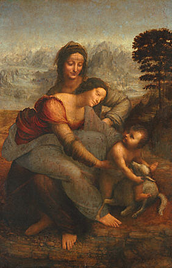
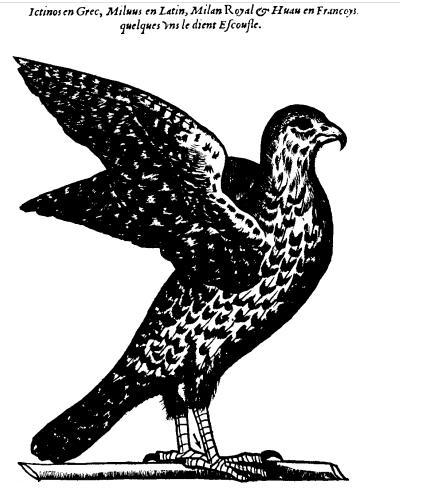
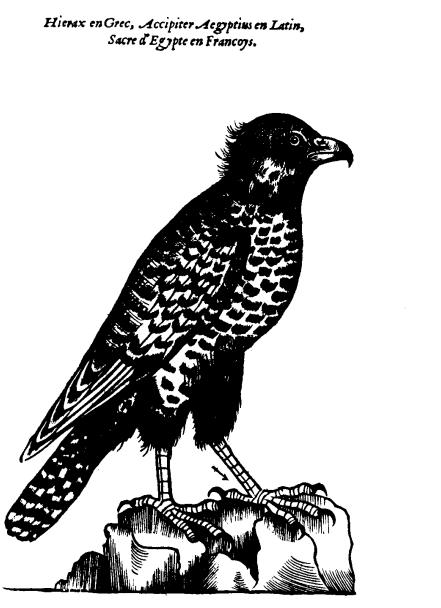
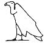
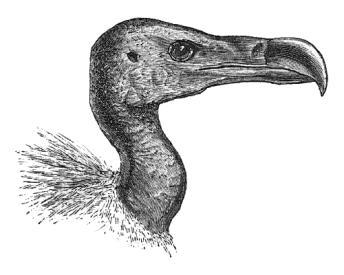
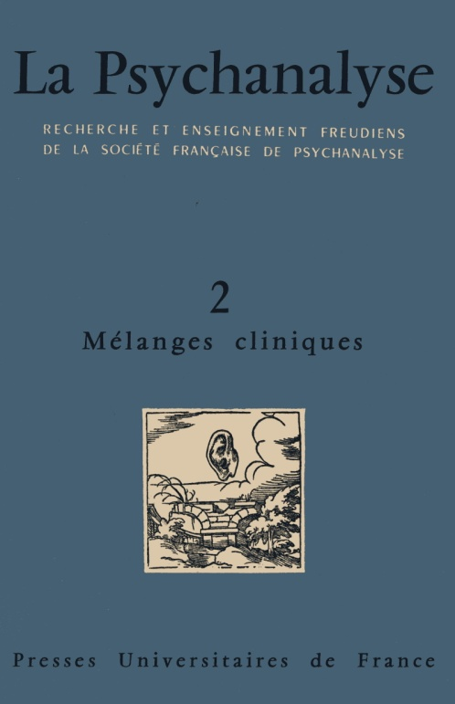
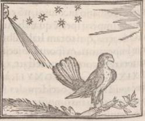
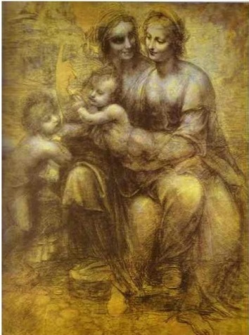
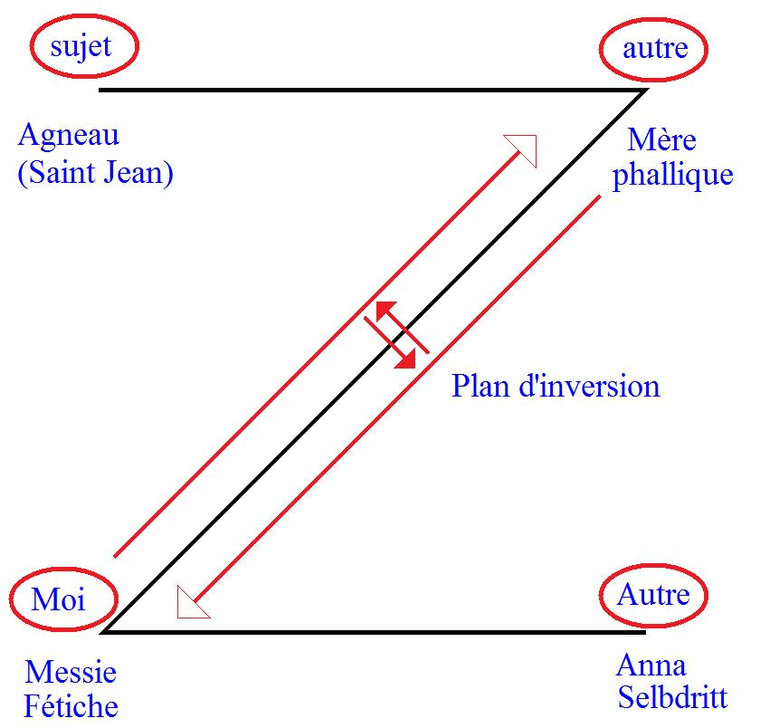

# Leçon 24 | 03 Juillet 1957

  <label><input type="checkbox" data-lacan-toggle="original" checked> 原文</label>
  <label><input type="checkbox" data-lacan-toggle="notes" checked> 注释</label>
  <label><input type="checkbox" data-lacan-toggle="commentary" checked> 个人解读评论</label>

<section class="parallel-paragraph" data-paragraph-ids="s4-24-0001">

s4-24-0001

[无对应译文]

原文 · s4-24-0001

C’est aujourd’hui notre dernier séminaire de l’année. J’ai laissé la dernière fois derrière moi des choses.
Je n’ai pas voulu avoir à m’y prendre tout à fait aujourd’hui pour résumer, pour resituer, pour répéter,
ce qui, *quels qu’en soient les effets,* n’est pas une si mauvaise méthode. J’ai donc laissé de côté la dernière fois un certain nombre
de choses, et de ce fait je n’ai peut-être pas poussé jusqu’au bout cette analyse.

</section>

<section class="parallel-paragraph" data-paragraph-ids="s4-24-0002">

s4-24-0002

[无对应译文]

原文 · s4-24-0002

J’ai formalisé des petites lettres, et j’ai essayé de vous poser dans quel sens on pourrait faire un effort pour s’habituer
à *écrire les rapports* de façon à se donner des points de repère fixes, et sur lesquels on ne puisse pas revenir dans la discussion,
qu’on ne puisse pas éluder après les avoir posés, en profitant de tout ce qu’il peut y avoir de *trop souple* habi­tuellement

</section>

<section class="parallel-paragraph" data-paragraph-ids="s4-24-0003">

s4-24-0003

[无对应译文]

原文 · s4-24-0003

dans ce jeu entre *l’imaginaire* et *le symbolique*, si important pour notre *compréhension de l’expérience*.
Ce que je vous aurai donc amorcé, c’est un *commencement* de cette for­malisation.

</section>

<section class="parallel-paragraph" data-paragraph-ids="s4-24-0004">

s4-24-0004

[无对应译文]

原文 · s4-24-0004

Je sais bien que je n’en ai pas absolument motivé tous les termes, je veux dire par là qu’une certaine indétermination peut vous paraître subsister dans la façon de lier ces termes entre eux. On ne peut pas tout expliquer à la fois. Ce que je veux vous dire,
c’est que dans l’article qui va paraître dans le 3ème *numéro* de « *La Psychanalyse »* [^37], vous y verrez peut-être d’une façon plus proche

</section>

<section class="parallel-paragraph" data-paragraph-ids="s4-24-0005">

s4-24-0005

[无对应译文]

原文 · s4-24-0005

et plus serrée, la justification de l’ordre de ces formules à savoir respectivement des formules de *la métaphore* et de *la métonymie*.
L’important, je crois, au point où nous en arrivons, c’est que de cette sug­gestion vous ait été donnée la possibilité de l’utilisation de *formules* semblables pour situer des fonctions, des rapports entre le sujet et les différents modes de l’Autre, qui ne peuvent pas en somme être articulés autrement, pour lesquels le langage usuel ne nous donne pas les fondements nécessaires.

</section>

<section class="parallel-paragraph" data-paragraph-ids="s4-24-0006">

s4-24-0006

[无对应译文]

原文 · s4-24-0006

J’ai donc laissé derrière moi des choses, et après tout je dirais : pourquoi n’en laisserais-je pas ?
Pourquoi vouloir - même dans le propre cas du petit Hans - que nous fournissions une formule absolument complète
de ce que le petit Hans pose comme question. Vous savez que c’est dans ce registre des questions posées par FREUD,
que j’entends faire mon commentaire, cela ne veut pas dire pour autant que je veuille faire de chacune de ses œuvres
un système qui se ferme, ni même de la totalité de ses œuvres un système qui se ferme.

</section>

<section class="parallel-paragraph" data-paragraph-ids="s4-24-0007">

s4-24-0007

[无对应译文]

原文 · s4-24-0007

L’important est que vous ayiez suf­fisamment appris, et que vous appreniez chaque jour mieux qu’il change les bases mêmes,
si on peut dire, de la considération psychologique, en y intro­duisant une dimension étrangère à ce que la considération psychologique comme telle, a été jusqu’ici, que c’est le caractère étranger de cette dimension par rapport à toute fixation
de l’objet qui constitue l’originalité de notre science et le principe de base dans lequel nous devons y concevoir notre progrès.

</section>

<section class="parallel-paragraph" data-paragraph-ids="s4-24-0008">

s4-24-0008

[无对应译文]

原文 · s4-24-0008

Toute autre façon - refermer l’interrogation freudienne, la réduire au champ de la psychologie - conduit à ce que j’appellerai
sans plus de formalisme, une psychogenèse délirante, cette psychogenèse que vous voyez se développer chaque jour implicitement, à la façon dont les psychanalystes envisagent les faits et les objets auxquels ils ont affaire, et dont le seul fait qu’elle se survive est si paradoxal, si étranger à toutes les conceptualisations voisines, si choquant, et en même temps
si finalement toléré, le seul fait qu’elle se survive est à adjoindre au principal du problème, et doit être résolu en même temps dans la solution que nous apporterons à ce problème de la discussion freudienne, c’est-à-dire de l’inconscient.

</section>

<section class="parallel-paragraph" data-paragraph-ids="s4-24-0009">

s4-24-0009

[无对应译文]

原文 · s4-24-0009

J’ai donc laissé de côté en effet tout ce jeu que, je crois, vous pouvez suivre maintenant. Vous en savez suffisamment *les éléments* pour apercevoir à la relecture du texte tout *ce jeu mythique* entre ce que j’appellerai si vous voulez *la réduction à l’imaginaire*
de cet élément qui est la séquence du désir maternel tel que je l’ai écrit dans la formule : M . ϕ. *a* , c’est-à-dire tout le rapport
de la mère avec cet *autre imaginaire* qu’est son propre *phallus*, puis tout ce qui peut advenir d’éléments nouveaux,
c’est-à-dire les autres enfants, la petite sœur dans l’occasion.

</section>

<section class="parallel-paragraph" data-paragraph-ids="s4-24-0010">

s4-24-0010

[无对应译文]

原文 · s4-24-0010

Ce jeu, cette *mythification* par l’enfant dans *ce jeu imaginaire*, tel qu’il a été déclenché par l’intervention, disons, psychothérapique, est quelque chose qui en lui-même nous manifeste un phénomène dont l’originalité comme telle doit être saisie, arrêtée
comme un élément essentiel de la *Verarbeitung* de toute la progression analytique en tant qu’elle est un élément dynamique, cristallisant, dans *le progrès symbolique* en quoi consiste la guérison analytique comme telle.

</section>

<section class="parallel-paragraph" data-paragraph-ids="s4-24-0011">

s4-24-0011

[无对应译文]

原文 · s4-24-0011

Assurément, si en effet je ne l’ai pas poussé plus loin, je veux quand même vous indiquer les éléments que je n’ai même pas touchés, je veux dire que j’ai indiqués au passage, mais dont je n’ai pas expliqué la fonction exacte par rapport à ces agissements mythiques de l’enfant sous la stimulation de l’intervention analytique.

</section>

<section class="parallel-paragraph" data-paragraph-ids="s4-24-0012">

s4-24-0012

[无对应译文]

原文 · s4-24-0012

Il y a là un terme, un élément qui est absolument corrélatif de la grande invention mythique autour de la naissance, spécialement autour de la naissance de la petite Anna, autour de la permanence de toute éternité de la présence de la petite Anna,

</section>

<section class="parallel-paragraph" data-paragraph-ids="s4-24-0013">

s4-24-0013

[无对应译文]

原文 · s4-24-0013

si joliment fomentée par Hans comme sa *spéculation mythi­fiante*.

</section>

<section class="parallel-paragraph" data-paragraph-ids="s4-24-0014">

s4-24-0014

[无对应译文]

原文 · s4-24-0014

C’est ce personnage mystérieux et digne vraiment de l’humour noir de la meilleure tradition qu’est *la cigogne*,
cette *cigogne* qui arrive avec un petit chapeau, qui salue, qui met la clef dans la serrure, qui arrive quand personne n’est là,
qui, je dois dire, présente des aspects tout à fait insolites si on sait entendre ce qu’a dit le petit Hans : « *Elle est venue dans ton lit* »,
autant dire « *à ta place* », puis il se reprend ensuite : « *dans son lit* », puis qui ressort à l’insu de tous,
non sans faire un petit vacarme, histoire de secouer la maison après son départ.

</section>

<section class="parallel-paragraph" data-paragraph-ids="s4-24-0015">

s4-24-0015

[无对应译文]

原文 · s4-24-0015

Ce personnage qui va, qui vient, muni d’un air imperturbable, presque inquiétant, n’est assurément pas une des créations

</section>

<section class="parallel-paragraph" data-paragraph-ids="s4-24-0016">

s4-24-0016

[无对应译文]

原文 · s4-24-0016

les moins énig­matiques de la création du petit Hans. Il mériterait qu’on s’y arrête longuement, et à la vérité, il convient

</section>

<section class="parallel-paragraph" data-paragraph-ids="s4-24-0017">

s4-24-0017

[无对应译文]

原文 · s4-24-0017

essen­tiellement d’en indiquer la place dans l’*économie*, à ce moment, du progrès du petit Hans. Si le petit Hans peut arriver,
et le petit Hans ne peut arriver à fomenter sa manipulation imaginaire des différents termes en présence, sous la sujétion du père psychothérapeute, coiffé lui-même par FREUD, il ne peut arriver à le faire qu’en dégageant quelque chose qui est bel et bien annoncé juste avant *la grande création mythique* : *la naissance d’Anna*, et en même temps *la cigogne*.

</section>

<section class="parallel-paragraph" data-paragraph-ids="s4-24-0018">

s4-24-0018

[无对应译文]

原文 · s4-24-0018

Nous voyons énoncé par le seul texte de Hans, et par le père, le thème de la mort, par le fait que le petit Hans a un bâton
\- on ne sait pourquoi, on n’a jamais parlé avant de cette canne - avec lequel il tape le sol, et demande s’il y a des morts dessous.
La présence du thème de la mort est strictement corrélative du thème de la naissance. C’est une dimension essentielle à relever
pour la compréhension et le progrès du cas.

</section>

<section class="parallel-paragraph" data-paragraph-ids="s4-24-0019">

s4-24-0019

[无对应译文]

原文 · s4-24-0019

Mais à la vérité, ce thème, cette puissance d’une génération portée à son dernier degré de mystère, entre la vie et la mort,
entre l’existence et le néant, est quelque chose qui pose des problèmes particuliers, différents de celui de l’introduction
de ce signifiant le cheval. Il n’en est pas l’homologue, il est quelque chose d’autre que peut-être l’année prochaine nous verrons, et que je laisse en réserve en quelque sorte. La rubrique que je choisirai très pro­bablement pour ce que je vous développerai l’année prochaine, sera celle-ci, à savoir : *Les formations de l’inconscient*.

</section>

<section class="parallel-paragraph" data-paragraph-ids="s4-24-0020">

s4-24-0020

[无对应译文]

原文 · s4-24-0020

Aussi bien, resoulignerai-je encore qu’il est significatif que le petit Hans, au bout de la crise qui résout et dissout la phobie, s’installe dans quelque chose d’aussi essentiel que le refus de la naissance qu’est l’espèce de traité qui sera dès lors établi
avec la cigogne, qui sera établi avec la mère. Vous verrez tout le sens du passage où il s’agit des rapports de la mère et de Dieu, quant à la venue possible d’un enfant, cette chose si élégamment résolue à l’intérieur de l’observation par la petite note de FREUD : « *Ce que femme veut, Dieu le veut* ». C’est bien en effet ce que lui a dit la mère : « *En fin de compte, c’est de moi que ça dépend* ».

</section>

<section class="parallel-paragraph" data-paragraph-ids="s4-24-0021">

s4-24-0021

[无对应译文]

原文 · s4-24-0021

D’autre part le petit Hans dit souhaiter avoir des enfants, et du même mouvement ne pas vouloir qu’il y en ait d’autres,
il a le désir d’avoir *des enfants imaginaires*, pour autant que toute la situation s’est résolue par une identification au désir maternel.
Il aura des enfants de son rêve, de son esprit, il aura des enfants pour tout dire, structurés à la mode du *phallus maternel*,
dont en fin de compte il va faire l’objet de son propre désir. Mais il est bien entendu que de nouveaux enfants, il n’y en aura pas, et cette identification au désir de la mère en tant que *désir imaginaire*, ne constitue qu’apparemment un retour au petit Hans
qu’il a été autrefois, qui jouait avec des petites filles à ce *jeu de cache-cache* primitif dont son sexe était l’objet.

</section>

<section class="parallel-paragraph" data-paragraph-ids="s4-24-0022">

s4-24-0022

[无对应译文]

原文 · s4-24-0022

Mais maintenant Hans ne songe plus du tout à jouer au *jeu de cache-cache*, ou plus exactement il ne songe plus à rien leur montrer si je puis dire, que sa jolie stature de petit Hans, de personnage qui par un certain côté est devenu en fin de compte - c’est là où je veux en venir - lui-même quelque chose comme un objet fétiche, où le petit Hans se situe dans une certaine position passivée, et quelle que soit la légalité hétérosexuelle de son objet, nous ne pouvons considérer qu’elle épuise la légi­timité de sa position.

</section>

<section class="parallel-paragraph" data-paragraph-ids="s4-24-0023">

s4-24-0023

[无对应译文]

原文 · s4-24-0023

Le petit Hans rejoint là *un type* qui ne vous paraîtra pas étranger à notre époque, la génération d’*un certain style que nous connaissons*, qui est le style des années 1945, de ces charmants jeunes gens qui attendent que les entreprises viennent de l’autre bord,
qui attendent, pour tout dire, qu’on les déculotte. Tel est celui dont je vois se dessiner l’avenir, de ce charmant petit Hans,

</section>

<section class="parallel-paragraph" data-paragraph-ids="s4-24-0024">

s4-24-0024

[无对应译文]

原文 · s4-24-0024

tout *hété­rosexuel* qu’il paraisse. Entendez-moi bien : rien dans l’*observation* ne nous permet à aucun moment, de penser qu’elle
se résolve autrement que par *cette domination du phallus maternel*, en tant que Hans prend sa place, qu’il s’y *identifie*, qu’il le *maîtrise*.

</section>

<section class="parallel-paragraph" data-paragraph-ids="s4-24-0025">

s4-24-0025

[无对应译文]

原文 · s4-24-0025

Certes, tout ce qui peut répondre à la phase de castration, ou au *complexe de castration* n’est rien de plus que ce que nous voyons
se dessiner dans l’observation sous cette forme de la pierre contre laquelle on peut se blesser. L’image qui en affleure,
si l’on peut dire, est bien moins celle d’un vagin denté, dirais-je que celle d’un *phallus dentatus*. Cette espèce d’objet figé est
un *objet imaginaire* dont sera victime, en s’y blessant, tout assaut masculin. C’est là le sens dans lequel nous pouvons aussi dire que le petit Hans et sa crise œdipienne n’aboutit pas à proprement parler à la formation d’un *surmoi typique*, je veux dire d’un *surmoi*
tel qu’il se produit selon le mécanisme qui, déjà est indiqué dans ce que nous avons ici enseigné au niveau de la *Verwerfung*,
par exemple ce qui est rejeté du *Symbolique* et réparait dans le *Réel*.

</section>

<section class="parallel-paragraph" data-paragraph-ids="s4-24-0026">

s4-24-0026

[无对应译文]

原文 · s4-24-0026

C’est là la véritable clef, à un niveau plus proche de ce qui se passe après la *Verwerfung* œdipienne : c’est pour autant
que *le complexe de castration* est à la fois franchi, mais qu’il ne peut pas être pleinement assumé par le sujet, qu’il produit
ce quelque chose de l’identification avec une sorte d’*image brute* du père, d’image portant les reflets de ses particularités réelles dans ce qu’elles ont littéralement de pesant voire d’écrasant, qui est ce quelque chose par quoi nous voyons une fois de plus renouvelé le mécanisme de la réapparition dans le *réel*, cette fois *d’un réel à la limite du psychique*, à l’intérieur des frontières du *moi,*
mais d’un *réel* qui s’impose au sujet littéralement d’une façon quasi hallucinatoire \[Cf. *L’Homme aux loups*\], dans la mesure où le sujet

</section>

<section class="parallel-paragraph" data-paragraph-ids="s4-24-0027">

s4-24-0027

[无对应译文]

原文 · s4-24-0027

à un moment, décolle de l’in­tégration *symbolique* du processus de castration.

</section>

<section class="parallel-paragraph" data-paragraph-ids="s4-24-0028">

s4-24-0028

[无对应译文]

原文 · s4-24-0028

Rien de *semblable* dans le cas présent n’est manifesté. Le petit Hans assu­rément n’a pas à perdre son pénis, puisque aussi bien
il ne l’acquiert à aucun moment. Si le petit Hans est identifié en fin de compte au *phallus maternel*, ce n’est pas dire que son pénis pour autant soit quelque chose dont il puisse retrouver, assumer, à proprement parler, la fonction. Il n’y a aucune phase
de symbolisation du pénis, le pénis reste en quelque sorte en marge, désengrené, comme quelque chose qui n’a jamais été
que honni, réprouvé par la mère, et ce quelque chose qui se produit lui permet d’intégrer sa masculinité.

</section>

<section class="parallel-paragraph" data-paragraph-ids="s4-24-0029">

s4-24-0029

[无对应译文]

原文 · s4-24-0029

Ce n’est par aucun autre *mécanisme* que par la formation de l’identification au *phallus maternel*, et qui est aussi bien de l’ordre
tout aussi différent que *l’ordre du surmoi*, tout différent de cette fonction sans aucun doute perturbante, mais *équilibrante* aussi, qu’est le *surmoi*. C’est une fonction de l’ordre de l’*idéal du moi*. *C’est pour autant que le petit Hans* a une certaine idée de son idéal,
en tant qu’il *est l’idéal de la mère, à savoir un substitut du phallus, que le petit Hans s’installe dans l’existence*.

</section>

<section class="parallel-paragraph" data-paragraph-ids="s4-24-0030">

s4-24-0030

[无对应译文]

原文 · s4-24-0030

Disons que si au lieu d’avoir une mère juive et dans le mouvement du progrès, il avait eu une mère catholique et pieuse,
vous voyez par quel *mécanisme* le petit Hans occasionnellement eût doucement été conduit à la prêtrise, sinon à la sainteté.
L’*idéal maternel* est très précisément ce qui dans ce cas, situe et donne un certain type de sortie et de formation, de situation
dans *le rapport des sexes* au sujet introduit dans une relation *œdipienne atypique*, et dont l’issue se fait par *identification à l’idéal maternel*.
Voilà à peu près dessinés, limités, les termes dans lesquels je vous donne *le débouché* du cas du petit Hans.

</section>

<section class="parallel-paragraph" data-paragraph-ids="s4-24-0031">

s4-24-0031

[无对应译文]

原文 · s4-24-0031

Tout au long, nous en avons des indices, si on peut dire confirmatifs, et quelquefois combien émouvants à la fin

</section>

<section class="parallel-paragraph" data-paragraph-ids="s4-24-0032">

s4-24-0032

[无对应译文]

原文 · s4-24-0032

de l’ob­servation, quand le petit Hans, décidément découragé par la carence paternelle, va en quelque sorte faire lui-même
sa cérémonie d’initiation fantasmatiquement, en allant se placer tout nu - comme il voulait que le père s’avance -
sur ce petit wagonnet sur lequel, littéralement comme un jeune *chevalier,* il est censé veiller toute une nuit, après quoi,
grâce encore à quelques pièces de monnaies données au conducteur du train - le même argent qui servira à apaiser la puissance terrifique du *Storch* \[cigogne\] - le petit Hans roule sur le grand circuit.

</section>

<section class="parallel-paragraph" data-paragraph-ids="s4-24-0033">

s4-24-0033

[无对应译文]

原文 · s4-24-0033

L’affaire est réglée, le petit Hans ne sera pas autre chose que peut-être sans doute *un chevalier*, *un chevalier* plus ou moins
sous le régime des assurances sociales, mais enfin un chevalier, et il n’aura pas de père. Ceci, je ne crois pas que rien de nouveau dans l’expérience de l’existence le lui donnera jamais. Tout de suite après le père essaye - un peu en retard, car l’ouverture de la comprenoire du père, à mesure de l’observation, n’est pas non plus une des choses les moins intéressantes - le père, après avoir été franc jeu, croyant dur comme fer à toutes les vérités qu’il a apprises du bon maître FREUD, le père à mesure qu’il progresse et qu’il voit combien cette vérité dans le maniement, est beaucoup plus relative, au moment où le petit Hans va commencer
à faire son grand délire mythique, laisse échapper une phrase comme celle-ci, qu’on remarque à peine dans le texte,
mais qui a bien son importance. Il s’agit du moment où *on joue à dire*, et où le petit Hans se contredit à chaque instant, où il dit :

</section>

<section class="parallel-paragraph" data-paragraph-ids="s4-24-0034">

s4-24-0034

[无对应译文]

原文 · s4-24-0034

- « *C’est vrai... C’est pas vrai... c’est pour rire, mais c’est quand même très sérieux...* »

</section>

<section class="parallel-paragraph" data-paragraph-ids="s4-24-0035">

s4-24-0035

[无对应译文]

原文 · s4-24-0035

- « *Tout ce qu’on dit...*
  dit le père qui n’est pas un sot et qui en apprend dans cette expérience –
  *...Tout ce qu’on dit* *est toujours un peu vrai*. » \[« *Alles, was man sagt, ist ein bissel wahr*. » 22 Avril \]

</section>

<section class="parallel-paragraph" data-paragraph-ids="s4-24-0036">

s4-24-0036

[无对应译文]

原文 · s4-24-0036

Malgré tout, ce père qui n’a pas réussi dans sa propre position puisque c’est lui plutôt qu’il aurait fallu faire passer par l’analyse,
le père essaye de remettre cela, quand déjà il est trop tard, et dit au petit Hans : « *En fin de compte, tu m’en as voulu* ».

</section>

<section class="parallel-paragraph" data-paragraph-ids="s4-24-0037">

s4-24-0037

[无对应译文]

原文 · s4-24-0037

C’est autour de cette intervention à retardementdu père qu’on voit se produire ce très joli petit geste qui est mis dans une sorte d’éclairage spécial dans l’observation : le petit Hans *laisse tomber son petit cheval*. Au moment même où le père lui parle,
il laisse tomber le petit cheval. La conversation est dépassée, le dialogue à ce moment là est périmé, le petit Hans s’est installé dans sa nouvelle position dans le monde, celle qui fait de lui un petit homme en puissance d’enfants, capable d’*engendrer* indéfiniment dans son imagination, et de se satisfaire entièrement avec eux. Telle, également, dans son imagination vit la mère.

</section>

<section class="parallel-paragraph" data-paragraph-ids="s4-24-0038">

s4-24-0038

[无对应译文]

原文 · s4-24-0038

C’est d’être le petit Hans comme je vous l’ai dit, non pas fils d’une mère, mais fils de deux mères. Point remarquable, *énigmatique*, point sur lequel j’avais déjà arrêté l’ob­servation la dernière fois. Assurément *l’autre mère* est celle qu’il a trop d’oc­casions et de raisons de connaître, l’occasion et la puissance, c’est *la mère du père*. Néanmoins qu’il assume les conditions de l’équilibre terminal, cette dupli­cité, ce dédoublement de la figure maternelle, c’est bien encore un des problèmes structuraux que pose l’observation.

</section>

<section class="parallel-paragraph" data-paragraph-ids="s4-24-0039">

s4-24-0039

[无对应译文]

原文 · s4-24-0039

Et vous le savez, c’est là-dessus que j’ai terminé mon avant dernier séminaire pour vous faire le rapprochement avec le tableau de Léonard DE VINCI, et du même coup, avec le cas de Léonard DE VINCI dont ce n’est pas par hasard que FREUD
y a tellement porté son attention. C’est à lui que nous consacrerons aujourd’hui le temps qui nous reste.

</section>

<section class="parallel-paragraph" data-paragraph-ids="s4-24-0040">

s4-24-0040

[无对应译文]

原文 · s4-24-0040

Aussi bien ceci constituera-t-il…
nous ne prétendons pas épuiser ce « *Souvenir d’enfance de Léonard de Vinci »* en une seule leçon
…une espèce de petite « *leçon d’avant les vacances* » qu’il est d’usage dans tout mon enseignement de faire à la manière
d’une détente à tout groupe attentif comme vous l’êtes et comme je vous en remercie. Ce petit Hans, laissons-le à son sort.

</section>

<section class="parallel-paragraph" data-paragraph-ids="s4-24-0041">

s4-24-0041

[无对应译文]

原文 · s4-24-0041

Je vous signale néanmoins que si j’ai fait à son propos une allusion à quelque chose de profondément actuel dans une certaine évolution dans les rapports entre les sexes, et si je me suis rapporté à la génération de 1945, c’est assurément pour ne pas faire une excessive actua­lité.

</section>

<section class="parallel-paragraph" data-paragraph-ids="s4-24-0042">

s4-24-0042

[无对应译文]

原文 · s4-24-0042

Je laisse à dépeindre et à définir ce que peut être la génération actuelle, laissant à d’autres le soin d’en donner une expression directe et symbolique, disons à Françoise SAGAN, que je ne cite pas ici au hasard, pour le seul plaisir de faire de l’actualité,
mais pour vous dire que comme lecture de vacances, vous pourrez voir ce qu’un philosophe, austère et habitué à ne se situer qu’au niveau d’HEGEL et de la plus haute politique, peut tirer d’un ouvrage d’apparence aussi frivole. Je vous conseille de lire,
dans le numéro de *Critiques*, Août-Septembre 1956, Alexandre KOJÈVE, sous le titre « *Le dernier monde nouveau »,*
l’étude qu’il a faite sur les deux livres *« Bonjour tristesse »* et « *Un certain sourire »*, de l’auteur à succès que je viens de nommer.

</section>

<section class="parallel-paragraph" data-paragraph-ids="s4-24-0043">

s4-24-0043

[无对应译文]

原文 · s4-24-0043

Ceci ne manquera pas de vous ins­truire, et comme on dit : « ça ne vous fera pas de mal », vous ne risquerez rien.
Le psychanalyste ne se recrute pas parmi ceux qui se livrent tout entier aux fluctuations de la mode en matière psycho-sexuelle. Vous êtes trop bien orientés, si je puis dire, pour cela, voire même avec un rien de « *fort en thème* » en cette matière.

</section>

<section class="parallel-paragraph" data-paragraph-ids="s4-24-0044">

s4-24-0044

[无对应译文]

原文 · s4-24-0044

Ceci en effet, peut vous faire entrer dans une espèce de ban d’actualité de l’activation de la perspective pour ce qui est
de ce que vous faites et que vous devez être prêts à entendre quelquefois de vos patients eux-mêmes. Ceci aussi, vous montrera ce quelque chose dont nous devons tenir compte, à savoir les profonds changements des rapports entre l’homme et la femme, qui peuvent se passer au cours d’une période pas plus longue que celle qui nous sépare du temps de FREUD, où, comme on dit, tout ce qui devait être notre histoire était en train de se fomenter.

</section>

<section class="parallel-paragraph" data-paragraph-ids="s4-24-0045">

s4-24-0045

[无对应译文]

原文 · s4-24-0045

Tout cela est pour vous dire qu’aussi le *donjuanisme* n’a peut-être pas complètement - quoi qu’en disent les analystes qui ont apporté là-dessus des choses intéressantes - dit son dernier mot. Je veux dire que si quelque chose de juste a été entrevu
dans la notion qu’on fait de *l’homosexualité de* DON JUAN, ce n’est certainement pas à prendre comme on le prend d’habitude.

</section>

<section class="parallel-paragraph" data-paragraph-ids="s4-24-0046">

s4-24-0046

[无对应译文]

原文 · s4-24-0046

Je crois profondément que le personnage de DON JUAN est précisément un personnage qui est trop loin de nous
dans l’ordre culturel, pour que les analystes aient pu justement le percevoir, que le DON JUAN de MOZART,
si nous le prenons comme son sommet et comme quelque chose qui signifie effectivement l’aboutissement d’une question
à proprement parler, au sens où je l’entends ici, est assurément tout autre chose que ce personnage reflet que RANK
a voulu nous construire. Ce n’est certainement pas uniquement sous l’angle et par le biais du double, qu’il doit être compris.

</section>

<section class="parallel-paragraph" data-paragraph-ids="s4-24-0047">

s4-24-0047

[无对应译文]

原文 · s4-24-0047

Je pense que contrairement aussi à ce qu’on dit, DON JUAN ne se confond pas purement et simplement, et bien loin de là, avec le séducteur, possesseur de petits trucs qui peuvent réussir à tout coup. Assurément *je crois que* DON JUAN *aime les femmes*,
je dirais même *qu’il les aime assez* pour savoir à l’occasion ne pas leur dire, et *qu’il les aime assez* pour que quand il le leur dit,
elles le croient. Ceci n’est pas rien, et montre beaucoup de choses, qu’assurément la situa­tion soit toujours pour lui sans issue.

</section>

<section class="parallel-paragraph" data-paragraph-ids="s4-24-0048">

s4-24-0048

[无对应译文]

原文 · s4-24-0048

Je crois que c’est dans le sens de la notion de la femme phallique qu’il faut le chercher.

</section>

<section class="parallel-paragraph" data-paragraph-ids="s4-24-0049">

s4-24-0049

[无对应译文]

原文 · s4-24-0049

Bien sûr il y a quelque chose qui est en rapport avec un problème de bisexualité dans ces rapports de DON JUAN avec *son objet*, mais c’est précisément dans le sens de ce quelque chose que DON JUAN cherche la femme, et c’est la femme phallique,
et bien entendu *comme il la cherche vraiment*, qu’il y va, qu’il ne se contente pas de l’attendre, ni de la contempler, *il ne la trouve pas*, ou il ne finit par la trouver que sous la forme de *cet invité sinistre* qui est en effet un *au-delà de la femme* auquel il ne s’attend pas, dont ce n’est pas pour rien en effet que c’est le père. Mais n’oublions pas que quand il se présente c’est sous la forme - chose curieuse encore \[cf. Hans\] - de cet *invité de pierre*, de cette *pierre*, pour tout dire de ce côté absolument mort et fermé
et tout à fait au-delà de toute vie de la nature. C’est là qu’il vient en somme se briser et trouver l’achèvement de son destin.

</section>

<section class="parallel-paragraph" data-paragraph-ids="s4-24-0050">

s4-24-0050

[无对应译文]

原文 · s4-24-0050

Tout autre sera le problème que nous présente un Léonard DE VINCI. Que FREUD s’y soit intéressé n’est pas quelque chose sur lequel nous ayons à nous poser des questions. *Pourquoi une chose s’est passée plutôt que de ne pas se passer*, c’est bien là ce qui doit être en général le dernier de nos soucis. FREUD est FREUD justement parce qu’il s’est intéressé à Léonard DE VINCI.
Il s’agit de savoir maintenant comment il s’y est intéressé. Qu’est-ce que pouvait pour FREUD être Léonard DE VINCI ?

</section>

<section class="parallel-paragraph" data-paragraph-ids="s4-24-0051">

s4-24-0051

[无对应译文]

原文 · s4-24-0051

Il n’y a rien de mieux pour cela que de lire ce qu’il a écrit là-dessus : « *Un souvenir d’enfance*... ». Je vous en ai averti à temps
pour que quelques uns d’entre vous l’aient fait, et se soient aperçus du caractère profondément énigmatique de cette œuvre.
Voici FREUD parvenu en 1910 à quelque chose que nous pouvons appeler le sommet de bonheur de son existence.

</section>

<section class="parallel-paragraph" data-paragraph-ids="s4-24-0052">

s4-24-0052

[无对应译文]

原文 · s4-24-0052

C’est tout au moins ainsi qu’exté­rieurement les choses apparaissent, et comme à la vérité il ne manque pas de nous le souligner. Il est internationalement reconnu, n’ayant pas encore connu le drame ni la tristesse des séparations d’avec ses élèves les plus estimés, la veille des grandes crises mais jusque là pouvant se dire avoir rattrapé les dix dernières années en retard de sa vie.

</section>

<section class="parallel-paragraph" data-paragraph-ids="s4-24-0053">

s4-24-0053

[无对应译文]

原文 · s4-24-0053

Voici FREUD qui prend un sujet : Léonard DE VINCI, dont bien entendu dans ses antécédents, dans sa culture,
dans son amour de l’Italie et de la Renaissance, tout nous permet de comprendre qu’il ait été fasciné par ce personnage.
Mais que va-t-il à ce propos nous dire ? Il va nous dire des choses qui, assurément, ne font pas preuve d’une connaissance minime, ni d’une sensibilité réduite au relief du personnage, bien loin de là.

</section>

<section class="parallel-paragraph" data-paragraph-ids="s4-24-0054">

s4-24-0054

[无对应译文]

原文 · s4-24-0054

On peut dire que dans l’ensemble « *Un souvenir d’enfance de Léonard de Vinci »* se relit avec intérêt, je dirais avec un intérêt
qui est plutôt croissant avec les âges. J’entends par là que même si c’est un des ouvrages les plus critiqués de FREUD,
combien il est paradoxal de voir que c’est l’un de ceux dont il était le plus fier.

</section>

<section class="parallel-paragraph" data-paragraph-ids="s4-24-0055">

s4-24-0055

[无对应译文]

原文 · s4-24-0055

Les gens les plus réticents toujours dans ces cas, et Dieu sait s’ils ont pu l’être, je veux dire ceux qu’on appelle les spécialistes
de la peinture et de l’histoire de l’art, finissent avec le temps et à mesure que les plus grands défauts apparaissent dans l’œuvre
de FREUD, par s’apercevoir quand même de l’importance de ce qu’a dit FREUD. C’est ainsi que dans l’ensemble l’œuvre

</section>

<section class="parallel-paragraph" data-paragraph-ids="s4-24-0056">

s4-24-0056

[无对应译文]

原文 · s4-24-0056

de FREUD a été à peu près uni­versellement repoussée, méprisée voire dédaignée par les historiens de l’art,
et pourtant malgré toutes les réserves qui persistent, ils n’ont plus qu’à se renforcer de l’apport de nouveaux documents.
Ce qui prouve que FREUD a fait des erreurs.

</section>

<section class="parallel-paragraph" data-paragraph-ids="s4-24-0057">

s4-24-0057

[无对应译文]

原文 · s4-24-0057

 

</section>

<section class="parallel-paragraph" data-paragraph-ids="s4-24-0058">

s4-24-0058

[无对应译文]

原文 · s4-24-0058

Il n’en reste pas moins que quelqu’un comme par exemple Kenneth CLARK[^38], dans un ouvrage pas très ancien,

</section>

<section class="parallel-paragraph" data-paragraph-ids="s4-24-0059">

s4-24-0059

[无对应译文]

原文 · s4-24-0059

reconnaît le haut intérêt de l’analyse que FREUD a faite de ce tableau que je vous montrais l’autre jour,
à savoir de la *Sainte Anne* du Louvre doublée par le célèbre carton qui se trouve à Londres et sur lequel nous reviendrons également tout à l’heure, à savoir des deux œuvres autour desquelles FREUD a fait tourner tout l’approfondissement qu’il a fait, ou cru faire, du cas de Léonard DE VINCI.

</section>

<section class="parallel-paragraph" data-paragraph-ids="s4-24-0060">

s4-24-0060

[无对应译文]

原文 · s4-24-0060

Ceci dit, je suppose que je n’ai pas à vous résumer la marche de ce petit opuscule. Vous savez qu’il y a d’abord une présentation rapide du cas de Léo­nard DE VINCI, de *son étrangeté*. *Cette étrangeté*, sur laquelle nous allons nous-même revenir avec nos propres moyens, elle est certainement bien vue, et tout ce qu’a dit FREUD est assurément bien axé par rapport à *l’énigme* du personnage.

</section>

<section class="parallel-paragraph" data-paragraph-ids="s4-24-0061">

s4-24-0061

[无对应译文]

原文 · s4-24-0061

Puis FREUD s’interroge sur la *singulière* constitution, voire une prédisposition, sur l’activité paradoxale de ce peintre,
alors qu’il était tellement autre chose en même temps, disons pour l’instant ce grand peintre. FREUD va recourir à ce terme que, à cette époque de sa vie, il a mis tellement en relief dans tous les développements, à savoir ce seul souvenir d’enfance
que nous ayons de Léonard DE VINCI, à savoir ce souvenir d’enfance qui nous est traduit.

</section>

<section class="parallel-paragraph" data-paragraph-ids="s4-24-0062">

s4-24-0062

[无对应译文]

原文 · s4-24-0062

« *Il me semble avoir été destiné à m’occuper du vautour. Un de mes premiers souvenirs d’enfance est en réalité qu’étant encore*
*au berceau, un vautour vint à moi, m’ouvrit la bouche avec sa queue, et me frappa plusieurs fois avec cette queue entre les lèvres.* »

</section>

<section class="parallel-paragraph" data-paragraph-ids="s4-24-0063">

s4-24-0063

[无对应译文]

原文 · s4-24-0063

\[« *Questo scriver si distintamente del nibio par che sia mio destino, perche nella mia prima ricordaiione délla mia infantta e mi parea che essendo*
*io in culla, che un nibio venissi a me e mi aprissi la bocca colla sua coda e molte volte mi percuotessi con tal coda dentro alle labbra.* »
folio 66 v.b. Codex atlanticus.\]

</section>

<section class="parallel-paragraph" data-paragraph-ids="s4-24-0064">

s4-24-0064

[无对应译文]

原文 · s4-24-0064

« *Voici un déconcertant souvenir d’enfance* » \[*Eine Kindheitserinnerung also, und zwar höchst befremdender Art*.\] nous dit FREUD, et il enchaîne,
et c’est par cet enchaînement qu’il va nous conduire à quelque chose que nous suivons parce que nous sommes habitués
à une espèce de jeu de *prestidigitation* qui consiste à faire se superposer dans la dialectique, dans le raisonnement,
ce qui très souvent se confond dans l’expérience et dans la clinique.

</section>

<section class="parallel-paragraph" data-paragraph-ids="s4-24-0065">

s4-24-0065

[无对应译文]

原文 · s4-24-0065

Ce sont pour­tant là deux registres tout à fait différents, et je ne dis pas que FREUD les manie d’une façon impropre,
je crois au contraire qu’il les manie d’une façon géniale, c’est-à-dire qu’il va au cœur du phénomène. Seulement, nous le suivons avec une entière paresse d’esprit, à savoir en acceptant par avance, en quelque sorte, tout ce qu’il nous dit, à savoir cette sorte
de superposition, de surimposition d’une relation au sein maternel avec quelque chose qu’il nous pose tout de suite et d’emblée, à voir aussi la signi­fication d’une véritable intrusion sexuelle : celle d’une fellation, au moins ima­ginaire.

</section>

<section class="parallel-paragraph" data-paragraph-ids="s4-24-0066">

s4-24-0066

[无对应译文]

原文 · s4-24-0066

Ceci est donné dès le départ par FREUD et c’est là-dessus que FREUD va continuer à articuler sa construction

</section>

<section class="parallel-paragraph" data-paragraph-ids="s4-24-0067">

s4-24-0067

[无对应译文]

原文 · s4-24-0067

pour nous mener progressivement à l’éla­boration de ce qu’a de profondément énigmatique dans le cas de Léonard DE VINCI son rapport avec la mère, et faire reposer là-dessus toutes les particularités, quelles qu’elles soient, de son étrange personnage,

</section>

<section class="parallel-paragraph" data-paragraph-ids="s4-24-0068">

s4-24-0068

[无对应译文]

原文 · s4-24-0068

à savoir son *inversion* pro­bable d’abord, d’autre part son rapport tout à fait unique et singulier avec sa propre œuvre,
faite d’une espèce d’activité toujours *à la limite* si on peut dire, *du réalisable et de l’impossible*, comme lui-même l’écrit à l’occasion,
avec cette sorte de série de ruptures dans les différents départs de l’entreprise de sa vie, avec cette singularité qui l’isole au milieu de ses contemporains et fait de lui un personnage qui déjà de son vivant est un personnage de légende et un per­sonnage supposé possesseur de toutes les qualités, de toutes les compétences, de tout ce qui est à proprement parler un génie universel.

</section>

<section class="parallel-paragraph" data-paragraph-ids="s4-24-0069">

s4-24-0069

[无对应译文]

原文 · s4-24-0069

Déjà de son temps, tout *ce quelque chose* qui entoure Léonard DE VINCI, FREUD va nous le déduire de *son rapport avec la mère*.
Le départ, vous ai-je dit, il le prend dans ce souvenir d’enfance. Cela veut dire que ce vautour, sa queue frémissante qui vient frapper l’enfant est, nous dit-on, d’abord construit comme *le souvenir-écran* de quelque chose qui - et FREUD d’ailleurs n’hésite pas un instant à le poser autrement que comme cela - est le reflet d’un fantasme de fellation .

</section>

<section class="parallel-paragraph" data-paragraph-ids="s4-24-0070">

s4-24-0070

[无对应译文]

原文 · s4-24-0070

Il faut tout de même bien reconnaître que pour un esprit non prévenu, il y a là au moins quelque chose qui soulève
un problème, car tout ce que la suite développera, c’est précisément l’intérêt de l’investigation freudienne de nous révéler
que Léonard très probablement n’a pas eu, jusqu’à un âge pro­bablement situable entre 3 et 4 ans :

</section>

<section class="parallel-paragraph" data-paragraph-ids="s4-24-0071">

s4-24-0071

[无对应译文]

原文 · s4-24-0071

- d’autre présence précisément que la présence maternelle,

</section>

<section class="parallel-paragraph" data-paragraph-ids="s4-24-0072">

s4-24-0072

[无对应译文]

原文 · s4-24-0072

- d’autres éléments sans doute à proprement parler de *séduction sexuelle*, que ce qu’il appelle *les baisers passionnés de la mère*,

</section>

<section class="parallel-paragraph" data-paragraph-ids="s4-24-0073">

s4-24-0073

[无对应译文]

原文 · s4-24-0073

- d’autre objet qui puisse représenter l’objet de son désir, que le sein maternel,
  …et qu’en fin de compte c’est bien *sur le plan du fantasme* que la révélation en tant qu’elle peut avoir ce rôle avertissant,
  est posée par FREUD lui-même. Tout ceci repose en somme sur un point qui n’est autre que *l’identification du vautour à la mère* elle-même, en tant qu’elle est justement ce personnage source de l’intrusion imaginaire dans l’occasion.

</section>

<section class="parallel-paragraph" data-paragraph-ids="s4-24-0074">

s4-24-0074

[无对应译文]

原文 · s4-24-0074

Or disons le tout de suite, il est arrivé certainement dans cette affaire ce qu’on peut appeler un accident, voire *une faute*, *mais c’est une heureuse faute* : FREUD n’a lu ce souvenir d’enfance, et ne s’est fondé pour son travail, que sur la citation du passage dans HERZFELD, c’est-à-dire qu’il l’a lu en allemand, et que HERZFELD *a traduit par « vautour » ce qui n’est pas un vautour du tout*.
Nous verrons que peut-être d’ailleurs, FREUD aurait pu avoir un soupçon car il a fait comme d’habitude son travail
avec le plus grand soin, et il aurait pu remarquer *l’erreur* car ces choses sont traduites avec les références aux pages des *manuscrits*, dans l’occasion du *Codex Atlanticus**,* c’est-à-dire d’un dossier de Léonard DE VINCI qui est à Milan.

</section>

<section class="parallel-paragraph" data-paragraph-ids="s4-24-0075">

s4-24-0075

[无对应译文]

原文 · s4-24-0075

Ceci a été traduit à peu près dans toutes les langues, il y a en français une traduction fort insuffisante, mais complète,
sous le titre « *Carnets de Léonard de Vinci »*, qui est une traduction de ce que Léonard a laissé comme notes manuscrites
souvent en marge de ses dessins. Il aurait pu voir où se situait cette référence dans les notes de Léonard DE VINCI
qui sont en général des notes de cinq, six, sept lignes, ou d’une demie page au maximum, mêlées à des dessins. Ceci est juste
à côté d’un dessin dans un feuillet où il s’agit de l’étude répartie dans différents endroits de l’œuvre de Léonard DE VINCI,
du vol des oiseaux. Léonard DE VINCI dit justement : « *Je semble avoir été destiné à m’occuper particulièrement...* » non pas du vautour, mais justement de ce qu’il y a à côté dans le dessin, et qui est un milan.

</section>

<section class="parallel-paragraph" data-paragraph-ids="s4-24-0076">

s4-24-0076

[无对应译文]

原文 · s4-24-0076

Que le milan soit particulièrement intéressant pour l’étude du vol des oiseaux, c’est une chose qui est déjà dans PLINE,
à savoir que depuis toujours PLINE *L’ancien* le considère comme quelque chose de tout à fait *spécialement intéressant* pour
les pilotes parce que, dit-il, le mouvement de sa queue est particulièrement exemplaire pour toute espèce d’action du gouvernail.
C’est de la même chose que s’occupe Léonard DE VINCI. Il est très joli de voir à travers les auteurs, ce caractère fondamental de ce milan qui est connu, non seulement depuis l’antiquité avec PLINE *L’ancien*, mais est reproduit à travers toutes sortes d’auteurs - certains dont j’aurai à vous parler incidemment tout à l’heure - et est venu aboutir de nos jours, m’a-t-on assuré,
à l’étude sur place du mouvement de la queue du milan, par Monsieur [FOKKER](http://fr.wikipedia.org/wiki/Anthony_Fokker) à une certaine époque de l’entre deux guerres qui était en train de *fomenter* ces très jolies petites préparations de cette manœuvre de l’avion *« en piqué »*, véritable parodie dégoûtante, j’espère que vous êtes du même avis que moi là-dessus, du vol naturel, mais enfin il ne fallait pas attendre mieux
de la perversité humaine.

</section>

<section class="parallel-paragraph" data-paragraph-ids="s4-24-0077">

s4-24-0077

[无对应译文]

原文 · s4-24-0077

Voilà donc ce milan, qui d’ailleurs n’est en lui-même que bien fait pour la provoquer : c’est un animal qui n’a rien de tout spécialement attrayant. BELON qui a fait un très bel ouvrage sur les oiseaux, et qui avait été en Égypte et dans différents autres endroits du monde pour le compte de HENRI II, avait vu en Égypte certains oiseaux qu’il nous dépeint comme sordides
et peu gentils. Qu’est-ce que c’est ?

</section>

<section class="parallel-paragraph" data-paragraph-ids="s4-24-0078">

s4-24-0078

[无对应译文]

原文 · s4-24-0078

</section>

<section class="parallel-paragraph" data-paragraph-ids="s4-24-0079">

s4-24-0079

[无对应译文]

原文 · s4-24-0079

Pierre Bellon : L’histoire de la nature des oiseaux, 1555, p. 130.

</section>

<section class="parallel-paragraph" data-paragraph-ids="s4-24-0080">

s4-24-0080

[无对应译文]

原文 · s4-24-0080

Je dois dire que j’ai eu un instant l’espoir que tout allait s’arranger, à savoir que le vautour de FREUD, tout milan qu’il fût,
allait bien se trouver être quand même quelque chose qui avait affaire avec l’Égypte, et que le vautour égyptien
ce serait cela en fin de compte. Vous voyez comme je désire toujours arranger les choses. Malheureusement il n’en est rien.
En fait la situation est compliquée. Il y a des milans en Égypte, et même je peux vous dire qu’étant en train de prendre
mon petit déjeuner à Louksor, j’ai eu la surprise de voir dans la partie marginale de mon champ de vision,
quelque chose qui fait *frou*…*out*, et filer obliquement avec une orange qui était sur ma table.

</section>

<section class="parallel-paragraph" data-paragraph-ids="s4-24-0081">

s4-24-0081

[无对应译文]

原文 · s4-24-0081

J’ai cru un instant que c’était un faucon : HORUS, le disque solaire... Mais je me suis aussitôt aperçu qu’il n’en était rien.
Ce n’était pas un faucon car cette bête avait été se poser au coin d’un toit, et avait posé la petite orange pour montrer que c’était simple histoire de plaisanter. On voyait fort bien que c’était une bête rousse avec un style particulier. Je me suis tout de suite assuré qu’il s’agissait d’un milan. Vous voyez combien le milan est une bête familière, observable.
C’est bien à cela que Léonard DE VINCI s’est intéressé au sujet du vol des oiseaux.

</section>

<section class="parallel-paragraph" data-paragraph-ids="s4-24-0082">

s4-24-0082

[无对应译文]

原文 · s4-24-0082

Mais il y a autre chose : il y a *un vautour égyptien* qui lui ressemble beaucoup, et c’est cela qui aurait arrangé les choses, c’est celui dont parle BELON, et qu’il appelle *le sacré égyptien*, et dont on parle depuis HÉRODOTE sous le nom de *Hierax* \[faucon en grec\].

</section>

<section class="parallel-paragraph" data-paragraph-ids="s4-24-0083">

s4-24-0083

[无对应译文]

原文 · s4-24-0083

</section>

<section class="parallel-paragraph" data-paragraph-ids="s4-24-0084">

s4-24-0084

[无对应译文]

原文 · s4-24-0084

Pierre Bellon : L’histoire de la nature des oiseaux, 1555, p. 110.

</section>

<section class="parallel-paragraph" data-paragraph-ids="s4-24-0085">

s4-24-0085

[无对应译文]

原文 · s4-24-0085

Il y en a un grand nombre en Égypte et naturellement il est *sacré*, c’est-à-dire qu’HÉRODOTE nous instruit : on ne pouvait pas le tuer sans avoir les pires ennuis dans l’Égypte antique. Il a un intérêt car il ressemble un peu au milan et au faucon.
C’est celui-là qui se trouve dans *les idéogrammes égyptiens* correspondre à peu près à la lettre *aleph* dont je parle dans mes discours sur *les hiéroglyphes* et leur fonction exemplaire pour nous. C’est du vautour, c’est-à-dire à peu près du « *sacré égyptien* » dont il s’agit. Tout irait bien si c’était celui-là qui servait pour la déesse MOUT dont vous savez que FREUD parla à propos du vautour.

</section>

<section class="parallel-paragraph" data-paragraph-ids="s4-24-0086">

s4-24-0086

[无对应译文]

原文 · s4-24-0086

Alors cela ne peut pas marcher, FREUD s’est véritablement bien trompé, car malgré tout cet effort de solution le vautour
qui sert pour la déesse MOUT, c’est celui-là, celui qui était dessiné à droite sur le tableau.

</section>

<section class="parallel-paragraph" data-paragraph-ids="s4-24-0087">

s4-24-0087

[无对应译文]

原文 · s4-24-0087

</section>

<section class="parallel-paragraph" data-paragraph-ids="s4-24-0088">

s4-24-0088

[无对应译文]

原文 · s4-24-0088

Il n’a pas lui une valeur phonétique comme l’autre. Ce vautour sert d’élément déterminatif, dans ce sens qu’on l’ajoute.
Ou bien il désigne par lui-même simplement la déesse MOUT, dans ce cas on lui met un petit drapeau en plus, ou bien il est intégré à tout un signe qui s’écrira MOUT puis le petit *déterminatif*, ou bien qui se contentera de le faire lui-même équivaloir à M,
et qui ajoutera quand même un petit t, c’est-à-dire phonétiser quand même le terme. Voir *les dessins des hiéroglyphes* dans l’original.
On le trouve dans plus d’une association, il s’agit en effet toujours d’une déesse mère, et dans ce cas là c’est ce vautour
tout différent, un véritable *gyps*, et pas du tout cette espèce de vautour à la limite des milans et des faucons et autres animaux voisins, mais toute différente.

</section>

<section class="parallel-paragraph" data-paragraph-ids="s4-24-0089">

s4-24-0089

[无对应译文]

原文 · s4-24-0089

</section>

<section class="parallel-paragraph" data-paragraph-ids="s4-24-0090">

s4-24-0090

[无对应译文]

原文 · s4-24-0090

C’est de ce véritable *gyps* dont il s’agit quand il s’agit de la déesse mère, et c’est à ce vautour que se rapporte tout ce que FREUD va nous rapporter de tradition du type bestiaire, à savoir par exemple ce qui nous est rapporté dans HORAPOLLO
et qui constitue la décadence égyptienne, et dont les écrits d’ailleurs fragmentaires, mille fois transposés, reco­piés et déformés, ont fait l’objet au moment de la renaissance, d’un certain nombre de recueils auxquels les graveurs de l’époque apportaient des petits emblèmes, et qui étaient censés nous donner la valeur significative d’un certain nombre d’hiéroglyphes égyptiens majeurs.

</section>

<section class="parallel-paragraph" data-paragraph-ids="s4-24-0091">

s4-24-0091

[无对应译文]

原文 · s4-24-0091

Cet ouvrage devrait vous être familier à tous, parce que c’est celui auquel j’ai emprunté le dessin qui orne la revue
*La Psychanalyse*.

</section>

<section class="parallel-paragraph" data-paragraph-ids="s4-24-0092">

s4-24-0092

[无对应译文]

原文 · s4-24-0092

</section>

<section class="parallel-paragraph" data-paragraph-ids="s4-24-0093">

s4-24-0093

[无对应译文]

原文 · s4-24-0093

HORAPOLLO donne la description de ce que je vois ici écrit : « *L’oreille peinte signifie l’ouvrage fait ou que l’on doit faire.* »
Voir dessin dans l’original. Mais nous ne nous laisserons pas entraî­ner là-dessus par les mauvaises habitudes d’une époque

</section>

<section class="parallel-paragraph" data-paragraph-ids="s4-24-0094">

s4-24-0094

[无对应译文]

原文 · s4-24-0094

où tout n’est pas à prendre. Et c’est dans HORAPOLLO que FREUD a pris cette référence du vautour à la signification
non seulement de la mère, mais de quelque chose de beaucoup plus intéressant, et qui lui fait faire un pas dans la dialectique,
à savoir d’un oiseau animal chez qui n’existe que le sexe femelle.

</section>

<section class="parallel-paragraph" data-paragraph-ids="s4-24-0095">

s4-24-0095

[无对应译文]

原文 · s4-24-0095

Ceci est une vieille bourde zoologique qui, comme beaucoup d’autres, remonte fort loin, et que l’on trouve dans l’antiquité

</section>

<section class="parallel-paragraph" data-paragraph-ids="s4-24-0096">

s4-24-0096

[无对应译文]

原文 · s4-24-0096

attes­tée, non pas quand même chez les meilleurs auteurs, mais qui assurément n’en est pas moins généralement reçue
dans la culture médiévale. On aurait tout à fait tort de croire - et il suffit de la moindre ouverture, car les « *Carnets de Léonard*
*de Vinci* sont là pour le prouver - que l’esprit de Léonard DE VINCI fit révolution dans une certaine perspective,
et ne baignait pas dans les histoires médiévales. FREUD admet que parce que Léonard DE VINCI avait de la lecture, il devait connaître cette histoire là. C’est bien probable, cela n’a rien d’extraordinaire car elle était très répandue, mais ce n’est *pas prouvé*. Et cela a d’autant moins d’intérêt à être prouvé, qu’il ne s’agit toujours pas d’un vautour.

</section>

<section class="parallel-paragraph" data-paragraph-ids="s4-24-0097">

s4-24-0097

[无对应译文]

原文 · s4-24-0097

Je vous passe le fait que Saint AMBROISE prenne l’histoire du *vautour femelle* comme étant un exemple que la nature
nous montre exprès pour favoriser l’entrée dans notre comprenoire, de *la conception virginale de* JÉSUS. FREUD semble admettre là sans critique, que c’est dans presque tous les Pères de l’Église. À la vérité, je dois vous dire que je n’ai pas été contrôler cela,
je sais depuis ce matin que c’est dans Saint AMBROISE.

</section>

<section class="parallel-paragraph" data-paragraph-ids="s4-24-0098">

s4-24-0098

[无对应译文]

原文 · s4-24-0098

À la vérité, je le savais déjà, car un certain [Piero VALERIANO](http://www.persee.fr/web/revues/home/prescript/article/jds_0021-8103_1967_num_3_1_1155) qui a fait [*une collection de ces éléments légendaires*](http://www.e-rara.ch/doi/10.3931/e-rara-2983) de l’époque 1566, m’a paru une source particulièrement importante à consulter pour voir aussi ce que pou­vait être à l’époque le milan

</section>

<section class="parallel-paragraph" data-paragraph-ids="s4-24-0099">

s4-24-0099

[无对应译文]

原文 · s4-24-0099

et un certain nombre *d’éléments symboliques*, et signale que Saint AMBROISE en a fait état. Il signale aussi BASILE Le Grand,
mais il ne signale pas tous les Pères de l’Église, comme semble l’admettre l’auteur auquel FREUD se réfère.

</section>

<section class="parallel-paragraph" data-paragraph-ids="s4-24-0100">

s4-24-0100

[无对应译文]

原文 · s4-24-0100

Le vautour n’était que femelle, de même que l’escargot n’était que mâle. C’était une tradition, et il est intéressant de mettre
en rapport l’un avec l’autre, du fait que l’escargot est une bête terrestre, rampante. Tout cela a ses corrélatifs dans le vautour
qui est en train, lui, de concevoir dans le ciel, offrant largement sa queue au vent[^39], comme il y en a une très jolie image.

</section>

<section class="parallel-paragraph" data-paragraph-ids="s4-24-0101">

s4-24-0101

[无对应译文]

原文 · s4-24-0101

</section>

<section class="parallel-paragraph" data-paragraph-ids="s4-24-0102">

s4-24-0102

[无对应译文]

原文 · s4-24-0102

Piero Valeriano : Hieroglyphica sive de sacris Aegyptiorum literis commentarii, 1556, p. 132

</section>

<section class="parallel-paragraph" data-paragraph-ids="s4-24-0103">

s4-24-0103

[无对应译文]

原文 · s4-24-0103

Où tout cela nous conduit-il ? Tout cela nous conduit à ceci qu’assurément *l’histoire du vautour* est une histoire qui a son intérêt
comme beaucoup d’autres histoires de cette nature. À la vérité il y a des tas d’histoires de cette espèce qui fourmillent
dans Léonard DE VINCI, qui s’intéressait beaucoup à des sortes de fables construites sur ces histoires.

</section>

<section class="parallel-paragraph" data-paragraph-ids="s4-24-0104">

s4-24-0104

[无对应译文]

原文 · s4-24-0104

On pourrait en tirer beaucoup d’autres choses, on pourrait en tirer par exemple que le milan est un animal fort porté à l’envie,
et qui maltraite ses enfants. Voyez ce qui en serait résulté si FREUD était tombé là-dessus, l’inter­prétation différente

</section>

<section class="parallel-paragraph" data-paragraph-ids="s4-24-0105">

s4-24-0105

[无对应译文]

原文 · s4-24-0105

que nous pourrions en donner de la relation avec la mère.

</section>

<section class="parallel-paragraph" data-paragraph-ids="s4-24-0106">

s4-24-0106

[无对应译文]

原文 · s4-24-0106

Pour vous montrer que de tout ceci, rien ne subsiste, et qu’il n’y a de toute cette partie de l’élaboration freudienne, rien à retenir.
Ce n’est pas pour cela que je vous le raconte, je ne me donnerai pas le facile avantage de critiquer après coup une intervention géniale, et même souvent il arrive qu’avec toutes sortes de défauts, la vue du génie qui était guidée par bien d’autres choses
que ces petites recherches accidentelles, était allée beaucoup plus loin que ces sup­ports.

</section>

<section class="parallel-paragraph" data-paragraph-ids="s4-24-0107">

s4-24-0107

[无对应译文]

原文 · s4-24-0107

Qu’est-ce que cela veut dire ? Qu’est-ce que tout cela nous permet de *voir*, de *retenir* ? Cela nous permet de retenir que 6 *ans après* les « *Trois essais sur la sexualité »*, 10 *ou* 12 *ans* après les premières perceptions que FREUD a eues de la bisexualité,
dans la référence de tout ce que FREUD a jusque là dégagé de la fonction du *complexe de castration* d’une part,
de l’importance du *phallus* et du *phallus imaginaire* d’autre part, en tant qu’il est l’objet du *pénis-neid* de la femme,
qu’est-ce qu’introduit l’essai de FREUD sur Léonard DE VINCI ?

</section>

<section class="parallel-paragraph" data-paragraph-ids="s4-24-0108">

s4-24-0108

[无对应译文]

原文 · s4-24-0108

Il introduit, très précisément en Mai 1910, l’importance qu’a la fonction mère phallique, femme phallique,
non pas pour celle qui en est le sujet, mais pour l’enfant qui dépend de ce sujet. Voilà l’arête, voilà ce qui se dégage d’ori­ginal

</section>

<section class="parallel-paragraph" data-paragraph-ids="s4-24-0109">

s4-24-0109

[无对应译文]

原文 · s4-24-0109

de ce que nous apporte en cette occasion, FREUD.

</section>

<section class="parallel-paragraph" data-paragraph-ids="s4-24-0110">

s4-24-0110

[无对应译文]

原文 · s4-24-0110

*Que l’enfant soit lié à une mère qui d’autre part est quelqu’un qui est lié sur le plan imaginaire à ce phallus en tant que manque, voilà la relation*
*que FREUD introduit comme essentielle*, qui se distingue absolument de tout ce que FREUD a pu dire jusque là
sur le rapport de la femme et du *phallus*. Et c’est à partir de là, c’est dans cette originalité de la structure qui est - vous le voyez - celle autour de laquelle j’ai fait tourner cette année toute critique fon­damentale de *la relation d’objet* en tant qu’elle est destinée
à instituer une certaine relation stable entre les sexes, fondée sur *un certain rapport symbolique*.

</section>

<section class="parallel-paragraph" data-paragraph-ids="s4-24-0111">

s4-24-0111

[无对应译文]

原文 · s4-24-0111

Cette chose que j’ai fait tourner cette année autour de cela, que je vous ai par­faitement dégagée, du moins je pense

</section>

<section class="parallel-paragraph" data-paragraph-ids="s4-24-0112">

s4-24-0112

[无对应译文]

原文 · s4-24-0112

que vous l’avez prise comme telle dans l’analyse du petit Hans, là, nous en trouvons le témoignage dans la pensée de FREUD comme étant quelque chose qui à soi tout seul nous permet d’accéder au mystère de la position de Léonard DE VINCI.
En d’autres termes, le fait que l’enfant en tant que confronté, isolé *par la confrontation duelle avec la femme*, se trouve affronté
du même coup au problème du *phallus* en tant que *manque* pour son partenaire féminin - c’est-à-dire pour le partenaire maternel en l’occasion - c’est autour de cela que tout ce que FREUD va construire, élucubrer autour de Léonard DE VINCI, tourne.
C’est ce qui en fait le relief, l’originalité de cette observation qui se trouve par ailleurs, et pas par hasard, être la première œuvre où FREUD fait mention du terme de narcissisme. *C’est le commencement* donc de la structuration comme telle, *de tout le registre*
*de l’imaginaire dans l’œuvre freudienne*.

</section>

<section class="parallel-paragraph" data-paragraph-ids="s4-24-0113">

s4-24-0113

[无对应译文]

原文 · s4-24-0113

Maintenant il nous faut nous arrêter un instant sur ce que j’appellerai *le contraste, le paradoxe du personnage* de Léonard DE VINCI, et nous poser la question de l’autre terme, non pas nouveau mais qui apparaît là aussi sous une insistance particulière,
d’un autre terme introduit par FREUD, et qui est celui de *la sublimation*.

</section>

<section class="parallel-paragraph" data-paragraph-ids="s4-24-0114">

s4-24-0114

[无对应译文]

原文 · s4-24-0114

Je veux dire que de temps en temps FREUD se rapporte à un certain nombre de références à ce qu’on peut appeler les traits névrotiques de Léonard DE VINCI. Je veux dire qu’il va à tout instant chercher en quelque sorte des traces d’un passage critique, d’un rapport laissé dans je ne sais quelle répétition de termes, dans des sortes de *lapsus* obsessionnels.

</section>

<section class="parallel-paragraph" data-paragraph-ids="s4-24-0115">

s4-24-0115

[无对应译文]

原文 · s4-24-0115

Il va aussi à rap­procher ce je ne sais quoi de paradoxal dans la soif de savoir, cette *cupido sciendi* traditionnelle, pour la curiosité
de Léonard il en fait presque aussi quelque chose d’obsessionnel en ce sens qu’il l’appelle « *une compulsion à fouiner* ».
On ne peut pas dire qu’il n’y ait pas là une certaine indication, néanmoins toute la personnalité de Léonard DE VINCI
ne s’explique pas par la névrose. Et il fait entrer comme une des issues essentielles de ce qui reste d’une tendance infantile exaltée, voire fixée - précisément celle qui est en cause dans le cas de Léonard - il fait intervenir, non sans l’avoir déjà introduit dans les « *Trois essais sur la sexualité », la notion de sublimation*.

</section>

<section class="parallel-paragraph" data-paragraph-ids="s4-24-0116">

s4-24-0116

[无对应译文]

原文 · s4-24-0116

Vous le savez, FREUD en fin de compte, mis à part que *la sublimation* est une tendance qui en effet va se porter sur des objets qui ne sont pas les objets primitifs, mais qui sont les objets les plus élevés de ce qui est offert à la considération humaine
et inter-humaine, FREUD n’a apporté à ceci que plus tard quelque complémentation, en montrant quel rôle pouvait avoir

</section>

<section class="parallel-paragraph" data-paragraph-ids="s4-24-0117">

s4-24-0117

[无对应译文]

原文 · s4-24-0117

*la subli­mation* dans l’instauration des *intérêts du* *moi*.

</section>

<section class="parallel-paragraph" data-paragraph-ids="s4-24-0118">

s4-24-0118

[无对应译文]

原文 · s4-24-0118

Depuis, ce thème de sublimation a été repris par un certain nombre d’au­teurs de la communauté psychanalytique,

</section>

<section class="parallel-paragraph" data-paragraph-ids="s4-24-0119">

s4-24-0119

[无对应译文]

原文 · s4-24-0119

en étant lié par eux à la notion de neutralisation et de « *désinstinctualisation de l’instinct »*. Je dois dire que c’est quelque chose
de très difficile à concevoir : une délibidination de la libido, une désagressivation de l’agressivité. Voici les termes les plus aimables que nous voyons le plus couramment dans ce que HARTMANN et LŒWENSTEIN écrivaient.

</section>

<section class="parallel-paragraph" data-paragraph-ids="s4-24-0120">

s4-24-0120

[无对应译文]

原文 · s4-24-0120

Tout ceci ne nous éclaire guère sur ce que peut représenter véritablement comme mécanisme, *la sublimation*.

</section>

<section class="parallel-paragraph" data-paragraph-ids="s4-24-0121">

s4-24-0121

[无对应译文]

原文 · s4-24-0121

L’intérêt *d’une observation* comme celle de Léonard DE VINCI, telle qu’elle est articulée par FREUD, c’est que nous pouvons
y prendre quelques idées, tout au moins amorcer quelque chose qui peut nous permettre de poser le terme où on aurait
quelque chose de plus structuré que la notion « *d’un instinct qui se désinstinctualise* », voire d’un objet qui, comme on dit,
devient plus sublime, car il semblerait que ce soit cela qui soit le *Saft* \[suc, sève\] de *la sublimation**.*

</section>

<section class="parallel-paragraph" data-paragraph-ids="s4-24-0122">

s4-24-0122

[无对应译文]

原文 · s4-24-0122

Léonard DE VINCI a été lui-même l’objet d’une idéalisation sinon d’une sublimation qui a commencé de son vivant et qui tend à en faire une espèce de « *génie universel »*, et assurément aussi bien de précurseur étonnant de la pensée moderne pour certains,
et même des critiques fort érudits comme ceux qui ont commencé, comme FREUD d’ailleurs, à débroussailler le problème, comme d’autres sur d’autres plans : DUHEM par exemple dit que Léonard DE VINCI avait entrevu la loi de la chute des corps, ou même le principe de l’inertie. Un examen un tant soit peu serré du point de vue de l’histoire des sciences,
et qui peut être fait avec méthode, montre qu’il n’en est rien.

</section>

<section class="parallel-paragraph" data-paragraph-ids="s4-24-0123">

s4-24-0123

[无对应译文]

原文 · s4-24-0123

Il est clair néan­moins que Léonard DE VINCI a fait des trouvailles étonnantes et que ces sortes de dessins qu’il nous laisse
dans l’ordre de la *cinématique*, de la *dynamique*, de la *mécanique*, de la *balistique*, souvent rendent compte de sa perception extraordinairement pertinente, très en avance sur ce qui avait été fait de son temps. Ce qui ne veut pas dire,
et ce qui ne nous permet aucunement de croire, qu’il n’y avait pas eu sur tous ces plans, des travaux qui avaient été déjà
fort avancés dans la mathématisation, spécialement par exemple de la cinématique.

</section>

<section class="parallel-paragraph" data-paragraph-ids="s4-24-0124">

s4-24-0124

[无对应译文]

原文 · s4-24-0124

Néanmoins un reste de tradition aristotélicienne, c’est-à-dire de tradition fondée sur certaines évidences de l’expérience,
faisait que la conjonction n’était absolument pas faite de la formalisation mathématique assez avancée qui avait été faite
de toute une *cinématique* abstraite, avec ce qu’on peut appeler le domaine de l’expérience, je veux dire des corps réels et existants, de ceux qui nous paraissent livrés à *cette loi de la pesanteur*, et qui a tellement encombré l’esprit humain par son *évidence expérientielle*, qu’on a mis tout le temps que vous savez pour arriver à en donner une formulation correcte.

</section>

<section class="parallel-paragraph" data-paragraph-ids="s4-24-0125">

s4-24-0125

[无对应译文]

原文 · s4-24-0125

Pensez que pour Léonard DE VINCI, nous trouvons encore dans ses dessins et dans les commen­taires qui les accompagnent, des assertions telles que celle-ci : qu’un corps tombe d’autant plus vite qu’il est plus lourd…
je pense que vous en avez tous assez retenu de votre enseignement secon­daire, pour savoir que c’est un théorème d’une fausseté profonde, encore que bien entendu l’expérience, comme on dit, l’expérience au niveau massif de l’ex­périence

</section>

<section class="parallel-paragraph" data-paragraph-ids="s4-24-0126">

s4-24-0126

[无对应译文]

原文 · s4-24-0126

…semble l’imposer. Néanmoins qu’est-ce qui donne l’originalité de ce que nous voyons dans ces dessins ?

</section>

<section class="parallel-paragraph" data-paragraph-ids="s4-24-0127">

s4-24-0127

[无对应译文]

原文 · s4-24-0127

Je fais allusion là à une partie de ce qu’il nous a laissé, comme cette œuvre d’ingénieur à proprement parler, qui a tellement étonné, intéressé, voire fasciné, aussi bien les contemporains que les générations successives. Ce sont des choses très souvent extraordinairement en avance en effet sur son temps, mais qui bien entendu ne peuvent pas dépasser certaines limites
qui sont encore non franchies, quant à l’utilisation, l’entrée vivante, si on peut dire, des mathé­matiques dans l’ordre de l’analyse des phénomènes du *réel*. Autrement dit, ce qu’il nous apporte est souvent absolument admirable, je veux dire d’inventivité,
de construction, de créativité, et c’est déjà bien assez de voir par exemple l’élégance avec laquelle il détermine les théorèmes
qui peuvent servir de base à l’évaluation du changement progressif de l’instance d’une force attachée à un corps *circum mobile*, c’est-à-dire qui peut tourner autour d’un axe.

</section>

<section class="parallel-paragraph" data-paragraph-ids="s4-24-0128">

s4-24-0128

[无对应译文]

原文 · s4-24-0128

Cette force est liée à un bras, et le bras tourne. Quelle va être la variation de l’efficacité de cette force au fur et à mesure
que le levier va tourner ? Voilà des problèmes que Léonard DE VINCI excellera à traduire par ce que j’appellerai
une espèce de vision du champ de force que détermine, non pas tant son *calcul* que ses dessins. Bref l’élément *intuitif*,
l’élément d’*imagination créatrice* est chez lui lié à une certaine prédominance donnée au principe de l’expérience
et à la source de toutes sortes d’intuitions fulgurantes, originales, mais malgré tout partielles au niveau *du bleu de l’ingénieur*.

</section>

<section class="parallel-paragraph" data-paragraph-ids="s4-24-0129">

s4-24-0129

[无对应译文]

原文 · s4-24-0129

Ce n’est pas rien, car par rapport à ce qui existe dans les livres d’ingénieurs, vous avez toute la différence - nous dit un critique de l’histoire des sciences comme KOYRÉ - qu’il y a *d’un dessin* à un *bleu d’ingénieur*. Mais un *bleu d’ingénieur*, s’il peut manifester
à lui tout seul toutes sortes d’éléments intuitifs dans le rapport de certaines quantités, certaines valeurs qui en quelque sorte s’imagent et se matérialisent dans la seule disposition des appareils, il n’est pas non plus capable de résoudre certains problèmes à des niveaux plus hauts, primaires-symboliques.

</section>

<section class="parallel-paragraph" data-paragraph-ids="s4-24-0130">

s4-24-0130

[无对应译文]

原文 · s4-24-0130

Et en fin de compte par exemple, nous verrons dans Léonard DE VINCI une théorie insuffisante voire fausse,
du plan incliné qui ne sera assurément résolue qu’avec GALILÉE et - pour employer encore un terme de KOYRÉ –
qu’avec cette révolution que constitue, pour ce qui est de la mathématisation du réel, le fait qu’à partir d’un certain moment
on se résout à purifier radicalement la méthode, c’est-à-dire à *mettre l’expérience à l’épreuve de termes*, de façons, de positions
du problème qui partent carrément *de l’impossible*.

</section>

<section class="parallel-paragraph" data-paragraph-ids="s4-24-0131">

s4-24-0131

[无对应译文]

原文 · s4-24-0131

Entendez que c’est à partir seulement du moment où on dégage la for­mulation des formules soumises à l’hypothèse

</section>

<section class="parallel-paragraph" data-paragraph-ids="s4-24-0132">

s4-24-0132

[无对应译文]

原文 · s4-24-0132

de toute espèce de prétendue *intuition du réel*, que par exemple on renonce à une évidence qui est celle que ce sont les corps
les plus lourds qui vont tomber les plus vite.

</section>

<section class="parallel-paragraph" data-paragraph-ids="s4-24-0133">

s4-24-0133

[无对应译文]

原文 · s4-24-0133

En d’autres termes, qu’on a commencé à élaborer à partir d’un autre point de départ comme celui correct de la gravité,
c’est-à-dire d’une formule qui ne peut en quelque sorte se satisfaire nulle part car on sera toujours dans des conditions d’expériences impures pour la réaliser parce qu’on part d’une formalisation sym­bolique pure, que l’expérience peut se réaliser d’une façon correcte, et que commence l’instauration d’une physique mathématisée dont on peut dire que des siècles entiers
ont fait des efforts pour y parvenir, et n’y sont jamais parvenus avant que *cette séparation du symbolique et du réel* au départ,
n’ait été une chose admise dans la suite des expériences et des tâtonnements, d’ailleurs véri­tablement passionnants à suivre

</section>

<section class="parallel-paragraph" data-paragraph-ids="s4-24-0134">

s4-24-0134

[无对应译文]

原文 · s4-24-0134

de génération en génération, de chercheurs.

</section>

<section class="parallel-paragraph" data-paragraph-ids="s4-24-0135">

s4-24-0135

[无对应译文]

原文 · s4-24-0135

C’est là l’intérêt d’une histoire des sciences, qu’en somme jusque là on est resté dans cet *entre-deux*, dans cet *incomplet*,
dans ce *partiel,* dans cet *imaginatif*, dans ce fulgurant qui a pu faire formuler - c’est là que je veux en venir - à Léonard DE VINCI lui-même, qu’en somme son rapport était essen­tiellement un rapport de *soumission à la nature*. Si le terme « *nature* » joue un rôle
si important, si essentiel encore dans l’œuvre de Léonard DE VINCI, c’est à tout instant ce dont on doit saisir l’élément essentiel, absolument premier, la présence. C’est encore dans une sorte de façon de s’opposer à *un autre* dont il s’agit
de déchiffrer les signes, de l’envers, le double, et comme si on peut dire, le co-créateur. Tous ces termes d’ailleurs sont dans
les notes de Léonard DE VINCI. C’est la perspective avec laquelle il interroge cette nature, c’est pour, si on peut dire, aboutir
à ce que je veux dire dans cette sorte de confusion de *l’imaginaire* avec une sorte d’*autre* qui n’est pas *l’Autre radical* auquel
nous avons affaire et que je vous ai appris à situer, à dessiner comme étant la place, le lieu de l’inconscient, qui est cet autre qui...

</section>

<section class="parallel-paragraph" data-paragraph-ids="s4-24-0136">

s4-24-0136

[无对应译文]

原文 · s4-24-0136

> Il est très important de voir combien Léonard DE VINCI insiste pour dire qu’*il n’y a pas de voix dans la nature,*
>
> et il en donne des démonstrations tellement amusantes, tellement curieuses, que cela vaudrait la peine de voir à quel point cela devient pour lui quelque chose à proprement parler d’*obsessionnel*, de démontrer qu’il ne pouvait pas y avoir quelqu’un qui lui réponde, qui s’appelle à ce moment-là ce que tout le monde croit, un esprit qui parle quelque part dans l’air.
>
> C’est là quelque chose de toute importance pour lui, il y insiste, et il y revient souvent, et en effet il y avait des gens pour qui c’était là une vérité quasi scandaleuse que de le proclamer. Néanmoins, la façon dont Léonard DE VINCI interroge cette nature, est comme cet autre qui à la fois n’est pas un sujet, mais dont il y a lieu de lire les raisons, et quand je dis ceci, je le dis parce que c’est dans Léonard DE VINCI :
>
> « *La nature est pleine d’infinies raisons qui n’ont jamais été dans l’ex­périence.* »
>
> Le paradoxe de cette formule - si nous faisons de Léonard DE VINCI, comme on le fait bien souvent, une sorte de précurseur de l’expérimentalisme moderne - est là pour montrer justement la distance et la difficulté qu’il y a à saisir après coup, quand une certaine évolution, quand un certain dégagement dans la pensée
>
> s’est accompli, dans quoi est engagée la pensée de celui qu’on appelle généralement un précurseur.

</section>

<section class="parallel-paragraph" data-paragraph-ids="s4-24-0137">

s4-24-0137

[无对应译文]

原文 · s4-24-0137

Pour ce qui est de Léonard, sa position vis-à-vis de la nature est celle du rapport avec si vous voulez, cet *autre* qui n’est pas sujet, cet *autre* dont il s’agit pourtant de détecter l’histoire, le signe, l’articulation et la parole, dont il s’agit de saisir la puissance créatrice. Bref cet *autre* est ce quelque chose qui transforme le radical de l’altérité de cet *Autre absolu*, en quelque chose d*’accessible* par une certaine *identification imaginaire*.

</section>

<section class="parallel-paragraph" data-paragraph-ids="s4-24-0138">

s4-24-0138

[无对应译文]

原文 · s4-24-0138

C’est cet *autre* que je voudrais vous voir prendre en considération dans le dessin auquel FREUD se rapporte lui-même,
et à propos duquel lui-même remarque comme une énigme, cette sorte de confusion des corps qui fait que *Sainte Anne*
se distingue mal de *la Vierge*. C’est tellement vrai, que si vous retournez le dessin, vous verrez le tableau du Louvre,
et vous vous apercevrez que :

</section>

<section class="parallel-paragraph" data-paragraph-ids="s4-24-0139">

s4-24-0139

[无对应译文]

原文 · s4-24-0139

- *les jambes de la* Sainte Anne sont du côté où étaient d’abord de la façon la plus naturelle, *et avec à peu près la même position,*

</section>

<section class="parallel-paragraph" data-paragraph-ids="s4-24-0140">

s4-24-0140

[无对应译文]

原文 · s4-24-0140

- *les jambes de la* Vierge, et que là où sont les jambes de la Vierge, c’était auparavant les jambes de la Sainte Anne.
  Que ce soit une espèce d’être double, et se détachant l’un derrière l’autre, ceci n’est pas douteux. Que l’enfant dans le dessin
  de Londres, prolonge le bras de la mère à peu près comme une marionnette dans laquelle est engagé le bras de celui qui l’*agite*, c’est quelque chose qui n’en est pas moins *saisissant*.

</section>

<section class="parallel-paragraph" data-paragraph-ids="s4-24-0141">

s4-24-0141

[无对应译文]

原文 · s4-24-0141

  

</section>

<section class="parallel-paragraph" data-paragraph-ids="s4-24-0142">

s4-24-0142

[无对应译文]

原文 · s4-24-0142

Mais à côté de cela, le fait que l’autre femme, sans qu’on sache d’ailleurs laquelle, profile à côté de l’enfant cet index levé que nous retrouvons dans toute l’œuvre de Léonard DE VINCI et qui est aussi une de ses énigmes, c’est aussi quelque chose pour tout dire, où vous verrez imagée cette ambiguïté de *la mère réelle* et de *la mère imaginaire*, de *l’enfant réel* et du *phallus caché* dont je ne fais pas ici du doigt le *symbole* parce qu’il en reproduit grossièrement le profil, mais parce que *ce doigt que l’on retrouve partout dans* Léonard DE VINCI, *est l’in­dication de ce manque à être* dont nous retrouvons le terme inscrit partout dans l’œuvre de Léonard.

</section>

<section class="parallel-paragraph" data-paragraph-ids="s4-24-0143">

s4-24-0143

[无对应译文]

原文 · s4-24-0143

C’est dans cette certaine prise de position du sujet par rapport à la pro­blématique de cet *autre* qui est, ou bien cet *Autre absolu*, fermé, cet inconscient fermé, cette femme impénétrable, et derrière elle la figure de *la mort* qui est le dernier *Autre absolu*.
C’est la façon dont une certaine expérience compose avec ce terme dernier de la relation humaine, dont à l’intérieur de cela elle réintroduit toute la vie des échanges *imaginaires*, dont elle déplace ce dernier et radical rapport à une *altérité* essentielle pour la faire habiter par une *relation de mirage*. C’est cela qui s’appelle *la sublimation*, c’est cela dont à tout instant sur le plan du génie
et de la création, l’œuvre de Léonard nous donne l’exemple.

</section>

<section class="parallel-paragraph" data-paragraph-ids="s4-24-0144">

s4-24-0144

[无对应译文]

原文 · s4-24-0144

Je crois que c’est cela aussi qui est exprimé dans cette sorte de singulier *cryptogramme* qu’est ce dessin qui n’est pas unique.
Ce dessin n’est que le double d’un autre dessin fait pour un tableau que Léonard DE VINCI n’a jamais fait, pour une certaine chapelle, et où il reproduisait ce thème de Sainte ANNE, de la Vierge, de l’enfant et du quatrième terme dont nous avons parlé,
à savoir le Saint JEAN qui est ailleurs l’agneau, qui est le quatrième terme dans cette composition à quatre où nous devons retrouver très évidemment - comme chaque fois que je vous en ai parlé, et à partir du moment où *cette relation à quatre* s’incarne -
où nous devons retrouver le thème de la mort. Où est–il ? Naturellement il est partout, il passe de l’un à l’autre.

</section>

<section class="parallel-paragraph" data-paragraph-ids="s4-24-0145">

s4-24-0145

[无对应译文]

原文 · s4-24-0145

La mort est aussi bien ce *quelque chose* qui laissera morte la sexualité de Léonard DE VINCI, car c’est là son problème essentiel,
celui autour duquel FREUD a posé son interrogation. Nulle part nous ne trouvons dans la vie de Léonard DE VINCI l’attestation de quelque chose qui représente un véritable lien, une véritable captivation autre qu’ambiguë, que passagère.

</section>

<section class="parallel-paragraph" data-paragraph-ids="s4-24-0146">

s4-24-0146

[无对应译文]

原文 · s4-24-0146

Mais ce n’est pas de cela en fin de compte dont son histoire donne l’im­pression, c’est d’une sorte de « *paternité de rêve* ». \[Cf. Hans\]
Il a protégé, patronné quelques jeunes gens pour des décors raffinés, qui sont passés dans sa vie, plusieurs, sans pourtant qu’aucun attachement majeur n’ait vraiment marqué son style, et s’il devait y avoir quelqu’un, vu, classé, comme homosexuel,
ce serait bien plutôt MICHEL-ANGE.

</section>

<section class="parallel-paragraph" data-paragraph-ids="s4-24-0147">

s4-24-0147

[无对应译文]

原文 · s4-24-0147

La mort est-elle dans cette sorte de double ? À savoir celui qui est là, en face de lui, et qui est *si facilement* remplacé par cet agneau au sujet duquel les contemporains, et nommément Pietro DA NOVELLARA[^40] qui écrivait à son corres­pondant que Florence entière avait défilé pendant deux jours devant ce carton pour la préparation d’une œuvre pour le maître-autel de l’*Annonciata*
à Florence, et que Léonard n’a jamais faite ? Mais chacun se penchait sur le sens de cette scène à quatre où nous voyons l’enfant retenu par la mère au moment où il va chevaucher cet agneau. Tour le monde comprend *le signe de ce drame, de sa passion, de sa future destinée*, cependant que la Sainte ANNE qui domine tout, retient la mère pour qu’elle ne l’écarte pas de son propre destin.

</section>

<section class="parallel-paragraph" data-paragraph-ids="s4-24-0148">

s4-24-0148

[无对应译文]

原文 · s4-24-0148

C’est là aussi du côté de ce quelque chose qui est son destin et son sacrifice, que peut se situer le terme, et aussi bien la mort essentiellement, de son rapport avec sa mère. Mais *c’est de sa séparation avec elle que* FREUD *fait partir toute la dramatisation* qui a suivi dans la vie de Léonard DE VINCI, et aussi bien ce personnage dernier, le plus énigmatique de tous, la Sainte ANNE restaurée, instituée dans *ce rapport purement féminin, purement maternel, cet Autre avec un grand A* qui est nécessaire à donner tout son équilibre
à la scène, et qui bien entendu - contrairement à ce que dit Monsieur KRIS - est bien loin d’être une invention de Léonard.

</section>

<section class="parallel-paragraph" data-paragraph-ids="s4-24-0149">

s4-24-0149

[无对应译文]

原文 · s4-24-0149

Même FREUD n’a pas cru un seul instant que le thème : *Anne, la Vierge, l’enfant avec le quart personnage* qui est introduit ici,
fût une invention exclusive de Léonard DE VINCI. Sans aucun doute le quart personnage pose un problème dans l’histoire des motifs religieux qui est assez spécifique de Léonard DE VINCI, mais pour le fait de la représentation ensemble
de la *Sainte Anne, de la Vierge et de l’enfant,* il suffit d’avoir la moindre notion, historiquement, de ce qui s’est passé à cette époque, il suffit d’avoir lu un petit peu n’importe quelle histoire pour savoir que c’est précisément dans ces années entre 1485 et 1510
que *le culte de Sainte Anne* a été promu dans la chrétienté, comme un degré d’élévation lié à toute la *critique dogmatique* autour
de *l’Immaculée Conception de la Vierge*, qui en a fait à proprement parler à ce moment là l’issue d’un thème de la spiritualité
et de bien autre chose que de la spiritualité, puisque c’était l’époque de la campagne des « *indulgences* » et du déferlement
sur l’Allemagne de toutes sortes de petits prospectus où étaient effectivement représentés *Anne, la Vierge et l’Enfant*,
et moyennant l’achat de quoi, on avait quelques dix mille, voire vingt mille années d’indulgence pour l’autre monde.

</section>

<section class="parallel-paragraph" data-paragraph-ids="s4-24-0150">

s4-24-0150

[无对应译文]

原文 · s4-24-0150

Ce n’est pas un thème qu’a *inventé* Léonard DE VINCI, ni non plus dont FREUD ait imputé l’invention à Léonard DE VINCI. Il n’y a que Monsieur Ernst KRIS pour dire que Léonard a été le seul à représenter pareil trio, alors qu’il aurait suffit d’ouvrir FREUD pour voir simplement le thème de ce tableau repré­senté dans FREUD avec le titre : *Anna Selbstdritt,* c’est-à-dire :
*Anna soi-troisième, la trinité.* C’est la même chose en italien *: Anna soi-trois, Anna Metterza.*

</section>

<section class="parallel-paragraph" data-paragraph-ids="s4-24-0151">

s4-24-0151

[无对应译文]

原文 · s4-24-0151

Cette fonction de la trinité d’Anna est dans le fait qu’à un moment sans aucun doute critique…
et s’il ne s’agit pas pour nous de repenser, nous ne pouvons pas nous laisser entraîner
souvent par *les critiques historiques* de la dévotion chrétienne
…nous retrouvons si je puis dire, la constance d’une *sur-trinité* qui prend ici toute sa valeur de trouver dans Léonard DE VINCI son incarnation psychologique.

</section>

<section class="parallel-paragraph" data-paragraph-ids="s4-24-0152">

s4-24-0152

[无对应译文]

原文 · s4-24-0152

Je veux dire par là que si Léonard assurément a été un homme placé dans une position profondément *atypique*, dissymétrique quant à sa matu­ration sexuelle, et que cette dissymétrie est comme la rencontre chez lui d’une sublimation parvenue à des degrés d’activité et de réalisation exceptionnelles, assurément rien dans l’élaboration d’un œuvre cent fois recommencée

</section>

<section class="parallel-paragraph" data-paragraph-ids="s4-24-0153">

s4-24-0153

[无对应译文]

原文 · s4-24-0153

et véri­tablement *obsessionnelle*, rien dans son œuvre n’a pu se structurer sans que quelque chose reproduise ce rapport du *moi*
à l’*autre*, et la nécessité du *grand Autre* qui est inscrit dans le *schéma* qui est celui au moyen duquel je vous prie quelquefois
de vous repérer par rapport à ces problèmes.

</section>

<section class="parallel-paragraph" data-paragraph-ids="s4-24-0154">

s4-24-0154

[无对应译文]

原文 · s4-24-0154

</section>

<section class="parallel-paragraph" data-paragraph-ids="s4-24-0155">

s4-24-0155

[无对应译文]

原文 · s4-24-0155

Mais ici que devons-nous penser, si je puis dire, de l’atypie réalisée par l’engagement de cet être spécialement dramatique
dans les voies de *l’imaginaire* ? Qu’assurément il ne puise en quelque sorte cette habileté de ses créations essen­tielles que dans cette scène trinitaire qui est la même que celle que nous avions retrouvée à la fin de l’observation du petit Hans, c’est une chose, mais d’autre part ceci ne nous permet-il pas de nous éclairer sur une perturbation corrélative de sa propre position de sujet ?

</section>

<section class="parallel-paragraph" data-paragraph-ids="s4-24-0156">

s4-24-0156

[无对应译文]

原文 · s4-24-0156

Je vous indique ceci : l’*inversion* de Léonard DE VINCI - si tant est qu’on puisse parler de son *inversion -* est quelque chose
qui pour nous, est loin de pouvoir seulement se réduire au paradoxe, voir à l’anomalie de certains grands, ses relations affectives, et c’est quelque chose qui nous apparaît singulièrement marqué d’une espèce d’inhibition singulière chez cet homme
doué de tous les dons, et assurément a-t-on peut-être un peu trop dit qu’il n’y avait nulle part dans Léonard DE VINCI
de thème érotique. C’est peut-être aller un peu loin.

</section>

<section class="parallel-paragraph" data-paragraph-ids="s4-24-0157">

s4-24-0157

[无对应译文]

原文 · s4-24-0157

Il est vrai qu’au temps de FREUD on n’avait pas découvert le thème de LÉDA, c’est-à-dire une fort belle femme et un cygne qui se conjoint à elle quasiment en un mouvement d’ondulation non moins délicat que ses formes. Il serait évidemment assez frappant de nous apercevoir que c’est là encore l’oiseau qui représente le thème masculin, et assurément un fantasme imaginaire. Mais laissons. Il y a quelque chose que je dois dire, si nous nous en tenons à l’expérience que nous pouvons avoir de Léonard, que nous ne pouvons pas éliminer : ce sont ses *manuscrits*.

</section>

<section class="parallel-paragraph" data-paragraph-ids="s4-24-0158">

s4-24-0158

[无对应译文]

原文 · s4-24-0158

Je ne sais pas s’il vous est jamais arrivé d’en feuilleter un volume de reproduction. Cela fait quand même un certain effet
quand vous voyez toutes les notes d’un Monsieur être en écriture en miroir, quand vous lisez ensuite ces notes,
et quand vous le voyez *se parler* tout le temps *à lui­-même*, en s’appelant soi-même :

</section>

<section class="parallel-paragraph" data-paragraph-ids="s4-24-0159">

s4-24-0159

[无对应译文]

原文 · s4-24-0159

> « *Tu feras cela. Tu demanderas à Jean de Paris le secret de la peinture sèche* »
> ou « *Tu iras chercher deux pincées de lavande ou de romarin au magasin du coin* ».
> Car ce sont des choses de cet ordre, tout est mêlé. C’est là quelque chose qui finit aussi par impressionner et par saisir.

</section>

<section class="parallel-paragraph" data-paragraph-ids="s4-24-0160">

s4-24-0160

[无对应译文]

原文 · s4-24-0160

Pour tout dire, dans cette relation d’*identification* du *moi* à l’*autre* qui paraît si essentielle comme instaurée pour comprendre comment se constituent *les identifications* à partir desquelles progresse le *moi* du sujet, il semble venir à l’idée qu’à mesure
et corrélativement à toute *sublimation*…
c’est-à-dire à ce processus, si je puis dire, de désubjectivation, de naturalisation de l’*Autre* qui en constituerait
le phénomène essentiel dans la mesure même d’une plus ou moins grande totalité ou perfection

</section>

<section class="parallel-paragraph" data-paragraph-ids="s4-24-0161">

s4-24-0161

[无对应译文]

原文 · s4-24-0161

…de cette *sublimation* quelque chose se pro­duirait toujours au niveau de l’*imaginaire* qui serait sous une forme plus ou moins accentuée, cette inversion des rapports du *moi* et de l’*autre*, qui ferait que dans un cas comme celui de Léonard DE VINCI,
nous aurions vraiment quelqu’un, si je puis dire, s’adressant et se commentant à lui-même à partir de son *autre imaginaire*.

</section>

<section class="parallel-paragraph" data-paragraph-ids="s4-24-0162">

s4-24-0162

[无对应译文]

原文 · s4-24-0162

Et que vraiment il faudrait que nous prenions son écriture en miroir comme purement et simplement le fait de sa propre position vis-à-vis de lui-même, de cette sorte d’aliénation radicale qui est celle sur laquelle j’avais également laissé posée
la question de la jalousie du petit Hans dans mon dernier séminaire, et par laquelle je poserai assurément la question :
si nous ne pouvons pas concevoir que corrélativement à toute une direction d’un pro­cessus…

</section>

<section class="parallel-paragraph" data-paragraph-ids="s4-24-0163">

s4-24-0163

[无对应译文]

原文 · s4-24-0163

- que nous appellerons *sublimation*,

</section>

<section class="parallel-paragraph" data-paragraph-ids="s4-24-0164">

s4-24-0164

[无对应译文]

原文 · s4-24-0164

- que nous appellerons *psychologisation*,

</section>

<section class="parallel-paragraph" data-paragraph-ids="s4-24-0165">

s4-24-0165

[无对应译文]

原文 · s4-24-0165

- que nous appellerons *aliénation*,

</section>

<section class="parallel-paragraph" data-paragraph-ids="s4-24-0166">

s4-24-0166

[无对应译文]

原文 · s4-24-0166

- que nous appellerons *moi-isation*,
  …la dimension par laquelle l’être s’oublie lui-même comme *objet imaginaire* de l’Autre, c’est­-à-dire quelque chose
  qui nous rende compte d’une possibilité fondamentale, essentielle, d’oubli dans *le* *moi imaginaire*.

</section>

<section class="parallel-paragraph" data-paragraph-ids="s4-24-0167">

s4-24-0167

[无对应译文]

原文 · s4-24-0167

\[Fin du séminaire 1956-57\]

</section>

<section class="note-block original-notes">

## Notes

[^37]: Jacques Lacan : « *L’instance de la lettre dans l’inconscient ou la raison depuis Freud »*, *La Psychanalyse* N°3, Puf 1957, p. 47 à 81. Écrits p.496.

[^38]: Kenneth Clark : *Léonard de Vinci*, Le livre de poche, 2005.

[^39]: Cf. aussi Fr. Noël : *Dictionnaire de la fable*, éd. Le Normant 1810 : «  Il \[le vautour\] est employé pour désigner la mère, parce que selon les Égyptiens,

    il n’y a *que des vautours femelles*. Voici, disent-ils, de quelle manière cet oiseau est engendré. *«* *Lorsqu’il est en amour, il ouvre au vent du nord les parties génitales*

    *et en est comme fécondé, pendant cinq jours, durant lesquels il ne mange ni ne boit, tout occupé du soin de se reproduire. »*  »

[^40]: Pietro da Novellara, dans une lettre à Isabelle d'Este datée du 03 avril 1501, décrit le carton d’une *Sainte Anne* auquel Léonard travaillait alors

    et qui correspondrait à la composition du Louvre. (Cf. [*l’exposition du Louvre du 29 Mars au 25 Juin 2012*](http://www.louvre.fr/sites/default/files/presse/fichiers/pdf/louvre-dossier-presse-sainte-anne.pdf) sur la 19éme œuvre de Léonard de Vinci).

</section>
