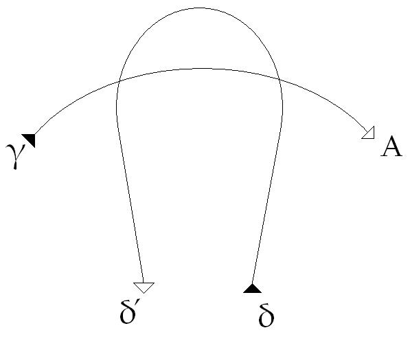
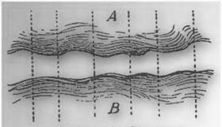
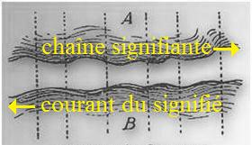
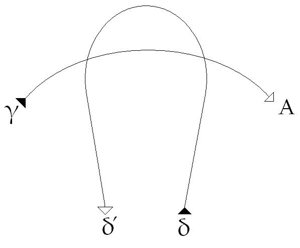
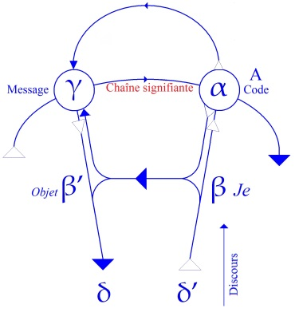
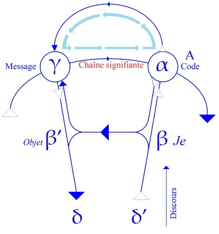
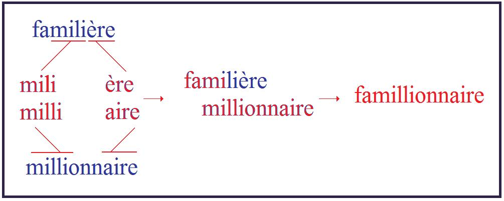
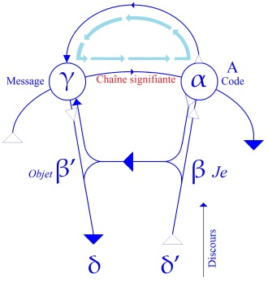

# Leçon 01 | 06 Novembre 1957

  

    <label><input type="checkbox" data-lacan-toggle="original" checked> 原文</label>
    <label><input type="checkbox" data-lacan-toggle="notes" checked> 注释</label>
    <label><input type="checkbox" data-lacan-toggle="commentary" checked> 个人解读评论</label>
  

  <form class="lacan-tool-search" role="search">
    <input class="lacan-tool-search-input" type="search" placeholder="搜索全文" aria-label="搜索全文">
    <button class="lacan-tool-button" type="submit" title="搜索">搜索</button>
  </form>
  <button class="lacan-tool-button lacan-back-to-top" type="button" title="回到页面最上方" aria-label="回到页面最上方">↑</button>

<section class="parallel-paragraph" data-paragraph-ids="s5-01-0001">

s5-01-0001

原文 · s5-01-0001

Nous avons pris cette année pour thème de notre séminaire *les formations de l’inconscient*. Ceux d’entre vous,
et je crois que c’est le plus grand nombre, qui étaient hier soir à notre séance scientifique, sont déjà au diapason.
À savoir qu’ils savent que les questions que nous allons poser concernent cette fois d’une façon directe, la fonction dans l’inconscient de ce que nous avons, aux cours des années précédentes, élaboré comme étant le rôle du signifiant.

[无对应译文]

</section>

<section class="parallel-paragraph" data-paragraph-ids="s5-01-0002">

s5-01-0002

原文 · s5-01-0002

Un certain nombre d’entre vous - je m’exprime ainsi parce que mes ambitions sont modestes - j’espère, ont lu *l’article* qui est dans le 3*ème* numéro de *La psychanalyse* que j’ai fait passer *sous le titre de* *L’instance de la lettre dans l’inconscient*.
Ceux qui auront eu ce courage seront bien placés, voir mieux placés que les autres, pour suivre ce dont il va s’agir.
Au reste il semble que c’est une prétention modeste que je puis avoir, que vous qui vous donnez la peine d’écouter
ce que je dis, vous vous donniez aussi celle de *lire* ce que j’écris, puisqu’en somme c’est pour vous que je l’écris.
Ceux qui ne l’on pas fait, donc, feront tout de même mieux de s’y reporter, d’autant plus que je vais tout le temps
m’y référer. Je suis forcé de supposer connu ce qui a déjà été énoncé.

[无对应译文]

</section>

<section class="parallel-paragraph" data-paragraph-ids="s5-01-0003">

s5-01-0003

原文 · s5-01-0003

Enfin pour ceux qui n’ont aucune de ces préparations, je vais vous dire ce à quoi je vais *me limiter aujourd’hui*,
ce qui va faire l’objet de cette leçon d’introduction à notre propos. Je vais vous rappeler dans un premier temps…
d’une façon forcément brève, forcément allusive puisque je ne peux pas recommencer
…quelques point ponctuant en quelque sorte ce qui, les années précédentes, amorce, annonce ce que j’ai à vous dire sur *la fonction du signifiant dans l’inconscient*. Ensuite, ceci pour le repos de l’esprit de ceux que ce bref rappel pourra laisser un peu essouflés, je vous expliquerai ce que signifie ce schéma auquel nous aurons à nous reporter
dans toute la suite de notre expérience théorique cette année.

[无对应译文]

</section>

<section class="parallel-paragraph" data-paragraph-ids="s5-01-0004">

s5-01-0004

原文 · s5-01-0004

[无对应译文]

</section>

<section class="parallel-paragraph" data-paragraph-ids="s5-01-0005">

s5-01-0005

原文 · s5-01-0005

Enfin je prendrai un exemple, le premier exemple dont se sert FREUD dans son livre sur *Le trait d’esprit* [^1],

[无对应译文]

</section>

<section class="parallel-paragraph" data-paragraph-ids="s5-01-0006">

s5-01-0006

原文 · s5-01-0006

non pas pour l’illustrer, mais pour l’amener parce *qu’il n’y a de trait d’esprit que particulier*, il n’y a pas de *trait d’esprit*
dans l’espace, abstrait. Et je commencerai de vous montrer à ce propos, comment le *trait d’esprit* se trouve
la meilleure entrée pour notre objet, à savoir *les formations de l’inconscient*. Non seulement c’est *la meilleure entrée*,
mais je dirais aussi que c’est la forme la plus éclatante sous laquelle FREUD lui-même nous indique les rapports
de l’inconscient avec *le signifiant* et ses techniques.

[无对应译文]

</section>

<section class="parallel-paragraph" data-paragraph-ids="s5-01-0007">

s5-01-0007

原文 · s5-01-0007

Je vous rappelle donc d’abord…
puisque ce sont là mes trois parties, et vous savez donc à quoi vous en tenir sur ce que
je vais vous expliquer, ce qui vous permettra du même coup de ménager votre effort mental
…que la 1ère année de mon séminaire a consisté essentiellement à propos des *Écrits techniques de Freud*,
à vous introduire la notion de *la fonction symbolique* comme seule capable de rendre compte de ce qu’on peut appeler « *la détermination dans le sens* », ceci étant la réalité que nous devons tenir comme *fondamentale de l’expérience freudienne*.

[无对应译文]

</section>

<section class="parallel-paragraph" data-paragraph-ids="s5-01-0008">

s5-01-0008

原文 · s5-01-0008

Ainsi, je vous rappelle : *la détermination dans le sens*  n’étant rien d’autre en cette occasion qu’une définition de *la raison*
je vous rappelle que cette *raison* se trouve au principe même de la possibilité de l’analyse, et que *c’est bien précisément parce que quelque chose a été noué à quelque chose de semblable à la parole, que le discours peut le dénouer.*

[无对应译文]

</section>

<section class="parallel-paragraph" data-paragraph-ids="s5-01-0009">

s5-01-0009

原文 · s5-01-0009

À ce propos je vous ai marqué la distance qui sépare *cette parole*, en tant quelle est *remplie par l’être du sujet*, du *discours* qui bourdonne au-dessus des actes humains, eux-mêmes rendus impénétrables par l’imagination de ses motifs rendus irrationnels, précisément en tant qu’ils ne sont *rationalisés* que *dans la perspective moïque de la méconnaissance*.

[无对应译文]

</section>

<section class="parallel-paragraph" data-paragraph-ids="s5-01-0010">

s5-01-0010

原文 · s5-01-0010

Que le *moi* lui-même soit fonction de *la relation symbolique* et puisse en être affecté dans sa densité, dans ses fonctions de synthèse, toutes également faites d’un mirage mais d’un mirage captivant - ceci vous l’ai-je rappelé également
dans la 1ère année - est possible seulement à raison de la béance ouverte dans l’être humain par la présence biologique
\- originelle chez lui - de la mort, en fonction de ce que j’ai appelé « *la prématuration de la naissance* ».

[无对应译文]

</section>

<section class="parallel-paragraph" data-paragraph-ids="s5-01-0011">

s5-01-0011

原文 · s5-01-0011

Ceci est le point d’impact de *l’intrusion symbolique*, et voilà où nous en étions arrivés au joint de mon 1er
et de mon 2nd séminaires. Le 2nd séminaire - vous rappellerai-je - a mis en valeur ce facteur de l’*insistance répétitive* comme venant de l’inconscient, *insistance répétitive* que nous avons identifiée à *la structure d’une chaîne signifiante*.

[无对应译文]

</section>

<section class="parallel-paragraph" data-paragraph-ids="s5-01-0012">

s5-01-0012

原文 · s5-01-0012

Et c’est ce que j’ai essayé de vous faire entrevoir en vous donnant un modèle sous la forme de la « *syntaxe »*
dite des α, β, γ, δ, dont vous avez un exposé[^2] qui, malgré les critiques qu’il a reçues…

[无对应译文]

</section>

<section class="parallel-paragraph" data-paragraph-ids="s5-01-0013">

s5-01-0013

原文 · s5-01-0013

> certaines motivées : il y a deux petits manques qu’il conviendrait de corriger dans une édition ultérieure
> …me semble être *un résumé sommaire sur le sujet de cette syntaxe*, qui doit pouvoir encore et pour longtemps, vous servir.

[无对应译文]

</section>

<section class="parallel-paragraph" data-paragraph-ids="s5-01-0014">

s5-01-0014

原文 · s5-01-0014

Je suis même persuadé qu’il se *bonifiera* en vieillissant, et que vous y trouverez moins de difficultés à vous y reporter dans quelques mois, voire à la fin de cette année, que maintenant. Ceci pour vous rappeler ce dont il s’agit dans
cette « *syntaxe »* dite α, β, γ, δ, pour répondre aussi aux efforts louables qu’ont faits certains *pour en réduire la portée*,
ce qui en tout cas pour eux est une occasion de s’y éprouver. Or c’est précisément tout ce que je cherche,
de sorte qu’en fin de compte quelque *impasse* qu’ils y aient trouvée, c’est tout de même à cela que ça leur aura servi,
à cette gymnastique que nous aurons l’occasion de retrouver dans ce que j’aurai lieu de leur montrer cette année.

[无对应译文]

</section>

<section class="parallel-paragraph" data-paragraph-ids="s5-01-0015">

s5-01-0015

原文 · s5-01-0015

Je vous fais remarquer qu’assurément - comme ceux qui se sont donné cette peine, me l’ont souligné, et écrit même,
chacun de ces termes des α, β, γ, δ, sont marqués d’une ambiguïté fondamentale, mais que c’est précisément
cette ambiguïté qui fait la valeur de l’exemple. Nous sommes d’ailleurs ainsi entrés dans ces *groupements*, dans la voie de ce qui fait actuellement la spéculation de ce qu’on appelle les recherches sur *« les groupes et les ensembles »,*
leur point de départ étant essentiellement fondé *sur le principe de partir de structures complexes dans lesquelles*
*les structures simples ne se présentent que par des cas particuliers.* Or précisément, je ne vous rappellerai pas comment
sont engendrées *les petites lettres* \[α, β, γ, δ,\], mais il est certain que nous aboutissons, après les manipulations
qui permettent de les définir, à quelque chose de fort simple, chacune de ces lettres étant définie par les relations entre eux des deux termes de deux *couples *:

[无对应译文]

</section>

<section class="parallel-paragraph" data-paragraph-ids="s5-01-0016">

s5-01-0016

原文 · s5-01-0016

- *le couple du symétrique et du dissymétrique, du dissymétrique et du symétrique*,

[无对应译文]

</section>

<section class="parallel-paragraph" data-paragraph-ids="s5-01-0017">

s5-01-0017

原文 · s5-01-0017

- *et ensuite le couple du semblable au dissemblable, et du dissemblable au semblable*.

[无对应译文]

</section>

<section class="parallel-paragraph" data-paragraph-ids="s5-01-0018">

s5-01-0018

原文 · s5-01-0018

Nous avons donc là ce *groupe minimum de quatre signifiants* qui ont pour propriété que chacun d’eux soit analysable
en fonction de ses relations avec les trois autres, c’est-à-dire - pour confirmer au passage *les analyses de* JAKOBSON, et d’ailleurs son propre dire quand je l’ai rencontré récemment - *le groupe minimum de signifiants* nécessaires
à ce que soient données les conditions premières, élémentaires de ce qu’on peut appeler *l’analyse linguistique*.
Or vous le verrez, cette *analyse linguistique* a le rapport le plus étroit avec ce que nous appelons *l’analyse* tout court,
elles se confondent même, elles ne sont pas essentiellement, si nous y regardons de près, autre chose.

[无对应译文]

</section>

<section class="parallel-paragraph" data-paragraph-ids="s5-01-0019">

s5-01-0019

原文 · s5-01-0019

Dans la 3ème année de mon séminaire, nous avons parlé de la psychose en tant qu’elle est fondée sur une carence signifiante primordiale, et nous avons montré ce qui survient de subduction du *réel* quand, entraîné par l’invocation vitale, il vient prendre sa place dans cette carence du signifiant dont on parlait hier soir sous le terme de *Verwerfung*,
et qui - j’en conviens - n’est pas quelque chose qui soit sans présenter quelques difficultés.

[无对应译文]

</section>

<section class="parallel-paragraph" data-paragraph-ids="s5-01-0020">

s5-01-0020

原文 · s5-01-0020

C’est pour cela que nous aurons à y revenir cette année, mais je pense que ce que vous avez compris
dans ce séminaire sur la psychose c’est que, sinon le dernier ressort, du moins le mécanisme essentiel
de *cette réduction de l’Autre, du grand Autre* - de *l’Autre* comme siège de la parole - *à l’autre imaginaire, cette suppléance*
*du symbolique par l’imaginaire*, et même comment nous pouvons concevoir l’effet de totale étrangeté du *réel*
qui se produit dans les moments de rupture de ce dialogue du *délire*, par quoi seulement le psychosé peut soutenir
en lui ce que nous appellerons une certaine intransitivité du sujet, chose qui nous paraît, quant à nous, toute naturelle : « *Je pense, donc je suis* »disons-nous intransitivement. Mais assurément c’est là *la difficulté* pour le psychosé, précisément dans la mesure de cette réduction de la duplicité de *l’Autre avec le grand A* et de *l’autre avec le petit a* :

[无对应译文]

</section>

<section class="parallel-paragraph" data-paragraph-ids="s5-01-0021">

s5-01-0021

原文 · s5-01-0021

- de *l’Autre* siège de la parole et garant de *la vérité*,

[无对应译文]

</section>

<section class="parallel-paragraph" data-paragraph-ids="s5-01-0022">

s5-01-0022

原文 · s5-01-0022

- et de *l’autre* duel, qui est celui en face de qui il se trouve comme étant sa propre image.

[无对应译文]

</section>

<section class="parallel-paragraph" data-paragraph-ids="s5-01-0023">

s5-01-0023

原文 · s5-01-0023

Cette disparition de cette dualité est précisément ce qui donne au psychosé tant de difficulté à se maintenir
dans un réel humain, c’est-à-dire dans un réel *symbolique*. Je rappellerai enfin que dans cette troisième année
j’ai illustré cette dimension de ce que j’appelle *le dialogue* en tant qu’il permet au sujet de se soutenir,
par l’exemple de *la première scène d’Athalie*, ni plus ni moins.

[无对应译文]

</section>

<section class="parallel-paragraph" data-paragraph-ids="s5-01-0024">

s5-01-0024

原文 · s5-01-0024

C’est un séminaire que j’aurai bien aimé reprendre pour l’écrire si j’en avais eu le temps.

[无对应译文]

</section>

<section class="parallel-paragraph" data-paragraph-ids="s5-01-0025">

s5-01-0025

原文 · s5-01-0025

Je pense néanmoins que vous n’avez pas oublié l’extraordinaire dialogue de cet ABNER, qui s’avance ici comme
*le prototype du faux-frère et de l’agent double,* qui vient en quelque sorte tâter le terrain dans la première annonce de :
« *Oui, je viens dans son temple* », et qui fait résonner je ne sais quelle tentative de séduction, admirez comme c’est extraordinaire ! Il est vrai bien entendu, que la façon dont nous l’avons couronné nous fait oublier un peu
toutes ces résonances, et je vous ai souligné comment le grand prêtre y allait de quelques signifiants essentiels :

[无对应译文]

</section>

<section class="parallel-paragraph" data-paragraph-ids="s5-01-0026">

s5-01-0026

原文 · s5-01-0026

- « *Et Dieu resté fidèle en toutes ses menaces* »,

[无对应译文]

</section>

<section class="parallel-paragraph" data-paragraph-ids="s5-01-0027">

s5-01-0027

原文 · s5-01-0027

- « *promesses du ciel* »,

[无对应译文]

</section>

<section class="parallel-paragraph" data-paragraph-ids="s5-01-0028">

s5-01-0028

原文 · s5-01-0028

- « *pourquoi renoncez-vous ?* ».

[无对应译文]

</section>

<section class="parallel-paragraph" data-paragraph-ids="s5-01-0029">

s5-01-0029

原文 · s5-01-0029

*Le terme de « ciel » et quelques autres mots* bien sentis *ne sont* très essentiellement *rien d’autre que des signifiants purs*.
Je vous en ai souligné le vide absolu. Il *embroche* si je puis dire, son adversaire, au point de n’en faire plus désormais que ce dérisoire *ver de terre* qui est allé reprendre, comme je vous le disais, les rangs de la procession,
et servir d’appât à ATHALIE qui finira dans ce petit jeu - comme vous le savez - par succomber.

[无对应译文]

</section>

<section class="parallel-paragraph" data-paragraph-ids="s5-01-0030">

s5-01-0030

原文 · s5-01-0030

Cette relation du signifiant avec le signifié, si visible, si sensible dans ce dialogue dramatique,
est quelque chose à propos de quoi je vous ai parlé de référence au *schéma célèbre* de Ferdinand de SAUSSURE :

[无对应译文]

</section>

<section class="parallel-paragraph" data-paragraph-ids="s5-01-0031">

s5-01-0031

原文 · s5-01-0031

[无对应译文]

</section>

<section class="parallel-paragraph" data-paragraph-ids="s5-01-0032">

s5-01-0032

原文 · s5-01-0032

le courant, ou plus exactement *le double flot* parallèle, c’est ainsi qu’il le représente, du signifiant et du signifié
comme étant distincts et voué à un perpétuel glissement l’un sur l’autre.

[无对应译文]

</section>

<section class="parallel-paragraph" data-paragraph-ids="s5-01-0033">

s5-01-0033

原文 · s5-01-0033

C’est à ce propos que je vous ai forgé *les images de la technique du matelassier : du point de capiton*, dont il faut bien qu’en quelque point le tissu de l’un s’attache au tissu de l’autre. Pour que nous sachions à quoi nous en tenir au moins
sur les limites possibles de ces glissements : *les points de capiton laissent quelque élasticité dans les liens entre les deux termes*.

[无对应译文]

</section>

<section class="parallel-paragraph" data-paragraph-ids="s5-01-0034">

s5-01-0034

原文 · s5-01-0034

C’est bien là-dessus que nous allons reprendre quand je vous aurai évoqué aussi *la fonction de ma* 4ème *année de séminaire*, quand je vous aurai dit qu’en somme parallèlement et symétriquement à ceci, et à quoi aboutissait le dialogue
de JOAD et d’ABNER, il n’y a pas de véritable sujet qui tienne, sinon celui qui parle au nom de « *La parole* ».
Vous n’avez pas oublié *le plan* sur lequel parle JOAD : « *Voici comme ce Dieu vous répond par ma bouche* ».   
Il n’y a pas d’autre *objet* dans la référence à cet *Autre*. Ceci est symbolique de ce qui existe dans toute *parole* valable.

[无对应译文]

</section>

<section class="parallel-paragraph" data-paragraph-ids="s5-01-0035">

s5-01-0035

原文 · s5-01-0035

De même dans la 4ème année de séminaire, j’ai voulu vous montrer qu’il n’y a pas d’objet, sinon métonymique,
*l’objet du désir* étant *l’objet du* *désir de l’autre*, et le désir toujours *désir d’autre chose*, très précisément de ce qui manque
à l’objet perdu primordialement, en tant que FREUD nous le montre comme étant toujours à retrouver.

[无对应译文]

</section>

<section class="parallel-paragraph" data-paragraph-ids="s5-01-0036">

s5-01-0036

原文 · s5-01-0036

De même il n’y a pas de sens, sinon métaphorique. *Le sens ne surgissant que de la substitution d’un signifiant à un signifiant* dans la chaîne symbolique. C’est très précisément ce qui est connoté dans le travail dont je vous parlais tout à l’heure, et auquel je vous invitais à vous référer, sur *L’instance de la lettre dans l’inconscient*. \[*La Psychanalyse* n°3, pp.47-81, Écrits p. 493\]

[无对应译文]

</section>

<section class="parallel-paragraph" data-paragraph-ids="s5-01-0037">

s5-01-0037

原文 · s5-01-0037

Dans les *symboles* suivants, respectivement de *la métaphore* et de *la métonymie*, S *est lié dans la combinaison de la chaîne à* S1, le tout par rapport à S2 qui aboutit à ceci : que S dans sa fonction *métonymique* est dans un certain rapport *métonymique* avec *s* dans la signification : f(S…S1) S2 = S (–) *s* \[*métonymie*\]

[无对应译文]

</section>

<section class="parallel-paragraph" data-paragraph-ids="s5-01-0038">

s5-01-0038

原文 · s5-01-0038

De même c’est dans la *substitution* de S1 par rapport à S2, rapport de *substitution* dans *la métaphore,* que nous avons ceci qui est symbolisé par le rapport de grand S à petit s1, qui indique ici - *c’est plus facile à dire que dans le cas de la métonymie -* la fonction de surgissement, de *création du sens* : f(S/s1) S2 = S (+) *s* \[*métaphore*\]

[无对应译文]

</section>

<section class="parallel-paragraph" data-paragraph-ids="s5-01-0039">

s5-01-0039

原文 · s5-01-0039

Voilà donc où nous en sommes. Et maintenant nous allons aborder *ce qui va faire l’objet de nos recherches cette année*.
Pour l’aborder je vous ai d’abord construit un *schéma*, et je vais vous dire maintenant ce que, pour au moins aujourd’hui, il va nous servir à concocter.

[无对应译文]

</section>

<section class="parallel-paragraph" data-paragraph-ids="s5-01-0040">

s5-01-0040

原文 · s5-01-0040

Si nous devons trouver un moyen d’approcher *de plus près* les rapports de *la chaîne signifiante* à *la chaîne signifié*,
c’est par cette grossière image du *point de capiton*. Mais il est évident, pour que ce soit valable, qu’il faudrait
se demander *où est le matelassier*. Il est évidemment quelque part. La place où nous pourrions le mettre sur ce schéma serait tout de même un peu, par trop enfantine.

[无对应译文]

</section>

<section class="parallel-paragraph" data-paragraph-ids="s5-01-0041">

s5-01-0041

原文 · s5-01-0041

[无对应译文]

</section>

<section class="parallel-paragraph" data-paragraph-ids="s5-01-0042">

s5-01-0042

原文 · s5-01-0042

Il peut vous venir à la pensée que…
puisque l’essentiel des rapports de *la chaîne signifiante* par rapport au *courant du signifié* est quelque chose comme un *glissement* réciproque, et que malgré ce *glissement* il faut que nous saisissions où se passe la liaison, la cohérence entre ces deux courants
…il peut vous venir à la pensée que ce *glissement*, si *glissement* il y a, est forcément un *glissement relatif* :
le déplacement de chacun produit un déplacement de l’autre et aussi bien ce doit être par rapport à une sorte
de présent idéal dans quelque chose comme l’entrecroisement en sens inverse des deux lignes,
que nous devons trouver quelque schéma exemplaire.

[无对应译文]

</section>

<section class="parallel-paragraph" data-paragraph-ids="s5-01-0043">

s5-01-0043

原文 · s5-01-0043

Vous le voyez, c’est autour de quelque chose comme cela que nous pourrions grouper notre spéculation.

[无对应译文]

</section>

<section class="parallel-paragraph" data-paragraph-ids="s5-01-0044">

s5-01-0044

原文 · s5-01-0044

[无对应译文]

</section>

<section class="parallel-paragraph" data-paragraph-ids="s5-01-0045">

s5-01-0045

原文 · s5-01-0045

Cette notion du *présent* va être extrêmement importante, seulement un discours n’est pas un *événement punctiforme*
à la RUSSELL, si je puis dire. Un discours est quelque chose qui a *un point, une matière, une texture*, et non seulement *qui prend du temps*, qui a une dimension dans le *temps*, une épaisseur, qui fait que nous ne pouvons absolument pas
nous contenter de présent instantané, mais en plus dont toute notre expérience…
tout ce que nous avons dit et tout ce que nous sommes capables de présentifier tout de suite par l’expérience : il est bien clair par exemple que si je commence une phrase, vous n’en comprendrez le sens
que lorsque je l’aurai finie, parce qu’il est quand même tout à fait nécessaire, c’est la définition de la phrase,
que j’en ai dit le dernier mot pour que vous compreniez où en est le premier
…nous montre dans l’exemple le plus tangible ce qu’on peut appeler *l’action nachträglich du signifiant*, c’est-à-dire
ce que je vous dis sans cesse dans le texte de l’expérience analytique elle-même, comme nous étant donné
sur une infiniment plus grande échelle dans l’histoire du passé.

[无对应译文]

</section>

<section class="parallel-paragraph" data-paragraph-ids="s5-01-0046">

s5-01-0046

原文 · s5-01-0046

D’autre part il est clair, c’est une façon de m’exprimer, je pense que vous vous vous êtes aperçu de ceci,
en tout cas je resouligne dans mon article sur *L’instance de la lettre dans l’inconscient*, d’une façon tout à fait précise,
et à laquelle provisoirement je vous prie de vous reporter, cette chose que je vous ai exprimée sous cette forme
de métaphore topologique si je puis dire : *il est impossible de représenter dans le même plan le signifiant, le signifié et le sujet*.
Ceci n’est pas mystérieux ni opaque, c’est démontré d’une façon très simple à propos de la référence au *cogito cartésien*. Je m’abstiendrai d’y revenir maintenant parce que nous allons tout simplement le retrouver sous une autre forme.
Ceci est simplement pour vous justifier que *les deux lignes* que nous allons manipuler maintenant et qui sont celles-ci :

[无对应译文]

</section>

<section class="parallel-paragraph" data-paragraph-ids="s5-01-0047">

s5-01-0047

原文 · s5-01-0047

[无对应译文]

</section>

<section class="parallel-paragraph" data-paragraph-ids="s5-01-0048">

s5-01-0048

原文 · s5-01-0048

- Le *bouchon* veut dire le début d’un parcours,

[无对应译文]

</section>

<section class="parallel-paragraph" data-paragraph-ids="s5-01-0049">

s5-01-0049

原文 · s5-01-0049

- et la *pointe* de la flèche est sa fin.

[无对应译文]

</section>

<section class="parallel-paragraph" data-paragraph-ids="s5-01-0050">

s5-01-0050

原文 · s5-01-0050

Vous reconnaissez *ma première ligne ici*, et *l’autre* qui vient crocher sur elle après l’avoir deux fois traversée.

[无对应译文]

</section>

<section class="parallel-paragraph" data-paragraph-ids="s5-01-0051">

s5-01-0051

原文 · s5-01-0051

Je signale simplement que vous ne sauriez confondre ce que représentent ici ces deux lignes, à savoir *le signifiant*
et *le signifié* \[dans le schéma de Saussure\], avec ce qu’elles repésentent ici \[dans le *graphe* : γ→A et δ→δ’\] :

[无对应译文]

</section>

<section class="parallel-paragraph" data-paragraph-ids="s5-01-0052">

s5-01-0052

原文 · s5-01-0052

 **≠** 

[无对应译文]

</section>

<section class="parallel-paragraph" data-paragraph-ids="s5-01-0053">

s5-01-0053

原文 · s5-01-0053

qui est *légèrement différent*, et vous allez voir pourquoi. En effet nous nous plaçons entièrement *sur le plan du signifiant*. Les effets sur le signifié sont ailleurs, ils ne sont pas directement représentés dans ce *schéma*.

[无对应译文]

</section>

<section class="parallel-paragraph" data-paragraph-ids="s5-01-0054">

s5-01-0054

原文 · s5-01-0054

Il s’agit des deux états, des deux fonctions, que nous pouvons appréhender d’une suite signifiante.
Dans le premier temps de *cette première ligne* \[γ→A\], *nous avons la chaîne signifiante* en tant qu’elle reste entièrement perméable aux effets proprement *signifiants* de *la métaphore* et de *la métonymie*, ce qui implique l’*actualisation* possible
des effets signifiants à tous les niveaux, à savoir particulièrement :

[无对应译文]

</section>

<section class="parallel-paragraph" data-paragraph-ids="s5-01-0055">

s5-01-0055

原文 · s5-01-0055

- jusqu’au niveau phonématique,

[无对应译文]

</section>

<section class="parallel-paragraph" data-paragraph-ids="s5-01-0056">

s5-01-0056

原文 · s5-01-0056

- jusqu’au niveau de l’élément phonologique,

[无对应译文]

</section>

<section class="parallel-paragraph" data-paragraph-ids="s5-01-0057">

s5-01-0057

原文 · s5-01-0057

- de ce qui fonde le calembour, le jeu de mots,
  ...bref, ce qui dans le signifiant est ce *quelque chose* avec quoi, nous analystes nous avons à jouer sans cesse, car je pense que sauf ceux qui arrivent ici pour la première fois, vous devez avoir à vous rappeler comment cela se passe
  dans *le jeu de mots* et *le calembour*. C’est précisément d’ailleurs par cela qu’aujourd’hui nous allons commencer à entrer dans le sujet de l’inconscient, par *le trait d’esprit* et le *Witz*.

[无对应译文]

</section>

<section class="parallel-paragraph" data-paragraph-ids="s5-01-0058">

s5-01-0058

原文 · s5-01-0058

L’autre ligne \[δ→δ’\] est celle du *discours rationnel* dans lequel est déjà intégré un certain nombre de points de repère,
de *choses* fixes, ces *choses* dans l’occasion ne pouvant strictement être saisies qu’au niveau de ce qu’on appelle
« *les emplois du signifiant* », c’est-à-dire ce qui *concrètement* dans l’usage du discours, constitue des points fixes,
qui comme vous le savez, sont très loin de répondre d’une façon univoque à une chose.

[无对应译文]

</section>

<section class="parallel-paragraph" data-paragraph-ids="s5-01-0059">

s5-01-0059

原文 · s5-01-0059

Il n’y a pas *un seul sémantème* qui corresponde à *une seule chose*, mais à des choses la plupart du temps fort diverses.
Nous nous arrêtons ici au niveau du *sémantème*, c’est-à-dire de ce qui est fixé et défini par *un emploi*.

[无对应译文]

</section>

<section class="parallel-paragraph" data-paragraph-ids="s5-01-0060">

s5-01-0060

原文 · s5-01-0060

Cette autre ligne \[δ→δ’\] est donc celle du *discours courant*, commun, tel qu’il est admis dans le code du discours,
de ce que j’appellerais *le discours de la réalité qui nous est commune*. C’est aussi *le niveau où se produit le moins de créations de sens*, puisque *le sens* est déjà en quelque sorte *donné*, et que la plupart du temps ce discours ne consiste qu’en un fin brassage de ce qu’on appelle *idées reçus*, que c’est très précisément au niveau de ce discours que se produit le fameux
« *discours vide* » dont un certain nombre de mes remarques sur *la fonction de la parole et du langage* sont parties.

[无对应译文]

</section>

<section class="parallel-paragraph" data-paragraph-ids="s5-01-0061">

s5-01-0061

原文 · s5-01-0061

Vous le voyez donc bien :

[无对应译文]

</section>

<section class="parallel-paragraph" data-paragraph-ids="s5-01-0062">

s5-01-0062

原文 · s5-01-0062

- ceci \[δ→δ’\] est *le discours concret* du sujet individuel, de celui qui parle et qui se fait entendre. C’est ce discours que l’on peut *enregistrer* sur un disque.

[无对应译文]

</section>

<section class="parallel-paragraph" data-paragraph-ids="s5-01-0063">

s5-01-0063

原文 · s5-01-0063

- L’autre \[γ→A\] est ce que tout cela inclut comme *possibilités de décomposition, de ré-interprétation, de résonance, d’effets métaphoriques et métonymiques*.
  L’un va dans le *sens contraire* de l’autre, pour la simple raison justement qu’ils glissent l’un sur l’autre,
  mais l’un recoupe l’autre, et ils se recoupent en deux points parfaitement reconnaissables.

[无对应译文]

</section>

<section class="parallel-paragraph" data-paragraph-ids="s5-01-0064">

s5-01-0064

原文 · s5-01-0064

Si nous partons du discours \[δ→δ’\], le premier point où le discours rencontre l’autre chaîne \[γ→A\] que nous appellerons *la chaîne* proprement *signifiante*, c’est, du point de vue du signifiant, ce que je viens de vous expliquer, à savoir
« *le faisceau des emplois* », autrement dit ce que nous appellerons « *le code* ». Et il faut bien que *le code* soit quelque part pour qu’il puisse y avoir audition de ce discours. Ce *code* est très évidemment dans le *grand A* qui est là, c’est-à-dire dans *l’Autre en tant qu’il est le compagnon de langage*. Cet Autre, il faut absolument qu’il existe, et je vous prie de noter
à l’occasion qu’il n’y a absolument *pas besoin de l’appeler de ce nom imbécile et délirant* qui s’appelle « *la conscience collective* ».

[无对应译文]

</section>

<section class="parallel-paragraph" data-paragraph-ids="s5-01-0065">

s5-01-0065

原文 · s5-01-0065

Un Autre c’est un Autre, il en suffit d’un seul pour qu’une langue soit vivante, il suffit même tellement d’un seul,
que cet Autre à lui tout seul peut être aussi le premier temps. *Qu’il y en ait un qui reste et qui puisse se parler à lui-même*
*sa langue, cela suffit pour qu’il y ait lui, et non seulement un Autre, mais même deux autres, en tout cas quelqu’un qui le comprenne*.
On peut continuer à faire des traits d’esprit dans une langue, quand on en est encore le seul possesseur.

[无对应译文]

</section>

<section class="parallel-paragraph" data-paragraph-ids="s5-01-0066">

s5-01-0066

原文 · s5-01-0066

[无对应译文]

</section>

<section class="parallel-paragraph" data-paragraph-ids="s5-01-0067">

s5-01-0067

原文 · s5-01-0067

Voilà donc *la rencontre première* \[α\] au niveau de ce que nous avons appelé « *le code* ». Et dans l’autre, *la seconde rencontre* \[γ\] qui achève la boucle, qui constitue à proprement parler *le sens*, qui le constitue *à partir du code qu’elle a d’abord rencontré*, c’est à ce point d’aboutissement. Vous voyez deux flèches qui aboutissent - et aujourd’hui je me dispenserai de vous dire quelle qu’elle est la seconde des flèches qui aboutit ici \[γ\] - dans ce point γ, c’est le résultat de *cette conjonction*
*du discours avec le signifiant* comme support créateur de sens : c’est *le message*. Ici le sens vient au jour,
la vérité qu’il y a à annoncer *- si vérité il y a -* est là dans *le message*.

[无对应译文]

</section>

<section class="parallel-paragraph" data-paragraph-ids="s5-01-0068">

s5-01-0068

原文 · s5-01-0068

La plupart du temps aucune vérité n’est annoncée, pour la simple raison que *le discours* \[δ→δ’\] ne passe absolument pas à travers *la chaîne signifiante* \[γ→A\], qu’il est le pur et simple *ronron de la répétition* et du *moulin à paroles*,
et qu’il passe quelque part *en court-circuit* entre β et β’, et que *le discours* ne dit absolument rien, sinon de vous signaler que je suis un animal parlant. C’est le discours commun de *ces mots pour ne rien dire*, grâce à quoi on s’assure
qu’on n’a pas en face de soi affaire à simplement ce que l’homme est au naturel, à savoir une bête féroce.
Ces deux points, β et β’, comme *nœud minimum du court-circuit du discours*, sont très facilement reconnaissables :

[无对应译文]

</section>

<section class="parallel-paragraph" data-paragraph-ids="s5-01-0069">

s5-01-0069

原文 · s5-01-0069

- c’est précisément *l’objet* au sens de *l’objet métonymique* dont je vous ai parlé l’année dernière,

[无对应译文]

</section>

<section class="parallel-paragraph" data-paragraph-ids="s5-01-0070">

s5-01-0070

原文 · s5-01-0070

- c’est d’autre part le *« Je »* en tant qu’il indique dans le discours lui-même, *la place de celui qui parle*.

[无对应译文]

</section>

<section class="parallel-paragraph" data-paragraph-ids="s5-01-0071">

s5-01-0071

原文 · s5-01-0071

Observez bien que dans ce schéma vous pouvez toucher d’une façon sensible à la fois ce qui lie et ce qui distingue
la vérité parfaitement et immédiatement accessible à l’expérience linguistique, mais que l’expérience freudienne
de l’analyse recoupe de la distinction au moins principielle qu’il y a entre :

[无对应译文]

</section>

<section class="parallel-paragraph" data-paragraph-ids="s5-01-0072">

s5-01-0072

原文 · s5-01-0072

- ce *« Je »*, qui n’est rien d’autre que *la place de celui qui parle* dans la chaîne du discours, qui n’a même pas besoin d’ailleurs d’être désigné par un *« Je »*,

[无对应译文]

</section>

<section class="parallel-paragraph" data-paragraph-ids="s5-01-0073">

s5-01-0073

原文 · s5-01-0073

- et d’autre part *le message*, c’est-à-dire cette chose qui nécessite absolument au minimum l’appareil de ce schéma pour exister.

[无对应译文]

</section>

<section class="parallel-paragraph" data-paragraph-ids="s5-01-0074">

s5-01-0074

原文 · s5-01-0074

Il est totalement impossible de faire sortir un message quelconque, ni une parole d’une façon en quelque sorte irradiante et concentrique, de l’existence d’un sujet quelconque, s’il n’y a pas toute cette complexité.
Il n’y a pas de *parole* possible pour la bonne raison que :

[无对应译文]

</section>

<section class="parallel-paragraph" data-paragraph-ids="s5-01-0075">

s5-01-0075

原文 · s5-01-0075

- la parole suppose précisément l’existence d’*une chaîne signifiante*, ce qui est une chose dont la genèse est loin d’être simple à obtenir, nous avons passé un an pour y arriver,

[无对应译文]

</section>

<section class="parallel-paragraph" data-paragraph-ids="s5-01-0076">

s5-01-0076

原文 · s5-01-0076

- et ce qui suppose l’existence d’*un réseau des emplois*, autrement dit de l’usage d’une langue.

[无对应译文]

</section>

<section class="parallel-paragraph" data-paragraph-ids="s5-01-0077">

s5-01-0077

原文 · s5-01-0077

Ce qui suppose en outre tout ce mécanisme qui fait que, quoi que vous disiez, en y pensant ou en n’y pensant pas,
quoi que vous formuliez, une fois que vous êtes entré dans *la roue du moulin à paroles*, votre discours en dit toujours plus que ce que *vous* n’en dites, et très évidemment en se fondant, par le seul fait qu’il est *parole,* sur l’existence
quelque part de ce terme de référence qu’est le plan de *la vérité*, de *la vérité* en tant que distincte de la réalité,
quelque chose qui fait entrer en jeu le surgissement possible de nouveaux sens introduits dans le monde,
dans la réalité, y introduit littéralement, non pas les sens qui y sont, mais les sens qu’elle en fait surgir.

[无对应译文]

</section>

<section class="parallel-paragraph" data-paragraph-ids="s5-01-0078">

s5-01-0078

原文 · s5-01-0078

[无对应译文]

</section>

<section class="parallel-paragraph" data-paragraph-ids="s5-01-0079">

s5-01-0079

原文 · s5-01-0079

Vous avez là, irradiant du *message* d’une part, du *« Je »* d’autre part - le sens de ces petits ailerons que vous voyez là - deux sens divergents :

[无对应译文]

</section>

<section class="parallel-paragraph" data-paragraph-ids="s5-01-0080">

s5-01-0080

原文 · s5-01-0080

- l’un qui va du « *Je* » vers *l’objet métonymique* \[β→β’\]

[无对应译文]

</section>

<section class="parallel-paragraph" data-paragraph-ids="s5-01-0081">

s5-01-0081

原文 · s5-01-0081

- et vers l’Autre \[β→α\],
  à quoi correspond symétriquement le *message* par la voie de retour du discours :

[无对应译文]

</section>

<section class="parallel-paragraph" data-paragraph-ids="s5-01-0082">

s5-01-0082

原文 · s5-01-0082

- la direction du *message* vers *l’objet métonymique* \[γ→β’\]

[无对应译文]

</section>

<section class="parallel-paragraph" data-paragraph-ids="s5-01-0083">

s5-01-0083

原文 · s5-01-0083

- et vers l’Autre \[γ→α\].

[无对应译文]

</section>

<section class="parallel-paragraph" data-paragraph-ids="s5-01-0084">

s5-01-0084

原文 · s5-01-0084

Tout cela provisoirement, je vous prie de le relever.

[无对应译文]

</section>

<section class="parallel-paragraph" data-paragraph-ids="s5-01-0085">

s5-01-0085

原文 · s5-01-0085

Sur le schéma, vous verrez que cela nous sera d’un grand usage, ce qui peut vous sembler aller de soi :

[无对应译文]

</section>

<section class="parallel-paragraph" data-paragraph-ids="s5-01-0086">

s5-01-0086

原文 · s5-01-0086

- la ligne qui va du « *Je* » vers l’Autre, \[β→α\]

[无对应译文]

</section>

<section class="parallel-paragraph" data-paragraph-ids="s5-01-0087">

s5-01-0087

原文 · s5-01-0087

- et la ligne qui va du « *Je* » vers *l’objet métonymique* \[β→β’\],
  et vous verrez à quoi correspondent *les deux autres lignes* formidablement passionnantes et remplies d’intérêt, qui vont :

[无对应译文]

</section>

<section class="parallel-paragraph" data-paragraph-ids="s5-01-0088">

s5-01-0088

原文 · s5-01-0088

- *du message vers le code* \[γ→α\], car précisément cette ligne de retour existe. Si elle n’existait pas il n’y aurait, comme *le schéma* lui-même vous l’indique, pas le moindre espoir de *création de sens*,

[无对应译文]

</section>

<section class="parallel-paragraph" data-paragraph-ids="s5-01-0089">

s5-01-0089

原文 · s5-01-0089

- c’est précisément dans l’inter-jeu entre *le message* et *le code* et aussi dans *le retour du code au message* \[α→γ\], que va jouer la dimension essentielle dans laquelle nous introduit de plain pied *le trait d’esprit*.

[无对应译文]

</section>

<section class="parallel-paragraph" data-paragraph-ids="s5-01-0090">

s5-01-0090

原文 · s5-01-0090

[无对应译文]

</section>

<section class="parallel-paragraph" data-paragraph-ids="s5-01-0091">

s5-01-0091

原文 · s5-01-0091

C’est là que pendant un certain nombre de leçons je pense, nous nous maintiendrons pour voir tout ce qui peut
s’y passer *d’extraordinairement suggestif et indicatif*. D’autre part cela nous donnera une occasion de plus de saisir
la relation de dépendance où est *l’objet métonymique*, ce fameux *objet* qui n’est jamais *cet objet*, *toujours situé ailleurs*,
qui est *toujours autre chose*, dont nous avons commencé à nous occuper l’année dernière. Maintenant abordons ce *Witz*.

[无对应译文]

</section>

<section class="parallel-paragraph" data-paragraph-ids="s5-01-0092">

s5-01-0092

原文 · s5-01-0092

Le *Witz*, qu’est-ce que cela veut dire ? On l’a traduit par *le trait d’esprit*, on a dit *le mot d’esprit*. Je passe tout de suite sur les raisons pour lesquelles je préfère *trait d’esprit*. Le *Witz* veut tout de même aussi dire *l’esprit*. L’esprit pour tout dire, a tout de suite été l’apport qui se présente à nous dans une extrême ambiguïté, car en fin de compte un *trait d’esprit* c’est l’objet - à l’occasion - de quelque *dépréciation*, c’est *légèreté, manque de sérieux, fantaisie, caprice*.

[无对应译文]

</section>

<section class="parallel-paragraph" data-paragraph-ids="s5-01-0093">

s5-01-0093

原文 · s5-01-0093

Quant à l’esprit on s’arrête, on y regarde à deux fois avant de parler de la même façon de « *l’esprit* ».
Malgré tout, « *l’esprit* », dans le sens d’*un homme spirituel*, n’a pas une excessivement bonne réputation,
c’est tout de même bien autour de cela que gît le centre de gravité de la notion de l’esprit, et il convient de lui laisser toutes ses ambiguïtés, jusqu’à - y compris - l’*esprit* au sens large, cet *esprit* qui sert évidemment trop souvent de pavillon à des marchandises douteuses* : l’esprit* du spiritualisme.

[无对应译文]

</section>

<section class="parallel-paragraph" data-paragraph-ids="s5-01-0094">

s5-01-0094

原文 · s5-01-0094

Cet esprit, nous pouvons le centrer sur *le trait d’esprit*, c’est-à-dire sur quelque chose qui paraît en lui *le plus contingent,*
*le plus caduc*, le plus offert à la critique. C’est bien dans le génie de la psychanalyse de faire des choses comme cela,
et c’est pour cela déjà que nous n’avons pas à nous étonner que ce soit en somme le seul point de l’œuvre de FREUD où soit mentionné à proprement parler ce qu’on décore ailleurs d’une grande majuscule, à savoir *Esprit*.
Néanmoins il n’en reste pas moins encore que cette parenté entre les deux pôles du terme *esprit* ait donné lieu
depuis toujours aux querelles de la tablature.

[无对应译文]

</section>

<section class="parallel-paragraph" data-paragraph-ids="s5-01-0095">

s5-01-0095

原文 · s5-01-0095

À la vérité il serait amusant de vous évoquer…
par exemple dans la tradition anglaise où c’est le terme *Wit*
qui est encore plus nettement ambigu que le *Witz*, et même que *l’esprit* en français
…les discussions sur le vrai, l’authentique esprit, le *bon esprit* pour tout dire, et puis sur le *mauvais esprit*,
c’est-à-dire cet esprit avec lequel *les faiseurs de pirouettes* amusent le monde. Comment distinguer cela ?

[无对应译文]

</section>

<section class="parallel-paragraph" data-paragraph-ids="s5-01-0096">

s5-01-0096

原文 · s5-01-0096

Les difficultés dans lesquelles les critiques sont entrés, sont la seule chose à laquelle il faudrait bien qu’on se réfère.
Et cela continue encore après le XVIIIème siècle, avec ADDISON, POPE, etc. au début du XIXème siècle.
Dans *l’école romantique anglaise*, la question du *Wit* n’a pas pu ne pas être au premier plan et à l’ordre du jour,
et à cet égard les écrits de HAZLITT sont aussi quelque chose de bien *significatif*, et quelqu’un dont nous aurons l’occasion de parler, COLERIDGE, est encore bien celui qui a été le plus loin dans cette voie.

[无对应译文]

</section>

<section class="parallel-paragraph" data-paragraph-ids="s5-01-0097">

s5-01-0097

原文 · s5-01-0097

Je pourrais vous dire cela également *pour la tradition allemande*, et en particulier de la conjonction, de la promotion
au premier plan de *l’esprit* et du christianisme littéraire qui a suivi une évolution strictement parallèle en Allemagne,
où la question essentielle du *Witz* est au cœur de toute *spéculation romantique* allemande, c’est-à-dire de quelque chose qui, *du point de vue historique et du point de vue aussi de la situation de l’analyse*, aura de nouveau à retenir notre attention.

[无对应译文]

</section>

<section class="parallel-paragraph" data-paragraph-ids="s5-01-0098">

s5-01-0098

原文 · s5-01-0098

Ce qui est tout à fait frappant, c’est à quel point arrive la critique autour de la fonction du *Witz* ou du *Wit*, à laquelle je dois dire il n’y a rien qui corresponde dans ce lieu, et quoique, vous le savez, les seules personnes qui s’en soient sérieusement occupées étant uniquement chez nous les poètes, c’est-à-dire que dans cette période du XIXème siècle,
la question, non seulement est vivante, mais est au cœur de BAUDELAIRE et de MALLARMÉ.

[无对应译文]

</section>

<section class="parallel-paragraph" data-paragraph-ids="s5-01-0099">

s5-01-0099

原文 · s5-01-0099

Mais d’ailleurs elle n’y a jamais été, même dans des essais, que du point de vue *critique*, je veux dire du point de vue d’une *formulation intellectuelle* du problème. Le point décisif est ceci. Le fait est que, quoi que ce soit que vous lisiez
sur le sujet du problème du *Witz* ou du *Wit*, vous arrivez toujours à des impasses extrêmement sensibles,
que seul le temps m’empêche de vous développer aujourd’hui - j’y reviendrai.

[无对应译文]

</section>

<section class="parallel-paragraph" data-paragraph-ids="s5-01-0100">

s5-01-0100

原文 · s5-01-0100

Il faut que j’efface cette partie de mon discours, et qu’il témoigne - je vous le prouverai ultérieurement - quel *saut*, quelle franche *rupture*, quelle *différence* de qualité et de résultat est constitué par l’œuvre de FREUD.

[无对应译文]

</section>

<section class="parallel-paragraph" data-paragraph-ids="s5-01-0101">

s5-01-0101

原文 · s5-01-0101

FREUD n’avait pas fait cette enquête à laquelle je viens de vous faire allusion, celle de toute la tradition européenne sur le sujet du *Witz*…
j’ai laissé de côté encore une autre, la principale, la tradition espagnole,
parce qu’elle est trop importante pour que nous n’ayons pas dans la suite à y revenir abondamment
…FREUD ne l’avait pas fait, il nous dit ses sources, elles sont claires : ce sont trois livres fort sensés, fort lisibles,
de ces braves professeurs allemands de petites universités qui avaient le temps de réfléchir paisiblement,
et qui vous faisaient des choses pas pédantes du tout, et qui s’appellent respectivement K. FISCHER,
Friedrich Theodor VISCHER, et T. LIPPS, professeur munichois qui a écrit certainement la chose la meilleure
des trois, et qui va fort loin, pour tout dire qui va vraiment tendre les bras à la rencontre de la recherche freudienne.

[无对应译文]

</section>

<section class="parallel-paragraph" data-paragraph-ids="s5-01-0102">

s5-01-0102

原文 · s5-01-0102

Simplement, si T. LIPPS n’avait pas été tellement soucieux de la respectabilité de son *Witz*, s’il n’avait pas voulu
*qu’il y en ait de faux et de vrais*, il aurait été certainement beaucoup plus loin. C’est au contraire ce que n’a absolument pas retenu FREUD. FREUD avait l’habitude de se commettre, et c’est pour cela qu’il a vu beaucoup plus clair.
C’est aussi parce qu’il a vu les relations structurales qu’il y a entre le *Witz* et l’inconscient.

[无对应译文]

</section>

<section class="parallel-paragraph" data-paragraph-ids="s5-01-0103">

s5-01-0103

原文 · s5-01-0103

Sur quel plan les a-t-il vues ? Uniquement sur le plan qu’on peut appeler *formel*. J’entends « *formel* », non pas au sens
de jolies formes, des rondeurs de tout ce avec quoi on essaye de vous replonger dans l’obscurantisme le plus noir.
Je parle de la forme au sens où on l’entend *par exemple* dans *la théorie littéraire*, parce qu’il y a encore une autre tradition dont je ne vous ai pas parlé, *mais c’est aussi parce que j’aurai à y revenir souvent*,tradition née récemment : *la tradition tchèque*, le groupe qui a formulé *le formalisme* dont nous croyons ici que cette référence a un sens vague.

[无对应译文]

</section>

<section class="parallel-paragraph" data-paragraph-ids="s5-01-0104">

s5-01-0104

原文 · s5-01-0104

Pas du tout ! C’est simplement votre ignorance qui vous fait croire cela. *Le formalisme est une école critique littéraire*
qui a un sens extrêmement précis, et que l’organisation d’État, qui se place là-bas du côté du *spoutnik,*
persécute depuis quelque temps déjà. Enfin quoi qu’il en soit, c’est au niveau précisément de ce formalisme,
c’est-à-dire *d’une théorie structurale du signifiant comme tel*, que se place d’emblée FREUD, et le résultat n’est pas douteux, il est même tout à fait convaincant : c’est une clef qui va permettre d’aller beaucoup plus loin.

[无对应译文]

</section>

<section class="parallel-paragraph" data-paragraph-ids="s5-01-0105">

s5-01-0105

原文 · s5-01-0105

Je n’ai pas besoin de vous demander - après vous avoir demandé de lire de temps en temps mes articles - de lire quand même, *puisque je vous parle cette année du* Witz, le livre de FREUD, *[Der Witz und seine Beziehung zum Unbewußten](http://gutenberg.spiegel.de/buch/933/1)* [^3].

[无对应译文]

</section>

<section class="parallel-paragraph" data-paragraph-ids="s5-01-0106">

s5-01-0106

原文 · s5-01-0106

Cela me paraît la moindre des choses.

[无对应译文]

</section>

<section class="parallel-paragraph" data-paragraph-ids="s5-01-0107">

s5-01-0107

原文 · s5-01-0107

Quand vous verrez l’économie de ce livre, vous verrez qu’il est fondé sur ceci que FREUD part de *la technique du mot d’esprit* et qu’il y revient toujours, et que c’est appuyé sur *la technique du mot d’esprit*. *Qu’est-ce que cela veut dire pour lui ?*
Cela veut dire *technique verbale*, comme on dit, et comme je vous dis plus précisément : *technique du signifiant*.
C’est parce qu’il parle *de la technique du signifiant et qu’il y revient sans cesse*, que véritablement il débrouille le problème.

[无对应译文]

</section>

<section class="parallel-paragraph" data-paragraph-ids="s5-01-0108">

s5-01-0108

原文 · s5-01-0108

Il y fait apparaître des plans, c’est-à-dire que : *tout d’un coup on voit* avec la plus grande netteté ce qu’il faut savoir reconnaître et distinguer pour ne pas se perdre dans des confusions perpétuelles du *signifié* et des pensées
qui ne permettent absolument pas de s’en sortir. *Tout d’un coup on voit* :

[无对应译文]

</section>

<section class="parallel-paragraph" data-paragraph-ids="s5-01-0109">

s5-01-0109

原文 · s5-01-0109

- qu’il y a un problème de *l’esprit* par exemple,

[无对应译文]

</section>

<section class="parallel-paragraph" data-paragraph-ids="s5-01-0110">

s5-01-0110

原文 · s5-01-0110

- et qu’il y a un problème du *comique* et que ce n’est pas la même chose,

[无对应译文]

</section>

<section class="parallel-paragraph" data-paragraph-ids="s5-01-0111">

s5-01-0111

原文 · s5-01-0111

- de même que le problème du *comique* et le problème du *rire*.

[无对应译文]

</section>

<section class="parallel-paragraph" data-paragraph-ids="s5-01-0112">

s5-01-0112

原文 · s5-01-0112

Cela a beau de temps en temps *aller ensemble*, et même tous les trois s’embrouiller, ce n’est quand même pas non plus le même problème. Le problème de *l’esprit* - pour s’éclairer - part chez FREUD de la technique signifiante.

[无对应译文]

</section>

<section class="parallel-paragraph" data-paragraph-ids="s5-01-0113">

s5-01-0113

原文 · s5-01-0113

C’est de là que nous allons partir avec lui, et chose très curieuse, ceci qui se passe à un niveau dont assurément
il n’est pas tout de suite indiqué que ce soit le niveau de l’inconscient, c’est précisément de *là*, et pour des raisons profondes qui tiennent à la nature même de ce dont il s’agit dans le *Witz,* c’est précisément en regardant là,
que nous en verrons le plus sur ce qui n’est pas tout à fait là, qui est à côté, qui est l’inconscient,
et qui justement ne s’éclaire et ne se livre que quand on regarde un peu à côté.

[无对应译文]

</section>

<section class="parallel-paragraph" data-paragraph-ids="s5-01-0114">

s5-01-0114

原文 · s5-01-0114

Vous trouvez là d’ailleurs quelque chose que vous allez tout le temps trouver dans le *Witz*, *c’est la nature du* *Witz*
qui est ainsi : quand vous regardez là, c’est ce qui vous permet de regarder où ça n’est pas.

[无对应译文]

</section>

<section class="parallel-paragraph" data-paragraph-ids="s5-01-0115">

s5-01-0115

原文 · s5-01-0115

Commençons avec FREUD par les clefs de la technique du signifiant.
FREUD *ne s’est pas cassé* pour trouver ses exemples : presque tous les exemples qu’il nous donne, et qui peuvent vous apparaître un peu *terre à terre* et de valeur inégale, sont pris à ses professeurs, respectivement :
K. FISCHER, F. T. VISCHER et T. LIPPS, c’est pourquoi je vous ai dit l’estime dans laquelle je les tenais.

[无对应译文]

</section>

<section class="parallel-paragraph" data-paragraph-ids="s5-01-0116">

s5-01-0116

原文 · s5-01-0116

Il y a une autre source quand même dont FREUD est véritablement pénétré, c’est Heinrich HEINE. C’est à elle
qu’il prend le premier exemple qui est ce mot merveilleux qui fleurit dans la bouche de Hirsch HYACINTHE, collecteur juif de Hambourg, *besogneux et famélique*, qu’il retrouve aux *Bains de Lucques*. Si vous voulez faire une lecture pleine sur le *Witz*, il faudrait que vous lisiez *Reisebilder* [^4]. Il est stupéfiant qu’il ne soit pas un livre *classique*.

[无对应译文]

</section>

<section class="parallel-paragraph" data-paragraph-ids="s5-01-0117">

s5-01-0117

原文 · s5-01-0117

On trouve dans *Reisebilder* un passage dans la partie italienne, sur les *Bains de Lucques*, et c’est là qu’avec
ce personnage inénarrable de Hirsch HYACINTHE…
sur les propriétés duquel j’espère avoir le temps de vous dire encore quelque chose
…et parlant avec lui, il obtient cette déclaration : qu’il a eu l’honneur de soigner les cors aux pieds du grand ROTHSCHILD, Nathan *le Sage*, et que pendant ce temps *il se disait* *- lui Hirsch HYACINTHE -* *un homme important*.

[无对应译文]

</section>

<section class="parallel-paragraph" data-paragraph-ids="s5-01-0118">

s5-01-0118

原文 · s5-01-0118

Car pendant qu’il lui rognait les cors, il pensait que Nathan *le Sage* prévoyait tous les courtiers qu’il enverrait aux rois, et que si lui, Hirsch HYACINTHE, lui rognait *un peu trop le cor au pied*, il en résulterait dans les hauteurs
cette irritation qui ferait que Nathan rognerait lui aussi un peu plus sur le cuir des rois.

[无对应译文]

</section>

<section class="parallel-paragraph" data-paragraph-ids="s5-01-0119">

s5-01-0119

原文 · s5-01-0119

Et de fil en aiguille, il nous parle aussi d’un autre ROTHSCHILD *qu’il a connu*, à savoir Salomon ROTHSCHILD.
*Et qu’un jour où il s’annonçait comme* Hirsch HYACINTHE, il lui fut répondu dans un langage débonnaire :

[无对应译文]

</section>

<section class="parallel-paragraph" data-paragraph-ids="s5-01-0120">

s5-01-0120

原文 · s5-01-0120

- « *Moi aussi je suis le collecteur de la loterie, je ne veux pas que mon collègue entre dans la cuisine*. »

[无对应译文]

</section>

<section class="parallel-paragraph" data-paragraph-ids="s5-01-0121">

s5-01-0121

原文 · s5-01-0121

Et, s’écrie Hirsch HYACINTHE :

[无对应译文]

</section>

<section class="parallel-paragraph" data-paragraph-ids="s5-01-0122">

s5-01-0122

原文 · s5-01-0122

- « *Il m’a traité d’une façon tout à fait famillionnaire*. »

[无对应译文]

</section>

<section class="parallel-paragraph" data-paragraph-ids="s5-01-0123">

s5-01-0123

原文 · s5-01-0123

Voilà sur quoi s’arrête FREUD, qui est complété par ce très joli « Qu’est-ce que c’est ? »
Un néologisme, un lapsus, un trait d’esprit ? C’est un trait d’esprit assurément, mais le fait que j’ai pu poser
*les deux autres questions*, déjà nous introduit dans une ambiguïté du signifiant, dans l’inconscient.

[无对应译文]

</section>

<section class="parallel-paragraph" data-paragraph-ids="s5-01-0124">

s5-01-0124

原文 · s5-01-0124

En effet, qu’est-ce que FREUD va nous dire ? Nous reconnaissons là-dedans *le mécanisme de la condensation* matérialisée dans le matériel du signifiant, une espèce d’« *emboutissage* », à l’aide de je ne sais quelle machine,
entre deux lignes de chaîne signifiante :

[无对应译文]

</section>

<section class="parallel-paragraph" data-paragraph-ids="s5-01-0125">

s5-01-0125

原文 · s5-01-0125

« *Salomon Rothschild m’a traité d’une façon tout à fait familière.* »

[无对应译文]

</section>

<section class="parallel-paragraph" data-paragraph-ids="s5-01-0126">

s5-01-0126

原文 · s5-01-0126

Et puis en-dessous, FREUD fait le schéma - signifiant aussi :

[无对应译文]

</section>

<section class="parallel-paragraph" data-paragraph-ids="s5-01-0127">

s5-01-0127

原文 · s5-01-0127

[无对应译文]

</section>

<section class="parallel-paragraph" data-paragraph-ids="s5-01-0128">

s5-01-0128

原文 · s5-01-0128

…il y a « *millionnaire* », et alors il y a :

[无对应译文]

</section>

<section class="parallel-paragraph" data-paragraph-ids="s5-01-0129">

s5-01-0129

原文 · s5-01-0129

- « *ère - aire* » des deux côtés,

[无对应译文]

</section>

<section class="parallel-paragraph" data-paragraph-ids="s5-01-0130">

s5-01-0130

原文 · s5-01-0130

- « *mili - milli* » aussi des deux côtés.
  Ça *se condense* et dans *l’intervalle* apparaît « *famillionnaire* ». Essayons de voir un peu ce que cela donne sur *ce schéma*.
  Je suis forcé d’aller un peu vite, mais j’ai quand même là quelque chose à pointer.

[无对应译文]

</section>

<section class="parallel-paragraph" data-paragraph-ids="s5-01-0131">

s5-01-0131

原文 · s5-01-0131

[无对应译文]

</section>

<section class="parallel-paragraph" data-paragraph-ids="s5-01-0132">

s5-01-0132

原文 · s5-01-0132

Le discours, c’est évidemment ce qui part du « *Je* », ce qui va à *l’Autre*. On peut le schématiser là en allant vers *l’Autre*. On peut aussi, ce qui est plus correct, voir que tout discours partant de *l’Autre* - quoi que nous en pensions - part et vient se réfléchir sur le « *Je* », parce qu’il faut bien qu’il soit pris dans l’affaire, et il file vers le message. \[α→β→β’→γ\]
Et cela veut simplement annoncer au second temps l’invocation de l’autre chaîne principielle du discours :
« *J’étais avec Salomon Rothschild, tout à fait familier* », retour à *l’Autre* au deuxième temps.

[无对应译文]

</section>

<section class="parallel-paragraph" data-paragraph-ids="s5-01-0133">

s5-01-0133

原文 · s5-01-0133

Cependant, de par la mystérieuse propriété des « *mil* » et des « *aire* » qui sont dans l’un et dans l’autre, quelque chose corrélativement…
n’oubliez pas que ces deux lignes sont quand même deux lignes qui n’ont d’intérêt
que si les choses circulent en même temps sur cette ligne
…*quelque chose s’émeut* qui est *l’ébranlement de la chaîne signifiante élémentaire* comme telle, et qui va ici au premier temps
de l’ébauche du message se réfléchir sur *l’objet métonymique* qui est « *mon millionnaire* », car *l’objet métonymique* schématisé de *son appartenance* est ce dont il s’agit pour Hirsch HYACINTHE.

[无对应译文]

</section>

<section class="parallel-paragraph" data-paragraph-ids="s5-01-0134">

s5-01-0134

原文 · s5-01-0134

C’est « *son millionnaire* » qui en même temps n’est pas « *son millionnaire* », parce que c’est bien plutôt le millionnaire
qui le possède, de sorte que cela ne se passe pas. C’est précisément parce que cela ne se passe pas que ce *millionnaire* vient se réfléchir au second temps, c’est-à-dire en même temps que l’autre. La façon *familière* est arrivée là.

[无对应译文]

</section>

<section class="parallel-paragraph" data-paragraph-ids="s5-01-0135">

s5-01-0135

原文 · s5-01-0135

Dans le troisième temps *millionnaire* et *familière* viennent se rencontrer et se conjoindre au message,
pour faire le *famillionnaire*. Cela peut vous sembler tout à fait puéril à trouver, et encore que c’est bien parce que
c’est moi qui ai fait le schéma. Seulement quand cela aura collé comme ça pendant toute l’année,
vous vous direz peut-être que le schéma sert à quelque chose.

[无对应译文]

</section>

<section class="parallel-paragraph" data-paragraph-ids="s5-01-0136">

s5-01-0136

原文 · s5-01-0136

Il a tout de même un intérêt, c’est que grâce à ce qu’il nous présente d’exigence topologique, il nous permet
de mesurer nos pas quant à ce qui concerne le *signifiant*, à savoir que tel qu’il est fait, et de quelque façon que
vous le parcouriez, il limite tous nos pas. Je veux dire que chaque fois qu’une chose consistera à faire un pas,
il exigera que nous n’en fassions *pas plus de trois* élémentaires.Vous allez vous apercevoir que c’est à cela que tendent *les petits bouchons de départ* et *les pointes de flèches* ainsi que *les ailerons* qui concernent *les segments* qui doivent toujours être dans une position seconde intermédiaire, les autres sont ou bien initiaux ou bien terminaux.

[无对应译文]

</section>

<section class="parallel-paragraph" data-paragraph-ids="s5-01-0137">

s5-01-0137

原文 · s5-01-0137

Donc *en trois temps* les deux chaînes - celle du discours et celle du signifiant - sont arrivées à *converger au même point*,
*au point du message*. Cela fait que Monsieur Hirsch HYACINTHE a été traité d’une façon tout à fait *famillionnaire*.
Ce message est tout à fait *incongru* en ce sens qu’il n’est pas reçu, il n’est pas dans le code. Tout est là.

[无对应译文]

</section>

<section class="parallel-paragraph" data-paragraph-ids="s5-01-0138">

s5-01-0138

原文 · s5-01-0138

Le *message* en principe est fait pour être dans un certain rapport de distinction avec le *code*, mais là c’est sur le plan du signifiant lui-même que manifestement il est en violation du *code,* de la définition que je vous propose du *trait d’esprit*,
en ce sens qu’il s’agit de savoir ce qui se passe, ce qui est la nature de ce qui s’y passe. Et *le trait d’esprit* est constitué par ceci que le *message* qui se produit à un certain niveau de la production signifiante, contient *de par sa différence,*
*de par sa distinction* d’avec le *code*, il prend de par cette distinction et cette différence, valeur de *message*.
Le *message* gît dans sa différence même d’avec le *code*.

[无对应译文]

</section>

<section class="parallel-paragraph" data-paragraph-ids="s5-01-0139">

s5-01-0139

原文 · s5-01-0139

Comment cette différence est-elle sanctionnée ? C’est là *le deuxième plan* dont il s’agit.

[无对应译文]

</section>

<section class="parallel-paragraph" data-paragraph-ids="s5-01-0140">

s5-01-0140

原文 · s5-01-0140

Cette différence est sanctionnée comme *trait d’esprit* par l’Autre, et ceci est indispensable, et ceci est dans FREUD,
car il y a deux choses dans le livre de FREUD sur le *trait d’esprit* : c’est *la promotion de la technique signifiante*, la référence expresse à l’Autre comme tiers, que je vous serine depuis des années, qui est absolument articulée dans FREUD
par la deuxième partie tout spécialement de son ouvrage, mais forcément depuis le début, perpétuellement :
*par exemple* FREUD *nous promeut que* *la différence du trait d’esprit et du comique tient en ceci par exemple, que le comique est duel*.

[无对应译文]

</section>

<section class="parallel-paragraph" data-paragraph-ids="s5-01-0141">

s5-01-0141

原文 · s5-01-0141

Comme je le dis, le comique est la relation duelle, mais il faut qu’il y ait le tiers Autre pour qu’il y ait le *trait d’esprit*,
et en effet cette sanction du tiers Autre, qu’il soit supporté par un individu ou pas, est absolument essentielle :
l’Autre renvoie la balle, c’est-à-dire le range dans le code en tant que *trait d’esprit,* il dit - dans le code -
que « *ceci est un trait d’esprit* ». C’est essentiel, de sorte que si personne ne le fait, il n’y a pas de *trait d’esprit*.
Autrement dit, si *famillionnaire* est un *lapsus*, et si personne ne s’en aperçoit, ça ne fait pas un *trait d’esprit*.
Mais il faut que l’Autre le codifie comme *trait d’esprit*.

[无对应译文]

</section>

<section class="parallel-paragraph" data-paragraph-ids="s5-01-0142">

s5-01-0142

原文 · s5-01-0142

Et troisième élément de la définition : *il est inscrit dans le code*, de par cette intervention de l’Autre, *que ce trait d’esprit*
*a une fonction* qui a un rapport avec quelque chose de tout à fait situé profondément au niveau du sens, et qui est,
je ne dis pas une vérité - je vous illustrerai à propos de cet exemple que ce n’est pas en tant que *famillionnaire*
que nous faisons des allusions subtiles à propos de je ne sais quoi qui serait la psychologie du millionnaire
et du parasite par exemple.

[无对应译文]

</section>

<section class="parallel-paragraph" data-paragraph-ids="s5-01-0143">

s5-01-0143

原文 · s5-01-0143

Bien sûr cela contribue beaucoup, à notre plaisir, et nous y reviendrons mais je vous pose dès aujourd’hui
que le *trait d’esprit*, si nous voulons le chercher - et avec FREUD, car FREUD nous conduira aussi loin
que possible dans ce sens où est sa pointe, puisque de pointe il s’agit et pointe il y a - son essence tient en quelque chose qui a rapport à quelque chose de tout à fait radical dans le sens de la vérité, à savoir ce que j’ai appelé ailleurs,
dans mon article sur *L’instance de la lettre*, quelque chose qui tient essentiellement à *la vérité*,
qui s’appelle « *la dimension d’alibi de la vérité* ».

[无对应译文]

</section>

<section class="parallel-paragraph" data-paragraph-ids="s5-01-0144">

s5-01-0144

原文 · s5-01-0144

À savoir que dans quelque point que nous puissions...
et en entraînant chez nous je ne sais quelle diplopie mentale
...vouloir serrer de près quel est le *trait d’esprit*, ce dont il s’agit, *ce qui fait* expressément le *trait d’esprit*,
c’est de désigner et toujours à côté, et de n’être vu que précisément en regardant *ailleurs*.

[无对应译文]

</section>

<section class="parallel-paragraph" data-paragraph-ids="s5-01-0145">

s5-01-0145

原文 · s5-01-0145

C’est *là-dessus* que nous reprendrons la prochaine fois. Je vous laisse certainement sur quelque chose de suspendu,
sur une énigme, mais je crois au moins avoir posé les termes mêmes auxquels je vous montrerai par la suite
que nous devons nécessairement nous rallier.

[无对应译文]

</section>

<section class="note-block original-notes">

## Notes

[^1]: Sigmund Freud : [*Le mot d'esprit et ses relations avec l'inconscient*](http://classiques.uqac.ca/classiques/freud_sigmund/le_mot_d_esprit/freud_le_mot_d_esprit.pdf), Gallimard, Folio, 1992.

[^2]: Le séminaire sur « *La lettre volée* » correspond à la séance du 26 avril 1955 du séminaire 1954-55 : *Le moi dans la théorie de Freud*..., il a été publié

    dans une version réécrite - datée de mi-mai, mi-août 1956 - dans *La psychanalyse* n° 2, 1957, pp. 15-44, précédé d’une « *Introduction* », pp. 1-14,

    puis dans les *Écrits*, Seuil, 1966, p.11 , où l’« *introduction* » est reléguée à la page 44.

[^3]: Sigmund Freud : [*Le mot d’esprit et ses relations avec l’inconscient*](http://classiques.uqac.ca/classiques/freud_sigmund/le_mot_d_esprit/freud_le_mot_d_esprit.pdf).

[^4]: Heinrich Heine : « *Reisebilder* », Tome III, 2ème partie, chap. 8.

</section>
