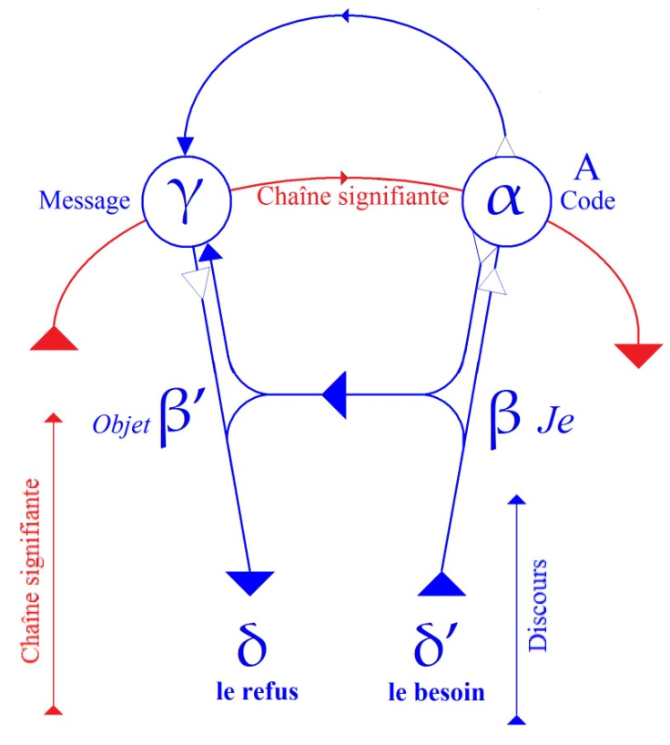
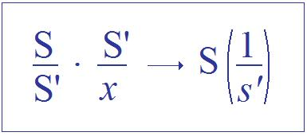
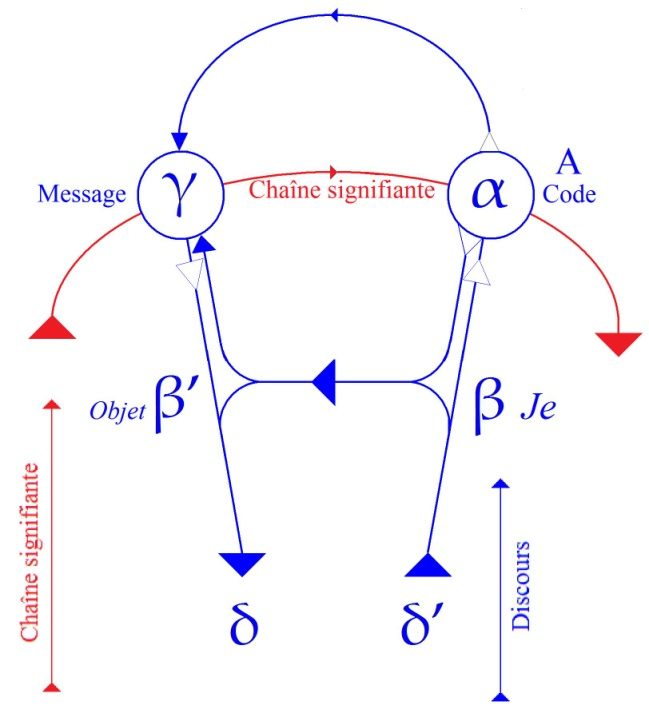
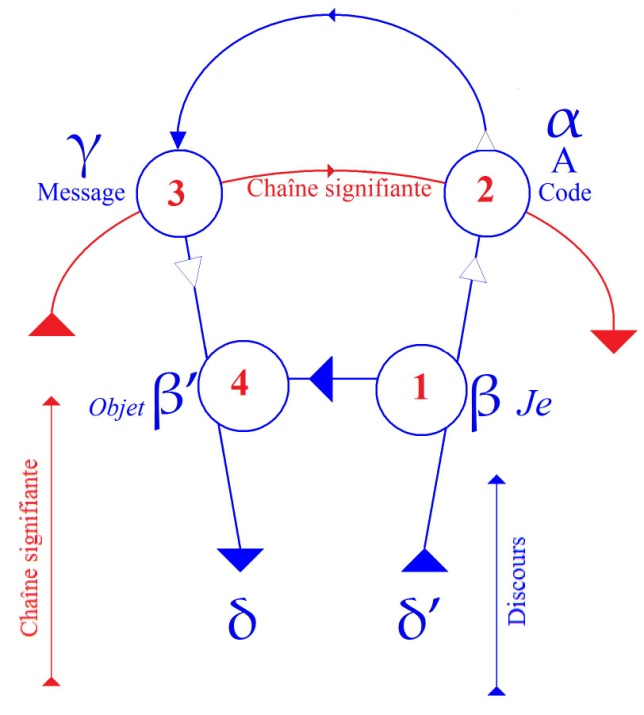

# Leçon 04 | 27 Novembre 1957

  

    <label><input type="checkbox" data-lacan-toggle="original" checked> 原文</label>
    <label><input type="checkbox" data-lacan-toggle="notes" checked> 注释</label>
    <label><input type="checkbox" data-lacan-toggle="commentary" checked> 个人解读评论</label>
  

  <form class="lacan-tool-search" role="search">
    <input class="lacan-tool-search-input" type="search" placeholder="搜索全文" aria-label="搜索全文">
    <button class="lacan-tool-button" type="submit" title="搜索">搜索</button>
  </form>
  <button class="lacan-tool-button lacan-back-to-top" type="button" title="回到页面最上方" aria-label="回到页面最上方">↑</button>

<section class="parallel-paragraph" data-paragraph-ids="s5-04-0001">

s5-04-0001

原文 · s5-04-0001

|----|

[无对应译文]

</section>

<section class="parallel-paragraph" data-paragraph-ids="s5-04-0002">

s5-04-0002

原文 · s5-04-0002

Nous avons laissé les choses la dernière fois au point où dans l’analyse du *trait d’esprit*, par un premier abord je vous avais montré un de ses aspects, une de ses formes dans ce que j’appelle ici *la fonction métaphorique*.
Nous allons en prendre un *deuxième* aspect qui est celui ici introduit sous le registre de *la fonction métonymique*.
En somme vous pourriez vous étonner de cette façon de procéder qui est de partir de l’exemple pour développer successivement des rapports fonctionnels qui semblent, de ce fait, ne pas être reliés à ce dont il s’agit - d’abord
tout au moins - par un rapport général.

[无对应译文]

</section>

<section class="parallel-paragraph" data-paragraph-ids="s5-04-0003">

s5-04-0003

原文 · s5-04-0003

Ceci tient à *une nécessité propre* de ce dont il s’agit, dont vous verrez que nous aurons l’occasion en outre de montrer l’élément sensible. Disons que concernant tout ce qui est de l’ordre de l’inconscient, en tant qu’*il est structuré par*
*le langage*, nous nous trouvons devant ce *phénomène* que ce n’est pas simplement le genre ou la classe particulière
mais aussi l’exemple particulier qui nous permet de saisir les propriétés les plus significatives.

[无对应译文]

</section>

<section class="parallel-paragraph" data-paragraph-ids="s5-04-0004">

s5-04-0004

原文 · s5-04-0004

Il y a là une sorte d’inversion de notre perspective analytique habituelle, j’entends « *analytique* » non pas au sens psychanalytique, mais au sens de l’analyse des fonctions mentales. Il y a là, si je puis dire, quelque chose qui pourrait s’appeler « *échec du concept* » au sens abstrait du terme, ou plus exactement nécessité de passer par une autre forme que celle de la saisie conceptuelle.

[无对应译文]

</section>

<section class="parallel-paragraph" data-paragraph-ids="s5-04-0005">

s5-04-0005

原文 · s5-04-0005

C’est à cela que je faisais allusion un jour en parlant du *maniérisme*, et je dirais que ce trait qui est bien tout à fait dirigé vers notre champ, le terrain sur lequel nous nous déplaçons, c’est - plutôt que par l’usage du *concept -* par l’usage
du *concetto* que nous sommes dans ce champ obligés de procéder. Ceci en raison précisément du domaine
où se déplacent les structurations dont il s’agit. Le terme « *prélogique* » est tout à fait de nature à engendrer *une confusion*, et je vous conseillerais de le rayer d’avance de vos catégories, étant donné ce qu’on en a fait, c’est-à-dire *une propriété psychologique*. Il s’agit plutôt de *propriétés structurales du langage* en tant qu’elles sont antécédentes à toute question
que nous pouvons poser au langage sur la légitimité de ce que lui - langage - nous propose comme visée.

[无对应译文]

</section>

<section class="parallel-paragraph" data-paragraph-ids="s5-04-0006">

s5-04-0006

原文 · s5-04-0006

Comme vous le savez, ce n’est rien d’autre que ce qui en soi a fait l’objet de *l’interrogation anxieuse des philosophes*,
grâce à quoi nous sommes arrivés à une sorte de compromis qui est à peu près ceci : que si *le langage* nous montre
que nous ne pouvons guère en dire trop, si ce n’est qu’il est « *être de langage* », assurément c’est pour autant,
dans cette visée, que va se réaliser pour nous un « *pour nous* » qui s’appellera objectivité.

[无对应译文]

</section>

<section class="parallel-paragraph" data-paragraph-ids="s5-04-0007">

s5-04-0007

原文 · s5-04-0007

C’est sans doute une façon rapide de résumer pour vous toute l’aventure qui va de *la logique formelle*

[无对应译文]

</section>

<section class="parallel-paragraph" data-paragraph-ids="s5-04-0008">

s5-04-0008

原文 · s5-04-0008

à *la logique transcendantale* [^11]. Mais c’est simplement pour situer, pour vous dire dès à présent, que c’est dans un autre champ que nous nous plaçons, et pour vous indiquer que FREUD ne nous dit pas, lorsqu’il nous parle de *l’inconscient,*
que cet inconscient est structuré *d’une certaine façon*. Il nous le dit d’une façon qui à la fois est *discours* et *verbal*,
pour autant que les lois qu’il avance, *les lois de composition*, d’articulation, de cet inconscient, reflètent, recoupent exactement certaines des *lois de composition* les plus fondamentales du discours.

[无对应译文]

</section>

<section class="parallel-paragraph" data-paragraph-ids="s5-04-0009">

s5-04-0009

原文 · s5-04-0009

Que d’autre part dans ce mode d’articulation de l’inconscient toutes sortes d’éléments nous manquent qui sont aussi ceux qui dans notre discours commun sont impliqués, *le lien de causalité* nous dira-t-il à propos du rêve, *la négation*,
et tout de suite après pour se reprendre et nous montrer qu’elle s’exprime de quelque façon que ce soit dans le rêve.

[无对应译文]

</section>

<section class="parallel-paragraph" data-paragraph-ids="s5-04-0010">

s5-04-0010

原文 · s5-04-0010

C’est cela, c’est *ce champ déjà exploré*, en tant qu’il est déjà cerné, défini, circonscrit, voire même labouré *par* FREUD,
c’est là que nous essayons de revenir pour essayer de formuler - allons plus loin : de formaliser, de plus près
ce que nous avons appelé à l’instant ces *lois structurantes primordiales du langage*, pour autant que s’il y a quelque chose que l’expérience freudienne nous apporte, c’est que nous sommes - par ces lois structurantes - déterminés
à ce qu’on appelle, à tort ou à raison, la condition de *signifié* de l’image la plus profonde de nous-mêmes,
disons simplement ce quelque chose en nous au-delà de nos prises auto-conceptuelles :

[无对应译文]

</section>

<section class="parallel-paragraph" data-paragraph-ids="s5-04-0011">

s5-04-0011

原文 · s5-04-0011

- cette *idée* que nous pouvons nous faire *de nous-mêmes*,

[无对应译文]

</section>

<section class="parallel-paragraph" data-paragraph-ids="s5-04-0012">

s5-04-0012

原文 · s5-04-0012

- sur laquelle nous nous appuyons,

[无对应译文]

</section>

<section class="parallel-paragraph" data-paragraph-ids="s5-04-0013">

s5-04-0013

原文 · s5-04-0013

- à laquelle nous nous raccrochons tant bien que mal, et à laquelle nous nous pressons quelquefois un peu trop prématurément de faire un sort,

[无对应译文]

</section>

<section class="parallel-paragraph" data-paragraph-ids="s5-04-0014">

s5-04-0014

原文 · s5-04-0014

- ce terme de synthèse, de totalité de la personne.
  Tous termes, ne l’oublions pas, qui sont, précisément par l’expérience freudienne, objets de contestation.

[无对应译文]

</section>

<section class="parallel-paragraph" data-paragraph-ids="s5-04-0015">

s5-04-0015

原文 · s5-04-0015

En effet FREUD nous apprend - et je dois tout de même ici le remettre en frontispice signé - quelque chose que nous pouvons appeler la distance, voire la béance qui existe de *la structuration du désir* à *la structuration de nos besoins*.
Car si précisément l’expérience freudienne vient enfin se référer à une métapsychologie des besoins, assurément
il n’y a rien d’évident, ceci peut même être dit d’une façon tout à fait inattendue par rapport à une première évidence.

[无对应译文]

</section>

<section class="parallel-paragraph" data-paragraph-ids="s5-04-0016">

s5-04-0016

原文 · s5-04-0016

C’est bien en fonction de ce cheminement, de détours auxquels l’expérience, telle qu’elle a été instituée et définie
par FREUD, nous force, et qui nous montre :

[无对应译文]

</section>

<section class="parallel-paragraph" data-paragraph-ids="s5-04-0017">

s5-04-0017

原文 · s5-04-0017

- à quel point la structure des désirs est déterminée par autre chose que les besoins,

[无对应译文]

</section>

<section class="parallel-paragraph" data-paragraph-ids="s5-04-0018">

s5-04-0018

原文 · s5-04-0018

- combien les besoins ne nous parviennent en quelque sorte que réfractés, brisés, morcelés, structurés précisément par tous ces mécanismes qui s’appellent *condensation*, qui s’appellent *déplacement*, qui s’appellent selon les formes, les manifestations de la vie psychique où ils se reflètent, qui supposent différents autres intermédiaires et mécanismes, et où nous reconnaissons précisément un certain nombre de lois qui sont celles auxquelles nous allons aboutir après cette année de séminaire, et que nous appellerons *les lois du signifiant*.

[无对应译文]

</section>

<section class="parallel-paragraph" data-paragraph-ids="s5-04-0019">

s5-04-0019

原文 · s5-04-0019

Ces lois sont ici les lois dominantes, et dans *le trait d’esprit* nous apprenons un certain usage : « jeu de l’esprit ? »
avec le point d’interrogation que nécessite ici l’introduction du terme comme tel.

[无对应译文]

</section>

<section class="parallel-paragraph" data-paragraph-ids="s5-04-0020">

s5-04-0020

原文 · s5-04-0020

- Qu’est-ce que l’*esprit* ?

[无对应译文]

</section>

<section class="parallel-paragraph" data-paragraph-ids="s5-04-0021">

s5-04-0021

原文 · s5-04-0021

- Qu’est-ce que l’*ingenium* ?

[无对应译文]

</section>

<section class="parallel-paragraph" data-paragraph-ids="s5-04-0022">

s5-04-0022

原文 · s5-04-0022

- Qu’est-ce qu’*ingenio* en espagnol, puisque j’ai fait la référence au [*concetto*](http://fr.wiktionary.org/wiki/concetto) ?

[无对应译文]

</section>

<section class="parallel-paragraph" data-paragraph-ids="s5-04-0023">

s5-04-0023

原文 · s5-04-0023

- Qu’est-ce que c’est que ce *je ne sais quoi* qui est *autre chose que la fonction du jugement*, et qui ici intervient ?

[无对应译文]

</section>

<section class="parallel-paragraph" data-paragraph-ids="s5-04-0024">

s5-04-0024

原文 · s5-04-0024

Nous ne pourrons le situer que quand nous aurons poursuivi les procédés à proprement parler et d’ailleurs élucidé
au niveau de ces procédés : de quoi s’agit-il, quels sont ces procédés, quelle est leur visée fondamentale ?

[无对应译文]

</section>

<section class="parallel-paragraph" data-paragraph-ids="s5-04-0025">

s5-04-0025

原文 · s5-04-0025

Déjà nous avons vu à propos de *l’ambiguïté* d’un *trait d’esprit* avec *le lapsus*, de ce qui sort d’ambiguïté fondamentale qui en est en quelque sorte constitutive, qui fait que ce qui se produit et qui peut, selon les cas, être tourné vers une sorte d’accident psychologique, de *lapsus* devant lequel nous resterions perplexes sans l’analyse freudienne, ou au contraire repris, ré-assumé, par une certaine audition de l’Autre, par une façon de l’homologuer, au niveau d’une valeur signifiante propre, celle précisément dans l’occasion qu’a pris *le terme néologique, paradoxal, scandaleux *: « *famillionnaire* »,
une fonction signifiante propre qui est de désigner quelque chose qui n’est pas seulement ceci ou cela, mais une sorte d’au-delà d’un certain rapport qui ici échoue, et cet au-delà n’est pas uniquement lié aux impasses du rapport du sujet avec le protecteur millionnaire mais avec ce quelque chose, qui est ici signifié de fondamental : comme quoi quelque chose dans les rapports humains, constament introduit ce mode d’impasse essentielle qui fait ou qui repose sur ceci que nul désir en somme ne peut, par l’Autre, être reçu, être admis, sinon par *toutes sortes de truchements* :

[无对应译文]

</section>

<section class="parallel-paragraph" data-paragraph-ids="s5-04-0026">

s5-04-0026

原文 · s5-04-0026

- qui le réfractent,

[无对应译文]

</section>

<section class="parallel-paragraph" data-paragraph-ids="s5-04-0027">

s5-04-0027

原文 · s5-04-0027

- qui en font autre chose que ce qu’il est,

[无对应译文]

</section>

<section class="parallel-paragraph" data-paragraph-ids="s5-04-0028">

s5-04-0028

原文 · s5-04-0028

- qui en font *un objet d’échange*, et pour tout dire,

[无对应译文]

</section>

<section class="parallel-paragraph" data-paragraph-ids="s5-04-0029">

s5-04-0029

原文 · s5-04-0029

- qui soumettent et d’ores et déjà, à l’origine, le processus de la demande à une sorte de nécessité du *refus*.

[无对应译文]

</section>

<section class="parallel-paragraph" data-paragraph-ids="s5-04-0030">

s5-04-0030

原文 · s5-04-0030

Je m’explique et en quelque sorte - puisque nous parlons du trait d’esprit - je me permettrai, pour introduire le niveau véritable où se pose cette question de la traduction de la demande en quelque chose qui porte effet,
de l’introduire par une histoire, elle-même sinon spirituelle, dont je dirai que la perspective, le registre est loin
de devoir se limiter au petit rire spasmodique.

[无对应译文]

</section>

<section class="parallel-paragraph" data-paragraph-ids="s5-04-0031">

s5-04-0031

原文 · s5-04-0031

C’est l’histoire que sans doute vous connaissez tous, l’histoire dite du *masochiste* et du *sadique* :

[无对应译文]

</section>

<section class="parallel-paragraph" data-paragraph-ids="s5-04-0032">

s5-04-0032

原文 · s5-04-0032

- « *Fais-moi mal !* »
  dit le premier au second, lequel répond sévèrement :

[无对应译文]

</section>

<section class="parallel-paragraph" data-paragraph-ids="s5-04-0033">

s5-04-0033

原文 · s5-04-0033

- « *Non !* »

[无对应译文]

</section>

<section class="parallel-paragraph" data-paragraph-ids="s5-04-0034">

s5-04-0034

原文 · s5-04-0034

Je vois que cela ne vous fait pas rire. Peu importe. Quelques-uns rient tout de même. Cette histoire d’ailleurs
*en fin de compte* n’est pas pour vous faire rire. Je vous prie simplement de remarquer que dans cette histoire quelque chose nous est *suggéré* qui se développe à un niveau qui n’a plus rien de spirituel, qui est très exactement celui-ci :
qu’y a-t-il de mieux fait pour s’entendre que le *masochiste* et le *sadique* ? Oui, mais vous le voyez par cette histoire :
à condition qu’ils ne parlent pas. Ce n’est pas par méchanceté que le *sadique* répond non, c’est en fonction de sa vertu de *sadique  *: s’il répond, il est forcé de répondre, dès qu’on a parlé, au niveau de la parole.

[无对应译文]

</section>

<section class="parallel-paragraph" data-paragraph-ids="s5-04-0035">

s5-04-0035

原文 · s5-04-0035

C’est donc pour autant que nous sommes passés au niveau de la parole que ce quelque chose qui doit aboutir,
à condition de ne rien dire, à la plus profonde entente, arrive à précisément ce que j’ai appelé tout à l’heure
« *la dialectique du refus* », « *la dialectique du refus* » pour autant qu’elle est essentielle à soutenir, dans son essence
de demande, ce qui se manifeste par la voie de la parole.

[无对应译文]

</section>

<section class="parallel-paragraph" data-paragraph-ids="s5-04-0036">

s5-04-0036

原文 · s5-04-0036

[无对应译文]

</section>

<section class="parallel-paragraph" data-paragraph-ids="s5-04-0037">

s5-04-0037

原文 · s5-04-0037

En d’autres termes, si vous le voyez, c’est ici que se manifeste, je ne dirai pas dans *le cercle du discours*,
mais en quelque sorte sur le point de branchement de l’aiguillage où, de la part du sujet, est lancé ce quelque chose qui se boucle sur soi et qui est une phrase articulée, *un anneau du discours*.

[无对应译文]

</section>

<section class="parallel-paragraph" data-paragraph-ids="s5-04-0038">

s5-04-0038

原文 · s5-04-0038

Si c’est ici que nous situons dans ce point δ’ *le besoin*, *le besoin* rencontre par une sorte de nécessité de l’Autre
cette sorte de réponse que nous appelons pour l’instant *refus*, c’est-à-dire trahit cette symétrie essentielle entre
ces deux éléments du circuit, la boucle fermée, la boucle ouverte qui fait que pour *circuiter* directement de son *besoin* vers *l’objet de son désir*, c’est-à-dire suivant ce trajet, ce qui se présente ici comme *demande* aboutit ici au « *Non !* ».

[无对应译文]

</section>

<section class="parallel-paragraph" data-paragraph-ids="s5-04-0039">

s5-04-0039

原文 · s5-04-0039

Sans doute ceci mérite-t-il que nous entrions de plus près dans ce quelque chose qui ici ne se présente que comme une sorte de *paradoxe* que notre schéma simplement sert à situer. C’est bien ici que nous reprenons la chaîne
de nos propositions sur les différentes phases du *trait d’esprit*, et qu’aujourd’hui j’introduis ce que nous avons appelé une de ses manifestations métonymiques. J’en ai fixé tout de suite pour vous l’*idée*, l’*exemple*, sous cette forme
dont vous pouvez voir toute la différence par rapport à ce qui est l’histoire du « *famillionnaire* ».

[无对应译文]

</section>

<section class="parallel-paragraph" data-paragraph-ids="s5-04-0040">

s5-04-0040

原文 · s5-04-0040

C’est l’histoire du dialogue d’Henri HEINE avec le *poète* Frédéric SOULIÉ, à peu près son contemporain, dialogue rapporté dans le livre de Kuno FISCHER[^12] qui, je pense, est assez connu à l’époque :

[无对应译文]

</section>

<section class="parallel-paragraph" data-paragraph-ids="s5-04-0041">

s5-04-0041

原文 · s5-04-0041

> « *Regardez*…

[无对应译文]

</section>

<section class="parallel-paragraph" data-paragraph-ids="s5-04-0042">

s5-04-0042

原文 · s5-04-0042

dit Frédéric SOULIÉ à celui qui n’était que de peu son aîné et dont il était admirateur

[无对应译文]

</section>

<section class="parallel-paragraph" data-paragraph-ids="s5-04-0043">

s5-04-0043

原文 · s5-04-0043

> « *Regardez comme le XIXème siècle adore le Veau d’or !* »

[无对应译文]

</section>

<section class="parallel-paragraph" data-paragraph-ids="s5-04-0044">

s5-04-0044

原文 · s5-04-0044

Ceci à propos de l’attroupement qui se forme autour d’un vieux Monsieur chargé sans doute en effet
de tous les reflets de sa puissance financière. À quoi Henri HEINE, d’un œil dédaigneux regardant l’objet
sur lequel on attire son attention, répond :

[无对应译文]

</section>

<section class="parallel-paragraph" data-paragraph-ids="s5-04-0045">

s5-04-0045

原文 · s5-04-0045

> « *Oui, mais celui-là me semble en avoir passé l’âge.* »

[无对应译文]

</section>

<section class="parallel-paragraph" data-paragraph-ids="s5-04-0046">

s5-04-0046

原文 · s5-04-0046

Que signifie ce *mot d’esprit* ? Où en est le sel et le ressort ?

[无对应译文]

</section>

<section class="parallel-paragraph" data-paragraph-ids="s5-04-0047">

s5-04-0047

原文 · s5-04-0047

Vous savez que FREUD nous a tout de suite mis *d’emblée* à propos du *mot d’esprit* sur ce plan : nous chercherons
*le trait d’esprit* là où il est, à savoir dans son texte. Rien n’est plus saisissant de la part de cet homme auquel on a attribué tous les *au-delà*, si l’on peut dire, de l’« *hypothèse psychologique* », que la façon dont au contraire c’est toujours
du point opposé de la matérialité du signifiant qu’il part, le traitant comme un donné existant pour lui-même,
et d’autre part nous n’en avons manifestement l’exemple que dans son analyse du *trait d’esprit*. Non seulement c’est
de la technique à chaque fois qu’il part, mais c’est à ces éléments techniques qu’il se confie pour en trouver le ressort. Que fait-il aussitôt ? Ce qu’il appelle « *tentative de réduction* ».

[无对应译文]

</section>

<section class="parallel-paragraph" data-paragraph-ids="s5-04-0048">

s5-04-0048

原文 · s5-04-0048

C’est ainsi qu’au niveau du *trait d’esprit* « *famillionnaire* » il nous montre que, à le traduire dans ce qu’on peut appeler son *sens* développé, tout ce qui est du *trait d’esprit* s’évanouit, montrant ainsi en quelque sorte
que c’est dans *le rapport d’ambiguïté fondamentale propre à la métaphore* :

[无对应译文]

</section>

<section class="parallel-paragraph" data-paragraph-ids="s5-04-0049">

s5-04-0049

原文 · s5-04-0049

[无对应译文]

</section>

<section class="parallel-paragraph" data-paragraph-ids="s5-04-0050">

s5-04-0050

原文 · s5-04-0050

C’est-à-dire que c’est dans le fait qu’un signifiant, c’est-à-dire la fonction que prend un signifiant en tant qu’il est substitué à un autre, *latent dans la chaîne,* que c’est dans ce rapport d’ambiguïté sur une sorte de similarité
ou de simultanéité positionnelle que gît ce dont il s’agit. Si nous décomposons ce dont il s’agit et si nous le lisons
à la suite, c’est-à-dire si nous disons : « *familier autant qu’on peut l’être avec un millionnaire* » tout ce qui est du *trait d’esprit* disparaît. Ainsi FREUD a-t-il abordé *le trait d’esprit* au niveau d’une de *ces* *manifestations métaphoriques*.

[无对应译文]

</section>

<section class="parallel-paragraph" data-paragraph-ids="s5-04-0051">

s5-04-0051

原文 · s5-04-0051

Ici il se trouve devant quelque chose dont on peut pressentir la différence, mais un instant…
car FREUD n’est pas quelqu’un à nous ménager les détours de son approche par rapport au phénomène
…il hésite à qualifier *cette nouvelle variété d’esprit de la pensée* \[Gedanken Witz\] *comme opposée à l’esprit des mots* \[Wort Witz\].

[无对应译文]

</section>

<section class="parallel-paragraph" data-paragraph-ids="s5-04-0052">

s5-04-0052

原文 · s5-04-0052

Mais bien vite il s’aperçoit que cette *distinction* est tout à fait *insuffisante*, qu’assurément ici c’est à ce qu’on appellerait « *la forme* », nommément à *l’articulation signifiante*, qu’il convient de se fier et c’est de nouveau à la réduction technique qu’il va essayer de soumettre l’exemple en question, pour lui faire répondre de ce qui y est sous-jacent,
à cette forme contestable donnée par le consentement subjectif, que c’est là le *trait d’esprit*.

[无对应译文]

</section>

<section class="parallel-paragraph" data-paragraph-ids="s5-04-0053">

s5-04-0053

原文 · s5-04-0053

Et nous allons voir que là, il rencontre quelque chose qui est différent. D’abord, lui semble-t-il, il doit bien y avoir quelque chose qui est de l’ordre métaphorique. Je vous le répète : il nous fait suivre toutes *les approches* de sa pensée. C’est pour cela qu’il s’arrête un instant à la *protase*, c’est-à-dire à ce qu’a apporté le personnage qui parle
à Henri HEINE, nommément Frédéric SOULIÉ. D’ailleurs il ne fait là que suivre Kuno FISCHER
qui en effet reste à ce niveau.

[无对应译文]

</section>

<section class="parallel-paragraph" data-paragraph-ids="s5-04-0054">

s5-04-0054

原文 · s5-04-0054

Il y a dans ce « *veau d’or* » quelque chose de *métaphorique*, assurément le « *veau d’or* » a une sorte de *double valeur* :

[无对应译文]

</section>

<section class="parallel-paragraph" data-paragraph-ids="s5-04-0055">

s5-04-0055

原文 · s5-04-0055

- il est d’une part le symbole de l’intrigue,

[无对应译文]

</section>

<section class="parallel-paragraph" data-paragraph-ids="s5-04-0056">

s5-04-0056

原文 · s5-04-0056

- et d’autre part *le symbole* du règne *du pouvoir de l’argent*.
  Est-ce à dire que ce Monsieur reçoit tous les *hommages*, sans doute parce qu’il est riche ? Ne trouvons-nous pas là quelque chose qui en quelque sorte réduit et fait disparaître ce qui est le ressort de ce dont il s’agit ?
  Mais FREUD s’avise rapidement qu’après tout ce n’est là que quelque chose de tout à fait *fallacieux*.
  Ceci dans le détail d’ailleurs mérite bien plus qu’on regarde de près pour trouver la richesse de cet exemple.

[无对应译文]

</section>

<section class="parallel-paragraph" data-paragraph-ids="s5-04-0057">

s5-04-0057

原文 · s5-04-0057

Il est bien certain qu’il y a déjà impliqué, dans ces données premières de la mise en jeu du « *veau d’or* »,
quelque chose qui est la matière. Sans approfondir de toutes les façons comment s’institue l’usage verbal d’un terme incontestablement métaphorique, il faut voir que si déjà le « *veau d’or* » est quelque chose qui en lui-même a le plus grand rapport avec *cette relation du signifiant à l’image*, qui est le versant effectivement sur lequel s’installe l’idolâtre,
en fin de compte c’est bien par rapport à une perspective qui exige, si l’on peut dire...
dans la reconnaissance de celui qui s’annonce comme « *Je suis ce que je suis* » : nommément le Dieu des Juifs
...que quelque chose de particulièrement exigeant *se refuse* à tout ce qui se pose comme *l’origine même du signifiant*,
la nomination par excellence de toute hypostasie imagée, car bien entendu nous en sommes plus loin que l’idolâtrie qui est *purement et simplement* l’adoration d’une statue.

[无对应译文]

</section>

<section class="parallel-paragraph" data-paragraph-ids="s5-04-0058">

s5-04-0058

原文 · s5-04-0058

C’est bien aussi quelque chose qui cherche son *au-delà*, et c’est précisément pour autant que ce mode de chercher
cet *au-delà essentiel* est refusé dans une certaine perspective, que ce « *veau d’or* » prend sa valeur, et ce n’est que
par quelque chose qui est déjà *un glissement* que ce « *veau d’or* » prend usage *métaphorique*.

[无对应译文]

</section>

<section class="parallel-paragraph" data-paragraph-ids="s5-04-0059">

s5-04-0059

原文 · s5-04-0059

Que ce qu’il y a dans la perspective religieuse de ce qu’on peut appeler dans l’idolâtrie une « *régression topique* »,
une substitution de l’*imaginaire* au *symbolique*, prend ici secondairement *valeur métaphorique* pour exprimer quelque chose d’autre, quelque chose qui peut aussi se référer au niveau du signifiant, à savoir ce que d’autres avant moi ont appelé
« *la valeur fétiche de l’or* », à savoir quelque chose aussi qui nous fait toucher à une certaine *concaténation signifiante*.

[无对应译文]

</section>

<section class="parallel-paragraph" data-paragraph-ids="s5-04-0060">

s5-04-0060

原文 · s5-04-0060

Ce n’est pas pour rien que je l’évoque ici, puisque c’est précisément cette fonction *fétiche* que nous allons tout de suite être amenés à toucher. Ce n’est concevable, ce n’est référable que dans la dimension justement de *la métonymie*.
Nous voilà donc sur quelque chose déjà chargé de toutes les intrications, de tous les emmêlements,
de la fonction *symbolique-imaginaire* à propos du « *veau d’or* ».

[无对应译文]

</section>

<section class="parallel-paragraph" data-paragraph-ids="s5-04-0061">

s5-04-0061

原文 · s5-04-0061

Et est-ce là que gît ou non - car ici FREUD le remarque, ce n’est pas du tout le lieu où il se situe - le *mot d’esprit* ?
Le *mot d’esprit*, comme il s’en avise, est dans la riposte d’Henri HEINE. Et la riposte d’Henri HEINE
consiste précisément à annuler, si l’on peut dire, à *subvertir* toutes les références où ce « *veau d’or* » est son expression métaphorique, se soutient, pour en faire quelque chose d’autre qui est purement et simplement là pour désigner
celui qui est ramené tout d’un coup à *sa qualité*, et ce n’est pas par hasard, où sans doute à partir d’un certain moment il mérite d’être *le veau* qui vaut tant la livre, si je puis m’exprimer ainsi.

[无对应译文]

</section>

<section class="parallel-paragraph" data-paragraph-ids="s5-04-0062">

s5-04-0062

原文 · s5-04-0062

Ce *veau* est pris pour ce qu’il est tout d’un coup, un être vivant, et pour tout dire quelqu’un qu’il réduit,
ici sur le marché institué par ce règne de l’or, à n’être que lui-même, que vendu comme bétail, une tête de veau,
et à propos de celle-ci de dire : assurément il n’est plus dans les limites de *la définition* que donnait LITTRÉ,
à savoir - ce veau - dans sa première année, que je crois même un puriste de boucherie définirait comme celui
qui n’a pas encore cessé de téter sa mère, purisme dont je me suis laissé dire qu’il n’était respecté qu’en France.

[无对应译文]

</section>

<section class="parallel-paragraph" data-paragraph-ids="s5-04-0063">

s5-04-0063

原文 · s5-04-0063

> « *Pour un veau, il a passé l’âge !* »

[无对应译文]

</section>

<section class="parallel-paragraph" data-paragraph-ids="s5-04-0064">

s5-04-0064

原文 · s5-04-0064

Que ce veau ne soit pas ici un veau, c’est un veau un peu âgé, il n’y a aucune espèce de façon de le réduire
\- ceci reste un trait d’esprit - avec l’arrière-plan du « *veau d’or* » ou pas. Donc FREUD ici saisit une différence
de l’*inanalysable* à l’*analysable*, et pourtant tous les deux sont des *traits d’esprit*. Qu’est-ce donc à dire, sinon que
sans doute c’est à deux dimensions différentes de quelque chose qui est ce que nous essayons de serrer de près
que l’expérience du trait d’esprit se réfère.

[无对应译文]

</section>

<section class="parallel-paragraph" data-paragraph-ids="s5-04-0065">

s5-04-0065

原文 · s5-04-0065

Et que ce qui se présente comme étant *en quelque sorte*, comme FREUD nous le dit lui-même, quelque chose
qui paraît *escamotage*, *tour de passe-passe*, faute de pensée, c’est le trait commun de toute une autre catégorie de l’esprit, en somme *comme on dirait vulgairement*, prendre un mot dans un autre sens que celui dans lequel il nous est apporté. C’est le même *trait* qui est donné aussi dans une autre histoire, celle qui se rapporte à ce « *premier vol de l’aigle* » dont
on a fait un mot à propos d’une opération assez large qui fut celle de la confiscation des biens des D’ORLÉANS
par NAPOLÉON III quand il monta sur le trône : « *C’est le premier vol de l’aigle* » dit-il. Chacun de se ravir
sur cette ambiguïté. Nul besoin d’insister : voilà encore quelque chose dont, à vrai dire, nulle question ici de parler d’esprit de la pensée, c’est bien en effet un *esprit des mots*, mais tout à fait de la même *catégorie* que celui qui nous est ici présenté, d’un mot pris, en apparence, dans un autre sens.

[无对应译文]

</section>

<section class="parallel-paragraph" data-paragraph-ids="s5-04-0066">

s5-04-0066

原文 · s5-04-0066

Il est amusant d’ailleurs à l’occasion de sonder *les sous-jacences* de tels mots, et si FREUD prend soin, puisque le mot nous est rapporté en français, de souligner pour ceux qui ne connaissent pas la langue française, l’ambiguïté :

[无对应译文]

</section>

<section class="parallel-paragraph" data-paragraph-ids="s5-04-0067">

s5-04-0067

原文 · s5-04-0067

- du « *vol* » comme action, mode moteur des oiseaux,

[无对应译文]

</section>

<section class="parallel-paragraph" data-paragraph-ids="s5-04-0068">

s5-04-0068

原文 · s5-04-0068

- avec le « *vol* » au sens de soustraction, de rapt, de viol de la propriété,
  …il serait bon de rappeler à ce propos que ce qu’ici FREUD élide, je ne dis pas ignore, c’est que l’un des sens a été historiquement emprunté à l’autre, et que c’est d’un usage de *vol* que le terme de *volerie*, vers le XIIIème siècle
  ou le XIVème siècle, est passé du fait que le faucon vole la caille, à l’usage de cette faute contre l’une des lois essentielles de la propriété, qui s’appelle le vol.

[无对应译文]

</section>

<section class="parallel-paragraph" data-paragraph-ids="s5-04-0069">

s5-04-0069

原文 · s5-04-0069

Ce n’est pas un accident en français, je ne dis pas que cela se produise dans toutes les langues, mais cela s’était déjà produit en latin où *volare* avait pris le même sens à partir de la même origine, montrant d’ailleurs ici à cette occasion quelque chose qui n’est pas non plus sans rapport avec ce dans quoi nous nous déplaçons, à savoir ce que j’appellerais « *les modes d’expression euphémiques* » de ce qui, dans la parole, doit finalement représenter le viol de la parole précisément, ou le viol du contrat. Dans l’occasion ce n’est pas pour rien que le mot *vol* est ici emprunté
à un tout autre registre, à savoir au registre d’un *rapt* qui n’a rien à faire avec ce que nous appelons proprement
et juridiquement le *vol*.

[无对应译文]

</section>

<section class="parallel-paragraph" data-paragraph-ids="s5-04-0070">

s5-04-0070

原文 · s5-04-0070

Mais restons-en là et reprenons ce pour quoi ici j’introduis le terme de « *métonymique* », et je crois justement devoir,
au-delà de ces ambiguïtés elles-mêmes, si fuyantes, du sens, chercher comme référence autre chose pour définir

[无对应译文]

</section>

<section class="parallel-paragraph" data-paragraph-ids="s5-04-0071">

s5-04-0071

原文 · s5-04-0071

- ce second registre dans lequel se situe *le trait d’esprit*,

[无对应译文]

</section>

<section class="parallel-paragraph" data-paragraph-ids="s5-04-0072">

s5-04-0072

原文 · s5-04-0072

- cette autre chose qui va nous permettre d’en unifier le ressort, le mécanisme, avec sa première espèce, de trouver le facteur commun, le ressort commun dont tout dans FREUD nous indique la voie, sans tout à fait bien entendu en achever la formule.

[无对应译文]

</section>

<section class="parallel-paragraph" data-paragraph-ids="s5-04-0073">

s5-04-0073

原文 · s5-04-0073

À quoi cela servirait-il que je vous parle de FREUD, si précisément nous n’essayons pas de tirer le maximum
de profit de ce qu’il nous apporte ? À nous *de pousser un peu plus loin*, je veux dire *de donner cette formalisation* nécessaire dont l’expérience nous dira :

[无对应译文]

</section>

<section class="parallel-paragraph" data-paragraph-ids="s5-04-0074">

s5-04-0074

原文 · s5-04-0074

- si c’est une formalisation qui convient,

[无对应译文]

</section>

<section class="parallel-paragraph" data-paragraph-ids="s5-04-0075">

s5-04-0075

原文 · s5-04-0075

- si c’est une formalisation conforme,

[无对应译文]

</section>

<section class="parallel-paragraph" data-paragraph-ids="s5-04-0076">

s5-04-0076

原文 · s5-04-0076

- si c’est bien dans cette direction-là que s’organisent les phénomènes.

[无对应译文]

</section>

<section class="parallel-paragraph" data-paragraph-ids="s5-04-0077">

s5-04-0077

原文 · s5-04-0077

Question de toutes façons riche de conséquences, car assurément pour toute notre façon de traiter, au sens le plus large, c’est-à-dire non pas simplement de traiter la thérapeutique, mais de concevoir *les modes de l’inconscient*,
le fait qu’il y ait *une certaine structure*, et que cette structure soit *la structure signifiante* en tant qu’elle reprend,
qu’elle tranche, qu’elle impose sa grille à tout ce qui est le besoin humain, est tout de même quelque chose d’absolument décisif et essentiel que nous voyons là donc *au pied de la métonymie*. Cette *métonymie*, je l’ai déjà plusieurs fois introduite, et nommément dans cet article qui s’appelle *L’instance de la lettre dans l’inconscient*.

[无对应译文]

</section>

<section class="parallel-paragraph" data-paragraph-ids="s5-04-0078">

s5-04-0078

原文 · s5-04-0078

Je vous en ai donné un exemple exprès pris au niveau vulgaire de cette expérience qui peut vous ressortir
de vos souvenirs de vos études secondaires, à savoir de votre grammaire...
la *métonymie* est ce qu’on appelait à ce moment-là, dans cette espèce de perspective d’une sorte
de QUINTILIEN sous-estimé, car il est bien clair que ce n’est pas l’étude des *figures de rhétorique*
qui a pu vous étouffer, on n’en a jamais jusqu’ici fait grand état
...au point où nous en sommes de notre conception des formes du discours, cette *métonymie*, j’en ai pris cet exemple : « *trente voiles* » au lieu de « *trente navires* », marquant à ce propos que ces « *trente voiles* » ne sont pas purement
et simplement ce qu’on vous dit à ce propos, à savoir « *prise de la partie pour le tout* », à savoir *référence au réel*,
car assurément il y a bien plus de trente voiles. Il est rare que les navires n’aient qu’*une seule* voile, mais puisqu’il y a là un arrière-plan littéraire, vous savez qu’on trouve ces « *trente voiles* » dans un certain monologue du *Cid*.
C’est simplement un point de référence ou d’annonce pour l’avenir.

[无对应译文]

</section>

<section class="parallel-paragraph" data-paragraph-ids="s5-04-0079">

s5-04-0079

原文 · s5-04-0079

Nous voici avec ces « *trente voiles* », et nous ne savons qu’en faire, parce qu’après tout  ou bien elles sont 30 et il n’y a pas 30 navires, ou bien il y a 30 navires et elles sont plus de 30. Or cela veut dire 30 *navires*, et il est bien certain que,
en indiquant que c’est dans *la correspondance mot pour mot* de ce dont il s’agit qu’il faut chercher la direction
de ce qu’on appelle ici *la fonction métonymique,* je ne fais là simplement que proposer devant vous une sorte d’aspect problématique de la chose.

[无对应译文]

</section>

<section class="parallel-paragraph" data-paragraph-ids="s5-04-0080">

s5-04-0080

原文 · s5-04-0080

Mais il convient que nous entrions plus dans le vif de *la différence qu’il y a avec la métaphore*, car après tout vous pourriez me dire que c’est *une métaphore*. Pourquoi ça n’en est pas une ? C’est bien là la question.

[无对应译文]

</section>

<section class="parallel-paragraph" data-paragraph-ids="s5-04-0081">

s5-04-0081

原文 · s5-04-0081

D’ailleurs il y a déjà *un certain temps* que j’apprends périodiquement qu’un certain nombre d’entre vous, aux détours
de leur vie quotidienne, sont tout d’un coup frappés par la rencontre de quelque chose dont ils ne savent plus du tout comment le classer, dans *la métaphore* ou dans *la métonymie*. Cela entraîne des désordres quelquefois démesurés
dans leur organisme, et une sorte de tangage quelquefois un peu trop fort, avec en somme cette *métaphore de bâbord*
et cette *métonymie de tribord* dont certains ont éprouvé quelques vertiges.

[无对应译文]

</section>

<section class="parallel-paragraph" data-paragraph-ids="s5-04-0082">

s5-04-0082

原文 · s5-04-0082

Essayons donc de *serrer de plus près* ce dont il s’agit, car après tout *on m’a aussi dit*, à propos de BOOZ,
que « *sa gerbe n’était pas avare ni haineuse* » pourrait bien être *une métonymie*. Je crois avoir bien montré dans mon article
ce qu’était cette « *gerbe* », et combien cette « *gerbe* » est bien autre chose qu’un élément de sa possession :
c’est quelque chose qui, en tant que cela se *substitue* au père précisément, fait surgir toute la dimension de *fécondité* *biologique* qui était ici sous-jacente à l’esprit du poème, et que ce n’est pas pour rien qu’à l’horizon, et même plus
qu’à l’horizon : au firmament, va surgir aussi le fil aigu de *la faucille céleste* qui évoque les arrière-plans de la castration.

[无对应译文]

</section>

<section class="parallel-paragraph" data-paragraph-ids="s5-04-0083">

s5-04-0083

原文 · s5-04-0083

Revenons donc à nos « 30 *voiles* », et demandons-nous en fin de compte, pour qu’une bonne fois ce soit ici affirmé,
ce que signifie ce que j’appelle *fonction* ou *référence métonymique*.

[无对应译文]

</section>

<section class="parallel-paragraph" data-paragraph-ids="s5-04-0084">

s5-04-0084

原文 · s5-04-0084

Je crois avoir suffisamment dit - ce qui n’est pas sans laisser quelques énigmes - que c’était essentiellement
*dans la substitution le ressort structural de la métaphore*, dans cette fonction apportée à un *signifiant* S,
en tant que ce signifiant est substitué à un autre dans une chaîne signifiante.

[无对应译文]

</section>

<section class="parallel-paragraph" data-paragraph-ids="s5-04-0085">

s5-04-0085

原文 · s5-04-0085

*La métonymie* est ceci : *fonction* que prend un *signifiant* - également S - en tant que ce signifiant est - dans la contiguïté
de la chaîne signifiante - en rapport avec un autre signifiant :

[无对应译文]

</section>

<section class="parallel-paragraph" data-paragraph-ids="s5-04-0086">

s5-04-0086

原文 · s5-04-0086

> f(S…S1) S2 = S (–) *s*

[无对应译文]

</section>

<section class="parallel-paragraph" data-paragraph-ids="s5-04-0087">

s5-04-0087

原文 · s5-04-0087

la fonction donnée à cette « *voile* » en tant que *<u>dans</u>* une *chaîne signifiante*, et non pas dans une *substitution signifiante,*
est en rapport avec le navire. J’ai donc *transféré le sens* de la façon la plus claire.

[无对应译文]

</section>

<section class="parallel-paragraph" data-paragraph-ids="s5-04-0088">

s5-04-0088

原文 · s5-04-0088

Et c’est pour ceci que les *représentations d’apparence formelle*, pour autant que ces formules peuvent naturellement prêter à exigence supplémentaire de votre part. Quelqu’un me rappelait récemment que j’avais dit un jour que ce que
je cherchais à faire à votre usage ici, pour cerner les choses dont il s’agit dans notre propos, c’était de forger
« *une logique en caoutchouc* ». C’est moi qui l’ai dit. C’est bien en effet de *quelque chose comme cela* qu’il s’agit, c’est d’une structuration topique qui quelquefois forcément laisse des béances parce qu’elle est constituée par des ambiguïtés.

[无对应译文]

</section>

<section class="parallel-paragraph" data-paragraph-ids="s5-04-0089">

s5-04-0089

原文 · s5-04-0089

Mais laissez-moi vous dire en passant que nous n’y échapperons pas, si toutefois nous parvenons à pousser assez loin cette structuration topique, nous n’échapperons pas à un reste d’exigence supplémentaire, si tant est que votre idéal soit dans cette occasion celui d’une certaine *formalisation* univoque, car *certaines ambiguïtés sont irréductibles au niveau*
*de la structure du langage,* telle que nous essayons de la définir.

[无对应译文]

</section>

<section class="parallel-paragraph" data-paragraph-ids="s5-04-0090">

s5-04-0090

原文 · s5-04-0090

Laissez-moi également vous dire en passant que la notion de « *métalangage* » est très souvent employée de la façon
la plus inadéquate, pour autant qu’elle méconnaît ceci, que :

[无对应译文]

</section>

<section class="parallel-paragraph" data-paragraph-ids="s5-04-0091">

s5-04-0091

原文 · s5-04-0091

- ou le métalangage a des exigences formelles qui sont telles qu’elles déplacent tout le phénomène de structuration où il doit se situer,

[无对应译文]

</section>

<section class="parallel-paragraph" data-paragraph-ids="s5-04-0092">

s5-04-0092

原文 · s5-04-0092

- ou bien le métalangage lui-même doit conserver les ambiguïtés du langage, autrement dit « *qu’il n’y a pas de métalangage* », il y a des formalisations, soit au niveau de la logique,
  soit au niveau de cette structure signifiante dont j’essaye de vous dégager le niveau autonome.

[无对应译文]

</section>

<section class="parallel-paragraph" data-paragraph-ids="s5-04-0093">

s5-04-0093

原文 · s5-04-0093

« *Il n’y a pas de métalangage* » au sens où il voudrait dire par exemple *mathématisation complète du phénomène du langage*,
et ceci précisément parce qu’il n’y a pas moyen ici de formaliser au-delà de ce qui est donné comme structure primitive du langage. Néanmoins cette formalisation est non seulement exigible, mais elle est nécessaire. Elle est nécessaire par exemple ici, parce qu’après tout vous devez voir que cette notion de *substitution d’un signifiant à un autre *:

[无对应译文]

</section>

<section class="parallel-paragraph" data-paragraph-ids="s5-04-0094">

s5-04-0094

原文 · s5-04-0094

- c’est une substitution dans quelque chose dont la place doit déjà être définie,

[无对应译文]

</section>

<section class="parallel-paragraph" data-paragraph-ids="s5-04-0095">

s5-04-0095

原文 · s5-04-0095

- c’est *une substitution positionnelle*.

[无对应译文]

</section>

<section class="parallel-paragraph" data-paragraph-ids="s5-04-0096">

s5-04-0096

原文 · s5-04-0096

Et *la position* elle-même *exige la chaîne signifiante*, à savoir *une succession combinatoire*. Je ne dis pas qu’elle en exige
tous les traits, je veux dire que cette succession combinatoire est caractérisée par des éléments par exemple
que j’appellerais intransitivité, alternance, répétition. Si nous nous portons à ce niveau originel minimal
de la constitution d’une chaîne signifiante, nous serons portés loin de notre sujet d’aujourd’hui.

[无对应译文]

</section>

<section class="parallel-paragraph" data-paragraph-ids="s5-04-0097">

s5-04-0097

原文 · s5-04-0097

Il y a des exigences minimales, et je ne vous dis pas que je prétends *en avoir fait* jusqu’ici tout à fait *le tour*.
Je vous en ai tout de même déjà donné assez pour vous proposer quelque chose qui permet de supposer, si l’on peut dire, une certaine réflexion, et de partir à ce propos de cette particularité de l’exemple qui, dans ce domaine, est quelque chose dont nous devons tirer, pour des raisons sans doute absolument essentielles, tous nos enseignements.

[无对应译文]

</section>

<section class="parallel-paragraph" data-paragraph-ids="s5-04-0098">

s5-04-0098

原文 · s5-04-0098

C’est bien ainsi que nous allons une fois de plus procéder et remarquer à propos de cet exemple, que même si ceci
a l’air d’un *jeu de mots,* ces « *voiles* » - étant donné la fonction qu’elles jouent à cette occasion

[无对应译文]

</section>

<section class="parallel-paragraph" data-paragraph-ids="s5-04-0099">

s5-04-0099

原文 · s5-04-0099

- nous *voilent* tout autant qu’elles nous *désignent*,

[无对应译文]

</section>

<section class="parallel-paragraph" data-paragraph-ids="s5-04-0100">

s5-04-0100

原文 · s5-04-0100

- que ces « *voiles* » sont là *quelque chose* qui n’entre pas, avec leur plein droit de voiles, qui n’entre pas à toutes voiles dans l’usage que nous en faisons.

[无对应译文]

</section>

<section class="parallel-paragraph" data-paragraph-ids="s5-04-0101">

s5-04-0101

原文 · s5-04-0101

Ces « *voiles* » ne mollissent guère. Ces « *voiles* » sont *quelque chose* de réduit dans leur portée et dans leur signe,
ce *quelque chose* qu’on peut retrouver, non pas seulement dans les « *trente voiles* », mais dans le « *village de trente âmes* »
où il vous apparaît très vite que :

[无对应译文]

</section>

<section class="parallel-paragraph" data-paragraph-ids="s5-04-0102">

s5-04-0102

原文 · s5-04-0102

- ces âmes sont là pour des *ombres* de ce qu’elles représentent,

[无对应译文]

</section>

<section class="parallel-paragraph" data-paragraph-ids="s5-04-0103">

s5-04-0103

原文 · s5-04-0103

- qu’elles sont plus *légères* même que le terme suggérant une trop grande présence d’habitants,

[无对应译文]

</section>

<section class="parallel-paragraph" data-paragraph-ids="s5-04-0104">

s5-04-0104

原文 · s5-04-0104

- que ces âmes, selon un titre de roman célèbre, peuvent être aussi bien des *âmes mortes*, bien plus encore que des êtres : des *âmes qui ne sont pas là*.

[无对应译文]

</section>

<section class="parallel-paragraph" data-paragraph-ids="s5-04-0105">

s5-04-0105

原文 · s5-04-0105

De même que « *trente feux* » est aussi un usage du terme et assurément représente une certaine dégradation
ou minimisation du sens. Je veux dire que ces « *feux* » sont aussi bien des feux éteints, que ce sont des feux à propos desquels vous direz certainement qu’*il n’y a pas de fumée sans feu* et que ce n’est pas pour rien que ces feux
sont dans un usage qui dit *métonymiquement* ce à quoi ils viennent suppléer. Sans aucun doute vous direz que là,
c’est à une référence de sens qu’en fin de compte je m’en remets pour faire la différence.

[无对应译文]

</section>

<section class="parallel-paragraph" data-paragraph-ids="s5-04-0106">

s5-04-0106

原文 · s5-04-0106

Je ne le crois pas et je vous ferai remarquer :

[无对应译文]

</section>

<section class="parallel-paragraph" data-paragraph-ids="s5-04-0107">

s5-04-0107

原文 · s5-04-0107

- que ce dont je suis parti c’est que *la métonymie est la structure fondamentale* dans laquelle peut se produire ce quelque chose de nouveau et de créatif qui est *la métaphore,*

[无对应译文]

</section>

<section class="parallel-paragraph" data-paragraph-ids="s5-04-0108">

s5-04-0108

原文 · s5-04-0108

- que même si quelque chose d’origine *métonymique* est placé en position de *substitution*, comme c’est le cas dans les trente voiles, c’est quelque chose d’*autre* dans sa nature que *la métaphore*, que pour tout dire *il n’y aurait pas de métaphore s’il n’y avait pas de métonymie*.

[无对应译文]

</section>

<section class="parallel-paragraph" data-paragraph-ids="s5-04-0109">

s5-04-0109

原文 · s5-04-0109

Je veux dire que *la chaîne* par rapport à laquelle, et dans laquelle, sont définies les places, les positions où se produit le phénomène de la métaphore, est à ce propos dans une sorte de glissement ou d’équivoque.

[无对应译文]

</section>

<section class="parallel-paragraph" data-paragraph-ids="s5-04-0110">

s5-04-0110

原文 · s5-04-0110

« *Il n’y aurait pas de métaphore s’il n’y avait pas de métonymie* », me venait en écho et non pas du tout par hasard parce que
cela a le plus grand rapport avec *l’exclamation, l’invocation comique* que j’arrive à mettre dans la bouche du PÈRE UBU :

[无对应译文]

</section>

<section class="parallel-paragraph" data-paragraph-ids="s5-04-0111">

s5-04-0111

原文 · s5-04-0111

> « *Il n’y aurait pas de métaphore s’il n’y avait pas de métonymie.* »
> De même :
> « *Vive la Pologne, parce que sans la Pologne* - disait aussi le père Ubu *- il n’y aurait pas de Polonais !* »

[无对应译文]

</section>

<section class="parallel-paragraph" data-paragraph-ids="s5-04-0112">

s5-04-0112

原文 · s5-04-0112

Pourquoi ceci est-il un trait d’esprit ? C’est précisément au vif de notre sujet. C’est un trait d’esprit, et c’est drôle précisément en tant que cela est la référence comme telle à *la fonction métonymique*, car on ferait fausse route
si on croyait qu’il y avait là une drôlerie concernant par exemple le rôle que les Polonais ont pu jouer
dans les malheurs de la Pologne qui ne sont que trop connus. La chose est aussi drôle si je dis :

[无对应译文]

</section>

<section class="parallel-paragraph" data-paragraph-ids="s5-04-0113">

s5-04-0113

原文 · s5-04-0113

> « *Vive la France, Monsieur, car sans la France il n’y aurait pas de Français !* »
> De même si je dis :
> « *Vive le christianisme, parce que sans le christianisme il n’y aurait pas de chrétiens ! Et même vive le Christ !* »

[无对应译文]

</section>

<section class="parallel-paragraph" data-paragraph-ids="s5-04-0114">

s5-04-0114

原文 · s5-04-0114

C’est toujours aussi drôle, et on peut légitimement se demander pourquoi. Je vous souligne

[无对应译文]

</section>

<section class="parallel-paragraph" data-paragraph-ids="s5-04-0115">

s5-04-0115

原文 · s5-04-0115

- qu’ici la dimension *métonymique* n’est absolument pas méconnaissable,

[无对应译文]

</section>

<section class="parallel-paragraph" data-paragraph-ids="s5-04-0116">

s5-04-0116

原文 · s5-04-0116

- que toute espèce de rapport de dérivation d’usage du *suffixe*, ou *affixe*, ou *désinence* dans les langues flexionnelles, est proprement l’utilisation à *des fins significatives* de la dimension de *la chaîne*.

[无对应译文]

</section>

<section class="parallel-paragraph" data-paragraph-ids="s5-04-0117">

s5-04-0117

原文 · s5-04-0117

Ici il n’y a aucune espèce de *mot*... et je dirai même que toutes les références le recoupent : l’expérience de l’aphasique par exemple, nous montre précisément qu’il y a deux cas d’aphasie, et que très précisément quand nous sommes
au niveau des troubles qu’on peut appeler troubles de la contiguïté, c’est-à-dire de *la chaîne*, c’est bien précisément ceux que le sujet a le plus grand mal à distinguer : c’est le rapport du *mot* à l’adjectif, de « *bienfait* » avec « *bienfaisant* », ou avec « *bien faire* » et avec « *bienfaisance* », c’est dans l’autre dimension *métonymique* que se produit *quelque chose*.
C’est précisément cet *éclair* qui, à cette occasion, nous fait considérer comme *quelque chose* non seulement de *comique* mais même d’assez *bouffon*, cette référence.

[无对应译文]

</section>

<section class="parallel-paragraph" data-paragraph-ids="s5-04-0118">

s5-04-0118

原文 · s5-04-0118

Je vous fais remarquer qu’il est important ici, en effet, de s’appliquer à ce qu’on peut appeler « *propriété de la chaîne signifiante* », et de saisir - j’ai essayé de trouver quelques termes de référence qui vous permettent de la saisir au point où nous allons le pouvoir - ce que je veux désigner par cet « *effet de la chaîne signifiante* », *effet essentiel* inhérent à sa nature de *chaîne signifiante* concernant ce qu’on peut appeler *le sens*.

[无对应译文]

</section>

<section class="parallel-paragraph" data-paragraph-ids="s5-04-0119">

s5-04-0119

原文 · s5-04-0119

N’oubliez pas que l’année dernière, c’est dans une référence analogique...
qui pouvait vous paraître *métaphorique* mais dont j’ai bien souligné qu’elle ne l’était pas, qu’elle prétendait devoir être prise au pied de la lettre de *la chaîne métonymique*
...que j’ai placé, indiqué, situé, ce qui est l’essence de toute espèce de déplacement fétichiste du désir,

[无对应译文]

</section>

<section class="parallel-paragraph" data-paragraph-ids="s5-04-0120">

s5-04-0120

原文 · s5-04-0120

- autrement dit de *fixation du désir quelque part avant, après ou à côté*, de toutes façons *à la porte de son objet naturel*,

[无对应译文]

</section>

<section class="parallel-paragraph" data-paragraph-ids="s5-04-0121">

s5-04-0121

原文 · s5-04-0121

- autrement dit de l’institution de ce phénomène absolument fondamental qu’on peut appeler *la radicale perversion* des désirs humains.

[无对应译文]

</section>

<section class="parallel-paragraph" data-paragraph-ids="s5-04-0122">

s5-04-0122

原文 · s5-04-0122

Ici je voudrais indiquer une autre *dimension*, celle que j’appellerais dans *la chaîne métonymique* « *le glissement du sens* ».
Et déjà je vous ai indiqué le rapport de ceci avec sa technique, l’usage, le procédé littéraire que l’on a coutume
de désigner sous le terme de « *réalisme* ».

[无对应译文]

</section>

<section class="parallel-paragraph" data-paragraph-ids="s5-04-0123">

s5-04-0123

原文 · s5-04-0123

Il n’est pas conçu dans ce domaine que l’on puisse aller à toutes sortes d’expériences : je me suis soumis à celle de prendre un roman de l’époque *réaliste*, de le relire pour en quelque sorte voir les traits qui pourraient vous faire saisir
ce quelque chose d’original dont la référence à la dimension du sens peut être reliée à *l’usage métonymique* comme tel
de la chaîne signifiante, et aussi bien me suis-je référé à un roman au hasard parmi les romans de l’époque *réaliste*,
à savoir un roman de MAUPASSANT, *Bel Ami*. D’abord c’est une lecture très agréable. Faites-la une fois.
Et y étant entré, j’ai été bien surpris dans cette espèce \[dans ce genre\] d’y trouver ce *quelque chose*, exactement, que je cherche ici à désigner de « *glissement »*.

[无对应译文]

</section>

<section class="parallel-paragraph" data-paragraph-ids="s5-04-0124">

s5-04-0124

原文 · s5-04-0124

> « *Quand la caissière lui eut rendu la monnaie de sa pièce de cent sous, Georges Duroy sortit du restaurant.*
> *Comme il portait beau, par nature et par pose d’ancien sous-officier, il cambra sa taille, frisa sa moustache*
> *d’un geste militaire et familier, et jeta sur les dîneurs attardés un regard rapide et circulaire,*
> *un de ces regards de joli garçon, qui s’étendent comme des coups d’épervier.* »

[无对应译文]

</section>

<section class="parallel-paragraph" data-paragraph-ids="s5-04-0125">

s5-04-0125

原文 · s5-04-0125

Le roman commence ainsi. Ça n’a l’air de rien, mais ensuite ça s’en va *de moment en moment, de rencontre en rencontre*,
et vous assistez de la façon la plus claire, la plus évidente à cette sorte de glissement.

[无对应译文]

</section>

<section class="parallel-paragraph" data-paragraph-ids="s5-04-0126">

s5-04-0126

原文 · s5-04-0126

Si nous survolons toute la marche du roman, nous voyons ce quelque chose qui fait qu’un être assez élémentaire
je dirai, au point où il en est réduit au début du roman, car cette *pièce de cent sous* est la dernière qu’il a sur lui,
réduit à des besoins tout à fait directs : la préoccupation immédiate de l’amour et de la faim, est progressivement pris par la suite des hasards, bons ou mauvais, mais bons en général - car il est non seulement joli garçon, mais encore
il a de la chance - est pris dans un cercle de systèmes, de manifestations de l’échange, de la subversion métonymique de ces données primitives qui, dès qu’elles sont satisfaites, sont aliénées pour lui dans une série de situations.

[无对应译文]

</section>

<section class="parallel-paragraph" data-paragraph-ids="s5-04-0127">

s5-04-0127

原文 · s5-04-0127

Or jamais il ne s’agit de quoi que ce soit où il puisse ni s’y retrouver, ni se reposer, et qui le porte de succès en succès, à une - à peu près - totale aliénation de ce qui est sa propre personne. Ceci n’est rien dans le détail, je veux dire
dans la façon dont on vise à ne jamais aller au-delà de ce qui se passe dans la suite des événements
et de leur notation en termes aussi concrets qu’il est possible.

[无对应译文]

</section>

<section class="parallel-paragraph" data-paragraph-ids="s5-04-0128">

s5-04-0128

原文 · s5-04-0128

Le romancier à tout instant nous montre une sorte de *diplopie* qui constamment nous met, non seulement le sujet
du roman, mais tout ce qui l’entoure, dans une position toujours double à l’endroit de ce qui peut être l’objet
fût-ce le plus immédiat. Je prends l’exemple de ce repas au restaurant, qui commence d’être un des moments premiers de l’élévation à la fortune de ce personnage :

[无对应译文]

</section>

<section class="parallel-paragraph" data-paragraph-ids="s5-04-0129">

s5-04-0129

原文 · s5-04-0129

> « *Les huîtres d’Ostende furent apportées, mignonnes et grasses, semblables à de petites oreilles enfermées*
> *en des coquilles, et fondant entre le palais et la langue ainsi que des bonbons salés. Puis, après le potage, on servit une truite rose comme de la chair de jeune fille... Et les convives commencèrent à causer.*
> *Ce fut le moment des sous-entendus adroits, des voiles levés par des mots, comme on lève des jupes, le moment*
> *des ruses de langage, des audaces habiles et déguisées, de toutes les hypocrisies impudiques, de la phrase qui montre des images dévêtues avec des expressions couvertes, qui fait passer dans l’œil et dans l’esprit la vision rapide de tout*
> *ce qu’on ne peut pas dire, et permet aux gens du monde une sorte d’amour subtil et mystérieux, une sorte de contact impur des pensées par l’évocation simultanée, troublante et sensuelle comme une étreinte, de toutes les choses secrètes, honteuses et désirées de l’enlacement. On avait apporté le rôti, des perdreaux*... »

[无对应译文]

</section>

<section class="parallel-paragraph" data-paragraph-ids="s5-04-0130">

s5-04-0130

原文 · s5-04-0130

Je peux vous faire remarquer que ce rôti, les perdreaux, la terrine de volaille, et tout le reste :

[无对应译文]

</section>

<section class="parallel-paragraph" data-paragraph-ids="s5-04-0131">

s5-04-0131

原文 · s5-04-0131

> « *Ils avaient mangé de tout cela sans y goûter, sans s’en douter, uniquement préoccupés de ce qu’ils disaient,*
> *plongés dans un bain d’amour.* »

[无对应译文]

</section>

<section class="parallel-paragraph" data-paragraph-ids="s5-04-0132">

s5-04-0132

原文 · s5-04-0132

Cet alibi perpétuel qui fait que vous ne savez pas après tout si c’est *la chair de la jeune fille* ou *la truite* qui est sur la table - et ceci dans une perspective qui est celle de la description réaliste comme on dit, dont il s’agit - est une chose
qui se dispense, non seulement de toute référence abyssale à quelque sens qu’il soit - « *trans-sens* » de quelque façon que ce soit, ni poétique, ni moral, ni autre - est quelque chose qui suffisamment, me semble-t-il, éclaire ce que j’indique quand je dis que c’est dans une perspective de perpétuel glissement du sens que tout discours qui vise
à apporter la réalité est forcé de se tenir et que ce qui fait son mérite, ce qui fait qu’il n’y a pas de réalisme littéraire, c’est précisément que dans cet effort de serrer de près la réalité en l’énonçant dans le discours, le discours ne réussit
à rien d’autre qu’à montrer ce que l’introduction du discours ajoute de désorganisant, de pervers à cette réalité.

[无对应译文]

</section>

<section class="parallel-paragraph" data-paragraph-ids="s5-04-0133">

s5-04-0133

原文 · s5-04-0133

Si quelque chose ici vous paraît encore rester dans un mode trop impressionniste, je voudrais essayer de faire
tout de même l’expérience auprès de vous de quelque chose d’autre. Vous le voyez, nous essayons de nous tenir,
non pas au niveau où *le discours répond du réel*, où simplement il prétend le connoter, le suivre par rapport à ce *réel*,
mais à une fonction d’*annalyste* avec deux « n ».

[无对应译文]

</section>

<section class="parallel-paragraph" data-paragraph-ids="s5-04-0134">

s5-04-0134

原文 · s5-04-0134

Voyez ce que cela donne. J’ai pris un auteur sans doute méritoire, qui s’appelait [Félix FÉNÉON](http://fr.wikipedia.org/wiki/F%C3%A9lix_F%C3%A9n%C3%A9on), et dont je n’ai pas
le temps de vous faire ici la présentation, et sa série de *Nouvelles en trois lignes* qu’il donnait au *Matin*. Sans aucun doute ce n’est pas pour rien qu’elles ont été recueillies, sans doute s’y manifeste-t-il un particulier talent. Tâchons de voir lequel. Ce sont des *nouvelles en trois lignes* que l’on peut prendre *au hasard* d’abord, après nous en prendrons peut-être
de plus *significatives* :

[无对应译文]

</section>

<section class="parallel-paragraph" data-paragraph-ids="s5-04-0135">

s5-04-0135

原文 · s5-04-0135

- « *Pour avoir un peu lapidé les gendarmes, trois dames pieuses*... *sont mises à l’amende* *par les juges de Toulens-Comblebourg.* »

[无对应译文]

</section>

<section class="parallel-paragraph" data-paragraph-ids="s5-04-0136">

s5-04-0136

原文 · s5-04-0136

- « *Paul, instituteur à l’île Saint-Denis, sonnait, pour la rentrée des écoliers, la cloche*... »

[无对应译文]

</section>

<section class="parallel-paragraph" data-paragraph-ids="s5-04-0137">

s5-04-0137

原文 · s5-04-0137

- « *À Clichy un élégant jeune homme s’est jeté sous un fiacre caoutchouté, puis indemne, sous un camion qui le broya.* »

[无对应译文]

</section>

<section class="parallel-paragraph" data-paragraph-ids="s5-04-0138">

s5-04-0138

原文 · s5-04-0138

- « *Une jeune femme était assise par terre à Choisy-le-Roi. Seul mot d’identité que son amnésie lui permit de dire : modèle.* »

[无对应译文]

</section>

<section class="parallel-paragraph" data-paragraph-ids="s5-04-0139">

s5-04-0139

原文 · s5-04-0139

- « *Le cadavre du sexagénaire... se balançait à un arbre à Arcueil avec cette pancarte : trop vieux pour travailler.* »

[无对应译文]

</section>

<section class="parallel-paragraph" data-paragraph-ids="s5-04-0140">

s5-04-0140

原文 · s5-04-0140

- « *Au sujet du mystère de Luzarches, le juge d’instruction du Puy a interrogé la détenue...* *mais elle est folle.* »

[无对应译文]

</section>

<section class="parallel-paragraph" data-paragraph-ids="s5-04-0141">

s5-04-0141

原文 · s5-04-0141

- « *Derrière un cercueil, Mangin de Verdun-Chevigny. Il n’atteignit pas ce jour-là le cimetière, la mort le surprit en route.* »

[无对应译文]

</section>

<section class="parallel-paragraph" data-paragraph-ids="s5-04-0142">

s5-04-0142

原文 · s5-04-0142

- « *Le valet... installa à Neuilly, chez son maître absent, une femme amusante, puis disparut emportant tout, sauf elle.* »

[无对应译文]

</section>

<section class="parallel-paragraph" data-paragraph-ids="s5-04-0143">

s5-04-0143

原文 · s5-04-0143

- « *Feignant de chercher dans ce magot des pièces rares, deux escroqueuses en ont pris pour* *mille francs de vulgaire.*
  *Mademoiselle... Ivry.* »

[无对应译文]

</section>

<section class="parallel-paragraph" data-paragraph-ids="s5-04-0144">

s5-04-0144

原文 · s5-04-0144

- « *Plage... Finistère, deux baigneuses se noyaient. Un baigneur s’élança, de sorte que Monsieur Etienné dut sauver trois personnes.* »

[无对应译文]

</section>

<section class="parallel-paragraph" data-paragraph-ids="s5-04-0145">

s5-04-0145

原文 · s5-04-0145

Qu’est-ce qui fait rire ? Voilà vraiment des faits connotés avec une rigueur impersonnelle dont je dirai que tout l’art consiste simplement à leur extrême réduction : ceci est dit avec le moins de mots possible. S’il y a quelque chose
de comique, par exemple pour prendre celui qui est au haut de la page, ce qui se passe quand nous entendons :

[无对应译文]

</section>

<section class="parallel-paragraph" data-paragraph-ids="s5-04-0146">

s5-04-0146

原文 · s5-04-0146

- « *Derrière un cercueil, Mangin de Verdun-Chevigny. Il n’atteignit pas ce jour-là le cimetière, la mort le surprit en route.* »

[无对应译文]

</section>

<section class="parallel-paragraph" data-paragraph-ids="s5-04-0147">

s5-04-0147

原文 · s5-04-0147

C’est quelque chose qui ne touche absolument en rien ce cheminement qui est le nôtre à tous vers le cimetière,
quelle que soit la méthode diverse dont on puisse effectuer ce cheminement. Il n’y a absolument rien de semblable,
et je dirai jusqu’à un certain point que ceci n’apparaîtrait pas si les choses étaient dites plus longuement, je veux dire
si tout cela était noyé dans un flot de paroles.

[无对应译文]

</section>

<section class="parallel-paragraph" data-paragraph-ids="s5-04-0148">

s5-04-0148

原文 · s5-04-0148

Ce que j’ai appelé ici « *glissement du sens* », à savoir ce quelque chose qui fait que nous ne savons littéralement pas
où nous arrêter à aucun moment de cette phrase telle que nous la recevons dans sa rigueur, pour lui donner son centre de gravité, son point d’équilibre, c’est tout l’art de cette rédaction de ces nouvelles en trois lignes.
C’est précisément ce que j’appellerais ici leur décentrement. Il n’y a là aucune moralité : un soigneux effacement de tout ce qui peut avoir un caractère exemplaire, ce qu’on appellera dans cette occasion « *l’art de détachement* » de ce style.

[无对应译文]

</section>

<section class="parallel-paragraph" data-paragraph-ids="s5-04-0149">

s5-04-0149

原文 · s5-04-0149

Néanmoins ce qui est raconté est tout de même bien quelque chose, une suite d’événements, et je dirai même plus, c’est l’autre mérite dont il s’agit, c’est de nous en donner des coordonnées tout à fait rigoureuses. C’est donc bien là ce quelque chose que je vise, que j’essaye de vous faire sentir en vous montrant dans quelle mesure le discours
dans *sa dimension horizontale*, dans *sa dimension de chaîne*, est proprement le lieu « *patinoire* », qui est tout autant utile
à étudier que les « *figures du patinage* » sur lequel se passe ce glissement de sens, à la bande, légère sans doute, infime, qui peut peut-être, tellement elle est réduite, nous paraître nulle, mais qui de toute façon se présente et s’annonce dans l’ordre du *trait d’esprit* comme ce que nous pourrions appeler *une dimension dérisoire*, dégradante, désorganisante.

[无对应译文]

</section>

<section class="parallel-paragraph" data-paragraph-ids="s5-04-0150">

s5-04-0150

原文 · s5-04-0150

[无对应译文]

</section>

<section class="parallel-paragraph" data-paragraph-ids="s5-04-0151">

s5-04-0151

原文 · s5-04-0151

C’est dans cette dimension que *le style du trait d’esprit*, qui est celui du « *vol de l’aigle* » se situe et se place, à la rencontre du *discours* avec *la chaîne signifiante* qui ici se trouve être au niveau du « *famillionnaire* » au rendez-vous en γ,
et qui se produit ici simplement un peu plus loin.

[无对应译文]

</section>

<section class="parallel-paragraph" data-paragraph-ids="s5-04-0152">

s5-04-0152

原文 · s5-04-0152

Ici Frédéric SOULIÉ a apporté quelque chose qui évidemment *va vers le* « *Je* », *puisque la perspective c’est* Henri HEINE, c’est *le mot d’esprit*, et il l’appelle en témoignage. Il y a toujours au début du *trait d’esprit* cette *perspective*,
cet appel à l’Autre comme lieu de la vérification :

[无对应译文]

</section>

<section class="parallel-paragraph" data-paragraph-ids="s5-04-0153">

s5-04-0153

原文 · s5-04-0153

« *Aussi vrai* - commençait Hirsch HYACINTHE - *Aussi vrai que Dieu me doit tous les bonheurs.* »

[无对应译文]

</section>

<section class="parallel-paragraph" data-paragraph-ids="s5-04-0154">

s5-04-0154

原文 · s5-04-0154

Et Dieu ici, dans sa référence, peut aussi être *ironique*. Elle est fondamentale ici.

[无对应译文]

</section>

<section class="parallel-paragraph" data-paragraph-ids="s5-04-0155">

s5-04-0155

原文 · s5-04-0155

SOULIÉ invoque Henri HEINE beaucoup plus prestigieux que lui - sans vous faire l’histoire de [Frédéric SOULIÉ](http://fr.wikipedia.org/wiki/Fr%C3%A9d%C3%A9ric_Souli%C3%A9), pourtant l’article que lui consacre le *Larousse* est bien joli - SOULIÉ lui dit :

[无对应译文]

</section>

<section class="parallel-paragraph" data-paragraph-ids="s5-04-0156">

s5-04-0156

原文 · s5-04-0156

> « *Ne voyez-vous pas, mon cher maître* - quelque chose comme cela - *n’est-ce pas bien amusant de voir ce XIXème siècle*...

[无对应译文]

</section>

<section class="parallel-paragraph" data-paragraph-ids="s5-04-0157">

s5-04-0157

原文 · s5-04-0157

Ici c’est *l’appel, l’invocation, le tirage du côté du* « *Je* » de Henri HEINE, *de celui qui est le point pivot* présent dans cette affaire

[无对应译文]

</section>

<section class="parallel-paragraph" data-paragraph-ids="s5-04-0158">

s5-04-0158

原文 · s5-04-0158

> ...*de voir ce XIXème siècle adorer encore le Veau d’or ?* »

[无对应译文]

</section>

<section class="parallel-paragraph" data-paragraph-ids="s5-04-0159">

s5-04-0159

原文 · s5-04-0159

[无对应译文]

</section>

<section class="parallel-paragraph" data-paragraph-ids="s5-04-0160">

s5-04-0160

原文 · s5-04-0160

Nous sommes donc passés par ici \[2 → 1\], puis nous sommes revenus ici \[1→ 2\] à propos du *Veau d’or*, *au lieu des emplois* et de *la métonymie*, car en fin de compte ce « *Veau d’or* » est *une métaphore*, mais usée, passée dans le langage.
Nous en avons montré tout à l’heure incidemment *les sources, les origines, le mode de production*, mais en fin de compte c’est *un lieu commun*. Et il envoie son *lieu commun* ici \[2→ 3\], au lieu du *message*, par le chemin α → γ classique.
Ici \[3\] nous avons deux personnages, et vous savez bien que ces deux personnages peuvent aussi bien n’en être
qu’un seul, puisque l’Autre, du seul fait qu’il existe la dimension de *la parole*, est chez chacun.

[无对应译文]

</section>

<section class="parallel-paragraph" data-paragraph-ids="s5-04-0161">

s5-04-0161

原文 · s5-04-0161

Et aussi bien, comme FREUD le remarque, s’il n’y avait déjà pas eu présent dans l’esprit de SOULIÉ ce *quelque chose* qui en somme lui fait qualifier de « *Veau d’or* » le personnage, c’est bien que ce n’est plus un usage qui pour nous, nous paraît admis, mais je l’ai trouvé dans LITTRÉ : LITTRÉ donc nous dit qu’on appelle un « *Veau d’or* »
un Monsieur qui est cousu d’or et qui, à cause de cela, est l’objet de l’admiration universelle, il n’y a pas d’ambiguïté, et en allemand non plus.

[无对应译文]

</section>

<section class="parallel-paragraph" data-paragraph-ids="s5-04-0162">

s5-04-0162

原文 · s5-04-0162

À ce moment-là, c’est-à-dire ici \[3→ 2\] entre γ et α : *renvoi du message au code*, c’est-à-dire *sur la ligne de la chaîne signifiante*, et en quelque sorte *métonymiquement*, *le terme* \[*veau*\] *est repris* \[*par Heine*\] *dans quelque chose qui n’est pas le plan dans lequel*
*il a été envoyé*, est repris d’une façon qui assurément laisse ici apercevoir pleinement le sens :

[无对应译文]

</section>

<section class="parallel-paragraph" data-paragraph-ids="s5-04-0163">

s5-04-0163

原文 · s5-04-0163

- de *chute du sens*,

[无对应译文]

</section>

<section class="parallel-paragraph" data-paragraph-ids="s5-04-0164">

s5-04-0164

原文 · s5-04-0164

- de *réduction du sens*,

[无对应译文]

</section>

<section class="parallel-paragraph" data-paragraph-ids="s5-04-0165">

s5-04-0165

原文 · s5-04-0165

- de *dévalorisation du sens*.

[无对应译文]

</section>

<section class="parallel-paragraph" data-paragraph-ids="s5-04-0166">

s5-04-0166

原文 · s5-04-0166

Et pour tout dire, c’est ceci dont il s’agit, et ceci qu’à la fin de cette leçon d’aujourd’hui je veux introduire,
c’est que *la métonymie* est à proprement parler le lieu où nous devons situer ce quelque chose de primordial,
ce quelque chose de *primordial* et *d’essentiel* dans le langage humain en tant que nous allons en prendre ici,
à l’opposé, la dimension du *sens*, c’est-à-dire - dans *la diversité de ces objets* déjà constitués par le langage
où s’introduit *le champ magnétique du besoin de chacun avec ses contradictions* - la réponse que j’ai tout à l’heure introduite,
ce quelque chose d’autre qui est ceci - qui va peut-être pouvoir paraître paradoxal - qui est la dimension de *la valeur*.

[无对应译文]

</section>

<section class="parallel-paragraph" data-paragraph-ids="s5-04-0167">

s5-04-0167

原文 · s5-04-0167

Et cette dimension de *la valeur* est proprement quelque chose qui a sa dimension du sens par rapport à elle.
Elle se repose et s’impose :

[无对应译文]

</section>

<section class="parallel-paragraph" data-paragraph-ids="s5-04-0168">

s5-04-0168

原文 · s5-04-0168

- comme étant en contraste,

[无对应译文]

</section>

<section class="parallel-paragraph" data-paragraph-ids="s5-04-0169">

s5-04-0169

原文 · s5-04-0169

- comme étant un autre versant,

[无对应译文]

</section>

<section class="parallel-paragraph" data-paragraph-ids="s5-04-0170">

s5-04-0170

原文 · s5-04-0170

- comme étant un autre registre.

[无对应译文]

</section>

<section class="parallel-paragraph" data-paragraph-ids="s5-04-0171">

s5-04-0171

原文 · s5-04-0171

Si certains d’entre vous sont assez familiers, je ne dis pas du *Capital* tout entier - qui a lu *Le Capital ! -*
mais du 1er livre du *Capital* que tout le monde, en général a lu, je vous prie de vous reporter à la page où MARX...
au niveau de la formulation de ce qu’on appelle la théorie de « *la forme particulière de la valeur de la marchandise* »
…dans une note, se révèle être *un précurseur du stade du miroir*.

[无对应译文]

</section>

<section class="parallel-paragraph" data-paragraph-ids="s5-04-0172">

s5-04-0172

原文 · s5-04-0172

À cette page, MARX fait cette remarque, surabondante dans ce prodigieux *Premier livre* qui montre, lui - chose rare - quelqu’un qui tient un discours philosophique articulé, et il fait cette proposition : qu’avant toute espèce d’étude
des rapports quantitatifs de la valeur, il convient de poser :

[无对应译文]

</section>

<section class="parallel-paragraph" data-paragraph-ids="s5-04-0173">

s5-04-0173

原文 · s5-04-0173

- que rien ne peut s’instaurer sinon sous la forme d’abord de *l’institution de cette sorte d’équivalence fondamentale* qui n’est pas simplement dans tant d’autres de toiles égales mais dans la moitié du nombre de vêtements,

[无对应译文]

</section>

<section class="parallel-paragraph" data-paragraph-ids="s5-04-0174">

s5-04-0174

原文 · s5-04-0174

- qu’il y a déjà quelque chose qui doit se structurer dans *l’équivalence* toile-vêtement, à savoir que des vêtements peuvent représenter la valeur de la toile, c’est-à-dire que ce n’est donc pas en tant que vêtement qu’il est quelque chose que vous pouvez porter,

[无对应译文]

</section>

<section class="parallel-paragraph" data-paragraph-ids="s5-04-0175">

s5-04-0175

原文 · s5-04-0175

- qu’il y a quelque chose de nécessaire au départ même de l’analyse dans le fait que le vêtement peut devenir le signifiant de la valeur de la toile,

[无对应译文]

</section>

<section class="parallel-paragraph" data-paragraph-ids="s5-04-0176">

s5-04-0176

原文 · s5-04-0176

- qu’en d’autres termes, l’équivalence qui s’appelle *valeur* tient proprement à l’abandon, de la part d’un ou de deux des deux termes, d’une partie également très importante de leur sens.

[无对应译文]

</section>

<section class="parallel-paragraph" data-paragraph-ids="s5-04-0177">

s5-04-0177

原文 · s5-04-0177

[无对应译文]

</section>

<section class="parallel-paragraph" data-paragraph-ids="s5-04-0178">

s5-04-0178

原文 · s5-04-0178

C’est dans cette dimension que se situe l’effet de sens de *la ligne métonymique* \[3 → 2\], ce qui nous permettra
dans la suite de trouver :

[无对应译文]

</section>

<section class="parallel-paragraph" data-paragraph-ids="s5-04-0179">

s5-04-0179

原文 · s5-04-0179

- à quoi sert cette mise en jeu de l’*effet de sens* dans les deux registres de *la métaphore* et de *la métonymie,*

[无对应译文]

</section>

<section class="parallel-paragraph" data-paragraph-ids="s5-04-0180">

s5-04-0180

原文 · s5-04-0180

- en quoi ils se rapportent, du fait de cette commune mise en jeu, à une dimension, à une perspective qui est celle essentielle qui nous permet de rejoindre le plan de l’inconscient.

[无对应译文]

</section>

<section class="parallel-paragraph" data-paragraph-ids="s5-04-0181">

s5-04-0181

原文 · s5-04-0181

C’est ce qui rend nécessaire que nous fassions appel précisément, et d’une façon centrée autour de cela,
à la dimension de l’Autre en tant qu’il est le lieu, le récepteur, le point pivot nécessaire de cet exercice.

[无对应译文]

</section>

<section class="parallel-paragraph" data-paragraph-ids="s5-04-0182">

s5-04-0182

原文 · s5-04-0182

C’est ce que nous ferons la prochaine fois.

[无对应译文]

</section>

<section class="note-block original-notes">

## Notes

[^11]: Kant : 2ème partie de la « *Critique de la raison pure* ».

[^12]: Kuno Fischer : *Über den Witz*, Heidelberg, 2ème édition.

</section>
