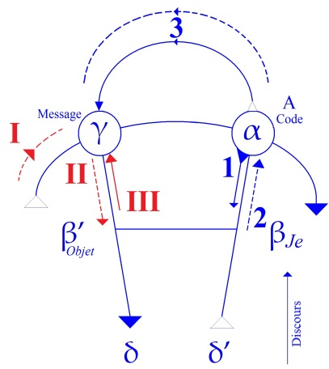

# Leçon 06 | 11 Décembre 1957

  <label><input type="checkbox" data-lacan-toggle="original" checked> 原文</label>
  <label><input type="checkbox" data-lacan-toggle="notes" checked> 注释</label>
  <label><input type="checkbox" data-lacan-toggle="commentary" checked> 个人解读评论</label>

<section class="parallel-paragraph" data-paragraph-ids="s5-06-0001">

s5-06-0001

[无对应译文]

原文 · s5-06-0001

J’ai à vous dire aujourd’hui des choses *très importantes*. Nous avons laissé les choses la dernière fois
sur la fonction du sujet dans *le trait d’esprit*.

</section>

<section class="parallel-paragraph" data-paragraph-ids="s5-06-0002">

s5-06-0002

[无对应译文]

原文 · s5-06-0002

Je pense que le poids de mon « *sujet »*, sous prétexte qu’ici nous nous en servons, n’est pas pour autant devenu
pour vous quelque chose avec lequel on s’essuie les pieds. Quand on se sert du mot « *sujet* », cela comporte en général de vives réactions très personnelles, quelquefois émotives, chez ceux qui tiennent avant tout à l’objectivité.

</section>

<section class="parallel-paragraph" data-paragraph-ids="s5-06-0003">

s5-06-0003

[无对应译文]

原文 · s5-06-0003

D’autre part nous étions arrivés à cette sorte de point de concours qui est situé ici et que nous appelons A…
autrement dit l’Autre en tant que *lieu du code*, lieu où parvient *le message* constitué par *le mot d’esprit*
…par cette voie qui dans notre schéma peut être franchie à ce niveau-là, du message à l’Autre,
et qui est la voie de la simple succession de la *chaîne signifiante* en tant que fondement de ce qui se produit au niveau du discours, c’est-à-dire par cette voie où, dans le texte de la phrase, se manifeste ce quelque chose d’essentiel
qui émane, qui est ce que nous avons appelé le « *peu de sens* ».

</section>

<section class="parallel-paragraph" data-paragraph-ids="s5-06-0004">

s5-06-0004

[无对应译文]

原文 · s5-06-0004

Cette homologation du « *peu de sens* » de la phrase - toujours plus ou moins manifeste dans *le trait d’esprit -* par l’Autre, c’est ce que nous avons indiqué la dernière fois, et sans nous y arrêter, nous contentant de dire que de l’Autre,
ce qui est ici transmis, est relancé dans un double agissement qui retourne au niveau du message, ce qui homologue
*le message*, ce qui constitue *le trait d’esprit*, ceci pour autant que l’*Autre* a reçu ce qui se présente comme un « *peu de sens* », il le transforme en ce que nous avons appelé nous-mêmes d’une façon équivoque, ambiguë, le « *pas de sens* ».

</section>

<section class="parallel-paragraph" data-paragraph-ids="s5-06-0005">

s5-06-0005

[无对应译文]

原文 · s5-06-0005

Ce que nous avons souligné par là, ce n’est pas l’absence de sens, ni le *non-sens*, mais quelque chose qui est *un pas*
dans l’aperçu de ce que le sens montre de son procédé, de ce qu’il a toujours de *métaphorique*, d’allusif, de ce en quoi
le besoin à partir du moment où il est passé par la dialectique de la demande introduite par l’existence du signifiant,
ce besoin n’est en quelque sorte jamais rejoint.

</section>

<section class="parallel-paragraph" data-paragraph-ids="s5-06-0006">

s5-06-0006

[无对应译文]

原文 · s5-06-0006

C’est par une série de pas semblables à ceux par lesquels ACHILLE ne rejoint jamais la tortue,
que tout ce qui est du langage procède et tend à recréer ce sens plein, ce sens ailleurs, ce sens pourtant jamais atteint.

</section>

<section class="parallel-paragraph" data-paragraph-ids="s5-06-0007">

s5-06-0007

[无对应译文]

原文 · s5-06-0007

</section>

<section class="parallel-paragraph" data-paragraph-ids="s5-06-0008">

s5-06-0008

[无对应译文]

原文 · s5-06-0008

Voilà le schéma auquel nous sommes arrivés dans le dernier quart d’heure de notre discours de la dernière fois,
qui paraît-il était un peu « *fatigué* », comme certains me l’ont dit. Mes phrases n’étaient pas terminées, aux dires de quelqu’un. Pourtant à la lecture de mon texte je n’ai pas trouvé qu’elles manquaient de queue. C’est parce que j’essaye de me propulser pas à pas dans quelque chose de difficilement communicable, qu’il faut bien que ces trébuchements se produisent. Je m’excuse s’ils se renouvellent aujourd’hui.

</section>

<section class="parallel-paragraph" data-paragraph-ids="s5-06-0009">

s5-06-0009

[无对应译文]

原文 · s5-06-0009

Nous sommes au point où il nous faut nous interroger sur *la fonction de cet Autre*, pour tout dire sur *l’essence de cet Autre* dans ce franchissement que nous appelons - nous l’avons suffisamment indiqué - sous le titre du «* pas de sens* »,
ce « *pas de sens* » en tant qu’il est en quelque sorte le partiel regain de cette plénitude idéale de la demande
purement et simplement réalisée d’où nous sommes partis, comme du point de départ de notre dialectique.

</section>

<section class="parallel-paragraph" data-paragraph-ids="s5-06-0010">

s5-06-0010

[无对应译文]

原文 · s5-06-0010

Ce « * pas de sens * », par quelle *transmutation*, *transsubstantiation*, opération subtile de communion si l’on peut dire,
Peut-il être assumé par l’Autre ? Quel est cet Autre ?

</section>

<section class="parallel-paragraph" data-paragraph-ids="s5-06-0011">

s5-06-0011

[无对应译文]

原文 · s5-06-0011

Pour tout dire voilà quelque chose qui nous est suffisamment indiqué par *la problématique que* FREUD *lui-même souligne* quand il nous parle du *mot d’esprit*, avec ce pouvoir de suspension de la question qui fait qu’incontestablement
plus je lis - et je ne m’en prive pas - les diverses tentatives qui ont été faites au cours des âges pour serrer de près cette question mystère du *mot d’esprit*, je ne vois véritablement, à quelque auteur que je m’adresse, et même à remonter à *la période féconde*, à la période romantique, aucun auteur qui ait seulement rassemblé les éléments premiers, matériels, de la question.

</section>

<section class="parallel-paragraph" data-paragraph-ids="s5-06-0012">

s5-06-0012

[无对应译文]

原文 · s5-06-0012

Une chose comme celle-ci par exemple, à laquelle FREUD s’arrête ici, on peut dire doublement :

</section>

<section class="parallel-paragraph" data-paragraph-ids="s5-06-0013">

s5-06-0013

[无对应译文]

原文 · s5-06-0013

- que d’une part, dit-il avec ce ton souverain qui est le sien et qui tranche tellement sur l’ordinaire timidité rougissante des discours scientifiques : « *N’est de l’esprit que ce que je reconnais comme tel* ». C’est ce qu’il appelle cette « *irréductible conditionnalité subjective de l’esprit* », et le sujet est bien là celui qui parle, dit FREUD lui-même.

</section>

<section class="parallel-paragraph" data-paragraph-ids="s5-06-0014">

s5-06-0014

[无对应译文]

原文 · s5-06-0014

- Et d’autre part, mettant en valeur qu’en possession de quelque chose qui est à proprement parler de l’ordre de *l’esprit*, je n’ai qu’une hâte, je ne puis même recueillir pleinement le plaisir du *mot d’esprit*, de *l’histoire*, que si j’en ai fait, si l’on peut dire, *l’épreuve* sur l’Autre, bien plus : que si j’en ai en quelque sorte transmis le contexte.

</section>

<section class="parallel-paragraph" data-paragraph-ids="s5-06-0015">

s5-06-0015

[无对应译文]

原文 · s5-06-0015

Il ne me serait pas difficile de faire apparaître cette perspective, cette sorte de jeu de glaces par lequel, quand
*je raconte une histoire*, si j’y cherche vraiment *l’achèvement, le repos, l’accord* de mon plaisir dans le consentement de l’Autre, il reste à l’horizon que cet Autre racontera à son tour cette *histoire*, et la transmettra à d’autres, et ainsi de suite.

</section>

<section class="parallel-paragraph" data-paragraph-ids="s5-06-0016">

s5-06-0016

[无对应译文]

原文 · s5-06-0016

Ces espèces de deux bouts de la chaîne :

</section>

<section class="parallel-paragraph" data-paragraph-ids="s5-06-0017">

s5-06-0017

[无对应译文]

原文 · s5-06-0017

> « *N’a d’esprit que ce que moi-même je ressens comme tel.* »
> mais d’autre part :
> « *Il n’y a rien de suffisant dans mon propre consentement à cet endroit,*
> *que le plaisir du trait d’esprit ne s’achève dans l’Autre et par l’Autre.* »

</section>

<section class="parallel-paragraph" data-paragraph-ids="s5-06-0018">

s5-06-0018

[无对应译文]

原文 · s5-06-0018

Disons - si nous faisons très attention à ce que nous disons, je veux dire si nous ne voyons là nulle espèce
de simplification qui pourrait être impliquée dans ce terme - que « *l’esprit doit être communiqué* » à condition
que nous laissions à ce terme de « *communication »* une ouverture dont nous ne savons pas ce qui viendra la remplir.

</section>

<section class="parallel-paragraph" data-paragraph-ids="s5-06-0019">

s5-06-0019

[无对应译文]

原文 · s5-06-0019

Nous nous trouvons donc dans l’observation de FREUD, devant ce *quelque chose* d’essentiel que nous connaissons déjà, à savoir la question de « *ce qu’est cet Autre* » qui est en quelque sorte *le corrélatif du sujet*.
Ici nous trouvons cette corrélation affirmée dans une exigence, dans un véritable besoin inscrit dans le phénomène.
Mais la forme de ce rapport du sujet à l’Autre, nous la connaissons déjà. Nous la connaissons déjà depuis qu’ici
nous avons insisté sur le mode nécessaire sous lequel notre réflexion nous propose le terme de subjectivité.

</section>

<section class="parallel-paragraph" data-paragraph-ids="s5-06-0020">

s5-06-0020

[无对应译文]

原文 · s5-06-0020

J’ai fait allusion à cette sorte d’objection qui pourrait venir à des esprits formés à une certaine discipline, et essayant, sous prétexte que *la psychanalyse* se présente comme *science*, d’introduire l’exigence que nous ne parlions jamais
que de *choses objectivables*, à savoir sur lesquelles puisse se faire l’accord de l’expérience, et qui par le seul fait de parler du sujet, devient une *chose* subjective et qui n’est pas *scientifique*, impliquant par là dans la notion du sujet,
cette *chose*, qui à un certain niveau y est, à savoir :

</section>

<section class="parallel-paragraph" data-paragraph-ids="s5-06-0021">

s5-06-0021

[无对应译文]

原文 · s5-06-0021

- *cet en-deça de l’objet* qui permet en quelque sorte de lui mettre son support,

</section>

<section class="parallel-paragraph" data-paragraph-ids="s5-06-0022">

s5-06-0022

[无对应译文]

原文 · s5-06-0022

- *cet au-delà* aussi bien, *derrière l’objet*, qui nous présente *cette sorte d’inconnaissable substance*,

</section>

<section class="parallel-paragraph" data-paragraph-ids="s5-06-0023">

s5-06-0023

[无对应译文]

原文 · s5-06-0023

- bref *ce quelque chose de réfractaire à l’objectivation* dont en quelque sorte votre éducation, votre formation psychologique, vous apportent tout l’armement.

</section>

<section class="parallel-paragraph" data-paragraph-ids="s5-06-0024">

s5-06-0024

[无对应译文]

原文 · s5-06-0024

Naturellement ceci débouche sur des *modes d’objections* encore beaucoup plus vulgaires, je veux dire l’identification
du terme du subjectif avec les effets déformants du sentiment sur l’expérience d’un autre, n’y introduisant d’ailleurs pas moins je ne sais quel mirage transparent qui le fonde dans cette sorte d’immanence de la conscience à soi,
où l’on se fie un peu trop vite pour y résumer le thème du *cogito* cartésien.

</section>

<section class="parallel-paragraph" data-paragraph-ids="s5-06-0025">

s5-06-0025

[无对应译文]

原文 · s5-06-0025

Bref, toute une série de broussailles qui ne sont là que pour s’interposer entre nous et ce que nous désignons
quand nous mettons en jeu la subjectivité dans notre expérience. De notre expérience d’*analystes*, elle est inéliminable, et d’une façon, par une voie qui passe tout à fait ailleurs que par la voie où l’on pourrait lui dresser des obstacles.

</section>

<section class="parallel-paragraph" data-paragraph-ids="s5-06-0026">

s5-06-0026

[无对应译文]

原文 · s5-06-0026

*La subjectivité*, c’est pour l’analyste, pour celui qui procède par la voie d’un certain « *dialogue* », ce qu’il doit faire entrer en ligne de compte dans ses calculs quand il a affaire à cet Autre qui peut faire entrer dans les siens sa propre erreur,
et non chercher à la provoquer comme telle. Voilà une formule que je vous propose, et qui est assurément quelque chose de sensible. La moindre référence à *la partie d’échecs*, ou même au *jeu de* *pair et impair*, suffit à l’assurer.

</section>

<section class="parallel-paragraph" data-paragraph-ids="s5-06-0027">

s5-06-0027

[无对应译文]

原文 · s5-06-0027

Disons qu’à en poser ainsi les termes, *la subjectivité* émerge ou semble émerger - j’ai déjà souligné tout cela ailleurs,
il n’est pas utile que je le reprenne ici - à l’*état duel*, c’est-à-dire dès qu’il y a lutte, ou camouflage dans la lutte
ou la parade. Néanmoins, assurément encore nous semblions en voir ici jouer en quelque sorte le reflet.
J’ai illustré ceci par des termes, que je n’ai pas besoin de reprendre, je pense, de l’approche et des phénomènes d’érection fascinatoire dans la lutte inter-animale, voire de la parade inter-sexuelle.

</section>

<section class="parallel-paragraph" data-paragraph-ids="s5-06-0028">

s5-06-0028

[无对应译文]

原文 · s5-06-0028

Nous y voyons assurément une sorte de *[coaptation](http://www.cnrtl.fr/definition/coaptation) naturelle*, dont précisément, ce caractère de réciproque *approche*, d’une conduite qui doit converger dans l’étreinte, donc au niveau moteur, au niveau qu’on appelle « *behaviouriste* », dans cet aspect tout à fait frappant de cet animal qui semble exécuter une danse.

</section>

<section class="parallel-paragraph" data-paragraph-ids="s5-06-0029">

s5-06-0029

[无对应译文]

原文 · s5-06-0029

C’est bien ce qui laisse aussi quelque chose d’ambigu à la notion d’intersubjectivité dans ce cas. La fascination réciproque peut être conçue comme simplement soumise à la régulation d’un cycle isolable dans le processus instinctuel, ce qui après le stade appétitif permet d’achever la consommation de la fin instinctuelle qui est
à proprement parler recherchée. Nous pouvons le réduire à un mécanisme inné, à un mécanisme de relais inné
qui, sans le problème de *la fonction de cette captation imaginaire,* finit par se réduire dans l’obscurité générale
de toute la téléologie vivante, et qui - après être un instant surgi de l’opposition si l’on peut dire des deux sujets -
peut, à un effort d’objectivation, de nouveau s’évanouir, s’effacer.

</section>

<section class="parallel-paragraph" data-paragraph-ids="s5-06-0030">

s5-06-0030

[无对应译文]

原文 · s5-06-0030

Il en est tout autrement dès que nous introduisons dans le problème *les résistances* quelconques, sous une forme quelconque, d’une chaîne signifiante. La chaîne signifiante comme telle introduit en ceci une *hétérogénéité* essentielle, entendez ἑτερογενής, avec l’accent mis sur le ἕτερος \[hétéros\] qui signifie *« inspiré »* en grec \[?\],
et dont en latin l’acception propre est celle du *« reste »,* du « *résidu ».* Il y a un *reste* dès que nous faisons entrer en jeu
*le signifiant*, dès que c’est par l’intermédiaire d’une *chaîne signifiante* que l’un à l’autre s’adressent et se rapportent.

</section>

<section class="parallel-paragraph" data-paragraph-ids="s5-06-0031">

s5-06-0031

[无对应译文]

原文 · s5-06-0031

Une subjectivité d’un autre ordre s’instaure qui se réfère au *lieu de la vérité* comme telle, et qui rend ma conduite
non plus *leurrante* mais *provocatrice*, avec ce A qui y est inclus, c’est-à-dire ce A qui même pour le mensonge, doit faire appel à *la vérité* et qui peut faire de la vérité elle-même quelque chose qui ne semble pas être du registre de *la vérité*.

</section>

<section class="parallel-paragraph" data-paragraph-ids="s5-06-0032">

s5-06-0032

[无对应译文]

原文 · s5-06-0032

Souvenez-vous de cet exemple :

</section>

<section class="parallel-paragraph" data-paragraph-ids="s5-06-0033">

s5-06-0033

[无对应译文]

原文 · s5-06-0033

« *Pourquoi me dis-tu que tu vas à Cracovie quand tu vas vraiment à Cracovie ?* »

</section>

<section class="parallel-paragraph" data-paragraph-ids="s5-06-0034">

s5-06-0034

[无对应译文]

原文 · s5-06-0034

Ceci peut faire de *la vérité* elle-même *le besoin du mensonge*, qui bien plus loin encore fait dépendre *la qualification*
*de ma bonne foi* au moment où j’abats les cartes, c’est-à-dire qui me met sous la coupe de *l’appréciation* de l’Autre,
pour autant qu’il pense surprendre mon jeu alors que précisément je suis en train de le lui montrer,
et qui soumet la *discrimination* de la bravade et de la tromperie à la merci de *la mauvaise foi* de l’Autre.
Ces dimensions essentielles sont de simples expériences de l’expérience quotidienne.

</section>

<section class="parallel-paragraph" data-paragraph-ids="s5-06-0035">

s5-06-0035

[无对应译文]

原文 · s5-06-0035

Mais, encore qu’elles soient tissées dans notre expérience quotidienne, nous n’en sommes pas moins portés
à les élider, à les éluder, et pourquoi ? Pour la raison que tant que l’expérience analytique et la position freudienne
ne nous auront pas montré cette *hétéro-dimension du signifiant* jouer à elle toute seule, tant que nous ne l’aurons pas touchée, réalisée, cette *hétéro-dimension*, nous pourrons « *croire* », et nous ne manquerons pas de « *croire* »,
et toute la pensée freudienne est imprégnée de cette croyance fondée sur quelque chose qui marque *l’hétérogénéité*
*de la fonction signifiante*, à savoir ce caractère radical de la relation du sujet à l’Autre en tant qu’il parle.

</section>

<section class="parallel-paragraph" data-paragraph-ids="s5-06-0036">

s5-06-0036

[无对应译文]

原文 · s5-06-0036

Elle a été masquée jusqu’à FREUD par le fait que nous tenons pour admis en quelque sorte que le sujet parle,
*si l’on peut dire*, selon sa conscience, bonne ou mauvaise, ce qui veut dire que nous pensons que le sujet ne parle jamais sans une certaine *intention* de signification.

</section>

<section class="parallel-paragraph" data-paragraph-ids="s5-06-0037">

s5-06-0037

[无对应译文]

原文 · s5-06-0037

L’*intention* est derrière son *mensonge* ou sa *sincérité*, peu importe, mais cette *intention* est dérisoire, c’est-à-dire
que si elle est tenue pour échouée, je veux dire qu’en croyant me la dire le sujet dit la vérité, ou qu’il se leurre,
même dans son effort vers l’aveu, il n’en reste pas moins que l’*intention* était jusqu’à présent confondue
dans cette occasion avec la dimension de la conscience, parce qu’elle nous semblait, cette conscience,
inhérente à ce que le sujet avait à dire en tant que signification. Le moins que jusqu’ici on ait tenu pour affirmable, c’est que le sujet avait à dire toujours *une signification*, et de ce fait la dimension de la conscience lui paraissait *inhérente*. \[[Cf. Schopenhauer : *Le Monde comme volonté et comme représentation*](http://fr.wikisource.org/wiki/Le_Monde_comme_volont%C3%A9_et_comme_repr%C3%A9sentation) \]

</section>

<section class="parallel-paragraph" data-paragraph-ids="s5-06-0038">

s5-06-0038

[无对应译文]

原文 · s5-06-0038

Les obstacles, les objections au thème de l’*inconscient* freudien trouvent là toujours leur dernier ressort.
Comment prévoir des *Traumgedanken* telles que FREUD nous les présente, à savoir ce quelque chose qui,
en somme pour l’appréhension, l’intuition courante, se présente comme « *des pensées qui ne sont pas des pensées* » ?
C’est pour cela qu’une véritable « *dés-exorcisation* » est nécessaire au niveau de ce thème de la pensée.

</section>

<section class="parallel-paragraph" data-paragraph-ids="s5-06-0039">

s5-06-0039

[无对应译文]

原文 · s5-06-0039

Assurément le thème du *cogito cartésien* garde toute *sa force*, mais sa nocivité - si je puis dire en cette occasion -
tient à ce qu’il est toujours infléchi. Je veux dire que ce « *Je pense donc je suis* », il est difficile de le saisir à la pointe
de son ressort*, et il n’est peut-être d’ailleurs qu’un trait d’esprit*. Mais laissons-le sur ce plan, nous n’en sommes pas
à manifester les rapports de la philosophie avec le *trait d’esprit*. Le *cogito* cartésien est effectivement expérimenté
*dans la conscience* de chacun de nous, non pas comme un « *Je pense donc je suis* », mais comme un « *Je suis comme je pense* »,
et bien entendu ceci suppose derrière un « *Je pense comme je respire : naturellement* ».

</section>

<section class="parallel-paragraph" data-paragraph-ids="s5-06-0040">

s5-06-0040

[无对应译文]

原文 · s5-06-0040

Je crois qu’il suffit d’avoir la moindre expérience réfléchie de *ce qui supporte l’activité mentale* de ceux qui nous entourent,
et puisque nous sommes des savants, parlons de ceux qui sont attelés aux grandes œuvres scientifiques,
pour que nous puissions très vite nous faire la notion que sans doute il n’y a en moyenne pas beaucoup plus de *pensées en action* dans l’ensemble de ce « *corps cogitant* » que dans celui de n’importe quelle industrieuse femme de ménage
en proie aux nécessités les plus immédiates de l’existence.

</section>

<section class="parallel-paragraph" data-paragraph-ids="s5-06-0041">

s5-06-0041

[无对应译文]

原文 · s5-06-0041

Le terme, la dimension de « *la pensée* » n’a absolument rien à faire en soi avec *l’importance du discours* véhiculé.
Bien plus, plus ce discours est cohérent et *consistant*, plus il semble prêter à toutes les formes de l’absence quant à
ce qui peut être raisonnablement défini comme une question posée par le sujet à son existence en tant que sujet.
En fin de compte nous revoici affrontés à ceci :

</section>

<section class="parallel-paragraph" data-paragraph-ids="s5-06-0042">

s5-06-0042

[无对应译文]

原文 · s5-06-0042

- qu’en nous un sujet pense, pense selon des lois qui se trouvent être à proprement parler les mêmes que les lois de l’organisation de la chaîne signifiante,

</section>

<section class="parallel-paragraph" data-paragraph-ids="s5-06-0043">

s5-06-0043

[无对应译文]

原文 · s5-06-0043

- que ce « *signifiant en action* » qui s’appelle en nous *l’inconscient*, est désigné comme tel par FREUD, et tellement originalisé, séparé de tout ce qui est jeu de la *tendance,* que FREUD sous mille *formes* nous répète qu’il s’agit d’une « *autre scène psychique* ».

</section>

<section class="parallel-paragraph" data-paragraph-ids="s5-06-0044">

s5-06-0044

[无对应译文]

原文 · s5-06-0044

Le terme est répété à tout instant dans la *Traumdeutung*, et à la vérité il est emprunté par FREUD à FECHNER.
J’ai souligné la singularité du contexte fechnérien qui est loin d’être quelque chose que nous puissions réduire à l’observation du *parallélisme psycho-physique*, et même aux étranges extrapolations auxquelles FECHNER se livre
du fait de l’existence, par lui affirmée, du domaine de la conscIence. Le fait que FREUD emprunte à sa lecture approfondie de FECHNER ce terme d’« *autre scène psychique* » est quelque chose qui toujours est mis par lui
en corrélation avec l’hétérogénéité stricte des lois concernant l’inconscient, par rapport à tout ce qui peut se rapporter au domaine du préconscient, c’est-à-dire au domaine *du compréhensible*, au domaine *de la signification*.

</section>

<section class="parallel-paragraph" data-paragraph-ids="s5-06-0045">

s5-06-0045

[无对应译文]

原文 · s5-06-0045

Cet *Autre* dont il s’agit et que FREUD retrouve, *qu’il appelle aussi « référence de la scène psychique* » à propos du *trait d’esprit *
c’est celui dont nous avons à poser aujourd’hui la question, c’est celui que FREUD nous ramène sans cesse
à propos des voies et du procédé même du *mot d’esprit*.

</section>

<section class="parallel-paragraph" data-paragraph-ids="s5-06-0046">

s5-06-0046

[无对应译文]

原文 · s5-06-0046

« *Il n’y a pas pour nous* - dit-il - *possibilité d’émergence de ce mot d’esprit, sans une certaine surprise.* »

</section>

<section class="parallel-paragraph" data-paragraph-ids="s5-06-0047">

s5-06-0047

[无对应译文]

原文 · s5-06-0047

Et en allemand c’est encore plus frappant[^14] :

</section>

<section class="parallel-paragraph" data-paragraph-ids="s5-06-0048">

s5-06-0048

[无对应译文]

原文 · s5-06-0048

- *ce quelque chose* qui rend le sujet en quelque sorte étranger au contenu immédiat de la phrase,

</section>

<section class="parallel-paragraph" data-paragraph-ids="s5-06-0049">

s5-06-0049

[无对应译文]

原文 · s5-06-0049

- *ce quelque chose* qui se présente à l’occasion par le moyen du *non-sens* apparent, du *non-sens* entendu par rapport à la signification dont on peut dire un instant « *je ne comprends pas* », « *je suis dérouté* »,

</section>

<section class="parallel-paragraph" data-paragraph-ids="s5-06-0050">

s5-06-0050

[无对应译文]

原文 · s5-06-0050

- *cette rupture de l’assentiment du sujet par rapport à ce qu’il assume :* « *il n’y a pas de contenu en quelque sorte véritable à cette phrase* ».

</section>

<section class="parallel-paragraph" data-paragraph-ids="s5-06-0051">

s5-06-0051

[无对应译文]

原文 · s5-06-0051

Ceci est la première étape, nous dit FREUD, de la préparation naturelle du *mot d’esprit*, et c’est à l’intérieur de cela
que va se produire ce quelque chose qui, pour le sujet, va constituer justement cette sorte de générateur de plaisir,
de « *plaisirogène* » qui est le caractère du *mot d’esprit*.

</section>

<section class="parallel-paragraph" data-paragraph-ids="s5-06-0052">

s5-06-0052

[无对应译文]

原文 · s5-06-0052

Que se passe-t-il à ce niveau ? Quel est en quelque sorte cet ordre de l’Autre qui est invoqué dans le sujet ?
Puisque aussi bien il y a quelque chose d’immédiat en lui que l’on tourne par le moyen du *mot d’esprit*,
la technique de ce mouvement tournant doit nous renseigner sur ce qui est visé, sur ce qui doit être atteint
comme mode de l’Autre chez le sujet. C’est à ceci que nous allons nous arrêter aujourd’hui, et pour l’introduire
\- jusqu’ici je ne me suis jamais référé qu’aux histoires rapportées par FREUD lui-même, ou à peu de choses près -
je vais l’introduire maintenant par une histoire qui n’est pas non plus spécialement choisie.

</section>

<section class="parallel-paragraph" data-paragraph-ids="s5-06-0053">

s5-06-0053

[无对应译文]

原文 · s5-06-0053

Quand j’ai résolu d’aborder cette année devant vous la question du *Witz* ou du *Wit*, j’ai commencé *une petite enquête*.
Il n’y a rien d’étonnant à ce que je l’ai commencée en interrogeant un poète, et un poète qui précisément introduit dans *sa prose*, comme aussi bien à l’occasion *dans des formes plus poétiques*, d’une façon toute particulière cette dimension d’un certain *esprit* spécialement *danseur* qui habite en quelque sorte son œuvre, et qu’il fait jouer quand il parle
à l’occasion - car il est aussi mathématicien - de mathématiques. Pour tout dire j’ai nommé ici Raymond QUENEAU.
Et tandis que nous échangions là-dessus nos premiers propos, il m’a raconté une histoire. Comme toujours,
il n’y a pas qu’à l’intérieur de l’expérience analytique que les choses vous viennent comme une bague au doigt.
J’avais passé toute une année à vous parler de *la fonction signifiante du cheval* \[Cf. séminaire 1956-57 : *La relation d’objet*, la phobie
du petit Hans\], dans *le trait d’esprit* voici ce cheval qui va rentrer *d’une façon bien étrange* dans notre champ d’attention.

</section>

<section class="parallel-paragraph" data-paragraph-ids="s5-06-0054">

s5-06-0054

[无对应译文]

原文 · s5-06-0054

L’histoire que QUENEAU m’a racontée, vous ne la connaissez pas : il l’a prise exactement comme exemple
de ce qu’on peut appeler « *les histoires spirituelles longues* », opposées aux « *histoires courtes* ». C’est toute une première classification, à la vérité nous le verrons, qui conditionne, comme le dit quelque part Jean-Paul RICHTER,
le corps et l’âme de l’esprit, à laquelle on peut opposer la phrase du monologue d’HAMLET
qui dit que si la concision est prodiguée par *le mot d’esprit*, elle n’est que son corps et que sa parure.
Les deux choses sont vraies parce que les deux auteurs savaient de quoi ils parlaient. Vous allez voir en effet
si ce terme d’histoire longue convient à l’histoire de QUENEAU, car *le trait d’esprit* passe quelque part.
Voilà donc l’histoire. C’est une histoire *d’examen, de baccalauréat* si vous voulez : *il y a le candidat, il y a l’examinateur*.

</section>

<section class="parallel-paragraph" data-paragraph-ids="s5-06-0055">

s5-06-0055

[无对应译文]

原文 · s5-06-0055

- *Parlez-moi* - dit l’examinateur - *de la bataille de Marengo.*

</section>

<section class="parallel-paragraph" data-paragraph-ids="s5-06-0056">

s5-06-0056

[无对应译文]

原文 · s5-06-0056

Le candidat s’arrête un instant, l’air rêveur :

</section>

<section class="parallel-paragraph" data-paragraph-ids="s5-06-0057">

s5-06-0057

[无对应译文]

原文 · s5-06-0057

- *La bataille de Marengo ? Des morts ! C’est affreux… Des blessés ! C’était épouvantable…*

</section>

<section class="parallel-paragraph" data-paragraph-ids="s5-06-0058">

s5-06-0058

[无对应译文]

原文 · s5-06-0058

- *Mais* - dit l’examinateur - *ne pourriez-vous me dire sur cette bataille quelque chose de plus particulier ?*

</section>

<section class="parallel-paragraph" data-paragraph-ids="s5-06-0059">

s5-06-0059

[无对应译文]

原文 · s5-06-0059

Le candidat réfléchit un instant, puis répond :

</section>

<section class="parallel-paragraph" data-paragraph-ids="s5-06-0060">

s5-06-0060

[无对应译文]

原文 · s5-06-0060

- *Un cheval dressé sur ses pattes de derrière, et qui hennissait*…

</section>

<section class="parallel-paragraph" data-paragraph-ids="s5-06-0061">

s5-06-0061

[无对应译文]

原文 · s5-06-0061

L’examinateur surpris, veut le sonder un peu plus loin et lui dit :

</section>

<section class="parallel-paragraph" data-paragraph-ids="s5-06-0062">

s5-06-0062

[无对应译文]

原文 · s5-06-0062

- *Monsieur, dans ces conditions voulez-vous me parler de la bataille de Fontenoy ?*

</section>

<section class="parallel-paragraph" data-paragraph-ids="s5-06-0063">

s5-06-0063

[无对应译文]

原文 · s5-06-0063

- *La bataille de Fontenoy ? Des morts partout ! Des blessés tant et plus. Une horreur*…

</section>

<section class="parallel-paragraph" data-paragraph-ids="s5-06-0064">

s5-06-0064

[无对应译文]

原文 · s5-06-0064

L’examinateur intéressé, dit :

</section>

<section class="parallel-paragraph" data-paragraph-ids="s5-06-0065">

s5-06-0065

[无对应译文]

原文 · s5-06-0065

- *Mais Monsieur, pourriez-vous me dire quelque indication plus particulière sur cette bataille de Fontenoy ?  *

</section>

<section class="parallel-paragraph" data-paragraph-ids="s5-06-0066">

s5-06-0066

[无对应译文]

原文 · s5-06-0066

- *Ouh !* - dit le candidat - *un cheval dressé sur ses pattes de derrière, et qui hennissait.  *

</section>

<section class="parallel-paragraph" data-paragraph-ids="s5-06-0067">

s5-06-0067

[无对应译文]

原文 · s5-06-0067

L’examinateur, pour manœuvrer, demande au candidat de lui parler de la bataille de Trafalgar. Il répond :

</section>

<section class="parallel-paragraph" data-paragraph-ids="s5-06-0068">

s5-06-0068

[无对应译文]

原文 · s5-06-0068

- *Des morts ! Un charnier*... *Des blessés ! Par centaines.*

</section>

<section class="parallel-paragraph" data-paragraph-ids="s5-06-0069">

s5-06-0069

[无对应译文]

原文 · s5-06-0069

- *Mais enfin Monsieur, vous ne pouvez rien me dire de plus particulier sur cette bataille ?*

</section>

<section class="parallel-paragraph" data-paragraph-ids="s5-06-0070">

s5-06-0070

[无对应译文]

原文 · s5-06-0070

- *Un cheval*…

</section>

<section class="parallel-paragraph" data-paragraph-ids="s5-06-0071">

s5-06-0071

[无对应译文]

原文 · s5-06-0071

- *Pardon, Monsieur ! Je dois vous faire observer que la bataille de Trafalgar est une bataille navale.*

</section>

<section class="parallel-paragraph" data-paragraph-ids="s5-06-0072">

s5-06-0072

[无对应译文]

原文 · s5-06-0072

- *Hou ! Hou !* - dit le candidat - *Arrière cocotte !*

</section>

<section class="parallel-paragraph" data-paragraph-ids="s5-06-0073">

s5-06-0073

[无对应译文]

原文 · s5-06-0073

Cette histoire a sa valeur à mes yeux parce qu’elle permet de décomposer, je crois, ce dont il s’agit dans *le trait d’esprit*.
Je crois que tout le caractère à proprement parler spirituel de l’histoire, est dans sa pointe. Cette histoire n’a aucune raison de finir, de s’achever, si elle est simplement constituée par l’espèce de jeu ou de joute dans laquelle s’opposent les deux interlocuteurs. Aussi loin que vous la poussiez d’ailleurs, *l’effet* est produit immédiatement.

</section>

<section class="parallel-paragraph" data-paragraph-ids="s5-06-0074">

s5-06-0074

[无对应译文]

原文 · s5-06-0074

C’est une histoire dont nous rions parce qu’elle est comique. Elle est comique, je ne veux même pas entrer plus loin dans ce comique, parce qu’à la vérité on a dit tellement de choses énormes sur le comique et particulièrement obscures depuis que Monsieur BERGSON a fait un livre sur le rire dont on peut simplement dire que c’est lisible.

</section>

<section class="parallel-paragraph" data-paragraph-ids="s5-06-0075">

s5-06-0075

[无对应译文]

原文 · s5-06-0075

Le comique, en quoi cela consiste-t-il ? Limitons-nous pour l’instant à dire que le comique est lié à une *situation duelle*.
C’est en tant que *le candidat* est devant *l’examinateur* que cette joute - où bien évidemment les armes sont radicalement différentes - se poursuit, *ce quelque chose s’engendre* qui tend à provoquer chez nous ce qu’on appelle un « *vif amusement* ». Est-ce à proprement parler l’ignorance du sujet qui nous fait rire ? Je n’en suis pas sûr.

</section>

<section class="parallel-paragraph" data-paragraph-ids="s5-06-0076">

s5-06-0076

[无对应译文]

原文 · s5-06-0076

Bien évidemment le fait qu’il y apporte ces vérités premières sur ce qu’on peut appeler une bataille, et qu’on ne dira jamais, au moins quand on passe un examen d’histoire, est quelque chose qui mérite bien qu’on s’y arrête un instant. Mais nous ne pouvons même pas nous y engager, car à la vérité cela nous porterait sur des questions portant sur
la nature du comique, et je ne sais si nous aurons l’occasion d’y entrer, si ce n’est pour compléter l’examen
du *livre de* FREUD qui effectivement se termine par un chapitre sur le comique dans lequel il est frappant de voir
tout d’un coup FREUD être *à cent pieds au-dessous de sa perspicacité habituelle*. Et nous nous posons plutôt la question
de savoir pourquoi FREUD, pas plus que le plus mauvais auteur axé sur le comique le plus élémentaire, sur la notion du comique, l’a en quelque sorte refusé. Cela servira sans doute à avoir plus d’indulgence pour nos collègues psychanalystes qui eux aussi manquent de tout sens du comique : il semble que ce soit *exclu de l’exercice de la profession*.

</section>

<section class="parallel-paragraph" data-paragraph-ids="s5-06-0077">

s5-06-0077

[无对应译文]

原文 · s5-06-0077

Il s’agit donc, semble-t-il - pour autant que nous participons à un effet vivement comique - de quelque chose qui est bien plus la préparation sur la guerre, et c’est sur cela que doit être porté le coup final, ce qui est avant cette histoire,
à proprement parler spirituelle.

</section>

<section class="parallel-paragraph" data-paragraph-ids="s5-06-0078">

s5-06-0078

[无对应译文]

原文 · s5-06-0078

Je vous prie bien d’observer ceci : que même si vous n’êtes pas tellement sensibles, tel ou tel d’entre vous,
à ce qui constitue *l’esprit* de cette histoire, *l’esprit* tout de même est recelé, gît dans un point :

</section>

<section class="parallel-paragraph" data-paragraph-ids="s5-06-0079">

s5-06-0079

[无对应译文]

原文 · s5-06-0079

- à savoir cette *subite sortie des limites de l’épure*,

</section>

<section class="parallel-paragraph" data-paragraph-ids="s5-06-0080">

s5-06-0080

[无对应译文]

原文 · s5-06-0080

- à savoir quand le candidat fait quelque chose qui est à proprement parler presque *invraisemblable* si nous
  nous sommes mis un instant dans la ligne qui situerait cette histoire *dans une espèce de réalité vécue* quelconque.

</section>

<section class="parallel-paragraph" data-paragraph-ids="s5-06-0081">

s5-06-0081

[无对应译文]

原文 · s5-06-0081

Ceci pour le sujet paraît tout d’un coup s’étendre, s’étirer avec des rênes sur cette sorte d’image qui, là, prend presque toute sa valeur quasi *phobique*. Instant en tout cas homogène - nous semble-t-il, dans un éclair - à ce qui peut être rapporté *de toutes sortes d’expériences infantiles* qui font précisément, de *la phobie* jusqu’à *toutes sortes d’excès de la vie imaginée*,
où nous pénétrons d’ailleurs si difficilement, une même chose.

</section>

<section class="parallel-paragraph" data-paragraph-ids="s5-06-0082">

s5-06-0082

[无对应译文]

原文 · s5-06-0082

Il n’est pas rare après tout, que nous voyions, rapporté dans toute l’anamnèse de la vie d’un sujet, l’entrée
à proprement parler du grand cheval - du même cheval qui descend des tapisseries, debout - l’entrée de ce cheval dans un dortoir où le sujet est là avec cinquante camarades. Cette subite émergence du fantasme signifiant du cheval est ce quelque chose qui fait de cette histoire, l’histoire - appelez-la comme vous voudrez - *cocasse* ou *poétique*, assurément en tout cas méritant en l’occasion le titre de *spirituelle*.

</section>

<section class="parallel-paragraph" data-paragraph-ids="s5-06-0083">

s5-06-0083

[无对应译文]

原文 · s5-06-0083

Si simplement, comme dit FREUD, cette souveraineté en la matière est la vôtre, du même coup on peut bien
la qualifier d’*histoire drôle*. Qu’elle converge par son contenu à quelque chose qui est apparenté à une forme constatée, repérée au niveau des phénomènes de l’inconscient, n’est dès lors pas pour nous surprendre, *c’est ce qui fait le prix* d’ailleurs de cette histoire, c’est que son aspect soit aussi net.

</section>

<section class="parallel-paragraph" data-paragraph-ids="s5-06-0084">

s5-06-0084

[无对应译文]

原文 · s5-06-0084

Mais est-ce à dire que cela suffise à en faire *un trait d’esprit* ? Voici en quelque sorte décomposés ces deux temps
que j’appellerai : *sa préparation,* et *sa pointe finale*. Allons-nous nous en tenir là ? Nous pourrions nous en tenir là
au niveau de ce qu’on peut appeler d’analyse freudienne. Je ne pense pas que n’importe quelle autre histoire
ferait plus de difficulté pour mettre en valeur ces deux temps, ces deux aspects du phénomène,
mais là ils sont particulièrement dégagés.

</section>

<section class="parallel-paragraph" data-paragraph-ids="s5-06-0085">

s5-06-0085

[无对应译文]

原文 · s5-06-0085

En fin de compte je crois que ce qui fait le caractère non pas simplement *poétique* ou *cocasse* de la chose,
mais proprement *spirituel*, est quelque chose qui suit précisément ce chemin rétrograde ou rétroactif, de ce que, ici, nous désignons dans notre schéma par le « *pas de sens* ».

</section>

<section class="parallel-paragraph" data-paragraph-ids="s5-06-0086">

s5-06-0086

[无对应译文]

原文 · s5-06-0086

C’est que toute *fuyante*, *insaisissable* que soit *la pointe* de cette histoire, elle se dirige tout de même vers quelque chose.

</section>

<section class="parallel-paragraph" data-paragraph-ids="s5-06-0087">

s5-06-0087

[无对应译文]

原文 · s5-06-0087

C’est un peu forcer les choses, sans doute, que de l’articuler, mais pour en montrer la direction il faudra bien
tout de même l’articuler. C’est que, cette particularité à laquelle le sujet revient avec quelque chose qui pourrait dans un autre contexte n’être plus de *l’esprit* mais de *l’humour*, à savoir *ce cheval dressé sur ses pattes de derrière et qui hennissait*, mais c’est peut-être bien là en effet le vrai sel de l’histoire !

</section>

<section class="parallel-paragraph" data-paragraph-ids="s5-06-0088">

s5-06-0088

[无对应译文]

原文 · s5-06-0088

Effectivement de tout ce que nous avons intégré *d’histoire* dans notre *expérience*, dans notre *formation*, dans notre *culture*, disons bien que c’est là l’image la plus essentielle et que nous ne pouvons pas faire trois pas dans un musée,
voir des tableaux de batailles, sans voir *ce cheval debout sur ses pattes de derrière et qui hennissait*.

</section>

<section class="parallel-paragraph" data-paragraph-ids="s5-06-0089">

s5-06-0089

[无对应译文]

原文 · s5-06-0089

Depuis qu’il est entré dans l’histoire de la guerre avec, comme vous le savez, un certain éclat, c’est une date
dans l’histoire effectivement que le moment où il y a eu des gens debout sur ce cheval, ou chevauchant cet animal
qu’on nous représente *debout sur ses pattes de derrière et hennissant*.

</section>

<section class="parallel-paragraph" data-paragraph-ids="s5-06-0090">

s5-06-0090

[无对应译文]

原文 · s5-06-0090

Ceci a comporté véritablement à l’époque…
c’est-à-dire *quelque part entre* ECHNOS II et ECHNOS III \[?\], lors de l’arrivée des Achéens sur chevaux
…un progrès énorme - c’est-à-dire que ces gens avaient tout d’un coup, par rapport au cheval attelé à des chars
une supériorité tactique extraordinaire - jusqu’à la guerre de 1914 où ce cheval disparaît derrière d’autres instruments qui l’ont rendu pratiquement hors d’usage. Donc de l’époque achéenne à la guerre de 1914, ce cheval est effectivement *quelque chose* d’absolument essentiel à ces rapports, ou à ce *commerce inter-humain* qui s’appelle la guerre.

</section>

<section class="parallel-paragraph" data-paragraph-ids="s5-06-0091">

s5-06-0091

[无对应译文]

原文 · s5-06-0091

Et le fait qu’il en soit aussi l’image centrale de certaines conceptions de l’histoire, que nous pouvons précisément appeler *l’histoire-bataille,* est quelque chose que nous sommes précisément déjà assez bien portés - pour autant
que cette période est révolue - à percevoir comme un phénomène à proprement parler dont le caractère signifiant
a été décanté à mesure que progressait l’histoire. En fin de compte toute une histoire se résume à cette image
qui nous apparaît futile à la lumière de cette histoire, et l’indication de sens est bien quelque chose qui comporte qu’après tout il n’y a pas tellement besoin de se tourmenter à propos de la bataille, ni de Marignan, ni de Fontenoy, peut-être un peu plus justement à propos de la bataille de Trafalgar.

</section>

<section class="parallel-paragraph" data-paragraph-ids="s5-06-0092">

s5-06-0092

[无对应译文]

原文 · s5-06-0092

Bien entendu tout ceci n’est pas dans l’histoire. Il ne s’agit pas de nous enseigner à ce propos une sagesse quelconque concernant l’enseignement de l’histoire, mais l’histoire pointe, se dirige vers, elle n’enseigne pas : elle indique dans quel sens ce « *pas de sens* » dans l’occasion est dans le sens d’une *réduction de la valeur*, d’une *dés-exorcisation* de quelque chose de fascinant. Dans quel sens cette histoire agit, et dans quel sens elle nous satisfait, elle nous fait plaisir ?

</section>

<section class="parallel-paragraph" data-paragraph-ids="s5-06-0093">

s5-06-0093

[无对应译文]

原文 · s5-06-0093

Précisément à propos de cette marge d’introduction du signifiant dans nos significations qui fait que nous en restons serfs d’un certain point, que quelque chose nous échappe après tout au-delà de ce que cette chaîne du signifiant tient pour nous de liaison avec ce quelque chose qui peut aussi bien être dit tout à fait au début de l’histoire : à savoir
« *Des morts ! des blessés !* » et le fait même que cette sorte de *monodie* répétée puisse nous faire rire, indique aussi
assez bien à quel point nous est refusé l’accès de la réalité, pour autant que nous la pénétrons par un certain biais
qui est à proprement parler *le biais du signifiant*.

</section>

<section class="parallel-paragraph" data-paragraph-ids="s5-06-0094">

s5-06-0094

[无对应译文]

原文 · s5-06-0094

Cette histoire doit nous servir simplement à cette occasion de repère. FREUD souligne qu’il y a toujours en jeu,
dès qu’il s’agit de *la transmission du mot d’esprit*, de *la satisfaction* qu’il peut apporter *trois personnes*.
Le comique peut se contenter d’un *jeu à deux*, *dans le mot d’esprit il y en a trois*.

</section>

<section class="parallel-paragraph" data-paragraph-ids="s5-06-0095">

s5-06-0095

[无对应译文]

原文 · s5-06-0095

Cet *Autre,* qui est *le deuxième*, est situé en des endroits différents :

</section>

<section class="parallel-paragraph" data-paragraph-ids="s5-06-0096">

s5-06-0096

[无对应译文]

原文 · s5-06-0096

- il est tantôt ici le second dans l’histoire, sans que l’on sache et sans que l’on ait même besoin de savoir si c’est l’écolier ou l’examinateur.

</section>

<section class="parallel-paragraph" data-paragraph-ids="s5-06-0097">

s5-06-0097

[无对应译文]

原文 · s5-06-0097

- Il est aussi bien *vous*, pendant que je vous le raconte, c’est-à-dire que pendant cette première partie, vous vous laissez un peu *mener en bateau*, je veux dire dans une direction qui exige vos sympathies diverses, *soit pour le candidat, soit pour l’examinateur* qui d’une certaine façon vous fascine ou vous met dans une attitude d’opposition par rapport à quelque chose auquel vous voyez que dans cette histoire ici, ce n’est pas tellement notre opposition qui est recherchée, simplement une certaine captivation dans ce jeu où *le candidat* en fin de compte tout de suite est aux prises avec *l’examinateur*, et où celui-ci va surprendre *le candidat*.

</section>

<section class="parallel-paragraph" data-paragraph-ids="s5-06-0098">

s5-06-0098

[无对应译文]

原文 · s5-06-0098

Et bien entendu c’est ébauché dans d’autres histoires autrement tendancieuses, dans ces histoires de types grivois ou sexuel.

</section>

<section class="parallel-paragraph" data-paragraph-ids="s5-06-0099">

s5-06-0099

[无对应译文]

原文 · s5-06-0099

Vous verrez :

</section>

<section class="parallel-paragraph" data-paragraph-ids="s5-06-0100">

s5-06-0100

[无对应译文]

原文 · s5-06-0100

- qu’il ne s’agit pas tellement de détourner ce qu’il y a en vous de résistance ou de répugnance dans un certain sens,

</section>

<section class="parallel-paragraph" data-paragraph-ids="s5-06-0101">

s5-06-0101

[无对应译文]

原文 · s5-06-0101

- qu’au contraire de commencer à le mettre *en action*.

</section>

<section class="parallel-paragraph" data-paragraph-ids="s5-06-0102">

s5-06-0102

[无对应译文]

原文 · s5-06-0102

En effet, bien loin d’éteindre ce qui, en vous peut faire objection…
une *bonne histoire* déjà vous indique que si elle va être *grivoise*, déjà quelque chose dans son début vous indiquera que nous allons être sur ce terrain
…là vous vous préparez, soit à *consentir*, soit *à résister*, mais assurément quelque chose en vous s’oppose sur
le plan duel, se laisse prendre à ce côté de *prestige* et de *parade* qui annonce *le registre* et l’ordre de l’histoire.

</section>

<section class="parallel-paragraph" data-paragraph-ids="s5-06-0103">

s5-06-0103

[无对应译文]

原文 · s5-06-0103

Néanmoins *quelque chose surviendra d’inattendu*, ce qui est toujours sur le plan du langage, bien entendu.
Dans cette histoire, le côté *jeu de mots*, à proprement parler, est beaucoup plus loin poussé, il est presque ici tellement *décomposé* que nous voyons :

</section>

<section class="parallel-paragraph" data-paragraph-ids="s5-06-0104">

s5-06-0104

[无对应译文]

原文 · s5-06-0104

- d’une part un signifiant pur, le cheval dans l’occasion,

</section>

<section class="parallel-paragraph" data-paragraph-ids="s5-06-0105">

s5-06-0105

[无对应译文]

原文 · s5-06-0105

- et d’autre part nous voyons aussi sous la forme d’un cliché qu’il est beaucoup plus difficile de retrouver ici, l’élément, à proprement parler, jeu de signifiants,
  …mais néanmoins il est évident qu’il n’y a rien d’autre que cela dans cette histoire.

</section>

<section class="parallel-paragraph" data-paragraph-ids="s5-06-0106">

s5-06-0106

[无对应译文]

原文 · s5-06-0106

C’est *au-delà*, c’est pour autant que quelque chose vous surprend qui sera l’équivoque fondamentale, la façon dont dans l’histoire il y a un passage d’un sens à un autre par l’intermédiaire d’un support signifiant…
les exemples que j’ai donnés antérieurement sont là suffisamment pour l’indiquer
…que ce *trou* fera atteindre l’étape où c’est comme *mot d’esprit* que vous frappe ce qui vous est communiqué.
Et vous êtes toujours frappé ailleurs que dans l’endroit où d’abord a été en quelque sorte *attirée*, *leurrée* votre attention, votre assentiment, votre opposition.

</section>

<section class="parallel-paragraph" data-paragraph-ids="s5-06-0107">

s5-06-0107

[无对应译文]

原文 · s5-06-0107

Quels que soient les effets, que ce soient :

</section>

<section class="parallel-paragraph" data-paragraph-ids="s5-06-0108">

s5-06-0108

[无对应译文]

原文 · s5-06-0108

- des effets de non-sens,

</section>

<section class="parallel-paragraph" data-paragraph-ids="s5-06-0109">

s5-06-0109

[无对应译文]

原文 · s5-06-0109

- des effets de comique,

</section>

<section class="parallel-paragraph" data-paragraph-ids="s5-06-0110">

s5-06-0110

[无对应译文]

原文 · s5-06-0110

- des effets de participation grivoise à quelque chose de sexuellement excitant,
  …disons que ce n’est jamais qu’*une préparation*, que quelque chose par où on peut dire que ce qu’il y a d’*imaginaire*,
  de *réfléchi*, d’à proprement parler sympathisant dans la communication, la mise en jeu d’une certaine tendance
  où le sujet est la seconde personne, peut se répartir en deux rôles opposés.

</section>

<section class="parallel-paragraph" data-paragraph-ids="s5-06-0111">

s5-06-0111

[无对应译文]

原文 · s5-06-0111

Ceci n’est que le support, la préparation de l’*histoire*. De même tout ce qui attire l’attention du sujet, tout ce qui est éveillé au niveau de la conscience, n’est que la base destinée à permettre à *quelque chose de passer sur un autre plan*,
plan qui se présente lui-même à proprement parler toujours comme plus ou moins énigmatique, surprenant
pour tout dire, et c’est en cela que nous nous trouvons sur cet autre plan au niveau de l’inconscient.

</section>

<section class="parallel-paragraph" data-paragraph-ids="s5-06-0112">

s5-06-0112

[无对应译文]

原文 · s5-06-0112

Donc nous semble-t-il, nous pouvons nous poser le problème - puisqu’il s’agit toujours de *quelque chose*
qui est purement lié au mécanisme comme tel *du langage -* sur ce plan...

</section>

<section class="parallel-paragraph" data-paragraph-ids="s5-06-0113">

s5-06-0113

[无对应译文]

原文 · s5-06-0113

- où l’Autre cherche et est cherché,

</section>

<section class="parallel-paragraph" data-paragraph-ids="s5-06-0114">

s5-06-0114

[无对应译文]

原文 · s5-06-0114

- où l’Autre est rejoint,

</section>

<section class="parallel-paragraph" data-paragraph-ids="s5-06-0115">

s5-06-0115

[无对应译文]

原文 · s5-06-0115

- où l’Autre est visé,

</section>

<section class="parallel-paragraph" data-paragraph-ids="s5-06-0116">

s5-06-0116

[无对应译文]

原文 · s5-06-0116

- où l’Autre est atteint dans le trait d’esprit.
  ...comment pouvons-nous définir cet Autre ?

</section>

<section class="parallel-paragraph" data-paragraph-ids="s5-06-0117">

s5-06-0117

[无对应译文]

原文 · s5-06-0117

Après tout si nous nous arrêtons un instant à *ce schéma*, nous allons nous en servir pour dire des vérités premières
et des choses très simples. Ce schéma ne comporte, même une fois que l’on fait quelque chose qui est *une grille*
ou *une trame* où doivent se repérer essentiellement *les éléments signifiants* comme tels, quand nous prenons les divers modes ou les diverses formes dans lesquelles peut se classifier *le trait d’esprit*, nous nous trouvons amenés à des classifications comme celle-ci :

</section>

<section class="parallel-paragraph" data-paragraph-ids="s5-06-0118">

s5-06-0118

[无对应译文]

原文 · s5-06-0118

- *le jeu de mots*,

</section>

<section class="parallel-paragraph" data-paragraph-ids="s5-06-0119">

s5-06-0119

[无对应译文]

原文 · s5-06-0119

- *le calembour* à proprement parler,

</section>

<section class="parallel-paragraph" data-paragraph-ids="s5-06-0120">

s5-06-0120

[无对应译文]

原文 · s5-06-0120

- *le jeu de mots* par transposition ou *déplacement de sens*,

</section>

<section class="parallel-paragraph" data-paragraph-ids="s5-06-0121">

s5-06-0121

[无对应译文]

原文 · s5-06-0121

- *le trait d’esprit* par transposition ou *déplacement de sens*,

</section>

<section class="parallel-paragraph" data-paragraph-ids="s5-06-0122">

s5-06-0122

[无对应译文]

原文 · s5-06-0122

- *le trait d’esprit* par ce qu’on appelle *la petite modification* dans un mot qui suffit à éclairer quelque chose et à *faire surgir une dimension inattendue*.

</section>

<section class="parallel-paragraph" data-paragraph-ids="s5-06-0123">

s5-06-0123

[无对应译文]

原文 · s5-06-0123

Enfin, quels que soient les éléments classificatoires que nous introduisons, nous avons tendu avec FREUD
à les réduire à des termes qui s’inscrivent dans le registre du signifiant.

</section>

<section class="parallel-paragraph" data-paragraph-ids="s5-06-0124">

s5-06-0124

[无对应译文]

原文 · s5-06-0124

</section>

<section class="parallel-paragraph" data-paragraph-ids="s5-06-0125">

s5-06-0125

[无对应译文]

原文 · s5-06-0125

Est-ce à dire qu’en fin de compte *une machine*, située quelque part en α \[Autre\] ou en γ \[Message\]…
c’est-à-dire recevant des deux côtés par exemple la mesure de décomposer les voies d’accès par où se forme le terme « *famillionnaire* » dans le premier exemple que nous avons pris, ou au contraire dans l’autre exemple celui du « *Veau d’or* », le passage du « *Veau d’or* » au veau de boucherie
…est en quelque sorte capable d’authentifier, d’entériner comme telle, si nous la supposons suffisamment complexe pour faire l’analyse exhaustive complète des éléments de signifiant, si elle est capable d’accuser le coup et de dire
« *ceci est un trait d’esprit* », c’est-à-dire que pour une certaine façon l’égal du message par rapport au code est juste ce qui convient pour que nous soyons *dans les limites*, au moins possibles, de quelque chose qui s’appelle un *trait d’esprit*.

</section>

<section class="parallel-paragraph" data-paragraph-ids="s5-06-0126">

s5-06-0126

[无对应译文]

原文 · s5-06-0126

Bien entendu cette imagination n’est là que produite d’une façon purement humoristique. Il n’en est pas question,
la chose va de soi. Qu’est-ce à dire ? Est-ce que cela suffit à ce que nous disions qu’il faut en somme que nous ayons en face de nous *un homme* ? Bien sûr, cela peut aller de soi, et nous en serons très contents. Si nous nous disons cela, cela correspond à peu près en masse à l’expérience, mais justement parce que, pour nous, le terme de « *l’inconscient* » existant avec son énigme : « *l’homme* », c’est justement la sorte de réponse qu’il nous faut décomposer.
Nous commencerons par dire qu’il nous faut en face de nous *un sujet réel*.

</section>

<section class="parallel-paragraph" data-paragraph-ids="s5-06-0127">

s5-06-0127

[无对应译文]

原文 · s5-06-0127

Ceci indique que puisque c’est dans cette direction de sens que gît le rôle du *trait d’esprit*, ce sens - nous l’avons déjà indiqué et affirmé - ne peut être conçu que par rapport à l’interaction d’un signifiant et d’un besoin. Autrement dit, pour une machine, l’absence de cette dimension du besoin est ce qui fait objection et obstacle à ce que
d’aucune façon *elle entérine le* *mot d’esprit*. Nous voyons donc bien que c’est situé au niveau de la question,
mais pouvons-nous dire pour autant que *ce quelqu’un de réel* doit avoir avec nous *des besoins homogènes* ?

</section>

<section class="parallel-paragraph" data-paragraph-ids="s5-06-0128">

s5-06-0128

[无对应译文]

原文 · s5-06-0128

Ce n’est pas quelque chose qui est forcément indiqué dès le départ de notre démarche puisqu’en somme
dans *le trait d’esprit* ce besoin ne sera nulle part désigné et que, ce que *le trait d’esprit* désigne, ce vers quoi il porte,
est quelque chose qui est une *distance* précisément entre le besoin et *ce quelque chose* qui est mis en jeu dans
un certain discours, et qui de ce fait-même nous met à une distance d’une série infinie de réactions par rapport
à ce qui est à proprement parler le besoin. Voilà donc une première définition.

</section>

<section class="parallel-paragraph" data-paragraph-ids="s5-06-0129">

s5-06-0129

[无对应译文]

原文 · s5-06-0129

Il faut que ce sujet soit un sujet réel. Dieu, animal ou homme ? Pour tout dire nous n’en savons rien.
Et ce que je dis est tellement vrai, que toutes les histoires de surnaturel qui n’existent pas non plus pour rien
dans *le folklore humain* ne laissent pas du tout exclu que l’on puisse faire de l’esprit avec « *une fée* » ou avec « *un diable* », avec quelqu’un qui est en quelque sorte posé comme ayant des rapports tout à fait différents, dans son réel,
que ceux qui précisent les besoins humains.

</section>

<section class="parallel-paragraph" data-paragraph-ids="s5-06-0130">

s5-06-0130

[无对应译文]

原文 · s5-06-0130

Assurément vous me diriez que ces êtres plus ou moins verbaux de pensée, sont tout de même plus ou moins tissés d’images humaines. Je n’en disconviens pas ! C’est même bien de cela qu’il s’agit !

</section>

<section class="parallel-paragraph" data-paragraph-ids="s5-06-0131">

s5-06-0131

[无对应译文]

原文 · s5-06-0131

Car en somme nous nous trouvons entre ces *deux termes* :

</section>

<section class="parallel-paragraph" data-paragraph-ids="s5-06-0132">

s5-06-0132

[无对应译文]

原文 · s5-06-0132

- d’abord d’avoir affaire à un sujet réel, c’est-à-dire à un vivant,

</section>

<section class="parallel-paragraph" data-paragraph-ids="s5-06-0133">

s5-06-0133

[无对应译文]

原文 · s5-06-0133

- d’autre part d’être un vivant qui *entend le langage*, et même bien plus, qui possède un stock de ce qui s’échange verbalement des usages, des emplois, des locutions, des termes, sans quoi bien entendu il ne serait pas question que nous entrions avec lui, d’aucune façon, *en communication par le langage*.

</section>

<section class="parallel-paragraph" data-paragraph-ids="s5-06-0134">

s5-06-0134

[无对应译文]

原文 · s5-06-0134

Qu’est-ce que le trait d’esprit nous suggère et nous fait en quelque sorte toucher ?

</section>

<section class="parallel-paragraph" data-paragraph-ids="s5-06-0135">

s5-06-0135

[无对应译文]

原文 · s5-06-0135

C’est que ce sont les images, telles qu’elles sont dans l’économie humaine, c’est-à-dire avec cet état de déconnexion, avec cette apparente liberté qui permet entre elles toutes ces coalescences, ces échanges, ces condensations,
ces déplacements, cette jonglerie que nous voyons au principe de tant de manifestations qui font à la fois la richesse
et l’hétérogénéité du monde humain par rapport au réel biologique, que nous prenons dans la perspective analytique très souvent comme système de référence.

</section>

<section class="parallel-paragraph" data-paragraph-ids="s5-06-0136">

s5-06-0136

[无对应译文]

原文 · s5-06-0136

Que dans cette liberté des images il y a *quelque chose*…
que nous ne voulions le considérer comme primitif, c’est-à-dire comme conditionné par
une certaine lésion première de l’interrelation de l’homme et de son entourage
…cette *chose* que nous avons tenté de désigner dans la prématuration de la naissance, dans ce rapport essentiel qui fait que c’est à travers *l’image de l’autre* que l’homme trouve l’*unification* même de ses mouvements les plus élémentaires.

</section>

<section class="parallel-paragraph" data-paragraph-ids="s5-06-0137">

s5-06-0137

[无对应译文]

原文 · s5-06-0137

Que ce soit *là* ou que ce soit *ailleurs* que cela parte, ce qu’il y a de certain, c’est que *ces images*…
dans leur état d’anarchie caractéristique dans l’ordre humain, dans l’espèce humaine
…sont agies, sont prises, sont utilisées *par le maniement signifiant*, et que c’est à ce titre qu’*elles* *passent* dans ce qui est
en jeu *dans le trait d’esprit*.

</section>

<section class="parallel-paragraph" data-paragraph-ids="s5-06-0138">

s5-06-0138

[无对应译文]

原文 · s5-06-0138

Ce qui est en jeu dans le trait d’esprit, ce sont ces *images* en tant qu’elles sont devenues
*des éléments signifiants* plus ou moins usuels, plus ou moins *entérinés* dans ce que j’ai appelé *le trésor métonymique*,
dans ce *que l’Autre est supposé connaître* de la multiplicité de leurs combinaisons possibles, d’ailleurs tout à fait abrégées, élidées, purifiées disons même quant à la signification.

</section>

<section class="parallel-paragraph" data-paragraph-ids="s5-06-0139">

s5-06-0139

[无对应译文]

原文 · s5-06-0139

*C’est de toutes les implications métaphoriques qui sont en quelque sorte d’ores et déjà empilées et comprimées dans le langage*, qu’il s’agit.
C’est du langage pour tout ce qu’il porte en lui dans ses temps de création significative, mais à l’état non actif, latent.
C’est cela qui va être recherché.

</section>

<section class="parallel-paragraph" data-paragraph-ids="s5-06-0140">

s5-06-0140

[无对应译文]

原文 · s5-06-0140

C’est cela que *j’invoque* dans *le trait d’esprit*, que je cherche à éveiller dans *l’Autre*,
dont je confie en quelque sorte à l’autre le support, et pour tout dire je ne m’adresse à lui que pour autant que
*ce que je fais entrer en jeu dans mon trait d’esprit est quelque chose que je suppose déjà reposer en lui* : *ce trésor métonymique il l’a*.

</section>

<section class="parallel-paragraph" data-paragraph-ids="s5-06-0141">

s5-06-0141

[无对应译文]

原文 · s5-06-0141

Pour prendre un des exemples que prend FREUD à propos d’un « *homme d’esprit* » célèbre de la société de Vienne,
à propos d’un *mauvais écrivain* qui inonde les journaux de Vienne de ses productions sur les histoires de NAPOLÉON
et de ses descendants. Le *personnage* dont FREUD nous parle a une particularité physique, celle d’être roux.
On peut traduire le mot allemand en français en disant que ce personnage dit des fadaises et qu’il est roux :
ce *rouquin filandreux* a-t-on traduit dans la traduction française, qui s’étire tout au long des histoires des napoléonides.

</section>

<section class="parallel-paragraph" data-paragraph-ids="s5-06-0142">

s5-06-0142

[无对应译文]

原文 · s5-06-0142

Et FREUD de s’arrêter et de dire : nous voyons la décomposition possible en deux plans : c’est d’une part ce qui fait le sel de cette *histoire*, c’est la référence au « *fil rouge* » qui traverse tout le journal.

</section>

<section class="parallel-paragraph" data-paragraph-ids="s5-06-0143">

s5-06-0143

[无对应译文]

原文 · s5-06-0143

Métaphore elle-même poétique, que - comme vous le savez - GŒTHE a empruntée à ce *fil rouge* qui permet
de reconnaître le moindre petit bout de cordage - fût-il dérobé, et surtout s’il est dérobé - des vaisseaux de sa majesté britannique au temps où la marine à voiles faisait un grand usage des *cordages*, et qui fait que grâce à ce *fil rouge* quelque chose authentifie absolument une certaine espèce de *matériel* à une certaine appartenance.

</section>

<section class="parallel-paragraph" data-paragraph-ids="s5-06-0144">

s5-06-0144

[无对应译文]

原文 · s5-06-0144

C’est bien de même cette métaphore plus célèbre pour les sujets germanophones qu’elle ne peut l’être
pour nous-mêmes, mais je suppose qu’assez d’entre vous ont, au moins par cette citation, eu en fait, vent - peut-être même sans le savoir - de ce passage des *Affinités électives* de GŒTHE qui fait que vous comprenez ce dont il s’agit, que dans le jeu, entre ce *fil rouge* et ce personnage filandreux qui dit des fadeurs, est logée cette réplique
plus ou moins dans le style de l’époque.

</section>

<section class="parallel-paragraph" data-paragraph-ids="s5-06-0145">

s5-06-0145

[无对应译文]

原文 · s5-06-0145

Cela peut faire beaucoup rire à un certain moment, dans un certain contexte, et c’est là que je veux en venir d’ailleurs,
dans un certain contexte que l’on peut appeler à tort ou à raison « *culturel* », qui fait qu’une chose passe pour une pointe réussie, pour *un trait d’esprit*. Ce que FREUD à l’occasion nous dit, c’est qu’à l’abri du *trait d’esprit* quelque chose s’est satisfait, qui est cette *tendance agressive* du sujet qui ne se manifesterait pas autrement. Il ne se serait pas permis de parler aussi grossièrement d’un confrère en littérature si, *à l’abri du trait d’esprit*, la chose n’était pas possible.

</section>

<section class="parallel-paragraph" data-paragraph-ids="s5-06-0146">

s5-06-0146

[无对应译文]

原文 · s5-06-0146

Bien sûr ce n’est qu’une des faces de la question, mais il est clair qu’il y a une très grande différence entre le fait
de proférer purement et simplement une injure, et le fait de s’exprimer dans ce registre. S’exprimer dans ce registre, c’est faire appel chez l’Autre à toutes sortes de choses qui sont supposées être pour lui de son usage,
de *son code* le plus courant. C’est exprès pour vous donner la perspective, que j’ai pris cet exemple emprunté
à un moment *spécial* de l’histoire de la société de Vienne.

</section>

<section class="parallel-paragraph" data-paragraph-ids="s5-06-0147">

s5-06-0147

[无对应译文]

原文 · s5-06-0147

C’est pour autant que ce *fil rouge* est quelque chose qui est immédiatement accessible à tout le monde…
et je dirai jusqu’à une certaine façon flatte en chacun ce quelque chose qui est là comme
un symbole commun, un désir de reconnaissance, tout le monde sait de quoi il s’agit
…et en évoquant ce *fil rouge* quelque chose d’autre est indiqué, dans la direction du *mot d’esprit*, qui met en cause
pas simplement le personnage, mais aussi bien une certaine *valeur* très particulièrement, et très questionnable,
qui peut être définie en ceci : les gens qui sont essayistes, ou qui prennent l’histoire sous un certain angle anecdotique
ce sont les mêmes aussi qui ont l’habitude d’y mettre comme thème de fond quelque chose où n’apparaît que trop :
l’insuffisance de l’auteur, la pauvreté de ses catégories, voire la fatigue de sa plume.

</section>

<section class="parallel-paragraph" data-paragraph-ids="s5-06-0148">

s5-06-0148

[无对应译文]

原文 · s5-06-0148

Bref *un certain style de production* à la limite de l’histoire, et précisément de cette production qui encombre les revues.
C’est quelque chose qui est assez caractérisé, assez indiqué dans ce *mot d’esprit*, pour nous montrer les mêmes caractères de *direction*, de *sens* qui n’achèvent pas son terme, mais qui est précisément ce qui pourtant est visé
dans *le mot d’esprit* qui lui donne sa portée et sa valeur.

</section>

<section class="parallel-paragraph" data-paragraph-ids="s5-06-0149">

s5-06-0149

[无对应译文]

原文 · s5-06-0149

Nous voici donc en position de dire - à l’opposé de ce fait que le vivant doit être le vivant réel - que *cet Autre est* essentiellement *un lieu symbolique*, il est justement *celui du trésor*, disons *de ces phrases*, ou voire même *de ces* « *idées reçues* »
sans lesquelles *le trait d’esprit* ne peut pas prendre sa valeur et sa portée.

</section>

<section class="parallel-paragraph" data-paragraph-ids="s5-06-0150">

s5-06-0150

[无对应译文]

原文 · s5-06-0150

Mais observons qu’en même temps ce n’est pas *en lui* - quoique ce soit précisément accentué comme signification -
*que c’est visé.* Quelque chose au contraire se passe au niveau de ce *trésor commun de catégories*, et que le caractère
que nous pouvons appeler « *abstrait* » de ce *trésor commun* : je fais allusion très précisément à l’élément de transmission qui fait qu’il y a là quelque chose qui est supra-individuel d’une certaine façon, qui se relie par une communauté absolument indésirable avec tout ce qui séparait, depuis l’origine de la culture le caractère singulièrement immortel,
si l’on peut dire, de ce à quoi on s’adresse quand on vise *le sujet* au niveau des *équivoques du signifiant.* C’est quelque chose qui est vraiment l’autre terme, l’autre pôle, des pôles entre lesquels se pose la question de savoir qui est l’Autre.

</section>

<section class="parallel-paragraph" data-paragraph-ids="s5-06-0151">

s5-06-0151

[无对应译文]

原文 · s5-06-0151

Cet Autre, il nous faut bien sûr :

</section>

<section class="parallel-paragraph" data-paragraph-ids="s5-06-0152">

s5-06-0152

[无对应译文]

原文 · s5-06-0152

- qu’il soit réel, que ce soit un être vivant, de chair, encore que ce ne soit tout de même pas sa chair que je provoque,

</section>

<section class="parallel-paragraph" data-paragraph-ids="s5-06-0153">

s5-06-0153

[无对应译文]

原文 · s5-06-0153

- que d’autre part il y a là quelque chose aussi de quasi « *anonyme* » dans ce à quoi je me réfère pour l’atteindre et pour susciter son plaisir en même temps que le mien.

</section>

<section class="parallel-paragraph" data-paragraph-ids="s5-06-0154">

s5-06-0154

[无对应译文]

原文 · s5-06-0154

Quel est le ressort qui est là entre les deux - entre ce *réel,* et entre ce *symbolique* : la fonction de l’Autre,
qui est à proprement parler mise en jeu ? Assurément il y en a assez pour nous dire que cet Autre,
c’est bien l’Autre comme *lieu du signifiant*.

</section>

<section class="parallel-paragraph" data-paragraph-ids="s5-06-0155">

s5-06-0155

[无对应译文]

原文 · s5-06-0155

Mais de ce *lieu du signifiant* je ne fais surgir qu’une *direction de sens*, qu’un « *pas de sens* », où est véritablement,
et au dernier terme, le ressort de ce qui est actif. Je crois que nous pouvons dire qu’ici assurément *le trait d’esprit*
se présente *comme une auberge espagnole*, ou plus exactement - comme il faut y apporter son manger, on y trouve le vin - là c’est plutôt le contraire : c’est moi qui dois apporter le *vin de la parole,* car je ne le trouverai pas, même si *je consomme*
d’une façon plus ou moins bouffonne et comique, mon adversaire.

</section>

<section class="parallel-paragraph" data-paragraph-ids="s5-06-0156">

s5-06-0156

[无对应译文]

原文 · s5-06-0156

Mais ce *vin de la parole*, il est toujours présent, toujours là dans tout ce que je dis, je veux dire que d’habitude
*le trait d’esprit* est là ambiant dans tout ce que je suis en train de raconter dès lors que je parle, et je parle forcément dans le double registre de *la métonymie* et de *la métaphore*. Ce « *peu de sens* » et ce « *pas de sens* » sont tout le temps en train de s’entrecroiser à la façon dont ces mille navettes, dont quelque part FREUD fait référence dans la *Traumdeutung,*
se croisent et se décroisent.

</section>

<section class="parallel-paragraph" data-paragraph-ids="s5-06-0157">

s5-06-0157

[无对应译文]

原文 · s5-06-0157

*Ce vin de la parole*, je dirai que d’habitude *il se répand dans le sable.* Ce qui se passe dans cette *communion* toute spéciale entre le « *peu de sens* » et le « *pas de sens* », qui se produit entre moi et l’Autre à propos du *trait d’esprit*,
c’est bien en effet quelque chose comme *une communion*…
et concernant notre opposition, sans doute, elle, plus spécifiquement *humanisante* qu’aucune autre,
mais si elle est *humanisante* c’est précisément que nous partons d’un niveau, *des deux côtés,* très inhumain
…*c’est cette communion où j’indique l’Autre*.

</section>

<section class="parallel-paragraph" data-paragraph-ids="s5-06-0158">

s5-06-0158

[无对应译文]

原文 · s5-06-0158

Je vous dirai que j’ai d’autant plus besoin de son concours que *c’en est lui-même le vase*, ou le GRAAL, et c’est justement parce que ce GRAAL est vide, je veux dire que je ne m’adresse en lui à rien qui soit spécifié, je veux dire qui nous unisse à ce moment-là dans une *communion* quelle qu’elle soit, vers un accord de désir ou de jugement quelconque, mais que c’est uniquement *une forme*. Et une forme constituée par quoi ? Constituée par la chose dont il s’agit toujours à propos du *trait d’esprit*, et qui dans FREUD s’appelle *les inhibitions*.

</section>

<section class="parallel-paragraph" data-paragraph-ids="s5-06-0159">

s5-06-0159

[无对应译文]

原文 · s5-06-0159

Ce n’est pas pour rien que dans la préparation de mon *trait d’esprit*, j’évoque quelque chose qui tend chez l’Autre
à le solidifier dans une certaine direction. Ce n’est encore qu’une *coque* par rapport à quelque chose de plus profond qui est justement lié à ce *stock des métonymies* sans lequel assurément je ne peux pas, dans cet ordre, absolument rien communiquer à l’Autre.

</section>

<section class="parallel-paragraph" data-paragraph-ids="s5-06-0160">

s5-06-0160

[无对应译文]

原文 · s5-06-0160

En d’autres termes, pour que mon *trait d’esprit* fasse rire l’Autre, il faut…
comme quelque part le dit BERGSON et c’est la seule chose bonne qu’il y ait dans « *Le rire »*
…qu’il soit *de la paroisse*. Qu’est-ce que cela veut dire ? Le terme même de « *paroisse* » ne sera pas peu pour nous aider à progresser dans la compréhension de ce dont il s’agit.

</section>

<section class="parallel-paragraph" data-paragraph-ids="s5-06-0161">

s5-06-0161

[无对应译文]

原文 · s5-06-0161

Je ne sais si vous connaissez l’origine du mot *[paroisse](http://www.cnrtl.fr/definition/paroisse).* C’est bien singulier, mais depuis que les étymologues
se sont penchés dessus, ils n’ont jamais pu savoir par quel miracle une chose qui était au départ παροίκια \[paroïkia\]…
à savoir *les gens qui ne sont pas de la maison*, je veux dire la maison de la terre, qui sont d’un autre monde,
*qui ont leur racine dans un autre monde*, les chrétiens nommément, car le terme est apparu avec le christianisme
…s’est, si l’on peut dire, *métaphorisée* par un autre terme qui a inscrit son élément signifiant dans un χ \[ki\]
qui se retrouve dans la *parrocchia* italienne, à savoir le πάροχος \[parokos\] en grec, c’est-à-dire *le pourvoyeur*, *l’intendant*
à qui les fonctionnaires de l’Empire savaient devoir s’adresser pour qu’on leur procure à peu près tout ce qu’un fonctionnaire de l’Empire pouvait désirer, et dans les temps si bénis de la paix romaine, cela pouvait aller très loin.

</section>

<section class="parallel-paragraph" data-paragraph-ids="s5-06-0162">

s5-06-0162

[无对应译文]

原文 · s5-06-0162

Nous voici donc au niveau désigné par ce terme ambigu « de *la paroisse*  », qui met bien en valeur *la limitation du champ* où agit un *trait d’esprit*. Vous voyez bien que tous *les traits d’esprit* ne font pas le même effet partout et tout le temps, puisque celui du *fil rouge* ne vous a fait qu’un faible effet à côté de « *l’histoire du candidat* » de tout à l’heure.

</section>

<section class="parallel-paragraph" data-paragraph-ids="s5-06-0163">

s5-06-0163

[无对应译文]

原文 · s5-06-0163

Tels que vous êtes ici constitués comme *public*, il était tout à fait naturel qu’une chose aussi « de *la paroisse*  »
que le baccalauréat ou n’importe quel examen, soit bien de nature à servir de contenant à ce qui avait à être véhiculé, à savoir une direction de sens. Sans doute, pour autant qu’elle n’en atteint aucun, cette direction n’est que la distance qui reste toujours entre tout sens réalisé et ce que je pourrais appeler un idéal plein-sens.

</section>

<section class="parallel-paragraph" data-paragraph-ids="s5-06-0164">

s5-06-0164

[无对应译文]

原文 · s5-06-0164

J’ajouterai un *jeu de mots* de plus. La façon dont se constitue cet Autre au niveau du *trait d’esprit*,
c’est ce que nous connaissons par l’usage de FREUD, qui l’appelle *censure,* et qui porte sur *le sens.*

</section>

<section class="parallel-paragraph" data-paragraph-ids="s5-06-0165">

s5-06-0165

[无对应译文]

原文 · s5-06-0165

L’Autre se constitue comme un filtre qui met ordre et obstacle à ce qui peut être reçu ou simplement entendu.
Il y a des choses qui ne peuvent pas être entendues, ou qui habituellement ne sont plus jamais entendues,
et que le *mot d’esprit* cherche à faire entendre quelque part, en écho. Pour les faire entendre *en écho*,
il se sert justement de ce qui y fait obstacle, comme de je ne sais quelle *concavité réflectrice*.

</section>

<section class="parallel-paragraph" data-paragraph-ids="s5-06-0166">

s5-06-0166

[无对应译文]

原文 · s5-06-0166

C’est déjà à cette *méta­phore* que j’étais arrivé tout à l’heure, à l’intérieur de laquelle quelque chose résiste,
quelque chose qui est entièrement faite d’une série de *cris­tallisations imaginaires* chez le sujet.

</section>

<section class="parallel-paragraph" data-paragraph-ids="s5-06-0167">

s5-06-0167

[无对应译文]

原文 · s5-06-0167

Nous ne sommes pas surpris de voir les choses se produire à ce niveau. Le *petit autre*, pour appeler les choses

</section>

<section class="parallel-paragraph" data-paragraph-ids="s5-06-0168">

s5-06-0168

[无对应译文]

原文 · s5-06-0168

par leur nom, participe à la possi­bilité du *trait d’esprit*, mais c’est à l’intérieur de la résistance du sujet…
que pour une fois, et c’est pour nous fort instructif, je cherche plutôt à susciter
…que va se faire entendre quelque chose qui retentit beaucoup plus loin, et qui fait que le *trait d’esprit*
va directement résonner dans l’inconscient.

</section>

<section class="note-block original-notes">

## Notes

[^14]: S. Freud : [*Der Witz und seine Beziehung zum Unbewußten*, V : *Die Motive des Witzes.* *Der Witz als sozialer Vorgang* ](http://staferla.free.fr/Freud/freud.htm): *« Zweitens gewinnen wir das*

    *Verständnis für die Eigentümlichkeit des Witzes, seine volle Wirkung auf den Hörer nur zu äußern, wenn er ihm neu ist, ihm als Überraschung entgegentritt.* »

</section>
