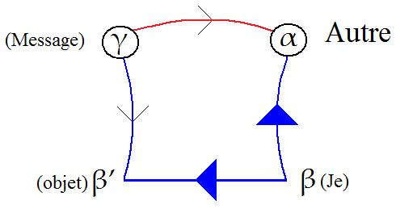
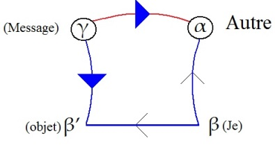
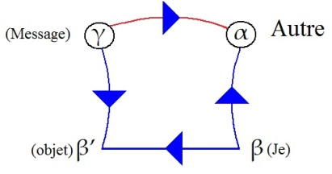
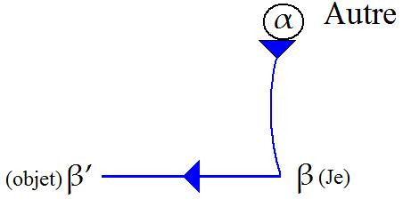
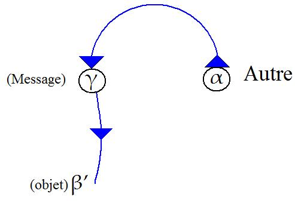
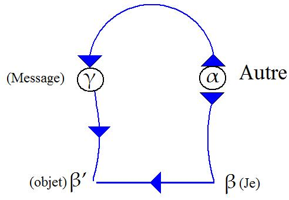
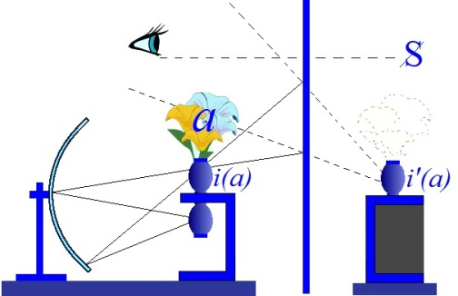
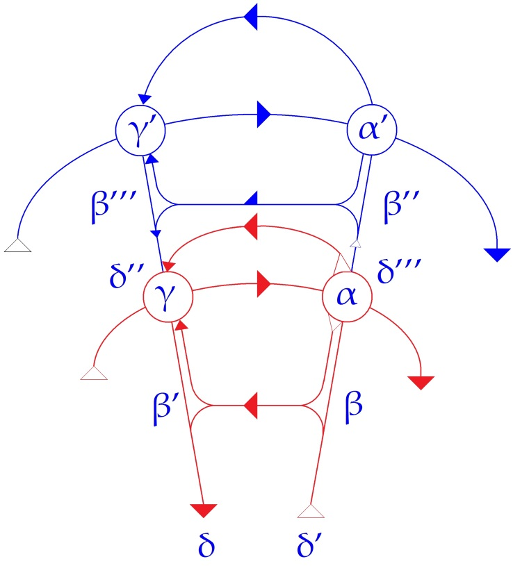
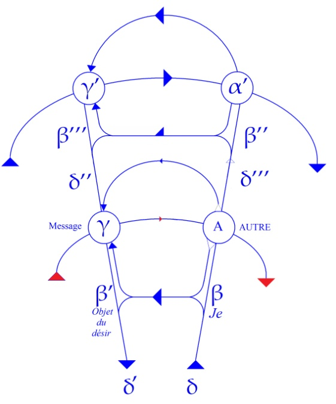
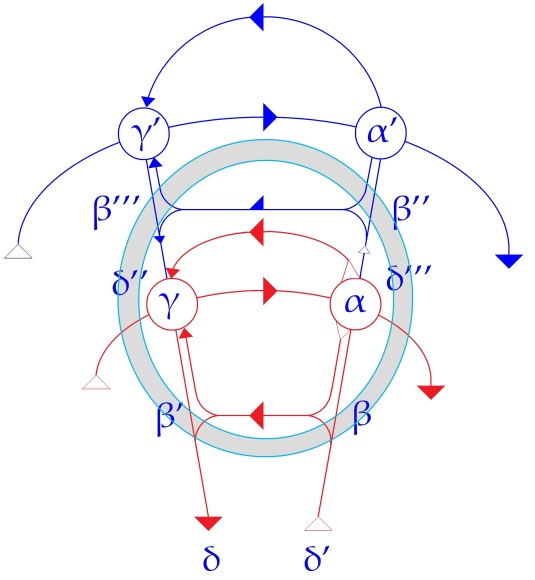

# Leçon 07 | 18 Décembre 1957

  

    <label><input type="checkbox" data-lacan-toggle="original" checked> 原文</label>
    <label><input type="checkbox" data-lacan-toggle="notes" checked> 注释</label>
    <label><input type="checkbox" data-lacan-toggle="commentary" checked> 个人解读评论</label>
  

  <form class="lacan-tool-search" role="search">
    <input class="lacan-tool-search-input" type="search" placeholder="搜索全文" aria-label="搜索全文">
    <button class="lacan-tool-button" type="submit" title="搜索">搜索</button>
  </form>
  <button class="lacan-tool-button lacan-back-to-top" type="button" title="回到页面最上方" aria-label="回到页面最上方">↑</button>

<section class="parallel-paragraph" data-paragraph-ids="s5-07-0001">

s5-07-0001

原文 · s5-07-0001

La dernière fois je vous ai parlé du GRAAL. C’est vous le GRAAL, que je solidifie par toutes sortes de mises en éveil de vos contradictions, aux fins de *vous faire authen­tifier en esprit,* si j’ose m’exprimer ainsi, que je vous envoie *le message*,
et dont l’essentiel consisterait dans ses défauts mêmes.

[无对应译文]

</section>

<section class="parallel-paragraph" data-paragraph-ids="s5-07-0002">

s5-07-0002

原文 · s5-07-0002

Comme il convient toujours de revenir un peu sur ce qui est même le mieux compris, je vais tâcher en quelque sorte de matérialiser sur le tableau ce que je vous ai dit la dernière fois. Ce que je vous ai dit la dernière fois concernait l’Autre, ce sacré Autre qui en somme viendra *compléter*, *combler* d’une certaine façon dans la comunication du *witz*,
*ce quelque chose, cette béance* qui constitue *l’insolubilité du désir*.

[无对应译文]

</section>

<section class="parallel-paragraph" data-paragraph-ids="s5-07-0003">

s5-07-0003

原文 · s5-07-0003

D’une certaine façon le « *witz* » restitue sa *jouissance* à *la demande*, essentiellement insatisfaite, sous le double aspect, identique d’ailleurs, de *la surprise* et du *plaisir* : le plaisir de la surprise et la surprise du plaisir.

[无对应译文]

</section>

<section class="parallel-paragraph" data-paragraph-ids="s5-07-0004">

s5-07-0004

原文 · s5-07-0004

J’ai insisté la dernière fois sur le procédé :

[无对应译文]

</section>

<section class="parallel-paragraph" data-paragraph-ids="s5-07-0005">

s5-07-0005

原文 · s5-07-0005

- d’immobilisation de l’Autre \[préparation\],

[无对应译文]

</section>

<section class="parallel-paragraph" data-paragraph-ids="s5-07-0006">

s5-07-0006

原文 · s5-07-0006

- de formation de ce que j’ai appelé « *le Graal vide* »,
  ce qui se représente dans FREUD dans ce qu’il appelle « *la façade* » du *mot d’es­prit* :

[无对应译文]

</section>

<section class="parallel-paragraph" data-paragraph-ids="s5-07-0007">

s5-07-0007

原文 · s5-07-0007

- *ce quelque chose* qui *détourne* en quelque sortel’attention de l’autre du chemin par où va passer *le mot d’es­prit*,

[无对应译文]

</section>

<section class="parallel-paragraph" data-paragraph-ids="s5-07-0008">

s5-07-0008

原文 · s5-07-0008

- *ce quelque chose* qui en somme fixe l’inhibition quelque part précisément pour laisser libre ailleurs le chemin par où va passer la parole spirituelle.

[无对应译文]

</section>

<section class="parallel-paragraph" data-paragraph-ids="s5-07-0009">

s5-07-0009

原文 · s5-07-0009

Voici donc à peu près comment les choses *se schématiseraient*. Le chemin qui se trace de la parole, ici condensée
en *message* qui s’adresse ici à l’Autre, *message* dont l’achoppement, la béance, le défaut est authentifié par l’Autre comme *mot d’esprit*, mais par là restituant essentiellement au sujet lui-même, et constituant le complément indispensable pour le sujet du désir propre du *mot d’esprit*. Voici donc le schéma qui nous sert habituellement :

[无对应译文]

</section>

<section class="parallel-paragraph" data-paragraph-ids="s5-07-0010">

s5-07-0010

原文 · s5-07-0010

[无对应译文]

</section>

<section class="parallel-paragraph" data-paragraph-ids="s5-07-0011">

s5-07-0011

原文 · s5-07-0011

Voici *l’Autre*, en γ *le message*, ici le « *je* », ici *l’objet métonymique*.

[无对应译文]

</section>

<section class="parallel-paragraph" data-paragraph-ids="s5-07-0012">

s5-07-0012

原文 · s5-07-0012

Mais si l’Autre nous est indispensable…
ceci bien entendu, ce sont des points franchis que nous allons supposer connus de vous
…si *l’Autre* est indispensable au bouclage que constitue le discours en tant qu’il arrive au *message* en état de satisfaire, au moins symboliquement, le caractère fondamentalement insoluble de la demande comme telle, si donc ce circuit qui est l’authentification par l’Autre de cette allusion en somme au fait :

[无对应译文]

</section>

<section class="parallel-paragraph" data-paragraph-ids="s5-07-0013">

s5-07-0013

原文 · s5-07-0013

- que rien de *la demande*, dès lors que l’homme est entré dans le monde *symbolique,* ne peut être atteint, sinon par une sorte de succession infinie de « *pas de sens* »,

[无对应译文]

</section>

<section class="parallel-paragraph" data-paragraph-ids="s5-07-0014">

s5-07-0014

原文 · s5-07-0014

- que l’homme - nouvel ACHILLE à la poursuite d’une autre tortue - est voué, par la prise de son désir dans le mécanisme du langage, à cette *infinie approche* jamais satisfaite, liée à l’intégration au mécanisme même du désir, de *quelque chose* que nous appellerons simplement *la discursivité,*

[无对应译文]

</section>

<section class="parallel-paragraph" data-paragraph-ids="s5-07-0015">

s5-07-0015

原文 · s5-07-0015

…donc si cet Autre est là comme essentiel au dernier pas *symboliquement* satisfaisant, constituant *un moment instantané* : le *mot d’esprit* quand il passe, il convient quand même que nous nous souvenions que cet Autre, lui aussi, existe.
Il *existe* à la manière de celui que nous appelons *le sujet*, qui est quelque part circulant comme *le furet*.

[无对应译文]

</section>

<section class="parallel-paragraph" data-paragraph-ids="s5-07-0016">

s5-07-0016

原文 · s5-07-0016

Ne vous imaginez pas que le sujet soit au départ du besoin : le besoin, ce n’est pas encore le sujet.
Où est-il ? Peut-être en dirons-nous plus long aujourd’hui.

[无对应译文]

</section>

<section class="parallel-paragraph" data-paragraph-ids="s5-07-0017">

s5-07-0017

原文 · s5-07-0017

*Le sujet c’est tout le système*, et peut-être quelque chose qui s’achève dans ce système.
*L’Autre il est pareil, il est construit de la même façon,* et c’est bien pour cela que *l’Autre peut prendre le relais de mon discours.*

[无对应译文]

</section>

<section class="parallel-paragraph" data-paragraph-ids="s5-07-0018">

s5-07-0018

原文 · s5-07-0018

Je vais rencontrer quelques conditions spéciales qui ne doivent tout de même pas manquer, si mon schéma
peut servir à quelque chose, d’y être représentables. Ces conditions sont celles que nous avons dites la dernière fois.

[无对应译文]

</section>

<section class="parallel-paragraph" data-paragraph-ids="s5-07-0019">

s5-07-0019

原文 · s5-07-0019

[无对应译文]

</section>

<section class="parallel-paragraph" data-paragraph-ids="s5-07-0020">

s5-07-0020

原文 · s5-07-0020

Notons maintenant ce qui marque les vecteurs ou les directions sur ces segments.

[无对应译文]

</section>

<section class="parallel-paragraph" data-paragraph-ids="s5-07-0021">

s5-07-0021

原文 · s5-07-0021

Voici, partant du « *Je* » :

[无对应译文]

</section>

<section class="parallel-paragraph" data-paragraph-ids="s5-07-0022">

s5-07-0022

原文 · s5-07-0022

- vers *l’objet* \[β → β’\]

[无对应译文]

</section>

<section class="parallel-paragraph" data-paragraph-ids="s5-07-0023">

s5-07-0023

原文 · s5-07-0023

- et vers *l’Autre* \[β → α\],

[无对应译文]

</section>

<section class="parallel-paragraph" data-paragraph-ids="s5-07-0024">

s5-07-0024

原文 · s5-07-0024

[无对应译文]

</section>

<section class="parallel-paragraph" data-paragraph-ids="s5-07-0025">

s5-07-0025

原文 · s5-07-0025

partant du *Message* :

[无对应译文]

</section>

<section class="parallel-paragraph" data-paragraph-ids="s5-07-0026">

s5-07-0026

原文 · s5-07-0026

- vers *l’Autre* \[γ → α\]

[无对应译文]

</section>

<section class="parallel-paragraph" data-paragraph-ids="s5-07-0027">

s5-07-0027

原文 · s5-07-0027

- et vers *l’objet* \[γ → β’\]

[无对应译文]

</section>

<section class="parallel-paragraph" data-paragraph-ids="s5-07-0028">

s5-07-0028

原文 · s5-07-0028

[无对应译文]

</section>

<section class="parallel-paragraph" data-paragraph-ids="s5-07-0029">

s5-07-0029

原文 · s5-07-0029

Car bien entendu il y a *un très grand rapport de symétrie* entre :

[无对应译文]

</section>

<section class="parallel-paragraph" data-paragraph-ids="s5-07-0030">

s5-07-0030

原文 · s5-07-0030

- ce *mes­sage* \[γ → α\],

[无对应译文]

</section>

<section class="parallel-paragraph" data-paragraph-ids="s5-07-0031">

s5-07-0031

原文 · s5-07-0031

- et ce « *je* » \[β → β’\],

[无对应译文]

</section>

<section class="parallel-paragraph" data-paragraph-ids="s5-07-0032">

s5-07-0032

原文 · s5-07-0032

[无对应译文]

</section>

<section class="parallel-paragraph" data-paragraph-ids="s5-07-0033">

s5-07-0033

原文 · s5-07-0033

et le même \[rapport de symétrie\] encore, *centrifuge *:

[无对应译文]

</section>

<section class="parallel-paragraph" data-paragraph-ids="s5-07-0034">

s5-07-0034

原文 · s5-07-0034

[无对应译文]

</section>

<section class="parallel-paragraph" data-paragraph-ids="s5-07-0035">

s5-07-0035

原文 · s5-07-0035

et le même, *centripète* :

[无对应译文]

</section>

<section class="parallel-paragraph" data-paragraph-ids="s5-07-0036">

s5-07-0036

原文 · s5-07-0036

[无对应译文]

</section>

<section class="parallel-paragraph" data-paragraph-ids="s5-07-0037">

s5-07-0037

原文 · s5-07-0037

entre :

[无对应译文]

</section>

<section class="parallel-paragraph" data-paragraph-ids="s5-07-0038">

s5-07-0038

原文 · s5-07-0038

- *l’Autre* en tant que tel, en tant que *lieu du trésor des métonymies*,

[无对应译文]

</section>

<section class="parallel-paragraph" data-paragraph-ids="s5-07-0039">

s5-07-0039

原文 · s5-07-0039

- et puis cet *objet* *métonymique* lui–même, en tant qu’il est constitué *<u>dans</u> le système des métonymies*.

[无对应译文]

</section>

<section class="parallel-paragraph" data-paragraph-ids="s5-07-0040">

s5-07-0040

原文 · s5-07-0040

[无对应译文]

</section>

<section class="parallel-paragraph" data-paragraph-ids="s5-07-0041">

s5-07-0041

原文 · s5-07-0041

Qu’est-ce que j’ai fait - vous ai-je expliqué la dernière fois - dans ce que je peux appeler *la préparation du mot d’esprit* ?
Cette *préparation*, dont quelquefois la meilleure est celle de n’en pas faire, *mais il est clair qu’il n’est pas mauvais d’en faire*. Nous n’avons qu’à nous souvenir de ce qui s’est passé quand je n’en ai pas fait : il est arrivé que quelquefois
vous êtes restés « *le bec dans l’eau* » pour des choses aussi simples que le « *Ah ! te*... » que je vous ai raconté un jour,
\[Cf. [séance du 20 Nov](#Ah_te).\] qui semble avoir laissé certains déconcertés.

[无对应译文]

</section>

<section class="parallel-paragraph" data-paragraph-ids="s5-07-0042">

s5-07-0042

原文 · s5-07-0042

Si j’avais fait une « *préparation* » sur les attitudes réciproques du « *petit comte* » et de « *la jeune fille bien élevée* », vous auriez peut-être été \[assez\] émoustillés pour qu’à ce moment le « *Ah ! te*... » ait plus facilement franchi quelque chose.
Comme vous y mettiez beaucoup d’*attention*, une partie d’entre vous ont mis un certain temps à comprendre.

[无对应译文]

</section>

<section class="parallel-paragraph" data-paragraph-ids="s5-07-0043">

s5-07-0043

原文 · s5-07-0043

Par contre, l’histoire du cheval de la dernière fois vous a beaucoup plus facilement fait rigoler, parce qu’elle comporte une longue « *préparation* », et pendant que vous étiez en train de bien vous *esbaudir* sur les propos de l’examiné
qui vous paraissaient marqués de la puissante insolence qui réside au fond de l’ignorance, vous vous êtes trouvés
en somme assez prêts à voir entrer le cheval volant qui termine l’histoire, qui lui donne vraiment son sel.

[无对应译文]

</section>

<section class="parallel-paragraph" data-paragraph-ids="s5-07-0044">

s5-07-0044

原文 · s5-07-0044

Ce que je produis chez *l’Autre* avec cette « *préparation* » c’est assurément quelque chose que nous appellons
dans FREUD *Hemmung, inhibition* : quelque chose qui est simplement *cette opposition*, qui est la base fondamentale
de la relation *duelle,* à tout ce que je pouvais devant vous, comme objet, vous opposer comme objections.
C’est bien naturel : vous vous mettez en état d’en supporter le choc, l’approche, la pression.
Quelque chose s’organise qu’on appelle habituellement *défense* \[ici inhibition\], qui est la force la plus élémentaire.
Et c’est bien ce dont il s’agit dans *ces sortes de préludes* qui peuvent aussi bien être faits de mille façons.

[无对应译文]

</section>

<section class="parallel-paragraph" data-paragraph-ids="s5-07-0045">

s5-07-0045

原文 · s5-07-0045

Quelquefois le « *non sens* » joue le rôle de ce prélude, il est provocation qui attire le regard mental dans une certaine direction. C’est un leurre, cette sorte de *corrida* : quelquefois c’est « *le comique* », quelquefois c’est « *l’obscène* ».
En fait, ce à quoi il s’agit d’accommoder *l’Autre* c’est en quelque sorte - en sens contraire \[à\] la métonymie
de mon discours - une certaine fixation de *l’Autre* en tant que lui-même discourant sur *un certain objet métonymique*.
Et d’une certaine façon, nous dirons : *n’importe lequel*. Il n’est pas du tout obligé que cela ait le moindre rapport
avec mes inhibitions propres. Peu importe ! Tout est bon *pourvu qu’un certain objet à ce moment-là occupe l’Autre*.
C’est cela que je vous ai expliqué la dernière fois en vous parlant de cette sorte de « *solidification imaginaire* »,
qui est la position première pour *le passage du mot d’esprit*.

[无对应译文]

</section>

<section class="parallel-paragraph" data-paragraph-ids="s5-07-0046">

s5-07-0046

原文 · s5-07-0046

En somme ce que vous voyez, *ceci c’est l’homologue au niveau de l’Autre*…
que nous prenons ici comme sujet, c’est pour cela que je vous fais *un autre système* que je dessine *en bleu*
…c’est l’homologue de la ligne que nous appelons d’habitude β → β’, rapport du « *Je* » à *l’objet métonymique*,
ce que nous appellerons *le premier sujet* et - pour indiquer ici donc *la superposition* du système - de l’autre sujet
par rapport au système du premier.

[无对应译文]

</section>

<section class="parallel-paragraph" data-paragraph-ids="s5-07-0047">

s5-07-0047

原文 · s5-07-0047

Vous voyez donc que ce dont il s’agit, pour que le relais soit donné de *l’Autre* vers le *message* qui authentifie
le *mot d’esprit* comme tel, il s’agit que le relais soit pris dans son propre *système de signifiants*, c’est-à-dire que, si je puis dire, le problème \[lui\] soit renvoyé : c’est-à-dire lui-même, dans son système, authentifie comme *mot d’esprit* le *message*.

[无对应译文]

</section>

<section class="parallel-paragraph" data-paragraph-ids="s5-07-0048">

s5-07-0048

原文 · s5-07-0048

[无对应译文]

</section>

<section class="parallel-paragraph" data-paragraph-ids="s5-07-0049">

s5-07-0049

原文 · s5-07-0049

En d’autres termes mon γ → α suppose inscrit *un parallèlisme* suffisant avec un γ’→ α’, ce qui est exactement porté
sur le schéma, cette nécessité inhérente au *mot d’esprit* qui lui donne cette sorte de perspective qui théoriquement
se reproduit à l’infini :

[无对应译文]

</section>

<section class="parallel-paragraph" data-paragraph-ids="s5-07-0050">

s5-07-0050

原文 · s5-07-0050

- que *la bonne histoire* est faite pour être racontée,

[无对应译文]

</section>

<section class="parallel-paragraph" data-paragraph-ids="s5-07-0051">

s5-07-0051

原文 · s5-07-0051

- qu’elle n’est complète que quand elle est racontée et que lorsque les autres en ont ri,

[无对应译文]

</section>

<section class="parallel-paragraph" data-paragraph-ids="s5-07-0052">

s5-07-0052

原文 · s5-07-0052

- et que même le plaisir de la raconter inclut le fait que *les autres à leur tour pourront sur d’autres la mettre à l’épreuve*.

[无对应译文]

</section>

<section class="parallel-paragraph" data-paragraph-ids="s5-07-0053">

s5-07-0053

原文 · s5-07-0053

S’il n’y a aucun rapport nécessaire entre ce que je dois évoquer chez *l’Autre* de *captivation métonymique* pour laisser le passage libre à *la parole spirituelle*, il y a par contre nécessairement un rapport…
ceci est rendu suffisamment évident par ce schéma entre la chaîne signifiante telle qu’elle doit s’*organiser*
chez *l’Autre*, celle qui va ici de δ’’’ en δ’’, de même qu’ici cela va de δ’ en δ
…il doit y avoir un rapport, et c’est cela que j’ai exprimé la dernière fois en disant que « *l’Autre doit être de la paroisse* ».

[无对应译文]

</section>

<section class="parallel-paragraph" data-paragraph-ids="s5-07-0054">

s5-07-0054

原文 · s5-07-0054

Il ne doit pas *simplement, en gros,* comprendre le français, quoique ce soit déjà une première façon d’être de la paroisse,
si je fais un mot d’esprit en français, il y a bien d’autres choses supposées connues auxquelles il doit participer
pour que tel ou tel *mot d’esprit* passe et réussisse.

[无对应译文]

</section>

<section class="parallel-paragraph" data-paragraph-ids="s5-07-0055">

s5-07-0055

原文 · s5-07-0055

Voilà donc en somme représentées sur le schéma deux conditions que nous pourrions à peu près écrire ainsi :
que si vous voulez, quelque chose qui serait ici le β’’→ β’’’ à savoir une certaine inhibition provoquée chez l’Autre. Là, je fais un signe fait de deux petites flèches en sens inverse l’une de l’autre, qui sont égales et de sens opposé
à ma métonymie, c’est-à-dire à γ → α.

[无对应译文]

</section>

<section class="parallel-paragraph" data-paragraph-ids="s5-07-0056">

s5-07-0056

原文 · s5-07-0056

Par contre, il y a une sorte de *parallélisme* entre γ → α et γ’ → α’, ce qui peut s’exprimer de cette façon là :
que γ → α  peut trouver son homologation. Nous avons exprimé cela en mettant un *esprit rude* \[?\] entre parenthèses dans le γ’ → α’, c’est-à-dire que *l’Autre l’homologue comme tel, l’homologue comme message, l’authentifie comme mot d’esprit.*

[无对应译文]

</section>

<section class="parallel-paragraph" data-paragraph-ids="s5-07-0057">

s5-07-0057

原文 · s5-07-0057

Voilà qui au moins a l’avantage de fixer les idées, de vous visualiser - puisque c’est un des organes mentaux
les plus familiers à l’intellectuel - de vous visualiser ce que je veux dire quand je vous ai parlé la dernière fois
des *deux conditions subjectives* pour le succès du *mot d’esprit*, à savoir ce qu’il exige de l’*autre imaginaire* pour qu’à l’intérieur de cette « *coupe* » que présente l’*autre imaginaire*, *l’Autre symbolique* l’entende.

[无对应译文]

</section>

<section class="parallel-paragraph" data-paragraph-ids="s5-07-0058">

s5-07-0058

原文 · s5-07-0058

Je laisse aux esprits ingénieux de rapprocher ceci de ce que - chose curieuse - j’ai pu dire autrefois dans une *métaphore,*
et je devais bien avoir une raison pour cela, pour me servir presque des mêmes schémas formels, quand autrefois
je me suis servi de l’image du « *miroir concave* » à propos du narcissisme. C’était *alors* surtout *des images imaginaires*
que je m’occupais, et des conditions d’apparition de *l’unité imaginaire* dans une certaine *réflexion* organique,
à travers quelque chose dont les tendances formelles le font... Nous ne nous engagerons pas dans un rapprochement qui d’ailleurs, de toute façon ne saurait être que forcé, encore qu’il puisse être suggestif.

[无对应译文]

</section>

<section class="parallel-paragraph" data-paragraph-ids="s5-07-0059">

s5-07-0059

原文 · s5-07-0059

[无对应译文]

</section>

<section class="parallel-paragraph" data-paragraph-ids="s5-07-0060">

s5-07-0060

原文 · s5-07-0060

Nous allons faire maintenant un petit usage de plus de ce schéma, car quel que soit l’intérêt de ce que je vous rappelle ainsi, le sens de ce que j’ai dit la dernière fois, si cela ne devait pas nous porter plus loin, ce serait assez court.
Je voudrais qu’*une fois au moins* vous voyiez bien ceci, que le schéma initial dont nous nous servons depuis le début
de l’année se transforme donc en ceci, par le fait que nous développons la formule de l’Autre comme sujet,
se transforme en ceci que nous avons :

[无对应译文]

</section>

<section class="parallel-paragraph" data-paragraph-ids="s5-07-0061">

s5-07-0061

原文 · s5-07-0061

- γ → α pour *le sujet*,

[无对应译文]

</section>

<section class="parallel-paragraph" data-paragraph-ids="s5-07-0062">

s5-07-0062

原文 · s5-07-0062

- ici β → β’ \[relation à *l’objet métonymique*\],

[无对应译文]

</section>

<section class="parallel-paragraph" data-paragraph-ids="s5-07-0063">

s5-07-0063

原文 · s5-07-0063

Et au-delà se reproduit cette disposition β’’→ β’’’, qui fait que l’Autre lui aussi a une relation à *l’objet métonymique*,
se trouve en posture de voir se reproduire à l’échelon suivant la nécessité du γ → α qui devient ici γ’ → α’,
et ainsi de suite indéfiniment.

[无对应译文]

</section>

<section class="parallel-paragraph" data-paragraph-ids="s5-07-0064">

s5-07-0064

原文 · s5-07-0064

[无对应译文]

</section>

<section class="parallel-paragraph" data-paragraph-ids="s5-07-0065">

s5-07-0065

原文 · s5-07-0065

La dernière boucle, celle par laquelle passe essentiellement le retour du *besoin* vers quelque chose qui est cette satisfaction indéfiniment différée, est quelque chose qui doit faire en quelque sorte tout le circuit des Autres,
avant de revenir chez le sujet, ici à son point terminal. Nous allons avoir d’ailleurs tout à l’heure à réutiliser ce *schéma*.

[无对应译文]

</section>

<section class="parallel-paragraph" data-paragraph-ids="s5-07-0066">

s5-07-0066

原文 · s5-07-0066

Pour l’instant arrêtons-nous à quelque chose qui est un cas particulier et que FREUD précisément envisage
tout de suite après qu’il ait donné cette analyse des mécanismes du *mot d’esprit*, dont ceci n’est que le commentaire.
Il parle de *ce qu’il appelle* « *les mobiles sociaux du mot d’esprit* », et de là il va au *problème du comique*. C’est ce que nous allons essayer d’aborder aujourd’hui, non pas de l’épuiser car FREUD dit expressément lui-même qu’il ne l’aborde
que sous l’angle du *mot d’esprit*, qu’autrement il y a là un domaine infiniment trop vaste pour qu’il puisse même songer à s’y engager, au moins à partir de son expérience.

[无对应译文]

</section>

<section class="parallel-paragraph" data-paragraph-ids="s5-07-0067">

s5-07-0067

原文 · s5-07-0067

Il est tout à fait frappant que pour s’introduire à l’analyse du comique il mette au premier plan, comme étant
ce qui dans le comique est le plus proche du *mot d’esprit*, avec la sûreté de l’orientation et de touche qui est celle
de FREUD, ce qui est le plus proche du *mot d’esprit* et qu’il nous présente comme tel, c’est très précisément
ce qui au premier abord pourrait paraître le plus éloigné du *spirituel*, c’est justement *le naïf*.

[无对应译文]

</section>

<section class="parallel-paragraph" data-paragraph-ids="s5-07-0068">

s5-07-0068

原文 · s5-07-0068

Le *naïf*, nous dit-il, est réalisé par quelque chose qui est fondé sur l’ignorance, et tout naturellement il en donne
des exemples empruntés aux enfants : la scène - que je vous ai, je crois, déjà évoqué ici - des enfants qui,
à l’usage des adultes, ont monté toute une petite historiette fort jolie, et qui consiste en ce qu’un couple se sépare,
le mari allant chercher fortune, et revenant au bout de quelques années, ayant réussi en effet à trouver la richesse,
mais que la femme accueille en lui disant :

[无对应译文]

</section>

<section class="parallel-paragraph" data-paragraph-ids="s5-07-0069">

s5-07-0069

原文 · s5-07-0069

« *Tu vois*, *je me suis conduite magnifiquement, moi non plus je n’ai pas perdu mon temps pendant ton absence.* »

[无对应译文]

</section>

<section class="parallel-paragraph" data-paragraph-ids="s5-07-0070">

s5-07-0070

原文 · s5-07-0070

Et elle ouvre le rideau sur une rangée de *dix poupées*. C’est toujours une petite scène de marionnettes.
Mais naturellement les enfants sont *étonnés*, peut-être simplement *surpris* - ils en savent peut-être plus long
qu’on ne croit dans l’occasion - mais en tout cas ils sont surpris par le rire qui éclate chez les adultes
qui sont venus assister à cette petite scène.

[无对应译文]

</section>

<section class="parallel-paragraph" data-paragraph-ids="s5-07-0071">

s5-07-0071

原文 · s5-07-0071

Voilà le type de *la drôlerie*, ou de *la bonne histoire*, ou du *mot d’esprit « naïf »* tel que FREUD nous le présente.
Il nous le donne sous une forme encore plus proche techniquement de ce que nous appelons *les procédés du langage*
dans l’histoire de la petite fille qui propose pour son frère qui a un peu mal au ventre, une *Bubizin*[^15].

[无对应译文]

</section>

<section class="parallel-paragraph" data-paragraph-ids="s5-07-0072">

s5-07-0072

原文 · s5-07-0072

La petite fille a entendu parler *pour elle* d’une *Medizin*, et comme *Madi* veut dire en allemand *petite fille,* et *Bubi*
*petit garçon,* elle pense que s’il y a des *Mädizin* pour les *petites filles*, il doit y avoir aussi des *Bubizin* pour les *petits garçons*.

[无对应译文]

</section>

<section class="parallel-paragraph" data-paragraph-ids="s5-07-0073">

s5-07-0073

原文 · s5-07-0073

\[« Ein 3½jähriges Mädchen warnt seinen Bruder : Du, iß nicht soviel von dieser Speise, sonst wirst du krank werden und mußt Bubizin nehmen.
« Bubizin ? » fragt die Mutter, « was ist denn das ? » Wie ich krank war, « rechtfertigt sich das Kind » habe ich ja auch Medizin nehmen müssen.
« Das Kind ist der Meinung, daß das vom Arzt verschriebene Mittel Mädi-zin heißt, wenn es für das Mädi bestimmt ist, und schließt,
daß es Bubizin heißen wird, wenn das Bubi es nehmen soll. Dies ist nun gemacht wie ein Wortwitz, der mit der Technik des Gleichklangs arbeitet, und könnte sich ja auch als wirklicher Witz zugetragen haben, in welchem Falle wir ihm halb widerwillig ein Lächeln geschenkt hätten.
Als Beispiel einer Naivität scheint es uns ganz ausgezeichnet und macht uns laut lachen. » *Der Witz ...*, VII : *Der Witz und die Arten des Komischen*\]

[无对应译文]

</section>

<section class="parallel-paragraph" data-paragraph-ids="s5-07-0074">

s5-07-0074

原文 · s5-07-0074

Voilà encore une chose qui, à condition qu’on en ait la clef, c’est-à-dire qu’on comprenne l’allemand
peut être facilement transformée en « *histoire drôle* », ou peut être présentée sur le plan du *spirituel*.
À la vérité, encore que bien entendu cette référence à l’enfant ne soit pas hors de saison, le trait,
nous ne dirons même pas de l’ignorance, de ce *quelque chose* que FREUD définit très spécialement en ceci,
qui en fait le caractère facilement supplétif dans le mécanisme du *mot d’esprit*, qui tient à ce qu’en somme :
« *il y a quelque chose* - dit-il - *qui nous plaît là-dedans* » et qui est précisément ce qui joue le même rôle que ce que j’ai appelé tout à l’heure *« fascination »* ou *« captivation métony­mique »*, c’est que nous sentons chez celui qui parle, et dont il s’agit, qu’il n’y a pas du tout d’*inhibition*.

[无对应译文]

</section>

<section class="parallel-paragraph" data-paragraph-ids="s5-07-0075">

s5-07-0075

原文 · s5-07-0075

Et c’est cela, cette absence d’*inhibition* chez l’autre, qui nous permet à nous de faire passer chez *l’autre*, chez celui
à qui nous le racontons et qui est déjà lui-même fasciné par cette absence d’*inhibition,* de faire passer l’essentiel
du *mot d’esprit*, à savoir cet *au-delà qu’il évoque*, et qui ici, chez l’enfant, dans les cas que nous venons d’évoquer,
ne consiste pas essentiellement dans leur drôlerie, mais dans l’évoca­tion de ce *temps de l’enfance* où *le rapport au langage* est quelque chose de si proche qu’il nous évoque par là directement ce rapport du langage au désir qui est ce qui, dans *le mot d’esprit,* en consti­tue *la satisfaction propre*.

[无对应译文]

</section>

<section class="parallel-paragraph" data-paragraph-ids="s5-07-0076">

s5-07-0076

原文 · s5-07-0076

Nous allons prendre un *autre exemple* emprunté à l’adulte, et je crois déjà l’avoir cité à un moment donné.
Un de mes patients qui ne se distinguait pas par ce qu’on appelle d’ordinaire *des circonvolutions très poussées*
et qui racontant une de ces histoires un peu tristes, comme il lui en arrivait assez souvent, expliquait qu’il avait donné rendez-vous à une petite femme rencontrée dans ses pérégrinations, et que ladite femme lui avait tout simplement,
comme cela lui arrivait souvent, posé ce qu’on appelle « *un lapin* ». Il concluait son histoire en disant :

[无对应译文]

</section>

<section class="parallel-paragraph" data-paragraph-ids="s5-07-0077">

s5-07-0077

原文 · s5-07-0077

«* J’ai* *bien compris, une fois de plus, que c’était là* *une femme de non-recevoir.* »

[无对应译文]

</section>

<section class="parallel-paragraph" data-paragraph-ids="s5-07-0078">

s5-07-0078

原文 · s5-07-0078

Il ne faisait pas *un mot d’esprit*, il disait quelque chose de fort innocent, qui pourtant a bien son caractère piquant,
et satisfait chez nous quelque chose qui va bien au-delà de l’appréhension comique du personnage dans sa déception, qui à l’occasion si elle évoque chez nous - et c’est tout à fait douteux - un sentiment de supériorité,
assurément est bien inférieure dans cette note. Puisque dans cette note je fais allusion à un des mécanismes
qu’on a souvent promu, mis en avant, prétendument du mécanisme du comique, c’est à savoir celui qui consiste
à nous sentir supérieur à l’autre.

[无对应译文]

</section>

<section class="parallel-paragraph" data-paragraph-ids="s5-07-0079">

s5-07-0079

原文 · s5-07-0079

Ceci est tout à fait critiquable, rien n’étant - encore que ce soit un fort grand esprit qui ait essayé d’ébaucher
*le mécanisme comique* dans ce sens, à savoir LIPPS - il est tout à fait réfutable que ce soit là le plaisir essentiel du *comique*.
S’il y a quelqu’un dans l’occasion qui garde toute sa supériorité, c’est bien notre personnage, qui trouve dans cette occasion matière à motiver une déception qui est tout à fait bien loin d’enta­mer une confiance en lui-même, inébranlable. Si quelque supériorité donc, s’ébauche à propos de cette histoire, c’est bien plutôt une sorte de *leurre*,
c’est-à-dire que pour un temps tout vous engageait un instant dans *ce mirage* que constitue la façon dont vous
vous le posez lui-même, ou dont vous vous posez celui qui raconte l’histoire, par rapport au texte du désir
ou de la déception, mais ce qui se passe va bien au-delà.

[无对应译文]

</section>

<section class="parallel-paragraph" data-paragraph-ids="s5-07-0080">

s5-07-0080

原文 · s5-07-0080

C’est que justement, *derrière ce terme* de « *femme de non-recevoir* », ce qui se dessine, c’est le caractère *fondamentalement décevant* en lui-même de toute approche, bien *au-delà* du fait que telle ou telle approche parti­culière soit satisfaite.

[无对应译文]

</section>

<section class="parallel-paragraph" data-paragraph-ids="s5-07-0081">

s5-07-0081

原文 · s5-07-0081

En d’autres termes ce qui nous amuse aussi là, c’est la satisfaction que trouve le sujet qui a laissé échapper ce mot innocent dans sa déception, à savoir qu’il la trouve suffisamment expliquée par une locution qu’il croit être la locution reçue, la métonymie *toute faite* pour de pareilles occasions.

[无对应译文]

</section>

<section class="parallel-paragraph" data-paragraph-ids="s5-07-0082">

s5-07-0082

原文 · s5-07-0082

En d’autres termes, qu’il retrouve dans le chapeau *haut de forme* sous la forme d’un lapin de peluche…
qu’il croit être le lapin bien vivant de l’explication valable, et qui - en fait, lui - est bel et bien *imagi­naire*

[无对应译文]

</section>

<section class="parallel-paragraph" data-paragraph-ids="s5-07-0083">

s5-07-0083

原文 · s5-07-0083

…ce lapin qui constitue cette déception même qu’il sera toujours prêt à voir se reproduire, inébranlé et constant,
sans autrement s’en affecter, chaque fois qu’il s’approchera de *l’objet de son mirage*.

[无对应译文]

</section>

<section class="parallel-paragraph" data-paragraph-ids="s5-07-0084">

s5-07-0084

原文 · s5-07-0084

Ici donc, ce que vous voyez c’est qu’en somme *le trait d’esprit de l’ignorant ou du naïf*, de celui dans l’occasion,
pour faire mon *mot d’esprit,* qui cette fois-ci *est toujours entier*, si l’on peut dire, au niveau de l’Autre. Je n’ai plus besoin de pro­voquer chez l’Autre rien qui constitue cette coupe solide, elle m’est déjà toute donnée parcelui qu’en élevant
à la dignité d’*histoire drôle*, celui de la bouche duquel je recueille le mot précieux dont la communication va constituer un *mot d’esprit*, celui que j’élève en quelque sorte à *la dignité de* *maître-mot* par mon histoire. Le mécanisme est en somme que toute la dialec­tique du *mot d’esprit naïf* tient en ceci, que toute la dialec­tique du *mot d’esprit naïf* tient dans la partie bleue du schéma :

[无对应译文]

</section>

<section class="parallel-paragraph" data-paragraph-ids="s5-07-0085">

s5-07-0085

原文 · s5-07-0085

[无对应译文]

</section>

<section class="parallel-paragraph" data-paragraph-ids="s5-07-0086">

s5-07-0086

原文 · s5-07-0086

Et que ce que chez l’*Autre* il s’agit de provoquer dans l’ordre *imaginaire* pour que le *mot d’esprit* dans sa forme ordinaire passe et soit reçu ici, est en quelque sorte tout constitué par sa naïveté, son ignorance, son infatuation elle-même,

[无对应译文]

</section>

<section class="parallel-paragraph" data-paragraph-ids="s5-07-0087">

s5-07-0087

原文 · s5-07-0087

et il suffit simple­ment de l’aborder aujourd’hui pour la faire homologuer par le tiers, le grand Autre,
auquel je la communique comme telle, pour la faire passer *au rang et au titre de* *mot d’esprit*.

[无对应译文]

</section>

<section class="parallel-paragraph" data-paragraph-ids="s5-07-0088">

s5-07-0088

原文 · s5-07-0088

Naturellement ici pourtant, par la promotion de l’*autre imaginaire* comme tel, dans cette analyse des métonymies,
dans la satisfaction qu’il trouve pure et simple dans le langage, et qui lui sert à ne même pas s’apercevoir à quel point son désir est leurré, ceci nous introduit - et c’est pourquoi FREUD le met au joint du mot d’esprit et du comique - ceci nous introduit à la dimension du *comique* comme tel et nous en fait poser la question.

[无对应译文]

</section>

<section class="parallel-paragraph" data-paragraph-ids="s5-07-0089">

s5-07-0089

原文 · s5-07-0089

Ici nous ne sommes pas au bout de nos peines, car à la vérité, sur ce sujet du comique, on n’a pas manqué d’introduire quelques considérations, quelques théories toutes plus ou moins insatisfaisantes, et ce n’est certainement pas une question vaine que celle de nous poser, que celle de savoir pourquoi ces théories sont insatisfaisantes,
et aussi pourquoi elles ont été promues. Assurément il faut là que nous franchissions toutes sortes de formes
sous lesquelles ces théories se sont présentées pour revenir dessus. Il n’y a pas moyen de les épeler, leur addition,

[无对应译文]

</section>

<section class="parallel-paragraph" data-paragraph-ids="s5-07-0090">

s5-07-0090

原文 · s5-07-0090

leur suc­cession, leur historique, comme on dit, ne nous mènera, je crois, sur la trace de rien de fondamental.

[无对应译文]

</section>

<section class="parallel-paragraph" data-paragraph-ids="s5-07-0091">

s5-07-0091

原文 · s5-07-0091

La question du comique est en tous cas, disons le, éludée chaque fois qu’on tente de l’aborder - je ne dis pas

[无对应译文]

</section>

<section class="parallel-paragraph" data-paragraph-ids="s5-07-0092">

s5-07-0092

原文 · s5-07-0092

de la résoudre - sur le plan seulement psycho­logique. « *L’esprit* » comme « *le comique* » sont évidem­ment, sur le plan psychologique, faciles à réunir sous cette catégorie du risible, ou de ce qui provoque le rire.

[无对应译文]

</section>

<section class="parallel-paragraph" data-paragraph-ids="s5-07-0093">

s5-07-0093

原文 · s5-07-0093

Bien entendu, vous ne pouvez pas manquer d’être frappés, que jusqu’à présent, tout en concluant le fait
que le mot d’esprit est plus ou moins bien accueilli, encaissé, par le fait que vous le sanctionnez d’un rire discret
ou tout au moins d’un sourire, je n’ai pas abordé cette question du rire.

[无对应译文]

</section>

<section class="parallel-paragraph" data-paragraph-ids="s5-07-0094">

s5-07-0094

原文 · s5-07-0094

La question du rire est loin d’être résolue. Bien entendu, tout un chacun s’ac­commode d’en faire une caractéristique essentielle de ce qui se passe dans le « *spirituel* », et aussi bien dans le « *comique* », mais quand il s’agit d’en faire

[无对应译文]

</section>

<section class="parallel-paragraph" data-paragraph-ids="s5-07-0095">

s5-07-0095

原文 · s5-07-0095

en quelque sorte le res­sort du caractère *expressif* si l’on peut dire à cette occasion, du rire, quand il s’agit même simplement de connoter à quelle émotion pourrait répondre ce phénomène dont il est possible de dire,
encore que ce ne soit pas absolument certain, qu’il soit *le propre de l’homme*, on commence à entrer dans des choses
qui, d’une façon générale, sont extrêmement fâcheuses.

[无对应译文]

</section>

<section class="parallel-paragraph" data-paragraph-ids="s5-07-0096">

s5-07-0096

原文 · s5-07-0096

Je veux dire que même ceux dont on sent bien qu’ils essayent d’approcher, qu’ils frôlent d’une certaine façon analogique, méta­phorique, un certain rapport du rire avec ce dont il s’agit dans l’appréhension qui lui correspond,
le mieux qu’on puisse dire, c’est que ceux qui là-dessus ont dit les choses qui paraissent les plus tenables, les plus prudentes, ne font guère que noter ce quelque chose qui serait analogue dans le phénomène lui-même du rire.
À savoir ce qu’il peut laisser quelque part de traces *oscillatoires,* au sens que c’est un mouvement *spasmodique*
avec une certaine oscillation mentale qui serait celle du passage, par exemple, dit KANT :

[无对应译文]

</section>

<section class="parallel-paragraph" data-paragraph-ids="s5-07-0097">

s5-07-0097

原文 · s5-07-0097

- de quelque chose qui est *une tension*, *à sa réduction à un rien,*

[无对应译文]

</section>

<section class="parallel-paragraph" data-paragraph-ids="s5-07-0098">

s5-07-0098

原文 · s5-07-0098

- l’oscillation entre une tension éveillée et sa brusque chute devant un rien, une absence de quelque chose qui serait censé, après son éveil de tension, devoir lui résister.

[无对应译文]

</section>

<section class="parallel-paragraph" data-paragraph-ids="s5-07-0099">

s5-07-0099

原文 · s5-07-0099

Voilà un exemple où le brusque passage d’un concept à sa contradiction se fait jour chez un psychologue,
l’un des derniers du siècle, Léon DUMONT, dont DUMAS fait état dans son article sur la psychologie[^16].

[无对应译文]

</section>

<section class="parallel-paragraph" data-paragraph-ids="s5-07-0100">

s5-07-0100

原文 · s5-07-0100

C’est un article à la DUMAS, très fin, très subtil et pour lequel cet homme heureux ne s’est pas fatigué,
mais qui vaut bien la peine d’être lu, car quand même, sans se fatiguer, il apporte de très jolis éléments.

[无对应译文]

</section>

<section class="parallel-paragraph" data-paragraph-ids="s5-07-0101">

s5-07-0101

原文 · s5-07-0101

Bref. Le rire, bien entendu, dépasse lui-même très largement la question aussi bien *du spirituel* que *du comique*.
Il n’est pas rare de voir rappelé qu’il y a dans le rire quelque chose qui est par exemple la simple communication
du rire, *le rire du rire*, le rire de quelque chose qui est lié au fait qu’il ne faut pas rire. Le *fou-rire* des enfants
dans certaines conditions est tout de même quelque chose qui mérite aussi de rete­nir l’attention.

[无对应译文]

</section>

<section class="parallel-paragraph" data-paragraph-ids="s5-07-0102">

s5-07-0102

原文 · s5-07-0102

Il y a aussi un rire de l’angoisse, et même de la menace imminente, le rire gêné de la victime qui se sent menacée soudain de quelque chose qui dépasse tout à fait, même les limites de son attente, le rire du désespoir.

[无对应译文]

</section>

<section class="parallel-paragraph" data-paragraph-ids="s5-07-0103">

s5-07-0103

原文 · s5-07-0103

Il y a des rires même du deuil brus­quement appris.

[无对应译文]

</section>

<section class="parallel-paragraph" data-paragraph-ids="s5-07-0104">

s5-07-0104

原文 · s5-07-0104

Allons-nous traiter de toutes ces formes du rire ? Ce n’est pas notre sujet. Je veux simplement ponctuer ici,
puisque aussi bien ce n’est pas mon objet de vous faire une théorie du rire, qu’en tout cas rien n’est plus éloigné
de devoir nous satisfaire que la théorie bergsonienne du mécanique surgis­sant au milieu de cette espèce de mythe

[无对应译文]

</section>

<section class="parallel-paragraph" data-paragraph-ids="s5-07-0105">

s5-07-0105

原文 · s5-07-0105

de *l’harmonie vitale,* de ce quelque chose dont - pour les reprendre à cette occasion d’une façon particulièrement schématique - la prétendue éter­nelle nouveauté, création permanente de l’élan vital, pour être reprise là d’une façon particulièrement condensée.

[无对应译文]

</section>

<section class="parallel-paragraph" data-paragraph-ids="s5-07-0106">

s5-07-0106

原文 · s5-07-0106

Dans ce discours sur le rire, BERG­SON montre assez, met assez en évidence le caractère à proprement parler \[...\]

[无对应译文]

</section>

<section class="parallel-paragraph" data-paragraph-ids="s5-07-0107">

s5-07-0107

原文 · s5-07-0107

Formu­ler qu’une des caractéristiques du mécanique en tant qu’opposé au vital, c’est son caractère répétitif,
comme si la vie ne nous présentait aucun phénomène de répétition, comme si nous ne pissions pas tous les jours
de la même façon, comme si nous ne nous endormions pas tous les jours de la même façon, comme si on réinventait l’amour chaque fois qu’on baise !

[无对应译文]

</section>

<section class="parallel-paragraph" data-paragraph-ids="s5-07-0108">

s5-07-0108

原文 · s5-07-0108

Il y a là véritablement quelque chose d’incroyable dans cette espèce d’explication par la mécanique elle-même,
une explication qui, tout au long du livre, se manifeste elle-même comme une explication mécanique. Je veux dire que c’est l’explication elle-même qui retombe dans une lamentable stéréotypie qui laisse absolument échapper ce qui est essentiel dans le phénomène. Si c’était véritablement la mécanique qui fut à l’origine du rire, où irions-nous ?

[无对应译文]

</section>

<section class="parallel-paragraph" data-paragraph-ids="s5-07-0109">

s5-07-0109

原文 · s5-07-0109

Où se situeraient les si subtiles remarques de KLEIST[^17] sur les marionnettes qui vont tout à fait à l’encontre
de ce prétendu caractère risible et déchu, du mécanique ? Car il sou­ligne si finement que c’est un *idéal de grâce*

[无对应译文]

</section>

<section class="parallel-paragraph" data-paragraph-ids="s5-07-0110">

s5-07-0110

原文 · s5-07-0110

qui est en réalité réalisé par ces petites machines qui, d’être simplement agitées par quelques bouts de fil,
réalisent par elles-mêmes une espèce d’élégance du tracé de leurs mouvements, liée à la constance
du centre de gravité de leur courbe, pour peu simplement qu’elles soient un petit peu bien construites, je veux dire suivant les exemples stricts que constituent les caracté­ristiques des articulations humaines, et qu’en fin de compte, souligne-t-il que la grâce de nul danseur ne peut atteindre à ce qui peut être réalisé par une marionnette

[无对应译文]

</section>

<section class="parallel-paragraph" data-paragraph-ids="s5-07-0111">

s5-07-0111

原文 · s5-07-0111

simple­ment agitée avec doigté.

[无对应译文]

</section>

<section class="parallel-paragraph" data-paragraph-ids="s5-07-0112">

s5-07-0112

原文 · s5-07-0112

Laissons de côté la théorie bergsonienne, à cette occasion, pour simplement faire remarquer à quel point elle peut laisser complètement de côté ce qui est donné par les premières appréhensions les plus élémentaires du mécanisme du rire. Je veux dire avant même qu’il soit impliqué dans rien qui soit aussi élaboré que le rapport du *spirituel*
ou le rapport du *comique*, je veux dire dans le fait que le rire touche à tout ce qui est *imitation, doublage, phénomène de sosie, masque*, et si nous regardons de plus près, *non seulement* au phénomène du *masque* mais à celui du *démasquage*,
et ceci selon des moments qui méritent qu’on s’y arrête.

[无对应译文]

</section>

<section class="parallel-paragraph" data-paragraph-ids="s5-07-0113">

s5-07-0113

原文 · s5-07-0113

Vous vous approchez d’un enfant, avec la figure recouverte d’un masque : *il rit d’une façon tendue*, gênée.
Vous vous approchez de lui un peu plus : quelque chose com­mence qui est une manifestation d’angoisse.

[无对应译文]

</section>

<section class="parallel-paragraph" data-paragraph-ids="s5-07-0114">

s5-07-0114

原文 · s5-07-0114

Vous enlevez le masque : *l’enfant rit*. Mais si vous avez sous ce masque un autre masque, *il ne rit pas du tout.*

[无对应译文]

</section>

<section class="parallel-paragraph" data-paragraph-ids="s5-07-0115">

s5-07-0115

原文 · s5-07-0115

Je ne veux là qu’indiquer combien tout au moins ceci demande une étude qui ne peut être qu’*une étude expérimentale*, mais qui ne peut l’être que si nous commençons d’avoir une certaine idée du sens dans lequel elle doit être dirigée
et dont tout - en tout cas dans ce phénomène comme dans d’autres que je pourrais ici mettre à l’appui
de mon affirmation, ce n’est pas mon intention ici d’y mettre l’accent - dont tout nous montre qu’il y a en tout cas

[无对应译文]

</section>

<section class="parallel-paragraph" data-paragraph-ids="s5-07-0116">

s5-07-0116

原文 · s5-07-0116

*un rapport très intense*, très serré, entre les phé­nomènes du rire et la fonction chez l’homme, de *l’imaginaire*, nommément le carac­tère captivant de *l’image*, captivant au-delà des mécanismes instinctuels qui en répondent, soit à la lutte,
soit à la parade, à la *parade sexuelle* ou à la *parade comba­tive,* et qui y ajoutent chez l’homme cet *accent supplémentaire*
qui fait que *l’image de l’autre* est très profondément liée à cette tension dont je parlais tout à l’heure.

[无对应译文]

</section>

<section class="parallel-paragraph" data-paragraph-ids="s5-07-0117">

s5-07-0117

原文 · s5-07-0117

Cette tension toujours évoquée par l’objet auquel est porté attention, attention qui consiste

[无对应译文]

</section>

<section class="parallel-paragraph" data-paragraph-ids="s5-07-0118">

s5-07-0118

原文 · s5-07-0118

- à le mettre à une certaine distance du désir ou de l’hostilité,
  <!-- -->

[无对应译文]

</section>

<section class="parallel-paragraph" data-paragraph-ids="s5-07-0119">

s5-07-0119

原文 · s5-07-0119

- à ce quelque chose qui chez l’homme est au fondement et à la base même de *la formation du* *moi*,

[无对应译文]

</section>

<section class="parallel-paragraph" data-paragraph-ids="s5-07-0120">

s5-07-0120

原文 · s5-07-0120

- de cette ambiguïté qui fait que *son unité est hors de lui-même*, que c’est par rapport à son semblable qu’il s’érige et trouve cette unité de défense qui est celle de son être en tant qu’être narcissique.

[无对应译文]

</section>

<section class="parallel-paragraph" data-paragraph-ids="s5-07-0121">

s5-07-0121

原文 · s5-07-0121

C’est dans ce champ là que doit se situer le phénomène du rire. Et pour vous indiquer ce que je veux dire,
je dirai que c’est dans ce champ là que se produisent *ces chutes de tension* auxquelles les auteurs qui se sont intéressés plus spécialement à ce phénomène attribuent le déclenchement occasionnel, instantané du rire.

[无对应译文]

</section>

<section class="parallel-paragraph" data-paragraph-ids="s5-07-0122">

s5-07-0122

原文 · s5-07-0122

Si quel­qu’un nous fait rire quand il tombe simplement par terre, c’est en fonction :

[无对应译文]

</section>

<section class="parallel-paragraph" data-paragraph-ids="s5-07-0123">

s5-07-0123

原文 · s5-07-0123

- de l’image plus ou moins tendue, plus ou moins pompeuse à laquelle même nous ne faisions pas tellement attention auparavant,

[无对应译文]

</section>

<section class="parallel-paragraph" data-paragraph-ids="s5-07-0124">

s5-07-0124

原文 · s5-07-0124

- de ces phénomènes de stature et de prestige qui sont en quelque sorte la monnaie courante de notre expérience vécue, mais au point que nous n’en percevons même pas le relief.

[无对应译文]

</section>

<section class="parallel-paragraph" data-paragraph-ids="s5-07-0125">

s5-07-0125

原文 · s5-07-0125

C’est pour autant, pour tout dire, que *le personnage imaginaire continue sa démarche* plus ou moins apprê­tée

[无对应译文]

</section>

<section class="parallel-paragraph" data-paragraph-ids="s5-07-0126">

s5-07-0126

原文 · s5-07-0126

dans notre imagination, alors que ce qui le supporte de réel est là, planté et répandu par terre.

[无对应译文]

</section>

<section class="parallel-paragraph" data-paragraph-ids="s5-07-0127">

s5-07-0127

原文 · s5-07-0127

C’est dans cette mesure que le rire éclate : c’est toujours par quelque chose qui est une libération de l’image.
Entendez cette libération dans les deux sens ambigus du terme :

[无对应译文]

</section>

<section class="parallel-paragraph" data-paragraph-ids="s5-07-0128">

s5-07-0128

原文 · s5-07-0128

- que quelque chose est libéré de *la contrainte de l’image*,

[无对应译文]

</section>

<section class="parallel-paragraph" data-paragraph-ids="s5-07-0129">

s5-07-0129

原文 · s5-07-0129

- et que l’image aussi va se promener toute seule.

[无对应译文]

</section>

<section class="parallel-paragraph" data-paragraph-ids="s5-07-0130">

s5-07-0130

原文 · s5-07-0130

Il y a quelque chose de comique dans le canard auquel vous avez coupé la tête et qui fait encore quelques pas
dans la basse-cour. C’est encore quelque chose de cet ordre, et c’est bien pour cela aussi que le comique va entrer quelque part en connexion avec le risible, c’est au niveau de la direc­tion *Je →­ objet *: β *→* β*’,* ou β*’’→* β*’’’*.

[无对应译文]

</section>

<section class="parallel-paragraph" data-paragraph-ids="s5-07-0131">

s5-07-0131

原文 · s5-07-0131

> 

[无对应译文]

</section>

<section class="parallel-paragraph" data-paragraph-ids="s5-07-0132">

s5-07-0132

原文 · s5-07-0132

C’est certainement dans la mesure où *l’imaginaire* est intéressé, quelque part, dans ce rapport au *symbolique*
que nous allons voir se retrouver à un niveau plus élevé, qui nous intéresse infiniment plus que l’ensemble
des phénomènes du plaisir, le rire en tant qu’il connote, qu’il accompagne le comique.

[无对应译文]

</section>

<section class="parallel-paragraph" data-paragraph-ids="s5-07-0133">

s5-07-0133

原文 · s5-07-0133

Pour introduire aujourd’hui la notion du comique, je voudrais partir d’un exemple. Quand Henri HEINE
dans l’histoire du « *Veau d’or* », rétorque à SOULIÉ, dans un *mot* qui est destiné à trouver la communication justement spirituelle quand il parle du « *Veau d’or* » à propos du banquier. C’est presque déjà un mot d’esprit,
une métaphore tout au moins, qui rencontre chez Henri HEINE cette réponse :

[无对应译文]

</section>

<section class="parallel-paragraph" data-paragraph-ids="s5-07-0134">

s5-07-0134

原文 · s5-07-0134

> « *Pour un veau, il me semble avoir un peu passé l’âge.* »

[无对应译文]

</section>

<section class="parallel-paragraph" data-paragraph-ids="s5-07-0135">

s5-07-0135

原文 · s5-07-0135

Observez que si Henri HEINE avait *dit cela au pied de la lettre*, cela voudrait dire simplement qu’il n’aurait rien compris, qu’il serait comme mon ignorant de tout à l’heure, comme celui qui racontait « *la femme de non-recevoir* ».
La rétorsion que lui fait Henri HEINE serait comique, d’une certaine façon, et c’est ce qui constitue les dessous
de ce *mot d’esprit*, elle est aussi un peu comme cela, je veux dire qu’elle renvoie un peu SOULIÉ à son jardin,
qu’elle le met dans ses petits souliers, si j’ose m’exprimer ainsi.

[无对应译文]

</section>

<section class="parallel-paragraph" data-paragraph-ids="s5-07-0136">

s5-07-0136

原文 · s5-07-0136

Après tout, SOULIÉ n’a pas dit quelque chose de tellement drôle, et Henri HEINE, en lui damant le pion,
en montrant que ça peut s’arranger *autrement*, en dressant un autre *objet métony­mique* que le premier *veau,*

[无对应译文]

</section>

<section class="parallel-paragraph" data-paragraph-ids="s5-07-0137">

s5-07-0137

原文 · s5-07-0137

entre et joue sur le plan de l’opposition comique. L’opposition comique, en somme, est liée à ceci qu’il est impossible de ne pas s’apercevoir d’abord d’une différence absolument essentielle.

[无对应译文]

</section>

<section class="parallel-paragraph" data-paragraph-ids="s5-07-0138">

s5-07-0138

原文 · s5-07-0138

C’est que le comique, si nous le saisissons là à l’état fugitif, à l’occasion du *trait d’esprit*, dans un trait, dans un mot, dans une passe d’armes, c’est quand même quelque chose qui va bien au-delà, je veux dire qui met en cause,

[无对应译文]

</section>

<section class="parallel-paragraph" data-paragraph-ids="s5-07-0139">

s5-07-0139

原文 · s5-07-0139

non pas purement et simplement notre ren­contre, quelque chose en éclair dans lequel il n’y a pas besoin
d’une très longue étreinte pour que ça passe avec un *trait d’esprit*.

[无对应译文]

</section>

<section class="parallel-paragraph" data-paragraph-ids="s5-07-0140">

s5-07-0140

原文 · s5-07-0140

Je m’adresse à vous tous, quelle que soit *votre position actuelle*, sans que je sache *d’où vous venez*, ni même *qui vous êtes*. Pour qu’il y ait entre nous des relations comiques il faut quelque chose qui nous implique beaucoup plus chacun
de l’un à l’autre personnellement.

[无对应译文]

</section>

<section class="parallel-paragraph" data-paragraph-ids="s5-07-0141">

s5-07-0141

原文 · s5-07-0141

Si bien que vous voyez, là, s’ébaucher dans la relation de SOULIÉ et d’Henri HEINE quelque chose qui intéresse
un mécanisme de séduction. Il y a quelque chose qui est quand même un peu rebuté du côté de SOULIÉ
par la réponse d’Henri HEINE. Bref, pour qu’il y ait possibilité de parler de la relation du comique,
il faut que nous placions cette relation de la demande à sa satisfaction, non plus dans un moment instantané,
mais dans quelque chose qui lui donne sa stabilité et sa constance, sa voie dans son rapport à un autre déterminé.

[无对应译文]

</section>

<section class="parallel-paragraph" data-paragraph-ids="s5-07-0142">

s5-07-0142

原文 · s5-07-0142

Car ce que nous avons analysé dans les sous-jacences du mot d’esprit comme étant cette structure essentielle
de la demande en tant qu’elle est reprise par l’autre et doit être essentiel­lement *insatisfaite*, il y a quand même

[无对应译文]

</section>

<section class="parallel-paragraph" data-paragraph-ids="s5-07-0143">

s5-07-0143

原文 · s5-07-0143

une solution qui est la solution fondamentale, celle que tous les êtres humains cherchent depuis le début de leur vie jusqu’à la fin de leur existence. Puisque tout dépend de l’Autre, en somme, la solution, c’est d’avoir *un Autre tout à soi*. C’est ce qu’on appelle l’amour. Dans cette dialectique du désir il s’agit d’avoir *un Autre tout à soi*.

[无对应译文]

</section>

<section class="parallel-paragraph" data-paragraph-ids="s5-07-0144">

s5-07-0144

原文 · s5-07-0144

Le champ de la parole pleine tel qu’autrefois je vous l’ai évoqué est désigné, défini sur ce schéma par les conditions mêmes dans lesquelles nous venons de voir que peut et doit se réa­liser quelque chose qui soit équivalent

[无对应译文]

</section>

<section class="parallel-paragraph" data-paragraph-ids="s5-07-0145">

s5-07-0145

原文 · s5-07-0145

à la satisfaction du désir, l’indication qu’il ne peut justement être satisfait que dans *l’au-delà de la parole*.

[无对应译文]

</section>

<section class="parallel-paragraph" data-paragraph-ids="s5-07-0146">

s5-07-0146

原文 · s5-07-0146

C’est le lien qui unit l’« Autre » avec ce *« Je »,* son « *objet métonymique »* et le « *message »*. C’est cela l’aire et la super­ficie où doit se tenir le quelque chose qui soit parole pleine : c’est à savoir que le mes­sage essentiel, caractéristique,

[无对应译文]

</section>

<section class="parallel-paragraph" data-paragraph-ids="s5-07-0147">

s5-07-0147

原文 · s5-07-0147

qui la constitue, cette parole pleine, celle que je vous ai imagée par le « *Tu es mon maître* », ou le « *Tu es ma femme* »,
se dessine en effet ainsi : *tu, toi, l’autre, es(t) ma femme.*

[无对应译文]

</section>

<section class="parallel-paragraph" data-paragraph-ids="s5-07-0148">

s5-07-0148

原文 · s5-07-0148

C’est sous cette forme, vous disais-je, que l’homme donne l’exemple de la parole pleine dans laquelle il s’engage comme sujet, se fonde comme l’homme de celle à laquelle il parle et le lui annonce sous cette forme, et lui dit :
« *Tu es ma femme* ». Je vous ai montré aussi le caractère étrangement paradoxal de ce « *Tu es ma femme* ».

[无对应译文]

</section>

<section class="parallel-paragraph" data-paragraph-ids="s5-07-0149">

s5-07-0149

原文 · s5-07-0149

C’est que tout repose sur quelque chose qui doit fermer le circuit \[cf. « *l’amour est toujours réciproque* »\].

[无对应译文]

</section>

<section class="parallel-paragraph" data-paragraph-ids="s5-07-0150">

s5-07-0150

原文 · s5-07-0150

C’est que la méto­nymie que cela comporte, le passage de l’Autre à cet « *objet* » unique qui est constitué par la phrase, demande tout de même que la métonymie soit reçue, que quelque chose passe ensuite du γ à α, à savoir que le « *tu* » dont il s’agit, ne réponde pas par exemple, purement et simplement : « *Mais non, pas du tout !* »

[无对应译文]

</section>

<section class="parallel-paragraph" data-paragraph-ids="s5-07-0151">

s5-07-0151

原文 · s5-07-0151

Même s’il ne répond pas « *Mais non, pas du tout !* », quelque chose d’autre se pro­duit beaucoup plus communément, c’est qu’en raison même du fait que nulle pré­paration aussi habile que le *mot d’esprit*, ne vient à faire confondre
cette ligne β’’’→ β’’ avec la métonymie γ → α, c’est-à-dire que ces deux lignes restent parfaitement indépendantes,
c’est à savoir que le sujet dont il s’agit conserve, lui, bel et bien son système d’objets métonymiques.

[无对应译文]

</section>

<section class="parallel-paragraph" data-paragraph-ids="s5-07-0152">

s5-07-0152

原文 · s5-07-0152

Nous verrons se produire la contradiction qui s’établit dans le « *cercle* » β → β’→ β’’’→ β’’→ ...

[无对应译文]

</section>

<section class="parallel-paragraph" data-paragraph-ids="s5-07-0153">

s5-07-0153

原文 · s5-07-0153

[无对应译文]

</section>

<section class="parallel-paragraph" data-paragraph-ids="s5-07-0154">

s5-07-0154

原文 · s5-07-0154

…à savoir que *chacun* - comme on dit - *ayant sa petite idée*, cette parole fondatrice se heurtera à ce que j’appellerai,
puisque nous sommes là en présence d’un *carré,* le pro­blème non pas de *la quadrature du cercle*,

[无对应译文]

</section>

<section class="parallel-paragraph" data-paragraph-ids="s5-07-0155">

s5-07-0155

原文 · s5-07-0155

mais de la « *circulature des métonymies* » bel et bien *distinctes*, même dans le *conjugo* le plus idéal :

[无对应译文]

</section>

<section class="parallel-paragraph" data-paragraph-ids="s5-07-0156">

s5-07-0156

原文 · s5-07-0156

> « *Il y a de bons mariages, il n’y en a pas de délicieux* » a dit La ROCHEFOUCAULD.

[无对应译文]

</section>

<section class="parallel-paragraph" data-paragraph-ids="s5-07-0157">

s5-07-0157

原文 · s5-07-0157

Or, le problème de l’Autre et de l’amour est au centre du comique. Pour le savoir il convient d’abord de se souvenir
que si on veut se renseigner sur le *comique*, il ne serait peut-être pas mauvais par exemple de lire *des comédies*.

[无对应译文]

</section>

<section class="parallel-paragraph" data-paragraph-ids="s5-07-0158">

s5-07-0158

原文 · s5-07-0158

*La comédie* a une histoire, *la comé­die* a même une origine sur laquelle on s’est beaucoup penché, et l’origine de *la comédie* est liée de la façon la plus étroite au rapport qu’on peut appeler le rapport du « *Ça* » au langage.

[无对应译文]

</section>

<section class="parallel-paragraph" data-paragraph-ids="s5-07-0159">

s5-07-0159

原文 · s5-07-0159

Le « *Ça* » dont nous parlons à l’occasion, qu’est-ce que c’est ? Bien entendu, ce n’est pas purement et simplement
le besoin radical originel, ce besoin qui est à la racine de *l’individualisation comme organisme*. Ce « *Ça* » ne se sai­sit

[无对应译文]

</section>

<section class="parallel-paragraph" data-paragraph-ids="s5-07-0160">

s5-07-0160

原文 · s5-07-0160

qu’*au-delà* de toute l’élaboration du désir dans le réseau du langage. Ce « *Ça* » c’est quelque chose qui ne se réalise
en fin de compte qu’à la limite.

[无对应译文]

</section>

<section class="parallel-paragraph" data-paragraph-ids="s5-07-0161">

s5-07-0161

原文 · s5-07-0161

Ici, *le désir* humain n’est pas pris d’abord dans ce système de langage qui l’atermoie indéfiniment : nulle place pour que ce « *Ça* » se constitue et se *nomme*. Il est pourtant, au-delà de toute cette élaboration du langage, ce qui représente
la réalisation de *ce besoin premier*, *la forme*, et qui chez l’homme tout au moins, n’a aucune chance même de se connaître.
Nous ne savons pas ce qu’est le « *Ça* » d’un animal, et il y a bien peu de chances que nous le sachions jamais,
mais ce que nous savons, c’est que le « *Ça* » de l’homme est entièrement engagé dans cette dialectique du langage :
c’est lui qui véhicule et conserve l’existence première de la tendance.

[无对应译文]

</section>

<section class="parallel-paragraph" data-paragraph-ids="s5-07-0162">

s5-07-0162

原文 · s5-07-0162

D’où sort la comédie ? On nous dit : de ce banquet où l’homme, en somme, dit oui dans une espèce d’or­gie

[无对应译文]

</section>

<section class="parallel-paragraph" data-paragraph-ids="s5-07-0163">

s5-07-0163

原文 · s5-07-0163

\- laissons à ce mot tout son vague - de ce même repas qui est constitué par les offrandes aux dieux, c’est-à-dire
aux immortels du langage. Le fait qu’en fin de compte *tout processus d’élaboration du désir dans le langage se ramène à*

[无对应译文]

</section>

<section class="parallel-paragraph" data-paragraph-ids="s5-07-0164">

s5-07-0164

原文 · s5-07-0164

\- *et se ras­semble dans* - *la consommation d’un banquet*, dans le fait qu’après tout ce détour *c’est en fin de compte pour revenir*
*à la jouissance, et à la plus élémentaire*. Voilà par quoi la comédie fait son entrée dans ce qu’on peut considérer
avec HEGEL comme étant « *la face esthétique de la religion* »[^18].

[无对应译文]

</section>

<section class="parallel-paragraph" data-paragraph-ids="s5-07-0165">

s5-07-0165

原文 · s5-07-0165

Qu’est-ce que nous montre l’ancienne comédie ?

[无对应译文]

</section>

<section class="parallel-paragraph" data-paragraph-ids="s5-07-0166">

s5-07-0166

原文 · s5-07-0166

Il conviendrait que vous mettiez un peu, de temps en temps, votre nez dans ARISTOPHANE. C’est toujours
le moment où le « *Ça* » reprend à son profit, chausse les bottes à son usage le plus élémentaire du langage.
C’est entendu : dans « *Les Nuées »,* ARISTOPHANE se moque d’EURIPIDE et de SOCRATE,
de SOCRATE *particulièrement*. Sous quelle forme nous le montre-t-il ? Il nous le montre sous cette forme
que toute cette belle dialectique va servir à un vieillard à essayer de satisfaire ses envies par toutes sortes de trucs :
à échapper à ses créanciers, à trouver le moyen de se faire donner de l’argent, ou à un jeune homme également :
à échapper à ses engagements, à tous ses devoirs, à railler ses ascendants, etc.

[无对应译文]

</section>

<section class="parallel-paragraph" data-paragraph-ids="s5-07-0167">

s5-07-0167

原文 · s5-07-0167

Ce retour du *besoin* sous sa forme la plus élémentaire, ce surgissement au premier plan de ce qui est entré à l’origine dans la dialectique du langage, à savoir tout spé­cialement tous *les besoins du sexe* et tous les besoins cachés en général, voilà ce que vous voyez sur la scène aristophanesque se produire au premier plan, et cela va loin.
Et tout spécialement, je recommande à votre attention les pièces concernant les femmes et la façon dont
cette sorte de retour au caractère de besoin élémentaire qui est sous-jacent à tout le processus.

[无对应译文]

</section>

<section class="parallel-paragraph" data-paragraph-ids="s5-07-0168">

s5-07-0168

原文 · s5-07-0168

Quel rôle spécialement est ici donné aux femmes, pour autant que c’est par leur intermédiaire que par exemple, ARISTOPHANE nous invite, pour le moment de com­munion imaginaire que représente la comédie,

[无对应译文]

</section>

<section class="parallel-paragraph" data-paragraph-ids="s5-07-0169">

s5-07-0169

原文 · s5-07-0169

à nous apercevoir de ce quelque chose qui ne peut s’apercevoir que rétroactivement, que si l’État existe, et la cité :

[无对应译文]

</section>

<section class="parallel-paragraph" data-paragraph-ids="s5-07-0170">

s5-07-0170

原文 · s5-07-0170

- c’est pour qu’on en profite,

[无对应译文]

</section>

<section class="parallel-paragraph" data-paragraph-ids="s5-07-0171">

s5-07-0171

原文 · s5-07-0171

- c’est pour qu’un *repas de cocagne*, auquel d’ailleurs per­sonne ne croit, soit établi sur l’ἀγορά \[agora\],

[无对应译文]

</section>

<section class="parallel-paragraph" data-paragraph-ids="s5-07-0172">

s5-07-0172

原文 · s5-07-0172

- c’est pour qu’en somme on revienne à s’éton­ner de bons sens contrariés par l’émulation perverse de la cité soumise à tous les tiraillements d’un processus dialectique,

[无对应译文]

</section>

<section class="parallel-paragraph" data-paragraph-ids="s5-07-0173">

s5-07-0173

原文 · s5-07-0173

- pour qu’on revienne par l’intermédiaire des *femmes*, *les seules qui sachent vraiment de quoi l’homme a besoin,* on revienne par l’intermédiaire des femmes au bon sens, et naturellement tout cela prend les formes les plus exubérantes.

[无对应译文]

</section>

<section class="parallel-paragraph" data-paragraph-ids="s5-07-0174">

s5-07-0174

原文 · s5-07-0174

Ce n’est piquant que par ce que cela nous révèle de la violence de certaines images. Cela nous fait aussi même assez bien imaginer un monde où les femmes n’étaient peut-être pas tout à fait ce que nous imaginons à travers les auteurs qui nous font une Antiquité policée.

[无对应译文]

</section>

<section class="parallel-paragraph" data-paragraph-ids="s5-07-0175">

s5-07-0175

原文 · s5-07-0175

Les femmes, m’a-t-il semblé, devaient être - je parle des femmes réelles, pas de la *Vénus de Milo -* devaient avoir
dans l’Antiquité beaucoup de poils et ne devaient pas sentir bon, si l’on en croit l’insistance qui est mise

[无对应译文]

</section>

<section class="parallel-paragraph" data-paragraph-ids="s5-07-0176">

s5-07-0176

原文 · s5-07-0176

sur la fonction du rasoir et sur cer­tains parfums.

[无对应译文]

</section>

<section class="parallel-paragraph" data-paragraph-ids="s5-07-0177">

s5-07-0177

原文 · s5-07-0177

Quoi qu’il en soit, dans ce *crépuscule aristophanesque*, spécialement celui qui concerne cette vaste insurrection
des femmes, il y a quelques images qui sont fort belles et qui ne manquent pas de frapper. Ne serait-ce que celle

[无对应译文]

</section>

<section class="parallel-paragraph" data-paragraph-ids="s5-07-0178">

s5-07-0178

原文 · s5-07-0178

qui tout d’un coup s’ex­prime dans cette phrase d’une des femmes devant ses compagnes qui sont toutes en train,
non seulement de s’être costumées en hommes, mais de s’attacher des barbes du côté de la *toute puissance* - il s’agit simplement de savoir de quelle barbe il s’agit - qui se met à rire tout d’un coup et leur dit :

[无对应译文]

</section>

<section class="parallel-paragraph" data-paragraph-ids="s5-07-0179">

s5-07-0179

原文 · s5-07-0179

« *Comme c’est drôle, on dirait une assemblée de seiches grillées avec des barbes !* »[^19]

[无对应译文]

</section>

<section class="parallel-paragraph" data-paragraph-ids="s5-07-0180">

s5-07-0180

原文 · s5-07-0180

Cette vision de pénombre est aussi quelque chose qui nous paraît assez de nature à nous suggérer
tout le soubassement des rapports dans la société antique.

[无对应译文]

</section>

<section class="parallel-paragraph" data-paragraph-ids="s5-07-0181">

s5-07-0181

原文 · s5-07-0181

Vers quoi va évoluer cette comédie ? Vers *la nouvelle comédie*. Et *la nouvelle comédie*, qu’est-ce que c’est ?
La nouvelle comédie est quelque chose qui nous montre les gens engagés en général de la façon la plus fascinée
et la plus butée sur quelque *objet métonymique*. Tous les types humains s’y rencontrent là, quels qu’ils soient.
Il y a le luxurieux, les personnages qui sont les mêmes que ceux que l’on voit se retrouver dans la comédie italienne :
ce sont des personnages définis par *un certain rapport avec un objet*, et autour desquels pivote toute *la nouvelle comédie*,
celle qui va de MENANDRE \[-343 → -292\] jusqu’à nos jours, autour de quelque chose qui se substitue
à cette éruption du sexe, qui est l’amour, alors là, l’amour nommé comme tel, l’amour que nous appellerons l’amour naïf, l’amour ingénu, l’amour qui unit deux jeunes gens en général assez falots, et qui forme le pivot de l’intrigue.

[无对应译文]

</section>

<section class="parallel-paragraph" data-paragraph-ids="s5-07-0182">

s5-07-0182

原文 · s5-07-0182

Et quand je dis *pivot*, c’est bien parce que l’amour joue ce rôle, non pas d’être en lui–même comique, mais d’être l’*axe* autour duquel tourne tout le comique de la situation jusqu’à une époque qu’on peut très nettement caractériser

[无对应译文]

</section>

<section class="parallel-paragraph" data-paragraph-ids="s5-07-0183">

s5-07-0183

原文 · s5-07-0183

par l’apparition du *romantisme*, et que nous laisse­rons aujourd’hui de côté.

[无对应译文]

</section>

<section class="parallel-paragraph" data-paragraph-ids="s5-07-0184">

s5-07-0184

原文 · s5-07-0184

L’amour est un sentiment comique. Le sommet de la comédie est parfaitement localisable, définissable : la comédie dans son sens propre, au sens où je le promeus ici devant vous, trouve son sommet dans un chef-d’œuvre unique, celui qui est en quelque sorte la charnière d’un passage

[无对应译文]

</section>

<section class="parallel-paragraph" data-paragraph-ids="s5-07-0185">

s5-07-0185

原文 · s5-07-0185

- de la présentation des rapports entre le *soi* et le *langage*, *sous la forme d’une prise de possession par le* *soi, du langage,*

[无对应译文]

</section>

<section class="parallel-paragraph" data-paragraph-ids="s5-07-0186">

s5-07-0186

原文 · s5-07-0186

- à l’in­troduction de la dialectique comme telle des rapports de l’homme au langage, qui se fait sous une forme aveugle, fermée.

[无对应译文]

</section>

<section class="parallel-paragraph" data-paragraph-ids="s5-07-0187">

s5-07-0187

原文 · s5-07-0187

Dans le romantisme, c’est très important en ce sens que le romantisme, sans le savoir, se trouve être une introduction confuse à cette dialectique du signifiant comme telle, dont en somme *la psychanalyse* se trouve être *la forme articulée*.
Mais dans la ligne de la comédie, disons classique, le sommet est donné au moment où la comédie dont je parle,
qui est de MOLIÈRE et qui s’appelle « *L’école des femmes »,* pose le problème d’une façon absolument schématique, puisque d’amour il s’agit, mais que l’amour est là en tant qu’instrument de *la satisfaction*. MOLIÈRE nous propose
le problème d’une façon qui donne sa grille, dans la lim­pidité, absolument comparable à un théorème d’EUCLIDE.

[无对应译文]

</section>

<section class="parallel-paragraph" data-paragraph-ids="s5-07-0188">

s5-07-0188

原文 · s5-07-0188

Un monsieur qui s’appelle ARNOLPHE, qui n’a même pas besoin pour que la chose soit rigoureuse
d’être un monsieur avec une seule idée - il se trouve que c’est mieux comme cela, mais à la façon dont *la métonymie* sert dans le *trait d’esprit* à nous fasciner - est un monsieur qu’en effet, dès le début, nous voyons entrer avec ce que nous pourrions appeler l’ob­session de n’être pas « *cornard* ».

[无对应译文]

</section>

<section class="parallel-paragraph" data-paragraph-ids="s5-07-0189">

s5-07-0189

原文 · s5-07-0189

C’est sa passion principale, c’est une passion comme une autre, toutes les passions s’équivalent, toutes les passions sont également méto­nymiques. C’est le principe de la comédie de les poser comme telles, c’est-à-dire de centrer l’attention sur un « *soi »* qui croit entièrement à son *objet métonymique*. Dire d’ailleurs qu’il y croit, cela ne veut absolument pas dire qu’il y soit lié, car c’est aussi une des caractéristiques de la comédie que *le « soi » du sujet comique*, quel qu’il soit, en sort toujours absolument intact. Tout ce qui s’est passé pendant la comédie est passé sur lui
comme l’eau sur les plumes d’un canard, quels que soient les paroxysmes aux­quels il soit parvenu dans la comédie.

[无对应译文]

</section>

<section class="parallel-paragraph" data-paragraph-ids="s5-07-0190">

s5-07-0190

原文 · s5-07-0190

*L’École des femmes* se termine par un « *Ouf* ! » d’ARNOLPHE, et pourtant, Dieu sait par où il passe !

[无对应译文]

</section>

<section class="parallel-paragraph" data-paragraph-ids="s5-07-0191">

s5-07-0191

原文 · s5-07-0191

C’est là que je veux essayer de vous rap­peler brièvement ce dont il s’agit.

[无对应译文]

</section>

<section class="parallel-paragraph" data-paragraph-ids="s5-07-0192">

s5-07-0192

原文 · s5-07-0192

ARNOLPHE a donc prononcé pour une petite fille :

[无对应译文]

</section>

<section class="parallel-paragraph" data-paragraph-ids="s5-07-0193">

s5-07-0193

原文 · s5-07-0193

« *Je l’ai remarquée pour son air doux et posé. Je l’aimais à l’âge de quatre ans*. » [^20]

[无对应译文]

</section>

<section class="parallel-paragraph" data-paragraph-ids="s5-07-0194">

s5-07-0194

原文 · s5-07-0194

Il a donc choisi *sa petite bonne femme*, et il a d’ores et déjà posé le « *Tu es ma femme* ». C’est même pour cela qu’il entre dans une telle agitation quand il voit que ce cher ange va lui être ravi. C’est qu’au point où il en est, dit-il, elle est déjà ma femme, et il l’a déjà instaurée socialement comme telle, à laquelle il dit : « *Tu es ma femme* ». Et il a résolu élégamment la question. *C’est un homme* - lui dit son partenaire, le nommé CHRYSALDE - « *qui a des lumières* ».
C’est dit quelque part, et en effet *il a telle­ment de lumières* qu’il s’est formulé ceci : il n’a pas besoin d’être le personnage monomane dont nous parlions au début. Ôtez-lui cette monomanie : c’est un édu­cateur.

[无对应译文]

</section>

<section class="parallel-paragraph" data-paragraph-ids="s5-07-0195">

s5-07-0195

原文 · s5-07-0195

Toujours *les vieillards* se sont occupés de *l’éducation des filles* et ont même pour cela posé des principes.
Là, il a trouvé un très heureux principe : il a lui-même dit qu’il ordonnait les soins par où elle devrait être conservée dans cet état d’être complètement idiote, dit-il.

[无对应译文]

</section>

<section class="parallel-paragraph" data-paragraph-ids="s5-07-0196">

s5-07-0196

原文 · s5-07-0196

> « *Et vous ne sauriez croire - dit-il à son ami - jusqu’où cela va,*
> *ne voilà-t-il pas que l’autre jour elle m’a demandé si l’on ne faisait pas les enfants par l’oreille.* »

[无对应译文]

</section>

<section class="parallel-paragraph" data-paragraph-ids="s5-07-0197">

s5-07-0197

原文 · s5-07-0197

C’est cela qui aurait dû *lui mettre la puce à la même oreille*, car si en effet la fille avait eu une conception physiologique plus saine des choses, peut-être aurait-elle été moins dangereuse. « *Tu es ma femme* », parole pleine, est la *métonymie*.
Tout ce qu’il fait lire à la petite AGNÈS, à savoir les devoirs du mariage, est bel et bien congrûment expliqué.

[无对应译文]

</section>

<section class="parallel-paragraph" data-paragraph-ids="s5-07-0198">

s5-07-0198

原文 · s5-07-0198

« *Elle est complètement idiote* », dit-il, et il croit pouvoir fonder là-dessus, comme tous les éducateurs, l’assurance
de sa construction. Qu’est-ce que nous montre tout le développement de l’histoire ? Cela pourrait s’appeler
« [*Comment l’esprit vient aux filles*](http://fr.wikisource.org/wiki/Comment_l%E2%80%99esprit_vient_aux_filles) ». L’esprit vient aux filles en ceci, la singula­rité du personnage d’AGNÈS

[无对应译文]

</section>

<section class="parallel-paragraph" data-paragraph-ids="s5-07-0199">

s5-07-0199

原文 · s5-07-0199

semble avoir proposé une véritable énigme aux psycho­logues et aux critiques : est-ce une femme, une nymphomane, une coquette, une ceci, une cela ?

[无对应译文]

</section>

<section class="parallel-paragraph" data-paragraph-ids="s5-07-0200">

s5-07-0200

原文 · s5-07-0200

Absolument pas ! C’est un être auquel on a appris à par­ler et qui articule. Elle est *prise au mot* du personnage,
complètement falot d’ailleurs, qu’est le personnage du *petit jeune homme*, d’HORACE, qui entre en jeu dans la ques­tion quand, dans la scène majeure où ARNOLPHE va lui proposer de s’arracher la moi­tié des cheveux, elle lui répond tranquillement :

[无对应译文]

</section>

<section class="parallel-paragraph" data-paragraph-ids="s5-07-0201">

s5-07-0201

原文 · s5-07-0201

> « *Horace, avec deux mots, en ferait plus que vous.* »

[无对应译文]

</section>

<section class="parallel-paragraph" data-paragraph-ids="s5-07-0202">

s5-07-0202

原文 · s5-07-0202

Elle ponctue ce qui est ponctué tout au long de la pièce, c’est-à-dire *que ce qui est venu à* AGNÈS avec la rencontre du personnage en question, c’est précisément ceci : *que le personnage dit des choses qui sont spirituelles et douces à entendre à ravir*. Ce qu’il dit, elle est bien incapable de nous le dire et de se le dire à elle-même, mais *c’est par la parole -* c’est-à-dire
par ce quelque chose qui rompt tout le système de la parole apprise, de la parole éducative - *qu’elle est captivée*,

[无对应译文]

</section>

<section class="parallel-paragraph" data-paragraph-ids="s5-07-0203">

s5-07-0203

原文 · s5-07-0203

et cette sorte d’igno­rance est une des dimensions que déjà MOLIÈRE a simplement liées à ceci :

[无对应译文]

</section>

<section class="parallel-paragraph" data-paragraph-ids="s5-07-0204">

s5-07-0204

原文 · s5-07-0204

que pré­cisément pour elle, *il n’y a rien d’autre que ce système de la parole*.

[无对应译文]

</section>

<section class="parallel-paragraph" data-paragraph-ids="s5-07-0205">

s5-07-0205

原文 · s5-07-0205

Quand ARNOLPHE lui explique qu’il lui a embrassé les mains, les bras. Elle demande : « *Y a-t-il autre chose ?* »
Elle est très intéressée. C’est une « Déesse Raison », cette AGNÈS. Aussi bien le terme de *raisonnement,* « *raisonneuse* » est-il ce qui vient à un moment donné, suffoquer ARNOLPHE, quand il essaye de lui reprocher son ingratitude,

[无对应译文]

</section>

<section class="parallel-paragraph" data-paragraph-ids="s5-07-0206">

s5-07-0206

原文 · s5-07-0206

son manque de senti­ment du devoir, la trahison qu’elle exerce à son égard. Elle lui répond avec pertinence :

[无对应译文]

</section>

<section class="parallel-paragraph" data-paragraph-ids="s5-07-0207">

s5-07-0207

原文 · s5-07-0207

« *Mais qu’est-ce que je vous dois ? Si c’est uniquement de m’avoir rendue bête, vos frais vous seront remboursés !* »

[无对应译文]

</section>

<section class="parallel-paragraph" data-paragraph-ids="s5-07-0208">

s5-07-0208

原文 · s5-07-0208

Et le mot « *raisonneur* » et « *raisonneuse* » est ce qui vient dans la bouche d’ARNOLPHE.

[无对应译文]

</section>

<section class="parallel-paragraph" data-paragraph-ids="s5-07-0209">

s5-07-0209

原文 · s5-07-0209

En d’autres termes, nous nous trouvons, au départ, devant le raisonneur en face de l’ingénue, et ce qui constitue
le ressort comique, c’est que nous voyons surgir, dès que l’esprit est venu à la fille, la raisonneuse en présence
du personnage qui lui, devient l’ingénu car à ce moment-là, dans les mots qui ne laissent aucune *ambiguïté*,
il dit qu’il l’aime, et il le lui dit de toutes les façons, et il le lui dit au point que la culmination de sa déclaration
consiste à lui dire à peu près ceci :

[无对应译文]

</section>

<section class="parallel-paragraph" data-paragraph-ids="s5-07-0210">

s5-07-0210

原文 · s5-07-0210

« *Tu* *feras très exactement tout ce que tu voudras* - c’est-à-dire - *tu auras Horace si tu le veux à l’occasion.* »

[无对应译文]

</section>

<section class="parallel-paragraph" data-paragraph-ids="s5-07-0211">

s5-07-0211

原文 · s5-07-0211

C’est-à-dire que le personnage renverse jusqu’au principe de son système, c’est-à-dire qu’en fin de compte il préfère encore être « *cornard* », ce qui était son départ principal dans toute l’affaire, plutôt que de perdre l’objet de son amour.
L’amour - c’est là le point auquel je dis que se situe le sommet de la comédie clas­sique - l’amour est ici...

[无对应译文]

</section>

<section class="parallel-paragraph" data-paragraph-ids="s5-07-0212">

s5-07-0212

原文 · s5-07-0212

> et il est très curieux de voir à quel point nous ne le percevons plus
> qu’à travers toutes sortes de paroles qui l’étouffent, de paroles romantiques
> ...l’amour est un ressort essentiellement *comique*.

[无对应译文]

</section>

<section class="parallel-paragraph" data-paragraph-ids="s5-07-0213">

s5-07-0213

原文 · s5-07-0213

C’est précisément en ceci qu’ ARNOLPHE est un véritable amoureux, beaucoup plus authentiquement amoureux que le dénommé HORACE qui ici, est vacillant perpétuellement. L’amour est comique, précisément en ceci
que c’est l’amour le plus authentiquement amour qui se déclare et qui se manifeste.

[无对应译文]

</section>

<section class="parallel-paragraph" data-paragraph-ids="s5-07-0214">

s5-07-0214

原文 · s5-07-0214

Il faut tout ce changement de perspective qui s’est produit autour du terme de « *l’amour* », pour que nous ne puissions plus si facilement le concevoir. Car c’est un fait : plus la pièce est jouée, plus ARNOLPHE est joué dans sa note d’ARNOLPHE, et plus les gens sont fléchissants et se disent

[无对应译文]

</section>

<section class="parallel-paragraph" data-paragraph-ids="s5-07-0215">

s5-07-0215

原文 · s5-07-0215

« *ce* MOLIÈRE *si noble et si profond, quand on vient d’en rire, on devrait en pleurer*... »,

[无对应译文]

</section>

<section class="parallel-paragraph" data-paragraph-ids="s5-07-0216">

s5-07-0216

原文 · s5-07-0216

C’est-à-dire que tout le changement de perspective romantique fait que les gens ne trouvent presque plus compatible le comique avec l’expression authentique et absolument submergeante de l’amour comme tel. Voici donc le schéma de l’histoire. Il faut tout de même que je donne ce qui la boucle. Ce qui la boucle est ceci, que grâce à la sottise
du personnage tiers, à savoir du personnage d’HORACE, qui à l’occasion se comporte tout à fait comme un benêt,
allant jusqu’à remettre celle qu’il vient d’enlever entre les mains de son légitime suc­cesseur sans même avoir pu l’identifier jusque là comme le jaloux dont AGNÈS souffre la tyrannie, c’est à celui-là même qu’il se confie.

[无对应译文]

</section>

<section class="parallel-paragraph" data-paragraph-ids="s5-07-0217">

s5-07-0217

原文 · s5-07-0217

Peu importe, ce personnage est tout à fait *secondaire*. Il est là pour quoi ? Pour que le problème soit posé
en ces termes, à savoir qu’ARNOLPHE, à tout instant est mis au fait, heure par heure, minute par minute,
de ce qui se passe dans la réalité :

[无对应译文]

</section>

<section class="parallel-paragraph" data-paragraph-ids="s5-07-0218">

s5-07-0218

原文 · s5-07-0218

- par celui-là même qui est son rival,

[无对应译文]

</section>

<section class="parallel-paragraph" data-paragraph-ids="s5-07-0219">

s5-07-0219

原文 · s5-07-0219

- et d’autre part, d’une façon également entièrement authentique par sa pupille elle-même, la nommée AGNÈS qui ne lui dissimule rien.

[无对应译文]

</section>

<section class="parallel-paragraph" data-paragraph-ids="s5-07-0220">

s5-07-0220

原文 · s5-07-0220

Effectivement comme il le souhaite, elle est complètement idiote, uniquement en ce sens qu’elle n’a absolument rien à cacher, qu’elle dit tout, qu’elle le dit simple­ment de la façon la plus pertinente. Mais qu’à partir du moment
où elle est dans le monde de *la parole*, ceci est ouvert - quelle que soit la puissance de la formation éducative -
*son désir est au-delà*, son *désir* est du côté pas simplement de HORACE auquel nous ne doutons pas qu’elle fasse subir dans l’avenir tout le sort qu’ARNOLPHE redoutait tellement, mais simplement du fait qu’elle est dans le domaine
de *la parole*, elle sait que *son désir est au-delà* de cette parole.

[无对应译文]

</section>

<section class="parallel-paragraph" data-paragraph-ids="s5-07-0221">

s5-07-0221

原文 · s5-07-0221

Elle est *charmée par les mots*, elle est *charmée par l’esprit*.

[无对应译文]

</section>

<section class="parallel-paragraph" data-paragraph-ids="s5-07-0222">

s5-07-0222

原文 · s5-07-0222

C’est en tant que quelque chose est *au-delà* de cette actua­lité métonymique qu’on essaye de lui imposer,

[无对应译文]

</section>

<section class="parallel-paragraph" data-paragraph-ids="s5-07-0223">

s5-07-0223

原文 · s5-07-0223

qu’elle s’échappe, que tout en disant toujours à ARNOLPHE la vérité, néanmoins tout ce qu’elle fait
est tout à fait équivalent au fait de le tromper. HORACE lui-même le perçoit, quand il raconte l’histoire du grès
et de la pierre, à savoir cette fille qui lui jette sa petite pierre par la fenêtre en lui disant :

[无对应译文]

</section>

<section class="parallel-paragraph" data-paragraph-ids="s5-07-0224">

s5-07-0224

原文 · s5-07-0224

« *Allez-vous-en, je ne veux plus entendre vos discours, et voici ma réponse.* »

[无对应译文]

</section>

<section class="parallel-paragraph" data-paragraph-ids="s5-07-0225">

s5-07-0225

原文 · s5-07-0225

Ce qui a l’air de vouloir dire : « *Voici la pierre que je vous jette* », mais qui est aussi le véhicule d’une *petite lettre,*

[无对应译文]

</section>

<section class="parallel-paragraph" data-paragraph-ids="s5-07-0226">

s5-07-0226

原文 · s5-07-0226

est quelque chose qui en effet - HORACE le sou­ligne très bien - pour une fille qu’on a voulu jusque-là maintenir dans la plus extrême ignorance, est une *ambiguïté* pas mal trouvée. C’est l’amorce de ces doubles sens,
de tout ce jeu dont on peut à l’avenir espérer au mieux.

[无对应译文]

</section>

<section class="parallel-paragraph" data-paragraph-ids="s5-07-0227">

s5-07-0227

原文 · s5-07-0227

Voici donc ce point sur lequel je voulais vous laisser aujourd’hui. Le *soi* est par nature au-delà de cette prise du désir dans le langage. Le rapport à l’Autre est essen­tiel pour autant que le chemin du désir passe *nécessairement* par l’Autre,
non pas en tant que l’Autre est l’objet unique, mais en tant que *l’Autre est le répondant du lan­gage*,

[无对应译文]

</section>

<section class="parallel-paragraph" data-paragraph-ids="s5-07-0228">

s5-07-0228

原文 · s5-07-0228

et par lui-même le soumet à toute sa dialectique.

[无对应译文]

</section>

<section class="note-block original-notes">

## Notes

[^15]: Cf. S. Freud : [*Le mot d’esprit*](http://classiques.uqac.ca/classiques/freud_sigmund/le_mot_d_esprit/freud_le_mot_d_esprit.pdf)..., p.161.

[^16]: Georges Dumas : « *La psychologie et la physiologie du rire* », Journal de Psychologie Normale et Pathologique, 1921.

[^17]: Heinrich Von Kleist : « *Sur le théâtre de marionnettes* », éd. Sillage, 2010.

[^18]: Cf. G.W.F. Hegel : *Esthétique*, Introduction, Chap. 1, Section 1, §. 3 : « *L’art ou du moins sa destination suprême est pour nous une chose du passé*... »

[^19]: Aristophane : [*L’assemblée des femmes*](http://remacle.org/bloodwolf/comediens/Aristophane/femmes.htm), vers 126-127.

[^20]: Molière : *[L'École des femmes](http://www.ebooksgratuits.com/ebooksfrance/moliere-oeuvres_completes_1.pdf),* Acte I, scène 1 : « *Un air doux et posé, parmi d'autres enfans,*

    *M'inspira de l'amour pour elle dès quatre ans* »

</section>
