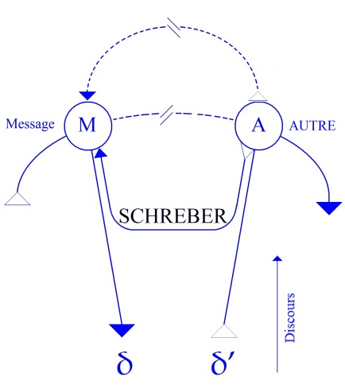
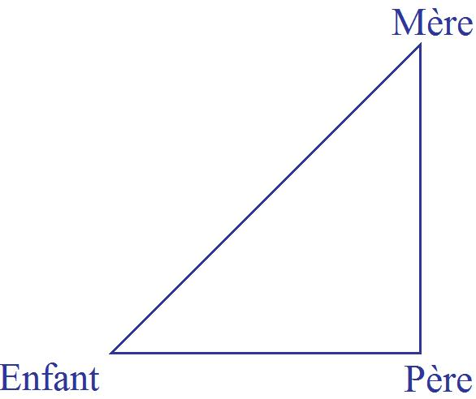
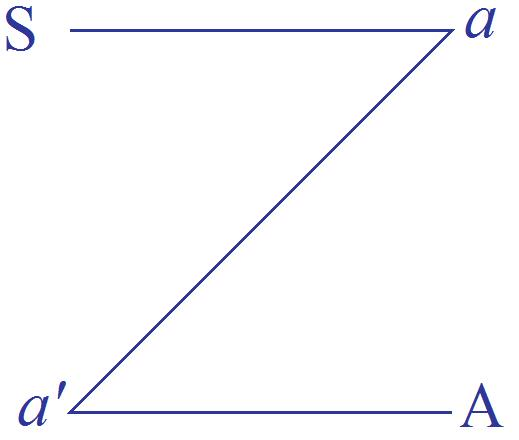
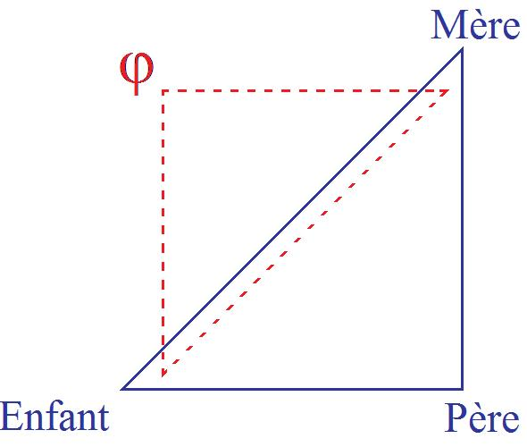

# Leçon 08 | 08 Janvier 1958

  <label><input type="checkbox" data-lacan-toggle="original" checked> 原文</label>
  <label><input type="checkbox" data-lacan-toggle="notes" checked> 注释</label>
  <label><input type="checkbox" data-lacan-toggle="commentary" checked> 个人解读评论</label>

<section class="parallel-paragraph" data-paragraph-ids="s5-08-0001">

s5-08-0001

[无对应译文]

原文 · s5-08-0001

J’ai l’impression que le trimestre dernier - *j’en ai eu des retentissements* - je vous ai un peu essoufflés. Je ne m’en suis pas rendu compte, sinon je ne l’aurai pas fait. J’ai aussi l’impression de m’être répété, d’avoir piétiné. Cela n’a d’ailleurs

</section>

<section class="parallel-paragraph" data-paragraph-ids="s5-08-0002">

s5-08-0002

[无对应译文]

原文 · s5-08-0002

pas empê­ché, peut-être, que certaines des choses que je voulais vous faire entendre sont restées en chemin.
Cela vaut peut-être un petit retour en arrière, disons *un regard* sur la façon dont j’ai abordé les choses cette année.

</section>

<section class="parallel-paragraph" data-paragraph-ids="s5-08-0003">

s5-08-0003

[无对应译文]

原文 · s5-08-0003

Ce que j’essaye de vous montrer à propos du *trait d’esprit* - dont j’ai dégagé un certain *schéma* dont l’utilité peut-être peut ne pas vous *apparaître* tout de suite - c’est son unité :

</section>

<section class="parallel-paragraph" data-paragraph-ids="s5-08-0004">

s5-08-0004

[无对应译文]

原文 · s5-08-0004

- comment les choses s’emboîtent,

</section>

<section class="parallel-paragraph" data-paragraph-ids="s5-08-0005">

s5-08-0005

[无对应译文]

原文 · s5-08-0005

- comment elles *s’en­grènent* avec le schéma précédent.

</section>

<section class="parallel-paragraph" data-paragraph-ids="s5-08-0006">

s5-08-0006

[无对应译文]

原文 · s5-08-0006

En fin de compte, il s’agit de quelque chose que vous devez percevoir comme une constante dans ce que je vous enseigne. Encore conviendrait-il que cette constante ne soit pas simplement quelque chose comme un petit drapeau
à l’horizon, sur lequel vous vous orientiez. Il faut que vous compreniez où cela vous emmène, dans quels détours
cela vous emmène. Cette constante, c’est la remarque que je crois absolument fondamentale pour comprendre

</section>

<section class="parallel-paragraph" data-paragraph-ids="s5-08-0007">

s5-08-0007

[无对应译文]

原文 · s5-08-0007

ce qu’il y a dans FREUD, celle de *l’im­portance du langage*, nous l’avons dit, d’abord, et ensuite *de la parole*.
Et plus nous nous approchons de notre objet, plus nous nous apercevons où est la différence de l’importance
du signifiant dans l’économie du désir, disons encore dans la formation, l’information du signifié.

</section>

<section class="parallel-paragraph" data-paragraph-ids="s5-08-0008">

s5-08-0008

[无对应译文]

原文 · s5-08-0008

Vous avez pu vous en apercevoir hier soir, à entendre ce que nous a apporté d’intéressant à notre séance scientifique Madame PANKOW. Il se trouve qu’en Amé­rique les gens se soucient de la même chose

</section>

<section class="parallel-paragraph" data-paragraph-ids="s5-08-0009">

s5-08-0009

[无对应译文]

原文 · s5-08-0009

que ce que je vous explique ici. Ils essayent d’introduire l’essentiel, dans la détermination de ces troubles psy­chiques, de ces troubles économiques, le fait de *la communication* et de ce qu’ils appellent *le message*, à l’occasion.

</section>

<section class="parallel-paragraph" data-paragraph-ids="s5-08-0010">

s5-08-0010

[无对应译文]

原文 · s5-08-0010

Vous avez pu entendre Madame PANKOW vous parler de quelqu’un qui est loin d’être né de la dernière pluie,

</section>

<section class="parallel-paragraph" data-paragraph-ids="s5-08-0011">

s5-08-0011

[无对应译文]

原文 · s5-08-0011

à savoir Monsieur Gregory BATESON, anthropologue et eth­nographe, qui a apporté quelque chose

</section>

<section class="parallel-paragraph" data-paragraph-ids="s5-08-0012">

s5-08-0012

[无对应译文]

原文 · s5-08-0012

qui nous fait réfléchir un peu plus loin que le bout de notre nez concernant l’action thérapeutique.

</section>

<section class="parallel-paragraph" data-paragraph-ids="s5-08-0013">

s5-08-0013

[无对应译文]

原文 · s5-08-0013

Il essaye de formuler quelque chose qui est *au principe* de la genèse du trouble *psychotique* dans quelque chose
qui s’établit entre la mère et l’enfant, et qui n’est pas simplement l’effet de tension, de rétention, de défense,
de ratification, de frustration, au sens élémentaire que je pré­cise, de relation interhumaine, comme si c’était

</section>

<section class="parallel-paragraph" data-paragraph-ids="s5-08-0014">

s5-08-0014

[无对应译文]

原文 · s5-08-0014

quelque chose qui se passait au bout d’un élastique.

</section>

<section class="parallel-paragraph" data-paragraph-ids="s5-08-0015">

s5-08-0015

[无对应译文]

原文 · s5-08-0015

Il essaye de mettre dès le principe la notion de *communication* - en tant qu’elle est centrée, non pas simplement
sur un contact, sur un rapport, sur un entourage, mais sur une signification - de la mettre au principe
de ce qui s’est passé d’originairement discordant, déchirant, dans ce qui lie l’enfant dans ses relations avec la mère.
Et quand il désigne, quand il dénote, comme étant l’élément discordant essentiel de cette relation,
le fait que la communication se soit présentée sous une forme de « *double relation* » \[*double bind*\].

</section>

<section class="parallel-paragraph" data-paragraph-ids="s5-08-0016">

s5-08-0016

[无对应译文]

原文 · s5-08-0016

Comme vous l’a très bien dit hier soir Mme PANKOW en vous disant que dans le même message qui est celui où l’enfant a déchiffré le comportement de sa mère, dans le même message il y a *deux éléments* qui ne sont pas définis l’un par rapport à l’autre, en ce sens simplement que l’un se présente comme la défense du sujet par rapport à ce que veut dire l’autre, ce qui est la notion commune que nous avons de ce qui se passe au niveau du mécanisme de la défense.

</section>

<section class="parallel-paragraph" data-paragraph-ids="s5-08-0017">

s5-08-0017

[无对应译文]

原文 · s5-08-0017

Quand vous analysez vous pouvez dire : « *Ce que le sujet dit pour méconnaître qu’il y a quelque part de signification en lui.* »
Il s’annonce à lui-même, de même qu’il vous annonce la couleur à côté. Ce n’est pas de cela qu’il s’agit.
Il s’agit de quelque chose qui concerne l’Autre, et qui est reçu par l’Autre de telle façon que,
s’il répond sur un point, il sait de ce fait même qu’il va se trouver coincé dans l’autre.

</section>

<section class="parallel-paragraph" data-paragraph-ids="s5-08-0018">

s5-08-0018

[无对应译文]

原文 · s5-08-0018

Comme nous l’a dit hier Mme PANKOW :

</section>

<section class="parallel-paragraph" data-paragraph-ids="s5-08-0019">

s5-08-0019

[无对应译文]

原文 · s5-08-0019

- si je réponds à la déclaration d’amour que me fait ma mère, je vais provo­quer son retrait,

</section>

<section class="parallel-paragraph" data-paragraph-ids="s5-08-0020">

s5-08-0020

[无对应译文]

原文 · s5-08-0020

- et si je ne l’entends pas comme telle, c’est-à-dire si je ne lui réponds pas, je vais la perdre.

</section>

<section class="parallel-paragraph" data-paragraph-ids="s5-08-0021">

s5-08-0021

[无对应译文]

原文 · s5-08-0021

Vous voyez donc que nous voilà introduits dans cette dialectique du double sens, en ceci déjà qu’il intéresse
un élément tiers.

</section>

<section class="parallel-paragraph" data-paragraph-ids="s5-08-0022">

s5-08-0022

[无对应译文]

原文 · s5-08-0022

Ce n’est pas l’un derrière l’autre…
c’est-à-dire quelque chose qui est au-delà du sens, un sens qui aurait ce privilège d’être le plus authentique
…c’est deux messages simultanés, dans la même émission si l’on peut dire, deux *significations* qui créent dans le sujet une position telle qu’il est en *impasse*. Ceci vous prouve que même en Amérique on est en énorme progrès.
Est-ce que cela veut dire que ce soit complètement suffisant ? Mme PANKOW hier soir a très bien souligné
ce que cette tentative avait de « *au ras du sol* », d’empirique.

</section>

<section class="parallel-paragraph" data-paragraph-ids="s5-08-0023">

s5-08-0023

[无对应译文]

原文 · s5-08-0023

Bien entendu, il ne s’agit pas du tout d’empirisme : si en Amérique il n’y avait pas, à côté, des travaux qui sont
très importants, qui sont faits sur le plan de ce qu’on appelle « *la stra­tégie des jeux »*, ils n’auraient même pas songé

</section>

<section class="parallel-paragraph" data-paragraph-ids="s5-08-0024">

s5-08-0024

[无对应译文]

原文 · s5-08-0024

à introduire cela dans l’analyse, qui est tout de même là une reconstruction de quelque chose qui est supposé
s’être passé à l’origine, qui détermine cette position profondément déchirée, en porte à faux, du sujet vis-à-vis de, justement, ce qu’a de *constituant* le message pour le sujet.

</section>

<section class="parallel-paragraph" data-paragraph-ids="s5-08-0025">

s5-08-0025

[无对应译文]

原文 · s5-08-0025

Si cette position n’implique pas que le message est quelque chose de *constituant* pour le sujet, on voit mal comment
on pourrait lui donner, à cette double relation primitive, des effets aussi grands. Alors, la question qui se pose
est celle de savoir quelle sera la situation, quel sera le procès de la communication en tant qu’il n’arrive pas à être constituant pour le sujet.

</section>

<section class="parallel-paragraph" data-paragraph-ids="s5-08-0026">

s5-08-0026

[无对应译文]

原文 · s5-08-0026

C’est un autre repère qu’il faut rechercher. Jusqu’à présent, quand vous lisez et quand vous entendez ce que veut dire
M. BATESON, vous voyez que tout, en somme, est centré, sur le *double message* sans doute, *mais sur le double message*
*en tant que double signification*. C’est précisément là que le système pèche, et justement en quoi ?
En ceci, c’est qu’il n’y a que cette façon de *concevoir* les choses, de les *présenter*, qui néglige justement ce que le *signifiant* a de constituant dans la *signification*.

</section>

<section class="parallel-paragraph" data-paragraph-ids="s5-08-0027">

s5-08-0027

[无对应译文]

原文 · s5-08-0027

Hier soir, j’avais pris une note au passage - qui me manque maintenant - que j’avais recueillie dans le propos même
de Mme PANKOW, et qui se ramène à peu près à ceci :

</section>

<section class="parallel-paragraph" data-paragraph-ids="s5-08-0028">

s5-08-0028

[无对应译文]

原文 · s5-08-0028

« *Il n’y a pas* - disait-elle - *de parole qui fonderait la parole en tant qu’acte.* »

</section>

<section class="parallel-paragraph" data-paragraph-ids="s5-08-0029">

s5-08-0029

[无对应译文]

原文 · s5-08-0029

Et ceci est bien dans la voie de ce que j’approche maintenant : parmi ces paroles, il faut qu’il y en ait une
qui « *fonde la parole en tant qu’acte dans le sujet* ». C’est dans ce sens qu’elle manifestait son exigence, son sentiment
de l’insuffisance du système. C’est en cela que Mme PANKOW manifestait une exigence de stabilisation de tout
le système : du fait qu’*à l’intérieur de la parole* il y ait, quelque part, quelque chose qui fonde la parole en tant que vraie.

</section>

<section class="parallel-paragraph" data-paragraph-ids="s5-08-0030">

s5-08-0030

[无对应译文]

原文 · s5-08-0030

Elle s’adressait donc dans ce sens à *un recours à la perspective de la personnalité*. C’est bien ce qu’elle avait apporté hier,
et c’est bien quelque chose qui tout au moins a le mérite de témoigner une certaine exigence correspondant à quelque chose qui, dans le système, nous laisse incertains, ne nous permet pas une déduction, une construction suffisante.

</section>

<section class="parallel-paragraph" data-paragraph-ids="s5-08-0031">

s5-08-0031

[无对应译文]

原文 · s5-08-0031

Je ne crois absolument pas que ce soit ainsi que l’on puisse le formuler. Cette *réfé­rence personnaliste*, je ne la crois psychologiquement fondée qu’en ce sens que nous ne pouvons pas ne pas pressentir que dans cette impasse
que créent les significations, en tant qu’elle est supposée déclencher *un déconcert* profond du sujet lorsqu’il est
un schizophrène, nous ne pouvons pas ne pas sentir qu’il y a quelque chose qui doit être au principe de ce déficit.

</section>

<section class="parallel-paragraph" data-paragraph-ids="s5-08-0032">

s5-08-0032

[无对应译文]

原文 · s5-08-0032

Il n’est pas simplement l’expérience maintenue, prise, imprimée, de ces impasses des significations,
mais aussi quelque chose qui est *le manque de quelque chose qui fonde la signification elle-même et qui est le signi­fiant*.

</section>

<section class="parallel-paragraph" data-paragraph-ids="s5-08-0033">

s5-08-0033

[无对应译文]

原文 · s5-08-0033

Et quelque chose de plus encore, qui est justement ce qu’aujourd’hui je vais aborder, c’est-à-dire quelque chose

</section>

<section class="parallel-paragraph" data-paragraph-ids="s5-08-0034">

s5-08-0034

[无对应译文]

原文 · s5-08-0034

qui se fonde, non pas simplement comme per­sonnalité, comme quelque chose « *qui fonde la parole en tant qu’acte* », comme Mme PANKOW le disait hier soir, mais quelque chose qui se pose comme ce qui donne auto­rité à la *Loi*.

</section>

<section class="parallel-paragraph" data-paragraph-ids="s5-08-0035">

s5-08-0035

[无对应译文]

原文 · s5-08-0035

Nous appelons ici *loi*, justement, ce qui s’articule proprement au niveau du signifiant, c’est à dire *le texte de la Loi*.
Ce n’est pas pareil de dire qu’il y a une personne qui doit être là pour soutenir, si l’on peut dire, l’authenticité
de *la parole*, et de dire qu’il y a quelque chose qui auto­rise *le texte de la Loi*.

</section>

<section class="parallel-paragraph" data-paragraph-ids="s5-08-0036">

s5-08-0036

[无对应译文]

原文 · s5-08-0036

Parce que ce quelque chose qui autorise *le texte de la Loi* est quelque chose qui se suffit d’être lui-même
au niveau du signifiant, c’est-à-dire le *Nom du Père*, *ce que j’appelle le* *Nom du Père,* c’est-à-dire *le père symbolique*.
C’est quelque chose qui subsiste au niveau du *signifiant*, c’est quelque chose qui, dans l’Autre en tant qu’il est le siège de la *Loi,* représente cet Autre dans l’Autre, ce signi­fiant qui donne support à la *Loi*, qui promulgue la *Loi*.

</section>

<section class="parallel-paragraph" data-paragraph-ids="s5-08-0037">

s5-08-0037

[无对应译文]

原文 · s5-08-0037

C’est précisément ce qu’exprime le mythe nécessaire à la pensée de FREUD, le mythe de l’œdipe.

</section>

<section class="parallel-paragraph" data-paragraph-ids="s5-08-0038">

s5-08-0038

[无对应译文]

原文 · s5-08-0038

Ce pour quoi - regardez-y de très près - il est nécessaire qu’il pro­cure lui-même, sous cette forme mythique,

</section>

<section class="parallel-paragraph" data-paragraph-ids="s5-08-0039">

s5-08-0039

[无对应译文]

原文 · s5-08-0039

l’origine de la *Loi* : c’est que, pour qu’il ait quelque chose qui fasse que la *Loi* est fondée dans le Père,
il faut qu’il y ait *meurtre du père*. Les deux choses sont étroitement liées, c’est-à-dire que *le Père* en tant qu’il promulgue la *Loi* est *le Père mort*, c’est-à-dire *le symbole du père*. Le père mort, c’est le *Nom du Père* qui est là construit sur le continu.

</section>

<section class="parallel-paragraph" data-paragraph-ids="s5-08-0040">

s5-08-0040

[无对应译文]

原文 · s5-08-0040

Ceci est tout à fait essentiel. Je vais vous rappeler à l’occasion pourquoi. Autour de quoi ai-je centré
tout ce que je vous ai appris il y a deux ans sur la psy­chose[^21] ? Autour de quelque chose que j’ai appelé la *Verwerfung*. J’ai essayé de vous la faire sentir comme quelque chose qui est autre que la *Verdrängung*, c’est-à-dire le fait que
la chaîne signifiante continue - que vous le sachiez ou pas - à se dérouler, à s’or­donner dans l’Autre,

</section>

<section class="parallel-paragraph" data-paragraph-ids="s5-08-0041">

s5-08-0041

[无对应译文]

原文 · s5-08-0041

ce qui est essentiellement la découverte freudienne.

</section>

<section class="parallel-paragraph" data-paragraph-ids="s5-08-0042">

s5-08-0042

[无对应译文]

原文 · s5-08-0042

Mais je vous ai dit que la *Verwerfung* était quelque chose qui n’était pas simple­ment au-delà de votre accès, c’est-à-dire dans l’Autre en tant que refoulé et en tant que signifiant. C’est cela qui est la *Verdrängung*, c’est la chaîne signifiante.
La preuve en est qu’elle continue à agir sans que vous lui donniez la moindre signi­fication, elle détermine la moindre signification sans que vous la connaissiez comme chaîne signifiante.

</section>

<section class="parallel-paragraph" data-paragraph-ids="s5-08-0043">

s5-08-0043

[无对应译文]

原文 · s5-08-0043

Je vous ai dit aussi qu’il y a *autre chose* qui dans cette occasion est *Verwerfung*. Il peut y avoir dans *la chaîne des signifiants* un signifiant ou une lettre qui manque, qui toujours manque dans la typographie…
car il s’agit d’*un espace typographique* l’espace du signifiant, l’espace de l’in­conscient est *un espace typographique*.

Il faut tâcher de définir l’espace typogra­phique comme quelque chose se constituant dans une ligne,

dans des petits carrés. Il y a des lois topologiques de l’espace typographique
…il y a *quelque chose qui manque dans cette chaîne des signifiants*.

</section>

<section class="parallel-paragraph" data-paragraph-ids="s5-08-0044">

s5-08-0044

[无对应译文]

原文 · s5-08-0044

Vous devez comprendre l’importance du *manque du signifiant particulier* dont je viens de par­ler, qui est le *Nom du Père*, en tant justement qu’il fonde comme tel le fait qu’il y a *Loi*, c’est-à-dire articulation dans un certain *ordre du signifiant*
\- *complexe d’Œdipe*, ou loi de l’œdipe, ou loi d’interdiction de la mère par exemple - le signifiant qui signi­fie que,

</section>

<section class="parallel-paragraph" data-paragraph-ids="s5-08-0045">

s5-08-0045

[无对应译文]

原文 · s5-08-0045

à l’intérieur de ce signifiant, le signifiant existe. C’est cela le *Nom du Père*. Et comme vous le voyez, à l’intérieur
de l’Autre, c’est un *signifiant essentiel*.

</section>

<section class="parallel-paragraph" data-paragraph-ids="s5-08-0046">

s5-08-0046

[无对应译文]

原文 · s5-08-0046

C’est autour de cela que j’ai essayé de vous centrer ce qui se passe dans la psychose, à savoir *comment le sujet doit suppléer au manque de ce signifiant essentiel* qui est le *Nom du Père*. Et c’est autour de cela que j’ai essayé de vous ordonner tout ce que j’ai appelé *la réaction en chaîne*, ou la débandade, qui se produit dans la psychose. Que dois-je faire ici ?

</section>

<section class="parallel-paragraph" data-paragraph-ids="s5-08-0047">

s5-08-0047

[无对应译文]

原文 · s5-08-0047

Dois-je m’engager tout de suite dans ce rappel de ce que je vous ai dit à propos du Président SCHREBER ?
Ou bien faut-il que je vous montre d’une façon encore plus précise ce que j’articule, ce que je viens là simplement d’an­noncer en vous montrant dans le détail quel rapport vous articuler au niveau du *schéma* de cette année…
qui *à ma grande surprise* n’intéresse pas tout le monde, mais qui intéresse tout de même quelques-uns
…au niveau du *schéma* de cette année, d’essayer de vous articuler ce que je viens d’essayer de vous indiquer ?
N’oubliez pas que ce *schéma* a été construit pour vous représenter ce qui se passe au niveau de quelque chose
qui mérite le nom de technique, la technique du *mot d’es­prit*, qui est quelque chose de particulier, de bien singulier puisque manifestement cela peut être fabriqué de la façon la plus inintentionnelle du monde par le sujet.

</section>

<section class="parallel-paragraph" data-paragraph-ids="s5-08-0048">

s5-08-0048

[无对应译文]

原文 · s5-08-0048

Que - comme je vous l’ai montré - le *mot d’es­prit* n’est quelquefois que *l’envers d’un lapsus*, et dont l’expérience montre que beaucoup de *mots d’es­prit* naissent de cette façon-là : on s’aperçoit après-coup que l’on a eu de l’esprit. C’est parti tout seul. D’abord, cela pourrait dans certains cas être pris pour exactement le contraire, un signe de naïveté.

</section>

<section class="parallel-paragraph" data-paragraph-ids="s5-08-0049">

s5-08-0049

[无对应译文]

原文 · s5-08-0049

J’ai fait allusion la dernière fois au *mot d’es­prit* naïf. Ce *mot d’es­prit*, avec son résultat qui est cette satisfaction qui lui est particulière, c’est autour de cela que j’ai essayé le trimestre dernier de vous organiser ce schéma pour tâcher
de repérer comment nous pourrions concevoir l’origine de cette satis­faction spéciale qu’il donne.

</section>

<section class="parallel-paragraph" data-paragraph-ids="s5-08-0050">

s5-08-0050

[无对应译文]

原文 · s5-08-0050

Cela ne nous a fait remonter à rien d’autre qu’à la dia­lectique de *la demande* à partir de l’*ego*. Rappelez-vous le schéma de ce que je pourrais appeler l’*idéal primordial symbo­lique*, qui est tout à fait inexistant au moment de *la demande satisfaite* en tant qu’il est représenté par la simultanéité de l’intention - pour autant qu’elle va se manifester en message –
et de l’arrivée de ce message comme tel à l’Autre, je veux dire le fait que le signifiant, puisque cette chaîne
est la chaîne signifiante - parvient dans l’Autre.

</section>

<section class="parallel-paragraph" data-paragraph-ids="s5-08-0051">

s5-08-0051

[无对应译文]

原文 · s5-08-0051

Il voit comme tel s’il y a parfaite identité, simultanéité, superposition exacte entre :

</section>

<section class="parallel-paragraph" data-paragraph-ids="s5-08-0052">

s5-08-0052

[无对应译文]

原文 · s5-08-0052

- la manifestation de l’intention, en tant qu’elle est celle de l’*ego*,

</section>

<section class="parallel-paragraph" data-paragraph-ids="s5-08-0053">

s5-08-0053

[无对应译文]

原文 · s5-08-0053

- et le fait que le signi­fiant est, comme tel, entériné dans l’Autre : ce quelque chose qui est au principe de la possibilité même de la satisfaction de la parole.

</section>

<section class="parallel-paragraph" data-paragraph-ids="s5-08-0054">

s5-08-0054

[无对应译文]

原文 · s5-08-0054

Nous supposons donc - c’est cela que j’appelle *le moment primordial idéal -* que :

</section>

<section class="parallel-paragraph" data-paragraph-ids="s5-08-0055">

s5-08-0055

[无对应译文]

原文 · s5-08-0055

- si ce moment existe, il doit être constitué par cette simultanéité, cette co-extensivité exacte *du* *désir*
  en tant qu’il se manifeste, et *du signifiant* en tant qu’il le porte et le comporte,

</section>

<section class="parallel-paragraph" data-paragraph-ids="s5-08-0056">

s5-08-0056

[无对应译文]

原文 · s5-08-0056

- si ce moment existe, la suite - c’est-à-dire quelque chose ici, qui va succéder au *message* - est quelque chose qui va succéder à son passage dans l’Autre, qui va correspondre à ce qui est nécessaire, et à ce qui est réalisé dans l’Autre et dans le sujet pour qu’il y ait satis­faction.

</section>

<section class="parallel-paragraph" data-paragraph-ids="s5-08-0057">

s5-08-0057

[无对应译文]

原文 · s5-08-0057

</section>

<section class="parallel-paragraph" data-paragraph-ids="s5-08-0058">

s5-08-0058

[无对应译文]

原文 · s5-08-0058

Ceci très précisément est le point de départ *nécessaire* pour que vous compreniez que cela n’arrive jamais. C’est à savoir qu’il est de la nature et de l’effet du signifiant que ce qui arrive ici \[γ\] se présente comme signifié, c’est-à-dire comme quelque chose qui est fait de la transformation, de la réfraction de son désir par son passage par le signifiant.

</section>

<section class="parallel-paragraph" data-paragraph-ids="s5-08-0059">

s5-08-0059

[无对应译文]

原文 · s5-08-0059

Et pourquoi ? Parce que c’est pour cela que ces deux lignes sont entre­croisées : c’est pour vous faire sentir le fait que le désir s’exprime et passe par le signi­fiant, c’est-à-dire qu’il croise la ligne signifiante, et qu’au niveau de ce croisement du désir avec la ligne signifiante il rencontre quoi ?

</section>

<section class="parallel-paragraph" data-paragraph-ids="s5-08-0060">

s5-08-0060

[无对应译文]

原文 · s5-08-0060

Il rencontre *l’Autre* - nous verrons tout à l’heure, puisqu’il faudra y revenir, ce que c’est dans ce *schéma* que cet *Autre* -
il rencontre l’Autre - je ne vous ai pas dit comme *personne - il rencontre l’Autre comme trésor du signifiant, comme siège du code*.
En d’autres termes, c’est là que se passe la réfraction du désir par le signifiant.

</section>

<section class="parallel-paragraph" data-paragraph-ids="s5-08-0061">

s5-08-0061

[无对应译文]

原文 · s5-08-0061

Le désir arrive donc comme *signifié*, *autre* que ce qu’il était au départ, *et voilà pourquoi*, non pas « *votre fille est muette* », mais pourquoi *votre désir est toujours cocu*. C’est parce que dans l’intervalle, ce dont il s’agit vous montre que c’est plutôt vous qui l’êtes, cocu. Vous-même êtes trahi en ceci que votre *désir* a couché avec *le signifiant*. C’est essentiel.

</section>

<section class="parallel-paragraph" data-paragraph-ids="s5-08-0062">

s5-08-0062

[无对应译文]

原文 · s5-08-0062

Je ne sais pas comment il faut que j’articule mieux les choses pour vous les faire comprendre.
Ceci tient au fait que *le désir en tant qu’éma­nation, pointe d’un moment de cet ego radical, du seul fait que c’est ce chemin-là*.
C’est là la signification du schéma, il est là pour vous visualiser ce concept que le pas­sage à travers *la chaîne du signifiant* introduit dans la dialectique du désir, par soi même, ce *changement essentiel*.

</section>

<section class="parallel-paragraph" data-paragraph-ids="s5-08-0063">

s5-08-0063

[无对应译文]

原文 · s5-08-0063

Alors il est bien clair que pour la satisfaction du *désir* tout dépend de ce qui se passe en ce point-là \[A\], d’abord défini comme *lieu du code*, comme ce quelque chose d’essentiel qui, déjà par lui–même, *dès l’origine*, *ab origine*, du seul fait de
*sa structure de signifiant*, apporte cette modification essentielle du désir au niveau de son franchissement de signifiant.
Là, tout le reste est impliqué puisqu’il n’y a pas seu­lement le code, il y a bien autre chose. Je me situe là au niveau
le plus radical, mais bien entendu il y a *la Loi*, il y a *les interdictions*, il y a *le surmoi*, etc.

</section>

<section class="parallel-paragraph" data-paragraph-ids="s5-08-0064">

s5-08-0064

[无对应译文]

原文 · s5-08-0064

Mais pour com­prendre comment ils sont édifiés, ces divers niveaux, il faut comprendre que déjà au niveau le plus radical, en tant qu’il y a un Autre dès que vous parlez à quelqu’un, qu’il y a un Autre en lui en tant que *sujet du code*, déjà nous nous trouvons soumis à cette dialectique de *cocufication du désir*.

</section>

<section class="parallel-paragraph" data-paragraph-ids="s5-08-0065">

s5-08-0065

[无对应译文]

原文 · s5-08-0065

Donc tout dépend, s’avère-t-il, de ce qui se passe à ce point de *croisement*, à ce niveau de *franchissement*.
Il s’avère que toute satisfaction possible du désir humain va donc dépendre de l’accord :

</section>

<section class="parallel-paragraph" data-paragraph-ids="s5-08-0066">

s5-08-0066

[无对应译文]

原文 · s5-08-0066

- *du système signifiant* en tant qu’il est *articulé dans la parole du sujet* et Monsieur de LA PALICE vous le dirait :

</section>

<section class="parallel-paragraph" data-paragraph-ids="s5-08-0067">

s5-08-0067

[无对应译文]

原文 · s5-08-0067

- *du système du signifiant* en tant que *reposant dans le code*, soit au niveau de l’Autre en tant que *lieu et siège du code*.

</section>

<section class="parallel-paragraph" data-paragraph-ids="s5-08-0068">

s5-08-0068

[无对应译文]

原文 · s5-08-0068

Un petit enfant entendant cela serait convaincu, et je ne prétends pas que ce soit un pas de plus,
que ce que je viens de vous expliquer nous fasse faire. Encore faut-il l’articuler.

</section>

<section class="parallel-paragraph" data-paragraph-ids="s5-08-0069">

s5-08-0069

[无对应译文]

原文 · s5-08-0069

C’est là que nous allons approcher le joint que je veux vous faire entre ce *schéma* et ce que je vous ai annoncé

</section>

<section class="parallel-paragraph" data-paragraph-ids="s5-08-0070">

s5-08-0070

[无对应译文]

原文 · s5-08-0070

tout à l’heure d’essentiel concernant la question impor­tante du *Nom du Père*. Vous allez voir se préparer,

</section>

<section class="parallel-paragraph" data-paragraph-ids="s5-08-0071">

s5-08-0071

[无对应译文]

原文 · s5-08-0071

se dessiner - et non pas *s’engen­drer* ou surtout *s’engendrer lui-même -* le saut qu’il doit faire pour arriver.
Car tout se passe au niveau de la discontinuité : *le propre du signifiant étant justement d’être discontinu*.

</section>

<section class="parallel-paragraph" data-paragraph-ids="s5-08-0072">

s5-08-0072

[无对应译文]

原文 · s5-08-0072

Qu’est-ce que la technique du *mot d’esprit* nous apporte par l’expérience ? C’est ce que j’ai essayé de vous faire sentir de toutes les manières. C’est quelque chose qui, tout en ne comportant aucune satisfaction particulière immédiate, consiste en ceci : qu’il se passe quelque chose dans l’Autre qui est équivalent, qui représente, qui sym­bolise,

</section>

<section class="parallel-paragraph" data-paragraph-ids="s5-08-0073">

s5-08-0073

[无对应译文]

原文 · s5-08-0073

ce qu’on pourrait appeler la condition nécessaire à toute satisfaction, à savoir que *vous êtes justement entendu au-delà*
*de ce que vous dites* puisqu’en aucun cas ce que vous dites ne peut vraiment vous faire entendre.
Le *trait d’esprit* comme tel se développe dans la dimension de la *métaphore*, c’est-à-dire que c’est *au-delà du signifiant*
en tant que par lui vous cherchez à signifier quelque chose et que, malgré tout, *vous signifiez toujours autre chose*.

</section>

<section class="parallel-paragraph" data-paragraph-ids="s5-08-0074">

s5-08-0074

[无对应译文]

原文 · s5-08-0074

C’est justement dans quelque chose qui va se présenter comme *trébuchement du signifiant* que vous êtes satisfait simplement de ceci : *qu’à ce signe l’Autre reconnaît cette dimension au-delà où doit se signifier ce qui est en cause*,
et que vous ne pouvez pas comme telle signifier. C’est cela cette dimension que nous révèle *le trait d’esprit*,
et elle est importante, elle fonde dans l’expérience ce *schéma,* par la nécessité où nous avons été de le construire,
de nous rendre compte de ce qui se passe dans *le trait d’esprit*, c’est à savoir que ce quelque chose qui supplée,
au point de nous donner une sorte de bonheur, à l’échec de la communication du désir par la voie du signifiant,
est quelque chose qui dans *le trait d’esprit* se réalise de la façon suivante : c’est que l’Autre entérine un *mes­sage*

</section>

<section class="parallel-paragraph" data-paragraph-ids="s5-08-0075">

s5-08-0075

[无对应译文]

原文 · s5-08-0075

comme achoppé, comme échoué, et par cet achoppement même, *reconnaissant la dimension au-delà,*
dans laquelle se situe le vrai désir, c’est-à-dire *ce qui n’arrive pas* - à cause du signifiant - *à être signifié*.

</section>

<section class="parallel-paragraph" data-paragraph-ids="s5-08-0076">

s5-08-0076

[无对应译文]

原文 · s5-08-0076

Vous voyez que *la dimension de l’Autre s’étend un tant soit peu* :

</section>

<section class="parallel-paragraph" data-paragraph-ids="s5-08-0077">

s5-08-0077

[无对应译文]

原文 · s5-08-0077

- car il n’est plus seulement là le siège du code,

</section>

<section class="parallel-paragraph" data-paragraph-ids="s5-08-0078">

s5-08-0078

[无对应译文]

原文 · s5-08-0078

- là il intervient comme sujet, entérinant *un message* dans le code, le compliquant, c’est-à-dire qu’il est déjà là au niveau de celui qui constitue la *Loi* comme telle puisqu’il est capable d’y ajouter ce *trait*, ce message, comme supplémentaire, c’est-à-dire *comme lui-même désignant* *l’au-delà du mes­sage*.

</section>

<section class="parallel-paragraph" data-paragraph-ids="s5-08-0079">

s5-08-0079

[无对应译文]

原文 · s5-08-0079

*C’est pour cela que j’ai commencé cette année, quand il s’est agi des formations de l’inconscient, à vous parler du trait d’esprit.*

</section>

<section class="parallel-paragraph" data-paragraph-ids="s5-08-0080">

s5-08-0080

[无对应译文]

原文 · s5-08-0080

Tâchons de voir de plus près, dans une situation moins exceptionnelle que celle du *trait d’esprit*, cet Autre en tant
que nous cherchons à découvrir dans sa dimension la nécessité de ce signifiant en tant qu’il fonde le signifiant,
c’est-à-dire en tant qu’il est le signifiant qui instaure la légitimité de la *Loi* ou du code.

</section>

<section class="parallel-paragraph" data-paragraph-ids="s5-08-0081">

s5-08-0081

[无对应译文]

原文 · s5-08-0081

Pour reprendre notre dialectique du désir, nous n’allons pas tout le temps nous exprimer quand nous nous adressons à l’autre par la voie du *trait d’esprit*. Si nous pouvions le faire, nous serions plus heureux d’une certaine façon.
*C’est*, pendant un court temps du discours que je vous adresse, *ce que j’essaye de faire*. Je n’y parviens pas toujours.
C’est de votre faute ou c’est de la mienne, mais c’est absolument indis­cernable, à ce point de vue là.

</section>

<section class="parallel-paragraph" data-paragraph-ids="s5-08-0082">

s5-08-0082

[无对应译文]

原文 · s5-08-0082

Mais enfin, sur le plan *terre à terre* de ce qui se passe quand je m’adresse à l’autre, il y a une dimension qui nous permet de le fonder de la façon la plus élémentaire au niveau de *la conjonction du désir et de ce signifiant de l’Autre*.
C’est un mot qui est absolument *merveilleux* en français, sur toutes les *équivoques* qui permettent d’être faites,
et sur combien de calembours que moi-même je rougis d’en faire usage ici, sinon de la façon la plus discrète.

</section>

<section class="parallel-paragraph" data-paragraph-ids="s5-08-0083">

s5-08-0083

[无对应译文]

原文 · s5-08-0083

Dès que j’aurai dit ce mot, vous vous en souvien­drez tout de suite, à quelle sorte d’évocation je me rapporte.
C’est le mot « *tu* ». Ce « *tu* » est absolument essentiel dans ce que j’ai appelé à plusieurs reprises *la parole pleine*,
*la parole* en tant qu’elle fonde quelque chose dans l’histoire, le « *tu* » de « *Tu es mon maître* », ou « *Tu es ma femme* ».
Ce « *tu* », c’est le signifiant de l’appel à l’Autre, cet Autre dont je vous ai montré…
et je le rappelle à ceux qui ont bien voulu suivre *toute la chaîne* de mes séminaires sur *la psychose*
…l’usage que j’en ai fait, la démonstration que j’ai essayé de faire vivre devant vous autour de cette distance :

</section>

<section class="parallel-paragraph" data-paragraph-ids="s5-08-0084">

s5-08-0084

[无对应译文]

原文 · s5-08-0084

- de « *Tu es celui qui me sui­vras* »,

</section>

<section class="parallel-paragraph" data-paragraph-ids="s5-08-0085">

s5-08-0085

[无对应译文]

原文 · s5-08-0085

- à « *Tu es celui qui me suivra* ».

</section>

<section class="parallel-paragraph" data-paragraph-ids="s5-08-0086">

s5-08-0086

[无对应译文]

原文 · s5-08-0086

En d’autres termes, ce que *déjà à ce moment–là* j’ap­prochais pour vous, ce à quoi j’ai essayé de vous exercer, c’est précisément ce à quoi je vais faire allusion maintenant, et auquel j’avais déjà donné son nom.

</section>

<section class="parallel-paragraph" data-paragraph-ids="s5-08-0087">

s5-08-0087

[无对应译文]

原文 · s5-08-0087

Il y a dans ces deux termes, avec leur différence…
et *plus* dans l’un que dans l’autre, et même *complètement* dans l’un et *pas du tout* dans l’autre
…*un appel*.

</section>

<section class="parallel-paragraph" data-paragraph-ids="s5-08-0088">

s5-08-0088

[无对应译文]

原文 · s5-08-0088

Dans le « *Tu es celui qui me sui­vras* », il y a quelque chose qui n’est pas dans le « *Tu es celui qui me suivra* »,
et ceci s’appelle *l’invocation*. Si je dis « *Tu es celui qui me sui­vras* », je vous invoque, je vous décerne,

</section>

<section class="parallel-paragraph" data-paragraph-ids="s5-08-0089">

s5-08-0089

[无对应译文]

原文 · s5-08-0089

je décerne d’être celui qui me suivra, je suscite en toi le « *oui*... » qui dit :

</section>

<section class="parallel-paragraph" data-paragraph-ids="s5-08-0090">

s5-08-0090

[无对应译文]

原文 · s5-08-0090

- « \[*oui*\] *je suis à toi* »,

</section>

<section class="parallel-paragraph" data-paragraph-ids="s5-08-0091">

s5-08-0091

[无对应译文]

原文 · s5-08-0091

- « \[*oui*\] *je me voue à toi* »,

</section>

<section class="parallel-paragraph" data-paragraph-ids="s5-08-0092">

s5-08-0092

[无对应译文]

原文 · s5-08-0092

- « \[*oui*\] *je suis celui qui te suivra* ».

</section>

<section class="parallel-paragraph" data-paragraph-ids="s5-08-0093">

s5-08-0093

[无对应译文]

原文 · s5-08-0093

Mais si je dis « *Tu es celui qui me suivra* », je ne fais rien de pareil, j’annonce, je constate, j’objective,
et même à l’occasion, je repousse. Cela peut vouloir dire : « *Tu es celui qui me suivra toujours, et j’en ai ma claque* ».
C’est même, de la façon la plus ordinaire, la plus conséquente dont cette phrase est prononcée, *un refus*.

</section>

<section class="parallel-paragraph" data-paragraph-ids="s5-08-0094">

s5-08-0094

[无对应译文]

原文 · s5-08-0094

L’*invocation* est quelque chose qui exige bien entendu une tout autre dimension, à savoir justement que je fasse dépendre mon désir de ton être, en ce sens que je l’appelle à entrer dans la voie de ce désir, quel qu’il puisse être,
d’une façon inconditionnelle. C’est ce processus de l’*invocation*, en ce sens qu’il veut dire que je fais appel à la voix, c’est-à-dire à ce qui supporte la parole : non pas à la parole, mais au sujet, jus­tement en tant qu’il la porte, et c’est pour cela qu’*à ce niveau je suis au niveau que j’ai appelé* tout à l’heure, en parlant de Mme PANKOW, *le niveau personnaliste*.

</section>

<section class="parallel-paragraph" data-paragraph-ids="s5-08-0095">

s5-08-0095

[无对应译文]

原文 · s5-08-0095

C’est bien pourquoi les *personnalistes* vous en mettent et vous en remettent du « *tu, tu, tu*... » à longueur de journée.

</section>

<section class="parallel-paragraph" data-paragraph-ids="s5-08-0096">

s5-08-0096

[无对应译文]

原文 · s5-08-0096

M. Martin BUBER par exemple, dont Mme PAN­KOW a prononcé le nom au passage, est en effet dans ce registre, un nom éminent. Bien entendu, il y a là *un niveau phénoménologique* essentiel, et nous ne pou­vons pas ne pas y passer.

</section>

<section class="parallel-paragraph" data-paragraph-ids="s5-08-0097">

s5-08-0097

[无对应译文]

原文 · s5-08-0097

Il ne faut pas non plus uniquement céder à son mirage, à savoir se prosterner, car c’est un peu là qu’effectivement
nous rencontrons ce danger : au niveau de *cette attitude personnaliste qui donne assez volontiers dans la proster­nation mystique*.

</section>

<section class="parallel-paragraph" data-paragraph-ids="s5-08-0098">

s5-08-0098

[无对应译文]

原文 · s5-08-0098

Et pourquoi pas ? Nous ne refusons aucune attitude à personne, *nous demandons simplement le droit de les comprendre*.
Ce qui ne nous est pas d’ailleurs refusé du côté *personnaliste*, mais ce qui nous est refusé du côté *scientiste*,
parce que si vous commencez à attacher une *authenticité* à la structure subjective de ce que vous dit *le mystique*,
le *scientiste* considère aussi que vous tombez dans une complaisance ridicule, alors qu’il me semble que toute structure subjective, quelle qu’elle soit, dans la mesure où nous pouvons suivre ce qu’elle articule, est strictement *équivalente*,
du point de vue de l’analyse subjective, à toute autre.

</section>

<section class="parallel-paragraph" data-paragraph-ids="s5-08-0099">

s5-08-0099

[无对应译文]

原文 · s5-08-0099

À savoir que seuls les crétins imbéciles du type de M. BLONDEL (*le psy­chiatre*) peuvent porter comme objection,

</section>

<section class="parallel-paragraph" data-paragraph-ids="s5-08-0100">

s5-08-0100

[无对应译文]

原文 · s5-08-0100

au nom d’une prétendue « *conscience morbide ineffable* », vécue, de l’autre, quelque chose qui se présente comme non pas « *ineffable* », mais *articulé*. Cela doit être comme tel refusé, ceci au nom de la confusion qui vient de ceci : qu’on croit que ce qui s’articule est justement ce qui est au-delà, alors qu’il n’en est rien : c’est ce qui est au-delà qui l’articule.

</section>

<section class="parallel-paragraph" data-paragraph-ids="s5-08-0101">

s5-08-0101

[无对应译文]

原文 · s5-08-0101

En d’autres termes, il n’y a pas à parler d’« *ineffable* » quant à ce sujet, qu’il soit délirant ou mystique.
Nous sommes au niveau de la structure subjective, de quelque chose comme tel qui ne peut pas se présenter
d’une autre façon que cela se présente et qui, comme tel par conséquent, se présente avec son entière valeur
à son niveau de crédibilité.

</section>

<section class="parallel-paragraph" data-paragraph-ids="s5-08-0102">

s5-08-0102

[无对应译文]

原文 · s5-08-0102

S’il y a de l’« *ineffable* », soit dans le délirant, soit dans le mystique, par définition il n’en parle pas, puisque c’est « *ineffable* » ! Alors nous n’avons pas à juger ce qu’il articule, à savoir sa *parole*, sur ce dont il ne peut pas parler.

</section>

<section class="parallel-paragraph" data-paragraph-ids="s5-08-0103">

s5-08-0103

[无对应译文]

原文 · s5-08-0103

S’il est supposable - et nous le sup­posons bien volontiers - qu’il y a de l’« *ineffable* », jamais *au nom de* l’« *ineffable* »
nous ne refusons de saisir ce qu’il démontre comme structure dans une *parole*, quelle qu’elle soit.

</section>

<section class="parallel-paragraph" data-paragraph-ids="s5-08-0104">

s5-08-0104

[无对应译文]

原文 · s5-08-0104

Nous pouvons nous y perdre, alors nous y renonçons. Mais si nous ne nous y perdons pas, l’ordre qu’elle démontre et qu’elle dévoile est à prendre comme tel, et nous nous apercevons en général qu’il est infiniment plus fécond
de la prendre comme telle et d’essayer d’y articuler l’ordre qu’elle pose, à condition d’avoir de justes repères.
C’est à quoi nous nous efforçons ici : nous partons de l’idée qu’elle \[sa parole\] était essentiellement faite
pour *représenter le signifié*. Nous sommes noyés tout de suite, parce que nous retombons aux oppositions précédentes,
à savoir que *le signifié* nous ne le connaissons pas.

</section>

<section class="parallel-paragraph" data-paragraph-ids="s5-08-0105">

s5-08-0105

[无对应译文]

原文 · s5-08-0105

Ce « *tu* » dont il s’agit, c’est celui que nous invoquons, mais en l’invoquant c’est *tout de même* cette impénétrabilité personnelle subjective qui, bien entendu, sera inté­ressée, mais ce n’est pas à ce niveau-là que nous cherchons

</section>

<section class="parallel-paragraph" data-paragraph-ids="s5-08-0106">

s5-08-0106

[无对应译文]

原文 · s5-08-0106

à l’atteindre. Nous cher­chons à lui donner ce qui est en cause dans toute *invocation*.

</section>

<section class="parallel-paragraph" data-paragraph-ids="s5-08-0107">

s5-08-0107

[无对应译文]

原文 · s5-08-0107

Le mot *invocation* a un usage historique, c’est ce qui se produisait dans une cer­taine *cérémonie* chez les *Anciens*,

</section>

<section class="parallel-paragraph" data-paragraph-ids="s5-08-0108">

s5-08-0108

[无对应译文]

原文 · s5-08-0108

qui avaient plus de sagesse que nous sur certains points, qu’ils pratiquaient avant le combat.
Cela consistait à faire ce qu’il fallait - ils le savaient eux probablement - pour mettre de son côté les dieux des autres.

</section>

<section class="parallel-paragraph" data-paragraph-ids="s5-08-0109">

s5-08-0109

[无对应译文]

原文 · s5-08-0109

C’est exactement ce que veut dire « *invocation* », et c’est en cela que réside le rap­port essentiel auquel je vous ramène maintenant, de cette étape seconde nécessaire, de *l’appel* : pour que *le désir* et *la demande* soient satisfaits, il ne suffit pas simplement de lui dire « *tu, tu, tu*... » et d’obtenir une participation de la palpite. Il s’agit justement de lui donner
la même *voix* que nous désirons qu’il ait, d’évoquer cette *voix* qui est jus­tement dans *le trait d’esprit* présente,

</section>

<section class="parallel-paragraph" data-paragraph-ids="s5-08-0110">

s5-08-0110

[无对应译文]

原文 · s5-08-0110

au moins comme sa propre dimension.

</section>

<section class="parallel-paragraph" data-paragraph-ids="s5-08-0111">

s5-08-0111

[无对应译文]

原文 · s5-08-0111

Le *trait d’esprit* est une provocation qui ne réussit pas, au grand tour de force, au grand miracle de l’*invocation*.
C’est au niveau de la parole, et en tant qu’il s’agit que cette voix s’articule conformément à notre désir,
que l’invocation se place. Nous retrouvons alors à ce niveau ceci qui est que toute satisfaction de la demande,
en tant qu’elle dépend de l’Autre, va donc être suspendue à ce qui se passe ici, c’est-à-dire dans *ce va-et-vient tournant*
*du message au code et du code au message* qui per­met, par l’Autre, à mon message d’être authentifié dans le code.

</section>

<section class="parallel-paragraph" data-paragraph-ids="s5-08-0112">

s5-08-0112

[无对应译文]

原文 · s5-08-0112

</section>

<section class="parallel-paragraph" data-paragraph-ids="s5-08-0113">

s5-08-0113

[无对应译文]

原文 · s5-08-0113

Nous revenons au point précédent, c’est-à-dire à ce qui constitue l’essence de l’intérêt que nous portons ensemble cette année au *trait d’esprit*.

</section>

<section class="parallel-paragraph" data-paragraph-ids="s5-08-0114">

s5-08-0114

[无对应译文]

原文 · s5-08-0114

Je vous ferai simplement remarquer au passage que si vous aviez eu *ce schéma*, c’est-à-dire que si j’avais pu,
non pas vous le donner, mais vous le forger à ce moment là, en d’autres termes, que si nous étions venus ensemble au même moment au même *trait d’esprit*, j’aurais pu sur ce schéma vous imager ce qui se passe essentiellement
chez le Président SCHREBER, pour autant qu’il est devenu la proie, le sujet absolument dépendant de ses voix.
Si vous observez attentivement le schéma qui est derrière moi :

</section>

<section class="parallel-paragraph" data-paragraph-ids="s5-08-0115">

s5-08-0115

[无对应译文]

原文 · s5-08-0115

</section>

<section class="parallel-paragraph" data-paragraph-ids="s5-08-0116">

s5-08-0116

[无对应译文]

原文 · s5-08-0116

Et si vous suppo­sez simplement que soit *verworfen* tout ce qui peut dans l’Autre répondre de quelque façon que ce soit à ce niveau que j’appelle le niveau du *Nom du Père*, qui incarne, spécifie, particularise - Je ne sais... particularise quoi ? -
ce que je viens de vous dessiner, qui doit dans l’Autre représenter l’Autre en tant que donnant portée à la Loi.

</section>

<section class="parallel-paragraph" data-paragraph-ids="s5-08-0117">

s5-08-0117

[无对应译文]

原文 · s5-08-0117

Si vous supposez que c’est absent - ce qui est la définition que je vous ai donnée de la *Verwerfung -* le *Nom du Père*, vous vous apercevez que *les deux liaisons* \[en pointillés\] que j’ai ici encadrées, à savoir *aller et retour* *du message au code* \[M → A\] et *du code au message* \[A → M\], *sont par là même détruites et impossibles*, et que ceci vous permet de reporter sur ce schéma
*les deux types fondamentaux de phénomènes de voix* qui apparaissent *en substitu­tion* de ce défaut, de ce manque,

</section>

<section class="parallel-paragraph" data-paragraph-ids="s5-08-0118">

s5-08-0118

[无对应译文]

原文 · s5-08-0118

en tant précisément qu’il a été une fois évoqué.

</section>

<section class="parallel-paragraph" data-paragraph-ids="s5-08-0119">

s5-08-0119

[无对应译文]

原文 · s5-08-0119

C’est là le point bascule, le virage qui précipite le sujet dans la psychose - et je laisse de côté pour l’instant
« *en quoi »* et « *à quel moment »* et « *pourquoi » -* c’est à la suite, c’est dans le creux, c’est dans le vide fait par ceci :
que justement ce qui est appelé, à un moment, au niveau du « *tu es* » et du *Nom du Père*...
que ce *Nom du Père* en tant qu’il est capable d’entéri­ner le message, est garant

</section>

<section class="parallel-paragraph" data-paragraph-ids="s5-08-0120">

s5-08-0120

[无对应译文]

原文 · s5-08-0120

...que se produit ce que vous pouvez alors voir sur ce schéma, c’est à savoir que se produit comme *autonome,*
et en raison de ce fait, que la *Loi* comme telle se présente comme *autonome*.

</section>

<section class="parallel-paragraph" data-paragraph-ids="s5-08-0121">

s5-08-0121

[无对应译文]

原文 · s5-08-0121

Je commençais cette *année là* mon discours sur *la psychose* [^22] à propos d’une phrase que je vous avais dite

</section>

<section class="parallel-paragraph" data-paragraph-ids="s5-08-0122">

s5-08-0122

[无对应译文]

原文 · s5-08-0122

dans une de mes présentations de malades, et dans laquelle on saisissait très bien à quel moment la phrase marmonnée par la patiente : « *Je viens de chez le charcutier* », basculait, par la suite de ces appositions qui n’étaient plus assumables par le sujet, avec le mot « *truie* », qui n’était plus, au-delà, par le sujet intégrable et de son propre mouvement, par sa propre inertie de signifiant, basculait de l’autre côté, tiré de la réplique dans l’Autre.

</section>

<section class="parallel-paragraph" data-paragraph-ids="s5-08-0123">

s5-08-0123

[无对应译文]

原文 · s5-08-0123

C’était là pure et simple *phéno­ménologie élémentaire*. Il s’agit de voir pourquoi - et d’ailleurs après tout, on s’en passe -
ce dont il s’agit, par l’exclusion de ce qui se passe entre le *message* et l’*Autre*, va avoir pour résultat les deux grandes catégories de *voix* et d’*hallucinations* qu’a SCHREBER, à savoir l’émission ici au niveau de l’Autre,
des signifiants de *la langue fondamentale* .

</section>

<section class="parallel-paragraph" data-paragraph-ids="s5-08-0124">

s5-08-0124

[无对应译文]

原文 · s5-08-0124

C’est-à-dire de ce qui se présente comme tel, donc comme des *éléments cassés et originaux du code*, articulables uniquement les uns par rapport aux autres car cette *langue fondamentale* est tellement organisée, que littéralement
elle couvre le monde de son réseau de signifiants sans que rien d’autre soit là sûr et certain, sinon qu’il s’agit
de *la signification essentielle totale*. Chacun de ces mots a son poids propre, son accent, sa pesée de signifiant.
Le sujet les articule les uns par rapport aux autres. Chaque fois qu’ils sont isolés, *la dimension* proprement *énigmatique*
*de la signification* - pour autant qu’elle est infiniment moins évidente que la certitude qu’elle comporte - est quelque chose de tout à fait frappant. En d’autres termes, *l’Autre n’émet*, si je puis dire *qu’au-delà du code* sans aucune possibilité d’y intégrer ce *quelque chose* qui peut venir de *par ici* \[M\], c’est-à-dire de l’en­droit où le sujet articule son message.

</section>

<section class="parallel-paragraph" data-paragraph-ids="s5-08-0125">

s5-08-0125

[无对应译文]

原文 · s5-08-0125

Et d’un autre côté, surtout pour peu que vous remettiez ici les petites flèches, va venir ce quelque chose qui ne sera en aucun cas authentification du message, c’est-à-dire retour de l’Autre en tant que support du code sur le message pour l’intégrer, l’authentifier dans le code avec quelque intention que ce soit, mais qui bien sûr, viendra aussi

</section>

<section class="parallel-paragraph" data-paragraph-ids="s5-08-0126">

s5-08-0126

[无对应译文]

原文 · s5-08-0126

de l’*Autre*, comme tout *message* puis­qu’il n’y a pas moyen qu’un *message* ne parte sinon de l’*Autre*,
même quand il part de nous en reflet de l’*Autre* puisqu’il est fait avec une langue qui est la langue de l’*Autre*.

</section>

<section class="parallel-paragraph" data-paragraph-ids="s5-08-0127">

s5-08-0127

[无对应译文]

原文 · s5-08-0127

Ce *message* donc partira de l’*Autre* ici, et quittera ce repère pour s’articuler dans cette sorte de propos :

</section>

<section class="parallel-paragraph" data-paragraph-ids="s5-08-0128">

s5-08-0128

[无对应译文]

原文 · s5-08-0128

- « *Et maintenant je veux vous donner*… »,

</section>

<section class="parallel-paragraph" data-paragraph-ids="s5-08-0129">

s5-08-0129

[无对应译文]

原文 · s5-08-0129

- « *Nommé­ment je veux ceci pour moi*… »,

</section>

<section class="parallel-paragraph" data-paragraph-ids="s5-08-0130">

s5-08-0130

[无对应译文]

原文 · s5-08-0130

- « *Et maintenant cela doit pourtant*… »

</section>

<section class="parallel-paragraph" data-paragraph-ids="s5-08-0131">

s5-08-0131

[无对应译文]

原文 · s5-08-0131

Qu’est-ce qui manque à tout cela ?

</section>

<section class="parallel-paragraph" data-paragraph-ids="s5-08-0132">

s5-08-0132

[无对应译文]

原文 · s5-08-0132

- La *pensée principale* qui s’exprime au niveau de « *la langue fondamentale* »,

</section>

<section class="parallel-paragraph" data-paragraph-ids="s5-08-0133">

s5-08-0133

[无对应译文]

原文 · s5-08-0133

- *les voix elles-mêmes* qui connaissent toute la théorie,

</section>

<section class="parallel-paragraph" data-paragraph-ids="s5-08-0134">

s5-08-0134

[无对应译文]

原文 · s5-08-0134

- *les voix elles-mêmes* qui disent aussi « *Il nous manque la réflexion.* ».

</section>

<section class="parallel-paragraph" data-paragraph-ids="s5-08-0135">

s5-08-0135

[无对应译文]

原文 · s5-08-0135

Cela veut dire que de l’Autre partent en effet des messages de l’autre catégorie de messages.
C’est à proprement parler *un message qui*, comme tel, *n’est pas possible à entériner*, un *mes­sage* qui se manifeste aussi

</section>

<section class="parallel-paragraph" data-paragraph-ids="s5-08-0136">

s5-08-0136

[无对应译文]

原文 · s5-08-0136

dans la dimension pure et brisée du signifiant :

</section>

<section class="parallel-paragraph" data-paragraph-ids="s5-08-0137">

s5-08-0137

[无对应译文]

原文 · s5-08-0137

- *quelque chose* qui ne comporte sa signification qu’au-delà de soi-même,

</section>

<section class="parallel-paragraph" data-paragraph-ids="s5-08-0138">

s5-08-0138

[无对应译文]

原文 · s5-08-0138

- *quelque chose* qui du fait de ne pas pouvoir participer à cette *authentification* par le « *tu* », se présente comme quelque chose qui n’a pas d’autres objets que de présenter comme absente cette position du « *tu* » *où la signification s’authentifie*, car bien entendu le sujet s’efforce de compléter cette *signification*.

</section>

<section class="parallel-paragraph" data-paragraph-ids="s5-08-0139">

s5-08-0139

[无对应译文]

原文 · s5-08-0139

Il les donne donc, les compléments de ses phrases : « *Je ne veux pas maintenant* », disent les voix. Ça se situe ailleurs.
Il se dit ailleurs, que lui SCHREBER ne peut pas avouer qu’il est *une putain*, *eine Hure*. Tout n’est pas prononcé.
Le *message* reste ici rompu en tant que c’est précisément qu’il ne peut pas passer par la voix du tout,
il ne peut arriver au niveau du *message* qu’en tant que *message interrompu*.

</section>

<section class="parallel-paragraph" data-paragraph-ids="s5-08-0140">

s5-08-0140

[无对应译文]

原文 · s5-08-0140

Je pense vous avoir suffisamment indiqué que la dimension essentielle qui se développe et qui s’impose dans l’Autre en tant qu’il est le lieu de repos, le trésor du signifiant, comporte - *pour qu’il puisse exercer pleinement sa fonction d’Autre -*
ceci : que dans le passage du signifiant, il y ait ce signifiant de l’autre en tant qu’Autre. Pourquoi ? Je veux dire
en tant que l’*autre* a justement lui aussi au-delà de lui cet *Autre*, en tant qu’il est capable de donner fondement à la *Loi*.

</section>

<section class="parallel-paragraph" data-paragraph-ids="s5-08-0141">

s5-08-0141

[无对应译文]

原文 · s5-08-0141

Mais c’est une dimen­sion qui est de l’ordre du signifiant bien entendu, qui s’incarne dans des personnes
qui oui ou non supporteront cette autorité.

</section>

<section class="parallel-paragraph" data-paragraph-ids="s5-08-0142">

s5-08-0142

[无对应译文]

原文 · s5-08-0142

Mais le fait, par exemple, qu’à l’occasion les personnes manquent, qu’il y ait carence paternelle, en ce sens
par exemple que le père soit trop con, est quelque chose qui en soi-même n’est pas la chose essentielle.
*Ce qui est essentiel c’est que le sujet*, par quelque côté que ce soit, *ait acquis la dimension du Nom du Père*.

</section>

<section class="parallel-paragraph" data-paragraph-ids="s5-08-0143">

s5-08-0143

[无对应译文]

原文 · s5-08-0143

Bien entendu, ce qui se passe effectivement, ce que vous pouvez relever dans les biographies, c’est que le père précisément est souvent là pour faire la vaisselle dans la cuisine avec le tablier de sa femme.
Ce n’est pas du tout cela qui suffit à déterminer une schizophrénie.

</section>

<section class="parallel-paragraph" data-paragraph-ids="s5-08-0144">

s5-08-0144

[无对应译文]

原文 · s5-08-0144

Je vais vous poser le petit schéma par lequel je veux introduire pour la prochaine fois ceci : c’est ce qui va nous permettre de faire le joint entre cette distinction qui peut paraître un peu scolastique du *Nom du Père* et du *Père réel *:

</section>

<section class="parallel-paragraph" data-paragraph-ids="s5-08-0145">

s5-08-0145

[无对应译文]

原文 · s5-08-0145

- du *Nom du Père* en tant qu’il peut à l’occasion *manquer*,

</section>

<section class="parallel-paragraph" data-paragraph-ids="s5-08-0146">

s5-08-0146

[无对应译文]

原文 · s5-08-0146

- et du père qui n’a pas l’air d’avoir tellement besoin d’être là pour qu’il ne manque pas.

</section>

<section class="parallel-paragraph" data-paragraph-ids="s5-08-0147">

s5-08-0147

[无对应译文]

原文 · s5-08-0147

Je vais donc introduire ce qui fera *l’objet* de ma leçon la prochaine fois, à savoir ce que j’intitule
dès aujourd’hui, *la métaphore paternelle*. C’est à savoir que bien entendu *un nom n’est jamais qu’un signifiant comme les autres*.

</section>

<section class="parallel-paragraph" data-paragraph-ids="s5-08-0148">

s5-08-0148

[无对应译文]

原文 · s5-08-0148

Il est bien important de l’avoir, mais cela ne veut pas dire pour autant qu’on y accède, pas plus qu’à *la satisfaction*

</section>

<section class="parallel-paragraph" data-paragraph-ids="s5-08-0149">

s5-08-0149

[无对应译文]

原文 · s5-08-0149

*du désir* en principe cocu, dont je vous par­lais tout à l’heure. C’est pourquoi dans *l’acte*, le fameux *acte de la parole*
dont nous parlait hier Mme PANKOW, c’est dans cette dimension que nous appelons *métapho­rique* que va se réaliser *concrètement*, *psychologiquement*, l’évocation dont je par­lais tout à l’heure. En d’autres termes, *le Nom du Père il faut l’avoir*, mais *il faut aussi savoir s’en ser­vir*, et c’est de cela, c’est par là que le sort et l’issue de toute l’affaire peuvent dépendre beaucoup des paroles réelles qui se passent autour du sujet, nommément dans son enfance.

</section>

<section class="parallel-paragraph" data-paragraph-ids="s5-08-0150">

s5-08-0150

[无对应译文]

原文 · s5-08-0150

Mais l’essence de *la méta­phore paternelle* que je vous annonce aujourd’hui, nous en parlerons la prochaine fois
plus longuement, …consiste en un triangle :

</section>

<section class="parallel-paragraph" data-paragraph-ids="s5-08-0151">

s5-08-0151

[无对应译文]

原文 · s5-08-0151

</section>

<section class="parallel-paragraph" data-paragraph-ids="s5-08-0152">

s5-08-0152

[无对应译文]

原文 · s5-08-0152

Et nous avons le schéma :

</section>

<section class="parallel-paragraph" data-paragraph-ids="s5-08-0153">

s5-08-0153

[无对应译文]

原文 · s5-08-0153

</section>

<section class="parallel-paragraph" data-paragraph-ids="s5-08-0154">

s5-08-0154

[无对应译文]

原文 · s5-08-0154

Et tout ce qui se réalise dans le S dépend de ce qui se pose de signifiants dans le A.
Le A, s’il est vraiment le lieu du signifiant, doit porter quelque reflet de ce *signifiant essentiel*, que je vous repré­sente là, dans ce *zigzag*, ce que j’ai appelé ailleurs - dans mon article sur *L’instance de la lettre* [^23]- le « *schéma L »*.

</section>

<section class="parallel-paragraph" data-paragraph-ids="s5-08-0155">

s5-08-0155

[无对应译文]

原文 · s5-08-0155

Il faut que quelque chose au moins s’y distingue, qui distingue au moins ces quatre points cardinaux.
Nous en avons trois, qui sont donnés par les trois termes subjectifs du *complexe d’Œdipe* en tant que *signifiant*,
à chaque sommet du triangle.

</section>

<section class="parallel-paragraph" data-paragraph-ids="s5-08-0156">

s5-08-0156

[无对应译文]

原文 · s5-08-0156

Et c’est là-dessus que je reviendrai *la prochaine fois*. Je vous prie pour l’instant, sim­plement histoire de vous mettre

</section>

<section class="parallel-paragraph" data-paragraph-ids="s5-08-0157">

s5-08-0157

[无对应译文]

原文 · s5-08-0157

en appétit, d’admettre ce que je vous dis.

</section>

<section class="parallel-paragraph" data-paragraph-ids="s5-08-0158">

s5-08-0158

[无对应译文]

原文 · s5-08-0158

Le quatrième terme, c’est en effet le S. Mais comme c’est lui, et que lui - non seu­lement je vous l’accorde,

</section>

<section class="parallel-paragraph" data-paragraph-ids="s5-08-0159">

s5-08-0159

[无对应译文]

原文 · s5-08-0159

mais c’est de là qu’on part - est en effet ineffablement stupide :

</section>

<section class="parallel-paragraph" data-paragraph-ids="s5-08-0160">

s5-08-0160

[无对应译文]

原文 · s5-08-0160

- il n’a pas son signifiant dans les trois sommets du *triangle œdipien*,

</section>

<section class="parallel-paragraph" data-paragraph-ids="s5-08-0161">

s5-08-0161

[无对应译文]

原文 · s5-08-0161

- il est en dehors,

</section>

<section class="parallel-paragraph" data-paragraph-ids="s5-08-0162">

s5-08-0162

[无对应译文]

原文 · s5-08-0162

- il dépend de ce qui va se passer dans le jeu,

</section>

<section class="parallel-paragraph" data-paragraph-ids="s5-08-0163">

s5-08-0163

[无对应译文]

原文 · s5-08-0163

- il est « *le mort* » *dans la partie*.
  C’est même parce que *la partie* est structurée comme cela, je veux dire qu’elle ne se pour­suit pas seulement

</section>

<section class="parallel-paragraph" data-paragraph-ids="s5-08-0164">

s5-08-0164

[无对应译文]

原文 · s5-08-0164

comme partie particulière mais comme partie s’instituant en règle, que le sujet va se trouver dépendre des trois pôles qui s’appellent l’*idéal du moi*, le *surmoi* et la *réalité*.

</section>

<section class="parallel-paragraph" data-paragraph-ids="s5-08-0165">

s5-08-0165

[无对应译文]

原文 · s5-08-0165

Mais pour comprendre cette transformation de la première triade dans l’autre il faut voir que tout « *mort* » qu’il soit,
le sujet - puisque sujet il y a - en est dans cette partie pour ses frais, c’est-à-dire qu’à ce point inconstitué où il est,
il va falloir qu’il y participe, sinon avec ses sous - il n’en a peut–être pas encore - du moins :

</section>

<section class="parallel-paragraph" data-paragraph-ids="s5-08-0166">

s5-08-0166

[无对应译文]

原文 · s5-08-0166

- avec sa peau,

</section>

<section class="parallel-paragraph" data-paragraph-ids="s5-08-0167">

s5-08-0167

[无对应译文]

原文 · s5-08-0167

- avec ses images,

</section>

<section class="parallel-paragraph" data-paragraph-ids="s5-08-0168">

s5-08-0168

[无对应译文]

原文 · s5-08-0168

- avec tout ce qui s’ensuit,

</section>

<section class="parallel-paragraph" data-paragraph-ids="s5-08-0169">

s5-08-0169

[无对应译文]

原文 · s5-08-0169

- avec sa structure imaginaire.

</section>

<section class="parallel-paragraph" data-paragraph-ids="s5-08-0170">

s5-08-0170

[无对应译文]

原文 · s5-08-0170

Et le quatrième terme, le S, va se représenter dans quelque chose qui s’oppose dans le ternaire au *signifiant de l’œdipe*, c’est-à-dire dans quelque chose qui, pour que ça colle, doit être aussi ternaire. Car bien entendu, dans le stock
et dans le bagage des *images* - ouvrez pour le savoir les livres de M. JUNG et de son école : vous verrez -
il y en a à n’en plus finir, ça bourgeonne et ça végète de partout, et il y a : le serpent, le dragon, les langues, l’œil flambant, la plante verte, le pot de fleurs, la concierge, tout cela ce sont des *images*, véritablement toutes *fondamentales* et incontestablement bourrées de *signification*. Seulement on n’a strictement rien à en faire, si vous vous baladez
à ce niveau, sinon de vous perdre avec votre lumignon dans *la forêt végétante des archétypes pri­mitifs*.

</section>

<section class="parallel-paragraph" data-paragraph-ids="s5-08-0171">

s5-08-0171

[无对应译文]

原文 · s5-08-0171

Et pour y comprendre quelque chose, il faut savoir que pour ce qui nous inté­resse, à savoir *la dialectique intersubjective,*

</section>

<section class="parallel-paragraph" data-paragraph-ids="s5-08-0172">

s5-08-0172

[无对应译文]

原文 · s5-08-0172

c’est pour autant qu’il y a *trois images* sélectionnées, j’articule un peu fort ma pensée pour prendre dans tout cela le rôle de guide, ce qui n’est très précisément pas difficile à comprendre puisque nous avons quelque chose déjà d’absolument tout préparé, et tout préparé en quelque sorte à être non seulement l’homologue, mais à se confondre avec la base du triangle « *mère, père, enfant* » : c’est le rapport du corps morcelé - du même coup enveloppé par pas mal de ces *images* dont nous parlions tout à l’heure - avec la fonction unifiante de *l’image totale* du corps,
autrement dit du rapport du *moi* et de l’*image spéculaire*.

</section>

<section class="parallel-paragraph" data-paragraph-ids="s5-08-0173">

s5-08-0173

[无对应译文]

原文 · s5-08-0173

</section>

<section class="parallel-paragraph" data-paragraph-ids="s5-08-0174">

s5-08-0174

[无对应译文]

原文 · s5-08-0174

Cela nous donne déjà la base du triangle imaginaire. *L’autre point* - c’est là précisément que nous allons voir l’effet
de *la métaphore paternelle - l’autre point*, je vous l’ai dit dans mon séminaire de l’année dernière sur *La relation d’objet*,
mais vous allez le voir maintenant prendre sa place dans ce dans quoi nous entrons cette année, c’est-à-dire pour
*Les formations de l’inconscient, ce point, je pense que vous l’avez reconnu* du seul fait de le voir ici *en tiers* avec la mère et l’enfant.
Mais vous le voyez dans une autre relation que d’ailleurs je ne vous ai pas du tout masquée l’année dernière,
puisque c’est là-dessus que nous avons terminé, à savoir dans la relation avec le *Nom du Père*,
c’est-à-dire ce qui avait fait surgir la naissance du *fantasme du cheval* chez notre petit Hans.

</section>

<section class="parallel-paragraph" data-paragraph-ids="s5-08-0175">

s5-08-0175

[无对应译文]

原文 · s5-08-0175

Ce troisième point, je le nomme enfin, je pense que vous l’avez tous sur les lèvres, ça n’est pas autre chose
que *le phallus*. Et c’est pourquoi *le phallus* occupe une place d’objet si centrale dans l’économie freudienne.
Ce qui à soi tout seul suffit à nous montrer que *La psycha­nalyse d’aujourd’hui* s’en éloigne de plus en plus,

</section>

<section class="parallel-paragraph" data-paragraph-ids="s5-08-0176">

s5-08-0176

[无对应译文]

原文 · s5-08-0176

et que précisément, ce *phallus*, en tant que fonction fondamentale à laquelle s’identifie imaginairement le sujet,
est complètement éludé, pour être *réduit à la notion d’objet partiel* qui n’est absolument pas, dans l’économie de FREUD, sa fonction originale. Ce *phallus* nous ramènera du même coup à ce quelque chose qui n’a pas été tout à fait compris, du moins à ce que j’ai cru entendre à la fin de mon discours de la der­nière fois, c’est-à-dire à la comédie.

</section>

<section class="parallel-paragraph" data-paragraph-ids="s5-08-0177">

s5-08-0177

[无对应译文]

原文 · s5-08-0177

Je vous laisserai sur ce thème aujourd’hui. Je vou­lais simplement, pour terminer, vous montrer *dans quelle direction*

</section>

<section class="parallel-paragraph" data-paragraph-ids="s5-08-0178">

s5-08-0178

[无对应译文]

原文 · s5-08-0178

et *dans quelle voie* ce discours complexe par lequel j’essaie de rassembler toutes les choses que nous avons dites,
se raccorde et tient ensemble.

</section>

<section class="note-block original-notes">

## Notes

[^21]: Séminaire 1955-56 : *Les structures freudiennes des psychoses*, ou *Les Psychoses*, Paris, Seuil, 1981.

[^22]: Séminaire 1955-56 : *Les psychoses*..., séance du 07-12-1955.

[^23]: Jacques Lacan : *L'instance de la lettre dans l'inconscient ou la raison depuis Freud*, in Écrits, Paris, Le Seuil, 1966.

    Pour le « *schéma L* » cf. « *La lettre volée *», *Écrits* p.53, ou « *D’une question préliminaire à tout traitement possible de la psychose* », *Écrits* p.531 (schéma p.548).

</section>
