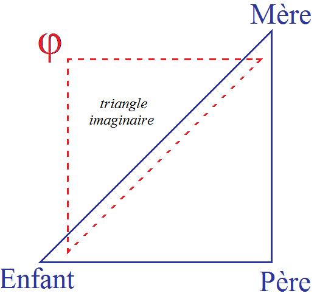
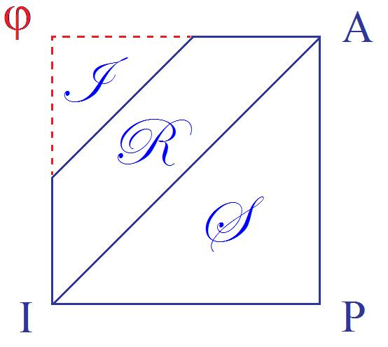
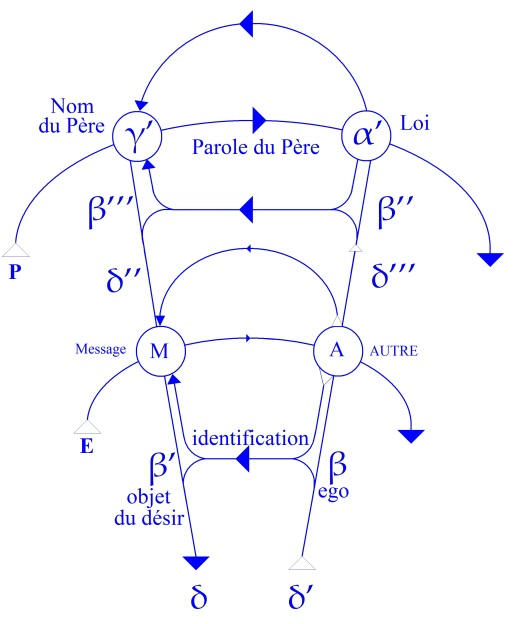
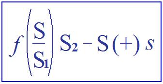
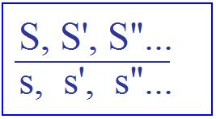
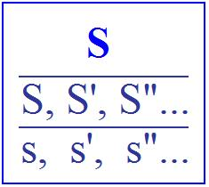

# Leçon 10 | 22 Janvier 1958

  <label><input type="checkbox" data-lacan-toggle="original" checked> 原文</label>
  <label><input type="checkbox" data-lacan-toggle="notes" checked> 注释</label>
  <label><input type="checkbox" data-lacan-toggle="commentary" checked> 个人解读评论</label>

<section class="parallel-paragraph" data-paragraph-ids="s5-10-0001">

s5-10-0001

[无对应译文]

原文 · s5-10-0001

Nous allons continuer notre examen de ce que nous avons appelé *la métaphore paternelle.*

</section>

<section class="parallel-paragraph" data-paragraph-ids="s5-10-0002">

s5-10-0002

[无对应译文]

原文 · s5-10-0002

Nous en sommes arrivés au point où j’ai affirmé que c’était dans cette structure, que nous avons ici promue
comme étant la structure de *la métaphore,* que résidaient toutes possibilités d’articuler clairement le *complexe d’Œdipe*
et son ressort, à savoir le *complexe de castration*.

</section>

<section class="parallel-paragraph" data-paragraph-ids="s5-10-0003">

s5-10-0003

[无对应译文]

原文 · s5-10-0003

À ceux qui pourraient s’étonner que nous arrivions si tard à articuler une question si centrale dans la théorie et dans la pratique analytique, nous répondrons qu’il était impossible de le faire sans vous avoir prouvé sur divers terrains,

</section>

<section class="parallel-paragraph" data-paragraph-ids="s5-10-0004">

s5-10-0004

[无对应译文]

原文 · s5-10-0004

tant théo­riques que pratiques, ce qu’ont d’insuffisant les formules dont on se sert couramment dans l’analyse,
et surtout sans vous avoir montré en quoi on peut donner des for­mules plus satisfaisantes, si je puis dire,

</section>

<section class="parallel-paragraph" data-paragraph-ids="s5-10-0005">

s5-10-0005

[无对应译文]

原文 · s5-10-0005

pour commencer à articuler les problèmes, d’abord en vous habituant à penser en termes, par exemple, de *sujet.*

</section>

<section class="parallel-paragraph" data-paragraph-ids="s5-10-0006">

s5-10-0006

[无对应译文]

原文 · s5-10-0006

Qu’est-ce qu’un *sujet* ? Est-ce que c’est quelque chose qui se confond purement et simplement avec la réalité
devant vous, quand vous dites : *le sujet* ? Ou bien est-ce qu’à partir du moment où vous le faites parler
cela implique nécessairement autre chose ? Je veux dire :

</section>

<section class="parallel-paragraph" data-paragraph-ids="s5-10-0007">

s5-10-0007

[无对应译文]

原文 · s5-10-0007

- est-ce que la parole est oui ou non quelque chose qui flotte au-dessus de lui comme une émanation,

</section>

<section class="parallel-paragraph" data-paragraph-ids="s5-10-0008">

s5-10-0008

[无对应译文]

原文 · s5-10-0008

- ou si elle développe par elle-même, si elle impose par elle-même une structure telle que celle que j’ai longuement commentée, à laquelle je vous ai habitués, et qui dit que dès lors qu’il y a sujet parlant, il ne saurait être question de réduire pour lui la question de ses relations en tant qu’il parle à un *autre*, tout simplement ?

</section>

<section class="parallel-paragraph" data-paragraph-ids="s5-10-0009">

s5-10-0009

[无对应译文]

原文 · s5-10-0009

Il y en a toujours un troisième, ce grand *Autre* dont nous parlons et qui est constituant de la position du sujet
en tant qu’il parle, c’est-à-dire aussi bien du sujet en tant que vous l’analysez. Ce qui n’est pas simplement
une nécessité théorique en plus : cela apporte toutes sortes de facilités quand il s’agit de comprendre où se situent
les effets auxquels vous avez affaire, je veux dire ce qui se passe quand vous rencontrez chez le patient, chez le *sujet,* l’exigence, les désirs, un fantasme, ce qui n’est pas la même chose, et aussi bien quelque chose qui paraît être
en somme le plus incertain, le plus difficile à saisir, à définir : une réalité.

</section>

<section class="parallel-paragraph" data-paragraph-ids="s5-10-0010">

s5-10-0010

[无对应译文]

原文 · s5-10-0010

Nous allons avoir l’occasion de le voir au point où nous nous avançons mainte­nant, pour expliquer comment

</section>

<section class="parallel-paragraph" data-paragraph-ids="s5-10-0011">

s5-10-0011

[无对应译文]

原文 · s5-10-0011

le terme de *métaphore paternelle,* c’est à savoir que dans ce qui a été constitué d’une symbolisation primordiale

</section>

<section class="parallel-paragraph" data-paragraph-ids="s5-10-0012">

s5-10-0012

[无对应译文]

原文 · s5-10-0012

entre l’en­fant et la mère, c’est proprement *la substitution du père en tant que symbole, en tant que signifiant, <u>à la place</u> de la mère*.
Et nous verrons ce que veut dire cet « *à la place* »  qui constitue le point pivot, le nerf moteur, si je puis dire,

</section>

<section class="parallel-paragraph" data-paragraph-ids="s5-10-0013">

s5-10-0013

[无对应译文]

原文 · s5-10-0013

l’essentiel du progrès consti­tué par le *complexe d’Œdipe*. Rappelons que c’est de cela qu’il s’agit.

</section>

<section class="parallel-paragraph" data-paragraph-ids="s5-10-0014">

s5-10-0014

[无对应译文]

原文 · s5-10-0014

Rappelons les termes que j’ai avancés devant vous l’année dernière concernant les rapports de l’enfant et de la mère.

</section>

<section class="parallel-paragraph" data-paragraph-ids="s5-10-0015">

s5-10-0015

[无对应译文]

原文 · s5-10-0015

 

</section>

<section class="parallel-paragraph" data-paragraph-ids="s5-10-0016">

s5-10-0016

[无对应译文]

原文 · s5-10-0016

Mais rappelons aussi et d’abord, en face de ce *triangle imaginaire* - que je vous ai appris l’an­née dernière à manier

</section>

<section class="parallel-paragraph" data-paragraph-ids="s5-10-0017">

s5-10-0017

[无对应译文]

原文 · s5-10-0017

en ce qui concerne les rapports de l’enfant et de la mère - rap­pelons en face de cela que d’admettre comme *fondamental* le triangle : *enfant, père, mère,* c’est apporter quelque chose, qui est réel sans doute, mais qui déjà pose dans le *réel* - j’entends comme institué - un *rapport symbolique* : le rapport *enfant, père, mère,* et si je puis dire, *objectivement* -
pour vous faire comprendre : en tant que nous pouvons, nous, en faire un objet, le regarder.

</section>

<section class="parallel-paragraph" data-paragraph-ids="s5-10-0018">

s5-10-0018

[无对应译文]

原文 · s5-10-0018

Les premiers rapports de réalité se dessinent entre la mère et l’enfant. C’est là que l’enfant va éprouver les premières réalités de son contact avec le milieu vivant : le triangle, en tant qu’il a cette réalité du seul fait que nous fassions entrer - pour com­mencer à dessiner *objectivement* la situation - que nous y fassions entrer le père. Le père n’y est pas encore entré pour l’enfant. Le père, d’autre part pour nous, il *est*, il est réel.

</section>

<section class="parallel-paragraph" data-paragraph-ids="s5-10-0019">

s5-10-0019

[无对应译文]

原文 · s5-10-0019

Mais n’oublions pas que pour nous il n’est réel qu’en tant que les institutions lui confèrent, je ne dirai même pas
son rôle et sa fonction de père - ce n’est pas une question sociologique - mais lui confèrent son *Nom de Père*.
Je veux dire qu’il faut admettre ceci : que le père, par exemple, est le véri­table agent de la procréation,

</section>

<section class="parallel-paragraph" data-paragraph-ids="s5-10-0020">

s5-10-0020

[无对应译文]

原文 · s5-10-0020

ce qui n’est en aucun cas une vérité d’expérience, car au temps où les analystes discutaient encore de choses sérieuses, il est arrivé qu’on fasse remarquer que dans telle ou telle tribu primitive la procréation était attribuée à je ne sais quoi, une fontaine, une pierre ou la rencontre d’un esprit dans des lieux écartés.

</section>

<section class="parallel-paragraph" data-paragraph-ids="s5-10-0021">

s5-10-0021

[无对应译文]

原文 · s5-10-0021

À quoi Monsieur JONES avait, avec beaucoup de pertinence d’ailleurs, apporté cette remarque : qu’il est tout à fait impensable que des *êtres intelligents*, et à tout être humain nous supposons son minimum de cette intelligence,
ignorent cette vérité d’expérience. Il est bien clair que, sauf exception, mais exception *exceptionnelle,*
une femme n’enfante pas si elle n’a pas eu un coït, et encore dans un délai très pré­cis. Mais en faisant cette remarque - qui je vous le répète, est *particulièrement* *perti­nente -* Monsieur Ernest JONES laissait simplement de côté *tout ce qui est important dans la question*. Car ce qui est important dans la question, ce n’est pas que les gens sachent par­faitement qu’une femme ne peut enfanter que quand elle a eu un coït, c’est qu’ils sanctionnent dans un signifiant,
que celui avec qui elle a eu le coït est « *le père »*.

</section>

<section class="parallel-paragraph" data-paragraph-ids="s5-10-0022">

s5-10-0022

[无对应译文]

原文 · s5-10-0022

Car autrement, tel qu’est constitué de sa nature *l’ordre du symbole*, le signifiant, abso­lument rien n’obvie à ce que, néanmoins, le quelque chose qui est responsable de la procréation ne continue à être maintenu dans le système symbolique comme iden­tique à n’importe quoi, ce que nous avons dit tout à l’heure, à savoir :
une pierre, une fontaine, ou la rencontre d’un esprit dans un lieu écarté.

</section>

<section class="parallel-paragraph" data-paragraph-ids="s5-10-0023">

s5-10-0023

[无对应译文]

原文 · s5-10-0023

La position du père comme *symbolique* est quelque chose qui ne dépend pas du fait que les gens aient plus ou moins reconnu la nécessité d’une certaine *consécution des événement*s aussi différents qu’*un coït* et *un enfantement*.
La position du *Nom du Père* comme tel - qualification du père comme procréa­teur - c’est une affaire qui se situe

</section>

<section class="parallel-paragraph" data-paragraph-ids="s5-10-0024">

s5-10-0024

[无对应译文]

原文 · s5-10-0024

au niveau *symbolique*, et qui peut être reliée selon les formes culturelles, car ceci ne dépend pas de la forme culturelle : c’est une néces­sité de *la chaîne signifiante* comme telle.

</section>

<section class="parallel-paragraph" data-paragraph-ids="s5-10-0025">

s5-10-0025

[无对应译文]

原文 · s5-10-0025

Du fait que vous instituez un *ordre symbolique*, *quelque chose répond* ou non *à cette fonction* définie par le *Nom du Père*,
et à l’intérieur de cette fonction, vous y mettez des significations qui peuvent être différentes selon les cas,
mais qui en aucun cas ne dépendent d’une autre néces­sité que de la nécessité de la fonction du père qu’occupe
le *Nom du Père* dans *la chaîne signifiante*. Je crois avoir déjà assez insisté là-dessus.

</section>

<section class="parallel-paragraph" data-paragraph-ids="s5-10-0026">

s5-10-0026

[无对应译文]

原文 · s5-10-0026

Voilà donc ce que nous pouvons appe­ler *le triangle symbolique* en tant qu’il est institué dans le *réel* à partir du moment où il y a une *chaîne signifiante*, où il y a articulation d’une *parole*. Je dis qu’il y a une relation entre ce *ternaire symbolique*
et le ternaire que nous avons ici amené l’année dernière sous la forme du *ternaire imaginaire* qui est lui,
de la relation de l’enfant à la mère en tant que l’enfant se trouve dépendre du désir de la mère,
de la première symbolisation de la mère comme telle, et rien d’autre que cela :

</section>

<section class="parallel-paragraph" data-paragraph-ids="s5-10-0027">

s5-10-0027

[无对应译文]

原文 · s5-10-0027

- à savoir qu’il détache sa dépendance effective de son désir, du pur et simple vécu de cette dépendance,

</section>

<section class="parallel-paragraph" data-paragraph-ids="s5-10-0028">

s5-10-0028

[无对应译文]

原文 · s5-10-0028

- à savoir que *par cette symbolisation quelque chose est institué*, qui est subjectivé à un niveau premier, primitif.

</section>

<section class="parallel-paragraph" data-paragraph-ids="s5-10-0029">

s5-10-0029

[无对应译文]

原文 · s5-10-0029

Cette subjectivation consiste sim­plement à la poser comme cet être primordial qui peut *être là*, ou *n’être pas là*.

</section>

<section class="parallel-paragraph" data-paragraph-ids="s5-10-0030">

s5-10-0030

[无对应译文]

原文 · s5-10-0030

Donc le désir, le désir de lui, de cet être, est essentiel. Ce qui fait que ce que le sujet désire, ce n’est pas simplement l’appétition de ses soins, de son contact, voire de sa présence, c’est l’appétition de son désir.

</section>

<section class="parallel-paragraph" data-paragraph-ids="s5-10-0031">

s5-10-0031

[无对应译文]

原文 · s5-10-0031

Dans cette première *symbolisation*, le désir de l’enfant s’affirme, amorce toutes complications ultérieures
de la *symbolisation* en ceci qu’*il est désir du désir de la mère* et que de ce fait quelque chose s’ouvre par quoi virtuellement ce que la mère désire objectivement elle-même en tant qu’être qui vit dans *le monde du* *symbole*, dans un monde où
le *symbole* est présent, dans *un monde parlant*, et même si elle n’y vit que tout à fait partiellement, si elle est elle-même, comme il arrive, un être mal adapté à *ce monde du symbole* ou qui en a refusé certains éléments, elle ouvre quand même à l’enfant, à partir de cette *symbolisation primordiale*, cette dimension : ce que, même sur *le plan imaginaire*, la mère peut, comme on dit, désirer d’autre sur *le plan imaginaire*.

</section>

<section class="parallel-paragraph" data-paragraph-ids="s5-10-0032">

s5-10-0032

[无对应译文]

原文 · s5-10-0032

C’est ainsi qu’entre d’une façon encore confuse et toute virtuelle ce *désir d’autre chose* dont je parlais l’autre jour,
mais non pas d’une façon en quelque sorte substantielle et telle que nous puissions le reconnaître,
comme nous l’avons fait dans le dernier séminaire, dans toute sa généralité, mais d’une façon concrète
il y a chez elle *le désir d’autre chose* que de *satisfaire* - à moi qui commence à palpiter à la vie - mon désir.
Et dans cette voie, il y a à la fois *accès* et *pas accès*.

</section>

<section class="parallel-paragraph" data-paragraph-ids="s5-10-0033">

s5-10-0033

[无对应译文]

原文 · s5-10-0033

Comment concevoir qu’en quelque sorte, dans ce rapport de mirage par quoi l’être premier lit ou devance
la satisfaction de ses désirs dans les mouvements ébauchés de l’autre, dans cette adap­tation duelle de l’image

</section>

<section class="parallel-paragraph" data-paragraph-ids="s5-10-0034">

s5-10-0034

[无对应译文]

原文 · s5-10-0034

à l’image, qui se fait en toutes relations inter-animales, com­ment concevoir que puisse être lu - *comme dans un miroir*, comme s’exprime l’Écri­ture - ce que le sujet désire d’autre ?

</section>

<section class="parallel-paragraph" data-paragraph-ids="s5-10-0035">

s5-10-0035

[无对应译文]

原文 · s5-10-0035

Assurément, c’est à la fois difficilement pensable et trop difficilement effectué, car c’est bien là tout le drame
de ce qui arrive à ce certain niveau d’aiguillage du niveau primitif qui s’appelle les perversions.
C’est difficilement effectué, en ce sens que c’est effectué d’une façon fautive, mais c’est effectué tout de même.

</section>

<section class="parallel-paragraph" data-paragraph-ids="s5-10-0036">

s5-10-0036

[无对应译文]

原文 · s5-10-0036

C’est effec­tué, certainement pas sans l’intervention *d’un peu plus que* *la symbolisation ne suffit à constituer*…
la *symbolisation primordiale* de cette mère qui « *va et vient* », qu’on appelle quand elle n’est pas là,
et que - comme telle - quand elle est là, on repousse pour pouvoir la rappeler,
…il faut qu’il y ait *quelque chose de plus*.

</section>

<section class="parallel-paragraph" data-paragraph-ids="s5-10-0037">

s5-10-0037

[无对应译文]

原文 · s5-10-0037

Ce *quelque chose de plus* c’est précisément l’existence *derrière elle* de tout *cet ordre symbolique* dont elle dépend et qui,
comme il est toujours plus ou moins là, permet ce certain accès à cet objet - son désir - qui est déjà un objet tellement spécialisé, tellement marqué de la nécessité instaurée par *le système symbolique* qu’il est absolument impensable autrement, dans sa prévalence, et qui s’appelle *le phallus*, ce *phal­lus* autour duquel j’ai fait tourner toute notre *dialectique* de la relation d’objet l’an­née dernière.

</section>

<section class="parallel-paragraph" data-paragraph-ids="s5-10-0038">

s5-10-0038

[无对应译文]

原文 · s5-10-0038

Pourquoi ? Pourquoi cet objet privilégié, si ce n’est pas pour quelque chose qui le nécessite là, à sa place,
en tant qu’il est privilégié dans l’*ordre symbolique* ? C’est dans cela que nous voulons entrer maintenant plus en détail,
et que nous allons voir comment, non pas simplement par un simple rapport de *symétrie*, celui qui s’ex­plique

</section>

<section class="parallel-paragraph" data-paragraph-ids="s5-10-0039">

s5-10-0039

[无对应译文]

原文 · s5-10-0039

dans ce dessin et qui fait :

</section>

<section class="parallel-paragraph" data-paragraph-ids="s5-10-0040">

s5-10-0040

[无对应译文]

原文 · s5-10-0040

- qu’ici \[ϕ\] *le phallus* est au point sommet du ternaire *imaginaire*,

</section>

<section class="parallel-paragraph" data-paragraph-ids="s5-10-0041">

s5-10-0041

[无对应译文]

原文 · s5-10-0041

- de même qu’ici « *Père* » est au point sommet du ternaire *symbolique*

</section>

<section class="parallel-paragraph" data-paragraph-ids="s5-10-0042">

s5-10-0042

[无对应译文]

原文 · s5-10-0042

</section>

<section class="parallel-paragraph" data-paragraph-ids="s5-10-0043">

s5-10-0043

[无对应译文]

原文 · s5-10-0043

…comment il se fait qu’il y ait entre les deux, cette liaison, et comment il se fait que je puisse vous avancer déjà
que cette liaison est *d’ordre métaphorique.* Eh bien, c’est justement ce qui nous entraîne à l’intérieur de la dialectique
du *complexe d’Œdipe*. C’est dans le *complexe d’Œdipe* que nous pouvons nous en rendre compte, je veux dire essayer *d’articuler pas à pas*. Et c’est ce que FREUD fait et que d’autres ont fait après lui, et c’est ce qui, là-dedans,
n’est pas toujours tout à fait *clair* ni tout à fait clairement *sym­bolisé :* essayer de pousser pour vous plus loin,

</section>

<section class="parallel-paragraph" data-paragraph-ids="s5-10-0044">

s5-10-0044

[无对应译文]

原文 · s5-10-0044

non pas simplement pour la satis­faction de notre esprit, mais parce que :

</section>

<section class="parallel-paragraph" data-paragraph-ids="s5-10-0045">

s5-10-0045

[无对应译文]

原文 · s5-10-0045

- si nous articulons pas à pas cette genèse qui fait que *la position du signifiant du père dans le symbole est <u>fondatrice </u>* *de la position du phallus dans le plan imaginaire*,

</section>

<section class="parallel-paragraph" data-paragraph-ids="s5-10-0046">

s5-10-0046

[无对应译文]

原文 · s5-10-0046

- si cela exige une, deux, trois étapes, aux temps si l’on peut dire *logiques* de *la constitution de ce phallus dans le plan imaginaire* comme objet privilégié prévalent,

</section>

<section class="parallel-paragraph" data-paragraph-ids="s5-10-0047">

s5-10-0047

[无对应译文]

原文 · s5-10-0047

- si ces temps sont clairement distingués et si de leur dis­tinction résulte que nous pouvons nous orienter mieux, interroger mieux, et le malade dans l’examen, et le sens de la clinique, et la conduite de la cure,

</section>

<section class="parallel-paragraph" data-paragraph-ids="s5-10-0048">

s5-10-0048

[无对应译文]

原文 · s5-10-0048

…alors ceci jus­tifiera nos efforts.

</section>

<section class="parallel-paragraph" data-paragraph-ids="s5-10-0049">

s5-10-0049

[无对应译文]

原文 · s5-10-0049

Et il nous semble qu’étant donné les difficultés que nous rencontrons, précisément *dans la clinique, dans l’interrogatoire, dans l’examen et dans la manœuvre théra­peutique*, ces efforts sont d’ores et déjà, et d’avance, justifiés. Observons ce désir
de l’Autre qui est le désir de la mère, qui comporte cet au-delà. Nous disons que *pour atteindre cet au-delà*,
et déjà rien que pour atteindre cet au-delà de la mère, désir de la mère comme tel, *une médiation est nécessaire*,
et que cette médiation est précisément donnée par *la position du père dans l’ordre symbolique*.

</section>

<section class="parallel-paragraph" data-paragraph-ids="s5-10-0050">

s5-10-0050

[无对应译文]

原文 · s5-10-0050

Plutôt que de procéder dogmatiquement nous-mêmes, interrogeons-nous sur la façon dont, pour nous, la question dans le concret se pose. Nous voyons qu’il y a des états, des cas, des étapes aussi dans des états très différents,
où l’enfant s’identifie au *phallus*.

</section>

<section class="parallel-paragraph" data-paragraph-ids="s5-10-0051">

s5-10-0051

[无对应译文]

原文 · s5-10-0051

Ça a été tout l’objet du chemin que nous avons parcouru l’année dernière : nous avons montré dans le fétichisme
une perversion exemplaire en ce sens que là, l’enfant a un certain rapport avec cet objet de *l’au-delà du désir de la mère* en ayant remarqué la prévalence et la valeur d’excellence, si l’on peut dire, qui s’y attache par la voie, en somme,
d’une *identification imaginaire* à la mère.

</section>

<section class="parallel-paragraph" data-paragraph-ids="s5-10-0052">

s5-10-0052

[无对应译文]

原文 · s5-10-0052

Nous avons vu, indi­qué aussi, que dans d’autres formes de perversion, et notamment le travestisme,
c’est dans la position contraire que l’enfant va assumer la difficulté de *la relation ima­ginaire à la mère*,

</section>

<section class="parallel-paragraph" data-paragraph-ids="s5-10-0053">

s5-10-0053

[无对应译文]

原文 · s5-10-0053

à savoir que lui-même s’identifie, dit-on, à *la mère phallée.* Je crois que, plus correctement, il faut dire que
c’est proprement au *phallus* qu’il s’identifie, en tant que ce *phallus* est caché sous les vêtements de la mère.
Je vous rappelle ceci pour vous montrer que cette relation de l’enfant au *phallus* est essentielle tant que le *phallus*
est objet du désir de la mère. Aussi bien l’expérience nous prouve-t-elle que cet élément joue un rôle actif essentiel dans les rapports que l’enfant a avec le couple parental.

</section>

<section class="parallel-paragraph" data-paragraph-ids="s5-10-0054">

s5-10-0054

[无对应译文]

原文 · s5-10-0054

Déjà la dernière fois nous l’avons rappelé sur le plan théorique dans l’exposé du *déclin du complexe d’Œdipe*
par rapport à *l’œdipe* que l’on appelle *inversé*. FREUD nous souligne les cas où, pour s’identifier à la mère, je veux dire dans la mesure où il s’identifie à la mère, l’enfant, ayant adopté cette posi­tion à la fois significative et prometteuse, redoute la conséquence, donc la privation qui en résultera pour lui - si c’est un garçon - de son organe viril.
C’est une voie d’indication, mais qui va beaucoup plus loin. L’expérience nous prouve que le père, considéré en tant qu’il prive la mère de cet *objet* - nommément de *l’objet phallique* - *de son désir,* joue un rôle tout à fait essentiel dans,
je ne dirai pas *les perversions*, mais dans toute *névrose*, et je dirai dans tout le cours, fut-il le plus aisé, le plus normal,
du *complexe d’Œdipe*.

</section>

<section class="parallel-paragraph" data-paragraph-ids="s5-10-0055">

s5-10-0055

[无对应译文]

原文 · s5-10-0055

Vous trouverez, à l’expérience, dans l’analyse, que le sujet a pris position d’une certaine façon
à un moment de son enfance sur ce point, sur ce point du rôle du père dans le fait que *la mère n’a pas le phallus*.
Ce moment n’est jamais élidé. Ce moment qui est celui qui, dans notre rap­pel de la dernière fois, laissait ouverte

</section>

<section class="parallel-paragraph" data-paragraph-ids="s5-10-0056">

s5-10-0056

[无对应译文]

原文 · s5-10-0056

la question de l’issue favorable ou défavorable de l’œdipe, suspendue autour des trois plans, de *la castration*,
de *la frustration* et de *la privation* exercées par le père.

</section>

<section class="parallel-paragraph" data-paragraph-ids="s5-10-0057">

s5-10-0057

[无对应译文]

原文 · s5-10-0057

C’était au niveau tiers, celui qui à la fois nous posait la question, parce qu’il est celui auquel il est le plus difficile
de comprendre quelque chose, et celui dans lequel pourtant on nous dit qu’est toute la clé de l’œdipe,
à savoir son issue, à savoir finalement l’identification de l’enfant au père.

</section>

<section class="parallel-paragraph" data-paragraph-ids="s5-10-0058">

s5-10-0058

[无对应译文]

原文 · s5-10-0058

Ce niveau, c’est celui du père qui prive quelqu’un de ce qu’il n’a pas, en fin de compte, c’est-à-dire le prive
de quelque chose qui n’a d’existence que pour autant que vous le faites surgir à l’existence *en tant que symbole*.
Il est bien clair que le père ne châtre pas la mère *de quelque chose qu’elle n’a pas*. Pour qu’il soit posé qu’elle ne l’ait pas,
il faut que déjà ce dont il s’agit soit projeté sur *le plan symbolique* *en tant que symbole*.

</section>

<section class="parallel-paragraph" data-paragraph-ids="s5-10-0059">

s5-10-0059

[无对应译文]

原文 · s5-10-0059

Mais c’est une *privation* bel et bien, et toute *privation réelle* est quelque chose qui nécessite la *symbolisation* de ce qui est patent et privé. C’est donc sur le plan de *la privation* de la mère qu’une question, à un moment donné de l’évolution de l’œdipe, se pose pour le sujet : d’accepter, d’enregistrer, de *symboliser* lui-même, de *rendre signifiante* cette *privation réelle* dont la mère s’avère être l’objet. Cette *privation*, le sujet enfantin *l’assume* ou ne *l’assume pas,* l’ac­cepte ou la refuse.

</section>

<section class="parallel-paragraph" data-paragraph-ids="s5-10-0060">

s5-10-0060

[无对应译文]

原文 · s5-10-0060

Ce point est essentiel : vous le retrouverez à tous les carrefours chaque fois que votre expérience vous amènera
en un certain point que nous essayons maintenant de définir comme nodal dans l’œdipe. Appelons-le *point nodal,* puisque cela vient de me venir. Je n’y tiens pas essen­tiellement, je veux dire par là qu’il ne coïncide pas, loin de là, avec ce moment dont nous cherchons la clé, qui est le déclin de l’œdipe, son résultat, son fruit, dans le sujet.

</section>

<section class="parallel-paragraph" data-paragraph-ids="s5-10-0061">

s5-10-0061

[无对应译文]

原文 · s5-10-0061

Mais il y a un moment où le père entre en fonction comme privateur de la mère c’est-à-dire se profile derrière
ce rapport de la mère à l’objet de son désir comme quelque chose, si vous voulez, qui « châtre », mais je ne le mets là qu’entre guillemets, parce que ce qui est châtré, dans l’occasion, ce n’est pas le sujet, c’est la mère. Ce point n’est pas très nouveau. Ce qui est nouveau, c’est de le pointer précisé­ment, c’est de tourner vos regards vers ce point en tant qu’il nous permet de com­prendre de là *ce qui précède*, sur quoi nous avons déjà quelques lumières, et *ce qui va suivre*.

</section>

<section class="parallel-paragraph" data-paragraph-ids="s5-10-0062">

s5-10-0062

[无对应译文]

原文 · s5-10-0062

L’expérience - en tout cas, n’en doutez pas, et vous pourrez le contrôler, le confir­mer, chaque fois que vous aurez l’occasion de le voir - l’expérience prouve que dans la mesure où le sujet ne franchit pas ce *point nodal*,
c’est-à-dire n’accepte pas cette *privation du phallus* sur la mère opérée par le père, on observe que c’est *dans la règle…*
je souligne ce « *dans la règle* » parce que là, il n’a pas simplement une importance de cor­rélation ordinaire, mais de *corrélation fondée dans la structure*

</section>

<section class="parallel-paragraph" data-paragraph-ids="s5-10-0063">

s5-10-0063

[无对应译文]

原文 · s5-10-0063

…c’est dans toute la mesure où l’enfant *maintient* pour lui–même une certaine forme d’*identification*…

</section>

<section class="parallel-paragraph" data-paragraph-ids="s5-10-0064">

s5-10-0064

[无对应译文]

原文 · s5-10-0064

- à cet objet de la mère,

</section>

<section class="parallel-paragraph" data-paragraph-ids="s5-10-0065">

s5-10-0065

[无对应译文]

原文 · s5-10-0065

- à cet objet que je vous représente depuis l’origine, pour employer le mot qui surgit là, comme *objet rival* si l’on peut dire,
  …que - de quelque façon - toujours, qu’il s’agisse *de phobie, de névrose ou de perversion*, vous toucherez un lien.

</section>

<section class="parallel-paragraph" data-paragraph-ids="s5-10-0066">

s5-10-0066

[无对应译文]

原文 · s5-10-0066

C’est un point de repère : il n’y a peut-être pas de meilleur mot autour de quoi vous pourrez regrouper les éléments de l’observation à partir de cette question que vous vous poserez dans le cas particulier :

</section>

<section class="parallel-paragraph" data-paragraph-ids="s5-10-0067">

s5-10-0067

[无对应译文]

原文 · s5-10-0067

- quelle est la configuration spéciale de *ce rapport à la mère, au père et au phallus* qui fait que l’enfant n’accepte pas que la mère soit privée par le père de quelque chose qui est l’objet de son désir ?

</section>

<section class="parallel-paragraph" data-paragraph-ids="s5-10-0068">

s5-10-0068

[无对应译文]

原文 · s5-10-0068

- Et dans quelle mesure, dans quel cas, faut-il pointer qu’en corrélation avec cette relation, lui, l’enfant, *maintient son identification au phallus* ?

</section>

<section class="parallel-paragraph" data-paragraph-ids="s5-10-0069">

s5-10-0069

[无对应译文]

原文 · s5-10-0069

Il y a des degrés, bien entendu. Cette relation n’est pas la même *dans* *la névrose* ou *dans la psychose* que *dans la perversion*.
Mais cette configuration est nodale, vous le voyez. À ce niveau, la question qui se pose est :

</section>

<section class="parallel-paragraph" data-paragraph-ids="s5-10-0070">

s5-10-0070

[无对应译文]

原文 · s5-10-0070

« *Être ou ne pas être - « To be or not to be* » *- le phallus ?* »

</section>

<section class="parallel-paragraph" data-paragraph-ids="s5-10-0071">

s5-10-0071

[无对应译文]

原文 · s5-10-0071

Sur *le plan imaginaire*, il s’agit pour le sujet d’*être* ou de *n’être pas le phallus* et la phase qui est à traverser est ceci :
le sujet « choisira » à un moment. Quand je dis « *choisira* », mettez ce *choisira* aussi entre guillemets, car bien entendu, le sujet est là aussi passif qu’il est actif, pour la bonne raison que ce n’est pas lui qui tire les ficelles du symbolique :
*la phrase* a été commencée avant lui, a été commen­cée précisément par ses parents.

</section>

<section class="parallel-paragraph" data-paragraph-ids="s5-10-0072">

s5-10-0072

[无对应译文]

原文 · s5-10-0072

Ce à quoi je vais vous amener c’est précisément au rapport de chacun de ses parents à cette *phrase* commencée
et à la façon dont il convient que *la phrase* soit soutenue par une certaine position réciproque de ses parents
par rapport à cette *phrase*. Mais disons - parce qu’il faut *bien* s’exprimer - qu’il y a là, si vous voulez *au neutre*,
*une alternative* : « *Être ou n’être pas ce phallus* ».

</section>

<section class="parallel-paragraph" data-paragraph-ids="s5-10-0073">

s5-10-0073

[无对应译文]

原文 · s5-10-0073

Vous sentez bien qu’il y a un pas consi­dérable à franchir pour comprendre simplement ce dont il s’agit
entre cet « *Être ou n’être pas ce phallus* » et ce dont il s’agit à un moment quelconque - il faut tout de même bien *l’attendre* et *le trouver* - qui est complètement différent qui est « *en avoir ou pas* », comme on dit aussi, pour se fonder
sur une autre citation littéraire, autrement dit : avoir ou ne pas avoir le pénis. Ce n’est pas la même chose, il faut que quelque chose ait été franchi entre l’un et l’autre, et ne l’oublions pas : ce dont il s’agit dans *le complexe de castration*
c’est ce quelque chose qui n’est jamais articulé, qui se fait presque complètement mysté­rieux.

</section>

<section class="parallel-paragraph" data-paragraph-ids="s5-10-0074">

s5-10-0074

[无对应译文]

原文 · s5-10-0074

Car nous savons que c’est du *complexe de castration* que dépendent ces deux faits :

</section>

<section class="parallel-paragraph" data-paragraph-ids="s5-10-0075">

s5-10-0075

[无对应译文]

原文 · s5-10-0075

- que d’un côté, le garçon devienne un homme,

</section>

<section class="parallel-paragraph" data-paragraph-ids="s5-10-0076">

s5-10-0076

[无对应译文]

原文 · s5-10-0076

- de l’autre côté la fille devienne une femme.
  Mais cette question d’en avoir ou de ne pas en avoir est réglée - même pour celui qui, à la fin, est en droit de l’avoir, c’est-à-dire l’homme - par l’intermé­diaire de quelque chose qui s’appelle *complexe de castration,* par conséquent

</section>

<section class="parallel-paragraph" data-paragraph-ids="s5-10-0077">

s5-10-0077

[无对应译文]

原文 · s5-10-0077

qui sup­pose que pour l’avoir, il faut qu’il y ait un moment où il ne l’ait pas eu. C’est-à-dire qu’on ne l’appellerait pas « *complexe de castration »* si d’une certaine façon ça ne met­tait pas au premier plan ceci : que pour l’avoir, il faut d’abord qu’il ait été posé qu’on peut ne pas l’avoir, que cette possibilité d’être castré est essentielle dans l’assomption du fait de l’avoir, le *phallus*. C’est là ce pas qui est à franchir. C’est là que doit intervenir à quelque moment, efficacement, réellement, effectivement, le père.

</section>

<section class="parallel-paragraph" data-paragraph-ids="s5-10-0078">

s5-10-0078

[无对应译文]

原文 · s5-10-0078

Car vous voyez que jusqu’à présent j’ai pu - le fil même de mon discours l’indiquait - j’ai pu ne vous parler des choses qu’à partir du *sujet* : il accepte ou il n’accepte pas. Dans la mesure où il n’accepte pas ça l’entraîne, homme ou femme, à *être le phallus* \[de la mère\]. Mais maintenant pour le pas suivant, il est essentiel de faire intervenir effective­ment le père.

</section>

<section class="parallel-paragraph" data-paragraph-ids="s5-10-0079">

s5-10-0079

[无对应译文]

原文 · s5-10-0079

Je ne dis pas qu’il n’intervient pas déjà effectivement avant, mais que mon discours jusqu’à présent a pu le laisser
au deuxième plan, voire s’en passer alors qu’à partir de maintenant, où il s’agit de *l’avoir* ou de *ne pas l’avoir,*

</section>

<section class="parallel-paragraph" data-paragraph-ids="s5-10-0080">

s5-10-0080

[无对应译文]

原文 · s5-10-0080

nous sommes for­cés de faire entrer en ligne de compte, « Lui ». « Lui », il faut d’abord - je vous le sou­ligne -

</section>

<section class="parallel-paragraph" data-paragraph-ids="s5-10-0081">

s5-10-0081

[无对应译文]

原文 · s5-10-0081

qu’il soit, en dehors du sujet, constitué comme *symbole*. Car s’il n’est pas en dehors du sujet constitué comme *symbole*, personne ne va pouvoir intervenir réel­lement comme revêtu de ce *symbole*.

</section>

<section class="parallel-paragraph" data-paragraph-ids="s5-10-0082">

s5-10-0082

[无对应译文]

原文 · s5-10-0082

Mais c’est comme *personnage réel* en tant que *revêtu de ce symbole* qu’il va intervenir maintenant effectivement à l’étape suivante. C’est là que se situent dans l’instance du *Père réel* les *différentes phases* sous les­quelles nous avons évoqué la dernière fois le *Père réel*, pour autant qu’il peut porter une interdiction. Nous avons fait remarquer que pour ce qui est, par exemple, d’in­terdire les premières manifestations de l’instinct sexuel, qui commence à venir à sa première maturité chez le sujet les premières fois où le sujet fait état de son instru­ment, voire l’exhibe, en offre à la mère

</section>

<section class="parallel-paragraph" data-paragraph-ids="s5-10-0083">

s5-10-0083

[无对应译文]

原文 · s5-10-0083

les bons offices, nous n’avons nul besoin pour ceci du père.

</section>

<section class="parallel-paragraph" data-paragraph-ids="s5-10-0084">

s5-10-0084

[无对应译文]

原文 · s5-10-0084

Je dirai même plus sur ce point : ce qui se passe habituellement…
qui est quelque chose d’encore très proche de *l’identification imaginaire*,
à savoir que le sujet se montre à la mère, lui fait des offres
…la plupart du temps ce qui se passe, c’est quelque chose qui, comme nous l’avons vu l’année dernière
à propos du petit Hans, se passe sur le plan de la comparaison, de la dépréciation imaginaire.

</section>

<section class="parallel-paragraph" data-paragraph-ids="s5-10-0085">

s5-10-0085

[无对应译文]

原文 · s5-10-0085

La mère suffit bien à montrer à l’enfant combien ce qu’il lui offre, *c’est insuffisant*, elle suffit aussi à faire l’interdiction de l’usage du nouvel instrument. Le père entre en jeu, c’est bien certain, comme *porteur de la Loi*,
comme interdicteur de l’objet qui est la mère.

</section>

<section class="parallel-paragraph" data-paragraph-ids="s5-10-0086">

s5-10-0086

[无对应译文]

原文 · s5-10-0086

Ceci, nous le savons, est fondamental, mais c’est tout à fait en dehors de la question telle qu’elle est effectivement mise en jeu avec l’en­fant. Nous savons que *la fonction du père* - le *Nom du Père* - est liée à *l’interdiction de l’inceste*,
mais personne n’a jamais songé à mettre au premier plan du *complexe de castration* le fait que le père, effectivement *<u>promulgue</u> la Loi de l’interdiction de l’inceste*. On le dit quelquefois, mais *jamais ce n’est articulé par le père,* si je puis dire,
*en tant que législateur « ex cathedra »* : il fait obstacle entre l’enfant et la mère, il est le por­teur de la Loi, si je puis dire

</section>

<section class="parallel-paragraph" data-paragraph-ids="s5-10-0087">

s5-10-0087

[无对应译文]

原文 · s5-10-0087

*en droit,* mais dans le fait *il intervient autrement*, et je dirai que *c’est autrement aussi que se manifestent ses manques à intervenir*.

</section>

<section class="parallel-paragraph" data-paragraph-ids="s5-10-0088">

s5-10-0088

[无对应译文]

原文 · s5-10-0088

C’est cela que nous serrons de près. En d’autres termes *le père* en tant qu’il est le porteur - culturellement - de la Loi,
*le père* en tant qu’il est *investi par le signifiant du père*, inter­vient dans le *complexe d’Œdipe* d’une façon plus concrète, plus échelonnée si je puis dire, et qu’il s’agit maintenant d’articuler et qui est ce que nous voulons articuler aujourd’hui.
Et c’est ici qu’il s’avère que la non utilité du petit *schéma* que je vous ai com­menté pendant le premier trimestre,

</section>

<section class="parallel-paragraph" data-paragraph-ids="s5-10-0089">

s5-10-0089

[无对应译文]

原文 · s5-10-0089

pour la plus grande lassitude, semble-t-il, de cer­tains, ne semble pas pourtant devoir être complètement *inutile*.

</section>

<section class="parallel-paragraph" data-paragraph-ids="s5-10-0090">

s5-10-0090

[无对应译文]

原文 · s5-10-0090

</section>

<section class="parallel-paragraph" data-paragraph-ids="s5-10-0091">

s5-10-0091

[无对应译文]

原文 · s5-10-0091

Je vous rappelle ce à quoi il faut toujours revenir : que c’est parce que et en tant que *l’intention*…
je veux dire *le désir passé à l’état de demande chez le sujet*
*…*a traversé quelque chose qui *d’ores et déjà* est constitué : à savoir que pour ce à quoi il s’adresse…
nommément son *objet*, son *objet primordial* : la mère …le désir est quelque chose qui s’articule.
Et en quelque manière, tout son progrès, toute son entrée dans ce monde-ci…
ce *bas-monde* qui n’est pas simplement *un monde,* au sens qu’on peut y trouver à saturer ses besoins,
mais *un monde où règne la parole*
…c’est qu’il soumet le désir de chacun à la loi du désir de l’Autre, mais de ce seul fait, et en tant :

</section>

<section class="parallel-paragraph" data-paragraph-ids="s5-10-0092">

s5-10-0092

[无对应译文]

原文 · s5-10-0092

- qu’il franchit plus ou moins heureuse­ment cette ligne de *la chaîne signifiante*, en tant qu’elle est là *latente* et déjà *structurante,*

</section>

<section class="parallel-paragraph" data-paragraph-ids="s5-10-0093">

s5-10-0093

[无对应译文]

原文 · s5-10-0093

- que la demande du jeune sujet, de la première épreuve qu’il fait de sa relation au premier Autre, *la mère* en tant qu’il l’a déjà *sym­bolisée*.

</section>

<section class="parallel-paragraph" data-paragraph-ids="s5-10-0094">

s5-10-0094

[无对应译文]

原文 · s5-10-0094

C’est en tant qu’il l’a déjà *symbolisée*, qu’il s’adresse à elle d’une façon qui peut être plus ou moins vagissante, mais qui est déjà articulée car cette première *symbolisation* est liée aux premières *articulations*. C’est donc en tant
que cette intention, cette demande a traversé *la chaîne signifiante* qu’elle peut se faire valoir auprès de l’objet maternel.
Dans cette mesure l’enfant, qui a constitué sa mère comme *sujet* par fondement de la première *symbolisation* elle-même, se trouve entièrement soumis à ce que nous pouvons appeler, mais uniquement par anticipation, *la Loi,*
mais ce n’est qu’*une métaphore* : je veux dire qu’*il faut déplier la métaphore* qu’il y a dans ce terme, *la Loi*,
pour donner sa vraie position à ce terme au moment où je l’emploie. *La loi de la mère*, c’est bien entendu le fait
que la mère est un être parlant, et cela suffit à légitimer que je dise *la loi de la mère.*

</section>

<section class="parallel-paragraph" data-paragraph-ids="s5-10-0095">

s5-10-0095

[无对应译文]

原文 · s5-10-0095

Néanmoins cette *loi* est si je puis dire, une *loi incontrôlée*. Cette loi est aussi bien, en tout cas pour le sujet, simplement le fait qu’il y a loi, c’est-à-dire que quelque chose de son désir est complètement dépen­dant de quelque chose qui, sans aucun doute, déjà *s’articule*, à savoir, comme tel, est de l’ordre de *la Loi*.

</section>

<section class="parallel-paragraph" data-paragraph-ids="s5-10-0096">

s5-10-0096

[无对应译文]

原文 · s5-10-0096

Mais cette loi est tout entière dans le sujet qui la supporte, à savoir dans le bon ou le mauvais vouloir de la mère,
la bonne ou la mauvaise mère. Et c’est ce qui fait que je vous propose ce *terme nouveau* qui, vous allez voir,
*n’est pas si nouveau que ça*, il suffit de le pousser un petit peu pour lui faire retrouver quelque chose
que la langue n’a pas trouvé par hasard.

</section>

<section class="parallel-paragraph" data-paragraph-ids="s5-10-0097">

s5-10-0097

[无对应译文]

原文 · s5-10-0097

Le *principe* que nous avan­çons ici, c’est *qu’il n’y a pas de sujet s’il n’y a pas de signifiant qui le fonde*. C’est dans la mesure
où il y a eu ces premières symbolisations constituées par le couple signifiant - le premier sujet et la mère -
qu’il faut savoir ce que ceci veut dire par rapport à des termes : *réalité ou pas réalité* au début de la vie de l’enfant,
*auto-érotisme ou pas auto-érotisme.*

</section>

<section class="parallel-paragraph" data-paragraph-ids="s5-10-0098">

s5-10-0098

[无对应译文]

原文 · s5-10-0098

Vous verrez les choses se clarifier singulièrement à partir du moment où vous poserez des questions par rapport à
ce *sujet*, l’enfant, celui d’où émane la demande, celui où se forme le désir. *Et toute l’analyse est une dialectique du désir*.
L’enfant s’ébauche, s’ébauche comme « *assujet* ». C’est un « *assujet* » parce qu’il s’éprouve et se sent d’abord
comme profondément *assujetti au caprice* de ce dont il dépend, même si ce caprice est un caprice articulé.

</section>

<section class="parallel-paragraph" data-paragraph-ids="s5-10-0099">

s5-10-0099

[无对应译文]

原文 · s5-10-0099

Ce que je vous avance est *nécessité dans toute notre expérience*. Par exemple, je prends *le pre­mier exemple* qui me vient à l’esprit : vous avez pu voir l’année dernière que ce petit Hans qui trouve une issue si *atypique* à son œdipe…
c’est-à-dire justement qui ne trouve pas l’issue que nous allons essayer maintenant de désigner, qui ne trouve qu’une suppléance, à qui il faut *ce cheval à tout faire* pour se servir de tout ce qui va manquer pour lui dans ce moment de *franchissement* qui est l’étape proprement de *l’assomption du symbolique* comme *complexe d’Œdipe* où je vous mène aujour­d’hui

</section>

<section class="parallel-paragraph" data-paragraph-ids="s5-10-0100">

s5-10-0100

[无对应译文]

原文 · s5-10-0100

…qui supplée donc par ce cheval qui est à la fois *le père, le phallus, la petite sœur*, tout ce qu’on veut,
mais qui est essentiellement quelque chose qui, justement, correspond à ce que je vais vous montrer maintenant.

</section>

<section class="parallel-paragraph" data-paragraph-ids="s5-10-0101">

s5-10-0101

[无对应译文]

原文 · s5-10-0101

Rappelez-vous comment il en sort et comment c’est symbolisé dans le dernier rêve. *Ce qu’il appelle à la place du père,*
*à savoir cet être imaginaire et tout puissant qui s’appelle le plombier.* Ce *plombier* est là, justement, pour *désassujettir quelque chose*.
Car l’angoisse du petit Hans, c’est essentiellement, je vous l’ai dit, *l’angoisse de cet assujettissement*, pour autant que,
littéralement, à partir d’un certain moment, il réalise qu’à être ainsi assujetti, on ne sait pas où ça peut le mener.

</section>

<section class="parallel-paragraph" data-paragraph-ids="s5-10-0102">

s5-10-0102

[无对应译文]

原文 · s5-10-0102

Vous vous rappelez ce schéma, le schéma de la voiture qui s’en va, qui incarne le centre de sa peur :
c’est justement à partir de ce moment-là que le petit Hans ins­taure dans sa vie un certain nombre de *centres de peur*,
ces *centres de peur* autour desquels pivotera précisément le rétablissement de sa sécurité.

</section>

<section class="parallel-paragraph" data-paragraph-ids="s5-10-0103">

s5-10-0103

[无对应译文]

原文 · s5-10-0103

La peur - soit quelque chose qui a sa source dans le réel - la peur est un élément de la sécurisation de l’enfant
pour autant que c’est grâce à ces peurs qu’il donne à l’Autre, à cet assujettissement angoissant qu’il réalise au moment où apparaît le manque de ce domaine externe, de cet autre plan où il est nécessaire que quelque chose apparaisse pour qu’il ne soit pas purement et simplement un *assujet*. C’est là que nous en arrivons.

</section>

<section class="parallel-paragraph" data-paragraph-ids="s5-10-0104">

s5-10-0104

[无对应译文]

原文 · s5-10-0104

C’est donc ici que se situe la remarque que cet Autre à laquelle il s’adresse, c’est-à-dire nommément *la mère*,
a un certain *rapport* - ceci encore, tout le monde le dit, tout le monde l’a dit - un certain rapport qui est *rapport au père*.
Et chacun s’est aperçu que de ces rapports au père dépendent bien des choses, l’expérience nous a prouvé
que le père, comme on dit, ne joue pas son rôle. Je n’ai pas besoin de vous rappeler que la dernière fois je vous ai parlé de toutes les formes de carence paternelle concrètement désignées en termes de relations inter­humaines.

</section>

<section class="parallel-paragraph" data-paragraph-ids="s5-10-0105">

s5-10-0105

[无对应译文]

原文 · s5-10-0105

L’expérience impose en effet qu’il en est ainsi, mais *rien n’articule* suffi­samment que ce dont il s’agit ce n’est pas tellement des rapports de la mère avec le père, au sens vague où il s’agit de quelque chose qui est de l’ordre
d’une espèce de *rivalité de prestige* entre les deux, laquelle vient converger sur le sujet de l’enfant.
Sans aucun doute, ce *schéma de convergence* n’est pas faux, la duplicité des deux ins­tances est plus qu’exigible,

</section>

<section class="parallel-paragraph" data-paragraph-ids="s5-10-0106">

s5-10-0106

[无对应译文]

原文 · s5-10-0106

sans cela il ne pourrait pas y avoir justement ce ternaire, mais cela ne suffit pas.

</section>

<section class="parallel-paragraph" data-paragraph-ids="s5-10-0107">

s5-10-0107

[无对应译文]

原文 · s5-10-0107

Et ce qui se passe entre l’un et l’autre - tout le monde l’admet - est bien essentiel.
Et ici nous arrivons à ce qui s’appelle *les liens d’amour et de respect,* la position de la mère.

</section>

<section class="parallel-paragraph" data-paragraph-ids="s5-10-0108">

s5-10-0108

[无对应译文]

原文 · s5-10-0108

Et nous retombons dans l’ornière de *l’analyse sociologique environnemen­tale* autour de quoi tels ou tels feront tourner tout entière l’analyse du cas du petit Hans, à savoir si la mère était assez gentille, affectueuse avec le père, etc.,
sans articuler ce qui est essentiel.

</section>

<section class="parallel-paragraph" data-paragraph-ids="s5-10-0109">

s5-10-0109

[无对应译文]

原文 · s5-10-0109

Il ne s’agit pas tellement des rapports personnels entre le père et la mère, et de savoir si l’un et l’autre font le poids

</section>

<section class="parallel-paragraph" data-paragraph-ids="s5-10-0110">

s5-10-0110

[无对应译文]

原文 · s5-10-0110

ou ne le font pas. Il s’agit propre­ment d’un moment qui doit être vécu comme tel et qui concerne *les rapports*,
non pas simplement de la personne de la mère avec la personne du père, mais *de la mère avec la parole du père,*
avec le père en tant que ce qu’il dit n’est pas absolument équi­valent à rien. La fonction dans laquelle :

</section>

<section class="parallel-paragraph" data-paragraph-ids="s5-10-0111">

s5-10-0111

[无对应译文]

原文 · s5-10-0111

1)  *le Nom du Père* intervient, seul signifiant du père,
2)  *la parole articulée du père*,
3)  *la Loi* en tant que le père est dans un rapport plus ou moins intime avec elle,

</section>

<section class="parallel-paragraph" data-paragraph-ids="s5-10-0112">

s5-10-0112

[无对应译文]

原文 · s5-10-0112

…cela est aussi très important.

</section>

<section class="parallel-paragraph" data-paragraph-ids="s5-10-0113">

s5-10-0113

[无对应译文]

原文 · s5-10-0113

</section>

<section class="parallel-paragraph" data-paragraph-ids="s5-10-0114">

s5-10-0114

[无对应译文]

原文 · s5-10-0114

En d’autres termes, le rapport dans lequel la mère fonde le père comme média­teur de quelque chose qui est au-delà de sa loi à elle et de son caprice, et qui est pure­ment et simplement *la Loi* comme telle, le père donc en tant que
*Nom du Père,* c’est-à-dire en tant que tout le développement de la doctrine freudienne nous l’annonce et le promeut,
à savoir comme étroitement lié à cette énonciation de *la Loi*.

</section>

<section class="parallel-paragraph" data-paragraph-ids="s5-10-0115">

s5-10-0115

[无对应译文]

原文 · s5-10-0115

C’est là ce qui est essentiel, et c’est en cela qu’il est accepté ou qu’il n’est pas accepté par l’en­fant comme *celui qui prive*

</section>

<section class="parallel-paragraph" data-paragraph-ids="s5-10-0116">

s5-10-0116

[无对应译文]

原文 · s5-10-0116

\- ou qui ne prive pas - *la mère de l’objet de son désir*. En d’autres termes, nous devons, pour comprendre le *complexe d’Œdipe*, consi­dérer *trois temps* que je vais essayer de vous schématiser à l’aide de notre petit dia­gramme du premier trimestre.

</section>

<section class="parallel-paragraph" data-paragraph-ids="s5-10-0117">

s5-10-0117

[无对应译文]

原文 · s5-10-0117

*Premier temps.*

</section>

<section class="parallel-paragraph" data-paragraph-ids="s5-10-0118">

s5-10-0118

[无对应译文]

原文 · s5-10-0118

Ce que l’enfant cherche, c’est à savoir - désir de désir - pouvoir satisfaire au désir de sa mère, c’est-à-dire «* to be or not to be l’objet du désir de la mère *», et dans la mesure où il introduit sa *demande* et où ici, il va y avoir quelque chose qui en est le fruit, le résultat, et sur le chemin duquel se pose ce point qui correspond à ce qui est *ego,* et qui est ici son autre *ego,* ce à quoi il s’identifie, *ce quelque chose d’autre* qu’il va chercher à être là, à savoir l’objet satisfaisant pour la mère.

</section>

<section class="parallel-paragraph" data-paragraph-ids="s5-10-0119">

s5-10-0119

[无对应译文]

原文 · s5-10-0119

Dès qu’il com­mencera à remuer quelque chose au bas de son ventre, il commencera à le lui mon­trer,

</section>

<section class="parallel-paragraph" data-paragraph-ids="s5-10-0120">

s5-10-0120

[无对应译文]

原文 · s5-10-0120

pour savoir « *si je suis bien capable de quelque chose* », avec *les déceptions* qui s’ensuivent, il le cherche, et il le trouve.

</section>

<section class="parallel-paragraph" data-paragraph-ids="s5-10-0121">

s5-10-0121

[无对应译文]

原文 · s5-10-0121

Pour autant et dans la mesure où la mère est interrogée par la demande de l’enfant, elle est aussi quelque chose, elle, qui est *à la poursuite de son propre désir*, et quelque part par là s’en situent les constituants. Dans *le* 1*er temps* et la 1ère étape, il s’agit de ceci : c’est qu’en quelque sorte en miroir le sujet s’identifie à ce qui est l’objet du désir de la mère.

</section>

<section class="parallel-paragraph" data-paragraph-ids="s5-10-0122">

s5-10-0122

[无对应译文]

原文 · s5-10-0122

Et c’est l’étape, si je puis dire, *phallique primitive,* celle où *la métaphore paternelle* agit en soi, pour autant que déjà,
dans le monde, la primauté du *phallus* est instaurée par l’exis­tence *du symbole*, *du discours* et *de la Loi*. Mais l’enfant lui, n’en attrape que le résultat. Pour plaire à la mère, si vous me permettez d’aller vite et d’employer des mots imagés,
il faut et il suffit d’être le *phallus* et à cette étape beaucoup de choses s’arrêtent dans un certain sens.
C’est dans la mesure où *le message* ici se réalise d’une façon satisfaisante qu’un certain nombre de troubles
et de perturbations peuvent se fonder, parmi lesquels ces *identifications* que nous avons qualifiées de *perverses*.

</section>

<section class="parallel-paragraph" data-paragraph-ids="s5-10-0123">

s5-10-0123

[无对应译文]

原文 · s5-10-0123

*Deuxième temps.*

</section>

<section class="parallel-paragraph" data-paragraph-ids="s5-10-0124">

s5-10-0124

[无对应译文]

原文 · s5-10-0124

Je vous ai dit que *sur le plan imaginaire*, le père bel et bien inter­vient comme *privateur de la mère*, c’est-à-dire que ce qui est ici adressé à l’autre comme demande est renvoyé à une cour supérieure, si je puis m’exprimer ainsi, et *relayé* comme il convient car toujours, par certains côtés, ce dont nous interrogeons l’autre - pour autant qu’il le parcourt tout entier - rencontre bien chez l’autre cet *Autre de l’autre*, à savoir sa propre *Loi*.

</section>

<section class="parallel-paragraph" data-paragraph-ids="s5-10-0125">

s5-10-0125

[无对应译文]

原文 · s5-10-0125

Et c’est à ce niveau que se produit quelque chose qui fait que ce qui revient à l’enfant est purement et simplement *la Loi du père* en tant qu’elle est *imaginairement*, par le sujet, conçue comme privant la mère. C’est le stade, si je puis dire, nodal et négatif par quoi ce quelque chose qui détache le sujet de son identification le rattache en même temps
à la 1ère apparition de *la Loi* sous la forme de ce fait : que la mère est là-dessus dépendante, dépendante d’un objet, d’un objet qui n’est plus simplement l’objet de son désir, mais un objet que l’autre a ou n’a pas.

</section>

<section class="parallel-paragraph" data-paragraph-ids="s5-10-0126">

s5-10-0126

[无对应译文]

原文 · s5-10-0126

Dans la liaison étroite, de ce renvoi de la mère à une *Loi* qui n’est pas la sienne, avec le fait que dans la réalité l’objet de son désir est possédé souverainement par ce même Autre à la Loi duquel elle renvoie, on a la clé de la relation de l’œdipe, et ce qui fait le caractère si essentiel, si décisif de cette relation de la mère en tant que je vous prie de l’isoler comme *relation,* non pas au père, mais *à la parole du père.* Rappelez-vous le petit Hans l’année dernière :

</section>

<section class="parallel-paragraph" data-paragraph-ids="s5-10-0127">

s5-10-0127

[无对应译文]

原文 · s5-10-0127

- *le père* est tout ce qu’il y a de plus *gentil*,

</section>

<section class="parallel-paragraph" data-paragraph-ids="s5-10-0128">

s5-10-0128

[无对应译文]

原文 · s5-10-0128

- il est tout ce qu’il y a de plus *présent*,

</section>

<section class="parallel-paragraph" data-paragraph-ids="s5-10-0129">

s5-10-0129

[无对应译文]

原文 · s5-10-0129

- il est tout ce qu’il y a de plus *intelligent*,

</section>

<section class="parallel-paragraph" data-paragraph-ids="s5-10-0130">

s5-10-0130

[无对应译文]

原文 · s5-10-0130

- il est tout ce qu’il y a de plus *amical* pour Hans.

</section>

<section class="parallel-paragraph" data-paragraph-ids="s5-10-0131">

s5-10-0131

[无对应译文]

原文 · s5-10-0131

Il ne paraît pas avoir été du tout un imbécile, il a mené le petit Hans à FREUD, ce qui à l’époque, était faire preuve quand même d’un esprit éclairé. Le père est néanmoins totalement inopérant, pour autant qu’il y a une chose qui est tout à fait *claire*, c’est que quelles que soient les relations entre ces deux personnages parentaux, ce que dit le père,
*c’est exactement comme s’il flûtait*, j’entends auprès de la mère.

</section>

<section class="parallel-paragraph" data-paragraph-ids="s5-10-0132">

s5-10-0132

[无对应译文]

原文 · s5-10-0132

La mère, remarquez-le, par rapport au petit Hans, est à la fois interdictrice, c’est-à-dire joue le rôle castrateur
qu’on pourrait voir attribuer au père - mais sur le plan réel - elle lui dit : « *Te sers pas de ça, c’est dégoûtant !* »
Ce qui n’empêche pas que, sur le plan pratique, *elle admet* tout à fait le petit Hans dans son intimité, c’est-à-dire qu’elle lui permet, l’encourage à tenir cette *fonction* de *l’objet imaginaire* pour lequel *effectivement*, le petit Hans lui rend les plus grands services. *Il incarne bel et bien pour elle son phallus* et le petit Hans comme tel est maintenu dans la position d’*assujet.*
*Il est assujetti*, et c’est toute la source de son angoisse et de sa phobie.

</section>

<section class="parallel-paragraph" data-paragraph-ids="s5-10-0133">

s5-10-0133

[无对应译文]

原文 · s5-10-0133

C’est pour autant et essentiellement pour autant que déjà la posi­tion du père est mise en question par le fait
que ça n’est pas *sa parole* qui fait *la loi* à la mère, que le problème est introduit. Mais ce n’est pas tout : il semble que dans le cas du petit Hans, ce qui va arriver maintenant, c’est-à-dire le *troisième temps*, ce *troisième temps* est essentiel
et aussi fait défaut. C’est pour cela que je vous ai souligné l’an dernier que l’issue du *complexe d’Œdipe* dans le cas
du petit Hans est une issue faussée, que le petit Hans, bien qu’il en soit sorti grâce à sa phobie, aura une *vie amoureuse* qui sera complètement mar­quée d’un certain style, du style *imaginaire* sur lequel je vous en indiquais *les pro­longements*

</section>

<section class="parallel-paragraph" data-paragraph-ids="s5-10-0134">

s5-10-0134

[无对应译文]

原文 · s5-10-0134

à propos du cas de Léonard DE VINCI[^30].

</section>

<section class="parallel-paragraph" data-paragraph-ids="s5-10-0135">

s5-10-0135

[无对应译文]

原文 · s5-10-0135

Cette *troisième étape* est celle-ci, et elle est aussi importante que la seconde car c’est de celle-ci que dépend la sortie

</section>

<section class="parallel-paragraph" data-paragraph-ids="s5-10-0136">

s5-10-0136

[无对应译文]

原文 · s5-10-0136

du *complexe d’Œdipe*. Ce dont le père a témoi­gné qu’il le donnait, en tant, et en tant seulement qu’il est le porteur
de la Loi, c’est que c’est de lui que dépend la possession par le sujet, paternel ou non, de ce *phallus*.
C’est pour autant que cette étape a été traversée, qu’au second temps, ce que le père, si je puis dire en tant que *supporter de la Loi,* ce que le père a promis, il faut qu’il le tienne. Il peut donner ou refuser en tant qu’il l’a,
mais le fait qu’il l’a, le *phallus*, lui, il faut qu’à un moment donné il en fasse preuve. C’est pour autant qu’il intervient
au 3ème temps comme *celui qui a le phallus* - et non pas qui l’est - que peut se produire quelque chose qui réinstaure l’instance du *phallus* comme *objet désiré de la mère* et non plus seulement comme objet dont le père peut priver.

</section>

<section class="parallel-paragraph" data-paragraph-ids="s5-10-0137">

s5-10-0137

[无对应译文]

原文 · s5-10-0137

Le père tout puissant, c’est celui qui prive. C’est d’ailleurs à ce stade que se sont arrêtées jusqu’à un certain moment
*les analyses du* *complexe de l’œdipe*. Au temps où on pensait que tous les ravages du *complexe d’Œdipe* dépendaient
de l’omnipotence du père, on ne pensait qu’à ce temps, à ceci près qu’on ne soulignait pas que la castration

</section>

<section class="parallel-paragraph" data-paragraph-ids="s5-10-0138">

s5-10-0138

[无对应译文]

原文 · s5-10-0138

qui s’y exerce, c’était *la pri­vation de la mère*, et non pas de l’enfant.

</section>

<section class="parallel-paragraph" data-paragraph-ids="s5-10-0139">

s5-10-0139

[无对应译文]

原文 · s5-10-0139

*Le* 3ème *temps* est ceci : c’est pour autant que *le père peut donner à la mère* ce qu’elle désire, peut le donner parce qu’il l’a…
et ici intervient le fait précisément de *la puissance* au sens génital du mot, disons *que le père est un père potent*
*…*que dans ce *troisième temps*, se produit la restitution si vous voulez de la relation de la mère au père sur le plan réel, la relation comme telle de l’autre qu’est le père avec l’*ego* de la mère et l’objet de son désir et ce à quoi peut s’identifier, au niveau inférieur où l’en­fant est en position de demandeur, que l’*identification* peut se faire à cette *instance paternelle*
qui a été ici réalisée dans ces trois temps :

</section>

<section class="parallel-paragraph" data-paragraph-ids="s5-10-0140">

s5-10-0140

[无对应译文]

原文 · s5-10-0140

1)  Sous la forme voilée où, en tant que non encore apparu mais père existant dans la réalité mondaine – je veux dire dans le monde, du fait que, dans le monde règne *la loi du symbole* – déjà la question du *phallus* est posée quelque part *ailleurs* : dans la mère où l’enfant doit la repérer.

</section>

<section class="parallel-paragraph" data-paragraph-ids="s5-10-0141">

s5-10-0141

[无对应译文]

原文 · s5-10-0141

2)  De sa présence privatrice, en tant qu’il est celui qui supporte *la Loi* , et ceci se fait non plus d’une façon voilée mais d’une façon médiée par la mère, qui est celle qui le pose comme celui qui lui fait *la Loi.*

</section>

<section class="parallel-paragraph" data-paragraph-ids="s5-10-0142">

s5-10-0142

[无对应译文]

原文 · s5-10-0142

3)  Le père en tant qu’il est révélé : il est révélé en tant que *lui, il l’a*, et *la sortie du complexe d’Œdipe* est une sortie favorable pour autant que *l’identification au père* se fait à ce *troisième temps*, au temps où il intervient *en tant que celui qui l’a*.

</section>

<section class="parallel-paragraph" data-paragraph-ids="s5-10-0143">

s5-10-0143

[无对应译文]

原文 · s5-10-0143

*C’est une identification qui s’appelle « idéal du moi »* et qui vient à ce niveau dans *le triangle symbolique* précisément là,
au pôle où est l’enfant et dans la mesure où c’est au *pôle maternel* que tout ce qui va être ensuite réalité commence
à se constituer, et c’est *au niveau du père* que tout ce qui va être dans la suite *surmoi* commence à se constituer.

</section>

<section class="parallel-paragraph" data-paragraph-ids="s5-10-0144">

s5-10-0144

[无对应译文]

原文 · s5-10-0144

C’est en tant que le père intervient comme réel et comme père potent dans un troisième temps…
celui qui succède à la privation ou à la castration qui porte sur la mère, sur la mère imaginée au niveau
du sujet dans sa propre position imaginaire à elle de dépendance
…c’est en tant qu’il intervient au troisième temps comme celui qui, lui, l’a, qu’il est intériorisé comme *idéal du moi* dans le sujet et que, si je puis dire, ne l’oublions pas, à ce moment-là *le complexe d’Œdipe décline*.

</section>

<section class="parallel-paragraph" data-paragraph-ids="s5-10-0145">

s5-10-0145

[无对应译文]

原文 · s5-10-0145

Qu’est-ce que ça veut dire ? Cela ne veut pas dire qu’à ce moment-là l’enfant va entrer en exercice
de tous ses pouvoirs sexuels, vous le savez bien. Bien au contraire, il ne les exerce pas du tout.
La sortie du *complexe d’Œdipe* consiste en ceci : en effet, on peut dire qu’apparemment il est déchu de l’exercice
de ces fonctions qui avaient commencé à s’éveiller. Néanmoins, si tout ce que FREUD a articulé a un sens,
ça veut dire qu’il a en poche tous les titres à s’en servir dans le futur.

</section>

<section class="parallel-paragraph" data-paragraph-ids="s5-10-0146">

s5-10-0146

[无对应译文]

原文 · s5-10-0146

La *métaphore paternelle* joue là un rôle qui est bien celui auquel nous pouvions nous attendre de la part d’une *métaphore* :
c’est d’aboutir à l’institution de quelque chose qui est de l’ordre du signifiant, qui est là en réserve. La signification s’en développera plus tard. L’enfant a tous les droits à être un homme, et ce qui sera plus tard contesté de ses droits au moment de la puberté, c’est pour autant qu’il y aura quelque chose qui n’aura pas complètement rempli
*cette identification métaphorique* à l’image du père, pour autant qu’elle se sera constituée, mais à travers ces trois temps.

</section>

<section class="parallel-paragraph" data-paragraph-ids="s5-10-0147">

s5-10-0147

[无对应译文]

原文 · s5-10-0147

Je vous fais remarquer à cette occasion que cela veut dire qu’en tant qu’il est viril, un homme est toujours *plus ou moins sa propre métaphore*. C’est même ce qui met sur le terme de virilité cette espèce d’ombre de ridicule dont il faut quand même faire état. Je vous ferai aussi remarquer que l’issue du *complexe d’Œdipe* est différente, comme chacun sait, pour la femme, car pour elle, cette troisième étape - comme FREUD le souligne : lisez son article sur [*Le déclin de l’œdipe*](http://www.textlog.de/freud-psychoanalyse-untergang-oedipuskomplex.html) - pour elle, c’est beaucoup plus simple : elle n’a pas à faire cette identification ni à garder ce titre à la virilité.

</section>

<section class="parallel-paragraph" data-paragraph-ids="s5-10-0148">

s5-10-0148

[无对应译文]

原文 · s5-10-0148

Elle, elle sait où il est, elle sait où elle doit aller le prendre : c’est du côté du père, vers celui qui l’a, et cela aussi vous indique en quoi ce qu’on appelle une féminité, une vraie fémi­nité a toujours un peu aussi une dimension d’alibi.

</section>

<section class="parallel-paragraph" data-paragraph-ids="s5-10-0149">

s5-10-0149

[无对应译文]

原文 · s5-10-0149

Les vraies femmes, ça a toujours quelque chose d’un peu égaré, c’est une suggestion que je veux vous faire unique­ment pour vous appuyer la dimension concrète dans laquelle se situe ce développe­ment.

</section>

<section class="parallel-paragraph" data-paragraph-ids="s5-10-0150">

s5-10-0150

[无对应译文]

原文 · s5-10-0150

Pour revenir et conclure, en justifiant mon terme de *métaphore*, *ce n’est aujour­d’hui*, vous le sentez bien, *qu’un diagramme*.

</section>

<section class="parallel-paragraph" data-paragraph-ids="s5-10-0151">

s5-10-0151

[无对应译文]

原文 · s5-10-0151

Nous reviendrons sur *chacune de ces étapes* et nous verrons ce qui s’y attache. Observez bien que ce dont il s’agit ici : c’est, au niveau le plus fondamental, exactement la même chose que ce qui s’appelle, au terrain maniable et commun,
dans l’étude de la langue, *métaphore*. Car la *métaphore* avec la formule que je vous ai donnée :

</section>

<section class="parallel-paragraph" data-paragraph-ids="s5-10-0152">

s5-10-0152

[无对应译文]

原文 · s5-10-0152

</section>

<section class="parallel-paragraph" data-paragraph-ids="s5-10-0153">

s5-10-0153

[无对应译文]

原文 · s5-10-0153

Ça ne veut rien dire que ceci :

</section>

<section class="parallel-paragraph" data-paragraph-ids="s5-10-0154">

s5-10-0154

[无对应译文]

原文 · s5-10-0154

</section>

<section class="parallel-paragraph" data-paragraph-ids="s5-10-0155">

s5-10-0155

[无对应译文]

原文 · s5-10-0155

que des deux chaînes des S, S’ et des S’’, qui sont des signifiants, par rapport à tout ce qui circule de *signifiés ambulants* s, s’, s’’…, parce qu’ils sont toujours en train de glisser, l’épinglage dont je parle, ou encore *le point de capiton,*
*n’est qu’une affaire mythique*, car jamais personne n’a pu épingler une *signification* à un *signifiant*.
Mais par contre, ce qu’on peut faire, c’est épingler *un signifiant* à *un signifiant* et voir ce que ça fait.

</section>

<section class="parallel-paragraph" data-paragraph-ids="s5-10-0156">

s5-10-0156

[无对应译文]

原文 · s5-10-0156

Mais dans ce cas, il se produit toujours quelque chose de nouveau qui est quel­quefois aussi inattendu qu’une réaction chimique : à savoir le surgissement d’une *nouvelle signification*. Pour autant que *Le Père* est *dans le signifiant* - dans l’Autre - le signifiant qui représente simplement ceci : *l’existence du lien de la chaîne signifiante* comme telle en ce qu’il se place,
si je puis dire, au-dessus de la chaîne signifiante, dans une position métaphorique.

</section>

<section class="parallel-paragraph" data-paragraph-ids="s5-10-0157">

s5-10-0157

[无对应译文]

原文 · s5-10-0157

</section>

<section class="parallel-paragraph" data-paragraph-ids="s5-10-0158">

s5-10-0158

[无对应译文]

原文 · s5-10-0158

C’est pour autant que la mère fait du père celui qui sanctionne par sa présence *l’existence* comme telle *du lieu de la Loi*, c’est pour autant qu’elle fait cela, et uniquement dans cette mesure…
et ceci laisse donc une immense latitude aux modes et moyens dans lesquels ça peut se réaliser, et c’est pourquoi aussi c’est compatible
…c’est dans cette mesure que le *troisième temps* du *complexe d’Œdipe* peut être franchi, c’est-à-dire dans l’étape
de l’identification dans laquelle il s’agit :

</section>

<section class="parallel-paragraph" data-paragraph-ids="s5-10-0159">

s5-10-0159

[无对应译文]

原文 · s5-10-0159

- pour le garçon de s’identifier au père en tant que possesseur du pénis,

</section>

<section class="parallel-paragraph" data-paragraph-ids="s5-10-0160">

s5-10-0160

[无对应译文]

原文 · s5-10-0160

- pour la fille de reconnaître l’homme en tant que celui qui le possède.

</section>

<section class="parallel-paragraph" data-paragraph-ids="s5-10-0161">

s5-10-0161

[无对应译文]

原文 · s5-10-0161

Nous verrons la suite la prochaine fois.

</section>

<section class="note-block original-notes">

## Notes

[^30]: Cf. séminaire 1956-57 : *La relation d’objet*... dernière séance.

</section>
