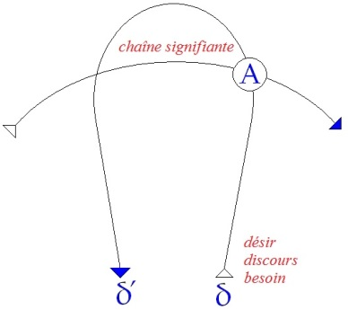
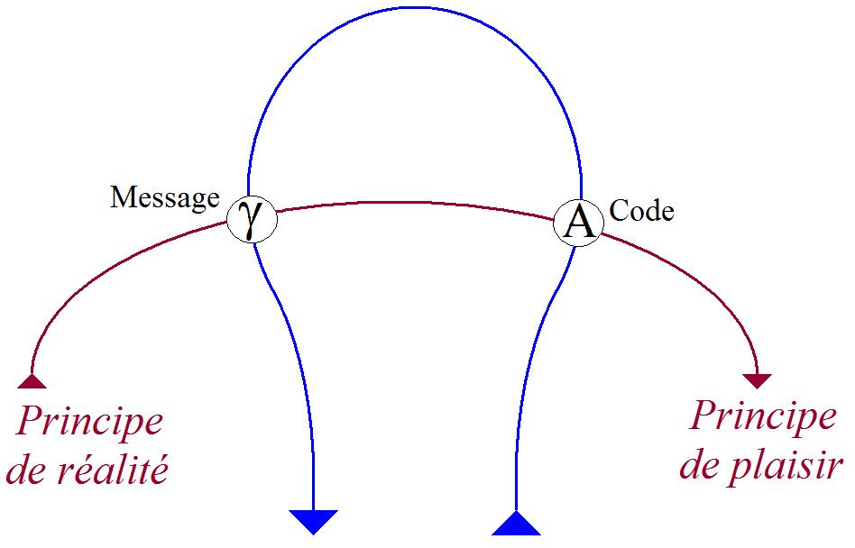
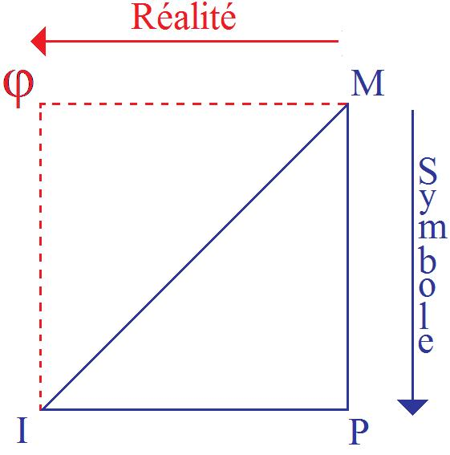
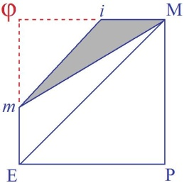
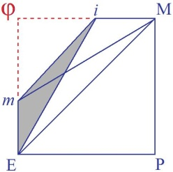
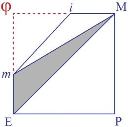
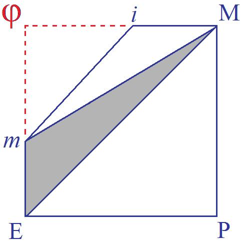
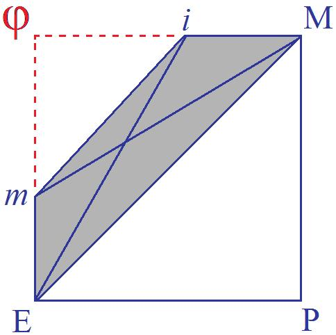

# Leçon 12 | 05 Février 1958

  <label><input type="checkbox" data-lacan-toggle="original" checked> 原文</label>
  <label><input type="checkbox" data-lacan-toggle="notes" checked> 注释</label>
  <label><input type="checkbox" data-lacan-toggle="commentary" checked> 个人解读评论</label>

<section class="parallel-paragraph" data-paragraph-ids="s5-12-0001">

s5-12-0001

[无对应译文]

原文 · s5-12-0001

La symbolisation préoccupe le monde. Un article est paru en Mai-Juin 1956, sous le titre de « *Symbolism and*
*Its Relationship to the Primary and Secondary Processes »*, de Charles RYCROFT[^32], où il essaye de donner un sens actuel

</section>

<section class="parallel-paragraph" data-paragraph-ids="s5-12-0002">

s5-12-0002

[无对应译文]

原文 · s5-12-0002

au point où nous en sommes de *l’ana­lyse du symbolisme*.

</section>

<section class="parallel-paragraph" data-paragraph-ids="s5-12-0003">

s5-12-0003

[无对应译文]

原文 · s5-12-0003

Ceux d’entre vous qui lisent l’anglais auraient évidemment avantage à lire un tel article, puisque cela leur montrera

</section>

<section class="parallel-paragraph" data-paragraph-ids="s5-12-0004">

s5-12-0004

[无对应译文]

原文 · s5-12-0004

les difficultés qui se présen­tent depuis toujours à propos du sens à donner dans l’analyse au mot *symbolisme,*
et je veux dire, pas simplement au mot mais à l’usage qu’on en fait, à l’idée qu’on se fait du processus du symbolisme.

</section>

<section class="parallel-paragraph" data-paragraph-ids="s5-12-0005">

s5-12-0005

[无对应译文]

原文 · s5-12-0005

Il est vrai que depuis 1911, où Monsieur JONES a fait là-dessus le premier travail d’ensemble important,
la question est passée par diverses phases et elle a rencontré, et elle rencontre encore, de très grandes difficultés dans ce qui constitue actuel­lement *la position* la plus articulée *sur ce sujet*, c’est-à-dire celle qui sort des consi­dérations

</section>

<section class="parallel-paragraph" data-paragraph-ids="s5-12-0006">

s5-12-0006

[无对应译文]

原文 · s5-12-0006

de Madame Mélanie KLEIN sur « *Le rôle du symbole dans la formation du moi »*. Ceci a le rapport le plus étroit avec
ce que je suis en train de vous expliquer, et je voudrais essayer de vous faire sentir l’importance du point de vue que je suis en train d’essayer de vous faire comprendre pour mettre un petit peu de clarté dans des directions obscures.

</section>

<section class="parallel-paragraph" data-paragraph-ids="s5-12-0007">

s5-12-0007

[无对应译文]

原文 · s5-12-0007

Je ne sais pas par quel bout je vais le prendre aujourd’hui. Je n’ai pas de plan quant à la façon dont je vais vous présenter les choses. Je voudrais - puisque c’est une espèce d’antépénultième séance que je vous ai annoncée,
au séminaire prochain très précisément axée sur *le phallus et la comédie -* je voudrais simplement aujour­d’hui

</section>

<section class="parallel-paragraph" data-paragraph-ids="s5-12-0008">

s5-12-0008

[无对应译文]

原文 · s5-12-0008

marquer une espèce de point d’arrêt en vous montrant quelques directions importantes dans lesquelles ce que
je vous ai exposé au début de ce trimestre concer­nant le *complexe de castration* permet de mettre des *points d’interrogation*. Je vais alors commencer par prendre les thèses comme elles viennent. Aujourd’hui sur ce sujet, on ne peut pas toujours mettre un ordre strict dans quelque chose qui doit être avant tout considéré aujourd’hui comme une espèce de point carrefour.

</section>

<section class="parallel-paragraph" data-paragraph-ids="s5-12-0009">

s5-12-0009

[无对应译文]

原文 · s5-12-0009

Dans ce titre de Charles RYCROFT, vous venez de voir apparaître le *procès primaire* et *secondaire.* C’est quelque chose dont je n’ai jamais parlé devant vous et même, il y a quelque temps, certains s’en sont étonnés. Ils sont tombés
sur *ce procès primaire et secondaire* à propos d’une définition de vocabulaire, et se sont trouvés un petit peu surpris.

</section>

<section class="parallel-paragraph" data-paragraph-ids="s5-12-0010">

s5-12-0010

[无对应译文]

原文 · s5-12-0010

Le *procès primaire* et *secondaire* date du temps de la *Traumdeutung,* et c’est quelque chose qui n’est pas complètement identique, mais qui recouvre les notions opposées de *principe de plaisir* et *principe de réalité. Principe de plaisir*
et *principe de réalité*, j’y ai plus d’une fois fait allusion devant vous, toujours pour vous faire remarquer que l’usage
qu’on en fait est incomplet si on ne les met pas en rapport l’un avec l’autre, c’est-à-dire si on ne sent pas leur liai­son, leur *opposition,* comme étant constitutives de la position de chacun de ces termes.

</section>

<section class="parallel-paragraph" data-paragraph-ids="s5-12-0011">

s5-12-0011

[无对应译文]

原文 · s5-12-0011

Je voudrais tout de suite aborder le vif de ce que je viens de faire remarquer : la notion de *principe du plaisir*
en tant qu’élément principe du *procès primaire*, quand on la prend d’une façon isolée aboutit à ceci,
et c’est de là que Charles RYCROFT croit devoir partir pour définir le *procès primaire*.

</section>

<section class="parallel-paragraph" data-paragraph-ids="s5-12-0012">

s5-12-0012

[无对应译文]

原文 · s5-12-0012

Il croit devoir écarter toutes ses carac­téristiques structurales, mettre au second plan le fait qu’y domine l’un des éléments constructifs que sont effectivement *la condensation, le déplacement,* etc, tout ce que FREUD a commencé d’aborder quand il a défini l’inconscient, et il le caractérise fon­damentalement par ce que FREUD apporte dans l’élaboration terminale de cette théo­rie à propos de la *Traumdeutung,* à savoir que le *principe du plaisir* est constitué *essentiellement* par ceci : qu’il y a un mécanisme et qu’originairement et principiellement, que vous entendiez la chose
du point de vue de l’étape historique ou du point de vue d’une sous-jacence, d’un fondement sur lequel quelque chose d’autre a eu à se développer, une espèce de base, de profondeur psychique, ou même que vous l’entendiez
dans une sorte de rapport logique, c’est de là que l’on doit par­tir.

</section>

<section class="parallel-paragraph" data-paragraph-ids="s5-12-0013">

s5-12-0013

[无对应译文]

原文 · s5-12-0013

Il y aurait, disons chez le sujet humain - il ne saurait évidemment s’agir semble-t-il d’*autre chose*, mais le point n’est pas trop défini - il y aurait, en réponse à l’inci­tation pulsionnelle, toujours la possibilité virtuelle et en quelque sorte comme *constitutive* du principe de la position du sujet à l’endroit du monde, *tendance à la satisfaction hallucinatoire du désir*.

</section>

<section class="parallel-paragraph" data-paragraph-ids="s5-12-0014">

s5-12-0014

[无对应译文]

原文 · s5-12-0014

Je pense que ceci ne vous surprend pas : exprimée abondamment chez tous les auteurs, cette référence à ceci :
qu’en raison d’une expérience primitive et sur un modèle qui est celui de la réflexion, à toute incitation interne
du sujet correspond…
avant qu’il y corresponde quelque chose qui est le cycle instinctuel, le mouvement - fut-il incoordonné - de l’appétit, puis de la recherche, puis du repérage dans la réa­lité de ce qui satisfait le besoin par le fait des traces mnésiques de *ce* qui a déjà répondu au désir, qui apporte la satisfaction

</section>

<section class="parallel-paragraph" data-paragraph-ids="s5-12-0015">

s5-12-0015

[无对应译文]

原文 · s5-12-0015

…*la satisfaction*, purement et simple­ment, qui tend à se reproduire *sur le plan hallucinatoire*.

</section>

<section class="parallel-paragraph" data-paragraph-ids="s5-12-0016">

s5-12-0016

[无对应译文]

原文 · s5-12-0016

Ceci, qui est devenu presque consubstantiel à nos conceptions analytiques, au besoin nous en faisons usage, je dirai : presque d’une façon implicite, chaque fois que nous parlons du *principe du plaisir*. Ne vous paraît-il pas,
dans une certaine mesure, que c’est quelque chose d’assez exorbitant pour mériter un éclaircissement, parce qu’enfin, s’il est dans la nature du cycle des processus psychiques de se créer à soi-même sa satisfaction, je pourrais dire : pourquoi les gens ne se satisfont-ils pas ? Bien sûr, c’est que *le besoin continue d’insister*, parce que la satisfaction

</section>

<section class="parallel-paragraph" data-paragraph-ids="s5-12-0017">

s5-12-0017

[无对应译文]

原文 · s5-12-0017

fantas­matique ne saurait remplir tous les besoins. Mais nous ne savons que trop que dans l’ordre sexuel,
dans tous les cas assurément, elle est éminemment susceptible de faire face au besoin, s’il s’agit de besoin pulsionnel.

</section>

<section class="parallel-paragraph" data-paragraph-ids="s5-12-0018">

s5-12-0018

[无对应译文]

原文 · s5-12-0018

Pour la faim, c’est autre chose, et après tout il se dessine à l’horizon que c’est bien de cela, c’est du *caractère* très possible­ment *illusoire de l’objet sexuel*, qu’en fin de compte ici il s’agit. Cette conception existe et, d’une certaine façon, est motivée en effet par la pos­sibilité de se soutenir, au moins à un certain niveau, au niveau de *la satisfaction sexuelle*.

</section>

<section class="parallel-paragraph" data-paragraph-ids="s5-12-0019">

s5-12-0019

[无对应译文]

原文 · s5-12-0019

C’est quelque chose qui a imprégné si profondément toute la pensée ana­lytique, que dans la mesure où cette relation du besoin à sa satisfaction…
à savoir : les primitives, les primordiales, gratifications ou satisfactions, ou frustrations aussi, qui sont considérées comme décisives à l’origine de la vie du sujet, à savoir dans les rap­ports du sujet avec sa mère

</section>

<section class="parallel-paragraph" data-paragraph-ids="s5-12-0020">

s5-12-0020

[无对应译文]

原文 · s5-12-0020

…est venue au premier plan…
à savoir que c’est, dans son ensemble, dans une dialectique du besoin et de sa satisfaction

que la psychanalyse est entrée de plus en plus à mesure qu’elle s’est intéressée de plus en plus aux stades primitifs du déve­loppement du sujet, à savoir la relation de l’enfant avec la mère
…on est arrivé à quelque chose dont je voudrais bien vous pointer le caractère significatif, et en même temps d’ailleurs, le caractère nécessaire.

</section>

<section class="parallel-paragraph" data-paragraph-ids="s5-12-0021">

s5-12-0021

[无对应译文]

原文 · s5-12-0021

C’est ceci dans la perspective kleinienne, qui est celle que je désigne pour l’instant, à savoir où tout l’apprentissage de la réalité par le sujet est en quelque sorte primordialement préparé et sous-tendu par la constitution essentiellement *hallucina­toire et fantasmatique* des premiers objets classifiés en *bons* et *mauvais objets* pour autant qu’ils fixent en quelque sorte une première relation tout à fait primordiale qui va donner, pour la suite de la vie du sujet, les types principaux des modes de rapport du sujet avec la réalité, on arrive à une sorte de composition du monde du sujet qui est fait d’une espèce de rapport fondamentalement irréel du sujet avec des objets qui ne sont que le reflet de ses pulsions fondamentales. C’est autour de *l’agressivité fondamentale* par exemple du sujet que tout va s’or­donner en une série

</section>

<section class="parallel-paragraph" data-paragraph-ids="s5-12-0022">

s5-12-0022

[无对应译文]

原文 · s5-12-0022

de projections de besoins du sujet.

</section>

<section class="parallel-paragraph" data-paragraph-ids="s5-12-0023">

s5-12-0023

[无对应译文]

原文 · s5-12-0023

Ce monde de la *phantasy*, telle qu’elle est usitée dans l’école kleinienne, est fondamental, et c’est à la surface de cela, que par une série d’expériences plus ou moins heureuses - il est souhaitable qu’elles soient assez heureuses pour cela -

</section>

<section class="parallel-paragraph" data-paragraph-ids="s5-12-0024">

s5-12-0024

[无对应译文]

原文 · s5-12-0024

que le monde de l’expérience va permettre un cer­tain repérage raisonnable de ce qui dans ces objets est, comme on dit, objectivement définissable comme répondant à une certaine réalité, la trame d’*irréalité* restant en quelque sorte absolument fondamentale. C’est, si je puis dire, cette sorte de construction, que l’on peut vraiment appe­ler *construction psychotique du sujet,* qui fait qu’en somme un sujet normal c’est, dans cette perspective, une psychose qui a bien tourné, une psychose en quelque sorte heureusement harmonisée avec l’expérience. Et ceci n’est pas une reconstruc­tion.

</section>

<section class="parallel-paragraph" data-paragraph-ids="s5-12-0025">

s5-12-0025

[无对应译文]

原文 · s5-12-0025

L’auteur dont je vais parler maintenant : Monsieur WINNICOTT, l’exprime stric­tement ainsi dans un des textes

</section>

<section class="parallel-paragraph" data-paragraph-ids="s5-12-0026">

s5-12-0026

[无对应译文]

原文 · s5-12-0026

qu’il a écrits sur l’utilisation de la régression dans la thérapeutique analytique. L’homogénéité fondamentale
de *la psychose* avec le rapport normal au monde y est absolument affirmée comme telle. Ceci n’empêche pas

</section>

<section class="parallel-paragraph" data-paragraph-ids="s5-12-0027">

s5-12-0027

[无对应译文]

原文 · s5-12-0027

que de très grandes diffi­cultés surgissent de cette perspective, ne serait-ce que d’arriver à concevoir quelle est…
puisque la *phantasy* n’est en quelque sorte que la trame sous-jacente au monde de la réalité
…de voir quelle peut être *la fonction de la phantasy* reconnue comme telle par le sujet à l’état adulte et achevée et réussie dans la constitution de son monde réel.

</section>

<section class="parallel-paragraph" data-paragraph-ids="s5-12-0028">

s5-12-0028

[无对应译文]

原文 · s5-12-0028

C’est aussi bien le problème qui se présente *à tout kleinien* qui se respecte, c’est-à-dire à tout *kleinien* avoué,
et aussi bien on peut dire actuellement à presque tout analyste, pour autant que le registre dans lequel il inscrit
le rapport du sujet au monde devient de plus en plus exclusive­ment celui d’une série d’apprentissages du monde,

</section>

<section class="parallel-paragraph" data-paragraph-ids="s5-12-0029">

s5-12-0029

[无对应译文]

原文 · s5-12-0029

faits sur la base d’une série d’ex­périences plus ou moins réussies de la frustration.

</section>

<section class="parallel-paragraph" data-paragraph-ids="s5-12-0030">

s5-12-0030

[无对应译文]

原文 · s5-12-0030

Je vous prie de vous reporter au texte de Monsieur WINNICOTT,qui se trouve dans le *volume 26*
de l*’International Journal of Psychoanalysis* et qui s’appelle : *Primitive Emotional Development* [^33], pour arriver à motiver

</section>

<section class="parallel-paragraph" data-paragraph-ids="s5-12-0031">

s5-12-0031

[无对应译文]

原文 · s5-12-0031

le surgissement, à concevoir ce monde de la *phantasy* en tant qu’il est vécu consciemment par le sujet
et qu’il équilibre sa réalité, comme l’expérience le prouve.

</section>

<section class="parallel-paragraph" data-paragraph-ids="s5-12-0032">

s5-12-0032

[无对应译文]

原文 · s5-12-0032

Et il faut le consta­ter dans son texte même - pour ceux que ceci intéresse - il s’appuie sur une remarque
dont vous allez voir qu’on sent bien la nécessité, tant elle aboutit à un paradoxe tout à fait curieux.
Le surgissement du *principe de réalité*, autrement dit de *la reconnaissance de la réalité* à partir des relations primordiales
de l’enfant avec l’objet maternel, objet de sa satisfaction et aussi de son insatisfaction, ne laisse nullement apercevoir comment de là peut surgir le monde de la *phantasy* sous sa forme, si l’on peut dire, *adulte*, si ce n’est par un artifice dont s’avise Monsieur WINNICOTT, ce qui permet certainement un développement assez cohérent de la théorie, mais dont je veux simplement vous faire apercevoir le paradoxe.

</section>

<section class="parallel-paragraph" data-paragraph-ids="s5-12-0033">

s5-12-0033

[无对应译文]

原文 · s5-12-0033

C’est ceci : il fait remarquer que si fondamentalement *la satisfaction* du besoin *hallucinatoire* est dans la discordance
de cette satisfaction avec ce que la mère apporte à l’enfant, c’est dans cette discordance que va s’ouvrir la béance
dans laquelle l’enfant peut constituer d’une certaine façon une première reconnaissance de l’objet,
l’objet qui se trouve - malgré les apparences si l’on peut dire - décevoir.

</section>

<section class="parallel-paragraph" data-paragraph-ids="s5-12-0034">

s5-12-0034

[无对应译文]

原文 · s5-12-0034

Alors pour expliquer comment peut naître en somme ce quelque chose à quoi se résume pour le psychanalyste moderne tout ce qui est du monde de la *phantasy* et de l’imagination, à savoir ce qui en anglais s’appelle le *playing,*

</section>

<section class="parallel-paragraph" data-paragraph-ids="s5-12-0035">

s5-12-0035

[无对应译文]

原文 · s5-12-0035

il fait remarquer ceci : sup­posons que l’objet maternel arrive pour remplir juste à point nommé :
à peine l’enfant a-t-il commencé à réagir pour avoir le sein, que la mère le lui *apporte*.

</section>

<section class="parallel-paragraph" data-paragraph-ids="s5-12-0036">

s5-12-0036

[无对应译文]

原文 · s5-12-0036

Ici Monsieur WINNICOTT s’arrête à juste titre et pose le problème suivant :
*qu’est-ce qui permet dans ces conditions à l’enfant de distinguer l’hallucination, la satisfaction hal­lucinatoire de son désir, de la réalité ?*

</section>

<section class="parallel-paragraph" data-paragraph-ids="s5-12-0037">

s5-12-0037

[无对应译文]

原文 · s5-12-0037

En d’autres termes, avec ce point de départ nous aboutissons strictement à expri­mer l’équation suivante : c’est qu’à l’origine, l’hallucination est absolument impossible à distinguer du désir complet. Est-ce qu’il ne vous semble pas que le paradoxe de cette confusion ne peut tout de même pas manquer d’être frappant ?

</section>

<section class="parallel-paragraph" data-paragraph-ids="s5-12-0038">

s5-12-0038

[无对应译文]

原文 · s5-12-0038

Dans une perspective qui rigoureusement caractérise le *processus primaire* comme devant être naturellement *satisfait d’une façon hallucinatoire*, nous abou­tissons à ceci :

</section>

<section class="parallel-paragraph" data-paragraph-ids="s5-12-0039">

s5-12-0039

[无对应译文]

原文 · s5-12-0039

- que plus *la réalité* est satisfaisante, si l’on peut dire, moins elle consti­tue *une épreuve* de la réalité,

</section>

<section class="parallel-paragraph" data-paragraph-ids="s5-12-0040">

s5-12-0040

[无对应译文]

原文 · s5-12-0040

- et que l’origine de la pensée d’omnipotence chez l’enfant est essentiellement fondée sur tout ce qui peut avoir réussi dans la réalité.

</section>

<section class="parallel-paragraph" data-paragraph-ids="s5-12-0041">

s5-12-0041

[无对应译文]

原文 · s5-12-0041

Ceci peut se tenir d’une certaine manière, mais avouez que cela présente en soi-même quelque aspect paradoxal,
et que la nécessité même d’avoir à recourir à quelque chose d’aussi paradoxal pour expliquer, en somme, un point pivot du déve­loppement du sujet est quelque chose qui prête à réflexion, voire à question. Je vais tout de suite
à l’opposé de ce qui semble pouvoir être présenté en face de cette conception dont vous ne méconnaissez pas,
je pense, que toute paradoxale déjà qu’elle soit - et *franchement paradoxale* - elle doit aussi avoir quelques consé­quences.

</section>

<section class="parallel-paragraph" data-paragraph-ids="s5-12-0042">

s5-12-0042

[无对应译文]

原文 · s5-12-0042

Elle a certainement toutes sortes de conséquences. Je vous les ai déjà signa­lées l’année dernière quand j’ai fait allusion

</section>

<section class="parallel-paragraph" data-paragraph-ids="s5-12-0043">

s5-12-0043

[无对应译文]

原文 · s5-12-0043

à ce même article de M. WINNICOTT, c’est à savoir qu’il n’y a pas d’autre effet, dans la suite de son anthropologie, que de lui faire classer dans le même ordre que les aspects fantasmatiques de la pensée, à peu près tout ce qu’on peut appeler spéculation libre. Je vous l’ai déjà dit l’année der­nière : il y a là une assimilation complète de *la vie fantasmatique* avec tout ce qui est de l’ordre, pourtant extraordinairement élaboré spéculativement, à savoir de tout ce qu’on peut appeler *les convictions,* à peu près quelles qu’elles soient : *politiques*, *reli­gieuses* ou autres.

</section>

<section class="parallel-paragraph" data-paragraph-ids="s5-12-0044">

s5-12-0044

[无对应译文]

原文 · s5-12-0044

Ce qui est bien une sorte de point de vue que l’on voit s’insérer dans une sorte d’humour anglo-saxon, dans une certaine perspective de respect mutuel, de tolérance, et aussi de retrait. Il y a une série de choses dont on ne parle qu’entre guillemets ou dont on ne parle pas entre gens bien élevés, et ce sont pour­tant des choses qui comptent

</section>

<section class="parallel-paragraph" data-paragraph-ids="s5-12-0045">

s5-12-0045

[无对应译文]

原文 · s5-12-0045

quelque peu puisqu’elles font partie du discours inté­rieur, qu’on est loin de pouvoir réduire au \[...\].

</section>

<section class="parallel-paragraph" data-paragraph-ids="s5-12-0046">

s5-12-0046

[无对应译文]

原文 · s5-12-0046

Mais laissons les aboutissements de la chose. Je veux simplement vous montrer ce qu’en face de cela une autre conception peut poser. D’abord, est-il si clair que l’on puisse purement et simplement appeler *satisfaction*
ce qui se produit au niveau *hallucinatoire*, c’est-à-dire dans les différents registres où nous pouvons incarner en quelque sorte cette thèse fondamentale de *la satisfaction hallucinatoire du besoin primordial du sujet au niveau du processus primaire* ?

</section>

<section class="parallel-paragraph" data-paragraph-ids="s5-12-0047">

s5-12-0047

[无对应译文]

原文 · s5-12-0047

Là-dessus, j’ai plusieurs fois introduit le problème. On dit : « *Voyez le rêve* », et on se rapporte toujours au rêve
de l’enfant. C’est FREUD lui-même qui nous indique là-dessus la voie dans la perspective qu’il avait explorée,
à savoir de nous indiquer le caractère fondamental du désir dans le rêve. Il a été amené à nous donner
purement et simplement l’exemple du rêve de l’enfant comme type de la *satisfaction halluci­natoire*.

</section>

<section class="parallel-paragraph" data-paragraph-ids="s5-12-0048">

s5-12-0048

[无对应译文]

原文 · s5-12-0048

De là, chacun sait que la porte est vite ouverte. Les psychiatres depuis longtemps avaient cherché à se faire une idée des rapports perturbés du sujet avec la réalité dans le désir. Par exemple en le rapportant à des *structures analogues*
à celles du rêve. La perspective que nous introduisons ici ne nous permet pas d’apporter là une *modification* essentielle.

</section>

<section class="parallel-paragraph" data-paragraph-ids="s5-12-0049">

s5-12-0049

[无对应译文]

原文 · s5-12-0049

Je crois qu’il est très important, au point où nous en sommes et en présence même des impasses et des difficultés
que suscite cette conception d’une relation purement *imaginaire* du sujet avec le monde comme étant au principe même du développement de son rapport à la réalité, d’y opposer ceci, dont je vous montrais la place
dans le *petit schéma* dont je ne cesserai pas de me servir et qui est celui-ci. Je le reprends dans sa forme la plus simple, dont je rappelle - dussé-je paraître le seriner un petit peu - ce dont il s’agit : c’est à savoir ici quelque chose qu’on peut appeler le besoin, mais que j’appelle d’ores et déjà le *désir* parce qu’il n’y a pas d’état originel, ni pur, du besoin
et que dès l’origine, le besoin est motivé sur le plan du *désir*, c’est-à-dire de quelque chose qui chez l’homme
est destiné à avoir un certain rapport avec le *signifiant*.

</section>

<section class="parallel-paragraph" data-paragraph-ids="s5-12-0050">

s5-12-0050

[无对应译文]

原文 · s5-12-0050

</section>

<section class="parallel-paragraph" data-paragraph-ids="s5-12-0051">

s5-12-0051

[无对应译文]

原文 · s5-12-0051

Et que c’est dans la traversée par *cette intention désirante* \[*discours*\] de ce qui se pose pour le sujet comme *la chaîne signifiante*

</section>

<section class="parallel-paragraph" data-paragraph-ids="s5-12-0052">

s5-12-0052

[无对应译文]

原文 · s5-12-0052

- soit que *la chaîne signifiante* ait déjà imposé ses nécessités dans sa subjectivité,

</section>

<section class="parallel-paragraph" data-paragraph-ids="s5-12-0053">

s5-12-0053

[无对应译文]

原文 · s5-12-0053

- soit que tout à l’origine il ne la rencontre que sous la forme de ceci : qu’elle est constituée d’ores et déjà chez la mère, qu’elle lui impose déjà chez la mère sa nécessité et sa barrière.

</section>

<section class="parallel-paragraph" data-paragraph-ids="s5-12-0054">

s5-12-0054

[无对应译文]

原文 · s5-12-0054

Et vous savez qu’ici il la rencontre d’abord sous la forme de l’*Autre*, et qu’elle aboutit à cette barrière sous la forme

</section>

<section class="parallel-paragraph" data-paragraph-ids="s5-12-0055">

s5-12-0055

[无对应译文]

原文 · s5-12-0055

du *message* où dans ce *schéma*, naturelle­ment, il ne s’agit que d’en voir la projection, et où se situe sur ce *schéma*
ce *principe de plaisir*. À savoir ce quelque chose qui, dans certains cas, sous certaines incidences, donne un trait primitif
*sous la forme du rêve* disons le plus primitif, le plus confus même, celui que nous pouvons voir chez le chien :
on voit qu’un chien de temps en temps, quand il est en sommeil, remue les pattes, il doit donc rêver,
et il a peut-être une *satisfaction hallucinatoire* de son désir.

</section>

<section class="parallel-paragraph" data-paragraph-ids="s5-12-0056">

s5-12-0056

[无对应译文]

原文 · s5-12-0056

Comment pouvons-nous les concevoir ? De même, comment pouvons-nous les situer, et justement chez l’homme ?
Je vous propose ceci, pour qu’au moins ça existe comme un terme de possibilité dans votre esprit et qu’à l’occasion
vous vous rendiez compte que ça s’applique d’une façon plus satisfaisante : ce qui est *réponse hallucinatoire* au besoin n’est pas le surgissement d’une réa­lité fantasmatique au bout du circuit inauguré par l’exigence du besoin :

</section>

<section class="parallel-paragraph" data-paragraph-ids="s5-12-0057">

s5-12-0057

[无对应译文]

原文 · s5-12-0057

- c’est l’ap­parition, au bout de cette exigence, de ce mouvement qui commence à être *suscité* dans le sujet vers *quelque chose* qui doit en effet désigner pour lui quelque linéament,

</section>

<section class="parallel-paragraph" data-paragraph-ids="s5-12-0058">

s5-12-0058

[无对应译文]

原文 · s5-12-0058

- c’est l’apparition au bout de cela de *quelque chose* qui bien entendu, n’est pas sans rapport avec ce besoin qu’il a un rapport avec ce qu’on appelle l’objet mais qui fon­damentalement dès je dirai l’origine, a ce caractère d’être quelque chose qui a un rapport tel avec cet objet que cela mérite d’être appelé *un signifiant*. Je veux dire quelque chose qui a essentiellement un rapport fondamental avec l’*absence* de cet objet, qui a déjà un caractère d’élément discret de *signe*.

</section>

<section class="parallel-paragraph" data-paragraph-ids="s5-12-0059">

s5-12-0059

[无对应译文]

原文 · s5-12-0059

Et FREUD lui-même ne peut pas faire autrement quand il articule ce mécanisme, cette naissance des structures inconscientes…
consultez la lettre déjà citée par moi : la *lettre* 52 *à Fliess*, au moment où commence pour lui à se formuler
un modèle de l’appareil psychique qui permette de rendre compte précisément du *processus primaire*
…il faut qu’il admettre à l’origine que ce type d’inscription mnésique qui va répondre hallucinatoirement

</section>

<section class="parallel-paragraph" data-paragraph-ids="s5-12-0060">

s5-12-0060

[无对应译文]

原文 · s5-12-0060

à la manifesta­tion du besoin n’est rien d’autre que ceci : *un signe*.

</section>

<section class="parallel-paragraph" data-paragraph-ids="s5-12-0061">

s5-12-0061

[无对应译文]

原文 · s5-12-0061

C’est-à-dire quelque chose qui ne se caractérise pas seulement par un certain rapport avec l’image
dans la théorie des instincts et de cette sorte de leurre qui peut suffire à éveiller le besoin et non pas à le remplir,
mais quelque chose *qui en tant qu’image, se situe déjà dans un certain rap­port avec d’autres signifiants *:

</section>

<section class="parallel-paragraph" data-paragraph-ids="s5-12-0062">

s5-12-0062

[无对应译文]

原文 · s5-12-0062

- avec le *signifiant* par exemple qui lui est directement *opposé*, qui signifie son *absence*,

</section>

<section class="parallel-paragraph" data-paragraph-ids="s5-12-0063">

s5-12-0063

[无对应译文]

原文 · s5-12-0063

- avec quelque chose qui est déjà organisé comme *signifiant*, déjà structuré dans ce rapport proprement fondamental qui est *le rapport symbolique* pour autant qu’il apparaît dans cette conjonction d’un jeu
  de *la présence avec l’absence*, de *l’absence avec la présence*, jeu lui–même lié ordinairement à une articulation vocale qui constitue déjà l’apparition d’éléments discrets de *signifiants*.

</section>

<section class="parallel-paragraph" data-paragraph-ids="s5-12-0064">

s5-12-0064

[无对应译文]

原文 · s5-12-0064

En fait, ce que nous avons comme expérience, ce que même on produit au niveau des règles les plus simples de l’enfant, n’est pas une satisfaction. En quelque sorte, quand il s’agit *de la faim* toute simple, *du besoin de la faim*,
c’est quelque chose qui se présente déjà avec un caractère d’excès, si je puis dire, d’exorbitant.

</section>

<section class="parallel-paragraph" data-paragraph-ids="s5-12-0065">

s5-12-0065

[无对应译文]

原文 · s5-12-0065

C’est jus­tement ce qu’on a déjà défendu à l’enfant, tel *le rêve de la petite Anna* FREUD : « *cerises, fraises, framboises, flan...* »
Tout ce qui est déjà entré dans une caractéristique proprement *signifiante* puisque c’est déjà *ce qui a été interdit*…
et non pas simplement ce qui répond à un besoin, au besoin de toute satisfaction de la faim
…qui consiste à se présenter sous le mode de festin des choses qui passent les limites justement de ce qui est
l’objet naturel de la satisfaction du besoin. Ce trait tout à fait essentiel se *retrouve* absolument à tous les niveaux,
à quelque niveau que vous preniez ce qui se présente, comme *satisfaction hallucinatoire*.

</section>

<section class="parallel-paragraph" data-paragraph-ids="s5-12-0066">

s5-12-0066

[无对应译文]

原文 · s5-12-0066

Et alors à l’inverse, que vous preniez les choses à l’autre bout : quand vous avez affaire à un délire où vous pouvez être tenté, faute de mieux, pendant un temps, avant FREUD, je dirai de chercher aussi quelque chose qui soit
la correspondance d’une espèce de *désir* du sujet, vous y arri­vez par quelques aperçus, quelques *flash* de biais, comme celui-là où quelque chose peut sembler *représenter* la satisfaction du désir. Mais n’est-il pas évident que le phénomène majeur le plus frappant, le plus massif, le plus envahissant de tous les phénomènes du délire ne soit pas n’importe quel phénomène, ne soit pas n’importe quelle chose qui se rapporte à une espèce de *rêverie de satisfaction de désir* ?

</section>

<section class="parallel-paragraph" data-paragraph-ids="s5-12-0067">

s5-12-0067

[无对应译文]

原文 · s5-12-0067

C’est quelque chose d’aussi arrêté que l’*hallucination verbale* et avant toute autre chose…

</section>

<section class="parallel-paragraph" data-paragraph-ids="s5-12-0068">

s5-12-0068

[无对应译文]

原文 · s5-12-0068

- avant de savoir si cette *hallucination verbale* se passe à tel ou tel niveau,

</section>

<section class="parallel-paragraph" data-paragraph-ids="s5-12-0069">

s5-12-0069

[无对应译文]

原文 · s5-12-0069

- s’il y a là chez le sujet quelque chose comme une espèce de *reflet interne* sous forme d’*hallucination psychomotrice* qui est excessivement importante à constater,

</section>

<section class="parallel-paragraph" data-paragraph-ids="s5-12-0070">

s5-12-0070

[无对应译文]

原文 · s5-12-0070

- s’il y a *projection* ou autre
  …n’apparaît-il pas dès l’abord que *dans la structuration de ce qui se présente comme hallucination*, ce qui domine d’abord

</section>

<section class="parallel-paragraph" data-paragraph-ids="s5-12-0071">

s5-12-0071

[无对应译文]

原文 · s5-12-0071

et ce qui même devrait servir de *pre­mier élément de classification* :

</section>

<section class="parallel-paragraph" data-paragraph-ids="s5-12-0072">

s5-12-0072

[无对应译文]

原文 · s5-12-0072

- c’est *sa structure dans le signifiant*,

</section>

<section class="parallel-paragraph" data-paragraph-ids="s5-12-0073">

s5-12-0073

[无对应译文]

原文 · s5-12-0073

- c’est que ce sont *des phénomènes structurés au niveau du signifiant*,

</section>

<section class="parallel-paragraph" data-paragraph-ids="s5-12-0074">

s5-12-0074

[无对应译文]

原文 · s5-12-0074

- c’est que *l’organisation même de ces hallucinations* ne peut, même un instant, se penser sans voir que la première chose qu’il y a à apporter dans ce phénomène c’est que c’est *un phénomène de signi­fiant*.

</section>

<section class="parallel-paragraph" data-paragraph-ids="s5-12-0075">

s5-12-0075

[无对应译文]

原文 · s5-12-0075

Voici donc une chose qui doit toujours nous rappeler que s’il est vrai qu’on puisse aborder sous cet angle
la caractérisation de ce qu’on peut appeler *le principe du plaisir*, à savoir *la satisfaction* fondamentalement *irréelle du désir*,

</section>

<section class="parallel-paragraph" data-paragraph-ids="s5-12-0076">

s5-12-0076

[无对应译文]

原文 · s5-12-0076

la différencia­tion, la caractéristique que *la satisfaction hallucinatoire du désir existe*, c’est qu’elle est *absolument* originelle, qu’elle se propose *dans le domaine du signifiant* et qu’elle implique comme tel un certain *lieu de l’Autre*, qui n’est d’ailleurs pas forcément un autre mais un certain lieu de l’Autre, pour autant qu’il est nécessité par la position
de cette *instance du signifiant*. Vous remarquerez que dans une telle perspective, celle de ce petit schéma-ci :

</section>

<section class="parallel-paragraph" data-paragraph-ids="s5-12-0077">

s5-12-0077

[无对应译文]

原文 · s5-12-0077

</section>

<section class="parallel-paragraph" data-paragraph-ids="s5-12-0078">

s5-12-0078

[无对应译文]

原文 · s5-12-0078

C’est donc là que nous voyons entrer en jeu dans cette espèce de partie externe en fin de compte du circuit
qui est constitué par la partie de droite du schéma, à savoir, *le besoin*, qui ici est quelque chose qui se manifeste
sous la forme d’une sorte *de fin ou de queue de la chaîne signifiante*, quelque chose qui bien entendu n’existe qu’*à la limite*, et où pourtant vous reconnaîtrez toujours, chaque fois que quelque chose parvient à ce niveau-là du *schéma*,
la caractéristique du *plaisir* comme y étant attachée.

</section>

<section class="parallel-paragraph" data-paragraph-ids="s5-12-0079">

s5-12-0079

[无对应译文]

原文 · s5-12-0079

Si c’est à un *plaisir* qu’aboutit le *trait d’esprit*, c’est très précisément pour autant que le *trait d’esprit* nécessite que quelque chose se réalise au niveau de l’Autre, qui a cette sorte de fin virtuelle vers une sorte d’*au-delà du sens* et qui pourtant est quelque chose qui en soi comporte *une certaine satisfaction*. Si donc c’est *dans cette partie* externe du circuit que *le principe du plaisir* trouve en quelque sorte à se sché­matiser, ici de même, c’est *dans cette partie-là* que *le principe de réalité* est.

</section>

<section class="parallel-paragraph" data-paragraph-ids="s5-12-0080">

s5-12-0080

[无对应译文]

原文 · s5-12-0080

Il n’est pas concevable autrement, pour ce qui est du sujet humain pour autant que nous avons affaire à lui dans notre expérience. Il n’y a pas d’autre appréhension ni défini­tion possible du *principe de réalité* pour le sujet humain,
pour autant qu’il a à y entrer au niveau du processus secondaire, pour autant que *le signifiant* à l’origine de sa chaîne entre effectivement en jeu dans le réel humain comme une réalité originale.

</section>

<section class="parallel-paragraph" data-paragraph-ids="s5-12-0081">

s5-12-0081

[无对应译文]

原文 · s5-12-0081

*Il y a du langage, ça parle dans le monde*, et à cause de cela il y a toute une série de choses, d’objets qui sont *signifiés*, qui ne le seraient absolument pas autrement, je veux dire s’il n’y avait pas en jeu, s’il n’y avait pas dans le monde, *du signifiant*.
Et l’introduction du sujet à quelque réalité que ce soit, n’est absolument pas pen­sable par une pure et simple expérience de quoi que ce soit dont il s’agisse : d’une frustration, d’une discordance, d’un heurt, d’une brûlure,

</section>

<section class="parallel-paragraph" data-paragraph-ids="s5-12-0082">

s5-12-0082

[无对应译文]

原文 · s5-12-0082

de tout ce que vous vou­drez. Il n’y a pas *épellement* pas à pas d’un *Umwelt* par l’homme, qui serait ainsi exploré
d’une façon aussi immédiate et si l’on peut dire, tâtonnante, à ceci près que pour l’animal *l’instinct* vient à son secours, Dieu merci ! Parce que s’il fallait que l’ani­mal *reconstruise le monde*, il n’aurait pas assez de toute sa vie pour le faire.

</section>

<section class="parallel-paragraph" data-paragraph-ids="s5-12-0083">

s5-12-0083

[无对应译文]

原文 · s5-12-0083

Alors pourquoi vouloir que l’homme, qui lui a des instincts fort peu adaptés, fasse cette expérience du monde,
en quelque sorte avec ses mains ? Le fait *qu’il y ait du signi­fiant* est absolument essentiel, et le principal truchement

</section>

<section class="parallel-paragraph" data-paragraph-ids="s5-12-0084">

s5-12-0084

[无对应译文]

原文 · s5-12-0084

de son expérience de la réa­lité devient même presque réduit à une banalité, à une niaiserie que de le dire à ce niveau.

</section>

<section class="parallel-paragraph" data-paragraph-ids="s5-12-0085">

s5-12-0085

[无对应译文]

原文 · s5-12-0085

Il intervient quand même par la voix. C’est bien manifeste naturellement de l’enseignement qu’il reçoit, de ce que lui apprend la parole de l’adulte, mais la marge importante que FREUD conquiert sur cet élément d’expérience est ceci : c’est que d’ores et déjà, avant même que l’apprentissage du langage soit élaboré sur le plan moteur, sur le plan auditif et sur le plan qu’il comprenne ce qu’on lui raconte, il y a déjà…
dès l’origine, dès ses premiers rapports avec *l’objet*, dès son premier rapport avec *l’objet maternel* pour autant qu’il est *cet objet primordial*, primitif, celui dont dépend sa première survivance, subsistance dans le monde
…cet objet déjà est introduit comme tel au processus de symbolisation, joue déjà un rôle qui introduit dans le monde l’existence du *signifiant*, ceci à un stade ultra précoce. Dites-vous le bien : dès que l’enfant commence simplement
à pouvoir opposer deux phonèmes, ce sont déjà deux vocables, et avec deux, celui qui les prononce et celui auquel
ils sont adressés, c’est-à-direl’objet, c’est-à-dire sa mère, il y a déjà assez des quatre éléments pour contenir virtuellement en soi, *toute la combinatoire* d’où va surgir l’organisation du signifiant[^34].

</section>

<section class="parallel-paragraph" data-paragraph-ids="s5-12-0086">

s5-12-0086

[无对应译文]

原文 · s5-12-0086

Je vais maintenant passer à un *nouveau* et *autre petit schéma*, qui d’ailleurs a déjà été ici ébauché et qui va vous montrer quelles vont en être les conséquences, en même temps que vous vous rappellerez ce que, dans la dernière leçon,
j’ai essayé de vous faire sentir.

</section>

<section class="parallel-paragraph" data-paragraph-ids="s5-12-0087">

s5-12-0087

[无对应译文]

原文 · s5-12-0087

</section>

<section class="parallel-paragraph" data-paragraph-ids="s5-12-0088">

s5-12-0088

[无对应译文]

原文 · s5-12-0088

Nous avons dit que primordialement nous avions le rapport de l’en­fant avec la mère, et il est vrai que c’est
dans cet axe \[I → M\] que se constitue le premier rap­port de *réalité*, je veux dire cette *réalité* est indéductible,
et dans l’expérience ne peut être que reconstruite à l’aide de perpétuels *tours de passe-passe*, si on fait dépendre sa constitution uniquement des rapports du *désir* de l’enfant avec *l’objet* en tant qu’il satisfait ou ne satisfait pas son désir.

</section>

<section class="parallel-paragraph" data-paragraph-ids="s5-12-0089">

s5-12-0089

[无对应译文]

原文 · s5-12-0089

Si on peut, à la grande limite, trouver quelque chose qui réponde à cela dans un certain nombre de cas de psychoses précoces, c’est toujours en fin de compte, à la phase dite dépressive du développement de l’enfant qu’on se reporte chaque fois que l’on fait intervenir cette *dialectique*. Il s’agit en réalité, pour autant que cette *dialec­tique* comporte

</section>

<section class="parallel-paragraph" data-paragraph-ids="s5-12-0090">

s5-12-0090

[无对应译文]

原文 · s5-12-0090

un développement ultérieur infiniment *plus complexe,* de quelque chose de tout différent, à savoir que le rapport
n’est pas simplement à l’origine : du désir de l’enfant à l’objet qui le satisfait ou qui ne le satisfait pas,
mais - grâce à quelque chose qui est un *minimum d’épaisseur*, d’irréalité, que donne *la première symbolisa­tion - un repérage*,

</section>

<section class="parallel-paragraph" data-paragraph-ids="s5-12-0091">

s5-12-0091

[无对应译文]

原文 · s5-12-0091

si vous voulez déjà *triangulaire* de l’enfant : non pas par rapport à ce qui va apporter satisfaction à son besoin,
mais par rapport au *désir du sujet maternel qu’il a en face de lui*.

</section>

<section class="parallel-paragraph" data-paragraph-ids="s5-12-0092">

s5-12-0092

[无对应译文]

原文 · s5-12-0092

C’est ceci, et uniquement pour autant que quelque chose est déjà inauguré dans cette dimension ici représentée selon l’axe qu’on appelle « l’axe des ordonnées » en analyse mathématique : nous avons la dimension du *symbole*. Et à cause de ceci peut se concevoir que l’enfant, dans toute la mesure où il a à se repérer à l’endroit de ces deux pôles…
et c’est d’ailleurs bien autour de cela que tâtonne Madame Mélanie KLEIN, sans pouvoir en donner la formule : c’est que c’est en effet autour d’un double pôle de la mère, elle l’appelle *la bonne* et *la mauvaise mère*
…que l’enfant commence à prendre sa position.

</section>

<section class="parallel-paragraph" data-paragraph-ids="s5-12-0093">

s5-12-0093

[无对应译文]

原文 · s5-12-0093

Ce n’est pas l’objet qu’il situe, c’est lui d’abord qu’il situe, et alors il va se situer en toutes sortes de points qui sont
par là pour essayer de rejoindre ce qui est *objet du désir de la mère*, pour essayer, lui, de répondre au désir de la mère.
C’est cela *l’élément essentiel* et ceci pourrait durer extrêmement longtemps. Il n’y a, à la vérité, à partir de ce moment-là, aucune espèce de *dialectique possible*. C’est ici qu’il nous faut nécessairement faire intervenir qu’il est tout à fait *impossible* de considérer le rapport de l’enfant à la mère, d’abord parce qu’il est impossible de le penser et de n’en rien déduire.

</section>

<section class="parallel-paragraph" data-paragraph-ids="s5-12-0094">

s5-12-0094

[无对应译文]

原文 · s5-12-0094

Mais il est également *impossible*, d’après l’expérience, de concevoir que l’enfant est dans ce *monde ambigu* que nous présentent les analystes kleiniens par exemple, dans lequel il n’y a de réalité que celle de la mère, et qui leur permet
de dire que le monde primitif de l’enfant est à la fois suspendu à cet objet et entièrement auto-érotique,
pour autant que l’enfant ne veut faire aucune différence là, entre un intérieur et un extérieur pour un objet auquel
il est si étroitement lié qu’il forme littéralement avec lui un cercle fermé.

</section>

<section class="parallel-paragraph" data-paragraph-ids="s5-12-0095">

s5-12-0095

[无对应译文]

原文 · s5-12-0095

En fait, chacun sait - il n’y a qu’à voir vivre un petit enfant - que le petit enfant n’est pas *auto-érotique* du tout,
à savoir *qu’il s’intéresse* normalement, comme tout petit animal, et un petit animal somme toute plus spécialement intelligent que les autres, *qu’il s’intéresse* à toutes sortes d’autres choses dans la réalité. Évidemment, pas à n’importe lesquelles, mais il y en a une quand même à laquelle nous attachons une certaine importance et qui - puisque ici l’axe des abscisses c’est l’axe de la réalité - se présente tout à fait à la limite de cette réalité.
Ce n’est pas un fantasme, c’est une perception.

</section>

<section class="parallel-paragraph" data-paragraph-ids="s5-12-0096">

s5-12-0096

[无对应译文]

原文 · s5-12-0096

Je laisse de côté ceci, qui est énorme dans la théorie kleinienne. Je veux dire que chez elle - car c’est une femme
de génie - on peut tout lui passer, mais chez les élèves, tout particulièrement informés en matière de psychologie, chez quelqu’un comme Suzanne ISAACS, qui était une psychologue, c’est impardonnable :
à la suite de Mme Mélanie Klein, elle n’en est pas moins arrivée à articuler une théorie de la perception telle
qu’il n’y a aucun moyen de distinguer la perception d’une introjection au sens analytique du terme !

</section>

<section class="parallel-paragraph" data-paragraph-ids="s5-12-0097">

s5-12-0097

[无对应译文]

原文 · s5-12-0097

Je ne peux pas au passage vous signaler toutes les impasses du *système kleinien*, j’essaye de vous donner *un modèle*
qui vous permette d’articuler plus clairement ce qui se passe. Que se passe-t-il au niveau du stade du miroir ?
C’est que le stade du miroir, à savoir la rencontre du sujet avec quelque chose qui est proprement une réalité
et en même temps qui ne l’est pas, à savoir une image virtuelle jouant un rôle tout à fait décisif dans une certaine cristallisation du sujet que j’appelle *Urbild,* et qui se pro­duit - je le mets en parallèle avec le rapport qui se produit entre l’enfant et la mère. En gros, c’est bien de cela qu’il s’agit : l’enfant conquiert là le point d’appui de cette chose
à la limite de la réalité qui se présente, si l’on peut dire, pour lui d’une façon perceptive.

</section>

<section class="parallel-paragraph" data-paragraph-ids="s5-12-0098">

s5-12-0098

[无对应译文]

原文 · s5-12-0098

Ce qui peut d’autre part s’appeler une image, au sens que ce mot a, pour autant que *l’image* a cette propriété
dans *la réalité*, d’être ce signal captivant qui s’isole dans la réalité, qui attire de la part du sujet cette capture d’une certaine libido, d’un certain instinct, grâce à quoi il y a en effet un certain nombre de repères, de points perceptibles dans le monde, autour de quoi l’être vivant organise à peu près ses conduites. Pour l’être humain, il semble bien
en fin de compte que ce soit là le seul repère qui subsiste. Il joue là son rôle, et *il joue son rôle* pour autant que justement il est à proprement parler *leurrant* et *illusoire*. C’est en cela qu’il vient au secours d’une acti­vité qui, d’ores

</section>

<section class="parallel-paragraph" data-paragraph-ids="s5-12-0099">

s5-12-0099

[无对应译文]

原文 · s5-12-0099

et déjà, est pour le sujet - en tant qu’il a à satisfaire le désir de l’autre - une activité qui déjà se propose dans la visée d’illusionner lui-même le désir de l’autre.

</section>

<section class="parallel-paragraph" data-paragraph-ids="s5-12-0100">

s5-12-0100

[无对应译文]

原文 · s5-12-0100

L’enfant, pour autant que maintenant il va se constituer \[...\] Comme toute l’activité jubilatoire de l’enfant
devant son miroir est à la fois à ce moment là de se conquérir comme *quelque chose qui* à la fois *existe et n’existe pas,*
et par rapport à quoi il repère à la fois ses propres mouvements et aussi l’*image* de ceux qui l’accompagnent
devant ce miroir, c’est autour de cette possibilité qui lui est ouverte par une certaine expé­rience privilégiée

</section>

<section class="parallel-paragraph" data-paragraph-ids="s5-12-0101">

s5-12-0101

[无对应译文]

原文 · s5-12-0101

dans la réalité, qui a justement ce privilège d’une *réalité virtuelle*, irréalisée et saisie comme telle, que l’enfant va pouvoir conquérir ce quelque chose autour de quoi va littéralement se construire toute possibilité de réalité humaine.

</section>

<section class="parallel-paragraph" data-paragraph-ids="s5-12-0102">

s5-12-0102

[无对应译文]

原文 · s5-12-0102

Ce n’est pas encore que le *phallus*, pour autant qu’il est cet *objet imaginaire* auquel l’enfant a à s’identifier pour satisfaire au désir de la mère, puisse d’ores et déjà se situer à sa place, mais la possibilité d’une telle situation est grandement enrichie par cette cris­tallisation du *moi* dans un certain repérage, lui, qui ouvre toute la possibilité de l’*imaginaire*.
Et à quoi, en somme, assistons-nous ?

</section>

<section class="parallel-paragraph" data-paragraph-ids="s5-12-0103">

s5-12-0103

[无对应译文]

原文 · s5-12-0103

Nous assistons à quelque chose qui est un double mouvement par quoi l’expérience de la réalité a introduit sous
la forme de *l’image du corps* \[*i*\], un élément illusoire et leurrant comme fondement essentiel du repérage du sujet par rapport à la réalité. Et dans toute cette mesure - dans la mesure de cet espace, de cette marge qui est offerte à l’enfant par cette expérience - la possibilité, dans une direction contraire, pour *ses premières identifications du moi*
d’entrer *dans un autre champ* qui est défini comme homologue et inverse de celui qui est constitué par le triangle *m* *i* M :

</section>

<section class="parallel-paragraph" data-paragraph-ids="s5-12-0104">

s5-12-0104

[无对应译文]

原文 · s5-12-0104

</section>

<section class="parallel-paragraph" data-paragraph-ids="s5-12-0105">

s5-12-0105

[无对应译文]

原文 · s5-12-0105

qui est celui-ci, celui entre m *i* E qui est le sujet en tant qu’il a *à s’identifier, à se définir, à se conquérir, à se subjectiver* :

</section>

<section class="parallel-paragraph" data-paragraph-ids="s5-12-0106">

s5-12-0106

[无对应译文]

原文 · s5-12-0106

</section>

<section class="parallel-paragraph" data-paragraph-ids="s5-12-0107">

s5-12-0107

[无对应译文]

原文 · s5-12-0107

et aussi le pôle de la mère M E *m* :

</section>

<section class="parallel-paragraph" data-paragraph-ids="s5-12-0108">

s5-12-0108

[无对应译文]

原文 · s5-12-0108

</section>

<section class="parallel-paragraph" data-paragraph-ids="s5-12-0109">

s5-12-0109

[无对应译文]

原文 · s5-12-0109

Et qu’est-ce que ce triangle-là ?

</section>

<section class="parallel-paragraph" data-paragraph-ids="s5-12-0110">

s5-12-0110

[无对应译文]

原文 · s5-12-0110

</section>

<section class="parallel-paragraph" data-paragraph-ids="s5-12-0111">

s5-12-0111

[无对应译文]

原文 · s5-12-0111

Et qu’est-ce que ce champ ? Et comment ce tra­jet qui, à partir de l’*Urbild* du *moi*, va permettre à l’enfant

</section>

<section class="parallel-paragraph" data-paragraph-ids="s5-12-0112">

s5-12-0112

[无对应译文]

原文 · s5-12-0112

de se conquérir, de s’iden­tifier, de progresser, comment pouvons-nous le définir ? En quoi est-il constitué ?
Il est à proprement parler constitué en ceci, que cet *Urbild* du *moi*, cette première conquête ou maîtrise du soi
que l’enfant fait dans son expérience à partir du moment où *il a dédoublé* le pôle réel par rapport auquel il a à se situer, le fait entrer dans ce trapèze E *m i* M :

</section>

<section class="parallel-paragraph" data-paragraph-ids="s5-12-0113">

s5-12-0113

[无对应译文]

原文 · s5-12-0113

</section>

<section class="parallel-paragraph" data-paragraph-ids="s5-12-0114">

s5-12-0114

[无对应译文]

原文 · s5-12-0114

en tant qu’il s’identifie à des éléments multipliés de signifiants dans la réalité, je veux dire :
où par toutes ces identification successives il est lui-même, il prend lui-même la fonction, le rôle d’une *série de signifiants*, entendez de *hiéro­glyphes*, de types, de formes et de présentations qui vont ponctuer sa réalité d’un cer­tain nombre de repères qui en font d’ores et déjà *une réalité truffée de signifiants*.

</section>

<section class="parallel-paragraph" data-paragraph-ids="s5-12-0115">

s5-12-0115

[无对应译文]

原文 · s5-12-0115

En d’autres termes, ce qui va constituer ici la limite, c’est cette formation qui s’ap­pelle *idéal du moi -* vous allez voir pourquoi il est important que je vous la situe comme cela - c’est-à-dire ce à quoi le sujet *s’identifie* en allant
*dans la direction du symbolique*, en partant du repérage *imaginaire* et en quelque sorte lui, préformé instinctuellement
de lui-même à son propre corps, et pour autant que lui va s’engager dans une série *d’identifications signifiantes*

</section>

<section class="parallel-paragraph" data-paragraph-ids="s5-12-0116">

s5-12-0116

[无对应译文]

原文 · s5-12-0116

*dans la direction* définie comme telle, comme *oppo­sée à l’imaginaire*, à savoir comme utilisant *l’imaginaire comme signifiant*.

</section>

<section class="parallel-paragraph" data-paragraph-ids="s5-12-0117">

s5-12-0117

[无对应译文]

原文 · s5-12-0117

Et *l’iden­tification* qui s’appelle *idéal du moi* se fait au niveau paternel. Pourquoi ? Précisé­ment en ceci qu’au niveau paternel le détachement est plus grand par rapport à *la relation imaginaire* qu’au niveau de la relation à la mère.

</section>

<section class="parallel-paragraph" data-paragraph-ids="s5-12-0118">

s5-12-0118

[无对应译文]

原文 · s5-12-0118

Cette petite édification de *schémas* les uns sur les autres, ces petits danseurs se chevauchant, les jambes de l’un
sur les épaules de l’autre, c’est bien de cela qu’il s’agit : c’est pour autant que le troisième de ce petit échafaudage,
à savoir le père pour autant qu’il intervient pour interdire, c’est-à-dire pour faire passer ce qui est juste­ment

</section>

<section class="parallel-paragraph" data-paragraph-ids="s5-12-0119">

s5-12-0119

[无对应译文]

原文 · s5-12-0119

*l’objet du désir de la mère* au rang proprement *symbolique*, à savoir que c’est non seulement un objet *imaginaire*,
mais qu’il est en plus détruit, interdit.

</section>

<section class="parallel-paragraph" data-paragraph-ids="s5-12-0120">

s5-12-0120

[无对应译文]

原文 · s5-12-0120

C’est pour autant qu’il intervient comme personnage réel, comme « *je* » pour jouer cette fonction, que ce « *je* »
va devenir *quelque chose* d’éminemment *signifiant* et permettre d’être le noyau de l’identification en fin de compte dernière, suprême résultat du *complexe d’Œdipe* qui fait que c’est au père que se rapporte la formation dite *idéal du moi*.
Et ces oppositions de l’*idéal du moi* par rapport à *l’objet du désir de la mère* sont expri­mées sur ce *schéma* en ceci :

</section>

<section class="parallel-paragraph" data-paragraph-ids="s5-12-0121">

s5-12-0121

[无对应译文]

原文 · s5-12-0121

que si l’identification virtuelle et idéale du sujet au *phal­lus,* en tant qu’il est *l’objet du désir de la mère,* se situe là
au sommet du premier triangle de la relation avec la mère, il s’y situe virtuellement : à la fois toujours possible

</section>

<section class="parallel-paragraph" data-paragraph-ids="s5-12-0122">

s5-12-0122

[无对应译文]

原文 · s5-12-0122

et tou­jours menacé.

</section>

<section class="parallel-paragraph" data-paragraph-ids="s5-12-0123">

s5-12-0123

[无对应译文]

原文 · s5-12-0123

Si menacé qu’effectivement *il faut* qu’il soit détruit à un moment donné par l’intervention du *principe symbolique pur*, représenté par le *Nom du Père* qui est là à l’état de présence voilée, mais une présence qui se dévoile - se dévoile
non pas progressivement - se dévoile par une intervention d’abord décisive en tant qu’il est l’élé­ment interdicteur

</section>

<section class="parallel-paragraph" data-paragraph-ids="s5-12-0124">

s5-12-0124

[无对应译文]

原文 · s5-12-0124

et que justement cette espèce de recherche tâtonnante du sujet qui devrait aboutir, et qui aboutit dans certains cas,
…à cette relation exclusive du sujet avec la mère, non pas à une pure et simple dépendance, mais à ce quelque chose qui se manifeste dans toutes sortes de perversions par une certaine relation essentielle au *phallus*, soit que le sujet l’assume *sous diverses formes *:

</section>

<section class="parallel-paragraph" data-paragraph-ids="s5-12-0125">

s5-12-0125

[无对应译文]

原文 · s5-12-0125

- soit qu’il en fasse son fétiche,

</section>

<section class="parallel-paragraph" data-paragraph-ids="s5-12-0126">

s5-12-0126

[无对应译文]

原文 · s5-12-0126

- soit que nous soyons là au niveau de ce que l’on peut appeler *la racine primitive de la relation perverse à la mère.*

</section>

<section class="parallel-paragraph" data-paragraph-ids="s5-12-0127">

s5-12-0127

[无对应译文]

原文 · s5-12-0127

C’est pour autant que dans cette identification à partir du *moi,* le sujet qui peut dans une certaine phase faire en effet *un mouvement d’approchement*, *d’identifi­cation de son moi avec le phallus,* essentiellement est porté dans l’autre direction,

</section>

<section class="parallel-paragraph" data-paragraph-ids="s5-12-0128">

s5-12-0128

[无对应译文]

原文 · s5-12-0128

c’est-à-dire consti­tue un certain rapport qui lui, est marqué par les points termes qui sont là exprimés dans un certain rapport avec *l’image du corps propre*, c’est-à-dire à *l’imaginaire* pur et simple, à savoir *la mère*.

</section>

<section class="parallel-paragraph" data-paragraph-ids="s5-12-0129">

s5-12-0129

[无对应译文]

原文 · s5-12-0129

D’autre part, comme terme réel, son *moi* en tant qu’il est susceptible, non pas simplement de se reconnaître,
mais s’étant reconnu, de se faire lui-même *élément signifiant* et non plus simplement *élément imaginaire* dans son rapport avec la mère, \[alors\] peuvent se produire ces successives *identifications* dont FREUD dans sa théorie du *moi*
nous articule de la façon la plus ferme. C’est là l’objet de sa théorie du *moi,* C’est de nous montrer que *le moi est fait d’une série d’identifications* - reportez-vous au schéma - d’une série d’identifications *à un objet* qui est au-delà de l’objet immédiat, *qui est le père en tant qu’il est au–delà de la mère*.

</section>

<section class="parallel-paragraph" data-paragraph-ids="s5-12-0130">

s5-12-0130

[无对应译文]

原文 · s5-12-0130

Ce schéma est essentiel à conserver parce qu’aussi il vous démontre que pour que ceci se produise *correctement, complètement, et dans la bonne direction*, il doit y avoir un certain rapport entre sa direction, sa rectitude, ses accidents,
et le développement alors toujours croissant de *la présence du père* *dans la dialectique* du rapport de l’enfant *avec la mère*.
*Ce schéma, avec son double mouvement de bascule*, à savoir que la réalité est conquise par le sujet humain pour autant
qu’elle arrive à une certaine de ces limites *sous la forme virtuelle de l’image du corps,* et que d’une façon correspondante, c’est pour autant que le sujet introduit dans son champ d’expérience *les éléments irréels du signifiant*, qu’il arrive à élargir
à la mesure où il l’est pour le sujet humain, le champ de cette expérience.

</section>

<section class="parallel-paragraph" data-paragraph-ids="s5-12-0131">

s5-12-0131

[无对应译文]

原文 · s5-12-0131

Ceci est d’une utilisation constante et sans vous y référer vous vous trouverez per­pétuellement glisser dans une série de confusions qui consistent *à prendre* littérale­ment des *vessies pour des lanternes* et une *idéalisation* pour une *identification*, une *illusion* pour une *image*, toutes sortes de choses qui sont loin d’être *équivalentes* et auxquelles nous aurons à revenir par la suite, et en nous référant à ce schéma.

</section>

<section class="parallel-paragraph" data-paragraph-ids="s5-12-0132">

s5-12-0132

[无对应译文]

原文 · s5-12-0132

Il est bien clair par exemple que la conception que nous pouvons nous faire du phénomène du *délire*
est quelque chose qui devrait facilement s’indiquer par la structure mise, promue, manifestée dans *ce schéma*,
pour autant que nous voyons toujours dans *le délire* quelque chose qui assurément mérite *le terme de* *régressif*,
mais *non pas à la façon d’une espèce de reproduction d’un état antérieur*, ce qui serait vraiment tout à fait abusif.

</section>

<section class="parallel-paragraph" data-paragraph-ids="s5-12-0133">

s5-12-0133

[无对应译文]

原文 · s5-12-0133

Confondre avec ce phénomène la notion *que l’enfant vit dans un monde de délire* par exemple, qui semble être impliqué par *la conception kleinienne,* est l’une des choses les plus difficilement admissibles qui soient, pour la bonne raison
que cette *phase psychotique*, si elle est nécessitée par les prémisses de l’articulation kleinienne,
nous n’avons aucune espèce d’expérience chez l’enfant de quoi que ce soit qui représente *un état psychotique transitoire*.

</section>

<section class="parallel-paragraph" data-paragraph-ids="s5-12-0134">

s5-12-0134

[无对应译文]

原文 · s5-12-0134

Par contre, on conçoit fort bien sur le plan d’une régression, qui est structurale et non pas génétique, que le schéma permet d’illustrer, précisément par un mouvement inverse à celui qui est décrit ici par les deux flèches,
l’invasion dans le monde des objets, de *l’image du corps* qui est si manifeste - je parle des délires du type schréberien -
et inversement ici, ce quelque chose qui rassemble autour du *moi* tous les phé­nomènes du signifiant, au point que

</section>

<section class="parallel-paragraph" data-paragraph-ids="s5-12-0135">

s5-12-0135

[无对应译文]

原文 · s5-12-0135

*le sujet n’est plus* en quelque sorte *supporté en tant que moi que par cette trame continue d’hallucinations verbales signifiantes*
qui constitue à ce moment là une sorte de repli vers une position initiale de la genèse de son monde, de la réalité.

</section>

<section class="parallel-paragraph" data-paragraph-ids="s5-12-0136">

s5-12-0136

[无对应译文]

原文 · s5-12-0136

Voyons en somme quelle a été aujourd’hui notre visée. Notre visée est de situer définitivement le sens de la question que nous posons à propos de l’objet. La ques­tion de l’objet, pour nous analystes, est fondamentalement celle-ci…
parce que nous en avons constamment l’expérience, nous n’avons que cela à faire, de nous en occu­per

</section>

<section class="parallel-paragraph" data-paragraph-ids="s5-12-0137">

s5-12-0137

[无对应译文]

原文 · s5-12-0137

…quelle est la source et la genèse de *l’objet illusoire* ? Il s’agit de savoir si nous pou­vons nous faire une conception suffisante de cet *objet* en tant qu’*illusoire*, simple­ment en nous référant aux catégories de l’*imaginaire*.

</section>

<section class="parallel-paragraph" data-paragraph-ids="s5-12-0138">

s5-12-0138

[无对应译文]

原文 · s5-12-0138

Je vous réponds non, cela est impossible.

</section>

<section class="parallel-paragraph" data-paragraph-ids="s5-12-0139">

s5-12-0139

[无对应译文]

原文 · s5-12-0139

Parce que *l’objet illusoire*…
et ceci parce qu’on le connaît depuis excessivement longtemps depuis qu’il y a *des gens qui pensent*
et *des philosophes* qui essayent d’exprimer ce qui est de l’expérience de tout le monde
…chacun sait que *l’objet illusoire*, il y a longtemps qu’on en parlait, *c’est* *le voile de Maya*.

</section>

<section class="parallel-paragraph" data-paragraph-ids="s5-12-0140">

s5-12-0140

[无对应译文]

原文 · s5-12-0140

C’est ce pourquoi il apparaît qu’un besoin tel que celui qui s’appelle le besoin sexuel manifestement réalise des buts qui sont au-delà, si l’on peut dire, de quoi que ce soit qui soit à l’intérieur du sujet. On n’a pas attendu FREUD :
déjà Monsieur SCHOPENHAUER et bien d’autres avant lui y ont vu cette *ruse de la nature* qui fait que le sujet croit embrasser telle femme et qu’il est purement et simplement sou­mis aux nécessités de l’espèce.

</section>

<section class="parallel-paragraph" data-paragraph-ids="s5-12-0141">

s5-12-0141

[无对应译文]

原文 · s5-12-0141

*Ce* côté du *caractère* fondamentalement *imaginaire de l’objet*, tout spécialement en tant qu’il est objet du besoin sexuel, était reconnu depuis longtemps et ne nous a pas fait faire *un pas* dans la direction de ce problème, qui est pourtant
le problème essentiel. Pourquoi ce même besoin, qui serait soi-disant fait de ce qui, *grossièrement, apparemment*
paraît bien être dans la nature réalisé par le caractère de *leurre,* du fait que le sujet n’est sensible qu’à l’image
de la femelle de son espèce - *ceci en gros* - pourquoi cela ne nous fait pas faire un pas dans le sens que pour l’homme, un petit soulier de femme peut très précisé­ment être ce qui provoque chez lui ce surgissement d’énergie soi-disant destinée à la reproduction de l’espèce ? Le problème est là.

</section>

<section class="parallel-paragraph" data-paragraph-ids="s5-12-0142">

s5-12-0142

[无对应译文]

原文 · s5-12-0142

Le problème est là, et le problème n’est soluble que pour autant que vous vous apercevez que l’objet dont il s’agit,
en tant qu’il est *objet illusoire*, ne joue sa fonc­tion chez le sujet humain, non pas en tant qu’*image*…
si leurrante, si bien organisée naturellement comme leurre que vous le supposiez
…mais en tant qu’*élément signifiant dans une chaîne signifiante*. J’y reviendrai.

</section>

<section class="parallel-paragraph" data-paragraph-ids="s5-12-0143">

s5-12-0143

[无对应译文]

原文 · s5-12-0143

Nous sommes au bout aujourd’hui d’une leçon peut–être tout spécialement abs­traite. Je vous en demande

</section>

<section class="parallel-paragraph" data-paragraph-ids="s5-12-0144">

s5-12-0144

[无对应译文]

原文 · s5-12-0144

bien pardon, mais si nous ne posons pas ces termes, nous ne pourrons jamais arriver à comprendre :

</section>

<section class="parallel-paragraph" data-paragraph-ids="s5-12-0145">

s5-12-0145

[无对应译文]

原文 · s5-12-0145

- ce qui est ici et ce qui est là,

</section>

<section class="parallel-paragraph" data-paragraph-ids="s5-12-0146">

s5-12-0146

[无对应译文]

原文 · s5-12-0146

- ce que je dis et ce que je ne dis pas,

</section>

<section class="parallel-paragraph" data-paragraph-ids="s5-12-0147">

s5-12-0147

[无对应译文]

原文 · s5-12-0147

- ce que je dis pour contredire d’autres et ce que d’autres disent tout innocemment sans s’apercevoir de leurs contradictions.

</section>

<section class="parallel-paragraph" data-paragraph-ids="s5-12-0148">

s5-12-0148

[无对应译文]

原文 · s5-12-0148

Il faut bien en passer par là, par la fonction que joue tel ou tel objet, fétiche ou pas, mais même simplement toute instrumentation d’une perversion. Il faut vraiment avoir la tête *je ne sais où* pour se contenter de termes comme *masochisme* ou *sadisme* par exemple, ce qui fournit naturellement toutes sortes de considérations admirables sur les étapes, les instincts, sur le fait qu’il y a je ne sais quel besoin moteur agressif nécessité par le fait de pouvoir arriver simplement au but de *l’étreinte génitale*.

</section>

<section class="parallel-paragraph" data-paragraph-ids="s5-12-0149">

s5-12-0149

[无对应译文]

原文 · s5-12-0149

Mais enfin, pourquoi est-ce que dans ce *sadisme* et dans ce *masochisme* le fait d’être battu - il y a d’autres moyens d’exercer le *sadisme* et le *masochisme -* le fait d’être battu très précisément *avec une badine*, ou quoi que ce soit d’analogue, joue un rôle essentiel ? Et minimiser l’importance dans la sexualité humaine de cet ins­trument là spécialement,

</section>

<section class="parallel-paragraph" data-paragraph-ids="s5-12-0150">

s5-12-0150

[无对应译文]

原文 · s5-12-0150

qu’on appelle couramment le fouet, d’une façon plus ou moins élidée, symbolique, généralisée,
c’est quand même quelque chose qui mérite quelque considération.

</section>

<section class="parallel-paragraph" data-paragraph-ids="s5-12-0151">

s5-12-0151

[无对应译文]

原文 · s5-12-0151

Monsieur Aldous HUXLEY nous dépeint le monde futur où tout sera si bien orga­nisé quant à l’instinct

</section>

<section class="parallel-paragraph" data-paragraph-ids="s5-12-0152">

s5-12-0152

[无对应译文]

原文 · s5-12-0152

de reproduction \[« *1984* »\] qu’on mettra *purement et simplement* les *petits fœtus en bouteille* après avoir choisi ceux qui seront destinés à leur avoir fourni les meilleurs germes. Tout va très bien, et le monde devient quelque chose
de si particulièrement satisfaisant que Monsieur Aldous HUXLEY, en raison de ses préfé­rences personnelles,

</section>

<section class="parallel-paragraph" data-paragraph-ids="s5-12-0153">

s5-12-0153

[无对应译文]

原文 · s5-12-0153

le déclare fondamentalement ennuyeux.

</section>

<section class="parallel-paragraph" data-paragraph-ids="s5-12-0154">

s5-12-0154

[无对应译文]

原文 · s5-12-0154

Nous ne prenons pas parti, mais ce qui est *intéressant*, c’est qu’un auteur qui se livre à ces sortes d’antici­pations, auxquelles nous n’attachons aucune espèce d’importance quant à nous, fait renaître le monde que lui connaît,
et nous aussi, par l’intermédiaire d’une fille qui manifeste son besoin d’être fouettée. Il lui semble sans aucun doute
qu’il y a là quelque chose qui est étroitement lié au caractère d’humanité du monde.

</section>

<section class="parallel-paragraph" data-paragraph-ids="s5-12-0155">

s5-12-0155

[无对应译文]

原文 · s5-12-0155

C’est simplement ce que je veux vous signaler. Je veux vous signaler que ce qui est accessible à un romancier,
et à quelqu’un qui sans aucun doute a l’expérience de la vie sexuelle, est tout de même aussi quelque chose qui pour nous, *analystes*, devrait nous arrêter, à savoir que si tout le tournant par exemple de l’histoire de la perver­sion dans l’analyse, à savoir le moment où on est sorti de la notion que *la perversion est* purement et simplement la pulsion
qui émerge, c’est-à-dire *le contraire de la névrose*, on a attendu le signal du chef d’orchestre, c’est-à-dire le moment
où FREUD a écrit « *On bat un enfant »*.

</section>

<section class="parallel-paragraph" data-paragraph-ids="s5-12-0156">

s5-12-0156

[无对应译文]

原文 · s5-12-0156

Et que c’est autour de cette étude absolument d’une sublimité totale - parce qu’évidemment tout ce qui a été dit après n’est que *la petite monnaie* de ce qu’il y a là-dedans - c’est autour de l’analyse de ce fantasme de fouet que FREUD
a véritablement à ce moment-là fait entrer *la perversion* dans sa véritable dialectique analytique : là où elle apparaît être, non pas la manifestation d’une pulsion pure et simple, mais être attachée à un contexte dialectique aussi subtil,
aussi composé, aussi riche en compromis, aussi ambigu qu’*une névrose*.

</section>

<section class="parallel-paragraph" data-paragraph-ids="s5-12-0157">

s5-12-0157

[无对应译文]

原文 · s5-12-0157

C’est à partir précisément de quelque chose qui va, non pas classer la perversion dans une catégorie de l’instinct
de nos tendances, mais dans quelque chose qui l’articule précisément dans son détail, dans son matériel et
\- disons le mot - dans *son signifiant*. Chaque fois d’ailleurs que vous avez affaire à une *perversion*, il y a quelque chose
qui correspond à une sorte de méconnaissance de ce que vous avez devant vous si vous ne voyez pas combien *la perversion* est attachée d’une façon fondamentale à une espèce de *trame d’affabulation* qui d’ailleurs est essentiellement susceptible de se transformer, de se modifier, de se développer, de s’enrichir.

</section>

<section class="parallel-paragraph" data-paragraph-ids="s5-12-0158">

s5-12-0158

[无对应译文]

原文 · s5-12-0158

C’est même toute l’his­toire de la perversion. Le fait que la perversion, d’autre part, se lie, dans certains cas de la façon la plus étroite - je veux dire cliniquement, dans l’expérience - à l’appa­rition, à la disparition, à tout le mouvement compensatoire d’une phobie qui, elle, montre évidemment le terme de *l’endroit* et de *l’envers*, *mais dans un bien autre sens*, au sens où deux systèmes articulés se composent et se compensent, et alternent l’un avec l’autre.
C’est aussi quelque chose qui est bien fait pour nous faire articuler la pulsion dans un tout autre domaine que celui pur et simple de la tendance. C’est là-dessus, c’est sur l’accent de signifiant auquel répondent les éléments, le maté­riel de la perversion elle-même, que j’attire votre attention en particulier, puisqu’il s’agit pour l’instant de signifier
ce dont il s’agit quant à l’objet.

</section>

<section class="parallel-paragraph" data-paragraph-ids="s5-12-0159">

s5-12-0159

[无对应译文]

原文 · s5-12-0159

Qu’est-ce que veut dire tout ceci ? C’est que nous avons un objet, *objet primor­dial* qui reste sans aucun doute dominer la suite de la vie du sujet. Nous avons aussi, sans aucun doute et certainement, certains éléments *imaginaires* qui jouent le rôle cristallisant, et particulièrement tout ce qui comporte le matériel de l’appareil cor­porel :

</section>

<section class="parallel-paragraph" data-paragraph-ids="s5-12-0160">

s5-12-0160

[无对应译文]

原文 · s5-12-0160

les membres et la référence du sujet à la domination de ses membres, l’image totale.

</section>

<section class="parallel-paragraph" data-paragraph-ids="s5-12-0161">

s5-12-0161

[无对应译文]

原文 · s5-12-0161

Mais le fait que l’objet est pris dans une fonction qui est celle du signifiant et qui fait que, dans ce rapport constitué par l’existence d’*une chaîne signifiante* telle que nous la symbolisons par une série de S, S’, S"… et qu’il y ait en dessous *cette série de significations* qui fait que, de même que la chaîne supérieure progresse dans un certain sens, le quelque chose qui dans *les significations* - *ou en dessous* - progresse en sens contraire, c’est *une signification* qui toujours glisse, file
et se dérobe, qui fait qu’en fin de compte le rapport foncier de l’homme à toute *signification*, du fait de l’existence
du signifiant, est un objet d’un type spécial.

</section>

<section class="parallel-paragraph" data-paragraph-ids="s5-12-0162">

s5-12-0162

[无对应译文]

原文 · s5-12-0162

> 

</section>

<section class="parallel-paragraph" data-paragraph-ids="s5-12-0163">

s5-12-0163

[无对应译文]

原文 · s5-12-0163

Cet objet, je l’ap­pelle *objet métonymique.* Je vous dis que son principe en tant que le sujet a un rapport avec lui,
c’est pour autant que le sujet, lui, s’identifie imaginairement d’une façon tout à fait radicale, non pas à telle ou telle
de ses fonctions d’objet qui répondrait à telle ou telle tendance partielle, comme on dit, mais qu’il y a quelque chose qui nécessite qu’il y ait là, quelque part, un pôle.

</section>

<section class="parallel-paragraph" data-paragraph-ids="s5-12-0164">

s5-12-0164

[无对应译文]

原文 · s5-12-0164

À savoir dans *l’imaginaire* quelque chose qui représente *ce qui toujours se dérobe*, à savoir ce qui s’induit d’un certain courant de fuite de l’objet dans *l’imaginaire*, du fait de l’existence du signifiant. Cet objet-là, il a un nom, il est *pivot*,
il est *central* dans toute la dialectique des *perversions*, des *névroses* et même purement et simplement de tout développement subjectif. Il s’appelle le *phallus*, et c’est cela que j’aurai à vous illustrer la prochaine fois.

</section>

<section class="note-block original-notes">

## Notes

[^32]: Charles Rycroft : « *Symbolism and Its Relationship to the Primary and Secondary Processes* », 1956, *International Journal of Psycho-Analysis*, pp. 137-146,

    cf. aussi le même article in « *Imagination and Reality* », Hogarth Press, London, 1968.

[^33]: Donald Woods Winnicott : *Primitive Emotional Development* (1945). International Journal of Psychoanalysis, vol. 26, pp.137-143.

    Traduit in D.W.Winnicott : *De la pédiatrie à la psychanalyse*, Payot, 1969 (ou P.B. Payot p.33) : « *Le développement affectif primaire »*.

[^34]: Lacan y revient à de nombreuses reprises : il suffit de 4 éléments (ici, deux phonèmes plus l’enfant et l’Autre comme signifiants)

    pour fonder toute la combinatoire d’un langage. (Cf. La lettre volée : α, β, γ, δ).

</section>
