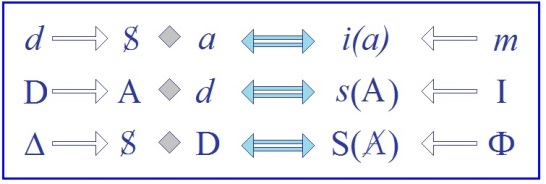
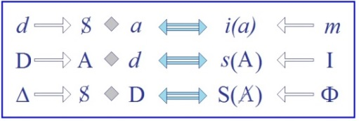
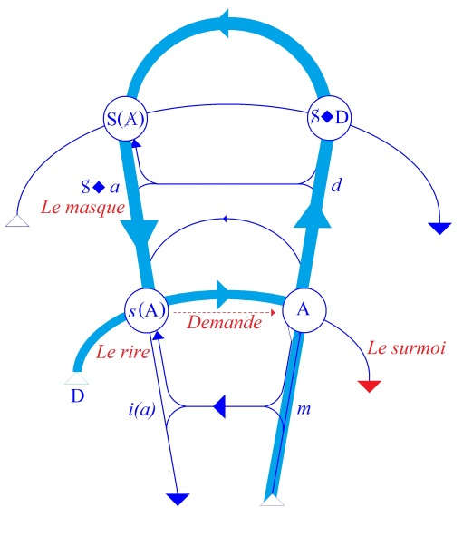
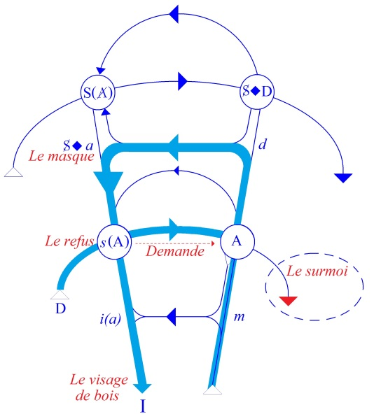

# Leçon 18 | 16 Avril 1958

  <label><input type="checkbox" data-lacan-toggle="original" checked> 原文</label>
  <label><input type="checkbox" data-lacan-toggle="notes" checked> 注释</label>
  <label><input type="checkbox" data-lacan-toggle="commentary" checked> 个人解读评论</label>

<section class="parallel-paragraph" data-paragraph-ids="s5-18-0001">

s5-18-0001

[无对应译文]

原文 · s5-18-0001

</section>

<section class="parallel-paragraph" data-paragraph-ids="s5-18-0002">

s5-18-0002

[无对应译文]

原文 · s5-18-0002

Je voudrais vous ramener à quelque appréhension primitive concernant l’objet de notre expérience,
c’est-à-dire *l’inconscient*, mon dessein étant en somme

</section>

<section class="parallel-paragraph" data-paragraph-ids="s5-18-0003">

s5-18-0003

[无对应译文]

原文 · s5-18-0003

- de vous montrer ce que la découverte de l’inconscient nous ouvre de voies et de possibilités,

</section>

<section class="parallel-paragraph" data-paragraph-ids="s5-18-0004">

s5-18-0004

[无对应译文]

原文 · s5-18-0004

- mais aussi de ne pas vous laisser oublier ce que cette découverte représente de limites à notre pouvoir.
  En d’autres termes, de vous montrer dans quelle perspective, dans quelle allée se laisse entrevoir la possibilité
  d’une normativation : *normativation thérapeutique.*

</section>

<section class="parallel-paragraph" data-paragraph-ids="s5-18-0005">

s5-18-0005

[无对应译文]

原文 · s5-18-0005

Mais n’oubliez pas, parce que toute l’expérience analytique est là pour nous le rappeler, que cette *normativation*
se heurte aux contradictions, aux antinomies internes à toute normativation dans la condition humaine.

</section>

<section class="parallel-paragraph" data-paragraph-ids="s5-18-0006">

s5-18-0006

[无对应译文]

原文 · s5-18-0006

Elle nous permet même d’appro­fondir la nature de ces limites.

</section>

<section class="parallel-paragraph" data-paragraph-ids="s5-18-0007">

s5-18-0007

[无对应译文]

原文 · s5-18-0007

On ne peut tout de même pas manquer d’être frappé qu’un des derniers articles de FREUD, celui qu’on a traduit improprement par *Analyse terminable ou interminable,* en réalité concerne *le fini ou l’infini.* Il s’agit de l’analyse
en tant qu’elle se finit ou en tant qu’elle doit être située dans une sorte de portée infinie. C’est de cela qu’il s’agit.
Et la projection à l’infini de son but, FREUD nous la désigne de la façon la plus claire, tout à fait au niveau
de « *l’expérience concrète* » comme il dit, à savoir qu’il y a de l’ir­réductibilité, en fin de compte :

</section>

<section class="parallel-paragraph" data-paragraph-ids="s5-18-0008">

s5-18-0008

[无对应译文]

原文 · s5-18-0008

- pour l’homme, dans le complexe de castration,

</section>

<section class="parallel-paragraph" data-paragraph-ids="s5-18-0009">

s5-18-0009

[无对应译文]

原文 · s5-18-0009

- pour la femme, dans le *penisneid,* c’est-à-dire dans un certain rapport fondamental avec le *phallus*.

</section>

<section class="parallel-paragraph" data-paragraph-ids="s5-18-0010">

s5-18-0010

[无对应译文]

原文 · s5-18-0010

Sur quoi l’analyse, la découverte freudienne à son départ a-t-elle porté l’accent ? Sur le *désir.*
Ce que FREUD essentiellement découvre, ce que FREUD a appréhendé dans les *symptômes* quels qu’ils soient,
qu’il s’agisse de *symptômes pathologiques* ou qu’il s’agisse de ce qu’il a interprété dans ce qui se présentait jusque là
de plus ou moins réductible dans la vie normale, à savoir *le rêve* par exemple, c’est toujours essentiellement un *désir*.

</section>

<section class="parallel-paragraph" data-paragraph-ids="s5-18-0011">

s5-18-0011

[无对应译文]

原文 · s5-18-0011

Bien plus encore, *dans le rêve* par exemple, il ne nous parle pas simplement de *désir,* mais d’*accomplissement de désir,*
et ceci ne doit pas être sans nous frapper. C’est à savoir que *c’est précisément dans le rêve qu’il parle de satisfac­tion du désir.*

</section>

<section class="parallel-paragraph" data-paragraph-ids="s5-18-0012">

s5-18-0012

[无对应译文]

原文 · s5-18-0012

Il indique d’autre part que *dans le symptôme* lui-même il y a bien quelque chose qui ressemble à cette satisfaction,
mais cette satisfaction, il me semble que c’est assez marquer son caractère problématique puisque aussi bien
*c’est une sorte de satisfaction à l’envers*. Donc, d’ores et déjà, il apparaît dans l’expérience :

</section>

<section class="parallel-paragraph" data-paragraph-ids="s5-18-0013">

s5-18-0013

[无对应译文]

原文 · s5-18-0013

- que *le désir est lié là, à* quelque chose qui est son apparence et, pour dire le mot : *son masque,*

</section>

<section class="parallel-paragraph" data-paragraph-ids="s5-18-0014">

s5-18-0014

[无对应译文]

原文 · s5-18-0014

- que le lien étroit qu’a le désir tel qu’il se présente à nous dans l’expérience analytique avec quelque chose qui le revêt de façon problématique, est bien ce qui - à tout le moins - nous sollicite de nous y arrêter comme à un problème essentiel.

</section>

<section class="parallel-paragraph" data-paragraph-ids="s5-18-0015">

s5-18-0015

[无对应译文]

原文 · s5-18-0015

J’ai souligné à plusieurs reprises ces dernières fois la façon dont le désir, pour autant qu’il apparaît à la conscience,
se manifeste sous une forme paradoxale dans l’expérience analytique, ou plus exactement combien l’expérience analytique a promu ce caractère inhérent au désir en tant que *désir pervers* qui est d’être une sorte de désir
au second degré, de jouissance du désir en tant que désir.

</section>

<section class="parallel-paragraph" data-paragraph-ids="s5-18-0016">

s5-18-0016

[无对应译文]

原文 · s5-18-0016

D’une façon géné­rale, dans l’ensemble, tout ce que *l’analyse* nous permet de percevoir de *la fonction du désir* ce n’est pas elle qui le découvre. Mais elle nous montre jusqu’à quel degré de profondeur est porté le fait que *le désir* humain
n’est pas impliqué d’une façon directe dans un rapport pur et simple avec l’objet qu’il satisfait, mais qu’il est lié :

</section>

<section class="parallel-paragraph" data-paragraph-ids="s5-18-0017">

s5-18-0017

[无对应译文]

原文 · s5-18-0017

- *à une position que prend le sujet* en présence de cet objet,

</section>

<section class="parallel-paragraph" data-paragraph-ids="s5-18-0018">

s5-18-0018

[无对应译文]

原文 · s5-18-0018

- *à une position que prend le sujet* en dehors de sa relation avec l’objet et qui fait que jamais rien ne s’épuise purement et simplement dans cette *relation à l’objet*.

</section>

<section class="parallel-paragraph" data-paragraph-ids="s5-18-0019">

s5-18-0019

[无对应译文]

原文 · s5-18-0019

D’autre part, l’analyse est bien faite aussi pour rappeler ceci, qui est toujours connu, à savoir le caractère

</section>

<section class="parallel-paragraph" data-paragraph-ids="s5-18-0020">

s5-18-0020

[无对应译文]

原文 · s5-18-0020

en quelque sorte *vagabond, fuyant, insaisissable,* échap­pant précisément à la *synthèse du moi*, qu’est *le désir*, laissant
à cette *synthèse du moi* qu’elle apporte, que l’issue d’être - à tout instant en quelque sorte - *illusoire affirmation de synthèse*.

</section>

<section class="parallel-paragraph" data-paragraph-ids="s5-18-0021">

s5-18-0021

[无对应译文]

原文 · s5-18-0021

Je rap­pelle que c’est toujours *moi* qui désire et qui, en *moi*, ne peut *me saisir que dans la diversité de ces désirs*.
À travers cette diversité phénoménologique, si l’on peut dire, à travers cette contradiction, cette anomalie,
cette aporie du *désir*, il est certain qu’il se manifeste un rapport plus profond, un rapport du sujet à la vie,
un rapport du sujet – comme on dit – à des « *instincts* » et qui, pour s’être situé dans cette voie aussi de l’analyse,
nous avait fait faire des progrès dans la situation du sujet par rapport à sa position d’être vivant.

</section>

<section class="parallel-paragraph" data-paragraph-ids="s5-18-0022">

s5-18-0022

[无对应译文]

原文 · s5-18-0022

Mais justement, l’analyse nous apprend, nous fait expérimenter à travers quels tru­chements de *réalisation des buts*,

</section>

<section class="parallel-paragraph" data-paragraph-ids="s5-18-0023">

s5-18-0023

[无对应译文]

原文 · s5-18-0023

des fins de la vie, et peut-être aussi ce qui est au-delà de la vie, je ne sais quelle théologie des premières fins vitales,
ce que FREUD a envisagé comme un *au-delà du principe du plaisir,* à savoir les fins dernières auxquelles vise­rait la vie,

</section>

<section class="parallel-paragraph" data-paragraph-ids="s5-18-0024">

s5-18-0024

[无对应译文]

原文 · s5-18-0024

qui est le retour de la mort. Tout cela, cette analyse nous a permis, je ne dis pas de le définir, mais de l’entre­voir,

</section>

<section class="parallel-paragraph" data-paragraph-ids="s5-18-0025">

s5-18-0025

[无对应译文]

原文 · s5-18-0025

dans la mesure où elle nous a permis aussi de suivre dans ses *cheminements* l’ac­complissement de ces désirs.

</section>

<section class="parallel-paragraph" data-paragraph-ids="s5-18-0026">

s5-18-0026

[无对应译文]

原文 · s5-18-0026

Ce désir humain, dans ses rapports profonds, internes au désir de l’Autre, il a été entrevu depuis toujours,

</section>

<section class="parallel-paragraph" data-paragraph-ids="s5-18-0027">

s5-18-0027

[无对应译文]

原文 · s5-18-0027

et il n’est besoin que de se rap­porter au premier chapitre de la *Phénoménologie de l’esprit* de HEGEL pour retrouver
les voies dans lesquelles d’ores et déjà une réflexion assez approfondie pourrait nous per­mettre d’engager

</section>

<section class="parallel-paragraph" data-paragraph-ids="s5-18-0028">

s5-18-0028

[无对应译文]

原文 · s5-18-0028

cette recherche.

</section>

<section class="parallel-paragraph" data-paragraph-ids="s5-18-0029">

s5-18-0029

[无对应译文]

原文 · s5-18-0029

La nouveauté qu’apporte FREUD, cette originalité, le phénomène nouveau qui nous permet de jeter une lumière
si essentielle sur la nature du désir, c’est en tant que…
contrairement à la voie que suit HEGEL dans son premier abord du désir, voie qui bien entendu,
est loin d’être uniquement déductive comme on le croit du dehors, mais qui est une prise du désir par l’intermédiaire des rapports de *la conscience de soi* avec la constitution de *la conscience de soi* chez l’autre

</section>

<section class="parallel-paragraph" data-paragraph-ids="s5-18-0030">

s5-18-0030

[无对应译文]

原文 · s5-18-0030

…l’interrogation, la ques­tion qui se pose est de savoir comment peut s’introduire, par cet *intermédiaire*,

</section>

<section class="parallel-paragraph" data-paragraph-ids="s5-18-0031">

s5-18-0031

[无对应译文]

原文 · s5-18-0031

la dia­lectique de la vie elle-même ?

</section>

<section class="parallel-paragraph" data-paragraph-ids="s5-18-0032">

s5-18-0032

[无对应译文]

原文 · s5-18-0032

Ce qui assurément chez HEGEL ne peut se traduire que par *une sorte de saut*, qu’il appelle *synthèse* dans l’occasion.
L’expérience freudienne nous en montre un autre cheminement, très curieuse­ment et très remarquablement aussi,

</section>

<section class="parallel-paragraph" data-paragraph-ids="s5-18-0033">

s5-18-0033

[无对应译文]

原文 · s5-18-0033

par la voie où se présente le désir comme étant très profondément lié à ce rapport à l’Autre comme tel,
et se présentant néanmoins comme « *un désir inconscient* ».

</section>

<section class="parallel-paragraph" data-paragraph-ids="s5-18-0034">

s5-18-0034

[无对应译文]

原文 · s5-18-0034

C’est en ceci qu’il convient de se remettre au niveau de ce qu’a été dans l’expérience de FREUD lui-même
cet abord du « *désir inconscient* ». Assurément, c’est là quelque chose qu’il faut nous représenter à nous-mêmes

</section>

<section class="parallel-paragraph" data-paragraph-ids="s5-18-0035">

s5-18-0035

[无对应译文]

原文 · s5-18-0035

des pre­miers temps dans lesquels FREUD a rencontré cette expérience, qu’il faut nous repré­senter à nous-mêmes

</section>

<section class="parallel-paragraph" data-paragraph-ids="s5-18-0036">

s5-18-0036

[无对应译文]

原文 · s5-18-0036

dans son caractère de surprenante nouveauté, je ne dirai pas d’intuition, mais plutôt de *divination* de quelque chose
qui déjà se représente dans une expérience humaine - celle de FREUD - comme quelque chose,

</section>

<section class="parallel-paragraph" data-paragraph-ids="s5-18-0037">

s5-18-0037

[无对应译文]

原文 · s5-18-0037

comme l’appré­hension de quelque chose qui est *au-delà d’un masque*.

</section>

<section class="parallel-paragraph" data-paragraph-ids="s5-18-0038">

s5-18-0038

[无对应译文]

原文 · s5-18-0038

Nous pouvons, maintenant que la psychanalyse est constituée, qu’elle s’est déve­loppée en un si ample et si mouvant discours, nous représenter - mais nous nous le représentons assez mal - ce qu’était la portée de ce qu’apportait FREUD quand il com­mençait à lire dans *les symptômes* de ses patients et dans *ses propres rêves*, et quand il commençait
à nous apporter cette notion du « *désir inconscient* ». C’est bien d’ailleurs ce qui nous manque pour mesurer
à leur juste valeur ce qui se présente dans FREUD comme interprétation.

</section>

<section class="parallel-paragraph" data-paragraph-ids="s5-18-0039">

s5-18-0039

[无对应译文]

原文 · s5-18-0039

Nous sommes toujours très étonnés par le caractère qui nous apparaît très souvent, au regard de ce que nous-mêmes *nous nous permettons d’interprétations*, et je dirai au regard de ce que nous pouvons et ne pouvons plus nous permettre, comme le caractère extraordinairement *interventionniste* des inter­prétations de FREUD.

</section>

<section class="parallel-paragraph" data-paragraph-ids="s5-18-0040">

s5-18-0040

[无对应译文]

原文 · s5-18-0040

On peut même ajouter, jusqu’à un certain point, comme le caractère « *à côté* » de ses interprétations.

</section>

<section class="parallel-paragraph" data-paragraph-ids="s5-18-0041">

s5-18-0041

[无对应译文]

原文 · s5-18-0041

Ne vous ai-je pas mille fois fait remarquer, à propos du cas de Dora par exemple, à propos de son intervention

</section>

<section class="parallel-paragraph" data-paragraph-ids="s5-18-0042">

s5-18-0042

[无对应译文]

原文 · s5-18-0042

ou de ses inter­ventions dans l’analyse d’une homosexuelle dont nous avons longuement parlé ici, combien
les interprétations de FREUD - et FREUD lui-même le reconnaît - étaient comme liées justement à son incomplète connaissance de la psychologie, par exemple des homosexuels en général, combien cette interprétation « *à côté* »,
combien cette interprétation liée à une insuffisante connaissance que FREUD avait à ce moment là de la psychologie, tout spécialement des homosexuels mais aussi des hystériques, est quelque chose donc qui fait que pour nous,
dans plus d’un cas, *les interprétations* de FREUD se présentent avec un caractère à la fois trop directif et presque forcé, avec un caractère précipité qui donne, en effet, à ce terme d’interprétation « *à côté* » sa pleine valeur.

</section>

<section class="parallel-paragraph" data-paragraph-ids="s5-18-0043">

s5-18-0043

[无对应译文]

原文 · s5-18-0043

Néanmoins, il est certain que ces interprétations, à ce moment, étaient ce qui assurément se présentait comme l’interprétation devant être faite, jusqu’à un certain point l’interprétation efficace pour la résolution du *symptôme*.

</section>

<section class="parallel-paragraph" data-paragraph-ids="s5-18-0044">

s5-18-0044

[无对应译文]

原文 · s5-18-0044

Qu’est-ce à dire ? Ceci évidemment nous pose un problème dont il faut, pour commencer de le déblayer,
nous représenter que quand FREUD faisait des interprétations de cet ordre, il se trouvait devant une situation
qui est toute différente de la situation présente.

</section>

<section class="parallel-paragraph" data-paragraph-ids="s5-18-0045">

s5-18-0045

[无对应译文]

原文 · s5-18-0045

Il faut littéralement réaliser que tout ce qui, dans une interprétation-verdict qui sort de la bouche de l’analyste
en tant qu’il y a à proprement parler interprétation, ce verdict, ce qui est *dit* et *proposé*, donné pour vrai,
prend en l’occasion sa valeur de ce qui n’est pas dit. Je veux dire, sur quel fond de non-dit se propose l’interprétation.

</section>

<section class="parallel-paragraph" data-paragraph-ids="s5-18-0046">

s5-18-0046

[无对应译文]

原文 · s5-18-0046

Au temps où FREUD faisait ses interprétations à Dora, quand il lui disait par exemple qu’elle aimait Monsieur K.
et que, somme toute, il lui indiquait sans ambages que c’était avec lui que normalement elle devrait refaire sa vie,
il y avait là quelque chose qui nous surprend, d’autant plus que, bien entendu, il ne saurait en être question
pour les meilleures raisons : à savoir qu’en fin de compte Dora ne veut absolument rien en savoir.

</section>

<section class="parallel-paragraph" data-paragraph-ids="s5-18-0047">

s5-18-0047

[无对应译文]

原文 · s5-18-0047

Néanmoins une interprétation de cet ordre, au moment où FREUD l’a faite, se présente sur le fond de quelque chose qui, de la part du sujet, de la patiente, de Dora, ne comporte aucune sorte de présomption que FREUD soit là
pour rectifier, si l’on peut dire, son appréhension du monde, pour faire que quelque chose en elle soit porté
à maturité de *sa relation d’objet*.

</section>

<section class="parallel-paragraph" data-paragraph-ids="s5-18-0048">

s5-18-0048

[无对应译文]

原文 · s5-18-0048

Rien encore n’est parvenu à ce qu’on pour­rait appeler dans l’occasion une sorte d’*ambiance culturelle*, ce quelque chose qui fait que le sujet attend de la bouche de l’analyste bien autre chose. À la vérité, Dora ne sait pas ce qu’elle attend. Elle est conduite par la main et FREUD lui dit : « *Parlez !* », et rien d’autre ne pointe en quelque sorte à l’horizon d’une expérience ainsi dirigée, si ce n’est implicitement, par le seul fait qu’on lui dit de parler,
qu’en effet il doit bien y avoir quelque chose en jeu qui est de l’ordre de la vérité.

</section>

<section class="parallel-paragraph" data-paragraph-ids="s5-18-0049">

s5-18-0049

[无对应译文]

原文 · s5-18-0049

La situation est loin d’être semblable pour nous, où le sujet vient à l’analyse avec déjà la notion que la maturité
de la personnalité, des instincts, de *la relation d’objet*, est quelque chose qui est déjà organisé, normative,
et dont l’analyste représente en quelque sorte la mesure. Il est détenteur des voies et des secrets de quelque chose
qui d’ores et déjà se présente comme un réseau de relations, sinon toutes connues du sujet,
du moins dont les grandes lignes lui parviennent, au moins dans cette notion qu’il a, dans les grandes lignes :

</section>

<section class="parallel-paragraph" data-paragraph-ids="s5-18-0050">

s5-18-0050

[无对应译文]

原文 · s5-18-0050

- qu’un progrès doit être accompli,

</section>

<section class="parallel-paragraph" data-paragraph-ids="s5-18-0051">

s5-18-0051

[无对应译文]

原文 · s5-18-0051

- que des arrêts dans son développement sont quelque chose de concevable,
  …bref, que tout un fond, toute une implication concernant « *la normativation de sa personne »*, de ses instincts,

</section>

<section class="parallel-paragraph" data-paragraph-ids="s5-18-0052">

s5-18-0052

[无对应译文]

原文 · s5-18-0052

met­tez là toute l’accolade que vous voudrez, implique que l’analyste, quand il inter­vient, intervienne en position,

</section>

<section class="parallel-paragraph" data-paragraph-ids="s5-18-0053">

s5-18-0053

[无对应译文]

原文 · s5-18-0053

dit-on, de *jugement*, de *sanction*. Il y a un mot plus précis encore, que nous indiquerons plus tard.

</section>

<section class="parallel-paragraph" data-paragraph-ids="s5-18-0054">

s5-18-0054

[无对应译文]

原文 · s5-18-0054

Assurément, ceci donne une toute autre portée à son interprétation. Mais pour bien saisir ce dont il s’agit quand
je vous parle du désir inconscient, de la découverte freudienne, il faut revenir à ces temps de fraîcheur

</section>

<section class="parallel-paragraph" data-paragraph-ids="s5-18-0055">

s5-18-0055

[无对应译文]

原文 · s5-18-0055

où rien n’était impliqué de *l’in­terprétation de l’analyste*, si ce n’est cette détection dans l’immédiat,
derrière quelque chose qui se présente paradoxalement comme absolument *fermé*, de quelque chose qui est *au-delà*.

</section>

<section class="parallel-paragraph" data-paragraph-ids="s5-18-0056">

s5-18-0056

[无对应译文]

原文 · s5-18-0056

Et tout un chacun ici *se gargarise* avec le terme de « *sens* ». Je ne crois pas que le terme de « *sens* » soit là autre chose qu’une espèce d’affaiblissement de ce dont il s’agit à l’origine. Le terme de *désir,* dans ce qu’il a l’occasion de nouer,
de rassembler d’identique au sujet, donne toute sa portée à ce qui s’y rencontre dans cette première appréhension
de l’expérience analytique, et c’est à cela qu’il convient de revenir si nous devons tâcher de rassembler, à la fois
le point où nous en sommes et ce que signifie essentiellement, non seulement notre expérience, mais ses possibilités.

</section>

<section class="parallel-paragraph" data-paragraph-ids="s5-18-0057">

s5-18-0057

[无对应译文]

原文 · s5-18-0057

Je veux dire que *ce qui la rend possible, c’est aussi ce qui doit nous garder, si l’on peut dire, de tomber dans cette pente*, *dans ce penchant*, je dirais presque dans *ce piège* où nous sommes impliqués nous-mêmes avec le patient, que nous introduisons dans une expérience de supposés, de l’induire dans une voie qui reposerait en quelque sorte sur un certain nombre
de pétitions de principe. Je veux dire sur l’idée qu’en fin de compte une solution dernière puisse être donnée
à sa condition qui lui permette à la fin, de devenir, disons le mot, *entièrement identique à un objet quelconque*.

</section>

<section class="parallel-paragraph" data-paragraph-ids="s5-18-0058">

s5-18-0058

[无对应译文]

原文 · s5-18-0058

Revenons donc à ce caractère problématique du *désir* tel qu’il se présente dans l’expérience analytique,
c’est-à-dire dans *le symptôme, le symptôme quel qu’il soit*. J’appelle ici *symptôme* dans son sens le plus général, aussi bien

</section>

<section class="parallel-paragraph" data-paragraph-ids="s5-18-0059">

s5-18-0059

[无对应译文]

原文 · s5-18-0059

le symptôme mor­bide, que le rêve, que n’importe quoi d’analysable. Ce que j’appelle *symptôme*, c’est *ce qui est analysable.*
*Le symptôme* se présente, disons sous *un masque*, se présente sous une forme paradoxale : la douleur des premières hystériques que FREUD analyse, voilà quelque chose qui se présente d’abord d’une façon tout à fait fermée

</section>

<section class="parallel-paragraph" data-paragraph-ids="s5-18-0060">

s5-18-0060

[无对应译文]

原文 · s5-18-0060

en appa­rence. Quelque chose que FREUD, peu à peu et grâce à une sorte de patience qui peut vraiment, là,
être inspirée par une sorte d’instinct de limier, rapporte comme quelque chose qui est la longue présence
qu’a eue cette patiente auprès de son père malade.

</section>

<section class="parallel-paragraph" data-paragraph-ids="s5-18-0061">

s5-18-0061

[无对应译文]

原文 · s5-18-0061

Et l’incidence, pendant qu’elle soignait son père, de quelque chose d’autre qu’il entrevoit d’abord dans une sorte de brume : c’est à savoir *le désir* qui pouvait la lier, à ce moment, à *un de ses amis d’enfance* dont elle espérait, disons, faire son époux. Puis ensuite, de quelque chose qui se présente aussi sous une forme mal dévoilée, à savoir ses relations avec ses deux beaux-frères, c’est-à-dire avec deux per­sonnages qui ont épousé respectivement deux de ses sœurs et dont l’analyse nous fait entrevoir que, sous des formes diverses, ils ont là représenté pour elle *quelque chose d’important* :

</section>

<section class="parallel-paragraph" data-paragraph-ids="s5-18-0062">

s5-18-0062

[无对应译文]

原文 · s5-18-0062

- l’un était *détesté* pour je ne sais quelle indignité, quelle grossièreté, quelle patauderie masculine,

</section>

<section class="parallel-paragraph" data-paragraph-ids="s5-18-0063">

s5-18-0063

[无对应译文]

原文 · s5-18-0063

- l’autre, au contraire, semble l’avoir, disons, infiniment séduite.

</section>

<section class="parallel-paragraph" data-paragraph-ids="s5-18-0064">

s5-18-0064

[无对应译文]

原文 · s5-18-0064

Il semble en effet que le *symptôme* se soit précipité sur un certain nombre de rencontres d’une sorte de méditation oblique autour des relations fort heureuses de ce beau-frère avec une de ses sœurs. Je reprends cela pour fixer
les idées dans une sorte d’exemple.

</section>

<section class="parallel-paragraph" data-paragraph-ids="s5-18-0065">

s5-18-0065

[无对应译文]

原文 · s5-18-0065

Il est clair qu’à ce moment là nous sommes à une espèce d’époque primitive de l’expérience analytique,
et nous sentons maintenant…
après toutes les expériences qui ont été faites par la suite, que le fait de dire - comme FREUD
n’a pas manqué de le faire à sa patiente - qu’elle était, par exemple dans le dernier de ces cas, purement
et simplement amoureuse de son beau–frère et que c’est autour de ce désir réprimé que s’est cristallisé
*le symptôme*, nommément dans l’occasion, la douleur de la jambe
…nous sentons bien, nous savons que chez une *hystérique*, ceci a quelque chose de tout aussi forcé
que d’avoir dit à Dora qu’elle était amoureuse de Monsieur K.

</section>

<section class="parallel-paragraph" data-paragraph-ids="s5-18-0066">

s5-18-0066

[无对应译文]

原文 · s5-18-0066

Ce que nous voyons quand nous approchons une observation comme celle-là, ce que nous touchons du doigt,
et FREUD l’exprime, cette vue, de plus haut que ce que je vous propose, il n’y a aucun besoin de bouleverser l’observation de FREUD pour y par­venir car, sans que FREUD le formule ainsi, le diagnostique, le discerne,
il en donne tous les éléments de la façon la plus claire. Je dirai que jusqu’à un certain point la composition
de son observation le laisse apparaître, au-delà des mots qu’il articule dans ses paragraphes,
d’une façon encore infiniment plus convaincante que tout ce qu’il dit.

</section>

<section class="parallel-paragraph" data-paragraph-ids="s5-18-0067">

s5-18-0067

[无对应译文]

原文 · s5-18-0067

Car que va-t-il mettre en relief ? Il va précisément mettre en relief à propos de cette expérience d’Elisabeth von R.
ce qui, à son dire et à son expérience, lie dans beaucoup de cas l’apparition des *symptômes hystériques* à cette expérience
*- si rude en elle-même ­-* d’être toute dévotion au service d’un malade, de jouer le rôle d’infir­mière, et plus encore

</section>

<section class="parallel-paragraph" data-paragraph-ids="s5-18-0068">

s5-18-0068

[无对应译文]

原文 · s5-18-0068

à la portée que prend cette fonction quand le rôle d’infirmière est assumé par un sujet vis-à-vis de l’un de ses proches, c’est-à-dire où, encore plus, par toutes les lois de l’affection, de la passion qui lient le soignant au soigné,
le sujet se trouve en posture d’avoir à satisfaire plus que jamais en aucune autre occasion ce qu’on peut,
là, avec le maximum d’accent, désigner comme *la demande*.

</section>

<section class="parallel-paragraph" data-paragraph-ids="s5-18-0069">

s5-18-0069

[无对应译文]

原文 · s5-18-0069

L’entière soumission, voire l’abnégation, du sujet par rapport à *la demande* qui lui est proposée est vraiment donnée par FREUD comme une des conditions essen­tielles de la situation en tant qu’en l’occasion elle s’avère hystérogène.

</section>

<section class="parallel-paragraph" data-paragraph-ids="s5-18-0070">

s5-18-0070

[无对应译文]

原文 · s5-18-0070

Ceci est d’au­tant plus important que chez cette hystérique là, contrairement à d’autres qu’il nous donne également
en exemple, *les antécédents* autant personnels que familiaux dans ce sens sont extraordinairement *évasifs, peu accentués*,
et que par conséquent le terme ici prend toute sa portée. D’ailleurs FREUD en donne toute l’indication.

</section>

<section class="parallel-paragraph" data-paragraph-ids="s5-18-0071">

s5-18-0071

[无对应译文]

原文 · s5-18-0071

</section>

<section class="parallel-paragraph" data-paragraph-ids="s5-18-0072">

s5-18-0072

[无对应译文]

原文 · s5-18-0072

D’autre part, la chose que nous pouvons voir corrélativement à cette condition, le terme que j’isole ici
dans la médiane de ces trois formules comme *fonction de la demande,* nous dirons que c’est en fonction de cette position de fond que le *quelque chose* dont il s’agit…
et que FREUD ici, entraîné en quelque sorte par les nécessités du langage, n’a qu’un tort si l’on peut dire, c’est d’orienter d’une façon prématurée, de mettre le sujet, d’impliquer le sujet d’une façon trop définie

dans cette situation de désir
…ce dont il s’agit, c’est avant tout essentiellement de l’inté­rêt qui est pris par le sujet dans une situation de *désir*.

</section>

<section class="parallel-paragraph" data-paragraph-ids="s5-18-0073">

s5-18-0073

[无对应译文]

原文 · s5-18-0073

C’est un intérêt qui est pris, mais nous ne pouvons pas dire « *étant donné que c’est une hystérique* », et maintenant que nous savons ce que c’est qu’une *hystérique*, nous ne pouvons pas dire complètement : « *de quelque côté qu’elle le prenne* ».
Si c’est d’ailleurs déjà - de dire *de quel côté elle le prend -* c’est déjà impliquer dans une relation, si l’on peut dire *en tiers,* qu’elle s’intéresse à son beau-frère du point de vue de sa sœur ou à sa sœur du point de vue de son beau-frère.

</section>

<section class="parallel-paragraph" data-paragraph-ids="s5-18-0074">

s5-18-0074

[无对应译文]

原文 · s5-18-0074

C’est précisément que maintenant nous savons que ce qui peut subsister d’une façon corrélative de *l’identification*

</section>

<section class="parallel-paragraph" data-paragraph-ids="s5-18-0075">

s5-18-0075

[无对应译文]

原文 · s5-18-0075

*hys­térique* est ici double : disons qu’elle s’intéresse, qu’elle est impliquée dans la situation de désir, et c’est bien cela,
qui est essentiellement *représenté par un symptôme* ici, que ramène la notion de *masque*.

</section>

<section class="parallel-paragraph" data-paragraph-ids="s5-18-0076">

s5-18-0076

[无对应译文]

原文 · s5-18-0076

La notion de *masque*, c’est-à-dire *ce désir sous cette forme ambiguë* qui ne nous permet justement pas d’orienter le sujet
par rapport à tel ou tel objet de la situation. C’est cet *intérêt* du sujet dans la situation comme telle, c’est-à-dire dans

</section>

<section class="parallel-paragraph" data-paragraph-ids="s5-18-0077">

s5-18-0077

[无对应译文]

原文 · s5-18-0077

*la rela­tion de désir*, qui est exprimé par ce quelque chose qui apparaît, c’est-à-dire ce que j’appelle *l’élément de masque du symptôme*. C’est indiqué dans FREUD, FREUD qui dit à ce propos que « *le symptôme parle dans la séance* ». Le « *ça parle* » dont je vous parle tout le temps, il est là, dès les premières articulations de FREUD, exprimé dans le texte.

</section>

<section class="parallel-paragraph" data-paragraph-ids="s5-18-0078">

s5-18-0078

[无对应译文]

原文 · s5-18-0078

Plus tard il a dit que les *borborygmes* de ses patients venaient se faire entendre et *parler* dans la séance
et avaient une signification de paroles. Mais là ce qu’il nous dit, c’est :

</section>

<section class="parallel-paragraph" data-paragraph-ids="s5-18-0079">

s5-18-0079

[无对应译文]

原文 · s5-18-0079

- que dans la séance même, les douleurs - en tant qu’elles réapparaissent, qu’elles s’ac­centuent, qu’elles deviennent plus ou moins intolérables pendant la séance même - font partie du discours du sujet,

</section>

<section class="parallel-paragraph" data-paragraph-ids="s5-18-0080">

s5-18-0080

[无对应译文]

原文 · s5-18-0080

- qu’il mesure au ton, à la modulation de ses sujets, le degré de brûlant, de portée, de valeur révélatrice de ce que le sujet est en train d’avouer, de lâcher, dans la séance.

</section>

<section class="parallel-paragraph" data-paragraph-ids="s5-18-0081">

s5-18-0081

[无对应译文]

原文 · s5-18-0081

La trace et la direction de cette trace, la direction centripète, le progrès, pour tout dire, de l’analyse est mesuré

</section>

<section class="parallel-paragraph" data-paragraph-ids="s5-18-0082">

s5-18-0082

[无对应译文]

原文 · s5-18-0082

par FREUD à la modula­tion même, à l’intensité même de la façon dont le sujet accuse pendant la séance
une plus ou moins grande intensification de son *symptôme*. J’ai pris cet exemple, mais je pourrais aussi bien en prendre d’autres, je pourrais aussi bien prendre l’exemple d’*un rêve,* ou quelque chose :

</section>

<section class="parallel-paragraph" data-paragraph-ids="s5-18-0083">

s5-18-0083

[无对应译文]

原文 · s5-18-0083

- qui nous permette de cen­trer où est le problème du *symptôme* et du *désir inconscient*, *du lien du désir lui-même*, en tant que le désir lui-même reste un point d’interrogation, un *x,* une énigme, *avec le symptôme dont il se revêt*, c’est-à-dire *le masque*,

</section>

<section class="parallel-paragraph" data-paragraph-ids="s5-18-0084">

s5-18-0084

[无对应译文]

原文 · s5-18-0084

- qui nous permette en somme de formuler ceci : on nous dit que le *symptôme* est quelque chose qui *parle* en lui-même jusqu’à un certain point dont on peut dire avec FREUD - et avec FREUD depuis l’origine - qu’il *s’articule.* Le *symptôme* est donc quelque chose qui va dans le sens de la reconnaissance du désir.

</section>

<section class="parallel-paragraph" data-paragraph-ids="s5-18-0085">

s5-18-0085

[无对应译文]

原文 · s5-18-0085

Mais \[qu’était\] ce *symptôme* - en tant qu’il est là pour faire reconnaître *le désir -* avant que FREUD soit arrivé,
et donc derrière lui toute la levée de ses disciples, les analystes ? C’est une reconnaissance qui tend à se faire jour,

</section>

<section class="parallel-paragraph" data-paragraph-ids="s5-18-0086">

s5-18-0086

[无对应译文]

原文 · s5-18-0086

qui cherche sa voie mais qui, pré­cisément parce qu’elle n’est - elle ne se manifeste - que par la création
de ce que nous avons appelé *le masque*, c’est-à-dire quelque chose de fermé. Cette reconnaissance du désir
c’est une reconnaissance par personne, qui ne vise personne puisque personne, jusqu’à ce moment où on commence d’en apprendre la clé, ne peut la lire. C’est essentiellement une *reconnaissance* qui se présente sous une forme close
à l’Autre, reconnaissance du désir donc, mais reconnaissance par per­sonne.

</section>

<section class="parallel-paragraph" data-paragraph-ids="s5-18-0087">

s5-18-0087

[无对应译文]

原文 · s5-18-0087

D’autre part, si c’est un désir de reconnaissance, en tant que désir de recon­naissance c’est autre chose que le désir. D’ailleurs on nous le dit bien : ce désir est un désir refoulé. C’est pour cela que notre intervention ajoute
quelque chose de plus à la simple lecture. Ce désir c’est un désir que le sujet exclut, en tant que le sujet veut le faire reconnaître comme *un désir de reconnaissance*. *C’est un désir* peut-être, mais en fin de compte *un désir de rien * :

</section>

<section class="parallel-paragraph" data-paragraph-ids="s5-18-0088">

s5-18-0088

[无对应译文]

原文 · s5-18-0088

- c’est un désir qui n’est pas là,

</section>

<section class="parallel-paragraph" data-paragraph-ids="s5-18-0089">

s5-18-0089

[无对应译文]

原文 · s5-18-0089

- c’est un désir qui est rejeté,

</section>

<section class="parallel-paragraph" data-paragraph-ids="s5-18-0090">

s5-18-0090

[无对应译文]

原文 · s5-18-0090

- c’est un désir qui est exclu.

</section>

<section class="parallel-paragraph" data-paragraph-ids="s5-18-0091">

s5-18-0091

[无对应译文]

原文 · s5-18-0091

C’est ce double caractère du désir inconscient qui, en l’identifiant à son masque, en fait *autre chose* que quoi que ce soit qui soit dirigé vers un objet. C’est ce que nous ne devons jamais oublier. Et c’est ce qui nous permet littéralement
de lire le sens de ce qui nous est présenté comme étant la dimension analytique du repérage des découvertes
les plus essentielles quand FREUD nous parle de ce *ravalement*, de cet *Erniedrigung* de la vie amoureuse qui relève
du fond du *complexe d’Œdipe*, ou quand il nous parle du désir de la mère comme étant au principe de ceci

</section>

<section class="parallel-paragraph" data-paragraph-ids="s5-18-0092">

s5-18-0092

[无对应译文]

原文 · s5-18-0092

pour cer­tains sujets : ceux précisément dont on nous dit qu’ils n’ont pas abandonné l’objet incestueux,
c’est-à-dire la mère. Enfin, qu’ils ne l’ont pas assez abandonné car en fin de compte ce que nous apprenons,
c’est que jamais le sujet ne l’abandonne tout à fait.

</section>

<section class="parallel-paragraph" data-paragraph-ids="s5-18-0093">

s5-18-0093

[无对应译文]

原文 · s5-18-0093

Bien entendu, il doit y avoir quelque chose qui correspond à ce plus ou moins d’abandon, et que nous appelons
et diagnostiquons « *fixation à la mère* » : c’est le cas où FREUD nous présente la dissociation de l’amour et du désir.
Ce sont des sujets qui ne peuvent, nous dit FREUD, envisager aborder la femme pour autant qu’elle jouit pour eux de son plein statut d’*être* aimable, d’*être* humain, d’*être* - au sens plein - achevé, que cet être a, dit-on, et peut donner,
et se donner. Ici, il n’y a pas de *désir* en tant que l’objet est là, nous dit-on. Ce qui veut dire bien sûr qu’il est là
*sous un masque,* car ce n’est pas *à la mère* que s’adresse ce désir, c’est *à la femme*, dit-on, qui lui succède,
qui prend sa place. Eh bien justement : *il n’y a plus de désir*.

</section>

<section class="parallel-paragraph" data-paragraph-ids="s5-18-0094">

s5-18-0094

[无对应译文]

原文 · s5-18-0094

D’autre part, nous dit FREUD, ce sujet trouvera *le désir* avec des prostituées. Qu’est-ce que ça veut dire ?
Bien entendu, ici quand nous sommes dans cette espèce de première exploration des ténèbres concernant
les mystères du désir, nous disons : « *c’est pour autant justement que c’est tout l’opposé de la mère* ».

</section>

<section class="parallel-paragraph" data-paragraph-ids="s5-18-0095">

s5-18-0095

[无对应译文]

原文 · s5-18-0095

Est-ce que cela suf­fit pleinement, parce que « *c’est tout l’opposé de la mère* », que justement il puisse le subordonner ?
Nous avons fait depuis assez de *progrès dans la connaissance* des images, des fan­tasmes de l’inconscient et de leur caractère pour savoir que ce que le sujet va chercher chez les prostituées en cette occasion, ce n’est rien d’autre
que ce que l’Antiquité romaine nous montrait bel et bien sculpté et représenté à la porte des bordels,
c’est à savoir le *phallus*, le *phallus* en tant qu’il est justement *ce qui habite* la prostituée.

</section>

<section class="parallel-paragraph" data-paragraph-ids="s5-18-0096">

s5-18-0096

[无对应译文]

原文 · s5-18-0096

Nous savons maintenant que ce que le sujet va chercher chez la prostituée :

</section>

<section class="parallel-paragraph" data-paragraph-ids="s5-18-0097">

s5-18-0097

[无对应译文]

原文 · s5-18-0097

- c’est *le phallus* de tous les autres hommes,

</section>

<section class="parallel-paragraph" data-paragraph-ids="s5-18-0098">

s5-18-0098

[无对应译文]

原文 · s5-18-0098

- c’est *le phallus* comme tel,

</section>

<section class="parallel-paragraph" data-paragraph-ids="s5-18-0099">

s5-18-0099

[无对应译文]

原文 · s5-18-0099

- c’est *le phallus* ano­nyme.

</section>

<section class="parallel-paragraph" data-paragraph-ids="s5-18-0100">

s5-18-0100

[无对应译文]

原文 · s5-18-0100

C’est pour tout dire, aussi quelque chose qui est sous une forme énigmatique, *un masque*, *quelque chose de problématique*, quelque chose qui lie le désir avec un objet privilégié, avec quelque chose qui est ici dans un certain rapport au sens
\- dont nous n’avons que trop appris à voir toute l’importance de la phase phallique - de *ces défilés* par où il faut
que passe *l’expérience subjective* pour que le sujet puisse rejoindre son désir naturel.

</section>

<section class="parallel-paragraph" data-paragraph-ids="s5-18-0101">

s5-18-0101

[无对应译文]

原文 · s5-18-0101

Bref, nous trouvons, à propos de ce que nous appelons dans cette occasion « *désir de la mère* »…
qui est ici une sorte d’étiquette, de désignation symbolique de quelque chose que nous constatons

dans les faits, à savoir la promotion corrélative et brisée de l’objet du désir en deux moitiés irréconciliables
…ce qui, à l’occasion et dans notre interprétation même, peut se proposer comme étant son objet, à savoir l’objet sub­stitutif : la femme, en tant qu’elle est l’héritière de la fonction de la mère, se trouvant dépossédée, frustrée
de l’élément de désir, cet élément de désir étant lui-même lié à autre chose d’extraordinairement problématique
et qui se présente aussi avec un caractère de *masque* et de *marque*.

</section>

<section class="parallel-paragraph" data-paragraph-ids="s5-18-0102">

s5-18-0102

[无对应译文]

原文 · s5-18-0102

Avec un caractère, disons le mot, de *signifiant,* comme si justement nous nous trouvions - dès lors qu’il s’agit
des relations de désir inconscient - en présence *d’un mécanisme nécessaire, d’une Spaltung nécessaire* qui fait que *le désir*,
que nous savions depuis longtemps, que nous présumions être aliéné dans une relation à l’Autre tout à fait spéciale,
se présente ici comme marqué, non seulement de la nécessité de ce truchement à l’Autre comme tel,
mais dans ce truchement à l’Autre, marqué d’un *signifiant spécial*, d’un *signifiant élu* qui se trouve être la voie nécessaire où doit « *adhérer »*, si l’on peut dire, le cheminement de la force vitale, *en l’occasion : du désir,*
et le caractère problématique de ce signifiant particulier en l’occasion : du *phallus*.

</section>

<section class="parallel-paragraph" data-paragraph-ids="s5-18-0103">

s5-18-0103

[无对应译文]

原文 · s5-18-0103

C’est là ce qui est la question. C’est là ce à quoi nous nous arrêtons. C’est là ce qui nous est proposé par toutes
les difficultés qu’introduit pour nous le fait même de pouvoir concevoir comment il se fait que nous rencontrions

</section>

<section class="parallel-paragraph" data-paragraph-ids="s5-18-0104">

s5-18-0104

[无对应译文]

原文 · s5-18-0104

sur les voies de la matu­ration comme on dit « *génitale* » cet obstacle, qui n’est pas simplement un obstacle mais qui est un défilé essentiel, qui fait que c’est par l’intermédiaire d’une certaine position prise par rapport au *phallus*…

</section>

<section class="parallel-paragraph" data-paragraph-ids="s5-18-0105">

s5-18-0105

[无对应译文]

原文 · s5-18-0105

- pour la femme en tant que *manque*,

</section>

<section class="parallel-paragraph" data-paragraph-ids="s5-18-0106">

s5-18-0106

[无对应译文]

原文 · s5-18-0106

- pour l’homme en tant que *menacé*
  …que se réalise de façon nécessaire ce qui se présente comme devant être *l’issue* disons *la plus heureuse*.

</section>

<section class="parallel-paragraph" data-paragraph-ids="s5-18-0107">

s5-18-0107

[无对应译文]

原文 · s5-18-0107

Donc ici ce que nous voyons, c’est :

</section>

<section class="parallel-paragraph" data-paragraph-ids="s5-18-0108">

s5-18-0108

[无对应译文]

原文 · s5-18-0108

- qu’en intervenant, en nommant quelque chose, nous faisons toujours plus, quoi que nous fassions, que nous croyons faire,

</section>

<section class="parallel-paragraph" data-paragraph-ids="s5-18-0109">

s5-18-0109

[无对应译文]

原文 · s5-18-0109

- qu’en interprétant - *le mot que je voulais tout à l’heure vous dire*, le mot précis que j’appelais tout à l’heure *autoriser, sanctionner, permettre,* c’est « *homologuer » -* nous identifions le même au même, nous disons : « *c’est cela* ».

</section>

<section class="parallel-paragraph" data-paragraph-ids="s5-18-0110">

s5-18-0110

[无对应译文]

原文 · s5-18-0110

Nous nous substituons à ce « *personne* » auquel est adressé le *symptôme* en tant qu’il est là, dans la voie de

</section>

<section class="parallel-paragraph" data-paragraph-ids="s5-18-0111">

s5-18-0111

[无对应译文]

原文 · s5-18-0111

*la reconnaissance du désir*, mais *nous méconnaissons* tou­jours aussi jusqu’à un certain degré, *le désir qui veut se faire reconnaître*, pour autant que toujours à un certain degré nous lui assignons son objet alors que *ce n’est pas un objet,*
*qu’il est désir mais désir de ce manque, qui dans l’Autre désigne un autre désir*.

</section>

<section class="parallel-paragraph" data-paragraph-ids="s5-18-0112">

s5-18-0112

[无对应译文]

原文 · s5-18-0112

Ceci nous introduit au deuxième chapitre, si vous voulez, à la deuxième ligne de ce que je vous propose ici
dans ces trois formules, c’est à savoir au chapitre de *la demande* \[D\].

</section>

<section class="parallel-paragraph" data-paragraph-ids="s5-18-0113">

s5-18-0113

[无对应译文]

原文 · s5-18-0113

</section>

<section class="parallel-paragraph" data-paragraph-ids="s5-18-0114">

s5-18-0114

[无对应译文]

原文 · s5-18-0114

Je pense que la façon dont j’aborde ces choses et dont je les reprends, à savoir la façon dont j’essaie pour vous d’articuler l’originalité du désir dont il s’agit à chaque instant dans l’analyse, n’est pas dans la supervision
que nous pouvons en faire au nom d’une idée plus ou moins théorique de la maturation de chacun.
Je pense que vous devez commencer à entendre que si je parle de *l’instance de la parole* ou *de la lettre, dans l’inconscient*,
ce n’est certainement pas pour éliminer ce *quelque chose* d’irréductible, d’informulable, qu’est le *désir*.

</section>

<section class="parallel-paragraph" data-paragraph-ids="s5-18-0115">

s5-18-0115

[无对应译文]

原文 · s5-18-0115

Simplement je vous fais cette remarque dont jusqu’ici les philosophes ne semblent pas s’être avisés. Je le dis à propos d’une remarque que quelqu’un de bien mal inspiré à l’occasion a cru devoir faire récem­ment sur le fait que certains psychanalystes - comme s’il y en avait beaucoup en l’oc­casion - donnaient trop d’importance au *langage* au regard

</section>

<section class="parallel-paragraph" data-paragraph-ids="s5-18-0116">

s5-18-0116

[无对应译文]

原文 · s5-18-0116

de ce fameux *informulé* dont je ne sais pourquoi certains philosophes ont fait un des cas de leur propriété per­sonnelle.

</section>

<section class="parallel-paragraph" data-paragraph-ids="s5-18-0117">

s5-18-0117

[无对应译文]

原文 · s5-18-0117

Nous dirons que contrairement à cette formule, qui consistait - chez le personnage que je qualifie en l’occasion
de « *bien mal inspiré »*, ce qui est le minimum de ma pensée - à faire remarquer que l’informulé n’était peut-être pas informulable, je lui répondrai ceci, à quoi il ferait mieux de faire attention qu’à chercher à impli­quer tout un chacun dans ses *querelles de boutique,* c’est - dans une perspective inverse - que ce n’est pas une raison parce que quelque chose n’est pas *articulable* - à savoir *le désir* - pour qu’il ne soit pas *articulé*.

</section>

<section class="parallel-paragraph" data-paragraph-ids="s5-18-0118">

s5-18-0118

[无对应译文]

原文 · s5-18-0118

Je veux dire, en lui-même *le désir* est articulé pour autant qu’il est lié à la présence du signifiant dans l’homme,
et ceci ne veut pas dire pour autant, justement parce qu’il s’agit essentiel­lement de ce lien avec le signifiant,

</section>

<section class="parallel-paragraph" data-paragraph-ids="s5-18-0119">

s5-18-0119

[无对应译文]

原文 · s5-18-0119

ce n’est pas une raison, bien loin de là : c’est même justement la raison pour laquelle, dans un cas particulier,

</section>

<section class="parallel-paragraph" data-paragraph-ids="s5-18-0120">

s5-18-0120

[无对应译文]

原文 · s5-18-0120

il ne soit jamais plei­nement articulable.

</section>

<section class="parallel-paragraph" data-paragraph-ids="s5-18-0121">

s5-18-0121

[无对应译文]

原文 · s5-18-0121

Revenons maintenant à ce deuxième chapitre qui est celui de *la demande* \[D\]. Là, nous sommes dans *l’articulé articulable*, dans l’actuellement articulé. C’est bien de ce lien entre le *désir* et la *demande* qu’il est question pour l’instant

</section>

<section class="parallel-paragraph" data-paragraph-ids="s5-18-0122">

s5-18-0122

[无对应译文]

原文 · s5-18-0122

et nous n’arrive­rons pas aujourd’hui au bout de ce discours. Mais la prochaine fois, je veux, entre ces deux termes
du *désir* et de la *demande,* et des paradoxes que tout à l’heure nous avons désignés dans ce désir comme étant essentiellement *désir masqué,* vous montrer comment ceci s’articule.

</section>

<section class="parallel-paragraph" data-paragraph-ids="s5-18-0123">

s5-18-0123

[无对应译文]

原文 · s5-18-0123

Assurément, c’est parce que nous ne pouvons l’approcher que par la voie de quelque *demande*, que dès lors que
le patient nous aborde et vient chez nous, c’est pour nous demander quelque chose. Et nous allons déjà

</section>

<section class="parallel-paragraph" data-paragraph-ids="s5-18-0124">

s5-18-0124

[无对应译文]

原文 · s5-18-0124

énor­mément loin dans l’engagement, dans la précision de la situation, en lui disant sim­plement : « *nous vous écoutons* ».

</section>

<section class="parallel-paragraph" data-paragraph-ids="s5-18-0125">

s5-18-0125

[无对应译文]

原文 · s5-18-0125

Alors il convient là, de repartir sur ce qu’on peut appeler les *prémisses de la demande*…

</section>

<section class="parallel-paragraph" data-paragraph-ids="s5-18-0126">

s5-18-0126

[无对应译文]

原文 · s5-18-0126

- sur ce qui fait demande sur demande,

</section>

<section class="parallel-paragraph" data-paragraph-ids="s5-18-0127">

s5-18-0127

[无对应译文]

原文 · s5-18-0127

- sur ce qui fait la situation de la demande,

</section>

<section class="parallel-paragraph" data-paragraph-ids="s5-18-0128">

s5-18-0128

[无对应译文]

原文 · s5-18-0128

- et sur la façon dont elle s’engage à l’intérieur d’une vie individuelle.

</section>

<section class="parallel-paragraph" data-paragraph-ids="s5-18-0129">

s5-18-0129

[无对应译文]

原文 · s5-18-0129

Ici, il faut revenir à ce qui l’institue au début. Je ne vais pas refaire la dialectique du « *Fort ! - Da ! *». La demande est liée d’abord et avant tout à ce quelque chose qui est dans les *prémisses mêmes du langage*, à savoir dans *l’existence d’un* *appel* qui est à la fois principe de la *présence*, et le terme qui per­met de la *repousser,* jeu de *la présence* et de *l’absence*, et elle fait

</section>

<section class="parallel-paragraph" data-paragraph-ids="s5-18-0130">

s5-18-0130

[无对应译文]

原文 · s5-18-0130

de la première arti­culation par laquelle *l’objet* est appelé ce quelque chose par quoi déjà il est plus qu’un *objet symbole* :
il devient ce que le désir de *la présence* fait de lui, et non pas comme on le dit, un objet.

</section>

<section class="parallel-paragraph" data-paragraph-ids="s5-18-0131">

s5-18-0131

[无对应译文]

原文 · s5-18-0131

La dialectique première n’est pas l’objet partiel de la *mère-sein* ou de la *mère-nourriture* ou de la *mère-objet total*,
comme s’il s’agissait d’une espèce de conquête faite de proche en proche. Le nourrisson s’aperçoit que le sein
se prolonge en aisselle, en cou et en chevelure.

</section>

<section class="parallel-paragraph" data-paragraph-ids="s5-18-0132">

s5-18-0132

[无对应译文]

原文 · s5-18-0132

L’objet dont il s’agit c’est la *parenthèse symbolique* de cette *présence* à l’intérieur de laquelle il y a *la somme de tous les objets* qu’elle peut appor­ter et qui fait que cette *parenthèse symbolique* est *d’ores et déjà* plus précieuse qu’au­cun bien,

</section>

<section class="parallel-paragraph" data-paragraph-ids="s5-18-0133">

s5-18-0133

[无对应译文]

原文 · s5-18-0133

et qu’un des biens qu’elle contient ne peut en lui-même et à lui tout seul satisfaire à ce qui est *l’appel de la présence*,
que, comme je vous l’ai déjà plusieurs fois exprimé, aucun de ces biens en particulier ne peut servir, et ne sert
à l’occasion, qu’à écraser si l’on peut dire le principe de cet appel, à savoir que l’enfant se nourrit peut-être
et commence à dormir. À ce moment-là, évidemment, il n’est plus ques­tion d’*appel*, tous les rapports à un objet quelconque, *partiel* comme on dit, à l’in­térieur de la présence maternelle, ne sont ici que substituts,
écrasement du désir, non pas satisfaction en tant que telle.

</section>

<section class="parallel-paragraph" data-paragraph-ids="s5-18-0134">

s5-18-0134

[无对应译文]

原文 · s5-18-0134

Et ceci, à savoir le caractère principal de cette *symbolisation* ici de l’objet en tant qu’il est *l’objet de l’appel,*
est d’ores et déjà marqué par le fait que nous avons lu nous aussi, mais comme toujours nous ne savons pas tirer jusqu’au bout *les conséquences* de ce que nous lisons, que d’ores et déjà dans *l’ob­jet*, dans *l’objet* dont il s’agit,

</section>

<section class="parallel-paragraph" data-paragraph-ids="s5-18-0135">

s5-18-0135

[无对应译文]

原文 · s5-18-0135

dans *l’objet* de la présence, la dimension du *masque* apparaît.

</section>

<section class="parallel-paragraph" data-paragraph-ids="s5-18-0136">

s5-18-0136

[无对应译文]

原文 · s5-18-0136

Qu’est ce que notre bon ami Monsieur SPITZ nous apporte, si ce n’est cela ?

</section>

<section class="parallel-paragraph" data-paragraph-ids="s5-18-0137">

s5-18-0137

[无对应译文]

原文 · s5-18-0137

C’est que d’abord est reconnu cette espèce de frontal direct, d’armature, ce *masque*, et le caractère d’*au-delà* qui caractérise *cette présence en tant que symbolisée*, à savoir de recherche au-delà de cette présence *en tant qu’elle est masquée*, qu’elle est *symptomatisée*, *symbolisée*. Et cette recherche au-delà, l’enfant nous désigne dans son com­portement

</section>

<section class="parallel-paragraph" data-paragraph-ids="s5-18-0138">

s5-18-0138

[无对应译文]

原文 · s5-18-0138

qu’il en a la dimension. Car il suffit - j’ai déjà parlé à un autre propos du caractère très particulier de la réaction
de l’enfant devant le masque - de jouer avec un enfant - je vous l’ai déjà dit - pour voir l’épanouissement
que lui donne le fait d’ôter le masque, et ce caractère particulièrement anxieux de ce qui se passe sous le masque, lorsque sous le masque un autre masque apparaît. Car là, il ne rit plus.

</section>

<section class="parallel-paragraph" data-paragraph-ids="s5-18-0139">

s5-18-0139

[无对应译文]

原文 · s5-18-0139

Mais il n’y a même pas besoin de se livrer à ces sortes de menus petits exercices, il suffit d’*observer* un enfant
pour s’apercevoir qu’avant la parole, la communication, la première communication. Il faut n’avoir jamais observé simplement un enfant dans son développement dans les premiers mois pour ne pas s’apercevoir que la pre­mière communication, en tant vraiment que communication, c’est-à-dire avec l’au-delà de ce que vous êtes devant lui comme présence symbolisée, c’est le rire. Avant toute parole, l’enfant rit. Il rit quand le rire bien sûr est lié au sourire et à la détente, et tout le mécanisme physiologique du rire est lié toujours à une certaine satisfaction.

</section>

<section class="parallel-paragraph" data-paragraph-ids="s5-18-0140">

s5-18-0140

[无对应译文]

原文 · s5-18-0140

On a parlé de ce dessein du sourire de l’enfant repu, mais l’enfant, en tant qu’il vous rit, il vous rit précisément
dans une certaine relation bien sûr avec sa satisfaction du désir, mais après et au-delà de cette satisfaction,
pour autant que, encore présent et éveillé, c’est à cet au-delà de cette présence, en tant qu’elle est capable
de le satisfaire et qu’elle contient en lui l’accord à son désir, que le rire se produit et que la présence familière,
la présence dont il a l’habitude et la connaissance, en tant qu’elle peut satis­faire à ses désirs dans leur diversité,

</section>

<section class="parallel-paragraph" data-paragraph-ids="s5-18-0141">

s5-18-0141

[无对应译文]

原文 · s5-18-0141

est là appelée, appréhendée, reconnue dans ce mode si spécifique, si spécial que sont, chez les enfants, *avant la parole*, ces premiers rires en présence de certaines des présences qui le soignent, qui le nourrissent, qui lui répondent.

</section>

<section class="parallel-paragraph" data-paragraph-ids="s5-18-0142">

s5-18-0142

[无对应译文]

原文 · s5-18-0142

Le rire répond aussi bien d’ailleurs à tous ces jeux maternels qui sont les premiers exercices dans lesquels lui est apportée la modulation, l’articulation comme telle. *Le rire*, en tant que justement il est lié à ce que je vous ai appelé pendant toutes ces pre­mières articulations des conférences de cette année *le trait d’esprit, est l’au-delà, l’au-delà de l’immédiat, l’au-delà de toute demande*. Le désir, en tant qu’il est à proprement parler lié à un signifiant, dans l’occasion
le signifiant de *la présence,* c’est à l’*au-delà* de cette présence, au sujet là derrière, que s’adressent les premiers rires.

</section>

<section class="parallel-paragraph" data-paragraph-ids="s5-18-0143">

s5-18-0143

[无对应译文]

原文 · s5-18-0143

Et nous trouvons là, dès ce moment, dès l’origine si l’on peut dire, la racine de l’*identification*. Car l’*identification*,
pour autant qu’elle se fera successivement au cours du développement de l’enfant avec tel ou tel, avec *la mère* d’abord, avec *le père* ensuite, et je ne vous dis pas que ce pas épuise la question, mais que nous en trouvons là une racine.

</section>

<section class="parallel-paragraph" data-paragraph-ids="s5-18-0144">

s5-18-0144

[无对应译文]

原文 · s5-18-0144

L’*identification* est très exactement le *cor­rélatif* de ce rire, car l’opposé du rire, bien entendu, ce ne sont pas les pleurs.
*Les pleurs expriment la colique, expriment le besoin*, les pleurs ne sont pas une com­munication, *les pleurs sont une expression*.

</section>

<section class="parallel-paragraph" data-paragraph-ids="s5-18-0145">

s5-18-0145

[无对应译文]

原文 · s5-18-0145

*Mais le rire*, pour autant que je suis forcé d’articuler pourquoi*, est une communication*.

</section>

<section class="parallel-paragraph" data-paragraph-ids="s5-18-0146">

s5-18-0146

[无对应译文]

原文 · s5-18-0146

Par contre, qu’est-ce qui correspond à l’opposé du rire, pour autant que le rire constate, communique,
s’adresse à celui qui, au-delà de cette présence signifiée, est le ressort, la source du plaisir et de l’*identification* ?
C’est le contraire : on ne rit plus, on est sérieux comme un pape ou comme un papa, on fait mine de rien,
parce que celui qui est là vous fait *un certain visage de bois* parce que, sans doute, ce n’est pas le moment de rire.
Ce n’est pas le moment de *rire* parce que *les besoins* n’ont pas, à ce moment-là, à être satisfaits. *Le désir*, comme on dit, se modèle sur celui qui détient le pouvoir de le satisfaire, qui oppose la résistance de la réalité comme on dit,
qui n’est peut-être pas tout à fait ce qu’on dit qu’elle est, mais qui, assurément, se présente ici *sous une certaine forme*,
et, pour tout dire, d’ores et déjà dans cette dialectique de la demande.

</section>

<section class="parallel-paragraph" data-paragraph-ids="s5-18-0147">

s5-18-0147

[无对应译文]

原文 · s5-18-0147

</section>

<section class="parallel-paragraph" data-paragraph-ids="s5-18-0148">

s5-18-0148

[无对应译文]

原文 · s5-18-0148

Nous voyons, selon mon vieux schéma, se produire ce dont il s’agit *quand la demande vient ici à bon port, à savoir*
*au-delà du masque, rencontrer*, non pas la satisfaction mais *le message* \[*s*(A)\] *de cette présence*, à la façon dont le sujet accuse
qu’il a bien devant lui la source de tous les biens : ici éclate le rire. Et le processus n’a pas besoin non plus, là,
de se poursuivre plus loin.

</section>

<section class="parallel-paragraph" data-paragraph-ids="s5-18-0149">

s5-18-0149

[无对应译文]

原文 · s5-18-0149

Mais il peut avoir à se poursuivre plus loin parce que *le visage* s’est montré *de bois*, que *la demande a été refusée*, et alors, comme je vous l’ai dit, ce qui est à l’origine de ce *besoin* et *désir*, apparaît ici sous une forme transformée, *le visage de bois* s’est transféré dans le circuit pour venir ici, d’ailleurs à un endroit dont ce n’est pas pour rien que c’est là que nous rencontrons l’*image de l’autre* \[*i(a)*\] et qu’est donnée cette transformation de la demande qui s’appelle l’*idéal du moi* \[I\], cependant qu’ici en effet, *dans la ligne signifiante,* le principe, la place s’amorce de ce qui s’appelle *interdiction* et *surmoi,*
de ce qui s’articule comme tel venant de l’Autre. La théorie analytique a toujours eu beaucoup de difficulté à concilier l’existence, la cœxistence, la co-dimensionnalité de l’*idéal du moi* et du *surmoi*, mais assuré­ment ils répondent

</section>

<section class="parallel-paragraph" data-paragraph-ids="s5-18-0150">

s5-18-0150

[无对应译文]

原文 · s5-18-0150

à des formations et à des productions différentes.

</section>

<section class="parallel-paragraph" data-paragraph-ids="s5-18-0151">

s5-18-0151

[无对应译文]

原文 · s5-18-0151

</section>

<section class="parallel-paragraph" data-paragraph-ids="s5-18-0152">

s5-18-0152

[无对应译文]

原文 · s5-18-0152

Il suffirait de faire cette distinction essentielle qu’il y a entre le besoin, et la parole qui le demande, pour comprendre comment ces deux produits peuvent être à la fois co-dimensionnels et différents :

</section>

<section class="parallel-paragraph" data-paragraph-ids="s5-18-0153">

s5-18-0153

[无对应译文]

原文 · s5-18-0153

- c’est dans la ligne de *l’articulation signifiante*, \[A → S\] à savoir l’interdic­tion, que le *surmoi* se formule, même sous ses formes les plus primitives,

</section>

<section class="parallel-paragraph" data-paragraph-ids="s5-18-0154">

s5-18-0154

[无对应译文]

原文 · s5-18-0154

- alors que c’est dans la ligne de la transformation du désir \[*d* → S ◊ *a*\], en tant que le désir est toujours lié à un certain *masque,* que se produit l’*idéal du moi*.

</section>

<section class="parallel-paragraph" data-paragraph-ids="s5-18-0155">

s5-18-0155

[无对应译文]

原文 · s5-18-0155

En d’autres termes, le lien dans *la demande* de la satisfaction avec le *masque*, leur opposition qui fait que *le masque*
*se constitue dans l’insatisfaction* et par l’intermédiaire de la demande qui est refusée, c’est là le point jusqu’où je voulais
vous amener aujourd’hui. Mais alors, qu’est ce qui en résulterait ? C’est qu’il y aurait en somme autant de *masques*
que de formes d’*insatisfaction* ? Oui, c’est bien comme cela que les choses se présentent, et vous pourrez vous gui­der là-dessus avec certitude dans la dimension psychologique qui se déroule, qui se déploie à partir de la frustration
qui est si vive chez certains sujets.

</section>

<section class="parallel-paragraph" data-paragraph-ids="s5-18-0156">

s5-18-0156

[无对应译文]

原文 · s5-18-0156

Vous pourrez rele­ver dans leurs déclarations mêmes cette sorte de rapport entre l’insatisfaction et le *masque*, qui ferait que, jusqu’à un certain degré, il y aurait autant de *masques* que d’insatisfactions. Cette pluralité de rapports du sujet
à l’Autre, selon la diversité de ses insatisfactions, est bien là quelque chose qui pose un problème et dont on peut dire justement, jusqu’à un certain point, qu’elle ferait de toute personnalité une espèce de *mosaïque mouvante d’identifications*.

</section>

<section class="parallel-paragraph" data-paragraph-ids="s5-18-0157">

s5-18-0157

[无对应译文]

原文 · s5-18-0157

Et je dirai que c’est précisément dans l’intervention de *la troisième dimension*, celle que je laisserai de côté aujourd’hui, que je réserve pour la prochaine fois, celle qui est introduite, non pas comme on dit par *la maturation génitale*, ni *le don*, ni *l’oblativité*, ni *d’autres balivernes moralisantes* qui sont des caractéristiques tout à fait secondaires de la question, mais dans quelque chose dont nous dirons qu’il intervient en effet à partir d’un certain moment un *désir  *:

</section>

<section class="parallel-paragraph" data-paragraph-ids="s5-18-0158">

s5-18-0158

[无对应译文]

原文 · s5-18-0158

- un *désir* qui n’est pas *besoin* mais qui est Ἔρως \[Éros\],

</section>

<section class="parallel-paragraph" data-paragraph-ids="s5-18-0159">

s5-18-0159

[无对应译文]

原文 · s5-18-0159

- un *désir* qui n’est pas *auto-érotique* mais, comme on dit, *allo-érotique*, car ce sont exactement les façons de dire la même chose.

</section>

<section class="parallel-paragraph" data-paragraph-ids="s5-18-0160">

s5-18-0160

[无对应译文]

原文 · s5-18-0160

Seulement il ne suffit pas de dire cela, car à la vérité, il ne suffit pas de cette *maturation génitale* pour apporter
des remaniements subjectifs qui vont être des remaniements décisifs, qui vont nous permettre de saisir le lien
entre *le désir* et *le masque*.

</section>

<section class="parallel-paragraph" data-paragraph-ids="s5-18-0161">

s5-18-0161

[无对应译文]

原文 · s5-18-0161

Nous verrons la prochaine fois cette caractéristique, cette condition essentielle qui lie cette étape à un signifiant prévalent, privilégié, que nous appelons non pas par hasard, mais parce que concrètement il est *ce signifiant,*
à savoir le *phallus*. Et nous verrons paradoxalement que c’est précisément à cette étape que se réalise à la fois
ce *quelque chose* qui permet au sujet de se retrouver comme « *un* » à travers la diversité de ses *masques*,

</section>

<section class="parallel-paragraph" data-paragraph-ids="s5-18-0162">

s5-18-0162

[无对应译文]

原文 · s5-18-0162

mais qui d’autre part, le fait fondamentalement *divisé*, fondamenta­lement *marqué d’une Spaltung* essentielle entre :

</section>

<section class="parallel-paragraph" data-paragraph-ids="s5-18-0163">

s5-18-0163

[无对应译文]

原文 · s5-18-0163

- ce qui est en lui désir,

</section>

<section class="parallel-paragraph" data-paragraph-ids="s5-18-0164">

s5-18-0164

[无对应译文]

原文 · s5-18-0164

- et ce qui est *masque*.

</section>

