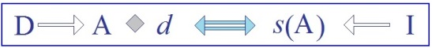
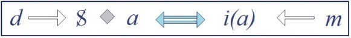
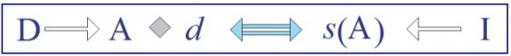
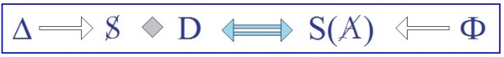
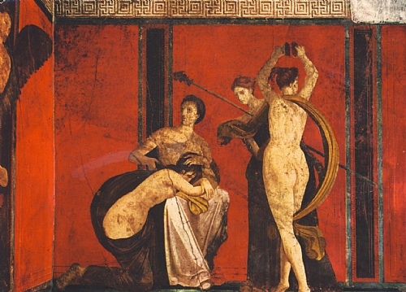
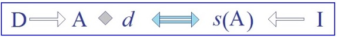

# Leçon 19 | 23 Avril 1958

  <label><input type="checkbox" data-lacan-toggle="original" checked> 原文</label>
  <label><input type="checkbox" data-lacan-toggle="notes" checked> 注释</label>
  <label><input type="checkbox" data-lacan-toggle="commentary" checked> 个人解读评论</label>

<section class="parallel-paragraph" data-paragraph-ids="s5-19-0001">

s5-19-0001

[无对应译文]

原文 · s5-19-0001

Il s’agit de continuer à approfondir cette *distinction* du *désir* et de la *demande*, que nous considérons comme
si essentielle dans la bonne conduite de l’analyse, et faute de quoi nous croyons qu’elle glisse invinciblement autour d’une spéculation pratique fondée sur les termes de la frustration d’une part, de la gratification d’autre part,
termes qui à nos yeux constituent une véritable *déviation* de sa voie. Ce dont il s’agit est donc de poursuivre
dans le sens de *quelque chose* auquel nous avons déjà donné un nom : *la distance du désir à la demande*.

</section>

<section class="parallel-paragraph" data-paragraph-ids="s5-19-0002">

s5-19-0002

[无对应译文]

原文 · s5-19-0002

Ce n’est pas en quelque sorte - une *Spaltung -* ce n’est pas un terme que j’emploie au hasard, c’est un terme qui a été sinon introduit, du moins fortement accentué dans *le tout dernier écrit de* FREUD, celui au milieu duquel,
si l’on peut dire, la plume lui est tombée des mains, parce qu’elle lui a été simplement arrachée par la mort.

</section>

<section class="parallel-paragraph" data-paragraph-ids="s5-19-0003">

s5-19-0003

[无对应译文]

原文 · s5-19-0003

Cette [*Ich Spal**tung*](#Freud_Die_Ichspaltung) est vraiment le point de convergence auquel la dernière méditation de FREUD, on ne peut pas dire l’amenait et le ramenait, c’est quelque chose dont nous n’avons plus qu’un morceau, quelques pages qui sont dans
le tome XVII des *Gesammelte Werke.* Vous devez le lire pour faire surgir en vous la présence dans l’esprit de FREUD de la question qu’elle soulève. Vous y verrez également avec quelle force il accentue que la fonction de *synthèse du moi* est loin d’être tout quand il s’agit de l’*ich* psychana­lytique.

</section>

<section class="parallel-paragraph" data-paragraph-ids="s5-19-0004">

s5-19-0004

[无对应译文]

原文 · s5-19-0004

Pour *reprendre* ce que nous avons dit la dernière fois, car je crois qu’on ne sau­rait ici progresser qu’à faire trois pas

</section>

<section class="parallel-paragraph" data-paragraph-ids="s5-19-0005">

s5-19-0005

[无对应译文]

原文 · s5-19-0005

en avant et deux pas en arrière, à repartir et gagner chaque fois un petit pas, je vais essayer de rappeler tout de même assez vite ce sur quoi j’ai insisté la dernière fois en parlant du *désir* d’une part et de la *demande* d’autre part. À savoir, pour ce qui est du *désir*, ce que j’ai appelé son caractère lié, insé­parable du *masque*, et que je vous ai illustré tout spécialement d’un rappel de ceci : c’est que c’est aller trop vite en besogne que de distinguer le *symptôme*
comme un simple *dessous* à un *dehors*.

</section>

<section class="parallel-paragraph" data-paragraph-ids="s5-19-0006">

s5-19-0006

[无对应译文]

原文 · s5-19-0006

Je vous ai parlé de la malade Elisabeth Von R., dont en somme je vous disais qu’à lire simplement le texte
de FREUD, on peut dire, et FREUD le dit, l’articule :

</section>

<section class="parallel-paragraph" data-paragraph-ids="s5-19-0007">

s5-19-0007

[无对应译文]

原文 · s5-19-0007

- que sa dou­leur du haut de la cuisse droite, c’est le *désir* de son *père* et le *désir* de son *ami d’enfance*,

</section>

<section class="parallel-paragraph" data-paragraph-ids="s5-19-0008">

s5-19-0008

[无对应译文]

原文 · s5-19-0008

- que c’est chaque fois qu’elle évoque dans l’histoire de sa maladie, le moment où elle était entièrement asservie au désir de son père, à la demande de son père, et où à peine en marge, s’exerçait cette *effraction* du *désir* de son *ami d’enfance* qu’elle se reprochait de prendre *en considération*,

</section>

<section class="parallel-paragraph" data-paragraph-ids="s5-19-0009">

s5-19-0009

[无对应译文]

原文 · s5-19-0009

- et que la douleur de sa cuisse gauche c’est le désir de ses deux beaux-frères, en tant que l’un représente le bon désir masculin, celui qui a épousé sa plus jeune sœur, et l’autre le mauvais, qui par ailleurs a été consi­déré par toutes ces dames comme un fort mauvais homme.

</section>

<section class="parallel-paragraph" data-paragraph-ids="s5-19-0010">

s5-19-0010

[无对应译文]

原文 · s5-19-0010

Au-delà de cette remarque, ce qu’il faut savoir considérer avant de comprendre ce que veut dire notre interprétation du désir, c’est que dans le *symptôme* - et c’est cela que veut dire « *conversion » -* le *désir* est identique à la manifestation somatique qui est son endroit comme il est son envers. D’autre part, j’ai introduit - puisque aussi bien si nous avons avancé c’est parce que les choses ne sont qu’introduites sous forme de problématique - cette problé­matique du désir en tant que l’analyse nous le montre comme déterminé par *un acte de signification*. Mais que le *désir* soit déterminé
par *un acte de signification* ne livre pas du tout d’une façon achevée son sens. Il se peut que le *désir* soit un sous-produit, si je puis m’exprimer ainsi, de cet acte de signification.

</section>

<section class="parallel-paragraph" data-paragraph-ids="s5-19-0011">

s5-19-0011

[无对应译文]

原文 · s5-19-0011

Dans un des articles que je vous ai cités comme constituant l’introduction véri­table à la question de la perversion,

</section>

<section class="parallel-paragraph" data-paragraph-ids="s5-19-0012">

s5-19-0012

[无对应译文]

原文 · s5-19-0012

pour autant qu’elle se présente elle aussi comme un *symptôme*, et non pas comme pure et simple manifestation

</section>

<section class="parallel-paragraph" data-paragraph-ids="s5-19-0013">

s5-19-0013

[无对应译文]

原文 · s5-19-0013

d’un *désir incons­cient* nous représentant, le moment où les auteurs s’aperçoivent qu’il y a tout autant de *Verdrängung* dans une perversion que dans un *symptôme*, dans un de ces articles publié à l’*International Journal,* il s’agit du cas d’un sujet névrosé, l’auteur[^50] s’arrête à ce fait qu’un sujet, après avoir réussi son premier coït de façon satisfaisante
\- ce n’est pas dire que les autres choses ne le seront pas dans la suite - tout de suite après ce premier coït
il se livre à un acte mystérieux, à la vérité unique dans son existence.

</section>

<section class="parallel-paragraph" data-paragraph-ids="s5-19-0014">

s5-19-0014

[无对应译文]

原文 · s5-19-0014

Ren­trant chez lui au retour de chez celle qui lui a accordé ses faveurs, il se livre à cette exhibition particulièrement réussie - je crois que j’y ai fait allusion d’ailleurs déjà dans un de mes séminaires - particulièrement réussie en ce sens qu’elle se réalise avec le maximum de plénitude, et d’autre part de sécurité : il se déculotte et s’exhibe le long
d’un remblais de chemin de fer et, à la lumière d’un train qui passe, il se trouve ainsi s’exhiber à une foule entière
sans courir le moindre danger, bien entendu. Et cet acte est interprété par l’auteur, dans l’économie générale
de la névrose du sujet, d’une façon plus ou moins heureuse.

</section>

<section class="parallel-paragraph" data-paragraph-ids="s5-19-0015">

s5-19-0015

[无对应译文]

原文 · s5-19-0015

Ce n’est même pas de ce côté que je vais m’étendre, mais je vais m’arrêter à quelque chose qui est ceci : assurément, pour un analyste, que ceci soit un acte signi­ficatif comme on dit, c’est certain.

</section>

<section class="parallel-paragraph" data-paragraph-ids="s5-19-0016">

s5-19-0016

[无对应译文]

原文 · s5-19-0016

Mais quelle signification ? Qu’est-ce que cela veut dire ? Qu’il l’a encore ?

</section>

<section class="parallel-paragraph" data-paragraph-ids="s5-19-0017">

s5-19-0017

[无对应译文]

原文 · s5-19-0017

Je vous répète qu’il vient de commettre sa première copulation.

</section>

<section class="parallel-paragraph" data-paragraph-ids="s5-19-0018">

s5-19-0018

[无对应译文]

原文 · s5-19-0018

Qu’est-ce que cela veut dire ? Qu’il l’a encore à la disposition de tous, à savoir qu’il est devenu *pro­priété personnelle* ?

</section>

<section class="parallel-paragraph" data-paragraph-ids="s5-19-0019">

s5-19-0019

[无对应译文]

原文 · s5-19-0019

Qu’est-ce qu’il veut en quelque sorte en le montrant ? Veut-il en le montrant s’effacer derrière ce qu’il montre,
n’être plus que le *phallus* ?

</section>

<section class="parallel-paragraph" data-paragraph-ids="s5-19-0020">

s5-19-0020

[无对应译文]

原文 · s5-19-0020

Tout ceci est également plausible, et même à l’intérieur d’un seul et même acte, d’un seul et même contexte subjectif, ce qui paraît avant tout là être extrêmement important et digne d’être accentué, je dirai plus que tout autre chose,
et qu’il est bien souligné, confirmé par les dires du patient, par le contexte de l’observation, par la suite même
des choses, que ce premier coït a été pleinement satisfaisant.

</section>

<section class="parallel-paragraph" data-paragraph-ids="s5-19-0021">

s5-19-0021

[无对应译文]

原文 · s5-19-0021

Ce que l’acte dont il s’agit montre d’abord et au premier chef, avant toute autre interprétation, c’est que sa satisfaction est prise et réalisée. *Cet acte indique ce qui est laissé à désirer au-delà de la satisfaction*. Je rappelle simplement ce petit exemple pour fixer les idées sur ce que je veux dire sur *la problématique du désir*, en tant qu’il est déterminé par un acte de *signification*, et en tant que ceci est distinct de tout sens saisissable. Je veux aussi rappeler à ce pro­pos, et l’ajouter à ce que j’ai dit la dernière fois, que les considérations de cette sorte, celles qui montrent la *profonde cohérence,* coalescence du *désir* avec le *symptôme* qui le masque, avec ce qui apparaît dans sa manifestation.

</section>

<section class="parallel-paragraph" data-paragraph-ids="s5-19-0022">

s5-19-0022

[无对应译文]

原文 · s5-19-0022

C’est quelque chose qui remet à sa place beaucoup de vaines questions que l’on se pose toujours à propos *de* *l’hystérie*, mais bien plus encore à propos de toute sorte *de faits sociologiques, eth­nographiques et autres*, où on voit toujours les gens s’embrouiller les pattes autour de la question. Prenons un exemple : il vient de paraître une excellente plaquette comme numéro d’une petite collection, « *L’Homme* », qui paraît chez PLON. C’est le livre de Michel LEIRIS[^51]

</section>

<section class="parallel-paragraph" data-paragraph-ids="s5-19-0023">

s5-19-0023

[无对应译文]

原文 · s5-19-0023

sur l’effet de possession et sur les aspects théâtraux de la possession, choses qu’il développe autour de son expérience auprès des Éthiopiens de Gondar.

</section>

<section class="parallel-paragraph" data-paragraph-ids="s5-19-0024">

s5-19-0024

[无对应译文]

原文 · s5-19-0024

À lire cet excellent volume, on voit bien combien des faits de transe d’une consistance incon­testable, s’allient,

</section>

<section class="parallel-paragraph" data-paragraph-ids="s5-19-0025">

s5-19-0025

[无对应译文]

原文 · s5-19-0025

se marient parfaitement avec un certain caractère extérieurement typifié, déterminé, attendu, repéré à l’avance, connu des « *esprits* » qui sont censés s’emparer de la subjectivité des personnages qui manifestent toutes ces manifesta­tions singulières, qu’observent les cérémonies dites du *chamanisme*, puisque c’est là ce dont il s’agit dans la contrée indiquée.

</section>

<section class="parallel-paragraph" data-paragraph-ids="s5-19-0026">

s5-19-0026

[无对应译文]

原文 · s5-19-0026

Et bien plus : que cela n’est pas simplement cette part conventionnelle qu’on peut remarquer, qui se manifeste,
qui se reproduit à propos de *la manifestation* de l’incarnation de tel ou tel esprit. C’est le caractère disciplinable de ces *manifestations* et, jusqu’à un certain point, tellement disciplinable que les sujets le perçoivent comme quelque chose
qui est un dressage des esprits qui sont pourtant ceux qui sont censés s’emparer d’eux.

</section>

<section class="parallel-paragraph" data-paragraph-ids="s5-19-0027">

s5-19-0027

[无对应译文]

原文 · s5-19-0027

Mais la chose se renverse : ces esprits ont fait leur apprentissage à bien se tenir. Le phénomène de possession,

</section>

<section class="parallel-paragraph" data-paragraph-ids="s5-19-0028">

s5-19-0028

[无对应译文]

原文 · s5-19-0028

avec tout ce qu’il comporte de phénomènes puis­samment inscrits dans les émotions, dans tout un pathétique

</section>

<section class="parallel-paragraph" data-paragraph-ids="s5-19-0029">

s5-19-0029

[无对应译文]

原文 · s5-19-0029

où le sujet est entière­ment possédé pendant le temps de la manifestation, est parfaitement compatible avec
toute cette richesse liée aux insignes du dieu, du génie, et qui n’en font que d’une façon tout à fait artificielle
une sorte de problème que notre mentalité essayerait d’inscrire sous le type de simulations, imitations ou autres termes de cette espèce. L’identité même de la manifestation désirante, avec ses formes, est là tout à fait tan­gible.

</section>

<section class="parallel-paragraph" data-paragraph-ids="s5-19-0030">

s5-19-0030

[无对应译文]

原文 · s5-19-0030

L’autre point, l’autre terme dans lequel s’inscrit cette dialectique, cette problé­matique du *désir*, c’est ce sur quoi

</section>

<section class="parallel-paragraph" data-paragraph-ids="s5-19-0031">

s5-19-0031

[无对应译文]

原文 · s5-19-0031

par contre j’ai insisté la dernière fois, c’est cette excentricité du désir par rapport à toute *satisfaction*,

</section>

<section class="parallel-paragraph" data-paragraph-ids="s5-19-0032">

s5-19-0032

[无对应译文]

原文 · s5-19-0032

qui nous permet de com­prendre ce *qu’en général* est sa profonde affinité avec *la douleur*.

</section>

<section class="parallel-paragraph" data-paragraph-ids="s5-19-0033">

s5-19-0033

[无对应译文]

原文 · s5-19-0033

C’est dire qu’à la limite, ce à quoi confine purement et simplement le désir, non plus dans ses formes développées, dans ses formes masquées, mais dans sa forme pure et simple, c’est cette douleur d’exister qui représente l’autre pôle, l’espace, pour tout dire : *l’aire* à l’in­térieur de quoi sa manifestation se présente à nous.

</section>

<section class="parallel-paragraph" data-paragraph-ids="s5-19-0034">

s5-19-0034

[无对应译文]

原文 · s5-19-0034

À l’opposé de cette problématique, en décrivant ainsi ce que j’appelle *l’aire du désir*, son excentricité par rapport
à la satisfaction, je ne prétends pas, bien entendu, le résoudre : ce n’est pas une explication que je donne là,

</section>

<section class="parallel-paragraph" data-paragraph-ids="s5-19-0035">

s5-19-0035

[无对应译文]

原文 · s5-19-0035

c’est une position du pro­blème, et c’est bien cela dans quoi nous avons à nous avancer aujourd’hui.

</section>

<section class="parallel-paragraph" data-paragraph-ids="s5-19-0036">

s5-19-0036

[无对应译文]

原文 · s5-19-0036

Je rappelle d’un autre côté, *l’autre élément du diptyque*, de l’opposition que j’ai proposée la dernière fois : c’est celui qui est lié au caractère *de fonction identificatrice*, de *fonction idéalisante*, en tant qu’elle se trouve dépendre de la dialectique de
la demande, en tant que *l’identification* de tout ce qui se passe dans ce registre *se fonde dans une certaine relation au signifiant*,
*dans l’Autre signifiant, qui est dans son ensemble caractérisé, et à propos de la demande, comme étant le signe de la présence de l’Autre.*

</section>

<section class="parallel-paragraph" data-paragraph-ids="s5-19-0037">

s5-19-0037

[无对应译文]

原文 · s5-19-0037

Là aussi s’institue quelque chose qui doit bien avoir un rapport avec le problème du désir, qui est

</section>

<section class="parallel-paragraph" data-paragraph-ids="s5-19-0038">

s5-19-0038

[无对应译文]

原文 · s5-19-0038

- ce en quoi ce *signe de la présence* vient à dominer les satisfactions qu’apporte cette présence,

</section>

<section class="parallel-paragraph" data-paragraph-ids="s5-19-0039">

s5-19-0039

[无对应译文]

原文 · s5-19-0039

- ce en quoi ce qui fait que si fondamentalement, d’une façon si étendue, si constante, l’être humain se paye de paroles, tout autant ou tout au moins dans une proportion sensible, très pondérable, par rapport à des satisfac­tions plus substantielles.

</section>

<section class="parallel-paragraph" data-paragraph-ids="s5-19-0040">

s5-19-0040

[无对应译文]

原文 · s5-19-0040

C’est simplement rappeler *la caractéristique fondamen­tale* qui se rapporte à ce que je viens de rappeler.
Est-ce à dire d’ailleurs que seulement l’être humain se paie de paroles ? Ici encore une parenthèse,
complémentaire de ce que j’ai dit la dernière fois : il n’y a pas seule­ment que l’être humain qui se paye de paroles.

</section>

<section class="parallel-paragraph" data-paragraph-ids="s5-19-0041">

s5-19-0041

[无对应译文]

原文 · s5-19-0041

Jusqu’à un certain degré, nous savons que certains animaux domestiques - et il n’est pas exclu de le penser -
ont quelques satisfactions liées au parler humain. Je n’ai pas besoin là de faire des évocations, mais nous apprenons même des choses étranges. Il semble y avoir un degré de crédibilité qu’on peut faire aux dires de ceux qu’on appelle, d’une façon plus ou moins appro­priée, *les spécialistes.* Nous nous sommes laissé dire que les visons - captifs, dans le dessein de lucre, à savoir pour tirer profit de leur fourrure - dépérissent et ne donnent que d’assez médiocres produits aux pelletiers si on ne leur fait pas la conversation. Cela rend, paraît-il, l’élevage des visons très onéreux
en accroissant les *frais généraux*.

</section>

<section class="parallel-paragraph" data-paragraph-ids="s5-19-0042">

s5-19-0042

[无对应译文]

原文 · s5-19-0042

Il semblerait donc qu’en tout cas quelque chose là *se manifeste* dont nous n’avons pas non plus les moyens
d’entrer plus loin dans la problématique, mais qui assurément doit bien être lié au fait même d’être enclos,
parce que les visons à l’état sauvage sont, selon toute apparence, hors de possibilité, sauf plus ample informé,
de rencontrer cette sorte de *satisfaction*. Pour tout dire, je voudrais simplement vous indiquer le rapport, la direction dans laquelle nous pouvons voir, en rapport à notre problème, *les études pavlo­viennes* des réflexes conditionnés.

</section>

<section class="parallel-paragraph" data-paragraph-ids="s5-19-0043">

s5-19-0043

[无对应译文]

原文 · s5-19-0043

En fin de compte, qu’est-ce que c’est que les réflexes conditionnés ?

</section>

<section class="parallel-paragraph" data-paragraph-ids="s5-19-0044">

s5-19-0044

[无对应译文]

原文 · s5-19-0044

Sous leurs formes les plus répandues, et qui ont occupé la plus grande partie de l’expérience, les réflexes conditionnés sont bien une intervention dans un cycle plus ou moins prédéterminé, inné, un cycle de comportements instinctifs.
Tous ces petits signaux électriques, ces petites sonnettes, ces petites clochettes, dont on les *tympanise* les pauvres animaux, pour arriver à leur faire *sécréter* leurs diverses productions phy­siologiques, leurs sucs gastriques aux ordres, ce sont quand même bien des signifiants, et rien d’autre.

</section>

<section class="parallel-paragraph" data-paragraph-ids="s5-19-0045">

s5-19-0045

[无对应译文]

原文 · s5-19-0045

Ils sont fabriqués par des êtres - en tout cas des expérimentateurs - pour lesquels le monde est très nettement constitué par un certain nombre de relations objectives entre lesquelles ce qu’on peut à juste titre isoler comme proprement signi­fiant constitue une part importante de ce monde. Aussi bien d’ailleurs, c’est dans le dessein de montrer par quelle espèce de voie de substitution progressive est conce­vable un progrès psychique, que toutes ces choses sont construites et élucubrées. Jusqu’à un certain point, on pourrait se poser la question de savoir pourquoi, au bout du compte, ces animaux si bien dressés, cela ne revient pas à leur apprendre une certaine sorte de langage.

</section>

<section class="parallel-paragraph" data-paragraph-ids="s5-19-0046">

s5-19-0046

[无对应译文]

原文 · s5-19-0046

Ce qui n’est pas la seule chose qui mérite d’être remarquée, c’est que justement le bond n’est pas fait et que,
quand la théorie pavlovienne vient à mettre en jeu ce qui se produit chez l’homme à propos du langage, il ou elle

</section>

<section class="parallel-paragraph" data-paragraph-ids="s5-19-0047">

s5-19-0047

[无对应译文]

原文 · s5-19-0047

\- PAV­LOV ou la théorie - prend le très juste parti de parler, pour ce qui est du langage, non pas *d’un prolongement*
*du système de significations* tel qu’il est mis en jeu dans *les réflexes conditionnés*, mais d’*un second système de significations*,

</section>

<section class="parallel-paragraph" data-paragraph-ids="s5-19-0048">

s5-19-0048

[无对应译文]

原文 · s5-19-0048

c’est-à-dire impli­citement de reconnaître, ce qui n’est peut-être pas pleinement articulé dans la théorie,
qu’il y a *quelque chose de différent* dans l’un et dans l’autre. Et ce qui est différent nous dirons que nous pouvons essayer de le définir, de définir cette dis­tinction, cette différence, en ceci qu’elle doit se situer dans ce que nous appelons
le rapport au grand *Autre*, en tant que ceci constitue *le lieu d’un système unitaire et signifiant*. Ou encore, nous dirions que ce qui manque à ce discours des signaux, c’est la concaténation pour le sujet intéressé, c’est-à-dire pour l’animal.

</section>

<section class="parallel-paragraph" data-paragraph-ids="s5-19-0049">

s5-19-0049

[无对应译文]

原文 · s5-19-0049

En fin de compte, ce qui se formulerait simplement, nous l’énoncerions sous cette forme de dire qu’en somme,

</section>

<section class="parallel-paragraph" data-paragraph-ids="s5-19-0050">

s5-19-0050

[无对应译文]

原文 · s5-19-0050

quel que soit le caractère poussé de ces expé­riences, ce qui n’est pas trouvé - et peut-être ce qu’il n’est pas question
de trouver - c’est *la loi* dans laquelle ces signifiants mis en jeu s’ordonneraient. Ce qui revient à dire que c’est la *loi* à laquelle enfin les animaux obéiraient. Il est tout à fait clair en effet qu’il n’y a pas de trace de référence à une telle *loi*, c’est-à-dire à rien qui soit au-delà du signal, à savoir que d’une courte chaîne de signaux, une fois établis, *aucune sorte d’extrapolation légalisante n’y est perceptible*. Et c’est bien en cela qu’on peut dire que l’on n’arrive pas à instituer la *loi*.
Je répète : ce n’est pas dire pour autant qu’il n’y ait aucune dimension de l’Autre avec un grand A pour l’animal,
mais rien ne s’articule effectivement à l’intérieur en tant que discours.

</section>

<section class="parallel-paragraph" data-paragraph-ids="s5-19-0051">

s5-19-0051

[无对应译文]

原文 · s5-19-0051

Donc ce à quoi nous arrivons si nous résumons ce dont il s’agit dans le rapport du sujet au signifiant dans l’Autre,
à savoir ce qui se passe dans la dialectique de la demande, c’est essentiellement ce qui caractérise le *signifiant*,

</section>

<section class="parallel-paragraph" data-paragraph-ids="s5-19-0052">

s5-19-0052

[无对应译文]

原文 · s5-19-0052

non pas comme sub­stitué - ce qui est le cas dans les réflexes conditionnés - comme substitué aux besoins du sujet, *mais le signifiant lui-même comme pouvant être substitué à lui-même*, comme étant essentiellement de nature substitutive.

</section>

<section class="parallel-paragraph" data-paragraph-ids="s5-19-0053">

s5-19-0053

[无对应译文]

原文 · s5-19-0053

Et c’est dans cette direction que nous voyons la dominance de ce qui importe, à savoir la place qu’il occupe dans l’Autre. Ce que nous voyons pointer dans cette direction, c’est ce que j’essaye de diverses façons de formuler ici comme essentiel à la structure signifiante, c’est-à-dire cet *espace topologique*, pour ne pas dire cet *espace typographique* qui en fait juste­ment *la loi de sa substitution*, *ce numérotage des places*, ces *places numérotées* qui donnent *la structure fondamentale d’un système signifiant* comme tel. C’est pour autant que le sujet se présentifie à l’intérieur d’un monde ainsi retrouvé dans la position d’Autre, que ce quelque chose - c’est un fait mis en valeur par l’expérience - qui s’appelle l’*identification* se produit. *Faute de la satisfaction, c’est au sujet qui peut accéder à la demande que le sujet s’identifie.*

</section>

<section class="parallel-paragraph" data-paragraph-ids="s5-19-0054">

s5-19-0054

[无对应译文]

原文 · s5-19-0054

</section>

<section class="parallel-paragraph" data-paragraph-ids="s5-19-0055">

s5-19-0055

[无对应译文]

原文 · s5-19-0055

Je vous ai laissés là la dernière fois en posant la question :

</section>

<section class="parallel-paragraph" data-paragraph-ids="s5-19-0056">

s5-19-0056

[无对应译文]

原文 · s5-19-0056

- alors pourquoi pas le plus grand pluralisme dans les *identifications* ?

</section>

<section class="parallel-paragraph" data-paragraph-ids="s5-19-0057">

s5-19-0057

[无对应译文]

原文 · s5-19-0057

- Autant d’*identifications* que de demandes insatisfaites ?

</section>

<section class="parallel-paragraph" data-paragraph-ids="s5-19-0058">

s5-19-0058

[无对应译文]

原文 · s5-19-0058

- Autant d’*identifications* qu’il y a d’autres qui se posent en présence du sujet comme ceux qui répondent ou ne répondent pas à la demande ?

</section>

<section class="parallel-paragraph" data-paragraph-ids="s5-19-0059">

s5-19-0059

[无对应译文]

原文 · s5-19-0059

La clef de cette distance, de cette *Spaltung,* se trouve ici reflétée par la construction de ce petit *schéma* que je vous mets aujourd’hui pour la 1ère fois au tableau, et qui constitue quelque chose que nous devons retrouver dans les 3 lignes que je vous ai déjà deux fois répétées. Je pense que vous les avez dans vos notes, mais je peux vous les rappeler, à savoir :

</section>

<section class="parallel-paragraph" data-paragraph-ids="s5-19-0060">

s5-19-0060

[无对应译文]

原文 · s5-19-0060

1\) 

</section>

<section class="parallel-paragraph" data-paragraph-ids="s5-19-0061">

s5-19-0061

[无对应译文]

原文 · s5-19-0061

La ligne qui lie *le petit d du désir* d’un côté, par l’intermédiaire de cette *relation du sujet au petit a* \[S ◊ *a*\], à *l’image de a* \[*i(a)*\] et à *m,* c’est-à-dire le *moi*.

</section>

<section class="parallel-paragraph" data-paragraph-ids="s5-19-0062">

s5-19-0062

[无对应译文]

原文 · s5-19-0062

2\) 

</section>

<section class="parallel-paragraph" data-paragraph-ids="s5-19-0063">

s5-19-0063

[无对应译文]

原文 · s5-19-0063

*La deuxième ligne, représentant précisément la demande*, pour autant qu’elle va de la *Demande* à l’*Identification* en passant
par la position de *l’Autre* par rapport au *désir*, c’est-à-dire que vous voyez ici décomposer *l’Autre* en tant que
c’est *au-delà* de lui qu’il y a le *désir*, et en passant par le *signifié de* A \[*s*(A)\] qui, *à ce niveau-là*, se placerait ici,
je veux dire dans *une première étape du schéma* qui était celle que je vous ai faite la dernière fois, c’est-à-dire au fait
qu’*il* \[l’Autre\] *ne répond qu’à la demande,* et qui précisément va, à cause de quelque chose qui est ce que nous cherchons dans un deuxième temps, se diviser dans ce rapport, non pas simple mais double que j’ai d’ailleurs déjà amorcé
par d’autres voies, en deux chaînes signifiantes : *la première qui est ici* quand elle est seule et simple au niveau
de la *demande*, étant ici en tant que c’est *une chaîne* signifiante à travers laquelle *la demande* a à se faire jour.

</section>

<section class="parallel-paragraph" data-paragraph-ids="s5-19-0064">

s5-19-0064

[无对应译文]

原文 · s5-19-0064

Il va intervenir autre chose qui *double cette relation signifiante*. C’est ce *doublement de la relation signifiante*, pour autant
que vous pouvez par exemple, entre autres choses mais naturellement pas d’une façon univoque, l’identifier comme cela a été fait jusqu’à présent à *la réponse de la mère*. La ligne inférieure \[2\] représente *ce qui se passe en somme au niveau*
*de la demande, au niveau où la réponse de la mère fait à elle toute seule la loi,* c’est-à-dire *en somme soumet le sujet à son arbitraire.*

</section>

<section class="parallel-paragraph" data-paragraph-ids="s5-19-0065">

s5-19-0065

[无对应译文]

原文 · s5-19-0065

3\) 

</section>

<section class="parallel-paragraph" data-paragraph-ids="s5-19-0066">

s5-19-0066

[无对应译文]

原文 · s5-19-0066

Enfin, l’autre ligne \[3\] représente l’intervention d’une autre instance correspondant à la présence paternelle
et aux modes sous lesquels son instance se fait sentir au-delà de la mère. Et bien entendu, ce n’est pas si simple,
et si tout en effet était une question de *maman et de papa*, je vois difficilement comment nous pourrions
rendre compte, au moins des faits auxquels nous avons affaire.

</section>

<section class="parallel-paragraph" data-paragraph-ids="s5-19-0067">

s5-19-0067

[无对应译文]

原文 · s5-19-0067

C’est donc dans la question de cette *Spaltung,* qui est purement et simplement *celle qui est identique, responsable de cette béance entre le désir et la demande, de cette discordance*, de cette *divergence* qui s’établit *entre le désir et la demande*, que nous allons maintenant nous introduire, et c’est pourquoi il nous faut encore reve­nir, reposer *la question de ce que c’est un signifiant.*

</section>

<section class="parallel-paragraph" data-paragraph-ids="s5-19-0068">

s5-19-0068

[无对应译文]

原文 · s5-19-0068

Je sais que vous vous le demandez chaque fois que nous nous quittons : en fin de compte, *que peut-il bien vouloir dire* ?
Vous avez raison de vous le demander, parce qu’assurément ce n’est pas dit comme cela, ce n’est pas couru d’avance.
Reprenons la question de ce qu’est un signifiant au niveau élémentaire. Je vous propose d’arrêter votre pensée
sur un certain nombre de remarques.

</section>

<section class="parallel-paragraph" data-paragraph-ids="s5-19-0069">

s5-19-0069

[无对应译文]

原文 · s5-19-0069

Par exemple, ne croyez-vous pas que nous touchons à quelque chose qui est au moins... Je ne sais quel exemple vous donner, peut-être quelque chose à propos de quoi on pourrait par­ler d’émergence ? Si nous remarquons ce qu’a de spécifique le fait, non pas d’une *trace*, car une *trace* c’est une *empreinte*, ce n’est pas un *signifiant*, on sent bien pourtant qu’il peut y avoir un rapport, et qu’à la vérité ce qu’on appelle le *matériel du signifiant* participe toujours quelque peu
au caractère *évanescent* de *la trace*. Cela semble être une des conditions d’existence de ce matériel signifiant.

</section>

<section class="parallel-paragraph" data-paragraph-ids="s5-19-0070">

s5-19-0070

[无对应译文]

原文 · s5-19-0070

Ce n’est pourtant pas là un signi­fiant : même le pied de VENDREDI que ROBINSON découvre au cours
de sa promenade dans l’île n’est pas *un signifiant*.

</section>

<section class="parallel-paragraph" data-paragraph-ids="s5-19-0071">

s5-19-0071

[无对应译文]

原文 · s5-19-0071

Mais par contre, à supposer que lui, ROBINSON, pour une raison quelconque efface cette trace, là nous introduisons nettement la dimension du *signifiant*. C’est à partir du moment où on l’efface, où cela a un sens de l’effacer, que le quelque chose qui est trace est manifestement constitué comme signifiant. On voit en effet que si, là, le signifiant est *un creuset*, c’est en tant qu’il témoigne d’une présence passée et qu’inversement, dans ce qui est signifiant, il y a toujours, dans le signifiant pleinement développé qu’est la parole, il y a toujours *un passage*, c’est-à-dire *quelque chose* qui est *au-delà de chacun des éléments* qui sont articulés et qui sont de leur nature fugaces, évanouissants.
Et c’est ce « *passage* » de l’un à l’autre qui constitue l’essentiel de ce que nous appelons *la chaîne signifiante*,
et ce « *passage* » en tant qu’évanescent, c’est cela même qui fait *voix*.

</section>

<section class="parallel-paragraph" data-paragraph-ids="s5-19-0072">

s5-19-0072

[无对应译文]

原文 · s5-19-0072

Je ne dis même pas « *articulation signifiante » *: il se peut que ce soit une *articulation qui reste énigmatique,*
mais que ce qui le soutient soit *voix*, c’est aussi à ce niveau qu’émerge ce qui répond à ce que nous avons d’abord désigné du *signifiant* comme *témoignant d’une présence qui est passée*.

</section>

<section class="parallel-paragraph" data-paragraph-ids="s5-19-0073">

s5-19-0073

[无对应译文]

原文 · s5-19-0073

Inversement dans un « *passage* » qui est actuel, ce qui se manifeste c’est quelque chose qui l’approfondit,
qui est au-delà et qui en fait une *voix*. En somme, là encore ce que nous retrouvons, c’est aussi bien, après que ce soit effacé, ce qui reste - s’il y a un texte, à savoir si ce signifiant s’inscrit parmi d’autres signi­fiants - ce qui reste,

</section>

<section class="parallel-paragraph" data-paragraph-ids="s5-19-0074">

s5-19-0074

[无对应译文]

原文 · s5-19-0074

c’est *la place où on l’a effacé*, et c’est bien *cette place* aussi *qui soutient la transmission, qui est quelque chose d’essentiel grâce à quoi*

</section>

<section class="parallel-paragraph" data-paragraph-ids="s5-19-0075">

s5-19-0075

[无对应译文]

原文 · s5-19-0075

*ce qui se suc­cède dans le passage prend consistance de « voix »*.

</section>

<section class="parallel-paragraph" data-paragraph-ids="s5-19-0076">

s5-19-0076

[无对应译文]

原文 · s5-19-0076

Nous ne sommes là vraiment qu’au niveau et au point de l’émergence, mais un point essentiel à saisir. Ce qui fait que le signifiant comme tel c’est *quelque chose* qui peut être *effacé*, qui *ne laisse plus que* «* sa place* », c’est-à-dire qu’on ne peut plus le retrouver. C’est cette propriété qui est essentielle, et qui fait que si l’on peut parler d’*émergence,* on ne peut pas parler de *développement.* En réalité, le signifiant la contient en lui-même. Je veux dire que l’une des dimensions fondamentales du signifiant, c’est de pouvoir s’annuler lui-même.

</section>

<section class="parallel-paragraph" data-paragraph-ids="s5-19-0077">

s5-19-0077

[无对应译文]

原文 · s5-19-0077

Il y a pour cela une possibilité que nous pouvons en l’occasion qualifier de « *mode du signifiant »* lui-même

</section>

<section class="parallel-paragraph" data-paragraph-ids="s5-19-0078">

s5-19-0078

[无对应译文]

原文 · s5-19-0078

et qui se maté­rialise par quelque chose de fort *simple* que nous connaissons tous et dont nous ne saurions pas
nous laisser de dissimuler l’originalité par la trivialité d’usage : c’est *la barre. Toute espèce de signifiant est, de sa nature, quelque chose qui peut être barré.*

</section>

<section class="parallel-paragraph" data-paragraph-ids="s5-19-0079">

s5-19-0079

[无对应译文]

原文 · s5-19-0079

On parle beaucoup, depuis qu’il y a des philosophes qui pensent, de l’*Aufhebung,* et on a appris à en faire un usage plus ou moins rusé. Ce mot veut dire à la fois *annu­lation* - et essentiellement c’est ce qu’il veut dire par exemple : « j’annule mon abon­nement à un journal, ou ma réservation quelque part » - et il veut dire aussi, grâce à une ambiguïté de sens qui le rend précieux dans la langue allemande, « *élever à une puissance, à une situation supérieure* ».

</section>

<section class="parallel-paragraph" data-paragraph-ids="s5-19-0080">

s5-19-0080

[无对应译文]

原文 · s5-19-0080

Il ne semble pas que l’on s’arrête assez à ceci, qu’à pouvoir à proprement parler être annulé, il n’y a à proprement parler qu’une seule espèce de chose, dirai-je grossièrement, à pouvoir l’être : c’est un signifiant. Car à la vérité,
quand nous annulons quoi que ce soit d’autre, que ce soit *imaginaire* ou *réel*, c’est simplement parce que strictement,
en le faisant et par là même, *nous ne faisons qu’annuler* ce dont il s’agit, *nous l’élevons au grade*, à la qualification *de signi­fiant*.

</section>

<section class="parallel-paragraph" data-paragraph-ids="s5-19-0081">

s5-19-0081

[无对应译文]

原文 · s5-19-0081

*Il y a donc à l’intérieur du signifiant* - de sa chaîne et de sa manœuvre, de sa manipulation *- quelque chose qui toujours*

</section>

<section class="parallel-paragraph" data-paragraph-ids="s5-19-0082">

s5-19-0082

[无对应译文]

原文 · s5-19-0082

*est en mesure de le destituer de sa fonc­tion* - dans la ligne ou dans la lignée : la barre est un signe de bâtardise - de *le destituer* comme tel, en raison de cette *fonction* proprement signifiante de ce que nous appel­lerons *la considération générale*.

</section>

<section class="parallel-paragraph" data-paragraph-ids="s5-19-0083">

s5-19-0083

[无对应译文]

原文 · s5-19-0083

Je veux dire de ce en quoi, dans le donné de la bat­terie signifiante en tant qu’elle constitue un certain système

</section>

<section class="parallel-paragraph" data-paragraph-ids="s5-19-0084">

s5-19-0084

[无对应译文]

原文 · s5-19-0084

de signes disponibles, et dans un discours actuel concret, *le signifiant déchoit de la fonction que lui consti­tue sa place*,

</section>

<section class="parallel-paragraph" data-paragraph-ids="s5-19-0085">

s5-19-0085

[无对应译文]

原文 · s5-19-0085

que j’ai arrachée de cette considération ou constellation que le signifiant institue en s’appliquant sur le monde
en le ponctuant. Et que de là il tombe de *la considération* dans la *désidération,* à savoir là où il est marqué
de ceci précisément : *qu’il laisse à désirer*.

</section>

<section class="parallel-paragraph" data-paragraph-ids="s5-19-0086">

s5-19-0086

[无对应译文]

原文 · s5-19-0086

Je ne m’amuse pas à jouer sur les mots, je veux simplement par cet usage des mots, vous indiquer une direction
par où nous nous rapprochons, de ce lien de la manipulation signifiante à *notre objet*, qui est celui du désir.
Son opposition de la *considération* à la *désidération* marquée par la barre du signifiant, n’étant ici bien entendu
que destinée à indiquer une direction, une amorce.

</section>

<section class="parallel-paragraph" data-paragraph-ids="s5-19-0087">

s5-19-0087

[无对应译文]

原文 · s5-19-0087

Ceci ne résout pas bien entendu la question du *désir*. Quelle que soit l’économie à laquelle se prête cette conjonction de deux termes dans l’étymologie latine du mot *désir.* \[*desiderare : regretter l’abscence de quelqu’un, de quelque chose.* ( Bloch Wartburg )\]
il reste que c’est à proprement parler en tant que *le signifiant* se présente comme annulé, comme *marqué de la barre*,
que nous tenons, à proprement parler, ce qu’on peut appeler *un produit de la fonction symbolique*, *produit* en tant juste­ment qu’il est isolé, qu’il est distinct de la chaîne générale du *signifiant* et de la voix qu’elle institue.

</section>

<section class="parallel-paragraph" data-paragraph-ids="s5-19-0088">

s5-19-0088

[无对应译文]

原文 · s5-19-0088

C’est uniquement *à partir du moment où il peut être* *barré* que quelque signifiant que ce soit a son *statut propre*,
c’est-à-dire qu’il entre dans cette dimension qui fait que *tout signifiant est en principe*…
pour distinguer ici ce que je veux dire de « *annulation* » qui est si essentiel…
le terme est employé dans FREUD, et à des endroits bien amusants où personne ne semble s’être avisé d’aller le repérer : si c’est FREUD qui emploie *annulation,* ça n’a pas la même résonance
…*en principe tout signifiant est révocable.*

</section>

<section class="parallel-paragraph" data-paragraph-ids="s5-19-0089">

s5-19-0089

[无对应译文]

原文 · s5-19-0089

Alors, à partir du moment où nous avons fait ces remarques, il en résulte que *pour tout ce qui n’est pas signifiant*,
c’est-à-dire en particulier à l’occasion *pour le réel, la barre devient un des modes les plus sûrs et les plus courts de son élévation*
*à la dignité de signifiant*.

</section>

<section class="parallel-paragraph" data-paragraph-ids="s5-19-0090">

s5-19-0090

[无对应译文]

原文 · s5-19-0090

Et ceci, je vous l’ai déjà fait remarquer d’une façon extrême­ment précise à propos du *fantasme de l’enfant battu*,

</section>

<section class="parallel-paragraph" data-paragraph-ids="s5-19-0091">

s5-19-0091

[无对应译文]

原文 · s5-19-0091

quand je vous ai fait remarquer que dans la deuxième étape de l’évolution de ce fantasme…
à savoir celui que FREUD indique comme devant être reconstruit

et comme n’étant jamais, sauf de biais et dans des cas exceptionnels, aperçu
…ce signe qui, à la première étape, était celui du rabais­sement du frère haï, à savoir qu’il fut par le père, battu,
…dans le second temps et quand il s’agit du sujet lui-même, il devient au contraire le signe qu’il est aimé, lui, le sujet : il accède en effet à l’ordre de l’amour, à l’état d’être aimé, parce qu’il est battu.

</section>

<section class="parallel-paragraph" data-paragraph-ids="s5-19-0092">

s5-19-0092

[无对应译文]

原文 · s5-19-0092

Ce qui ne manque pas tout de même de poser un problème, étant donné *le changement de sens* qu’a pris cette action dans l’intervalle, et ceci n’est à proprement parler concevable que pour le cas justement où ce même acte qui :

</section>

<section class="parallel-paragraph" data-paragraph-ids="s5-19-0093">

s5-19-0093

[无对应译文]

原文 · s5-19-0093

- *quand il s’agit de l’autre*, est pris comme sévices, et comme tel perçu par le sujet comme le signe que l’autre n’est pas aimé,

</section>

<section class="parallel-paragraph" data-paragraph-ids="s5-19-0094">

s5-19-0094

[无对应译文]

原文 · s5-19-0094

- *quand c’est le sujet* qui en devient le support à un certain moment donné de sa position par rapport à l’autre, cet acte prend sa valeur essentielle et sa fonction de signifiant : c’est parce que le sujet lui-même se trouve élevé à cette dignité de sujet signifiant qu’il est pris à ce moment-là dans son registre positif, dans son registre inaugural. Il l’institue à proprement parler comme un sujet avec lequel il peut être question d’amour.

</section>

<section class="parallel-paragraph" data-paragraph-ids="s5-19-0095">

s5-19-0095

[无对应译文]

原文 · s5-19-0095

C’est ce que FREUD - il faut toujours revenir aux [*phrases de* FREUD](#Freud_Einige_psychische_Folgen_des_anato), elles sont absolument toujours lapidaires -

</section>

<section class="parallel-paragraph" data-paragraph-ids="s5-19-0096">

s5-19-0096

[无对应译文]

原文 · s5-19-0096

dans les « *Quelques suites psychiques de la diffé­rence anatomique des sexes »*, exprime ainsi :

</section>

<section class="parallel-paragraph" data-paragraph-ids="s5-19-0097">

s5-19-0097

[无对应译文]

原文 · s5-19-0097

« *L’enfant qui est alors battu devient aimé, apprécié sur le plan de l’amour.* »

</section>

<section class="parallel-paragraph" data-paragraph-ids="s5-19-0098">

s5-19-0098

[无对应译文]

原文 · s5-19-0098

Et c’est précisément à ce moment, c’est-à-dire dans cet article dont je vous parle, que FREUD introduit la remarque qui était sim­plement impliquée dans *Ein Kind wird geschlagen,* c’est-à-dire ce que j’avais, par l’analyse du texte, amorcé, mais que FREUD, là, formule en toutes lettres. Il le formule sans absolument le motiver, mais en l’orientant
avec cette espèce de flair prodigieux qui est le sien et qui est tout ce qui est en cause dans cette dialectique

</section>

<section class="parallel-paragraph" data-paragraph-ids="s5-19-0099">

s5-19-0099

[无对应译文]

原文 · s5-19-0099

de *la recon­naissance de cet au-delà du désir*. Il dit :

</section>

<section class="parallel-paragraph" data-paragraph-ids="s5-19-0100">

s5-19-0100

[无对应译文]

原文 · s5-19-0100

« *Cette toute particulière fixité qui se lit dans la forme monotone d’« Un enfant est battu »,*
*ne permet vraisemblablement qu’une seule signifiance : l’enfant qui est là battu est de ce fait apprécié.* »

</section>

<section class="parallel-paragraph" data-paragraph-ids="s5-19-0101">

s5-19-0101

[无对应译文]

原文 · s5-19-0101

Il s’agit des petites filles dans cette étude, et ce que FREUD reconnaît à cette *Starrheit.* Le mot est très difficile à traduire en français parce qu’il a un sens ambigu en allemand, il veut dire à la fois *fixe* au sens d’un regard fixe et *rigide*.
Ce n’est pas absolument en rapport, bien que l’on soit là à la contamination des deux sens : ils ont une analogie en histoire et c’est bien là ce dont il s’agit. Il s’agit que nous voyons là pointer ce quelque chose dont je vous ai déjà marqué la place du nœud qu’il s’agit de dénouer pour l’instant, à savoir ce rapport qu’il y a entre :

</section>

<section class="parallel-paragraph" data-paragraph-ids="s5-19-0102">

s5-19-0102

[无对应译文]

原文 · s5-19-0102

- le *sujet* comme tel,

</section>

<section class="parallel-paragraph" data-paragraph-ids="s5-19-0103">

s5-19-0103

[无对应译文]

原文 · s5-19-0103

- le *phallus* ici comme objet problématique,

</section>

<section class="parallel-paragraph" data-paragraph-ids="s5-19-0104">

s5-19-0104

[无对应译文]

原文 · s5-19-0104

- *et la fonction essentiellement signifiante de la barre,* pour autant qu’elle entre en jeu dans *le fantasme de l’enfant battu*.

</section>

<section class="parallel-paragraph" data-paragraph-ids="s5-19-0105">

s5-19-0105

[无对应译文]

原文 · s5-19-0105

Pour cela il ne suffit pas de nous contenter de ce clitoris qui à tant d’égards laisse bien à désirer. Il s’agit de voir pourquoi il est là, ici, dans une certaine posture si ambi­guë qu’en fin de compte, si FREUD le reconnaît dans ce qui est battu en l’occasion, c’est que le sujet par contre ne le reconnaît pas comme tel. Il s’agit du *phallus* :

</section>

<section class="parallel-paragraph" data-paragraph-ids="s5-19-0106">

s5-19-0106

[无对应译文]

原文 · s5-19-0106

- *pour autant qu’il occupe une certaine place dans l’économie du développement du sujet*,

</section>

<section class="parallel-paragraph" data-paragraph-ids="s5-19-0107">

s5-19-0107

[无对应译文]

原文 · s5-19-0107

- *pour autant qu’il est* ce qui est *le support indispensable de cette construction sub­jective*,

</section>

<section class="parallel-paragraph" data-paragraph-ids="s5-19-0108">

s5-19-0108

[无对应译文]

原文 · s5-19-0108

- *pour autant qu’il pivote autour du complexe de castration et du penisneid.*

</section>

<section class="parallel-paragraph" data-paragraph-ids="s5-19-0109">

s5-19-0109

[无对应译文]

原文 · s5-19-0109

Et il s’agit de voir maintenant comment il entre en jeu dans ce rapport, cette prise, *cette saisie du sujet par le signifiant*,
ou inversement, de ce dont il s’agit par *cette structure signifiante* telle que je viens ici de rappeler un des termes essentiels. Pour ceci *il convient de nous arrêter* un instant en fin de compte *au mode sous lequel peut être considéré ce phallus :*

</section>

<section class="parallel-paragraph" data-paragraph-ids="s5-19-0110">

s5-19-0110

[无对应译文]

原文 · s5-19-0110

- Pourquoi parle-t-on de *phallus*, et non pas purement et simplement de *pénis* ?

</section>

<section class="parallel-paragraph" data-paragraph-ids="s5-19-0111">

s5-19-0111

[无对应译文]

原文 · s5-19-0111

- Pourquoi d’ailleurs, voyons-nous effectivement autre chose, et sous quel mode faisons-nous intervenir le *phallus* ? Autre chose est la façon dont le pénis vient d’une façon plus ou moins satisfaisante y suppléer, aussi bien *pour le sujet masculin* que *pour le sujet féminin*.

</section>

<section class="parallel-paragraph" data-paragraph-ids="s5-19-0112">

s5-19-0112

[无对应译文]

原文 · s5-19-0112

- Aussi : dans quelle mesure le clitoris à cette occasion est-il intéressé dans ce que nous pouvons appeler
  « *les fonctions économiques du phallus* » ?

</section>

<section class="parallel-paragraph" data-paragraph-ids="s5-19-0113">

s5-19-0113

[无对应译文]

原文 · s5-19-0113

Observons ce qu’est à l’origine le *phallus,* ϕαλλός \[phallos\] en grec. C’est là que nous le voyons pour la première fois dans *l’Antiquité grecque* attesté dans les textes où, si nous allons chercher les textes là où ils sont dans différents endroits d’ARISTOPHANE, d’HÉRODOTE *etc.* nous voyons d’abord que le ϕαλλός \[phallos\] ce n’est pas du tout identique à l’organe en tant qu’appartenance du corps, prolongement, membre, organe en fonction si l’on peut dire.

</section>

<section class="parallel-paragraph" data-paragraph-ids="s5-19-0114">

s5-19-0114

[无对应译文]

原文 · s5-19-0114

Le ϕαλλός c’est - d’une façon qui domine de beau­coup - employé à propos d’un *simulacre*, d’un *insigne* \[fallace\]

</section>

<section class="parallel-paragraph" data-paragraph-ids="s5-19-0115">

s5-19-0115

[无对应译文]

原文 · s5-19-0115

quel que soit le mode sous lequel il se présente :

</section>

<section class="parallel-paragraph" data-paragraph-ids="s5-19-0116">

s5-19-0116

[无对应译文]

原文 · s5-19-0116

- qu’il s’agisse *d’un bâton* en haut duquel sont appendus les organes virils,

</section>

<section class="parallel-paragraph" data-paragraph-ids="s5-19-0117">

s5-19-0117

[无对应译文]

原文 · s5-19-0117

- qu’il s’agisse *d’une imitation de l’organe viril*,

</section>

<section class="parallel-paragraph" data-paragraph-ids="s5-19-0118">

s5-19-0118

[无对应译文]

原文 · s5-19-0118

- qu’il s’agisse *d’un mor­ceau de bois*, d’un morceau de cuir ou d’une série de *variétés* sous lesquelles il se pré­sente,

</section>

<section class="parallel-paragraph" data-paragraph-ids="s5-19-0119">

s5-19-0119

[无对应译文]

原文 · s5-19-0119

…c’est quelque chose qui est *un objet substitutif*, et en même temps, c’est sa pro­priété que cette substitution soit

</section>

<section class="parallel-paragraph" data-paragraph-ids="s5-19-0120">

s5-19-0120

[无对应译文]

原文 · s5-19-0120

en quelque sorte très différente de la substitution au sens où nous venons de l’entendre, de la substitution-signe.

</section>

<section class="parallel-paragraph" data-paragraph-ids="s5-19-0121">

s5-19-0121

[无对应译文]

原文 · s5-19-0121

On peut dire que presque et jusque inclus l’usage de cette substitution, elle a tous les caractères d’un substitut réel, cette espèce d’*objet* que nous appelons dans les bonnes histoires, et toujours plus ou moins avec le sourire, qui traitent des objets les plus singuliers, si l’on peut dire, par leur caractère introuvable qu’il y a dans l’in­dustrie humaine.

</section>

<section class="parallel-paragraph" data-paragraph-ids="s5-19-0122">

s5-19-0122

[无对应译文]

原文 · s5-19-0122

C’est quand même quelque chose dont on ne saurait pas ne pas tenir compte quant à *son existence et à sa possibilité même*.

</section>

<section class="parallel-paragraph" data-paragraph-ids="s5-19-0123">

s5-19-0123

[无对应译文]

原文 · s5-19-0123

L’olisbos - ὄλισβος en grec - est souvent confondu avec le ϕαλλός. Bref, ce qui est frappant dans l’instance
très singulière de cet objet qui pour les Anciens, et au-delà de toute espèce de doute, joue le rôle au sein des *Mystères,*
de *l’objet autour duquel*, si l’on peut dire, *étaient placés* - et aussi bien, semble-t-il, à tel point que l’initiation les levait - *les derniers voiles*, c’est-à-dire *un objet qui, pour la révélation du sens, était considéré comme caractère significatif dernier*.

</section>

<section class="parallel-paragraph" data-paragraph-ids="s5-19-0124">

s5-19-0124

[无对应译文]

原文 · s5-19-0124

Est-ce que tout ceci ne met pas *sur la voie de ce dont il s’agit*, à savoir en somme, *ce rôle économique prévalent du phallus*
en tant que tel, c’est-à-dire en tant que ce qui représente en somme le désir dans sa forme la plus manifeste, *je l’opposerai terme par terme à ce que je disais du signifiant* qui est essentielle­ment : « *creux qui s’introduit dans le plein du monde* ».

</section>

<section class="parallel-paragraph" data-paragraph-ids="s5-19-0125">

s5-19-0125

[无对应译文]

原文 · s5-19-0125

Inversement, ce qui se manifeste dans le ϕαλλός, c’est ce qui de la vie se manifeste de la façon la plus pure comme *turgescence*, comme *poussée*, et nous sentons bien l’image du ϕαλλός au fond même de tout ce que nous manipulons comme terme, qui fait que par exemple en français c’est sous la forme de « *pulsion* » que le terme alle­mand « *Trieb »*

</section>

<section class="parallel-paragraph" data-paragraph-ids="s5-19-0126">

s5-19-0126

[无对应译文]

原文 · s5-19-0126

a pu être traduit.

</section>

<section class="parallel-paragraph" data-paragraph-ids="s5-19-0127">

s5-19-0127

[无对应译文]

原文 · s5-19-0127

Cet *objet privilégié* - si l’on peut dire - *du monde de la vie*, qui d’ailleurs dans son appellation grecque s’apparente à tout
ce qui est de l’ordre du « *flux* », de « *la sève* », voire de « *la veine* » elle-même, car il semble que ce soit la même racine qu’il y ait dans ϕλέψ \[phléps : veine, artère\] et dans ϕαλλός.

</section>

<section class="parallel-paragraph" data-paragraph-ids="s5-19-0128">

s5-19-0128

[无对应译文]

原文 · s5-19-0128

Il semble que les choses sont donc telles que ce point le plus manifeste, manifesté, du désir dans ses apparences vitales \[*le phallus*\], soit justement ce qui *se trouve ne pouvoir entrer dans l’aire du signifiant qu’à y déchaîner, si l’on peut dire, la barre*.

</section>

<section class="parallel-paragraph" data-paragraph-ids="s5-19-0129">

s5-19-0129

[无对应译文]

原文 · s5-19-0129

Tout ce qui est de l’ordre de l’intrusion, de la poussée vitale comme telle se trouvera, pour autant qu’elle vient ici pointer, se maximiser dans cette forme ou dans cette image, sera quelque chose - c’est cela que l’expérience
nous montre, nous ne faisons là que la lire - qui inaugurera comme tel tout ce qui se présente :

</section>

<section class="parallel-paragraph" data-paragraph-ids="s5-19-0130">

s5-19-0130

[无对应译文]

原文 · s5-19-0130

- soit comme connotation d’*une absence* là où *cela n’a pas à être* puisque *cela n’est pas*, à savoir ce qui fait considérer le sujet humain *qui n’a pas le* ϕαλλός, *comme cas­tré*,

</section>

<section class="parallel-paragraph" data-paragraph-ids="s5-19-0131">

s5-19-0131

[无对应译文]

原文 · s5-19-0131

- soit inversement, *pour celui qui a quelque chose qui peut prétendre à lui ressem­bler,* *comme menacé de castration*.

</section>

<section class="parallel-paragraph" data-paragraph-ids="s5-19-0132">

s5-19-0132

[无对应译文]

原文 · s5-19-0132

Effectivement, si je fais allusion aux *Mystères antiques*, il est tout à fait frappant de voir que sur les murailles, les rares fresques que nous ayons conservées dans une remarquable intégrité, celles de « la villa des Mystères » à Pompéï,
c’est très précisément juste à côté de l’endroit où se représente le dévoilement du ϕαλλός que surgissent, représentés avec une grandeur tout à fait impressionnante, ces personnages en taille naturelle, ces sortes de démons que nous pouvons identifier par un certain nombre de recoupements - il y en a un sur un vase du Louvre
et sur quelques autres places - ces démons ailés, *bottés*, non pas *casqués* mais presque, et en tout cas armés
d’un *flagellum,* commencent d’appliquer le châtiment rituel à une des impétrantes, des ini­tiantes qui sont dans l’image, c’est-à-dire de faire surgir *le fantasme de la flagellation* sous la forme la plus directe, dans la connexion la plus immédiate avec le dévoile­ment du *phallus*.

</section>

<section class="parallel-paragraph" data-paragraph-ids="s5-19-0133">

s5-19-0133

[无对应译文]

原文 · s5-19-0133

</section>

<section class="parallel-paragraph" data-paragraph-ids="s5-19-0134">

s5-19-0134

[无对应译文]

原文 · s5-19-0134

Il est tout à fait clair aussi que par toute sorte de tests, d’attestations qui nous sont apportées par l’expérience
qui n’a rien d’avéré et qui ne demande aucune espèce d’in­vestigation dans la profondeur des « *Mystères* », il est clair que dans tous les cultes antiques, c’est à mesure même qu’on s’approche du culte, c’est-à-dire de *la manifes­tation signifiante* de la puissance féconde de la grande déesse, que tout ce qui se rap­porte au ϕαλλός est l’objet d’*amputations*, de marques de castration ou d’interdiction de plus en plus accentuées, le caractère d’*eunuque* des prêtres
de la grande déesse, de la déesse syrienne, étant quelque chose du plus reconnu, retrouvé dans toute sorte de textes.

</section>

<section class="parallel-paragraph" data-paragraph-ids="s5-19-0135">

s5-19-0135

[无对应译文]

原文 · s5-19-0135

C’est pour autant donc que le *phallus* se trouve situé, recouvert toujours par quelque chose qui est *la castration*,

</section>

<section class="parallel-paragraph" data-paragraph-ids="s5-19-0136">

s5-19-0136

[无对应译文]

原文 · s5-19-0136

*la barre* mise sur son accession au domaine signi­fiant, c’est-à-dire sur sa place dans l’Autre avec un grand A.

</section>

<section class="parallel-paragraph" data-paragraph-ids="s5-19-0137">

s5-19-0137

[无对应译文]

原文 · s5-19-0137

Ce par quoi, dans le déve­loppement*, la castration* s’introduit, *ce n’est jamais* - observez-le directement dans les observations - *par la voie d’une interdiction,* sur la masturbation par exemple. Si vous lisez l’observation du petit Hans, vous verrez que les premières interdictions ne lui font aucun effet.

</section>

<section class="parallel-paragraph" data-paragraph-ids="s5-19-0138">

s5-19-0138

[无对应译文]

原文 · s5-19-0138

Si vous lisez l’histoire d’André GIDE, vous verrez que ses parents ont bagarré pendant toutes ses premières années pour l’en empêcher et que le pro­fesseur BROUARDEL, lui montrant les grandes piques et les grands couteaux
qu’il avait - parce que déjà c’était la mode chez les médecins d’avoir chez soi tout un « décrochez-moi ça » -
lui promettait que s’il recommençait, « *on lui scierait ça* ». Et l’enfant GIDE nous rapporte très bien qu’il n’a pas cru
un seul instant à une pareille menace, parce qu’à la vérité cela lui paraissait « *extravagant* », autrement dit,

</section>

<section class="parallel-paragraph" data-paragraph-ids="s5-19-0139">

s5-19-0139

[无对应译文]

原文 · s5-19-0139

rien d’autre que la mani­festation épisodique *des fantasmes* du professeur BROUARDEL lui-même.

</section>

<section class="parallel-paragraph" data-paragraph-ids="s5-19-0140">

s5-19-0140

[无对应译文]

原文 · s5-19-0140

Ce n’est pas de cela du tout qu’il s’agit. Comme nous l’indiquent les textes, les observations aussi : c’est en tant
que « *l’être au monde* » qui, après tout, sur le plan du *réel* aurait le moins lieu de se présumer comme étant châtré
\- à savoir celui qui avait l’occasion de l’être, c’est-à-dire la mère - c’est pourtant sous cet angle, à savoir au niveau
de l’Autre, à la place où se manifeste la castration dans l’Autre, où c’est le désir de l’Autre qui est marqué de la barre signifiante de A ici, c’est par cette voie essen­tiellement que pour l’homme comme pour la femme

</section>

<section class="parallel-paragraph" data-paragraph-ids="s5-19-0141">

s5-19-0141

[无对应译文]

原文 · s5-19-0141

s’introduit le quelque chose de spécifique qui fonctionne comme *complexe de castration*.

</section>

<section class="parallel-paragraph" data-paragraph-ids="s5-19-0142">

s5-19-0142

[无对应译文]

原文 · s5-19-0142

Quand nous avons parlé du *complexe d’Œdipe* au début du trimestre dernier, j’ai accentué ceci sous la forme de dire que d’abord et avant tout : *la première per­sonne à être châtrée* *dans la dialectique intersubjective*, *c’est la mère*. C’est là d’abord qu’est rencontrée la position de castration. C’est à cause de cela que, selon les destins qui sont différents
pour l’homme et pour la femme, la petite fille - parce que la castration est d’abord rencontrée dans l’autre –
c’est à cause de cela que la petite fille réunit cette aperception avec ce dont la mère l’a frustrée.

</section>

<section class="parallel-paragraph" data-paragraph-ids="s5-19-0143">

s5-19-0143

[无对应译文]

原文 · s5-19-0143

C’est-à-dire que c’est d’abord sous la forme d’un reproche à la mère que ce qui est perçu dans la mère comme castration l’est donc aussi comme castration pour elle. C’est sous le mode de cette rancune, qui vient s’ajouter aux autres frustrations antécédentes, que se présente, d’abord pour la fille - FREUD y insiste - le *complexe de castration*.

</section>

<section class="parallel-paragraph" data-paragraph-ids="s5-19-0144">

s5-19-0144

[无对应译文]

原文 · s5-19-0144

Et c’est parce que le père ne vient ici qu’en position de remplacement pour ce dont elle se trouve d’abord *frustrée,*

</section>

<section class="parallel-paragraph" data-paragraph-ids="s5-19-0145">

s5-19-0145

[无对应译文]

原文 · s5-19-0145

qu’elle passe au plan de l’expérience de la *priva­tion.* C’est parce que déjà c’est au niveau *symbolique* que se présente
ce pénis réel du père, dont on nous dit qu’elle l’attend comme un substitut de ce qu’elle a perçu comme en étant frustrée, que nous pouvons parler à ce moment de privation, avec la crise que cette privation engendre et le carrefour
qu’il offre au sujet de *renoncer* :

</section>

<section class="parallel-paragraph" data-paragraph-ids="s5-19-0146">

s5-19-0146

[无对应译文]

原文 · s5-19-0146

- ou *à son objet*, c’est-à-dire au père,

</section>

<section class="parallel-paragraph" data-paragraph-ids="s5-19-0147">

s5-19-0147

[无对应译文]

原文 · s5-19-0147

- ou *à son instinct*, c’est-à-dire de s’identifier au père.

</section>

<section class="parallel-paragraph" data-paragraph-ids="s5-19-0148">

s5-19-0148

[无对应译文]

原文 · s5-19-0148

Il en résulte une *curieuse conséquence*, c’est que le pénis, justement parce qu’il a été introduit dans *le complexe de castration* de la femme sous cette forme de *sub­stitut symbolique,* est à la source chez la femme de toutes sortes de conflits
du type de ceux qu’on appelle *conflits de jalousie* ou encore *d’infidélité du partenaire*. Ceci est ressenti comme une privation réelle, je veux dire avec un accent tout différent de ce que peut représenter le même conflit vu du côté de l’homme.

</section>

<section class="parallel-paragraph" data-paragraph-ids="s5-19-0149">

s5-19-0149

[无对应译文]

原文 · s5-19-0149

Je vais vite là-dessus, j’y reviendrai. Mais il y a une chose qu’il nous faut voir, c’est que si le *phallus* se trouve
sous la forme barrée où il a sa place comme indiquant le désir de l’Autre, toute la suite de notre développement
va nous montrer comment le sujet va avoir à trouver sa place *d’objet désiré* par rapport à ce désir de l’Autre,
et par conséquent, c’est toujours - comme nous l’indique FREUD à propos de son aperçu si remarquable sur un enfant battu - c’est toujours en tant qu’il n’a pas le ϕαλλός que le sujet en fin de compte devra être situé,
qu’il trouvera son identification de sujet, en tant - nous le verrons - que le sujet est comme tel, lui-même un sujet marqué de la barre. Ceci se manifeste d’une façon claire chez la femme, dont j’ai abordé aujourd’hui par une simple indication les incidences de son développement à propos du *phallus*.

</section>

<section class="parallel-paragraph" data-paragraph-ids="s5-19-0150">

s5-19-0150

[无对应译文]

原文 · s5-19-0150

C’est ainsi qu’en somme, la femme se trouve prise dans un dilemme - *l’homme aussi d’ailleurs* - insoluble,
qui est ce autour de quoi il faut placer toutes les manifestations types de sa féminité : *névrotiques* ou pas.
C’est, comme je vous l’ai indiqué, pour ce qui est de trouver sa satisfaction, à savoir :

</section>

<section class="parallel-paragraph" data-paragraph-ids="s5-19-0151">

s5-19-0151

[无对应译文]

原文 · s5-19-0151

- d’abord *le pénis de l’homme*,

</section>

<section class="parallel-paragraph" data-paragraph-ids="s5-19-0152">

s5-19-0152

[无对应译文]

原文 · s5-19-0152

- puis ensuite, par substitution, *le désir de l’enfant*.
  Ceci est classique. Je ne fais ici qu’indiquer ce qui est courant dans la théorie analytique.

</section>

<section class="parallel-paragraph" data-paragraph-ids="s5-19-0153">

s5-19-0153

[无对应译文]

原文 · s5-19-0153

Qu’est-ce que cela veut dire ? C’est qu’en fin de compte, pour retrouver une satisfaction aussi foncière,

</section>

<section class="parallel-paragraph" data-paragraph-ids="s5-19-0154">

s5-19-0154

[无对应译文]

原文 · s5-19-0154

aussi fondamentale que celle de la maternité, aussi exi­geante d’ailleurs, aussi instinctuelle, elle ne trouve ce qui est satisfaction que par les voies de la ligne *substitutive* : c’est pour autant, dirais-je, que le pénis est d’abord un substitut,
j’irai jusqu’à dire *un fétiche,* puis ensuite que l’enfant, lui aussi, par un certain côté est *un fétiche*, que la femme rejoint
ce qui est, disons, son instinct et sa satisfaction naturelle.

</section>

<section class="parallel-paragraph" data-paragraph-ids="s5-19-0155">

s5-19-0155

[无对应译文]

原文 · s5-19-0155

Inversement, pour tout ce qui est dans la ligne de son désir, elle se trouve liée à la nécessité, impliquée par
la fonction du ϕαλλός \[phallos\], d’être - jusqu’à un certain degré, qui varie - d’être ce ϕαλλός en tant qu’il est
le signe même de ce qui est désiré, et c’est bien à cela effectivement que répondent \[...\] si refoulée que soit la fonction du ϕαλλός, ce qui, dans ce qui est considéré comme à proprement parler la féminité, est toute la phase d’exhibition, à savoir *ce en quoi la femme se propose comme objet du désir*. Tout ce qui dans *la fonction féminine*, pour autant qu’elle s’exhibe et se propose comme objet du désir, l’identifie d’une façon latente et secrète au ϕαλλός, c’est-à-dire en somme, situe son être de sujet comme ϕαλλός désiré, comme « *signifiant du désir de l’Autre* », le situe, cet être,
au-delà de ce qu’on peut appeler *la mascarade féminine* puisqu’en fin de compte tout ce qu’elle montre de sa féminité
est précisément lié à cette identification profonde, à un signifiant qui est le plus lié à sa féminité.

</section>

<section class="parallel-paragraph" data-paragraph-ids="s5-19-0156">

s5-19-0156

[无对应译文]

原文 · s5-19-0156

Nous voyons là apparaître le rôle et la racine de ce qu’on peut appeler, dans l’achèvement du sujet sur la voie du désir de l’Autre, sa profonde *Verwerfung,* son profond rejet en tant qu’être de ce en quoi elle apparaît, comme à proprement par­ler, sous le mode féminin. Sa satisfaction passe donc par *la voie substitutive*, et *son désir* se manifeste sur le plan où
il ne peut aboutir qu’à une profonde *Verwerfung,* à une profonde *étrangeté de son être*, à ce en quoi elle se doit de paraître.

</section>

<section class="parallel-paragraph" data-paragraph-ids="s5-19-0157">

s5-19-0157

[无对应译文]

原文 · s5-19-0157

Ne croyez pas que pour l’homme la situation soit meilleure. Elle est même plus comique.
Le ϕαλλός, lui il l’a, le malheureux ! Et c’est bien en effet de savoir que sa mère ne l’a pas, qui le traumatise,
car alors, comme elle est beaucoup plus forte, où allons-nous ? C’est là, dans cette crainte primitive pour les femmes, que Karen HORNEY montrait un des ressorts les plus essentiels des troubles du *complexe de castra­tion*.

</section>

<section class="parallel-paragraph" data-paragraph-ids="s5-19-0158">

s5-19-0158

[无对应译文]

原文 · s5-19-0158

De même que *la femme* fut prise dans un dilemme, *l’homme* est pris dans un autre. C’est dans la ligne de la satisfaction que pour lui *la mascarade* s’établit, parce qu’en fin de compte il résoudra la question du danger qui menace ce qu’il a effectivement par ce que nous connaissons bien, à savoir *l’identification* pure et simple à celui qui en a les insignes,
à celui qui a toutes les apparences d’avoir échappé au danger, c’est-à-dire au père. Et en fin de compte l’homme
n’est jamais viril que par une série indéfinie de procurations. Celles-ci lui viennent de tous ses *grands-parents*
et de tous ses *ancêtres*, en passant par *l’ancêtre direct*.

</section>

<section class="parallel-paragraph" data-paragraph-ids="s5-19-0159">

s5-19-0159

[无对应译文]

原文 · s5-19-0159

Mais inversement, dans la ligne du désir, c’est-à-dire pour autant qu’il a à trou­ver sa satisfaction de la femme, il va chercher le ϕαλλός aussi. Nous en avons tous les témoignages cliniques et autres, j’y reviendrai la prochaine fois.

</section>

<section class="parallel-paragraph" data-paragraph-ids="s5-19-0160">

s5-19-0160

[无对应译文]

原文 · s5-19-0160

Et c’est bien juste­ment parce que ce ϕαλλός, il ne le trouve pas là où il le cherche, qu’il le cherche par­tout ailleurs.

</section>

<section class="parallel-paragraph" data-paragraph-ids="s5-19-0161">

s5-19-0161

[无对应译文]

原文 · s5-19-0161

En d’autres termes, *le pénis symbolique*, pour la femme, est à l’intérieur, si l’on peut dire, du champ de *son désir*,
au lieu que pour l’homme il est à l’extérieur. Ceci pour vous expliquer que les hommes ont toujours,

</section>

<section class="parallel-paragraph" data-paragraph-ids="s5-19-0162">

s5-19-0162

[无对应译文]

原文 · s5-19-0162

dans la relation, des tendances cen­trifuges.

</section>

<section class="parallel-paragraph" data-paragraph-ids="s5-19-0163">

s5-19-0163

[无对应译文]

原文 · s5-19-0163

C’est pour autant donc, qu’en fin de compte *elle n’est pas elle-même*,

</section>

<section class="parallel-paragraph" data-paragraph-ids="s5-19-0164">

s5-19-0164

[无对应译文]

原文 · s5-19-0164

- pour autant *qu’elle est dans le champ de son désir*,

</section>

<section class="parallel-paragraph" data-paragraph-ids="s5-19-0165">

s5-19-0165

[无对应译文]

原文 · s5-19-0165

- c’est-à-dire pour autant que *dans le champ de son désir* il faut qu’elle soit le ϕαλλός
  …que la femme éprouvera la *Verwerfung, que l’identification* \[I\] *subjective* est celle qui se termine au niveau de la 2nde ligne :

</section>

<section class="parallel-paragraph" data-paragraph-ids="s5-19-0166">

s5-19-0166

[无对应译文]

原文 · s5-19-0166

</section>

<section class="parallel-paragraph" data-paragraph-ids="s5-19-0167">

s5-19-0167

[无对应译文]

原文 · s5-19-0167

Et c’est pour autant qu’il n’est pas lui-même, en tant qu’il satisfait, c’est-à-dire qu’il obtient la satisfaction de l’autre, que l’homme se trouve, dans l’amour, hors de son Autre. Donc c’est pour autant, dirai-je, qu’il ne se perçoit

</section>

<section class="parallel-paragraph" data-paragraph-ids="s5-19-0168">

s5-19-0168

[无对应译文]

原文 · s5-19-0168

que comme l’instru­ment de la satisfaction. Et c’est pour cela qu’en fin de compte le problème de l’amour
est le problème de cette profonde division qu’il introduit à l’intérieur des activités du sujet.

</section>

<section class="parallel-paragraph" data-paragraph-ids="s5-19-0169">

s5-19-0169

[无对应译文]

原文 · s5-19-0169

C’est toujours parce que ce dont il s’agit, selon la définition même de l’amour, c’est de donner ce qu’il n’a pas :
c’est de donner - pour l’homme - ce qu’il n’a pas, à un être qui n’a pas ce qu’il n’a pas, c’est-à-dire qui n’a pas le *phallus*.

</section>

<section class="parallel-paragraph" data-paragraph-ids="s5-19-0170">

s5-19-0170

[无对应译文]

原文 · s5-19-0170

[FREUD : Einige psychische Folgen des anatomischen Geschlechtsunterschieds (1925)](#Table) \[[Retour texte 23-04](#Retour_Freud_Einige_psychische_Folgen)\]

</section>

<section class="parallel-paragraph" data-paragraph-ids="s5-19-0171">

s5-19-0171

[无对应译文]

原文 · s5-19-0171

Meine und meiner Schüler Arbeiten vertreten mit stetig wachsender Entschiedenheit die Forderung, daß die Analyse der Neurotiker auch die erste Kindheitsperiode, die Zeit der Frühblüte des Sexuallebens, durchdringen müsse. Nur wenn man die ersten Äußerungen der mitgebrachten Triebkonstitution und die Wirkungen der frühesten Lebenseindrücke erforscht, kann man die Triebkräfte der späteren Neurose richtig erkennen und ist gesichert gegen die Irrtümer, zu denen man durch die Umbildungen und Überlagerungen der Reifezeit verlockt würde. Diese Forderung ist nicht nur theoretisch bedeutsam, sie hat auch praktische Wichtigkeit, denn sie scheidet unsere Bemühungen von der Arbeit solcher Ärzte, die, nur therapeutisch orientiert, sich eine Strecke weit analytischer Methoden bedie­nen. Solch eine Frühzeitanalyse ist langwierig, mühselig und stellt Ansprüche an Arzt und Patient, deren Erfüllung die Praxis nicht immer entgegenkommt. Sie führt ferner in Dunkelheiten, durch welche uns noch immer die Wegweiser fehlen. Ja, ich meine, man darf den Analytikern die Versicherung geben, daß ihrer wissenschaftlichen Arbeit die Gefahr, mechanisiert und damit uninteressant zu werden, auch für die nächsten Jahrzehnte nicht droht.
Im folgenden teile ich ein Ergebnis der analytischen Forschung mit, das sehr wichtig wäre, wenn es sich als allgemein gültig erweisen ließe. Warum schiebe ich die Veröffentlichung nicht auf, bis mir eine reichere Erfahrung diesen Nachweis, wenn er zu erbringen ist, geliefert hat? Weil in meinen Arbeitsbedingungen eine Veränderung eingetreten ist, deren Folgen ich nicht verleugnen kann. Früher einmal gehörte ich nicht zu denen, die eine vermeintliche Neuheit nicht eine Weile bei sich behalten können, bis sie Bekräftigung oder Berichtigung gefunden hat. Die *Traumdeutung* und das ›Bruchstück einer Hysterie–Analyse‹ (der Fall Dora) sind, wenn nicht durch neun Jahre nach dem Horazischen Rezept, so doch durch vier bis fünf Jahre von mir unterdrücktt worden, ehe ich sie der Öffentlichkeit preisgab. Aber damals dehnte sich die Zeit unabsehbar vor mir aus — *oceans of time,* wie ein liebenswürdiger Dichter sagt —, und das Material strömte mir so reichlich zu, daß ich mich der Erfahrungen kaum erwehren konnte. Auch war ich der einzige Arbeiter auf einem neuen Gebiet, meine Zurückhaltung brachte mir keine Gefahr und anderen keinen Schaden.
Das ist nun alles anders geworden. Die Zeit vor mir ist begrenzt, sie wird nicht mehr vollständig von der Arbeit ausgenützt; die Gelegenheiten, neue Erfahrungen zu machen, kommen also nicht so reichlich. Wenn ich etwas Neues zu sehen glaube, bleibt es mir unsicher, ob ich die Bestätigung abwarten kann. Auch ist alles bereits abgeschöpft, was an der Oberfläche dahintrieb; das übrige muß in langsamer Bemühung aus der Tiefe geholt werden. Endlich bin ich nicht mehr allein, eine Schar von eifrigen Mitarbeitern ist bereit, sich auch das Unfertige, unsicher Erkannte zunutze zu machen, ich darf ihnen den Anteil der Arbeit überlassen, den ich sonst selbst besorgt hätte. So fühle ich mich gerechtfertigt, diesmal etwas mitzuteilen, was dringend der Nachprüfung bedarf, ehe es in seinem Wert oder Unwert erkannt werden kann.

</section>

<section class="parallel-paragraph" data-paragraph-ids="s5-19-0172">

s5-19-0172

[无对应译文]

原文 · s5-19-0172

Wenn wir die ersten psychischen Gestaltungen des Sexuallebens beim Kinde untersuchten, nahmen wir regelmäßig das männliche Kind, den kleinen Knaben, zum Objekt. Beim kleinen Mädchen, meinten wir, müsse es ähnlich zugehen, aber doch in irgendeiner Weise anders. An welcher Stelle des Entwicklungsganges diese Verschiedenheit zu finden ist, das wollte sich nicht klar ergeben.
Die Situation des Ödipuskomplexes ist die erste Station, die wir beim Knaben mit Sicherheit erkennen. Sie ist uns leicht verständlich, weil in ihr das Kind an demselben Objekt festhält, das es bereits in der vorhergehenden Säuglings– und Pflegeperiode mit seiner noch nicht genitalen Libido besetzt hatte. Auch daß es dabei den Vater als störenden Rivalen empfindet, den es beseitigen und ersetzen möchte, leitet sich glatt aus den realen Verhält­nissen ab. Daß die Ödipus–Einstellung des Knaben der phallischen Phase angehört und an der Kastrationsangst, also am narzißtischen Interesse für das Genitale, zugrunde geht, habe ich an anderer Stelle1) ausgeführt. Eine Erschwerung des Verständnisses ergibt sich aus der Komplikation, daß der Ödipuskomplex selbst beim Knaben doppelsinnig angelegt ist, aktiv und passiv, der bisexuellen Anlage entsprechend. Der Knabe will auch als Liebesobjekt des Vaters die Mutter ersetzen, was wir als feminine Einstellung bezeichnen.
An der Vorgeschichte des Ödipuskomplexes beim Knaben ist uns noch lange nicht alles klar. Wir kennen aus ihr eine Identifizierung mit dem Vater zärtlicher Natur, welcher der Sinn der Rivalität bei der Mutter noch abgeht. Ein anderes Element dieser Vorzeit ist die, wie ich meine, nie ausbleibende masturbatorische Betätigung am Genitale, die frühkindliche Onanie, deren mehr oder minder gewalttätige Unterdrücktung von Seiten der Pflegeper­sonen den Kastrationskomplex aktiviert. Wir nehmen an, daß diese Onanie am Ödipuskomplex hängt und die Abfuhr seiner Sexualerregung bedeutet. Ob sie von Anfang an diese Beziehung hat oder nicht vielmehr spontan als Organbetätigung auftritt und erst später den Anschluß an den Ödipus­komplex gewinnt, ist unsicher; die letztere Möglichkeit ist die weitaus wahrscheinlichere. Fraglich ist auch noch die Rolle des Bettnässens und seiner Abgewöhnung durch die Eingriffe der Erziehung. Wir bevorzugen die einfache Synthese, das fortgesetzte Bettnässen sei der Erfolg der Onanie, seine Unterdrücktung werde vom Knaben wie eine Hemmung der Genital­tätigkeit, also im Sinne einer Kastrationsdrohung gewertet, aber ob wir damit jedesmal recht haben, steht dahin. Endlich läßt uns die Analyse schattenhaft erkennen, wie eine Belauschung des elterlichen Koitus in sehr früher Kinderzeit die erste sexuelle Erregung setzen und durch ihre nachträglichen Wirkungen der Ausgangspunkt für die ganze Sexualentwicklung werden kann. Die Onanie sowie die beiden Einstellungen des Ödipuskomplexes knüpfen späterhin an den in der Folge gedeuteten Eindruck an. Allein wir können nicht annehmen, daß solche Koitusbeobachtungen ein regelmäßiges Vorkommnis sind, und stoßen hier mit dem Problem der »Urphantasien« zusammen. So vieles ist also auch in der Vorgeschichte des Ödipuskomplexes beim Knaben noch ungeklärt, harrt der Sichtung und der Entscheidung, ob immer der nämliche Hergang anzunehmen ist oder ob nicht sehr verschiedenartige Vorstadien zum Treffpunkt der gleichen Endsituation führen.

</section>

<section class="parallel-paragraph" data-paragraph-ids="s5-19-0173">

s5-19-0173

[无对应译文]

原文 · s5-19-0173

Der Ödipuskomplex des kleinen Mädchens birgt ein Problem mehr als der des Knaben. Die Mutter war anfänglich beiden das erste Objekt, wir haben uns nicht zu verwundern, wenn der Knabe es für den Ödipuskomplex beibehält. Aber wie kommt das Mädchen dazu, es aufzugeben und dafür den Vater zum Objekt zu nehmen? In der Verfolgung dieser Frage habe ich einige Feststellungen machen können, die gerade auf die Vorgeschichte der Ödipus–Relation beim Mädchen Licht werfen können.
Jeder Analytiker hat die Frauen kennengelernt, die mit besonderer Intensität und Zähigkeit an ihrer Vaterbindung festhalten und an dem Wunsch, vom Vater ein Kind zu bekommen, in dem diese gipfelt. Man hat guten Grund anzunehmen, daß diese Wunschphantasie auch die Triebkraft ihrer infantilen Onanie war, und gewinnt leicht den Eindruck, hier vor einer elementaren, nicht weiter auflösbaren Tatsache des kindlichen Sexuallebens zu stehen. Eingehende Analyse gerade dieser Fälle zeigt aber etwas anderes, nämlich daß der Ödipuskomplex hier eine lange Vorgeschichte hat und eine gewissermaßen sekundäre Bildung ist.
Nach einer Bemerkung des alten Kinderarztes Lindner 2) entdeckt das Kind die lustspendende Genitalzone — Penis oder Klitoris — während des Wonnesaugens (Lutschens). Ich will es dahingestellt sein lassen, ob das Kind diese neugewonnene Lustquelle wirklich zum Ersatz für die kürzlich verlorene Brustwarze der Mutter nimmt, worauf spätere Phantasien *(fellatio)* deuten mögen. Kurz, die Genitalzone wird irgendeinmal entdeckt, und es scheint unberechtigt, den ersten Betätigungen an ihr einen psychischen Inhalt unterzulegen. Der nächste Schritt in der so beginnenden phallischen Phase ist aber nicht die Verknüpfung dieser Onanie mit den Objektbesetzungen des Ödipuskomplexes, sondern eine folgenschwere Entdeckung, die dem kleinen Mädchen beschieden ist. Es bemerkt den auffällig sichtbaren, groß angelegten Penis eines Bruders oder Gespielen, erkennt ihn sofort als überlegenes Gegenstück seines eigenen, kleinen und versteckten Organs und ist von da an dem Penisneid verfallen.
Ein interessanter Gegensatz im Verhalten der beiden Geschlechter: Im analogen Falle, wenn der kleine Knabe die Genitalgegend des Mädchens zuerst erblickt, benimmt er sich unschlüssig, zunächst wenig interessiert ; er sieht nichts, oder er verleugnet seine Wahrnehmung, schwächt sie ab, sucht nach Auskünften, um sie mit seiner Erwartung in Einklang zu bringen. Erst später, wenn eine Kastrationsdrohung auf ihn Einfluß gewonnen hat, wird diese Beobachtung für ihn bedeutungsvoll werden; ihre Erinnerung oder Erneuerung regt einen fürchterlichen Affektsturm in ihm an und unterwirft ihn dem Glauben an die Wirklichkeit der bisher verlachten Androhung. Zwei Reaktionen werden aus diesem Zusammentreffen hervorgehen, die sich fixieren können und dann jede einzeln oder beide vereint oder zusammen mit anderen Momenten sein Verhältnis zum Weib dauernd bestimmen werden: Abscheu vor dem verstümmelten Geschöpf oder triumphierende Geringschätzung desselben. Aber diese Entwicklungen gehören einer, wenn auch nicht weit entfernten Zukunft an.

</section>

<section class="parallel-paragraph" data-paragraph-ids="s5-19-0174">

s5-19-0174

[无对应译文]

原文 · s5-19-0174

Anders das kleine Mädchen. Sie ist im Nu fertig mit ihrem Urteil und ihrem Entschluß. Sie hat es gesehen, weiß, daß sie es nicht hat, und will es haben.3)
An dieser Stelle zweigt der sogenannte Männlichkeitskomplex des Weibes ab, welcher der vorgezeichneten Entwicklung zur Weiblichkeit eventuell große Schwierigkeiten bereiten wird, wenn es nicht gelingt, ihn bald zu überwinden. Die Hoffnung, doch noch einmal einen Penis zu bekommen und dadurch dem Manne gleich zu werden, kann sich bis in unwahrscheinlich späte Zeiten erhalten und zum Motiv für sonderbare, sonst unverständliche Handlungen werden. Oder es tritt der Vorgang ein, den ich als *Verleugnung* bezeichnen möchte, der im kindlichen Seelenleben weder selten noch sehr gefährlich zu sein scheint, der aber beim Erwachsenen eine Psychose einleiten würde. Das Mädchen verweigert es, die Tatsache ihrer Kastration anzunehmen, versteift sich in der Überzeugung, daß sie doch einen Penis besitzt, und ist gezwungen, sich in der Folge so zu benehmen, als ob sie ein Mann wäre. Die psychischen Folgen des Penisneides, soweit er nicht in der Reaktionsbildung des Männlichkeitskomplexes aufgeht, sind vielfältige und weittragende. Mit der Anerkennung seiner narzißtischen Wunde stellt sich — gleichsam als Narbe — ein Minderwertigkeitsgefühl bein) Weibe her. Nachdem es den ersten Versuch, seinen Penismangel als persönliche Strafe zu erklären, überwunden und die Allgemeinheit dieses Geschlechtscharakters erfaßt hat, beginnt es, die Geringschätzung des Mannes für das in einem entscheidenden Punkt verkürzte Geschlecht zu teilen, und hält wenigstens in diesem Urteil an der eigenen Gleichstellung mit dem Manne fest.4)
Auch wenn der Penisneid auf sein eigentliches Objekt verzichtet hat, hört er nicht auf zu existieren, er lebt in der Charaktereigenschaft der *Eifersucht* mit leichter Verschiebung fort. Gewiß ist die Eifersucht nicht allein einem Geschlecht eigen und begründet sich auf einer breiteren Basis, aber ich meine, daß sie doch im Seelenleben des Weibes eine weitaus größere Rolle spielt, weil sie aus der Quelle des abgelenkten Penisneides eine ungeheure Verstärkung bezieht. Ehe ich noch diese Ableitung der Eifersucht kannte, hatte ich für die bei Mädchen so häufige Onaniephantasie »Ein Kind wird geschlagen« eine erste Phase konstruiert, in der sie die Bedeutung hat, ein anderes Kind, auf das man als Rivalen eifersüchtig ist, soll geschlagen werden.5) Diese Phantasie scheint ein Relikt aus der phallischen Periode der Mädchen; die eigentümliche Starrheit, die mir an der monotonen Formel: Ein Kind wird geschlagen, auffiel, läßt wahrscheinlich noch eine besondere Deutung zu. Das Kind, das da geschlagen — geliebkost wird, mag im Grunde nichts anderes sein als die Klitoris selbst, so daß die Aussage zu allertiefst das Eingeständnis der Masturbation enthält, die sich vom Anfang in der phallischen Phase bis in späte Zeiten an den Inhalt der Formel knüpft.
Eine dritte Abfolge des Penisneides scheint die Lockerung des zärtlichen Verhältnisses zum Mutterobjekt. Man versteht den Zusammenhang nicht sehr gut, überzeugt sich aber, daß am Ende fast immer die Mutter für den Penismangel verantwortlich gemacht wird, die das Kind mit so ungenügender Ausrüstung in die Welt geschickt hat. Der historische Hergang ist oft der, daß bald nach der Entdeckung der Benachteiligung am Genitale Eifersucht gegen ein anderes Kind auftritt, das von der Mutter angeblich mehr geliebt wird, wodurch eine Motivierung für die Lösung von der Mutterbindung gewonnen ist. Dazu stimmt es dann, wenn dies von der Mutter bevorzugte Kind das erste Objekt der in Masturbation auslaufenden Schlagephantasie wird.
Eine andere überraschende Wirkung des Penisneides — oder der Entdeckung der Minderwertigkeit der Klitoris — ist gewiß die wichtigste von allen. Ich hatte oftmals vorher den Eindruck gewonnen, daß das Weib im allgemeinen die Masturbation schlechter verträgt als der Mann, sich öfter gegen sie sträubt und außerstande ist, sich ihrer zu bedienen, wo der Mann unter gleichen Verhältnissen unbedenklich zu diesem Auskunftsmittel gegriffen hätte. Es ist begreiflich, daß die Erfahrung ungezählte Ausnahmen von diesem Satz aufweisen würde, wenn man ihn als Regel aufstellen wollte. Die Reaktionen der menschlichen Individuen beiderlei Geschlechts sind ja aus männlichen und weiblichen Zügen gemengt. Aber es blieb doch der Anschein übrig, daß der Natur des Weibes die Masturbation ferner liege, und man konnte zur Lösung des angenommenen Problems die Erwägung heranziehen, daß wenigstens die Masturbation an der Klitoris eine männliche Betätigung sei und daß die Entfaltung der Weiblichkeit die Wegschaffung der Klitorissexualität zur Bedingung habe. Die Analysen der phallischen Vorzeit haben mich nun gelehrt, daß beim Mädchen bald nach den Anzeichen des Penisneides eine intensive Gegenströmung gegen die Onanie auftritt, die nicht allein auf den Einfluß der erziehenden Pflegeperson zurückgeführt werden kann. Diese Regung ist offenbar ein Vorbote jenes Verdrängungs­schubes, der zur Zeit der Pubertät ein großes Stück der männlichen Sexualität beseitigen wird, um Raum für die Entwicklung der Weiblichkeit zu schaffen. Es mag sein, daß diese erste Opposition gegen die autœrotische Betätigung ihr Ziel nicht erreicht. So war es auch in den von mir analysierten Fällen. Der Konflikt setzte sich dann fort, und das Mädchen tat damals wie später alles, um sich vom Zwang zur Onanie zu befreien. Manche späteren Äußerungen des Sexuallebens beim Weibe bleiben unverständlich, wenn man dies starke Motiv nicht erkennt.
Ich kann mir diese Auflehnung des kleinen Mädchens gegen die phallische Onanie nicht anders als durch die Annahme erklären, daß ihm diese lustbringende Betätigung durch ein nebenhergehendes Moment arg verleidet wird. Dieses Moment brauchte man dann nicht weit weg zu suchen; es müßte die mit dem Penisneid verknüpfte narzißtische Kränkung sein, die Mahnung, daß man es in diesem Punkte doch nicht mit dem Knaben aufnehmen kann und darum die Konkurrenz mit ihm am besten unterläßt.
In solcher Weise drängt die Erkenntnis des anatomischen Geschlechtsunterschieds das kleine Mädchen von der Männlichkeit und von der männlichen Onanie weg in neue Bahnen, die zur Entfaltung der Weiblichkeit führen.
Vom Ödipuskomplex war bisher nicht die Rede, er hatte auch soweit keine Rolle gespielt. Nun aber gleitet die Libido des Mädchens — man kann nur sagen: längs der vorgezeichneten symbolischen Gleichung Penis = Kind — in eine neue Position. Es gibt den Wunsch nach dem Penis auf, um den Wunsch nach einem Kinde an die Stelle zu setzen, und nimmt *in dieser Absicht* den Vater zum Liebesobjekt. Die Mutter wird zum Objekt der Eifersucht, aus dem Mädchen ist ein kleines Weib geworden. Wenn ich einer vereinzelten analytischen Erhebung glauben darf, kann es in dieser neuen Situation zu körperlichen Sensationen kommen, die als vorzeitiges Erwachen des weiblichen Genitalapparates zu beurteilen sind. Wenn diese Vaterbindung später als verunglückt aufgegeben werden muß, kann sie einer Vater­identifizierung weichen, mit der das Mädchen zum Männlichkeitskomplex zurückkehrt und sich eventuell an ihm fixiert.
Ich habe nun das Wesentliche gesagt, das ich zu sagen hatte, und mache halt, um das Ergebnis zu überblicken. Wir haben Einsicht in die Vorgeschichte des Ödipuskomplexes beim Mädchen bekommen. Das Entsprechende beim Knaben ist ziemlich unbekannt. Beim Mädchen ist der Ödipuskomplex eine sekundäre Bildung. Die Auswirkungen des Kastrationskomplexes gehen ihm vorher und bereiten ihn vor. Für das Verhältnis zwischen Ödipus– und Kastrationskomplex stellt sich ein fundamentaler Gegensatz der beiden Geschlechter her. *Während der Ödipuskomplex des Knaben am Kastrations*­*komplex zugrunde geht,*6) *wird der des Mädchens durch den Kastrationskomplex ermöglicht und eingeleitet.* Dieser Widerspruch erhält seine Aufklärung, wenn man erwägt, daß der Kastrationskomplex dabei immer im Sinne seines Inhaltes wirkt, hemmend und einschränkend für die Männlichkeit, befördernd auf die Weiblichkeit. Die Differenz in diesem Stück der Sexualentwicklung beim Mann und Weib ist eine begreifliche Folge der anatomischen Verschie­denheit der Genitalien und der damit verknüpften psychischen Situation, sie entspricht dem Unterschied von vollzogener und bloß angedrohter Kastration. Unser Ergebnis ist also im Grunde eine Selbstverständlichkeit, die man hätte vorhersehen können.
Indes der Ödipuskomplex ist etwas so Bedeutsames, daß es auch nicht folgenlos bleiben kann, auf welche Weise man in ihn hineingeraten und von ihm losgekommen ist. Beim Knaben — so habe ich in der letzterwähnten Publikation ausgeführt, an die ich hier überhaupt anknüpfe — wird der Komplex nicht einfach verdrängt, er zerschellt förmlich unter dem Schock der Kastrationsdrohung. Seine libidinösen Besetzungen werden aufgegeben, desexualisiert und zum Teil sublimiert, seine Objekte dem Ich einverleibt, wo sie den Kern des Über–Ichs bilden und dieser Neuformation charakteristische Eigenschaften verleihen. Im normalen, besser gesagt: im idealen Falle besteht dann auch im Unbewußten kein Ödipuskomplex mehr, das Über–Ich ist sein Erbe geworden. Da der Penis — im Sinne Ferenczis — seine außerordentlich hohe narzißtische Besetzung seiner organischen Bedeutung für die Fortsetzung der Art verdankt, kann man die Katastrophe des Ödipus­komplexes — die Abwendung vom Inzest, die Einsetzung von Gewissen und Moral — als einen Sieg der Generation über das Individuum auffassen. Ein interessanter Gesichtspunkt, wenn man erwägt, daß die Neurose auf einem Sträuben des Ichs gegen den Anspruch der Sexualfunktion beruht. Aber das Verlassen des Standpunktes der individuellen Psychologie führt zunächst nicht zur Klärung der verschlungenen Beziehungen.
Beim Mädchen entfällt das Motiv für die Zertrümmerung des Ödipus­komplexes. Die Kastration hat ihre Wirkung bereits früher getan, und diese bestand darin, das Kind in die Situation des Ödipuskomplexes zu drängen. Dieser entgeht darum dem Schicksal, das ihm beim Knaben bereitet wird, er kann langsam verlassen, durch Verdrängung erledigt werden, seine Wirkungen weit in das für das Weib normale Seelenleben verschieben. Man zögert es auszusprechen, kann sich aber doch der Idee nicht erwehren, daß das Niveau des sittlich Normalen für das Weib ein anderes wird. Das Uber–Ich wird niemals so unerbittlich, so unpersönlich, so unabhängig von seinen affektiven Ursprüngen, wie wir es vom Manne fordern. Charakterzüge, die die Kritik seit jeher dem Weibe vorgehalten hat, daß es weniger Rechtsgefühl zeigt als der Mann, weniger Neigung zur Unterwerfung unter die großen Notwendigkeiten des Lebens, sich öfter in seinen Entscheidungen von zärtlichen und feindseligen Gefühlen leiten läßt, fänden in der oben abgeleiteten Modifikation der Über–Ichbildung eine ausreichende Begründung. Durch den Widerspruch der Feministen, die uns eine völlige Gleichstellung und Gleichschätzung der Geschlechter aufdrängen wollen, wird man sich in solchen Urteilen nicht beirren lassen, wohl aber bereitwillig zugestehen, daß auch die Mehrzahl der Männer weit hinter dem männlichen Ideal zurückbleibt und daß alle menschlichen Individuen infolge ihrer bisexuellen Anlage und der gekreuzten Vererbung männliche und weibliche Charaktere in sich vereinigen, so daß die reine Männlichkeit und Weiblichkeit theoretische Konstruktionen bleiben mit ungesichertem Inhalt.
Ich bin geneigt, den hier vorgebrachten Ausführungen über die psychi­schen Folgen des anatomischen Geschlechtsunterschieds Wert beizulegen, aber ich weiß, daß diese Schätzung nur aufrechtzuhalten ist, wenn sich die an einer Handvoll Fällen gemachten Funde allgemein bestätigen und als typisch herausstellen. Sonst bliebe es eben ein Beitrag zur Kenntnis der mannigfaltigen Wege in der Entwicklung des Sexuallebens. In den schätzenswerten und inhaltreichen Arbeiten über den Männlichkeits– und Kastrationskomplex des Weibes von Abraham (1921), Horney (1923), Helene Deutsch (1925) findet sich vieles, was nahe an meine Darstellung rührt, nichts, was sich ganz mit ihr deckt, so daß ich diese Veröffentlichung auch in dieser Hinsicht rechtfertigen möchte.

</section>

<section class="parallel-paragraph" data-paragraph-ids="s5-19-0175">

s5-19-0175

[无对应译文]

原文 · s5-19-0175

\_\_\_\_\_\_\_\_\_\_\_\_\_\_\_\_\_\_\_\_\_\_

</section>

<section class="parallel-paragraph" data-paragraph-ids="s5-19-0176">

s5-19-0176

[无对应译文]

原文 · s5-19-0176

\) \[Erstveröffentlichung: *Internationale Zeitschrift für Psychoanalyse*, Bd. 11 (4), 1925, S. 401–10. — *Gesammelte Werke*, Bd. 14, S. 19–30.\]
1) ›Der Untergang des Ödipuskomplexes‹.
2) Siehe: *Drei Abhandlungen zur Sexualtheorie.*
3) Hier ist der Anlaß, eine Behauptung zu berichtigen, die ich vor Jahren aufgestellt habe. Ich meinte, das Sexualinteresse der Kinder werde nicht wie das der Heranreifenden durch den Geschlechtsunterschied geweckt, sondern entzünde sich an dem Problem, woher die Kinder kommen. Das trifft also wenigstens für das Mädchen gewiß nicht zu. Beim Knaben wird es wohl das eine Mal so, das andere Mal anders zugehen können, oder bei beiden Geschlechtern werden die zufälligen Anlässe des Lebens darüber entscheiden. —
4) Ich habe schon in meiner ersten kritischen Äußerung ›Zur Geschichte der psychoanalytischen Bewegung‹ *(1914 d)* erkannt, daß dies der Wahrheitskern der Adlerschen Lehre ist, die kein Bedenken trägt, die ganze Welt aus diesem einen Punkte (Organminderwertigkeit — männlicher Protest — Abrücken von der weiblichen Linie) zu erklären, und sich dabei rühmt, die Sexualität zugunsten des Machtstrebens ihrer Bedeutung beraubt zu haben! Das einzige »minderwertige« Organ, das ohne Zweideutigkeit diesen Namen verdient, wäre also die Klitoris. Anderseits hört man, daß Analytiker sich rühmen, trotz jahrzehntelanger Bemühung nichts von der Existenz eines Kastrationskomplexes wahrgenommen zu haben. Man muß sich vor der Größe dieser Leistung in Bewunderung beugen, wenn es auch nur eine negative Leistung, ein Kunststück im Übersehen und Verkennen ist. Die beiden Lehren ergeben ein interessantes Gegensatzpaar: Hier keine Spur von einem Kastrationskomplex, dort nichts anderes als Folgen desselben.
5) »Ein Kind wird geschlagen «.
6) Siehe ibid.

</section>

<section class="note-block original-notes">

## Notes

[^50]: Otto Rank : [*Perversion and Neurosis*](http://www.gutenberg.org/files/14969/14969-h/14969-h.htm#p1)(1923), *International Journal* *of Psycho-Analysis*, IV : pp. 270-292, ou [IZ_VIII_1922_Heft_4](http://www.archive.org/details/InternationaleZeitschriftFuumlrraumlrztlichePsychoanalyseViii.Band).

[^51]: Michel Leiris : « *La possession et ses aspects théâtraux chez les Éthiopiens de Gondar* », Plon, 1958, ou Le sycomore 1980.

</section>
