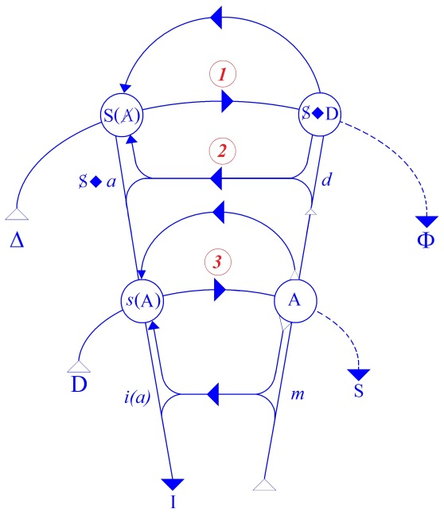
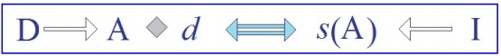
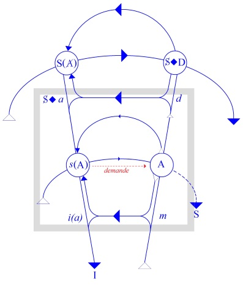

# Leçon 22 | 14 Mai 1958

  <label><input type="checkbox" data-lacan-toggle="original" checked> 原文</label>
  <label><input type="checkbox" data-lacan-toggle="notes" checked> 注释</label>
  <label><input type="checkbox" data-lacan-toggle="commentary" checked> 个人解读评论</label>

<section class="parallel-paragraph" data-paragraph-ids="s5-22-0001">

s5-22-0001

[无对应译文]

原文 · s5-22-0001

\[Au tableau\]

</section>

<section class="parallel-paragraph" data-paragraph-ids="s5-22-0002">

s5-22-0002

[无对应译文]

原文 · s5-22-0002

*Forderung *: *demande*
*Begierde* : *désir*
*Bedurfhis *: *besoin*
*Wunsch *: *désir du rêve*

</section>

<section class="parallel-paragraph" data-paragraph-ids="s5-22-0003">

s5-22-0003

[无对应译文]

原文 · s5-22-0003

Nous allons essayer de continuer d’avancer dans ce cheminement où, vous le voyez, le thème du *phallus* joue un rôle tout à fait essentiel, pour autant qu’il nous amène à serrer de plus près ce qui est dit dans l’analyse, ce qui est proféré, et la façon dont on se sert effectivement de la notion d’objet.

</section>

<section class="parallel-paragraph" data-paragraph-ids="s5-22-0004">

s5-22-0004

[无对应译文]

原文 · s5-22-0004

Vous devez bien sentir que nous devons normalement à la fois nous rapprocher, centrer notre attention
sur la fonction effective qu’a cette *relation d’objet* dans la pra­tique analytique présente, et en même temps,

</section>

<section class="parallel-paragraph" data-paragraph-ids="s5-22-0005">

s5-22-0005

[无对应译文]

原文 · s5-22-0005

en centrant la façon dont on s’en sert et les *services* que cela rend, essayer une articulation plus élaborée
de ce qu’en somme nous désignons d’une façon tout simplement précise en parlant du *phallus*,

</section>

<section class="parallel-paragraph" data-paragraph-ids="s5-22-0006">

s5-22-0006

[无对应译文]

原文 · s5-22-0006

articu­lation qui nous permette aussi de critiquer cet usage de la *relation d’objet*.

</section>

<section class="parallel-paragraph" data-paragraph-ids="s5-22-0007">

s5-22-0007

[无对应译文]

原文 · s5-22-0007

Si nous prenons un rapport qui a pris sa valeur historique avec le temps, celui qui est paru dans la *Revue Française*

</section>

<section class="parallel-paragraph" data-paragraph-ids="s5-22-0008">

s5-22-0008

[无对应译文]

原文 · s5-22-0008

*de Psychanalyse* sur « *Le moi dans la névrose obses­sionnelle »* [^54], titre tout à fait inadéquat parce qu’en réalité il ne s’agit
que de *la relation d’objet* chez l’*obsessionnel*. Ce serait une chose à explorer, peut-être. Nous en prendrons une idée
en essayant de savoir pourquoi l’auteur a voulu parler du* moi dans la névrose obsessionnelle* » dans son titre,
car à la vérité il n’en est rien dit véritablement dans la névrose obsessionnelle, si ce n’est qu’il est faible, qu’il est fort. Là-dessus l’au­teur, en fin de compte avisé par une chose qu’il entendait alors, est resté dans une atti­tude de prudence qu’on ne saurait que trouver louable.

</section>

<section class="parallel-paragraph" data-paragraph-ids="s5-22-0009">

s5-22-0009

[无对应译文]

原文 · s5-22-0009

Mais ce qui domine ce rapport, dans lequel culminent deux articles antérieurs du même auteur, à savoir :

</section>

<section class="parallel-paragraph" data-paragraph-ids="s5-22-0010">

s5-22-0010

[无对应译文]

原文 · s5-22-0010

- le premier de Décembre 1948 paru en 1950 dans la *Revue Française de Psychanalyse *:
  *« [Les incidences thérapeutiques de la prise de conscience de l’envie de pénis dans la névrose obsessionnelle féminine](http://gallica.bnf.fr/ark:/12148/bpt6k5444467v.image.langEN) »* \[p. 215\], qui était son premier rap­port clinique sur la fonction du pénis dans la névrose obsessionnelle, c’est cette fraî­cheur, à ce premier abord, qui donne sa valeur tout à fait importante à cet article en tant qu’il montre comment les choses se sont en somme plutôt dégradées par la suite. Car assurément, au niveau d’une expérience encore neuve de cette *envie de pénis* dans *la névrose obsessionnelle féminine*, il y a quelque chose qui reflète l’expérience fraîche tout à fait intéressante.

</section>

<section class="parallel-paragraph" data-paragraph-ids="s5-22-0011">

s5-22-0011

[无对应译文]

原文 · s5-22-0011

- Ensuite il y a un autre article, qui est publié dans la *Revue Française de Psychana­lyse* de juillet-septembre 1948* : « [Importance de l’aspect homosexuel du transfert dans le traitement de quatre cas de névrose obsessionnelle masculine](http://gallica.bnf.fr/ark:/12148/bpt6k5445909f.image.langEN) »*. \[p. 419\]

</section>

<section class="parallel-paragraph" data-paragraph-ids="s5-22-0012">

s5-22-0012

[无对应译文]

原文 · s5-22-0012

- Le troisième article est un rapport sur « *[Le moi dans la névrose obsessionnelle ](http://gallica.bnf.fr/ark:/12148/bpt6k54437984.image.langEN)»*. \[R.F.P. 1953, XVII, n°1-2,, p. 111\]

</section>

<section class="parallel-paragraph" data-paragraph-ids="s5-22-0013">

s5-22-0013

[无对应译文]

原文 · s5-22-0013

Je crois que ce sont là trois choses à lire puisqu’il n’y a pas tellement d’articles écrits en français sur ce sujet.
En somme, cela donne assez bien le niveau où les choses en sont arrivées ici sur ces problèmes. D’autre part,
les relire ne peut manquer de faire une impression d’ensemble qui donnera en quelque sorte un fond à ce que nous,
nous pourrons arriver ici à en aborder de l’articulation exacte, de ce qui permet de situer en somme la valeur
et la portée d’une thérapeutique qui est ainsi centrée.

</section>

<section class="parallel-paragraph" data-paragraph-ids="s5-22-0014">

s5-22-0014

[无对应译文]

原文 · s5-22-0014

Car en fin de compte, cette « *relation d’objet* » qui s’articule dans les tableaux synoptiques où nous voyons
la progressive constitution de l’objet chez les sujets, on s’aperçoit très bien qu’il y a là une part de fausse fenêtre.
Je ne crois pas que ce soit « *l’objet génital »*, ni « *l’objet prégénital »* qui soit là quelque chose d’extrêmement significatif

</section>

<section class="parallel-paragraph" data-paragraph-ids="s5-22-0015">

s5-22-0015

[无对应译文]

原文 · s5-22-0015

ni d’im­portant, si ce n’est pour la beauté des dits « *tableaux synoptiques* ».

</section>

<section class="parallel-paragraph" data-paragraph-ids="s5-22-0016">

s5-22-0016

[无对应译文]

原文 · s5-22-0016

Mais en fin de compte, ce qui fait la valeur de cette *relation d’objet*, c’est ce qui est son pivot, ce qui en somme,
a introduit dans la dialectique analytique la notion d’objet, c’est bien et avant tout ce qui est appelé « *objet partiel *», terme emprunté au vocabulaire et aux termes d’ABRAHAM, d’une façon d’ailleurs pas tout à fait exacte
car ce dont ABRAHAM a parlé, c’est de « *l’amour partiel de l’objet* », ce qui n’est pas évidemment tout à fait pareil,
et déjà ce glissement a lui-même quelque chose de significatif.

</section>

<section class="parallel-paragraph" data-paragraph-ids="s5-22-0017">

s5-22-0017

[无对应译文]

原文 · s5-22-0017

Cet « *objet partiel *», il n’y a nul besoin d’un grand effort pour le reconnaître, pour l’identifier purement et simplement
à ce *phallus* dont nous parlons, dont nous devons parler d’autant plus aisément que nous lui avons justement donné sa portée, ce qui du même coup nous ôte toute espèce d’embarras à s’en servir comme d’un objet privilégié.
Nous savons pourquoi il mérite ce privilège : c’est justement à titre de *signifiant*. C’est justement en raison
de cet extraordinaire embarras de donner ce privilège à un organe particulier que les auteurs en sont venus
justement à ne plus en parler du tout alors que, par contre, il est quasiment omniprésent dans toute l’ana­lyse.

</section>

<section class="parallel-paragraph" data-paragraph-ids="s5-22-0018">

s5-22-0018

[无对应译文]

原文 · s5-22-0018

Effectivement vous constaterez si vous relisez ces articles, l’usage absolument manifeste - c’est un fait énorme,
de premier plan, qui parcourt toutes ces pages - qui est pris par le psychanalyste…
non seulement par le psychanalyste en question, mais par tous ceux qui l’entendaient
…il est pris au niveau du *fantasme*, à savoir que l’on peut dire que dans la perspective de l’auteur dont je viens de citer ces trois articles, la cure de la névrose obsessionnelle tourne tout entière autour d’une « *incorporation* » - ce sont
les termes que l’auteur emploie - ou d’une « *introjection imaginaire* » de ce *phallus* qui apparaît dans le dialogue analytique sous la forme du *phallus* attribué à l’analyste.

</section>

<section class="parallel-paragraph" data-paragraph-ids="s5-22-0019">

s5-22-0019

[无对应译文]

原文 · s5-22-0019

Il y aurait là en somme deux phases :

</section>

<section class="parallel-paragraph" data-paragraph-ids="s5-22-0020">

s5-22-0020

[无对应译文]

原文 · s5-22-0020

- une première où les *fantasmes d’incorpo­ration*, de dévoration de ce *phallus fantasmatique* auraient un caractère nettement agressif, *sadique* comme on dit, en même temps que ressenti comme horrible et dan­gereux.

</section>

<section class="parallel-paragraph" data-paragraph-ids="s5-22-0021">

s5-22-0021

[无对应译文]

原文 · s5-22-0021

- Mais ce *fantasme* aurait donc une valeur tout à fait révélatrice de quelque chose qui tiendrait à *la position* même du *sujet* par rapport à ce qu’on appelle, dans la perspective de la relation d’objet, « *l’objet correspondant* », l’objet constituant de son stade, nommément dans l’occasion d’une certaine *deuxième phase du stade sadique-anal*, dans laquelle on passerait de tendances fondamentales à la destruction de l’objet, à quelque chose qui commencerait de respecter l’autonomie de cet objet sous cette forme au moins partielle.

</section>

<section class="parallel-paragraph" data-paragraph-ids="s5-22-0022">

s5-22-0022

[无对应译文]

原文 · s5-22-0022

En somme, toute la dialectique du moment - moment subjectif comme nous dirions ici - où se situe le patient
de la névrose obsessionnelle serait, comme on nous l’explique, suspendu au *maintien* d’une certaine forme de cet
*objet partiel* autour duquel pourrait s’instituer un monde qui ne serait pas entièrement voué à une des­truction foncière,

</section>

<section class="parallel-paragraph" data-paragraph-ids="s5-22-0023">

s5-22-0023

[无对应译文]

原文 · s5-22-0023

en raison du stade immédiatement sous-jacent à cet équilibre pré­caire où serait arrivé l’obsessionnel. *L’obsessionnel* nous est vraiment représenté comme toujours prêt à verser dans une destruction du monde, puisqu’aussi bien
ces choses ne peuvent être pensées qu’en termes de rapport du *sujet* à son environne­ment, dans la perspective qui est celle où s’exprime l’auteur. Et c’est par le maintien de cet *objet partiel*, maintien qui nécessite bien sûr tout un édifice, tout un écha­faudage qui est justement ce qui constitue *la névrose obsessionnelle*, que *l’obses­sionnel* éviterait de verser dans *une psychose toujours menaçante*. Ceci est très cer­tainement considéré comme la base même du problème par l’auteur.

</section>

<section class="parallel-paragraph" data-paragraph-ids="s5-22-0024">

s5-22-0024

[无对应译文]

原文 · s5-22-0024

On ne peut pas manquer tout de même là, d’objecter que quels que soient les symptômes para-psychotiques,
les symptômes par exemple de dépersonnalisation, de troubles du *moi*, de sentiment d’étrangeté, d’obscurcissement du monde, senti­ments touchant évidemment à la teneur, voire peut-être à la structure du *moi,* que malgré tout cela, nous ne pouvons pas nous empêcher de remarquer

</section>

<section class="parallel-paragraph" data-paragraph-ids="s5-22-0025">

s5-22-0025

[无对应译文]

原文 · s5-22-0025

- que les cas de transition entre l’obsession et la psychose ont toujours existé, mais ont toujours été fort rares. Les auteurs se sont longtemps aperçus qu’au contraire il y avait bien une sorte de faux espoir de *compatibilité* entre les deux affections,

</section>

<section class="parallel-paragraph" data-paragraph-ids="s5-22-0026">

s5-22-0026

[无对应译文]

原文 · s5-22-0026

- et d’autre part, quand il s’agit d’une véritable névrose obsessionnelle, c’est bien la chose que l’on risque le moins dans une psychanalyse : on risque de ne pas guérir l’obsessionnel, mais risquer de le voir verser dans la psychose, c’est vraiment un risque qui nous paraît lui-même extraordinairement fantasmatique,
  car c’est extrêmement rare.

</section>

<section class="parallel-paragraph" data-paragraph-ids="s5-22-0027">

s5-22-0027

[无对应译文]

原文 · s5-22-0027

L’obsessionnel, que ce soit au cours d’une analyse pour une raison quelconque, voire même lors d’une intervention thérapeutique fâcheuse, voire sauvage, qu’il ait versé dans la psychose, c’est *très, très, très rare*. Personnellement,
*je n’en ai jamais vu dans ma pratique*. Dieu merci ! Je n’ai jamais eu non plus l’impression que ce fut un risque
que je courusse avec ces patients-là. Il doit bien y avoir quelque chose, dans une appréciation comme celle-là, qui doit trahir un peu plus que simplement l’expérience clinique : cette nécessité de cohérence de la théorie qui entraîne l’auteur plus loin qu’il ne veut, soit même très probable­ment, quelque chose qui va plus loin, une certaine position
de lui-même en face de l’obsessionnel qui ne manque pas alors d’ouvrir des problèmes sur ce qu’on peut appeler,
non pas bien entendu « *problèmes d’une personne particulière* » : bien entendu, il ne s’agit pas là de parler du *contre transfert* au sens *personnel* des choses, mais du *contre transfert* au sens plus général où on peut le considérer comme constitué
par ce que j’appelle souvent « *les préjugés de l’analyste* », autrement dit, le fond des choses dites ou non dites
sur lesquelles s’articule son discours.

</section>

<section class="parallel-paragraph" data-paragraph-ids="s5-22-0028">

s5-22-0028

[无对应译文]

原文 · s5-22-0028

Commençons donc par situer ce que peut représenter une pratique qui est ame­née à mettre tout entier

</section>

<section class="parallel-paragraph" data-paragraph-ids="s5-22-0029">

s5-22-0029

[无对应译文]

原文 · s5-22-0029

son pivot, dans la thérapeutique de la *névrose obsessionnelle*, autour de ce « *fantasme d’incorporation imaginaire du phallus* »,

</section>

<section class="parallel-paragraph" data-paragraph-ids="s5-22-0030">

s5-22-0030

[无对应译文]

原文 · s5-22-0030

et du *phallus* de l’ana­lyste, en montrant, à vrai dire un peu mystérieusement car on ne voit pas bien à quel moment,
ni pourquoi s’opère le renversement, si ce n’est par ce qu’on peut suppo­ser être une sorte d’effet d’usure, d’acceptation de quelque chose par le sujet.

</section>

<section class="parallel-paragraph" data-paragraph-ids="s5-22-0031">

s5-22-0031

[无对应译文]

原文 · s5-22-0031

Car il y a un moment, nous dit-on, où en raison d’un *working through,* d’une insistance de traitement, de la présence
de l’analyste dans le traitement, l’incorporation de ce *fantasme phallique* est quelque chose qui apparaît au sujet avoir une *valeur phallique*, une valeur toute différente, à savoir *l’introduction en lui* de quelque chose qui est tout d’un coup d’une autre nature, qui paraît avoir été l’incorporation d’un objet dangereux et en quelque sorte repoussé
dans les fantasmes, et qui devient l’objet accueilli, un objet source de puissance. « *Source* », il faut bien le dire,
le mot y est, ce n’est pas moi qui ai fait les comparaisons et les métaphores.

</section>

<section class="parallel-paragraph" data-paragraph-ids="s5-22-0032">

s5-22-0032

[无对应译文]

原文 · s5-22-0032

Cette sorte d’*introjection* qui, elle, devient *« conservatrice » *:

</section>

<section class="parallel-paragraph" data-paragraph-ids="s5-22-0033">

s5-22-0033

[无对应译文]

原文 · s5-22-0033

« ...*n’a-t-elle pas des traits communs avec la communion religieuse*, *du moins dans la névrose obsessionnelle -* nous dit-on p.172 -
*où l’on avale sans mâcher* - ajoute-t-on, puisqu’aussi bien pour commenter ces - « *sentiments de bonheur dans ce fantasme*

</section>

<section class="parallel-paragraph" data-paragraph-ids="s5-22-0034">

s5-22-0034

[无对应译文]

原文 · s5-22-0034

*qui ne com­portait aucune destruction, semblable en cela aux fantaisies de succion des mélancoliques d’*ABRAHAM.
*Cette sorte d’introjection que l’on pourrait peut-être qualifier de passive, me paraît beaucoup mieux mériter le nom de conservatrice.*

</section>

<section class="parallel-paragraph" data-paragraph-ids="s5-22-0035">

s5-22-0035

[无对应译文]

原文 · s5-22-0035

*N’a-t-elle pas des traits com­muns avec la communion religieuse, où l’on avale sans mâcher ?* »[^55]

</section>

<section class="parallel-paragraph" data-paragraph-ids="s5-22-0036">

s5-22-0036

[无对应译文]

原文 · s5-22-0036

Ce ne sont pas là des traits choisis, je dirais, d’une façon tendancieuse dans « *La mélancolie »* d’ABRAHAM [^56].

</section>

<section class="parallel-paragraph" data-paragraph-ids="s5-22-0037">

s5-22-0037

[无对应译文]

原文 · s5-22-0037

C’est bien autour de ce *quelque chose* que nous sentons se passer autour d’une sorte de pratique ou d’ascèse jouant principalement sur *les fan­tasmes* que, sans doute avec un dosage, avec des barrières, avec un freinage, avec des étapes, avec toutes les précautions que comporte la technique, nous voyons se réali­ser ce quelque chose qui permettra

</section>

<section class="parallel-paragraph" data-paragraph-ids="s5-22-0038">

s5-22-0038

[无对应译文]

原文 · s5-22-0038

au sujet de la névrose obsessionnelle de prendre des rapports dont, en fin de compte, nous voyons mal
ce qu’on en désire, mais qui assurément concernent ce qu’on appelle « *la distance prise à l’objet* ».

</section>

<section class="parallel-paragraph" data-paragraph-ids="s5-22-0039">

s5-22-0039

[无对应译文]

原文 · s5-22-0039

En somme, si je comprends bien, sur *le plan fantasmatique* il s’agit de permettre au sujet d’approcher au plus près,
de passer par une phase où cette distance est annulée pour être sans doute - tout au moins faut-il l’espérer - reconquise ensuite auprès d’un *objet* qui a successivement concentré sur lui toutes les puissances de la peur,
du danger, pour devenir ensuite le symbole par où s’établit une relation libidi­nale que l’on considère comme plus normale, et que l’on qualifie de « *génitale »*. À la vérité nous restons peut-être, quand nous sommes dans une certaine pers­pective, un peu plus sévères que l’auteur pour s’applaudir de parvenir au but quand, à propos d’une malade femme, il se flatte d’avoir recueilli d’elle au bout d’un certain nombre de mois de traitement, la déclaration suivante :

</section>

<section class="parallel-paragraph" data-paragraph-ids="s5-22-0040">

s5-22-0040

[无对应译文]

原文 · s5-22-0040

« *J’ai eu une expérience extraordinaire, celle de pouvoir jouir du bonheur de mon mari.*
*J’ai été extrêmement émue en constatant sa joie, et son plaisir a fait le mien.* » \[p. 164\]

</section>

<section class="parallel-paragraph" data-paragraph-ids="s5-22-0041">

s5-22-0041

[无对应译文]

原文 · s5-22-0041

Je vous prie de peser ces termes. Ils ne sont certainement pas sans valeur, ils décri­vent très bien une sorte

</section>

<section class="parallel-paragraph" data-paragraph-ids="s5-22-0042">

s5-22-0042

[无对应译文]

原文 · s5-22-0042

d’expérience qui n’implique absolument, je dois dire, nulle levée de la frigidité antérieure de ladite patiente.

</section>

<section class="parallel-paragraph" data-paragraph-ids="s5-22-0043">

s5-22-0043

[无对应译文]

原文 · s5-22-0043

L’expérience extraordinaire de pou­voir jouir du bonheur de son mari, c’est une chose qui est fréquemment observée, mais ça ne signifie pas pour autant que la malade d’aucune façon n’ait atteint à l’orgasme. À la vérité, on nous le dit,
la malade reste, dit-on, à demi frigide \[...*elle restait néanmoins à demi frigide*... p. 164\]. C’est pourquoi on est peut-être un peu *surpris* qu’on ajoute immédiatement après :

</section>

<section class="parallel-paragraph" data-paragraph-ids="s5-22-0044">

s5-22-0044

[无对应译文]

原文 · s5-22-0044

« *N’est-ce pas caractériser au mieux des relations génitales adultes ?* » \[p. 164\]

</section>

<section class="parallel-paragraph" data-paragraph-ids="s5-22-0045">

s5-22-0045

[无对应译文]

原文 · s5-22-0045

Cette notion de « *relations génitales adultes* » est évidemment ce qui donne à toute cette perspective ce que j’appelle
la construction des « *fausses fenêtres* » dans la relation génitale adulte. On ne voit pas très bien ce que cela veut dire
à la vérité quand on y regarde de près.

</section>

<section class="parallel-paragraph" data-paragraph-ids="s5-22-0046">

s5-22-0046

[无对应译文]

原文 · s5-22-0046

Nous avons vu que dès que les auteurs essayent de s’en expliquer, il ne semble pas qu’ils y trouvent la simplicité
ni l’unité que tout ceci semble impliquer.

</section>

<section class="parallel-paragraph" data-paragraph-ids="s5-22-0047">

s5-22-0047

[无对应译文]

原文 · s5-22-0047

> « *...quant à l’affirmation de la cohérence du moi, elle ressort non seulement de la disparition de la symptomatologie obsessionnelle et des phénomènes de déperson­nalisation, mais encore se traduit par l’accession à un sentiment de liberté et d’unité qui est une expérience nouvelle pour ces sujets.* » \[p. 164\]

</section>

<section class="parallel-paragraph" data-paragraph-ids="s5-22-0048">

s5-22-0048

[无对应译文]

原文 · s5-22-0048

Ces approximations, optimistes peut-être, ne sont pas tout à fait non plus quelque chose qui, du moins pour nous, correspond à notre expérience de ce que représentent réellement un progrès et une guérison dans la névrose obsessionnelle. Ceci dit, nous voyons bien combien, à quelle espèce de montagne, de muraille, de *conception toute faite*
nous avons affaire quand il s’agit de situer *quelque part*, d’apprécier ce que c’est *qu’une constitution, une structure, obsessionnelle*, la façon dont elle est vécue et la façon dont elle évolue.

</section>

<section class="parallel-paragraph" data-paragraph-ids="s5-22-0049">

s5-22-0049

[无对应译文]

原文 · s5-22-0049

Ici nous essayons d’articuler les choses dans un registre tout différent, parce que nous croyons - pour n’être pas
plus compliqués que d’autres : je ne crois pas que si vous arrivez à vous familiariser à compter le nombre de mesures que nous mettons ici en jeu, vous trouviez que finalement ça fasse beaucoup plus de choses - que sim­plement,

</section>

<section class="parallel-paragraph" data-paragraph-ids="s5-22-0050">

s5-22-0050

[无对应译文]

原文 · s5-22-0050

c’est peut-être articulé autrement, d’une façon moins multilinéaire.

</section>

<section class="parallel-paragraph" data-paragraph-ids="s5-22-0051">

s5-22-0051

[无对应译文]

原文 · s5-22-0051

Et bien sûr, encore que le désir d’avoir ainsi un tableau synoptique correspondant ou s’opposant à celui de
Mme Ruth MACK BRUNSWICK soit au fond du cœur de bien des auditeurs, nous y parviendrons peut-être un jour. Mais évidemment, avant d’y arriver il conviendrait peut-être d’y aller pas à pas et de voir ce que nous voulons dire quand nous pensons que cette notion de l’*objet partiel* - du *phallus* - doit être cri­tiquée et, pour être mise en usage

</section>

<section class="parallel-paragraph" data-paragraph-ids="s5-22-0052">

s5-22-0052

[无对应译文]

原文 · s5-22-0052

et peut-être aussi pour voir les dangers d’un cer­tain usage qui est l’usage présent, doit être mise à sa place.

</section>

<section class="parallel-paragraph" data-paragraph-ids="s5-22-0053">

s5-22-0053

[无对应译文]

原文 · s5-22-0053

C’est cette place que nous essayons d’articuler par ce petit schéma. On pourrait couvrir tout cela de signes
et d’équations, mais je ne veux pas vous donner l’impres­sion d’artifice, encore que ces choses soient bien

</section>

<section class="parallel-paragraph" data-paragraph-ids="s5-22-0054">

s5-22-0054

[无对应译文]

原文 · s5-22-0054

les choses que j’ai essayé le plus de réduire à leur nécessité essentielle.

</section>

<section class="parallel-paragraph" data-paragraph-ids="s5-22-0055">

s5-22-0055

[无对应译文]

原文 · s5-22-0055

</section>

<section class="parallel-paragraph" data-paragraph-ids="s5-22-0056">

s5-22-0056

[无对应译文]

原文 · s5-22-0056

Nous avons déjà placé ici le grand A du grand Autre où se trouve le code et qui accueille la demande,
et vu que c’est dans le passage du A au point où est *le message* \[*s*(A) ← A\] que se produit le *signifié de l’Autre*.
Et *le besoin*, ici amorcé et qui se retrouve là dans des tas de transformations, aux différents niveaux se qualifie

</section>

<section class="parallel-paragraph" data-paragraph-ids="s5-22-0057">

s5-22-0057

[无对应译文]

原文 · s5-22-0057

diffé­remment. Et si nous prenons cette ligne \[1\] pour être la ligne de réalisation du sujet :

</section>

<section class="parallel-paragraph" data-paragraph-ids="s5-22-0058">

s5-22-0058

[无对应译文]

原文 · s5-22-0058

> 

</section>

<section class="parallel-paragraph" data-paragraph-ids="s5-22-0059">

s5-22-0059

[无对应译文]

原文 · s5-22-0059

Celle-ci se traduit par quelque chose ici qui toujours plus ou moins, ressortit à une identification \[I → *s*(A)\],
c’est-à-dire au passage, au remodèlement en fin de compte, du sujet dans les défilés \[3\] de sa demande \[D → A\] :

</section>

<section class="parallel-paragraph" data-paragraph-ids="s5-22-0060">

s5-22-0060

[无对应译文]

原文 · s5-22-0060

> 

</section>

<section class="parallel-paragraph" data-paragraph-ids="s5-22-0061">

s5-22-0061

[无对应译文]

原文 · s5-22-0061

Nous savons que ceci ne suffit pas à constituer un sujet satisfaisant, un sujet qui se tienne sur le nombre de points d’appui qu’il lui faut, disons 4, et qui sait ? C’est justement dans cet *au-delà de la demande* que s’articule un *Begehren*
- nous avons déjà essayé de le définir la dernière fois en le qualifiant de *Begierde,* de *désir* \[A ◊ *d*\] - à sa place topologique, où il y a en quelque sorte une nécessité liée à cette *topologie*, à ce que ce soit dans ce champ de *l’au-delà de la demande* que vienne se situer, et du même coup s’articuler, nécessairement subir cette articulation particulière à cet *au-delà,*
le désir sexuel.

</section>

<section class="parallel-paragraph" data-paragraph-ids="s5-22-0062">

s5-22-0062

[无对应译文]

原文 · s5-22-0062

Il y a là en somme une coïncidence entre l’endroit où peut trouver place *la pul­sion sexuelle*, *la tendance* comme telle,

</section>

<section class="parallel-paragraph" data-paragraph-ids="s5-22-0063">

s5-22-0063

[无对应译文]

原文 · s5-22-0063

et la nécessité structurale qui la lie à être à cette place dans *l’au-delà de la demande*. C’est en somme pour autant qu’intervient ce *quelque chose* dans *l’ensemble des signifiants* auxquels il vient se superposer pour en faire un *signifié*,
que nous mettons d’habitude au-dessous de la barre de notre arti­culation S/*s*.

</section>

<section class="parallel-paragraph" data-paragraph-ids="s5-22-0064">

s5-22-0064

[无对应译文]

原文 · s5-22-0064

Le *signifié*, qui est d’abord un « *à signifier *» est donc bien ce signifiant par­ticulier, le *phallus *:

</section>

<section class="parallel-paragraph" data-paragraph-ids="s5-22-0065">

s5-22-0065

[无对应译文]

原文 · s5-22-0065

- qui est dans le corps des signifiants,

</section>

<section class="parallel-paragraph" data-paragraph-ids="s5-22-0066">

s5-22-0066

[无对应译文]

原文 · s5-22-0066

- qui est *spécialisé* à désigner comme tel l’ensemble des *effets du signifiant sur le signifié* en tant que tels,
  c’est-à-dire en tant que ce sont les *effets du signifiant sur le signifié*.

</section>

<section class="parallel-paragraph" data-paragraph-ids="s5-22-0067">

s5-22-0067

[无对应译文]

原文 · s5-22-0067

Cela va loin, et il n’y a pas moyen d’aller moins loin pour donner sa signification au *phallus*, à savoir ce quelque chose qui fait qu’il occupe ici cette place privilégiée dans ce qui va se produire comme tel de signifiant,
dans cet *au-delà* qui s’appelle ici l’*au-delà du désir*, à savoir tout le champ qui est là, au-delà du champ de la demande.
Pour autant qu’est *symbolisé* cet *au-delà du désir*, et pour autant que c’est ainsi, c’est là que nous verrons la possibilité
\- c’est une simple articulation du sens de ce que nous disons - qu’ici \[S ◊ D\] il y ait un rapport du *sujet* à *la demande* comme telle. Car il est bien évident que pour qu’il y ait un rapport du *sujet* à *la demande*, il ne faut pas qu’il soit complètement inclus.

</section>

<section class="parallel-paragraph" data-paragraph-ids="s5-22-0068">

s5-22-0068

[无对应译文]

原文 · s5-22-0068

Jusqu’au moment où cet au-delà se constitue, si tant est que par hypothèse il se constitue en s’articulant grâce au *signifiant phallus -* c’est à ce moment-là qu’ici, *au-delà* du pur et simple Autre qui jusque là fait toute *la loi*
de la constitution du sujet dans l’existence simplement de son corps, par le fait que la mère est un être *parlant*.

</section>

<section class="parallel-paragraph" data-paragraph-ids="s5-22-0069">

s5-22-0069

[无对应译文]

原文 · s5-22-0069

Et le fait qu’elle soit un être parlant est quelque chose d’absolument essentiel. Quoi qu’en pense l’analyste - SPITZ -

</section>

<section class="parallel-paragraph" data-paragraph-ids="s5-22-0070">

s5-22-0070

[无对应译文]

原文 · s5-22-0070

il n’y a pas seu­lement les petits *frotti-frotta*, les soins à l’*Eau de Cologne* à donner au nourrisson pour constituer un rapport à la mère. Il faut que la mère lui parle, chacun sait cela. Et non seulement qu’elle lui parle, mais chacun sait que l’enfant y a un rap­port très particulier et qu’une nourrice muette ne serait pas sans entraîner quelques conséquences assez visibles dans le développement du nourrisson.

</section>

<section class="parallel-paragraph" data-paragraph-ids="s5-22-0071">

s5-22-0071

[无对应译文]

原文 · s5-22-0071

Au-delà de cet Autre, s’il y a ici quelque chose qui se constitue du signifiant qui s’appelle l’*au-delà du désir*, nous avons la possibilité de ce rapport S ◊ D, c’est-à-dire le *sujet* comme tel, un *sujet* moins complet, c’est-à-dire qu’il est *barré*.
Cela veut dire qu’un *sujet* humain complet n’est jamais un pur et simple sujet comme toute la phi­losophie

</section>

<section class="parallel-paragraph" data-paragraph-ids="s5-22-0072">

s5-22-0072

[无对应译文]

原文 · s5-22-0072

le construit, sujet de la connaissance répondant bel et bien à ce *percipiens* de ce *perceptum* qu’est le monde.
Nous savons qu’il n’y a pas de sujet humain qui soit pur sujet de la connaissance, si ce n’est le sujet humain
en tant que nous le réduisons à quoi que ce soit qui res­semble à une cellule photoélectrique ou à un œil,

</section>

<section class="parallel-paragraph" data-paragraph-ids="s5-22-0073">

s5-22-0073

[无对应译文]

原文 · s5-22-0073

ou encore à ce qu’on appelle en philosophie *une conscience*.

</section>

<section class="parallel-paragraph" data-paragraph-ids="s5-22-0074">

s5-22-0074

[无对应译文]

原文 · s5-22-0074

Mais comme nous sommes des analystes, nous savons qu’*il y a toujours une Spaltung,* c’est-à-dire qu’il y a toujours
*deux lignes où il se constitue*, et c’est pour cela d’ailleurs que naissent tous les problèmes de structure qui sont les nôtres.
Ici, qu’est-ce qui doit se constituer ? C’est précisément ce que j’ai appelé, non plus le *signifié de* A \[*s*(A)\]
mais le *signifiant de* A, \[S(A)\], en tant que cette *Spaltung,* il la connaît, qu’il est lui-même structuré par cette *Spaltung,* autrement dit, en tant que lui, A, a déjà subi les effets de cette *Spaltung.*

</section>

<section class="parallel-paragraph" data-paragraph-ids="s5-22-0075">

s5-22-0075

[无对应译文]

原文 · s5-22-0075

Ici, ça se renverse, ça veut dire : est déjà marqué de cet *effet de signifiant* qui est *signifié* par le signifiant *phallus*.
*C’est le* A, donc si vous voulez*, en tant que le phallus y est barré, porté à l’état de signifiant* \[ϕ → Φ\].
*C’est l’Autre en tant que châtré qui, ici, se représente à la place du message, le mes­sage du désir* \[S(A)\]. *Le message du désir, c’est cela.*

</section>

<section class="parallel-paragraph" data-paragraph-ids="s5-22-0076">

s5-22-0076

[无对应译文]

原文 · s5-22-0076

Ce n’est pas dire pour autant qu’il soit facile à rece­voir parce que, précisément, tout le problème de cette difficulté d’articulation du désir tient au fait qu’il y a un inconscient.

</section>

<section class="parallel-paragraph" data-paragraph-ids="s5-22-0077">

s5-22-0077

[无对应译文]

原文 · s5-22-0077

Autrement dit, qu’en fait ce qui se présente ici comme étant au « niveau supérieur » - si l’on peut dire - du schéma,
est au contraire ordinairement quelque chose qu’il faut nous imaginer être au « niveau inférieur »,
n’être pas si articulé dans la conscience du sujet, encore que ce soit bel et bien *articulé dans son inconscient*.

</section>

<section class="parallel-paragraph" data-paragraph-ids="s5-22-0078">

s5-22-0078

[无对应译文]

原文 · s5-22-0078

Et même, c’est *parce que* c’est *articulé dans son inconscient* que c’est - jusqu’à un certain point, il s’agit justement de savoir *lequel*, c’est la question que nous posons ici - articulable dans la conscience du sujet. Qu’est-ce que *l’hystérique*
\- dont nous avons parlé la dernière fois - nous montre ? *L’hystérique*, bien entendu, n’est pas psychanalysée,
sans cela elle ne serait plus *hystérique* par hypothèse. *L’hystérique* - avons-nous dit - *cet au-delà* elle le pose,
*elle le situe* sous la forme d’un désir *en tant que désir de l’Autre*.

</section>

<section class="parallel-paragraph" data-paragraph-ids="s5-22-0079">

s5-22-0079

[无对应译文]

原文 · s5-22-0079

Pour fixer les idées - je vous justifierai cela un petit peu plus par la suite, mais dès maintenant, parce qu’il faut bien,

</section>

<section class="parallel-paragraph" data-paragraph-ids="s5-22-0080">

s5-22-0080

[无对应译文]

原文 · s5-22-0080

si l’on essaye d’articuler quelque chose, commen­cer par articuler, par le commenter - je vous dirai que les choses
se passent ainsi :

</section>

<section class="parallel-paragraph" data-paragraph-ids="s5-22-0081">

s5-22-0081

[无对应译文]

原文 · s5-22-0081

- de même qu’ici, dans la première boucle , le sujet, par la manifestation du besoin, de sa tension, fait franchir cette voie de la première ligne signifiante de la demande \[D → A\], de même c’est ici que nous pouvons, pour topologiser les choses, mettre la relation qui est celle du *moi* à *l’image de l’autre* comme tel \[*m* → *i(a)*\].

</section>

<section class="parallel-paragraph" data-paragraph-ids="s5-22-0082">

s5-22-0082

[无对应译文]

原文 · s5-22-0082

- Et de même c’est ici, c’est-à-dire en somme en tant que ce qui - non pas dans l’autre en tant que *petit a,* dans l’*autre ima­ginaire* - mais dans l’*Autre* en tant que tel, en tant que grand A, permet au sujet d’aborder cet *au-delà à signifier* qui est précisément *le champ* que nous sommes en train d’explorer, celui *de son désir* \[A → *d* → ...\].

</section>

<section class="parallel-paragraph" data-paragraph-ids="s5-22-0083">

s5-22-0083

[无对应译文]

原文 · s5-22-0083

Ce *petit d* du *désir* occupe la même place que le *petit m* occupe par rapport au sujet, ce qui exprime ceci : simplement que précisé­ment c’est en cette place \[*d*\] où le sujet a cherché à articuler son désir qu’il rencontrera *le désir de l’Autre* comme tel. Et ce que nous exprimons est justement ceci, qui est fondé sur l’expérience et que j’ai depuis longtemps articulé pour vous sous d’autres formes mais que j’ai articulé aussi sous celle-là, que *le désir* dont il s’agit,

</section>

<section class="parallel-paragraph" data-paragraph-ids="s5-22-0084">

s5-22-0084

[无对应译文]

原文 · s5-22-0084

nommé­ment *le désir* dans sa fonction inconsciente*, est le désir de l’Autre*. C’est bien ce que nous avons vu

</section>

<section class="parallel-paragraph" data-paragraph-ids="s5-22-0085">

s5-22-0085

[无对应译文]

原文 · s5-22-0085

quand nous avons parlé la dernière fois de *l’hys­térique* à propos du rêve. Ce ne sont pas des rêves choisis,
pas plus que je ne vous donne de FREUD des textes choisis.

</section>

<section class="parallel-paragraph" data-paragraph-ids="s5-22-0086">

s5-22-0086

[无对应译文]

原文 · s5-22-0086

Je vous assure, si vous vous mettiez - comme il paraît que ça commence à se pas­ser - à lire FREUD,

</section>

<section class="parallel-paragraph" data-paragraph-ids="s5-22-0087">

s5-22-0087

[无对应译文]

原文 · s5-22-0087

je ne saurais trop vous conseiller de le lire complètement, sans cela c’est vous qui risquez de tomber sur les passages, qui ne seront peut-être pas choisis, mais qui n’en seront pas moins source de toutes sortes d’erreurs,
voire de fausses reconnaissances. Si vous ne voyez pas à quelle place tel ou tel texte se situe dans, je ne dirai pas
le développement d’*une pensée*, encore que ce soit à proprement parler ce qu’il convient de dire, mais depuis le temps que l’on parle de « *la pensée* », c’est un terme si galvaudé qu’on ne sait jamais très bien de quoi on parle.
Il ne suffit pas de parler de « *la pensée* » pour que l’on puisse dire qu’il s’agisse de quelque chose.

</section>

<section class="parallel-paragraph" data-paragraph-ids="s5-22-0088">

s5-22-0088

[无对应译文]

原文 · s5-22-0088

C’est même le développement d’une *recherche*, d’un *effort* de quelqu’un qui, lui, a une certaine idée de son « *champ magnétique* », si l’on peut dire, et qui ne peut l’atteindre que par un certain détour, et c’est par l’ensemble du chemin parcouru qu’il faut juger chacun de ces détours. Je n’ai donc pas choisi les deux rêves de la dernière fois n’importe comment. Je vous ai expliqué comment je les avais pris. J’ai pris le premier rêve parce que je l’ai rencontré après
les autres rêves dont je vous ai expliqué les raisons pour lesquelles je ne les avais pas pris d’abord - j’y reviendrai - c’est à savoir parce que « *le rêve de la monographie botanique* », qui peut nous aider à comprendre ce qu’il s’agit

</section>

<section class="parallel-paragraph" data-paragraph-ids="s5-22-0089">

s5-22-0089

[无对应译文]

原文 · s5-22-0089

de démon­trer, est un rêve de FREUD qu’il conviendra d’expliquer plus tard.

</section>

<section class="parallel-paragraph" data-paragraph-ids="s5-22-0090">

s5-22-0090

[无对应译文]

原文 · s5-22-0090

Je poursuis d’abord l’articulation du rêve de *l’hystérique*. Ce que *l’hystérique* nous a montré, c’est qu’elle trouve,
si l’on peut dire, son point d’appui*…*
ce ne sont pas des termes qui me soient très réservés : si vous lisez Monsieur BOUVET concernant
la névrose obsessionnelle, vous verrez qu’il emploie exactement le même terme pour dire qu’il semble que, quand on a retiré leurs obsessions aux névrosés obsessionnels il leur manque par exemple un *point d’appui.* Vous voyez que l’usage que j’ai fait ici des termes est un usage qui m’est commun avec les autres auteurs,
c’est-à-dire que nous essayons de métaphoriser notre expérience, nos petites impressions

</section>

<section class="parallel-paragraph" data-paragraph-ids="s5-22-0091">

s5-22-0091

[无对应译文]

原文 · s5-22-0091

…*l’hys­térique prend son point d’appui dans un désir qui est le désir de l’Autre*, avons-nous dit.

</section>

<section class="parallel-paragraph" data-paragraph-ids="s5-22-0092">

s5-22-0092

[无对应译文]

原文 · s5-22-0092

Ceci est essentiel, *cette création d’un désir au-delà de la demande*, c’est quelque chose que nous avons, je crois,
suffisamment articulé. On peut mentionner ici un troisième rêve que je n’ai pas eu le temps d’aborder la dernière fois, mais que je peux bien vous lire maintenant :

</section>

<section class="parallel-paragraph" data-paragraph-ids="s5-22-0093">

s5-22-0093

[无对应译文]

原文 · s5-22-0093

« *Elle place une bougie dans un chandelier ; la bougie est cassée, de sorte qu’elle tient mal.*
*Les petites filles de l’école disent qu’elle est maladroite ; mais la maîtresse dit que ce n’est pas de sa faute*. »

</section>

<section class="parallel-paragraph" data-paragraph-ids="s5-22-0094">

s5-22-0094

[无对应译文]

原文 · s5-22-0094

Dans ce cas encore, voici comment FREUD rapporte ce rêve aux faits réels :

</section>

<section class="parallel-paragraph" data-paragraph-ids="s5-22-0095">

s5-22-0095

[无对应译文]

原文 · s5-22-0095

« *Elle a bien mis hier une bougie dans le chandelier ; mais celle-ci n’était pas cassée. Cela est symbolique.*
*À la vérité, on sait ce que signifie la bougie : si elle est cassée, si elle ne tient pas bien, cela indique l’impuissance de l’homme*...

</section>

<section class="parallel-paragraph" data-paragraph-ids="s5-22-0096">

s5-22-0096

[无对应译文]

原文 · s5-22-0096

Et FREUD souligne :

</section>

<section class="parallel-paragraph" data-paragraph-ids="s5-22-0097">

s5-22-0097

[无对应译文]

原文 · s5-22-0097

*« Ce n’est pas sa faute. » Mais comment cette jeune femme élevée avec soin et tenue loin de toute chose laide,*
*peut-elle connaître cet emploi de la bougie ?* »

</section>

<section class="parallel-paragraph" data-paragraph-ids="s5-22-0098">

s5-22-0098

[无对应译文]

原文 · s5-22-0098

\[*Sie steckt eine Kerze in den Leuchter; die Kerze ist aber gebrochen, so daß sie nicht gut steht. Die Mädchen in der Schule sagen, sie sei ungeschickt; das Fräulein aber, es sei nicht ihre Schuld. Ein realer Anlaß auch hier; sie hat gestern wirklich eine Kerze in den Leuchter gesteckt; die war aber nicht gebrochen. Hier ist eine durchsichtige Symbolik verwendet worden. Die Kerze ist ein Gegenstand, der die weiblichen Genitalien reizt; wenn sie gebrochen ist, so daß sie nicht gut steht, so bedeutet dies die Impotenz des Mannes (“es sei nicht ihre Schuld ”). Ob nur die sorgfältig erzogene und allem Häßlichen fremd gebliebene junge Frau diese Verwendung der Kerze kennt ? Zufällig kann sie noch angeben, durch welches Erlebnis sie zu dieser Kenntnis gekommen ist. Bei einer Kahnfahrt auf dem Rhein fährt ein Boot an ihnen vorüber, in dem Studenten sitzen, welche mit großem Behagen ein Lied singen oder brüllen : “Wenn die Königin von Schweden, bei geschlossenen Fensterläden mit Apollokerzen ...” Das letzte Wort hört oder versteht sie nicht. Ihr Mann muß ihr die verlangte Aufklärung geben.*\]

</section>

<section class="parallel-paragraph" data-paragraph-ids="s5-22-0099">

s5-22-0099

[无对应译文]

原文 · s5-22-0099

Là-dessus, nous apprenons que lors d’une promenade en canot, elle a entendu *une chanson d’étudiants* fort *inconvenante*, concernant l’usage que la reine de Suède, les volets fermés, faisait avec les bougies d’APOLLON.
Elle n’a pas compris le dernier mot, son mari lui a expliqué. Bien entendu les volets fermés, l’APOLLON,
tout cela se retrouve et s’ébat congrûment à l’occasion. L’important, c’est qu’ici nous voyons apparaître alors,
à l’état nu si je puis dire, et isolé, à l’état d’*objet partiel*, sinon volant, *le signifiant phallus,* et que *le point impor­tant* c’est bien entendu que - nous ne savons pas à quel moment de cette analyse de cette malade, car c’est une malade certainement en analyse, le sujet de ce rêve a été extrait - *le point important* est évidemment ici dans « *Ce n’est pas sa faute* ».

</section>

<section class="parallel-paragraph" data-paragraph-ids="s5-22-0100">

s5-22-0100

[无对应译文]

原文 · s5-22-0100

Le « *Ce n’est pas sa faute* » est le fait que c’est au niveau des autres, c’est devant tous les autres, c’est en fonction
de la maîtresse que toutes les petites camarades d’école ne se moquent plus. Ici le symbole est évoqué - et c’est bien là que je veux en venir - qui recoupe et confirme, si l’on peut dire, ce qui était déjà dans « *le rêve dit de la belle bou­chère* », c’est à savoir que l’accent est à mettre sur le fait que pour *l’hystérique* - et *l’hystérie* en somme est un mode de constitution du sujet concernant précisément son désir sexuel, c’est le mode sur lequel il l’a adopté -
ce qui est à accentuer dans le cas de l’hystérique :

</section>

<section class="parallel-paragraph" data-paragraph-ids="s5-22-0101">

s5-22-0101

[无对应译文]

原文 · s5-22-0101

- c’est la dimension bien entendu du *désir en tant qu’il s’oppose à* celle de *la demande*,

</section>

<section class="parallel-paragraph" data-paragraph-ids="s5-22-0102">

s5-22-0102

[无对应译文]

原文 · s5-22-0102

- mais c’est d’abord et surtout dans le terme *désir de l’Autre, la position, la place dans l’Autre* qui est à souligner.

</section>

<section class="parallel-paragraph" data-paragraph-ids="s5-22-0103">

s5-22-0103

[无对应译文]

原文 · s5-22-0103

Je vous ai rappelé comment Dora vit jusqu’au moment où se décompense sa posi­tion d’*hystérique*. Elle est fort à l’aise, à quelques petits *symptômes* près mais qui sont justement ceux qui la constituent comme *hystérique* et qui se lisent dans le rapport de la distinction, la *Spaltung* de ces deux lignes. Nous reviendrons sur la façon dont nous pouvons articuler la surdétermination du *symptôme*. Elle est liée à l’existence des *deux lignes signifiantes* comme telles.

</section>

<section class="parallel-paragraph" data-paragraph-ids="s5-22-0104">

s5-22-0104

[无对应译文]

原文 · s5-22-0104

Mais ce que nous avons montré l’autre jour, c’est que ce que Dora voulait c’est qu’en somme elle subsiste comme sujet en tant qu’elle demande l’amour, sans doute comme toute bonne *hystérique*, mais qu’elle soutient *le désir de l’Autre* en tant que tel. C’est elle qui le *soutient*, c’est elle qui en est *l’appui*. Les choses marchent fort bien pour autant que, pour que les choses, *les rencon­tres* entre son père et la nommée Mme K., se passent le plus *heureusement* du monde
et sans que personne n’ait rien à y voir, le terme qu’elle soutient, le désir de l’Autre, est ici le terme qui convient
le mieux au style de son action et de sa position par rapport à son père, à Mme K.

</section>

<section class="parallel-paragraph" data-paragraph-ids="s5-22-0105">

s5-22-0105

[无对应译文]

原文 · s5-22-0105

Et c’est là que je vous ai indiqué une chose : c’est pour autant qu’*elle se trouve s’identifier à Monsieur K*. dans un certain rapport à l’autre, alors *imaginaire* comme tel, et pour autant *qu’en face de ce désir* elle le sou­tient à cette place, à savoir à la place qui lui est correspondante, que toute la petite construction est possible. Vous avez bien vu qu’en somme ici se dessine un petit carré dont les quatre som­mets sont représentés par : *moi* \[*m*\], *image de l’autre* \[*i(a)*\], *rapport du sujet constitué alors à l’autre imaginaire comme tel* \[S ◊ *a*\],*et ici :* *désir* \[*d*\]. Nous trouvons ainsi les quatre pieds sur les­quels peut tenir normalement un sujet humain constitué comme tel, c’est-à-dire qui n’est ni plus ni moins averti du mécanisme et *des ficelles tirant la marionnette* d’un autre là où il voit, c’est-à-dire où il est capable, ou à peu près capable, de se repérer dans cette composante essentielle.

</section>

<section class="parallel-paragraph" data-paragraph-ids="s5-22-0106">

s5-22-0106

[无对应译文]

原文 · s5-22-0106

 

</section>

<section class="parallel-paragraph" data-paragraph-ids="s5-22-0107">

s5-22-0107

[无对应译文]

原文 · s5-22-0107

C’est ici et à ce niveau là, en face du désir de l’Autre, et d’ailleurs - je l’ai montré la dernière fois - sans que pour autant les choses aillent au-delà, car en fin de compte on peut dire que *chez l’hystérique la ligne de retour était plus effacée*.

</section>

<section class="parallel-paragraph" data-paragraph-ids="s5-22-0108">

s5-22-0108

[无对应译文]

原文 · s5-22-0108

C’est bien pour cela d’ailleurs que *l’hystérique* a toutes sortes de difficultés avec son *imaginaire*,
ici représenté dans l’*image de l’autre*, et susceptible d’y voir pro­duire *des effets de morcelage, des désintégrations* diverses,

</section>

<section class="parallel-paragraph" data-paragraph-ids="s5-22-0109">

s5-22-0109

[无对应译文]

原文 · s5-22-0109

qui sont à proprement parler ce qui lui sert dans *ses symptômes*. Je rappelle simplement ceci au niveau de *l’hystérique*.

</section>

<section class="parallel-paragraph" data-paragraph-ids="s5-22-0110">

s5-22-0110

[无对应译文]

原文 · s5-22-0110

Comment allons-nous pouvoir articuler ce qui se passe au niveau de *l’obses­sionnel*, je veux dire dans une structure obsessionnelle ? La théorie classique vous dit - ce qu’elle articule dans FREUD et ce qu’elle articule
dans le dernier mot de FREUD sur *la névrose obsessionnelle -* vous dit que *la névrose obsessionnelle c’est un peu plus compliqué que la névrose hystérique*, mais pas tellement plus. Si on arrive à pointer les choses sur l’essentiel, on peut l’articuler,
mais si on ne pointe pas les choses sur l’es­sentiel - ce qui est sûrement le cas de *l’auteur dont je vous ai parlé tout à l’heure* - on s’y perd littéralement, à savoir qu’on nage entre « le sadique », « l’anal », « l’objet partiel », « l’in­corporation »,

</section>

<section class="parallel-paragraph" data-paragraph-ids="s5-22-0111">

s5-22-0111

[无对应译文]

原文 · s5-22-0111

« la distance de l’objet » : on ne sait littéralement plus à quels saints se vouer pour savoir où on en est.

</section>

<section class="parallel-paragraph" data-paragraph-ids="s5-22-0112">

s5-22-0112

[无对应译文]

原文 · s5-22-0112

Or c’est excessivement divers, cliniquement, comme le montre l’auteur dans les observations qui paraissent même
à peine possible de réunir sous une même rubrique clinique sous le nom de Pierre et de Paul, sans compter
les Monique et les Jeanne qui sont derrière. Mais je veux dire que dans le matériel clinique de l’auteur,
au niveau du rapport sur le *moi*, il n’y a que Pierre et Paul. Pierre et Paul sont mani­festement des sujets complètement différents du point de vue de la texture d’un seul objet. On peut à peine les mettre sous la même rubrique.
Ce qui bien entendu, n’est pas non plus une objection puisque nous ne sommes pas particulièrement bien en état
non plus d’en articuler d’autres pour l’instant, de ces rubriques nosologiques.

</section>

<section class="parallel-paragraph" data-paragraph-ids="s5-22-0113">

s5-22-0113

[无对应译文]

原文 · s5-22-0113

Il est très frappant de voir combien, après tant de temps que nous pratiquons *la névrose obsessionnelle*, nous sommes incapables de *la démembrer* comme manifes­tement la clinique nous l’imposerait, vu la diversité des aspects

</section>

<section class="parallel-paragraph" data-paragraph-ids="s5-22-0114">

s5-22-0114

[无对应译文]

原文 · s5-22-0114

qu’elle nous présente. On se souvient dans PLATON[^57] de ce qu’on appelle le juste passage du couteau du cui­sinier, du bon cuisinier, celui qui sait couper dans *les articulations*. En l’état actuel des choses, si personne - particulièrement ceux qui se sont occupés de *la névrose obsessionnelle -* n’est capable de l’articuler convenablement,
c’est bien l’indice de quelques carences théoriques.

</section>

<section class="parallel-paragraph" data-paragraph-ids="s5-22-0115">

s5-22-0115

[无对应译文]

原文 · s5-22-0115

Reprenons les choses où nous en sommes. Qu’est-ce que lui *l’obsessionnel*, fait pour consister en tant que sujet ?
Il est également, comme *l’hystérique*, et comme on peut s’en douter, il n’y a pas de si profond rapport entre *l’hystérique* et *le névrosé obsessionnel* que déjà, avant toute espèce d’élaboration sérieuse - à savoir : avant FREUD - un M. JANET
a pu faire cette espèce de très curieux travail de superposition géo­métrique, si l’on peut dire, de correspondance

</section>

<section class="parallel-paragraph" data-paragraph-ids="s5-22-0116">

s5-22-0116

[无对应译文]

原文 · s5-22-0116

point par point d’images qu’on appelle en géométrie, je crois, des transformations de figures, qui fait que *l’obses­sionnel* est vraiment conçu comme quelque chose qui est la figure d’un *hystérique* transformé si l’on peut dire.

</section>

<section class="parallel-paragraph" data-paragraph-ids="s5-22-0117">

s5-22-0117

[无对应译文]

原文 · s5-22-0117

*L’obsessionnel* est aussi orienté bien entendu vers le désir : s’il ne s’agissait pas dans tout ceci, en tout et avant tout,
du désir, il n’y aurait aucune espèce d’homogénéité dans les névroses. Seulement voilà, la théorie classique,
celle de FREUD, la dernière articulation de FREUD, que nous dit-elle sur la névrose obsessionnelle ?

</section>

<section class="parallel-paragraph" data-paragraph-ids="s5-22-0118">

s5-22-0118

[无对应译文]

原文 · s5-22-0118

FREUD a dit bien des choses au cours de sa carrière. Il a d’abord repéré que ce qu’on peut appeler « *le traumatisme*

</section>

<section class="parallel-paragraph" data-paragraph-ids="s5-22-0119">

s5-22-0119

[无对应译文]

原文 · s5-22-0119

*pri­mitif* » s’oppose au traumatisme primitif de *l’hystérique*. Alors que chez *l’hystérique* c’est une séduction *subie*,
une intrusion, une irruption du sexuel dans la vie du sujet, il a très bien vu que, pour autant que ce traumatisme psychique supporte la cri­tique de la reconstruction, il s’agit au contraire de quelque chose où le sujet *obsessionnel*
a eu un rôle actif, disait-il, où il a pris du plaisir.

</section>

<section class="parallel-paragraph" data-paragraph-ids="s5-22-0120">

s5-22-0120

[无对应译文]

原文 · s5-22-0120

C’était la première approxi­mation. Puis ensuite il y a tout le développement dans *L’homme aux rats*, à savoir l’apparition de l’extrême *complexité* des relations affectives chez *l’obsessionnel*, et nommément la haine, le pointage

</section>

<section class="parallel-paragraph" data-paragraph-ids="s5-22-0121">

s5-22-0121

[无对应译文]

原文 · s5-22-0121

de l’accent sur l’*ambivalence* affective, sur l’op­position fondamentale *active-passive*, *masculin-féminin*,

</section>

<section class="parallel-paragraph" data-paragraph-ids="s5-22-0122">

s5-22-0122

[无对应译文]

原文 · s5-22-0122

et la chose la plus impor­tante, l’antagonisme *haine-amour*. Il faut d’ailleurs relire *L’homme aux rats* comme la Bible. *L’homme aux rats* est encore riche de tout ce qui est encore à dire sur *la névrose obsessionnelle* : c’est un thème de travail.

</section>

<section class="parallel-paragraph" data-paragraph-ids="s5-22-0123">

s5-22-0123

[无对应译文]

原文 · s5-22-0123

À quoi, enfin, FREUD a-t-il abouti comme formule métapsychologique dernière ? C’est que, dit-il...
il y a eu à ce moment-là les expériences cliniques et l’élaboration métapsychologique qui ont fait venir

au jour les tendances agressives et qui ont déjà porté FREUD à faire cette distinction fondamentale

des « *instincts de vie* » et des « *instincts de mort* », qui n’ont pas fini de donner du tourment aux analystes
...ce que FREUD nous dit, c’est qu’il y a eu défusion, désintrication précoce *des ins­tincts de vie* et *des instincts de mort*, autrement dit, que le détachement comme tel des tendances à la destruction s’est fait à un stade trop précoce chez *l’obsessionnel* pour n’avoir pas marqué toute la suite de son développement, à savoir son installa­tion dans sa subjectivité particulière à lui, *l’obsessionnel*.

</section>

<section class="parallel-paragraph" data-paragraph-ids="s5-22-0124">

s5-22-0124

[无对应译文]

原文 · s5-22-0124

Comment ceci va-t-il dans cette *dialectique*, s’insérer ? Beaucoup plus, il me semble, immédiatement, concrètement, sensiblement. Ces termes de *demande* et de *désir*, s’ils commencent à trouver leur logique dans votre cervelle,

</section>

<section class="parallel-paragraph" data-paragraph-ids="s5-22-0125">

s5-22-0125

[无对应译文]

原文 · s5-22-0125

vous leur trouve­rez un usage quotidien - et en tout cas quotidien pour votre pratique analytique - tout à fait usable.

</section>

<section class="parallel-paragraph" data-paragraph-ids="s5-22-0126">

s5-22-0126

[无对应译文]

原文 · s5-22-0126

Je veux dire que vous pouvez en faire quelque chose d’usuel avant que ce soit usé, mais vous vous y trouverez toujours à vous demander s’il s’agit du *désir* *<u>et</u>* de la *demande*, ou du *désir* *<u>ou</u>* de la *demande*. Que veut dire, ici,
ce que nous venons de rappeler concernant en somme les ins­tincts de destruction, c’est-à-dire quelque chose

</section>

<section class="parallel-paragraph" data-paragraph-ids="s5-22-0127">

s5-22-0127

[无对应译文]

原文 · s5-22-0127

qui se manifeste dans l’expérience, dans une expérience qu’il faut prendre d’abord au niveau vulgaire, commun,
de ce que nous connaissons de l’obsessionnel, mais même pas des obsessionnels que nous analysons,
des *obsessionnels* que, simplement en psychologues avertis, nous sommes capables de voir vivre
et dont nous sommes capables de mesurer les incidences sur leur comportement ?

</section>

<section class="parallel-paragraph" data-paragraph-ids="s5-22-0128">

s5-22-0128

[无对应译文]

原文 · s5-22-0128

Il est bien certain que *l’obsessionnel tend à détruire son objet*. C’est quelque chose qui est presque une vérité d’expérience.
Il s’agit simplement de se contenter de cela, de voir ce que c’est que cette activité destructrice de *l’obsessionnel*.

</section>

<section class="parallel-paragraph" data-paragraph-ids="s5-22-0129">

s5-22-0129

[无对应译文]

原文 · s5-22-0129

Voilà ce que je vous propose : je vous propose de considérer que, à la différence de *l’hystérique*, qui,
comme l’expérience le montre bien, *vit tout entière au niveau de l’Autre* : l’accent pour elle c’est d’être *au niveau de l’Autre*. Et c’est pour cela qu’il lui faut un désir de l’Autre, car sans cela, l’Autre que serait-il, si ce n’est *la loi* ? Mais c’est d’abord au niveau de l’Autre que se pose si l’on peut dire le centre de gravité du mouvement constitutif de *l’hystérique,*
pour des raisons qui ne sont pas du tout impossibles à articuler et qui sont en somme identiques à ce que dit FREUD en parlant de la précoce *effusion* et *défusion* des instincts, *c’est la recherche et la visée du désir comme tel, de l’au-delà de la demande qui est constitutive de l’obsessionnel*.

</section>

<section class="parallel-paragraph" data-paragraph-ids="s5-22-0130">

s5-22-0130

[无对应译文]

原文 · s5-22-0130

Je voudrais que vous ayez un peu d’expérience de ce qu’est un enfant qui va devenir *obsessionnel*. Je crois qu’il n’y a pas de jeunes sujets chez lesquels soit plus sensible ce que j’ai essayé de vous articuler la dernière fois quand je vous représentais que dans cette marge du besoin forcément à portée limitée - comme on dit une « *société à responsabilité limitée » - le besoin* c’est toujours quelque chose à portée limi­tée, dans cette marge entre *besoin* et *caractère inconditionnel*

</section>

<section class="parallel-paragraph" data-paragraph-ids="s5-22-0131">

s5-22-0131

[无对应译文]

原文 · s5-22-0131

*de la demande d’amour*, se situe ce quelque chose que j’ai appelé le *désir.* Et je l’ai défini comment ce *désir* comme tel ? Comme quelque chose qui, justement parce que ça doit se situer dans cet au-delà si je puis dire, *nie l’élément d’altérité qui est inclus dans la demande d’amour*.

</section>

<section class="parallel-paragraph" data-paragraph-ids="s5-22-0132">

s5-22-0132

[无对应译文]

原文 · s5-22-0132

Mais pour conserver ce caractère inconditionné en le transformant en caractère de condition absolue du désir, *dans le désir* comme tel à l’état pur, *l’Autre est nié*. Mais le besoin, du fait que le sujet a dû franchir, connaître ce caractère *dernier*, *limite* de l’inconditionné de la demande d’amour, voilà que ce caractère reste trans­féré au besoin comme tel.

</section>

<section class="parallel-paragraph" data-paragraph-ids="s5-22-0133">

s5-22-0133

[无对应译文]

原文 · s5-22-0133

Le jeune enfant qui deviendra un obsessionnel, c’est ce jeune enfant dont les parents disent - voilà une convergence de la langue usuelle avec la langue des psy­chologues - « *il a des idées fixes.* »

</section>

<section class="parallel-paragraph" data-paragraph-ids="s5-22-0134">

s5-22-0134

[无对应译文]

原文 · s5-22-0134

Il n’a pas des idées plus extraordinaires que n’im­porte quel autre enfant. Si nous nous arrêtons au contraire au matériel de sa demande, c’est à savoir qu’il demandera une petite boîte, ce n’est vraiment pas grand chose qu’une petite boîte, et il y a beaucoup d’enfants chez qui on ne s’arrêtera pas un seul instant à cette demande de petite boîte, sauf les psychanalystes bien entendu qui y verront toutes sortes d’allusions fines. À la vérité, on n’aura pas tort,
mais je trouve plus important de voir qu’il y a certains enfants, entre tous les enfants qui *demandent* des petites boîtes,
pour lesquels les parents trouvent que cette exigence de la petite boîte est à proprement parler *une exigence intolérable*. Et elle est intolé­rable.

</section>

<section class="parallel-paragraph" data-paragraph-ids="s5-22-0135">

s5-22-0135

[无对应译文]

原文 · s5-22-0135

On aurait tout à fait tort de croire qu’il suffise d’envoyer lesdits parents à *l’école des parents* pour qu’ils s’en remettent, parce que, contrairement à ce qu’on dit, les parents bien sûr y sont pour quelque chose. C’est dire que ce n’est pas pour rien non plus qu’on est *obsessionnel*. Il faut bien avoir pour cela quelque part un modèle, c’est entendu,
mais dans l’accueil lui-même, le côté idée fixe qu’accusent les parents est tout à fait discernable,
et toujours immédiatement discerné, même par des gens qui ne font pas partie du *couple parental*.

</section>

<section class="parallel-paragraph" data-paragraph-ids="s5-22-0136">

s5-22-0136

[无对应译文]

原文 · s5-22-0136

Dans cette *exigence* très particulière qui se manifeste dans la façon dont l’enfant demande une petite boîte,
ce qu’il y a d’à proprement parler intolérable pour l’autre, dans l’occasion, c’est justement ceci que les gens appellent approximativement « *l’idée fixe* », c’est-à-dire que ce n’est pas *une demande comme les autres*. Autrement dit
ça a un caractère de *condition absolue* qui est celui que je vous désigne pour être celui du désir.

</section>

<section class="parallel-paragraph" data-paragraph-ids="s5-22-0137">

s5-22-0137

[无对应译文]

原文 · s5-22-0137

Et l’*obsessionnel*, c’est justement un enfant chez qui…
pour des raisons dont vous voyez la correspondance avec ce qu’on appelle des inclinations, des pulsions,

en cette occasion, fortes, ce qui va être l’élément si je puis dire de la première fonda­tion de ce trépied

qui doit bien ensuite, pour tenir debout, en avoir 4

</section>

<section class="parallel-paragraph" data-paragraph-ids="s5-22-0138">

s5-22-0138

[无对应译文]

原文 · s5-22-0138

…*l’ac­cent est mis sur le désir*, non seulement sur le *désir*, mais sur le *désir* comme tel.

</section>

<section class="parallel-paragraph" data-paragraph-ids="s5-22-0139">

s5-22-0139

[无对应译文]

原文 · s5-22-0139

C’est-à-dire que dans sa constitution *il comporte cette destruction de l’Autre*, il est forme inconditionnée du besoin,
besoin passé à l’état de condition absolue, et justement pour autant qu’il est au-delà de *cette exigence inconditionnelle*
*de l’amour* dont, à l’occasion, il peut venir à l’épreuve, mais, comme tel, *il est quelque chose qui nie l’Autre* comme tel,
et c’est bien ce qui le rend à quiconque, comme le *désir de la petite boîte* chez le jeune enfant, si intolérable.

</section>

<section class="parallel-paragraph" data-paragraph-ids="s5-22-0140">

s5-22-0140

[无对应译文]

原文 · s5-22-0140

Faites bien attention, parce que vous devez bien comprendre que je ne dis pas la même chose :

</section>

<section class="parallel-paragraph" data-paragraph-ids="s5-22-0141">

s5-22-0141

[无对应译文]

原文 · s5-22-0141

- quand je dis « *le désir c’est la destruction de l’Autre »*,

</section>

<section class="parallel-paragraph" data-paragraph-ids="s5-22-0142">

s5-22-0142

[无对应译文]

原文 · s5-22-0142

- et quand je dis « *l’hystérique va chercher son désir dans le désir de l’Autre »*.
  Quand je dis « *l’hystérique va chercher son désir dans le désir de l’Autre* », c’est le désir qu’elle attribue à l’Autre comme tel.
  Quand je dis « *l’obsessionnel fait passer son désir avant tout* », cela veut dire justement qu’il va le chercher dans un *au-delà*, en le visant comme tel dans sa constitution de désir, c’est-à-dire pour autant que, comme tel, il détruit l’Autre.

</section>

<section class="parallel-paragraph" data-paragraph-ids="s5-22-0143">

s5-22-0143

[无对应译文]

原文 · s5-22-0143

Et c’est là le secret de cette *contradiction profonde* qu’il y a *entre l’obsessionnel et son désir* : c’est qu’ainsi visé, le désir porte

</section>

<section class="parallel-paragraph" data-paragraph-ids="s5-22-0144">

s5-22-0144

[无对应译文]

原文 · s5-22-0144

en soi-même cette contra­diction interne qui fait *l’impasse du désir de l’obsessionnel*, et que les auteurs essayent de traduire en parlant de ces espèces de perpétuels va-et-vient en quelque sorte ins­tantanés, entre introjection et projection.

</section>

<section class="parallel-paragraph" data-paragraph-ids="s5-22-0145">

s5-22-0145

[无对应译文]

原文 · s5-22-0145

Je dois dire que c’est quelque chose qu’il est extrêmement difficile de se repré­senter, surtout quand on a suffisamment indiqué, comme l’auteur le fait en certains endroits, à quel point le mécanisme d’introjection
et le mécanisme de projection n’ont aucun rapport. Je vous l’ai *articulé* plus puissamment que cet auteur,
mais il faut tout de même bien partir de là, à savoir :

</section>

<section class="parallel-paragraph" data-paragraph-ids="s5-22-0146">

s5-22-0146

[无对应译文]

原文 · s5-22-0146

- que *le mécanisme de projection est* *ima­ginaire*

</section>

<section class="parallel-paragraph" data-paragraph-ids="s5-22-0147">

s5-22-0147

[无对应译文]

原文 · s5-22-0147

- et que *le mécanisme d’introjection est un mécanisme* *symbolique*.
  Cela n’a absolument aucun rapport.

</section>

<section class="parallel-paragraph" data-paragraph-ids="s5-22-0148">

s5-22-0148

[无对应译文]

原文 · s5-22-0148

Par contre il me semble - vous pouvez le concevoir, et d’ailleurs le retrouver dans l’expérience, si vous voyez bien
vos *obsessionnels -* que *l’obsessionnel* est habité de désirs qui sont justement tous ceux, à condition que vous y mettiez
un peu la main, que vous voyez fourmiller en une espèce d’extraordinaire vermine qui, dans une espèce de milieu
de culture particulièrement bien approprié, si vous dirigez en effet - il suffit de pas grand chose, il suffit d’avoir
les éléments de votre transfert dont je parlais tout à l’heure - si vous dirigez la cure de la névrose obsessionnelle
dans *la culture du fantasme*, vous verrez ladite *vermine* proliférer à peu près dans tout ce qu’on veut.

</section>

<section class="parallel-paragraph" data-paragraph-ids="s5-22-0149">

s5-22-0149

[无对应译文]

原文 · s5-22-0149

C’est pour cela que ça ne dure pas longtemps, la culture de la névrose obsessionnelle. Mais enfin, si vous cherchez
à voir l’essentiel, à savoir ce qui se passe quand *l’obsessionnel*, de temps en temps, prenant son courage à deux mains,
se met à essayer de franchir la barrière de la *demande*, c’est-à-dire à partir à la recherche de *l’objet de son désir*…
D’abord, il ne le trouve pas facilement, mais il y a bien des choses quand même, puisqu’il y a déjà la pratique,
il y a bien des choses qui peuvent lui en servir de support : la petite boîte, ne serait-ce que cela. Il est tout à fait clair que c’est sur cette route qu’il lui arrive les plus extraordinaires accidents, à savoir quelque chose qu’on essayera
de motiver à des niveaux divers par l’intervention du *surmoi* et de mille autres choses qui bien entendu existent.

</section>

<section class="parallel-paragraph" data-paragraph-ids="s5-22-0150">

s5-22-0150

[无对应译文]

原文 · s5-22-0150

Mais beaucoup plus radicalement que tout cela, *l’obsessionnel*, en tant que son mouvement fondamental est dirigé
vers le désir comme tel, et avant tout dans sa constitution de *désir,* implique, dans tout mouvement vers l’atteinte
de ce *désir*, ce que nous appelons *la destruction de l’Autre.* Or il est de la nature du *désir* comme tel de nécessiter
ce support à l’Autre.

</section>

<section class="parallel-paragraph" data-paragraph-ids="s5-22-0151">

s5-22-0151

[无对应译文]

原文 · s5-22-0151

Ce n’est pas une voie d’accès au désir du sujet, *le désir de l’Autre*, c’est la place tout court du désir, et tout mouvement, chez l’obsessionnel, vers *son désir* se heurte à quelque chose qui est absolument tangible dans, si je puis dire,
le mouvement de sa *libido* :

</section>

<section class="parallel-paragraph" data-paragraph-ids="s5-22-0152">

s5-22-0152

[无对应译文]

原文 · s5-22-0152

- plus dans la psychologie d’un *obsessionnel*, *quelque chose* joue le rôle de *l’objet* - fut-il concaténé - *du désir,*

</section>

<section class="parallel-paragraph" data-paragraph-ids="s5-22-0153">

s5-22-0153

[无对应译文]

原文 · s5-22-0153

- plus la loi d’approche, si l’on peut dire, de *l’obsessionnel* par rapport à *cet objet* sera condi­tionnée par quelque chose qui se manifeste littéralement dans ce qu’on peut appe­ler une véritable baisse de tension libidinale au moment où il s’en approche, et au point qu’au moment où il le tient *cet objet de son désir*, pour lui plus rien n’existe. Ceci vous l’observerez. Ceci est absolument observable par des exemples. J’es­sayerai de vous l’articuler, de vous le montrer par des exemples.

</section>

<section class="parallel-paragraph" data-paragraph-ids="s5-22-0154">

s5-22-0154

[无对应译文]

原文 · s5-22-0154

Le problème pour *l’obsessionnel* est donc tout entier de donner à ce *désir*, qui pour lui conditionne cette destruction
de l’Autre où le désir lui-même vient à disparaître, la seule chose qui puisse lui donner ce *semblant d’appui*,
ce point correspondant que *l’hystérique*, elle, grâce à ses identifications, occupe si facilement et qui dans cette occasion, parce que justement du fait qu’il n’y a pas ici d’Autre, de grand Autre…
je dis, en tant - bien entendu - qu’il s’agit du désir, je ne dis pas que le grand Autre n’existe pas
pour *l’obsessionnel*, je dis que quand il s’agit de son désir, il n’y en a pas
…c’est pour cela qu’il est à la recherche de la seule chose qui puisse maintenir à sa place ce désir en tant que tel
en dehors de ce point de repère, c’est quelque chose qui est en face qui vient prendre cette place :
l’autre formule de S par rapport à *a,* identification de *l’hystérique*.

</section>

<section class="parallel-paragraph" data-paragraph-ids="s5-22-0155">

s5-22-0155

[无对应译文]

原文 · s5-22-0155

Ce qui en tient la place, *la fonction* chez l’obsessionnel, c’est un objet, et cet objet est toujours, sous une forme voilée sans doute, mais c’est toujours parfaitement *équivalent,* *identifiable,* et *réductible* au *signifiant phallus*. C’est là-dessus que
je dois terminer aujourd’hui. Vous verrez dans la suite ce que ceci comporte quant au comportement de *l’obsessionnel* vis-à-vis de *cet objet*, et aussi son comportement vis-à-vis du *petit autre*. Vous verrez, je vous le montrerai la prochaine fois, comment s’en déduit un certain nombre de vérités beaucoup plus courantes.

</section>

<section class="parallel-paragraph" data-paragraph-ids="s5-22-0156">

s5-22-0156

[无对应译文]

原文 · s5-22-0156

À savoir, par exemple, que le sujet ne peut vraiment montrer ses désirs qu’en s’*opposant* ce que nous appellerons
« *une rivalité absolue »,* et que d’autre part, pour autant qu’il doit montrer son désir, car c’est pour lui l’exigence essentielle, il ne peut le montrer qu’ailleurs que là où il est, et très précisément le montrer dans quelque chose
où il doit surmonter l’exploit. Je veux dire que le côté performance de toute l’activité de *l’obsessionnel*
est quelque chose qui trouve là ses raisons et ses motifs.

</section>

<section class="note-block original-notes">

## Notes

[^54]: Maurice Bouvet : « *Le moi dans la névrose obsessionnelle. Relations d’objet et mécanismes de défense* », Rapport de la XVème conférence des psychanalystes

    de langues romanes, *Revue Française de Psychanalyse*, 1953, XVII, n°1-2, pp.111-196. Repris dans M. Bouvet : *La relation d’objet*, Payot 1967.

[^55]: Maurice Bouvet : « *Le moi dans la névrose obsessionnelle* » in Revue française de Psychanalyse, Janvier-Juin 1953, Nos 1-2, p. 172.

[^56]: Karl Abraham : « *Giovanni Segantini* » in Karl Abraham : *Œuvres completes,* tome I, p. 161, Payot, 1965, 2000.

[^57]: Platon : *Phèdre,* 265e.

</section>
