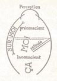
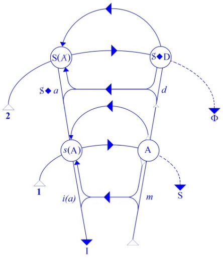
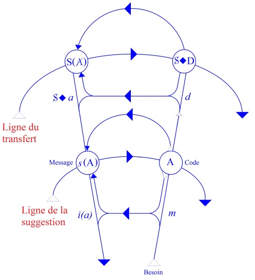

# Leçon 24 | 04 Juin 1958

  <label><input type="checkbox" data-lacan-toggle="original" checked> 原文</label>
  <label><input type="checkbox" data-lacan-toggle="notes" checked> 注释</label>
  <label><input type="checkbox" data-lacan-toggle="commentary" checked> 个人解读评论</label>

<section class="parallel-paragraph" data-paragraph-ids="s5-24-0001">

s5-24-0001

[无对应译文]

原文 · s5-24-0001

FREUD, dans « *Psychologie des masses et analyse du moi »,* consacre un chapitre à *l’identification*.
Nous allons, dans ces quelques *derniers séminaires* qui nous restent cette année, nous avancer dans ce champ,
ouvert par FREUD après la première guerre, vers les années 1920, de la seconde topique.

</section>

<section class="parallel-paragraph" data-paragraph-ids="s5-24-0002">

s5-24-0002

[无对应译文]

原文 · s5-24-0002

Parce que ce que nous avons parcouru cette année en essayant de donner une dimension des *formations de l’inconscient* et de ce que cela représente, c’est cela seul qui nous permettra, sur le fait de la topique, de ne pas nous égarer dans
ses autres sens coutumiers. Nous serons donc amenés à indiquer tout au moins ce que veut dire cette topique, et tout spécialement pourquoi elle est venue au premier plan de la fonction du *moi* dans un bien autre sens, manifestement différent et combien plus complexe, de l’usage qu’on en a fait depuis. Ceci, pour vous montrer la direction.

</section>

<section class="parallel-paragraph" data-paragraph-ids="s5-24-0003">

s5-24-0003

[无对应译文]

原文 · s5-24-0003

Pour l’instant, je retiens de ce *chapitre sur l’identification.* Bien entendu, il faut le lire, il faut que vous voyiez
dans quel sens cela s’applique aux reports que je vais vous donner des *trois types d’identification* distingués par FREUD sur le schéma qui est ici et, en somme, qui doit avoir pour vous, au point où nous en sommes, la valeur justement d’une médiation, d’un schéma d’articulation, voire d’interpréta­tion :

</section>

<section class="parallel-paragraph" data-paragraph-ids="s5-24-0004">

s5-24-0004

[无对应译文]

原文 · s5-24-0004

- d’une part, de ce qu’il en est de la structure de l’inconscient en tant que cette structure de l’inconscient est foncièrement *structurée comme une parole, comme un langage*,

</section>

<section class="parallel-paragraph" data-paragraph-ids="s5-24-0005">

s5-24-0005

[无对应译文]

原文 · s5-24-0005

- et d’autre part, *de ce qui s’en dégage comme topique*.

</section>

<section class="parallel-paragraph" data-paragraph-ids="s5-24-0006">

s5-24-0006

[无对应译文]

原文 · s5-24-0006

Précisément, vous allez voir tout de suite que FREUD distingue *trois types d’iden­tifications*. Ceci est nettement articulé et, dans un certain paragraphe, c’est nettement résumé. *Le premier type d’identification*, c’est la forme la plus originelle

</section>

<section class="parallel-paragraph" data-paragraph-ids="s5-24-0007">

s5-24-0007

[无对应译文]

原文 · s5-24-0007

du lien de sen­timent à un objet.

</section>

<section class="parallel-paragraph" data-paragraph-ids="s5-24-0008">

s5-24-0008

[无对应译文]

原文 · s5-24-0008

*La seconde forme*, c’est celle sur laquelle il s’est particulièrement étendu dans ce chapitre, celle qui d’ailleurs est la base concrète de toute la réflexion de FREUD autour de *l’identification*, foncièrement liée à tout ce qui est de la topique.
N’oublions tout de même pas comme fait premier, avant d’apprécier les différents organes, si l’on peut dire,
de la topique freudienne pour autant qu’ils ressortissent de ce fameux schéma en forme d’œuf qui aurait un œil,

</section>

<section class="parallel-paragraph" data-paragraph-ids="s5-24-0009">

s5-24-0009

[无对应译文]

原文 · s5-24-0009

 

</section>

<section class="parallel-paragraph" data-paragraph-ids="s5-24-0010">

s5-24-0010

[无对应译文]

原文 · s5-24-0010

le schéma à partir duquel vous imaginez, vous « *intuitivez* » *les rapports du Ça, du moi, du surmoi,* un œil quelque part,
une sorte de *pipette* qui entrerait dans *la substance* censée représenter le *surmoi,* que c’est un schéma évidemment
bien commode. C’est justement l’inconvénient de ceci, que *pour représenter les choses topolo­giques on use de schémas spatiaux.*

</section>

<section class="parallel-paragraph" data-paragraph-ids="s5-24-0011">

s5-24-0011

[无对应译文]

原文 · s5-24-0011

C’est une nécessité à laquelle moi-même je n’échappe pas puisque aussi *ma topique je la représente par un schéma spatial*.

</section>

<section class="parallel-paragraph" data-paragraph-ids="s5-24-0012">

s5-24-0012

[无对应译文]

原文 · s5-24-0012

J’es­saye de le faire avec le moins d’inconvénients possibles parce que ce qui distingue la topique d’un schéma spatial, c’est que ce schéma - celui-là par exemple, *mon petit réseau* - représente pour vous ceci, par exemple que vous le prenez et que vous le *chif­fonnez*, que vous en faites une petite boule et que vous la mettez dans votre poche,
en principe les relations restent toujours les mêmes : ce sont des relations de lien, d’ordre.

</section>

<section class="parallel-paragraph" data-paragraph-ids="s5-24-0013">

s5-24-0013

[无对应译文]

原文 · s5-24-0013

C’est plus difficile à faire pour *ce schéma de l’œuf* puisque lui est tout entier tourné vers cette projection spatiale.
Alors vous vous imaginez que FREUD veut désigner par le *Ça* quelque chose qui est quelque part, qui est un organe sur lequel il y a cette espèce de protubérance repré­sentée par le *moi* qui en effet vient là comme un œil.
Mais lisez le texte, il ne fait nullement allusion à quoi que ce soit qui se représente avec ce caractère substantiel,
à quelque chose qui permette de *représenter* cela comme une sorte de différenciation organisée. Le développement
des organes corporels, c’est tout à fait autre chose. Le terme d’*identification* veut dire complètement *autre chose*.
C’est sur ces identifications que sont supportées des différenciations qui sont dans une autre espèce,
dans un tout autre ordre que les différenciations d’*organe*.

</section>

<section class="parallel-paragraph" data-paragraph-ids="s5-24-0014">

s5-24-0014

[无对应译文]

原文 · s5-24-0014

C’est quand même très impor­tant à être rappelé, ne serait-ce que parce que cela peut aller très loin. En fin de compte, il y a vraiment des gens qui s’imaginent que quand ils font une lobotomie, ils enlèvent une tranche de *surmoi*.
Et non seulement ils le croient, mais ils l’écrivent, et ils le font dans cette pensée.

</section>

<section class="parallel-paragraph" data-paragraph-ids="s5-24-0015">

s5-24-0015

[无对应译文]

原文 · s5-24-0015

Ce second type d’identification, voyons comment FREUD l’articule : elle se produit sur la voie d’une régression, comme remplacement d’une liaison à un objet, liaison libidinale qui équivaut à une introjection de l’objet dans le *moi*.
Je vous le répète, *cette seconde forme d’identification* est celle qui, tout au long du discours de FREUD dans *Psychologie*
*des masses et analyse du moi*, mais aussi dans *Le moi et le ça*, lui pose le plus de problèmes pour *son rapport ambigu avec l’objet*.
C’est là aussi où tous les problèmes de l’analyse sont réunis, le problème du *complexe d’Œdipe inversé*
en particulier : pourquoi à un moment, dans certains cas, et dans la forme du *complexe d’Œdipe inversé*,
l’objet qui est un objet d’attachement libidinal devient-il objet d’identification ?

</section>

<section class="parallel-paragraph" data-paragraph-ids="s5-24-0016">

s5-24-0016

[无对应译文]

原文 · s5-24-0016

Dans certains cas il est plus important de *soutenir le problème posé* que de le résoudre d’une façon quelconque.
Il n’y a absolument rien d’*obligé* à ce que nous fas­sions une représentation d’une quelconque solution possible

</section>

<section class="parallel-paragraph" data-paragraph-ids="s5-24-0017">

s5-24-0017

[无对应译文]

原文 · s5-24-0017

de cette question, qui est peut-être, après tout, la question centrale, la question en deçà de laquelle nous sommes toujours condamnés à rester, celle qui fait le point pivot. Il faut bien qu’il y en ait un quelque part, parce que,
où que nous nous mettions pour considérer que toutes les questions sont résolues, il restera toujours cette question : pourquoi sommes-nous là ? Et comment y sommes-nous arrivés pour être au point où tout est clair ?

</section>

<section class="parallel-paragraph" data-paragraph-ids="s5-24-0018">

s5-24-0018

[无对应译文]

原文 · s5-24-0018

Il est clair qu’il doit bien y avoir *un point* qui fait que justement nous restons plongés dans la question. Je ne vous dis pas que ce point-là c’est le point dont il s’agit, mais enfin il est clair que FREUD, lui, en tout cas tourne autour
et ne prétend pas - nulle part - l’avoir résolu. Ce qui est important par contre, c’est de voir comment les coordonnées,
si l’on peut dire, de ce point zéro varient. Je vous le répète, c’est là la question essentielle,
celle du rapport entre *l’amour pour un objet* et *l’identification* foncièrement donnée par l’expérience pour s’ensuivre.

</section>

<section class="parallel-paragraph" data-paragraph-ids="s5-24-0019">

s5-24-0019

[无对应译文]

原文 · s5-24-0019

Ici, FREUD introduit de la façon la plus claire la distinction et l’opposition qui est celle qu’à la fin d’un de nos derniers séminaires dans lequel j’avais fait allusion au problème de la relation au *phallus* : l’opposition, en somme,
de *l’être* et de *l’avoir.* C’est ainsi qu’il articule la différence qu’il y a entre:

</section>

<section class="parallel-paragraph" data-paragraph-ids="s5-24-0020">

s5-24-0020

[无对应译文]

原文 · s5-24-0020

- l’attachement érotique, libidinal, à l’objet aimé,

</section>

<section class="parallel-paragraph" data-paragraph-ids="s5-24-0021">

s5-24-0021

[无对应译文]

原文 · s5-24-0021

- et *l’identification* au même.

</section>

<section class="parallel-paragraph" data-paragraph-ids="s5-24-0022">

s5-24-0022

[无对应译文]

原文 · s5-24-0022

Mais FREUD nous le dit bien : en tout cas ce que son expérience lui donne c’est que *cette* *identification* *est toujours*

</section>

<section class="parallel-paragraph" data-paragraph-ids="s5-24-0023">

s5-24-0023

[无对应译文]

原文 · s5-24-0023

*de nature régres­sive*. Les coordonnées, les corrélations de cette transformation d’un attachement libi­dinal

</section>

<section class="parallel-paragraph" data-paragraph-ids="s5-24-0024">

s5-24-0024

[无对应译文]

原文 · s5-24-0024

en identification sont des coordonnées qui montrent qu’il y a régression. Je pense que vous en savez quand même assez pour que je n’aie pas besoin de mettre les points sur les i. En tout cas, j’ai déjà articulé dans les séances précédentes à quoi s’atteste *une régression*. Bien entendu, vous le savez, mais il s’agit de savoir comment on l’articule ici. Nous l’articulons comme ceci, c’est le choix des signifiants qui en donne clairement l’indication : ce que nous appelons *régresser au stade anal* avec toutes ses nuances et variétés, voire *au stade oral,* c’est ce que nous voyons tou­jours dans le présent, dans le discours du sujet : des *signifiants régressifs*. Il n’y a pas d’autre régression dans l’analyse.

</section>

<section class="parallel-paragraph" data-paragraph-ids="s5-24-0025">

s5-24-0025

[无对应译文]

原文 · s5-24-0025

Que le sujet se mette sur votre divan en gémissant comme un nourrisson, voire en en imitant les comportements, cela arrive quelquefois, mais nous ne sommes pas habitués à voir là la véritable régression que vous voyez dans l’analyse. Cela se produit, cette sorte de simagrée de la part du patient, mais ce n’est généralement pas dans des cas
de très bon augure, et ce n’est pas cela que vous êtes d’ordinaire habitués à appeler « *régression* ».
Au point où nous en sommes de ces deux formes d’*identification*, nous allons tâcher de les appliquer sur notre schéma et de voir ce qu’elles veulent dire.

</section>

<section class="parallel-paragraph" data-paragraph-ids="s5-24-0026">

s5-24-0026

[无对应译文]

原文 · s5-24-0026

</section>

<section class="parallel-paragraph" data-paragraph-ids="s5-24-0027">

s5-24-0027

[无对应译文]

原文 · s5-24-0027

Si les deux lignes qui, quand nous nous plaçons ici, c’est-à-dire au niveau du besoin du sujet, *Bedürfnis,* le terme est employé dans FREUD. Je vous signale en passant que FREUD, et justement à propos de la même réflexion concernant l’avènement de *l’identification* et ses rapports avec *l’investissement de l’objet,* nous dit dans une certaine phrase :

</section>

<section class="parallel-paragraph" data-paragraph-ids="s5-24-0028">

s5-24-0028

[无对应译文]

原文 · s5-24-0028

« *Plus tard on doit admettre que l’investissement de l’objet*… »

</section>

<section class="parallel-paragraph" data-paragraph-ids="s5-24-0029">

s5-24-0029

[无对应译文]

原文 · s5-24-0029

Je vous fais remarquer en passant que [*la traduction de Jankélévitch*](http://classiques.uqac.ca/classiques/freud_sigmund/essais_de_psychanalyse/Essai_2_psy_collective/Freud_Psycho_collective.pdf) de ces cha­pitres les rend proprement inintelligibles

</section>

<section class="parallel-paragraph" data-paragraph-ids="s5-24-0030">

s5-24-0030

[无对应译文]

原文 · s5-24-0030

et quelquefois leur fait dire exactement le contraire du texte de FREUD, ce terme d’« *investissement de l’objet  *»
est traduit par *concentration sur l’objet*, ce qui est d’une obscurité incroyable.

</section>

<section class="parallel-paragraph" data-paragraph-ids="s5-24-0031">

s5-24-0031

[无对应译文]

原文 · s5-24-0031

« …*que l’investissement de l’objet provient du Es* *(du Ça)* *qui perçoit les inci­tations érotiques comme besoin.* »

</section>

<section class="parallel-paragraph" data-paragraph-ids="s5-24-0032">

s5-24-0032

[无对应译文]

原文 · s5-24-0032

Vous voyez que le *Es* est quelque chose qui se pro­pose ici comme très ambigu : il perçoit *les incitations érotiques,*

</section>

<section class="parallel-paragraph" data-paragraph-ids="s5-24-0033">

s5-24-0033

[无对应译文]

原文 · s5-24-0033

*les pressions, les ten­sions érotiques,* comme « *besoin* ». Quoi qu’il en soit de la perspective du besoin,
ces lignes \[1 et 2\] donnent donc *les deux horizons de la demande* :

</section>

<section class="parallel-paragraph" data-paragraph-ids="s5-24-0034">

s5-24-0034

[无对应译文]

原文 · s5-24-0034

- c’est-à-dire de la *demande* ici \[1\] en tant qu’*articulée*, *demande de satisfaction d’un besoin* pour autant que *toute demande de satisfaction d’un besoin doit passer par les défilés de l’articulation tels que le langage les rend obligatoires.*

</section>

<section class="parallel-paragraph" data-paragraph-ids="s5-24-0035">

s5-24-0035

[无对应译文]

原文 · s5-24-0035

- D’autre part, du seul fait de passer au plan du signifiant dans son existence et non plus dans son articulation, ce qui en résulte au niveau de celui à qui s’adresse *la demande* \[2\], c’est-à-dire l’Autre : *demande inconditionnelle d’amour* en tant qu’elle est liée au fait que celui à qui on s’adresse ainsi, est lui-même symbolisé, c’est-à-dire qu’il apparaît comme *présence sur fond d’absence*, qu’il peut être rendu *présent en tant qu’absent*, c’est-à-dire cet autre horizon.

</section>

<section class="parallel-paragraph" data-paragraph-ids="s5-24-0036">

s5-24-0036

[无对应译文]

原文 · s5-24-0036

Avant qu’un objet soit *aimé* au sens *érotique* du terme, au sens où l’Éros de l’ob­jet aimé peut être perçu comme besoin,

</section>

<section class="parallel-paragraph" data-paragraph-ids="s5-24-0037">

s5-24-0037

[无对应译文]

原文 · s5-24-0037

l’institution, la position de la demande crée l’horizon de *la demande d’amour.* Elles sont séparées sur ce schéma,
ces deux lignes, celle de la *demande* comme *demande de satisfaction d’un besoin* et celle de la *demande d’amour,*
elles sont séparées pour une raison de nécessité topologique, mais les remarques de tout à l’heure s’ap­pliquent :

</section>

<section class="parallel-paragraph" data-paragraph-ids="s5-24-0038">

s5-24-0038

[无对应译文]

原文 · s5-24-0038

cela ne veut pas dire qu’elles ne soient pas une seule et même ligne, à savoir ce qu’articule l’enfant devant la mère.

</section>

<section class="parallel-paragraph" data-paragraph-ids="s5-24-0039">

s5-24-0039

[无对应译文]

原文 · s5-24-0039

En d’autres termes, l’ambiguïté, la simultanéité…
si l’on peut dire, du déroulement de ce qui se passe sur ces deux lignes en tant que ce sont

des lignes où ce qui est du besoin du sujet s’articule comme *signifiant*
…cette superposition, cette simultanéité, cette *ambiguïté* est quelque chose qui nous est toujours offert à l’état permanent. Vous allez en voir une application immédiate, cette ambiguïté est très précisément l’ambiguïté
que maintient - tout au long de l’œuvre ­- FREUD, et d’une façon perma­nente :

</section>

<section class="parallel-paragraph" data-paragraph-ids="s5-24-0040">

s5-24-0040

[无对应译文]

原文 · s5-24-0040

- la notion de *transfert* comme tel, j’entends de l’action du transfert dans l’ana­lyse,

</section>

<section class="parallel-paragraph" data-paragraph-ids="s5-24-0041">

s5-24-0041

[无对应译文]

原文 · s5-24-0041

- avec celle de la *suggestion*.

</section>

<section class="parallel-paragraph" data-paragraph-ids="s5-24-0042">

s5-24-0042

[无对应译文]

原文 · s5-24-0042

Tout le temps FREUD nous dit qu’après tout, *le trans­fert* c’est une *suggestion*, que nous en usons comme tel.
Mais il ajoute : « …*à ceci près que nous en faisons tout autre chose, puisque cette suggestion nous l’interprétons.* »
Mais qu’est-ce que cela veut dire, si ce n’est que *si nous pouvons interpréter la suggestion*, c’est qu’un arrière-plan s’offre
à elle en tant que telle, parce que, si je puis dire, le transfert en puissance est là. Nous savons très bien que ça existe et je vais tout de suite vous en donner un exemple.

</section>

<section class="parallel-paragraph" data-paragraph-ids="s5-24-0043">

s5-24-0043

[无对应译文]

原文 · s5-24-0043

Le *transfert* en puissance est déjà analyse de *la suggestion*, il est lui-même la pos­sibilité de cette analyse de *la suggestion*,

</section>

<section class="parallel-paragraph" data-paragraph-ids="s5-24-0044">

s5-24-0044

[无对应译文]

原文 · s5-24-0044

il est articulation seconde de ce qui, dans la suggestion, s’impose purement et simplement au sujet.
En d’autres termes, la ligne d’horizon sur laquelle la suggestion se base est là \[1\], elle est très essentiellement au niveau de *la demande*, de *la demande* que fait le sujet par le seul fait qu’il est là. Quelles sont ces demandes ?

</section>

<section class="parallel-paragraph" data-paragraph-ids="s5-24-0045">

s5-24-0045

[无对应译文]

原文 · s5-24-0045

Comment pouvons-nous les situer ? Il est bien inté­ressant d’en faire le point au départ car cela varie extrêmement :

</section>

<section class="parallel-paragraph" data-paragraph-ids="s5-24-0046">

s5-24-0046

[无对应译文]

原文 · s5-24-0046

- Il y a vraiment des gens pour qui *la demande* de guérir est là à tout instant toute présente. Les autres, plus avertis, savent qu’elle est rejetée au lendemain.

</section>

<section class="parallel-paragraph" data-paragraph-ids="s5-24-0047">

s5-24-0047

[无对应译文]

原文 · s5-24-0047

- Il y en a d’autres qui sont là pour autre chose que pour la demande de guérison, *ils sont là pour voir*.

</section>

<section class="parallel-paragraph" data-paragraph-ids="s5-24-0048">

s5-24-0048

[无对应译文]

原文 · s5-24-0048

- Il y en a qui sont là pour devenir analystes.
  Quelle importance cela a-t-il de savoir la place de la demande puisque que la façon dont l’analyste,
  même en *n’y répondant pas*, institué comme cela, *y répond* : c’est constitutif de tous les effets de *suggestion*.
  Mais ne me dites pas qu’il suffit de dire que *le transfert* est, là, ce quelque chose grâce à quoi opère *la suggestion*.
  C’est l’idée que l’on s’en fait d’habitude. Non seulement c’est l’idée que l’on s’en fait d’habitude, mais je dirai que, jusqu’à un certain moment de son texte, FREUD écrit que s’il convient de laisser s’établir *le transfert* c’est parce
  qu’il est légitime d’user du pouvoir de quoi ? De *suggestion* que donne *le transfert*, *le transfert* ici conçu comme la prise
  et le pouvoir de l’analyste sur le sujet, comme le lien affectif qui fait le sujet dépendre de lui,
  qu’il est légitime que nous en usions pour qu’une interprétation passe.

</section>

<section class="parallel-paragraph" data-paragraph-ids="s5-24-0049">

s5-24-0049

[无对应译文]

原文 · s5-24-0049

Qu’est-ce que c’est sinon, à ce niveau, énoncer de la façon la plus claire que nous usons de *suggestion* ?
C’est parce que le patient, pour appeler les choses par leur nom, est arrivé à bien nous aimer,
que nos interprétations sont ingurgitées : nous sommes sur le plan de la suggestion.

</section>

<section class="parallel-paragraph" data-paragraph-ids="s5-24-0050">

s5-24-0050

[无对应译文]

原文 · s5-24-0050

Or, bien entendu FREUD n’entend pas *se limiter à cela*. Mais quand on dit « *oui, nous allons analyser le transfert* », observez bien la bifur­cation qui se présente à ce niveau : c’est une bifurcation qui *fait tout à fait s’évanouir le transfert*
en tant que…
disons que je souligne les termes parce que ce ne sont pas les miens, mais ceux qui sont implicites

dans toute discussion sur ce sujet du transfert
…en tant que prise affective sur le sujet car si nous considérons qu’à ce moment-là nous nous distinguons de celui qui prend appui sur son pouvoir sur le patient pour faire passer l’interprétation qu’il suggère, en ceci que nous allons analyser cet effet de son pouvoir, que faisons-nous d’autre si ce n’est que renvoyer la question à l’infini ?

</section>

<section class="parallel-paragraph" data-paragraph-ids="s5-24-0051">

s5-24-0051

[无对应译文]

原文 · s5-24-0051

Donc c’est encore à partir du *transfert* que nous ana­lyserons ce qui vient de se passer dans le fait que le sujet a accepté l’interprétation par exemple. Il n’y a aucune espèce de raison de sortir par cette voie du cercle infernal *de la suggestion.*
Or, nous supposons justement qu’*autre chose* est possible. C’est donc que le transfert est autre chose que l’usage
d’un pouvoir : le transfert est déjà un champ ouvert, la possibilité d’une articulation signifiante autre et différente
de celle qui enferme le sujet dans la demande.

</section>

<section class="parallel-paragraph" data-paragraph-ids="s5-24-0052">

s5-24-0052

[无对应译文]

原文 · s5-24-0052

C’est pourquoi il est légitime, quel qu’en doive être le contenu, de mettre à l’horizon ceci qui s’appelle ici,
non pas la *ligne de la suggestion*, mais *la ligne du transfert*, c’est-à-dire ce quelque chose d’articulé qui est en puissance
*au-delà* de ce qui s’articule sur le plan de la demande.

</section>

<section class="parallel-paragraph" data-paragraph-ids="s5-24-0053">

s5-24-0053

[无对应译文]

原文 · s5-24-0053

</section>

<section class="parallel-paragraph" data-paragraph-ids="s5-24-0054">

s5-24-0054

[无对应译文]

原文 · s5-24-0054

Or, ce qui est là à l’horizon, c’est ce qui produit la demande en tant que telle, à savoir la *symbolisation* de l’Autre, à savoir *la demande inconditionnelle d’amour*, c’est là que vient se loger ultérieurement l’objet, mais en tant qu’objet érotique, c’est là qu’il est visé par le sujet.

</section>

<section class="parallel-paragraph" data-paragraph-ids="s5-24-0055">

s5-24-0055

[无对应译文]

原文 · s5-24-0055

Et dire que *l’identification*, en lui succédant à cette visée de l’objet en tant qu’aimé, que *l’identification*, en la remplaçant est une *régression*, cela veut dire justement que ce dont il s’agit c’est de *l’ambiguïté* de cette *ligne de trans­fert*, si je puis dire, avec *la ligne de suggestion* parce que nous savons - et là je l’ai arti­culé depuis longtemps et tout à fait au départ, et FREUD nous l’articule là - que *sur cette ligne de la suggestion se fait l’identification sous sa forme primaire*, cette identification que nous connaissons bien, *cette identification aux insignes* qui font que l’autre, en tant que *sujet de la demande*,
celui qui a pouvoir de la satisfaire ou de ne pas la satisfaire, marque à tout instant cette satisfaction *par quelque chose*
qui bien entendu est au premier plan : *son langage, sa parole*.

</section>

<section class="parallel-paragraph" data-paragraph-ids="s5-24-0056">

s5-24-0056

[无对应译文]

原文 · s5-24-0056

Des rapports parlés de l’enfant avec la mère, j’en ai souligné l’importance, ils sont essentiels et ils font que tous les autres signes, toute la pantomime de la mère, comme on le disait hier soir, est quelque chose qui s’articule en termes de *signifiants* qui se cristallisent dans le carac­tère conventionnel de ces mimiques, soi-disant émotionnelles, qui sont ce avec quoi la mère communique avec l’enfant et qui donnent à toute espèce d’expression des émotions chez l’homme, ce caractère conventionnel qui fait que la prétendue spon­tanéité expressive des émotions se révèle, à l’examen

</section>

<section class="parallel-paragraph" data-paragraph-ids="s5-24-0057">

s5-24-0057

[无对应译文]

原文 · s5-24-0057

\- et ceci sans que l’on soit forcé d’être freudien pour cela - non seulement *tout à fait problématique*, mais archi-flottante, à savoir que ce qui *dans une certaine aire* d’articulation signifiante des émo­tions signifie une certaine émotion,

</section>

<section class="parallel-paragraph" data-paragraph-ids="s5-24-0058">

s5-24-0058

[无对应译文]

原文 · s5-24-0058

peut *dans une autre aire* - c’est une référence - être d’une toute autre valeur du point de vue expression des émotions.

</section>

<section class="parallel-paragraph" data-paragraph-ids="s5-24-0059">

s5-24-0059

[无对应译文]

原文 · s5-24-0059

Donc l’identification comme telle, si elle est régressive, c’est précisément en tant que l’ambiguïté reste permanente entre *la ligne de transfert* et *la ligne de suggestion*. Autrement dit, nous n’avons pas à nous étonner que, dans la suite, dans le dévelop­pement, dans le détour de l’analyse, nous voyons les régressions se scander par une série d’identifications qui leur sont corrélatives, qui en marquent le temps, le rythme. D’ailleurs elles sont différentes. Il ne peut pas y avoir à la fois régression et identifi­cation. Les unes sont les arrêts, les stoppages des autres.

</section>

<section class="parallel-paragraph" data-paragraph-ids="s5-24-0060">

s5-24-0060

[无对应译文]

原文 · s5-24-0060

Mais il reste que s’il y a *trans­fert*, c’est très précisément pour que ceci soit maintenu *sur un autre plan* que sur celui
de *la suggestion*, à savoir que ceci soit visé non pas comme quelque chose à quoi ne répond aucune satisfaction
de la demande, mais comme tel, comme une articulation signifiante, et c’est cela qui distingue l’une de l’autre.

</section>

<section class="parallel-paragraph" data-paragraph-ids="s5-24-0061">

s5-24-0061

[无对应译文]

原文 · s5-24-0061

Vous me direz « *quelle est l’opération qui fait que nous les maintenons distinctes ?* » Justement, notre opération ici est celle qui est abstinente ou abstentionniste, qui consiste à ne jamais, comme telle, gratifier la demande. Cela nous le savons, mais cette abstention, encore qu’elle soit essentielle, n’est pas à elle seule suffisante. Ceci saute aux yeux.
C’est bien parce qu’il est dans la nature des choses que ces deux lignes restent *distinctes*, qu’elles peuvent le rester.

</section>

<section class="parallel-paragraph" data-paragraph-ids="s5-24-0062">

s5-24-0062

[无对应译文]

原文 · s5-24-0062

Autrement dit c’est parce que pour le sujet elles sont *distinctes*, et que justement *entre les deux il y a tout ce champ*
qui n’est, Dieu merci, pas mince à saisir, qui n’est jamais aboli, et *qui s’appelle le champ du désir*, qu’elles peuvent rester distinctes. Autrement dit, tout ce qu’on nous demande c’est, de par notre présence là comme Autre,
de ne pas favoriser cette *confusion*. Car bien entendu :

</section>

<section class="parallel-paragraph" data-paragraph-ids="s5-24-0063">

s5-24-0063

[无对应译文]

原文 · s5-24-0063

- il suffit que nous entrions là comme Autre, et surtout de la façon dont nous y entrons, avec ce caractère que nous appelons permissif de l’analyse, mais permissif sur le plan verbal, mais cela suffit,

</section>

<section class="parallel-paragraph" data-paragraph-ids="s5-24-0064">

s5-24-0064

[无对应译文]

原文 · s5-24-0064

- il suffit que les choses soient permissives sur le plan verbal - Pourquoi ? - Non pas bien entendu pour que le patient soit satisfait, parce qu’il est même satisfait par cela, mais il n’est pas satisfait dans les éléments de *réel*,

</section>

<section class="parallel-paragraph" data-paragraph-ids="s5-24-0065">

s5-24-0065

[无对应译文]

原文 · s5-24-0065

- il suffit qu’il soit satisfait sur le plan de la demande pour que la confusion s’établisse irrémédiablement entre ces deux plans : celui que j’appelle *la ligne de transfert* \[2\], et celui que j’appelle *la ligne de suggestion* \[1\].

</section>

<section class="parallel-paragraph" data-paragraph-ids="s5-24-0066">

s5-24-0066

[无对应译文]

原文 · s5-24-0066

Nous sommes donc, de par notre présence et en tant que nous écoutons le patient, ce qui tend à faire se confondre
*la ligne de transfert* avec *la ligne de la demande*. Nous sommes donc, au principe, nocifs et c’est cela que cela veut dire.
La régression, c’est notre voie, mais c’est une voie descendante, c’est une voie qui, par rapport à la fin de notre action, n’en désigne pas le but mais le détour. Et c’est cela qu’il faut que nous tenions sans cesse à l’esprit.
Dieu merci, il y a quelque chose qui empêche que cette confusion irrémédiable s’établisse…

</section>

<section class="parallel-paragraph" data-paragraph-ids="s5-24-0067">

s5-24-0067

[无对应译文]

原文 · s5-24-0067

Encore qu’il y ait toute une technique de l’analyse qui n’ait pas d’autre but et d’autre fin que de l’établir, cette confusion, et c’est pour cela qu’elle aboutit à « *la névrose de transfert* », et que vous voyez ensuite écrit dans une revue qui s’appelle la *Revue Française de Psychanalyse,* que pour ce qui est de résoudre ce qui s’appelle la question du transfert, il n’y a plus qu’une chose à faire :

</section>

<section class="parallel-paragraph" data-paragraph-ids="s5-24-0068">

s5-24-0068

[无对应译文]

原文 · s5-24-0068

- faire asseoir le malade,

</section>

<section class="parallel-paragraph" data-paragraph-ids="s5-24-0069">

s5-24-0069

[无对应译文]

原文 · s5-24-0069

- lui montrer des choses gentilles,

</section>

<section class="parallel-paragraph" data-paragraph-ids="s5-24-0070">

s5-24-0070

[无对应译文]

原文 · s5-24-0070

- lui mon­trer que c’est joli dehors,

</section>

<section class="parallel-paragraph" data-paragraph-ids="s5-24-0071">

s5-24-0071

[无对应译文]

原文 · s5-24-0071

- et lui dire d’y aller en franchissant la porte à petits pas de façon à ne pas faire lever les mouches.

</section>

<section class="parallel-paragraph" data-paragraph-ids="s5-24-0072">

s5-24-0072

[无对应译文]

原文 · s5-24-0072

Et ceci par un grand technicien !

</section>

<section class="parallel-paragraph" data-paragraph-ids="s5-24-0073">

s5-24-0073

[无对应译文]

原文 · s5-24-0073

Heureusement qu’il y a entre les deux lignes quelque chose qui s’oppose à cette confusion de *la ligne de transfert*
et de *la ligne de suggestion*, il y a entre les deux *le désir* précisément, et tout cela ce sont des choses tellement évidentes que les hypnotiseurs, disons simplement ceux qui se sont intéressés à l’hypnose, le savent bien :
qu’aucune suggestion, si réussie soit-elle, ne s’empare totalement du sujet. Qu’est-ce qui résiste ?

</section>

<section class="parallel-paragraph" data-paragraph-ids="s5-24-0074">

s5-24-0074

[无对应译文]

原文 · s5-24-0074

Très précisément ceci - je ne dirai même pas tel ou tel désir du sujet, c’est l’évidence - mais très essentiellement ceci : *le désir d’avoir son désir,* c’est encore plus évident, mais ce n’est pas une raison pour ne pas le dire. Ce sont ces formes, pour le sujet, du maintien nécessaire du *désir*, grâce à quoi il reste ce qui est de la nature même du sujet humain comme tel : un sujet divisé. S’il n’est plus un sujet divisé, il est fou. Il reste un sujet divisé parce qu’il y a là un désir dont le champ après tout ne doit pas non plus être si commode à maintenir puisque, ce que je vous explique,
c’est que ce pourquoi *une* *névrose* est construite comme elle est construite, *une névrose hystérique*, *une névrose obsessionnelle,* c’est pour maintenir quelque chose d’articulé qui s’appelle « *le désir* » et ceci est bien défini.

</section>

<section class="parallel-paragraph" data-paragraph-ids="s5-24-0075">

s5-24-0075

[无对应译文]

原文 · s5-24-0075

*La névrose*, ce n’est pas la plus ou moins grande force ou la plus ou moins grande faiblesse, ou *la fixation*, entendue dans cette espèce de sens aussi intuitif qui consiste à s’imaginer *la fixation* comme quelque chose qui est arrivé
en un point où le sujet a mis le pied dans un pot de colle, *la fixation* c’est évidemment autre chose. Si ça res­semble

</section>

<section class="parallel-paragraph" data-paragraph-ids="s5-24-0076">

s5-24-0076

[无对应译文]

原文 · s5-24-0076

à quelque chose, c’est plutôt à des piquets destinés à maintenir quelque chose qui autrement se sauverait. C’est très variable, ce qu’on appelle « *l’élément quantitatif* », la force du désir chez les névrosés, et je dirai que c’est une des choses les plus convaincantes pour assurer l’autonomie de ce qu’on appelle la modification structurale dans la névrose.

</section>

<section class="parallel-paragraph" data-paragraph-ids="s5-24-0077">

s5-24-0077

[无对应译文]

原文 · s5-24-0077

C’est qu’il saute aux yeux de l’expérience que les névro­sés qui ont la même forme de névrose sont des gens qui sont très diversement doués du côté de ce qu’un des auteurs qui sont en cause concernant la névrose obses­sionnelle appelle quelque part « *la sexualité exubérante et précoce* » d’un de ses patients.

</section>

<section class="parallel-paragraph" data-paragraph-ids="s5-24-0078">

s5-24-0078

[无对应译文]

原文 · s5-24-0078

Je dois dire que « *la sexualité exubérante et précoce* », celui dont il est dit quelque part

</section>

<section class="parallel-paragraph" data-paragraph-ids="s5-24-0079">

s5-24-0079

[无对应译文]

原文 · s5-24-0079

> qu’« *Il se masturbait en se pinçant légèrement la partie périphérique du prépuce, persuadé, à l’époque, qu’il se produirait des lésions irréparables si le four­reau se rétractait. Il n’osait pas se laver les* \[...\] *car il redoutait de se blesser et de perdre quelque chose. Les conseils d’un médecin* \[...\] *ils durent consulter un médecin devant les échecs répétés de leurs tentatives de coït.* »[^59]

</section>

<section class="parallel-paragraph" data-paragraph-ids="s5-24-0080">

s5-24-0080

[无对应译文]

原文 · s5-24-0080

On sait bien que tout cela, ce sont des *symptômes* ! Le sujet se révé­lera, au milieu au moins où l’auteur conduit

</section>

<section class="parallel-paragraph" data-paragraph-ids="s5-24-0081">

s5-24-0081

[无对应译文]

原文 · s5-24-0081

son analyse, fort capable de satisfaire sa femme et de remplir ses devoirs de mari. Mais enfin ! Mais enfin !
Nous n’allons tout de même pas parler d’une « *sexualité exubérante* » qui est celle qui, par quelque force
que nous supposions supporter les *symptômes*, se laisse tout de même languir, leur­rer au point que l’on puisse donner une description pareille d’un sujet déjà parvenu à un âge avancé.

</section>

<section class="parallel-paragraph" data-paragraph-ids="s5-24-0082">

s5-24-0082

[无对应译文]

原文 · s5-24-0082

Ce qui ne veut pas dire que d’un autre côté, un autre *névrosé obses­sionnel* ne vous montrera pas un tableau différent, par exemple d’une sexualité que l’on peut en effet qualifier d’exubérante, voire de précoce. C’est justement cette différence tout à fait sensible dans les cas cliniques - et qui d’ailleurs ne nous empêche pas de reconnaître qu’il s’agit dans tous les cas d’*une seule et même névrose obsessionnelle -* qui nous montre que ce pourquoi c’est une *névrose obsessionnelle*, ça se situe tout à fait ailleurs que dans cet élément quantita­tif du désir. S’il intervient, c’est uniquement et pour autant qu’il aura justement à passer dans ce qu’on appelle « *les défilés de la structure* ».

</section>

<section class="parallel-paragraph" data-paragraph-ids="s5-24-0083">

s5-24-0083

[无对应译文]

原文 · s5-24-0083

Mais ce qui caractérise la névrose dans l’occasion, c’est la structure, c’est-à-dire ce quelque chose, par exemple dans
le cas de *l’obsessionnel*, qui fait que son désir soit faible : qu’il soit en pleine puberté ou qu’il nous vienne quand il a quarante ou cinquante ans, c’est-à-direau moment où son désir tout de même décline et qu’il désire se faire une petite idée sur ce qui s’est passé, c’est-à-dire sur ce à quoi il n’a rien compris jusque là dans son exis­tence, c’est ce qui dans tous ces cas se présentera, non pas du tout comme la faiblesse ou la force du désir, mais dans le fait que par contre, faible ou fort, *l’obsessionnel* pen­dant tout le temps de son existence est occupé à mettre son désir en position forte, à constituer une « *place forte* » du désir, et ceci sur le plan des relations qui sont essen­tiellement des relations signifiantes.

</section>

<section class="parallel-paragraph" data-paragraph-ids="s5-24-0084">

s5-24-0084

[无对应译文]

原文 · s5-24-0084

Dans cette « *place forte* » habite un désir faible ou un désir fort, la question n’est pas là. Il y a une chose certaine,
c’est que dans tous les cas les « *places fortes* » sont à double tranchant, les « *places fortes* » qui sont construites sur *l’extérieur* sont encore beau­coup plus ennuyeuses pour ceux qui sont dedans, et c’est là qu’est le problème.

</section>

<section class="parallel-paragraph" data-paragraph-ids="s5-24-0085">

s5-24-0085

[无对应译文]

原文 · s5-24-0085

Vous voyez donc que *la première forme d’identification* nous est définie par le premier lien à l’objet, c’est-à-dire au niveau de ce qui se passe d’*identification* - si vous voulez, pour schématiser - d’*identification à la mère*.

</section>

<section class="parallel-paragraph" data-paragraph-ids="s5-24-0086">

s5-24-0086

[无对应译文]

原文 · s5-24-0086

*L’autre forme d’identification* \[2éme\], c’est *l’identification à l’objet <u>aimé</u>*, en tant que régressive, c’est-à-dire en tant qu’elle devrait se produire tout à fait ailleurs, à un point d’horizon qui bien entendu n’est pas tout à fait facile à atteindre,
puisque justement étant inconditionnel, ou plus exactement soumis à la seule condition de l’existence du signifiant.

</section>

<section class="parallel-paragraph" data-paragraph-ids="s5-24-0087">

s5-24-0087

[无对应译文]

原文 · s5-24-0087

Car, hors de *l’existence du signifiant*, il n’y a aucune ouverture possible de *la dimension d’amour comme telle*.
Elle est entièrement dépendante, étant la seule condition, de *l’existence du signifiant*, mais à l’intérieur de cette existence, d’aucune articulation particulière si ce n’est de ceci : qu’il y a *l’existence de l’articulation*. Et c’est pour cela qu’elle n’est pas tout à fait facile à formuler puisque en somme rien ne saurait la compléter, la combler, même pas la totalité
de mon discours dans toute mon existence, puisqu’elle est l’horizon de mes discours, en plus.

</section>

<section class="parallel-paragraph" data-paragraph-ids="s5-24-0088">

s5-24-0088

[无对应译文]

原文 · s5-24-0088

Ce qui pose juste­ment la question de *savoir ce que veut dire ce* S, mais à ce niveau. Autrement dit, de quel *sujet* s’agit-il ?
Il n’y a pas lieu de s’étonner que ceci ne constitue jamais qu’un horizon, à savoir que tout le problème est de savoir

</section>

<section class="parallel-paragraph" data-paragraph-ids="s5-24-0089">

s5-24-0089

[无对应译文]

原文 · s5-24-0089

ce qui va se construire, s’articuler dans cette direc­tion, dans cet intervalle.

</section>

<section class="parallel-paragraph" data-paragraph-ids="s5-24-0090">

s5-24-0090

[无对应译文]

原文 · s5-24-0090

Si cette direction, dans laquelle ce qui s’articule, pour le névrosé en somme, est la bonne, le névrosé qui vit quoi ?

</section>

<section class="parallel-paragraph" data-paragraph-ids="s5-24-0091">

s5-24-0091

[无对应译文]

原文 · s5-24-0091

Il vit *le paradoxe du désir* exactement comme tout le monde, car il n’y a pas d’humain inséré dans la condition humaine qui y échappe. La seule différence entre ce qu’on appelle un rap­port normal du désir et le névrosé ce n’est pas simplement ce paradoxe, car ce *le paradoxe du désir* est fondamental, c’est que le névrosé est ouvert à l’existence

</section>

<section class="parallel-paragraph" data-paragraph-ids="s5-24-0092">

s5-24-0092

[无对应译文]

原文 · s5-24-0092

de ce para­doxe comme tel.

</section>

<section class="parallel-paragraph" data-paragraph-ids="s5-24-0093">

s5-24-0093

[无对应译文]

原文 · s5-24-0093

Ce qui bien entendu ne lui simplifie pas l’existence, à lui, mais tout de même, ne le met pas dans une position si mauvaise *d’un certain point de vue*, que nous pouvons carrément à cette occasion articuler *le point de vue du philosophe*.
*Le point de vue du philosophe* non plus n’est pas clair, autrement dit, on peut fort bien le mettre en question de la même façon que le point de vue du névrosé, on ne sait même pas s’il a l’occasion de le faire.

</section>

<section class="parallel-paragraph" data-paragraph-ids="s5-24-0094">

s5-24-0094

[无对应译文]

原文 · s5-24-0094

Que ceci soit valable ou pas, il est certain qu’il est dans la nature des choses qu’il en soit ainsi, parce que c’est quand même sur quelque chose, sur une voie, sur une ligne, sur une ouverture, qui a quelque parenté avec ce qu’articule *le philosophe*, ou tout au moins ce qu’il devrait articuler, car, à la vérité : ce problème du désir, vous l’avez déjà vu bel et bien, et soigneusement, et correctement, et puissamment, articulé dans la voie du philosophe ? Jusqu’à présent ce qui me paraît une des choses les plus caractéristiques de la philosophie c’est que c’est là ce qu’il y a dans la philosophie de plus soigneusement *évité*.

</section>

<section class="parallel-paragraph" data-paragraph-ids="s5-24-0095">

s5-24-0095

[无对应译文]

原文 · s5-24-0095

Ceci me pousserait à ouvrir une autre parenthèse sur *la philosophie de l’action*, et qui aboutirait aux mêmes conclusions, à savoir que l’action dont on parle à tort et à travers...
à savoir qu’on y voit je ne sais quel instrument de la spontanéité, de l’ori­ginalité de l’homme en tant

qu’il vient là pour transformer les données du pro­blème, *transformer le monde* comme on dit

</section>

<section class="parallel-paragraph" data-paragraph-ids="s5-24-0096">

s5-24-0096

[无对应译文]

原文 · s5-24-0096

...il est très singulier que l’on ne mette jamais en valeur ce qui pourtant pour nous est cette vérité d’expérience, à savoir ce caractère profondément paradoxal et tout à fait patent du paradoxe du désir à l’ac­tion, ses traits et ses reliefs que je commençais de vous introduire la dernière fois en faisant allusion au caractère d’*exploit*, de *performance*,
de *démonstration*, d’*action*, voire même d’issue désespérée.

</section>

<section class="parallel-paragraph" data-paragraph-ids="s5-24-0097">

s5-24-0097

[无对应译文]

原文 · s5-24-0097

Ces termes que j’emploie ne sont pas de moi parce que le terme de *Wirkung* \[action\] est employé par FREUD
pour désigner l’action tout à fait paradoxale, l’action tout à fait généralisée, l’action humaine. L’action humaine
est tout spécialement là où on prétend la désigner en accord avec l’histoire, comme « *le passage du Rubicon* ».
Mon ami KOJÈVE parle de cela comme de quelque chose qui est là le point de concours, *la solution harmonieuse*
entre le présent, le passé et l’avenir de CÉSAR…
encore que la dernière fois que je suis passé de ce côté, je ne l’ai jamais vu qu’à sec. Il était immense,

et à l’époque où j’y étais, il était à sec, ce n’était pas dans la même saison où CÉSAR l’a franchi
…et même dans le fait que CÉSAR a « *passé le Rubi­con* », avec le génie de CÉSAR, dans le fait de
« *passer le Rubicon* » il y a toujours quelque chose qui comporte qu’« *on se jette à l’eau* » puisque c’est une rivière.

</section>

<section class="parallel-paragraph" data-paragraph-ids="s5-24-0098">

s5-24-0098

[无对应译文]

原文 · s5-24-0098

En d’autres termes, l’action humaine n’est pas quelque chose de si harmonieux que cela.
Et pour nous autres, analystes, c’est bien la chose la plus étonnante du monde que personne,
dans l’analyse, ne se soit proposé ou mis à essayer d’articuler ce qui concerne l’action, justement
dans cette perspective paradoxale où nous la voyons sans cesse, où nous n’en voyons jamais d’autre.
Ce qui nous donne d’ailleurs assez de mal pour bien définir ce qui s’appelle à proprement parler *acting-out.*
L’ *acting-out,* dans un certain sens, à cet égard, étant une action comme une autre, mais prenant justement son relief d’être provoquée par le fait que nous utilisons le trans­fert, c’est-à-dire que nous faisons quelque chose d’extrêmement dangereux, et d’au­tant plus dangereux que, comme vous le voyez d’après ce que je vous suggère, nous n’avons pas une idée *très, très précise* de ce que c’est.

</section>

<section class="parallel-paragraph" data-paragraph-ids="s5-24-0099">

s5-24-0099

[无对应译文]

原文 · s5-24-0099

Peut-être ceci est-il une indication au passage qui vous éclairera ce que je veux dire, si je vous dis que la « *résistance* »
\- et la « résistance » d’une façon tout à fait sensible et matérielle, à savoir la « résistance » pour autant que le sujet dans certains cas n’accepte pas d’interprétations telles que nous les lui présentons sur le plan justement de la régression -
.est une chose qui semble si bien coller au premier abord, à savoir que pour lui ça ne lui semble pas coller du tout comme cela. Et si le sujet « *résiste* », il finira bien par lâcher si nous insistons, vu que nous sommes toujours prêts à jouer sur la corde de la suggestion. Cette « *résistance* », pour autant qu’elle exprime la nécessité du maintien du point où il s’agit justement d’articuler *le désir* autrement, à savoir sur le plan du désir, cette « *résistance* », quelle valeur a-t-elle ?

</section>

<section class="parallel-paragraph" data-paragraph-ids="s5-24-0100">

s5-24-0100

[无对应译文]

原文 · s5-24-0100

Mais très précisément, la valeur que FREUD dans cer­tains textes lui donne. S’il l’appelle *Übertragungswiderstand*

</section>

<section class="parallel-paragraph" data-paragraph-ids="s5-24-0101">

s5-24-0101

[无对应译文]

原文 · s5-24-0101

\[résistance de transfert\], c’est parce qu’elle est la même chose que le transfert - le transfert au sens où je vous le dis pour l’instant, où sans doute ce qu’il s’agit de maintenir c’est l’autre ligne, *la ligne du transfert*, où la ligne de l’articulation
a une autre exigence que celle que nous lui donnons immé­diatement, en réponse à la demande.

</section>

<section class="parallel-paragraph" data-paragraph-ids="s5-24-0102">

s5-24-0102

[无对应译文]

原文 · s5-24-0102

Je voudrais vous dire, après ce rappel qui ne correspond qu’à des évidences mais à des évidences qui ont quand même, je crois, besoin d’être articulées, vous dire :

</section>

<section class="parallel-paragraph" data-paragraph-ids="s5-24-0103">

s5-24-0103

[无对应译文]

原文 · s5-24-0103

- que la seconde identification veut dire le point où se juge ce qui se passe en tant que régressif,

</section>

<section class="parallel-paragraph" data-paragraph-ids="s5-24-0104">

s5-24-0104

[无对应译文]

原文 · s5-24-0104

- que c’est cet appel de transfert qui permet ce chahut des signifiants qui s’ap­pelle *régression* et qui doit nous mener à quelque chose d’au-delà de nous-mêmes, qui est ce que nous essayons de viser pour l’instant,
  à savoir comment opérer avec le transfert mais qui tout naturellement tend à se dégrader en quelque chose que nous pouvons toujours satisfaire à son niveau régressif d’une certaine façon, c’est-à-dire en nous faisant une certaine conception de l’analyse, celle justement qui se laisse fasci­ner par la notion de *frustration*
  
  et par différentes *articulations* qui, à l’occasion, s’ex­priment dans *la relation d’objet* de mille façons.
  
  Toutes les façons, si je puis dire, *d’ar­ticuler l’analyse* tendent toujours à se dégrader, ce qui n’empêche pas l’analyse d’être tout de même autre chose.

</section>

<section class="parallel-paragraph" data-paragraph-ids="s5-24-0105">

s5-24-0105

[无对应译文]

原文 · s5-24-0105

*La troisième forme d’identification*, FREUD nous l’articule comme ceci : cette forme d’identification qui peut naître
d’une communauté nouvellement perçue avec une personne qui n’est pas du tout l’objet d’une pulsion sexuelle.

</section>

<section class="parallel-paragraph" data-paragraph-ids="s5-24-0106">

s5-24-0106

[无对应译文]

原文 · s5-24-0106

Où se situe-t-elle cette *troisième identification* ? FREUD nous l’exemplifie d’une façon qui ne laisse aucune espèce d’ambiguïté sur la façon d’y répondre sur ce schéma. Il donne comme exemple *l’identification de l’hystérique*.
Il nous l’articule exactement. Comme je vous le disais tous ces temps-ci, dans FREUD c’est toujours dit de la façon la plus claire : *pour l’hystérique le problème est quelque part de fixer* - au sens où un instrument d’optique permet de fixer
un point - *de fixer son désir*, ce désir qui pour elle, vient présenter quelques difficultés spéciales.

</section>

<section class="parallel-paragraph" data-paragraph-ids="s5-24-0107">

s5-24-0107

[无对应译文]

原文 · s5-24-0107

Essayons d’articuler plus précisément ceci. Ce désir, il est quand même voué pour elle à je ne sais quelle impasse, puisqu’*elle ne peut réaliser cette fixation du point de son désir qu’à condition de s’identifier à n’importe quoi, à un petit <u>trait</u>*… FREUD l’écrit :

</section>

<section class="parallel-paragraph" data-paragraph-ids="s5-24-0108">

s5-24-0108

[无对应译文]

原文 · s5-24-0108

> « *Quand je vous dis un insigne, un trait, un seul trait - peu importe lequel - de quelqu’un d’autre*
> *chez lequel elle peut pressentir qu’il y a le même problème du désir*... »

</section>

<section class="parallel-paragraph" data-paragraph-ids="s5-24-0109">

s5-24-0109

[无对应译文]

原文 · s5-24-0109

C’est-à-dire que son impasse, à *l’hystérique*, lui ouvre toutes grandes les portes de l’autre, tout au moins toutes grandes du côté de tous les autres, c’est-à-dire de *tous les hystériques* possibles, voire de *tous les moments hystériques de tous les autre*s, pour autant qu’elle pressent chez eux un instant le même problème, qui est celui de *cette question sur le désir*.
Voilà comment FREUD le situe.

</section>

<section class="parallel-paragraph" data-paragraph-ids="s5-24-0110">

s5-24-0110

[无对应译文]

原文 · s5-24-0110

Je vous le montre­rai : la question - encore qu’elle s’articule un peu différemment - est, du point de vue de la relation de la topologie, exactement la même pour *l’obsessionnel*, et pour cause ! En d’autres termes, cette *identification* dont
il s’agit est celle qui est ici, \[S ◊ *a*\], à savoir le lieu où je vous ai désigné la dernière fois, chez *l’obsessionnel,* le *fantasme*.
C’est pour autant qu’il y a un point où le sujet a à établir un certain *rapport imaginaire* avec l’autre, non pas en soi,
si je puis dire, mais en tant que c’est ce *rapport imaginaire* qui lui apporte une satisfaction.

</section>

<section class="parallel-paragraph" data-paragraph-ids="s5-24-0111">

s5-24-0111

[无对应译文]

原文 · s5-24-0111

Il nous est bien précisé qu’il s’agit là d’une personne ou d’un objet qui n’a aucun rapport avec un *Sexual Trieb* quelconque. C’est autre chose, c’est *un support*, si vous voulez c’est *une marionnette du fantasme*. J’ai donné à ce mot « *fantasme *» toute l’étendue que vous voudrez. Il s’agit du *fantasme*, comme je l’ai articulé la dernière fois
et comme j’y reviendrai, en tant que le *fantasme* peut être un *fantasme inconscient*. Ici l’autre ne sert à rien, sinon
\- ce qui n’est pas peu - de permettre au sujet de tenir une certaine position qui évite *ce collapse du désir*,
qui évite le problème du *névrosé*.

</section>

<section class="parallel-paragraph" data-paragraph-ids="s5-24-0112">

s5-24-0112

[无对应译文]

原文 · s5-24-0112

Voilà *une troisième forme d’identification* qui est tout à fait essentielle. Comme je ne sais pas où cela nous mènerait,
parce que c’est toujours plus long qu’on ne pense, le fait d’entrer dans la lecture de l’observation de l’article

</section>

<section class="parallel-paragraph" data-paragraph-ids="s5-24-0113">

s5-24-0113

[无对应译文]

原文 · s5-24-0113

de M. BOUVET [^60] paru dans la *Revue Française de Psychanalyse* où il y a mon rapport sur *L’agressivité en psychanalyse*,
je vous demande de le lire. J’y reviendrai, mais je voudrais à ce propos articuler aujourd’hui le point où je désigne l’erreur de la technique d’analyse qui ramène au présent le transfert homosexuel dans *la névrose obsessionnelle*.

</section>

<section class="parallel-paragraph" data-paragraph-ids="s5-24-0114">

s5-24-0114

[无对应译文]

原文 · s5-24-0114

Ce qui se produit, pour autant que dans les fantasmes apparaît l’objet phallique, et nommément l’objet phallique
en tant qu’il est fantasmatiquement *le phallus de l’analyste,* c’est quelque chose qui se produit là, au point de prolifération déjà ins­titué, mais qui peut toujours être stimulé, à savoir là où le sujet, en tant qu’*obsessionnel*, maintient par son fantasme la possibilité de se maintenir - position pour elle, *l’hystérique*, beaucoup plus scabreuse et beaucoup plus dangereuse - en face de son désir. C’est ici qu’apparaît le *phallus* fantasmatique en tant que dans cette tech­nique que je désigne, c’est là que l’analyste va se faire, par ses interprétations pré­sentes, insistant pour que le sujet

</section>

<section class="parallel-paragraph" data-paragraph-ids="s5-24-0115">

s5-24-0115

[无对应译文]

原文 · s5-24-0115

en quelque sorte *consente* *à communier, à avaler, à s’incorporer fantasmatiquement cet objet partiel*.

</section>

<section class="parallel-paragraph" data-paragraph-ids="s5-24-0116">

s5-24-0116

[无对应译文]

原文 · s5-24-0116

Je dis que ceci est une erreur de plan :

</section>

<section class="parallel-paragraph" data-paragraph-ids="s5-24-0117">

s5-24-0117

[无对应译文]

原文 · s5-24-0117

- que c’est très probablement faire passer sur le plan de l’*identification suggestive*, sur le plan de la demande, ce qui est à ce moment-là mis en cause,

</section>

<section class="parallel-paragraph" data-paragraph-ids="s5-24-0118">

s5-24-0118

[无对应译文]

原文 · s5-24-0118

- que c’est favoriser une certaine *identification imaginaire* du sujet en profitant, si je puis dire, de la prise que donne la position suggestive ouverte à l’analyse sur le fondement du transfert,

</section>

<section class="parallel-paragraph" data-paragraph-ids="s5-24-0119">

s5-24-0119

[无对应译文]

原文 · s5-24-0119

- que c’est donner une solution fausse, déviée, à côté, à ce qui est en cause, je ne dis pas dans ses fantasmes, mais dans le matériel qu’apporte effectivement le sujet à l’analyste.

</section>

<section class="parallel-paragraph" data-paragraph-ids="s5-24-0120">

s5-24-0120

[无对应译文]

原文 · s5-24-0120

Et ceci se lit dans les obser­vations elles-mêmes où on entend construire là-dessus toute une doctrine, toute une théorie « *de l’objet partiel* », « *de la distance à l’objet* », « *de l’introjection de l’objet* », de tout ce qui s’ensuit. Et pour ne faire qu’introduire ce que je poursuivrai la prochaine fois dans le détail, je vais vous en donner un exemple.

</section>

<section class="parallel-paragraph" data-paragraph-ids="s5-24-0121">

s5-24-0121

[无对应译文]

原文 · s5-24-0121

À tout instant, dans cette observation, est sensible, perceptible, le fait que le pro­blème…

</section>

<section class="parallel-paragraph" data-paragraph-ids="s5-24-0122">

s5-24-0122

[无对应译文]

原文 · s5-24-0122

qui est la solution de l’analyse de *l’obsessionnel* …c’est que *l’obsessionnel* découvre *la castration* pour ce qu’elle est, c’est-à-dire *la loi de l’Autre*. *C’est l’Autre qui est châtré*, et pour des raisons qui sont celles de *sa fausse implication* dans ce pro­blème, le sujet se sent lui-même menacé par cette castration sur un plan *tellement aigu* qu’il ne peut pas s’approcher de son désir sans en ressentir les effets. Ce que je suis en train de dire, c’est que cet horizon de l’Autre,
du grand Autre comme tel et en tant que distinct du petit autre, du fait que c’est là qu’est le pro­blème,

</section>

<section class="parallel-paragraph" data-paragraph-ids="s5-24-0123">

s5-24-0123

[无对应译文]

原文 · s5-24-0123

est à tout instant touchable dans cette observation.

</section>

<section class="parallel-paragraph" data-paragraph-ids="s5-24-0124">

s5-24-0124

[无对应译文]

原文 · s5-24-0124

Dès l’origine dans son anamnèse, chez ce sujet qui, la première fois qu’il a un rapprochement avec une petite fille, fuit, oppressé sous l’angoisse et va le confier à sa mère et se sent tout ras­suré à partir du moment où il lui dit :

</section>

<section class="parallel-paragraph" data-paragraph-ids="s5-24-0125">

s5-24-0125

[无对应译文]

原文 · s5-24-0125

« *Je te dirai tout* », il n’y a qu’à prendre ce maté­riel à la lettre : il n’y a qu’une référence et un maintien qui, bien entendu, est un maintien virtuel, un projet, une référence éperdue à l’Autre comme lieu de *l’articu­lation verbale* dans lequel

</section>

<section class="parallel-paragraph" data-paragraph-ids="s5-24-0126">

s5-24-0126

[无对应译文]

原文 · s5-24-0126

le sujet va entièrement s’investir désormais. C’est le seul refuge possible à la panique qu’il éprouve à l’approche
de son désir, c’est déjà inscrit, il s’agit de voir ce qu’il y a dessous.

</section>

<section class="parallel-paragraph" data-paragraph-ids="s5-24-0127">

s5-24-0127

[无对应译文]

原文 · s5-24-0127

Quand, après toutes sortes de sollicitations de l’analyste, certains fantasmes vien­nent au jour, nous arrivons à un rêve que l’analyste interprète - il le dit tout de suite - strictement comme le fait que devient patente la tendance homosexuelle passive chez le sujet. Voici ce rêve :

</section>

<section class="parallel-paragraph" data-paragraph-ids="s5-24-0128">

s5-24-0128

[无对应译文]

原文 · s5-24-0128

> « *Je vous accompagne à votre domicile particulier. Dans votre chambre il y a un grand lit. Je m’y couche.*
> *Je suis extrêmement gêné. Il y a un bidet dans un coin de la chambre. Je suis heureux, quoique mal à l’aise.* » \[R.F.P. 1948, p.435\]

</section>

<section class="parallel-paragraph" data-paragraph-ids="s5-24-0129">

s5-24-0129

[无对应译文]

原文 · s5-24-0129

On nous dit qu’après préparation de ce sujet par une période déjà antérieure de l’analyse, le sujet n’éprouve pas beaucoup de difficultés à admettre *la signification homosexuelle passive* de ce rêve. Est-ce là ce qui à nos yeux suffit

</section>

<section class="parallel-paragraph" data-paragraph-ids="s5-24-0130">

s5-24-0130

[无对应译文]

原文 · s5-24-0130

à l’articuler ? Assu­rément en reprenant cette observation, on peut montrer tous les indices qui prou­vent que cela

</section>

<section class="parallel-paragraph" data-paragraph-ids="s5-24-0131">

s5-24-0131

[无对应译文]

原文 · s5-24-0131

ne suffit pas, mais il y a une chose certaine, c’est que le texte même du rêve nous montre que le sujet vient se mettre, c’est bien le cas de le dire, à la place de l’autre. Il le dit : « *Je suis à votre domicile particulier - je suis couché dans votre lit.* »

</section>

<section class="parallel-paragraph" data-paragraph-ids="s5-24-0132">

s5-24-0132

[无对应译文]

原文 · s5-24-0132

Homosexuel passif, pourquoi ? Jusqu’à nouvel ordre, rien ne s’y manifeste qui fasse en cette occasion
de l’autre un objet de désir. Par contre j’y vois d’une façon tout à fait claire, désigné aussi en position tierce
et dans un coin, quelque chose qui est pleinement articulé et auquel personne ne semble faire attention,
qui n’est pourtant pas là pour rien : c’est le bidet.

</section>

<section class="parallel-paragraph" data-paragraph-ids="s5-24-0133">

s5-24-0133

[无对应译文]

原文 · s5-24-0133

À savoir quelque chose qui à la fois présentifie le *phallus* et ne le montre pas, puisque je ne présage pas que, dans le rêve, il soit indiqué que quiconque soit occupé à s’en servir. Le bidet est là indiquant que ce dont il s’agit,
ce qui est problématique, c’est en effet *quelque chose* qui est présent dans la question. Ce n’est pas pour rien qu’il vient, ce fameux objet partiel, c’est le *phallus*, mais le *phallus* est là justement posé en tant, si je puis dire, que question :

</section>

<section class="parallel-paragraph" data-paragraph-ids="s5-24-0134">

s5-24-0134

[无对应译文]

原文 · s5-24-0134

- l’autre l’a-t-il ou ne l’a-t-il pas ? C’est l’occasion de le montrer.

</section>

<section class="parallel-paragraph" data-paragraph-ids="s5-24-0135">

s5-24-0135

[无对应译文]

原文 · s5-24-0135

- L’autre l’est-il ou ne l’est-il pas ? C’est ce qui est en arrière.

</section>

<section class="parallel-paragraph" data-paragraph-ids="s5-24-0136">

s5-24-0136

[无对应译文]

原文 · s5-24-0136

Bref, c’est la question de *la castration*, la question même, si vous voulez, pour cet *obsessionnel* en proie à toutes sortes d’obsessions de propreté, qui montre bien à quel point, à l’occasion, cet instrument peut être une source de danger.
Et ces obsessions de propreté, ce n’est pas pour rien que je les évoque là, car je vous ai lu ce petit morceau
« du *bidet *» qui montre que *le bidet*, pour lui, pendant long­temps a présentifié *le phallus*, au moins le sien propre.
C’est la question à propos du *phallus*, et à propos du *phallus* en tant qu’il est mis en jeu, et au niveau de l’Autre
comme étant l’objet de cette opération essentiellement symbolique qui fait que dans l’Autre, et au niveau de l’Autre, et au niveau du signifiant, *le phallus est le signifiant de ce qui est frappé par l’action du signifiant*, de ce qui est sujet à *castra­tion*.

</section>

<section class="parallel-paragraph" data-paragraph-ids="s5-24-0137">

s5-24-0137

[无对应译文]

原文 · s5-24-0137

C’est là l’articulation essentielle : pour autant que la visée n’est pas de savoir si le sujet à la fin se sentira conforté
en lui par l’assomption d’une puissance supérieure à partir de l’assimilation à un plus fort que lui, mais de savoir comment il aura résolu effectivement la question qui est à l’horizon, implicite dans la ligne même de ce qu’indique
la structure de la névrose, à savoir l’acceptation ou non du *complexe de castration* pour autant qu’étant réalisée,

</section>

<section class="parallel-paragraph" data-paragraph-ids="s5-24-0138">

s5-24-0138

[无对应译文]

原文 · s5-24-0138

*la castration* est, elle, *réalisée dans sa fonc­tion signifiante*. C’est ici que se distingue une technique de l’autre,
et je vous montrerai pourquoi.

</section>

<section class="parallel-paragraph" data-paragraph-ids="s5-24-0139">

s5-24-0139

[无对应译文]

原文 · s5-24-0139

Indépendamment de la légitimité liée à la structure, liée au sens même de l’existence du *désir de l’obsessionnel*, indépendamment de cela, la solution thérapeutique - si vous voulez, *le nœud, le bouclage, la cicatrice* disons même -

</section>

<section class="parallel-paragraph" data-paragraph-ids="s5-24-0140">

s5-24-0140

[无对应译文]

原文 · s5-24-0140

obtenue ne rend abso­lument pas douteux qu’une certaine technique est défavorable, ne correspond pas à ce qu’on peut appeler une guérison, ni même à une orthopédie, fut-elle boiteuse, que seule l’autre technique peut donner,

</section>

<section class="parallel-paragraph" data-paragraph-ids="s5-24-0141">

s5-24-0141

[无对应译文]

原文 · s5-24-0141

non seulement la solution correcte mais l’effi­cace solution.

</section>

<section class="note-block original-notes">

## Notes

[^59]: M. Bouvet : « [*Importance de l’aspect homosexuel du transfert dans le traitement de quatre cas de Névrose obsessionnelle masculine* ](http://gallica.bnf.fr/ark:/12148/bpt6k5445909f.image.langEN)», *Revue française de Psychanalyse*,

    1948, p.419. Repris dans M. Bouvet : *Œuvres*, Payot 1967

[^60]: Maurice Bouvet : « *Importance de l'aspect homosexuel du transfert dans le traitement de quatre cas de névrose obsessionnelle masculine »*,

    Revue Française de Psychanalyse, n°3, Juillet-Sept. 1948. Repris dans M. Bouvet : *Œuvres*, Payot 1967.

</section>
