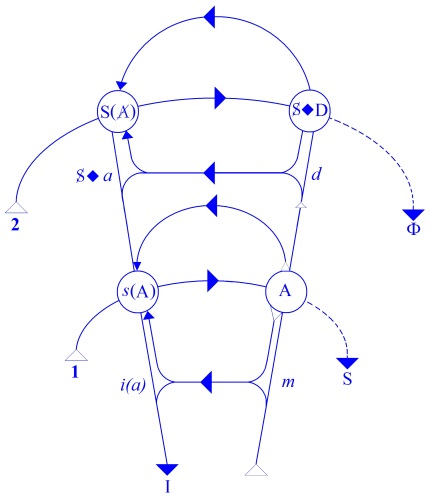
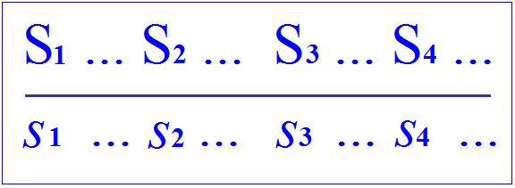
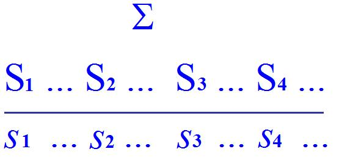
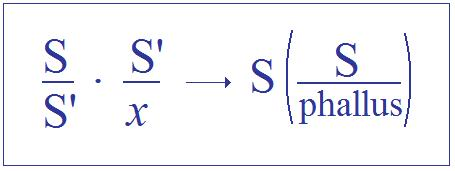
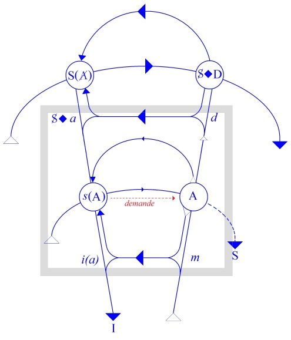
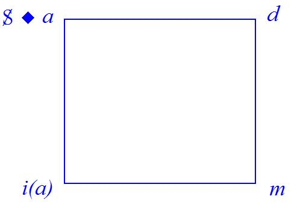

# Leçon 27 | 25 Juin 1958

  <label><input type="checkbox" data-lacan-toggle="original" checked> 原文</label>
  <label><input type="checkbox" data-lacan-toggle="notes" checked> 注释</label>
  <label><input type="checkbox" data-lacan-toggle="commentary" checked> 个人解读评论</label>

<section class="parallel-paragraph" data-paragraph-ids="s5-27-0001">

s5-27-0001

[无对应译文]

原文 · s5-27-0001

Nous sommes arrivés la dernière fois au point où nous avons essayé de com­mencer concentriquement à désigner

</section>

<section class="parallel-paragraph" data-paragraph-ids="s5-27-0002">

s5-27-0002

[无对应译文]

原文 · s5-27-0002

la constellation du désir de *l’obsessionnel*, et je vous ai annoncé pour aujourd’hui, à l’intérieur de ce que j’ai commencé

</section>

<section class="parallel-paragraph" data-paragraph-ids="s5-27-0003">

s5-27-0003

[无对应译文]

原文 · s5-27-0003

à appro­cher en vous parlant de la position de la demande chez *l’obsessionnel*, cette demande tellement précocement ressentie par l’Autre comme pourvue de cet accent spécial d’insistance qui la rend si difficile à tolérer.
D’autre part, ce besoin de destruction du désir de l’Autre chez *l’obsessionnel* est aussi quelque chose qui d’ores et déjà amorçait notre propos d’aujourd’hui, à savoir la fonction de certains *fantasmes*.

</section>

<section class="parallel-paragraph" data-paragraph-ids="s5-27-0004">

s5-27-0004

[无对应译文]

原文 · s5-27-0004

Ce n’est évidemment pas en vain que dans le travail de l’auteur que j’ai choisi de prendre pour base…
c’est moins une critique au sens polémique du mot qu’une cri­tique au sens « analyse systématique »

</section>

<section class="parallel-paragraph" data-paragraph-ids="s5-27-0005">

s5-27-0005

[无对应译文]

原文 · s5-27-0005

…ce n’est pas en vain que *ce fantasme phallique* - nommément donc dans l’article de 1950, *Revue française de psychanalyse,* 1950, n°2*, avril-juin* [^63] - vient sous la forme de l’examen spécial de l’importance que prend *l’en­vie du pénis* chez la femme au cours d’une analyse d’une névrose obsessionnelle.

</section>

<section class="parallel-paragraph" data-paragraph-ids="s5-27-0006">

s5-27-0006

[无对应译文]

原文 · s5-27-0006

Ce n’est évidemment pas tout ce que je vous enseigne - *l’importance du signifiant phallus* naturellement - qui ici prouvera que l’on donne à cet élément une impor­tance exagérée. Il s’agit de voir comment *on en use* et il ne s’agit pas non plus, bien entendu, de se livrer au petit jeu facile de critiquer l’issue d’un traitement que l’on présente d’ailleurs comme inachevé et de juger du dehors quelque chose dans lequel on n’est pas entré.

</section>

<section class="parallel-paragraph" data-paragraph-ids="s5-27-0007">

s5-27-0007

[无对应译文]

原文 · s5-27-0007

Simplement, dans cette observation, ce que je vous donne comme élément marquant en quelque sorte, disons
les hésitations de la direction, voire une direction franchement opposée à celle qui pourrait nous paraître logique.
Si nous le faisons, ce n’est jamais à partir de l’observation elle-même, considérée comme *une suite et un compte-rendude faits*, mais à partir des articulations de l’*auteur* lui-même. Je veux dire, des interrogations qu’il se pose, que vous pourrez trouver tou­jours exprimées au bon endroit car, bien entendu, les propriétés de l’esprit humain, *le bon sens* en particulier, sont bien - comme on l’a dit avec justesse, et non sans iro­nie - « *la chose du monde la plus répandue* ». \[Descartes\]

</section>

<section class="parallel-paragraph" data-paragraph-ids="s5-27-0008">

s5-27-0008

[无对应译文]

原文 · s5-27-0008

Et il n’est pas douteux que ce qui nous fait *obstacle* ici a déjà fait obstacle dans l’esprit des auteurs, et qu’en plus
c’est un fait que dans cette observation ces obstacles sont pleinement articulés. Il y a des interroga­tions, je dirais

</section>

<section class="parallel-paragraph" data-paragraph-ids="s5-27-0009">

s5-27-0009

[无对应译文]

原文 · s5-27-0009

bien plus, il y a des remarques concernant l’issue paradoxale, la non-issue de ce qu’on cherchait. Il y a enfin

</section>

<section class="parallel-paragraph" data-paragraph-ids="s5-27-0010">

s5-27-0010

[无对应译文]

原文 · s5-27-0010

des contradictions auxquelles peut-être l’au­teur lui-même ne donne pas toute l’importance qu’elles peuvent avoir
mais qui assurément peuvent être qualifiées de telles puisqu’elles sont inscrites noir sur blanc dans son texte.

</section>

<section class="parallel-paragraph" data-paragraph-ids="s5-27-0011">

s5-27-0011

[无对应译文]

原文 · s5-27-0011

Donc, pour en venir à ce que nous allons essayer de formuler aujourd’hui concer­nant ce qui constitue la direction générale de ce traitement, la façon dont il s’articule, nous allons d’abord essayer d’aller au vif de ce dont il s’agit,
c’est-à-dire de poser la différence qu’il y a entre quelque chose qui se présente comme *articulé* et non comme *articulable,* et entre ce qui *est* visé et ce qui est fait effectivement. Prenons comme point de départ notre *schéma*,
et commençons par en faire *le lieu* d’un certain nombre de positions qu’il complète et qui nous permettent égale­ment de nous retrouver sur ce que nous connaissons de plus familier et qui s’y trouve *représenté* dans un certain ordre
et une certaine *topologie*.

</section>

<section class="parallel-paragraph" data-paragraph-ids="s5-27-0012">

s5-27-0012

[无对应译文]

原文 · s5-27-0012

</section>

<section class="parallel-paragraph" data-paragraph-ids="s5-27-0013">

s5-27-0013

[无对应译文]

原文 · s5-27-0013

Qu’est-ce que c’est - en posant la question une fois de plus - que *cette ligne signi­fiante*, la ligne du haut de notre schéma ?

</section>

<section class="parallel-paragraph" data-paragraph-ids="s5-27-0014">

s5-27-0014

[无对应译文]

原文 · s5-27-0014

- C’est *une ligne signifiante*, nous l’avons dit, en ce qu’elle est *structurée comme un langage.*

</section>

<section class="parallel-paragraph" data-paragraph-ids="s5-27-0015">

s5-27-0015

[无对应译文]

原文 · s5-27-0015

- D’autre part, pour être *structurée comme un langage*, c’est précisément cette sorte de phrase *que le sujet ne peut pas articuler* et que nous devons l’aider à articuler.
  Comment est-elle située sur ce schéma ? Comment pouvons-nous la comprendre ?

</section>

<section class="parallel-paragraph" data-paragraph-ids="s5-27-0016">

s5-27-0016

[无对应译文]

原文 · s5-27-0016

*Ce qu’elle structure c’est* en somme, dirons-nous, *l’ensemble de la névrose*, la névrose étant ici identique, non pas à un objet, à une sorte de parasite, à quelque chose qui serait étranger à la person­nalité du sujet, mais étant justement

</section>

<section class="parallel-paragraph" data-paragraph-ids="s5-27-0017">

s5-27-0017

[无对应译文]

原文 · s5-27-0017

*toute la structure analytique* qui est dans ses actes, sa conduite. En somme, à mesure que s’est avancé le progrès
de notre conception concernant la névrose, nous nous sommes aperçus qu’elle est non seulement faite,

</section>

<section class="parallel-paragraph" data-paragraph-ids="s5-27-0018">

s5-27-0018

[无对应译文]

原文 · s5-27-0018

dans ses élé­ments signifiants, de *symptômes* décomposables dans les effets de signifié de ce signifiant
\- puisque c’est ainsi que j’ai appris à retraduire ce que FREUD articule - mais que toute la personnalité
d’une certaine façon porte la marque de ces rapports structuraux.

</section>

<section class="parallel-paragraph" data-paragraph-ids="s5-27-0019">

s5-27-0019

[无对应译文]

原文 · s5-27-0019

C’est quelque chose qui va bien au-delà de ce que le mot *per­sonnalité,* avec ce qu’il a comporté de statique,

</section>

<section class="parallel-paragraph" data-paragraph-ids="s5-27-0020">

s5-27-0020

[无对应译文]

原文 · s5-27-0020

entraîne dans une espèce d’acception première, c’est-à-dire dans ce qu’on appelle le caractère. Ce n’est pas cela,

</section>

<section class="parallel-paragraph" data-paragraph-ids="s5-27-0021">

s5-27-0021

[无对应译文]

原文 · s5-27-0021

c’est la per­sonnalité au sens où elle dessine dans les comportements, dans les rapports à l’Autre et aux autres :

</section>

<section class="parallel-paragraph" data-paragraph-ids="s5-27-0022">

s5-27-0022

[无对应译文]

原文 · s5-27-0022

- *un certain mouvement* qui se retrouve toujours le même,

</section>

<section class="parallel-paragraph" data-paragraph-ids="s5-27-0023">

s5-27-0023

[无对应译文]

原文 · s5-27-0023

- *une scan­sion*,

</section>

<section class="parallel-paragraph" data-paragraph-ids="s5-27-0024">

s5-27-0024

[无对应译文]

原文 · s5-27-0024

- *un certain mode de passage* de l’Autre à l’autre, et encore à un autre qui se retrouve toujours et sans cesse, qui forme le fond, la modulation si vous voulez, de l’action obsessionnelle.

</section>

<section class="parallel-paragraph" data-paragraph-ids="s5-27-0025">

s5-27-0025

[无对应译文]

原文 · s5-27-0025

Ceci veut dire que c’est l’ensemble du comportement *obsessionnel*, et même *hys­térique* d’ailleurs.

</section>

<section class="parallel-paragraph" data-paragraph-ids="s5-27-0026">

s5-27-0026

[无对应译文]

原文 · s5-27-0026

Si nous disons que c’est structuré comme un langage, ce n’est pas pour dire qu’au-delà du langage articulé qui s’appelle discours, il y a quelque chose qui, prenant tous les actes du sujet, aurait cette sorte d’équivalence au langage qu’il y a dans ce qu’on appelle *un geste,* car *un geste* n’est pas simplement un mouvement bien défini, *le geste est signifiant,* cela ne suffirait pas à dire ce qu’il recouvre.

</section>

<section class="parallel-paragraph" data-paragraph-ids="s5-27-0027">

s5-27-0027

[无对应译文]

原文 · s5-27-0027

On pourrait presque employer l’expression en français, qui colle parfaitement, de « *une geste* » au sens où on l’emploie dans « *la chanson de geste* » : *La geste de Roland,* c’est-à-dire la somme de son histoire. En fin de compte c’est une parole, si vous voulez, et d’une certaine façon la somme du comportement du névrosé se présente comme une parole,
et même comme une *parole pleine*, dirai-je, au sens où nous en avons vu le sens primitif de cette *parole pleine* qui engage sous la forme d’*un discours,* d’*une parole pleine* elle aussi, *une parole au sens entièrement cryptographique* inconnue du sujet quant au sens, encore qu’en somme il la prononce

</section>

<section class="parallel-paragraph" data-paragraph-ids="s5-27-0028">

s5-27-0028

[无对应译文]

原文 · s5-27-0028

- par tout son être,

</section>

<section class="parallel-paragraph" data-paragraph-ids="s5-27-0029">

s5-27-0029

[无对应译文]

原文 · s5-27-0029

- par tout ce qu’il manifeste,

</section>

<section class="parallel-paragraph" data-paragraph-ids="s5-27-0030">

s5-27-0030

[无对应译文]

原文 · s5-27-0030

- par tout ce qu’il évoque et a réalisé inéluctablement dans une certaine voie d’achèvement, et d’inachèvement si rien n’y intervient qui soit de cet ordre d’oscillation qui s’appelle l’analyse
  …donc *une parole prononcée par* ce sujet barré, *ce sujet barré à lui-même* que nous appelons *l’inconscient*.

</section>

<section class="parallel-paragraph" data-paragraph-ids="s5-27-0031">

s5-27-0031

[无对应译文]

原文 · s5-27-0031

C’est ainsi que nous le représentons sous la forme d’un signe, S. Ici, c’est bien de cela qu’il s’agit.
En somme ce que vous voyez se discerner dans cette distinction que nous sommes en train de faire,
c’est que nous avons défini l’Autre, avec le grand A, comme le *lieu de la parole *: l’Autre s’institue et se dessine
par le seul fait que le sujet parle, du fait qu’il se sert de la parole, ce grand *Autre* naît comme *lieu de la parole*.

</section>

<section class="parallel-paragraph" data-paragraph-ids="s5-27-0032">

s5-27-0032

[无对应译文]

原文 · s5-27-0032

Cela ne veut pas dire qu’il soit pour autant réalisé comme sujet dans son altérité : l’Autre est invoqué chaque fois
qu’il y a parole. Je pense que je n’ai pas besoin de revenir sur ceci, j’y ai assez insisté. Mais alors cet *au-delà,* que vous voyez ici, qui est justement celui qui s’articule dans la ligne haute de notre schéma, c’est en somme *l’Autre* de l’Autre.

</section>

<section class="parallel-paragraph" data-paragraph-ids="s5-27-0033">

s5-27-0033

[无对应译文]

原文 · s5-27-0033

C’est cette parole qui est articu­lée à l’horizon de l’Autre comme tel, c’est cet *Autre* de l’Autre dont il s’agit, et dont nous dirons que cet *Autre* de l’Autre, à savoir *le lieu où la parole de* l’Autre se dessine comme telle, il n’y aurait aucune raison qu’il nous soit fermé.

</section>

<section class="parallel-paragraph" data-paragraph-ids="s5-27-0034">

s5-27-0034

[无对应译文]

原文 · s5-27-0034

C’est même le principe de la relation intersubjective comme telle, c’est que cet Autre comme *lieu de parole*
nous est immédiatement et effectivement donné comme sujet, c’est-à-dire comme sujet qui nous pense nous-même comme son Autre. C’est là le principe de toute stratégie : quand vous jouez au jeu d’échecs avec quelqu’un,
vous lui *attribuez* autant de calculs que vous en faites.

</section>

<section class="parallel-paragraph" data-paragraph-ids="s5-27-0035">

s5-27-0035

[无对应译文]

原文 · s5-27-0035

Pourquoi, puisque nous osons donc dire que *cet Autre de l’Autre*, qui devrait nous être l’élément le plus *transparent*,
est donné en quelque sorte avec la dimension de l’Autre, que *cet Autre de l’Autre* c’est là même où s’articule le discours de l’incons­cient, ce quelque chose d’articulé qui n’est pas par nous articulable, pourquoi devons-nous le faire ? Qu’est-ce qui fait que nous sommes *en droit* de le faire ?

</section>

<section class="parallel-paragraph" data-paragraph-ids="s5-27-0036">

s5-27-0036

[无对应译文]

原文 · s5-27-0036

C’est fort simple : cet Autre auquel dans l’expérience et par les conditions de la vie humaine, qui fait que la vie humaine justement est engagée dans *la condition de la parole,* cet Autre auquel nous sommes soumis par *la condition*
*de la demande*, nous ne savons pas ce qu’est *pour lui* notre *demande*.

</section>

<section class="parallel-paragraph" data-paragraph-ids="s5-27-0037">

s5-27-0037

[无对应译文]

原文 · s5-27-0037

Et pourquoi ne le savons-nous pas ? Qu’est-ce qui lui donne cette opacité ?

</section>

<section class="parallel-paragraph" data-paragraph-ids="s5-27-0038">

s5-27-0038

[无对应译文]

原文 · s5-27-0038

Ce sont là des évidences, mais encore des évidences dont les données ne sont pas justement ce qui est le moins utile à articuler. Nous nous contentons toujours de les obscurcir sous la forme d’espèce d’objectivations prématurées.
Pourquoi est-ce donc cet Autre dont nous ne savons pas comment il accueille notre demande ? En d’autres termes, pourquoi, dans notre stratégie, il va devenir *unbewußt* et réaliser cette posi­tion paradoxale de son discours ?

</section>

<section class="parallel-paragraph" data-paragraph-ids="s5-27-0039">

s5-27-0039

[无对应译文]

原文 · s5-27-0039

C’est cela que je veux dire quand je vous dis que *l’inconscient c’est le discours de l’Autre.* C’est ce qui se passe virtuellement à cet horizon de l’*Autre de l’Autre* en tant que c’est là que se produit *la parole de l’Autre*, cette parole de l’Autre
en tant qu’elle devient notre *inconscient*, c’est-à-dire *quelque chose* qui vient en nous présentifier un Autre capable
de nous répondre par le seul fait qu’*en ce lieu de la parole nous fai­sons vivre un* Autre*, capable de nous répondre*.

</section>

<section class="parallel-paragraph" data-paragraph-ids="s5-27-0040">

s5-27-0040

[无对应译文]

原文 · s5-27-0040

C’est bien pourquoi il nous est opaque : c’est parce qu’il y a *quelque chose* que nous ne connaissons pas en lui,
et qui nous sépare de sa réponse à notre demande, et ce n’est pas autre chose qui s’appelle son *désir*.

</section>

<section class="parallel-paragraph" data-paragraph-ids="s5-27-0041">

s5-27-0041

[无对应译文]

原文 · s5-27-0041

Ceci suffit à nous faire apercevoir tout de suite quelque chose, c’est que le point essentiel de cette remarque,
qui n’est une évidence qu’en apparence, prend sa valeur en fonction de ceci que ce *désir* justement est situé là \[*d*\] :

</section>

<section class="parallel-paragraph" data-paragraph-ids="s5-27-0042">

s5-27-0042

[无对应译文]

原文 · s5-27-0042

- entre *l’Autre comme lieu pur et simple de la parole*

</section>

<section class="parallel-paragraph" data-paragraph-ids="s5-27-0043">

s5-27-0043

[无对应译文]

原文 · s5-27-0043

- *et l’Autre en tant qu’il est un être de chair* à la merci duquel nous sommes pour la satisfaction de notre *demande*.

</section>

<section class="parallel-paragraph" data-paragraph-ids="s5-27-0044">

s5-27-0044

[无对应译文]

原文 · s5-27-0044

Mais que ce *désir* soit situé là, c’est justement cela qui conditionne son rapport avec quelque chose qui est justement de l’ordre de la parole, qui est :

</section>

<section class="parallel-paragraph" data-paragraph-ids="s5-27-0045">

s5-27-0045

[无对应译文]

原文 · s5-27-0045

- cette *symbolisation de l’action du signifiant sur le sujet* comme tel,

</section>

<section class="parallel-paragraph" data-paragraph-ids="s5-27-0046">

s5-27-0046

[无对应译文]

原文 · s5-27-0046

- cette *chose* qui fait en somme ce que nous appelons un *sujet,* que nous symbolisons avec cet S.
  *C’est autre chose que purement et simplement un soi-même,* je veux dire ce que l’on appelle selon un mot élégant en anglais
  \- le fait de le dire en anglais, de l’isoler, permet de bien distinguer ce que ça veut dire - le « *self »,*
  c’est-à-dire ce qu’il y a d’irréductible dans *cette présence de l’individu au monde*.

</section>

<section class="parallel-paragraph" data-paragraph-ids="s5-27-0047">

s5-27-0047

[无对应译文]

原文 · s5-27-0047

Ce quelque chose devient sujet à proprement parler, et *sujet barré* au sens où nous le symbolisons pour autant
qu’il est *marqué* de cette condition qui le *subordonne*, non seulement à l’*Autre* en tant que *lieu de la parole*…
c’est le sujet défini comme moment, non pas d’un certain rapport au monde, d’un rapport de l’œil au monde, du rapport sujet-objet qui est celui de la connaissance chez le sujet en tant qu’il naît au moment de l’émergence de l’individu humain dans les conditions de la parole
…en tant donc qu’il est *marqué*, je vous l’ai dit, par l’Autre, non pas simplement en tant que *lieu de la parole*,
mais en tant que lui-même, cet Autre, est conditionné et marqué par ces conditions de *la parole*.

</section>

<section class="parallel-paragraph" data-paragraph-ids="s5-27-0048">

s5-27-0048

[无对应译文]

原文 · s5-27-0048

Que voyons-nous donc à *cet horizon ainsi rendu opaque par l’obstacle du désir de l’Autre* ?
C’est ce quelque chose qui renvoie *le sujet* \[S\] ainsi *marqué,* *à sa propre demande*, qui le met dans un certain rapport \[S ◊ D\]
le rapport ici désigné par le symbole du petit losange que je vous ai expliqué la dernière fois
…à sa demande, pour autant très précisément que *l’Autre*, si l’on peut dire, *ne répond plus* comme on dit.
Ici, *grand A ne répond plus*, ce qui est très célèbre sous d’autres initiales.

</section>

<section class="parallel-paragraph" data-paragraph-ids="s5-27-0049">

s5-27-0049

[无对应译文]

原文 · s5-27-0049

Au niveau du sujet, ce qui tend à l’horizon à se produire, c’est cette confrontation, ce renvoi du sujet à sa propre demande sous les formes de signifiants, si l’on peut dire « *englobants* » par rapport au sujet, ces signifiants dont le sujet lui–même devient le signe. C’est à l’horizon de cette non réponse de l’Autre que nous voyons se dessiner dans l’analyse, et pour autant justement qu’au départ l’analyste, en tant qu’il vient d’abord à n’être rien d’autre que le lieu
de la parole, qu’une oreille qui écoute et qui ne répond pas, va en somme pousser le sujet à se détacher, à s’opposer à quelque chose dont l’expérience vous montre qu’elle se montre en filigrane dans son discours, c’est-à-dire justement ces formes de la demande qui nous apparaissent sous la forme de ce que nous appelons « *phase anale* », « *phase orale* » *phases*… de toutes les façons que vous vou­lez, mais qui se caractérisent en quelque sorte par quoi ?

</section>

<section class="parallel-paragraph" data-paragraph-ids="s5-27-0050">

s5-27-0050

[无对应译文]

原文 · s5-27-0050

Que voulons-nous dire quand nous parlons de ces *phases* ? N’oublions quand même pas que notre sujet ne retourne pas devant nous progressivement à l’état de *nourrisson* ! Nous ne nous livrons pas à une opération fakirique.

</section>

<section class="parallel-paragraph" data-paragraph-ids="s5-27-0051">

s5-27-0051

[无对应译文]

原文 · s5-27-0051

Je pense qu’il fau­drait voir le sujet remonter le cours du temps et se réduire à la fin à la semence qui l’a engendré !
Ce dont il s’agit, c’est de *signifiants*. Ce que nous appelons « *phase orale* », « *phase anale* », c’est la façon dont le sujet articule sa demande par l’apparition dans son discours - ici au sens le plus vaste, dans toute la façon dont
se présentifie devant nous sa névrose - des *signifiants* qui se sont formés à telle ou telle étape de son développe­ment,

</section>

<section class="parallel-paragraph" data-paragraph-ids="s5-27-0052">

s5-27-0052

[无对应译文]

原文 · s5-27-0052

qui étaient les *signifiants* qui lui servaient dans les phases, soit plus récentes, soit plus anciennes, à articuler sa *demande*.

</section>

<section class="parallel-paragraph" data-paragraph-ids="s5-27-0053">

s5-27-0053

[无对应译文]

原文 · s5-27-0053

Ce qui s’appelle en d’autres termes *fixation,* par exemple, c’est la prévalence gar­dée par telle ou telle forme de *signifiant*, *oral* ou autre, avec toutes les nuances que vous avez apprises à articuler. C’est cela que ça veut dire. C’est l’importance spéciale qu’ont gardée certains *systèmes de signifiants*, et qui s’appelle *régression.* C’est ce qui se passe, pour autant que ces *signifiants* sont rejoints par l’ouverture au discours du sujet, précisément de ceci, d’être simplement, en tant que parole, sans qu’elle n’ait rien à demander de spécial, elle se profile dans la dimen­sion de la demande, et c’est pour cela

</section>

<section class="parallel-paragraph" data-paragraph-ids="s5-27-0054">

s5-27-0054

[无对应译文]

原文 · s5-27-0054

que toute la perspective est rétroactivement ouverte sur ce dans quoi le sujet a vécu depuis sa prime et plus tendre enfance, à savoir précisément la condition de la *demande*. Il s’agit, cette régression, de savoir ce que nous en faisons. Toute la question est là. Nous sommes là pour y répondre, ou pour dire ce qui se passe quand nous n’y répondons pas, et ce que nous pouvons faire d’autre. Tel est le but qui mérite d’être atteint.

</section>

<section class="parallel-paragraph" data-paragraph-ids="s5-27-0055">

s5-27-0055

[无对应译文]

原文 · s5-27-0055

Ici je vous fais remarquer en passant qu’en somme les signifiants qui sont ici inté­ressés dans cette régression du discours, c’est donc quelque chose que nous devons considérer comme étant dans la structure du discours lui-même, or c’est d’ailleurs toujours là que nous les *découvrons, * dans ces deux lignes :

</section>

<section class="parallel-paragraph" data-paragraph-ids="s5-27-0056">

s5-27-0056

[无对应译文]

原文 · s5-27-0056

- la suite signifiante,

</section>

<section class="parallel-paragraph" data-paragraph-ids="s5-27-0057">

s5-27-0057

[无对应译文]

原文 · s5-27-0057

- les significations toujours produites selon la loi de la chaîne signifiante.

</section>

<section class="parallel-paragraph" data-paragraph-ids="s5-27-0058">

s5-27-0058

[无对应译文]

原文 · s5-27-0058

</section>

<section class="parallel-paragraph" data-paragraph-ids="s5-27-0059">

s5-27-0059

[无对应译文]

原文 · s5-27-0059

Si vous voulez, ces deux choses s’équivalent par une anticipation de la suite signi­fiante, toute chaîne signifiante ouvrant devant elle l’horizon de son propre achève­ment, et en même temps, par une rétroaction, une fois qu’est venu naturellement le terme *signifiant* qui, si l’on peut dire, double la phrase, qui fait que ce qui se produit au niveau du *signifié* a toujours cette fonction, si l’on peut dire, rétroactive.

</section>

<section class="parallel-paragraph" data-paragraph-ids="s5-27-0060">

s5-27-0060

[无对应译文]

原文 · s5-27-0060

Ici le S2 déjà se dessine au moment où le S1 s’amorce, et ne s’achève qu’au moment ou le S2 *rétroagit* sur le S1.
Un certain décalage existe toujours du signifiant à la signification. C’est même cela qui donne à toute signification,

</section>

<section class="parallel-paragraph" data-paragraph-ids="s5-27-0061">

s5-27-0061

[无对应译文]

原文 · s5-27-0061

en tant qu’elle n’est pas une *signification natu­relle*, qu’elle n’est pas liée à cette ébauche toute momentanée de l’instance du besoin chez le sujet, qui en fait ce quelque chose d’essentiellement *métonymique*, c’est-à-dire toujours lié à ce qui lie en soi la chaîne signifiante à ce qui la constitue comme telle : ces liens, ces nœuds…

</section>

<section class="parallel-paragraph" data-paragraph-ids="s5-27-0062">

s5-27-0062

[无对应译文]

原文 · s5-27-0062

> que nous pouvons appeler justement ainsi, momentané­ment et pour les distinguer, d’un certain Σ \[sigma\] si vous voulez, c’est-à-dire *cet au-delà de la chaîne signifiante* dans laquelle nous essayons de la réduire

</section>

<section class="parallel-paragraph" data-paragraph-ids="s5-27-0063">

s5-27-0063

[无对应译文]

原文 · s5-27-0063

</section>

<section class="parallel-paragraph" data-paragraph-ids="s5-27-0064">

s5-27-0064

[无对应译文]

原文 · s5-27-0064

…ces signifiants précisément que nous trouvons dans cette confrontation du sujet à la demande, dans cette sorte de réduction de son discours à ces signifiants élémentaires, qui est ce que nous discernons en filigrane dans tout ce qui nous évoque, et qui est justement ce qui fait le fond de notre expérience, ce par quoi nous retrouvons les mêmes *lois struc­turales* dans toute la conduite du sujet, dans le mode dont il nous l’exprime.

</section>

<section class="parallel-paragraph" data-paragraph-ids="s5-27-0065">

s5-27-0065

[无对应译文]

原文 · s5-27-0065

Quel­quefois même jusque dans la scansion, dans la façon motrice dont il l’articule, pour autant qu’un *bégaiement*,
qu’un *balbutiement* ou que n’importe quel *trébuchement de parole,* comme je me suis exprimé ailleurs, peut être pour nous significatif de quelque chose qui, fondamentalement, est de l’ordre d’un *signifiant de la demande* comme manque,
oral ou anal pour autant.

</section>

<section class="parallel-paragraph" data-paragraph-ids="s5-27-0066">

s5-27-0066

[无对应译文]

原文 · s5-27-0066

Qu’est-ce que cela nous permet, d’ores et déjà, au passage, de concevoir ?

</section>

<section class="parallel-paragraph" data-paragraph-ids="s5-27-0067">

s5-27-0067

[无对应译文]

原文 · s5-27-0067

C’est que c’est bien de cela qu’il s’agit, et qui fait…
comme un petit groupe d’études dirigé par « *le plus amical de mes collègues* », à savoir LAGACHE, en a fait la découverte avec un étonnement dont il faut bien qu’il soit motivé par une espèce de malentendu per­manent

</section>

<section class="parallel-paragraph" data-paragraph-ids="s5-27-0068">

s5-27-0068

[无对应译文]

原文 · s5-27-0068

…qui fait que partout où en français nous voyons le mot « *instinct* »…
c’est dans les références faites au *texte allemand*, et cela a été une surprise pour ce groupe
…on ne trouve jamais rien d’autre que *le terme de* *Trieb, Trieb* ou *pulsion*, comme nous traduisons.

</section>

<section class="parallel-paragraph" data-paragraph-ids="s5-27-0069">

s5-27-0069

[无对应译文]

原文 · s5-27-0069

Et à la vérité, *pulsion* obscurcit plutôt la chose. Le terme anglais c’est *drive*, et si nous voulions trouver quelque chose en français, nous n’avons guère rien qui permette, étant donné le véritable sens de *Trieb,* de le traduire.

</section>

<section class="parallel-paragraph" data-paragraph-ids="s5-27-0070">

s5-27-0070

[无对应译文]

原文 · s5-27-0070

Je dirais qu’il fau­drait choisir un mot scientifique, le mot *tropisme,* qui est spécialement fait pour désigner les éléments irrésistibles, considérés comme irréductibles à l’attraction *phy­sico-chimique* de certaines attractions,

</section>

<section class="parallel-paragraph" data-paragraph-ids="s5-27-0071">

s5-27-0071

[无对应译文]

原文 · s5-27-0071

telles qu’elles s’exerceraient dans le compor­tement animal, qui nous permettrait justement d’exorciser le côté

</section>

<section class="parallel-paragraph" data-paragraph-ids="s5-27-0072">

s5-27-0072

[无对应译文]

原文 · s5-27-0072

toujours plus ou moins finaliste qu’il y a dans le terme d’*instinct.* Je dirai que c’est quelque chose en fin de compte
qui est bien aussi de cet ordre que nous rencontrons ici dans notre notion freudienne du *Trieb.*

</section>

<section class="parallel-paragraph" data-paragraph-ids="s5-27-0073">

s5-27-0073

[无对应译文]

原文 · s5-27-0073

Traduisons-le, si vous voulez, par le mot français « *atti­rance »,* que j’employais à l’instant pour parler des *tropismes*,

</section>

<section class="parallel-paragraph" data-paragraph-ids="s5-27-0074">

s5-27-0074

[无对应译文]

原文 · s5-27-0074

à ceci près que ce dont il s’agirait là, c’est de ce quelque chose qui situe le sujet humain dans une certaine dépendance nécessaire de quelque chose. Je ne peux pas dire que l’être humain n’est pas le sujet obscur, sous les formes grégaires
de l’attirance organique vers l’élément de climat par exemple, ou d’autre nature, ce n’est évidemment pas là

</section>

<section class="parallel-paragraph" data-paragraph-ids="s5-27-0075">

s5-27-0075

[无对应译文]

原文 · s5-27-0075

que se déve­loppe notre intérêt à nous autres dans le champ que nous sommes appelés à explo­rer dans l’analyse,

</section>

<section class="parallel-paragraph" data-paragraph-ids="s5-27-0076">

s5-27-0076

[无对应译文]

原文 · s5-27-0076

qui bien entendu est quelque chose qui nous fait parler de ces diverses phases, « *orale* », « *anale* », « *génitale* » et autres.

</section>

<section class="parallel-paragraph" data-paragraph-ids="s5-27-0077">

s5-27-0077

[无对应译文]

原文 · s5-27-0077

Et que voyons-nous ? C’est que dans la théorie analytique, c’est en effet une cer­taine nécessité, un certain rapport

</section>

<section class="parallel-paragraph" data-paragraph-ids="s5-27-0078">

s5-27-0078

[无对应译文]

原文 · s5-27-0078

qui le met dans un rapport de subordi­nation, de dépendance, d’organisation et d’attirance par rapport à quoi ?

</section>

<section class="parallel-paragraph" data-paragraph-ids="s5-27-0079">

s5-27-0079

[无对应译文]

原文 · s5-27-0079

À des signi­fiants. Empruntés à quoi ? Au registre, à la batterie d’un certain nombre de ses propres organes.
Ce n’est dire rien d’autre que de dire que survit une fixation « *orale* » ou « *anale* » chez un sujet adulte
si ce n’est précisément de le faire dépendre de quoi ? D’une certaine *relation imaginaire*.

</section>

<section class="parallel-paragraph" data-paragraph-ids="s5-27-0080">

s5-27-0080

[无对应译文]

原文 · s5-27-0080

Mais sans aucun doute, ce que nous articulons de plus ici, c’est que ceci est porté à la fonction de *signifiant*.
Si ce n’était pas *isolé* comme tel, *mortifié* comme tel, cela ne saurait avoir l’action économique que cela

</section>

<section class="parallel-paragraph" data-paragraph-ids="s5-27-0081">

s5-27-0081

[无对应译文]

原文 · s5-27-0081

a dans le sujet, pour une très simple rai­son : c’est que les *images* comme telles ne sont jamais liées précisément
qu’à *la suscitation* ou à *la satisfaction* du *besoin*, ceci, même…

</section>

<section class="parallel-paragraph" data-paragraph-ids="s5-27-0082">

s5-27-0082

[无对应译文]

原文 · s5-27-0082

je ne manque pas de le dire à l’oc­casion

</section>

<section class="parallel-paragraph" data-paragraph-ids="s5-27-0083">

s5-27-0083

[无对应译文]

原文 · s5-27-0083

…quand il s’agit de *besoin* purement et simplement.

</section>

<section class="parallel-paragraph" data-paragraph-ids="s5-27-0084">

s5-27-0084

[无对应译文]

原文 · s5-27-0084

Si le sujet reste en quelque sorte attaché à ces images hors de leur texte, images : « *orales* » là où il ne s’agit pas de nourriture, « *anales* » là où il ne s’agit pas d’excréments, c’est quand même bien que *ces images ont pris une autre fonction*.
C’est de *la fonction signifiante* dont il s’agit. La pulsion, comme telle, c’est justement l’expression maniable de concepts qui valent pour nous, qui nous expriment cette dépendance du sujet par rapport à *un certain signifiant*.

</section>

<section class="parallel-paragraph" data-paragraph-ids="s5-27-0085">

s5-27-0085

[无对应译文]

原文 · s5-27-0085

Ce qui est important est ceci : c’est que *ce désir du sujet rencontré comme l’au-delà de la demande* est ce qui le fait opaque à notre demande et ce qui aussi installe son propre discours comme quelque chose qui est absolument nécessaire à notre struc­ture, mais qui nous est, par certains côtés, impénétrable, qui en fait un discours inconscient.

</section>

<section class="parallel-paragraph" data-paragraph-ids="s5-27-0086">

s5-27-0086

[无对应译文]

原文 · s5-27-0086

Ce désir donc, qui en est la condition, est soumis lui-même à l’existence d’un cer­tain *effet de signifiant*, ce que je vous ai expliqué au début de cette année - je veux dire à partir de Janvier - sous le nom de la *métaphore paternelle.* Ceci signifie que c’est pour autant qu’à l’horizon apparaît le *Nom du Père,* en tant qu’étant lui-même *le support de la chaîne signifiante*, de *l’ordre instauré par la chaîne signifiante*. C’est uniquement *en tant que cette métaphore s’établit*, *métaphore* :

</section>

<section class="parallel-paragraph" data-paragraph-ids="s5-27-0087">

s5-27-0087

[无对应译文]

原文 · s5-27-0087

- *du désir primitif*,

</section>

<section class="parallel-paragraph" data-paragraph-ids="s5-27-0088">

s5-27-0088

[无对应译文]

原文 · s5-27-0088

- *du désir opaque*,

</section>

<section class="parallel-paragraph" data-paragraph-ids="s5-27-0089">

s5-27-0089

[无对应译文]

原文 · s5-27-0089

- *du désir obscur* que représente *le désir de la mère*,

</section>

<section class="parallel-paragraph" data-paragraph-ids="s5-27-0090">

s5-27-0090

[无对应译文]

原文 · s5-27-0090

- de ce quelque chose qui d’abord est complètement fermé pour le sujet, et qui ne peut rester fermé qu’en raison de *la formule de la métaphore*. À savoir celle que je vous ai *déjà symbolisée par le rapport de deux signifiants*, l’un étant dans deux positions différentes :

</section>

<section class="parallel-paragraph" data-paragraph-ids="s5-27-0091">

s5-27-0091

[无对应译文]

原文 · s5-27-0091

</section>

<section class="parallel-paragraph" data-paragraph-ids="s5-27-0092">

s5-27-0092

[无对应译文]

原文 · s5-27-0092

Le *Nom du Père* sur le *désir de la mère* \[S/S’\], et le *désir de la mère* sur sa symboli­sation \[S’/*x*\].

</section>

<section class="parallel-paragraph" data-paragraph-ids="s5-27-0093">

s5-27-0093

[无对应译文]

原文 · s5-27-0093

Sa détermination comme signifié est quelque chose qui se produit par un effet métaphorique et - je vous l’ai dit -
là où le *Nom du Père* manque c’est précisément là *que ne se produit pas cet effet métaphorique  *: je ne peux pas arriver à faire venir au jour ceci, qui fait désigner le *x*, à savoir le *désir de la mère,* *comme étant proprement le signifiant phallus *\[S(S/*phallus*)\]. C’est bien ce qui se produit dans la psychose, pour autant que le *Nom du Père* est rejeté, je veux dire est l’objet
d’une *Verwerfung* primitive qui n’entre pas dans le cycle des signifiants.

</section>

<section class="parallel-paragraph" data-paragraph-ids="s5-27-0094">

s5-27-0094

[无对应译文]

原文 · s5-27-0094

Et c’est pourquoi aussi le désir de l’Autre, et nommément le *désir de la mère*, n’y est pas symbolisé.

</section>

<section class="parallel-paragraph" data-paragraph-ids="s5-27-0095">

s5-27-0095

[无对应译文]

原文 · s5-27-0095

C’est très précisément ce qui sur ce schéma, si nous devions représenter la position de la psychose,
nous ferait dire que ce désir, comme tel, je ne veux pas dire en tant qu’existant, chacun sait bien que même les mères
d’un psychotique ont un désir, encore que ce ne soit pas toujours sûr, mais assurément il n’est pas symbolisé
dans le système du sujet et, n’étant pas symbolisé, c’est cela qui nous permet de voir ce que nous voyons,

</section>

<section class="parallel-paragraph" data-paragraph-ids="s5-27-0096">

s5-27-0096

[无对应译文]

原文 · s5-27-0096

à savoir que pour le psycho­tique la parole de l’Autre ne passe nullement dans son inconscient.

</section>

<section class="parallel-paragraph" data-paragraph-ids="s5-27-0097">

s5-27-0097

[无对应译文]

原文 · s5-27-0097

*L’Autre lui parle sans cesse*, l’Autre en tant que lieu de la parole. Cela ne veut pas dire forcément vous ou moi,
cela veut dire à peu près la somme de ce qui lui est offert comme *champ de perception*. Et ce champ lui parle de nous, naturellement, et aussi bien pour prendre un exemple, le premier qui vient à la mémoire, celui bien connu, récité hier soir par \[...\]. Il nous disait que dans les délires, la couleur rouge d’une auto peut vouloir dire qu’il est immortel.

</section>

<section class="parallel-paragraph" data-paragraph-ids="s5-27-0098">

s5-27-0098

[无对应译文]

原文 · s5-27-0098

Tout lui parle, parce que rien de *l’organi­sation symbolique* destinée à renvoyer l’Autre là où il doit être,
c’est-à-dire dans son inconscient, rien n’est réalisé de cet ordre.

</section>

<section class="parallel-paragraph" data-paragraph-ids="s5-27-0099">

s5-27-0099

[无对应译文]

原文 · s5-27-0099

Et c’est pour cela, si je puis dire, que l’Autre parle d’une façon entièrement homogène à cette première et primitive parole qui est celle de *la demande*. C’est pour cela que tout se sonorise, que le « *ça parle *» qui est dans l’inconscient
pour le sujet névrotique, est au dehors pour le sujet psycho­tique. Que « *ça parle *» et que « *ça parle tout haut *»
de la façon la plus naturelle, il n’y a pas lieu de s’en étonner. Si l’Autre est le lieu de la parole, c’est là que « *ça parle *»,
et que ça retentit de tous côtés.

</section>

<section class="parallel-paragraph" data-paragraph-ids="s5-27-0100">

s5-27-0100

[无对应译文]

原文 · s5-27-0100

Naturellement, nous en trouvons le cas extrême au point de déchaînement de la psychose, là où,
comme je vous l’ai toujours formulé, *ce qui est* *Verwerfung,* ou *rejeté du symbolique, réapparaît dans le réel*.
Ce *réel* dont il s’agit, c’est justement là, l’*hallucination*, c’est-à-dire l’Autre en tant qu’il parle.
C’est toujours dans l’Autre bien entendu que *ça parle*, mais là ça prend la forme du *réel*.
Le sujet psychotique n’en doute pas : c’est l’Autre qui lui parle, et qui lui parle par tous les signifiants.

</section>

<section class="parallel-paragraph" data-paragraph-ids="s5-27-0101">

s5-27-0101

[无对应译文]

原文 · s5-27-0101

Et il suffit de se baisser pour les ramasser à la pelle dans le monde humain. L’affiche, etc., *tout ce qui nous entoure a un caractère marqué de signifiant*. Le caractère de lâchage, de dissolution sera plus ou moins grand selon l’état de *la psychose*. Tout ce que nous voyons, et ce que FREUD nous articule comme étant ce dans quoi la psychose s’organise, s’articule, est justement fait pour suppléer à cette absence en son point organisé, je veux dire descendant
de la structure signifiante du désir de l’Autre.

</section>

<section class="parallel-paragraph" data-paragraph-ids="s5-27-0102">

s5-27-0102

[无对应译文]

原文 · s5-27-0102

Car que nous présentent les formes les plus bénignes de la psychose si ce n’est - bien sûr, fondamentalement,
et tout à fait dans l’état extrême de dissolution - un pur et simple discours de l’Autre. À savoir que ça vient *scander* ici *sous la forme d’une signification*, c’est-à-dire comme je vous l’ai montré il y a deux ans, ces sortes très curieuses
de décomposition de la parole qui, de par la structure même de ce qui nous est présenté ici - je ne pouvais pas
vous le montrer alors - s’avèrent nécessairement *comme étant code du message sur le code* : ce qui est renvoyé de A
est ensuite tout ce que le sujet a à sa disposition pour faire vivre le discours de l’Autre.

</section>

<section class="parallel-paragraph" data-paragraph-ids="s5-27-0103">

s5-27-0103

[无对应译文]

原文 · s5-27-0103

Vous vous rappelez SCHREBER, *la langue fondamentale* : chaque mot qui lui est donné comporte en lui-même
cette espèce de définition dont l’avènement se produit avec l’issue du mot même. C’est un *code de message sur le code*,
et inversement ces *phrases* :

</section>

<section class="parallel-paragraph" data-paragraph-ids="s5-27-0104">

s5-27-0104

[无对应译文]

原文 · s5-27-0104

- « *Comment c’est...* »

</section>

<section class="parallel-paragraph" data-paragraph-ids="s5-27-0105">

s5-27-0105

[无对应译文]

原文 · s5-27-0105

- «* Tu n’as qu’à... *»

</section>

<section class="parallel-paragraph" data-paragraph-ids="s5-27-0106">

s5-27-0106

[无对应译文]

原文 · s5-27-0106

- « *Peut-être voudra-t-il...* » et encore : le « *voudra-t-il* » est de trop dans la phrase.

</section>

<section class="parallel-paragraph" data-paragraph-ids="s5-27-0107">

s5-27-0107

[无对应译文]

原文 · s5-27-0107

Mais il n’y a que cela, c’est-à-dire une série de mes­sages qui ne visent que ce qui dans le code se rapporte au *messager,* ce qui dans le code - ces particules, ces pronoms personnels, ces verbes auxiliaires - désigne la place du messager.
Ceci se reporte strictement sur *ce graphe*. Je ne veux pas m’étendre trop, vous le verrez dans *mon article sur les psychoses* [^64] qui va paraître, où j’ai fait un peu la synthèse de mon cours d’il y a deux ans avec ce que je vous fais cette année.

</section>

<section class="parallel-paragraph" data-paragraph-ids="s5-27-0108">

s5-27-0108

[无对应译文]

原文 · s5-27-0108

Je ne veux pas y insister maintenant, ce que je veux vous dire à ce propos, c’est qu’il est tout à fait évi­dent que quelque chose comme le *délire de jalousie* tel que FREUD lui-même l’articule comme négation du sujet,
le « *je l’aime* » étant moins le sujet homosexuel que *le sujet semblable*, c’est-à-dire bien entendu, *comme tel homosexuel*.
FREUD dit : « *Ce n’est pas moi qu’il aime, c’est elle.* »

</section>

<section class="parallel-paragraph" data-paragraph-ids="s5-27-0109">

s5-27-0109

[无对应译文]

原文 · s5-27-0109

Qu’est-ce que cela veut dire, si ce n’est précisément que le *délire de jalousie*, pour autant qu’il fait *obstacle* à ce pur
et simple déchaînement de la parole, de l’interprétation, est justement ce quelque chose qu’il essaye de restaurer,
de restituer : *le désir de l’Autre*.

</section>

<section class="parallel-paragraph" data-paragraph-ids="s5-27-0110">

s5-27-0110

[无对应译文]

原文 · s5-27-0110

La structure du *délire de jalousie*, c’est justement d’at­tribuer à l’Autre un désir qui est cette sorte de désir, esquissé, ébauché dans *l’imagi­naire*, qui est celui du sujet. Il est attribué à l’Autre : « *Ce n’est pas moi qu’il aime -* le sujet, le rival *...*
\- *c’est ma conjointe.* » J’essaye comme psychotique d’instituer dans l’Autre *ce désir* qui est très précisément *cette fonction*,
*ce rapport* essentiel qui ne m’est pas donné,

</section>

<section class="parallel-paragraph" data-paragraph-ids="s5-27-0111">

s5-27-0111

[无对应译文]

原文 · s5-27-0111

- parce que je suis psychotique,

</section>

<section class="parallel-paragraph" data-paragraph-ids="s5-27-0112">

s5-27-0112

[无对应译文]

原文 · s5-27-0112

- parce que nulle part ne s’est produit cette *métaphore essentielle* qui donne au désir de l’Autre ce *signifiant primordial*, ce signifiant qui s’appelle *le signifiant phallus*, et dont nous allons voir maintenant, à propos de ce qui est fait pour cette patiente, l’utilisation.

</section>

<section class="parallel-paragraph" data-paragraph-ids="s5-27-0113">

s5-27-0113

[无对应译文]

原文 · s5-27-0113

Ce *signifiant phallus*, il reste quand même qu’il y aurait quelque chose d’assez obscur à l’admettre comme étant essentiel et en quelque sorte *préférentiel* par rap­port à toutes sortes d’autres objets que d’ailleurs nous voyons à l’occasion jouer un rôle homologue. Les équivalences qui ont été faites entre le *signifiant phallus* et le *signifiant excrémentiel* par exemple, le *signifiant sein* plus exactement l’extrémité du sein, objet de tout nourrissage, sont bien là. C’est-à-dire qu’il est ouvert à toutes sortes d’équivalences. Ce qui fait son privilège, il peut être très difficile de nous aper­cevoir de quoi.

</section>

<section class="parallel-paragraph" data-paragraph-ids="s5-27-0114">

s5-27-0114

[无对应译文]

原文 · s5-27-0114

Que c’est, bien évidemment, ce quelque chose qui le met à une cer­taine place par rapport à quelque chose qui a

</section>

<section class="parallel-paragraph" data-paragraph-ids="s5-27-0115">

s5-27-0115

[无对应译文]

原文 · s5-27-0115

les plus hautes fonctions dans le rap­port de l’individu à l’espèce, à savoir ce qu’on appelle « la phase génitale ».

</section>

<section class="parallel-paragraph" data-paragraph-ids="s5-27-0116">

s5-27-0116

[无对应译文]

原文 · s5-27-0116

Bien sûr, mais c’est justement pour cela qu’il est plus spécialement dépendant qu’un autre d’une fonction
de signifiance : c’est que les autres objets, la mamelle maternelle, ou cette partie du corps qui sous la forme scybale
se présente à l’occasion comme pouvant être l’occasion pour le sujet d’une perte essentielle, tout cela, c’est quelque chose qui jusqu’à un certain degré est donné au dehors, en tant qu’objet.

</section>

<section class="parallel-paragraph" data-paragraph-ids="s5-27-0117">

s5-27-0117

[无对应译文]

原文 · s5-27-0117

C’est *une monnaie*, si l’on peut dire, dans l’échange amoureux, qui bien entendu a besoin de passer à l’état de signifiant pour servir de moyen, mais quand même à la façon des *cauris*, ces coquillages qui servent dans certaines tribus éloignées juste­ment d’objets d’échange. C’est quand même quelque chose qui est déjà dans l’ordre naturel.

</section>

<section class="parallel-paragraph" data-paragraph-ids="s5-27-0118">

s5-27-0118

[无对应译文]

原文 · s5-27-0118

Observez bien que pour le *phallus* quand même, la chose n’est pas tout à fait pareille, parce qu’enfin le *phallus*
sous sa forme organique réelle, le pénis, ou ce quelque chose qui lui correspond chez la femme, après tout il y faut beaucoup plus que pour les objets prédéterminés, pour que le sujet en fasse *un objet* et, fantasmatiquement
ou autrement, *un objet détachable*.

</section>

<section class="parallel-paragraph" data-paragraph-ids="s5-27-0119">

s5-27-0119

[无对应译文]

原文 · s5-27-0119

On n’insistera jamais assez sur l’arti­culation de l’*énigme* que comporte le *complexe de castration* ou le *penisneid,* c’est-à-dire ce quelque chose qui est tout de même bel et bien quelque chose qui tient au corps, et qu’après tout rien ne menace plus que n’est menacé n’importe quel membre - bras ou jambe, voire nez ou oreille - cet élément qui après tout
n’est sur le corps propre qu’un point de volupté.

</section>

<section class="parallel-paragraph" data-paragraph-ids="s5-27-0120">

s5-27-0120

[无对应译文]

原文 · s5-27-0120

C’est ainsi que d’abord, le sujet le découvre. L’auto-érotisme masturbatoire, qui joue en effet dans l’histoire du sujet un si grand rôle, n’est pas du tout de nature, en lui-même, à déclencher de telles catastrophes, comme nous le savons par l’expé­rience, tant - et pour autant - que l’organe comme tel n’est pas pris justement dans le jeu signifiant,

</section>

<section class="parallel-paragraph" data-paragraph-ids="s5-27-0121">

s5-27-0121

[无对应译文]

原文 · s5-27-0121

dans la rétention paternelle, dans l’interdiction maternelle ou pater­nelle.

</section>

<section class="parallel-paragraph" data-paragraph-ids="s5-27-0122">

s5-27-0122

[无对应译文]

原文 · s5-27-0122

En d’autres termes, c’est justement parce que cet organe n’est rien d’autre à l’origine, pour le sujet, pour autant
qu’il n’a rapport qu’à lui-même, qu’un point de volupté de son propre corps, qu’il est assurément beaucoup moins sujet à cadu­cité que tout autre des éléments qui ont pris portée de signifiant dans sa demande antérieure.

</section>

<section class="parallel-paragraph" data-paragraph-ids="s5-27-0123">

s5-27-0123

[无对应译文]

原文 · s5-27-0123

Cet élément, ce point de son corps, de son rapport organique à lui-même, c’est *plus* qu’un autre,
dans la prise d’une *chaîne métaphorique*, dans la *métaphore paternelle* nommément comme telle,
qu’il doit jouer son rôle pour en faire un *signifiant* :

</section>

<section class="parallel-paragraph" data-paragraph-ids="s5-27-0124">

s5-27-0124

[无对应译文]

原文 · s5-27-0124

- qui du même coup, devient *un signifiant* tout à fait *privilégié* de ce rapport à *l’Autre de l’Autre*,

</section>

<section class="parallel-paragraph" data-paragraph-ids="s5-27-0125">

s5-27-0125

[无对应译文]

原文 · s5-27-0125

- qui en fait un signifiant tout à fait central de l’in­conscient.

</section>

<section class="parallel-paragraph" data-paragraph-ids="s5-27-0126">

s5-27-0126

[无对应译文]

原文 · s5-27-0126

Aussi bien, nous saisissons que toute la dimension que nous a ouverte l’analyse sur ce sujet, était justement ce quelque chose de nouveau, de complètement inattendu par rapport à tout ce qui avait été formulé jusqu’alors.
Ce qui nous montre bien, si je puis vraiment articuler ce que je veux dire ici, que c’est pour autant que ce quelque chose n’est qu’un organe avec lequel le sujet entretient des rapports autres qu’inno­cents. N’oublions pas que

</section>

<section class="parallel-paragraph" data-paragraph-ids="s5-27-0127">

s5-27-0127

[无对应译文]

原文 · s5-27-0127

dans notre espèce fraternelle, celle des singes, il suffit que vous vous soyez rendus autour de ces petits fossés
qui entourent une certaine plate-­forme au zoo de Vincennes pour vous apercevoir avec quelle tranquillité,
dans laquelle nous aurions tort de projeter nos propres angoisses, cette brave et hardie tribu des babouins et autres passent leur journée à s’occuper d’un sexe rutilant sans se préoccuper le moins du monde de ce que vont en penser les voisins, sauf à les aider à l’occasion dans leurs réjouissances collectives.

</section>

<section class="parallel-paragraph" data-paragraph-ids="s5-27-0128">

s5-27-0128

[无对应译文]

原文 · s5-27-0128

Vous sentez quand même le monde qu’il y a entre ce rapport d’une certaine espèce animale plus ou moins érigée dans sa stature, avec ce qui lui pend au bas du ventre, et ce qui chez l’homme fait quand même essentiellement
du *phallus* - et *primitivement* du *phallus*, et *signalétiquement* du *phallus -* l’objet d’un culte. Ce qui fait qu’il s’apparente
pour nous dès l’origine des âges à ce quelque chose qui fait de l’érection comme telle un signifiant et qui nous fait tous sentir que ce n’est pas pour rien que dans nos cultures très anciennes la pierre levée a toute sa portée,
toute son incidence de signifiant dans le groupement de la collectivité humaine.

</section>

<section class="parallel-paragraph" data-paragraph-ids="s5-27-0129">

s5-27-0129

[无对应译文]

原文 · s5-27-0129

Donc ce rôle du *phallus* est ici fondamental, essentiel dans son passage, son émergence - certainement pas primordiale mais dépendant d’autre chose - son émer­gence métaphorique au rang de signifiant, qui est ce de quoi va dépendre toute situation possible du désir de l’Autre comme tel, en tant que le sujet doit y trouver la place de son propre désir.
C’est à l’intérieur des accidents de la rencontre du désir du sujet avec ce désir de l’Autre, en tant que *c’est au niveau*
*du désir de l’Autre qu’il doit se trouver à le signifier, son désir*, c’est tout naturellement là que nous allons voir fonctionner
le *signifiant phallus*. C’est là, devant les quatre points cardinaux posés de la définition du *désir*…

</section>

<section class="parallel-paragraph" data-paragraph-ids="s5-27-0130">

s5-27-0130

[无对应译文]

原文 · s5-27-0130

 

</section>

<section class="parallel-paragraph" data-paragraph-ids="s5-27-0131">

s5-27-0131

[无对应译文]

原文 · s5-27-0131

*...*que nous allons voir ce que*...*

</section>

<section class="parallel-paragraph" data-paragraph-ids="s5-27-0132">

s5-27-0132

[无对应译文]

原文 · s5-27-0132

> placé dans les conditions *aty­piques, anormales, déficitaires, pathologiques* qui sont celles du névrosé, mais néan­moins dans une constellation complète, et non pas décomplétée comme chez le psychotique
> *...*le sujet va avoir à développer.

</section>

<section class="parallel-paragraph" data-paragraph-ids="s5-27-0133">

s5-27-0133

[无对应译文]

原文 · s5-27-0133

*L’obsessionnel*, avons-nous dit, est celui qui, dans ce rapport au *désir de l’Autre,* trouve primordialement, primitivement, la défusion des instincts. C’est le retrouver dans une position telle que la première issue, l’issue de départ,

</section>

<section class="parallel-paragraph" data-paragraph-ids="s5-27-0134">

s5-27-0134

[无对应译文]

原文 · s5-27-0134

celle qui va condi­tionner toutes ses difficultés ultérieures, va être qu’il est *annulé*, ce *désir de l’Autre*.

</section>

<section class="parallel-paragraph" data-paragraph-ids="s5-27-0135">

s5-27-0135

[无对应译文]

原文 · s5-27-0135

Qu’est-ce que cela veut dire, si nous donnons tout son sens plein à ce que nous venons de dire ?
*Annuler* le *désir de l’Autre*, ce n’est pas la même chose que d’avoir - par carence, déficience de l’acte métaphorique signifiant du père, du *Nom du Père -* été dans l’incapacité de saisir le *désir de l’Autre*.

</section>

<section class="parallel-paragraph" data-paragraph-ids="s5-27-0136">

s5-27-0136

[无对应译文]

原文 · s5-27-0136

D’autre part, dans un réel plus ou moins déli­rant, le *désir de l’Autre* est institué, il est *symbolisé*, il est même *symbolisé*

</section>

<section class="parallel-paragraph" data-paragraph-ids="s5-27-0137">

s5-27-0137

[无对应译文]

原文 · s5-27-0137

*par le phal­lus*, mais il est *nié* en tant que tel. Le rapport primitif du sujet obsessionnel à son propre désir est quelque chose qui est fondé sur *la dénégation du désir de l’Autre*. Le terme de *Verneinung,* comme tel, s’applique ici au sens où précisément FREUD nous en montre les deux faces :

</section>

<section class="parallel-paragraph" data-paragraph-ids="s5-27-0138">

s5-27-0138

[无对应译文]

原文 · s5-27-0138

- qu’il est, ce désir, articulé, symbolisé,

</section>

<section class="parallel-paragraph" data-paragraph-ids="s5-27-0139">

s5-27-0139

[无对应译文]

原文 · s5-27-0139

- mais que, deuxiè­mement, il est pourvu du signe « *non* ».

</section>

<section class="parallel-paragraph" data-paragraph-ids="s5-27-0140">

s5-27-0140

[无对应译文]

原文 · s5-27-0140

Voilà le quelque chose devant quoi *l’obsessionnel* se trouve confronté comme la base même de sa position et celle
à laquelle il doit répondre par les formules de sup­pléance, de compensation. Je ne dis rien là qui soit nouveau, simplement je l’ap­plique : la triade de la formation de *l’obsessionnel* mise en avant par tous les auteurs :

</section>

<section class="parallel-paragraph" data-paragraph-ids="s5-27-0141">

s5-27-0141

[无对应译文]

原文 · s5-27-0141

- *annulation,*

</section>

<section class="parallel-paragraph" data-paragraph-ids="s5-27-0142">

s5-27-0142

[无对应译文]

原文 · s5-27-0142

- *isolation,*

</section>

<section class="parallel-paragraph" data-paragraph-ids="s5-27-0143">

s5-27-0143

[无对应译文]

原文 · s5-27-0143

- *réaction de défense.*

</section>

<section class="parallel-paragraph" data-paragraph-ids="s5-27-0144">

s5-27-0144

[无对应译文]

原文 · s5-27-0144

C’est cela que je suis en train de vous réarti­culer.

</section>

<section class="parallel-paragraph" data-paragraph-ids="s5-27-0145">

s5-27-0145

[无对应译文]

原文 · s5-27-0145

Simplement observez ceci : pour pouvoir parler d’*annulation* de quoi que ce soit au niveau du sujet, il faut qu’il s’agisse de signifiant, parce qu’on n’annule rien qui ne soit signifiant. Il n’y a pas la moindre trace d’annulation, même concevable, au niveau animal et si nous trouvons quelque chose qui y ressemble, nous dirons qu’il y a une ébauche
de formation symbolique.

</section>

<section class="parallel-paragraph" data-paragraph-ids="s5-27-0146">

s5-27-0146

[无对应译文]

原文 · s5-27-0146

Mais le terme *annulation*, ce n’est pas sim­plement ce dont je vous ai parlé quand il s’agit de *l’effacement d’une trace*,
mais au contraire la prise de quelque chose d’élémentaire et de signifiant sous la parenthèse de quelque chose qui dit « *Cela n’est pas* », mais qui, disant « *Cela n’est pas* », le pose quand même comme signifiant.
C’est bien toujours essentiellement du signifiant qu’il s’agit : si *l’obsessionnel* est amené à annuler tellement de choses, c’est parce que ce sont des choses qui se formulent.

</section>

<section class="parallel-paragraph" data-paragraph-ids="s5-27-0147">

s5-27-0147

[无对应译文]

原文 · s5-27-0147

Les choses qui se formulent, c’est quoi ?
Nous le savons très bien, c’est une *demande*, seulement c’est *une demande de mort*. Et chacun sait qu’*une demande de mort*,
surtout quand elle est précoce, ayant pour résultat précisément de détruire l’Autre et au premier plan le *désir de l’Autre,* bien entendu détruit avec l’Autre, du même coup, tout ce en quoi le sujet peut avoir lui-même à s’articuler.
Il est d’autant plus nécessaire d’isoler *les parties du discours* qui peuvent être conservées par rapport à *ces parties du discours* qu’il faut absolument effacer et annuler pour que le sujet n’en soit pas, du même coup, détruit lui-même.

</section>

<section class="parallel-paragraph" data-paragraph-ids="s5-27-0148">

s5-27-0148

[无对应译文]

原文 · s5-27-0148

Et c’est à ce jeu perpétuel de « *oui ou non »,* de *séparation*, de *triage* de ce qui, dans sa parole, dans sa *demande* même
le détruit par rapport à ce qui peut le préserver, de ce qui, de toute nécessité, est nécessaire à *la préservation de l’Autre* comme tel, car l’Autre n’existe comme tel qu’au niveau de l’articulation signifiante.

</section>

<section class="parallel-paragraph" data-paragraph-ids="s5-27-0149">

s5-27-0149

[无对应译文]

原文 · s5-27-0149

C’est dans cette contradiction que le sujet obsessionnel est pris constamment, et c’est bien ce à quoi vous savez

</section>

<section class="parallel-paragraph" data-paragraph-ids="s5-27-0150">

s5-27-0150

[无对应译文]

原文 · s5-27-0150

qu’il est constamment occupé : précisément *à main­tenir l’Autre, à maintenir la subsistance de l’Autre* par rapport

</section>

<section class="parallel-paragraph" data-paragraph-ids="s5-27-0151">

s5-27-0151

[无对应译文]

原文 · s5-27-0151

à toutes ces formula­tions langagières dont il est occupé plus que n’importe qui, et qui sont justement ins­tituées là pour *soutenir l’Autre*, *perpétuellement en danger* de tomber, de succomber sous la *demande de mort*, cet Autre qui est
la condition pourtant essentielle de sa maintenance à lui–même comme sujet.

</section>

<section class="parallel-paragraph" data-paragraph-ids="s5-27-0152">

s5-27-0152

[无对应译文]

原文 · s5-27-0152

Il ne saurait lui-même subsister comme *sujet* si cet *Autre* comme tel était effec­tivement annulé, alors que :

</section>

<section class="parallel-paragraph" data-paragraph-ids="s5-27-0153">

s5-27-0153

[无对应译文]

原文 · s5-27-0153

- si quelque chose se présente *au niveau signifiant comme tout spécialement annulé*, c’est-à-dire si ce qui marque la place du *désir de l’Autre* comme tel, à savoir le *phallus,*

</section>

<section class="parallel-paragraph" data-paragraph-ids="s5-27-0154">

s5-27-0154

[无对应译文]

原文 · s5-27-0154

- si ici le *d*/*(0)*, dont je vous ai parlé la dernière fois et qui situe le désir de *l’obsessionnel*, est quelque chose qui est équivalent à l’annulation du *phallus*, nous sentons bien qu’en effet c’est autour de quelque chose qui a le plus étroit rapport avec ce signifiant que tout va se jouer.

</section>

<section class="parallel-paragraph" data-paragraph-ids="s5-27-0155">

s5-27-0155

[无对应译文]

原文 · s5-27-0155

Ce que je suis en train de vous expliquer, *la division* qui se présente entre :

</section>

<section class="parallel-paragraph" data-paragraph-ids="s5-27-0156">

s5-27-0156

[无对应译文]

原文 · s5-27-0156

- une méthode conséquente qui ferait état de cette fonction du *phallus* comme *signifiant,*

</section>

<section class="parallel-paragraph" data-paragraph-ids="s5-27-0157">

s5-27-0157

[无对应译文]

原文 · s5-27-0157

- et celle qui, faute de l’avoir élucidée, en est réduite à tâtonner autour de quelque chose qui en effet se joue autour du *signifiant phallus* chez le sujet,

</section>

<section class="parallel-paragraph" data-paragraph-ids="s5-27-0158">

s5-27-0158

[无对应译文]

原文 · s5-27-0158

…voici en quoi cette différence consiste, voici ce qui sera pour vous *la règle d’or*, si vous vous donnez la peine de lire cet article que je vous signale, au risque de demander d’une façon fara­mineuse - mais peut-être ce risque n’est-il

</section>

<section class="parallel-paragraph" data-paragraph-ids="s5-27-0159">

s5-27-0159

[无对应译文]

原文 · s5-27-0159

peut-être pas si grand - le dit numéro auprès des Presses Universitaires.

</section>

<section class="parallel-paragraph" data-paragraph-ids="s5-27-0160">

s5-27-0160

[无对应译文]

原文 · s5-27-0160

Cette *règle* qui vous permettra de *discerner* ce qui est fait d’une certaine façon par *cette conduite du traitement*,
*d’avec quelque chose d’autre*, réside en ceci : qu’est-ce qu’un rapport achevé, complet, d’un sujet avec son propre désir, comporte sur ses bases, sur ses prémisses ? Le sujet, vous ai-je dit, *le sujet humain*, pour autant qu’il doit s’assumer comme sujet humain et non pas seulement comme animal, pour assumer son désir génital *doit réaliser comme signifiant essentiel de son désir la fonction du signifiant phallus*.

</section>

<section class="parallel-paragraph" data-paragraph-ids="s5-27-0161">

s5-27-0161

[无对应译文]

原文 · s5-27-0161

C’est parce que le *signifiant phallus* est là dans le circuit, dans le circuit de l’articu­lation inconsciente du sujet,

</section>

<section class="parallel-paragraph" data-paragraph-ids="s5-27-0162">

s5-27-0162

[无对应译文]

原文 · s5-27-0162

que le sujet humain peut être humain, même quand il baise. Cela ne veut pas dire qu’à l’occasion le sujet humain
ne peut pas baiser comme un animal, c’est même une *sorte d’idéal qui frétille* quelque part au fin fond des espoirs
de tous les sujets humains. Je ne sais si la chose est fréquemment réalisée, *quelques-uns* se sont vantés d’en être arrivés jusque là. On ne voit pas pourquoi on ne les croirait pas, mais peu importe. Pour nous, ce que nous savons, l’expérience simplement nous l’a montré c’est que c’est soumis à de beaucoup plus grandes difficultés,

</section>

<section class="parallel-paragraph" data-paragraph-ids="s5-27-0163">

s5-27-0163

[无对应译文]

原文 · s5-27-0163

et ces difficultés sont des dif­ficultés *signifiantes*.

</section>

<section class="parallel-paragraph" data-paragraph-ids="s5-27-0164">

s5-27-0164

[无对应译文]

原文 · s5-27-0164

Ceci vous explique également par exemple les *perpétuelles ambiguïtés* qui se font jour à propos de :

</section>

<section class="parallel-paragraph" data-paragraph-ids="s5-27-0165">

s5-27-0165

[无对应译文]

原文 · s5-27-0165

- « *A-t-on atteint le stade génital ou phallique à tel moment ?* »

</section>

<section class="parallel-paragraph" data-paragraph-ids="s5-27-0166">

s5-27-0166

[无对应译文]

原文 · s5-27-0166

- « *L’enfant atteint-il le stade génital avant la période de latence, ou est-ce simplement au stade phallique ?* »
  C’est autour de cela que ça tourne. Peut-être les choses seraient-elles moins obscures si on s’apercevait que
  « *stade phallique *», à l’occasion ça veut simplement justement dire ceci : « *accès au niveau de la signification du désir génital *».

</section>

<section class="parallel-paragraph" data-paragraph-ids="s5-27-0167">

s5-27-0167

[无对应译文]

原文 · s5-27-0167

Les deux choses sont différentes. Quand dans un premier abord, on a dit que l’enfant n’arrivait à accéder qu’au stade phallique, on a dit une chose très probable­ment vraie, encore que bien entendu on puisse discuter à propos
de l’activité auto-érotique, si elle est oui ou non à proprement parler génitale. C’est vrai aussi, en fin de compte,
mais la chose qui est importante, en tout cas pour nous, qui est d’une incidence essentielle, ce n’est pas du caractère plus ou moins physiologiquement caractérisé comme génital, l’activité auto-érotique semble bien apparaître en effet comme représentant une première poussée de l’évolution physiologique, c’est de sa structuration sur le plan phallique qu’il s’agit, et c’est cela qui est décisif pour la suite de la névrose.

</section>

<section class="parallel-paragraph" data-paragraph-ids="s5-27-0168">

s5-27-0168

[无对应译文]

原文 · s5-27-0168

En fin de compte de quoi s’agit-il ? S’il est vrai, comme je vous l’ai dit, que quelque chose doive se réaliser
au niveau de l’inconscient qui soit équivalent, si l’on peut dire, à *la parole pleine*, c’est-à-dire là où le discours s’articule au lieu de l’Autre \[A\] et revient comme un signifié \[*s*(A)\] au sujet en intéressant le *moi* \[*m*\] du *sujet* comme tel,
ce que le sujet de lui-même a repéré concrè­tement par rapport à *l’image de l’autre* \[*i*(*a*)\], ici, toute espèce d’achèvement de *l’articu­lation inconsciente* ne veut rien dire d’autre que ceci : ce circuit, qui part de *la confrontation du sujet à sa demande*,
se formule en un *désir* articulé comme tel, achevé, satisfaisant pour le sujet, désir auquel le sujet est identique

</section>

<section class="parallel-paragraph" data-paragraph-ids="s5-27-0169">

s5-27-0169

[无对应译文]

原文 · s5-27-0169

et qui vient abou­tir à une certaine place dans ce circuit, à la place qui est précisément la place de l’Autre :

</section>

<section class="parallel-paragraph" data-paragraph-ids="s5-27-0170">

s5-27-0170

[无对应译文]

原文 · s5-27-0170

- *en tant qu’être humain marqué de langage*,

</section>

<section class="parallel-paragraph" data-paragraph-ids="s5-27-0171">

s5-27-0171

[无对应译文]

原文 · s5-27-0171

- *en tant qu’être humain marqué du drame propre du complexe de castration,*

</section>

<section class="parallel-paragraph" data-paragraph-ids="s5-27-0172">

s5-27-0172

[无对应译文]

原文 · s5-27-0172

- *en tant que vraiment un autre moi-même.*

</section>

<section class="parallel-paragraph" data-paragraph-ids="s5-27-0173">

s5-27-0173

[无对应译文]

原文 · s5-27-0173

 

</section>

<section class="parallel-paragraph" data-paragraph-ids="s5-27-0174">

s5-27-0174

[无对应译文]

原文 · s5-27-0174

Il vient là, je ne dirais pas se formuler en un « *Je suis identique au phallus* », non pas « *Je suis le phallus* »,
mais bien au contraire : « *Je suis à la place même qu’il occupe dans la chaîne, dans l’articulation signifiante* ».

</section>

<section class="parallel-paragraph" data-paragraph-ids="s5-27-0175">

s5-27-0175

[无对应译文]

原文 · s5-27-0175

Le sens de « *Wo Es war, soll Ich werden* », c’est cela. C’est pour autant que le sujet pris dans ce mouvement du signifiant doit arriver à concevoir que ce à quoi il a été précocement confronté, ce signifiant du désir qui lui soustrait l’objet total de la mère, ce *phallus*, *il ne l’est pas*, mais qu’il est soumis à la nécessité, du fait que ce *phallus* occupe une certaine place, que le sujet vient à réa­liser qu’ *il ne l’est pas*, et qu’à partir de là, et à partir de là seulement, il peut accepter
ce qui a été partout le processus profondément mis en cause, à savoir de savoir :

</section>

<section class="parallel-paragraph" data-paragraph-ids="s5-27-0176">

s5-27-0176

[无对应译文]

原文 · s5-27-0176

- s’il l’a ou s’il ne l’a pas,

</section>

<section class="parallel-paragraph" data-paragraph-ids="s5-27-0177">

s5-27-0177

[无对应译文]

原文 · s5-27-0177

- et s’il accepte de l’avoir quand il l’a, de ne pas l’avoir quand il ne l’a pas.

</section>

<section class="parallel-paragraph" data-paragraph-ids="s5-27-0178">

s5-27-0178

[无对应译文]

原文 · s5-27-0178

C’est là à cette place, et dans l’articulation de la chaîne signifiante du fond, dans l’élucidation de ce rapport du sujet
au *phallus* en tant qu’ *il ne l’est pas* mais doit venir à sa place, qu’un achèvement idéal, tel que celui que FREUD articule dans le « *Wo Es war, soll Ich werden* », est concevable.

</section>

<section class="parallel-paragraph" data-paragraph-ids="s5-27-0179">

s5-27-0179

[无对应译文]

原文 · s5-27-0179

Ceci, qui est la condition nécessaire à ce que nous orientions nos interventions et notre technique,
sera l’objet de *mon séminaire* de l’année prochaine, que j’appel­lerai à proprement parler *Le désir et son interprétation.*

</section>

<section class="parallel-paragraph" data-paragraph-ids="s5-27-0180">

s5-27-0180

[无对应译文]

原文 · s5-27-0180

Comment on y arrive ? Quelles sont les directions et les directives qui nous permettent de voir les modes d’accès
à ce message dernier qui est celui dans lequel la formule freudienne, avec son tour *lapidaire présocratique*, s’articule ?

</section>

<section class="parallel-paragraph" data-paragraph-ids="s5-27-0181">

s5-27-0181

[无对应译文]

原文 · s5-27-0181

Ce sera l’objet de ce que nous essayerons d’ar­ticuler l’année prochaine.

</section>

<section class="parallel-paragraph" data-paragraph-ids="s5-27-0182">

s5-27-0182

[无对应译文]

原文 · s5-27-0182

Ce qui se passe, tout ce qui se passe de différent de cela, c’est très précisément ce que la névrose,

</section>

<section class="parallel-paragraph" data-paragraph-ids="s5-27-0183">

s5-27-0183

[无对应译文]

原文 · s5-27-0183

ou toute autre forme d’anomalie de l’évolu­tion, réalise spontanément :

</section>

<section class="parallel-paragraph" data-paragraph-ids="s5-27-0184">

s5-27-0184

[无对应译文]

原文 · s5-27-0184

- ce que la névrose, dans le cas de *la névrose obsession­nelle,* réalise,

</section>

<section class="parallel-paragraph" data-paragraph-ids="s5-27-0185">

s5-27-0185

[无对应译文]

原文 · s5-27-0185

- de même que chez *l’hystérique*, la place du désir, situé dans une pro­fonde incertitude chez *l’hystérique,* est fixée par elle, par un certain détour, un certain détour qu’elle décrit ou qu’il décrit sur le modèle de ce qui lui permet de situer son *moi.*

</section>

<section class="parallel-paragraph" data-paragraph-ids="s5-27-0186">

s5-27-0186

[无对应译文]

原文 · s5-27-0186

*L’hystérique*, comme tous les sujets, sait bien que c’est par un certain détour, et pour autant qu’il se fixe par rapport à *l’image de l’autre*, qu’elle trouve la place de son *moi*, la place du *désir*.

</section>

<section class="parallel-paragraph" data-paragraph-ids="s5-27-0187">

s5-27-0187

[无对应译文]

原文 · s5-27-0187

Elle ne l’obtient, exactement de la même façon, au niveau supérieur, si l’on peut dire, que si elle se sépare,
se détourne de l’Autre \[A\] et du signifié de l’Autre \[*s*(A)\], et arrive ainsi à se situer dans un certain *type idéal*,
dans une certaine *image à laquelle elle s’identifie*. C’est de même par un détour analogue - je vous l’ai déjà expliqué -
que Dora s’est identifiée à Monsieur K. Elle trouve, si c’est une femme, la place de ce désir dont elle cherche à situer le point, à savoir comment peut–on désirer une femme quand on est impuissant. Voilà le cas pour Dora.

</section>

<section class="parallel-paragraph" data-paragraph-ids="s5-27-0188">

s5-27-0188

[无对应译文]

原文 · s5-27-0188

*Pour l’obsessionnel le procédé est le même*, à ceci près que, de même que c’est au niveau de *l’idéal*, du *masque de l’identification* que *l’hystérique* essayait de repé­rer les difficultés de sa position, c’est au contraire sur ce qu’on peut appeler *la place forte de son moi,* que *l’obsessionnel* se situe pour essayer de trouver la place de son *désir*. C’est pour cela que je dis qu’il va faire quelque part aussi, comme nous le savons par toute l’expérience, ces fameuses fortifications à la VAUBAN
dont j’ai parlé ailleurs. Ces sortes de *forteresses* dans lesquelles un désir toujours menacé de destruction se remparde, c’est quelque chose qu’il fait sur le modèle de son *moi*, et par rapport bien entendu à *l’image de l’autre*.

</section>

<section class="parallel-paragraph" data-paragraph-ids="s5-27-0189">

s5-27-0189

[无对应译文]

原文 · s5-27-0189

Ce rapport à *l’image de l’autre* consiste très précisément, ce *phallus signifiant*, toujours menacé de destruction
parce que pris dans une *dénégation,* à le retrouver dans le rapport à l’Autre. C’est-à-dire que par exemple, vous voyez
ce quelque chose signalé dans toutes les observations de l’auteur dont je parle à cette occasion :
c’est-à-dire que toujours chez tout obsessionnel, homme ou femme, vous voyez - jouant un rôle essentiel, fondamental - apparaître à un moment donné de leur histoire cette *identification à l’autre,* avec un *petit a,* un semblable,
un camarade, un frère à peine aîné, un camarade contemporain, mais qui ont tous, et dans tous les cas,
pour lui le prestige d’être ceux qui sont plus virils que lui, ceux qui ont la puissance. Ici, *le phallus* apparaît
sous sa forme, non pas *signifiante*, non pas *symbolique* mais sous sa forme *imaginaire*, *imaginaire de complément d’une image* plus forte qu’eux-mêmes, d’une *image* de puissance.

</section>

<section class="parallel-paragraph" data-paragraph-ids="s5-27-0190">

s5-27-0190

[无对应译文]

原文 · s5-27-0190

Ceci, ce n’est pas moi qui l’articule, vous le trouverez articulé à proprement parler dans l’article que je vous cite.

</section>

<section class="parallel-paragraph" data-paragraph-ids="s5-27-0191">

s5-27-0191

[无对应译文]

原文 · s5-27-0191

Cette per­sonne fait état en bonne place des termes mêmes que je cite. C’est reconnu par ceux-là mêmes
que leur expérience de ces sujets inspire, c’est là quelque chose qui fonctionnellement est tout à fait essentiel.
L’accent, si vous voulez, est mis sur *l’image de l’autre* en tant :

</section>

<section class="parallel-paragraph" data-paragraph-ids="s5-27-0192">

s5-27-0192

[无对应译文]

原文 · s5-27-0192

- qu’imaginairement la forme - cette fois-ci au sens imaginaire - la forme phallique y est accentuée, soulignée,

</section>

<section class="parallel-paragraph" data-paragraph-ids="s5-27-0193">

s5-27-0193

[无对应译文]

原文 · s5-27-0193

- que c’est cela ici qui prend valeur et fonction, non plus de *symbolisation du désir de l’Autre*, mais de cette *relation ima­ginaire* de prestige, de prestance, de préséance dont nous avons déjà marqué la fonc­tion au niveau de la relation narcissique.

</section>

<section class="parallel-paragraph" data-paragraph-ids="s5-27-0194">

s5-27-0194

[无对应译文]

原文 · s5-27-0194

C’est ceci qui se produit comme tel dans *le symptôme obsessionnel*, dans l’his­toire de l’obsédé, et c’est ceci qui marque

</section>

<section class="parallel-paragraph" data-paragraph-ids="s5-27-0195">

s5-27-0195

[无对应译文]

原文 · s5-27-0195

la fonction spéciale que prend *le rapport du sujet* comme tel dans les fantasmes *avec cet autre imaginaire qui est son sem­blable*.

</section>

<section class="parallel-paragraph" data-paragraph-ids="s5-27-0196">

s5-27-0196

[无对应译文]

原文 · s5-27-0196

Cette distinction*...*

</section>

<section class="parallel-paragraph" data-paragraph-ids="s5-27-0197">

s5-27-0197

[无对应译文]

原文 · s5-27-0197

- de la présence de l’Autre avec un grand A,

</section>

<section class="parallel-paragraph" data-paragraph-ids="s5-27-0198">

s5-27-0198

[无对应译文]

原文 · s5-27-0198

- et de la présence de l’*autre* avec un *petit a,...*est sensible dans l’évolution même de l’observation. Si vous lisez cette observation avec attention, à savoir l’observation de la femme dont il s’agit, vous verrez par exemple une très curieuse évolution entre le début

</section>

<section class="parallel-paragraph" data-paragraph-ids="s5-27-0199">

s5-27-0199

[无对应译文]

原文 · s5-27-0199

du trai­tement, où elle ne *peut pas parler*, et la suite, où elle ne *veut pas parler*.

</section>

<section class="parallel-paragraph" data-paragraph-ids="s5-27-0200">

s5-27-0200

[无对应译文]

原文 · s5-27-0200

Parce que, d’abord c’est au niveau de *la parole* que s’est institué le rapport de l’analysée avec l’analyste, et à ce niveau là, elle se refuse, et l’analyste perçoit fort bien qu’elle se refuse. Ce n’est pas comme cela qu’il l’exprime,
mais c’est comme cela que sa demande ne peut être qu’une *demande de mort*. Bien sûr, après il se passe autre chose,
et c’est très amusant de voir que l’analyste s’est très bien aperçu qu’il y avait une différence : les rapports se sont améliorés, néanmoins, elle ne parle toujours pas : maintenant *elle ne veut pas parler*. La diffé­rence entre les deux,

</section>

<section class="parallel-paragraph" data-paragraph-ids="s5-27-0201">

s5-27-0201

[无对应译文]

原文 · s5-27-0201

c’est que lorsqu’on ne veut pas parler, c’est en raison de la pré­sence de l’Autre avec un grand A.

</section>

<section class="parallel-paragraph" data-paragraph-ids="s5-27-0202">

s5-27-0202

[无对应译文]

原文 · s5-27-0202

Seulement ce qu’il y a justement d’inquiétant, c’est que si elle ne peut pas parler, c’est parce que ce qui est venu
*à la place* de cet Autre avec un grand A, c’est justement l’*autre* avec un *petit a,* que l’analyste a tout fait pour présentifier.

</section>

<section class="parallel-paragraph" data-paragraph-ids="s5-27-0203">

s5-27-0203

[无对应译文]

原文 · s5-27-0203

Il a tout fait pour présentifîer l’*autre* avec un *petit a.* Pourquoi ? Parce que, suivant tout de même la trace des choses
à la piste, il voit bien - de par le contenu de ce qu’apporte le sujet - la place qu’y joue le fantasme phallique.
Bien entendu c’est avec cela que le sujet se défend, il passe son temps à lui seri­ner qu’elle voudrait être un homme. Cela dépend comment on l’entend. Il est vrai que le sujet, *au niveau imaginaire*, fait en effet de ce *phallus* un sein,

</section>

<section class="parallel-paragraph" data-paragraph-ids="s5-27-0204">

s5-27-0204

[无对应译文]

原文 · s5-27-0204

que la condi­tion d’homme en tant que pourvu du *phallus*, et uniquement en tant que pourvu du *phallus,* est quelque chose qui représente un certain élément de puissance. Ce qu’il s’agit de savoir, c’est justement pourquoi elle a tellement besoin de cette référence et de cet élément qui se trouve être un élément de puissance, qu’est le *phallus*.

</section>

<section class="parallel-paragraph" data-paragraph-ids="s5-27-0205">

s5-27-0205

[无对应译文]

原文 · s5-27-0205

Par un autre côté, c’est en toute authenticité qu’elle dénie absolument avoir le moindre désir d’être un homme.
Seulement là, on ne la lâche pas. Je veux dire qu’on interprète par exemple en des termes sommaires d’« *agressivité* », voire même de « *désir de castration de l’homme* »*, les choses* qui sont d’une articulation beaucoup plus complexe,
qui doivent être articulées tout différemment si nous suivons ici ce que nous sommes en train d’essayer de dessiner.

</section>

<section class="parallel-paragraph" data-paragraph-ids="s5-27-0206">

s5-27-0206

[无对应译文]

原文 · s5-27-0206

Toute l’évolution du traitement, la façon dont il est dirigé, et c’est là que se passe toute l’ambiguïté qu’il y a

</section>

<section class="parallel-paragraph" data-paragraph-ids="s5-27-0207">

s5-27-0207

[无对应译文]

原文 · s5-27-0207

entre *interprétation* et *suggestion,* tend par contre à indi­quer ce terme, pour ne pas en employer d’autres,

</section>

<section class="parallel-paragraph" data-paragraph-ids="s5-27-0208">

s5-27-0208

[无对应译文]

原文 · s5-27-0208

au sujet de quelque chose qui est bien autre, et personne n’en doute, si je puis dire. L’auteur lui-même le souligne assez dans la façon dont il articule sa propre action, à savoir que c’est une mère bien­veillante, que c’est un autre beaucoup plus gentil que l’autre auquel a eu affaire le sujet qui intervient pour lui dire, selon la formule même
que l’auteur emploie ailleurs dans des termes qui sont à peu près ceux que je vais vous dire :

</section>

<section class="parallel-paragraph" data-paragraph-ids="s5-27-0209">

s5-27-0209

[无对应译文]

原文 · s5-27-0209

> « *Ceci est mon corps, ceci est mon sang...* *Ce phallus, vous pouvez vous fier à moi, homme comme tel, absorbez-le,*
>
> *je vous le permets, ce phallus c’est ce qui doit vous donner force et vigueur, c’est le quelque chose qui doit résoudre*
>
> *pour vous toutes vos difficultés d’ob­sessionnelle.* »

</section>

<section class="parallel-paragraph" data-paragraph-ids="s5-27-0210">

s5-27-0210

[无对应译文]

原文 · s5-27-0210

En fait, ce qui est donné à la fin du traitement comme étant son résultat, c’est lit­téralement ceci : que pas une seule des obsessions en réalité n’a cédé, qu’elles sont simplement subies, mais éprouvées sans aucune culpabilité.

</section>

<section class="parallel-paragraph" data-paragraph-ids="s5-27-0211">

s5-27-0211

[无对应译文]

原文 · s5-27-0211

Ceci se modèle stricte­ment sur ce que je suis en train de vous dire qui devrait être normalement le résul­tat

</section>

<section class="parallel-paragraph" data-paragraph-ids="s5-27-0212">

s5-27-0212

[无对应译文]

原文 · s5-27-0212

d’un tel *mode d’intervention*.

</section>

<section class="parallel-paragraph" data-paragraph-ids="s5-27-0213">

s5-27-0213

[无对应译文]

原文 · s5-27-0213

Inversement, comme je vous l’ai dit, il est égale­ment frappant de voir le traitement se terminer par le fait que,
au point où il a laissé la patiente, elle envoie à l’analyste son propre fils. Il est certain que cette action
est assez étonnante, parce que le fait que le sujet, nous dit-on, a éprouvé pendant toute sa vie une sainte terreur devant ce fils dont on sent - d’après le contexte, la perspective, les images que s’en fait l’analyste -
dont on sent qu’il y a toujours eu un problème avec ce fils. C’est le moins que l’on puisse dire.

</section>

<section class="parallel-paragraph" data-paragraph-ids="s5-27-0214">

s5-27-0214

[无对应译文]

原文 · s5-27-0214

Est-ce que précisément le fait que dans l’occasion ce fils soit offert à l’analyste à la fin ne serait pas en quelque sorte la marque, *comme l’acting out marquant* *ce qui a été* précisément *manqué* ?

</section>

<section class="parallel-paragraph" data-paragraph-ids="s5-27-0215">

s5-27-0215

[无对应译文]

原文 · s5-27-0215

C’est-à-dire que c’est en ce point là, en ce point de médiation où le *phallus* est quelque chose de tout à fait autre
qu’un accessoire de la puissance, où il est vraiment *ce moyen*, *cette médiation* par où, au niveau *signifiant*,
ce qui se passe entre l’homme et la femme est *symbolisé*.

</section>

<section class="parallel-paragraph" data-paragraph-ids="s5-27-0216">

s5-27-0216

[无对应译文]

原文 · s5-27-0216

Est-ce que cet enfant, dont d’ailleurs l’expérience analytique - et je veux dire : ce que FREUD a articulé des rapports
de la femme au père - nous a montré l’équivalence entre ce *désir du don symbolique du phallus* et cet enfant
qui vient se substituer après ? C’est très précisément pour autant que l’enfant occupe la même place*...*

</section>

<section class="parallel-paragraph" data-paragraph-ids="s5-27-0217">

s5-27-0217

[无对应译文]

原文 · s5-27-0217

- cette place qui n’a pas été travaillée,

</section>

<section class="parallel-paragraph" data-paragraph-ids="s5-27-0218">

s5-27-0218

[无对应译文]

原文 · s5-27-0218

- qui n’a pas été élucidée dans le traitement, à savoir une place symbolique
  …c’est pour autant que le sujet, malgré lui et d’une façon certaine­ment inconsciente, mais tout à fait de la même façon que se présente un *acting out* quand quelque chose a été manqué dans une analyse, que le sujet montre
  que *quelque chose d’autre aurait dû être réalisé*.

</section>

<section class="parallel-paragraph" data-paragraph-ids="s5-27-0219">

s5-27-0219

[无对应译文]

原文 · s5-27-0219

Que ce qui dans le traitement aboutit à cette espèce d’ivresse de puissance, de bonté, d’ivresse quasi maniaque qui est l’or­dinaire et le signe de ces traitements qui se terminent par *une identification imagi­naire* qui est quoi, en fin de compte ?

</section>

<section class="parallel-paragraph" data-paragraph-ids="s5-27-0220">

s5-27-0220

[无对应译文]

原文 · s5-27-0220

Rien d’autre qu’une certaine façon de pousser à leur dernière conséquence, de faciliter, si l’on peut dire, par la voie
de l’approbation suggestive qui se trouvait déjà dans les mécanismes de défense de l’obsession, l’idée que la solution, si l’on peut dire, est donnée par l’approbation supplémentaire de ce qui est maintenant une bonne mère,
une mère qui permet d’absorber le *phallus*.

</section>

<section class="parallel-paragraph" data-paragraph-ids="s5-27-0221">

s5-27-0221

[无对应译文]

原文 · s5-27-0221

Devons-nous nous contenter, pour la solution d’une névrose, de quelque chose qui n’est là que posé au dernier terme d’un de ces composants constituant les névroses en tant que telles, d’un symptôme plus réussi, si je puis dire,
dégagé des autres ?

</section>

<section class="parallel-paragraph" data-paragraph-ids="s5-27-0222">

s5-27-0222

[无对应译文]

原文 · s5-27-0222

Je ne pense pas que nous puissions nous en tenir entièrement pour satisfaits.
Je ne pense pas non plus avoir dit tout ce que je peux dire sur ce traitement à ce propos.

</section>

<section class="parallel-paragraph" data-paragraph-ids="s5-27-0223">

s5-27-0223

[无对应译文]

原文 · s5-27-0223

Et aujourd’hui, une fois de plus le temps nous rejoint. Je choisirai, au moins d’ici la prochaine fois, les trois ou quatre points dans l’observation qui vous mettront encore mieux et encore plus en valeur ce que je viens d’essayer
de vous articuler aujourd’hui. Puis nous dirons quelques mots de conclusion sur nos *formations de l’inconscient*
pour résumer le circuit que nous avons opéré cette année.

</section>

<section class="parallel-paragraph" data-paragraph-ids="s5-27-0224">

s5-27-0224

[无对应译文]

原文 · s5-27-0224

À la suite de quoi, il ne res­tera plus qu’à attendre, pour nous engager dans une nouvelle étape l’année pro­chaine.

</section>

<section class="note-block original-notes">

## Notes

[^63]: Maurice Bouvet : « *Incidences thérapeutiques de la prise de conscience de l'envie du pénis dans la névrose obsessionnelle féminine* », *Revue Française de Psychanalyse,*

    XIV, 1950, n° 2, p. 215-243 ; ou « *Œuvres* », T. 1, p. 49-73, Paris, Payot, 1967.

[^64]: Jacques Lacan : « *D'une question préliminaire à tout traitement possible de la psychose* », in *La psychanalyse* n°4, 1958. *Écrits* p. 531.

</section>
