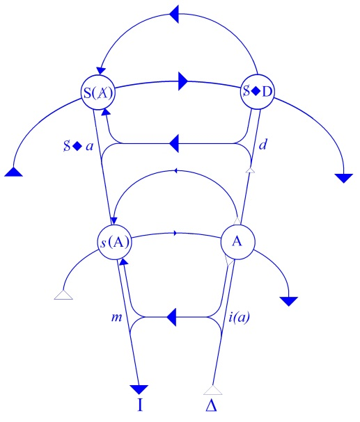

# Leçon 03 | 26 Novembre 1958

  <label><input type="checkbox" data-lacan-toggle="original" checked> 原文</label>
  <label><input type="checkbox" data-lacan-toggle="notes" checked> 注释</label>
  <label><input type="checkbox" data-lacan-toggle="commentary" checked> 个人解读评论</label>

<section class="parallel-paragraph" data-paragraph-ids="s6-03-0001">

s6-03-0001

[无对应译文]

原文 · s6-03-0001

Je commence par tenir mes promesses. La dernière fois je vous avais indiqué l’article de SARTRE qui s’appelle : *La transcendance de l’ego*, esquisse d’une description phénoménologique. Cet article se trouve dans le VIème volume des *Recherches philosophiques*…

</section>

<section class="parallel-paragraph" data-paragraph-ids="s6-03-0002">

s6-03-0002

[无对应译文]

原文 · s6-03-0002

> excellente revue qui a cessé de paraître avec la guerre et avec la disparition de son éditeur BOIVIN

</section>

<section class="parallel-paragraph" data-paragraph-ids="s6-03-0003">

s6-03-0003

[无对应译文]

原文 · s6-03-0003

…pages 85 à 103.

</section>

<section class="parallel-paragraph" data-paragraph-ids="s6-03-0004">

s6-03-0004

[无对应译文]

原文 · s6-03-0004

La remarque faite par FREUD que :

</section>

<section class="parallel-paragraph" data-paragraph-ids="s6-03-0005">

s6-03-0005

[无对应译文]

原文 · s6-03-0005

« *L’affirmation que tous les rêves ont une signification sexuelle* - plus exactement - « *exigent une interprétation sexuelle* »…

</section>

<section class="parallel-paragraph" data-paragraph-ids="s6-03-0006">

s6-03-0006

[无对应译文]

原文 · s6-03-0006

contre laquelle toute la littérature infatigablement a polémiqué

</section>

<section class="parallel-paragraph" data-paragraph-ids="s6-03-0007">

s6-03-0007

[无对应译文]

原文 · s6-03-0007

…*est absolument étrangère à ma Traumdeutung* »

</section>

<section class="parallel-paragraph" data-paragraph-ids="s6-03-0008">

s6-03-0008

[无对应译文]

原文 · s6-03-0008

Dans les 7 éditions de ce livre - ceci est écrit naturellement dans la VIIème - elle se trouve dans une contradiction particulièrement saisissable avec le reste du contenu de ce qui se trouve dans les *Gesammelte Werke N° II-III,* qui contiennent la *Traumdeutung*, à la page 402.

</section>

<section class="parallel-paragraph" data-paragraph-ids="s6-03-0009">

s6-03-0009

[无对应译文]

原文 · s6-03-0009

Beaucoup d’entre vous ont entendu hier soir *la relation clinique d’un de nos camarades, et excellent psychanalyste, sur le sujet* *de l’obsédé* [^11]. Vous l’avez entendu parler à propos du *désir* et de *la demande*. Nous cherchons ici à mettre en relief…

</section>

<section class="parallel-paragraph" data-paragraph-ids="s6-03-0010">

s6-03-0010

[无对应译文]

原文 · s6-03-0010

> *parce qu’elle n’est pas seulement une question théorique, mais qu’elle est liée à l’essentiel de notre pratique*

</section>

<section class="parallel-paragraph" data-paragraph-ids="s6-03-0011">

s6-03-0011

[无对应译文]

原文 · s6-03-0011

…cette *question* qui est celle autour de laquelle se joue le problème de *la structure du désir et de la demande*, et qui est quelque chose qui sans doute s’applique tout de suite à *la clinique*, *la vivifie, la rend* je dirais *compréhensible*. Je dirais presque que c’est un signe qu’à l’avoir maniée trop au niveau de la compréhension, vous puissiez éprouver je ne sais quel sentiment d’*insuffisance*.

</section>

<section class="parallel-paragraph" data-paragraph-ids="s6-03-0012">

s6-03-0012

[无对应译文]

原文 · s6-03-0012

Et c’est vrai d’ailleurs, c’est que le niveau de la compréhension est loin d’épuiser les ressorts de ce qui est la structure que nous cherchons à pénétrer, parce que c’est sur elle que nous cherchons à agir et que la clef autour de laquelle nous devons faire pivoter *cette distinction de la demande et du désir*, pour autant que tout de suite elle clarifie *la demande*, mais que par contre elle situe bien à sa place - c’est-à-dire à son point strictement énigmatique – la position du *désir* de l’Homme.

</section>

<section class="parallel-paragraph" data-paragraph-ids="s6-03-0013">

s6-03-0013

[无对应译文]

原文 · s6-03-0013

La clef de tout cela, c’est *le rapport du sujet au signifiant*. Ce qui caractérise la demande, ce n’est pas seulement que c’est un rapport de sujet à un autre sujet, c’est que *ce rapport* se fait par l’intermédiaire du *langage*, c’est-à-dire par l’intermédiaire du *système des signifiants*.

</section>

<section class="parallel-paragraph" data-paragraph-ids="s6-03-0014">

s6-03-0014

[无对应译文]

原文 · s6-03-0014

Puisque nous abordons - je vous l’ai annoncé - maintenant la question de ce qu’est le *désir* en tant qu’il est le fondement du rêve, et vous savez tout de suite il n’est pas simple de savoir quel est ce *désir*, s’il est le moteur du rêve, vous savez qu’à tout le moins il est double :

</section>

<section class="parallel-paragraph" data-paragraph-ids="s6-03-0015">

s6-03-0015

[无对应译文]

原文 · s6-03-0015

- que ce désir d’abord est dans *le maintien du sommeil*. FREUD l’a articulé de la façon la plus expresse, c’est-à-dire de cet état où pour le sujet se suspend la réalité.

</section>

<section class="parallel-paragraph" data-paragraph-ids="s6-03-0016">

s6-03-0016

[无对应译文]

原文 · s6-03-0016

- Le désir est désir de mort, il l’est d’autre part et en même temps et parfaitement compatiblement je dirais, pour autant que c’est souvent par l’intermédiaire de ce second désir que le premier est satisfait, le désir étant ce en quoi le sujet du « *Wunsch* » \[*désir, souhait, vœu*\] se satisfait, et ce sujet, je voudrais le mettre dans une sorte de *parenthèse* : *le sujet, nous ne savons pas ce que c’est*, et *le sujet du Wunsch, du rêve*, la question est de savoir *qui il est*. Quand certains disent « *le moi* », ils se trompent. FREUD a sûrement affirmé le contraire. Et si on dit c’est « *l’inconscient* », ce n’est rien dire.

</section>

<section class="parallel-paragraph" data-paragraph-ids="s6-03-0017">

s6-03-0017

[无对应译文]

原文 · s6-03-0017

Donc quand je dis « *le sujet du « Wunsch » se satisfait* », je mets ce sujet entre parenthèses, et tout ce que nous dit FREUD, c’est que c’est un *Wunsch* qui *se satisfait*. Il se satisfait de quoi ? Je dirais qu’il se satisfait de *l’être*…

</section>

<section class="parallel-paragraph" data-paragraph-ids="s6-03-0018">

s6-03-0018

[无对应译文]

原文 · s6-03-0018

entendez de *l’être* qui se satisfait

</section>

<section class="parallel-paragraph" data-paragraph-ids="s6-03-0019">

s6-03-0019

[无对应译文]

原文 · s6-03-0019

…c’est tout ce que nous pouvons dire, car à la vérité il est bien clair que le rêve n’apporte avec soi aucune autre *satisfaction* que la *satisfaction* au niveau du *Wunsch*, c’est-à-dire une *satisfaction* si l’on peut dire *verbale*.

</section>

<section class="parallel-paragraph" data-paragraph-ids="s6-03-0020">

s6-03-0020

[无对应译文]

原文 · s6-03-0020

Le *Wunsch* se contente ici d’*apparences*, et c’est bien clair s’il s’agit d’un rêve et aussi bien d’ailleurs le caractère de cette satisfaction est ici reflété dans le langage par où il nous l’a exprimé, par ce « *satisfait de l’être* » auquel je me suis exprimé à l’instant, et où se trahit cette ambiguïté du mot « *être* » en tant qu’il *est* là, qu’il se glisse partout et qu’aussi bien, à se formuler ainsi à cette forme grammaticale de renvoi de *l’être*, *l’être* satisfait, je veux dire : peut-il être pris pour ce côté *substantiel* ?

</section>

<section class="parallel-paragraph" data-paragraph-ids="s6-03-0021">

s6-03-0021

[无对应译文]

原文 · s6-03-0021

Il n’y a rien d’autre de *substantiel* dans *l’être* que ce mot même, « *il se satisfait de l’être* », nous pouvons le prendre pour ce qui est de *l’être*, si ce n’est au pied de la *lettre*. En fin de compte, c’est bien en effet comme quelque chose de l’ordre de *l’être* qui satisfait le *Wunsch*. Il n’y a en somme que dans le rêve, tout au moins sur le plan de *l’être*, que le *Wunsch* puisse se satisfaire.

</section>

<section class="parallel-paragraph" data-paragraph-ids="s6-03-0022">

s6-03-0022

[无对应译文]

原文 · s6-03-0022

Je voudrais presque faire ici cette chose que je fais souvent, ce petit préambule si vous voulez, ce regard en arrière, cette remarque qui vous permet de vous déciller les yeux, de je ne sais quoi qui ne comprend rien de moins que l’ensemble de l’histoire de la spéculation psychologique, pour autant qu’elle est liée, que la psychologie moderne a commencé par formuler, comme vous le savez, dans les termes de *l’atomisme psychologique*, ici toutes les *théories associationnistes*. Chacun sait que nous n’en sommes plus là - à l’*associationnisme* [^12] comme on dit - et que nous avons fait des progrès considérables depuis que nous avons fait entrer la demande de la totalité, l’unité du champ, l’intentionnalité et autres forces en considération.

</section>

<section class="parallel-paragraph" data-paragraph-ids="s6-03-0023">

s6-03-0023

[无对应译文]

原文 · s6-03-0023

Mais je dirais que l’histoire n’est pas du tout *réglée*, et elle n’est pas du tout réglée précisément à cause de *la psychanalyse* de FREUD. Mais on ne voit pas du tout comment en réalité le ressort a joué de ce *règlement de compte qui n’en est pas un*, je veux dire que l’on a laissé complètement échapper l’*essence*, et du même coup aussi la persistance de ce qui y a été prétendument réduit.

</section>

<section class="parallel-paragraph" data-paragraph-ids="s6-03-0024">

s6-03-0024

[无对应译文]

原文 · s6-03-0024

Au départ c’est vrai, l’associationnisme de la tradition de l’école psychologique anglaise, où c’est le jeu articulé et une vaste méprise, si je puis m’exprimer ainsi, où je dirais l’on note le champ du réel, au sens où ce dont il s’agit c’est de l’*appréhension psychologique du réel*, et où il s’agit *d’expliquer* en somme, non pas seulement qu’il y a des hommes qui pensent, mais qu’il y a des hommes qui se déplacent dans le monde en y appréhendant d’une façon à peu près convenable le champ des objets.

</section>

<section class="parallel-paragraph" data-paragraph-ids="s6-03-0025">

s6-03-0025

[无对应译文]

原文 · s6-03-0025

Où est donc ce champ des objets, son caractère fragmenté, structuré ? De quoi ?

</section>

<section class="parallel-paragraph" data-paragraph-ids="s6-03-0026">

s6-03-0026

[无对应译文]

原文 · s6-03-0026

De *la chaîne signifiante* tout simplement, et je vais vraiment essayer de choisir un exemple pour essayer de vous le faire sentir, qu’il s’agit de rien d’autre chose, et que tout ce qu’on apporte dans la théorie associationniste dite structurée, pour concevoir la progressivité de l’appréhension psychologique à partir de l’ascencion jusqu’à la constitution ordonnée également au réel, n’est rien d’autre en fait que le fait de doter d’emblée ces champs du réel du caractère fragmenté et structuré de la chaîne signifiante.

</section>

<section class="parallel-paragraph" data-paragraph-ids="s6-03-0027">

s6-03-0027

[无对应译文]

原文 · s6-03-0027

À partir de là bien entendu on s’aperçoit qu’il va y avoir *maldonne* et qu’il doit y avoir des rapports plus originels si l’on peut dire, avec le réel, et pour cela on part de la notion proportionnaliste, et on s’en va vers tous les cas où cette appréhension du monde est en quelque sorte plus *élémentaire* justement, moins *structurée* par la chaîne signifiante.

</section>

<section class="parallel-paragraph" data-paragraph-ids="s6-03-0028">

s6-03-0028

[无对应译文]

原文 · s6-03-0028

Sans savoir que c’est de cela qu’il s’agit, on va vers la psychologie animale, on évoque tous les linéaments stigmatiques grâce auxquels l’animal peut venir à structurer son monde et essaie d’y retrouver le point de référence. On s’imagine que, quand on a fait cela on a résolu dans une espèce de théorie du champ animé, du vecteur du désir primordial, qu’on a fait la résorption de ces fameux éléments qui étaient une première et fausse appréhension de la prise du champ du réel par la psychologie du sujet humain.

</section>

<section class="parallel-paragraph" data-paragraph-ids="s6-03-0029">

s6-03-0029

[无对应译文]

原文 · s6-03-0029

On n’a simplement rien fait du tout, on a décrit autre chose, on a introduit une autre psychologie, mais les éléments de l’associationnisme survivent tout à fait parfaitement à l’établissement de la psychologie plus primitive, je veux dire qui cherche à saisir le niveau de coaptation dans le champ sensorimoteur du sujet avec son *Umwelt*, avec *son entourage*.

</section>

<section class="parallel-paragraph" data-paragraph-ids="s6-03-0030">

s6-03-0030

[无对应译文]

原文 · s6-03-0030

Il n’en reste pas moins que tout ce qui se rapporte, que tous les problèmes soulevés à propos de l’associationnisme survivent parfaitement à ceci, qu’il n’a été nullement une réduction, mais une espèce de déplacement du champ de visée, et la preuve en est justement le champ analytique dans lequel restent rois tous les *principes* de l’associationnisme.

</section>

<section class="parallel-paragraph" data-paragraph-ids="s6-03-0031">

s6-03-0031

[无对应译文]

原文 · s6-03-0031

Car rien jusqu’ici n’a étranglé le fait que *quand nous avons commencé d’explorer le champ de l’inconscient*, nous l’avons fait \- nous le refaisons tous les jours - à la suite de quelque chose qui s’appelle en principe « *association libre* ». Et jusqu’à présent en principe…

</section>

<section class="parallel-paragraph" data-paragraph-ids="s6-03-0032">

s6-03-0032

[无对应译文]

原文 · s6-03-0032

quoique bien entendu ce soit un *terme approximatif*, inexact pour désigner le discours analytique

</section>

<section class="parallel-paragraph" data-paragraph-ids="s6-03-0033">

s6-03-0033

[无对应译文]

原文 · s6-03-0033

…la visée de *l’association libre* reste valable et que *les expériences originelles recèlent des mots induits*, et gardent toujours…

</section>

<section class="parallel-paragraph" data-paragraph-ids="s6-03-0034">

s6-03-0034

[无对应译文]

原文 · s6-03-0034

> encore que bien entendu elles ne gardent pas de valeur thérapeutique ni pratique

</section>

<section class="parallel-paragraph" data-paragraph-ids="s6-03-0035">

s6-03-0035

[无对应译文]

原文 · s6-03-0035

…mais elles gardent toujours leur valeur orientative pour l’exploration du champ de l’inconscient, et ceci suffirait à soi tout seul pour nous montrer que nous sommes dans un champ où règne *le mot*, où règne *le signifiant*.

</section>

<section class="parallel-paragraph" data-paragraph-ids="s6-03-0036">

s6-03-0036

[无对应译文]

原文 · s6-03-0036

Mais si ceci ne vous suffit pas encore, je complète cette parenthèse parce que je tiens à le faire pour vous rappeler sur quoi se fonde *la théorie associationniste*, et sur ce fond d’expérience, ce qui vient à la suite, ce qui se coordonne dans l’esprit d’un sujet à tel niveau, ou pour reprendre l’exploration telle qu’elle est dirigée dans ce premier rapport expérimental, les éléments, les atomes, les idées comme on dit, sans doute approximativement, insuffisamment, ce premier rapport, mais non sans raison, se présente sous cette forme .

</section>

<section class="parallel-paragraph" data-paragraph-ids="s6-03-0037">

s6-03-0037

[无对应译文]

原文 · s6-03-0037

Ces idées sont entrées par quoi, nous dit-on, à l’origine ? Il s’agit des rapports de contiguïté. Voyez, suivez les textes, voyez de quoi on parle, sur quels exemples on s’appuie, et vous reconnaîtrez parfaitement que la contiguïté n’est rien d’autre que cette combinaison discursive sur laquelle se fonde l’effet que nous appelons ici *la métonymie*. Sans doute contiguïté entre deux choses qui sont survenues, pour autant qu’elles sont évoquées dans la mémoire sur le plan des lois de l’association.

</section>

<section class="parallel-paragraph" data-paragraph-ids="s6-03-0038">

s6-03-0038

[无对应译文]

原文 · s6-03-0038

Qu’est-ce que cela veut dire ?

</section>

<section class="parallel-paragraph" data-paragraph-ids="s6-03-0039">

s6-03-0039

[无对应译文]

原文 · s6-03-0039

Cela signifie comment un événement a été vécu dans un contexte que nous pouvons appeler en gros un contexte de hasard : une partie de l’événement étant évoquée, l’autre viendra à l’esprit constituant une association de contiguïté, qui n’est rien d’autre qu’une *rencontre*.

</section>

<section class="parallel-paragraph" data-paragraph-ids="s6-03-0040">

s6-03-0040

[无对应译文]

原文 · s6-03-0040

Qu’est–ce que cela veut dire ?

</section>

<section class="parallel-paragraph" data-paragraph-ids="s6-03-0041">

s6-03-0041

[无对应译文]

原文 · s6-03-0041

Cela veut dire en somme qu’elle se brise, que *ses éléments* sont pris dans un même texte de récit. C’est pour autant que l’événement évoqué dans la mémoire est un événement récité, que le récit en forme le texte, que nous pouvons parler à ce niveau de contiguïté. Contiguïté d’autre part que nous distinguons par exemple dans une expérience des mots induits. Un mot viendra avec un autre : si à propos du mot « cerise » j’évoque évidemment le mot « table », ce sera un rapport de contiguïté parce qu’il y avait tel jour des cerises sur la table .

</section>

<section class="parallel-paragraph" data-paragraph-ids="s6-03-0042">

s6-03-0042

[无对应译文]

原文 · s6-03-0042

Mais rapport de contiguïté si nous parlons de quelque chose qui n’est autre qu’un rapport de similitude. Un rapport toujours de similitude, est également toujours un rapport de signifiant pour autant que la similitude c’est le passage de l’un à l’autre par une similitude qui est une similitude d’être, qui est une similitude de l’un à l’autre, entre l’un et l’autre en tant que l’un et l’autre étant différents, il y a quelque sujet d’être qui les rend semblables.

</section>

<section class="parallel-paragraph" data-paragraph-ids="s6-03-0043">

s6-03-0043

[无对应译文]

原文 · s6-03-0043

Je ne vais pas entrer dans toute *la dialectique du même et de l’autre* avec tout ce qu’elle a de difficile et d’infiniment plus riche qu’un premier abord le laisse soupçonner. Ceux que cela intéresse, je les renvoie au *Parménide*, et ils verront qu’ils y passeront un certain temps avant d’épuiser la question.

</section>

<section class="parallel-paragraph" data-paragraph-ids="s6-03-0044">

s6-03-0044

[无对应译文]

原文 · s6-03-0044

Ce que je dis simplement ici et ce que je veux vous faire sentir, c’est…

</section>

<section class="parallel-paragraph" data-paragraph-ids="s6-03-0045">

s6-03-0045

[无对应译文]

原文 · s6-03-0045

puisque j’ai parlé tout à l’heure des *cerises*

</section>

<section class="parallel-paragraph" data-paragraph-ids="s6-03-0046">

s6-03-0046

[无对应译文]

原文 · s6-03-0046

…qu’il y a d’autres usages que l’usage métonymique à propos de ce mot, je dirais justement servir pour un usage métaphorique : je peux m’en servir pour parler de *la lèvre* en disant que cette *lèvre* est comme une *cerise*, et donner le mot « *cerise* » venant comme mot induit à propos du mot « *lèvre* ». ils sont liés ici pourquoi ? Parce qu’elles sont toutes les deux rouges, semblables par quelque attribution.

</section>

<section class="parallel-paragraph" data-paragraph-ids="s6-03-0047">

s6-03-0047

[无对应译文]

原文 · s6-03-0047

Ce n’est pas uniquement que ce soit cela, ou parce qu’elles ont toutes les deux *la même forme* analogiquement, mais ce qui est tout à fait clair, c’est que de quoi qu’il s’agisse, nous sommes immédiatement – et ceci se sent – dans l’effet tout à fait substantiel qui s’appelle l’effet de *métaphore*.

</section>

<section class="parallel-paragraph" data-paragraph-ids="s6-03-0048">

s6-03-0048

[无对应译文]

原文 · s6-03-0048

Ici il n’y a aucune espèce d’ambiguïté quand je parle, dans une expérience de mots induits, de la cerise à propos de la lèvre.

</section>

<section class="parallel-paragraph" data-paragraph-ids="s6-03-0049">

s6-03-0049

[无对应译文]

原文 · s6-03-0049

Nous sommes *sur le plan de la métaphore au sens le plus substantiel* de ce que contient cet effet, ce terme, et *sur le plan le plus formel* ceci se présente toujours - comme je vous l’ai réduit à cet *effet de métaphore -* à *un effet de substitution dans la chaîne signifiante*.

</section>

<section class="parallel-paragraph" data-paragraph-ids="s6-03-0050">

s6-03-0050

[无对应译文]

原文 · s6-03-0050

C’est pour autant *que la cerise* peut être mise dans un contexte structural ou non, à propos de la lèvre, *que la cerise est là*.

</section>

<section class="parallel-paragraph" data-paragraph-ids="s6-03-0051">

s6-03-0051

[无对应译文]

原文 · s6-03-0051

À quoi vous pouvez me dire : la cerise peut venir à propos des lèvres dans une fonction de contiguïté : la cerise a disparu entre les lèvres, ou elle m’a donné la cerise à prendre sur ses lèvres. Oui, bien entendu c’est aussi comme cela qu’elle peut se présenter, mais de quoi s’agit-il ?

</section>

<section class="parallel-paragraph" data-paragraph-ids="s6-03-0052">

s6-03-0052

[无对应译文]

原文 · s6-03-0052

Il s’agit ici d’une contiguïté qui précisément est celle du récit dont je parlais tout à l’heure, car l’événement dans lequel s’intègre cette contiguïté, et qui fait que la cerise est en effet pendant un court moment au contact de la lèvre, c’est quelque chose qui bien entendu du point de vue réel, ne doit pas nous leurrer. Ce n’est pas que la cerise touche la lèvre qui importe, c’est qu’elle soit avalée. De même que ce n’est pas qu’elle soit tenue avec les lèvres dans le geste érotique que j’ai évoqué, c’est qu’elle nous soit offerte dans ce mouvement érotique lui-même qui compte.

</section>

<section class="parallel-paragraph" data-paragraph-ids="s6-03-0053">

s6-03-0053

[无对应译文]

原文 · s6-03-0053

Si un instant nous arrêtons cette cerise au contact de la lèvre, c’est en fonction d’un *flash* qui est le *flash* précisément du récit, où c’est la phrase, où ce sont les mots qui un instant suspendent cette cerise entre les lèvres. Et c’est *d’ailleurs* précisément parce qu’il existe cette dimension du récit en tant qu’elle institue ce *flash*, qu’inversement cette image en tant qu’elle est créée par la suspension du récit, devient effectivement à l’occasion un des stimulants du désir, pour autant qu’en imposant un ton qui n’est ici qu’implication du langage de l’acte, le langage introduit dans l’acte cette stimulation après coup, cet élément stimulant à proprement parler qui est arrêté comme tel et qui vient à l’occasion nourrir l’acte lui-même de cette suspension qui prend la valeur du fantasme, qui a signification érotique dans le détour de l’acte.

</section>

<section class="parallel-paragraph" data-paragraph-ids="s6-03-0054">

s6-03-0054

[无对应译文]

原文 · s6-03-0054

Je pense que ceci est suffisant pour vous montrer cette instance du signifiant en tant qu’il est au fondement de la structuration même d’un certain champ psychologique, qui n’est pas la totalité du champ psychologique, qui est précisément cette partie du champ psychologique qui jusqu’à un certain degré est par convention à l’intérieur de ce que nous pouvons appeler « *la psychologie* », pour autant que la psychologie se constituerait sur la base de ce que j’appellerai une sorte de théorie unitaire intentionnelle ou appétitive du champ.

</section>

<section class="parallel-paragraph" data-paragraph-ids="s6-03-0055">

s6-03-0055

[无对应译文]

原文 · s6-03-0055

Cette présence du signifiant, elle est articulée, d’une façon infiniment plus instante, infiniment plus puissante, infiniment plus efficace dans l’expérience freudienne, et c’est ce que FREUD nous rappelle à tout instant. C’est également ce qu’on tend à oublier de la façon la plus singulière, pour autant que vous voudrez faire de *la psychanalyse* quelque chose qui irait dans le même sens, dans la même direction que celle où la psychologie est venue situer son intérêt.

</section>

<section class="parallel-paragraph" data-paragraph-ids="s6-03-0056">

s6-03-0056

[无对应译文]

原文 · s6-03-0056

Je veux dire dans le sens d’un champ clinique, d’un champ tensionnel où l’inconscient serait quelque chose qui aurait été une espèce de puits, de chemin, de forage si on peut dire, parallèle à l’évolution générale de la psychologie, et qui nous aurait permis aussi d’aller par un autre accès au niveau de ces tensions plus élémentaires, au niveau du champ des profondeurs, pour autant qu’il arrive quelque chose de plus réduit au vital, à l’élémentaire que ce que nous voyons à la surface qui serait le champ dit du *préconscient* ou du *conscient*. Ceci, je le répète, est une erreur.

</section>

<section class="parallel-paragraph" data-paragraph-ids="s6-03-0057">

s6-03-0057

[无对应译文]

原文 · s6-03-0057

C’est très précisément dans ce sens que tout ce que nous disons prend sa valeur et son importance, et si certains d’entre vous ont pu la dernière fois suivre mon conseil de vous reporter aux deux articles parus en 1915, que pouvez-vous y lire ? Vous pourrez y lire et y voir ceci : si vous vous reportez par exemple à l’article *Unbewußte,* le point qui paraît là-dessus le plus sensible, au point je dirais à l’encontre desquels dans une descriptive superficielle au moment où il s’agit d’autres choses que d’éléments signifiants, de choses que ceux qui ne comprennent absolument rien à ce que je dis ici, articulent et appellent tous les jours une théorie intellectualiste.

</section>

<section class="parallel-paragraph" data-paragraph-ids="s6-03-0058">

s6-03-0058

[无对应译文]

原文 · s6-03-0058

Nous irons donc nous placer au niveau des sentiments inconscients, pour autant que FREUD en parle, parce que bien entendu on opposera naturellement à tout ceci que parler de *signifiants*, ce n’est pas la vie affective, la dynamique. Ceci bien entendu, je suis loin de chercher à le contester puisque c’est pour l’expliquer d’une façon claire que j’en passe par là au niveau de l’*Unbewußte*.

</section>

<section class="parallel-paragraph" data-paragraph-ids="s6-03-0059">

s6-03-0059

[无对应译文]

原文 · s6-03-0059

Que verrez-vous FREUD nous articuler ? Il nous articule très exactement ceci - c’est la partie troisième de [*Das Unbewußte*](http://www.textlog.de/freud-psychoanalyse-das-unbewusste-psychologie.html) - FREUD nous explique très nettement ceci : que ne peut être refoulé – nous dit-il – que ce qu’il appelle « *Vorstellungsrepräsentanz* ».

</section>

<section class="parallel-paragraph" data-paragraph-ids="s6-03-0060">

s6-03-0060

[无对应译文]

原文 · s6-03-0060

*Ceci seul*, nous dit-il, *peut être* à proprement parler *refoulé* . Ceci donc veut dire *représentant dans la représentation* de quoi ? Du mouvement pulsionnel qui est ici appelé *Triebregung*. Le texte ne laisse aucune espèce d’ambiguïté à ce moment. Il nous dit ceci expressément que la *Triebregung*, elle en tous cas, est un concept et vise comme tel ce qu’on peut même plus précisément appeler l’unité de motion pulsionnelle, et là il n’est pas question de considérer cette *Triebregung* ni comme inconsciente, ni comme consciente. Voilà ce qui est dit dans le texte.

</section>

<section class="parallel-paragraph" data-paragraph-ids="s6-03-0061">

s6-03-0061

[无对应译文]

原文 · s6-03-0061

Qu’est-ce que cela veut dire ?

</section>

<section class="parallel-paragraph" data-paragraph-ids="s6-03-0062">

s6-03-0062

[无对应译文]

原文 · s6-03-0062

Cela veut dire simplement que l’on doit prendre comme un concept objectif ce que nous appelons *Triebregung.* *C’est une unité objective* en tant que nous la regardons, *et elle n’est ni consciente ni inconsciente, elle est simplement ce qu’elle est* : un fragment isolé de réalité que nous concevrons comme ayant son incidence d’action propre.

</section>

<section class="parallel-paragraph" data-paragraph-ids="s6-03-0063">

s6-03-0063

[无对应译文]

原文 · s6-03-0063

Il n’en est à mon avis que plus remarquable que ce soit son *représentant dans la représentation*. C’est la valeur exacte du terme allemand et ce seul représentant que la pulsion dont dont il s’agit, *Trieb*, puisse être dit appartenir à l’inconscient en tant que celui-ci justement implique ce que j’ai mis tout à l’heure avec un point d’interrogation, à savoir un sujet inconscient.

</section>

<section class="parallel-paragraph" data-paragraph-ids="s6-03-0064">

s6-03-0064

[无对应译文]

原文 · s6-03-0064

Je n’ai pas à aller ici beaucoup plus loin. Ce que je veux dire que - vous devez bien le sentir - c’est justement préciser ce qu’est ce « *représentant dans la représentation* »…

</section>

<section class="parallel-paragraph" data-paragraph-ids="s6-03-0065">

s6-03-0065

[无对应译文]

原文 · s6-03-0065

> et cela vous voyez bien entendu déjà, non pas où je veux en venir, mais où nous en viendrons *nécessairement*

</section>

<section class="parallel-paragraph" data-paragraph-ids="s6-03-0066">

s6-03-0066

[无对应译文]

原文 · s6-03-0066

…c’est que ce « *Vorstellungsrepräsentanz* »…

</section>

<section class="parallel-paragraph" data-paragraph-ids="s6-03-0067">

s6-03-0067

[无对应译文]

原文 · s6-03-0067

> encore que FREUD en son temps est au point où les choses pouvaient se dire dans *un discours scientifique*

</section>

<section class="parallel-paragraph" data-paragraph-ids="s6-03-0068">

s6-03-0068

[无对应译文]

原文 · s6-03-0068

…ce « *Vorstellungsrepräsentanz* » est strictement équivalent à la notion et au terme de *signifiant*.

</section>

<section class="parallel-paragraph" data-paragraph-ids="s6-03-0069">

s6-03-0069

[无对应译文]

原文 · s6-03-0069

Ce n’est pas autre chose, ceci, encore que ce soit seulement annoncé, et bien entendu que *la démonstration* soit, nous semble-t-il, déjà annoncée, car alors à quoi servirait tout ce que je vous ai dit tout à l’heure . Ceci le sera bien entendu encore plus, toujours plus, c’est très précisément *de cela qu’il s’agit*. Que FREUD par contre soit opposé à cela, est également articulé de la façon la plus précise par lui-même. Tout ce qu’on peut connoter sous les termes qu’il réunit lui–même de « *sensation* », « *sentiment* », « *affect* », qu’est-ce que FREUD en dit ?

</section>

<section class="parallel-paragraph" data-paragraph-ids="s6-03-0070">

s6-03-0070

[无对应译文]

原文 · s6-03-0070

Il dit que ce n’est que par une négligence de l’expression qui a ou qui ne peut ou qui n’a pas selon le contexte, des inconvénients, comme toutes les négligences, mais c’est un relâchement que de dire qu’il est inconscient. Il ne peut en principe, dit-il, jamais l’être, il lui dénie formellement toute possibilité d’une incidence inconsciente. Ceci est exprimé et répété d’une façon qui ne peut comporter aucune espèce de doute, aucune espèce d’ambiguïté. *L’affect*, quand on parle d’*un affect inconscient* cela veut dire qu’il est perçu et *connu.* *Mais connu dans quoi ? Dans ses attaches !*

</section>

<section class="parallel-paragraph" data-paragraph-ids="s6-03-0071">

s6-03-0071

[无对应译文]

原文 · s6-03-0071

Mais *non pas qu’il soit inconscient car il est toujours perçu*, nous dit-il, simplement *il a été se rattacher à une autre représentation*, elle non refoulée. Autrement dit, il a eu à s’accommoder du contexte subsistant dans *le préconscient*, ce qui lui permet d’être tenu par la conscience - qui en l’occasion n’est pas difficile - pour une manifestation de son dernier contexte. Ceci est articulé dans FREUD. Il ne suffit pas qu’il l’articule une fois, il l’articule cent fois, il y revient à tout propos.

</section>

<section class="parallel-paragraph" data-paragraph-ids="s6-03-0072">

s6-03-0072

[无对应译文]

原文 · s6-03-0072

C’est précisément *là que s’insère l’énigme de ce que l’on appelle « transformation » de cet affect*, de ce qui s’avère à ce propos singulièrement *plastique*, et ce dont tous les auteurs d’ailleurs, dès qu’ils s’approchent de cette question de l’affect…

</section>

<section class="parallel-paragraph" data-paragraph-ids="s6-03-0073">

s6-03-0073

[无对应译文]

原文 · s6-03-0073

c’est-à-dire « *à chaque fois qu’il leur tombe un œil* » \[*sic*\]

</section>

<section class="parallel-paragraph" data-paragraph-ids="s6-03-0074">

s6-03-0074

[无对应译文]

原文 · s6-03-0074

…ont été frappés, je veux dire pour autant qu’on ose toucher à cette question.

</section>

<section class="parallel-paragraph" data-paragraph-ids="s6-03-0075">

s6-03-0075

[无对应译文]

原文 · s6-03-0075

Car ce qu’il y a de tout à fait frappant c’est que moi qui fais de « *la psychanalyse intellectualiste* », je vais passer mon année à en parler, mais que par contre vous compterez sur les doigts les articles consacrés à la question de l’« *affect »* dans l’analyse, encore que les psychanalystes en aient plein la bouche quand ils parlent d’une observation clinique, car bien entendu c’est toujours à l’*affect* qu’ils ont recours !

</section>

<section class="parallel-paragraph" data-paragraph-ids="s6-03-0076">

s6-03-0076

[无对应译文]

原文 · s6-03-0076

Il y a à ma connaissance *un seul article* valable sur cette question de l’*affect*, c’est *un article de* GLOVER[^13] dont on parle beaucoup dans les textes de [Marjorie BRIERLEY](http://www.enotes.com/marjorie-flowers-brierley-reference/marjorie-flowers-brierley). Il y a dans cet article une tentative de pas en avant dans la découverte de cette notion de l’*affect* qui laisse un peu à désirer dans ce que FREUD dit sur le sujet. Cet article est d’ailleurs *détestable*, comme d’ailleurs l’ensemble de ce livre qui, se consacrant à ce qu’on appelle « *les tendances de la psychanalyse* » , est une assez belle illustration de tous les endroits véritablement impossibles où la psychanalyse est en train d’aller se nicher : en passant par *la morale*, *la personnologie* et autres *perspectives* éminemment si *pratiques* autour desquelles le *bla-bla* de notre époque aime à se dépenser.

</section>

<section class="parallel-paragraph" data-paragraph-ids="s6-03-0077">

s6-03-0077

[无对应译文]

原文 · s6-03-0077

Par contre si nous revenons ici aux choses qui nous concernent, c’est-à-dire aux choses sérieuses, que lirons-nous dans FREUD ? Nous lirons ceci :

</section>

<section class="parallel-paragraph" data-paragraph-ids="s6-03-0078">

s6-03-0078

[无对应译文]

原文 · s6-03-0078

> « *L’affect, le problème est de savoir ce qu’il devient, pour autant qu’il est décroché de la représentation refoulée*
>
> *et qu’il ne dépend plus de la représentation substitutive à laquelle il trouve à s’attacher.* »

</section>

<section class="parallel-paragraph" data-paragraph-ids="s6-03-0079">

s6-03-0079

[无对应译文]

原文 · s6-03-0079

Au « *décroché* » correspond cette possibilité d’*annexion* qui est sa propriété, et ce en quoi l’*affect* se présente dans l’expérience analytique comme quelque chose de problématique, qui fait que par exemple dans *le vécu d’une hystérique*…

</section>

<section class="parallel-paragraph" data-paragraph-ids="s6-03-0080">

s6-03-0080

[无对应译文]

原文 · s6-03-0080

> *c’est de là que part l’analyse, c’est de là que FREUD part quand il commence à articuler les vérités analytiques*

</section>

<section class="parallel-paragraph" data-paragraph-ids="s6-03-0081">

s6-03-0081

[无对应译文]

原文 · s6-03-0081

…c’est qu’un affect surgit dans le texte ordinaire…

</section>

<section class="parallel-paragraph" data-paragraph-ids="s6-03-0082">

s6-03-0082

[无对应译文]

原文 · s6-03-0082

compréhensible, communicable du *vécu* de tous les jours d’une hystérique

</section>

<section class="parallel-paragraph" data-paragraph-ids="s6-03-0083">

s6-03-0083

[无对应译文]

原文 · s6-03-0083

…c’est que cet affect qui est là…

</section>

<section class="parallel-paragraph" data-paragraph-ids="s6-03-0084">

s6-03-0084

[无对应译文]

原文 · s6-03-0084

> qui a l’air d’ailleurs de tenir avec l’ensemble du texte sauf pour un *regard* un petit peu exigeant

</section>

<section class="parallel-paragraph" data-paragraph-ids="s6-03-0085">

s6-03-0085

[无对应译文]

原文 · s6-03-0085

…cet affect qui est là est *la transformation de quelque chose d’autre*…

</section>

<section class="parallel-paragraph" data-paragraph-ids="s6-03-0086">

s6-03-0086

[无对应译文]

原文 · s6-03-0086

et c’est *quelque chose* qui *vaut que nous nous y arrêtions*

</section>

<section class="parallel-paragraph" data-paragraph-ids="s6-03-0087">

s6-03-0087

[无对应译文]

原文 · s6-03-0087

… *de quelque chose d’autre, qui n’est pas un autre affect qui serait, lui, dans l’inconscient*. Ceci, FREUD le dénie absolument.

</section>

<section class="parallel-paragraph" data-paragraph-ids="s6-03-0088">

s6-03-0088

[无对应译文]

原文 · s6-03-0088

Il n’y a absolument rien de semblable, c’est la transformation du facteur purement quantitatif. Il n’y a absolument rien qui à ce moment là, soit réellement dans l’inconscient ce facteur quantitatif sous une forme transformée, et toute la question est de savoir comment dans l’*affect* ces transformations sont possibles, à savoir par exemple comment un affect qui est dans la profondeur est concevable dans le texte inconscient, restitué comme étant tel ou tel, se présente sous une autre forme quand il se présente dans le contexte préconscient.

</section>

<section class="parallel-paragraph" data-paragraph-ids="s6-03-0089">

s6-03-0089

[无对应译文]

原文 · s6-03-0089

Qu’est-ce que FREUD nous dit ? Premier texte :

</section>

<section class="parallel-paragraph" data-paragraph-ids="s6-03-0090">

s6-03-0090

[无对应译文]

原文 · s6-03-0090

\[*Der ganze Unterschied rührt daher, dass Vorstellungen Besetzungen - im Grunde von Erinnerungsspuren - sind, wahrend die Affekte und Gefühle Abfuhrvorgangen entsprechen, deren letzte Ausserungen als Empfindungen wahrgenommen werden.* ([*Das Unbewuste,* 1915](http://www.unebevue.org/images/stories/ubvediteur/freudzone/ics/ics.pdf)*, p.* 19-20)\]

</section>

<section class="parallel-paragraph" data-paragraph-ids="s6-03-0091">

s6-03-0091

[无对应译文]

原文 · s6-03-0091

« *Toute la différence provient de ce que dans l’inconscient les Vorstellungen sont des investissements dans le fond et traces les souvenirs,* *tandis que les affects correspondent à des procès de décharge dont les manifestations dernières sont perçues comme sensations.* *Telle est la règle de la formation des affects* ».

</section>

<section class="parallel-paragraph" data-paragraph-ids="s6-03-0092">

s6-03-0092

[无对应译文]

原文 · s6-03-0092

C’est aussi bien que, comme je vous l’ai dit, l’affect renvoie au facteur *quantitatif* de la pulsion, ce en quoi il entend qu’il n’est pas seulement muable, mobile, mais soumis à la variable que constitue ce facteur, et il l’articule précisément encore en disant que son sort peut être triple :

</section>

<section class="parallel-paragraph" data-paragraph-ids="s6-03-0093">

s6-03-0093

[无对应译文]

原文 · s6-03-0093

\[*Wir wissen, dass dies Schicksal ein dreifaches sein kann;*

</section>

<section class="parallel-paragraph" data-paragraph-ids="s6-03-0094">

s6-03-0094

[无对应译文]

原文 · s6-03-0094

- *der Affekt bleibt entweder - ganz oder teilweise - als solcher bestehen,*

</section>

<section class="parallel-paragraph" data-paragraph-ids="s6-03-0095">

s6-03-0095

[无对应译文]

原文 · s6-03-0095

- *oder er erfahrt eine Verwandlung in einen qualitativ anderen Affektbetrag, vor allem in Angst,*

</section>

<section class="parallel-paragraph" data-paragraph-ids="s6-03-0096">

s6-03-0096

[无对应译文]

原文 · s6-03-0096

- *oder er wird unterdrücktb, d.h. seine Entwicklung überhaupt verhindert. (Das Unbewuste,* 1915*, p.* 19\]

</section>

<section class="parallel-paragraph" data-paragraph-ids="s6-03-0097">

s6-03-0097

[无对应译文]

原文 · s6-03-0097

- « *L’affect reste, subsiste en totalité ou en partie tel qu’il est.*

</section>

<section class="parallel-paragraph" data-paragraph-ids="s6-03-0098">

s6-03-0098

[无对应译文]

原文 · s6-03-0098

- *Ou bien il subit une métamorphose en une quantité d’affects qualitativement autres, avant-tout en angoisse*… c’est ce qu’il écrit en 1915, et où on voit s’amorcer une position que l’article *Inhibition, symptôme, angoisse* articulera dans la topique

</section>

<section class="parallel-paragraph" data-paragraph-ids="s6-03-0099">

s6-03-0099

[无对应译文]

原文 · s6-03-0099

- *ou bien il est supprimé, c’est-à-dire que son développement est entravé.* »

</section>

<section class="parallel-paragraph" data-paragraph-ids="s6-03-0100">

s6-03-0100

[无对应译文]

原文 · s6-03-0100

La différence, nous dit-on, entre ce qu’il en est de l’affect et ce qu’il en est du *Vorstellungsrepräsentanz*, c’est que la représentation après le refoulement reste comme formation réelle dans le système ICS, tandis qu’à l’affect inconscient ne répond qu’à une possibilité annexe qui n’avait nulle nécessité, écrit FREUD, à s’épanouir[^14].

</section>

<section class="parallel-paragraph" data-paragraph-ids="s6-03-0101">

s6-03-0101

[无对应译文]

原文 · s6-03-0101

C’est un préambule tout à fait inévitable avant d’entrer dans le mode dont j’entends ici poser les questions à propos de *l’interprétation du désir du rêve*. Je vous ai dit que je prendrais pour cela un rêve pris au texte de FREUD, parce qu’après tout c’est encore le meilleur guide pour être sûr de ce qu’il entend dire quand il parle du *désir du rêve*.

</section>

<section class="parallel-paragraph" data-paragraph-ids="s6-03-0102">

s6-03-0102

[无对应译文]

原文 · s6-03-0102

Nous allons prendre un rêve que j’emprunterai à cet article qui s’appelle [*Formulierungen*](http://www.textlog.de/freud-psychoanalyse-zwei-prinzipien-psychischen-geschehens.html), *Formulations à propos des deux principes de régulation de la vie psychique* [^15] de 1911, paru juste avant le cas SCHREBER.

</section>

<section class="parallel-paragraph" data-paragraph-ids="s6-03-0103">

s6-03-0103

[无对应译文]

原文 · s6-03-0103

J’emprunte ce rêve - et la façon dont FREUD en parle et le traite - à cet article, parce qu’il y est articulé d’une façon *simple, exemplaire, significative, non ambiguë*, et pour montrer comment FREUD entend la manipulation de ces *Vorstellungsrepräsentanz*, pour autant qu’il s’agit de la formulation du désir inconscient.

</section>

<section class="parallel-paragraph" data-paragraph-ids="s6-03-0104">

s6-03-0104

[无对应译文]

原文 · s6-03-0104

Ce qui se dégage de l’ensemble de l’œuvre de FREUD concernant les rapports de ce *Vorstellungsrepräsentanz* avec *le processus primaire*, ne laisse aucune espèce de doute. Si *le processus primaire* est capable, pour autant qu’il est soumis au premier principe, dit *principe du plaisir*, il n’y a aucune autre façon de concevoir l’opposition qui dans FREUD, est marquée entre le *principe du plaisir* et le *principe de réalité*, si ce n’est de nous apercevoir que ce qui nous est donné comme le surgissement *hallucinatoire*…

</section>

<section class="parallel-paragraph" data-paragraph-ids="s6-03-0105">

s6-03-0105

[无对应译文]

原文 · s6-03-0105

> où le processus primaire, c’est-à-dire *le désir* au niveau du processus primaire trouve sa *satisfaction*

</section>

<section class="parallel-paragraph" data-paragraph-ids="s6-03-0106">

s6-03-0106

[无对应译文]

原文 · s6-03-0106

…concerne non pas simplement *une image*, mais quelque chose qui est *un signifiant*.

</section>

<section class="parallel-paragraph" data-paragraph-ids="s6-03-0107">

s6-03-0107

[无对应译文]

原文 · s6-03-0107

C’est d’ailleurs chose surprenante qu’on ne s’en soit pas *avisé* autrement, je veux dire à partir de *la clinique*. On ne s’en est jamais avisé autrement, semble-t-il, précisément pour autant que la notion de *signifiant* était quelque chose qui n’était pas élaboré au moment du grand épanouissement de la psychiatrie classique.

</section>

<section class="parallel-paragraph" data-paragraph-ids="s6-03-0108">

s6-03-0108

[无对应译文]

原文 · s6-03-0108

Car enfin dans la massivité de l’expérience clinique, sous quelles formes se présentent à nous les formes majeures problématiques les plus insistantes sous lesquelles se pose pour nous la question de l’hallucination, si ce n’est dans les hallucinations verbales ou de structure verbale, c’est-à-dire dans l’intrusion, l’immixtion dans le champ du réel,

</section>

<section class="parallel-paragraph" data-paragraph-ids="s6-03-0109">

s6-03-0109

[无对应译文]

原文 · s6-03-0109

- non pas de n’importe quoi,

</section>

<section class="parallel-paragraph" data-paragraph-ids="s6-03-0110">

s6-03-0110

[无对应译文]

原文 · s6-03-0110

- non pas d’une image,

</section>

<section class="parallel-paragraph" data-paragraph-ids="s6-03-0111">

s6-03-0111

[无对应译文]

原文 · s6-03-0111

- non pas d’un fantasme,

</section>

<section class="parallel-paragraph" data-paragraph-ids="s6-03-0112">

s6-03-0112

[无对应译文]

原文 · s6-03-0112

- non pas de ce que supporterait souvent simplement un processus hallucinatoire,

</section>

<section class="parallel-paragraph" data-paragraph-ids="s6-03-0113">

s6-03-0113

[无对应译文]

原文 · s6-03-0113

…mais si une hallucination nous pose des problèmes qui lui sont propres, c’est parce qu’il s’agit de signifiants et non pas d’images, ni de choses, ni de perceptions, enfin de « *fausses perceptions du réel* » comme on s’exprime.

</section>

<section class="parallel-paragraph" data-paragraph-ids="s6-03-0114">

s6-03-0114

[无对应译文]

原文 · s6-03-0114

Et au niveau de FREUD *ceci ne fait aucune espèce de doute*, et précisément à la fin de cet article, pour *illustrer* ce qu’il appelle la *Neurotische Währung*, c’est-à-dire…

</section>

<section class="parallel-paragraph" data-paragraph-ids="s6-03-0115">

s6-03-0115

[无对应译文]

原文 · s6-03-0115

> c’est un terme à retenir, le mot *Währung* veut dire *durée*, il n’est pas très habituel en allemand,
>
> il est lié au verbe *währen* qui est une *forme durative* du verbe *wahren* et cette idée de durée, de *valorisation*,
>
> car c’est l’usage le plus commun, si le mot *Währung* se rapporte à la durée, l’usage le plus commun
>
> qui en est fait c’est *la valeur*, *la valorisation*

</section>

<section class="parallel-paragraph" data-paragraph-ids="s6-03-0116">

s6-03-0116

[无对应译文]

原文 · s6-03-0116

…pour nous parler de la *valorisation* proprement *névrotique*, c’est-à-dire pour autant que le processus primaire y fait irruption, FREUD prend comme exemple un rêve, et voici ce rêve.

</section>

<section class="parallel-paragraph" data-paragraph-ids="s6-03-0117">

s6-03-0117

[无对应译文]

原文 · s6-03-0117

C’est le rêve d’un sujet en deuil de son père, *qu’il a* - nous dit-il - *assisté dans les longs tourments de sa fin*. Ce rêve se présente ainsi : Le père est encore en vie et lui parle comme naguère. Moyennant quoi il n’en a pas moins éprouvé de façon extrêmement douloureuse le sentiment que son père est cependant déjà mort, que seulement « *il n’en savait rien* » j’entends le père.

</section>

<section class="parallel-paragraph" data-paragraph-ids="s6-03-0118">

s6-03-0118

[无对应译文]

原文 · s6-03-0118

C’est un rêve court. C’est un rêve - comme toujours - que FREUD apporte au niveau *transcrit*, car l’essentiel de l’analyse freudienne se fonde toujours sur *le récit* du rêve en tant que d’abord *articulé*. Ce rêve donc s’est *répété* *avec insistance* dans les mois qui ont suivi le décès du père, et comment FREUD va-t-il l’aborder ?

</section>

<section class="parallel-paragraph" data-paragraph-ids="s6-03-0119">

s6-03-0119

[无对应译文]

原文 · s6-03-0119

Il est hors de doute bien entendu que FREUD n’a jamais pensé à aucune espèce de moment, qu’un rêve…

</section>

<section class="parallel-paragraph" data-paragraph-ids="s6-03-0120">

s6-03-0120

[无对应译文]

原文 · s6-03-0120

> ne serait-ce que par cette distinction qu’il a toujours faite du *contenu manifeste* et du *contenu latent*
>
> en se rapportant immédiatement à ce qu’on pourrait appeler, et à ce que l’on ne se fait pas faute d’appeler
>
> à tout instant dans l’analyse, de ce terme qui n’a pas je crois d’équivalent, de « *wishful thinking* ».
>
> C’est que je voudrais presque faire rendre quelque son d’équivalence avec alarme. Cela devrait mettre
>
> à soi tout seul un analyste en défiance, voire en défense, et le persuader qu’il s’est engagé dans la fausse voie

</section>

<section class="parallel-paragraph" data-paragraph-ids="s6-03-0121">

s6-03-0121

[无对应译文]

原文 · s6-03-0121

…il n’est pas question que FREUD un instant la taquine, cette « *Wishful* » et nous dise que c’est simplement parce qu’il a besoin de voir son père et que cela lui fait plaisir.

</section>

<section class="parallel-paragraph" data-paragraph-ids="s6-03-0122">

s6-03-0122

[无对应译文]

原文 · s6-03-0122

Car ce n’est pas du tout suffisant, pour la simple raison que cela ne semble pas du tout être une satisfaction, et que cela se passe avec des éléments et un contexte dont le caractère douloureux est très suffisamment marqué pour nous éviter cette sorte de pas précipité dont d’ailleurs je fais ici état pour en marquer la possibilité à la limite.

</section>

<section class="parallel-paragraph" data-paragraph-ids="s6-03-0123">

s6-03-0123

[无对应译文]

原文 · s6-03-0123

Je ne pense pas en fin de compte qu’un seul psychanalyste puisse aller jusque là quand il s’agit d’un rêve. Mais c’est précisément parce qu’on ne peut pas aller jusque là quand il s’agit d’un rêve, que les psychanalystes ne s’intéressent plus au rêve.

</section>

<section class="parallel-paragraph" data-paragraph-ids="s6-03-0124">

s6-03-0124

[无对应译文]

原文 · s6-03-0124

Comment FREUD aborde-t-il les choses ? C’est son texte au niveau duquel nous restons :

</section>

<section class="parallel-paragraph" data-paragraph-ids="s6-03-0125">

s6-03-0125

[无对应译文]

原文 · s6-03-0125

« *Aucun autre moyen* – écrit-il dans cet article, tout à fait à la fin - « *Aucun autre moyen ne conduit à l’intelligence du rêve dans sa sonorité de non-sens, que l’adjonction « selon son vœu » ou « par suite de son vœu » après les mots « que son père cependant était mort »*

</section>

<section class="parallel-paragraph" data-paragraph-ids="s6-03-0126">

s6-03-0126

[无对应译文]

原文 · s6-03-0126

Et le corollaire si vous voulez, qu’il le souhaitait après la fin de la phrase qui donne ceci :

</section>

<section class="parallel-paragraph" data-paragraph-ids="s6-03-0127">

s6-03-0127

[无对应译文]

原文 · s6-03-0127

« *Mais que seulement il ne savait pas, le père, que ce fût là le vœu de son fils* ».

</section>

<section class="parallel-paragraph" data-paragraph-ids="s6-03-0128">

s6-03-0128

[无对应译文]

原文 · s6-03-0128

La pensée du rêve s’entend alors :

</section>

<section class="parallel-paragraph" data-paragraph-ids="s6-03-0129">

s6-03-0129

[无对应译文]

原文 · s6-03-0129

« *Qu’il lui serait douloureux de se rappeler qu’il lui faudrait souhaiter à son père la mort,* *et combien effroyable ce serait s’il s’en était douté* ».

</section>

<section class="parallel-paragraph" data-paragraph-ids="s6-03-0130">

s6-03-0130

[无对应译文]

原文 · s6-03-0130

Ceci vous conduit à donner son poids à la façon dont FREUD traite le problème : *c’est un signifiant*. Ce sont des choses qui sont des *clausules*, dont nous allons essayer d’articuler sur le plan linguistique ce qu’elles sont, l’exacte valeur de ce qui est donné là comme permettant d’accéder à *l’intelligence du rêve*. Elles sont données comme telles, et comme le fait que leur mise en place, leur adaptation dans le texte, livre le sens du texte.

</section>

<section class="parallel-paragraph" data-paragraph-ids="s6-03-0131">

s6-03-0131

[无对应译文]

原文 · s6-03-0131

Je vous prie d’entendre ce que je suis en train de dire. Je ne suis pas en train de dire que c’est là l’interprétation \- et c’est peut-être en effet là l’interprétation - mais je ne le dis pas encore, je vous suspends à ce moment où un certain signifiant est désigné comme produit par son manque.

</section>

<section class="parallel-paragraph" data-paragraph-ids="s6-03-0132">

s6-03-0132

[无对应译文]

原文 · s6-03-0132

Ce dont il s’agit, *le phénomène* du rêve, quel est-il ? C’est en le remettant dans le contexte du rêve que nous accédons d’emblée à quelque chose qui nous est donné pour être l’intelligence du rêve, à savoir que le sujet se trouve dans le cas déjà connu : ce reproche que l’on se reproche à soi-même à propos de la personne aimée, et que ce reproche nous ramène dans cet exemple à la signification infantile du souhait de mort.

</section>

<section class="parallel-paragraph" data-paragraph-ids="s6-03-0133">

s6-03-0133

[无对应译文]

原文 · s6-03-0133

Nous voilà donc devant un cas typique où le terme *transfert*, *Übertragung*, est employé dans le sens où il est employé primitivement d’abord dans la *Science des rêves*. Il s’agit d’un report *de* *quelque chose* qui est une situation originelle \- le souhait de mort originel dans l’occasion - *dans quelque chose d’autre*, d’actuel, qui est un souhait analogue, homologue, parallèle, similaire *d’une façon quelconque*, s’introduisant pour faire revivre le souhait archaïque dont il s’agit.

</section>

<section class="parallel-paragraph" data-paragraph-ids="s6-03-0134">

s6-03-0134

[无对应译文]

原文 · s6-03-0134

Ceci vaut naturellement qu’on s’y arrête, parce que c’est à partir de là simplement que nous pouvons d’abord essayer d’élaborer ce que veut dire *interprétation*, car nous avons laissé de côté *l’interprétation du Wishful*.

</section>

<section class="parallel-paragraph" data-paragraph-ids="s6-03-0135">

s6-03-0135

[无对应译文]

原文 · s6-03-0135

Pour régler cette interprétation, il n’y a qu’une remarque à faire : si nous ne pouvons pas traduire « *Wishful thinking* » par *pensée désireuse*, *pensée désirante*, c’est pour une raison très simple : c’est que si « *Wishful thinking* » a un sens…

</section>

<section class="parallel-paragraph" data-paragraph-ids="s6-03-0136">

s6-03-0136

[无对应译文]

原文 · s6-03-0136

> bien entendu il a un sens, mais il est employé dans un des contextes où ce sens n’est pas valable

</section>

<section class="parallel-paragraph" data-paragraph-ids="s6-03-0137">

s6-03-0137

[无对应译文]

原文 · s6-03-0137

…si vous voulez mettre à l’épreuve chaque fois que ce terme est employé, l’opportunité, la pertinence du terme « *Wishful thinking* », vous n’avez qu’à faire la distinction que « *Wishful thinking* », ce n’est pas « *prendre son désir pour des réalités* » comme on s’exprime…

</section>

<section class="parallel-paragraph" data-paragraph-ids="s6-03-0138">

s6-03-0138

[无对应译文]

原文 · s6-03-0138

> c’est le sens de la pensée en tant qu’elle glisse, en tant qu’elle fléchit, donc à ce terme on ne doit pas attribuer la signification « *prendre son désir pour des réalités* » comme on s’exprime couramment

</section>

<section class="parallel-paragraph" data-paragraph-ids="s6-03-0139">

s6-03-0139

[无对应译文]

原文 · s6-03-0139

…mais « *prendre son rêve pour une réalité* ».

</section>

<section class="parallel-paragraph" data-paragraph-ids="s6-03-0140">

s6-03-0140

[无对应译文]

原文 · s6-03-0140

À ce seul titre justement que c’est tout à fait inapplicable à l’interprétation du rêve, car cela veut simplement dire à l’occasion si son rêve - c’est à ce type de compréhension du rêve… - cela veut simplement dire dans ce cas là qu’on fit ce rêve, en d’autres termes qu’on rêve parce qu’on rêve, et c’est bien pour cela que cette *interprétation* à ce niveau-là n’est nullement applicable, à aucun moment, à un rêve.

</section>

<section class="parallel-paragraph" data-paragraph-ids="s6-03-0141">

s6-03-0141

[无对应译文]

原文 · s6-03-0141

Il faut donc que nous venions au procédé dit *d’adjonction de signifiants*, *ce qui suppose la soustraction préalable d’un signifiant.* Je parle de ce qu’il suppose dans le texte de FREUD, *soustraction* étant à ce moment-là exactement le sens du terme dont il se sert pour désigner l’opération du refoulement dans sa forme pure, je dirais dans son effet : *unterdrückt*.

</section>

<section class="parallel-paragraph" data-paragraph-ids="s6-03-0142">

s6-03-0142

[无对应译文]

原文 · s6-03-0142

C’est alors que nous nous trouvons arrêtés par quelque chose…

</section>

<section class="parallel-paragraph" data-paragraph-ids="s6-03-0143">

s6-03-0143

[无对应译文]

原文 · s6-03-0143

qui comme tel *ne présentait pour nous une objection et un obstacle que si nous n’étions pas décidés d’avance à « trouver* *tout bien »*, c’est-à-dire si nous n’étions pas décidés *d’avance* à « *croire-croire* » comme dit M. PRÉVERT,

</section>

<section class="parallel-paragraph" data-paragraph-ids="s6-03-0144">

s6-03-0144

[无对应译文]

原文 · s6-03-0144

…on doit tout de même s’arrêter à ceci : c’est *que la pure et simple restitution de ces deux termes* « *nach seinem Wunsch* » et « *dass er wunschte* » - c’est-à-dire qu’il la souhaitait le fils, cette mort du père - *que la simple restitution de ces deux clausules* - du point de vue de ce que FREUD nous désigne lui-même comme *le but final de l’interprétation,* *à savoir la restauration du désir inconscient* - ne donne strictement rien, car que restitue-t-on à ce moment là ?

</section>

<section class="parallel-paragraph" data-paragraph-ids="s6-03-0145">

s6-03-0145

[无对应译文]

原文 · s6-03-0145

C’est quelque chose que le sujet *connaît parfaitement *: pendant la maladie extrêmement douloureuse, le sujet a effectivement souhaité à son père la mort comme solution et comme fin de ses tourments et de sa douleur, et effectivement bien entendu il ne lui a pas montré, il a tout fait pour le lui dissimuler, le désir, le vœu qui était dans son contexte, dans son contexte récent, vécu, *parfaitement accessible*.

</section>

<section class="parallel-paragraph" data-paragraph-ids="s6-03-0146">

s6-03-0146

[无对应译文]

原文 · s6-03-0146

Il n’est même pas besoin de parler à ce sujet de *préconscient*, mais de *souvenir conscient*, *parfaitement accessible* au texte continu de la conscience. Donc si le rêve soustrait à un texte quelque chose qui n’est nullement dérobé à la conscience du sujet, s’il le soustrait, c’est si je puis dire ce phénomène de soustraction qui prend valeur positive.

</section>

<section class="parallel-paragraph" data-paragraph-ids="s6-03-0147">

s6-03-0147

[无对应译文]

原文 · s6-03-0147

Je veux dire que c’est cela le problème, c’est le rapport du refoulement, pour autant que sans aucun doute il s’agit là de *Vorstellungsrepräsentanz*, et même tout à fait typique, car si quelque chose mérite ce terme, c’est justement quelque chose qui est, je dirais en soi-même, une forme vide de sens : « *selon son vœu* », en soi isolée .

</section>

<section class="parallel-paragraph" data-paragraph-ids="s6-03-0148">

s6-03-0148

[无对应译文]

原文 · s6-03-0148

Cela ne veut rien dire, cela veut dire « *selon son vœu* », celui dont on a parlé précédemment, *qu’il souhaitait quoi* ? Cela dépend également de la phrase qui est avant. Et c’est bien dans ce sens que je désire vous amener pour vous montrer *le caractère irréductible* de ce dont il s’agit par rapport à toute conception qui relève d’une sorte d’élaboration imaginaire, voire *d’abstraction des données objectales d’un champ*, quand il s’agit du *signifiant* et de ce qui ferait l’originalité du champ qui dans le psychisme, dans le vécu, dans le sujet humain, est instauré par lui, *par l’action du signifiant*.

</section>

<section class="parallel-paragraph" data-paragraph-ids="s6-03-0149">

s6-03-0149

[无对应译文]

原文 · s6-03-0149

C’est cela que nous avons…

</section>

<section class="parallel-paragraph" data-paragraph-ids="s6-03-0150">

s6-03-0150

[无对应译文]

原文 · s6-03-0150

> ces *formes signifiantes* qui en elles-mêmes ne se conçoivent, ne se soutiennent
>
> que pour autant qu’elles sont articulées avec d’autres *signifiants*

</section>

<section class="parallel-paragraph" data-paragraph-ids="s6-03-0151">

s6-03-0151

[无对应译文]

原文 · s6-03-0151

…c’est de cela qu’il s’agit en fait.

</section>

<section class="parallel-paragraph" data-paragraph-ids="s6-03-0152">

s6-03-0152

[无对应译文]

原文 · s6-03-0152

Je sais bien que là je m’introduis dans quelque chose qui supposerait une articulation beaucoup plus longue que tout ce dont il s’agit. Ceci est lié avec toutes sortes d’expériences qui ont été poursuivies avec beaucoup de persévérance par une école dite « *École de Marburg* », celle dite de « *la pensée sans images* » : sorte d’intuition que…

</section>

<section class="parallel-paragraph" data-paragraph-ids="s6-03-0153">

s6-03-0153

[无对应译文]

原文 · s6-03-0153

> dans les travaux de cette école qui se faisaient en petit cercle tout à fait fermé de psychologues

</section>

<section class="parallel-paragraph" data-paragraph-ids="s6-03-0154">

s6-03-0154

[无对应译文]

原文 · s6-03-0154

…on était amené à *penser sans images* ces sortes de *formes* qui sont autres que justement des *formes signifiantes sans contexte* et à l’état naissant, que la notion de *Vorstellung*…

</section>

<section class="parallel-paragraph" data-paragraph-ids="s6-03-0155">

s6-03-0155

[无对应译文]

原文 · s6-03-0155

> et très spécialement à l’occasion des problèmes qui nous sont ici posés

</section>

<section class="parallel-paragraph" data-paragraph-ids="s6-03-0156">

s6-03-0156

[无对应译文]

原文 · s6-03-0156

…méritait qu’on rappelle que FREUD a assisté pendant deux ans…

</section>

<section class="parallel-paragraph" data-paragraph-ids="s6-03-0157">

s6-03-0157

[无对应译文]

原文 · s6-03-0157

*comme nous en avons des témoignages sans ambiguïté*

</section>

<section class="parallel-paragraph" data-paragraph-ids="s6-03-0158">

s6-03-0158

[无对应译文]

原文 · s6-03-0158

…au cours de BRENTANO, et que la psychologie de BRENTANO, pour autant qu’elle donne une certaine conception de la « *Vorstellung* » est bien là pour nous donner le poids exact de ce que pouvait…

</section>

<section class="parallel-paragraph" data-paragraph-ids="s6-03-0159">

s6-03-0159

[无对应译文]

原文 · s6-03-0159

même dans l’esprit de FREUD, et pas simplement dans mon interprétation

</section>

<section class="parallel-paragraph" data-paragraph-ids="s6-03-0160">

s6-03-0160

[无对应译文]

原文 · s6-03-0160

…prendre le terme de « *Vorstellung* ».

</section>

<section class="parallel-paragraph" data-paragraph-ids="s6-03-0161">

s6-03-0161

[无对应译文]

原文 · s6-03-0161

Le problème est justement du rapport qu’il y a entre le refoulement…

</section>

<section class="parallel-paragraph" data-paragraph-ids="s6-03-0162">

s6-03-0162

[无对应译文]

原文 · s6-03-0162

> *si le refoulement est dit s’appliquer exactement et comme tel à quelque chose qui est de l’ordre de la « Vorstellung »*

</section>

<section class="parallel-paragraph" data-paragraph-ids="s6-03-0163">

s6-03-0163

[无对应译文]

原文 · s6-03-0163

…et d’autre part ce fait de quelque chose qui n’est rien d’autre que l’apparition d’un sens nouveau par quelque chose qui est différent - pour nous, au point où nous progressons - qui est différent du fait du refoulement, qui est ce que nous pouvons appeler dans le contexte - dans le contexte de préconscient - *l’élision des deux clausules*.

</section>

<section class="parallel-paragraph" data-paragraph-ids="s6-03-0164">

s6-03-0164

[无对应译文]

原文 · s6-03-0164

Cette *élision* est-elle la même chose que le *refoulement* ? En est-elle exactement le pendant, le contraire ? Quel est l’effet de cette *élision* ?

</section>

<section class="parallel-paragraph" data-paragraph-ids="s6-03-0165">

s6-03-0165

[无对应译文]

原文 · s6-03-0165

Il est clair que c’est un effet de sens, je veux dire qu’il faut pour nous expliquer sur le plan le plus formel que nous considérions cette élision… Je dis *élision* et non pas *allusion*.

</section>

<section class="parallel-paragraph" data-paragraph-ids="s6-03-0166">

s6-03-0166

[无对应译文]

原文 · s6-03-0166

Ce n’est pas - pour employer le langage quotidien - une *figuration*, ce rêve ne fait pas *allusion* - bien loin de là – à ce qui a précédé, à savoir aux rapports du père avec le fils, il introduit quelque chose qui *sonne absurdement*, qui a sa portée de signification - sur le plan manifeste - tout à fait originale.

</section>

<section class="parallel-paragraph" data-paragraph-ids="s6-03-0167">

s6-03-0167

[无对应译文]

原文 · s6-03-0167

*Il s’agit bien d’une figura verborum, d’une figure de mots, de termes*, pour employer le même terme qui est pendant au premier. Il s’agit d’une *élision*, et cette *élision* produit un *effet de signifié*.

</section>

<section class="parallel-paragraph" data-paragraph-ids="s6-03-0168">

s6-03-0168

[无对应译文]

原文 · s6-03-0168

Cette *élision* équivaut à une *substitution*, aux termes manquants, d’un *blanc*, d’un *zéro*. Mais un *zéro* ça n’est pas rien, *et l’effet dont il s’agit peut être qualifié d’effet métaphorique*. *Le rêve est une métaphore*.

</section>

<section class="parallel-paragraph" data-paragraph-ids="s6-03-0169">

s6-03-0169

[无对应译文]

原文 · s6-03-0169

Dans cette métaphore quelque chose de nouveau surgit qui est un sens, un signifié. Un signifié sans aucun doute énigmatique, mais qui n’est tout de même pas quelque chose dont nous n’ayons pas à tenir compte comme d’une des *formes*, je dirais les plus *essentielles,* du vécu humain puisque c’est cette image même qui pendant des siècles a jeté les êtres à tel détour de deuil de leur existence, sur les chemins plus ou moins dérobés qui les menaient chez le « *nécroman* », *et ce qu’il faisait surgir dans le cercle de l’incantation* était *ce quelque chose appelé « ombre »*, devant quoi il ne se passait pas autre chose que ce qui se passe dans ce rêve, à savoir cet être qui est là à être sans qu’on sache comment il existe, et devant lequel littéralement on ne peut rien dire, car lui - bien entendu - parle.

</section>

<section class="parallel-paragraph" data-paragraph-ids="s6-03-0170">

s6-03-0170

[无对应译文]

原文 · s6-03-0170

Mais peu importe, je dirais que jusqu’à un certain point ce qu’il *dit* est aussi bien ce qu’il *ne dit pas*, on ne nous le dit même pas dans le rêve, cette parole ne prend sa valeur que du fait que celui qui a appelé l’être aimé du *royaume des ombres*, lui ne peut *littéralement* rien lui dire de ce qui est la vérité de son cœur. Cette confrontation, cette scène structurée, ce *scénario*, ne nous suggère-t-il pas qu’en lui-même nous devons essayer d’en situer la portée ?

</section>

<section class="parallel-paragraph" data-paragraph-ids="s6-03-0171">

s6-03-0171

[无对应译文]

原文 · s6-03-0171

Qu’est-ce que c’est ? Cela a-t-il cette valeur fondamentale structurée et structurante qui est celle que j’essaye pour vous de préciser cette année devant vous sous le nom de *fantasme* ? Est-ce un *fantasme* ? Y a-t-il un certain nombre de caractères exigibles pour que dans une telle présentation, dans un tel scénario, à ce scénario nous reconnaissions les caractères du *fantasme* ?

</section>

<section class="parallel-paragraph" data-paragraph-ids="s6-03-0172">

s6-03-0172

[无对应译文]

原文 · s6-03-0172

C’est une première question que malheureusement nous ne pourrons commencer d’*articuler* que la prochaine fois. Entendez bien que nous lui donnerons des réponses tout à fait précises, et qui nous permettront d’approcher :

</section>

<section class="parallel-paragraph" data-paragraph-ids="s6-03-0173">

s6-03-0173

[无对应译文]

原文 · s6-03-0173

- ce en quoi effectivement c’est un *fantasme*,

</section>

<section class="parallel-paragraph" data-paragraph-ids="s6-03-0174">

s6-03-0174

[无对应译文]

原文 · s6-03-0174

- et ce en quoi c’est un *fantasme de rêve*

</section>

<section class="parallel-paragraph" data-paragraph-ids="s6-03-0175">

s6-03-0175

[无对应译文]

原文 · s6-03-0175

À savoir - je vous l’articule tout de suite - *un fantasme qui a des formes très particulières, je veux dire qu’un fantasme de rêve*…

</section>

<section class="parallel-paragraph" data-paragraph-ids="s6-03-0176">

s6-03-0176

[无对应译文]

原文 · s6-03-0176

> au sens où nous pouvons donner un sens précis à ce mot *fantasme*

</section>

<section class="parallel-paragraph" data-paragraph-ids="s6-03-0177">

s6-03-0177

[无对应译文]

原文 · s6-03-0177

…n’a pas la même portée que celle d’un *fantasme vigile*, ceci qu’il soit inconscient ou pas.

</section>

<section class="parallel-paragraph" data-paragraph-ids="s6-03-0178">

s6-03-0178

[无对应译文]

原文 · s6-03-0178

Voilà un *premier point* sur lequel je vous répondrai, à la question qui se pose ici, la prochaine fois.

</section>

<section class="parallel-paragraph" data-paragraph-ids="s6-03-0179">

s6-03-0179

[无对应译文]

原文 · s6-03-0179

Le *deuxième point* c’est à ce propos et en partant de là, à savoir de cette articulation de la fonction du fantasme, comment nous devons concevoir que gît l’incidence de ce que l’on peut appeler - de ce que FREUD a appelé - « *les mécanismes d’élaboration du rêve* », à savoir : ces rapports d’une part avec le refoulement supposé antécédent, et le rapport de ce refoulement avec les signifiants dont je vous ai montré à quel point FREUD les isole et articule l’incidence de leur absence en termes de pures *relations signifiantes*.

</section>

<section class="parallel-paragraph" data-paragraph-ids="s6-03-0180">

s6-03-0180

[无对应译文]

原文 · s6-03-0180

Ces signifiants, je veux dire les rapports qu’il y a entre les signifiants du récit :

</section>

<section class="parallel-paragraph" data-paragraph-ids="s6-03-0181">

s6-03-0181

[无对应译文]

原文 · s6-03-0181

- « *il est mort* » d’une part,

</section>

<section class="parallel-paragraph" data-paragraph-ids="s6-03-0182">

s6-03-0182

[无对应译文]

原文 · s6-03-0182

- « *il ne le savait pas* » d’autre part,

</section>

<section class="parallel-paragraph" data-paragraph-ids="s6-03-0183">

s6-03-0183

[无对应译文]

原文 · s6-03-0183

- « *selon son vœu* » en troisième lieu,

</section>

<section class="parallel-paragraph" data-paragraph-ids="s6-03-0184">

s6-03-0184

[无对应译文]

原文 · s6-03-0184

…nous essayerons de les poser, de les placer, de les faire fonctionner sur les lignes, les trajets des chaînes dites respectivement : « *chaîne du sujet » et « chaîne signifiante »*, telles qu’elles sont ici *posées*, *répétées*, *insistantes,* devant nous sous la forme de notre graphe.

</section>

<section class="parallel-paragraph" data-paragraph-ids="s6-03-0185">

s6-03-0185

[无对应译文]

原文 · s6-03-0185

</section>

<section class="parallel-paragraph" data-paragraph-ids="s6-03-0186">

s6-03-0186

[无对应译文]

原文 · s6-03-0186

Et vous verrez à la fois à quoi peut servir ceci qui n’est rien d’autre que position topologique des éléments et des relations sans lesquelles il n’y a aucun fonctionnement possible du discours, et comment seule la notion des structures qui permettent ce fonctionnement du discours, peut permettre également de donner un sens à ceci : que les *deux clausules* en question peuvent être dites jusqu’à un certain point être vraiment le contenu \- comme dit FREUD la réalité, le « *real verdrängten* » - *ce qui est réellement refoulé*.

</section>

<section class="parallel-paragraph" data-paragraph-ids="s6-03-0187">

s6-03-0187

[无对应译文]

原文 · s6-03-0187

Mais ceci ne suffit pas, il nous faut aussi distinguer comment et pourquoi le rêve ici fait usage de ces éléments qui sans aucun doute sont refoulés, mais précisément, justement là à un niveau où ils ne le sont pas, c’est-à-dire où le vécu immédiatement antécédent les a mis en jeu comme tels, comme *clausules* et où, loin d’être *refoulés*, *le rêve les élide*.

</section>

<section class="parallel-paragraph" data-paragraph-ids="s6-03-0188">

s6-03-0188

[无对应译文]

原文 · s6-03-0188

Pourquoi ? Pour produire un certain effet de quoi ? Je dirai de quelque chose qui n’est pas non plus si simple puisqu’en somme c’est pour produire *une signification*, il n’y a pas de doute, et nous verrons que la même élision du même vœu peut avoir selon des structures différentes, des effets tout à fait différents.

</section>

<section class="parallel-paragraph" data-paragraph-ids="s6-03-0189">

s6-03-0189

[无对应译文]

原文 · s6-03-0189

Pour simplement éveiller un peu, stimuler votre curiosité, je voudrais simplement vous faire remarquer qu’il y a peut–être un rapport entre la même élision de la même clausule : « *selon son vœu* », et le fait que dans d’autres contextes, qui ne sont pas de rêve mais de psychose par exemple, ceci peut aboutir à la méconnaissance de la mort. Le « *il ne le savait pas* », ou « *il ne voulait rien savoir* » s’articulant simplement autrement avec le « *il est mort* », ou même, dans un contexte encore différent, ont peut-être intérêt à être *distingués* du premier coup, comme la « *Verwerfung* » se distingue de la « *Verneinung* ».

</section>

<section class="parallel-paragraph" data-paragraph-ids="s6-03-0190">

s6-03-0190

[无对应译文]

原文 · s6-03-0190

Ceci peut aboutir, à ces moments-là, à ces sentiments dits d’invasion ou d’irruption, ou à ces « moments féconds » de la psychose où le sujet pense qu’il a en face de soi effectivement quelque chose de beaucoup plus près encore de l’image du rêve que nous ne pouvons même nous y attendre. À savoir :

</section>

<section class="parallel-paragraph" data-paragraph-ids="s6-03-0191">

s6-03-0191

[无对应译文]

原文 · s6-03-0191

- qu’il a en face de soi quelqu’un qui est mort,

</section>

<section class="parallel-paragraph" data-paragraph-ids="s6-03-0192">

s6-03-0192

[无对应译文]

原文 · s6-03-0192

- qu’il vit avec un mort,

</section>

<section class="parallel-paragraph" data-paragraph-ids="s6-03-0193">

s6-03-0193

[无对应译文]

原文 · s6-03-0193

- et simplement qu’il vit avec un mort qui ne sait pas qu’il est mort.

</section>

<section class="parallel-paragraph" data-paragraph-ids="s6-03-0194">

s6-03-0194

[无对应译文]

原文 · s6-03-0194

Et peut-être même dirons-nous *jusqu’à un certain point*, que dans la vie tout à fait normale, celle où nous vivons tous les jours, il nous arrive peut-être plus souvent que nous ne le croyons d’avoir en notre présence quelqu’un qui avec toutes les apparences d’un comportement socialement satisfaisant, est quelqu’un qui du même coup désire par exemple du point de vue de l’intérêt, du point de vue de ce qui nous permet d’être avec un être humain d’accord, est bel et bien…

</section>

<section class="parallel-paragraph" data-paragraph-ids="s6-03-0195">

s6-03-0195

[无对应译文]

原文 · s6-03-0195

> nous en connaissons plus d’un, à partir du moment où je vous le signale cherchez dans vos relations

</section>

<section class="parallel-paragraph" data-paragraph-ids="s6-03-0196">

s6-03-0196

[无对应译文]

原文 · s6-03-0196

…quelqu’un qui est bel et bien un mort. Et mort depuis longtemps, mort et momifié, qui n’attend que le petit coup de bascule de je ne sais quoi de *semblant* pour se réduire à cette sorte de poudre qui doit le conduire à sa fin.

</section>

<section class="parallel-paragraph" data-paragraph-ids="s6-03-0197">

s6-03-0197

[无对应译文]

原文 · s6-03-0197

N’est-il pas vrai aussi qu’en présence de ce quelque chose qui après tout est peut-être beaucoup plus diffusément présent qu’on ne le croit dans les rapports de sujet à sujet - *à savoir qui a aussi cet aspect de demi-mort -* et que ce qu’il y a de demi-mort dans toute espèce d’être vivant n’est pas non plus sans nous laisser la conscience tout à fait tranquille ? Et qu’une grande part de notre comportement avec nos semblables :

</section>

<section class="parallel-paragraph" data-paragraph-ids="s6-03-0198">

s6-03-0198

[无对应译文]

原文 · s6-03-0198

- est peut-être que quelque chose dont nous avons à tenir compte quand nous nous chargeons d’entendre les *discours*, la *confidence*, le *discours* *libre* d’un sujet sous une expérience de la psychanalyse,

</section>

<section class="parallel-paragraph" data-paragraph-ids="s6-03-0199">

s6-03-0199

[无对应译文]

原文 · s6-03-0199

- introduit peut-être en nous une réaction beaucoup plus importante à mesurer, beaucoup plus toujours présente, incidente, essentielle qui chez nous corresponde à cette sorte de précaution qu’il nous faut prendre pour ne pas faire remarquer au demi-mort que là où il est, où il est en train de nous parler, il est à demi la proie de la mort.

</section>

<section class="parallel-paragraph" data-paragraph-ids="s6-03-0200">

s6-03-0200

[无对应译文]

原文 · s6-03-0200

Et ceci aussi bien parce que pour nous-mêmes sur ce sujet, une telle audace d’intervention ne serait pas sans comporter pour nous quelque contre-coup qui est très précisément ce contre quoi nous nous défendons le plus, c’est à savoir ce qu’il y a en nous de plus fictif, de plus répété, à savoir aussi la demi-mort.

</section>

<section class="parallel-paragraph" data-paragraph-ids="s6-03-0201">

s6-03-0201

[无对应译文]

原文 · s6-03-0201

Bref, vous le voyez, les questions sont plutôt multipliées que fermées, au point où nous en arrivons à la fin de ce discours aujourd’hui. Et sans aucun doute si ce rêve doit vous apporter quelque chose concernant la question des rapports du sujet avec le désir, c’est qu’il a une valeur dont nous n’avons pas à nous étonner, étant donné ses protagonistes, à savoir : un père, un fils, la mort présente, et vous le verrez, le rapport au désir.

</section>

<section class="parallel-paragraph" data-paragraph-ids="s6-03-0202">

s6-03-0202

[无对应译文]

原文 · s6-03-0202

Ce n’est donc pas par hasard que nous avons choisi cet exemple et que nous aurons encore à l’exploiter la prochaine fois.## Notes

[^11]: Exposé de Serge Leclaire : « *L’obsessionnel et son désir* » le 25 Novembre 1958 dans le cadre du groupe de *L’évolution psychiatrique*, et qui furent

    publiés dans la revue du même nom : 1959, fascicule III, pp. 383-408. Cf. l’intervention qu’y fit Jacques Lacan dans la discussion qui suivit,

    référencée [1958-11-25](http://www.ecole-lacanienne.net/pictures/mynews/9917835CB831A5EB84B0E347B2992D86/1958-11-25.pdf) dans le « *Pas tout Lacan* » sur le site de l’[E.L.P.](http://www.ecole-lacanienne.net/fr/p/lacan)

[^12]:
    #  Sur l’associationnisme cf. [Edward Thorndike](http://fr.wikipedia.org/wiki/Edward_Thorndike), [Edwin Ray Guthrie](http://en.wikipedia.org/wiki/Edwin_Ray_Guthrie), [Clark Leonard Hull](http://fr.wikipedia.org/wiki/Clark_Hull). 

[^13]: Edward Glover : *The Psychoanalysis of Affects*, Int. J. Psa., XX, 1939, pp. 299-307.

[^14]: Freud : 1915, GW X, p.276. « *L'inconscient* », in *Métapsychologie*, Gallimard, 1968, Coll. Idées, p.83.

[^15]: Freud : G.W. VIII, pp.230-238. *Résultats, Idées, Problèmes*, t.1, Paris, 1984, P.U.F., pp. 135-143.

</section>

