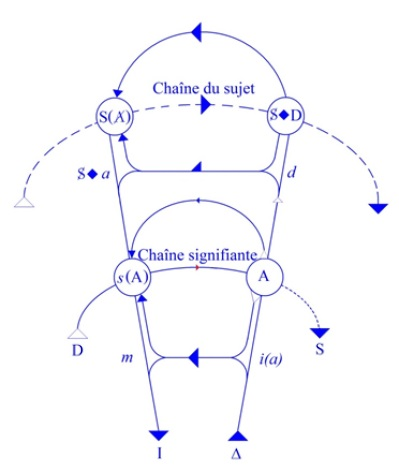
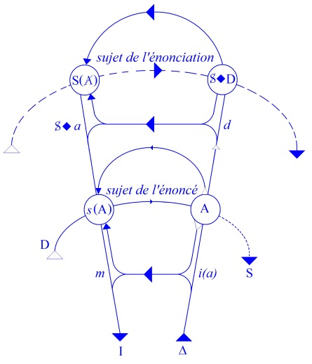

# Leçon 04 | 03 Décembre 1958

  <label><input type="checkbox" data-lacan-toggle="original" checked> 原文</label>
  <label><input type="checkbox" data-lacan-toggle="notes" checked> 注释</label>
  <label><input type="checkbox" data-lacan-toggle="commentary" checked> 个人解读评论</label>

<section class="parallel-paragraph" data-paragraph-ids="s6-04-0001">

s6-04-0001

[无对应译文]

原文 · s6-04-0001

Je vous ai laissés la dernière fois sur un rêve. Ce rêve extrêmement simple, au moins en apparence. Je vous ai dit que nous nous exercerions sur lui ou à son propos, à articuler le sens propre que nous donnons à ce terme ici qu’est *le désir du rêve*, et le sens de ce qu’est une *interprétation*. Nous allons reprendre cela.

</section>

<section class="parallel-paragraph" data-paragraph-ids="s6-04-0002">

s6-04-0002

[无对应译文]

原文 · s6-04-0002

Je pense que sur le plan théorique il a aussi son prix et sa valeur.

</section>

<section class="parallel-paragraph" data-paragraph-ids="s6-04-0003">

s6-04-0003

[无对应译文]

原文 · s6-04-0003

Je me plonge ces temps-ci dans une relecture après tant d’autres, de cette *Science des rêves* dont je vous ai dit que c’était elle que nous allions mettre d’abord en cause cette année à propos du *désir et de son interprétation*, et je dois dire que jusqu’à un certain point, je me suis laissé aller à faire ce reproche, que ce soit un livre - et c’est bien connu - dont on connaît très mal les détours dans la communauté analytique.

</section>

<section class="parallel-paragraph" data-paragraph-ids="s6-04-0004">

s6-04-0004

[无对应译文]

原文 · s6-04-0004

Je dirais que ce *reproche* - comme tout reproche d’ailleurs - a une espèce d’autre face qui est une face d’*excuse*, car à vrai dire il ne suffit pas encore de l’avoir parcouru cent et cent fois pour le retenir, et je crois qu’il y a là un phénomène \- cela m’a frappé plus spécialement ces jours-ci - que nous connaissons bien. Dans le fond chacun sait combien tout ce qui regarde l’inconscient s’oublie, je veux dire par exemple qu’il est très sensible…

</section>

<section class="parallel-paragraph" data-paragraph-ids="s6-04-0005">

s6-04-0005

[无对应译文]

原文 · s6-04-0005

> et d’une façon tout à fait significative, et vraiment absolument inexpliquée en dehors de la perspective freudienne

</section>

<section class="parallel-paragraph" data-paragraph-ids="s6-04-0006">

s6-04-0006

[无对应译文]

原文 · s6-04-0006

…combien on oublie les histoires drôles, les bonnes histoires, ce qu’on appelle *les traits d’esprit*.

</section>

<section class="parallel-paragraph" data-paragraph-ids="s6-04-0007">

s6-04-0007

[无对应译文]

原文 · s6-04-0007

Vous êtes dans une réunion d’amis et quelqu’un fait un *trait d’esprit* - même pas une histoire drôle - fait un *calembour* au début de la réunion ou à la fin du déjeuner, et alors qu’on passe au café *vous vous dites* : « *Qu’a pu dire de si drôle tout à l’heure cette personne qui se trouve là à ma droite ?* » et vous ne remettez pas la main dessus. C’est presque une signature que ce qui est justement trait d’esprit échappe à l’inconscient.

</section>

<section class="parallel-paragraph" data-paragraph-ids="s6-04-0008">

s6-04-0008

[无对应译文]

原文 · s6-04-0008

Quand on lit ou relit *La Science des rêves,* on a l’impression d’un livre, je dirais *magique*, si le mot « *magique* » ne prêtait pas dans notre vocabulaire malheu­reusement à tant d’ambiguïté, voire d’erreurs. On se promène vraiment dans *La Science des rêves* comme dans le livre de l’inconscient, et c’est pour cela que l’on a tellement de peine – cette chose est si articulée – à la tenir quand même ras­semblée.

</section>

<section class="parallel-paragraph" data-paragraph-ids="s6-04-0009">

s6-04-0009

[无对应译文]

原文 · s6-04-0009

Je crois que s’il y a là un phénomène qui mérite d’être noté à tel point et spécialement, c’est qu’il s’ajoute à cela la déformation véritablement presque insensée de la traduction française dont vraiment, plus je vais, plus je trouve que tout de même on ne peut pas vraiment excuser les *grossières inexactitudes*.

</section>

<section class="parallel-paragraph" data-paragraph-ids="s6-04-0010">

s6-04-0010

[无对应译文]

原文 · s6-04-0010

Il y en a parmi vous qui me demandent des *explications* et je me reporte aussitôt aux textes : il y a dans la IVème partie, *L’élaboration des rêves,* un chapitre inti­tulé *Égards pris à la mise en scène dont* la traduction française de *la première page* est plus qu’un tissu d’inexactitudes et *n’a aucun rapport avec le texte allemand* [^16]. Cela embrouille, cela déroute. Je n’insiste pas. Évidemment tout cela ne rend pas spécialement facile l’accès aux lecteurs français de *La Science des rêves.*

</section>

<section class="parallel-paragraph" data-paragraph-ids="s6-04-0011">

s6-04-0011

[无对应译文]

原文 · s6-04-0011

Pour en revenir à notre rêve de la dernière fois que nous avons commencé de déchiffrer d’une façon qui ne vous a pas paru peut-être très facile, mais tout de même intelligible, du moins je l’espère, pour bien voir ce dont il s’agit, pour l’articuler en fonction de notre graphe, nous allons commencer par quelques remarques.

</section>

<section class="parallel-paragraph" data-paragraph-ids="s6-04-0012">

s6-04-0012

[无对应译文]

原文 · s6-04-0012

Il s’agit donc de savoir si un rêve nous intéresse - au sens où il intéresse FREUD - au sens de réalisation de désir. Ici *le désir et son interprétation* est d’abord le désir dans sa fonction dans le rêve, en tant que le rêve est sa réalisation.

</section>

<section class="parallel-paragraph" data-paragraph-ids="s6-04-0013">

s6-04-0013

[无对应译文]

原文 · s6-04-0013

Comment allons-nous pouvoir l’articuler ? Je vais d’abord mettre en avant un autre rêve, un rêve premier que je vous ai donné et dont vous verrez la valeur exemplaire, il n’est vraiment pas très connu, il faut aller le chercher dans un coin.

</section>

<section class="parallel-paragraph" data-paragraph-ids="s6-04-0014">

s6-04-0014

[无对应译文]

原文 · s6-04-0014

Il y a là un rêve dont, je crois, personne d’entre vous n’ignore l’existence, il est au début du *chapitre III* dont le titre est *Le rêve est une réalisation de désir* [^17], et il s’agit des *rêves d’enfants* pour autant qu’ils nous sont donnés comme ce que j’appellerais un premier état du désir dans le rêve. Le rêve dont il s’agit est là dès la 1ère édition de la *Traumdeutung,* et il nous est donné au début de son appellation devant ses lecteurs d’alors, nous dit FREUD, comme la question du rêve.

</section>

<section class="parallel-paragraph" data-paragraph-ids="s6-04-0015">

s6-04-0015

[无对应译文]

原文 · s6-04-0015

Il faut voir aussi ce côté d’exposition, de développement qu’il y a dans la *Traumdeutung,* ce qui nous explique bien des choses, en particulier que les choses peuvent être amenées d’abord d’une façon en quelque sorte massive, qui comporte *une certaine approximation*. Quand on ne regarde pas très attentivement *ce passage*, on s’en tient à ce qu’il nous dit du caractère en quelque sorte direct, sans déformation, sans *Entstellung* du rêve, ceci désignant simplement la forme générale qui fait que le rêve nous apparaît sous *un aspect qui est profondément modifié* quant à son contenu profond, son contenu pensé, alors que chez l’enfant ce serait tout simple : le désir irait là tout droit, de la façon la plus directe à ce qu’il désire, et FREUD nous en donne là plu­sieurs exemples, et le premier vaut naturellement qu’on le retienne parce qu’il en donne vraiment la formule.

</section>

<section class="parallel-paragraph" data-paragraph-ids="s6-04-0016">

s6-04-0016

[无对应译文]

原文 · s6-04-0016

« *Ma plus jeune fille* - c’est Anna FREUD - *qui avait à ce moment dix-neuf mois, avait eu un beau matin des vomissements*

</section>

<section class="parallel-paragraph" data-paragraph-ids="s6-04-0017">

s6-04-0017

[无对应译文]

原文 · s6-04-0017

*et avait été mise à la diète, et dans la nuit qui a suivi ce jour de famine on l’entendit appeler pendant son rêve* :

</section>

<section class="parallel-paragraph" data-paragraph-ids="s6-04-0018">

s6-04-0018

[无对应译文]

原文 · s6-04-0018

- *Anna F.eud, Er(d)beer* (qui est la forme enfantine de prononcer « fraises »),

</section>

<section class="parallel-paragraph" data-paragraph-ids="s6-04-0019">

s6-04-0019

[无对应译文]

原文 · s6-04-0019

- *Hochbeer* (qui veut dire également fraises),

</section>

<section class="parallel-paragraph" data-paragraph-ids="s6-04-0020">

s6-04-0020

[无对应译文]

原文 · s6-04-0020

- *Eier(s)peis* (qui correspond à peu près au mot flan),*et enfin *: *Papp* (bouillie)! »

</section>

<section class="parallel-paragraph" data-paragraph-ids="s6-04-0021">

s6-04-0021

[无对应译文]

原文 · s6-04-0021

Et Freud nous dit :

</section>

<section class="parallel-paragraph" data-paragraph-ids="s6-04-0022">

s6-04-0022

[无对应译文]

原文 · s6-04-0022

« *Elle se ser­vait donc de son nom pour exprimer sa prise de possession et l’énumération de tous ces plats prestigieux, ou qui lui paraissaient tels, une nourriture digne de désir.* *Que les fraises apparussent là sous la forme de deux variétés : Erdbeer et Hochbeer…*

</section>

<section class="parallel-paragraph" data-paragraph-ids="s6-04-0023">

s6-04-0023

[无对应译文]

原文 · s6-04-0023

> je ne suis pas arrivé à resituer *Hochbeer,* mais le commentaire de FREUD signale deux variétés

</section>

<section class="parallel-paragraph" data-paragraph-ids="s6-04-0024">

s6-04-0024

[无对应译文]

原文 · s6-04-0024

…*est une démonstration, une manifestation contre la police sanitaire de la maison, et a son fondement dans la circonstance fort bien remarquée par elle que la nurse avait la veille attribué son indisposition à un petit abus dans l’absorption de fraises, et de ce conseil importun, incommode, de cette remarque, elle avait pris aussitôt, dans le rêve, sa revanche.* »[^18]

</section>

<section class="parallel-paragraph" data-paragraph-ids="s6-04-0025">

s6-04-0025

[无对应译文]

原文 · s6-04-0025

Je laisse de côté le rêve du neveu Hermann qui pose d’autres problèmes. Mais par contre je ferai état volontiers d’une petite note qui n’est pas dans la première édition pour la raison qu’elle a été élaborée au cours de discussions (enfin des *comptes rendus d’école*), et à laquelle FERENCZI a contribué en apportant à la res­cousse le proverbe qui dit ceci :

</section>

<section class="parallel-paragraph" data-paragraph-ids="s6-04-0026">

s6-04-0026

[无对应译文]

原文 · s6-04-0026

« *Le cochon rêve de glands, l’oie rêve de maïs* »

</section>

<section class="parallel-paragraph" data-paragraph-ids="s6-04-0027">

s6-04-0027

[无对应译文]

原文 · s6-04-0027

Et dans le texte aussi, FREUD a alors à ce moment là aussi, fait état d’un proverbe que, je crois, il n’emprunte pas tellement au contexte allemand étant donné la forme que le maïs y prend : « *De quoi rêve l’oie ? De maïs.* » Et enfin le proverbe juif : « *De quoi rêve la poule ? Elle rêve de millet.* »[^19]

</section>

<section class="parallel-paragraph" data-paragraph-ids="s6-04-0028">

s6-04-0028

[无对应译文]

原文 · s6-04-0028

Nous allons nous arrêter là-dessus. Nous allons même commencer par faire une petite parenthèse, parce qu’en fin de compte c’est à ce niveau qu’il faut prendre le problème qu’hier soir j’évoquais à propos de la communication de GRANOFF [^20] sur le problème essentiel, à savoir de la différence de *la directive du plaisir* et de *la directive du désir*.

</section>

<section class="parallel-paragraph" data-paragraph-ids="s6-04-0029">

s6-04-0029

[无对应译文]

原文 · s6-04-0029

Revenons un peu sur *la directive du plaisir*, et une bonne fois, aussi ra­pidement que possible, *mettons les points sur les « i »*. Ceci a le rapport évidem­ment aussi le plus étroit avec les questions qui me sont posées ou qui se posent à propos de la fonction que je donne - dans ce que FREUD appelle « *le processus primaire* » - à la *Vorstellung* pour le dire vite. Ceci n’est qu’un détour.

</section>

<section class="parallel-paragraph" data-paragraph-ids="s6-04-0030">

s6-04-0030

[无对应译文]

原文 · s6-04-0030

Il faut bien concevoir ceci : c’est qu’en quelque sorte à entrer dans ce problème de la fonc­tion de la *Vorstellung* dans *le principe de plaisir*, FREUD coupe court. En somme nous pourrions dire qu’il lui faut un élément pour reconstruire ce qu’il a aperçu dans son intuition, enfin il faut bien dire que c’est le propre de l’intuition géniale que d’introduire dans la pensée quelque chose qui jusque là n’avait été absolu­ment pas aperçu, cette distinction du *processus primaire* comme étant quelque chose de séparé du *processus secondaire.* Nous ne nous apercevrons pas du tout de ce qu’il y a d’original. Nous pourrons toujours penser comme cela que ce fut quelque chose qui soit en quelque sorte comparable, par l’idée que ce soit dans *l’instant antérieur*.

</section>

<section class="parallel-paragraph" data-paragraph-ids="s6-04-0031">

s6-04-0031

[无对应译文]

原文 · s6-04-0031

Pour autant dans leur synthèse, dans leur composition ça n’a ab­solument rien à faire : le *processus primaire* signifie la présence du désir, mais pas de n’importe lequel, du désir là où il se présente comme le plus morcelé, et *l’élé­ment perceptif* dont il s’agit, c’est avec cela que FREUD va s’expliquer, va nous faire comprendre de quoi il s’agit.

</section>

<section class="parallel-paragraph" data-paragraph-ids="s6-04-0032">

s6-04-0032

[无对应译文]

原文 · s6-04-0032

En somme rappelez-vous les premiers schémas que FREUD nous donne concernant ce qui se passe quand le *processus primaire* seul est en jeu. *Le processus primaire quand il est seul en jeu aboutit à l’hallucination*, et cette *halluci­nation* est quelque chose qui *se produit par un procès de régression, de régression qu’il appelle très précisément de régression topique*.

</section>

<section class="parallel-paragraph" data-paragraph-ids="s6-04-0033">

s6-04-0033

[无对应译文]

原文 · s6-04-0033

FREUD a fait plu­sieurs schémas de ce qui motive, de ce qui structure le *processus primaire*, mais ils ont tous ceci en commun : qu’ils supposent comme leur fond quelque chose qui est pour lui le parcours de l’arc réflexe :

</section>

<section class="parallel-paragraph" data-paragraph-ids="s6-04-0034">

s6-04-0034

[无对应译文]

原文 · s6-04-0034

- *voie afférente et afférence de quelque chose* qui s’appelle *sensation*,

</section>

<section class="parallel-paragraph" data-paragraph-ids="s6-04-0035">

s6-04-0035

[无对应译文]

原文 · s6-04-0035

- *voie efférente et efférence de quelque chose* qui s’appelle *motilité*.

</section>

<section class="parallel-paragraph" data-paragraph-ids="s6-04-0036">

s6-04-0036

[无对应译文]

原文 · s6-04-0036

Sur cette voie - d’une façon je dirais horriblement discutable - la perception est mise comme quelque chose qui se cumule, qui s’accumule quelque part du côté de la partie sensorielle, de l’afflux d’excitations, du stimulus du milieu extérieur, et étant mises à cette origine de ce qui se passe dans l’acte, toutes sortes d’autres choses sont supposées être après…

</section>

<section class="parallel-paragraph" data-paragraph-ids="s6-04-0037">

s6-04-0037

[无对应译文]

原文 · s6-04-0037

> et nommément c’est là qu’il insérera toute la suite des couches superposées qui vont depuis *l’inconscient* en passant par *le préconscient* et la suite

</section>

<section class="parallel-paragraph" data-paragraph-ids="s6-04-0038">

s6-04-0038

[无对应译文]

原文 · s6-04-0038

…pour aboutir ici à quelque chose qui passe ou qui ne passe pas vers la motilité.

</section>

<section class="parallel-paragraph" data-paragraph-ids="s6-04-0039">

s6-04-0039

[无对应译文]

原文 · s6-04-0039

Voyons bien ce dont il s’agit chaque fois qu’il nous parle de ce qui se passe dans le processus primaire. Il se passe un mouvement régressif. C’est toujours quand l’issue vers la motilité de l’excitation est pour une raison quelconque bar­rée, qu’il se produit quelque chose qui est de l’ordre régressif et qu’ici apparaît une *Vorstellung,* quelque chose qui se trouve donner à l’excitation en cause une *satisfaction hallucinatoire* à proprement parler.

</section>

<section class="parallel-paragraph" data-paragraph-ids="s6-04-0040">

s6-04-0040

[无对应译文]

原文 · s6-04-0040

Voilà la nouveauté qui est introduite par FREUD. Ceci littéralement vaut sur­tout si l’on songe à l’ordre, à la qualité de l’articulation des schémas dont il s’agit, qui sont des schémas qui sont donnés en somme pour leur valeur fonctionnelle, je veux dire pour établir - FREUD le dit expressément - une séquence, une suite dont il souligne qu’il est encore plus important d’ailleurs de la considérer comme *séquence temporelle* que comme *séquence spatiale*.

</section>

<section class="parallel-paragraph" data-paragraph-ids="s6-04-0041">

s6-04-0041

[无对应译文]

原文 · s6-04-0041

Ceci vaut, je dirais par *son insertion dans un circuit*, et si je dis qu’en somme ce que FREUD nous décrit comme étant le résultat du *processus primaire*, c’est qu’en quelque sorte, *sur ce circuit quelque chose s’allume*. Je ne ferai pas là *une métaphore*, je ne ferai que dire en substance ce que FREUD tire *de l’explication* dans l’occasion, *de la tra­duction* de ce dont il s’agit.

</section>

<section class="parallel-paragraph" data-paragraph-ids="s6-04-0042">

s6-04-0042

[无对应译文]

原文 · s6-04-0042

C’est-à-dire vous montrer sur le circuit *à fin homéostatique*, toujours implicitement, la notion de la réfleximétrie et de distinguer cette *série de relais*, et que le fait qu’il se passe quelque chose au niveau d’*un de ces relais*…

</section>

<section class="parallel-paragraph" data-paragraph-ids="s6-04-0043">

s6-04-0043

[无对应译文]

原文 · s6-04-0043

> quelque chose qui en soi prend une certaine valeur d’effet terminal dans certaines conditions

</section>

<section class="parallel-paragraph" data-paragraph-ids="s6-04-0044">

s6-04-0044

[无对应译文]

原文 · s6-04-0044

…est quelque chose qui est tout à fait identique à ce que nous voyons se produire dans une machine quelconque, sous la forme d’*une série de lampes*, si je puis dire, dont le fait qu’une d’entre elles, entrant en activité indique précisément, non pas tant ceci qui apparaît, à savoir *un phénomène lumineux*, mais une certaine *tension*, quelque chose qui se produit d’ailleurs en fonction d’une *résistance* et indique l’*état* en un point donné *de l’ensemble du circuit*.

</section>

<section class="parallel-paragraph" data-paragraph-ids="s6-04-0045">

s6-04-0045

[无对应译文]

原文 · s6-04-0045

Et alors, disons le mot, ceci ne répond nullement au principe du besoin, car bien entendu aucun besoin n’est satisfait par une *satisfaction hallucinatoire*. Le besoin exige pour être satisfait l’intervention *du processus secondaire*, et même *des processus secondaires* car il y en a une grande variété, lesquels pro­cessus, eux, ne se paient bien entendu \- comme le nom l’indique - que de réalité, ils sont soumis au *principe de réalité*.

</section>

<section class="parallel-paragraph" data-paragraph-ids="s6-04-0046">

s6-04-0046

[无对应译文]

原文 · s6-04-0046

S’il y a *des processus secondaires* qui se produisent, ils ne se produisent que parce qu’il y a eu *des processus primaires*. Seulement il est non moins évident que cette *lapalissade*, qu’ici cette partition rend impensable l’instinct sous quelque forme qu’on le conçoive. Il y est vola­tilisé car, regardez bien à quoi vont toutes les recherches sur l’instinct et plus spé­cialement les recherches *modernes* les plus *élaborées*, les plus intelligentes, elles visent quoi ?

</section>

<section class="parallel-paragraph" data-paragraph-ids="s6-04-0047">

s6-04-0047

[无对应译文]

原文 · s6-04-0047

À rendre compte comment une structure qui n’est pas purement préformée…

</section>

<section class="parallel-paragraph" data-paragraph-ids="s6-04-0048">

s6-04-0048

[无对应译文]

原文 · s6-04-0048

> nous n’en sommes plus là, ne voyons pas l’instinct comme M. FABRE,
>
> c’est une structure qui engendre, qui entretient sa propre chaîne

</section>

<section class="parallel-paragraph" data-paragraph-ids="s6-04-0049">

s6-04-0049

[无对应译文]

原文 · s6-04-0049

…comment ces structures dessinent dans le *réel*, des chemins vers des objets pas encore éprouvés.

</section>

<section class="parallel-paragraph" data-paragraph-ids="s6-04-0050">

s6-04-0050

[无对应译文]

原文 · s6-04-0050

C’est là le problème de l’instinct et on vous explique qu’il y a un stade appé­titif, un stade de conduite, de recherche. L’animal, à l’une de ces phases, se met dans un certain état dont la motilité se traduit par une activité dans toutes sortes de directions.

</section>

<section class="parallel-paragraph" data-paragraph-ids="s6-04-0051">

s6-04-0051

[无对应译文]

原文 · s6-04-0051

Et au 2ème stade, à la 2ème étape, c’est un stade de déclenchement spécialisé, mais même si ce déclenchement spécialisé aboutit à la fin à une conduite qui les leurre, c’est-à-dire si vous voulez à la prise, du fait qu’il s’empare de quelques chiffons de couleur, il n’en reste pas moins que ces chif­fons, ils les ont détectés dans le réel. Ce que je veux vous indiquer ici, *c’est qu’une conduite hallucinée se distingue de la façon la plus radicale d’une conduite d’auto-guidage de l’investissement régressif* si on peut dire, de quelque chose qui va se traduire par l’allumage d’une lampe sur les circuits conducteurs.

</section>

<section class="parallel-paragraph" data-paragraph-ids="s6-04-0052">

s6-04-0052

[无对应译文]

原文 · s6-04-0052

Ceci peut à la rigueur illuminer un objet déjà éprouvé, si cet objet par hasard est déjà là, il n’en montre nullement le che­min, et encore moins bien entendu – s’il le montre – même quand il n’est pas là, ce qui se produit en effet dans le phénomène hallucinatoire. Car tout au plus peut-il inaugurer à partir de là le mécanisme de la recherche, et c’est bien ce qui se passe.

</section>

<section class="parallel-paragraph" data-paragraph-ids="s6-04-0053">

s6-04-0053

[无对应译文]

原文 · s6-04-0053

FREUD nous l’articule également à partir du *processus secondaire*, lequel en somme remplit le rôle du comportement instinctuel mais s’en distingue abso­lument d’un autre côté puisque ce *processus secondaire*, du fait de l’existence du *processus primaire*, va être…

</section>

<section class="parallel-paragraph" data-paragraph-ids="s6-04-0054">

s6-04-0054

[无对应译文]

原文 · s6-04-0054

> *FREUD l’articule ! Je ne souscris pas à tout cela, je vous répète le sens de ce que FREUD articule*

</section>

<section class="parallel-paragraph" data-paragraph-ids="s6-04-0055">

s6-04-0055

[无对应译文]

原文 · s6-04-0055

…un comportement de mise à l’épreuve de la réalité, cette *Erfahrung* d’abord ordonnée comme *effet de lampe* sur le circuit. Cela va être une *conduite de jugement*, le mot est proféré quand FREUD explique les choses à ce niveau.

</section>

<section class="parallel-paragraph" data-paragraph-ids="s6-04-0056">

s6-04-0056

[无对应译文]

原文 · s6-04-0056

En fin de compte selon FREUD, la réalité humaine se construit sur un fond d’*hallucination* préalable, lequel est *l’univers du plaisir* dans son illusoire, dans son essence, et tout ce processus est parfaitement avoué \- je ne dis pas trahi, même pas - et parfaitement articulé dans les termes dont FREUD se sert sans cesse chaque fois qu’il a à expliquer *la succession des empreintes* dans lesquelles se décom­pose *le terme*.

</section>

<section class="parallel-paragraph" data-paragraph-ids="s6-04-0057">

s6-04-0057

[无对应译文]

原文 · s6-04-0057

Et dans la *Traumdeutung,* au niveau où il parle du processus de l’appareil psychique, il montre cette succession de couches où viennent s’impri­mer…

</section>

<section class="parallel-paragraph" data-paragraph-ids="s6-04-0058">

s6-04-0058

[无对应译文]

原文 · s6-04-0058

> et ce n’est même pas s’imprimer : *s’inscrire*,
>
> chaque fois qu’il parle dans ce texte et dans tous les autres, ce sont *des termes comme « niederschreiben »*

</section>

<section class="parallel-paragraph" data-paragraph-ids="s6-04-0059">

s6-04-0059

[无对应译文]

原文 · s6-04-0059

*…*et qui, enregistrés dans la succession des couches, y seront réglés.

</section>

<section class="parallel-paragraph" data-paragraph-ids="s6-04-0060">

s6-04-0060

[无对应译文]

原文 · s6-04-0060

Il les articule dif­féremment selon les différents moments de sa pensée :

</section>

<section class="parallel-paragraph" data-paragraph-ids="s6-04-0061">

s6-04-0061

[无对应译文]

原文 · s6-04-0061

- à une première couche par exemple, ce sera par des rapports de simultanéité,

</section>

<section class="parallel-paragraph" data-paragraph-ids="s6-04-0062">

s6-04-0062

[无对应译文]

原文 · s6-04-0062

- dans d’autres, empilées les unes sur les autres,

</section>

<section class="parallel-paragraph" data-paragraph-ids="s6-04-0063">

s6-04-0063

[无对应译文]

原文 · s6-04-0063

- à d’autres couches, elles seront ordonnées.

</section>

<section class="parallel-paragraph" data-paragraph-ids="s6-04-0064">

s6-04-0064

[无对应译文]

原文 · s6-04-0064

Ces « *impressions* », par d’autres rapports, séparent le schéma d’une succession d’inscriptions, de *Niederschriften* qui se superposent les unes aux autres dans un mot qu’on ne peut pas traduire. C’est par une sorte d’espace typographique que doivent être conçues toutes les choses qui se passent originellement avant l’arrivée à une autre forme d’articulation qui est celle de la préconscience, à savoir très précisé­ment dans l’inconscient.

</section>

<section class="parallel-paragraph" data-paragraph-ids="s6-04-0065">

s6-04-0065

[无对应译文]

原文 · s6-04-0065

Cette véritable topologie de signifiants…

</section>

<section class="parallel-paragraph" data-paragraph-ids="s6-04-0066">

s6-04-0066

[无对应译文]

原文 · s6-04-0066

> car on n’y échappe pas dès que l’on suit bien l’articulation de FREUD

</section>

<section class="parallel-paragraph" data-paragraph-ids="s6-04-0067">

s6-04-0067

[无对应译文]

原文 · s6-04-0067

…c’est de cela qu’il s’agit, et dans la « *Lettre* 52 » à FLIESS, on voit qu’il est amené nécessairement à supposer, à l’origine une espèce d’idéal qui ne peut pas être prise comme une simple *Wahrnehmung, prise de vrai*. Si nous la traduisons littéralement, cette topologie des signifiants on arrive au *begreifen -* c’est un terme qu’il emploie sans cesse - à la saisie de la réalité.

</section>

<section class="parallel-paragraph" data-paragraph-ids="s6-04-0068">

s6-04-0068

[无对应译文]

原文 · s6-04-0068

Il n’y arrive nullement par voie de tri éliminatoire, de tri sélectif, de quoi que ce soit qui ressemble à ce qui a été donné dans toute théorie de l’instinct comme étant le premier comportement approximatif qui dirige l’organisme dans les voies de la réussite du comportement instinctuel.

</section>

<section class="parallel-paragraph" data-paragraph-ids="s6-04-0069">

s6-04-0069

[无对应译文]

原文 · s6-04-0069

Ce n’est pas de cela qu’il s’agit, mais d’une sorte de critique véritable, de cri­tique récurrente, de critique de ces *signifiants* évoqués dans *le processus pri­maire*. Laquelle critique bien entendu - comme toute critique - n’élimine pas l’antérieur sur quoi elle porte mais le complique. Le complique en le connotant de quoi ? D’*indices de réalité* qui sont eux–mêmes de l’ordre signifiant. Il n’y a absolument pas moyen d’échapper à cette accentuation de ce que j’articule comme étant ce que FREUD conçoit et nous présente comme *le processus pri­maire*.

</section>

<section class="parallel-paragraph" data-paragraph-ids="s6-04-0070">

s6-04-0070

[无对应译文]

原文 · s6-04-0070

Pour peu que vous vous reportiez à l’un des textes quelconques qui ont été écrits par FREUD, vous verrez qu’aux différentes étapes de sa doctrine il a *arti­culé*, *répété* chaque fois qu’il a eu à aborder ce problème, qu’il s’agisse de la *Traumdeutung* ou de ce qui est dans *L’introduction à La Science des rêves,* et ensuite de ce qu’il a repris plus tard quand il a amené *le second mode d’exposé de sa topique*, c’est-à-dire à partir des articles groupés autour de *La Psychologie du moi* \[1921\] et de l’*Au-delà du principe de plaisir* \[1920\].

</section>

<section class="parallel-paragraph" data-paragraph-ids="s6-04-0071">

s6-04-0071

[无对应译文]

原文 · s6-04-0071

Vous me permettrez un instant d’imager en jouant avec les étymologies, ce que veut dire cette « *prise de vrai* » qui conduirait une sorte de sujet idéal au réel, à des alternatives par où le sujet induit le réel dans ses propositions, *Vorstel­lung(en) -* ici je le décompose en articulant comme cela - ces *Vorstellung(en)* ont une organisation signifiante.

</section>

<section class="parallel-paragraph" data-paragraph-ids="s6-04-0072">

s6-04-0072

[无对应译文]

原文 · s6-04-0072

Si nous voulions en parler dans d’autres termes que les termes freudiens, dans les termes *pavloviens*, nous dirions qu’elles font par­tie dès l’origine, non pas d’un premier système de significations, non pas de quelque chose de branché sur la tendance du besoin, mais d’un second système de *significations*.

</section>

<section class="parallel-paragraph" data-paragraph-ids="s6-04-0073">

s6-04-0073

[无对应译文]

原文 · s6-04-0073

Elles ressemblent à quelque chose qui est l’allumage de la lampe dans *la machine à sous* quand la bille est bien tombée dans le bon trou. Et le signe que la bille est bien tombée dans le bon trou, FREUD l’articule également le bon trou, ça veut dire *le même trou dans lequel la bille est tombée antérieu­rement*.

</section>

<section class="parallel-paragraph" data-paragraph-ids="s6-04-0074">

s6-04-0074

[无对应译文]

原文 · s6-04-0074

*Le processus primaire ne vise pas la recherche d’un objet nouveau mais d’un objet à retrouver, et ceci par la voie d’une Vorstellung,* réévoquée parce que c’était la *Vorstellung* correspondant à *un premier frayage*, alors que *l’allumage de cette lampe* donne droit à une prime. Et ceci n’est pas douteux, et *c’est cela le principe du plaisir*.

</section>

<section class="parallel-paragraph" data-paragraph-ids="s6-04-0075">

s6-04-0075

[无对应译文]

原文 · s6-04-0075

Mais pour que cette prime soit honorée, il faut qu’il y ait une certaine réserve de sous dans la machine, et la réserve de sous dans la machine dans l’occasion, elle est vouée à ce second système de processus qui s’appelle les processus secondaires. En d’autres termes, l’allumage de la lampe n’est une satis­faction qu’à l’intérieur de la convention totale de la machine, en tant que cette machine est celle du joueur à partir du moment où il joue.

</section>

<section class="parallel-paragraph" data-paragraph-ids="s6-04-0076">

s6-04-0076

[无对应译文]

原文 · s6-04-0076

À partir de là, reprenons notre rêve d’Anna. Ce rêve d’Anna nous est donné pour le rêve de la nudité du désir. Il me semble qu’il est tout à fait impossible, dans la révélation de cette nudité, d’éluder, d’élider le mécanisme même où cette nudité se révèle, autrement dit que *le mode de cette révélation ne peut pas être séparé de cette nudité elle-même*. J’ai l’idée que ce rêve soi-disant nu, nous ne le connaissons dans l’occasion que par « *ouï-dire* ». Et quand je dis par « *ouï-dire* », ça ne veut pas dire du tout ce que certains m’ont fait dire, qu’en somme il s’agisse là d’une remarque sur le fait que nous ne savions jamais que quelqu’un rêve que par ce qu’il nous raconte, et qu’en somme tout ce qui se rapporte au rêve serait à mettre dans l’inclusion, dans la parenthèse du fait de le rapporter.

</section>

<section class="parallel-paragraph" data-paragraph-ids="s6-04-0077">

s6-04-0077

[无对应译文]

原文 · s6-04-0077

Il n’est certainement pas indifférent que FREUD accorde autant d’importance à la *Niederschrift que constitue ce* *résidu* *du rêve*, mais il est bien clair que cette *Niederschrift* se rapporte à *une expérience dont le sujet nous rend compte*. Il est important de voir que FREUD est très très loin de retenir même un seul instant les objections pourtant évidentes qui surgissent du fait :

</section>

<section class="parallel-paragraph" data-paragraph-ids="s6-04-0078">

s6-04-0078

[无对应译文]

原文 · s6-04-0078

- qu’autre chose est un récit parlé,

</section>

<section class="parallel-paragraph" data-paragraph-ids="s6-04-0079">

s6-04-0079

[无对应译文]

原文 · s6-04-0079

- autre chose est une expérience vécue.

</section>

<section class="parallel-paragraph" data-paragraph-ids="s6-04-0080">

s6-04-0080

[无对应译文]

原文 · s6-04-0080

Et c’est à partir de là que nous pou­vons brancher la remarque que le fait qu’il les écarte avec une telle vigueur, et même qu’il accorde… qu’il en fasse partir toute son analyse expressément…

</section>

<section class="parallel-paragraph" data-paragraph-ids="s6-04-0081">

s6-04-0081

[无对应译文]

原文 · s6-04-0081

> jusqu’au point de le conseiller comme  une technique du *Niederschrift,* de *ce qui est là « couché en écrits » du rêve*

</section>

<section class="parallel-paragraph" data-paragraph-ids="s6-04-0082">

s6-04-0082

[无对应译文]

原文 · s6-04-0082

…nous montre justement ce qu’il pense dans son fond de cette expérience vécue, à savoir qu’elle a tout avantage à être abor­dée ainsi puisqu’il n’a pas essayé bien entendu de l’articuler, elle est déjà elle-même structurée en une série de *Niederschriften,* dans une espèce d’*écriture en palimpseste* si l’on peut dire, si l’on pouvait imaginer un *palimpseste* *où les divers textes superposés auraient un certain rapport* - il s’agirait encore de savoir lequel - *les uns avec les autres*.

</section>

<section class="parallel-paragraph" data-paragraph-ids="s6-04-0083">

s6-04-0083

[无对应译文]

原文 · s6-04-0083

Mais si vous cherchiez lequel, vous verriez que ce serait un rapport beau­coup plus à chercher dans *la forme des lettres* que dans le sens du texte. Je ne suis pas en train, donc, de dire cela. Je dis que, dans l’occasion, ce que nous savons du rêve est proprement ce que nous en *savons* actuellement, au moment où il se passe comme un rêve articulé. Autrement dit que le degré de certitude que nous avons concernant ce rêve est quelque chose qui est lié au fait que nous serions également beaucoup plus sûrs de ce dont rêvent cochons et oies si eux–mêmes nous le racontaient.

</section>

<section class="parallel-paragraph" data-paragraph-ids="s6-04-0084">

s6-04-0084

[无对应译文]

原文 · s6-04-0084

Mais dans cet exemple originel nous avons plus ! C’est-à-dire que le rêve sur­pris par FREUD a cette valeur exemplaire qu’il soit articulé à haute voix pendant le sommeil, ce qui ne laisse aucune espèce d’ambiguïté sur la présence du signi­fiant dans son texte actuel. Il n’y a là aucun doute possible à jeter sur *un phénomèn*e concernant le carac­tère, si on peut dire, surajouté d’informations sur le rêve que pourrait y prendre la parole.

</section>

<section class="parallel-paragraph" data-paragraph-ids="s6-04-0085">

s6-04-0085

[无对应译文]

原文 · s6-04-0085

Nous savons qu’Anna FREUD rêve parce qu’elle *articule* : « *Anna* *F.eud, Er(d)beer, Hochbeer, Eier(s)peis, Papp !* »

</section>

<section class="parallel-paragraph" data-paragraph-ids="s6-04-0086">

s6-04-0086

[无对应译文]

原文 · s6-04-0086

Les images du rêve, dont nous ne savons rien dans l’occasion, trouvent donc ici un *affixe*…

</section>

<section class="parallel-paragraph" data-paragraph-ids="s6-04-0087">

s6-04-0087

[无对应译文]

原文 · s6-04-0087

> si je puis m’exprimer ainsi à l’aide d’un terme emprunté à la théorie des nombres complexes

</section>

<section class="parallel-paragraph" data-paragraph-ids="s6-04-0088">

s6-04-0088

[无对应译文]

原文 · s6-04-0088

…un *affixe symbolique* dans ces mots où nous voyons en quelque sorte *le signifiant* se pré­senter *à l’état floculé*, c’est-à-dire dans *une série de nominations*, et cette nomi­nation constitue *une séquence* dont le choix n’est pas indifférent.

</section>

<section class="parallel-paragraph" data-paragraph-ids="s6-04-0089">

s6-04-0089

[无对应译文]

原文 · s6-04-0089

Car comme FREUD nous le dit, ce choix est précisément de *tout ce qui lui a été interdit*, *inter­-dit*, de *ce à la demande de quoi* on lui a dit que « *Non ! il ne fallait pas en prendre* ». Et *ce commun dénominateur introduit une unité dans leur diversité*, sans qu’on puisse s’empêcher également de remarquer qu’*inversement* *cette diversité renforce cette unité, et même la désigne*.

</section>

<section class="parallel-paragraph" data-paragraph-ids="s6-04-0090">

s6-04-0090

[无对应译文]

原文 · s6-04-0090

C’est en somme cette *unité* que cette série oppose tout à fait à *l’électivité de la satisfaction du besoin*, tel que l’exemple du désir imputé au cochon comme à l’oie. Le désir d’ailleurs, vous n’avez qu’à réfléchir à l’effet que cela ferait si au lieu, dans le proverbe, de dire que : « *le cochon rêve de kukuruza* (de maïs doux sucré) » nous nous mettions à faire une énu­mération de tout ce dont serait supposé rêver le cochon, vous verriez que ça fait un effet tout différent.

</section>

<section class="parallel-paragraph" data-paragraph-ids="s6-04-0091">

s6-04-0091

[无对应译文]

原文 · s6-04-0091

Et même si on voulait prétendre que seule une insuffi­sante éducation de la glotte empêche le cochon et l’oie de nous en faire savoir autant, et même si on pouvait dire que nous pourrions arriver à y suppléer en percevant dans un cas comme dans l’autre, et en trouvant l’équivalent, si vous voulez, de cette articulation dans quelques frémissements détectés dans leurs mandibules, il n’en resterait pas moins qu’il serait peu probable qu’il arrivât ceci, à savoir que ces animaux se nommassent comme le fait Anna FREUD dans la séquence.

</section>

<section class="parallel-paragraph" data-paragraph-ids="s6-04-0092">

s6-04-0092

[无对应译文]

原文 · s6-04-0092

Et admettons même que le cochon s’appelle « *Toto* » et l’oie « *Bel Azor* », si même quelque chose se produisait de cet ordre, il s’avérerait qu’ils se nomme­raient dans un langage dont il serait cette fois bien évident d’ailleurs…

</section>

<section class="parallel-paragraph" data-paragraph-ids="s6-04-0093">

s6-04-0093

[无对应译文]

原文 · s6-04-0093

> ni plus, ni moins évident, que chez l’homme, mais chez l’homme ça se voit moins

</section>

<section class="parallel-paragraph" data-paragraph-ids="s6-04-0094">

s6-04-0094

[无对应译文]

原文 · s6-04-0094

…que ce langage n’a précisément rien à faire avec la satisfaction de leur besoin puisque ce nom, ils l’auraient dans *la basse-cour*, c’est-à-dire dans un contexte des besoins de l’homme et non pas des leurs.

</section>

<section class="parallel-paragraph" data-paragraph-ids="s6-04-0095">

s6-04-0095

[无对应译文]

原文 · s6-04-0095

Autrement dit, nous désirons qu’on s’arrête sur le fait, et nous l’avons dit tout à l’heure, que :

</section>

<section class="parallel-paragraph" data-paragraph-ids="s6-04-0096">

s6-04-0096

[无对应译文]

原文 · s6-04-0096

- 1\) Anna FREUD *articule* qu’il y a *le mécanisme de la motilité*, et nous dirons qu’en effet il n’est pas absent de ce rêve, c’est par là que nous le connaissons.

</section>

<section class="parallel-paragraph" data-paragraph-ids="s6-04-0097">

s6-04-0097

[无对应译文]

原文 · s6-04-0097

Mais ce rêve révèle, par la structuration signifiante de sa séquence que :

</section>

<section class="parallel-paragraph" data-paragraph-ids="s6-04-0098">

s6-04-0098

[无对应译文]

原文 · s6-04-0098

- 2\) nous voulons que dans cette séquence on s’arrête au fait qu’en tête de la séquence littéralement il y a un message, comme vous pouvez le voir illustré si vous savez comment on communique à l’intérieur d’une de ces machines compliquées qui sont celles de l’ère moderne, par exemple de la tête à la queue d’un avion. Quand on téléphone d’une cabine à une autre on commence à annoncer quoi ? On s’annonce, on annonce celui qui parle. Anna FREUD à dix–­neuf mois, pendant *son rêve-annonce*, elle dit « *Anna F.eud* », et elle fait sa série. Je dirais presque qu’on n’attend plus qu’une seule chose, après l’avoir entendue articuler son rêve, c’est qu’elle dise à la fin : « *Terminé !* »

</section>

<section class="parallel-paragraph" data-paragraph-ids="s6-04-0099">

s6-04-0099

[无对应译文]

原文 · s6-04-0099

Nous voilà donc introduits à ce que j’appelle *la topologie du refoulement* la plus claire, la plus formelle également et la plus articulée, dont FREUD nous souligne que cette *topologie* ne saurait en aucun cas, si elle est celle d’un « *autre lieu* »...

</section>

<section class="parallel-paragraph" data-paragraph-ids="s6-04-0100">

s6-04-0100

[无对应译文]

原文 · s6-04-0100

> comme il en a été si frappé à la lecture de FECHNER, au point que l’on sent que cela a été pour lui
>
> une espèce d’éclair, d’illumination, de révélation

</section>

<section class="parallel-paragraph" data-paragraph-ids="s6-04-0101">

s6-04-0101

[无对应译文]

原文 · s6-04-0101

…mais en même temps, au moment même où il nous parle - à deux reprises au moins dans la *Traumdeutung -* de la « *andere Schauplatz »,* il sou­ligne toujours qu’il ne s’agit nullement d’un autre lieu *neurologique*. Nous disons que cet « *autre lieu* » est à chercher dans la structure du signifiant lui-même.

</section>

<section class="parallel-paragraph" data-paragraph-ids="s6-04-0102">

s6-04-0102

[无对应译文]

原文 · s6-04-0102

Alors ce que j’essaie de vous montrer ici, c’est la structure du signifiant lui-même, dès que le sujet s’y engage…

</section>

<section class="parallel-paragraph" data-paragraph-ids="s6-04-0103">

s6-04-0103

[无对应译文]

原文 · s6-04-0103

> je veux dire avec les hypothèses minimales qu’exige le fait qu’un sujet entre dans son jeu

</section>

<section class="parallel-paragraph" data-paragraph-ids="s6-04-0104">

s6-04-0104

[无对应译文]

原文 · s6-04-0104

…je dis dès que le *signifiant* étant donné et le *sujet* étant défini comme ce qui va y entrer dans le *signifiant* \- et rien d’autre - les choses s’ordonnent nécessairement.

</section>

<section class="parallel-paragraph" data-paragraph-ids="s6-04-0105">

s6-04-0105

[无对应译文]

原文 · s6-04-0105

Et à partir de cette nécessité, toutes sortes de conséquences vont découler de ceci, *qu’il y a une topologie dont il faut et dont il suffit que nous la concevions comme constituée par deux chaînes superposées*, et c’est dans cela que nous nous avançons.

</section>

<section class="parallel-paragraph" data-paragraph-ids="s6-04-0106">

s6-04-0106

[无对应译文]

原文 · s6-04-0106

Ici, au niveau du rêve d’Anna FREUD, comment les choses se présentent-elles ? Il est exact qu’elles se présentent d’une façon problématique, ambiguë, qui per­met à FREUD, qui légitime jusqu’à un certain point de distinguer une différence entre le rêve de l’enfant et le rêve de l’adulte.

</section>

<section class="parallel-paragraph" data-paragraph-ids="s6-04-0107">

s6-04-0107

[无对应译文]

原文 · s6-04-0107

*Où se situe la chaîne des nominations qui constitue le rêve d’Anna* FREUD ? Sur *la chaîne supérieure* ou sur *la chaîne inférieure* ?

</section>

<section class="parallel-paragraph" data-paragraph-ids="s6-04-0108">

s6-04-0108

[无对应译文]

原文 · s6-04-0108

</section>

<section class="parallel-paragraph" data-paragraph-ids="s6-04-0109">

s6-04-0109

[无对应译文]

原文 · s6-04-0109

C’est une question dont vous avez pu remarquer que la partie supérieure du graphe représente cette chaîne sous la forme pointillée, mettant l’accent sur l’élément de *discontinuité du signifiant*, alors que la chaîne inférieure du graphe, nous la représentons continue.

</section>

<section class="parallel-paragraph" data-paragraph-ids="s6-04-0110">

s6-04-0110

[无对应译文]

原文 · s6-04-0110

Et d’autre part je vous ai dit que bien entendu dans tout processus les deux chaînes sont intéressées. Au niveau où nous posons la question, qu’est-ce que veut dire la chaîne infé­rieure ?

</section>

<section class="parallel-paragraph" data-paragraph-ids="s6-04-0111">

s6-04-0111

[无对应译文]

原文 · s6-04-0111

La chaîne inférieure au niveau de la demande, et pour autant que je vous ai dit que le sujet en tant que parlant y prenait cette *solidité* empruntée à la *soli­darité synchronique du signifiant*, il est bien évident que c’est quelque chose qui participe de l’unité de la phrase, de ce quelque chose qui a fait parler d’une façon qui a fait couler tellement d’encre, de la fonction de *« l’holophrase »*, de la phrase en tant que «* tout *».

</section>

<section class="parallel-paragraph" data-paragraph-ids="s6-04-0112">

s6-04-0112

[无对应译文]

原文 · s6-04-0112

Et que l’holophrase existe, ce n’est pas douteux, l’holophrase a un nom, c’est l’interjection. Si vous voulez, pour illustrer au niveau de *la demande* ce que représente *la fonction de la chaîne inférieure*, c’est : « *du pain !* », ou « *au secours !* » Je parle dans le discours universel, je ne parle pas du discours de l’enfant pour l’instant. Elle existe cette forme de phrase, je dirais même que dans certains cas elle prend une valeur tout à fait pressante et exigeante.

</section>

<section class="parallel-paragraph" data-paragraph-ids="s6-04-0113">

s6-04-0113

[无对应译文]

原文 · s6-04-0113

C’est de cela qu’il s’agit, c’est l’arti­culation de la phrase, c’est le sujet en tant que ce besoin…

</section>

<section class="parallel-paragraph" data-paragraph-ids="s6-04-0114">

s6-04-0114

[无对应译文]

原文 · s6-04-0114

> qui sans doute doit pas­ser par les défilés du signifiant

</section>

<section class="parallel-paragraph" data-paragraph-ids="s6-04-0115">

s6-04-0115

[无对应译文]

原文 · s6-04-0115

…en tant que ce besoin est exprimé d’une façon déformée mais du moins monolithique, à ceci près que le monolithe dont il s’agit c’est le sujet lui-même, à ce niveau, qui le constitue.

</section>

<section class="parallel-paragraph" data-paragraph-ids="s6-04-0116">

s6-04-0116

[无对应译文]

原文 · s6-04-0116

Ce qui se passe dans l’autre ligne, c’est tout à fait autre chose. Ce que l’on peut en dire n’est pas facile à dire, et pour une bonne raison, c’est que c’est juste­ment ce qui est à la base de ce qui se passe dans la première ligne, celle du bas.

</section>

<section class="parallel-paragraph" data-paragraph-ids="s6-04-0117">

s6-04-0117

[无对应译文]

原文 · s6-04-0117

Mais assurément ce que nous voyons, c’est que même dans quelque chose qui nous est donné pour aussi primitif que ce rêve d’enfant, le rêve d’Anna FREUD, quelque chose nous marque qu’ici, le sujet n’est pas simplement constitué dans la phrase et par la phrase, au sens où quand l’individu, ou la foule, ou l’émeute crie : « *du pain* ! », on sait très bien que là tout le poids du message porte sur l’émetteur.

</section>

<section class="parallel-paragraph" data-paragraph-ids="s6-04-0118">

s6-04-0118

[无对应译文]

原文 · s6-04-0118

Je veux dire que c’est lui l’élément dominant, et on sait même que ce cri à lui tout seul suffit justement dans les *formes* que je viens d’évoquer, à le constituer, cet émetteur, même s’il est à cent bouches, à mille bouches, comme un sujet bel et bien unique. Il n’a pas besoin de s’annoncer, la phrase l’annonce suffisamment.

</section>

<section class="parallel-paragraph" data-paragraph-ids="s6-04-0119">

s6-04-0119

[无对应译文]

原文 · s6-04-0119

Alors que nous nous trouvons tout de même devant ceci, que le sujet humain, quand il opère avec le langage, se compte, et c’est même tellement sa position primitive que je ne sais pas si vous vous souvenez d’un certain test de M. BINET, à savoir les difficultés qu’a le sujet à franchir cette étape que je trouve quant à moi bien plus *suggestive* que telle ou telle étape indiquée par M. PIAGET, et cette étape - que je ne vous dirai pas parce que je ne veux pas entrer dans le détail - paraît comme distinctive et consiste à ce que le sujet s’aperçoive qu’il y a quelque chose qui cloche à la phrase : « *J’ai trois frères, Paul, Ernest et moi.* »

</section>

<section class="parallel-paragraph" data-paragraph-ids="s6-04-0120">

s6-04-0120

[无对应译文]

原文 · s6-04-0120

Jusqu’à une étape assez avancée, cela lui paraît tout naturel et pour une meilleure raison, parce qu’à vrai dire tout est là de l’implication du sujet humain dans l’acte de la parole : c’est qu’il s’y compte, c’est qu’il s’y nomme, et que par conséquent c’est là l’expres­sion, si je puis dire, la plus naturelle, la plus coordonnée.

</section>

<section class="parallel-paragraph" data-paragraph-ids="s6-04-0121">

s6-04-0121

[无对应译文]

原文 · s6-04-0121

Simplement l’enfant n’a pas trouvé la bonne formule qui serait évidemment celle-ci :

</section>

<section class="parallel-paragraph" data-paragraph-ids="s6-04-0122">

s6-04-0122

[无对应译文]

原文 · s6-04-0122

« *Nous sommes trois frères, Paul, Ernest et moi* »

</section>

<section class="parallel-paragraph" data-paragraph-ids="s6-04-0123">

s6-04-0123

[无对应译文]

原文 · s6-04-0123

Mais à ceci près que nous serions très loin d’avoir à lui reprocher d’en donner les ambiguïtés de la fonction de l’être et de l’avoir. Il est clair qu’il faut qu’un pas soit franchi pour qu’en somme ce dont il s’agit, à savoir que la distinction du « *je* » en tant que *sujet de l’énoncé* et du « *je* » en tant que *sujet de l’énonciation*, soit faite, car c’est de cela qu’il s’agit.

</section>

<section class="parallel-paragraph" data-paragraph-ids="s6-04-0124">

s6-04-0124

[无对应译文]

原文 · s6-04-0124

</section>

<section class="parallel-paragraph" data-paragraph-ids="s6-04-0125">

s6-04-0125

[无对应译文]

原文 · s6-04-0125

Ce qui s’articule au niveau de la première ligne quand nous faisons le pas sui­vant, c’est le procès de *l’énoncé*. Dans notre rêve de l’autre jour « *il est mort* ». Mais quand vous annoncez quelque chose de semblable dans lequel, je vous fais remarquer en passant, toute la nouveauté de la dimension qu’introduit la parole dans le monde est déjà impliquée, car pour pouvoir dire « *il est mort* », ça ne peut que se dire, autrement dit, dans toute autre perspective que celle du dire, « *il est mort* » ça ne veut absolument rien dire.

</section>

<section class="parallel-paragraph" data-paragraph-ids="s6-04-0126">

s6-04-0126

[无对应译文]

原文 · s6-04-0126

« *Il est mort* », c’est : « *il n’est plus* », donc il n’a pas à le dire, il n’est déjà plus là. Pour dire « *il est mort* », il faut que ce soit déjà un être supporté par la parole. Mais ceci on ne demande à per­sonne de s’en apercevoir, bien entendu, mais simplement par contre de ceci, c’est que l’acte de l’énonciation de « *il est mort* » exige communément *dans le dis­cours lui-même* toutes sortes *de repères* qui se distinguent des repères pris à par­tir de l’énoncé du procès.

</section>

<section class="parallel-paragraph" data-paragraph-ids="s6-04-0127">

s6-04-0127

[无对应译文]

原文 · s6-04-0127

Si ce que je dis là n’était pas évident, toute la grammaire se volatiliserait. Je suis en train simplement de vous faire remarquer pour l’instant la nécessité de l’usage du futur antérieur, pour autant qu’il y a deux repérages du temps. Un repérage du temps concernant l’acte dont il va s’agir : « *À telle époque je serai devenu son mari.* » Par exemple, il s’agit du repérage de ce qui va se transfor­mer par mariage dans *l’énoncé*. Mais d’autre part, parce que vous l’exprimez dans le terme du futur antérieur, c’est au point actuel d’où vous parlez, de *l’acte d’énonciation* qui vous repère.

</section>

<section class="parallel-paragraph" data-paragraph-ids="s6-04-0128">

s6-04-0128

[无对应译文]

原文 · s6-04-0128

Il y a donc deux sujets, deux « *je* », et l’étape à fran­chir pour l’enfant au niveau de ce test de BINET, à savoir la distinction de ces deux « *je* », me paraît quelque chose qui n’a littéralement rien à voir avec cette fameuse « *réduction à la réciprocité* » dont PIAGET nous fait le pivot essentiel quant à l’appré­hension de l’usage des pronoms personnels.

</section>

<section class="parallel-paragraph" data-paragraph-ids="s6-04-0129">

s6-04-0129

[无对应译文]

原文 · s6-04-0129

Mais laissons donc ceci pour l’instant de côté. Nous voilà arrivés à quoi ? À l’appréhension de ces deux lignes comme représentant :

</section>

<section class="parallel-paragraph" data-paragraph-ids="s6-04-0130">

s6-04-0130

[无对应译文]

原文 · s6-04-0130

- l’une ce qui se rapporte au procès de *l’énonciation*,

</section>

<section class="parallel-paragraph" data-paragraph-ids="s6-04-0131">

s6-04-0131

[无对应译文]

原文 · s6-04-0131

- l’autre au procès de *l’énoncé*.

</section>

<section class="parallel-paragraph" data-paragraph-ids="s6-04-0132">

s6-04-0132

[无对应译文]

原文 · s6-04-0132

Quelles soient deux, ça n’est pas que chacune représente une fonction, c’est que toujours cette duplicité, chaque fois qu’il va s’agir des fonctions du langage, nous devions la retrouver. Disons encore que non seulement elles sont deux, mais qu’elles auront toujours des structurations opposées, discontinue ici par exemple pour l’une quand l’autre est continue, et inversement. Où se situe l’articulation d’Anna FREUD ?

</section>

<section class="parallel-paragraph" data-paragraph-ids="s6-04-0133">

s6-04-0133

[无对应译文]

原文 · s6-04-0133

Ce à quoi sert cette topologie, ce n’est pas à ce que je vous donne la réponse, je veux dire que je déclare comme cela *tout de go* parce que ça m’irait, ou même parce que je verrais un petit peu plus loin étant donné que c’est moi qui ai fabriqué le truc et que je sais où je vais, que je vous dise : elle est ici ou là. C’est que la question se pose.

</section>

<section class="parallel-paragraph" data-paragraph-ids="s6-04-0134">

s6-04-0134

[无对应译文]

原文 · s6-04-0134

La question se pose de ce que représente cette articulation dans l’occasion, qui est la face sous laquelle se présente pour nous la réalité du rêve d’Anna FREUD, et qui chez cette enfant qui a été fort bien capable de percevoir le sens de la phrase de sa nourrice…

</section>

<section class="parallel-paragraph" data-paragraph-ids="s6-04-0135">

s6-04-0135

[无对应译文]

原文 · s6-04-0135

> vrai ou faux, FREUD l’implique, et FREUD le suppose, et à juste titre bien entendu,
>
> car une enfant de dix-neuf mois comprend très bien que sa nourrice va lui faire un « *emmerde­ment* »

</section>

<section class="parallel-paragraph" data-paragraph-ids="s6-04-0136">

s6-04-0136

[无对应译文]

原文 · s6-04-0136

…s’articule sous cette forme que j’ai appelée *floculée :*

</section>

<section class="parallel-paragraph" data-paragraph-ids="s6-04-0137">

s6-04-0137

[无对应译文]

原文 · s6-04-0137

- cette succession de *signifiants* dans un certain ordre,

</section>

<section class="parallel-paragraph" data-paragraph-ids="s6-04-0138">

s6-04-0138

[无对应译文]

原文 · s6-04-0138

- ce quelque chose qui prend sa *forme* de son empilement, de sa superposition si je puis dire, dans une colonne, du fait de se substituer les unes aux autres,

</section>

<section class="parallel-paragraph" data-paragraph-ids="s6-04-0139">

s6-04-0139

[无对应译文]

原文 · s6-04-0139

- ces choses comme autant - chacune - de métaphores de l’autre.

</section>

<section class="parallel-paragraph" data-paragraph-ids="s6-04-0140">

s6-04-0140

[无对应译文]

原文 · s6-04-0140

Ce qu’il s’agit alors de faire jaillir, est à savoir la réalité de la satis­faction en tant qu’*inter-dite*, et nous n’irons pas avec le rêve d’Anna FREUD plus loin. Néanmoins nous ferons le pas suivant.

</section>

<section class="parallel-paragraph" data-paragraph-ids="s6-04-0141">

s6-04-0141

[无对应译文]

原文 · s6-04-0141

Alors, une fois que nous aurons suf­fisamment commencé de débrouiller cette chose en nous demandant maintenant ce que, puisqu’il s’agit de topologie du refoulement, ce à quoi va pouvoir nous servir ce que nous commençons d’articuler quand il s’agit du rêve de l’adulte, à savoir comment, quelle est la véritable différence entre :

</section>

<section class="parallel-paragraph" data-paragraph-ids="s6-04-0142">

s6-04-0142

[无对应译文]

原文 · s6-04-0142

- ce que nous voyons bien être une certaine forme que prend le désir de l’enfant à cette occasion dans le rêve,

</section>

<section class="parallel-paragraph" data-paragraph-ids="s6-04-0143">

s6-04-0143

[无对应译文]

原文 · s6-04-0143

- et une forme assurément plus compliquée puisqu’elle va donner bien plus de tintouin, en tout cas dans l’interprétation, à savoir ce qui se passe dans le rêve de l’adulte.

</section>

<section class="parallel-paragraph" data-paragraph-ids="s6-04-0144">

s6-04-0144

[无对应译文]

原文 · s6-04-0144

FREUD là-dessus ne fait aucune espèce d’ambiguïté, il n’y a aucune difficulté, il suffit de lire : *l’usage et la fonction de ce qui intervient, c’est de l’ordre de la cen­sure*. La censure s’exerce très exactement en ceci que j’ai pu illustrer au cours de mes séminaires antérieurs. Je ne sais pas si vous vous souvenez de la fameuse his­toire qui nous avait tant plu, celle de :

</section>

<section class="parallel-paragraph" data-paragraph-ids="s6-04-0145">

s6-04-0145

[无对应译文]

原文 · s6-04-0145

> « *Si le roi d’Angleterre est un con alors tout est permis.* »[^21]

</section>

<section class="parallel-paragraph" data-paragraph-ids="s6-04-0146">

s6-04-0146

[无对应译文]

原文 · s6-04-0146

Dit la dactylo prise dans la révolution irlandaise. Mais ce n’était pas de cela qu’il s’agissait. Je vous en avais donné une autre explication, à savoir ce qui est dans FREUD pour expliquer les rêves de châtiment. Tout spécialement nous avions supposé la loi : « *Quiconque dira que le roi d’Angleterre est un con aura la tête tranchée.* » Et je vous évoquais : la nuit suivante je rêve que j’ai la tête tranchée ! Il y a des formes plus simples encore que FREUD également articule. Puisque depuis quelques temps on réussit à me faire lire *Tintin,* je lui emprunterai mon exemple.

</section>

<section class="parallel-paragraph" data-paragraph-ids="s6-04-0147">

s6-04-0147

[无对应译文]

原文 · s6-04-0147

J’ai une manière de franchir la censure quand il s’agit de ma qualité de *Tintinesque,* je peux articuler tout haut :

</section>

<section class="parallel-paragraph" data-paragraph-ids="s6-04-0148">

s6-04-0148

[无对应译文]

原文 · s6-04-0148

« *Quiconque dira devant moi que le général Tapioca ne vaut pas mieux que le général Alcazar, aura affaire à moi.* »

</section>

<section class="parallel-paragraph" data-paragraph-ids="s6-04-0149">

s6-04-0149

[无对应译文]

原文 · s6-04-0149

Or, il est bien clair que si j’articule une chose semblable, ni les partisans du géné­ral TAPIOCA, ni ceux du général ALCAZAR ne seront satisfaits, et je dirais que ce qui est bien plus surprenant, c’est que les moins satisfaits seront ceux qui seront les partisans des deux.

</section>

<section class="parallel-paragraph" data-paragraph-ids="s6-04-0150">

s6-04-0150

[无对应译文]

原文 · s6-04-0150

Voilà donc ce que nous explique FREUD de la façon la plus précise, c’est qu’il est de la nature de ce qui est dit de nous mettre devant une difficulté très très particulière qui en même temps ouvre également des possibilités très spéciales. Ce dont il s’agit est simplement ceci : ce à quoi l’enfant avait affaire, c’était à *l’inter-dit*, au « *dit que non* ».

</section>

<section class="parallel-paragraph" data-paragraph-ids="s6-04-0151">

s6-04-0151

[无对应译文]

原文 · s6-04-0151

Tout le procès de l’éducation, quels que soient les principes de *la censure*, va donc former ce « *dit que non* », puisqu’il s’agit d’opérations avec le signifiant, en un dicible, et ceci suppose aussi que le sujet s’aperçoive que le « *dit que non* », s’il est dit, et même s’il n’est pas exécuté, reste dit. De là le fait que de « *ne pas le dire* » est distinct d’« *obéir à ne pas le faire* », autrement dit que *la vérité du désir* est à elle seule une offense à l’autorité de la loi.

</section>

<section class="parallel-paragraph" data-paragraph-ids="s6-04-0152">

s6-04-0152

[无对应译文]

原文 · s6-04-0152

Alors l’issue offerte à ce nouveau drame est de censurer cette *vérité du désir*. Mais cette censure n’est pas quelque chose qui, de quelque façon qu’elle s’exerce, puisse se soutenir d’un trait de plume, parce que là c’est le *procès de l’énoncia­tion* qui est visé, et que pour l’empêcher, quelque *pré-connaissance* du *procès de l’énoncé* est nécessaire, et que tout discours destiné à bannir cet énoncé du pro­cès de l’énoncé va se trouver en délit plus ou moins flagrant avec sa fin.

</section>

<section class="parallel-paragraph" data-paragraph-ids="s6-04-0153">

s6-04-0153

[无对应译文]

原文 · s6-04-0153

C’est la matrice de cette impossibilité qui à ce niveau - et elle vous donnera bien d’autres matrices - est donnée dans notre graphe. Le sujet, du fait d’articuler sa demande, est pris dans un discours dont il ne peut faire qu’il n’y soit lui-même bâti en tant qu’agent de l’énonciation, ce pourquoi il ne peut y renoncer sans cet énoncé, car c’est s’effacer alors tout à fait comme sujet, sachant ce dont il s’agit.

</section>

<section class="parallel-paragraph" data-paragraph-ids="s6-04-0154">

s6-04-0154

[无对应译文]

原文 · s6-04-0154

Le rapport de l’une à l’autre de ces deux lignes du procès de *l’énonciation* avec le procès de *l’énoncé*, c’est bien simple, c’est toute *la grammaire* ! Une *gram­maire rationnelle* qui s’articule dans ces termes… si la chose vous amuse je pourrai vous dire où et comment, en quels termes et en quels tableaux ceci a été articulé, mais pour l’instant ce à quoi nous avons affaire est ceci, c’est que nous voyons que lorsque le refoulement s’introduit, il est absolument nécessaire que le sujet s’efface et disparaisse au niveau du pro­cès de l’énonciation.

</section>

<section class="parallel-paragraph" data-paragraph-ids="s6-04-0155">

s6-04-0155

[无对应译文]

原文 · s6-04-0155

Comment, par quelles voies empiriques le sujet accède-t-il à cette possibilité ? Il est tout à fait impossible même de l’articuler si nous ne voyons pas quelle est la nature de *ce procès de l’énonciation*.

</section>

<section class="parallel-paragraph" data-paragraph-ids="s6-04-0156">

s6-04-0156

[无对应译文]

原文 · s6-04-0156

Je vous l’ai dit : toute parole part de ce point de croisement que nous avons désigné par le point A, c’est-à-dire que toute parole, en tant que le sujet y est impliqué, est discours de l’Autre. C’est pour cela précisément que d’abord, l’enfant ne doute pas que toutes ses pensées ne soient connues, c’est parce que la définition d’une pensée n’est pas, comme ont dit les psychologues, quelque chose qui serait un acte amorcé.

</section>

<section class="parallel-paragraph" data-paragraph-ids="s6-04-0157">

s6-04-0157

[无对应译文]

原文 · s6-04-0157

La pensée est avant tout quelque chose qui participe de cette dimension du *non-dit* que je viens d’introduire par la distinction du procès de *l’énonciation* et du procès de *l’énoncé*, mais que ce *non-dit* subsiste bien entendu, en tant que pour qu’il soit un *non-dit*, il faut dire, il faut le dire au niveau du procès de l’énonciation, c’est-à-dire en tant que discours de l’Autre. Et c’est pourquoi l’enfant ne doute pas un seul instant que ce qui représente pour lui ce lieu où se tient ce discours, c’est-à-dire ses parents, ne sachent toutes ses pensées.

</section>

<section class="parallel-paragraph" data-paragraph-ids="s6-04-0158">

s6-04-0158

[无对应译文]

原文 · s6-04-0158

C’est en tout cas son premier mouvement. C’est un mouvement qui subsistera aussi longtemps qu’il ne se sera pas introduit quelque chose de nouveau que nous n’avons pas encore ici articulé concernant ce rapport de la ligne supérieure avec la ligne inférieure, à savoir ce qui les maintient, en dehors de la grammaire, dans une certaine *distance*.

</section>

<section class="parallel-paragraph" data-paragraph-ids="s6-04-0159">

s6-04-0159

[无对应译文]

原文 · s6-04-0159

La grammaire, je n’ai pas besoin de vous dire comment elle les maintient à distance. Les phrases comme :

</section>

<section class="parallel-paragraph" data-paragraph-ids="s6-04-0160">

s6-04-0160

[无对应译文]

原文 · s6-04-0160

- « *Je ne sache pas qu’il soit mort.* »,

</section>

<section class="parallel-paragraph" data-paragraph-ids="s6-04-0161">

s6-04-0161

[无对应译文]

原文 · s6-04-0161

- « *Il n’est pas mort, que je sache.* »,

</section>

<section class="parallel-paragraph" data-paragraph-ids="s6-04-0162">

s6-04-0162

[无对应译文]

原文 · s6-04-0162

- « *Je ne savais pas qu’il fût mort.* »,

</section>

<section class="parallel-paragraph" data-paragraph-ids="s6-04-0163">

s6-04-0163

[无对应译文]

原文 · s6-04-0163

- « *C’est la crainte qu’il ne fût mort.* ».

</section>

<section class="parallel-paragraph" data-paragraph-ids="s6-04-0164">

s6-04-0164

[无对应译文]

原文 · s6-04-0164

Tous ces taxièmes subtils qui vont du subjonctif ici à un « *ne* », que M. LE BIDOIS appelle…

</section>

<section class="parallel-paragraph" data-paragraph-ids="s6-04-0165">

s6-04-0165

[无对应译文]

原文 · s6-04-0165

> d’une façon véritablement incroyable chez un philologue qui écrit dans *Le Monde !*

</section>

<section class="parallel-paragraph" data-paragraph-ids="s6-04-0166">

s6-04-0166

[无对应译文]

原文 · s6-04-0166

*…*le « *ne explétif* ». Tout ceci est fait pour nous montrer que toute une partie de la grammaire, la partie essentielle, les taxièmes, sont faits pour main­tenir l’écart nécessaire entre ces deux lignes.

</section>

<section class="parallel-paragraph" data-paragraph-ids="s6-04-0167">

s6-04-0167

[无对应译文]

原文 · s6-04-0167

Je vous projetterai la prochaine fois sur ces deux lignes les articulations dont il s’agit, mais pour le *sujet* qui n’a pas encore appris ces formes subtiles il est bien clair que la distinction des deux lignes se fait bien avant. Il y a des conditions exi­gibles, et ce sont celles-là qui forment la base de l’interrogation que je vous apporte aujourd’hui. Cette distinction est très essentiellement liée, comme chaque fois bien entendu que vous voyez qu’il s’agit de quelque chose qui n’est pas un repérage temporel, mais un repérage tensionnel, c’est-à-dire d’une diffé­rence de temps entre ces deux lignes, vous voyez bien le rapport qu’il peut y avoir entre cela et la situation, et la topologie du désir.

</section>

<section class="parallel-paragraph" data-paragraph-ids="s6-04-0168">

s6-04-0168

[无对应译文]

原文 · s6-04-0168

Nous en sommes là. L’enfant pendant un temps est en somme entièrement pris dans le jeu de ces deux lignes. Pour que puisse se produire le refoulement, que faut-il ici ? Je dirais que j’hésite avant de m’engager dans une voie dont après tout je ne voudrais pas qu’elle paraisse ce qu’elle est pourtant, une *voie conces­sive*.

</section>

<section class="parallel-paragraph" data-paragraph-ids="s6-04-0169">

s6-04-0169

[无对应译文]

原文 · s6-04-0169

À savoir que je fasse appel à des notions de développement à proprement parler, je veux dire que tout soit impliqué, dans le processus empirique au niveau duquel ceci se produit, d’une intervention, d’une incidence empirique et certai­nement nécessaire, mais la nécessité à laquelle cette incidence *empirique*, cet accident empirique, la nécessité dans laquelle elle vient retentir, qu’elle précipite dans sa forme, est d’une nature autre.

</section>

<section class="parallel-paragraph" data-paragraph-ids="s6-04-0170">

s6-04-0170

[无对应译文]

原文 · s6-04-0170

Quoiqu’il en soit, l’enfant s’aperçoit à un moment donné que ces adultes sont censés connaître toutes ses pensées. Et ici justement il ne va pas franchir ce pas… d’une certaine façon il pourra reproduire plus tard la possibilité qui est la possibilité fondamentale de ce que nous appellerons en bref et rapidement la forme dite « *mentale* » de *l’hallucination*, qu’apparaît cette *structure primitive* de ce que nous appelons cet arrière-fond du *procès de l’énonciation*, parallèlement à *l’énoncé courant de l’existence* qui s’appelle *l’écho des actes*, *l’écho des pen­sées expresses*.

</section>

<section class="parallel-paragraph" data-paragraph-ids="s6-04-0171">

s6-04-0171

[无对应译文]

原文 · s6-04-0171

Que la connaissance d’une *Verwerfung…*

</section>

<section class="parallel-paragraph" data-paragraph-ids="s6-04-0172">

s6-04-0172

[无对应译文]

原文 · s6-04-0172

*c’est-à-dire de quoi ?* - de ce dont je vais vous parler maintenant

</section>

<section class="parallel-paragraph" data-paragraph-ids="s6-04-0173">

s6-04-0173

[无对应译文]

原文 · s6-04-0173

…n’ait pas été réalisée - *et qui est quoi ?* - qui est ceci, *que l’enfant à un moment s’aperçoit que cet adulte qui connaît toutes ses pensées, ne les sait pas du tout*. L’adulte il ne sait pas, qu’il s’agisse dans le rêve de « *il sait* » ou « *il ne sait pas qu’il est mort* ».

</section>

<section class="parallel-paragraph" data-paragraph-ids="s6-04-0174">

s6-04-0174

[无对应译文]

原文 · s6-04-0174

Nous verrons la prochaine fois la signification exemplaire dans l’occasion de ce rapport, mais pour l’instant nous n’avons pas à rapprocher ces deux termes pour la raison que nous ne sommes pas encore assez loin avancés dans l’articulation de ce qui va être frappé dans le refoulement.

</section>

<section class="parallel-paragraph" data-paragraph-ids="s6-04-0175">

s6-04-0175

[无对应译文]

原文 · s6-04-0175

Mais la possibilité fondamentale de ce qui ne peut être que la fin de ce refoulement, s’il est réussi, c’est-à-dire non pas simplement qu’il affecte le *non-dit* d’un signe « *non* » qui dit qu’il n’est pas dit tout en le laissant dit, mais qu’effectivement le *non-dit* soit un tel truc, sans aucun doute *cette négation est une forme tellement primordiale* qu’il n’y a aucune espèce de doute que FREUD met la *Verneinung* qui parait pourtant une des formes les plus *élabo­rées*, chez le sujet, du *refoulement*…

</section>

<section class="parallel-paragraph" data-paragraph-ids="s6-04-0176">

s6-04-0176

[无对应译文]

原文 · s6-04-0176

> puisque nous le voyons chez des sujets d’une haute efflorescence psychologique

</section>

<section class="parallel-paragraph" data-paragraph-ids="s6-04-0177">

s6-04-0177

[无对应译文]

原文 · s6-04-0177

…que tout de même FREUD la mette tout de suite après la *Bejahung* primitive.

</section>

<section class="parallel-paragraph" data-paragraph-ids="s6-04-0178">

s6-04-0178

[无对应译文]

原文 · s6-04-0178

Donc c’est bien comme je suis en train de vous le dire, par une possibilité, par une genèse, et même par une déduction logique qu’il procède - comme je le fais pour l’instant devant vous - et non pas génétique.

</section>

<section class="parallel-paragraph" data-paragraph-ids="s6-04-0179">

s6-04-0179

[无对应译文]

原文 · s6-04-0179

Cette *Verneinung* primitive, c’est ce dont je suis en train de vous parler à propos du *non-dit*, mais le « *il ne sait pas* » est l’étape suivante, et c’est précisément par l’intermédiaire de ce « *il ne sait pas* » que l’Autre qui est le lieu de ma parole est le gîte de mes pensées, et que peut s’introduire *l’Unbewusste* dans lequel va entrer pour le sujet le contenu du refoulement.

</section>

<section class="parallel-paragraph" data-paragraph-ids="s6-04-0180">

s6-04-0180

[无对应译文]

原文 · s6-04-0180

Ne me faites pas aller plus loin ni plus vite que je ne vais. Si je vous dis que c’est à l’exemple de cet Autre que le sujet procède pour qu’en lui s’inaugure le processus du refoulé, je ne vous ai pas dit que c’était un exemple facile à suivre. D’abord déjà je vous ai indiqué qu’il y en a plus d’un mode puisque j’ai énoncé à ce propos la *Verwerfung* et que j’ai fait reparaître là - je le réarticulerai la pro­chaine fois - la *Verneinung.*

</section>

<section class="parallel-paragraph" data-paragraph-ids="s6-04-0181">

s6-04-0181

[无对应译文]

原文 · s6-04-0181

La *Verdrängung, refoulement*, ne peut pas être quelque chose qui soit si aisé à appliquer. Car si dans le fond, ce dont il s’agit c’est que le sujet s’efface, il est bien clair que c’est ce qui est tout à fait facile à faire apparaître dans cet ordre, à savoir que les autres, les adultes, ne savent rien.

</section>

<section class="parallel-paragraph" data-paragraph-ids="s6-04-0182">

s6-04-0182

[无对应译文]

原文 · s6-04-0182

Naturellement le sujet qui entre dans l’existence ne sait pas que s’ils ne savent rien, les adultes, comme cha­cun sait, c’est parce qu’ils sont passés par toutes sortes d’aventures, précisément les aventures du refoulement.

</section>

<section class="parallel-paragraph" data-paragraph-ids="s6-04-0183">

s6-04-0183

[无对应译文]

原文 · s6-04-0183

Le sujet n’en sait rien, et pour les imiter, il faut dire que la tâche n’est pas facile, parce que pour qu’un sujet s’escamote lui-même comme un sujet, c’est un tour de prestidigitation un petit peu plus fort que bien d’autres que je suis amené à vous présenter ici. Mais disons qu’essentiellement et d’une façon qui ne fait absolument aucun doute, si nous avons à *réarticuler les trois modes sous lesquels le sujet peut le faire en :* *Verwerfung, Verneinung* et *Verdrängung.*

</section>

<section class="parallel-paragraph" data-paragraph-ids="s6-04-0184">

s6-04-0184

[无对应译文]

原文 · s6-04-0184

La *Verdrängung* va consister en ceci que pour frapper d’une façon qui soit au moins possible, sinon durable, ce qu’il s’agit de faire disparaître de ce *non-dit*, le sujet va opérer par la voie que je vous ai appelée la voie du signifiant.

</section>

<section class="parallel-paragraph" data-paragraph-ids="s6-04-0185">

s6-04-0185

[无对应译文]

原文 · s6-04-0185

*C’est sur le signifiant, et sur le signifiant comme tel, qu’il va opérer*, et c’est pour cela que *le rêve que j’ai proféré la dernière fois*…

</section>

<section class="parallel-paragraph" data-paragraph-ids="s6-04-0186">

s6-04-0186

[无对应译文]

原文 · s6-04-0186

> autour duquel nous conti­nuons à tourner ici
>
> malgré que je ne l’ai pas réévoqué complètement dans ce séminaire d’aujourd’hui, *le rêve du père mort*

</section>

<section class="parallel-paragraph" data-paragraph-ids="s6-04-0187">

s6-04-0187

[无对应译文]

原文 · s6-04-0187

…c’est pour cela que FREUD arti­cule à ce propos que le refoulement porte essentiellement sur la manipulation, l’élision de deux *clausules*, à savoir nommément : « *nach seinem Wunsch* » est après « *il ne savait pas* » que c’était « *selon son vœu* », qu’il en fût ainsi « *selon son vœu* ». Le refoulement se présente dans son origine, dans sa racine, comme quelque chose qui dans FREUD ne peut s’articuler autrement que comme quelque chose portant sur le signifiant.

</section>

<section class="parallel-paragraph" data-paragraph-ids="s6-04-0188">

s6-04-0188

[无对应译文]

原文 · s6-04-0188

Je ne vous ai pas fait faire un *grand pas* aujourd’hui, mais c’est un pas de plus, car c’est le pas qui va nous permettre de voir au niveau de quelle sorte de signi­fiant porte cette opération du refoulement.

</section>

<section class="parallel-paragraph" data-paragraph-ids="s6-04-0189">

s6-04-0189

[无对应译文]

原文 · s6-04-0189

Tous les signifiants ne sont pas éga­lement lésables, refoulables, fragiles. Que ce soit déjà sur ce que j’ai appelé deux *clausules* que ça ait porté, ceci est d’une importance essentielle. D’autant plus essentielle que c’est cela qui va nous mettre à portée de désigner ce dont il s’agit à proprement parler quand on parle du désir du rêve d’abord, et du désir tout court ensuite.## Notes

[^16]: Sigmund Freud : *La science des rêves*, trad. Ignace Meyerson, Éditions Alcan, Paris, 1926, trad. révisée par Denise Berger en 1967 aux P.U.F. sous le titre : *L’interprétation des rêves*, et nouvelle traduction, sous le même titre, en 2000 aux P.U.F..

[^17]: Sigmund Freud : *L’interprétation des rêves*, trad. Denise Berger, PUF 1967, (Rééd. 1976), p.113.

[^18]: Sigmund Freud : *L’interprétation des rêves*, op. cit., p.120.

[^19]: Sigmund Freud : *L’interprétation des rêves*, op. cit., p.122.

[^20]: Wladimir. Granoff : « *Ferenczi, faux problème ou vrai malentendu* », séance scientifique de la S.F.P. de Décembre 1958, in *Psychanalyse* N°6 :

    Perspectives structurales, PUF 1961, pp.255-282.

[^21]: Cf. Jacques Lacan : Séminaire 1954-55 : *Le Moi dans la théorie de Freud et dans la psychanalyse*, Paris, 1978, Seuil. Séance du 10-02-1955, p.156.

</section>

