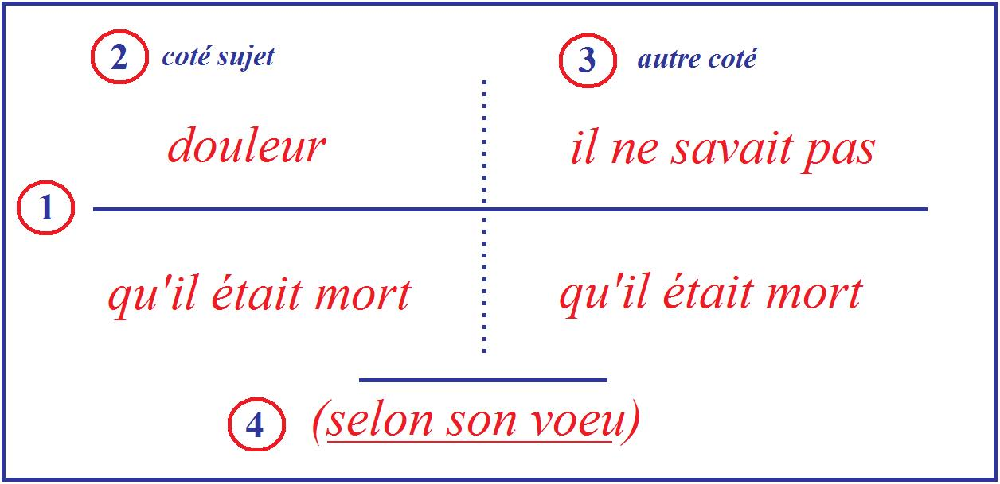

# Leçon 05 | 10 Décembre 1958

  

    <label><input type="checkbox" data-lacan-toggle="original" checked> 原文</label>
    <label><input type="checkbox" data-lacan-toggle="notes" checked> 注释</label>
    <label><input type="checkbox" data-lacan-toggle="commentary" checked> 个人解读评论</label>
  

  <form class="lacan-tool-search" role="search">
    <input class="lacan-tool-search-input" type="search" placeholder="搜索全文" aria-label="搜索全文">
    <button class="lacan-tool-button" type="submit" title="搜索">搜索</button>
  </form>
  <button class="lacan-tool-button lacan-back-to-top" type="button" title="回到页面最上方" aria-label="回到页面最上方">↑</button>

<section class="parallel-paragraph" data-paragraph-ids="s6-05-0001">

s6-05-0001

原文 · s6-05-0001

Je vous ai laissés la dernière fois sur quelque chose qui tend à aborder notre problème, le problème du *désir et de son interprétation* : *une certaine ordi­nation de la structure signifiante*, de ce qui s’énonce dans le signifiant comme comportant cette duplicité interne de l’énoncé :

[无对应译文]

</section>

<section class="parallel-paragraph" data-paragraph-ids="s6-05-0002">

s6-05-0002

原文 · s6-05-0002

- *procès de l’énoncé,*

[无对应译文]

</section>

<section class="parallel-paragraph" data-paragraph-ids="s6-05-0003">

s6-05-0003

原文 · s6-05-0003

- et *procès de l’acte de l’énonciation*.

[无对应译文]

</section>

<section class="parallel-paragraph" data-paragraph-ids="s6-05-0004">

s6-05-0004

原文 · s6-05-0004

Je vous ai mis l’accent sur la différence qui existe

[无对应译文]

</section>

<section class="parallel-paragraph" data-paragraph-ids="s6-05-0005">

s6-05-0005

原文 · s6-05-0005

- du « *je* » en tant qu’impliqué dans un *énoncé* quelconque, du « *je* » en tant qu’au même titre que quelque autre, c’est le sujet d’un *procès énoncé* par exemple, ce qui n’est d’ailleurs pas le seul mode d’*énoncé,*

[无对应译文]

</section>

<section class="parallel-paragraph" data-paragraph-ids="s6-05-0006">

s6-05-0006

原文 · s6-05-0006

- au « *je* » en tant qu’il est impliqué dans toute *énonciation*, mais d’autant plus en tant qu’il s’annonce comme « *je* » de l’*énonciation*.

[无对应译文]

</section>

<section class="parallel-paragraph" data-paragraph-ids="s6-05-0007">

s6-05-0007

原文 · s6-05-0007

Ce mode sous lequel il s’annonce comme le « *je* » de l’*énonciation*, ce mode sous lequel il s’annonce n’est pas indifférent s’il s’annonce en se nommant comme le fait la petite Anna FREUD au début du message de son rêve. Je vous ai indiqué qu’il reste là quelque chose d’ambigu, c’est à savoir si ce « *je* », comme « *je* » de l’*énonciation*, est authentifié ou non à ce moment.

[无对应译文]

</section>

<section class="parallel-paragraph" data-paragraph-ids="s6-05-0008">

s6-05-0008

原文 · s6-05-0008

Je vous laisse entendre qu’il ne l’est pas encore et que c’est cela qui constitue la différence que FREUD nous donne pour être celle qui distingue le *désir du rêve chez l’enfant*, du *désir du rêve chez l’adulte.* C’est que *quelque chose* n’est pas encore achevé, précipité par la struc­ture, ne s’est pas encore distingué dans la structure qui est justement ce *quelque chose* dont je vous donnais ailleurs le *reflet* et la *trace*.

[无对应译文]

</section>

<section class="parallel-paragraph" data-paragraph-ids="s6-05-0009">

s6-05-0009

原文 · s6-05-0009

*Trace* tardive puisqu’elle se trouve au niveau d’une épreuve qui, bien entendu, suppose déjà *des condi­tions* très définies par l’expérience, qui ne permettent pas de préjuger dans son fond ce qu’il en est dans le sujet, mais la difficulté qui reste encore longtemps pour le sujet de distinguer ce « *je* » de l’*énonciation* du « *je* » de l’*énoncé*, et qui se traduit par cet achoppement encore tardif devant le test *que le hasard et le flair du psychologue ont fait choisir par* BINET sous la forme :

[无对应译文]

</section>

<section class="parallel-paragraph" data-paragraph-ids="s6-05-0010">

s6-05-0010

原文 · s6-05-0010

> « *J’ai trois frères Paul, Ernest et moi.* »

[无对应译文]

</section>

<section class="parallel-paragraph" data-paragraph-ids="s6-05-0011">

s6-05-0011

原文 · s6-05-0011

La difficulté qu’il y a à ce que l’enfant ne tienne pas pour ce qu’il faut d’ailleurs, cet énoncé : à savoir *que le sujet ne sache pas encore se décompter*. Mais cette *trace* que je vous ai marquée est quelque chose, un indice, et il y en a d’autres, de cet élément essentiel que constitue *la distinction, la différence* pour le sujet, du « *je* » de l’*énonciation* et du « *je* » de l’*énoncé*.

[无对应译文]

</section>

<section class="parallel-paragraph" data-paragraph-ids="s6-05-0012">

s6-05-0012

原文 · s6-05-0012

Or je vous l’ai dit, nous pre­nons les choses non pas par une déduction, mais par une voie dont je ne peux pas dire qu’elle est *empirique* puisqu’elle est déjà *tracée*, qu’elle a déjà été construite par FREUD quand il nous dit que le désir du rêve chez l’adulte est un désir qui, lui, est *emprunté* et qui est la marque *d’un refoulement*, d’un refoule­ment qu’à ce niveau il apporte comme étant une censure.

[无对应译文]

</section>

<section class="parallel-paragraph" data-paragraph-ids="s6-05-0013">

s6-05-0013

原文 · s6-05-0013

Quand il entre dans le mécanisme de cette censure, quand il nous montre ce que c’est qu’une censure, à savoir *les impossibilités d’une censure*, car c’est là-dessus qu’il met l’accent, c’est là-dessus que j’essayais de vous faire un instant arrêter votre réflexion en vous disant une espèce de *contradiction interne* qui est *celle de tout non-dit au niveau de l’énonciation*. Je veux dire cette *contradiction interne* qui structure le « *Je ne dis pas que*... ». Je vous l’ai dit l’autre jour sous diverses formes humoristiques :

[无对应译文]

</section>

<section class="parallel-paragraph" data-paragraph-ids="s6-05-0014">

s6-05-0014

原文 · s6-05-0014

« *Celui qui dira telle ou telle chose de tel ou tel personnage dont il faut respecter les paroles,* *ne pas offenser* - disais-je - *aura affaire à moi !* »

[无对应译文]

</section>

<section class="parallel-paragraph" data-paragraph-ids="s6-05-0015">

s6-05-0015

原文 · s6-05-0015

Qu’est-ce à dire, si ce n’est qu’en proférant cette prise de parti – qui évidemment est ironique – je prononce, je me trouve prononcer précisément ce qu’il y a à ne pas dire. Et FREUD lui-même, a souligné amplement…

[无对应译文]

</section>

<section class="parallel-paragraph" data-paragraph-ids="s6-05-0016">

s6-05-0016

原文 · s6-05-0016

> quand il nous montre le mécanisme, l’articulation, le sens du rêve

[无对应译文]

</section>

<section class="parallel-paragraph" data-paragraph-ids="s6-05-0017">

s6-05-0017

原文 · s6-05-0017

…combien fréquemment le rêve emprunte cette voie, c’est-à-dire que ce qu’il articule comme *ne devant pas être dit* est justement ce qu’il a à dire, et ce par quoi passe ce qui dans le rêve est effectivement dit.

[无对应译文]

</section>

<section class="parallel-paragraph" data-paragraph-ids="s6-05-0018">

s6-05-0018

原文 · s6-05-0018

Ceci nous porte à quelque chose qui est lié à *la structure* la plus profonde du signifiant. Je voudrais, un instant m’y arrêter encore car cet élément, ce ressort du « *Je ne dis pas*… » comme tel, ce n’est pas pour rien que FREUD, dans son article de la *Verneinung,* le met à *la racine* même de la phrase la plus primitive dans laquelle le sujet se constitue comme tel et se constitue spécialement comme inconscient.

[无对应译文]

</section>

<section class="parallel-paragraph" data-paragraph-ids="s6-05-0019">

s6-05-0019

原文 · s6-05-0019

Le rapport de cette *Verneinung* avec la *Bejahung* la plus primitive…

[无对应译文]

</section>

<section class="parallel-paragraph" data-paragraph-ids="s6-05-0020">

s6-05-0020

原文 · s6-05-0020

> avec l’accès d’un signifiant dans la question, car c’est cela une *Bejahung*

[无对应译文]

</section>

<section class="parallel-paragraph" data-paragraph-ids="s6-05-0021">

s6-05-0021

原文 · s6-05-0021

*…*c’est quelque chose qui commence à se poser.

[无对应译文]

</section>

<section class="parallel-paragraph" data-paragraph-ids="s6-05-0022">

s6-05-0022

原文 · s6-05-0022

Il s’agit de savoir toujours ce qui se pose *au niveau le plus primitif* : est-ce, par exemple, le couple « *bon* » et « *mauvais* » ? Selon que nous choisissons ou ne choisissons pas tel ou tel de ces termes *primi­tifs*, déjà nous optons pour toute une théorisation, toute une orientation de notre pensée analytique et vous savez le rôle qu’a joué ce *terme* de *bon* et de *mauvais* dans une certaine spécification de *la voie analytique*, c’est certainement *un couple très primitif*.

[无对应译文]

</section>

<section class="parallel-paragraph" data-paragraph-ids="s6-05-0023">

s6-05-0023

原文 · s6-05-0023

Sur ce « *non-dit* » et sur la fonction du « *ne* », du « *ne* » dans le « *je ne dis pas*... », c’est là­-dessus que je m’*arrêterai* un instant avant de faire un pas de plus, car je crois que c’est là l’articulation essentielle. Cette sorte de « *ne* » du « *je ne dis pas*... » qui fait que précisément en disant que l’on ne le dit pas, on le dit…

[无对应译文]

</section>

<section class="parallel-paragraph" data-paragraph-ids="s6-05-0024">

s6-05-0024

原文 · s6-05-0024

> chose qui paraît presque une sorte d’évidence par l’absurde

[无对应译文]

</section>

<section class="parallel-paragraph" data-paragraph-ids="s6-05-0025">

s6-05-0025

原文 · s6-05-0025

…c’est quelque chose à quoi il faut nous arrê­ter en rappelant ce que je vous ai déjà indiqué comme étant la propriété la plus *radicale* si l’on peut dire, *du signifiant*.

[无对应译文]

</section>

<section class="parallel-paragraph" data-paragraph-ids="s6-05-0026">

s6-05-0026

原文 · s6-05-0026

Et si vous vous souvenez, j’ai déjà essayé de vous porter sur la voie d’une image, d’un exemple vous montrant à la fois le rapport qu’il y a entre *le signifiant* et une certaine espèce d’indice ou de signe que j’ai appelé « *la trace* », que déjà lui-même porte, la marque de je ne sais quelle espèce d’*envers de l’empreinte du réel*. Je vous ai parlé de Robinson CRUSOÉ et du pas, de la trace du pas de VENDREDI[^22], et nous nous sommes arrêtés un instant à ceci : est-ce déjà là le signi­fiant ?

[无对应译文]

</section>

<section class="parallel-paragraph" data-paragraph-ids="s6-05-0027">

s6-05-0027

原文 · s6-05-0027

Et je vous ai dit que le signifiant commence non pas à la trace, mais à ceci qu’on efface la trace, et ce n’est pas la trace effacée qui constitue le signifiant, c’est *quelque chose qui se pose comme pouvant être effacé* qui inaugure le signi­fiant. Autrement dit, Robinson CRUSOÉ efface la trace du pas de VENDREDI mais que fait-il à la place ?

[无对应译文]

</section>

<section class="parallel-paragraph" data-paragraph-ids="s6-05-0028">

s6-05-0028

原文 · s6-05-0028

S’il veut la garder, cette place du pied de VENDREDI, il fait au minimum une croix, c’est-à-dire une barre et une autre barre sur celle-ci : ceci est *le signifiant spécifique. Le signifiant spécifique* est quelque chose qui se pré­sente comme pouvant être effacé lui-même et qui justement dans cette opération de l’effacement comme tel subsiste.

[无对应译文]

</section>

<section class="parallel-paragraph" data-paragraph-ids="s6-05-0029">

s6-05-0029

原文 · s6-05-0029

Je veux dire que *le signifiant effacé*, déjà se présente comme tel, avec ses propriétés propres au « *non-dit* ». En tant qu’avec la barre j’annule ce signifiant, je le perpétue comme tel indéfiniment, j’inaugure la dimension du signifiant comme telle. Faire une croix c’est à proprement *parler* ce qui n’existe dans aucune forme de repérage qui soit permise d’aucune façon.

[无对应译文]

</section>

<section class="parallel-paragraph" data-paragraph-ids="s6-05-0030">

s6-05-0030

原文 · s6-05-0030

Il ne faut pas croire que les êtres non-parlants, les animaux, ne repèrent rien, qu’ils ne laissent pas intentionnellement de traces avec le « *dit* », mais avec des *traces de traces*. Nous reviendrons, quand nous aurons le temps, sur *les mœurs de l’hippopotame*, nous verrons ce qu’il laisse sur ses pas à dessein pour ses congénères.

[无对应译文]

</section>

<section class="parallel-paragraph" data-paragraph-ids="s6-05-0031">

s6-05-0031

原文 · s6-05-0031

Ce que laisse l’homme derrière lui c’est un *signifiant*, c’est une croix, c’est une barre en tant que barrée, en tant que recouverte par une autre barre d’une part, qui indique que comme telle elle est effacée. Cette fonction du « *nom du non* », en tant qu’il est le signifiant qui *s’annule* lui-même, est quelque chose qui assuré­ment mérite, à soi tout seul, un très long développement.

[无对应译文]

</section>

<section class="parallel-paragraph" data-paragraph-ids="s6-05-0032">

s6-05-0032

原文 · s6-05-0032

Il est très frappant de voir à quel point les logiciens, pour être comme toujours trop *psychologues*, ont…

[无对应译文]

</section>

<section class="parallel-paragraph" data-paragraph-ids="s6-05-0033">

s6-05-0033

原文 · s6-05-0033

> dans leur classification, dans leur articulation de la négation

[无对应译文]

</section>

<section class="parallel-paragraph" data-paragraph-ids="s6-05-0034">

s6-05-0034

原文 · s6-05-0034

…ont laissé de côté étrangement le plus originel.

[无对应译文]

</section>

<section class="parallel-paragraph" data-paragraph-ids="s6-05-0035">

s6-05-0035

原文 · s6-05-0035

Vous savez - ou vous ne savez pas - et après tout je n’ai pas l’intention de vous faire entrer dans *les différents modes de la négation*. Je veux simplement vous dire que plus originellement que tout ce qui peut s’articuler dans *l’ordre du concept*…

[无对应译文]

</section>

<section class="parallel-paragraph" data-paragraph-ids="s6-05-0036">

s6-05-0036

原文 · s6-05-0036

> dans l’ordre de ce qui distingue le sens de la négation, de la privation, etc.

[无对应译文]

</section>

<section class="parallel-paragraph" data-paragraph-ids="s6-05-0037">

s6-05-0037

原文 · s6-05-0037

…plus originellement c’est dans *le phénomène du parler*, dans l’expérience, dans l’empirisme linguistique que nous devons trou­ver à l’origine, ce qui pour nous est le plus important, et c’est pour cela qu’à cela seul, je m’arrêterai.

[无对应译文]

</section>

<section class="parallel-paragraph" data-paragraph-ids="s6-05-0038">

s6-05-0038

原文 · s6-05-0038

Et ici je ne puis - au moins pour un instant - ne pas faire état de quelques re­cherches qui ont valeur d’expérience et nommément celle qui a été le fait d’Édouard PICHON qui fut, comme vous le savez, un de nos aînés psychanalystes, qui est mort au début de la guerre d’une grave maladie cardiaque. Édouard PICHON, à propos de la négation, a fait cette distinction dont il faut au moins que vous ayez un petit aperçu, une petite notion, une petite idée. Il s’est aperçu de quelque chose, il aurait bien voulu en logicien, manifestement il voulait être psychologue, il nous a écrit que ce qu’il fait c’est une sorte d’exploration *Des mots à la pensée* [^23].

[无对应译文]

</section>

<section class="parallel-paragraph" data-paragraph-ids="s6-05-0039">

s6-05-0039

原文 · s6-05-0039

Comme beaucoup de monde, il est susceptible d’illusions sur lui-même car, heureusement, c’est ce qu’il y a précisément de plus faible dans son ouvrage, cette prétention de remonter *Des mots à la pensée*. Mais par contre, il se trouvait être un admirable observateur, je veux dire qu’il avait un sens de l’étoffe langagière qui fait qu’il nous a beaucoup plus renseignés sur *les mots* que sur *la pensée*.

[无对应译文]

</section>

<section class="parallel-paragraph" data-paragraph-ids="s6-05-0040">

s6-05-0040

原文 · s6-05-0040

Et quant aux *mots*, et quant à cet usage de *la négation*…

[无对应译文]

</section>

<section class="parallel-paragraph" data-paragraph-ids="s6-05-0041">

s6-05-0041

原文 · s6-05-0041

> c’est spécialement en français qu’il s’est arrêté sur cet usage de la négation

[无对应译文]

</section>

<section class="parallel-paragraph" data-paragraph-ids="s6-05-0042">

s6-05-0042

原文 · s6-05-0042

…et là, il n’a pas pu ne pas faire cette trouvaille qui fait cette distinction, qui s’articule dans cette distinction qu’il fait du « *forclusif* » et du « *discordantiel* ». Je vais vous donner des exemples tout de suite de la distinction qu’il en fait.

[无对应译文]

</section>

<section class="parallel-paragraph" data-paragraph-ids="s6-05-0043">

s6-05-0043

原文 · s6-05-0043

Prenons une phrase comme « *Il n’y a personne ici.* ». Ceci est « *forclusif* » : *il est exclu pour l’instant qu’il y ait ici quelqu’un*. PICHON s’arrête à ceci de remarquable que chaque fois qu’en français nous avons affaire à une « *forclusion* » pure et simple, il faut toujours que nous employions deux termes : un « *ne* », et puis quelque chose qui ici est représenté par le « *personne* », qui pourrait l’être par le « *pas* » : « *Je n’ai pas où loger.* », « *Je n’ai rien à vous dire.* » par exemple.

[无对应译文]

</section>

<section class="parallel-paragraph" data-paragraph-ids="s6-05-0044">

s6-05-0044

原文 · s6-05-0044

D’autre part il remarque qu’un très grand nombre d’usages du « *ne* » et justement les plus indicatifs…

[无对应译文]

</section>

<section class="parallel-paragraph" data-paragraph-ids="s6-05-0045">

s6-05-0045

原文 · s6-05-0045

> là comme partout, ceux qui posent les problèmes les plus paradoxaux

[无对应译文]

</section>

<section class="parallel-paragraph" data-paragraph-ids="s6-05-0046">

s6-05-0046

原文 · s6-05-0046

…se mani­festent toujours, c’est-à-dire que d’abord *jamais un « ne » pur et simple - ou presque jamais - n’est mis en usage pour indiquer la pure et simple négation*, ce qui par exemple en allemand ou en anglais, s’incarnera dans le *nicht* ou dans le *not.*

[无对应译文]

</section>

<section class="parallel-paragraph" data-paragraph-ids="s6-05-0047">

s6-05-0047

原文 · s6-05-0047

Le « *ne* » à lui tout seul, livré à lui-même, exprime ce qu’il appelle une « *dis­cordance* » et cette « *discordance* » est très précisément quelque chose qui se situe *<u>entre</u> le procès de l’énonciation et le procès de l’énoncé*.

[无对应译文]

</section>

<section class="parallel-paragraph" data-paragraph-ids="s6-05-0048">

s6-05-0048

原文 · s6-05-0048

Pour tout dire et pour *illustrer* tout de suite ce dont il s’agit, je vais justement vous donner l’exemple sur lequel effectivement PICHON s’arrête le plus car il est spécialement illustratif : c’est l’emploi de ces « *ne* » que les gens qui ne comprennent rien, c’est-à-dire les gens qui veulent comprendre, appellent le « *ne explétif* ».

[无对应译文]

</section>

<section class="parallel-paragraph" data-paragraph-ids="s6-05-0049">

s6-05-0049

原文 · s6-05-0049

Je vous le dis parce que j’ai déjà amorcé cela la dernière fois, j’y ai fait allusion à propos d’un article qui m’avait paru légèrement scandaleux dans *Le Monde,* sur soi-disant le « *ne explétif* ». Ce « *ne explétif* »…

[无对应译文]

</section>

<section class="parallel-paragraph" data-paragraph-ids="s6-05-0050">

s6-05-0050

原文 · s6-05-0050

> qui n’est pas un « *ne explétif* », qui est un « *ne* » tout à fait *essentiel à l’usage de la langue française*

[无对应译文]

</section>

<section class="parallel-paragraph" data-paragraph-ids="s6-05-0051">

s6-05-0051

原文 · s6-05-0051

…est celui qui se trouve dans la phrase telle que : « *Je crains qu’il ne vienne.* »

[无对应译文]

</section>

<section class="parallel-paragraph" data-paragraph-ids="s6-05-0052">

s6-05-0052

原文 · s6-05-0052

Chacun sait que « *Je crains qu’il ne vienne.* » veut dire « *Je crains qu’il vienne.* » et non pas « *Je crains qu’il ne vienne pas.* » mais en français, on dit : « *Je crains qu’il ne vienne.* ». En d’autres termes, le français - *à ce point de son usage linguistique* - « *saisit* » si je puis dire, le « *ne* » quelque part au niveau si l’on peut dire de son *errance *:

[无对应译文]

</section>

<section class="parallel-paragraph" data-paragraph-ids="s6-05-0053">

s6-05-0053

原文 · s6-05-0053

- de sa des­cente d’*un procès de l’énonciation* où le « *ne* » porte sur l’articulation de *l’énonciation*, porte sur le signifiant pur et simple dit en acte : « *Je ne dis pas que*… », « *Je ne dis pas que je suis ta femme.* » par exemple,

[无对应译文]

</section>

<section class="parallel-paragraph" data-paragraph-ids="s6-05-0054">

s6-05-0054

原文 · s6-05-0054

- au « *ne* » de *l’énoncé* où il est : « *Je ne suis pas ta femme.* ».

[无对应译文]

</section>

<section class="parallel-paragraph" data-paragraph-ids="s6-05-0055">

s6-05-0055

原文 · s6-05-0055

Sans aucun doute ne sommes-nous pas ici pour faire « *la genèse du langage* », mais quelque chose est impliqué même dans notre expérience. *Ceci*...

[无对应译文]

</section>

<section class="parallel-paragraph" data-paragraph-ids="s6-05-0056">

s6-05-0056

原文 · s6-05-0056

> c’est ce que je veux vous montrer, *qui nous indique en tout cas l’articulation que donne* FREUD *du fait de la négation*

[无对应译文]

</section>

<section class="parallel-paragraph" data-paragraph-ids="s6-05-0057">

s6-05-0057

原文 · s6-05-0057

...*implique que la négation descende de l’énonciation à l’énoncé*.

[无对应译文]

</section>

<section class="parallel-paragraph" data-paragraph-ids="s6-05-0058">

s6-05-0058

原文 · s6-05-0058

Et comment en serions-nous étonnés puisque après tout, toute négation dans *l’énoncé* comporte un certain paradoxe, puisqu’elle pose quelque chose, pour le poser en même temps, disons dans un certain nombre de cas, comme non-existant, entre les deux, quelque part, quelque part entre *l’énoncia­tion* et *l’énoncé*, et dans ce plan :

[无对应译文]

</section>

<section class="parallel-paragraph" data-paragraph-ids="s6-05-0059">

s6-05-0059

原文 · s6-05-0059

- où s’instaurent les « *discordances* »,

[无对应译文]

</section>

<section class="parallel-paragraph" data-paragraph-ids="s6-05-0060">

s6-05-0060

原文 · s6-05-0060

- où quelque chose dans ma crainte devance le fait qu’il vienne et - souhaitant qu’il ne vienne pas - se peut-il autrement que d’articuler ce « *Je crains qu’il vienne.* » comme un « *Je crains qu’il ne vienne.* », accrochant au passage, si je puis dire, ce « *ne de dis­cordance* » qui se distingue comme tel dans la négation, du « *ne forclusif* ».

[无对应译文]

</section>

<section class="parallel-paragraph" data-paragraph-ids="s6-05-0061">

s6-05-0061

原文 · s6-05-0061

Vous me direz :

[无对应译文]

</section>

<section class="parallel-paragraph" data-paragraph-ids="s6-05-0062">

s6-05-0062

原文 · s6-05-0062

« *Ceci est un phénomène particulier à la langue française. Vous l’avez-vous-même évoqué tout à l’heure* *en parlant du* «* nicht *» *allemand ou du* «* not *» *anglais.* »

[无对应译文]

</section>

<section class="parallel-paragraph" data-paragraph-ids="s6-05-0063">

s6-05-0063

原文 · s6-05-0063

Bien entendu !

[无对应译文]

</section>

<section class="parallel-paragraph" data-paragraph-ids="s6-05-0064">

s6-05-0064

原文 · s6-05-0064

Seulement l’important n’est pas là. L’important est que dans la langue anglaise par exemple, où nous articulons des choses analogues, à savoir que nous nous apercevrons…

[无对应译文]

</section>

<section class="parallel-paragraph" data-paragraph-ids="s6-05-0065">

s6-05-0065

原文 · s6-05-0065

> et cela je ne peux pas vous faire y insister puisque je ne suis pas ici pour vous faire un cours de linguistique

[无对应译文]

</section>

<section class="parallel-paragraph" data-paragraph-ids="s6-05-0066">

s6-05-0066

原文 · s6-05-0066

…que c’est quelque chose d’analogue qui se manifeste dans le fait qu’en anglais par exemple, la négation ne peut pas s’appliquer d’une façon *purement*… *pure et simple* au verbe en tant qu’il est le verbe de *l’énoncé*, le verbe désignant le procès dans *l’énoncé.* On ne dit pas « *I eat not* » mais « *I dont eat* ».

[无对应译文]

</section>

<section class="parallel-paragraph" data-paragraph-ids="s6-05-0067">

s6-05-0067

原文 · s6-05-0067

En d’autres termes, il se trouve que nous avons des *traces* dans l’articulation du système linguistique anglais de ceci : c’est que pour tout ce qui est *de l’ordre de la négation*, *l’énoncé* est amené à emprunter une forme qui est calquée sur l’emploi d’un *auxiliaire*, l’*auxiliaire* étant typiquement ce qui dans l’énoncé introduit *la dimension du sujet*.

[无对应译文]

</section>

<section class="parallel-paragraph" data-paragraph-ids="s6-05-0068">

s6-05-0068

原文 · s6-05-0068

« *I don’t eat.* », « *I won’t eat.* » ou « *I won’t go.* » qui est à proprement parler « *Je n’irai pas.* », qui n’implique pas seulement *le fait mais la résolution* du sujet à ne pas y aller, le fait que pour toute négation en tant qu’elle est *négation* pure et simple, quelque chose comme une dimension auxiliaire apparaît, et ici dans la langue anglaise, la trace de ce quelque chose qui relie essentiellement la négation à une sorte de position originelle de l’énonciation comme telle.

[无对应译文]

</section>

<section class="parallel-paragraph" data-paragraph-ids="s6-05-0069">

s6-05-0069

原文 · s6-05-0069

Le deuxième temps ou étape de ce que la dernière fois j’ai essayé d’articuler devant vous, est constitué par ceci : que pour vous montrer par quel *chemin*, par quelle *voie* le sujet s’introduit à cette dialectique de l’Autre…

[无对应译文]

</section>

<section class="parallel-paragraph" data-paragraph-ids="s6-05-0070">

s6-05-0070

原文 · s6-05-0070

> en tant qu’elle lui est imposée par la structure même de cette différence de *l’énonciation* et de *l’énoncé*

[无对应译文]

</section>

<section class="parallel-paragraph" data-paragraph-ids="s6-05-0071">

s6-05-0071

原文 · s6-05-0071

…je vous ai menés par *une voie* que j’ai faite - je vous l’ai dit - exprès *empi­rique*, ce n’est pas la seule, je veux dire que j’y introduis *l’histoire réelle du sujet*.

[无对应译文]

</section>

<section class="parallel-paragraph" data-paragraph-ids="s6-05-0072">

s6-05-0072

原文 · s6-05-0072

Je vous ai dit que le pas suivant de ce par quoi à l’origine le sujet se constitue dans le procès de la distinction de ce « *je* » de *l’énonciation* d’avec le « *je* » de *l’énoncé*, c’est *la dimension* du « *n’en* *rien savoir* », pour autant qu’il l’éprouve…

[无对应译文]

</section>

<section class="parallel-paragraph" data-paragraph-ids="s6-05-0073">

s6-05-0073

原文 · s6-05-0073

qu’il l’éprouve en ceci que c’est sur fond de ce que l’Autre sait tout de ses pensées, puisque ses pensées sont, par nature et structuralement à l’origine, ce *discours de l’Autre*

[无对应译文]

</section>

<section class="parallel-paragraph" data-paragraph-ids="s6-05-0074">

s6-05-0074

原文 · s6-05-0074

…que c’est dans la découverte que c’est un fait que *l’Autre n’en sait rien* de ses pensées, que s’inaugure pour lui cette voie qui est celle que nous cher­chons : la voie par où le sujet va développer cette exigence contradictoire du « *non­-dit* », et trouver le chemin difficile par où il a à effectuer ce « *non­-dit* » dans son être et devenir cette sorte d’être auquel nous avons affaire, c’est-à-dire un sujet qui a la dimension de l’inconscient.

[无对应译文]

</section>

<section class="parallel-paragraph" data-paragraph-ids="s6-05-0075">

s6-05-0075

原文 · s6-05-0075

Car c’est cela le pas essentiel que dans l’expé­rience de l’homme nous fait faire *la psychanalyse*. C’est ceci : c’est qu’après de longs siècles où la philosophie s’est en quelque sorte, je dirais *obstinée* et de plus en plus, *à mener toujours plus loin ce discours dans lequel*…

[无对应译文]

</section>

<section class="parallel-paragraph" data-paragraph-ids="s6-05-0076">

s6-05-0076

原文 · s6-05-0076

- le sujet n’est que le corrélatif de l’objet dans le rapport de la connaissance, c’est-à-dire que *le sujet est ce qui est <u>supposé</u> par la connaissance des objets ,*

[无对应译文]

</section>

<section class="parallel-paragraph" data-paragraph-ids="s6-05-0077">

s6-05-0077

原文 · s6-05-0077

- cette sorte de sujet étrange dont je ne sais plus où, j’ai dit quelque part qu’il pouvait faire « *les dimanches du philosophe* [^24] », parce que le reste de la semaine, c’est-à-dire pendant le travail bien entendu, tout un chacun peut le négliger abondamment,

[无对应译文]

</section>

<section class="parallel-paragraph" data-paragraph-ids="s6-05-0078">

s6-05-0078

原文 · s6-05-0078

- ce sujet qui n’est que *l’ombre* en quelque sorte et la doublure *des objets*

[无对应译文]

</section>

<section class="parallel-paragraph" data-paragraph-ids="s6-05-0079">

s6-05-0079

原文 · s6-05-0079

…quelque chose est « *oublié* » de ce *sujet*, à savoir que *le sujet est le sujet qui parle*.

[无对应译文]

</section>

<section class="parallel-paragraph" data-paragraph-ids="s6-05-0080">

s6-05-0080

原文 · s6-05-0080

Nous ne pouvons plus l’oublier, uniquement à partir d’un certain moment, à savoir le moment où son domaine de sujet qui parle tient tout seul, qu’il soit là ou qu’il ne soit pas là. Ce qui change complètement la nature de ses relations à l’objet, c’est *ce point crucial* de la nature de ses relations à l’objet qui s’appelle justement *le désir*.

[无对应译文]

</section>

<section class="parallel-paragraph" data-paragraph-ids="s6-05-0081">

s6-05-0081

原文 · s6-05-0081

C’est dans ce champ que nous essayons d’articuler *les rap­ports du sujet à l’objet* au sens où ils sont des rapports de *désir*, car c’est dans ce champ que l’expérience analytique nous apprend qu’il a à s’articuler.

[无对应译文]

</section>

<section class="parallel-paragraph" data-paragraph-ids="s6-05-0082">

s6-05-0082

原文 · s6-05-0082

*Le rapport du sujet à l’objet* n’est pas un rapport de besoin, *le rapport du sujet à l’objet* est un rapport complexe que j’essaye précisément d’articuler devant vous. Pour l’instant commençons d’indiquer ceci : c’est parce qu’il se situe là, ce *rapport d’articulation du sujet à l’objet,* que l’objet se trouve être ce quelque chose qui n’est pas le corrélatif et le correspondant d’un besoin du sujet, mais ce quelque chose :

[无对应译文]

</section>

<section class="parallel-paragraph" data-paragraph-ids="s6-05-0083">

s6-05-0083

原文 · s6-05-0083

- qui *supporte le sujet* au moment précisément où il a à faire face, si l’on peut dire, à son existence,

[无对应译文]

</section>

<section class="parallel-paragraph" data-paragraph-ids="s6-05-0084">

s6-05-0084

原文 · s6-05-0084

- qui *supporte le sujet* dans son existence, dans son existence au sens le plus radical, à savoir en ceci justement qu’il *ex-siste* dans le langage.

[无对应译文]

</section>

<section class="parallel-paragraph" data-paragraph-ids="s6-05-0085">

s6-05-0085

原文 · s6-05-0085

C’est-à-dire qu’il consiste en quelque chose qui est hors de lui, en quelque chose qu’il ne peut saisir dans sa nature propre de langage qu’au moment précis où lui, comme sujet, doit s’effacer, s’évanouir, disparaître *der­rière un signifiant*, en ce qui est précisément le point, si l’on peut dire « *panique* » autour duquel il a à se raccrocher à quelque chose, et c’est justement à l’objet en tant qu’objet du désir qu’il se raccroche.

[无对应译文]

</section>

<section class="parallel-paragraph" data-paragraph-ids="s6-05-0086">

s6-05-0086

原文 · s6-05-0086

Quelque part quelqu’un, que pour ne pas faire d’embrouilles, je ne vais pas nommer tout de suite aujourd’hui, quelqu’un de tout à fait contemporain - mort - a écrit :

[无对应译文]

</section>

<section class="parallel-paragraph" data-paragraph-ids="s6-05-0087">

s6-05-0087

原文 · s6-05-0087

« *Arriver à apprendre ce que l’avare*... *Arriver à savoir ce que l’avare a perdu quand on lui a volé sa cassette, on apprendrait beaucoup*.[^25] »

[无对应译文]

</section>

<section class="parallel-paragraph" data-paragraph-ids="s6-05-0088">

s6-05-0088

原文 · s6-05-0088

C’est exactement ce que nous avons à apprendre, je veux dire à apprendre *pour nous-mêmes* et à apprendre *aux autres*. L’analyse est le premier lieu, la première dimension dans laquelle on peut répondre à cette parole, et bien entendu, parce que l’avare est ridicule…

[无对应译文]

</section>

<section class="parallel-paragraph" data-paragraph-ids="s6-05-0089">

s6-05-0089

原文 · s6-05-0089

> c’est-à-dire beaucoup trop proche de l’inconscient pour que vous puissiez le supporter

[无对应译文]

</section>

<section class="parallel-paragraph" data-paragraph-ids="s6-05-0090">

s6-05-0090

原文 · s6-05-0090

…il va falloir que je trouve un autre exemple, plus noble, pour vous faire saisir ce que je veux dire.

[无对应译文]

</section>

<section class="parallel-paragraph" data-paragraph-ids="s6-05-0091">

s6-05-0091

原文 · s6-05-0091

Je pourrais commencer à vous l’articuler dans les mêmes termes que tout à l’heure en ce qui concerne l’existence… et dans deux minutes vous allez me prendre pour un existentialiste, et ce n’est pas ce que je désire.

[无对应译文]

</section>

<section class="parallel-paragraph" data-paragraph-ids="s6-05-0092">

s6-05-0092

原文 · s6-05-0092

Je vais prendre un exemple dans *La Règle du jeu,* le film de Jean RENOIR. Quelque part le per­sonnage qui est joué par Dalio, qui est le vieux personnage comme on en voit dans la vie dans une certaine zone sociale - et il ne faut pas croire que ce soit même limité à cette zone sociale - c’est un *collectionneur* d’objets et plus spé­cialement de boîtes à musique.

[无对应译文]

</section>

<section class="parallel-paragraph" data-paragraph-ids="s6-05-0093">

s6-05-0093

原文 · s6-05-0093

Rappelez-vous, si vous vous souvenez encore de ce film, du moment où DALIO découvre devant une assistance nombreuse sa der­nière découverte : une plus spécialement belle boîte à musique. À ce moment là, le personnage littéralement est dans cette position que nous pourrions appeler et que nous devons appeler exactement celle de la pudeur : il *rougit*, il *s’efface*, il *disparaît*, il est très *gêné*. Ce qu’il a montré, il l’a montré.

[无对应译文]

</section>

<section class="parallel-paragraph" data-paragraph-ids="s6-05-0094">

s6-05-0094

原文 · s6-05-0094

Mais comment ceux qui sont là pourraient-ils comprendre que nous nous trouvons là, à ce niveau, à ce point d’oscillation que nous saisissons, qui se manifeste à l’extrême dans cette passion pour l’objet du collectionneur ?

[无对应译文]

</section>

<section class="parallel-paragraph" data-paragraph-ids="s6-05-0095">

s6-05-0095

原文 · s6-05-0095

C’est une des formes de *l’objet du désir*. Ce que le sujet montre ne serait rien d’autre que le point majeur, le plus in­time de lui-même. Ce qui est supporté par cet objet, c’est justement ce qu’il ne peut dévoiler, fût-ce à lui-même, c’est ce *quelque chose* qui est au bord même du plus *grand secret*. C’est cela, c’est dans cette voie que nous devons chercher à savoir ce qu’est pour l’avare sa cassette. Il faut que nous fassions certainement un pas de plus pour être tout à fait au niveau de *l’avare*, et c’est pour cela que *l’avare* ne peut être traité que par *la comédie*.

[无对应译文]

</section>

<section class="parallel-paragraph" data-paragraph-ids="s6-05-0096">

s6-05-0096

原文 · s6-05-0096

Mais donc ce dont il s’agit, ce par quoi nous sommes introduits est ceci, c’est que ce dans quoi, à partir d’un certain moment, le sujet se trouve engagé, c’est à ceci : à articuler son vœu en tant que *secret*. Le vœu, ce qui est le vœu s’exprime comment ? Dans ces formes de la langue auxquelles j’ai fait allusion la dernière fois, pour lesquelles selon les langues, les modes, les registres, les cordes diverses ont été inventées.

[无对应译文]

</section>

<section class="parallel-paragraph" data-paragraph-ids="s6-05-0097">

s6-05-0097

原文 · s6-05-0097

Ne vous fiez pas toujours là-dessus à ce que disent les gram­mairiens, le subjonctif n’est pas aussi subjonctif qu’il en a l’air et le type de vœu…

[无对应译文]

</section>

<section class="parallel-paragraph" data-paragraph-ids="s6-05-0098">

s6-05-0098

原文 · s6-05-0098

> Je cherche dans ma mémoire quelque chose qui puisse en quelque sorte vous l’imager et, je ne sais pas pourquoi, m’est revenu du fond de ma mémoire ce petit poème que j’ai eu quelque peine d’ailleurs
>
> à recomposer, voire à resituer 
>
> « *Être une belle fille blonde et populaire qui mette de la joie dans l’air*
>
> *et lorsqu’elle sourit donne de l’appétit aux ouvriers de Saint-Denis.* »

[无对应译文]

</section>

<section class="parallel-paragraph" data-paragraph-ids="s6-05-0099">

s6-05-0099

原文 · s6-05-0099

Ceci a été écrit par une personne[^26] qui est notre contemporaine, poétesse dis­crète mais dont l’une des caractéristiques est d’être petite et noire et qui sans aucun doute exprime, *dans sa nostalgie de donner de l’appétit aux ouvriers de Saint-Denis.*, quelque chose qui peut s’attacher assez fortement à tel ou tel moment de ses rêveries idéologiques. Mais on ne peut pas non plus dire que ce soit là son occupation ordinaire. Ce sur quoi je voudrais vous faire, un instant, vous arrêter, autour de ce phé­nomène qui est un *phénomène poétique*, c’est d’abord ceci que nous y trouvons quelque chose d’assez important quant à *la structure temporelle*.

[无对应译文]

</section>

<section class="parallel-paragraph" data-paragraph-ids="s6-05-0100">

s6-05-0100

原文 · s6-05-0100

Peut-être est-­ce là la forme pure, je ne dis pas du *vœu* mais du *souhaité*, c’est-à-dire de ce qui dans le *vœu* est énoncé comme *souhaité*. Disons que *le sujet primitif est élidé*, mais ceci ne veut *rien dire*, il n’est pas élidé parce que ce qui est articulé ici c’est le *souhaité*, c’est quelque chose qui se présente à l’infinitif, comme vous le voyez, et dont…

[无对应译文]

</section>

<section class="parallel-paragraph" data-paragraph-ids="s6-05-0101">

s6-05-0101

原文 · s6-05-0101

> si vous essayez de vous introduire à l’intérieur de la structure

[无对应译文]

</section>

<section class="parallel-paragraph" data-paragraph-ids="s6-05-0102">

s6-05-0102

原文 · s6-05-0102

…vous verrez que ceci se situe dans une position, une position d’être *devant le sujet* et de *le déterminer* *rétroactivement*. Il ne s’agit là ni d’une aspiration pure et simple, ni d’un regret, il s’agit de quelque chose qui se pose *devant le sujet* comme *le déterminant rétroactivement* dans un certain type de l’être.

[无对应译文]

</section>

<section class="parallel-paragraph" data-paragraph-ids="s6-05-0103">

s6-05-0103

原文 · s6-05-0103

Ceci se situe tout à fait en l’air. Il n’en reste pas moins que c’est comme ceci que le *souhaité* s’articule, nous donnant déjà quelque chose qu’il y a lieu de rete­nir quand nous cherchons à donner un sens à la phrase par où se termine *La Science des rêves,* à savoir que : « *Le désir indestructible modèle le présent à l’image du passé*.[^27] »

[无对应译文]

</section>

<section class="parallel-paragraph" data-paragraph-ids="s6-05-0104">

s6-05-0104

原文 · s6-05-0104

\[...*aber diese vom Träumer für gegenwärtig genommene Zukunft ist durch den unzerstörbaren Wunsch zum Ebenbild jener Vergangenheit gestaltet.(fin de la Traudeutung)*\]

[无对应译文]

</section>

<section class="parallel-paragraph" data-paragraph-ids="s6-05-0105">

s6-05-0105

原文 · s6-05-0105

Ceci dont nous entendons le *ronron* comme quelque chose que nous inscrivons tout de suite au bénéfice de *la répétition* ou de *l’après-coup* n’est peut-être pas sûr, à y regarder de très près : c’est à savoir que si « *le désir indestructible modèle* *le présent à l’image du passé* », c’est peut-être parce que, comme la carotte de l’âne, il est toujours devant le sujet, produisant toujours rétroactivement les mêmes effets. Ceci nous introduit du même coup, à l’ambiguïté de cet *énoncé* par ses ca­ractéristiques structurales, parce qu’après tout le caractère si l’on peut dire « *gra­tuit* » de cette *énonciation* a quelques conséquences dans lesquelles rien ne nous retient de nous engager.

[无对应译文]

</section>

<section class="parallel-paragraph" data-paragraph-ids="s6-05-0106">

s6-05-0106

原文 · s6-05-0106

Je veux dire que rien ne nous retient de nous engager dans la remarque suivante : que ce vœu *poétiquement* exprimé…

[无对应译文]

</section>

<section class="parallel-paragraph" data-paragraph-ids="s6-05-0107">

s6-05-0107

原文 · s6-05-0107

> intitulé comme par hasard - m’étant reporté au texte - *Vœux secrets,* c’est donc cela que j’avais retrouvé dans ma mémoire après 25 ou quelques 30 ans, en cherchant quelque chose qui nous porterait au secret du vœu

[无对应译文]

</section>

<section class="parallel-paragraph" data-paragraph-ids="s6-05-0108">

s6-05-0108

原文 · s6-05-0108

…ce vœu secret bien entendu, se communique.

[无对应译文]

</section>

<section class="parallel-paragraph" data-paragraph-ids="s6-05-0109">

s6-05-0109

原文 · s6-05-0109

Car c’est là tout le problème, comment communiquer aux autres quelque chose qui s’est constitué comme secret ? Réponse : par quelque mensonge, car en fin de compte ceci, pour nous qui sommes un tout petit peu plus malins que les autres, peut se traduire :

[无对应译文]

</section>

<section class="parallel-paragraph" data-paragraph-ids="s6-05-0110">

s6-05-0110

原文 · s6-05-0110

> « *Aussi vrai que je suis une belle fille blonde et populaire, je désire mettre de la joie dans l’air*
>
> *et donner de l’appétit aux ouvriers de Saint Denis.* »

[无对应译文]

</section>

<section class="parallel-paragraph" data-paragraph-ids="s6-05-0111">

s6-05-0111

原文 · s6-05-0111

Et il n’est pas dit que tout être - même généreux, même poétique, même poétesse - ait tellement envie que cela, de mettre de la joie dans l’air. Après tout pourquoi ? Pourquoi, sinon dans le fantasme, sinon dans le fantasme et pour démontrer à quel point l’objet du fantasme est métonymique ?

[无对应译文]

</section>

<section class="parallel-paragraph" data-paragraph-ids="s6-05-0112">

s6-05-0112

原文 · s6-05-0112

C’est-à-dire que c’est *la joie* qui va *circuler* comme cela. Quant aux ouvriers de Saint Denis « *ils ont bon dos* », qu’ils se partagent l’affaire entre eux, ils sont en tous cas déjà assez nombreux pour que l’on ne sache pas auquel s’adresser ! Sur cette digression, je vous introduis à la structure du vœu par la voie de la poésie. Nous pouvons maintenant y entrer par la voie des choses sérieuses, c’est-­à-dire par le rôle effectif que le désir joue, et ce désir dont nous avons vu, comme il fallait s’y attendre, qu’il devait bien en effet, avoir à trouver sa place quelque part, entre :

[无对应译文]

</section>

<section class="parallel-paragraph" data-paragraph-ids="s6-05-0113">

s6-05-0113

原文 · s6-05-0113

- ce point d’où nous sommes partis en disant que le sujet s’y aliène, essentiellement dans l’aliénation de l’appel, de l’appel du besoin, pour autant qu’il a à entrer dans les défilés du signifiant,

[无对应译文]

</section>

<section class="parallel-paragraph" data-paragraph-ids="s6-05-0114">

s6-05-0114

原文 · s6-05-0114

- et cet au-delà où va s’introduire comme essentielle la dimension du non-dit,

[无对应译文]

</section>

<section class="parallel-paragraph" data-paragraph-ids="s6-05-0115">

s6-05-0115

原文 · s6-05-0115

…il faut bien qu’il s’articule quelque part.

[无对应译文]

</section>

<section class="parallel-paragraph" data-paragraph-ids="s6-05-0116">

s6-05-0116

原文 · s6-05-0116

Nous le voyons dans ce rêve que j’ai choisi, ce rêve qui est un rêve assurément des plus problématiques en tant que rêve de l’apparition d’un mort. Ce rêve de l’apparition d’un mort, dont FREUD…

[无对应译文]

</section>

<section class="parallel-paragraph" data-paragraph-ids="s6-05-0117">

s6-05-0117

原文 · s6-05-0117

> à la page 433 de la *Traumdeutung dans l’édition allemande*, à la page 366 et à la page 367 de *La Science des rêves* [^28]

[无对应译文]

</section>

<section class="parallel-paragraph" data-paragraph-ids="s6-05-0118">

s6-05-0118

原文 · s6-05-0118

…concernant l’apparition des morts, est très loin de nous avoir encore tout à fait livré leur secret, encore que déjà il y articule beaucoup de choses, ceci est essen­tiel.

[无对应译文]

</section>

<section class="parallel-paragraph" data-paragraph-ids="s6-05-0119">

s6-05-0119

原文 · s6-05-0119

Et c’est à ce propos que FREUD *a marqué avec le plus d’accent*…

[无对应译文]

</section>

<section class="parallel-paragraph" data-paragraph-ids="s6-05-0120">

s6-05-0120

原文 · s6-05-0120

> tout au long de cette analyse des rêves dans la *Traumdeutung*

[无对应译文]

</section>

<section class="parallel-paragraph" data-paragraph-ids="s6-05-0121">

s6-05-0121

原文 · s6-05-0121

*…*ce qu’il y a de profond dans le premier abord qui a été celui de la psychologie de l’inconscient, à savoir l’ambi­valence des sentiments à l’égard des êtres aimés et respectés.

[无对应译文]

</section>

<section class="parallel-paragraph" data-paragraph-ids="s6-05-0122">

s6-05-0122

原文 · s6-05-0122

C’est quelque chose d’ailleurs qui, dans le rêve dont j’ai fait le choix pour commencer d’essayer d’articuler devant vous *la fonction du désir dans le rêve*, est réabordé. Vous avez pu voir que j’ai fait la relecture récente de la *Traumdeutung* dans la première édition à certaines fins et qu’en même temps, la dernière fois, j’avais fait une allusion au fait que, la *Traumdeutung,* on oublie toujours ce qu’il y a dedans.

[无对应译文]

</section>

<section class="parallel-paragraph" data-paragraph-ids="s6-05-0123">

s6-05-0123

原文 · s6-05-0123

J’avais oublié qu’en 1930 ce rêve avait été rajouté. Il a d’abord été rajouté en note peu après la publication dans les *Sammlung Kleiner Schriften Für Neurosen Lehre,1913, tome III, page 271 de la 2ème édition*, et puis dans l’édition de 1930, il est rajouté dans le texte, il est donc dans le texte de la *Traumdeutung.*

[无对应译文]

</section>

<section class="parallel-paragraph" data-paragraph-ids="s6-05-0124">

s6-05-0124

原文 · s6-05-0124

Ce rêve est ainsi constitué, je vous le répète : le sujet voit apparaître son père devant lui…

[无对应译文]

</section>

<section class="parallel-paragraph" data-paragraph-ids="s6-05-0125">

s6-05-0125

原文 · s6-05-0125

> ce père qu’il vient de perdre après une maladie qui a constitué pour lui de longs tourments

[无对应译文]

</section>

<section class="parallel-paragraph" data-paragraph-ids="s6-05-0126">

s6-05-0126

原文 · s6-05-0126

…il le voit apparaître devant lui et il est pénétré, nous dit le texte, d’une profonde douleur à la pensée que son père est mort et qu’« *il ne savait pas.* », formulation dont FREUD insiste sur son caractère résonnant absurdement, dont il dit qu’il se complète, il se comprend si l’on ajoute qu’il était mort « *selon son vœu* » : qu’il ne savait pas que c’était selon son vœu, bien entendu, qu’il était mort.

[无对应译文]

</section>

<section class="parallel-paragraph" data-paragraph-ids="s6-05-0127">

s6-05-0127

原文 · s6-05-0127

Voici ce que j’inscris sur le graphe selon l’étagement suivant « *Il ne savait pas.* » se rapporte essentiellement à la dimension de la constitution du sujet, pour autant que c’est sur un « *Il ne savait pas.* » inutile que le sujet a à se situer, *et c’est précisément là* - ce que nous allons tâcher de voir dans le détail, à l’expérience - *qu’il a à se consti­tuer lui-même comme ne sachant pas*, seul point d’issue qui lui est donné *pour que ce qui est « non-dit » prenne effectivement portée de « non-dit ».*

[无对应译文]

</section>

<section class="parallel-paragraph" data-paragraph-ids="s6-05-0128">

s6-05-0128

原文 · s6-05-0128

C’est au niveau de l’énoncé que cela se fait, mais sans aucun doute aucun énoncé de ce type ne peut se faire, sinon comme supporté par la sous-jacence d’une énonciation, car pour tout être qui ne parle pas - nous en avons des preuves - « *Il était mort* » ne veut rien dire. Je dirais plus : nous en avons le test, jusqu’à l’indifférence immédiate que porte la plupart des animaux aux déchets, aux cadavres de leurs semblables dès lors qu’ils sont cadavres.

[无对应译文]

</section>

<section class="parallel-paragraph" data-paragraph-ids="s6-05-0129">

s6-05-0129

原文 · s6-05-0129

Pour qu’un animal s’attache à un défunt - on cite l’exemple des chiens - il faut précisément que le chien soit dans cette posture exceptionnelle de faire que *s’il n’a pas d’in­conscient, il a un surmoi*. C’est-à-dire que quelque chose soit entré en jeu qui permette ce qui est de l’ordre d’une certaine ébauche d’articulation signifiante. Mais laissons ça de côté.

[无对应译文]

</section>

<section class="parallel-paragraph" data-paragraph-ids="s6-05-0130">

s6-05-0130

原文 · s6-05-0130

Que cet « *Il était mort* » déjà suppose le sujet introduit à quelque chose qui est de l’ordre de l’existence, l’existence n’étant pas autre chose que le fait que le sujet, à partir du moment où il se pose dans le signifiant, ne peut plus se détruire, qu’il entre dans cet enchaînement intolérable, qui pour lui se déroule immédiatement dans l’*imaginaire*, qui fait qu’il ne peut plus se concevoir sinon comme rejaillissant toujours dans l’existence.

[无对应译文]

</section>

<section class="parallel-paragraph" data-paragraph-ids="s6-05-0131">

s6-05-0131

原文 · s6-05-0131

Ceci n’est pas *construction de philosophe*, je l’ai pu constater chez ceux qu’on appelle des « *patients* » et je me souviens d’*une patiente*, dont ce fut *un des tournants* de son expérience intérieure, qu’à un certain rêve, précisément où elle toucha sans aucun doute - pas à n’importe quel moment de son analyse - à quelque chose d’appréhendé, de vécu *oniriquement* qui n’était autre qu’une sorte de sen­timent pur d’existence, d’exister si l’on peut dire d’une façon indéfinie. Et du sein de cette existence rejaillissait toujours pour elle une nouvelle existence et celle-ci s’étendant, pour son intuition intime si l’on peut dire, à perte de vue. L’existence étant appréhendée et sentie comme quelque chose qui, de par sa nature, ne peut s’éteindre qu’à toujours rejaillir plus loin, *et ceci était accompa­gné pour elle précisément d’une douleur intolérable*.

[无对应译文]

</section>

<section class="parallel-paragraph" data-paragraph-ids="s6-05-0132">

s6-05-0132

原文 · s6-05-0132

Ceci est quelque chose qui est tout proche de ce que nous donne le contenu du rêve. Car enfin, qu’avons-nous ? Nous avons ici un rêve qui est celui d’un fils. Il est toujours bon de faire remarquer à propos d’un rêve, que celui qui le fait c’est le rêveur, il faut toujours s’en souvenir quand on commence à parler du personnage du rêve.

[无对应译文]

</section>

<section class="parallel-paragraph" data-paragraph-ids="s6-05-0133">

s6-05-0133

原文 · s6-05-0133

Qu’avons-nous ici ?

[无对应译文]

</section>

<section class="parallel-paragraph" data-paragraph-ids="s6-05-0134">

s6-05-0134

原文 · s6-05-0134

Le problème de *ce qu’on appelle « identification »* se pose avec des facilités toutes particulières car dans le rêve nul besoin de dialectique pour penser qu’il y a quelque rapport d’identification entre le sujet et ses propres fantaisies de rêve. Qu’avons-nous ? Nous avons le sujet qui est là devant son père, pénétré de la plus profonde douleur et en face de lui nous avons le père qui ne sait pas qu’il est mort, ou plus exactement…

[无对应译文]

</section>

<section class="parallel-paragraph" data-paragraph-ids="s6-05-0135">

s6-05-0135

原文 · s6-05-0135

> car il faut bien le mettre au temps où le sujet l’appréhende et nous le communique

[无对应译文]

</section>

<section class="parallel-paragraph" data-paragraph-ids="s6-05-0136">

s6-05-0136

原文 · s6-05-0136

…« *Il ne savait pas.* ».

[无对应译文]

</section>

<section class="parallel-paragraph" data-paragraph-ids="s6-05-0137">

s6-05-0137

原文 · s6-05-0137

J’y insiste sans pou­voir tout à fait y insister jusqu’au bout pour l’instant, mais j’entends toujours ne pas vous donner des choses approximatives qui me mènent quelquefois à l’obs­curité, puisque aussi bien cette règle de conduite m’empêche de ne vous donner les choses qu’à peu près, et comme je ne peux pas les préciser tout de suite, natu­rellement cela laisse des portes ouvertes. Néanmoins, il est important pour ce qui est du rêve, de vous souvenir que la façon dont il nous est communiqué est toujours un énoncé.

[无对应译文]

</section>

<section class="parallel-paragraph" data-paragraph-ids="s6-05-0138">

s6-05-0138

原文 · s6-05-0138

Le sujet nous rend compte de quoi ? D’un autre énoncé, mais il n’est pas du tout suffisant de dire cela. D’un autre énoncé qu’il nous présente comme une énonciation, car c’est un fait que le sujet nous raconte le rêve pour que précisément, nous en cherchions la clef, le sens, c’est–à–dire ce qu’il veut dire, c’est–à–dire pour tout autre chose que l’énoncé qu’il nous rapporte.

[无对应译文]

</section>

<section class="parallel-paragraph" data-paragraph-ids="s6-05-0139">

s6-05-0139

原文 · s6-05-0139

Le fait donc que ceci « *Il ne savait pas.* », *soit dit à l’imparfait* a dans cette perspective tout à fait son importance.

[无对应译文]

</section>

<section class="parallel-paragraph" data-paragraph-ids="s6-05-0140">

s6-05-0140

原文 · s6-05-0140

[无对应译文]

</section>

<section class="parallel-paragraph" data-paragraph-ids="s6-05-0141">

s6-05-0141

原文 · s6-05-0141

« *Il ne savait pas.* » : dans ce que je vous énonce ceci…

[无对应译文]

</section>

<section class="parallel-paragraph" data-paragraph-ids="s6-05-0142">

s6-05-0142

原文 · s6-05-0142

> pour ceux que la question des rapports du rêve avec la parole par laquelle nous le recueillons intéresse

[无对应译文]

</section>

<section class="parallel-paragraph" data-paragraph-ids="s6-05-0143">

s6-05-0143

原文 · s6-05-0143

…peut aborder dans le dessin *le premier plan du clivage* (1).

[无对应译文]

</section>

<section class="parallel-paragraph" data-paragraph-ids="s6-05-0144">

s6-05-0144

原文 · s6-05-0144

Mais continuons. Voilà donc comment les choses se répartissent :

[无对应译文]

</section>

<section class="parallel-paragraph" data-paragraph-ids="s6-05-0145">

s6-05-0145

原文 · s6-05-0145

- d’un côté (2), du côté de ce qui se présente dans le rêve comme le sujet, quoi ? Un affect, la douleur, *douleur* – de quoi ? – « *qu’il était mort* ».

[无对应译文]

</section>

<section class="parallel-paragraph" data-paragraph-ids="s6-05-0146">

s6-05-0146

原文 · s6-05-0146

- Et de l’autre côté (3), correspondant de cette douleur : « *Il ne savait pas* » quoi ? - la même chose :

[无对应译文]

</section>

<section class="parallel-paragraph" data-paragraph-ids="s6-05-0147">

s6-05-0147

原文 · s6-05-0147

> « *qu’il était mort* ».

[无对应译文]

</section>

<section class="parallel-paragraph" data-paragraph-ids="s6-05-0148">

s6-05-0148

原文 · s6-05-0148

FREUD nous dit que s’y trouve *son sens* et implicitement *son interprétation*, et cela a l’air d’être tout simple. Je vous ai quand même suffisamment indiqué que cela ne l’était pas.

[无对应译文]

</section>

<section class="parallel-paragraph" data-paragraph-ids="s6-05-0149">

s6-05-0149

原文 · s6-05-0149

En complément (4) : « *selon son vœu* ». Mais qu’est-ce que ceci veut dire ? Si nous sommes…

[无对应译文]

</section>

<section class="parallel-paragraph" data-paragraph-ids="s6-05-0150">

s6-05-0150

原文 · s6-05-0150

> comme FREUD nous indique formellement de le faire, non pas simplement dans ce passage,
>
> mais dans celui auquel je vous ai priés de vous reporter, concernant le refoulement

[无对应译文]

</section>

<section class="parallel-paragraph" data-paragraph-ids="s6-05-0151">

s6-05-0151

原文 · s6-05-0151

…si nous sommes au niveau du signifiant, vous devez voir tout de suite que nous pouvons faire de ce « *selon son vœu* » plus d’un usage. « *Il était mort selon son vœu* », à quoi cela nous porte-t-il ?

[无对应译文]

</section>

<section class="parallel-paragraph" data-paragraph-ids="s6-05-0152">

s6-05-0152

原文 · s6-05-0152

Il me semble que certains d’entre vous au moins peuvent se souvenir de ce point où autrefois, je vous ai menés, celui du sujet qui, après avoir épuisé sous toutes les formes la voie du désir…

[无对应译文]

</section>

<section class="parallel-paragraph" data-paragraph-ids="s6-05-0153">

s6-05-0153

原文 · s6-05-0153

> en tant qu’il est du sujet non connu, est le châtiment de quel crime ?
>
> D’aucun autre crime que celui d’avoir justement existé dans ce désir

[无对应译文]

</section>

<section class="parallel-paragraph" data-paragraph-ids="s6-05-0154">

s6-05-0154

原文 · s6-05-0154

…se trouve mené au point où il n’a plus d’autre exclamation à proférer que ce μή ϕῦναι \[mè phunai\] \[*Œdipe à Colonne*\], ce « *ne pas être né* » où aboutit l’existence arrivée à l’extinction, très précisément, de son désir.

[无对应译文]

</section>

<section class="parallel-paragraph" data-paragraph-ids="s6-05-0155">

s6-05-0155

原文 · s6-05-0155

Et cette douleur que ressent le sujet dans le rêve…

[无对应译文]

</section>

<section class="parallel-paragraph" data-paragraph-ids="s6-05-0156">

s6-05-0156

原文 · s6-05-0156

> n’oublions pas que c’est un sujet dont nous ne savons rien d’autre que cet antécédent immédiat
>
> qu’il a vu mourir son père dans les affres d’une longue maladie pleine de tourments

[无对应译文]

</section>

<section class="parallel-paragraph" data-paragraph-ids="s6-05-0157">

s6-05-0157

原文 · s6-05-0157

…cette douleur est proche dans l’expérience, de cette douleur de l’existence quand plus rien d’autre ne l’habite que cette existence elle-même, et que tout, dans l’ex­cès de la souffrance, tend à abolir ce terme indéracinable qu’est *le désir de vivre*. Cette douleur d’exister, d’exister quand le désir n’est plus là, si elle a été vécue par quelqu’un, ça a été par celui qui est loin d’être un étranger pour le sujet.

[无对应译文]

</section>

<section class="parallel-paragraph" data-paragraph-ids="s6-05-0158">

s6-05-0158

原文 · s6-05-0158

Mais en tout cas ce qui est clair, c’est que dans le rêve, *cette douleur le sujet la savait*. Le sens de cette douleur, nous ne saurons jamais si celui qui l’éprouva dans le réel le savait ou ne le savait pas, mais par contre, ce qui est sensible, c’est que ni dans le rêve bien sûr, ni hors du rêve très sûrement…

[无对应译文]

</section>

<section class="parallel-paragraph" data-paragraph-ids="s6-05-0159">

s6-05-0159

原文 · s6-05-0159

avant que l’interprétation nous y conduise

[无对应译文]

</section>

<section class="parallel-paragraph" data-paragraph-ids="s6-05-0160">

s6-05-0160

原文 · s6-05-0160

…le sujet, lui, ne sait pas que ce qu’il assume c’est cette dou­leur-là en tant que telle. Et la preuve c’est qu’il ne peut dans le rêve l’articuler que d’une façon fidèle, cynique, qui répond absurdement à quoi ?

[无对应译文]

</section>

<section class="parallel-paragraph" data-paragraph-ids="s6-05-0161">

s6-05-0161

原文 · s6-05-0161

FREUD y répond si nous nous reportons au petit chapitre de la *Traumdeutung* où il parle des *rêves absurdes*, très spécialement à propos de ce rêve…

[无对应译文]

</section>

<section class="parallel-paragraph" data-paragraph-ids="s6-05-0162">

s6-05-0162

原文 · s6-05-0162

> et c’est une confir­mation de ce que j’essayais de vous articuler ici avant de l’avoir relu

[无对应译文]

</section>

<section class="parallel-paragraph" data-paragraph-ids="s6-05-0163">

s6-05-0163

原文 · s6-05-0163

…nous ver­rons qu’il précise que si *le sentiment d’absurdité* est souvent lié dans les rêves à cette sorte de contradiction, lié à la structure de l’inconscient lui–même et qui débouche dans le risible dans certains cas, cet absurde \- il le dit à propos de ce rêve - s’introduit dans le rêve comme élément de quoi ? Comme élément expressif d’une répudiation particulièrement violente du sens ici désigné, et assurément en effet le sujet peut voir que son père ne savait pas son vœu, lui, du sujet : *que son père meure pour en finir avec ses souffrances*.

[无对应译文]

</section>

<section class="parallel-paragraph" data-paragraph-ids="s6-05-0164">

s6-05-0164

原文 · s6-05-0164

C’est-à-dire qu’à ce niveau là, il sait lui, le *sujet*, quel est son vœu, il peut voir ou ne pas voir…

[无对应译文]

</section>

<section class="parallel-paragraph" data-paragraph-ids="s6-05-0165">

s6-05-0165

原文 · s6-05-0165

tout dépend du point de l’analyse où il en est

[无对应译文]

</section>

<section class="parallel-paragraph" data-paragraph-ids="s6-05-0166">

s6-05-0166

原文 · s6-05-0166

…que ce vœu ce fut le sien dans le passé, que son père meure…

[无对应译文]

</section>

<section class="parallel-paragraph" data-paragraph-ids="s6-05-0167">

s6-05-0167

原文 · s6-05-0167

et non pas *pour son père*, mais *pour lui*, le sujet,

[无对应译文]

</section>

<section class="parallel-paragraph" data-paragraph-ids="s6-05-0168">

s6-05-0168

原文 · s6-05-0168

…qui était son rival. Mais ce qu’il ne peut pas voir du tout, au point où il en est, c’est ceci : qu’en assumant la douleur de son père, sans le savoir ce qui est visé c’est de maintenir devant lui, dans l’objet, cette ignorance qui lui est absolument nécessaire, celle qui consiste à ne pas savoir qu’*il vaut mieux ne pas être né*. \[Cf. le μή ϕῦναι d’*Œdipe à Colonne* \]

[无对应译文]

</section>

<section class="parallel-paragraph" data-paragraph-ids="s6-05-0169">

s6-05-0169

原文 · s6-05-0169

Il n’y a rien au dernier terme de l’existence, que la douleur d’exister, plutôt l’assumer…

[无对应译文]

</section>

<section class="parallel-paragraph" data-paragraph-ids="s6-05-0170">

s6-05-0170

原文 · s6-05-0170

> comme celle de l’autre qui est là *et qui parle toujours*, comme moi le rêveur je continue à parler

[无对应译文]

</section>

<section class="parallel-paragraph" data-paragraph-ids="s6-05-0171">

s6-05-0171

原文 · s6-05-0171

…que de voir se dénuder ce dernier mystère qui n’est - quoi ? - en fin de compte que *le contenu le plus secret de ce vœu*…

[无对应译文]

</section>

<section class="parallel-paragraph" data-paragraph-ids="s6-05-0172">

s6-05-0172

原文 · s6-05-0172

> celui *dont nous n’avons aucun élément dans le rêve lui-même* si ce n’est ce que nous savons par la connaissance

[无对应译文]

</section>

<section class="parallel-paragraph" data-paragraph-ids="s6-05-0173">

s6-05-0173

原文 · s6-05-0173

…ce qui est le contenu de ce vœu, c’est à savoir le vœu de la castration du père, c’est-à-dire le vœu par excellence qui, au moment de la mort du père, fait retour sur le fils parce que c’est à son tour d’être châtré, c’est-à-dire ce qu’il ne faut à aucun prix voir.

[无对应译文]

</section>

<section class="parallel-paragraph" data-paragraph-ids="s6-05-0174">

s6-05-0174

原文 · s6-05-0174

Et je ne suis pas en train de poser pour l’instant les termes du point, et du moment, et des temps, où doit se poser, donc, l’interprétation ! Il serait facile déjà sur ce schéma de vous montrer qu’il y a *une première interprétation* qui se fait tout de suite : il n’a aucune peine, « *il ne savait pas* » votre père, selon votre vœu, l’énonciation du vœu. Nous sommes là au niveau de ce qui est déjà dans la ligne pleine de la parole du sujet et c’est très bien qu’il en soit ainsi.

[无对应译文]

</section>

<section class="parallel-paragraph" data-paragraph-ids="s6-05-0175">

s6-05-0175

原文 · s6-05-0175

Mais il faut qu’une certaine intro­duction, de par l’analyste, soit telle que déjà quelque chose de problématique soit introduit dans cette remarque qui est de nature à faire surgir ce qui jusque là est refoulé et pointillé, à savoir qu’il était mort déjà depuis longtemps « *selon son vœu* », selon le *vœu de l’œdipe*, et à faire surgir cela comme tel de l’inconscient.

[无对应译文]

</section>

<section class="parallel-paragraph" data-paragraph-ids="s6-05-0176">

s6-05-0176

原文 · s6-05-0176

Mais il s’agit de savoir, de donner sa pleine portée à ce quelque chose qui, comme tout à l’heure, va bien au-delà de la question de ce qu’est ce vœu, car ce vœu de châtrer le père, avec son retour sur le sujet, est quelque chose qui va bien au-delà de tout désir justifiable.

[无对应译文]

</section>

<section class="parallel-paragraph" data-paragraph-ids="s6-05-0177">

s6-05-0177

原文 · s6-05-0177

Si c’est, comme nous le disons, une nécessité structurante, une nécessité signifiante…

[无对应译文]

</section>

<section class="parallel-paragraph" data-paragraph-ids="s6-05-0178">

s6-05-0178

原文 · s6-05-0178

> *et ici le vœu n’est que le masque de ce qu’il y a de plus profond dans la structure du désir tel que le dénonce le rêve*

[无对应译文]

</section>

<section class="parallel-paragraph" data-paragraph-ids="s6-05-0179">

s6-05-0179

原文 · s6-05-0179

…ce n’est rien d’autre - non pas qu’un vœu - mais que *l’essence du « selon », du rap­port, de l’enchaînement nécessaire* qui défend au sujet d’échapper à cette conca­ténation *de l’existence en tant qu’elle est* *déterminée par la nature du signifiant*.

[无对应译文]

</section>

<section class="parallel-paragraph" data-paragraph-ids="s6-05-0180">

s6-05-0180

原文 · s6-05-0180

Ce « *selon* », c’est là le point de ce que je veux vous faire remarquer, c’est qu’en fin de compte dans *cette problématique* *de l’effacement du sujet*, qui en l’occasion est son salut, dans ce point dernier où le sujet doit être voué à une der­nière ignorance, le ressort, la *Verdrängung - c’est là le sens dans lequel j’ai essayé de vous introduire tout à fait à la fin de la dernière fois* - repose tout entier – ce res­sort de la *Verdrängung* – sur, non pas le refoulement…

[无对应译文]

</section>

<section class="parallel-paragraph" data-paragraph-ids="s6-05-0181">

s6-05-0181

原文 · s6-05-0181

- de quelque chose de plein,

[无对应译文]

</section>

<section class="parallel-paragraph" data-paragraph-ids="s6-05-0182">

s6-05-0182

原文 · s6-05-0182

- de quelque chose qui se découvre,

[无对应译文]

</section>

<section class="parallel-paragraph" data-paragraph-ids="s6-05-0183">

s6-05-0183

原文 · s6-05-0183

- de quelque chose qui se voit et qui se com­prenne,

[无对应译文]

</section>

<section class="parallel-paragraph" data-paragraph-ids="s6-05-0184">

s6-05-0184

原文 · s6-05-0184

…mais dans l’élision d’un pur et simple signifiant : du *nach,* du « *selon* », de ce qui signe l’accord ou la discordance, l’accord ou le discord entre *l’énon­ciation* et *le signifiant*, entre ce qui est du rapport dans *l’énoncé* de ce qui est dans les nécessités de *l’énonciation*. C’est autour de l’élision d’une clausule, d’un pur et simple signifiant, que tout subsiste et qu’en fin de compte, ce qui se manifeste dans le désir du rêve, c’est ceci qu’« *Il ne savait pas.* ».

[无对应译文]

</section>

<section class="parallel-paragraph" data-paragraph-ids="s6-05-0185">

s6-05-0185

原文 · s6-05-0185

Qu’est-ce que veut dire le fait en l’absence de toute autre signification que nous ayons à notre portée ? Nous verrons que quand nous prendrons un rêve de quelqu’un que nous connaissons mieux, car nous prendrons la prochaine fois un rêve de FREUD, celui qui est tout près de celui-là, le rêve que FREUD fait concernant son père, celui qu’il fait quand il le revoit sous la forme de GARIBALDI.

[无对应译文]

</section>

<section class="parallel-paragraph" data-paragraph-ids="s6-05-0186">

s6-05-0186

原文 · s6-05-0186

Là nous irons plus loin et nous verrons vraiment ce qu’est le désir de FREUD. Et ceux qui me reprochent de ne pas faire assez état de l’érotisme anal en auront pour leur argent ! Mais pour l’instant restons-en là, à ce rêve schématique, à ce rêve de la confrontation du sujet avec la mort. Qu’est-ce que cela veut dire ?

[无对应译文]

</section>

<section class="parallel-paragraph" data-paragraph-ids="s6-05-0187">

s6-05-0187

原文 · s6-05-0187

En appelant *cette ombre,* c’est ce sens qui va tomber car cela veut dire que ce rêve n’est rien d’autre que : « *Lui n’est pas mort, il peut souffrir à la place de l’autre* ».

[无对应译文]

</section>

<section class="parallel-paragraph" data-paragraph-ids="s6-05-0188">

s6-05-0188

原文 · s6-05-0188

Mais derrière cette souffrance ce qui se main­tient c’est le leurre autour duquel en ce moment crucial, il est le seul auquel il puisse encore s’accrocher :

[无对应译文]

</section>

<section class="parallel-paragraph" data-paragraph-ids="s6-05-0189">

s6-05-0189

原文 · s6-05-0189

- celui justement du rival,

[无对应译文]

</section>

<section class="parallel-paragraph" data-paragraph-ids="s6-05-0190">

s6-05-0190

原文 · s6-05-0190

- du meurtre du père,

[无对应译文]

</section>

<section class="parallel-paragraph" data-paragraph-ids="s6-05-0191">

s6-05-0191

原文 · s6-05-0191

- de la fixation imaginaire.

[无对应译文]

</section>

<section class="parallel-paragraph" data-paragraph-ids="s6-05-0192">

s6-05-0192

原文 · s6-05-0192

Et c’est aussi là que nous reprendrons les choses la pro­chaine fois, autour de l’explication que je pense avoir suffisamment préparée par l’articulation d’aujourd’hui, l’élucidation de la formule suivante comme étant la formule constante du fantasme dans l’inconscient : S ◊ *a*.

[无对应译文]

</section>

<section class="parallel-paragraph" data-paragraph-ids="s6-05-0193">

s6-05-0193

原文 · s6-05-0193

Ce rapport du sujet en tant qu’il est barré, annulé, aboli par l’action du si­gnifiant et qu’il trouve son support dans l’autre, dans ce qui définit, pour le su­jet qui parle, l’objet comme tel, à savoir que c’est à l’autre que nous essayerons d’identifier, que nous identifierons très rapidement parce que…

[无对应译文]

</section>

<section class="parallel-paragraph" data-paragraph-ids="s6-05-0194">

s6-05-0194

原文 · s6-05-0194

> ceux qui ont assisté à *la première année de ce séminaire* en ont entendu parler pendant un tri­mestre

[无对应译文]

</section>

<section class="parallel-paragraph" data-paragraph-ids="s6-05-0195">

s6-05-0195

原文 · s6-05-0195

…cet autre, *cet objet prévalent de l’érotisme humain, est l’image du corps propre* au sens large que nous lui donnerons \[*i(a)*\].

[无对应译文]

</section>

<section class="parallel-paragraph" data-paragraph-ids="s6-05-0196">

s6-05-0196

原文 · s6-05-0196

C’est là, dans l’occasion, dans ce fantasme humain qui est fantasme de lui qui n’est plus qu’une ombre, c’est là que le sujet maintient son existence, maintient le voile qui fait qu’il peut conti­nuer d’être un sujet qui parle.## Notes

[^22]: Cf. Jacques Lacan : séminaire 1955-56, *Les Psychoses...*, Paris, Seuil 1981, séance du 14 mars 1956.

[^23]: Jacques Damourette et Édouard Pichon : *Des mots à la pensée. Essai de grammaire de la langue fran­çaise*, Éd. Vrin.

[^24]: Cf. « *Le moment idéal réside justement dans cette licence exempte de soucis : c’est le dimanche de la vie, qui nivelle tout et éloigne tout ce qui est mauvais.* »

    G.W.F. Hegel :* Esthétique,* et le roman « *Le dimanche de la vie* » de Raymond Queneau (Gallimard Folio) où cette citation est reprise en exergue.

[^25]: [Simone Weil](#Retour_note_25) : *La Pesanteur et la Grâce* (1947). Pocket, coll. Agora 1993. Chap. « *Désirer sans objet* », p.69 : « *Arriver à savoir exactement ce qu’a perdu l’avare à qui on a volé son trésor ; on apprendrait beaucoup*. »

[^26]: Lise Deharme : *Vœux secrets*, in «* Cahier de curieuse personne* », Paris 1933. Éd. des Cahiers libres, p. 27.

[^27]: « *Le rêve nous mène dans l'avenir puisqu'il nous montre nos désirs réalisés; mais cet ave­nir, présent pour le rêveur, est modelé, par le désir indestructible,*

    *à l'image du passé.* » in *L'Interprétation des rêves*, op. cit., p. 527.

[^28]: S. Freud : *L’Interprétation des rêves*, Op. cit., pp. 366-371.

[无对应译文]

</section>

