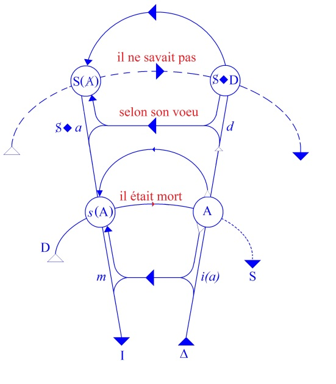
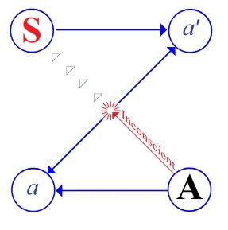
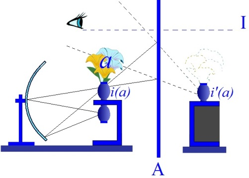

# Leçon 07 | 07 Janvier 1959

  

    <label><input type="checkbox" data-lacan-toggle="original" checked> 原文</label>
    <label><input type="checkbox" data-lacan-toggle="notes" checked> 注释</label>
    <label><input type="checkbox" data-lacan-toggle="commentary" checked> 个人解读评论</label>
  

  <form class="lacan-tool-search" role="search">
    <input class="lacan-tool-search-input" type="search" placeholder="搜索全文" aria-label="搜索全文">
    <button class="lacan-tool-button" type="submit" title="搜索">搜索</button>
  </form>
  <button class="lacan-tool-button lacan-back-to-top" type="button" title="回到页面最上方" aria-label="回到页面最上方">↑</button>

<section class="parallel-paragraph" data-paragraph-ids="s6-07-0001">

s6-07-0001

原文 · s6-07-0001

Il y a une *distinction* à laquelle cette expérience nous confronte, entre :

[无对应译文]

</section>

<section class="parallel-paragraph" data-paragraph-ids="s6-07-0002">

s6-07-0002

原文 · s6-07-0002

- ce que chez le sujet nous devons appeler *le désir*,

[无对应译文]

</section>

<section class="parallel-paragraph" data-paragraph-ids="s6-07-0003">

s6-07-0003

原文 · s6-07-0003

- et la fonction dans la constitution de ce désir, dans la manifestation de ce désir, dans les contradictions qui au cours des traitements éclatent entre le discours du sujet et son comportement,

[无对应译文]

</section>

<section class="parallel-paragraph" data-paragraph-ids="s6-07-0004">

s6-07-0004

原文 · s6-07-0004

…*distinction -* dis-je - essentielle, entre *le désir* et *la demande*.

[无对应译文]

</section>

<section class="parallel-paragraph" data-paragraph-ids="s6-07-0005">

s6-07-0005

原文 · s6-07-0005

S’il y a quelque chose que non seulement les données d’origine : le discours freudien, mais précisément tout le développement du discours freudien, tient dans la suite, à savoir les contradictions qui vont éclater, c’est bien dû au carac­tère problématique qu’y joue *la demande*. Puisque en fin de compte tout ce vers quoi s’est dirigé le développement de l’analyse depuis FREUD, a été de plus en plus de mettre l’importance sur ce qui a été appelé diversement et qui en fin de compte converge vers une notion générale de *névrose de dépendance*.

[无对应译文]

</section>

<section class="parallel-paragraph" data-paragraph-ids="s6-07-0006">

s6-07-0006

原文 · s6-07-0006

C’est-à­-dire que ce qui a été caché, ce qui est voilé derrière cette formule, c’est bien l’accent mis par une sorte de convergence de la théorie et de ses glissements, et de ses échecs de la pratique aussi, c’est-à-dire d’une certaine conception concer­nant la réduction qui est à obtenir par la thérapeutique.

[无对应译文]

</section>

<section class="parallel-paragraph" data-paragraph-ids="s6-07-0007">

s6-07-0007

原文 · s6-07-0007

C’est bien ce qui est caché derrière la notion de *névrose de dépendance*. Le fait fondamental de *la demande* avec ses effets imprimants, comprimants, oppri­mants sur le sujet, qui est là et dont il s’agit justement de chercher si à l’endroit de cette fonction…

[无对应译文]

</section>

<section class="parallel-paragraph" data-paragraph-ids="s6-07-0008">

s6-07-0008

原文 · s6-07-0008

> que nous révélons comme formatrice, selon la formation de la genèse du sujet

[无对应译文]

</section>

<section class="parallel-paragraph" data-paragraph-ids="s6-07-0009">

s6-07-0009

原文 · s6-07-0009

…nous adoptons l’attitude correcte, je veux dire celle qui en fin de compte va être justifiée, à savoir l’élucidation d’une part et la levée, du même coup, du *symptôme*.

[无对应译文]

</section>

<section class="parallel-paragraph" data-paragraph-ids="s6-07-0010">

s6-07-0010

原文 · s6-07-0010

Il est en effet clair que :

[无对应译文]

</section>

<section class="parallel-paragraph" data-paragraph-ids="s6-07-0011">

s6-07-0011

原文 · s6-07-0011

- si le *symptôme* n’est pas simplement quelque chose que nous devons considérer comme le legs d’une sorte de soustraction, de suspension qui s’appelle *frustration*,

[无对应译文]

</section>

<section class="parallel-paragraph" data-paragraph-ids="s6-07-0012">

s6-07-0012

原文 · s6-07-0012

- si cela n’est pas simplement une sorte de déformation du sujet, de quelque façon qu’on l’envi­sage, sous l’effet de quelque chose qui se dose en fonction d’un certain rapport au *réel* : comme je l’ai dit *une frustration imaginaire* c’est toujours à quelque chose de *réel* qu’elle se rapporte,

[无对应译文]

</section>

<section class="parallel-paragraph" data-paragraph-ids="s6-07-0013">

s6-07-0013

原文 · s6-07-0013

- si ce n’est pas cela, si entre ce que nous découvrons effectivement dans l’analyse comme ses suites, ses séquences, ses effets, voire ses effets durables, ces impressions de frustration et le symptôme, il y a quelque chose d’autre, d’une dialectique infiniment plus complexe, et qui s’appelle *le désir*,

[无对应译文]

</section>

<section class="parallel-paragraph" data-paragraph-ids="s6-07-0014">

s6-07-0014

原文 · s6-07-0014

- si *le désir* est quelque chose qui ne peut se saisir et se com­prendre qu’au nœud le plus étroit, non pas de quelques impressions laissées par le *réel*, mais au point le plus étroit *où se nouent ensemble* pour l’homme, *réel*, *imaginaire* et son sens *symbolique*, ce qui est précisément *ce que j’ai essayé de démontrer.*

[无对应译文]

</section>

<section class="parallel-paragraph" data-paragraph-ids="s6-07-0015">

s6-07-0015

原文 · s6-07-0015

- Et c’est ce pourquoi le rapport du désir au fantasme s’exprime ici \[*d*→ S◊*a*)\] dans ce champ intermédiaire entre *les deux lignes structurales* de toute énoncia­tion signifiante \[*entre* *s*(A)→ A *et* S(A)→ S◊D)\].

[无对应译文]

</section>

<section class="parallel-paragraph" data-paragraph-ids="s6-07-0016">

s6-07-0016

原文 · s6-07-0016

- Si *le désir* est bien là, si c’est de là que partent les phénomènes disons méta­phoriques, c’est-à-dire l’interférence du signifiant refoulé sur un signifiant patent qui constitue *le symptôme*,

[无对应译文]

</section>

<section class="parallel-paragraph" data-paragraph-ids="s6-07-0017">

s6-07-0017

原文 · s6-07-0017

…alors, il est clair que c’est tout manquer que de ne pas chercher à structurer, à organiser, à situer la place du *désir*.

[无对应译文]

</section>

<section class="parallel-paragraph" data-paragraph-ids="s6-07-0018">

s6-07-0018

原文 · s6-07-0018

Ceci, nous avons commencé de le faire cette année en pre­nant un rêve sur lequel je me suis long­temps arrêté, rêve singulier, rêve que FREUD se trouve avoir à deux reprises mis en valeur…

[无对应译文]

</section>

<section class="parallel-paragraph" data-paragraph-ids="s6-07-0019">

s6-07-0019

原文 · s6-07-0019

> je veux dire *avoir intégré secondairement à la Traumdeutung* après lui avoir donné une place particu­lière tout à fait utile dans l’article *Les Deux Principes de l’événement psychique, le désir et le principe de réalité,* article publié en 1911

[无对应译文]

</section>

<section class="parallel-paragraph" data-paragraph-ids="s6-07-0020">

s6-07-0020

原文 · s6-07-0020

…ce rêve est celui de l’apparition du père mort.

[无对应译文]

</section>

<section class="parallel-paragraph" data-paragraph-ids="s6-07-0021">

s6-07-0021

原文 · s6-07-0021

Nous avons essayé d’en situer les éléments sur la chaîne double telle que j’en ai montré la distinction structurale, dans ce qu’on peut appeler *le graphe*, de l’inscription du sujet biologique élémentaire, du sujet du besoin dans les défilés de la demande, et longuement articulé.

[无对应译文]

</section>

<section class="parallel-paragraph" data-paragraph-ids="s6-07-0022">

s6-07-0022

原文 · s6-07-0022

J’ai posé pour vous comment nous devions considérer cette articulation fondamentalement double : pour autant qu’elle n’est jamais demande de *quelque chose*, pour autant qu’à l’arrière fond de toute demande précise, de toute demande de satisfaction, le fait même du langage, en symbolisant l’autre…

[无对应译文]

</section>

<section class="parallel-paragraph" data-paragraph-ids="s6-07-0023">

s6-07-0023

原文 · s6-07-0023

l’autre comme présence et comme absence

[无对应译文]

</section>

<section class="parallel-paragraph" data-paragraph-ids="s6-07-0024">

s6-07-0024

原文 · s6-07-0024

…comme pouvant être le sujet du don d’amour qu’il donne par sa *présence* et rien que par sa *présence*, je veux dire en tant qu’il ne donne rien d’autre, c’est-à-dire en tant :

[无对应译文]

</section>

<section class="parallel-paragraph" data-paragraph-ids="s6-07-0025">

s6-07-0025

原文 · s6-07-0025

- précisément ce qu’il donne est au-delà de tout ce qu’il peut donner,

[无对应译文]

</section>

<section class="parallel-paragraph" data-paragraph-ids="s6-07-0026">

s6-07-0026

原文 · s6-07-0026

- que ce qu’il donne est justement ce *rien* qui est tout de la détermination présence-absence.

[无对应译文]

</section>

<section class="parallel-paragraph" data-paragraph-ids="s6-07-0027">

s6-07-0027

原文 · s6-07-0027

Nous avons articulé ce rêve en rejetant de façon didactique sur cette duplicité des *signes*, quelque chose qui nous permet de saisir dans la structure du rêve, le rapport qui est établi par cette production fantasmatique dont FREUD a tenté d’élucider la structure tout au long de sa vie - magistralement dans la *Traumdeu­tung -* et nous essayons d’en voir la fonction pour ce fils en deuil d’un père sans aucun doute aimé, veillé jusqu’à la fin de son agonie, qu’il fait ressurgir dans des conditions que le rêve articule avec une simplicité exemplaire : c’est-à-dire que ce père apparaît comme il était de son vivant, qu’*il parle*, et que le fils devant lui, *muet*, *poigné*, *étreint*, saisi par *la douleur*, *la douleur* - dit-il - de penser que : « *son père était mort et qu’il ne le savait pas* ».

[无对应译文]

</section>

<section class="parallel-paragraph" data-paragraph-ids="s6-07-0028">

s6-07-0028

原文 · s6-07-0028

FREUD nous dit, *il faut compléter* : « *qu’il était mort, selon son vœu* ». Il ne savait pas - quoi ? - *que c’était* « *selon son vœu* ». Tout est là donc, et si nous essayons d’entrer de plus près dans ce qui est la construction, la structure de ce rêve, nous remarquons ceci : c’est que le sujet se confronte avec une certaine image et dans certaines conditions.

[无对应译文]

</section>

<section class="parallel-paragraph" data-paragraph-ids="s6-07-0029">

s6-07-0029

原文 · s6-07-0029

Je dirais qu’entre ce qui est assumé dans le rêve par le sujet et cette image à quoi il se confronte, une distribution, une répartition s’établit qui va nous montrer l’essence du phénomène. Déjà nous avions essayé de l’articuler, de la cerner si je puis dire, en répartis­sant sur l’échelle signifiante les thèmes signifiants caractéristiques.

[无对应译文]

</section>

<section class="parallel-paragraph" data-paragraph-ids="s6-07-0030">

s6-07-0030

原文 · s6-07-0030

[无对应译文]

</section>

<section class="parallel-paragraph" data-paragraph-ids="s6-07-0031">

s6-07-0031

原文 · s6-07-0031

Sur la ligne supérieure le « *il ne le savait pas* », référence essentiellement subjective dans son essence, qui va au fond de la structure du sujet : « *il ne savait pas* » comme tel, ne concerne rien de factuel. C’est quelque chose qui implique la profondeur, la dimension du sujet - et nous savons qu’ici elle est ambiguë - c’est-à-dire que ce qu’*il ne savait pas*, nous allons le voir, n’est pas seulement et purement attribuable à celui auquel il est appliqué…

[无对应译文]

</section>

<section class="parallel-paragraph" data-paragraph-ids="s6-07-0032">

s6-07-0032

原文 · s6-07-0032

> *paradoxalement*, *absurdement*, d’une façon qui résonne contradictoire et même d’une façon de *non-sens*

[无对应译文]

</section>

<section class="parallel-paragraph" data-paragraph-ids="s6-07-0033">

s6-07-0033

原文 · s6-07-0033

…à celui qui est mort, mais résonne aussi bien *dans le sujet* qui participe de cette ignorance.

[无对应译文]

</section>

<section class="parallel-paragraph" data-paragraph-ids="s6-07-0034">

s6-07-0034

原文 · s6-07-0034

Précisément ce quelque chose est essentiel. En outre voici comment le sujet se pose dans *la suspension* si je puis dire de l’articulation onirique. Lui, *le sujet* tel qu’il se pose, tel qu’il s’assume *sait* - si l’on peut dire, puisque *l’autre ne sait pas -* la position de l’autre « *subjective* ».

[无对应译文]

</section>

<section class="parallel-paragraph" data-paragraph-ids="s6-07-0035">

s6-07-0035

原文 · s6-07-0035

Et ici « *l’être en défaut* » si l’on peut dire, qu’il soit mort bien sûr, c’est là un énoncé qui *en fin de compte* ne saurait l’atteindre : *toute expression symbolique* telle que celle-ci : de « *l’être mort* », le fait subsister, *en fin de compte* le conserve. C’est précisément bien le paradoxe de *cette position symbolique*, c’est qu’il n’y a « *pas d’être* » à « *l’être* », d’affirmation de « *l’être mort* », qui d’une certaine façon ne *l’immor­talise*. Et c’est bien de cela qu’il s’agit ans le rêve.

[无对应译文]

</section>

<section class="parallel-paragraph" data-paragraph-ids="s6-07-0036">

s6-07-0036

原文 · s6-07-0036

Mais cette « *position subjective* » de « *l’être en défaut* », cette *moins-value subjective*, ne vise pas qu’il soit mort, elle vise essentiellement ceci : qu’il est celui qui *ne le sait pas*.

[无对应译文]

</section>

<section class="parallel-paragraph" data-paragraph-ids="s6-07-0037">

s6-07-0037

原文 · s6-07-0037

C’est ainsi que le sujet se situe en face de l’autre, aussi bien cette sorte de protection exercée à l’égard de l’autre…

[无对应译文]

</section>

<section class="parallel-paragraph" data-paragraph-ids="s6-07-0038">

s6-07-0038

原文 · s6-07-0038

> qui fait que non seulement *il ne sait pas*, mais qu’à la limite, je dirais qu’*il ne faut pas le lui dire*

[无对应译文]

</section>

<section class="parallel-paragraph" data-paragraph-ids="s6-07-0039">

s6-07-0039

原文 · s6-07-0039

…est quelque chose qui se trouve toujours *plus ou moins* à la racine de toute communication entre les êtres, ce qu’*on peut* et ce qu’*on ne peut pas* lui faire savoir. Voilà quelque chose dont vous devez tou­jours soupeser les incidences chaque fois que vous avez affaire au discours analytique.

[无对应译文]

</section>

<section class="parallel-paragraph" data-paragraph-ids="s6-07-0040">

s6-07-0040

原文 · s6-07-0040

On parlait hier soir de ceux qui ne peuvent pas dire, s’exprimer : des obstacles, de la résistance à proprement parler du discours. Cette dimension est essen­tielle pour rapprocher de ce rêve un autre rêve qui est emprunté à la dernière page du journal de TROTSKI, à la fin de son séjour en France, au début de la der­nière guerre, je crois, rêve qui est une chose *singulièrement émouvante*.

[无对应译文]

</section>

<section class="parallel-paragraph" data-paragraph-ids="s6-07-0041">

s6-07-0041

原文 · s6-07-0041

C’est au moment où - peut-être pour la première fois - TROTSKI commence à sentir en lui les premiers coups de cloche de je ne sais quel fléchissement de la puissance vitale si inépuisable chez ce sujet. Et il voit apparaître dans un rêve son compagnon LÉNINE qui le félicite de sa bonne santé, de son caractère impossible à abattre.

[无对应译文]

</section>

<section class="parallel-paragraph" data-paragraph-ids="s6-07-0042">

s6-07-0042

原文 · s6-07-0042

Et l’autre - d’une façon qui prend sa valeur de cette ambiguïté qu’il y a toujours dans le dialogue - lui laisse entendre que peut-être cette fois, il y a en lui quelque chose qui n’est pas toujours au même niveau que son *vieux compagnon* lui a toujours connu. Mais ce à quoi il pense - ce *vieux compagnon* ainsi surgi d’une façon si significative à un moment critique, tournant de l’évolution vitale - c’est à le ménager.

[无对应译文]

</section>

<section class="parallel-paragraph" data-paragraph-ids="s6-07-0043">

s6-07-0043

原文 · s6-07-0043

Et voulant rappeler quelque chose qui précisément se rapporte au moment où lui-même, LÉNINE, a fléchi dans son effort, il dit pour lui désigner ce moment où il est mort : « *le moment où tu étais très, très malade* », comme si quelque formulation précise de ce dont il s’agissait devait par son seul souffle dissiper l’*ombre* en face de laquelle le même TROTSKI, dans son rêve, à ce même tournant de son existence, se maintient.

[无对应译文]

</section>

<section class="parallel-paragraph" data-paragraph-ids="s6-07-0044">

s6-07-0044

原文 · s6-07-0044

Eh bien, si d’une part, dans cette répartition entre les deux formes affrontées :

[无对应译文]

</section>

<section class="parallel-paragraph" data-paragraph-ids="s6-07-0045">

s6-07-0045

原文 · s6-07-0045

- ignorance émise sur l’autre,

[无对应译文]

</section>

<section class="parallel-paragraph" data-paragraph-ids="s6-07-0046">

s6-07-0046

原文 · s6-07-0046

- qui lui est imputée,

[无对应译文]

</section>

<section class="parallel-paragraph" data-paragraph-ids="s6-07-0047">

s6-07-0047

原文 · s6-07-0047

…comment ne pas voir qu’inver­sement il y a quelque chose là qui n’est pas autre chose que l’ignorance du sujet lui-même *qui ne sait pas* :

[无对应译文]

</section>

<section class="parallel-paragraph" data-paragraph-ids="s6-07-0048">

s6-07-0048

原文 · s6-07-0048

- non seulement quelle est la signification de son rêve, à savoir tout ce qui lui est *sous-jacen*t, ce que FREUD évoque, à savoir son histoire inconsciente, *les vœux anciens*, mortels, contre le père,

[无对应译文]

</section>

<section class="parallel-paragraph" data-paragraph-ids="s6-07-0049">

s6-07-0049

原文 · s6-07-0049

- *mais plus encore quelle est la nature de la douleur même à laquelle, à ce moment-là, le sujet participe, à savoir* *cette douleur...* dont en en cherchant le chemin et l’origine nous avons reconnu cette douleur éprouvée, entrevue dans la participation des derniers moments du père …*de l’existence* comme telle, en tant qu’elle subsiste *à la limite*, dans *cet état* où plus rien n’en est encore appréhendé, le fait du caractère inex­tinguible de cette existence même et la *douleur fondamentale* qui l’accompagne quand tout désir s’en efface, quand tout désir en est évanoui.

[无对应译文]

</section>

<section class="parallel-paragraph" data-paragraph-ids="s6-07-0050">

s6-07-0050

原文 · s6-07-0050

C’est précisément cette douleur que le sujet assume, mais comme étant une douleur qu’il motive elle aussi absurdement, puisqu’il la motive uniquement de *l’ignorance de l’autre*, de quelque chose qui, en fin de compte, si on y regarde de très près n’est pas plus un motif de ce qui l’accompagne comme motivation, que le surgissement, l’affect dans une crise hystérique qui s’organise apparemment d’un contexte dans lequel il est extrapolé, mais qui en fait ne s’en motive pas.

[无对应译文]

</section>

<section class="parallel-paragraph" data-paragraph-ids="s6-07-0051">

s6-07-0051

原文 · s6-07-0051

Cette douleur, c’est précisément de la prendre sur lui que le sujet s’aveugle sur sa proximité, sur le fait que dans l’agonie et dans la disparition de son père, c’est quelque chose qui le menace lui-même, qu’il a vécu et dont il se sépare actuellement par cette image réévoquée, cette image qui le rattache à ce *quelque chose* qui sépare et qui apaise l’homme, dans cette sorte d’abîme ou de vertige qui s’ouvre à lui chaque fois qu’il est confronté avec le dernier terme de son existence. C’est-à-dire justement ce qu’il a besoin d’interposer entre lui et cette existence, dans l’occasion *un désir*. Il ne cite pas n’importe quel support de son désir, n’importe quel désir mais le plus proche et le plus urgent, le meilleur, celui qu’il a dominé longtemps, celui qui l’a maintenant abattu.

[无对应译文]

</section>

<section class="parallel-paragraph" data-paragraph-ids="s6-07-0052">

s6-07-0052

原文 · s6-07-0052

Il le faut faire - pour un certain temps - revivre *imaginairement*, parce que dans cette rivalité avec *le père*, dans ce qu’il y a là de fond de pouvoir dans le fait que lui triomphe en fin de compte, du fait qu’il ne sait pas, l’autre, alors que lui sait. Là est la mince passerelle grâce à quoi le sujet ne se sent pas lui-même directement *envahi*, directement *englouti*, parce que ce qui s’ouvre à lui de *béance*, de *confrontation* pure et simple avec l’angoisse de la mort, telle que nous savons en fait que la mort du père, chaque fois qu’elle se produit, est pour le sujet ressen­tie comme la disparition - dans un langage plus grossier - de *cette sorte de bou­clier, d’interposition, de substitution qu’est le père, au maître absolu, c’est-à-dire à la mort*.

[无对应译文]

</section>

<section class="parallel-paragraph" data-paragraph-ids="s6-07-0053">

s6-07-0053

原文 · s6-07-0053

On commence de voir ici s’esquisser une sorte de figure qui est constituée par quoi ? La formule que j’essaye de vous présenter comme étant la formule fon­damentale de ce qui constitue le support, le rapport intra-subjectif essentiel où tout désir comme tel doit s’inscrire.

[无对应译文]

</section>

<section class="parallel-paragraph" data-paragraph-ids="s6-07-0054">

s6-07-0054

原文 · s6-07-0054

C’est sous cette forme la plus simple, celle qui est inscrite ici, ce rapport séparé dans le rapport quadrilatère, celui du *schéma L*, celui du sujet au grand Autre pour autant que ce discours partielle­ment inconscient qui vient du grand Autre vient s’interposer en lui.

[无对应译文]

</section>

<section class="parallel-paragraph" data-paragraph-ids="s6-07-0055">

s6-07-0055

原文 · s6-07-0055

[无对应译文]

</section>

<section class="parallel-paragraph" data-paragraph-ids="s6-07-0056">

s6-07-0056

原文 · s6-07-0056

La tension *a*–*a’*, ce qu’on peut encore sous certains rapports appeler la tension *image de (a)* par rapport à *(a’)*, selon qu’il s’agit du *rapport a*–*a’* *du sujet à l’objet*, du rapport *image de (a)* par rapport à l’*autre*, pour autant qu’elle structure ce rapport.

[无对应译文]

</section>

<section class="parallel-paragraph" data-paragraph-ids="s6-07-0057">

s6-07-0057

原文 · s6-07-0057

C’est justement l’*absent* qui comme étant caractéristique du rapport du désir sur le rapport du sujet S, avec les fonctions imaginaires, qui est exprimé dans la for­mule S ◊ *a*, en ce sens que *le désir* comme tel, et par rapport à tout objet pos­sible pour l’homme, pose pour lui la question de son élision subjective.

[无对应译文]

</section>

<section class="parallel-paragraph" data-paragraph-ids="s6-07-0058">

s6-07-0058

原文 · s6-07-0058

Je veux dire qu’en tant que le sujet, dans le registre, dans la dimension de la parole en tant qu’il s’y inscrit en tant que demandeur, à approcher de ce quelque chose qui est l’objet le plus élaboré, le plus évolué…

[无对应译文]

</section>

<section class="parallel-paragraph" data-paragraph-ids="s6-07-0059">

s6-07-0059

原文 · s6-07-0059

> ce que plus ou moins adroi­tement la conception analytique nous présente comme étant *l’objet de l’oblati­vité*, cette notion, je l’ai souvent souligné, fait difficulté, c’est à celle-là que nous essayons nous aussi de nous confronter, que nous essayons de formuler d’une façon plus rigoureuse

[无对应译文]

</section>

<section class="parallel-paragraph" data-paragraph-ids="s6-07-0060">

s6-07-0060

原文 · s6-07-0060

…le sujet, pour autant que comme désir…

[无对应译文]

</section>

<section class="parallel-paragraph" data-paragraph-ids="s6-07-0061">

s6-07-0061

原文 · s6-07-0061

> c’est-à-dire dans la plénitude d’un destin humain qui est celui d’un sujet parlant

[无对应译文]

</section>

<section class="parallel-paragraph" data-paragraph-ids="s6-07-0062">

s6-07-0062

原文 · s6-07-0062

…à approcher cet objet, se trouve pris dans cette sorte d’impasse qui fait qu’il ne saurait l’atteindre lui-même, cet objet comme objet, qu’en quelque façon en se trouvant lui comme sujet, sujet de la parole, ou dans cette élision qui le laisse dans la nuit du trau­matisme, à proprement parler dans ce qui est au-delà de l’angoisse même, ou de se trouver devoir prendre la place, se substituer, se subsumer sous un certain signifiant qui se trouve…

[无对应译文]

</section>

<section class="parallel-paragraph" data-paragraph-ids="s6-07-0063">

s6-07-0063

原文 · s6-07-0063

> je l’articule purement et simplement pour l’instant, je ne le justifie pas puisque c’est tout notre développement qui doit le justifier, et toute l’expérience analytique est là pour le justifier

[无对应译文]

</section>

<section class="parallel-paragraph" data-paragraph-ids="s6-07-0064">

s6-07-0064

原文 · s6-07-0064

…être le *phallus*.

[无对应译文]

</section>

<section class="parallel-paragraph" data-paragraph-ids="s6-07-0065">

s6-07-0065

原文 · s6-07-0065

C’est de là que part le fait que dans toute assomption *de la position mûre, de la position que nous appelons génitale*, quelque chose se produit au niveau de l’imaginaire qui s’appelle la castration et a son incidence au niveau de l’imagi­naire.

[无对应译文]

</section>

<section class="parallel-paragraph" data-paragraph-ids="s6-07-0066">

s6-07-0066

原文 · s6-07-0066

Pourquoi ? Parce que le *phallus*, entre autres…

[无对应译文]

</section>

<section class="parallel-paragraph" data-paragraph-ids="s6-07-0067">

s6-07-0067

原文 · s6-07-0067

> il n’y a que dans cette pers­pective que nous pouvons comprendre toute la problématique
>
> qu’a soulevé le fait, véritablement à l’infini, et dont il est impossible autrement de sortir

[无对应译文]

</section>

<section class="parallel-paragraph" data-paragraph-ids="s6-07-0068">

s6-07-0068

原文 · s6-07-0068

…la question de *la phase phallique* pour les analystes, la contradiction je dirais, le dialogue FREUD-JONES sur ce sujet, qui est singulièrement pathétique…

[无对应译文]

</section>

<section class="parallel-paragraph" data-paragraph-ids="s6-07-0069">

s6-07-0069

原文 · s6-07-0069

Toute cette sorte d’impasse où JONES entre…

[无对应译文]

</section>

<section class="parallel-paragraph" data-paragraph-ids="s6-07-0070">

s6-07-0070

原文 · s6-07-0070

> lorsque se révoltant contre la conception trop  simple que se fait FREUD de la fonction phallique comme étant le terme uni­voque autour de quoi pivote tout le développement concret, historique, de la sexualité chez l’homme et la femme

[无对应译文]

</section>

<section class="parallel-paragraph" data-paragraph-ids="s6-07-0071">

s6-07-0071

原文 · s6-07-0071

…met en valeur ce qu’il appelle les « *fonctions de défense* » liées à cette image du *phallus*. L’un et l’autre en fin de compte *disent la même chose*, ils l’abordent par des points de vue différents.

[无对应译文]

</section>

<section class="parallel-paragraph" data-paragraph-ids="s6-07-0072">

s6-07-0072

原文 · s6-07-0072

Ils ne peuvent se rencontrer assurément faute de cette notion centrale, fondamentale, qui fait que *nous devons concevoir le phallus comme*, dans cette occasion, pris, soustrait si l’on peut dire, à la communauté *imaginaire*, à la diversité, à la multiplicité des *images* qui viennent assumer les fonctions corporelles, isolé en face de toutes les autres dans cette fonction privilégiée qui en fait *le signifiant du sujet*.

[无对应译文]

</section>

<section class="parallel-paragraph" data-paragraph-ids="s6-07-0073">

s6-07-0073

原文 · s6-07-0073

Éclairons encore plus ici notre lanterne et disons ceci, qu’en somme sur les deux plans, qui sont : le premier plan immédiat, apparent, spontané qui est l’appel…

[无对应译文]

</section>

<section class="parallel-paragraph" data-paragraph-ids="s6-07-0074">

s6-07-0074

原文 · s6-07-0074

- qui est « *au secours ! * »,

[无对应译文]

</section>

<section class="parallel-paragraph" data-paragraph-ids="s6-07-0075">

s6-07-0075

原文 · s6-07-0075

- qui est « *du pain !* »,

[无对应译文]

</section>

<section class="parallel-paragraph" data-paragraph-ids="s6-07-0076">

s6-07-0076

原文 · s6-07-0076

- qui est *un cri* en fin de compte,

[无对应译文]

</section>

<section class="parallel-paragraph" data-paragraph-ids="s6-07-0077">

s6-07-0077

原文 · s6-07-0077

- qui est en tout cas *quelque chose où*, de la façon la plus totale, *le sujet est iden­tique pour un moment à ce besoin*

[无对应译文]

</section>

<section class="parallel-paragraph" data-paragraph-ids="s6-07-0078">

s6-07-0078

原文 · s6-07-0078

…tout de même doit s’articuler au « *niveau quésitif* » de la demande qui se trouve, lui, dans le premier rapport, dans l’expérience entre l’enfant et la mère, fonction de ce qui est articulé et qui sera de plus en plus articulé bien sûr dans le rapport de l’enfant et de la mère, de tout ce qu’il lui substitue de l’ensemble de la société qui parle sa propre langue.

[无对应译文]

</section>

<section class="parallel-paragraph" data-paragraph-ids="s6-07-0079">

s6-07-0079

原文 · s6-07-0079

Entre ce niveau et le « *niveau votif* », c’est-à-dire là où le sujet, tout au cours de sa vie, a à se retrouver, c’est-à-dire à trouver ce qui lui a échappé parce qu’étant au-delà, en dehors de tout, *la forme du langage*…

[无对应译文]

</section>

<section class="parallel-paragraph" data-paragraph-ids="s6-07-0080">

s6-07-0080

原文 · s6-07-0080

de plus en plus, et à mesure qu’elle se déve­loppe

[无对应译文]

</section>

<section class="parallel-paragraph" data-paragraph-ids="s6-07-0081">

s6-07-0081

原文 · s6-07-0081

…laisse passer, laisse filtrer, rejette, refoule de ce qui d’abord tendait à s’expri­mer de son besoin.

[无对应译文]

</section>

<section class="parallel-paragraph" data-paragraph-ids="s6-07-0082">

s6-07-0082

原文 · s6-07-0082

Cette articulation au second degré, c’est ce qui…

[无对应译文]

</section>

<section class="parallel-paragraph" data-paragraph-ids="s6-07-0083">

s6-07-0083

原文 · s6-07-0083

> comme étant justement modelé, *transformé par sa parole*, c’est-à-dire cet essai,
>
> cette tentative de passer au-delà de cette transformation même

[无对应译文]

</section>

<section class="parallel-paragraph" data-paragraph-ids="s6-07-0084">

s6-07-0084

原文 · s6-07-0084

…c’est cela que nous faisons dans l’analyse.

[无对应译文]

</section>

<section class="parallel-paragraph" data-paragraph-ids="s6-07-0085">

s6-07-0085

原文 · s6-07-0085

Et c’est pourquoi on peut dire que, de même *que tout ce qui réside de ce qui doit s’articuler au niveau quésitif est là au* A :

[无对应译文]

</section>

<section class="parallel-paragraph" data-paragraph-ids="s6-07-0086">

s6-07-0086

原文 · s6-07-0086

- comme un code pré-dé­terminé, combien préexistant à l’expérience du sujet,

[无对应译文]

</section>

<section class="parallel-paragraph" data-paragraph-ids="s6-07-0087">

s6-07-0087

原文 · s6-07-0087

- comme étant *ce qui dans l’Autre est offert au jeu du langage*, *à la première batterie signifiante* que le sujet expérimente pour autant qu’il apprend à parler.

[无对应译文]

</section>

<section class="parallel-paragraph" data-paragraph-ids="s6-07-0088">

s6-07-0088

原文 · s6-07-0088

Qu’est-ce que nous faisons dans l’analyse ? Qu’est-ce que nous rencontrons ? Qu’est-ce que nous reconnaissons lorsque nous disons que le sujet en est au *stade oral*, au *stade anal*, etc. ?

[无对应译文]

</section>

<section class="parallel-paragraph" data-paragraph-ids="s6-07-0089">

s6-07-0089

原文 · s6-07-0089

Rien d’autre que ce qui est exprimé sous cette forme mûre dont il ne faut pas oublier l’élément complet : c’est le sujet en tant que marqué par la parole et dans un certain rapport avec sa demande. C’est ceci littéralement que dans telle ou telle interprétation où nous lui faisons sentir la structuration *orale*, *anale*, ou autre de sa demande :

[无对应译文]

</section>

<section class="parallel-paragraph" data-paragraph-ids="s6-07-0090">

s6-07-0090

原文 · s6-07-0090

- nous ne faisons pas simplement recon­naissance du caractère *anal* de la demande, nous confrontons le sujet à ce carac­tère *anal* ou *oral*,

[无对应译文]

</section>

<section class="parallel-paragraph" data-paragraph-ids="s6-07-0091">

s6-07-0091

原文 · s6-07-0091

- nous n’intéressons pas simplement à quelque chose qui est immanent dans ce que nous articulons comme étant la demande du sujet, nous confrontons le sujet à cette structure de sa demande.

[无对应译文]

</section>

<section class="parallel-paragraph" data-paragraph-ids="s6-07-0092">

s6-07-0092

原文 · s6-07-0092

Et c’est là justement que doit balancer, osciller, vaciller l’accentuation de notre interprétation. Car accen­tuée d’une certaine façon :

[无对应译文]

</section>

<section class="parallel-paragraph" data-paragraph-ids="s6-07-0093">

s6-07-0093

原文 · s6-07-0093

- nous lui apprenons à reconnaître quelque chose qui, si l’on peut dire, est à ce niveau supérieur, *niveau votif*, niveau de ses vœux, de ce qu’il souhaite, en tant qu’ils sont inconscients.

[无对应译文]

</section>

<section class="parallel-paragraph" data-paragraph-ids="s6-07-0094">

s6-07-0094

原文 · s6-07-0094

- Nous lui apprenons si l’on peut dire à parler, à se reconnaître dans ce qui correspond au D à ce niveau, mais nous ne lui donnons pas pour autant les réponses.

[无对应译文]

</section>

<section class="parallel-paragraph" data-paragraph-ids="s6-07-0095">

s6-07-0095

原文 · s6-07-0095

[无对应译文]

</section>

<section class="parallel-paragraph" data-paragraph-ids="s6-07-0096">

s6-07-0096

原文 · s6-07-0096

En soutenant l’interprétation entièrement dans ce registre de la reconnaissance des supports signifiants cachés dans sa demande, inconscients, nous ne faisons rien d’autre. Si nous oublions ce dont il s’agit, c’est-à-dire de confronter le sujet avec sa demande, nous ne nous apercevons pas que ce que nous produisons c’est juste­ment le collapse, l’effacement de la fonction du sujet comme tel dans la révéla­tion de ce vocabulaire inconscient, nous sollicitons *le sujet* de s’effacer et de disparaître. Et c’est bel et bien *dans beaucoup de cas ce dont il s’agit*.

[无对应译文]

</section>

<section class="parallel-paragraph" data-paragraph-ids="s6-07-0097">

s6-07-0097

原文 · s6-07-0097

C’est à savoir que dans « *un certain apprentissage* » que l’on peut faire dans l’analyse de l’inconscient, d’une certaine façon, *ce qui disparaît*, *ce qui fuit*, *ce qui est de plus en plus réduit*, ce n’est rien d’autre que *cette exigence* qui est celle *du sujet de se manifester au-delà de tout cela dans son être*.

[无对应译文]

</section>

<section class="parallel-paragraph" data-paragraph-ids="s6-07-0098">

s6-07-0098

原文 · s6-07-0098

À le ramener sans cesse au niveau de la demande on finit bien par quelque côté…

[无对应译文]

</section>

<section class="parallel-paragraph" data-paragraph-ids="s6-07-0099">

s6-07-0099

原文 · s6-07-0099

> et c’est ce que l’on appelle « *dans une certaine technique* » l’analyse des résistances

[无对应译文]

</section>

<section class="parallel-paragraph" data-paragraph-ids="s6-07-0100">

s6-07-0100

原文 · s6-07-0100

…*par réduire* purement et simplement *ce qui est son désir*. Or s’il est simple et facile de voir :

[无对应译文]

</section>

<section class="parallel-paragraph" data-paragraph-ids="s6-07-0101">

s6-07-0101

原文 · s6-07-0101

- que dans la relation du sujet à l’Autre, la réponse se fait rétroactivement et ailleurs,

[无对应译文]

</section>

<section class="parallel-paragraph" data-paragraph-ids="s6-07-0102">

s6-07-0102

原文 · s6-07-0102

- que là quelque chose retourne en arrière sur le sujet pour le confirmer dans le sens de la demande, pour l’identi­fier à l’occasion à sa propre demande,

[无对应译文]

</section>

<section class="parallel-paragraph" data-paragraph-ids="s6-07-0103">

s6-07-0103

原文 · s6-07-0103

Il est clair de même, *au niveau où le sujet cherche à se situer, à se reconnaître justement dans ce qu’il est au delà de cette demande* :

[无对应译文]

</section>

<section class="parallel-paragraph" data-paragraph-ids="s6-07-0104">

s6-07-0104

原文 · s6-07-0104

- qu’il y a une place pour la réponse,

[无对应译文]

</section>

<section class="parallel-paragraph" data-paragraph-ids="s6-07-0105">

s6-07-0105

原文 · s6-07-0105

- que cette place pour la réponse, là schématisée par S signifiant de A barré, S(A).

[无对应译文]

</section>

<section class="parallel-paragraph" data-paragraph-ids="s6-07-0106">

s6-07-0106

原文 · s6-07-0106

… c’est-à-dire le rappel :

[无对应译文]

</section>

<section class="parallel-paragraph" data-paragraph-ids="s6-07-0107">

s6-07-0107

原文 · s6-07-0107

- que l’Autre lui aussi, est *marqué par le signifiant*,

[无对应译文]

</section>

<section class="parallel-paragraph" data-paragraph-ids="s6-07-0108">

s6-07-0108

原文 · s6-07-0108

- que lui aussi - l’Autre - est aboli d’une certaine façon dans le discours,

[无对应译文]

</section>

<section class="parallel-paragraph" data-paragraph-ids="s6-07-0109">

s6-07-0109

原文 · s6-07-0109

…cela n’est rien qu’indiquer un point théorique dont nous verrons la forme qu’il doit prendre.

[无对应译文]

</section>

<section class="parallel-paragraph" data-paragraph-ids="s6-07-0110">

s6-07-0110

原文 · s6-07-0110

Cette forme, elle est essentielle­ment, justement la reconnaissance de ce qu’a de châtré tout ce qui, de l’être vivant, tente de s’approcher de l’être vivant tel qu’il est évoqué par le langage. Et bien entendu, ce n’est point à ce niveau que nous pouvons d’abord donner la réponse.

[无对应译文]

</section>

<section class="parallel-paragraph" data-paragraph-ids="s6-07-0111">

s6-07-0111

原文 · s6-07-0111

Mais par contre, respecter, viser, explorer, utiliser ce que déjà on exprime *au­-delà de ce lieu de la réponse* chez *le sujet*, et qui est représenté par la situation imaginaire où lui-même se pose, se maintient, se suspend comme dans une sorte de position qui assurément participe par certains côtés des artifices de la défense, c’est bien cela qui fait l’ambiguïté de tellement de manifestations du désir, du *désir pervers* par exemple. C’est pour autant que là, quelque chose s’exprime qui est le point le plus essentiel où l’être du sujet tente de s’affirmer.

[无对应译文]

</section>

<section class="parallel-paragraph" data-paragraph-ids="s6-07-0112">

s6-07-0112

原文 · s6-07-0112

Et ceci est d’autant plus important à considérer qu’il faut considérer que c’est précisément là, en ce lieu même, que doit se produire ce que nous appelons si aisément « *l’objet achevé* », « *la maturation génitale* », autrement dit tout ce qui constituera - comme s’exprime quelque part *bibliquement* M. JONES - les rapports de l’homme et de la femme, se trouvera - du fait que l’homme est un sujet parlant - marqué des difficultés structurelles qui sont celles qui s’expriment dans ce rapport du S avec le *(a)* \[S◊*a*\]. Pourquoi ?

[无对应译文]

</section>

<section class="parallel-paragraph" data-paragraph-ids="s6-07-0113">

s6-07-0113

原文 · s6-07-0113

Parce que précisément, si l’on peut dire que jusqu’à *un certain moment*, *un certain état*, *un certain temps* du développement, le vocabulaire, le code de la demande peut passer dans un certain nombre de relations, lesquelles comportent un objet amovible…

[无对应译文]

</section>

<section class="parallel-paragraph" data-paragraph-ids="s6-07-0114">

s6-07-0114

原文 · s6-07-0114

> à savoir la nourriture pour ce qui est du *rapport oral*, l’excrément pour ce qui est du *rapport anal*,
>
> pour nous limiter pour l’ins­tant à ces deux-là

[无对应译文]

</section>

<section class="parallel-paragraph" data-paragraph-ids="s6-07-0115">

s6-07-0115

原文 · s6-07-0115

…quand il s’agit du rapport génital il est bien évident que ce n’est que par une espèce d’emprunt, de prolongation de ce *morcellement signi­fian*t du sujet dans le rapport de la demande, que quelque chose peut nous appa­raître, et nous apparaît en effet, mais à titre morbide, à titre de toutes ces ­incidences symptomatiques, à savoir le *phallus*.

[无对应译文]

</section>

<section class="parallel-paragraph" data-paragraph-ids="s6-07-0116">

s6-07-0116

原文 · s6-07-0116

Pour une très simple et bonne raison, c’est que bel et bien *le phallus ne l’est pas cet objet amovible, qu’il ne le devient* *que par son passage au rang de signifiant* et que tout ce dont il s’agit dans une maturation génitale complète repose sur ceci : que tout ce qui chez le sujet doit se présenter comme étant ici l’achèvement de son désir est bien, pour le dire en clair, quelque chose qui ne peut pas se demander.

[无对应译文]

</section>

<section class="parallel-paragraph" data-paragraph-ids="s6-07-0117">

s6-07-0117

原文 · s6-07-0117

Et l’essence de la névrose, et ce à quoi nous avons affaire, consiste très préci­sément en ceci : que ce qui ne peut pas se demander sur ce terrain…

[无对应译文]

</section>

<section class="parallel-paragraph" data-paragraph-ids="s6-07-0118">

s6-07-0118

原文 · s6-07-0118

> chez juste­ment le névrosé, ou dans le phénomène névrotique, à savoir dans ce qui apparaît de plus ou moins sporadique dans l’évolution de tous les sujets qui participent de *la structure de la névrose*

[无对应译文]

</section>

<section class="parallel-paragraph" data-paragraph-ids="s6-07-0119">

s6-07-0119

原文 · s6-07-0119

…consiste justement - on retrouve toujours cette structure - en ceci : *que ce qui est de l’ordre du désir s’inscrit, se formule, dans le registre de la demande*.

[无对应译文]

</section>

<section class="parallel-paragraph" data-paragraph-ids="s6-07-0120">

s6-07-0120

原文 · s6-07-0120

Au cours d’une relecture que je faisais récemment de M. JONES, je reprenais tout ce qu’il a écrit sur *La phase phallique* [^35] : c’est très saisissant à tout instant ce qu’il apporte de son expérience la plus fine, la plus directe :

[无对应译文]

</section>

<section class="parallel-paragraph" data-paragraph-ids="s6-07-0121">

s6-07-0121

原文 · s6-07-0121

« *Je voudrais rela­ter quelque chose d’un très grand nombre de patients masculins qui présentent une déficience à achever ou à accomplir leur virilité en relation à d’autres hommes ou à des femmes, et à montrer que leur « failure », leur manque dans cette occasion,* *leur achoppement, et de la façon la plus stricte* \[…\] *leur attitude de besoin d’abord d’acquérir quelque chose des femmes, quelque chose* *que pour une bonne raison, ils ne peuvent jamais réellement acquérir* ».

[无对应译文]

</section>

<section class="parallel-paragraph" data-paragraph-ids="s6-07-0122">

s6-07-0122

原文 · s6-07-0122

\[*I could relate cases of a number of male patients whose failure to achieve manhood – in relation to either men or women – was strictly to be correlated with their attitude* *of needing first to acquire some thing from women, something which of course they never actualy could acquire.* (*The phallic phase, Baillière...* 1950*, p.*461)\]

[无对应译文]

</section>

<section class="parallel-paragraph" data-paragraph-ids="s6-07-0123">

s6-07-0123

原文 · s6-07-0123

« *Pourquoi ?* » dit JONES, et quand il dit « *Pourquoi ?* » dans son article et dans son contexte c’est *un vrai* « *Pourquoi ?* » . Il ne sait pas pourquoi mais il le constate. Il le ponctue comme *un point d’horizon*, *une* *ouverture, une perspective*, un point où les guides lui échappent.

[无对应译文]

</section>

<section class="parallel-paragraph" data-paragraph-ids="s6-07-0124">

s6-07-0124

原文 · s6-07-0124

\[*Why should imperfect access to the nipple give a boy the sense of imperfect possession of his own penis? I am quite conviced that the two things are intimately related, although the logical connection between them is certainly not obvious.* (*The phallic phase, Baillière...* 1950*, p.*461)\]

[无对应译文]

</section>

<section class="parallel-paragraph" data-paragraph-ids="s6-07-0125">

s6-07-0125

原文 · s6-07-0125

« *Pourquoi un accès imparfait au sein peut-il donner au garçon ce sentiment de la possession imparfaite de son propre pénis.* *Je suis tout à fait convaincu que les deux choses sont tout à fait intimement reliées l’une à l’autre, alors que la connexion logique* *entre ces deux choses n’est certainement pas évi­dente.* »

[无对应译文]

</section>

<section class="parallel-paragraph" data-paragraph-ids="s6-07-0126">

s6-07-0126

原文 · s6-07-0126

En tout cas pas évidente pour lui... À tout instant nous retrouvons ces détails sur *la phénoménologie la plus affleurante*, je veux dire les successions nécessaires par lesquelles un sujet se glisse, pour arriver à l’action pleine de son désir, les préalables qui lui sont nécessaires. Nous pouvons les reconstituer, retrouver ce que j’appellerai les cheminements labyrinthiques où se marque le fait essentiel de la position que le sujet a prise dans cette référence, dans cette relation, structurale pour lui, entre désir et demande.

[无对应译文]

</section>

<section class="parallel-paragraph" data-paragraph-ids="s6-07-0127">

s6-07-0127

原文 · s6-07-0127

Et *si le maintien de la position incestueuse dans l’inconscient* est quelque chose qui *a un sens*, et qui a des conséquences effectivement diver­sement ravageantes sur les manifestations du désir, sur l’accomplissement du désir du sujet, ce n’est justement pour rien d’autre que ceci : c’est que *la position dite incestueuse conservée quelque part dans l’inconscient,* *c’est justement cette position de la demande*.

[无对应译文]

</section>

<section class="parallel-paragraph" data-paragraph-ids="s6-07-0128">

s6-07-0128

原文 · s6-07-0128

Le sujet à un moment dit-on - et c’est ainsi que s’exprime M. JONES - a à choisir entre son objet incestueux et son sexe. S’il veut conserver l’un, il doit renoncer à l’autre. Je dirai que ce entre quoi et quoi il a à choisir à tel moment initial, c’est entre *sa demande* et *son désir*.

[无对应译文]

</section>

<section class="parallel-paragraph" data-paragraph-ids="s6-07-0129">

s6-07-0129

原文 · s6-07-0129

Reprenons maintenant, après ces indications générales, le cheminement dans lequel je désire vous introduire pour vous montrer la commune mesure qu’a *cette structuration du désir* et comment effectivement elle se trouve impliquée. Les éléments imaginaires pour autant qu’ils… ils doivent être infléchis, ils doi­vent être pris dans le jeu nécessaire de la partie signifiante pour autant qu’il est commandé - ce jeu - par la structure double du « *votif* » et du « *quésitif* ».

[无对应译文]

</section>

<section class="parallel-paragraph" data-paragraph-ids="s6-07-0130">

s6-07-0130

原文 · s6-07-0130

Prenons un fantasme, le plus banal, le plus commun, celui que FREUD lui-même a étudié, auquel il a accordé une attention spéciale, *le fantasme* « *On bat un enfant* ».

[无对应译文]

</section>

<section class="parallel-paragraph" data-paragraph-ids="s6-07-0131">

s6-07-0131

原文 · s6-07-0131

Reprenons-le maintenant, avec la perspective qui est celle dont nous nous approchons, pour essayer de saisir comment peut se formuler la nécessité du fantasme en tant que support du désir.

[无对应译文]

</section>

<section class="parallel-paragraph" data-paragraph-ids="s6-07-0132">

s6-07-0132

原文 · s6-07-0132

FREUD, parlant de ces fantasmes tels qu’il les a observés sur un certain nombre de sujets à l’époque avec une prédominance chez les femmes, nous dit que la pre­mière phase de la *Schlag fantasie* est restituée…

[无对应译文]

</section>

<section class="parallel-paragraph" data-paragraph-ids="s6-07-0133">

s6-07-0133

原文 · s6-07-0133

> pour autant qu’elle parvient à être réévoquée soit dans *les fantasmes*, soit dans *les souvenirs* du sujet

[无对应译文]

</section>

<section class="parallel-paragraph" data-paragraph-ids="s6-07-0134">

s6-07-0134

原文 · s6-07-0134

…par la phrase suivante :

[无对应译文]

</section>

<section class="parallel-paragraph" data-paragraph-ids="s6-07-0135">

s6-07-0135

原文 · s6-07-0135

> « *Der Vater schlägt das Kind* »

[无对应译文]

</section>

<section class="parallel-paragraph" data-paragraph-ids="s6-07-0136">

s6-07-0136

原文 · s6-07-0136

et que l’enfant qui est battu dans l’occa­sion, est par rapport au sujet ceci :

[无对应译文]

</section>

<section class="parallel-paragraph" data-paragraph-ids="s6-07-0137">

s6-07-0137

原文 · s6-07-0137

> « *Le père bat l’enfant que je hais.* »

[无对应译文]

</section>

<section class="parallel-paragraph" data-paragraph-ids="s6-07-0138">

s6-07-0138

原文 · s6-07-0138

Nous voici donc portés par FREUD, du point initial au cœur même de quelque chose qui se situe dans la qualité la plus aiguë de l’amour et de la haine, celle qui vise l’autre dans son être. Et pour autant :

[无对应译文]

</section>

<section class="parallel-paragraph" data-paragraph-ids="s6-07-0139">

s6-07-0139

原文 · s6-07-0139

- que cet être dans cette occasion est soumis au maximum de la déchéance, dans la valorisation symbolique,

[无对应译文]

</section>

<section class="parallel-paragraph" data-paragraph-ids="s6-07-0140">

s6-07-0140

原文 · s6-07-0140

- que par la vio­lence et le caprice paternel, il est là.

[无对应译文]

</section>

<section class="parallel-paragraph" data-paragraph-ids="s6-07-0141">

s6-07-0141

原文 · s6-07-0141

L’injure ici, si on l’appelle narcissique est quelque chose qui en somme, est totale. Elle vise, chez le sujet haï, ce qui est demandé *au-delà* de toute demande. Elle vise ceci *qu’il est absolument frustré, privé d’amour*.

[无对应译文]

</section>

<section class="parallel-paragraph" data-paragraph-ids="s6-07-0142">

s6-07-0142

原文 · s6-07-0142

Le caractère de déchéance subjective qui est lié pour l’enfant à la rencontre avec la première punition corporelle laisse des traces diverses suivant le caractère diversement répété.

[无对应译文]

</section>

<section class="parallel-paragraph" data-paragraph-ids="s6-07-0143">

s6-07-0143

原文 · s6-07-0143

Et chacun peut constater à l’époque où nous vivons, où ces choses sont extrêmement ménagées aux enfants que, s’il arrive qu’après qu’un enfant n’ait jamais été battu, il soit l’objet une fois de quelques sévices, fussent-ils le plus justifiés, du moins à une époque relativement tardive, on ne saurait imaginer les conséquences, au moins sur l’instant, prostrantes qu’a cette expérience pour l’enfant. Quoi qu’il en soit, nous pouvons considérer comme « donné » que l’expérience primitive est bien là ce dont il s’agit, telle que FREUD nous l’exprime :

[无对应译文]

</section>

<section class="parallel-paragraph" data-paragraph-ids="s6-07-0144">

s6-07-0144

原文 · s6-07-0144

« *Entre cette phase et la suivante il doit se passer quelques grosses transformations* ».

[无对应译文]

</section>

<section class="parallel-paragraph" data-paragraph-ids="s6-07-0145">

s6-07-0145

原文 · s6-07-0145

En effet cette seconde phase, FREUD nous l’exprime ainsi :

[无对应译文]

</section>

<section class="parallel-paragraph" data-paragraph-ids="s6-07-0146">

s6-07-0146

原文 · s6-07-0146

« *la personne qui bat est restée être le père, mais l’enfant battu est devenu régulièrement, dans la règle,* *l’enfant du fantasme lui-même. Le fantasme est à un très très haut degré teinté de plaisir,* *et s’accomplit d’une façon tout à fait significative à laquelle nous aurons affaire plus tard* »

[无对应译文]

</section>

<section class="parallel-paragraph" data-paragraph-ids="s6-07-0147">

s6-07-0147

原文 · s6-07-0147

Et pour cause !

[无对应译文]

</section>

<section class="parallel-paragraph" data-paragraph-ids="s6-07-0148">

s6-07-0148

原文 · s6-07-0148

« *Sa formule articulée est maintenant ainsi : je suis battu par le père.* »

[无对应译文]

</section>

<section class="parallel-paragraph" data-paragraph-ids="s6-07-0149">

s6-07-0149

原文 · s6-07-0149

Mais FREUD ajoute que ceci qui est :

[无对应译文]

</section>

<section class="parallel-paragraph" data-paragraph-ids="s6-07-0150">

s6-07-0150

原文 · s6-07-0150

> « *la plus importante et la plus lourde en conséquence de toutes les phases, nous pouvons dire d’elle quand même dans un certain*
>
> *sens qu’elle n’a jamais d’existence réelle. Elle n’est jamais en aucun cas ré-évoquée, elle n’est jamais portée à la conscience.*
>
> *Elle est une construction de l’analyse, mais elle n’en est pas moins une nécessité*. »

[无对应译文]

</section>

<section class="parallel-paragraph" data-paragraph-ids="s6-07-0151">

s6-07-0151

原文 · s6-07-0151

Je crois qu’on ne soupèse pas assez les conséquences d’une telle affirmation chez FREUD. En fin de compte, puisque nous ne la rencontrons jamais, cette phase la plus significative, il est tout de même très important de voir…

[无对应译文]

</section>

<section class="parallel-paragraph" data-paragraph-ids="s6-07-0152">

s6-07-0152

原文 · s6-07-0152

> puisqu’elle aboutit à une troisième phase, la phase en question

[无对应译文]

</section>

<section class="parallel-paragraph" data-paragraph-ids="s6-07-0153">

s6-07-0153

原文 · s6-07-0153

…qu’il est nécessaire que nous concevions cette seconde phase comme \[…\] et cherchée par *le sujet*.

[无对应译文]

</section>

<section class="parallel-paragraph" data-paragraph-ids="s6-07-0154">

s6-07-0154

原文 · s6-07-0154

Et bien entendu, ce quelque chose qui est cherché nous intéresse au plus haut degré, puisque ce n’est rien d’autre que la formule du masochisme primordial, c’est-à­-dire justement ce moment où le sujet va chercher au plus près sa réalisation à lui, de sujet, dans la dialectique signifiante.

[无对应译文]

</section>

<section class="parallel-paragraph" data-paragraph-ids="s6-07-0155">

s6-07-0155

原文 · s6-07-0155

Quelque chose d’essentiel - comme dit FREUD à juste titre - s’est passé entre *la première* et *la seconde* phase. C’est à savoir ce quelque chose où il a vu l’autre comme *précipité* de sa dignité de *sujet érigé*, de *petit rival*.

[无对应译文]

</section>

<section class="parallel-paragraph" data-paragraph-ids="s6-07-0156">

s6-07-0156

原文 · s6-07-0156

Quelque chose s’est ouvert en lui qui lui fait percevoir :

[无对应译文]

</section>

<section class="parallel-paragraph" data-paragraph-ids="s6-07-0157">

s6-07-0157

原文 · s6-07-0157

- que c’est dans cette possibilité même d’*annulation subjective* que réside tout son être en tant qu’être existant,

[无对应译文]

</section>

<section class="parallel-paragraph" data-paragraph-ids="s6-07-0158">

s6-07-0158

原文 · s6-07-0158

- que c’est là, en frôlant au plus près cette *abolition*, qu’il mesure la dimension même dans laquelle il subsiste comme être, sujet à vouloir, comme être qui peut émettre un vœu.

[无对应译文]

</section>

<section class="parallel-paragraph" data-paragraph-ids="s6-07-0159">

s6-07-0159

原文 · s6-07-0159

Qu’est-ce que nous donne toute *la phénoménologie du masochisme*, telle qu’il faut bien tout de même aller la chercher dans la littérature masochiste, qu’elle nous plaise ou qu’elle ne nous plaise pas, que ce soit pornographique ou pas ? Prenons un roman célèbre, ou un roman récent paru chez une maison demi-clandestine. Qu’est-ce que l’essence du fantasme masochiste en fin de compte ?

[无对应译文]

</section>

<section class="parallel-paragraph" data-paragraph-ids="s6-07-0160">

s6-07-0160

原文 · s6-07-0160

C’est la représentation par le sujet de *quelque chose*, d’une pente, d’une série d’expériences imaginées, dont le versant, dont le rivage tient essentiellement à ceci : qu’à la limite il est purement et simplement traité *comme une chose*, comme quelque chose qui à la limite se marchande, se vend, se maltraite, est annulé dans toute espèce de possibilité à proprement parler « *votive* » de se saisir autonome. Il est traité comme un *fantasme*, *comme un chien* dirons-nous, et pas n’importe quel chien, un chien qu’on *maltraite*, précisément comme un chien déjà mal­traité.

[无对应译文]

</section>

<section class="parallel-paragraph" data-paragraph-ids="s6-07-0161">

s6-07-0161

原文 · s6-07-0161

Ceci c’est la pointe, le point pivot, la base de transformation supposée chez le sujet qui cherche à trouver où est ce point d’oscillation, ce point d’équilibre, ce produit de ce S qui est ce en quoi il a précisément à entrer, s’il entre, si une fois entré dans la dialectique de la parole il a quelque part à se formuler comme sujet.

[无对应译文]

</section>

<section class="parallel-paragraph" data-paragraph-ids="s6-07-0162">

s6-07-0162

原文 · s6-07-0162

Mais en fin de compte le sujet névrotique est comme PICASSO : « *il ne cherche pas, il trouve* » - car c’est ainsi que s’est exprimé un jour PICASSO - for­mule vraiment souveraine. \[*Cf. Pablo Picasso : Le désir attrappé par la queue, Gallimard,* 1995\]

[无对应译文]

</section>

<section class="parallel-paragraph" data-paragraph-ids="s6-07-0163">

s6-07-0163

原文 · s6-07-0163

Et à la vérité, il y a une espèce de gens qui *cherchent* et il y a ceux qui *trouvent*, croyez-moi : *les névrosés*…

[无对应译文]

</section>

<section class="parallel-paragraph" data-paragraph-ids="s6-07-0164">

s6-07-0164

原文 · s6-07-0164

> à savoir tout ce qui se pro­duit de spontané de cette étreinte de l’homme avec sa parole

[无对应译文]

</section>

<section class="parallel-paragraph" data-paragraph-ids="s6-07-0165">

s6-07-0165

原文 · s6-07-0165

…*trouvent*.

[无对应译文]

</section>

<section class="parallel-paragraph" data-paragraph-ids="s6-07-0166">

s6-07-0166

原文 · s6-07-0166

Et je ferai remarquer que « *trouver* » vient du mot latin « *tropus* », très expressément de ce dont je parle sans cesse : des difficultés de rhétorique. Le mot qui dans les langues romanes désigne « *trouver* »…

[无对应译文]

</section>

<section class="parallel-paragraph" data-paragraph-ids="s6-07-0167">

s6-07-0167

原文 · s6-07-0167

> au contraire de ce qui se passe dans les langues germaniques où c’est une autre racine qui sert pour cela

[无对应译文]

</section>

<section class="parallel-paragraph" data-paragraph-ids="s6-07-0168">

s6-07-0168

原文 · s6-07-0168

…il est curieux qu’il soit emprunté au langage de la rhétorique.

[无对应译文]

</section>

<section class="parallel-paragraph" data-paragraph-ids="s6-07-0169">

s6-07-0169

原文 · s6-07-0169

Suspendons-nous un instant sur ce moment tiers, au point où le sujet a trouvé. Celui-là nous l’avons tout de suite, il vaut peut-être de s’y arrêter.

[无对应译文]

</section>

<section class="parallel-paragraph" data-paragraph-ids="s6-07-0170">

s6-07-0170

原文 · s6-07-0170

Dans le fantasme *On bat un enfant* qu’est-ce qu’il y a ? ce qui bat, c’est « *on* », c’est tout à fait clair, et FREUD y insiste. Il n’y a rien à faire, on lui dit : mais qui bat ? C’est un tel ou un tel ? Le sujet est vraiment évasif. Ce n’est qu’après une certaine *éla­boration* interprétative - quand on aura retrouvé la première phase - qu’on pourra y retrouver une certaine figure ou image paternelle sous cette forme, la forme où le sujet a trouvé son fantasme, en tant que son fantasme sert de support à son désir, à l’accomplissement masturbatoire.

[无对应译文]

</section>

<section class="parallel-paragraph" data-paragraph-ids="s6-07-0171">

s6-07-0171

原文 · s6-07-0171

À ce moment là, le sujet est parfaitement neutralisé. Il est « *on* ». Et quant à ce qui est tant battu, ce n’est pas moins difficile à saisir, c’est multiple : *immer nur Buben,* beaucoup d’enfants, des garçons, *nur Mädel* quand il s’agit de la fille, mais pas forcément avec un rapport obligatoire entre le sexe de l’enfant qui fantasme et le sexe de l’image fantasmée.

[无对应译文]

</section>

<section class="parallel-paragraph" data-paragraph-ids="s6-07-0172">

s6-07-0172

原文 · s6-07-0172

Les plus grandes variations, les plus grandes incertitudes règnent aussi sur ce thème, où nous savons bien que par quelque côté : que ce soit *a* ou *a’ *:

[无对应译文]

</section>

<section class="parallel-paragraph" data-paragraph-ids="s6-07-0173">

s6-07-0173

原文 · s6-07-0173

[无对应译文]

</section>

<section class="parallel-paragraph" data-paragraph-ids="s6-07-0174">

s6-07-0174

原文 · s6-07-0174

que ce soit *i(a)* ou *(a)* :

[无对应译文]

</section>

<section class="parallel-paragraph" data-paragraph-ids="s6-07-0175">

s6-07-0175

原文 · s6-07-0175

[无对应译文]

</section>

<section class="parallel-paragraph" data-paragraph-ids="s6-07-0176">

s6-07-0176

原文 · s6-07-0176

l’enfant, jusqu’à un certain point, participe puisque c’est lui qui fait le fantasme. Mais enfin, *nulle part...*

[无对应译文]

</section>

<section class="parallel-paragraph" data-paragraph-ids="s6-07-0177">

s6-07-0177

原文 · s6-07-0177

> d’une *façon précise*, d’une *façon non-équi­voque*, d’une façon qui ne soit pas précisément indéfiniment oscillante

[无对应译文]

</section>

<section class="parallel-paragraph" data-paragraph-ids="s6-07-0178">

s6-07-0178

原文 · s6-07-0178

...*l’enfant se situe*.

[无对应译文]

</section>

<section class="parallel-paragraph" data-paragraph-ids="s6-07-0179">

s6-07-0179

原文 · s6-07-0179

Mais ce sur quoi ici nous aimerions mettre l’accent, c’est sur quelque chose de fort voisin de ce que j’ai appelé tout à l’heure la répartition entre les éléments intra-subjectifs du rêve. D’une part dans le fantasme sadique…

[无对应译文]

</section>

<section class="parallel-paragraph" data-paragraph-ids="s6-07-0180">

s6-07-0180

原文 · s6-07-0180

> celui-ci est dans les fantasmes qu’on peut observer à peu près dans leur plus grande expansion

[无对应译文]

</section>

<section class="parallel-paragraph" data-paragraph-ids="s6-07-0181">

s6-07-0181

原文 · s6-07-0181

…je demanderai où est l’affect accentué ? L’affect accentué…

[无对应译文]

</section>

<section class="parallel-paragraph" data-paragraph-ids="s6-07-0182">

s6-07-0182

原文 · s6-07-0182

> de même qu’il était dans le rêve porté sur le sujet rêvant cette forme de la douleur

[无对应译文]

</section>

<section class="parallel-paragraph" data-paragraph-ids="s6-07-0183">

s6-07-0183

原文 · s6-07-0183

…est incontesta­blement un fantasme sadique, porté sur l’image fantasmée du partenaire : c’est le partenaire, non pas tellement en tant qu’il soit battu, qu’en tant qu’il va l’être, ou qu’il ne sait même pas comment il va l’être.

[无对应译文]

</section>

<section class="parallel-paragraph" data-paragraph-ids="s6-07-0184">

s6-07-0184

原文 · s6-07-0184

Cet élément extraordinaire sur lequel je reviendrai à propos de *la phé­noménologie de l’angoisse*, et où déjà je vous indique *cette distinction* qui est dans le texte de FREUD…

[无对应译文]

</section>

<section class="parallel-paragraph" data-paragraph-ids="s6-07-0185">

s6-07-0185

原文 · s6-07-0185

> mais dont naturellement jamais personne n’a fait le moindre état à propos de l’angoisse

[无对应译文]

</section>

<section class="parallel-paragraph" data-paragraph-ids="s6-07-0186">

s6-07-0186

原文 · s6-07-0186

…entre ces nuances qui séparent :

[无对应译文]

</section>

<section class="parallel-paragraph" data-paragraph-ids="s6-07-0187">

s6-07-0187

原文 · s6-07-0187

- la perte pure et simple du sujet dans la nuit de l’indétermination subjective,

[无对应译文]

</section>

<section class="parallel-paragraph" data-paragraph-ids="s6-07-0188">

s6-07-0188

原文 · s6-07-0188

- et ce quelque chose qui est tout différent et qui est déjà avertissement, érection, si l’on peut dire, du sujet devant le danger et qui, comme tel, est articulé par FREUD dans *Inhi­bition, symptôme, angoisse,* où FREUD introduit une distinction encore plus éton­nante, car elle est tellement subtile, phénoménologique, qu’elle n’est pas facile à traduire en français : *entre abwarten* que j’essayerais de traduire par « *subir* », « *n’en pouvoir mais* », « *tendre le* *dos* », *et erwarten* qui est « *s’attendre à* ».

[无对应译文]

</section>

<section class="parallel-paragraph" data-paragraph-ids="s6-07-0189">

s6-07-0189

原文 · s6-07-0189

C’est dans ce registre, dans cette gamme que se situe, dans le fantasme sadique, l’affect accentué, et pour autant qu’il est attaché à l’*autre*, *au partenaire*, à celui qui est en face, dans l’occasion *petit(a)*. En fin de compte où est-il ce sujet qui dans cette occasion, est en proie à quelque chose qui lui manque justement pour savoir où il est ?

[无对应译文]

</section>

<section class="parallel-paragraph" data-paragraph-ids="s6-07-0190">

s6-07-0190

原文 · s6-07-0190

Il serait facile de dire qu’il est entre les deux. J’irai plus loin, je dirai qu’en fin de compte *le sujet* l’est tellement, vraiment entre les deux, que s’il y a quelque chose ici à quoi il soit identique, ou qu’il illustre d’une façon exemplaire, c’est le rôle de ce avec quoi on frappe, c’est le rôle de l’*instrument*.

[无对应译文]

</section>

<section class="parallel-paragraph" data-paragraph-ids="s6-07-0191">

s6-07-0191

原文 · s6-07-0191

C’est à l’*instrument* \[Φ\] qu’il est ici en fin de compte identique, puisque l’instrument ici nous révèle…

[无对应译文]

</section>

<section class="parallel-paragraph" data-paragraph-ids="s6-07-0192">

s6-07-0192

原文 · s6-07-0192

> *et toujours à notre stupeur, et toujours à la plus grande raison de nous étonner, sauf à ce que nous ne voulions pas voir*

[无对应译文]

</section>

<section class="parallel-paragraph" data-paragraph-ids="s6-07-0193">

s6-07-0193

原文 · s6-07-0193

…qu’il intervient très fréquemment comme le per­sonnage essentiel dans ce que nous essayons d’articuler de la structure imagi­naire du désir.

[无对应译文]

</section>

<section class="parallel-paragraph" data-paragraph-ids="s6-07-0194">

s6-07-0194

原文 · s6-07-0194

Et c’est bien là ce qui est le plus paradoxal, le plus avertissant pour nous, c’est qu’en somme c’est sous ce signifiant…

[无对应译文]

</section>

<section class="parallel-paragraph" data-paragraph-ids="s6-07-0195">

s6-07-0195

原文 · s6-07-0195

ici tout à fait *dévoilé* dans sa nature de *signifiant*

[无对应译文]

</section>

<section class="parallel-paragraph" data-paragraph-ids="s6-07-0196">

s6-07-0196

原文 · s6-07-0196

…*que le sujet vient à s’abolir en tant qu’il se saisit en cette occasion dans son être essentiel*, s’il est vrai qu’avec SPINOZA, nous puissions dire que cet être essentiel, c’est son désir.

[无对应译文]

</section>

<section class="parallel-paragraph" data-paragraph-ids="s6-07-0197">

s6-07-0197

原文 · s6-07-0197

Et en effet, c’est à ce même carrefour que nous sommes amenés chaque fois que se pose pour nous la problématique sexuelle. Si le point de pivot d’où nous somme partis il y a deux ans, qui était *justement* celui de *la phase phallique* chez la femme, est constitué par ce point de relais où JONES revient toujours au cours de sa discussion, pour en repartir, pour l’élaborer, pour vraiment le \[…\], le texte de JONES sur ce sujet a la valeur d’une élaboration analytique : le point central c’est *ce rapport de la haine de la mère avec le désir du phallus*, c’est de là que FREUD est parti.

[无对应译文]

</section>

<section class="parallel-paragraph" data-paragraph-ids="s6-07-0198">

s6-07-0198

原文 · s6-07-0198

C’est autour de cela qu’il fait partir le caractère vraiment fonda­mental, génétique, de l’exigence phallique, au débouché de l’*œdipe* chez le gar­çon, dans l’entrée de l’*œdipe* pour la femme. *C’est ce point de connexion* : *haine de la mère*, *désir du phallus*, ce qui est le sens propre de ce *Penisneid.*

[无对应译文]

</section>

<section class="parallel-paragraph" data-paragraph-ids="s6-07-0199">

s6-07-0199

原文 · s6-07-0199

Or JONES, à juste titre, souligne les *ambiguïtés* qui sont rencontrées chaque fois que nous nous en servons. Or, si c’est le désir d’avoir un pénis *à l’égard d’un autre* - c’est-à-dire une rivalité - il faut quand même qu’il se présente sous un aspect ambigu qui nous montre bien que c’est *au-delà* qu’on doit chercher son sens. Le désir du *phallus*, cela veut dire désir médiatisé par le *médiatisant-phal­lus*, rôle essentiel que joue le *phallus* dans la médiatisation du désir.

[无对应译文]

</section>

<section class="parallel-paragraph" data-paragraph-ids="s6-07-0200">

s6-07-0200

原文 · s6-07-0200

Ceci nous amène à poser…

[无对应译文]

</section>

<section class="parallel-paragraph" data-paragraph-ids="s6-07-0201">

s6-07-0201

原文 · s6-07-0201

> pour introduire ce que nous aurons à développer ultérieurement
>
> dans notre analyse de *la construction du fantasme*, à ce carrefour qui est celui-ci

[无对应译文]

</section>

<section class="parallel-paragraph" data-paragraph-ids="s6-07-0202">

s6-07-0202

原文 · s6-07-0202

…que le problème en fin de compte est de savoir comment va pouvoir être soutenu ce rapport du *signifiant phallus* dans l’expérience *imagi­naire* qui est la sienne, pour autant qu’elle est profondément structurée par les formes narcissiques qui règlent ses relations avec son semblable comme tel.

[无对应译文]

</section>

<section class="parallel-paragraph" data-paragraph-ids="s6-07-0203">

s6-07-0203

原文 · s6-07-0203

C’est entre S, sujet parlant, et *(a)*, c’est à savoir à cet autre que le sujet parle en lui-même. *(a)* c’est donc à cela que nous l’avons identifié aujourd’hui.

[无对应译文]

</section>

<section class="parallel-paragraph" data-paragraph-ids="s6-07-0204">

s6-07-0204

原文 · s6-07-0204

C’est l’*autre imaginaire*, c’est ce que le sujet a en lui-même comme « *pulsion* », au sens où le mot « *pulsion* » est mis entre guillemets, où ce n’est pas la pulsion encore élaborée, prise dans la dialectique signifiante, où c’est la pulsion dans son caractère pri­mitif où la pulsion représente telle ou telle manifestation du besoin chez le sujet.

[无对应译文]

</section>

<section class="parallel-paragraph" data-paragraph-ids="s6-07-0205">

s6-07-0205

原文 · s6-07-0205

[无对应译文]

</section>

<section class="parallel-paragraph" data-paragraph-ids="s6-07-0206">

s6-07-0206

原文 · s6-07-0206

*Image de l’autre*, à savoir ce dans quoi, par l’intermédiaire de la réflexion spéculaire du sujet à situer ses besoins, est à l’horizon quelque chose d’autre, à savoir ce que j’ai d’abord appelé la première *identification à l’autre*, au sens radical, *l’identification aux* *insignes de l’autre*, à savoir signifiant grand I sur *a*.

[无对应译文]

</section>

<section class="parallel-paragraph" data-paragraph-ids="s6-07-0207">

s6-07-0207

原文 · s6-07-0207

Je vais donner un schéma que reconnaîtrons ceux qui ont suivi la première année de mon séminaire : nous avons parlé du narcissisme.[^36] J’ai donné le schéma du miroir parabolique grâce auquel on peut faire apparaître sur un plateau, dans un vase, l’image d’*une fleur cachée*, soit éclairée par en dessous, soit du plateau et qui, grâce à la propriété des rayons sphériques, vient se projeter, se profiler ici en *image réelle*, je veux dire produire un instant *l’illusion* qu’il y a dans le vase précisément cette fleur.

[无对应译文]

</section>

<section class="parallel-paragraph" data-paragraph-ids="s6-07-0208">

s6-07-0208

原文 · s6-07-0208

[无对应译文]

</section>

<section class="parallel-paragraph" data-paragraph-ids="s6-07-0209">

s6-07-0209

原文 · s6-07-0209

Cela peut paraître mystérieux de voir qu’on peut imaginer qu’il faut avoir ici un petit écran pour accueillir cette *image* dans l’espace, il n’en est rien. J’ai fait remarquer que *cette illusion*, à savoir la vue *du dressage dans l’air de cette image réelle*, ne s’aperçoit que d’un certain champ de l’espace, qui est précisément déterminé par le diamètre du miroir sphérique, repéré par rapport au centre du miroir sphérique. C’est-à-dire que si le miroir est étroit, il faudra bien entendu se mettre dans un champ où les rayons qui sont réfléchis du miroir viennent recroiser son centre, et par conséquent dans *un certain épanouissement* d’une zone dans l’espace, pour voir l’image.

[无对应译文]

</section>

<section class="parallel-paragraph" data-paragraph-ids="s6-07-0210">

s6-07-0210

原文 · s6-07-0210

L’astuce de ma petite explication, dans le temps, était celle-ci : si quelqu’un veut voir cette image se produire, fantasmatique, à l’intérieur du pot - ou un peu de côté, qu’importe - la voir se produire quelque part dans l’espace où il y a déjà un objet réel, et si cet observateur se trouve là, il pourra se servir du miroir plan.

[无对应译文]

</section>

<section class="parallel-paragraph" data-paragraph-ids="s6-07-0211">

s6-07-0211

原文 · s6-07-0211

[无对应译文]

</section>

<section class="parallel-paragraph" data-paragraph-ids="s6-07-0212">

s6-07-0212

原文 · s6-07-0212

S’il est dans une position symétrique par rapport au miroir, la position virtuelle de celui qui est devant le miroir sera, dans cette inclinaison-là du miroir, de venir se situer *à l’intérieur du cône de visibilité de l’image* qui est à se produire ici. Cela veut dire qu’il verra l’image de la fleur justement dans ce miroir plan, au point symétrique.

[无对应译文]

</section>

<section class="parallel-paragraph" data-paragraph-ids="s6-07-0213">

s6-07-0213

原文 · s6-07-0213

En d’autres termes ce qui se produit, si le rayon lumineux qui se réfléchit vers l’observateur est strictement symétrique de la réflexion visuelle de ce qui se passe de l’autre côté, c’est parce que le sujet virtuelle­ment aura pris la place de ce qui est de l’autre côté du miroir, qu’il verra dans ce miroir le vase…

[无对应译文]

</section>

<section class="parallel-paragraph" data-paragraph-ids="s6-07-0214">

s6-07-0214

原文 · s6-07-0214

ce à quoi on peut s’attendre puisqu’il est là

[无对应译文]

</section>

<section class="parallel-paragraph" data-paragraph-ids="s6-07-0215">

s6-07-0215

原文 · s6-07-0215

…et d’autre part l’*image réelle*, telle qu’elle se produit à la place où il ne peut pas la voir.

[无对应译文]

</section>

<section class="parallel-paragraph" data-paragraph-ids="s6-07-0216">

s6-07-0216

原文 · s6-07-0216

Le rapport, l’inter-jeu entre les différents éléments imaginaires et les éléments d’identification symbolique du sujet peuvent être d’une certaine façon imagés dans cet appareil optique, d’une façon que je ne crois pas non-traditionnelle puisque FREUD l’a formulé quelque part dans sa *Traumdeutung.*

[无对应译文]

</section>

<section class="parallel-paragraph" data-paragraph-ids="s6-07-0217">

s6-07-0217

原文 · s6-07-0217

Il donne quelque part le schéma des lentilles successives dans lesquelles se réfracte le pas­sage progressif de l’inconscient au préconscient qu’il cherchait dans des réfé­rences analogues - optiques - dit-il précisément. Elles représentent effectivement ce quelque chose qui, dans *le fantasme*, essaye de rejoindre sa place dans *le symbolique*. Ceci par conséquent fait de S, autre chose qu’un œil, ce n’est qu’une métaphore. S’il désigne qu’il veut rejoindre sa place dans le *symbolique*, c’est d’une façon *spéculaire*, à savoir par rapport à l’Autre qui, ici, est le grand A. Ce miroir n’est qu’un *miroir symbo­lique*, il ne s’agit pas du miroir devant lequel le petit enfant s’agite.

[无对应译文]

</section>

<section class="parallel-paragraph" data-paragraph-ids="s6-07-0218">

s6-07-0218

原文 · s6-07-0218

Cela veut dire que dans une certaine réflexion qui est faite avec l’aide des mots dans le premier apprentissage du langage, le sujet apprend à régler quelque part, à la bonne distance, les insignes où il s’identifie, à savoir quelque chose qui donne de l’autre côté, qui lui correspond dans ces premières identifications du *moi*.

[无对应译文]

</section>

<section class="parallel-paragraph" data-paragraph-ids="s6-07-0219">

s6-07-0219

原文 · s6-07-0219

Et c’est à l’intérieur de ça…

[无对应译文]

</section>

<section class="parallel-paragraph" data-paragraph-ids="s6-07-0220">

s6-07-0220

原文 · s6-07-0220

> pour autant qu’il y a déjà quelque chose à la fois de préformé, d’ouvert au morcellement, mais qui n’entre que dans ce jeu de morcellement pour autant que le symbolique existe et lui en ouvre le champ

[无对应译文]

</section>

<section class="parallel-paragraph" data-paragraph-ids="s6-07-0221">

s6-07-0221

原文 · s6-07-0221

…c’est à l’intérieur de cela que va se produire cette relation *imaginaire* dans laquelle le sujet se trouvera pris, et qui, je l’indique, fait que dans la relation érotique à l’autre, si achevée, si poussée qu’on la suppose, il y aura toujours un point de réduction que vous pouvez saisir comme des extrapolations de l’épure érotique entre les sujets.

[无对应译文]

</section>

<section class="parallel-paragraph" data-paragraph-ids="s6-07-0222">

s6-07-0222

原文 · s6-07-0222

C’est qu’il y a transformation de ce rapport premier de *a* à *a’*, *i(a)*, de ce rapport foncièrement spéculaire qui règle les rapports du sujet avec l’autre. Il y a transformation de cela, et une répartition entre d’une part, l’ensemble des éléments morcellaires du corps, et ce à quoi nous avons affaire pour autant que nous sommes *la marionnette*, et pour autant que notre parte­naire l’est, *la marionnette*.

[无对应译文]

</section>

<section class="parallel-paragraph" data-paragraph-ids="s6-07-0223">

s6-07-0223

原文 · s6-07-0223

Mais *la marionnette* il ne lui manque qu’une chose : *le phallus*. Le *phallus* est occupé ailleurs, à *la fonction signifiante*. C’est pourquoi il y a toujours, je ne dis pas au sein des \[…\] qui s’opposent toujours, mais qui peuvent être retrouvés à n’importe quel moment de la \[…\] interprétative de la situation. Le sujet, en tant qu’il s’identifie au *phallus* en face de l’autre, se morcelle en tant que lui-même, en présence de quelque chose qui est le *phallus*.

[无对应译文]

</section>

<section class="parallel-paragraph" data-paragraph-ids="s6-07-0224">

s6-07-0224

原文 · s6-07-0224

Et pour mettre les points sur les i je dirai qu’entre l’homme et la femme, je vous prie de vous arrêter à ceci : que dans le rapport, fut-il le plus amoureux entre un homme et une femme, pour autant même que le désir prend \[…\], le désir se trouve au­-delà de la relation amoureuse de la part de l’homme.

[无对应译文]

</section>

<section class="parallel-paragraph" data-paragraph-ids="s6-07-0225">

s6-07-0225

原文 · s6-07-0225

J’entends pour autant que la femme symbolise le *phallus*, que l’homme y retrouve le complément de son être, c’est la forme, si je puis dire, idéale. C’est justement dans la mesure où l’homme, dans l’amour, est véritablement aliéné à ce *phallus*, objet de son désir qui réduit pourtant dans l’acte érotique, la femme à être un objet imaginaire, que cette forme du désir sera réalisée. Et c’est bien pour cela qu’est maintenue…

[无对应译文]

</section>

<section class="parallel-paragraph" data-paragraph-ids="s6-07-0226">

s6-07-0226

原文 · s6-07-0226

> au sein même de la relation amoureuse la plus profonde, la plus intime

[无对应译文]

</section>

<section class="parallel-paragraph" data-paragraph-ids="s6-07-0227">

s6-07-0227

原文 · s6-07-0227

…cette duplicité de l’objet sur laquelle j’ai tant de fois insisté à propos de *la fameuse relation génitale*.

[无对应译文]

</section>

<section class="parallel-paragraph" data-paragraph-ids="s6-07-0228">

s6-07-0228

原文 · s6-07-0228

Je reviens à l’idée que justement si la relation amoureuse est ici achevée, c’est pour autant que l’autre donnera ce qu’il n’a pas, ce qui est la définition même de l’amour.

[无对应译文]

</section>

<section class="parallel-paragraph" data-paragraph-ids="s6-07-0229">

s6-07-0229

原文 · s6-07-0229

De l’autre côté le rapport de la femme à l’homme, que chacun se plait à croire beaucoup plus *monogamique*, est quelque chose qui ne présente pas moins la même ambiguïté, à ceci près que ce que la femme trouve dans l’homme, c’est le *phallus* réel, et donc son désir y trouve, comme toujours, sa satisfaction.

[无对应译文]

</section>

<section class="parallel-paragraph" data-paragraph-ids="s6-07-0230">

s6-07-0230

原文 · s6-07-0230

Effectivement elle se trouve en posture d’y voir une relation de jouissance satis­faisante. Mais justement c’est dans la mesure où la satisfaction du désir se produit sur le plan réel que ce que la femme effectivement *aime*, et non pas *désire*, c’est cet être qui, lui, est au-delà de la rencontre du désir et qui est justement l’autre, à savoir l’homme en tant qu’il est privé du *phallus*, en tant précisément que par sa nature d’être achevé, d’être parlant, il est châtré.## Notes

[^35]: Ernest Jones : *The Phallic Phase*, I.J.P. XIV, 1933 ; ou E. Jones : *Papers on psycho-analysis*, Baillière, Tindall and Cox, 1950, pp. 452-484.

    *Le stade phallique* in *Théorie et Pratique de la psychanalyse*, pp.412-441, 1969, Payot ; ou *La Psychanalyse n°*7, PUF 1964, pp. 271-312.

[^36]: Cf. Jacques Lacan, Séminaire 1953-54 : *Les écrits techniques de Freud*, Paris, 1975, Seuil. p. 143.

[无对应译文]

</section>

