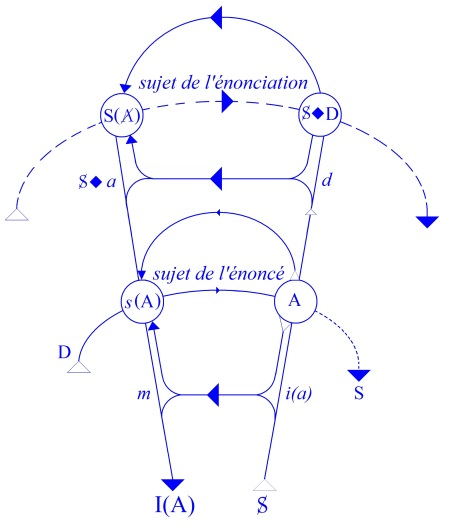
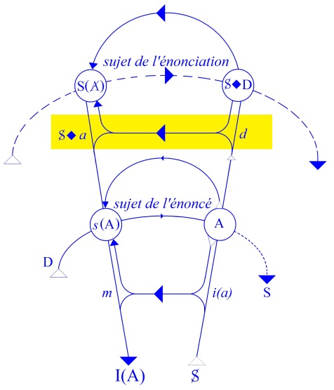

# Leçon 08 | 14 Janvier 1959

  

    <label><input type="checkbox" data-lacan-toggle="original" checked> 原文</label>
    <label><input type="checkbox" data-lacan-toggle="notes" checked> 注释</label>
    <label><input type="checkbox" data-lacan-toggle="commentary" checked> 个人解读评论</label>
  

  <form class="lacan-tool-search" role="search">
    <input class="lacan-tool-search-input" type="search" placeholder="搜索全文" aria-label="搜索全文">
    <button class="lacan-tool-button" type="submit" title="搜索">搜索</button>
  </form>
  <button class="lacan-tool-button lacan-back-to-top" type="button" title="回到页面最上方" aria-label="回到页面最上方">↑</button>

<section class="parallel-paragraph" data-paragraph-ids="s6-08-0001">

s6-08-0001

原文 · s6-08-0001

Le rêve d’Ella Sharpe (1)

[无对应译文]

</section>

<section class="parallel-paragraph" data-paragraph-ids="s6-08-0002">

s6-08-0002

原文 · s6-08-0002

Puisque nous avons beaucoup parlé les dernières fois du désir, nous allons commencer d’aborder la question de l’interprétation. Le graphe doit nous servir à quelque chose. Ce que je vais vous dire aujourd’hui sur un exemple, à savoir sur l’interprétation d’un rêve, je veux l’introduire par quelques remarques sur ce qui résulte des indications que nous donne FREUD précisément sur l’interprétation du rêve.

[无对应译文]

</section>

<section class="parallel-paragraph" data-paragraph-ids="s6-08-0003">

s6-08-0003

原文 · s6-08-0003

Voici en effet à peu près le sens de la remarque de FREUD que je vise actuellement, c’est dans un chapitre où il s’intéresse au sentiment intellectuel regardant le rêve. Par exemple au moment où le sujet rapporte un rêve, il a le sentiment qu’il y manque quelque chose qu’il a oublié, ou que quelque chose est ambigu, douteux, incertain.

[无对应译文]

</section>

<section class="parallel-paragraph" data-paragraph-ids="s6-08-0004">

s6-08-0004

原文 · s6-08-0004

Dans tous ces cas, nous dit FREUD, ce qui est dénoncé par le sujet à propos du rêve, concernant son incertitude, sa mise en doute, son ambiguïté…

[无对应译文]

</section>

<section class="parallel-paragraph" data-paragraph-ids="s6-08-0005">

s6-08-0005

原文 · s6-08-0005

> à savoir : « *c’est ou ceci ou cela*... », « *je ne me souviens plus*... », « *je ne peux plus dire*... »

[无对应译文]

</section>

<section class="parallel-paragraph" data-paragraph-ids="s6-08-0006">

s6-08-0006

原文 · s6-08-0006

…même *son degré de réalité*, c’est-à-dire *le degré de réalité* *avec lequel il a été vu*, soit que ce fut quelque chose qui s’affirme dans le rêve avec un tel degré de réalité que le sujet le remarque, ou au contraire que ce fut un rêve \[abstrait\], tout ceci nous dit FREUD, *dans tous ces cas*, doit être pris pour énonçant ce que FREUD appelle « *une des pensées latentes du rêve* ». *Ce qui en somme est dit par le sujet en note marginale concernant le texte du rêve*, à savoir tous les accents de tonalité, *ce qui dans une musique s’accompagne d’annotations comme allegro, crescendo, decrescendo*, tout cela fait partie du texte du rêve.

[无对应译文]

</section>

<section class="parallel-paragraph" data-paragraph-ids="s6-08-0007">

s6-08-0007

原文 · s6-08-0007

Je ne pense pas que pour le plus grand nombre d’entre vous que je suppose avoir déjà pris connaissance de la *Traumdeutung*, de la technique, ceci soit nouveau. C’est là quelque chose de vraiment fondamental pour ce qui est de l’interprétation d’un rêve. Je ne fais donc que le rappeler car je n’ai pas le temps d’en donner *des exemples* qui sont dans FREUD, et je vous renvoie au texte de la *Traumdeutung*. Vous verrez l’usage que fait FREUD de ce rappel essentiel. Il interprète le rêve en intégrant le sentiment de doute, par exemple qu’il y a dans ce rêve au moment où le sujet le raconte, comme un des éléments du rêve sans lequel le rêve ne saurait être interprété.

[无对应译文]

</section>

<section class="parallel-paragraph" data-paragraph-ids="s6-08-0008">

s6-08-0008

原文 · s6-08-0008

Nous partons donc de l’interprétation freudienne, et nous nous posons la question de savoir ce que ceci comporte d’implication. Il ne suffit pas d’accepter ce fait, ou cette règle de conduite, comme devant être reçue religieusement comme l’ont fait bien des disciples de FREUD, sans chercher à voir plus loin, faisant confiance à l’inconscient en quelque sorte. Qu’est-ce que cela implique que FREUD nous dise, ce n’est pas seulement *la tension* de votre inconscient qui est là au moment où votre rappel du rêve *se dérobe*, ou au contraire se met sous une certaine rubrique, sous un certain accent. Il dit : « *Ceci fait partie des pensées latentes du rêve lui-même*... ». C’est donc ici que, ce que nous sommes convenus d’appeler *le graphe* nous permet de préciser, d’articuler d’une façon plus évidente, plus certaine, ce dont il s’agit quand FREUD nous donne une telle règle de conduite dans l’interprétation du rêve.

[无对应译文]

</section>

<section class="parallel-paragraph" data-paragraph-ids="s6-08-0009">

s6-08-0009

原文 · s6-08-0009

Voici en effet ce que nous pouvons dire. Que faisons-nous quand nous communiquons un rêve, que ce soit dans ou hors l’analyse ? On n’a pas attendu l’analyse pour que nous puissions donner de *l’énonciation d’un rêve* une formule qui la spécifie dans l’ensemble des énonciations possibles comme ayant une certaine structure par rapport au sujet.

[无对应译文]

</section>

<section class="parallel-paragraph" data-paragraph-ids="s6-08-0010">

s6-08-0010

原文 · s6-08-0010

Dans ce que nous pouvons, dans un discours, apporter comme *énoncés événementiels*, nous pouvons légitimement distinguer ceci : que parmi ces énoncés concernant des événements, il y en a qui ont une valeur tout à fait digne d’être distinguée au regard du registre signifiant :

[无对应译文]

</section>

<section class="parallel-paragraph" data-paragraph-ids="s6-08-0011">

s6-08-0011

原文 · s6-08-0011

- ce sont les énoncés que nous pouvons mettre sous cette rubrique générale d’être du *discours indirect*,

[无对应译文]

</section>

<section class="parallel-paragraph" data-paragraph-ids="s6-08-0012">

s6-08-0012

原文 · s6-08-0012

- ce sont les énoncés concernant les énonciations d’autres sujets,

[无对应译文]

</section>

<section class="parallel-paragraph" data-paragraph-ids="s6-08-0013">

s6-08-0013

原文 · s6-08-0013

- c’est ce qui est rapport des articulations signifiantes de quelqu’un d’autre.

[无对应译文]

</section>

<section class="parallel-paragraph" data-paragraph-ids="s6-08-0014">

s6-08-0014

原文 · s6-08-0014

Et beaucoup de choses s’introduisent par là, y compris d’autres énoncés, c’est­à-dire le *ouï-dire* :

[无对应译文]

</section>

<section class="parallel-paragraph" data-paragraph-ids="s6-08-0015">

s6-08-0015

原文 · s6-08-0015

- « *on m’a raconté*… »,

[无对应译文]

</section>

<section class="parallel-paragraph" data-paragraph-ids="s6-08-0016">

s6-08-0016

原文 · s6-08-0016

- « *un tel a attesté que ceci s’est passé*… »,

[无对应译文]

</section>

<section class="parallel-paragraph" data-paragraph-ids="s6-08-0017">

s6-08-0017

原文 · s6-08-0017

- « *tel ou tel*… ».

[无对应译文]

</section>

<section class="parallel-paragraph" data-paragraph-ids="s6-08-0018">

s6-08-0018

原文 · s6-08-0018

Ce qui est la forme, ou une des formes les plus fondamentales du discours universel, la plupart des choses dont nous avons nous-mêmes à rendre compte faisant partie de ce que nous avons recueilli de la tradition des autres.

[无对应译文]

</section>

<section class="parallel-paragraph" data-paragraph-ids="s6-08-0019">

s6-08-0019

原文 · s6-08-0019

Disons donc un rapport d’*énoncé* pur et simple, factuel, que nous prenons à notre compte, et d’autre part ceci, comportant d’une façon latente la dimension de l’*énonciation* qui n’est pas forcément mise en évidence, mais qui le devient dès lors qu’il s’agit de rapporter l’énoncé de quelqu’un d’autre.

[无对应译文]

</section>

<section class="parallel-paragraph" data-paragraph-ids="s6-08-0020">

s6-08-0020

原文 · s6-08-0020

Ce peut être aussi bien du nôtre qu’il s’agit. Nous pouvons dire que nous avons dit telle chose, que nous avons porté témoignage devant tel autre, et nous pouvons même nous faire l’énonciation que l’énoncé que nous avons fait est complètement faux. Nous pouvons témoigner que nous avons menti. Une de ces possibilités est celle qui retient notre attention à l’instant. Qu’est-ce que nous faisons dans l’*énonciation* d’un rêve ?

[无对应译文]

</section>

<section class="parallel-paragraph" data-paragraph-ids="s6-08-0021">

s6-08-0021

原文 · s6-08-0021

Nous faisons quelque chose qui n’est pas unique de sa classe, tout au moins dans la façon que nous allons avoir de la définir maintenant. Car d’une façon dont il est intéressant de souligner que c’est la façon spontanée qu’on a vis à vis d’un rêve, avant que nous soyons entrés dans « *la querelle des sages* »…

[无对应译文]

</section>

<section class="parallel-paragraph" data-paragraph-ids="s6-08-0022">

s6-08-0022

原文 · s6-08-0022

> à savoir : « *le rêve n’a aucune signification, c’est un produit de décomposition de l’activité psychique* »,
>
> qui est la position dite « *scientifique* » qui a été tenue pendant une assez courte période de l’histoire

[无对应译文]

</section>

<section class="parallel-paragraph" data-paragraph-ids="s6-08-0023">

s6-08-0023

原文 · s6-08-0023

…FREUD faisait remarquer lui-même qu’il ne faisait que rejoindre la tradition.

[无对应译文]

</section>

<section class="parallel-paragraph" data-paragraph-ids="s6-08-0024">

s6-08-0024

原文 · s6-08-0024

C’est déjà une chose considérable que ce que nous avons avancé à l’instant, à savoir que la tradition n’a jamais été sans poser - tout le moins concernant le rêve - un *point d’interrogation* quant à sa signification. En d’autres termes, ce que nous énonçons en produisant l’énoncé du rêve, c’est quelque chose à quoi est donné…

[无对应译文]

</section>

<section class="parallel-paragraph" data-paragraph-ids="s6-08-0025">

s6-08-0025

原文 · s6-08-0025

> dans la forme même sous laquelle nous la produisons à partir du moment
>
> où nous racontons notre rêve à quelqu’un d’autre

[无对应译文]

</section>

<section class="parallel-paragraph" data-paragraph-ids="s6-08-0026">

s6-08-0026

原文 · s6-08-0026

…*ce point d’interrogation* qui n’est pas n’importe lequel, *qui suppose que quelque chose est sous ce rêve, dont ce rêve est le signifiant*.

[无对应译文]

</section>

<section class="parallel-paragraph" data-paragraph-ids="s6-08-0027">

s6-08-0027

原文 · s6-08-0027

Je veux dire, nous pouvons écrire ceci dans notre formalisation, qu’il s’agit d’une énonciation, d’un énoncé qui a lui-même un indice d’énonciation, qui est supposé lui-même prendre valeur, bien entendu non pas factuelle, événementielle. Il faut que nous y ajoutions un accent supplémentaire pour raconter cela d’une façon et dans une dimension purement descriptive.

[无对应译文]

</section>

<section class="parallel-paragraph" data-paragraph-ids="s6-08-0028">

s6-08-0028

原文 · s6-08-0028

L’attitude qui reste spontanée, *l’attitude traditionnelle*, tellement ambiguë du petit enfant qui commence à vous raconter ses rêves, qui vous dit : « *Cette nuit j’ai rêvé*… ». Si l’on observe les choses, tout se passe comme si, à quelque moment, avait été découverte à l’enfant la possibilité qu’il a d’exprimer ces choses-là, et c’est au point que très fréquemment on ne peut pas vraiment savoir…

[无对应译文]

</section>

<section class="parallel-paragraph" data-paragraph-ids="s6-08-0029">

s6-08-0029

原文 · s6-08-0029

> à l’âge où commence cette activité confidentielle de l’enfant concernant ses rêves

[无对应译文]

</section>

<section class="parallel-paragraph" data-paragraph-ids="s6-08-0030">

s6-08-0030

原文 · s6-08-0030

…si après tout ce qu’il vous raconte est vraiment bien quelque chose qu’il a rêvé ou quelque chose qu’il vous apporte parce qu’il sait qu’on rêve et qu’on peut raconter des rêves.

[无对应译文]

</section>

<section class="parallel-paragraph" data-paragraph-ids="s6-08-0031">

s6-08-0031

原文 · s6-08-0031

Ces rêves de l’enfant ont *ce caractère d’être à la limite de l’affabulation*, comme le contact avec un enfant le fait sentir. Mais justement, si l’enfant le produit ainsi et le raconte ainsi, c’est avec le caractère de ce *petit e* indice d’énonciation : *E(e)*.

[无对应译文]

</section>

<section class="parallel-paragraph" data-paragraph-ids="s6-08-0032">

s6-08-0032

原文 · s6-08-0032

Quelque chose est au-delà. Avec cela justement il joue avec vous le jeu d’une question, d’une fascination. Et pour tout dire, la formule de toute espèce de rapport concernant le rêve, qu’elle soit intra ou extra-analytique, étant celle-ci : *E(e)*, ce que nous dirons être *la formule générale* de quelque chose qui, donc, *n’est pas particulier au rêve,* est celle de l’*énigme*.

[无对应译文]

</section>

<section class="parallel-paragraph" data-paragraph-ids="s6-08-0033">

s6-08-0033

原文 · s6-08-0033

À partir de là, que signifie ce que FREUD veut dire ? Voyons-le sur notre petit graphe qui se propose comme ceci à l’occasion, à savoir que si nous supposons que la production du rêve… Pour voir comment nous allons nous servir de ce graphe pour y projeter les différents éléments de cette formalisation. Il peut y avoir plusieurs façons.

[无对应译文]

</section>

<section class="parallel-paragraph" data-paragraph-ids="s6-08-0034">

s6-08-0034

原文 · s6-08-0034

L’intérêt structural du graphe, c’est que *c’est une structure qui nous permet de repérer le rapport du sujet avec le signifiant*…

[无对应译文]

</section>

<section class="parallel-paragraph" data-paragraph-ids="s6-08-0035">

s6-08-0035

原文 · s6-08-0035

> pour autant que nécessairement, dès que le sujet est pris dans le signifiant - et il est essentiel qu’il y soit pris, c’est ce qui le définit, c’est le rapport de l’individu avec le signifiant

[无对应译文]

</section>

<section class="parallel-paragraph" data-paragraph-ids="s6-08-0036">

s6-08-0036

原文 · s6-08-0036

…une structure - et un réseau - *à ce moment* s’impose qui reste en quelque sorte *toujours* *fondamentale*.

[无对应译文]

</section>

<section class="parallel-paragraph" data-paragraph-ids="s6-08-0037">

s6-08-0037

原文 · s6-08-0037

Tâchons ici de voir comment nous pouvons répartir les diverses fonctions intéressées dans *l’énonciation du rêve* dans ledit *graphe* dans ce cas. Ce dont il s’agit, le point pivot, l’énoncé je dirai total, le rêve dans ce fait que *création* *spontanée*, il se présente comme quelque chose qui dans son premier aspect a un caractère de relative totalité, il est le fait d’un certain bloc. On dit « *j’ai fait un rêve* », on le distingue de l’autre rêve qui a suivi et qui n’est pas le même.

[无对应译文]

</section>

<section class="parallel-paragraph" data-paragraph-ids="s6-08-0038">

s6-08-0038

原文 · s6-08-0038

Il a le caractère de ce discours, il se réfléchit en tant que rien n’y fait apparaître, au moment où nous le faisons, ce morcellement, cette décomposition du signifiant sur laquelle nous avons toutes sortes d’indices rétroactifs que ce morcellement est là incident dans la fonction de tout discours.

[无对应译文]

</section>

<section class="parallel-paragraph" data-paragraph-ids="s6-08-0039">

s6-08-0039

原文 · s6-08-0039

Mais le discours, pour autant que le sujet s’y tienne, suspend à chaque instant notre choix au moment de pousser un discours, sans cela notre façon de communiquer aurait quelque chose d’autrement ardu.

[无对应译文]

</section>

<section class="parallel-paragraph" data-paragraph-ids="s6-08-0040">

s6-08-0040

原文 · s6-08-0040

Ce rêve il nous est donné comme un tout. C’est cet *énoncé* qui se produit, si je puis dire, au niveau inférieur du graphe. C’est *une chaîne signifiante* qui se présente sous cette forme d’autant plus *globale* qu’elle est fermée, qu’elle se présente justement sous la forme habituelle du langage, qu’elle est quelque chose sur quoi le sujet a à faire un rapport, une *énonciation*, à se situer par rapport à elle, à vous le faire passer justement avec tous ses accents, qu’il a à y mettre le plus ou moins d’adhésion à ce qu’il vous raconte.

[无对应译文]

</section>

<section class="parallel-paragraph" data-paragraph-ids="s6-08-0041">

s6-08-0041

原文 · s6-08-0041

[无对应译文]

</section>

<section class="parallel-paragraph" data-paragraph-ids="s6-08-0042">

s6-08-0042

原文 · s6-08-0042

C’est-à-dire qu’en somme c’est au niveau du *discours pour l’autre*, qui est aussi le discours où le sujet l’assume ce rêve, que va se produire ce quelque chose qui accompagne le rêve et le commente en quelque sorte de sa positon plus ou moins assumée par le sujet. C’est-à-dire qu’ici, pendant le récit de ce qui s’est passé, il se présente déjà lui-même à l’intérieur de cela comme l’énoncé du rêve. C’est ici, dans le discours où le sujet l’assume pour vous à qui il le raconte, que nous allons voir se produire ces différents éléments, ces différentes accentuations qui sont toujours des accentuations de plus ou moins d’assomption par le sujet :

[无对应译文]

</section>

<section class="parallel-paragraph" data-paragraph-ids="s6-08-0043">

s6-08-0043

原文 · s6-08-0043

- « *Il me semble, il m’est apparu que ceci s’est passé à ce moment-là.* »

[无对应译文]

</section>

<section class="parallel-paragraph" data-paragraph-ids="s6-08-0044">

s6-08-0044

原文 · s6-08-0044

- « *À ce moment-là tout s’est passé comme si tel sujet était en même temps tel autre, ou se transformait en tel autre* ».

[无对应译文]

</section>

<section class="parallel-paragraph" data-paragraph-ids="s6-08-0045">

s6-08-0045

原文 · s6-08-0045

C’est ce que j’ai appelé tout à l’heure ses accents. Ces divers modes d’assomption du vécu du rêve par le sujet se situent ici dans la ligne qui est celle du « *je* » de *l’énonciation*, pour autant que justement, vis à vis de cet événement psychique, il l’assume plus ou moins dans son *énonciation*. Qu’est-ce à dire, sinon que ce que nous avons là c’est justement ce qui dans notre graphe, se présente sous la forme de la ligne morcelée, discontinue, qu’il vous indique comme étant la caractéristique de ce qui s’articule au niveau de *l’énonciation* en tant que ceci intéresse le signifiant.

[无对应译文]

</section>

<section class="parallel-paragraph" data-paragraph-ids="s6-08-0046">

s6-08-0046

原文 · s6-08-0046

Car remarquez ceci :

[无对应译文]

</section>

<section class="parallel-paragraph" data-paragraph-ids="s6-08-0047">

s6-08-0047

原文 · s6-08-0047

- s’il est vrai que ce qui justifie la ligne inférieure, celle sur laquelle à chaque occasion nous avons placé cette *rétroaction du code* sur le message qui à chaque instant donne à la phrase son sens,

[无对应译文]

</section>

<section class="parallel-paragraph" data-paragraph-ids="s6-08-0048">

s6-08-0048

原文 · s6-08-0048

- cette unité phrastique est d’ampleur diverse : à la fin d’un long discours, à la fin de mon séminaire ou à la fin de mes séminaires, il y a quelque chose qui boucle rétroactivement le sens de ce que je vous ai énoncé auparavant,

[无对应译文]

</section>

<section class="parallel-paragraph" data-paragraph-ids="s6-08-0049">

s6-08-0049

原文 · s6-08-0049

- mais jusqu’à un certain point, de chacune des parties de mon discours, chacun des paragraphes, il y a quelque chose qui se forme.

[无对应译文]

</section>

<section class="parallel-paragraph" data-paragraph-ids="s6-08-0050">

s6-08-0050

原文 · s6-08-0050

Il s’agit de savoir à quel degré le plus réduit il faut nous arrêter pour que cet effet que nous appelons l’effet de signification en tant qu’il est quelque chose d’essentiellement nouveau, qui va au–delà de ce qu’on appelle *les emplois du signifiant*, constitue une phrase, constitue justement cette création de signification faite dans le langage.

[无对应译文]

</section>

<section class="parallel-paragraph" data-paragraph-ids="s6-08-0051">

s6-08-0051

原文 · s6-08-0051

Où cela s’arrête ? *Cela s’arrête évidemment à la plus petite unité qui soit et qui est la phrase*, justement à cette unité qui dans l’occasion se présente là d’une façon tout à fait claire dans le rapport du rêve, sous la forme de ceci que le sujet : *assume* ou *n’assume pas*, *croit* ou *ne croit pas*, *rapporte quelque chose* ou *doute de ce qu’il nous raconte*.

[无对应译文]

</section>

<section class="parallel-paragraph" data-paragraph-ids="s6-08-0052">

s6-08-0052

原文 · s6-08-0052

Ce que je veux dire dans l’occasion, c’est que cette ligne, ou boucle de l’énonciation, elle se fait sur des fragments de phrases qui peuvent être plus courts que l’ensemble de ce qui est raconté.

[无对应译文]

</section>

<section class="parallel-paragraph" data-paragraph-ids="s6-08-0053">

s6-08-0053

原文 · s6-08-0053

Le rêve, à propos de telle ou telle partie du rêve, vous apporte *une assomption* par le sujet, une prise énonciative d’une portée plus courte que l’ensemble du rêve. En d’autres termes, elle introduit une possibilité de fragmentation, d’ampleur beaucoup plus courte au niveau supérieur qu’au niveau inférieur. Ceci nous met sur la voie de ce qu’implique FREUD en disant que cet accent d’assomption par le sujet fait partie des pensées latentes du rêve.

[无对应译文]

</section>

<section class="parallel-paragraph" data-paragraph-ids="s6-08-0054">

s6-08-0054

原文 · s6-08-0054

C’est nous dire que c’est au niveau de l’*énonciation* et pour autant qu’elle implique cette forme de mise en valeur du signifiant qui est impliqué par l’association libre. C’est à savoir que si la chaîne signifiante a deux aspects :

[无对应译文]

</section>

<section class="parallel-paragraph" data-paragraph-ids="s6-08-0055">

s6-08-0055

原文 · s6-08-0055

- celui qui est l’unité de son sens, la signification phrastique, le monolithisme de la phrase, *l’holophrasisme* ou plus exactement à savoir qu’une phrase peut être prise comme ayant un sens unique, comme étant quelque chose qui forme un signifiant mettons « *transitoire* », *mais qui le temps qu’il existe, tient à lui tout seul comme tel*,

[无对应译文]

</section>

<section class="parallel-paragraph" data-paragraph-ids="s6-08-0056">

s6-08-0056

原文 · s6-08-0056

- et l’autre face du signifiant, qu’on appelle association libre, comporte que pour chacun des éléments de cette phrase - et aussi loin qu’on peut aller dans la décomposition, s’arrêtant strictement à l’élément phonétique - quelque chose peut intervenir qui, faisant sauter un de ces signifiants, y implante à la place un autre signifiant qui le supplante.

[无对应译文]

</section>

<section class="parallel-paragraph" data-paragraph-ids="s6-08-0057">

s6-08-0057

原文 · s6-08-0057

Et c’est là-dedans que gît *la propriété du signifiant* c’est quelque chose qui se rapporte à ce côté-là du vouloir du sujet. Quelque chose, une incidente, à chaque instant le recroise, qui implique…

[无对应译文]

</section>

<section class="parallel-paragraph" data-paragraph-ids="s6-08-0058">

s6-08-0058

原文 · s6-08-0058

> sans que le sujet le sache et d’une façon pour lui inconsciente

[无对应译文]

</section>

<section class="parallel-paragraph" data-paragraph-ids="s6-08-0059">

s6-08-0059

原文 · s6-08-0059

…que *dans ce discours même*, dirigé au-delà de son intention, quelque chose dans le choix de ces éléments intervient dont nous voyons émerger à la surface *les effets*, sous la forme par exemple la plus élémentaire du *lapsus phonématique* : qu’il s’agisse d’une syllabe changée dans un mot, qui montre là la présence d’une *autre chaîne signifiante* qui peut venir se recouper avec la première et *enter*, *implanter* un autre sens.

[无对应译文]

</section>

<section class="parallel-paragraph" data-paragraph-ids="s6-08-0060">

s6-08-0060

原文 · s6-08-0060

Ceci nous est indiqué par FREUD : *de qui*…

[无对应译文]

</section>

<section class="parallel-paragraph" data-paragraph-ids="s6-08-0061">

s6-08-0061

原文 · s6-08-0061

> au niveau de *l’énonciation*, au niveau en apparence donc le plus élaboré de l’assomption du sujet,
>
> au point où le « *je* » se pose comme conscient par rapport à, nous ne dirons pas « *sa propre production »*
>
> puisque justement l’*énigme* reste entière

[无对应译文]

</section>

<section class="parallel-paragraph" data-paragraph-ids="s6-08-0062">

s6-08-0062

原文 · s6-08-0062

…*de qui est cet énoncé dont on parle* ?

[无对应译文]

</section>

<section class="parallel-paragraph" data-paragraph-ids="s6-08-0063">

s6-08-0063

原文 · s6-08-0063

Le sujet ne tranche pas. S’il dit « *j’ai rêvé* », c’est avec une connotation et un accent propre qui fait que celui qui a rêvé, est tout de même quelque chose qui, par rapport à lui, se présente comme problématique. Le sujet de cette *énonciation*, contenue dans l’*énoncé* dont il s’agit, et avec un point d’interrogation, a longtemps été considéré comme étant « *le Dieu* », avant de devenir le « *lui-même* » du sujet (c’est à peu près avec ARISTOTE).

[无对应译文]

</section>

<section class="parallel-paragraph" data-paragraph-ids="s6-08-0064">

s6-08-0064

原文 · s6-08-0064

Pour revenir à cet « *au-delà du sujet* » qu’est l’inconscient freudien, toute une *oscillation*, toute une *vacillation* se produit qui ne le laisse pas moins dans une permanente question de son altérité. Et ce que, de cela, le sujet reprend ensuite est de la même nature morcelante, a la même valeur d’élément signifiant que ce qui se produit dans le phénomène spontané de *substitution*, de dérangement du signifiant, qui est ce que FREUD nous montre d’autre part être la voie normale pour *déchiffrer le sens du rêve*.

[无对应译文]

</section>

<section class="parallel-paragraph" data-paragraph-ids="s6-08-0065">

s6-08-0065

原文 · s6-08-0065

En d’autres termes, le morcellement qui se produit au niveau de l’énonciation…

[无对应译文]

</section>

<section class="parallel-paragraph" data-paragraph-ids="s6-08-0066">

s6-08-0066

原文 · s6-08-0066

en tant que *l’énonciation est assomption du rêve par le sujet*

[无对应译文]

</section>

<section class="parallel-paragraph" data-paragraph-ids="s6-08-0067">

s6-08-0067

原文 · s6-08-0067

…est quelque chose dont FREUD nous dit qu’elle est sur le même plan et de la même nature que ceci, dont le reste de la doctrine nous montre que c’est la voie de l’interprétation du rêve, à savoir *la décomposition signifiante maximale*, l’épellement des éléments signifiants, pour autant que c’est dans cet épellement que va résider la mise en valeur des possibilités du rêve.

[无对应译文]

</section>

<section class="parallel-paragraph" data-paragraph-ids="s6-08-0068">

s6-08-0068

原文 · s6-08-0068

C’est-à-dire de ces entrecroisements, de ces intervalles qu’il laisse et qui n’apparaissent que pour autant que *la chaîne signifiante* est mise en rapport, est recoupée, entre­croisée par toutes les autres chaînes qui, à propos de chacun des éléments du rêve, peuvent s’entrecroiser, s’entremêler avec la première. En d’autres termes, c’est pour autant…

[无对应译文]

</section>

<section class="parallel-paragraph" data-paragraph-ids="s6-08-0069">

s6-08-0069

原文 · s6-08-0069

> et d’une façon plus exemplaire à propos du rêve que par rapport à n’importe quel autre discours

[无对应译文]

</section>

<section class="parallel-paragraph" data-paragraph-ids="s6-08-0070">

s6-08-0070

原文 · s6-08-0070

…c’est pour autant que :

[无对应译文]

</section>

<section class="parallel-paragraph" data-paragraph-ids="s6-08-0071">

s6-08-0071

原文 · s6-08-0071

- dans le discours du sujet, dans le discours actuel, nous faisons vaciller, nous laissons se *décrocher* de la signification actuelle ce qui est intéressé de signifiant dans cette énonciation,

[无对应译文]

</section>

<section class="parallel-paragraph" data-paragraph-ids="s6-08-0072">

s6-08-0072

原文 · s6-08-0072

- c’est dans cette voie que nous nous approchons de ce qui chez le sujet est appelé, dans la doctrine freudienne « *inconscient* ».

[无对应译文]

</section>

<section class="parallel-paragraph" data-paragraph-ids="s6-08-0073">

s6-08-0073

原文 · s6-08-0073

C’est dans la mesure où le signifiant est intéressé, c’est dans les possibilités de rupture, dans les points de rupture de cet inconscient, que gît ce sur la piste de quoi nous sommes, ce que nous sommes là pour rechercher, c’est à savoir ce qui s’est passé d’essentiel dans le sujet qui maintient certains signifiants dans le refoulement.

[无对应译文]

</section>

<section class="parallel-paragraph" data-paragraph-ids="s6-08-0074">

s6-08-0074

原文 · s6-08-0074

Et ce quelque chose va nous permettre d’aller sur la voie précisément de son désir, à savoir de *ce quelque chose du sujet* qui, dans cette prise par *le réseau signifiant* est maintenu, *doit* pour ainsi dire - *pour être révélé - passer à travers ces mailles*, est soumis à ce filtrage, à ce criblage du signifiant, et est ce que nous avons pour but de restituer et de restaurer dans le discours du sujet.

[无对应译文]

</section>

<section class="parallel-paragraph" data-paragraph-ids="s6-08-0075">

s6-08-0075

原文 · s6-08-0075

Comment pouvons-nous le faire ? Que signifie que nous puissions le faire ? Je vous l’ai dit, le désir est essentiellement lié par la doctrine, par la pratique, par l’expérience freudienne, dans cette position : il est exclu, énigmatique, ou il se pose par rapport au sujet être essentiellement lié à l’existence du signifiant, refoulé comme tel, et sa restitution, sa restauration est liée au *retour de ces signifiants*.

[无对应译文]

</section>

<section class="parallel-paragraph" data-paragraph-ids="s6-08-0076">

s6-08-0076

原文 · s6-08-0076

Mais ce n’est pas dire que la restitution de ces signifiants énonce purement et simplement le désir :

[无对应译文]

</section>

<section class="parallel-paragraph" data-paragraph-ids="s6-08-0077">

s6-08-0077

原文 · s6-08-0077

- autre chose est ce qui s’articule dans ces signifiants refoulés et qui est toujours une demande,

[无对应译文]

</section>

<section class="parallel-paragraph" data-paragraph-ids="s6-08-0078">

s6-08-0078

原文 · s6-08-0078

- autre chose est le désir, pour autant que le désir est quelque chose par quoi le sujet se situe, du fait de l’existence du discours, par rapport à cette demande.

[无对应译文]

</section>

<section class="parallel-paragraph" data-paragraph-ids="s6-08-0079">

s6-08-0079

原文 · s6-08-0079

Ce n’est pas de ce qu’il demande qu’il s’agit, c’est de ce qu’il est en fonction de cette demande et ce qu’il est dans la mesure où la demande est refoulée, est masquée, et c’est cela qui s’exprime d’une façon fermée dans le fantasme de son désir. C’est son rapport à un être dont il ne serait pas question s’il n’y avait pas la demande, le discours qui est fondamentalement le langage, mais dont il commence à être question à partir du moment où le langage introduit cette dimension de l’être et en même temps la lui dérobe.

[无对应译文]

</section>

<section class="parallel-paragraph" data-paragraph-ids="s6-08-0080">

s6-08-0080

原文 · s6-08-0080

[无对应译文]

</section>

<section class="parallel-paragraph" data-paragraph-ids="s6-08-0081">

s6-08-0081

原文 · s6-08-0081

La restitution du *sens du fantasme*, c’est-à-dire de quelque chose d’*imaginaire*, vient entre les deux lignes :

[无对应译文]

</section>

<section class="parallel-paragraph" data-paragraph-ids="s6-08-0082">

s6-08-0082

原文 · s6-08-0082

- entre l’énoncé de l’intention du sujet,

[无对应译文]

</section>

<section class="parallel-paragraph" data-paragraph-ids="s6-08-0083">

s6-08-0083

原文 · s6-08-0083

- et ce quelque chose que d’une façon décomposée il lie, cette intention profondément morcelée, fragmentée, réfractée par la langue.

[无对应译文]

</section>

<section class="parallel-paragraph" data-paragraph-ids="s6-08-0084">

s6-08-0084

原文 · s6-08-0084

Entre les deux est ce fantasme \[S◊*a*\] où d’habitude il suspend son rapport à l’être. Mais ce fantasme est toujours *énigmatique*, plus que n’importe quoi d’autre. Et que veut-il ? Ceci : que nous l’interprétions ! Interpréter le désir, c’est restituer ceci, auquel le sujet ne peut pas accéder à lui tout seul, à savoir l’affect qui désigne, au niveau de ce désir qui est le sien…

[无对应译文]

</section>

<section class="parallel-paragraph" data-paragraph-ids="s6-08-0085">

s6-08-0085

原文 · s6-08-0085

> je parle du désir précis qui intervient dans tel ou tel incident de la vie du sujet,
>
> du *désir masochiste*, du *désir-suicide*, du *désir oblatif* à l’occasion

[无对应译文]

</section>

<section class="parallel-paragraph" data-paragraph-ids="s6-08-0086">

s6-08-0086

原文 · s6-08-0086

…il s’agit que ceci, qui se produit sous cette forme fermée pour le sujet, en reprenant sa place, son sens par rapport au discours masqué qui est intéressé dans ce désir, reprenne son sens par rapport à l’être, confronte le sujet par rapport à l’être, reprenne son sens véritable, celui qui est par exemple défini par ce que j’appellerai « *les affects positionnels par rapport à l’être* ».

[无对应译文]

</section>

<section class="parallel-paragraph" data-paragraph-ids="s6-08-0087">

s6-08-0087

原文 · s6-08-0087

C’est cela que nous appelons *amour*, *haine* ou *ignorance* essentiellement, et bien d’autres termes encore dont il faudra que nous fassions le tour et le catalogue.

[无对应译文]

</section>

<section class="parallel-paragraph" data-paragraph-ids="s6-08-0088">

s6-08-0088

原文 · s6-08-0088

Pour autant que ce qu’on appelle « *l’affect* » n’est pas ce *quelque chose* de purement et simplement *opaque* et *fermé*…

[无对应译文]

</section>

<section class="parallel-paragraph" data-paragraph-ids="s6-08-0089">

s6-08-0089

原文 · s6-08-0089

> qui serait une sorte d’au-delà du discours, une espèce d’ensemble,
>
> de noyau vécu dont on ne saurait pas de quel ciel il nous tombe

[无对应译文]

</section>

<section class="parallel-paragraph" data-paragraph-ids="s6-08-0090">

s6-08-0090

原文 · s6-08-0090

…mais pour autant que *l’affect* est très précisément et toujours quelque chose qui se connote dans une certaine position du sujet par rapport à l’être, je veux dire par rapport à l’être en tant que :

[无对应译文]

</section>

<section class="parallel-paragraph" data-paragraph-ids="s6-08-0091">

s6-08-0091

原文 · s6-08-0091

- ce qui se propose à lui dans sa dimension fondamentale est *symbolique*,

[无对应译文]

</section>

<section class="parallel-paragraph" data-paragraph-ids="s6-08-0092">

s6-08-0092

原文 · s6-08-0092

- ou bien qu’au contraire, à l’intérieur de ce symbolique, il représente une irruption du *réel*, cette fois fort dérangeante.

[无对应译文]

</section>

<section class="parallel-paragraph" data-paragraph-ids="s6-08-0093">

s6-08-0093

原文 · s6-08-0093

Et il est fort difficile de ne pas s’apercevoir qu’un affect fondamental comme celui de la colère n’est pas autre chose que cela : le *réel* qui arrive au moment où nous avons fait une fort belle *trame symbolique*, où tout va fort bien, *l’ordre,* *la loi, notre mérite et notre bon vouloir*. On s’aperçoit tout d’un coup que les chevilles ne rentrent pas dans les petits trous ! C’est cela, l’origine de l’affect de la colère : tout se présente bien pour « *le pont de bateaux au Bosphore* »[^37] mais il y a une tempête, qui fait battre la mer. Toute colère, c’est faire battre la mer !

[无对应译文]

</section>

<section class="parallel-paragraph" data-paragraph-ids="s6-08-0094">

s6-08-0094

原文 · s6-08-0094

Et puis aussi bien, c’est quelque chose qui se rapporte à l’intrusion du désir lui-même et qui est aussi quelque chose qui détermine une forme d’affect sur laquelle nous reviendrons. Mais l’affect est essentiellement et comme tel…

[无对应译文]

</section>

<section class="parallel-paragraph" data-paragraph-ids="s6-08-0095">

s6-08-0095

原文 · s6-08-0095

> au moins pour toute une catégorie fondamentale d’affects

[无对应译文]

</section>

<section class="parallel-paragraph" data-paragraph-ids="s6-08-0096">

s6-08-0096

原文 · s6-08-0096

…connotation caractéristique d’une position du sujet, d’une position qui se situe, si nous voyons essentiellement les positions possibles, dans cette *mise en jeu*, *mise en travail*, *mise en œuvre* de lui-même par rapport aux lignes nécessaires que lui impose comme tel son enveloppement dans le signifiant.

[无对应译文]

</section>

<section class="parallel-paragraph" data-paragraph-ids="s6-08-0097">

s6-08-0097

原文 · s6-08-0097

Voyons maintenant un exemple. Cet exemple, je l’ai pris dans la postérité de FREUD. Il nous permet de bien articuler ce qu’est le \[rêve dans ?\] l’analyse. Et pour procéder d’une façon qui ne laisse pas place à un choix plus spécialement arbitraire, j’ai pris le [*cha**pitre* V de *Dream Analysis*](#Ella_Sharpe_Dream_analysis) [^38] de Ella SHARPE, où l’auteur prend comme exemple l’analyse d’un rêve simple – je veux dire d’un rêve qu’elle prend comme tel en poussant autant que possible jusqu’au bout son analyse.

[无对应译文]

</section>

<section class="parallel-paragraph" data-paragraph-ids="s6-08-0098">

s6-08-0098

原文 · s6-08-0098

Vous entendez bien que dans les chapitres précédents, elle a montré un certain nombre de *perspectives*, de *lois*, de *mécanismes*, par exemple l’incidence du rêve dans la pratique analytique, ou même plus loin, les problèmes posés par l’analyse du rêve ou de ce qui se passe dans les rêves des personnes analysées. Ce qui fait le point pivot de ce livre, c’est justement le chapitre où elle nous donne un exemple singulier d’un rêve exemplaire dans lequel elle met en jeu, en œuvre, elle illustre tout ce qu’elle peut avoir d’autre part à nous produire concernant *la façon* dont la pratique analytique nous montre que nous devons être effectivement guidés dans *l’analyse d’un rêve*.

[无对应译文]

</section>

<section class="parallel-paragraph" data-paragraph-ids="s6-08-0099">

s6-08-0099

原文 · s6-08-0099

Et nommément ceci d’essentiel qui est ce que le praticien apporte de nouveau après la *Traumdeutung*, qu’un rêve n’est pas simplement quelque chose qui s’est révélé avoir une signifiance - c’est la *Traumdeutung -* mais quelque chose qui, dans *la communication analytique*, dans *le dialogue analytique*, vient jouer son rôle actuel, non pas à tel moment de l’analyse comme à tel autre, et que justement le rêve vient d’une façon active, déterminée, accompagner le discours analytique pour l’éclairer, pour prolonger ses cheminements, que le rêve est un rêve en fin de compte fait non seulement *pour l’analyse* mais souvent *pour l’analyste*.

[无对应译文]

</section>

<section class="parallel-paragraph" data-paragraph-ids="s6-08-0100">

s6-08-0100

原文 · s6-08-0100

Le rêve, à l’intérieur de l’analyse, se trouve en somme porteur d’un message. L’auteur en question ne recule pas, pas plus que les auteurs qui ont depuis eu à parler de *l’analyse des rêves*.

[无对应译文]

</section>

<section class="parallel-paragraph" data-paragraph-ids="s6-08-0101">

s6-08-0101

原文 · s6-08-0101

Il s’agit seulement de savoir quelle pensée, quel accent nous lui donnerons. Et, vous le savez, j’ai attiré l’attention Là-dessus dans mon rapport de Royaumont, ce n’est pas la moindre question que pose la question de la pensée à l’égard du rêve, que certains auteurs croient pouvoir s’en détourner pour autant qu’ils y voient quelque chose comme une activité, du moins assurément, c’est quelque chose.

[无对应译文]

</section>

<section class="parallel-paragraph" data-paragraph-ids="s6-08-0102">

s6-08-0102

原文 · s6-08-0102

Je veux dire que le fait en effet que le rêve se présente comme une matière à discours, comme matière à élaboration discursive est quelque chose que, si nous ne nous apercevons pas que l’inconscient n’est point ailleurs que dans les latences, non pas de je ne sais quelle besace psychique où il serait à l’état inconstitué, mais bel et bien, en tant qu’inconscient, en deçà ou - c’est une autre question - immanent à la formulation du sujet, au discours de lui-même, à son énonciation, nous verrons comment il est bel et bien légitime de *prendre le rêve*, comme il a toujours été considéré, *pour la voie royale de l’inconscient*.

[无对应译文]

</section>

<section class="parallel-paragraph" data-paragraph-ids="s6-08-0103">

s6-08-0103

原文 · s6-08-0103

Voici donc comment les choses se présentent dans ce rêve que nous présente l’auteur. Je vais commencer par lire le rêve lui-même. Je vais montrer la façon dont les problèmes se posent à son propos. Elle nous donne d’abord un bref *avertissement* sur le sujet, dont nous aurons à faire grand cas. Tout le chapitre devra d’ailleurs être revu, critiqué, pour nous permettre de saisir comment ce qu’elle nous énonce est à la fois - mieux que dans tout autre registre - applicable sur les repères qui sont les nôtres, et en même temps comment ces repères, peut-être pourraient nous permettre de mieux nous orienter.

[无对应译文]

</section>

<section class="parallel-paragraph" data-paragraph-ids="s6-08-0104">

s6-08-0104

原文 · s6-08-0104

Le patient arrive à sa séance ce jour-là dans certaines *conditions* que je rappellerai tout à l’heure. C’est seulement après certaines associations dont vous verrez qu’elles sont extrêmement importantes, qu’il se rappelle : « *Ceci me rappelle*… » Je reviendrai sur ces associations naturelles.

[无对应译文]

</section>

<section class="parallel-paragraph" data-paragraph-ids="s6-08-0105">

s6-08-0105

原文 · s6-08-0105

« *Je ne sais pourquoi, je viens justement de penser* – dit-il – *à mon rêve de la nuit dernière. C’était un rêve terrible, (tremendous).* *J’ai dû rêver pendant des éternités* …//… *je ne vais pas vous embêter avec cela pour la bonne raison que je ne m’en souviens plus.* *Mais c’était un rêve très excitant, plein d’incidents et plein d’intérêt. Je me suis réveillé chaud et transpirant*. »

[无对应译文]

</section>

<section class="parallel-paragraph" data-paragraph-ids="s6-08-0106">

s6-08-0106

原文 · s6-08-0106

\[*I do not know why I should now think of my dream last night. It was a tremendous dream. It went on for ages and ages. …//… I shall not bore you with it all* *for the simple reason that I cannot recall it. But it was an exciting dream, full of incident, full of interest. I woke hot and perspiring. p.*132\]

[无对应译文]

</section>

<section class="parallel-paragraph" data-paragraph-ids="s6-08-0107">

s6-08-0107

原文 · s6-08-0107

Il dit qu’il ne se souvient pas de cette infinité de rêve, de cette mer de rêve, mais ce qui surgit c’est cela : une scène assez courte qu’il va nous raconter.

[无对应译文]

</section>

<section class="parallel-paragraph" data-paragraph-ids="s6-08-0108">

s6-08-0108

原文 · s6-08-0108

« *J’ai rêvé que je faisais un voyage avec ma femme*…» \[I dreamt *I was taking a journey with my wife around the world*.... p.132\]

[无对应译文]

</section>

<section class="parallel-paragraph" data-paragraph-ids="s6-08-0109">

s6-08-0109

原文 · s6-08-0109

Il y a ici une très jolie nuance qui n’est peut-être pas assez accentuée quant à l’ordre normal des compléments dans la langue anglaise. Je ne crois pas me tromper pourtant en disant que : « *J’avais entrepris un voyage avec ma femme autour du monde*… » est quelque chose qui mérite d’être noté. Il y a une différence entre « *un voyage autour du monde avec ma femme* » ce qui semblerait l’ordre français normal des compléments circonstanciels, et « *j’ai entrepris un voyage avec ma femme autour du monde* ». Je crois qu’ici, la sensibilité de l’oreille en anglais doit être la même.

[无对应译文]

</section>

<section class="parallel-paragraph" data-paragraph-ids="s6-08-0110">

s6-08-0110

原文 · s6-08-0110

« …*nous sommes arrivés en Tchécoslovaquie, où toutes sortes de choses arrivèrent. Je rencontrais une femme sur une route, une route* *qui maintenant me fait remémorer la route que je vous ai décrite dans deux autres rêves il y a quelque temps, et dans lesquels j’avais* *un jeu sexuel avec une femme devant une autre femme.* » \[…*and we arrived in Czechoslovakia where all kinds of things were happening. I met a woman on a road, a road that now reminds me of the road I described to you in the two other dreams lately in which I was having sexual play with a woman in front of another woman.* p.132\]

[无对应译文]

</section>

<section class="parallel-paragraph" data-paragraph-ids="s6-08-0111">

s6-08-0111

原文 · s6-08-0111

Là-dessus, c’est à juste titre que l’auteur change la typographie, car c’est une réflexion latérale :

[无对应译文]

</section>

<section class="parallel-paragraph" data-paragraph-ids="s6-08-0112">

s6-08-0112

原文 · s6-08-0112

« C’est ainsi que cela se passait dans ce rêve. » \[So it happened in this dream.\]

[无对应译文]

</section>

<section class="parallel-paragraph" data-paragraph-ids="s6-08-0113">

s6-08-0113

原文 · s6-08-0113

« …*Cette fois* - il reprend le récit du rêve - *ma femme était là pendant que l’événement sexuel se produisait.* *La femme que je rencontrais avait un aspect très passionné, very passionned looking*… » \[…*This time my wife was there while the sexual event occurred. The woman I met was very passionate looking*… *p.* 132\]

[无对应译文]

</section>

<section class="parallel-paragraph" data-paragraph-ids="s6-08-0114">

s6-08-0114

原文 · s6-08-0114

Et là, changement *typographique* à juste titre parce que c’est un commentaire, c’est déjà une association :

[无对应译文]

</section>

<section class="parallel-paragraph" data-paragraph-ids="s6-08-0115">

s6-08-0115

原文 · s6-08-0115

« Et ceci me faisait me rappeler une femme que j’avais vue la veille dans un restaurant. Elle était brune, dark, et avait les lèvres très pleines, très rouges, passionned looking - même expression, même aspect passionné - et il est évident que si je lui avais donné le moindre encouragement, elle aurait répondu. Elle peut bien avoir stimulé ce rêve. »

[无对应译文]

</section>

<section class="parallel-paragraph" data-paragraph-ids="s6-08-0116">

s6-08-0116

原文 · s6-08-0116

\[…and I am reminded of a woman I saw in a restaurant yesterday. She was dark and had very full lips, very red and passionate looking, and it was obvious that had I given her any encouragement she would have responded. She must have stimulated the dream, I expect.\]

[无对应译文]

</section>

<section class="parallel-paragraph" data-paragraph-ids="s6-08-0117">

s6-08-0117

原文 · s6-08-0117

« Dans ce rêve*, la femme voulait avoir avec moi un rapport sexuel et elle prenait l’initiative, ce qui, comme vous le savez, est une chose qui m’aide grandement*… » - et il commente - « Si la femme veut bien faire cela, je suis grandement aidé. » \[In the dream the *woman wanted intercourse with me and she took the initiative wich as you know is a course wich helps me a great deal.* If the woman will do this I am greatly helped. (p.133)\]

[无对应译文]

</section>

<section class="parallel-paragraph" data-paragraph-ids="s6-08-0118">

s6-08-0118

原文 · s6-08-0118

« Dans le rêve *la femme réellement était sur moi. Cela vient juste de me venir à l’esprit. Elle avait évidemment l’intention de s’introduire mon pénis.* \[…\] *Je n’étais pas d’accord, mais elle était très désappointée, en sorte que je pensais que je devrais bien la masturber,* *but she was so désappointed I thought I would masturbate her.* »

[无对应译文]

</section>

<section class="parallel-paragraph" data-paragraph-ids="s6-08-0119">

s6-08-0119

原文 · s6-08-0119

\[In the dream *the woman actually lay on top of me; that has only just come to my mind. She was evidently intending to put my penis in her body. I could tell that by the manœuvres she was making. I disagreed with this, but she was so disappointed I thought that I would masturbate her.* (p.133)\]

[无对应译文]

</section>

<section class="parallel-paragraph" data-paragraph-ids="s6-08-0120">

s6-08-0120

原文 · s6-08-0120

Ici, reprise du commentaire :

[无对应译文]

</section>

<section class="parallel-paragraph" data-paragraph-ids="s6-08-0121">

s6-08-0121

原文 · s6-08-0121

« Cela sonne tout à fait mal, *wrong*, d’user de ce verbe d’une façon *transitive*, on doit dire *I masturbated*, je me masturbais »

[无对应译文]

</section>

<section class="parallel-paragraph" data-paragraph-ids="s6-08-0122">

s6-08-0122

原文 · s6-08-0122

Le propre du verbe anglais est de ne pas avoir la forme réfléchie qu’il a dans la langue française. Quand on dit « *I masturbate* » en anglais cela veut dire « *Je me masturbe* ».

[无对应译文]

</section>

<section class="parallel-paragraph" data-paragraph-ids="s6-08-0123">

s6-08-0123

原文 · s6-08-0123

« …cela est tout à fait correct, mais il est tout à fait incorrect - *fait-il remarquer* - d’user du mot transitivement. »

[无对应译文]

</section>

<section class="parallel-paragraph" data-paragraph-ids="s6-08-0124">

s6-08-0124

原文 · s6-08-0124

\[It sounds quite wrong to use that verb transitively. One can say «*I masturbated* » and that is correct, but it is all wrong to use the word transitively.\]

[无对应译文]

</section>

<section class="parallel-paragraph" data-paragraph-ids="s6-08-0125">

s6-08-0125

原文 · s6-08-0125

L’analyste ne manque pas de tiquer sur cette *remarque* du sujet, et le sujet à ce propos, fait en effet quelques remarques confirmatives, il commence d’associer sur ses propres masturbations. Ce n’est d’ailleurs pas là qu’il en reste.

[无对应译文]

</section>

<section class="parallel-paragraph" data-paragraph-ids="s6-08-0126">

s6-08-0126

原文 · s6-08-0126

Voici l’énoncé de ce rêve. Il doit amorcer l’intérêt de ce que nous allons dire. C’est, je dois dire, un mode d’exposition tout à fait *arbitraire* d’une certaine façon, je pourrais m’en passer. Ne croyez pas non plus que ce soit la voie systématique sur laquelle je vous conseille de vous appuyer pour interpréter un rêve. C’est seulement histoire de jeter un jalon qui montre ce que nous allons chercher de voir et de démontrer.

[无对应译文]

</section>

<section class="parallel-paragraph" data-paragraph-ids="s6-08-0127">

s6-08-0127

原文 · s6-08-0127

De même que dans le rêve de FREUD, pris dans FREUD - rêve de mort dont nous avons parlé - nous avons pu désigner d’une façon dont vous avez pu voir en même temps qu’elle ne manque pas d’artifice, quels sont les *signifiants* du « il est mort …*selon son vœu* », que son fils le souhaitait. De même ici d’une certaine façon on le verra, le point où culmine effectivement le fantasme du rêve à savoir :

[无对应译文]

</section>

<section class="parallel-paragraph" data-paragraph-ids="s6-08-0128">

s6-08-0128

原文 · s6-08-0128

« *Je n’étais pas d’accord, mais elle était très désappointée, en sorte que je pensais que je devrais la masturber.* »

[无对应译文]

</section>

<section class="parallel-paragraph" data-paragraph-ids="s6-08-0129">

s6-08-0129

原文 · s6-08-0129

Avec la remarque, que le sujet fait tout de suite, que « *c’est tout à fait incorrect d’employer ce verbe transitivement* ». Toute l’analyse du rêve va nous montrer que c’est effectivement en rétablissant cette intransitivité du verbe que nous trouvons le sens véritable de ce dont il s’agit.

[无对应译文]

</section>

<section class="parallel-paragraph" data-paragraph-ids="s6-08-0130">

s6-08-0130

原文 · s6-08-0130

Elle est « *très désappointée*... » de quoi ? Il semble que tout le texte du rêve l’indique suffisamment. À savoir du fait que notre sujet n’est *guère participant* quoiqu’il indique que tout dans le rêve soit fait pour l’y inciter, à savoir qu’il serait normalement très grandement aidé dans une telle position.

[无对应译文]

</section>

<section class="parallel-paragraph" data-paragraph-ids="s6-08-0131">

s6-08-0131

原文 · s6-08-0131

Sans doute est­ce là ce dont il s’agit et nous dirons que la seconde partie de la phrase tombe bien dans ce que FREUD nous articule comme étant une des *caractéristiques* de la formation du rêve, c’est à savoir l’élaboration secondaire : qu’il se présente comme ayant un *contenu compréhensible*.

[无对应译文]

</section>

<section class="parallel-paragraph" data-paragraph-ids="s6-08-0132">

s6-08-0132

原文 · s6-08-0132

Néanmoins le sujet nous fait remarquer lui-même que cela ne va pas tout seul puisque le verbe même qu’il emploie est quelque chose dont il nous indique qu’il ne trouve pas que cet emploi sonne bien. Selon même l’application de la formule que nous donne FREUD, nous devons retenir cette remarque du sujet comme nous mettant sur la voie, sur la trace de ce dont il s’agit, à savoir de la pensée du rêve. Et c’est là le désir.

[无对应译文]

</section>

<section class="parallel-paragraph" data-paragraph-ids="s6-08-0133">

s6-08-0133

原文 · s6-08-0133

En nous disant que « *I thought*… » doit comporter comme suite, que la phrase soit restituée sous la forme suivante : « *I thought she could masturbate* », ce qui est la forme normale dans laquelle le vœu se présenterait : « *Qu’elle se masturbe* *si elle n’est pas contente !* », le sujet nous indique ici avec assez d’énergie que la masturbation concerne une activité qui n’est pas transitive au sens de passant du sujet sur un autre mais, comme il s’exprime, intransitive.

[无对应译文]

</section>

<section class="parallel-paragraph" data-paragraph-ids="s6-08-0134">

s6-08-0134

原文 · s6-08-0134

Ce qui veut dire dans l’occasion une activité du sujet sur lui-même. Il la souligne bel et bien :

[无对应译文]

</section>

<section class="parallel-paragraph" data-paragraph-ids="s6-08-0135">

s6-08-0135

原文 · s6-08-0135

> « *Quand on dit* « *I masturbated* » *cela veut dire* «* je me suis masturbé* ». »

[无对应译文]

</section>

<section class="parallel-paragraph" data-paragraph-ids="s6-08-0136">

s6-08-0136

原文 · s6-08-0136

Ceci est un procédé d’exposition, car l’important ce n’est pas, bien entendu, de trancher sur ce sujet, encore que, je le répète, il soit important de nous apercevoir qu’ici, d’ores et déjà, immédiatement, la première indication que nous donne le sujet soit une indication dans le sens de la rectification de l’articulation signifiante.

[无对应译文]

</section>

<section class="parallel-paragraph" data-paragraph-ids="s6-08-0137">

s6-08-0137

原文 · s6-08-0137

Qu’est-ce que cela nous permet, cette rectification ? C’est à peu près ceci : tout ce que nous allons maintenant avoir à considérer est, au premier abord, l’entrée en jeu de cette *scène*, de cette séance. L’auteur nous la donne par une description qui n’est pas nécessairement une description générale du comportement de son sujet, même elle a été jusqu’à nous donner un petit préambule de ce qui concerne sa constellation psychique.

[无对应译文]

</section>

<section class="parallel-paragraph" data-paragraph-ids="s6-08-0138">

s6-08-0138

原文 · s6-08-0138

En bref, nous aurons à y revenir puisque ce qu’elle a mis dans ces prémisses se retrouvera dans ses résultats, et que ces résultats nous aurons à les critiquer. Pour aller tout de suite à l’essentiel…

[无对应译文]

</section>

<section class="parallel-paragraph" data-paragraph-ids="s6-08-0139">

s6-08-0139

原文 · s6-08-0139

je veux dire : à ce qui va nous permettre *d’avancer*

[无对应译文]

</section>

<section class="parallel-paragraph" data-paragraph-ids="s6-08-0140">

s6-08-0140

原文 · s6-08-0140

…nous allons dire qu’elle nous fait remarquer que ce sujet est un sujet évidemment très doué et qu’il a un comportement… on le verra de *mieux en mieux* à mesure que nous allons centrer les choses.

[无对应译文]

</section>

<section class="parallel-paragraph" data-paragraph-ids="s6-08-0141">

s6-08-0141

原文 · s6-08-0141

C’est un monsieur d’un certain âge, déjà marié, qui a une activité, nommément au barreau. Et elle nous dit - cela vaut la peine d’être relevé dans les termes propres dont le sujet se sert - que :

[无对应译文]

</section>

<section class="parallel-paragraph" data-paragraph-ids="s6-08-0142">

s6-08-0142

原文 · s6-08-0142

« *Dès que le sujet a commencé son activité professionnelle, il a développé de sévères phobies. À poser les choses brièvement*…

[无对应译文]

</section>

<section class="parallel-paragraph" data-paragraph-ids="s6-08-0143">

s6-08-0143

原文 · s6-08-0143

c’est à ceci que se limite l’exposé du mécanisme de la phobie

[无对应译文]

</section>

<section class="parallel-paragraph" data-paragraph-ids="s6-08-0144">

s6-08-0144

原文 · s6-08-0144

...*cela signifie*...

[无对应译文]

</section>

<section class="parallel-paragraph" data-paragraph-ids="s6-08-0145">

s6-08-0145

原文 · s6-08-0145

dit-elle, et nous lui faisons grande confiance car c’est une des meilleures analystes, une des plus intuitives et pénétrantes qui ait existé

[无对应译文]

</section>

<section class="parallel-paragraph" data-paragraph-ids="s6-08-0146">

s6-08-0146

原文 · s6-08-0146

...*non pas qu’il n’ose pas travailler avec succès, successfully, mais qu’il doit s’arrêter de travailler en réalité* *parce qu’il ne serait que trop successfull.* »

[无对应译文]

</section>

<section class="parallel-paragraph" data-paragraph-ids="s6-08-0147">

s6-08-0147

原文 · s6-08-0147

\[« When the time came for him to practise at the bar he developed severe phobias. Put briefly this meant not that he dare not work successfully but that he must stop working in reality because he would be only too successful ». p.127.\]

[无对应译文]

</section>

<section class="parallel-paragraph" data-paragraph-ids="s6-08-0148">

s6-08-0148

原文 · s6-08-0148

La note que l’analyste apporte ici, que cela n’est pas d’une affinité à *l’échec* qu’il s’agit mais que le sujet s’arrête, si l’on peut dire, devant la possibilité immédiate de mise en relief de ses *facilités*, est quelque chose qui mérite d’être retenu. Vous verrez quel usage nous en ferons par la suite.

[无对应译文]

</section>

<section class="parallel-paragraph" data-paragraph-ids="s6-08-0149">

s6-08-0149

原文 · s6-08-0149

Laissons de côté ce que, dès le début, l’analyste indique comme étant quelque chose qui ici peut être mis en rapport avec le père. Nous y reviendrons. Sachons seulement que le père est mort quand le sujet avait trois ans et que pendant très longtemps, le sujet ne fait pas d’autre état de ce père que précisément de dire qu’il est mort.

[无对应译文]

</section>

<section class="parallel-paragraph" data-paragraph-ids="s6-08-0150">

s6-08-0150

原文 · s6-08-0150

Ce qui, à bien juste titre, retient l’attention de l’analyste, dans ce sens qu’elle entend par là - ce qui est bien évident - qu’*il ne veut point se souvenir* que son père ait vécu, ceci ne parait guère pouvoir être contesté, et que « *quand il se souvient de la vie de son père, assurément,* dit-elle*, c’est un événement tout à fait startling* \[*saisissant*\] », il l’effraie, il produit en lui une espèce d’effroi. \[It was a startling moment when one day he thought that his father had also lived… (p. 126)\]

[无对应译文]

</section>

<section class="parallel-paragraph" data-paragraph-ids="s6-08-0151">

s6-08-0151

原文 · s6-08-0151

Très vite, la position du sujet de l’analyse impliquera que le vœu de mort que le sujet a pu avoir à l’endroit de son père est là au ressort et de cet oubli, et de toute l’articulation de son désir, pour autant que le rêve le révèle. Entendons bien pourtant que rien, vous allez le voir, ne nous indique d’aucune façon cette agressive intention en tant qu’elle serait à l’origine d’une crainte de rétorsion. C’est justement ce qu’une étude attentive du rêve va nous permettre de préciser. En effet, que nous dit l’analyste de ce sujet ? Elle nous dit ceci :

[无对应译文]

</section>

<section class="parallel-paragraph" data-paragraph-ids="s6-08-0152">

s6-08-0152

原文 · s6-08-0152

« *Ce jour-là comme les autres jours, je ne l’ai pas entendu arriver.* » \[On the day …//… I did not hear him coming upstairs. I never do.\]

[无对应译文]

</section>

<section class="parallel-paragraph" data-paragraph-ids="s6-08-0153">

s6-08-0153

原文 · s6-08-0153

Là, petit paragraphe très brillant concernant *la présentation extra-verbale du sujet*, et qui correspond à une certaine mode. À savoir tous ces menus incidents de son comportement qu’un analyste qui a l’œil, sait repérer : « *Celui-là, nous dit-elle, je ne l’entends jamais arriver.* » On comprend dans le contexte qu’on arrive dans son bureau en montant un escalier :

[无对应译文]

</section>

<section class="parallel-paragraph" data-paragraph-ids="s6-08-0154">

s6-08-0154

原文 · s6-08-0154

« *Il y a ceux qui montent deux marches par deux marches, et ceux-là, je les repère par un pff, pff*… » \[One patient comes up two stairs at a time and I hear just the extra thud... ( p.129)\]

[无对应译文]

</section>

<section class="parallel-paragraph" data-paragraph-ids="s6-08-0155">

s6-08-0155

原文 · s6-08-0155

Le mot anglais « *thud* », n’a pas d’équivalent. En anglais, il veut dire un bruit mat, sourd, ce bruit qu’un pied a sur une marche d’escalier couverte par une moquette, et qui devient un peu plus fort lorsqu’on monte deux marches à la fois.

[无对应译文]

</section>

<section class="parallel-paragraph" data-paragraph-ids="s6-08-0156">

s6-08-0156

原文 · s6-08-0156

> « …*un autre arrive, se précipite*… » \[...another hurries...\]

[无对应译文]

</section>

<section class="parallel-paragraph" data-paragraph-ids="s6-08-0157">

s6-08-0157

原文 · s6-08-0157

Tout le chapitre est comme cela, et il est *littérairement fort savoureux*. C’est d’ailleurs un pur détour car la chose importante est ce que fait le patient. Le patient a cette attitude d’une *parfaite correction* un peu guindée :

[无对应译文]

</section>

<section class="parallel-paragraph" data-paragraph-ids="s6-08-0158">

s6-08-0158

原文 · s6-08-0158

«...*qui ne change jamais. Il ne va jamais vers le divan que d’une seule façon. Il fait toujours un petit salut parfaitement conventionnel avec le même sourire, un sourire tout à fait gentil, qui n’a rien de forcé et qui n’est pas non plus couvrant d’une façon manifeste des intentions hostiles*. »

[无对应译文]

</section>

<section class="parallel-paragraph" data-paragraph-ids="s6-08-0159">

s6-08-0159

原文 · s6-08-0159

\[He never varies. He always gets on the couch one way. He always gives a conventional greeting with the same smile, a pleasant smile, not forced or manifestly covering hostile impulses. (p130)\]

[无对应译文]

</section>

<section class="parallel-paragraph" data-paragraph-ids="s6-08-0160">

s6-08-0160

原文 · s6-08-0160

Ici, le tact de l’analyste s’y oriente très bien :

[无对应译文]

</section>

<section class="parallel-paragraph" data-paragraph-ids="s6-08-0161">

s6-08-0161

原文 · s6-08-0161

« *Il n’y a rien qui puisse révéler qu’une chose pareille puisse exister.* \[…\] *rien n’est laissé au hasard, les vêtements sont parfaitement corrects,* \[…\] *pas un cheveu qui bouge,*\[…\] *Il s’installe, il croise ses mains, il est bien tranquille*… »

[无对应译文]

</section>

<section class="parallel-paragraph" data-paragraph-ids="s6-08-0162">

s6-08-0162

原文 · s6-08-0162

\[There is never anything as revealing as that would be. \[…\] nothing haphazard, no clothes awry; \[…\] no hair out of place. \[…\] He lies down and makes himself easy. (p130)\]

[无对应译文]

</section>

<section class="parallel-paragraph" data-paragraph-ids="s6-08-0163">

s6-08-0163

原文 · s6-08-0163

Et jamais aucune espèce d’événement tout à fait immédiat et dérangeant comme le pourrait être le fait que justement, avant de partir, sa bonne lui ait fait quelque tour, ou l’ait mis en retard, on ne saura jamais cela qu’après un long moment tout à fait à la fin de la séance, ou voire de la séance suivante.

[无对应译文]

</section>

<section class="parallel-paragraph" data-paragraph-ids="s6-08-0164">

s6-08-0164

原文 · s6-08-0164

« *Ce qu’il racontera pendant toute l’heure, il le fera d’une façon claire, avec une excellente diction, sans aucune hésitation, avec beaucoup de pauses. De cette voix distincte et tout à fait égale, il exprime tout ce qu’il pense et jamais* – ajoute-t-elle – *ce qu’il sent.* » \[He talks the whole hour, clearly, fluently, in good diction, without hesitation and with many pauses. He speaks in a distinct and even voice for it expresses thinking and never feeling.\]

[无对应译文]

</section>

<section class="parallel-paragraph" data-paragraph-ids="s6-08-0165">

s6-08-0165

原文 · s6-08-0165

Ce qu’il faut penser d’une distinction de *la pensée* et *du sentiment*, bien sûr nous serons tous du même avis devant une présentation comme celle-là, l’important est évidemment de savoir ce que signifie *ce mode particulier de communication*. Tout analyste penserait qu’il y a là chez le sujet une chose qu’il redoute, une sorte de *stérilisation du texte de la séance*, ce quelque chose qui doit faire désirer à l’analyste que nous ayons dans la séance quelque chose de plus *vécu*. Mais naturellement, le fait de s’exprimer ainsi doit bien avoir aussi un sens. Et *l’absence de sentiments*, comme elle s’exprime, n’est tout de même pas quelque chose qui ne soit absolument rien à porter dans la rubrique du chapitre sentimental.

[无对应译文]

</section>

<section class="parallel-paragraph" data-paragraph-ids="s6-08-0166">

s6-08-0166

原文 · s6-08-0166

Tout à l’heure, j’ai parlé de *l’affect* comme concernant le rapport du sujet à l’être et le révélant. Nous devons nous demander ce qui dans cette occasion peut, par cette voie, communiquer. Il est d’autant plus opportun de se le demander, que c’est bien là-dessus, ce jour-là, que s’ouvre la séance.

[无对应译文]

</section>

<section class="parallel-paragraph" data-paragraph-ids="s6-08-0167">

s6-08-0167

原文 · s6-08-0167

Et la discordance qu’il y a entre la façon dont l’analyste aborde ce problème de cette sorte de \[...\] passant devant elle, et la façon qui - Elle-même le note - le surprend, montre bien quelle sorte de pas supplémentaire est à faire sur la position ordinaire de l’analyste pour, justement, apprécier ce qu’il en est spécialement dans ce cas.

[无对应译文]

</section>

<section class="parallel-paragraph" data-paragraph-ids="s6-08-0168">

s6-08-0168

原文 · s6-08-0168

Car ce qui commence à s’ouvrir là, nous le verrons de plus en plus s’ouvrir jusqu’à l’intervention finale de l’analyste et son fruit stupéfiant. Car il est stupéfiant pas seulement que ce soit produit, mais que ce soit consigné comme une interprétation exemplaire par son côté fructuel et satisfaisant.

[无对应译文]

</section>

<section class="parallel-paragraph" data-paragraph-ids="s6-08-0169">

s6-08-0169

原文 · s6-08-0169

L’analyste, ce jour-là, est frappée de ceci : qu’au milieu de ce tableau - qui se distingue par une sévère rectitude, une « *tenue à carreau* » du sujet avec lui-même - *quelque chose se produit* qu’elle n’a jamais jusque là entendu. Il arrive à sa porte et, juste avant d’entrer, il fait « *hum, hum !* ». Ce n’est pas encore trop, *c’est la plus discrète des toux*. C’était une femme fort brillante, tout l’indique dans son style. Elle fut quelque chose comme institutrice avant d’être analyste et c’est un très bon point de départ pour la pénétration des faits psychologiques. Et c’est certainement une femme d’un *très grand talent*.

[无对应译文]

</section>

<section class="parallel-paragraph" data-paragraph-ids="s6-08-0170">

s6-08-0170

原文 · s6-08-0170

Elle entend cette « *petite toux* » comme l’arrivée de la colombe dans l’Arche de NOÉ. C’est une annonciatrice, cette toux : il y a quelque part, derrière, l’endroit où vivent des sentiments.

[无对应译文]

</section>

<section class="parallel-paragraph" data-paragraph-ids="s6-08-0171">

s6-08-0171

原文 · s6-08-0171

« *Oh, mais jamais je ne vais lui parler de cela car si j’en dis un mot, il va tout rengainer !* » \[I made no reference to it hoping it might get louder.\]

[无对应译文]

</section>

<section class="parallel-paragraph" data-paragraph-ids="s6-08-0172">

s6-08-0172

原文 · s6-08-0172

C’est *la position classique* en pareil cas : ne jamais faire de remarque à un patient à une certaine étape de son analyse \- au moment où il s’agit de le voir venir - *sur son comportement physique, sa façon de tousser, de se coucher, de boutonner ou déboutonner son veston*, tout ce que comporte l’attitude motrice réflexive sur son propre compte, pour autant qu’elle peut avoir une valeur de signal, pour autant que cela touche profondément à ce qui est du registre narcissique.

[无对应译文]

</section>

<section class="parallel-paragraph" data-paragraph-ids="s6-08-0173">

s6-08-0173

原文 · s6-08-0173

C’est là que se distingue la puissance, la dimension symbolique pour autant qu’elle s’étend, qu’elle s’étale sur tout ce qui est du registre du vocal.

[无对应译文]

</section>

<section class="parallel-paragraph" data-paragraph-ids="s6-08-0174">

s6-08-0174

原文 · s6-08-0174

C’est que la même règle ne s’appliquera pas du tout à quelque chose comme « *une petite toux* » parce qu’une toux, quoi qu’il en soit et indépendamment de ce que cela donne par l’impression d’un événement purement *somatique*, cela est de la même dimension que ces « *hum, hum*… », ces « *ouais, ouais*… » que certains analystes utilisent quelquefois tout à fait décisivement, qui ont décidément toute la portée d’une relance. La preuve, c’est qu’à sa grande surprise, c’est la première chose dont lui parle le sujet. Il lui dit très exactement avec sa voix ordinaire, tout à fait égale mais très délibérée :

[无对应译文]

</section>

<section class="parallel-paragraph" data-paragraph-ids="s6-08-0175">

s6-08-0175

原文 · s6-08-0175

« *Je suis en train de remarquer cette petite toux que j’ai eue juste avant d’entrer dans la chambre. Ces jours derniers j’ai toussé,* *je m’en suis rendu compte, et je me demande si vous l’avez remarqué. Aujourd’hui quand la camériste qui est en bas m’a dit de monter, j’ai préparé mon esprit en me disant que je ne voulais pas tousser. À mon grand ennui, j’ai tout de même toussé quand j’ai fini de monter l’escalier. C’est tout de même embêtant qu’une pareille chose puisse vous arriver, ennuyeux, d’autant plus ennuyeux qu’elle vous arrive* *en vous et par vous, par soi-même.* » \[p.131\]

[无对应译文]

</section>

<section class="parallel-paragraph" data-paragraph-ids="s6-08-0176">

s6-08-0176

原文 · s6-08-0176

\[*I have been considering that little cough that I give just before I enter the room. The last few days I have coughed I have become aware of it,* *I don’t know whether you have. To–day when the maid called me to come upstairs I made up my mind I would not cough. To my annoyance, however, I realized I had coughed just as I had finished. It is most annoying to do a thing like that, most annoying that some­thing gœs on* *in you or by you that you cannot control, or do not control.* (p. 131)\]

[无对应译文]

</section>

<section class="parallel-paragraph" data-paragraph-ids="s6-08-0177">

s6-08-0177

原文 · s6-08-0177

Entendez ce que vous ne pouvez pas contrôler et ce que vous ne contrôlez pas.

[无对应译文]

</section>

<section class="parallel-paragraph" data-paragraph-ids="s6-08-0178">

s6-08-0178

原文 · s6-08-0178

« *On se demande à quoi sert une pareille chose, on se demande pourquoi cela peut bien arriver, quel purpose peut bien être servi* *par une petite toux de ce genre.* » \[*One would think some purpose is served by it, but what possible purpose can be served by a little cough of that description it is hard to think*.\]

[无对应译文]

</section>

<section class="parallel-paragraph" data-paragraph-ids="s6-08-0179">

s6-08-0179

原文 · s6-08-0179

L’analyste avance avec « *la prudence du serpent* » et relance :

[无对应译文]

</section>

<section class="parallel-paragraph" data-paragraph-ids="s6-08-0180">

s6-08-0180

原文 · s6-08-0180

- « *Mais oui, quel propos cela peut-il servir ?* »

[无对应译文]

</section>

<section class="parallel-paragraph" data-paragraph-ids="s6-08-0181">

s6-08-0181

原文 · s6-08-0181

- « *Évidemment - dit-il - c’est une chose qu’on est capable de faire si on entre dans une chambre où il y a des amants.* » \[ *(Analyst.) What purpose could be served ?* *(Patient.) Well, it is the kind of thing that one would do if one were going into a room where two lovers were together.*\]

[无对应译文]

</section>

<section class="parallel-paragraph" data-paragraph-ids="s6-08-0182">

s6-08-0182

原文 · s6-08-0182

Il raconte qu’il a fait quelque chose de semblable dans son enfance, avant d’entrer dans la chambre où était son frère avec sa *girl friend*. *Il a toussé avant d’entrer* parce qu’il pensait qu’ils étaient peut-être en train de s’embrasser et que cela valait mieux qu’ils s’arrêtent avant et que comme cela ils se sentiraient moins embarrassés que s’il les avait surpris.

[无对应译文]

</section>

<section class="parallel-paragraph" data-paragraph-ids="s6-08-0183">

s6-08-0183

原文 · s6-08-0183

Elle relance :

[无对应译文]

</section>

<section class="parallel-paragraph" data-paragraph-ids="s6-08-0184">

s6-08-0184

原文 · s6-08-0184

- « *À quoi cela peut-il servir que vous toussiez avant d’entrer ici ?* »

[无对应译文]

</section>

<section class="parallel-paragraph" data-paragraph-ids="s6-08-0185">

s6-08-0185

原文 · s6-08-0185

- « *Oui, c’est un peu absurde* – dit-il – *parce que naturellement, je ne peux pas me demander s’il y a quelqu’un ici, car si on m’a dit en bas de monter, c’est qu’il n’y a plus personne.*\[…\]*Il n’y a aucune espèce de raison que je puisse voir à cette petite toux. Et cela me remet en mémoire une fantaisie, un fantasme que j’ai eu autrefois quand j’étais enfant. C’était un fantasme qui concernait ceci, d’être dans une chambre où je n’aurais pas dû être, et penser que quelqu’un pourrait entrer, pensant que j’étais là. Et alors je pensais pour empêcher que quiconque n’entre, coming in, et me trouve là, que je pourrais aboyer comme* *un chien. Cela déguiserait ma présence, parce que celui qui pourrait entrer se dirait : « Oh, ce n’est qu’un chien qui est là !* »

[无对应译文]

</section>

<section class="parallel-paragraph" data-paragraph-ids="s6-08-0186">

s6-08-0186

原文 · s6-08-0186

- *(Analyst.) And why cough before coming in here ?*

[无对应译文]

</section>

<section class="parallel-paragraph" data-paragraph-ids="s6-08-0187">

s6-08-0187

原文 · s6-08-0187

- *(Patient.) That is absurd, because naturally I should not be asked to come up if someone were here, and I do not think of you in that way at all. There is no need for a cough at all that I can see. It has, however, reminded me of a phantasy I had of being in a room where I ought not to be, and thinking someone might think I was there, and then I thought to prevent anyone from coming in and finding me there I would bark like a dog. That would disguise my presence. The « someone* » *would then say, « Oh, it’s only a dog in there.* » p. 132\]

[无对应译文]

</section>

<section class="parallel-paragraph" data-paragraph-ids="s6-08-0188">

s6-08-0188

原文 · s6-08-0188

- « *A dog ?* » relance l’analyste avec prudence.

[无对应译文]

</section>

<section class="parallel-paragraph" data-paragraph-ids="s6-08-0189">

s6-08-0189

原文 · s6-08-0189

- « *Ceci me rappelle –* continue le patient assez aisément *– un chien qui est venu se frotter contre ma jambe, réellement,* *il se masturbait. Et j’avais assez honte de vous raconter cela parce que je ne l’ai pas arrêté, je l’ai laissé continuer, et quelqu’un aurait pu entrer.* »

[无对应译文]

</section>

<section class="parallel-paragraph" data-paragraph-ids="s6-08-0190">

s6-08-0190

原文 · s6-08-0190

- \[*(*Analyst.) A dog ?

[无对应译文]

</section>

<section class="parallel-paragraph" data-paragraph-ids="s6-08-0191">

s6-08-0191

原文 · s6-08-0191

- (Patient.) That reminds me of a dog rubbing himself against my leg, really masturbating himself. I’m ashamed to tell you because I did not stop him. I let him go on and someone might have come in. (pp.131-132)\]

[无对应译文]

</section>

<section class="parallel-paragraph" data-paragraph-ids="s6-08-0192">

s6-08-0192

原文 · s6-08-0192

Là-dessus, il tousse légèrement et c’est là­dessus qu’il embranche son rêve.

[无对应译文]

</section>

<section class="parallel-paragraph" data-paragraph-ids="s6-08-0193">

s6-08-0193

原文 · s6-08-0193

Nous reprendrons ceci en détail la prochaine fois, mais d’ores et déjà, est-ce que nous ne voyons pas qu’ici, le souvenir même du rêve est venu tout de suite après *un message* que, selon toutes probabilités...

[无对应译文]

</section>

<section class="parallel-paragraph" data-paragraph-ids="s6-08-0194">

s6-08-0194

原文 · s6-08-0194

> et d’ailleurs l’auteur bien entendu, n’en doutera pas et le fera entrer dans l’analyse du rêve,
>
> et tout à fait au premier plan

[无对应译文]

</section>

<section class="parallel-paragraph" data-paragraph-ids="s6-08-0195">

s6-08-0195

原文 · s6-08-0195

...cette « *petite toux* » était un message, mais il s’agit de savoir de quoi.

[无对应译文]

</section>

<section class="parallel-paragraph" data-paragraph-ids="s6-08-0196">

s6-08-0196

原文 · s6-08-0196

Mais elle était d’autre part...

[无对应译文]

</section>

<section class="parallel-paragraph" data-paragraph-ids="s6-08-0197">

s6-08-0197

原文 · s6-08-0197

> en tant que le sujet en a parlé, c’est-à-dire en tant qu’il a introduit le rêve

[无对应译文]

</section>

<section class="parallel-paragraph" data-paragraph-ids="s6-08-0198">

s6-08-0198

原文 · s6-08-0198

...un message au second degré. À savoir de la façon la plus formelle, non pas inconsciente : un message, que c’était un message puisque le sujet n’a pas simplement dit qu’il toussait.

[无对应译文]

</section>

<section class="parallel-paragraph" data-paragraph-ids="s6-08-0199">

s6-08-0199

原文 · s6-08-0199

Aurait-il dit même « *J’ai toussé* », c’était déjà *un message*. Mais en plus il dit « *J’ai toussé et cela* *veut dire quelque chose* » et tout de suite après, il commence à nous raconter des histoires qui sont singulièrement suggestives.

[无对应译文]

</section>

<section class="parallel-paragraph" data-paragraph-ids="s6-08-0200">

s6-08-0200

原文 · s6-08-0200

Cela veut évidemment dire : « *Je suis là, si vous êtes en train de faire quelque chose qui vous amuse et qu’il ne vous amuserait pas que cela soit vu, il est temps d’y mettre un terme.* » Mais ce ne serait pas voir justement ce dont il s’agit si nous ne tenions pas compte aussi de ce qui, en même temps, est apporté.

[无对应译文]

</section>

<section class="parallel-paragraph" data-paragraph-ids="s6-08-0201">

s6-08-0201

原文 · s6-08-0201

C’est à savoir ceci qui se présente comme ayant tous les aspects du fantasme, d’abord parce que le sujet le présente comme tel, et comme un fantasme développé dans son enfance, et en plus parce que peut–être, si le fantasme s’est \[construit?\] par rapport à un autre objet, il est tout à fait clair que rien ne réalise mieux que ce fantasme, celui dont il nous parle quand il nous dit : « *J’ai pensé dissimuler ma présence*…

[无对应译文]

</section>

<section class="parallel-paragraph" data-paragraph-ids="s6-08-0202">

s6-08-0202

原文 · s6-08-0202

> je dirais comme telle, comme présence de me voir – le sujet – dans une chambre

[无对应译文]

</section>

<section class="parallel-paragraph" data-paragraph-ids="s6-08-0203">

s6-08-0203

原文 · s6-08-0203

…*très précisément en faisant quelque chose dont il est bien évident que ce serait tout à fait fait pour attirer l’attention, à savoir d’aboyer*. »

[无对应译文]

</section>

<section class="parallel-paragraph" data-paragraph-ids="s6-08-0204">

s6-08-0204

原文 · s6-08-0204

Cela a bien toutes les caractéristiques du fantasme qui remplit le mieux les formes du sujet pour autant que c’est par *l’effet du signifiant* qu’il se trouve *paré*. C’est à savoir de l’usage par l’enfant de ce qui se présente comme étant déjà des signifiants naturels pour servir d’attributs à quelque chose qu’il s’agit de signifier : l’enfant qui appelle un chien « *ouah-ouah* ». Là nous sommes inclus dans une activité *fantasmatique* : c’est le sujet lui-même qui s’attribue le *ouah-ouah*.

[无对应译文]

</section>

<section class="parallel-paragraph" data-paragraph-ids="s6-08-0205">

s6-08-0205

原文 · s6-08-0205

Si en somme ici, il se trouve signaler sa présence, en fait il la signale justement en tant *que dans le fantasme*…

[无对应译文]

</section>

<section class="parallel-paragraph" data-paragraph-ids="s6-08-0206">

s6-08-0206

原文 · s6-08-0206

ce fantasme étant tout à fait inapplicable

[无对应译文]

</section>

<section class="parallel-paragraph" data-paragraph-ids="s6-08-0207">

s6-08-0207

原文 · s6-08-0207

…c’est par sa manifestation même, par sa parole même qu’il est censé se faire autre qu’il n’est, se chasser même du domaine de la parole, se faire animal, se rendre absent, naturalisé littéralement.

[无对应译文]

</section>

<section class="parallel-paragraph" data-paragraph-ids="s6-08-0208">

s6-08-0208

原文 · s6-08-0208

On n’ira pas vérifier que lui est là parce qu’il se sera fait, présenté, articulé bel et bien dans un signifiant le plus élémentaire, comme étant non pas « *Il n’y a rien là* » mais littéralement « *<u>Il y a</u> personne* ». C’est vraiment, littéralement ce que nous annonce le sujet dans son fantasme : *pour autant que je suis en présence de l’autre, je ne suis personne*. C’est le οὔτις \[outis\] d’ULYSSE en face du Cyclope[^39]. Ce ne sont là que des éléments.

[无对应译文]

</section>

<section class="parallel-paragraph" data-paragraph-ids="s6-08-0209">

s6-08-0209

原文 · s6-08-0209

Mais nous allons voir en poussant plus loin l’analyse que c’est ce que le sujet a associé à son rêve, qui va nous permettre de voir comment se présentent les choses, à savoir *en quel sens* et comment *est-il personne *?

[无对应译文]

</section>

<section class="parallel-paragraph" data-paragraph-ids="s6-08-0210">

s6-08-0210

原文 · s6-08-0210

La chose ne va pas sans corrélatifs du côté précisément de l’autre qu’il s’agit là d’avertir, à savoir dans l’occasion qui se trouve être, comme dans le rêve : une femme, ce qui n’est certainement pas pour rien dans la situation, ce rapport avec la femme comme telle.

[无对应译文]

</section>

<section class="parallel-paragraph" data-paragraph-ids="s6-08-0211">

s6-08-0211

原文 · s6-08-0211

Ce qui va nous permettre d’articuler concernant le *quelque chose* que le sujet n’est pas, ne peut pas être, vous le verrez, c’est quelque chose qui nous dirigera vers le plus fondamental – nous l’avons dit – des symboles concernant l’identification du sujet. Si le sujet veut absolument que - comme tout l’indique - sa partenaire féminine se masturbe, s’occupe d’elle, c’est assurément pour qu’elle ne s’occupe pas de lui.

[无对应译文]

</section>

<section class="parallel-paragraph" data-paragraph-ids="s6-08-0212">

s6-08-0212

原文 · s6-08-0212

*Pourquoi il ne veut pas qu’elle s’occupe de lui, et comment il ne veut pas*, c’est aussi ce qu’aujourd’hui la fin normale du temps qui nous est assigné pour cette séance ne nous permet pas d’articuler et que nous remettrons *à la prochaine fois*.

[无对应译文]

</section>

<section class="parallel-paragraph" data-paragraph-ids="s6-08-0213">

s6-08-0213

原文 · s6-08-0213

[Ella SHARPE : *Dream analysis*, Chapter V, *Analysis of a single dream*](#Table) \[[Retour 14-01](#Retour_14_01)\]

[无对应译文]

</section>

<section class="parallel-paragraph" data-paragraph-ids="s6-08-0214">

s6-08-0214

原文 · s6-08-0214

Published by Leonard and Virginia Woolf at The Hogarth Press and the Institute of Psycho-Analysis, London 1937, pp.125-148.

[无对应译文]

</section>

<section class="parallel-paragraph" data-paragraph-ids="s6-08-0215">

s6-08-0215

原文 · s6-08-0215

1. Phase of analysis at time of dream. 2\. Characteristic behaviour in analysis. 3\. Analytical material given during one hour and the analyst’s comments. 4\. Survey of this material, inferences and interpretation given to the patient. 5\. Two subsequent sessions revealing the progress of the analysis.

[无对应译文]

</section>

<section class="parallel-paragraph" data-paragraph-ids="s6-08-0216">

s6-08-0216

原文 · s6-08-0216

This chapter will be devoted to the consideration of all that was said by a patient during an hour in which a dream was related. I shall give a brief summary of the significant psychical events of the two analyses that followed this particular hour and the phase of analysis that developed from it, because only so can one gauge whether one’s interpretations are helping to bring the repressed and suppressed emotional attitudes, phantasies or affective memories to conscious understanding. The dream I have selected is not one that yielded up its significance as easily as did the example I gave of the woman who was in stress concerning micturition. Out of many possible interpretations I had to decide which I would select in order to focus attention upon them. I am going to give one special aspect of this patient’s problems very shortly in order to make the hour I speak of intelligible from the point of view of the stage the analysis had reached. In a case as

[无对应译文]

</section>

<section class="parallel-paragraph" data-paragraph-ids="s6-08-0217">

s6-08-0217

原文 · s6-08-0217

(125)

[无对应译文]

</section>

<section class="parallel-paragraph" data-paragraph-ids="s6-08-0218">

s6-08-0218

原文 · s6-08-0218

complex as this one is I should confuse the issue by attempting to give you any account of it as a whole. This is the phase at the moment of paramount importance. The patient’s father died when he was three years of age. He was the youngest child. He has the dimmest of memories about his father, really only one of which he can fully say " I remember this." His father was much revered and beloved and the patient has only heard good and admirable things reported of him. So great had been the repression of unconscious problems asso­ciated with his father and his father’s death that for nearly three years in analysis his references to his father were almost invariably to the fact that his father was dead. The emphasis has always been on "my father died", "is dead". It was a startling moment when one day he thought that his father had also lived, and still more startling when he thought that he must have heard his father speak. After that very slowly came the possibility of under­standing the vicissitudes of the first three years of his life and the psychological changes that ensued on his father’s death. Just as the psychical ties to his father have been bound by repression in the unconscious so the transference of those on to myself have remained unconscious. As his father has been "dead", so as far as the father transference has been concerned I have been "dead" too. He has no thoughts about me. He feels nothing about me. He cannot believe in the theory of transference. Only when he finishes at the end of a term, only when the week–ends come round, dœs he have a dim stirring of anxiety of some kind and only for the last month or so has he been able to entertain,

[无对应译文]

</section>

<section class="parallel-paragraph" data-paragraph-ids="s6-08-0219">

s6-08-0219

原文 · s6-08-0219

(126)

[无对应译文]

</section>

<section class="parallel-paragraph" data-paragraph-ids="s6-08-0220">

s6-08-0220

原文 · s6-08-0220

even intellectually, the idea that this anxiety has anything to do with me or the analysis. He has persistendy attributed it to some real cause he can always find to account for it. I think the analysis might be compared to a long–drawn–out game of chess and that it will continue to be so until I cease to be the unconscious avenging father who is bent on cornering him, checkmating him, after which there is no alternative to death. The way out of this dilemma (for no one will surpass him in the technique of manœuvre since phantastically his life depends on it) is to bring slowly to light his unconscious wish of the first years to get rid of his father, for only this wish alive again in the transference will ever moderate his omnipotent belief that he killed his father in reality. It has to be tested again in the transference and against this all his ego–preservative instincts are enlisted. It is a bodily preservation for which he is phantastically struggling, not at the present even to save his penis; his penis and his body are one thing. It is difficult in a most complicated set of inter­woven problems to select one aspect of even one problem as a separate thing. Think of this problem of bodily preservation as it worked out in the patient’s adult life. When the time came for him to practise at the bar he developed severe phobias. Put briefly this meant not that he dare not work successfully but that he must stop working in reality because he would be only too successful. His father’s dying words, repeated to the little son, were: "Robert must take my place," and for Robert this meant that to grow up was also to die.

[无对应译文]

</section>

<section class="parallel-paragraph" data-paragraph-ids="s6-08-0221">

s6-08-0221

原文 · s6-08-0221

(127)

[无对应译文]

</section>

<section class="parallel-paragraph" data-paragraph-ids="s6-08-0222">

s6-08-0222

原文 · s6-08-0222

It also meant a re–enforcement of the unconscious phantasy of a devouring mother–imago whose love and care only ended in his father’s death. The task of analysis is to reduce the fear of the aggressive wishes experienced in his first three years. The terror of the aggressive wish and its phantastic consequences will be modified only by bringing this wish to consciousness, and only so will the libidinal wishes not continue to mean death. Moreover, since it is his body–ego that has to be preserved it will only be through or by phantasies of the body and the bodily functions that psychical development will be possible. I mean by this that the problems concern the body–ego.

[无对应译文]

</section>

<section class="parallel-paragraph" data-paragraph-ids="s6-08-0223">

s6-08-0223

原文 · s6-08-0223

The psychical–ego can only be thin when its activities are engaged extensively to defend the body itself from phantastic extinction. Even his intellectual development is used at present mainly for defensive purposes. The acquirement of knowledge is driven by one main need. The problem of this patient is a bodily one and my task if I can accomplish it is to translate his long reasoned discourses into a bodily language. The problem concerning his actual body is that of repression of bodily feeling. He dreads " feeling." All his organized efforts have produced a marvellous control of muscle and movement, a control so established as to appear natural and inevitable, and his speech in the same way exhibits by its finish and diction the same discipline. The vital life is lost, the perfection is a dead perfection, even as his father’s. One thing I never lose sight of in this analysis is, therefore, the chance of analysing abstractions into terms of bodily happenings. The second thing is that I do not concentrate on the

[无对应译文]

</section>

<section class="parallel-paragraph" data-paragraph-ids="s6-08-0224">

s6-08-0224

原文 · s6-08-0224

(128)

[无对应译文]

</section>

<section class="parallel-paragraph" data-paragraph-ids="s6-08-0225">

s6-08-0225

原文 · s6-08-0225

major problem of his adult life, namely why cannot he work ? when will he work ? but on all those things that he can actually do, such as play tennis and golf, draw, paint and garden. For if his inhibitions and difficulties about these are resolved when the phantasies they reveal can be explored then they will lead on to an ability to work pro­fessionally. He calls these pursuits "only play." When they are really " only play " work will no longer be dangerous, for happy work is based on happy play. On the day when the patient related to me the dream I have selected for this chapter I did not hear him coming upstairs. I never do. There is a carpet on the stairs, but that is not the reason. One patient comes up two stairs at a time and I hear just the extra thud; another hurries and I detect the hustle; another is sure to knock a suitcase or umbrella or fist on the banisters. One patient two out of three times blows his nose like a trumpet. One brings in hat, umbrella and suit–case. They have to be disposed of somewhere. One patient bangs them down on the first piece of furniture available. One carefully selects a place and puts his things down. One patient flings himself on the couch. One walks round to the farther side of the couch before lying down. One patient hesitates and looks round at the room before trusting himself on the couch at all. One lies still on the couch and then moves about when tired of one position. Another will roll about from the first moment and become comfortable and still as the hour proceeds. But I never hear this patient on the stairs. He never brings his hat or coat or umbrella with him.

[无对应译文]

</section>

<section class="parallel-paragraph" data-paragraph-ids="s6-08-0226">

s6-08-0226

原文 · s6-08-0226

(129)

[无对应译文]

</section>

<section class="parallel-paragraph" data-paragraph-ids="s6-08-0227">

s6-08-0227

原文 · s6-08-0227

He never varies. He always gets on the couch one way. He always gives a conventional greeting with the same smile, a pleasant smile, not forced or manifestly covering hostile impulses. There is never anything as revealing as that would be. There is no sign of hurry, nothing haphazard, no clothes awry; no marks of a quick toilet; no hair out of place. The maid at home may have been late, his breakfast delayed, but these facts if I am lucky I may hear before the hour is over, and often I may hear them only the next day. He lies down and makes himself easy. He puts one hand over the other across his chest. He lies like that until the hour is over. Lately to my relief he has been able to scratch his nose or his ear when he has felt an irritation and a few weeks ago he even felt a sensation in the genitals. He talks the whole hour, clearly, fluently, in good diction, without hesitation and with many pauses. He speaks in a distinct and even voice for it expresses thinking and never feeling. I have said I never hear him on the stairs, but for a few days prior to this hour just before he came into the room I had been aware of the smallest and discreetest of coughs. You will judge of the dearth of unconscious manifestations in bodily ways when I say my ear caught that tiny discreet cough with great joy. To draw this patient’s attention to a manifestation of the unconscious is to stop it. His great aim is not to betray himself and to control anything that gives him away. Added to that is the fact that he becomes aware very quickly of any unconscious manifestation and so thwarts any spontaneity.

[无对应译文]

</section>

<section class="parallel-paragraph" data-paragraph-ids="s6-08-0228">

s6-08-0228

原文 · s6-08-0228

(130)

[无对应译文]

</section>

<section class="parallel-paragraph" data-paragraph-ids="s6-08-0229">

s6-08-0229

原文 · s6-08-0229

So on this day after the initial good–morning he lay down and said to my disappointment, in his customary even and deliberate voice: " I have been considering that little cough that I give just before I enter the room. The last few days I have coughed I have become aware of it, I don’t know whether you have. To–day when the maid called me to come upstairs I made up my mind I would not cough. To my annoyance, however, I realized I had coughed just as I had finished. It is most annoying to do a thing like that, most annoying that some­thing gœs on in you or by you that you cannot control, or do not control. One would think some purpose is served by it, but what possible purpose can be served by a little cough of that description it is hard to think." *(Analyst.)* What purpose could be served ? *(Patient.)* Well, it is the kind of thing that one would do if one were going into a room where two lovers were together. If one were approaching such a place one might cough a little discreetly and so let them know they were going to be disturbed. I have done that myself when, for example, I was a lad of fifteen and my brother was with his girl in the drawing–room I would cough before I went in so that if they were embracing they could stop before I got in. They would not then feel as embarrassed as if I had caught them doing it. *(Analyst.)* And why cough before coming in here ? *(Patient.)* That is absurd, because naturally I should not be asked to come up if someone were here, and I do not think of you in that way at all. There is no need for a cough at all that I can see.

[无对应译文]

</section>

<section class="parallel-paragraph" data-paragraph-ids="s6-08-0230">

s6-08-0230

原文 · s6-08-0230

(131)

[无对应译文]

</section>

<section class="parallel-paragraph" data-paragraph-ids="s6-08-0231">

s6-08-0231

原文 · s6-08-0231

It has, however, reminded me of a phantasy I had of being in a room where I ought not to be, and thinking someone might think I was there, and then I thought to prevent anyone from coming in and finding me there I would bark like a dog. That would disguise my presence. The " someone" would then say, " Oh, it’s only a dog in there."

[无对应译文]

</section>

<section class="parallel-paragraph" data-paragraph-ids="s6-08-0232">

s6-08-0232

原文 · s6-08-0232

*(Analyst.)* A dog ? *(Patient.)* That reminds me of a dog rubbing himself against my leg, really masturbating himself I’m ashamed to tell you because I did not stop him. I let him go on and someone might have come in. (The patient then coughed.) I do not know why I should now think of my dream last night. It was a tremendous dream. It went on for ages and ages. It would take me the rest of the hour to relate it all. But don’t worry; I shall not bore you with it all for the simple reason that I cannot recall it. But it was an exciting dream, full of incident, full of interest. I woke hot and perspiring. It must have been the longest dream I ever had. I dreamt *I* *was taking a journey with my wife around the world, and we arrived in Czechoslovakia where all kinds of things were happening. I met a woman on a road, a road that now reminds me of the road I described to you in the two other dreams lately in which I was having sexual play with a woman in front of another woman.* So it happened in this dream. *This time my wife was there while the sexual event occurred. The woman I met was very passionate looking* and I am reminded of a woman I saw in a restaurant yester­day. She was dark and had very full lips, very red and passionate looking, and it was obvious that had I given her any encouragement she would have

[无对应译文]

</section>

<section class="parallel-paragraph" data-paragraph-ids="s6-08-0233">

s6-08-0233

原文 · s6-08-0233

(132)

[无对应译文]

</section>

<section class="parallel-paragraph" data-paragraph-ids="s6-08-0234">

s6-08-0234

原文 · s6-08-0234

responded. She must have stimulated the dream, I expect. In the dream the *woman wanted intercourse with me and she took the initiative which as you know is a course which helps me a great deal.* If the woman will do this I am greatly helped. In the dream *the woman actually lay on top of me; that has only just come to my mind. She was evidently intending to put my penis in her body. I could tell that by the manœuvres she was making. I disagreed with this, but she was so disappointed I thought that I would masturbate her.* It sounds quite wrong to use that verb transitively. One can say " I masturbated " and that is correct, but it is all wrong to use the word transitively. *(Analyst.)* To use the *verb* transitively is " all wrong ? " *(Patient.)* I see what you mean. It is true I have only masturbated myself. *(Analyst.)* Only ? *(Patient.)* I only remember masturbating another boy once and I forget all the details and I feel shy about mentioning it. That is the only time I can remember. The dream is in my mind vividly. There was no orgasm. I remember her vagina gripped my finger. I see the front of her genitals, the end of the vulva. Something large and projecting hung downwards like a fold on a hood. Hoodlike it was, and it was this that the woman made use of in manœuvring to get my penis. The vagina seemed to close round my finger. The hood seemed strange. *(Analyst.)* What else do you think of—let the look of it be in your mind. *(Patient.)* I think of a cave. There is a cave on the hillside where I lived as a child. I often went there

[无对应译文]

</section>

<section class="parallel-paragraph" data-paragraph-ids="s6-08-0235">

s6-08-0235

原文 · s6-08-0235

(133)

[无对应译文]

</section>

<section class="parallel-paragraph" data-paragraph-ids="s6-08-0236">

s6-08-0236

原文 · s6-08-0236

with my mother. It is visible from the road along which one walks. Its most remarkable feature is that it has an overhanging top to it which looks very much like a huge lip. I used to think it was like a monster lip when I was a child. I suddenly think labia means lips. There is some joke about the labia running crosswise and not longitudinally, but I don’t remember how the joke was arranged, some comparison between Chinese writing, and our I own, starting from different sides, or from bottom to top. Of course the labia are side by side, and the vagina walls are back and front, that is, one longitudinal and the other crosswise. I’m still thinking of the hood. *(Analyst.)* Yes, how now ? *(Patient.)* A funny man at one of the earliest golf courses I remember. He said he could get me a golf bag cheaply and the material would be " motor hood cloth." It was the accent I remem­ber. I shall never forget it. (Imitates it.) Imitating him like that reminds me of a friend who broad­casts impersonations which are very clever, but it sounds " swank " to tell you, as swanky as telling you what a marvellous wireless set I have. It picks up all stations with no difficulty. My friend has a splendid memory. She remembers her childhood too, but mine is so Wad below eleven years. I do remember, however, one of the earliest songs we heard at the theatre and she imitated the man afterwards. It was " Where did you get that hat, where did you get that tile ? " My mind has gone to the hood again and I am remembering the first car I was ever in, but of course they were called motors then when they were new. I remember the

[无对应译文]

</section>

<section class="parallel-paragraph" data-paragraph-ids="s6-08-0237">

s6-08-0237

原文 · s6-08-0237

(134)

[无对应译文]

</section>

<section class="parallel-paragraph" data-paragraph-ids="s6-08-0238">

s6-08-0238

原文 · s6-08-0238

hood of it, that’s " motor hood " again you see. Well ! the hood of this motor was one of its most obvious features. It was strapped back when not in use. The inside of it was lined with scarlet. The peak of speed for that car was about sixty, as much as is good for the life of a car. Strange how one speaks of the life of a car as if it were human. I remember I was sick in that car, and that reminds me of the time I had to urinate into a paper bag when I was in a railway train as a child. Still I think of the hood. *(Analyst.)* You said straps held it back ? *(Patient.)* Yes, of course, that makes me think of how I used to collect leather straps, of how I used to cut up leather straps. I thought I wanted the strips to make something useful but I expect some­thing quite unnecessary. I dislike thinking it was a compulsion; that’s why the cough annoys me. I suppose I cut up my sister’s sandals in the same way. I have only the dimmest memory of doing it. I don’t know why nor what I wanted the leather for when I had done it.

[无对应译文]

</section>

<section class="parallel-paragraph" data-paragraph-ids="s6-08-0239">

s6-08-0239

原文 · s6-08-0239

But I suddenly thought of straps that one sees a child fastened by in a " pram " and immediately I wanted to say there was no " pram" in our family, and I then thought how silly you are, you must have had a " pram." I can’t recall it any more than I can remember seeing my father in his invalid chair being wheeled about, though I have a vague memory of seeing the chair. I’ve suddenly remembered I meant to send off letters admitting two members to the Club. I boasted of being a better secretary than the last and yet here I am forgetting to give people permission

[无对应译文]

</section>

<section class="parallel-paragraph" data-paragraph-ids="s6-08-0240">

s6-08-0240

原文 · s6-08-0240

(135)

[无对应译文]

</section>

<section class="parallel-paragraph" data-paragraph-ids="s6-08-0241">

s6-08-0241

原文 · s6-08-0241

to enter the Club. " Ah well, we have undone those things we ought to have done and there is no good thing in us." *(Analyst.)* Undone ? *(Patient.)* Well, I was going to say that that phrase made me think of " fly buttons," which I never leave undone, never forget, .but to my astonishment last week my wife noticed I had. It was at dinner and I surreptitiously did them up under the table. And I recall now a dream in which you remember a man was telling me to fasten up my coat buttons. This reminds me of straps again and of how as a child I had to be pinned in bed at night lest I should fall out. I expect I was strapped in the pram too. I will now review the recurring themes of the latent thoughts in the order as they appeared, 1\. The cough. 2\. Ideas concerning the purpose of a cough. (a) Brings thoughts of lovers– being together. (b) Rejection of sexual phantasy concerning analyst. (c) Phantasy of being/where he ought not to be, and barking like a dog to put people off the scent. (d) Dog again brought memory of masturbating a dog. At this juncture he coughed (compare with bark) and suddenly he remembered the dream. 3\. The next theme was the dream. In the recital of this was the vivid picture of the actual woman he saw with *(a)* full lips, *(b)* The dream woman’s

[无对应译文]

</section>

<section class="parallel-paragraph" data-paragraph-ids="s6-08-0242">

s6-08-0242

原文 · s6-08-0242

(136)

[无对应译文]

</section>

<section class="parallel-paragraph" data-paragraph-ids="s6-08-0243">

s6-08-0243

原文 · s6-08-0243

vulva with a projection like a hood which she was using in some manœuvre to get his penis. This occurred on a road associated in his mind with two dreams in which he was having sexual play with a woman in the presence of another. During the recital while telling about the sexual play in the dream he objected to using the verb " masturbate " transitively; " it seemed all wrong." 4\. The next theme was that of the hood; leading him to remember the cave and the overhanging top of the cave which was like a lip. 5\. Then he passed from labia and lips to ideas of things running cross–wise and longitudinal and a joke he could not remember. He thought again of " hood." 6\. The next theme came via hood to motor–hood cloth remembered because of a man’s accent. He imitated this accent himself. 7\. This brought him to his friend’s clever im­personations and a particular one of imper­sonating a man. He deprecated his " swank" about his friend as he did about his marvellous wireless set. Her memory and his *bad one* (now remembers). 8\. He went back to " hood " again and remem­bered the first car he was ever in. It had a hood lined with scarlet which was strapped up. He was sick in the car and then he remembered urinating as a child in the train. 9\. The " hood " with straps recalled a period in his childhood when he compulsively cut up leather straps and on one occasion his sister’s sandals. 10\. Straps made him think of children strapped

[无对应译文]

</section>

<section class="parallel-paragraph" data-paragraph-ids="s6-08-0244">

s6-08-0244

原文 · s6-08-0244

(137)

[无对应译文]

</section>

<section class="parallel-paragraph" data-paragraph-ids="s6-08-0245">

s6-08-0245

原文 · s6-08-0245

in prams. He inferred he must have had a pram. There had been two children older than himself. 11. He remembered he had not sent tickets admitting new members to the Club. He had left undone those things he should have done. 12\. Leaving fly buttons undone. 13\. The dream in which he was told "to button up." 14\. He returned then to straps and remembered being told that he used to be pinned in bed lest he fell out, and supposes he was strapped in the pram too. The first thing of importance is to find the cardinal clue to the significance of the dream. We can do that by noting just the moment when it came to the patient’s mind. He had been speaking of the incident of a dog masturbating on his leg. The moment before he had been speaking of imitating a dog himself, that is, he identified him­self with dog. Then he gave a cough. Then he remembered the dream, a long and exciting dream from which he awoke jjot and perspiring. The deduction concerning the significance of the whole dream is that it is a masturbation phantasy. That is of first importance. The next thing to notice in connection with this masturbation phantasy is the theme of potency. He is travelling round the world. It is the longest dream he has ever had. It would take a whole hour to relate. Correlate with that his deprecation of "swank" regarding his friend’s impersonations which are broadcast to the world, and his own wireless set which picks up every station. Note his own imitation of the man whose

[无对应译文]

</section>

<section class="parallel-paragraph" data-paragraph-ids="s6-08-0246">

s6-08-0246

原文 · s6-08-0246

(138)

[无对应译文]

</section>

<section class="parallel-paragraph" data-paragraph-ids="s6-08-0247">

s6-08-0247

原文 · s6-08-0247

accent attracted him, a strong colloquial accent, and incidentally he said with regard to this man " he had once been a butcher." Impersonation here, whether via friend or him­self, has the significance of imitating a stronger or better–known person. This is again a further clue to the meaning of the masturbation phantasy, that is, a phantasy in which he is impersonating another person, one of immense power and potency. The next question that arises from that is why this phantasy of extreme power ? The answer is given in the dream. He is going round the world. I would put as commensurate with this idea the actual memory that came to him when he was describing the hood in the dream which was so strange, for it brought out not only the fact that he was describing a projection, a fold of a hood, but that the hood was also overhanging like a lip of a cave. So that we get directly the hood and lips of the vulva compared with the great cave on the hillside to which he went with his mother. Hence the masturbation phantasy is one associated with immense potency because he is dreaming of com­passing mother earth, of being adequate to the huge cave beneath the protruding lips. That is the second thing of importance. Next I would draw your attention to the associa­tions concerning lips and labia. The woman who was a stimulus for the dream had full red passionate lips. In the dream he had a vivid picture of the labia and the hood. The cave had an overhanging lip. He thinks of things longitudinal like labia and then of cross–wise things—where I would now sug­gest the mouth as compared with the vulva.

[无对应译文]

</section>

<section class="parallel-paragraph" data-paragraph-ids="s6-08-0248">

s6-08-0248

原文 · s6-08-0248

(139)

[无对应译文]

</section>

<section class="parallel-paragraph" data-paragraph-ids="s6-08-0249">

s6-08-0249

原文 · s6-08-0249

He thinks, moreover, of the first motor he was in and of its hood and of the scarlet lining in that motor. He then thinks immediately of the speed of the car, and says " the peak of its speed " was so many miles an hour, and then speaks of " the life of the car " and notices that he talks of a car as if it were human. From the fact of the dream picture of the vulva and the hood, with the wealth of other associations that give the picture of "red inside " and projecting lips and hood I should deduce that the memory of the actual cave which he visited with his mother also acts as a cover memory. I would deduce that there is projected on to the motor with its scarlet lined hood this same forgotten memory and that the peak of speed has the same significance as the projection in the genitals in the dream—it is the peak of the hood. I infer there is an actual repressed memory of seeing the genitals of someone much older.than himself; of seeing them when he was very tiny and I infer this from both the car and the cave and going round the world in conjunction with the immense potency required. The peak, the hood, I interpret as the clitoris. The patient’s sister is eight years older than himself. Considering the references made to his woman friend’s voice, that is to sound, accent, sound of a man’s voice, and considering that the reference to her is in connection with male impersonation, I deduce that at least when very tiny he saw her genitals, noticed the clitoris, and heard her urinate. But considering all the work in analysis we have done so far I believe in addition there was some babyhood situation in which he had a quite definite opportunity of seeing

[无对应译文]

</section>

<section class="parallel-paragraph" data-paragraph-ids="s6-08-0250">

s6-08-0250

原文 · s6-08-0250

(140)

[无对应译文]

</section>

<section class="parallel-paragraph" data-paragraph-ids="s6-08-0251">

s6-08-0251

原文 · s6-08-0251

his mother’s genitals. I mean by this, some situa­tion such as might occur by a child being laid on the floor on a blanket. It is the only explanation I have up to the present of understanding the special importance of certain lightings that this patient favours in making pictures, namely lighted from below. One more clue I have to the woman in the dream is that she is dark. His actual selection among women has been the blonde and golden–hair type. He has on previous occasions told me that his mother was dark–haired and that he has always correlated passion in woman with dark hair. The next thing of importance is the evidence afforded of childhood masturbation. We have the recall of the dream in which he is told to button up and the fact that this dream is remembered in conjunction with the memory of being pinned in bed. This he says was to prevent his falling out of bed. In connection with this I correlate material from other analyses in which he has told me that he was pinned in bed because he was " so restless " and also that on occasions he has remarked that he can think of nothing so infuriating to a child as to be hampered in movement, restricted in any way, but he did not know why he felt so sure about this as he never remembered any time when he was not allowed freedom. From these references to " straps" and " being pinned in bed," one is justified in deducing some restriction of his move­ments in early childhood connected with masturba­tion, and that this early masturbation was in its phantasy content of the same nature as the present–day dream. We can now proceed with further details. We

[无对应译文]

</section>

<section class="parallel-paragraph" data-paragraph-ids="s6-08-0252">

s6-08-0252

原文 · s6-08-0252

(141)

[无对应译文]

</section>

<section class="parallel-paragraph" data-paragraph-ids="s6-08-0253">

s6-08-0253

原文 · s6-08-0253

have two references to compulsion. The first is in connection with the " little " cough which in spite of effort he dœs involuntarily—a fact which is extremely distasteful to him. The other is the reference to the early boyhood compulsion of cutting straps, the cutting up of his sister’s sandals. Very reluctantly he has admitted that this cutting was compulsively done. The point to notice in the reference to this compulsive aggressiveness is the sequence in which it occurs, namely straps, straps of a pram, refusal to think there was a pram, then the thought that there must have been a pram, then that there had been other children before him, and finally at that point he remembered that he had forgotten to send tickets to two new members of the Club. This sequence gives us the right to interpret that his difficulty in remembering that there was a pram which he must have had and as he says " there were other children " was due to his not wanting his mother to have other children after himself, and further that his early aggression exhibited in " cutting " was definitely aggression towards the possible and hated rivals. The present–day manifestation of this is to neglect to send tickets to admit new members. The childhood phantasy was to cut them up or cut them out.

[无对应译文]

</section>

<section class="parallel-paragraph" data-paragraph-ids="s6-08-0254">

s6-08-0254

原文 · s6-08-0254

We can make still further inferences. Immediately he mentioned the fact that he had forgotten to send these tickets of admission he said : " We have left undone those things we ought to have done " and he was reminded of the fact that quite recently a most unusual thing happened: he found his fly buttons were unfastened. The unconscious wish to exhibit his penis is implicit in this " forgetting,"

[无对应译文]

</section>

<section class="parallel-paragraph" data-paragraph-ids="s6-08-0255">

s6-08-0255

原文 · s6-08-0255

(142)

[无对应译文]

</section>

<section class="parallel-paragraph" data-paragraph-ids="s6-08-0256">

s6-08-0256

原文 · s6-08-0256

but taken in its setting in the sequence of references first to aggressiveness by the cutting, then to not sending tickets, the penis is unconsciously associated with phantasies of aggression. I am justified here by virtue of past analyses in linking up aggressive phantasies connected with the penis, not only with masturbation, but with bed–wetting, since the restlessness referred to which caused his being pinned in bed has also been spoken of in connection with bed–wetting on previous occasions. You will notice that by this reference to leaving his fly buttons undone he recalled a dream where a father–figure exhorted him to fasten up his buttons. This leads me to a further inference. In speaking of the cough his first thought was of warning two lovers of his approach. He remembered warning in this way his brother and a girl friend when they were together. One knows what this warning will bring about before the younger brother gets into the room. The lovers will have put some distance between themselves. He will by his cough have separated them. To use his words: "Then they will not be embarrassed by my intrusion." Now again I am justified in my surmise concerning this extreme solicitude not to be embarrassing. Some time ago he attended a function at which the King and Queen were to be present. He came up to town in his car. He developed anxiety about this and for some time it was not clear what specific phantasy was the reason of it. It turned out to be this: " Suppose, not knowing exactly where he would park the car, suppose just at the moment the King and Queen were arriving he blocked the way with his ear and could not get it to move, and

[无对应译文]

</section>

<section class="parallel-paragraph" data-paragraph-ids="s6-08-0257">

s6-08-0257

原文 · s6-08-0257

(143)

[无对应译文]

</section>

<section class="parallel-paragraph" data-paragraph-ids="s6-08-0258">

s6-08-0258

原文 · s6-08-0258

so hindered the progress of the royal pair—a most embarrassing situation." So that in the discreet cough before he enters the room we have the pale attenuated representation of an infantile situation in which he hindered the progress of the royal pair, not by discretion, not by immobility, but by sudden movement of his bowels, or by crying, which one infers was effectual in its purpose. With regard to one specific detail in the dream, namely the projection which he thinks the woman is manœuvring to get hold of his penis, one is justified in going as far in interpretation as this: namely that in light of the aggressive phantasies that have been evinced the woman’s genitals will be aggressive towards him. Note the actual danger places : (1) the projection which is equivalent to a penis, (2) the vagina. He will not trust his penis in the vagina, he will put in a finger. Moreover, the mouth and vagina have been equated through the association of " over–hanging lips " and in the refer­ence to the longitudinal and cross–wise openings; hence we have here the phantasy of the vagina being like the mouth with teeth. To interpret more than this would be to guess. The actual interpretations I have given arise directly out of the material of the hour either by direct association, or by noticing the setting of the thoughts in sequences, or by connection of the associations in this hour with those given in another. This is the attempt to get the full significance of everything said. I did not interpret to the patient as I have done here. I had to select from the whole what was the

[无对应译文]

</section>

<section class="parallel-paragraph" data-paragraph-ids="s6-08-0259">

s6-08-0259

原文 · s6-08-0259

(144)

[无对应译文]

</section>

<section class="parallel-paragraph" data-paragraph-ids="s6-08-0260">

s6-08-0260

原文 · s6-08-0260

most important thing to help towards bringing the repressed material into consciousness. I was guided in selection by the patient’s need, namely his fear of aggressive bodily movements. The thing I selected first was the cough. I selected it because it was the one direct transference manifestation of a compulsive nature made during the hour which could in any way make a link with the repressed compulsive aggressive acts of childhood. I referred to the fact that he had twice used the word " little " in describing his cough and said that by using this word he was under–estimating a phantasy connected with the cough. I referred then specifically to the dream and pointed out how the dream as a whole indicated immense power, great potency. Then I directed his attention to the purpose of the cough in the direct reference to separating lovers and said some phantasy of that kind must now be unconsciously associated with myself. He had said that he would not bore me by a long recital. I then referred to the " King and Queen " incident and surmised that the omnipotent phantasy was rooted in early infancy where he had been able to stop or interrupt his parents. After this I correlated the associations made to aggression and deduced that he had wished to prevent any more children being born; because there had been no more children born after him his aggressive phantasy of omnipotence had been reinforced by this fact, and thus further enhanced his dread of his mother, as a revenging person. I then affirmed my conviction of his actual sight of his mother’s genitals and the projection on to them

[无对应译文]

</section>

<section class="parallel-paragraph" data-paragraph-ids="s6-08-0261">

s6-08-0261

原文 · s6-08-0261

(145)

[无对应译文]

</section>

<section class="parallel-paragraph" data-paragraph-ids="s6-08-0262">

s6-08-0262

原文 · s6-08-0262

of revenge phantasies which were to be correlated with the phantasies of aggression associated with his own penis as a biting and boring thing, and with the power of his water. All this I said was the significance of the masturbation which the dream represented. Now I will indicate very briefly what were the outstanding features of the two following hours of analysis.

[无对应译文]

</section>

<section class="parallel-paragraph" data-paragraph-ids="s6-08-0263">

s6-08-0263

原文 · s6-08-0263

The next day the patient said that he had not coughed coming up the stairs, but that he had had a slight colicky pain. This led him to think of his attacks of diarrhœa in childhood and that with colic there is very often explosive flatus. " I wonder," he said, " if the cough really meant wind and diarrhœa ? " I replied, " Now you have found its meaning for yourself." During this hour he was occupied by the problem of his difficulty in tennis in putting a shot just so that it should corner his opponent. The following day he informed me that he had had a colicky pain on leaving the house the day before. Then he proceeded to tell me that he had been unable to use his car because certain repairs had not been finished. The garage man was so very good, so very kind; it was impossible to be angry with him. Still he would like to have his car. Not that the car was imperative for him at the moment; it was not a necessity, but he wanted it, he liked it. At this juncture I drew a comparison between the kind and good garage man with whom he could not get angry and his father. This the patient said exactly expressed his feelings about his father in

[无对应译文]

</section>

<section class="parallel-paragraph" data-paragraph-ids="s6-08-0264">

s6-08-0264

原文 · s6-08-0264

(146)

[无对应译文]

</section>

<section class="parallel-paragraph" data-paragraph-ids="s6-08-0265">

s6-08-0265

原文 · s6-08-0265

memory. Then for once I was able to deal with the libidinal wishes, " not that the car was a necessity, but he wanted it." I have had to wait a long time for the chance to make this interpretation. Here at last libidinal desire was expressed. On the following day the patient had a confession to make. For the first time since he was a tiny boy he had wet the bed during sleep. Thus in these three analytic hours the bodily manifestations in order were the cough, colic pains, and actual bed–wetting. With this last we had made the first real contact with the rivalry situation with his father in infancy. In this hour I was able to speak convincingly of the father transference as evinced in the analysis, and the aggressive rival phantasies towards him that in infancy were expressed in bodily ways. I missed a chance at one spot of asking for more information, an obvious omission, although with this patient I do not interrupt more than is neces­sary for progress. I refer to the element in the dream of " Czechoslovakia." Finally you will understand why I said so little, why I interpolated few questions and those couched in almost monosyllables. The reason is given in his dream and his remark " The woman took the initiative. If the woman will only take the initiative then I am greatly helped," which means that his problem of infantile aggression is shelved again. To help this patient I must on occasions of this kind let him take the initiative as far as I can make it possible. Two dreams in which definite father–figures appeared followed the one I have given. On the

[无对应译文]

</section>

<section class="parallel-paragraph" data-paragraph-ids="s6-08-0266">

s6-08-0266

原文 · s6-08-0266

(147)

[无对应译文]

</section>

<section class="parallel-paragraph" data-paragraph-ids="s6-08-0267">

s6-08-0267

原文 · s6-08-0267

tennis court one day in the week that followed this analytic hour an opponent who beat him began to tease him about his poor play. My patient got hold of his tormentor round his neck and held him playfully in a strangle grip and warned him never to tease him again. This is the first time since he was an adolescent that he has been able to touch a man in any kind of playful way at all—still less to make a demonstration of his physical strength.

[无对应译文]

</section>

<section class="parallel-paragraph" data-paragraph-ids="s6-08-0268">

s6-08-0268

原文 · s6-08-0268

(148)## Notes

[^37]: Hérodote, [Histoire Ch. VII, §10](http://remacle.org/bloodwolf/historiens/herodote/polymnie.htm). En 479, les victoires de Platées et de Mycale sont sous commandement spartiate. Le roi Léotychidas II

    est envoyé détruire le pont de bateaux établi par les Perses sur le Bosphore, pour empêcher un retour perse, mais une tempête accomplit

    cette tâche pour lui.

[^38]: Ella Sharpe Freeman : *Dream Analysis*, Published by Leonard and Virginia Woolf at The Hogarth Press and the Institute of Psycho-Analysis,

    London 1937 ; ou Brunner/Mazel Publishers, New York, Reprint 1978 (même pagination).

[^39]: Cf. [Homère : L’odyssée](http://www.iliadeodyssee.com/ebook/iliade_odyssee.pdf), Ulysse et le cyclope (pp63-68) : - « Quel est ton nom ? » demanda-t-il à Ulysse.

    > \- οὔτις \[outis\] : « *Personne* », lui répondit Ulysse.

[无对应译文]

</section>

