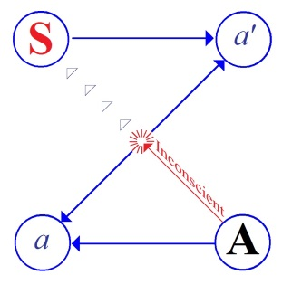

# Leçon 11 | 04 Février 1959

  

    <label><input type="checkbox" data-lacan-toggle="original" checked> 原文</label>
    <label><input type="checkbox" data-lacan-toggle="notes" checked> 注释</label>
    <label><input type="checkbox" data-lacan-toggle="commentary" checked> 个人解读评论</label>
  

  <form class="lacan-tool-search" role="search">
    <input class="lacan-tool-search-input" type="search" placeholder="搜索全文" aria-label="搜索全文">
    <button class="lacan-tool-button" type="submit" title="搜索">搜索</button>
  </form>
  <button class="lacan-tool-button lacan-back-to-top" type="button" title="回到页面最上方" aria-label="回到页面最上方">↑</button>

<section class="parallel-paragraph" data-paragraph-ids="s6-11-0001">

s6-11-0001

原文 · s6-11-0001

Le rêve d’Ella SHARPE (4)

[无对应译文]

</section>

<section class="parallel-paragraph" data-paragraph-ids="s6-11-0002">

s6-11-0002

原文 · s6-11-0002

Nous voici donc arrivés au moment d’essayer d’interpréter ce rêve du sujet d’Ella SHARPE, entreprise que nous ne pouvons tenter - à titre d’ailleurs purement théorique, comme un exercice de recherche - qu’à cause du caractère exceptionnellement bien développé de ce rêve qui occupe, aux dires d’Ella SHARPE à laquelle nous faisons crédit sur ce point, un point crucial de l’analyse.

[无对应译文]

</section>

<section class="parallel-paragraph" data-paragraph-ids="s6-11-0003">

s6-11-0003

原文 · s6-11-0003

Le sujet, qui a fait « *un énorme rêve* » qu’il faudrait des heures pour le raconter, dont il dit qu’il l’a oublié, qu’il en reste ceci qu’il se passe sur une route de Tchécoslovaquie sur laquelle il se trouve pour avoir entrepris un voyage autour du monde avec sa femme. J’ai même souligné qu’il disait : « *un voyage avec ma femme autour du monde* ».

[无对应译文]

</section>

<section class="parallel-paragraph" data-paragraph-ids="s6-11-0004">

s6-11-0004

原文 · s6-11-0004

Il se trouve sur une route et là il se passe ceci qu’il est, en somme, en proie aux entreprises sexuelles d’une femme qui, je le fais remarquer, se présente d’une certaine façon qui n’est pas dite dans le premier texte du rêve. Le sujet dit :

[无对应译文]

</section>

<section class="parallel-paragraph" data-paragraph-ids="s6-11-0005">

s6-11-0005

原文 · s6-11-0005

« *Je m’en aperçois à l’instant même, elle était au-dessus de moi, elle faisait tout ce qu’elle pouvait to get my penis.* »

[无对应译文]

</section>

<section class="parallel-paragraph" data-paragraph-ids="s6-11-0006">

s6-11-0006

原文 · s6-11-0006

Telle est l’expression sur laquelle nous aurons à revenir plus loin.

[无对应译文]

</section>

<section class="parallel-paragraph" data-paragraph-ids="s6-11-0007">

s6-11-0007

原文 · s6-11-0007

« *Bien entendu, dit le sujet, cela ne m’agréait pas du tout, au point que je pensais* *que devant son désappointement je devrais la masturber.* »

[无对应译文]

</section>

<section class="parallel-paragraph" data-paragraph-ids="s6-11-0008">

s6-11-0008

原文 · s6-11-0008

Il fait une remarque ici sur la nature foncièrement intransitive du verbe *to masturbate*, en anglais, dont nous avons intérêt déjà, avec l’auteur lui-même…

[无对应译文]

</section>

<section class="parallel-paragraph" data-paragraph-ids="s6-11-0009">

s6-11-0009

原文 · s6-11-0009

> encore que l’auteur en ait accentué moins directement son fondement sur la remarque
>
> en quelque sorte grammaticale du sujet

[无对应译文]

</section>

<section class="parallel-paragraph" data-paragraph-ids="s6-11-0010">

s6-11-0010

原文 · s6-11-0010

…à remarquer qu’il s’agit bien entendu d’une masturbation du sujet.

[无对应译文]

</section>

<section class="parallel-paragraph" data-paragraph-ids="s6-11-0011">

s6-11-0011

原文 · s6-11-0011

Nous avons la dernière fois, mis en relief la valeur de ce qui apparaît moins encore dans les associations que dans le développement de l’image du rêve, à savoir, que forme ce repli, ce « *hood* »[^44] à la façon du repli d’un chaperon, dont parle le sujet.

[无对应译文]

</section>

<section class="parallel-paragraph" data-paragraph-ids="s6-11-0012">

s6-11-0012

原文 · s6-11-0012

Et nous avons montré qu’assurément le recours au bagage des images…

[无对应译文]

</section>

<section class="parallel-paragraph" data-paragraph-ids="s6-11-0013">

s6-11-0013

原文 · s6-11-0013

> considérées par la doctrine classique, et issues manifestement de l’expérience, quand on les fait agir en quelque sorte comme autant d’objets séparés sans très bien repérer leur fonction par rapport au sujet

[无对应译文]

</section>

<section class="parallel-paragraph" data-paragraph-ids="s6-11-0014">

s6-11-0014

原文 · s6-11-0014

…pousse peut-être à quelque chose qui peut être *forcé*.

[无对应译文]

</section>

<section class="parallel-paragraph" data-paragraph-ids="s6-11-0015">

s6-11-0015

原文 · s6-11-0015

Donc nous avons souligné la dernière fois ce qu’il pouvait y avoir de paradoxal dans l’interprétation trop hâtive de ce singulier appendice, de cette protusion de l’organe génital féminin comme étant d’ores et déjà le signe qu’il s’agit du *phallus de la mère*. Aussi bien d’ailleurs une telle chose n’est-elle pas sans entraîner dans la pensée de l’analyste un autre saut, tellement il est vrai qu’une démarche imprudente ne peut se rectifier…

[无对应译文]

</section>

<section class="parallel-paragraph" data-paragraph-ids="s6-11-0016">

s6-11-0016

原文 · s6-11-0016

contrairement à ce qu’on dit

[无对应译文]

</section>

<section class="parallel-paragraph" data-paragraph-ids="s6-11-0017">

s6-11-0017

原文 · s6-11-0017

…que par une autre démarche imprudente, que l’erreur est bien moins érudite qu’on ne croit car la seule chance de se sauver d’une erreur est d’en commettre une autre qui la compense. Nous ne disons pas qu’Ella SHARPE a complètement *erré*, nous essayons d’articuler de meilleurs modes de direction qui auraient pu permettre une adéquation plus complète. Ceci sous toute réserve bien entendu puisque nous n’aurons jamais l’expérience cruciale.

[无对应译文]

</section>

<section class="parallel-paragraph" data-paragraph-ids="s6-11-0018">

s6-11-0018

原文 · s6-11-0018

Mais le saut suivant dont je parlais est que ce dont il s’agit, c’est encore bien moins du *phallus du partenaire* \- du *partenaire* dans l’occasion *imaginé* dans le rêve - que du *phallus du sujet*. Ceci nous le savons, le caractère *masturbatoire* du rêve nous l’admettons, coordonné par bien d’autres choses : de tout ce qui paraît après dans les dires du sujet.

[无对应译文]

</section>

<section class="parallel-paragraph" data-paragraph-ids="s6-11-0019">

s6-11-0019

原文 · s6-11-0019

Mais ce *phallus* du sujet, d’ores et déjà, nous sommes amenés à le considérer comme étant cet instrument de destruction, d’agression, d’un type extrêmement primitif, tel qu’il sort de ce qu’on pourrait appeler l’imagerie. Et c’est dans ce sens que d’ores et déjà s’oriente la pensée de l’analyste, Ella SHARPE dans l’occasion, et encore qu’elle soit loin de communiquer *l’ensemble de son interprétation* au sujet.

[无对应译文]

</section>

<section class="parallel-paragraph" data-paragraph-ids="s6-11-0020">

s6-11-0020

原文 · s6-11-0020

Le point sur lequel elle va tout de suite intervenir, en ce sens qu’elle le dit, c’est après lui avoir fait remarquer les éléments qu’elle appelle d’*omnipotence*. Selon son interprétation, ce qui apparaîtrait en son dire dans le rêve serait :

[无对应译文]

</section>

<section class="parallel-paragraph" data-paragraph-ids="s6-11-0021">

s6-11-0021

原文 · s6-11-0021

- *deuxièmement* : *la masturbation*,

[无对应译文]

</section>

<section class="parallel-paragraph" data-paragraph-ids="s6-11-0022">

s6-11-0022

原文 · s6-11-0022

- *troisièmement* : *cette masturbation est omnipotente*, dans le sens qu’il s’agit de cet organe perforant et qui mord, qu’est le propre *phallus* du sujet.

[无对应译文]

</section>

<section class="parallel-paragraph" data-paragraph-ids="s6-11-0023">

s6-11-0023

原文 · s6-11-0023

Il faut bien dire qu’il y a là une véritable *intrusion*, une véritable *extrapolation théorique* de la part de l’analyste, car à la vérité rien…

[无对应译文]

</section>

<section class="parallel-paragraph" data-paragraph-ids="s6-11-0024">

s6-11-0024

原文 · s6-11-0024

ni dans le rêve, ni dans les associations

[无对应译文]

</section>

<section class="parallel-paragraph" data-paragraph-ids="s6-11-0025">

s6-11-0025

原文 · s6-11-0025

…ne donne aucune espèce de fondement à faire intervenir tout de suite dans *l’interprétation* cette notion chez le sujet que le *phallus* ici interviendrait en tant qu’organe d’agression, et que ce qui serait redouté ce serait en quelque sorte le retour, la rétorsion de l’agression impliquée de la part du *sujet*. On ne peut pas ne pas souligner là que nous voyons mal à quel moment le sujet passe de ces intrusions à l’analyse de ce qu’elle a effectivement devant les yeux, et qu’elle sent avec tellement de détails et de finesse. Il est clair qu’il s’agit de théorie.

[无对应译文]

</section>

<section class="parallel-paragraph" data-paragraph-ids="s6-11-0026">

s6-11-0026

原文 · s6-11-0026

Il suffit de lire cette formule pour s’apercevoir qu’après tout, rien ne justifie cela, si ce n’est quelque chose que l’analyste ne nous dit pas. Mais encore nous a-t-elle suffisamment informés, et avec assez de soin, des antécédents du rêve, du cas du malade dans ses grandes lignes, pour que nous puissions dire qu’il y a là assurément quelque chose qui constitue un saut.Qu’il lui soit apparu nécessaire, c’est bien après tout ce que nous lui concédons volontiers, mais qu’il nous paraisse à nous aussi nécessaire, c’est sur ce point que nous posons la question et que nous allons essayer de *reprendre* cette analyse.

[无对应译文]

</section>

<section class="parallel-paragraph" data-paragraph-ids="s6-11-0027">

s6-11-0027

原文 · s6-11-0027

Non pas en quelque sorte pour substituer aux équivalents imaginaires des interprétations au sens où l’on l’entend à proprement parler : « *Ceci qui est une donnée doit se comprendre comme cela.* ».

[无对应译文]

</section>

<section class="parallel-paragraph" data-paragraph-ids="s6-11-0028">

s6-11-0028

原文 · s6-11-0028

Il ne s’agit pas de savoir ce que veut dire à tel ou tel moment, dans l’ensemble, chaque élément du rêve. Dans l’ensemble on peut dire que ces éléments sont plus que correctement appréciés. Ils sont basés sur une tradition de l’expérience analytique au moment où opère Ella SHARPE. Et d’autre part ils sont *certainement perçus* avec un grand discernement et une grande finesse.

[无对应译文]

</section>

<section class="parallel-paragraph" data-paragraph-ids="s6-11-0029">

s6-11-0029

原文 · s6-11-0029

Ce n’est pas de cela dont il s’agit. C’est de voir si le problème ne peut pas s’éclairer à être formulé, articulé, d’une façon qui lie mieux l’interprétation avec ce quelque chose sur lequel j’essaie de vous faire mettre l’accent ici, à savoir *la topologie inter-subjective*.

[无对应译文]

</section>

<section class="parallel-paragraph" data-paragraph-ids="s6-11-0030">

s6-11-0030

原文 · s6-11-0030

Celle qui sous diverses formes est toujours celle qu’ici j’essaie de *construire* devant vous, de *restituer* pour autant qu’elle est celle même de notre expérience : celle du *sujet*, du *petit autre*, du *grand Autre*, pour autant que leurs places doivent toujours, au moment de chaque *phénomène* dans l’analyse, être par nous marquées si nous voulons éviter cette sorte d’écheveau, de nœud véritablement serré comme d’un fil qu’on n’a pas su dénouer et qui forme, si l’on peut dire, le quotidien de nos *explications analytiques*.

[无对应译文]

</section>

<section class="parallel-paragraph" data-paragraph-ids="s6-11-0031">

s6-11-0031

原文 · s6-11-0031

Ce rêve, nous l’avons parcouru déjà sous plusieurs formes et nous pouvons tout de même commencer d’articuler quelque chose de simple, de direct, quelque chose qui n’est pas absent, même du tout, de l’observation, qui se dégage de cette lecture que nous avons faite.

[无对应译文]

</section>

<section class="parallel-paragraph" data-paragraph-ids="s6-11-0032">

s6-11-0032

原文 · s6-11-0032

Je dirai qu’au stade de ce qui précède, qui amène le sujet, et du rêve lui-même, *il y a un mot qui*…

[无对应译文]

</section>

<section class="parallel-paragraph" data-paragraph-ids="s6-11-0033">

s6-11-0033

原文 · s6-11-0033

> après tout ce que nous avons ici comme vocabulaire en commun

[无对应译文]

</section>

<section class="parallel-paragraph" data-paragraph-ids="s6-11-0034">

s6-11-0034

原文 · s6-11-0034

…*semble être celui qui vient le premier* et dont il n’aurait pas été exclu qu’il vienne à cette époque *à l’esprit* d’Ella SHARPE.

[无对应译文]

</section>

<section class="parallel-paragraph" data-paragraph-ids="s6-11-0035">

s6-11-0035

原文 · s6-11-0035

Ce n’est pas faire intervenir du tout une notion qui ne fut pas à sa portée : nous sommes dans le milieu anglais, à ce moment-là dominé par des discussions telles que celles qui s’élaborent par exemple entre M. JONES et Mme Joan RIVIERE dont il a déjà été question ici à propos de son livre *De la féminité comme une mascarade* [^45]. Je vous en ai parlé à propos de la discussion concernant *la phase phallique et la fonction phallique dans la sexualité féminine*[^46].

[无对应译文]

</section>

<section class="parallel-paragraph" data-paragraph-ids="s6-11-0036">

s6-11-0036

原文 · s6-11-0036

Il y a *un mot* dont il fait état à un moment, qui est *le mot* qui est vraiment nécessaire à JONES pour entrer dans la compréhension de ce qui est bien le point le plus difficile à comprendre, pas simplement à mettre en jeu, de l’analyse, à savoir *le complexe de castration*. Le mot dont JONES[^47] se sert est le mot *aphanisis* \[ἀϕάνισις\], qu’il a introduit de façon intéressante dans le vocabulaire analytique, et que nous ne pouvons du tout considérer comme absent du milieu anglais, car il en est fait grand état.

[无对应译文]

</section>

<section class="parallel-paragraph" data-paragraph-ids="s6-11-0037">

s6-11-0037

原文 · s6-11-0037

*Aphanisis* c’est *disparition*, ce qu’il entend ainsi, et ce qu’il veut dire par là nous le verrons plus loin. Mais je vais en faire un usage tout autre pour l’instant : l’usage en somme *impressionniste* de ce qui est vraiment là tout le temps au cours du matériel du rêve, de ce qui l’entoure, du comportement du sujet, de tout ce que nous avons déjà essayé d’articuler à propos de ce qui se présente, de ce qui se propose à Ella SHARPE.

[无对应译文]

</section>

<section class="parallel-paragraph" data-paragraph-ids="s6-11-0038">

s6-11-0038

原文 · s6-11-0038

Ce sujet même…

[无对应译文]

</section>

<section class="parallel-paragraph" data-paragraph-ids="s6-11-0039">

s6-11-0039

原文 · s6-11-0039

> qui avant de se présenter à elle d’une façon qu’elle décrit si joliment, avec cette sorte d’absence profonde qui lui donne à elle-même le sentiment qu’il n’y a pas un propos du sujet ni un de ses gestes qui ne soient quelque chose d’entièrement pensé, et que rien ne correspond à quoi que ce soit de senti

[无对应译文]

</section>

<section class="parallel-paragraph" data-paragraph-ids="s6-11-0040">

s6-11-0040

原文 · s6-11-0040

…ce sujet :

[无对应译文]

</section>

<section class="parallel-paragraph" data-paragraph-ids="s6-11-0041">

s6-11-0041

原文 · s6-11-0041

- qui se tient si bien « *à carreau* »,

[无对应译文]

</section>

<section class="parallel-paragraph" data-paragraph-ids="s6-11-0042">

s6-11-0042

原文 · s6-11-0042

- qui d’ailleurs ne s’annonce pas,

[无对应译文]

</section>

<section class="parallel-paragraph" data-paragraph-ids="s6-11-0043">

s6-11-0043

原文 · s6-11-0043

- qui apparaît mais qui, aussitôt apparu, est plus insaisissable que s’il n’était pas là,

[无对应译文]

</section>

<section class="parallel-paragraph" data-paragraph-ids="s6-11-0044">

s6-11-0044

原文 · s6-11-0044

- ce sujet qui lui-même nous a donné dans *les prémisses* de ce qu’il a apporté au sujet de son rêve, cette question qu’il a posée à propos de sa « *petite toux* ».

[无对应译文]

</section>

<section class="parallel-paragraph" data-paragraph-ids="s6-11-0045">

s6-11-0045

原文 · s6-11-0045

Et cette « *petite toux* » est faite pour quoi faire ?

[无对应译文]

</section>

<section class="parallel-paragraph" data-paragraph-ids="s6-11-0046">

s6-11-0046

原文 · s6-11-0046

Pour *faire disparaître* quelque chose qui doit être là au-delà de la porte. On ne sait pas quoi. Il le dit lui-même : dans le cas de l’analyste, *qu’est-ce qu’il peut bien y avoir à faire disparaître ?* Il évoque à ce propos *la mise en garde* dans d’autres circonstances, dans un autre contexte : qu’il s’agit qu’ils se *séparent*, qu’ils se *désunissent*, car la situation pourrait être embarrassante si lui-même entrait, et ainsi de suite…

[无对应译文]

</section>

<section class="parallel-paragraph" data-paragraph-ids="s6-11-0047">

s6-11-0047

原文 · s6-11-0047

Dans le rêve, nous sommes en présence de *trois personnages*, car il ne faut pas oublier qu’il y a sa femme. Le sujet, après l’avoir dit une fois, *n’en parle plus*. Mais qu’est-ce qui se passe bien exactement entre lui et la partenaire sexuelle, celle en somme à laquelle il se dérobe ?

[无对应译文]

</section>

<section class="parallel-paragraph" data-paragraph-ids="s6-11-0048">

s6-11-0048

原文 · s6-11-0048

Est-ce si sûr qu’il se dérobe ? La suite de ce qu’il énonce prouve qu’il est loin d’être complètement absent et il a mis son doigt, dit-il, dans cette sorte de vagin *protus*, retourné, cette sorte de vagin *prolabé* sur lequel j’ai insisté. Là aussi des questions se posent et nous allons les poser :

[无对应译文]

</section>

<section class="parallel-paragraph" data-paragraph-ids="s6-11-0049">

s6-11-0049

原文 · s6-11-0049

- Où est ce qui est en jeu ?

[无对应译文]

</section>

<section class="parallel-paragraph" data-paragraph-ids="s6-11-0050">

s6-11-0050

原文 · s6-11-0050

- Où est l’intérêt de la scène ?

[无对应译文]

</section>

<section class="parallel-paragraph" data-paragraph-ids="s6-11-0051">

s6-11-0051

原文 · s6-11-0051

Ce qui…

[无对应译文]

</section>

<section class="parallel-paragraph" data-paragraph-ids="s6-11-0052">

s6-11-0052

原文 · s6-11-0052

> pour autant qu’on puisse poser cette question à propos d’un rêve, et nous ne pouvons la poser
>
> que pour autant que toute la théorie freudienne nous impose de la poser

[无对应译文]

</section>

<section class="parallel-paragraph" data-paragraph-ids="s6-11-0053">

s6-11-0053

原文 · s6-11-0053

…ce qui se produira tout de suite après dans les associations du rêve, c’est quelque chose qui intéresse cette amie,

[无对应译文]

</section>

<section class="parallel-paragraph" data-paragraph-ids="s6-11-0054">

s6-11-0054

原文 · s6-11-0054

par l’intermédiaire d’un *souvenir*…

[无对应译文]

</section>

<section class="parallel-paragraph" data-paragraph-ids="s6-11-0055">

s6-11-0055

原文 · s6-11-0055

qui lui est venu concernant le chaperon que constitue l’organe féminin

[无对应译文]

</section>

<section class="parallel-paragraph" data-paragraph-ids="s6-11-0056">

s6-11-0056

原文 · s6-11-0056

…de quelqu’un qui lui a proposé sur un champ de golf quelque chose dans lequel pourraient être enveloppés ses clubs, et qu’il a trouvé vraiment un drôle de personnage.

[无对应译文]

</section>

<section class="parallel-paragraph" data-paragraph-ids="s6-11-0057">

s6-11-0057

原文 · s6-11-0057

Il en parle avec cette espèce de *réjouissance amusée*, et on voit bien ce qui se passe autour de ce *personnage vrai*. C’est vraiment ce personnage à propos duquel on peut bien se demander où jusque là, il a bien pu *rouler sa bosse*.

[无对应译文]

</section>

<section class="parallel-paragraph" data-paragraph-ids="s6-11-0058">

s6-11-0058

原文 · s6-11-0058

C’est le ton sur lequel il en parle. Avec cette gueule, et ce bagout qu’est-ce qu’il a bien pu être ? Peut-être « *un boucher* ? », dit-il. Dieu sait pourquoi, un boucher ! Mais le style et l’atmosphère générale, l’ambiance d’imitation à propos de ce personnage…

[无对应译文]

</section>

<section class="parallel-paragraph" data-paragraph-ids="s6-11-0059">

s6-11-0059

原文 · s6-11-0059

tout de suite d’ailleurs le sujet s’amuse à l’imiter

[无对应译文]

</section>

<section class="parallel-paragraph" data-paragraph-ids="s6-11-0060">

s6-11-0060

原文 · s6-11-0060

…montrent bien qu’il s’agit bien là… C’est par là d’ailleurs qu’est introduite la notion d’imitation, et l’association avec son amie « *qui imite si bien les hommes, qui a un tel talent, et un talent qu’elle exploite à la Broadcasting* ».

[无对应译文]

</section>

<section class="parallel-paragraph" data-paragraph-ids="s6-11-0061">

s6-11-0061

原文 · s6-11-0061

Et à ce propos, la première idée qui vient au sujet c’est qu’il en parle trop, qu’il a l’air de se vanter en parlant d’une relation aussi remarquable, *d’en remettre*. J’ai vérifié le mot anglais qu’il utilise : c’est un mot tout récent d’usage, qu’on peut considérer comme étant presque du *slang*, et que nous avons essayé de traduire ici par « *la ramener* ». Il l’utilise pour dire « *J’ai scrupule à la ramener à ce propos* »[^48].

[无对应译文]

</section>

<section class="parallel-paragraph" data-paragraph-ids="s6-11-0062">

s6-11-0062

原文 · s6-11-0062

\[*Imitating him like that reminds me of a friend who broadcasts impersonations which are very clever, but it sounds* « *swank* » *to tell you, as swanky as telling you* *what a marvellous wireless set I have* (p. 134).\]

[无对应译文]

</section>

<section class="parallel-paragraph" data-paragraph-ids="s6-11-0063">

s6-11-0063

原文 · s6-11-0063

Pour tout dire, il *disparaît*, il *se fait tout petit*, il ne veut pas prendre trop de place à cette occasion. Bref, ce qui s’impose à tout instant, qui revient comme un thème, comme un *leitmotiv* dans tout le discours, les propos du sujet, c’est quelque chose pour lequel le terme *aphanisis* apparaît ici bien plus près du « *faire disparaître* » que du « *disparaître* », de quelque chose qui est un perpétuel jeu où nous sentons que *sous diverses formes quelque chose* \- appelons cela si vous voulez l’objet intéressant - *n’est jamais là*.

[无对应译文]

</section>

<section class="parallel-paragraph" data-paragraph-ids="s6-11-0064">

s6-11-0064

原文 · s6-11-0064

La dernière fois, j’ai insisté là-dessus. Il n’est jamais où on l’attend, glisse d’un point à un autre en une sorte de jeu d’*escamoteur*. Je vais encore y insister, et vous allez voir où cela va nous mener qui est l’essentiel, la caractéristique à tous les niveaux, de la confrontation devant laquelle l’analyste se trouve. Le sujet ne peut rien avancer qu’aussitôt, par quelque côté, il n’en subtilise l’essentiel, si l’on peut dire.

[无对应译文]

</section>

<section class="parallel-paragraph" data-paragraph-ids="s6-11-0065">

s6-11-0065

原文 · s6-11-0065

Et je ferai la remarque que chez JONES aussi, ce terme d’ *aphanisis* est un terme qui s’offre à une critique qui aboutirait à la dénonciation de quelque inversion de la perspective. JONES a remarqué chez ses sujets qu’à l’approche du *complexe de castration*, ce qu’il sent, ce qu’il comprend, ce qu’il voit en eux, c’est la peur de l’*aphanisis*, de la disparition *du désir*. Et en quelque sorte ce qu’il nous dit, c’est que la castration - il ne le formule pas ainsi faute d’en avoir l’appareil - *c’est la symbolisation de cette perte*. Nous avons souligné combien cela est un énorme problème que de voir, dans une perspective génétique quelconque, comment un sujet…

[无对应译文]

</section>

<section class="parallel-paragraph" data-paragraph-ids="s6-11-0066">

s6-11-0066

原文 · s6-11-0066

> supposons-le dans son développement, à quelque moment, *à un niveau en quelque sorte animal de la subjectivité*

[无对应译文]

</section>

<section class="parallel-paragraph" data-paragraph-ids="s6-11-0067">

s6-11-0067

原文 · s6-11-0067

…commence à voir la « *tendance* » se détacher d’elle-même pour devenir crainte de sa propre perte. Et JONES fait de l’*aphanisis* la substance de la crainte de la castration.

[无对应译文]

</section>

<section class="parallel-paragraph" data-paragraph-ids="s6-11-0068">

s6-11-0068

原文 · s6-11-0068

Ici je ferai remarquer que c’est exactement dans *le sens contraire* qu’il convient de prendre les choses. C’est parce qu’il peut y avoir castration, c’est parce qu’il y a le jeu de signifiants impliqué dans la castration, que dans le sujet s’élabore cette dimension où il peut prendre crainte, alarme, de la disparition possible et future de son désir.

[无对应译文]

</section>

<section class="parallel-paragraph" data-paragraph-ids="s6-11-0069">

s6-11-0069

原文 · s6-11-0069

Observons bien que quelque chose comme le désir…

[无对应译文]

</section>

<section class="parallel-paragraph" data-paragraph-ids="s6-11-0070">

s6-11-0070

原文 · s6-11-0070

> si nous lui donnons un sens plein, le sens de *la tendance* au niveau de la psychologie animale

[无对应译文]

</section>

<section class="parallel-paragraph" data-paragraph-ids="s6-11-0071">

s6-11-0071

原文 · s6-11-0071

…il nous est difficile de le concevoir en tant que dans l’expérience humaine ce soit quelque chose de tout à fait accessible. La crainte du *défaut du désir* est quand même un pas qui est à expliquer. Pour l’expliquer je vous dis : le sujet humain, pour autant qu’il a à s’inscrire dans le signifiant, trouve là une position d’où *effectivement*, il met en question son besoin en tant que son besoin est pris modifié, identifié dans la demande.

[无对应译文]

</section>

<section class="parallel-paragraph" data-paragraph-ids="s6-11-0072">

s6-11-0072

原文 · s6-11-0072

Et là tout se conçoit fort bien, et la fonction du *complexe de castration* dans cette occasion, à savoir ce en quoi cette prise de position du sujet dans le signifiant implique la perte, le sacrifice d’un de ses signifiants entre autres, c’est ce que nous laissons pour l’instant de côté.

[无对应译文]

</section>

<section class="parallel-paragraph" data-paragraph-ids="s6-11-0073">

s6-11-0073

原文 · s6-11-0073

Ce que je veux simplement dire, c’est que la crainte de l’*aphanisis* chez les sujets névrosés correspond - contrairement à ce que croit JONES - à quelque chose qui doit être compris dans la perspective d’une insuffisante formation, articulation, *d’une partielle forclusion du complexe de castration*. C’est pour autant que le *complexe de castration* ne met pas le sujet à l’abri de cette sorte de *confusion*, d’*entraînement*, d’*angoisse* qui se manifeste dans la crainte de l’*aphanisis*, que nous la voyons *effectivement* chez les névrosés. Et ceci nous allons bien avoir l’occasion de le contrôler à propos de ce cas.

[无对应译文]

</section>

<section class="parallel-paragraph" data-paragraph-ids="s6-11-0074">

s6-11-0074

原文 · s6-11-0074

Continuons et revenons sur le texte lui-même, sur le texte du rêve, et sur ces images dont nous avons parlé la dernière fois, à savoir sur la *représentation* du sexe féminin sous la forme de ce vagin prolabé. Dans les images du sujet, cette sorte de fourreau, cette sorte de sac, de gaine, qui fait là une image si étrange qu’on ne peut tout de même pas, encore qu’elle ne soit pas du tout un cas exceptionnel et unique, mais qui n’est tout de même pas fréquente à rencontrer, qui n’a pas été décrite d’une façon parfaitement caractérisée dans la tradition analytique, ici on peut dire que l’image même…

[无对应译文]

</section>

<section class="parallel-paragraph" data-paragraph-ids="s6-11-0075">

s6-11-0075

原文 · s6-11-0075

> qui est employée dans l’articulation signifiante du rêve, à savoir qu’est–ce que cela veut dire entre les personnages qui sont présents

[无对应译文]

</section>

<section class="parallel-paragraph" data-paragraph-ids="s6-11-0076">

s6-11-0076

原文 · s6-11-0076

…prend sa valeur de ce qui se passe, de ce pour quoi elle est utilisée. En fait ce que nous voyons, c’est que le sujet va y mettre – comme il dit – le doigt. Il n’y mettra pas son pénis, certes pas, il y mettra le doigt.

[无对应译文]

</section>

<section class="parallel-paragraph" data-paragraph-ids="s6-11-0077">

s6-11-0077

原文 · s6-11-0077

Il *retourne*, il *ré-engaine*, il *ré-invagine* ce qui est là dé-vaginé, et tout se passe comme si se produisait là presque *un geste d’escamoteur*. Car en fin de compte il met quelque chose à la place de ce qu’il devrait y mettre, mais aussi, il montre que quelque chose peut y être mis. Et si tant est que quelque chose puisse effectivement être suggéré par la forme de ce qui se présente, à savoir le *phallus féminin*, tout se passe comme si…

[无对应译文]

</section>

<section class="parallel-paragraph" data-paragraph-ids="s6-11-0078">

s6-11-0078

原文 · s6-11-0078

> ce *phallus* qui est en effet en question de la façon la plus claire : « *to get my penis* »

[无对应译文]

</section>

<section class="parallel-paragraph" data-paragraph-ids="s6-11-0079">

s6-11-0079

原文 · s6-11-0079

…nous étions en droit de nous demander ce que le sujet est en train de nous montrer, puisque beaucoup plus qu’un acte de copulation, il s’agit là d’un acte d’exhibition. Cela se passe, ne l’oublions pas, devant un tiers.

[无对应译文]

</section>

<section class="parallel-paragraph" data-paragraph-ids="s6-11-0080">

s6-11-0080

原文 · s6-11-0080

Le geste est là, le geste est déjà évoqué du prestidigitateur dans l’exercice qui s’appelle, en français « *le sac à l’œuf* », à savoir ce sac de laine dans lequel le prestidigitateur alternativement fait apparaître l’œuf et le fait disparaître :

[无对应译文]

</section>

<section class="parallel-paragraph" data-paragraph-ids="s6-11-0081">

s6-11-0081

原文 · s6-11-0081

- le fait *apparaître* au moment où on ne l’attend pas,

[无对应译文]

</section>

<section class="parallel-paragraph" data-paragraph-ids="s6-11-0082">

s6-11-0082

原文 · s6-11-0082

- et le montre *disparu* là où on croirait le voir,

[无对应译文]

</section>

<section class="parallel-paragraph" data-paragraph-ids="s6-11-0083">

s6-11-0083

原文 · s6-11-0083

… « *the bag of the eggs* » dit-on aussi en anglais.

[无对应译文]

</section>

<section class="parallel-paragraph" data-paragraph-ids="s6-11-0084">

s6-11-0084

原文 · s6-11-0084

Le geste - si l’on peut dire : la monstration - dont il s’agit est d’autant plus frappant que dans les associations du sujet, ce que nous avons vu c’est très exactement toujours d’avertir au moment où il apparaît, de façon à ce que rien ne se voie de ce qu’il y avait avant, ou encore se faire prendre lui-même - dit-il dans son fantasme - pour un chien aboyant, de façon à ce qu’on dise qu’il n’y avait là qu’un chien.

[无对应译文]

</section>

<section class="parallel-paragraph" data-paragraph-ids="s6-11-0085">

s6-11-0085

原文 · s6-11-0085

Oui, toujours le même *escamotage* dont nous ne savons pas ce qui est escamoté, et assurément c’est avant tout le sujet lui-même qui est escamoté. Mais le rêve nous indique, et nous permet de préciser qu’en tout cas, si nous cherchons à préciser ce qui se localise dans le rêve comme étant ce qui est en jeu dans cet *escamotage*, c’est certainement le *phallus*, le *phallus* dont il s’agit : « *to get my penis* » \[*p*.133\].Et ceci nous y sommes, je dirais, tellement habitués, endurcis par la routine analytique, que nous ne nous arrêtons presque pas à cette donnée du rêve.

[无对应译文]

</section>

<section class="parallel-paragraph" data-paragraph-ids="s6-11-0086">

s6-11-0086

原文 · s6-11-0086

Néanmoins le choix du sujet du « *to get* » pour désigner ce qu’ici prétend faire la femme, c’est un verbe à usage extrêmement polyvalent. C’est toujours dans le sens d’obtenir, de gagner, d’attraper, de saisir, de s’adjoindre. Il s’agit de quelque chose qu’on obtient, en gros, dans le sens général. Bien sur nous entendons cela avec la note et l’écho du \[*femina curam et penem devoret* ?\], mais ce n’est pas si simple.

[无对应译文]

</section>

<section class="parallel-paragraph" data-paragraph-ids="s6-11-0087">

s6-11-0087

原文 · s6-11-0087

Car après tout, ce qui est mis en cause en cette occasion est quelque chose qui en fin de compte est très loin d’être de ce registre. Et aussi bien la question…

[无对应译文]

</section>

<section class="parallel-paragraph" data-paragraph-ids="s6-11-0088">

s6-11-0088

原文 · s6-11-0088

> s’il s’agit en effet sous quelque forme que ce soit, *réelle* ou *imaginaire* d’obtenir le pénis

[无对应译文]

</section>

<section class="parallel-paragraph" data-paragraph-ids="s6-11-0089">

s6-11-0089

原文 · s6-11-0089

…la première question à se poser est à savoir : ce pénis où est-il ? Car cela semble aller de soi qu’il est là. À savoir que sous prétexte qu’on a dit, que le sujet dans le compte rendu du rêve a dit qu’elle faisait des manœuvres « *to get my penis* », on a l’air de croire que pour autant, il est là quelque part dans le rêve. Mais littéralement, si l’on regarde bien le texte, absolument rien ne l’indique.

[无对应译文]

</section>

<section class="parallel-paragraph" data-paragraph-ids="s6-11-0090">

s6-11-0090

原文 · s6-11-0090

Il ne suffit pas que l’imputation du partenaire soit là donnée pour que nous déduisions que le pénis du sujet y est, suffise en quelque sorte à nous satisfaire sur le sujet de cette question : *où est-il ?* Il est peut-être tout à fait ailleurs que là où ce besoin que nous avons de compléter, dans une scène où l’on supposerait que le sujet se dérobe. Cela n’est pas si simple.

[无对应译文]

</section>

<section class="parallel-paragraph" data-paragraph-ids="s6-11-0091">

s6-11-0091

原文 · s6-11-0091

Et à partir du moment où nous nous posons *cette question*, nous voyons bien en effet que c’est là que se pose toute la question, et que c’est à partir de là aussi que nous pouvons saisir quelle est la discordance singulière, l’étrangeté que présente le signe énigmatique qui nous est proposé dans ce rêve. Car c’est sûr qu’il y a un rapport entre ce qui se passe et une masturbation.

[无对应译文]

</section>

<section class="parallel-paragraph" data-paragraph-ids="s6-11-0092">

s6-11-0092

原文 · s6-11-0092

Qu’est-ce que cela veut dire, qu’est-ce que cela nous souligne en cette occasion ? Il vaut la peine de le recueillir au passage, car - encore que cela ne soit pas élucidé - c’est fort instructif. Je veux dire, encore que ce ne soit pas articulé par l’analyste dans ses propos, c’est à savoir que *la masturbation de l’autre et la masturbation du sujet c’est tout un*, qu’on peut même aller assez loin et dire :

[无对应译文]

</section>

<section class="parallel-paragraph" data-paragraph-ids="s6-11-0093">

s6-11-0093

原文 · s6-11-0093

- que tout ce qu’il y a dans la prise de l’autre chez le sujet lui-même qui ressemble à une masturbation, suppose effectivement une secrète *identification narcissique,* qui est moins celle du corps au corps, que *du corps de l’autre au pénis*,

[无对应译文]

</section>

<section class="parallel-paragraph" data-paragraph-ids="s6-11-0094">

s6-11-0094

原文 · s6-11-0094

- *que toute une partie des activités de la caresse* - et ceci devient d’autant plus évident qu’elle prend un caractère de plaisir plus détaché, plus autonome, plus insistant, voire *confinant* à quelque chose qu’on appelle plus ou moins proprement en cette occasion un certain *sadisme* - *est quelque chose qui met en jeu le phallus*, pour autant que, comme je vous l’ai déjà montré, il se profile imaginairement dans l’au-delà du partenaire naturel.

[无对应译文]

</section>

<section class="parallel-paragraph" data-paragraph-ids="s6-11-0095">

s6-11-0095

原文 · s6-11-0095

Que le *phallus* est intéressé comme *signifiant* dans le rapport du sujet à l’autre, fait qu’il vient là comme ce quelque chose qui peut être recherché dans cet au-delà de l’étreinte de l’autre sur laquelle s’amorce, prend toute espèce de forme-type plus ou moins accentuée dans le sens de la perversion.

[无对应译文]

</section>

<section class="parallel-paragraph" data-paragraph-ids="s6-11-0096">

s6-11-0096

原文 · s6-11-0096

En fait, ce que nous voyons là c’est que justement cette masturbation de l’autre sujet diffère du tout au tout de cette prise de *phallus* dans l’étreinte de l’autre, ce qui nous permettrait de faire *équivaloir strictement la masturbation de l’autre* *à la masturbation du sujet lui-même*.

[无对应译文]

</section>

<section class="parallel-paragraph" data-paragraph-ids="s6-11-0097">

s6-11-0097

原文 · s6-11-0097

Que ce geste dont je vous ai montré le sens, qui est un geste presque de vérification que ce qui est là en face est assurément quelque chose de tout à fait important pour le sujet. C’est quelque chose qui a le plus grand rapport avec le *phallus*, mais c’est quelque chose aussi qui démontre que le *phallus* n’est pas là, que le « *to get my penis* » dont il s’agit pour le partenaire est quelque chose qui fuit, qui se dérobe, non pas simplement par la volonté du sujet, mais parce que quelque accident structural, qui est vraiment ce qui est en question.

[无对应译文]

</section>

<section class="parallel-paragraph" data-paragraph-ids="s6-11-0098">

s6-11-0098

原文 · s6-11-0098

Ce qui donne son style à tout ce qui revient dans la suite de l’association, à savoir :

[无对应译文]

</section>

<section class="parallel-paragraph" data-paragraph-ids="s6-11-0099">

s6-11-0099

原文 · s6-11-0099

- aussi bien cette femme dont il nous parle, qui se conduit *si remarquablement* en ceci qu’elle imite parfaitement les hommes,

[无对应译文]

</section>

<section class="parallel-paragraph" data-paragraph-ids="s6-11-0100">

s6-11-0100

原文 · s6-11-0100

- que cette sorte d’incroyable escamoteur dont il se souvient après des années, et qui lui propose avec un bagout incroyable quelque chose - dont singulièrement, c’est encore une chose pour une autre - faire une enveloppe de quelque chose avec l’enveloppe qui est faite pour autre chose, nommément le tissu destiné à faire *une capote de voiture* – et pour faire quoi ? – pour lui permettre de mettre ses clubs de golf, cette sorte de fallacieux bonhomme, voilà donc ce qui reviendra.

[无对应译文]

</section>

<section class="parallel-paragraph" data-paragraph-ids="s6-11-0101">

s6-11-0101

原文 · s6-11-0101

Tout a toujours ce caractère - de quelque élément qu’il s’agisse - que ce n’est jamais tout à fait de ce qui se présente qu’il s’agit. Ce n’est jamais de la chose vraie qu’il s’agit, c’est toujours sous une forme problématique que les choses se présentent.

[无对应译文]

</section>

<section class="parallel-paragraph" data-paragraph-ids="s6-11-0102">

s6-11-0102

原文 · s6-11-0102

Prenons ce qui vient tout de suite après, et qui va jouer son rôle. Le caractère problématique de ce qui insiste devant le sujet se poursuit tout de suite, et par une question qui lui vient à propos, qui va surgir des souvenirs de son enfance. Pourquoi diable a-t-il eu à un autre moment, une autre compulsion - que celle qu’il a eue au début de la séance, à savoir la toux - à savoir couper les lanières de sa sœur ?

[无对应译文]

</section>

<section class="parallel-paragraph" data-paragraph-ids="s6-11-0103">

s6-11-0103

原文 · s6-11-0103

- « *Je ne pensais pas que c’était une véritable compulsion. C’est pour la même raison que la toux m’ennuyait. Je suppose que je coupais les sandales de ma sœur dans le même style. J’ai une mémoire assez obscure de l’avoir fait. Je ne sais pas pourquoi, ni ce que je désirais de ce cuir pour lequel je faisais cela, de ces bandes.* » \[*I dislike thinking it was a compulsion; that’s why the cough annoys me. I suppose I cut up my sister’s sandals in the same way. I have only the dimmest memory of doing it. I don’t know why nor what I wanted the leather for when I had done it. p*.135\]

[无对应译文]

</section>

<section class="parallel-paragraph" data-paragraph-ids="s6-11-0104">

s6-11-0104

原文 · s6-11-0104

- « *Mais enfin il faut croire que je voulais en faire quelque chose d’utile mais, je pense, de tout à fait unneccessary.* *C’était fort utile dans mon esprit, mais cela n’avait aucune nécessité sérieuse.* \[*I thought I wanted the strips to make something usefill but I expect something quite unnecessary. p*.135\]

[无对应译文]

</section>

<section class="parallel-paragraph" data-paragraph-ids="s6-11-0105">

s6-11-0105

原文 · s6-11-0105

Là aussi nous nous trouvons devant une sorte de fuite dans laquelle va suivre une autre fuite encore, à savoir la remarque qu’il pense tout d’un coup aux courroies qui liaient *la capote de la voiture*, ou plutôt cela lui fait penser aux courroies qu’il y a à un « *pram* », qui est une voiture d’enfant. Et à ce moment là d’une curieuse façon, d’une façon négative, il introduit la notion de « *pram* ». Il pense qu’il n’y avait pas de *pram* chez lui. Or justement :

[无对应译文]

</section>

<section class="parallel-paragraph" data-paragraph-ids="s6-11-0106">

s6-11-0106

原文 · s6-11-0106

- « …*il n’y a rien de plus bête –* dit-il lui–même *– de dire qu’il n’y avait pas de pram chez nous.* *Il y en avait sûrement puisqu’il y avait deux enfants.* » \[...*and I then thought how silly you are, you must have had a « pram ». p*.135\]

[无对应译文]

</section>

<section class="parallel-paragraph" data-paragraph-ids="s6-11-0107">

s6-11-0107

原文 · s6-11-0107

Toujours le même style de choses qui aparaît sous la forme de quelque chose qui manque et qui domine tout le style des associations du sujet. Le pas suivant, enchaîné directement sur cela, quel est-il ?

[无对应译文]

</section>

<section class="parallel-paragraph" data-paragraph-ids="s6-11-0108">

s6-11-0108

原文 · s6-11-0108

- « *Tiens je me suis rappelé, là tout de suite, que je devais envoyer deux lettres à deux membres qui doivent être admis à notre club. Et je me vantais d’être un meilleur secrétaire que le dernier, c’est tout de même assez drôle, maintenant voilà que je viens justement d’oublier de donner à ceux-ci la permission d’entrer au club.* » \[*I’ve suddenly remembered I meant to send off letters admitting two members to the Club. I boasted of being a better secretary than the last and yet here* *I am forgetting to give people permission to enter the Club. p.* 135-136\]

[无对应译文]

</section>

<section class="parallel-paragraph" data-paragraph-ids="s6-11-0109">

s6-11-0109

原文 · s6-11-0109

Autrement dit, je ne leur ai pas écrit. Et enchaîné tout de suite, et indiqué entre guillemets dans le texte d’Ella SHARPE, encore qu’elle n’en fasse pas état parce que pour un lecteur anglais ces lignes n’ont même pas besoin d’être entre guillemets, une citation d’une phrase qui se trouve dans ce qu’on appelle la *General Confession*, à savoir une des prières du *Book of Common Prayer* du « *Livre de prière pour tout le monde* » qui forme le fondement des devoirs religieux des individus dans l’Église d’Angleterre.

[无对应译文]

</section>

<section class="parallel-paragraph" data-paragraph-ids="s6-11-0110">

s6-11-0110

原文 · s6-11-0110

Je dois dire que mes relations avec le *Book of Common Prayer* ne datent pas d’hier et je ne ferai qu’évoquer ici le très joli objet qui avait été créé il y a vingt ou vingt cinq ans dans la communauté surréaliste par mon ami Roland PENROSE qui avait fait un usage, pour les initiés du cercle, du *Book of Common Prayer*. Lorsqu’on l’ouvrait, de chaque côté du plat intérieur de la couverture il y avait un miroir.

[无对应译文]

</section>

<section class="parallel-paragraph" data-paragraph-ids="s6-11-0111">

s6-11-0111

原文 · s6-11-0111

Ceci est fort instructif, car c’est là le seul tort qu’on puisse faire à Ella SHARPE pour qui sûrement ce texte était beaucoup plus familier qu’à nous, car le texte du *Book of Common Prayer* n’est pas tout à fait pareil à la citation qu’en donne le sujet :

[无对应译文]

</section>

<section class="parallel-paragraph" data-paragraph-ids="s6-11-0112">

s6-11-0112

原文 · s6-11-0112

« *We have left undone*… », « *Nous avons laissées non faites ces choses que nous avions à faire*… »

[无对应译文]

</section>

<section class="parallel-paragraph" data-paragraph-ids="s6-11-0113">

s6-11-0113

原文 · s6-11-0113

au lieu de :

[无对应译文]

</section>

<section class="parallel-paragraph" data-paragraph-ids="s6-11-0114">

s6-11-0114

原文 · s6-11-0114

« *Nous n’avons pas fait ces choses que nous devons faire* » (citation du sujet). \[*Ah well, we have undone those things we ought to have done*\]

[无对应译文]

</section>

<section class="parallel-paragraph" data-paragraph-ids="s6-11-0115">

s6-11-0115

原文 · s6-11-0115

C’est peu de chose, mais à la suite manque une phrase entière qui en est en quelque sorte la contre partie dans le texte de *la Prière de confession générale* : « *Et nous avons fait ces choses que nous ne devions pas faire.* » Ceci, le sujet n’éprouve pas du tout le besoin de s’en confesser, pour une bonne raison, c’est qu’en fin de compte *il s’agit vraiment pour lui jamais que de* « *ne pas faire les choses* ». Mais « *faire les choses* », cela n’est pas son affaire. C’est bien en effet ce dont il s’agit puisqu’il ajoute qu’il est tout à fait incapable de faire quoi que ce soit *de crainte de trop bien réussir*, comme nous l’a souligné l’analyste. Et puis, car cela n’est pas la moindre chose, c’est là que je veux en venir, le sujet continue la phrase : « *Il n’y a rien de bon en nous* ». \[...*and there is no <u>good thing</u> in us. p*.136\]

[无对应译文]

</section>

<section class="parallel-paragraph" data-paragraph-ids="s6-11-0116">

s6-11-0116

原文 · s6-11-0116

*Ceci est une pure invention du sujet, car dans le* « *Book of Common Prayer »* *il n’y a rien de tel*. Il y a : « *Il n’y a pas de santé en nous* ». Je crois que ce « *good thing* » qu’il a mis à la place est bien ce dont il s’agit. Je dirais que ce *bon objet* qui n’est pas là, c’est bien ce qui est en question, et il nous confirme une fois de plus qu’il s’agit du *phallus*. Il est très important pour le sujet de dire que ce *bon objet* n’est pas là, nous retrouvons encore le terme : il n’est pas là, il n’est jamais là où on l’attend. Et c’est assurément un « *good thing* » qui est pour lui quelque chose de la plus extrême importance, mais il est non moins clair que ce qu’il tend à montrer, à démontrer c’est toujours une seule et même chose, à savoir qu’il n’est jamais là. Là où quoi ? Là où on pourrait *to get*, s’en emparer, le prendre. Et c’est bien ce qui domine l’ensemble du matériel dont il s’agit.

[无对应译文]

</section>

<section class="parallel-paragraph" data-paragraph-ids="s6-11-0117">

s6-11-0117

原文 · s6-11-0117

Qu’à la lumière de ce que nous venons ici d’avancer, le rapprochement entre les deux compulsions :

[无对应译文]

</section>

<section class="parallel-paragraph" data-paragraph-ids="s6-11-0118">

s6-11-0118

原文 · s6-11-0118

- celle de la toux,

[无对应译文]

</section>

<section class="parallel-paragraph" data-paragraph-ids="s6-11-0119">

s6-11-0119

原文 · s6-11-0119

- et aussi bien celle d’avoir coupé les bandes de cuir des sandales de sa sœur,

[无对应译文]

</section>

<section class="parallel-paragraph" data-paragraph-ids="s6-11-0120">

s6-11-0120

原文 · s6-11-0120

…nous paraisse moins surprenant. Car c’est vraiment une interprétation analytique des plus courantes : le fait de couper les bandes de cuir qui retiennent les sandales de sa sœur a un rapport que nous nous contentons ici, comme tout le monde, d’approximer globalement avec le thème de la castration. Vous prendrez M. FENICHEL, vous verrez que les coupeurs de tresses sont des gens qui font cela en fonction de leur complexe de castration.

[无对应译文]

</section>

<section class="parallel-paragraph" data-paragraph-ids="s6-11-0121">

s6-11-0121

原文 · s6-11-0121

Mais comment pouvoir dire, sauf à la pesée la plus exacte d’un cas, si c’est :

[无对应译文]

</section>

<section class="parallel-paragraph" data-paragraph-ids="s6-11-0122">

s6-11-0122

原文 · s6-11-0122

- la rétorsion de la castration,

[无对应译文]

</section>

<section class="parallel-paragraph" data-paragraph-ids="s6-11-0123">

s6-11-0123

原文 · s6-11-0123

- l’application de la castration à un autre sujet qu’à eux-mêmes

[无对应译文]

</section>

<section class="parallel-paragraph" data-paragraph-ids="s6-11-0124">

s6-11-0124

原文 · s6-11-0124

- ou au contraire, apprivoisement de la castration,

[无对应译文]

</section>

<section class="parallel-paragraph" data-paragraph-ids="s6-11-0125">

s6-11-0125

原文 · s6-11-0125

- mise en jeu sur l’autre d’une castration qui n’est pas une vraie castration, et donc qui ne se manifeste pas si dangereuse que cela : domestication si l’on peut dire, ou moins-value, dévaluation de la castration au cours de cet exercice. D’autant plus que coupant les nattes, il est toujours possible, concevable, que les dites nattes repoussent, c’est-à-dire réassurent contre la castration.

[无对应译文]

</section>

<section class="parallel-paragraph" data-paragraph-ids="s6-11-0126">

s6-11-0126

原文 · s6-11-0126

Ceci est, bien sûr, tout ce que la somme des expériences analytiques permet sur ce sujet d’embrancher mais qui, dans l’occasion, ne nous apparaît que comme cachant. Mais qu’il y ait liaison avec la castration ceci ne fait aucune espèce de doute. Mais alors ce dont il s’agit, si nous nous obligeons à ne pas aller plus vite et à soutenir les choses au niveau où nous les avons suffisamment indiquées, c’est-à-dire qu’ici la castration est quelque chose qui fait partie si l’on peut dire, du contexte, du rapport, mais que rien ne nous permet jusqu’à présent de faire intervenir d’une façon aussi précise que l’analyste l’a fait, l’indication du sujet, postulée en l’occasion, pour articuler quelque chose comme étant une intention agressive primitivement retournée contre lui.

[无对应译文]

</section>

<section class="parallel-paragraph" data-paragraph-ids="s6-11-0127">

s6-11-0127

原文 · s6-11-0127

Mais qu’en savons-nous après tout ? Est-ce qu’il n’est pas beaucoup plus intéressant de poser, de renouveler sans cesse la question : ce *phallus* où est-il ? Où est-il en effet, où faut-il le concevoir ?

[无对应译文]

</section>

<section class="parallel-paragraph" data-paragraph-ids="s6-11-0128">

s6-11-0128

原文 · s6-11-0128

Ce que nous pouvons dire, c’est que l’analyste va très loin, va très fort en disant au sujet :

[无对应译文]

</section>

<section class="parallel-paragraph" data-paragraph-ids="s6-11-0129">

s6-11-0129

原文 · s6-11-0129

- il est quelque part très loin en vous,

[无对应译文]

</section>

<section class="parallel-paragraph" data-paragraph-ids="s6-11-0130">

s6-11-0130

原文 · s6-11-0130

- il fait partie d’une *vieille rivalité* avec votre père,

[无对应译文]

</section>

<section class="parallel-paragraph" data-paragraph-ids="s6-11-0131">

s6-11-0131

原文 · s6-11-0131

- il est là au principe de tous vos vœux primordiaux de *toute puissance*,

[无对应译文]

</section>

<section class="parallel-paragraph" data-paragraph-ids="s6-11-0132">

s6-11-0132

原文 · s6-11-0132

- il est là à la source d’une agression dont vous avez en cette occasion la rétorsion.

[无对应译文]

</section>

<section class="parallel-paragraph" data-paragraph-ids="s6-11-0133">

s6-11-0133

原文 · s6-11-0133

Alors que *rien* à proprement parler *ne permet de saisir dans le texte quelque chose qui s’articule* *ainsi*.

[无对应译文]

</section>

<section class="parallel-paragraph" data-paragraph-ids="s6-11-0134">

s6-11-0134

原文 · s6-11-0134

Essayons quant à nous, après tout, de nous poser la question peut-être même un tout petit peu plus hardiment que nous n’y serions portés de nature. Nous ne pouvons pas, semble-t-il, proposer à propos d’une observation imprimée comme cela, écrite, quelque chose qui serait ce que nous demanderions à un élève. S’il s’agissait d’un élève, j’en parlerais beaucoup plus sévèrement, je dirais quelle mouche vous a piqué de dire une chose pareille !

[无对应译文]

</section>

<section class="parallel-paragraph" data-paragraph-ids="s6-11-0135">

s6-11-0135

原文 · s6-11-0135

Je poserais la question dans un cas semblable : où est l’élément de contre-transfert ? C’est là ce qui peut sembler hardi, de poser une pareille question à propos d’un texte d’un auteur qui, somme toute, est quelqu’un dont nous avons toutes raisons de faire à cette date la plus extrême confiance, à savoir Ella SHARPE. Je me suis souri à moi-même au moment où je me suis posé cette question car elle me paraissait à proprement parler un petit peu exorbitante. Eh bien on n’a jamais tort, en fin de compte, d’être comme cela un tout petit peu trop audacieux. Il arrive que ce soit comme cela qu’on trouve ce que l’on cherche.

[无对应译文]

</section>

<section class="parallel-paragraph" data-paragraph-ids="s6-11-0136">

s6-11-0136

原文 · s6-11-0136

Et dans l’occasion, j’ai cherché d’abord avant de trouver, je veux dire que j’avais lu *presque distraitement* les premières pages de ce livre, je veux dire que comme toujours on ne lit jamais bien, et il y avait pourtant quelque chose d’extrêmement joli.

[无对应译文]

</section>

<section class="parallel-paragraph" data-paragraph-ids="s6-11-0137">

s6-11-0137

原文 · s6-11-0137

Tout de suite après avoir parlé du père mort, de ce père qu’elle n’arrive pas à réveiller dans la mémoire du sujet, qu’elle est arrivée à faire bouger un tout petit peu ces derniers temps…

[无对应译文]

</section>

<section class="parallel-paragraph" data-paragraph-ids="s6-11-0138">

s6-11-0138

原文 · s6-11-0138

> vous vous rappelez que le sujet s’émerveillait que son père, dans un temps, avait parlé

[无对应译文]

</section>

<section class="parallel-paragraph" data-paragraph-ids="s6-11-0139">

s6-11-0139

原文 · s6-11-0139

…tout de suite après, elle fait remarquer que c’est *la même difficulté qu’il y a avec elle*, à savoir que :

[无对应译文]

</section>

<section class="parallel-paragraph" data-paragraph-ids="s6-11-0140">

s6-11-0140

原文 · s6-11-0140

- « *Il n’a pas de pensées à mon propos, ce patient.* ».\[*He has no thoughts about me. p*.126\]

[无对应译文]

</section>

<section class="parallel-paragraph" data-paragraph-ids="s6-11-0141">

s6-11-0141

原文 · s6-11-0141

Il y avait là déjà quelque chose qui aurait pu retenir notre attention.

[无对应译文]

</section>

<section class="parallel-paragraph" data-paragraph-ids="s6-11-0142">

s6-11-0142

原文 · s6-11-0142

- « *Il ne sent rien à mon propos. Il ne peut pas croire à cela.* » \[*He feels nothing about me. He cannot believe in the theory of transference.*\]

[无对应译文]

</section>

<section class="parallel-paragraph" data-paragraph-ids="s6-11-0143">

s6-11-0143

原文 · s6-11-0143

C’est inquiétant, il faut le dire. Que le sujet n’en prenne pas conscience comme tel, cela ne dit pas qu’il n’y a pas de manifestation, car tout de même il y a une espèce de fourragement obscur de l’anxiété à telle ou telle occasion. C’est là que j’avais mal retenu quelque chose qui s’exprime ici. Mais quand on lit cela, on croit que c’est une dissertation générale comme il arrive d’en faire à l’analyste :

[无对应译文]

</section>

<section class="parallel-paragraph" data-paragraph-ids="s6-11-0144">

s6-11-0144

原文 · s6-11-0144

« *Je pense –* dit-elle, il s’agit bien de cela *- que l’analyse pourrait être comparée à un jeu d’échecs qui tire en longueur et qui doit continuer ici jusqu’à ce que je cesse d’être le père qui se venge dans l’inconscient, qui s’emploie à le « cornering him », à le coincer, à le mettre en échec, après quoi il n’y a plus d’autre alternative que la mort.* »

[无对应译文]

</section>

<section class="parallel-paragraph" data-paragraph-ids="s6-11-0145">

s6-11-0145

原文 · s6-11-0145

\[*I think the analysis might be compared to a long-drawn-out game of chess and that it will continue to be so until I cease to be the unconscious avenging father who is bent on cornering him, checkmating him, after which there is no alternative to death. p*.127\]

[无对应译文]

</section>

<section class="parallel-paragraph" data-paragraph-ids="s6-11-0146">

s6-11-0146

原文 · s6-11-0146

Cette référence curieuse au jeu d’échec dans cette occasion, qu’à la vérité rien n’implique, est quand même ce qui mérite à cette occasion de retenir notre attention. Je dirai qu’au moment où j’ai lu cette page, je l’ai trouvée effectivement *très jolie*, que je ne me suis pas tout de suite arrêté à sa valeur dans l’ordre transférentiel. Je veux dire qu’au cours de la lecture, ce que cela a fait vibrer en moi c’est : c’est *très joli* !

[无对应译文]

</section>

<section class="parallel-paragraph" data-paragraph-ids="s6-11-0147">

s6-11-0147

原文 · s6-11-0147

On devrait comparer tout le déroulement d’une analyse au jeu d’échecs. Et pourquoi ? Parce que ce qu’il y a de plus *beau* et de plus *saillant* dans le jeu d’échecs, c’est que c’est un jeu qu’on peut décrire ainsi : il y a un certain nombre d’éléments que nous caractériserons comme des éléments *signifiants*, chacune des pièces est un élément *signifiant*.

[无对应译文]

</section>

<section class="parallel-paragraph" data-paragraph-ids="s6-11-0148">

s6-11-0148

原文 · s6-11-0148

Et en somme, dans un jeu qui se joue à l’aide d’une série de mouvements en réplique fondés sur la nature de ces *signifiants*, chacune ayant son propre mouvement caractérisé par sa positon comme *signifiant*, ce qui se passe c’est la progressive réduction du nombre de *signifiants* qui sont dans le coup.

[无对应译文]

</section>

<section class="parallel-paragraph" data-paragraph-ids="s6-11-0149">

s6-11-0149

原文 · s6-11-0149

Et on pourrait après tout décrire une analyse ainsi : qu’il s’agit d’éliminer un nombre suffisant de *signifiants* pour qu’il reste seulement en jeu un nombre assez petit de *signifiants* pour qu’on sente bien où est la position du sujet dans leur intérieur. Pour y être revenu par la suite, je crois qu’en effet cela peut nous mener assez loin. Mais ce qui est important c’est ceci : c’est qu’Ella SHARPE…

[无对应译文]

</section>

<section class="parallel-paragraph" data-paragraph-ids="s6-11-0150">

s6-11-0150

原文 · s6-11-0150

> effectivement tout ce que je connais ou pouvais connaître par ailleurs de son œuvre l’indique

[无对应译文]

</section>

<section class="parallel-paragraph" data-paragraph-ids="s6-11-0151">

s6-11-0151

原文 · s6-11-0151

…a effectivement cette conception de l’analyse, qu’il y a dans son interprétation de la théorie analytique cette espèce de profonde mise en valeur du caractère signifiant des choses.

[无对应译文]

</section>

<section class="parallel-paragraph" data-paragraph-ids="s6-11-0152">

s6-11-0152

原文 · s6-11-0152

Elle a mis l’accent sur *la métaphore* d’une façon qui ne *dissone absolument pas* avec les choses que je vous explique. Et tout le temps, elle sait mettre en valeur *cet élément de substitution à proprement parler linguistique, dans les symptômes*, qui fait qu’elle l’a porté dans ses analyses de thèmes littéraires qui constituent une part importante de son œuvre. Et tout ce qu’elle donne comme règles techniques participe aussi de quelque chose qui est tout à fait profondément marqué d’une espèce d’expérience, d’appréhension du jeu de signifiants comme tel.

[无对应译文]

</section>

<section class="parallel-paragraph" data-paragraph-ids="s6-11-0153">

s6-11-0153

原文 · s6-11-0153

De telle sorte que *la chose* dont, dans cette occasion, on puisse dire *qu’elle méconnaisse*, je dirai que *ce sont ses propres intentions* qui s’expriment dans ce registre…

[无对应译文]

</section>

<section class="parallel-paragraph" data-paragraph-ids="s6-11-0154">

s6-11-0154

原文 · s6-11-0154

> sur le plan de la parole dont il s’agit au premier plan de cette observation

[无对应译文]

</section>

<section class="parallel-paragraph" data-paragraph-ids="s6-11-0155">

s6-11-0155

原文 · s6-11-0155

…de « *coincer* ». Le « *cornering him* » est là amené d’abord par elle. C’est uniquement dans les séances ultérieures à *l’interprétation* qu’elle a donnée de ce rêve, que nous verrons apparaître le même mot dans le discours du patient, et je vous dirai tout à l’heure *à quel propos*.

[无对应译文]

</section>

<section class="parallel-paragraph" data-paragraph-ids="s6-11-0156">

s6-11-0156

原文 · s6-11-0156

C’est pourquoi, vous le savez déjà, je vous ai indiqué ce qui se passait aussi deux séances après. À savoir son impossibilité de « *to corner* » son partenaire dans un jeu également, le jeu de tennis, de le coincer pour donner le dernier *shot*, celui que le type ne peut pas aller rattraper. Il s’agit bien en effet de ceci, que c’est sur ce plan que l’analyste se manifeste. Et je ne suis pas du tout en train de dire que le sujet s’en aperçoit.

[无对应译文]

</section>

<section class="parallel-paragraph" data-paragraph-ids="s6-11-0157">

s6-11-0157

原文 · s6-11-0157

Il est bien entendu qu’elle est une bonne analyste. Elle le dit de toutes les façons : c’est un cas dans lequel vous avez pu remarquer – dit-elle aux étudiants - que je ne fais que la plus petite remarque, ou que je me tais. Pourquoi ? – dit-elle – parce qu’il n’y a absolument rien chez ce sujet qui ne m’indique, de toutes les façons, que sa prétention à vouloir être aidé veut dire exactement le contraire, à savoir qu’avant tout il veut rester à l’abri, et avec *sa petite couverture*, *sa capote de voiture* sur lui.

[无对应译文]

</section>

<section class="parallel-paragraph" data-paragraph-ids="s6-11-0158">

s6-11-0158

原文 · s6-11-0158

Le « *hood* », c’est vraiment une position tout à fait fondamentale. Cela, elle le sent, tout ce qui se passe à propos du souvenir du « *pram* » qui est effacé, c’est quand même ceci qu’il a été dans son lit « *pinned in bed* », c’est-à-dire « *épinglé* ». D’ailleurs il apparaît qu’il a des notions très précises sur ce que peut provoquer chez un enfant le fait *d’être* plus ou moins *ligoté*, encore qu’il n’y ait rien de particulier dans son souvenir qui lui permette de l’évoquer, mais qu’assurément à cette position liée, il tient beaucoup.

[无对应译文]

</section>

<section class="parallel-paragraph" data-paragraph-ids="s6-11-0159">

s6-11-0159

原文 · s6-11-0159

Donc elle est bien loin de laisser transparaître cet élément de contre-transfert, c’est-à-dire quelque chose qui serait trop interventionniste dans le jeu. Un jeu agressif dans ce jeu d’échecs. Mais ce que je dis, c’est parce qu’elle en sent si bien la portée de cette notion, cet exercice agressif du jeu analytique, qu’elle ne voit pas *sa portée exacte*, à savoir que ce dont il s’agit, c’est de quelque chose qui a les plus étroits rapports aux *signifiants*.

[无对应译文]

</section>

<section class="parallel-paragraph" data-paragraph-ids="s6-11-0160">

s6-11-0160

原文 · s6-11-0160

À savoir que si nous nous demandons où est le *phallus*, c’est dans ce sens que nous devons le chercher. Autrement dit que, si vous voulez, dans le quadrangle du schéma : du *sujet*, de l’*autre*, du *moi en tant qu’image de l’autre*, et du grand *Autre*, c’est de cela qu’il s’agit : de là où peut apparaître le signifiant comme tel.

[无对应译文]

</section>

<section class="parallel-paragraph" data-paragraph-ids="s6-11-0161">

s6-11-0161

原文 · s6-11-0161

[无对应译文]

</section>

<section class="parallel-paragraph" data-paragraph-ids="s6-11-0162">

s6-11-0162

原文 · s6-11-0162

C’est à savoir que ce *phallus* qui n’est jamais là où nous l’attendons, il est quand même là. Il est là comme *la lettre volée*, où on l’attend le moins, et là où pourtant tout le désigne. Pour s’exprimer comme vraiment *la métaphore du jeu d’échecs* nous permet de l’articuler, je dirais que le sujet ne veut pas perdre *sa dame*, et je m’explique.

[无对应译文]

</section>

<section class="parallel-paragraph" data-paragraph-ids="s6-11-0163">

s6-11-0163

原文 · s6-11-0163

Dans le rêve, le *phallus* ce n’est pas *le sujet* qui est là et qui le regarde. Ce n’est pas là qu’il est le *phallus*. Car pour ce sujet en effet…

[无对应译文]

</section>

<section class="parallel-paragraph" data-paragraph-ids="s6-11-0164">

s6-11-0164

原文 · s6-11-0164

comme le perçoit obscurément à travers un voile l’analyste dans son interprétation

[无对应译文]

</section>

<section class="parallel-paragraph" data-paragraph-ids="s6-11-0165">

s6-11-0165

原文 · s6-11-0165

…le sujet a un certain rapport à l’*omnipotence*, à la « *potence* » tout simplement, à la puissance.

[无对应译文]

</section>

<section class="parallel-paragraph" data-paragraph-ids="s6-11-0166">

s6-11-0166

原文 · s6-11-0166

Sa puissance - dans cette occasion le *phallus -* ce qu’il convient qu’il préserve à tout prix, qu’il maintienne hors du jeu parce que ce *phallus* il peut le perdre dans le jeu, est ici dans le rêve représenté tout simplement par le personnage auquel on penserait le moins qu’il le représente, à savoir sa femme qui est là, bien loin d’être l’apparent témoin qu’elle est, car à la vérité de cette fonction de voir, *il n’est nullement indiqué que ce soit là* *quelque chose d’essentiel*.

[无对应译文]

</section>

<section class="parallel-paragraph" data-paragraph-ids="s6-11-0167">

s6-11-0167

原文 · s6-11-0167

Chez ce sujet comme chez beaucoup de sujets…

[无对应译文]

</section>

<section class="parallel-paragraph" data-paragraph-ids="s6-11-0168">

s6-11-0168

原文 · s6-11-0168

> et je vous prie de retenir ceci parce que c’est un fait clinique tellement évident
>
> qu’on est absolument stupéfait que ce ne soit un lieu commun de la psychanalyse

[无对应译文]

</section>

<section class="parallel-paragraph" data-paragraph-ids="s6-11-0169">

s6-11-0169

原文 · s6-11-0169

…le partenaire féminin en tant qu’Autre est justement ce qui représente pour le sujet ce qu’il y a en quelque sorte de plus tabou dans sa puissance, et aussi qui se trouve du même coup dominer toute l’économie de son désir.

[无对应译文]

</section>

<section class="parallel-paragraph" data-paragraph-ids="s6-11-0170">

s6-11-0170

原文 · s6-11-0170

C’est parce que sa femme est son *phallus* que je dirais qu’il a fait cette espèce de lapsus infime que je vous ai noté au passage, à savoir : faire « *un voyage avec ma femme autour du monde* » – « ...*a journey with my wife round the world*... » \[*p*.132\], et non pas « ...*round the world with my wife*... ». L’accent d’omnipotence est mis sur « *round the world* » par notre analyste.

[无对应译文]

</section>

<section class="parallel-paragraph" data-paragraph-ids="s6-11-0171">

s6-11-0171

原文 · s6-11-0171

Je crois que le secret de l’omnipotence chez ce sujet est dans le « *with my wife* », et que ce dont il s’agit c’est qu’il ne perde pas cela, c’est-à-dire qu’il ne s’aperçoive pas justement que c’est là ce qui est à mettre en cause, c’est-à-dire de s’apercevoir que sa femme est, dans l’occasion, l’analyste.

[无对应译文]

</section>

<section class="parallel-paragraph" data-paragraph-ids="s6-11-0172">

s6-11-0172

原文 · s6-11-0172

Car en fin de compte c’est de cela qu’il s’agit. Le sujet ne veut pas « *perdre sa dame* », dirons-nous, à la façon des mauvais joueurs d’échecs qui se figurent que perdre sa dame c’est perdre la partie, alors que gagner aux échecs, c’est en fin de compte arriver à ce que l’on appelle une fin de partie, c’est-à-dire avec le sujet, la faculté de déplacement la plus simple et la plus réduite et le minimum de droits…

[无对应译文]

</section>

<section class="parallel-paragraph" data-paragraph-ids="s6-11-0173">

s6-11-0173

原文 · s6-11-0173

> je veux dire qu’il n’a pas le droit d’occuper une case qui est mise en échec par une autre

[无对应译文]

</section>

<section class="parallel-paragraph" data-paragraph-ids="s6-11-0174">

s6-11-0174

原文 · s6-11-0174

…et avec cela trouver l’avantage de la position. On a au contraire tout avantage dans l’occasion à sacrifier sa dame. C’est ce que ne veut en aucun cas faire le sujet parce que le signifiant *phallus* est ce qui pour lui est identique à tout ce qui s’est produit dans la relation à sa mère.

[无对应译文]

</section>

<section class="parallel-paragraph" data-paragraph-ids="s6-11-0175">

s6-11-0175

原文 · s6-11-0175

Et c’est ici qu’apparaît, comme l’observation le laisse nettement transsuder, le caractère déficient, boiteux, de ce qu’a pu apporter le père dans l’occasion. Et bien entendu, nous retombons dans quelque chose, dans un versant déjà connu de la relation du sujet au couple parental. L’important ce n’est pas cela.

[无对应译文]

</section>

<section class="parallel-paragraph" data-paragraph-ids="s6-11-0176">

s6-11-0176

原文 · s6-11-0176

L’important, c’est effectivement d’accentuer ce rapport très caché, très secret, du sujet à son partenaire, parce qu’il est tout ce qu’il y a de plus important à mettre en évidence au moment où il apparaît dans l’analyse.

[无对应译文]

</section>

<section class="parallel-paragraph" data-paragraph-ids="s6-11-0177">

s6-11-0177

原文 · s6-11-0177

Dans l’analyse où en somme le sujet, par son discret toussotement, *avertit* - de ce qui se passe à l’intérieur - *son analyste*, si par hasard elle avait - comme ce qui se passe dans le rêve - retourné si l’on peut dire son sac ou son jeu, d’avoir à le rentrer, avant que lui n’arrive, parce qu’à voir ceci, à voir qu’il n’y a rien qu’un sac, il a tout à perdre.

[无对应译文]

</section>

<section class="parallel-paragraph" data-paragraph-ids="s6-11-0178">

s6-11-0178

原文 · s6-11-0178

C’est là la prudence dont le sujet fait preuve et qui en quelque sorte maintient dans un lien serré…

[无对应译文]

</section>

<section class="parallel-paragraph" data-paragraph-ids="s6-11-0179">

s6-11-0179

原文 · s6-11-0179

avec tout le « *pram pinned* » de la position de son enfance

[无对应译文]

</section>

<section class="parallel-paragraph" data-paragraph-ids="s6-11-0180">

s6-11-0180

原文 · s6-11-0180

…le sujet dans un rapport à son désir qui ne peut être que fantasmatique, à savoir qu’il lui faut qu’il soit lui-même ligoté dans un *pram* ou ailleurs, et bel et bien serré et boudiné pour que puisse être ailleurs *Le signifiant*, l’image d’une *toute­puissance* rêvée.

[无对应译文]

</section>

<section class="parallel-paragraph" data-paragraph-ids="s6-11-0181">

s6-11-0181

原文 · s6-11-0181

Et c’est bien ainsi aussi qu’il nous faut comprendre le rôle pour lui capital de l’omnipotence, toute cette histoire et cette observation de l’automobile. L’automobile, cet instrument problématique de notre civilisation dont chacun sent bien le rapport d’une part à la puissance : les chevaux, la vitesse, le « *pin of speed* ». Et chacun de dire évidemment « *équivalent phallique* », équivalent de la « *puissance de secours* » des impuissants.

[无对应译文]

</section>

<section class="parallel-paragraph" data-paragraph-ids="s6-11-0182">

s6-11-0182

原文 · s6-11-0182

Mais d’autre part, chacun sait bien le caractère infiniment couplé, féminin aussi. Car automobile, ce n’est pas pour rien que nous le disons au *féminin*, que nous lui donnons à l’occasion, à cette automobile, toutes sortes de *menus surnoms* qui ont aussi le caractère d’un partenaire de l’autre sexe.Eh bien, cette automobile dans l’occasion, sur laquelle il fait ces remarques si problématiques, à savoir : « *C’est drôle qu’on en parle comme d’un être vivant* »

[无对应译文]

</section>

<section class="parallel-paragraph" data-paragraph-ids="s6-11-0183">

s6-11-0183

原文 · s6-11-0183

> \[*Strange how one speaks of the life of a car as if it were human*. *p*.135\]

[无对应译文]

</section>

<section class="parallel-paragraph" data-paragraph-ids="s6-11-0184">

s6-11-0184

原文 · s6-11-0184

Ce sont là banalités bien entendu, mais cette automobile, chose très curieuse, est tellement évidemment ce en quoi se produit cette sorte d’ambiguïté signifiante qui fait que c’est à la fois ce qui le protège, ce qui le lie et l’enveloppe, ce qui par rapport à lui, a exactement la même position que dans le rêve le chaperon *protrus*…

[无对应译文]

</section>

<section class="parallel-paragraph" data-paragraph-ids="s6-11-0185">

s6-11-0185

原文 · s6-11-0185

> il s’agit d’ailleurs du même mot qui est employé dans les deux cas

[无对应译文]

</section>

<section class="parallel-paragraph" data-paragraph-ids="s6-11-0186">

s6-11-0186

原文 · s6-11-0186

…que dans le rêve cette bizarre protubérance sexuelle sur laquelle il se trouve *mettre le doigt*, que d’autre part…

[无对应译文]

</section>

<section class="parallel-paragraph" data-paragraph-ids="s6-11-0187">

s6-11-0187

原文 · s6-11-0187

j’ai bien souligné cela que j’ai mal traduit

[无对应译文]

</section>

<section class="parallel-paragraph" data-paragraph-ids="s6-11-0188">

s6-11-0188

原文 · s6-11-0188

…il ne faut pas lire « *striée de rouge* », mais « *doublée de rouge* ». \[*The inside of it was lined with scarlet. p*. 135\]

[无对应译文]

</section>

<section class="parallel-paragraph" data-paragraph-ids="s6-11-0189">

s6-11-0189

原文 · s6-11-0189

Mais que nous dit l’analyste ? L’analyste ici ne s’y est pas trompée. Le moment, nous dit-elle, où elle porte son intervention décisive n’est pas le moment où elle commence à le mettre sur la voie de son agression, avec comme résultat chez ce sujet, d’ailleurs, cette curieuse manifestation qu’on peut appeler *psychosomatique*, dont elle ne relève pas tout à fait le caractère, à savoir qu’à la place de la toux, le lendemain il éprouve une petite colique avant d’entrer.

[无对应译文]

</section>

<section class="parallel-paragraph" data-paragraph-ids="s6-11-0190">

s6-11-0190

原文 · s6-11-0190

Dieu sait s’il a serré son jeu pour cela car - comme je l’ai dit tout à l’heure - il a tout à perdre au moment d’entrer pour la séance suivante dans le cabinet de l’analyste. Mais l’interprétation qui, à Ella SHARPE elle-même, paraît la plus illuminante, c’est à la deuxième séance après cette interprétation quand le sujet lui raconte qu’il a encore eu la colique en quittant la dernière fois la séance. Puis il parle de quoi ? Il dit :

[无对应译文]

</section>

<section class="parallel-paragraph" data-paragraph-ids="s6-11-0191">

s6-11-0191

原文 · s6-11-0191

- « *Je n’ai pas pu avoir ma voiture, le garagiste n’avait pas fini; je n’ai pas pu l’engueuler parce qu’il est si gentil qu’on ne peut pas lui en vouloir, il est brave comme tout* \[...\] *et puis je n’en ai aucun besoin de cette voiture ».* Et il ajoute avec un accent d’irritation : « *mais vraiment j’en ai tout de même bougrement envie, je la veux, j’aime cela.* » \[*he had been unable to use his car because certain repairs had not been finished. The garage man was so very good, so very kind; it was impossible to be angry with him* \[...\] *Not that the car was imperative for him at the moment; it was not a necessity, but he wanted it, he liked it. p*.146\]

[无对应译文]

</section>

<section class="parallel-paragraph" data-paragraph-ids="s6-11-0192">

s6-11-0192

原文 · s6-11-0192

Et elle ne s’y trompe pas.

[无对应译文]

</section>

<section class="parallel-paragraph" data-paragraph-ids="s6-11-0193">

s6-11-0193

原文 · s6-11-0193

- « *Pour la première fois j’avais affaire à des libidinal wishes* ». \[*Then for once I was able to deal with the libidinal wishes. p*.147\]

[无对应译文]

</section>

<section class="parallel-paragraph" data-paragraph-ids="s6-11-0194">

s6-11-0194

原文 · s6-11-0194

Ici il s’agit de la libido, donc nous sommes bien d’accord avec elle.

[无对应译文]

</section>

<section class="parallel-paragraph" data-paragraph-ids="s6-11-0195">

s6-11-0195

原文 · s6-11-0195

Si je fais cette critique d’Ella SHARPE, c’est parce que je la trouve en tous points, dans cette observation, admirablement sensible. Elle comprend l’importance de cela, à savoir ce qui est présent dans la vie d’un sujet proprement comme *désir*. Le *désir* étant caractérisé par son caractère non-motivé, il n’a aucun besoin de cette voiture. Le fait qu’il lui déclare son désir, que c’est la première fois qu’elle entend un discours pareil, est quelque chose qui se présente soi-même comme déraisonnablement dans le discours du sujet.

[无对应译文]

</section>

<section class="parallel-paragraph" data-paragraph-ids="s6-11-0196">

s6-11-0196

原文 · s6-11-0196

Elle nous dit qu’elle saute là-dessus, c’est-à-dire qu’elle le lui souligne. Chose curieuse, ici nous avons *comme une espèce de flottement* de l’appareil de projection : alors qu’elle nous a toujours tellement dit ce qu’elle a dit au sujet, même les choses les plus audacieuses, les plus hasardées, là nous ne savons pas exactement ce qu’elle lui a dit.

[无对应译文]

</section>

<section class="parallel-paragraph" data-paragraph-ids="s6-11-0197">

s6-11-0197

原文 · s6-11-0197

C’est très agaçant ! Ce qu’elle nous dit, c’est qu’elle était vraiment ivre de joie de l’occasion de lui dire : là vous avouez que vous désirez quelque chose. Mais qu’est-ce qu’elle a pu lui dire ? Nous ne le saurons pas. Nous savons simplement qu’elle a pu tout de même lui dire quelque chose d’assez orienté dans le sens de ce qu’elle lui avait dit avant pour que ce soit justement après ce qu’elle lui a dit que, le lendemain, le sujet vienne lui dire, mi­content, « *mi-figue, mi-raisin* », que cette nuit-là, il a mouillé son lit.

[无对应译文]

</section>

<section class="parallel-paragraph" data-paragraph-ids="s6-11-0198">

s6-11-0198

原文 · s6-11-0198

Nous ne pouvons pas considérer que ce soit, je vous l’ai dit déjà, en soi-même un symptôme qui, si transitoire et si significatif soit-il de ce qu’un coup a été porté, qui certainement a retenti, puisse être tout de même quelque chose qui nous confirme absolument dans ce que je pourrais appeler « *le sens de la bonne direction du dire* » - si « *dire* » il y a.

[无对应译文]

</section>

<section class="parallel-paragraph" data-paragraph-ids="s6-11-0199">

s6-11-0199

原文 · s6-11-0199

C’est à savoir que si nous avons la notion de ce quelque chose que représente une énurésie, c’est certainement de la mise en action, je dirais *personnelle*, du pénis. Mais enfin ce n’est tout de même pas une mise en action génitale, c’est justement le pénis comme réel qui intervient en écho très fréquemment…

[无对应译文]

</section>

<section class="parallel-paragraph" data-paragraph-ids="s6-11-0200">

s6-11-0200

原文 · s6-11-0200

c’est ce que la clinique nous montre chez les enfants

[无对应译文]

</section>

<section class="parallel-paragraph" data-paragraph-ids="s6-11-0201">

s6-11-0201

原文 · s6-11-0201

…de l’activité sexuelle des parents.

[无对应译文]

</section>

<section class="parallel-paragraph" data-paragraph-ids="s6-11-0202">

s6-11-0202

原文 · s6-11-0202

C’est pour autant que les sujets *masculins* ou *féminins*, enfants, sont dans une période où ils sont très profondément intéressés par le commerce sexuel des parents qu’il arrive ces manifestations énurétiques qui dans l’occasion sont la mise en jeu sur le plan du réel de l’organe comme tel.

[无对应译文]

</section>

<section class="parallel-paragraph" data-paragraph-ids="s6-11-0203">

s6-11-0203

原文 · s6-11-0203

Mais l’organe comme tel, comme réel, non plus comme signifiant, qui est bien quelque chose qui nous montre qu’en cette occasion *l’intervention d’*Ella SHARPE *a eu en effet une certaine portée*. Cette portée est-elle opportune ? C’est bien entendu ce qui reste à voir de plus près. Il est bien clair que ce qui suit, à savoir l’arrivée, le surgissement, certaines réactions que le sujet alors a lui-même…

[无对应译文]

</section>

<section class="parallel-paragraph" data-paragraph-ids="s6-11-0204">

s6-11-0204

原文 · s6-11-0204

> semble-t-il avec une certaine conscience de satisfaction

[无对应译文]

</section>

<section class="parallel-paragraph" data-paragraph-ids="s6-11-0205">

s6-11-0205

原文 · s6-11-0205

…à son actif, et qui est le fait qu’au jeu il ne s’est plus laissé railler par ses camarades…

[无对应译文]

</section>

<section class="parallel-paragraph" data-paragraph-ids="s6-11-0206">

s6-11-0206

原文 · s6-11-0206

> c’est-à-dire qu’il en a pris un au collet et qu’il lui a serré le kiki dans un coin
>
> avec assez de force pour qu’il n’ait plus envie de recommencer

[无对应译文]

</section>

<section class="parallel-paragraph" data-paragraph-ids="s6-11-0207">

s6-11-0207

原文 · s6-11-0207

…ne peut d’aucune façon être considéré comme quelque chose qui soit vraiment *dans la ligne qui est à obtenir*.

[无对应译文]

</section>

<section class="parallel-paragraph" data-paragraph-ids="s6-11-0208">

s6-11-0208

原文 · s6-11-0208

N’oublions quand même pas que s’il y a quelque chose qui est à permettre au sujet, c’est-à-dire de « *corner l’autre dans un jeu* », cela n’est absolument *pas la même chose* que de le « *corner à la gorge* » à propos de ce jeu.

[无对应译文]

</section>

<section class="parallel-paragraph" data-paragraph-ids="s6-11-0209">

s6-11-0209

原文 · s6-11-0209

C’est justement là *la réaction inadéquate*, celle qui ne le rend pas un instant plus capable de le « *corner au jeu* », c’est-à-dire en tant que là où se passe les relations avec l’Autre, l’Autre :

[无对应译文]

</section>

<section class="parallel-paragraph" data-paragraph-ids="s6-11-0210">

s6-11-0210

原文 · s6-11-0210

- comme lieu de *la parole*,

[无对应译文]

</section>

<section class="parallel-paragraph" data-paragraph-ids="s6-11-0211">

s6-11-0211

原文 · s6-11-0211

- comme lieu de *la loi*,

[无对应译文]

</section>

<section class="parallel-paragraph" data-paragraph-ids="s6-11-0212">

s6-11-0212

原文 · s6-11-0212

- comme lieu des *conventions du jeu*

[无对应译文]

</section>

<section class="parallel-paragraph" data-paragraph-ids="s6-11-0213">

s6-11-0213

原文 · s6-11-0213

…c’est justement cela qui se trouve, par cette légère *déclinaison* de l’acte d’intervention analytique, raté.

[无对应译文]

</section>

<section class="parallel-paragraph" data-paragraph-ids="s6-11-0214">

s6-11-0214

原文 · s6-11-0214

Je crois que nous avons aujourd’hui poussé les choses assez loin. Je ferai la prochaine fois le dernier séminaire de ce qui se groupe ici autour de l’analyse littéraire à propos du *désir et de son interprétation*.

[无对应译文]

</section>

<section class="parallel-paragraph" data-paragraph-ids="s6-11-0215">

s6-11-0215

原文 · s6-11-0215

Et j’essayerai de rassembler pour vous en quelques formules comment nous devons concevoir cette fonction du *signifiant phallique* dans toute sa généralité à propos de la relation \[...\] et de la façon dont le sujet se situe dans le désir.

[无对应译文]

</section>

<section class="parallel-paragraph" data-paragraph-ids="s6-11-0216">

s6-11-0216

原文 · s6-11-0216

J’essayerai de rassembler autour des notions que j’essaie ici d’articuler à l’aide du graphe cette fonction que nous devons donner très précisément au *signifiant phallique*.

[无对应译文]

</section>

<section class="parallel-paragraph" data-paragraph-ids="s6-11-0217">

s6-11-0217

原文 · s6-11-0217

J’essayerai de vous montrer aussi où se situe exactement, comment à titre de repérage dans votre exercice d’analyse vous pouvez essayer de situer, le *signifiant phallique* dans ce schéma.

[无对应译文]

</section>

<section class="parallel-paragraph" data-paragraph-ids="s6-11-0218">

s6-11-0218

原文 · s6-11-0218

Pour tout dire, et pour donner quelque chose qui est emprunté à l’œuvre d’un écrivain auquel j’ai fait déjà allusion ici : Lewis CARROLL, je vous montrerai ce que Lewis CARROLL[^49] quelque part dit à peu près ainsi :

[无对应译文]

</section>

<section class="parallel-paragraph" data-paragraph-ids="s6-11-0219">

s6-11-0219

原文 · s6-11-0219

« *Il pensait qu’il avait vu une porte de jardin…*

[无对应译文]

</section>

<section class="parallel-paragraph" data-paragraph-ids="s6-11-0220">

s6-11-0220

原文 · s6-11-0220

cette fameuse porte du jardin paradisiaque de l’intérieur du ventre maternel, autour duquel se centrent actuellement, ou s’engouffrent même, toutes les théories analytiques

[无对应译文]

</section>

<section class="parallel-paragraph" data-paragraph-ids="s6-11-0221">

s6-11-0221

原文 · s6-11-0221

*…Qui s’ouvrait avec une clé.* *Il regarda de plus près et s’aperçut que c’était* *Une double règle de trois.* »

[无对应译文]

</section>

<section class="parallel-paragraph" data-paragraph-ids="s6-11-0222">

s6-11-0222

原文 · s6-11-0222

> \[« *He thought he saw a Garden-Door*
>
> *That opened with a key :*
>
> *He looked again, and found it was*
>
> *A Double Rule of Three :*
>
> « *And all its mystery* »*, he said,*
>
> « *Is clear as day to me !*  » »\]

[无对应译文]

</section>

<section class="parallel-paragraph" data-paragraph-ids="s6-11-0223">

s6-11-0223

原文 · s6-11-0223

La prochaine fois je vous montrerai quelle est cette « *règle de trois* ».## Notes

[^44]: « *Something large and projecting hung downwards like a fold on a hood. Hoodlike it was, and it was this that the woman made use of in anœuvring to get my penis* ».

[^45]: Joan Riviere : « *La féminité en tant que mascarade* », in *La Psychanalyse* N°7, Paris, PUF 1964, et in « *Féminité mascarade* », Seuil 1994.

[^46]: Jacques Lacan, Séminaire 1957-58 : *Les Formations de l'inconscient*, Seuil 1998, séance du 5 mars 1958.

[^47]: Ernest Jones : *Le stade phallique* in *Théorie et Pratique de la psychanalyse*, pp.412-441, Paris, 1969, Payot, et *La Psychanalyse* n°7, Puf.

[^48]:

[^49]: Lewis Carroll : *Sylvie et Bruno*, ch. 12 : « *A musical gardener* », Seuil 2000, Coll. Points roman.

[无对应译文]

</section>

