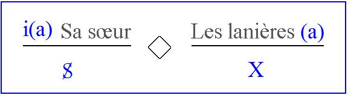
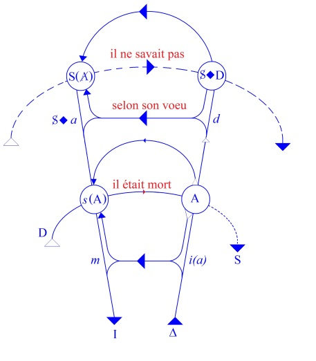

# Leçon 13 | 04 Mars 1959

  <label><input type="checkbox" data-lacan-toggle="original" checked> 原文</label>
  <label><input type="checkbox" data-lacan-toggle="notes" checked> 注释</label>
  <label><input type="checkbox" data-lacan-toggle="commentary" checked> 个人解读评论</label>

<section class="parallel-paragraph" data-paragraph-ids="s6-13-0001">

s6-13-0001

[无对应译文]

原文 · s6-13-0001

Hamlet (1)

</section>

<section class="parallel-paragraph" data-paragraph-ids="s6-13-0002">

s6-13-0002

[无对应译文]

原文 · s6-13-0002

Je crois que nous avons poussé assez loin l’analyse structurale du rêve modèle qui se trouve dans le livre d’Ella SHARPE pour que voyiez au moins à quel point ce travail nous importait, sur la route de ce que nous essayons de faire, à savoir ce que nous devons considérer comme *le désir et son interprétation*.

</section>

<section class="parallel-paragraph" data-paragraph-ids="s6-13-0003">

s6-13-0003

[无对应译文]

原文 · s6-13-0003

Bien que certains aient dit n’avoir pas trouvé la référence à Lewis CARROLL que j’avais donnée la dernière fois, je suis surpris que vous n’ayiez pas retenu la double règle de trois. Puisque c’est là-dessus que j’ai terminé à propos de deux étapes de la relation du sujet à l’objet plus ou moins fétiche, la chose qui s’expri­mait finalement comme le I, *l’identification idéale* que j’ai laissée ouverte, *non sans intention*, pour la pre­mière des deux équations, pour celle des *lanières* des sandales de *la sœur*, celle où à la place du I nous avons un X.

</section>

<section class="parallel-paragraph" data-paragraph-ids="s6-13-0004">

s6-13-0004

[无对应译文]

原文 · s6-13-0004

</section>

<section class="parallel-paragraph" data-paragraph-ids="s6-13-0005">

s6-13-0005

[无对应译文]

原文 · s6-13-0005

Je ne pense pas qu’aucun d’entre vous ne se soit pas aperçu que cet X - comme de bien entendu - est quelque chose qui était le *phallus*. Mais l’important c’est la place où était ce *phallus*. Précisément à la place de I, de *l’identification primitive*, de *l’identification à la mère*, précisément à cette place où le *phallus*, le sujet ne veut pas le dénier à la mère.

</section>

<section class="parallel-paragraph" data-paragraph-ids="s6-13-0006">

s6-13-0006

[无对应译文]

原文 · s6-13-0006

Le sujet - comme l’enseigne la doctrine depuis tou­jours - veut maintenir le *phallus* de la mère. Le sujet refuse la castration de l’Autre. Le sujet, comme je vous le disais, ne veut pas perdre sa « *dame* », puisque c’est du *jeu d’échecs* qu’il s’agissait.

</section>

<section class="parallel-paragraph" data-paragraph-ids="s6-13-0007">

s6-13-0007

[无对应译文]

原文 · s6-13-0007

Il ne veut pas, dans l’occasion, mettre Ella SHARPE dans une autre position que la position de *phallus* idéalisé qui est celle dont il l’avertit par une « *petite toux* » avant d’entrer dans la pièce, d’avoir à faire dispa­raître les \[…\] de façon qu’il n’ait point, d’aucune façon, à les mettre en jeu.

</section>

<section class="parallel-paragraph" data-paragraph-ids="s6-13-0008">

s6-13-0008

[无对应译文]

原文 · s6-13-0008

Nous aurons peut-être l’occasion cette année de revenir à Lewis CARROLL[^55], vous verrez qu’il ne s’agit pas, littéralement, d’autre chose dans les deux grands *Alice* : *Alice in Wonderland* et *Through the Looking-glass.* C’est presque un poème des avatars phalliques, que ces deux Alice. Vous pouvez d’ores et déjà vous mettre à les bouquiner un petit peu, de façon à vous préparer à certaines choses que je pourrais être amené à en dire.

</section>

<section class="parallel-paragraph" data-paragraph-ids="s6-13-0009">

s6-13-0009

[无对应译文]

原文 · s6-13-0009

Une chose a pu vous frapper dans ce que je vous ai dit, qui concerne la posi­tion de ce sujet par rapport au *phallus*, qui est ce que je vous ai souligné : l’oppo­sition entre *l’être* et *l’avoir*. Quand je vous ai dit que c’était parce que pour lui, c’était la question de l’être qui se posait, qu’il eût fallu « *l’être sans l’avoir* »…

</section>

<section class="parallel-paragraph" data-paragraph-ids="s6-13-0010">

s6-13-0010

[无对应译文]

原文 · s6-13-0010

ce qui est par quoi j’ai défini *la position féminine*

</section>

<section class="parallel-paragraph" data-paragraph-ids="s6-13-0011">

s6-13-0011

[无对应译文]

原文 · s6-13-0011

…il ne se peut pas qu’à propos de cet « *être et ne pas l’être* » le *phallus*, ne se soit pas élevé en vous l’écho qui véritablement s’impose même à propos de toute cette observation, du « *To be or not to be* », toujours si *énigmatique*, devenu presque un canular, qui nous donne le style de la position d’HAMLET.

</section>

<section class="parallel-paragraph" data-paragraph-ids="s6-13-0012">

s6-13-0012

[无对应译文]

原文 · s6-13-0012

Et qui - si nous nous engagions dans cette ouver­ture - ne ferait que nous ramener à l’un des thèmes les plus primitifs de la pensée de FREUD : de ce quelque chose où s’organise la position du *désir*, où s’avère le fait que c’est dès la première édition de la *Traumdeutung* que *le thème d’* HAMLET a été promu par FREUD à un rang équivalent à celui du thème œdipien qui appa­raissait alors pour la première fois dans la *Traumdeutung.*

</section>

<section class="parallel-paragraph" data-paragraph-ids="s6-13-0013">

s6-13-0013

[无对应译文]

原文 · s6-13-0013

Bien sûr nous savons que FREUD y pensait depuis un bout de temps mais c’est par des lettres qui n’étaient pas destinées à être publiées.

</section>

<section class="parallel-paragraph" data-paragraph-ids="s6-13-0014">

s6-13-0014

[无对应译文]

原文 · s6-13-0014

La première apparition du « *complexe d’Œdipe* », c’est dans la *Traumdeutung* en 1900. L’observation sur HAMLET à ce moment-là est publiée aussi en 1900 dans la forme où FREUD l’a laissée par la suite, mais en note, et c’est en 1910-1914 que cela passe dans le corps du texte. Je crois que *le thème d’* HAMLET peut nous ser­vir *à renforcer* cette sorte d’élaboration de ce *complexe de castration*. Comment le complexe s’articule-t-il dans le concret, dans le cheminement de l’analyse ? *Le thème d’* HAMLET, après FREUD, a été repris maintes fois, je ne ferai probablement pas le tour de *tous les auteurs* qui l’ont repris. Vous savez que *le premier* est JONES.

</section>

<section class="parallel-paragraph" data-paragraph-ids="s6-13-0015">

s6-13-0015

[无对应译文]

原文 · s6-13-0015

Ella SHARPE a également avancé sur HAMLET un certain nombre de choses qui ne sont pas sans intérêt, *la pensée de* SHAKESPEARE *et la pratique de* SHAKESPEARE étant tout à fait au centre de la formation de cette *analyste*. Nous aurons peut-être l’occasion d’y venir.

</section>

<section class="parallel-paragraph" data-paragraph-ids="s6-13-0016">

s6-13-0016

[无对应译文]

原文 · s6-13-0016

Il s’agit aujourd’hui de commencer à défri­cher ce terrain, à nous demander ce que FREUD lui-même a voulu dire en intro­duisant HAMLET, et ce que démontre ce qui a pu s’en dire ultérieurement dans les œuvres d’autres auteurs. Voici le texte de FREUD qui vaut la peine d’être lu au début de cette recherche, *je le donne dans la traduction française* [^56].

</section>

<section class="parallel-paragraph" data-paragraph-ids="s6-13-0017">

s6-13-0017

[无对应译文]

原文 · s6-13-0017

Après avoir parlé du *complexe d’Œdipe* pour la première fois, et il n’est pas vain de remarquer ici que ce *com­plexe d’Œdipe*, il l’introduit dans la *Science des rêves* à propos des « *rêves de mort des personnes qui nous sont chères* », c’est-à-dire à propos précisément de ce qui nous a servi cette année de départ et de premier guide dans la mise en valeur de quelque chose qui s’est présenté d’abord tout naturellement dans ce rêve que j’ai choisi pour être un des plus simples se rapportant à un mort.

</section>

<section class="parallel-paragraph" data-paragraph-ids="s6-13-0018">

s6-13-0018

[无对应译文]

原文 · s6-13-0018

Ce rêve qui nous a servi à montrer comment s’instituait sur *deux lignes d’intersub­jectivité superposées*, doublées l’une par rapport à l’autre, le fameux « *il ne savait pas* » que nous avons placé sur une ligne, la ligne de la position du sujet…

</section>

<section class="parallel-paragraph" data-paragraph-ids="s6-13-0019">

s6-13-0019

[无对应译文]

原文 · s6-13-0019

> le sujet paternel dans l’occasion étant ce qui est évoqué par le sujet rêveur

</section>

<section class="parallel-paragraph" data-paragraph-ids="s6-13-0020">

s6-13-0020

[无对应译文]

原文 · s6-13-0020

… c’est-à-dire le quelque part où se situe, sous une forme en quelque sorte incarnée par le père lui-même et à la place du père, sous la forme d’« *il ne savait pas* », précisément le fait que le père est inconscient et incarne ici l’image, l’inconscient même du sujet – et de quoi ? – de son propre vœu, du vœu de mort contre son père.

</section>

<section class="parallel-paragraph" data-paragraph-ids="s6-13-0021">

s6-13-0021

[无对应译文]

原文 · s6-13-0021

Bien entendu il en connaît un autre, une sorte de vœu bienveillant, d’appel à une mort consolatrice. Mais justement cette inconscience - qui est celle du sujet concernant son vœu de mort œdipien - est en quelque sorte incarnée, dans l’image du rêve, sous cette forme : que le père ne doit même pas savoir que le fils a fait contre lui ce vœu bienveillant de mort.

</section>

<section class="parallel-paragraph" data-paragraph-ids="s6-13-0022">

s6-13-0022

[无对应译文]

原文 · s6-13-0022

« *Il ne savait pas* », dit le rêve absur­dement, « *qu’il était mort* ». C’est là que s’arrête le texte du rêve. Et ce qui est refoulé pour le sujet, qui n’est pas ignoré du père fantasmatique, c’est le « *selon son vœu* » dont FREUD nous dit qu’il est le signifiant que nous devons considé­rer comme refoulé.

</section>

<section class="parallel-paragraph" data-paragraph-ids="s6-13-0023">

s6-13-0023

[无对应译文]

原文 · s6-13-0023

« *Une autre de nos grandes œuvres tragiques -* nous dit FREUD *- Hamlet de Shakespeare, a les mêmes racines qu’Œdipe Roi.* *La mise en œuvre toute diffé­rente montre, d’une manière identique, quelles différences il y a dans la vie intel­lectuelle (Seelenleben)* *de ces deux époques, et quel progrès le refoulement a fait dans la vie sentimentale*…

</section>

<section class="parallel-paragraph" data-paragraph-ids="s6-13-0024">

s6-13-0024

[无对应译文]

原文 · s6-13-0024

le mot « *sentimentale* », *Gemütsleben,* est approximatif

</section>

<section class="parallel-paragraph" data-paragraph-ids="s6-13-0025">

s6-13-0025

[无对应译文]

原文 · s6-13-0025

…*Dans Œdipe, les désirs de l’enfant apparaissent et sont réalisés comme dans le rêve *\[*p*.230\] »

</section>

<section class="parallel-paragraph" data-paragraph-ids="s6-13-0026">

s6-13-0026

[无对应译文]

原文 · s6-13-0026

FREUD a en effet beaucoup insisté sur le fait que *les rêves œdipiens* sont là en quelque sorte comme le rejeton, la source fondamentale de ces désirs incons­cients qui réapparaissent toujours, et l’*Œdipe*…

</section>

<section class="parallel-paragraph" data-paragraph-ids="s6-13-0027">

s6-13-0027

[无对应译文]

原文 · s6-13-0027

je parle de l’*Œdipe* de SOPHOCLE ou de la tragédie grecque

</section>

<section class="parallel-paragraph" data-paragraph-ids="s6-13-0028">

s6-13-0028

[无对应译文]

原文 · s6-13-0028

…comme l’affabulation, l’élaboration de ce qui surgit toujours de ces désirs inconscients. C’est ainsi que textuellement les choses sont articulées dans la *Science des rêves.*

</section>

<section class="parallel-paragraph" data-paragraph-ids="s6-13-0029">

s6-13-0029

[无对应译文]

原文 · s6-13-0029

« …*dans Hamlet, ces mêmes désirs de l’enfant sont refoulés, et nous n’apprenons leur existence, tout comme dans les névroses,* *que par leur action d’inhibition (Hemmungswirkungen). Fait singulier, tandis que ce drame a tou­jours exercé une action considérable,* *on n’a jamais pu se mettre d’accord sur le caractère de son héros. La pièce est fondée sur les hésitations d’Hamlet à accom­plir* *la vengeance dont il est chargé; le texte ne dit pas quelles sont les raisons et les motifs de ces hésitations; les nombreux essais d’explication n’ont pu les découvrir. Selon Gœthe, et c’est maintenant encore la conception dominante, Hamlet représenterait l’homme* *dont l’activité est dominée par un développe­ment excessif de la pensée, Gedankentätigkeit, dont la force d’action est para­lysée,* *« Von des Gedankens Blüsse angekränkelt », « Il se ressent de la pâleur de la pensée ». Selon d’autres, le poète aurait voulu représenter un caractère mala­dif, irrésolu et neurasthénique. Mais nous voyons dans la pièce qu’Hamlet n’est pas incapable d’agir.* *Il agit par deux fois :*

</section>

<section class="parallel-paragraph" data-paragraph-ids="s6-13-0030">

s6-13-0030

[无对应译文]

原文 · s6-13-0030

- *d’abord dans un mouvement de passion violente, quand il tue l’homme qui écoute derrière la tapisserie ;* \[p. 230-231\]»

</section>

<section class="parallel-paragraph" data-paragraph-ids="s6-13-0031">

s6-13-0031

[无对应译文]

原文 · s6-13-0031

Vous savez qu’il s’agit de POLONIUS, et que c’est au moment où HAMLET a avec sa mère un entretien qui est loin d’être crucial puisque rien dans cette pièce ne l’est jamais, sauf sa terminaison mortelle où en quelques instants s’accumule, sous forme de cadavres, tout ce qui, des nœuds de l’action, était jusqu’alors retardé.

</section>

<section class="parallel-paragraph" data-paragraph-ids="s6-13-0032">

s6-13-0032

[无对应译文]

原文 · s6-13-0032

« *ensuite d’une manière réfléchie et astucieuse, quand, avec l’indifférence totale d’un prince de la Renaissance, il livre les deux courtisans*…

</section>

<section class="parallel-paragraph" data-paragraph-ids="s6-13-0033">

s6-13-0033

[无对应译文]

原文 · s6-13-0033

> Il s’agit de ROSENCRANTZ et de GUILDENSTERN qui représentent des sortes de faux-frères

</section>

<section class="parallel-paragraph" data-paragraph-ids="s6-13-0034">

s6-13-0034

[无对应译文]

原文 · s6-13-0034

…*à la mort qu’on lui avait destinée. Qu’est-ce qui l’empêche donc d’accomplir la tâche que lui a donnée le fantôme de son père* ? \[p.231\] »

</section>

<section class="parallel-paragraph" data-paragraph-ids="s6-13-0035">

s6-13-0035

[无对应译文]

原文 · s6-13-0035

> Vous savez que la pièce s’ouvre sur la terrasse d’Elseneur par l’apparition de ce *fantôme*
>
> à deux gardes qui en avertiront, bientôt après, HAMLET.

</section>

<section class="parallel-paragraph" data-paragraph-ids="s6-13-0036">

s6-13-0036

[无对应译文]

原文 · s6-13-0036

« *Il faut bien convenir que c’est la nature de cette tâche. Hamlet peut agir, mais il ne saurait se venger d’un homme qui a écarté son père* *et pris la place de celui-ci auprès de sa mère* \[...\] *En réalité, c’est l’horreur qui devrait le pousser à la vengeance, qui est remplacée par des remords, des scrupules de conscience,* \[...\] *Je viens de traduire en termes conscients ce qui demeure inconscient dans l’âme du héros* \[*p*.231\] »

</section>

<section class="parallel-paragraph" data-paragraph-ids="s6-13-0037">

s6-13-0037

[无对应译文]

原文 · s6-13-0037

Ce premier apport de FREUD se présente avec *un caractère* d’une justesse d’équilibre qui, si je puis dire, nous conserve la voie droite pour situer, pour maintenir HAMLET à la place où il l’a mis. Ici cela est tout à fait clair. Mais c’est aussi par rapport à ce premier jet de la perception de FREUD que devra se situer par la suite tout ce qui s’imposera comme *excursions* autour de cela, et comme broderies et – vous verrez – quelquefois assez distantes.

</section>

<section class="parallel-paragraph" data-paragraph-ids="s6-13-0038">

s6-13-0038

[无对应译文]

原文 · s6-13-0038

Les auteurs, au gré justement de l’avancement de l’exploration analytique, centrent l’intérêt sur des points qui d’ailleurs, dans *Hamlet,* se retrouvent quel­quefois valablement, mais *au détriment de cette sorte de rigueur* avec laquelle FREUD, dès le départ, le situe.

</section>

<section class="parallel-paragraph" data-paragraph-ids="s6-13-0039">

s6-13-0039

[无对应译文]

原文 · s6-13-0039

Et je dirais qu’en même temps…

</section>

<section class="parallel-paragraph" data-paragraph-ids="s6-13-0040">

s6-13-0040

[无对应译文]

原文 · s6-13-0040

> et c’est ceci qui est le caractère en somme le moins exploité, le moins interrogé

</section>

<section class="parallel-paragraph" data-paragraph-ids="s6-13-0041">

s6-13-0041

[无对应译文]

原文 · s6-13-0041

…tout est là, quelque chose qui se trouve situé sur le plan des « *scrupules de conscience* », quelque chose qui de toute façon ne peut être considéré que comme une élaboration.

</section>

<section class="parallel-paragraph" data-paragraph-ids="s6-13-0042">

s6-13-0042

[无对应译文]

原文 · s6-13-0042

Si on nous présente comme étant ce qui se passe, la façon dont on peut exprimer sur le plan *conscient* ce qui demeure *inconscient* dans l’âme du héros, il semble que c’est à juste titre que nous pourrons tout de même demander com­ment l’articuler dans *l’inconscient*.

</section>

<section class="parallel-paragraph" data-paragraph-ids="s6-13-0043">

s6-13-0043

[无对应译文]

原文 · s6-13-0043

Car il y a une chose certaine, c’est qu’*une éla­boration symptomatique* comme un « *scrupule de conscience* » n’est tout de même pas dans *l’inconscient*, s’il est dans le *conscient*, si c’est construit de quelque façon par les moyens de la défense, il faudrait tout de même nous demander ce qui répond dans *l’inconscient* à la *structure consciente*. C’est donc cela que nous sommes en train d’essayer de faire.

</section>

<section class="parallel-paragraph" data-paragraph-ids="s6-13-0044">

s6-13-0044

[无对应译文]

原文 · s6-13-0044

Je termine le peu qui reste du paragraphe de FREUD. Il ne lui en faut pas long pour jeter – de toutes façons – ce qui aura été *le pont sur l’abîme* d’HAMLET. À la vérité, c’est tout à fait frappant en effet qu’*Hamlet* soit resté une totale énigme littéraire jusqu’à FREUD. Cela ne veut pas dire qu’il ne l’est pas encore, mais il y a eu *ce pont*.

</section>

<section class="parallel-paragraph" data-paragraph-ids="s6-13-0045">

s6-13-0045

[无对应译文]

原文 · s6-13-0045

Cela est vrai pour d’autres œuvres, *Le Misanthrope* est le même genre d’*énigme*.

</section>

<section class="parallel-paragraph" data-paragraph-ids="s6-13-0046">

s6-13-0046

[无对应译文]

原文 · s6-13-0046

« *L’aversion pour les actes sexuels* \[...\] *concorde avec ce symptôme. Ce dégoût devait grandir toujours davantage chez le poète* *et jusqu’à ce qu’il l’expri­mât complètement dans Timon d’Athènes.* »

</section>

<section class="parallel-paragraph" data-paragraph-ids="s6-13-0047">

s6-13-0047

[无对应译文]

原文 · s6-13-0047

Je lis ce passage jusqu’au bout car il est important et ouvre la voie en deux lignes pour ceux qui dans la suite ont essayé d’ordonner autour du problème *d’un refoulement personnel* l’ensemble de l’œuvre de SHAKESPEARE.

</section>

<section class="parallel-paragraph" data-paragraph-ids="s6-13-0048">

s6-13-0048

[无对应译文]

原文 · s6-13-0048

C’est effec­tivement ce *qu’a essayé de faire* Ella SHARPE. Ce qui a été indiqué dans ce qui a été publié après sa mort sous la forme des *Unfinished Papers,* dont son *Hamlet* [^57] qui est paru d’abord dans le *International Journal of Psycho-analysis,* et qui res­semble à une tentative de prendre dans l’ensemble l’évolution de l’œuvre de SHAKESPEARE comme significative de *quelque chose,* dont je crois qu’en vou­lant donner un certain schéma, Ella SHARPE a fait certainement quelque chose d’imprudent, en tout cas de critiquable du point de vue méthodique, ce qui n’exclut pas qu’elle ait trouvé effectivement quelque chose de valable.

</section>

<section class="parallel-paragraph" data-paragraph-ids="s6-13-0049">

s6-13-0049

[无对应译文]

原文 · s6-13-0049

« *Le poète ne peut avoir exprimé dans « Hamlet » que ses propres sentiments. Georg Brandes indique dans son « Shakespeare » (c’est en 1896) que ce drame fut écrit aussitôt après la mort du père de Shakespeare (*1601*),* \[...\] *et nous pouvons admettre* *qu’à ce moment, les impressions d’enfance qui se rapportaient à son père étaient particulièrement vives. On sait d’ailleurs que le fils* *de Shakespeare – mort de bonne heure – s’appelait Hamnet.* \[p.231\] »

</section>

<section class="parallel-paragraph" data-paragraph-ids="s6-13-0050">

s6-13-0050

[无对应译文]

原文 · s6-13-0050

Je crois que nous pouvons ici terminer avec ce passage qui nous montre à quel point FREUD déjà, par de simples indications, laisse loin derrière lui les choses dans lesquelles les auteurs se sont engagés depuis. Je voudrais ici engager le problème comme nous pouvons le faire à partir des données qui ont été celles que, depuis le début de cette année, je me trouve devant vous avoir produites. Car je crois que ces données nous permettent :

</section>

<section class="parallel-paragraph" data-paragraph-ids="s6-13-0051">

s6-13-0051

[无对应译文]

原文 · s6-13-0051

- *de rassembler* d’une façon plus synthétique, plus saisissante, *les différents ressorts de ce qui se passe dans Hamlet,*

</section>

<section class="parallel-paragraph" data-paragraph-ids="s6-13-0052">

s6-13-0052

[无对应译文]

原文 · s6-13-0052

- de simplifier en quelque sorte cette multiplicité d’instances à laquelle nous nous trouvons, dans la situation présente souvent confrontés, je veux dire qui donne *je ne sais quel caractère de reduplication aux commentaires analytiques* sur quelque observation que ce soit, quand nous \[les\] voyons reprises simultanément, par exemple dans le registre de l’opposition de *l’inconscient* et de la défense, puis ensuite du « *moi* » et du « *ça* » et, je pense, tout ce qui peut se produire quand on y ajoute encore l’instance du « *surmoi* », sans que jamais soient unifiés ces différents points de vue qui donnent quelquefois à ces travaux je ne sais quel flou, quelle surcharge qui ne semble pas faite pour être quelque chose qui doive être utilisable pour nous dans notre expérience.

</section>

<section class="parallel-paragraph" data-paragraph-ids="s6-13-0053">

s6-13-0053

[无对应译文]

原文 · s6-13-0053

Ce que nous essayons ici de saisir, ce sont des guides qui, en nous permettant d’y resituer ces différents organes, ces différentes étapes des appareils mentaux que nous a donnés FREUD, nous permettent de les resituer d’une façon qui tienne compte du fait qu’ils ne se superposent sémantiquement que d’une façon par­tielle.

</section>

<section class="parallel-paragraph" data-paragraph-ids="s6-13-0054">

s6-13-0054

[无对应译文]

原文 · s6-13-0054

Ce n’est pas en les additionnant les unes aux autres, en en faisant une sorte de réunion et d’ensemble, qu’on peut les faire fonctionner normalement. C’est, si vous voulez, en les reportant sur *un canevas* que nous essayons de faire plus fondamental, de façon à ce que nous sachions ce que nous faisons de chacun de ces ordres de références quand nous les faisons entrer enjeu.

</section>

<section class="parallel-paragraph" data-paragraph-ids="s6-13-0055">

s6-13-0055

[无对应译文]

原文 · s6-13-0055

Commençons d’épeler ce grand drame d*’*HAMLET. Si évocateur qu’ait été le texte de FREUD, il faut bien que je rappelle de quoi il s’agit. Il s’agit d’une pièce qui s’ouvre peu après la mort d’un roi qui fut \- nous dit son fils HAMLET - un roi très admirable, l’idéal du roi comme du père, et qui est mort mystérieusement. La version qui a été donnée de sa mort est qu’il a été piqué par un serpent dans un verger, le « *orchard* » qui est ici interprété par les analystes.

</section>

<section class="parallel-paragraph" data-paragraph-ids="s6-13-0056">

s6-13-0056

[无对应译文]

原文 · s6-13-0056

Puis *très vite* - quelques mois après sa mort - la mère d’HAMLET a épousé celui qui est son beau-­frère : CLAUDIUS. Ce CLAUDIUS objet de toutes les exécrations du héros central, d’HAMLET, est celui sur qui en somme je ferai porter non seulement les motifs de rivalité que peut avoir HAMLET à son égard, HAMLET en somme écarté du trône par cet oncle, mais encore tout ce qu’il entrevoit, tout ce qu’il soupçonne du caractère scandaleux de cette substitution.

</section>

<section class="parallel-paragraph" data-paragraph-ids="s6-13-0057">

s6-13-0057

[无对应译文]

原文 · s6-13-0057

Bien plus encore, le père qui apparaît comme *ghost,* « *fantôme* », pour lui dire dans quelles conditions de trahison dramatique s’est opéré ce qui – le fantôme le lui dit – a été bel et bien un attentat. C’est à savoir…

</section>

<section class="parallel-paragraph" data-paragraph-ids="s6-13-0058">

s6-13-0058

[无对应译文]

原文 · s6-13-0058

> c’est là le texte et il n’a pas manqué non plus d’exercer la curiosité des analystes

</section>

<section class="parallel-paragraph" data-paragraph-ids="s6-13-0059">

s6-13-0059

[无对应译文]

原文 · s6-13-0059

…qu’on a versé dans son oreille durant son sommeil, un poison nommé mystérieusement « *hebenon* ». « *Hebenon* » qui est une sorte de mot formé, forgé, je ne sais s’il se retrouve dans un autre texte. On a essayé de lui donner *des équivalents*, un mot qui est proche et qui désigne, de la façon dont il est ordi­nairement traduit, *la jusquiame*. Il est bien certain que cet attentat *par l’oreille* ne saurait de toute façon satisfaire un toxicologue, ce qui donne par ailleurs matière à beaucoup d’interprétations à l’analyste.

</section>

<section class="parallel-paragraph" data-paragraph-ids="s6-13-0060">

s6-13-0060

[无对应译文]

原文 · s6-13-0060

Voyons tout de suite quelque chose qui, pour nous, se présente comme sai­sissant, je veux dire à partir des critères, des articulations que nous avons mises en valeur. Servons-nous de ces clefs, si particulières qu’elles puissent vous apparaître dans leur surgissement. Cela a été fait à ce propos très particulier, très déterminé, mais cela n’exclut pas…

</section>

<section class="parallel-paragraph" data-paragraph-ids="s6-13-0061">

s6-13-0061

[无对应译文]

原文 · s6-13-0061

et c’est là l’une des phases les plus claires de l’expérience analytique

</section>

<section class="parallel-paragraph" data-paragraph-ids="s6-13-0062">

s6-13-0062

[无对应译文]

原文 · s6-13-0062

…que ce *particulier* est ce qui *a la valeur* la plus *uni­verselle*.

</section>

<section class="parallel-paragraph" data-paragraph-ids="s6-13-0063">

s6-13-0063

[无对应译文]

原文 · s6-13-0063

Il est tout à fait clair que ce que nous avons mis en évidence en écrivant le « *il ne savait pas qu’il était mort* » est quelque chose assurément de tout à fait fon­damental. Dans le rapport à l’Autre, A en tant que tel, l’ignorance où est tenu cet Autre d’une situation quelconque est quelque chose d’absolument originel.

</section>

<section class="parallel-paragraph" data-paragraph-ids="s6-13-0064">

s6-13-0064

[无对应译文]

原文 · s6-13-0064

Vous le savez bien puisqu’on vous apprend même que c’est l’une des révolutions de l’âme enfantine, que le moment où l’enfant, après avoir cru que toutes ses pensées…

</section>

<section class="parallel-paragraph" data-paragraph-ids="s6-13-0065">

s6-13-0065

[无对应译文]

原文 · s6-13-0065

> « *toutes ses pensées* » c’est quelque chose qui doit toujours nous inci­ter à une grande réserve, je veux dire que les pensées, c’est nous qui les appelons ainsi, pour ce qui est vécu par le sujet, les pensées, c’est *tout ce qui est*

</section>

<section class="parallel-paragraph" data-paragraph-ids="s6-13-0066">

s6-13-0066

[无对应译文]

原文 · s6-13-0066

…« *tout ce qui est* » est connu de ses parents, ses moindres mouvements intérieurs sont connus, s’aperçoit que l’Autre peut « *ne pas savoir* ».

</section>

<section class="parallel-paragraph" data-paragraph-ids="s6-13-0067">

s6-13-0067

[无对应译文]

原文 · s6-13-0067

Il est indispensable de tenir compte de cette corrélation du « *ne pas savoir* » chez l’Autre, avec justement la constitution de l’inconscient : l’un est en quelque sorte l’envers de l’autre, et – peut-être – son fondement. Car en effet cette formulation ne suffit pas à les constituer.

</section>

<section class="parallel-paragraph" data-paragraph-ids="s6-13-0068">

s6-13-0068

[无对应译文]

原文 · s6-13-0068

Mais enfin, il y a quelque chose, qui est tout à fait clair et qui nous sert de guide dans le drame d’*Hamlet,* nous allons essayer de donner corps à cette notion historique, tout de même un petit peu superficielle dans l’*atmosphère*, dans le *style* du temps, qu’il s’agit de je ne sais quelle fabulation *moderne*…

</section>

<section class="parallel-paragraph" data-paragraph-ids="s6-13-0069">

s6-13-0069

[无对应译文]

原文 · s6-13-0069

> par rapport à la stature des anciens, ce seraient de pauvres dégénérés

</section>

<section class="parallel-paragraph" data-paragraph-ids="s6-13-0070">

s6-13-0070

[无对应译文]

原文 · s6-13-0070

…nous sommes dans le style du XIXème siècle, ce n’est pas pour rien que Georg BRANDES est cité là, et nous ne saurons jamais si FREUD à cette époque, encore que ce soit probable, connaissait NIETZSCHE.

</section>

<section class="parallel-paragraph" data-paragraph-ids="s6-13-0071">

s6-13-0071

[无对应译文]

原文 · s6-13-0071

Mais cela, cette référence aux modernes, peut ne pas nous suffire : pourquoi les modernes seraient-ils plus névrosés que les anciens ? C’est en tout cas une pétition de principe. Ce que nous essayons de voir, c’est quelque chose qui aille plus loin que cette *pétition de principe* ou cette explication par l’explication : « *cela va mal parce que cela va mal !* » Ce que nous avons devant nous, c’est une œuvre dont nous allons essayer de commencer à séparer les fibres, les premières fibres.

</section>

<section class="parallel-paragraph" data-paragraph-ids="s6-13-0072">

s6-13-0072

[无对应译文]

原文 · s6-13-0072

Première fibre, le père *ici sait* très bien qu’il est mort, mort *selon le vœu* de celui qui voulait prendre sa place, à savoir CLAUDIUS qui est son frère. Le crime est caché assurément pour le centre de la scène, pour le monde de la scène. C’est là un point qui est tout à fait essentiel, sans lequel bien entendu le drame d’*Hamlet* n’aurait même pas lieu de se situer et d’exister. Et c’est ceci qui dans cet article de JONES - lui accessible - *The death of Hamlet’s father* [^58], est mis en relief, à savoir la différence essentielle que SHAKESPEARE a introduite par rapport à la saga primitive, où le massacre de celui qui – dans la saga – porte un nom différent mais qui est le roi, a lieu devant tous au nom d’un prétexte qui regarde en effet ses relations à son épouse.

</section>

<section class="parallel-paragraph" data-paragraph-ids="s6-13-0073">

s6-13-0073

[无对应译文]

原文 · s6-13-0073

Ce roi est mas­sacré aussi par son frère, mais tout le monde le sait. Là, dans HAMLET, la chose est cachée mais, c’est le point important, le père, lui, la connaît, et c’est lui qui vient nous le dire :

</section>

<section class="parallel-paragraph" data-paragraph-ids="s6-13-0074">

s6-13-0074

[无对应译文]

原文 · s6-13-0074

« *There needes no ghost my lord, come from the grave to tell us this.* ». \[Horatio, Acte I, Scène 5, 126\]

</section>

<section class="parallel-paragraph" data-paragraph-ids="s6-13-0075">

s6-13-0075

[无对应译文]

原文 · s6-13-0075

FREUD le cite à plusieurs reprises parce que cela fait proverbe :

</section>

<section class="parallel-paragraph" data-paragraph-ids="s6-13-0076">

s6-13-0076

[无对应译文]

原文 · s6-13-0076

« *Il n’y a pas besoin de fantôme mon bon seigneur, il n’y a pas besoin de fantôme pour nous dire cela* »

</section>

<section class="parallel-paragraph" data-paragraph-ids="s6-13-0077">

s6-13-0077

[无对应译文]

原文 · s6-13-0077

Et en effet s’il s’agit du thème œdipien, nous en savons, nous, déjà long. Mais il est clair que dans la construction du thème d’HAMLET, nous n’en sommes pas encore à le savoir. Et il y a quelque chose de significatif dans le fait que dans la construc­tion de la fable, ce soit le père qui vienne le dire, que le père, lui, le sache. Je crois que c’est là quelque chose de tout à fait essentiel.

</section>

<section class="parallel-paragraph" data-paragraph-ids="s6-13-0078">

s6-13-0078

[无对应译文]

原文 · s6-13-0078

Et c’est une pre­mière différence dans « *la fibre* », avec la situation, la construction, la fabulation fondamentale, première, du drame d’Œdipe. Car Œdipe, lui, ne sait pas. Quand il sait tout, le drame se déchaîne qui va jusqu’à son auto-châtiment, c’est-à-dire la liquidation par lui-même d’une situation. Mais le crime œdipien est commis par Œdipe dans l’inconscience. Ici le crime œdipien est su, et il est su de qui ? De *l’autre*, de celui qui en est *la victime* et qui vient surgir pour le porter à la connais­sance du sujet.

</section>

<section class="parallel-paragraph" data-paragraph-ids="s6-13-0079">

s6-13-0079

[无对应译文]

原文 · s6-13-0079

En somme, vous voyez dans quel chemin nous avançons, dans une méthode si je puis dire de comparaison, de corrélation entre ces différentes « *fibres* » de la structure, qui est une méthode classique, celle qui consiste dans un tout articulé, et nulle part il n’y a plus d’articulation que dans ce qui est du domaine du signifiant.

</section>

<section class="parallel-paragraph" data-paragraph-ids="s6-13-0080">

s6-13-0080

[无对应译文]

原文 · s6-13-0080

La notion même d’articulation - je le souligne sans cesse - lui est en somme consubstantielle. Après tout, on ne parle d’articulation dans le monde que parce que le signifiant donne à ce terme un sens. Autrement il n’y a rien que continu ou discontinu, mais non point articulation.

</section>

<section class="parallel-paragraph" data-paragraph-ids="s6-13-0081">

s6-13-0081

[无对应译文]

原文 · s6-13-0081

Nous essayons de voir, de saisir par une sorte de comparaison des fibres homologues dans l’une et l’autre phases, de l’*Œdipe* et de d*’Hamlet* en tant que FREUD les a rapprochés, ce qui va nous permettre de concevoir la cohérence des choses. À savoir comment, dans quelle mesure, pourquoi, il est concevable que, dans la mesure même où une des touches du clavier se trouve sous un signe opposé à celui où elle est dans l’autre des deux drames, il se produit *une modi­fication* strictement corrélative. Et cette corrélation est là ce qui doit nous mettre au joint de la sorte de causalité dont il s’agit dans ces drames.

</section>

<section class="parallel-paragraph" data-paragraph-ids="s6-13-0082">

s6-13-0082

[无对应译文]

原文 · s6-13-0082

C’est partir de l’idée même que ce sont ces modifications corrélatives qui sont pour nous les plus instructives, qui nous permet de rassembler les ressorts du signifiant d’une manière qui soit pour nous plus ou moins utilisable.

</section>

<section class="parallel-paragraph" data-paragraph-ids="s6-13-0083">

s6-13-0083

[无对应译文]

原文 · s6-13-0083

Il doit y avoir un rapport saisissable et finalement notable d’une façon quasi algébrique entre ces pre­mières modifications du signe et ce qui se passe. Si vous voulez, sur cette ligne du haut du qu’« *il ne le savait pas* », là c’est « *il savait qu’il était mort* ». Il était mort selon le vœu meurtrier qui l’a poussé dans la tombe, celui de son frère. Nous allons voir quelles sont les relations avec le héros du drame.

</section>

<section class="parallel-paragraph" data-paragraph-ids="s6-13-0084">

s6-13-0084

[无对应译文]

原文 · s6-13-0084

</section>

<section class="parallel-paragraph" data-paragraph-ids="s6-13-0085">

s6-13-0085

[无对应译文]

原文 · s6-13-0085

Mais avant de nous lancer d’une façon toujours un peu précipitée dans la ligne de *superposition des identifi­cations* qui est dans la tradition : il y a des concepts, et les plus commodes sont les moins élaborés, et Dieu sait ce qu’on ne fait pas avec des « *identifica­tions* »…

</section>

<section class="parallel-paragraph" data-paragraph-ids="s6-13-0086">

s6-13-0086

[无对应译文]

原文 · s6-13-0086

« *Et Claudius en fin de compte, ce qu’il a fait, c’est une forme d’Hamlet, c’est le désir d’Hamlet !* »

</section>

<section class="parallel-paragraph" data-paragraph-ids="s6-13-0087">

s6-13-0087

[无对应译文]

原文 · s6-13-0087

Cela est vite dit puisque pour situer la position d’HAMLET vis à vis de ce désir, nous nous trouvons dans cette posi­tion de devoir faire intervenir ici tout d’un coup le « *scrupule de conscience* ». C’est à savoir quelque chose qui intro­duit dans les rapports d’HAMLET à ce CLAUDIUS une position double, profondé­ment ambivalente, qui est celle par rapport à un rival, mais dont on sent bien que cette rivalité est singulière, au second degré : celui qui en réalité, est celui qui a fait ce que lui n’aurait pas osé faire.

</section>

<section class="parallel-paragraph" data-paragraph-ids="s6-13-0088">

s6-13-0088

[无对应译文]

原文 · s6-13-0088

Et dans ces conditions, il se trouve environné de *je ne sais quelle* *mystérieuse protection* qu’il s’agit de définir…

</section>

<section class="parallel-paragraph" data-paragraph-ids="s6-13-0089">

s6-13-0089

[无对应译文]

原文 · s6-13-0089

au nom du « *scrupule de conscience* », dit-on ?

</section>

<section class="parallel-paragraph" data-paragraph-ids="s6-13-0090">

s6-13-0090

[无对应译文]

原文 · s6-13-0090

…par rapport à ce qui s’impose à HAMLET, et ce qui s’impose d’autant plus qu’à partir de la rencontre primitive avec le *ghost*, c’est-à-dire littéralement le commandement de le venger, *le fan­tôme*, HAMLET pour agir contre le meurtrier de son père est armé de tous les sen­timents :

</section>

<section class="parallel-paragraph" data-paragraph-ids="s6-13-0091">

s6-13-0091

[无对应译文]

原文 · s6-13-0091

- il a été dépossédé : sentiment d’usurpation,

</section>

<section class="parallel-paragraph" data-paragraph-ids="s6-13-0092">

s6-13-0092

[无对应译文]

原文 · s6-13-0092

- sentiment de rivalité,

</section>

<section class="parallel-paragraph" data-paragraph-ids="s6-13-0093">

s6-13-0093

[无对应译文]

原文 · s6-13-0093

- sentiment de vengeance,

</section>

<section class="parallel-paragraph" data-paragraph-ids="s6-13-0094">

s6-13-0094

[无对应译文]

原文 · s6-13-0094

- et bien plus encore *l’ordre exprès* de son père par-des­sus tout admiré.

</section>

<section class="parallel-paragraph" data-paragraph-ids="s6-13-0095">

s6-13-0095

[无对应译文]

原文 · s6-13-0095

Sûrement, d’HAMLET tout est d’accord pour qu’il *agisse*… Et il n’agit pas ! C’est évidemment ici que commence le problème, et que la voie de progres­sion doit s’armer de la plus grande simplicité. Je veux dire que toujours ce qui nous perd, ce qui nous égare, c’est de substituer, au franchissement de la ques­tion, des *clés* toutes faites.

</section>

<section class="parallel-paragraph" data-paragraph-ids="s6-13-0096">

s6-13-0096

[无对应译文]

原文 · s6-13-0096

FREUD nous le dit, il s’agit là de la représentation consciente de quelque chose qui doit s’articuler dans l’inconscient. Ce que nous essayons d’articuler, de situer quelque part et comme tel dans *l’inconscient*, c’est ce que veut dire un désir. En tout cas, disons avec FREUD qu’*il y a quelque chose qui ne va pas* à partir du moment où les choses sont engagées d’une telle sorte. Il y a quelque chose qui ne va pas dans le désir d’HAMLET. C’est ici que nous allons choisir le chemin. Cela n’est pas facile car nous n’en sommes pas beaucoup plus loin que le point où on a toujours été.

</section>

<section class="parallel-paragraph" data-paragraph-ids="s6-13-0097">

s6-13-0097

[无对应译文]

原文 · s6-13-0097

Ici, il faut prendre HAMLET, sa conduite dans la tragédie, dans son ensemble. Et puisque nous avons parlé du désir d’HAMLET, il faut s’apercevoir de ce qui n’a pas échappé aux analystes, naturellement, mais qui n’est peut-être pas du même registre, du même ordre. Il s’agit de situer ce qu’il en est d’HAMLET comme d’un \[...\] qui pour nous est l’axe, l’âme, le centre, la pierre de touche du désir. Ce n’est pas exacte­ment cela, à savoir les rapports d’HAMLET à ce qui peut être l’objet conscient de son désir. Là-dessus rien ne nous est, par l’auteur, refusé.

</section>

<section class="parallel-paragraph" data-paragraph-ids="s6-13-0098">

s6-13-0098

[无对应译文]

原文 · s6-13-0098

Nous avons dans la pièce comme le baromètre de la position d’HAMLET par rapport au désir, nous l’avons de la façon la plus évidente et la plus claire sous la forme du personnage d’OPHÉLIE. OPHÉLIE est très évidemment une des créations les plus fascinantes qui ait été proposée à l’imagination humaine. Quelque chose que nous pouvons appeler :

</section>

<section class="parallel-paragraph" data-paragraph-ids="s6-13-0099">

s6-13-0099

[无对应译文]

原文 · s6-13-0099

- le drame de l’objet féminin,

</section>

<section class="parallel-paragraph" data-paragraph-ids="s6-13-0100">

s6-13-0100

[无对应译文]

原文 · s6-13-0100

- le drame du désir du monde,

</section>

<section class="parallel-paragraph" data-paragraph-ids="s6-13-0101">

s6-13-0101

[无对应译文]

原文 · s6-13-0101

…qui apparaît à l’orée d’une civilisation sous la forme d’HÉLÈNE, c’est remarquable de le voir dans un point, qui est peut-être aussi un point sommet, incarné dans le drame et le malheur d’OPHÉLIE.

</section>

<section class="parallel-paragraph" data-paragraph-ids="s6-13-0102">

s6-13-0102

[无对应译文]

原文 · s6-13-0102

Vous savez qu’il a été repris sous maintes formes par la création esthétique, artistique, soit par les poètes, soit par les peintres, tout au moins à l’époque pré-raphaélite, jusqu’à nous donner des tableaux fignolés où les termes mêmes de la description que donne SHAKESPEARE de cette OPHÉLIE flottant dans sa robe au fil de l’eau où elle s’est laissée, dans sa folie, glisser car le suicide d’OPHÉLIE est ambigu. Ce qui se passe dans la pièce c’est que tout de suite, *corrélativement* en somme *au drame* - c’est FREUD qui nous l’indique - nous voyons cette horreur de *la féminité* comme telle. Les termes en sont articulés au sens le plus propre du terme.

</section>

<section class="parallel-paragraph" data-paragraph-ids="s6-13-0103">

s6-13-0103

[无对应译文]

原文 · s6-13-0103

C’est-à-dire ce qu’il *découvre*, ce qu’il *met en valeur*, ce qu’il *fait jouer* devant les yeux mêmes d’OPHÉLIE comme étant toutes les possibilités de dégra­dation, de variation, de corruption, qui sont liées à l’évolution de la vie même de la femme, pour autant qu’elle se laisse entraîner à tous les actes qui peu à peu font d’elle une mère. C’est au nom de ceci qu’HAMLET repousse OPHÉLIE de la façon qui apparaît dans la pièce la plus *sarcastique* et la plus *cruelle*.

</section>

<section class="parallel-paragraph" data-paragraph-ids="s6-13-0104">

s6-13-0104

[无对应译文]

原文 · s6-13-0104

Nous avons ici une première corrélation de quelque chose qui marque bien l’évolution et les… une évolution et une corrélation comme essentielles de quelque chose qui porte le cas d’HAMLET sur sa position à l’endroit du désir.

</section>

<section class="parallel-paragraph" data-paragraph-ids="s6-13-0105">

s6-13-0105

[无对应译文]

原文 · s6-13-0105

Remarquez que nous nous trouvons là tout de suite confrontés, au passage, avec le « *psychanalyste sauvage* », POLONIUS, le père d’OPHÉLIE qui lui, a tout de suite mis le doigt dessus : la mélancolie d’HAMLET ? C’est parce qu’il a écrit des lettres d’amour à sa fille et que lui, POLONIUS, ne manquant pas d’accomplir son devoir de père, a fait répondre par sa fille, vertement. Autrement dit : notre HAMLET est malade d’amour ! Ce personnage *caricatural* est là pour nous représenter l’accompagnement ironique de ce qui s’offre toujours de pente facile à *l’inter­prétation externe* des événements. Les choses se *structurent* un tout petit peu autrement, comme personne n’en doute.

</section>

<section class="parallel-paragraph" data-paragraph-ids="s6-13-0106">

s6-13-0106

[无对应译文]

原文 · s6-13-0106

Il s’agit bien entendu de quelque chose qui concerne les rapports d’HAMLET – avec quoi ? – Avec son acte essentiellement. Bien sûr, le changement profond de sa position sexuelle est tout à fait capital, mais il est à *articuler*, à *orga­niser* un tant soit peu autrement. Il s’agit d’un acte à faire, et il en dépend dans sa position d’ensemble.

</section>

<section class="parallel-paragraph" data-paragraph-ids="s6-13-0107">

s6-13-0107

[无对应译文]

原文 · s6-13-0107

Et très précisément de ce quelque chose qui se manifeste tout au long de cette pièce, qui en fait la pièce de *cette position* fondamentale *par rapport à l’acte*, qui en anglais a un mot d’usage beaucoup plus courant qu’en français…

</section>

<section class="parallel-paragraph" data-paragraph-ids="s6-13-0108">

s6-13-0108

[无对应译文]

原文 · s6-13-0108

> c’est ce qu’on appelle, en français, ajournement, retardement

</section>

<section class="parallel-paragraph" data-paragraph-ids="s6-13-0109">

s6-13-0109

[无对应译文]

原文 · s6-13-0109

…et qui s’exprime en anglais par *procrastinate :* « *renvoyer au lendemain* ».

</section>

<section class="parallel-paragraph" data-paragraph-ids="s6-13-0110">

s6-13-0110

[无对应译文]

原文 · s6-13-0110

C’est en effet de cela qu’il s’agit. Notre HAMLET, tout au long de la pièce, *pro­crastine*. Il s’agit de savoir ce que vont vouloir dire les divers renvois qu’il va faire de l’acte chaque fois qu’il va en avoir l’occasion, et ce qui va être déterminant à la fin, dans le fait que cet acte à commettre, il va le franchir.

</section>

<section class="parallel-paragraph" data-paragraph-ids="s6-13-0111">

s6-13-0111

[无对应译文]

原文 · s6-13-0111

Je crois qu’ici en tout cas, s’il y a quelque chose à mettre en relief, c’est justement la question qui se pose à propos de ce que signifie l’acte qui se propose à lui. L’acte qui se propose à lui n’a rien à faire en fin de compte…

</section>

<section class="parallel-paragraph" data-paragraph-ids="s6-13-0112">

s6-13-0112

[无对应译文]

原文 · s6-13-0112

> et c’est là ce qui est suffisamment indiqué dans ce que je vous ai fait remarquer

</section>

<section class="parallel-paragraph" data-paragraph-ids="s6-13-0113">

s6-13-0113

[无对应译文]

原文 · s6-13-0113

…avec l’acte œdi­pien en révolte contre le père. Le conflit avec le père, au sens où il est, dans le psychisme, créateur, ce n’est pas l’acte d’ŒDIPE, pour autant que *l’acte* d’ŒDIPE *soutient la vie* d’ŒDIPE, et qu’il en fait ce héros qu’il est avant sa chute, tant qu’il ne sait rien, qui fait l’Œdipe conclure sur le dramatique.

</section>

<section class="parallel-paragraph" data-paragraph-ids="s6-13-0114">

s6-13-0114

[无对应译文]

原文 · s6-13-0114

Lui, HAMLET, sait qu’il est coupable d’être, il est insupportable d’être. Avant tout commencement du drame d’*Hamlet*, HAMLET connaît le crime d’exister, et c’est à partir de ce com­mencement qu’il lui faut choisir, et pour lui le problème d’exister à partir de ce commencement se pose dans des termes qui sont les siens : à savoir le « *To* *be, or not to be* » qui est quelque chose qui l’engage irrémédiablement dans l’être comme il l’articule fort bien.

</section>

<section class="parallel-paragraph" data-paragraph-ids="s6-13-0115">

s6-13-0115

[无对应译文]

原文 · s6-13-0115

C’est justement parce que pour lui le drame œdipien est ouvert au commen­cement et non pas à la fin, que le choix se propose entre « *être* » et « *ne pas être* ». Et c’est justement parce qu’il y a cet « *ou bien*... *ou bien*... » qu’il s’avère qu’il est pris de toute façon dans la chaîne du signifiant, dans quelque chose qui fait que, de ce choix, il est de toute façon la victime.

</section>

<section class="parallel-paragraph" data-paragraph-ids="s6-13-0116">

s6-13-0116

[无对应译文]

原文 · s6-13-0116

Je donnerai la traduction de LETOURNEUR qui me semble la meilleure :

</section>

<section class="parallel-paragraph" data-paragraph-ids="s6-13-0117">

s6-13-0117

[无对应译文]

原文 · s6-13-0117

« *Être ou ne pas être ! C’est là la question. S’il est plus noble à l’âme de souffrir les traits poignants de l’injuste fortune, ou, se révoltant contre cette multitude de maux*… *Or to take arms against a sea of troubles, and by opposing, end them. To die - to sleep - no more ; Mourir - dormir - rien de plus, et par ce sommeil dire : nous mettons un terme aux angoisses du cœur, et à cette foule de plaies* *et de douleurs…and by a sleep to say we end the heartache, and the thousand natural shocks that flesh is heir to.* …*l’héritage naturel de cette masse de chair*…

</section>

<section class="parallel-paragraph" data-paragraph-ids="s6-13-0118">

s6-13-0118

[无对应译文]

原文 · s6-13-0118

Je pense que ces mots ne sont pas faits pour nous être indif­férents

</section>

<section class="parallel-paragraph" data-paragraph-ids="s6-13-0119">

s6-13-0119

[无对应译文]

原文 · s6-13-0119

... *Mourir - dormir. Dormir ? Rêver peut-être ; oui, voilà le grand obs­tacle.* *Car de savoir quels songes peuvent survenir dans ce sommeil de la mort, après que nous sommes dépouillés de cette enveloppe mortelle*…

</section>

<section class="parallel-paragraph" data-paragraph-ids="s6-13-0120">

s6-13-0120

[无对应译文]

原文 · s6-13-0120

> « *This mortal coil  *» n’est pas tout à fait « *l’enveloppe* », c’est cette espèce de torsion de quelque chose d’enroulé qu’il y a autour de nous

</section>

<section class="parallel-paragraph" data-paragraph-ids="s6-13-0121">

s6-13-0121

[无对应译文]

原文 · s6-13-0121

…*c’est de quoi nous forcer à faire une pause. Voilà l’idée qui donne une si longue vie à la calamité. Car quel homme voudrait supporter les traits et les injures du temps, les injustices de l’oppresseur, les outrages de l’orgueilleux, les tortures de l’amour méprisé* \[...\] *L’insolence des grands en place et les avilissants rebuts que le mérite patient essuie de l’homme sans âme, lorsque avec un poinçon* *il pourrait lui-même se pro­curer le repos ?* »

</section>

<section class="parallel-paragraph" data-paragraph-ids="s6-13-0122">

s6-13-0122

[无对应译文]

原文 · s6-13-0122

Ce devant quoi se trouve HAMLET dans ce « *Être, ou ne pas être* » c’est ren­contrer la place prise par ce que lui a dit son père. Et ce que son père lui a dit *en tant que fantôme*, c’est que : *lui a été surpris par la mort* « *dans la fleur de ses péchés* ». Il s’agit de rencontrer la place prise par le péché de l’autre, le péché non payé. Celui *qui sait* est par contre - contrairement à ŒDIPE - quelqu’un qui n’a pas payé ce crime d’exister.

</section>

<section class="parallel-paragraph" data-paragraph-ids="s6-13-0123">

s6-13-0123

[无对应译文]

原文 · s6-13-0123

Les conséquences, d’ailleurs, à la génération suivante ne sont pas légères : les deux fils d’ŒDIPE ne songent qu’à se massacrer entre eux avec toute la vigueur et la conviction désirables. Alors que pour HAMLET *il en est tout autrement* : HAMLET *ne peut ni payer à sa place, ni laisser la dette ouverte*. En fin de compte, il doit la faire payer, mais dans les conditions où il est placé, le coup passe à travers lui-même. Et c’est de l’arme même…

</section>

<section class="parallel-paragraph" data-paragraph-ids="s6-13-0124">

s6-13-0124

[无对应译文]

原文 · s6-13-0124

> à la suite d’une sombre trame sur laquelle nous aurons à nous étendre largement

</section>

<section class="parallel-paragraph" data-paragraph-ids="s6-13-0125">

s6-13-0125

[无对应译文]

原文 · s6-13-0125

…dont HAMLET se trouve blessé, uniquement après que lui, HAMLET, soit *touché à mort*, qu’il peut toucher le criminel qui est là *à sa portée*, à savoir CLAUDIUS.

</section>

<section class="parallel-paragraph" data-paragraph-ids="s6-13-0126">

s6-13-0126

[无对应译文]

原文 · s6-13-0126

C’est cette communauté de décillement - le fait que le père et le fils, l’un et l’autre savent - qui est ici le ressort qui fait toute la difficulté du problème de l’assomption par HAMLET de son acte. Et les voies par lesquelles il pourra le rejoindre, qui rendront possible cet acte en lui-même impossible dans la mesure même où l’autre sait, ce sont les voies de détour qui lui rendront possible fina­lement d’accomplir ce qui doit être accompli, ce sont ces voies qui doivent faire l’objet de notre intérêt parce que ce sont elles qui vont nous instruire.Puisque c’est cela qui est le véritable problème qu’il s’agissait aujourd’hui d’introduire, il faut bien que je vous porte en quelque sorte au terme de la chose, je veux dire *ce par quoi* finalement, *et par quelles voies*, HAMLET arrive à accom­plir son acte.

</section>

<section class="parallel-paragraph" data-paragraph-ids="s6-13-0127">

s6-13-0127

[无对应译文]

原文 · s6-13-0127

N’oublions quand même pas que s’il y arrive, si CLAUDIUS à la fin tombe frappé, c’est tout de même du boulot bousillé. Cela n’est rien de moins qu’après être passé au travers du corps de quelqu’un qu’il se trouve certaine­ment, vous le verrez, avoir plongé dans l’abîme.

</section>

<section class="parallel-paragraph" data-paragraph-ids="s6-13-0128">

s6-13-0128

[无对应译文]

原文 · s6-13-0128

À savoir l’ami, le compagnon, LAËRTE, après que sa mère, par suite d’une méprise, se soit empoisonnée avec la coupe même qui devait lui servir d’attentat, de sécurité, pour le cas où la pointe du fleuret empoisonnée n’aurait pas touché HAMLET, c’est après un certain nombre d’autres victimes, et ce n’est pas avant d’avoir été, lui-même, frappé à mort qu’il peut porter le coup. Il y a pourtant là quelque chose qui pour nous, doit faire problème.

</section>

<section class="parallel-paragraph" data-paragraph-ids="s6-13-0129">

s6-13-0129

[无对应译文]

原文 · s6-13-0129

Si effectivement quelque chose s’accomplit, s’il y a eu *in extremis* cette sorte de rectification du désir qui a rendu l’acte possible, comment a-t-il été accom­pli ?

</section>

<section class="parallel-paragraph" data-paragraph-ids="s6-13-0130">

s6-13-0130

[无对应译文]

原文 · s6-13-0130

C’est justement là que porte la clef, ce qui fait que cette pièce géniale n’a jamais été remplacée par une autre mieux faite. Car en somme qu’est-ce que c’est que ces grands thèmes mythiques sur lesquels s’essaient au cours des âges les créations des *poètes*, si ce n’est une espèce de longue approximation qui fait que le mythe, à le serrer au plus près de ses possibilités, finit par entrer à proprement parler dans la subjectivité et dans la psychologie.

</section>

<section class="parallel-paragraph" data-paragraph-ids="s6-13-0131">

s6-13-0131

[无对应译文]

原文 · s6-13-0131

Je soutiens, et je soutiendrai sans ambiguïté…

</section>

<section class="parallel-paragraph" data-paragraph-ids="s6-13-0132">

s6-13-0132

[无对应译文]

原文 · s6-13-0132

et je pense être dans la ligne de FREUD en le faisant

</section>

<section class="parallel-paragraph" data-paragraph-ids="s6-13-0133">

s6-13-0133

[无对应译文]

原文 · s6-13-0133

…*que les créations poétiques engendrent plus qu’elles ne reflètent les créations psycho­logiques.*

</section>

<section class="parallel-paragraph" data-paragraph-ids="s6-13-0134">

s6-13-0134

[无对应译文]

原文 · s6-13-0134

*Ce canevas diffus*, en quelque sorte, qui vaguement flotte dans *ce rapport pri­mordial de la rivalité du fils et du père*, est quelque chose qui ici lui donne tout son relief et qui fait le véritable cœur de la pièce d’*Hamlet.*

</section>

<section class="parallel-paragraph" data-paragraph-ids="s6-13-0135">

s6-13-0135

[无对应译文]

原文 · s6-13-0135

C’est dans la mesure où quelque chose vient à *équivaloir* à ce qui a manqué…

</section>

<section class="parallel-paragraph" data-paragraph-ids="s6-13-0136">

s6-13-0136

[无对应译文]

原文 · s6-13-0136

> à ce qui a manqué en raison même de cette situation originelle, initiale, distincte par rapport à l’œdipe,
>
> c’est-à-dire la castration, en raison même du fait qu’à l’intérieur de la pièce les choses se présentent
>
> comme une espèce de lent cheminement en zigzag, de lent accouchement et par des voies détournées
>
> de la castration nécessaire

</section>

<section class="parallel-paragraph" data-paragraph-ids="s6-13-0137">

s6-13-0137

[无对应译文]

原文 · s6-13-0137

…dans cette mesure même et dans cette mesure où ceci est réalisé au dernier terme, qu’HAMLET fait jaillir l’action terminale où il succombe et où les choses étant poussées à ne pouvoir échapper à ce que d*’autres*, les FORTINBRAS, toujours prêts à recueillir l’héritage, viennent à lui succéder.## Notes

[^55]: Lewis Carroll, [Alice in Wonderland](http://www.ebooksgratuits.com/pdf/carroll_alice_aux_pays_des_merveilles_vo.pdf), [Through the Looking-Glass](http://www.ebooksgratuits.com/pdf/carroll_de_autre_cote_miroir_vo.pdf) ; [Alice au Pays des Merveillles](http://www.ebooksgratuits.com/pdf/carroll_alice_aux_pays_des_merveilles.pdf), [De l’Autre coté du miroir](http://www.ebooksgratuits.com/pdf/carroll_de_autre_cote_miroir.pdf).

[^56]: Sigmund Freud : *L'Interprétation des rêves*, PUF 1926, trad. Meyerson, p.230.

[^57]: Ella Sharpe : « *L'impatience d'Hamlet* » (1929), in Ernest Jones : « *Hamlet et Œdipe* », Paris, Gallimard, 1967, pp.173-188 ;

    ou encore in « *Ella Sharpe lue par Lacan* », Hermann 2007, pp.165-181.

[^58]: Ernest Jones : « *La mort du père d’Hamlet* » in « *Hamlet et Œdipe* », Gallimard 1967, pp. 166-172.

</section>

