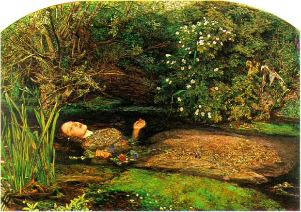

# Leçon 14 | 11 Mars 1959

  

    <label><input type="checkbox" data-lacan-toggle="original" checked> 原文</label>
    <label><input type="checkbox" data-lacan-toggle="notes" checked> 注释</label>
    <label><input type="checkbox" data-lacan-toggle="commentary" checked> 个人解读评论</label>
  

  <form class="lacan-tool-search" role="search">
    <input class="lacan-tool-search-input" type="search" placeholder="搜索全文" aria-label="搜索全文">
    <button class="lacan-tool-button" type="submit" title="搜索">搜索</button>
  </form>
  <button class="lacan-tool-button lacan-back-to-top" type="button" title="回到页面最上方" aria-label="回到页面最上方">↑</button>

<section class="parallel-paragraph" data-paragraph-ids="s6-14-0001">

s6-14-0001

原文 · s6-14-0001

Hamlet (2) Nous voici donc depuis la dernière fois dans HAMLET. HAMLET ne vient pas là par hasard, encore que je vous aie dit qu’il était introduit à cette place par la formule

[无对应译文]

</section>

<section class="parallel-paragraph" data-paragraph-ids="s6-14-0002">

s6-14-0002

原文 · s6-14-0002

du « *Être ou ne pas être* » qui s’était imposée à moi à propos du rêve d’Ella SHARPE. J’ai été amené à relire une part

[无对应译文]

</section>

<section class="parallel-paragraph" data-paragraph-ids="s6-14-0003">

s6-14-0003

原文 · s6-14-0003

de ce qui a été écrit d’HAMLET sur le plan analytique, et aussi de ce qui en a été écrit avant. Les auteurs,

[无对应译文]

</section>

<section class="parallel-paragraph" data-paragraph-ids="s6-14-0004">

s6-14-0004

原文 · s6-14-0004

du moins les meilleurs, ne sont pas, bien entendu, sans faire état de ce qui en a été écrit bien avant, et je dois dire que nous sommes amenés fort loin, quitte de temps en temps à me perdre un petit peu, non sans plaisir.

[无对应译文]

</section>

<section class="parallel-paragraph" data-paragraph-ids="s6-14-0005">

s6-14-0005

原文 · s6-14-0005

Le problème est de rassembler ce dont il s’agit pour ce qui est de notre but précis. *Notre but précis étant de donner*, ou de redonner, *son sens à la fonction du désir dans l’analyse et l’interprétation analytique*.

[无对应译文]

</section>

<section class="parallel-paragraph" data-paragraph-ids="s6-14-0006">

s6-14-0006

原文 · s6-14-0006

Il est clair que pour cela nous ne devons pas avoir une trop grande peine car…

[无对应译文]

</section>

<section class="parallel-paragraph" data-paragraph-ids="s6-14-0007">

s6-14-0007

原文 · s6-14-0007

> j’espère vous le faire sentir et je vous donne ici tout de suite mon propos

[无对应译文]

</section>

<section class="parallel-paragraph" data-paragraph-ids="s6-14-0008">

s6-14-0008

原文 · s6-14-0008

…*je crois que ce qui distingue La tragédie* d’HAMLET, prince de Danemark, *c’est essentiellement d’être la tragédie du désir.*

[无对应译文]

</section>

<section class="parallel-paragraph" data-paragraph-ids="s6-14-0009">

s6-14-0009

原文 · s6-14-0009

HAMLET qui…

[无对应译文]

</section>

<section class="parallel-paragraph" data-paragraph-ids="s6-14-0010">

s6-14-0010

原文 · s6-14-0010

> sans qu’on en soit absolument sûr, mais enfin, selon les recoupements vraiment les plus rigoureux

[无对应译文]

</section>

<section class="parallel-paragraph" data-paragraph-ids="s6-14-0011">

s6-14-0011

原文 · s6-14-0011

…devrait avoir été joué à Londres pour la première fois pendant la saison d’hiver 1601. HAMLET dont la première édition *in-quarto*…

[无对应译文]

</section>

<section class="parallel-paragraph" data-paragraph-ids="s6-14-0012">

s6-14-0012

原文 · s6-14-0012

> cette fameuse édition qui a été quasiment ce que l’on appelle une « *édition pirate* » à l’époque, à savoir
>
> qu’elle n’était point faite sous le contrôle de l’auteur mais empruntée à ce que l’on appelait les *prompt-books*, les livrets à usage du souffleur

[无对应译文]

</section>

<section class="parallel-paragraph" data-paragraph-ids="s6-14-0013">

s6-14-0013

原文 · s6-14-0013

…cette édition…

[无对应译文]

</section>

<section class="parallel-paragraph" data-paragraph-ids="s6-14-0014">

s6-14-0014

原文 · s6-14-0014

> c’est amusant quand même de savoir ces petits traits d’histoire littéraire

[无对应译文]

</section>

<section class="parallel-paragraph" data-paragraph-ids="s6-14-0015">

s6-14-0015

原文 · s6-14-0015

…est resté inconnue jusqu’en 1823, lorsqu’on a mis la main sur un de ces exemplaires sordides, ce qui tient à ce qu’ils ont été beaucoup manipulés, emportés probablement aux représentations.

[无对应译文]

</section>

<section class="parallel-paragraph" data-paragraph-ids="s6-14-0016">

s6-14-0016

原文 · s6-14-0016

Et l’édition *in-folio*, la grande édition de SHAKESPEARE, n’a commencé à paraître qu’après sa mort en 1623, précédant la grande édition où l’on trouve la division en actes. Ce qui explique que la division en actes soit beaucoup moins décisive et claire dans SHAKESPEARE qu’ailleurs.

[无对应译文]

</section>

<section class="parallel-paragraph" data-paragraph-ids="s6-14-0017">

s6-14-0017

原文 · s6-14-0017

*En fait, on ne croit pas que SHAKESPEARE ait songé à diviser ses pièces en cinq actes*. Cela a son importance parce que nous allons voir comment se répartit cette pièce.

[无对应译文]

</section>

<section class="parallel-paragraph" data-paragraph-ids="s6-14-0018">

s6-14-0018

原文 · s6-14-0018

L’hiver 1601, c’est deux ans avant la mort de la reine ELISABETH. Et en effet on peut *considérer* *approximativement* qu’HAMLET…

[无对应译文]

</section>

<section class="parallel-paragraph" data-paragraph-ids="s6-14-0019">

s6-14-0019

原文 · s6-14-0019

> qui a une importance capitale dans la vie de SHAKESPEARE

[无对应译文]

</section>

<section class="parallel-paragraph" data-paragraph-ids="s6-14-0020">

s6-14-0020

原文 · s6-14-0020

…redouble, si l’on peut dire, le drame de cette jointure entre deux époques, deux versants de la vie du poète, car le ton change complètement lorsqu’apparaît sur le trône JACQUES Ier.

[无对应译文]

</section>

<section class="parallel-paragraph" data-paragraph-ids="s6-14-0021">

s6-14-0021

原文 · s6-14-0021

Et déjà quelque chose s’annonce, comme dit un auteur, qui brise ce charme cristallin du règne d’ELISABETH, de « *la reine vierge* », celle qui réussira *ces longues années de paix miraculeuses* au sortir de ce qui constituait…

[无对应译文]

</section>

<section class="parallel-paragraph" data-paragraph-ids="s6-14-0022">

s6-14-0022

原文 · s6-14-0022

> dans l’histoire d’Angleterre comme dans beaucoup de pays

[无对应译文]

</section>

<section class="parallel-paragraph" data-paragraph-ids="s6-14-0023">

s6-14-0023

原文 · s6-14-0023

…une période de chaos dans laquelle elle devait promptement rentrer, avec tout le drame de la révolution puritaine.

[无对应译文]

</section>

<section class="parallel-paragraph" data-paragraph-ids="s6-14-0024">

s6-14-0024

原文 · s6-14-0024

Bref, 1601 annonce déjà cette mort de la reine qu’on ne pouvait assurément pas prévoir, par l’exécution de son amant, le comte d’Essex, qui se place la même année que la pièce d’HAMLET.

[无对应译文]

</section>

<section class="parallel-paragraph" data-paragraph-ids="s6-14-0025">

s6-14-0025

原文 · s6-14-0025

Ces repères ne sont pas absolument vains à évoquer, d’autant plus que nous ne sommes pas les seuls à avoir essayé de restituer HAMLET dans son contexte. Ce que je vous dis là, je ne l’ai vu dans aucun auteur *analytique*, souligné. Ce sont pourtant des espèces de faits premiers qui ont bien leur importance.

[无对应译文]

</section>

<section class="parallel-paragraph" data-paragraph-ids="s6-14-0026">

s6-14-0026

原文 · s6-14-0026

À la vérité, ce qui a été écrit chez les auteurs *analytiques* ne peut pas être dit avoir été éclaircissant, et ce n’est pas d’aujourd’hui que je ferai la critique de ce vers quoi a versé une espèce d’interprétation *analytique*, à la ligne, d’HAMLET. Je veux dire…

[无对应译文]

</section>

<section class="parallel-paragraph" data-paragraph-ids="s6-14-0027">

s6-14-0027

原文 · s6-14-0027

> « *J’essaye de retrouver tel ou tel élément* », sans à vrai dire qu’on puisse en dire autre chose

[无对应译文]

</section>

<section class="parallel-paragraph" data-paragraph-ids="s6-14-0028">

s6-14-0028

原文 · s6-14-0028

…que s’éloigne de plus en plus, à mesure que les auteurs insistent, *la compréhension de l’ensemble, la cohérence du texte*.

[无对应译文]

</section>

<section class="parallel-paragraph" data-paragraph-ids="s6-14-0029">

s6-14-0029

原文 · s6-14-0029

Je dois dire aussi de notre Ella SHARPE dont je fais grand cas, que là-dessus...

[无对应译文]

</section>

<section class="parallel-paragraph" data-paragraph-ids="s6-14-0030">

s6-14-0030

原文 · s6-14-0030

> dans son *paper*, il est vrai « *unfinished* » que l’on a trouvé après sa mort

[无对应译文]

</section>

<section class="parallel-paragraph" data-paragraph-ids="s6-14-0031">

s6-14-0031

原文 · s6-14-0031

...elle m’a grandement déçu. J’en ferai état quand même parce que c’est *significatif*. C’est tellement « *dans la ligne* » que nous sommes amenés à expliquer, eu égard à la tendance qu’on voit prise par *la théorie analytique*, que cela vaut la peine d’être mis en valeur. Mais nous n’allons pas commencer par là.

[无对应译文]

</section>

<section class="parallel-paragraph" data-paragraph-ids="s6-14-0032">

s6-14-0032

原文 · s6-14-0032

Nous allons commencer par [*l’article de* JONES](#Jones_The_Œdipus_Complex) [^59] paru en 1910 dans le *American journal of Psychology* - qui est une date et un monument, et qu’il est essentiel d’avoir lu. Il n’est pas facile actuellement de se le procurer. Et dans la petite réédition qu’il en a faite, JONES a - je crois - ajouté autre chose, quelques compléments à sa théorie d’HAMLET.

[无对应译文]

</section>

<section class="parallel-paragraph" data-paragraph-ids="s6-14-0033">

s6-14-0033

原文 · s6-14-0033

Dans cet article : *The Œdipus Complex as an explanation of Hamlet’s Mystery* : *Le complexe d’Œdipe en tant qu’explication* *du mystère d’Hamlet*, il ajoute comme sous-titre : *A study in Motive*, *Une étude de motivation*.

[无对应译文]

</section>

<section class="parallel-paragraph" data-paragraph-ids="s6-14-0034">

s6-14-0034

原文 · s6-14-0034

En 1910 JONES aborde *le problème magistralement indiqué par* FREUD, comme je vous l’ai montré la dernière fois, dans cette demi-page sur laquelle on peut dire qu’en fin de compte tout est déjà, puisque même *les points d’horizon* sont marqués, à savoir les rapports de SHAKESPEARE avec le sens du problème qui se pose pour lui : la signification de l’objet féminin.

[无对应译文]

</section>

<section class="parallel-paragraph" data-paragraph-ids="s6-14-0035">

s6-14-0035

原文 · s6-14-0035

Je crois que c’est là quelque chose de *tout à fait* *central*. Et si FREUD nous pointe à l’horizon *Timon d’Athènes*, c’est une voie dans laquelle assurément Ella SHARPE a essayé de s’engager. Elle a fait de toute l’œuvre de SHAKESPEARE une sorte de vaste oscillation *cyclothymique*, y montrant les pièces *ascendantes*, c’est-à-dire qu’on pourrait croire *optimistes*, les pièces où l’agression va vers le dehors, et celles où l’agression revient vers le héros ou le poète, celles de la phase *descendante*. Voilà comment nous pourrions classer les pièces de SHAKESPEARE, voire même à l’occasion les dater.

[无对应译文]

</section>

<section class="parallel-paragraph" data-paragraph-ids="s6-14-0036">

s6-14-0036

原文 · s6-14-0036

Je ne crois pas que ce soit là quelque chose d’entièrement valable, et nous allons nous en tenir pour le moment au point où nous en sommes. C’est-à-dire d’abord à HAMLET pour essayer… Je donnerai peut-être quelques indications sur ce qui suit ou précède, sur *La douzième nuit* et *Troylus and Cressida*, car je crois que c’est presque impossible de ne pas en tenir compte, cela éclaire grandement les problèmes que nous allons d’abord introduire sur le seul texte d’HAMLET.

[无对应译文]

</section>

<section class="parallel-paragraph" data-paragraph-ids="s6-14-0037">

s6-14-0037

原文 · s6-14-0037

Avec ce grand style de documentation qui caractérise ses écrits…

[无对应译文]

</section>

<section class="parallel-paragraph" data-paragraph-ids="s6-14-0038">

s6-14-0038

原文 · s6-14-0038

> il y a chez JONES une solidité, une certaine ampleur de style dans la documentation
>
> qui distingue hautement ses contributions

[无对应译文]

</section>

<section class="parallel-paragraph" data-paragraph-ids="s6-14-0039">

s6-14-0039

原文 · s6-14-0039

…JONES fait une sorte de résumé de ce qu’il appelle à très juste titre « *le mystère d’*HAMLET ».

[无对应译文]

</section>

<section class="parallel-paragraph" data-paragraph-ids="s6-14-0040">

s6-14-0040

原文 · s6-14-0040

De deux choses l’une :

[无对应译文]

</section>

<section class="parallel-paragraph" data-paragraph-ids="s6-14-0041">

s6-14-0041

原文 · s6-14-0041

- ou vous vous rendez compte de l’ampleur qu’a prise la question,

[无对应译文]

</section>

<section class="parallel-paragraph" data-paragraph-ids="s6-14-0042">

s6-14-0042

原文 · s6-14-0042

- ou vous ne vous en rendez pas compte.

[无对应译文]

</section>

<section class="parallel-paragraph" data-paragraph-ids="s6-14-0043">

s6-14-0043

原文 · s6-14-0043

Pour ceux qui ne s’en rendent pas compte, je ne vais pas répéter là ce qu’il y a dans l’article de JONES, d’une façon ou d’une autre, informez-vous.

[无对应译文]

</section>

<section class="parallel-paragraph" data-paragraph-ids="s6-14-0044">

s6-14-0044

原文 · s6-14-0044

Il faut que je dise que la masse des écrits sur HAMLET est quelque chose de *sans équivalent*, l’abondance de la littérature est quelque chose d’incroyable. Mais ce qui est plus incroyable encore, c’est l’extraordinaire diversité des interprétations qui en ont été données. Je veux dire que les interprétations les plus contradictoires se sont succédée, ont déferlé à travers l’histoire, instaurant le problème du problème, à savoir : *pourquoi tout le monde s’acharne-t-il à y comprendre quelque chose* ?

[无对应译文]

</section>

<section class="parallel-paragraph" data-paragraph-ids="s6-14-0045">

s6-14-0045

原文 · s6-14-0045

Et elles donnent les résultats les plus extravagants, les plus incohérents, les plus divers. On ne peut pas dire que cela n’aille excessivement *loin*, nous aurons à y revenir à l’intérieur même de ce que je vais rapidement rappeler des versants de cette explication que résume JONES dans son article.

[无对应译文]

</section>

<section class="parallel-paragraph" data-paragraph-ids="s6-14-0046">

s6-14-0046

原文 · s6-14-0046

À peu près tout a été dit. Et pour aller à l’extrême, il y a un *Popular Science Monthly*…

[无对应译文]

</section>

<section class="parallel-paragraph" data-paragraph-ids="s6-14-0047">

s6-14-0047

原文 · s6-14-0047

> qui doit être une espèce de publication de vulgarisation plus ou moins médicale

[无对应译文]

</section>

<section class="parallel-paragraph" data-paragraph-ids="s6-14-0048">

s6-14-0048

原文 · s6-14-0048

…qui a fait quelque chose en 1880 qui s’appelle *The Impediment of adipose*, *Les embêtements de l’adipose*. À la fin d’HAMLET on nous dit qu’HAMLET est gros et court de souffle, et dans cette revue il y a tout un développement sur l’adipose d’HAMLET ! Il y a un certain VINING[^60] qui, en 1881, a découvert qu’HAMLET était une femme déguisée en homme, dont le but à travers toute la pièce était la séduction d’HORATIO, et que c’était pour atteindre le cœur d’HORATIO qu’HAMLET manigançait toute son histoire. C’est tout de même une assez jolie histoire !

[无对应译文]

</section>

<section class="parallel-paragraph" data-paragraph-ids="s6-14-0049">

s6-14-0049

原文 · s6-14-0049

En même temps, on ne peut pas dire que ce soit absolument sans écho pour nous, il est certain que les rapports d’HAMLET avec les gens de son propre sexe sont quand même étroitement tissés dans le problème de la pièce.

[无对应译文]

</section>

<section class="parallel-paragraph" data-paragraph-ids="s6-14-0050">

s6-14-0050

原文 · s6-14-0050

Revenons à des choses sérieuses et, avec JONES, rappelons que ces efforts de la critique se sont groupés autour de deux versants. Quand il y a deux versants dans la logique, il y a toujours un *troisième* versant, contrairement à ce qu’on croit, le tiers n’est pas *si exclu* que cela. Et c’est évidemment le tiers qui, dans le cas, est intéressant.

[无对应译文]

</section>

<section class="parallel-paragraph" data-paragraph-ids="s6-14-0051">

s6-14-0051

原文 · s6-14-0051

Les deux versants n’ont pas eu de minces tenants. Dans le premier versant, il y a ceux qui ont, en somme, interrogé la psychologie d’HAMLET. C’est évidemment à eux qu’appartient la primauté, que doit être donné le haut du pavé de notre estime. Nous y rencontrons GŒTHE, et COLERIDGE qui dans ses *Lectures on Shakespeare* a pris une position très *caractéristique* dont je trouve que JONES aurait pu peut-être faire un plus ample état.

[无对应译文]

</section>

<section class="parallel-paragraph" data-paragraph-ids="s6-14-0052">

s6-14-0052

原文 · s6-14-0052

Car JONES, chose curieuse, s’est surtout lancé dans un extraordinairement abondant commentaire de ce qui a été fait en allemand, qui a été proliférant, voire prolixe. Les positions de GŒTHE et de COLERIDGE ne sont pas identiques. Elles ont cependant une grande parenté qui consiste à mettre l’accent sur *la forme spirituelle du personnage* d’HAMLET. En gros, disons que pour GŒTHE, c’est « *l’action paralysée par la pensée* ». Comme on le sait, ceci a une longue lignée. On s’est rappelé - et non en vain bien sûr - qu’HAMLET avait vécu un peu longtemps à Wittenberg.

[无对应译文]

</section>

<section class="parallel-paragraph" data-paragraph-ids="s6-14-0053">

s6-14-0053

原文 · s6-14-0053

Et ce terme renvoyant l’intellectuel et ses problèmes à une fréquentation un peu abusive de Wittenberg représenté, non sans raison, comme l’un des centres d’un certain style de formation de la jeunesse étudiante allemande, est une chose qui a eu une très grande postérité. HAMLET est en somme l’homme qui voit *tous les éléments, toutes* *les complexités, les motifs du jeu de la vie*, et qui est en somme suspendu, paralysé dans son action par cette connaissance. C’est un problème à proprement parler gœthéen, et qui n’a pas été sans profondément retentir, surtout si vous y ajoutez le charme et la séduction du style de GŒTHE et de sa personne.

[无对应译文]

</section>

<section class="parallel-paragraph" data-paragraph-ids="s6-14-0054">

s6-14-0054

原文 · s6-14-0054

Quant à COLERIDGE, dans un long passage que je n’ai pas le temps de vous lire, il abonde dans le même sens, avec un caractère beaucoup moins *sociologique*, beaucoup plus *psychologique*. Il y a quelque chose à mon avis qui domine là, dans tout le passage de COLERIDGE sur cette question, et que je me plais à retenir :

[无对应译文]

</section>

<section class="parallel-paragraph" data-paragraph-ids="s6-14-0055">

s6-14-0055

原文 · s6-14-0055

« *Il faut bien que je vous avoue que je ressens en moi quelque goût de la même chose.* »

[无对应译文]

</section>

<section class="parallel-paragraph" data-paragraph-ids="s6-14-0056">

s6-14-0056

原文 · s6-14-0056

C’est ce qui dessine chez lui le caractère *psychasthénique*, l’impossibilité de s’engager dans une voie, et une fois y être entré, engagé, d’y rester jusqu’au bout.

[无对应译文]

</section>

<section class="parallel-paragraph" data-paragraph-ids="s6-14-0057">

s6-14-0057

原文 · s6-14-0057

L’intervention de l’hésitation, des motifs multiples, est un morceau brillant de psychologie qui donne pour nous l’essentiel, le ressort, le suc de son essence, dans cette remarque dite au passage par COLERIDGE : « *Après tout j’ai quelque goût de cela* - c’est-à-dire - *je me retrouve là-dedans*... » Il l’avoue au passage, et il n’est pas le seul. On trouve une remarque analogue chez quelqu’un qui est quasi contemporain de COLERIDGE, et qui a écrit des *choses remarquables* sur SHAKESPEARE dans ses *Essays on Shakespeare*, c’est HAZLITT, dont JONES - à tort - ne fait pas du tout état, car c’est quelqu’un qui a écrit *les choses les plus remarquables* sur ce sujet à l’époque.

[无对应译文]

</section>

<section class="parallel-paragraph" data-paragraph-ids="s6-14-0058">

s6-14-0058

原文 · s6-14-0058

Il va plus loin encore, il dit qu’en fin de compte, parler de cette tragédie… elle nous a été si rebattue, cette tragédie, que nous pouvons à peine savoir comment en faire la critique, pas plus que nous ne saurions décrire notre propre visage. Il y a une autre *note* qui va dans le même sens, et ce sont là des lignes dont je vais faire grand état.

[无对应译文]

</section>

<section class="parallel-paragraph" data-paragraph-ids="s6-14-0059">

s6-14-0059

原文 · s6-14-0059

Je passe assez vite l’autre versant, celui d’une difficulté extérieure qui a été instaurée par un groupe de critiques allemands dont les deux principaux sont KLEIN et WERDER qui écrivaient à la fin du XIXème siècle à Berlin. C’est à peu près comme cela que JONES les groupe, et il a raison. Il s’agit de mettre en relief les causes extérieures de la difficulté de la tâche qu’HAMLET s’est donnée, et les formes que la tâche d’HAMLET aurait.

[无对应译文]

</section>

<section class="parallel-paragraph" data-paragraph-ids="s6-14-0060">

s6-14-0060

原文 · s6-14-0060

Elle serait de faire reconnaître à son peuple la culpabilité de CLAUDIUS, de celui qui, après avoir *tué* son père et *épousé* sa mère, *règne* sur le Danemark.

[无对应译文]

</section>

<section class="parallel-paragraph" data-paragraph-ids="s6-14-0061">

s6-14-0061

原文 · s6-14-0061

Il y a là quelque chose qui ne soutient pas la critique, car les difficultés qu’aurait HAMLET à accomplir sa tâche…

[无对应译文]

</section>

<section class="parallel-paragraph" data-paragraph-ids="s6-14-0062">

s6-14-0062

原文 · s6-14-0062

> c’est-à-dire à faire reconnaître la culpabilité d’un roi, ou bien de deux choses l’une, à intervenir déjà de la façon dont il s’agit qu’il intervienne, *par le meurtre*, et ensuite d’être dans la possibilité de justifier *ce meurtre*

[无对应译文]

</section>

<section class="parallel-paragraph" data-paragraph-ids="s6-14-0063">

s6-14-0063

原文 · s6-14-0063

…sont évidemment très facilement levées par la seule lecture du texte : jamais HAMLET ne se pose un problème semblable ! Le principe de son action, à savoir que ce qu’il doit venger…

[无对应译文]

</section>

<section class="parallel-paragraph" data-paragraph-ids="s6-14-0064">

s6-14-0064

原文 · s6-14-0064

> sur celui qui est le meurtrier de son père et qui, en même temps,
>
> a pris son trône et sa place auprès de la femme qu’il aimait par dessus tout

[无对应译文]

</section>

<section class="parallel-paragraph" data-paragraph-ids="s6-14-0065">

s6-14-0065

原文 · s6-14-0065

…doit se purger par *l’action la plus violente* et par *le meurtre*, n’est non seulement jamais mis en cause chez HAMLET, mais je crois que je vous lirai là-dessus des passages qui vous montrent qu’il se traite de lâche, de couard, il écume sur la scène du désespoir de ne pouvoir se décider à cette action. Mais le principe de la chose ne fait aucune espèce de doute, il ne se pose pas le moindre problème concernant la validité de cet acte, de cette tâche.

[无对应译文]

</section>

<section class="parallel-paragraph" data-paragraph-ids="s6-14-0066">

s6-14-0066

原文 · s6-14-0066

Et là-dessus il y a un nommé LŒNING, dont JONES fait grand état, qui a fait une remarque à la même période, discutant les théories de KLEIN et WERDER de façon décisive. Je signale au passage que c’est la plus chaude recommandation que JONES apporte sur ces remarques. En effet, il en cite quelques unes qui paraissent fort pénétrantes.

[无对应译文]

</section>

<section class="parallel-paragraph" data-paragraph-ids="s6-14-0067">

s6-14-0067

原文 · s6-14-0067

Mais tout ceci n’a pas une extraordinaire importance puisque *la question est véritablement dépassée à partir du moment où* nous prenons la troisième position, celle par laquelle JONES *introduit la position analytique*. Ces lenteurs d’exposé sont nécessaires, car elles doivent être suivies pour que nous ayons le fond sur lequel se pose le problème d’HAMLET.

[无对应译文]

</section>

<section class="parallel-paragraph" data-paragraph-ids="s6-14-0068">

s6-14-0068

原文 · s6-14-0068

La troisième position est celle-ci : bien que le sujet ne doute pas un instant d’avoir à l’accomplir, pour quelque raison inconnue de lui cette tâche lui répugne. Autrement dit, c’est dans la tâche même et non pas - ni dans le sujet, ni dans ce qui se passe à l’extérieur. Inutile de dire que pour *ce qui se passe à l’extérieur*, il peut y avoir des versions beaucoup plus subtiles que celles que je vous ai amorcées pour déblayer.

[无对应译文]

</section>

<section class="parallel-paragraph" data-paragraph-ids="s6-14-0069">

s6-14-0069

原文 · s6-14-0069

Il y a donc là une position essentiellement conflictuelle par rapport à la tâche elle-même. Et c’est de cette façon…

[无对应译文]

</section>

<section class="parallel-paragraph" data-paragraph-ids="s6-14-0070">

s6-14-0070

原文 · s6-14-0070

> en somme très solide et qui doit tout de même nous donner une leçon de méthode

[无对应译文]

</section>

<section class="parallel-paragraph" data-paragraph-ids="s6-14-0071">

s6-14-0071

原文 · s6-14-0071

…que JONES introduit la théorie analytique.

[无对应译文]

</section>

<section class="parallel-paragraph" data-paragraph-ids="s6-14-0072">

s6-14-0072

原文 · s6-14-0072

Il montre que la notion du conflit n’est pas du tout nouvelle, à savoir la contradiction interne à la tâche a déjà été apportée par un certain nombre d’auteurs qui ont très bien vu…

[无对应译文]

</section>

<section class="parallel-paragraph" data-paragraph-ids="s6-14-0073">

s6-14-0073

原文 · s6-14-0073

> comme LŒNING, si nous en croyons les citations que JONES en donne

[无对应译文]

</section>

<section class="parallel-paragraph" data-paragraph-ids="s6-14-0074">

s6-14-0074

原文 · s6-14-0074

…qu’on peut saisir le caractère problématique, conflictuel, de la tâche à certains signes, dont on n’a pas attendu l’analyse pour s’apercevoir de leur caractère *signalétique*, à savoir la diversité, la multiplicité, la contradiction, la fausse consistance des raisons que peut donner le sujet d’atermoyer cette tâche, de ne pas l’accomplir au moment où elle se présente à lui.

[无对应译文]

</section>

<section class="parallel-paragraph" data-paragraph-ids="s6-14-0075">

s6-14-0075

原文 · s6-14-0075

La notion en somme du caractère superstructural, rationalisé, rationalisant des motifs que donne le sujet, avait déjà été aperçu par les psychologues bien avant l’analyse, et JONES sait très bien le mettre en valeur, en relief. Seulement, il s’agit de savoir où gît le conflit, dont les auteurs qui sont sur cette voie ne laissent pas d’apercevoir qu’il y a quelque chose qui se présente au premier plan, et une sorte de difficulté sous-jacente qui, sans être à proprement parler articulée comme inconsciente, est considérée comme plus profonde et en partie non maîtrisée, pas complètement élucidée ni aperçue par le sujet.

[无对应译文]

</section>

<section class="parallel-paragraph" data-paragraph-ids="s6-14-0076">

s6-14-0076

原文 · s6-14-0076

Et la discussion de JONES présente ce caractère tout à fait caractéristique de ce qui, chez lui, donnera un des traits dont il sait le mieux faire usage dans ses articles qui ont joué le plus grand rôle pour rendre valable à un large public intellectuel la notion même d’inconscient. Il articule puissamment que ce que les auteurs, certains subtils, ont mis en valeur, c’est à savoir que le motif sous-jacent, contrariant pour l’action d’HAMLET, est par exemple un motif de droit, à savoir : a-t-il le droit de faire ceci ?

[无对应译文]

</section>

<section class="parallel-paragraph" data-paragraph-ids="s6-14-0077">

s6-14-0077

原文 · s6-14-0077

Et Dieu sait si les auteurs allemands n’ont pas manqué…

[无对应译文]

</section>

<section class="parallel-paragraph" data-paragraph-ids="s6-14-0078">

s6-14-0078

原文 · s6-14-0078

> surtout alors que ceci se passait en pleine période d’hégélianisme

[无对应译文]

</section>

<section class="parallel-paragraph" data-paragraph-ids="s6-14-0079">

s6-14-0079

原文 · s6-14-0079

…de faire état de toutes sortes de *registres* sur lesquels JONES a beau jeu d’ironiser, montrant que si quelque chose doit entrer dans les ressorts inconscients, ce ne sont pas des motifs d’ordre élevé, d’un haut caractère d’abstraction, faisant entrer en jeu *la morale*, *l’État*, *le savoir absolu*, mais qu’il doit y avoir quelque chose de beaucoup plus radical, de plus concret, et que ce dont il s’agit c’est précisément ce que JONES va alors produire.

[无对应译文]

</section>

<section class="parallel-paragraph" data-paragraph-ids="s6-14-0080">

s6-14-0080

原文 · s6-14-0080

Puisque c’est à peu près vers cette année-là que commencent à s’introduire en Amérique les points de vue freudiens, c’est cette même année qu’il publie un compte-rendu de la théorie de FREUD sur les rêves, que FREUD donne son article sur *les origines et le développement de la psychanalyse*, directement écrit en anglais si mon souvenir est bon, puisqu’il s’agit des fameuses *Conférences de la Clark University*.

[无对应译文]

</section>

<section class="parallel-paragraph" data-paragraph-ids="s6-14-0081">

s6-14-0081

原文 · s6-14-0081

Je crois qu’on ne peut pas toucher du doigt, dans une analyse qui va vraiment aussi loin qu’on peut aller à cette époque, qui met en valeur…

[无对应译文]

</section>

<section class="parallel-paragraph" data-paragraph-ids="s6-14-0082">

s6-14-0082

原文 · s6-14-0082

> dans le texte de la pièce, dans le déroulement du drame, pour en montrer *la signification œdipienne*

[无对应译文]

</section>

<section class="parallel-paragraph" data-paragraph-ids="s6-14-0083">

s6-14-0083

原文 · s6-14-0083

…qui met en valeur ce que nous pouvons appeler « *la structure mythique de l’œdipe* ».

[无对应译文]

</section>

<section class="parallel-paragraph" data-paragraph-ids="s6-14-0084">

s6-14-0084

原文 · s6-14-0084

Je dois dire que nous ne sommes pas si débarbouillés mentalement que *de pouvoir tous si aisément sourire de voir amener à propos* d’HAMLET : TELESPHORE, AMPHION, MOÏSE, PHARAON, ZOROASTRE, JESUS, HERODE…

[无对应译文]

</section>

<section class="parallel-paragraph" data-paragraph-ids="s6-14-0085">

s6-14-0085

原文 · s6-14-0085

tout le monde vient dans le paquet

[无对应译文]

</section>

<section class="parallel-paragraph" data-paragraph-ids="s6-14-0086">

s6-14-0086

原文 · s6-14-0086

…et en fin de compte, ce qui est l’essentiel, deux auteurs qui ont écrit à peu près vers 1900 ont fait un *Hamlet in Iran* dans une revue fort connue, une référence du mythe d’HAMLET aux mythes iraniens qui sont autour de la légende de PYRRHUS, dont un autre auteur a fait aussi grand état dans une revue inconnue et introuvable \[?\]. L’important c’est que dans l’introduction par JONES, à la date de 1910, d’une nouvelle critique d’HAMLET, et d’une critique qui va consister toute entière à nous amener à cette conclusion :

[无对应译文]

</section>

<section class="parallel-paragraph" data-paragraph-ids="s6-14-0087">

s6-14-0087

原文 · s6-14-0087

« *Nous arrivons à ce paradoxe apparent que le poète et l’audience sont tous deux profondément remués par des sentiments dus à un conflit de la source duquel ils ne sont pas conscients, ils ne sont pas éveillés, ils ne savent pas de quoi il s’agit.* »

[无对应译文]

</section>

<section class="parallel-paragraph" data-paragraph-ids="s6-14-0088">

s6-14-0088

原文 · s6-14-0088

Je pense qu’il est essentiel de remarquer le pas franchi à ce niveau. Je ne dis pas que ce soit le seul pas possible, mais que le premier pas analytique consiste à transformer une référence psychologique non pas en une référence à *une psychologie plus profonde*, mais en une référence à un arrangement mythique censé avoir le même sens pour tous les êtres humains.

[无对应译文]

</section>

<section class="parallel-paragraph" data-paragraph-ids="s6-14-0089">

s6-14-0089

原文 · s6-14-0089

Et il faut tout de même bien quelque chose de plus, car HAMLET ce n’est tout de même pas les *Pyrrhus Saga*, les histoires de CYRUS *avec* CAMBYSE, ni de PERSÉE *avec son grand-père* ACRISIOS, c’est quand même autre chose. Si nous en parlons, ce n’est pas seulement parce qu’il y a eu des myriades de critiques, mais aussi parce que c’est intéressant de voir ce que cela fait d’HAMLET.

[无对应译文]

</section>

<section class="parallel-paragraph" data-paragraph-ids="s6-14-0090">

s6-14-0090

原文 · s6-14-0090

Vous n’en avez, en fin de compte, aucune espèce d’idée parce que, par une espèce de chose tout à fait curieuse, je crois pouvoir dire d’après ma propre expérience que c’est injouable en français. Je n’ai jamais vu un bon HAMLET en français, ni quelqu’un qui joue bien HAMLET, ni un texte qu’on puisse entendre.

[无对应译文]

</section>

<section class="parallel-paragraph" data-paragraph-ids="s6-14-0091">

s6-14-0091

原文 · s6-14-0091

Pour ceux qui lisent le texte, c’est quelque chose *à tomber à la renverse, à mordre le tapis, à se rouler par terre*, c’est quelque chose d’inimaginable ! Il n’y a pas un vers d’HAMLET, ni une réplique qui ne soit, en anglais, d’une puissance de percussion, de violence de termes qui en fait quelque chose où, à tout instant, on est absolument stupéfait. On croit que c’est écrit d’hier, qu’on ne pouvait pas écrire comme cela il y a trois siècles.

[无对应译文]

</section>

<section class="parallel-paragraph" data-paragraph-ids="s6-14-0092">

s6-14-0092

原文 · s6-14-0092

En Angleterre, c’est-à-dire là où la pièce est jouée dans sa langue, une représentation d’HAMLET, c’est toujours un événement. J’irai même plus loin…

[无对应译文]

</section>

<section class="parallel-paragraph" data-paragraph-ids="s6-14-0093">

s6-14-0093

原文 · s6-14-0093

> parce qu’après tout on ne peut pas mesurer *la tension psychologique* du public, si ce n’est au *bureau de location*

[无对应译文]

</section>

<section class="parallel-paragraph" data-paragraph-ids="s6-14-0094">

s6-14-0094

原文 · s6-14-0094

…et je dirai ce que c’est pour les acteurs, ce qui nous enseigne doublement.

[无对应译文]

</section>

<section class="parallel-paragraph" data-paragraph-ids="s6-14-0095">

s6-14-0095

原文 · s6-14-0095

D’abord parce qu’il est tout à fait clair que jouer HAMLET pour un acteur anglais c’est le couronnement de sa carrière, et que lorsque ce n’est pas le couronnement de sa carrière, c’est tout de même qu’il veut se retirer avec bonheur, en donnant ainsi sa représentation d’adieu, même si son rôle consiste à jouer le premier fossoyeur. Il y a là quelque chose qui est important et nous aurons à nous apercevoir de ce que cela veut dire, car je ne le dis pas *au hasard*.

[无对应译文]

</section>

<section class="parallel-paragraph" data-paragraph-ids="s6-14-0096">

s6-14-0096

原文 · s6-14-0096

Il y a une chose curieuse, c’est qu’en fin de compte lorsque l’acteur anglais arrive à jouer HAMLET, il le joue bien, ils le jouent tous bien. Une chose encore plus étrange est que l’on parle de l’HAMLET de tel ou tel, d’autant d’HAMLET qu’il y a de grands acteurs. On évoque encore l’HAMLET de GARRICK, l’HAMLET de KENNS etc., c’est là aussi quelque chose d’extraordinairement indicatif.

[无对应译文]

</section>

<section class="parallel-paragraph" data-paragraph-ids="s6-14-0097">

s6-14-0097

原文 · s6-14-0097

S’il y a autant d’HAMLET qu’il y a de grands acteurs, je crois que c’est pour une raison analogue. Ce n’est pas la même parce que c’est autre chose de jouer HAMLET et d’être intéressé comme spectateur et comme critique. Mais la pointe de convergence de tout cela, ce qui frappe particulièrement et que je vous prie de retenir, c’est qu’on peut croire en fin de compte que c’est en raison de *la structure du problème* qu’HAMLET, comme tel, pose à propos du *désir*.

[无对应译文]

</section>

<section class="parallel-paragraph" data-paragraph-ids="s6-14-0098">

s6-14-0098

原文 · s6-14-0098

À savoir, ce qui est la thèse que j’avance ici, qu’HAMLET fait jouer les différents plans, le cadre même auquel j’essaye de vous introduire ici, dans lequel vient se situer *le désir*.

[无对应译文]

</section>

<section class="parallel-paragraph" data-paragraph-ids="s6-14-0099">

s6-14-0099

原文 · s6-14-0099

C’est parce que cette place y est exceptionnellement bien articulée…

[无对应译文]

</section>

<section class="parallel-paragraph" data-paragraph-ids="s6-14-0100">

s6-14-0100

原文 · s6-14-0100

> aussi bien je dirais, de façon telle que tout un chacun y vient trouver sa place, vient s’y reconnaître

[无对应译文]

</section>

<section class="parallel-paragraph" data-paragraph-ids="s6-14-0101">

s6-14-0101

原文 · s6-14-0101

…que l’appareil, *le filet de la pièce d’*HAMLET est cette espèce de réseau, de *filet d’oiseleur* où le désir de l’homme…

[无对应译文]

</section>

<section class="parallel-paragraph" data-paragraph-ids="s6-14-0102">

s6-14-0102

原文 · s6-14-0102

> dans les coordonnées que justement FREUD nous découvre, à savoir *son rapport à l’œdipe et à la castration*

[无对应译文]

</section>

<section class="parallel-paragraph" data-paragraph-ids="s6-14-0103">

s6-14-0103

原文 · s6-14-0103

…est là articulé essentiellement.

[无对应译文]

</section>

<section class="parallel-paragraph" data-paragraph-ids="s6-14-0104">

s6-14-0104

原文 · s6-14-0104

Mais ceci suppose que ce n’est pas simplement une autre édition, un autre tirage de l’éternel type drame-conflit, de la lutte du héros contre le père, contre le tyran, contre le bon ou le mauvais père. Là, j’introduis des choses que nous allons voir se développer par la suite. C’est que les choses sont poussées par SHAKESPEARE à un point tel que ce qui est important ici, c’est de montrer les caractères atypiques du conflit, la façon modifiée dont se présente la structure fondamentale de l’éternelle *saga* que l’on retrouve depuis l’origine des âges.

[无对应译文]

</section>

<section class="parallel-paragraph" data-paragraph-ids="s6-14-0105">

s6-14-0105

原文 · s6-14-0105

par conséquent dans la fonction où, d’une certaine façon, les coordonnées de ce conflit sont modifiées par SHAKESPEARE de façon à pouvoir faire apparaître comment, dans ces conditions atypiques, vient jouer, de tout son caractère le plus essentiellement problématique, le problème du désir, pour autant que l’homme n’est pas simplement possédé, investi, mais que ce désir, il a à le situer, à le trouver.

[无对应译文]

</section>

<section class="parallel-paragraph" data-paragraph-ids="s6-14-0106">

s6-14-0106

原文 · s6-14-0106

À le trouver à ses plus lourds dépens et à sa plus lourde peine, au point de ne pouvoir le trouver qu’à la limite, à savoir dans une action qui ne peut pour lui s’achever, se réaliser, *qu’à condition d’être mortel*. Ceci nous incite à regarder de plus près le déroulement de la pièce. Je ne voudrais pas trop vous faire tarder, mais il faut quand même que j’en mette les traits saillants principaux.

[无对应译文]

</section>

<section class="parallel-paragraph" data-paragraph-ids="s6-14-0107">

s6-14-0107

原文 · s6-14-0107

L’acte I concerne quelque chose qu’on peut appeler l’introduction du problème, et là tout de même, au point de recoupement, d’accumulation, de confusion où tourne la pièce, il faut bien quand même que nous revenions à quelque chose de simple qui est le texte. Nous allons voir que cette composition mérite d’être retenue, qu’elle n’est pas quelque chose qui flotte ni qui aille à droite ou à gauche.

[无对应译文]

</section>

<section class="parallel-paragraph" data-paragraph-ids="s6-14-0108">

s6-14-0108

原文 · s6-14-0108

Comme vous le savez, les choses s’ouvrent sur *une garde*, une relève de la garde sur la terrasse d’Elseneur, et je dois dire que c’est une des entrées les plus magistrales de toutes les pièces de SHAKESPEARE, car toutes ne sont pas aussi magistrales à l’entrée.

[无对应译文]

</section>

<section class="parallel-paragraph" data-paragraph-ids="s6-14-0109">

s6-14-0109

原文 · s6-14-0109

C’est à minuit que se fait la relève, une relève où il y a des choses très jolies, très frappantes. Ainsi c’est ceux qui viennent pour la relève qui demandent « *Qui est là ?* », alors que ce devrait être le contraire.

[无对应译文]

</section>

<section class="parallel-paragraph" data-paragraph-ids="s6-14-0110">

s6-14-0110

原文 · s6-14-0110

C’est qu’en effet, tout se passe anormalement, ils sont tous angoissés par quelque chose qu’ils attendent, et cette chose ne se fait pas attendre plus de quarante vers.

[无对应译文]

</section>

<section class="parallel-paragraph" data-paragraph-ids="s6-14-0111">

s6-14-0111

原文 · s6-14-0111

Alors qu’il est minuit quand la relève a lieu, une heure sonne à une cloche lorsque le spectre apparaît. Et à partir du moment où le spectre apparaît, nous sommes entrés dans un mouvement fort rapide *avec d’assez curieuses stagnations*.

[无对应译文]

</section>

<section class="parallel-paragraph" data-paragraph-ids="s6-14-0112">

s6-14-0112

原文 · s6-14-0112

Tout de suite après, la scène où apparaissent le roi et la reine, le roi dit qu’il est tout à fait temps de quitter notre deuil, « *Nous pouvons pleurer d’un œil, mais rions de l’autre* », et où HAMLET qui est là, fait apparaître ses sentiments de révolte devant la rapidité du remariage de sa mère et du fait qu’elle s’est remariée avec quelqu’un qui, auprès de ce qu’était son père, est un personnage absolument inférieur.

[无对应译文]

</section>

<section class="parallel-paragraph" data-paragraph-ids="s6-14-0113">

s6-14-0113

原文 · s6-14-0113

À tout instant dans les propos d’HAMLET nous verrons mise en valeur l’exaltation de son père comme d’un être dont il dira plus tard que :

[无对应译文]

</section>

<section class="parallel-paragraph" data-paragraph-ids="s6-14-0114">

s6-14-0114

原文 · s6-14-0114

« *Tous les dieux semblaient avoir sur lui marqué leurs sceaux,* *pour montrer jusqu’où la perfection d’un homme pouvait être portée.* »

[无对应译文]

</section>

<section class="parallel-paragraph" data-paragraph-ids="s6-14-0115">

s6-14-0115

原文 · s6-14-0115

C’est sensiblement plus tard dans le texte que cette phrase sera dite par HAMLET, mais dès la première scène, il y a des mots analogues. C’est essentiellement dans cette sorte de trahison, et aussi de déchéance…

[无对应译文]

</section>

<section class="parallel-paragraph" data-paragraph-ids="s6-14-0116">

s6-14-0116

原文 · s6-14-0116

> *sentiments que lui inspire la conduite de sa mère, ce mariage hâtif, deux mois*, nous dit-on, *après la mort de son père*

[无对应译文]

</section>

<section class="parallel-paragraph" data-paragraph-ids="s6-14-0117">

s6-14-0117

原文 · s6-14-0117

…qu’HAMLET se présente. C’est là le fameux dialogue avec HORATIO :

[无对应译文]

</section>

<section class="parallel-paragraph" data-paragraph-ids="s6-14-0118">

s6-14-0118

原文 · s6-14-0118

- « *Économie, économie ! Le rôti des funérailles n’aura pas le temps de refroidir pour servir au repas des noces.* »

[无对应译文]

</section>

<section class="parallel-paragraph" data-paragraph-ids="s6-14-0119">

s6-14-0119

原文 · s6-14-0119

Je n’ai pas besoin de rappeler ces thèmes célèbres. Ensuite, tout de suite, nous avons l’introduction de deux personnages, OPHÉLIE et POLONIUS. Et ceci à propos d’une sorte de petite mercuriale que LAERTE…

[无对应译文]

</section>

<section class="parallel-paragraph" data-paragraph-ids="s6-14-0120">

s6-14-0120

原文 · s6-14-0120

> qui est un personnage tout à fait important dans notre histoire d’HAMLET, dont on a voulu faire – nous y viendrons – quelqu’un qui joue un certain rôle par rapport à HAMLET dans le déroulement mythique de l’histoire, et à juste titre bien entendu

[无对应译文]

</section>

<section class="parallel-paragraph" data-paragraph-ids="s6-14-0121">

s6-14-0121

原文 · s6-14-0121

…adresse à OPHÉLIE qui est la jeune fille dont HAMLET fut - comme il le dit lui-même - amoureux, et qu’actuellement, dans l’état où il est, il repousse avec beaucoup de sarcasmes. POLONIUS et LAERTE se succèdent auprès de cette malheureuse OPHÉLIE pour lui donner tous les sermons de la prudence, pour l’inviter *à se méfier de cet* HAMLET.

[无对应译文]

</section>

<section class="parallel-paragraph" data-paragraph-ids="s6-14-0122">

s6-14-0122

原文 · s6-14-0122

Vient ensuite la quatrième scène. La rencontre sur la terrasse d’Elseneur d’HAMLET - qui a été rejoint par HORATIO - avec le spectre de son père. Dans cette rencontre il se montre passionné, courageux puisqu’il n’hésite pas à suivre le spectre dans le coin où le spectre l’entraîne, à avoir avec lui un dialogue assez horrifiant. Et je souligne que le caractère d’horreur est articulé par le spectre lui–même : il ne peut pas révéler à HAMLET l’*horreur* et l’*abomination* du lieu où il vit et de ce qu’il souffre, car ses organes mortels ne pourraient le supporter.

[无对应译文]

</section>

<section class="parallel-paragraph" data-paragraph-ids="s6-14-0123">

s6-14-0123

原文 · s6-14-0123

Et il lui donne une consigne, un commandement. Il est intéressant de noter tout de suite que le commandement consiste en ce que, de quelque façon qu’il s’y prenne, il ait à faire cesser le scandale de la luxure de la reine, et qu’en tout ceci, au reste, il contienne ses pensées et ses mouvements, qu’il n’aille pas se laisser aller à je ne sais quels excès concernant des pensées à l’endroit de sa mère. Bien sûr les auteurs ont fait grand état de cette espèce d’arrière-plan trouble dans les consignes données par le spectre à HAMLET, d’avoir en somme à se garder de lui-même dans ses rapports avec sa mère.

[无对应译文]

</section>

<section class="parallel-paragraph" data-paragraph-ids="s6-14-0124">

s6-14-0124

原文 · s6-14-0124

Mais il y a une chose dont il ne semble pas qu’on ait articulé ce dont il s’agissait, qu’en somme d’ores et déjà et tout de suite, c’est autour d’une question à résoudre : que faire par rapport à quelque chose qui apparaît ici être l’essentiel, malgré l’horreur de ce qui est articulé, les accusations formellement prononcées par le spectre contre le personnage de CLAUDIUS, c’est-à-dire l’assassin. C’est là qu’il révèle à son fils qu’il a été tué par lui.

[无对应译文]

</section>

<section class="parallel-paragraph" data-paragraph-ids="s6-14-0125">

s6-14-0125

原文 · s6-14-0125

La consigne que donne le *ghost* n’est pas une consigne en elle-même, c’est quelque chose qui d’ores et déjà met au premier plan, et comme tel, *le désir de la mère*. C’est absolument essentiel, d’ailleurs nous y reviendrons. Le deuxième acte est constitué par ce qu’on peut appeler *l’organisation de la surveillance autour* d’HAMLET.

[无对应译文]

</section>

<section class="parallel-paragraph" data-paragraph-ids="s6-14-0126">

s6-14-0126

原文 · s6-14-0126

Nous en avons en somme, une sorte de prodrome sous la forme… c’est assez amusant et cela montre *le caractère de doublet* du *groupe* POLONIUS, LAERTE, OPHÉLIE, par rapport au *groupe* HAMLET, CLAUDIUS et LA REINE …des instructions que POLONIUS, premier ministre, donne à quelqu’un pour la surveillance de son fils qui est parti à Paris. Il lui dit comment il faut procéder pour se renseigner sur son fils. Il y a là une espèce de petit morceau de bravoure du genre vérités éternelles de la police, sur lequel je n’ai pas à insister.

[无对应译文]

</section>

<section class="parallel-paragraph" data-paragraph-ids="s6-14-0127">

s6-14-0127

原文 · s6-14-0127

Puis interviennent - *c’est déjà préparé au 1er acte* - GUILDENSTERN et ROSENCRANTZ, qui ne sont pas simplement les personnages soufflés qu’on pense. *Ce sont des personnages qui sont d’anciens amis* d’HAMLET. Et HAMLET...

[无对应译文]

</section>

<section class="parallel-paragraph" data-paragraph-ids="s6-14-0128">

s6-14-0128

原文 · s6-14-0128

> qui se méfie d’eux, qui les raille, les tourne en dérision, les déroute et joue avec eux *un jeu extrêmement subtil sous l’apparence de la folie* - nous verrons aussi ce que veux dire *ce problème de la folie ou pseudo-folie* d’HAMLET

[无对应译文]

</section>

<section class="parallel-paragraph" data-paragraph-ids="s6-14-0129">

s6-14-0129

原文 · s6-14-0129

…*fait véritablement appel, à un moment, à leur vieille et ancienne amitié*, avec un ton et un accent qui lui aussi mériterait d’être mis en valeur si nous avions le temps, et qui mérite d’être retenu, qui prouve qu’il le fait sans aucune confiance.

[无对应译文]

</section>

<section class="parallel-paragraph" data-paragraph-ids="s6-14-0130">

s6-14-0130

原文 · s6-14-0130

Et il ne perd pas un seul instant sa position de ruse et de jeu avec eux, pourtant, il y a un moment où il peut leur parler sur ce certain ton. ROSENCRANTZ et GUILDENSTERN sont, en venant le sonder, les véhicules du roi, et c’est bien ce que sent HAMLET qui les incite vraiment à lui avouer :

[无对应译文]

</section>

<section class="parallel-paragraph" data-paragraph-ids="s6-14-0131">

s6-14-0131

原文 · s6-14-0131

- « *Êtes-vous envoyés près de moi ? Qu’avez-vous à faire près de moi ?* »

[无对应译文]

</section>

<section class="parallel-paragraph" data-paragraph-ids="s6-14-0132">

s6-14-0132

原文 · s6-14-0132

Et les autres sont suffisamment ébranlés pour qu’un deux demande à l’autre :

[无对应译文]

</section>

<section class="parallel-paragraph" data-paragraph-ids="s6-14-0133">

s6-14-0133

原文 · s6-14-0133

- « *Qu’est-ce qu’on lui dit ?* »

[无对应译文]

</section>

<section class="parallel-paragraph" data-paragraph-ids="s6-14-0134">

s6-14-0134

原文 · s6-14-0134

Mais cela passe, car tout toujours se passe d’une certaine façon, c’est-à-dire *pour que jamais ne soit franchi un certain mur* qui détendrait une situation qui apparaît essentiellement, et d’un bout à l’autre, nouée. *À ce moment* ROSENCRANTZ et GUILDENSTERN introduisent les comédiens qu’ils ont rencontrés en route et qu’HAMLET connaît. HAMLET s’est toujours intéressé au théâtre et, ces comédiens, il va les accueillir d’une façon qui est remarquable. Là aussi il faudrait lire les premiers échantillons qu’ils lui donnent de leur talent.

[无对应译文]

</section>

<section class="parallel-paragraph" data-paragraph-ids="s6-14-0135">

s6-14-0135

原文 · s6-14-0135

L’un portant sur une tragédie concernant la fin de Troie, le meurtre de PRIAM – et concernant ce meurtre, nous avons une scène fort belle en anglais, où nous voyons PYRRHUS suspendre un poignard au-dessus du personnage de PRIAM, et rester ainsi:

[无对应译文]

</section>

<section class="parallel-paragraph" data-paragraph-ids="s6-14-0136">

s6-14-0136

原文 · s6-14-0136

« *So as a painted tyrant, Pyrrhus stood And like a neutral to bis will and matter, Did nothing.* » « *C’est ainsi que, comme un tyran en peinture, Pyrrhus s’arrêta* *Et, comme neutralisé entre sa volonté et ce qu’il y avait à faire, Ne fit rien*. »

[无对应译文]

</section>

<section class="parallel-paragraph" data-paragraph-ids="s6-14-0137">

s6-14-0137

原文 · s6-14-0137

Comme c’est un des thèmes fondamentaux de l’affaire, cela mérite d’être relevé dans cette première image, celle des comédiens à propos desquels va venir, chez notre HAMLET, l’idée de les utiliser dans ce qui va constituer le corps du troisième acte - ceci est absolument essentiel - ce que les anglais appellent d’un terme stéréotypé, « *the play scene* », « *le théâtre sur le théâtre* ». HAMLET là conclut:

[无对应译文]

</section>

<section class="parallel-paragraph" data-paragraph-ids="s6-14-0138">

s6-14-0138

原文 · s6-14-0138

- « *The play’s the thing Wherein I’ll catch the conscience of the king.* »[^61]

[无对应译文]

</section>

<section class="parallel-paragraph" data-paragraph-ids="s6-14-0139">

s6-14-0139

原文 · s6-14-0139

Cette espèce de bruit de cymbales qui termine là une longue tirade d’HAMLET qui est écrite toute entière en vers blancs \[ vers non rimés \], je le signale, et où nous trouvons ce couple de rimes, est quelque chose qui a toute sa valeur introductive. Je veux dire que c’est là-dessus que se termine le deuxième acte et que le troisième, où va justement se réaliser « *the play scene* », est introduit. Ce monologue est essentiel. Par là nous voyons,

[无对应译文]

</section>

<section class="parallel-paragraph" data-paragraph-ids="s6-14-0140">

s6-14-0140

原文 · s6-14-0140

- et la violence des sentiments d’HAMLET,

[无对应译文]

</section>

<section class="parallel-paragraph" data-paragraph-ids="s6-14-0141">

s6-14-0141

原文 · s6-14-0141

- et la violence des accusations qu’il porte contre lui-même d’une part :

[无对应译文]

</section>

<section class="parallel-paragraph" data-paragraph-ids="s6-14-0142">

s6-14-0142

原文 · s6-14-0142

« *Am I a coward ?*

[无对应译文]

</section>

<section class="parallel-paragraph" data-paragraph-ids="s6-14-0143">

s6-14-0143

原文 · s6-14-0143

*Who calls me villain ? breaks my pate across ?  
Plucks off my beard and blows it in my face ?  
Tweaks me by th’ nose ? gives me the lie i’ th’ throat  
As deep as to the lungs ? Who dœs me this, ha ?* »

[无对应译文]

</section>

<section class="parallel-paragraph" data-paragraph-ids="s6-14-0144">

s6-14-0144

原文 · s6-14-0144

« *Suis-je un lâche ?* *Qui m’appelle à l’occasion vilain ?* *Qui est-ce qui me démolit la caboche ?* *Qui est-ce qui m’arrache la barbe, et m’en jette des petits morceaux à la face ?* *Qui est-ce qui me tord le nez ?* *Qui est-ce qui m’enfonce dans la gorge mes mensonges jusqu’au niveau des poumons ?* *Qui est-ce qui me fait tout cela ?* »

[无对应译文]

</section>

<section class="parallel-paragraph" data-paragraph-ids="s6-14-0145">

s6-14-0145

原文 · s6-14-0145

Cela nous donne le style général de cette pièce qui est à se rouler par terre. Et tout de suite après, il parle de son beau-père actuel

[无对应译文]

</section>

<section class="parallel-paragraph" data-paragraph-ids="s6-14-0146">

s6-14-0146

原文 · s6-14-0146

« *Swounds, I should take it ! for it cannot be  
But I am pigeon-liver’d and lack gall  
To make oppression bitter, or ere this  
I should have fatted all the region kites  
With this slave’s offal.* » [^62]

[无对应译文]

</section>

<section class="parallel-paragraph" data-paragraph-ids="s6-14-0147">

s6-14-0147

原文 · s6-14-0147

Nous avions parlé de ces « *kites* », à propos d’*Un souvenir de Léonard de Vinci*. Je pense que c’est une sorte de milan. Il s’agit de son beau-père et de cette victime, et de cet esclave fait pour être, justement, offert en victime aux muses.

[无对应译文]

</section>

<section class="parallel-paragraph" data-paragraph-ids="s6-14-0148">

s6-14-0148

原文 · s6-14-0148

Et là commence une série d’injures :

[无对应译文]

</section>

<section class="parallel-paragraph" data-paragraph-ids="s6-14-0149">

s6-14-0149

原文 · s6-14-0149

- « *Bloody bawdy villain !  
  Remorseless, treacherous, lecherous, kindless villain !* »

[无对应译文]

</section>

<section class="parallel-paragraph" data-paragraph-ids="s6-14-0150">

s6-14-0150

原文 · s6-14-0150

« *Sanglant, putassier vilain!* *Sans remord, très bas et ignoble vilain !* »

[无对应译文]

</section>

<section class="parallel-paragraph" data-paragraph-ids="s6-14-0151">

s6-14-0151

原文 · s6-14-0151

Mais ces cris, ces injures, s’adressent tout autant à lui qu’à celui auquel l’entend le contexte. Ce point est tout à fait important, c’est le *culmen* du deuxième acte. Et ce qui constitue l’essentiel de son désespoir est ceci : *qu’il a vu les acteurs pleurer en décrivant le triste sort* d’HÉCUBE devant laquelle on découpe en petits morceaux son PRIAM de mari.

[无对应译文]

</section>

<section class="parallel-paragraph" data-paragraph-ids="s6-14-0152">

s6-14-0152

原文 · s6-14-0152

Car après avoir longtemps gardé la position figée, son poignard suspendu, le PYRRHUS prend un plaisir malicieux…

[无对应译文]

</section>

<section class="parallel-paragraph" data-paragraph-ids="s6-14-0153">

s6-14-0153

原文 · s6-14-0153

c’est le texte qui nous le dit :

[无对应译文]

</section>

<section class="parallel-paragraph" data-paragraph-ids="s6-14-0154">

s6-14-0154

原文 · s6-14-0154

> « *When she saw Pyrrhus make malicious sport In Mincing with his sword her husband’s limbs* »

[无对应译文]

</section>

<section class="parallel-paragraph" data-paragraph-ids="s6-14-0155">

s6-14-0155

原文 · s6-14-0155

…à découper…

[无对应译文]

</section>

<section class="parallel-paragraph" data-paragraph-ids="s6-14-0156">

s6-14-0156

原文 · s6-14-0156

« *mincing* » est, je pense, le même mot qu’« *émincer* » en français

[无对应译文]

</section>

<section class="parallel-paragraph" data-paragraph-ids="s6-14-0157">

s6-14-0157

原文 · s6-14-0157

…devant cette femme…

[无对应译文]

</section>

<section class="parallel-paragraph" data-paragraph-ids="s6-14-0158">

s6-14-0158

原文 · s6-14-0158

> qu’on nous décrit très bien enroulée dans je ne sais quelle sorte d’édredon autour de ses flancs efflanqués

[无对应译文]

</section>

<section class="parallel-paragraph" data-paragraph-ids="s6-14-0159">

s6-14-0159

原文 · s6-14-0159

…le corps de PRIAM.

[无对应译文]

</section>

<section class="parallel-paragraph" data-paragraph-ids="s6-14-0160">

s6-14-0160

原文 · s6-14-0160

Le thème c’est tout cela pour HÉCUBE, mais qu’est-ce que HÉCUBE pour ces gens ? Voilà des gens qui en viennent à cette extrémité d’émotion pour quelque chose qui ne les concerne en rien.

[无对应译文]

</section>

<section class="parallel-paragraph" data-paragraph-ids="s6-14-0161">

s6-14-0161

原文 · s6-14-0161

C’est là que se déclenche pour HAMLET ce désespoir de ne rien ressentir d’équivalent. Ceci est important pour introduire ce dont il s’agit, c’est-à-dire ce « *play scene* » dont il donne la raison. Comme attrapé dans l’atmosphère, il semble s’apercevoir tout d’un coup de ce qu’on peut en faire. Quelle est la raison qui le pousse ? Assurément il y a là une motivation rationnelle : « *attraper la conscience du roi* ». C’est-à-dire, en faisant jouer cette pièce avec quelques modifications introduites par lui-même, s’apercevoir de ce qui va émouvoir le roi, le faire se trahir.

[无对应译文]

</section>

<section class="parallel-paragraph" data-paragraph-ids="s6-14-0162">

s6-14-0162

原文 · s6-14-0162

Et en effet, c’est ainsi que les choses se passent, à un moment, avec un grand bruit, le roi *ne peut plus y tenir*. On lui représente d’une façon tellement exacte le crime qu’il a commis, avec commentaires d’HAMLET, qu’il fait brusquement : « *Lumières, lumières*… » et qu’il s’en va avec un grand bruit, et qu’HAMLET dit à HORATIO : « *Il n’y a plus de doute.* ». Ceci est essentiel.

[无对应译文]

</section>

<section class="parallel-paragraph" data-paragraph-ids="s6-14-0163">

s6-14-0163

原文 · s6-14-0163

Et je ne suis pas le premier à avoir posé - dans le registre analytique qui est le nôtre - la question de la fonction de ce « *play scene* ». RANK l’a fait avant moi dans un article qui s’appelle [*Das « Schauspiel » in Hamlet*](http://www.archive.org/details/Imago-ZeitschriftFuumlrAnwendungDerPsychoanalyseAufDie_810), paru dans *Psychoanalytische Bewegung Myth*, en 1919, à Vienne-Leipzig, pages 72 à 85. La fonction de ce « *Schauspiel* » a été articulée par RANK d’une *certaine façon* sur laquelle nous aurons à revenir. Il est clair de toute façon qu’elle pose un problème qui va au-delà de son rôle fonctionnel dans l’articulation de la pièce.

[无对应译文]

</section>

<section class="parallel-paragraph" data-paragraph-ids="s6-14-0164">

s6-14-0164

原文 · s6-14-0164

Beaucoup de détails montrent qu’il s’agit tout de même de savoir jusqu’où et comment nous pouvons interpréter ces détails. C’est à savoir, s’il nous suffit de faire ce dont RANK se contente, c’est-à-dire d’y relever tous les traits qui montrent que dans la structure même du fait de regarder une pièce, il y a quelque chose qui évoque les premières observations par l’enfant de la copulation parentale. C’est la position que prend RANK, je ne dis pas qu’elle soit sans valeur, ni même qu’elle soit *fausse*, je crois qu’elle est incomplète et qu’en tout cas, elle mérite d’être articulée dans l’ensemble du mouvement.

[无对应译文]

</section>

<section class="parallel-paragraph" data-paragraph-ids="s6-14-0165">

s6-14-0165

原文 · s6-14-0165

À savoir dans ce par quoi HAMLET essaye d’ordonner, de donner une structure, de donner justement cette dimension que j’ai appelée quelque part : « *de la vérité déguisée, sa structure de fiction* » par rapport à quoi seulement il trouve à se réorienter, au-delà du caractère plus ou moins efficace de l’action, pour faire se dévoiler, se trahir CLAUDIUS. Il y a quelque chose ici, et RANK a touché un point juste en ce qui concerne sa propre orientation par rapport à lui-même. Je ne fais que l’indiquer pour montrer *l’intérêt des problèmes* qui sont ici soulevés.

[无对应译文]

</section>

<section class="parallel-paragraph" data-paragraph-ids="s6-14-0166">

s6-14-0166

原文 · s6-14-0166

Les choses ne vont pas tout simplement, et le troisième acte ne s’achève pas sans que les suites de cette articulation n’apparaissent sous la forme suivante : c’est qu’il est convoqué, HAMLET, de toute urgence auprès de la mère qui, bien entendu, n’en peut plus…

[无对应译文]

</section>

<section class="parallel-paragraph" data-paragraph-ids="s6-14-0167">

s6-14-0167

原文 · s6-14-0167

> c’est littéralement les mots qui sont employés : « ...*speak no more !* »

[无对应译文]

</section>

<section class="parallel-paragraph" data-paragraph-ids="s6-14-0168">

s6-14-0168

原文 · s6-14-0168

…et qu’au cours de cette scène, il voit CLAUDIUS, alors qu’il marche vers l’appartement de sa mère, en train de venir, sinon à résipiscence du moins à repentir, et que nous assistons à toute *la scène dite de « la prière repentante »* de cet homme qui se trouve ici en quelque sorte pris dans les rets mêmes de ce qu’il garde, les fruits de son crime, et qui élève vers Dieu je ne sais quelle prière, d’avoir la force de s’en dépêtrer.

[无对应译文]

</section>

<section class="parallel-paragraph" data-paragraph-ids="s6-14-0169">

s6-14-0169

原文 · s6-14-0169

Et le surprenant littéralement à genoux et *à sa merci*, sans être vu par le roi, HAMLET a la vengeance à sa portée. C’est là qu’il s’arrête avec cette *réflexion* : est­ce qu’en le tuant maintenant il ne va pas l’envoyer *au ciel*, alors que son père a beaucoup insisté sur le fait qu’il souffrait *tous les tourments d’on ne sait pas très bien quel enfer ou quel purgatoire* ? Est-ce qu’il ne va pas l’envoyer droit *au bonheur éternel* ? C’est justement ce qu’il ne faut pas que je fasse !

[无对应译文]

</section>

<section class="parallel-paragraph" data-paragraph-ids="s6-14-0170">

s6-14-0170

原文 · s6-14-0170

C’était bien l’occasion de régler l’affaire, et je dirai même que tout est là de « *To be or not to be* » qui - je vous l’ai introduit la dernière fois, ce n’est pas pour rien - est essentiel à mes yeux. L’essentiel est là en effet tout entier, je veux dire qu’en raison du fait que ce qui est arrivé au père, c’est justement ceci : de venir nous dire qu’il est figé à tout jamais dans ce moment, cette barre tirée au bas des comptes de la vie fait qu’il reste en somme identique à la somme de ses crimes. C’est là aussi ce devant quoi HAMLET s’est arrêté avec son « *To be or not to be* ».

[无对应译文]

</section>

<section class="parallel-paragraph" data-paragraph-ids="s6-14-0171">

s6-14-0171

原文 · s6-14-0171

Le suicide, ce n’est pas si simple. Nous ne sommes pas tellement en train de rêver avec lui à ce qui se passe dans l’au-delà, mais simplement ceci, c’est que de mettre le point terminal à quelque chose n’empêche pas que l’être reste identique à tout ce qu’il articulait par le discours de sa vie, et que là il n’y a pas de « *To be or not to be* », que le « *To be* », quoi qu’il en soit, reste éternel.

[无对应译文]

</section>

<section class="parallel-paragraph" data-paragraph-ids="s6-14-0172">

s6-14-0172

原文 · s6-14-0172

Et c’est justement pour lui aussi, HAMLET, être confronté avec cela, c’est-à-dire n’être pas purement et simplement le véhicule du drame, celui à travers lequel passent les passions, celui qui - comme ÉTÉOCLE et POLYNICE - continue dans le crime ce que le père a achevé dans la castration.

[无对应译文]

</section>

<section class="parallel-paragraph" data-paragraph-ids="s6-14-0173">

s6-14-0173

原文 · s6-14-0173

C’est parce que justement, il se préoccupe du « *To be* » éternel dudit CLAUDIUS que, d’une façon tout à fait cohérente en effet à ce moment là, il ne tire même pas son épée du fourreau. Ceci est en effet un point clef, un point essentiel. Ce qu’il veut, c’est attendre, surprendre l’autre dans l’excès de ses plaisirs, autrement dit dans sa situation toujours par rapport à cette mère qui est là le point clef, à savoir ce désir de la mère, et qu’il va avoir en effet avec la mère cette scène pathétique, une des choses les plus extraordinaires qui puisse être donnée, cette scène où est montré à elle–même le miroir de ce qu’elle est, et où, entre ce fils qui incontestablement aime sa mère comme sa mère l’aime – ceci nous est dit – au-delà de toute expression, se produit ce dialogue dans lequel il l’incite, à proprement parler à rompre les liens de ce qu’il appelle « *ce monstre damné de l’habitude* » :

[无对应译文]

</section>

<section class="parallel-paragraph" data-paragraph-ids="s6-14-0174">

s6-14-0174

原文 · s6-14-0174

- « *Ce monstre, l’accoutumance, qui dévore toute conscience de nos actes, ce démon de l’habitude est ange encore en ceci qu’il joue aussi pour les bonnes actions. Commence à te déprendre. Ne couche plus* - tout cela nous est dit avec une crudité merveilleuse - *avec le Claudius, tu verras ce sera de plus en plus facile* »

[无对应译文]

</section>

<section class="parallel-paragraph" data-paragraph-ids="s6-14-0175">

s6-14-0175

原文 · s6-14-0175

C’est là le point sur lequel je veux vous introduire. Il y a deux répliques qui me paraissent tout à fait essentielles. Je n’ai pas encore beaucoup parlé de la pauvre OPHÉLIE, c’est tout autour de cela que cela va tourner. À un moment OPHÉLIE lui dit :

[无对应译文]

</section>

<section class="parallel-paragraph" data-paragraph-ids="s6-14-0176">

s6-14-0176

原文 · s6-14-0176

- « *Mais vous êtes un très bon chœur, chorus*...» c’est-à-dire « *vous commentez très bien cette* *pièce* »

[无对应译文]

</section>

<section class="parallel-paragraph" data-paragraph-ids="s6-14-0177">

s6-14-0177

原文 · s6-14-0177

Il répond :

[无对应译文]

</section>

<section class="parallel-paragraph" data-paragraph-ids="s6-14-0178">

s6-14-0178

原文 · s6-14-0178

- « *I could interpret between you and your love, if I could see the puppets dallying.* » « *Je pourrais entrer dans l’interprétation entre vous et votre amour, dans toute la mesure où je suis en train de voir les puppets jouer leur petit jeu.* »

[无对应译文]

</section>

<section class="parallel-paragraph" data-paragraph-ids="s6-14-0179">

s6-14-0179

原文 · s6-14-0179

À savoir de ce qu’il s’agit sur la scène. Il s’agit en tout cas de quelque chose qui se passe entre « *you and your love* ». De même, dans la scène avec la mère, quand le spectre apparaît…

[无对应译文]

</section>

<section class="parallel-paragraph" data-paragraph-ids="s6-14-0180">

s6-14-0180

原文 · s6-14-0180

> car le spectre apparaît à un moment où, justement, les objurgations d’HAMLET vont commencer à fléchir

[无对应译文]

</section>

<section class="parallel-paragraph" data-paragraph-ids="s6-14-0181">

s6-14-0181

原文 · s6-14-0181

…il \[*le spectre*\] dit :

[无对应译文]

</section>

<section class="parallel-paragraph" data-paragraph-ids="s6-14-0182">

s6-14-0182

原文 · s6-14-0182

- « *O, step between her and her fighting soul Conceit in weakest bodies strongest works. Speak to her, Hamlet.* »

[无对应译文]

</section>

<section class="parallel-paragraph" data-paragraph-ids="s6-14-0183">

s6-14-0183

原文 · s6-14-0183

C’est-à-dire que le spectre, qui apparaît là uniquement pour lui…

[无对应译文]

</section>

<section class="parallel-paragraph" data-paragraph-ids="s6-14-0184">

s6-14-0184

原文 · s6-14-0184

> car habituellement quand le spectre apparaît tout le monde le voit

[无对应译文]

</section>

<section class="parallel-paragraph" data-paragraph-ids="s6-14-0185">

s6-14-0185

原文 · s6-14-0185

…vient lui dire :

[无对应译文]

</section>

<section class="parallel-paragraph" data-paragraph-ids="s6-14-0186">

s6-14-0186

原文 · s6-14-0186

« …*glisse-toi entre elle et son âme en train de combattre*… »

[无对应译文]

</section>

<section class="parallel-paragraph" data-paragraph-ids="s6-14-0187">

s6-14-0187

原文 · s6-14-0187

« *Conceit* » est univoque. « *Conceit* » est employé tout le temps dans cette pièce, et justement à propos de ceci qui est l’âme. Le *Conceit* c’est justement le *concetti,* *la pointe du style*, et c’est le mot qui est employé pour parler du *style précieux.*

[无对应译文]

</section>

<section class="parallel-paragraph" data-paragraph-ids="s6-14-0188">

s6-14-0188

原文 · s6-14-0188

> « …*Le Conceit opère le plus puissamment dans les corps fatigués. Parle lui, HAMLET.* »

[无对应译文]

</section>

<section class="parallel-paragraph" data-paragraph-ids="s6-14-0189">

s6-14-0189

原文 · s6-14-0189

Cet endroit où il est toujours demandé à HAMLET d’entrer, de jouer, d’intervenir, c’est là quelque chose qui nous donne la véritable situation du drame. Et malgré l’intervention, l’appel significatif… C’est significatif *pour nous* parce que c’est bien de cela qu’il s’agit, d’intervenir pour nous « *between her and her* », c’est notre travail cela, « *Conceit in weakest bodies strongest works* », c’est à l’analyste que c’est adressé, cet appel !

[无对应译文]

</section>

<section class="parallel-paragraph" data-paragraph-ids="s6-14-0190">

s6-14-0190

原文 · s6-14-0190

Ici, une fois de plus, HAMLET fléchit et quitte sa mère en disant : après tout, laisse-toi caresser, il va venir, va te donner un baiser gras sur la joue et te caresser la nuque ! Il abandonne sa mère, il la laisse littéralement glisser, retourner, si l’on peut dire, à l’abandon de son désir. Et voilà comment se termine cet acte, à ceci près que dans l’intervalle le malheureux POLONIUS a eu le malheur de faire un mouvement derrière la tapisserie et qu’HAMLET lui a passé son épée à travers le corps.

[无对应译文]

</section>

<section class="parallel-paragraph" data-paragraph-ids="s6-14-0191">

s6-14-0191

原文 · s6-14-0191

On arrive au IVème acte.

[无对应译文]

</section>

<section class="parallel-paragraph" data-paragraph-ids="s6-14-0192">

s6-14-0192

原文 · s6-14-0192

Il s’agit à ce moment-là de quelque chose qui commence assez joliment, à savoir « la chasse au corps ». Car HAMLET a caché le cadavre quelque part, et véritablement il s’agit au début d’une « chasse au corps » qu’HAMLET a l’air de trouver très amusante. Il crie :

[无对应译文]

</section>

<section class="parallel-paragraph" data-paragraph-ids="s6-14-0193">

s6-14-0193

原文 · s6-14-0193

« *On joue à cache-renard et tout le monde court après.* »

[无对应译文]

</section>

<section class="parallel-paragraph" data-paragraph-ids="s6-14-0194">

s6-14-0194

原文 · s6-14-0194

Finalement, il leur dit :

[无对应译文]

</section>

<section class="parallel-paragraph" data-paragraph-ids="s6-14-0195">

s6-14-0195

原文 · s6-14-0195

> « *Ne vous fatiguez pas, dans quinze jours vous commencerez à le sentir, il est là sous l’escalier, n’en parlons plus.* »

[无对应译文]

</section>

<section class="parallel-paragraph" data-paragraph-ids="s6-14-0196">

s6-14-0196

原文 · s6-14-0196

Il y a là une réplique qui est importante et sur laquelle nous reviendrons :

[无对应译文]

</section>

<section class="parallel-paragraph" data-paragraph-ids="s6-14-0197">

s6-14-0197

原文 · s6-14-0197

« *The body is with the king, but the king is not with the body. The king is a thing.* » « *Le corps est avec le roi, mais le roi n’est pas avec le corps, le roi est une chose.* »

[无对应译文]

</section>

<section class="parallel-paragraph" data-paragraph-ids="s6-14-0198">

s6-14-0198

原文 · s6-14-0198

Ceci fait vraiment partie *des propos schizophréniques* d’HAMLET. Ce n’est pas non plus sans pouvoir nous livrer quelque chose dans l’interprétation, nous le verrons dans la suite. L’acte IV est un acte où il se passe beaucoup de choses rapidement :

[无对应译文]

</section>

<section class="parallel-paragraph" data-paragraph-ids="s6-14-0199">

s6-14-0199

原文 · s6-14-0199

- l’envoi d’HAMLET en Angleterre,

[无对应译文]

</section>

<section class="parallel-paragraph" data-paragraph-ids="s6-14-0200">

s6-14-0200

原文 · s6-14-0200

- son retour avant qu’on ait eu le temps de se retourner. On sait pourquoi : il a découvert le pot aux roses, qu’on l’envoyait à la mort.

[无对应译文]

</section>

<section class="parallel-paragraph" data-paragraph-ids="s6-14-0201">

s6-14-0201

原文 · s6-14-0201

Son retour s’accompagne de quelques drames :

[无对应译文]

</section>

<section class="parallel-paragraph" data-paragraph-ids="s6-14-0202">

s6-14-0202

原文 · s6-14-0202

- à savoir qu’OPHÉLIE dans l’intervalle est devenue folle, disons de la mort de son père et probablement d’autre chose encore,

[无对应译文]

</section>

<section class="parallel-paragraph" data-paragraph-ids="s6-14-0203">

s6-14-0203

原文 · s6-14-0203

- que LAERTE s’est révolté, qu’il a combiné un petit coup,

[无对应译文]

</section>

<section class="parallel-paragraph" data-paragraph-ids="s6-14-0204">

s6-14-0204

原文 · s6-14-0204

- que le roi a empêché sa révolte en disant que c’est HAMLET qui est coupable, qu’on ne peut le dire à personne parce que HAMLET est trop populaire, mais qu’on peut régler la chose en douce en faisant un petit duel truqué où périra HAMLET.

[无对应译文]

</section>

<section class="parallel-paragraph" data-paragraph-ids="s6-14-0205">

s6-14-0205

原文 · s6-14-0205

C’est vraiment ce qui va se passer. La première scène du dernier acte est constituée par la scène du cimetière. Je faisais appel tout à l’heure au premier fossoyeur, vous avez à peu près tous dans les oreilles ces propos stupéfiants qui s’échangent entre ces personnages qui sont en train de creuser la tombe d’OPHÉLIE et qui font sauter à chaque mot un crâne dont un est recueilli par HAMLET qui fait un discours là-dessus.

[无对应译文]

</section>

<section class="parallel-paragraph" data-paragraph-ids="s6-14-0206">

s6-14-0206

原文 · s6-14-0206

Puisque je parlais des acteurs, de mémoire d’habilleur de théâtre on n’a jamais vu un HAMLET et un premier fossoyeur, qui n’étaient pas *à couteaux tirés*. Jamais le premier fossoyeur n’a pu supporter le ton sur lequel lui parle HAMLET, ce qui est un petit trait qui vaut la peine d’être noté au passage, et qui nous montre jusqu’où peut aller la puissance des relations mises en valeur dans ce drame.

[无对应译文]

</section>

<section class="parallel-paragraph" data-paragraph-ids="s6-14-0207">

s6-14-0207

原文 · s6-14-0207

Venons à ceci sur lequel j’attirerai votre attention la prochaine fois, c’est que c’est après cette longue et puissante préparation que se trouve effectivement dans le Vème acte, le *quelque chose* dont il s’agit, ce désir toujours retombant, ce *quelque chose* d’épuisé, d’inachevé, d’inachevable qu’il y a dans la position d’HAMLET.

[无对应译文]

</section>

<section class="parallel-paragraph" data-paragraph-ids="s6-14-0208">

s6-14-0208

原文 · s6-14-0208

Pourquoi allons-nous le voir, tout d’un coup *possible* ? C’est-à-dire, pourquoi allons-nous voir tout d’un coup HAMLET accepter, dans les conditions les plus invraisemblables, le défi de LAERTE ? Dans des conditions d’autant plus curieuses qu’il se trouve là être le champion de CLAUDIUS.

[无对应译文]

</section>

<section class="parallel-paragraph" data-paragraph-ids="s6-14-0209">

s6-14-0209

原文 · s6-14-0209

Nous le voyons défaire LAERTE dans tous les rounds…

[无对应译文]

</section>

<section class="parallel-paragraph" data-paragraph-ids="s6-14-0210">

s6-14-0210

原文 · s6-14-0210

> il le touche quatre ou cinq fois alors qu’on avait fait le pari qu’il le toucherait au plus « *cinq contre douze* »

[无对应译文]

</section>

<section class="parallel-paragraph" data-paragraph-ids="s6-14-0211">

s6-14-0211

原文 · s6-14-0211

…et venir s’embrocher, comme il est prévu, sur la pointe empoisonnée - non sans qu’il y ait eu une sorte de confusion, où cette pointe lui revient dans la main, et où il blesse LAERTE aussi.

[无对应译文]

</section>

<section class="parallel-paragraph" data-paragraph-ids="s6-14-0212">

s6-14-0212

原文 · s6-14-0212

Et c’est dans la mesure où ils sont tous les deux blessés à mort, qu’arrive le dernier coup qui est porté à celui que depuis le début il s’agit d’estoquer : CLAUDIUS. Ce n’est pas pour rien que j’ai évoqué la dernière fois une sorte de tableau qui est celui de MILLAIS avec l’OPHÉLIE flottant sur les eaux.

[无对应译文]

</section>

<section class="parallel-paragraph" data-paragraph-ids="s6-14-0213">

s6-14-0213

原文 · s6-14-0213

[无对应译文]

</section>

<section class="parallel-paragraph" data-paragraph-ids="s6-14-0214">

s6-14-0214

原文 · s6-14-0214

Je voudrais vous en proposer un autre pour terminer nos propos d’aujourd’hui. Je voudrais que quelqu’un fasse un tableau où l’on verrait le cimetière à l’horizon et ici le trou de la tombe, des gens s’en allant comme les gens à la fin de la tragédie œdipienne se dispersent et se couvrent les yeux pour ne pas voir ce qui se passe, à savoir quelque chose qui, par rapport à l’Œdipe, est à peu près la liquéfaction de M. VALDEMAR[^63].

[无对应译文]

</section>

<section class="parallel-paragraph" data-paragraph-ids="s6-14-0215">

s6-14-0215

原文 · s6-14-0215

Ici c’est autre chose. Il s’est passé quelque chose sur lequel on n’a pas attaché assez d’importance. HAMLET, qui vient de redébarquer d’urgence grâce aux pirates qui lui ont permis d’échapper à l’attentat, tombe sur l’enterrement d’OPHÉLIE. Pour lui : première nouvelle ! Il ne savait pas ce qui était arrivé pendant sa courte absence.

[无对应译文]

</section>

<section class="parallel-paragraph" data-paragraph-ids="s6-14-0216">

s6-14-0216

原文 · s6-14-0216

On voit LAERTE se déchirer la poitrine, et *bondir dans le trou pour étreindre une dernière fois le cadavre de sa sœur* en clamant de la voix la plus haute son désespoir. HAMLET*, littéralement, non seulement ne peut pas tolérer cette manifestation* par rapport à une fille, comme vous le savez, qu’il a fort mal traitée jusque là, mais il se précipite à la suite de LAERTE après avoir poussé un véritable rugissement, cri de guerre dans lequel il dit la chose la plus inattendue, il conclut en disant :

[无对应译文]

</section>

<section class="parallel-paragraph" data-paragraph-ids="s6-14-0217">

s6-14-0217

原文 · s6-14-0217

> « *Qui pousse ces cris de désespoir à propos de la mort de cette jeune fille ?* »

[无对应译文]

</section>

<section class="parallel-paragraph" data-paragraph-ids="s6-14-0218">

s6-14-0218

原文 · s6-14-0218

Et il dit :

[无对应译文]

</section>

<section class="parallel-paragraph" data-paragraph-ids="s6-14-0219">

s6-14-0219

原文 · s6-14-0219

> « *Celui qui crie cela, c’est moi, Hamlet le danois.* »

[无对应译文]

</section>

<section class="parallel-paragraph" data-paragraph-ids="s6-14-0220">

s6-14-0220

原文 · s6-14-0220

Jamais on n’a entendu dire qu’il est danois, il les vomit les Danois. Tout d’un coup le voilà absolument révolutionné par quelque chose dont je peux dire qu’il est tout à fait significatif par rapport à notre schéma : c’est dans la mesure où quelque chose, S, est là dans un certain rapport avec *a* \[S◊*a*\], qu’il fait tout d’un coup cette identification qui lui fait retrouver pour la première fois son désir dans sa totalité. Cela dure un certain temps qu’ils sont dans le trou à se colleter, on les voit disparaître dans le trou et à la fin on les tire pour les séparer. Ce serait ce que l’on verrait dans le tableau : ce trou d’où l’on verrait des choses s’échapper. Nous verrons comment on peut concevoir ce que cela peut vouloir dire.

[无对应译文]

</section>

<section class="parallel-paragraph" data-paragraph-ids="s6-14-0221">

s6-14-0221

原文 · s6-14-0221

[Ernest Jones : *The Œdipus–Complex as An Explanation of Hamlet’s Mystery – A Study in Motive*.](#Table) \[[Retour 11-03](#Retour_11_03)\]

[无对应译文]

</section>

<section class="parallel-paragraph" data-paragraph-ids="s6-14-0222">

s6-14-0222

原文 · s6-14-0222

American Journal of Psychology, Vol. 21, No. 1 (Jan., 1910), pp. 72–113.

[无对应译文]

</section>

<section class="parallel-paragraph" data-paragraph-ids="s6-14-0223">

s6-14-0223

原文 · s6-14-0223

English–speaking psychologists have as yet paid relatively little attention to the study of genius and of artistic creativeness, at least so far as the method of analysing in detail the life–history of individual men of genius is concerned. In Germany, stimulated by Moebius’ example, many workers have obtained valuable results by following this biographical line of investigation. Within the past few years this study has been infused with fresh interest by the luminous writings of Professor Freud, who has laid bare some of the fundamental mechanisms by which artistic and poetic creativeness proceeds.\[1\] He has shewn that the main characteristics of these mechanisms are common to many apparently dissimiliar mental processes, such as dreams, wit, psycho–neurotic smptoms, etc.\[2\] and further that all these processes bear an intimate relation to fantasy, to the realisation of non–conscious wishes, to psychological "repression" (Verdrängüng), to the re–awakening of childhood memories, and to psycho–sexual life of the subject. His analysis of Jensen’s novel Gradiva will serve as a model to all future studies of the kind.

[无对应译文]

</section>

<section class="parallel-paragraph" data-paragraph-ids="s6-14-0224">

s6-14-0224

原文 · s6-14-0224

It is generally recognised that although great writers and poets have frequently made the most penetrating generalisations in practical psychology, the world has always been slow to profit by their discoveries. Of the various reasons for this fact one may here be mentioned, for it is cognate to the present argument. It is that the artist is often not distinctly aware of the real meaning of what he is seeking to express, and is never aware of its source. The difficulty experienced by the artist in arriving at the precise meaning of the creation to which he is labouring to give birth has been brilliantly demonstrated by Bernard Shaw\[3\] in the case of Ibsen and Wagner. The artist works under the impulsion of an apparently external force; indeed, being unaware of the origin of his inspiration, it frequently happens that he ascribes it to an actual external agency, divine or otherwise. We now know that this origin is to be found in mental processes which have been forgotten by the subject, but which are still operative; in Freud’s language, the creative output is a sublimated manifestation of various thwarted and repressed wishes, of which the subject is no longer conscious. The artist, therefore, gives expression to the creative impulse in a form which satisfies his internal need, but in terms which he cannot translate into easily comprehensible language; he must express it directly as it feels to him, and without taking into consideration his possible audience. An evident corollary of this is that the farther away the artist’s meaning from the minds of those not in possession of any of his inspiration the more difficult and open to doubt is the interpretation of it; hence the flood of quite silly criticism that follows in the wake of such men as Schopenhauer and Nietzche.

[无对应译文]

</section>

<section class="parallel-paragraph" data-paragraph-ids="s6-14-0225">

s6-14-0225

原文 · s6-14-0225

1. Freud: Der Wahn und die Träme in W. Jensen’s Gradiva, 1907. Der Dichter und das Phantasieren. Neue Revue, 1908. No. 10, S. 716. 2. Freud: Traumdeutung, 1900. Der Witz und seine Beziehung zum Unbewussten, 1905. Drei Abhandlungen zur Sexualtheorie, 1905. Sammlung kleiner Schriften zur Neurosenlehre, 1906. Zweite Folge, etc. 3. Bernard Shaw: The Quintessence of Ibsenism, 1891. The Perfect Wagnerite, 2nd ed., 1901.

[无对应译文]

</section>

<section class="parallel-paragraph" data-paragraph-ids="s6-14-0226">

s6-14-0226

原文 · s6-14-0226

It is to be expected that the knowledge so laboriously gained by the psycho–analytic method of investigation would prove of great value in the attempt to solve the psychological problems concerned with the obscurer motives of human action and desire. In fact one can see no other scientific mode of approach to such problems than through the patient unravelling of the deeper and hidden layers of the mind by means of the dissecting procedures employed in this method. The stimulating results already obtained by Muthmann,\[1\] Rank,\[2\] Riklin,\[3\] Sadger,\[4\] Abraham,\[5\] and others are only a foretoken of the applications that will be possible when this method has been employed over a larger field than has hitherto been the case.

[无对应译文]

</section>

<section class="parallel-paragraph" data-paragraph-ids="s6-14-0227">

s6-14-0227

原文 · s6-14-0227

1. Muthmann: Psychiatrisch–Theologische Grenzfragen. Zeitschr. f. Religions–psychologie. Bd. I. Ht. 2u. 3. 2. Otto Rank: Der Künstler. Ansätze zu einer Sexual–psychologie, 1907. Der Mythus von der Geburt des Helden, 1909. 3. Riklin: Wunscherfüllung und Symbolik im Märchen, 1908. 4. Sadger: Konrad Ferdinand Meyer. Eine pathographisch–psychologische Studie, 1908. Aus dem Liebesleben Nicolaus Lenaus, 1909. 5. Abraham: Traum und Mythus. Eine Studie zur Völkerpsychologie, 1909.

[无对应译文]

</section>

<section class="parallel-paragraph" data-paragraph-ids="s6-14-0228">

s6-14-0228

原文 · s6-14-0228

The particular problem of Hamlet, with which this paper is concerned, is intimately related to some of the most frequently recurring problems that are presented in the course of psychoanalysis, and it has thus seemed possible to secure a new point of view from which an answer might be offered to questions that have baffled attempts made along less technical routes. Some of the most competent literary authorities have freely acknowledged the inadequacy of all the solutions of the problem that have up to the present been offered, and from a psychological point of view this inadequacy is still more evident. The aim of the present paper is to expound an hypothesis which Freud some nine years ago suggested in one of the footnotes to his Traumdeutung;\[1\] so far as I am aware it has not been critically discussed since its publication. Before attempting this it will be necessary to make a few general remarks about the nature of the problem and the previous solutions that have been offered.

[无对应译文]

</section>

<section class="parallel-paragraph" data-paragraph-ids="s6-14-0229">

s6-14-0229

原文 · s6-14-0229

The problem presented by the tragedy of Hamlet is one of peculiar interest in at least two respects. In the first place the play is almost universally considered to be the chief masterpiece of one of the greatest minds the world has known. It probably expresses the core of Shakspere’s philosophy and outlook on life as no other work of his does, and so far excels all his other writings that many competent critics would place it on an entirely separate level from them. it may be expected, therefore, that anything which will give us the key to the inner meaning of the play will necessarily give us the clue to much of the deeper workings of Shakspere’s mind. In the second place the intrinsic interest of the play is exceedingly great. The central mystery in it, namely the cause of Hamlet’s hesitancy in seeking to obtain revenge for the murder of his father, has well been called the Sphinx of modern Literature.\[2\] It has given rise to a regiment of hypotheses, and to a large library of critical and controversial literature; this is mainly German and for the most part has grown up in the past fifty years. No review of the literature will here be attempted, for this is obtainable in the writings of Loening,\[3\] Döring,\[4\] and others, but the main points of view that have been adopted must be briefly mentioned.

[无对应译文]

</section>

<section class="parallel-paragraph" data-paragraph-ids="s6-14-0230">

s6-14-0230

原文 · s6-14-0230

Of the solutions that have been offered many will probably live on account of their very extravagance.\[5\] Allied if not belonging to this group are the hypotheses that see in Hamlet allegorical tendencies of various kinds. Thus Gerth\[6\] sees in the play an elaborate defence of Protestantism,

[无对应译文]

</section>

<section class="parallel-paragraph" data-paragraph-ids="s6-14-0231">

s6-14-0231

原文 · s6-14-0231

1. S. 183. 2. It is but fitting that Freud should have solved the riddle of this Sphinx, as he has that of the Theban one. 3. Loening: Die Hamlet–Tragödie Shakespeares, 1893. This book is warmly to be recommended, for it is by far the most critical work on the subject. 4. Döring: Ein Jahrhundert deutscher Hamlet–Kritik. Die Kritik, 1897, Nr. 131. 5. Such, for instance, is the view developed by Vining (The Mystery of Hamlet, 1881) that Hamlet’s weakness is to be explained by the fact that he was a woman wrongly brought up as a man. 6. Gerth: Der Hamlet von Shakespeare, 1861.

[无对应译文]

</section>

<section class="parallel-paragraph" data-paragraph-ids="s6-14-0232">

s6-14-0232

原文 · s6-14-0232

Rio\[1\] and Spanier\[2\] on the contrary a defence of Roman Catholicism. Stedefeld\[3\] regards it as a protest against the scepticism of Montaigne, Feis\[4\] as one against his mysticism and bigotry. A writer under the name of Mercade\[5\] maintains that the play is an allegorical philosophy of history; Hamlet is the spirit of truth–seeking which realises itself historically as progress, Claudius is the type of evil and error, Ophelia is the Church, Polonius its Absolutism and Tradition, the Ghost is the ideal voice of Christianity, Fortinbras is Liberty, and so on. Many writers, including Plumptre\[6\] and Silerschlag,\[7\] have read the play as a satire on Mary, Queen of Scots, and her marriage with Bothwell after the murder of Darnley, while Elze,\[8\] Isaac,\[9\] and others have found in it a relation to the Earl of Essex’s domestic history. Such hypotheses overlook the great characteristic of all Shakspere’s works, namely the absence in them of any conscious tendencies, allegorical or otherwise. In his capacity to describe human conduct directly as he observed it, and without any reference to the past or future evolution of motive, lay at the same time his strength and his weakness. In a more conscious age than his or ours Shakspere’s works would necessarily lose much of their interest.

[无对应译文]

</section>

<section class="parallel-paragraph" data-paragraph-ids="s6-14-0233">

s6-14-0233

原文 · s6-14-0233

1. Rio: Shakespeare, 1864. 2. Spanier: Der "Papist" Shakespeare im Hamlet, 1890. 3. Stedefeld: Hamlet, ein Tendenzdrama Sheakespeare’s gegen die skeptische und kosmopolitische Weltanschauung des M. de Montaigne, 1871. 4. Feis: Shakespere and Montaigne, 1884. The importance of Montaigne’s influence on Shakspere, as shewn in Hamlet, was first remarked by Sterling (London and Westminster Review, 1838, p. 321), and has been clearly pointed out by J. M. Robertson in his book, Montaigne and Shakspere, 1897. 5. Mercade: Hamlet; or Shakespeare’s Philosophy of History, 1875. 6. Plumptre: Observations on Hamlet, being an attempt to prove that Shakespeare designed his tragedie as an indirect censure on Mary, Queen of Scots, 1796. 7. Silberschlag: Shakespeare’s Hamlet. Morgenblatt, 1860, Nr. 46.

[无对应译文]

</section>

<section class="parallel-paragraph" data-paragraph-ids="s6-14-0234">

s6-14-0234

原文 · s6-14-0234

8. Elze: Shakespeare’s Jahrbuch, Bd. III. 9. Isaac: Shakespeare’s Jahrbuch, Bd. XVI.

[无对应译文]

</section>

<section class="parallel-paragraph" data-paragraph-ids="s6-14-0235">

s6-14-0235

原文 · s6-14-0235

The most important hypotheses that have been put forward are sub–varieties of three main points of view. The first of these sees the difficulty in the performance of the task in Hamlet’s temperament, which is not suited to effective action of any kind; the second sees it in the nature of the task, which is such as to be almost impossible of performance by any one; and the third in some special feature in the nature of the task which renders it peculiarly difficult or repugnant to Hamlet.

[无对应译文]

</section>

<section class="parallel-paragraph" data-paragraph-ids="s6-14-0236">

s6-14-0236

原文 · s6-14-0236

The first of these views, which would trace the inhibition to some defect in Hamlet’s constitution, was independently elaborated more than a century ago by Goethe,\[1\] Schlegel\[2\] and Coleridge.\[3\] Owing mainly to Goethe’s advocacy it has been the most widely–held view of Hamlet, though in different hands it has undergone innumerable modifications. Goethe promulgated the view as a young man and when under the influence of Herder,\[4\] who later abandoned it.\[5\] It essentially maintains that Hamlet, for temperamental reasons, was fundamentally incapable of decisive action of any kind. These temperamental reasons are variously described by different writers, by Coleridge as "overbalance in the contemplative faculty," by Schlegel as "reflective deliberation – often a pretext to cover cowardice and lack of decision," by Vischer\[6\] as "melancholic disposition," and so on. A view fairly representative of the pure Goethe school would run as follows: Owing to his highly developed intellectual powers, and his broad and many–sided sympathies, Hamlet could never take a simple view of any question, but always saw a number of different aspects and possible explanations of every problem. A given course of action never seemed to him unequivocal and obvious, so that in practical life his scpeticism and reflective powers paralysed his conduct. He thus stands for what may roughly be called the type of an intellect over–developed at the expense of the will, and in Germany he has frequently been held up as a warning example to university professors who shew signs of losing themselves in abstract trains of thought at the expense of contact with reality.\[7\]

[无对应译文]

</section>

<section class="parallel-paragraph" data-paragraph-ids="s6-14-0237">

s6-14-0237

原文 · s6-14-0237

1. Goethe: Wilhelm Meister’s Lehrjahre, 1795. 2. Schlegel: Vorlesungen über dramatische Kunst und Litteratur, III, 1809. 3. Coleridge: Lectures on Shakespeare, 1808. 4. Herder: Von deutscher Art und Kunst, 1773. 5. Herder: Aufsatz über Shakespeare im dritten Stück der Adrastea, 1801. 6. Vischer: Kritische Gänge. N. F., Ht. 2, 1861. 7. See for instance Köstlin: Shakespeare und Hamlet. Morgenblatt, 1864, Nr. 25, 26. Already in 1816 Börne in his Dramaturgischen Blättern had cleverly developed this idea. He closes one article with the words "Hätte ein Deutscher den Hamlet gemacht, so würde ich mich gar nicht darüber wundern. Ein Deutscher braucht nur eine schöne, leserliche Hand dazu. Er schreibt sich ab und Hamlet ist fertig."

[无对应译文]

</section>

<section class="parallel-paragraph" data-paragraph-ids="s6-14-0238">

s6-14-0238

原文 · s6-14-0238

There are at least three grave objections to this view of Hamlet’s hesitancy, one based on general psychological considerations and the others on objective evidence furnished by the play. It is true that at first sight increasing scepticism and reflexion apparently tend to weaken motive, in that they tear aside common illusions as to the value of certain lines of conduct. This is well seen, for instance, in a matter such as social reform, where a man’s energy in carrying out minor philanthropic undertakings wanes in proportion to the amount of clear thought he devotes to the subject. But closer consideration will shew that this debilitation is a qualitative rather than a quantitative one. Scepticism leads to a simplification of motive in general and to a reduction in the number of those motives that are efficacious; it brings about a lack of adherence to certain conventional ones rather than a general failure in the springs of action. Every student of clinical psychology knows that any such general weakening in energy is invariably due to another cause than intellectual scepticism, namely, to the functioning of abnormal unconscious complexes. This train of thought need not here be further developed, for it is really irrelevant to discuss the cause of Hamlet’s general aboulia if, as will presently be maintained, this did not exist; the argument, then, must remain unconvincing except to those who already accept it. Attempts to attribute Hamlet’s general aboulia to less constitutional causes, such as grief due to the death of his father and the adultery of his mother,\[1\] are similarly inefficacious, for psycho–pathology has clearly demonstrated that such grief is in itself quite inadequate as an explanation of this condition.

[无对应译文]

</section>

<section class="parallel-paragraph" data-paragraph-ids="s6-14-0239">

s6-14-0239

原文 · s6-14-0239

Unequivocal evidence of the inadequacy of the hypothesis under discussion may further be obtained from perusal of the play. In the first place there is every reason to believe that, apart from the task in question, Hamlet is a man capable of very decisive action. This could be not only impulsive, as in the killing of Polonius, but deliberate, as in the arranging for the death of Guildenstern and Rosencrantz. His biting scorn and mockery towards his enemies, and even towards Ophelia, his cutting denunciation of his mother, his lack of remorse after the death of Polonius, are not signs of a gentle, yielding or weak nature. His mind was as rapidly made up about the organisation of the drama to be acted before his uncle, as it was resolutely made up when the unpleasant task had to be performed of breaking with the uncongenial Ophelia. He shews no trace of hesitation when he stabs the listener behind the curtain,\[2\] when he makes his violent onslaught on the pirates, leaps into the grave with Laertes or accepts his challenge to the fencing match, or when he follows his father’s ghost on to the battlements; nor is there any lack of determination in his resolution to meet the ghost;

[无对应译文]

</section>

<section class="parallel-paragraph" data-paragraph-ids="s6-14-0240">

s6-14-0240

原文 · s6-14-0240

- "I’ll speak to it, though hell itself should gapeAnd bid me hold my peace,"

[无对应译文]

</section>

<section class="parallel-paragraph" data-paragraph-ids="s6-14-0241">

s6-14-0241

原文 · s6-14-0241

or in his cry when Horatio clings to him,

[无对应译文]

</section>

<section class="parallel-paragraph" data-paragraph-ids="s6-14-0242">

s6-14-0242

原文 · s6-14-0242

- "Unhand me, gentlemen ; By heaven, I’ll make a ghost of him that lets me ; I say, away !"

[无对应译文]

</section>

<section class="parallel-paragraph" data-paragraph-ids="s6-14-0243">

s6-14-0243

原文 · s6-14-0243

1. A suggestion first proffered by Herder. Op. cit., 1801. 2. I find Loening’s argument quite conclusive that Hamlet did not have the king in his mind when he committed his deed. (Op. cit., S., 242–244, 362–363.)

[无对应译文]

</section>

<section class="parallel-paragraph" data-paragraph-ids="s6-14-0244">

s6-14-0244

原文 · s6-14-0244

On none of these occasions do we find any sign of that paralysis of doubt which has so frequently been imputed to him. On the contrary, not once is there any sort of failure in moral or physical courage except only in the matter of revenge. In the second place, as will later be expounded, Hamlet’s attitude is never that of a man who feels himself not equal to the task, but rather that of a man who for some reason cannot bring himself to perform his plain duty. The whole picture is not, as Goethe depicted, that of a gentle soul crushed beneath a colossal task, but that of a strong man tortured by some mysterious inhibition.

[无对应译文]

</section>

<section class="parallel-paragraph" data-paragraph-ids="s6-14-0245">

s6-14-0245

原文 · s6-14-0245

Already in 1827 a protest was raised by Hermes\[1\] against Goethe’s interpretation, and since then a number of hypotheses have been put forward in which Hamlet’s tempermental deficiencies are made to play a very subordinate part. The second view here discussed goes in fact to the opposite extreme, and finds in the difficulty of the task itself the sole reason for the non–performance of it. This view was first hinted by Fletcher,\[2\] and was independently developed by Klein\[3\] and Werder.\[4\] It maintains that the extrinsic difficulties inherent in the task were so stupendous as to have deterred any one, however determined. To do this it is necessary to conceive the task in a different light from that in which it is usually conceived. As a development largely of the Hegelian teachings on the subject of abstract justice, Klein, and to a lesser extent Werder, contended that the essence of Hamlet’s revenge consisted not merely in slaying the murderer, but of convicting him of his crime in the eyes of the nation. The argument, then, runs as follows: The nature of Claudius’ crime was so frightful and so unnatural as to render it incredible unless supported by a very considerable body of evidence. If Hamlet had simply slain his uncle, and then proclaimed, without a shred of supporting evidence, that he had done it to avenge a fratricide, the nation would infallibly have cried out upon him, not onlyfor murdering his uncle to seize the throne himself, but also for selfishly seeking to cast an infamous slur on the memory of a man who could no longer defend his honour. This would have resulted in the sanctification of the uncle, and so the frustration of the revenge. In other words it was the difficulty not so much of the act itself that deterred Hamlet as of the situation that would necessarily result from the act.

[无对应译文]

</section>

<section class="parallel-paragraph" data-paragraph-ids="s6-14-0246">

s6-14-0246

原文 · s6-14-0246

1. Hermes: Ueber Shakespeare’s Hamlet und seine Beurteiler, 1827. 2. Fletcher: Westminster Review, Sept., 1845. 3. Klein: Emil Devrient’s Hamlet. Berliner Modenspiegel, eine Zeitschrift für die elegante Weit, 1846, Nr. 23, 24. 4. Werder: Vorlesungen über Shakespeare’s Hamlet, 1875. Translated by E. Wilder, 1907, under the title of "The Heart of Hamlet’s Mystery."

[无对应译文]

</section>

<section class="parallel-paragraph" data-paragraph-ids="s6-14-0247">

s6-14-0247

原文 · s6-14-0247

Thanks mainly to Werder’s ingenious presentation of this view, several prominent critics, including Rolfe,\[1\] Corson,\[2\] Furness,\[3\] Hudson\[4\] and Halliwell–Phillips\[5\] have given it their adherence. It has not found much favour in the Hamlet–literature itself, and has been crushingly refuted by a number of able critics, particularly by Toman,\[6\] Loening,\[7\] Hebler,\[8\] Ribbeck,\[9\] Bradley,\[10\] Baumgart,\[11\] and Bulthaupt.\[12\] I need, therefore, do no more than mention one or two of the objections that can be raised to it. It will be seen that to support this hypothesis the task has in two respects been made to appear more difficult than is really the case; first it is assumed to be not simple revenge in the ordinary sense of the word, but a complicated bringing to judgement in a more or less legal way; and secondly the importance of the external obstacles have been exaggerated. This distortion of the meaning of the revenge is purely gratuitous and has no warrant in any passage of the play, or elsewhere where the word is used in Shakspere.\[13\] Hamlet never doubted that he was the legitimately appointed instrument of punishment, and when at the end of the play he secures his revenge, the dramatic situation is correctly resolved, although the nation is not even informed, let alone convinced, of the murder that is being avenged. To secure evidence that would convict the uncle in a court of law was from the nature of the case impossible, and no tragical situation can arise from an attempt to achieve the impossible, nor can the interest of the spectator be aroused for an obviously one–sided struggle. The external situation is similarly distorted for the needs of this hypothesis. On which side the people would have been in any conflict is clearly enough perceived by Claudius, who dare not even punish Hamlet for killing Polonius. (Act IV, Sc. 3),

[无对应译文]

</section>

<section class="parallel-paragraph" data-paragraph-ids="s6-14-0248">

s6-14-0248

原文 · s6-14-0248

- "Yet must not we put the strong law on him; He’s loved of the distracted multitude, Who like not in their judgment, but in their eyes;"

[无对应译文]

</section>

<section class="parallel-paragraph" data-paragraph-ids="s6-14-0249">

s6-14-0249

原文 · s6-14-0249

and again in Act IV, Sc. 7,

[无对应译文]

</section>

<section class="parallel-paragraph" data-paragraph-ids="s6-14-0250">

s6-14-0250

原文 · s6-14-0250

- "The other motive,  
  Why to a public count I might not go,  
  Is the great love the general gender bear him;  
  Who, dipping all his faults in their affection  
  Would, like the spring that turneth wood to stone,  
  Convert his gyves to graces; so that my arrows,  
  Too slightly timber’d for so loud a wind,  
  Would have reverted to my bow again,  
  And not where I had aim’d them."

[无对应译文]

</section>

<section class="parallel-paragraph" data-paragraph-ids="s6-14-0251">

s6-14-0251

原文 · s6-14-0251

1. Rolfe: Introduction to the English Translation of Werder, 1907. 2. Corson: Cited by Rolfe. Loc. cit. 3. Furness: A New Var. Ed. of Shakespeare, Vol. III and IV, 1877. 4. Hudson: Shakespeare’s Life, Art, and Characters, 2nd ed., 1882. 5. Halliwell–Phillips: Memoranda on the tragedy of Hamlet, 1879. 6. Tolman: Views about Hamlet and Other Essays, 1904. 7. Loening: Op. cit., S. 110–113 and 220–224. 8. Hebler: Aufsatze über Shakespeare, 2e Ausg., 1874, S. 258–278. 9. Ribbeck: Hamlet und seine Ausleger, 1891, S. 567. 10. Bradley: Shakespearian Tragedy, 1904, Art. Hamlet. 11. Baumgart: Die Hamlet–Tragödie und ihre Kritik, 1877, S. 7–29. 12. Bulthaupt: Dramaturgie des Schauspiels, 4e Aufl., 1891, II, S. 237. 13. Loening: (Op. cit., Cap. VI), has made a detailed study of the significance of revenge in Shakspere’s period and as illustrated throughout his works; his conclusion on the point admits of no questioning.

[无对应译文]

</section>

<section class="parallel-paragraph" data-paragraph-ids="s6-14-0252">

s6-14-0252

原文 · s6-14-0252

The ease with which the people could be roused against Claudius is well demonstrated after Polonius’ death, when Laertes carried them with him in an irresistible demand for vengeance, which would promptly have been consummated had not the king convinced the avenger that he was innocent. Here the people, the "false Danish dogs" whose loyalty to Claudius was so feather–light that they gladly hailed as king even Laertes, a man who had no sort of claim on the throne, were ready enough to believe in the murderous guilt of their monarch without any shred of supporting evidence, when the accusation was not even true, and where no motive for murder could be discerned at all approaching in weight the two powerful ones that had actually led him to kill his brother. Where Laertes succeeded, it is not likely that Hamlet, the darling of the people, would have failed. Can we not imagine the march of events during the play before the court had Laertes been at the head instead of Hamlet; the straining observation of the fore–warned nobles, the starting–up of the guilty monarch who can bear the spectacle no longer, the open murmuring of the audience, the resistless impeachment by the avenger, and the instant execution effected by him and his devoted friends? Indeed, the whole Laertes episode seems almost to have been purposely woven into the drama so as to shew the world how a pious son should really deal with his father’s murderer, how possible was the vengeance under these particular circumstances, and by contrast to illuminate the ignoble vacillation of Hamlet whose honour had been doubly wounded by the same treacherous villain.

[无对应译文]

</section>

<section class="parallel-paragraph" data-paragraph-ids="s6-14-0253">

s6-14-0253

原文 · s6-14-0253

Most convincing proof of all that the tragedy cannot be interpreted as residing in difficulties produced by the external situation is Hamlet’s own attitude toward his task. He never behaves as a man confronted with a straight–forward task, in which there are merely external difficulties to overcome. If this had been the case surely he would from the first have confided in Horatio and his other friends who so implicitly believed in him, and would deliberately have set to work with them to formulate plans by means of which these obstacles might be overcome. Instead of this he never makes any serious attempt to deal with the external situation, and indeed throughout the play makes no concrete reference to it as such, even in the significant prayer scene when he had every opportunity for disclosing the reasons for his non-action. There is therefore no escape from the conclusion that so far as the external situation is concerned the task was a possible one.

[无对应译文]

</section>

<section class="parallel-paragraph" data-paragraph-ids="s6-14-0254">

s6-14-0254

原文 · s6-14-0254

If Hamlet is a man capable of action, and the task is one capable of achievement, what then can be the reason that he does not execute it? Critics who have realised the inadequacy of the above–mentioned hypotheses have been hard pressed to answer this question. Some, struck by Klein’s suggestion that the task is not really what it is generally supposed to be, have offered novel interpretations of it. Thus Mauerhof\[1\] maintains that the Ghost’s command to Hamlet was not to kill the king but to put an end to the life of depravity his mother was still leading, and that Hamlet’s problem was how to do this without tarnishing her fair name. Dietrich\[2\] put forward the singular view that Hamlet’s task was to restore to Fortinbras the lands that had been unjustly filched from the latter’s father. When straits such as these are reached it is no wonder that many competent critics have taken refuge in the conclusion that the tragedy is in its essence inexplicable, incongruous and incoherent. This view, first sustained in 1846 by Rapp,\[3\] has been developed by a number of writers, including Rümelin,\[4\] Benedix,\[5\] Von Friefen,\[6\] and many others. The causes of the dramatic imperfections of the play have been variously stated, by Dowden\[7\] as a conscious interpolation by Shakespeare of some secret, by Reichel\[8\] as the defacement by an uneducated actor called Shakspere of a play by an unknown poet called Shakespeare, etc.

[无对应译文]

</section>

<section class="parallel-paragraph" data-paragraph-ids="s6-14-0255">

s6-14-0255

原文 · s6-14-0255

1. Mauerhof: Ueber Hamlet, 1882. 2. Dietrich: Hamlet, der Konstabel der Vorsehung; eine Shakespeare–Studie, 1883. 3. Rapp: Shakespeare’s Schauspiele übersetzt und erläutert. Bd. VIII, 1846. 4. Rümelin: Shakespeare–Studien, 1866. 5. Benedix: Die Shakespearomanie, 1873. 6. Von Friefen: Briefe über Shakespeare’s Hamlet. 7. Dowden: Shakespeare; his development in his works, 1875. 8. Reichel: Shakespeare–Litteratur, 1887.

[无对应译文]

</section>

<section class="parallel-paragraph" data-paragraph-ids="s6-14-0256">

s6-14-0256

原文 · s6-14-0256

Many upholders of this conclusion have consoled themselves that in this very obscurity, so characteristic of life in general, lies the power and attractiveness of the play. Even Grillparzer\[1\] saw in its impenetrability the reason for its colossal effectiveness; he adds "It becomes thereby a true picture of universal happenings and produces the same sense of immensity as these do." Now, vagueness and obfuscation may or may not be characteristic of life in general, but they are certainly not the attributes of a successful drama. No disconnected and meaningless drama could have produced the effects on its audiences that Hamlet has continuously done for the past three centuries. The underlying meaning of the drama may be totally obscure, but that there is one, and one which touches on problems of vital interest to the human heart, is empirically demonstrated by the uniform success with which the drama appeals to the most diverse audiences. To hold the contrary is to deny all the canons of dramatic art accepted since the time of Aristotle. Hamlet as a masterpiece stands or falls by these canons.

[无对应译文]

</section>

<section class="parallel-paragraph" data-paragraph-ids="s6-14-0257">

s6-14-0257

原文 · s6-14-0257

We are compelled then to take the position that there is some cause for Hamlet’s vacillation which has not yet been fathomed. If this lies neither in his incapacity for action in general, nor in the inordinate difficulty of the task in question, then it must of necessity lie in the third possibility, namely in some special feature of the task that renders it repugnant to him. This conclusion, that Hamlet at heart does not want to carry out the task, seems so obvious that it is hard to see how any critical reader of the play could avoid making it.\[2\] Some of the direct evidence for it furnished in the play will presently be brought forward when we discuss the problem of the cause for his repugnance, but it will first be necessary to mention some of the views that have been expressed on this subject. The first writer clearly to recognise that Hamlet was a man not baffled in his endeavours but struggling in an internal conflict was Ulrici\[3\] in 1839. The details of Ulrici’s hypothesis, which like Klein’s, originated in the Hegelian views of morality, are hard to follow, but the essence of it is the contention that Hamlet gravely doubted the moral legitimacy of revenge.

[无对应译文]

</section>

<section class="parallel-paragraph" data-paragraph-ids="s6-14-0258">

s6-14-0258

原文 · s6-14-0258

1. Grillparzer: Studien zur Litteraturgeschichte, 3e Ausg., 1880. 2. Anyone who doubts this conclusion is recommended to read Loening’s convincing chapter (XII), "Hamlet’s Verhalten gegen seiner Aufgabe." 3. Ulrici: Shakespeare’s dramatische Kunst; Geschichte und Characteristik des Shakespeare’schen Dramas, 1839.

[无对应译文]

</section>

<section class="parallel-paragraph" data-paragraph-ids="s6-14-0259">

s6-14-0259

原文 · s6-14-0259

He was thus plunged in a struggle between his natural tendency to avenge his father and his highly developed ethical and Christian views, which forbade the indulging of this instinctive desire. This hypothesis has been much developed of late years, most extensively by Liebau,\[1\] Mézières,\[2\] Gerth,\[3\] Baumgart,\[4\] and Robertson,\[5\] on moral, ethical and religious lines. Kohler\[6\] ingeniously transferred the conflict to the sphere of jurisprudence, maintaining that Hamlet was in advance of his time in recognizing the superiority of legal punishment to private revenge, and was thus a fighter in the van of progress. This special pleading has been effectually refuted by Loening \[7\] and Fuld,\[8\] and is contradicted by all historical considerations. Finally Schipper \[9\] and, more recently, Gelber\[10\] have suggested that the conflict was a purely intellectual one, in that Hamlet was unable to satisfy himself of the adequacy or reliability of the Ghost’s evidence.

[无对应译文]

</section>

<section class="parallel-paragraph" data-paragraph-ids="s6-14-0260">

s6-14-0260

原文 · s6-14-0260

1. Liebau: Studien über William Shakespeares Trauerspiel Hamlet. Date not stated. 2. Mézières: Shakspeare, ses oeuvres et ses critiques, 1860. 3. Gerth: Op. cit. 4. Baumgart: Op. cit. 5. Robertson: Montaigne and Shakspere, 1879, p. 129. 6. Kohler: Shakespeare vor dem Forum der Jurisprudenz, 1883, and Zur Lehre von der Blutrache, 1885. Sell also Zeitschr. f. vergleichende Rechtswissenschaft, Bd. V, S. 330. 7. Loening: Zeitschrift für die gesmate Strafrechtswissenschaft, Bd. V, S. 191. 8. Fuld: Shakespeare und die Blutrache. Dramaturgische Blätter und Bühnen–Rundschau, 1888, Nr. 44. 9. Schipper: Shakespeare’s Hamlet; aesthetische Erläuterung des Hamlet, etc., 1862. 10. Gelber: Shakespeare’sche Probleme, Plan und Einheit im Hamlet, 1891.

[无对应译文]

</section>

<section class="parallel-paragraph" data-paragraph-ids="s6-14-0261">

s6-14-0261

原文 · s6-14-0261

The obvious question that one puts to the upholders of any of the above hypotheses is: why did Hamlet in his monologues give us no indication of the nature of the conflict in his mind? As we shall presently see, he gave several excuses for his hesitancy, but never once did he hint at any doubt about what his duty was in the matter. He was always clear about enough about what he ought to do; the conflict in his mind ranged about the question why he couldn’t bring himself to do it. If Hamlet had at any time been asked whether it was right for him to kill his uncle, or whether he definitely intended to do so, no one can seriously doubt what his instant answer would have been. Throughout the play we see his mind irrevocably made up as to the necessity of a given course of action, which he fully accepts as being his bounden duty; indeed, he would have resented the mere insinuation of doubt on this point as an untrue slur on his filial piety. Ulrici, Baumgart and Kohler try to meet this difficulty by assuming that the ethical objection to personal revenge was never clearly present to Hamlet’s mind; it was a deep and undeveloped feeling that had not fully dawned. I would agree that in no other way can the difficulty be logically met, and further, that in the recognition of Hamlet’s non–consciousness of the cause of the repugnance to his task we are nearing the core of the mystery. But an invincible difficulty in the way of accepting any of the causes of repugnance suggested above is that the nature of them is such that a keen and introspective thinker, as Hamlet was, would infalliby have recognised them, and would have openly debated them instead of deceiving himself with a number of false pretexts in the way we shall presently mention. Loening\[1\] well states this in the sentence: "If it been a question of a conflict between the duty of revenge imposed from without and an inner moral or juristic counter–impluse, this discord and its cause must have been brought into the region of reflection in a man so capable of thought, and so accustomed to it, as Hamlet was."

[无对应译文]

</section>

<section class="parallel-paragraph" data-paragraph-ids="s6-14-0262">

s6-14-0262

原文 · s6-14-0262

In spite of this difficulty the hint of an approaching solution encourages us to pursue more closely the argument at that point. The hypothesis stated above may be correct up to a certain stage and then have failed for lack of special knowledge to guide it further. Thus Hamlet’s hesitancy may have been due to an internal conflict betwen the need to fulfil his task on the one hand, and some special cause of repugnance to it on the other; further, the explanation of his not disclosing this cause of repugnance may be that he was not conscious of its nature; and yet the cause may be one that doesn’t happen to have been considered by any of the upholders of the hypothesis. In other words the first two stages in the argument may be correct, but not the third. This is the view that will now be developed, but before dealing with the third stage in the argument it is first necessary to establish the probability of the first two, namely that Hamlet’s hesitancy was due to some special cause of repugnance for his task, and that he was unaware of the nature of this repugnance.

[无对应译文]

</section>

<section class="parallel-paragraph" data-paragraph-ids="s6-14-0263">

s6-14-0263

原文 · s6-14-0263

A preliminary obstruction to this line of thought, based on some common prejudices on the subject of mental dynamics, may first be considered. If Hamlet was not aware of the cause of his inhibition, doubt may be felt as to the possibility of our penetrating to it. This pessimistic thought was thus expressed by Baumgart:\[2\] "What hinders Hamlet in his revenge is for him himself a problem and therefore it must remain a problem for us all."

[无对应译文]

</section>

<section class="parallel-paragraph" data-paragraph-ids="s6-14-0264">

s6-14-0264

原文 · s6-14-0264

1. Loening : Die Hamlet–Tragödie Shakespeares, 1893, S. 78. 2. Baumgart: Op. cit. S. 48.

[无对应译文]

</section>

<section class="parallel-paragraph" data-paragraph-ids="s6-14-0265">

s6-14-0265

原文 · s6-14-0265

Fortunately for our investigation, however, psycho–analytic study has proved beyond doubt that mental trends hidden from the subject himself may come to external expression in a way that reveals their nature to a trained observer, so that the possibility of success is not to be thus excluded. Loening1 has further objected that the poet himself has not revealed this hidden mental trend, or even given any indication of it. The first part of this objection is certainly true, otherwise there would be no problem to discuss, but we shall presently see that the second is by no means true. It may be asked: why has the poet not put in a clearer light the mental trend we are trying to discover? Strange as it may appear, the answer is the same as in the case of Hamlet himself, namely, he could not, because he was unaware of its nature. We shall later deal with this matter in connection with the relation of the poet to the play. But, if the motive of the play is so obscure, to what can we attribute its powerful effect on the audience, for, as Kohler\[2\] asks, "Who has ever seen Hamlet and not felt the fearful conflict that moves the soul of the hero?" This can only be because the hero’s conflict finds its echo in a smilar inner conflict in the mind of the hearer, and the more intense is this already present conflict the greater is the effect of the drama.\[3\] Again, the hearer himself does not know the inner cause of the conflict in his mind, but experiences only the outer manifestations of it. We thus reach the apparent paradox that the hero, the poet, and the audience are all profoundly moved by feelings due to a conflict of the source of which they are unaware.

[无对应译文]

</section>

<section class="parallel-paragraph" data-paragraph-ids="s6-14-0266">

s6-14-0266

原文 · s6-14-0266

1. Loening: Op. cit., S. 78, 79. 2. Kohler: Shakespeare vor dem Forum des Jurisprudenz, 1883, S. 195. 3. It need hardly be said that the play appeals to its audience in a number of different respects. We are here considering only the main appeal, the central conflict in the tragedy.

[无对应译文]

</section>

<section class="parallel-paragraph" data-paragraph-ids="s6-14-0267">

s6-14-0267

原文 · s6-14-0267

The fact, however, that such a conclusion should seem paradoxical is in itself a censure on popular views of the actual workings of the human mind, and, before undertaking to sustain the assertions made in the preceding paragraph, it will first be necessary to make a few observations on prevailing views of motive and conduct in general. The new science of clinical psychology stands nowhere in sharper contrast to the older attitudes towards mental functioning than on this very matter. Whereas the generally accepted view of man’s mind, usually implicit and frequently explicit in psychological writings, regards it as an interplay of various processes that are for the most part known to the subject, or are at all events accessible to careful introspection on his part, the analytic methods of clinical psychology have on the contrary decisively proved that a far greater number of these processes than is commonly surmised arise from origins that he never suspects. Man’s belief that he is a self–conscious animal, alive to the desires that impel or inhibit his actions, and aware of all of the springs of his conduct, is the last stronghold of that anthropomorphic outlook on life which so long has dominated his philosophy, his theology and, above all, his psychology. In other words, the tendency to take man at his own valuation is rarely resisted, and we assume that the surest way of finding out why a person does a given thing is simply to ask him, relying on the knowledge that he, like ourselves in a like circumstance, will feel certain of the answer and will infallibly provide a plausible reason for his conduct. Special objective methods of penetrating into obscure mental processes, however, disclose the most formidable obstacles in the way of this direct introspective route, and reveal powers of self–deception in the human mind to which a limit has yet to be found. If I may be allowed to quote from a former paper:\[1\] "We are beginning to see man not as the smooth, self–acting agent he pretends to be, but as he really is, a creature only dimly conscious of the various influences that mould his thought and action, and blindly resisting with all the means at his command the forces that are making for a higher and fuller consciousness."

[无对应译文]

</section>

<section class="parallel-paragraph" data-paragraph-ids="s6-14-0268">

s6-14-0268

原文 · s6-14-0268

1.  Rationalisation in Every Day Life. Journal of Abnormal Psychology, Aug. – Sept., 1908, Vol. III, p. 168.

[无对应译文]

</section>

<section class="parallel-paragraph" data-paragraph-ids="s6-14-0269">

s6-14-0269

原文 · s6-14-0269

That Hamlet is suffering from an internal conflict, the es– sential nature of which is inaccessible to his introspection, is evidenced by the following considerations. Throughout the play we have the clearest picture of a man who sees his duty plain before him, but who shirks it at every opportunity, and suffers in consequence the most intense remorse. To paraphrase Sir James Paget’s famous description of hysterical paralysis: Hamlet’s advocates say he cannot do his duty, his detractors say he will not, whereas the truth is that he cannot will. Further than this, the defective will–power is localised to the one question of killing his uncle; it is what may be termed a specific aboulia. Now instances of such specific aboulias in real life invariably prove, when analysed, to be due to an unconscious repulsion against the act that cannot be performed. In other words, whenever a person cannot bring himself to do something that every conscious consideration tells him he should do, it is always because for some reason he doesn’t want to do it; this reason he will not own to himself and is only dimly if at all aware of. That is exactly the case with Hamlet. Time and again he works himself up, points out to himself his obvious duty, with the cruellest self–reproaches lashes himself to agonies of remorse, and once more falls away into inaction. He eagerly seizes every excuse for occupying himself with any question rather than the performance of his duty, just as on a lesser plane a schoolboy faced with a distasteful task whittles away his time in arranging his books, sharpening his pencils, and fidgetting with any little occupation that will serve as a pretext for putting off the task.

[无对应译文]

</section>

<section class="parallel-paragraph" data-paragraph-ids="s6-14-0270">

s6-14-0270

原文 · s6-14-0270

Highly significant is the fact that the grounds Hamlet gives for his hesitancy are grounds none of which will stand a moment’s serious consideration, and which continually change from one time to another. One moment he pretends he is too cowardly to perform the deed or that his reason is paralysed by "bestial oblivion," at another he questions the truthfulness of the ghost, in another, when the opportunity presents itself in its naked form, he thinks the time is unsuited, – it would be better to wait till the king was in some evil act and then to kill him, and so on. When a man gives at different times a different reason for his conduct it is safe to infer that, whether purposely or not, he is concealing the true reason. Wetz,\[1\] discussing a similar problem in reference to Iago, penetratingly observed, "Nothing proves so well how false are the motives with which Iago tries to persuade himself as the constant change in these motives." We can therefore safely dismiss all the alleged motives that Hamlet propounds, as being more or less successful attempts on his part to blind himself with self–deception. Loening’s\[2\] summing–up of them is not too emphatic, when he says, "They are all mutually contradictory; they are one and all false pretexts." The more specious the explanation Hamlet puts forth the more easily does it satisfy him, and the more readily will the reader accept it as the real motive. The alleged motives excellently illustrate the mechanisms of psychological evasion and rationalisation I have elsewhere described.\[3\] It is not necessary, however, to discuss them individually, for Loening has with the greatest perspicacity done this in detail, and has effectually demonstrated how utterly untenable they all are.\[4\]

[无对应译文]

</section>

<section class="parallel-paragraph" data-paragraph-ids="s6-14-0271">

s6-14-0271

原文 · s6-14-0271

1. Wetz: Shakespeare vom Standpunkt der vergleichenden Litteraturgeschichte, 1890, Bd. I, S. 186 2. Loening: Op. cit., S. 245. 3. Op. cit., p. 161. 4. See especially his analysis of Hamlet’s pretext for non–action in the prayer scene. Op. cit., S. 240–242.

[无对应译文]

</section>

<section class="parallel-paragraph" data-paragraph-ids="s6-14-0272">

s6-14-0272

原文 · s6-14-0272

Still, in his moments of self–reproach Hamlet sees clearly enough the recalcitrancy of his conduct, and renews his efforts to achieve action. It is interesting to notice how his outbursts of remorse are evoked by external happenings which bring back to his mind that which he would so gladly forget; particularly effective in this respect are incidents that contrast with his own conduct, as when the player is so moved over the fate of Hecuba (Act II, Sc. 2), or when Fortinbras takes the field and "finds quarrel in a straw when honour’s at the stake." (Act IV, Sc. 4.) On the former occasion, stung by the "monstrous" way in which the player pours out his feeling at the thought of Hecuba, he arraigns himself in words which surely should effectually dispose of the view that he has any doubt where his duty lies.

[无对应译文]

</section>

<section class="parallel-paragraph" data-paragraph-ids="s6-14-0273">

s6-14-0273

原文 · s6-14-0273

- "What’s Hecuba to him, or he to Hecuba,  
  That he should weep for her? What would he do,  
  Had he the motive and the cue for passion  
  That I have? He would drown the stage with tears,  
  And cleave the general ear with horrid speech,  
  Make mad the guilty and appal the free,  
  Confound the ignorant, and amaze indeed  
  The very faculties of eyes and ears.  
  Yet I,  
  A dull and muddy–mettled rascal, peak,  
  Like John–a–dreams, unpregnant of my cause,\[1\]  
  And can say nothing; no, not for a king,  
  Upon whose property and most dear life  
  A damn’d defeat was made. Am I a coward?  
  Who calls me villain? breaks my pate across?  
  Plucks off my beard, and blows it in my face?  
  Tweaks me by the nose? gives me the lie i’ the throat,  
  As deep as to the lungs? who does me this?  
  Ha!  
  ‘Swounds, I should take it: for it cannot be  
  But I am pigeon–liver’d and lack gall  
  To make oppression bitter, or ere this  
  I should have fatted all the region kites  
  With this slave’s offal: bloody, bawdy villain!  
  Remorseless, treacherous, lecherous, kindless villain!  
  O, vengeance!  
  Why, what an ass am I! This is most brave,  
  That I, the son of a dear father murder’d,  
  Prompted to my revenge by heaven and hell,  
  Must, like a whore, unpack my heart with words,  
  And fall a–cursing, like a very drab,  
  A scullion!"

[无对应译文]

</section>

<section class="parallel-paragraph" data-paragraph-ids="s6-14-0274">

s6-14-0274

原文 · s6-14-0274

The readiness with which his guilty conscience is stirred into activity is again evidenced on the second appearance of the Ghost when Hamlet cries,

[无对应译文]

</section>

<section class="parallel-paragraph" data-paragraph-ids="s6-14-0275">

s6-14-0275

原文 · s6-14-0275

- "Do you not come your tardy son to chide,  
  That, lapsed in time and passion, lets go by  
  The important acting of your dread command?  
  Oh, say!"

[无对应译文]

</section>

<section class="parallel-paragraph" data-paragraph-ids="s6-14-0276">

s6-14-0276

原文 · s6-14-0276

The Ghost at once confirms this misgiving by answering,

[无对应译文]

</section>

<section class="parallel-paragraph" data-paragraph-ids="s6-14-0277">

s6-14-0277

原文 · s6-14-0277

- "Do not forget: this visitation Is but to whet thy almost blunted purpose."

[无对应译文]

</section>

<section class="parallel-paragraph" data-paragraph-ids="s6-14-0278">

s6-14-0278

原文 · s6-14-0278

1.  How the very core of the problem is contained in these four words!

[无对应译文]

</section>

<section class="parallel-paragraph" data-paragraph-ids="s6-14-0279">

s6-14-0279

原文 · s6-14-0279

In short, the whole picture presented by Hamlet, his deep depression, the hopeless note in his attitude towards the world and towards the value of life, his dread of death,\[1\] his repeated reference to bad dreams, his self–accusations, his desperate efforts to get away from the thoughts of his duty, and his vain attempts to find an excuse for his recalcitrancy; all this unequivocally points to a tortured conscience, to some hidden ground for shirking his task, a ground which he dare not or cannot avow to himself. We have, therefore, again to take up the argument at this point, and to seek for some evidence that may serve to bring to the light of day the hidden motive.

[无对应译文]

</section>

<section class="parallel-paragraph" data-paragraph-ids="s6-14-0280">

s6-14-0280

原文 · s6-14-0280

The extensive experience of the psycho–analytic researches carried out by Freud and his school during the past twenty years has amply demonstrated that certain kinds of mental processes shew a greater tendency to be "repressed" (verdrängt) than others. In other words, it is harder for a person to own to himself the existence in his mind of some mental trends that it is of others. In order to gain a correct perspective it is therefore desirable briefly to enquire into the relative frequency with which various sets of mental processes are "repressed." One might in this connection venture the generalisation that those processes are most likely to be "repressed" by the individual which are most disapproved of by the particular circle of society to whose influence he has chiefly been subjected. Biologically stated, this law would run: "That which is inacceptable to the herd becomes inacceptable to the individual unit," it being understood that the term herd is intended in the sense of the particular circle above defined, which is by no means necessarily the community at large. It is for this reason that moral, social, ethical or religious influences are hardly ever "repressed," for as the individual originally received them from this herd, they can never come into conflict with the dicta of the latter. This merely says that a man cannot be ashamed of that which he respects; the apparent exceptions to this need not here be explained. The contrary is equally true, namely that mental trends "repressed" by the individual are those least acceptable to his herd; they are, therefore, those which are, curiously enough, distinguished as "natural" instincts, as contrasted with secondarily acquired mental trends. Loening\[2\] seems very discerningly to have grasped this, for, in commenting on a remark of Kohler’s to the effect that "where a feeling impels us to action or to omission, it is replete with a hundred reasons – with reasons that are as light as soap–bubbles, but which through self–deception appear to us as highly respectable and compelling motives, because they are hugely magnified in the mirror of our own feeling," he writes: "But this does not hold good, as Kohler and others believe, when we are impelled by moral feelings of which reason approves (for these we admit to ourselves, they need no excuse), only for feelings that arise from our natural man, those the gratification of which is opposed by our reason." It only remains to add the obvious corollary that, as the herd unquestioningly selects from the "natural" instincts the sexual ones on which to lay its heaviest ban, so is it the various psycho–sexual trends that most often are "repressed" by the individual. We have here an explanation of the clinical experience that the more intense and the more obscure is a given case of deep mental conflict the more certainly will it be found, on adequate analysis, to centre about a sexual problem. On the surface, of course, this does not appear so, for, by means of various psychological defensive mechanisms, the depression, doubt, and other manifestations of the conflict are transferred on to more acceptable subjects, such as the problems of immortality, future of the world, salvation of the soul, and so on.

[无对应译文]

</section>

<section class="parallel-paragraph" data-paragraph-ids="s6-14-0281">

s6-14-0281

原文 · s6-14-0281

Bearing these considerations in mind, let us return to Hamlet. It should now be evident that the conflict hypotheses above mentioned, which see Hamlet’s "natural" instinct for revenge inhibited by an unconscious misgiving of a highly ethical kind, are based on ignorance of what actually happens in real life, for misgivings of this kind are in fact readily accessible to introspection. Hamlet’s self–study would speedily have made him conscious of any such ethical misgivings, and although he might subsequently have ignored them, it would almost certainly have been by the aid of a process of rationalisation which would have enabled him to deceive himself into believ– ing that such misgivings were really ill founded; he would in any case have remained conscious of the nature of them. We must therefore invert these hypotheses, and realise that the positive striving for revenge was to him the moral and social one, and that the suppressed negative striving against revenge arose in some hidden source connected with his more personal, "natural" instincts. The former striving has already been considered, and indeed is manifest in every speech in which Hamlet debates the matter; the second is, from its nature, more obscure and has next to be investigated.

[无对应译文]

</section>

<section class="parallel-paragraph" data-paragraph-ids="s6-14-0282">

s6-14-0282

原文 · s6-14-0282

1.  Tieck (Dramaturgische Blätter, II, 1826) saw in Hamlet’s cowardly fear of death a chief reason for his hesitancy in executing his vengeance.

[无对应译文]

</section>

<section class="parallel-paragraph" data-paragraph-ids="s6-14-0283">

s6-14-0283

原文 · s6-14-0283

2.  Op. cit.,S. 245, 246.

[无对应译文]

</section>

<section class="parallel-paragraph" data-paragraph-ids="s6-14-0284">

s6-14-0284

原文 · s6-14-0284

This is perhaps most easily done by inquiring more intently into Hamlet’s precise attitude towards the object of his vengeance, Claudius, and towards the crimes that have to be avenged. These are two, Claudius’ incest with the Queen, and his murder of his brother. It is of great importance to note the fundamental difference in Hamlet’s attitude towards these two crimes. Intellectually of course he abhors both, but there can be no question as to which arouses in him the deeper loathing. Whereas the murder of his father evokes in him indignation, and a plain recognition of his obvious duty to avenge it, his mother’s guilty conduct awakes in him the intensest horror. Furnivall\[1\] well remarks, in speaking of the Queen, "Her disgraceful adultery and incest, and treason to his noble father’s memory, Hamlet has felt in his inmost soul. Compared to their ingrain die, Claudius’ murder of his father – notwithstanding all his protestations – is only a skin–deep stain." Now, in trying to define Hamlet’s attitude towards his uncle we have to guard against assuming offhand that this is a simple one of mere execration, for there is a possibility of complexity arising in the following way: The uncle has not merely committed each crime, he has committed both crimes, a distinction of considerable importance, for the combination of crimes allows the admittance of a new factor, produced by the possible inter–relation of the two, which prevents the result from being simply one of summation. In addition it has to be borne in mind that the perpetrator of the crimes is a relative, and an exceedingly near relative. The possible inter–relation of the crimes, and the fact that the author of them is an actual member of the family on which they are perpetrated, gives scope for a confusion in their influence on Hamlet’s mind that may be the cause of the very obscurity we are seeking to clarify.

[无对应译文]

</section>

<section class="parallel-paragraph" data-paragraph-ids="s6-14-0285">

s6-14-0285

原文 · s6-14-0285

We must first pursue further the effect on Hamlet of his mother’s misconduct. Before he even knows that his father has been murdered he is in the deepest depression, and evidently on account of this misconduct. The connection between the two is umistakable in the monologue in Act I, Sc. 2, in reference to which Furnivall\[2\] writes, "One must insist on this, that before any revelation of his father’s murder is made to Hamlet, before any burden of revenging that murder is laid upon him, he thinks of suicide as a welcome means of escape from this fair world of God’s, made abominable to his diseased and weak imagination by his mother’s lust, and the dishonour done by his father’s memory."

[无对应译文]

</section>

<section class="parallel-paragraph" data-paragraph-ids="s6-14-0286">

s6-14-0286

原文 · s6-14-0286

1. Furnivall: Introduction to the "Leopold" Shakespeare, p. 72. 2. Furnivall: Op. cit., p. 70.

[无对应译文]

</section>

<section class="parallel-paragraph" data-paragraph-ids="s6-14-0287">

s6-14-0287

原文 · s6-14-0287

- "O! that this too solid flesh would melt,  
  Thaw and resolve itself into a dew;  
  Or that the Everlasting had not fix’d  
  His canon ‘gainst self–slaughter! O God! O God!  
  How weary, stale, flat, and unprofitable  
  Seem to me all the uses of this world!  
  Fie on’t! ah fie! ‘tis an unweeded garden,  
  That grows to seed; things rank and gross in nature  
  Possess it merely. That it should come to this!  
  But two months dead: nay, not so much, not two:  
  So excellent a king; that was, to this,  
  Hyperion to a satyr; so loving to my mother  
  That he might not beteem the winds of heaven  
  Visit her face too roughly. Heaven and earth!  
  Must I remember? why, she would hang on him,  
  As if increase of appetite had grown  
  By what it fed on: and yet, within a month –  
  Let me not think on’t – Frailty, thy name is woman! –  
  A little month, or ere those shoes were old  
  With which she follow’d my poor father’s body,  
  Like Niobe, all tears: – why she, even she –  
  O, God! a beast, that wants discourse of reason,  
  Would have mourn’d longer – married with my uncle,  
  My father’s brother, but no more like my father  
  Than I to Hercules: within a month:  
  Ere yet the salt of most unrighteous tears  
  Had left the flushing in her galled eyes,  
  She married. O, most wicked speed, to post  
  With such dexterity to incestuous sheets!  
  It is not nor it cannot come to good:  
  But break, my heart; for I must hold my tongue."

[无对应译文]

</section>

<section class="parallel-paragraph" data-paragraph-ids="s6-14-0288">

s6-14-0288

原文 · s6-14-0288

But we can rest satisfied that this seemingly adequate explanation of Hamlet’s weariness of life is a complete one only if we unquestionably accept the conventional standards of the causes of deep emotion. The very fact that Hamlet is content with the explanation arouses our gravest suspicions, for, as will presently be explained, from the very nature of the emotion he cannot be aware of the true cause of it. If we ask, not what ought to produce such soul–paralysing grief and dis– taste for life, but what in actual fact does produce it, we must go beyond this explanation and seek for some deeper cause. In real life speedy second marriages occur commonly enough without leading to any such result as is here depicted, and when we see them followed by this result we invariably find, if the opportunity for an analysis of the subject’s mind presents itself, that there is some other and more hidden reason why the event is followed by this inordinately great effect. The reason is always that the event has awakened to increased activity mental processes that have been "repressed" from the subject’s consciousness. His mind has been prepared for the catastrophe by previous mental processes, with which those directly resulting from the event have entered into association. This is perhaps what Furnivall means when he speaks of the world being made abominable to Hamlet’s "diseased imagination." Further, to those who have devoted much time to the study of such conditions the self–description given here by Hamlet will be recognised as a wonderfully accurate picture of a particular mental state that is often loosely and incorrectly classified under the name of "neurasthenia."\[1\] Analysis of such states always reveals the operative activity of some forgotten group of mental processes, which on account of their inacceptable nature have been "repressed" from the subject’s conscious memory. Therefore, if Hamlet has been plunged into this abnormal state by the news of his mother’s second marriage it must be because the news has awakened into activity some slumbering memory, which is so painful that it may not become conscious.

[无对应译文]

</section>

<section class="parallel-paragraph" data-paragraph-ids="s6-14-0289">

s6-14-0289

原文 · s6-14-0289

1.  Hamlet’s state of mind more accurately corresponds, as Freud has pointed out, with that characteristic of a certain form of hysteria.

[无对应译文]

</section>

<section class="parallel-paragraph" data-paragraph-ids="s6-14-0290">

s6-14-0290

原文 · s6-14-0290

For some deep–seated reason, which is to him inacceptable, Hamlet is plunged into anguish at the thought of his father being replaced in his mother’s affection by some one else. It is as though his devotion to his mother had made him so jealous for her affection that he had found it hard enough to share this even with his father, and could not endure to share it with still another man. Against this thought, suggestive as it is, may be urged three objections. First, if it were in itself a full statement of the case, Hamlet would easily have become aware of the jealousy, whereas we have concluded that the mental process we are seeking is hidden from him; secondly, we see in it no evidence of the arousing of old and forgotten memory; and thirdly, Hamlet is being deprived by Claudius of no greater share of the Queen’s affection than he had been by his own father, for the two brothers made exactly similar claims in this respect, namely those of a loved husband. The last–named objection, however, has led us to the heart of the situation. How if, in fact, Hamlet had in years gone by bit– terly resented having to share his mother’s affection even with his father, had regarded him as a rival, and had secretly wished him out of the way so that he might enjoy undisputed the monopoly of that affection? If such thoughts had been present to him in his child days they evidently would have been gradually suppressed, and all traces of them obliterated, by filial piety and other educative influences. The actual realisation of his early wish in the death of his father would then have stimulated into activity these suppressed memories, which would have produced, in the form of depression and other suffering, an obscure aftermath of his childhood’s conflict.

[无对应译文]

</section>

<section class="parallel-paragraph" data-paragraph-ids="s6-14-0291">

s6-14-0291

原文 · s6-14-0291

I am aware that to those Shaksperian critics, who have enjoyed no special opportunities for penetrating into the obscurer sides of mental activities, and who base their views of human motive on the surface valuation given by the agents themselves – to whom all conduct whether good or evil at all events springs from conscious sources, – are likely to regard the suggestions put forward above as merely constituting one more of the extravagent and fanciful hypotheses of which the Hamlet literature in particular is so full. For the sake, however, of those who may be interested to apprehend the point of view from which this strange hypothesis seems probable I feel constrained to interpolate a few considerations on two matters that are not commonly appreciated, namely a child’s feelings of jealousy and his ideas of death.

[无对应译文]

</section>

<section class="parallel-paragraph" data-paragraph-ids="s6-14-0292">

s6-14-0292

原文 · s6-14-0292

The whole subject of jealousy in children is one which arouses such prejudice that even well–known facts are either ignored or are not estimated at their true significance. Stanley Hall\[1\] in his encyclopaedic treatise makes a number of very just remarks on the importance of the subject in adolescents, but implies that before the age of puberty this passion is of relatively little consequence. The close relation between jealousy and the desire for the removal of a rival by death, as well as the common process of suppression of these feelings, is clearly illustrated in a remark of his to the effect that: "Many a noble and even great man has confessed that mingled with profound grief for the death and misfortune of their best friends, they were often appalled to find a vein of secret joy and satisfaction, as if their own sphere were larger or better." A similar thought is more openly expressed by Bernard Shaw\[2\] when he makes Don Juan, in the Hell Scene, remark: "You may remember that on earth – though of course we never confessed it – the death of any one we knew, even those we liked best, was always mingled with a certain satisfaction at being finally done with them." Such cynicism in the adult is exceeded to an incomparable extent by that of the child with its notorious, and to the parents often heartbreaking, egotism, with its undeveloped social instincts and with its ignorance of the dread significance of death. A child unreasoningly inter– prets the various encroachments on its privileges, and the obstacles interposed to the immediate gratification of its desires, as meaningless cruelty, and the more imperative is the desire that has been thwarted the more pronounced is the hostility towards the agent of this cruelty. For a reason that will presently be mentioned, the most important encroachment in this respect, and the most frequent, is that made on the child’s desire for affection. This hostility is very often seen on the occasion of the birth of a subsequent child, and is usually regarded with amusement as an added contribution to the general gaiety called forth by the happy event. When a child, on being told that the doctor has brought him another playfellow, responds with the cry "Tell him to take it away again," he intends this, not, as is commonly believed, as a joke for the entertainment of his elders, but as an earnest expression of his intuition that in future he will have to renounce his previously unquestioned pre–eminence in the family circle, a matter that to him is serious enough.

[无对应译文]

</section>

<section class="parallel-paragraph" data-paragraph-ids="s6-14-0293">

s6-14-0293

原文 · s6-14-0293

1. Stanley Hall: Adolescence, 1908, Vol. I, p. 358. 2. Bernard Shaw: Man and Superman, 1903, p. 94.

[无对应译文]

</section>

<section class="parallel-paragraph" data-paragraph-ids="s6-14-0294">

s6-14-0294

原文 · s6-14-0294

The second matter, on which there is also much misunderstanding, is that of the attitude of a child towards the subject of death, it being commonly assumed that this is necessarily the same as that of an adult. When a child first hears of any one’s death, the only part of its meaning that he realises is that the person is no longer there,\[1\] a consummation which in many cases he fervently desires. It is only gradually that the more dread implications of the phenomenon are borne in upon him. When, therefore, a child expresses the wish that a given person, even a near relative, would die, our feelings would not be so shocked as in fact they are, were we to interpret this wish from the point of view of the child. The same remark applies to the frequent dreams of adults in which the death of a near and dear relative takes place, for the wish here expressed is in most cases a long forgotten one, and no longer directly operative.

[无对应译文]

</section>

<section class="parallel-paragraph" data-paragraph-ids="s6-14-0295">

s6-14-0295

原文 · s6-14-0295

Of the infantile jealousies the one with which we are here occupied is that experienced by a boy towards his father. The precise form of early relationship between child and father is in general a matter of vast importance in both sexes, and plays a predominating part in the future development of the child’s character; this theme has been brilliantly expounded by Jung\[2\] in a recent essay. The only point that at present concerns us is the resentment felt by a boy towards his father when the latter disturbs his enjoyment of his mother’s affection. This feeling, which occurs frequently enough, is the deepest source of the world–old conflict between father and son, between the young and old, the favourite theme of so many poets and writers. The fundamental importance that this conflict, and the accompanying breaking away of the child from the authority of his parents, has both for the individual and for society is clearly stated in the following passage of Freud’s:\[3\] "The detachment of the growing individual from the authority of the parents is one of the most necessary, but also one of the most painful, achievements of development. It is absolutely necessary for it to be carried out, and we may assume that every normal human has to a certain extent managed to achieve it. Indeed, the progress of society depends in general on this opposition of the two generations."

[无对应译文]

</section>

<section class="parallel-paragraph" data-paragraph-ids="s6-14-0296">

s6-14-0296

原文 · s6-14-0296

1. See Freud: Traumdeutung, 1900, S. 175. 2. Jung: Die Bedeutung des Vaters für das Schicksal des Einzelnen. Jahrbuch f. psychoanalytische u. psychopathologische Forschungen. 1909, Bd. I, Ie Hälfte. 3. Personal communication quoted by Rank, Der Mythus von der Geburt des Helden, 1909, S. 64.

[无对应译文]

</section>

<section class="parallel-paragraph" data-paragraph-ids="s6-14-0297">

s6-14-0297

原文 · s6-14-0297

That the conflict in question rests in the last resort on sexual grounds was first demonstrated by Freud,\[1\] when dealing with the subject of the earliest manifestations of the sexual instinct in children. He has shewn\[2\] that this instinct does not, as is generally supposed, differ from other biological functions by suddenly leaping into being at the age of puberty in all its full and developed activity, but that like other functions it undergoes a gradual evolution and only slowly attains the form in which we know it in the adult. In other words a child has to learn how to love just as it has to learn how to run, although the former function is so much intricate and delicate in its adjustment than the latter that the development of it is a correspondingly slower and more involved process. The earliest sexual manifestations are so palpably non–adapted to what is generally considered the ultimate aim and object of the function, and are so general and tentative in contrast to the relative precision of the later manifestations, that the sexual nature of them is commonly not recognised at all. This theme, important as it is, cannot be further pursued here, but it must mentioned how frequently these earliest dim awakenings are evoked by the intimate physical relations existing between the child and the persons of his immediate environment, above all, therefore, his parents. As Freud has put it, "The mother is the first seductress of her boy." There is a great variability in both the date and the intensity of the early sexual manifestations, a fact that depends partly on the boy’s constitution and partly on the mother’s. When the attraction exercised by the mother is excessive it may exert a controlling influence over the boy’s later destiny. Of the various results that may be caused by the complicated interaction between this and other influences only one or two need be mentioned. If the awakened passion undergoes but little "repression" – an event most fequent when the mother is a widow – then the boy may remain throughout life abnormally attached to his mother and unable to love any other woman, a not uncommon cause of bachelorhood. He may be gradually weaned from this attachment, if it less strong, though it often happens

[无对应译文]

</section>

<section class="parallel-paragraph" data-paragraph-ids="s6-14-0298">

s6-14-0298

原文 · s6-14-0298

1.  Freud: Traumdeutung, 1900, S. 176–180. He has strikingly illustrated the subject in a recent detailed study, "Analyse der Phobie eines fünfjährigen Knabes." Jahrbuch f. psychoanalytische u. psychopathologische Forschungen, 1909, Bd. I, Ie Hälfte.

[无对应译文]

</section>

<section class="parallel-paragraph" data-paragraph-ids="s6-14-0299">

s6-14-0299

原文 · s6-14-0299

2.  Freud: Drei Abhandlungen zur Sexualtheorie, 1905.

[无对应译文]

</section>

<section class="parallel-paragraph" data-paragraph-ids="s6-14-0300">

s6-14-0300

原文 · s6-14-0300

that the weaning is incomplete so that he is able to fall in love only with women that resemble the mother; the latter occurrence is a frequent cause of marriage between relatives, as has been interestingly pointed out by Abraham.\[1\] The maternal influence may also manifest itself by imparting a strikingly tender feminine side to the later character.\[2\] When the aroused feeling is intensely "repressed" and associated with shame, guilt, etc., the memory of it may be so completely submerged that it becomes impossible not only to revive it but even to experience any similar feeling, i.e., of attraction for the opposite sex. This may declare itself in pronounced misogyny, or even, when combined with other factors, in actual homosexuality, as Sadger\[3\] has shewn.

[无对应译文]

</section>

<section class="parallel-paragraph" data-paragraph-ids="s6-14-0301">

s6-14-0301

原文 · s6-14-0301

The attitude towards the successful rival, namely the father, also varies with the extent to which the aroused feelings have been "repressed." If this is only slight, then the natural resentment against the father may later on be more or less openly manifested, a rebellion which occurs commonly enough, though the original source of it is not recognised. To this source many social revolutionaries owe the original impetus of their rebellion against authority, as can often be plainly traced – for instance in Shelley’s case. If the "repression" is more intense, then the hostility towards the father is also concealed; this is usually brought about by the development of the opposite sentiment, namely of an exaggerated regard and respect for him, and a morbid solicitude for his welfare, which completely cover the true underlying relation. The illustration of the attitude of son to parent is so transpicuous in the Oedipus legend,\[4\] as developed for instance in Sophocles’ tragedy, that the group of mental processes concerned is generally known under the name of "Oedipus–complex."

[无对应译文]

</section>

<section class="parallel-paragraph" data-paragraph-ids="s6-14-0302">

s6-14-0302

原文 · s6-14-0302

1. Abraham: Verwandtenehe und Neurose. Berl. Gesell. f. Psychiatr. u. Nervenkrankh, Nov. 8, 1908. Neurolog. Centralbl., 1908, S. 1150. 2. This trait in Hamlet’s character has often been the subject of com– ment. See especially Bodenstedt, Hamlet. Westermann’s illustrierte Monatshefte, 1865; we mentioned above Vining’s suggestion that Hamlet was really a woman. That the same trait was prominent in Shakespeare himself is well known, a fact which the appellation of "gentle Will" sufficiently recalls. 3. Sadger: Fragment der Psychoanalyse eines Homosexuellen. Jahrbuch f. sex. Zwischenstufen, 1908, Bd. IX. Ist die Kontäre Sexualempfindung heilbar? Zeitschr. f. Sexualwissenschaft, Dez., 1908. Zur ätiologie der konträren Sexualempfindung. Mediz. Klinik, 1909. Nr. 2. 4. See Freud: Traumdeutung, 1900, S. 181. Interesting expositions of the mythological aspects of the subject are given by Abraham, Traum und Mythus, 1909, and Rank, Op. cit.

[无对应译文]

</section>

<section class="parallel-paragraph" data-paragraph-ids="s6-14-0303">

s6-14-0303

原文 · s6-14-0303

We are now in a position to expand and complete the suggestions offered above in connection with the Hamlet problem.\[1\] The story thus interpreted would run somewhat as follows: As a child Hamlet had experienced the warmest affection for his mother, and this, as is always the case, had contained elements of a more or less dimly defined erotic quality. The presence of two traits in the Queen’s character, go to corroborate this assumption, namely her markedly sensual nature, and her passionate fondness for her son. The former is indicated in too many places in the play to need specific reference, and is generally recognised. The latter is equally manifest; as Claudius says (Act IV, Sc. 7, l. 11), "The Queen his mother lives almost by his looks." Hamlet seems, however, to have with more or less success weaned himself from her, and to have fallen in love with Ophelia. The precise nature of his original feeling for Ophelia is a little obscure. We may assume that at least in part it was composed of a normal love for a prospective bride, but there are indications that even here the influence of the old attraction for his mother is still exerting itself. Although some writers, following Goethe,\[2\] see in Ophelia many traits of resemblance to the Queen, surely more striking are the traits contrasting with those of the Queen. Whatever truth there may be in the many German conceptions of Ophelia as a sensual wanton\[3\] – misconceptions that have been adequately disproved by Loening\[4\] and others – still the very fact that it needed what Goethe happily called the "innocence of insanity" to reveal the presence of any such libidinous thoughts in itself demonstrates the modesty and chasteness of her habitual demeanour. Her naïve piety, her obedient resignation and her unreflecting simplicity sharply contrast with the Queen’s character, and seems to indicate that Hamlet by a characteristic reaction towards the opposite extreme had unknowingly been impelled to choose a woman who would least remind him of his mother. A case might further be made out for the view that part of Hamlet’s courtship of Ophelia originated not so much in direct attraction for her as in a half–conscious desire to play her off against his mother, just as a disappointed and piqued lover is so often thrown into the arms of a more willing rival. When in the play scene he replies to his mother’s request to sit by her with the words, "No, good mother, here’s metal more attractive," and proceeds to lie at Ophelia’s feet, we seem to have a direct indication of this attitude, and his coarse familiarity and bandying of ambiguous jests are hardly intelligible unless we bear in mind that they were carried out under the heedful gaze of the Queen. It is as though Hamlet is unconsciously expressing to her the following thought: "You give yourself to other men whom you prefer to me. Let me assure you that I can dispense with your favours, and indeed prefer those of a different type of woman."

[无对应译文]

</section>

<section class="parallel-paragraph" data-paragraph-ids="s6-14-0304">

s6-14-0304

原文 · s6-14-0304

1. Here, as throughout the essay, I closely follow Freud’s interpretation given in the footnote previously referred to. He there points out the inadequacy of the earlier explanations, deals with Hamlet’s feelings toward his mother, father and uncle, and mentions two other matters that will presently be discussed, the significance of Hamlet’s reaction against Ophelia and of the fact that the play was written immediately after the death of Shakespeare’s father. 2. Goethe: Wilhelm Meister, IV, 14. "Her whole being hovers in ripe, sweet voluptuousness." "Her fancy is moved, her quiet modesty breathes loving desire, and should the gentle Goddess Opportunity shake the tree the fruit would at once fall." 3. Storffrich: Psychologische Aufschüsse über Shakespeare’s Hamlet, 1859, S. 131; Dietrich, Op. cit., S. 129; Tieck: Dramaturgische Blätter, II, S. 85, etc. 4. Loening: Op. cit., Cap. XIII. Charakter und Liebe Ophelias.

[无对应译文]

</section>

<section class="parallel-paragraph" data-paragraph-ids="s6-14-0305">

s6-14-0305

原文 · s6-14-0305

Now comes the father’s death and the mother’s second marriage. The long "repressed" desire to take his father’s place in his mother’s affection is stimulated to unconscious activity by the sight of some one usurping this place exactly as he himself had once longed to do. More, this someone was a member of the same family, so that the actual usurpation further resembled the imaginary one in being incestuous. Without his being at all aware of it these ancient desires are ringing in his mind, are once more struggling to find expression, and need such an expenditure of energy again to "repress" them that he is reduced to the deplorable mental state he himself so vividly depicts. Then comes the Ghost’s announcement of the murder. Hamlet, having at the moment his mind filled with natural indignation at the news, answers with (Act I. Sc. 5. l. 29.),

[无对应译文]

</section>

<section class="parallel-paragraph" data-paragraph-ids="s6-14-0306">

s6-14-0306

原文 · s6-14-0306

- "Haste me to know’t, that I, with wings as swift  
  As meditation or the thoughts of love,  
  May sweep to my revenge."

[无对应译文]

</section>

<section class="parallel-paragraph" data-paragraph-ids="s6-14-0307">

s6-14-0307

原文 · s6-14-0307

The momentous words follow revealing who was the guilty person, namely a relative who had committed the deed at the bidding of lust.\[1\] Hamlet’s second guilty wish had thus also been realised by his uncle, namely to procure the fulfilment of the first – the replacement of his father – by a personal deed, in fact by murder.\[2\] The two recent events, the father’s death and the mother’s second marriage, seemed to the world not to be causally related to each other, but they represented ideas which in Hamlet’s unconscious fantasy had for many years been closely associated. These ideas now in a moment forced their way to conscious recognition in spite of all "repressing" forces, and found immediate expression in his almost reflex cry: "O my prophetic soul! My uncle?" For the rest of the interview Hamlet is stunned by the effect of the internal conflict in his mind, which from now on never ceases, and into the nature of which he never penetrates.

[无对应译文]

</section>

<section class="parallel-paragraph" data-paragraph-ids="s6-14-0308">

s6-14-0308

原文 · s6-14-0308

1. It is not maintained that this was by any means Claudius’ whole motive, but it evidently was a powerful one, and the one that most impressed Hamlet. 2. Such murderous thoughts, directed against rival members of the same family, are surprisingly common in children, though of course it is relatively rare that they come to expression. Some years ago, in two editorial articles entitled "Infant Murderers" in the Brit. Jour. of Children’s Diseases (Nov. 1904, p. 510, and June, 1905, p. 270), I collected a series of such cases, and, mentioning the constant occurrence of jealousy between young children in the same family, pointed out the possible dangers arising from the non–realisation by children of the significance of death.

[无对应译文]

</section>

<section class="parallel-paragraph" data-paragraph-ids="s6-14-0309">

s6-14-0309

原文 · s6-14-0309

One of the first manifestations of the awakening in Hamlet’s mind of the old conflict is the reaction against Ophelia. This is doubly conditioned, first by his reaction against woman in general, which culminates in the bitter misogyny of his outburst against her,\[1\] and secondly by the hypocritical prudishness with which Ophelia follows her father and brother in seeing evil in his natural affection, and which poisons his love in exactly the same way that the love of his childhood had been poisoned. On only one occasion does he for a moment escape from the sordid implication with which his love has been impregnated, and achieve a healthier attitude towards Ophelia, namely at the open grave when in remorse he breaks out at Laertes for presuming to pretend that his feeling for Ophelia could ever equal that of her lover. The intensity of the previous repulsion against women in general, and Ophelia in particular, is an index of the powerful "repression" to which his sexual feeling is being subjected. The outlet for that feeling in the direction of his mother has always been firmly dammed by the forces making for "repression," and, now that the thin outlet for it in Ophelia’s direction has also been closed, the increase of desire in the original direction consequent on the awakening of early memories tasks all his energy to maintain the "repression."

[无对应译文]

</section>

<section class="parallel-paragraph" data-paragraph-ids="s6-14-0310">

s6-14-0310

原文 · s6-14-0310

1.  Act III, Sc. I, l. 149: "I have heard of your paintings too, well enough; God has given you one face, and you make yourselves another; you jig, you amble, and you lisp, and nickname God’s creatures, and make your wantonness your ignorance. Go to, I’ll no more on’t; it hath made me mad."

[无对应译文]

</section>

<section class="parallel-paragraph" data-paragraph-ids="s6-14-0311">

s6-14-0311

原文 · s6-14-0311

It will be seen from the foregoing that Hamlet’s attitude towards his uncle is far more complex than is generally sup– posed. He of course detests his uncle, but it is the jealous detestation of one evil–doer towards his successful fellow.

[无对应译文]

</section>

<section class="parallel-paragraph" data-paragraph-ids="s6-14-0312">

s6-14-0312

原文 · s6-14-0312

Much as he hates him, he can never denounce him with the ardent indignation that boils straight from his blood when he reproaches his mother, for the more vigorously he denounces his uncle the more powerfully does he stimulate to activity his own unconscious and "repressed" complexes. He is therefore in a dilemma between on the one hand allowing his natural detestation of his uncle to have free play, a consummation which would make him aware of his own horrible wishes, and on the other ignoring the imperative call for vengeance that his obvious duty demands. He must either realise his own evil in denouncing his uncle’s, or strive to ignore, to condone and if possible even to forget the latter in continuing to "repress" the former; his moral fate is bound up with his uncle’s for good or ill. The call of duty to slay his uncle cannot be obeyed because it links itself with the call of his nature to slay his mother’s husband, whether this is the first or the second; the latter call is strongly "repressed," and therefore necessarily the former also. It is no mere chance that he says of himself that he is prompted to the revenge "by heaven and hell," though the true significance of the expression of course quite escapes him.

[无对应译文]

</section>

<section class="parallel-paragraph" data-paragraph-ids="s6-14-0313">

s6-14-0313

原文 · s6-14-0313

Hamlet’s dammed–up feeling finds a partial vent in other directions, the natural one being blocked. The petulant irascibility and explosive outbursts called forth by the vexation of Guildenstern and Rosencrantz, and especially of Polonius, are evidently to be interpreted in this way, as also is in part the burning nature of his reproaches to his mother. Indeed towards the end of the interview with his mother the thought of her misconduct expresses itself in that almost physical disgust which is so often the manifestation of intensely "repressed" sexual feeling.

[无对应译文]

</section>

<section class="parallel-paragraph" data-paragraph-ids="s6-14-0314">

s6-14-0314

原文 · s6-14-0314

- "Let the bloat king tempt you again to bed; Pinch wanton on your cheek; call you his mouse; And let him, for a pair of reechy kisses, Or paddling in your neck with his damn’d fingers, Make you to ravel all this matter out."

[无对应译文]

</section>

<section class="parallel-paragraph" data-paragraph-ids="s6-14-0315">

s6-14-0315

原文 · s6-14-0315

His attitude towards Polonius is highly instructive. Here the absence of family tie, and of other influences, enables him to indulge to a relatively unrestrained degree his hostility towards the prating and sententious dotard. The analogy he effects between Polonius and Jephthah\[1\] is in this connection especially pointed. It is here that we see his fundamental attitude towards moralising elders who use their power to thwart the happiness of the young, and not in the over–drawn and melodramatic portrait in which he delineates his father: "A combination and a form indeed, where every god did seem to set his seal to give the world assurance of a man."

[无对应译文]

</section>

<section class="parallel-paragraph" data-paragraph-ids="s6-14-0316">

s6-14-0316

原文 · s6-14-0316

1.  What Shakspere thought of Jephthah’s behaviour towards his daughter may be gathered from a reference in Henry VI, Part II, Act V, Sc. I. See also on the subject Wordsworth, On Shakespeare’s knowledge and use of the Bible, 1864, p.67.

[无对应译文]

</section>

<section class="parallel-paragraph" data-paragraph-ids="s6-14-0317">

s6-14-0317

原文 · s6-14-0317

In this discussion of the motives that move or restrain Hamlet we have purposely depreciated the subsidiary ones, which also play a part, so as to bring out in greater relief the deeper and effective ones that are of preponderating importance. These, as we have seen, spring from sources of which Hamlet is unaware, and we might summarise the internal conflict of which he is victim as consisting in a struggle of the "repressed" mental processses to become conscious. The call of duty, which automatically arouses to activity these unconscious processes, conflicts with the necessity for "repressing" then still further; for the more urgent is the need for external action the greater is the effort demanded of the "repressing" forces. Action is paralysed at its very inception, and there is thus produced the picture of causeless inhibition which is so inexplicable both to Hamlet\[1\] and to readers of the play. This paralysis arises, however, not from physical or moral cowardice, but from that intellectual cowardice, that reluctance to dare the exploration of his inner mind, which Hamlet shares with the rest of the human race.

[无对应译文]

</section>

<section class="parallel-paragraph" data-paragraph-ids="s6-14-0318">

s6-14-0318

原文 · s6-14-0318

We have finally to return to the subject with which we started, namely poetic creation, and in this connection to enquire into the relation of Hamlet’s conflict to the inner workings of Shakspere’s mind. It is here maintained that this conflict is an echo of a similar one in Shakspere himself,\[2\] as to a greater or less extent it is in all men. It is, therefore, as much beside the point to enquire into Shakspere’s conscious intention, moral or otherwise, in the play as it is in the case of most works of genius. The play is the form in which his feeling finds its spontaneous expression, without any inquiry being possible on his part as to the essential nature or source of that feeling.

[无对应译文]

</section>

<section class="parallel-paragraph" data-paragraph-ids="s6-14-0319">

s6-14-0319

原文 · s6-14-0319

1.  The situation is perfectly depicted by Hamlet in his cry (Act IV, Sc. 4):

[无对应译文]

</section>

<section class="parallel-paragraph" data-paragraph-ids="s6-14-0320">

s6-14-0320

原文 · s6-14-0320

- "I do not know

[无对应译文]

</section>

<section class="parallel-paragraph" data-paragraph-ids="s6-14-0321">

s6-14-0321

原文 · s6-14-0321

- Why yet I live to say ‘This thing’s to do,’

[无对应译文]

</section>

<section class="parallel-paragraph" data-paragraph-ids="s6-14-0322">

s6-14-0322

原文 · s6-14-0322

- Sith I have cause, and will, and strength, and means,

[无对应译文]

</section>

<section class="parallel-paragraph" data-paragraph-ids="s6-14-0323">

s6-14-0323

原文 · s6-14-0323

- To do’t."

[无对应译文]

</section>

<section class="parallel-paragraph" data-paragraph-ids="s6-14-0324">

s6-14-0324

原文 · s6-14-0324

> With greater insight he could have replaced the word "will" by "pious wish," which, as Loening (Op. cit., S. 246) points out, it obviously means. Curiously enough, Rolfe (Op. cit., p. 23) quotes this very passage in support of Werder’s hypothesis that Hamlet was inhibited by the external difficulties of the situation.

[无对应译文]

</section>

<section class="parallel-paragraph" data-paragraph-ids="s6-14-0325">

s6-14-0325

原文 · s6-14-0325

2.  The view that Shakspere depicted in Hamlet his own inner self is a wide–spread one. See especially Döring, Shakespeare’s Hamlet seinem Grundgedanken und Inhalte nach erläutert, 1865; Hermann, Ergänzungen und Berichtigungen der hergebrachten Shakespeare–Biographie, 1884; Taine, Histoire de la litérature anglaise; Vischer, Altes und Neues, 1882, Ht. 3.

[无对应译文]

</section>

<section class="parallel-paragraph" data-paragraph-ids="s6-14-0326">

s6-14-0326

原文 · s6-14-0326

This conclusion is amply supported by a historical study of the external circumstances of the play. It is well known that Shakespeare took not only the skeleton but also a surprising amount of detail from earlier writings.\[1\] It is probable that he had read both the original saga as told early in the thirteenth century by Saxo Grammaticus, and the translation and modification of this published by Belleforest.\[2\] For at least a dozen years before Shakspere wrote Hamlet a play of the same name was extant in England, which modern evidence\[3\] has clearly shewn to have been written by Thomas Kyd. Ruder accounts of the story, of Irish and Norse origin, were probably still more widely spread in England, and the name Hamlet itself, or some modification of it, was very common in the Stratford district;\[4\] as is well known, Shakspere in 1585 christened his own son Hamnet, a frequent variation of the name. Thus the plot of the tragedy must have been present in his mind for some years before it actually took form as a play. In all probability this was in the winter of 1601–\[2\] , for the play was registered on July 26, 1602, and the first, piratical, edition appeared in quarto in 1603. Highly suggestive, therefore, of the subjective origin of the psychical conflict in the play is the fact that it was in September, 1601, that Shakspere’s father died, an event which might well have had the same awakening effect on old "repressed" memories that the death of Hamlet’s father had with Hamlet; his mother lived till some seven years later. There are many indications that the disposition of Shakspere’s father was of that masterful and authoritative kind so apt to provoke rebellion, particularly in a first–born son.

[无对应译文]

</section>

<section class="parallel-paragraph" data-paragraph-ids="s6-14-0327">

s6-14-0327

原文 · s6-14-0327

1. No doubt much detail was also introduced by Shakspere from personal experience. For instance there is much evidence to shew that in painting the character of Hamlet he had in mind some of his contemporaries, notably William Herbert, later Lord Pembroke, (Döring, Hamlet, 1898, S. 35) and Robert Essex (Isaac, Hamlet’s Familie. Shakespeare’s Jahrbuch, Bd. XVI, S. 274). The repeated allusion to the danger of Ophelia’s conceiving illegitimately may be connected with both Herbert, who was imprisoned for being the father of an illegitimate child, and the poet himself, who hastily married in order to avoid the same stigma. 2. Belleforest: Histoires tragiques, T. V., 1564. This translation was made from the Italian of Bandello. 3. See Fleay: Chronicle of the English Drama, 1891; Sarrazin: Thomas Kyd und sein Kreis, 1892; and Corbin: The Elizabethan Hamlet, 1895. 4. Elton: William Shakespeare. His Family and Friends, 1904 p. 223.

[无对应译文]

</section>

<section class="parallel-paragraph" data-paragraph-ids="s6-14-0328">

s6-14-0328

原文 · s6-14-0328

It is for two reasons desirable here to interpolate a short account of the mythological relations of the original Hamlet legend, first so as to observe the personal contribution to it made by Shakspere, and secondly because knowledge of it serves to confirm and expand the psychological interpretation given above. Up to the present point in this essay an attempt has been made to drive the argument along a dry, logical path, and to show that all the explanations of the mystery prior to Freud’s end in blind alleys. So far as I can see, there is no escape possible from the conclusion that the cause of Hamlet’s hesitancy lies in some unconscious source of repugnance to his task; the next step of the argument, however, in which is supplied a motive for this repugnance, is avowedly based on considerations that are not generally appreciated, though I have tried to minimise the difficulty by assimilating the argument to some commonly accepted facts. Now, there is another point of view from which this labour would have been superfluous, in that Freud’s explanation would appear directly obvious. To any one familiar with the modern interpretation, based on psycho–analytic study, of myths and legends, that explanation of the Hamlet problem would immediately occur on the first reading through of the play. The reason why this strong statement can be made is that the story of Hamlet is merely an unusually elaborated form of a vast group of legends, the psychological significance of which is now, thanks to Freud and his co–workers, quite plain. It would absorb too much space to discuss in detail the historical relationship of the Hamlet legend to the other members of this group, and I shall here content myself with pointing out the psychological resemblances; Jiriczek\[1\] and Lessmann\[2\] have adduced much evidence to shew that the Norse and Irish variants of it are descended from the ancient Iranian legend of Kaikhosrav, and there is no doubt of the antiquity of the whole group, some members of which can be traced back for several thousand years.\[3\]

[无对应译文]

</section>

<section class="parallel-paragraph" data-paragraph-ids="s6-14-0329">

s6-14-0329

原文 · s6-14-0329

1. Jiriczek: Hamlet in Iran, Zeitschr. des Vereius für Volkskunde, 1900, Bd. X. 2. Lessmann: Die Kyrossage in Europa. Wissenschaftliche Beil. z. Jahresbericht d. städt. Realschule zu Charlottenburg, 1906. 3. In the exposition of this group of myths I am especially indebted to Otto Rank’s excellent volume, Der Mythus von der Geburt des Helden, 1909, in which the original references may also be found.

[无对应译文]

</section>

<section class="parallel-paragraph" data-paragraph-ids="s6-14-0330">

s6-14-0330

原文 · s6-14-0330

The theme common to all members of the group is the success of a young hero in displacing a rival father. In its simplest form, the hero is persecuted by a tyrannical father who has been warned of his approaching eclipse, but after marvellously escaping from various dangers he avenges himself, often unwittingly, by slaying the father. The persecution mainly takes the form of attempts to destroy the hero’s life just after his birth, by orders that he is to be drowned, exposed to cold and starvation, or otherwise done away with. A good instance of this simple form is the Oedipus legend, in which the underlying motive is betrayed by the hero subsequently marrying his mother; the same occurs in many Christian variants of this legend, for example, in the Judas Iscariot and St. Gregory one. The intimate relation of the hero to the mother is also shewn in certain types of the legend (for example, the Ferdun, Perseus and Telephos ones) by the fact that the mother and son are together exposed to the same dangers. In some types the hostility towards the father is the predominating theme, in others the afection for the mother, but as a rule both of these are more or less plainly to be traced.

[无对应译文]

</section>

<section class="parallel-paragraph" data-paragraph-ids="s6-14-0331">

s6-14-0331

原文 · s6-14-0331

The elaboration of the more complex variants of the myth is brought about chiefly by three factors, namely: an increasing degree of distortion engendered by greater psychological "repression," complication of the main theme by other allied ones, and expansion of the story by repetition due to the creator’s decorative fancy. In giving a description of these three processes it is difficult sharply to separate them, but they will all be illustrated in the following examples.

[无对应译文]

</section>

<section class="parallel-paragraph" data-paragraph-ids="s6-14-0332">

s6-14-0332

原文 · s6-14-0332

The first disturbing factor, that of more pronounced "repression," manifests itself by the same mechanisms that Freud has described in connection with normal dreams,\[1\] psychoneurotic symptoms, etc. The most interesting of these mechanisms in myth formation is that of "decomposition" (Auseinanderlegung), which is the opposite to the "condensation" (Verdichtung) mechanism so characteristic of normal dreams. Whereas in the latter process attributes of several individuals are fused in the creation of one figure, much as in the production of a composite photograph, in the former process various attributes of a given person are disunited and several individuals are invented, each endowed with one group of the original attributes. In this way one person, of complex character, gets replaced by several, each of whom possess a different aspect of the character that in a simpler form of the myth was combined in one being; usually the different individuals closely resemble one another in other respects, for instance in age. A good example of this process is seen by the figure of the tyrannical father becoming split into two, a father and a tyrant. The resolution of the original figure is most often incomplete, so that the two resulting ones stand in a close relation to each other, being indeed as a rule members of the same family. The tyrant who seeks to destroy the hero is then most commonly the grandfather, as in the legends of Cyrus, Gilgam, Perseus, Telephos and others, or the grand–uncle, as in those of Romulus and Remus and their Greek predecessors, Amphion and Zethos; less often is he the uncle, as in the Hamlet legend. When the decomposition is more complete, the tyrant is not of the same family as the father, though he may be socially related, as in the case of Abraham whose father Therachs was the tyrant Nimrod’s commander–in–chief; as a rule the tyrant is in this sub–group a stranger, as in the cases of Moses and Pharaoh, Feridun and Zohäk, Jesus and Herod, and others. In the last two instances, and in many others, not only are the mother and son, but also the father, persecuted by the tyrant, and we thus reach a still more complex variant, well represented by the Feridun legend, in which the son adores his father and avenges him by slaying their common enemy. The picture of the son as avenger instead of as slayer of the father therefore illustrates the highest degree of psychological "repression," in which the true meaning of the story is concealed by the identical mechanism that in real life conceals "repressed" hostility and jealousy in so many families, namely, exaggerated solicitude, care and respect. The dutiful Laertes avenging his murdered father Polonius is probably also an instance of the same stage in the development of the myth. Suppressed hate towards a father would seem to be adequately concealed by being thus masked by devotion and desire to avenge, and Shakspere’s modification of the Hamlet legend is the only instance in which intense "repression" has produced still further distortion of the hero’s attitude; in this legend, however, the matter is more complicated by the unusual prominence of the love for the mother over the hate for the father, and by the appearance of other factors such as the relationship of the tyrant to the father and to the mother.

[无对应译文]

</section>

<section class="parallel-paragraph" data-paragraph-ids="s6-14-0333">

s6-14-0333

原文 · s6-14-0333

1.  See Abraham: Traum und Mythus, 1908.

[无对应译文]

</section>

<section class="parallel-paragraph" data-paragraph-ids="s6-14-0334">

s6-14-0334

原文 · s6-14-0334

Not only may the two above–mentioned attributes of the parent, fatherliness and tyranny, be split off so as to give rise to the creation of separate figures, but others also. For instance, the power and authority of the parent may be invested in the person of a king or other distinguished man, who may be contrasted with the lowly–born father.\[1\] In the present legend I think it probable that the figure of Polonius may be thus regarded as resulting from the "decomposition" of the parental archetype, and as representing a certain group of qualities which the young not infrequently find an irritating feature in their elders. The senile nonentity, concealed behind a show of fussy pomposity, who has developed a rare capacity to bore his audience with the repetition of sententious platitudes in which profound ignorance of life is but thinly disguised by a would–be worldly–wise air; the prying busybody whose meddling is, as usual, excused by his "well–meaning" intentions, constitutes a figure that is sympathetic only to those who submissively accept the world’s estimate concerning the superiority of the merely decrepit.

[无对应译文]

</section>

<section class="parallel-paragraph" data-paragraph-ids="s6-14-0335">

s6-14-0335

原文 · s6-14-0335

1.  This important theme, which is fully dealt with by Freud and Rank, I have not here discussed, for it does not enter into the present legend. Abraham (Op. cit., S. 40) has interestingly pointed out the significance of it in the development of paranoiac delusions.

[无对应译文]

</section>

<section class="parallel-paragraph" data-paragraph-ids="s6-14-0336">

s6-14-0336

原文 · s6-14-0336

The second disturbing factor is that due to the interweaving of the main theme of jealousy and incest between parent and child with other allied ones of a similar kind. We noted above that in the simplest form of decomposition of the paternal attributes the tyrannical rle is most often relegated to the grandfather. It is no mere chance that this is so, and it is not fully to be accounted for by incompleteness of the decomposition. There is a deeper reason why the grandfather is most often chosen to play the part of tyrant, and this will be readily perceived when we recollect the large number of legends in which he has previously interposed all manner of obstacles to the marriage of his daughter. He opposes the advances of the would–be suitor, sets in his way various apparently impossible tasks and conditions – usually these are miraculously carried out by the lover, – and even locks up his daughter in an inaccessible spot, as in the legends of Gilgamos, Perseus, Romulus, Telephos and others. The motive is at bottom that he grudges to give up his daughter to another man, not wishing to part with her himself (Father–daughter complex). When his commands are disobeyed or circumvented, his love for his daughter turns to bitterness, and he pursues her and her offspring with insatiable hate. We are here once more reminded of events that may be observed in daily life by those who open their eyes to the facts. When the grandson in the myth avenges himself and his mother by slaying her tyrannical father, it is as though he clearly realised the motive of the persecution, for in truth he slays the man who endeavoured to possess and retain the mother’s affection; thus in this sense we again come back to the father, and see that from the hero’s point of view the distinction between the father and grandfather is not so radical as it at first sight appears. We perceive, therefore, that for two reasons the resolution of the original parent into a kind father and a tyrannical grandfather is not a very extensive one.

[无对应译文]

</section>

<section class="parallel-paragraph" data-paragraph-ids="s6-14-0337">

s6-14-0337

原文 · s6-14-0337

The foregoing considerations throw more light on the figure of Polonius in the present legend. In his attitude towards the relation between Ophelia and Hamlet are many of the traits that we have just mentioned to be characteristic of the Father–daughter complex, though by the mechanism of rationalisation they are here skilfully cloaked under the guise of worldly–wise advice. Hamlet’s resentment towards him is thus doubly conditioned, in that first Polonius, by the mechanism of “decomposition”, personates a group of obnoxious elderly attributes, and secondly presents the equally objectional attitude of the dog–in–the–manger father who grudges to others what he possesses, but cannot enjoy, himself. In this way, therefore, Polonius represents the repellant characteristics of both the father and the grandfather of mythology, and we are not surprised to find that, just as Perseus accidentally slew his grandfather Acrisios, who had locked up his daughter Danae so as to preserve her virginity, so does Hamlet "accidentally" slay Polonius, by a deed that resolves the situation as correctly from the dramatic as from the mythological point of view. With truth has this act been called the turning point of the play, for from then on the tragedy relentlessly proceeds to its culmination in the doom of the hero and his adversary.

[无对应译文]

</section>

<section class="parallel-paragraph" data-paragraph-ids="s6-14-0338">

s6-14-0338

原文 · s6-14-0338

The characteristics that constitute the Father–daughter complex are found in a similar one, the Brother–sister complex. This also may be seen in the present play, where the attitude of Laertes towards his sister Ophelia is quite indistinguishable from that of their father Polonius. Further, Hamlet not only keenly resents Laertes’ open expression of his devoted affection for Ophelia – in the grave scene, – but at the end of the play kills him, as he had previously killed Polonius, in an accurate consummation of the mythological motve. That the Brother–sister complex was operative in the formation of the Hamlet legend is also evidenced by the incest between Claudius and the Queen, for from a religious point of view the two stood to each other in exactly the same relationship as do brother and sister. This conclusion may be further supported by the fol– lowing – avowedly more tentative – considerations. The preceding remark about the two main traits in Polonius, those characteristic of a pompous father of a son and a grudging father of a daughter, gives room for the supposition that his family was in a sense a rough duplicate of the main family in the legend. This notion of duplication of the principal characters will be mentioned in more detail in the next paragraph, and the present line of thought will then perhaps become clearer. In the sense here taken Laertes would therefore represent a brother of Hamlet, and Ophelia a sister. This being so, we would seem to trace a still deeper ground for the original motives of both Hamlet’s misogynous turning from Ophelia, and his jealous resentment of Laertes. As, however, this theme of the relation between siblings is of only secondary interest in the Hamlet legend, discussion of it will be reserved for other legends in which it is more prominent (e.g., those of Cyrus, Karna, etc.).

[无对应译文]

</section>

<section class="parallel-paragraph" data-paragraph-ids="s6-14-0339">

s6-14-0339

原文 · s6-14-0339

The third factor to be considered is the process technically known to mythologists as "doubling" of the principal characters. The chief motive for its occurrence seems to be the desire to exalt the importance of these, and especially to glorify the hero, by decoratively filling in the stage with lay figures of colourless copies whose neutral movements contrast with the vivid activities of the principals. This factor is sometimes hard to distinguish from the first one, for a given multiplication of figures may subserve at the same time the function of decomposition and that of doubling. In general it may be said that the former function is more often fulfilled by the creation of a new person who is a relative of the principal characters, the latter by the creation of a person who is not a relative; this rule however has many exceptions. In the present legend Claudius seems to subserve both functions, and it is interesting to note that in many legends it is not the father’s figure who is doubled by the creation of a brother, but the grandfather’s. This is so in some versions of the Perseus legend, and, as was mentioned above, in those of Romulus and Amphion; in all three of these the creation of the king’s brother, as in the Hamlet legend, subserves the functions of both decomposition and doubling. Good instances of the simple doubling processes are seen in the case of the maid of Pharaoh’s daughter in the Moses legend, or of many of the figures in the Cyrus one.\[1\] Perhaps the purest examples of doubling in the present play are the colourless copies of Hamlet presented by the figures of Horatio, Marcellus and Bernardo. Laertes and the younger Fortinbras, on the other hand, are examples of both doubling and decomposition of the main figure. The figure of Laertes is more complex than that of Fortinbras in that it is composed of three components instead of two; he evinces, namely, the influence of Brother–sister complex in a way that contrasts with the "repressed" form in which this is manifested in the central figures of the play. Hamlet’s jealousy of Laertes’ interference in connection with Ophelia is further to be compared with his resentment of the meddling of Guildenstern and Rosencrantz. These are therefore only copies of the Brother of mythology, and, like him, are killed by the hero; in them is further to be detected a play on the "Twin" motive so often found in mythology, but which need not be further developed here. Both Laertes and Fortinbras represent one "decomposed" aspect of the hero, namely that concerned with revenge for a murdered or injured father.

[无对应译文]

</section>

<section class="parallel-paragraph" data-paragraph-ids="s6-14-0340">

s6-14-0340

原文 · s6-14-0340

1.  This is very clearly pointed out by Rank, Op.cit., S. 84, 85.

[无对应译文]

</section>

<section class="parallel-paragraph" data-paragraph-ids="s6-14-0341">

s6-14-0341

原文 · s6-14-0341

It is instructive to note that neither of them shew any sign of inhibition in the performance of this task, and that with neither is any reference made to his mother. In Hamlet, on the other hand, in whom "repressed" love for the mother is even more powerful than "repressed" hostility towards the father, inhi– bition appears; this is because the stronger complex is stimulated by the fact that the object of revenge owes his guilt to the desire to win the mother.

[无对应译文]

</section>

<section class="parallel-paragraph" data-paragraph-ids="s6-14-0342">

s6-14-0342

原文 · s6-14-0342

The important subject of the actual mode of origin of myths and legends, and the relation of them to infantile fantasies, will not here be considered,\[1\] as our interest in the topic is secondary to the main one of the play of Hamlet as given to us by Shakspere. Enough perhaps has been said of the comparative mythology of the Hamlet legend to shew that in it are to be found ample indications of the working of all forms of incestuous fantasy. We may summarise the foregoing considerations of this part of the subject by saying that the main theme of this story is a highly elaborated and distorted account of a boy’s love for his mother and consequent jealousy of and hostility towards his father; the allied one in which the sister and brother respectively play the same part as the mother and father in the main theme is also told, though with secondary interest.

[无对应译文]

</section>

<section class="parallel-paragraph" data-paragraph-ids="s6-14-0343">

s6-14-0343

原文 · s6-14-0343

Last of all in this connection may be mentioned on account of its general psychological interest a matter which has provoked much discussion, namely Hamlet’s so–called "simulation of madness."\[2\] The traits in Hamlet’s behaviour thus designated are brought to expression by Shakspere in such a refined and subtle way as to be not very transpicuous unless one studies them in the original saga. In the play Hamlet’s feigning mainly takes the form of fine irony, and serves the purpose of enabling him to express contempt and hostility in an indirect and disguised form (indirekte Darstellung). His conversations with Polonius beautifully illustrate the mechanism. The irony in the play is a transmutation of the still more concealed mode of expression adopted in the saga, where the hero’s audience commonly fails to apprehend his meaning. Of this, Saxo Grammaticus writes,\[3\] "He was loth to be thought prone to lying about any matter, and wished to be held a stranger to falsehood; and accordingly he mingled craft and candour in such wise that, though his words did not lack truth, yet there was nothing to betoken the truth and betray how far his keeness went." Here Hamlet plainly adopts his curious behaviour in order to further his scheme of revenge, to which, as we shall presently note, he had in the saga whole–heartedly devoted himself.

[无对应译文]

</section>

<section class="parallel-paragraph" data-paragraph-ids="s6-14-0344">

s6-14-0344

原文 · s6-14-0344

1. Those interested in this subject are referred to the writings of Freud, Abraham, Rank and Riklin. 2. My attention was kindly called to this point by a personal communication from Professor Freud. 3. Quoted after Loening: Op. cit., S. 249.

[无对应译文]

</section>

<section class="parallel-paragraph" data-paragraph-ids="s6-14-0345">

s6-14-0345

原文 · s6-14-0345

The actual mode of operation of his simulation here is very instructive to observe, for it gives us the clue to a deeper psychological interpretation of the process. His conduct in this respect has three characteristics, first the obscure and disguised manner of speech just referred to, secondly a demeanour of indolent inertia and purposelessness, and thirdly conduct of childish and at times almost imbecillic foolishness (Dummstellen); the third of these is well exemplified by the way he rides into the palace seated backwards on a donkey. His motive in so acting was, by playing the part of a harmless fool, to deceive the king and court as to his projects of revenge, and unobserved to get to know their plans and intentions; in this he admirably succeeded. It has been maintained that even in the play this motive of spying on the king and disarming his suspicions was at work, but even if this was the case, and there are grave reasons for doubting it,\[1\] it is certainly more evident in the saga. Now, in observing the kind of foolishness simulated by Hamlet in the saga, we cannot help being impressed by the childish characteristics it throughout manifests, and Freud points out how accurately it resembles a certain type of demeanour adopted at times by some children. The motive with these children is further a like one, namely to simulate innocence and an exaggerated childishness, even foolishness, in order to delude their elders into regarding them as being "too young to understand" and even into altogether ignoring their presence. The reason for the artifice with such children most frequently is that by this means they may view and overhear various private things which they are not supposed to. It need hardly be said that the curiosity thus indulged in is in most cases concerned with matters of a directly sexual nature; even marital embraces are in this way investigated by quite young children far more frequently than is generally supposed. The subject is one that would bear much exposition, but it would be too far from the main theme of this essay to render justifiable its inclusion here.

[无对应译文]

</section>

<section class="parallel-paragraph" data-paragraph-ids="s6-14-0346">

s6-14-0346

原文 · s6-14-0346

It is highly instructive now to note the respects in which Shakspere’s plot deviates from that of the original saga; we are, of course, not here concerned with the poetic and literary representation, which not merely revivified an old story, but created an entirely new work of genius. The changes are mainly two\[2\] in number.

[无对应译文]

</section>

<section class="parallel-paragraph" data-paragraph-ids="s6-14-0347">

s6-14-0347

原文 · s6-14-0347

1. See on the point Loening. Loc. cit., and S. 387. 2. Lesser points, important as they are, cannot here be followed out. Such is for instance the way Shakspere accepts Belleforest’s alteration of the original saga in making the Queen commit incest during the life of her first husband. The significance of this will be obvious to those who have followed the argument above presented.

[无对应译文]

</section>

<section class="parallel-paragraph" data-paragraph-ids="s6-14-0348">

s6-14-0348

原文 · s6-14-0348

The first is as follows: in the saga Claudius(or Fengo, as he is here called) had murdered his brother in public, so that the deed was generally known, and further had with lies and false witnesses sought to justify it in that he pretended it was done to save the Queen from the threats of her husband.\[1\] This view he successfully imposed on the nation so that, as Belleforest\[2\] has it, "his sin found excuse among the people and was considered justice by the nobility – so that instead of prosecuting him as one guilty of parricide\[3\] and incest, all of the courtiers applauded him and flattered him on his good fortune." When Shakspere altered this to a secret murder known only to Hamlet it would seem as though it was done, consciously or unconsciously, to minimise the external difficulties of Hamlet’s task, for it is obviously harder to rouse a nation to condemn a crime that has been openly explained and universally forgiven than one which has been guiltily concealed. If Shakspere had retained the original plot in this respect there would have been more excuse for the Klein–Werder hypothesis, though it is to be observed that even in the saga Hamlet unhesitatingly executed his task, herculean as it was. Shakspere’s rendering makes still more conspicuous Hamlet’s recalcitrancy, in that it disposes of the only justifiable plea for non–action.

[无对应译文]

</section>

<section class="parallel-paragraph" data-paragraph-ids="s6-14-0349">

s6-14-0349

原文 · s6-14-0349

1. Those who are acquainted with Freud’s work will have no difficulty in discerning the sadistic origin of this pretext. (See Sammlung kleiner Schriften, Zweite Folge, 1909, S. 169.) The interpretation of an overheard coitus as an act of violence offered to the mother is frequently an aggravating cause of hostility towards the father. 2. Quoted after Loening, Op. cit., S. 248. 3. This should of course be fratricide, though the word parricide was occasionally used in old French to denote a murder of any elder relative. It is conceivable that the mistake is a "Verschreiben," unconsciously motived in Freud’s sense. (See Psychopathologie des Alltagslebens, 1907, Cap. VI.)

[无对应译文]

</section>

<section class="parallel-paragraph" data-paragraph-ids="s6-14-0350">

s6-14-0350

原文 · s6-14-0350

The second and all–important respect in which Shakspere changed the story, and thus revolutionised the tragedy, is the vacillation and hesitancy he introduced into Hamlet’s attitude towards his task, with the consequent paralysis of his action. In all the previous versions Hamlet was throughout a man of rapid decision and action, not – as with Shakspere’s version – in everything except in the task of vengeance. He had, as Shakspere’s Hamlet felt he should have, swept to his revenge unimpeded by any doubts or scruples, and had never flinched from the straightforward path of duty. With him duty and natural inclination went hand in hand; from his heart he wanted to do that which he believed he ought to do, and was thus harmoniously impelled by both the summons of his conscience and the cry of his blood. There was none of the deep–reaching conflict that was so disastrous to Shakspere’s Hamlet. It is as though Shakspere had read the previous story and realised that had he been placed in a similar situation he would not have found the path of action so obvious as was supposed, but on the contrary would have been torn in a conflict which was all the more intense for the fact that he could not explain its nature. In this transformation Shakspere exactly reversed the plot of the tragedy, for, whereas in the saga this consisted in the overcoming external difficulties and dangers by a single–hearted hero, in the play these are removed and the plot lies in the fateful unrolling of the consequences that result from an internal conflict in the hero’s soul. From the struggles of the hero issue dangers which at first did not exist, but which, as the effect of his untoward essays, loom increasingly portentous until at the end they close and involve him in final destruction. More than this, every action he so reluctantly engages in for the fulfilment of his obvious task seems half–wittingly to be disposed in such a way as to provoke destiny, in that, by arousing suspicion and hostility in his enemy, it defeats its own object and helps to encompass his own ruin. The conflict in his soul is to him insoluble, and the only steps he can make are those that inexorably draw him nearer and nearer to his doom. In him, as in every victim of a powerful unconscious conflict, the Will to Death is fundamentally stronger than the Will to Life, and his struggle is at heart one long despairing fight against suicide, the least intolerable solution of the problem. Being unable to free himself from the ascendency of his past he can travel – to Death. In thus vividly exhibiting the desperate but unavailing struggle of a strong man against Fate, Shakspere achieved the very essence of the Greek conception of tragedy.

[无对应译文]

</section>

<section class="parallel-paragraph" data-paragraph-ids="s6-14-0351">

s6-14-0351

原文 · s6-14-0351

There is therefore reason to believe that the new life which Shakspere poured into the old tragedy was the outcome of inspirations that took their origin in the deepest and most hidden parts of his mind. He responded to the peculiar appeal of the story by projecting into it his profoundest thoughts in a way that has ever since wrung wonder from all who have heard or read the tragedy. It is only fitting that the greatest work of the world–poet should have been concerned with the deepest problem and the intensest conflict that has occupied the mind of man since the beginning of time, the revolt of youth and of the impulse to love against the restraints imposed by the jealous eld.## Notes

[^59]: Ernest Jones : « [*The Œdipus Complex as an Explanation of Hamlet's Mystery: A Study in Motive*](http://www.archive.org/details/SzaS_10_Jones_1911_Hamlet). » American journal of Psychology, January, 1910

    (XXI-1), pp. 72 -113.

[^60]: Edward Payson Vining : *The mystery of Hamlet, An attempt to solve an old problem*, 1881 ou Adamant Media Corporation, 2005.

[^61]: Hamlet : « *Un drame est le piège où je surprendrai la conscience du roi*. » (II, 2)

[^62]: Letourneur traduisait : « *Sans quoi j'aurais déjà livré aux vautours le corps de ce scélérat*. » (II, 2.)

[^63]: Edgar Pœ : [*La Vérité sur le cas de M. Valdemar*](http://www.ebooksgratuits.com/pdf/poe_histoires_extraordinaires.pdf), in « *Histoires extraordinaires* ».

[无对应译文]

</section>

