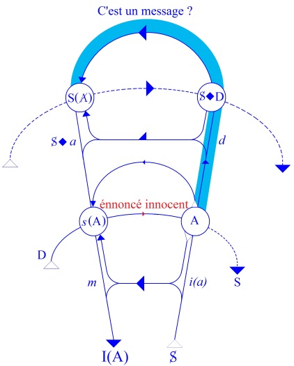
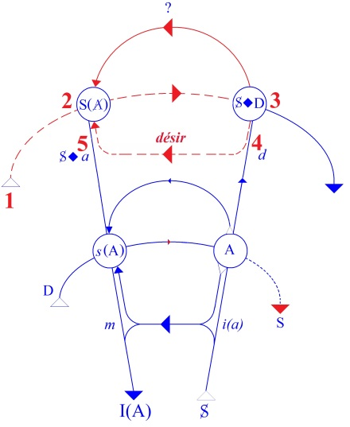

# Leçon 15 | 18 Mars 1959

  

    <label><input type="checkbox" data-lacan-toggle="original" checked> 原文</label>
    <label><input type="checkbox" data-lacan-toggle="notes" checked> 注释</label>
    <label><input type="checkbox" data-lacan-toggle="commentary" checked> 个人解读评论</label>
  

  <form class="lacan-tool-search" role="search">
    <input class="lacan-tool-search-input" type="search" placeholder="搜索全文" aria-label="搜索全文">
    <button class="lacan-tool-button" type="submit" title="搜索">搜索</button>
  </form>
  <button class="lacan-tool-button lacan-back-to-top" type="button" title="回到页面最上方" aria-label="回到页面最上方">↑</button>

<section class="parallel-paragraph" data-paragraph-ids="s6-15-0001">

s6-15-0001

原文 · s6-15-0001

HAMLET (3)

[无对应译文]

</section>

<section class="parallel-paragraph" data-paragraph-ids="s6-15-0002">

s6-15-0002

原文 · s6-15-0002

Les principes analytiques sont tout de même tels que, pour arriver au but, il ne faut pas se bousculer. Peut-être certains d’entre vous croient-ils - je pense qu’il n’y en a pas beaucoup de cette sorte – que nous sommes loin de la clinique. Ce n’est pas vrai du tout !

[无对应译文]

</section>

<section class="parallel-paragraph" data-paragraph-ids="s6-15-0003">

s6-15-0003

原文 · s6-15-0003

Nous y sommes en plein parce que ce dont il s’agit étant de situer le sens du désir, du désir humain, ce mode de repérage auquel nous procédons…

[无对应译文]

</section>

<section class="parallel-paragraph" data-paragraph-ids="s6-15-0004">

s6-15-0004

原文 · s6-15-0004

> sur ce qui est, au reste, depuis le début, un des grands thèmes de la pensée analytique

[无对应译文]

</section>

<section class="parallel-paragraph" data-paragraph-ids="s6-15-0005">

s6-15-0005

原文 · s6-15-0005

…est quelque chose qui ne saurait d’aucune façon nous détourner de ce qui est de nous requis comme le plus urgent.

[无对应译文]

</section>

<section class="parallel-paragraph" data-paragraph-ids="s6-15-0006">

s6-15-0006

原文 · s6-15-0006

Il a été dit beaucoup de choses sur HAMLET, et j’y ai fait allusion la dernière fois. J’ai essayé de montrer l’épaisseur de l’accumulation des commentaires sur HAMLET.

[无对应译文]

</section>

<section class="parallel-paragraph" data-paragraph-ids="s6-15-0007">

s6-15-0007

原文 · s6-15-0007

Il m’est arrivé, dans l’intervalle, un document après lequel je gémissais dans mon désir de *perfectionnisme*, à savoir le *Hamlet and Œdipus* d’Ernest JONES.[^64] Je l’ai lu pour m’apercevoir qu’en somme, JONES avait tenu son bouquin au courant de ce qui s’est passé depuis 1909. Et ce n’est plus à LŒNING [^65] qu’il fait allusion comme référence recommandable, mais à Dover WILSON [^66] qui a écrit beaucoup sur HAMLET et qui a fort bien écrit.

[无对应译文]

</section>

<section class="parallel-paragraph" data-paragraph-ids="s6-15-0008">

s6-15-0008

原文 · s6-15-0008

Dans l’intervalle, comme j’avais lu moi-même une partie de l’œuvre de Dover WILSON, je crois que je vous en ai donné à peu près la substance. C’est plutôt un certain recul qu’il s’agirait de prendre maintenant par rapport à tout cela, à la spéculation de JONES qui, je dois le dire, est fort pénétrante et – on peut dire – *dans l’ensemble*, d’un autre style que tout ce qui, dans la famille analytique, a pu être écrit, ajouté sur le sujet.

[无对应译文]

</section>

<section class="parallel-paragraph" data-paragraph-ids="s6-15-0009">

s6-15-0009

原文 · s6-15-0009

Il fait des remarques très justes que je me trouve simplement reprendre en l’occasion. Il fait en particulier cette remarque de simple bon sens qu’HAMLET n’est pas un personnage réel et que, tout de même, nous poser les questions les plus profondes concernant le caractère d’HAMLET, c’est peut-être quelque chose qui mérite qu’on s’y arrête un peu plus sérieusement qu’on ne le fait d’habitude.

[无对应译文]

</section>

<section class="parallel-paragraph" data-paragraph-ids="s6-15-0010">

s6-15-0010

原文 · s6-15-0010

Comme toujours, quand nous sommes dans un domaine qui concerne d’une part notre exploration, et aussi d’autre part un objet, il y a une double voie à suivre. Notre voie nous engage dans une certaine spéculation fondée sur l’idée que nous nous faisons de l’objet. Il est bien évident qu’il y a des choses, je dirais, à déblayer au tout premier plan.

[无对应译文]

</section>

<section class="parallel-paragraph" data-paragraph-ids="s6-15-0011">

s6-15-0011

原文 · s6-15-0011

En particulier par exemple, que ce à quoi nous avons affaire dans les œuvres d’art, et spécialement dans les œuvres dramatiques, ce sont *des caractères*, au sens où on l’entend *en français*. Des caractères, c’est­à-dire quelque chose dont nous supposons que l’auteur, lui, en possède toute *l’épaisseur*, qu’il a fait un bonhomme, un caractère et il serait censé nous émouvoir par la transmission des caractères de ce caractère. Et par cette seule signalisation, nous serions déjà introduits à une espèce de réalité supposée qui serait au-delà de ce qu’il nous est donné dans l’œuvre d’art.

[无对应译文]

</section>

<section class="parallel-paragraph" data-paragraph-ids="s6-15-0012">

s6-15-0012

原文 · s6-15-0012

Je dirai qu’HAMLET a déjà cette propriété très importante de nous faire sentir à quel point, cette vue pourtant commune que nous appliquons à tout propos spontanément quand il s’agit d’une œuvre d’art, est tout de même tout au moins sinon à réfuter, du moins à suspendre.

[无对应译文]

</section>

<section class="parallel-paragraph" data-paragraph-ids="s6-15-0013">

s6-15-0013

原文 · s6-15-0013

Car en fait, dans tout art il y a deux points sur lesquels nous pouvons nous accrocher solidement de la main, comme à des repères absolument certains, c’est qu’il ne suffit pas de dire comme je l’ai dit, qu’HAMLET est une espèce de miroir où chacun s’est vu à sa façon, lecteur ou spectateur. Mais laissons les spectateurs, qui sont insondables.

[无对应译文]

</section>

<section class="parallel-paragraph" data-paragraph-ids="s6-15-0014">

s6-15-0014

原文 · s6-15-0014

En tout cas la diversité des interprétations critiques qui en ont été données suggère qu’il y a quelque mystère, car la somme de ce qui a été avancé, affirmé à propos d’HAMLET, est à proprement parler *inconciliable*, *contradictoire*, je pense déjà vous l’avoir suffisamment montré la dernière fois.

[无对应译文]

</section>

<section class="parallel-paragraph" data-paragraph-ids="s6-15-0015">

s6-15-0015

原文 · s6-15-0015

J’ai articulé que la diversité des interprétations était strictement de l’ordre du *contraire au contraire*. J’ai aussi un peu indiqué ce que pouvait être HAMLET pour les acteurs, c’est un domaine sur lequel nous aurons peut-être à revenir tout à l’heure, qui est très significatif. J’ai dit que c’était le rôle par excellence, et qu’en même temps on disait « *l’Hamlet d’un tel, d’un tel, d’un tel*… ». C’est-à-dire qu’autant il y a d’acteurs d’une certaine puissance personnelle, autant il y a d’HAMLET.

[无对应译文]

</section>

<section class="parallel-paragraph" data-paragraph-ids="s6-15-0016">

s6-15-0016

原文 · s6-15-0016

Mais cela va plus loin. Certains ont été jusqu’à soutenir…

[无对应译文]

</section>

<section class="parallel-paragraph" data-paragraph-ids="s6-15-0017">

s6-15-0017

原文 · s6-15-0017

> en particulier ROBERTSON au niveau du troisième centenaire, supportés un peu sans doute
>
> par une espèce de *rush*, qu’il y a eu à ce moment-là sur les thèmes shakespeariens,
>
> l’exaltation passionnelle avec laquelle tout le monde littéraire anglais a fait revivre ce thème

[无对应译文]

</section>

<section class="parallel-paragraph" data-paragraph-ids="s6-15-0018">

s6-15-0018

原文 · s6-15-0018

…certains ont fait entendre une voix qui s’opposait pour dire que : strictement, HAMLET c’était le vide, cela ne tenait pas debout, qu’il n’y a pas de clef d’HAMLET, que SHAKESPEARE avait fait comme il avait pu pour rapetasser un thème dont l’exploration philologique, qui est allée assez loin, montre…

[无对应译文]

</section>

<section class="parallel-paragraph" data-paragraph-ids="s6-15-0019">

s6-15-0019

原文 · s6-15-0019

> *on savait qu’il y avait déjà un* HAMLET *qu’on attribue à* KYD, *qui aurait été joué une douzaine d’années avant cet automne de* 1601 où nous avons à peu près la certitude que pour la première fois apparut cet HAMLET

[无对应译文]

</section>

<section class="parallel-paragraph" data-paragraph-ids="s6-15-0020">

s6-15-0020

原文 · s6-15-0020

…on a pu aller jusqu’à dire…

[无对应译文]

</section>

<section class="parallel-paragraph" data-paragraph-ids="s6-15-0021">

s6-15-0021

原文 · s6-15-0021

> et je dirai que c’est là-dessus que se termine le premier chapitre du livre de JONES

[无对应译文]

</section>

<section class="parallel-paragraph" data-paragraph-ids="s6-15-0022">

s6-15-0022

原文 · s6-15-0022

…il a été proprement articulé jusque par GRILLPARZER, qui est un dramaturge autrichien auquel FREUD fait à l’occasion une référence très importante et qui dit que ce qui était la raison même d’HAMLET c’était son impénétrabilité, ce qui est tout de même assez curieux comme opinion !

[无对应译文]

</section>

<section class="parallel-paragraph" data-paragraph-ids="s6-15-0023">

s6-15-0023

原文 · s6-15-0023

Que cela ait pu être avancé… on ne peut pas dire que ce ne soit pas une opinion strictement anti–aristotélicienne, pour autant que le caractère ὅμοιός \[omoïos : semblable à...\] du héros par rapport à nous est ce qu’on met au premier plan pour expliquer, sur la base même de l’explication aristotélicienne, *l’effet de la comédie et de la tragédie*.

[无对应译文]

</section>

<section class="parallel-paragraph" data-paragraph-ids="s6-15-0024">

s6-15-0024

原文 · s6-15-0024

Que tout ceci ait pu être avancé au sujet d’HAMLET est quelque chose qui a bien son prix. Il faut dire qu’il y a là-dessus toute une gamme d’opinions qui ne s’équivalent pas, qui présentent toute une série de nuances concernant ce qu’on peut en dire, et que ce n’est pas la même chose de dire qu’HAMLET est une pièce ratée.

[无对应译文]

</section>

<section class="parallel-paragraph" data-paragraph-ids="s6-15-0025">

s6-15-0025

原文 · s6-15-0025

Dites-vous bien que quelqu’un qui n’est rien de moins que T.S. ELIOT…

[无对应译文]

</section>

<section class="parallel-paragraph" data-paragraph-ids="s6-15-0026">

s6-15-0026

原文 · s6-15-0026

> qui pour un certain milieu est plus ou moins le plus grand poète anglais moderne

[无对应译文]

</section>

<section class="parallel-paragraph" data-paragraph-ids="s6-15-0027">

s6-15-0027

原文 · s6-15-0027

…pense lui aussi – et il l’a dit – que SHAKESPEARE n’a pas été à la hauteur de son héros. Je veux dire que si HAMLET *est quelqu’un qui est inégal à sa tâche*, SHAKESPEARE *a été aussi inégal à l’articulation du rôle* d’HAMLET.

[无对应译文]

</section>

<section class="parallel-paragraph" data-paragraph-ids="s6-15-0028">

s6-15-0028

原文 · s6-15-0028

Ce sont là des opinions qu’on peut dire tout de même problématiques, je vous les énumère pour vous mener vers ce dont il s’agit. C’est l’opinion la plus nuancée qui est, je crois, ici la plus juste : c’est, dans le rapport d’HAMLET à celui qui l’appréhende soit comme lecteur, soit comme spectateur, *quelque chose qui est de l’ordre d’une illusion*.

[无对应译文]

</section>

<section class="parallel-paragraph" data-paragraph-ids="s6-15-0029">

s6-15-0029

原文 · s6-15-0029

C’est autre chose que de dire qu’HAMLET c’est simplement « *le vide* ». Une illusion, ce n’est pas *le vide*. Pour pouvoir produire sur la scène un effet fantomatique de l’ordre de ce que représenterait si vous voulez, mon petit miroir concave avec *l’image réelle qui surgit* et qui ne peut se voir que d’un certain angle et d’un certain point, il faut toute une machinerie.

[无对应译文]

</section>

<section class="parallel-paragraph" data-paragraph-ids="s6-15-0030">

s6-15-0030

原文 · s6-15-0030

[无对应译文]

</section>

<section class="parallel-paragraph" data-paragraph-ids="s6-15-0031">

s6-15-0031

原文 · s6-15-0031

Qu’HAMLET soit une *illusion*, l’organisation de *l’illusion*, voilà quelque chose qui n’est pas *le même ordre d’illusion* que si tout le monde rêve à propos du vide. Il est tout de même important de faire cette distinction. Ce qu’il y a de sûr en tout cas, c’est que tout confirme qu’il y a quelque chose de cet ordre. Cela donne, c’est le premier point, la poignée à laquelle nous pouvons solidement nous accrocher.

[无对应译文]

</section>

<section class="parallel-paragraph" data-paragraph-ids="s6-15-0032">

s6-15-0032

原文 · s6-15-0032

Par exemple quelqu’un qui est TRENCH [^67] qui est cité par JONES - on verra dans quels termes - écrit quelque chose comme ceci :

[无对应译文]

</section>

<section class="parallel-paragraph" data-paragraph-ids="s6-15-0033">

s6-15-0033

原文 · s6-15-0033

« *Nous trouvons la plus grande difficulté, avec l’aide même de Shakespeare, à comprendre Hamlet.* *Même Shakespeare, peut-être trouvait-il difficile de le comprendre HAMLET lui-même*…

[无对应译文]

</section>

<section class="parallel-paragraph" data-paragraph-ids="s6-15-0034">

s6-15-0034

原文 · s6-15-0034

> on voit que ce passage est amusant, le glissement de la plume ou de la pensée va vers ceci :

[无对应译文]

</section>

<section class="parallel-paragraph" data-paragraph-ids="s6-15-0035">

s6-15-0035

原文 · s6-15-0035

…*Hamlet lui-même se trouvait, c’est possible, dans l’impossibilité de se comprendre lui-même.* » Et : « *Plus capable que les autres hommes de lire dans le cœur et les motifs des autres*… »

[无对应译文]

</section>

<section class="parallel-paragraph" data-paragraph-ids="s6-15-0036">

s6-15-0036

原文 · s6-15-0036

Cette fin de phrase ne se rapporte ni à nous-mêmes, ni à SHAKESPEARE, mais à HAMLET, vous savez qu’HAMLET tout le temps, se livre à ce jeu de démontage avec ses interlocuteurs, avec ceux qui viennent l’interroger, lui tendre des pièges.

[无对应译文]

</section>

<section class="parallel-paragraph" data-paragraph-ids="s6-15-0037">

s6-15-0037

原文 · s6-15-0037

Et : « ...*il est tout à fait incapable de lire ses propres motifs.* » Voilà ce qui est dit.

[无对应译文]

</section>

<section class="parallel-paragraph" data-paragraph-ids="s6-15-0038">

s6-15-0038

原文 · s6-15-0038

Je vous signale que tout de suite après, JONES qui a justement commencé par faire toutes les réserves en disant qu’il ne faut pas nous laisser entraîner à parler d’HAMLET comme d’un personnage *réel*, c’est ailleurs qu’il faut chercher l’articulation, et que c’est au-delà nous devons trouver… C’est la position traditionnelle en matière d’interprétation psychanalytique mais qui, je crois, contient quelque erreur, quelque *fallace*, sur laquelle je veux d’abord attirer votre attention. JONES fait cette remarque et à la suite de cette citation, il ne manque pas de glisser lui-même dans quelque chose qui s’exprime à peu près ainsi :

[无对应译文]

</section>

<section class="parallel-paragraph" data-paragraph-ids="s6-15-0039">

s6-15-0039

原文 · s6-15-0039

- « *Je ne connais pas de jugement plus authentique que celui-ci dans toute la littérature sur le problème.* »

[无对应译文]

</section>

<section class="parallel-paragraph" data-paragraph-ids="s6-15-0040">

s6-15-0040

原文 · s6-15-0040

À un autre endroit, le même JONES nous dira qu’en somme :

[无对应译文]

</section>

<section class="parallel-paragraph" data-paragraph-ids="s6-15-0041">

s6-15-0041

原文 · s6-15-0041

- « …*le poète, le héros, et l’audience, sont profondément émus par des sentiments qui les touchent à leur insu.* »

[无对应译文]

</section>

<section class="parallel-paragraph" data-paragraph-ids="s6-15-0042">

s6-15-0042

原文 · s6-15-0042

Il y a là donc quelque chose qui nous fait toucher du doigt la stricte équivalence de certains termes de cette question, à savoir le poète et le héros, avec quelque chose…

[无对应译文]

</section>

<section class="parallel-paragraph" data-paragraph-ids="s6-15-0043">

s6-15-0043

原文 · s6-15-0043

> il suffit de s’arrêter un instant pour s’en apercevoir

[无对应译文]

</section>

<section class="parallel-paragraph" data-paragraph-ids="s6-15-0044">

s6-15-0044

原文 · s6-15-0044

…c’est qu’ils ne sont vraiment là que par *leur discours*. S’il s’agit de quelque chose qui est la communication de ce qui est dans l’inconscient de ceux qui sont avancés là comme étant les premiers termes, à savoir le poète et le héros, on ne peut pas dire que cette communication de l’inconscient, en tout cas puisse se concevoir, n’est présentifiée par rien d’autre que par l’articulation du discours dramatique.

[无对应译文]

</section>

<section class="parallel-paragraph" data-paragraph-ids="s6-15-0045">

s6-15-0045

原文 · s6-15-0045

Ne parlons pas *du héros qui à vrai dire*…

[无对应译文]

</section>

<section class="parallel-paragraph" data-paragraph-ids="s6-15-0046">

s6-15-0046

原文 · s6-15-0046

> si vous me suivez dans le chemin où j’essaye de vous induire

[无对应译文]

</section>

<section class="parallel-paragraph" data-paragraph-ids="s6-15-0047">

s6-15-0047

原文 · s6-15-0047

…*n’est strictement identique qu’à des mots*. Surtout si nous commençons de prendre le sentiment que ce qui fait la plus haute valeur dramatique - dans l’occasion - de ce héros, c’est « *un mode* ».

[无对应译文]

</section>

<section class="parallel-paragraph" data-paragraph-ids="s6-15-0048">

s6-15-0048

原文 · s6-15-0048

C’est bien là la seconde poignée à laquelle je vous demande de vous accrocher, c’est du même ordre que ce côté qui se dérobe de tout ce que nous pouvons dire de sa consistance. En d’autres termes, *Hamlet* ici devient *l’œuvre exemplaire*. Que « *le mode* » sur lequel une œuvre nous touche…

[无对应译文]

</section>

<section class="parallel-paragraph" data-paragraph-ids="s6-15-0049">

s6-15-0049

原文 · s6-15-0049

> nous touche précisément de la façon la plus profonde, c’est-à-dire sur le plan de l’inconscient

[无对应译文]

</section>

<section class="parallel-paragraph" data-paragraph-ids="s6-15-0050">

s6-15-0050

原文 · s6-15-0050

…est quelque chose qui tient à cet arrangement, à une composition de l’œuvre, qui sans aucun doute, fait que nous sommes intéressés très précisément au niveau de l’inconscient, mais que cela n’est pas en raison de la présence de quelque chose qui *réellement* supporte en face de nous un inconscient.

[无对应译文]

</section>

<section class="parallel-paragraph" data-paragraph-ids="s6-15-0051">

s6-15-0051

原文 · s6-15-0051

Je veux dire que nous n’avons affaire, ni - contrairement à ce qu’on croit - à l’inconscient du poète, même s’il témoigne de sa présence :

[无对应译文]

</section>

<section class="parallel-paragraph" data-paragraph-ids="s6-15-0052">

s6-15-0052

原文 · s6-15-0052

- par quelques *traces non concertées* dans son œuvre,

[无对应译文]

</section>

<section class="parallel-paragraph" data-paragraph-ids="s6-15-0053">

s6-15-0053

原文 · s6-15-0053

- par des éléments de *lapsus*,

[无对应译文]

</section>

<section class="parallel-paragraph" data-paragraph-ids="s6-15-0054">

s6-15-0054

原文 · s6-15-0054

- par des éléments *symboliques* de lui-même inaperçus,

[无对应译文]

</section>

<section class="parallel-paragraph" data-paragraph-ids="s6-15-0055">

s6-15-0055

原文 · s6-15-0055

…ce n’est pas cela qui nous intéresse de *façon majeure*.

[无对应译文]

</section>

<section class="parallel-paragraph" data-paragraph-ids="s6-15-0056">

s6-15-0056

原文 · s6-15-0056

On peut en trouver dans HAMLET quelques traces, c’est à cela que s’est employée, au dernier terme, Ella SHARPE comme je vous l’ai dit la dernière fois. C’est à savoir qu’elle va chercher à écheniller, de ci de là, ce qui dans le caractère d’HAMLET peut faire apercevoir je ne sais quel accrochage, quelle fixation de la métaphore autour de thèmes féminins, ou de thèmes oraux. Je vous assure qu’au regard du problème que pose HAMLET, c’est vraiment là quelque chose qui paraît secondaire, presque puéril, sans perdre naturellement tout intérêt. Dans beaucoup d’œuvres, en allant ainsi chercher sous cet angle quelques traces, quelque chose qui peut vous renseigner sur un auteur, vous faites œuvre d’investigation biographique sur l’auteur, vous n’analysez pas la portée de l’œuvre comme telle.

[无对应译文]

</section>

<section class="parallel-paragraph" data-paragraph-ids="s6-15-0057">

s6-15-0057

原文 · s6-15-0057

Et la portée de premier plan que prend pour nous HAMLET est celle qui lui donne la valeur de structure équivalente à celle d’ŒDIPE. Quelque chose qui peut nous permettre de nous intéresser au plus profond de la trame. Ce qui pour nous permet de structurer certains problèmes, c’est évidemment autre chose que tel ou tel aveu fugace, c’est bien évidemment l’ensemble, l’articulation de la tragédie en elle-même qui est ce qui nous intéresse, c’est cela que je suis en train d’accentuer.

[无对应译文]

</section>

<section class="parallel-paragraph" data-paragraph-ids="s6-15-0058">

s6-15-0058

原文 · s6-15-0058

Cela vaut par son organisation, par ce que cela instaure de plans superposés à l’intérieur de quoi peut trouver place la dimension propre de la subjectivité humaine, et ce qui fait que…

[无对应译文]

</section>

<section class="parallel-paragraph" data-paragraph-ids="s6-15-0059">

s6-15-0059

原文 · s6-15-0059

> si vous voulez, dans *cette machinerie*, ou encore dans *ces portants*, pour métaphoriser ce que je veux vous dire, dans la nécessité d’un certain nombre de plans superposés

[无对应译文]

</section>

<section class="parallel-paragraph" data-paragraph-ids="s6-15-0060">

s6-15-0060

原文 · s6-15-0060

…la profondeur d’une pièce, d’une salle, d’une scène, la profondeur est donnée, à l’intérieur de quoi peut se poser de la façon la plus ample le problème pour nous de l’articulation du désir.

[无对应译文]

</section>

<section class="parallel-paragraph" data-paragraph-ids="s6-15-0061">

s6-15-0061

原文 · s6-15-0061

Donc, je me fais bien comprendre : *je dis que si Hamlet - c’est là le point essentiel - a une portée pour nous privilégiée, je veux dire si Hamlet est bien le plus grand drame, ou l’un des plus grands drames de la tragédie moderne* - *en mettant Faust de l’autre côté* - ce n’est pas simplement parce qu’il y a SHAKESPEARE, si génial que nous le supposions, et tel tournant de sa vie. Car bien évidemment aussi, nous pouvons dire qu’HAMLET est un point où il s’est passé *quelque chose* dans la vie de SHAKESPEARE. Ceci se résume peut-être à cela, tout ce que nous pouvons en dire, car *ce quelque chose qui s’est passé*, nous le savons, c’est la mort de son père, et nous contenter de cela nous fait nous contenter de peu de choses.

[无对应译文]

</section>

<section class="parallel-paragraph" data-paragraph-ids="s6-15-0062">

s6-15-0062

原文 · s6-15-0062

Et nous supposons aussi qu’autour de cet événement il y a dû y avoir d’autres choses dans sa vie, car le virage, l’orientation, le tournant de sa production est véritablement manifeste.Avant il n’y a rien que cette suite de comédies ou ces drames historiques qui sont vraiment deux genres qu’il a poussés, l’un et l’autre, à leur dernier degré de beauté, de perfection, d’aisance. Jusque là c’est presque un auteur avec deux grandes spécialités sur lesquelles il joue avec une *maestria*, un *brio*, un bonheur qui nous le met de l’ordre des auteurs à succès.

[无对应译文]

</section>

<section class="parallel-paragraph" data-paragraph-ids="s6-15-0063">

s6-15-0063

原文 · s6-15-0063

À partir d’*Hamlet* le ciel change, et nous touchons à ces choses au-delà de toute limite, qui n’ont plus rien à faire avec aucune espèce de canon, qui ne sont plus du même ordre. Après *Hamlet*, c’est le *King Lear* et bien d’autres choses encore pour aboutir à la *Tempest*. Nous sentons là tout autre chose, un drame humain qui se développe, d’un tout autre registre. C’est en fin de compte le SHAKESPEARE joyau de l’histoire humaine et du drame humain, qui ouvre une nouvelle dimension sur l’homme. Donc il s’est bien passé *quelque chose* à ce moment-là. Mais est-ce qu’il suffit que nous en soyons certains pour penser que ce soit cela ?

[无对应译文]

</section>

<section class="parallel-paragraph" data-paragraph-ids="s6-15-0064">

s6-15-0064

原文 · s6-15-0064

Bien sûr, d’une certaine façon. Mais observons tout de même que si *Hamlet* est la pièce qui se présente le plus comme une énigme, il n’est que trop évident que toute pièce qui fait problème n’est pas pour autant une bonne pièce. Une pièce fort mauvaise peut l’être aussi. Et dans une mauvaise pièce, il y a probablement à l’occasion, un inconscient tout aussi présent, et encore plus présent qu’il peut y en avoir dans une bonne.

[无对应译文]

</section>

<section class="parallel-paragraph" data-paragraph-ids="s6-15-0065">

s6-15-0065

原文 · s6-15-0065

Si nous sommes émus par une pièce de théâtre, ce n’est pas en raison de ce qu’elle représente d’efforts difficiles, de ce qu’à son insu un auteur y laisse passer, c’est en raison, je le répète, des dimensions du développement qu’elle offre à la place à prendre, pour nous, à ce qu’à proprement parler recèle en nous notre propre rapport avec notre propre désir. Et ceci nous est offert d’une façon si éminente dans une pièce qui, par certains côtés, réalise au maximum ces nécessités de dimension, cet ordre et cette superposition de plans qui donnent sa place à ce qui doit là, en nous, venir retentir.

[无对应译文]

</section>

<section class="parallel-paragraph" data-paragraph-ids="s6-15-0066">

s6-15-0066

原文 · s6-15-0066

Cela n’est pas parce que SHAKESPEARE est à ce moment là pris dans un drame personnel. Si l’on pousse les choses à leurs dernières limites, ce drame personnel on croit le *saisir* et il se *dérobe*. On a été jusqu’à dire que c’était le drame qui était dans les *Sonnets*, les rapports avec son protecteur et sa maîtresse…

[无对应译文]

</section>

<section class="parallel-paragraph" data-paragraph-ids="s6-15-0067">

s6-15-0067

原文 · s6-15-0067

> vous savez qu’il s’est trouvé à la fois doublement trompé, du côté de son ami et du côté de sa maîtresse

[无对应译文]

</section>

<section class="parallel-paragraph" data-paragraph-ids="s6-15-0068">

s6-15-0068

原文 · s6-15-0068

On est allé jusqu’à dire… encore que le drame de ce moment-là se soit très probablement passé à une autre période plus tempérée de la vie de SHAKESPEARE, on n’a aucune certitude sur cette histoire, on n’a que le témoignage des [*Sonnets*](http://www.shakespeares-sonnets.com/) qui lui-même est singulièrement élaboré.

[无对应译文]

</section>

<section class="parallel-paragraph" data-paragraph-ids="s6-15-0069">

s6-15-0069

原文 · s6-15-0069

Je crois qu’il s’agit d’une autre cause que celle là. Ce n’est pas la présence, le point derrière HAMLET de tout ce que nous pouvons, à l’occasion, rêver qui est en cause, c’est *la composition*.

[无对应译文]

</section>

<section class="parallel-paragraph" data-paragraph-ids="s6-15-0070">

s6-15-0070

原文 · s6-15-0070

Sans doute, cette composition, l’auteur est-il parvenu à la pousser à ce haut degré de perfection, qui fait d’HAMLET quelque chose qui se distingue de tous les pré-HAMLET que nous avons pu, avec notre philologie, découvrir par une articulation *tellement singulière, tellement exceptionnelle* que c’est là justement ce qui doit faire *l’objet de notre réflexion*.

[无对应译文]

</section>

<section class="parallel-paragraph" data-paragraph-ids="s6-15-0071">

s6-15-0071

原文 · s6-15-0071

Si SHAKESPEARE a été capable de le faire jusqu’à ce degré, c’est probablement en raison d’un *approfondissement* qui est tout autant l’*approfondissement* du métier d’auteur, que l’*approfondissement* de l’expérience vécue d’un homme qui assurément a vécu, et dont toute la vie a été heureuse, dont tout nous indique que sa vie a été traversée par *toutes les sollicitations et toutes les passions*. Qu’il y ait le drame de SHAKESPEARE derrière HAMLET, c’est secondaire au regard de ce qui compose *la structure*, c’est cette structure qui répond de l’effet d’*Hamlet*.

[无对应译文]

</section>

<section class="parallel-paragraph" data-paragraph-ids="s6-15-0072">

s6-15-0072

原文 · s6-15-0072

Et ceci d’autant plus qu’HAMLET lui-même, comme s’expriment métaphoriquement les auteurs, après tout est un personnage dont ce n’est pas simplement en raison de notre ignorance que nous ne connaissons pas les profondeurs. Effectivement c’est un personnage qui est composé de quelque chose qui est *la place vide pour situer* \- car c’est là l’important - *notre ignorance*. *Une ignorance située* est autre chose que quelque chose de purement négatif. *Cette ignorance située* après tout, n’est justement rien d’autre que *cette présentification de l’inconscient*. Elle donne à HAMLET sa portée et sa force.

[无对应译文]

</section>

<section class="parallel-paragraph" data-paragraph-ids="s6-15-0073">

s6-15-0073

原文 · s6-15-0073

Je pense avoir réussi à vous communiquer avec le plus de nuances, sans rien écarter, sans nier la dimension proprement psychologique qui est intéressée dans une pièce comme celle-là, qui est une question de ce qu’on appelle « *la psychanalyse appliquée* ». Alors que c’est bien tout le contraire, au niveau où nous sommes, c’est bien de « *psychanalyse théorique »* qu’il s’agit, et au regard de la question théorique que pose l’adéquation de notre analyse à une *œuvre d’art*, toute espèce de question clinique est une question de psychanalyse appliquée.

[无对应译文]

</section>

<section class="parallel-paragraph" data-paragraph-ids="s6-15-0074">

s6-15-0074

原文 · s6-15-0074

Il y a des personnes qui m’écoutent et qui auront sans doute besoin que j’en dise quand même un petit peu plus dans un certain sens : qu’elles me posent des questions !

[无对应译文]

</section>

<section class="parallel-paragraph" data-paragraph-ids="s6-15-0075">

s6-15-0075

原文 · s6-15-0075

Si HAMLET est vraiment ce que je vous dis, à savoir *une composition*, une structure telle que là, le désir puisse trouver sa place suffisamment correctement, rigoureusement posée pour que tous les désirs ou, plus exactement, tous les problèmes de rapport du sujet au désir puissent s’y projeter, il suffirait en quelque sorte de le lire. Je fais donc allusion aux gens qui pourraient me poser la question de la fonction de l’acteur. *Où est la fonction du théâtre, de* «* la représentation *»? Il est clair que ce n’est pas du tout la même chose de lire HAMLET et de le voir *représenté*.

[无对应译文]

</section>

<section class="parallel-paragraph" data-paragraph-ids="s6-15-0076">

s6-15-0076

原文 · s6-15-0076

Je ne pense pas non plus que ceci, pour vous, puisse faire longtemps problème et que, dans la perspective qui est celle que j’essaye de développer devant vous concernant en somme la fonction de l’inconscient…

[无对应译文]

</section>

<section class="parallel-paragraph" data-paragraph-ids="s6-15-0077">

s6-15-0077

原文 · s6-15-0077

> la fonction de l’inconscient que j’ai défini comme discours de l’Autre

[无对应译文]

</section>

<section class="parallel-paragraph" data-paragraph-ids="s6-15-0078">

s6-15-0078

原文 · s6-15-0078

…on ne peut pas mieux l’illustrer que dans la perspective que nous donne une expérience comme celle du rapport de l’audience à HAMLET.

[无对应译文]

</section>

<section class="parallel-paragraph" data-paragraph-ids="s6-15-0079">

s6-15-0079

原文 · s6-15-0079

Il est clair que là *l’inconscient se présentifie* sous la forme du discours de l’Autre qui est un discours parfaitement *composé*. Le héros n’est là présent que par ce discours, de même que le poète, mort depuis longtemps, en fin de compte, c’est son discours qu’il nous lègue. Mais bien sûr, cette dimension qu’ajoute *la représentation*…

[无对应译文]

</section>

<section class="parallel-paragraph" data-paragraph-ids="s6-15-0080">

s6-15-0080

原文 · s6-15-0080

à savoir les acteurs qui vont *jouer* cet HAMLET

[无对应译文]

</section>

<section class="parallel-paragraph" data-paragraph-ids="s6-15-0081">

s6-15-0081

原文 · s6-15-0081

…c’est strictement analogue de ce par quoi nous-mêmes sommes intéressés dans notre propre inconscient.

[无对应译文]

</section>

<section class="parallel-paragraph" data-paragraph-ids="s6-15-0082">

s6-15-0082

原文 · s6-15-0082

Et si je vous dis que ce qui constitue notre rapport à l’inconscient, c’est ceci par quoi notre *imaginaire*, je veux dire notre rapport avec notre propre corps…

[无对应译文]

</section>

<section class="parallel-paragraph" data-paragraph-ids="s6-15-0083">

s6-15-0083

原文 · s6-15-0083

> j’ignore parait-il l’existence du corps, j’ai une théorie de l’analyse incorporelle, c’est ce qu’on découvre,
>
> du moins à entendre le rayonnement de ce que j’articule ici, à une certaine distance !

[无对应译文]

</section>

<section class="parallel-paragraph" data-paragraph-ids="s6-15-0084">

s6-15-0084

原文 · s6-15-0084

…le « *signifiant* » pour dire le mot, c’est nous qui en fournissons le matériel…

[无对应译文]

</section>

<section class="parallel-paragraph" data-paragraph-ids="s6-15-0085">

s6-15-0085

原文 · s6-15-0085

> c’est cela même que j’enseigne et que je passe mon temps à vous dire

[无对应译文]

</section>

<section class="parallel-paragraph" data-paragraph-ids="s6-15-0086">

s6-15-0086

原文 · s6-15-0086

…*c’est avec nos propres membres* - *l’imaginaire* c’est cela - *que nous faisons l’alphabet de ce discours qui est inconscient,* et bien entendu chacun de nous dans des rapports divers, car nous ne nous servons pas des mêmes éléments pour être pris dans l’inconscient.

[无对应译文]

</section>

<section class="parallel-paragraph" data-paragraph-ids="s6-15-0087">

s6-15-0087

原文 · s6-15-0087

Et c’est « *l’analogue* », « *l’acteur* » qui prête ses membres, sa présence, non pas simplement comme une *marionnette*, mais avec son inconscient bel et bien réel, à savoir le rapport de ses membres avec une certaine histoire qui est la sienne.

[无对应译文]

</section>

<section class="parallel-paragraph" data-paragraph-ids="s6-15-0088">

s6-15-0088

原文 · s6-15-0088

Chacun sait que s’il y a de *bons* et de *mauvais* acteurs, c’est dans la mesure, je crois, où l’inconscient d’un acteur est plus ou moins compatible avec ce prêt de sa marionnette. Ou il s’y prête ou ne s’y prête pas, c’est ce qui fait qu’un acteur a plus ou moins de talent, de génie, voire qu’il est plus ou moins compatible avec certains rôles, pourquoi pas !

[无对应译文]

</section>

<section class="parallel-paragraph" data-paragraph-ids="s6-15-0089">

s6-15-0089

原文 · s6-15-0089

Même ceux qui ont *la gamme* la plus étendue, après tout, peuvent jouer certains rôles mieux que d’autres. En d’autres termes, bien sûr, l’acteur est là. C’est dans la mesure de la convenance de quelque chose qui en effet peut bien avoir le rapport le plus étroit avec son inconscient, avec ce qu’il a à nous représenter, qu’il donne à cela une pointe qui ajoute incontestablement quelque chose, mais qui est loin de constituer l’essentiel de ce qui est communiqué, la représentation du drame.

[无对应译文]

</section>

<section class="parallel-paragraph" data-paragraph-ids="s6-15-0090">

s6-15-0090

原文 · s6-15-0090

Ceci nous ouvrirait, je crois, la porte assez loin vers la psychologie de l’acteur. Bien entendu il y a des lois de compatibilité générale, le rapport de l’acteur avec la possibilité de l’exhibition est quelque chose qui pose un problème de psychologie particulière à l’acteur, le problème qui a pu être abordé du rapport entre certaines textures psychologiques et le théâtre. Quelqu’un a écrit il y a quelques années un article qui donnait de l’espoir sur ce qu’il appelait *L’hystérie et le théâtre*. Je l’ai revu récemment. Nous aurons peut-être l’occasion d’en parler avec intérêt, sinon sans doute avec un certain acquiescement.

[无对应译文]

</section>

<section class="parallel-paragraph" data-paragraph-ids="s6-15-0091">

s6-15-0091

原文 · s6-15-0091

Cette parenthèse fermée, reprenons le fil de notre propos. Quelle est donc cette *structure* autour de quoi se compose la mise en place qui est essentielle dans ce que je cherche à vous faire comprendre de *l’effet d’Hamlet* ?

[无对应译文]

</section>

<section class="parallel-paragraph" data-paragraph-ids="s6-15-0092">

s6-15-0092

原文 · s6-15-0092

Cette mise en place de l’intérieur, à l’intérieur de quoi le désir peut et doit prendre sa place.

[无对应译文]

</section>

<section class="parallel-paragraph" data-paragraph-ids="s6-15-0093">

s6-15-0093

原文 · s6-15-0093

Au premier aspect, nous allons voir que ce qui est donné communément dans le registre analytique comme articulation, compréhension de ce qu’est HAMLET, est quelque chose qui a l’air d’aller dans ce sens. Est-ce que c’est pour rejoindre des thématiques tout à fait *classiques*, voire *banales*, que je vous ai fait toutes ces remarques introductives ? Vous allez voir qu’il n’en est rien.

[无对应译文]

</section>

<section class="parallel-paragraph" data-paragraph-ids="s6-15-0094">

s6-15-0094

原文 · s6-15-0094

Néanmoins commençons d’aborder les choses par ce qui nous est d’habitude présenté. Et ne croyez pas que ce soit si simple, ni si univoque, une certaine *rectitude* est tout ce qu’il y a de plus difficile à maintenir pour les auteurs eux–mêmes dans le développement de leur pensée, car tout le temps il y a une sorte de fuite, d’oscillation, dont vous allez voir quelques exemples autour de ce que je vais vous énoncer.

[无对应译文]

</section>

<section class="parallel-paragraph" data-paragraph-ids="s6-15-0095">

s6-15-0095

原文 · s6-15-0095

Dans une première approximation qui est celle à laquelle tout le monde est accordé, HAMLET est celui qui « *ne sait pas ce qu’il veut* », celui qui amèrement s’arrête au moment où il voit partir les troupes du jeune FORTINBRAS qui passent à un moment à l’horizon de la scène, et qui est tout d’un coup heurté par le fait que voilà des gens qui vont faire une grande action pour trois fois rien, pour un petit bout de Pologne, et qui vont tout sacrifier, leur vie, alors que lui est là qui ne fait rien, alors qu’il a tout pour le faire : « *la cause, la volonté, la force et les moyens.* » Comme il le dit lui-même : « *J’en reste toujours à dire, c’est la chose qui reste à faire.* »[^68]

[无对应译文]

</section>

<section class="parallel-paragraph" data-paragraph-ids="s6-15-0096">

s6-15-0096

原文 · s6-15-0096

Voilà le problème qui se pose à chacun : pourquoi HAMLET n’agit-il pas ? Pourquoi ce « *will* », ce désir, cette volonté, est quelque chose qui en lui, paraît suspendu, qui si vous voulez rejoint ce que Sir James PAGET a écrit de l’hystérique :

[无对应译文]

</section>

<section class="parallel-paragraph" data-paragraph-ids="s6-15-0097">

s6-15-0097

原文 · s6-15-0097

- « *Les uns disent qu’il ne le veut pas. Lui dit qu’il ne peut pas. Ce dont il s’agit c’est qu’il ne peut pas vouloir*. »[^69]

[无对应译文]

</section>

<section class="parallel-paragraph" data-paragraph-ids="s6-15-0098">

s6-15-0098

原文 · s6-15-0098

Que nous dit là-dessus la tradition analytique ? La tradition analytique dit que tout repose en cette occasion sur le désir pour la mère, que ce désir est refoulé, que c’est cela qui est la cause, que le héros ne saurait s’avancer vers l’action qui lui est commandée, à savoir la vengeance contre un homme qui est l’actuel possesseur…

[无对应译文]

</section>

<section class="parallel-paragraph" data-paragraph-ids="s6-15-0099">

s6-15-0099

原文 · s6-15-0099

illégitime ô combien puisque criminel !

[无对应译文]

</section>

<section class="parallel-paragraph" data-paragraph-ids="s6-15-0100">

s6-15-0100

原文 · s6-15-0100

…de l’objet maternel, et que s’il ne peut pas frapper celui qui est désigné à sa vindicte, c’est dans la mesure où lui-même, en somme, aurait déjà commis le crime qu’il s’agit de venger.

[无对应译文]

</section>

<section class="parallel-paragraph" data-paragraph-ids="s6-15-0101">

s6-15-0101

原文 · s6-15-0101

C’est pour autant, nous dit-on, que dans l’arrière-plan, il y a le souvenir

[无对应译文]

</section>

<section class="parallel-paragraph" data-paragraph-ids="s6-15-0102">

s6-15-0102

原文 · s6-15-0102

- du désir infantile pour la mère,

[无对应译文]

</section>

<section class="parallel-paragraph" data-paragraph-ids="s6-15-0103">

s6-15-0103

原文 · s6-15-0103

- du désir œdipien du meurtre du père,

[无对应译文]

</section>

<section class="parallel-paragraph" data-paragraph-ids="s6-15-0104">

s6-15-0104

原文 · s6-15-0104

…c’est dans cette mesure qu’HAMLET se trouve en quelque sorte complice de l’actuel possédant, que ce possédant est à ses yeux un *beatus possidens*, qu’il en est complice, qu’il ne peut donc s’attaquer à ce possesseur sans s’attaquer lui-même.

[无对应译文]

</section>

<section class="parallel-paragraph" data-paragraph-ids="s6-15-0105">

s6-15-0105

原文 · s6-15-0105

Mais est-ce cela qu’on veut dire, ou bien qu’il ne peut s’attaquer à ce possesseur sans réveiller en lui le désir ancien, c’est-à-dire un désir ressenti comme coupable, mécanisme qui tout de même est plus *sensible*.

[无对应译文]

</section>

<section class="parallel-paragraph" data-paragraph-ids="s6-15-0106">

s6-15-0106

原文 · s6-15-0106

Mais après tout, est-ce que tout cela ne permet pas…

[无对应译文]

</section>

<section class="parallel-paragraph" data-paragraph-ids="s6-15-0107">

s6-15-0107

原文 · s6-15-0107

> fascinés devant une sorte d’insondable lié à un schéma qui pour nous est environné
>
> d’une sorte de caractère intouchable, non dialectique

[无对应译文]

</section>

<section class="parallel-paragraph" data-paragraph-ids="s6-15-0108">

s6-15-0108

原文 · s6-15-0108

…que nous puissions dire que tout ceci en somme se renverse ? Je veux dire qu’on pourrait aussi bien…

[无对应译文]

</section>

<section class="parallel-paragraph" data-paragraph-ids="s6-15-0109">

s6-15-0109

原文 · s6-15-0109

si HAMLET se précipitait tout de suite sur son beau-père

[无对应译文]

</section>

<section class="parallel-paragraph" data-paragraph-ids="s6-15-0110">

s6-15-0110

原文 · s6-15-0110

…dire qu’il y trouve, après tout, l’occasion d’étancher sa propre culpabilité en trouvant *hors de lui le véritable coupable*.

[无对应译文]

</section>

<section class="parallel-paragraph" data-paragraph-ids="s6-15-0111">

s6-15-0111

原文 · s6-15-0111

Que tout de même - pour appeler les choses par leur nom - tout le porte à agir, au contraire, et va dans le même sens, *car le père revient de l’au-delà sous la forme d’un fantôme pour lui commander cet acte de vindicte, cela ne fait aucun doute*.

[无对应译文]

</section>

<section class="parallel-paragraph" data-paragraph-ids="s6-15-0112">

s6-15-0112

原文 · s6-15-0112

Le commandement du *surmoi* est là en quelque sorte matérialisé et pourvu de tout le caractère sacré de celui-là même qui revient d’*outre-tombe*, avec ce que lui ajouta d’autorité de grandeur, de séduction, le fait d’être *la victime * : le fait d’avoir été vraiment atrocement dépossédé non seulement : de l’objet de son amour, mais de sa puissance, de son trône, de la vie même, de son salut, de son bonheur éternel. Il y a cela, et en plus viendrait jouer dans le même sens quelque chose qu’on pourrait appeler dans l’occasion « *le désir naturel d’HAMLET* ».

[无对应译文]

</section>

<section class="parallel-paragraph" data-paragraph-ids="s6-15-0113">

s6-15-0113

原文 · s6-15-0113

Si en effet c’est quelque chose qu’il n’a pas pu ressentir encore, qu’il est séparé de cette mère, qu’incontestablement, le moins qu’on puisse dire, compte pour lui qu’il soit fixé à sa mère, c’est la chose la plus certaine et la plus apparente du rôle d’HAMLET. Donc ce *désir*, que j’appelle à cette occasion « *naturel* », et non sans intention, car à l’heure où JONES écrit son article sur HAMLET, il en est encore à devoir plaider devant le public cette dimension du refoulement et de la censure, et toutes les pages qu’il écrit à cette occasion tendent à donner à cette censure une origine sociale.

[无对应译文]

</section>

<section class="parallel-paragraph" data-paragraph-ids="s6-15-0114">

s6-15-0114

原文 · s6-15-0114

> « *Il est tout de même curieux - curiously enough, dit-il - que les choses qui évidemment sont les plus censurées*
>
> *par l’organisation sociale, ce soient les désirs les plus naturels.* » [^70]

[无对应译文]

</section>

<section class="parallel-paragraph" data-paragraph-ids="s6-15-0115">

s6-15-0115

原文 · s6-15-0115

En vérité cela pose en effet une question. Pourquoi après tout la société ne s’est-elle pas organisée pour *la satisfaction* de ces désirs les plus naturels, si c’est vraiment de la société que surgit la dimension du refoulement et de la censure. Ceci pourrait peut-être nous conduire *un peu plus loin*, à savoir que c’est quelque chose de tout à fait sensible que les choses dont on n’a jamais l’air de s’apercevoir, les nécessités de la vie, de la vie du groupe, les nécessités sociologiques ne sont pas du tout exhaustives pour expliquer cette sorte d’interdit d’où surgit, chez les êtres humains, la dimension de l’inconscient.

[无对应译文]

</section>

<section class="parallel-paragraph" data-paragraph-ids="s6-15-0116">

s6-15-0116

原文 · s6-15-0116

Cela suffit si peu qu’il a fallu que FREUD invente un mythe originel - pré-social, ne l’oublions pas puisque c’est lui qui fonde la société - à savoir *Totem et Tabou*, pour expliquer les principes mêmes du refoulement. Et le commentaire de JONES à la date à laquelle il la fait et où curieusement, malheureusement, il la conserve, cette genèse sociologique des *interdits* au niveau de l’inconscient, très exactement à savoir de la censure, très exactement de la source de l’œdipe, est une erreur de la part de JONES. C’est une erreur peut-être assez délibérée, *apologétique*, l’erreur de quelqu’un qui veut convaincre, qui veut conquérir un certain public de psycho-sociologues, ce n’est pas du tout quelque chose qui ne soit pas sans poser un problème.

[无对应译文]

</section>

<section class="parallel-paragraph" data-paragraph-ids="s6-15-0117">

s6-15-0117

原文 · s6-15-0117

Mais revenons à notre HAMLET. Nous le voyons en fin de compte avec deux tendances :

[无对应译文]

</section>

<section class="parallel-paragraph" data-paragraph-ids="s6-15-0118">

s6-15-0118

原文 · s6-15-0118

- la tendance impérative qui est pour lui doublement commandée par *l’autorité du père* et *l’amour qu’il lui porte*,

[无对应译文]

</section>

<section class="parallel-paragraph" data-paragraph-ids="s6-15-0119">

s6-15-0119

原文 · s6-15-0119

- et la deuxième de vouloir défendre sa mère et de se la garder,

[无对应译文]

</section>

<section class="parallel-paragraph" data-paragraph-ids="s6-15-0120">

s6-15-0120

原文 · s6-15-0120

…qui doivent le faire aller dans le même sens pour tuer CLAUDIUS.

[无对应译文]

</section>

<section class="parallel-paragraph" data-paragraph-ids="s6-15-0121">

s6-15-0121

原文 · s6-15-0121

Donc deux choses positives - chose curieuse - donneraient un résultat zéro. Je sais bien que cela arrive. J’avais trouvé un très joli exemple à un moment où je venais de me casser la jambe : un *raccourcissement* plus un autre *raccourcissement* - celui de l’autre jambe - et il n’y a *plus de raccourcissement* !

[无对应译文]

</section>

<section class="parallel-paragraph" data-paragraph-ids="s6-15-0122">

s6-15-0122

原文 · s6-15-0122

C’est un très bon exercice pour nous, car nous avons affaire à des choses de cet ordre. Est-ce que c’est de cela qu’il s’agit ? Non, je ne le crois pas. Je crois plutôt que nous nous engageons dans une *dialectique illusoire*, que nous nous satisfaisons de quelque chose qui, après tout, ne se justifie sans doute pas, à savoir qu’HAMLET est là, *qu’il faut bien l’expliquer*.

[无对应译文]

</section>

<section class="parallel-paragraph" data-paragraph-ids="s6-15-0123">

s6-15-0123

原文 · s6-15-0123

Que nous touchons quand même quelque chose d’*essentiel*, à savoir qu’il y a un rapport qui rend cet acte difficile, qui rend la tâche répugnante pour HAMLET, qui le met effectivement dans *un caractère* *problématique* vis à vis de sa propre action, et que ce soit son *désir*, qu’en quelque sorte ce soit le caractère impur de son désir qui joue le rôle essentiel, mais *à l’insu* d’HAMLET. Qu’en quelque sorte, c’est pour autant que son action n’est pas désintéressée, qu’elle est anciennement motivée, qu’HAMLET ne peut pas accomplir son acte, je crois qu’en gros c’est là quelque chose en effet que nous pouvons dire, mais qui est, à la vérité, alors presque accessible avant l’investigation psychanalytique, et dont nous avons les traces : c’est l’intérêt de *la bibliographie* de JONES de le montrer.

[无对应译文]

</section>

<section class="parallel-paragraph" data-paragraph-ids="s6-15-0124">

s6-15-0124

原文 · s6-15-0124

Certains, bien avant que FREUD ait commencé à articuler \[l’Œdipe\] dans des écrits de 1880 ou 1890, certains auteurs l’ont entrevu. Néanmoins, je crois que nous pouvons analytiquement formuler quelque chose de plus juste et aller plus loin que ce à quoi – je crois – se réduit ce qui a été formulé analytiquement sur ce plan. Et je crois que pour le faire, nous n’avons qu’à suivre vraiment le texte de la pièce et à nous apercevoir de ce qui va suivre.

[无对应译文]

</section>

<section class="parallel-paragraph" data-paragraph-ids="s6-15-0125">

s6-15-0125

原文 · s6-15-0125

Ce qui va suivre consiste à vous faire remarquer que ce à quoi HAMLET a affaire…

[无对应译文]

</section>

<section class="parallel-paragraph" data-paragraph-ids="s6-15-0126">

s6-15-0126

原文 · s6-15-0126

et tout le temps, ce avec quoi HAMLET se collete, c’est un désir qui doit être regardé, considéré là où il est dans la pièce, c’est-à-dire très différent, bien loin du sien

[无对应译文]

</section>

<section class="parallel-paragraph" data-paragraph-ids="s6-15-0127">

s6-15-0127

原文 · s6-15-0127

…que c’est le désir non pas pour sa mère, mais *le désir de sa mère*. Il ne s’agit vraiment que de cela.

[无对应译文]

</section>

<section class="parallel-paragraph" data-paragraph-ids="s6-15-0128">

s6-15-0128

原文 · s6-15-0128

Le point pivot, celui sur lequel il faudrait qu’avec vous je lise toute la scène, c’est celui de la rencontre avec sa mère après la *play scene*, la scène de la pièce qu’il a fait jouer et avec laquelle il a surpris la conscience du roi, et où *tout le monde* est de plus en plus angoissé à propos de ses intentions à lui, HAMLET : on décide de le faire appeler, d’avoir un entretien avec sa mère. Lui-même, HAMLET, c’est tout ce qu’il désire. À cette occasion il va, dit-il, retourner le fer dans la plaie, il parle de « *dague* »[^71] *dans le cœur de sa mère*.

[无对应译文]

</section>

<section class="parallel-paragraph" data-paragraph-ids="s6-15-0129">

s6-15-0129

原文 · s6-15-0129

Et se passe cette longue scène qui est une espèce de sommet du théâtre, ce quelque chose à propos de quoi, la dernière fois, je vous disais que cette lecture est à la limite du supportable, où il va adjurer pathétiquement sa mère de prendre conscience du point où elle en est…

[无对应译文]

</section>

<section class="parallel-paragraph" data-paragraph-ids="s6-15-0130">

s6-15-0130

原文 · s6-15-0130

> je regrette de ne pas pouvoir lire toute cette scène, mais *faites-le et comme on le fait à l’école, la plume à la main*

[无对应译文]

</section>

<section class="parallel-paragraph" data-paragraph-ids="s6-15-0131">

s6-15-0131

原文 · s6-15-0131

…il lui explique :

[无对应译文]

</section>

<section class="parallel-paragraph" data-paragraph-ids="s6-15-0132">

s6-15-0132

原文 · s6-15-0132

- à quoi est-ce que cela ressemble, cette vie !

[无对应译文]

</section>

<section class="parallel-paragraph" data-paragraph-ids="s6-15-0133">

s6-15-0133

原文 · s6-15-0133

- Et puis tu n’es pas de la toute première jeunesse quand même, cela doit un peu se calmer chez toi !

[无对应译文]

</section>

<section class="parallel-paragraph" data-paragraph-ids="s6-15-0134">

s6-15-0134

原文 · s6-15-0134

Ce sont des choses de cet ordre-là qu’il lui dit dans cette langue admirable. Ce sont des choses qu’on ne croit pas pouvoir entendre d’une façon qui soit plus pénétrante et qui réponde mieux à ce qu’en effet HAMLET est parti comme *un dard* pour le dire à sa mère, à savoir des choses qui sont destinées à lui ouvrir le cœur, et qu’elle ressent comme telles. C’est-à-dire qu’elle-même lui dit : « *Tu m’ouvres le cœur*… »[^72] Elle gémit littéralement sous la pression.

[无对应译文]

</section>

<section class="parallel-paragraph" data-paragraph-ids="s6-15-0135">

s6-15-0135

原文 · s6-15-0135

On est à peu près certain qu’HAMLET a *trente ans*. Cela peut se discuter, mais on peut dire qu’il y a dans la scène du cimetière une indication, quelque chose dont on peut déduire qu’HAMLET en a un tout petit peu moins, la mère en a au moins *quarante cinq*. si HAMLET en a un tout petit peu moins, il est bien clair que comme il se souvient du pauvre YORICK \[V,1\] qui est mort il y a une trentaine d’années et qui l’a embrassé sur les lèvres, on peut dire qu’il a *trente ans*. C’est important de savoir qu’HAMLET n’est pas un petit jeune homme.

[无对应译文]

</section>

<section class="parallel-paragraph" data-paragraph-ids="s6-15-0136">

s6-15-0136

原文 · s6-15-0136

Après il compare son père à HYPÉRION, celui sur qui « *les dieux ont marqué tous leurs sceaux.* »[^73]. Et à côté, voilà cette espèce de *déchet, roi de haillons et de chiffes perdus*, *une ordure, un faisan, un maquereau*, cet autre, et c’est avec cela que vous vous roulez dans l’ordure !

[无对应译文]

</section>

<section class="parallel-paragraph" data-paragraph-ids="s6-15-0137">

s6-15-0137

原文 · s6-15-0137

Il ne s’agit que de cela, et il y a lieu de l’articuler, vous verrez plus loin ce dont il s’agit, mais quoi qu’il en soit, il s’agit du désir de la mère, d’une adjuration d’HAMLET qui est une demande du style : « *reprenez cette voie, dominez-vous, prenez, vous disais-je la dernière fois, la voie des bonnes mœurs, commencez par ne plus coucher avec mon oncle* ».[^74]

[无对应译文]

</section>

<section class="parallel-paragraph" data-paragraph-ids="s6-15-0138">

s6-15-0138

原文 · s6-15-0138

Les choses sont dites comme cela. Et puis chacun sait, dit-il, que l’appétit vient en mangeant, que ce démon, l’habitude, qui nous lie aux choses les plus mauvaises, s’exerce aussi dans le sens contraire, à savoir en apprenant à vous tenir mieux, cela vous sera de plus en plus facile. Nous voyons quoi ? L’articulation d’une demande qui est faite par HAMLET manifestement au nom de quelque chose qui est de *l’ordre*, pas simplement de *la loi*, mais de *la dignité*, et qui est menée avec une force, une vigueur, une cruauté même, dont le moins qu’on puisse dire est que cela déclenche plutôt la gêne.

[无对应译文]

</section>

<section class="parallel-paragraph" data-paragraph-ids="s6-15-0139">

s6-15-0139

原文 · s6-15-0139

Puis arrivé là, alors que l’autre est littéralement pantelante, au point qu’on a pu se demander si l’apparition qui se produit alors du spectre…

[无对应译文]

</section>

<section class="parallel-paragraph" data-paragraph-ids="s6-15-0140">

s6-15-0140

原文 · s6-15-0140

> car vous savez que le spectre réapparaît dans la scène de la chambre à coucher

[无对应译文]

</section>

<section class="parallel-paragraph" data-paragraph-ids="s6-15-0141">

s6-15-0141

原文 · s6-15-0141

…n’est pas quelque chose qui consiste à dire à HAMLET « *Taïaut, taïaut ! Vas-y, continue !* » Mais aussi, jusqu’à un certain point à le rappeler à l’ordre de protéger sa mère contre je ne sais quoi qui serait une espèce de débordement agressif qui est celui devant quoi la mère elle-même à un moment a tremblé :

[无对应译文]

</section>

<section class="parallel-paragraph" data-paragraph-ids="s6-15-0142">

s6-15-0142

原文 · s6-15-0142

« *Est-ce que tu veux me tuer ? Jusqu’où vas-tu aller ?* » \[*What wilt thou do? Thou wilt not murther me ?*\] l’Autre, si le discours du sujet qui est celui qui se poursuit pour autant qu’au­delà de cette première étape, de ce premier rapport à l’Autre, ce qu’il s’agit pour lui de trouver dans ce discours qui le modèle, qui le structure, dans ce discours déjà structuré, c’est de retrouver à l’intérieur de cela ce qu’il veut vraiment.

[无对应译文]

</section>

<section class="parallel-paragraph" data-paragraph-ids="s6-15-0143">

s6-15-0143

原文 · s6-15-0143

Car c’est la première étape et l’étape fondamentale de tout repérage du sujet par rapport à ce qu’on appelle son *will*, sa propre volonté. Sa propre volonté, c’est d’abord *cette chose* - nous le savons nous autres analystes - *la plus problématique*, à savoir ce qu’il *désire vraiment*. Car il est tout à fait clair qu’au-delà des *nécessités* de *la demande*, pour autant qu’elle morcelle et fracture ce sujet, la retrouvaille du désir dans son caractère ingénu est quelque chose qui est le problème auquel nous avons constamment affaire.

[无对应译文]

</section>

<section class="parallel-paragraph" data-paragraph-ids="s6-15-0144">

s6-15-0144

原文 · s6-15-0144

L’analyse nous dit qu’au delà de ce rapport à l’Autre, cette interrogation du sujet sur ce qu’il veut n’est pas simplement celle du *crochet interrogatif* qui est ici dessiné dans le second plan du graphe :

[无对应译文]

</section>

<section class="parallel-paragraph" data-paragraph-ids="s6-15-0145">

s6-15-0145

原文 · s6-15-0145

[无对应译文]

</section>

<section class="parallel-paragraph" data-paragraph-ids="s6-15-0146">

s6-15-0146

原文 · s6-15-0146

Mais qu’il y a là-dessus quelque chose pour se retrouver, à savoir que, *comme dans le premier étage* :

[无对应译文]

</section>

<section class="parallel-paragraph" data-paragraph-ids="s6-15-0147">

s6-15-0147

原文 · s6-15-0147

- il y a quelque part installée *une chaîne signifiante* qui s’appelle à proprement parler *l’inconscient* et qui donne déjà à cela son support signifiant, qu’on peut s’y retrouver quelque part,

[无对应译文]

</section>

<section class="parallel-paragraph" data-paragraph-ids="s6-15-0148">

s6-15-0148

原文 · s6-15-0148

- il y a là inscrit un code qui est le rapport du sujet à sa propre demande.

[无对应译文]

</section>

<section class="parallel-paragraph" data-paragraph-ids="s6-15-0149">

s6-15-0149

原文 · s6-15-0149

- Il y a déjà un registre qui est instauré, grâce à quoi le sujet peut percevoir quoi ?

[无对应译文]

</section>

<section class="parallel-paragraph" data-paragraph-ids="s6-15-0150">

s6-15-0150

原文 · s6-15-0150

Non pas comme on le dit que sa demande est *orale*, ou *anale*, ou ceci ou cela, car ce n’est pas de cela qu’il s’agit : qu’il est dans un certain rapport privilégié en tant que sujet. Et c’est pour cela que j’ai inscrit ainsi, avec une certaine forme de demande, cette ligne au-delà de l’Autre où se pose l’interrogation du sujet. C’est une ligne consciente.

[无对应译文]

</section>

<section class="parallel-paragraph" data-paragraph-ids="s6-15-0151">

s6-15-0151

原文 · s6-15-0151

Avant qu’il y ait eu une analyse et des analystes, les êtres humains se sont posés la question…

[无对应译文]

</section>

<section class="parallel-paragraph" data-paragraph-ids="s6-15-0152">

s6-15-0152

原文 · s6-15-0152

> et se la posaient sans cesse, croyez-le bien, comme de notre temps, comme depuis FREUD

[无对应译文]

</section>

<section class="parallel-paragraph" data-paragraph-ids="s6-15-0153">

s6-15-0153

原文 · s6-15-0153

…de savoir où était leur véritable volonté. C’est pour cela que cette ligne nous la traçons d’un trait plein. Elle appartient au système de la personnalité, appelez la *consciente* ou *préconsciente*, pour l’instant je ne vais pas entrer dans plus de détails. Mais qu’est-ce que nous indique ici le graphe ?

[无对应译文]

</section>

<section class="parallel-paragraph" data-paragraph-ids="s6-15-0154">

s6-15-0154

原文 · s6-15-0154

C’est que c’est évidemment sur cette ligne que quelque part va se situer le X qu’est le désir. Que ce désir a un rapport avec quelque chose qui doit se situer sur la ligne de retour, en face de cette ligne intentionnelle. C’est en cela qu’il est l’homologue du rapport du *moi* \[*m*\] avec *l’image* \[*i(a)*\]. Le graphe nous apprend que ce désir qui, flottant là, quelque part, mais toujours dans cet au-delà de l’Autre, ce désir est soumis à une certaine régulation, à une certaine hauteur, si l’on peut dire, de fixation qui est déterminée.

[无对应译文]

</section>

<section class="parallel-paragraph" data-paragraph-ids="s6-15-0155">

s6-15-0155

原文 · s6-15-0155

Déterminée par quoi ?

[无对应译文]

</section>

<section class="parallel-paragraph" data-paragraph-ids="s6-15-0156">

s6-15-0156

原文 · s6-15-0156

Par quelque chose qui se dessine ainsi :

[无对应译文]

</section>

<section class="parallel-paragraph" data-paragraph-ids="s6-15-0157">

s6-15-0157

原文 · s6-15-0157

[无对应译文]

</section>

<section class="parallel-paragraph" data-paragraph-ids="s6-15-0158">

s6-15-0158

原文 · s6-15-0158

À savoir d’une voie de retour du *code de l’inconscient* \[S◊D\] vers le message de l’inconscient sur le plan *imaginaire*. Que le circuit pointillé, autrement dit inconscient, qui commence ici \[1\] et qui passant, au niveau du message S(A) \[2\], va au niveau du *code de l’inconscient* S◊D \[3\], en face de *la demande*, revient vers *le désir* (*d*)\[4\], de là vers *le fantasme* S◊*a* \[5\]. Que c’est, en d’autres termes, essentiellement par rapport à ce qui règle sur cette ligne, la hauteur, la situation du *désir*, et dans une voie qui est une voie de retour par rapport à l’inconscient…

[无对应译文]

</section>

<section class="parallel-paragraph" data-paragraph-ids="s6-15-0159">

s6-15-0159

原文 · s6-15-0159

> car si vous remarquez comment est fait le graphe, vous verrez que le trait n’a pas de retour

[无对应译文]

</section>

<section class="parallel-paragraph" data-paragraph-ids="s6-15-0160">

s6-15-0160

原文 · s6-15-0160

…c’est dans ce sens que se produit le circuit de la formation du désir au niveau de l’inconscient.

[无对应译文]

</section>

<section class="parallel-paragraph" data-paragraph-ids="s6-15-0161">

s6-15-0161

原文 · s6-15-0161

Qu’est-ce *que nous pouvons articuler* à ce propos même, et à nous en tenir à cette scène d’HAMLET *en face de sa mère* ? C’est essentiellement ceci : qu’il n’y a pas de moment où - d’une façon plus complète et de façon justement à plus annuler le sujet - la formule de ceci : que « *le désir de l’homme est le désir de l’Autre* », ne soit plus sensible, manifeste, accomplie. En d’autres termes, ce dont il s’agit c’est que dans la mesure où c’est à l’Autre que le sujet s’adresse, non pas avec *sa propre volonté* mais avec celle dont il est à ce moment-là *le support* et *le représentant*, à savoir :

[无对应译文]

</section>

<section class="parallel-paragraph" data-paragraph-ids="s6-15-0162">

s6-15-0162

原文 · s6-15-0162

- celle du père,

[无对应译文]

</section>

<section class="parallel-paragraph" data-paragraph-ids="s6-15-0163">

s6-15-0163

原文 · s6-15-0163

- et aussi bien celle de l’ordre,

[无对应译文]

</section>

<section class="parallel-paragraph" data-paragraph-ids="s6-15-0164">

s6-15-0164

原文 · s6-15-0164

- et aussi bien celle de la pudeur, de la décence - je reviendrai sur ces termes, ils ne sont pas là donnés pour le *chic*, j’ai déjà fait intervenir le démon de la pudeur et vous verrez quelle place il tiendra dans la suite

[无对应译文]

</section>

<section class="parallel-paragraph" data-paragraph-ids="s6-15-0165">

s6-15-0165

原文 · s6-15-0165

…et que c’est pour autant qu’il tient devant la mère ce discours au-delà d’elle-même qu’il en retombe au niveau strict de cet Autre devant laquelle il ne peut que se courber.

[无对应译文]

</section>

<section class="parallel-paragraph" data-paragraph-ids="s6-15-0166">

s6-15-0166

原文 · s6-15-0166

Que tracé, si l’on peut dire, le mouvement de cette scène est à peu près celui-ci, qu’au-delà de l’Autre l’adjuration du sujet essaye de rejoindre au niveau du code, de la loi, et qu’il retombe…

[无对应译文]

</section>

<section class="parallel-paragraph" data-paragraph-ids="s6-15-0167">

s6-15-0167

原文 · s6-15-0167

> non pas vers un point où quelque chose l’arrête, où il se rencontre lui-même avec son propre désir, il n’a plus de désir, OPHÉLIE a été rejetée, et nous verrons la prochaine fois quelle est la fonction d’OPHÉLIE là-dedans

[无对应译文]

</section>

<section class="parallel-paragraph" data-paragraph-ids="s6-15-0168">

s6-15-0168

原文 · s6-15-0168

…mais tout se passe, si vous voulez, pour *schématiser*, comme si cette voie de retour revenait purement et simplement de l’articulation de l’Autre, comme s’il ne pouvait en recevoir d’autre message qu’ici le *signifié* de l’Autre, à savoir la réponse de la mère : « *Je suis ce que je suis, avec moi il n’y a rien à faire, je suis une vraie génitale*…

[无对应译文]

</section>

<section class="parallel-paragraph" data-paragraph-ids="s6-15-0169">

s6-15-0169

原文 · s6-15-0169

au sens du premier volume de « *La Psychanalyse d’aujourd’hui* »

[无对应译文]

</section>

<section class="parallel-paragraph" data-paragraph-ids="s6-15-0170">

s6-15-0170

原文 · s6-15-0170

…*moi je ne connais pas le deuil* ».

[无对应译文]

</section>

<section class="parallel-paragraph" data-paragraph-ids="s6-15-0171">

s6-15-0171

原文 · s6-15-0171

Le repas des funérailles sert le lendemain aux noces, « *Économie, économie !* » la réflexion est d’HAMLET. *Pour elle*, elle est simplement un con béant. Quand l’un est parti, l’autre arrive, c’est de cela qu’il s’agit. Le drame d’HAMLET, l’articulation d’HAMLET, si c’est le drame du désir c’est - nous l’avons vu tout au long de cette scène - le drame…

[无对应译文]

</section>

<section class="parallel-paragraph" data-paragraph-ids="s6-15-0172">

s6-15-0172

原文 · s6-15-0172

> pourquoi ne pas le dire, c’est très curieux qu’on se serve tout le temps de mots comme *objet*, mais que la première fois qu’on le rencontre, on ne le reconnaisse pas du début jusqu’à la fin on ne parle que de cela

[无对应译文]

</section>

<section class="parallel-paragraph" data-paragraph-ids="s6-15-0173">

s6-15-0173

原文 · s6-15-0173

…c’est qu’il y a un *objet digne* et un *objet indigne *:

[无对应译文]

</section>

<section class="parallel-paragraph" data-paragraph-ids="s6-15-0174">

s6-15-0174

原文 · s6-15-0174

- « *Madame, un peu de propreté je vous prie, il y a tout de même une différence entre ce dieu et cette ordure !* »

[无对应译文]

</section>

<section class="parallel-paragraph" data-paragraph-ids="s6-15-0175">

s6-15-0175

原文 · s6-15-0175

C’est de cela qu’il s’agit, et personne n’a jamais parlé de *relation d’objet* à propos d’HAMLET. On en reste confondu. Il ne s’agit pourtant que de cela !

[无对应译文]

</section>

<section class="parallel-paragraph" data-paragraph-ids="s6-15-0176">

s6-15-0176

原文 · s6-15-0176

Le discours auquel j’ai fait allusion tout à l’heure concernant la véritable, ou *le véritable génital*, est *un discours cohérent*, car vous pourrez y lire que la caractéristique du génital, c’est qu’il ait *le deuil léger*. C’est écrit dans *le premier volume* *de La Psychanalyse aujourd’hui*. C’est un merveilleux *commentaire de la dialectique d’Hamlet*.

[无对应译文]

</section>

<section class="parallel-paragraph" data-paragraph-ids="s6-15-0177">

s6-15-0177

原文 · s6-15-0177

Or on ne peut qu’être frappé de ceci…

[无对应译文]

</section>

<section class="parallel-paragraph" data-paragraph-ids="s6-15-0178">

s6-15-0178

原文 · s6-15-0178

> je vais un peu vite parce qu’il faut que je vous donne un aperçu des *horizons* vers lesquels je tends

[无对应译文]

</section>

<section class="parallel-paragraph" data-paragraph-ids="s6-15-0179">

s6-15-0179

原文 · s6-15-0179

…que si c’est bien un problème de *deuil* dont il s’agit, voilà que nous voyons entrer par l’intermédiaire, et lié au problème du deuil, le problème de l’objet, ce qui peut-être nous permettra de donner une articulation de plus à ce qui nous est apporté dans *Trauer und Melancholie* [^75].

[无对应译文]

</section>

<section class="parallel-paragraph" data-paragraph-ids="s6-15-0180">

s6-15-0180

原文 · s6-15-0180

C’est à savoir que si le deuil a lieu…

[无对应译文]

</section>

<section class="parallel-paragraph" data-paragraph-ids="s6-15-0181">

s6-15-0181

原文 · s6-15-0181

> et on nous dit que c’est en raison d’une introjection de l’objet perdu

[无对应译文]

</section>

<section class="parallel-paragraph" data-paragraph-ids="s6-15-0182">

s6-15-0182

原文 · s6-15-0182

…pour qu’il soit introjecté peut-être y a-t-il une condition préalable, c’est à savoir qu’il soit constitué en tant qu’objet et que, dès lors, la question de la constitution en tant qu’objet n’est peut-être pas purement et simplement liée à la conception, aux étapes co­instinctuelles comme on nous les donne.

[无对应译文]

</section>

<section class="parallel-paragraph" data-paragraph-ids="s6-15-0183">

s6-15-0183

原文 · s6-15-0183

Mais il y a quelque chose qui d’ores et déjà nous donne *l’indice* que nous sommes là au cœur du problème. C’est *ce quelque chose* sur quoi j’ai terminé la dernière séance, et sur quoi va se dérouler toute la suite de nos rencontres, c’est ceci : c’est que le point clef, le point décisif à partir de quoi HAMLET, si l’on peut dire, *prend le mors aux dents*.

[无对应译文]

</section>

<section class="parallel-paragraph" data-paragraph-ids="s6-15-0184">

s6-15-0184

原文 · s6-15-0184

Car en effet, on l’a très bien remarqué, après avoir longtemps lanterné, tout d’un coup HAMLET a mangé du tigre, il se lance dans une affaire qui se présente dans des conditions invraisemblables. Il a à tuer son beau-père, on vient lui proposer de *soutenir* pour ce beau-père une sorte de gageure qui va consister à se battre au fleuret, sans doute avec un monsieur dont il sait que la moindre des choses pour lui c’est qu’à l’heure où cela se passe ce monsieur ne lui veut pas beaucoup de bien, ce n’est ni plus ni moins que le frère d’OPHÉLIE qui vient de mettre fin à ses jours, nettement dans un trouble où il n’est pas pour rien. Il sait en tout cas que ce monsieur lui en veut. Lui, HAMLET, *aime beaucoup* ce monsieur, il le lui dit, et nous y reviendrons, et pourtant c’est avec lui qu’il va croiser le fer pour le compte de la personne qu’il a en principe à massacrer.

[无对应译文]

</section>

<section class="parallel-paragraph" data-paragraph-ids="s6-15-0185">

s6-15-0185

原文 · s6-15-0185

Et à ce moment il se révèle un vrai tueur, absolument sans précédent, il ne laisse même pas faire une touche à l’autre, c’est une véritable fuite en avant qui est là tout à fait manifeste. Le point sur lequel HAMLET *prend le mors aux dents*, c’est celui sur lequel j’ai terminé avec mon petit *plan du cimetière* et de ces gens qui se collettent au fond d’une tombe, ce qui est quand même une drôle de scène, entièrement du cru de SHAKESPEARE car dans les « *pré-Hamlet* » il n’y en a pas trace. Qu’est-ce qui se passe et pourquoi HAMLET est-il allé se fourrer là ?

[无对应译文]

</section>

<section class="parallel-paragraph" data-paragraph-ids="s6-15-0186">

s6-15-0186

原文 · s6-15-0186

Parce qu’il n’a pas pu supporter de voir *un autre que lui-même* afficher, étaler justement un deuil débordant ? Les mots que je vous dis, il faudrait les supporter chacun avec une lecture d’HAMLET, mais c’est assez long pour que je ne puisse pas le faire. Il n’y a pas un seul de ces mots qui ne soit soutenu par quelque chose qui est en substance dans le texte. Il le dit :

[无对应译文]

</section>

<section class="parallel-paragraph" data-paragraph-ids="s6-15-0187">

s6-15-0187

原文 · s6-15-0187

« *Je n’ai pas supporté qu’il fasse autant d’esbrouffe autour de son deuil.* »[^76]

[无对应译文]

</section>

<section class="parallel-paragraph" data-paragraph-ids="s6-15-0188">

s6-15-0188

原文 · s6-15-0188

Il l’explique après, pour s’excuser d’avoir été si violent. C’est-à-dire devant ce que LAERTE a fait, de sauter dans la tombe pour étreindre sa sœur, de sauter lui à sa suite pour étreindre OPHÉLIE. Il faut dire qu’on se fait *une curieuse idée* de ce qui doit se passer à l’intérieur, je vous l’ai suggéré la dernière fois avec mon petit tableau imaginaire.

[无对应译文]

</section>

<section class="parallel-paragraph" data-paragraph-ids="s6-15-0189">

s6-15-0189

原文 · s6-15-0189

C’est par la voie du deuil autrement dit, et du deuil assumé dans le même rapport narcissique qu’il y a entre le *moi* \[*m*\] et *l’image de l’autre* \[*i(a)*\], c’est en fonction de ce que lui représente tout d’un coup dans un autre ce rapport passionnel d’un sujet avec un objet qui est au fond du tableau…

[无对应译文]

</section>

<section class="parallel-paragraph" data-paragraph-ids="s6-15-0190">

s6-15-0190

原文 · s6-15-0190

> la présence de S qui met devant lui tout à coup *un support* où cet *objet* qui,
>
> pour lui, est rejeté à cause de *la confusion des objets*, de *la mixtion des objets*

[无对应译文]

</section>

<section class="parallel-paragraph" data-paragraph-ids="s6-15-0191">

s6-15-0191

原文 · s6-15-0191

…c’est dans la mesure où quelque chose là, tout à coup, l’accroche, que ce niveau peut tout d’un coup être rétabli qui de lui, pour un court instant, va faire un homme.

[无对应译文]

</section>

<section class="parallel-paragraph" data-paragraph-ids="s6-15-0192">

s6-15-0192

原文 · s6-15-0192

À savoir quelque chose qui va en faire quelqu’un capable…

[无对应译文]

</section>

<section class="parallel-paragraph" data-paragraph-ids="s6-15-0193">

s6-15-0193

原文 · s6-15-0193

> pour un court instant sans aucun doute, mais un instant qui suffit pour que la pièce se termine

[无对应译文]

</section>

<section class="parallel-paragraph" data-paragraph-ids="s6-15-0194">

s6-15-0194

原文 · s6-15-0194

…capable de se battre et capable de tuer.

[无对应译文]

</section>

<section class="parallel-paragraph" data-paragraph-ids="s6-15-0195">

s6-15-0195

原文 · s6-15-0195

Ce que je veux vous dire, c’est…

[无对应译文]

</section>

<section class="parallel-paragraph" data-paragraph-ids="s6-15-0196">

s6-15-0196

原文 · s6-15-0196

> non pas que SHAKESPEARE, bien entendu, s’est dit toutes ces jolies choses

[无对应译文]

</section>

<section class="parallel-paragraph" data-paragraph-ids="s6-15-0197">

s6-15-0197

原文 · s6-15-0197

…c’est que, s’il a mis quelque part dans l’articulation de sa pièce quelque chose d’aussi singulier que le personnage de LAERTE pour lui faire jouer, au moment du sommet crucial de la pièce, ce rôle d’exemple et de support vers lequel HAMLET se précipite dans une étreinte passionnée, et d’où il sort littéralement autre…

[无对应译文]

</section>

<section class="parallel-paragraph" data-paragraph-ids="s6-15-0198">

s6-15-0198

原文 · s6-15-0198

> ce *cri accompagné de commentaires* qui vont tellement dans le sens que je vous dis qu’il faut les lire

[无对应译文]

</section>

<section class="parallel-paragraph" data-paragraph-ids="s6-15-0199">

s6-15-0199

原文 · s6-15-0199

…que c’est là dans HAMLET que se produit le moment où il peut ressaisir son désir.

[无对应译文]

</section>

<section class="parallel-paragraph" data-paragraph-ids="s6-15-0200">

s6-15-0200

原文 · s6-15-0200

Ce qui vous prouve que nous sommes là au cœur de l’économie de ce dont il s’agit. Bien entendu ceci n’a presque qu’un intérêt limité après tout, et pour nous montrer vers quel point sont tirées toutes les avenues de l’articulation de la pièce. Et c’est dans ces *avenues* qu’à tout instant pour nous, notre intérêt est suspendu, c’est ce qui fait notre participation au drame d’HAMLET.

[无对应译文]

</section>

<section class="parallel-paragraph" data-paragraph-ids="s6-15-0201">

s6-15-0201

原文 · s6-15-0201

Bien entendu cela n’a d’intérêt d’en arriver là que parce qu’il y a eu avant quatre actes qui ont précédé cette scène du cimetière. Dans ces quatre actes il y a eu d’autres choses que nous allons revoir maintenant en remontant en arrière. Au premier plan il y a le rôle de la *play scene*. Qu’est-ce que c’est que cette représentation, qu’est-ce qu’elle veut dire ? Pourquoi est-ce que SHAKESPEARE l’a conçue comme indispensable ?

[无对应译文]

</section>

<section class="parallel-paragraph" data-paragraph-ids="s6-15-0202">

s6-15-0202

原文 · s6-15-0202

Elle a plus d’un motif, plus d’un prétexte, mais ce que nous essayerons de voir, c’est son prétexte le plus profond. Bref, je pense aujourd’hui vous avoir suffisamment indiqué dans quel sens d’expérience, d’articulation de la structure se pose pour nous le problème de l’étude d’HAMLET, à savoir ce que nous, quand nous l’aurons finie, pourrons en garder pour nous d’utilisable, de maniable, de schématique pour notre propre repérage concernant le désir.

[无对应译文]

</section>

<section class="parallel-paragraph" data-paragraph-ids="s6-15-0203">

s6-15-0203

原文 · s6-15-0203

Lequel ? Je vous le dirai *le désir du névrosé* à chaque instant de son incidence, je vous le montrerai ce *désir* d’HAMLET.

[无对应译文]

</section>

<section class="parallel-paragraph" data-paragraph-ids="s6-15-0204">

s6-15-0204

原文 · s6-15-0204

- On l’a dit, c’est le désir d’un hystérique. C’est peut-être bien vrai.

[无对应译文]

</section>

<section class="parallel-paragraph" data-paragraph-ids="s6-15-0205">

s6-15-0205

原文 · s6-15-0205

- C’est le désir d’un obsessionnel, on peut le dire, c’est un fait qu’il est bourré de *symptômes psychasthéniques*, même sévères, mais la question n’est pas là.

[无对应译文]

</section>

<section class="parallel-paragraph" data-paragraph-ids="s6-15-0206">

s6-15-0206

原文 · s6-15-0206

À la vérité il est les deux. Il est purement et simplement *la place de ce désir*. HAMLET n’est pas un cas clinique.

[无对应译文]

</section>

<section class="parallel-paragraph" data-paragraph-ids="s6-15-0207">

s6-15-0207

原文 · s6-15-0207

HAMLET, bien entendu - il est *trop évident* de le rappeler - n’est pas un être réel, c’est un drame qui permet de situer, si vous voulez, comme une plaque tournante où se situe un désir, où nous pourrons retrouver tous les traits du désir, c’est-à-dire l’orienter, l’interpréter dans le sens de ce qui se passe à l’insu d’un rêve pour le désir de *l’hystérique*, à savoir ce désir que l’hystérique est forcé de se construire. C’est pour cela que je dirai que le problème d’HAMLET est plus près du désir de l’hystérique, parce qu’en quelque sorte le problème d’HAMLET est de retrouver la place de son désir. Cela ressemble beaucoup à ce qu’un hystérique est capable de faire, c’est à dire de se créer un désir insatisfait.

[无对应译文]

</section>

<section class="parallel-paragraph" data-paragraph-ids="s6-15-0208">

s6-15-0208

原文 · s6-15-0208

Mais c’est aussi vrai que c’est le désir de l’*obsessionnel*, pour autant que le problème de l’*obsessionnel*, c’est de se supporter sur un *désir impossible*. Ce n’est pas tout à fait pareil. Les deux sont vrais. Vous verrez que nous ferons virer autant d’un côté que de l’autre l’interprétation des propos et des actes d’HAMLET. Ce qu’il faut que vous arriviez à saisir, c’est quelque chose de plus radical que le désir de tel ou tel, que le désir avec lequel vous épinglez un hystérique, ou un obsessionnel.

[无对应译文]

</section>

<section class="parallel-paragraph" data-paragraph-ids="s6-15-0209">

s6-15-0209

原文 · s6-15-0209

\[Untel ?\] lorsqu’il s’adresse au personnage de l’hystérique, dit que chacun sait qu’un hystérique est incapable d’aimer. Quand je lis des choses comme cela, j’ai toujours envie de dire à l’auteur : « *Et vous, êtes-vous capable d’aimer ?* » Il dit qu’un hystérique vit dans l’irréel. Et lui ? Le médecin parle toujours comme si il était, lui, bien enfoncé dans ses bottes, les bottes de l’amour, du désir, de la volonté et tout ce qui s’ensuit. C’est quand même une position très curieuse, et nous devons savoir depuis un certain temps que c’est une position dangereuse. C’est grâce à elle qu’on prend des positions de contre-transfert grâce auxquelles on ne comprend rien au malade auquel on a affaire. C’est exactement de cet ordre là que sont les choses, et c’est pour cela qu’il est essentiel d’articuler, de situer où se place le désir.## Notes

[^64]: Ernest Jones : *Hamlet et Œdipe* (1949), Gallimard 1967.

[^65]: Richard Lœning : *Die Hamlet Trägödie Shakespeares* (1893).

[^66]: John Dover Wilson : *What Happens in Hamlet,* Cambridge 1935. « *Vous avez dit Hamlet ?* », Aubier Montaigne 1992.

[^67]: Wilbraham Fitzjohn Trench : [*Shakespeare's Hamlet : A new commentary*](http://www.archive.org/details/shakespeareshaml01trenuoft) (1913) p.119. Cf. Jones : *Hamlet et Œdipe*, op. cit. p.50. :

    « *Il nous est difficile, malgré l'aide de Shakespeare, de comprendre Hamlet ; il est probable que le poète lui-même avait du mal à le comprendre : c'est qu'Hamlet se trouvait dans l'impossibilité de se comprendre soi-même. Plus doué que la plupart des hommes pour déchiffrer les mobiles de son prochain, il est incapable de lire dans son propre cœur.* »

[^68]: « *I do not know why yet I live to say : This thing's to do,' Sith I have cause, and will, and strength, and means To do it* ». (IV,4)

[^69]: Cf. Jones : *Hamlet et Œdipe*, op.cit. p.53.

[^70]: Ernest Jones : *Explanation of Hamlet's mystery*, op. cit. p. 89 : « *It is for this reason that moral, social, ethical or religious influences are hardly ever “repressed”* \[...\] *The contrary is equally true, namely that mental trends "repressed" by the individual are those least acceptable to his herd; they are, therefore, those which are, curiously enough, distinguished as “natural” instincts, as contrasted with secondarily acquired mental trends.* »

[^71]: Hamlet : « *I will speak daggers to her, but use none*.  » (III, 2)

[^72]: Gertrude : « *0 Hamlet, thou hast cleft my heart in twain*. » (III,4)

[^73]: « ...*Hyperion's curls; the front of Jove himself; An eye like Mars, to threaten and command; A station like the herald Mercury* » (III,4)

[^74]: « *O, throw away the worser part of it, and live the purer with the other half, good night- but go not to my uncle's bed. Assume a virtue, if you have it not.* » (III,4)

[^75]: Sigmund Freud : *Trauer und Melancholie* (1916), *Deuil et mélancolie* in *Métapsychologie*, Idées Gallimard, 1968.

[^76]: Hamlet : « *But sure the bravery of his grief did put me Into a towering passion*. » (V, 2, 78)

[无对应译文]

</section>

