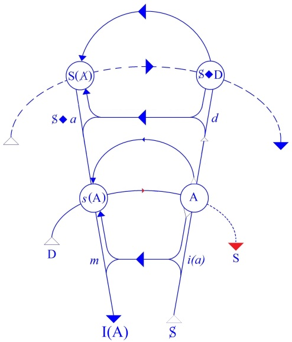
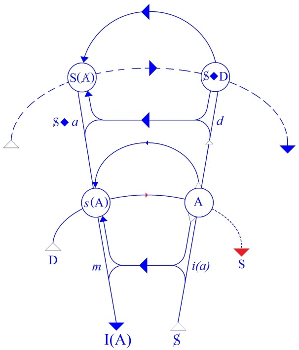

# Leçon 16 | 08 Avril 1959

  <label><input type="checkbox" data-lacan-toggle="original" checked> 原文</label>
  <label><input type="checkbox" data-lacan-toggle="notes" checked> 注释</label>
  <label><input type="checkbox" data-lacan-toggle="commentary" checked> 个人解读评论</label>

<section class="parallel-paragraph" data-paragraph-ids="s6-16-0001">

s6-16-0001

[无对应译文]

原文 · s6-16-0001

HAMLET (4) Qu’on me donne mon désir ! Tel est le sens que je vous ai dit qu’avait HAMLET, pour tous ceux, critiques, acteurs ou spectateurs, qui s’en emparent. Je vous ai dit que c’était ainsi en raison de l’exceptionnelle, de la géniale rigueur structurale où le thème d’HAMLET arrive après une élaboration ténébreuse, qui commence aux XIIème et XIIIème siècles chez SAXO GRAMMATICUS, puis ensuite dans la version romancée de BELLEFOREST, et sans doute dans une esquisse de KYD et une première esquisse aussi, semble-t-il, de SHAKESPEARE, pour aboutir à la forme que nous en avons.

</section>

<section class="parallel-paragraph" data-paragraph-ids="s6-16-0002">

s6-16-0002

[无对应译文]

原文 · s6-16-0002

Cette forme se caractérise à nos yeux, avec la méthode que nous employons ici, par quelque chose que j’appelle *la structure*, qui est précisément ce dans quoi j’essaie de vous donner une clé qui vous permette de vous repérer avec certitude dans cette forme topologique que j’ai appelée *le graphe*, qu’on pourrait peut-être appeler *le gramme*.

</section>

<section class="parallel-paragraph" data-paragraph-ids="s6-16-0003">

s6-16-0003

[无对应译文]

原文 · s6-16-0003

Reprenons notre HAMLET. Je pense que depuis trois fois que je vous en parle, vous l’avez tous lu *au moins une fois*. Essayons de ressaisir, dans ce mouvement à la fois simple et profondément marqué de tous les détours qui ont permis à tant de pensées humaines de s’y loger, ce mouvement d’HAMLET.

</section>

<section class="parallel-paragraph" data-paragraph-ids="s6-16-0004">

s6-16-0004

[无对应译文]

原文 · s6-16-0004

Si ce peut être à la fois simple et si jamais fini, ce n’est pas très difficile de savoir pourquoi. Le drame d’HAMLET, c’est la rencontre avec la mort. D’autres ont insisté…

</section>

<section class="parallel-paragraph" data-paragraph-ids="s6-16-0005">

s6-16-0005

[无对应译文]

原文 · s6-16-0005

> j’y ai fait allusion d’ailleurs dans nos précédentes approches

</section>

<section class="parallel-paragraph" data-paragraph-ids="s6-16-0006">

s6-16-0006

[无对应译文]

原文 · s6-16-0006

…sur le caractère prodigieusement fixant, pertinent, de la première scène sur la terrasse d’Elseneur, de cette scène sur ce qui va revenir, que les sentinelles ont déjà vu une fois : c’est la rencontre avec le spectre, avec cette forme d’en bas dont on ne sait pas encore alors, ce qu’elle est, ce qu’elle apporte, ce qu’elle veut dire.

</section>

<section class="parallel-paragraph" data-paragraph-ids="s6-16-0007">

s6-16-0007

[无对应译文]

原文 · s6-16-0007

COLERIDGE dit dans *ses notes sur* HAMLET *qui sont si jolies et que l’on trouve facilement dans les Lectures on Shakespeare*…

</section>

<section class="parallel-paragraph" data-paragraph-ids="s6-16-0008">

s6-16-0008

[无对应译文]

原文 · s6-16-0008

> j’y reviens car je vous ai peut-être donné l’impression d’en médire, je veux dire qu’en vous disant
>
> qu’après tout COLERIDGE ne fait *que s’y retrouver*, j’avais l’air de minimiser ce qu’il en disait

</section>

<section class="parallel-paragraph" data-paragraph-ids="s6-16-0009">

s6-16-0009

[无对应译文]

原文 · s6-16-0009

…c’est le premier qui ait sondé, comme dans bien d’autres domaines, la profondeur de ce qu’il y a dans HAMLET.

</section>

<section class="parallel-paragraph" data-paragraph-ids="s6-16-0010">

s6-16-0010

[无对应译文]

原文 · s6-16-0010

À propos de cette première scène, HUME lui-même, qui était tellement contre les *fantômes*, croyait à celui-là, que l’art de SHAKESPEARE arrivait à l’y faire croire malgré sa résistance.

</section>

<section class="parallel-paragraph" data-paragraph-ids="s6-16-0011">

s6-16-0011

[无对应译文]

原文 · s6-16-0011

- « *La force qu’il déployait contre les fantômes -* dit-il *- est semblable à celle d’un Samson. Et là le Samson est terrassé*. »

</section>

<section class="parallel-paragraph" data-paragraph-ids="s6-16-0012">

s6-16-0012

[无对应译文]

原文 · s6-16-0012

Il est clair que c’est bien parce que SHAKESPEARE *a approché de très près quelque chose* qui n’était pas le *ghost*, mais qui était effectivement *cette rencontre* non avec le mort, mais *avec la mort*, qui en somme est le point crucial de cette pièce. L’aller d’HAMLET au devant de la mort, c’est là d’où nous devons partir pour concevoir ce qui nous est promis dès cette première scène où *le spectre* apparaît au moment même où l’on dit qu’il est apparu :

</section>

<section class="parallel-paragraph" data-paragraph-ids="s6-16-0013">

s6-16-0013

[无对应译文]

原文 · s6-16-0013

> « *The bell then beating one. La cloche sonnant une heure*. » \[I,1\]

</section>

<section class="parallel-paragraph" data-paragraph-ids="s6-16-0014">

s6-16-0014

[无对应译文]

原文 · s6-16-0014

Ce « *one* » nous le retrouverons à la fin de la pièce quand, après le cheminement contourné, HAMLET se trouve tout proche de faire l’acte qui doit en même temps achever son destin et où en quelque sorte *il s’avance en fermant les yeux* vers celui qu’il doit atteindre, disant à HORATIO, et ce n’est pas à n’importe quel moment qu’il finit par le lui dire :

</section>

<section class="parallel-paragraph" data-paragraph-ids="s6-16-0015">

s6-16-0015

[无对应译文]

原文 · s6-16-0015

« *Qu’est-ce que c’est de tuer un homme, le temps de dire « one ».* » \[*And a man’s life is no more than to say « one ».* (V, 2)\]

</section>

<section class="parallel-paragraph" data-paragraph-ids="s6-16-0016">

s6-16-0016

[无对应译文]

原文 · s6-16-0016

Évidemment pour s’y acheminer il prend des chemins de traverse, il fait comme on dit « *l’école buissonnière* ». Ce qui me permet d’emprunter un mot qui est dans le texte. Il s’agit d’HORATIO à qui…

</section>

<section class="parallel-paragraph" data-paragraph-ids="s6-16-0017">

s6-16-0017

[无对应译文]

原文 · s6-16-0017

> tout modeste et tout gentil, alors qu’il vient de lui apporter son aide

</section>

<section class="parallel-paragraph" data-paragraph-ids="s6-16-0018">

s6-16-0018

[无对应译文]

原文 · s6-16-0018

…il dit « *Je suis ici un truant scholar, je musarde.* »\[Horatio. *A truant disposition, good my lord*. (I, 2) \]

</section>

<section class="parallel-paragraph" data-paragraph-ids="s6-16-0019">

s6-16-0019

[无对应译文]

原文 · s6-16-0019

Personne ne le croit, mais c’est bien en effet ce qui toujours a frappé les critiques : cet HAMLET, *il musarde*. *Que n’y va-t-il tout droit ?* En somme ce que nous essayons de faire ici, d’approfondir, c’est de savoir pourquoi il en est ainsi. Là-dessus ce que nous faisons n’est pas quelque chose qui soit une route à côté, c’est une route qui est différente de celle suivie par ceux qui ont parlé avant nous, mais elle est différente pour autant qu’elle reporte peut-être la question *un peu plus loin*. Ce qu’ils ont dit ne perd pas pour autant sa portée, ce qu’ils ont senti est ce que FREUD a mis tout de suite au premier plan.

</section>

<section class="parallel-paragraph" data-paragraph-ids="s6-16-0020">

s6-16-0020

[无对应译文]

原文 · s6-16-0020

C’est que dans cette action en cause, l’action de porter la mort, dont on ne sait pas pourquoi une action si pressante et en fin de compte si brève à exécuter demande tant de temps à HAMLET. Ce que l’on nous en dit d’abord, c’est que cette action de porter la mort rencontre chez HAMLET l’obstacle du désir. Ceci est la découverte, la raison et le paradoxe, puisque ce que je vous ai montré…

</section>

<section class="parallel-paragraph" data-paragraph-ids="s6-16-0021">

s6-16-0021

[无对应译文]

原文 · s6-16-0021

et qui reste l’énigme irrésolue d’HAMLET l’énigme que nous essayons de résoudre

</section>

<section class="parallel-paragraph" data-paragraph-ids="s6-16-0022">

s6-16-0022

[无对应译文]

原文 · s6-16-0022

…c’est justement cette chose à quoi il semble que l’esprit doive s’arrêter, c’est que *le désir en cause*…

</section>

<section class="parallel-paragraph" data-paragraph-ids="s6-16-0023">

s6-16-0023

[无对应译文]

原文 · s6-16-0023

> puisque c’est le désir découvert par FREUD, le désir pour la mère,
>
> le désir en tant qu’il suscite la rivalité avec celui qui la possède

</section>

<section class="parallel-paragraph" data-paragraph-ids="s6-16-0024">

s6-16-0024

[无对应译文]

原文 · s6-16-0024

…*ce désir*, mon dieu, devrait aller dans le même sens que l’action.

</section>

<section class="parallel-paragraph" data-paragraph-ids="s6-16-0025">

s6-16-0025

[无对应译文]

原文 · s6-16-0025

Pour commencer de déchiffrer ce que ceci peut vouloir dire…

</section>

<section class="parallel-paragraph" data-paragraph-ids="s6-16-0026">

s6-16-0026

[无对应译文]

原文 · s6-16-0026

> donc en fin de compte *la fonction mythique* d’HAMLET qui en fait un thème égal à celui d’ŒDIPE

</section>

<section class="parallel-paragraph" data-paragraph-ids="s6-16-0027">

s6-16-0027

[无对应译文]

原文 · s6-16-0027

…ce qui nous apparaît d’abord c’est ce que nous lisons dans le mythe, le lien intime qu’il y a en somme entre ce meurtre à faire, ce meurtre juste, ce meurtre qu’il veut faire…

</section>

<section class="parallel-paragraph" data-paragraph-ids="s6-16-0028">

s6-16-0028

[无对应译文]

原文 · s6-16-0028

- il n’y a pas de conflit chez lui de droit ou d’ordre, concernant, comme l’ont suggéré certains auteurs, je vous l’ai rappelé, les fondements de l’exécution de la justice.

</section>

<section class="parallel-paragraph" data-paragraph-ids="s6-16-0029">

s6-16-0029

[无对应译文]

原文 · s6-16-0029

- Il n’y a pas d’ambiguïté chez lui entre l’ordre public, la main de la loi, et les tâches privées.

</section>

<section class="parallel-paragraph" data-paragraph-ids="s6-16-0030">

s6-16-0030

[无对应译文]

原文 · s6-16-0030

- Il ne fait aucun doute pour lui que ce meurtre est là toute la loi, que ce meurtre ne fait pas question

</section>

<section class="parallel-paragraph" data-paragraph-ids="s6-16-0031">

s6-16-0031

[无对应译文]

原文 · s6-16-0031

…et sa propre mort. Ce meurtre ne s’exécutera que lorsque déjà HAMLET est frappé à mort, dans ce court intervalle qui lui reste entre cette mort reçue et le moment où il s’y perd.

</section>

<section class="parallel-paragraph" data-paragraph-ids="s6-16-0032">

s6-16-0032

[无对应译文]

原文 · s6-16-0032

C’est donc de là qu’il faut partir. De ce *rendez-vous* auquel nous pouvons donner tout *son sens*. L’acte d’HAMLET se projette, se situe à son terme au rendez-vous dernier de tous les rendez-vous, en ce point par rapport :

</section>

<section class="parallel-paragraph" data-paragraph-ids="s6-16-0033">

s6-16-0033

[无对应译文]

原文 · s6-16-0033

- au sujet tel qu’ici nous essayons de l’articuler, de le définir,

</section>

<section class="parallel-paragraph" data-paragraph-ids="s6-16-0034">

s6-16-0034

[无对应译文]

原文 · s6-16-0034

- au sujet pour autant qu’il n’est pas encore venu au jour : son avènement est retardé dans l’articulation proprement philosophique,

</section>

<section class="parallel-paragraph" data-paragraph-ids="s6-16-0035">

s6-16-0035

[无对应译文]

原文 · s6-16-0035

- au sujet tel que FREUD nous a appris qu’il est construit.

</section>

<section class="parallel-paragraph" data-paragraph-ids="s6-16-0036">

s6-16-0036

[无对应译文]

原文 · s6-16-0036

- Un sujet qui se distingue du sujet dont la philosophie occidentale parle depuis que théorie de la connaissance il y a, sujet qui n’est point le support universel des objets, et en quelque sorte son négatif, son omniprésent support.

</section>

<section class="parallel-paragraph" data-paragraph-ids="s6-16-0037">

s6-16-0037

[无对应译文]

原文 · s6-16-0037

- Un sujet en tant qu’il parle et en tant qu’il est structuré dans un rapport complexe avec le signifiant qui est très exactement celui que nous essayons d’articuler ici.

</section>

<section class="parallel-paragraph" data-paragraph-ids="s6-16-0038">

s6-16-0038

[无对应译文]

原文 · s6-16-0038

Et pour le représenter une fois de plus :

</section>

<section class="parallel-paragraph" data-paragraph-ids="s6-16-0039">

s6-16-0039

[无对应译文]

原文 · s6-16-0039

</section>

<section class="parallel-paragraph" data-paragraph-ids="s6-16-0040">

s6-16-0040

[无对应译文]

原文 · s6-16-0040

si tant est que le point entrecroisé de *l’intention de la demande* et de *la chaîne signifiante* se fait pour la première fois au point A que nous avons défini comme le grand Autre en tant que *lieu de la vérité*.

</section>

<section class="parallel-paragraph" data-paragraph-ids="s6-16-0041">

s6-16-0041

[无对应译文]

原文 · s6-16-0041

Je veux dire en tant que lieu où la parole se situe en prenant place, instaure cet ordre évoqué, invoqué chaque fois que le sujet articule quelque chose, chaque fois qu’il parle et qu’il fait ce quelque chose qui se distingue de toutes les autres formes immanentes de captivation où de l’un par rapport à l’autre rien n’équivaut à ce qui dans la parole instaure toujours cet élément tiers, à savoir ce lieu de l’Autre où la parole, même mensongère, s’inscrit comme *vérité*.

</section>

<section class="parallel-paragraph" data-paragraph-ids="s6-16-0042">

s6-16-0042

[无对应译文]

原文 · s6-16-0042

Ce discours pour l’Autre, cette référence à l’Autre, se prolonge au–delà, dans ceci qu’elle est reprise à partir de l’Autre pour constituer la question :

</section>

<section class="parallel-paragraph" data-paragraph-ids="s6-16-0043">

s6-16-0043

[无对应译文]

原文 · s6-16-0043

« *Qu’est-ce que je veux ?* »

</section>

<section class="parallel-paragraph" data-paragraph-ids="s6-16-0044">

s6-16-0044

[无对应译文]

原文 · s6-16-0044

Ou plus exactement la question qui se pose au sujet sous une forme déjà négative :

</section>

<section class="parallel-paragraph" data-paragraph-ids="s6-16-0045">

s6-16-0045

[无对应译文]

原文 · s6-16-0045

« *Que veux-tu ?* »

</section>

<section class="parallel-paragraph" data-paragraph-ids="s6-16-0046">

s6-16-0046

[无对应译文]

原文 · s6-16-0046

La question de ce que…

</section>

<section class="parallel-paragraph" data-paragraph-ids="s6-16-0047">

s6-16-0047

[无对应译文]

原文 · s6-16-0047

> au-delà de cette demande aliénée dans le système du discours en tant qu’il est là, reposant au lieu de l’Autre

</section>

<section class="parallel-paragraph" data-paragraph-ids="s6-16-0048">

s6-16-0048

[无对应译文]

原文 · s6-16-0048

…le sujet – prolongeant son élan – se demande là ce qu’il est comme sujet, et où il a en somme à rencontrer quoi au-delà du lieu de la vérité ? Ce que le génie même, non de la langue mais de la métaphore extrême…

</section>

<section class="parallel-paragraph" data-paragraph-ids="s6-16-0049">

s6-16-0049

[无对应译文]

原文 · s6-16-0049

> qui tend devant certains spectacles significatifs à se formuler

</section>

<section class="parallel-paragraph" data-paragraph-ids="s6-16-0050">

s6-16-0050

[无对应译文]

原文 · s6-16-0050

…appelle d’un nom que nous reconnaîtrons ici au passage : « *l’heure de la vérité* ».

</section>

<section class="parallel-paragraph" data-paragraph-ids="s6-16-0051">

s6-16-0051

[无对应译文]

原文 · s6-16-0051

Car n’oublions pas…

</section>

<section class="parallel-paragraph" data-paragraph-ids="s6-16-0052">

s6-16-0052

[无对应译文]

原文 · s6-16-0052

> en un temps où toute philosophie s’est engagée à articuler ce qui lie le temps à l’être

</section>

<section class="parallel-paragraph" data-paragraph-ids="s6-16-0053">

s6-16-0053

[无对应译文]

原文 · s6-16-0053

…qu’il est tout à fait simple de s’apercevoir que *le temps*…

</section>

<section class="parallel-paragraph" data-paragraph-ids="s6-16-0054">

s6-16-0054

[无对应译文]

原文 · s6-16-0054

> dans sa constitution même : passé-présent-futur, ceux de la grammaire

</section>

<section class="parallel-paragraph" data-paragraph-ids="s6-16-0055">

s6-16-0055

[无对应译文]

原文 · s6-16-0055

…*se repère, et à rien d’autre qu’à l’acte de la parole*. Le *présent* c’est ce moment où je parle et rien d’autre. Il nous est strictement impossible de concevoir une temporalité dans une dimension animale, c’est-à-dire dans une dimension de l’appétit.

</section>

<section class="parallel-paragraph" data-paragraph-ids="s6-16-0056">

s6-16-0056

[无对应译文]

原文 · s6-16-0056

Le *b, a, ba de la temporalité* exige même la structure en langage. Dans cet au-delà de l’Autre, dans ce discours qui n’est plus discours pour l’Autre, mais discours de l’Autre à proprement parler, dans lequel va se constituer cette ligne brisée des signifiants de l’inconscient. Dans cet Autre dans lequel le sujet s’avance avec *sa question* comme telle, ce qu’il vise au dernier terme :

</section>

<section class="parallel-paragraph" data-paragraph-ids="s6-16-0057">

s6-16-0057

[无对应译文]

原文 · s6-16-0057

- c’est l’heure de cette rencontre avec lui-même,

</section>

<section class="parallel-paragraph" data-paragraph-ids="s6-16-0058">

s6-16-0058

[无对应译文]

原文 · s6-16-0058

- de cette rencontre avec son vouloir,

</section>

<section class="parallel-paragraph" data-paragraph-ids="s6-16-0059">

s6-16-0059

[无对应译文]

原文 · s6-16-0059

- de cette rencontre avec *quelque chose* que nous allons au dernier terme essayer de formuler, et dont nous ne pouvons même pas tout de suite donner les éléments, si tant est tout de même que certains signes ici nous les représentent et sont en quelque sorte pour vous le repère, la pré-figure de l’étagement de ce qui nous attend dans ce qu’on peut appeler les pas, les étapes nécessaires de la question.

</section>

<section class="parallel-paragraph" data-paragraph-ids="s6-16-0060">

s6-16-0060

[无对应译文]

原文 · s6-16-0060

Remarquons quand même que si HAMLET…

</section>

<section class="parallel-paragraph" data-paragraph-ids="s6-16-0061">

s6-16-0061

[无对应译文]

原文 · s6-16-0061

> *qui, je vous l’ai dit, n’est pas ceci ou cela, n’est pas un obsessionnel pour la bonne raison d’abord qu’il est une création poétique.* *Hamlet n’a pas de névrose, Hamlet* *nous démontre de la névrose, et c’est tout autre chose que de l’être*

</section>

<section class="parallel-paragraph" data-paragraph-ids="s6-16-0062">

s6-16-0062

[无对应译文]

原文 · s6-16-0062

…si HAMLET, par certaines phrases…

</section>

<section class="parallel-paragraph" data-paragraph-ids="s6-16-0063">

s6-16-0063

[无对应译文]

原文 · s6-16-0063

> quand nous nous regardons dans HAMLET, sous un certain éclairage du miroir

</section>

<section class="parallel-paragraph" data-paragraph-ids="s6-16-0064">

s6-16-0064

[无对应译文]

原文 · s6-16-0064

…nous apparaît plus près que tout de la structure de l’*obsessionnel*, c’est déjà en ceci que *la fonction du désir*…

</section>

<section class="parallel-paragraph" data-paragraph-ids="s6-16-0065">

s6-16-0065

[无对应译文]

原文 · s6-16-0065

puisque c’est là la question que nous posons à propos d’HAMLET

</section>

<section class="parallel-paragraph" data-paragraph-ids="s6-16-0066">

s6-16-0066

[无对应译文]

原文 · s6-16-0066

…nous apparaît justement en ceci qui est *révélateur de l’élément essentiel de la structure*, qui est celui justement *mis en valeur au maximum par la névrose obsessionnelle*, c’est qu’une des fonctions du désir, la fonction majeure chez l’*obsessionnel*, c’est - cette heure de la rencontre désirée - la maintenir à distance, l’attendre.

</section>

<section class="parallel-paragraph" data-paragraph-ids="s6-16-0067">

s6-16-0067

[无对应译文]

原文 · s6-16-0067

Et ici j’emploie le terme que FREUD offre dans *Inhibition, Symptôme, Angoisse* : « *Erwartung* »…

</section>

<section class="parallel-paragraph" data-paragraph-ids="s6-16-0068">

s6-16-0068

[无对应译文]

原文 · s6-16-0068

> qu’il distingue expressément de « *abwarten* », « *tendre le dos* »

</section>

<section class="parallel-paragraph" data-paragraph-ids="s6-16-0069">

s6-16-0069

[无对应译文]

原文 · s6-16-0069

…« *Erwartung* », « *l’attendre* » au sens actif c’est aussi « *la faire attendre* ». Ce jeu avec *l’heure de la rencontre* domine essentiellement le rapport de l’obsessionnel.

</section>

<section class="parallel-paragraph" data-paragraph-ids="s6-16-0070">

s6-16-0070

[无对应译文]

原文 · s6-16-0070

Sans doute HAMLET nous démontre-t-il toute cette dialectique, tout ce dépliant qui joue avec l’objet sous bien d’autres faces encore, mais celle-ci est la plus évidente, celle qui apparaît en surface et qui frappe, qui donne le style de cette pièce, et qui en a fait toujours l’énigme.

</section>

<section class="parallel-paragraph" data-paragraph-ids="s6-16-0071">

s6-16-0071

[无对应译文]

原文 · s6-16-0071

Essayons de voir maintenant dans d’autres éléments les coordonnées que nous donne la pièce.

</section>

<section class="parallel-paragraph" data-paragraph-ids="s6-16-0072">

s6-16-0072

[无对应译文]

原文 · s6-16-0072

Qu’est-ce qui distingue la position d’HAMLET par rapport en somme à une trame fondamentale ?

</section>

<section class="parallel-paragraph" data-paragraph-ids="s6-16-0073">

s6-16-0073

[无对应译文]

原文 · s6-16-0073

Qu’est-ce qui en fait cette variante de l’œdipe si frappante dans son caractère de variation ?

</section>

<section class="parallel-paragraph" data-paragraph-ids="s6-16-0074">

s6-16-0074

[无对应译文]

原文 · s6-16-0074

Car enfin ŒDIPE, lui, n’y faisait pas tant de façons, comme l’a fort bien remarqué FREUD dans la petite note d’explication à laquelle on recourt quand on donne sa langue au chat, à savoir :

</section>

<section class="parallel-paragraph" data-paragraph-ids="s6-16-0075">

s6-16-0075

[无对应译文]

原文 · s6-16-0075

- « *Mon Dieu, tout se dégrade, nous sommes dans la période de décadence nous autres modernes, nous nous tortillons six cents fois avant de faire ce que les autres, les bons, les braves, les anciens, faisaient tout « dret » !* »

</section>

<section class="parallel-paragraph" data-paragraph-ids="s6-16-0076">

s6-16-0076

[无对应译文]

原文 · s6-16-0076

Ce n’est pas une explication, cette référence à l’idée de décadence doit nous être suspecte, nous pouvons la prendre par d’autres côtés. Je crois qu’il convient de reporter la question plus loin. S’il est vrai qu’en soient là les modernes, cela doit être pour une raison, du moins si nous sommes psychanalystes, autre que pour la raison qu’ils n’ont pas les nerfs aussi solides que les avaient leurs pères.

</section>

<section class="parallel-paragraph" data-paragraph-ids="s6-16-0077">

s6-16-0077

[无对应译文]

原文 · s6-16-0077

Non ! Déjà *quelque chose* sur quoi j’ai attiré votre attention, est essentiel : ŒDIPE, lui, n’avait pas *à barguigner* *trente six fois devant l’acte*, il l’avait fait avant même d’y penser et *sans le savoir*. La structure du mythe d’ŒDIPE est essentiellement constituée par cela.

</section>

<section class="parallel-paragraph" data-paragraph-ids="s6-16-0078">

s6-16-0078

[无对应译文]

原文 · s6-16-0078

Eh bien il est tout à fait clair et évident qu’il y a ici quelque chose, quelque chose qui est justement ce par quoi je vous ai introduit cette année - et ce n’est pas par hasard - dans *cette initiation au gramme comme clef du problème du désir*. Rappelez-vous le rêve très simple du *Principe du plaisir* et de la réalité, le rêve où le père mort apparaît, et je vous ai marqué sur la ligne supérieure, la ligne d’énonciation dans le rêve : « *Il ne savait pas* ». Cette bienheureuse ignorance de ceux qui sont plongés dans le drame nécessaire qui s’ensuit du fait que le sujet qui parle est soumis au signifiant, cette ignorance est ici. Je vous fais remarquer en passant que personne ne vous explique pourquoi.

</section>

<section class="parallel-paragraph" data-paragraph-ids="s6-16-0079">

s6-16-0079

[无对应译文]

原文 · s6-16-0079

Car enfin, si le père endormi au jardin a été meurtri par le fait qu’on lui a versé dans l’oreille – comme on dit dans JARRY – ce délicat suc, « *hébénon* », il semble que la chose ait dû lui échapper, car rien ne nous dit qu’il est sorti de son sommeil pour en constater le dégât, que les dartres qui couvrirent son corps ne furent jamais vues que par ceux qui découvrirent son cadavre.

</section>

<section class="parallel-paragraph" data-paragraph-ids="s6-16-0080">

s6-16-0080

[无对应译文]

原文 · s6-16-0080

Et donc ceci suppose que dans le domaine de l’au-delà on a des informations très précises sur la façon dont on y est parvenu, ce qui peut en effet être une hypothèse de principe, ce qui n’est pas non plus quelque chose que nous devions d’emblée tenir pour certain. Tout ceci pour souligner l’arbitraire de la révélation initiale, de celle dont parle tout le grand mouvement d’HAMLET : la révélation par le père de la vérité sur sa mort distingue essentiellement une coordonnée du mythe de ce qui se passe dans le mythe d’Œdipe.

</section>

<section class="parallel-paragraph" data-paragraph-ids="s6-16-0081">

s6-16-0081

[无对应译文]

原文 · s6-16-0081

Quelque chose est levé, un voile, celui qui pèse justement sur l’articulation de *la ligne inconsciente*, ce voile que nous-mêmes essayons de lever, non sans qu’il nous donne, vous le savez, quelque fil à retordre.

</section>

<section class="parallel-paragraph" data-paragraph-ids="s6-16-0082">

s6-16-0082

[无对应译文]

原文 · s6-16-0082

Car il est clair qu’il doit bien avoir quelque *fonction essentielle*…

</section>

<section class="parallel-paragraph" data-paragraph-ids="s6-16-0083">

s6-16-0083

[无对应译文]

原文 · s6-16-0083

> je dirais, pour la sécurité du sujet en tant qu’il parle

</section>

<section class="parallel-paragraph" data-paragraph-ids="s6-16-0084">

s6-16-0084

[无对应译文]

原文 · s6-16-0084

…pour que nos interventions pour rétablir la cohérence de la chaîne signifiante au niveau de l’inconscient présentent toutes ces difficultés, reçoivent de la part du sujet toute cette opposition, ces refus. C’est quelque chose que nous appelons « *résistance* » et qui est le pivot de toute l’histoire de l’analyse.

</section>

<section class="parallel-paragraph" data-paragraph-ids="s6-16-0085">

s6-16-0085

[无对应译文]

原文 · s6-16-0085

Ici la question est résolue : *le père savait*. Et du fait qu’il savait, HAMLET *sait aussi*. C’est-à-dire qu’il a *la réponse*. Il a *<u>la</u> réponse*, et il ne peut y avoir *<u>qu’une</u> réponse*.

</section>

<section class="parallel-paragraph" data-paragraph-ids="s6-16-0086">

s6-16-0086

[无对应译文]

原文 · s6-16-0086

Elle n’est pas obligatoirement dicible en termes psychologiques, je veux dire que cela n’est pas une réponse forcément compréhensible, encore bien moins qui vous prenne aux tripes, mais cela n’en est pas moins une réponse du type fatal.

</section>

<section class="parallel-paragraph" data-paragraph-ids="s6-16-0087">

s6-16-0087

[无对应译文]

原文 · s6-16-0087

*Cette réponse*, essayons de voir ce que c’est. *Cette réponse* qui est en somme le message au point où il se constitue dans la ligne supérieure, dans la ligne de l’inconscient. *Cette réponse* que j’ai déjà symbolisée pour vous à l’avance et non – bien entendu – sans être forcé de ce fait de vous demander de me faire crédit. Mais il est plus facile, plus honnête de demander à quelqu’un de vous faire crédit sur quelque chose qui d’abord n’a aucune espèce de sens. Cela ne vous engage à rien, si ce n’est peut-être à le chercher, ce qui laisse tout de même une liberté de le créer par vous-mêmes.

</section>

<section class="parallel-paragraph" data-paragraph-ids="s6-16-0088">

s6-16-0088

[无对应译文]

原文 · s6-16-0088

</section>

<section class="parallel-paragraph" data-paragraph-ids="s6-16-0089">

s6-16-0089

[无对应译文]

原文 · s6-16-0089

Cette réponse, j’ai commencé à l’articuler sous la forme suivante : signifiant de l’Autre, S(A), ce qui distingue la réponse au niveau de la ligne supérieure de celle au niveau de la ligne inférieure. Au niveau de la ligne inférieure la réponse c’est toujours le *signifié de l’Autre*, *s*(A) c’est toujours par rapport à cette parole qui se déroule au niveau de l’Autre et qui modèle *le sens* de ce que nous avons voulu dire.

</section>

<section class="parallel-paragraph" data-paragraph-ids="s6-16-0090">

s6-16-0090

[无对应译文]

原文 · s6-16-0090

Mais *qui* aura voulu dire cela au niveau de l’Autre ? C’est signifié au niveau du discours simple, mais au niveau de l’*au-delà de ce discours* \[*d* → S◊*a*\], au niveau de la question que le sujet se pose à lui-même, qui veut dire en fin de compte : « *qu’est-ce que je suis devenu dans tout cela ?* ».

</section>

<section class="parallel-paragraph" data-paragraph-ids="s6-16-0091">

s6-16-0091

[无对应译文]

原文 · s6-16-0091

La réponse je vous l’ai dit, c’est le signifiant de l’Autre avec la barre : S(A). Il y a mille façons de commencer à vous développer ce qu’inclut ce symbole.

</section>

<section class="parallel-paragraph" data-paragraph-ids="s6-16-0092">

s6-16-0092

[无对应译文]

原文 · s6-16-0092

Mais nous choisissons aujourd’hui - puisque nous sommes dans HAMLET - la voie claire, évidente, pathétique, dramatique. Et c’est cela qui fait la valeur d’HAMLET : qu’il nous est donné d’accéder au sens de S(A).

</section>

<section class="parallel-paragraph" data-paragraph-ids="s6-16-0093">

s6-16-0093

[无对应译文]

原文 · s6-16-0093

Le sens de ce qu’HAMLET apprend par ce père, c’est là devant nous, très clair : c’est l’*irrémédiable*, *absolue*, *insondable* *trahison de l’amour*. De l’amour le plus pur, l’amour de ce roi, qui peut-être, bien entendu, comme tous les hommes peut avoir été un grand chenapan, mais qui, avec cet être qui était sa femme était celui qui allait jusqu’à « *écarter les souffles de vent sur sa face* »[^77], tout au moins suivant ce qu’HAMLET dit.

</section>

<section class="parallel-paragraph" data-paragraph-ids="s6-16-0094">

s6-16-0094

[无对应译文]

原文 · s6-16-0094

C’est l’absolue fausseté de ce qui est apparu à HAMLET comme le témoignage même de la beauté, de la vérité, de l’essentiel. Il y a là la réponse : la vérité d’HAMLET est *une vérité sans espoir*. Il n’y a pas trace dans tout HAMLET d’une *élévation* vers quelque chose qui serait au-delà, *rachat*, *rédemption*.

</section>

<section class="parallel-paragraph" data-paragraph-ids="s6-16-0095">

s6-16-0095

[无对应译文]

原文 · s6-16-0095

Il nous est déjà dit que la première rencontre venait d’en bas. Ce rapport oral, infernal, à cet ACHÉRON que FREUD [^78] a choisi de mettre en émoi, faute de pouvoir fléchir les puissances supérieures, *c’est là que se situe*, de la façon la plus claire, HAMLET. Mais ceci bien entendu n’est qu’une remarque toute simple, bien évidente, à laquelle il est assez *curieux* de voir que les auteurs…

</section>

<section class="parallel-paragraph" data-paragraph-ids="s6-16-0096">

s6-16-0096

[无对应译文]

原文 · s6-16-0096

> on ne sait par quelle pudeur : il ne faut pas alerter les âmes sensibles !

</section>

<section class="parallel-paragraph" data-paragraph-ids="s6-16-0097">

s6-16-0097

[无对应译文]

原文 · s6-16-0097

…ne mettent guère en valeur à propos d’HAMLET.

</section>

<section class="parallel-paragraph" data-paragraph-ids="s6-16-0098">

s6-16-0098

[无对应译文]

原文 · s6-16-0098

Je ne vous le donne après tout que comme une marche dans l’ordre du pathétique, dans l’ordre du sensible, aussi pénible que ce puisse être. Il doit y avoir quelque chose où puisse se formuler plus radicalement la raison, le motif de tout ce choix, parce qu’après tout, toute conclusion, *tout verdict*…

</section>

<section class="parallel-paragraph" data-paragraph-ids="s6-16-0099">

s6-16-0099

[无对应译文]

原文 · s6-16-0099

> si radical soit-il à prendre une forme accentuée dans l’ordre de ce que l’on appelle pessimisme

</section>

<section class="parallel-paragraph" data-paragraph-ids="s6-16-0100">

s6-16-0100

[无对应译文]

原文 · s6-16-0100

…est encore quelque chose qui est fait pour nous voiler ce dont il s’agit.

</section>

<section class="parallel-paragraph" data-paragraph-ids="s6-16-0101">

s6-16-0101

[无对应译文]

原文 · s6-16-0101

S(A) cela ne veut pas dire : tout ce qui se passe au niveau de A ne vaut rien, à savoir toute vérité est fallacieuse. C’est là quelque chose qui peut faire rire dans les périodes d’amusement qui suivent les après-guerres où l’on fait, par exemple, une « *philosophie de l’absurde* » qui sert surtout dans les caves \[réf. à Albert Camus\].

</section>

<section class="parallel-paragraph" data-paragraph-ids="s6-16-0102">

s6-16-0102

[无对应译文]

原文 · s6-16-0102

Essayons d’articuler quelque chose de plus sérieux, ou de plus léger. Aussi bien avec la barre, qu’est-ce que cela veut dire essentiellement ? Je crois que c’est le moment de le dire, encore que bien entendu cela va apparaître sous un angle bien particulier, mais je ne le crois pas contingent.

</section>

<section class="parallel-paragraph" data-paragraph-ids="s6-16-0103">

s6-16-0103

[无对应译文]

原文 · s6-16-0103

S(A) veut dire ceci...

</section>

<section class="parallel-paragraph" data-paragraph-ids="s6-16-0104">

s6-16-0104

[无对应译文]

原文 · s6-16-0104

c’est que si A, le grand Autre, est non pas un être mais *le lieu de la parole*

</section>

<section class="parallel-paragraph" data-paragraph-ids="s6-16-0105">

s6-16-0105

[无对应译文]

原文 · s6-16-0105

*...*S(A) veut dire que *dans ce le lieu de la parole*…

</section>

<section class="parallel-paragraph" data-paragraph-ids="s6-16-0106">

s6-16-0106

[无对应译文]

原文 · s6-16-0106

> où repose sous une forme développée, ou sous une forme \[enveloppée ?\],
>
> l’ensemble du système des signifiants, c’est-à-dire d’un langage

</section>

<section class="parallel-paragraph" data-paragraph-ids="s6-16-0107">

s6-16-0107

[无对应译文]

原文 · s6-16-0107

…*il manque quelque chose*.

</section>

<section class="parallel-paragraph" data-paragraph-ids="s6-16-0108">

s6-16-0108

[无对应译文]

原文 · s6-16-0108

*Quelque chose qui peut n’être qu’un signifiant y fait défaut*. Le signifiant qui fait défaut au niveau de l’Autre, et qui donne sa valeur la plus radicale à ce S(A), c’est ceci qui est, si je puis dire, *le grand secret de la psychanalyse*…

</section>

<section class="parallel-paragraph" data-paragraph-ids="s6-16-0109">

s6-16-0109

[无对应译文]

原文 · s6-16-0109

> ce par quoi la psychanalyse apporte quelque chose, par où le sujet qui parle - en tant que l’expérience de l’analyse nous le révèle comme structuré nécessairement d’une certaine façon - se distingue du sujet de toujours, du sujet auquel une évolution philosophique qui après tout peut bien nous apparaître dans une certaine perspective de délire, fécond, mais de délire dans la rétrospection

</section>

<section class="parallel-paragraph" data-paragraph-ids="s6-16-0110">

s6-16-0110

[无对应译文]

原文 · s6-16-0110

…c’est ceci *le grand secret* :

</section>

<section class="parallel-paragraph" data-paragraph-ids="s6-16-0111">

s6-16-0111

[无对应译文]

原文 · s6-16-0111

> « *Il n’y a pas d’Autre de l’Autre.* »

</section>

<section class="parallel-paragraph" data-paragraph-ids="s6-16-0112">

s6-16-0112

[无对应译文]

原文 · s6-16-0112

En d’autres termes : pour le sujet de la philosophie traditionnelle ce sujet se subjective lui-même indéfiniment : si « *Je suis en tant que je pense* », « *Je suis en tant que je pense que je suis* », *et ainsi de suite*, cela n’a aucune raison de s’arrêter.

</section>

<section class="parallel-paragraph" data-paragraph-ids="s6-16-0113">

s6-16-0113

[无对应译文]

原文 · s6-16-0113

La vérité est que l’analyse nous apprend quelque chose de tout à fait différent. C’est qu’on s’est déjà aperçu qu’il n’est pas si sûr que je sois en tant que je pense, et qu’on ne pouvait être sûr que d’une chose, c’est que je suis en tant que je pense que je suis. Cela sûrement. Seulement ce que l’analyse nous apprend, c’est que je ne suis pas celui-là qui justement est en train de penser que je suis, pour la simple raison que du fait que je pense que je suis, je pense « *au lieu de l’Autre* », je suis un autre que celui qui pense que je suis.

</section>

<section class="parallel-paragraph" data-paragraph-ids="s6-16-0114">

s6-16-0114

[无对应译文]

原文 · s6-16-0114

Or la question est que je n’ai aucune garantie d’aucune façon que cet Autre, par ce qu’il y a dans son système, puisse me rendre, si je puis m’exprimer ainsi, ce que je lui ai donné : son être et son essence de vérité.

</section>

<section class="parallel-paragraph" data-paragraph-ids="s6-16-0115">

s6-16-0115

[无对应译文]

原文 · s6-16-0115

*Il n’y a pas* - vous ai-je dit - *d’Autre de l’Autre*. Il n’y a dans l’Autre aucun signifiant qui puisse dans l’occasion répondre de ce que je suis. Et pour dire les choses d’une façon transformée, cette *vérité sans espoir* dont je vous parlais tout à l’heure, cette vérité qui est celle que nous rencontrons au niveau de l’inconscient, c’est une *vérité* sans figure, c’est une *vérité* fermée, une *vérité* pliable en tous sens. Nous ne le savons que trop : c’est *une vérité sans vérité*.

</section>

<section class="parallel-paragraph" data-paragraph-ids="s6-16-0116">

s6-16-0116

[无对应译文]

原文 · s6-16-0116

Et c’est bien cela qui fait le plus grand obstacle à ceux qui s’approchent du dehors de notre travail et qui, devant nos interprétations…

</section>

<section class="parallel-paragraph" data-paragraph-ids="s6-16-0117">

s6-16-0117

[无对应译文]

原文 · s6-16-0117

> parce qu’ils ne sont pas dans la voie, avec nous, où elles sont destinées à porter leur effet qui n’est concevable que de façon métaphorique, et *pour autant qu’elles jouent et retentissent toujours entre les deux lignes*

</section>

<section class="parallel-paragraph" data-paragraph-ids="s6-16-0118">

s6-16-0118

[无对应译文]

原文 · s6-16-0118

…ne peuvent pas comprendre de quoi il s’agit dans l’interprétation analytique.

</section>

<section class="parallel-paragraph" data-paragraph-ids="s6-16-0119">

s6-16-0119

[无对应译文]

原文 · s6-16-0119

Ce signifiant, dont l’Autre ne dispose pas...

</section>

<section class="parallel-paragraph" data-paragraph-ids="s6-16-0120">

s6-16-0120

[无对应译文]

原文 · s6-16-0120

> si nous pouvons en parler, c’est bien tout de même qu’il est, bien entendu, quelque part.
>
> Je vous ai fait ce petit gramme aux fins que vous ne perdiez pas le nord. Je l’ai fait avec tout le soin
>
> que j’ai pu, mais certainement pas pour accroître votre embarras.

</section>

<section class="parallel-paragraph" data-paragraph-ids="s6-16-0121">

s6-16-0121

[无对应译文]

原文 · s6-16-0121

...vous pouvez le reconnaître partout où est la barre, le signifiant caché, celui dont l’Autre ne dispose pas et qui est justement celui qui vous concerne.

</section>

<section class="parallel-paragraph" data-paragraph-ids="s6-16-0122">

s6-16-0122

[无对应译文]

原文 · s6-16-0122

C’est le même que vous faites entrer dans le jeu en tant que vous, pauvres *bêtas*, depuis que *vous êtes nés*, vous êtes pris dans cette sacrée affaire de λόγος \[logos\]. C’est à savoir *la part de vous qui là-dedans est sacrifiée*…

</section>

<section class="parallel-paragraph" data-paragraph-ids="s6-16-0123">

s6-16-0123

[无对应译文]

原文 · s6-16-0123

> et sacrifiée non pas purement et simplement, physiquement comme on dit, réellement,
>
> mais symboliquement, et qui n’est pas rien

</section>

<section class="parallel-paragraph" data-paragraph-ids="s6-16-0124">

s6-16-0124

[无对应译文]

原文 · s6-16-0124

…*cette part de vous qui a pris fonction signifiante*.

</section>

<section class="parallel-paragraph" data-paragraph-ids="s6-16-0125">

s6-16-0125

[无对应译文]

原文 · s6-16-0125

Et c’est pour cela qu’il y en a une seule, et il n’y en a pas trente six, c’est très exactement cette fonction énigmatique que nous appelons *le phallus*, qui est ici ce quelque chose de l’organisme de *la vie*, de cette poussée, où « *poussée vitale* », dont vous savez que je ne trouve pas qu’il faille user à tort et à travers, mais qui une fois bien *cernée*, *symbolisée*, mise là où elle est, et surtout *là* où elle sert, *là* où effectivement dans l’inconscient elle est prise, prend son sens.

</section>

<section class="parallel-paragraph" data-paragraph-ids="s6-16-0126">

s6-16-0126

[无对应译文]

原文 · s6-16-0126

Le *phallus*, la turgescence vitale, ce quelque chose d’énigmatique, d’universel, plus mâle que femelle, et pourtant dont la femelle elle-même peut devenir le symbole, voilà ce dont il s’agit, et ce qui…

</section>

<section class="parallel-paragraph" data-paragraph-ids="s6-16-0127">

s6-16-0127

[无对应译文]

原文 · s6-16-0127

parce que dans l’Autre il est indisponible

</section>

<section class="parallel-paragraph" data-paragraph-ids="s6-16-0128">

s6-16-0128

[无对应译文]

原文 · s6-16-0128

…ce qui - bien que ce soit cette vie même que le sujet fait signifiante - ne vient nulle part garantir la signification du discours de l’Autre. Autrement dit, toute sacrifiée qu’elle soit, cette vie ne lui est pas, par l’Autre, rendue.

</section>

<section class="parallel-paragraph" data-paragraph-ids="s6-16-0129">

s6-16-0129

[无对应译文]

原文 · s6-16-0129

C’est parce que c’est de là que part HAMLET, à savoir de la réponse du donné, que tout le parcours peut être balayé, que cette révélation radicale va le mener au rendez-vous dernier. Pour l’atteindre, nous allons maintenant reprendre ce qui se passe dans la pièce d’HAMLET. La pièce d’HAMLET est - comme vous le savez - l’œuvre de SHAKESPEARE et nous devons donc faire attention à ce qu’il y a rajouté.

</section>

<section class="parallel-paragraph" data-paragraph-ids="s6-16-0130">

s6-16-0130

[无对应译文]

原文 · s6-16-0130

C’était déjà un assez beau parcours, mais il faut croire qu’il offrait…

</section>

<section class="parallel-paragraph" data-paragraph-ids="s6-16-0131">

s6-16-0131

[无对应译文]

原文 · s6-16-0131

et là il suffisait qu’il s’offrit pour qu’il fût pris

</section>

<section class="parallel-paragraph" data-paragraph-ids="s6-16-0132">

s6-16-0132

[无对应译文]

原文 · s6-16-0132

…un chemin assez long à parcourir pour nous montrer ce qu’on appelle du pays, pour que SHAKESPEARE l’ait parcouru. Je vous ai indiqué la dernière fois les questions que pose la *play scene*, la « *scène des acteurs* », j’y reviendrai.

</section>

<section class="parallel-paragraph" data-paragraph-ids="s6-16-0133">

s6-16-0133

[无对应译文]

原文 · s6-16-0133

Je voudrais aujourd’hui introduire un élément *essentiel*, essentiel parce qu’il concerne ce dont nous nous rapprochons après avoir établi la fonction des deux lignes, c’est à savoir ce qui gît dans l’intervalle, ce qui, si je puis dire, fait pour le sujet *la distance qu’il peut maintenir entre les deux lignes pour y respirer pendant le temps qu’il lui reste à vivre,* *et c’est cela que nous appelons le désir*.

</section>

<section class="parallel-paragraph" data-paragraph-ids="s6-16-0134">

s6-16-0134

[无对应译文]

原文 · s6-16-0134

Je vous ai dit quelle *pression*, quelle *abolition*, quelle *destruction* ce *désir* subit pourtant, de ce qu’il se rencontre avec ce *quelque chose de l’Autre réel*, de la mère telle qu’elle est, cette mère comme tant d’autres, à savoir ce *quelque chose de structuré*, ce *quelque chose* qui est moins *désir* que *gloutonnerie*, voire engloutissement, ce quelque chose qui évidemment…

</section>

<section class="parallel-paragraph" data-paragraph-ids="s6-16-0135">

s6-16-0135

[无对应译文]

原文 · s6-16-0135

on ne sait pourquoi mais après tout qu’importe

</section>

<section class="parallel-paragraph" data-paragraph-ids="s6-16-0136">

s6-16-0136

[无对应译文]

原文 · s6-16-0136

…à ce niveau de la vie de SHAKESPEARE, a été pour lui la révélation.

</section>

<section class="parallel-paragraph" data-paragraph-ids="s6-16-0137">

s6-16-0137

[无对应译文]

原文 · s6-16-0137

Le problème de la femme certes, n’a jamais été sans être présent dans toute l’œuvre de SHAKESPEARE, et il y avait des luronnes avant HAMLET. Mais d’aussi abyssales, féroces et tristes, il n’y en a qu’à partir d’HAMLET.

</section>

<section class="parallel-paragraph" data-paragraph-ids="s6-16-0138">

s6-16-0138

[无对应译文]

原文 · s6-16-0138

*Troylus and Cressida*…

</section>

<section class="parallel-paragraph" data-paragraph-ids="s6-16-0139">

s6-16-0139

[无对应译文]

原文 · s6-16-0139

> qui est une pure merveille et qu’on n’a certainement pas mis assez en valeur

</section>

<section class="parallel-paragraph" data-paragraph-ids="s6-16-0140">

s6-16-0140

[无对应译文]

原文 · s6-16-0140

…nous permet peut-être d’aller plus loin dans ce qu’HAMLET a pensé à ce momentlà.

</section>

<section class="parallel-paragraph" data-paragraph-ids="s6-16-0141">

s6-16-0141

[无对应译文]

原文 · s6-16-0141

*La création* de *Troylus and Cressida* est, je crois *une des plus sublimes* qu’on puisse rencontrer dans l’œuvre dramatique.

</section>

<section class="parallel-paragraph" data-paragraph-ids="s6-16-0142">

s6-16-0142

[无对应译文]

原文 · s6-16-0142

Au niveau d’HAMLET et au niveau du dialogue qu’on peut appeler le paroxysme de la pièce, entre HAMLET et sa mère, je vous ai déjà dit la dernière fois le sens de ce mouvement d’adjuration vis à vis de la mère qui est à peu près :

</section>

<section class="parallel-paragraph" data-paragraph-ids="s6-16-0143">

s6-16-0143

[无对应译文]

原文 · s6-16-0143

« *Ne détruit pas la beauté, l’ordre du monde, ne confond pas Hypérion même*…

</section>

<section class="parallel-paragraph" data-paragraph-ids="s6-16-0144">

s6-16-0144

[无对应译文]

原文 · s6-16-0144

> c’est son père qu’il désigne ainsi

</section>

<section class="parallel-paragraph" data-paragraph-ids="s6-16-0145">

s6-16-0145

[无对应译文]

原文 · s6-16-0145

…*avec l’être le plus abject* » \[[III, 4](#Hamlet)\]

</section>

<section class="parallel-paragraph" data-paragraph-ids="s6-16-0146">

s6-16-0146

[无对应译文]

原文 · s6-16-0146

…et la retombée de cette adjuration devant ce qu’il sait être la nécessité fatale de cette sorte de désir qui ne soutient rien, qui ne retient rien.Les citations que je pourrais à cet endroit vous faire de ce qui est la pensée de SHAKESPEARE à cet égard sont excessivement nombreuses. Je ne vous en donnerai que ceci de ce que j’ai relevé pendant les vacances, dans un tout autre contexte.

</section>

<section class="parallel-paragraph" data-paragraph-ids="s6-16-0147">

s6-16-0147

[无对应译文]

原文 · s6-16-0147

Il s’agit de quelqu’un qui est assez amoureux, mais aussi il faut le dire, assez farfelu, un brave homme d’ailleurs. C’est dans *Twelfth Night* [^79], le héros dialoguant avec une fille qui pour le conquérir…

</section>

<section class="parallel-paragraph" data-paragraph-ids="s6-16-0148">

s6-16-0148

[无对应译文]

原文 · s6-16-0148

> encore que rien dans le héros, le Duc comme on l’appelle,
>
> ne mette en doute que ses penchants soient des femmes

</section>

<section class="parallel-paragraph" data-paragraph-ids="s6-16-0149">

s6-16-0149

[无对应译文]

原文 · s6-16-0149

…parce que c’est de sa passion qu’il s’agit, l’approche, déguisée en garçon. Ce qui tout de même est un trait singulier pour se faire valoir comme fille, car elle l’aime.

</section>

<section class="parallel-paragraph" data-paragraph-ids="s6-16-0150">

s6-16-0150

[无对应译文]

原文 · s6-16-0150

Ce n’est pas pour rien que je vous donne ces détails, c’est parce que c’est un apport vers quelque chose vers quoi je vais vous introduire maintenant, à savoir la création d’OPHÉLIE. Cette femme, VIOLA, est justement *antérieure* à OPHÉLIE. La *Twelfth Night* est de deux ans environ antérieur à la fomentation d’HAMLET, et voilà très exactement l’exemple de la transformation de ce qui se passe dans SHAKESPEARE au niveau de ses créations féminines qui comme vous le savez, sont celles parmi *les plus fascinantes, les plus attirantes, les plus captivantes,* *les plus troubles à la fois*, qui font le caractère vraiment immortellement *poétique* de toute une face de son génie.

</section>

<section class="parallel-paragraph" data-paragraph-ids="s6-16-0151">

s6-16-0151

[无对应译文]

原文 · s6-16-0151

Cette *fille-garçon*, ou *garçon-fille*, voilà le type même de *création* où affleure, où se révèle quelque chose qui va nous introduire à ce qui va maintenant être notre propos, notre pas suivant, à savoir *le rôle de l’objet dans le désir*.

</section>

<section class="parallel-paragraph" data-paragraph-ids="s6-16-0152">

s6-16-0152

[无对应译文]

原文 · s6-16-0152

Après avoir pris cette occasion pour vous montrer la perspective dans laquelle s’inscrit notre question sur OPHÉLIE, voilà ce que le Duc…

</section>

<section class="parallel-paragraph" data-paragraph-ids="s6-16-0153">

s6-16-0153

[无对应译文]

原文 · s6-16-0153

> sans savoir que la personne qui est devant lui est une fille, et une fille qui l’aime, lui

</section>

<section class="parallel-paragraph" data-paragraph-ids="s6-16-0154">

s6-16-0154

[无对应译文]

原文 · s6-16-0154

…répond aux questions capiteuses de la fille qui, alors qu’il se désespère, lui dit :

</section>

<section class="parallel-paragraph" data-paragraph-ids="s6-16-0155">

s6-16-0155

[无对应译文]

原文 · s6-16-0155

- « *Comment pouvez-vous vous plaindre ? Si quelqu’un était auprès de vous qui soupirait après votre amour,* *et que vous n’ayez nulle envie de l’aimer* - ce qui est le cas, c’est ce dont il souffre - *comment pourriez-vous l’accueillir ? Il ne faut donc pas en vouloir aux autres de ce qu’assurément ous feriez vous-même.* »[^80]

</section>

<section class="parallel-paragraph" data-paragraph-ids="s6-16-0156">

s6-16-0156

[无对应译文]

原文 · s6-16-0156

Lui, qui est là en aveugle et dans l’énigme, lui dit à ce moment-là un grand propos concernant la différence du *désir féminin* et du *désir masculin* :

</section>

<section class="parallel-paragraph" data-paragraph-ids="s6-16-0157">

s6-16-0157

[无对应译文]

原文 · s6-16-0157

- « *Il n’y a pas de femme qui peut supporter le battement d’une passion aussi violente que celle qui possède mon cœur. Aucun cœur de femme ne peut ainsi en supporter autant. Elles manquent de cette suspension*… » \[La Nuit des rois (II,4)\]

</section>

<section class="parallel-paragraph" data-paragraph-ids="s6-16-0158">

s6-16-0158

[无对应译文]

原文 · s6-16-0158

Et tout son développement est celui en effet de quelque chose qui, du désir, fait essentiellement cette distance qu’il y a, ce rapport particulier à l’objet soutenu comme tel, qui est quelque chose justement qui est ce qui est exprimé dans le symbole que je vous place ici sur cette ligne de retour : de l’X du vouloir.

</section>

<section class="parallel-paragraph" data-paragraph-ids="s6-16-0159">

s6-16-0159

[无对应译文]

原文 · s6-16-0159

C’est à savoir le rapport S à *(a)*. *(a)* l’objet en tant qu’il est, si l’on peut dire, le curseur, le niveau où se situe, se place ce qui est chez le sujet, à proprement parler, le désir.Je voudrais introduire le personnage d’OPHÉLIE en bénéficiant de ce que la critique philologique et textuelle nous a apporté concernant, si je puis dire, ses antécédents.

</section>

<section class="parallel-paragraph" data-paragraph-ids="s6-16-0160">

s6-16-0160

[无对应译文]

原文 · s6-16-0160

J’ai vu sous la plume de je ne sais quel crétin un vif mouvement de bonne humeur qui lui survint le jour où…

</section>

<section class="parallel-paragraph" data-paragraph-ids="s6-16-0161">

s6-16-0161

[无对应译文]

原文 · s6-16-0161

> pas spécialement précipité car il aurait dû le savoir depuis un bout de temps

</section>

<section class="parallel-paragraph" data-paragraph-ids="s6-16-0162">

s6-16-0162

[无对应译文]

原文 · s6-16-0162

…il s’est aperçu que dans BELLEFOREST il y a quelqu’un qui joue le rôle d’OPHÉLIE. Dans BELLEFOREST on est tout aussi embêté avec ce qui arrive à HAMLET, à savoir qu’*il a bien l’air d’être fou*, mais quand même on n’est pas plus rassuré que cela, car il est clair que *ce fou sait assez bien ce qu’il veut*, et ce qu’il veut…

</section>

<section class="parallel-paragraph" data-paragraph-ids="s6-16-0163">

s6-16-0163

[无对应译文]

原文 · s6-16-0163

> c’est ce que l’on ne sait pas, c’est beaucoup de choses

</section>

<section class="parallel-paragraph" data-paragraph-ids="s6-16-0164">

s6-16-0164

[无对应译文]

原文 · s6-16-0164

…ce qu’il veut c’est *la question* pour tous les autres.

</section>

<section class="parallel-paragraph" data-paragraph-ids="s6-16-0165">

s6-16-0165

[无对应译文]

原文 · s6-16-0165

On lui envoie une fille de joie destinée - en l’attirant dans un coin de la forêt - à capter ses confidences cependant que quelqu’un qui est aux écoutes pourra en savoir un peu plus long. Le stratagème échoue comme il convient, grâce, je crois, à l’amour de la fille. Ce qui est certain, c’est que le critique en question était tout content de trouver cette sorte d’*arché-*OPHÉLIE pour y retrouver la raison des ambiguïtés du caractère d’OPHÉLIE.

</section>

<section class="parallel-paragraph" data-paragraph-ids="s6-16-0166">

s6-16-0166

[无对应译文]

原文 · s6-16-0166

Naturellement je ne vais pas *relire* le rôle d’OPHÉLIE, mais ce personnage tellement éminemment pathétique, bouleversant, dont on peut dire que c’est une des grandes figures de l’humanité, se présente comme vous le savez sous des traits extrêmement ambigus. Personne n’a jamais pu déclarer encore :

</section>

<section class="parallel-paragraph" data-paragraph-ids="s6-16-0167">

s6-16-0167

[无对应译文]

原文 · s6-16-0167

- si elle est *l’innocence même* qui parle ou qui fait allusion à ses élans les plus charnels avec la simplicité *d’une pureté qui ne connaît pas de pudeur*,

</section>

<section class="parallel-paragraph" data-paragraph-ids="s6-16-0168">

s6-16-0168

[无对应译文]

原文 · s6-16-0168

- ou si c’est au contraire une gourgandine prête à tous les travaux.

</section>

<section class="parallel-paragraph" data-paragraph-ids="s6-16-0169">

s6-16-0169

[无对应译文]

原文 · s6-16-0169

Les textes là-dessus sont *un véritable jeu de miroir aux alouettes*, on peut tout y trouver, et à la vérité, on y trouve surtout un grand charme où la scène de la folie n’est pas le moindre moment. La chose en effet est tout à fait claire.

</section>

<section class="parallel-paragraph" data-paragraph-ids="s6-16-0170">

s6-16-0170

[无对应译文]

原文 · s6-16-0170

Si d’une part, HAMLET *se comporte avec elle avec une cruauté tout à fait exceptionnelle* qui gêne, qui comme on dit, fait mal, et qui la fait sentir comme une victime, d’autre part on sent bien qu’elle n’est point, et bien loin de là, la créature désincarnée ou décharnalisée que la peinture préraphaélite que j’ai évoquée, en a faite. C’est tout à fait autre chose.

</section>

<section class="parallel-paragraph" data-paragraph-ids="s6-16-0171">

s6-16-0171

[无对应译文]

原文 · s6-16-0171

À la vérité on est surpris que les préjugés concernant le type, la nature, la signification, les mœurs pour tout dire de la femme, soient encore si fort ancrés qu’on puisse, à propos d’OPHÉLIE, se poser une question semblable. Il semble qu’OPHÉLIE soit tout simplement ce qu’est toute fille, qu’elle ait ou non franchi - après tout nous n’en savons rien - le pas *tabou* de la rupture de sa virginité. La question me semble n’être pas, d’aucune façon, à propos d’OPHÉLIE, posée.

</section>

<section class="parallel-paragraph" data-paragraph-ids="s6-16-0172">

s6-16-0172

[无对应译文]

原文 · s6-16-0172

Dans l’occasion il s’agit de savoir pourquoi SHAKESPEARE a apporté ce personnage qui paraît représenter une espèce de point extrême sur une ligne courbe qui va, de ses premières héroïnes *filles-garçons*, jusqu’à *quelque chose* qui va en retrouver la formule dans la suite, mais transformée sous une autre nature.

</section>

<section class="parallel-paragraph" data-paragraph-ids="s6-16-0173">

s6-16-0173

[无对应译文]

原文 · s6-16-0173

OPHÉLIE, qui semble être le sommet de sa création du type de *la femme*, au point exact où elle est elle-même ce bourgeon prêt d’éclore et menacé par l’insecte rongeur au cœur du bourgeon. Cette vision de vie prête à éclore, et de vie porteuse de toutes les vies, c’est ainsi d’ailleurs qu’HAMLET la qualifie, la situe pour la repousser :

</section>

<section class="parallel-paragraph" data-paragraph-ids="s6-16-0174">

s6-16-0174

[无对应译文]

原文 · s6-16-0174

- « *Vous serez la mère de pêcheurs !*… » \[Hamlet : …*Why wouldst thou be a breeder of sinners ?* ( III,1) \]

</section>

<section class="parallel-paragraph" data-paragraph-ids="s6-16-0175">

s6-16-0175

[无对应译文]

原文 · s6-16-0175

Cette image justement de la fécondité vitale, cette image pour tout dire, de toutes les façons nous illustre plus, je crois, qu’aucune autre création, l’équation dont j’ai fait état dans mes cours, l’équation « *girl = phallus* ». C’est évidemment là quelque chose que nous pouvons très facilement reconnaître.

</section>

<section class="parallel-paragraph" data-paragraph-ids="s6-16-0176">

s6-16-0176

[无对应译文]

原文 · s6-16-0176

Je ne ferai pas état de choses qui, à la vérité, me paraissent simplement une curieuse rencontre. J’ai eu la curiosité de voir d’où venait OPHÉLIE *et dans un article de* BOISSACQ *du Dictionnaire étymologique grec, j’y ai vu une référence grecque*. SHAKESPEARE ne disposait pas des dictionnaires dont nous nous servons, mais on trouve chez les auteurs de cette époque des choses si stupéfiantes à côté d’ignorances somptueuses, des choses si pénétrantes, et qui retrouvent les constructions de la critique la plus moderne, que je peux bien à cette occasion vous faire état de ceci qui est dans les notes que j’ai oubliées.

</section>

<section class="parallel-paragraph" data-paragraph-ids="s6-16-0177">

s6-16-0177

[无对应译文]

原文 · s6-16-0177

Je crois que dans HOMÈRE, si mon souvenir est bon, il y a Ὄϕηλίὀ \[ophelio\], au sens du « *faire grossir* », « *enfler* », que Ὄϕηλίὀ est employé pour la « *mue* », « *fermentation vitale* » qui s’appelle à peu près « *laisser quelque chose changer* » ou « *s’épaissir* ».

</section>

<section class="parallel-paragraph" data-paragraph-ids="s6-16-0178">

s6-16-0178

[无对应译文]

原文 · s6-16-0178

Le plus drôle encore, on ne peut pas ne pas en faire état, c’est que dans le même article, BOISSACQ, qui est un auteur qui crible assez sévèrement l’ordonnance de ses chaînes signifiantes, croit nécessaire de faire expressément référence à ce propos, à la forme verbale de ὀμϕαλός \[omphalos\], au *phallus*. La confusion d’OPHÉLIE et de ὀμϕαλός \[omphalos\] n’a pas besoin de BOISSACQ pour nous apparaître. Elle nous apparaît dans la structure.

</section>

<section class="parallel-paragraph" data-paragraph-ids="s6-16-0179">

s6-16-0179

[无对应译文]

原文 · s6-16-0179

Et ce qu’il s’agit maintenant d’introduire, ce n’est pas en quoi OPHÉLIE peut être le *phallus*, mais…

</section>

<section class="parallel-paragraph" data-paragraph-ids="s6-16-0180">

s6-16-0180

[无对应译文]

原文 · s6-16-0180

*si elle est*, comme nous le disons, véritablement *le phallus*

</section>

<section class="parallel-paragraph" data-paragraph-ids="s6-16-0181">

s6-16-0181

[无对应译文]

原文 · s6-16-0181

…comment SHAKESPEARE lui fait remplir cette *fonction* ? Or c’est ici qu’est l’important.

</section>

<section class="parallel-paragraph" data-paragraph-ids="s6-16-0182">

s6-16-0182

[无对应译文]

原文 · s6-16-0182

SHAKESPEARE porte sur un plan nouveau ce qui lui est donné *dans la légende* de BELLEFOREST, à savoir que *dans la légende* telle qu’elle est rapportée par BELLEFOREST, la courtisane est l’appât destiné à lui arracher son secret. Eh bien, transposant cela au niveau supérieur qui est celui où se tient la véritable question, je vous montrerai la prochaine fois qu’OPHÉLIE est là pour interroger *le secret,* non pas au sens *des sombres desseins* qu’il s’agit de faire avouer à HAMLET par ceux qui l’entourent et qui ne savent pas très bien *de quoi il est capable*, mais le secret du désir.

</section>

<section class="parallel-paragraph" data-paragraph-ids="s6-16-0183">

s6-16-0183

[无对应译文]

原文 · s6-16-0183

Dans les rapports avec l’objet d’OPHÉLIE…

</section>

<section class="parallel-paragraph" data-paragraph-ids="s6-16-0184">

s6-16-0184

[无对应译文]

原文 · s6-16-0184

> pour autant qu’ils sont scandés au cours de la pièce par une série de temps sur lesquels nous nous arrêterons

</section>

<section class="parallel-paragraph" data-paragraph-ids="s6-16-0185">

s6-16-0185

[无对应译文]

原文 · s6-16-0185

…quelque chose s’articule qui nous permet de saisir, d’une façon particulièrement vivante, les rapports du sujet en tant qu’il parle, c’est-à-dire du sujet en tant qu’il est soumis au *rendez-vous de son destin*, avec quelque chose qui doit prendre, dans l’analyse et par l’analyse, un autre sens.

</section>

<section class="parallel-paragraph" data-paragraph-ids="s6-16-0186">

s6-16-0186

[无对应译文]

原文 · s6-16-0186

Ce sens autour duquel l’analyse tourne et dont, ce n’est pas pour rien, le tournant où elle approche à propos de ce terme d’objet si prévalent, si certainement beaucoup plus insistant et présent qu’il n’a jamais été dans FREUD, et au point que certains ont pu dire que l’analyse l’a changé de sens pour autant que *la libido*, chercheuse de plaisir, est devenue chercheuse d’*objet*.

</section>

<section class="parallel-paragraph" data-paragraph-ids="s6-16-0187">

s6-16-0187

[无对应译文]

原文 · s6-16-0187

Je vous l’ai dit, l’analyse est engagée dans une voie fausse pour autant que cet objet elle l’articule et le définit d’une façon qui manque son but, qui ne soutient pas ce dont il s’agit véritablement dans le rapport qui s’inscrit dans la formule S(A), S châtré, S soumis à quelque chose que je vous appellerai la prochaine fois, et que je vous apprendrai à déchiffrer sous le nom de « *fading du sujet »*, qui s’oppose à la notion de *splitting de l’objet*, de ce rapport de ce sujet avec l’objet en tant que tel.

</section>

<section class="parallel-paragraph" data-paragraph-ids="s6-16-0188">

s6-16-0188

[无对应译文]

原文 · s6-16-0188

Qu’est-ce que l’objet du désir ? Un jour…

</section>

<section class="parallel-paragraph" data-paragraph-ids="s6-16-0189">

s6-16-0189

[无对应译文]

原文 · s6-16-0189

> qui n’était rien d’autre, je crois, que la deuxième séance de cette année

</section>

<section class="parallel-paragraph" data-paragraph-ids="s6-16-0190">

s6-16-0190

[无对应译文]

原文 · s6-16-0190

…je vous ai fait une citation de quelqu’un, que j’espère, quelqu’un aura identifié depuis lors, qui disait que ce que l’avare regrette dans la perte de sa cassette nous en apprendrait, si on le savait, long sur le désir humain.

</section>

<section class="parallel-paragraph" data-paragraph-ids="s6-16-0191">

s6-16-0191

[无对应译文]

原文 · s6-16-0191

C’est Simone WEIL qui disait cela. C’est cela que nous allons essayer de serrer autour de ce fil qui court le long de la tragédie entre OPHÉLIE et HAMLET.

</section>

<section class="parallel-paragraph" data-paragraph-ids="s6-16-0192">

s6-16-0192

[无对应译文]

原文 · s6-16-0192

> (Hamlet [III, 4 : 40– 87](#RetourHamlet))
>
> Hamlet. Such an act  
> That blurs the grace and blush of modesty;  
> Calls virtue hypocrite; takes off the rose  
> From the fair forehead of an innocent love,  
> And sets a blister there; makes marriage vows  
> As false as dicers’ oaths. O, such a deed  
> As from the body of contraction plucks  
> The very soul, and sweet religion makes  
> A rhapsody of words! Heaven’s face doth glow;  
> Yea, this solidity and compound mass,
>
> With tristful visage, as against the doom,  
> Is thought–sick at the act.
>
> Gertrude. Ah me, what act,  
> That roars so loud and thunders in the index?
>
> Hamlet. Look here upon th’s picture, and on this,  
> The counterfeit presentment of two brothers.  
> See what a grace was seated on this brow;  
> Hyperion’s curls; the front of Jove himself;  
> An eye like Mars, to threaten and command;  
> A station like the herald Mercury  
> New lighted on a heaven–kissing hill:  
> A combination and a form indeed  
> Where every god did seem to set his seal  
> To give the world assurance of a man.  
> This was your husband. Look you now what follows.  
> Here is your husband, like a mildew’d ear  
> Blasting his wholesome brother. Have you eyes?  
> Could you on this fair mountain leave to feed,  
> And batten on this moor? Ha! have you eyes  
> You cannot call it love; for at your age  
> The heyday in the blood is tame, it’s humble,  
> And waits upon the judgment; and what judgment  
> Would step from this to this? Sense sure you have,  
> Else could you not have motion; but sure that sense  
> Is apoplex’d; for madness would not err,  
> Nor sense to ecstacy was ne’er so thrall’d  
> But it reserv’d some quantity of choice  
> To serve in such a difference. What devil was’t  
> That thus hath cozen’d you at hoodman–blind?  
> Eyes without feeling, feeling without sight,  
> Ears without hands or eyes, smelling sans all,  
> Or but a sickly part of one true sense  
> Could not so mope.  
> O shame! where is thy blush? Rebellious hell,  
> If thou canst mutine in a matron’s bones,  
> To flaming youth let virtue be as wax  
> And melt in her own fire. Proclaim no shame  
> When the compulsive ardour gives the charge,  
> Since frost itself as actively doth burn,  
> And reason panders will.## Notes

[^77]: Hamlet : « *That he might not beteem the winds of heaven visit her face too roughly*. » ( I, 2 )

[^78]: « *Flectere si nequeo Superos, Acheronta movebo »* (*Si je ne puis fléchir les Dieux, je saurai émouvoir les Enfers*), citation de Virgile ([Enéide, VII, 312](http://bcs.fltr.ucl.ac.be/Virg/V07-286-340.html))

    en exergue de la préface à « *L'interprétation des rêves* », op. cit.

[^79]: William Shakespeare : [*La nuit des rois*](http://fr.wikisource.org/wiki/La_Nuit_des_rois) ; *Twelfth Night* : 12ème nuit après Noël.

[^80]: Shakespeare : *La Nuit des rois* (II, 4).

</section>

