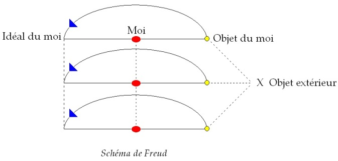

# Leçon 19 | 29 Avril 1959

  <label><input type="checkbox" data-lacan-toggle="original" checked> 原文</label>
  <label><input type="checkbox" data-lacan-toggle="notes" checked> 注释</label>
  <label><input type="checkbox" data-lacan-toggle="commentary" checked> 个人解读评论</label>

<section class="parallel-paragraph" data-paragraph-ids="s6-19-0001">

s6-19-0001

[无对应译文]

原文 · s6-19-0001

HAMLET (7) Si la tragédie d’HAMLET est la tragédie du désir, il est temps de remarquer…

</section>

<section class="parallel-paragraph" data-paragraph-ids="s6-19-0002">

s6-19-0002

[无对应译文]

原文 · s6-19-0002

> *c’est là où je vous ai amenés à la fin de mon dernier propos*, au moment où nous arrivions au bout de notre cours

</section>

<section class="parallel-paragraph" data-paragraph-ids="s6-19-0003">

s6-19-0003

[无对应译文]

原文 · s6-19-0003

…ce que l’on remarque toujours en dernier, à savoir ce qui est le plus évident. Je ne sache pas en effet qu’aucun auteur se soit arrêté seulement à cette remarque…

</section>

<section class="parallel-paragraph" data-paragraph-ids="s6-19-0004">

s6-19-0004

[无对应译文]

原文 · s6-19-0004

> difficile pourtant à méconnaître une fois qu’on l’a formulée

</section>

<section class="parallel-paragraph" data-paragraph-ids="s6-19-0005">

s6-19-0005

[无对应译文]

原文 · s6-19-0005

…que *d’un bout à l’autre d’HAMLET on ne parle que de deuil*.

</section>

<section class="parallel-paragraph" data-paragraph-ids="s6-19-0006">

s6-19-0006

[无对应译文]

原文 · s6-19-0006

La première remarque d’HAMLET concerne ce scandale, ce mariage précoce de sa mère : ce mariage que la mère, elle-même, dans son anxiété…

</section>

<section class="parallel-paragraph" data-paragraph-ids="s6-19-0007">

s6-19-0007

[无对应译文]

原文 · s6-19-0007

son anxiété à savoir *ce qui tourmente son fils aimé*

</section>

<section class="parallel-paragraph" data-paragraph-ids="s6-19-0008">

s6-19-0008

[无对应译文]

原文 · s6-19-0008

…appelle elle-même « *Notre mariage trop précoce* » :

</section>

<section class="parallel-paragraph" data-paragraph-ids="s6-19-0009">

s6-19-0009

[无对应译文]

原文 · s6-19-0009

- « *I doubt it is no other but the main, his father’s death and our o’er-hasty marriage.* »

</section>

<section class="parallel-paragraph" data-paragraph-ids="s6-19-0010">

s6-19-0010

[无对应译文]

原文 · s6-19-0010

\[*Pour moi, je n’en soupçonne point d’autre que la mort de son père et notre mariage précipité.* (II, 2, 56)\]

</section>

<section class="parallel-paragraph" data-paragraph-ids="s6-19-0011">

s6-19-0011

[无对应译文]

原文 · s6-19-0011

Pas besoin de vous rappeler ces paroles d’HAMLET sur ces reliefs *du repas des funérailles* qui servirent *au repas des noces* : « *Économie! Économie ! Thrift, thrift, Horatio !* » \[1, 2, 180\] indiquant avec ce terme quelque chose qui nous rappelle que dans notre exploration du *monde de l’objet*…

</section>

<section class="parallel-paragraph" data-paragraph-ids="s6-19-0012">

s6-19-0012

[无对应译文]

原文 · s6-19-0012

dans cette articulation qui est celle de la société moderne

</section>

<section class="parallel-paragraph" data-paragraph-ids="s6-19-0013">

s6-19-0013

[无对应译文]

原文 · s6-19-0013

…entre ce que nous appelons « *les valeurs d’usage* » et « *les valeurs d’échange* » avec toutes les notions qui autour de cela s’engendrent, il y a quelque chose peut-être que l’analyse méconnaît…

</section>

<section class="parallel-paragraph" data-paragraph-ids="s6-19-0014">

s6-19-0014

[无对应译文]

原文 · s6-19-0014

> j’entends l’analyse marxiste, économique, pour autant qu’elle domine la pensée de notre époque

</section>

<section class="parallel-paragraph" data-paragraph-ids="s6-19-0015">

s6-19-0015

[无对应译文]

原文 · s6-19-0015

…et dont nous touchons à tout instant la force et l’ampleur, ce sont les valeurs rituelles. Encore pour ce que nous les pointions sans cesse dans notre expérience, peut-il être utile que nous les détachions, que nous les articulions comme *essentielles*.

</section>

<section class="parallel-paragraph" data-paragraph-ids="s6-19-0016">

s6-19-0016

[无对应译文]

原文 · s6-19-0016

J’ai déjà fait allusion *l’avant-dernière fois* \[en fait le 22-04-1959\], à cette fonction du rite dans le deuil. C’est par cette médiation que le rite introduit à ce que le deuil ouvre de béance quelque part, plus exactement à la façon dont il vient coïncider, mettre au centre d’une *béance* tout à fait essentielle, la *béance symbolique*, majeure, le *manque symbolique*, le *point X* en somme dont on peut dire que quelque part, quand FREUD fait allusion à « *l’ombilic du rêve* », peut-être est-ce justement le *correspondant psychologique* qu’il évoque de ce *manque*.

</section>

<section class="parallel-paragraph" data-paragraph-ids="s6-19-0017">

s6-19-0017

[无对应译文]

原文 · s6-19-0017

Aussi bien sur la question du deuil ne pouvons-nous ne pas être frappés que dans tous les deuils qui sont majeurs, qui sont mis en question dans HAMLET, toujours revient ceci : que les rites ont été abrégés, clandestins. POLONIUS est enterré sans cérémonie, secrètement, *à la va-vite*, pour des raisons politiques.

</section>

<section class="parallel-paragraph" data-paragraph-ids="s6-19-0018">

s6-19-0018

[无对应译文]

原文 · s6-19-0018

Et vous vous souvenez de tout ce qui se joue autour de l’enterrement d’OPHÉLIE, de *la discussion* de savoir comment il se fait que très probablement, étant morte l’ayant voulu, s’étant noyée d’une façon délibérée…

</section>

<section class="parallel-paragraph" data-paragraph-ids="s6-19-0019">

s6-19-0019

[无对应译文]

原文 · s6-19-0019

du moins est-ce l’avis du populaire

</section>

<section class="parallel-paragraph" data-paragraph-ids="s6-19-0020">

s6-19-0020

[无对应译文]

原文 · s6-19-0020

…néanmoins elle est enterrée *en terre sainte*, *en terre chrétienne*, néanmoins quelque chose du rite chrétien lui est accordé, les fossoyeurs n’en doutent pas.

</section>

<section class="parallel-paragraph" data-paragraph-ids="s6-19-0021">

s6-19-0021

[无对应译文]

原文 · s6-19-0021

Si elle n’était pas une personne d’un rang si élevé, on l’aurait traitée autrement, de la façon dont le prêtre articule que cela aurait dû être, car lui n’est pas d’avis qu’on lui rende ces *honneurs funéraires*. On l’aurait jetée en terre non consacrée, on aurait accumulé sur elle les tessons et les détritus de la malédiction et des ténèbres. Le prêtre n’a consenti qu’à des rites abrégés eux aussi.

</section>

<section class="parallel-paragraph" data-paragraph-ids="s6-19-0022">

s6-19-0022

[无对应译文]

原文 · s6-19-0022

Tout ceci est fortement accentué à la fin de la scène du cimetière. Nous ne pouvons pas ne pas tenir compte de tous ces éléments, surtout si nous y ajoutons bien d’autres choses.

</section>

<section class="parallel-paragraph" data-paragraph-ids="s6-19-0023">

s6-19-0023

[无对应译文]

原文 · s6-19-0023

L’ombre du père est une ombre qui a un *grief inexpiable*, qui a été surprise - nous dit-il - offensée d’une façon éternelle qui a été surprise - ce n’est pas là un des moindres mystères du sens de cette tragédie - « …*dans la fleur de ses pêchés*… ». \[*Cut off even in the blossoms of my sin*… (I, 5, 76) \] Il n’a pas eu le temps de rassembler avant sa mort ce quelque chose qui l’eut mis en état de comparaître devant le jugement dernier.

</section>

<section class="parallel-paragraph" data-paragraph-ids="s6-19-0024">

s6-19-0024

[无对应译文]

原文 · s6-19-0024

Nous avons là une sorte de traces, de *clues* comme on dit en anglais, d’éléments qui s’ordonnent trop, convergent trop d’une façon éminemment significative pour que nous ne nous y arrêtions pas…

</section>

<section class="parallel-paragraph" data-paragraph-ids="s6-19-0025">

s6-19-0025

[无对应译文]

原文 · s6-19-0025

> pour que nous ne demandions pas, comme nous avons commencé de le faire la dernière fois

</section>

<section class="parallel-paragraph" data-paragraph-ids="s6-19-0026">

s6-19-0026

[无对应译文]

原文 · s6-19-0026

…sur le rapport du drame du *désir* avec tout ce dont il s’agit autour du *deuil* et des exigences du deuil.

</section>

<section class="parallel-paragraph" data-paragraph-ids="s6-19-0027">

s6-19-0027

[无对应译文]

原文 · s6-19-0027

C’est le point sur lequel je voudrais aujourd’hui m’arrêter pour tâcher d’approfondir dans quel sens ceci, pour nous, introduit une question :

</section>

<section class="parallel-paragraph" data-paragraph-ids="s6-19-0028">

s6-19-0028

[无对应译文]

原文 · s6-19-0028

- en tant que cette question est celle de *l’objet*,

</section>

<section class="parallel-paragraph" data-paragraph-ids="s6-19-0029">

s6-19-0029

[无对应译文]

原文 · s6-19-0029

- et de *l’objet* en tant que nous l’abordons dans l’analyse sous diverses formes.

</section>

<section class="parallel-paragraph" data-paragraph-ids="s6-19-0030">

s6-19-0030

[无对应译文]

原文 · s6-19-0030

Nous l’abordons au sens de *l’objet du désir*. Et il y a aussi de *l’objet* au *désir* un rapport simple, comme dans un rendez–vous qui pourrait être articulé comme s’il s’agissait d’un simple appointement, alors que peut-être c’est autre chose. Nous abordons aussi la question de *l’objet* d’un angle tout différent quand nous parlons de *l’objet* en tant que le sujet s’y identifie dans le deuil, il peut, dit­on, le réintégrer à son ego. Qu’est-ce là ?

</section>

<section class="parallel-paragraph" data-paragraph-ids="s6-19-0031">

s6-19-0031

[无对应译文]

原文 · s6-19-0031

Est-ce qu’il n’y a pas là *<u>deux</u> phases* qui dans l’analyse ne sont pas articulées, ne sont pas accordées ? Est-ce que quelque chose n’exige pas de nous que nous essayions de pénétrer plus loin dans ce problème?

</section>

<section class="parallel-paragraph" data-paragraph-ids="s6-19-0032">

s6-19-0032

[无对应译文]

原文 · s6-19-0032

Bien sûr, ce que je viens de dire du deuil dans *Hamlet* ne nous permet pas de voiler :

</section>

<section class="parallel-paragraph" data-paragraph-ids="s6-19-0033">

s6-19-0033

[无对应译文]

原文 · s6-19-0033

- que le fond de ce deuil c’est - dans *Hamlet* comme dans *Œdipe* - un *crime*,

</section>

<section class="parallel-paragraph" data-paragraph-ids="s6-19-0034">

s6-19-0034

[无对应译文]

原文 · s6-19-0034

- que jusqu’à un certain point tous ces deuils se succèdent en cascade comme *les suites*, *les séquelles*, *les conséquences* du *crime* d’où part le drame.

</section>

<section class="parallel-paragraph" data-paragraph-ids="s6-19-0035">

s6-19-0035

[无对应译文]

原文 · s6-19-0035

Et ceci est aussi bien ce par quoi *Hamlet*, disons-nous, est un drame œdipien, ce qui nous permet de l’égaler, de le mettre au même niveau fonctionnel, dans la généalogie tragique, que l’Œdipe. C’est cela qui a mis FREUD, et à sa suite ses disciples, sur la piste de l’importance pour nous d’HAMLET.

</section>

<section class="parallel-paragraph" data-paragraph-ids="s6-19-0036">

s6-19-0036

[无对应译文]

原文 · s6-19-0036

Mais ce doit être du même coup pour nous une occasion de faire sur ce sujet…

</section>

<section class="parallel-paragraph" data-paragraph-ids="s6-19-0037">

s6-19-0037

[无对应译文]

原文 · s6-19-0037

- puisque HAMLET pour la tradition analytique se situe au centre d’une *méditation sur les origines*,

</section>

<section class="parallel-paragraph" data-paragraph-ids="s6-19-0038">

s6-19-0038

[无对应译文]

原文 · s6-19-0038

- puisque nous avons l’habitude de reconnaître dans le crime d’ŒDIPE la trame la plus essentielle du rapport du sujet à ce que nous appelons ici l’Autre, à savoir *le lieu où s’inscrit la loi*

</section>

<section class="parallel-paragraph" data-paragraph-ids="s6-19-0039">

s6-19-0039

[无对应译文]

原文 · s6-19-0039

…de rappeler quelques termes essentiels de la façon dont pour nous, sont jusqu’à présent articulées *ces relations du sujet* avec ce qu’on peut appeler le *crime originel*.

</section>

<section class="parallel-paragraph" data-paragraph-ids="s6-19-0040">

s6-19-0040

[无对应译文]

原文 · s6-19-0040

Il est bien clair que nous devons distinguer…

</section>

<section class="parallel-paragraph" data-paragraph-ids="s6-19-0041">

s6-19-0041

[无对应译文]

原文 · s6-19-0041

> au lieu de faire comme toujours, de laisser les choses dans une sorte de trouble et de flou
>
> qui ne facilite pas les spéculations des choses que nous avons à dire sur ce sujet

</section>

<section class="parallel-paragraph" data-paragraph-ids="s6-19-0042">

s6-19-0042

[无对应译文]

原文 · s6-19-0042

…que nous nous trouvons en présence de deux étages. Il y a *le mythe freudien*, qui mérite d’être appelé ainsi…

</section>

<section class="parallel-paragraph" data-paragraph-ids="s6-19-0043">

s6-19-0043

[无对应译文]

原文 · s6-19-0043

> *la construction du totem*, établie en tant qu’elle ordonne ce qu’on peut appeler à proprement parler *un mythe*.
>
> J’ai déjà, à l’occasion, touché ce problème : en quoi peut-être même on peut dire que la construction freudienne est peut-être ici l’exemple unique d’un mythe formé qui soit sorti dans notre âge historique

</section>

<section class="parallel-paragraph" data-paragraph-ids="s6-19-0044">

s6-19-0044

[无对应译文]

原文 · s6-19-0044

…il y a ce mythe qui nous indique en quelque sorte la liaison primitive, essentielle, de toute nécessité, qui fait que nous ne pouvons concevoir l’ordre de la loi, sinon sur la base de quelque chose de plus primordial qui se présente comme quoi ?

</section>

<section class="parallel-paragraph" data-paragraph-ids="s6-19-0045">

s6-19-0045

[无对应译文]

原文 · s6-19-0045

C’est là le sens du mythe d’Œdipe de FREUD, il est trop évident que ce crime, qui est *le meurtre primitif du père*…

</section>

<section class="parallel-paragraph" data-paragraph-ids="s6-19-0046">

s6-19-0046

[无对应译文]

原文 · s6-19-0046

> qui est pour lui exigé comme devant reparaître toujours comme formant l’horizon, la barre terminale du problème des origines en toute matière analytique, remarquons-le, car il le retrouve toujours et rien ne lui paraît épuisé qu’il ne le rejoigne à ce dernier terme

</section>

<section class="parallel-paragraph" data-paragraph-ids="s6-19-0047">

s6-19-0047

[无对应译文]

原文 · s6-19-0047

…*le meurtre primitif du père*, qu’il le place à l’origine de la horde ou à l’origine de la tradition judaïque, a bien évidemment un caractère d’exigence mythique.

</section>

<section class="parallel-paragraph" data-paragraph-ids="s6-19-0048">

s6-19-0048

[无对应译文]

原文 · s6-19-0048

Un autre plan est celui où ce quelque chose se développe et s’incarne d’un drame formateur. Autre chose est le rapport de la loi primitive au crime primitif, et ce qui se passe quand le héros tragique qui est ŒDIPE, qui aussi bien est chacun de nous en quelque point de son être virtuellement quand il reproduit le drame œdipien, quand en tuant le père il s’accouple avec la mère, quand en quelque sorte il renouvelle sur le plan tragique, en une sorte de *bain lustral*, la renaissance de la loi.

</section>

<section class="parallel-paragraph" data-paragraph-ids="s6-19-0049">

s6-19-0049

[无对应译文]

原文 · s6-19-0049

Ici nous pouvons voir les dissymétries entre la tragédie d’ŒDIPE et la tragédie d’HAMLET.

</section>

<section class="parallel-paragraph" data-paragraph-ids="s6-19-0050">

s6-19-0050

[无对应译文]

原文 · s6-19-0050

ŒDIPE répond strictement à cette définition que je viens de donner de reproduction rituelle du mythe.

</section>

<section class="parallel-paragraph" data-paragraph-ids="s6-19-0051">

s6-19-0051

[无对应译文]

原文 · s6-19-0051

ŒDIPE, en somme complètement innocent, inconscient, fait dans une sorte de rêve qui est sa vie…

</section>

<section class="parallel-paragraph" data-paragraph-ids="s6-19-0052">

s6-19-0052

[无对应译文]

原文 · s6-19-0052

*La v**ie est un songe* [^88]

</section>

<section class="parallel-paragraph" data-paragraph-ids="s6-19-0053">

s6-19-0053

[无对应译文]

原文 · s6-19-0053

…accomplit à son insu le renouvellement des passes qui vont du crime à la restauration de l’ordre et à la punition qu’il assume lui-même, qui nous le fait apparaître à la fin, châtré. Car c’est bien là l’élément dont nous devons tenir un compte essentiel et qui reste, si nous nous tenons au niveau génétique du meurtre primitif, l’élément qui nous reste voilé.

</section>

<section class="parallel-paragraph" data-paragraph-ids="s6-19-0054">

s6-19-0054

[无对应译文]

原文 · s6-19-0054

C’est le sens en fin de compte de ce qui pointe, de ce qui importe, c’est à savoir de cette punition, de cette sanction, de cette castration dans laquelle reste *enfermé à clef* le quelque chose qui est le résultat, qui est à proprement parler *l’humanisation de la sexualité* chez l’homme, qui est aussi bien la clef dans laquelle nous avons coutume, par *notre* expérience, de faire tourner tous les *accidents* d’évolution *du désir*.

</section>

<section class="parallel-paragraph" data-paragraph-ids="s6-19-0055">

s6-19-0055

[无对应译文]

原文 · s6-19-0055

C’est ici qu’il n’est pas indifférent de nous apercevoir *des dissymétries entre le drame d’*HAMLET et *le drame d’*ŒDIPE. Les poursuivre jusque dans le détail serait presque une opération trop brillante. Indiquons quand même que :

</section>

<section class="parallel-paragraph" data-paragraph-ids="s6-19-0056">

s6-19-0056

[无对应译文]

原文 · s6-19-0056

- le crime se produit dans *Œdipe*, au niveau de la génération du héros,

</section>

<section class="parallel-paragraph" data-paragraph-ids="s6-19-0057">

s6-19-0057

[无对应译文]

原文 · s6-19-0057

- dans *Hamlet*, il s’est déjà produit au niveau de la génération précédente,

</section>

<section class="parallel-paragraph" data-paragraph-ids="s6-19-0058">

s6-19-0058

[无对应译文]

原文 · s6-19-0058

- dans *Œdipe* il se produit, le héros ne sachant pas ce qu’il fait et en quelque sorte guidé par le *fatum*,

</section>

<section class="parallel-paragraph" data-paragraph-ids="s6-19-0059">

s6-19-0059

[无对应译文]

原文 · s6-19-0059

- ici, dans *Hamlet*, le crime est accompli d’une façon délibérée puisqu’il l’est même par traîtrise. Il surprend celui qui en est la victime : le père, dans une sorte de sommeil et même dans un sommeil tout à fait réel. Il est dans ce sommeil quelque chose qui n’est pas absolument intégré.

</section>

<section class="parallel-paragraph" data-paragraph-ids="s6-19-0060">

s6-19-0060

[无对应译文]

原文 · s6-19-0060

On peut dire qu’ŒDIPE a joué le drame comme chacun de nous le répète dans ses rêves, mais ici le héros a été vraiment - ici nos références peuvent servir - surpris d’une façon complètement étrangère au *phylum* de ce qu’il poursuit alors de ses pensées. Il l’indique : « *J’ai été surpris dans la fleur de mes pêchés.* »[^89] Un coup vient le frapper, partant d’un point d’où il ne l’attend pas, véritable intrusion du réel, véritable rupture du fil de la destinée. Il meurt sur un lit de fleurs, nous dit le texte shakespearien, et la scène des acteurs va même jusqu’à nous reproduire, dans l’espèce de pantomime préliminaire, ce lit de fleurs sur la scène.

</section>

<section class="parallel-paragraph" data-paragraph-ids="s6-19-0061">

s6-19-0061

[无对应译文]

原文 · s6-19-0061

Il y a là sans aucun doute quelque mystère, et dont aussi bien dès le début, je vous ai signalé le contraste avec le fait si singulier que ceci, qui est l’irruption la plus étrangère au sujet, dans le crime est quelque chose qui paraît en quelque sorte compensé, contrasté de la façon la plus paradoxale par le fait qu’ici le sujet sait. Je veux dire qu’HAMLET est informé par son père qui sait ce qui est arrivé, et ce n’est pas là non plus l’une des moindres énigmes.

</section>

<section class="parallel-paragraph" data-paragraph-ids="s6-19-0062">

s6-19-0062

[无对应译文]

原文 · s6-19-0062

Le drame d’HAMLET, contrairement à celui d’ŒDIPE, ne part pas de cette question :

</section>

<section class="parallel-paragraph" data-paragraph-ids="s6-19-0063">

s6-19-0063

[无对应译文]

原文 · s6-19-0063

- qu’est-ce qui se passe ?

</section>

<section class="parallel-paragraph" data-paragraph-ids="s6-19-0064">

s6-19-0064

[无对应译文]

原文 · s6-19-0064

- Où est le crime ?

</section>

<section class="parallel-paragraph" data-paragraph-ids="s6-19-0065">

s6-19-0065

[无对应译文]

原文 · s6-19-0065

- Où est le coupable ?

</section>

<section class="parallel-paragraph" data-paragraph-ids="s6-19-0066">

s6-19-0066

[无对应译文]

原文 · s6-19-0066

Il part de la dénonciation du crime - du crime mis au jour dans l’oreille du sujet - et il se déroule à partir de la révélation du crime.

</section>

<section class="parallel-paragraph" data-paragraph-ids="s6-19-0067">

s6-19-0067

[无对应译文]

原文 · s6-19-0067

Aussi bien verrons-nous là à la fois toute l’*ambiguïté* et le *contraste* de quelque chose dont on peut inscrire, sous la forme qui est celle où nous inscrivons le message de l’inconscient, à savoir : le signifiant de A barré, S(A). Dans la forme si l’on peut dire normale de l’œdipe, le S(A) porte une incarnation, celle de l’Autre, du père, d’autant que de lui est attendue et appelée la sanction du lieu de l’Autre, la vérité de la vérité :

</section>

<section class="parallel-paragraph" data-paragraph-ids="s6-19-0068">

s6-19-0068

[无对应译文]

原文 · s6-19-0068

- en tant qu’il doit être l’auteur de la loi,

</section>

<section class="parallel-paragraph" data-paragraph-ids="s6-19-0069">

s6-19-0069

[无对应译文]

原文 · s6-19-0069

- et pourtant en tant qu’il n’est jamais que celui qui la subit,

</section>

<section class="parallel-paragraph" data-paragraph-ids="s6-19-0070">

s6-19-0070

[无对应译文]

原文 · s6-19-0070

- celui qui, pas plus que quiconque d’autre, ne peut la garantir,

</section>

<section class="parallel-paragraph" data-paragraph-ids="s6-19-0071">

s6-19-0071

[无对应译文]

原文 · s6-19-0071

- celui qui lui aussi, a à subir la barre,

</section>

<section class="parallel-paragraph" data-paragraph-ids="s6-19-0072">

s6-19-0072

[无对应译文]

原文 · s6-19-0072

- celui qui pour autant qu’il est le père réel fait de lui un père châtré.

</section>

<section class="parallel-paragraph" data-paragraph-ids="s6-19-0073">

s6-19-0073

[无对应译文]

原文 · s6-19-0073

Toute différente, quoi qu’elle puisse se symboliser de la même manière, est la position à la fin, d’HAMLET, ou plus exactement à son départ puisque c’est le message qui ouvre le drame d’HAMLET.

</section>

<section class="parallel-paragraph" data-paragraph-ids="s6-19-0074">

s6-19-0074

[无对应译文]

原文 · s6-19-0074

Ici aussi nous voyons l’Autre s’avérer sous la forme la plus signifiante comme un A barré, A .

</section>

<section class="parallel-paragraph" data-paragraph-ids="s6-19-0075">

s6-19-0075

[无对应译文]

原文 · s6-19-0075

Ce n’est pas seulement de la surface des vivants qu’il est rayé, c’est de sa juste rémunération. Il est entré avec le crime dans le domaine de *l’enfer*, c’est-à-dire *une dette qu’il n’a pas pu payer, une dette inexpiable*, dit-il. Et c’est bien là le sens le plus terrible et le plus angoissant de sa révélation pour son fils.

</section>

<section class="parallel-paragraph" data-paragraph-ids="s6-19-0076">

s6-19-0076

[无对应译文]

原文 · s6-19-0076

ŒDIPE *a payé*, se présente comme celui qui porte dans la destinée du héros la charge de *la dette accomplie*, *rétribuée*. Ce dont se plaint pour l’éternité le père d’HAMLET, c’est d’avoir été dans ce fil, interrompu, surpris, brisé, c’est de ne plus pouvoir en répondre jamais.

</section>

<section class="parallel-paragraph" data-paragraph-ids="s6-19-0077">

s6-19-0077

[无对应译文]

原文 · s6-19-0077

Vous le voyez, ce autour de quoi nous mène notre investigation à mesure qu’elle progresse, c’est ce dont il s’agit dans la rétribution, dans la punition, dans la castration, dans le rapport au *signifiant phallus* puisque c’est dans ce sens que nous avons commencé de l’articuler.

</section>

<section class="parallel-paragraph" data-paragraph-ids="s6-19-0078">

s6-19-0078

[无对应译文]

原文 · s6-19-0078

Et une ambiguïté s’établit entre ce que FREUD lui-même nous a indiqué…

</section>

<section class="parallel-paragraph" data-paragraph-ids="s6-19-0079">

s6-19-0079

[无对应译文]

原文 · s6-19-0079

d’une façon peut-être un peu « *fin de siècle* »

</section>

<section class="parallel-paragraph" data-paragraph-ids="s6-19-0080">

s6-19-0080

[无对应译文]

原文 · s6-19-0080

…à savoir ce quelque chose qui ferait que nous sommes voués à ne plus vivre l’œdipe que sous une forme en quelque sorte faussée, ce quelque chose dont il y a assurément un écho dans HAMLET.

</section>

<section class="parallel-paragraph" data-paragraph-ids="s6-19-0081">

s6-19-0081

[无对应译文]

原文 · s6-19-0081

Un des premiers cris à la fin du premier acte d’HAMLET est celui-ci :

</section>

<section class="parallel-paragraph" data-paragraph-ids="s6-19-0082">

s6-19-0082

[无对应译文]

原文 · s6-19-0082

- « *The time is out of joint. O cursed spite That ever I was born to set it right !* *Le temps est sorti de ses gonds, Ô maudit...* - Je ne peux traduire autrement « *spite* » - ...*dépit.* » \[I, 5, 188\]

</section>

<section class="parallel-paragraph" data-paragraph-ids="s6-19-0083">

s6-19-0083

[无对应译文]

原文 · s6-19-0083

« *Spite* » est partout dans les *Sonnets* de SHAKESPEARE, « *dépit* » a pris pour nous un sens subjectif.

</section>

<section class="parallel-paragraph" data-paragraph-ids="s6-19-0084">

s6-19-0084

[无对应译文]

原文 · s6-19-0084

Notre premier pas dans une introduction à la compréhension des élisabéthains serait, à propos d’un certain nombre de mots, de voir leur redonner aussi le pouvoir de tourner sur leurs gonds, c’est-à-dire de *situer le dépit quelque part* *entre le dépit objectif et le dépit subjectif,* dans *quelque chose* dont nous semblons avoir perdu la référence, qui est justement ce qui se passe au niveau de l’ordre, à savoir des termes qui peuvent être entre les deux, entre *l’objectif* et le *subjectif*.

</section>

<section class="parallel-paragraph" data-paragraph-ids="s6-19-0085">

s6-19-0085

[无对应译文]

原文 · s6-19-0085

« *0 cursed spite* », c’est ce dont il a dépit, c’est en quoi le temps lui fait aussi injustice…

</section>

<section class="parallel-paragraph" data-paragraph-ids="s6-19-0086">

s6-19-0086

[无对应译文]

原文 · s6-19-0086

> nous ne savons plus articuler ces mots qui sont en jeu au centre de ce qui est le vécu du sujet

</section>

<section class="parallel-paragraph" data-paragraph-ids="s6-19-0087">

s6-19-0087

[无对应译文]

原文 · s6-19-0087

…ou bien tout ce qu’il peut désigner comme l’injustice dans le monde. Peut-être y reconnaissez-vous au passage *le fourvoiement* de « *la belle âme* » dont nous ne sommes pas sortis, *loin de là*, malgré tous nos efforts, mais que le vocabulaire shakespearien transcende.

</section>

<section class="parallel-paragraph" data-paragraph-ids="s6-19-0088">

s6-19-0088

[无对应译文]

原文 · s6-19-0088

Et ce n’est pas pour rien que j’ai fait allusion ici aux *Sonnets* si allégrement. Donc :

</section>

<section class="parallel-paragraph" data-paragraph-ids="s6-19-0089">

s6-19-0089

[无对应译文]

原文 · s6-19-0089

- « *Ô malédiction, que je ne sois né jamais pour le remettre droit.* » \[*O cursed spite That ever I was born to set it right !* (I, 5, 188)\]

</section>

<section class="parallel-paragraph" data-paragraph-ids="s6-19-0090">

s6-19-0090

[无对应译文]

原文 · s6-19-0090

Et voici donc à la fois justifié, mais approfondi, ce qui peut nous apparaître dans l’*Hamlet* illustrer une forme décadente de l’œdipe. \[Cf. *Œdipe à Colonne *: μή ϕῦναι (mè phunai)\] Une sorte d’*Untergang* complète qui fait ambiguïté avec ce vers quoi je veux maintenant un instant amener votre attention, à savoir ce que FREUD appelle ainsi dans chaque vie individuelle, à savoir *ce qu’il a décrit sous ce titre en* 1924, attirant lui-même l’attention sur ce qui est en fin de compte l’énigme de l’œdipe, qui n’est pas simplement que le sujet ait voulu, désiré le meurtre de son père, le viol de sa mère, mais que ceci soit dans l’inconscient.

</section>

<section class="parallel-paragraph" data-paragraph-ids="s6-19-0091">

s6-19-0091

[无对应译文]

原文 · s6-19-0091

C’est à savoir comment ceci vient à être dans l’inconscient et comment il vient à y être au point que le sujet, pendant une période de sa vie importante, la période de latence…

</section>

<section class="parallel-paragraph" data-paragraph-ids="s6-19-0092">

s6-19-0092

[无对应译文]

原文 · s6-19-0092

> source des points de construction chez l’être humain de tout son monde objectif

</section>

<section class="parallel-paragraph" data-paragraph-ids="s6-19-0093">

s6-19-0093

[无对应译文]

原文 · s6-19-0093

…vient à ne plus s’en occuper du tout.

</section>

<section class="parallel-paragraph" data-paragraph-ids="s6-19-0094">

s6-19-0094

[无对应译文]

原文 · s6-19-0094

Tellement à ne plus s’en occuper du tout que vous savez fort bien que FREUD admet, du moins à l’origine de son articulation doctrinale, que dans un cas idéal ne plus s’en occuper devienne quelque chose d’heureusement définitif.

</section>

<section class="parallel-paragraph" data-paragraph-ids="s6-19-0095">

s6-19-0095

[无对应译文]

原文 · s6-19-0095

Je vous renvoie à ce texte qui n’est pas long, et que vous trouverez dans le *tome XIII* des *Gesammelte Werke*.[^90] Qu’est-ce que FREUD nous dit ?

</section>

<section class="parallel-paragraph" data-paragraph-ids="s6-19-0096">

s6-19-0096

[无对应译文]

原文 · s6-19-0096

Partons de ce qu’il nous dit, puis nous verrons après en quoi cela peut venir apporter de *l’eau à notre moulin*. FREUD nous dit : *le complexe d’Œdipe* entre dans son *Untergang*, dans sa descente, dans son déclin, dans ce déclin qui sera une péripétie décisive pour tout développement ultérieur du sujet, à la suite de ceci :

</section>

<section class="parallel-paragraph" data-paragraph-ids="s6-19-0097">

s6-19-0097

[无对应译文]

原文 · s6-19-0097

- pour autant, dit-il, que *le complexe d’Œdipe* n’a été éprouvé, expérimenté sous les deux faces de sa position triangulaire,

</section>

<section class="parallel-paragraph" data-paragraph-ids="s6-19-0098">

s6-19-0098

[无对应译文]

原文 · s6-19-0098

- pour autant que le sujet, rival du père, s’est vu sur ce point concret d’une menace, qui n’est rien d’autre que la castration, c’est-à-dire que, pour autant qu’il veut prendre la place du père, il sera châtré,

</section>

<section class="parallel-paragraph" data-paragraph-ids="s6-19-0099">

s6-19-0099

[无对应译文]

原文 · s6-19-0099

- pour autant qu’il prendra la place de la mère - c’est littéralement ce que dit FREUD - il perdra aussi *le phallus*, puisque le point d’achèvement, de maturité de l’œdipe, la découverte plénière du fait que la femme est châtrée, est faite également.

</section>

<section class="parallel-paragraph" data-paragraph-ids="s6-19-0100">

s6-19-0100

[无对应译文]

原文 · s6-19-0100

C’est très précisément en tant que le sujet est pris dans cette alternative close qui ne lui laisse aucune issue, sur le plan de quelque chose que nous pouvons articuler comme le rapport, que nous allons essayer plus loin de mieux approfondir cette chose qui s’appelle le *phallus* et qui est la clef de la situation, qui à ce moment-là est celle qui se forme comme celle du drame essentiel de l’œdipe. L’œdipe, dirai-je, en tant qu’il est précisément chez le sujet, marque le joint et le tournant qui le fait passer du plan de la demande à celui du désir.

</section>

<section class="parallel-paragraph" data-paragraph-ids="s6-19-0101">

s6-19-0101

[无对应译文]

原文 · s6-19-0101

C’est en tant que cette « *chose* »…

</section>

<section class="parallel-paragraph" data-paragraph-ids="s6-19-0102">

s6-19-0102

[无对应译文]

原文 · s6-19-0102

> car je laisse l’interrogation sur la qualification, et nous allons voir ce que cela doit être pour nous

</section>

<section class="parallel-paragraph" data-paragraph-ids="s6-19-0103">

s6-19-0103

[无对应译文]

原文 · s6-19-0103

…je n’ai pas dit « *objet* », en disant « *chose* » je dis *réelle*, *non encore symbolisée* mais en quelque sorte *en puissance de l’être* : ceci - pour tout dire - que nous pouvons appeler *un signifiant* avec un sens diffus.

</section>

<section class="parallel-paragraph" data-paragraph-ids="s6-19-0104">

s6-19-0104

[无对应译文]

原文 · s6-19-0104

Le *phallus*, c’est ceci qui nous est présenté par FREUD comme la clef de l’*Untergang*, de la descente, du *déclin de l’œdipe*. Et nous voyons rassemblé dans *l’articulation freudienne* quelque chose qui ne met point la fille dans une position \- je ne dis pas dissymétrique - tellement dissymétrique.

</section>

<section class="parallel-paragraph" data-paragraph-ids="s6-19-0105">

s6-19-0105

[无对应译文]

原文 · s6-19-0105

- Et c’est en tant que le sujet entre quant à cette *chose* dans un rapport que nous pouvons appeler de lassitude - c’est dans le texte de FREUD - quant à la gratification,

</section>

<section class="parallel-paragraph" data-paragraph-ids="s6-19-0106">

s6-19-0106

[无对应译文]

原文 · s6-19-0106

- c’est en tant que le garçon renonce à *être à la hauteur* - ceci a été encore plus articulé pour la fille - *qu’aucune gratification* n’est à attendre sur ce plan,

</section>

<section class="parallel-paragraph" data-paragraph-ids="s6-19-0107">

s6-19-0107

[无对应译文]

原文 · s6-19-0107

- c’est en tant, pour tout dire, que quelque chose dont on sait que ne se produit pas à ce moment-là l’émergence articulée, que le sujet a à faire son deuil du *phallus*, que l’œdipe entre dans son déclin.

</section>

<section class="parallel-paragraph" data-paragraph-ids="s6-19-0108">

s6-19-0108

[无对应译文]

原文 · s6-19-0108

La chose se dégage d’une façon tellement évidente que c’est autour d’un deuil, qu’il ne se peut pas que nous n’essayions pas de faire le rapprochement pour nous apercevoir que c’est par là que pour nous s’éclaire la fonction ultérieure de ce *moment de déclin*, son rôle décisif qui, ne l’oublions pas, n’est pas seulement…

</section>

<section class="parallel-paragraph" data-paragraph-ids="s6-19-0109">

s6-19-0109

[无对应译文]

原文 · s6-19-0109

ne peut pas être seulement, pour nous,

</section>

<section class="parallel-paragraph" data-paragraph-ids="s6-19-0110">

s6-19-0110

[无对应译文]

原文 · s6-19-0110

…le fait que les fragments, les détritus plus ou moins incomplètement refoulés dans l’œdipe vont ressortir au niveau de la puberté sous la forme de *symptômes névrotiques*, mais de ceci...

</section>

<section class="parallel-paragraph" data-paragraph-ids="s6-19-0111">

s6-19-0111

[无对应译文]

原文 · s6-19-0111

que nous avons toujours admis aussi, qui est de l’expérience commune des analystes

</section>

<section class="parallel-paragraph" data-paragraph-ids="s6-19-0112">

s6-19-0112

[无对应译文]

原文 · s6-19-0112

...de ceci dépend quelque chose dans l’économie, non plus seulement de l’inconscient, mais dans *l’économie imaginaire* du sujet, qui ne s’appelle rien d’autre que sa normalisation sur le plan *génital*.

</section>

<section class="parallel-paragraph" data-paragraph-ids="s6-19-0113">

s6-19-0113

[无对应译文]

原文 · s6-19-0113

À savoir qu’il n’y a pas d’heureux succès de la maturation génitale, sinon par l’achèvement justement aussi plein que possible de cet œdipe, et en tant que l’œdipe porte comme conséquence le stigmate, chez l’homme comme chez la femme, du *complexe de castration*.

</section>

<section class="parallel-paragraph" data-paragraph-ids="s6-19-0114">

s6-19-0114

[无对应译文]

原文 · s6-19-0114

C’est ici alors, peut-être…

</section>

<section class="parallel-paragraph" data-paragraph-ids="s6-19-0115">

s6-19-0115

[无对应译文]

原文 · s6-19-0115

> en faisant le rapprochement, la synthèse avec ce qui nous a été donné
>
> dans l’œuvre freudienne concernant le mécanisme du deuil

</section>

<section class="parallel-paragraph" data-paragraph-ids="s6-19-0116">

s6-19-0116

[无对应译文]

原文 · s6-19-0116

…que nous pouvons nous apercevoir que c’est cela, pour nous, qui va être éclairant quant au fait que se produit chez le sujet ce deuil, sans doute particulier puisque ce *phallus* n’est pas, sans doute, un objet comme les autres.

</section>

<section class="parallel-paragraph" data-paragraph-ids="s6-19-0117">

s6-19-0117

[无对应译文]

原文 · s6-19-0117

Mais ici aussi nous pouvons nous arrêter, car après tout si je vous le demande : « *qu’est-ce qui définit la portée, les limites des objets dont nous pouvons avoir à porter le deuil ?* » ceci jusqu’à présent n’a pas été non plus articulé. Nous nous doutons bien que le *phallus*, parmi les objets dont nous pouvons avoir à porter le deuil, n’en est pas un comme les autres. Là comme partout, il doit avoir sa place bien à part, mais justement, c’est ce qu’il s’agit de préciser, et comme dans bien des cas quand il s’agit de préciser, c’est la place de quelque chose sur un fond : c’est en le précisant sur ce fond que la précision de la place du fond apparaît aussi en rétroaction.

</section>

<section class="parallel-paragraph" data-paragraph-ids="s6-19-0118">

s6-19-0118

[无对应译文]

原文 · s6-19-0118

Nous sommes ici en terrain complètement nouveau.

</section>

<section class="parallel-paragraph" data-paragraph-ids="s6-19-0119">

s6-19-0119

[无对应译文]

原文 · s6-19-0119

Essayons donc de nous avancer, car c’est à cela que va nous servir, au dernier terme, notre analyse d’HAMLET, c’est à nous rappeler *cette question que je laboure devant vous* par une série de touches concentriques, *que j’accentue*, que je vous fais entendre d’une façon diversement résonnante et que j’espère faire de plus en plus précise, à savoir ce que j’appelle *la place de l’objet dans le désir*. Que nous dit FREUD quant à ce deuil du *phallus* ?

</section>

<section class="parallel-paragraph" data-paragraph-ids="s6-19-0120">

s6-19-0120

[无对应译文]

原文 · s6-19-0120

Il nous dit que ce qui est lié à lui, ce qui en est *un des ressorts fondamentaux*, ce qui lui donne sa valeur - car c’est cela que nous cherchons - *c’est une exigence narcissique du sujet*. Voici établi ici le rapport de ce moment critique où le sujet se voit de toute façon châtré ou privé de *la chose*, du *phallus*. Ici FREUD fait intervenir, et comme toujours sans la moindre précaution, je veux dire qu’il nous bouscule comme à l’habitude, et - *Dieu merci !* - il l’a fait toute son existence, car il ne serait jamais *venu à bout* de ce qui lui restait à tracer dans son champ, il nous dit que *c’est une exigence narcissique*.

</section>

<section class="parallel-paragraph" data-paragraph-ids="s6-19-0121">

s6-19-0121

[无对应译文]

原文 · s6-19-0121

En présence de l’issue dernière de ses exigences œdipiennes, le sujet préfère, si l’on peut dire, s’abandonner toute *la partie de lui-même*, sujet - qui lui sera à jamais dès lors interdite - à savoir dans la chaîne signifiante ponctuée, ce qui fait le haut de notre graphe. Toute l’affaire n’est rien d’autre que l’affaire fondamentale de *la relation d’amour* telle qu’elle s’est pour lui présentée dans la dialectique parentale, et la façon dont il pouvait s’y introduire.

</section>

<section class="parallel-paragraph" data-paragraph-ids="s6-19-0122">

s6-19-0122

[无对应译文]

原文 · s6-19-0122

Il va laisser sombrer tout cela en raison - nous dit FREUD - de quelque chose qui a rapport à ce *phallus*…

</section>

<section class="parallel-paragraph" data-paragraph-ids="s6-19-0123">

s6-19-0123

[无对应译文]

原文 · s6-19-0123

> *comme tel déjà si énigmatiquement introduit là dès l’origine, et pourtant d’une façon si claire à travers toute l’expérience*

</section>

<section class="parallel-paragraph" data-paragraph-ids="s6-19-0124">

s6-19-0124

[无对应译文]

原文 · s6-19-0124

…dans un rapport narcissique avec ce terme.

</section>

<section class="parallel-paragraph" data-paragraph-ids="s6-19-0125">

s6-19-0125

[无对应译文]

原文 · s6-19-0125

Qu’est-ce que cela peut vouloir dire pour nous, dans notre vocabulaire, pour autant que notre vocabulaire peut être quelque chose d’éclairant, de plus éclairant, quelque chose par quoi nous essayons de répondre à cette exigence que FREUD - *disais-je à l’instant* - doit laisser de côté parce qu’il lui faut aller au vif, au tranchant du sujet et qu’il n’a pas longtemps à s’arrêter sur les prémisses. C’est d’ailleurs en général comme cela que se fonde toute action, et plus encore toute action véritable, c’est-à-dire l’action qui est là notre propos, tout au moins qui devrait l’être.

</section>

<section class="parallel-paragraph" data-paragraph-ids="s6-19-0126">

s6-19-0126

[无对应译文]

原文 · s6-19-0126

Eh bien, *traduit dans notre discours*, dans nos références, « *narcissique* » implique un certain rapport avec l’*imaginaire*. « *Narcissique* » nous explique ici ceci, c’est que très exactement *dans le deuil*, en tant que *dans ce deuil* rien n’est satisfait…

</section>

<section class="parallel-paragraph" data-paragraph-ids="s6-19-0127">

s6-19-0127

[无对应译文]

原文 · s6-19-0127

> et ici rien ne peut satisfaire, puisque la perte du *phallus* éprouvée comme telle est l’issue même du tour fait de tout le rapport du sujet à ce qui se passe *au lieu de l’Autre*, c’est-à-dire *au champ organisé du rapport symbolique* dans lequel a commencé de s’exprimer son exigence d’amour

</section>

<section class="parallel-paragraph" data-paragraph-ids="s6-19-0128">

s6-19-0128

[无对应译文]

原文 · s6-19-0128

…il est au bout, et *sa perte* en cette affaire *est radicale*.

</section>

<section class="parallel-paragraph" data-paragraph-ids="s6-19-0129">

s6-19-0129

[无对应译文]

原文 · s6-19-0129

Ce qui se produit alors est très précisément ce quelque chose dont j’ai déjà indiqué la parenté avec un mécanisme psychotique, pour autant que c’est avec sa texture imaginaire, et seulement avec elle, que le sujet peut y répondre. Ce que, sous une forme voilée, FREUD nous présente comme étant le lien narcissique du sujet à la situation représentant ceci, ceci qui nous permet à ce moment-là de l’identifier à quelque chose qui représente en lui, sur le plan *imaginaire*, ce manque comme tel qui met - si l’on peut dire : *en néantise* ou *en réserve -* en lui tout ce qui plus tard va être le moule d’où viendra se remodeler son *assomption* de sa position dans la fonction génitale.

</section>

<section class="parallel-paragraph" data-paragraph-ids="s6-19-0130">

s6-19-0130

[无对应译文]

原文 · s6-19-0130

Mais là, est-ce encore franchir trop vite ce dont il s’agit réellement ? Est-ce à faire croire - comme on le croit - que *le rapport à l’objet génital* est un rapport de *positif* à *négatif* ? Vous verrez, il n’en est rien, et c’est pour cela que nos notations sont meilleures, parce qu’elles permettent d’articuler comment va se présenter réellement le problème. Ce dont il s’agit en fait, c’est de quelque chose qui, pour nous, doit se connoter sous la forme suivante, pour autant qu’elle nous a fait aborder ce quelque chose que nous avons déjà approché quand nous avons distingué les fonctions *de la castration, de la frustration et de la privation*.

</section>

<section class="parallel-paragraph" data-paragraph-ids="s6-19-0131">

s6-19-0131

[无对应译文]

原文 · s6-19-0131

|                   |                                     |                |
|:-----------------:|:-----------------------------------:|:--------------:|
|     **Agent**     |             **Manque**              |   **Objet**    |
|                   | **Castration :** dette *symbolique* | *Imaginaire*   |
| Mère *symbolique* | **Frustration :** Dam *imaginaire*  |    *réel*      |
|                   |     **Privation :** trou *réel*     | *symbolique*   |

</section>

<section class="parallel-paragraph" data-paragraph-ids="s6-19-0132">

s6-19-0132

[无对应译文]

原文 · s6-19-0132

Si vous vous souvenez, alors je vous ai écrit :

</section>

<section class="parallel-paragraph" data-paragraph-ids="s6-19-0133">

s6-19-0133

[无对应译文]

原文 · s6-19-0133

- *castration*, action *symbolique*,

</section>

<section class="parallel-paragraph" data-paragraph-ids="s6-19-0134">

s6-19-0134

[无对应译文]

原文 · s6-19-0134

- *frustration* terme *imaginaire*,

</section>

<section class="parallel-paragraph" data-paragraph-ids="s6-19-0135">

s6-19-0135

[无对应译文]

原文 · s6-19-0135

- et *privation* terme *réel*.

</section>

<section class="parallel-paragraph" data-paragraph-ids="s6-19-0136">

s6-19-0136

[无对应译文]

原文 · s6-19-0136

je vous ai donné les connotations de leurs relations aux objets. je vous ai dit que la castration se rapportait à l’objet phallique imaginaire, et je vous ai écrit que la frustration, imaginaire dans sa nature, se rapportait toujours à un bien et à un terme réel, et que la privation, réelle, se rapportait à *un terme symbolique*. *Il n’y a - ajoutais-je à ce moment-là - dans le réel aucune espèce de phase ou de fissure.* *Tout manque est « manque à sa place »*, mais *manque à sa place* est *manque symbolique*.

</section>

<section class="parallel-paragraph" data-paragraph-ids="s6-19-0137">

s6-19-0137

[无对应译文]

原文 · s6-19-0137

Il y a ici une colonne qui est celle de l’*agent*, de ces actions avec leur terme *objectal* qui est quelque chose que j’ai touché à ce moment-là en un seul point, au niveau de l’agent de *la frustration*, la mère, et pour vous montrer que c’est pour autant que la mère comme telle est lieu de la demande d’amour, était d’abord symbolisée dans *le double registre de la présence et de l’absence*, qu’elle se trouvait être en position de donner le départ génétique de la dialectique, pour autant que, mère réelle, elle fait tourner ce dont le sujet est privé réellement, le sein par exemple, en symbole de son amour.

</section>

<section class="parallel-paragraph" data-paragraph-ids="s6-19-0138">

s6-19-0138

[无对应译文]

原文 · s6-19-0138

Et j’en suis resté là. Vous pourrez voir que sont restées libres ici les cases qui correspondent au terme *agent* dans *les deux autres relations*. C’est maintenant en effet, et seulement maintenant que nous pouvons ici inscrire ce dont il s’agit. Le terme « *agent* » est quelque chose qui, quant à sa place, se rapporte au sujet. Ce sujet, nous ne pouvions pas à ce moment-là en articuler nettement les différents étages. C’est maintenant que nous pouvons le faire, et maintenant que nous pouvons inscrire au niveau où nous avons placé le lieu effectif de la mère, le terme où tout ce qui se passe de son fait prend sa valeur, c’est-à-dire le A de l’Autre en tant que c’est là que s’articule *la demande*.

</section>

<section class="parallel-paragraph" data-paragraph-ids="s6-19-0139">

s6-19-0139

[无对应译文]

原文 · s6-19-0139

|                   |                                     |                      |
|:-----------------:|:-----------------------------------:|:--------------------:|
|     **Agent**     |             **Manque**              |      **Objet**       |
|    Père *réel*    | **Castration :** dette *symbolique* | Phallus *Imaginaire* |
| Mère *symbolique* | **Frustration :** Dam *imaginaire*  |     Sein *réel*      |
| Père *imaginaire* |     **Privation :** trou *réel*     | Phallus *symbolique* |

</section>

<section class="parallel-paragraph" data-paragraph-ids="s6-19-0140">

s6-19-0140

[无对应译文]

原文 · s6-19-0140

Au niveau de *la castration*, nous avons *un sujet en tant que réel, mais* sous la forme où nous avons appris à l’articuler et à le découvrir depuis, c’est-à-dire *en tant que le sujet parlant, en tant que le sujet concret, c’est-à-dire marqué du signe de la parole*.

</section>

<section class="parallel-paragraph" data-paragraph-ids="s6-19-0141">

s6-19-0141

[无对应译文]

原文 · s6-19-0141

Bien sûr ! vous l’y verrez tout de suite justement. C’est ce qu’il me semble que depuis quelque temps des philosophes essaient d’articuler concernant la nature singulière de l’action humaine. Il n’est pas possible d’approcher le thème de l’action humaine sans s’apercevoir que, quant à l’illusion de je ne sais quel commencement absolu qui serait le dernier terme où l’on peut pointer la notion d’agent, il y a quelque chose qui cloche.

</section>

<section class="parallel-paragraph" data-paragraph-ids="s6-19-0142">

s6-19-0142

[无对应译文]

原文 · s6-19-0142

Ce quelque chose qui cloche, à travers les temps, on a essayé de nous l’introduire sous la forme de *diverses spéculations sur la liberté qui est en même temps nécessité* : c’est là le dernier terme où les philosophes sont arrivés à articuler quelque chose, c’est-à-dire *qu’il n’y a pas d’autre action vraie que de vous mettre en quelque sorte dans le droit fil des volontés divines.*

</section>

<section class="parallel-paragraph" data-paragraph-ids="s6-19-0143">

s6-19-0143

[无对应译文]

原文 · s6-19-0143

Il nous semble qu’à tout le moins nous pouvons prétendre ici apporter quelque chose d’un registre tout à fait différent par la qualité particulière de son articulation, quand nous disons que le sujet en tant que réel est quelque chose qui a cette propriété d’être dans un rapport particulier avec la parole, conditionnant chez lui cette éclipse, ce manque fondamental qui le structure comme tel au niveau symbolique, dans le rapport à *la castration*.

</section>

<section class="parallel-paragraph" data-paragraph-ids="s6-19-0144">

s6-19-0144

[无对应译文]

原文 · s6-19-0144

Il ne s’agit pas là *d’un lingot d’or, d’un sésame, de quelque chose qui nous ouvre tout*, mais que cela commence d’articuler quelque chose, et quelque chose qui n’a jamais été dit, assurément peut-être cela vaut-il la peine de le souligner.

</section>

<section class="parallel-paragraph" data-paragraph-ids="s6-19-0145">

s6-19-0145

[无对应译文]

原文 · s6-19-0145

Alors, qu’est-ce qui va apparaître ici au niveau de la privation, à savoir de ce que devient le sujet en tant qu’il a été symboliquement castré ? Mais il a été symboliquement castré au niveau de sa position comme sujet parlant, non point de son être, de cet être qui a à faire le deuil de ce quelque chose qu’il a à porter en sacrifice, en holocauste, à sa fonction de signifiant manquant.

</section>

<section class="parallel-paragraph" data-paragraph-ids="s6-19-0146">

s6-19-0146

[无对应译文]

原文 · s6-19-0146

Cela devient beaucoup plus clair et beaucoup plus facile à connoter à partir du moment où c’est en termes de deuil que nous posons le problème. En termes de deuil, c’est pour autant que nous pouvons écrire sur le plan où le sujet est identique aux images biologiques qui le guident, et qui pour lui font le sillon préparé de son *behavior*, de ce qui va l’attirer, et par toutes les voies de la voracité et de l’accouplement, et là que quelque chose est pris, est marqué, est soustrait sur ce plan *imaginaire* qui fait du sujet comme tel quelque chose de réellement *privé*.

</section>

<section class="parallel-paragraph" data-paragraph-ids="s6-19-0147">

s6-19-0147

[无对应译文]

原文 · s6-19-0147

Cette privation que notre contemplation, notre connaissance, ne nous permet de repérer, de situer nulle part dans *le réel*, parce que *le réel* en tant que tel se définit comme toujours plein. Nous retrouvons ici, mais sous une autre forme et autrement accentuée, cette remarque de la pensée qu’on appelle, à tort ou à raison, *existentialiste*, que c’est le sujet humain vivant qui y introduit « *une néantisation* » qu’ils appellent comme cela, mais que nous, nous appelons autrement. Car cela ne nous suffit pas cette « *néantisation* » dont les philosophes font leurs dimanches, et même leurs « *Dimanches de la vie* » \[Cf. note 22 du 10-12-1958\].

</section>

<section class="parallel-paragraph" data-paragraph-ids="s6-19-0148">

s6-19-0148

[无对应译文]

原文 · s6-19-0148

Cela ne nous satisfait pas, par les usages plus *artificieux* qu’en fait la prestidigitation dialectique moderne. Nous, nous appelons cela –ϕ, c’est-à-dire ce que FREUD a pointé comme étant l’essentiel de la marque sur l’homme de son rapport au λόγος\[logos\], c’est-à-dire *la castration*, ici effectivement assumée *sur le plan* *imaginaire*.

</section>

<section class="parallel-paragraph" data-paragraph-ids="s6-19-0149">

s6-19-0149

[无对应译文]

原文 · s6-19-0149

Vous verrez par la suite à quoi nous servira cette notation –ϕ. Elle nous servira à définir ce dont il s’agit, c’est-à-dire l’*objet(a)* du désir, tel qu’il apparaît dans notre formulation du fantasme, qui va être pour nous à situer par rapport aux catégories, aux têtes de chapitres, aux registres qui sont nos registres habituels dans l’analyse.

</section>

<section class="parallel-paragraph" data-paragraph-ids="s6-19-0150">

s6-19-0150

[无对应译文]

原文 · s6-19-0150

L’*objet(a)* du désir - nous allons *le définir*, nous allons *le formuler* comme nous l’avons déjà fait et allons *le répéter* une fois de plus ici - *c’est cet objet qui soutient le rapport du sujet à ce qu’il n’est pas*. Jusque-là nous allons à peu près aussi loin \- quoiqu’un tout petit peu plus - que ce que la philosophie *traditionnelle* et *existentialiste* a formulé sous la forme de *la négativité* ou de *la néantisation* du sujet existant, mais nous ajoutons : à ce qu’il n’est pas, en tant *qu’il n’est pas le phallus*.

</section>

<section class="parallel-paragraph" data-paragraph-ids="s6-19-0151">

s6-19-0151

[无对应译文]

原文 · s6-19-0151

C’est l’objet qui soutient le sujet dans cette position privilégiée qu’il est amené à occuper dans certaines situations, qui est d’être proprement celle-ci *qu’il n’est pas le phallus*, que l’*objet(a)* tel que nous essayons de le définir…

</section>

<section class="parallel-paragraph" data-paragraph-ids="s6-19-0152">

s6-19-0152

[无对应译文]

原文 · s6-19-0152

> parce qu’il est devenu pour nous maintenant exigible que nous ayons une juste définition de l’objet, tout au moins que nous fassions cette expérience à partir d’une définition que nous avons cru juste de cet objet

</section>

<section class="parallel-paragraph" data-paragraph-ids="s6-19-0153">

s6-19-0153

[无对应译文]

原文 · s6-19-0153

…d’essayer de voir comment s’ordonne, et du même coup se différencie, ce que jusqu’à présent dans notre expérience nous avons à tort ou à raison commencé d’articuler comme étant l’objet.

</section>

<section class="parallel-paragraph" data-paragraph-ids="s6-19-0154">

s6-19-0154

[无对应译文]

原文 · s6-19-0154

Car bien entendu ce que nous allons voir, c’est que nous allons nous poser la question : cet objet-là, en tant qu’il est *a*, est-ce que nous définissons par là l’objet génital ? Ce qui voudrait dire que tous les objets prégénitaux ne seraient pas des objets... Je n’y réponds pas, à cette question, je dis qu’elle va se poser à partir du moment où c’est ainsi que nous allons commencer de poser le problème.

</section>

<section class="parallel-paragraph" data-paragraph-ids="s6-19-0155">

s6-19-0155

[无对应译文]

原文 · s6-19-0155

Il est clair que la réponse ne saurait être toute simple, et que dès à présent un des avantages qui apparaît est de nous permettre en tout cas de voir la distinction, le biais, le plan de clivage qui s’établit entre *ce qu’on a appelé jusqu’à présent* *la phase phallique* - et je suis ici dans la stricte voie de notre expérience traditionnellement acceptée - et *la phase génitale*.

</section>

<section class="parallel-paragraph" data-paragraph-ids="s6-19-0156">

s6-19-0156

[无对应译文]

原文 · s6-19-0156

C’est du rapport - qui depuis quelques années était tout à fait impossible à trouver - de cette *phase phallique* dans la formation et la maturation de l’objet qu’il s’agit. C’est par rapport à cette position toujours voilée, qui n’apparaît que dans des *phanies*, dans des apparitions en éclair, qui s’appelle l’avoir, bien sûr, ou ne pas l’avoir, c’est-à-dire dans son reflet au niveau de l’objet, que nous rencontrons, que nous apercevons la position radicale de ce dont il s’agit. Mais la position radicale, celle du sujet au niveau de la privation, du sujet en tant que sujet du désir comme tel, c’est de n’être pas *le phallus*, c’est d’être lui-même si je puis dire *un objet négatif*. Vous voyez jusqu’où je vais.

</section>

<section class="parallel-paragraph" data-paragraph-ids="s6-19-0157">

s6-19-0157

[无对应译文]

原文 · s6-19-0157

Les trois formes donc dans lesquelles apparaît *le sujet* au niveau des trois termes, *castration*, *frustration*, et *privation*, sont trois formes que nous pouvons bien appeler *aliénées*, mais peut-être apportons-nous à ce terme d’aliénation une articulation sensiblement différente en tant que diversifiée. Je veux dire que si au niveau de la castration le sujet apparaît dans une syncope du signifiant :

</section>

<section class="parallel-paragraph" data-paragraph-ids="s6-19-0158">

s6-19-0158

[无对应译文]

原文 · s6-19-0158

- c’est autre chose que quand il apparaît au niveau de l’Autre comme soumis à la loi de tous,

</section>

<section class="parallel-paragraph" data-paragraph-ids="s6-19-0159">

s6-19-0159

[无对应译文]

原文 · s6-19-0159

- c’est autre chose encore que quand il a lui-même à se situer dans le désir, où la forme de sa disparition nous apparaît alors avoir, par rapport aux deux autres, une originalité singulière bien propre à nous susciter de l’articuler plus avant.

</section>

<section class="parallel-paragraph" data-paragraph-ids="s6-19-0160">

s6-19-0160

[无对应译文]

原文 · s6-19-0160

Et c’est bien cela qui se produit en effet dans notre expérience, et ce vers quoi nous tire le déroulement de la tragédie d’HAMLET.

</section>

<section class="parallel-paragraph" data-paragraph-ids="s6-19-0161">

s6-19-0161

[无对应译文]

原文 · s6-19-0161

Le « *quelque chose de pourri* »[^91] que le pauvre HAMLET a à remettre sur ses pieds, est quelque chose qui a le rapport le plus étroit avec cette position vis-à-vis du *phallus*. À travers toute la pièce nous le sentons, ce terme, partout présent dans le désordre manifeste qui est celui d’HAMLET chaque fois qu’il approche, si l’on peut dire, des points brûlants de son action. Je ne pourrai aujourd’hui que vous indiquer les points qui nous permettent de le suivre à la trace.

</section>

<section class="parallel-paragraph" data-paragraph-ids="s6-19-0162">

s6-19-0162

[无对应译文]

原文 · s6-19-0162

Il y a quelque chose de très étrange dans la façon dont HAMLET parle de son père. Il y a une exaltation idéalisante de son père mort qui se résume à peu près en ceci que la voix lui manque pour dire ce qu’il peut avoir à en dire et que véritablement, il s’étouffe et s’étrangle pour conclure en ceci, qui apparaît une de ces formes particulières du signifiant qu’on appelle en anglais *pregnant* \[lourd de sens\], c’est-à-dire quelque chose qui a un sens au-delà de son sens.

</section>

<section class="parallel-paragraph" data-paragraph-ids="s6-19-0163">

s6-19-0163

[无对应译文]

原文 · s6-19-0163

Il ne trouvait rien d’autre à dire de son père sinon, dit-il, qu’il était *a man* comme tout autre[^92]. *Ce qu’il veut dire c’est bien évidemment le contraire*, première indication et trace de ce dont je veux vous parler. Il y a bien d’autres termes encore. *Le rejet, la dépréciation, le mépris jeté sur* CLAUDIUS est quelque chose qui a toutes les apparences d’une dénégation.

</section>

<section class="parallel-paragraph" data-paragraph-ids="s6-19-0164">

s6-19-0164

[无对应译文]

原文 · s6-19-0164

C’est à savoir que dans le déchaînement d’injures dont il le couvre, et devant sa mère nommément, il culmine dans ce terme : « *Un roi de pièces et de morceaux* »[^93], un roi fait de débris raboutés, qui ne peut pas ne pas nous indiquer qu’il y a là quelque chose aussi de problématique, et dont assurément nous ne pouvons pas ne pas faire la liaison avec un fait, c’est que s’il y a quelque chose de frappant dans la tragédie d’HAMLET par rapport à la tragédie œdipienne, c’est qu’après le meurtre du père, le *phallus*, lui, est toujours là.

</section>

<section class="parallel-paragraph" data-paragraph-ids="s6-19-0165">

s6-19-0165

[无对应译文]

原文 · s6-19-0165

Il est bel et bien là et c’est justement CLAUDIUS qui est chargé de l’incarner. C’est à savoir que le *phallus* réel de CLAUDIUS il s’en agit tout le temps, et qu’il n’a en somme pas d’autre chose à reprocher à sa mère, sinon précisément - à peine la mort de son père - de s’en être remplie, et de la renvoyer d’un bras et d’un discours découragés à ce fatal et fatidique objet, lui ici bel et bien réel, qui semble être en effet le seul point autour duquel tourne le drame.

</section>

<section class="parallel-paragraph" data-paragraph-ids="s6-19-0166">

s6-19-0166

[无对应译文]

原文 · s6-19-0166

C’est à savoir que pour cette femme...

</section>

<section class="parallel-paragraph" data-paragraph-ids="s6-19-0167">

s6-19-0167

[无对应译文]

原文 · s6-19-0167

qui ne nous apparaît pas une femme - dans sa nature - tellement différente des autres, dans la pièce

</section>

<section class="parallel-paragraph" data-paragraph-ids="s6-19-0168">

s6-19-0168

[无对应译文]

原文 · s6-19-0168

...il y a - étant donné tous les sentiments humains qu’elle montre par ailleurs - quelque chose de bien fort qui doit quand même l’attacher à son partenaire. Or, il semble bien que ce soit là le point autour duquel tourne et hésite l’action d’HAMLET, le point où, si l’on peut dire « *son génie* » étonné tremble devant quelque chose de complètement inattendu. C’est que le *phallus* est en position tout à fait *ectopique* par rapport à notre analyse de la position *œdipienne*. Le *phallus,* là bel et bien réel, c’est comme tel qu’il s’agit de le frapper. HAMLET s’arrête toujours. Il dit « *Je pourrais bien le tuer* »[^94] au moment où il trouve notre CLAUDIUS en prières.

</section>

<section class="parallel-paragraph" data-paragraph-ids="s6-19-0169">

s6-19-0169

[无对应译文]

原文 · s6-19-0169

Et cette sorte de flottement devant l’objet à atteindre, ce côté incertain de ce qu’il y a à frapper, *c’est là qu’est le ressort même* de ce qui fait dévier à tout instant le bras d’HAMLET, justement *ce lien narcissique dont nous parle* FREUD dans son texte du *Déclin de l’œdipe*. *On ne peut pas frapper le phallus, parce que le phallus même s’il est là bel et bien réel, il est une ombre.*

</section>

<section class="parallel-paragraph" data-paragraph-ids="s6-19-0170">

s6-19-0170

[无对应译文]

原文 · s6-19-0170

Je vous prie de méditer ceci à propos de toutes sortes de choses bien étranges, paradoxales, nommément ceci : à quel point cette chose dont nous nous émouvions à l’époque, à savoir pourquoi, après tout, il était tout à fait clair qu’on n’assassinait pas HITLER.

</section>

<section class="parallel-paragraph" data-paragraph-ids="s6-19-0171">

s6-19-0171

[无对应译文]

原文 · s6-19-0171

</section>

<section class="parallel-paragraph" data-paragraph-ids="s6-19-0172">

s6-19-0172

[无对应译文]

原文 · s6-19-0172

HITLER qui représente si bien l’objet dont FREUD nous montre la fonction dans cette espèce d’*homogénéisation* de la foule par *identification à un objet à l’horizon*, à un *objet X*, à un objet qui n’est *pas comme les autres*, est-ce que ce n’est pas là quelque chose qui nous permet de rejoindre ce dont nous sommes pour l’instant en train de parler ?

</section>

<section class="parallel-paragraph" data-paragraph-ids="s6-19-0173">

s6-19-0173

[无对应译文]

原文 · s6-19-0173

La manifestation tout à fait énigmatique du *signifiant de la puissance* comme tel, c’est là ce dont il s’agit. L’œdipe...

</section>

<section class="parallel-paragraph" data-paragraph-ids="s6-19-0174">

s6-19-0174

[无对应译文]

原文 · s6-19-0174

> quand ceci se présente sous la forme particulièrement saisissante dans le réel, comme c’est dans HAMLET, celui du criminel et de l’usurpateur installé comme tel

</section>

<section class="parallel-paragraph" data-paragraph-ids="s6-19-0175">

s6-19-0175

[无对应译文]

原文 · s6-19-0175

...détourne le bras d’HAMLET non pas parce qu’il a peur de ce personnage qu’il méprise mais parce qu’il sait que *ce qu’il a à frapper c’est autre chose que ce qui est là*. Et ceci est tellement vrai que *deux minutes plus tard*, quand il sera arrivé dans la chambre de sa mère, qu’il aura commencé à lui secouer les tripes d’importance, il entend un bruit derrière la tapisserie et il se rue sans regarder.

</section>

<section class="parallel-paragraph" data-paragraph-ids="s6-19-0176">

s6-19-0176

[无对应译文]

原文 · s6-19-0176

Je ne sais plus quel auteur *astucieux* a fait remarquer qu’*il est impossible qu’il croie que ce soit Claudius*, *car il vient de le quitter dans la pièce à côté*, et néanmoins, quand il aura éventré, étripé le malheureux POLONIUS, il fera cette réflexion :

</section>

<section class="parallel-paragraph" data-paragraph-ids="s6-19-0177">

s6-19-0177

[无对应译文]

原文 · s6-19-0177

- « *Pauvre vieux fou, je croyais avoir affaire à quelque chose de meilleur.* »[^95]

</section>

<section class="parallel-paragraph" data-paragraph-ids="s6-19-0178">

s6-19-0178

[无对应译文]

原文 · s6-19-0178

Chacun pense qu’il a voulu tuer le roi, mais devant le roi - *je parle de CLAUDIUS, le roi réel, l’usurpateur aussi* - il s’est en fin de compte arrêté parce qu’il voulait en avoir *un meilleur*, c’est-à-dire *l’avoir lui aussi dans la fleur de son pêché*. Tel qu’il se présentait là, c’était pas ça, c’était pas le bon.

</section>

<section class="parallel-paragraph" data-paragraph-ids="s6-19-0179">

s6-19-0179

[无对应译文]

原文 · s6-19-0179

Ce dont il s’agit, c’est justement du *phallus* et c’est pour cela qu’il ne pourra jamais l’atteindre jusqu’au moment où justement *il aura fait le sacrifice complet* - et aussi bien *malgré lui* - de tout son attachement narcissique, à savoir quand lui, est blessé à mort et qu’il le sait. C’est seulement à ce moment-là qu’il pourra faire l’acte qui atteint CLAUDIUS. La chose est singulière et évidente, elle est frappante, et je dirais : elle est inscrite dans toutes sortes de menues *énigmes* du style d’HAMLET.

</section>

<section class="parallel-paragraph" data-paragraph-ids="s6-19-0180">

s6-19-0180

[无对应译文]

原文 · s6-19-0180

Quand cette sorte de personnage qui pour lui n’est qu’un *calf*, un veau capital qu’il a en quelque sorte immolé aux mânes de son père - car il n’est guère affecté par le meurtre de POLONIUS - quand il a planqué ce POLONIUS dans un coin sous l’escalier et qu’on lui demande partout *de quoi il s’agit*, il glisse là *quelques unes de ces menues plaisanteries* qui sont chez lui toujours si déroutantes pour ses adversaires.

</section>

<section class="parallel-paragraph" data-paragraph-ids="s6-19-0181">

s6-19-0181

[无对应译文]

原文 · s6-19-0181

Tout le monde se demande - c’est bien là le fond de l’affaire - si ce qu’il dit, c’est bien ce qu’il veut dire, car ce qu’il dit, cela chatouille tout le monde au bon endroit. Mais pour qu’il le dise il faut qu’il en sache tellement qu’on ne peut pas y croire, et ainsi de suite. C’est une position qui doit nous être assez familière du point de vue du phénomène de l’aveu du sujet. Il dit ces propos qui sont restés jusqu’à présent assez fermés aux auteurs :

</section>

<section class="parallel-paragraph" data-paragraph-ids="s6-19-0182">

s6-19-0182

[无对应译文]

原文 · s6-19-0182

- « *The body is with the king*... il n’emploie pas le mot « *corpse* », il dit « *body* » ici, je vous prie de le remarquer ...*but the king is not with the body.* » \[IV, 2, 25\]

</section>

<section class="parallel-paragraph" data-paragraph-ids="s6-19-0183">

s6-19-0183

[无对应译文]

原文 · s6-19-0183

Je vous prie simplement de remplacer le mot « *roi* » par le mot « *phallus* » pour vous apercevoir que c’est précisément ce dont il s’agit, à savoir que le corps est engagé dans cette affaire du *phallus* - Ô combien ! - mais que par contre le *phallus*, lui, *n’est engagé à rien,* et qu’il vous glisse toujours entre les doigts. Tout de suite après il dit :

</section>

<section class="parallel-paragraph" data-paragraph-ids="s6-19-0184">

s6-19-0184

[无对应译文]

原文 · s6-19-0184

- « *The King is a thing, le Roi est une chose.* »[^96]

</section>

<section class="parallel-paragraph" data-paragraph-ids="s6-19-0185">

s6-19-0185

[无对应译文]

原文 · s6-19-0185

« *Une chose ?* » lui disent les gens complètement sidérés, abrutis, comme chaque fois qu’il se livre à ses aphorismes coutumiers : « *A thing, my lord ?* »

</section>

<section class="parallel-paragraph" data-paragraph-ids="s6-19-0186">

s6-19-0186

[无对应译文]

原文 · s6-19-0186

- HAMLET : « *Of nothing, une chose de rien.* »

</section>

<section class="parallel-paragraph" data-paragraph-ids="s6-19-0187">

s6-19-0187

[无对应译文]

原文 · s6-19-0187

À partir de quoi tout le monde trouve à se conforter de je ne sais quelle citation du *psalmiste* où l’on dit qu’en effet l’homme est une « *Thing of not, une chose de rien* ». Mais je crois qu’il vaut mieux pour cela se rapporter aux textes shakespeariens eux-mêmes.

</section>

<section class="parallel-paragraph" data-paragraph-ids="s6-19-0188">

s6-19-0188

[无对应译文]

原文 · s6-19-0188

SHAKESPEARE me paraît, après lecture attentive des *Sonnets*, être quelqu’un qui a illustré singulièrement, en sa personne, un point tout à fait extrême et singulier du désir.

</section>

<section class="parallel-paragraph" data-paragraph-ids="s6-19-0189">

s6-19-0189

[无对应译文]

原文 · s6-19-0189

Quelque part dans un de ses sonnets dont on n’imagine pas l’audace…

</section>

<section class="parallel-paragraph" data-paragraph-ids="s6-19-0190">

s6-19-0190

[无对应译文]

原文 · s6-19-0190

> je suis étonné qu’on puisse parler à ce propos d’ambiguïté

</section>

<section class="parallel-paragraph" data-paragraph-ids="s6-19-0191">

s6-19-0191

[无对应译文]

原文 · s6-19-0191

…il parle à l’objet de son amour qui - comme chacun le sait - était de son propre sexe, et semble-t-il un fort charmant jeune homme qui semble bien avoir été le comte d’Essex. Il lui dit qu’il a toutes les apparences qui en lui satisfont à l’amour, en ceci qu’il ressemble en tout à une femme, qu’il n’y a qu’une *toute petite chose* dont la nature a voulu le pourvoir - Dieu sait pourquoi ! - et que cette *petite chose* il n’a malheureusement, lui, rien à en faire et qu’il est bien désolé que cela doive faire *les délices des femmes*. Il lui dit que :

</section>

<section class="parallel-paragraph" data-paragraph-ids="s6-19-0192">

s6-19-0192

[无对应译文]

原文 · s6-19-0192

- « *Tant pis, pourvu que ton amour reste, que ceci soit leur plaisir.* »[^97]

</section>

<section class="parallel-paragraph" data-paragraph-ids="s6-19-0193">

s6-19-0193

[无对应译文]

原文 · s6-19-0193

Les termes « *thing* » et « *nothing* » sont là strictement employés et ne laissent aucune espèce de doute que ceci fasse partie du vocabulaire familier deSHAKESPEARE. Ce vocabulaire familier après tout, ici, est une chose secondaire. L’important, c’est si en allant plus loin nous pouvons justement pénétrer dans ce qui est *la position elle-même créatrice*, de SHAKESPEARE, sa position que je crois sans aucun doute pouvoir être dite sur le plan sexuel « *invertie* », mais peut­être pas sur le plan de l’amour tellement pervertie.

</section>

<section class="parallel-paragraph" data-paragraph-ids="s6-19-0194">

s6-19-0194

[无对应译文]

原文 · s6-19-0194

Si nous nous introduisons dans ce chemin des *Sonnets* qui va nous permettre de préciser d’encore un peu plus près ce qui peut apparaître dans cette *dialectique* du sujet avec l’objet de son désir, nous pourrons aller plus loin dans quelque chose que j’appellerai les instants où l’objet par quelque voie - et la voie majeure étant celle du deuil -disparaissant, s’évanouissant au petit pas, fait pour un temps…

</section>

<section class="parallel-paragraph" data-paragraph-ids="s6-19-0195">

s6-19-0195

[无对应译文]

原文 · s6-19-0195

> un temps qui ne saurait subsister que dans l’éclair d’un instant

</section>

<section class="parallel-paragraph" data-paragraph-ids="s6-19-0196">

s6-19-0196

[无对应译文]

原文 · s6-19-0196

…se manifester la vraie nature de ce qui lui correspond dans le sujet, à savoir ce que j’appellerai les « *apparitions du phallus* », les « *phallophanies* ».

</section>

<section class="parallel-paragraph" data-paragraph-ids="s6-19-0197">

s6-19-0197

[无对应译文]

原文 · s6-19-0197

C’est là-dessus que je vous laisserai aujourd’hui.

</section>

<section class="parallel-paragraph" data-paragraph-ids="s6-19-0198">

s6-19-0198

[无对应译文]

原文 · s6-19-0198

[Jacques Vallée DES BARREAUX](#RetourLavieestunsonge) (1599-1673)

</section>

<section class="parallel-paragraph" data-paragraph-ids="s6-19-0199">

s6-19-0199

[无对应译文]

原文 · s6-19-0199

La vie est un songe

</section>

<section class="parallel-paragraph" data-paragraph-ids="s6-19-0200">

s6-19-0200

[无对应译文]

原文 · s6-19-0200

Tout n’est plein ici bas que de vaine apparence,  
Ce qu’on donne à sagesse est conduit par le sort,  
L’on monte et l’on descend avec pareil effort,  
Sans jamais rencontrer l’état de consistance.

</section>

<section class="parallel-paragraph" data-paragraph-ids="s6-19-0201">

s6-19-0201

[无对应译文]

原文 · s6-19-0201

Que veiller et dormir ont peu de différence,  
Grand maître en l’art d’aimer, tu te trompes bien fort  
En nommant le sommeil l’image de la mort,  
La vie et le sommeil ont plus de ressemblance.

</section>

<section class="parallel-paragraph" data-paragraph-ids="s6-19-0202">

s6-19-0202

[无对应译文]

原文 · s6-19-0202

Comme on rêve en son lit, rêver en la maison,  
Espérer sans succès, et craindre sans raison,  
Passer et repasser d’une à une autre envie,

</section>

<section class="parallel-paragraph" data-paragraph-ids="s6-19-0203">

s6-19-0203

[无对应译文]

原文 · s6-19-0203

Travailler avec peine et travailler sans fruit,  
Le dirai-je, mortels, qu’est-ce que cette vie ?  
C’est un songe qui dure un peu plus qu’une nuit.## Notes

[^88]: Cf. la conception du boudhisme Zen du « *monde flottant* », mais aussi le poème de Jacques Vallée Des Barreaux(1599-1673) : « [*La vie est un songe*](#Lavieestunsonge) ».

[^89]: « *Thus was I, sleeping, by a brother's hand Of life, of crown, of queen, at once dispatch'd ; Cut off even in the blossoms of my sin, Unhous'led, disappointed, unanel'd,*

    *No reckoning made, but sent to my account With all my imperfections on my head.*  » Letourneur traduit :

    « *C'est ainsi que je fus en dormant dépouillé, par la main d'un frère, de la vie, de la cou­ronne et de mon épouse, et enlevé du monde dans l'effervescence de mes péchés*

    *flagrants, sans les grâces du ciel, sans les derniers se­cours de la religion, sans les prières implorées par la cloche des mourants, sans compte rendu au juge suprême,*

    *et envoyé devant lui avec toutes mes fautes accumulées sur ma tête !*  »

[^90]: Sigmund Freud : « [*La disparition du complexe d’Œdipe*](http://www.textlog.de/freud-psychoanalyse-untergang-oedipuskomplex.html) » in *La Vie sexuelle*, Paris, PUF 1969, p. 117.

[^91]: Marcellus : « *Something is rotten in the state of Denmark.* » \[I,4,90\]

[^92]: Hamlet : « *He was a man, take him for all in all. I shall not look upon his like again.* » *C'était un homme, en tout point ! Je ne reverrai jamais son pareil.* \[I,2,187\]

[^93]: Hamlet : « *A king of shreds and patches !* » \[III,4,103\].

[^94]: Hamlet : « *Now might I do it pat, now he is praying ; And now I'll do't.* » \[III,3,73\].

[^95]: Hamlet : « *I took thee for thy better*. » \[III, 4, 32\].

[^96]: Hamlet : *The body is with the King, but the King is not with the body. The King is a thing*...

    Guildenstern : *A thing, my lord ?*

    Hamlet : *Of nothing. Bring me to him. Hide fox, and all after.* \[IV, 2, 25\]

[^97]: [Shakespeare, Sonnet N°20](http://www.shakespeares-sonnets.com/sonn01.htm#anchor020), dont les derniers vers :*  
    And for a woman wert thou first created;* (*Et en tant que femme tu fus d'abord créé,*)  
    *Till Nature, as she wrought thee, fell a-doting,* (*Jusqu'à ce que la nature, en te façonnant, tombât folle amoureuse,*)  
    *And by addition me of thee defeated,* (*Et de surcroît te frustrant de moi,*)  
    *By adding one thing to my purpose nothing.* (*En ajoutant une chose qui ne m'est d'aucun usage.*)  
    *But since she prick'd thee out for women's pleasure,* (*Mais puisqu'elle t'a désigné pour le plaisir des femmes,*)  
    *Mine be thy love and thy love's use their treasure.* (*Que ton amour soit mien, et l'usage de ton amour leur trésor.*)

</section>

