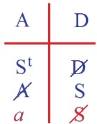
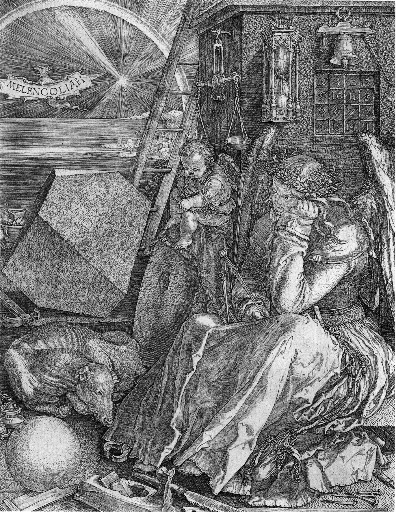

# Leçon 21 | 20 Mai 1959

  

    <label><input type="checkbox" data-lacan-toggle="original" checked> 原文</label>
    <label><input type="checkbox" data-lacan-toggle="notes" checked> 注释</label>
    <label><input type="checkbox" data-lacan-toggle="commentary" checked> 个人解读评论</label>
  

  <form class="lacan-tool-search" role="search">
    <input class="lacan-tool-search-input" type="search" placeholder="搜索全文" aria-label="搜索全文">
    <button class="lacan-tool-button" type="submit" title="搜索">搜索</button>
  </form>
  <button class="lacan-tool-button lacan-back-to-top" type="button" title="回到页面最上方" aria-label="回到页面最上方">↑</button>

<section class="parallel-paragraph" data-paragraph-ids="s6-21-0001">

s6-21-0001

原文 · s6-21-0001

Nous allons aujourd’hui reprendre notre propos au point où nous l’avons laissé la dernière fois, c’est-à-dire au point où c’est d’une sorte d’*opération*, que j’avais pour vous formalisée sous le mode d’*une division subjective dans la demande*, qu’il s’agit. Nous allons reprendre ceci pour autant que cela nous conduit à l’examen de la formule du fantasme, pour autant qu’elle est le support d’une relation essentielle, d’une relation pivot, celle que j’essaye de promouvoir pour vous cette année dans le fonctionnement de l’analyse.

[无对应译文]

</section>

<section class="parallel-paragraph" data-paragraph-ids="s6-21-0002">

s6-21-0002

原文 · s6-21-0002

Si vous vous souvenez, je vous ai la dernière fois inscrit les lettres suivantes : imposition, proposition de la demande au lieu de l’Autre, comme étant l’étape idéale primaire.

[无对应译文]

</section>

<section class="parallel-paragraph" data-paragraph-ids="s6-21-0003">

s6-21-0003

原文 · s6-21-0003

C’est une reconstruction bien entendu, et pourtant rien n’est plus concret, rien n’est plus réel puisque c’est dans la mesure où la demande de l’enfant commence à s’articuler que le processus s’engendre ou que nous prétendons tout au moins montrer que le processus s’engendre, d’où va se former cette *Spaltung* du discours qui est exprimée dans les effets de l’inconscient.

[无对应译文]

</section>

<section class="parallel-paragraph" data-paragraph-ids="s6-21-0004">

s6-21-0004

原文 · s6-21-0004

Si vous vous souvenez, la dernière fois nous avons…

[无对应译文]

</section>

<section class="parallel-paragraph" data-paragraph-ids="s6-21-0005">

s6-21-0005

原文 · s6-21-0005

> à la suite de cette première position du sujet dans l’acte de la première articulation de la demande

[无对应译文]

</section>

<section class="parallel-paragraph" data-paragraph-ids="s6-21-0006">

s6-21-0006

原文 · s6-21-0006

…fait allusion à ce qui s’en dégage comme ce pendant nécessaire de la position de l’Autre réel, comme celui qui est tout puissant pour répondre à cette demande.

[无对应译文]

</section>

<section class="parallel-paragraph" data-paragraph-ids="s6-21-0007">

s6-21-0007

原文 · s6-21-0007

Comme je vous l’ai dit, c’est un stade que nous avons évoqué, qui est essentiel pour la compréhension de la fondation du premier rapport à l’Autre, à *la mère*, comme donnant dans l’Autre la *première forme de l’omnipotence*.

[无对应译文]

</section>

<section class="parallel-paragraph" data-paragraph-ids="s6-21-0008">

s6-21-0008

原文 · s6-21-0008

Mais comme je vous l’ai dit, c’est en considérant ce qui se passe au niveau de la demande que nous allons poursuivre le processus de la génération logique qui se produit à partir de cette demande.

[无对应译文]

</section>

<section class="parallel-paragraph" data-paragraph-ids="s6-21-0009">

s6-21-0009

原文 · s6-21-0009

De sorte que ce que j’avais exprimé l’autre jour sous la forme qui faisait intervenir l’Autre comme *sujet réel*…

[无对应译文]

</section>

<section class="parallel-paragraph" data-paragraph-ids="s6-21-0010">

s6-21-0010

原文 · s6-21-0010

> je ne sais plus si c’est sous cette forme ou sous une autre que j’avais écrit au tableau ceci

[无对应译文]

</section>

<section class="parallel-paragraph" data-paragraph-ids="s6-21-0011">

s6-21-0011

原文 · s6-21-0011

…que la demande ici prend une autre portée, qu’elle devient demande d’amour, qu’en tant qu’elle est demande de satisfaction d’un besoin elle est revêtue à ce niveau d’un signe, d’une barre qui en change essentiellement la portée.

[无对应译文]

</section>

<section class="parallel-paragraph" data-paragraph-ids="s6-21-0012">

s6-21-0012

原文 · s6-21-0012

Peu importe que j’ai employé ces lettres ou pas - *c’est bien celles-là que j’ai utilisées* - puisque ceci est très précisément ce qui peut engendrer toute une sorte de *palette* qui est celle des expériences réelles du sujet, pour autant qu’elles vont s’inscrire dans un certain nombre de réponses qui sont gratifiantes ou frustrantes et qui sont évidemment très essentielles pour que s’y inscrive une certaine modulation de son histoire. Mais ce n’est pas cela qui est poursuivi dans l’analyse synchronique, l’analyse formelle qui est celle que nous poursuivons maintenant.

[无对应译文]

</section>

<section class="parallel-paragraph" data-paragraph-ids="s6-21-0013">

s6-21-0013

原文 · s6-21-0013

C’est dans la mesure où…

[无对应译文]

</section>

<section class="parallel-paragraph" data-paragraph-ids="s6-21-0014">

s6-21-0014

原文 · s6-21-0014

> au stade ultérieur à celui de la position de l’autre comme autre réel qui répond à la demande

[无对应译文]

</section>

<section class="parallel-paragraph" data-paragraph-ids="s6-21-0015">

s6-21-0015

原文 · s6-21-0015

…le sujet l’interroge comme sujet…

[无对应译文]

</section>

<section class="parallel-paragraph" data-paragraph-ids="s6-21-0016">

s6-21-0016

原文 · s6-21-0016

> c’est-à-dire où lui-même s’apparaît comme sujet pour autant qu’il est sujet pour l’autre

[无对应译文]

</section>

<section class="parallel-paragraph" data-paragraph-ids="s6-21-0017">

s6-21-0017

原文 · s6-21-0017

…c’est dans ce rapport de première étape où le sujet *se constitue* par rapport au sujet qui parle, *se repère* dans la stratégie fondamentale qui s’instaure *dès qu’apparaît la dimension du langage et qui ne commence qu’avec cette dimension du langage*.

[无对应译文]

</section>

<section class="parallel-paragraph" data-paragraph-ids="s6-21-0018">

s6-21-0018

原文 · s6-21-0018

C’est pour autant que l’autre, s’étant structuré dans le langage, de ce fait devient sujet possible d’une tragédie\[stratégie\] par rapport à laquelle le sujet lui-même peut se constituer comme sujet reconnu dans l’autre, *comme sujet pour un sujet*. *Il ne peut pas y avoir d’autre sujet qu’un sujet pour un sujet* et d’autre part, le sujet premier ne peut s’instituer comme tel que comme sujet qui parle, que comme *sujet de la parole*.

[无对应译文]

</section>

<section class="parallel-paragraph" data-paragraph-ids="s6-21-0019">

s6-21-0019

原文 · s6-21-0019

C’est donc pour autant que l’Autre lui-même est marqué des nécessités du langage...

[无对应译文]

</section>

<section class="parallel-paragraph" data-paragraph-ids="s6-21-0020">

s6-21-0020

原文 · s6-21-0020

que l’Autre s’instaure non pas comme autre réel, mais comme Autre, comme *lieu* de l’articulation *de la parole*

[无对应译文]

</section>

<section class="parallel-paragraph" data-paragraph-ids="s6-21-0021">

s6-21-0021

原文 · s6-21-0021

...que se fait la première position possible d’un sujet comme tel, d’un sujet qui peut se saisir comme sujet, qui se saisit comme sujet dans l’autre, en tant que l’autre pense à lui comme sujet.

[无对应译文]

</section>

<section class="parallel-paragraph" data-paragraph-ids="s6-21-0022">

s6-21-0022

原文 · s6-21-0022

Vous voyez, je vous l’ai fait remarquer la dernière fois, rien de plus concret que cela. Ce n’est point une étape de la *méditation philosophique*, c’est ce quelque chose de primitif qui s’établit dans la relation de confiance.

[无对应译文]

</section>

<section class="parallel-paragraph" data-paragraph-ids="s6-21-0023">

s6-21-0023

原文 · s6-21-0023

- *Dans quelle mesure, et jusqu’à quel point puis-je compter sur l’autre ?*

[无对应译文]

</section>

<section class="parallel-paragraph" data-paragraph-ids="s6-21-0024">

s6-21-0024

原文 · s6-21-0024

- *Qu’est-ce qu’il y a de fiable dans les comportements de l’autre ?*

[无对应译文]

</section>

<section class="parallel-paragraph" data-paragraph-ids="s6-21-0025">

s6-21-0025

原文 · s6-21-0025

- *Quelle suite puis-je attendre de ce qui déjà par lui a été promis ?*

[无对应译文]

</section>

<section class="parallel-paragraph" data-paragraph-ids="s6-21-0026">

s6-21-0026

原文 · s6-21-0026

C’est bien là ce sur quoi un des conflits les plus primitifs…

[无对应译文]

</section>

<section class="parallel-paragraph" data-paragraph-ids="s6-21-0027">

s6-21-0027

原文 · s6-21-0027

> le plus primitif sans doute du point de vue qui nous intéresse

[无对应译文]

</section>

<section class="parallel-paragraph" data-paragraph-ids="s6-21-0028">

s6-21-0028

原文 · s6-21-0028

…de la relation de l’enfant à l’autre, est quelque chose autour de quoi nous voyons tourner l’instauration et la base même des principes de son histoire, et aussi bien que cela se répète au niveau le plus profond de son destin, de ce qui commande la modulation inconsciente de ses comportements. C’est ailleurs que dans une pure et simple frustration ou gratification. C’est dans la mesure où il peut se fonder sur quelque autre que, vous le savez, s’institue ce que nous trouvons dans l’analyse, voire dans l’expérience la plus quotidienne de l’analyse, ce que nous trouvons de plus radical dans la modulation inconsciente du patient, névrosé ou non.

[无对应译文]

</section>

<section class="parallel-paragraph" data-paragraph-ids="s6-21-0029">

s6-21-0029

原文 · s6-21-0029

C’est donc pour autant que devant l’autre comme sujet de la parole, en tant qu’elle s’articule primordialement, c’est par rapport à cet autre que le sujet lui-même se constitue comme sujet qui parle, non point comme sujet primitif de la connaissance, non pas le sujet des philosophes, mais le sujet en tant qu’il se pose comme regardé par l’autre, comme pouvant lui répondre au nom d’une *tragédie commune*, comme sujet qui peut interpréter tout ce que l’autre articule, désigne de son intention la plus profonde, de sa bonne ou de sa mauvaise foi.

[无对应译文]

</section>

<section class="parallel-paragraph" data-paragraph-ids="s6-21-0030">

s6-21-0030

原文 · s6-21-0030

*Ess*entiellement à ce niveau - si vous me permettez un jeu de mots - le S se pose vraiment non seulement

[无对应译文]

</section>

<section class="parallel-paragraph" data-paragraph-ids="s6-21-0031">

s6-21-0031

原文 · s6-21-0031

- comme le S qui s’inscrit comme une lettre,

[无对应译文]

</section>

<section class="parallel-paragraph" data-paragraph-ids="s6-21-0032">

s6-21-0032

原文 · s6-21-0032

- mais aussi bien à ce niveau comme le *Es* de la formule topique que FREUD donne du sujet : *Ça*.

[无对应译文]

</section>

<section class="parallel-paragraph" data-paragraph-ids="s6-21-0033">

s6-21-0033

原文 · s6-21-0033

*Ça*, *sous une forme interrogative*, sous la forme aussi où, si vous mettez ici *un point d’interrogation*, le S ? s’articule « *est-ce ? »*.

[无对应译文]

</section>

<section class="parallel-paragraph" data-paragraph-ids="s6-21-0034">

s6-21-0034

原文 · s6-21-0034

C’est là tout ce qu’à ce niveau le sujet formule encore de lui-même. Il est, à l’état naissant, en présence de l’articulation de l’Autre pour autant qu’elle lui répond, mais *qu’elle lui répond au­delà de ce qu’il a formulé dans sa demande*.

[无对应译文]

</section>

<section class="parallel-paragraph" data-paragraph-ids="s6-21-0035">

s6-21-0035

原文 · s6-21-0035

S, c’est à ce niveau que le sujet se suspend et qu’à l’étape suivante…

[无对应译文]

</section>

<section class="parallel-paragraph" data-paragraph-ids="s6-21-0036">

s6-21-0036

原文 · s6-21-0036

> c’est-à-dire pour autant qu’il va faire ce pas où il veut se saisir dans l’au-delà de la parole, est lui-même comme marqué de quelque chose qui le divise primordialement de lui-même en tant que sujet de la parole

[无对应译文]

</section>

<section class="parallel-paragraph" data-paragraph-ids="s6-21-0037">

s6-21-0037

原文 · s6-21-0037

…c’est à ce niveau, en tant que sujet barré, S, *qu’il peut*, *qu’il doit*, *qu’il entend* trouver la réponse.

[无对应译文]

</section>

<section class="parallel-paragraph" data-paragraph-ids="s6-21-0038">

s6-21-0038

原文 · s6-21-0038

Et qu’aussi bien il ne la trouve pas pour autant qu’il rencontre dans l’Autre, à ce niveau, ce creux, ce vide que j’ai articulé pour vous en tant que disant qu’« *il n’y a pas d’Autre de l’Autre* », qu’aucun signifiant possible ne garantit l’authenticité de la suite des signifiants, qu’il dépend essentiellement pour cela de la bonne volonté de l’Autre, qu’il n’y a rien qui, au niveau du signifiant, garantisse, authentifie en quoi que ce soit la chaîne et la parole signifiante.

[无对应译文]

</section>

<section class="parallel-paragraph" data-paragraph-ids="s6-21-0039">

s6-21-0039

原文 · s6-21-0039

Et c’est ici que se produit de la part du sujet ce quelque chose :

[无对应译文]

</section>

<section class="parallel-paragraph" data-paragraph-ids="s6-21-0040">

s6-21-0040

原文 · s6-21-0040

- qu’il tire d’ailleurs,

[无对应译文]

</section>

<section class="parallel-paragraph" data-paragraph-ids="s6-21-0041">

s6-21-0041

原文 · s6-21-0041

- qu’il fait venir d’ailleurs,

[无对应译文]

</section>

<section class="parallel-paragraph" data-paragraph-ids="s6-21-0042">

s6-21-0042

原文 · s6-21-0042

- qu’il fait venir du registre *imaginaire*,

[无对应译文]

</section>

<section class="parallel-paragraph" data-paragraph-ids="s6-21-0043">

s6-21-0043

原文 · s6-21-0043

- qu’il fait venir d’une partie de lui-même en tant qu’il est engagé dans la relation *imaginaire* à l’autre.

[无对应译文]

</section>

<section class="parallel-paragraph" data-paragraph-ids="s6-21-0044">

s6-21-0044

原文 · s6-21-0044

Et c’est ce *(a)* qui vient ici, qui surgit à la place où se porte, où se pose l’interrogation du S ?, sur ce qu’il *est* vraiment, sur ce qu’il *veut* vraiment. C’est là que se produit le surgissement de ce quelque chose que nous appelons *(a)*. *(a)* en tant qu’il est l’objet, l’objet du désir sans doute et non pas pour autant que cet objet du désir se coapterait directement par rapport au désir, mais pour autant que cet objet entre en jeu dans un complexe que nous appelons « *le fantasme* », le fantasme comme tel.

[无对应译文]

</section>

<section class="parallel-paragraph" data-paragraph-ids="s6-21-0045">

s6-21-0045

原文 · s6-21-0045

C’est-à-dire pour autant que cet objet est le support autour de quoi, au moment où le sujet s’évanouit devant la carence du signifiant qui répond de sa place au niveau de l’Autre, il trouve son support dans cet objet. C’est-à-dire qu’à ce niveau, l’opération est *division*. Le sujet essaie de se *reconstituer*, de s’*authentifier*, de se *rejoindre* dans la demande portée vers l’Autre. L’opération s’arrête.

[无对应译文]

</section>

<section class="parallel-paragraph" data-paragraph-ids="s6-21-0046">

s6-21-0046

原文 · s6-21-0046

C’est pour autant qu’ici *le quotient que le sujet cherche à atteindre*...

[无对应译文]

</section>

<section class="parallel-paragraph" data-paragraph-ids="s6-21-0047">

s6-21-0047

原文 · s6-21-0047

> pour autant qu’il doit se saisir, se reconstituer et s’authentifier comme sujet de la parole

[无对应译文]

</section>

<section class="parallel-paragraph" data-paragraph-ids="s6-21-0048">

s6-21-0048

原文 · s6-21-0048

...*reste ici suspendu*, en présence, au niveau de l’Autre, de l’apparition de ce *reste,* par où lui-même, le sujet, supplée, apporte la rançon, vient *remplacer la carence* au niveau de l’Autre, *du signifiant* qui lui répond.

[无对应译文]

</section>

<section class="parallel-paragraph" data-paragraph-ids="s6-21-0049">

s6-21-0049

原文 · s6-21-0049

 S ◊ *a*

[无对应译文]

</section>

<section class="parallel-paragraph" data-paragraph-ids="s6-21-0050">

s6-21-0050

原文 · s6-21-0050

C’est pour autant que ce *quotient* et ce *reste,* restent ici en présence l’un de l’autre et si l’on peut dire se soutenant l’un par l’autre, que le fantasme n’est rien d’autre chose que l’affrontement perpétuel de cet S...

[无对应译文]

</section>

<section class="parallel-paragraph" data-paragraph-ids="s6-21-0051">

s6-21-0051

原文 · s6-21-0051

> de cet S pour autant qu’il marque ce moment de *fading* du sujet où le sujet ne trouve rien dans l’Autre
>
> qui le garantisse, lui, d’une façon sûre et certaine, qui l’authentifie, qui lui permette de se situer
>
> et de se nommer au niveau du discours de l’Autre, c’est­à-dire en tant que *sujet de l’inconscient*.

[无对应译文]

</section>

<section class="parallel-paragraph" data-paragraph-ids="s6-21-0052">

s6-21-0052

原文 · s6-21-0052

...c’est répondant à ce moment, que surgit comme *suppléant du signifiant manquant* cet élément *imaginaire (a)*...

[无对应译文]

</section>

<section class="parallel-paragraph" data-paragraph-ids="s6-21-0053">

s6-21-0053

原文 · s6-21-0053

que nous appelons *a* dans sa forme la plus générale, pour autant que terme corrélatif de la structure du fantasme,

[无对应译文]

</section>

<section class="parallel-paragraph" data-paragraph-ids="s6-21-0054">

s6-21-0054

原文 · s6-21-0054

...ce support de S comme tel, au moment où il essaie de s’indiquer comme sujet du discours inconscient.

[无对应译文]

</section>

<section class="parallel-paragraph" data-paragraph-ids="s6-21-0055">

s6-21-0055

原文 · s6-21-0055

Il me semble qu’ici je n’ai pas plus à en dire. Je vais pourtant en dire plus pour vous rappeler ce que ceci veut dire dans le discours freudien, par exemple le : « *Wo Es war, sol Ich werden, Là où <u>C</u>’était, là <u>je</u> dois devenir* ».

[无对应译文]

</section>

<section class="parallel-paragraph" data-paragraph-ids="s6-21-0056">

s6-21-0056

原文 · s6-21-0056

C’est très précis, c’est ce *Ich* qui n’est pas *das Ich* qui n’est pas le *moi*, qui est un *Ich*, le *Ich* utilisé comme *sujet de la phrase*. « *Là où C’était, là où Ça parle* », c’est-à-dire où à l’instant d’avant quelque chose était qui est le désir inconscient, là je dois me désigner, là « *je dois être* » ce *« Je »* qui est le but, la fin, le terme de l’analyse avant qu’il se nomme, avant qu’il se forme, avant qu’il s’articule, si tant est qu’il le fasse jamais, car aussi bien dans la formule freudienne ce « *soll Ich werden* », ce doit être ce « *dois-je devenir* » est le sujet d’un devenir, d’un devoir qui vous est proposé.

[无对应译文]

</section>

<section class="parallel-paragraph" data-paragraph-ids="s6-21-0057">

s6-21-0057

原文 · s6-21-0057

Nous devons reconquérir ce champ perdu de l’être du sujet, comme dit FREUD dans la même phrase, par une jolie comparaison, comme la reconquête de la Hollande sur le Zuiderzee, de terres offertes à une conquête pacifique.[^101] Ce champ de l’inconscient sur lequel nous devons gagner dans la réalisation du *Grand Œuvre* analytique, c’est bien de cela qu’il s’agit.

[无对应译文]

</section>

<section class="parallel-paragraph" data-paragraph-ids="s6-21-0058">

s6-21-0058

原文 · s6-21-0058

Mais avant que ceci soit fait « *Là où Ça était* », qu’est-ce qui nous désigne la place de ce *« Je »* qui *doit venir au jour* ?

[无对应译文]

</section>

<section class="parallel-paragraph" data-paragraph-ids="s6-21-0059">

s6-21-0059

原文 · s6-21-0059

Ce qui nous le désigne, c’est l’index - de quoi ? - très exactement de ce dont il s’agit : du désir, du désir en tant qu’il est fonction et terme de ce dont il s’agit dans l’inconscient. Et le désir est ici soutenu par l’opposition, la cœxistence des deux termes qui sont S◊*a,* ici le S, *le sujet en tant que justement à cette limite il se perd, que là l’inconscient commence*.

[无对应译文]

</section>

<section class="parallel-paragraph" data-paragraph-ids="s6-21-0060">

s6-21-0060

原文 · s6-21-0060

Ce qui veut dire qu’il n’y a pas, *purement et simplement* *privation* de quelque chose qui s’appellerait « *conscience* », c’est qu’*une autre dimension commence où il ne lui est plus possible de savoir, où il n’est plus consciencia*.

[无对应译文]

</section>

<section class="parallel-paragraph" data-paragraph-ids="s6-21-0061">

s6-21-0061

原文 · s6-21-0061

*Ici s’arrête toute possibilité de se nommer. Mais dans ce point d’arrêt est aussi l’index, l’index qui est apporté, qui est la fonction majeure* - quelles que soient *les apparences de* ce qui, à ce moment-là, est soutenu devant lui comme *l’objet qui le fascine* mais qui est aussi celui qui le retient devant l’annulation pure et simple, *la syncope de son existence*. Et c’est cela qui constitue *la structure* de ce que nous appelons *le fantasme*.

[无对应译文]

</section>

<section class="parallel-paragraph" data-paragraph-ids="s6-21-0062">

s6-21-0062

原文 · s6-21-0062

C’est aujourd’hui à *cela* que nous allons nous arrêter. Nous allons voir ce que comporte comme généralité d’application cette formule du fantasme. Aussi bien allons-nous le prendre, puisque nous avons dit la dernière fois que c’était dans sa fonction synchronique, c’est-à-dire pour la place qu’il occupe dans cette référence du sujet à lui-même, du sujet à ce qu’il est au niveau de l’inconscient quand - je ne dirai pas : *il s’interroge* sur ce qu’il est - quand il est en somme porté par la question sur ce qu’il est, ce qui est la définition de la névrose.

[无对应译文]

</section>

<section class="parallel-paragraph" data-paragraph-ids="s6-21-0063">

s6-21-0063

原文 · s6-21-0063

Arrêtons-nous d’abord aux propriétés formelles...

[无对应译文]

</section>

<section class="parallel-paragraph" data-paragraph-ids="s6-21-0064">

s6-21-0064

原文 · s6-21-0064

telles que l’expérience analytique nous permet de les reconnaître

[无对应译文]

</section>

<section class="parallel-paragraph" data-paragraph-ids="s6-21-0065">

s6-21-0065

原文 · s6-21-0065

...de cet *objet(a)* pour autant qu’il intervient dans la structure du fantasme.

[无对应译文]

</section>

<section class="parallel-paragraph" data-paragraph-ids="s6-21-0066">

s6-21-0066

原文 · s6-21-0066

*Le sujet*, disons-nous, *est au bord de cette* *nomination défaillante qui est* le rôle structural de *ce qui est visé au moment du désir*.

[无对应译文]

</section>

<section class="parallel-paragraph" data-paragraph-ids="s6-21-0067">

s6-21-0067

原文 · s6-21-0067

Et *il est au point où il subit*, si je puis dire, *au maximum*, à un point d’acmé, *ce qu’on peut appeler la virulence du* λόγος \[logos\], pour autant qu’il se rencontre avec le point suprême de l’effet aliénant de son implication dans le λόγος.

[无对应译文]

</section>

<section class="parallel-paragraph" data-paragraph-ids="s6-21-0068">

s6-21-0068

原文 · s6-21-0068

Cette prise de l’homme dans *la combinatoire fondamentale* qui donne la caractéristique essentielle du λόγος \[logos\], c’est une question que d’*autres* que moi ont à résoudre, de savoir ce qu’elle peut vouloir dire.

[无对应译文]

</section>

<section class="parallel-paragraph" data-paragraph-ids="s6-21-0069">

s6-21-0069

原文 · s6-21-0069

Je veux dire, ce que veut dire que l’homme soit nécessaire à cette action du λόγος \[logos\] dans le monde[^102]. Mais ici ce que nous avons à voir, c’est ce qu’il en résulte pour l’homme et comment l’homme y fait face, *comment il le soutient*.

[无对应译文]

</section>

<section class="parallel-paragraph" data-paragraph-ids="s6-21-0070">

s6-21-0070

原文 · s6-21-0070

La première formule qui peut nous venir, c’est qu’il faut qu’il le soutienne *réellement*, qu’il le soutienne de son *réel*, de lui en tant que *réel*, c’est-à-dire aussi bien de ce qui lui reste toujours le plus mystérieux.

[无对应译文]

</section>

<section class="parallel-paragraph" data-paragraph-ids="s6-21-0071">

s6-21-0071

原文 · s6-21-0071

Un détour ici ne serait pas mal venu, c’est d’essayer pour nous d’appréhender…

[无对应译文]

</section>

<section class="parallel-paragraph" data-paragraph-ids="s6-21-0072">

s6-21-0072

原文 · s6-21-0072

> c’est ce sur quoi d’ailleurs certains d’entre vous depuis longtemps s’interrogent

[无对应译文]

</section>

<section class="parallel-paragraph" data-paragraph-ids="s6-21-0073">

s6-21-0073

原文 · s6-21-0073

…ce que peut bien, au dernier terme, vouloir dire cet emploi que nous faisons ici du terme de *réel*, pour autant que nous l’opposons au *symbolique et à l’imaginaire*.

[无对应译文]

</section>

<section class="parallel-paragraph" data-paragraph-ids="s6-21-0074">

s6-21-0074

原文 · s6-21-0074

Il faut bien dire que si *la psychanalyse*, si *l’expérience freudienne* vient en son temps, à notre époque, il n’est certainement pas indifférent de constater que c’est pour autant que peut venir pour nous, avec la plus grande résistance, ce que je pourrais appeler soit la forme d’« *une crise de la théorie de la connaissance* », ou de la connaissance elle-même.

[无对应译文]

</section>

<section class="parallel-paragraph" data-paragraph-ids="s6-21-0075">

s6-21-0075

原文 · s6-21-0075

Enfin, ce point sur lequel la dernière fois j’ai essayé déjà d’attirer votre attention, c’est à savoir ce que signifie l’aventure de la science…

[无对应译文]

</section>

<section class="parallel-paragraph" data-paragraph-ids="s6-21-0076">

s6-21-0076

原文 · s6-21-0076

> comment elle s’est créée, greffée, branchée sur cette longue culture

[无对应译文]

</section>

<section class="parallel-paragraph" data-paragraph-ids="s6-21-0077">

s6-21-0077

原文 · s6-21-0077

…qui a été une prise de position, assez partiale pour que nous puissions l’appeler partielle, qui a été ce retrait de l’homme sur certaines positions en présence du monde qui ont été d’abord des positions contemplatives, celles qui impliquaient non pas la position du désir - sans doute je vous l’ai fait remarquer - mais le choix, *l’élection d’une certaine forme de ce désir *: *désir* - ai-je dit - *de savoir, désir de connaître*.

[无对应译文]

</section>

<section class="parallel-paragraph" data-paragraph-ids="s6-21-0078">

s6-21-0078

原文 · s6-21-0078

Assurément nous pouvons le spécifier comme une discipline, une ascèse, un choix, et nous savons que ce qui en est sorti, à savoir la *science*, notre *science* moderne, notre *science* pour autant qu’on peut dire qu’elle se distingue pour nous par cette prise exceptionnelle sur le monde qui, d’un certain côté, nous rassure quand nous parlons de réalité.

[无对应译文]

</section>

<section class="parallel-paragraph" data-paragraph-ids="s6-21-0079">

s6-21-0079

原文 · s6-21-0079

Nous savons que *nous ne sommes pas sans prise sur le réel*, mais laquelle après tout ? Est-ce une prise de connaissance ?

[无对应译文]

</section>

<section class="parallel-paragraph" data-paragraph-ids="s6-21-0080">

s6-21-0080

原文 · s6-21-0080

Et je ne peux ici que vous *indiquer* au moins la question.

[无对应译文]

</section>

<section class="parallel-paragraph" data-paragraph-ids="s6-21-0081">

s6-21-0081

原文 · s6-21-0081

Est-ce qu’il ne semble pas…

[无对应译文]

</section>

<section class="parallel-paragraph" data-paragraph-ids="s6-21-0082">

s6-21-0082

原文 · s6-21-0082

> à la première approche, à la première appréhension que nous avons de ce qui résulte de ce processus, qu’assurément au point où nous en sommes, au point de l’élaboration spécialement de la science physique qui est la forme où la réussite s’est poussée le plus loin de la prise de nos chaînes symboliques
>
> sur quelque chose que nous appelons l’expérience, l’expérience *construite*

[无对应译文]

</section>

<section class="parallel-paragraph" data-paragraph-ids="s6-21-0083">

s6-21-0083

原文 · s6-21-0083

…est-ce qu’il ne semble pas que moins que jamais nous avons le sentiment d’atteindre à ce *quelque chose* qui,

[无对应译文]

</section>

<section class="parallel-paragraph" data-paragraph-ids="s6-21-0084">

s6-21-0084

原文 · s6-21-0084

dans l’idéal de la philosophie incipiente, de la philosophie *à ses débuts*, se proposait comme *la fin*, la récompense de l’effort du philosophe, du sage, c’est-à-dire cette participation, cette connaissance, cette identification à l’être qui était visée et qui était représentée dans la perspective grecque, dans la perspective aristotélicienne, comme étant ce qui était *la fin du connaître*, à savoir l’identification par la pensée du sujet…

[无对应译文]

</section>

<section class="parallel-paragraph" data-paragraph-ids="s6-21-0085">

s6-21-0085

原文 · s6-21-0085

qui ne s’appelait pas à ce moment-là « *sujet* »

[无对应译文]

</section>

<section class="parallel-paragraph" data-paragraph-ids="s6-21-0086">

s6-21-0086

原文 · s6-21-0086

…de celui qui pensait, de celui qui poursuivait la connaissance, à l’objet de sa contemplation ?

[无对应译文]

</section>

<section class="parallel-paragraph" data-paragraph-ids="s6-21-0087">

s6-21-0087

原文 · s6-21-0087

*À quoi nous identifions-nous au terme de la science moderne ?* Je ne crois même pas qu’il y ait *une seule branche de la science* :

[无对应译文]

</section>

<section class="parallel-paragraph" data-paragraph-ids="s6-21-0088">

s6-21-0088

原文 · s6-21-0088

- que ce soit celle où nous sommes arrivés aux résultats les plus parfaits, les plus poussés,

[无对应译文]

</section>

<section class="parallel-paragraph" data-paragraph-ids="s6-21-0089">

s6-21-0089

原文 · s6-21-0089

- que ce soit celle même où la science essaie de s’ébaucher, de faire le premier pas, comme dans les termes d’une *psychologie* qui s’appelle *behaviourisme*.

[无对应译文]

</section>

<section class="parallel-paragraph" data-paragraph-ids="s6-21-0090">

s6-21-0090

原文 · s6-21-0090

Si bien que nous sommes sûrs d’être déçus au dernier terme quant à ce qu’il y a à connaître.

[无对应译文]

</section>

<section class="parallel-paragraph" data-paragraph-ids="s6-21-0091">

s6-21-0091

原文 · s6-21-0091

Que même quand nous nous trouvons dans une des formes de cette science qui est encore balbutiante…

[无对应译文]

</section>

<section class="parallel-paragraph" data-paragraph-ids="s6-21-0092">

s6-21-0092

原文 · s6-21-0092

> qui prétend imiter, comme le petit personnage de la *Melancholia* de DÜRER, *le petit ange*,
>
> qui aux côtés de *la grande Mélancolie* commence à faire ses premiers *cercles :*

[无对应译文]

</section>

<section class="parallel-paragraph" data-paragraph-ids="s6-21-0093">

s6-21-0093

原文 · s6-21-0093

[无对应译文]

</section>

<section class="parallel-paragraph" data-paragraph-ids="s6-21-0094">

s6-21-0094

原文 · s6-21-0094

…quand nous commençons une *psychologie* qui se prétend *scientifique*, nous posons au principe que nous allons faire du simple *behaviourisme*, c’est-à-dire *que nous allons nous contenter de regarder*, surtout que nous nous refusons au départ même toute visée qui comporte *cette assomption*, *cette identification* à ce qui est là devant nous. Au-delà de la méthode, *cela va consister d’abord à nous refuser de croire que nous puissions, au but, arriver à ce qui est dans l’antique idéal de la connaissance*.

[无对应译文]

</section>

<section class="parallel-paragraph" data-paragraph-ids="s6-21-0095">

s6-21-0095

原文 · s6-21-0095

Il y a sans doute là quelque chose de véritablement exemplaire et qui est de nature à nous faire méditer sur ce qui se passe quand d’autre part une *psychologie*…

[无对应译文]

</section>

<section class="parallel-paragraph" data-paragraph-ids="s6-21-0096">

s6-21-0096

原文 · s6-21-0096

> qui elle, bien entendu, si nous ne la posons et ne l’articulons comme une science, est quand même une chose qui se pose comme paradoxale par rapport à la méthode jusqu’ici définie sur l’apport scientifique

[无对应译文]

</section>

<section class="parallel-paragraph" data-paragraph-ids="s6-21-0097">

s6-21-0097

原文 · s6-21-0097

…*la psychologie freudienne* elle, nous dit que *le réel du sujet n’est pas à concevoir comme le corrélatif d’une connaissance*.

[无对应译文]

</section>

<section class="parallel-paragraph" data-paragraph-ids="s6-21-0098">

s6-21-0098

原文 · s6-21-0098

Le premier pas où se situe le *réel* comme *réel*, comme terme de quelque chose où le sujet est intéressé, ce n’est pas par rapport au sujet de la connaissance qu’il se situe, puisque quelque chose dans le sujet s’articule qui est au-delà de *sa connaissance possible*, et qui pourtant est déjà le sujet et qui plus est : le sujet qui se reconnaît à ceci qu’il est sujet d’une chaîne articulée.

[无对应译文]

</section>

<section class="parallel-paragraph" data-paragraph-ids="s6-21-0099">

s6-21-0099

原文 · s6-21-0099

Que quelque chose qui est de l’ordre d’un discours dès l’abord, que soutient donc quelque support, quelque support dont il n’est pas abusif de le qualifier du terme d’« *être* »…

[无对应译文]

</section>

<section class="parallel-paragraph" data-paragraph-ids="s6-21-0100">

s6-21-0100

原文 · s6-21-0100

> si après tout nous donnons à ce terme d’« *être* » sa définition *minima*

[无对应译文]

</section>

<section class="parallel-paragraph" data-paragraph-ids="s6-21-0101">

s6-21-0101

原文 · s6-21-0101

…*si le terme d’« être » veut dire quelque chose, c’est le réel pour autant qu’il s’inscrit dans le symbolique*, le *réel* intéressé dans cette chaîne que FREUD nous dit être cohérente et commander, au-delà de toutes ces motivations accessibles au jeu de la connaissance, le comportement du sujet.

[无对应译文]

</section>

<section class="parallel-paragraph" data-paragraph-ids="s6-21-0102">

s6-21-0102

原文 · s6-21-0102

C’est bien quelque chose qui, au sens complet, mérite d’être nommé comme de l’ordre de *l’« être »*, puisque c’est déjà *quelque chose qui se pose comme un réel articulé dans le symbolique, comme un réel qui a pris sa place dans le symbolique*, et qui a pris cette place *au-delà du sujet de la connaissance*.

[无对应译文]

</section>

<section class="parallel-paragraph" data-paragraph-ids="s6-21-0103">

s6-21-0103

原文 · s6-21-0103

C’est au moment, dirais-je - *et c’est là que se boucle la parenthèse que j’avais ouverte tout à l’heure* - c’est au moment :

[无对应译文]

</section>

<section class="parallel-paragraph" data-paragraph-ids="s6-21-0104">

s6-21-0104

原文 · s6-21-0104

- où dans notre expérience de la connaissance quelque chose pour nous se dérobe dans ce qui s’est développé sur « *l’arbre de la connaissance* »,

[无对应译文]

</section>

<section class="parallel-paragraph" data-paragraph-ids="s6-21-0105">

s6-21-0105

原文 · s6-21-0105

- où quelque chose dans ce rameau qui s’appelle *la science* s’avère, se manifeste à nous comme étant quelque chose *qui a trompé l’espoir de la connaissance*.

[无对应译文]

</section>

<section class="parallel-paragraph" data-paragraph-ids="s6-21-0106">

s6-21-0106

原文 · s6-21-0106

Si d’autre part, on peut dire que cela a été peut-être beaucoup plus loin que toute espèce d’effet attendu de la connaissance, c’est en même temps et à ce moment que…

[无对应译文]

</section>

<section class="parallel-paragraph" data-paragraph-ids="s6-21-0107">

s6-21-0107

原文 · s6-21-0107

> dans l’expérience de la subjectivité, dans celle qui s’établit dans la confidence, dans la confiance analytique

[无对应译文]

</section>

<section class="parallel-paragraph" data-paragraph-ids="s6-21-0108">

s6-21-0108

原文 · s6-21-0108

…FREUD nous désigne cette chaîne où les choses s’articulent d’une façon qui est structurée de façon homogène avec toute autre chaîne symbolique, avec ce que nous connaissons comme discours, qui pourtant n’est pas accessible – comme dans la contemplation – n’est pas accessible au sujet en tant qu’il pourrait s’y reposer comme l’objet où il se reconnaît. Bien au contraire, fondamentalement il se méconnaît.

[无对应译文]

</section>

<section class="parallel-paragraph" data-paragraph-ids="s6-21-0109">

s6-21-0109

原文 · s6-21-0109

Et dans toute la mesure où il essaie, à cette chaîne d’*aborder*, où il essaye là de *se nommer*, de *se repérer*, c’est là précisément qu’il ne s’y trouve pas. Il n’est là que dans les *intervalles*, dans les *coupures*. Chaque fois qu’il veut se saisir, il n’est jamais que dans un intervalle, et c’est bien pour cela que *l’objet imaginaire du fantasme* - sur lequel il va chercher à se supporter - est structuré comme il l’est. C’est ce que je veux vous montrer maintenant.

[无对应译文]

</section>

<section class="parallel-paragraph" data-paragraph-ids="s6-21-0110">

s6-21-0110

原文 · s6-21-0110

Il y a bien d’autres choses à démontrer sur cette formalisation S◊*a,* mais je veux vous montrer comment est fait *(a)*. Je vous l’ai dit, c’est comme *coupure* et comme *intervalle* que le sujet se rencontre au point terme de son interrogation. C’est aussi bien essentiellement comme *forme de coupure* que le *(a)*, dans toute sa généralité, nous montre sa forme.

[无对应译文]

</section>

<section class="parallel-paragraph" data-paragraph-ids="s6-21-0111">

s6-21-0111

原文 · s6-21-0111

Ici je vais simplement regrouper un certain nombre de traits communs que vous connaissez déjà concernant les différentes formes de cet objet. Pour ceux qui ici sont analystes, je peux aller vite, quitte ensuite à entrer dans le détail, à *recommenter*.

[无对应译文]

</section>

<section class="parallel-paragraph" data-paragraph-ids="s6-21-0112">

s6-21-0112

原文 · s6-21-0112

S’il s’agit que l’objet dans le fantasme soit quelque chose qui ait la forme de la coupure, dans quoi allons-nous pouvoir le reconnaître ? Franchement, je dirai qu’au niveau du résultat, je pense que déjà vous me devancerez, du moins j’ose l’espérer.

[无对应译文]

</section>

<section class="parallel-paragraph" data-paragraph-ids="s6-21-0113">

s6-21-0113

原文 · s6-21-0113

Dans *ce rapport qui fait que le* S - au point où il s’interroge comme S - *ne trouve à se supporter que dans une série de termes* qui sont ceux que nous appelons ici *(a)*, en tant qu’objets dans le fantasme, nous pouvons dans une première approximation en donner trois exemples. Cela n’implique pas que ce soit complètement exhaustif, ce l’est presque.

[无对应译文]

</section>

<section class="parallel-paragraph" data-paragraph-ids="s6-21-0114">

s6-21-0114

原文 · s6-21-0114

Je dis que cela ne l’est pas complètement pour autant que prendre les choses au niveau de ce que j’appellerai *le résultat*, c’est-à-dire du *(a)* *constitué*, *n’est pas une démarche tellement légitime*. Je veux dire que commencer par là c’est simplement *vous faire partir d’un terrain déjà connu* dans lequel vous vous retrouviez pour faire le chemin plus facile. Cela n’est pas la voie la plus rigoureuse comme vous le verrez quand nous aurons à rejoindre ce terme par la voie plus rigoureuse de la structure, c’est-à-dire *la voie qui part du sujet en tant qu’il est barré, en tant que c’est lui qui soulève, qui suscite le terme de l’objet.*

[无对应译文]

</section>

<section class="parallel-paragraph" data-paragraph-ids="s6-21-0115">

s6-21-0115

原文 · s6-21-0115

Mais c’est de l’objet que nous partirons parce que c’est de là que vous vous reconnaîtrez le mieux.

[无对应译文]

</section>

<section class="parallel-paragraph" data-paragraph-ids="s6-21-0116">

s6-21-0116

原文 · s6-21-0116

Il y en a *trois espèces repérées* dans l’expérience analytique, *identifiées* bel et bien jusqu’à présent comme telles :

[无对应译文]

</section>

<section class="parallel-paragraph" data-paragraph-ids="s6-21-0117">

s6-21-0117

原文 · s6-21-0117

- *la première espèce* est celle que nous appelons habituellement, à tort ou à raison, *l’objet prégénital*.

[无对应译文]

</section>

<section class="parallel-paragraph" data-paragraph-ids="s6-21-0118">

s6-21-0118

原文 · s6-21-0118

- *la deuxième espèce* est cette sorte d’objet qui est intéressé dans ce qu’on appelle le complexe de castration, et vous savez que sous sa forme la plus générale, c’est *le phallus*.

[无对应译文]

</section>

<section class="parallel-paragraph" data-paragraph-ids="s6-21-0119">

s6-21-0119

原文 · s6-21-0119

- *la troisième espèce*... c’est peut-être le seul terme qui vous surprendra comme une *nouveauté* mais, à la vérité, je pense que ceux d’entre vous qui ont pu étudier d’assez près ce que j’ai pu écrire sur *les psychoses* ne s’y trouveront tout de même pas essentiellement *déroutés...la troisième espèce* d’objet remplissant exactement la même fonction *par rapport au sujet à son point de défaillance,* *de fading,* cela n’est rien d’autre et ni plus ni moins que ce qu’on appelle communément *le délire* et très précisément, ce pourquoi FREUD, depuis presque le début de ses premières appréhensions, a pu écrire : « *Ils aiment leur délire comme soi-même. Sie lieben also den Wahn wie sich selbst* »[^103].

[无对应译文]

</section>

<section class="parallel-paragraph" data-paragraph-ids="s6-21-0120">

s6-21-0120

原文 · s6-21-0120

Nous allons reprendre ces *trois formes d’objet* pour autant qu’elles nous permettent de saisir quelque chose dans leur forme qui leur permet de remplir cette fonction, de devenir *les signifiants* que le sujet tire de sa propre substance *pour soutenir* devant lui, précisément, *ce trou, cette absence du signifiant* au niveau de la chaîne inconsciente.

[无对应译文]

</section>

<section class="parallel-paragraph" data-paragraph-ids="s6-21-0121">

s6-21-0121

原文 · s6-21-0121

En tant qu’*objet prégénital*, qu’est-ce que veut dire le *(a)* ?

[无对应译文]

</section>

<section class="parallel-paragraph" data-paragraph-ids="s6-21-0122">

s6-21-0122

原文 · s6-21-0122

Dans l’expérience animale, pour autant qu’elle se structure en images, ne devons-nous pas ici évoquer le terme même par où plus d’une *réflexion matérialiste* arrive à résumer ce qu’est après tout le fonctionnement d’un organisme...

[无对应译文]

</section>

<section class="parallel-paragraph" data-paragraph-ids="s6-21-0123">

s6-21-0123

原文 · s6-21-0123

tout humain qu’il soit

[无对应译文]

</section>

<section class="parallel-paragraph" data-paragraph-ids="s6-21-0124">

s6-21-0124

原文 · s6-21-0124

...au niveau des échanges matériels ?

[无对应译文]

</section>

<section class="parallel-paragraph" data-paragraph-ids="s6-21-0125">

s6-21-0125

原文 · s6-21-0125

Précisément - ce n’est pas moi qui ai inventé la formule - cet animal, tout humain qu’il soit, n’est après tout

[无对应译文]

</section>

<section class="parallel-paragraph" data-paragraph-ids="s6-21-0126">

s6-21-0126

原文 · s6-21-0126

qu’un boyau avec *deux orifices* : celui *par où ça* *rentre,* et l’autre *par où ça sort*. Et aussi bien, c’est là ce par quoi se constitue l’*objet* dit « *pré-génital* » pour autant qu’il vient remplir sa fonction signifiante dans le fantasme.

[无对应译文]

</section>

<section class="parallel-paragraph" data-paragraph-ids="s6-21-0127">

s6-21-0127

原文 · s6-21-0127

C’est pour autant que ce dont le sujet se nourrit, *se coupe* à quelque moment de lui, voire qu’à l’occasion…

[无对应译文]

</section>

<section class="parallel-paragraph" data-paragraph-ids="s6-21-0128">

s6-21-0128

原文 · s6-21-0128

> c’est le renversement de la position, le stade « *sadique­oral* »

[无对应译文]

</section>

<section class="parallel-paragraph" data-paragraph-ids="s6-21-0129">

s6-21-0129

原文 · s6-21-0129

…lui-même le coupe, ou tout au moins fasse effort pour le couper et mordre.

[无对应译文]

</section>

<section class="parallel-paragraph" data-paragraph-ids="s6-21-0130">

s6-21-0130

原文 · s6-21-0130

C’est donc l’*objet* en tant qu’*objet de sevrage*, ce qui veut dire à proprement parler *objet de coupure* d’une part, et d’autre part à l’autre extrémité du boyau, pour autant que ce qu’il rejette se coupe de lui…

[无对应译文]

</section>

<section class="parallel-paragraph" data-paragraph-ids="s6-21-0131">

s6-21-0131

原文 · s6-21-0131

> et aussi bien que tout l’apprentissage lui est fait des rites et des formes de la propreté

[无对应译文]

</section>

<section class="parallel-paragraph" data-paragraph-ids="s6-21-0132">

s6-21-0132

原文 · s6-21-0132

…qu’il apprend que *ce qu’il rejette, il le coupe de lui-même*.

[无对应译文]

</section>

<section class="parallel-paragraph" data-paragraph-ids="s6-21-0133">

s6-21-0133

原文 · s6-21-0133

C’est *essentiellement* en tant que ce dont nous faisons, dans l’expérience analytique commune, *les formes fondamentales* *de l’objet* des phases dites *orale* et *anale,* à savoir…

[无对应译文]

</section>

<section class="parallel-paragraph" data-paragraph-ids="s6-21-0134">

s6-21-0134

原文 · s6-21-0134

- *le mamelon* \[1\], cette partie du sein que le sujet peut tenir dans son *orifice buccal*, et aussi ce dont il est séparé,

[无对应译文]

</section>

<section class="parallel-paragraph" data-paragraph-ids="s6-21-0135">

s6-21-0135

原文 · s6-21-0135

- et aussi bien *cet excrément* \[2\] qui devient aussi pour le sujet à un autre moment la forme la plus significative de *son rapport aux objets*,

[无对应译文]

</section>

<section class="parallel-paragraph" data-paragraph-ids="s6-21-0136">

s6-21-0136

原文 · s6-21-0136

…ils sont pris, choisis très précisément en tant qu’ils sont spécialement exemplaires, manifestant dans la forme *la structure de la coupure*, qu’ils sont intéressés à jouer ce rôle de support au niveau où le sujet se trouve lui-même situé comme tel dans le signifiant, en tant qu’il est *structuré par la coupure*.

[无对应译文]

</section>

<section class="parallel-paragraph" data-paragraph-ids="s6-21-0137">

s6-21-0137

原文 · s6-21-0137

Et c’est ce qui nous explique que *ces objets-là*, entre autres et *de préférence à d’autres*, soient choisis. Car on n’a pas pu ne pas *remarquer* que :

[无对应译文]

</section>

<section class="parallel-paragraph" data-paragraph-ids="s6-21-0138">

s6-21-0138

原文 · s6-21-0138

- s’il s’agissait que le sujet *érotise* telle ou telle de ses fonctions en tant simplement que vitale,

[无对应译文]

</section>

<section class="parallel-paragraph" data-paragraph-ids="s6-21-0139">

s6-21-0139

原文 · s6-21-0139

- pourquoi n’y aurait-il pas aussi une phase plus primitive que les autres et, semble-t-il plus fondamentale, qui est qu’il serait rattaché à une fonction du point de vue de la nutrition tout aussi vitale que celle qui se passe par la bouche pour se finir par l’excrétion de l’orifice intestinal, c’est la respiration ?

[无对应译文]

</section>

<section class="parallel-paragraph" data-paragraph-ids="s6-21-0140">

s6-21-0140

原文 · s6-21-0140

Oui, mais la respiration ne connaît nulle part cet élément de *coupure*, *la respiration ne se coupe pas*, ou si elle est coupée, c’est d’une façon qui ne manque pas d’engendrer quelque drame. *Rien ne s’inscrit dans une coupure de la respiration* si ce n’est de façon exceptionnelle. La respiration, ce rythme, *la respiration est pulsation, la respiration est alternance vitale*, elle n’est rien qui permette sur le plan *imaginaire* de symboliser précisément ce dont il s’agit, à savoir *l’intervalle, la coupure*.

[无对应译文]

</section>

<section class="parallel-paragraph" data-paragraph-ids="s6-21-0141">

s6-21-0141

原文 · s6-21-0141

Ce n’est pas dire pourtant que rien de ce qui passe par l’orifice respiratoire ne puisse, comme tel, être scandé, puisque précisément c’est par ce même orifice que se produit l’émission de *la voix*, et que l’émission de *la voix* est, elle, quelque chose qui se coupe, qui se scande. Et c’est aussi bien pourquoi celle-là, nous la retrouverons tout à l’heure et précisément au niveau de ce troisième type du *(a)* que nous avons appelé *le délire du sujet*.

[无对应译文]

</section>

<section class="parallel-paragraph" data-paragraph-ids="s6-21-0142">

s6-21-0142

原文 · s6-21-0142

Pour autant que *cette émission* justement *n’est pas scandée*, pour autant qu’elle est simplement πνεῦμα \[pneuma\], *flatus*, il est évidemment très remarquable…

[无对应译文]

</section>

<section class="parallel-paragraph" data-paragraph-ids="s6-21-0143">

s6-21-0143

原文 · s6-21-0143

> et ici je vous prie de vous reporter aux études de JONES

[无对应译文]

</section>

<section class="parallel-paragraph" data-paragraph-ids="s6-21-0144">

s6-21-0144

原文 · s6-21-0144

…de voir que, du point de vue de *l’inconscient*, elle n’est pas *individualisée*, au point le plus radical, comme étant quelque chose qui soit de l’ordre respiratoire.

[无对应译文]

</section>

<section class="parallel-paragraph" data-paragraph-ids="s6-21-0145">

s6-21-0145

原文 · s6-21-0145

Mais précisément, en raison justement de cette imposition de la forme de la coupure, rapportée au niveau le plus profond de l’expérience que nous en avons dans l’inconscient - et c’est le mérite de JONES de l’avoir vu – au *flatus anal* qui se trouve…

[无对应译文]

</section>

<section class="parallel-paragraph" data-paragraph-ids="s6-21-0146">

s6-21-0146

原文 · s6-21-0146

> paradoxalement et par cette sorte de *déplaisante surprise* que les découvertes analytiques nous ont apportée

[无对应译文]

</section>

<section class="parallel-paragraph" data-paragraph-ids="s6-21-0147">

s6-21-0147

原文 · s6-21-0147

…se trouve symboliser au plus profond ce dont il s’agit chaque fois qu’au niveau de l’inconscient, c’est *le phallus* qui se trouve symboliser le sujet.

[无对应译文]

</section>

<section class="parallel-paragraph" data-paragraph-ids="s6-21-0148">

s6-21-0148

原文 · s6-21-0148

*Au deuxième niveau* \[*–*ϕ\], et il ne s’agit là bien entendu que d’un artifice d’exposition, car il n’y a ni 1er ni 2ème niveau. Au point où nous nous déplaçons ici, tous les *(a)* ont la même fonction. Ils ont la même fonction, il s’agit de savoir pourquoi ils prennent une forme ou l’autre, mais dans la forme que nous décrivons dans *la synchronie*, ce que nous essayons de dégager, ce sont les traits, ce sont les caractères communs.

[无对应译文]

</section>

<section class="parallel-paragraph" data-paragraph-ids="s6-21-0149">

s6-21-0149

原文 · s6-21-0149

Ici, au niveau du complexe de castration, nous lui trouvons une autre forme qui est celle de *la mutilation*. En effet *s’il s’agit de coupure, il faut et il suffit que le sujet se sépare de quelque partie de lui-même, qu’il soit capable de se mutiler.*

[无对应译文]

</section>

<section class="parallel-paragraph" data-paragraph-ids="s6-21-0150">

s6-21-0150

原文 · s6-21-0150

Et après tout la chose - les auteurs analystes l’ont aperçue - n’implique pas même une modalité tellement nouvelle au premier aspect, puisqu’ils ont rappelé à propos de la mutilation…

[无对应译文]

</section>

<section class="parallel-paragraph" data-paragraph-ids="s6-21-0151">

s6-21-0151

原文 · s6-21-0151

> *pour autant qu’elle joue un rôle si important dans toutes les formes, dans toutes les manifestations*
>
> *de l’accès de l’homme à sa propre réalité, dans la consécration de sa plénitude d’homme*

[无对应译文]

</section>

<section class="parallel-paragraph" data-paragraph-ids="s6-21-0152">

s6-21-0152

原文 · s6-21-0152

…nous savons *par l’histoire*, nous savons *par l’ethnographie*, nous savons *par la constatation de tous les procédés initiatiques*…

[无对应译文]

</section>

<section class="parallel-paragraph" data-paragraph-ids="s6-21-0153">

s6-21-0153

原文 · s6-21-0153

> par où l’homme cherche, dans un certain nombre de formes de stigmatisation,
>
> à définir son accès à un niveau supérieur de réalisation de lui-même

[无对应译文]

</section>

<section class="parallel-paragraph" data-paragraph-ids="s6-21-0154">

s6-21-0154

原文 · s6-21-0154

…nous savons cette fonction de la mutilation comme telle, et ce n’est pas ici que j’aurai à vous en rappeler le catalogue et l’éventail.

[无对应译文]

</section>

<section class="parallel-paragraph" data-paragraph-ids="s6-21-0155">

s6-21-0155

原文 · s6-21-0155

*Il faut* simplement *et il suffit*, que je vous rappelle ici, simplement pour vous le faire à cette occasion toucher du doigt, que sous une autre forme c’est encore ici de quelque chose que nous pouvons appeler « *coupure* » qu’il s’agit, et bien et bellement pour autant qu’elle instaure le passage à une fonction signifiante, puisque ce qu’il en reste de cette mutilation, c’est *une marque*.

[无对应译文]

</section>

<section class="parallel-paragraph" data-paragraph-ids="s6-21-0156">

s6-21-0156

原文 · s6-21-0156

C’est ce qui fait que le sujet qui a subi la mutilation comme un individu particulier dans le troupeau, porte désormais sur lui *la marque d’un signifiant* qui l’extrait d’un état premier pour le porter, l’identifier à *une « puissance d’être » différente, supérieure*. *C’est le sens de toute espèce d’expérience de traversée initiatique*, pour autant que *nous retrouvons sa signification* *au niveau du complexe de castration* comme tel.

[无对应译文]

</section>

<section class="parallel-paragraph" data-paragraph-ids="s6-21-0157">

s6-21-0157

原文 · s6-21-0157

Ce n’est pas aussi bien - je vous le fais remarquer au passage - épuiser la question, car depuis le temps que j’essaye avec vous de m’approcher de ce dont il s’agit au niveau du *complexe de castration*, vous avez bien dû vous apercevoir des ambiguïtés qui règnent autour de la fonction de ce *phallus*. En d’autres termes, que s’il est simplement le résultat de voir que, par quelque côté, c’est lui qui est *marqué*, c’est lui qui est *porté à la fonction de signifiant*, il reste que pour autant, la forme de la castration n’est pas entièrement impliquée dans ce que nous pouvons avoir à l’extérieur, dans les résultats des cérémonies qui aboutissent à telle ou telle déformation, circoncision.

[无对应译文]

</section>

<section class="parallel-paragraph" data-paragraph-ids="s6-21-0158">

s6-21-0158

原文 · s6-21-0158

*La marque portée sur le phallus* n’est pas cette espèce *d’extirpation*, de fonction particulière de négativation apportée au *phallus* dans le complexe de castration. Ceci nous ne pouvons pas le saisir à ce niveau de l’exposé, nous y reviendrons je pense la prochaine fois, quand nous aurons à expliquer ce qui…

[无对应译文]

</section>

<section class="parallel-paragraph" data-paragraph-ids="s6-21-0159">

s6-21-0159

原文 · s6-21-0159

je vous l’indique simplement aujourd’hui

[无对应译文]

</section>

<section class="parallel-paragraph" data-paragraph-ids="s6-21-0160">

s6-21-0160

原文 · s6-21-0160

…est le problème qui se pose maintenant que nous réabordons ces choses, que nous en refaisons *l’inventaire*.

[无对应译文]

</section>

<section class="parallel-paragraph" data-paragraph-ids="s6-21-0161">

s6-21-0161

原文 · s6-21-0161

C’est à savoir en quoi et pourquoi FREUD a pu, au départ, faire cette chose énorme que de lier *le complexe de castration* à ce quelque chose à quoi un examen attentif montre qu’il n’est pas tellement solidaire, à savoir d’une fonction dominatrice, cruelle, tyrannique, d’une sorte de père absolu. C’est là *un mythe* assurément. Et comme tout ce que FREUD a apporté - c’est un fait très miraculeux - c’est *un mythe* qui tient. Nous essayerons d’expliquer pourquoi.

[无对应译文]

</section>

<section class="parallel-paragraph" data-paragraph-ids="s6-21-0162">

s6-21-0162

原文 · s6-21-0162

Il n’en reste pas moins que, dans leur fonction fondamentale, *les rites d’initiation* qui se marquent, qui s’inscrivent dans un certain nombre de formes de *stigmatisations*, de *mutilations*, ici au point où nous les abordons aujourd’hui, à savoir :

[无对应译文]

</section>

<section class="parallel-paragraph" data-paragraph-ids="s6-21-0163">

s6-21-0163

原文 · s6-21-0163

- en tant qu’ils jouent ce rôle du *(a)*,

[无对应译文]

</section>

<section class="parallel-paragraph" data-paragraph-ids="s6-21-0164">

s6-21-0164

原文 · s6-21-0164

- en tant qu’ils sont par les sujets eux-mêmes qui les expérimentent destinés à changer de nature.

[无对应译文]

</section>

<section class="parallel-paragraph" data-paragraph-ids="s6-21-0165">

s6-21-0165

原文 · s6-21-0165

Ce qui chez le sujet jusque-là, dans la liberté des stades pré-initiatiques qui caractérisent les sociétés primitives, a été laissé à une sorte de jeu indifférent des désirs naturels, les rites d’initiation prennent la forme de changer le sens de ces désirs, de leur donner, à partir de là précisément, une fonction :

[无对应译文]

</section>

<section class="parallel-paragraph" data-paragraph-ids="s6-21-0166">

s6-21-0166

原文 · s6-21-0166

- où s’identifie, où se désigne comme tel l’être du sujet, où il devient si l’on peut dire « homme » mais aussi bien « femme », de plein exercice,

[无对应译文]

</section>

<section class="parallel-paragraph" data-paragraph-ids="s6-21-0167">

s6-21-0167

原文 · s6-21-0167

- où la mutilation sert ici à orienter le désir, à lui faire prendre précisément cette fonction d’index, de quelque chose qui est réalisé et qui ne peut s’articuler, s’exprimer que dans un au-delà symbolique et un au-delà qui est celui que nous appelons aujourd’hui *l’être*, une réalisation d’être dans le sujet.

[无对应译文]

</section>

<section class="parallel-paragraph" data-paragraph-ids="s6-21-0168">

s6-21-0168

原文 · s6-21-0168

On pourrait à cette occasion faire quelques remarques latérales et nous apercevoir que si quelque chose s’offre à l’atteinte, à la marque signifiante du rite d’initiation, ce n’est bien entendu pas par hasard que ce soit tout ce qui peut s’y offrir comme *appendice*. Vous savez aussi bien que *l’appendice phallique* n’est pas le seul qui en l’occasion est employé, que sans aucun doute aussi le rapport que le sujet peut établir dans toute référence à lui-même, et qui est celui où nous pouvons concevoir que l’appréhension vécue puisse être la plus remarquable - à savoir le rapport de *tumescence -* désigne bien entendu au premier plan le *phallus* comme quelque chose qui s’offre *d’une façon privilégiée* à cette fonction de pouvoir s’offrir à la coupure et aussi bien d’une façon qui sera assurément, plus que dans tout autre objet, redoutée et scabreuse.

[无对应译文]

</section>

<section class="parallel-paragraph" data-paragraph-ids="s6-21-0169">

s6-21-0169

原文 · s6-21-0169

C’est ici que pour autant que la fonction du narcissisme est *rapport imaginaire du sujet à soi-même*, elle doit être prise pour le point de support où s’inscrit, au centre, cette formation de l’objet significatif. Et là aussi nous pouvons peut-être apercevoir comment ce qui est ici important dans l’expérience que nous avons de tout ce qui se passe au niveau du *stade du miroir*…

[无对应译文]

</section>

<section class="parallel-paragraph" data-paragraph-ids="s6-21-0170">

s6-21-0170

原文 · s6-21-0170

> à savoir l’inscription, la situation où le sujet peut placer *sa propre tension, sa propre érection, par rapport à l’image* d’au-delà de lui-même qu’il a dans l’autre

[无对应译文]

</section>

<section class="parallel-paragraph" data-paragraph-ids="s6-21-0171">

s6-21-0171

原文 · s6-21-0171

…nous permet d’apercevoir ce que peuvent avoir de légitime, certaines des approches que la tradition des psychologues-philosophes avait déjà faites de cette appréhension de la fonction du *moi*.

[无对应译文]

</section>

<section class="parallel-paragraph" data-paragraph-ids="s6-21-0172">

s6-21-0172

原文 · s6-21-0172

Je fais ici allusion à ce que MAINE DE BIRAN nous a apporté dans son analyse si fine *du rôle du sentiment de l’effort* :

[无对应译文]

</section>

<section class="parallel-paragraph" data-paragraph-ids="s6-21-0173">

s6-21-0173

原文 · s6-21-0173

- *le sentiment de l’effort* pour autant qu’il est « *poussée* », appréhendée par le sujet des *deux côtés à la fois*,

[无对应译文]

</section>

<section class="parallel-paragraph" data-paragraph-ids="s6-21-0174">

s6-21-0174

原文 · s6-21-0174

- pour autant qu’il est l’auteur de *la poussée* mais qu’il est aussi bien l’auteur de *ce qui la contient*,

[无对应译文]

</section>

<section class="parallel-paragraph" data-paragraph-ids="s6-21-0175">

s6-21-0175

原文 · s6-21-0175

- pour autant qu’il éprouve cette poussée de lui comme telle à l’intérieur de lui-même.

[无对应译文]

</section>

<section class="parallel-paragraph" data-paragraph-ids="s6-21-0176">

s6-21-0176

原文 · s6-21-0176

Voilà qui, rapproché de cette expérience de *la tumescence*, nous fait bien apercevoir combien peut se situer là et entrer en fonction, à ce même niveau de *l’expérience*…

[无对应译文]

</section>

<section class="parallel-paragraph" data-paragraph-ids="s6-21-0177">

s6-21-0177

原文 · s6-21-0177

> comme ce par quoi le sujet s’éprouve sans jamais pourtant pouvoir se saisir,
>
> puisque aussi bien ici *il n’y a pas à proprement parler de marque possible, de coupure possible*

[无对应译文]

</section>

<section class="parallel-paragraph" data-paragraph-ids="s6-21-0178">

s6-21-0178

原文 · s6-21-0178

…quelque chose dont je crois que le lien ici doit être repéré pour autant qu’il prend valeur *symbolique*, *symptomatique*, au même niveau de l’expérience qui est celui que nous essayons d’analyser ici dans *l’expérience*, qui est celui si paradoxal de la fatigue.

[无对应译文]

</section>

<section class="parallel-paragraph" data-paragraph-ids="s6-21-0179">

s6-21-0179

原文 · s6-21-0179

Si l’effort ne peut servir d’aucune façon au sujet, pour la raison que rien ne permet de l’empreindre de la coupure signifiante, inversement il semble que ce quelque chose dont vous savez le caractère de mirage, le caractère inobjectivable au niveau de l’expérience érotique, qui s’appelle la fatigue du névrotique :

[无对应译文]

</section>

<section class="parallel-paragraph" data-paragraph-ids="s6-21-0180">

s6-21-0180

原文 · s6-21-0180

- cette fatigue paradoxale qui n’a rien à faire avec aucune des fatigues musculaires que nous pouvons enregistrer sur le plan des faits,

[无对应译文]

</section>

<section class="parallel-paragraph" data-paragraph-ids="s6-21-0181">

s6-21-0181

原文 · s6-21-0181

- cette fatigue, en tant qu’elle répond, elle est en quelque sorte l’inverse, la séquelle, la trace d’un effort que j’appellerai de « *signifiquantité* ».

[无对应译文]

</section>

<section class="parallel-paragraph" data-paragraph-ids="s6-21-0182">

s6-21-0182

原文 · s6-21-0182

C’est là que nous pourrions trouver - et je crois qu’au passage *il importait de le noter -* ce quelque chose qui est, dans sa forme la plus générale, ce qui au niveau *de la tumescence, de la poussée* comme telle du sujet, nous donne les limites où vient s’évanouir *la consécration* possible dans *la marque signifiante*.

[无对应译文]

</section>

<section class="parallel-paragraph" data-paragraph-ids="s6-21-0183">

s6-21-0183

原文 · s6-21-0183

Nous arrivons à *la troisième forme de ce* *petit(a)*, pour autant qu’il peut ici servir d’objet.

[无对应译文]

</section>

<section class="parallel-paragraph" data-paragraph-ids="s6-21-0184">

s6-21-0184

原文 · s6-21-0184

Ici j’aimerais bien qu’on ne se méprenne pas et assurément je n’ai pas devant moi assez de temps pour pouvoir mettre l’accent sur ce que je vais essayer ici d’isoler dans tous ses détails.

[无对应译文]

</section>

<section class="parallel-paragraph" data-paragraph-ids="s6-21-0185">

s6-21-0185

原文 · s6-21-0185

Ce que je crois le plus favorable à vous montrer ce dont il s’agit et comment je l’entends…

[无对应译文]

</section>

<section class="parallel-paragraph" data-paragraph-ids="s6-21-0186">

s6-21-0186

原文 · s6-21-0186

> hors d’une relecture attentive que je vous prie de faire de ce que j’ai écrit sur le sujet
>
> *D’une question préalable à tout traitement possible de la psychose*, à savoir ce que j’ai articulé de ce que nous permet,
>
> d’une façon si poussée, si élaborée, d’articuler le délire de SCHREBER

[无对应译文]

</section>

<section class="parallel-paragraph" data-paragraph-ids="s6-21-0187">

s6-21-0187

原文 · s6-21-0187

…c’est ce qui va nous permettre de saisir la fonction de *la voix dans le délire* comme tel.

[无对应译文]

</section>

<section class="parallel-paragraph" data-paragraph-ids="s6-21-0188">

s6-21-0188

原文 · s6-21-0188

Je crois que c’est :

[无对应译文]

</section>

<section class="parallel-paragraph" data-paragraph-ids="s6-21-0189">

s6-21-0189

原文 · s6-21-0189

- pour autant que nous aurons cherché à voir en quoi *la voix dans le délire* répond tout spécialement aux exigences formelles de ce *(a)*,

[无对应译文]

</section>

<section class="parallel-paragraph" data-paragraph-ids="s6-21-0190">

s6-21-0190

原文 · s6-21-0190

- pour autant qu’il peut être élevé à la fonction signifiante de la coupure, de l’intervalle comme tel, que nous comprendrons les caractéristiques phénoménologiques de cette voix.

[无对应译文]

</section>

<section class="parallel-paragraph" data-paragraph-ids="s6-21-0191">

s6-21-0191

原文 · s6-21-0191

Le sujet produit la voix et, je dirai plus, nous aurons à faire intervenir cette fonction de la voix pour autant que faisant intervenir le poids du sujet, le poids réel du sujet dans le discours, dans la formation de l’instance du *surmoi*, *la grosse voix* est à faire entrer en jeu comme quelque chose qui *représente l’instance d’un Autre se manifestant comme réel*.

[无对应译文]

</section>

<section class="parallel-paragraph" data-paragraph-ids="s6-21-0192">

s6-21-0192

原文 · s6-21-0192

Est-ce de *la même voix* qu’il s’agit dans *la voix du délirant* ? La voix du délirant, est-elle ce quelque chose dont M. COCTEAU a essayé d’isoler la fonction dramatique sous le titre *La Voix humaine* ? Il suffit de se rapporter à cette expérience que nous pouvons en avoir en effet, sous une forme isolée là où COCTEAU, avec beaucoup de pertinence et de flair, a su lui-même nous en montrer l’incidence pure, à savoir au téléphone.

[无对应译文]

</section>

<section class="parallel-paragraph" data-paragraph-ids="s6-21-0193">

s6-21-0193

原文 · s6-21-0193

Qu’est-ce que la voix nous apprend comme telle, au-delà du discours qu’elle tient au téléphone ? Il n’y a assurément pas là à varier et à vous faire un petit *kaléidoscope* des expériences qu’on en peut avoir.

[无对应译文]

</section>

<section class="parallel-paragraph" data-paragraph-ids="s6-21-0194">

s6-21-0194

原文 · s6-21-0194

Qu’il vous suffise d’évoquer qu’essayant de demander un service dans n’importe quelle maison de commerce, ou n’importe quoi d’autre, vous vous trouvez avoir au bout du fil une de ces voix qui vous en apprennent assez sur le caractère d’indifférence, de mauvaise volonté, de volonté bien établie d’éluder ce qu’il peut y avoir de présent, de personnel dans votre demande, et qui est très essentiellement cette sorte de voix qui vous en apprend assez déjà sur le fait que vous n’avez rien à attendre de celui que vous interpellez : une de ces *voix* que nous appellerons « *une voix de contremaître* » ce terme si véritablement magnifiquement fait par le génie de la langue, non pas qu’il soit *contre le maître*, mais il est le contraire du maître véritablement.

[无对应译文]

</section>

<section class="parallel-paragraph" data-paragraph-ids="s6-21-0195">

s6-21-0195

原文 · s6-21-0195

Cette voix, cette sorte de présentification de la vanité, de l’inexistence, du vide bureaucratique que peut vous donner quelquefois certaines voix, est-ce cela que nous désignons lorsque nous parlons de la voix dans la fonction où nous avons à la faire intervenir au niveau de *(a)* ? Non, absolument pas !

[无对应译文]

</section>

<section class="parallel-paragraph" data-paragraph-ids="s6-21-0196">

s6-21-0196

原文 · s6-21-0196

Si ici la voix se présente bel et bien et comme telle, comme articulation pure et c’est bien ce qui fait le paradoxe de ce que nous communique le délirant quand nous l’interrogeons et que quelque chose qu’il a à communiquer sur la nature des voix paraît se dérober toujours de façon si singulière, rien de plus ferme pour lui que la consistance et l’existence de la voix comme telle. Et bien sûr, c’est justement parce qu’elle est réduite sous sa forme la plus tranchante, au point pur où le sujet ne peut la prendre que comme s’imposant à lui.

[无对应译文]

</section>

<section class="parallel-paragraph" data-paragraph-ids="s6-21-0197">

s6-21-0197

原文 · s6-21-0197

Et aussi bien ai-je mis l’accent, quand nous analysions *le délire du* Président SCHREBER,sur ce caractère de coupure qui est tellement mis en évidence que les voix entendues par SCHREBER sont exactement les débuts de phrases : « *Sie sollen werden, etc.* »… et justement des mots, les mots significatifs qui s’interrompent, qui se poussent, laissant surgir après leur coupure l’appel à la signification.

[无对应译文]

</section>

<section class="parallel-paragraph" data-paragraph-ids="s6-21-0198">

s6-21-0198

原文 · s6-21-0198

Le sujet y est *intéressé* en effet ici, mais à proprement parler en tant que lui- même disparaît, succombe, s’engouffre tout entier dans cette signification qui ne le vise que d’une façon globale. Et c’est bien dans ce mot : « *il l’intéresse* » que je résumerai aujourd’hui, au moment de vous quitter, ce quelque chose que j’ai essayé d’appréhender et de saisir pour vous aujourd’hui.

[无对应译文]

</section>

<section class="parallel-paragraph" data-paragraph-ids="s6-21-0199">

s6-21-0199

原文 · s6-21-0199

Je conviens que cette séance a été peut-être *une des plus difficiles* de toutes celles que j’ai eu à vous tenir. Vous en serez, j’espère, *récompensés* la prochaine fois. Nous aurons à procéder par des voies moins arides.

[无对应译文]

</section>

<section class="parallel-paragraph" data-paragraph-ids="s6-21-0200">

s6-21-0200

原文 · s6-21-0200

Mais je vous ai demandé aujourd’hui de vous soutenir autour de cette notion d’intérêt, c’est le sujet :

[无对应译文]

</section>

<section class="parallel-paragraph" data-paragraph-ids="s6-21-0201">

s6-21-0201

原文 · s6-21-0201

- comme étant dans l’intervalle,

[无对应译文]

</section>

<section class="parallel-paragraph" data-paragraph-ids="s6-21-0202">

s6-21-0202

原文 · s6-21-0202

- comme étant ce qui est dans l’intervalle du discours de l’inconscient,

[无对应译文]

</section>

<section class="parallel-paragraph" data-paragraph-ids="s6-21-0203">

s6-21-0203

原文 · s6-21-0203

- comme étant à proprement parler la métonymie de cet être qui s’exprime dans *la chaîne inconsciente*.

[无对应译文]

</section>

<section class="parallel-paragraph" data-paragraph-ids="s6-21-0204">

s6-21-0204

原文 · s6-21-0204

Si le sujet se sent éminemment *intéressé* par ces voix, par ces phrases sans queue ni tête du délire, *c’est pour la même raison que dans toutes les autres formes de cet objet* que je vous ai aujourd’hui énumérées, c’est au niveau *de la coupure*, c’est au niveau *de l’intervalle* qu’il se fascine, qu’il se fixe pour se soutenir à cet instant où, à proprement parler, il se vise et il s’interroge comme être, comme être de son inconscient.

[无对应译文]

</section>

<section class="parallel-paragraph" data-paragraph-ids="s6-21-0205">

s6-21-0205

原文 · s6-21-0205

C’est bien là ce autour de quoi *nous posons la question* ici, et je ne veux tout de même pas finir…

[无对应译文]

</section>

<section class="parallel-paragraph" data-paragraph-ids="s6-21-0206">

s6-21-0206

原文 · s6-21-0206

> au moins pour ceux qui viennent ici pour la première fois

[无对应译文]

</section>

<section class="parallel-paragraph" data-paragraph-ids="s6-21-0207">

s6-21-0207

原文 · s6-21-0207

…sans leur faire sentir quelle est la portée d’une telle analyse, de ce petit chaînon qu’est mon discours d’aujourd’hui par rapport à ceux qui se succèdent depuis des jours.

[无对应译文]

</section>

<section class="parallel-paragraph" data-paragraph-ids="s6-21-0208">

s6-21-0208

原文 · s6-21-0208

C’est qu’aussi bien ce dont il s’agit, c’est justement de voir ce que nous devons faire par rapport à ce fantasme. Car ce fantasme je vous en ai montré ici les formes les plus radicales, les plus simples, celles dans lesquelles nous savons qu’il constitue les objets privilégiés du désir inconscient du sujet. Mais ce fantasme, il est mobile, si on le taquine il ne faut pas croire qu’il puisse, comme cela, laisser tomber, lui, un de ses membres. Il n’y a pas d’exemple qu’un fantasme convenablement attaqué ne réagisse pas en *réitérant sa forme* de fantasme. Aussi bien nous savons à quelles *formes* de complications ce fantasme peut atteindre pour autant, justement, que sous sa forme dite « *perverse* » il insiste, il maintient, il complique sa structure, il essaie de plus en plus près de remplir *sa fonction*.

[无对应译文]

</section>

<section class="parallel-paragraph" data-paragraph-ids="s6-21-0209">

s6-21-0209

原文 · s6-21-0209

Est-ce qu’interpréter le fantasme, comme on dit, doit être purement et simplement ramener le sujet à un actuel à notre mesure, l’actuel de la réalité que nous pouvons définir comme hommes de science, ou comme hommes qui nous imaginons qu’après tout, tout est réductible en termes de connaissance ?

[无对应译文]

</section>

<section class="parallel-paragraph" data-paragraph-ids="s6-21-0210">

s6-21-0210

原文 · s6-21-0210

Il semble bien que ce soit *quelque chose vers quoi penche toute une direction de la technique analytique, de réduire le sujet* *aux fonctions de la réalité*, cette réalité que je vous rappelais la dernière fois, cette réalité qui, pour certains analystes, paraît ne devoir pas pouvoir s’articuler autrement que comme ce que j’ai appelé « *un monde d’avocats américains* ».

[无对应译文]

</section>

<section class="parallel-paragraph" data-paragraph-ids="s6-21-0211">

s6-21-0211

原文 · s6-21-0211

Est-ce que, sans aucun doute, l’entreprise n’est pas hors de la portée des moyens d’une certaine *persuasion* ? Est-ce que *la place occupée par le fantasme* ne nous requiert pas de voir qu’*il y a une autre dimension* où nous avons à tenir compte de ce qu’on peut appeler *les exigences vraies du sujet* ?

[无对应译文]

</section>

<section class="parallel-paragraph" data-paragraph-ids="s6-21-0212">

s6-21-0212

原文 · s6-21-0212

Précisément cette dimension non point de la réalité, d’une réduction au monde commun, mais d’*une dimension d’être*, d’une dimension où le sujet porte en lui *quelque chose* - mon Dieu - qui est peut-être aussi incommode à porter que le message d’HAMLET, mais qui aussi bien, pour devoir peut-être le promettre à un destin fatal, n’est pas *quelque chose* non plus *dont nous, analystes*…

[无对应译文]

</section>

<section class="parallel-paragraph" data-paragraph-ids="s6-21-0213">

s6-21-0213

原文 · s6-21-0213

> si tant est que, nous analystes, nous pouvons dans l’expérience du désir trouver plus qu’un simple accident, que quelque chose d’après tout bien gênant, mais dont il n’y a en somme qu’à attendre que ça se passe et que la vieillesse vienne pour que le sujet retrouve tout naturellement « *les voies de la paix et de la sagesse* »

[无对应译文]

</section>

<section class="parallel-paragraph" data-paragraph-ids="s6-21-0214">

s6-21-0214

原文 · s6-21-0214

…ce désir nous désigne à nous, analystes, *autre chose*.

[无对应译文]

</section>

<section class="parallel-paragraph" data-paragraph-ids="s6-21-0215">

s6-21-0215

原文 · s6-21-0215

Cette *autre chose* qu’il nous désigne :

[无对应译文]

</section>

<section class="parallel-paragraph" data-paragraph-ids="s6-21-0216">

s6-21-0216

原文 · s6-21-0216

- comment devons-nous, avec, opérer ?

[无对应译文]

</section>

<section class="parallel-paragraph" data-paragraph-ids="s6-21-0217">

s6-21-0217

原文 · s6-21-0217

- Quelle est notre mission ?

[无对应译文]

</section>

<section class="parallel-paragraph" data-paragraph-ids="s6-21-0218">

s6-21-0218

原文 · s6-21-0218

- Quel est en fin de compte notre devoir ?

[无对应译文]

</section>

<section class="parallel-paragraph" data-paragraph-ids="s6-21-0219">

s6-21-0219

原文 · s6-21-0219

C’est là la question que je pose en parlant de *l’interprétation du désir*.## Notes

[^101]: Sigmund Freud : cf. dernière phrase de la conférence « *Les différentes instances de la personnalité psychique* » in [*Nouvelles Conférences sur la psychanalyse*](http://classiques.uqac.ca/classiques/freud_sigmund/nouvelles_conferences/Nouv_conf_psychalyse.pdf).

[^102]: Cf. Heidegger : *Lettre sur l’humanisme*, « *L’Homme n’est pas le maître de l’étant. L’Homme est le berger de l’être*... ».

[^103]: Sigmund Freud : *Manuscrit H*, in *Naissance de la psychanalyse*, Paris, 1956, PUF.

[无对应译文]

</section>

