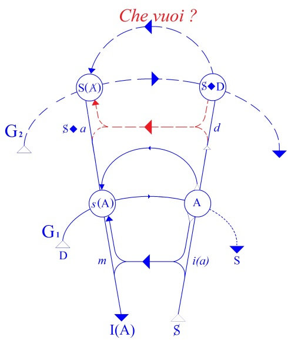
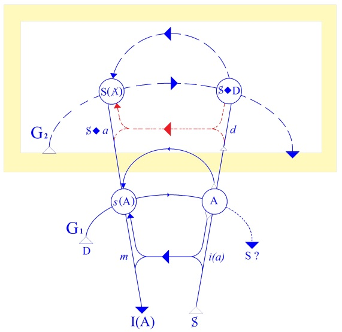

# Leçon 22 | 27 Mai 1959

  

    <label><input type="checkbox" data-lacan-toggle="original" checked> 原文</label>
    <label><input type="checkbox" data-lacan-toggle="notes" checked> 注释</label>
    <label><input type="checkbox" data-lacan-toggle="commentary" checked> 个人解读评论</label>
  

  <form class="lacan-tool-search" role="search">
    <input class="lacan-tool-search-input" type="search" placeholder="搜索全文" aria-label="搜索全文">
    <button class="lacan-tool-button" type="submit" title="搜索">搜索</button>
  </form>
  <button class="lacan-tool-button lacan-back-to-top" type="button" title="回到页面最上方" aria-label="回到页面最上方">↑</button>

<section class="parallel-paragraph" data-paragraph-ids="s6-22-0001">

s6-22-0001

原文 · s6-22-0001

HAMLET (8)

[无对应译文]

</section>

<section class="parallel-paragraph" data-paragraph-ids="s6-22-0002">

s6-22-0002

原文 · s6-22-0002

Nous allons aujourd’hui poursuivre l’étude de la place de la fonction du fantasme en tant qu’il est symbolisé dans les rapports du sujet, pourvu de la part du sujet en tant que marqué de l’effet de *la parole,* par rapport à un *objet(a)* que nous avons essayé, la dernière fois, de définir comme tel.

[无对应译文]

</section>

<section class="parallel-paragraph" data-paragraph-ids="s6-22-0003">

s6-22-0003

原文 · s6-22-0003

Cette fonction du fantasme, vous le savez, se situe quelque part au niveau de ce rapport que nous avons essayé d’inscrire dans ce que nous appelons *le graphe*.

[无对应译文]

</section>

<section class="parallel-paragraph" data-paragraph-ids="s6-22-0004">

s6-22-0004

原文 · s6-22-0004

[无对应译文]

</section>

<section class="parallel-paragraph" data-paragraph-ids="s6-22-0005">

s6-22-0005

原文 · s6-22-0005

C’est quelque chose de très simple en somme, puisque les termes se résument aux quatre points, si je puis dire, situés aux croisements des *deux chaînes signifiantes* par *une boucle* \[S→I(A)\] qui est celle *de* *l’intention subjective*.

[无对应译文]

</section>

<section class="parallel-paragraph" data-paragraph-ids="s6-22-0006">

s6-22-0006

原文 · s6-22-0006

Ces croisements donc, déterminent ces quatre points que nous avons appelés :

[无对应译文]

</section>

<section class="parallel-paragraph" data-paragraph-ids="s6-22-0007">

s6-22-0007

原文 · s6-22-0007

- *points de code*, qui sont ceux de droite, ici \[A et S◊ D\],

[无对应译文]

</section>

<section class="parallel-paragraph" data-paragraph-ids="s6-22-0008">

s6-22-0008

原文 · s6-22-0008

- et ces deux autres *points de message* \[S(A) et *s*(A)\], ceci en fonction du caractère rétroactif de l’effet de la chaîne signifiante quant à la signification.

[无对应译文]

</section>

<section class="parallel-paragraph" data-paragraph-ids="s6-22-0009">

s6-22-0009

原文 · s6-22-0009

Voici donc les quatre points que nous avons appris à meubler des significations suivantes :

[无对应译文]

</section>

<section class="parallel-paragraph" data-paragraph-ids="s6-22-0010">

s6-22-0010

原文 · s6-22-0010

- \[A *et* *s*(A)\] ce sont *les lieux où vient se situer la rencontre de l’intention du sujet avec le fait concret, le fait qu’il y a langage*.

[无对应译文]

</section>

<section class="parallel-paragraph" data-paragraph-ids="s6-22-0011">

s6-22-0011

原文 · s6-22-0011

- Ici, *les deux autres signes* \[S(A) *et* S◊ D\] *sur lesquels nous allons avoir à revenir aujourd’hui sont* S *en présence de* D \[S◊ D\], *et* S *signifiant* de A \[S(A)\].

[无对应译文]

</section>

<section class="parallel-paragraph" data-paragraph-ids="s6-22-0012">

s6-22-0012

原文 · s6-22-0012

Ces deux chaînes signifiantes - vous le savez, ceci est élucidé depuis longtemps - représentent respectivement : la chaîne inférieure \[G1\], *celle du discours concret* du sujet en tant qu’elle est comme telle, disons *accessible à la conscience*. Ce que l’analyse nous a appris, c’est pour autant qu’elle est accessible à la conscience, c’est peut-être, c’est sûrement parce qu’elle part d’illusions que nous l’affirmons entièrement transparente à la conscience.

[无对应译文]

</section>

<section class="parallel-paragraph" data-paragraph-ids="s6-22-0013">

s6-22-0013

原文 · s6-22-0013

Et si pendant plusieurs années j’ai insisté devant vous…

[无对应译文]

</section>

<section class="parallel-paragraph" data-paragraph-ids="s6-22-0014">

s6-22-0014

原文 · s6-22-0014

> par tous les biais par lesquels pouvaient vous être suggérées les parts illusoires qu’il y a dans cet effet
>
> de transparence, si j’ai essayé de montrer par toutes sortes de fables dont vous avez peut-être encore le souvenir, comment à la limite nous pouvions essayer, *sous la forme d’une image dans un miroir* rendue efficace au-delà de toute subsistance du sujet, par quel mécanisme persistant dans le néant subjectif réalisé par
>
> la destruction de toute vie, si j’ai essayé de vous donner là l’image d’une possibilité de subsistance
>
> de *quelque chose d’absolument spéculaire*, indépendamment de tout support subjectif,

[无对应译文]

</section>

<section class="parallel-paragraph" data-paragraph-ids="s6-22-0015">

s6-22-0015

原文 · s6-22-0015

…ce n’est pas pour le simple plaisir d’un tel jeu, mais cela repose sur le fait qu’un montage structuré comme celui d’une *chaîne signifiante* peut être supposé durer au-delà de toute *subjectivité* *des supports*.

[无对应译文]

</section>

<section class="parallel-paragraph" data-paragraph-ids="s6-22-0016">

s6-22-0016

原文 · s6-22-0016

*La conscience*, pour autant qu’elle nous donne ce sentiment d’être *moi* dans le discours, est quelque chose qui dans *la perspective analytique*…

[无对应译文]

</section>

<section class="parallel-paragraph" data-paragraph-ids="s6-22-0017">

s6-22-0017

原文 · s6-22-0017

> celle qui nous fait toucher sans cesse du doigt la méconnaissance systématique du sujet

[无对应译文]

</section>

<section class="parallel-paragraph" data-paragraph-ids="s6-22-0018">

s6-22-0018

原文 · s6-22-0018

…est quelque chose *que justement notre expérience nous apprend à référer à un rapport*, nous montrant que cette conscience, pour autant qu’elle *est d’abord expérimentée*, qu’elle est d’abord éprouvée *dans une image qui est image du semblable*, est quelque chose qui, bien plutôt, recouvre d’une apparence de conscience :

[无对应译文]

</section>

<section class="parallel-paragraph" data-paragraph-ids="s6-22-0019">

s6-22-0019

原文 · s6-22-0019

- ce qu’il y a d’inclus dans les rapports du sujet à *la chaîne signifiante primaire*, naïve, à la *demande innocente*, au discours concret pour autant qu’il se perpétue de bouche en bouche, organise ce qu’il y a de discours dans l’histoire même,

[无对应译文]

</section>

<section class="parallel-paragraph" data-paragraph-ids="s6-22-0020">

s6-22-0020

原文 · s6-22-0020

- ce qui *rebondit* d’articulation en articulation dans ce qui se passe effectivement à plus ou moins de distance de ce discours concret commun, universel, qui englobe toute activité réelle, sociale du groupe humain.

[无对应译文]

</section>

<section class="parallel-paragraph" data-paragraph-ids="s6-22-0021">

s6-22-0021

原文 · s6-22-0021

L’autre chaîne signifiante \[G2\] est celle qui nous est positivement donnée dans l’expérience analytique comme inaccessible à la conscience. Vous sentez bien pour autant que déjà, pour nous, cette référence à la conscience de la première chaîne est suspecte, *a fortiori* cette seule caractéristique de l’inaccessibilité à la conscience est quelque chose qui, pour nous, pose des questions sur ce qu’il en est du sens de cette inaccessibilité.

[无对应译文]

</section>

<section class="parallel-paragraph" data-paragraph-ids="s6-22-0022">

s6-22-0022

原文 · s6-22-0022

Aussi bien devons-nous *considérer* - et je vais y revenir - devons-nous bien *préciser* ce que nous entendons par là. Devons-nous considérer que cette chaîne, *comme telle inaccessible à la conscience*, est faite comme une chaîne signifiante ? Mais c’est là-dessus que je reviendrai toute à l’heure, posons-la pour l’instant, comme elle se présente à nous.

[无对应译文]

</section>

<section class="parallel-paragraph" data-paragraph-ids="s6-22-0023">

s6-22-0023

原文 · s6-22-0023

[无对应译文]

</section>

<section class="parallel-paragraph" data-paragraph-ids="s6-22-0024">

s6-22-0024

原文 · s6-22-0024

Ici, *le pointillé* sur lequel elle se présente \[G2\] signifie que le sujet ne l’articule pas en tant que discours. Ce qu’il articule actuellement c’est autre chose. Ce qu’il articule au niveau de la chaîne signifiante se situe au niveau de la boucle intentionnelle \[S→I(A)\]. C’est pour autant que le sujet se repère en tant qu’agissant dans l’aliénation de la signifiance avec le jeu de la parole, que le sujet s’articule – comme quoi ? – comme énigme, comme *question*, très exactement.

[无对应译文]

</section>

<section class="parallel-paragraph" data-paragraph-ids="s6-22-0025">

s6-22-0025

原文 · s6-22-0025

Ce qui nous est donné dans l’expérience à partir de ce qui est tangible dans l’évolution du sujet humain, dans un moment de l’articulation enfantine, à savoir qu’au-delà de la première demande avec déjà tout ce qu’elle comporte comme conséquence, il y a un moment où il va chercher à sanctionner ce qu’il a devant lui, à sanctionner les choses dans l’ordre inauguré par la signifiance. Comme tel, il va dire « *Quoi ?* » et il va dire « *Pourquoi ?* »

[无对应译文]

</section>

<section class="parallel-paragraph" data-paragraph-ids="s6-22-0026">

s6-22-0026

原文 · s6-22-0026

C’est à l’intérieur de ceci qui est référence expresse au discours, c’est ceci qui se présente comme continuant la première intention de la demande, la portant à la seconde intention du discours comme discours, du discours qui s’interroge, qui interroge les choses par rapport à lui-même, par rapport à leur situation dans le discours, qui n’est plus *exclamation*, *interpellation*, *cri du besoin* mais déjà nomination.

[无对应译文]

</section>

<section class="parallel-paragraph" data-paragraph-ids="s6-22-0027">

s6-22-0027

原文 · s6-22-0027

C’est ceci qui représente *l’intention seconde du sujet* et si, cette intention seconde, je la fais partir du lieu A, c’est pour autant que si le sujet est tout entier dans l’aliénation de la signifiance, dans l’aliénation de l’articulation parlée comme telle, et que c’est là et à ce niveau-là que se pose la question que j’ai appelée la dernière fois : sujet comme tel, du « S ? » avec *un point d’interrogation*.

[无对应译文]

</section>

<section class="parallel-paragraph" data-paragraph-ids="s6-22-0028">

s6-22-0028

原文 · s6-22-0028

Aussi bien, ce n’est pas que je me complaise dans les jeux de l’équivoque, mais il est aussi bien cohérent avec le niveau auquel nous procédons, au point que nous articulons.

[无对应译文]

</section>

<section class="parallel-paragraph" data-paragraph-ids="s6-22-0029">

s6-22-0029

原文 · s6-22-0029

C’est à l’intérieur de cette interrogation, de cette interrogation interne au lieu institué de la parole, au discours, c’est à l’intérieur de ceci que le sujet doit essayer de se situer comme sujet de la parole, demandant là encore :

[无对应译文]

</section>

<section class="parallel-paragraph" data-paragraph-ids="s6-22-0030">

s6-22-0030

原文 · s6-22-0030

- *Est-ce ?*

[无对应译文]

</section>

<section class="parallel-paragraph" data-paragraph-ids="s6-22-0031">

s6-22-0031

原文 · s6-22-0031

- *Quoi ?*

[无对应译文]

</section>

<section class="parallel-paragraph" data-paragraph-ids="s6-22-0032">

s6-22-0032

原文 · s6-22-0032

- *Pourquoi ?*

[无对应译文]

</section>

<section class="parallel-paragraph" data-paragraph-ids="s6-22-0033">

s6-22-0033

原文 · s6-22-0033

- *Qui est-ce qui parle ?*

[无对应译文]

</section>

<section class="parallel-paragraph" data-paragraph-ids="s6-22-0034">

s6-22-0034

原文 · s6-22-0034

- *Où est-ce que cela parle ?*

[无对应译文]

</section>

<section class="parallel-paragraph" data-paragraph-ids="s6-22-0035">

s6-22-0035

原文 · s6-22-0035

C’est précisément dans le fait que *ce qui s’articule au niveau de la chaîne signifiante n’est pas articulable au niveau de ce* « S ? », de cette question qui constitue le sujet une fois institué dans la parole, c’est en ceci que consiste *le fait de l’inconscient*.

[无对应译文]

</section>

<section class="parallel-paragraph" data-paragraph-ids="s6-22-0036">

s6-22-0036

原文 · s6-22-0036

Ici je veux simplement rappeler…

[无对应译文]

</section>

<section class="parallel-paragraph" data-paragraph-ids="s6-22-0037">

s6-22-0037

原文 · s6-22-0037

> à l’usage de ceux qui pourraient ici s’inquiéter, comme d’une construction arbitraire, de cette identification de la chaîne inconsciente que je présente ici, par rapport à l’interrogation du sujet, être dans les mêmes relations que celles du discours premier de la demande à l’intention qui surgit du besoin

[无对应译文]

</section>

<section class="parallel-paragraph" data-paragraph-ids="s6-22-0038">

s6-22-0038

原文 · s6-22-0038

…je veux vous rappeler ceci : c’est que si le signifiant, si l’inconscient a un sens, ce sens a toutes les caractéristiques de la fonction de la chaîne signifiante comme telle.

[无对应译文]

</section>

<section class="parallel-paragraph" data-paragraph-ids="s6-22-0039">

s6-22-0039

原文 · s6-22-0039

Et ici je sais bien qu’en faisant ce bref rappel, je dois faire, pour la plupart de mes auditeurs, allusion à ce que je sais qu’ils ont déjà entendu de moi quand j’ai parlé de cette chaîne signifiante, pour autant qu’elle est illustrée dans l’histoire que j’ai publiée ailleurs, *la fable des disques blancs et des disques noirs*, en tant qu’elle illustre quelque chose de structural dans les rapports de sujet à sujet, pour autant qu’on y trouve trois termes.[^104]

[无对应译文]

</section>

<section class="parallel-paragraph" data-paragraph-ids="s6-22-0040">

s6-22-0040

原文 · s6-22-0040

Dans cette histoire un signe distinctif permet d’identifier, de discriminer par rapport à un couple blanc ou noir, le rapport avec les autres sujets. Pour ceux qui ne s’en souviennent pas, je me contenterai de leur dire qu’ils se réfèrent à ce que j’ai écrit à ce sujet par rapport à cette succession d’*oscillations* par où le sujet se repère.

[无对应译文]

</section>

<section class="parallel-paragraph" data-paragraph-ids="s6-22-0041">

s6-22-0041

原文 · s6-22-0041

Par rapport à quoi ? Par rapport à la recherche de l’autre qui se fait en fonction de ce que les autres voient de lui-même et de ce qui les détermine de façon conclusive, à savoir ce que j’appellerai ici le \[genre ?\], ce par quoi le sujet décide qu’il est effectivement blanc ou noir, s’avère prêt à déclarer ce pour quoi la fable est construite.

[无对应译文]

</section>

<section class="parallel-paragraph" data-paragraph-ids="s6-22-0042">

s6-22-0042

原文 · s6-22-0042

Est-ce que vous ne trouvez pas là très exactement ce qui, dans la structure de la pulsion, nous est d’usage familier, à savoir ce fait d’identification relative, cette possibilité de la dénégation, du refus de l’articulation, de la défense, qui sont aussi cohérentes à la pulsion que *l’envers* à *l’endroit* d’une même chose, et qui se concluent par quelque chose qui devient pour le sujet la marque, le choix dans telles conditions, dans telles situations, ce en quoi il choisit toujours en fait ce pouvoir de répétition, toujours le même, que nous essayons d’appeler selon les sujets, une tendance masochiste, un penchant à l’échec, retour de refoulé, évocation fondamentale de la chaîne primitive ?

[无对应译文]

</section>

<section class="parallel-paragraph" data-paragraph-ids="s6-22-0043">

s6-22-0043

原文 · s6-22-0043

Tout cela est une seule et même chose, la répétition dans le sujet d’un type de sanction dont les formes dépassent de beaucoup les caractéristiques du *contenu*. Essentiellement, l’inconscient se présente pour nous toujours comme *une articulation indéfiniment répétée* et c’est pour cela qu’il est légitime que nous le situions dans ce schéma sous la forme de *cette ligne pointillée*. Nous la pointillons ici pourquoi ?

[无对应译文]

</section>

<section class="parallel-paragraph" data-paragraph-ids="s6-22-0044">

s6-22-0044

原文 · s6-22-0044

Nous l’avons dit :

[无对应译文]

</section>

<section class="parallel-paragraph" data-paragraph-ids="s6-22-0045">

s6-22-0045

原文 · s6-22-0045

- pour autant que le sujet n’y accède pas et nous disons plus précisément :

[无对应译文]

</section>

<section class="parallel-paragraph" data-paragraph-ids="s6-22-0046">

s6-22-0046

原文 · s6-22-0046

- pour autant que la façon dont le sujet peut s’y nommer lui-même, peut se situer en tant qu’il est le support de cette sanction,

[无对应译文]

</section>

<section class="parallel-paragraph" data-paragraph-ids="s6-22-0047">

s6-22-0047

原文 · s6-22-0047

- pour autant qu’il peut s’y désigner,

[无对应译文]

</section>

<section class="parallel-paragraph" data-paragraph-ids="s6-22-0048">

s6-22-0048

原文 · s6-22-0048

- pour autant qu’il est celui sur qui portera enfin la marque, les stigmates de ce qui reste pour lui non pas seulement ambigu, mais à proprement parler inaccessible jusqu’à un certain terme qui est celui, justement, que donne l’expérience analytique.

[无对应译文]

</section>

<section class="parallel-paragraph" data-paragraph-ids="s6-22-0049">

s6-22-0049

原文 · s6-22-0049

Nul « *je* » de lui ne peut être articulé à ce niveau, mais l’expérience se présente comme « *ça arrive du dehors* », et c’est déjà beaucoup que ça arrive, il peut le lire comme un « *Ça parle* ».

[无对应译文]

</section>

<section class="parallel-paragraph" data-paragraph-ids="s6-22-0050">

s6-22-0050

原文 · s6-22-0050

Il y a là une distance dont il n’est même pas dit, malgré que le commandement de FREUD nous en donne la visée, que d’une façon quelconque le sujet puisse en atteindre le but. La portée donc, à ce niveau du *point dit de code*, pour autant que nous le symbolisons ici par la confrontation du S avec la demande D : S◊ D, signifie quoi ?

[无对应译文]

</section>

<section class="parallel-paragraph" data-paragraph-ids="s6-22-0051">

s6-22-0051

原文 · s6-22-0051

Très précisément ceci : c’est que ceci et rien d’autre que ce point que nous appelons *point de code* et qui n’est emporté que pour autant que l’analyse commence le déchiffrage de la cohérence de la chaîne supérieure, c’est pour autant que le sujet S, en tant que sujet de l’inconscient…

[无对应译文]

</section>

<section class="parallel-paragraph" data-paragraph-ids="s6-22-0052">

s6-22-0052

原文 · s6-22-0052

> c’est-à-dire en tant que le sujet qui est constitué dans l’au-delà du discours concret, en tant que le sujet voit, lit, entend, je dis rétroactivement, nous pouvons le supposer ici comme *support de l’articulation de l’inconscient*

[无对应译文]

</section>

<section class="parallel-paragraph" data-paragraph-ids="s6-22-0053">

s6-22-0053

原文 · s6-22-0053

…rencontre - quoi ? - rencontre ce qui dans cette chaîne de la parole du sujet en tant qu’il questionne sur lui-même rencontre la demande. Quel rôle joue la demande à ce niveau ?

[无对应译文]

</section>

<section class="parallel-paragraph" data-paragraph-ids="s6-22-0054">

s6-22-0054

原文 · s6-22-0054

À ce niveau – et c’est ce que veut dire le signe ◊ entre S et D \[S◊ D\] – à ce niveau la demande est affectée de sa forme proprement symbolique, la demande est utilisée pour autant qu’*au-delà de* ce qu’elle exige quant à *la satisfaction du besoin*, elle se pose comme cette *demande d’amour* ou cette *demande de présence* par où nous avons dit que la demande institue l’Autre à qui elle s’adresse comme celui qui peut être *présent* ou *absent*. C’est en tant que la demande joue cette fonction *métaphorique*, en tant que *la demande* - qu’elle soit orale ou anale - *devient symbole* du rapport avec l’Autre, qu’elle joue là sa fonction de code, qu’elle permet de constituer le sujet comme étant situé à ce que nous appelons dans notre langage, la phase *orale* ou *anale* par exemple.

[无对应译文]

</section>

<section class="parallel-paragraph" data-paragraph-ids="s6-22-0055">

s6-22-0055

原文 · s6-22-0055

Mais ceci peut être appelé aussi la correspondance du message, c’est-à-dire de ce qu’avec ce code le sujet peut répondre ou recevoir comme message à ce qui est la question qui, dans l’au-delà, donne la première prise dans la chaîne signifiante.

[无对应译文]

</section>

<section class="parallel-paragraph" data-paragraph-ids="s6-22-0056">

s6-22-0056

原文 · s6-22-0056

[无对应译文]

</section>

<section class="parallel-paragraph" data-paragraph-ids="s6-22-0057">

s6-22-0057

原文 · s6-22-0057

Elle se présente là aussi *en pointillés* et comme venant de l’Autre, la question du « *Che vuoi ?* », « *Que veux-tu ?* ». C’est ce que le sujet, au-delà de l’Autre, se pose sous la forme du « S ? ». La réponse est celle qui est symbolisée ici sur le schéma par la signifiance de l’Autre en tant que *s*(A). Cette signifiance de l’Autre en tant que « S ? », nous lui avons donné, à ce niveau, un sens qui est ce sens plus général, ce sens dans lequel va se couler l’aventure du sujet concret, son histoire subjective.

[无对应译文]

</section>

<section class="parallel-paragraph" data-paragraph-ids="s6-22-0058">

s6-22-0058

原文 · s6-22-0058

La forme la plus générale est celle-ci :

[无对应译文]

</section>

<section class="parallel-paragraph" data-paragraph-ids="s6-22-0059">

s6-22-0059

原文 · s6-22-0059

- c’est qu’il n’y a rien dans l’Autre,

[无对应译文]

</section>

<section class="parallel-paragraph" data-paragraph-ids="s6-22-0060">

s6-22-0060

原文 · s6-22-0060

- il n’y a rien dans la signifiance qui puisse suffire à ce niveau de *l’articulation signifiante*,

[无对应译文]

</section>

<section class="parallel-paragraph" data-paragraph-ids="s6-22-0061">

s6-22-0061

原文 · s6-22-0061

- il n’y a rien dans la signifiance qui soit la garantie de la vérité,

[无对应译文]

</section>

<section class="parallel-paragraph" data-paragraph-ids="s6-22-0062">

s6-22-0062

原文 · s6-22-0062

- il n’y a point d’autre garantie de la vérité que la bonne foi de l’Autre, c’est-à-dire quelque chose qui se pose toujours pour le sujet sous une forme problématique.

[无对应译文]

</section>

<section class="parallel-paragraph" data-paragraph-ids="s6-22-0063">

s6-22-0063

原文 · s6-22-0063

Est-ce à dire que le sujet reste au bout de sa question de cette entière foi concernant ce que pour lui fait surgir le royaume de la parole ? C’est justement ici que nous arrivons à *notre fantasme*.

[无对应译文]

</section>

<section class="parallel-paragraph" data-paragraph-ids="s6-22-0064">

s6-22-0064

原文 · s6-22-0064

Déjà la dernière fois, je vous ai montré que le fantasme, pour autant qu’il est le point de butée concret par où nous abordons *aux rives de la conscience*, comment le fantasme joue pour le sujet ce rôle du support imaginaire, précisément de ce point où le sujet ne trouve rien qui puisse l’articuler en tant que sujet de son discours inconscient. C’est là donc que nous revenons aujourd’hui, qu’il nous faut de plus près *interroger* ce qu’il en est de ce phénomène.

[无对应译文]

</section>

<section class="parallel-paragraph" data-paragraph-ids="s6-22-0065">

s6-22-0065

原文 · s6-22-0065

Je vous rappelle ce que la dernière fois je vous ai dit à propos de l’objet : comme si *l’objet* jouait là le même rôle de mirage qu’à l’étage inférieur *l’image de l’autre spéculaire : i(a)*, joue par rapport au *moi*.

[无对应译文]

</section>

<section class="parallel-paragraph" data-paragraph-ids="s6-22-0066">

s6-22-0066

原文 · s6-22-0066

Ainsi donc, en face du point où le sujet va se situer pour accéder au niveau de la chaîne inconsciente, ici, je pose le fantasme comme tel : S◊*a.* Ce rapport à l’objet tel qu’il est dans le fantasme nous induit à quoi ? À une phénoménologie de la coupure, à l’objet en tant qu’il peut supporter sur le plan *imaginaire* ce rapport de *coupure* qui est celui où – à ce niveau – le sujet a à se supporter.

[无对应译文]

</section>

<section class="parallel-paragraph" data-paragraph-ids="s6-22-0067">

s6-22-0067

原文 · s6-22-0067

Cet objet en tant que support imaginaire de ce rapport de coupure, nous l’avons vu aux trois niveaux de l’objet :

[无对应译文]

</section>

<section class="parallel-paragraph" data-paragraph-ids="s6-22-0068">

s6-22-0068

原文 · s6-22-0068

- prégénital,

[无对应译文]

</section>

<section class="parallel-paragraph" data-paragraph-ids="s6-22-0069">

s6-22-0069

原文 · s6-22-0069

- de la mutilation castrative,

[无对应译文]

</section>

<section class="parallel-paragraph" data-paragraph-ids="s6-22-0070">

s6-22-0070

原文 · s6-22-0070

- et aussi de *la voix hallucinatoire* comme telle, c’est-à-dire moins - *pour autant qu’elle est voix incarnée* - discours en tant qu’interrompu, que \[*voix*\] coupée du monologue intérieur, que \[*voix*\] coupée dans le texte du monologue intérieur.

[无对应译文]

</section>

<section class="parallel-paragraph" data-paragraph-ids="s6-22-0071">

s6-22-0071

原文 · s6-22-0071

Voyons aujourd’hui s’il ne reste pas beaucoup plus à dire si nous revenons *sur le sens* de ce qui là s’*exprime*. Car aussi bien de quoi s’agit-il par rapport à *quelque chose* que j’ai déjà introduit la dernière fois, à savoir du point de vue du réel, du point de vue de la connaissance ?

[无对应译文]

</section>

<section class="parallel-paragraph" data-paragraph-ids="s6-22-0072">

s6-22-0072

原文 · s6-22-0072

À quel niveau sommes-nous ici puisque nous sommes introduits au niveau d’un S ? Est-ce que ce « S ? » est autre chose qu’une équivoque qui est susceptible d’être remplie par n’importe quel sens ? Ou allons-nous nous arrêter à son appartenance verbale de conjugaison, au verbe être ? [^105]

[无对应译文]

</section>

<section class="parallel-paragraph" data-paragraph-ids="s6-22-0073">

s6-22-0073

原文 · s6-22-0073

Déjà quelque chose là-dessus a été apporté la dernière fois. Il s’agit en effet de savoir à quel niveau nous sommes ici quant au sujet, pour autant que le sujet ne se réfère pas simplement quant au discours, mais aussi bien quant à quelques réalités.

[无对应译文]

</section>

<section class="parallel-paragraph" data-paragraph-ids="s6-22-0074">

s6-22-0074

原文 · s6-22-0074

Je dis ceci : si quelque chose *se présente, s’articule* que nous puissions de façon cohérente intituler la réalité…

[无对应译文]

</section>

<section class="parallel-paragraph" data-paragraph-ids="s6-22-0075">

s6-22-0075

原文 · s6-22-0075

> je veux dire la réalité dont nous faisons état dans notre discours analytique

[无对应译文]

</section>

<section class="parallel-paragraph" data-paragraph-ids="s6-22-0076">

s6-22-0076

原文 · s6-22-0076

…j’en situerai le champ sur le schéma ici, *dans le champ qui est au-dessous du discours concret*, pour autant que ce discours l’englobe et le ferme, qu’il est réserve d’un savoir, d’un savoir que nous pouvons étendre aussi loin que tout ce qui peut parler pour l’homme. J’entends qu’il n’est pas pour autant obligé à tout instant de reconnaître ce que déjà dans sa réalité, dans son histoire, il a d’ores et déjà inclus dans son discours, que tout ce qui se présente par exemple dans la dialectique marxiste comme aliénation peut ici se saisir et s’articuler d’une façon cohérente.

[无对应译文]

</section>

<section class="parallel-paragraph" data-paragraph-ids="s6-22-0077">

s6-22-0077

原文 · s6-22-0077

Je dirai plus : la coupure, ne l’oublions pas…

[无对应译文]

</section>

<section class="parallel-paragraph" data-paragraph-ids="s6-22-0078">

s6-22-0078

原文 · s6-22-0078

> et ceci nous est déjà indiqué dans le type du premier objet du fantasme, de l’objet prégénital

[无对应译文]

</section>

<section class="parallel-paragraph" data-paragraph-ids="s6-22-0079">

s6-22-0079

原文 · s6-22-0079

…à quoi est-ce que je fais allusion comme *objets* qui ici puissent *supporter les fantasmes*, si ce n’est à des *objets réels* dans un rapport étroit avec *la pulsion vitale* du sujet, pour autant qu’ils soient, de lui, séparés ?

[无对应译文]

</section>

<section class="parallel-paragraph" data-paragraph-ids="s6-22-0080">

s6-22-0080

原文 · s6-22-0080

Ce qui n’est que trop évident c’est que le *réel* n’est pas un continu compact, que le *réel* est fait - bien entendu - de coupures, tout autant et bien au-delà des coupures du langage, et que ce n’est pas d’hier que le philosophe – ARISTOTE[^106] – nous a parlé du *bon philosophe*, ce qui veut dire à mon sens, aussi bien :

[无对应译文]

</section>

<section class="parallel-paragraph" data-paragraph-ids="s6-22-0081">

s6-22-0081

原文 · s6-22-0081

- « *Celui qui sait dans toute sa généralité, il est comparable au bon cuisinier, c’est celui qui sait faire passer le couteau au point qui est juste de coupure des articulations, il sait pénétrer sans les blesser.* »

[无对应译文]

</section>

<section class="parallel-paragraph" data-paragraph-ids="s6-22-0082">

s6-22-0082

原文 · s6-22-0082

Le rapport de *la coupure du réel* et de *la coupure du langage* est quelque chose donc qui jusqu’à un certain point paraît satisfaire ce dans quoi la tradition philosophique s’est en somme toujours installée, à savoir qu’il ne s’agit que du recouvrement d’un système de coupure par un autre système de coupure.

[无对应译文]

</section>

<section class="parallel-paragraph" data-paragraph-ids="s6-22-0083">

s6-22-0083

原文 · s6-22-0083

Ce en quoi je dis que la question freudienne vient à son heure, c’est pour autant que ce que le parcours maintenant accompli de la science nous permet de formuler, c’est qu’il y a dans l’aventure de la science quelque chose qui va bien au-delà de cette identification, de *cette recouverture des coupures naturelles par les coupures d’un discours* quelconque.

[无对应译文]

</section>

<section class="parallel-paragraph" data-paragraph-ids="s6-22-0084">

s6-22-0084

原文 · s6-22-0084

Ce qui d’un effort qui a essentiellement consisté à vider toute l’articulation scientifique de ses implantations mythologiques est, nous verrons tout à l’heure, quelque chose qui, de là, nous a menés au point où nous en sommes et qui me semble suffisamment caractérisé sans faire plus de drame, par le terme de désintégration de la matière.

[无对应译文]

</section>

<section class="parallel-paragraph" data-paragraph-ids="s6-22-0085">

s6-22-0085

原文 · s6-22-0085

C’est bien quelque chose qui peut nous suggérer de ne voir dans cette aventure que de pures et simples connaissances. Ceci, c’est qu’à nous placer sur le plan du réel…

[无对应译文]

</section>

<section class="parallel-paragraph" data-paragraph-ids="s6-22-0086">

s6-22-0086

原文 · s6-22-0086

> ou, si vous voulez provisoirement, de quelque chose que j’appellerai à cette occasion, avec tout l’accent *d’ironie nécessaire*, car ce n’est certes pas mon penchant de l’appeler ainsi :« *le grand Tout* »

[无对应译文]

</section>

<section class="parallel-paragraph" data-paragraph-ids="s6-22-0087">

s6-22-0087

原文 · s6-22-0087

…de ce point de vue, la science et son aventure se présentent non comme le réel se renvoyant à lui-même ses propres coupures, mais comme éléments créateurs de quelque chose de nouveau, et qui prend la tournure de proliférer d’une façon qu’ici, assurément, nous ne pouvons pas nous dénier à nous-mêmes, en tant qu’hommes, que *notre fonction médiatrice*, notre fonction d’agents ne laisse pas de poser la question de savoir si les conséquences de ce qui se manifeste ne nous dépassent pas quelque peu. Pour tout dire : l’homme, dans ce jeu, entre à ses dépens.

[无对应译文]

</section>

<section class="parallel-paragraph" data-paragraph-ids="s6-22-0088">

s6-22-0088

原文 · s6-22-0088

Peut-être, il n’y a pas lieu ici pour nous d’aller plus loin. Par ce discours, que je fais exprès sobre et réduit, dont tout de même je suppose que l’accent dramatique et *actuel* ne vous échappe pas, ce que je veux ici dire, c’est que cette question quant à l’aventure de la science est autre chose que tout ce qui a pu s’articuler, avec même cette conséquence extrême de la science, avec toutes les conséquences qui ont été celles du dramatisme humain en tant qu’inscrit dans toute l’histoire.

[无对应译文]

</section>

<section class="parallel-paragraph" data-paragraph-ids="s6-22-0089">

s6-22-0089

原文 · s6-22-0089

Ici, dans ce cas, le sujet particulier est en rapport avec cette sorte de coupure constituée par le fait qu’il n’est pas par rapport à un certain discours conscient, qu’il ne sait pas ce qu’il est.

[无对应译文]

</section>

<section class="parallel-paragraph" data-paragraph-ids="s6-22-0090">

s6-22-0090

原文 · s6-22-0090

C’est de cela qu’il s’agit, il s’agit du rapport du *réel du sujet* comme entrant dans la coupure, et cet avènement du sujet au niveau de la coupure à quelque chose qu’il faut bien appeler un *réel*, mais qui n’est symbolisé par *rien*.

[无对应译文]

</section>

<section class="parallel-paragraph" data-paragraph-ids="s6-22-0091">

s6-22-0091

原文 · s6-22-0091

Il vous paraît peut-être excessif de voir désigner…

[无对应译文]

</section>

<section class="parallel-paragraph" data-paragraph-ids="s6-22-0092">

s6-22-0092

原文 · s6-22-0092

> au niveau de ce que nous avons appelé tout à l’heure une manifestation pure de cet être

[无对应译文]

</section>

<section class="parallel-paragraph" data-paragraph-ids="s6-22-0093">

s6-22-0093

原文 · s6-22-0093

…le point électif du rapport du sujet à ce que nous pouvons ici appeler son « *être pur de sujet* », ce par quoi dès lors le fantasme du désir prend la fonction – ce point – de le désigner. \[S(A)→ S◊*a →* I(A)\]

[无对应译文]

</section>

<section class="parallel-paragraph" data-paragraph-ids="s6-22-0094">

s6-22-0094

原文 · s6-22-0094

C’est pourquoi, à un autre moment, j’ai pu définir cette fonction remplie par le fantasme comme une métonymie de l’être et identifier comme tel, à ce niveau, le désir.

[无对应译文]

</section>

<section class="parallel-paragraph" data-paragraph-ids="s6-22-0095">

s6-22-0095

原文 · s6-22-0095

Entendons bien qu’à ce niveau, la question reste entièrement ouverte de savoir si nous pouvons appeler homme ce qui s’indique de cette façon, car que pouvons nous appeler « *homme* » sinon ce qui s’est déjà symbolisé comme tel et qui, aussi bien, chaque fois qu’on en parle, se trouve donc chargé de toutes les reconnaissances, disons historiques ?

[无对应译文]

</section>

<section class="parallel-paragraph" data-paragraph-ids="s6-22-0096">

s6-22-0096

原文 · s6-22-0096

Le mot « *humanisme* » *ne désigne* communément *rien* à ce niveau. Mais il y a quelque chose bien sûr en lui, de *réel*, quelque chose de *réel* qui est nécessaire et qui suffit à assurer dans l’expérience même cette dimension que nous appelons -je crois assez improprement d’habitude - cette profondeur, disons d’au-delà, qui fait que l’être n’est identifiable à aucun des rôles - pour employer le terme en usage actuellement - qu’il assume. Ici donc la dignité, si je puis dire, de cet être est définie dans un rapport qui n’est pas – *en quoi que ce soit* – qu’il soit « *coupé* », si je puis m’exprimer ainsi, avec tous les arrière-plans, les références castratives spécialement.

[无对应译文]

</section>

<section class="parallel-paragraph" data-paragraph-ids="s6-22-0097">

s6-22-0097

原文 · s6-22-0097

Si vous pouvez, avec d’autres expériences, y mettre non un « *coupable* », pour me permettre un jeu de mots, mais la « *coupure* » comme telle, à savoir en fin de compte ce qui se présente pour nous comme étant la dernière caractéristique structurale du symbolique comme tel, à quoi, je ne veux simplement qu’indiquer en passant que ce que nous trouvons là, c’est la direction où je vous ai déjà appris à rechercher ce que FREUD a appelé *instinct de mort*, ce par quoi cet *instinct de mort* peut se trouver converger avec l’être.

[无对应译文]

</section>

<section class="parallel-paragraph" data-paragraph-ids="s6-22-0098">

s6-22-0098

原文 · s6-22-0098

À ce point, il peut y avoir quelques difficultés, je voudrais essayer de les meubler. Dans le dernier numéro de *The Psychoanalytic Quaterly*, il y a un article fort intéressant - d’ailleurs sans excès - de M. Kurt EISSLER qui s’appelle « *La jonction des détails dans l’interprétation des œuvres d’art »*. \[*The Psychoanalytic Quaterly*, 1959, N°28.\]

[无对应译文]

</section>

<section class="parallel-paragraph" data-paragraph-ids="s6-22-0099">

s6-22-0099

原文 · s6-22-0099

C’est à une œuvre d’art, et à l’œuvre d’art en général en effet que je vais essayer de me référer pour illustrer ce dont il s’agit ici. Kurt EISSLER commence son discours, et le termine d’ailleurs, par une remarque dont je dois dire qu’on peut la qualifier diversement, selon qu’on la considère comme *confuse* ou comme simplement *inexpliquée*. Voici, en effet, à peu près ce qu’il articule. Le terme de détail lui semble particulièrement significatif à propos et à l’occasion de l’œuvre d’un auteur d’ailleurs parfaitement inconnu au-delà du cercle autrichien.

[无对应译文]

</section>

<section class="parallel-paragraph" data-paragraph-ids="s6-22-0100">

s6-22-0100

原文 · s6-22-0100

C’est un *acteur­auteur*…

[无对应译文]

</section>

<section class="parallel-paragraph" data-paragraph-ids="s6-22-0101">

s6-22-0101

原文 · s6-22-0101

> et si je me réfère à cela c’est bien parce que je vais revenir tout à l’heure à HAMLET

[无对应译文]

</section>

<section class="parallel-paragraph" data-paragraph-ids="s6-22-0102">

s6-22-0102

原文 · s6-22-0102

…l’*acteur-auteur* en question est un *petit* SHAKESPEARE inconnu.

[无对应译文]

</section>

<section class="parallel-paragraph" data-paragraph-ids="s6-22-0103">

s6-22-0103

原文 · s6-22-0103

À propos de ce SHAKESPEARE qui vivait au siècle précédent à Vienne, EISSLER a fait une de ces très jolies petites histoires tout à fait typique de ce qu’on appelle *la psychanalyse appliquée*.

[无对应译文]

</section>

<section class="parallel-paragraph" data-paragraph-ids="s6-22-0104">

s6-22-0104

原文 · s6-22-0104

C’est-à-dire qu’une fois de plus, il a retrouvé à travers la vie du personnage, un certain nombre d’éléments signalétiques paradoxaux qui permettent d’introduire des questions qui resteront à jamais irrésolues, à savoir si Monsieur Ferdinand RAIMUND a été tout spécialement affecté, cinq ans auparavant qu’il n’ait écrit un de ses chefs-d’œuvre, par la mort de quelqu’un qui était pour lui une sorte de modèle, mais un modèle tellement assumé que toutes les questions se posent à propos *d’identifications paternelle, maternelle, sexuelle, tout ce que vous voudrez !*

[无对应译文]

</section>

<section class="parallel-paragraph" data-paragraph-ids="s6-22-0105">

s6-22-0105

原文 · s6-22-0105

La question en elle-même nous laisse assez froids, c’est l’exemple d’un de ces travaux gratuits qui, dans ce genre, se renouvellent toujours avec une valeur de répétition qui garde aussi sa valeur de conviction, mais ce n’est pas de cela qu’il s’agit. Ce dont il s’agit est ceci, c’est l’espèce de distinction qu’EISSLER veut établir entre la fonction de ce qu’il appelle à peu près le détail « *relevant »* en anglais, appelons-le le détail qui ne colle pas, le détail pertinent.

[无对应译文]

</section>

<section class="parallel-paragraph" data-paragraph-ids="s6-22-0106">

s6-22-0106

原文 · s6-22-0106

En effet, c’est à propos de quelque chose dans une pièce assez bien faite du dénommé M. Ferdinand RAIMUND, c’est à propos de quelque chose qui vient là, disons un peu comme des cheveux sur la soupe, que rien n’implique absolument, que l’oreille de Kurt EISSLER s’est trouvée se dresser, que de fil en aiguille il est arrivé à retrouver un certain nombre de faits biographiques dont l’intérêt est absolument patent.

[无对应译文]

</section>

<section class="parallel-paragraph" data-paragraph-ids="s6-22-0107">

s6-22-0107

原文 · s6-22-0107

Donc c’est de la valeur de guide du détail *irrelevant* \[non pertinent\] qu’il s’agit. Et là, EISSLER fait une sorte d’opposition entre ce qui se passe dans la clinique et ce qui se passe dans l’analyse dite de psychanalyse appliquée qu’on fait communément dans l’analyse d’une œuvre d’art.

[无对应译文]

</section>

<section class="parallel-paragraph" data-paragraph-ids="s6-22-0108">

s6-22-0108

原文 · s6-22-0108

Il répète par deux fois quelque chose…

[无对应译文]

</section>

<section class="parallel-paragraph" data-paragraph-ids="s6-22-0109">

s6-22-0109

原文 · s6-22-0109

> si j’avais le temps il faudrait que je vous lise cela dans le texte pour vous faire sentir *le caractère assez opaque*

[无对应译文]

</section>

<section class="parallel-paragraph" data-paragraph-ids="s6-22-0110">

s6-22-0110

原文 · s6-22-0110

…il dit en somme : c’est à peu près le même rôle que jouent le *symptôme* et ce *détail* qui ne convient pas, à ceci près que dans l’analyse nous partons d’un symptôme qui est donné comme un élément *irrelevant* essentiellement pour le sujet. C’est dans son interprétation que nous progressons jusqu’à sa solution.

[无对应译文]

</section>

<section class="parallel-paragraph" data-paragraph-ids="s6-22-0111">

s6-22-0111

原文 · s6-22-0111

Dans l’autre cas, c’est *le détail qui nous introduit au problème*, c’est­à-dire que pour autant que dans un texte…

[无对应译文]

</section>

<section class="parallel-paragraph" data-paragraph-ids="s6-22-0112">

s6-22-0112

原文 · s6-22-0112

> il ne va même pas jusqu’à formuler cette notion de texte

[无对应译文]

</section>

<section class="parallel-paragraph" data-paragraph-ids="s6-22-0113">

s6-22-0113

原文 · s6-22-0113

…dans un texte, nous saisissons quelque chose, qui n’y était pas spécialement impliqué, comme étant discordant, nous sommes introduits à quelque chose qui peut nous mener jusqu’à la personnalité de l’*auteur*.

[无对应译文]

</section>

<section class="parallel-paragraph" data-paragraph-ids="s6-22-0114">

s6-22-0114

原文 · s6-22-0114

Il y a là quelque chose qui, si l’on y regarde de plus près, ne peut pas tout à fait passer pour une relation de contraste, il semble qu’il suffit que vous y réfléchissiez pour vous en apercevoir…

[无对应译文]

</section>

<section class="parallel-paragraph" data-paragraph-ids="s6-22-0115">

s6-22-0115

原文 · s6-22-0115

> s’il y a contraste, il y a aussi bien entendu parallélisme

[无对应译文]

</section>

<section class="parallel-paragraph" data-paragraph-ids="s6-22-0116">

s6-22-0116

原文 · s6-22-0116

…que dans l’ensemble, ce vers quoi, semble-t-il, devrait le mener cette remarque, c’est assurément que la discordance dans le symbolique…

[无对应译文]

</section>

<section class="parallel-paragraph" data-paragraph-ids="s6-22-0117">

s6-22-0117

原文 · s6-22-0117

> dans le symbolique comme tel dans une œuvre écrite, et ici en tout cas

[无对应译文]

</section>

<section class="parallel-paragraph" data-paragraph-ids="s6-22-0118">

s6-22-0118

原文 · s6-22-0118

…joue un *rôle fonctionnel* tout à fait identifiable au *symptôme réel*, en tout cas du point de vue du progrès, si ce progrès doit être considéré comme un progrès de connaissance concernant le sujet.

[无对应译文]

</section>

<section class="parallel-paragraph" data-paragraph-ids="s6-22-0119">

s6-22-0119

原文 · s6-22-0119

À ce titre, de toute façon, le rapprochement a vraiment un intérêt. Simplement, la question se pose à ce moment–là pour nous de savoir si dans l’œuvre d’art, je dirais, seule *la faute de frappe* va devenir pour nous significative.

[无对应译文]

</section>

<section class="parallel-paragraph" data-paragraph-ids="s6-22-0120">

s6-22-0120

原文 · s6-22-0120

Et pourquoi après tout ? Car s’il est clair que dans l’œuvre d’art, ce qu’on peut appeler la faute de frappe…

[无对应译文]

</section>

<section class="parallel-paragraph" data-paragraph-ids="s6-22-0121">

s6-22-0121

原文 · s6-22-0121

> vous entendez bien que je veux dire quelque chose qui se présente à nous comme une discontinuité

[无对应译文]

</section>

<section class="parallel-paragraph" data-paragraph-ids="s6-22-0122">

s6-22-0122

原文 · s6-22-0122

…peut nous mener à quelque connaissance utile pour nous servir d’indice où nous retrouvons dans les éclairages majeurs, dans leur portée inconsciente, tel ou tel incident de la vie passée de l’auteur…

[无对应译文]

</section>

<section class="parallel-paragraph" data-paragraph-ids="s6-22-0123">

s6-22-0123

原文 · s6-22-0123

ce qui se passe effectivement dans cet article

[无对应译文]

</section>

<section class="parallel-paragraph" data-paragraph-ids="s6-22-0124">

s6-22-0124

原文 · s6-22-0124

…est-ce qu’en tout cas la chose ne nous introduit pas à ceci : c’est que dès lors, la dimension de l’œuvre d’art doit être pour nous éclairée ?

[无对应译文]

</section>

<section class="parallel-paragraph" data-paragraph-ids="s6-22-0125">

s6-22-0125

原文 · s6-22-0125

En effet nous pouvons dès lors, et à partir de ce seul fait...

[无对应译文]

</section>

<section class="parallel-paragraph" data-paragraph-ids="s6-22-0126">

s6-22-0126

原文 · s6-22-0126

nous le verrons bien au-delà de ce fait

[无对应译文]

</section>

<section class="parallel-paragraph" data-paragraph-ids="s6-22-0127">

s6-22-0127

原文 · s6-22-0127

...poser que l’œuvre d’art dès lors ne saurait plus pour nous d’aucune façon être affirmée comme représentant *cette transposition, cette sublimation* - appelez cela comme vous voulez - de la réalité :

[无对应译文]

</section>

<section class="parallel-paragraph" data-paragraph-ids="s6-22-0128">

s6-22-0128

原文 · s6-22-0128

- il ne s’agit pas de quelque chose qui joue aussi largement que possible dans l’imitation,

[无对应译文]

</section>

<section class="parallel-paragraph" data-paragraph-ids="s6-22-0129">

s6-22-0129

原文 · s6-22-0129

- il ne s’agit pas de quelque chose qui joue aussi largement que possible dans l’ordre de la μίμησις \[mimésis\].

[无对应译文]

</section>

<section class="parallel-paragraph" data-paragraph-ids="s6-22-0130">

s6-22-0130

原文 · s6-22-0130

Ceci peut donc s’appliquer aussi bien à ceci qui est d’ailleurs le cas général, à savoir que l’œuvre d’art a toujours un remaniement profond, cela ne met pas en cause ceci même qui, je crois, est déjà pour nous dépassé. Mais ce n’est pas sur ce point que j’entends attirer votre attention. C’est que l’œuvre d’art est pour nous limitée à un type de l’œuvre d’art. Pour l’instant, je me limiterai à *l’œuvre d’art écrite*.

[无对应译文]

</section>

<section class="parallel-paragraph" data-paragraph-ids="s6-22-0131">

s6-22-0131

原文 · s6-22-0131

L’œuvre d’art, loin d’être quelque chose qui transfigure de quelque façon que ce soit…

[无对应译文]

</section>

<section class="parallel-paragraph" data-paragraph-ids="s6-22-0132">

s6-22-0132

原文 · s6-22-0132

aussi large que vous puissiez le dire

[无对应译文]

</section>

<section class="parallel-paragraph" data-paragraph-ids="s6-22-0133">

s6-22-0133

原文 · s6-22-0133

…la réalité, introduit dans sa structure même ce fait de l’avènement de la coupure pour autant que s’y manifeste le réel du sujet, en tant qu’au-delà de ce qu’il dit, il est le sujet inconscient.

[无对应译文]

</section>

<section class="parallel-paragraph" data-paragraph-ids="s6-22-0134">

s6-22-0134

原文 · s6-22-0134

Car si ce rapport du sujet à l’avènement de *la coupure* lui est interdit en tant que c’est justement là son inconscient, il ne lui est pas interdit en tant que le sujet a l’expérience du fantasme, à savoir qu’il est animé par ce rapport dit du désir et que…

[无对应译文]

</section>

<section class="parallel-paragraph" data-paragraph-ids="s6-22-0135">

s6-22-0135

原文 · s6-22-0135

> par la seule référence de cette expérience et pour autant qu’elle est intimement tissée à l’œuvre

[无对应译文]

</section>

<section class="parallel-paragraph" data-paragraph-ids="s6-22-0136">

s6-22-0136

原文 · s6-22-0136

…quelque chose devient possible par quoi l’œuvre va exprimer cette dimension, ce réel du sujet en tant que nous l’avons appelé tout à l’heure avènement de l’être au-delà de toute *réalisation subjective possible*.

[无对应译文]

</section>

<section class="parallel-paragraph" data-paragraph-ids="s6-22-0137">

s6-22-0137

原文 · s6-22-0137

Et que c’est la vertu et la forme de l’œuvre d’art, celle qui réussit et celle aussi qui échoue, qu’elle intéresse cette dimension-là, cette dimension, si je puis dire, si je puis me servir de la topologie de mon schéma pour le faire sentir, cette dimension transversale qui n’est pas parallèle au champ créé dans le réel par la symbolisation humaine qui s’appelle réalité, mais qui lui est transversale pour autant que *le rapport le plus intime de l’homme à la coupure,* *en tant qu’il dépasse toutes les coupures naturelles*, qu’il y a cette coupure essentielle de son existence, à savoir qu’il est là et il doit se situer dans ce fait même de l’avènement de la coupure, que c’est ceci dont il s’agit dans l’œuvre d’art.

[无对应译文]

</section>

<section class="parallel-paragraph" data-paragraph-ids="s6-22-0138">

s6-22-0138

原文 · s6-22-0138

Et spécialement dans celle que nous avons abordée le plus récemment parce qu’elle est à cet égard l’œuvre la plus problématique, à savoir HAMLET. Il y a aussi *toutes sortes de choses* *irrelevant* dans HAMLET. Je dirai même que c’est par là que nous avons progressé, mais d’une façon complètement énigmatique.

[无对应译文]

</section>

<section class="parallel-paragraph" data-paragraph-ids="s6-22-0139">

s6-22-0139

原文 · s6-22-0139

Nous ne pouvons, à tout instant, que nous interroger sur ceci, que veut dire cette *irrelevance* ?

[无对应译文]

</section>

<section class="parallel-paragraph" data-paragraph-ids="s6-22-0140">

s6-22-0140

原文 · s6-22-0140

Car une chose est claire, c’est qu’il n’est jamais exclu que SHAKESPEARE l’ait voulue. Si – à tort ou à raison, peu importe – Kurt EISSLER, dans l’œuvre de Ferdinand RAIMUND, peut trouver bizarre qu’on fasse intervenir à un moment, une période de cinq ans dont jamais personne n’avait parlé avant…

[无对应译文]

</section>

<section class="parallel-paragraph" data-paragraph-ids="s6-22-0141">

s6-22-0141

原文 · s6-22-0141

> c’est le détail *irrelevant* qui va le mettre sur la voie d’une certaine recherche

[无对应译文]

</section>

<section class="parallel-paragraph" data-paragraph-ids="s6-22-0142">

s6-22-0142

原文 · s6-22-0142

…il est clair que nous n’avons pas du tout procédé de la même façon concernant ce qui se passe dans HAMLET car en tout cas nous sommes sûrs que ce tissu d’*irrelevances* ne peut en aucun cas être purement et simplement *résolu par nous*, par le fait que SHAKESPEARE se laissait conduire ici par son bon génie.

[无对应译文]

</section>

<section class="parallel-paragraph" data-paragraph-ids="s6-22-0143">

s6-22-0143

原文 · s6-22-0143

Nous avons le sentiment qu’il y était pour quelque chose et après tout, n’y serait-il même pour rien d’autre que pour la manifestation de son inconscient le plus profond, c’est en tout cas ici l’architecture de ces *irrelevances* qui nous montre que ce à quoi il parvient, c’est essentiellement à se déployer dans l’affirmation majeure que nous distinguions tout à l’heure, à savoir dans ce type de rapport du sujet, à son niveau le plus profond, comme sujet parlant, c’est-à-dire pour autant qu’il fait venir au jour son rapport à la coupure comme tel.

[无对应译文]

</section>

<section class="parallel-paragraph" data-paragraph-ids="s6-22-0144">

s6-22-0144

原文 · s6-22-0144

C’est bien là ce que nous montre l’architecture d’HAMLET pour autant que nous voyons ce qui, dans HAMLET, dépend fondamentalement d’un rapport qui est celui du sujet à la vérité.

[无对应译文]

</section>

<section class="parallel-paragraph" data-paragraph-ids="s6-22-0145">

s6-22-0145

原文 · s6-22-0145

À la différence du « *rêve du père mort* » dont nous sommes partis cette année dans notre exploration, *le rêve du père mort* qui apparaît devant le fils transpercé de douleur, *ici le père sait qu’il est mort et le fait savoir à son fils*. Et ce qui distingue le scénario, l’articulation d’HAMLET de SHAKESPEARE de l’histoire d’HAMLET telle qu’elle apparaît dans l’histoire de SAXO GRAMMATICUS, c’est justement qu’ils sont tous *les deux seuls à savoir*. Dans l’histoire de SAXO GRAMMATICUS, c’est *publiquement* que le meurtre a eu lieu et HAMLET fait le fou pour dissimuler ses intentions, *tout le monde sait qu’il y a eu crime*. Ici, il n’y a qu’eux deux qui savent, dont un *ghost*. Or un *ghost*, qu’est-ce que c’est, si ce n’est la représentation de ce paradoxe tel que seule peut le fomenter *l’œuvre d’art*, et c’est là que SHAKESPEARE va nous le rendre entièrement crédible.

[无对应译文]

</section>

<section class="parallel-paragraph" data-paragraph-ids="s6-22-0146">

s6-22-0146

原文 · s6-22-0146

D’autres que moi ont montré la fonction que remplit cette venue du *ghost* au premier plan.

[无对应译文]

</section>

<section class="parallel-paragraph" data-paragraph-ids="s6-22-0147">

s6-22-0147

原文 · s6-22-0147

La fonction du *ghost* s’impose dès le départ d’HAMLET. Et ce *ghost* que dit-il ? Il dit des choses très étranges et je suis étonné qu’aucun n’ait même abordé, je ne dis pas la psychanalyse du *ghost*, mais n’ait mis l’accent de quelque interrogation sur ce que dit le *ghost*. Ce qu’il dit en tout cas, ce n’est pas douteux.

[无对应译文]

</section>

<section class="parallel-paragraph" data-paragraph-ids="s6-22-0148">

s6-22-0148

原文 · s6-22-0148

Il dit : la trahison est absolue, il n’y avait rien de plus grand, de plus parfait, que mon rapport de fidélité à cette femme. Il n’y a rien de plus total que la trahison dont j’ai été l’objet.

[无对应译文]

</section>

<section class="parallel-paragraph" data-paragraph-ids="s6-22-0149">

s6-22-0149

原文 · s6-22-0149

Tout ce qui se pose, tout ce qui s’affirme comme bonne foi, fidélité et vœu, est donc pour HAMLET, posé non seulement comme révocable, mais comme littéralement révoqué. L’annulation absolue de ceci se déroule au niveau de la chaîne signifiante, et c’est quelque chose qui est tout différent de cette *carence de quelque chose qui garantisse*. Ce terme qui est garanti c’est la non-vérité, cette sorte de *révélation* si l’on peut dire, du mensonge - c’est quelque chose qui mériterait d’être suivi - représente l’esprit d’HAMLET, cette sorte de stupeur où il entre après les révélations paternelles. C’est quelque chose qui est, dans le texte de SHAKESPEARE, traduit d’une façon tout à fait remarquable, à savoir que quand on lui demande ce qu’il a appris, il ne veut pas le dire, *et pour cause* !

[无对应译文]

</section>

<section class="parallel-paragraph" data-paragraph-ids="s6-22-0150">

s6-22-0150

原文 · s6-22-0150

Mais il l’exprime de façon tout à fait particulière. On pourrait dire en français :

[无对应译文]

</section>

<section class="parallel-paragraph" data-paragraph-ids="s6-22-0151">

s6-22-0151

原文 · s6-22-0151

- « *Qu’il n’y a pas un bougre de salaud dans le royaume de Danemark qui ne soit un immonde individu.* » \[*There’s never a villain dwelling in all Denmark… But he’s an arrant knave*. (I, 5, 124)\]

[无对应译文]

</section>

<section class="parallel-paragraph" data-paragraph-ids="s6-22-0152">

s6-22-0152

原文 · s6-22-0152

C’est-à-dire qu’il s’exprime dans le régime *de la tautologie*.

[无对应译文]

</section>

<section class="parallel-paragraph" data-paragraph-ids="s6-22-0153">

s6-22-0153

原文 · s6-22-0153

Mais laissons cela de côté, ce ne sont que détails et anecdotes, la question est ailleurs. La question est ceci : où sommes-nous trompés ? Il est généralement reçu qu’un mort ne saurait être un menteur. Et pourquoi ?

[无对应译文]

</section>

<section class="parallel-paragraph" data-paragraph-ids="s6-22-0154">

s6-22-0154

原文 · s6-22-0154

Pour la même raison peut-être que toute notre science conserve encore ce postulat. EINSTEIN l’a souligné en termes propres…

[无对应译文]

</section>

<section class="parallel-paragraph" data-paragraph-ids="s6-22-0155">

s6-22-0155

原文 · s6-22-0155

> il disait de temps en temps, des choses qui n’étaient pas si superficielles que cela, dans l’ordre philosophique

[无对应译文]

</section>

<section class="parallel-paragraph" data-paragraph-ids="s6-22-0156">

s6-22-0156

原文 · s6-22-0156

…il disait : « *Le bon vieux Dieu est malin, assurément il est honnête.* ».

[无对应译文]

</section>

<section class="parallel-paragraph" data-paragraph-ids="s6-22-0157">

s6-22-0157

原文 · s6-22-0157

En pouvons-nous dire autant d’un père qui nous exprime de façon catégorique qu’il est en proie à tous les tourments des flammes de l’enfer, et ceci pour des crimes absolument infâmes ?

[无对应译文]

</section>

<section class="parallel-paragraph" data-paragraph-ids="s6-22-0158">

s6-22-0158

原文 · s6-22-0158

Il y a là, quand même, quelque chose qui ne peut pas manquer de nous alerter, il y a là quelque *discordance…*

[无对应译文]

</section>

<section class="parallel-paragraph" data-paragraph-ids="s6-22-0159">

s6-22-0159

原文 · s6-22-0159

- et si nous suivons les effets, dans HAMLET, de ce qui se présente comme *la damnation éternelle*, de *la vérité* à jamais condamnée à se dérober à lui,

[无对应译文]

</section>

<section class="parallel-paragraph" data-paragraph-ids="s6-22-0160">

s6-22-0160

原文 · s6-22-0160

- si nous concevons qu’HAMLET reste alors enfermé dans cette affirmation du père,

[无对应译文]

</section>

<section class="parallel-paragraph" data-paragraph-ids="s6-22-0161">

s6-22-0161

原文 · s6-22-0161

…est-ce que nous-mêmes, jusqu’à un certain point, nous ne pouvons pas nous interroger sur ce que signifie, *au moins fonctionnellement*, *cette parole* par rapport à la genèse et au déroulement de tout le drame ?

[无对应译文]

</section>

<section class="parallel-paragraph" data-paragraph-ids="s6-22-0162">

s6-22-0162

原文 · s6-22-0162

Bien des choses pourraient être dites, y compris celle–ci, que le père d’HAMLET dit ceci - en français :

[无对应译文]

</section>

<section class="parallel-paragraph" data-paragraph-ids="s6-22-0163">

s6-22-0163

原文 · s6-22-0163

- « *Mais si ne s’émeut point la vertu quand le vice s’en viendrait la tenter sous la forme du ciel.* *Ainsi, la luxure, le vice, au lit d’un ange radieux prend bientôt en dégoût cette couche céleste et court à l’immondice.* » [^107]

[无对应译文]

</section>

<section class="parallel-paragraph" data-paragraph-ids="s6-22-0164">

s6-22-0164

原文 · s6-22-0164

C’est d’ailleurs une mauvaise traduction car on doit dire : « *Ainsi le vice, quoique lié à un ange radieux.* »

[无对应译文]

</section>

<section class="parallel-paragraph" data-paragraph-ids="s6-22-0165">

s6-22-0165

原文 · s6-22-0165

De quel « *ange radieux* » s’agit-il ? Si c’est un « *ange radieux* » qui introduit le vice dans ce rapport d’amour déchu dans lequel toute la charge est portée sur l’autre, se peut-il – ici plus que n’importe où – que celui qui vient à jamais porter le témoignage de l’injure subie n’y soit pour rien ? Ceci, bien sûr, est la clé qui ne pourra jamais être tournée, le secret qui ne pourra jamais être levé.

[无对应译文]

</section>

<section class="parallel-paragraph" data-paragraph-ids="s6-22-0166">

s6-22-0166

原文 · s6-22-0166

Mais est-ce que *quelque chose* ne vient pas ici nous mettre *sur la trace du mot* sous lequel nous devons comprendre ? Eh bien, c’est – ici comme ailleurs – le fantasme.

[无对应译文]

</section>

<section class="parallel-paragraph" data-paragraph-ids="s6-22-0167">

s6-22-0167

原文 · s6-22-0167

Car l’énigme à jamais irrésolue, si primitive que nous supposions – et à juste titre – la cervelle des contemporains de SHAKESPEARE, tout de même quel curieux choix que *cette fiole de poison versé dans l’oreille* du *ghost* qui est le père, qui est HAMLET*-père*, ne l’oubliez pas, *car ils s’appellent tous les deux* HAMLET.

[无对应译文]

</section>

<section class="parallel-paragraph" data-paragraph-ids="s6-22-0168">

s6-22-0168

原文 · s6-22-0168

Là-dessus, les analystes ne se sont guère aventurés. Il y en a bien eu pour indiquer que peut-être quelque élément symbolique devait être reconnu.

[无对应译文]

</section>

<section class="parallel-paragraph" data-paragraph-ids="s6-22-0169">

s6-22-0169

原文 · s6-22-0169

Mais il est quelque chose qui, en tout cas, peut être situé selon notre méthode sous la forme du *bloc* qu’il forme, du *trou* qu’il forme, *de l’énigme impénétrée qu’il constitue*. Inutile - je l’ai déjà fait - de souligner le paradoxe de cette révélation, jusqu’à y compris de ses suites. L’important est ceci, nous avons là une structure non seulement fantasmatique qui colle tellement bien à ce qui se passe, à savoir : qu’en tout cas s’il y a quelqu’un qui est empoisonné par l’oreille, c’est HAMLET, et ici ce qui fait fonction de *poison*, c’est *la parole de son père*.

[无对应译文]

</section>

<section class="parallel-paragraph" data-paragraph-ids="s6-22-0170">

s6-22-0170

原文 · s6-22-0170

Dès lors, l’intention de SHAKESPEARE s’éclaire quelque peu, c’est à savoir que ce qu’il nous a montré d’abord, c’est le rapport du désir avec cette révélation : pendant deux mois, HAMLET reste sous le coup de cette révélation. Et comment va-t-il reconquérir peu à peu l’usage de ses membres ? Eh bien, justement, par *une œuvre d’art*. Les comédiens lui viennent *à temps* pour qu’il en fasse « *le banc d’épreuve de la conscience du roi* », nous dit le texte.

[无对应译文]

</section>

<section class="parallel-paragraph" data-paragraph-ids="s6-22-0171">

s6-22-0171

原文 · s6-22-0171

Ce qui est certain, c’est que c’est par la voie de cette épreuve qu’il va pouvoir rentrer dans l’action, dans une action qui va se dérouler nécessairement à partir de la première des conséquences. C’est à savoir d’abord que ce personnage qui, à partir de la révélation paternelle souhaitait uniquement sa propre dissolution :

[无对应译文]

</section>

<section class="parallel-paragraph" data-paragraph-ids="s6-22-0172">

s6-22-0172

原文 · s6-22-0172

- « *Ô viande trop solide, que ne t’évapores-tu, que ne puisses-tu te dissoudre !* \[I, 2, 129–130\] »

[无对应译文]

</section>

<section class="parallel-paragraph" data-paragraph-ids="s6-22-0173">

s6-22-0173

原文 · s6-22-0173

…à la fin de la pièce, nous le voyons saisi d’une ivresse qui a un nom bien précis, c’est celle de l’*artifex*, il est fou de joie d’avoir réussi son pire effet, on ne peut plus le tenir et c’est tout juste si HORATIO ne doit s’accrocher à ses basques pour contenir une exubérance trop grande.

[无对应译文]

</section>

<section class="parallel-paragraph" data-paragraph-ids="s6-22-0174">

s6-22-0174

原文 · s6-22-0174

Quand il lui dit :

[无对应译文]

</section>

<section class="parallel-paragraph" data-paragraph-ids="s6-22-0175">

s6-22-0175

原文 · s6-22-0175

- « *Est-ce que je ne pourrais pas maintenant m’engager dans quelques troupes comme acteur, avec une part entière ?* » \[III, 2, 263\]

[无对应译文]

</section>

<section class="parallel-paragraph" data-paragraph-ids="s6-22-0176">

s6-22-0176

原文 · s6-22-0176

HORATIO répond : « *Une moitié de part.* » Il sait à quoi s’en tenir. En effet, tout est loin d’être reconquis avec cette affaire, ce n’est pas parce qu’il est *artifex* qu’il a encore trouvé son rôle, mais il suffit qu’on sache qu’il est *artifex* pour comprendre que le premier rôle qu’il trouvera, il le prendra. Il exercera ce qui lui est, en fin de compte, commandé, je vous lirai une autre fois ce passage dans son texte.

[无对应译文]

</section>

<section class="parallel-paragraph" data-paragraph-ids="s6-22-0177">

s6-22-0177

原文 · s6-22-0177

Tel poison une fois ingéré par le rat…

[无对应译文]

</section>

<section class="parallel-paragraph" data-paragraph-ids="s6-22-0178">

s6-22-0178

原文 · s6-22-0178

> et vous savez que le rat n’est jamais très loin de toutes ces affaires, spécialement dans HAMLET

[无对应译文]

</section>

<section class="parallel-paragraph" data-paragraph-ids="s6-22-0179">

s6-22-0179

原文 · s6-22-0179

…lui donne cette soif qui est la soif même dont il mourra, car elle dissoudra complètement en lui ce *poison mortel*, tel qu’il a été d’abord inspiré à HAMLET.

[无对应译文]

</section>

<section class="parallel-paragraph" data-paragraph-ids="s6-22-0180">

s6-22-0180

原文 · s6-22-0180

Quelque chose s’ajoute à ce que je viens de vous dire qui permet d’y mettre tout son accent. Un auteur nommé \[...\] s’est étonné de ceci dont *tous les spectateurs* auraient dû s’apercevoir depuis longtemps, c’est que CLAUDIUS se montre si insensible à ce qui précède *la scène du jeu*, celle où HAMLET fait représenter devant CLAUDIUS la scène même de son crime.

[无对应译文]

</section>

<section class="parallel-paragraph" data-paragraph-ids="s6-22-0181">

s6-22-0181

原文 · s6-22-0181

Il y a une sorte de prologue qui consiste en *une pantomime* où l’on voit, avant toute cette longue scène de protestations de fidélité et d’amour de *la reine de comédie* auprès du *roi de comédie*, avant le geste de verser le poison dans l’oreille, dans le contexte même du verger, du jardin, qui est fait pratiquement devant CLAUDIUS qui littéralement ne pipe pas.

[无对应译文]

</section>

<section class="parallel-paragraph" data-paragraph-ids="s6-22-0182">

s6-22-0182

原文 · s6-22-0182

Des vies entières se sont engagées sur ce point. M. \[...\] a dit quelque chose, à savoir que le *ghos*t mentait, ce qu’à Dieu ne plaise, je ne dis pas! Et M. \[...\] a écrit de longs ouvrages pour expliquer comment il peut se faire que CLAUDIUS, si manifestement coupable, ne se soit pas reconnu dans la scène représentée. Et il a échafaudé toutes sortes de choses minutieuses et logiques pour dire que s’il ne s’est pas reconnu, c’est qu’il regardait ailleurs. Ce n’est pas indiqué dans le jeu de scène, et peut-être, après tout, cela ne vaut pas le travail d’une vie entière.

[无对应译文]

</section>

<section class="parallel-paragraph" data-paragraph-ids="s6-22-0183">

s6-22-0183

原文 · s6-22-0183

Est­ce que nous ne pourrions pas suggérer qu’assurément CLAUDIUS y est pour quelque chose. il l’avoue lui-même, il le clame à la face du ciel, dans une sombre histoire où chavirèrent non seulement l’équilibre conjugal d’HAMLET-père, mais bien autre chose encore :

[无对应译文]

</section>

<section class="parallel-paragraph" data-paragraph-ids="s6-22-0184">

s6-22-0184

原文 · s6-22-0184

- et sa vie même,

[无对应译文]

</section>

<section class="parallel-paragraph" data-paragraph-ids="s6-22-0185">

s6-22-0185

原文 · s6-22-0185

- et que c’est bien vrai que : « *Son crime sent mauvais au point de puer jusqu’au Ciel.* » \[III, 3, 36\]

[无对应译文]

</section>

<section class="parallel-paragraph" data-paragraph-ids="s6-22-0186">

s6-22-0186

原文 · s6-22-0186

Tout indique qu’à un moment il se sent vraiment piqué au vif, au plus profond de lui–même, il bondit au moment où HAMLET lui dit quoi ? Il lui dit :

[无对应译文]

</section>

<section class="parallel-paragraph" data-paragraph-ids="s6-22-0187">

s6-22-0187

原文 · s6-22-0187

- « *Celui qui va entrer sur la scène c’est LUCIANUS, il va empoisonner le roi, c’est son neveu. »* \[III, 2, 231\]

[无对应译文]

</section>

<section class="parallel-paragraph" data-paragraph-ids="s6-22-0188">

s6-22-0188

原文 · s6-22-0188

On commence à comprendre que CLAUDIUS depuis quelque temps sent qu’il y a quelque chose, une odeur de soufre dans l’air, il a d’ailleurs demandé :

[无对应译文]

</section>

<section class="parallel-paragraph" data-paragraph-ids="s6-22-0189">

s6-22-0189

原文 · s6-22-0189

- « *Il n’y a pas d’offense là-dedans ?* »

[无对应译文]

</section>

<section class="parallel-paragraph" data-paragraph-ids="s6-22-0190">

s6-22-0190

原文 · s6-22-0190

- « *Pas la moindre offense*. », a répondu HAMLET.

[无对应译文]

</section>

<section class="parallel-paragraph" data-paragraph-ids="s6-22-0191">

s6-22-0191

原文 · s6-22-0191

CLAUDIUS, à ce moment­là, sent qu’*on passe un peu la mesure*. À la vérité, on reste dans une ambiguïté totale, à savoir que si le scandale est général, si toute la Cour à partir de ce moment-là considère qu’HAMLET est particulièrement impossible, car tout le monde est du côté du roi, c’est bien assurément pour la Cour parce qu’ils n’ont pas reconnu là le crime de CLAUDIUS.

[无对应译文]

</section>

<section class="parallel-paragraph" data-paragraph-ids="s6-22-0192">

s6-22-0192

原文 · s6-22-0192

Car personne ne sait rien et personne n’a jamais rien su jusqu’à la fin…

[无对应译文]

</section>

<section class="parallel-paragraph" data-paragraph-ids="s6-22-0193">

s6-22-0193

原文 · s6-22-0193

en dehors d’HAMLET et de son confident

[无对应译文]

</section>

<section class="parallel-paragraph" data-paragraph-ids="s6-22-0194">

s6-22-0194

原文 · s6-22-0194

…de la façon dont CLAUDIUS a exterminé HAMLET-père.

[无对应译文]

</section>

<section class="parallel-paragraph" data-paragraph-ids="s6-22-0195">

s6-22-0195

原文 · s6-22-0195

La fonction du fantasme semble donc bien ici être quelque chose de différent de celle du « *moyen* » comme on dit dans les romans policiers, et ce quelque chose devient beaucoup plus clair si nous pensons - comme je crois vous le montrer - que SHAKESPEARE a été plus loin que quiconque, au point que son œuvre est « L’Œuvre » même, est celle où nous pouvons voir décrite une sorte de cartographie de tous les rapports humains possibles, avec ce stigmate qui s’appelle *désir* en tant que point de touche, ce qui désigne irréductiblement son être, ce par quoi miraculeusement nous pouvons trouver cette sorte de correspondance.

[无对应译文]

</section>

<section class="parallel-paragraph" data-paragraph-ids="s6-22-0196">

s6-22-0196

原文 · s6-22-0196

Ne vous parait-il pas absolument merveilleux que quelqu’un dont l’œuvre partout recoupée présente cette unité de correspondance, que quelqu’un qui a été certainement un des êtres qui se sont avancés le plus loin dans cette direction d’oscillations, ait lui-même sans aucun doute vécu une aventure, celle qui est décrite dans le *Sonnet* qui nous permet de recouper exactement les positions fondamentales du désir, j’y reviendrai plus tard.

[无对应译文]

</section>

<section class="parallel-paragraph" data-paragraph-ids="s6-22-0197">

s6-22-0197

原文 · s6-22-0197

Cet homme surprenant à *traversé* la vie de l’Angleterre élisabéthaine, incontestablement pas inaperçu, avec ses quelques *quarante pièces* et avec quelque chose dont nous avons tout de même quelques traces, je veux dire quelques témoignages.

[无对应译文]

</section>

<section class="parallel-paragraph" data-paragraph-ids="s6-22-0198">

s6-22-0198

原文 · s6-22-0198

Mais lisez un ouvrage fort bien fait et qui résume à l’heure actuelle à peu près tout ce qui a été fait de recherches sur SHAKESPEARE. Il y a une chose absolument surprenante, c’est qu’*à part le fait qu’il a sûrement existé* nous ne pouvons *sur lui, sur ses attaches, sur tout ce qui l’a entouré, sur ses amours, ses amitiés, nous ne pouvons véritablement rien dire*. Tout est passé, tout a disparu *sans laisser de traces*. Notre auteur se présente, à nous analystes, comme l’énigme la plus radicalement à jamais évanouie, dissoute, disparue, que nous puissions signaler dans notre histoire.## Notes

[^104]: Jacques Lacan : « [*Le temps logique et l’assertion de certitude anticipée.*](http://www.ecole-lacanienne.net/pictures/mynews/30D81C2D13A592FC247AF95EC3420018/1945-03-00.pdf) » ([E.L.P.](http://www.ecole-lacanienne.net/fr/p/lacan)) in *Écrits*, p.197. Paris, Seuil 1966.

[^105]: Lacan *équivoque* sur « S ? », « Est-ce ? » et « Es ».

[^106]: Il s’agit en fait de Socrate (Platon : Phèdre, 265e).

[^107]: « Ghost : *But virtue, as it never will be moved, Though lewdness court it in a shape of heaven, So lust, though to a radiant angel linked, Will sate itself in a celestial*

    *bed And prey on garbage.* » \[I, 5, 53-57\].

    Trad. Letourneur : « *Mais comme la vertu ne succombera jamais quand la débauche viendrait la tenter sous une forme céleste, de même la débauche, fût-elle*

    *associée à un ange éblouissant de beauté, profanerait sa couche céleste et se rassasierait d'opprobre.* »

[无对应译文]

</section>

