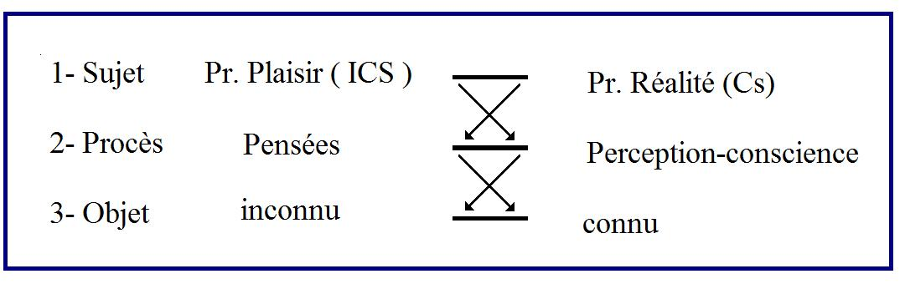

# Leçon 02 | 25 Novembre 1959

  <label><input type="checkbox" data-lacan-toggle="original" checked> 原文</label>
  <label><input type="checkbox" data-lacan-toggle="notes" checked> 注释</label>
  <label><input type="checkbox" data-lacan-toggle="commentary" checked> 个人解读评论</label>

<section class="parallel-paragraph" data-paragraph-ids="s7-02-0001">

s7-02-0001

[无对应译文]

原文 · s7-02-0001

J’essaie de vous apporter le miel de ma réflexion sur ce que - mon Dieu ! - je fais depuis un certain nombre d’années qui commencent à compter, mais qui avec le temps finissent par ne pas être tellement hors de mesure avec le temps que vous y passez vous-mêmes. Si, bien sûr, cet effet de communication présente parfois quelques difficultés, pensez - pour le comprendre - justement à l’expérience du miel. Le miel c’est ou bien très dur, ou bien très fluide :

</section>

<section class="parallel-paragraph" data-paragraph-ids="s7-02-0002">

s7-02-0002

[无对应译文]

原文 · s7-02-0002

- si c’est dur, cela se coupe mal, il n’y a pas de clivage naturel,

</section>

<section class="parallel-paragraph" data-paragraph-ids="s7-02-0003">

s7-02-0003

[无对应译文]

原文 · s7-02-0003

- si c’est très fluide, je pense que vous avez fait tous suffisamment l’expérience d’absorber du miel dans votre lit à l’heure du petit déjeuner : il y en a bientôt partout.

</section>

<section class="parallel-paragraph" data-paragraph-ids="s7-02-0004">

s7-02-0004

[无对应译文]

原文 · s7-02-0004

D’où *le problème des pots* ! *Le problème du pot de miel* étant une réminiscence du *pot de moutarde* auquel j’ai fait un sort dans un temps, ayant exactement le même sens depuis que nous ne nous figurons plus que les hexagones, dans lesquels nous sommes portés à faire notre récolte, aient un rapport naturel avec la structure du monde. De sorte qu’en somme - vous allez le voir - la question que nous nous posons et qui est en fin de compte toujours la même, c’est à savoir de la portée de la parole.

</section>

<section class="parallel-paragraph" data-paragraph-ids="s7-02-0005">

s7-02-0005

[无对应译文]

原文 · s7-02-0005

Et plus spécialement, c’est de nous apercevoir aussi que le problème moral, *éthique*, de notre *praxis* est étroitement attenant de *quelque chose* que nous pouvions entrevoir depuis quelque temps : c’est que cette insatisfaction profonde où nous laisse toute psychologie, y compris celle que nous avons déjà fondée grâce à l’analyse, tient peut-être à *quelque chose*, jus­tement à ceci qu’elle n’est qu’*un masque* - un alibi quelquefois - de cette ten­tative de pénétrer le problème de notre propre action qui est l’essence, le fondement même de toute réflexion éthique.

</section>

<section class="parallel-paragraph" data-paragraph-ids="s7-02-0006">

s7-02-0006

[无对应译文]

原文 · s7-02-0006

Autrement dit qu’il s’agit de savoir si nous avons réussi à faire plus qu’un tout petit pas hors de l’éthique, si, comme les autres psychologies, la nôtre n’est pas simplement un des cheminements de cette réflexion éthique, de cette recherche éthique, de cette recherche d’un guide, d’une voie dans quelque chose qui, au dernier terme, se pose en ceci : *que devons-nous faire* *pour agir d’une façon droite* étant donné notre position, notre condition d’hommes ?

</section>

<section class="parallel-paragraph" data-paragraph-ids="s7-02-0007">

s7-02-0007

[无对应译文]

原文 · s7-02-0007

Ce rappel me paraît difficile à contester quand notre action de tous les jours nous suggère que nous n’en sommes pas très loin. Bien sûr, les choses se présentent autrement pour nous dans la façon que nous avons d’introduire cette action, de la présenter, de la justifier. Bien sûr même, pouvons-nous dire que son départ se présente avec des caractères de *demande*, d’appel d’urgence, ayant une signification de service qui nous met plus au ras du sol quant au sens de l’articulation éthique.

</section>

<section class="parallel-paragraph" data-paragraph-ids="s7-02-0008">

s7-02-0008

[无对应译文]

原文 · s7-02-0008

Mais ceci ne change rien pourtant au fait que nous pouvons, au bout du compte, à tout bout de champ si l’on peut dire, la retrouver dans sa position intégrale, celle qui a fait depuis toujours le sens et le propos de ceux qui ont réfléchi sur la morale, qui ont *écrit*, qui ont tenté d’articuler des éthiques.

</section>

<section class="parallel-paragraph" data-paragraph-ids="s7-02-0009">

s7-02-0009

[无对应译文]

原文 · s7-02-0009

La dernière fois, en vous traçant le programme de ce que je désire par­courir cette année...

</section>

<section class="parallel-paragraph" data-paragraph-ids="s7-02-0010">

s7-02-0010

[无对应译文]

原文 · s7-02-0010

> programme qui s’étend de la reconnaissance de l’omniprésence de l’infiltration dans toute notre expérience
>
> de *l’impératif moral,* jusqu’à quelque chose qui est l’autre bout, à savoir, paradoxalement *le plaisir*
>
> que nous pouvons y prendre en fin de compte, au second degré, à savoir le masochisme moral

</section>

<section class="parallel-paragraph" data-paragraph-ids="s7-02-0011">

s7-02-0011

[无对应译文]

原文 · s7-02-0011

...je vous ai indiqué, pointé en cours de route, ce quelque chose qui je crois fera l’inattendu, l’original, le paradoxe même d’une perspective que j’entends y ouvrir en référence aux *catégories fondamentales* dont je me sers pour vous orienter dans notre expérience, à savoir *le Symbolique, l’Imaginaire* et *le Réel*.

</section>

<section class="parallel-paragraph" data-paragraph-ids="s7-02-0012">

s7-02-0012

[无对应译文]

原文 · s7-02-0012

Je vous ai indiqué que paradoxalement ma thèse...

</section>

<section class="parallel-paragraph" data-paragraph-ids="s7-02-0013">

s7-02-0013

[无对应译文]

原文 · s7-02-0013

> et sans aucun doute ici, ne vous étonnez pas qu’elle ne se présente d’abord que d’une manière confuse,
>
> car c’est bien entendu le développement de notre discours qui lui donnera son poids

</section>

<section class="parallel-paragraph" data-paragraph-ids="s7-02-0014">

s7-02-0014

[无对应译文]

原文 · s7-02-0014

...ma thèse est que *la loi morale*, le commandement moral, la présence de l’instance morale, ce en quoi cette instance s’impose à nous, est ce qui représente ce par quoi se présentifie, dans notre activité - en tant qu’elle est structurée par *le Symbolique -* *le Réel, le Réel* comme tel, le poids du *Réel*.

</section>

<section class="parallel-paragraph" data-paragraph-ids="s7-02-0015">

s7-02-0015

[无对应译文]

原文 · s7-02-0015

Thèse qui à la fois peut paraître comme une vérité triviale, et aussi bien un paradoxe. Nous sentons bien ce qu’il y a là dans ma thèse *que la loi morale s’affirme, si vous voulez, contre le plaisir*, nous sentons bien aussi que parler de *Réel* à propos de *la loi morale*, c’est quelque chose qui semble mettre en question la valeur d’un terme que nous intégrons d’or­dinaire sous le vocable de l’*Idéal*. Aussi bien, pour l’instant ne cherchai-je en rien à fourbir autrement *le tranchant* de ce que j’apporte ici, puis­que aussi bien tout ce qui peut faire le poids, la portée de cette visée, c’est justement *le sens à donner*, dans l’ordre des catégories qu’ici je vous apporte, je vous apporte - je le répète - toujours en fonction de notre praxis d’analystes, ce dont il s’agit c’est justement du sens à donner à ce terme de *Réel*. Vous verrez qu’il n’est pas immédiatement accessible, quoique déjà un certain nombre d’entre vous se le sont déjà sans doute dit en s’interrogeant sur la portée dernière que je peux lui donner.

</section>

<section class="parallel-paragraph" data-paragraph-ids="s7-02-0016">

s7-02-0016

[无对应译文]

原文 · s7-02-0016

Et bien sûr vous devez vous demander - tout de même, déjà entrevoir - que *le sens de ce terme de* *Réel* doit avoir quelque rapport avec le mouvement qui traverse toute la pensée de FREUD, qui le fait partir d’une opposition première entre *principe de réalité* et *principe du plaisir* pour - à travers une série de vacillations, d’oscillations, d’insensibles changements dans références - le faire aboutir à la fin de sa formulation doctrinale à poser « *au-delà du principe du plaisir* » quelque chose dont nous pouvons nous demander qu’est-ce qu’il peut bien être par rapport à la première opposition.

</section>

<section class="parallel-paragraph" data-paragraph-ids="s7-02-0017">

s7-02-0017

[无对应译文]

原文 · s7-02-0017

Car, quand *au-delà du principe du plaisir* nous apparaît cette face opaque, et si obscure qu’elle a pu paraître à certains l’antinomie de toute pensée, je ne dirai pas seulement de biologiste, mais même de toute pensée proprement et simplement scientifique, ...qui s’appelle *l’instinct de mort*.

</section>

<section class="parallel-paragraph" data-paragraph-ids="s7-02-0018">

s7-02-0018

[无对应译文]

原文 · s7-02-0018

Qu’est-ce que c’est que ce dernier terme...

</section>

<section class="parallel-paragraph" data-paragraph-ids="s7-02-0019">

s7-02-0019

[无对应译文]

原文 · s7-02-0019

> cette sorte de *loi au delà de toute loi* qui ne peut se poser que comme d’une *structure dernière*,
>
> d’une sorte de *point de fuite* de toute réalité possible à atteindre

</section>

<section class="parallel-paragraph" data-paragraph-ids="s7-02-0020">

s7-02-0020

[无对应译文]

原文 · s7-02-0020

...qu’est-ce que c’est si ce n’est quelque chose comme le dévoilement, la retrouvaille, à l’opposé du couplage entre le *principe du plaisir* et le *principe de réalité *: où le *principe de réalité* serait en quelque sorte de considérer comme une sorte de dépendance, de prolongement, d’application du *principe du plaisir*, mais qui justement, dans la mesure où ce *principe de réalité* prendrait dans la perspective de FREUD cette position dépendante et réduite, ferait resurgir *quelque chose au-delà* qui gouverne l’ensemble de notre rapport au monde, au sens le plus large.

</section>

<section class="parallel-paragraph" data-paragraph-ids="s7-02-0021">

s7-02-0021

[无对应译文]

原文 · s7-02-0021

Et dans ce procès, dans ce progrès, ce qui pour nous au premier abord subsiste, se maintient, vient devant notre regard, c’est assurément le caractère problématique de ce que FREUD pose sous le terme de « *réalité* » :

</section>

<section class="parallel-paragraph" data-paragraph-ids="s7-02-0022">

s7-02-0022

[无对应译文]

原文 · s7-02-0022

- Est-ce qu’il s’agit de la réalité quotidienne, immédiate, sociale ?

</section>

<section class="parallel-paragraph" data-paragraph-ids="s7-02-0023">

s7-02-0023

[无对应译文]

原文 · s7-02-0023

- Est-ce le conformisme aux catégories établies, aux usages reçus ?

</section>

<section class="parallel-paragraph" data-paragraph-ids="s7-02-0024">

s7-02-0024

[无对应译文]

原文 · s7-02-0024

- Est-ce *quelque chose* d’autre, mais alors qu’est-ce ?

</section>

<section class="parallel-paragraph" data-paragraph-ids="s7-02-0025">

s7-02-0025

[无对应译文]

原文 · s7-02-0025

- Est-ce la réalité découverte par la science, ou celle qui ne l’est point encore ?

</section>

<section class="parallel-paragraph" data-paragraph-ids="s7-02-0026">

s7-02-0026

[无对应译文]

原文 · s7-02-0026

- Est-ce la réalité psychique ?

</section>

<section class="parallel-paragraph" data-paragraph-ids="s7-02-0027">

s7-02-0027

[无对应译文]

原文 · s7-02-0027

Quelle est-elle, après tout, cette « *réalité* », et nous-mêmes, bien sûr - en tant qu’ana­lystes - c’est bien sur la voie de sa recherche que nous sommes. Cette voie nous entraîne bien ailleurs que dans *quelque chose* qui peut s’exprimer par une catégorie d’ensemble. Cela nous amène dans un champ précis, celui d’une réalité psychique qui assurément pour nous se présente avec le caractère problématique d’un ordre jusque-là jamais égalé.

</section>

<section class="parallel-paragraph" data-paragraph-ids="s7-02-0028">

s7-02-0028

[无对应译文]

原文 · s7-02-0028

Si *la loi morale* doit être ainsi posée dans cette référence, et déjà vous voyez que ce que je vais donc d’abord aborder, c’est d’essayer de sonder la fonction qu’a joué, dans la pensée de l’inventeur de l’analyse, puis du même coup dans la nôtre, nous qui sommes engagés dans ses voies, dans son champ, ce terme de « *réalité* ».

</section>

<section class="parallel-paragraph" data-paragraph-ids="s7-02-0029">

s7-02-0029

[无对应译文]

原文 · s7-02-0029

Á l’opposé déjà je pointe...

</section>

<section class="parallel-paragraph" data-paragraph-ids="s7-02-0030">

s7-02-0030

[无对应译文]

原文 · s7-02-0030

> pour qu’aussi bien vous ne l’oubliez pas, ou vous ne croyiez pas que je m’engage dans cette voie d’une façon qui, en quelque sorte, ne comporterait qu’un sondage, une sorte d’objectivation, qu’une sorte de référence
>
> de ce qui, dans l’expérience morale, est l’instance impérative comme telle, sous quelque forme qu’elle se présente

</section>

<section class="parallel-paragraph" data-paragraph-ids="s7-02-0031">

s7-02-0031

[无对应译文]

原文 · s7-02-0031

...à l’opposé *l’action morale* elle-même se présente pour nous d’une façon qui nous pose des problèmes, et précisément en ceci : que peut-être l’analyse y prépare, mais qu’en fin de compte elle nous laisse à sa porte.

</section>

<section class="parallel-paragraph" data-paragraph-ids="s7-02-0032">

s7-02-0032

[无对应译文]

原文 · s7-02-0032

*L’action morale*, précisément dans la mesure où elle est entrée dans le *réel*, où elle ne peut se concevoir, elle, autrement que comme notre action au moment où elle nous apporte, dans le *réel,* quelque chose qui y apporte du nouveau, qui y crée un sillage, quelque chose qui est en somme là où se sanctionne le point de notre présence, est ceci : à savoir en quoi l’analyse nous y rend \- *si* elle nous y rend apte - en quoi l’analyse nous y amène, si l’on peut dire, à pied d’œuvre, et pourquoi elle nous y amène ainsi ? Pourquoi aussi elle s’arrête à ce seuil ?

</section>

<section class="parallel-paragraph" data-paragraph-ids="s7-02-0033">

s7-02-0033

[无对应译文]

原文 · s7-02-0033

C’est là l’autre terme où s’axera ce que j’espère ici articuler, en précisant par là, et dans cette *question*, ce que j’ai indiqué la dernière fois comme étant *les limites* de ce que nous articulons, et ce en quoi nous nous présentons capables d’articuler une *éthique*. Cette notion des *limites éthiques* de l’analyse coïncide avec les *limites de sa praxis* considérée comme prélude d’une action morale comme telle, ladite action étant celle par laquelle nous débouchons dans le *Réel*.

</section>

<section class="parallel-paragraph" data-paragraph-ids="s7-02-0034">

s7-02-0034

[无对应译文]

原文 · s7-02-0034

De ceux qui ont fait avant nous l’analyse d’une *éthique*, ARISTOTE - pour le prendre comme exemple - se classe dans les plus exemplaires, assurément les plus valables. *C’est une lecture* - je vous l’ai signalé - *passionnante*, et je ne saurais trop vous conseiller, comme un exercice, d’en faire l’épreuve, vous ne vous y ennuierez pas un instant, je vous l’assure. Lisez l*’Éthique à Nicomaque* que les spécialistes semblent considérer comme *le plus sûr* - à devoir lui être attribué - *de ses traités*, c’est également certainement *le plus lisible*, et avec sans doute quelques difficultés, quelques problèmes qui se rencontrent dans le texte de son énoncé, dans ses détours, dans l’ordre de ce qu’il discute.

</section>

<section class="parallel-paragraph" data-paragraph-ids="s7-02-0035">

s7-02-0035

[无对应译文]

原文 · s7-02-0035

Tout de même franchissez les passages qui vous sembleraient trop obscurs, ou compliqués, ou bien ayez une édition avec de bonnes notes qui vous réfèrent à ce qu’il est nécessaire de connaître de la logique d’ARISTOTE, à l’occasion, pour comprendre les problèmes qu’il évoque. Mais après tout, ne vous embarrassez pas tellement, même de tout saisir, paragraphe par paragraphe, essayez de le lire de bout en bout d’abord, et vous en aurez sûrement récompense.

</section>

<section class="parallel-paragraph" data-paragraph-ids="s7-02-0036">

s7-02-0036

[无对应译文]

原文 · s7-02-0036

Une chose en tout cas s’en dégagera, c’est *quelque chose qu’il a en commun*, jusqu’à un certain degré, *avec toutes les autres éthiques,* c’est qu’en tant qu’*éthique*, il tend à se référer à un ordre, un ordre d’abord qui se présente comme science, ἐπιστήμη \[épistèmé\]. Mais c’est dans la mesure où quelque chose dans le sujet, de lui-même, est supposé pouvoir être établi, à savoir cette « *science de ce qui doit être fait* », cet *ordre* proprement *éthique*, cet *ordre* qui définit la norme d’un certain caractère ἦθος \[éthos\], avec l’*état* pro­prement *éthique* - qui est ce qui est considéré à ce moment dans le sujet - que le problème se pose de la façon dont cet *ordre,* qui lui-même est posé et découvert sans doute, n’est point contesté.

</section>

<section class="parallel-paragraph" data-paragraph-ids="s7-02-0037">

s7-02-0037

[无对应译文]

原文 · s7-02-0037

Comment dans le sujet peut être - d’une part - obtenue l’adéquation qui le fera rentrer,-se soumettre à cet ordre :

</section>

<section class="parallel-paragraph" data-paragraph-ids="s7-02-0038">

s7-02-0038

[无对应译文]

原文 · s7-02-0038

- l’établissement de l’ἔθος \[éthos\], de ce quelque chose qu’ARISTOTE pose comme différenciant l’être vivant de l’être inanimé, inerte. Comme il le fait remarquer : *aussi longtemps que vous lancerez une pierre en l’air, elle ne prendra pas l’habitude de cette trajectoire*, mais l’homme lui, prend l’habitude, c’est là l’ἔθος \[éthos\].

</section>

<section class="parallel-paragraph" data-paragraph-ids="s7-02-0039">

s7-02-0039

[无对应译文]

原文 · s7-02-0039

- Et cet ἔθος \[éthos\], il s’agit de *l’obtenir conforme* à l’ἦθος \[êthos\], à ce qui définit l’ἦθος \[êthos\], *quelque chose* qui a rapport à *sa conformité à un ordre* ou à un *Bien* qu’il faut bien rassembler dans *la perspective logique* qui est celle d’ARISTOTE en un dernier terme :

</section>

<section class="parallel-paragraph" data-paragraph-ids="s7-02-0040">

s7-02-0040

[无对应译文]

原文 · s7-02-0040

- en un « *Souverain Bien* » qui est en quelque sorte le point d’insertion, d’attache, de convergence, de quelque chose où *cet ordre particulier s’unifie dans une connaissance plus universelle*, *où l’éthique débouche dans une politique*,

</section>

<section class="parallel-paragraph" data-paragraph-ids="s7-02-0041">

s7-02-0041

[无对应译文]

原文 · s7-02-0041

- et, au delà de cette *politique*, dans une imitation d’un *ordre cosmique* : macrocosme et microcosme, ici, sont supposés au principe de toute la méditation aristotélicienne. Il s’agit donc ici d’une orientation, d’une *conformisation* à quelque chose qui, dans le *Réel*, n’est pas contesté comme supposant les voies de cet ordre.

</section>

<section class="parallel-paragraph" data-paragraph-ids="s7-02-0042">

s7-02-0042

[无对应译文]

原文 · s7-02-0042

Et le problème, qui est en somme perpétuellement repris et posé à l’intérieur de l’*éthique aristotélicienne*, est celui-ci : celui qui possède cette science, et bien entendu puisque celui qui est là, auquel s’adresse ARISTOTE : l’élève, le disciple, est censé du fait même qu’il l’écoute, participer à *ce dis­cours de la science*, c’est à lui que ceci s’adresse. *Le discours* est déjà introduit \- l’ορθός λόγος \[orthos logos\] dont il s’agit, le *discours droit*, le discours conforme - dans le problème par le fait même que la question *éthique* est posée.

</section>

<section class="parallel-paragraph" data-paragraph-ids="s7-02-0043">

s7-02-0043

[无对应译文]

原文 · s7-02-0043

Le problème est donc celui-ci...

</section>

<section class="parallel-paragraph" data-paragraph-ids="s7-02-0044">

s7-02-0044

[无对应译文]

原文 · s7-02-0044

> ramené sans doute au point où l’avait laissé SOCRATE[^5] avec sans doute,
>
> un optimisme dont l’excès n’a pas manqué de frapper ses plus immédiats successeurs

</section>

<section class="parallel-paragraph" data-paragraph-ids="s7-02-0045">

s7-02-0045

[无对应译文]

原文 · s7-02-0045

...comment se fait-il, si la règle de l’action est dans cet ορθός λόγος \[orthos logos\], s’il ne peut y avoir de « *bonne action* » que *conforme* à cet ορθός λόγος \[orthos logos\], comment se fait-il que subsiste ce qu’ARISTOTE articule comme « *l’intempérance* » ? Comment se fait-il que dans le sujet, *les penchants* aillent ailleurs, comment cela est-il même *explicable* ?

</section>

<section class="parallel-paragraph" data-paragraph-ids="s7-02-0046">

s7-02-0046

[无对应译文]

原文 · s7-02-0046

Cette nécessité, cette exigence d’explication, si *superficielle* peut-être qu’elle puisse - à nous qui croyons en savoir beaucoup plus - paraître, n’en fait pas moins la plus grande part de la substance de la méditation aristotélicienne dans l’*Éthique.* J’y reviendrai tout à l’heure, et justement à propos de ce que nous pouvons penser de la méditation de FREUD dans le même domaine.

</section>

<section class="parallel-paragraph" data-paragraph-ids="s7-02-0047">

s7-02-0047

[无对应译文]

原文 · s7-02-0047

Assurément le problème, pour ARISTOTE, doit nous apparaître cerné par les conditions d’un certain idéal humain, que je vous ai déjà brièvement indiqué au passage comme étant celui de *l’idéal du maître*. Tout le pro­blème pour lui est d’élucider le rapport qu’il peut y avoir entre cette ἀχολασία \[acholasia\], cette *intempérance*, et quelque chose qu’il appelle la mise en défaut, le défaut manifesté concernant ce qui est la vertu essentielle de celui auquel il s’adresse, c’est à savoir au maître, au *maître antique*, vous ai-je indiqué la dernière fois, qui n’est pas tout à fait *la brute héroïque* qui nous est représentée dans la dialectique hégélienne pour lui servir d’axe et de point tournant. Je ne m’étendrai pas ici sur ce que représente *le type du maître antique*. Qu’il vous suffise de savoir que c’est ce qui doit nous permettre à la fois d’apprécier à sa juste valeur ce que nous apporte l’*éthique* aristotélicienne, et ceci est à double sens.

</section>

<section class="parallel-paragraph" data-paragraph-ids="s7-02-0048">

s7-02-0048

[无对应译文]

原文 · s7-02-0048

D’une part, bien sûr, cela la limite, l’*historicise* comme nous pouvons dire dans notre perspective, mais on aurait tort de croire que c’est là la seule conclusion à tirer de cette remarque. D’abord parce que, d’une part cela l’*historicise* d’une façon qui pose assurément toutes sortes de problèmes sur ce que c’est vraiment que ce maître antique dans la perspective aristotélicienne : c’est assurément quelque fonction, *une présence, une condition humaine* assurément liée d’une façon beaucoup moins étroitement critique, à l’esclave que la perspective hégélienne ne nous l’articule et ne nous le fait entrevoir. Le problème qui est posé est bien celui qui reste irrésolu dans la pers­pective hégélienne : celui d’une société de maîtres.

</section>

<section class="parallel-paragraph" data-paragraph-ids="s7-02-0049">

s7-02-0049

[无对应译文]

原文 · s7-02-0049

Et d’autre part, il y a bien des remarques intéressantes à faire qui contribuent aussi à limiter la portée de l’éthique aristotélicienne sur le fait que ce maître - tel le Dieu qui est au centre du *monde aristotélicien, du monde gouverné par le* νοῦς \[nouss\] - est un maître dont l’idéal semble bien être celui de tirer le plus possible son épingle du jeu du travail, je veux dire de laisser à l’intendant le *gouverne­ment* des esclaves, pour se diriger vers cet *idéal de contemplation* sans lequel *l’Éthique* ne trouve pas sa juste perspective.

</section>

<section class="parallel-paragraph" data-paragraph-ids="s7-02-0050">

s7-02-0050

[无对应译文]

原文 · s7-02-0050

C’est donc vous dire tout ce que comporte d’*idéalisation* la perspective de l’*éthique* aristotéli­cienne. Si donc localisée, je dirai presque à un *type social*, à un exemplaire privilégié - disons-le - d’oisiveté, puisque le terme même σχολαστχός \[skolastichos\] l’évoque cette oisiveté, il n’en est que plus frappant de voir combien ce qu’ils articulent à l’intérieur de *cette condition spéciale*, reste pour nous riche de résonances, d’enseignements, et après tout en fin de compte, ne nous donne pas, *des schèmes* qui soient inutilisables une fois recomposés, retransposés, *des schèmes* qui ne se retrouvent pas dans *les mêmes vieilles outres* dans lesquelles nous mettrons *notre nouveau miel*.

</section>

<section class="parallel-paragraph" data-paragraph-ids="s7-02-0051">

s7-02-0051

[无对应译文]

原文 · s7-02-0051

Ils ne se retrouvent pas parfaitement *reconnaissables*, au niveau où nous allons voir maintenant que se pose pour nous à travers l’expérience freudienne, l’axiome, le premier rapport. Au premier abord, on peut dire que cette perspective est nôtre. Cette recherche d’une voie, d’une vérité, n’est pas absente de notre expé­rience. Qu’est-ce donc d’autre que nous cherchons sinon, dans l’analyse, une vérité libératrice ?

</section>

<section class="parallel-paragraph" data-paragraph-ids="s7-02-0052">

s7-02-0052

[无对应译文]

原文 · s7-02-0052

Mais là tout de même, faisons bien attention. C’est que précisément, il y a lieu de ne pas se fier aux mots et à leurs étiquettes, *car cette vérité que nous cherchons*, il est certain que, dans son *être*, dans ce en quoi nous la poursuivons dans une expérience concrète, *ce n’est pas celle d’une loi supérieure, d’une loi de vérité*. Si la vérité que nous cher­chons est une *vérité libératrice*, c’est une vérité que nous allons chercher à un point de recel de notre sujet, *c’est une vérité plus particulière*.

</section>

<section class="parallel-paragraph" data-paragraph-ids="s7-02-0053">

s7-02-0053

[无对应译文]

原文 · s7-02-0053

Car même si nous pouvons - *la forme de l’articulation que nous lui trouvons chez chacun -* la retrouver toujours nouvelle, *la même chez d’autres*, c’est tout de même pour autant que pour chacun, elle se présente dans sa *spécificité intime*, avec ce caractère de *Wunsch impérieux* auquel rien ne saurait s’opposer qui, en quelque sorte, permette de le juger du dehors. Ce que nous pouvons lui trouver de mieux comme *qualité*, une fois que nous l’avons fait agir, c’est que c’est là le vrai *Wunsch* qui était *au principe d’un comportement égaré*, d’un comportement aty­pique.

</section>

<section class="parallel-paragraph" data-paragraph-ids="s7-02-0054">

s7-02-0054

[无对应译文]

原文 · s7-02-0054

Mais c’est dans son *caractère irréductible,* son caractère *de modi­fication dernière*, de modification qui ne suppose d’autre normativation que celle d’une expérience de plaisir ou de peine, mais d’une expérience dernière d’où il jaillisse, et à partir duquel il se conserve dans la profondeur du sujets sous une forme irréductible, c’est à partir de là, de cette découverte, qui est donc loin d’être quelque chose qui se présente d’aucune façon comme ayant un caractère de loi universelle, mais au contraire de la loi la plus particulière, même s’il est universel que cette particularité se rencontre chez chacun des êtres humains, c’est là - sous cette forme que nous avons qualifié de phase régressive, infantile, irréaliste, avec ce caractère de pensée livrée au désir, de désir pris pour la réalité - que nous le rencontrons.

</section>

<section class="parallel-paragraph" data-paragraph-ids="s7-02-0055">

s7-02-0055

[无对应译文]

原文 · s7-02-0055

Et ceci qui assurément fait *le texte* de notre expérience, est-ce là, si je puis dire, toute notre découverte ? Est-ce là toute notre morale : la mise au jour, la découverte comme telle de cette pensée de désir, de la vérité de cette pensée ? Est-ce que de sa seule révélation, nous attendons que soit faite place nette pour une pensée différente ?

</section>

<section class="parallel-paragraph" data-paragraph-ids="s7-02-0056">

s7-02-0056

[无对应译文]

原文 · s7-02-0056

D’une certaine façon, c’est vrai. C’est aussi simple d’une certaine façon. Mais aussi, à l’opposé, d’une certaine façon, à la formuler ainsi *tout nous est véritablement voilé*. Car cette pensée, après tout si c’était là que devait se limiter le bénéfice, la nouveauté de l’expérience analytique, elle ne serait rien d’autre, elle n’irait pas plus loin, que quelque chose qui est né bien avant la psychanalyse, et qui tout de même est d’une certaine date dans l’histoire : la pensée de « *l’enfant qui est père de l’homme* », la formule citée par FREUD lui-même avec respect est de WORDSWORTH, c’est-à-dire d’un poète romantique anglais.

</section>

<section class="parallel-paragraph" data-paragraph-ids="s7-02-0057">

s7-02-0057

[无对应译文]

原文 · s7-02-0057

Et ce n’est pas pour rien que nous le trouvons là, que nous trouvons qu’au début de je ne sais quoi de nouveau, d’ébranlant, voire d’irrespirable, qui se déclenche au début du XIXème siècle avec la révolution indus­trielle, dans le pays le plus avancé dans l’ordre de ses effets, à savoir l’Angleterre, que le romantisme anglais se présente avec ces traits parti­culiers de la valeur donnée aux souvenirs d’enfance, au monde de l’en­fance, aux idéaux et aux vœux de l’enfant dont on peut dire que les poètes de l’époque font la racine non seulement de l’inspiration, mais de l’exploitation de leurs thèmes principaux.

</section>

<section class="parallel-paragraph" data-paragraph-ids="s7-02-0058">

s7-02-0058

[无对应译文]

原文 · s7-02-0058

Ce en quoi ils se distinguent radicalement des poètes qui les précèdent, et spécialement de cette admirable poésie qu’on appelle - je ne sais pourquoi - *métaphysique*, du XVIIème et du début du XVIIIème siècle.

</section>

<section class="parallel-paragraph" data-paragraph-ids="s7-02-0059">

s7-02-0059

[无对应译文]

原文 · s7-02-0059

Cette référence à l’enfance, cette idée de l’enfant qu’il y a dans l’homme, cette idée que quelque chose exige de l’homme d’être autre chose qu’un enfant, et que pourtant en lui les exigences de l’enfant comme tel se font perpétuellement sentir, est une idée qui, dans l’ordre de la psychologie, est situable historiquement. Un homme de la même époque, qui vivait aussi dans la première moitié du XIXème siècle, un victorien de la première époque, l’historien MACAULAY, faisait remarquer qu’à son époque on ne pouvait pas vous accuser d’être un malhonnête homme, ou d’être complètement un imbécile, qu’on avait une excellente arme dans le fait de vous accuser de ne pas être devenu un esprit tout à fait adulte, de conserver des traits de menta­lité infantile.

</section>

<section class="parallel-paragraph" data-paragraph-ids="s7-02-0060">

s7-02-0060

[无对应译文]

原文 · s7-02-0060

Cette sorte d’argument, si datable historiquement que vous ne pouvez en trouver le témoignage nulle part ailleurs dans l’histoire avant cette époque, montre quelque chose qui scande, qui constitue une coupure dans l’évolution historique. Au temps de PASCAL, si l’on parle de l’enfance, c’est pour dire qu’un enfant n’est pas un homme. Si l’on parle de la pensée de l’adulte, ce n’est pas - en aucun cas - pour y retrouver jamais les traces d’une pensée infantile.

</section>

<section class="parallel-paragraph" data-paragraph-ids="s7-02-0061">

s7-02-0061

[无对应译文]

原文 · s7-02-0061

La question, si je puis dire, ne se pose pas dans ces termes. Je dirai, jusqu’à un certain point, que le fait que nous la posions constamment dans ces termes - si elle est motivée, si elle est justifiée par l’expérience, par les contenus, par le texte de notre rapport au névrosé, par la référence de cette expérience à la genèse individuelle - est aussi quelque chose qui, d’une certaine façon, nous voile ce qu’il y a là derrière.

</section>

<section class="parallel-paragraph" data-paragraph-ids="s7-02-0062">

s7-02-0062

[无对应译文]

原文 · s7-02-0062

Car en fin de compte, si vrai que ce soit, il y a une autre position, une autre tension entre *la pensée* à laquelle nous avons affaire *dans l’inconscient,* et celle que nous qualifions, Dieu sait pourquoi, de pensée adulte. Précisément ce que nous démontrons, et ce que nous voyons, et ce que nous touchons sans cesse du doigt, c’est qu’elle est plutôt en perte de vitesse par rapport à cette fameuse « *pensée de l’enfant* » dont nous nous servons pour juger notre adulte comme, je ne dirai pas du tout de repoussoir, mais comme *de point de référence, de point de perspective, où ses inachèvements, voire ses dégradations*, viendraient confluer, et aboutir. Il y a là même, d’une façon perpétuelle, une sorte de contradiction dans l’usage que nous faisons de cette référence.

</section>

<section class="parallel-paragraph" data-paragraph-ids="s7-02-0063">

s7-02-0063

[无对应译文]

原文 · s7-02-0063

Je lisais encore avant de venir ici, dans JONES, une sorte d’exclamation sur les sublimes vertus de la pression sociale sans laquelle nos contemporains, nos « *frères les hommes* », se présenteraient comme *vaniteux, égoïstes, sordides, stériles, etc.* Mais on est tenté de ponctuer en marge : « *mais que sont-ils donc d’autre ?* » Et quand nous parlons de l’être adulte, à quelle sorte de référence nous rapportons-nous ? Où est ce modèle de l’être adulte ?

</section>

<section class="parallel-paragraph" data-paragraph-ids="s7-02-0064">

s7-02-0064

[无对应译文]

原文 · s7-02-0064

Ceci nous incite à réinterroger l’arête véritable, l’arête dure, de la pensée de FREUD quand il fait quelque chose qui, sans aucun doute, a abouti à toute cette expérience, à tout ce matériel qui s’ordonne en termes de développement idéal, et qui dans son principe, à l’origine, dans l’opposition - pour la mettre enfin, là, désignée par son nom - entre *processus pri­maire* et *secondaire*, entre *principe du plaisir* et *principe de réalité*, trouve ses termes, trouve sa tension, son opposition fondamentale dans un tout autre *système de référence*, dans un tout autre ordre, que ce à quoi le déve­loppement, la genèse - je pense vous l’avoir fait suffisamment *sentir*, encore que je sois, bien entendu forcé, ici de le faire d’une façon cursive, je pense vous l’avoir suffisamment fait *pressentir -* ne donne qu’un support inconstant.

</section>

<section class="parallel-paragraph" data-paragraph-ids="s7-02-0065">

s7-02-0065

[无对应译文]

原文 · s7-02-0065

Quand FREUD est en cours de son auto-analyse, il écrit, dans une courte lettre, la lettre 73 \[lettre 144, 31 Oct. 1897, p. 349, PUF 2006.\] :

</section>

<section class="parallel-paragraph" data-paragraph-ids="s7-02-0066">

s7-02-0066

[无对应译文]

原文 · s7-02-0066

> « *Meine Analyse geht weiter. Mon analyse se poursuit, elle reste mon intérêt principal. Tout en restant encore obscurs,*
>
> *certains problèmes appellent, mais le problème dont il s’agit met là-dessus quelque chose, un sentiment de confortable.*
>
> *C’est -* dit-il *- comme si on avait à prendre, à puiser dans une chambre à provision, et à en tirer des choses, ce dont on a besoin*.

</section>

<section class="parallel-paragraph" data-paragraph-ids="s7-02-0067">

s7-02-0067

[无对应译文]

原文 · s7-02-0067

*Le désagréable* - dit-il - *ce sont die Stimmungen* ».

</section>

<section class="parallel-paragraph" data-paragraph-ids="s7-02-0068">

s7-02-0068

[无对应译文]

原文 · s7-02-0068

\[*« Meine Analyse geht weiter, bleibt mein Hauptinteresse, alles noch dunkel, selbst die Probleme, aber ein behagliches Gefühl dabei,* *man brauchte nur in seine Vorratstäume zu greifen, um seinerzeit herauszuhohlen, was man braucht.* *Das Unangenehmste sind die Stimmungen, die einem die Wirklichkeit oft ganz verdecken. »*\]

</section>

<section class="parallel-paragraph" data-paragraph-ids="s7-02-0069">

s7-02-0069

[无对应译文]

原文 · s7-02-0069

À savoir *les états* - au sens le plus général que nous pouvons donner à ce mot qui a *sa résonance spéciale en allemand* - *les états d’humeur*. Il s’agit à proprement parler des sentiments, *des états de sentiment* qui de leur nature, essentiellement, couvrent, cachent - quoi ? - *die Wirklichkeit, la réalité*. C’est en termes d’interrogation sur cette *Wirklichkeit,* sur cette réalité, que FREUD interroge ce qui se *présente* à lui comme *Stimmung.*

</section>

<section class="parallel-paragraph" data-paragraph-ids="s7-02-0070">

s7-02-0070

[无对应译文]

原文 · s7-02-0070

Et la *Stimmung,* de par sa nature, est ce qui lui *dévoile* ce qu’il a là dans son auto-analyse à chercher, ce qu’il interroge, ce dont il a le sentiment d’avoir comme dans *une chambre obscure*, cette chambre à provisions, tout ce dont il a besoin, ce qui l’attend là, toujours en réserve, mais dont la *Wirklichkeit* lui est essentiellement cachée. Il n’est pas guidé vers cela par ses *Stimmungen.* C’est là le sens de sa phrase : « *le plus désagréable, ce sont les Stimmungen* » (*das Unangenehmste*) *qui font obstacle à la réalité qu’il recherche*. C’est par *le chemin d’une recherche de la réalité* qu’il y a *quelque part*, au sein de lui-même, que se pose l’expérience freudienne à l’origine, et que s’explique, que se sent, ce qui constitue l’originalité de son départ.

</section>

<section class="parallel-paragraph" data-paragraph-ids="s7-02-0071">

s7-02-0071

[无对应译文]

原文 · s7-02-0071

Il ajoute d’ailleurs dans la même ligne :

</section>

<section class="parallel-paragraph" data-paragraph-ids="s7-02-0072">

s7-02-0072

[无对应译文]

原文 · s7-02-0072

> « *Même l’excitation sexuelle est, pour quelqu’un comme moi, quelque chose, dans cette voie, d’inutilisable.* *Même en ceci je ne me fie pas pour voir où sont les réalités dernières. Je garde dans toute cette affaire ma bonne humeur.* *Avant d’arriver au résultat, nous devons encore savoir garder un instant de patience*. » \[« *Auch die sexuelle Erregung ist für eine wie ich nicht mehr zu brauchen. Ich bin aber noch immer freudig dabei.*

</section>

<section class="parallel-paragraph" data-paragraph-ids="s7-02-0073">

s7-02-0073

[无对应译文]

原文 · s7-02-0073

*An Resultaten ist jetzt gerade wieder Stille eingetreten.* »\]

</section>

<section class="parallel-paragraph" data-paragraph-ids="s7-02-0074">

s7-02-0074

[无对应译文]

原文 · s7-02-0074

Je vous signale en passant qu’à cette occasion, dans un petit livre récent, dont je ne peux tout de même pas dire que je recommande la lecture, car c’est un livre très singulièrement discordant, presque insi­dieux, à la limite diffamatoire, d’Erich FROMM, qui s’appelle « *Sigmund Freud ‘s Mission »*[^6], où des questions insinuantes - des questions qui ne sont certes pas du tout dépourvues d’intérêt - sont posées concernant la spéci­ficité, les traits spéciaux de la personnalité de FREUD, dans un sens très évi­demment toujours diminuant et dévalorisant. Il est dit que, pas plus que d’*autres*, Sigmund FREUD, dans cette recherche de la réalité dont il s’agit, ne trouve un guide sûr dans « *his* *sexual background »,* en extrayant cette phrase de son texte pour nous en faire conclure qu’à l’âge de quarante ans, FREUD est déjà impuissant.

</section>

<section class="parallel-paragraph" data-paragraph-ids="s7-02-0075">

s7-02-0075

[无对应译文]

原文 · s7-02-0075

Nous voici donc en mesure d’interroger, d’articuler ce que FREUD en 1895, puisque le sort des choses fait que nous est venu en mains le texte concernant sa conception fondamentale de la structure psychique, que nous est venu en mains cette *Esquisse* qu’il avait pensé intituler *Une psy­chologie à l’usage des neurologues,* mais comme il ne l’a jamais publié, le brouillon est resté annexé au paquet des lettres de FLIESS, et nous avons ces textes grâce à la récupération de ces collections.

</section>

<section class="parallel-paragraph" data-paragraph-ids="s7-02-0076">

s7-02-0076

[无对应译文]

原文 · s7-02-0076

Il est donc non seulement légitime, mais forcé, que ce soit de là que nous partions pour interroger ce que veut dire, dans la réflexion freudienne, dans cette réflexion essentielle­ment ici interrogée, l’opposition, la thématique du *principe de réalité* comme opposé au *principe de plaisir*, que nous voyions si oui ou non il y a là quelque chose qui se présente comme *différent*, essentiellement *distinct*, par rapport à ce qui constitue *le cheminement de sa pensée*, et du même coup les directions de notre expérience, si c’est là que nous pouvons trou­ver cette arête plus profonde qui, je crois, dans cette occasion, est exigible.

</section>

<section class="parallel-paragraph" data-paragraph-ids="s7-02-0077">

s7-02-0077

[无对应译文]

原文 · s7-02-0077

Assurément, dans cette opposition du *principe de plaisir* au *principe de réalité* qui a été réarticulée tout au long de l’œuvre de FREUD :

</section>

<section class="parallel-paragraph" data-paragraph-ids="s7-02-0078">

s7-02-0078

[无对应译文]

原文 · s7-02-0078

- 1895, l’*Entwurf,* 1900, le chapitre VII de la *Traumdeutung,* avec la réarticulation, pour la première fois publique, des *processus* dits *primaires* et *secondaires* comme tels, comme étant, l’un gouverné par *le principe du* *plaisir*, l’autre par *le principe de réalité*,

</section>

<section class="parallel-paragraph" data-paragraph-ids="s7-02-0079">

s7-02-0079

[无对应译文]

原文 · s7-02-0079

- la reprise ensuite, en 1911 de l’article d’où l’année dernière je vous ai extrait le rêve dont j’ai fait grand état, à savoir « *le rêve du père mort* », « *il ne le savait pas* » : *l’article* *[Formulierungen über die zwei Principien des psychischen Geschehens](http://www.textlog.de/freud-psychoanalyse-zwei-prinzipien-psychischen-geschehens.html),* on pourrait traduire : « *de la structure psychique* »,

</section>

<section class="parallel-paragraph" data-paragraph-ids="s7-02-0080">

s7-02-0080

[无对应译文]

原文 · s7-02-0080

- et plus tard, dans ce *Malaise dans la civilisation,* auquel nous arriverons - comme je l’ai promis - à notre terme, la même référence, mais qui ne saurait se comprendre si nous n’essayons pas à partir de cette origine, de voir dans tout son relief ce qu’elle comporte, et ce qu’elle constitue.

</section>

<section class="parallel-paragraph" data-paragraph-ids="s7-02-0081">

s7-02-0081

[无对应译文]

原文 · s7-02-0081

D’autres avant lui ont parlé du plaisir comme d’une fonction directrice : ARISTOTE, vous ai-je dit, ne peut pas ne pas en faire non seulement cas, mais ne peut pas ne pas l’amener au centre même du champ de sa direction éthique. Qu’est-ce que *le bonheur* s’il ne comporte pas cette fleur de plaisir ? Et une part importante de la discussion de l’*Éthique à Nicomaque* sera pour remettre à sa place la véritable fonction du plaisir, amenée - très curieusement d’ailleurs - à en faire quelque chose qui n’est pas simplement un état passif. Car, dans ARISTOTE, c’est une activité comparée à la fleur qui se dégage de l’activité de la jeunesse. C’en est en quelque sorte le rayonnement. De surcroît c’est aussi, du même coup, le signe de cet épanouissement d’une action au sens propre de cette ἐνέργεια \[energeia\] qui est le terme où dans ARISTOTE, s’articule la *praxis véritable*, comme comportant en elle-même sa propre fin.

</section>

<section class="parallel-paragraph" data-paragraph-ids="s7-02-0082">

s7-02-0082

[无对应译文]

原文 · s7-02-0082

Ici *le plaisir* qui sans aucun doute…je vous l’ai indiqué la dernière fois …a trouvé bien d’autres modulations comme *signe*, comme *stigmate*, ou comme bénéfice, ou comme substance du vécu psychique, à travers les âges, voyons ce qu’ici, au dernier terme chez celui qui nous interroge, chez FREUD, à quoi il est associé dans *le principe du plaisir*. Et d’abord, ce qui ne peut manquer de nous frapper, *c’est que ce principe du plaisir est en somme un principe d’inertie*. Le *principe du plaisir* se présente comme quelque chose *qui règle*, par une sorte d’automatisme, tout ce qui à la fois converge et résulte d’un processus que FREUD tend, dans sa première formulation apparente, à présenter comme le résultat d’un appareil préformé, l’appareil neuronique comme tel.

</section>

<section class="parallel-paragraph" data-paragraph-ids="s7-02-0083">

s7-02-0083

[无对应译文]

原文 · s7-02-0083

C’est étroitement limité à cet appareil neuronique que le fonctionnement de ce principe est articulé comme réglant les frayages qu’il conserve après en avoir subi les effets. Il s’agit essentiellement de tout ce qui résulte des effets d’une tendance fon­cière à la *décharge*, d’une sorte d’activité réglée par la seule *Bahnung* où *une quantité* est vouée à s’écouler. C’est là la perspective dans laquelle nous est d’abord présentée l’efficace de ce *principe du plaisir*. Il suffit de le dire : cette tentative particulière de formulation hypothétique se présente avec un caractère unique dans ce qui nous reste écrit de FREUD. Et il ne faut pas oublier qu’il s’en est dégoûté, qu’il l’a repoussée, il n’a pas voulu la publier.

</section>

<section class="parallel-paragraph" data-paragraph-ids="s7-02-0084">

s7-02-0084

[无对应译文]

原文 · s7-02-0084

Assurément il l’a fait sous la forme de ce quelque chose qui vraiment représentait pour lui les exigences d’une cohérence de lui-même avec lui-même, devant lui-même, mais qui ne présente tout de même aucun des traits, ou du moins en apparence de réfé­rence à l’effet clinique qui, sans aucun doute, pour lui représente tout le poids des exigences auxquelles il a affaire. Mais là il s’entretient avec lui-même ou avec FLIESS, ce qui dans l’occasion est bien près de revenir au même. Ce dont il s’agit, c’est qu’il se donne une représentation probable, cohérente, une *hypothèse de travail* pour répondre à quelque chose dont tout le point concret, expérimental, est ici masqué, éludé.

</section>

<section class="parallel-paragraph" data-paragraph-ids="s7-02-0085">

s7-02-0085

[无对应译文]

原文 · s7-02-0085

Il importe donc plus encore de voir qu’en somme, pour expliquer quelque chose qui est ce vers quoi pointe ce projet, à savoir les tentatives d’expliquer, comme il le dit, *un fonctionnement normal de l’esprit,* il part des données de l’appareil qui sont les plus à l’opposé de tout cet aboutissement vers l’adéquation, vers l’équilibre. Á un système qui lui-même, de sa propre pente, va essentiellement vers le *leurre...*

</section>

<section class="parallel-paragraph" data-paragraph-ids="s7-02-0086">

s7-02-0086

[无对应译文]

原文 · s7-02-0086

> vers l’*erreur*, vers *quelque chose* qui pointe dans le fait que cet organisme
>
> semble tout entier fait, non pour *satisfaire le besoin*, mais pour *halluciner le besoin*

</section>

<section class="parallel-paragraph" data-paragraph-ids="s7-02-0087">

s7-02-0087

[无对应译文]

原文 · s7-02-0087

...il convient que s’oppose un autre appareil. Et là je ne force pas la note, FREUD lui-même entend bien qu’il doit y avoir une sorte de distinction entre les appareils dont il avoue ne voir aucune trace dans ces supports anatomiques.

</section>

<section class="parallel-paragraph" data-paragraph-ids="s7-02-0088">

s7-02-0088

[无对应译文]

原文 · s7-02-0088

Il faut supposer un autre appareil qui vient là entrer en jeu pour exercer *un principe*, une instance *de réalité* qui se présentera comme essentiellement un principe de correction, de rappel à l’ordre. Le *principe de réalité*, c’est-à-dire tout ce à quoi doit, en fin de compte - le fonctionnement de l’appareil neuronique - son efficace, se présente comme un appareil qui va beaucoup plus loin dans le sens d’opposition que le simple contrôle. Il s’agit de *la rectification* et aussi bien d’ailleurs toute façon d’opérer ne sera que le détour de précaution, de retouche, de retenue dirai-je, pour caractériser essentiellement le mode sur lequel ce principe s’exerce et fonctionne.

</section>

<section class="parallel-paragraph" data-paragraph-ids="s7-02-0089">

s7-02-0089

[无对应译文]

原文 · s7-02-0089

Principe de retenue qui vient ici en somme pour *corriger*, *compenser*, fondamentalement *s’opposer* à ce qui paraît être la pente fondamentale de l’appareil psychique. Jamais personne, jamais aucun système possible de *reconstitution de l’action humaine* n’avait été aussi loin dans le caractère fondamentalement *conflictuel*, introduit à la base, au principe même de ce que comporte normalement l’affrontement d’un organisme qui semble en principe, après tout, disons-le, plutôt destiné à vivre. Et aucun n’avait poussé plus loin dans *les présupposés*, explications à donner de cet organisme dans le sens d’une *inadéquation radicale* pour autant que le dédoublement des systèmes se pose au principe, comme fait pour aller contre l’*inadéquation* foncière d’un des deux.

</section>

<section class="parallel-paragraph" data-paragraph-ids="s7-02-0090">

s7-02-0090

[无对应译文]

原文 · s7-02-0090

Et ceci est articulé tout au long, semblant presque une gageure. Cette opposition du « *système* ϕ » avec le « *système* ψ », qu’est-ce qui peut la justifier si ce n’est ce qui dans l’occasion, pour nous, la justifie au maximum, à savoir cette expérience des *quantités immaîtrisables* auxquelles il a affaire dans son expérience de la névrose, dans ce quelque chose qui, pour FREUD, fait l’exigence de tout ce système ?

</section>

<section class="parallel-paragraph" data-paragraph-ids="s7-02-0091">

s7-02-0091

[无对应译文]

原文 · s7-02-0091

Et ce qui donne son poids, sa justifi­cation à la mise au premier plan de *la quantité* comme telle, *qu’est-ce que c’est* ? Ici, nous le sentons de la façon la plus directe, c’est bien autre chose que tel désir d’être conforme ou pas aux *idéaux mécanistes* d’HELMHOLTZ ou de BRÜCKE.

</section>

<section class="parallel-paragraph" data-paragraph-ids="s7-02-0092">

s7-02-0092

[无对应译文]

原文 · s7-02-0092

C’est quelque chose qui pour lui, correspond, je dirai, à l’expérience vécue la plus immédiate, celle du poids précisément de l’iner­tie que lui opposent, au niveau des symptômes, des choses dont il sent le caractère irréversible. C’est là, désignant sa première pénétration dans l’obscurité vers cette *Wirklichkeit,* qui est ce autour de quoi il porte sa question c’est là qu’est le ressort et le relief, et l’action de toute cette construction dont, à son aridité près. Là aussi je vous demande d’en faire la relecture, non pas en vous disant avec les *annotateurs*, *commentateurs* et *connotateurs* qui l’ont publié, si ceci est plus ou moins près de la pensée purement *psychologique* ou *physiologique*, ou si ceci se rapporte à HERBART, à FECHNER ou à quelqu’un d’autre, mais de vous apercevoir que nous sommes, sous cette forme froide, abstraite, scolastique, compliquée, devant un texte derrière lequel se ressent une *expérience* et que cette expérience est, de son fonds, de sa nature, une expérience d’ordre moral.

</section>

<section class="parallel-paragraph" data-paragraph-ids="s7-02-0093">

s7-02-0093

[无对应译文]

原文 · s7-02-0093

Et je dirai presque que nous en avons… moi aussi… puisqu’on fait de l’histoire à ce sujet, comme si d’expliquer un auteur comme FREUD par les *influences*, par la plus ou moins grande homonymie de telle de ses formules avec celles qui ont été employées avant lui par un penseur, dans un contexte différent, était quelque chose qui avait en soi sa *portée*, je veux dire *la portée essentielle* , pourquoi n’en ferais-je pas moi aussi autant, puisque c’est un exercice auquel on se livre ? Et je vous dirai que - à certains moments - c’est ce que fait FREUD pour nous expliquer à l’aide de quoi s’opère cette *activité de retour*, *cette activité de* *retenue*, je veux dire comment l’appareil qui supporte les processus seconds opère pour contourner les déchaînements des catastrophes entraînant fatalement, à un temps de trop ou de trop peu, le laisser-aller à soi-même de l’appareil du plaisir.

</section>

<section class="parallel-paragraph" data-paragraph-ids="s7-02-0094">

s7-02-0094

[无对应译文]

原文 · s7-02-0094

S’il le lâche trop tôt, ce sera le mouvement, et comme le mouvement sera déclenché simplement par un *Wunschgedanke,* le mouvement sera forcément douloureux, aboutira à un déplaisir. S’il intervient par contre trop tard, c’est-à-dire si cet appareil ne donne pas cette petite *décharge* qui ira dans le sens d’une épreuve, d’une tentative grâce à quoi un commencement de solution adéquat pourra être donné dans l’action, si c’est un temps trop tard, ce sera au contraire alors la décharge régressive, c’est à savoir *l’hallucination*, elle-même également source de déplaisir.

</section>

<section class="parallel-paragraph" data-paragraph-ids="s7-02-0095">

s7-02-0095

[无对应译文]

原文 · s7-02-0095

Ce fonctionnement de l’appareil, en tant qu’il supporte le principe de réalité, est-ce que ce n’est pas quelque chose qui vous paraîtra singulièrement proche de ce dont - quelque part quand ARISTOTE se pose la question de savoir *comment celui qui sait, peut être intempérant -* dont ARISTOTE donne plusieurs solutions. Je passe les premières qui font intervenir des éléments concernant le syllogisme à proprement parler des éléments dia­lectiques qui sont en fin de compte assez loin de notre intérêt dans cette occasion.

</section>

<section class="parallel-paragraph" data-paragraph-ids="s7-02-0096">

s7-02-0096

[无对应译文]

原文 · s7-02-0096

Mais il en donne aussi, à un moment, une tentative de solution non pas dialectique, mais en quelque sorte plus physique. Mais c’est tout de même sous la forme d’un certain *syllogisme* du désirable qu’il nous le promeut, c’est à savoir sous la forme d’une certaine prise de *notion uni­verselle*, comme par exemple ce qu’il exprime dans *le Livre VII, sur le plaisir, précisément* *dans le chapitre trois de ce livre*. Je crois qu’il vaut la peine d’être lu tout entier. À la présence de la proposition universelle « *Il faut goûter à tout ce qui est doux* »[^7] il y aurait une mineure particulière, concrète : « *Ceci est doux* ».

</section>

<section class="parallel-paragraph" data-paragraph-ids="s7-02-0097">

s7-02-0097

[无对应译文]

原文 · s7-02-0097

Et ce serait dans l’erreur portée sur le juge­ment particulier de cette mineure que résiderait le principe de l’action erronée. Pourquoi ? En quoi ? Justement en ceci que le désir, en tant qu’il est sous–jacent, évoqué par la proposition universelle

</section>

<section class="parallel-paragraph" data-paragraph-ids="s7-02-0098">

s7-02-0098

[无对应译文]

原文 · s7-02-0098

« *Il faut goûter à tout ce qui est doux* » ferait surgir ce jugement erroné concernant l’actualité du « *doux* » - du prétendu « *doux* » -

</section>

<section class="parallel-paragraph" data-paragraph-ids="s7-02-0099">

s7-02-0099

[无对应译文]

原文 · s7-02-0099

vers lequel l’activité se précipite.

</section>

<section class="parallel-paragraph" data-paragraph-ids="s7-02-0100">

s7-02-0100

[无对应译文]

原文 · s7-02-0100

Assurément, nous avons là quelque chose, dont nous ne pouvons man­quer de penser que FREUD…qui en 1887 avait assisté au cours de BRENTANO sur ARISTOTE… …a ici quelque chose qu’il retrouve…mais retrouve d’une façon purement formelle, avec un accent complètement différent, …une sorte d’articulation du problème proprement *éthique* comme tel, qu’il retranspose dans la perspective de sa mécanique hypothétique, qui n’est pas plus une psychologie que n’importe laquelle des autres qui ont été élucubrées à la même époque.

</section>

<section class="parallel-paragraph" data-paragraph-ids="s7-02-0101">

s7-02-0101

[无对应译文]

原文 · s7-02-0101

Car, ne nous faisons pas illusion, en *psychologie* rien ne vaut mieux jusqu’à présent que l’*Entwurf* de FREUD. Tout ce qui a été élucubré sur le fonctionnement psychologique - pour autant que les appareils nerveux pourraient bien rendre compte de ce qui est concrètement pour nous le champ de l’action psychologique - garde le même aspect d’hypothèse farfelue.

</section>

<section class="parallel-paragraph" data-paragraph-ids="s7-02-0102">

s7-02-0102

[无对应译文]

原文 · s7-02-0102

Ce dont il s’agit dans FREUD, c’est de la reprise d’articulations logiques, syllogistiques, qui ne sont rien d’autre que les mêmes qui ont toujours été mises par les éthiciens – dans le même champ – en exercice, mais auxquelles FREUD donne une tout autre portée. Si nous pensons à ceci, nous l’interprétons dans son véritable contenu qui est celui-ci, et ceci que je vous enseigne, c’est que l’ορθός λόγος \[orthos logos\] dont il s’agit pour nous ce ne sont pas justement des *propositions universelles*. L’ορθός λόγος \[orthos logos\] dont il s’agit pour nous, c’est la façon dont je vous apprends à articuler ce qui se passe dans l’inconscient, c’est le discours qui se tient au niveau du *principe du plaisir*. Et c’est par rapport à cet « ορθός » \[orthos\]

</section>

<section class="parallel-paragraph" data-paragraph-ids="s7-02-0103">

s7-02-0103

[无对应译文]

原文 · s7-02-0103

-entre guillemets d’ironie - que le *principe de réalité* a à guider le sujet pour qu’il aboutisse à une action possible. Le *principe de réalité*, donc se présente dans la perspective freudienne comme tel, comme s’exerçant d’une façon qui est essentiellement *précaire*.

</section>

<section class="parallel-paragraph" data-paragraph-ids="s7-02-0104">

s7-02-0104

[无对应译文]

原文 · s7-02-0104

Nulle philosophie jusque là, n’a poussé si loin dans ce sens, non pas dans la mise en question de la *réa­lité* comme telle \- elle n’est certes pas mise en question au sens où les idéalistes ont pu la mettre en question - auprès de FREUD les idéalistes de la tradition philosophique sont de la petite bière, car en fin de compte, cette fameuse réalité, *ils ne la contestent pas* sérieusement, ils l’apprivoisent. Cela consiste à nous dire que la réalité, c’est nous qui en donnons la mesure et qu’il n’y a pas à chercher au-delà. La position dite « *idéaliste »* est une position de confort, celle de FREUD - comme d’ailleurs de tout homme sensé - est bien autre chose : la réalité est précaire. Et c’est justement dans la mesure où son accès est si précaire que les commandements qui en tra­cent la voie sont des commandements tyranniques.

</section>

<section class="parallel-paragraph" data-paragraph-ids="s7-02-0105">

s7-02-0105

[无对应译文]

原文 · s7-02-0105

Les sentiments, en tant que guides vers le réel, sont trompeurs. L’intuition qui anime toute la recherche auto-analytique de FREUD ne s’exprime pas autrement par rapport à cet abord exigé de l’homme vers le *réel*. Son procès même, d’abord ne peut se faire que par la voie d’une défense primaire. L’ambiguïté profonde de cet abord s’inscrit en termes, d’abord de défense, de défense qui existe déjà, avant même que se formulent les conditions du refoulement comme tel. Et pour bien mettre l’accent sur ce que j’appelle ici « *le paradoxe du rapport au réel »* dans FREUD, je voudrais vous mettre ceci au tableau.

</section>

<section class="parallel-paragraph" data-paragraph-ids="s7-02-0106">

s7-02-0106

[无对应译文]

原文 · s7-02-0106

</section>

<section class="parallel-paragraph" data-paragraph-ids="s7-02-0107">

s7-02-0107

[无对应译文]

原文 · s7-02-0107

Depuis que vous êtes bercés avec ces deux termes, les choses semblent aller toutes seules, et il est bien clair qu’en gros, encore que vous sachiez bien entendu qu’en gros, c’est d’un côté l’inconscient, c’est de l’autre côté la conscience dont j’ai donné ici tout au moins *les pôles* sous lesquels se manifesteront au niveau de la connaissance *l’opposition* de cet *appareil*. Je vous prie pourtant d’attarder ici votre attention pour suivre les points que je vais essayer de vous faire remarquer.

</section>

<section class="parallel-paragraph" data-paragraph-ids="s7-02-0108">

s7-02-0108

[无对应译文]

原文 · s7-02-0108

C’est à savoir : à quoi sommes-nous amenés à articuler l’appareil de perception comme tel ? À la réalité bien sûr ! Néanmoins, qu’est-ce que la nouveauté même, apportée par FREUD, nous permet de poser, en fait, à tout le moins, si nous suivons son hypothèse ?

</section>

<section class="parallel-paragraph" data-paragraph-ids="s7-02-0109">

s7-02-0109

[无对应译文]

原文 · s7-02-0109

C’est que s’il y a quelque chose sur quoi en principe s’exerce le gouvernement du *principe du plaisir* - c’est là la nouveauté apportée par FREUD - c’est précisément cette perception. Le *processus primaire*, nous dit-il dans la partie VII de *La science des rêves,* tend à s’exercer dans le sens d’*une identité de perception*. Peu importe qu’elle soit *réelle* ou *hallucinatoire*, elle tendra toujours à s’établir. Si elle n’a pas la chance de se recouvrir avec le *réel*, elle sera *hallucinatoire*. Et c’est là tout le danger du cas où *le processus primaire* gagne à la main.

</section>

<section class="parallel-paragraph" data-paragraph-ids="s7-02-0110">

s7-02-0110

[无对应译文]

原文 · s7-02-0110

D’autre part *le processus secondaire*, à quoi tend-t-il ? Ceci, Livre VII également de *La Science des rêves,* mais c’est déjà articulé dans l’*Entwurf.* À quelque chose, nous dit FREUD, qui est *une identité de pensée*. Qu’est-ce que cela veut dire ?

</section>

<section class="parallel-paragraph" data-paragraph-ids="s7-02-0111">

s7-02-0111

[无对应译文]

原文 · s7-02-0111

Cela veut dire que tout le fonctionnement intérieur de l’appareil psychique - nous reviendrons la prochaine fois sur la façon dont nous pouvons le *schématiser* - est quelque chose qui est exercé dans le sens d’un tâtonnement, d’une mise à l’épreuve rectificative grâce à quoi le sujet, conduit par les décharges qui se produisent d’après les *Bahnungen* déjà frayées, fera la série d’essais, de détours, qui peu à peu, l’amèneront à l’*anastomose*, au franchissement de la mise à l’épreuve du système environnant à ce moment-là dans l’expérience des divers objets présents par rapport à ce qui forme la trame de fond de l’expérience, à savoir, si l’on peut s’exprimer ainsi, la mise en érection d’un certain système de *Wunsch,* ou d’*Erwartung, de plaisir* défini comme le *plaisir attendu* et qui tend de ce fait à se réaliser dans son propre champ d’une façon autonome, qui en principe n’attend rien du dehors pour se produire, pour aller directement donc à la réalisation la plus contraire à ce qui tend à se déclencher.

</section>

<section class="parallel-paragraph" data-paragraph-ids="s7-02-0112">

s7-02-0112

[无对应译文]

原文 · s7-02-0112

La pensée, donc devrait nous paraître dans ce premier abord, être quelque chose qui, se trouvant au niveau du *principe de réalité*, est à mettre, si vous voulez, dans la même colonne. Il n’en est pourtant rien car ce procès, tel qu’il nous est décrit par FREUD, est - nous dit-il - par lui-même et de sa nature, inconscient. Entendons qu’à la différence de ce qui parvient au sujet dans l’ordre perceptif venant du *monde extérieur*, rien de ce qui se produit au niveau de ces essais, de ces tentatives, où dans le psychisme par voie d’approximation se réalisent *les frayages* qui permettront au sujet une adéquation, *rien de ces frayages n’est comme tel perceptible*.

</section>

<section class="parallel-paragraph" data-paragraph-ids="s7-02-0113">

s7-02-0113

[无对应译文]

原文 · s7-02-0113

Toute pensée, de sa nature, s’exerce par des voies incons­cientes. Sans aucun doute ce n’est pas *le principe du plaisir* qui le gouverne mais c’est dans un champ qui est celui, au premier abord à titre de champ inconscient, qui était ce que nous pouvions attendre comme soumis au *principe du plaisir*. De ce qui se passe au niveau des processus internes - et le processus de la pensée en fait partie - le sujet dans sa conscience, ne reçoit d’autre signe, nous dit FREUD, que des signes de plaisir ou de peine. Comme pour tous les autres processus inconscients, rien d’autre ne parvient à la conscience que ces signes de plaisir ou de peine. Comment donc avons-nous quelque appréhension de ces processus de la pensée ?

</section>

<section class="parallel-paragraph" data-paragraph-ids="s7-02-0114">

s7-02-0114

[无对应译文]

原文 · s7-02-0114

Ici encore FREUD répond d’une façon pleinement articulée : uniquement dans la mesure où *se produisent des paroles*. Ce qu’on inter­prète communément - et bien sûr avec cette pente de facilité qui est propre à toute réflexion qui reste, malgré elle, toujours entachée, si l’on peut dire, de parallélisme - ce qu’on interprète d’ordinaire en disant : « *mais bien sûr* FREUD *nous dit là que les paroles, c’est ce qui caractérise le passage dans le préconscient*. Mais le passage justement de quoi ? Des *mouvements* en tant qu’ils sont ceux de *l’inconscient*.

</section>

<section class="parallel-paragraph" data-paragraph-ids="s7-02-0115">

s7-02-0115

[无对应译文]

原文 · s7-02-0115

Ce qu’il en est des processus de la pensée, nous dit FREUD, ne nous est connu que par des paroles. Le connu de l’inconscient c’est quelque chose qui nous vient en fonction de paroles, et ceci est articulé de la façon la plus précise, la plus puissante dans l’*Entwurf* sous la forme suivante, par exemple que nous n’aurions de *l’objet désagréable* - comme tel et en tant qu’objet - que la notion la plus confuse qui, à la vérité, ne le détacherait jamais du contexte dont il ferait simplement le point non dit, mais qui arracherait avec lui tout le contexte circonstanciel.

</section>

<section class="parallel-paragraph" data-paragraph-ids="s7-02-0116">

s7-02-0116

[无对应译文]

原文 · s7-02-0116

L’objet en tant que tel, nous dit FREUD, ne se signale au niveau de la conscience que pour autant - ceci est articulé pleinement - que la douleur fait - au sujet - pousser un cri. L’existence du *feindliche Objekt* comme tel, *c’est le cri du sujet*. Ceci est articulé dès l’*Entwurf,* et nous montre la fonction qu’il remplit, comme *processus de décharge*, et comme ce pont au niveau duquel quelque chose peut être attrapé dans la conscience du sujet de ce qui se passe.

</section>

<section class="parallel-paragraph" data-paragraph-ids="s7-02-0117">

s7-02-0117

[无对应译文]

原文 · s7-02-0117

C’est en tant que la conscience du sujet attrape quelque chose au niveau de la décharge du cri, que quelque chose peut être identifié qui est ce vécu de *feindliche Objekt,* lequel resterait - comme tous les autres - obscur et inconscient, si le cri ne venait pas lui donner, pour ce qui est de la conscience, le signe qui lui donne son poids, sa présence, sa structure. Et qui du même coup, avec ce développement, le développement que lui donne le fait que les objets majeurs dont il s’agit pour le sujet humain sont des *objets parlants* qui lui permettront de voir se révéler, dans le discours des autres, les processus qui sont effectivement ceux qui habitent son inconscient.

</section>

<section class="parallel-paragraph" data-paragraph-ids="s7-02-0118">

s7-02-0118

[无对应译文]

原文 · s7-02-0118

Si l’inconscient nous est révélé, pour autant que nous ne le saisissons que dans son explication, en fin de compte dans ce qui en est articulé de ce qui se passe en parole, c’est à partir de là que nous avons le droit - et nous avons d’autant plus le droit que la suite des événements, la suite de la découverte freudienne nous le montre - de nous apercevoir que lui-même, cet inconscient, *n’a pas une autre structure au dernier terme qu’une structure de langage.*

</section>

<section class="parallel-paragraph" data-paragraph-ids="s7-02-0119">

s7-02-0119

[无对应译文]

原文 · s7-02-0119

Et c’est ce qui fait le prix et la valeur des théories atomistiques. Les théories atomistiques n’ont aucune espèce de rapport, ne recouvrent absolument rien de ce qu’elles prétendent recouvrir, à savoir ce qui serait un certain nombre d’atomes de l’appareil neuronique, d’éléments prétendus *individualisés* de la trame nerveuse. Mais par contre, toute la théorie, aussi bien des rapports de contigüité et de continuité, illustre admirablement la structure signifiante comme telle pour autant qu’elle est intéressée dans toute opération de langage. Qu’est-ce que nous voyons donc se présenter avec ce tableau :

</section>

<section class="parallel-paragraph" data-paragraph-ids="s7-02-0120">

s7-02-0120

[无对应译文]

原文 · s7-02-0120

</section>

<section class="parallel-paragraph" data-paragraph-ids="s7-02-0121">

s7-02-0121

[无对应译文]

原文 · s7-02-0121

À savoir avec ce *double entrecroisement* des efforts respectifs du *principe de réalité* et du *principe de* *plaisir*, l’un sur l’autre ? Le *principe de réalité*, pour autant que gouvernant ce qui se passe au niveau de *la pensée*, ce n’est que pour autant que de *la pensée* revient quelque chose qui, dans l’expérience interhumaine trouve à s’articuler en *paroles*, qu’il peut, comme principe de *la pensée*, venir à la connaissance du sujet, venir dans le conscient.

</section>

<section class="parallel-paragraph" data-paragraph-ids="s7-02-0122">

s7-02-0122

[无对应译文]

原文 · s7-02-0122

Inversement, que l’inconscient, lui, c’est pour autant que ce qui se passe au niveau d’éléments qui sont des éléments, des composés logiques, qui sont quelque chose de l’ordre du λόγος \[logos\], qui sont articulés sous la forme d’un ορθός λόγος \[orthos logos\], si vous voulez d’un λόγος caché au cœur du lieu où, pour le sujet, s’exercent ces passages, ces transferts motivés par l’attraction et la nécessité, *l’inertie du plaisir*, et qui feront pour lui indifféremment valoir tel signe plutôt que tel autre, pour autant qu’il peut venir à substitution du premier signe, ou au contraire voir se transférer à lui *la charge affective liée à une première expérience*. Nous voyons donc là, nécessités à ces trois niveaux, s’ordonner trois ordres qui sont respectivement :

</section>

<section class="parallel-paragraph" data-paragraph-ids="s7-02-0123">

s7-02-0123

[无对应译文]

原文 · s7-02-0123

- \[1\] d’une substance, disons de l’expérience, ou sujet d’une expérience qui corresponde à l’opposition *principe de réalité*, *principe du plaisir,*

</section>

<section class="parallel-paragraph" data-paragraph-ids="s7-02-0124">

s7-02-0124

[无对应译文]

原文 · s7-02-0124

- \[2\] d’un procès de l’expérience qui correspond à l’opposition de la pensée à la perception. Mais ici que voyons–nous ? Le procès de l’expérience psychique se divise selon qu’il s’agit :

</section>

<section class="parallel-paragraph" data-paragraph-ids="s7-02-0125">

s7-02-0125

[无对应译文]

原文 · s7-02-0125

- \[2a\] de la perception liée à l’activité hallucinatoire, au *principe du plaisir* : c’est ce que FREUD appelle réalité psychique, autrement dit c’est un procès en tant qu’il est procès de fiction,

</section>

<section class="parallel-paragraph" data-paragraph-ids="s7-02-0126">

s7-02-0126

[无对应译文]

原文 · s7-02-0126

- \[2b\] à distinguer de cet autre terme qui s’appelle les processus de pensée, par quoi effectivement se réalise l’activité tendancielle, c’est à savoir *le processus appétitif*, pour autant que *le processus appétitif*, qui est un processus de recherche, de reconnaissance, comme FREUD l’a expliqué plus tard, de retrouvaille de *l’objet*, s’exerce quelque part. C’est là l’autre face de la réalité psychique, son procès en tant qu’inconscient aussi qui est un procès d’*appétit*.

</section>

<section class="parallel-paragraph" data-paragraph-ids="s7-02-0127">

s7-02-0127

[无对应译文]

原文 · s7-02-0127

- \[3\] Au niveau enfin de l’objectivation, ou de l’objet, nous avons ici le connu et l’inconnu. C’est parce que ce qui est connu ne peut être connu qu’en paroles que ce qui est inconnu se présente comme ayant une structure de langage.

</section>

<section class="parallel-paragraph" data-paragraph-ids="s7-02-0128">

s7-02-0128

[无对应译文]

原文 · s7-02-0128

Et ceci nous permet de reposer la question de ce qu’il en est au niveau du sujet. De même que l’opposition *fiction-appétit, connaissable-non connaissable* divise ce qui se passe au niveau du procès \[2 : fiction-appétit\] et de l’objet \[3 : connaissable-non connaissable\], au niveau du sujet nous devons nous demander en quoi consiste, au dernier terme, l’appréhension, le versant que nous pouvons mettre du point de vue de la réalité entre l’un et l’autre des deux principes. Eh bien, je vous propose de le qualifier ainsi : ce qui se présente comme *substance* au sujet, au niveau du *principe du plaisir*, c’est « *le bien* » du sujet, pour autant que le plaisir gouverne l’activité subjective. C’est *le bien*, c’est *l’idée du bien* qui le supporte, et c’est pour cela que de tout temps, les éthiciens n’ont pas pu moins faire que d’essayer *d’identifier ces deux termes,* pourtant fondamentalement si antinomiques, que sont « *le plaisir* » et « *le bien* ».

</section>

<section class="parallel-paragraph" data-paragraph-ids="s7-02-0129">

s7-02-0129

[无对应译文]

原文 · s7-02-0129

Dès lors, est-ce qu’en face ici, nous ne pouvons pas mettre toute chose au niveau du substrat de réalité de l’opération subjective, quelque chose qui est un point d’interrogation ? Quelle est cette figure nouvelle qui nous est apportée par FREUD dans l’opposition *principe de réalité*, *principe du plaisir* ?

</section>

<section class="parallel-paragraph" data-paragraph-ids="s7-02-0130">

s7-02-0130

[无对应译文]

原文 · s7-02-0130

Assurément, c’est une figure problématique. FREUD ne songe pas un seul instant à identifier *l’adéquation à la réalité* à un « *bien* » quelconque. Dans le *Malaise dans la civilisation,* FREUD nous dit : « *Assurément la civilisation, la culture, en demande trop au sujet.* » S’il y a *quelque chose* qui s’appelle « *son bien et son bonheur* », il n’y a rien à attendre ni du *micro­cosme* - c’est-à-dire de lui-même, ni du *macrocosme*. Et c’est sur ce point d’interrogation que je terminerai, pour aujourd’hui.## Notes

[^5]: Aristote : *Éthique de Nicomaque*, Livre VII, Chapitre II, § 1. Traduction, préface et notes : Jean Voilquin, éd. Garnier 1940 (avec texte grec),

    ou Flammarion, GF, 1965.

[^6]:
    #  Erich Fromm : *La Mission de Sigmund Freud*, éd. Complexe, 1975.

[^7]: Aristote : *Éthique de Nicomaque*, Livre VII, Chapitre III, §10.

</section>

