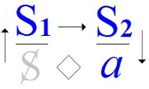
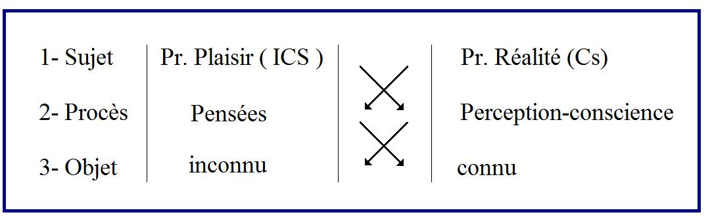

# Leçon 04 | 09 Décembre 1959

  <label><input type="checkbox" data-lacan-toggle="original" checked> 原文</label>
  <label><input type="checkbox" data-lacan-toggle="notes" checked> 注释</label>
  <label><input type="checkbox" data-lacan-toggle="commentary" checked> 个人解读评论</label>

<section class="parallel-paragraph" data-paragraph-ids="s7-04-0001">

s7-04-0001

[无对应译文]

原文 · s7-04-0001

Je vais essayer de vous parler aujourd’hui de *la Chose*, *das Ding.* C’est - je crois - que certaines ambiguïtés, certaines insuffisances concernant le vrai sens, dans FREUD, de l’opposition entre *principe de réalité* et *principe* *du plaisir*, c’est-à-dire de ce sur la piste de quoi j’essaie cette année de vous mener - pour vous faire comprendre l’importance, pour notre pratique, en tant qu’éthique - à quelque chose qui est en somme de l’ordre du signifiant, de l’ordre linguistique même, c’est-à-dire d’*un signifiant concret,* *positif et particulier*.

</section>

<section class="parallel-paragraph" data-paragraph-ids="s7-04-0002">

s7-04-0002

[无对应译文]

原文 · s7-04-0002

À savoir que je ne vois pas ce qui dans la langue française peut correspondre - et je serais reconnaissant à ceux que ces remarques intéresseraient, stimuleraient assez pour me proposer une solution - à l’opposition en allemand, subtile, qui n’est pas facile à mettre en évidence, entre deux termes qui disent « *la Chose* » : *das Ding* et *die Sache.* *Nous* n’avons qu’un seul mot, ce mot de « *la Chose* », dérivant du latin *causa,* et qui nous indique, par sa référence étymologique juridique, ce qui se présente pour nous comme l’enveloppe et la désignation du concret.

</section>

<section class="parallel-paragraph" data-paragraph-ids="s7-04-0003">

s7-04-0003

[无对应译文]

原文 · s7-04-0003

*La Chose*, n’en doutez pas, n’est pas moins dans la langue alle­mande, dans un sens original, dite comme opération, délibération, débat juridique. C’est attesté si nous faisons une recherche étymologique plus précise : *das Ding* peut viser, non pas tellement *l’opération judiciaire* elle-même, que le rassemblement qui la conditionne, le *Vollversammlung.* Ne croyez pas que cette promotion...

</section>

<section class="parallel-paragraph" data-paragraph-ids="s7-04-0004">

s7-04-0004

[无对应译文]

原文 · s7-04-0004

> conforme à ce que FREUD tout le temps nous rappelle, la recherche, l’approfondissement linguistique,
>
> pour y retrouver la trace de l’expérience accumulée de la tradition, des générations, le véhicule le plus certain
>
> de la transmission d’une élaboration qui marque la réalité psychique

</section>

<section class="parallel-paragraph" data-paragraph-ids="s7-04-0005">

s7-04-0005

[无对应译文]

原文 · s7-04-0005

...ne croyez pas pour autant que ces sortes d’aperçus, de coups de sonde étymologiques, soient de loin ce que nous préférons pour nous guider.

</section>

<section class="parallel-paragraph" data-paragraph-ids="s7-04-0006">

s7-04-0006

[无对应译文]

原文 · s7-04-0006

De repérer l’usage du signifiant dans sa synchronie nous est infiniment plus précieux, et nous attachons bien plus de poids à la façon dont *Ding* et *Sache* sont utilisés couramment. Car en effet d’ailleurs, si nous nous fions, si nous nous reportons à un diction­naire étymologique, nous trouverons aussi à *Sache* qu’il s’agit d’une opération juridique dans son origine, que la *Sache* est la chose mise en ques­tion juridique, ou passage, dans notre vocabulaire, à l’ordre symbolique, de ce débat, de ce conflit entre les hommes. Néanmoins, les deux termes ne sont absolument pas équivalents.

</section>

<section class="parallel-paragraph" data-paragraph-ids="s7-04-0007">

s7-04-0007

[无对应译文]

原文 · s7-04-0007

Et aussi bien, par exemple, avez-vous pu dans les propos de M. LEFÈVRE-PONTALIS, la dernière fois, noter la citation par lui - méritoire puisqu’il ne sait pas l’allemand - des termes dont, à l’occasion, il a fait intervenir dans son exposé le saillant à un moment précis, pour en poser la question - je dirai contre ma doctrine - évoquant spécialement ce passage de *L’inconscient, Unbewußte*, où «* la représentation des choses* », *Sachvorstellungen,* chaque fois est opposée à *celle* « *des mots* », *Wortvorstellungen.*

</section>

<section class="parallel-paragraph" data-paragraph-ids="s7-04-0008">

s7-04-0008

[无对应译文]

原文 · s7-04-0008

Je n’entrerai pas aujourd’hui dans la discussion de ce qui permettrait de répondre à ce passage qui nous est invoqué, au moins sous le mode d’un point d’interrogation, par ceux d’entre vous que mes leçons incitent à lire FREUD, souvent invoqué comme un point d’interrogation dans leur esprit, de ce qui pourrait s’opposer dans un tel passage à l’accent que je mets sur l’articulation signifiante comme donnant la véritable structure de l’inconscient. Ce passage a l’air d’aller contre, mettant l’accent, opposant la *Sachvorstellung* comme appartenant à *l’inconscient*, à la *Wortvorstellung* comme appartenant au *préconscient*.

</section>

<section class="parallel-paragraph" data-paragraph-ids="s7-04-0009">

s7-04-0009

[无对应译文]

原文 · s7-04-0009

Je voudrais tout de même - puisque ce ne sont peut-être pas la majorité d’entre vous qui vont chercher dans les textesde FREUD le contrôle de ce que je vous avance ici dans mon commentaire - puisque ce sont ceux-là qui s’arrêtent à ce passage, je les prie de lire d’un trait, d’affilée, l’article *Die Verdrängung, Le refoulement,* qui précède cet article sur *L’inconscient*, puis *Le conscient* lui-même, avant qu’on arrive à ce passage dont j’indique pour les autres qu’il se rapporte expressément à la question que pose pour FREUD l’attitude schizophrénique, autrement dit la prévalence extraordinairement manifeste des affinités de mots dans ce qu’on pourrait appeler « *le monde du schizophrène* ».

</section>

<section class="parallel-paragraph" data-paragraph-ids="s7-04-0010">

s7-04-0010

[无对应译文]

原文 · s7-04-0010

Tout ce qui précède, à ce point précis, me paraît ne pouvoir aller que dans un seul sens, c’est à savoir que tout ce sur quoi opère la *Verdrängung,* c’est-à-dire *le refoulement, c’est sur des signifiants*, et que *c’est autour d’une relation du sujet au signifiant que s’organise la position fondamentale de la Verdrängung.* C’est seulement à partir de là que FREUD souligne qu’il est possible de parler, au sens analytique du terme, au sens rigoureux, au sens nous dirions « *opérationnel* », qu’ont ces mots pour nous d’*inconscient* et de *conscient*.

</section>

<section class="parallel-paragraph" data-paragraph-ids="s7-04-0011">

s7-04-0011

[无对应译文]

原文 · s7-04-0011

Ensuite FREUD s’aperçoit que la position particulière du *schizophrène* nous met, d’une façon plus aiguë que dans toute autre forme névrotique, en présence du problème de la *représentation*. C’est en effet quelque chose sur quoi nous aurons peut-être l’occasion, dans la suite, de revenir en suivant son texte, mais dont ce texte lui-même souligne qu’à donner la solution qu’il semble - en donnant une opposition de la *Wortvorstellung* à la *Sachvorstellung* - il y a une difficulté, une impasse qu’il souligne, qu’il articule lui-même, et qui je crois, trouve sa solution tout simplement dans ce qu’il ne pouvait pas, vu l’état de la linguistique à son époque, non pas comprendre, car il a admirablement compris, en particulier, mais formuler, à savoir la distinction :

</section>

<section class="parallel-paragraph" data-paragraph-ids="s7-04-0012">

s7-04-0012

[无对应译文]

原文 · s7-04-0012

- de l’opération du langage comme fonction, à savoir au moment où elle s’articule et elle joue un rôle essentiel dans le préconscient,

</section>

<section class="parallel-paragraph" data-paragraph-ids="s7-04-0013">

s7-04-0013

[无对应译文]

原文 · s7-04-0013

- et de la fonction du langage comme structure, c’est-à-dire pour autant que c’est selon la structure du langage que s’ordonnent les élé­ments mis en jeu dans l’inconscient.

</section>

<section class="parallel-paragraph" data-paragraph-ids="s7-04-0014">

s7-04-0014

[无对应译文]

原文 · s7-04-0014

Entre, s’établissent ces coordinations, ces *Bahnungen,* cette mise en chaîne qui en domine l’économie. Mais je n’ai fait là qu’un trop long détour. Je veux aujourd’hui me limiter à cette remarque : c’est qu’en tout cas FREUD parle de *Sachvorstellung* et non pas de *Dingvorstellung.*

</section>

<section class="parallel-paragraph" data-paragraph-ids="s7-04-0015">

s7-04-0015

[无对应译文]

原文 · s7-04-0015

Et qu’aussi bien il n’est pas vain que ces *Sachvorstellungen* soient liées à la *Wortvorstellung,* nous montrant - ce qui est bien certain - qu’il y a un rapport, que *la paille des mots* [^9] ne nous apparaît comme *paille* que pour autant que nous en avons séparé *le grain des choses*, et que c’est d’abord cette *paille* qui a porté ce *grain*. Je veux dire : ce qui est trop évident - je ne veux pas ici me mettre à élaborer une théorie de la connaissance - c’est :

</section>

<section class="parallel-paragraph" data-paragraph-ids="s7-04-0016">

s7-04-0016

[无对应译文]

原文 · s7-04-0016

- *que les choses du monde humain sont des choses d’un univers structuré en paroles*,

</section>

<section class="parallel-paragraph" data-paragraph-ids="s7-04-0017">

s7-04-0017

[无对应译文]

原文 · s7-04-0017

- *que le langage domine*,

</section>

<section class="parallel-paragraph" data-paragraph-ids="s7-04-0018">

s7-04-0018

[无对应译文]

原文 · s7-04-0018

- *que les processus symboliques gouvernent tout*.

</section>

<section class="parallel-paragraph" data-paragraph-ids="s7-04-0019">

s7-04-0019

[无对应译文]

原文 · s7-04-0019

Ce que nous nous efforçons de sonder, à la limite du monde animal et du monde humain, c’est ce phénomène, qui pour nous ne peut apparaître que comme un sujet d’étonnement, c’est à savoir : combien le processus symbolique comme tel est inopérant dans le monde animal, et assurément de nous montrer en même temps que seule une différence d’intelligence, une différence de souplesse et de complexité des appareils ne saurait être le seul ressort qui nous permette de désigner cette différence.

</section>

<section class="parallel-paragraph" data-paragraph-ids="s7-04-0020">

s7-04-0020

[无对应译文]

原文 · s7-04-0020

Que l’homme soit pris dans les *processus symboliques* d’une façon à laquelle aucun animal n’accède de la même façon ne saurait être résolu en termes de *psychologie*. C’est ce quelque chose qui implique que nous ayons d’abord une connaissance complète, stricte, centrée de ce que ce *processus symbolique* veut dire.

</section>

<section class="parallel-paragraph" data-paragraph-ids="s7-04-0021">

s7-04-0021

[无对应译文]

原文 · s7-04-0021

La *Sache,* dirai-je, est donc bien cette « *chose* », produit de l’industrie si l’on peut dire, de *l’action humaine*, en tant qu’elle est action dirigée, gouvernée par le langage. Les « *choses* » sont en somme à la surface, toujours à portée d’être explicitées, si implicites qu’elles soient d’abord dans la genèse de cette action. \[le *a* qui chute comme produit de l’opération de langage : S1→S2, est de type « *die Sache* », le « *das Ding* » est *l’impossible* à rejoindre, sinon sur le « mode » du fantasme : *a* ◊ S, qui est au principe de « *l’action humaine* » toujours réitérée :

</section>

<section class="parallel-paragraph" data-paragraph-ids="s7-04-0022">

s7-04-0022

[无对应译文]

原文 · s7-04-0022

</section>

<section class="parallel-paragraph" data-paragraph-ids="s7-04-0023">

s7-04-0023

[无对应译文]

原文 · s7-04-0023

Nous sommes en effet là dans les fruits d’une *acti­vité* dont on peut dire que, pour autant qu’elle est sous-jacente, implicite à toute action humaine, c’est de l’ordre du pré-conscient, de quelque chose que notre intérêt peut faire venir à la conscience, à condition que nous y portions assez d’attention, que nous en fassions remarque. Que c’est là en quoi se situera cette réciproque position du *mot* en tant qu’il s’articule, qu’il vient ici s’expliquer avec *la chose*, en tant qu’une *action* - elle-même dominée par le *langage*, voire par le commandement \[S1→S2\] - l’aura, cet objet, détaché et fait naître : *Sache* et *Wort* sont si étroitement liés qu’ils sont comme un couple. Il en va de même de *das Ding,* de *La Chose* où se situe ce repérage, ce poids.

</section>

<section class="parallel-paragraph" data-paragraph-ids="s7-04-0024">

s7-04-0024

[无对应译文]

原文 · s7-04-0024

Ce *das Ding* de *La Chose*, c’est ce que je voudrais vous montrer aujourd’hui dans la vie. C’est de vous montrer que dans *le principe de réalité*, tel que FREUD le fait entrer en jeu *au départ de sa pensée, et jusqu’à son terme*, car ce *das Ding -* dont je vais vous montrer comment en trouver, dans tel passage de l’*Entwurf,* l’indication originelle - vous le retrouverez à la fin de toute l’évolution de sa pensée sur *le principe de réalité*, dans « *die Verneinung* »*, la dénégation*, comme quelque chose comme un point essentiel.

</section>

<section class="parallel-paragraph" data-paragraph-ids="s7-04-0025">

s7-04-0025

[无对应译文]

原文 · s7-04-0025

Ce *das Ding* se situe *ailleurs* que dans cette relation en quelque sorte réfléchie, pour autant qu’elle est explicitable, qui fait l’homme mettre en question ses mots comme se référant aux choses qu’ils ont pourtant créées. Il y a autre chose dans *das* *Ding.* Ce qu’il y a dans *das* *Ding,* c’est le secret véritable. Car il y a un secret de ce *principe de réalité* dans FREUD, dont LEFÈVRE-PONTALIS vous a montré la dernière fois le paradoxe.

</section>

<section class="parallel-paragraph" data-paragraph-ids="s7-04-0026">

s7-04-0026

[无对应译文]

原文 · s7-04-0026

Car s’il parle du *principe de réalité*, c’est en quelque sorte, comme l’a bien souligné LEFÈVRE-PONTALIS, par un certain côté pour nous le montrer en somme toujours tenu en échec et n’aboutissant à se faire valoir qu’en quelque sorte sur la marge, et par une sorte de *pression* dont on pourrait dire, si les choses n’allaient infiniment plus loin, que c’est celle que FREUD appelle, non pas comme on le dit souvent fort mal pour souligner le rôle du processus secondaire : *les besoins vitaux*, mais dans le texte allemand : *Not des Lebens, die Not des Lebens.* Formule infiniment plus forte. Quelque chose qui veut le besoin - et non pas les besoins - la pression, l’urgence. L’état de *Not,* c’est l’état d’urgence de la vie.

</section>

<section class="parallel-paragraph" data-paragraph-ids="s7-04-0027">

s7-04-0027

[无对应译文]

原文 · s7-04-0027

Il faut noter que « *Not des Lebens* » - que j’ai noté la dernière fois au tableau pendant que LEFÈVRE-PONTALIS parlait - c’est ce quelque chose qui intervient au niveau du processus secondaire, mais du processus secondaire d’une façon plus profonde que par cette activité corrective sur laquelle l’un et l’autre - LEFÈVRE-PONTALIS et moi - nous avons insisté, mais pour *déterminer* le niveau Qή, *la quantité d’énergie* supportée, si l’on peut dire, conservée, soutenue par l’organisme, pour être - à mesure de la réponse - *nécessaire à la conservation de la vie*. Notez-le bien, c’est au niveau du *processus secondaire* que s’exerce le niveau de cette *détermination nécessaire*.

</section>

<section class="parallel-paragraph" data-paragraph-ids="s7-04-0028">

s7-04-0028

[无对应译文]

原文 · s7-04-0028

Reprenons le *principe de réalité*, donc qui est invoqué sous forme de son incidence, de nécessité, ce qui nous met sur la voie de ce que j’ap­pelle son secret. C’est ceci : que, dès que nous essayons de l’articuler pour le faire dépendre du monde physique auquel la pensée, le dessein de FREUD, semble exiger de le rapporter, c’est cela qui nous frappe, c’est que là, il est bien clair que ce *principe de réalité* lui-même fonctionne comme *isolant* le sujet de la réalité.

</section>

<section class="parallel-paragraph" data-paragraph-ids="s7-04-0029">

s7-04-0029

[无对应译文]

原文 · s7-04-0029

Et là, nous ne trouvons rien d’autre que ce qu’en effet la biologie nous enseigne, à savoir : qu’un processus d’homéostase, d’isolation par rapport à cette réalité, est ce qui domine la structure d’un être vivant. Est-ce là tout ce que FREUD nous a dit quand il nous parle du fonctionnement de ce principe de réalité ? En apparence, oui !

</section>

<section class="parallel-paragraph" data-paragraph-ids="s7-04-0030">

s7-04-0030

[无对应译文]

原文 · s7-04-0030

Et ce qu’il nous montre, c’est que ni l’élément quantitatif, ni l’élément qualitatif, quant à la réalité, ne passe dans ce qu’on peut appeler *le règne* - d’ailleurs c’est le terme qu’il emploie, *Reich - du processus secondaire*. La *quantité extérieure*, vous ai-je dit l’autre jour, pour autant que c’est à elle que vient avoir affaire, à sa terminaison, l’appareil de ce qu’il appelle le système ϕ...

</section>

<section class="parallel-paragraph" data-paragraph-ids="s7-04-0031">

s7-04-0031

[无对应译文]

原文 · s7-04-0031

c’est-à-dire ce qui, de *l’ensemble neuronique*, est directement dirigé vers l’extérieur, disons en gros *les terminaisons nerveuses* au niveau de la peau, des tendons, voire même des muscles ou des os, la sensibilité profonde,c’est cela dont il s’agit

</section>

<section class="parallel-paragraph" data-paragraph-ids="s7-04-0032">

s7-04-0032

[无对应译文]

原文 · s7-04-0032

...tout est fait pour que cette *quantité* Q soit nettement *barrée, arrêtée* par rapport à ce qui sera soutenu de Qή, *d’une autre quantité*, celle qui détermine le niveau qui distingue l’appareil ϕ dans l’ensemble neuronique. Car l’*Entwurf* est la théorie d’un appareil neuronique dans lequel *l’organisme reste extérieur*, par position de la théorie simplement, tout comme *le monde extérieur*.

</section>

<section class="parallel-paragraph" data-paragraph-ids="s7-04-0033">

s7-04-0033

[无对应译文]

原文 · s7-04-0033

Quant à *la qualité*, il nous est bien dit que, là aussi, le monde extérieur ne perd pas toute qualité, mais que *cette qualité vient s’inscrire*, comme nous le savons - la théorie des organes sensoriels nous le montre - *d’une façon discontinue selon une échelle, en somme, coupée* *aux deux extrémités*, raccourcie selon les différents champs de la sensorialité qui sont intéressés. Il est toujours constatable que l’appareil sensoriel comme tel ne joue pas seulement ici le rôle d’un extincteur, d’un amortisseur, comme nous venons déjà de le voir dans l’appareil ϕ en général, mais comme un *tamis*, nous dit FREUD, mais qu’il s’agit donc de savoir quelle valeur nous pouvons donner à ces perceptions.

</section>

<section class="parallel-paragraph" data-paragraph-ids="s7-04-0034">

s7-04-0034

[无对应译文]

原文 · s7-04-0034

Ici, FREUD ne s’engage pas plus loin dans des tentatives de solution qui relèvent à proprement parler du physiologiste, de celui qui écrit, comme M. PIÉRON : « *La sensation, guide de vie ».* La question de savoir si le choix est fait de telle ou telle façon dans le champ propre à provoquer des percep­tions visuelles, auditives ou autres, n’est pas autrement attaquée. Seulement, là aussi, nous avons la notion d’une profonde subjectivation du monde extérieur, de quelque chose qui trie, tamise, qui fait que la réalité n’est aperçue, au moins à l’état naturel, spontané, par l’homme, que *sous une forme profondément choisie*. Ce sont des morceaux choisis de réalité avec lesquels il a affaire.

</section>

<section class="parallel-paragraph" data-paragraph-ids="s7-04-0035">

s7-04-0035

[无对应译文]

原文 · s7-04-0035

Et, à la vérité, dans l’économie de ce que FREUD nous montre, ceci n’intervient que dans une *fonction* qui, par rapport à l’économie de l’ensemble, est localisée à la fonction non pas de qualité, en tant qu’elle nous informerait plus *rofondément*, comme une chose qui atteindrait une essence, mais *de signes*. FREUD ne les fait intervenir qu’en tant qu’ils sont *Qualitätszeichen,* mais la *fonction de signe* ne joue pas tellement par rap­port à la qualité, à la qualité opaque, elle, et énigmatique.

</section>

<section class="parallel-paragraph" data-paragraph-ids="s7-04-0036">

s7-04-0036

[无对应译文]

原文 · s7-04-0036

C’est la *fonction de signe*, pour autant que ces signes nous avisent, nous avertissent de la présence de quelque chose qui se rapporte effectivement à ce monde exté­rieur, signalant à la conscience que c’est au *monde extérieur* qu’elle a affaire. Comment et en quoi elle y a affaire, en ce *monde extérieur* ? C’est la chose avec laquelle elle a à se débrouiller et avec laquelle, depuis qu’il y a des hommes, et qui pensent, et qui tentent une théorie de la connaissance, elle a tenté de se débrouiller. FREUD ici ne rentre pas plus loin dans ce problème, sinon pour dire qu’il est assurément fort complexe et que nous sommes très loin de pouvoir même ébaucher la solution de ce qui peut organiquement en avoir déterminé *la précision*, *les déterminations*, *la genèse particulière*.

</section>

<section class="parallel-paragraph" data-paragraph-ids="s7-04-0037">

s7-04-0037

[无对应译文]

原文 · s7-04-0037

Mais dès lors, est-ce bien là ce dont il s’agit quand FREUD nous parle du *principe de réalité* ? Est-ce quelque chose grâce à quoi, selon une formule qui est trop souvent possible à sentir dans la façon dont s’expriment les théoriciens d’un certain *behaviourisme*, est-ce que cette réalité n’est après tout que ce quelque chose qui représente les heurts d’un organisme vis-à-vis d’un monde où, sans doute, il a de quoi se nourrir, il a de quoi s’assimiler certains éléments, mais qui est en prin­cipe fait d’un monde qui se présente comme un monde de *hasard*, comme un monde *chaotique*, comme un monde de « *rencontres »* ?

</section>

<section class="parallel-paragraph" data-paragraph-ids="s7-04-0038">

s7-04-0038

[无对应译文]

原文 · s7-04-0038

Est-ce bien là tout ce que FREUD articule quand il nous parle du *principe de réalité* ? C’est la question qu’aujourd’hui j’avance devant vous avec cette notion de *das Ding.* Avant d’y entrer, je reviens à vous faire remarquer ce que le petit tableau à double colonne, que je vous ai introduit il y a deux semaines, comporte.

</section>

<section class="parallel-paragraph" data-paragraph-ids="s7-04-0039">

s7-04-0039

[无对应译文]

原文 · s7-04-0039

</section>

<section class="parallel-paragraph" data-paragraph-ids="s7-04-0040">

s7-04-0040

[无对应译文]

原文 · s7-04-0040

C’est à savoir ceci qui, opposant dans une colonne le *Lustprinzip* et le *Realitätsprinzip* dans l’autre colonne, partant de ce repérage que c’est du côté du *principe du plaisir* que ce qui est inconscient fonctionne comme tel, et le *Lustprinzip* qui régit, qui domine ici quelque chose, qui - conscient ou préconscient - est en tout cas quelque chose qui se présente dans l’ordre du discours réfléchi, du discours articulable, accessible, sortant du préconscient.

</section>

<section class="parallel-paragraph" data-paragraph-ids="s7-04-0041">

s7-04-0041

[无对应译文]

原文 · s7-04-0041

Cette remarque que je vous ai faite que *les processus de pensée*, en tant que le *principe de réalité* les domine, FREUD souligne bien à quel point en eux-mêmes ils sont inaccessibles, *ils sont inconscients*. Ils ne parviennent à la conscience que pour autant qu’on peut les verbaliser, c’est-à-dire que quelque chose les ramène par la voie d’une explicitation réfléchie, à portée du *principe de réalité*, à portée d’une conscience en tant qu’elle est perpétuellement éveillée, intéressée par l’investissement de l’attention à surprendre quelque chose qui peut se produire pour lui permettre de s’orienter par rapport au monde réel.

</section>

<section class="parallel-paragraph" data-paragraph-ids="s7-04-0042">

s7-04-0042

[无对应译文]

原文 · s7-04-0042

Je dirai que c’est dans ses propres paroles que le sujet, d’une façon combien précaire, arrive à saisir les ruses grâce auxquelles, dans sa pensée, viennent s’agencer, se suivre ses idées qui, pour lui, émergent d’une façon souvent combien énigmatique et entre lesquelles d’ailleurs, cette nécessité de les parler, de les articuler, introduit cet ordre souvent combien artificiel, sur lequel FREUD aimait à mettre l’accent en disant : qu’on se trouve toujours des raisons pour voir en soi surgir telle disposition, telle humeur, l’une à la suite de l’autre, mais que rien, après tout, ne nous confirme que dans cette explicitation que nous en donnions, le vrai ressort de leur successive émergence nous soit donné, et que ce soit là précisément ce que l’analyse apporte à notre expérience.

</section>

<section class="parallel-paragraph" data-paragraph-ids="s7-04-0043">

s7-04-0043

[无对应译文]

原文 · s7-04-0043

Non seulement il y a plus que de raison, mais il y a surabondance de raisons pour nous faire croire à je ne sais quelle rationalité de la succession de nos formes endopsychiques. Pourtant c’est bien ailleurs, nous le savons - dans combien de cas ? Dans la majorité des cas ! - que la véritable liaison peut en être saisie.

</section>

<section class="parallel-paragraph" data-paragraph-ids="s7-04-0044">

s7-04-0044

[无对应译文]

原文 · s7-04-0044

Donc *ce processus de pensée,* pour autant que c’est tout de même en lui que chemine l’accès à la réalité, le « *Not des Lebens* » qui en maintient à un certain niveau l’investissement, l’appareil, *ce processus de pensée se trouve dans le champ de l’inconscient*, ne nous étant accessible que par l’artifice de ceci, que FREUD va jusqu’à pointer en disant que : c’est pour autant que les rapports sont parlés,

</section>

<section class="parallel-paragraph" data-paragraph-ids="s7-04-0045">

s7-04-0045

[无对应译文]

原文 · s7-04-0045

*qu’il y a Bewegung, qu’il y a mouve­ment de la parole, que nous nous entendons parler* en d’autres termes, et que *ce quelque chose* qu’il y a dans tout *mouvement*, nous dit-il, car - employant un mot dont je ne crois pas que l’usage soit courant en allemand, et dont ce n’est pas pour rien qu’il l’emploie - car il souligne par là *l’étrangeté de la notion* sur laquelle il insiste,

</section>

<section class="parallel-paragraph" data-paragraph-ids="s7-04-0046">

s7-04-0046

[无对应译文]

原文 · s7-04-0046

...c’est pour autant que *Bewegung* s’annonce au système, ici représenté par le ω que je vous ai mis ici, vous verrez tout à l’heure pourquoi c’est pour autant que tout mou­vement, ça paraît quelque chose de sensible, qu’il y a *quelque chose* qui peut être connu de ce qui, à quelque degré, *s’intercale* dans le circuit qui, au niveau de l’appareil ϕ tend - *avant tout pour maintenir au niveau le plus bas* la tension - à se décharger en mouvement *Abfuhr* c’est pour autant que quelque chose ici est intéressé dans ce *processus d’Abfuhr,* que quelque chose ici rentre à proprement parler sous le signe du *principe du plaisir*, le sujet - le sujet en tant que conscient - n’appréhende quelque chose que pour autant qu’il y a quelque chose de *centripète* dans le *mouvement*, qu’il y a, disons pour parler, *sentiment de mouvement*, sentiment de l’effort.

</section>

<section class="parallel-paragraph" data-paragraph-ids="s7-04-0047">

s7-04-0047

[无对应译文]

原文 · s7-04-0047

Et ceci se limiterait à cette perception obscure, tout au plus capable d’opposer dans le monde les deux grandes qualités que FREUD ne manquait pas de qualifier de monotones, et qu’il ne manque pas de faire quand je vous ai parlé de l’immobile et du mobile, de ce qui peut se mouvoir et de ce qui est impossible à mouvoir, s’il n’y avait pas parmi ces mouvements ceux que nous pouvons appeler des mouvements de qualité d’une structure différente, les mouvements articulés de la parole autour de quoi *quelque chose*, qui participe encore de la monotonie, de la pâleur, du manque de couleur du mouvement, est tout de même ce par quoi tout ce qui se rapporte aux processus de la pensée, à ces menus essais du cheminement *de Vorstellung en Vorstellung, de représentation en représentation*, autour de quoi le monde humain s’organise, parvient à la conscience.

</section>

<section class="parallel-paragraph" data-paragraph-ids="s7-04-0048">

s7-04-0048

[无对应译文]

原文 · s7-04-0048

C’est pour autant que, quelque chose ici, dans *le circuit sensation-motricité* vient à un certain niveau du système Ψ l’intéresser d’une certaine façon qui permet que quelque chose en soit, en somme, rétroactivement perçu, sensible sous la forme de *Wortvorstellung,* c’est-à-dire que le système de la conscience, le système ω peut enregistrer quelque chose de ce qui se passe dans le psychisme de la réalité endopsychique, quelque chose est entrevu de ce à quoi FREUD fait allusion à plusieurs reprises, toujours avec *prudence*, quelquefois avec ambiguïté, comme *perception endopsychique*. Accentuons encore ce dont il s’agit ici dans le système ϕ.

</section>

<section class="parallel-paragraph" data-paragraph-ids="s7-04-0049">

s7-04-0049

[无对应译文]

原文 · s7-04-0049

FREUD isole, dès *l’Entwurf,* un système de l’*Ich *: ce « *Ich* » dont nous aurons à voir les métamorphoses et les transformations ultérieurement, dans la suite des développements de la théorie, ce « *Ich* » qui lui aussi, se présente en quelque sorte d’emblée, avec toute l’*ambiguïté* qu’il y rétablira plus tard en nous disant que l’*Ich* est pour une grande part inconscient.

</section>

<section class="parallel-paragraph" data-paragraph-ids="s7-04-0050">

s7-04-0050

[无对应译文]

原文 · s7-04-0050

Ici l’*Ich* est stricte­ment défini : quand il parle de *die Einführung des Ichs,* c’est du système à proprement parler uniformément investi de quelque chose qui a une *Gleichbesetzung.* Il n’a pas écrit *Gleichbesetzung,* mais je suis sûrement dans le simple courant de ce qu’il exprime en me servant de ce terme d’un *investissement égal*, *uniforme*.

</section>

<section class="parallel-paragraph" data-paragraph-ids="s7-04-0051">

s7-04-0051

[无对应译文]

原文 · s7-04-0051

Il y a dans le système φ quelque chose qui se constitue comme *Ich,* pour autant que ce *Ich,* étant ce quelque chose qui, dans le système de « *eine Gruppe von Neuronen, die konstant besetzt ist, also dem durch die sekundäre Funktion erforderten vorratsträger ents­pricht* » \- le terme *Vorrat* est tout spécialement répété - sert au maintien de cet investissement qui y caractérise une fonction régulatrice.

</section>

<section class="parallel-paragraph" data-paragraph-ids="s7-04-0052">

s7-04-0052

[无对应译文]

原文 · s7-04-0052

Et je parle ici de fonction. S’il y a *inconscient*, c’est bien le *Ich* en tant qu’il est ici inconscient en fonction, et c’est en tant qu’il est réglé par cette *Besetzung,* cette *Gleichbesetzung,* que nous avons affaire à lui. C’est cela qui nous permet le repérage de la valeur de cette *décussation* sur laquelle j’insiste, et que nous allons voir maintenue dans sa dualité dans la suite du déve­loppement de la pensée de FREUD.

</section>

<section class="parallel-paragraph" data-paragraph-ids="s7-04-0053">

s7-04-0053

[无对应译文]

原文 · s7-04-0053

C’est que le système qui perçoit, qui enregistre, celui qui s’appellera plus tard *Wahrnehmungsbewußtsein,* il n’est pas au niveau de ce *moi* en tant qu’il maintient *égale* et *uniforme*, et autant que possible *constante*, la *Besetzung,* la *Besetzung* réglant le fonctionnement de la pensée. Elle est ailleurs cette conscience. Elle est un appareil qu’il faut que FREUD invente, forge, et qu’il nous dit à la fois *intermédiaire* *entre ces deux systèmes *: le *système* ω et le *système* ϕ, et en même temps dont tout, dans le texte, nous impose de ne pas le mettre ici à la limite. Car *le système* ϕ pénètre en quelque sorte directement, sans doute à travers un appareil, se ramifie directement dans le *système* Ψ dans lequel il n’abandonne qu’une partie de la quantité qu’il lui apporte.

</section>

<section class="parallel-paragraph" data-paragraph-ids="s7-04-0054">

s7-04-0054

[无对应译文]

原文 · s7-04-0054

C’est bien ailleurs, et pour autant, et que dans une position pour ainsi dire plus isolée, moins situable que tout autre appareil, *que vient fonctionner ce système* ω pour autant, dit FREUD « *que ce n’est d’aucune façon de la quantité extérieure qu’il recueille son énergie* », que tout au plus peut-­on concevoir *qu’il en* «* sich die Periode aneignen* »*, qu’il en enregistre la période*.

</section>

<section class="parallel-paragraph" data-paragraph-ids="s7-04-0055">

s7-04-0055

[无对应译文]

原文 · s7-04-0055

Et c’est à quoi je faisais allusion tout à l’heure, en parlant du choix de l’appareil sensoriel, qu’il le joue là, que se joue là aussi ce rôle de guide, ce rôle de contribution qu’apportent les *Qualitätszeichen* pour permettre au moindre pas tous ces départs qui s’individualisent en tant qu’attention sur tel ou tel point choisi du circuit et qui lui permettront cette meilleure approximation, par rapport au processus, qu’automati­quement le *principe du plaisir* tendrait à faire.

</section>

<section class="parallel-paragraph" data-paragraph-ids="s7-04-0056">

s7-04-0056

[无对应译文]

原文 · s7-04-0056

Mais là, il y a quelque chose qui, dès que FREUD essaye d’articuler *la fonction de ce système*, nous frappe. Ce double, cette union qui semble une coalescence de la *Wahrnehmung,* de la *perception*, avec la *Bewußtsein* qui est la *conscience* \- ce qu’exprime le symbole « *W-Bw » -* se trouve dès que nous essayons d’en voir fonctionner le jeu à ce niveau premier d’appréhension du système psychique dans FREUD.

</section>

<section class="parallel-paragraph" data-paragraph-ids="s7-04-0057">

s7-04-0057

[无对应译文]

原文 · s7-04-0057

Tout nous indique qu’ici...

</section>

<section class="parallel-paragraph" data-paragraph-ids="s7-04-0058">

s7-04-0058

[无对应译文]

原文 · s7-04-0058

et je vous prie pour cela de vous rapporter à cette « *Lettre 52 »* dont LEFÈVRE-PONTALIS nous faisait remarquer la dernière fois quel état j’en faisais constamment et à plusieurs reprises, à cette lettre dans laquelle FREUD commence, dans la confidence avec FLIESS, à apporter *la conception qu’il faut se faire du fonctionnement de l’inconscient comme tel*

</section>

<section class="parallel-paragraph" data-paragraph-ids="s7-04-0059">

s7-04-0059

[无对应译文]

原文 · s7-04-0059

...c’est littéralement autour de la succession des *Niederschriften,* des *inscriptions*, que FREUD fait tourner toute sa *théorie de la mémoire*, pour autant que c’est là, pour lui, l’exigence fondamentale de tout ce système, c’est d’ordonner ce qu’il voit fonctionner effectivement dans *les traces mnésiques*, d’en ordonner les champs divers dans une conception cohérente de l’appareil psychique.

</section>

<section class="parallel-paragraph" data-paragraph-ids="s7-04-0060">

s7-04-0060

[无对应译文]

原文 · s7-04-0060

Et là, que voyons-nous au niveau de la *Lettre 52* ? Nous en voyons ceci, la *Wahrnehmung,* c’est-à-dire l’*impression du monde exté­rieur* comme *brute*, elle est *originelle,* elle est *primitive,* elle est *hors du champ* qui correspondra à une expérience qui soit notable, c’est-à-dire effectivement *inscrite* dans quelque chose dont il est tout à fait frappant qu’à l’origine de sa pensée FREUD l’exprime comme une *Niederschrift,* comme une *inscription*, comme quelque chose qui se propose, non pas simplement en termes de *Prägung* et d’*impression*, mais dans le sens de *quelque chose qui fait signe, qui est de l’ordre de l’écriture.*

</section>

<section class="parallel-paragraph" data-paragraph-ids="s7-04-0061">

s7-04-0061

[无对应译文]

原文 · s7-04-0061

Ce n’est pas moi qui lui ai fait choisir ce terme. La première *Niederschrift* se produit à une certaine époque, dans un certain âge, que sa première approximation du sujet lui fait placer avant l’âge de 4 ans, peu importe. C’est au niveau d’un « a », puis après, jusqu’à l’âge de 8 ans, un « b » qui - lui - apparaîtra être quelque chose ou une autre *Niederschrift* plus organisée, organisée en fonction de souvenirs à proprement parler conceptuels, et nous paraîtra constituer plus spécialement un inconscient.

</section>

<section class="parallel-paragraph" data-paragraph-ids="s7-04-0062">

s7-04-0062

[无对应译文]

原文 · s7-04-0062

Peu importe qu’à ce moment-là il se trompe ou qu’il ne se trompe pas, que nous ayons vu depuis que nous pouvions faire remonter l’inconscient comme tel, avec son organisation de pensée, beaucoup plus haut. Ce qui nous importe, c’est ceci, c’est qu’ensuite nous avons le niveau du *Vorbewußtsein* qui correspond à un stade ultérieur, puis le niveau du *Bewußtsein* en tant qu’il n’est plus l’in­dication d’un temps mais d’un terme.

</section>

<section class="parallel-paragraph" data-paragraph-ids="s7-04-0063">

s7-04-0063

[无对应译文]

原文 · s7-04-0063

En d’autres termes :

</section>

<section class="parallel-paragraph" data-paragraph-ids="s7-04-0064">

s7-04-0064

[无对应译文]

原文 · s7-04-0064

- que toute l’élaboration qui fait que nous progressions *d’une significantisation du monde* à une parole qui peut se formuler,

</section>

<section class="parallel-paragraph" data-paragraph-ids="s7-04-0065">

s7-04-0065

[无对应译文]

原文 · s7-04-0065

- que toute la chaîne qui va de l’inconscient le plus archaïque jusqu’à la forme articulée de la parole chez le sujet, que tout ceci se passe, si l’on peut dire, entre *Wahrnehmung* et *Bewußtsein,* comme on dit « *entre cuir et chair* »,

</section>

<section class="parallel-paragraph" data-paragraph-ids="s7-04-0066">

s7-04-0066

[无对应译文]

原文 · s7-04-0066

- que c’est en somme quelque part - qui n’est pas tellement essentiellement à identifier au point de vue de *la topologie subjective* avec un appareil neuronique - que se situe le progrès auquel FREUD s’intéresse.

</section>

<section class="parallel-paragraph" data-paragraph-ids="s7-04-0067">

s7-04-0067

[无对应译文]

原文 · s7-04-0067

Effectivement, ce qui se passe entre *Wahrnehmung* et *Bewußtsein* doit tout de même avoir affaire, puisque c’est ainsi que FREUD nous le représente, avec l’inconscient, cette fois non pas seulement en fonction mais - comme il s’exprime lui-même en en faisant l’opposition - en *Aufbau*, ou en *structure*.

</section>

<section class="parallel-paragraph" data-paragraph-ids="s7-04-0068">

s7-04-0068

[无对应译文]

原文 · s7-04-0068

En d’autres termes, c’est pour autant que la structure signifiante s’interpose entre la perception et la conscience que l’inconscient intervient, que le principe du plaisir intervient, non plus en tant que *Gleichbesetzung*, fonction du *maintien* d’un certain *investissement*, mais en tant qu’il concerne les *Bahnungen*. C’est la structure de l’expérience accumulée qui y gît et y reste inscrite.

</section>

<section class="parallel-paragraph" data-paragraph-ids="s7-04-0069">

s7-04-0069

[无对应译文]

原文 · s7-04-0069

Au niveau de *l’Ich, de l’inconscient en fonction*, quelque chose se joue, se règle, qui tend à écarter le monde extérieur, à *une rétention* *du dehors*, du monde extérieur. Ce qui, au contraire, au niveau de la *Übung*, vient en exercice, c’est ce qui est *Abfuhr*, *décharge*, pour retrouver ici le même entrecroisement de tout ce qu’on peut appeler « *l’économie totale de l’appareil* ». C’est *la structure* qui règle la décharge. C’est la fonction qui la retient, qui en soutient *les réserves*, ce que FREUD appelle aussi le *Vorrat*, la *provision*. Car nous retrouvons là l’usage de ce même mot qu’il a utilisé pour désigner l’*armoire à provisions*, *Vorratskammer*, de son propre inconscient.

</section>

<section class="parallel-paragraph" data-paragraph-ids="s7-04-0070">

s7-04-0070

[无对应译文]

原文 · s7-04-0070

C’est le même mot dont il se sert pour désigner le *Ich* dont je vous parle, *Vorratsträger*, c’est celui qui est le support de *quantité* et d’*énergie* en tant qu’il constitue le cœur et le centre de l’appareil psychique. C’est sur cette base que vient entrer en jeu ce que nous allons maintenant voir fonctionner comme la première appréhension de la réalité comme telle par le sujet.

</section>

<section class="parallel-paragraph" data-paragraph-ids="s7-04-0071">

s7-04-0071

[无对应译文]

原文 · s7-04-0071

C’est ici qu’intervient, sans la moindre ambiguïté, une réalité qui est celle dont, la dernière fois, je vous ai montré l’importance peut-être un peu voilée, sinon oubliée par LEFÈVRE-PONTALIS, sous la forme de ce qui a rapport, de la façon la plus intime, au sujet dans le *Nebenmensch*. Formule tout à fait frappante pour autant qu’elle articule puissamment l’espèce d’à-côté et en même temps de similitude, de séparation et en même temps d’identité, que c’est là que le sujet va vers cette expérience fondamentale. À la suite de quoi ? Il faudrait là que je vous lise tout le passage, néanmoins je vous choisirai le point le plus important, le *culmen* du passage qui arrive à ceci .

</section>

<section class="parallel-paragraph" data-paragraph-ids="s7-04-0072">

s7-04-0072

[无对应译文]

原文 · s7-04-0072

« *Ainsi ce n’est pas le complexe du Nebenmensch qui se sépare en deux parties, desquelles l’une s’impose par un appareil constant,* *et qui restent ensemble comme Ding* ».

</section>

<section class="parallel-paragraph" data-paragraph-ids="s7-04-0073">

s7-04-0073

[无对应译文]

原文 · s7-04-0073

Voilà ce que la traduction, assurément fort détestable à laquelle vous avez affaire en français, laisse tout à fait perdre, en disant que : « *Quelque chose reste comme tout cohérent.* ». Car loin qu’il s’agisse là d’une allusion à quelque chose qui soit un « *tout cohérent* », c’est-à-dire à quelque chose qui se passerait par le transfert du verbe au substantif, bien au contraire c’est en tant que ce *Ding* est l’élément qui - par le sujet - est à l’origine isolé dans ces deux parties, ces deux termes de l’expérience du *Nebenmensch*, isolé comme ce qui est de sa nature *étranger*, *fremde*.

</section>

<section class="parallel-paragraph" data-paragraph-ids="s7-04-0074">

s7-04-0074

[无对应译文]

原文 · s7-04-0074

C’est en ce sens que se distingue ce qui en fait la deuxième partie de ce complexe de l’objet, dont il nous dit qu’il y a *une division*, *une* *différence* à ce niveau dans l’abord du jugement, que tout ce qui était qualité de l’objet peut être formulé comme étant ses attributs, prédicats, et quelque chose qui, alors, lui, rentre dans *l’investissement du système* Ψ, constitue les *Vorstellungen primitives* autour desquelles se joueront tout le destin, tout ce qui sera réglé selon les lois du *Lust* et du *Unlust*, du *plaisir* et du *déplaisir*, dans ce qu’on peut appeler « *les entrées primitives du sujet* ».

</section>

<section class="parallel-paragraph" data-paragraph-ids="s7-04-0075">

s7-04-0075

[无对应译文]

原文 · s7-04-0075

C’est là tout à fait autre chose. C’est *une division originelle* qui nous est donnée comme étant celle de *l’expérience de la réalité* à proprement parler comme telle, que nous retrouverons dans la *Verneinung*. Je vous prie de vous reporter à son texte. Vous le retrouverez dans la même portée, dans la même fonction, comment étant essentiellement ce qui *du dedans du sujet* *se trouve à l’origine porté dans un premier dehors*. Un *dehors*, nous dit FREUD, qui n’a rien à faire avec cette réalité dans laquelle le sujet ensuite aura à repérer la *Qualitätszeichen*, ce qui lui indique qu’il est dans la bonne route, dans la bonne voie pour la recherche de sa satisfaction. C’est là quelque chose qui, avant l’épreuve de cette recherche, en pose en quelque sorte le terme, le but et la visée. Et c’est cela que l’autre jour LEFÈVRE-PONTALIS vous disait, qui est exprimé d’une façon qui lui paraît, ou lui paraissait jusqu’à un certain degré, *énigmatique*.

</section>

<section class="parallel-paragraph" data-paragraph-ids="s7-04-0076">

s7-04-0076

[无对应译文]

原文 · s7-04-0076

C’est cela que FREUD *nous désigne* quand il nous dit que :

</section>

<section class="parallel-paragraph" data-paragraph-ids="s7-04-0077">

s7-04-0077

[无对应译文]

原文 · s7-04-0077

« *le but premier et le plus proche de l’épreuve de la réalité n’est pas de trouver un objet dans la perception réelle qui corresponde* *à ce que le sujet se représente sur le moment, mais ceci de le retrouver, de se témoigner qu’il est encore présent dans la réalité.* »

</section>

<section class="parallel-paragraph" data-paragraph-ids="s7-04-0078">

s7-04-0078

[无对应译文]

原文 · s7-04-0078

La notion de ce *Ding*, de ce *Ding* comme *fremde*, comme *étranger*, et même hostile à l’occasion, en tout cas comme *le premier extérieur*, c’est là ce autour de quoi s’oriente tout le cheminement qui, sans aucun doute, pour le sujet, est à tout instant cheminement de contrôle, cheminement de référence, par rapport à quoi ? Le monde de ses désirs ! Il fait l’épreuve que quelque chose, après tout, est bien là qui jusqu’à un certain degré peut servir. Mais servir à quoi ? Servir à rien d’autre qu’à référer par rapport à ce monde de souhaits et d’attente qui, lui, est orienté vers ce qui servira à l’occasion à atteindre *das Ding*.

</section>

<section class="parallel-paragraph" data-paragraph-ids="s7-04-0079">

s7-04-0079

[无对应译文]

原文 · s7-04-0079

Cet objet, quand il sera là, quand toutes les conditions seront remplies, c’est-à-dire, au bout du compte, vous le savez bien...

</section>

<section class="parallel-paragraph" data-paragraph-ids="s7-04-0080">

s7-04-0080

[无对应译文]

原文 · s7-04-0080

> mais parce que, bien entendu, il est clair que ce qu’il s’agit de trouver ne peut pas être retrouvé,
>
> puisque c’est de sa nature que l’objet est perdu comme tel

</section>

<section class="parallel-paragraph" data-paragraph-ids="s7-04-0081">

s7-04-0081

[无对应译文]

原文 · s7-04-0081

...qu’il ne sera jamais retrouvé, que quelque chose qui est là en attendant mieux, ou en attendant pire, mais en attendant.

</section>

<section class="parallel-paragraph" data-paragraph-ids="s7-04-0082">

s7-04-0082

[无对应译文]

原文 · s7-04-0082

Le système du monde freudien, c’est-à-dire du monde de notre expérience, c’est que c’est cet objet, *das Ding*, en tant qu’*Autre absolu du sujet*, qu’il s’agit de retrouver. C’est l’état de le retrouver tout au plus comme *regret*. Ce n’est pas lui qu’on retrouve mais ses coordonnées de plaisir : cet état de le souhaiter et de l’attendre, dans lequel sera cherché, au nom du *principe du plaisir*, cette tension *optima* au-dessous de laquelle il n’y a plus bien sûr ni perception ni effort. Et si en fin de compte, il n’y a pas quelque chose qui *l’hallucine* en tant que système de référence, aucun monde de la perception n’arrive à s’ordonner, à se constituer d’une façon humaine, d’une façon valable. *Ce monde de la perception nous étant donné comme corrélatif, comme dépendant, comme référence à cette hallucination fondamentale sans laquelle il n’y aurait aucune attention disponible*.

</section>

<section class="parallel-paragraph" data-paragraph-ids="s7-04-0083">

s7-04-0083

[无对应译文]

原文 · s7-04-0083

Et là nous arrivons à la notion de la « *spezifische Aktion »* dont FREUD parle à tellement de reprises, et que je voudrais ici vous éclairer. Car il y a aussi une ambiguïté dans la *Befriedigungserlebnis*. Effectivement, ce qui est cherché, c’est cet objet par rapport auquel fonctionne le *principe du plaisir*. Ce fonctionnement est dans l’étoffe, dans la trame, le support sur lequel toute l’expérience pratique se réfère. Eh bien, cette expérience, cette action spécifique, comment FREUD la conçoit-il ?

</section>

<section class="parallel-paragraph" data-paragraph-ids="s7-04-0084">

s7-04-0084

[无对应译文]

原文 · s7-04-0084

C’est ici qu’il faut lire sa correspondance avec FLIESS pour bien sentir la portée, dans une lettre qui est encore la *Lettre 52* qui, vous le voyez, n’a pas fini de nous livrer ses secrets. Il nous dit « *L’accès hystérique n’est aucune décharge* » n’est pas une décharge. Avis pour ceux qui éprouvent toujours le besoin de mettre au premier plan l’incidence de la quantité dans la fonction de l’affect. Il n’y a pas de champ – il faut dire – qui soit plus favorable que celui de l’hystérie pour montrer combien le fait, dans l’enchaînement des événements psychiques, est une corrélative contingence.

</section>

<section class="parallel-paragraph" data-paragraph-ids="s7-04-0085">

s7-04-0085

[无对应译文]

原文 · s7-04-0085

Ce n’est aucunement une décharge, *sondern eine Aktion*, mais une action qui concerne le caractère inhérent à toute action : être un moyen de se procurer du plaisir, qui est *Mittel zur Reproduktion von Lust*. Nous allons voir là s’éclairer ce que FREUD appelle « une action » : le caractère proprement originel de toute action, est d’être *Mittel zur Reproduktion*, *moyen de reproduction*.

</section>

<section class="parallel-paragraph" data-paragraph-ids="s7-04-0086">

s7-04-0086

[无对应译文]

原文 · s7-04-0086

Elle est ceci : « *das ist er, der hysterische Anfall wenigstens in der Wurzel* ». Ceci, elle l’est au moins dans sa racine. Par ailleurs « *sonst motiviert er sich vor dem Vorbewussten mit allerlet Gründen* » elle peut se motiver par toutes sortes de fondements de toutes espèces qui sont pris au niveau du *préconscient*. Mais, ce qui est dans son essence, c’est quoi ? FREUD nous le livre tout de suite après et en même temps nous illustre ce que veut dire ici l’action comme *Mittel zur Reproduktion*.

</section>

<section class="parallel-paragraph" data-paragraph-ids="s7-04-0087">

s7-04-0087

[无对应译文]

原文 · s7-04-0087

Il s’agit de cela *dans le cas de l’hystérie, ce dont il s’agit, c’est de la crise de pleurs*. Tout est calculé, réglé, comme buté sur *den Anderen*, sur l’*autre*, c’est-à-dire avant tout, dit-il, cet *autre préhistorique*, *inoubliable*, que personne plus tard n’atteindra jamais plus. Ici nous trouvons articulé ce qui, en somme, nous permet, dans une certaine visée, une première approximation de ce dont il s’agit dans la névrose, de comprendre le corrélatif, le terme régulateur.

</section>

<section class="parallel-paragraph" data-paragraph-ids="s7-04-0088">

s7-04-0088

[无对应译文]

原文 · s7-04-0088

Si effectivement, l’action spécifique qui vise à l’expérience de *satisfaction,* est une action dont la fin est de reproduire l’état, de retrouver *das Ding*, l’objet, nous comprendrons *bien des modes* de ce qui est le comportement *névrotique*, de la conduite de l’*hystérique*, si tant est qu’il s’agit, dans *la conduite de* l’*hystérique*, de recréer un état centré par l’*objet* en tant que cet *objet*, *das Ding*, est le centre et le support d’une *aversion* comme FREUD l’écrit quelque part.

</section>

<section class="parallel-paragraph" data-paragraph-ids="s7-04-0089">

s7-04-0089

[无对应译文]

原文 · s7-04-0089

C’est en tant que l’objet premier est objet d’insatisfaction que s’ordonne, s’organise l’*Erlebnis* spécifique de l’*hystérique*. Et c’est aussi pour autant que par une différence, une distinction, une opposition que FREUD a vue, la première, et qui n’a pas lieu d’être abandonnée que dans la névrose obsessionnelle, cet objet, *das Ding*, par rapport à quoi s’organise l’expérience de fond, l’expérience de plaisir, est un objet - FREUD l’a très bien perçu, cela a été sa première aperception de *la névrose obsessionnelle* - un objet qui littéralement apporte trop de plaisir.

</section>

<section class="parallel-paragraph" data-paragraph-ids="s7-04-0090">

s7-04-0090

[无对应译文]

原文 · s7-04-0090

Si vous regardez dans ses cheminements divers, dans tous ses ruisselets le comportement de l’*obsessionnel *: ce qu’il indique et ce qu’il signifie, ce comme quoi il apparaît sujet lui-même, c’est toujours ce quelque chose qui se règle pour *éviter* en fin de compte ce qu’il voit souvent assez clairement comme étant *le but et la fin de son désir*. Et pour l’éviter d’une façon dont la motivation est somme toute extraordinairement radicale, puisque effectivement le *principe du plaisir* nous est donné pour avoir un mode de fonctionnement qui est justement d’*éviter cet excès, ce trop de plaisir*.

</section>

<section class="parallel-paragraph" data-paragraph-ids="s7-04-0091">

s7-04-0091

[无对应译文]

原文 · s7-04-0091

Et pour aller vite...

</section>

<section class="parallel-paragraph" data-paragraph-ids="s7-04-0092">

s7-04-0092

[无对应译文]

原文 · s7-04-0092

> et aussi vite que FREUD va dans ses premières aperceptions de la réalité éthique
>
> à proprement parler, en tant qu’elle fonctionne dans celle du sujet auquel il a affaire

</section>

<section class="parallel-paragraph" data-paragraph-ids="s7-04-0093">

s7-04-0093

[无对应译文]

原文 · s7-04-0093

...n’oubliez pas que dans une des références, que je vous ai apportées et que je n’ai pas immédiatement sous la main, pour ces trois termes - et que je vous donnerai la prochaine fois, et très facilement - la position du sujet dans les trois grandes catégories que FREUD discerne d’abord : *hystérie*, *névrose obsessionnelle* et *paranoïa*.

</section>

<section class="parallel-paragraph" data-paragraph-ids="s7-04-0094">

s7-04-0094

[无对应译文]

原文 · s7-04-0094

Dans la *paranoïa,* chose curieuse, FREUD nous apporte ce terme que je vous prie de méditer dans son jaillissement primordial : *Versagen des Glaubens*. *À ce premier étranger* par rapport à quoi le sujet a à se référer d’abord, *le paranoïaque n’y croit pas*. Cette mise en fonction du terme de la croyance me paraît même être accentuée dans un sens moins psychologique qu’il n’apparaît au premier abord. Je veux dire que ce mode de rapport, le plus profond de l’homme par rapport à la réalité, qui s’articule dans le terme de *la foi*, c’est là ce qui m’apparaît intéressé *dans ce que* FREUD *signale, désigne comme l’attitude la plus radicale du paranoïaque*. Et il me semble qu’ici vous pouvez voir avec quelle facilité se fait *le lien avec ce cri* d’une autre perspective, celle qui vient à la rencontre de celle-là.

</section>

<section class="parallel-paragraph" data-paragraph-ids="s7-04-0095">

s7-04-0095

[无对应译文]

原文 · s7-04-0095

Je vous l’ai déjà désigné en vous disant que ce qui fait le ressort de la paranoïa est essentiellement *rejet* d’un certain appui dans *l’ordre symbolique*, de cet appui spécifique autour de quoi peut-être, nous allons le voir, nous verrons - dans les entretiens qui suivront - se faire *la division en deux versants* de ce rapport à *das Ding*. Si *das Ding* est originellement ce que donc nous appellerons « *le hors signifié* », c’est en fonction de cet « *hors signifié* », et d’un rapport *pathétique* grâce à quoi le sujet conserve sa distance, se constitue dans ce mode de rapport, d’affect primaire, antérieur à tout refoulement, qui est ce autour de quoi toute la première articulation de l’*Entwurf* se fait.

</section>

<section class="parallel-paragraph" data-paragraph-ids="s7-04-0096">

s7-04-0096

[无对应译文]

原文 · s7-04-0096

Le refoulement, ne l’oublions pas, faisant encore pour lui - à ce niveau - problème, et tout ce qu’il dira, dans la suite, du refoulement, n’étant rien d’autre, ne pouvant être même compris, conçu dans son extraordinaire raffinement, que comme une espèce de besoin, de nécessité, de comprendre ce que peut être spécifiquement le refoulement par rapport à toutes les autres formes de défense.

</section>

<section class="parallel-paragraph" data-paragraph-ids="s7-04-0097">

s7-04-0097

[无对应译文]

原文 · s7-04-0097

Eh bien, ici, c’est par rapport à ce *das Ding originel* que se fait cette première orientation, ce premier choix, cette première assise de l’orientation subjective que nous appellerons à l’occasion *Neurosenwahl*, le choix de la névrose. Cette première mouture réglant désormais toute la fonction du principe du plaisir, ce qui va nous rester à voir, c’est de voir que c’est *à la même place* que vient s’organiser ce quelque chose qui est en quelque sorte l’opposé, l’envers et l’identique. C’est à savoir ce qui, au dernier terme, se substitue à cette réalité muette qu’est *das Ding*, à savoir la réalité qui commande, qui ordonne ce qui en fin de compte pointe, si vous voulez, dans la philosophie de quelqu’un, qui mieux qu’aucun autre a entrevu la fonction de *das Ding*, tout en ne l’abordant que par les voies, les essais de *la philosophie de la science*, à savoir KANT.

</section>

<section class="parallel-paragraph" data-paragraph-ids="s7-04-0098">

s7-04-0098

[无对应译文]

原文 · s7-04-0098

C’est à savoir que c’est en fin de compte, qu’il est concevable que ce soit...

</section>

<section class="parallel-paragraph" data-paragraph-ids="s7-04-0099">

s7-04-0099

[无对应译文]

原文 · s7-04-0099

- comme trame signifiante pure,

</section>

<section class="parallel-paragraph" data-paragraph-ids="s7-04-0100">

s7-04-0100

[无对应译文]

原文 · s7-04-0100

- comme maxime universelle,

</section>

<section class="parallel-paragraph" data-paragraph-ids="s7-04-0101">

s7-04-0101

[无对应译文]

原文 · s7-04-0101

- comme la chose la plus dépouillée de relations à l’individu,

</section>

<section class="parallel-paragraph" data-paragraph-ids="s7-04-0102">

s7-04-0102

[无对应译文]

原文 · s7-04-0102

...que doivent se présenter les termes de *das Ding*. C’est là que nous devons avec KANT voir *le point de mire, le point de visée,* *le point de convergence* selon lequel se présentera une action que nous qualifierons de morale, et dont nous verrons combien, paradoxalement, elle se présente elle-même comme étant la règle d’un certain *Gut*.

</section>

<section class="parallel-paragraph" data-paragraph-ids="s7-04-0103">

s7-04-0103

[无对应译文]

原文 · s7-04-0103

Mais pour aujourd’hui, je ne veux qu’insister sur quelque chose qui est que *la Chose* ne se présente à nous que pour autant qu’*elle fait mot*, comme on dit *faire mouche*, que la façon dont l’*étranger* et l’*hostile* apparaissent dans la première expérience de la réalité pour le sujet humain, que la façon dont il se présente dans le texte de FREUD, j’y ai insisté, c’est *le cri*. Ce *cri*, je dirai, nous n’en avons pas besoin. Et ici je voudrais vous faire référence à quelque chose qui est plus inscrit dans la langue française \- chaque langue a ses avantages - qu’elle ne l’est dans la langue allemande.

</section>

<section class="parallel-paragraph" data-paragraph-ids="s7-04-0104">

s7-04-0104

[无对应译文]

原文 · s7-04-0104

Dans la langue allemande « *das Wort »* est à la fois *« le mot »* et *« la parole »*. Le mot « *mot* » dans la langue française, ne l’oubliez pas, a un poids et un sens particuliers. « *Mot* », c’est essentiellement : « *Point de réponse, mot*... » comme dit *quelque part* [^10] LA FONTAINE. « *Mot* » c’est ce qui se tait, « *Mot* » c’est justement à quoi aucun mot n’est prononcé.

</section>

<section class="parallel-paragraph" data-paragraph-ids="s7-04-0105">

s7-04-0105

[无对应译文]

原文 · s7-04-0105

Les *choses* dont il s’agit, et que certains pourraient m’opposer comme étant par FREUD mises à un niveau supérieur à *ce monde* *des signifiants*, dont je vous dis ce qu’il est le véritable ressort d’un fonctionnement dans l’homme du processus qualifié de *primaire,* mais ces *choses* sont des *choses* en tant que *muettes*. Et des *choses muettes* ça n’est pas tout à fait *la même chose* que des *choses* qui n’ont aucun rapport avec les *paroles*.

</section>

<section class="parallel-paragraph" data-paragraph-ids="s7-04-0106">

s7-04-0106

[无对应译文]

原文 · s7-04-0106

Je ne vous prie que d’évoquer une figure - qui je pense, sera vivante à tout un chacun d’entre vous - c’est la figure du terrible muet qu’il y a dans les quatre MARX Brothers : HARPO. Est-ce qu’il y a quelque chose qui peut poser *une question pressante*, plus *présente*, plus *prenante*, plus *chavirante*, plus *nauséeuse*, plus faite pour jeter dans l’abîme et le néant tout ce qui peut se passer devant lui, que la figure *marquée de ce sourire* dont on ne sait si c’est celui de la plus extrême perversité ou de la niaiserie la plus complète, qui est celui d’HARPO MARX ? À lui tout seul, ce muet suffit à supporter l’atmosphère de mise en question, d’anéantissement radical qui est celui qui va faire la trame, l’objet de la formidable farce du jeu de *jokes* non discontinu qui donne toute la valeur de tout cet exercice.

</section>

<section class="parallel-paragraph" data-paragraph-ids="s7-04-0107">

s7-04-0107

[无对应译文]

原文 · s7-04-0107

Mais encore un mot. Voici le mot qui va surgir. Et puisque je vous ai parlé aujourd’hui de l’autre en tant que *Ding*, je voudrais terminer sur quelque chose beaucoup plus accessible à notre expérience, c’est l’emploi isolé auquel, là encore, le français réserve certaines formes spécialisées pour le prénom d’appel. Qu’est-ce que veut dire, qu’est-ce que nous représente *l’émission, l’articulation, le surgissement* hors de notre voix de ce « *toi* » qui peut nous venir aux lèvres dans tel moment de désarroi, de détresse, de surprise, de quelque chose que je n’appellerai pas en toute hâte la mort, mais assurément *la présence d’un autrui* pour nous privilégié et *autour de quoi tournent nos préoccupations majeures*, et qui pour autant n’est pas sans nous embarrasser ?

</section>

<section class="parallel-paragraph" data-paragraph-ids="s7-04-0108">

s7-04-0108

[无对应译文]

原文 · s7-04-0108

Je ne crois pas que ce « *toi* » - ce « *toi* » de dévotion où vient, à l’occasion, achopper toute autre manifestation du *besoin de chérir -* je ne crois pas qu’il soit simple. Je crois qu’en lui-même il y a aussi quelque chose qui tente d’*apprivoiser* cet *Autre*, cet *Autre préhistorique*, cet *Autre inoubliable* qui risque tout d’un coup de nous surprendre et de nous précipiter du haut de son apparition. « *Toi* », qui contient je ne sais quelle défense, et je dirai qu’au moment où ce « *toi* » est prononcé, c’est tout entier, et pas ailleurs, dans ce « *toi* » qui surgit, que réside ce que je vous ai présenté aujourd’hui comme *das Ding*.

</section>

<section class="parallel-paragraph" data-paragraph-ids="s7-04-0109">

s7-04-0109

[无对应译文]

原文 · s7-04-0109

Et pour ne pas terminer sur quelque chose qui pourrait vous apparaître aussi optimiste, je mettrai en regard l’utilisation, le sens, le poids, l’identité de *la chose* et du *mot* tel que nous pouvons le trouver dans un autre usage isolé, tout spécialement, du mot. À ce « *toi* » que j’ai appelé « *le toi d’apprivoisement »*, qui n’*apprivoise rien*, *de vaine incantation, de vaine liaison*, il y a quelque chose aussi qui peut nous arriver quand quelque ordre nous vient de l’au-delà de l’appareil où grouille ce qui, avec nous, a affaire au *das Ding*.

</section>

<section class="parallel-paragraph" data-paragraph-ids="s7-04-0110">

s7-04-0110

[无对应译文]

原文 · s7-04-0110

C’est ce que nous répondons quand quelque chose nous est imputé ou bien à notre charge, ou bien à notre compte : « *moi ?* ». Qu’est-ce que c’est que ce « *moi* », « *moi * » tout seul ? Qu’est-ce que c’est si ce n’est un « *moi * » d’exclusion, un « *moi * » de rejet, un « *moi * » de « *très peu pour moi* » ? Ainsi, dès son surgissement, dès son origine...

</section>

<section class="parallel-paragraph" data-paragraph-ids="s7-04-0111">

s7-04-0111

[无对应译文]

原文 · s7-04-0111

- le *moi* en tant qu’il s’expulse lui aussi par un mouvement contraire,

</section>

<section class="parallel-paragraph" data-paragraph-ids="s7-04-0112">

s7-04-0112

[无对应译文]

原文 · s7-04-0112

- le *moi* en tant que défense, en tant que d’abord et avant tout *moi* qui rejette, et qui dénonce - loin d’annoncer - ce *moi*, dans cette expérience isolée de son surgissement, qui est peut-être à considérer comme étant son déclin originel

</section>

<section class="parallel-paragraph" data-paragraph-ids="s7-04-0113">

s7-04-0113

[无对应译文]

原文 · s7-04-0113

...ce *moi*, ici, s’articule.

</section>

<section class="parallel-paragraph" data-paragraph-ids="s7-04-0114">

s7-04-0114

[无对应译文]

原文 · s7-04-0114

Et c’est de lui que nous reparlerons pour - la prochaine fois - aller plus loin dans ce en quoi l’axiome, la morale, se présente comme expérience de satisfaction.## Notes

[^9]: Cf. la référence à Thomas d’Aquin : « *sicut palea*... » dans *Lituraterre* à propos de Joyce* : Finnegans wake : « a letter, a litter ».*

[^10]: La Fontaine : *Fables*, Livre VIII, fable 17, [*L’âne et le chien*](http://fr.wikisource.org/wiki/L%E2%80%99%C3%82ne_et_le_Chien), vers19 : « *Point de réponse, mot : le roussin d'Arcadie* ». Cf. *motus*.

</section>

