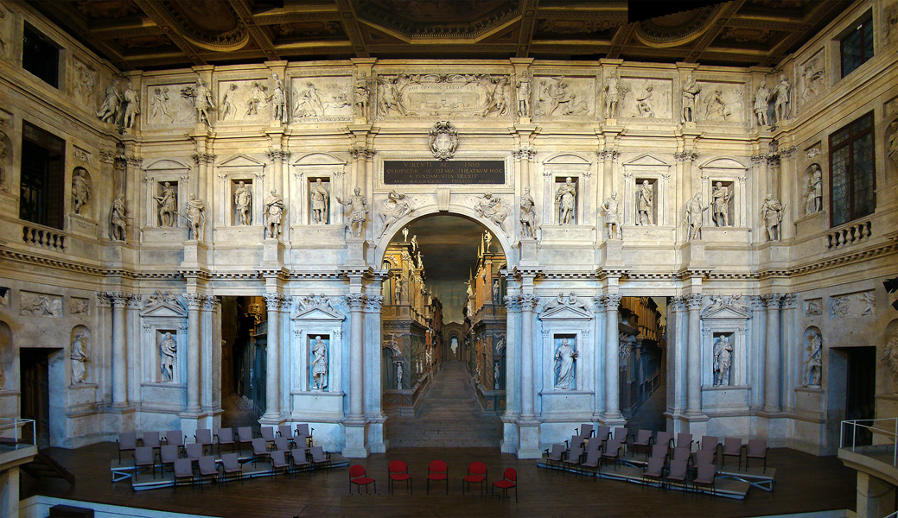
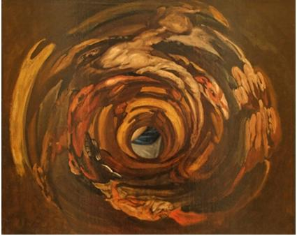

# Leçon 10 | 03 Février 1960

  

    <label><input type="checkbox" data-lacan-toggle="original" checked> 原文</label>
    <label><input type="checkbox" data-lacan-toggle="notes" checked> 注释</label>
    <label><input type="checkbox" data-lacan-toggle="commentary" checked> 个人解读评论</label>
  

  <form class="lacan-tool-search" role="search">
    <input class="lacan-tool-search-input" type="search" placeholder="搜索全文" aria-label="搜索全文">
    <button class="lacan-tool-button" type="submit" title="搜索">搜索</button>
  </form>
  <button class="lacan-tool-button lacan-back-to-top" type="button" title="回到页面最上方" aria-label="回到页面最上方">↑</button>

<section class="parallel-paragraph" data-paragraph-ids="s7-10-0001">

s7-10-0001

原文 · s7-10-0001

Je crois que, tout bien considéré, je ne suis pas ce matin dans des conditions d’emportement qui, selon mes propres critères, me paraissent suffisantes à ce que je vous fasse mon séminaire comme à l’ordinaire, et ceci plus particulièrement concernant le point où nous sommes arrivés, que je désire pouvoir poser devant vous des formules tout à fait précises.

[无对应译文]

</section>

<section class="parallel-paragraph" data-paragraph-ids="s7-10-0002">

s7-10-0002

原文 · s7-10-0002

Vous me permettrez donc d’*atermoyer* à la prochaine fois. La coupure de mon absence pendant quinze jours tombe évidemment mal puisque j’aurais aimé qu’après vous avoir traité ce que j’ai annoncé la dernière fois devant vous comme d’une forme exemplaire, d’un paradigme de la fonction de *l’amour courtois* en tant que forme exemplaire de *sublimation* très proche de l’art, puisqu’en somme nous n’en avons des témoignages documentaires qu’essentiellement par l’art, mais qui néanmoins a l’intérêt d’être quelque chose dont nous sentons encore maintenant les *retentissements éthiques*.

[无对应译文]

</section>

<section class="parallel-paragraph" data-paragraph-ids="s7-10-0003">

s7-10-0003

原文 · s7-10-0003

Si nous n’avons plus de *l’amour courtois* que des témoignages documentaires de l’art, sous une forme qui est presque morte, mis à part l’intérêt très vif, archéologique, que nous pouvons y porter, il est tout à fait certain, et d’ailleurs manifeste, et je vous le montrerai aussi d’une façon visible, sensible - que *les retentissements éthiques dans les rapports entre les sexes sont encore sensibles*. C’est l’intérêt de cet exemple : de cette longue portée d’un phénomène qu’on pourrait croire localisé à un problème presque d’esthétique, et dont nous pouvons voir que les effets sont d’une nature qui est tout à fait propre à nous rendre sensible ce qu’en somme l’analyse a porté au premier plan, comme étant l’important, de la sublimation. Ceci est donc le point que nous essaierons de *formuler*, et pour lequel je désire avoir toute ma forme pour pouvoir vous montrer comment le problème se pose historiquement, comment il se pose en méthode.

[无对应译文]

</section>

<section class="parallel-paragraph" data-paragraph-ids="s7-10-0004">

s7-10-0004

原文 · s7-10-0004

Et, là encore, nous nous trouvons en posture d’éclairer des difficultés qui sont posées d’une façon manifeste, avouée, aux historiens, romanistes, philologues, aux spécialistes qui se sont attachés à ce problème et qui, d’un commun aveu, reconnaissent que ce phénomène de *l’amour courtois* se présente comme quelque chose qu’ils ne sont d’aucune façon parvenus à réduire, dans son apparition historique, à aucun conditionnement repéré.

[无对应译文]

</section>

<section class="parallel-paragraph" data-paragraph-ids="s7-10-0005">

s7-10-0005

原文 · s7-10-0005

L’aveu est véritablement commun, et je dirai presque uniforme. Il y a là un phénomène qui est paradoxal. Et comme de bien entendu, comme chaque fois qu’on se trouve en présence d’un phénomène de cet ordre, cela a souvent porté les chercheurs à la recherche des influences, ce qui est dans bien des cas une façon de reporter le problème. Le problème a sa source dans la communication de quelque chose qui s’est produit « *à côté »*. Encore faut-il savoir comment ça s’est produit « *à côté »*. Mais précisément dans ce cas, c’est bien ce qui *échappe*, et la notion de recours aux influences \- nous y ferons allusion - est aussi bien quelque chose qui là est loin d’avoir éclairci le problème. C’est dans son cœur que nous essaierons de le prendre, et nous verrons que la théorie freudienne est de nature à apporter une certaine lumière. À ce titre donc, c’est non seulement pour *sa valeur d’exemple* que je le prends, mais pour *sa valeur de méthode*.

[无对应译文]

</section>

<section class="parallel-paragraph" data-paragraph-ids="s7-10-0006">

s7-10-0006

原文 · s7-10-0006

Ce point, très localisé, ne veut pas dire que, concernant *la sublimation*, tout soit à considérer dans la ligne qui est ici ouverte, à savoir *la sublimation* à proprement parler de quelque chose qui se situe dans la ligne du rapport homme-femme, du rapport du couple. Ce n’est pas là quelque chose à quoi je prétends réduire le problème de la sublimation, voire même pas tellement le centrer. Et je crois qu’à partir de cet exemple, c’est capital pour arriver à une formule générale dont nous avons l’amorce déjà dans FREUD, et nous savons où le lire, je ne dis pas chercher tel ou tel détail.

[无对应译文]

</section>

<section class="parallel-paragraph" data-paragraph-ids="s7-10-0007">

s7-10-0007

原文 · s7-10-0007

Si je procède quelquefois en mettant en valeur presque une phrase, une formule isolée de FREUD, et j’allais presque dire un élément gnomique, cet élément gnomique, je suis, pour moi, très conscient d’essayer de le mettre en action. Quand je vous donne des formules comme « *Le désir de l’homme est le désir de l’Autre* », c’est à proprement parler une formule gnomique, bien que FREUD ne l’ait pas cherchée comme telle. Mais il l’a fait de temps en temps sans le faire exprès.

[无对应译文]

</section>

<section class="parallel-paragraph" data-paragraph-ids="s7-10-0008">

s7-10-0008

原文 · s7-10-0008

Ainsi une formule très courte que je vous ai rapportée un jour, qui rapproche les mécanismes respectifs de *l’hystérie*, de *la névrose* *obsessionnelle* et de *la paranoïa*, de ces trois termes de sublimation : *l’art*, *la religion* et *la science* - à un autre endroit il rapproche la paranoïa du discours scientifique - sera de nature à nous montrer dans toute sa généralité la formule dans laquelle, au dernier terme, nous arriverons à poser *la fonction de la sublimation*, pour autant que j’essaye devant vous de l’ordonner dans cette référence à *la Chose*, cette *Chose* qui se trouve dans les exemples très élémentaires, presque de nature de *la démonstration philosophique classique* à l’aide du tableau noir et du bout de craie, que j’ai pris la dernière fois dans *l’exemple du vase*.

[无对应译文]

</section>

<section class="parallel-paragraph" data-paragraph-ids="s7-10-0009">

s7-10-0009

原文 · s7-10-0009

C’était pour vous montrer quelque chose d’en quelque sorte schématique qui vous permette de saisir où se situe *la Chose* dans le rapport *qui met l’homme en fonction de médium*, si l’on peut dire, *entre le réel* *et le signifiant.* Cette *Chose*, dont toutes les formes créées par l’homme sont du registre de la sublimation, *cette Chose sera toujours en quelque sorte représentée par un vide, précisément en ceci qu’elle ne peut pas être représentée par autre chose*. *Ou plus exactement, qu’elle ne peut qu’être représentée par autre chose*. Mais dans toute forme de sublimation le vide sera déterminatif. D’ores et déjà je vous indique trois modes différents selon lesquels *l’art*, *la religion* et *le discours de la science* se trouvent avoir affaire avec ceci.

[无对应译文]

</section>

<section class="parallel-paragraph" data-paragraph-ids="s7-10-0010">

s7-10-0010

原文 · s7-10-0010

Nous dirons que d’une certaine façon, tout *art*...

[无对应译文]

</section>

<section class="parallel-paragraph" data-paragraph-ids="s7-10-0011">

s7-10-0011

原文 · s7-10-0011

> et après tout je ne crois pas que ce soit là une formule qui soit vaine quelle que soit sa généralité,
>
> pour diriger ceux qui s’intéressent à l’élucidation des problèmes de l’art

[无对应译文]

</section>

<section class="parallel-paragraph" data-paragraph-ids="s7-10-0012">

s7-10-0012

原文 · s7-10-0012

...se caractérise, en somme, par une certaine manière, un certain mode d’organisation autour de ce vide. Je pense avoir les moyens de l’illustrer pour vous de façons multiples et très sensibles.

[无对应译文]

</section>

<section class="parallel-paragraph" data-paragraph-ids="s7-10-0013">

s7-10-0013

原文 · s7-10-0013

La *religion* - *je ne vous dit pas que ce soit les formules auxquelles je m’arrêterai au dernier terme, quand nous aurons parcouru, exploré ensemble* *ce chemin* - consiste dans tous les modes, si nous forçons la note dans le sens de l’analyse freudienne, d’éviter ce vide. Pour autant que FREUD a mis en relief *les traits obsessionnels* du comportement religieux, nous pouvons dire cela. Il est clair qu’encore qu’en effet toute une phase cérémonielle de ce qui constitue le corps des comportements religieux, entre dans ce cadre, nous ne saurions pleinement nous satisfaire de ceci et qu’un mot comme « *respecter* » *ce vide* est bien quelque chose qui nous semblerait peut-être aller plus loin. Vous voyez que, de toute façon *le vide* reste au centre, et c’est précisément en ceci qu’il s’agit de *sublimation*.

[无对应译文]

</section>

<section class="parallel-paragraph" data-paragraph-ids="s7-10-0014">

s7-10-0014

原文 · s7-10-0014

Et je dirai que, pour le troisième terme, à savoir *le* *discours de la science*, en tant qu’il est originé dans *le discours de la sagesse, le discours de la philosophie* pour notre tradition, c’est à proprement parler dans quelque chose où prend sa pleine valeur *le terme* qu’a employé FREUD quand il s’agissait de la fonction de *la paranoïa* par rapport à la réalité psychique, ce terme que j’ai souligné pour vous au passage dans un de mes derniers séminaires, qui s’appelle *Unglauben*. L’*Unglauben* n’est pas la négation de la phénoménologie du *Glauben*, de la *croyance*, ce n’est pas non plus quelque chose sur quoi FREUD soit revenu d’une façon qui soit en quelque sorte englobante et définitive.

[无对应译文]

</section>

<section class="parallel-paragraph" data-paragraph-ids="s7-10-0015">

s7-10-0015

原文 · s7-10-0015

Néanmoins ceci parcourt toute son œuvre. Nous voyons l’extrême importance qu’il donne à cette fonction au niveau de l’*Entwurf*. Et en fin de compte *la phénoménologie de la croyance* est bien ce qui pour lui sera resté, jusqu’au terme, une *obsession*. Aussi bien, *Moïse et le monothéisme* est tout entier construit pour nous expliquer les phénomènes fondamentaux de la croyance.

[无对应译文]

</section>

<section class="parallel-paragraph" data-paragraph-ids="s7-10-0016">

s7-10-0016

原文 · s7-10-0016

Il y a quelque chose de plus *profond*, de plus *dynamiquement significatif* pour nous, c’est le phénomène de *l’incroyance* - qui n’est pas la suppression de la dimension de *la croyance -* qui est un mode propre de rapport de l’homme à son monde et à la vérité, celui dans lequel il subsiste.

[无对应译文]

</section>

<section class="parallel-paragraph" data-paragraph-ids="s7-10-0017">

s7-10-0017

原文 · s7-10-0017

Là-dessus, vous auriez bien tort de vous fier à des oppositions sommaires et de penser *que l’histoire a connu des virages sensationnels* - que le passage de l’âge théocratique à cette « *forme* *humaniste* » comme on s’exprime, aux *formes dites de* « *libération de l’individu* » et de la réalité - que *la conception du monde* soit ici quelque chose de décisif. Il ne s’agit pas dans cette occasion, de quoi que ce soit qui ressemble à une *Weltanschauung* quelconque qui serait la mienne, et que j’essaierais de vous communiquer. Je ne suis ici qu’à titre d’indicateur et de bibliographe, pour vous aider à vous repérer dans ce qu’on peut trouver sur ce sujet de plus sérieux comme repères à partir de gens qui, chacun dans leur spécialité, sont doués de quelques capacités de réflexion.

[无对应译文]

</section>

<section class="parallel-paragraph" data-paragraph-ids="s7-10-0018">

s7-10-0018

原文 · s7-10-0018

Pour vous permettre de remettre les choses au point, je vous conseillerai de vous référer ici à l’œuvre d’un historien, Lucien FEBVRE qui dans une collection très accessible, a écrit sous le titre du « *Problème de l’incroyance au* *XVIème siècle »* [^26] quelque chose qui est de nature à vous montrer comment un emploi sain des méthodes historiques nous permet de poser, d’une façon plus nuancée qu’il n’est coutume, les questions *des modes d’évolution de la pensée* concernant les problèmes de la foi.

[无对应译文]

</section>

<section class="parallel-paragraph" data-paragraph-ids="s7-10-0019">

s7-10-0019

原文 · s7-10-0019

Vous lirez aussi si vous en avez le temps - et si vous désirez lire des choses qui sont somme toute assez plaisantes - une sorte de petit livre annexe, encore que ce ne soit pas une thèse secondaire, qui vient très bien - comme une petite barque accrochée à un navire - dans le sillage du premier, qui s’appelle *Autour de l’Heptaméron*, du même auteur.

[无对应译文]

</section>

<section class="parallel-paragraph" data-paragraph-ids="s7-10-0020">

s7-10-0020

原文 · s7-10-0020

[无对应译文]

</section>

<section class="parallel-paragraph" data-paragraph-ids="s7-10-0021">

s7-10-0021

原文 · s7-10-0021

Il s’agit de Marguerite De NAVARRE - dont j’espère que personne d’entre vous ne la confond avec la reine Margot, car quelquefois cela arrive - qui n’est pas simplement un auteur libertin, mais qui se trouve avoir écrit quelque traité mystique, chose qui n’est pas faite, bien sûr, pour provoquer l’étonnement de l’historien. Mais l’historien se penche sur ce problème, essaye de nous montrer dans le contexte du temps, et dans le contexte psychologique de l’auteur, ce que peuvent bien signifier ces recueils de contes qui s’appellent *L’Heptaméron* [^27].

[无对应译文]

</section>

<section class="parallel-paragraph" data-paragraph-ids="s7-10-0022">

s7-10-0022

原文 · s7-10-0022

Et ceci est aussi de nature à nous permettre de le lire avec, on ne peut pas dire même un œil plus éclairé, mais avec un œil qui ne censure pas ce qu’il y a littéralement dans *L’Heptaméron*, à savoir les réflexions de chacun des personnages après chacun des récits qui sont censés être vrais, qui le sont sûrement pour la plus grande part. La façon dont les interlocuteurs en parlent, c’est-à-dire dans un registre de réflexion morale et même formellement religieuse, est généralement censurée parce qu’il est considéré au départ que ceci n’est que de la sauce. Mais c’est justement ce sur quoi il convient de ne pas se tromper, c’est que toujours la sauce est l’essentiel dans un plat. Lucien FEBVRE nous apprend à lire *L’Heptaméron*. À la vérité, si nous savions lire, nous n’aurions pas besoin de lui.

[无对应译文]

</section>

<section class="parallel-paragraph" data-paragraph-ids="s7-10-0023">

s7-10-0023

原文 · s7-10-0023

Ce problème de l’incroyance, c’est-à-dire des fonctions mêmes qu’elle représente dans notre perspective, est éclairé en ceci qu’il y a là une position du discours qui se conçoit très précisément en rapport avec *la Chose* telle que nous l’avons définie, pour autant précisément que *la Chose* est rejetée au sens propre de la *Verwerfung*. De même donc :

[无对应译文]

</section>

<section class="parallel-paragraph" data-paragraph-ids="s7-10-0024">

s7-10-0024

原文 · s7-10-0024

- que *dans l’art* il y a une forme d’une *Verdrängung*, un refoulement de *la Chose*,

[无对应译文]

</section>

<section class="parallel-paragraph" data-paragraph-ids="s7-10-0025">

s7-10-0025

原文 · s7-10-0025

- que *dans la religion*, on peut dire qu’il y a peut-être une *Verschiebung*,

[无对应译文]

</section>

<section class="parallel-paragraph" data-paragraph-ids="s7-10-0026">

s7-10-0026

原文 · s7-10-0026

- c’est à proprement parler de *Verwerfung* qu’il s’agit dans *le discours de la science* qui, si l’on peut dire, *rejette* la perspective et *la présence de la Chose*.

[无对应译文]

</section>

<section class="parallel-paragraph" data-paragraph-ids="s7-10-0027">

s7-10-0027

原文 · s7-10-0027

Et *le discours de la science*, en somme, est de nous profiler *l’idéal* dans sa perspective du « *savoir absolu* », c’est-à-dire de *quelque chose* qui pose *la Chose* quand même, tout en n’en faisant pas état, et dont chacun sait que c’est cette perspective qui s’avoue en fin de compte, et s’avère dans l’histoire, comme représentant un échec.

[无对应译文]

</section>

<section class="parallel-paragraph" data-paragraph-ids="s7-10-0028">

s7-10-0028

原文 · s7-10-0028

Ce discours de la science peut se profiler comme déterminé par cette *Verwerfung*. C’est probablement cela qui, selon la formule que je vous donne, que « *Ce qui est rejeté dans le symbolique reparaît dans le réel* », la science se trouve déboucher sur une perspective où c’est bien tout de même quelque chose d’aussi énigmatique que *la Chose* qui s’avère se profiler, apparaître au terme de la physique. Donc je remets à la prochaine fois de partir de mon paradigme concernant *l’amour courtois* en tant qu’exemple d’une sublimation de l’art qui est manifeste.

[无对应译文]

</section>

<section class="parallel-paragraph" data-paragraph-ids="s7-10-0029">

s7-10-0029

原文 · s7-10-0029

Nous pouvons en trouver encore les effets vivants. Nous les suivrons après que je sois revenu de mon absence, sous leurs formes consécutives. Nous essaierons de piquer un échantillonnage de ce que cela conserve comme traces, comme effets indiscutables, comme effets de la construction signifiante primitive qui est déterminante dans le phénomène de *l’amour courtois*, et nous essaierons à reconnaître, dans les faits, quelque chose qui n’est d’aucune autre façon explicable que par le recours à cette origine.

[无对应译文]

</section>

<section class="parallel-paragraph" data-paragraph-ids="s7-10-0030">

s7-10-0030

原文 · s7-10-0030

Voilà tout au moins ce qui vous permettra de trouver quelques repères profilés devant vous de la forme de notre progrès. Je vous fais remarquer en passant - puisqu’aussi bien je me livre à une espèce de petit commentaire en marge - que cette notion de *la Chose* que je vous apporte cette année comme une élaboration nouvelle, vous auriez tort de croire qu’elle ne fut point là *immanente* à ce que nous avons commencé d’aborder les années précédentes.

[无对应译文]

</section>

<section class="parallel-paragraph" data-paragraph-ids="s7-10-0031">

s7-10-0031

原文 · s7-10-0031

Et puisqu’aussi bien, certains, quelquefois, s’interrogent de certaines propriétés de ce qu’on appelle mon style, je dois vous faire remarquer que, par exemple le terme « *La Chose Freudienne* »[^28] - que j’ai donnée comme titre à une chose que j’ai écrite et à laquelle il ne serait pas mauvais que vous vous reportiez - a étonné, parce que bien entendu, quand on commence philosophiquement à commenter mes intentions, il arrive par exemple qu’on les fasse entrer dans ce quelque chose qui pendant un temps fut très *à la mode*, c’est à savoir de « *combattre la réification* ».

[无对应译文]

</section>

<section class="parallel-paragraph" data-paragraph-ids="s7-10-0032">

s7-10-0032

原文 · s7-10-0032

À la vérité, je n’ai jamais rien dit de pareil. En tout cas on peut toujours enrouler des intentions autour d’un discours. Il est bien clair que si je l’ai fait c’est à dessein, et que si vous voulez bien relire ce texte, vous vous apercevrez que c’est très essentiellement de cette *Chose* que je parle d’une façon qui, évidemment, est à la source du *malaise incontestable* que ce texte a produit alors, à savoir que c’est *la Chose* qu’à plusieurs moments de ce texte, *je fais parler*.

[无对应译文]

</section>

<section class="parallel-paragraph" data-paragraph-ids="s7-10-0033">

s7-10-0033

原文 · s7-10-0033

Je voudrais maintenant que notre réunion puisse servir tout de même un peu plus à ceux qui se sont déplacés de plus ou moins loin. Il est possible, il me semble même probable, que certains d’entre vous - à ce point où nous sommes parvenus de mon séminaire - puissent avoir quelques questions à me poser, ou quelques réponses à me proposer, je veux dire me témoigner de ce que pour eux signifie tel ou tel point de mon exposé.

[无对应译文]

</section>

<section class="parallel-paragraph" data-paragraph-ids="s7-10-0034">

s7-10-0034

原文 · s7-10-0034

Je sais bien qu’il n’est jamais commode de rompre le silence d’un rassemblement pour prendre la parole et agiter le grelot, je laisse donc cette formule que vous pouvez me poser une question écrite. Cela n’a qu’un inconvénient, c’est que moi je serai libre de la lire comme je voudrai, mais cela pourrait peut-être donner l’occasion de « *remettre les points sur les i* » à propos de tel ou tel terme.

[无对应译文]

</section>

<section class="parallel-paragraph" data-paragraph-ids="s7-10-0035">

s7-10-0035

原文 · s7-10-0035

Nous allons en même temps nous occuper à quelque chose d’inattendu qui ne me paraît pas mal. Une partie d’entre vous était hier à la « *séance scientifique »* et je ne sais pas comment elle s’est terminée. J’ai dû partir après avoir moi-même répondu abondamment aux conférenciers pour qui j’ai la plus grande affection et leur avoir témoigné tout l’intérêt que j’avais pris à leur travail. Ils sont ici aujourd’hui et j’aimerais demander à SMIRNOV quelques explications. Pourquoi, nous ayant parlé du « *No and yes* », avez-vous mis le « *yes* » complètement dans votre poche ?

[无对应译文]

</section>

<section class="parallel-paragraph" data-paragraph-ids="s7-10-0036">

s7-10-0036

原文 · s7-10-0036

Victor SMIRNOFF

[无对应译文]

</section>

<section class="parallel-paragraph" data-paragraph-ids="s7-10-0037">

s7-10-0037

原文 · s7-10-0037

Cela s’appelle « *No and yes* » mais cela ne devrait pas s’appeler ainsi parce que je pense que la formulation du « *yes* » dans le texte est d’une *pauvreté d’élaboration* telle que ce n’était même pas la peine d’en parler. Cela ne servait vraiment pas à son propos. Je ne sais pas pourquoi il s’est laissé entraîner à faire un livre qui s’appelle « *No and yes* » alors que sur le « *yes* » il n’avait strictement rien à dire. Quand il cherche le moteur du « *yes* » il le fait en se forçant. Il dit : « *C’est parce qu’il y a un pattern moteur du non* ». Il le cherchait dans les relancements de l’affect au moment de la pulsion et il l’a isolé à mon avis très artificiellement.

[无对应译文]

</section>

<section class="parallel-paragraph" data-paragraph-ids="s7-10-0038">

s7-10-0038

原文 · s7-10-0038

Si je n’en ai pas parlé, c’est parce que je trouve que cela ne sert à rien et qu’en plus cela diminue beaucoup *la valeur de ce qu’il a dit*. Je n’ai pas du tout l’impression que vous avez été très tendre pour SPITZ. Je crois que vous avez même été très sévère, parce qu’après tout il y a peut-être un point de vue. Il est très embarrassé sur le *yes* en disant qu’il apparaît que tout est un geste pour commencer, que même son « *rooting affect* » est dans un mouvement d’appétition et de recherche d’un « *oui* », d’une pulsion à laquelle il donne un sens de « *oui initial* », et que le « *non* » apparaît secondairement.

[无对应译文]

</section>

<section class="parallel-paragraph" data-paragraph-ids="s7-10-0039">

s7-10-0039

原文 · s7-10-0039

LACAN

[无对应译文]

</section>

<section class="parallel-paragraph" data-paragraph-ids="s7-10-0040">

s7-10-0040

原文 · s7-10-0040

Pour ceux qui ne connaissent pas ce texte, il s’agit de ceci. Du fait que SPITZ, qui a offert un livre qui se situe dans la chaîne de toute une série d’autres travaux qui sont fondés sur l’observation directe de l’enfant nouveau-né, très exactement de l’enfant *infans*, c’est-à-dire jusqu’à la limite de l’apparition du langage articulé comme tel, a prétendu, à l’intérieur de ceci, retrouver en transcrivant le *pattern* du « *non* » comme *geste*, en tant que forme sémantique, dans un certain nombre de manifestations, dans le *rooting* d’abord...

[无对应译文]

</section>

<section class="parallel-paragraph" data-paragraph-ids="s7-10-0041">

s7-10-0041

原文 · s7-10-0041

> *rooting* voulant dire le geste d’oscillation que l’enfant fait dans l’approche du sein, *rooting* est très difficile
>
> à traduire, il est très difficile de trouver un équivalent, il y a dans le texte un corrélatif, le mot *snot*, *museau*,
>
> à côté de *rooting*, qui montre bien ce dont il s’agit

[无对应译文]

</section>

<section class="parallel-paragraph" data-paragraph-ids="s7-10-0042">

s7-10-0042

原文 · s7-10-0042

...c’est ce geste qui est évoqué dans sa plénitude de possibilités significatives.

[无对应译文]

</section>

<section class="parallel-paragraph" data-paragraph-ids="s7-10-0043">

s7-10-0043

原文 · s7-10-0043

Hier, SMIRNOFF s’est attaché à nous montrer que SPITZ ici doit faire rentrer des fonctions, rentrant ailleurs à propos de ce qui se passe dans la frustration qui accompagne le non de l’adulte, que ce qui surgit c’est quelque chose qui est très loin de se présenter originellement comme ayant sa signification, puisque enfin, au dernier terme - je vous passe les autres formes dans lesquelles se manifeste ce geste latéral de la tête - c’est en somme *du geste d’approche, d’attente de la satisfaction* qu’il s’agit ici, mis en accusation.

[无对应译文]

</section>

<section class="parallel-paragraph" data-paragraph-ids="s7-10-0044">

s7-10-0044

原文 · s7-10-0044

Pourquoi ne nous avez-vous pas mis en valeur que SPITZ - pour lequel je suis loin d’être sévère parce que c’est sa défense que je prends - nous articule puissamment - je ne dis pas qu’il ait raison mais c’est très fort, plein de relief - c’est à savoir qu’il va jusqu’à considérer le phénomène comme ce qui se passe dans une névrose traumatique. Il nous dit, c’est le dernier souvenir avant la réaction catastrophique qui surgit. Je vous ai embarrassé pour nous évoquer les autres travaux de SPITZ, à savoir sa fiction de la *Primal cavity*, mais à tout le moins sa référence à l’écran du rêve.

[无对应译文]

</section>

<section class="parallel-paragraph" data-paragraph-ids="s7-10-0045">

s7-10-0045

原文 · s7-10-0045

Vous avez également - à moins que ce ne soit LAPLANCHE - posé la question de l’idée qu’il se faisait, qui en effet n’est pas du tout précisée, je veux dire que rien n’est articulé dans le sens de l’utilisation d’un mode de réaction d’un stade antérieur, dans une certaine situation qui est une situation critique, qui me paraît une idée très féconde et toujours à mettre en valeur.

[无对应译文]

</section>

<section class="parallel-paragraph" data-paragraph-ids="s7-10-0046">

s7-10-0046

原文 · s7-10-0046

Loin de l’articuler de cette façon générale, il semble réduit à faire intervenir un mécanisme aussi passif que celui de la névrose traumatique. Il implique donc,d’une façon en quelque sorte nécessaire, antérieurement quelque frustration du nourrissage, et l’on s’étonne comment d’une façon isolée, à propos d’un cas, ce souvenir de la réaction immédiatement antérieure à quelque chose qu’on doive supposer être le refus, le retrait du sein, à ce qui l’antécède immédiatement, à savoir à l’acte de *rooting* qui resterait donc inscrit comme une trace. C’est comme cela qu’il l’articule.

[无对应译文]

</section>

<section class="parallel-paragraph" data-paragraph-ids="s7-10-0047">

s7-10-0047

原文 · s7-10-0047

Victor SMIRNOFF

[无对应译文]

</section>

<section class="parallel-paragraph" data-paragraph-ids="s7-10-0048">

s7-10-0048

原文 · s7-10-0048

Pour le « *no* », il passe par un autre moment. Il dit que le *rooting*, précisément, est insuffisant à expliquer le « *no* », et c’est à ce moment qu’il introduit un stade intermédiaire. C’est plus tard : le sevrage autour de six mois, que se place d’une manière traumatique, ce qui retrouve cela, c’est un *pattern* par l’intermédiaire de quelque chose qui est déjà chargé d’un affect de retour, de détournement sinon volontaire mais intentionnel de l’acte. D’autre part il ne parle pas de régression.

[无对应译文]

</section>

<section class="parallel-paragraph" data-paragraph-ids="s7-10-0049">

s7-10-0049

原文 · s7-10-0049

LACAN

[无对应译文]

</section>

<section class="parallel-paragraph" data-paragraph-ids="s7-10-0050">

s7-10-0050

原文 · s7-10-0050

Le mécanisme de la névrose traumatique est nommément comme étant caractérisé par le fait que, dans une séquence fondamentale de névrose traumatique comme telle, c’est le dernier souvenir vivant de la chaîne qui subsiste. À quel moment selon vous le fait-il entrer en jeu dans sa dialectique, alors qu’il s’agit très précisément à ce niveau-là du « *no* » ?

[无对应译文]

</section>

<section class="parallel-paragraph" data-paragraph-ids="s7-10-0051">

s7-10-0051

原文 · s7-10-0051

Jean LAPLANCHE

[无对应译文]

</section>

<section class="parallel-paragraph" data-paragraph-ids="s7-10-0052">

s7-10-0052

原文 · s7-10-0052

Si mon souvenir est exact, ce n’est pas dans l’acquisition du « *non* » mais du « *oui* », du « *geste du oui* ». Il donne du « *geste du oui* » deux exemples, deux précurseurs : d’une part *le geste de la tétée* au moment même de la consommation, c’est-à-dire cette espèce de geste d’arrière en avant, et d’autre part lorsqu’il y a retrait du mamelon. Vers l’âge de trois mois, il dit qu’il observe également un mouvement de la tête d’arrière en avant. C’est à propos de l’acquisition du oui. Et c’est pour le passage du premier au second de ces gestes qu’il fait appel à ce mécanisme de retour, à l’image précédant immédiatement la frustration.

[无对应译文]

</section>

<section class="parallel-paragraph" data-paragraph-ids="s7-10-0053">

s7-10-0053

原文 · s7-10-0053

Pour le « *non* » il ne fait pas du tout appel à la régression. La régression, il la fait intervenir dans le geste latéral, que pour les mouvements céphaliques négatifs, pour quelque chose de pathologique. La reprise du *rooting* dans le geste du « *non* » est une reprise d’un mécanisme qui est là, mais ce n’est pas une régression, c’est l’utilisation d’un *pattern* qui existe et qui est remis, réactivé, par *l’identification* avec le non de la mère. Mais ce n’est pas une régression.

[无对应译文]

</section>

<section class="parallel-paragraph" data-paragraph-ids="s7-10-0054">

s7-10-0054

原文 · s7-10-0054

Xavier AUDOUARD

[无对应译文]

</section>

<section class="parallel-paragraph" data-paragraph-ids="s7-10-0055">

s7-10-0055

原文 · s7-10-0055

*Das Ding* a pour nature d’être oublié, d’être en même temps *facteur d’oubli et facteur de réminiscence* au sens platonicien du terme. Ne pensez-vous pas que ce soit par le truchement d’une sorte de réification de cette pure origine de cet « *ou bien*... *ou bien*... » de toute médiation et de toute culture ?

[无对应译文]

</section>

<section class="parallel-paragraph" data-paragraph-ids="s7-10-0056">

s7-10-0056

原文 · s7-10-0056

La question que je me pose c’est : pourquoi alors ne pas parler plutôt de *toutes les formes de la médiation*, les formes qu’on trouve dans la genèse, dans l’expérience de la conscience comme vous l’avez fait jusqu’ici semble-t-il ? Pourquoi, autrement dit, venir cette année nous parler de *das Ding* comme de quelque chose, alors que jusqu’ici vous avez sans cesse parlé de *das Ding* comme étant le facteur inévitable, le facteur nécessaire de toute expérience dans l’analyse ?

[无对应译文]

</section>

<section class="parallel-paragraph" data-paragraph-ids="s7-10-0057">

s7-10-0057

原文 · s7-10-0057

Cette année vous privilégiez *la Chose*, mais vous en parlez alors que vous n’avez parlé que de cela en parlant d’autre chose. Le problème que je me pose au fond est de savoir : premièrement, pourquoi vous nous parlez de *das Ding* au lieu de nous parler simplement de médiation ? Ou bien pourquoi vous nous parlez de *das Ding* au lieu de nous parler de toutes les formes de la médiation qu’elle reçoit dans notre expérience ? C’est le problème de la réification.

[无对应译文]

</section>

<section class="parallel-paragraph" data-paragraph-ids="s7-10-0058">

s7-10-0058

原文 · s7-10-0058

Est-ce qu’on ne pourrait pas en quelque sorte vous faire le reproche, moins simpliste que celui de tout à l’heure, de réification de ce qui est justement le ressort dynamisant de toute expérience, qui est à la fois facteur de toute réminiscence et quelque chose dont on ne peut pas parler ?

[无对应译文]

</section>

<section class="parallel-paragraph" data-paragraph-ids="s7-10-0059">

s7-10-0059

原文 · s7-10-0059

LACAN

[无对应译文]

</section>

<section class="parallel-paragraph" data-paragraph-ids="s7-10-0060">

s7-10-0060

原文 · s7-10-0060

Pour vous répondre tout de suite brièvement, et tout ce que je dirai par la suite ne sera que cette réponse, je crois que c’est important de voir comment, pour vous spécialement qui avez toujours entendu l’accent de ce qu’on peut appeler « *les réinterprétations hégéliennes de l’expérience analytique* », il est bien certain que la façon dont, au moment où ici nous nous mettons à aborder l’expérience freudienne comme éthique, c’est-à-dire dans sa dimension essentielle en fin de compte, puisqu’elle nous dirige dans une action qui est, étant thérapeutique, incluse, que nous le voulions ou non, dans le registre, dans les termes de l’éthique. Et que nous le voulions ou non !

[无对应译文]

</section>

<section class="parallel-paragraph" data-paragraph-ids="s7-10-0061">

s7-10-0061

原文 · s7-10-0061

Je veux dire que *moins* nous le voudrons, *plus* ce sera - comme l’expérience nous le montre - une forme d’analyse qui, se targuant d’un *cachet tout spécialement scientifique,* aboutit à des notions normatives qui sont à proprement parler celles dont je me plais quelquefois à parler en vous rappelant que la malédiction de Saint MATHIEU, de ceux qui lient des fardeaux encore plus lourds pour les faire porter par les épaules des autres, qui renforcent les catégories de la normativité affective dans une formulation qui a même des effets qui peuvent inquiéter.

[无对应译文]

</section>

<section class="parallel-paragraph" data-paragraph-ids="s7-10-0062">

s7-10-0062

原文 · s7-10-0062

Donc, il vaut bien mieux que nous nous rendions compte que nous essayons d’explorer cette *portée éthique*. Il est tout à fait clair que ce sur quoi reste mis l’accent, c’est ce quelque chose d’irréductible justement qu’il y a dans la tendance, quelque chose qui se propose à l’horizon d’une médiation comme ce que la réification n’arrive pas à inclure.

[无对应译文]

</section>

<section class="parallel-paragraph" data-paragraph-ids="s7-10-0063">

s7-10-0063

原文 · s7-10-0063

Mais à cerner *cette image vide, ce quelque chose dont nous faisons le tour*, voilà le point précis sur lequel vous me posez la question. La réponse, c’est l’intention délibérée de mettre en valeur *cette notion qui n’a jamais été absente* de ce que j’ai dit jusqu’à présent. Si vous vous reportez à ce que j’ai donné comme textes sur ce sujet, vous verrez qu’il n’y a pas d’ambiguïté, et qu’il ne saurait sûrement m’être imputé cette sorte de radicalisme hégélien qu’un imprudent m’a imputé quelque part dans *Les temps modernes*.

[无对应译文]

</section>

<section class="parallel-paragraph" data-paragraph-ids="s7-10-0064">

s7-10-0064

原文 · s7-10-0064

Je pense que vous voyez de quoi il s’agit exactement. C’est de cela que se séparait très nettement toute *la dialectique du désir* que j’ai développée devant vous - et qui commençait justement, au moment où l’imprudent écrivait cette phrase - et encore bien plus accentuée comme je suis en train de le situer pour vous cette année, et dont le caractère inévitable me paraît spécialement marqué dans l’effet de la sublimation.

[无对应译文]

</section>

<section class="parallel-paragraph" data-paragraph-ids="s7-10-0065">

s7-10-0065

原文 · s7-10-0065

X

[无对应译文]

</section>

<section class="parallel-paragraph" data-paragraph-ids="s7-10-0066">

s7-10-0066

原文 · s7-10-0066

La formule de la sublimation que vous avez donnée est d’« *élever l’objet à la dignité de la Chose* ». On peut entendre également ce qu’est *la Chose*, *l’objet* n’étant pas *la chose*. Au même séminaire il y avait également dans le discours, l’allusion à la bombe atomique, à un désastre, à une menace du *réel*. Il s’agit donc de cette *Chose qui ne semble pas être au départ, puisque la sublimation va nous y mener*. Personnellement, je me demande dans quelle mesure vous n’écartiez pas le rapport du *symbolique* et du *réel* que vous êtes en train de nous donner actuellement.

[无对应译文]

</section>

<section class="parallel-paragraph" data-paragraph-ids="s7-10-0067">

s7-10-0067

原文 · s7-10-0067

Et à propos de *la Chose*, l’exemple en tout cas que vous avez développé, l’histoire du vase et du vide qui était dedans,

[无对应译文]

</section>

<section class="parallel-paragraph" data-paragraph-ids="s7-10-0068">

s7-10-0068

原文 · s7-10-0068

je pose la question comme cela : *est-ce que das Ding*, *la Chose* dont il s’agit *est la chose* ? *Elle n’est pas au départ, puisque la sublimation va nous y mener*. Dans quelle mesure, cette *chose*, au départ, n’est pas le vide justement de *la Chose*, l’*absence de la Chose*, ou *la non-Chose*, le vide dans le pot, celui qui demande à être rempli comme vous disiez ?

[无对应译文]

</section>

<section class="parallel-paragraph" data-paragraph-ids="s7-10-0069">

s7-10-0069

原文 · s7-10-0069

Je pose la question de savoir si cette chose n’est pas tout à fait une chose, mais au contraire *la non-Chose* que, par *la sublimation*, on va arriver à voir comme étant une chose. Et puis dans quelle mesure justement il n’y a pas là un nœud fondamental qui est le *symbolique* par excellence, dans justement le vide de chose qui est non seulement une notion, mais quelque chose de plus radical qu’une notion *symbolique* du rapport du signifiant à *la Chose*.

[无对应译文]

</section>

<section class="parallel-paragraph" data-paragraph-ids="s7-10-0070">

s7-10-0070

原文 · s7-10-0070

Je fais également appel à d’autres formulations. Le *trou dans le réel* que vous venez de dire quand vous avez commenté le texte de SHAKESPEARE. À partir de certains moments le vide est toujours plein, et il y a des *trous dans le réel*. Le *trou dans le réel* est vraiment là la notion *symbolique*. Il y avait le rapport du *symbolique* à la réalité, justement là où on peut voir qu’il y a des *trous dans le réel*, et je me demande dans quelle mesure *la non-Chose*, ou ce vide de *la Chose* primordiale, n’est pas justement ce qui définirait à proprement parler le rejet ou la forclusion.

[无对应译文]

</section>

<section class="parallel-paragraph" data-paragraph-ids="s7-10-0071">

s7-10-0071

原文 · s7-10-0071

Je pose également la question de savoir si l’on n’est pas là au niveau où une saisie, une compréhension d’une façon plus *universelle* de la manière adéquate de saisir le rapport du *symbolique* au *réel* et de *la Chose* à *la non-Chose* comme étant primordial dans l’esprit, est possible.

[无对应译文]

</section>

<section class="parallel-paragraph" data-paragraph-ids="s7-10-0072">

s7-10-0072

原文 · s7-10-0072

LACAN

[无对应译文]

</section>

<section class="parallel-paragraph" data-paragraph-ids="s7-10-0073">

s7-10-0073

原文 · s7-10-0073

Tout cela ne me paraît pas mal orienté. Il est clair que vous suivez toujours très bien les choses que je dis. Ce qu’il convient de repérer et d’entendre, c’est qu’en somme il y a quelque chose qui nous est offert, à nous analystes, si nous suivons la somme de notre expérience, si nous savons l’apprécier, c’est que cet effort de sublimation, dont vous dites qu’il tend à la fin à réaliser *la Chose*, ou à la sauver, c’est vrai et ce n’est pas vrai.

[无对应译文]

</section>

<section class="parallel-paragraph" data-paragraph-ids="s7-10-0074">

s7-10-0074

原文 · s7-10-0074

Je veux dire qu’il y a une illusion. La science, ni la religion ne sont de nature à la sauver ou à nous la donner. Néanmoins, c’est justement et précisément pour autant que l’encerclement de *la Chose*, le cercle enchanté qui nous sépare d’elle, est justement posé par notre rapport au signifiant.

[无对应译文]

</section>

<section class="parallel-paragraph" data-paragraph-ids="s7-10-0075">

s7-10-0075

原文 · s7-10-0075

C’est en tant que *la Chose est* - comme je vous l’ai dit - *ce qui du réel pâtit* de ce rapport fondamental, initial qui engage l’homme dans les voies *du signifiant*, du fait même qu’il est soumis à ce qui dans FREUD s’appelle le *principe du plaisir*, et dont il est tout à fait clair j’espère, maintenant, dans votre esprit, que ça n’est pas autre chose que cela, c’est cette dominante du signifiant, et le véritable *principe du plaisir* tel qu’il joue et s’organise dans FREUD.

[无对应译文]

</section>

<section class="parallel-paragraph" data-paragraph-ids="s7-10-0076">

s7-10-0076

原文 · s7-10-0076

C’est justement parce qu’en somme c’est l’effet de l’incidence du signifiant sur le réel psychique qui est en cause, que l’entreprise sublimatoire sous toutes ses formes n’est pas purement et simplement insensée. C’est qu’on répond avec ce qui est en jeu. Je voulais avoir pour aujourd’hui - pour vous le montrer à la fin du séminaire - un objet qui demande un long commentaire pour être compris, non pas pour être décrit, dans l’histoire de l’art.

[无对应译文]

</section>

<section class="parallel-paragraph" data-paragraph-ids="s7-10-0077">

s7-10-0077

原文 · s7-10-0077

Qu’on soit arrivé à la construction d’un objet pareil, et à y trouver du plaisir, c’est tout de même quelque chose qui n’est pas sans nécessiter quelques détours. Je vais vous le décrire. C’est un objet qu’on appelle un objet d’anamorphose. Je pense que beaucoup savent ce que c’est que l’anamorphose. C’est toute espèce de construction faite de telle sorte que, par une certaine transposition optique, une certaine forme qui au premier abord n’est même pas perceptible, se rassemble en image, se trouve ainsi lisible, satisfaisante pour l’expérience, *d’où le plaisir qui consiste à la voir surgir de quelque chose qui au premier abord est comme forme indéchiffrable*.

[无对应译文]

</section>

<section class="parallel-paragraph" data-paragraph-ids="s7-10-0078">

s7-10-0078

原文 · s7-10-0078

La chose est extrêmement répandue dans l’histoire de l’art. Il suffit d’aller au Louvre, vous verrez le tableau des ambassadeurs d’HOLBEIN. Et aux pieds de l’ambassadeur, fort bien constitué comme vous et moi, vous verrez sur le sol une espèce de forme allongée qui a à peu près la forme des oeufs sur le plat, qui se présente avec un aspect énigmatique.

[无对应译文]

</section>

<section class="parallel-paragraph" data-paragraph-ids="s7-10-0079">

s7-10-0079

原文 · s7-10-0079

Si vous ne savez pas qu’en vous plaçant sous un certain angle où le tableau lui–même disparaît sur son relief en raison des lignes de fuite de la perspective, vous voyez les choses se rassembler dans des formes dont je n’ai pas exactement à l’esprit lesquelles, il s’agit d’une tête de mort et de quelques autres insignes de la *Vanitas*, qui est un thème classique.

[无对应译文]

</section>

<section class="parallel-paragraph" data-paragraph-ids="s7-10-0080">

s7-10-0080

原文 · s7-10-0080

[无对应译文]

</section>

<section class="parallel-paragraph" data-paragraph-ids="s7-10-0081">

s7-10-0081

原文 · s7-10-0081

Ceci dans un tableau tout à fait bien, un tableau de commande des ambassadeurs d’Angleterre, qui ont dû être très contents de la peinture d’HOLBEIN, et ce qui était au bas a dû aussi beaucoup les amuser.

[无对应译文]

</section>

<section class="parallel-paragraph" data-paragraph-ids="s7-10-0082">

s7-10-0082

原文 · s7-10-0082

Ce phénomène, dites-vous que c’est daté. C’est au XVIème siècle et au XVIIème que les choses sont venues sur ce point à prendre l’aspect d’intérêt, et même d’acuité, de fascination, tel qu’il existe dans une chapelle - je ne sais plus si elle existe encore - construite sur l’ordre des jésuites au temps de DESCARTES, tout un mur de 18 mètres de long qui représente une scène de vie des saints ou de crèche, où la chose est tout à fait illisible si vous êtes à un point quelconque de cette salle, et où elle ne va se rassembler et être lisible qu’à partir d’un certain couloir où vous entrez, pour avoir accès à l’endroit, et où vous pouvez voir, dans un court instant si vous êtes en marche, se rassembler des lignes extraordinairement dispersées et qui vous donnent le corps de la scène.

[无对应译文]

</section>

<section class="parallel-paragraph" data-paragraph-ids="s7-10-0083">

s7-10-0083

原文 · s7-10-0083

L’anamorphose que je voulais vous apporter ici était beaucoup moins volumineuse. Elle appartient à l’homme des collections auquel j’ai fait allusion. Il s’agit d’un cylindre poli qui a l’air d’un miroir et qui joue la fonction de miroir, et autour duquel vous mettez une sorte de bavette, c’est-à-dire une surface plane qui l’entoure, sur laquelle vous avez également les mêmes lignes inintelligibles. Quand vous êtes sous un certain angle vous voyez surgir dans le miroir cylindrique l’image dont il s’agit, celle-là est une très belle anamorphose d’un tableau de la crucifixion, imité de RUBENS, et qui sort des lignes qui entourent le cylindre.

[无对应译文]

</section>

<section class="parallel-paragraph" data-paragraph-ids="s7-10-0084">

s7-10-0084

原文 · s7-10-0084

Cet objet nécessite, je vous l’ai dit, pour avoir été forgé, et pour avoir eu un sens nécessaire, toute une évolution préalable. Je dirai que derrière lui, il y a toute l’histoire de l’architecture, puis de la peinture, leur combinaison entre l’une et l’autre, l’impact, sous cette combinaison même, de quelque chose, pour parler d’une façon abrégée, qui fait *qu’on peut définir l’architecture primitive comme quelque chose d’organisé autour d’un vide*. *C’est le vrai sens de toute architecture* et c’est bien l’impression authentique que nous donnent les formes de l’architecture primitive, celles par exemple d’une cathédrale comme Saint-MARC à Venise.

[无对应译文]

</section>

<section class="parallel-paragraph" data-paragraph-ids="s7-10-0085">

s7-10-0085

原文 · s7-10-0085

Puis après, pour des raisons en somme tout à fait économiques, on se contente de faire des images de cette architecture, on apprend en quelque sorte à peindre l’architecture sur les murs de l’architecture. Et la peinture est d’abord quelque chose qui s’organise autour d’un vide. Et comme il s’agit avec ce moyen moins marqué dans la peinture de retrouver en somme *le vide sacré* de l’architecture, on essaye de faire quelque chose qui y ressemble de plus en plus, c’est-à-dire qu’on découvre la perspective.

[无对应译文]

</section>

<section class="parallel-paragraph" data-paragraph-ids="s7-10-0086">

s7-10-0086

原文 · s7-10-0086

Le stade suivant est paradoxal et bien amusant et montre comment on s’étrangle soi-même avec ses propres nœuds. C’est qu’à partir du moment où l’on a découvert *la perspective dans la peinture*, on a fait une architecture qui se soumet à *la perspective de la peinture*. L’art de PALLADIO par exemple rend ceci tout à fait sensible.

[无对应译文]

</section>

<section class="parallel-paragraph" data-paragraph-ids="s7-10-0087">

s7-10-0087

原文 · s7-10-0087

Vous n’avez qu’à aller voir le théâtre de PALLADIO à Vicence, qui est un petit chef d’œuvre dans son genre.

[无对应译文]

</section>

<section class="parallel-paragraph" data-paragraph-ids="s7-10-0088">

s7-10-0088

原文 · s7-10-0088

[无对应译文]

</section>

<section class="parallel-paragraph" data-paragraph-ids="s7-10-0089">

s7-10-0089

原文 · s7-10-0089

En tout cas cet art est instructif, il est *exemplaire*. L’architecture néoclassique consiste à faire une architecture qui se soumet à *des lois de la perspective*, qui joue avec elles, qui fait d’elles sa propre règle, c’est-à-dire qui les met à l’intérieur de *quelque chose* qui a été fait dans la peinture pour retrouver le vide de la primitive architecture.

[无对应译文]

</section>

<section class="parallel-paragraph" data-paragraph-ids="s7-10-0090">

s7-10-0090

原文 · s7-10-0090

À partir de ce moment-là on est *enserré dans un nœud* qui semble de plus en plus se dérober au sens de ce vide, et je crois que le retour baroque à tous ces jeux de la forme, qui sont précisément groupés sous un certain nombre de procédés \- l’anamorphose est l’un d’entre eux - par lesquels les artistes essaient de restaurer le sens véritable de *la recherche artistique* en se servant des lois découvertes de ces propriétés des lignes, pour faire resurgir quelque chose qui soit justement là où on ne sait plus *donner de la tête*, à proprement parler, *nulle part*. \[Cf. ἀτοπία : atopia\]

[无对应译文]

</section>

<section class="parallel-paragraph" data-paragraph-ids="s7-10-0091">

s7-10-0091

原文 · s7-10-0091

[无对应译文]

</section>

<section class="parallel-paragraph" data-paragraph-ids="s7-10-0092">

s7-10-0092

原文 · s7-10-0092

Dans le domaine de l’illusion, le tableau de RUBENS qui surgit à la place de l’image, dans ce miroir du cylindre de *l’anamorphose*, vous donne bien l’exemple de ce dont il s’agit.

[无对应译文]

</section>

<section class="parallel-paragraph" data-paragraph-ids="s7-10-0093">

s7-10-0093

原文 · s7-10-0093

[无对应译文]

</section>

<section class="parallel-paragraph" data-paragraph-ids="s7-10-0094">

s7-10-0094

原文 · s7-10-0094

Il s’agit d’une façon analogique, anamorphique de retrouver, de réindiquer que ce que nous cherchons dans l’illusion est quelque chose où *l’illusion* elle-même en quelque sorte se transcende, *se détruit en montrant qu’elle n’est là qu’en tant que signifiante.* C’est ce qui rend et ce qui redonne éminemment la primauté au domaine, comme tel, du langage, où là nous n’avons affaire en tous les cas, et bel et bien, qu’au *signifiant*. C’est ce qui rend sa primauté - dans l’ordre des arts, pour tout dire - à la poésie.

[无对应译文]

</section>

<section class="parallel-paragraph" data-paragraph-ids="s7-10-0095">

s7-10-0095

原文 · s7-10-0095

C’est bien pourquoi, pour aborder ces problèmes des rapports de *l’art* à *la sublimation*, je vais partir de *l’amour courtois*, c’est-à-dire des textes qui en montrent justement sous une forme spécialement exemplaire, *le côté*, si l’on peut dire « *conventionnel* », au sens où le langage participe toujours de cette espèce d’*artifice*, par rapport à quoi que ce soit d’*intuitif*, de *substantiel* et de *vécu*. C’est d’autant plus frappant quand nous le voyons s’exercer dans un domaine comme celui de *l’amour courtois*, et à une époque où quand même *on baisait ferme et dru*, je veux dire où l’on n’en faisait pas mystère, et où on ne mâchait pas les mots.

[无对应译文]

</section>

<section class="parallel-paragraph" data-paragraph-ids="s7-10-0096">

s7-10-0096

原文 · s7-10-0096

C’est cette espèce de coexistence des deux formes concernant ce thème qui est ce qu’il y a de plus frappant et de plus exemplaire dans ce mode. De sorte que ce que vous faites intervenir là concernant *la Chose* et la *non-Chose* comme vous dites, *la Chose* bien sûr, si vous y tenez, est en même temps *non-Chose*. Et à la vérité le « *non* » justement à ce moment, n’est certainement pas individualisé d’une façon signifiante.

[无对应译文]

</section>

<section class="parallel-paragraph" data-paragraph-ids="s7-10-0097">

s7-10-0097

原文 · s7-10-0097

C’est très exactement la difficulté que nous propose là-dessus la pensée, par FREUD, de la notion de *Todestrieb* \[*pulsion de mort*\]. S’il y a un *Todestrieb*, et si FREUD nous dit en même temps qu’il n’y a pas de négation dans l’inconscient, c’est bien là qu’est la difficulté. Nous ne faisons pas là-dessus une philosophie. D’une certaine façon, là, je vous renverrai à la notion que j’ai tempérée l’autre jour, de façon à ne pas avoir l’air de décliner mes responsabilités, quand je parle de *la Chose* je parle bien de *quelque chose*. Mais bien entendu, c’est tout de même pour nous d’une façon opérationnelle pour la place qu’elle tient dans une certaine étape logique de notre pensée, de notre conceptualisation, dans ce que nous avons à faire.

[无对应译文]

</section>

<section class="parallel-paragraph" data-paragraph-ids="s7-10-0098">

s7-10-0098

原文 · s7-10-0098

Il s’agit de savoir par exemple si ce que j’ai évoqué hier soir et dénoncé au terme de l’étude de SPITZ, la substitution véritable à toute la topologie classique de FREUD de termes comme l’*ego*, car en fin de compte c’est bien ce que cela veut dire. C’est comme ceci que s’organise, pour quelqu’un d’aussi profondément nourri de la pensée analytique que SPITZ, les termes de l’organisation psychique.

[无对应译文]

</section>

<section class="parallel-paragraph" data-paragraph-ids="s7-10-0099">

s7-10-0099

原文 · s7-10-0099

Il est tout de même bien difficile d’y reconnaître cette fonction essentielle, fondamentale, d’où est partie l’expérience analytique qui en a été le choc et en même temps qui en a été tout de suite l’écho et le cortège. N’oublions pas qu’il a tout de suite répondu à FREUD en formant le terme de *das Es*. Cette primauté du *Es* est actuellement tout à fait oubliée. D’une certaine façon, pour rappeler ce que c’est que ce *Es*, il n’est pas suffisamment accentué actuellement par la façon dont il se présente dans les textes de *la seconde topique*.

[无对应译文]

</section>

<section class="parallel-paragraph" data-paragraph-ids="s7-10-0100">

s7-10-0100

原文 · s7-10-0100

C’est pour rappeler le caractère primordial, primitif de cette intuition, de cette appréhension dans notre expérience, que cette année, au niveau de l’éthique, j’appelle une certaine zone référentielle, *la Chose*.

[无对应译文]

</section>

<section class="parallel-paragraph" data-paragraph-ids="s7-10-0101">

s7-10-0101

原文 · s7-10-0101

Jean LAPLANCHE

[无对应译文]

</section>

<section class="parallel-paragraph" data-paragraph-ids="s7-10-0102">

s7-10-0102

原文 · s7-10-0102

Je voudrais poser une question sur le rapport du *principe du plaisir* et du *jeu du signifiant*.

[无对应译文]

</section>

<section class="parallel-paragraph" data-paragraph-ids="s7-10-0103">

s7-10-0103

原文 · s7-10-0103

LACAN

[无对应译文]

</section>

<section class="parallel-paragraph" data-paragraph-ids="s7-10-0104">

s7-10-0104

原文 · s7-10-0104

le rapport du *principe du plaisir* et du *jeu des signifiants*, si vous voulez, repose tout entier en ceci : c’est que le *principe du plaisir* s’exerce fondamentalement dans l’ordre de ce qu’on appelle l’investissement, *Besetzung*, dans ces *Bahnungen*, et est facilité

[无对应译文]

</section>

<section class="parallel-paragraph" data-paragraph-ids="s7-10-0105">

s7-10-0105

原文 · s7-10-0105

par ce qu’il appelle les *Vorstellungen*, et plus encore. Or, ce terme apparaît très précocement, c’est-à-dire que c’est avant l’article sur *l’inconscient*, et qu’il appelle les *Vorstellungsrepräsentanzen*.

[无对应译文]

</section>

<section class="parallel-paragraph" data-paragraph-ids="s7-10-0106">

s7-10-0106

原文 · s7-10-0106

C’est en tant qu’il s’agit d’un état de besoin. Chaque fois qu’un état de besoin est suscité, le *principe du plaisir* tend à provoquer un réinvestissement dans son fond entre guillemets - puisqu’à ce niveau métapsychologique il ne s’agit pas de clinique - *un réinvestissement hallucinatoire* de ce qui a été antérieurement hallucination satisfaisante. C’est en cela que consiste *le nerf* diffus du *principe du plaisir*. Le *principe du plaisir* tend au *réinvestissement de la représentation* et donne aux *Vorstellungen* une forme satisfaisante. L’intervention de ce qu’il appelle *principe de réalité* peut donc être tout à fait radicale, elle n’est jamais qu’une seconde étape.

[无对应译文]

</section>

<section class="parallel-paragraph" data-paragraph-ids="s7-10-0107">

s7-10-0107

原文 · s7-10-0107

Bien entendu, aucune espèce d’adaptation à la réalité ne se fait que par cette espèce de phénomène de gustation, d’échantillonnage par où le sujet peut arriver en quelque sorte à contrôler, on dirait presque avec la langue, ce qui fait qu’il est bien sûr de ne pas rêver. Ceci est absolument constitutif du nouveau de la pensée freudienne, et d’ailleurs n’a jamais été méconnu par personne tant qu’on tend à s’apercevoir de ce que cela a de paradoxal et de provocant d’avoir articulé le fonctionnement de l’appareil psychique sur ce que personne n’avait jamais osé articuler avant lui.

[无对应译文]

</section>

<section class="parallel-paragraph" data-paragraph-ids="s7-10-0108">

s7-10-0108

原文 · s7-10-0108

L’appareil psychique, tel qu’il est décrit en somme à partir de son expérience de ce qu’il a vu surgir d’irréductible, du fond des substitutions hystériques, est ceci : c’est que la première chose que peut faire l’homme démuni, lorsqu’il est tourmenté par le besoin, est de commencer par halluciner sa satisfaction, et il ne peut rien faire d’autre que contrôler. Par bonheur il a fait en même temps à peu près les gestes qu’il fallait pour se rapprocher de la zone où cette hallucination coïncide avec un réel approximatif.

[无对应译文]

</section>

<section class="parallel-paragraph" data-paragraph-ids="s7-10-0109">

s7-10-0109

原文 · s7-10-0109

Voilà de quelle espèce de départ de misère, toute la dialectique de l’expérience, en termes freudiens - si l’on veut respecter les textes fondamentaux - s’articule. C’est ce que je vous ai dit en parlant du rapport du *principe du plaisir* et du *signifiant*. Car les *Vorstellungen*, d’ores et déjà, à l’origine, ont le caractère d’une *structure signifiante*.## Notes

[^26]: Lucien Febvre : - *[Problème de l'incroyance au XVIème siècle](http://classiques.uqac.ca/classiques/febvre_lucien/probleme_incroyance_16e/febvre_incroyance.pdf),* Albin Michel 2003.

    \- [*Autour de l'Heptameron (amour sacré, amour profane)*](http://classiques.uqac.ca/classiques/febvre_lucien/autour_heptameron/febvre_autour_heptameron.pdf) Galllimard 1971.

[^27]: Marguerite de Navarre : [*L’Heptaméron*](http://images.google.fr/imgres?imgurl=http://humanities.uchicago.edu/images/navarre.jpg&imgrefurl=http://www.ugr.es/~rodericu/autores/a.html&usg=__Kyd8DIXze9sfZd7VMWf4RHUP2Kk=&h=512&w=768&sz=374&hl=fr&start=37&um=1&tbnid=OFLbbqTIXxAZ5M:&tbnh=95&tbnw=142&pr), Flammarion, GF 1999.

[^28]: *La Chose freudienne,* Écrits, Seuil 1966, p. 401 à 436.

[无对应译文]

</section>

