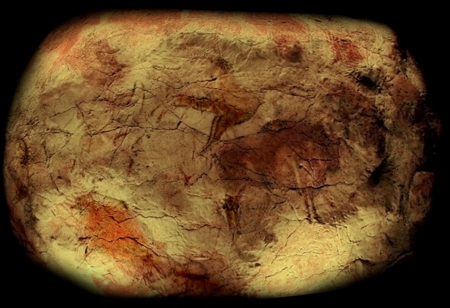
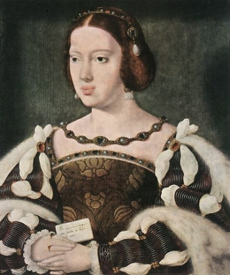
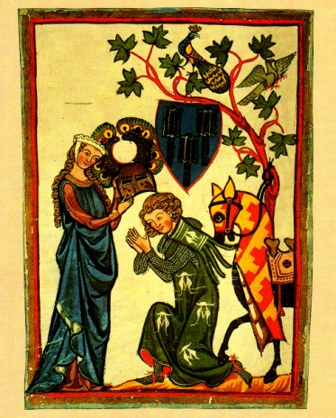

# Leçon 11 | 10 Février 1960

  

    <label><input type="checkbox" data-lacan-toggle="original" checked> 原文</label>
    <label><input type="checkbox" data-lacan-toggle="notes" checked> 注释</label>
    <label><input type="checkbox" data-lacan-toggle="commentary" checked> 个人解读评论</label>
  

  <form class="lacan-tool-search" role="search">
    <input class="lacan-tool-search-input" type="search" placeholder="搜索全文" aria-label="搜索全文">
    <button class="lacan-tool-button" type="submit" title="搜索">搜索</button>
  </form>
  <button class="lacan-tool-button lacan-back-to-top" type="button" title="回到页面最上方" aria-label="回到页面最上方">↑</button>

<section class="parallel-paragraph" data-paragraph-ids="s7-11-0001">

s7-11-0001

原文 · s7-11-0001

Pourquoi cette anamorphose est-elle là ? Elle est là bien sûr pour illustrer ma pensée. La dernière fois, j’ai fait une espèce de raccourci de quelque chose qui pourrait s’appeler le sens ou le but de l’art, au sens commun que nous donnons actuellement à ce terme : « *les Beaux-Arts* ».

[无对应译文]

</section>

<section class="parallel-paragraph" data-paragraph-ids="s7-11-0002">

s7-11-0002

原文 · s7-11-0002

Il n’y a pas que moi que cela a préoccupé *dans l’analyse*. J’ai fait allusion à l’article d’Ella SHARP sur ce même sujet de la sublimation. Elle part, vous le savez - vous pouvez vous reporter à cet article - des parois de la caverne d’Altamira qui est la première caverne décorée qui a été découverte.

[无对应译文]

</section>

<section class="parallel-paragraph" data-paragraph-ids="s7-11-0003">

s7-11-0003

原文 · s7-11-0003

[无对应译文]

</section>

<section class="parallel-paragraph" data-paragraph-ids="s7-11-0004">

s7-11-0004

原文 · s7-11-0004

En fin de compte, si nous partons de ce que nous décrivons comme ce *lieu central*, cette *extériorité* *intime*, cette *extimité* qui est *la Chose*, peut-être ceci éclairera-t-il pour nous ce qui reste encore une question, voire un mystère pour ceux qui s’intéressent à cet *art préhistorique*.

[无对应译文]

</section>

<section class="parallel-paragraph" data-paragraph-ids="s7-11-0005">

s7-11-0005

原文 · s7-11-0005

C’est à savoir précisément son site, dans une cavité souterraine dont on s’étonne qu’elle ait été choisie précisément pour les difficultés extrêmes qu’elle devait donner au travail, à l’éclairage pendant le travail et aussi à la prise de vue qu’on suppose en quelque sorte nécessitée par la création même, sur ces parois, d’images saisissantes. Aller les contempler ne devait pas être une chose de toute facilité dans les conditions d’éclairage qu’on suppose devoir être celles des primitifs.

[无对应译文]

</section>

<section class="parallel-paragraph" data-paragraph-ids="s7-11-0006">

s7-11-0006

原文 · s7-11-0006

Donc je dirai que, tout à fait au départ, c’est *autour d’une cavité*, sur *les parois d’une cavité* que sont jetées ce qu’on pourrait appeler \- au double sens du terme, *subjectif* et *objectif -* cette sorte d’« *épreuves* » qui nous paraissent être ces premières productions de l’art primitif, je veux dire « *épreuves* » sans doute pour l’artiste, qui nous donne la pensée de quelque chose *comme une mise à jour* d’une certaine possibilité créatrice - puisque ces images, comme vous le savez, se recouvrent souvent les unes les autres - comme si, en un lieu consacré, c’était pour chaque artiste, chaque sujet capable de s’offrir à cet exercice, que c’était aussi bien sur ce qui avait été fait précédemment que de nouveau il dessinait, projetait ce qu’il avait à cette occasion à manifester.

[无对应译文]

</section>

<section class="parallel-paragraph" data-paragraph-ids="s7-11-0007">

s7-11-0007

原文 · s7-11-0007

Aussi bien « *épreuves* » au sens objectif, car nous y voyons une série d’épreuves toujours sur des termes qui assurément ne peuvent pas ne pas nous saisir comme ayant un certain rapport assez profond avec quelque chose qui était à la fois lié au rapport au monde le plus étroit…

[无对应译文]

</section>

<section class="parallel-paragraph" data-paragraph-ids="s7-11-0008">

s7-11-0008

原文 · s7-11-0008

je veux dire à la subsistance même des populations qui semblent être composées essentiellement de chasseurs

[无对应译文]

</section>

<section class="parallel-paragraph" data-paragraph-ids="s7-11-0009">

s7-11-0009

原文 · s7-11-0009

…mais aussi bien à ce quelque chose qui, dans sa subsistance, se présente pour lui avec le caractère d’un *au-delà du sacré*, de ce quelque chose justement que nous essayons de fixer dans sa forme la plus générale par le terme de *la Chose*.

[无对应译文]

</section>

<section class="parallel-paragraph" data-paragraph-ids="s7-11-0010">

s7-11-0010

原文 · s7-11-0010

La *subsistance primitive*, dirais-je, sous l’angle de *la Chose*. Là on peut dire qu’il y a une ligne qui se retrouve à l’autre bout dans cet exercice aussi infiniment plus proche de nous. C’est une chose - cette anamorphose - probablement du début du XVIIème siècle, et je vous ai dit à cette époque l’intérêt qu’a pris pour *la pensée constructive*, la pensée des artistes, ces sortes d’exercices. J’ai essayé de vous faire comprendre très brièvement comment on peut en somme en dessiner la genèse.

[无对应译文]

</section>

<section class="parallel-paragraph" data-paragraph-ids="s7-11-0011">

s7-11-0011

原文 · s7-11-0011

C’est à savoir que si de la cavité et de la paroi, en tant que l’exercice sur la paroi consiste à fixer l’habitant invisible de la cavité

[无对应译文]

</section>

<section class="parallel-paragraph" data-paragraph-ids="s7-11-0012">

s7-11-0012

原文 · s7-11-0012

- nous voyons la chaîne s’établir du temple en tant qu’organisation autour du vide et par rapport à ce vide, et en tant que ce vide désigne justement la place de *la Chose*,

[无对应译文]

</section>

<section class="parallel-paragraph" data-paragraph-ids="s7-11-0013">

s7-11-0013

原文 · s7-11-0013

- nous voyons ensuite, je vous l’ai dit, sur les parois de ce vide lui-même - pour autant que la peinture apprend progressivement à maîtriser ce vide, et même à le serrer de si près qu’elle se voue à le fixer sous la forme de *l’illusion de l’espace -* c’est la progressive introduction, *à travers toute l’histoire de la peinture*, la maîtrise de *l’illusion de l’espace* autour de laquelle nous pouvons organiser l’histoire de la peinture.

[无对应译文]

</section>

<section class="parallel-paragraph" data-paragraph-ids="s7-11-0014">

s7-11-0014

原文 · s7-11-0014

Je vais vite. C’est une sorte de rapide gramme qui peut simplement, pour vous, être considéré comme quelque chose que vous devez mettre à l’épreuve de ce que vous pourrez lire par la suite sur ce sujet.

[无对应译文]

</section>

<section class="parallel-paragraph" data-paragraph-ids="s7-11-0015">

s7-11-0015

原文 · s7-11-0015

Vous savez bien *qu’avant* *l’instauration systématique* de ce qui est à proprement parler *les lois géométriques de la perspective*, formulées à la fin du XVème et au début du XVIème siècle, la peinture a montré une sorte d’étape où des artifices permettent de structurer cet espace. Le double bandeau, par exemple, qu’on voyait au VIème et au VIIème siècle aux parois de Sainte Marie Majeure, est une façon de traiter certaines stéréognosies. Mais laissons. L’important est qu’à un moment on arrive à l’illusion.

[无对应译文]

</section>

<section class="parallel-paragraph" data-paragraph-ids="s7-11-0016">

s7-11-0016

原文 · s7-11-0016

C’est bien là d’ailleurs autour de quoi reste un certain *point sensible*, un *point de lésion*, un *point douloureux*, un *point de retournement* de toute *l’histoire* en tant qu’*histoire de l’art* et en tant que nous y sommes impliqués, c’est que *l’illusion de l’espace* est autre chose que la création du vide, et que ce que *représente* l’apparition des anamorphoses à la fin du XVIème, début du XVIIème siècle.

[无对应译文]

</section>

<section class="parallel-paragraph" data-paragraph-ids="s7-11-0017">

s7-11-0017

原文 · s7-11-0017

Je vous ai parlé souvent de Jésuites, la dernière fois c’était un lapsus, j’ai vérifié dans *le livre excellent sur les* *Anamorphoses* qu’a fait Jurgis BALTRUSAITIS - *Olivier Perrin éditeur* - c’est d’un couvent de Minimes qu’il s’agit, autant à Rome qu’à Paris. Je ne sais pas pourquoi j’ai projeté aussi au Louvre ces *Ambassadeurs* d’HOLBEIN, qui sont à la *National Gallery*.

[无对应译文]

</section>

<section class="parallel-paragraph" data-paragraph-ids="s7-11-0018">

s7-11-0018

原文 · s7-11-0018

Vous verrez, sur ce tableau des *Ambassadeurs* toute une étude pour vous imager ce que je vous ai dit la dernière fois, cet objet étrange, ce crâne - *comme l’articule avec beaucoup de raffinement l’auteur -* si l’on passe devant le tableau, si l’on sort de cette pièce par une porte faite à cette fin de le voir dans sa vérité sinistre, au moment où le spectateur se retourne pour la dernière fois en s’éloignant du tableau.

[无对应译文]

</section>

<section class="parallel-paragraph" data-paragraph-ids="s7-11-0019">

s7-11-0019

原文 · s7-11-0019

Donc, dis-je, l’intérêt pour l’anamorphose est décrit comme ce point tournant où, de cette illusion de l’espace, l’artiste retourne complètement l’utilisation, et s’efforce de le faire entrer dans ce qui est le but primitif, à savoir : comme tel d’en faire le support de cette réalité en tant que cachée, *cette fin de l’art*, pour autant que c’est d’une certaine façon *de cerner la Chose* qu’il s’agit toujours dans toute œuvre d’art. Et c’est ceci qui permet d’approcher, me semble-t-il, d’un peu plus près, ce qui semble être encore *<u>la</u> question irrésolue* concernant *les fins de l’art*, encore pour nous qui comme PLATON, nous posons la question : *la fin de l’art serait-elle d’imiter ou de ne pas imiter ?*

[无对应译文]

</section>

<section class="parallel-paragraph" data-paragraph-ids="s7-11-0020">

s7-11-0020

原文 · s7-11-0020

*Imite-t-il ce qu’il <u>représente</u> ?* \[*signe* ou *signifiant* ?\]

[无对应译文]

</section>

<section class="parallel-paragraph" data-paragraph-ids="s7-11-0021">

s7-11-0021

原文 · s7-11-0021

Quand on entre dans cette façon de poser la question, on est déjà pris *dans la nasse* et il n’y a aucun moyen d’en sortir, de ne pas rester dans l’impasse où nous sommes entre l’art *figuratif* et l’art dit *abstrait*. Jusqu’à un certain point, nous ne pouvons simplement qu’évidemment sentir l’aberration qui se formule dans la position du philosophe, qui est implacable : c’est PLATON qui fait tomber l’art au dernier degré des œuvres humaines, puisque pour lui *tout ce qui existe*

[无对应译文]

</section>

<section class="parallel-paragraph" data-paragraph-ids="s7-11-0022">

s7-11-0022

原文 · s7-11-0022

- n’existe que dans son rapport à l’*Idée* qui est réelle,

[无对应译文]

</section>

<section class="parallel-paragraph" data-paragraph-ids="s7-11-0023">

s7-11-0023

原文 · s7-11-0023

- n’est déjà qu’*imitation* d’un *plus que réel*, d’un *surréel*.

[无对应译文]

</section>

<section class="parallel-paragraph" data-paragraph-ids="s7-11-0024">

s7-11-0024

原文 · s7-11-0024

Et si l’art imite, nous dit-il, c’est « *une ombre d’ombre *», une imitation d’imitation. Vous voyez donc quelle vanité il y a dans *l’œuvre d’art*, dans l’œuvre du pinceau.

[无对应译文]

</section>

<section class="parallel-paragraph" data-paragraph-ids="s7-11-0025">

s7-11-0025

原文 · s7-11-0025

Or, bien sûr, et dans un sens opposé, pour vous dire qu’il ne faut point entrer *dans la nasse* pour comprendre que, bien sûr, naturellement, *les œuvres de l’art imitent ces objets qu’elles représentent, mais que leur fin n’est justement pas de représenter ces objets*. En donnant l’*imitation* de l’*objet*, elles font de cet *objet* autre chose. Elles ne font que feindre d’imiter les objets. Et c’est pour autant  que l’objet est instauré dans un certain rapport avec *la Chose*, qu’il est fait pour cerner, pour présentifier, absentifier à la fois *la Chose*.

[无对应译文]

</section>

<section class="parallel-paragraph" data-paragraph-ids="s7-11-0026">

s7-11-0026

原文 · s7-11-0026

Et puis cela, en somme tout le monde le sait, que quand la peinture tourne une fois de plus d’une façon saisissante sur elle-même au moment où CÉZANNE fait des pommes, c’est bien évidemment parce qu’en faisant des pommes il fait tout autre chose que d’imiter des pommes. Encore que sa dernière façon de les imiter soit la plus saisissante et soit celle qui soit le plus orientée vers une technique de *présentification de l’objet*. Mais *plus sera présentifié l’objet en tant qu’imité*, *plus il nous ouvrira cette dimension où l’illusion comme telle, comme exemple de ce brisement d’elle-même, vise autre chose*.

[无对应译文]

</section>

<section class="parallel-paragraph" data-paragraph-ids="s7-11-0027">

s7-11-0027

原文 · s7-11-0027

Chacun sait bien que le mystère, parfois, de cette façon qu’a CÉZANNE de faire des pommes, a une valeur qui n’a jamais encore été conçue, que quand CÉZANNE le faisait par un certain rapport au *réel*, tel qu’alors il se renouvelle dans l’art *une certaine façon de faire surgir l’objet* qui est nouvelle, qui est lustrale, *qui est un renouveau de sa dignité* par où, si je puis dire, sont dansés d’une nouvelle façon ces *insertions imaginaires*, en tant qu’au moment précis de l’histoire de l’art dont il s’agit, certaines de ces *insertions imaginaires* sont choisies et, comme on l’a remarqué, elles ne peuvent pas être détachées de ce qui jusqu’alors a composé pour les artistes qui ont précédé, dans leurs précédents efforts de réaliser cette fin de l’art, ce qui a été choisi et repris d’une autre façon.

[无对应译文]

</section>

<section class="parallel-paragraph" data-paragraph-ids="s7-11-0028">

s7-11-0028

原文 · s7-11-0028

Il y aurait bien des choses à dire là-dessus, et en particulier que la notion d’*historicité* ici ne saurait être employée sans la plus extrême prudence. Le terme d’« *histoire de l’art* » est bien ce qu’il y a de plus captieux et l’on peut dire que chaque émergence de ce mode d’opérer consiste pour toujours à renverser l’opération illusoire, la faire retourner vers sa fin première qui est de projeter une réalité qui n’est point celle de l’objet qui est représenté, qui est une réalité vers laquelle cette façon de traiter l’objet est tournée.

[无对应译文]

</section>

<section class="parallel-paragraph" data-paragraph-ids="s7-11-0029">

s7-11-0029

原文 · s7-11-0029

Nous verrions que dans l’« *histoire de l’art* » il n’y a au contraire - par la nécessité même qui la supporte - que substructure, que même à l’histoire du temps, je veux dire du temps où il se manifeste, *l’artiste est toujours aussi dans un rapport contradictoire*. C’est contre les normes et les schèmes régnant, politiques par exemple, voire les schèmes de pensée, c’est en quelque sorte à contre-courant que l’art, toujours, essaie de ré-opérer son miracle.

[无对应译文]

</section>

<section class="parallel-paragraph" data-paragraph-ids="s7-11-0030">

s7-11-0030

原文 · s7-11-0030

Voici en somme pourquoi nous nous trouvons là, devant un jeu qui peut vous paraître assez vain en effet comme *exercice* si l’on suppose les raffinements opératoires que nécessite cette petite réussite technique.

[无对应译文]

</section>

<section class="parallel-paragraph" data-paragraph-ids="s7-11-0031">

s7-11-0031

原文 · s7-11-0031

Et pourtant, comment ne pas en être touché, voire ému, comme de quelque chose dont je dirai qu’avec cette forme montante et descendante que prend l’image dans cette sorte de seringue, nous sommes là devant quelque chose qui, si je me laissais aller à une image, me paraîtrait comme une sorte *d’appareil à prise de sang*, à prise du sang du GRAAL, si vous voulez bien vous souvenir que le sang du GRAAL est précisément *ce qui*, dans le GRAAL, *manque*.

[无对应译文]

</section>

<section class="parallel-paragraph" data-paragraph-ids="s7-11-0032">

s7-11-0032

原文 · s7-11-0032

Ceci, si je vous l’apporte aujourd’hui, au point où nous en sommes de notre exposé, c’est pour autant que c’est - si localisées qu’en soient l’apparition et la tendance - quelque chose qui a sûrement sa fonction dans l’histoire de l’art. N’en prenez que l’usage métaphorique :

[无对应译文]

</section>

<section class="parallel-paragraph" data-paragraph-ids="s7-11-0033">

s7-11-0033

原文 · s7-11-0033

- c’est pour autant que ce que je veux vous exposer aujourd’hui, c’est à savoir la possibilité de *cette forme de sublimation qui s’est créée à un moment de l’histoire de la poésie*, et qui nous intéresse d’une façon si exemplaire par rapport à ce qu’en somme la pensée freudienne a remis *au centre* de notre intérêt dans l’économie du psychisme, à savoir Éros et l’érotisme.

[无对应译文]

</section>

<section class="parallel-paragraph" data-paragraph-ids="s7-11-0034">

s7-11-0034

原文 · s7-11-0034

- C’est pour autant qu’en fin de compte vous pourrez presque l’articuler, le structurer autour de cette anamorphose, c’est que ce que je dessine pour vous à propos de *l’éthique de la psychanalyse* repose tout entier sur ceci, auquel nous viendrons dans la suite, je ne fais que l’indiquer au départ, c’est à savoir que la référence interdite, celle que FREUD a rencontrée au point terminal de ce qu’on peut appeler chez lui *le mythe œdipien*, le mythe œdipien dont il est déjà assez frappant qu’en somme, tout de suite, l’expérience de ce qui se passe chez le névrosé l’ait fait bondir sur le plan d’une *création poétique de l’art*, du drame d’ŒDIPE en tant qu’il est quelque chose de daté dans l’histoire culturelle.

[无对应译文]

</section>

<section class="parallel-paragraph" data-paragraph-ids="s7-11-0035">

s7-11-0035

原文 · s7-11-0035

Vous le verrez quand nous prendrons *Moïse et le monothéisme*, quand nous nous rapprocherons de ce *Malaise dans la civilisation* que je vous ai priés de lire pendant cet intervalle, combien, si l’on peut dire, il n’y a pas dans FREUD de *distance* aux données de l’expérience judéo-grecque, je veux dire de celle qui caractérise notre culture dans son vécu le plus moderne.

[无对应译文]

</section>

<section class="parallel-paragraph" data-paragraph-ids="s7-11-0036">

s7-11-0036

原文 · s7-11-0036

Que FREUD n’ait pu manquer de conduire jusqu’au terme d’un examen l’action de MOÏSE, sa méditation sur ce qu’on peut appeler en somme « *les origines de la morale* », c’est quelque chose qui doit nous frapper.

[无对应译文]

</section>

<section class="parallel-paragraph" data-paragraph-ids="s7-11-0037">

s7-11-0037

原文 · s7-11-0037

Quand vous pourrez lire cet étonnant ouvrage qu’est *Moïse et le monothéisme*, vous verrez combien dans son texte apparaît...

[无对应译文]

</section>

<section class="parallel-paragraph" data-paragraph-ids="s7-11-0038">

s7-11-0038

原文 · s7-11-0038

> concernant ce que je vous ai montré - tout au long de ces années
>
> comme étant l’essentielle référence, le *Nom du Père*, sa fonction signifiante

[无对应译文]

</section>

<section class="parallel-paragraph" data-paragraph-ids="s7-11-0039">

s7-11-0039

原文 · s7-11-0039

...combien dans son texte même, quand il s’agit de *Moïse* et du *monothéisme,* FREUD ne peut s’empêcher de montrer ce qu’on peut appeler la duplicité de sa référence.

[无对应译文]

</section>

<section class="parallel-paragraph" data-paragraph-ids="s7-11-0040">

s7-11-0040

原文 · s7-11-0040

Je veux dire que formellement, dans son texte, il fait intervenir ce recours structurant - *la puissance paternelle - comme une sublimation* comme telle. Il souligne, dans le même texte où il laisse à l’horizon le trauma primordial du meurtre du père, et sans se soucier de la contradiction, que c’est dans une date historique qu’elle surgit \[la puissance paternelle\] *sur le fond de l’appréhension* \- sensible et visible - *que celle qui engendre c’est la mère*.

[无对应译文]

</section>

<section class="parallel-paragraph" data-paragraph-ids="s7-11-0041">

s7-11-0041

原文 · s7-11-0041

Et, nous dit-il, il y a un véritable progrès dans la spiritualité dans le fait d’affirmer que le père...

[无对应译文]

</section>

<section class="parallel-paragraph" data-paragraph-ids="s7-11-0042">

s7-11-0042

原文 · s7-11-0042

> à savoir *celui dont on n’est jamais sûr*, et dont aussi bien on peut dire
>
> que *la reconnaissance de son action* implique toute une *élaboration mentale*, toute *une réflexion*

[无对应译文]

</section>

<section class="parallel-paragraph" data-paragraph-ids="s7-11-0043">

s7-11-0043

原文 · s7-11-0043

...le fait d’introduire comme primordiale *la fonction du père* représente comme telle *une sublimation* à propos de laquelle il pose tout de suite la question : comment précisément en concevoir le saut et le progrès puisque, pour l’introduire, il faut que déjà quelque chose se manifeste qui institue du dehors son autorité, sa fonction, sa réalité ?

[无对应译文]

</section>

<section class="parallel-paragraph" data-paragraph-ids="s7-11-0044">

s7-11-0044

原文 · s7-11-0044

À savoir que lui-même souligne - et à ce moment - l’impasse que constitue le fait qu’il y a *la sublimation* et que cette *sublimation*, nous ne pouvons la motiver historiquement, sinon précisément par *le mythe* auquel il revient, mais dont à ce moment là, la fonction de mythe devient tout à fait latente : je veux dire que ce mythe n’est vraiment pas *autre chose* que ce qui s’inscrit dans la réalité spirituelle la plus sensible de notre temps, à savoir « *la mort de Dieu* ».

[无对应译文]

</section>

<section class="parallel-paragraph" data-paragraph-ids="s7-11-0045">

s7-11-0045

原文 · s7-11-0045

Que c’est en fonction de « *la mort de Dieu* » que le mythe du meurtre du père, qui la représente de la façon la plus directe, est introduit par FREUD comme un mythe moderne, et comme un mythe ayant toutes les propriétés du mythe comme tel.

[无对应译文]

</section>

<section class="parallel-paragraph" data-paragraph-ids="s7-11-0046">

s7-11-0046

原文 · s7-11-0046

Car bien entendu, ce mythe, pas plus qu’aucun autre mythe, n’explique rien, *le mythe* et *sa fonction* étant toujours, comme je vous l’ai montré en toutes occasions, comme je l’ai articulé, m’appuyant sur LÉVI-STRAUSS à cette occasion et sur tout ce qui a pu venir nourrir sa propre formulation, cette sorte d’*organisation signifiante*, d’*ébauche* si vous voulez, qui s’articule pour supporter les antinomies de certains rapports psychiques à un niveau qui n’est pas simplement de tempérament, d’une angoisse individuelle, qui ne s’épuise pas non plus dans aucune construction supposant *la collectivité* comme telle, mais qui prend sa dimension complète.

[无对应译文]

</section>

<section class="parallel-paragraph" data-paragraph-ids="s7-11-0047">

s7-11-0047

原文 · s7-11-0047

Nous supposons là qu’il s’agit de l’individu, et aussi bien de collectivité. Les deux ne présentent pas entre eux d’opposition qui soit telle au niveau où il se passe. Il s’agit du sujet en tant qu’il a précisément à *pâtir du signifiant*, et que dans cette *passion* *du signifiant* surgit le point critique dont l’angoisse n’est à l’occasion qu’un affect jouant le rôle de signal occasionnel.

[无对应译文]

</section>

<section class="parallel-paragraph" data-paragraph-ids="s7-11-0048">

s7-11-0048

原文 · s7-11-0048

Nous sommes donc portés à l’intérieur même du point où FREUD pose la question de la source de la morale, où il a apporté cette inappréciable connotation qu’il a appelée le *Malaise dans la civilisation*, autrement dit ce quelque chose de déréglé par quoi une certaine fonction psychique - le *surmoi* - semble trouver en elle-même sa propre aggravation, une sorte de rupture des freins qui assuraient sa juste incidence.

[无对应译文]

</section>

<section class="parallel-paragraph" data-paragraph-ids="s7-11-0049">

s7-11-0049

原文 · s7-11-0049

Il reste - à l’intérieur de ce dérèglement même - que ce dont il s’agit, c’est à savoir comment, dans quelle mesure nous pouvons concevoir ce qu’il nous montre, au fond de la vie psychique : *les tendances,* peuvent trouver leur juste *sublimation*. Mais d’abord, quelle est cette *possibilité de la sublimation* ?

[无对应译文]

</section>

<section class="parallel-paragraph" data-paragraph-ids="s7-11-0050">

s7-11-0050

原文 · s7-11-0050

Je ne puis pas, dans le temps qui nous est imparti, vous promener à travers les difficultés presque insurmontables, presque insensées, auxquelles se trouvent confrontés les auteurs chaque fois qu’ils ont essayé de donner un sens à ce terme de *sublimation*. Il y a tout de même *quelque chose* que je voudrais bien qu’un jour l’un d’entre vous fasse : *se rendre à la Bibliothèque nationale* *pour prendre connaissance de cet article* - qui est dans le *tome* VIII d’*Imago* - de BERNFELD[^29] *qui s’appelle Bemerkungen zur Sublimierung*. Cela prendrait vingt minutes s’il nous en faisait ici le résumé.

[无对应译文]

</section>

<section class="parallel-paragraph" data-paragraph-ids="s7-11-0051">

s7-11-0051

原文 · s7-11-0051

BERNFELD était un esprit particulièrement ferme dans cette seconde génération et les faiblesses vers quoi vient, en fin de compte, à s’articuler ce qu’il pose concernant la sublimation, sont tout de même bien faites pour nous éclairer. Je veux dire qu’il se trouve fort gêné d’abord par la référence que FREUD donne aux opérations de *la sublimation*, d’être toujours *éthiquement*, *culturellement*, *socialement* *valorisées*. Cette sorte de critère externe au psychisme laisse assurément dans l’embarras, et certainement une telle référence mérite en effet, par son caractère extra-psychologique, d’être mise en relief, en valeur, pour tout dire d’être critiquée. Nous verrons que ce caractère fait moins de *difficulté* qu’il semble au premier abord. Mais c’est bien là un des problèmes.

[无对应译文]

</section>

<section class="parallel-paragraph" data-paragraph-ids="s7-11-0052">

s7-11-0052

原文 · s7-11-0052

D’autre part, la contradiction entre le côté *Zielablenkung* de la *Strebung*, de la *tendance*, du *Trieb*, et le fait que ceci se passe dans un domaine qui est celui de l’*Objekt libido*, de la *libido objectale*, est aussi fait pour lui poser toutes sortes de problèmes. Il les résout avec une *maladresse extrême* qui caractérise tout ce qui a été dit jusqu’ici sur la sublimation dans l’analyse. Il les résout en disant que c’est cette part de *la tendance* qui peut être en somme utilisée - au point où il en est, tome VIII, qui doit dater de 1923-1924 environ - aux *fins du* *moi*, aux *Ichziele*, que nous devons définir comme *la sublimation*.

[无对应译文]

</section>

<section class="parallel-paragraph" data-paragraph-ids="s7-11-0053">

s7-11-0053

原文 · s7-11-0053

Et de donner des exemples dont il me semble que la naïveté éclate. Il prend un petit Robert WALTER qui comme beaucoup d’enfants, se livre aux exercices de la poésie dès avant l’apparition de sa puberté. Eh bien que nous dira-t-il à ce sujet ? Que c’est un *Ichziel*, un *but du moi* que d’être un poète. Que c’est pour autant que ceci est fixé très précocement chez l’enfant que va pouvoir être jugée toute la suite, à savoir le mode sous lequel, au moment de sa puberté, vont se voir peu à peu intégrés, dans cet *Ichziel,* le bouleversement sensible cliniquement, encore qu’assez confus dans le cas qu’il nous expose, de son économie libidinale, et la progressive intégration de ce qui restait au départ très séparé *entre son activité de petit poète et ses fantasmes par exemple*. C’est donc, nous dit-il, supposer le caractère primordial, primitif du but que cet enfant s’est donné de devenir un poète.

[无对应译文]

</section>

<section class="parallel-paragraph" data-paragraph-ids="s7-11-0054">

s7-11-0054

原文 · s7-11-0054

Cette sorte d’argumentation se retrouve dans les autres exemples qu’il nous donne, qui sont également bien instructifs puisqu’il y a des exemples concernant *la fonction des Verneinungen*, des négations qui se produisent spontanément entre groupes d’enfants. *Il s’est en effet beaucoup intéressé à cette question, dans la publication sur les problèmes de la jeunesse dont il se trouvait à ce moment là titulaire*.

[无对应译文]

</section>

<section class="parallel-paragraph" data-paragraph-ids="s7-11-0055">

s7-11-0055

原文 · s7-11-0055

L’important est ceci, et en somme se retrouve dans tout ce qui a été formulé, même par FREUD, sur ce sujet : FREUD fait remarquer comment l’artiste, après avoir opéré sur le plan de la sublimation, se trouve en somme le *bénéficiaire* de son opération pour autant que, comme elle est reconnue par la suite, il se trouve recueillir sous forme de gloire, honneur, voire argent, précisément les satisfactions fantasmatiques qui étaient au principe de la tendance qui se trouve ainsi, dans la sublimation, et par la voie de la sublimation, se satisfaire.

[无对应译文]

</section>

<section class="parallel-paragraph" data-paragraph-ids="s7-11-0056">

s7-11-0056

原文 · s7-11-0056

Tout ceci est fort bel et bon, à cette seule condition que nous tenions pour quelque chose en somme de déjà établi au dehors, qu’il y a une fonction du poète. Qu’un petit enfant puisse prendre comme but de son *moi* de devenir un poète, voilà qui peut sembler aller tout seul, particulièrement chez ceux que BERNFELD appelle « hommes éminents ».

[无对应译文]

</section>

<section class="parallel-paragraph" data-paragraph-ids="s7-11-0057">

s7-11-0057

原文 · s7-11-0057

Il est vrai qu’il se précipite aussitôt dans une parenthèse, en disant qu’en utilisant ce terme de *hervorragender* *Mensch*, *homme éminent*, il veut le dépourvoir le plus qu’il se peut de toute espèce de connotation de valeur, ce qui est bien tout de même la chose la plus étrange qu’on puisse dire à partir du moment où on a fait intervenir une notion comme celle *d’éminence.* Pour tout dire, la dimension de *la personnalité éminente* est inéliminable à l’origine de certaines élaborations, et aussi bien nous voyons dans *Moïse* *et le monothéisme*, qu’elle n’est pas éliminée, mais mise par FREUD au premier plan.

[无对应译文]

</section>

<section class="parallel-paragraph" data-paragraph-ids="s7-11-0058">

s7-11-0058

原文 · s7-11-0058

Ce dont il s’agit là est bien originellement de décrire, de situer la possibilité d’une fonction comme la fonction poétique, dans un consensus social à l’état de structure. C’est cela qui doit être justifié, et non pas simplement par les bénéfices secondaires qui, individuellement, y entrent, s’y mettent à l’épreuve et à l’exercice.

[无对应译文]

</section>

<section class="parallel-paragraph" data-paragraph-ids="s7-11-0059">

s7-11-0059

原文 · s7-11-0059

Eh bien, ce que nous voyons à une certaine époque de l’histoire qui se trouve nous intéresser pour autant qu’elle fait intervenir de la façon la plus directe, *le principe d’un idéal qui est celui de l’amour courtois*, pour autant qu’il va se trouver, pour un certain cercle \- aussi limité que nous le supposions - au principe d’une *morale*, de toute une série de mesures de comportement, d’*idéaux de loyauté*, de mesures, de services, d’exemplarité de la conduite, tout ceci va tourner autour de quoi ? D’une *érotique*. D’une *érotique* d’autant plus surprenante à voir *surgir* à une certaine date, qui est très probablement le *milieu* ou le *début* même du XIème *siècle*, pour se prolonger pendant tout le XIIème, voire même - en Allemagne - jusqu’au début du XIIIème.

[无对应译文]

</section>

<section class="parallel-paragraph" data-paragraph-ids="s7-11-0060">

s7-11-0060

原文 · s7-11-0060

Je fais là allusion très précisément à ce que comporte ce jeu des chanteurs...

[无对应译文]

</section>

<section class="parallel-paragraph" data-paragraph-ids="s7-11-0061">

s7-11-0061

原文 · s7-11-0061

qui à une certaine ère européenne, se qualifiaient de « *Troubadours* » dans le midi, « *Trouvères* » dans la France du nord, « *Minnesänger* » dans l’aire germanique. Des domaines périphériques comme l’Angleterre par exemple, ou certains domaines espagnols n’en étant atteints que secondairement

[无对应译文]

</section>

<section class="parallel-paragraph" data-paragraph-ids="s7-11-0062">

s7-11-0062

原文 · s7-11-0062

…à ces jeux liés à une technique, à un métier poétique très précis, surgissant pendant cette époque, et qui ensuite \- même dans des siècles qui n’en ont plus gardé qu’un souvenir plus ou moins effacé - s’éclipsent.

[无对应译文]

</section>

<section class="parallel-paragraph" data-paragraph-ids="s7-11-0063">

s7-11-0063

原文 · s7-11-0063

Il y a un moment maximum qui va à peu près du début du XIIème siècle au premier tiers du XIIIème siècle, où cette technique très spéciale, qui est celle des *poètes d’amour courtois,* joue un *rôle* et une certaine *fonction*. Cette fonction, nous ne pouvons pas absolument, au point où nous en sommes, en mesurer absolument la portée, ni l’incidence. Ce que nous savons c’est que certains « *cercles* »...

[无对应译文]

</section>

<section class="parallel-paragraph" data-paragraph-ids="s7-11-0064">

s7-11-0064

原文 · s7-11-0064

> qui, comme leur nom l’indique, sont des cercles au sens de *l’amour courtois*, je veux dire
>
> des cercles de cour, des cercles nobles, occupant une certaine position élevée dans la société

[无对应译文]

</section>

<section class="parallel-paragraph" data-paragraph-ids="s7-11-0065">

s7-11-0065

原文 · s7-11-0065

…en ont certainement été affectés de la façon la plus sensible, la plus précise et y ont participé. Je veux dire qu’on a pu poser la question de savoir s’il y a eu ou non vraiment des cours d’amour.

[无对应译文]

</section>

<section class="parallel-paragraph" data-paragraph-ids="s7-11-0066">

s7-11-0066

原文 · s7-11-0066

Assurément ce que Jean DE NOSTRE-DAME \[Lapsus : [Michel de Nostre–Dame](http://fr.wikipedia.org/wiki/Nostradamus)\], autrement dit NOSTRADAMUS, au début du XVème siècle nous représente de la façon dont s’exerçait la juridiction des dames, dont il nous dit les noms flamboyants à consonance languedocienne, …ne peut manquer de faire passer sur nous un certain frisson d’étrangeté.

[无对应译文]

</section>

<section class="parallel-paragraph" data-paragraph-ids="s7-11-0067">

s7-11-0067

原文 · s7-11-0067

Ceci a été critiqué, à juste titre, et reproduit fidèlement par STENDHAL dans son livre *De l’amour* qui reste vraiment un livre admirable en la matière, qui était à ce moment là très proche de l’intérêt romantique qui s’attachait aux découvertes, aux résurgences de toute cette *poésie courtoise*, de *la poésie* qu’on appelait alors *provençale*, encore qu’elle soit beaucoup plus *toulousaine*, voire *limousine*. L’existence et le fonctionnement de ces juridictions de casuistique amoureuse que Jean DE NOSTRE-DAME nous évoque est discutable, et discuté. Néanmoins, ces jugements restent avoir été portés.

[无对应译文]

</section>

<section class="parallel-paragraph" data-paragraph-ids="s7-11-0068">

s7-11-0068

原文 · s7-11-0068

Il nous reste des textes, en particulier...

[无对应译文]

</section>

<section class="parallel-paragraph" data-paragraph-ids="s7-11-0069">

s7-11-0069

原文 · s7-11-0069

que [RAYNOUARD en 1817 a mis au jour et publiés](http://gallica.bnf.fr/Search?adva=1&adv=1&tri=&t_relation=cb31183398f&q=Des+troubadours+et+les+cours+d%E2%80%99amour)

[无对应译文]

</section>

<section class="parallel-paragraph" data-paragraph-ids="s7-11-0070">

s7-11-0070

原文 · s7-11-0070

...dans un ouvrage d’ensemble sur la poésie des troubadours, qui est l’ouvrage d’André LE CHAPELAIN, dont le titre abrégé est tout simplement *De arte amandi*, c’est-à-dire que ce titre est fait, structuré comme pleinement homonyme au traité d’OVIDE qui n’a pas cessé d’être transmis par les clercs. Dans ce manuscrit du XIVème siècle qui a donc été extrait de la *Bibliothèque nationale* par RAYNOUARD, nous voyons le texte de *jugements* qui ont été effectivement portés par des Dames, qui sont parfaitement repérables historiquement, nommément Aliénor D’AQUITAINE qui fut successivement…

[无对应译文]

</section>

<section class="parallel-paragraph" data-paragraph-ids="s7-11-0071">

s7-11-0071

原文 · s7-11-0071

et ce « successivement » comporte une grande participation personnelle au drame qui s’ensuit

[无对应译文]

</section>

<section class="parallel-paragraph" data-paragraph-ids="s7-11-0072">

s7-11-0072

原文 · s7-11-0072

…l’épouse de Louis VII « *le Jeune* », d’Henri PLANTAGENÊT qu’elle épousa quand il était duc de Normandie, qui devint ensuite roi d’Angleterre avec tout ce que cela comporta par la suite de revendications sur des domaines du champ français, ainsi que sa fille qui épousa un certain Henri Ier, comte de Champagne \[Marie de Champagne\].

[无对应译文]

</section>

<section class="parallel-paragraph" data-paragraph-ids="s7-11-0073">

s7-11-0073

原文 · s7-11-0073

 

[无对应译文]

</section>

<section class="parallel-paragraph" data-paragraph-ids="s7-11-0074">

s7-11-0074

原文 · s7-11-0074

Il y en a d’autres encore qui sont repérables historiquement. Toutes sont dites, dans ce manuscrit, avoir participé, sous quelque forme que cela ait été, à *des juridictions de casuistique amoureuse*, lesquelles supposent de la façon la plus claire - car nous en avons dans des textes, dans les poèmes d’amour courtois que nous avons - des repères qui sont parfaitement typifiés.

[无对应译文]

</section>

<section class="parallel-paragraph" data-paragraph-ids="s7-11-0075">

s7-11-0075

原文 · s7-11-0075

Il ne s’agit pas là de termes approximatifs, il s’agit de termes extrêmement précis, ayant une connotation d’idéal à poursuivre, de conduite typifiée, desquels bien sûr je voudrais vous donner ici à l’occasion quelques termes typiques. Nous pouvons les emprunter indifféremment soit au domaine méridional, soit au domaine germanique, au signifiant près qui dans un cas est d’oc, dans l’autre de langue germanique, car il s’agit d’une poésie qui se développe en langue vulgaire. Donc, au signifiant près, *le recoupement*, *la* *systématisation*, *le rapport réciproque* des termes se retrouve.

[无对应译文]

</section>

<section class="parallel-paragraph" data-paragraph-ids="s7-11-0076">

s7-11-0076

原文 · s7-11-0076

C’est du même système qu’il s’agit et *ce système s’organise autour de thèmes divers*, dont le premier par exemple est *celui du deuil*, et même d’un deuil jusqu’à la mort par exemple. Le départ ici - comme l’a exprimé l’un de ceux qui en Allemagne, au début du XIXème siècle, ont mis en évidence les caractéristiques de cet *amour courtois -* c’est d’être une scolastique de l’*amour malheureux*.

[无对应译文]

</section>

<section class="parallel-paragraph" data-paragraph-ids="s7-11-0077">

s7-11-0077

原文 · s7-11-0077

Il y a des termes définissant le registre dans lequel sont obtenues ce qu’on peut appeler « *les valeurs de la Dame* », ce que représente telle ou telle norme sur lesquelles sont réglés les échanges entre les partenaires de cette sorte de rite singulier : la notion *de récompense, de clémence, de grâce, de gnade, de félicité*.

[无对应译文]

</section>

<section class="parallel-paragraph" data-paragraph-ids="s7-11-0078">

s7-11-0078

原文 · s7-11-0078

L’important est seulement ici d’indiquer *les dimensions* de ce dont vous pouvez - si la chose vous intéresse - vous reporter dans le détail, à l’organisation extrêmement raffinée, en tout comparable, pour la complexité, à ce qui d’une façon peut-être plus facile à mémoriser pour vous, vous pouvez vous représenter - encore qu’il se présente à nous sous une forme beaucoup plus affadie - comme « *Carte du Tendre* », puisqu’en somme *les Précieuses*, à un autre moment de l’histoire, ont remis au premier plan un certain art social de la conversation. Ici il s’agit de choses qui sont d’autant plus surprenantes à voir surgir, qu’elles surgissent dans une époque dont les coordonnées historiques nous montrent qu’au contraire rien n’y semblait \- bien loin de là - y répondre à ce qu’on pourrait appeler une *promotion*, voire une *libération* de la femme.

[无对应译文]

</section>

<section class="parallel-paragraph" data-paragraph-ids="s7-11-0079">

s7-11-0079

原文 · s7-11-0079

Qu’il me suffise, pour donner ici une idée des choses, d’évoquer par exemple une histoire comme celle qui s’est passée en pleine période de floraison de cet *amour courtois*, l’histoire de cette comtesse DE COMMINGES, fille d’un certain Guillaume DE MONTPELLIER, qui, à ce titre, se trouvait l’héritière naturelle d’un comté qui est précisément le comté de Montpellier. Un certain Pierre D’ARAGON, roi d’Aragon et fort ambitieux de s’installer au nord des Pyrénées \- malgré l’obstacle que lui a fait à cette époque la première poussée historique du Nord contre le Midi, à savoir le fait de *la croisade des Albigeois*, et des victoires de Simon DE MONTFORT sur les comtes de Toulouse - du fait que cette femme se trouve l’héritière naturelle, quand son père mourra, d’un comté de Montpellier, il veut à ce seul titre l’avoir.

[无对应译文]

</section>

<section class="parallel-paragraph" data-paragraph-ids="s7-11-0080">

s7-11-0080

原文 · s7-11-0080

La personne semble, elle, être fort peu de nature à s’impliquer dans ces *intrigues* plus ou moins sordides. Tout semble indiquer qu’il s’agit d’une personnalité extrêmement réservée, voire proche d’une certaine sainteté, au sens religieux du terme. C’est en effet à Rome, et *en odeur de sainteté* qu’elle finit. Cette personne se trouvera, par l’intermédiaire des combinaisons politiques et avec la pression d’un seigneur de même puissance, Pierre D’ARAGON, contrainte de quitter son mari. Une intervention papale force celui-ci à la reprendre, mais à la mort de son père plus rien ne tient, tout se passe selon les volontés du plus puissant seigneur.

[无对应译文]

</section>

<section class="parallel-paragraph" data-paragraph-ids="s7-11-0081">

s7-11-0081

原文 · s7-11-0081

Elle est effectivement répudiée par son mari qui en a fait d’autres, et qui en a vu d’autres, elle épouse ledit Pierre D’ARAGON qui n’a d’autre conduite avec elle que de la maltraiter, au point qu’elle doit s’enfuir, et c’est ainsi qu’elle termine sa vie à Rome sous la protection du pape qui, à l’occasion, se trouvait fonctionner comme le seul protecteur de l’innocence persécutée. Le style de cette histoire est simplement pour vous montrer quelle est, dans une société féodale, la position effective de la femme.

[无对应译文]

</section>

<section class="parallel-paragraph" data-paragraph-ids="s7-11-0082">

s7-11-0082

原文 · s7-11-0082

Elle est à proprement parler ce que les structures élémentaires montrent - *les structures élémentaires de la parenté -* c’est-à-dire un corrélatif des fonctions *d’échange social*, un support d’un certain nombre de biens et de signes de puissance.

[无对应译文]

</section>

<section class="parallel-paragraph" data-paragraph-ids="s7-11-0083">

s7-11-0083

原文 · s7-11-0083

Elle n’est véritablement rien d’autre. Et rien - sauf référence à un domaine propre : le droit religieux - ne peut la préserver d’être essentiellement *identifiée à une fonction purement sociale* ne laissant aucune place à sa personne, à sa liberté propre de personne.

[无对应译文]

</section>

<section class="parallel-paragraph" data-paragraph-ids="s7-11-0084">

s7-11-0084

原文 · s7-11-0084

C’est dans ce contexte que se met à s’exercer cette très curieuse fonction du poète de *l’amour courtois*, de ce poète dont il est très important de vous représenter quelle est la situation sociale. Sa position en effet est bien de nature à jeter une petite lumière sur l’idée fondamentale, le graphisme que l’idéologie freudienne peut donner d’une mode dont l’artiste se trouve sous une certaine forme retarder la fonction.

[无对应译文]

</section>

<section class="parallel-paragraph" data-paragraph-ids="s7-11-0085">

s7-11-0085

原文 · s7-11-0085

Ce sont des *satisfactions de puissance* nous dit FREUD. C’est pourquoi il n’en est que plus remarquable que nous fassions apparaître ici, dans l’ensemble par exemple des *Minnesänger*…

[无对应译文]

</section>

<section class="parallel-paragraph" data-paragraph-ids="s7-11-0086">

s7-11-0086

原文 · s7-11-0086

> il y en a, je crois, 126 dans ce recueil dit *Manuscrit des Manes* \[[*Codex Manesse*](http://fr.wikipedia.org/wiki/Codex_Manesse)\] qui, au début du XIXème siècle,
>
> se trouvait à la *Bibliothèque nationale de Paris* et devant lequel Henri HEINE allait faire ses dévotions comme à l’origine même de la poésie germanique. Depuis 1888 ce *Manuscrit* a été, je ne sais par la voie de quelle négociation, mais de la façon la plus justifiée, restitué aux Allemands, il est maintenant à Heidelberg

[无对应译文]

</section>

<section class="parallel-paragraph" data-paragraph-ids="s7-11-0087">

s7-11-0087

原文 · s7-11-0087

…dont une part très importante nous montre des situations qui ne sont pas moindres que celles *d’empereur, de roi*, voire *de prince*.

[无对应译文]

</section>

<section class="parallel-paragraph" data-paragraph-ids="s7-11-0088">

s7-11-0088

原文 · s7-11-0088

Le *premier des Troubadours* est un nommé Guillaume DE POITIERS, 7ème *comte* DE POITIERS, neuvième *duc* D’AQUITAINE, qui paraît avoir été, avant qu’il se consacrât à ces activités poétiques...

[无对应译文]

</section>

<section class="parallel-paragraph" data-paragraph-ids="s7-11-0089">

s7-11-0089

原文 · s7-11-0089

et il est à proprement parler dans une position inaugurale dans l’histoire de la poésie courtoise

[无对应译文]

</section>

<section class="parallel-paragraph" data-paragraph-ids="s7-11-0090">

s7-11-0090

原文 · s7-11-0090

...un fort redoutable bandit du type de ce que - mon Dieu - tout grand seigneur qui se respectait pouvait être à cette époque. Je veux dire qu’en maintes circonstances historiques que je vous passe, nous le voyons se comporter selon les normes du *rançonnage le plus inique* des services qu’on pouvait attendre de lui.

[无对应译文]

</section>

<section class="parallel-paragraph" data-paragraph-ids="s7-11-0091">

s7-11-0091

原文 · s7-11-0091

Mais à partir de certains moments, il devient poète de cet amour singulier pour lequel je ne puis que vous renvoyer au titre des ouvrages qui comportent une analyse thématique de ce qu’on peut appeler tout un rituel de l’amour. Ce que je veux vous faire entendre, c’est ce que je vais dire maintenant, à savoir comment nous, analystes, pouvons le situer.

[无对应译文]

</section>

<section class="parallel-paragraph" data-paragraph-ids="s7-11-0092">

s7-11-0092

原文 · s7-11-0092

Au passage je vous signale :

[无对应译文]

</section>

<section class="parallel-paragraph" data-paragraph-ids="s7-11-0093">

s7-11-0093

原文 · s7-11-0093

- un livre un petit peu déprimant par une certaine façon qu’il a de résoudre les difficultés en les éludant assez joliment, mais qui est un livre plein de ressources et de citations, de là tout son intérêt, c’est *La joie d’amour* du nommé Pierre BELPERRON[^30], paru chez PLON.

[无对应译文]

</section>

<section class="parallel-paragraph" data-paragraph-ids="s7-11-0094">

s7-11-0094

原文 · s7-11-0094

- Je vous signale également, *dans un autre registre*, quelque chose qu’il convient de lire parce qu’après tout il s’agit moins là d’*amour courtois* que de ce qu’on pourrait appeler toute sa *filiation historique*. *C’est le très joli recueil* que Benjamin PERRET[^31], sans jamais toujours bien savoir articuler ce dont il s’agit, a appelé *Anthologie de l’amour sublime*.

[无对应译文]

</section>

<section class="parallel-paragraph" data-paragraph-ids="s7-11-0095">

s7-11-0095

原文 · s7-11-0095

- Un livre qui est paru chez Hachette, de René NELLI[^32], auquel je ne reprocherai *qu’un certain moralisme philogénique*, qui s’appelle *L’amour et les mythes du coeur*, dans lequel vous trouverez également beaucoup de faits.

[无对应译文]

</section>

<section class="parallel-paragraph" data-paragraph-ids="s7-11-0096">

s7-11-0096

原文 · s7-11-0096

- Et pour finir par un livre auquel j’ai fait allusion auprès de l’un d’entre vous, le livre d’Henry CORBIN[^33] qui s’appelle *L’imagination créatrice*, paru dans la collection *Homo Sapiens*, chez FLAMMARION. Ce livre sur l’imagination créatrice vous portera beaucoup plus loin que le domaine limité qui est celui dans lequel aujourd’hui je veux finalement articuler ce que je désire vous montrer.

[无对应译文]

</section>

<section class="parallel-paragraph" data-paragraph-ids="s7-11-0097">

s7-11-0097

原文 · s7-11-0097

Voici donc de quoi il s’agit dans cette révolte : que de la poésie. Une poésie datée, avec des thèmes tout à fait repérables sur lesquels je ne m’étends pas par manque de temps, et par le fait que nous les retrouverons par la suite dans les exemples où je vous montrerai qu’il faut trouver d’une façon sensible leur origine, ce que je pourrais appeler leur *origine conventionnelle*. C’est en effet l’intérêt d’une telle étude de nous montrer quels sont, en somme, ces thèmes de *convention*.

[无对应译文]

</section>

<section class="parallel-paragraph" data-paragraph-ids="s7-11-0098">

s7-11-0098

原文 · s7-11-0098

Car là-dessus, je dirai, tous les historiens sont univoques, cet *amour courtois* était en somme un *exercice poétique*, une façon de jouer avec un certain nombre de thèmes idéalisant qui ne pouvaient avoir, si l’on peut dire, aucun répondant concret réel à l’époque où il fonctionnait. Néanmoins ces idéaux - au premier plan desquels est l’idéal de *la Dame* comme telle, avec ce qu’il comporte, et que je vais vous dire maintenant - sont ceux qui se retrouvent dans des époques ultérieures et, jusqu’à la nôtre voient leurs incidences tout à fait concrètes dans l’organisation sentimentale de l’homme contemporain et en somme y perpétuent leur marche, qu’il faut reconnaître comme une marche, c’est-à-dire quelque chose qui prend son origine dans un certain usage systématique, délibéré, de signifiant comme tel.

[无对应译文]

</section>

<section class="parallel-paragraph" data-paragraph-ids="s7-11-0099">

s7-11-0099

原文 · s7-11-0099

Tous les efforts qui ont été faits, en effet, pour montrer par exemple la parenté de cet appareil, de l’organisation de ces formes de *l’amour courtois,* avec je ne sais quelle intuition de source religieuse, mystique par exemple, de quelque chose qui se situerait quelque part en ce centre qui est visé, en cette *Chose* qui est là exaltée au sens de *l’amour courtois*, sont des tentatives - l’expérience l’a montré - vouées à l’échec. Il y a en effet certaines parentés apparentes dans ce qu’on peut appeler l’économie de cette référence du *sujet* à *l’objet de son amour*, qui apparaissent dans des expériences mystiques *étrangères* par exemple...

[无对应译文]

</section>

<section class="parallel-paragraph" data-paragraph-ids="s7-11-0100">

s7-11-0100

原文 · s7-11-0100

on l’a souligné, et c’est pour cela que je vous donne à lire le livre d’Henri CORBIN

[无对应译文]

</section>

<section class="parallel-paragraph" data-paragraph-ids="s7-11-0101">

s7-11-0101

原文 · s7-11-0101

...voire hindoue, voire tibétaine. Chacun sait que Denis DE ROUGEMONT *en fait grand état*.

[无对应译文]

</section>

<section class="parallel-paragraph" data-paragraph-ids="s7-11-0102">

s7-11-0102

原文 · s7-11-0102

Néanmoins ce qui apparaît, c’est qu’il y a de très grandes difficultés, voire *des impossibilités critiques*, si l’on peut dire, à articuler \- pour des raisons par exemple aussi simples que des raisons de date - certaines analogies qui sont mises en évidence entre certains poètes de la péninsule ibérique, musulmans par exemple. Les choses dont il s’agit dans la poésie arabe sont postérieures à ce qui se présente dans la poésie de Guillaume DE POITIERS.

[无对应译文]

</section>

<section class="parallel-paragraph" data-paragraph-ids="s7-11-0103">

s7-11-0103

原文 · s7-11-0103

Ce qui se présente à nous - au contraire, et de la façon la plus claire - c’est que, du point de vue de la structure, nous pouvons dire qu’en somme à cette époque une activité qui est à proprement parler une activité de création poétique exerce une influence déterminante - mais secondairement, je veux dire dans ses suites historiques - sur les mœurs mêmes, à un moment où l’origine, où les maîtres mots de la chose seront oubliés, mais que nous ne pouvons juger de la fonction de cette création sublimée que dans des repères de structure.

[无对应译文]

</section>

<section class="parallel-paragraph" data-paragraph-ids="s7-11-0104">

s7-11-0104

原文 · s7-11-0104

Ici, l’objet - nommément l’objet féminin, dont je vous ai déjà dit qu’il s’introduit déjà par cette porte très singulière de *la privation*, de l’inaccessibilité - est *la Dame* à laquelle il se voue, quelle que soit d’ailleurs *la position sociale* de celui qui fonctionne...

[无对应译文]

</section>

<section class="parallel-paragraph" data-paragraph-ids="s7-11-0105">

s7-11-0105

原文 · s7-11-0105

> quelquefois il y en a qui sont à des *niveaux populaires*, qui sont quelquefois sortis des serviteurs, des sirvens de tel lieu qui est celui de leur naissance. Bernard DE VENTADOUR par exemple était le fils d’un servant au château de Ventadour dont le titulaire, Ebles DE VENTADOUR, était lui aussi un troubadour

[无对应译文]

</section>

<section class="parallel-paragraph" data-paragraph-ids="s7-11-0106">

s7-11-0106

原文 · s7-11-0106

...quelle que soit la position de celui qui se trouve en position de *chanter l’amour* dans un certain registre, *l’inaccessibilité de l’objet* est posée là au principe. Je veux dire qu’il n’y a pas possibilité de chanter comme telle *la Dame* dans sa position poétique, si ce n’est dans ce présupposé d’une barrière, de quelque chose qui l’isole et qui l’entoure.

[无对应译文]

</section>

<section class="parallel-paragraph" data-paragraph-ids="s7-11-0107">

s7-11-0107

原文 · s7-11-0107

D’autre part cet objet, la « *Domnei* » comme on l’appelle...

[无对应译文]

</section>

<section class="parallel-paragraph" data-paragraph-ids="s7-11-0108">

s7-11-0108

原文 · s7-11-0108

> mais dont il est bien remarquable que tellement fréquemment, dans ce qui lui est adressé, le terme sous lequel elle est invoquée est masculinisé. On l’appelle à l’occasion « *mi Dom* », c’est-à-dire « *mon seigneur* »

[无对应译文]

</section>

<section class="parallel-paragraph" data-paragraph-ids="s7-11-0109">

s7-11-0109

原文 · s7-11-0109

...cette *Dame* donc, tous ceux qui lisent attentivement cette poésie courtoise s’aperçoivent que ladite *Dame* se présente avec des caractères dépersonnalisés qui ont fait, comme je vous le disais, que quelques auteurs ont pu remarquer que toutes s’adressent à la même personne.

[无对应译文]

</section>

<section class="parallel-paragraph" data-paragraph-ids="s7-11-0110">

s7-11-0110

原文 · s7-11-0110

Le fait qu’à l’occasion son corps soit décrit comme « *g’ra delgat e gen* », c’est-à-dire que extérieurement les dodues faisaient partie du *sex-appeal* de l’époque, « *e gen* » veut dire *gracieuse,* ce fait ne doit pas vous tromper car on l’appelle toujours ainsi. L’objet - pour tout dire - dont il s’agit - pour autant que c’est l’objet féminin - est à proprement parler, dans ce champ poétique, vidé de toute substance réelle.

[无对应译文]

</section>

<section class="parallel-paragraph" data-paragraph-ids="s7-11-0111">

s7-11-0111

原文 · s7-11-0111

C’est bien cela qui rend si facile dans la suite, à tel ou tel *poète métaphysique*, à un DANTE par exemple, de faire équivaloir une personne dont on sait qu’elle a bel et bien existé, à savoir cette petite *Béatrice*…

[无对应译文]

</section>

<section class="parallel-paragraph" data-paragraph-ids="s7-11-0112">

s7-11-0112

原文 · s7-11-0112

> dont on sait qu’il l’avait énamourée quand elle avait neuf ans, qui est restée
>
> au centre de sa chanson depuis la *Vita nuova* jusqu’à la *Divine Comédie*

[无对应译文]

</section>

<section class="parallel-paragraph" data-paragraph-ids="s7-11-0113">

s7-11-0113

原文 · s7-11-0113

…de la faire équivaloir à la philosophie, voire au dernier terme la science sacrée, et de lui lancer appel en des termes d’autant plus proches du sensuel que ladite personne devenait plus proposée *en position* à proprement parler *allégorique*, à savoir qu’on ne parle jamais tant en termes d’amour les plus crus que quand *la personne est transformée en une fonction symbolique*.

[无对应译文]

</section>

<section class="parallel-paragraph" data-paragraph-ids="s7-11-0114">

s7-11-0114

原文 · s7-11-0114

Ce que nous voyons ici en somme fonctionner *à l’état pur*, c’est ce qui, je crois, est du ressort de cette place qu’occupe la visée tendancielle dans la sublimation, c’est à savoir ce point central où *ce que demande l’homme*, ce qu’il ne peut faire que demander, *c’est d’être privé* à proprement parler *de quelque* *chose de réel*.

[无对应译文]

</section>

<section class="parallel-paragraph" data-paragraph-ids="s7-11-0115">

s7-11-0115

原文 · s7-11-0115

C’est en somme, que *quelque chose* articule ce *centre*, cette *place* que tel d’entre vous - me parlant - appelait...

[无对应译文]

</section>

<section class="parallel-paragraph" data-paragraph-ids="s7-11-0116">

s7-11-0116

原文 · s7-11-0116

> d’une façon que je trouve assez jolie et que je ne répudie pas expressément, bien que,
>
> vous allez le voir, ce qui en fait le charme, ce soit en quelque sorte une référence presque histologique

[无对应译文]

</section>

<section class="parallel-paragraph" data-paragraph-ids="s7-11-0117">

s7-11-0117

原文 · s7-11-0117

...c’est ce que celui qui s’adressait à moi, parlant de ce que j’essaie de vous montrer dans *das Ding*, appelait « *la vacuole* ».

[无对应译文]

</section>

<section class="parallel-paragraph" data-paragraph-ids="s7-11-0118">

s7-11-0118

原文 · s7-11-0118

C’est bien en effet de quelque chose de cet ordre dont il s’agit pour autant, si vous voulez, que dans une cellule primordiale nous nous laissons aller à cette sorte de rêverie des plus scabreuses qui est celle de certaines *spéculations* *contemporaines*, qui nous parlent de communication à propos de ce qui se transmet, organiquement, à l’intérieur d’une structure organique.

[无对应译文]

</section>

<section class="parallel-paragraph" data-paragraph-ids="s7-11-0119">

s7-11-0119

原文 · s7-11-0119

Eh bien, en effet, si vous voulez admettre que, dans un *organisme monocellulaire*, quelque chose puisse \- représenté dans la transmission de telle ou telle fonction pseudopodique - être organisé comme *un système de communication* - à ceci près qu’il peut être impossible de parler de communication dans cette occasion, de préciser pourquoi on peut parler de communication quand il n’y a pas de communication comme telle, c’est pour autant que cette communication s’organiserait schématiquement autour de « *la vacuole* » et visant la fonction de « *la vacuole* » comme telle, que nous pourrions en effet avoir ce dont il s’agit, schématisé, dans la représentation. Pourquoi ?

[无对应译文]

</section>

<section class="parallel-paragraph" data-paragraph-ids="s7-11-0120">

s7-11-0120

原文 · s7-11-0120

Pour reprendre pied sur terre, à savoir mettre les choses comme elles se présentent, là où « *la vacuole* » est pour nous véritablement créée : elle est créée *au centre du système des signifiants* pour autant que *cette demande dernière d’être privé de quelque chose* *de réel est* ce qui est essentiellement lié à cette symbolisation primitive qui est toute entière dans *la signification du don d’amour*.

[无对应译文]

</section>

<section class="parallel-paragraph" data-paragraph-ids="s7-11-0121">

s7-11-0121

原文 · s7-11-0121

À cet égard, je n’ai pas pu au passage ne pas être frappé du fait que, dans la terminologie de *l’amour courtois*, le terme de « *domnei* » est employé, dont le verbe vient faire « *domnoyer* » : qui a un tout autre sens que celui de *se donner* qui veut dire quelque chose comme *caresser*, *batifoler*, et qui est quelque chose qui, dans le vocabulaire de l’amour courtois représente à proprement parler ce rapport de quoi ?

[无对应译文]

</section>

<section class="parallel-paragraph" data-paragraph-ids="s7-11-0122">

s7-11-0122

原文 · s7-11-0122

« *Domnei* » malgré l’espèce d’écho signifiant qu’il fait avec « *don* » n’a rien à voir avec ce mot, il vise essentiellement la même chose que « *la Domna* », *la Dame*, à savoir celle qui, dans l’occasion, *domine*. Ceci a peut-être son côté amusant si nous pensons que peut-être ce serait à explorer historiquement, toutes les normes, quantité de métaphores qu’il y a autour du terme « *donner* » dans *l’amour courtois*. Si « *donner* » pouvait être situé d’une façon quelconque dans un sens ou dans un autre de l’un des partenaires par rapport à l’autre, cela n’a peut-être pas d’autre origine que ce que je pourrais appeler ici la contamination signifiante à propos du terme « *domnei* » et de l’usage du mot « *domnoyer* ».

[无对应译文]

</section>

<section class="parallel-paragraph" data-paragraph-ids="s7-11-0123">

s7-11-0123

原文 · s7-11-0123

Ce que la création de la poésie courtoise tend à faire, c’est à situer, à la place de *la Chose*…

[无对应译文]

</section>

<section class="parallel-paragraph" data-paragraph-ids="s7-11-0124">

s7-11-0124

原文 · s7-11-0124

> et dans une époque dont nous pouvons retrouver les coordonnées historiques, où justement quelque discord peut apparaître dans les conditions de la réalité particulièrement sévère par rapport à *certaines exigences du fond*,
>
> un certain *Malaise dans la culture* et, selon le mode de *la sublimation* qui est celui propre de l’art

[无对应译文]

</section>

<section class="parallel-paragraph" data-paragraph-ids="s7-11-0125">

s7-11-0125

原文 · s7-11-0125

…de nous poser *cet objet que j’appellerai*, pour illustrer ma pensée d’une façon ici équivalente, *un objet affolant, un partenaire inhumain*.

[无对应译文]

</section>

<section class="parallel-paragraph" data-paragraph-ids="s7-11-0126">

s7-11-0126

原文 · s7-11-0126

Tout en effet, le caractérise de cette manière. Jamais *la Dame* n’est à proprement parler qualifiée pour telle ou telle de ses vertus réelles et concrètes, pour sa *sagesse*, sa *prudence*, voire même sa *pertinence*. Si elle est qualifiée de sage, ça n’est que pour autant qu’elle participe à une sorte de sagesse immatérielle qu’elle représente plus qu’elle n’en exerce les fonctions. Par contre, le caractère essentiel est d’être aussi arbitraire, dans ses exigences de l’épreuve qu’elle impose à son servant, qu’il est possible. C’est d’être essentiellement ce qu’on a appelé plus tard, au moment des échos enfantins de cette idéologie, d’être cruelle et, comme on dira plus tard, semblable aux Tigresses d’Ircanie.

[无对应译文]

</section>

<section class="parallel-paragraph" data-paragraph-ids="s7-11-0127">

s7-11-0127

原文 · s7-11-0127

À la vérité, c’est à lire les auteurs de cette époque, les romans de Chrétien DE TROYES par exemple, qu’on peut voir jusqu’à quels extrêmes sont poussés les caractères d’arbitraire qui règnent entre les deux termes de ce couple de l’amour courtois. Bref, ce que je voudrais ici encore vous dire, après avoir souligné l’artifice de la construction courtoise, avant de vous montrer combien ces artifices se sont montrés durables, compliquant beaucoup plus qu’ils ne les ont simplifiés, loin de là, les relations entre l’idée de l’homme et celle du service de la femme, ce que je dirai c’est que *ceci* qui est là devant nous, l’anamorphose, nous servira encore à percevoir, à préciser d’une certaine manière ce qui restait un peu flou dans notre perspective, c’est à savoir ce qui est à proprement parler *la fonction narcissique*.

[无对应译文]

</section>

<section class="parallel-paragraph" data-paragraph-ids="s7-11-0128">

s7-11-0128

原文 · s7-11-0128

Vous savez que ce que j’ai cru devoir introduire de la fonction du miroir - comme structurant, comme exemplaire de la structure imaginaire - se qualifie dans le rapport narcissique. On a mis en évidence, assurément, le *caractère* *narcissique*, je veux dire le côté d’exaltation idéale qui est implicite, et qui est même expressément visé dans l’idéologie de l’amour courtois. Ici, je vous dirai que cette petite image qui nous est représentée par l’anamorphose que j’ai présentée aujourd’hui à votre examen est là en quelque sorte pour nous faire voir de quelle espèce de fonction du miroir il s’agit.

[无对应译文]

</section>

<section class="parallel-paragraph" data-paragraph-ids="s7-11-0129">

s7-11-0129

原文 · s7-11-0129

C’est un miroir au-delà duquel ce n’est que par accident que se projette l’*idéal du sujet*. Le miroir, à l’occasion, peut impliquer si l’on peut dire les mécanismes du narcissisme et nommément la dimension destructive que nous retrouverons par la suite, à savoir la dimension de l’agressivité. Mais il remplit un autre rôle. Il remplit justement un rôle de limite. Il est *ce qu’on ne peut franchir* et *l’organisation de l’inaccessibilité de l’objet* est bien la seule à quoi il participe. Mais il n’est pas le seul à y participer.

[无对应译文]

</section>

<section class="parallel-paragraph" data-paragraph-ids="s7-11-0130">

s7-11-0130

原文 · s7-11-0130

Il est toute une série de ces motifs, et je ne peux, à l’occasion que brièvement vous les indiquer, ils constituent les présupposés, les données organiques de cet amour courtois comme tel, et nommément par exemple ceci : l’objet n’est point seulement *inaccessible*, il est *séparé* de celui qui se languit de l’atteindre par toutes sortes de puissances opposantes et maléficieuses qui sont celles que le joli langage provençal appelle, entre autres dénominations, « *lauzengiers* ». Ce sont les *jaloux*, mais aussi les *médisants*. Ceci se retrouve dans toutes les formes où est articulé ce thème.

[无对应译文]

</section>

<section class="parallel-paragraph" data-paragraph-ids="s7-11-0131">

s7-11-0131

原文 · s7-11-0131

Un autre thème qui est important est celui que nous appellerons le thème du *secret*. Il est tout à fait essentiel et il comporte un certain nombre de *méprises*, et celle-ci que l’objet n’est jamais nommé en dehors d’une sorte d’intermédiaire qu’on appelle le « *Senhal* ». Ceci se retrouve dans la poésie arabe sur les mêmes thèmes, où ce même rite, avec ce qu’il comporte de curieux, frappe toujours les observateurs. Les formes du *Senhal* sont parfois extraordinairement significatives et en particulier chez cet extraordinaire Guillaume DE POITIERS le fait qu’il appelle, à un certain moment de ses poèmes, l’objet de ses soupirs du terme de *Bon Vezi*, ce qui veut dire « *Bon Voisin* ».

[无对应译文]

</section>

<section class="parallel-paragraph" data-paragraph-ids="s7-11-0132">

s7-11-0132

原文 · s7-11-0132

À la suite de quoi les historiens se sont perdus en conjectures et n’y ont trouvé rien d’autre que la désignation d’une *Dame* dont les territoires étaient proches de ceux de Guillaume DE POITIERS, et dont on sait qu’elle a joué dans son histoire un grand rôle, et qui semblait être une luronne.

[无对应译文]

</section>

<section class="parallel-paragraph" data-paragraph-ids="s7-11-0133">

s7-11-0133

原文 · s7-11-0133

Je crois pour nous que, beaucoup plus important que cette référence au « *Bon Voisin* », qui serait *la Dame* qu’à l’occasion Guillaume DE POITIERS lutina, c’est ce rapport à ce qui dans l’origine tout à fait inaugurale des premières fondations de *la Chose*, dans la genèse psychologique, fait rapprocher par FREUD *das Ding* du *Nebenmensch* - ou *Minne* - comme tel, à savoir de la place que dans un certain développement - qui est le développement proprement chrétien - de la place que tiendra l’apothéose du « *prochain* » comme tel.

[无对应译文]

</section>

<section class="parallel-paragraph" data-paragraph-ids="s7-11-0134">

s7-11-0134

原文 · s7-11-0134

Bref ce que j’ai voulu vous faire sentir aujourd’hui est ceci que c’est une organisation artificielle, artificieuse du signifiant comme tel qui, à un certain moment, fixe si l’on peut dire les directions d’une certaine ascèse qui donne un nouveau sens et qui nous empêche d’ériger ce sens, le sens qu’il faut que nous donnions dans l’économie psychique à la conduite du détour. Le détour, dans le psychisme, n’est pas toujours seulement et uniquement fait pour régler le passage, l’accès qui rejoint ce qui s’organise dans le domaine du *principe du plaisir*, à ce qui se propose comme structure de la réalité.

[无对应译文]

</section>

<section class="parallel-paragraph" data-paragraph-ids="s7-11-0135">

s7-11-0135

原文 · s7-11-0135

Il y a aussi des détours et des obstacles qui s’organisent dans la fonction de faire à proprement parler apparaître comme tel ce domaine de la vacuole. À savoir ce qu’il s’agit de projeter comme tel, c’est à savoir une certaine *transgression du désir*. Et c’est ici que nous voyons à proprement parler apparaître ce que j’appellerai la fonction éthique de l’érotisme, pour autant qu’en somme le freudisme n’est qu’une perpétuelle allusion à cette fécondité motrice de l’érotisme dans l’éthique, mais qu’en somme il ne la formule pas comme telle.

[无对应译文]

</section>

<section class="parallel-paragraph" data-paragraph-ids="s7-11-0136">

s7-11-0136

原文 · s7-11-0136

Et pourtant, si quelque chose se trouve alors dans les techniques précises...

[无对应译文]

</section>

<section class="parallel-paragraph" data-paragraph-ids="s7-11-0137">

s7-11-0137

原文 · s7-11-0137

> car ces techniques, elles vont loin dans ce qu’elles nous laissent entrevoir de ce qui pouvait à l’occasion
>
> passer dans le fait de ce qui est à proprement parler de l’ordre sexuel dans l’inspiration de cet érotisme

[无对应译文]

</section>

<section class="parallel-paragraph" data-paragraph-ids="s7-11-0138">

s7-11-0138

原文 · s7-11-0138

...c’est à proprement parler une technique de la retenue, une technique de la suspension, de *l*’’*amor interruptus*.

[无对应译文]

</section>

<section class="parallel-paragraph" data-paragraph-ids="s7-11-0139">

s7-11-0139

原文 · s7-11-0139

Et les étapes que comme telles *l’amour courtois* propose...

[无对应译文]

</section>

<section class="parallel-paragraph" data-paragraph-ids="s7-11-0140">

s7-11-0140

原文 · s7-11-0140

avant ce qui est appelé très mystérieusement, car nous ne savons pas en fin de compte ce que c’était *« le don de merci* »

[无对应译文]

</section>

<section class="parallel-paragraph" data-paragraph-ids="s7-11-0141">

s7-11-0141

原文 · s7-11-0141

...s’articulent comme telles : après à peu près tout ce que FREUD, dans ses *Trois essais sur la sexualité* articule comme étant de l’ordre du plaisir préliminaire. Or le paradoxe de ce qu’on peut appeler, dans la perspective du *principe du plaisir,* l’effet du *Vorlust,* des *plaisirs préliminaires*, c’est justement qu’ils subsistent, à l’encontre du mouvement, de la direction du *principe du plaisir*.

[无对应译文]

</section>

<section class="parallel-paragraph" data-paragraph-ids="s7-11-0142">

s7-11-0142

原文 · s7-11-0142

C’est pour autant que *le plaisir de désirer*, c’est-à-dire en toute rigueur *le plaisir d’éprouver un déplaisir,* est soutenu, que nous pouvons parler de *la valorisation sexuelle des états préliminaires de l’acte de l’amour*.

[无对应译文]

</section>

<section class="parallel-paragraph" data-paragraph-ids="s7-11-0143">

s7-11-0143

原文 · s7-11-0143

Or, ce qui nous est indiqué dans la technique érotique de *l’amour courtois* comme étant les étapes qui précèdent cette fusion... dont nous ne pouvons jamais savoir si elle est à proprement parler d’union mystique, de reconnaissance distante de l’Autre, puisqu’aussi bien, dans beaucoup de cas il semble qu’une fonction comme celle du salut, de la salutation, soit pour l’amoureux de l’amour courtois le don suprême, c’est-à-dire vraiment le signe de la présence de l’Autre comme tel, et rien de plus, et je puis vous dire que ceci a été l’objet de spéculations qui ont été fort loin, jusqu’à identifier ce salut avec celui qui réglait, dans le *consolamentum*, les rapports des grades les plus élevés de l’initiation cathare …avant d’en arriver à ce terme, les étapes sont soigneusement articulées et distinguées, qui vont

[无对应译文]

</section>

<section class="parallel-paragraph" data-paragraph-ids="s7-11-0144">

s7-11-0144

原文 · s7-11-0144

- depuis « *le voir* » \[1\],

[无对应译文]

</section>

<section class="parallel-paragraph" data-paragraph-ids="s7-11-0145">

s7-11-0145

原文 · s7-11-0145

- en passant par « *le parler* » \[2\],

[无对应译文]

</section>

<section class="parallel-paragraph" data-paragraph-ids="s7-11-0146">

s7-11-0146

原文 · s7-11-0146

- puis par « *le toucher* » \[3\], lequel est identifiable d’une part à ce qu’on appelle « *les services* » \[3a\], et par « *le baiser* » \[3b\], ou « *l’osculum* » qui est la dernière étape qui précède

[无对应译文]

</section>

<section class="parallel-paragraph" data-paragraph-ids="s7-11-0147">

s7-11-0147

原文 · s7-11-0147

- celle de « *la réunion de merci* » \[4\].

[无对应译文]

</section>

<section class="parallel-paragraph" data-paragraph-ids="s7-11-0148">

s7-11-0148

原文 · s7-11-0148

Tout ceci bien entendu, se livre à nous avec un caractère éminemment énigmatique. Pour l’éclairer, on a été jusqu’à le rapprocher de certaines techniques tout à fait précises d’érotique hindoue ou tibétaine qui semble, elles, avoir été codifiées de la façon la plus précise, et représenter une sorte d’ascèse où cette sorte de substance vécue qui pour le sujet peut surgir de cette discipline du plaisir, est recherchée comme telle. Je crois que ce n’est que par une extrapolation que nous pouvons supposer que quoi que ce soit qui y ressemble fut effectivement pratiqué par les *Troubadours*. À la vérité, personnellement, je n’en crois rien.

[无对应译文]

</section>

<section class="parallel-paragraph" data-paragraph-ids="s7-11-0149">

s7-11-0149

原文 · s7-11-0149

Je crois par contre que cette influence de la poésie a été décisive et que nous n’avons pas besoin pour cela de supposer tellement d’identité entre telle et telle pratique empruntée à des aires culturelles différentes.

[无对应译文]

</section>

<section class="parallel-paragraph" data-paragraph-ids="s7-11-0150">

s7-11-0150

原文 · s7-11-0150

Je crois que ce qu’il y a de plus frappant pour nous à retenir, après l’échec sensible dans les différents travaux qu’on a consacrés à quelque genèse par influence de ce mode particulier de l’instauration idéalisante de l’objet féminin dans notre culture, c’est qu’en fin de compte c’est à un livre libertin, à *L’Art d’aimer* d’OVIDE, que peut-être certains des textes les plus ascétiques, les plus singuliers, les plus paradoxaux qui sont utilisés dans le registre de l’amour courtois, sont empruntés.

[无对应译文]

</section>

<section class="parallel-paragraph" data-paragraph-ids="s7-11-0151">

s7-11-0151

原文 · s7-11-0151

OVIDE a écrit, dans des vers étincelants, une espèce de petit traité pour libertin, à savoir dans quels endroits de Rome rencontrer les plus jolies poulettes et il développe ce thème en trois chants qui se terminent par une évocation directe de ce qu’on ne peut appeler qu’« *une partie de pattes en l’air* ».

[无对应译文]

</section>

<section class="parallel-paragraph" data-paragraph-ids="s7-11-0152">

s7-11-0152

原文 · s7-11-0152

Au milieu de cela, des formules se rencontrent, comme « *arte regendus amor* », *l’amour doit être régi par l’art*. Et voici qu’au bout d’une dizaine de siècles passés, à l’aide de ces mots magiques, un groupe de poètes se met à faire passer ceci à la lettre dans une véritable opération d’incantation artistique. Quelque part aussi on lit « *militae species amor est* », *l’amour est une espèce de service militaire*, ce qui veut dire pour OVIDE que ces dames de Rome ne sont pas si commodes. Et voici que sur le registre de la chevalerie, c’est une milice armée dans les fonctions de la défense de la femme et de l’enfant, c’est, autrement dit, dans la perspective si joliment profilée par DON QUICHOTTE que ces termes viennent à retentir.

[无对应译文]

</section>

<section class="parallel-paragraph" data-paragraph-ids="s7-11-0153">

s7-11-0153

原文 · s7-11-0153

Vous comprendrez facilement l’importance que je peux apporter à ces choses qui elles, en tout cas, comme analogies, sont incontestables, attestées. Car il est certain que dans les milieux des clercs - et c’est pourquoi finalement, certains ont donné une sorte de généalogie cléricale de *l’amour courtois -* jamais l’*Ars amandi* d’OVIDE n’a été oublié. Et nous savons que Chrétien DE TROYES en a fait une traduction. C’est par cette reprise qu’on peut voir ce que veut dire à cette occasion la fonction du signifiant comme tel. C’est ici que j’aimerais mettre le point le plus extrême de ce que j’entends dire en disant que *l’amour courtois* a été créé à peu près comme ce *fantasme* qui est quelque chose que vous voyez surgir au sein de *la seringue* tout à l’heure évoquée.

[无对应译文]

</section>

<section class="parallel-paragraph" data-paragraph-ids="s7-11-0154">

s7-11-0154

原文 · s7-11-0154

Ceci n’empêche pas qu’il ne s’agisse pourtant de quelque chose de tout à fait fondamental, et d’absolument *essentiel*, et qui fait que de nos jours André BRETON peut célébrer l’*Amour fou* dans les termes de ses préoccupations, c’est-à-dire dans quelque chose qu’il met en rapport avec ce qu’il appelle « *le hasard objectif* ».

[无对应译文]

</section>

<section class="parallel-paragraph" data-paragraph-ids="s7-11-0155">

s7-11-0155

原文 · s7-11-0155

Drôle de *configuration signifiante* pour qui comprendrait, à relire ces choses sans leur contexte, dans un siècle ou deux, que « *le hasard objectif* » cela veut dire les choses qui arrivent avec un sens d’autant plus plein qu’elles se situent quelque part où nous ne pouvons saisir aucun schème rationnel ni causal, ni rien qui d’aucune façon peut en justifier le surgissement dans le *réel* ? Autrement dit, c’est bien aussi à la place de *la Chose* que BRETON viendra ici faire surgir *l’Amour fou*.

[无对应译文]

</section>

<section class="parallel-paragraph" data-paragraph-ids="s7-11-0156">

s7-11-0156

原文 · s7-11-0156

Eh bien, pour vous quitter aujourd’hui et vous donner rendez-vous dans trois semaines, je voudrais terminer sur *quelque chose* qui m’est venu à la pensée ce matin, fonctionnant par une sorte de réminiscence de la mémoire, issu d’un autre poète surréaliste, à savoir de Paul ÉLUARD, et qui, dans son chant, est émis exactement sur cette frontière, sur cette limite que j’essaie dans mon discours de nous permettre de localiser et de sentir.

[无对应译文]

</section>

<section class="parallel-paragraph" data-paragraph-ids="s7-11-0157">

s7-11-0157

原文 · s7-11-0157

Voici ces quatre vers :

[无对应译文]

</section>

<section class="parallel-paragraph" data-paragraph-ids="s7-11-0158">

s7-11-0158

原文 · s7-11-0158

*Sur ce ciel délabré, sur ces vitres d’eau douce,* *Quel visage viendra, coquillage sonore,* *Annoncer que la nuit d’amour touche au jour,* *Bouche ouverte liée à la bouche fermée.*

[无对应译文]

</section>

<section class="parallel-paragraph" data-paragraph-ids="s7-11-0159">

s7-11-0159

原文 · s7-11-0159

*  *## Notes

[^29]: S. Bernfeld : - *Zur sublimierungs Theorie*, [Imago XVII 1931 pp. 399-410](http://www.archive.org/details/Imago_XVII_1931_Heft_3_k).

    \- *Bemerkungen* *über* *Sublimierung,* [Imago VIII 1922, Band 3, pp. 333-345](http://www.archive.org/details/Imago_1922_VIII_Heft_3_k).

[^30]: Pierre Belperron : *La Joie d’Amour*, Plon 1948.

[^31]: Benjamin Perret : *anthologie de l’amour sublime*, Albin Michel, rééd. 1988.

[^32]: René Nelli : *L’amour et les mythes du cœur*, Hachette 1975.

[^33]: Henri Corbin : *L’imagination créatrice dans le soufisme d’Ibn Arabî*, Aubier (rééd.1993).

[无对应译文]

</section>

