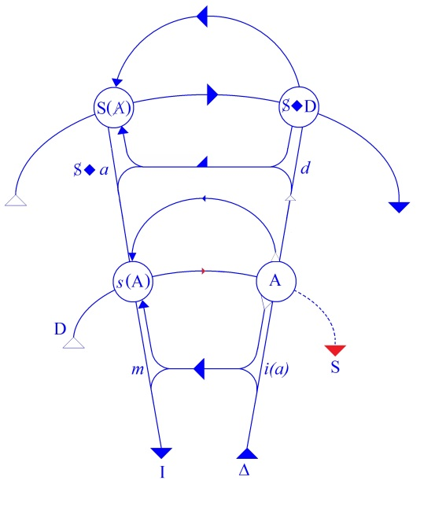

# Leçon 16 | 30 Mars 1960

  

    <label><input type="checkbox" data-lacan-toggle="original" checked> 原文</label>
    <label><input type="checkbox" data-lacan-toggle="notes" checked> 注释</label>
    <label><input type="checkbox" data-lacan-toggle="commentary" checked> 个人解读评论</label>
  

  <form class="lacan-tool-search" role="search">
    <input class="lacan-tool-search-input" type="search" placeholder="搜索全文" aria-label="搜索全文">
    <button class="lacan-tool-button" type="submit" title="搜索">搜索</button>
  </form>
  <button class="lacan-tool-button lacan-back-to-top" type="button" title="回到页面最上方" aria-label="回到页面最上方">↑</button>

<section class="parallel-paragraph" data-paragraph-ids="s7-16-0001">

s7-16-0001

原文 · s7-16-0001

Je vous ai annoncé pour aujourd’hui, à la suite de ce que nous avons à développer, que je parlerai de SADE. Ce n’est pas sans une certaine *contrariété -* de la coupure qui va être prolongée - que j’aborde ce sujet aujourd’hui. Je voudrais au moins, pendant cette leçon, éclaircir quelque chose qu’on pourrait appeler ainsi : une sorte de *malentendu latent* qui pourrait se produire, à savoir que le fait d’aborder SADE serait pour nous en quelque sorte lié à une façon toute extérieure de nous considérer comme pionniers, comme militants sur les limites.

[无对应译文]

</section>

<section class="parallel-paragraph" data-paragraph-ids="s7-16-0002">

s7-16-0002

原文 · s7-16-0002

Il s’agirait en quelque sorte, par fonction, par profession, que nous suivions cette direction qui serait indiquée à peu près en ces termes, que nous serions destinés à chatouiller les extrêmes, si je puis dire, que SADE, seulement en ce sens, serait notre parent, ou notre précurseur, qu’il ouvre je ne sais quelle impasse, aberration, aporie où il serait même - pourquoi pas ? - concernant le champ éthique que nous avons choisi cette année d’explorer comme tel, recommandé de le suivre.

[无对应译文]

</section>

<section class="parallel-paragraph" data-paragraph-ids="s7-16-0003">

s7-16-0003

原文 · s7-16-0003

Je crois qu’il importe extrêmement de dissiper ce malentendu, solidaire d’un certain nombre d’autres contre lesquels en quelque sorte je navigue, dans le progrès que j’essaye de faire devant vous cette année.Il ne s’agit pas là seulement de quelque chose d’intéressant pour nous au sens où je le disais à l’instant, purement externe. Je dirai même que, jusqu’à un certain point, une certaine dimension d’ennui que peut représenter pour vous, auditoire je dois dire pourtant si patient, si fidèle, le champ que nous explorons cette année n’est pas à négliger comme ayant son sens propre.

[无对应译文]

</section>

<section class="parallel-paragraph" data-paragraph-ids="s7-16-0004">

s7-16-0004

原文 · s7-16-0004

Je veux dire par là - et bien entendu puisque je vous parle, cela fait partie du genre, j’essaie de vous intéresser - que quand même l’ordre de communication qui nous lie n’est pas destiné forcément à éviter quelque chose que l’art normal de celui qui enseigne consiste à éviter. Je veux dire - par exemple pour comparer deux auditoires - si j’ai réussi à intéresser, c’est tant mieux, l’auditoire de Bruxelles, ce n’est pas du tout dans le même sens que vous êtes ici, à ce que je vous enseigne, intéressés.

[无对应译文]

</section>

<section class="parallel-paragraph" data-paragraph-ids="s7-16-0005">

s7-16-0005

原文 · s7-16-0005

Il y a même là quelque chose, je dois dire, qui touche à la nature, à la place du sujet que nous avons choisi cette année. Si je me plaçais un instant dans la perspective de ce qui existe, qui est humainement tellement sensible, tellement valable dans la perspective non pas du jeune analyste, mais de l’analyste qui s’installe, qui commence d’exercer son métier, je dirais que, par rapport à ce que nous essayons d’articuler, il est concevable que je puisse me heurter à la dimension de ce que je pourrais appeler « *la pastorale analytique* ».

[无对应译文]

</section>

<section class="parallel-paragraph" data-paragraph-ids="s7-16-0006">

s7-16-0006

原文 · s7-16-0006

Encore donné-je à ce terme, et à ce que je vise, son titre noble, son titre éternel. Un titre moins plaisant serait celui qui a été inventé par un des auteurs les plus répugnants de notre époque, c’est ce qu’on a appelé *Le confort intellectuel* [^39]. Il y a une dimension du « *comment faire ?* » à partir de quoi peut s’engendrer une impatience, voire une déception devant le fait de prendre les choses à un certain niveau, qui n’est pas celui où, semble-t-il, à partir de notre technique - c’est sa valeur, c’est sa promesse - *beaucoup de choses* doivent se résoudre. Pas *tout*, forcément ! Et ce en quoi elle nous met à l’affût de *quelque chose* qui peut se présenter comme une impasse, voire comme un déchirement, n’est pas forcément quelque chose dont nous ayons à détourner notre regard, même si c’est cela même qui doit dominer toute notre action.

[无对应译文]

</section>

<section class="parallel-paragraph" data-paragraph-ids="s7-16-0007">

s7-16-0007

原文 · s7-16-0007

Au début de cette vie du jeune qui s’installe dans sa fonction d’analyste, ce que je pourrais appeler *son squelette* fera de son action quelque chose de vertébré, non point cette sorte de mouvement vers mille formes, toujours prêt à retomber sur lui-même, à s’embrouiller dans je ne sais quel cercle où, depuis quelque temps, certaines explorations donnent l’image. Pour tout dire, il n’est pas mauvais que *quelque chose* soit dénoncé de ce qui peut déteindre d’un espoir d’assurance, sans doute utile dans l’exercice professionnel, sur je ne sais quelle assurance sentimentale par quoi, sans doute, les mêmes sujets que je suppose à cette bifurcation de leur existence se trouvent prisonniers de je ne sais quelle infatuation, source d’une déception intime, d’une revendication secrète.

[无对应译文]

</section>

<section class="parallel-paragraph" data-paragraph-ids="s7-16-0008">

s7-16-0008

原文 · s7-16-0008

Voilà sans doute ce contre quoi a à lutter, pour progresser, la perspective qui est celle des fins éthiques de la psychanalyse telle que j’essaie ici de vous en montrer cette dimension, pas forcément dernière, bel et bien immédiatement rencontrée. Ce dans quoi, au point où nous sommes, je pourrai le désigner, l’articuler par ces deux ou trois mots qui sont ceux auxquels nous ont mené notre chemin jusqu’à présent, je l’appellerai *le paradoxe de la jouissance*, pour autant que pour nous, analystes, il introduit sa problématique dans cette dialectique du bonheur dans laquelle nous nous sommes - qui sait ? - peut-être imprudemment aventurés.

[无对应译文]

</section>

<section class="parallel-paragraph" data-paragraph-ids="s7-16-0009">

s7-16-0009

原文 · s7-16-0009

Ce *paradoxe de la jouissance*, nous l’avons saisi dans plus d’un détail, que je n’ai besoin que d’indiquer devant vous d’un trait, pour vous les rappeler comme étant en quelque sorte ce qui surgit le plus facilement, le plus communément dans notre expérience.

[无对应译文]

</section>

<section class="parallel-paragraph" data-paragraph-ids="s7-16-0010">

s7-16-0010

原文 · s7-16-0010

Mais pour vous y mener, pour l’utiliser, pour le nouer dans notre trame, j’ai pris cette fois ce chemin que je vous signalai d’abord, de l’énigme de son rapport à *la Loi*, qui - en fait - prend toute sa valeur, tout son relief de l’*étrangeté* où pour nous, se situe l’existence de cette *Loi* en tant que, dès longtemps, je vous ai appris à la considérer comme fondée sur l’Autre, et qu’il nous faut suivre FREUD non en tant qu’exception, position particulière dans un individu, dans une *profession de foi athée*, mais comme quelqu’un, vous ai-je montré, qui, le premier, a donné valeur et droit de cité à un *mythe* en tant qu’il vise directement *le mort originel*, qu’il apporte dans notre pensée cette réponse à quelque chose qui s’était formulé sans raison de la façon la plus étendue, la plus articulée à la conscience de notre époque, comme étant la réalisation par les esprits les plus lucides, et bien plus encore par la masse, d’un fait qui s’appelle et s’articule comme « *la mort de Dieu* ».

[无对应译文]

</section>

<section class="parallel-paragraph" data-paragraph-ids="s7-16-0011">

s7-16-0011

原文 · s7-16-0011

Voici donc cette problématique, d’où nous partons, qui est proprement celle où se développe en quelque sorte le signe que, dans le graphe, je vous proposais sous la forme de S(A). Il se place, vous savez où ? Ici, dans la partie supérieure du graphe.

[无对应译文]

</section>

<section class="parallel-paragraph" data-paragraph-ids="s7-16-0012">

s7-16-0012

原文 · s7-16-0012

[无对应译文]

</section>

<section class="parallel-paragraph" data-paragraph-ids="s7-16-0013">

s7-16-0013

原文 · s7-16-0013

Il s’indique comme la réponse dernière à la garantie demandée à l’Autre du sens de cette *Loi* qu’il articule pour nous au plus profond de l’inconscient. S’il n’y a plus de manque, l’Autre défaille, le signifiant est celui de la mort de l’Autre. C’est en fonction de cette position suspendue elle-même au *paradoxe de la Loi* que pour nous se propose ce que j’ai appelé le *paradoxe de la jouissance*. C’est celui que nous essayons, en fonction de ce point où nous sommes parvenus, d’articuler.

[无对应译文]

</section>

<section class="parallel-paragraph" data-paragraph-ids="s7-16-0014">

s7-16-0014

原文 · s7-16-0014

Observons ceci que seul le christianisme donne son contenu plein, représenté par le drame de *la Passion,* au naturel de cette vérité que nous avons appelée « *la Mort de Dieu* ». Oui, dans un naturel auprès duquel pâlissent en quelque sorte les approches qu’en représentent les réalisations sanglantes *des combats de gladiateurs,* ce qui nous est proposé par le christianisme est un drame qui littéralement, comme il l’exprime, « *incarne* » cette *Mort de Dieu*. Et c’est aussi le christianisme qui rend ceci solidaire de quelque chose qui est arrivé concernant la Loi, à savoir ceci qui dans le message sans détruire, nous dit-on, la Loi, mais se substituant à elle comme désormais l’unique commandement, *la résume*, la reprend donc *en même temps qu’elle l’abolit.*

[无对应译文]

</section>

<section class="parallel-paragraph" data-paragraph-ids="s7-16-0015">

s7-16-0015

原文 · s7-16-0015

Et l’on peut dire vraiment que nous avons là le premier exemple historique dans lequel prend son poids le terme allemand de *Aufhebung* en tant qu’il est conservation de ce qu’il détruit, mais aussi changement de plan. Et cette Loi c’est précisément le « *Tu aimeras ton prochain comme toi-même* ». La chose est à proprement parler articulée comme telle dans l’Évangile. C’est avec le « *Tu aimeras ton prochain comme toi-même* » que nous avons à poursuivre notre chemin.

[无对应译文]

</section>

<section class="parallel-paragraph" data-paragraph-ids="s7-16-0016">

s7-16-0016

原文 · s7-16-0016

Les deux termes \[mort de Dieu, amour du prochain\] sont historiquement solidaires et, à moins de donner à tout ce qui s’accomplit historiquement dans la tradition judéo-chrétienne l’accent d’un hasard constitutionnel, il nous est impossible de méconnaître ce message. Je sais bien que le message des croyants est de nous montrer la résurrection au-delà, mais ceci est une promesse et c’est précisément le passage où nous avons à nous frayer notre voie.

[无对应译文]

</section>

<section class="parallel-paragraph" data-paragraph-ids="s7-16-0017">

s7-16-0017

原文 · s7-16-0017

De sorte qu’il convient que nous nous arrêtions à ce défilé, à ce passage étroit où FREUD lui-même s’arrête et recule avec une horreur motivée devant le « *Tu aimeras ton prochain comme toi-même* » au sens propre où, comme il l’articule, ce *commandement* lui apparaît inhumain. C’est en ceci que se résume tout ce qu’il a à *objecter*, à apporter comme objection contre.

[无对应译文]

</section>

<section class="parallel-paragraph" data-paragraph-ids="s7-16-0018">

s7-16-0018

原文 · s7-16-0018

C’est au nom de l’εὐδαιμονία \[eudaimonia\] [^40], la plus légitime sur tous les plans - tous les exemples qu’il en donne sont là pour en témoigner - que lui qui mesure ce dont il s’agit dans ce commandement, il s’arrête et constate qu’après tout, avec combien de légitimité, combien le spectacle historique de l’humanité qui se l’est donné pour idéal est, par rapport à son accomplissement, peu probant.

[无对应译文]

</section>

<section class="parallel-paragraph" data-paragraph-ids="s7-16-0019">

s7-16-0019

原文 · s7-16-0019

Je vous ai dit à quoi est liée cette horreur, cet arrêt de *l’honnête homme* si profondément méritant, cette qualité, qu’est FREUD. Il la fait surgir avec tout son relief dans cette désignation de cette méchanceté centrale où, lui, n’hésite pas à nous montrer le cœur le plus profond de l’homme. Je n’ai pas besoin, même ici, tellement, d’accentuer le point où je joins pour les nouer mes deux fils. C’est celui-ci : *le refus, la rébellion de l’homme* en tant qu’il aspire au bonheur, c’est-à-dire de *Jedermann*, de *tout-homme*.

[无对应译文]

</section>

<section class="parallel-paragraph" data-paragraph-ids="s7-16-0020">

s7-16-0020

原文 · s7-16-0020

*La vérité reste vraie que l’homme cherche le bonheur*. La résistance devant le commandement : « *Tu aimeras ton prochain comme toi-même* » et la résistance qui s’exerce pour entraver son accès à la jouissance, sont une seule et même chose. Ceci peut paraître, ainsi énoncé, *un paradoxe* de plus, une gratuite affirmation. N’y reconnaissez-vous pas, pourtant, ce à quoi nous nous référons de la façon la plus commune chaque fois qu’en effet nous voyons le sujet reculer devant sa jouissance ?

[无对应译文]

</section>

<section class="parallel-paragraph" data-paragraph-ids="s7-16-0021">

s7-16-0021

原文 · s7-16-0021

De quoi faisons-nous état ? Mais de l’agressivité inconsciente qu’elle contient, de ce noyau redoutable, de cette *destrudo* qui, quelles que soient à cet égard les petites manières, *les chipotages des mijaurées analytiques,* n’en est pas moins pourtant ce à quoi nous nous trouvons constamment affronté dans notre expérience. Et ceci, qu’on l’entérine ou non, au nom de je ne sais quelle idée préconçue de la nature, n’en reste pas moins la fibre, la trame même de tout ce que FREUD a enseigné.

[无对应译文]

</section>

<section class="parallel-paragraph" data-paragraph-ids="s7-16-0022">

s7-16-0022

原文 · s7-16-0022

Et nommément ceci : que c’est pour autant que cette agressivité, le sujet la tourne et la retourne contre lui, qu’en provient ce qu’on appelle *l’énergie du* *surmoi*. FREUD prend soin d’ajouter cette touche supplémentaire : qu’une fois entré dans cette voie, amorcé ce processus, il n’y a, semble-t-il, littéralement pas de limite, à savoir qu’il engendre un effet, une agression toujours plus lourde du *moi*.

[无对应译文]

</section>

<section class="parallel-paragraph" data-paragraph-ids="s7-16-0023">

s7-16-0023

原文 · s7-16-0023

Il l’engendre, si l’on peut dire, à la limite, à savoir très proprement pour autant que vient à manquer *cette médiation* qui est celle justement de la Loi. De la Loi, pour autant qu’elle proviendrait d’ailleurs, mais de cet ailleurs aussi, où vient à faire défaut pour nous son répondant, celui qui la garantit, à savoir Dieu lui-même. Ce n’est donc pas là une proposition originale que je vous fais en vous disant que le recul devant le « *Tu aimeras ton prochain comme toi-même* » est la même chose que *la barrière devant la jouissance*.

[无对应译文]

</section>

<section class="parallel-paragraph" data-paragraph-ids="s7-16-0024">

s7-16-0024

原文 · s7-16-0024

Ce ne sont pas deux contraires, deux opposés. C’est là qu’il convient de mettre l’accent, et que se retrouve le côté paradoxal. Encore faut-il le centrer. Ce ne sont pas deux opposés. Je recule à aimer mon prochain comme moi-même, pour autant sans doute qu’à cet horizon il y a quelque chose qui participe de je ne sais quelle intolérable cruauté. Dans la même direction, aimer mon prochain peut être la voie la plus cruelle.

[无对应译文]

</section>

<section class="parallel-paragraph" data-paragraph-ids="s7-16-0025">

s7-16-0025

原文 · s7-16-0025

*Tel est*, affûté, *le tranchant du paradoxe* en tant, effectivement, qu’ici je vous le propose. Sans doute faut-il, pour lui donner *sa portée*, y aller comme je vous l’ai dit, pas à pas, c’est-à-dire, saisissant les approches, le mode sous lequel s’annonce pour nous *cette ligne d’intime division* que nous puissions vraiment, sinon savoir, du moins *pressentir* quels accidents nous offre son chemin. Bien sûr, nous avons dès longtemps appris à connaître comme telle dans notre expérience, la jouissance de la transgression. Et il s’en faut de beaucoup que nous sachions simplement - à la présenter - quelle peut être sa nature. À cet égard, notre position est ambiguë.

[无对应译文]

</section>

<section class="parallel-paragraph" data-paragraph-ids="s7-16-0026">

s7-16-0026

原文 · s7-16-0026

Chacun sait que nous avons redonné à la perversion son droit de cité : « *pulsion partielle* » l’avons-nous appelée, *impliquant par là l’idée que dans la totalisation elle s’harmonise*, et déversant du même coup je ne sais quelle suspicion sur *l’exploration révolutionnaire* \- car elle fut à un moment du siècle dernier *révolutionnaire* - de la *Psychopathia sexualis*, de *l’œuvre monumentale* de KRAFFT-EBING.

[无对应译文]

</section>

<section class="parallel-paragraph" data-paragraph-ids="s7-16-0027">

s7-16-0027

原文 · s7-16-0027

De celle d’un HAVELOCK ELLIS aussi, à laquelle je n’aurais pas manqué *en passant*, une fois pour toutes, de donner la sorte de coups de bâton que je crois qu’elle mérite, à savoir d’entrée : les exemples les plus éclatants d’une sorte *d’incapacité systématique*, je veux dire par là, non pas de l’insuffisance d’une méthode, mais du choix d’une méthode en tant qu’insuffisante.

[无对应译文]

</section>

<section class="parallel-paragraph" data-paragraph-ids="s7-16-0028">

s7-16-0028

原文 · s7-16-0028

La prétendue *objectivité scientifique* qui s’étale dans ces livres qui ne constituent qu’un ramassis à peine critiqué de documents, vous donne bien un de ces exemples vivants de *cette conjonction d’une certaine foolerie avec une knaverie*, une *canaillerie fondamentale* dont je vous faisais la dernière fois la caractéristique d’un certain mode de pensée, dit pour l’occasion « *de gauche* », sans préjuger de ce qu’il peut avoir dans d’autres domaines de bavures et d’enclaves.

[无对应译文]

</section>

<section class="parallel-paragraph" data-paragraph-ids="s7-16-0029">

s7-16-0029

原文 · s7-16-0029

Bref, si cette lecture peut être recommandable, c’est au seul titre de vous montrer, non pas seulement la différence de fruits et de résultats, mais de ton qui existe entre un certain mode d’investigation futile, et ce qu’à proprement parler la pensée d’un FREUD et l’expérience qu’il dirige, réintroduit dans ce domaine de ce qui s’appelle tout simplement la responsabilité.

[无对应译文]

</section>

<section class="parallel-paragraph" data-paragraph-ids="s7-16-0030">

s7-16-0030

原文 · s7-16-0030

Nous connaissons donc cette *jouissance de la transgression*. Mais pour autant, convient-il de savoir en quoi elle consiste ?

[无对应译文]

</section>

<section class="parallel-paragraph" data-paragraph-ids="s7-16-0031">

s7-16-0031

原文 · s7-16-0031

Cela va-t-il donc de soi que de piétiner les lois sacrées, qui aussi bien peuvent être, par la conscience du sujet, profondément mises en cause, déclenche par soi-même je ne sais quelle jouissance ? Sans doute nous voyons constamment opérer chez les sujets cette très curieuse démarche que l’on peut articuler comme une mise à l’épreuve de je ne sais quel sort sans visage, d’un risque pris où le sujet, s’en étant tiré, se trouve, par après, comme garanti dans sa puissance.

[无对应译文]

</section>

<section class="parallel-paragraph" data-paragraph-ids="s7-16-0032">

s7-16-0032

原文 · s7-16-0032

Est-ce qu’ici la loi défiée ne joue pas le rôle de moyen, de sentier tracé pour accéder à ce risque ? Mais alors si ce sentier est nécessaire, ce risque, quel est-il ? Vers quel but la jouissance progresse-t-elle pour devoir, pour y arriver, prendre appui sur la transgression ?

[无对应译文]

</section>

<section class="parallel-paragraph" data-paragraph-ids="s7-16-0033">

s7-16-0033

原文 · s7-16-0033

Je laisse ces questions ouvertes pour l’instant et je reprends.

[无对应译文]

</section>

<section class="parallel-paragraph" data-paragraph-ids="s7-16-0034">

s7-16-0034

原文 · s7-16-0034

Si, dans ce chemin, le sujet rebrousse, quel est donc ce qui convoite le procès de ce retournement ? Essayons, *dans cette voie*, d’interroger à nouveau le problème. De celui-ci nous trouvons *dans l’analyse* une réponse plus motivée : l’identification à l’autre, nous dit-on, à l’extrême de telle de nos tentations. Ce n’est même point dire qu’il ne s’agisse de *tentations* extraordinaires, mais de l’extrême de ces tentations, à savoir : d’en apercevoir les conséquences. Nous reculons à quoi ? À quelque chose que je vous ai appris à repérer sous le terme, au sens où j’en fais usage, d’altruisme : nous reculons à attenter à *l’image de l’autre* parce que c’est l’image sur laquelle nous nous sommes formés comme « *moi* ».

[无对应译文]

</section>

<section class="parallel-paragraph" data-paragraph-ids="s7-16-0035">

s7-16-0035

原文 · s7-16-0035

Ici est la puissance convaincante de l’altruisme. Ici est aussi bien la puissance uniformisante d’une certaine loi d’égalité, celle qui se formule dans la notion de volonté générale. Dénominateur commun sans doute d’un respect de certains droits qu’on appelle, je ne sais pourquoi, élémentaires, mais qui peut prendre aussi bien la forme d’exclure de ses limites, et aussi bien de sa protection tout ce qui ne peut pas s’intégrer dans ses registres.

[无对应译文]

</section>

<section class="parallel-paragraph" data-paragraph-ids="s7-16-0036">

s7-16-0036

原文 · s7-16-0036

Puissance d’expansion aussi, dans ce que je vous ai articulé la dernière fois comme le penchant *utilitariste*. C’est à savoir qu’à ce niveau d’homogénéité, effectivement, la loi de l’utilité comme impliquant sa répartition sur le plus grand nombre s’impose d’elle même avec une forme qui effectivement *innovera*. Puissance captivante que ce quelque chose dont la dérision se dénote suffisamment à nos regards, j’entends d’*analystes*, quand nous l’appelons *philanthropie*, mais aussi bien qui pose la question des fondements naturels de ce que nous appelons la pitié au sens où *la morale* du sentiment y a toujours cherché son appui.

[无对应译文]

</section>

<section class="parallel-paragraph" data-paragraph-ids="s7-16-0037">

s7-16-0037

原文 · s7-16-0037

Tout ceci repose sur l’image de l’autre en tant que notre semblable. C’est dans cette similitude que nous avons à notre « *moi* » et à tout ce qui nous situe dans un certain registre, donné forme, que nous en sommes solidaires. Et que viens-je ici apporter comme question, alors qu’il semble aller de soi que c’est là le fondement même de la loi « *Tu aimeras ton prochain comme toi-même* » : il n’y a pas de question.

[无对应译文]

</section>

<section class="parallel-paragraph" data-paragraph-ids="s7-16-0038">

s7-16-0038

原文 · s7-16-0038

C’est bien du même autre qu’il s’agit. Et pourtant, il suffit un instant de s’arrêter pour voir que les contradictions pratiques, individuelles, intimes, sociales, sont manifestes, éclatantes, de l’idéalisation qui s’exprime dans les directions que j’ai formulées du respect de *cette image de l’autre* en tant qu’elle a un certain type, une certaine ligne, une certaine filière et filiation d’effets.

[无对应译文]

</section>

<section class="parallel-paragraph" data-paragraph-ids="s7-16-0039">

s7-16-0039

原文 · s7-16-0039

Et ce quelque chose d’infiniment problématique que la loi religieuse exprime et qu’elle manifeste historiquement, je dirai : d’une part par les paradoxes de ses extrêmes, ceux de la sainteté, et aussi bien par les paradoxes que sont l’échec sur le plan social en tant qu’elle n’arrive à rien de ce qui serait accomplissement, réconciliation, de faire littéralement venir l’avènement sur la terre, cet avènement pourtant par elle promis. Et pour mettre les points plus précisément encore sur les « i », je dirai, allant droit à ce qui semble aller au plus contraire de cette dénonciation de l’image, à savoir à ceci, toujours reçu dans un ronronnement de satisfaction plus ou moins amusée : « *Dieu a fait l’homme à son image* »

[无对应译文]

</section>

<section class="parallel-paragraph" data-paragraph-ids="s7-16-0040">

s7-16-0040

原文 · s7-16-0040

C’est ce qu’articule la tradition religieuse qui, une fois de plus, montre là plus de ruse dans l’*indication* de la vérité que ne le suppose l’orientation de la philosophie psychologique. S’ils croient s’en débarrasser en répondant que l’homme, sans doute, à Dieu le lui a bien rendu, pour mieux ramener ses pas dans une *autre direction* et - confrontant le fait que cet énoncé est *du même jet*, *du même corps* que ce livre sacré où s’articule l’interdiction de forger le Dieu des images - d’essayer de faire un pas plus loin en songeant que si cette interdiction a un sens, c’est quoi ? Que les images sont trompeuses. Et pourquoi ?

[无对应译文]

</section>

<section class="parallel-paragraph" data-paragraph-ids="s7-16-0041">

s7-16-0041

原文 · s7-16-0041

Allons donc au plus simple, c’est que par définition, si ce sont de belles images - et Dieu sait qu’elles sont toujours aux canons de la beauté qui règnent alors, des images religieuses, par définition - on ne voit pas qu’elles sont toujours creuses. Mais alors l’homme aussi, en tant qu’image : c’est pour le creux que l’image laisse vide, qu’il est intéressant.

[无对应译文]

</section>

<section class="parallel-paragraph" data-paragraph-ids="s7-16-0042">

s7-16-0042

原文 · s7-16-0042

C’est parce qu’on ne voit pas, par ce que l’on ne voit pas dans l’image, c’est par cet au-delà de la capture de l’image, le vide de Dieu à découvrir c’est peut-être la plénitude de l’homme, mais c’est aussi là que Dieu le laisse dans le vide. Or, Dieu, c’est sa puissance même de s’y avancer dans ce vide. Tout cela, pour nous, donne les figures de l’appareil d’un domaine où la reconnaissance d’autrui s’avère dans sa dimension d’aventure où le sens du mot reconnaissance s’infléchit vers celui qu’il prend dans toute exploration, quelque accent de militance, de nostalgie dont nous puissions la pourvoir.

[无对应译文]

</section>

<section class="parallel-paragraph" data-paragraph-ids="s7-16-0043">

s7-16-0043

原文 · s7-16-0043

SADE est sur cette limite et nous enseigne, dans deux sens que je voudrais vous épeler :

[无对应译文]

</section>

<section class="parallel-paragraph" data-paragraph-ids="s7-16-0044">

s7-16-0044

原文 · s7-16-0044

- en tant qu’il imagine de la franchir, qu’il cultive le fantasme sadique, avec *la morose délectation,* je reviendrai sur ces termes, où ce fantasme se déploie. En tant qu’il l’imagine, il démontre la structure imaginaire de la limite.

[无对应译文]

</section>

<section class="parallel-paragraph" data-paragraph-ids="s7-16-0045">

s7-16-0045

原文 · s7-16-0045

- En tant qu’il la franchit, car il la franchit - il ne la franchit pas, bien sûr - dans le fantasme, c’est bien ce qui en fait le caractère fastidieux.

[无对应译文]

</section>

<section class="parallel-paragraph" data-paragraph-ids="s7-16-0046">

s7-16-0046

原文 · s7-16-0046

Mais dans la théorie il la franchit dans la doctrine proférée en mots qui s’appelle selon les moments de son œuvre : « *la jouissance de la destruction* », « *la vertu propre du crime* », « *le mal cherché pour le mal* », et au dernier terme, les références singulières à ces entités qu’un de ses personnages, le personnage de SAINT FOND - pour vous aider à le repérer : dans *l’Histoire de Juliette* - proclame sous la forme d’une croyance renouvelée pas tellement neuve, à un Dieu comme : « *l’Être suprême en méchanceté* ».

[无对应译文]

</section>

<section class="parallel-paragraph" data-paragraph-ids="s7-16-0047">

s7-16-0047

原文 · s7-16-0047

Dans la théorie qui s’appelle - dans la même œuvre - « *le Système du pape* PIE VI », qu’il introduit comme un des personnages de son roman, poussant plus loin les choses il nous montre, nous déploie une vision de la Nature comme d’un vaste système d’attraction et de répulsion du « *mal par le mal* » en tant que tel.

[无对应译文]

</section>

<section class="parallel-paragraph" data-paragraph-ids="s7-16-0048">

s7-16-0048

原文 · s7-16-0048

Et le procès de la démarche éthique étant, pour l’homme, de réaliser à l’extrême cette assimilation à un mal absolu, grâce à quoi son interrogation a une nature foncièrement mauvaise est celle qui se réalisera dans une sorte d’harmonie inversée. Je ne fais ici qu’ébaucher, résumer, indiquer ce qui ne se présente pas, vous le voyez, comme les étapes d’une pensée à la recherche d’une *formulation paradoxale*, mais bien plutôt comme son *déchirement*, son *éclatement* dans la voie d’un cheminement qui par lui-même développerait l’impasse.

[无对应译文]

</section>

<section class="parallel-paragraph" data-paragraph-ids="s7-16-0049">

s7-16-0049

原文 · s7-16-0049

Ici peut-on dire pourtant que SADE nous enseigne à proprement parler et en tant que nous sommes dans l’ordre d’un jeu symbolique, une amorce, une voie, une tentative de franchir ce que j’ai appelé « *la limite* », de découvrir - je vous en montrerai des témoignages - ce que nous pourrions appeler *les lois de cet espace du prochain* comme tel, de cet espace qui se développe en tant que nous avons affaire :

[无对应译文]

</section>

<section class="parallel-paragraph" data-paragraph-ids="s7-16-0050">

s7-16-0050

原文 · s7-16-0050

- non pas à *ce semblable* de nous-mêmes que nous faisons si facilement *notre reflet* et que nous impliquons nécessairement dans les mêmes méconnaissances qui caractérisent notre moi,

[无对应译文]

</section>

<section class="parallel-paragraph" data-paragraph-ids="s7-16-0051">

s7-16-0051

原文 · s7-16-0051

- mais à proprement parler *ce prochain*, déjà en tant que le plus proche nous avons quelquefois, et ne serait-ce que pour l’acte de l’amour, à le prendre dans nos bras, je parle ici, non pas d’un amour idéal mais de l’acte de faire l’amour.

[无对应译文]

</section>

<section class="parallel-paragraph" data-paragraph-ids="s7-16-0052">

s7-16-0052

原文 · s7-16-0052

Et nous savons très bien combien les images du *moi* peuvent contrarier notre propulsion dans cet espace.

[无对应译文]

</section>

<section class="parallel-paragraph" data-paragraph-ids="s7-16-0053">

s7-16-0053

原文 · s7-16-0053

Est-ce que de celui qui nous apprend à nous y avancer, dans un discours plus qu’atroce, nous n’avons pas pourtant quelque chose à apprendre sur les lois d’un espace en tant précisément que nous y font défaut, nous y leurrent, nous y trompent justement les lois de la captivation imaginaire par l’image du semblable ? Vous voyez où je vous mène. Au point précis où je suspends notre démarche, je ne préjuge pas ici de ce qu’est l’autre. Et je souligne *les leurres* du semblable en tant que c’est de ce semblable en tant que semblable que naissent les méconnaissances qui me définissent comme « *moi* ».

[无对应译文]

</section>

<section class="parallel-paragraph" data-paragraph-ids="s7-16-0054">

s7-16-0054

原文 · s7-16-0054

Et je vais m’arrêter un instant sur un petit *apologue*, sur une petite image, où vous reconnaîtrez mes cachets privés. Je vous ai parlé, dans un temps, du pot de moutarde. Ce que je veux vous montrer par ce dessin de trois pots, c’est que vous en avez là toute une rangée, de moutarde ou de confiture. Ils sont sur des planches, aussi nombreux qu’il suffira à vos appétits contemplatifs. Ce que je veux, sur cet exemple, vous faire remarquer, c’est que c’est en tant que les pots sont identiques qu’ils sont irréductibles. Je veux dire qu’à ce niveau nous butons littéralement sur une espèce de préalable de l’individuation. Celui auquel en général ce problème s’arrête, à savoir qu’il y a celui-ci, qui n’est pas celui-là.

[无对应译文]

</section>

<section class="parallel-paragraph" data-paragraph-ids="s7-16-0055">

s7-16-0055

原文 · s7-16-0055

Je voudrais, si vous êtes capables d’éveiller une oreille un peu subtile, vous faire entendre qu’à l’opposé de cette limite c’est en tant qu’ils sont les mêmes qu’ils pourraient envelopper strictement le même vide. Je veux dire que l’un mis à la place de l’autre, c’est sans doute l’autre chassé par l’un, mais que le vide est le même. Vous ne pensez pas, bien sûr, que m’échappe *le caractère sophistiqué* de ce petit tour de prestidigitation. Néanmoins, comme tout sophisme, tâchez de comprendre la vérité qu’il recèle. Autrement dit, tâchez de comprendre que dans le terme « *même* » l’étymologie, qui n’est autre - je ne sais si vous vous en êtes aperçus - que *metipse* [^41] \[moi-même\], fait de ce « *même* » en « *moi-même* » *une sorte de redondance*.

[无对应译文]

</section>

<section class="parallel-paragraph" data-paragraph-ids="s7-16-0056">

s7-16-0056

原文 · s7-16-0056

Mais « *même* »\[dérivant\] de *metipsimus* \[*metipsimus* superlatif de *metipse* : le plus moi-même de moi-même\] pour arriver à faire la transformation phonétique, *le plus moi-même de moi-même*, ce qui est au cœur de moi–même, ce qui est au-delà de moi, pour autant qu’il s’arrête au niveau de ces parois sur lesquelles on peut mettre une étiquette, cet intérieur, ce vide dont je ne sais plus s’il est à moi ou à personne, ce *metipsimus*, voilà ce qui sert, en français tout au moins, à désigner la notion du « *même* ».

[无对应译文]

</section>

<section class="parallel-paragraph" data-paragraph-ids="s7-16-0057">

s7-16-0057

原文 · s7-16-0057

Voilà ce qui justifie l’usage de mon sophisme et qui me rappelle que ce « *prochain* », il a précisément sans doute toute cette méchanceté dont parle FREUD, mais qu’elle n’est autre que celle-là même devant laquelle je recule en moi–même, et que l’aimer c’est vraiment l’aimer comme un moi-même, mais du même coup c’est nécessairement m’avancer dans quelque cruauté. *La sienne* ou *la mienne*, m’objecterez-vous ?

[无对应译文]

</section>

<section class="parallel-paragraph" data-paragraph-ids="s7-16-0058">

s7-16-0058

原文 · s7-16-0058

Mais tout ce que je viens de vous expliquer est justement pour vous montrer que rien ne dit ici qu’elles soient distinctes. Il semble bien plutôt que ce soit la même, à condition que soient franchies les limites qui me font me poser en face de l’autre comme mon semblable. Ici je dois éclairer ma lanterne : *cette ivresse panique, cette orgie sacrée, ces flagellants des cultes* d’ATTIS, et ces BACCHANTES de la tragédie d’EURIPIDE, bref, tout ce *dionysisme* reculé dans une histoire perdue à laquelle on se réfère depuis le XIXème siècle pour essayer de retracer, de resituer au-delà de HEGEL, de KIERKEGAARD à NIETZSCHE, les vestiges qui peuvent nous rester encore ouverts de cette dimension du grand PAN, dans une dimension apologétique et en quelque sorte condamnée chez KIERKEGAARD, utopique, apocalyptique, et non moins effectivement condamnée chez NIETZSCHE, ce n’est pas de cela qu’il s’agit quand je vous parle de cette *mêmeté* de l’*autrui* et de *moi*. Ce n’est pas de cela qu’il s’agit, pour la raison qui m’a fait terminer mon avant-dernier séminaire par l’évocation corrélative

[无对应译文]

</section>

<section class="parallel-paragraph" data-paragraph-ids="s7-16-0059">

s7-16-0059

原文 · s7-16-0059

au déchirement du voile du temple, que le grand PAN est mort. Je n’en dirai pas plus loin aujourd’hui, encore que, bien entendu, il ne s’agisse pas seulement qu’à mon tour je vaticine, mais que je vous donne rendez-vous au moment où - pourquoi le grand PAN est mort ? - il faudra bien que j’essaie de justifier *pourquoi*, *en quoi*, *à quel moment*, et sans doute au moment précis que la légende nous désigne.

[无对应译文]

</section>

<section class="parallel-paragraph" data-paragraph-ids="s7-16-0060">

s7-16-0060

原文 · s7-16-0060

Ce dont il s’agit ici, ce en quoi j’entends vous mener par la main, et que vous y laissiez la ligne toujours possible à retrouver d’un fil, est la démarche de SADE pour autant qu’il nous montre, d’un certain champ de ce domaine, de *cet espace du prochain* dont je vous parle, l’accès dans ce que j’appellerai - pour paraphraser *le titre* d’un de ses ouvrages qui s’appelle *Idées sur les romans -* l’idée d’une technique proprement orientée vers la jouissance sexuelle en tant que non sublimée, et les rapports de cette idée avec ce champ à explorer de l’accès au prochain. Ici nous ne pouvons que nous arrêter un instant pour annoncer que cette idée va nous montrer toutes sortes de lignes de divergences au point d’engendrer assurément l’idée de difficulté.

[无对应译文]

</section>

<section class="parallel-paragraph" data-paragraph-ids="s7-16-0061">

s7-16-0061

原文 · s7-16-0061

Dès lors, il serait nécessaire que nous situions *la portée de l’œuvre littéraire* comme telle. Voilà-t-il pas un détour qui va, à coup sûr \- on me reproche d’être lent, depuis quelque temps - bien nous retarder. Pourrions-nous tout de même en finir avec *ce pas* *du raffinement* plus rapidement qu’il ne semble nécessaire ? Et rappeler qu’assurément plusieurs biais par où l’œuvre de SADE peut être prise doivent être évoqués, ne serait–ce que pour dire celui que *nous* choisissons.

[无对应译文]

</section>

<section class="parallel-paragraph" data-paragraph-ids="s7-16-0062">

s7-16-0062

原文 · s7-16-0062

D’abord cette œuvre est-elle un témoignage conscient de ce qu’il dit, ou inconscient ? Quand j’entends inconscient ici, je vous en prie, ne faites pas entrer en jeu l’inconscient analytique comme tel. Je veux dire inconscient pour autant que *le sujet* SADE ne repère pas entièrement ce en quoi il s’insère dans les conditions faites à l’homme noble de son temps, à l’orée de cette Révolution, puis dans la période de « *la Terreur* » que, comme vous le savez, il va tout entière traverser pour être ensuite relégué aux confins, dans l’asile de Charenton, par la volonté, dit-on, du Premier Consul. À la vérité, SADE nous apparaît bien avoir été extrêmement conscient du rapport de son œuvre avec la position de celui que j’appellerai « *l’homme du plaisir* », et pour autant qu’à l’intérieur de cette vie de l’homme du plaisir, l’homme du plaisir comme tel porte ici témoignage contre lui-même en avouant publiquement les extrémités où en arrive ceci.

[无对应译文]

</section>

<section class="parallel-paragraph" data-paragraph-ids="s7-16-0063">

s7-16-0063

原文 · s7-16-0063

Tout, dans *la joie* avec laquelle il rappelle *les émergences* que nous en avons dans l’histoire, le prouve assez, avoue à quoi de tout temps en arrive le maître quand il ne courbe pas la tête devant l’être de Dieu. Il n’y a pas du tout à cacher la face que j’appellerai réaliste des atrocités de SADE. Assurément leur caractère développé, insistant, démesuré saute aux yeux et contribue, par je ne sais quel défi, à la vraisemblance, à faire entrer l’idée légitime de je ne sais quelle ironie de ce discours. Il n’en reste pas moins que les choses dont il s’agit s’étalent dans SUETONE, dans DION CASSIUS, dans quelques autres, et lisez les *Grands jours d’Auvergne* d’Esprit FLÉCHIER[^42], pour apprendre ce qu’à l’orée du XVIIème siècle un grand seigneur pouvait se permettre avec ses paysans.

[无对应译文]

</section>

<section class="parallel-paragraph" data-paragraph-ids="s7-16-0064">

s7-16-0064

原文 · s7-16-0064

Nous aurions tort, au ton de la retenue qu’impose à notre faiblesse les fascinations de l’imaginaire, de penser que cette fois-ci, et bien que sans savoir ce qu’ils font, les hommes ne sont pas capables en de certaines positions, ces limites, de les franchir. Là-dessus FREUD lui-même nous donne la main de ce manque absolu de faux-fuyants, de toute *knaverie,* qui le caractérise quand, dans le *Malaise dans la civilisation*, il n’hésite pas à articuler qu’il n’y a pas de commune mesure entre la satisfaction que donne une jouissance à son état premier et celle qu’elle peut donner dans les formes détournées, voire *sublimées* selon les voies dans lesquelles l’engage *la civilisation*.

[无对应译文]

</section>

<section class="parallel-paragraph" data-paragraph-ids="s7-16-0065">

s7-16-0065

原文 · s7-16-0065

À un autre endroit, il ne dissimule pas *ce qu’il pense* du fait que ces jouissances - qu’une morale reçue interdit - sont néanmoins, par les conditions mêmes où vivent certains qu’il désigne du doigt et qui sont ceux qu’on appelle « les riches », parfaitement *accessibles* et *permises*, et que sans doute, malgré les entraves que nous leur connaissons, ils en profitent quelquefois.

[无对应译文]

</section>

<section class="parallel-paragraph" data-paragraph-ids="s7-16-0066">

s7-16-0066

原文 · s7-16-0066

Et pour mettre les choses exactement au point, je profite de ce passage pour vous faire une *remarque*. *Remarque* que je crois assez souvent omise, ou négligée, qui est celle-ci. *Ce n’est qu’une remarque incidente* à la mode des remarques de FREUD en cette matière. C’est à savoir que la sécurité de la jouissance des riches, à l’époque propre où nous vivons, se trouve, réfléchissez-y bien, très augmentée par ce que j’appellerai « la légalisation universelle du travail ». C’est bien vous représenter ce que furent, dans les époques passées, ce qu’on a appelé « *les guerres sociales* ». Essayez d’en retrouver ce qui existe, ce qui en reporte à nos époques l’équivalent assurément à nos frontières, mais plus à l’intérieur de nos sociétés.

[无对应译文]

</section>

<section class="parallel-paragraph" data-paragraph-ids="s7-16-0067">

s7-16-0067

原文 · s7-16-0067

Un point sur la valeur de témoignage de réalité de l’œuvre de SADE : allons-nous interroger sa valeur de sublimation ? Si nous prenons la sublimation dans sa forme la plus épanouie, je dirai même la plus truculente, la plus cynique, sous laquelle FREUD s’est amusé à nous la proposer, à savoir la transformation de la tendance sexuelle en une œuvre où chacun, reconnaissant ses propres rêves et impulsions, récompensera l’artiste de lui donner cette satisfaction en lui donnant une vie large et heureuse, en lui donnant par conséquent effectivement accès à la satisfaction de la tendance intéressée au départ, si nous prenons l’œuvre de SADE sous cet angle, c’est plutôt raté.

[无对应译文]

</section>

<section class="parallel-paragraph" data-paragraph-ids="s7-16-0068">

s7-16-0068

原文 · s7-16-0068

*C’est plutôt raté*, parce qu’à vrai dire, vous savez - ou ne savez pas - le temps de sa vie que le pauvre SADE a passé soit en prison, soit reclus dans des *maisons spéciales*, et qu’on ne peut pas dire que le succès de son œuvre qui pourtant, dès son vivant, au moins pour l’œuvre dite *La Nouvelle Justine* suivie de l’*Histoire de Juliette*, fut un grand succès, mais assurément succès souterrain, succès de ténèbres, succès réprouvé. Là-dessus nous n’insisterons pas. Nous y faisons allusion tout simplement, pour promener notre lanterne sur les faces qui méritent d’abord d’être éclairées.

[无对应译文]

</section>

<section class="parallel-paragraph" data-paragraph-ids="s7-16-0069">

s7-16-0069

原文 · s7-16-0069

Et maintenant venons-en alors à voir - puisqu’elle n’est pas, somme toute, épuisée par ces deux faces où nous venons d’essayer de la repérer - où se situe l’œuvre de SADE. Œuvre indépassable, a-t-on dit, dans le sens d’une sorte d’absolu de l’insupportable de ce qui peut être exprimé par des mots concernant la transgression de toutes les limites humaines.

[无对应译文]

</section>

<section class="parallel-paragraph" data-paragraph-ids="s7-16-0070">

s7-16-0070

原文 · s7-16-0070

On peut admettre que dans aucune littérature d’aucun temps il y eut un ouvrage aussi scandaleux, que nul autre n’a blessé plus profondément les sentiments et les pensées des hommes. Aujourd’hui que les récits de MILLER nous font *trembler*, qui oserait rivaliser de licence avec SADE ? Oui, on peut prétendre que nous tenons là l’œuvre la plus scandaleuse qui fut jamais écrite. Et Maurice BLANCHOT que je vous cite, continue : « *N’est-ce pas un motif de nous en préoccuper ?* »

[无对应译文]

</section>

<section class="parallel-paragraph" data-paragraph-ids="s7-16-0071">

s7-16-0071

原文 · s7-16-0071

C’est précisément ce que nous faisons. Je vous incite à lire ce livre où sont recueillis, en même temps, deux articles de Maurice BLANCHOT sur LAUTREAMONT et sur SADE[^43], et qui me paraît de toute façon, si vous êtes capables de faire l’effort de le lire, un des éléments indispensables à verser à *notre dossier*, à côté du sens du discours que j’essaie de vous dire. Quoi qu’il en soit, que ce soit moi qui vous le résume dans les termes que je vous ai dit, ou BLANCHOT lui-même qui l’articule, parler ainsi, c’est assurément beaucoup dire. En fait, il semble qu’il n’y ait pas d’*atrocité concevable* qui ne puisse être trouvée dans ce catalogue où semblait puiser une sorte de défi à la sensibilité dont l’effet est à proprement parler stupéfiant.

[无对应译文]

</section>

<section class="parallel-paragraph" data-paragraph-ids="s7-16-0072">

s7-16-0072

原文 · s7-16-0072

Si le mot stupéfiant veut dire qu’en quelque sorte on abandonne la ligne du sens à l’auteur, qu’on perd les pédales autrement dit, et qu’à ce point de vue on peut même dire que *l’effet* dont il s’agit est obtenu sans art, c’est-à-dire sans considération de l’économie des moyens, par une sorte d’accumulation des détails, des péripéties auxquelles s’ajoute apparemment un truffage de *dissertations*, de justifications dont assurément les contradictions nous intéressent beaucoup car nous les suivrons dans le détail, et dont pour l’instant je veux seulement faire remarquer que seuls les esprits grossiers peuvent considérer - ce qui leur arrive - que ces *dissertations* sont là pour faire en quelque sorte passer des complaisances érotiques.

[无对应译文]

</section>

<section class="parallel-paragraph" data-paragraph-ids="s7-16-0073">

s7-16-0073

原文 · s7-16-0073

Même des gens beaucoup plus fins que des esprits grossiers en sont venus à attribuer à ces *dissertations*, dénommées *digressions*, la baisse, si l’on peut dire, de la tension suggestive sur le plan où pourtant les esprits fins en question - il s’agit là très précisément de Georges BATAILLE - sur le plan où ils considèrent l’œuvre comme nous donnant proprement l’accès à cette sorte d’assomption de l’être en tant que dérèglement où ils voient la valeur de l’œuvre de SADE.

[无对应译文]

</section>

<section class="parallel-paragraph" data-paragraph-ids="s7-16-0074">

s7-16-0074

原文 · s7-16-0074

Attribuer cette espèce d’intérêt à ces dissertations et digressions est pourtant une erreur. L’ennui dont il s’agit est quelque chose d’autre. Il n’est que la réponse de l’être précisément - que ce soit du lecteur ou de l’auteur peu importe - à l’approche d’un centre d’incandescence ou, si je puis dire, de zéro absolu en tant qu’il est psychiquement irrespirable.

[无对应译文]

</section>

<section class="parallel-paragraph" data-paragraph-ids="s7-16-0075">

s7-16-0075

原文 · s7-16-0075

Sans doute, que le livre tombe des mains prouve qu’il est mauvais. Mais ici le mauvais littéraire est peut-être le garant de cette mauvaiseté à proprement parler - pour employer un terme qui était encore en usage au XVIIème siècle - qui est l’objet même de notre recherche.

[无对应译文]

</section>

<section class="parallel-paragraph" data-paragraph-ids="s7-16-0076">

s7-16-0076

原文 · s7-16-0076

Dès lors SADE se présente dans l’ordre de ce que j’appellerai la littérature expérimentale. À savoir l’œuvre d’art en tant qu’elle est elle–même expérience, et une expérience qui n’est pas n’importe laquelle, une expérience, dirais-je, qui arrache le sujet comme tel, et par son procès, à ce que je pourrais appeler ses amarres psychosociales, et pour ne pas rester dans le vague, je veux dire, à toute appréciation psychosociale de la sublimation dont il s’agit.

[无对应译文]

</section>

<section class="parallel-paragraph" data-paragraph-ids="s7-16-0077">

s7-16-0077

原文 · s7-16-0077

Il n’y a pas de meilleur exemple d’une telle œuvre que celle dont j’espère qu’au moins certains d’entre vous ont eu la pratique. Je dis la pratique dans les mêmes sens où on peut dire : avez-vous ou non la pratique de l’opium ? À savoir les *Chants de Maldoror* de LAUTRÉAMONT. Je n’en parle ici que pour autant que c’est à très juste titre que Maurice BLANCHOT *conjugue les deux perspectives* qu’il nous donne sur l’un et l’autre auteur.

[无对应译文]

</section>

<section class="parallel-paragraph" data-paragraph-ids="s7-16-0078">

s7-16-0078

原文 · s7-16-0078

Mais dans SADE la référence est conservée au social, et il a la prétention de *valoriser socialement* son extravagant système. D’où cette sorte d’aveux étonnants qui font effet d’incohérences et qui, littéralement, je vous le montrerai, aboutissent à une sorte de contradiction multiple qu’on aurait pourtant tort de mettre ici purement et simplement à l’actif de l’« *absurde* ».

[无对应译文]

</section>

<section class="parallel-paragraph" data-paragraph-ids="s7-16-0079">

s7-16-0079

原文 · s7-16-0079

C’est une catégorie un petit peu *commode* l’« *absurde* », depuis quelque temps. Tellement *commode* que lui vient - comme vous savez, les morts sont respectables, mais tout de même nous ne pouvons pas ne pas noter la complaisance qu’a apporté à je ne sais quels balbutiements sur ce thème, le prix NOBEL[^44] - cette merveilleuse récompense universelle de cette *knaverie* dont sans aucun doute l’histoire prouvera le palmarès de ce qui peut bien être dit de *stigmates d’une certaine abjection dans notre culture*.

[无对应译文]

</section>

<section class="parallel-paragraph" data-paragraph-ids="s7-16-0080">

s7-16-0080

原文 · s7-16-0080

Ce que SADE nous montre, c’est de la façon la plus articulée, deux termes que j’isolerai en terminant aujourd’hui, comme *une annonce* de ce qui fera la suite de notre projet. C’est ceci, c’est que quand on avance dans une certaine direction, qui est celle de ce vide central, en tant que c’est jusqu’à présent sous cette forme que se présente à nous l’accès à la jouissance : le corps du prochain se morcelle.

[无对应译文]

</section>

<section class="parallel-paragraph" data-paragraph-ids="s7-16-0081">

s7-16-0081

原文 · s7-16-0081

Et que - ici - c’est à son insu que, doctrinant la loi de la jouissance comme pouvant fonder je ne sais quel système de société idéalement utopique, il s’exprime ainsi en italiques, dans son texte, page 77 de l’édition de *Juliette* en dix petits volumes, qui a été refaite récemment de façon ma foi fort propre chez PAUVERT, et qui est je crois encore maintenant un livre qui ne s’écoule que sous le manteau :

[无对应译文]

</section>

<section class="parallel-paragraph" data-paragraph-ids="s7-16-0082">

s7-16-0082

原文 · s7-16-0082

« *Prêtez moi la partie de votre corps qui peut me satisfaire un instant, et jouissez, si cela vous plaît, de celle du mien qui peut vous être agréable.* »

[无对应译文]

</section>

<section class="parallel-paragraph" data-paragraph-ids="s7-16-0083">

s7-16-0083

原文 · s7-16-0083

L’énoncé de cette loi fondamentale par laquelle s’exprime un moment du système de SADE en tant qu’il se prétend socialement recevable, est quelque chose qui est intéressant à relever pour autant que nous y voyons je ne dis pas la première manifestation dans le véhicule humain, mais dans l’articulé, dans la parole, de ce quelque chose à quoi nous nous sommes, comme psychanalystes, arrêtés sous le nom d’*objet partiel*.

[无对应译文]

</section>

<section class="parallel-paragraph" data-paragraph-ids="s7-16-0084">

s7-16-0084

原文 · s7-16-0084

Mais quand nous articulons ainsi la notion d’*objet partiel*, nous impliquons par là que cet objet ne demande qu’à rentrer, si l’on peut dire, dans *l’objet * :

[无对应译文]

</section>

<section class="parallel-paragraph" data-paragraph-ids="s7-16-0085">

s7-16-0085

原文 · s7-16-0085

- *l’objet* valorisé,

[无对应译文]

</section>

<section class="parallel-paragraph" data-paragraph-ids="s7-16-0086">

s7-16-0086

原文 · s7-16-0086

- *l’objet* de notre amour et de notre tendresse,

[无对应译文]

</section>

<section class="parallel-paragraph" data-paragraph-ids="s7-16-0087">

s7-16-0087

原文 · s7-16-0087

- *l’objet* en tant, pour tout dire, qu’il concilie en lui toutes les vertus du prétendu stade génital.

[无对应译文]

</section>

<section class="parallel-paragraph" data-paragraph-ids="s7-16-0088">

s7-16-0088

原文 · s7-16-0088

Je crois qu’il convient de s’arrêter un peu autrement au problème, et de s’apercevoir que cet objet est nécessairement à l’état, si je puis dire, d’indépendance, dans ce champ que nous tenons comme par convention, comme central, et que l’objet total, le prochain comme tel, vient s’y profiler, séparé de nous, se dressant si je puis dire, pour évoquer l’image du CARPACCIO, de *San Giorgio degli Schiavone*, à Venise, au milieu d’une figure de charnier.

[无对应译文]

</section>

<section class="parallel-paragraph" data-paragraph-ids="s7-16-0089">

s7-16-0089

原文 · s7-16-0089

[无对应译文]

</section>

<section class="parallel-paragraph" data-paragraph-ids="s7-16-0090">

s7-16-0090

原文 · s7-16-0090

Je reprendrai la nécessité impliquée par ces termes pour vous indiquer l’autre figure que déjà, dès le premier abord, SADE nous enseigne. C’est à savoir le fantasme de ce qui apparaît, de ce que j’appellerai « *le caractère indestructible de l’Autre* », pour autant qu’il surgit dans la figure de sa victime.

[无对应译文]

</section>

<section class="parallel-paragraph" data-paragraph-ids="s7-16-0091">

s7-16-0091

原文 · s7-16-0091

Observez : qu’il s’agisse de Justine, qu’il s’agisse aussi d’une certaine postérité assurément, elle, dépassable, de l’œuvre de SADE, je veux dire de sa postérité à proprement parler érotique, voire pornographique, celle qui a donné une de ses fleurs, il faut le reconnaître dans la récente, et je pense par une partie importante de mon auditoire, connue : *Histoire d’O*.

[无对应译文]

</section>

<section class="parallel-paragraph" data-paragraph-ids="s7-16-0092">

s7-16-0092

原文 · s7-16-0092

Cette victime survit à tous les mauvais traitements, elle ne se dégrade même pas dans son caractère d’*attrait*, et d’*attrait voluptueux* sur lequel la plume de l’auteur revient toujours avec insistance, et avec une insistance assurément comme en toute description de cette espèce : *elle avait toujours les yeux les plus jolis du monde, l’air le plus pathétique et le plus touchant*. Il semble que l’insistance de l’auteur à mettre toujours ses sujets sous une rubrique aussi *stéréotypée*, pose en elle-même un problème. Il est certain que l’image dont il s’agit, il semble que tout ce qui lui arrive soit incapable d’en altérer, même à l’usure, l’aspect privilégié.

[无对应译文]

</section>

<section class="parallel-paragraph" data-paragraph-ids="s7-16-0093">

s7-16-0093

原文 · s7-16-0093

Il y a plus dans SADE - qui est en effet quelqu’un d’une autre nature - que dans tous ceux qui nous proposent ces amusettes. Dans SADE, nous voyons se profiler à l’horizon l’idée d’un supplice éternel. Je reviendrai sur ce point, et à l’occasion vous en lirai les passages.

[无对应译文]

</section>

<section class="parallel-paragraph" data-paragraph-ids="s7-16-0094">

s7-16-0094

原文 · s7-16-0094

Étrange incohérence pourtant chez cet auteur qui soutient que rien de lui-même ne devant subsister, il désira que rien ne reste accessible aux hommes de la place de sa tombe, que doivent recouvrir les fourrés. N’est-ce pas dire qu’ici, dans le fantasme, il fait le contenu de ce plus proche de lui-même que nous appelons le prochain, ou encore ce *metipsimus* ?

[无对应译文]

</section>

<section class="parallel-paragraph" data-paragraph-ids="s7-16-0095">

s7-16-0095

原文 · s7-16-0095

Ici, vous le voyez, c’est sur cette indication de détail que je finirai aujourd’hui mon discours.

[无对应译文]

</section>

<section class="parallel-paragraph" data-paragraph-ids="s7-16-0096">

s7-16-0096

原文 · s7-16-0096

Par quelles attaches profondes un certain rapport à l’Autre qu’on appelle sadique nous montre sa parenté véritable avec *la psychologie de l’obsessionnel* dont toutes les défenses sont faites sous l’aspect et sous la forme d’une sorte d’armature de ferraille, de monture et de corset dans lesquels il s’arrête et s’enferre pour s’empêcher d’accéder à ce que FREUD appelle quelque part « *une horreur à lui-même inconnue* ».## Notes

[^39]: Marcel Aymé : *Le confort intellectuel*, Livre de Poche 2002.

[^40]: Cf. Aristote : [*Éthique à Eudème*](http://remacle.org/bloodwolf/philosophes/Aristote/eudeme2-1.htm), II, 1219a, 9 : « ἦν μὲν γὰρ ἡ <u>εὐδαιμονία</u> τὸ ἄριστον, τὰ δὲ ». « *<u>Le bonheur</u>, avons-nous dit, est le bien suprême* ».

[^41]:
    #  Cf. les débats sur l’éthymologie de « *même* » : *metipsimus*, superlatif de *metipse*, du latin classique *egomet ipse*, en personne, moi-même (Bloch et Wartburg).

    Le mot « *metipse* » est une invention basée sur l’idée que dans l’expression latine « *egomet ipse* » l’usage aurait abandonné la première partie « *ego* » du mot

    « *egomet* ». Mais comme ce terme est encore trop éloigné du mot français « *même* », on lui invente un superlatif pour introduire un M supplémentaire.

    Les étymologistes officiels laissent le soin au lecteur de déduire que le mot « *metipsimus* » s’est transformé en « *même* ». ([*Éthymologie des langues indo-européennes*](http://www.etymologie-langues-indo-europeennes.fr/livre.php?page=126)).

[^42]: Esprit Fléchier : [*Mémoires de Fléchier sur les grands jours d’Auvergne*](http://gallica.bnf.fr/ark:/12148/bpt6k200313s.r=Esprit+Fl%C3%A9chier+.langFR), 1665, Mercure de France, 1984.

[^43]: Maurice Blanchot : *Lautréamont et Sade*, éd. de Minuit, 1949 (réedition 2006).

[^44]: Albert Camus, prix Nobel de littérature 1957.

[无对应译文]

</section>

