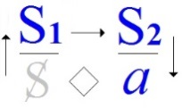

# Leçon 19 | 11 Mai 1960

  

    <label><input type="checkbox" data-lacan-toggle="original" checked> 原文</label>
    <label><input type="checkbox" data-lacan-toggle="notes" checked> 注释</label>
    <label><input type="checkbox" data-lacan-toggle="commentary" checked> 个人解读评论</label>
  

  <form class="lacan-tool-search" role="search">
    <input class="lacan-tool-search-input" type="search" placeholder="搜索全文" aria-label="搜索全文">
    <button class="lacan-tool-button" type="submit" title="搜索">搜索</button>
  </form>
  <button class="lacan-tool-button lacan-back-to-top" type="button" title="回到页面最上方" aria-label="回到页面最上方">↑</button>

<section class="parallel-paragraph" data-paragraph-ids="s7-19-0001">

s7-19-0001

原文 · s7-19-0001

Nous sommes toujours sur *la barrière du désir*. Comme je vous l’ai annoncé la dernière fois, je vous parlerai du *bien*. Le *bien* a toujours eu à se situer quelque part sur cette barrière. C’est la façon dont l’analyse vous permet d’articuler cette position dont il s’agira aujourd’hui.

[无对应译文]

</section>

<section class="parallel-paragraph" data-paragraph-ids="s7-19-0002">

s7-19-0002

原文 · s7-19-0002

Je vous parlerai donc du *bien*. Peut-être je vous en parlerai mal - ce n’est pas un jeu - au sens où je n’ai pas « *tout le bien possible* » à vous dire du *bien*. Je ne vous en parlerai peut-être pas *si bien que cela*, faute d’être moi-même aujourd’hui tout à fait *assez bien* pour le faire *à la hauteur* de ce que le sujet comporte. Mais l’idée de la nature, après tout ce que je vous en dirai, fait que je ne m’arrête pas à cette contingence accidentelle. Je vous prie simplement de m’en excuser si vous ne vous en trouvez pas, à la fin, tout à fait satisfaits.

[无对应译文]

</section>

<section class="parallel-paragraph" data-paragraph-ids="s7-19-0003">

s7-19-0003

原文 · s7-19-0003

Cette question du *bien* est aussi proche que possible, après tout, de notre action. Tout ce qui s’opère *d’échanges entre les hommes*, plus encore une intervention du type de la nôtre, a coutume de se mettre sous le chef, sous l’autorisation, du *bien*. C’est là la perspective sublime, voire sublimée. Vous avez pu voir que, concernant *la fonction de la sublimation* - autant ce dont je vous ai parlé la dernière fois à propos de ce que FREUD articule à propos de *la pulsion de mort*, sur un exemple de cette *sublimation* - que *la sublimation*, après tout, *nous pourrions*, sous un certain angle, *la définir comme une opinion au sens platonicien* du terme, *une opinion arrangée en manière d’atteindre ce qui pourrait être objet de science*, là où il est, cet objet, et où la science ne peut l’atteindre.

[无对应译文]

</section>

<section class="parallel-paragraph" data-paragraph-ids="s7-19-0004">

s7-19-0004

原文 · s7-19-0004

Une *sublimation*, quelle qu’elle soit - et jusqu’à cet universel lui-même : le *bien -* peut être considérée momentanément, dans cette parenthèse, d’être *une science truquée*. Il est certain - tout vous suggère dans votre expérience, dans la façon dont elle se formule - que cette notion, cette finalité du *bien* se pose pour vous comme problématique. Quel *bien* exactement *poursuivez-vous* concernant votre *passion* ?

[无对应译文]

</section>

<section class="parallel-paragraph" data-paragraph-ids="s7-19-0005">

s7-19-0005

原文 · s7-19-0005

C’est bien là une question qui est toujours au premier plan, à l’ordre du jour de notre comportement à chaque instant, que de savoir quel doit être notre rapport effectif avec ce *désir de bienfait*, avec ce *désir de guérir* dont nous savons que parle à chaque instant, au plus concret de notre expérience, que nous avons avec lui à compter comme :

[无对应译文]

</section>

<section class="parallel-paragraph" data-paragraph-ids="s7-19-0006">

s7-19-0006

原文 · s7-19-0006

- avec quelque chose qui ne nous indique, bien loin de là, pas soi-même,

[无对应译文]

</section>

<section class="parallel-paragraph" data-paragraph-ids="s7-19-0007">

s7-19-0007

原文 · s7-19-0007

- avec quelque chose qui, dans bien des cas, est instantané et de nature à nous fourvoyer.

[无对应译文]

</section>

<section class="parallel-paragraph" data-paragraph-ids="s7-19-0008">

s7-19-0008

原文 · s7-19-0008

Je dirai plus : c’est une certaine façon paradoxale, voire tranchante, d’articuler pour nous notre désir comme *un non-désir de guérir*, c’est bien quelque chose qui n’a pas d’autre sens que de nous mettre en garde concernant les voies vulgaires du *bien* telles qu’elles s’offrent si facilement à nous dans leur pente, dans la pente de la tricherie bénéfique, de vouloir *le bien du sujet*.

[无对应译文]

</section>

<section class="parallel-paragraph" data-paragraph-ids="s7-19-0009">

s7-19-0009

原文 · s7-19-0009

Mais dès lors, de quoi désirez-vous donc *guérir le sujet* ? Il n’y a pas de doute que quelque chose d’absolument inhérent à notre expérience, à notre voie, à notre inspiration, quelque chose dont nous ne pouvons pas nous séparer, est assurément de le guérir des *illusions* qui le retiennent sur la voie de son désir.

[无对应译文]

</section>

<section class="parallel-paragraph" data-paragraph-ids="s7-19-0010">

s7-19-0010

原文 · s7-19-0010

Jusqu’où pouvons-nous aller dans ce sens ? Et après tout, ces illusions - quand elles ne comporteraient pas en elles-mêmes quelque chose de respectable - encore faut-il qu’il veuille les abandonner. La limite de la résistance est-elle ici simplement une limite individuelle ? Ici repose la question de la position des biens par rapport au désir. Assurément, toutes sortes de *biens tentateurs* s’offrent à lui, et vous savez quelle imprudence il y aurait à ce que nous nous laissions mettre en demeure d’être, pour lui, la promesse de tous ces *biens* comme *accessibles*.

[无对应译文]

</section>

<section class="parallel-paragraph" data-paragraph-ids="s7-19-0011">

s7-19-0011

原文 · s7-19-0011

C’est bien pourtant dans une certaine perspective culturelle, celle que j’ai appelé « *la voie américaine de notre thérapeutique »,* c’est bien pourtant dans cette perspective de l’accès aux biens de la terre que se présente une certaine façon d’aborder, d’arriver, de présenter sa demande au psychanalyste. Nous allons voir - je crois, d’une façon, je n’ose dire assez ferme - à quelle distance nous sommes de ce que les choses puissent se formuler aussi simplement. Simplement, avant d’entrer dans ce problème des *biens*, j’ai voulu faire se profiler pour vous cette *question* des illusions sur la voie du désir et sur ceci : que la rupture de ces illusions est une question de science, de science *du bien et du mal*, c’est le cas de le dire.

[无对应译文]

</section>

<section class="parallel-paragraph" data-paragraph-ids="s7-19-0012">

s7-19-0012

原文 · s7-19-0012

Une question de science qui se situe en ce champ central dont j’essaie de vous montrer le caractère irréductible, inéliminable dans notre expérience, en tant que justement, peut-être, il est lié à cette interdiction, à cette réserve dont nous avons, au cours de notre exploration précédente, spécialement l’année dernière quand je vous ai parlé du *désir et de son interprétation,* je vous ai montré le trait essentiel dans cet « *il ne savait pas* », à l’imparfait, comme gardant le champ radical de l’énonciation, du rapport le plus foncier du *sujet* avec l’articulation *signifiante*. Autant dire qu’il n’en est pas *l’agent*, mais le *support*, pour autant qu’il ne saurait même en supputer les conséquences mais que c’est dans son rapport à cette articulation signifiante que lui, comme sujet, surgit comme sa conséquence.

[无对应译文]

</section>

<section class="parallel-paragraph" data-paragraph-ids="s7-19-0013">

s7-19-0013

原文 · s7-19-0013

Aussi bien, pour nous rapporter à quelque chose de cette expérience fantasmatique qui est celle que j’ai choisi de produire devant vous pour, en quelque sorte, exemplifier ce champ central dont il s’agit dans le désir, n’oubliez pas ces moments de *création fantasmatique* dans le texte de SADE où il est proprement articulé que la plus grande cruauté en face du sujet est précisément ceci : que son sort soit agité devant lui - lui le sachant - que comme cela elle s’exprime dans les termes de cette jubilation diabolique, y rencontre sa lecture quasiment intolérable. C’est devant ces malheureux que se poursuit ouvertement *le complot* qui les concerne.

[无对应译文]

</section>

<section class="parallel-paragraph" data-paragraph-ids="s7-19-0014">

s7-19-0014

原文 · s7-19-0014

La valeur du fantasme est ici de suspendre, pour nous, le sujet à l’interrogation la plus *radicale*, dont la responsabilité tient à un certain « *il ne savait pas* » dernier, pour autant que s’exprimant ainsi, à l’imparfait, déjà, la question posée le dépasse. Je vous prie ici de vous rappeler l’ambiguïté que révèle l’expérience linguistique au sujet de *cet imparfait*, qu’en français, quand on dit : « *Un instant plus tard, la bombe éclatait*. » Ceci peut vouloir dire deux choses opposées :

[无对应译文]

</section>

<section class="parallel-paragraph" data-paragraph-ids="s7-19-0015">

s7-19-0015

原文 · s7-19-0015

- ou bien qu’effectivement elle a éclaté,

[无对应译文]

</section>

<section class="parallel-paragraph" data-paragraph-ids="s7-19-0016">

s7-19-0016

原文 · s7-19-0016

- ou bien que précisément, quelque chose est intervenu, ce qui fait qu’elle n’a pas éclaté.

[无对应译文]

</section>

<section class="parallel-paragraph" data-paragraph-ids="s7-19-0017">

s7-19-0017

原文 · s7-19-0017

Nous voici donc sur le sujet du *bien*. Ce n’est pas d’hier que ce sujet nous arrête, et il faut dire que les esprits d’époque, dont les préoccupations - Dieu sait pourquoi - nous semblent un peu dépassées, ont eu pourtant là-dessus, de temps en temps des articulations bien intéressantes. Je ne répugne pas à en faire état, si étranges soient-elles, parce que je crois qu’apportées ici dans leur contexte, leur abstraction toute apparente n’est pas faite pour vous arrêter. Je veux dire que quand Saint AUGUSTIN, au *Livre VII* de ses *Confessions*, écrit les choses suivantes, je ne pense pas que cela doive seulement, de vous, recueillir l’indulgence d’un sourire.

[无对应译文]

</section>

<section class="parallel-paragraph" data-paragraph-ids="s7-19-0018">

s7-19-0018

原文 · s7-19-0018

> « *Que tout ce qui est, est bon, étant l’œuvre de Dieu. Je compris aussi que toutes les choses qui se corrompent sont bonnes, et qu’ainsi elles ne pourraient se corrompre si elles étaient souverainement bonnes. Il ne pouvait se faire aussi qu’elles se corrompissent si elles n’étaient pas bonnes. Car, si elles avaient une souveraine bonté, elles seraient incorruptibles, et, si elles n’avaient rien de bon, il n’y aurait rien en elles capable d’être corrompu, puisque la corruption nuit à ce qu’elle corrompt, et qu’elle ne saurait nuire*
>
> *qu’en diminuant le bien.* »

[无对应译文]

</section>

<section class="parallel-paragraph" data-paragraph-ids="s7-19-0019">

s7-19-0019

原文 · s7-19-0019

C’est ici que commence le nerf de l’argument :

[无对应译文]

</section>

<section class="parallel-paragraph" data-paragraph-ids="s7-19-0020">

s7-19-0020

原文 · s7-19-0020

> « *Ainsi, ou la corruption n’apporte point de dommage, ce qui ne peut se soutenir, ou toutes les choses qui se corrompent perdent quelques biens, ce qui est indubitable. Que si elles avaient perdu tout ce qu’elles ont de bon, elles ne seraient plus du tout. Autrement, si elles subsistaient encore sans ne pouvoir plus être corrompues, elles seraient dans un état plus parfait*
>
> *qu’elles n’étaient avant d’avoir perdu tout ce qu’elles ont de bon, puisqu’elles demeuraient toujours dans un état incorruptible.* »

[无对应译文]

</section>

<section class="parallel-paragraph" data-paragraph-ids="s7-19-0021">

s7-19-0021

原文 · s7-19-0021

Je pense que vous saisissez le nerf, voire l’ironie de l’argument, et aussi bien que c’est précisément de cela dont nous posons la question. S’il est intolérable de s’apercevoir qu’au centre de toutes choses est soustrait tout ce qu’elles ont de bon, que dire de ce qui reste, qui puisse être encore quelque chose, autre chose ? La question retentit à travers les siècles et les expériences.

[无对应译文]

</section>

<section class="parallel-paragraph" data-paragraph-ids="s7-19-0022">

s7-19-0022

原文 · s7-19-0022

Et dans la même édition de SADE que je vous ai indiquée les dernières fois, de l’*Histoire de Juliette*, au chapitre IV, pages 29 et 30, c’est là-même une question que nous trouvons, à ceci près qu’elle est menée, et comme elle doit l’être, avec *la question de la Loi*, et cela non moins singulièrement, je veux dire bizarrement. Et c’est cette bizarrerie sur laquelle je désire arrêter votre esprit, parce que c’est la bizarrerie même de la structure dont il s’agit. SADE écrit :

[无对应译文]

</section>

<section class="parallel-paragraph" data-paragraph-ids="s7-19-0023">

s7-19-0023

原文 · s7-19-0023

> « *Ce n’est jamais dans l’anarchie que les tyrans naissent. Vous ne les voyez s’élever qu’à l’ombre des lois, s’autoriser d’elles.*
>
> *Le règne des lois est donc vicieux, il est donc inférieur à celui de l’anarchie. La plus grande preuve de ce que j’avance est l’obligation où est le gouvernement de se plonger lui–même dans l’anarchie quand il veut refaire sa constitution. Pour abroger ses anciennes lois, il est obligé d’établir un régime révolutionnaire où il n’y a point de loi. Dans ce régime, naissent à la fin de nouvelles lois,*
>
> *mais le second est nécessairement moins pur que le premier puisqu’il en dérive, puisqu’il a fallu opérer ce premier bien, l’anarchie, pour arriver au second bien la constitution de l’État.* »

[无对应译文]

</section>

<section class="parallel-paragraph" data-paragraph-ids="s7-19-0024">

s7-19-0024

原文 · s7-19-0024

C’est clair. Je vous présente ceci comme un exemple fondamental. La même argumentation est reflétée, dans leur singularité, dans des esprits assurément éloignés les uns des autres par leurs préoccupations, dont la répétition vous montre simplement qu’il doit bien y avoir là quelque chose qui oblige à cette sorte de *trébuchement logique* qui s’avance *dans une certaine voie*. Pour nous, la question du bien est, dès l’origine, dès l’abord, par notre expérience, articulée dans son rapport avec la Loi. Rien d’autre part, de plus tentant, que d’éluder sans réserve cette question *du bien* derrière je ne sais quelle implication *d’un bien naturel*, une harmonie à retrouver sur le chemin de l’élucidation du désir.

[无对应译文]

</section>

<section class="parallel-paragraph" data-paragraph-ids="s7-19-0025">

s7-19-0025

原文 · s7-19-0025

Et pourtant, ce que notre expérience de chaque jour nous manifeste sous la forme de ce que nous appelons défenses du sujet, c’est bien très exactement en quoi les voies de la recherche du *bien* se présentent d’abord constamment, originellement, si je puis dire, à nous, sous la forme de quelque alibi du sujet sur les voies qu’il vous propose, à lui, les voies dont toute l’expérience analytique n’est que l’invite vers la révélation de son désir.

[无对应译文]

</section>

<section class="parallel-paragraph" data-paragraph-ids="s7-19-0026">

s7-19-0026

原文 · s7-19-0026

C’est pour cela qu’il importe que nous regardions de près ce *quelque chose* qui est tout à fait à l’origine, qui s’aperçoit comme réarticulant la proposition au sujet, et qui voit du bien dans la primitivité d’un rapport qui est changé par rapport à tout ce qui, jusque là, a été pour lui articulé *par les philosophes*.

[无对应译文]

</section>

<section class="parallel-paragraph" data-paragraph-ids="s7-19-0027">

s7-19-0027

原文 · s7-19-0027

Assurément, il semble que rien n’est changé et que la pointe, dans FREUD, est toujours indiquée dans le registre du plaisir. Je suis revenu, j’y ai *insisté* tout au long de l’année : nécessairement toute méditation sur *le bien de l’homme*, tout ce qui s’est articulé depuis l’origine de *la pensée moraliste*, de ceux pour qui le terme d’éthique a pris un sens, comme réflexions de l’homme sur sa condition et calcul de ses propres voies, s’est fait en fonction de *l’indication de l’index du plaisir*.

[无对应译文]

</section>

<section class="parallel-paragraph" data-paragraph-ids="s7-19-0028">

s7-19-0028

原文 · s7-19-0028

Tout depuis PLATON, depuis ARISTOTE certainement, à travers les stoïciens, les épicuriens et à travers la pensée chrétienne elle-même, dans Saint THOMAS, les choses s’épanouissent de la façon la plus claire dans les voies d’une problématique essentiellement hédoniste concernant cette détermination des biens.

[无对应译文]

</section>

<section class="parallel-paragraph" data-paragraph-ids="s7-19-0029">

s7-19-0029

原文 · s7-19-0029

Il n’est que trop clair que tout ceci ne va pas sans entraîner d’extrêmes difficultés qui sont les difficultés mêmes de l’expérience, et que pour s’en tirer, tous les philosophes sont amenés à distinguer, à discerner entre non pas les vrais et les faux plaisirs, car il est impossible de faire une pareille distinction, mais entre les vrais et les faux biens que le plaisir indique.

[无对应译文]

</section>

<section class="parallel-paragraph" data-paragraph-ids="s7-19-0030">

s7-19-0030

原文 · s7-19-0030

Est-ce que l’accent mis par FREUD, dans son articulation du *principe du plaisir*, ne nous apporte pas quelque chose de nouveau, quelque chose d’essentiel qui nous permet précisément, à ce niveau, d’enregistrer au premier temps un gain, un bénéfice, un bénéfice de connaissance et de clarté, sans aucun doute *corrélatif*, aussi bien que ce qui a pu être gagné par l’homme dans l’intervalle concernant cette problématique ?

[无对应译文]

</section>

<section class="parallel-paragraph" data-paragraph-ids="s7-19-0031">

s7-19-0031

原文 · s7-19-0031

Est-ce que, à y regarder de près, nous ne voyons pas dans la formulation par FREUD du *principe du plaisir* quelque chose de foncièrement distinct de tout ce qui jusque là, a donné son sens au terme de *plaisir* ?

[无对应译文]

</section>

<section class="parallel-paragraph" data-paragraph-ids="s7-19-0032">

s7-19-0032

原文 · s7-19-0032

C’est là-dessus que je veux d’abord attirer votre attention. Je ne puis le faire comme il convient, qu’en marquant à ce propos que la considération du *principe du plaisir* est inséparable - que c’est une conception véritablement dialectique - de celle, énoncée par FREUD, du *principe de réalité*.

[无对应译文]

</section>

<section class="parallel-paragraph" data-paragraph-ids="s7-19-0033">

s7-19-0033

原文 · s7-19-0033

Mais il faut bien commencer par l’un des deux et je veux simplement commencer par vous faire remarquer ce que FREUD articule exactement dans *principe du plaisir*. Observez-le se formuler, s’articuler, *depuis l’Entwurf, depuis le Projet pour une psychologie* d’où je vous ai fait partir cette année, dans l’articulation de l’éthique, *jusqu’au dernier terme, c’est à savoir l’Au-delà du principe du plaisir*. La fin éclaire le commencement, mais déjà vous pouvez voir dans l’*Entwurf,* le point nerveux sur lequel je désire un instant vous retenir.

[无对应译文]

</section>

<section class="parallel-paragraph" data-paragraph-ids="s7-19-0034">

s7-19-0034

原文 · s7-19-0034

Sans doute, apparemment le plaisir - pour autant que c’est par sa fonction que vont s’organiser pour le psychisme du sujet humain, les réactions finales - sans doute le plaisir s’articule-t-il sur les présupposés d’une satisfaction et c’est poussé par un manque qui est de l’ordre du besoin que le sujet s’engage dans ses rets, jusqu’à faire surgir une *perception* identique à celle qui, la première fois, a donné sa satisfaction, et bien sûr, justement, la référence la plus simple et la plus crue au *principe de réalité,* c’est à savoir qu’on trouve sa satisfaction dans les chemins qui l’ont déjà procurée.

[无对应译文]

</section>

<section class="parallel-paragraph" data-paragraph-ids="s7-19-0035">

s7-19-0035

原文 · s7-19-0035

Mais regardez-y de plus près. *Est-ce bien seulement cela que dit* FREUD ? Certes pas ! Dès le début, vous voyez *l’économie de ce* *qu’il appelle investissement libidinal*, et c’est en cela qu’est l’originalité de l’*Entwurf* en quelque chose qui est l’organisation des frayages qui vont commander les répartitions des dits investissements d’une façon telle qu’un certain niveau ne soit pas dépassé, au-delà duquel *l’excitation* pour le sujet serait *insupportable*.

[无对应译文]

</section>

<section class="parallel-paragraph" data-paragraph-ids="s7-19-0036">

s7-19-0036

原文 · s7-19-0036

C’est dans l’introduction, dans *l’économie de cette fonction des frayages* qu’est l’amorce de quelque chose qui, à mesure que la pensée de FREUD - en tant que la pensée de FREUD est basée sur *son expérience* - à mesure que la pensée de FREUD se développera, prendra de plus en plus d’importance. On m’a reproché d’avoir dit, à un moment, que toute notre expérience - je veux dire celle que nous sommes en mesure de diriger, le plan dans lequel nous nous déplaçons - prend, du point de vue de l’histoire, de l’éthique, sa valeur exemplaire de ce que - *aurais-je dit* - nous ne mettons aucun accent sur *l’habitude*, que nous sommes à l’opposé de ce registre qui est de l’ordre de l’apport au comportement humain en fonction d’un perfectionnement de *dressage*.

[无对应译文]

</section>

<section class="parallel-paragraph" data-paragraph-ids="s7-19-0037">

s7-19-0037

原文 · s7-19-0037

L’on m’a opposé à ce propos précisément cette notion de *frayage*. Opposition que je rejette, en ce sens que ce qui me semble caractériser *la position*, *l’articulation* qui joue dans FREUD, ce recours au frayage n’a rien à faire avec *la fonction de l’habitude* telle qu’elle est définie dans *la pensée de l’* ἔθος \[éthos\], de *l’apprentissage*. Il ne s’agit point, dans FREUD, de *l’empreinte* en tant que créatrice, mais du plaisir engendré par le *fonctionnement* de ces frayages. Le nerf du *principe du plaisir* dans FREUD, tel qu’il prendra dans la suite son articulation *pleine*, se situe là encore au niveau de la subjectivité.

[无对应译文]

</section>

<section class="parallel-paragraph" data-paragraph-ids="s7-19-0038">

s7-19-0038

原文 · s7-19-0038

Le frayage n’est point un effet mécanique, il est invoqué comme plaisir de la facilité. Il sera repris comme plaisir de la répétition. La répétition du besoin - comme quelqu’un l’a articulé - ne joue dans *la pensée*, dans *la psychologie freudienne* que comme occasion de quelque chose qui s’appelle besoin de répétition et, plus exactement, de pulsion de répétition.

[无对应译文]

</section>

<section class="parallel-paragraph" data-paragraph-ids="s7-19-0039">

s7-19-0039

原文 · s7-19-0039

Le nerf de la pensée freudienne, tel que nous avons affaire à lui à chaque instant, tel qu’en tant qu’analystes nous le mettons effectivement en jeu, que nous assistions ou que nous n’assistions pas au séminaire, et en ceci que dans FREUD la fonction de la mémoire comme telle, la remémoration fondamentale de tous les phénomènes auxquels nous avons affaire est à proprement parler - et c’est le moins qu’on puisse dire - rivale comme telle des satisfactions qu’elle est chargée d’assurer.

[无对应译文]

</section>

<section class="parallel-paragraph" data-paragraph-ids="s7-19-0040">

s7-19-0040

原文 · s7-19-0040

Elle comporte sa dimension propre et dont le poids peut aller au-delà de cette finalité satisfaisante. La tyrannie de la mémoire, c’est cela qui pour nous, à proprement parler, s’élabore dans ce que nous pouvons appeler structure, dans le sens que ce terme de structure peut avoir pour nous. Tel est le point de départage, telle est la nouveauté, telle est la coupure sur laquelle il n’est pas possible de ne pas mettre l’accent si l’on veut voir clairement en quoi la pensée et l’expérience freudiennes apportent quelque chose de nouveau dans notre conception du fonctionnement humain comme tel.

[无对应译文]

</section>

<section class="parallel-paragraph" data-paragraph-ids="s7-19-0041">

s7-19-0041

原文 · s7-19-0041

Sans doute, le recours est-il toujours possible - à la pensée qui veut combler cette faille - de faire remarquer que la nature montre des cycles et des retours. Je ne crierai pas aujourd’hui « *Au fou !* » Dans le sens d’une discussion de cette objection, je vous indique simplement les termes dans lesquels vous pourriez, vous pouvez réfléchir et y faire face.

[无对应译文]

</section>

<section class="parallel-paragraph" data-paragraph-ids="s7-19-0042">

s7-19-0042

原文 · s7-19-0042

Le cycle naturel, immanent en effet à tout - peut-être - ce qui est, est quelque chose d’extrêmement divers d’ailleurs, dans ses registres et ses niveaux. Mais je vous prie de vous arrêter à la coupure qu’introduit, cette émergence dans l’ordre de la manifestation du *réel*, que comporte le cycle comme tel, qu’il soit traité, et il l’est, par l’homme dès lors que l’homme est le support du langage, ou par rapport à un couple de signifiants, tel par exemple, pour prendre une pensée traditionnelle, dans toute espèce même d’ébauche, d’un symbolisme, qu’il soit traité en fonction du *yin* et du *yang*, à savoir deux signifiants dont l’un est conçu comme éclipsé par la montée de l’autre et par son retour, et aussi bien d’ailleurs - je ne tiens ni au *yin* ni au *yang* - l’introduction, simplement, du *sinus* et du *cosinus*.

[无对应译文]

</section>

<section class="parallel-paragraph" data-paragraph-ids="s7-19-0043">

s7-19-0043

原文 · s7-19-0043

En d’autres termes, la structure engendrée par la mémoire ne doit pas vous masquer, dans notre expérience comme telle, la structure de la mémoire elle-même en tant qu’elle est faite d’une articulation signifiante. Car, à l’omettre, vous ne pouvez absolument soutenir ni distinguer ce registre qui est essentiel dans l’articulation de notre expérience, c’est à savoir l’autonomie, la dominance, l’instance comme telle de la remémoration, au niveau non du *réel*, mais du fonctionnement du *principe du plaisir*. Je vous l’indique en passant, quel rapport et quelle distinction la plus fondamentale ceci introduit-il ? Il ne s’agit point là d’une discussion byzantine.

[无对应译文]

</section>

<section class="parallel-paragraph" data-paragraph-ids="s7-19-0044">

s7-19-0044

原文 · s7-19-0044

Il s’agit que c’est là que nous pouvons, si nous créons une faille et un abîme, inversement combler ailleurs ce qui se présentait aussi comme failles et comme abîme, à ceci près qu’il était émis une idée : c’est à savoir que c’est ici que se peut apercevoir où peut résider la naissance du sujet comme tel, dont rien par ailleurs ne peut justifier le surgissement. Je vous l’ai dit, la finalité de l’évolution d’une matière vers la conscience, purement et simplement, est une notion mystique, insaisissable et, à proprement parler, indéterminable historiquement. Ce qui d’ailleurs se voit par ceci, c’est qu’il n’y a aucune homogénéité d’ordre dans l’apparition des phénomènes, qu’ils soient prémonitoires, préalables, partiels, préparatoires à la conscience, ou un ordre naturel quelconque, puisque c’est bien quand même de son état actuel que la conscience se manifeste comme phénomène dans une répartition absolument erratique, je dirais presque éclatée.

[无对应译文]

</section>

<section class="parallel-paragraph" data-paragraph-ids="s7-19-0045">

s7-19-0045

原文 · s7-19-0045

Ce sont aux niveaux les plus différents de notre engagement dans notre propre *réel* que la tache ou la touche de conscience apparaît, qu’il n’y a aucune continuité, aucune homogénéité de la conscience et, après tout, c’est bien là où plusieurs fois FREUD, à plus d’un détour, s’est arrêté, soulignant toujours ce caractère infonctionnalisable du phénomène de la conscience.

[无对应译文]

</section>

<section class="parallel-paragraph" data-paragraph-ids="s7-19-0046">

s7-19-0046

原文 · s7-19-0046

Notre sujet, par rapport à ce fonctionnement de la chaîne signifiante, a par contre, lui, une place tout à fait solide et je dirai presque repérable, je veux dire dans l’*histoire*. L’apparition, la fonction du sujet comme tel, nous en apportons une formule tout à fait nouvelle et susceptible d’un repérage objectif. La définition d’un sujet, du sujet originel, d’un sujet en tant qu’il fonctionne comme sujet,d’un sujet détectable dans *la chaîne des phénomènes,* n’est pas autre chose que celle-ci : *c’est que ce qu’un sujet comme tel représente, à proprement parler, essentiellement, originellement, c’est cela, c’est qu’il peut oublier*.

[无对应译文]

</section>

<section class="parallel-paragraph" data-paragraph-ids="s7-19-0047">

s7-19-0047

原文 · s7-19-0047

Supprimez ce « *il* », *le sujet est littéralement, à son origine et comme tel, l’élision d’un signifiant, le signifiant sauté dans la chaîne*. Telle est la première place, la première personne. Ici se manifeste comme telle l’apparition du sujet, faisant toucher du doigt pourquoi la notion de l’inconscient, pourquoi et en quoi la notion de l’inconscient est, dans notre expérience, centrale. Partez de là et vous y verrez l’explication de bien des choses, ne serait–ce que de cette singularité repérable dans l’histoire qui s’appelle les rites. Les rites, je veux dire en tant qu’il s’agit de ces rites par quoi l’homme des civilisations dites primitives se croit obligé d’aider, d’accompagner justement la chose la plus naturelle du monde, c’est à savoir le retour des cycles naturels.

[无对应译文]

</section>

<section class="parallel-paragraph" data-paragraph-ids="s7-19-0048">

s7-19-0048

原文 · s7-19-0048

Si l’empereur n’ouvre pas le sillon à tel jour du printemps, sans doute - vous savez qu’il s’agit de l’Empereur de Chine - sans doute tout le rythme des saisons va se *corrompre*. Si l’ordre n’est pas conservé dans la Maison Royale, le champ de la mer va empiéter sur celui de la terre. Nous en avons encore le retentissement jusqu’au début du XVIème siècle, dans SHAKESPEARE.

[无对应译文]

</section>

<section class="parallel-paragraph" data-paragraph-ids="s7-19-0049">

s7-19-0049

原文 · s7-19-0049

Qu’est-ce que ceci peut vouloir dire, si ce n’est précisément ce rapport essentiel qui lie le sujet aux signifiances et l’instaure à l’origine comme responsable de l’oubli ? Quel rapport peut-il y avoir entre l’homme et le retour du lever du soleil si ce n’est pour ce que, comme homme parlant, il se sustente dans ce rapport direct avec le signifiant, dans cette attention du soleil du fait, si vous voulez, pour évoquer SMITH, que nous ne nous arrêtons devant rien d’autre que la position première de l’homme par rapport à la nature, qui est celle de CHANTECLER par rapport à son propre chant. Sujet apporté par un petit poète qui pourrait être mieux abordé, s’il n’avait pas commencé par nous diffamer la figure de Cyrano DE BERGERAC [^53] en nous le réduisant à une élucubration bouffonne, sans aucun rapport avec la stature monumentale de ce personnage.

[无对应译文]

</section>

<section class="parallel-paragraph" data-paragraph-ids="s7-19-0050">

s7-19-0050

原文 · s7-19-0050

Nous voici donc amenés à nous poser, dans ces termes et à ce niveau, la question du *bien*. La question du *bien* est à cheval sur le *principe du plaisir* et le *principe de réalité*. Nulle chance qu’à partir d’une telle conception, nous n’échappions à un conflit quand, assurément, nous en avons singulièrement déplacé le centre.

[无对应译文]

</section>

<section class="parallel-paragraph" data-paragraph-ids="s7-19-0051">

s7-19-0051

原文 · s7-19-0051

Je crois qu’ici il est impossible que nous ne mettions pas en évidence ce qui est trop peu articulé dans la conception freudienne elle-même, c’est à savoir que cette réalité n’est pas simplement le corrélatif dialectique du *principe du plaisir*. Plus exactement, il n’est pas simplement lié à lui par ce rapport - chez beaucoup d’auteurs - non dialectique, mais consiste en ceci que la réalité ne serait là que pour nous faire nous buter le front contre *les voies fausses* où nous engage le fonctionnement du *principe du plaisir*.

[无对应译文]

</section>

<section class="parallel-paragraph" data-paragraph-ids="s7-19-0052">

s7-19-0052

原文 · s7-19-0052

*Nous faisons de la réalité avec du plaisir*. Cette notion est essentielle. Elle se résume tout entière dans la notion de πρᾶξις \[praxis\] au double sens que ce terme a pris dans l’histoire :

[无对应译文]

</section>

<section class="parallel-paragraph" data-paragraph-ids="s7-19-0053">

s7-19-0053

原文 · s7-19-0053

- comme la dimension éthique à proprement parler, autrement dit l’action en tant qu’elle se suffit, qu’elle n’a pas seulement pour but un ἔργον \[ergon\], qu’elle s’inscrit dans une ἐνέργεια \[energeia\],

[无对应译文]

</section>

<section class="parallel-paragraph" data-paragraph-ids="s7-19-0054">

s7-19-0054

原文 · s7-19-0054

- la dimension, d’autre part, fabricatrice, la production *ex nihilo* dont je vous ai parlé la dernière fois, les deux n’étant pas pour rien subsumables sous le même terme de praxis.

[无对应译文]

</section>

<section class="parallel-paragraph" data-paragraph-ids="s7-19-0055">

s7-19-0055

原文 · s7-19-0055

J’en arrive donc au niveau de l’éthique. Assurément, c’est là que se pose le problème, et c’est ici que nous devons tout de suite voir combien il est un peu grossier d’admettre que, dans l’ordre de l’éthique elle-même, tout puisse être ramené - comme trop souvent dans l’élaboration théorique des auteurs analytiques l’ont fait - tout puisse être ramené à la contrainte sociale comme si la façon, le mode sous lequel s’élabore cette contrainte sociale ne posait pas, par lui-même, un problème pour des gens qui vivent dans la dimension de notre expérience.

[无对应译文]

</section>

<section class="parallel-paragraph" data-paragraph-ids="s7-19-0056">

s7-19-0056

原文 · s7-19-0056

Comment se fait-il que - depuis le temps ! - cette contrainte sociale s’exerce ? Au nom de quoi s’exercerait-elle ? D’une pente collective ? Pourquoi, depuis le temps, cette contrainte sociale ne serait–elle pas parvenue à se centrer sur les voies les plus propres à la satisfaction des désirs des individus ? J’ai dit des *désirs*.

[无对应译文]

</section>

<section class="parallel-paragraph" data-paragraph-ids="s7-19-0057">

s7-19-0057

原文 · s7-19-0057

Est-ce que devant une assemblée d’analystes j’ai besoin d’en dire plus pour qu’on y sente *la distance qu’il y a de l’organisation des désirs à l’organisation des besoins* ? Qui sait : après tout faut-il peut-être que j’insiste ? Après tout peut-être aurais-je plus de réponse devant une *assemblée de collégiens*. Eux au moins, sentiraient tout de suite que l’ordre de l’école n’est pas fait pour leur permettre de se branler dans les meilleures conditions ! \[*sic !*\]

[无对应译文]

</section>

<section class="parallel-paragraph" data-paragraph-ids="s7-19-0058">

s7-19-0058

原文 · s7-19-0058

Je pense tout de même qu’il doit apparaître à des yeux d’analystes ce qui parcourt un certain champ de rêve qu’on appelle à proprement parler - c’est bien cela qui est significatif - le champ de l’*utopie*. C’est à savoir : prenez comme exemple celui de FOURIER, dont la lecture d’ailleurs est une des lectures les plus déridantes qui soient, car c’est justement l’effet de bouffonnerie qui s’en dégage qui doit nous instruire, et nous montrer assez à quelle distance nous sommes, dans ce que l’on appelle « progrès social », de quoi que ce soit qui serait fait dans la fin, je ne dis pas d’ouvrir toutes les écluses, mais simplement de penser un ordre social quelconque en fonction de la satisfaction des désirs.

[无对应译文]

</section>

<section class="parallel-paragraph" data-paragraph-ids="s7-19-0059">

s7-19-0059

原文 · s7-19-0059

C’est ceci dont il s’agit pour l’instant : de savoir ce que cela veut dire, *et si nous pouvons y voir plus clair que d’autres*. Nous ne sommes quand même pas les premiers à nous être avancés sur ce chemin. J’ai, dans mon auditoire, une part d’audience marxiste. Je pense qu’ici ils peuvent évoquer le rapport intime, profond, tissé dans toutes les lignes qu’il y a entre ce que je suis en train d’avancer ici et les discussions primordiales de MARX concernant les rapports de l’homme avec *l’objet de sa production*.

[无对应译文]

</section>

<section class="parallel-paragraph" data-paragraph-ids="s7-19-0060">

s7-19-0060

原文 · s7-19-0060

Pour vous dire - pour aller vite et frapper fort - ceci nous ramène à ce point où je vous ai laissé à un détour, je crois, de mon avant dernière *conférence*, au point de Saint MARTIN coupant, de son glaive, en deux le large morceau d’étoffe dans lequel il était enveloppé pour son voyage de Cavalla. Prenons-le bien là où il est, au niveau des biens. Pour tout dire, posons-nous la question de ce que c’est que ce morceau d’étoffe. Ce morceau d’étoffe, en tant qu’avec on peut faire un vêtement - *valeur d’usage* - est quelque chose sur quoi d’autres avant nous se sont déjà arrêtés.

[无对应译文]

</section>

<section class="parallel-paragraph" data-paragraph-ids="s7-19-0061">

s7-19-0061

原文 · s7-19-0061

Et *vous auriez tort de croire que* *ce rapport de l’homme avec l’objet de sa production*, dans son ressort primordial, soit quelque chose - et même dans MARX qui a poussé à cet endroit les choses assez loin - *soit complètement élucidé*.

[无对应译文]

</section>

<section class="parallel-paragraph" data-paragraph-ids="s7-19-0062">

s7-19-0062

原文 · s7-19-0062

[无对应译文]

</section>

<section class="parallel-paragraph" data-paragraph-ids="s7-19-0063">

s7-19-0063

原文 · s7-19-0063

Je ne vais pas faire ici la critique des structures économiques. Il m’en est revenu tout de même une bien bonne, de ces choses que j’aime parce qu’elles ont leur sens qui, si je puis dire, dans une dimension qu’on touche du doigt souvent et qui est toujours plus ou moins mystifiée : j’aurais fait allusion, à mon dernier séminaire, à tel chapitre du dernier livre de SARTRE, qui est la *Critique de la raison dialectique*.

[无对应译文]

</section>

<section class="parallel-paragraph" data-paragraph-ids="s7-19-0064">

s7-19-0064

原文 · s7-19-0064

J’aime beaucoup cela car je vais y faire allusion tout de suite, à ceci près que le point auquel je vais faire allusion concerne trente pages que j’ai lues pour la première fois dimanche dernier. SARTRE, Je ne sais pas comment vous parler de l’ensemble de son œuvre, car je n’ai lu que ces trente pages, mais ces trente pages sont assez bonnes, je dois dire. Il s’agit précisément des rapports primordiaux de l’homme avec l’objet de ses besoins. Il me semble que c’est dans ce registre que SARTRE entend pousser les choses à leur dernier terme. Si c’est là son entreprise, et s’il la réalise d’une façon exhaustible, l’ouvrage aura assurément son utilité.

[无对应译文]

</section>

<section class="parallel-paragraph" data-paragraph-ids="s7-19-0065">

s7-19-0065

原文 · s7-19-0065

Ce rapport fondamental, sur le fond, il le définit sur celui de la rareté, et il l’accentue comme ce qui est, ce qui fonde, ce qui pose la condition de l’homme comme tel, je veux dire celle qui le fait homme dans son rapport à ses besoins. Voilà quelque chose, me semble-t-il, d’un rapport à une pensée qui vise une entière transparence dialectique, bien obscur comme dernier terme. Je voudrais essayer de reprendre les choses sous une autre perspective. Et cette étoffe, rare ou pas, nous montrait que nous y avons peut-être fait passer un petit souffle qui, la faisant flotter, nous permet de la situer d’une façon moins opaque.

[无对应译文]

</section>

<section class="parallel-paragraph" data-paragraph-ids="s7-19-0066">

s7-19-0066

原文 · s7-19-0066

Sur cette étoffe, les analystes ont pris du champ en essayant de voir ce qu’elle symbolise. Ils nous ont dit qu’elle montrait et qu’elle cachait à la fois, que le symbolisme du vêtement était un symbolisme valide, sans qu’à aucun instant nous puissions savoir si ce qu’il s’agit de faire avec ce *phallus* étoffe, c’est de révéler ou d’escamoter. *La bivalence profonde* de toute l’élaboration sur le symbolisme du vêtement, je vous prie d’en prendre la mesure et comme d’un exercice concernant l’impasse que comporte un certain maniement de la notion du « symbole », telle qu’elle a été maniée jusqu’ici dans l’analyse.

[无对应译文]

</section>

<section class="parallel-paragraph" data-paragraph-ids="s7-19-0067">

s7-19-0067

原文 · s7-19-0067

Je vous prie de toucher du doigt une fois de plus, si vous pouvez mettre la main dessus, dans le n°2–3 de l’année 10 de l’*International* *Journal of* *Psychoanalysis*, gros volume qui a été fait en mémoire du 50ème anniversaire de JONES, et dans lequel un article de FLÜGEL nous parle de symbolisme des vêtements. Vous y trouverez encore plus éclatantes, presque caricaturalement exagérées, les impasses que dans le dernier numéro paru dans notre revue[^54], où je mets en évidence l’articulation que JONES a faite concernant les symbolismes.

[无对应译文]

</section>

<section class="parallel-paragraph" data-paragraph-ids="s7-19-0068">

s7-19-0068

原文 · s7-19-0068

Quoi qu’il en soit, tout ce qui s’est dit de bêtises autour de ce symbolisme nous mène tout de même quelque part. Il y a quelque chose qui se cache là-derrière, et c’est, paraît-il, en fin de compte, *quelque chose toujours autour de ce sacré phallus.* Nous voici ramenés à quelque chose dont on aurait peut–être pu attendre qu’on y pense dès l’abord, à savoir au rapport de *l’étoffe* avec *le poil* qui manque, mais qui ne nous manque pas partout ! Et ici il y a bien un auteur psychanalytique pour nous dire que toute cette étoffe, ce n’est rien d’autre qu’une extrapolation, un développement de la toison féminine en tant qu’elle nous cache que celle-là n’en a pas.

[无对应译文]

</section>

<section class="parallel-paragraph" data-paragraph-ids="s7-19-0069">

s7-19-0069

原文 · s7-19-0069

Ces sortes d’effets, de révélations de la conscience, portent toujours leur dimension de comique. Ça n’est pas complètement *zinzin* pourtant. Je trouve cela tout de même *un assez joli apologue*. Peut-être ceci comporterait-il un tout petit peu de *phénoménologie*, concernant la fonction de la nudité, c’est à savoir que la nudité est un phénomène purement et simplement naturel. Il est hors de doute que toute la pensée analytique est là pour nous montrer que ce n’est pas un phénomène naturel puisque, justement, ce qu’elle a de particulièrement naturel, exaltant, signifiant par elle-même, c’est ce qu’il y a encore au-delà d’elle et qu’elle cache. Mais nous n’avons pas besoin de faire de phénoménologie. J’aime mieux les fables.

[无对应译文]

</section>

<section class="parallel-paragraph" data-paragraph-ids="s7-19-0070">

s7-19-0070

原文 · s7-19-0070

Et la fable, à cette occasion, sera la suivante, ADAM et ÈVE, à cette seule condition que la dimension du signifiant, je vous le rappelle, introduite par le Père dans ses indications bienveillantes :

[无对应译文]

</section>

<section class="parallel-paragraph" data-paragraph-ids="s7-19-0071">

s7-19-0071

原文 · s7-19-0071

« *Adam, donnez des noms à tout ce qui est autour de vous.* »

[无对应译文]

</section>

<section class="parallel-paragraph" data-paragraph-ids="s7-19-0072">

s7-19-0072

原文 · s7-19-0072

Adam - ces *fameux poils* d’une ÈVE que nous souhaitons à la hauteur de la beauté qu’évoque ce premier geste - arrache un poil. Tout est autour de ce poil, de ce poil de grenouille, autour de quoi sans doute pivote ce que je suis en train d’essayer de vous montrer ici. On arrache un poil à celle qui vous est donnée comme *la conjointe attendue de toute éternité*, et le lendemain, trois tours d’histoire, elle vous revient avec un manteau de vison sur les épaules !

[无对应译文]

</section>

<section class="parallel-paragraph" data-paragraph-ids="s7-19-0073">

s7-19-0073

原文 · s7-19-0073

Là est le ressort de la nature de l’étoffe. Ça n’est pas parce que l’homme a moins de poils que les autres animaux qu’il faut que nous consultions tout ce qui va se déchaîner à travers les âges de son industrie, de cette chose qui, s’il faut en croire *les linguistes*, est à l’intérieur de cette structure, au dehors de quoi va se poser le premier problème, le problème des biens.

[无对应译文]

</section>

<section class="parallel-paragraph" data-paragraph-ids="s7-19-0074">

s7-19-0074

原文 · s7-19-0074

Au début, c’est comme signifiant que s’articule quoi que ce soit, fût-ce une chaîne de poils. Ce *textile* est un *texte* d’abord. Il y a l’étoffe et il est impossible - ici, des esprits les plus secs, j’invoquerai MARX - il est impossible, sauf à faire une fable psychologique, de poser comme premier je ne sais quelle coopération de producteurs.

[无对应译文]

</section>

<section class="parallel-paragraph" data-paragraph-ids="s7-19-0075">

s7-19-0075

原文 · s7-19-0075

Au début, il y a l’invention productrice, à savoir que le fait que seul l’homme - et pourquoi seul lui ? - se met à tresser quelque chose, quelque chose qui n’est pas dans un rapport d’enveloppement de cocon par rapport à son propre corps, mais quelque chose qui va se cavaler indépendamment dans le monde comme l’étoffe, qui va circuler. Pourquoi ? Parce que cette étoffe est *valeur de temps*. C’est là ce qui la distingue de toute *production naturelle*.

[无对应译文]

</section>

<section class="parallel-paragraph" data-paragraph-ids="s7-19-0076">

s7-19-0076

原文 · s7-19-0076

On pourrait la rapprocher, dans les créations du règne animal, mais elle est originée en tant que fabriquée, ouverte à la mode, à l’ancienneté, à la nouveauté, elle est valeur d’usage, de temps, elle est réserve de besoins, elle est là, qu’on en ait besoin ou qu’on n’en ait pas besoin, et c’est autour de cette étoffe que va s’organiser toute cette dialectique de rivalités et de partages, dans laquelle vont se constituer les besoins comme tels. Pour le saisir, mettez simplement à l’horizon, dans l’opposition à cette fonction, la parole évangélique, la parole stupéfiante où le Messie fait montre aux hommes de ce qu’il en est de ceux qui se fient à la Providence du Père :

[无对应译文]

</section>

<section class="parallel-paragraph" data-paragraph-ids="s7-19-0077">

s7-19-0077

原文 · s7-19-0077

« *Ils ne tissent ni ne filent, ils proposent aux hommes l’imitation de la robe des lis et du plumage des oiseaux* »[^55].

[无对应译文]

</section>

<section class="parallel-paragraph" data-paragraph-ids="s7-19-0078">

s7-19-0078

原文 · s7-19-0078

Stupéfiante abolition du texte par la parole ! Comme je vous l’ai fait remarquer la dernière fois, c’est bien en effet ceci qui caractérise cette parole, c’est qu’il faut l’arracher à tout le texte pour pouvoir y avoir foi.

[无对应译文]

</section>

<section class="parallel-paragraph" data-paragraph-ids="s7-19-0079">

s7-19-0079

原文 · s7-19-0079

Mais l’histoire de l’humain se poursuit dans *le texte*, et dans *le texte* nous avons *l’étoffe*, *l’étoffe* et le geste de Saint MARTIN qui à l’origine veut dire ceci : c’est l’homme comme tel - l’homme avec des droits donc, des formes donc - qui commence à s’individualiser, pour autant que, dans cette étoffe, on fait des trous par où il passe la tête, et puis les bras, par où il commence en effet à s’organiser comme vêtu, c’est-à-dire comme quelque chose dont les besoins étant satisfaits, il reste encore : « *Que peut-il bien y avoir derrière* »

[无对应译文]

</section>

<section class="parallel-paragraph" data-paragraph-ids="s7-19-0080">

s7-19-0080

原文 · s7-19-0080

À savoir qu’est-ce qu’il peut bien, malgré cela - je dis *malgré cela*, parce qu’à partir de ce moment-là, on le sait de moins en moins - *qu’est-ce qu’il peut bien, malgré cela, continuer à désirer* ? Nous voici au carrefour de *l’utilitarisme et de la fonction de l’utile et de l’utilité*. La pensée de BENTHAM - Jeremy - n’est pas la pure et simple continuation de l’élaboration gnoséologique à laquelle toute une lignée s’est exténuée pour réduire le transcendant, le surnaturel d’un progrès, soi-disant à élucider, de la connaissance.

[无对应译文]

</section>

<section class="parallel-paragraph" data-paragraph-ids="s7-19-0081">

s7-19-0081

原文 · s7-19-0081

BENTHAM, comme le montre la *Théorie des fictions,* récemment mise en valeur dans son œuvre, est l’homme qui aborde la question *au niveau du signifiant*. À propos de toutes *les institutions*, mais dans *ce qu’elles ont de foncièrement verbal*, à savoir fictif, sa recherche est non pas de réduire à rien tous ces droits multiples, incohérents, contradictoires dont la jurisprudence anglaise lui donnait l’exemple, mais au contraire, à partir de *l’artifice symbolique* de ces termes, créateurs de textes eux aussi, de voir ce qu’il y a au total, dans tout cela, qui puisse servir à quelque chose, c’est-à-dire faire justement ce dont je vous ai parlé à l’instant, à savoir *l’objet du partage*.

[无对应译文]

</section>

<section class="parallel-paragraph" data-paragraph-ids="s7-19-0082">

s7-19-0082

原文 · s7-19-0082

La longue élaboration historique du problème du *bien* aboutit à se centrer sur la notion de ce que c’est, comment sont créés *les biens*, *les biens en tant qu’ils s’organisent* : *non à partir de besoins soi-disant naturels prédéterminés,* mais *en tant qu’ils fournissent la matière à une répartition* par rapport à quoi va commencer à s’articuler la dialectique du bien comme tel, pour autant qu’elle prend son sens effectif pour l’homme.

[无对应译文]

</section>

<section class="parallel-paragraph" data-paragraph-ids="s7-19-0083">

s7-19-0083

原文 · s7-19-0083

Les besoins d’homme se logent dans l’utile dans la partie symbolique. C’est la part prise à ce qui, du texte symbolique peut être, comme on dit, de quelque utilité. C’est pourquoi à ce stade et à ce niveau, il est bien certain, pour BENTHAM, qu’il n’y a pas de problème. *Le maximum d’utilité pour le plus grand nombre*, telle est bien la loi selon laquelle s’organise à ce niveau le problème de la fonction de ces *biens*.

[无对应译文]

</section>

<section class="parallel-paragraph" data-paragraph-ids="s7-19-0084">

s7-19-0084

原文 · s7-19-0084

Pour tout dire, à ce niveau nous sommes avant que le *sujet* ait passé la tête dans les trous de l’étoffe, et l’étoffe est faite pour que *le plus grand nombre de sujets possible* passent leur tête et leurs membres. Seulement, bien entendu, tout ce discours n’aurait pas de sens si les choses ne se mettaient pas à fonctionner autrement. C’est justement parce que, dans cette chose rare ou pas rare, mais dans cette chose produite, dans cette richesse en fin de compte - de quelque pauvreté qu’elle soit corrélative – *il y a au départ autre chose que sa valeur d’usage et que son utilisation de jouissance*.

[无对应译文]

</section>

<section class="parallel-paragraph" data-paragraph-ids="s7-19-0085">

s7-19-0085

原文 · s7-19-0085

Il est clair que *le bien s’articule d’une façon toute différente*. Le *bien* n’est pas au niveau de *l’usage* de l’étoffe, le *bien* est au niveau de ceci, c’est qu’un sujet *peut en disposer*. Le domaine du *bien* est *la naissance du pouvoir* : « *Je puis le bien.* » La notion de cette disposition du *bien* est essentielle, et si on la met au premier plan, tout vient au jour dans l’histoire de ce que signifie la revendication de l’homme - parvenu à un certain point de son histoire - à disposer de lui-même.

[无对应译文]

</section>

<section class="parallel-paragraph" data-paragraph-ids="s7-19-0086">

s7-19-0086

原文 · s7-19-0086

Ça n’est pas moi, mais FREUD, qui s’est chargé de démasquer ce que ceci veut dire dans l’affectivité historique : ceci veut dire *disposer de ses biens*. Et chacun sait que cette disposition ne va pas sans un certain désordre, et que ce désordre montre assez quelle est sa véritable nature. *Disposer de ses* *biens, c’est avoir le droit d’en priver les autres*. C’est bien autour de cela qu’il est inutile, je pense, que je vous fasse toucher du doigt, que c’est bien autour de cela que se joue *le destin historique*.

[无对应译文]

</section>

<section class="parallel-paragraph" data-paragraph-ids="s7-19-0087">

s7-19-0087

原文 · s7-19-0087

Toute la question est de savoir à quel moment on peut envisager que ce processus a son terme, car bien entendu, cette fonction du *bien* comme tel, engendre toute une dialectique. Je veux dire que *le pouvoir d’en priver les autres*, voilà où va se situer un lien très fort d’où va surgir l’autre comme tel. Si vous vous souvenez de ce que je vous ai dit en son temps concernant la fonction de *la privation* - qui a bien fait, encore, pour quelques uns, depuis, quelques problèmes - je vous prie de toucher du doigt, à ce propos, que je ne vous avance rien au hasard. Vous vous rappellerez qu’articulant *la privation*, pour l’opposer à *la frustration* et à *la castration*, je vous ai dit que *la privation* était une fonction instituée comme telle dans le *symbolique*, en ce sens que rien n’est privé de rien, ce qui n’empêche que le bien dont on est privé est tout à fait réel.

[无对应译文]

</section>

<section class="parallel-paragraph" data-paragraph-ids="s7-19-0088">

s7-19-0088

原文 · s7-19-0088

Mais l’important c’est de savoir que celui qui est *le privateur est une fonction imaginaire*. C’est le petit autre comme tel, le semblable, tel qu’il est donné dans ce rapport, à demi enraciné dans le naturel et le stade du miroir, et qui se présente à nous au niveau où les choses s’articulent au niveau du *symbolique*, il se présente à nous comme *le privateur*. Ce qui s’appelle « *défendre nos biens »* n’est...

[无对应译文]

</section>

<section class="parallel-paragraph" data-paragraph-ids="s7-19-0089">

s7-19-0089

原文 · s7-19-0089

c’est un fait d’expérience dont il faut que vous vous souveniez constamment dans l’analyse

[无对应译文]

</section>

<section class="parallel-paragraph" data-paragraph-ids="s7-19-0090">

s7-19-0090

原文 · s7-19-0090

...qu’une seule et même chose, n’a qu’une seule et même dimension avec ceci : *nous défendre à nous-mêmes d’en jouir*.

[无对应译文]

</section>

<section class="parallel-paragraph" data-paragraph-ids="s7-19-0091">

s7-19-0091

原文 · s7-19-0091

La dimension du *bien* comme telle est celle qui dresse une muraille puissante et essentielle sur la voie de notre désir. C’est la première à laquelle nous avons, à chaque instant et toujours, affaire.

[无对应译文]

</section>

<section class="parallel-paragraph" data-paragraph-ids="s7-19-0092">

s7-19-0092

原文 · s7-19-0092

Comment nous pouvons concevoir de passer au-delà ?

[无对应译文]

</section>

<section class="parallel-paragraph" data-paragraph-ids="s7-19-0093">

s7-19-0093

原文 · s7-19-0093

Comment il faut que nous identifiions à une certaine répudiation des plus radicales un certain idéal du *bien* pour que nous puissions même comprendre dans quelle voie se développe notre expérience.

[无对应译文]

</section>

<section class="parallel-paragraph" data-paragraph-ids="s7-19-0094">

s7-19-0094

原文 · s7-19-0094

C’est ce que je poursuivrai pour vous la prochaine fois.## Notes

[^53]: Chantecler et Cyrano de Bergerac sont des pièces de théâtre d'Edmond Rostand. Chantecler raconte la vie quotidienne des animaux d'une basse-cour,

    dont le coq (le nommé Chantecler) détient un terrible secret : en chantant, il peut faire se lever le Soleil.

[^54]: J. Lacan : « *À la mémoire d’Ernest Jones : sur la théorie du symbolisme »*, in *La Psychanalyse*, N°5, PUF 1960. *Écrits* p. 697.

[^55]: Cf. Matthieu : 6, 25-34 et Luc : 12, 22-32

[无对应译文]

</section>

