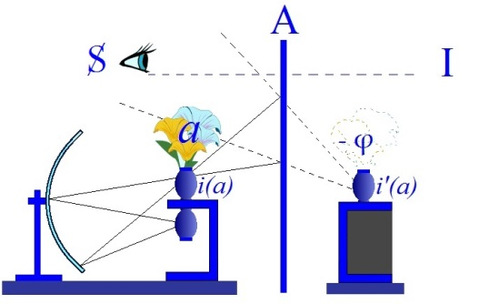
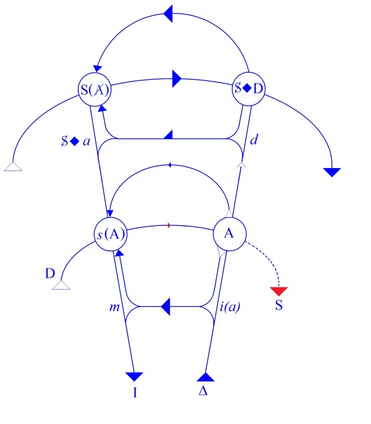

# Leçon 20 | 18 Mai 1960

  <label><input type="checkbox" data-lacan-toggle="original" checked> 原文</label>
  <label><input type="checkbox" data-lacan-toggle="notes" checked> 注释</label>
  <label><input type="checkbox" data-lacan-toggle="commentary" checked> 个人解读评论</label>

<section class="parallel-paragraph" data-paragraph-ids="s7-20-0001">

s7-20-0001

[无对应译文]

原文 · s7-20-0001

Il m’a semblé ce matin qu’il n’était pas excessif de commencer mon séminaire en posant cette question : *avons-nous passé la ligne ?* Il ne s’agit pas de ce que nous faisons ici, il s’agit de *ce qui se passe dans ce monde où nous vivons*. Ce n’est pas parce que ce qu’il s’y profère fait du bruit assez vulgaire pour que nous ne l’entendions pas.

</section>

<section class="parallel-paragraph" data-paragraph-ids="s7-20-0002">

s7-20-0002

[无对应译文]

原文 · s7-20-0002

Au moment où je vous parle du paradoxe du désir, en ce qu’il consiste, en ce que *les biens* le masquent, vous pouvez entendre dehors les discours effroyables de la puissance. Il n’y a pas à se demander s’ils sont *sincères* ou *hypocrites*, s’ils veulent la paix, s’ils calculent les risques. S’il y a une impression, dans un pareil moment, qui domine, c’est bien celle de ce qui peut passer pour un bien prescriptible.

</section>

<section class="parallel-paragraph" data-paragraph-ids="s7-20-0003">

s7-20-0003

[无对应译文]

原文 · s7-20-0003

L’information servira d’appel, de capture pour les foules impuissantes auxquelles on la déverse comme une liqueur qui étourdit, au moment où elles glisseront vers l’abattoir. On en est à se demander si on oserait faire éclater le cataclysme, si d’abord on ne lâchait pas bride à ce grand bruit de voix.

</section>

<section class="parallel-paragraph" data-paragraph-ids="s7-20-0004">

s7-20-0004

[无对应译文]

原文 · s7-20-0004

Υ a-t-il plus consternant que cet écho répercuté dans ces petits appareils dont nous sommes tous pourvus, de ce qu’on appelle une conférence de presse ? À savoir ces questions stupidement répétées, auxquelles le leader répond avec une fausse aisance, appelant des questions plus intéressantes, et se permettant à l’occasion de faire de l’esprit.Hier, il y en a un, je ne sais où, à Paris ou à Bruxelles, qui nous a parlé de « *lendemains qui déchantent* ». C’est drôle !

</section>

<section class="parallel-paragraph" data-paragraph-ids="s7-20-0005">

s7-20-0005

[无对应译文]

原文 · s7-20-0005

Il ne vous semble pas que la seule façon d’accommoder votre oreille à ce qui a retenti, ne peut se formuler que sous la forme : *Qu’est-ce que ça veut ? Où est-ce que ça veut en venir ?* Cependant, chacun s’endort avec le mol oreiller de « *Ça n’est pas possible* », alors qu’il n’y a rien de plus possible. Que c’est même cela par excellence *le possible*. Que le domaine du *possible*, que l’homme vise dans le possible, c’est pour que cela soit possible. Cela est possible parce que *le possible*, c’est ce qui peut répondre à la demande de l’homme et que l’homme ne sait pas ce qu’il met en mouvement avec sa demande.

</section>

<section class="parallel-paragraph" data-paragraph-ids="s7-20-0006">

s7-20-0006

[无对应译文]

原文 · s7-20-0006

Le redoutable inconnu au-delà de la ligne, c’est ce quelque chose qui en l’homme est ce que nous appelons *l’inconscient,* *c’est-à-dire la mémoire de ce qu’il oublie*. Et ce qu’il oublie, après tout, vous pouvez voir dans quelle direction c’est, ce qu’il oublie :

</section>

<section class="parallel-paragraph" data-paragraph-ids="s7-20-0007">

s7-20-0007

[无对应译文]

原文 · s7-20-0007

- c’est ce à quoi tout est fait pour qu’il ne pense pas,

</section>

<section class="parallel-paragraph" data-paragraph-ids="s7-20-0008">

s7-20-0008

[无对应译文]

原文 · s7-20-0008

- c’est la puanteur,

</section>

<section class="parallel-paragraph" data-paragraph-ids="s7-20-0009">

s7-20-0009

[无对应译文]

原文 · s7-20-0009

- c’est la corruption toujours ouverte comme un abîme,

</section>

<section class="parallel-paragraph" data-paragraph-ids="s7-20-0010">

s7-20-0010

[无对应译文]

原文 · s7-20-0010

- c’est la vie,

</section>

<section class="parallel-paragraph" data-paragraph-ids="s7-20-0011">

s7-20-0011

[无对应译文]

原文 · s7-20-0011

- c’est la pourriture.

</section>

<section class="parallel-paragraph" data-paragraph-ids="s7-20-0012">

s7-20-0012

[无对应译文]

原文 · s7-20-0012

C’est plus encore depuis quelque temps, c’est vraiment actuel pour nous, cette *anarchie des formes*, cette *destruction seconde* dont SADE vous parlait l’autre jour dans la citation que j’en ai extraite, celle qui fait appel à la subversion au-delà même du cycle de la génération-corruption. Avec cette *destruction seconde*, ce mouvement des formes en tant qu’elles se réengendrent, avec cette possibilité soudain pour nous tangible, avec l’effet menaçant d’anarchie chromosomique, que même les amarres des formes de la vie soient rompues.

</section>

<section class="parallel-paragraph" data-paragraph-ids="s7-20-0013">

s7-20-0013

[无对应译文]

原文 · s7-20-0013

Les monstres obsédaient beaucoup ceux qui - les derniers au XVIIIème siècle - parlaient encore, donnaient un sens à ce mot de « la Nature ». Il y a longtemps qu’on n’accorde plus d’importance aux veaux à six pattes, aux enfants à deux têtes que pourtant peut-être, maintenant nous allons voir reparaître, si les choses commencent, par milliers !

</section>

<section class="parallel-paragraph" data-paragraph-ids="s7-20-0014">

s7-20-0014

[无对应译文]

原文 · s7-20-0014

C’est pourquoi, quand nous demandons ici : qu’est-ce qu’il y a au-delà de cette barrière gardée par la structure du monde du bien et où est pourtant ce point qui fait virer, tourner, graviter, pivoter sur lui-même ce monde du bien pour attendre qu’il nous entraîne tous à notre perte ?

</section>

<section class="parallel-paragraph" data-paragraph-ids="s7-20-0015">

s7-20-0015

[无对应译文]

原文 · s7-20-0015

C’est pourquoi notre question a un sens dont je crois qu’il n’était pas vain de vous rappeler le caractère terriblement actuel.

</section>

<section class="parallel-paragraph" data-paragraph-ids="s7-20-0016">

s7-20-0016

[无对应译文]

原文 · s7-20-0016

Qu’est-ce qu’il y a au-delà de cette barrière ? N’oublions pas au départ que si nous savons qu’il y a barrière et qu’il y a au-delà,

</section>

<section class="parallel-paragraph" data-paragraph-ids="s7-20-0017">

s7-20-0017

[无对应译文]

原文 · s7-20-0017

ce qu’il y a au-delà, nous n’en savons rien. Il est faux, il est un faux départ de dire - comme certains l’ont dit, partant de la psychologie individuelle, en partant de notre expérience - que c’est le monde de la peur.

</section>

<section class="parallel-paragraph" data-paragraph-ids="s7-20-0018">

s7-20-0018

[无对应译文]

原文 · s7-20-0018

Centrer notre vie, c’est centrer même notre culte sur ceci comme terme dernier, la peur, et c’est une erreur que nous n’avons pas le droit de faire, parce que nous savons que le monde de la peur et de ses fantômes est une défense déjà localisable, déjà pour nous a un sens, est déjà pour l’homme une protection contre quelque chose qui est au-delà et qui est précisément ce que nous ne savons pas.

</section>

<section class="parallel-paragraph" data-paragraph-ids="s7-20-0019">

s7-20-0019

[无对应译文]

原文 · s7-20-0019

C’est bien le moment - le moment où ces choses sont là possibles, possibles et pourtant enveloppées d’une sorte d’interdit d’y penser - de vous faire remarquer la distance et la proximité qui lie ce *possible* avec ces textes extravagants, que j’ai pris cette année comme pivot d’une certaine démonstration, les textes de SADE, et de vous faire remarquer que si la lecture de ces textes et leur accumulation d’horreurs n’engendrent - ne disons pas *à la longue*, simplement *à l’usage* - chez nous *qu’incrédulité et dégoût*...

</section>

<section class="parallel-paragraph" data-paragraph-ids="s7-20-0020">

s7-20-0020

[无对应译文]

原文 · s7-20-0020

> et ce n’est en quelque sorte qu’au passage, en un bref *flash*, en un éclair, ce que de telles images
>
> peuvent en nous faire vibrer ce quelque chose d’étrange qui s’appelle le désir pervers

</section>

<section class="parallel-paragraph" data-paragraph-ids="s7-20-0021">

s7-20-0021

[无对应译文]

原文 · s7-20-0021

…c’est pour autant que pour nous y rentre l’arrière plan de l’ἔρως \[erôs\] naturel, qu’en fin de compte tout rapport, toute relation imaginaire, voire réelle de la recherche propre au désir pervers n’est là que pour nous suggérer l’impuissance du *désir naturel*, du *désir de nature des sens* à aller bien loin dans ce sens. C’est lui qui sur ce chemin, *cède vite* et *cède le premier*.

</section>

<section class="parallel-paragraph" data-paragraph-ids="s7-20-0022">

s7-20-0022

[无对应译文]

原文 · s7-20-0022

C’est bien là ce à quoi se voit que :

</section>

<section class="parallel-paragraph" data-paragraph-ids="s7-20-0023">

s7-20-0023

[无对应译文]

原文 · s7-20-0023

- s’il est certain que c’est à juste titre que la pensée de *l’homme moderne* cherche là l’amorce, la trace, le départ, un sentier vers la connaissance de soi-même, vers le mystère du désir,

</section>

<section class="parallel-paragraph" data-paragraph-ids="s7-20-0024">

s7-20-0024

[无对应译文]

原文 · s7-20-0024

- d’autre part il semble que toute la fascination que cette amorce exerce sur les études, tant scientifiques que littéraires, sur les ébats du « *Sexus »*, du « *Plexus »* et du « *Nexus »* d’un écrivain \[ouvrages d’Henri Miller\], certes non sans talent,

</section>

<section class="parallel-paragraph" data-paragraph-ids="s7-20-0025">

s7-20-0025

[无对应译文]

原文 · s7-20-0025

...en fin de compte tout ceci échoue sur une sorte de délectation assez stérile.

</section>

<section class="parallel-paragraph" data-paragraph-ids="s7-20-0026">

s7-20-0026

[无对应译文]

原文 · s7-20-0026

Assurément, il faut bien que le fil de la méthode nous manque pour qu’après tout, nous voyions que tout ce qui a pu, scientifique et littéraire, être élucubré dans ce sens est depuis longtemps dépassé d’avance et radicalement périmé par les élucubrations, de ce qui n’était après tout qu’un petit hobereau de province \[Sade\] manifestant un exemplaire social de la décomposition du type de noble, au moment où allaient être radicalement abolis ces privilèges.

</section>

<section class="parallel-paragraph" data-paragraph-ids="s7-20-0027">

s7-20-0027

[无对应译文]

原文 · s7-20-0027

Il n’en reste pas moins que toute cette formidable élucubration d’horreurs, devant lesquelles non seulement les sens et la possibilité humaine mais l’imagination fléchissent, ne sont strictement *rien* auprès de ce qui se passera, se verra, sera effectivement sous nos yeux à l’échelle collective si le grand, le réel déchaînement qui nous menace, éclate.

</section>

<section class="parallel-paragraph" data-paragraph-ids="s7-20-0028">

s7-20-0028

[无对应译文]

原文 · s7-20-0028

La seule différence qu’il y a entre l’exorbitance des descriptions de SADE et ce que représentera une telle catastrophe, c’est que dans la modification de la seconde ne sera entré aucun motif de plaisir. Ce n’est pas des pervers qui la déclencheront : ce sera des bureaucrates dont il n’est même pas question de savoir s’ils seront bien ou mal intentionnés. Ce sera déclenché sur ordre, et cela se perpétuera selon les règles, les rouages, les échelons qui obéiront, les volontés étant ployées, abolies, courbées vers une tâche qui perd ici son sens. \[...\] Cette tâche sera la résorption d’un insondable *déchet*.

</section>

<section class="parallel-paragraph" data-paragraph-ids="s7-20-0029">

s7-20-0029

[无对应译文]

原文 · s7-20-0029

Car n’oublions pas que c’est là depuis toujours une des dimensions dans laquelle pourrait se définir, se reconnaître ce que l’autre, *le doux rêveur*, appelait gentiment « *l’hominisation de la planète* »[^56]. Pour ce qui est de reconnaître le passage, *le pas*, *la marque*, *la trace*, *la paume* de l’homme, nous pouvons être tranquilles : si nous trouvons une accumulation titanesque d’écailles d’huîtres[^57], ça ne peut *manifestement* être que des hommes qui sont passés par là, je veux dire une accumulation de déchets en désordre. Il y a des époques géologiques qui ont laissé, elles aussi, leurs déchets - ils nous permettent de reconnaître quelque chose : un ordre. Le *tas d’ordures*, voilà une des faces qu’il conviendrait de ne pas méconnaître de la dimension humaine.

</section>

<section class="parallel-paragraph" data-paragraph-ids="s7-20-0030">

s7-20-0030

[无对应译文]

原文 · s7-20-0030

Maintenant, après avoir profilé ce *tumulus* à l’horizon possible de la politique du *bien*, du *bien* général, du *bien* de la communauté, nous allons reprendre notre marche où nous l’avons laissée la dernière fois et tâcher de comprendre ce que veut dire, ce que signifie, ce que comporte l’horizon de la recherche du *bien,* à partir du moment où il a été démystifié, de cette erreur de jugement dont je vous ai donné le terme dans le passage de Saint AUGUSTIN, à savoir que c’est par le procédé mental de *la soustraction du bien au bien* qu’on arriverait à cette méthode qui consisterait à réfuter l’existence de tout autre chose que du *bien* dans l’être, sous prétexte que l’irréductible, étant alors comme tel plus parfait que ce qui était avant, ne saurait être *le mal*. Le raisonnement de Saint AUGUSTIN est bien quelque chose qui nous surprend. Je dirai que je laisse ouverte la question. Que signifie l’apparition historique d’une telle forme de pensée ? Il faut bien penser - pour nous - la laisser en arrière.

</section>

<section class="parallel-paragraph" data-paragraph-ids="s7-20-0031">

s7-20-0031

[无对应译文]

原文 · s7-20-0031

Que signifie la position du *bien* définie, telle que nous l’avons définie la dernière fois ? Du *bien* comme de ce quelque chose qui, dans la création symbolique, est considéré comme l’*initium*, d’où part la destinée du sujet humain dans son explication avec le signifiant, ce qui dans ce *bien* se présente comme l’objet du partage et du même coup manifeste sa véritable nature, sa duplicité profonde de bien, qui est qu’il n’est pas purement et simplement le bien naturel, ce qui répond à un besoin, mais ce qui est *pouvoir possible*, puissance de satisfaire et qui de ce fait organise tout le rapport de l’homme avec le réel des biens, *par rapport à ce pouvoir* qui est le pouvoir *qu’a l’autre, l’autre imaginaire* \- vous ai-je dit - *de l’en priver*.

</section>

<section class="parallel-paragraph" data-paragraph-ids="s7-20-0032">

s7-20-0032

[无对应译文]

原文 · s7-20-0032

Pour reprendre les termes qui sont ceux autour desquels j’ai organisé la première année de mon commentaire de FREUD : *le moi idéal* et *l’idéal du moi*, et que j’ai repris dans mon graphe[^58] :

</section>

<section class="parallel-paragraph" data-paragraph-ids="s7-20-0033">

s7-20-0033

[无对应译文]

原文 · s7-20-0033

- d’une part, Ι désigne l’identification au signifiant de la toute puissance, de *l’idéal du moi*,

</section>

<section class="parallel-paragraph" data-paragraph-ids="s7-20-0034">

s7-20-0034

[无对应译文]

原文 · s7-20-0034

- d’autre part, en tant qu’*image de l’autre *: *i(a)*, il est l’*Urbild* du *moi*, la forme primitive sur laquelle le *moi* se modèle, s’installe, s’instaure dans ses fonctions de pseudo-maîtrise.

</section>

<section class="parallel-paragraph" data-paragraph-ids="s7-20-0035">

s7-20-0035

[无对应译文]

原文 · s7-20-0035

 

</section>

<section class="parallel-paragraph" data-paragraph-ids="s7-20-0036">

s7-20-0036

[无对应译文]

原文 · s7-20-0036

*Nous définirons dans ce cas, l’idéal du moi* \[I\] *du sujet, dans la perspective des biens* comme tels, comme représentant précisément *ce pouvoir de faire le bien* qui, en soi-même, contient cette dimension tout entière qui se creuse, et ouvre cet au-delà qui aujourd’hui fait notre question, à savoir : « Qu’est-ce qu’il en résulte ? » « Comment ? » À partir du moment où tout s’organise autour de *ce pouvoir de faire le bien*, ce quelque chose totalement *énigmatique* se propose à nous et nous revient sans cesse de notre propre action comme la menace toujours croissante en nous d’une exigence aux conséquences inconnues.

</section>

<section class="parallel-paragraph" data-paragraph-ids="s7-20-0037">

s7-20-0037

[无对应译文]

原文 · s7-20-0037

Quant au *moi idéal* \[*i(a)*\], il est l’« *autre imaginaire* » que nous avons en face de nous, au même niveau que celui pour lequel je ne sais si j’ai introduit la dernière fois le terme de « *privateur* », l’« *autre* » en tant qu’il *représente* par lui-même, dans son existence, celui qui nous *prive*.

</section>

<section class="parallel-paragraph" data-paragraph-ids="s7-20-0038">

s7-20-0038

[无对应译文]

原文 · s7-20-0038

Je dirai qu’*aux deux pôles* \[I, *i(a)* \] de cette structuration *du monde des biens,* se profile ce qui fait d’une part, depuis le moment du dévoilement auquel aboutit toute la révélation de la philosophie classique, à savoir le moment où HEGEL est, comme on le dit, remis sur ses pieds[^59]

</section>

<section class="parallel-paragraph" data-paragraph-ids="s7-20-0039">

s7-20-0039

[无对应译文]

原文 · s7-20-0039

- d’un côté, dis-je, ce fond de guerre sociale se révèle seulement à partir de ce moment comme étant le fil rouge qui donne son sens au segment éclairé de l’histoire au sens classique du terme,

</section>

<section class="parallel-paragraph" data-paragraph-ids="s7-20-0040">

s7-20-0040

[无对应译文]

原文 · s7-20-0040

- et d’autre part, à l’autre bout, ce *quelque chose* - où pour la pensée qui pour nous se présente avec *la forme de l’interrogation* permettant l’espoir - ce que quelque chose d’une pensée scientifique, s’exerçant sur le terrain de ce qu’on appelle problématiquement « *l’humain* », nous a découvert, c’est que dès longtemps, bien longtemps et hors du champ de cette histoire, quelque chose avait été - par l’homme de sociétés non historiques, croit-on - enfanté, qui a été aperçu, conçu par eux comme ayant, dans le maintien du rapport intersubjectif, *une fonction salutaire, une fonction essentielle*.

</section>

<section class="parallel-paragraph" data-paragraph-ids="s7-20-0041">

s7-20-0041

[无对应译文]

原文 · s7-20-0041

Et ceci - miraculeusement après tout, à nos yeux - ceci est là *comme la petite pierre* faite pour nous indiquer

</section>

<section class="parallel-paragraph" data-paragraph-ids="s7-20-0042">

s7-20-0042

[无对应译文]

原文 · s7-20-0042

- que tout n’est pas pris dans cette *dialectique* nécessaire de la lutte pour les biens, du conflit entre les biens et de la catastrophe nécessaire qu’il engendre,

</section>

<section class="parallel-paragraph" data-paragraph-ids="s7-20-0043">

s7-20-0043

[无对应译文]

原文 · s7-20-0043

- et qu’il a existé, du monde que nous sommes en train de rechercher, des traces où positivement il a été conçu que *la destruction des biens* comme tels pouvait être une fonction *révélatrice de valeur*.

</section>

<section class="parallel-paragraph" data-paragraph-ids="s7-20-0044">

s7-20-0044

[无对应译文]

原文 · s7-20-0044

Le « *Potlatch* »...

</section>

<section class="parallel-paragraph" data-paragraph-ids="s7-20-0045">

s7-20-0045

[无对应译文]

原文 · s7-20-0045

> je pense que vous êtes tous au moins au niveau élémentaire pour que je n’aie pas - en tout cas, ce n’est pas aujourd’hui mon objet ni le champ de ce que j’ai à vous enseigner - à vous rappeler ce qu’est le « *Potlatch* ». J’indique, simplement brièvement, qu’il s’agit de cérémonies rituelles comportant la destruction étendue
>
> de biens divers qui sont : les uns, biens de consommation, les autres, biens de représentation et de luxe,
>
> qui se constituent dans les sociétés qui, du reste, ne sont plus pour nous que des reliquats et des vestiges
>
> de l’existence sociale d’un mode humain que notre expansion tend à abolir

</section>

<section class="parallel-paragraph" data-paragraph-ids="s7-20-0046">

s7-20-0046

[无对应译文]

原文 · s7-20-0046

...le « *Potlatch* » est là pour nous témoigner que l’homme a pu déjà avoir, par rapport à cette *destinée* à l’endroit des biens, ce recul, cette perception, cette perspective possible, qui a pu lui faire lier le maintien, la discipline si l’on peut dire, de son désir,

</section>

<section class="parallel-paragraph" data-paragraph-ids="s7-20-0047">

s7-20-0047

[无对应译文]

原文 · s7-20-0047

en tant qu’il est ce à quoi il a affaire dans son destin, à faire dépendre cette discipline de quelque chose qui se manifestait de façon positive, avouée, avérée comme liée à la destruction comme telle de ce qu’il en est des biens.

</section>

<section class="parallel-paragraph" data-paragraph-ids="s7-20-0048">

s7-20-0048

[无对应译文]

原文 · s7-20-0048

Qu’il s’agisse très spécialement de *propriété collective* ou *individuelle*, ou de propriété *pro privus*, pour le privé, c’est quelque chose autour de quoi tourne le problème, le drame, les ricochets et les retours de l’économie du bien. Au reste, à partir du moment où *cette clé* nous est donnée, bien sûr nous voyons que ce n’est pas là le privilège des sociétés primitives.

</section>

<section class="parallel-paragraph" data-paragraph-ids="s7-20-0049">

s7-20-0049

[无对应译文]

原文 · s7-20-0049

Je ne vais pas retrouver d’ailleurs aujourd’hui la fiche sur laquelle j’avais noté de la façon la plus précise qu’à *cette étape historique* à laquelle je vous ai arrêtés un instant cette année, pour autant qu’elle marquait à la surface de notre histoire bien historisée, dans ce début du XIIème siècle, l’émergence à la surface de la culture européenne d’une problématique du désir comme telle.

</section>

<section class="parallel-paragraph" data-paragraph-ids="s7-20-0050">

s7-20-0050

[无对应译文]

原文 · s7-20-0050

Et à propos de *l’amour courtois* précisément, à ce moment nous voyons apparaître dans tel rite féodal, représenté par une sorte de fête, de réunion de barons quelque part du côté de Narbonne, une manifestation tout à fait analogue comportant l’énorme destruction, non seulement de biens immédiatement consommés sous forme de festin, mais de bêtes et de harnais détruits. Comme si, *du seul fait que vienne au premier plan cette problématique du désir*, quelque chose comme un corrélatif nécessaire apparaissait dans le besoin de ces destructions qu’on appelle *destructions de prestige*, pour autant qu’en effet elles se manifestent comme telles.

</section>

<section class="parallel-paragraph" data-paragraph-ids="s7-20-0051">

s7-20-0051

[无对应译文]

原文 · s7-20-0051

C’est-à-dire que ces façons gratuites sont effectuées par des sujets face à face, s’affrontant, et représentant ceux qui, dans la collectivité, se manifestent alors comme les sujets « *élus* », et c’est ce qui donne son sens à la cérémonie : face à face, les seigneurs et ceux qui dans cette cérémonie s’affirment comme tels, se défient, rivalisent à qui se montrera capable de détruire le plus de ces biens.

</section>

<section class="parallel-paragraph" data-paragraph-ids="s7-20-0052">

s7-20-0052

[无对应译文]

原文 · s7-20-0052

Tel est l’autre pôle, le seul que nous ayons parmi les exemples de *la manifestation d’une certaine maîtrise, d’une certaine conscience* *dans le rapport de l’homme à ses biens*, le seul exemple que nous ayons de quelque chose qui, dans cet ordre :

</section>

<section class="parallel-paragraph" data-paragraph-ids="s7-20-0053">

s7-20-0053

[无对应译文]

原文 · s7-20-0053

- se passe consciemment,

</section>

<section class="parallel-paragraph" data-paragraph-ids="s7-20-0054">

s7-20-0054

[无对应译文]

原文 · s7-20-0054

- se passe d’une façon maîtrisée,

</section>

<section class="parallel-paragraph" data-paragraph-ids="s7-20-0055">

s7-20-0055

[无对应译文]

原文 · s7-20-0055

- se passe, en d’autres termes, d’une façon différente de ce que causent et déterminent les immenses destructions auxquelles vous tous - puisque nous sommes, à quelques années près, des générations pas tellement distantes - vous avez déjà pu assister, de consommation de biens, de destructions immenses.

</section>

<section class="parallel-paragraph" data-paragraph-ids="s7-20-0056">

s7-20-0056

[无对应译文]

原文 · s7-20-0056

Ces modes qui nous apparaissent comme quelques inexplicables accidents, retours de sauvagerie, alors qu’il s’agit bien plutôt de quelque chose d’aussi nécessairement lié que possible à ce qui est pour nous l’avance de notre discours. Car il est clair qu’un problème nouveau se pose pour nous, qui même pour HEGEL n’était pas clair. HEGEL a essayé longuement dans la *Phénoménologie de l’esprit*, d’articuler la tragédie de l’histoire humaine en termes de *conflits de discours*. Il s’est complu, entre toutes les tragédies, à celle d’*Antigone*, pour autant qu’il lui semblait y voir s’y opposer de la façon la plus claire *le discours de la famille* à *celui de l’État*. Les choses, comme nous le verrons, seront pour nous beaucoup moins claires.

</section>

<section class="parallel-paragraph" data-paragraph-ids="s7-20-0057">

s7-20-0057

[无对应译文]

原文 · s7-20-0057

Pour nous, pour ce discours de la communauté, ce discours du bien général, nous avons affaire aux *effets d’un discours de la science*, où se montre, pour la première fois dévoilée, une question qui est proprement la nôtre. C’est à savoir ce que veut dire ce qui s’y manifeste de la puissance du signifiant comme tel. Je veux dire que pour nous se pose la question qui est sous-jacente : à l’ordre de pensée que j’essaie de dérouler ici devant vous, à savoir : *si du développement soudain prestigieux de cette puissance du signifiant, de cet ordre*, *un discours surgit des petites lettres des mathématiques *:

</section>

<section class="parallel-paragraph" data-paragraph-ids="s7-20-0058">

s7-20-0058

[无对应译文]

原文 · s7-20-0058

- *discours* qui se soutient,

</section>

<section class="parallel-paragraph" data-paragraph-ids="s7-20-0059">

s7-20-0059

[无对应译文]

原文 · s7-20-0059

- *discours* qui se différencie de tous les discours tenus jusqu’alors,

</section>

<section class="parallel-paragraph" data-paragraph-ids="s7-20-0060">

s7-20-0060

[无对应译文]

原文 · s7-20-0060

- *discours* qui, par rapport à nous, devient en quelque sorte une aliénation supplémentaire.

</section>

<section class="parallel-paragraph" data-paragraph-ids="s7-20-0061">

s7-20-0061

[无对应译文]

原文 · s7-20-0061

En quoi ? En ceci, c’est que *le discours issu des mathématiques est un discours qui* - par structure, par définition - *n’oublie rien*. À la différence du discours de cette mémorisation première, celle qui se poursuit au fond de nous, à notre insu, du discours mémorial de l’inconscient, dont le centre est absent, dont la place et l’organisation sont situées par le « *il ne savait pas* », qui est proprement le signe de cette omission fondamentale où le sujet vient se situer.

</section>

<section class="parallel-paragraph" data-paragraph-ids="s7-20-0062">

s7-20-0062

[无对应译文]

原文 · s7-20-0062

Et l’Homme, à un moment, a appris à se servir, à *lancer*, à *faire circuler*, dans le réel et dans le monde, *ce discours des mathématiques* qui, lui, ne saurait procéder, à moins que *rien ne soit oublié*. Quand seulement *une petite chaîne signifiante* commence à fonctionner sur ce principe, il semble bien que les choses se poursuivent tout comme si elles fonctionnaient toutes seules, puisque aussi bien là nous en sommes à ceci : c’est à pouvoir nous demander si *ce discours de la physique*, ce discours engendré par la toute-puissance du *signifiant -* ce discours de la physique va confiner à *l’intégration* de la Nature ou à sa *désintégration*.

</section>

<section class="parallel-paragraph" data-paragraph-ids="s7-20-0063">

s7-20-0063

[无对应译文]

原文 · s7-20-0063

Tel est ce qui pour nous, complique et *singulièrement* - encore que sans doute ce ne soit qu’une de ses phases - le problème de notre désir. Disons que, pour celui qui vous parle, c’est là à proprement parler que se situe la révélation du caractère décisivement original de la place où se situe le désir humain comme tel, dans *ce rapport de l’homme au signifiant*, et dans le fait *de savoir si, ce rapport, il doit ou non le détruire*.

</section>

<section class="parallel-paragraph" data-paragraph-ids="s7-20-0064">

s7-20-0064

[无对应译文]

原文 · s7-20-0064

Il n’y a pas d’autre sens - et je pense que vous avez pu entendre dans ce qui vous a été rapporté de la méditation d’un disciple simplement très fin, ouvert, cultivé, mais pas autrement génial, de FREUD - c’est à savoir que *c’est là que se tend la question du sens de la pulsion de mort*. C’est très exactement en tant que cette pulsion est liée à l’histoire que se pose le problème. C’est une question « *ici et maintenant* », et non pas ici une question « *ad aeternum* » C’est en fonction de cela que *le mouvement du désir* est en train *de passer la ligne* d’une sorte de dévoilement, que l’avènement de la notion freudienne de *la pulsion de mort* a son sens pour nous.

</section>

<section class="parallel-paragraph" data-paragraph-ids="s7-20-0065">

s7-20-0065

[无对应译文]

原文 · s7-20-0065

En disant ceci donc, nous ne savons rien, sinon qu’il y a la question et qu’elle se pose en ces termes, celle du *rapport de l’être humain vivant avec le signifiant* comme tel, avec le signifiant en tant qu’au niveau du signifiant peut être pour lui remise en question tout cycle possible de l’étant, y étant compris le mouvement de perte et le retour de la vie elle-même. Assurément, c’est bien là ce qui donne son sens, non moins tragique, à ce de quoi - nous analystes - nous nous trouvons être les porteurs.

</section>

<section class="parallel-paragraph" data-paragraph-ids="s7-20-0066">

s7-20-0066

[无对应译文]

原文 · s7-20-0066

Car à la vérité, nul pas réel, à partir du moment où ceci est su, n’est fait, sinon de savoir que cet inconscient, dans son cycle propre, se présente actuellement - pour nous-même, repéré comme tel - comme *le champ d’un non-savoir*. Et pourtant, c’est le champ dans lequel nous avons à opérer tous les jours, et à partir du moment où nous l’avons repéré, nous ne pouvons pas ne pas reconnaître ce qui est à la portée d’un enfant, d’un simple, concernant la position, la situation de tout « *homme de bonne volonté* », de celui dont le désir est de bien faire.

</section>

<section class="parallel-paragraph" data-paragraph-ids="s7-20-0067">

s7-20-0067

[无对应译文]

原文 · s7-20-0067

C’est à savoir :

</section>

<section class="parallel-paragraph" data-paragraph-ids="s7-20-0068">

s7-20-0068

[无对应译文]

原文 · s7-20-0068

- que sans doute *il veut faire le bien*,

</section>

<section class="parallel-paragraph" data-paragraph-ids="s7-20-0069">

s7-20-0069

[无对应译文]

原文 · s7-20-0069

- que sans doute c’est là comme cela aussi qu’il est venu vous trouver,

</section>

<section class="parallel-paragraph" data-paragraph-ids="s7-20-0070">

s7-20-0070

[无对应译文]

原文 · s7-20-0070

- que *c’est pour se trouver bien*, c’est pour se trouver d’accord avec lui-même, c’est pour *être identique avec quelques normes*.

</section>

<section class="parallel-paragraph" data-paragraph-ids="s7-20-0071">

s7-20-0071

[无对应译文]

原文 · s7-20-0071

Et pourtant vous savez ce que nous trouvons en marge - mais pourquoi pas à l’horizon de tout ce qui se développe devant nous comme dialectique - de ce progrès de la connaissance de son inconscient. C’est cette marge irréductible qui fait que toujours, à l’horizon, *cette quête de cette poursuite de son propre bien*, le sujet se révèle au mystère jamais entièrement résolu de ce qu’est son désir.

</section>

<section class="parallel-paragraph" data-paragraph-ids="s7-20-0072">

s7-20-0072

[无对应译文]

原文 · s7-20-0072

La référence du sujet à tout *autre*, quel qu’il soit, a quelque chose de dérisoire, quand nous le voyons - nous qui en voyons tout de même quelques uns, voire beaucoup - se référer toujours à l’autre comme à quelqu’un qui lui, *vit dans l’équilibre*, en tout cas en plus heureux : lui-même *ne se pose pas de question, dort sur les deux oreilles*.

</section>

<section class="parallel-paragraph" data-paragraph-ids="s7-20-0073">

s7-20-0073

[无对应译文]

原文 · s7-20-0073

Nous n’avons pas besoin d’avoir vu l’*autre*, si solide, si bien assis soit-il, venir s’étendre sur notre divan *pour savoir ce que ce mirage*...

</section>

<section class="parallel-paragraph" data-paragraph-ids="s7-20-0074">

s7-20-0074

[无对应译文]

原文 · s7-20-0074

cette distance, cette référence de la dialectique du *bien* à quelque chose au-delà, à quelque chose que, pour illustrer ce que je veux vous dire, j’appellerai « *le bien, n’y touchez pas* »

</section>

<section class="parallel-paragraph" data-paragraph-ids="s7-20-0075">

s7-20-0075

[无对应译文]

原文 · s7-20-0075

...est le texte même de notre expérience.

</section>

<section class="parallel-paragraph" data-paragraph-ids="s7-20-0076">

s7-20-0076

[无对应译文]

原文 · s7-20-0076

Je dirai plus : ce registre d’une jouissance comme étant ce qui comme tel, n’est accessible qu’à l’*autre*, est la seule dimension dans laquelle nous puissions situer *ce malaise singulier et si fondamental que seule*, je crois - et je me trompe peut-être - mais en tout cas que *la langue allemande, avec d’autres nuances psychologiques très singulières de la béance humaine, a su noter sous le terme Lebensleid*.

</section>

<section class="parallel-paragraph" data-paragraph-ids="s7-20-0077">

s7-20-0077

[无对应译文]

原文 · s7-20-0077

Ce n’est pas *une jalousie ordinaire*, c’est même la chose la plus étrange et la plus singulière, c’est cette *jalousie* qui peut naître dans un sujet par rapport à un autre, pour autant que l’autre est justement perçu comme pouvant participer d’une certaine forme de jouissance, de surabondance vitale en tant qu’elle est, à proprement parler, conçue et aperçue par le sujet comme étant ce qu’il ne peut lui-même appréhender par la voie de quelque mouvement futile *le plus affectif*, *le plus élémentaire.*

</section>

<section class="parallel-paragraph" data-paragraph-ids="s7-20-0078">

s7-20-0078

[无对应译文]

原文 · s7-20-0078

Est-ce qu’il n’y a pas là quelque chose de vraiment singulier : *qu’un être* s’avère, s’avoue, *se manifeste comme jalousant chez l’autre* \- *et jusqu’à en faire surgir la haine et le besoin de destruction* - *ce qu’il n’est d’aucune façon capable même d’appréhender par aucune voie intuitive ?*

</section>

<section class="parallel-paragraph" data-paragraph-ids="s7-20-0079">

s7-20-0079

[无对应译文]

原文 · s7-20-0079

Le repérage, si on peut dire, quasiment conceptuel de cet autre comme tel, peut suffire à lui tout seul à provoquer ce *mouvement*, ce mouvement de malaise dont je ne crois pas qu’il soit nécessaire seulement d’être analyste pour voir courir à travers la trame des sujets les ondulations perturbantes.

</section>

<section class="parallel-paragraph" data-paragraph-ids="s7-20-0080">

s7-20-0080

[无对应译文]

原文 · s7-20-0080

Nous voici là sur la frontière même où nous allons nous demander : qu’est-ce qui va nous permettre, en fin de compte, de la franchir ? Je vous l’ai dit, il est une autre *marque*, un autre *point* de franchissement sur cette frontière qui peut nous permettre d’y repérer avec précision un élément du champ, du champ de *l’au-delà du principe du bien*.

</section>

<section class="parallel-paragraph" data-paragraph-ids="s7-20-0081">

s7-20-0081

[无对应译文]

原文 · s7-20-0081

Cet élément, je vous l’ai dit, c’est *le beau*.

</section>

<section class="parallel-paragraph" data-paragraph-ids="s7-20-0082">

s7-20-0082

[无对应译文]

原文 · s7-20-0082

Sur *le* *beau* - je voudrais simplement aujourd’hui vous en introduire la problématique - sur *le beau*, il faut, je crois, nous en tenir aux articulations qui nous sont données, et les plus proches. Assurément, nous pouvons noter là que FREUD s’est manifesté avec une prudence singulière. Il nous a dit ici :

</section>

<section class="parallel-paragraph" data-paragraph-ids="s7-20-0083">

s7-20-0083

[无对应译文]

原文 · s7-20-0083

- *que l’analyste n’avait véritablement*, sur le fond, sur la nature de ce qui se manifestait de création dans *le beau*, *rien à dire*,

</section>

<section class="parallel-paragraph" data-paragraph-ids="s7-20-0084">

s7-20-0084

[无对应译文]

原文 · s7-20-0084

- *que dans le domaine chiffré*, à proprement parler, de *la valeur de l’œuvre d’art* comme telle, nous nous trouvons en position, je ne dirai même pas d’écoliers, en position de gens qui pourront ramasser les indices, les miettes et assurément pas à même d’articuler ce dont il s’agit dans *la création elle-même*.

</section>

<section class="parallel-paragraph" data-paragraph-ids="s7-20-0085">

s7-20-0085

[无对应译文]

原文 · s7-20-0085

Ceci n’est pas tout. Et le texte, là-dessus, de FREUD se montre très faible.

</section>

<section class="parallel-paragraph" data-paragraph-ids="s7-20-0086">

s7-20-0086

[无对应译文]

原文 · s7-20-0086

C’est à ce titre que les choses deviennent tout à fait claires dès l’abord, dès que nous devons approcher les définitions qu’il donne de *la sublimation* - pour autant que c’est elle qui est en jeu dans la création de l’artiste - il ne fait strictement rien d’autre que nous montrer le contrecoup, je dirai la revenue des effets de ce qui se passe quelque part au niveau de *la sublimation* de la pulsion ou de l’instinct *quand le résultat, l’œuvre du créateur de beau, revient* - où ? - *dans ce champ des biens, à savoir quand ils sont devenus marchandises*.

</section>

<section class="parallel-paragraph" data-paragraph-ids="s7-20-0087">

s7-20-0087

[无对应译文]

原文 · s7-20-0087

Le caractère quasi grotesque de cette espèce de résumé que nous donne FREUD de ce qu’est en somme la carrière de l’artiste, c’est à savoir de donner forme belle au désir interdit pour que chacun, en lui achetant son petit produit d’art, lui donne, en quelque sorte, *la récompense* et *la sanction* de son audace.

</section>

<section class="parallel-paragraph" data-paragraph-ids="s7-20-0088">

s7-20-0088

[无对应译文]

原文 · s7-20-0088

C’est bien là une façon de court-circuiter tout ce problème et d’une façon si manifestement visible quand s’y ajoute le fait que FREUD écarte de lui, comme une question qui est hors de la portée de notre expérience, le problème de la création, qu’elle soit littéraire ou de toute autre façon artistique : il a parfaitement conscience des limites dans lesquelles il se confine.

</section>

<section class="parallel-paragraph" data-paragraph-ids="s7-20-0089">

s7-20-0089

[无对应译文]

原文 · s7-20-0089

Nous voici donc renvoyés à tout ce qui sur *le beau*, au cours des siècles, a pu se dire de diversement *pédant* \[*pédago*→*discours universitaire*\]. Tout pédant que ce soit, il y a de quoi le clamer : chacun sait que dans nul domaine, ceux qui ont quelque chose à dire, à savoir les créateurs du *beau*, dans nul autre domaine il est plus légitime qu’ils ne soient moins satisfaits quant à ce que, là-dessus, il a pu se formuler de pédantesque.

</section>

<section class="parallel-paragraph" data-paragraph-ids="s7-20-0090">

s7-20-0090

[无对应译文]

原文 · s7-20-0090

Néanmoins, il est certain que quelque chose court qui a été articulé par presque tous, sûrement par les meilleurs, mais aussi bien au niveau de l’expérience la plus commune, c’est qu’il y a un certain rapport du *beau* avec *le désir*. Mais ce rapport est singulier car il est *ambigu*. Il ne semble pas que dans tout le champ où nous en puissions découvrir le terme, la catégorie, le registre du *beau* puisse jamais être éliminé de cet horizon du *désir*.

</section>

<section class="parallel-paragraph" data-paragraph-ids="s7-20-0091">

s7-20-0091

[无对应译文]

原文 · s7-20-0091

Et pourtant, il est non moins clair, non moins manifeste que le *beau* - comme cela s’est dit depuis la pensée antique jusqu’à Saint THOMAS, qui vous fournit des formules avec beaucoup de précision - que *le beau* a pour effet de suspendre, d’abaisser, de désarmer, dirai-je, le désir : *le beau*, pour autant qu’il se manifeste, intimide, interdit le désir.

</section>

<section class="parallel-paragraph" data-paragraph-ids="s7-20-0092">

s7-20-0092

[无对应译文]

原文 · s7-20-0092

Ce n’est pas dire qu’il ne puisse au désir, à tel ou tel moment, être conjoint. Mais très mystérieusement et singulièrement, c’est toujours sous cette forme, pour laquelle je ne crois pas trouver de meilleur terme linguistique pour la désigner que celle de « *l’outrage* », pour autant que ce terme en lui-même porte en lui la structure du passage de je ne sais quelle invisible ligne.

</section>

<section class="parallel-paragraph" data-paragraph-ids="s7-20-0093">

s7-20-0093

[无对应译文]

原文 · s7-20-0093

Il semble au reste qu’il soit de la nature du *beau* de rester, comme on dit, insensible à « *l’outrage* », et ce n’est pas là non plus un des éléments les moins significatifs de sa structure. Aussi vous montrerai-je dans le texte, *dans le détail de l’expérience analytique*...

</section>

<section class="parallel-paragraph" data-paragraph-ids="s7-20-0094">

s7-20-0094

[无对应译文]

原文 · s7-20-0094

> je veux dire avec des *repères* qui vous permettront d’être éveillés au moment de son passage,
>
> je veux dire dans une séance d’analyse et à propos de choses qui vous seront racontées

</section>

<section class="parallel-paragraph" data-paragraph-ids="s7-20-0095">

s7-20-0095

[无对应译文]

原文 · s7-20-0095

…comment vous pourrez le situer - avec une certitude de *compteur Geiger* comme on dit - aux références que le sujet, dans ses associations, dans son monologue dénoué, rompu, vous donnera à la référence, au registre esthétique, soit sous forme de citation, soit de souvenirs scolaires. Car bien entendu, vous n’avez pas tout le temps affaire à des créateurs, mais vous avez affaire à des gens qui ont eu quelque rapport avec le champ conventionnel, dirai-je, de la beauté.

</section>

<section class="parallel-paragraph" data-paragraph-ids="s7-20-0096">

s7-20-0096

[无对应译文]

原文 · s7-20-0096

Vous pouvez être sûrs que ces sortes de références - et à mesure qu’elles apparaîtront plus singulièrement sporadiques, tranchantes par rapport aux textes du discours - sont corrélatives de quelque chose qui, à ce moment, se présentifie, et qui est toujours du registre d’une *pulsion destructive*.

</section>

<section class="parallel-paragraph" data-paragraph-ids="s7-20-0097">

s7-20-0097

[无对应译文]

原文 · s7-20-0097

Vous pouvez être sûrs que c’est au moment où le sujet va vous parler d’un rêve où il va apparaître manifestement qu’il s’agit d’une pensée qu’on appelle « *agressive* » à l’endroit de l’un des termes fondamentaux de sa constellation subjective, qu’il va vous sortir, selon sa nationalité :

</section>

<section class="parallel-paragraph" data-paragraph-ids="s7-20-0098">

s7-20-0098

[无对应译文]

原文 · s7-20-0098

- telle citation de la Bible,

</section>

<section class="parallel-paragraph" data-paragraph-ids="s7-20-0099">

s7-20-0099

[无对应译文]

原文 · s7-20-0099

- telle référence à un auteur classique ou pas,

</section>

<section class="parallel-paragraph" data-paragraph-ids="s7-20-0100">

s7-20-0100

[无对应译文]

原文 · s7-20-0100

- ou telle évocation musicale.

</section>

<section class="parallel-paragraph" data-paragraph-ids="s7-20-0101">

s7-20-0101

[无对应译文]

原文 · s7-20-0101

Je vous l’indique aujourd’hui pour vous dire que nous ne sommes pas loin du terme de notre expérience, il s’agit de ce *beau,* *ce beau dans sa fonction singulière par rapport au désir, dont la fonction*, contrairement à la fonction du *bien*, *ne nous leurre pas*, dans ce sens qu’elle nous éveille, et peut-être nous accommode sur *le désir* en tant qu’il est lui-même lié à une certaine structure de *leurre*.

</section>

<section class="parallel-paragraph" data-paragraph-ids="s7-20-0102">

s7-20-0102

[无对应译文]

原文 · s7-20-0102

C’est cela dans quoi je voudrais essayer de vous diriger pour que cette place, telle qu’elle est, cette place pour autant que vous la voyez déjà illustrée par le fantasme. Le fantasme en tant que s’il était un « *bien : n’y touchez-pas* », vous disais-je tout à l’heure, ici c’est un « *beau : ne touchez-pas* », le fantasme peut être dans la structure de ce champ énigmatique, *dont la première marge*, nous la connaissons, *c’est celle qui nous empêche d’y entrer dans le principe du plaisir, c’est la marge de la douleur*.

</section>

<section class="parallel-paragraph" data-paragraph-ids="s7-20-0103">

s7-20-0103

[无对应译文]

原文 · s7-20-0103

Ce champ, il nous faut nous interroger sur ce qui le constitue, *pulsion de mort*, a dit FREUD, *masochisme* primaire. Est-ce que cela n’est pas là déjà faire un trop grand saut dans la question ? La douleur qui défend la marge est-elle tout le contenu du champ ? Tous ceux qui se manifestent comme ayant pénétré, comme manifestant les exigences de ce champ, sont-ils en fin de compte des *masochistes* ? Je vous dis tout de suite que je ne le crois pas.

</section>

<section class="parallel-paragraph" data-paragraph-ids="s7-20-0104">

s7-20-0104

[无对应译文]

原文 · s7-20-0104

Le masochisme - phénomène marginal - a en lui quelque chose de quasi caricatural qu’après tout les explorations moralistes de la fin du XIXème siècle ont assez bien dénudé. C’est qu’en quelque sorte *cette douleur masochiste finit par ressembler*, dans son économie, *à celle des biens*. On veut partager la douleur comme on partage des tas d’autres choses, du reste c’est tout juste si on ne se bat pas autour.

</section>

<section class="parallel-paragraph" data-paragraph-ids="s7-20-0105">

s7-20-0105

[无对应译文]

原文 · s7-20-0105

Mais est-ce qu’il ne s’agit pas là de quelque chose où intervient la reprise - reprise panique - dans cette dialectique, des biens ? À vrai dire, tout dans le comportement du masochiste - je parle du masochiste pervers - nous indique que c’est bien là quelque chose qui est structural dans son comportement. Lisez Monsieur DE SACHER MASOCH, auteur fortement instructif encore que de beaucoup moins grande envergure que SADE. Vous y verrez qu’au dernier terme, le désir de se réduire soi-même à ce *rien* qu’est *un bien*, cette *chose* qu’on traite comme un *objet*, cet *esclave* qu’on se transmet et qu’on partage et qu’on tient pour ce *rien* qui est *un bien*, est véritablement la véritable pointe d’horizon où se projette la position du *masochiste pervers*.

</section>

<section class="parallel-paragraph" data-paragraph-ids="s7-20-0106">

s7-20-0106

[无对应译文]

原文 · s7-20-0106

Il ne faut jamais aller trop vite dans la rupture des homonymies inventives. Que le masochisme ait été appelé masochisme aussi loin que la psychanalyse l’a fait, n’est sans doute pas sans raison. Je crois que l’unité qui se dégage de tous les champs où la pensée analytique a étiqueté le masochisme, est très précisément fait de *ce quelque chose qui*, toujours dans tous ces champs, *fait participer la douleur du caractère d’un bien.*

</section>

<section class="parallel-paragraph" data-paragraph-ids="s7-20-0107">

s7-20-0107

[无对应译文]

原文 · s7-20-0107

Nous nous interrogerons la prochaine fois à partir d’un document. Ce document n’est pas précisément *neuf*, il est celui sur lequel *les discours* se sont déjà faits,tout au long des siècles, les dents et les ongles. Ce qui nous apparaît comme le jeu, le champ où s’est élaborée la morale du bonheur - et les Grecs, nous le savons déjà depuis un moment, n’ont pas un champ où l’horizon soit resté fermé à *la sous-structure -* est comme toujours, là où *la sous-structure* est la plus éclatante. C’est là où elle se voit le plus *en surface*.

</section>

<section class="parallel-paragraph" data-paragraph-ids="s7-20-0108">

s7-20-0108

[无对应译文]

原文 · s7-20-0108

Ce qui a fait le plus de problèmes au cours des âges, depuis ARISTOTE jusqu’à HEGEL, et vous le verrez : jusqu’à GOETHE, c’est une tragédie, c’est la tragédie que HEGEL considérait lui-même comme la plus parfaite pour les plus mauvaises raisons, c’est ANTIGONE *et sa position qui se situent par rapport au bien criminel*. Il faut assurément un caractère profondément inconsidéré des raideurs de notre temps pour avoir pu se rattaquer, si j’ose dire, à ce sujet, en focalisant la lumière sur la figure du tyran.

</section>

<section class="parallel-paragraph" data-paragraph-ids="s7-20-0109">

s7-20-0109

[无对应译文]

原文 · s7-20-0109

Nous reprendrons ensemble ce texte d’*Antigone* qui nous permettra de pointer - et je pense vous en convaincre - de pointer un moment essentiel dans ce que signifie un certain choix absolu, un certain choix qu’aucun bien ne motive, qui nous permet de nous assurer pour notre investigation concernant ce que l’homme veut et ce contre quoi il se défend, un repère essentiel.## Notes

[^56]:
    #  Cf. Pierre Teilhard de Chardin : *Le Phénomène humain*, Points Seuil, 2007.

[^57]: Lacan évoque le Kjökkenmödding : Amas coquiller résultant généralement de la consommation de mollusques sur une longue période

    (et à qui sont associés divers objets et parfois du charbon de bois) par des populations mésolithiques et néolithiques, de la Baltique, de l'Écosse, de France,

    du Portugal, d'Amérique du Sud, etc.

[^58]: Il s’agit du « schéma optique » que Lacan vient de reprendre dans son article : « Remarque sur le rapport de Daniel Lagache... » et dont il positionne

    les éléments (ici : I et *i(a)* ) sur le « graphe du désir ».

[^59]: Cf. Marx : *Le Capital, Livre I, Postface* : «  ...*Hegel défigure la dialectique par le mysticisme, ce n'en est pas moins lui qui en a le premier exposé le mouvement d'ensemble.*

    *Chez lui elle marche sur la tête ; il suffit de la remettre sur les pieds*... »

</section>

