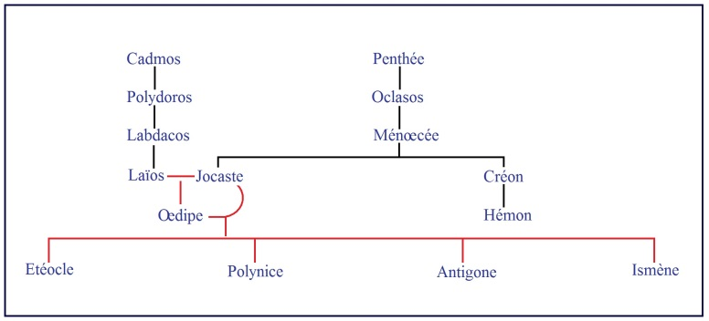

# Leçon 22 | 1er Juin 1960

  <label><input type="checkbox" data-lacan-toggle="original" checked> 原文</label>
  <label><input type="checkbox" data-lacan-toggle="notes" checked> 注释</label>
  <label><input type="checkbox" data-lacan-toggle="commentary" checked> 个人解读评论</label>

<section class="parallel-paragraph" data-paragraph-ids="s7-22-0001">

s7-22-0001

[无对应译文]

原文 · s7-22-0001

Je voudrais aujourd’hui, essayer de vous parler d’[*Antigone*](http://remacle.org/bloodwolf/tragediens/sophocle/Antigone.htm), à savoir de la pièce de SOPHOCLE écrite en 441 avant J.C., de l’économie de cette pièce. Je crois que c’est un texte qui mérite à tous points de vue de jouer pour nous ce rôle d’*exemple* autour de quoi tourne ce que KANT nous donne comme étant la base de cette communication essentielle - en tant qu’elle est possible, qu’elle est même exigée - dans *la catégorie du beau*. Seul l’*exemple* - c’est tout différent de *l’objet* - est ce qui peut, dans cette catégorie, nous permettre la transmission.

</section>

<section class="parallel-paragraph" data-paragraph-ids="s7-22-0002">

s7-22-0002

[无对应译文]

原文 · s7-22-0002

Vous savez que d’autre part, nous remettons ici en question la fonction, la place de cette catégorie, par rapport à ce que nous avons essayé d’approcher comme la visée du *désir*. Pour tout dire, quelque chose sur la fonction du *beau* de nouveau peut à notre recherche ici, venir au jour. C’est là que nous en sommes. Ce n’est qu’un point de notre chemin.

</section>

<section class="parallel-paragraph" data-paragraph-ids="s7-22-0003">

s7-22-0003

[无对应译文]

原文 · s7-22-0003

« *Ne t’étonne pas*... » dit quelque part PLATON, dans le *Phèdre*, qui est justement un dialogue sur le *beau*

</section>

<section class="parallel-paragraph" data-paragraph-ids="s7-22-0004">

s7-22-0004

[无对应译文]

原文 · s7-22-0004

« *Ne t’étonne pas de la longueur du chemin, si grand est le détour, car c’est un détour nécessaire.* » \[[<u>274a</u>](http://remacle.org/bloodwolf/philosophes/platon/cousin/phedre.htm#274a)\]

</section>

<section class="parallel-paragraph" data-paragraph-ids="s7-22-0005">

s7-22-0005

[无对应译文]

原文 · s7-22-0005

\[Ὥστ᾽ εἰ μακρὰ ἡ περίοδος, μὴ θαυμάσῃς· μεγάλων γὰρ ἕνεκα περιιτέον, οὐχ ὡς σὺ δοκεῖς.\]

</section>

<section class="parallel-paragraph" data-paragraph-ids="s7-22-0006">

s7-22-0006

[无对应译文]

原文 · s7-22-0006

Aujourd’hui donc, avançons-nous dans le commentaire d’*Antigone* pour autant qu’il illustre, et d’une façon vraiment admirable \- lisez ce texte pour y voir une espèce de sommet inimaginable dans une sorte de rigueur anéantissante qui, je crois, n’a d’équivalent dans l’œuvre de SOPHOCLE que dans l’*« Œdipe à Colone »*, qui est sa dernière œuvre : il l’a fait en 455.

</section>

<section class="parallel-paragraph" data-paragraph-ids="s7-22-0007">

s7-22-0007

[无对应译文]

原文 · s7-22-0007

Quant à la date que j’ai mise au tableau : 441, je voudrais essayer de vous rapprocher de ce texte pour vous en faire apprécier *la frappe extraordinaire*. Donc, nous avons dit la dernière fois :

</section>

<section class="parallel-paragraph" data-paragraph-ids="s7-22-0008">

s7-22-0008

[无对应译文]

原文 · s7-22-0008

- il y a ANTIGONE,

</section>

<section class="parallel-paragraph" data-paragraph-ids="s7-22-0009">

s7-22-0009

[无对应译文]

原文 · s7-22-0009

- il y a quelque chose qui se passe,

</section>

<section class="parallel-paragraph" data-paragraph-ids="s7-22-0010">

s7-22-0010

[无对应译文]

原文 · s7-22-0010

- il y a le CHŒUR.

</section>

<section class="parallel-paragraph" data-paragraph-ids="s7-22-0011">

s7-22-0011

[无对应译文]

原文 · s7-22-0011

D’autre part de la nature de la tragédie, je vous avais apporté la chute de cette phrase d’ARISTOTE concernant les lois, ses normes, que j’ai laissée dans l’ombre, nous n’avons pas ici à discuter de la classification des genres littéraires, passage qui se terminait par *la pitié et la crainte* accomplissant cette κάθαρσις \[catharsis\], cette fameuse κάθαρσις dont à la fin - ce sera la conclusion de ce que nous avons à formuler ici dans l’ordre de l’*œdipe -* nous essaierons de voir quel est le véritable sens, la κάθαρσις des passions de cette espèce.

</section>

<section class="parallel-paragraph" data-paragraph-ids="s7-22-0012">

s7-22-0012

[无对应译文]

原文 · s7-22-0012

Les auteurs, et nommément GOETHE - étrangement - ont voulu voir *la fonction de cette crainte et de cette pitié* dans l’action même. Je veux dire que dans cette action nous serait fourni le modèle d’une sorte d’équilibre trouvé entre *cette crainte* et *cette pitié*. Ce n’est sûrement pas là ce que nous dit ARISTOTE. Je vous l’ai dit, ce que nous dit ARISTOTE nous reste encore comme un chemin fermé, par ce curieux destin qui veut que nous ayons si peu de quoi étayer ce qu’il a dit dans son propre texte, en raison des défauts, des pertes en route qui se sont produites.

</section>

<section class="parallel-paragraph" data-paragraph-ids="s7-22-0013">

s7-22-0013

[无对应译文]

原文 · s7-22-0013

Mais je vais tout de suite vous faire une remarque : des *deux protagonistes*, au premier regard, que sont CRÉON et ANTIGONE, veuillez bien remarquer au premier aspect, que ni l’un ni l’autre ne semble connaître *la crainte* ni *la pitié*. C’est une remarque qui a tout de même bien son sens. Si vous en doutez, c’est que vous n’avez pas lu *Antigone*, et comme nous allons le lire ensemble, je pense vous le faire toucher du doigt. Au second aspect, d’ailleurs, ce n’est pas « *il semble* », c’est qu’« *il est sûr* ». C’est pour cela, entre autres, qu’ANTIGONE est le véritable héros. Il est sûr qu’au moins un des deux protagonistes, jusqu’au bout, ne connaît ni crainte, ni pitié, et c’est ANTIGONE. À la fin, CRÉON - vous le verrez - se laisse toucher par la crainte, et si ce n’est pas la cause, c’est assurément le signal de sa perte.

</section>

<section class="parallel-paragraph" data-paragraph-ids="s7-22-0014">

s7-22-0014

[无对应译文]

原文 · s7-22-0014

Reprenons maintenant les choses au départ. Ce n’est même pas que CRÉON ait, si je puis dire, les premiers mots à dire. La pièce, telle qu’elle est construite par SOPHOCLE, nous présente d’abord ANTIGONE dans son dialogue avec ISMÈNE, affirmant dès les premières répliques son propos*, les raisons de ce propos*. *Le style de ce propos*, nous allons le reprendre tout à l’heure.

</section>

<section class="parallel-paragraph" data-paragraph-ids="s7-22-0015">

s7-22-0015

[无对应译文]

原文 · s7-22-0015

C’est *secondairement* que nous voyons donc apparaître CRÉON. Il n’est même pas là en repoussoir, néanmoins il est essentiel à notre démonstration. CRÉON - pour autant qu’il vient là illustrer ce que nous avançons quant à la structure de l’éthique tragique, qui est celle de la psychanalyse - CRÉON illustre ceci : il veut *le bien*. Ce qui après tout est bien son rôle.

</section>

<section class="parallel-paragraph" data-paragraph-ids="s7-22-0016">

s7-22-0016

[无对应译文]

原文 · s7-22-0016

Le chef, c’est celui qui conduit la communauté. Il est là pour *le bien de tous*. Quelle est sa faute ? ARISTOTE nous le dit, et d’un terme qu’il promeut comme essentiel à l’action tragique, c’est le terme d’ἁμαρτία \[amartia\] [^65].

</section>

<section class="parallel-paragraph" data-paragraph-ids="s7-22-0017">

s7-22-0017

[无对应译文]

原文 · s7-22-0017

Ce terme, nous avons quelque peine à le traduire : *erreur -* et, infléchi dans la direction éthicienne, éthique par instant - *erreur de jugement*, en venons-nous à l’interpréter. Ça n’est peut-être pas si simple. Et ARISTOTE la fait - cette *erreur de jugement -* essentielle au ressort tragique.

</section>

<section class="parallel-paragraph" data-paragraph-ids="s7-22-0018">

s7-22-0018

[无对应译文]

原文 · s7-22-0018

Je vous l’ai dit la dernière fois, près d’un siècle sépare l’époque de la grande création tragique de son interprétation dans une pensée philosophante. MINERVE *ne se lève* - comme l’avait déjà dit HEGEL - *qu’au crépuscule*.[^66] *Après tout, je n’en suis pas si sûr*. Mais nous pouvons rappeler ce terme souvent évoqué, pour penser qu’il y a tout de même quelque chose qui sépare

</section>

<section class="parallel-paragraph" data-paragraph-ids="s7-22-0019">

s7-22-0019

[无对应译文]

原文 · s7-22-0019

- l’enseignement propre des rites tragiques,

</section>

<section class="parallel-paragraph" data-paragraph-ids="s7-22-0020">

s7-22-0020

[无对应译文]

原文 · s7-22-0020

- de son interprétation postérieure dans l’ordre d’une *éthique,* qui est dans ARISTOTE : *science du bonheur*.

</section>

<section class="parallel-paragraph" data-paragraph-ids="s7-22-0021">

s7-22-0021

[无对应译文]

原文 · s7-22-0021

Nous pouvons tout de même remarquer ceci - que je me ferais volontiers fort de trouver dans les autres tragédies, notamment celles de SOPHOCLE - qu’ici l’ἁμαρτία \[hamartia\], *elle existe, elle est vraie*, elle est avouée. Le terme d’ἁμαρτήματα\[hamartemata\] se retrouve dans le discours de CRÉON \[[1261](http://remacle.org/bloodwolf/tragediens/sophocle/Antigone1.htm)\] lui-même, quand à la fin, sous les coups du sort, il s’abat. Ça n’est pas au niveau du *vrai héros* qu’est l’ἁμαρτία, c’est au niveau de CRÉON qu’est cette *erreur de jugement*.

</section>

<section class="parallel-paragraph" data-paragraph-ids="s7-22-0022">

s7-22-0022

[无对应译文]

原文 · s7-22-0022

Son *erreur de jugement* - je crois qu’ici nous pouvons serrer de plus près que ne l’a fait jamais encore *la pensée* « *amie de la sagesse* », la pensée philosophante - est justement...

</section>

<section class="parallel-paragraph" data-paragraph-ids="s7-22-0023">

s7-22-0023

[无对应译文]

原文 · s7-22-0023

> avant la lettre sans doute, car n’oublions pas que c’est très vieux quand même : 441 avant J. C.,
>
> le « *Souverain Bien* », l’ami PLATON ne nous en avait pas encore forgé le mirage

</section>

<section class="parallel-paragraph" data-paragraph-ids="s7-22-0024">

s7-22-0024

[无对应译文]

原文 · s7-22-0024

...pour lui CRÉON, de vouloir faire de ce *bien* la loi sans limites, la loi souveraine, la loi qui déborde, qui dépasse une certaine limite, qu’il ne s’aperçoit même pas qu’il franchit cette fameuse limite dont on croit bien sûr en avoir dit assez en disant qu’ANTIGONE la défend, qu’il s’agit des *lois non écrites* de la δίκη \[diké\][^67], cette δίκη dont on fait *la justice, le dire des dieux*. On croit en avoir dit assez, on n’en a pas dit grand chose.

</section>

<section class="parallel-paragraph" data-paragraph-ids="s7-22-0025">

s7-22-0025

[无对应译文]

原文 · s7-22-0025

Et assurément c’est un autre champ, un champ sur lequel CRÉON, comme un innocent - par ἁμαρτία lui, à proprement parler *erreur* sinon de *jugement*, *erreur* *de quelque chose* - déborde. Remarquez, à la lumière des questions que nous pouvions poser, concernant la nature de *la loi morale*, que son langage est parfaitement conforme à ce qui, dans KANT, s’appelle le *Begriff,* le *concept,* du *bien*. C’est le langage de la *Raison pratique*. Son commandement, son interdiction concernant la sépulture refusée à POLYNICE, indigne, traître, ennemi de la patrie, est fondée sur le fait qu’on ne peut pas également honorer ceux qui ont défendu la patrie et ceux qui l’ont attaquée. Et du point de vue kantien, c’est bien une maxime qui peut être donnée comme règle de raison ayant valeur universelle. C’est que donc, avant la lettre - avant ce cheminement éthique qui, d’ARISTOTE à KANT, nous mène à dégager, dans une sorte d’identité dernière, *la Loi* et *la Raison -* avant la lettre, *le spectacle tragique* ne nous montre-t-il pas l’objection fondamentale, première : le *bien* ne saurait vouloir régner sur tout, sans qu’apparaisse là un excès, dont la tragédie nous avertit que les conséquences en seront fatales ?

</section>

<section class="parallel-paragraph" data-paragraph-ids="s7-22-0026">

s7-22-0026

[无对应译文]

原文 · s7-22-0026

Ce fameux champ sur lequel il s’agit de ne point déborder, quel est-il ? Je vous l’ai dit tout à l’heure. On nous dit : *c’est là que règnent les lois non écrites, la volonté, ou mieux la* δίκη \[diké\] *des dieux*. Mais voilà, nous ne savons plus du tout ce que c’est que *les dieux*. N’oublions pas que nous sommes, depuis quelque temps, sous la loi chrétienne. Et pour retrouver ce que c’est que les dieux, il faut que nous fassions de l’ethnographie. Si vous lisez ce *Phèdre* dont je vous parlais tout à l’heure, qui est un cheminement concernant *la nature de l’amour* - c’est comme cela que ça s’appelle - cet amour, nous avons bien changé aussi l’axe des mots qui nous servent à le viser. Qu’est-ce que c’est que cet amour ?

</section>

<section class="parallel-paragraph" data-paragraph-ids="s7-22-0027">

s7-22-0027

[无对应译文]

原文 · s7-22-0027

- Est-ce que c’est ce qui ici après les oscillations de l’aventure chrétienne, nous avons appelé *l’amour sublime* ? Vous le verrez c’en est, en effet, fort proche, encore qu’atteint par d’autres voies.

</section>

<section class="parallel-paragraph" data-paragraph-ids="s7-22-0028">

s7-22-0028

[无对应译文]

原文 · s7-22-0028

- Est-ce que c’est *le désir* ?

</section>

<section class="parallel-paragraph" data-paragraph-ids="s7-22-0029">

s7-22-0029

[无对应译文]

原文 · s7-22-0029

- Est-ce que c’est ce que certains croient que j’identifie à *ce champ central ici, à savoir je ne sais quel mal naturel dans l’homme* ?

</section>

<section class="parallel-paragraph" data-paragraph-ids="s7-22-0030">

s7-22-0030

[无对应译文]

原文 · s7-22-0030

- Est-ce que c’est ce que quelque part CRÉON appelle *l’anarchie* ?

</section>

<section class="parallel-paragraph" data-paragraph-ids="s7-22-0031">

s7-22-0031

[无对应译文]

原文 · s7-22-0031

Quoi qu’il en soit, dans le *Phèdre*, vous verrez, en un passage que vous retrouverez avec facilité, que la façon dont les amants réagissent, agissent l’amour, varie selon l’*époptie* [^68] à laquelle *ils ont participé*, ce qui veut dire les initiations, au sens propre qu’a ce terme dans le monde antique, des cérémonies très précises au cours desquelles se produisent - disons vite et en gros - ce même phénomène qu’au cours des âges, et encore actuellement, pourvu qu’on fasse sur la surface du globe les déplacements de latitude nécessaires, on peut trouver sous la forme de ces *transes* ou des phénomènes de *possession* au cours de quoi un être divin se manifeste par la bouche de celui qui donne, si l’on peut dire, son concours.

</section>

<section class="parallel-paragraph" data-paragraph-ids="s7-22-0032">

s7-22-0032

[无对应译文]

原文 · s7-22-0032

C’est pour cela que PLATON nous dit que *ceux qui ont eu l’initiation de* ZEUS *ne réagissent pas dans l’amour comme ceux qui ont eu l’initiation* d’ARÈS. Remplacez les noms par ceux qui dans telle province du Brésil peuvent servir à désigner tel *esprit de la terre*, *de la guerre*, telle divinité souveraine, nous ne sommes pas là pour faire de l’exotisme, mais c’est bien de cela qu’il s’agit.

</section>

<section class="parallel-paragraph" data-paragraph-ids="s7-22-0033">

s7-22-0033

[无对应译文]

原文 · s7-22-0033

En d’autres termes, il s’agit de quelque chose qui ne nous est plus guère accessible que *du point de vue de l’extérieur, de la science,* *de l’objectivation*, mais qui *ne fait pas partie* - pour nous chrétiens, formés par le christianisme - du texte dans lequel se pose effectivement la question de ce champ, ce champ, que nous, chrétiens, nous avons balayé de ses dieux comme chacun sait.

</section>

<section class="parallel-paragraph" data-paragraph-ids="s7-22-0034">

s7-22-0034

[无对应译文]

原文 · s7-22-0034

C’est justement de *ce que nous avons mis à la place* qu’il est question ici à la lumière de la psychanalyse. En d’autres termes *de ce qui, dans ce champ, reste comme limites*, comme *limites* qui étaient là sans doute depuis toujours, mais qui seules sans doute, restent, ont marqué leur arrête dans ce champ déserté pour nous chrétiens, c’est là la question qu’ici j’ose poser. *Dans ce champ,* *la limite dont il s’agit*, essentielle pour qu’en apparaisse par réflexion un certain phénomène que, dans une première approximation, j’ai appelé *le phénomène du beau*, *c’est ce que j’ai commencé de pointer, de définir comme celle de la seconde mort*.

</section>

<section class="parallel-paragraph" data-paragraph-ids="s7-22-0035">

s7-22-0035

[无对应译文]

原文 · s7-22-0035

Celle que je vous ai d’abord produite dans SADE comme étant celle qui voudrait traquer la nature dans le principe même de sa puissance formatrice, celle qui règle les alternances de la corruption et de la génération.

</section>

<section class="parallel-paragraph" data-paragraph-ids="s7-22-0036">

s7-22-0036

[无对应译文]

原文 · s7-22-0036

Au-delà de cet ordre - qu’il ne nous est déjà pas si facile de penser, d’assumer dans la connaissance - au-delà nous dit SADE, ici pris comme repère d’un moment de la pensée chrétienne, au-delà de cet ordre il y a quelque chose, une transgression est possible qu’il appelle *le crime*, en tant que le sens de ce *crime*, je vous l’ai montré, ne peut être qu’un fantasme dérisoire.

</section>

<section class="parallel-paragraph" data-paragraph-ids="s7-22-0037">

s7-22-0037

[无对应译文]

原文 · s7-22-0037

Ce dont il s’agit, c’est de ce que la pensée désigne comme *le crime* en ce sens, en tant - proprement, pour user de termes qui lui donnent son poids - qu’il ne respecte pas *l’ordre naturel*, et que la pensée de SADE peut aller jusqu’à forger *cet excès* *vraiment singulier, inédit*...

</section>

<section class="parallel-paragraph" data-paragraph-ids="s7-22-0038">

s7-22-0038

[无对应译文]

原文 · s7-22-0038

> pour autant que sans doute avant lui ce n’était guère venu, au moins apparemment, je veux dire dans une pensée qui s’articule, car nous ne savons pas ce qu’ont pu formuler depuis longtemps les sectes mystiques

</section>

<section class="parallel-paragraph" data-paragraph-ids="s7-22-0039">

s7-22-0039

[无对应译文]

原文 · s7-22-0039

...SADE peut venir à formuler et à penser que *par le crime,* il est au pouvoir de l’homme qui l’assume de délivrer la nature des chaînes de ses propres lois. Car ses propres lois sont des chaînes. La reproduction des formes autour de quoi viennent s’étouffer en une impasse de conflits ses possibilités à la fois harmoniques et inconciliables, c’est tout cela qu’il y a besoin d’écarter pour la forcer, si l’on peut dire, à recommencer *à partir de rien*. Telle est la visée de *ce crime* dont ce n’est pas pour rien qu’il est pour nous tellement un horizon de notre exploration du désir, et que ce soit à partir d’un crime originel que FREUD ait dû tenter de reconstruire toute la généalogie de la loi.

</section>

<section class="parallel-paragraph" data-paragraph-ids="s7-22-0040">

s7-22-0040

[无对应译文]

原文 · s7-22-0040

Ces frontières du « *à partir de rien* », du *ex nihilo*, c’est là vous dis-je - vous ai-je dit dans les premiers pas de notre propos de cette année - que se tient nécessairement une pensée qui veut être rigoureusement athée. Une pensée rigoureusement athée se situe dans une perspective qui est celle du *créationnisme*, et dans nulle autre.

</section>

<section class="parallel-paragraph" data-paragraph-ids="s7-22-0041">

s7-22-0041

[无对应译文]

原文 · s7-22-0041

Aussi bien, pour illustrer que la pensée sadique se tient justement sur cette limite, rien n’est plus exemplaire que le fantasme fondamental dans SADE. Je veux dire que celui que *les mille images épuisantes* qu’il nous donne de la manifestation du désir ne font qu’illustrer, c’est justement le fantasme d’une souffrance éternelle, car fondamentale à l’image de la souffrance infligée dans le scénario sadique. Typique est ceci que la souffrance ne peut mener, ne mène pas la victime à ce point qui la disperse, et qui l’anéantit. Il semble que *l’objet des tourments* doive, dans le fantasme, conserver la possibilité d’être un support *indestructible*.

</section>

<section class="parallel-paragraph" data-paragraph-ids="s7-22-0042">

s7-22-0042

[无对应译文]

原文 · s7-22-0042

Effectivement c’est bien un fantasme, où l’analyse montre clairement que le sujet détache *un double de soi* qu’il fait inaccessible à l’anéantissement, pour lui faire supporter ce qu’on doit appeler dans l’occasion, d’un terme emprunté au domaine de l’esthétique, « *les jeux de la douleur* ». Car c’est bien là de la même région qu’il s’agit, que celle où s’ébattent les phénomènes de *l’esthétique*, un certain espace libre. Et c’est en cela que gît cette conjonction jamais soulignée...

</section>

<section class="parallel-paragraph" data-paragraph-ids="s7-22-0043">

s7-22-0043

[无对应译文]

原文 · s7-22-0043

> comme si je ne sais quel tabou, interdiction parente de cette difficulté que nous connaissons bien
>
> chez nos patients à avouer ce qui est à proprement parler de l’ordre du fantasme

</section>

<section class="parallel-paragraph" data-paragraph-ids="s7-22-0044">

s7-22-0044

[无对应译文]

原文 · s7-22-0044

... cette conjonction dis-je, qu’il y a entre ces « *jeux de la douleur* » et les phénomènes de « *la beauté* ». Je vous les montrerai très manifestement, tellement étalés qu’on finit par ne plus le voir dans le texte de SADE, où les victimes sont toujours parées, non seulement *de toutes les beautés*, mais *de la grâce même* qui en est la fleur dernière.

</section>

<section class="parallel-paragraph" data-paragraph-ids="s7-22-0045">

s7-22-0045

[无对应译文]

原文 · s7-22-0045

Comment expliquer cette sorte de nécessité, si ce n’est d’abord qu’il nous faut la retrouver cachée, toujours imminente, de quelque côté que nous abordions le phénomène :

</section>

<section class="parallel-paragraph" data-paragraph-ids="s7-22-0046">

s7-22-0046

[无对应译文]

原文 · s7-22-0046

- du côté de l’exposition émouvante de la victime,

</section>

<section class="parallel-paragraph" data-paragraph-ids="s7-22-0047">

s7-22-0047

[无对应译文]

原文 · s7-22-0047

- ou du côté aussi bien de toute beauté trop exposée, trop bien produite, qui laisse l’homme interdit devant l’image, derrière elle profilée, de ce qui la menace. Mais de quoi ? Car ce n’est pas de l’anéantissement.

</section>

<section class="parallel-paragraph" data-paragraph-ids="s7-22-0048">

s7-22-0048

[无对应译文]

原文 · s7-22-0048

Je crois que ceci est si *essentiel* que j’ai l’intention de vous faire reparcourir les textes de KANT dans la *Critique du jugement* si extraordinairement rigoureux concernant la nature de la beauté. Je les élude ici. Je veux dire que je les mets entre parenthèses.

</section>

<section class="parallel-paragraph" data-paragraph-ids="s7-22-0049">

s7-22-0049

[无对应译文]

原文 · s7-22-0049

Néanmoins, ce rapport à *l’objet*, qui intéresse sans doute les mêmes forces qui sont à l’œuvre dans *la connaissance*, mais qui \- nous dit KANT - sont intéressées *dans le phénomène du beau* sans que l’objet soit concerné, .. est-ce que vous n’en saisissez pas, vous n’en touchez pas du doigt l’analogie avec le fantasme sadique lui-même, où l’objet n’est là que comme *pouvoir d’une souffrance* qui n’est elle-même que le signifiant d’une limite, à savoir le point où elle est conçue comme une stase, comme quelque chose qui nous affirme que ce qui est ne peut pas rentrer dans cet anéantissement d’où il est sorti.

</section>

<section class="parallel-paragraph" data-paragraph-ids="s7-22-0050">

s7-22-0050

[无对应译文]

原文 · s7-22-0050

Et c’est bien là cette limite que le christianisme a érigée à la place de tous les autres dieux, et sous la forme de cette image exemplaire, tirant à elle secrètement tous les fils de notre désir, l’image de la crucifixion, en tant qu’après tout, si nous osons, je ne dis pas la regarder en face, depuis le temps qu’il y a des mystiques qui s’y absorbent, pensez que tout de même on peut espérer qu’elle a été affrontée, il est plus difficile sans doute d’en parler d’une façon directe, et d’oser dire que c’est là quelque chose que nous pouvons appeler - avant la lettre bien sûr - *apothéose du sadisme*, divinisation de tout ce qui reste dans ce champ, à savoir cette limite où l’être subsiste dans la souffrance, parce qu’il ne le peut autrement que par un *concept* qui d’ailleurs représente la mise hors de jeu de tous les concepts, celui justement de l’« *ex nihilo* ».

</section>

<section class="parallel-paragraph" data-paragraph-ids="s7-22-0051">

s7-22-0051

[无对应译文]

原文 · s7-22-0051

Qu’il me suffise, pour *illustrer* ce que je viens de dire, de rappeler ce que vous, analystes, vous pouvez toucher du doigt, à savoir à quel point - des rêveries des pures jeunes filles jusqu’aux accouplements des matrones - le fantasme qui guide le désir féminin peut être, par cette image promue du Christ dessus la croix, littéralement empoisonné. Dois-je aller plus loin ? Dois-je dire qu’autour de cette image, la chrétienté, saintement, crucifie l’homme depuis des siècles ? Saintement !

</section>

<section class="parallel-paragraph" data-paragraph-ids="s7-22-0052">

s7-22-0052

[无对应译文]

原文 · s7-22-0052

Depuis quelque temps, nous découvrons que les administrateurs sont des saints. Est-ce qu’on ne peut pas aussi renverser les choses, et dire que les saints sont des administrateurs ? Les Saints sont les administrateurs en effet de l’accès au *désir*. Car cette opération de la chrétienté sur l’homme se poursuit au niveau collectif. Les dieux morts dans le cœur des chrétiens sont traqués de par le monde par la mission chrétienne. L’image centrale de la divinité chrétienne absorbe toutes les autres images du désir chez l’homme, avec quelques conséquences. C’est peut-être ce au bord de quoi nous sommes dans l’histoire. C’est ce qu’*en langage d’administrateur*, on vous désigne à notre époque sous le terme *des problèmes culturels des pays sous-développés*. Je ne suis pas là pour vous promettre, à la suite de cela, une surprise, bonne ou mauvaise : elles vous viendront - comme on dit dans ANTIGONE - bien assez tôt.

</section>

<section class="parallel-paragraph" data-paragraph-ids="s7-22-0053">

s7-22-0053

[无对应译文]

原文 · s7-22-0053

Maintenant, venons-en à ANTIGONE : ANTIGONE c’est l’héroïne, c’est celle qui porte la voix des dieux, c’est celle \- traduit-on du grec - qui est plus faite pour l’amour que pour la haine. Bref, c’est une véritablement tendre et charmante petite personne si on en croit cette sorte de commentaire *« en eau de bidet* » qui fait le style de ce qu’en disent les bons auteurs. Je voudrais simplement, pour l’introduire, vous faire quelques remarques.

</section>

<section class="parallel-paragraph" data-paragraph-ids="s7-22-0054">

s7-22-0054

[无对应译文]

原文 · s7-22-0054

Et pour tout de suite aller au but, vous dire le terme autour de quoi se situe le drame d’ANTIGONE, ce terme que vous pourrez retrouver dans le texte *répété vingt fois*. Dans un texte aussi court, une chose *répétée vingt fois*, ça bruit comme quarante. Cela n’empêche pas bien sûr qu’on peut aussi ne pas le lire. Ce terme c’est celui-ci : ἄτῃ \[Até\]. \[ἄτης, ἄτερ (4), ἄτιμόν (5), ἄταϕον (29), ἄτιμα (78), ἄτην (185), ἄτα (533), ἄτερ (566), ἄτας (583), ἄτας (614), ἄταν (623), ἄτας (625), ἄτῃ (1097), ἄτην (1260)\] Il est irremplaçable. C’est lui à proprement parler qui désigne la limite que la vie humaine ne saurait trop longtemps franchir. Le texte du CHŒUR à cet endroit est significatif et insistant, ἐκτὸς ἄτας \[614, 625\].

</section>

<section class="parallel-paragraph" data-paragraph-ids="s7-22-0055">

s7-22-0055

[无对应译文]

原文 · s7-22-0055

Au-delà de cet ἄτῃ \[Até\] : c’est là où on ne peut passer *qu’un très court temps*, c’est là que veut aller ANTIGONE. Et il ne s’agit pas d’une expédition attendrissante, d’abord parce que vous pouvez avoir dans la bouche d’ANTIGONE *tous les témoignages* du point où elle en est. Littéralement, elle ne nous cache rien de ce dont il s’agit : elle n’en peut plus ! Sa vie ne vaut pas la peine d’être vécue. Elle vit dans la mémoire du drame intolérable de celui dont a surgi cette *souche* qui vient d’achever de s’anéantir sous la figure de ses deux frères. Elle vit au foyer de CRÉON, soumise à sa loi, et c’est cela qu’elle ne peut supporter.

</section>

<section class="parallel-paragraph" data-paragraph-ids="s7-22-0056">

s7-22-0056

[无对应译文]

原文 · s7-22-0056

Elle ne peut supporter de dépendre - direz–vous - d’un personnage qu’elle exècre. Qu’elle exècre. Après tout pourquoi ? Elle est nourrie, logée - et même, dans SOPHOCLE, on ne la marie pas, comme ÉLECTRE dans GIRAUDOUX \- et ne croyez pas que ce soit GIRAUDOUX qui l’ait inventé, c’est EURIPIDE : ÉLECTRE dans EURIPIDE - on ne la marie pas au jardinier, pourtant, elle ne peut pas supporter cela. Et ça joue bien son rôle. Et non seulement ça joue bien son rôle, mais dans le texte ça joue de tout son poids pour nous expliquer, si l’on peut dire *sa résolution*, cette résolution affirmée dès le départ dans son dialogue avec ISMÈNE.

</section>

<section class="parallel-paragraph" data-paragraph-ids="s7-22-0057">

s7-22-0057

[无对应译文]

原文 · s7-22-0057

*Son dialogue avec* ISMÈNE *est quelque chose qui, dès le départ, est d’une cruauté exceptionnelle*. Car quand ISMÈNE lui fait remarquer :

</section>

<section class="parallel-paragraph" data-paragraph-ids="s7-22-0058">

s7-22-0058

[无对应译文]

原文 · s7-22-0058

« *Écoute, vraiment, dans la situation où nous sommes, ce n’est pas déjà très libre aux entournures, n’en remettons pas.* »

</section>

<section class="parallel-paragraph" data-paragraph-ids="s7-22-0059">

s7-22-0059

[无对应译文]

原文 · s7-22-0059

Elle saute immédiatement là-dessus :

</section>

<section class="parallel-paragraph" data-paragraph-ids="s7-22-0060">

s7-22-0060

[无对应译文]

原文 · s7-22-0060

« *Surtout, maintenant, ne reviens plus sur ce que tu viens de dire, car même si tu voulais, c’est moi qui ne veux plus de toi.* »

</section>

<section class="parallel-paragraph" data-paragraph-ids="s7-22-0061">

s7-22-0061

[无对应译文]

原文 · s7-22-0061

Et les termes de ἐχθαρεῖ \[echtarei\], ἐχθρὰ \[echtra\] \[93-94\], d’*inimitié*, concernant ses rapports à elle avec sa soeur, concernant ce qu’elle retrouvera au-delà quand elle retrouvera son frère mort, sont tout de suite produits.

</section>

<section class="parallel-paragraph" data-paragraph-ids="s7-22-0062">

s7-22-0062

[无对应译文]

原文 · s7-22-0062

Celle qui dira plus tard « *Je suis faite pour partager l’amour et non pas la haine.* », ce sont les mêmes mots d’inimitié avec lesquels elle se présente tout de suite. Dans la suite des événements, quand sa soeur reviendra vers elle pour partager son sort, quoique n’ayant pas commis l’action interdite, elle la repoussera également avec une cruauté qui dépasse toutes les limites dans le raffinement, car elle lui dit :

</section>

<section class="parallel-paragraph" data-paragraph-ids="s7-22-0063">

s7-22-0063

[无对应译文]

原文 · s7-22-0063

« *Reste avec* CRÉON *que tu aimes tant.* »

</section>

<section class="parallel-paragraph" data-paragraph-ids="s7-22-0064">

s7-22-0064

[无对应译文]

原文 · s7-22-0064

Elle met le comble à son mépris. Voici donc tout de même silhouettée disons « *l’énigme* » que nous présente ANTIGONE. Cette énigme est celle d’un être inhumain. Nous ne la situons pas, car qu’est-ce que ça voudrait dire pour nous, de notre part, de la situer dans le registre de la monstruosité ?

</section>

<section class="parallel-paragraph" data-paragraph-ids="s7-22-0065">

s7-22-0065

[无对应译文]

原文 · s7-22-0065

C’est bon pour le CHŒUR qui est là, en toute cette histoire, et qui à un moment d’une de ces répliques à vous couper le souffle, qui sont celles d’ANTIGONE, s’écrie, elle est ἐμός \[émos\], c’est le terme employé. On traduit cela comme on peut par inflexible. Cela veut dire littéralement quelque chose de cru, de non-civilisé. C’est le terme de crudité qui correspond le mieux quand on l’utilise pour parler des *mangeurs de chair crue*. C’est le point de vue du CHŒUR. Il n’y comprend rien. Autrement dit elle est aussi ἐμός \[émos\] que son père. Voilà ce qu’on dit. Pour nous il s’agit de ceci : c’est de savoir qu’est-ce que veut dire *cette sortie des limites humaines* chez ANTIGONE, si ce n’est parce que son désir vise très précisément ceci au-delà de l’ἄτῃ \[Até\]. Le même mot ἄτῃ \[Até\] qui sert dans *atroce*. C’est là ce dont il s’agit.

</section>

<section class="parallel-paragraph" data-paragraph-ids="s7-22-0066">

s7-22-0066

[无对应译文]

原文 · s7-22-0066

C’est ce que le CHŒUR répète avec insistance à tel moment queje vous désignerai de son intervention, avec une insistance technique. Je veux dire que c’est cela que ça veut dire, on s’approche ou on ne s’approche pas d’ἄτῃ \[Até\], et quand on s’en approche, c’est en raison de quelque chose qui est lié dans l’occasion à un commencement, à une chaîne qui est celle du malheur de la famille des LABDACIDES.

</section>

<section class="parallel-paragraph" data-paragraph-ids="s7-22-0067">

s7-22-0067

[无对应译文]

原文 · s7-22-0067

</section>

<section class="parallel-paragraph" data-paragraph-ids="s7-22-0068">

s7-22-0068

[无对应译文]

原文 · s7-22-0068

Quand on a commencé de s’en approcher, les choses s’enchaînent en cascade. Ce qui se trouve au fond de ce qui se passe à tous les niveaux de cette lignée, c’est ce quelque chose, nous dit le texte, qui est déterminé par un μέριμνα. C’est presque le même mot que μνήμη, avec l’accent de *ressentiment*. Mais c’est très faux de le traduire par *ressentiment*, car le ressentiment est une notion psychologique, alors que μέριμνα est une notion de ces termes ambigus, *entre le subjectif* *et l’objectif,* qui nous donnent à proprement parler les termes de l’articulation signifiante. Ce μέριμνα des LABDACIDES, c’est cela qui pousse ANTIGONE sur ces frontières de l’ἄτῃ \[Até\] qu’on peut traduire sans doute par malheur.

</section>

<section class="parallel-paragraph" data-paragraph-ids="s7-22-0069">

s7-22-0069

[无对应译文]

原文 · s7-22-0069

Mais cela n’a rien à faire avec le malheur. C’est ce sens imparti sans doute, peut-elle dire, par les dieux assurément implacables, celui-là même qui la fait sans pitié ni crainte, et qui, pour nous, la fait apparaître au moment même de son acte, dicte au poète qu’est SOPHOCLE cette image fascinante : une première fois, dans la ténèbre, elle est allée recouvrir le corps de son frère de cette fine couche de poussière, cette poussière légère qui le couvre assez pour qu’il devienne voilé à la vue. Car c’est de cela qu’il s’agit. On ne peut laisser s’étaler à la face du monde cette pourriture où les chiens et les oiseaux viennent arracher des lambeaux pour les porter, nous dit le texte, sur les *autels*, au cœur des villes, où ils vont disséminer à la fois *l’horreur* et *l’épidémie*.

</section>

<section class="parallel-paragraph" data-paragraph-ids="s7-22-0070">

s7-22-0070

[无对应译文]

原文 · s7-22-0070

ANTIGONE a donc fait ce geste une fois. Ce qui se passe au-delà d’une certaine limite ne doit pas être vu. Le messager va dire ce qui s’est passé, en disant, nous n’avons trouvé nulle trace, on ne peut pas savoir qui a fait cela. L’ordre a été donné de disperser à nouveau cette poussière. Et cette fois, ANTIGONE se fait surprendre.

</section>

<section class="parallel-paragraph" data-paragraph-ids="s7-22-0071">

s7-22-0071

[无对应译文]

原文 · s7-22-0071

Le messager qui revient nous décrit dans les termes suivants ce qui s’est passé, ils ont d’abord nettoyé le cadavre de ce qui le couvrait, puis se sont mis sous le vent parce que ça pue. Il faut au moins éviter les émanations épouvantables de ce cadavre.

</section>

<section class="parallel-paragraph" data-paragraph-ids="s7-22-0072">

s7-22-0072

[无对应译文]

原文 · s7-22-0072

Mais il s’est mis à souffler un grand vent, et la poussière, cette fois, s’est mise à emplir l’atmosphère, remplissant même, dit le texte, le grand éther. Et dans ce moment où tous, se réfugiant comme ils peuvent, *s’encapuchonnent* dans leurs propres bras, se terrent devant cette sorte de changement de visage de la nature, à cette approche de l’obscurcissement total, du cataclysme, c’est là que se manifeste la petite ANTIGONE. Elle réapparaît auprès du cadavre en poussant, nous dit le texte, les gémissements de l’oiseau à qui ses petits ont été ravis. *Singulière image*. Plus *singulière* d’être *reprise, et répétée* par les auteurs.

</section>

<section class="parallel-paragraph" data-paragraph-ids="s7-22-0073">

s7-22-0073

[无对应译文]

原文 · s7-22-0073

J’en ai extrait les quatre vers des *Phéniciennes* d’EURIPIDE où, là aussi, on la compare à la mère délaissée d’une couvée dispersée, poussant ses cris pathétiques, qui, littéralement, nous montrent ce qui toujours, dans la poésie antique, symbolise cette évocation de l’oiseau. N’oublions pas combien nous sommes proches, dans les mythes païens, de la pensée de la métamorphose, et à proprement parler c’est ici la transformation de [PHILÉMON et de BAUCIS](http://fr.wikipedia.org/wiki/Phil%C3%A9mon_et_Baucis).

</section>

<section class="parallel-paragraph" data-paragraph-ids="s7-22-0074">

s7-22-0074

[无对应译文]

原文 · s7-22-0074

C’est le rossignol qui, comme tel, se profile, tout au moins dans le texte d’EURIPIDE, sans ambiguïté, comme étant l’image dans laquelle l’être humain semble se muer au niveau de cette plainte.La limite où nous sommes ici situés est la limite même où se situe la possibilité de *la métamorphose*, celle qui, véhiculée au cours des siècles comme cachée dans l’œuvre d’OVIDE, reprend à ce tournant de la sensibilité européenne qu’est la *Renaissance* toute sa vigueur, sa virulence, pour que nous la voyions resurgir, voire exploser dans le théâtre de SHAKESPEARE.

</section>

<section class="parallel-paragraph" data-paragraph-ids="s7-22-0075">

s7-22-0075

[无对应译文]

原文 · s7-22-0075

Voilà ce qu’est ANTIGONE. L’ascension de la pièce dès lors, va - je pense - vous être accessible. Nous avons d’abord le dialogue d’ANTIGONE et d’ISMÈNE. Il faut tout de même que je vous déblaie cela. Impossible pourtant de ne pas faire état au passage de quelques vers. Les vers 48, 70 et 73, dans lesquels, dans le discours d’ANTIGONE, éclate une espèce d’idiotisme qui se manifeste dans la chute, à la fin de la phrase, du mot μέτα. Μέτα est « *avec »*, et c’est aussi « *après »*.

</section>

<section class="parallel-paragraph" data-paragraph-ids="s7-22-0076">

s7-22-0076

[无对应译文]

原文 · s7-22-0076

Μέτα, c’est exactement - parce que les prépositions n’ont pas la même fonction en grec qu’en français, de même que les particules jouent un rôle en anglais que vous ne connaissez pas en français - μέτα *c’est* à proprement parler *ce qui vise la coupure*. «

</section>

<section class="parallel-paragraph" data-paragraph-ids="s7-22-0077">

s7-22-0077

[无对应译文]

原文 · s7-22-0077

*Mais il n’a rien à faire avec ce qui me concerne* », \[« ἀλλ᾽οὐδὲν αὐτῷ τῶν ἐμῶν μ᾽εἴργειν μέτα » 48\]

</section>

<section class="parallel-paragraph" data-paragraph-ids="s7-22-0078">

s7-22-0078

[无对应译文]

原文 · s7-22-0078

réplique-t-elle, concernant l’édit de CRÉON, l’interdiction de toucher au cadavre de POLYNICE. À un autre moment, quand elle dit à sa sœur :

</section>

<section class="parallel-paragraph" data-paragraph-ids="s7-22-0079">

s7-22-0079

[无对应译文]

原文 · s7-22-0079

« *Si tu voulais maintenant encore venir avec moi faire ce sacré boulot je ne t’accepterais plus* »,

</section>

<section class="parallel-paragraph" data-paragraph-ids="s7-22-0080">

s7-22-0080

[无对应译文]

原文 · s7-22-0080

\[« εἰ θέλοις ἔτι πράσσειν, ἐμοῦ γ᾽ ἂν ἡδέως δρῴης μέτα. » 70\]

</section>

<section class="parallel-paragraph" data-paragraph-ids="s7-22-0081">

s7-22-0081

[无对应译文]

原文 · s7-22-0081

c’est « *avec* » *à la chute*, ou quand elle dit à son frère :

</section>

<section class="parallel-paragraph" data-paragraph-ids="s7-22-0082">

s7-22-0082

[无对应译文]

原文 · s7-22-0082

« *Je reposerai, ami aimant, presque amant, ici auprès de toi* », \[« ϕίλη μετ᾽ αὐτοῦ κείσομαι, ϕίλου μέτα » 73\]

</section>

<section class="parallel-paragraph" data-paragraph-ids="s7-22-0083">

s7-22-0083

[无对应译文]

原文 · s7-22-0083

μέτα : « *avec* », encore une fois à la chute du vers, est mis dans cette position inversée. Car d’habitude, μέτα est mis - comme « *avec* » en français - avant le mot.

</section>

<section class="parallel-paragraph" data-paragraph-ids="s7-22-0084">

s7-22-0084

[无对应译文]

原文 · s7-22-0084

Voilà quelque chose qui, en quelque sorte, nous signifie d’une façon signifiante *le mode de présence tranchant* de notre ANTIGONE. Je vous passe les détails de son dialogue avec ISMÈNE, ce serait un commentaire interminable, ça vaudrait une année. Je regrette de ne pas pouvoir faire tenir dans les limites du séminaire *l’extraordinaire substance de ce style et de sa scansion*. Je franchis.

</section>

<section class="parallel-paragraph" data-paragraph-ids="s7-22-0085">

s7-22-0085

[无对应译文]

原文 · s7-22-0085

Après ce dialogue avec ISMÈNE, et l’assurance qu’elle lui donne de sa résolution, nous avons le CHŒUR. Cette alternance *action*-CHŒUR que nous retrouverons au cours du drame cinq fois, je crois. Qu’est-ce que le Chœur vient dire tout de suite après cette entrée en matière qui nous montre bien que les dés sont déjà jetés ? On dit que la tragédie, c’est une action. Attention : est-ce ἄγειν, est-ce πράττειν ? En fait, il faut choisir. Le signifiant introduit deux ordres dans le monde, la vérité et l’événement. Mais si on veut le tenir au niveau des rapports de l’homme avec la dimension de la vérité, on ne peut pas le faire servir en même temps à la ponctuation de l’événement. Il n’y a, dans *la tragédie* en général, aucune espèce de véritable événement. Le héros et ce qui l’entoure se situent par rapport à ce point de visée du *désir*.

</section>

<section class="parallel-paragraph" data-paragraph-ids="s7-22-0086">

s7-22-0086

[无对应译文]

原文 · s7-22-0086

Ce qui se passe, c’est quelque chose que j’appellerai comme des « *effondrements* » ou « *tassements* » des diverses couches de la présence des héros dans le temps. C’est ceci qui reste indéterminé. Car, qu’une chose se tasse avant une autre dans cette espèce d’« *effondrement* » du château de cartes que représente *la tragédie*, et ce qu’on retrouve à la fin quand on retourne le tout, peut se présenter bien sûr différemment. Illustration de ceci : CRÉON, après avoir claironné le fait qu’il ne cédera jamais en rien sur ses positions de responsable quand papa TIRÉSIAS lui a suffisamment sonné les cloches, commence *d’avoir les foies*. À ce moment-là, il dit au CHŒUR, alors quand même : faut-il que je cède, faut-il pas ? Et je vous assure qu’il le dit dans des termes qui, du point de vue que je vous développe, sont d’une beaucoup plus extraordinaire précision.

</section>

<section class="parallel-paragraph" data-paragraph-ids="s7-22-0087">

s7-22-0087

[无对应译文]

原文 · s7-22-0087

Car l’ἄτῃ \[Até\] vient encore là - je ne me rapporte pas au texte pour ne pas vous faire perdre de temps - avec une particulière opportunité : à ce moment-là, il est clair que s’il avait d’abord été au tombeau avant de rendre enfin sur le tard les honneurs funèbres au cadavre, ce qui tout de même prend du temps, peut-être que le pire aurait été évité. Seulement voilà, c’est justement probablement pas sans raisons qu’il commence par le cadavre, *qu’il veut d’abord en être quitte*, comme on dit, *avec sa conscience*. C’est toujours, croyez-moi, ce qui perd quiconque dans la voie des réparations.

</section>

<section class="parallel-paragraph" data-paragraph-ids="s7-22-0088">

s7-22-0088

[无对应译文]

原文 · s7-22-0088

Ceci n’est qu’une petite illustration. Car dans le développement du drame, à tout instant, la question de cette temporalité, de la façon dont se rejoignent les fils déjà tous prêts, est là décisive, essentielle, mais pas plus comparable à une action que ce que j’ai appelé tout à l’heure « *tassement* », « *effondrement* » sur les prémisses.

</section>

<section class="parallel-paragraph" data-paragraph-ids="s7-22-0089">

s7-22-0089

[无对应译文]

原文 · s7-22-0089

Donc, voici le premier dialogue ANTIGONE et ISMÈNE. Qu’est-ce qui va venir après ? La musique. Le Chœur. C’est le chant de la libération. Thèbes est hors de prise de ce qu’on peut bien appeler les barbares. Le style du poème, qui est celui du CHŒUR, nous représente même curieusement les troupes de POLYNICE et son ombre, peut-on dire, comme celle d’un grand oiseau tournant autour des maisons.

</section>

<section class="parallel-paragraph" data-paragraph-ids="s7-22-0090">

s7-22-0090

[无对应译文]

原文 · s7-22-0090

L’image même qui est celle de nos guerres modernes, à savoir de quelque chose qui plane, est déjà, en 441, rendue sensible. Toutefois cette première entrée de musique accomplie - et on sent qu’il y a là de la part de l’auteur quelque ironie - c’est fini, c’est-à-dire que ça commence. Qu’est-ce que nous voyons ?

</section>

<section class="parallel-paragraph" data-paragraph-ids="s7-22-0091">

s7-22-0091

[无对应译文]

原文 · s7-22-0091

Nous voyons la suite, qui est CRÉON qui vient nous faire un long discours pour se justifier. Et à la vérité, il n’a là pour se faire entendre qu’un CHŒUR docile, la secte des *béni-oui-oui*. Dialogue, à ce moment-là, entre CRÉON et le CHŒUR. Le CHŒUR n’est pas absolument sans conserver de par lui-même *l’idée qu’il y a peut-être dans les propos de* CRÉON *quelque excès*, mais au seul moment où il va le laisser paraître, c’est à savoir quand le messager arrive et raconte ce qui s’est passé, il se fait - j’aime mieux vous le dire - vertement rabrouer.

</section>

<section class="parallel-paragraph" data-paragraph-ids="s7-22-0092">

s7-22-0092

[无对应译文]

原文 · s7-22-0092

Mais nous, nous ne pouvons pas le faire. Et ce que je veux produire c’est ceci : c’est que le personnage du messager se présente dans cette tragédie comme une formidable présence. Car ce messager s’amène avec toutes sortes de tortillements de la langue et du torse pour dire :

</section>

<section class="parallel-paragraph" data-paragraph-ids="s7-22-0093">

s7-22-0093

[无对应译文]

原文 · s7-22-0093

> « *Ce que j’ai pu réfléchir sur la route, et combien de fois je me suis retourné pour prendre mes jambes à mon cou,*
>
> *et c’est comme ça qu’une route courte devient un long chemin.* ».

</section>

<section class="parallel-paragraph" data-paragraph-ids="s7-22-0094">

s7-22-0094

[无对应译文]

原文 · s7-22-0094

C’est un formidable discoureur. Il va même jusqu’à parler à un moment donné de la façon suivante :

</section>

<section class="parallel-paragraph" data-paragraph-ids="s7-22-0095">

s7-22-0095

[无对应译文]

原文 · s7-22-0095

« *Je suis désolé, dit-il, de voir que tu as l’opinion d’avoir l’opinion de croire des mensonges.* » \[ἦ δεινὸν ᾧ δοκῇ γε καὶ ψευδῆ δοκεῖν. 323\]

</section>

<section class="parallel-paragraph" data-paragraph-ids="s7-22-0096">

s7-22-0096

[无对应译文]

原文 · s7-22-0096

Bref, je suis suspecté d’être suspect. Ce style du « δοκῇ... ψευδῆ δοκεῖν » est quelque chose qui a sa vibration dans le discours des *sophistes* mêmes, puisque aussi bien aussitôt CRÉON lui rétorque :

</section>

<section class="parallel-paragraph" data-paragraph-ids="s7-22-0097">

s7-22-0097

[无对应译文]

原文 · s7-22-0097

« *Tu es en train de faire des pointes sur la* δοξά. » \[κόμψευέ νυν τὴν δόξαν. 324\]

</section>

<section class="parallel-paragraph" data-paragraph-ids="s7-22-0098">

s7-22-0098

[无对应译文]

原文 · s7-22-0098

Bref, pendant toute une scène dérisoire, le messager, avant de lâcher son paquet, à savoir ce qu’il a à raconter, se livre à toutes ces considérations concernant tout ce qui s’est passé, à savoir des considérations de sécurité, au cours de quoi les gardiens sont entrés dans une panique proche du colletage mutuel pour arriver à cette députation concertée, pour celui qui en est l’objet, après un tirage au sort, et après qu’ayant lâché son paquet il reçoit d’abondantes menaces de CRÉON, les accusations excessivement bornées du personnage au pouvoir en l’occasion, à savoir qu’ils passeront tous un mauvais quart d’heure si on ne trouve pas promptement le coupable. Et il se tire des pieds avec ces mots :

</section>

<section class="parallel-paragraph" data-paragraph-ids="s7-22-0099">

s7-22-0099

[无对应译文]

原文 · s7-22-0099

« *Je m’en tire d’assez bon compte puisqu’on ne me met pas tout de suite au bout d’une branche. On ne me reverra pas de si tôt.* »

</section>

<section class="parallel-paragraph" data-paragraph-ids="s7-22-0100">

s7-22-0100

[无对应译文]

原文 · s7-22-0100

\[ἐὰν δέ τοι ληϕθῇ τε καὶ μή, τοῦτο γὰρ τύχη κρινεῖ, οὐκ ἔσθ᾽ ὅπως ὄψει σὺ δεῦρ᾽ ἐλθόντα με· καὶ νῦν γὰρ ἐκτὸς

</section>

<section class="parallel-paragraph" data-paragraph-ids="s7-22-0101">

s7-22-0101

[无对应译文]

原文 · s7-22-0101

ἐλπίδος γνώμης τ᾽ ἐμῆς σωθεὶς ὀϕείλω τοῖς θεοῖς πολλὴν χάριν. 327-331\]

</section>

<section class="parallel-paragraph" data-paragraph-ids="s7-22-0102">

s7-22-0102

[无对应译文]

原文 · s7-22-0102

L’important est de savoir ce qui éclate tout de suite après : après éclate tout de suite le CHŒUR. Et le CHŒUR entonne quoi, après cette espèce d’entrée de *clowns*… car je crois qu’on peut bien ici décrire ce dialogue entre CRÉON et le messager. Ce subtil messager, il a de très grands raffinements, il dit à CRÉON, qu’est ce qui est offensé pour l’instant ? Est-ce que c’est ton cœur ou tes oreilles ? Il le dit littéralement. Il le fait tourner en rond. CRÉON est, bien malgré lui, forcé de faire face. Il lui explique, si c’est ton cœur, c’est celui qui a fait cela qui l’offense, moi je n’offense que tes oreilles. Nous sommes déjà au sommet de la cruauté, mais on s’amuse.

</section>

<section class="parallel-paragraph" data-paragraph-ids="s7-22-0103">

s7-22-0103

[无对应译文]

原文 · s7-22-0103

Tout de suite après, qu’est-ce qui se passe ? Un éloge de l’homme, Le CHŒUR n’entreprend rien d’autre qu’un éloge de l’homme. Je vois que l’heure me limite, que je ne peux pas prolonger, je prendrai donc la prochaine fois cet éloge de l’homme, avec son caractère que je vous montrerai. Car il faut quand même analyser un peu le texte pour lui donner sa portée.

</section>

<section class="parallel-paragraph" data-paragraph-ids="s7-22-0104">

s7-22-0104

[无对应译文]

原文 · s7-22-0104

Que vienne là ceci, prendra, je crois, si nous entrons un petit peu dans le détail, tout son sens.

</section>

<section class="parallel-paragraph" data-paragraph-ids="s7-22-0105">

s7-22-0105

[无对应译文]

原文 · s7-22-0105

Mais comme il est nécessaire de *serrer de près* le texte je serai donc forcé d’y revenir la prochaine fois. Tout de suite après, c’est-à-dire après cette formidable galéjade - vous le verrez - que constitue cet éloge de l’homme, nous voyons rappliquer, sans aucune espèce de souci de la vraisemblance, je veux dire *temporelle*, le gardien traînant ANTIGONE.

</section>

<section class="parallel-paragraph" data-paragraph-ids="s7-22-0106">

s7-22-0106

[无对应译文]

原文 · s7-22-0106

Le gardien est à la fois épanoui… c’est une chance comme on en a peu de pouvoir mettre sa responsabilité à l’abri en ayant coincé à temps la coupable …je ne peux pas m’étendre si je veux finir sur la portée de ce qui se passe à ce moment dans l’interrogatoire de CRÉON, mais ce que je veux pointer, c’est ce que dit le CHŒUR, ce qui commence, dans le CHŒUR, à venir immédiatement à la suite.

</section>

<section class="parallel-paragraph" data-paragraph-ids="s7-22-0107">

s7-22-0107

[无对应译文]

原文 · s7-22-0107

Ce que le CHŒUR, à ce moment–là, nous donne, c’est à proprement parler le chant d’ἄτῃ \[Até\]. Les paroles de l’homme avec ἄτῃ \[Até\], c’est là ce qui fait à ce moment–là l’objet du chant du CHŒUR. Nous y reviendrons également, j’espère, la prochaine fois.

</section>

<section class="parallel-paragraph" data-paragraph-ids="s7-22-0108">

s7-22-0108

[无对应译文]

原文 · s7-22-0108

Que se passe-t-il après l’arrivée d’HÉMON, c’est-à-dire du fils de CRÉON, et du fiancé d’ANTIGONE ?

</section>

<section class="parallel-paragraph" data-paragraph-ids="s7-22-0109">

s7-22-0109

[无对应译文]

原文 · s7-22-0109

Le dialogue entre le père et le fils…

</section>

<section class="parallel-paragraph" data-paragraph-ids="s7-22-0110">

s7-22-0110

[无对应译文]

原文 · s7-22-0110

avec ce qu’il démontre de la dimension de ce que j’ai commencé de vous avancer concernant les rapports de l’homme avec son bien, et l’espèce de fléchissement, d’oscillation qui apparaît de la seule confrontation du père et du fils

</section>

<section class="parallel-paragraph" data-paragraph-ids="s7-22-0111">

s7-22-0111

[无对应译文]

原文 · s7-22-0111

…voilà un point qui est extrêmement important pour la fixation de la stature de CRÉON, à savoir de ce que nous verrons par la suite être ce qu’il est, c’est-à-dire de ce que sont toujours les bourreaux, les tyrans, en fin de compte des personnages humains. Il n’y a que les martyrs pour être sans pitié ni crainte. Mais, croyez-moi, le jour du triomphe des martyrs c’est le jour de l’incendie universel, c’est bien ce que la pièce est, là, faite pour nous démontrer.

</section>

<section class="parallel-paragraph" data-paragraph-ids="s7-22-0112">

s7-22-0112

[无对应译文]

原文 · s7-22-0112

Mais que voyons-nous à mesure que la pièce monte ?

</section>

<section class="parallel-paragraph" data-paragraph-ids="s7-22-0113">

s7-22-0113

[无对应译文]

原文 · s7-22-0113

- CRÉON ne s’est pas, à ce moment-là, dégonflé, bien loin de là, *il laisse partir bien entendu son fils sur les pires menaces*.

</section>

<section class="parallel-paragraph" data-paragraph-ids="s7-22-0114">

s7-22-0114

[无对应译文]

原文 · s7-22-0114

- Qu’est-ce qui éclate à ce moment-là de nouveau ? Le CHŒUR. Et pour quoi dire ?

</section>

<section class="parallel-paragraph" data-paragraph-ids="s7-22-0115">

s7-22-0115

[无对应译文]

原文 · s7-22-0115

Ἔρως ἀνίκατε μάχαν \[784\]

</section>

<section class="parallel-paragraph" data-paragraph-ids="s7-22-0116">

s7-22-0116

[无对应译文]

原文 · s7-22-0116

Je pense que même ceux qui ne savent pas le grec ont entendu à quelque moment ces trois mots qui ont traversé les siècles, entraînant après eux diverses mélodies. Ceci veut dire proprement : « *Amour invincible au combat.* » À ce moment où CRÉON a décrété à quel supplice ANTIGONE va être vouée, c’est-à-dire à *entrer toute vivante au tombeau*, ce qui n’est pas une imagination des plus réjouissantes, je vous assure que dans SADE c’est mis tout à fait au 7me ou 8me degré des épreuves des héros.

</section>

<section class="parallel-paragraph" data-paragraph-ids="s7-22-0117">

s7-22-0117

[无对应译文]

原文 · s7-22-0117

Il faut peut-être ces perspectives pour comprendre, pour qu’on s’en rende compte, mais effectivement c’est quelque chose qui a toute sa portée, c’est précisément à ce moment, et je dirai dans cette mesure, que le CHŒUR dit littéralement ce quelque chose qui veut dire, *cette histoire nous rend fous, nous lâchons tout, nous perdons la tête*. À savoir, pour cette enfant, nous sommes saisis de ce que le texte appelle dans un terme dont je vous prie de retenir la propriété :

</section>

<section class="parallel-paragraph" data-paragraph-ids="s7-22-0118">

s7-22-0118

[无对应译文]

原文 · s7-22-0118

<u>ἐναργὴς</u> βλεϕάρων <u>ἵμερος</u> \[795\].

</section>

<section class="parallel-paragraph" data-paragraph-ids="s7-22-0119">

s7-22-0119

[无对应译文]

原文 · s7-22-0119

ἵμερος, c’est le même terme qui, dans le *Phèdre*, est fait pour désigner à proprement parler ce que j’essaie de vous saisir ici comme étant ce reflet du désir en tant qu’il est ce qui enchaîne même les dieux. Le terme a été désigné par JUPITER pour désigner ses rapports avec GANYMÈDE. ἵμερος ἐναργὴς, c’est littéralement *le désir rendu visible*.

</section>

<section class="parallel-paragraph" data-paragraph-ids="s7-22-0120">

s7-22-0120

[无对应译文]

原文 · s7-22-0120

Tel est ce qui apparaît au moment - et corrélativement - où va se dérouler ce qu’on peut appeler la longue scène de la montée d’ANTIGONE au supplice. Ici ANTIGONE reste affrontée au CHŒUR et, après ce chant d’ANTIGONE dans lequel s’insère le passage discuté par GOETHE dont je vous ai parlé l’autre jour, le CHŒUR reprend dans un chant mythologique où en trois temps il fait apparaître trois destinées spécialement dramatiques qui sont toutes orchestrées à cette limite de la vie et de la mort, du cadavre encore animé.

</section>

<section class="parallel-paragraph" data-paragraph-ids="s7-22-0121">

s7-22-0121

[无对应译文]

原文 · s7-22-0121

Dans la bouche même d’ANTIGONE, l’image de NIOBÉ, pour autant qu’elle est saisie dans la sorte de resserrement du rocher et qu’elle va rester éternellement exposée aux injures de la pluie et du temps, telle est cette image limite autour de laquelle tourne l’axe de la pièce.

</section>

<section class="parallel-paragraph" data-paragraph-ids="s7-22-0122">

s7-22-0122

[无对应译文]

原文 · s7-22-0122

Au moment où de plus en plus elle monte vers je ne sais quelle explosion de délire divin, c’est à ce moment que, dirai-je, TIRÉSIAS apparaît, *l’aveugle*. Et il ne parle pas simplement pour annoncer l’avenir, mais le dévoilement de sa prophétie joue son rôle dans l’avènement de l’avenir. Car, dans le dialogue qu’il a avec CRÉON, il retient ce qu’il a à dire jusqu’à ce que CRÉON, dans sa pensée, formée d’un personnage pour qui tout est affaire de politique, c’est-à-dire de profit, CRÉON fait l’imprudence de dire à TIRÉSIAS assez de choses injurieuses pour que l’autre enfin déclenche sa prophétie avec cette valeur qui fait, dans toute dimension traditionnelle donnée aux paroles de l’inspiré, une valeur suffisamment décisive pour que, du même coup, ce soit le moment où CRÉON perd de sa résistance et se résigne à revenir sur ses ordres, ce qui va être la catastrophe.

</section>

<section class="parallel-paragraph" data-paragraph-ids="s7-22-0123">

s7-22-0123

[无对应译文]

原文 · s7-22-0123

Une avant dernière entrée du CHŒUR, significativement, nous fait éclater là l’hymne au dieu le plus caché, le plus suprême. Les choses montent encore d’un ton. C’est l’hymne à DIONYSOS. Les auteurs croient que cet hymne est l’hymne, une fois de plus, de *la libération* dans un autre sens, c’est-à-dire qu’on est bien soulagé, que tout va s’arranger. Pour quiconque sait ce que représente DIONYSOS et son cortège farouche, c’est bien au contraire parce qu’à ce moment-là les limites du champ de l’incendie sont franchies, qu’éclate cet hymne. Il ne reste plus après que la place pour la dernière péripétie, celle où CRÉON, leurré, va frapper désespérément aux portes d’un tombeau derrière lequel ANTIGONE s’est pendue. HÉMON qui l’embrasse, pousse ses derniers gémissements sans que, remarquons-le, nous puissions savoir vraiment, pas plus que dans la sépulture où descend HAMLET, ce qui s’est vraiment passé.

</section>

<section class="parallel-paragraph" data-paragraph-ids="s7-22-0124">

s7-22-0124

[无对应译文]

原文 · s7-22-0124

Car enfin, cette ANTIGONE, elle a été - ce sont les ordres de CRÉON - emmurée, elle a été aux limites de l’ἄτῃ \[Até\], et si HÉMON se trouve là avec elle, on peut se demander à juste titre à quel moment il y est entré. Tout comme la figure des acteurs se détourne du lieu où disparaît ŒDIPE, on ne sait pas ce qui s’est passé dans ce tombeau. Quoi qu’il en soit, quand HÉMON en ressort, il est possédé de la μανία divine.

</section>

<section class="parallel-paragraph" data-paragraph-ids="s7-22-0125">

s7-22-0125

[无对应译文]

原文 · s7-22-0125

Il a tous les signes de quelqu’un qui - dit le texte - est hors de lui. Il se précipite sur son père et le manque, puis s’assassine. Et quand son père rentrera, il trouvera - le messager, un messager l’ayant déjà devancé - sa femme morte. À ce moment-là le texte, avec les termes les plus propres, ceux qui sont exactement faits pour nous rappeler où est la limite, nous montre CRÉON démonté demandant qu’on l’emporte : « *Tirez-moi par les pieds*. »

</section>

<section class="parallel-paragraph" data-paragraph-ids="s7-22-0126">

s7-22-0126

[无对应译文]

原文 · s7-22-0126

Et le CHŒUR trouve encore la force pour dire et faire des jeux de mots, et dire à ce moment-là, t’as bien raison de dire cela, les valeurs qu’on a dans les pieds sont encore les meilleures, ce sont les plus courtes. Ce n’est pas un cuistre de collège qu’il y a dans SOPHOCLE, ce sont malheureusement les cuistres qui le traduisent. Quoi qu’il en soit, c’est bien à ce moment-là la fin de la *corrida* : ratissez la piste comme on dit, enlevez le bœuf et coupez-lui ce que vous pensez, s’il en reste, c’est le style, et qu’il s’en aille en soulevant un gai tintement de clochettes.

</section>

<section class="parallel-paragraph" data-paragraph-ids="s7-22-0127">

s7-22-0127

[无对应译文]

原文 · s7-22-0127

Car c’est ainsi, et presque en ces termes, que se traduit la pièce d’ANTIGONE. Je prendrai la prochaine fois quelque temps pour vous pointer les quelques points essentiels qui vous permettront d’amarrer très strictement mon interprétation aux termes mêmes de SOPHOCLE. J’espère que cela me prendra la moitié du temps, et que je pourrai, après, vous parler de ce que KANT articule concernant la situation du *beau*. Vous verrez alors la relation de ce que je vous ai ici décrit avec ce que je veux vous démontrer.## Notes

[^65]: ἁμαρτάνω \[hamartia\], déverbal de ἁμαρτάνω \[hamartanō\] : « *manquer la cible* » et par extension, erreur, [faute, péché](http://philosophie-en-ligne.fr/klesis/Anscombe-Klesis.pdf)…

[^66]: Cf. Hegel : *Principes de la Philosophie du Droit*, Préface : «  …*l’oiseau de Minerve ne prend son envol qu’à la tombée du crépuscule*. ».

[^67]: δίκη \[diké\] : coutume, manière, mode, ordre, loi, droit. (du radical indoeuropéen deyḱ- (« montrer, pointer ») d’où dico (« dire »), decet (« il convient de »),

    digitus (« doigt (qui sert à montrer ») en latin, teach (« enseigner ») en anglais.

[^68]: Epopte : Terme d'antiquité grecque signifiant : celui qui voit.. Celui qui était arrivé au troisième et dernier grade dans l'initiation aux mystères d'Éleusis.

</section>

