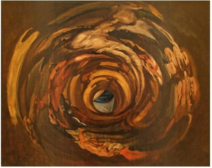
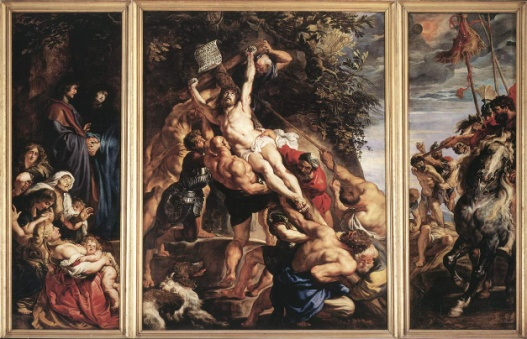
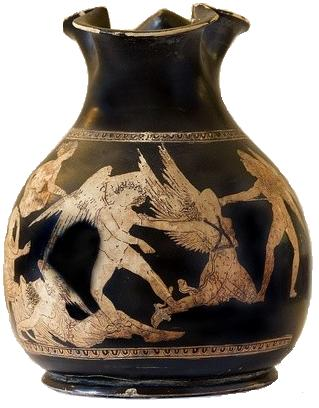

# Leçon 23 | 08 Juin 1960

  <label><input type="checkbox" data-lacan-toggle="original" checked> 原文</label>
  <label><input type="checkbox" data-lacan-toggle="notes" checked> 注释</label>
  <label><input type="checkbox" data-lacan-toggle="commentary" checked> 个人解读评论</label>

<section class="parallel-paragraph" data-paragraph-ids="s7-23-0001">

s7-23-0001

[无对应译文]

原文 · s7-23-0001

Pour ceux qui savent assez le grec pour se débrouiller avec un texte, je vous ai conseillé une traduction juxtalinéaire, mais elle est introuvable. Prenez *la traduction de chez* GARNIER[^69], qui n’est pas mal faite. Et je vous renvoie aux vers suivants : vers 4-7, 323-325, 332-333, 360-375, 450-470, 559-560, 581-584, 611-614, 620-625, 649-650, 780-805, 839-841, 852-862, 875, 916-924, 1259-1260.

</section>

<section class="parallel-paragraph" data-paragraph-ids="s7-23-0002">

s7-23-0002

[无对应译文]

原文 · s7-23-0002

Les vers 559-560 sont importants pour nous donner la position d’ANTIGONE à l’égard de la vie.

</section>

<section class="parallel-paragraph" data-paragraph-ids="s7-23-0003">

s7-23-0003

[无对应译文]

原文 · s7-23-0003

« *Prends courage, vis ! Pour moi, mon âme est déjà partie et ne sert plus qu’aux morts.* »

</section>

<section class="parallel-paragraph" data-paragraph-ids="s7-23-0004">

s7-23-0004

[无对应译文]

原文 · s7-23-0004

\[θάρσει· σὺ μὲν ζῇς, ἡ δ᾽ ἐμὴ ψυχὴ πάλαι τέθνηκεν, ὥστε τοῖς θανοῦσιν ὠϕελεῖν. 559-560\]

</section>

<section class="parallel-paragraph" data-paragraph-ids="s7-23-0005">

s7-23-0005

[无对应译文]

原文 · s7-23-0005

Elle dit à proprement parler que son âme est morte depuis longtemps, qu’elle est destinée à venir en aide aux ὠϕελεῖν \[ophélein\] - c’est le même ὠϕελεῖν dont nous avons parlé à propos d’OPHÉLIE \[cf. séminaire 1958-59 : *Le désir*...\] - à venir en aide aux *morts*.

</section>

<section class="parallel-paragraph" data-paragraph-ids="s7-23-0006">

s7-23-0006

[无对应译文]

原文 · s7-23-0006

Les vers 611-614 et 620-625 concernent ce que dit le CHŒUR concernant la limite autour de laquelle se joue en somme ce qu’ANTIGONE veut.

</section>

<section class="parallel-paragraph" data-paragraph-ids="s7-23-0007">

s7-23-0007

[无对应译文]

原文 · s7-23-0007

> « *Sans jamais vieillir, tu règnes éternellement dans la splendeur du flamboyant Olympe !*
>
> *Une loi, en effet, prévaudra toujours, comme elle a toujours prévalu parmi les hommes.* »
>
> \[τό τ᾽ ἔπειτα καὶ τὸ μέλλον καὶ τὸ πρὶν ἐπαρκέσει  
> νόμος ὅδ᾽, οὐδὲν ἕρπει θνατῶν βιότῳ πάμπολύ γ᾽ ἐκτὸς ἄτας. 611-614\]
>
> « *L’Espérance mensongère est utile aux mortels, mais elle déjoue les désirs de beaucoup.*
>
> *Elle les excite au mal, à leur insu, avant qu’ils aient mis le pied sur le feu ardent.* »
>
> \[τὸ κακὸν δοκεῖν ποτ᾽ ἐσθλὸν τῷδ᾽ ἔμμεν ὅτῳ φρένας  
> θεὸς ἄγει πρὸς ἄταν· πράσσει δ᾽ ὀλίγιστον χρόνον ἐκτὸς ἄτας. 620-625\]

</section>

<section class="parallel-paragraph" data-paragraph-ids="s7-23-0008">

s7-23-0008

[无对应译文]

原文 · s7-23-0008

C’est autour de cette *limite* de l’ἄτῃ \[Até\] que la destinée d’ANTIGONE se joue. Et le terme qui termine chacun de ces deux passages, qui est ἐκτὸς ἄτας \[ektos atas\], j’en ai signalé l’importance la dernière fois. ἐκτὸς, c’est bien un « *en dehors* », je veux dire une chose qui se passe une fois franchie la limite de l’ἄτῃ \[Até\]. Quelque part - par exemple - le messager, le gardien qui est venu raconter l’événement attentatoire à l’autorité de CRÉON, dit à la fin qu’il est ἐκτὸς ἐλπίδος \[330\], « *au-delà de toute espérance* » : il n’espérait plus être sauvé.

</section>

<section class="parallel-paragraph" data-paragraph-ids="s7-23-0009">

s7-23-0009

[无对应译文]

原文 · s7-23-0009

Cet ἐκτὸς ἄτας \[ektos atas\] a vraiment dans le texte, de la façon la plus claire, ce sens du franchissement d’une limite. Et c’est bien autour de cela que le chant du CHŒUR à ce moment-là se développe. De même qu’il dit qu’il se dirige πρὸς ἄταν \[pros atan\], c’est-à-dire vers l’ἄτῃ \[Até\].

</section>

<section class="parallel-paragraph" data-paragraph-ids="s7-23-0010">

s7-23-0010

[无对应译文]

原文 · s7-23-0010

Il y a là un choc avec les directions indiquées. Tout le système prépositionnel des Grecs est tellement là-dessus vif, et suggestif. C’est en tant, nous dit-on, que l’homme prend le mal pour le bien, et là aussi il faut l’intégrer dans notre registre : *c’est parce que quelque chose qui est là au-delà des limites de l’*ἄτῃ \[Até\] *est devenu pour* ANTIGONE *son bien à elle*, c’est-à-dire un *bien* qui n’est pas celui de tous les autres, *qu’elle se dirige* πρὸς ἄταν \[pros atan\].

</section>

<section class="parallel-paragraph" data-paragraph-ids="s7-23-0011">

s7-23-0011

[无对应译文]

原文 · s7-23-0011

Pour reprendre le problème d’une façon qui me permette d’intégrer nos remarques, *il faut une fois de plus revenir à la notion, à une vue simple, lavée, dégagée, du héros de la tragédie*, et pas de n’importe quel héros, de celui que nous avons devant nous : ANTIGONE. C’est une chose qui a tout de même frappé certain commentateur de SOPHOCLE, au singulier, car j’ai avec surprise trouvé que sous la plume d’un auteur d’un livre récent sur SOPHOCLE qui est Karl REINHARDT[^70] - c’est le seul qui s’est en somme aperçu de quelque chose d’assez important, encore que je crois que ce n’est pas à proprement parler ce dont il s’agit – c’est quelque chose que Karl REINHARDT souligne sous la forme de la solitude particulière du héros sophocléen.

</section>

<section class="parallel-paragraph" data-paragraph-ids="s7-23-0012">

s7-23-0012

[无对应译文]

原文 · s7-23-0012

Μονούμενοι, souligne-t-il, est ce très joli terme qu’on trouve sous la plume de SOPHOCLE, ϕρενός οἰοδῶται, celui qui emmène pâturer à l’écart ses pensées. Il est certain que ce n’est pas de cela qu’il s’agit, parce qu’en fin de compte, le héros de la tragédie participe toujours de cet isolement. Il est toujours *hors des limites*, toujours *en flèche*, et par conséquent il est, par quelque côté, arraché à la structure.

</section>

<section class="parallel-paragraph" data-paragraph-ids="s7-23-0013">

s7-23-0013

[无对应译文]

原文 · s7-23-0013

C’est drôle qu’on ne voie pas quelque chose de tout à fait clair, et de tout à fait évident. La liste des 7 pièces de SOPHOCLE, sur les quelques 120 qu’on dit que fut sa production pendant ses 90 années d’âge, et 60 qu’il consacra à la tragédie, c’est : *« Ajax », « Antigone », « Electre », « Œdipe roi », « Les Trachiniennes », « Philoctète »* et cet « *Œdipe à Colone »*.

</section>

<section class="parallel-paragraph" data-paragraph-ids="s7-23-0014">

s7-23-0014

[无对应译文]

原文 · s7-23-0014

Un certain nombre de ces pièces vivent elles-mêmes dans votre esprit. Par contre, peut-être ne vous rendez-vous pas compte qu’« *Ajax »* est un drôle de truc. « *Ajax »*, ça commence par une sorte de massacre du troupeau des Grecs par AJAX qui, du fait qu’ATHÉNA ne lui veut pas de bien, agit là comme un fou. Il croit massacrer toute l’armée grecque, et il massacre les troupeaux. Il se réveille après ça, il sombre dans la honte, et il va se tuer de douleur dans un coin. Il n’y a, dans la pièce, absolument rien d’autre. C’est quand même assez drôle, comme je vous le disais l’autre jour, il n’y a pas l’ombre d’une péripétie. Tout est donné au départ, et les courbes n’ont plus qu’à s’écraser les unes sur les autres comme elles peuvent.

</section>

<section class="parallel-paragraph" data-paragraph-ids="s7-23-0015">

s7-23-0015

[无对应译文]

原文 · s7-23-0015

*« Antigone »* est ce dont nous parlons, par conséquent laissons ça de côté.

</section>

<section class="parallel-paragraph" data-paragraph-ids="s7-23-0016">

s7-23-0016

[无对应译文]

原文 · s7-23-0016

*« Électre »*, c’est tout de même aussi quelque chose d’assez curieux dans SOPHOCLE. Dans ESCHYLE, ça engendre toutes sortes de choses. Il y a les CHOÉPHORES et les EUMÉNIDES. Après que le meurtre d’AGAMEMNON ait été vengé, il faut qu’ORESTE s’arrange avec les divinités vengeresses qui protègent le sang maternel : rien de pareil dans SOPHOCLE. ÉLECTRE est un personnage qui est, à proprement parler - je ne peux pas trop m’étendre là-dessus, mais par certains côtés que je vais vous développer tout à l’heure - un véritable doublet d’ANTIGONE dans le sens que, dans le texte, elle est morte dans la vie : « *Je suis déjà morte à tout* ». Et d’ailleurs au moment suprême, au moment où ORESTE fait sauter le pas à ÉGISTHE, il lui dit, est-ce que tu te rends compte que tu parles à des gens qui sont comme des morts ? Tu ne parles pas à des vivants. C’est une note excessivement curieuse. Et la chose se termine sec, comme cela, pas la moindre trace de chose qui court après, de superflu. Les choses se terminent de la façon la plus sèche. C’est une exécution au sens propre du terme, la fin de l’« *Électre »*.

</section>

<section class="parallel-paragraph" data-paragraph-ids="s7-23-0017">

s7-23-0017

[无对应译文]

原文 · s7-23-0017

L’« *Œdipe roi »*, laissons-le de côté du point de vue que je veux aborder ici. D’ailleurs nous ne prétendrons pas faire *une loi générale.* Nous ignorons la plus grande partie de ce qu’a fait SOPHOCLE. Je parle de ce qui reste comme proportion de certaines formules que je vais dégager dans ce qui nous reste de SOPHOCLE.

</section>

<section class="parallel-paragraph" data-paragraph-ids="s7-23-0018">

s7-23-0018

[无对应译文]

原文 · s7-23-0018

*« Les Trachiniennes »*, c’est la fin d’HERCULE. HERCULE est vraiment au bout de ses travaux. Il le sait d’ailleurs. On lui dit qu’il va aller se reposer. Il en a fini. Malheureusement, dans le dernier de ses travaux, il a mêlé dangereusement la question de son désir pour une captive, et sa femme, par amour pour lui, envoie cette délicieuse tunique qu’elle conserve là depuis toujours en cas de besoin. Elle est sûre que c’est une arme à garder pour le bon moment. Et c’est le bon moment. Elle la lui envoie, et vous savez ce qu’il arrive, c’est-à-dire que toute la fin de la pièce est uniquement occupée par les gémissements, les rugissements d’HERCULE qui est dévoré par ce tissu enflammé.

</section>

<section class="parallel-paragraph" data-paragraph-ids="s7-23-0019">

s7-23-0019

[无对应译文]

原文 · s7-23-0019

Puis il y a « *Philoctète »*. PHILOCTÈTE est un personnage qu’on a abandonné. Là, évidemment, l’isolement est bien manifeste. On l’a abandonné dans une île. Il est là à pourrir tout seul depuis dix ans, et on vient encore lui demander de rendre service à la communauté. Il se passe toutes sortes de choses dans « *Philoctète »* et tout le pathétique du drame de conscience que représente pour le jeune NÉOPTOLÈME le fait d’être chargé de servir d’appât pour le tromper.

</section>

<section class="parallel-paragraph" data-paragraph-ids="s7-23-0020">

s7-23-0020

[无对应译文]

原文 · s7-23-0020

Puis il y a *Œdipe à Colone*. Est-ce que vous ne remarquez pas ceci : c’est que s’il y a un trait différentiel de ce que nous appelons du SOPHOCLE, mis à part *Œdipe roi*, c’est la position « *à bout de course* » de tous les héros. Ils sont portés sur un extrême qui se situe dans un rapport que la solitude, définie par rapport au prochain, est très loin d’épuiser. C’est d’*autre chose* qu’il s’agit. Bref, ce sont des personnages d’ores et déjà, et d’emblée, situés dans une zone limite, une zone entre la vie et la mort à proprement parler. Le thème de l’« *entre la vie et la mort* » est d’ailleurs formulé comme tel dans le texte, articulé, mais il est éclatant, manifeste dans les situations.

</section>

<section class="parallel-paragraph" data-paragraph-ids="s7-23-0021">

s7-23-0021

[无对应译文]

原文 · s7-23-0021

Je dirai qu’on pourrait faire entrer dans cette voie générale la position d’*Œdipe roi*, pour autant que lui, il est par un côté singulier, unique, paradoxal, par rapport aux autres, il est, comme nous le montre le poète, au début de ce drame, au *comble du bonheur*. C’est de ce *comble du bonheur* que, ce que nous voyons dans SOPHOCLE, c’est à proprement parler ce personnage acharné à sa propre perte par son acharnement à résoudre une énigme, à vouloir *la vérité*. Tout le monde essaie de le retenir, et en particulier JOCASTE. Elle essaie à chaque instant de lui dire, en voilà assez, on en sait assez. Seulement il veut savoir. Et il finit par savoir. Enfin je conviens que l’« *Œdipe roi »* ne rentre pas dans la formule générale du personnage sophocléen qui est tout de même très exceptionnellement marqué par ce que je désigne dans cette première approximation par l’*à bout de course*.

</section>

<section class="parallel-paragraph" data-paragraph-ids="s7-23-0022">

s7-23-0022

[无对应译文]

原文 · s7-23-0022

Maintenant revenons-en à notre ANTIGONE qui, elle, l’est de la façon la plus claire, la plus avouée. Un jour je vous ai montré ici une anamorphose, la plus belle que j’aie trouvée à votre usage. Elle était vraiment exemplaire, « *au-delà de toute espérance* ». Vous vous souvenez de cette sorte de cylindre autour de quoi se produit ce singulier phénomène qui fait qu’en tant qu’à proprement parler on ne peut pas dire que du point de vue optique il y ait une image - je ne vais pas entrer dans la définition optique de la chose - mais c’est pour autant que sur chaque génératrice du cylindre se produit un fragment infinitésimal d’image que nous voyons se produire quelque part ce qui est là, puis quelque part qui est là, une superposition d’une série de trames, d’images.

</section>

<section class="parallel-paragraph" data-paragraph-ids="s7-23-0023">

s7-23-0023

[无对应译文]

原文 · s7-23-0023

  

</section>

<section class="parallel-paragraph" data-paragraph-ids="s7-23-0024">

s7-23-0024

[无对应译文]

原文 · s7-23-0024

Moyennant quoi vous avez vu là une très belle image de *La passion* se produire dans l’au–delà du miroir, alors que quelque chose d’assez dissous et dégueulasse s’étalait autour, sous la forme de ce qui produisait finalement cette merveilleuse illusion.

</section>

<section class="parallel-paragraph" data-paragraph-ids="s7-23-0025">

s7-23-0025

[无对应译文]

原文 · s7-23-0025

C’est un peu de cela qu’il s’agit. Il s’agit de savoir, si vous voulez, quelle est cette surface pour que cette image d’ANTIGONE en tant qu’image d’une passion surgisse. J’ai évoqué l’autre jour, à son propos, le « *Père, pourquoi m’avez-vous abandonnée ?* » Il est littéralement dit dans un vers. Et la tragédie, c’est quelque chose qui se répand en avant pour produire cette image.

</section>

<section class="parallel-paragraph" data-paragraph-ids="s7-23-0026">

s7-23-0026

[无对应译文]

原文 · s7-23-0026

Ce que nous faisons, en en faisant l’analyse, c’est le processus inverse. C’est à savoir de *voir comment* il a fallu construire cette image pour produire cet effet. Eh bien commençons. Et d’abord ceci que je vous ai déjà souligné : c’est le côté implacable, *sans crainte et sans pitié* qui se manifeste à tout instant de façon si frappante chez ANTIGONE.

</section>

<section class="parallel-paragraph" data-paragraph-ids="s7-23-0027">

s7-23-0027

[无对应译文]

原文 · s7-23-0027

Quelque part, et certes pour le déplorer, le CHŒUR l’appelle - cela doit correspondre au vers 875 - « αὐτόγνωτος ». Et il faut vraiment le faire retentir là, derrière le « γνῶθι σεαυτόν » de l’ORACLE DE DELPHES. Cette sorte d’entière connaissance d’elle-même, c’est là quelque chose dont on ne saurait pas ne pas retenir le sens. Quand, au départ, elle donne son projet à ISMÈNE, je vous ai déjà indiqué son mouvement d’une extrême dureté.

</section>

<section class="parallel-paragraph" data-paragraph-ids="s7-23-0028">

s7-23-0028

[无对应译文]

原文 · s7-23-0028

« *Est-ce que tu te rends compte de ce qui se passe ?* »

</section>

<section class="parallel-paragraph" data-paragraph-ids="s7-23-0029">

s7-23-0029

[无对应译文]

原文 · s7-23-0029

Il vient de promulguer ce qu’on appelle κήρυγμα qui joue un grand rôle dans la théologie protestante moderne dans la dimension de l’énoncé religieux. Le style est celui-ci :

</section>

<section class="parallel-paragraph" data-paragraph-ids="s7-23-0030">

s7-23-0030

[无对应译文]

原文 · s7-23-0030

« *En somme voilà, c’est ce qu’il a proclamé pour toi et pour moi.* »

</section>

<section class="parallel-paragraph" data-paragraph-ids="s7-23-0031">

s7-23-0031

[无对应译文]

原文 · s7-23-0031

Elle ajoute d’ailleurs, dans ce style vivant - je dis : pour moi - et elle dit :

</section>

<section class="parallel-paragraph" data-paragraph-ids="s7-23-0032">

s7-23-0032

[无对应译文]

原文 · s7-23-0032

« *Moi, j’enterrerai mon frère.* »

</section>

<section class="parallel-paragraph" data-paragraph-ids="s7-23-0033">

s7-23-0033

[无对应译文]

原文 · s7-23-0033

Qu’est-ce que ça veut dire, et pourquoi, nous le verrons. Les choses vont en effet très vite. Puis, vous l’avez vu, le gardien vient annoncer que le frère est enterré. À ce moment-là, je vais vous arrêter quelques instants sur quelque chose qui, je crois, est essentiel et donne la portée pour nous de l’œuvre sophocléenne, c’est ceci...

</section>

<section class="parallel-paragraph" data-paragraph-ids="s7-23-0034">

s7-23-0034

[无对应译文]

原文 · s7-23-0034

> certains l’ont dit, je crois même que cela fait partie du titre d’un des nombreux ouvrages que j’ai plus ou moins dépouillés pour me rendre compte de ce qu’on avait dit au cours des âges sur notre SOPHOCLE

</section>

<section class="parallel-paragraph" data-paragraph-ids="s7-23-0035">

s7-23-0035

[无对应译文]

原文 · s7-23-0035

...c’est évidemment : « SOPHOCLE*, c’est l’humanisme* ».

</section>

<section class="parallel-paragraph" data-paragraph-ids="s7-23-0036">

s7-23-0036

[无对应译文]

原文 · s7-23-0036

On le trouve plus humain, donnant l’idée d’une sorte de mesure proprement humaine entre je ne sais quel enracinement dans les idéaux archaïques que représenterait ESCHYLE, et je ne sais quoi qui s’infléchirait vers le pathos, la sentimentalité, la critique, les sophismes pour tout dire, comme déjà ARISTOTE va le reprocher à EURIPIDE.

</section>

<section class="parallel-paragraph" data-paragraph-ids="s7-23-0037">

s7-23-0037

[无对应译文]

原文 · s7-23-0037

Il y a quelque chose qui me frappe. Je veux bien en effet que SOPHOCLE occupe cette sorte de position médiane, mais quant à y voir je ne sais quel parent de l’humanisme, je veux bien aussi : cela donnera un sens nouveau au mot d’« *humanisme »* alors. Car je dirai que :

</section>

<section class="parallel-paragraph" data-paragraph-ids="s7-23-0038">

s7-23-0038

[无对应译文]

原文 · s7-23-0038

- si nous nous sentons, quant à nous, au bout si l’on peut dire de cette veine du thème humaniste,

</section>

<section class="parallel-paragraph" data-paragraph-ids="s7-23-0039">

s7-23-0039

[无对应译文]

原文 · s7-23-0039

- si l’homme pour nous est en train de se décomposer, c’est comme par l’effet d’une analyse spectrale dont ici ce que je vous donne est un exemple.

</section>

<section class="parallel-paragraph" data-paragraph-ids="s7-23-0040">

s7-23-0040

[无对应译文]

原文 · s7-23-0040

- Si nous sommes en train de cheminer dans ce joint qui s’exprime sous divers registres, c’est le même point entre l’*imaginaire* et le *symbolique* où nous poursuivons ici *le rapport de l’homme au signifiant*, et le *splitting* qu’il engendre chez lui.

</section>

<section class="parallel-paragraph" data-paragraph-ids="s7-23-0041">

s7-23-0041

[无对应译文]

原文 · s7-23-0041

C’est bien la même chose que cherche un Claude LÉVI-STRAUSS dans cette formalisation qu’il essaie de donner au passage de *la nature* à *la culture*, et plus exactement de *la faille entre la nature et la culture*.

</section>

<section class="parallel-paragraph" data-paragraph-ids="s7-23-0042">

s7-23-0042

[无对应译文]

原文 · s7-23-0042

Il est assez curieux de voir qu’à l’orée de l’humanisme, c’est aussi dans cette sorte d’analyse, de béance d’analyse, de confins dans ce côté « *à bout de course* » que surgit l’image ou les images, sans aucun doute, qui ont été les plus fascinantes pour toute cette période de l’histoire que nous pouvons mettre sous l’accolade humaniste \[cf. la référence à Sophocle dans Heidegger : « *lettre sur l’humanisme* »\].

</section>

<section class="parallel-paragraph" data-paragraph-ids="s7-23-0043">

s7-23-0043

[无对应译文]

原文 · s7-23-0043

Je crois par exemple très frappant ce moment dont vous avez là un morceau important - vers 360-375 - où le CHŒUR éclate, juste après le départ de ce messager dont je vous ai montré les évolutions bouffonnes, les tortillements, pour venir annoncer une nouvelle qui peut lui coûter très cher. Là, vous avez les vers 323-325 : \[ϕεῦ· ἦ δεινὸν ᾧ δοκῇ γε καὶ ψευδῆ δοκεῖν. 323 \] dont je vous parlai l’autre jour, c’est-à-dire que c’est vraiment terrible de voir quelqu’un s’obstiner à croire. À croire quoi ? Ce que personne pour l’instant n’a le droit d’imaginer : le jeu du δοκῇ δοκεῖν. C’est là ce que j’ai voulu souligner dans ce vers. Et l’autre \[Créon\] réplique :

</section>

<section class="parallel-paragraph" data-paragraph-ids="s7-23-0044">

s7-23-0044

[无对应译文]

原文 · s7-23-0044

« *Tu fais le malin avec des histoires concernant la* δόξα ». \[κόμψευέ νυν τὴν δόξαν. 324\]

</section>

<section class="parallel-paragraph" data-paragraph-ids="s7-23-0045">

s7-23-0045

[无对应译文]

原文 · s7-23-0045

Allusion évidente aux jeux philosophiques autour d’un thème à l’époque. Tout de suite après cette scène...

</section>

<section class="parallel-paragraph" data-paragraph-ids="s7-23-0046">

s7-23-0046

[无对应译文]

原文 · s7-23-0046

> qui est assez dérisoire, parce qu’enfin nous ne nous intéressons pas beaucoup au fait que le gardien va pouvoir être étripé pour la mauvaise nouvelle qu’il véhicule. Il s’en tire - il est bien heureux - avec une pirouette

</section>

<section class="parallel-paragraph" data-paragraph-ids="s7-23-0047">

s7-23-0047

[无对应译文]

原文 · s7-23-0047

...tout de suite après, c’est là qu’éclate cette sorte de chant du CHŒUR qui est ce que j’ai appelé l’autre jour « *éloge de l’homme* », et qui commence par quelque chose comme ceci :

</section>

<section class="parallel-paragraph" data-paragraph-ids="s7-23-0048">

s7-23-0048

[无对应译文]

原文 · s7-23-0048

πολλὰ τὰ δεινὰ κοὐδὲν ἀνθρώπου δεινότερον πέλει. \[332-333\]

</section>

<section class="parallel-paragraph" data-paragraph-ids="s7-23-0049">

s7-23-0049

[无对应译文]

原文 · s7-23-0049

Ce qui veut dire littéralement :

</section>

<section class="parallel-paragraph" data-paragraph-ids="s7-23-0050">

s7-23-0050

[无对应译文]

原文 · s7-23-0050

« *Il y a pas mal de choses formidables dans le monde, mais il n’y a rien de plus formidable que l’homme.* »

</section>

<section class="parallel-paragraph" data-paragraph-ids="s7-23-0051">

s7-23-0051

[无对应译文]

原文 · s7-23-0051

Là-dessus, il y a un long morceau dont, par un certain côté, Claude LÉVI-STRAUSS est frappé par ceci, c’est que ce que le CHŒUR dit de l’homme est vraiment la définition de ce qui est de la culture comme opposée à la nature :

</section>

<section class="parallel-paragraph" data-paragraph-ids="s7-23-0052">

s7-23-0052

[无对应译文]

原文 · s7-23-0052

- il cultive la parole et les sciences sublimes,

</section>

<section class="parallel-paragraph" data-paragraph-ids="s7-23-0053">

s7-23-0053

[无对应译文]

原文 · s7-23-0053

- il sait préserver sa demeure des glaces de l’histoire, et des traits de l’orage,

</section>

<section class="parallel-paragraph" data-paragraph-ids="s7-23-0054">

s7-23-0054

[无对应译文]

原文 · s7-23-0054

- il sait ne pas se mouiller.

</section>

<section class="parallel-paragraph" data-paragraph-ids="s7-23-0055">

s7-23-0055

[无对应译文]

原文 · s7-23-0055

Ici, il y a tout de même une espèce de glissement, je dois dire, l’apparition de je ne sais quelle *ironie* qui me paraît tout à fait incontestable dans ce qui va suivre, ce fameux παντοπόρος, ἄπορος qui a pu servir de discussion quant à la ponctuation. Cette ponctuation me semble généralement admise :

</section>

<section class="parallel-paragraph" data-paragraph-ids="s7-23-0056">

s7-23-0056

[无对应译文]

原文 · s7-23-0056

Παντοπόρος, ἄπορος ἐπ᾽ οὐδὲν ἔρχεται τὸ μέλλον \[358-359\].

</section>

<section class="parallel-paragraph" data-paragraph-ids="s7-23-0057">

s7-23-0057

[无对应译文]

原文 · s7-23-0057

Tâchons de comprendre un peu ce qu’il dit là. Évidemment, cela passe très vite au théâtre.

</section>

<section class="parallel-paragraph" data-paragraph-ids="s7-23-0058">

s7-23-0058

[无对应译文]

原文 · s7-23-0058

- Παντοπόρος cela veut dire « *qui connaît des tas de trucs* » : il en connaît des trucs, l’homme,

</section>

<section class="parallel-paragraph" data-paragraph-ids="s7-23-0059">

s7-23-0059

[无对应译文]

原文 · s7-23-0059

- ἄπορος, c’est le contraire, c’est quand on est sans ressources et sans moyens devant quelque chose - aporie, ça vous est tout de même familier - ἄπορος donc, c’est quand il est couillonné.

</section>

<section class="parallel-paragraph" data-paragraph-ids="s7-23-0060">

s7-23-0060

[无对应译文]

原文 · s7-23-0060

Comme dit le proverbe vaudois : « *Rien n’est impossible à l’homme, ce qu’il ne peut pas faire, il le laisse.* » C’est le style.

</section>

<section class="parallel-paragraph" data-paragraph-ids="s7-23-0061">

s7-23-0061

[无对应译文]

原文 · s7-23-0061

Ensuite nous avons : ἐπ᾽ οὐδὲν ἔρχεται τὸ μέλλον :

</section>

<section class="parallel-paragraph" data-paragraph-ids="s7-23-0062">

s7-23-0062

[无对应译文]

原文 · s7-23-0062

- ἔρχεται, cela veut dire il marche.

</section>

<section class="parallel-paragraph" data-paragraph-ids="s7-23-0063">

s7-23-0063

[无对应译文]

原文 · s7-23-0063

- ἐπ᾽ οὐδὲν, cela veut dire il va être sur le rien.

</section>

<section class="parallel-paragraph" data-paragraph-ids="s7-23-0064">

s7-23-0064

[无对应译文]

原文 · s7-23-0064

- τὸ μέλλον, cela peut se traduire tout innocemment comme *avenir*, et c’est aussi *ce qui doit venir*. Dans d’autres cas, cela veut dire μέλλειν, *tarder*. Ce sont des sens courants. Donc, vous voyez que, sémantiquement, τὸ μέλλον ouvre un champ qui n’est pas facile à strictement identifier dans un terme français correspondant.

</section>

<section class="parallel-paragraph" data-paragraph-ids="s7-23-0065">

s7-23-0065

[无对应译文]

原文 · s7-23-0065

Évidemment, d’habitude, on s’en tire en disant :

</section>

<section class="parallel-paragraph" data-paragraph-ids="s7-23-0066">

s7-23-0066

[无对应译文]

原文 · s7-23-0066

« *Comme il est plein de ressources, il ne sera sans ressource vers rien de ce qui peut arriver.* »

</section>

<section class="parallel-paragraph" data-paragraph-ids="s7-23-0067">

s7-23-0067

[无对应译文]

原文 · s7-23-0067

Ce qui est une sentence somme toute qui me semble un petit peu *prudhommesque,* et dont il n’est pas sûr que, l’employant dans un texte qui a tant de relief, il n’est pas sûr que pour dire une platitude pareille ce soit là l’intention du poète.

</section>

<section class="parallel-paragraph" data-paragraph-ids="s7-23-0068">

s7-23-0068

[无对应译文]

原文 · s7-23-0068

Nous trouvons plus bas quelque chose d’autre : ὑψίπολις ἄπολις, c’est-à-dire celui qui est *au-dessus de la vie* ou *de la cité*, et qui est aussi *en dehors* *de la cité*. Je vous dirai pourquoi il se trouve ainsi défini, ce personnage qu’on identifie généralement dans le discours du CHŒUR comme une sorte de commencement de dévoiement de CRÉON.

</section>

<section class="parallel-paragraph" data-paragraph-ids="s7-23-0069">

s7-23-0069

[无对应译文]

原文 · s7-23-0069

En tout cas, ce παντοπόρος, ἄπορος me paraît difficile à ne pas disjoindre là où ils sont rapprochés : en tête de la phrase. Et je ne suis pas sûr d’autre part que : « …ἄπορος ἐπ᾽οὐδὲν ἔρχεται » peut se traduire en français par : « *parce qu’ il n’est sans ressources devant rien* », que ce soit tout à fait conforme avec ce que le génie de la langue grecque, ici, suppose.

</section>

<section class="parallel-paragraph" data-paragraph-ids="s7-23-0070">

s7-23-0070

[无对应译文]

原文 · s7-23-0070

Ce n’est pas « *il n’est sans ressources devant rien* ». Cet ἔρχεται exige d’entraîner ce quelque chose qui est ἐπ᾽οὐδὲν avec lui. Le ἐπ᾽, *c’est quelque chose qui s’accroche bien à* l’ἔρχεται *et non pas à* l’ἄπορος. C’est nous qui voyons là une espèce de bon à tout. Il va littéralement vers rien de ce qui peut arriver. Il n’y va pas autrement qu’il n’est, c’est-à-dire παντοπόρος, roublard, et toujours couillonné. Il n’en rate pas une. Cela veut dire qu’il s’arrange toujours à ce que des trucs lui tombent sur la tête. Je crois que c’est dans le style à proprement parler de PREVERT qu’il faut sentir cette espèce de moment tournant. Et je vais vous en donner un exemple, une confirmation qui me semble la suivante :

</section>

<section class="parallel-paragraph" data-paragraph-ids="s7-23-0071">

s7-23-0071

[无对应译文]

原文 · s7-23-0071

« Ἅιδα μόνον ϕεῦξιν οὐκ ἐπάξεται· 361-62 »

</section>

<section class="parallel-paragraph" data-paragraph-ids="s7-23-0072">

s7-23-0072

[无对应译文]

原文 · s7-23-0072

Cela veut dire qu’il n’y a qu’une chose dont il ne se tire pas, c’est de l’affaire de l’HADÈS. Là, pour ce qui est de ne pas mourir, il n’en est pas venu à bout. Ce qui va de soi, ce qui est important, c’est que ce qui suit, à savoir :

</section>

<section class="parallel-paragraph" data-paragraph-ids="s7-23-0073">

s7-23-0073

[无对应译文]

原文 · s7-23-0073

« νόσων δ᾽ ἀμηχάνων φυγὰς 363 »

</section>

<section class="parallel-paragraph" data-paragraph-ids="s7-23-0074">

s7-23-0074

[无对应译文]

原文 · s7-23-0074

Après avoir dit qu’il y a en tout cas quelque chose dont il n’est pas venu à bout, c’est la mort, il dit : il a imaginé, a combiné un truc absolument formidable qui est - quoi ? - qui est tout de même quelque chose qui est bien fait pour nous *intéresser* :

</section>

<section class="parallel-paragraph" data-paragraph-ids="s7-23-0075">

s7-23-0075

[无对应译文]

原文 · s7-23-0075

« νόσων δ᾽ἀμηχάνων φυγὰς 363 », qui veut dire littéralement : *la fuite devant des maladies impossibles*.

</section>

<section class="parallel-paragraph" data-paragraph-ids="s7-23-0076">

s7-23-0076

[无对应译文]

原文 · s7-23-0076

Car essayez de faire rentrer ça dans le bon sens en disant quoi ? Il n’a aucun moyen de donner à ça un autre sens que celui que je lui donne. Les traductions, d’habitude, essaient de dire qu’avec les maladies encore il s’en arrange, mais ce n’est pas ça du tout.

</section>

<section class="parallel-paragraph" data-paragraph-ids="s7-23-0077">

s7-23-0077

[无对应译文]

原文 · s7-23-0077

Il n’en est pas arrivé au bout avec la mort, mais pour trouver des trucs formidables, des maladies qui ne sont pas à la portée d’aucun. C’est lui qui les a construites, fabriquées, c’est tout de même assez énorme, en 441 avant J.C., de voir produire comme une des dimensions de l’homme, essentielle, de nous voir manifester non pas - ce qui n’aurait aucun sens à la place où ça est - la fuite devant les maladies, on ajoute bien que c’est une maladie ἀμηχάνων, c’est un sacré truc. Débrouillez-vous avec cela, c’est cela qu’il a inventé. D’ailleurs, le texte répète qu’il n’a pas réussi devant l’HADÈS et, tout de suite après, nous entrons dans le μηχανόεν à proprement parler, dans ceci qu’est le μηχανον. Il y a quelque chose de σοϕόν.

</section>

<section class="parallel-paragraph" data-paragraph-ids="s7-23-0078">

s7-23-0078

[无对应译文]

原文 · s7-23-0078

Ce σοϕόν, à ce niveau là, n’est pas si simple. Je vous prie de vous rappeler, dans le texte que j’ai traduit moi-même pour le premier numéro de *La Psychanalyse,* le sens de σοϕόν dans HÉRACLITE, σοϕόν c’est « *il est sage* », et de ομολογείν qui veut dire, la même chose. Ce σοϕόν, c’est là quelque chose qui a encore toute sa verdeur primitive.

</section>

<section class="parallel-paragraph" data-paragraph-ids="s7-23-0079">

s7-23-0079

[无对应译文]

原文 · s7-23-0079

Il y a *quelque chose de* σοϕόν dans ce *mécanisme* des μηχανόεν. Il y a là quelque chose qui : ὑπὲρ ἐλπίδ᾽ἔχων, « *va au-delà de tout espoir* », et qui ἕρπει, ἕρπει c’est *le même mot*. C’est cela qui le conduit, qui le dirige tantôt vers le mal, tantôt vers le bien, c’est-à-dire que ce pouvoir, cette sorte de - je traduis moi σοϕόν par « *mandat* » dans l’article dont je vous parle - de ce qui est déféré à lui par ce bien, est quelque chose d’éminemment ambigu.

</section>

<section class="parallel-paragraph" data-paragraph-ids="s7-23-0080">

s7-23-0080

[无对应译文]

原文 · s7-23-0080

Et tout de suite après nous avons le passage :

</section>

<section class="parallel-paragraph" data-paragraph-ids="s7-23-0081">

s7-23-0081

[无对应译文]

原文 · s7-23-0081

νόμους παρείρων... \[...χθονὸς θεῶν τ᾽ ἔνορκον δίκαν 368\]

</section>

<section class="parallel-paragraph" data-paragraph-ids="s7-23-0082">

s7-23-0082

[无对应译文]

原文 · s7-23-0082

qui est en somme ce autour de quoi va tourner toute la pièce. Car ce παρείρων incontestablement veut dire *combinant de travers*.

</section>

<section class="parallel-paragraph" data-paragraph-ids="s7-23-0083">

s7-23-0083

[无对应译文]

原文 · s7-23-0083

χθονὸς c’est *la terre*. θεῶν τ᾽ἔνορκον δίκαν, la δίκη \[diké\]  : *ce qui est formulé, dit dans la loi*. C’est ce « *Dites* » qui est ce que nous appelons dans le silence de l’analyse. On ne dit pas « *Parlez* », on ne leur dit pas « *Énoncez, racontez* », on leur dit « *Dites* ». C’est bien justement ce qu’il ne faut pas faire. Cette δίκη \[diké\] est essentielle, et a cette dimension proprement énonciatrice : ἔνορκον δίκαν, confirmée par serment des dieux.

</section>

<section class="parallel-paragraph" data-paragraph-ids="s7-23-0084">

s7-23-0084

[无对应译文]

原文 · s7-23-0084

Il y a là deux dimensions très nettes qui sont suffisamment distinguées :

</section>

<section class="parallel-paragraph" data-paragraph-ids="s7-23-0085">

s7-23-0085

[无对应译文]

原文 · s7-23-0085

- il y a *les lois de la terre*,

</section>

<section class="parallel-paragraph" data-paragraph-ids="s7-23-0086">

s7-23-0086

[无对应译文]

原文 · s7-23-0086

- puis il y a *ce que commandent les dieux*,

</section>

<section class="parallel-paragraph" data-paragraph-ids="s7-23-0087">

s7-23-0087

[无对应译文]

原文 · s7-23-0087

...mais on peut les mêler. C’est évidemment pas du même ordre et *de les embrouiller, c’est à partir de là que ça va pouvoir aller mal*. *Ça va tellement mal* que d’ores et déjà le CHŒUR qui, lui, tout vacillant qu’il soit, a quand même sa petite ligne de navigation, dit :

</section>

<section class="parallel-paragraph" data-paragraph-ids="s7-23-0088">

s7-23-0088

[无对应译文]

原文 · s7-23-0088

« *en aucun cas, celui-là, je veux m’associer à lui* ». \[μήτ᾽ ἐμοὶ παρέστιος γένοιτο μήτ᾽ ἴσον φρονῶν ὃς τάδ᾽ ἔρδει. 374-375\]

</section>

<section class="parallel-paragraph" data-paragraph-ids="s7-23-0089">

s7-23-0089

[无对应译文]

原文 · s7-23-0089

Car *s’avancer dans cette direction est* à très proprement parler τὸ μὴ καλὸν \[370\], *ce qui n’est pas beau*. Et non pas *ce qui n’est pas bien* comme on le traduit, à cause de l’audace que cela comporte. Et il ne veut pas l’avoir - le CHŒUR - ce personnage pour παρέστιος, *compagnon* ou voisin de foyer. Il ne veut pas être avec lui dans le même point central dont nous parlons. Avec celui-là il préfère n’avoir pas des relations de prochain, ni non plus ἴσον ϕρονῶν \[375\], avoir *le même désir*. C’est *ce désir de l’autre dont il sépare son désir*. Je ne crois pas forcer les choses en y trouvant *l’écho de certaines des formules* que je vous ai données ici.

</section>

<section class="parallel-paragraph" data-paragraph-ids="s7-23-0090">

s7-23-0090

[无对应译文]

原文 · s7-23-0090

Mais la question devient d’importance alors. Car *qui est-ce qui confond* νόμους χθονὸς, avec la δίκη *des dieux* ? Naturellement *l’interprétation classique est très claire* : *c’est* CRÉON qui serait là *celui qui représente les lois du pays, et qui les identifie aux décrets* *des dieux*. Du moins est-ce ainsi *qu’au premier abord on voit les choses*. Mais ce n’est pas si sûr que cela, car on ne peut tout de même pas nier que νόμους χθονὸς, *les lois chthoniennes*, les lois du niveau de la terre, c’est tout de même bien ce dont se mêle ANTIGONE.

</section>

<section class="parallel-paragraph" data-paragraph-ids="s7-23-0091">

s7-23-0091

[无对应译文]

原文 · s7-23-0091

C’est à savoir que *c’est pour son frère* - je le souligne sans cesse - qui est *passé dans le monde souterrain*, c’est au nom des attaches les plus radicalement chtoniennes des liens du sang, qu’elle se pose en opposante au κήρυγμα, au commandement de CRÉON. Et en somme, elle se trouve, elle, en position de mettre de son côté la δίκη *des dieux*. L’*ambiguïté* en tous les cas est nettement ici *discernable*. Et c’est ce que nous allons voir maintenant, je crois, mieux confirmé. Je vous ai déjà indiqué ceci, c’est comment, dans le style du CHŒUR, après la condamnation d’ANTIGONE, éclate quelque chose qui met tout l’accent sur le fait qu’elle a été chercher son Ἄτη \[Atè\].

</section>

<section class="parallel-paragraph" data-paragraph-ids="s7-23-0092">

s7-23-0092

[无对应译文]

原文 · s7-23-0092

De même quand ÉLECTRE dit :

</section>

<section class="parallel-paragraph" data-paragraph-ids="s7-23-0093">

s7-23-0093

[无对应译文]

原文 · s7-23-0093

> « *Pourquoi est ce que tu remues, tu te fourres sans cesse dans l’* Ἄτη *de ta maison,*
>
> *pourquoi tu t’obstines à réveiller sans cesse, devant ÉGISTHE et devant ta mère, son meurtre fatal ?*
>
> *Est-ce que ce n’est pas toi qui t’attires tout ce qui en résulte comme maux sur ta tête ?* »

</section>

<section class="parallel-paragraph" data-paragraph-ids="s7-23-0094">

s7-23-0094

[无对应译文]

原文 · s7-23-0094

À quoi l’autre répond :

</section>

<section class="parallel-paragraph" data-paragraph-ids="s7-23-0095">

s7-23-0095

[无对应译文]

原文 · s7-23-0095

« *Je suis bien d’accord, mais je ne peux pas faire autrement.* »

</section>

<section class="parallel-paragraph" data-paragraph-ids="s7-23-0096">

s7-23-0096

[无对应译文]

原文 · s7-23-0096

Ici c’est bien pour autant qu’elle va vers cet Ἄτη, et qu’il s’agit même d’aller ἐκτòς ἄτας \[ektos atas\], de franchir la limite de l’Ἄτη qu’ANTIGONE est considérée, intéresse le CHŒUR. Le commentaire du CHŒUR c’est ceci : c’est celle qui par son désir viole les limites de l’Ἄτη, et c’est très exactement à quoi se rapportent les vers dont je vous ai donné l’*indication* \[614, 625\], et spécialement ceux qui se terminent par la formule ἐκτòς ἄτας \[ektos atas\] : passer la limite de l’Ἄτη. L’Ἄτη, ce n’est pas l’ἁμαρτία, la faute, l’erreur, ça n’est pas faire une bêtise. La distinction est très nette. Quand, à la fin, CRÉON va revenir tenant dans ses bras quelque chose, nous dit le CHŒUR, et il semble bien que ce ne soit rien d’autre que le corps de son fils qui s’est suicidé, le CHŒUR dit :

</section>

<section class="parallel-paragraph" data-paragraph-ids="s7-23-0097">

s7-23-0097

[无对应译文]

原文 · s7-23-0097

« *s’il est permis de le dire, son fils a été, il ne s’agit pas là d’un malheur qui lui soit étranger, mais* αὐτὸς ἁμαρτών *de sa propre erreur.* » \[καὶ μὴν ὅδ᾽ ἄναξ αὐτὸς ἐϕήκει μνῆμ᾽ ἐπίσημον διὰ χειρὸς ἔχων, εἰ θέμις εἰπεῖν, οὐκ ἀλλοτρίαν ἄτην, ἀλλ᾽ αὐτὸς ἁμαρτών. 1259-1260\]

</section>

<section class="parallel-paragraph" data-paragraph-ids="s7-23-0098">

s7-23-0098

[无对应译文]

原文 · s7-23-0098

Lui-même s’étant foutu dedans, il a fait une bêtise. Il y a d’autres éléments dans le texte qui nous permettent, littéralement, de donner ce sens à ἁμαρτία : l’erreur,la bévue. C’est là le sens sur lequel insiste ARISTOTE. À mon avis, il a tort de la prendre comme caractéristique de ce qui mène *le héros tragique* à sa perte. Ceci n’est vrai que pour ce que je pourrais appeler *le contre-héros*, ou *le héros secondaire*, que pour CRÉON. C’est vrai, il est ἁμαρτών. Au moment où EURYDICE va se suicider, le CHŒUR *dit un mot* qui est aussi ἁμαρτάνειν. Il espère - nous dit-on - qu’elle ne va pas faire une bêtise. Et naturellement, ils tendent le dos parce qu’on n’entend pas de bruit. Il dit :

</section>

<section class="parallel-paragraph" data-paragraph-ids="s7-23-0099">

s7-23-0099

[无对应译文]

原文 · s7-23-0099

« *On n’entend pas de bruit, c’est mauvais signe.* » \[οὐκ οἶδ᾽· ἐμοὶ δ᾽ οὖν ἥ τ᾽ ἄγαν σιγὴ βαρὺ δοκεῖ προσεῖναι χἠ μάτην πολλὴ βοή. 1251-52\]

</section>

<section class="parallel-paragraph" data-paragraph-ids="s7-23-0100">

s7-23-0100

[无对应译文]

原文 · s7-23-0100

Et le terme qu’il emploie, c’est ἁμαρτών, espérons qu’il ne va pas faire une *bêtise*. Le fruit mortel que recueille de son obstination et de ses commandements insensés, CRÉON, c’est ce fils mort qu’il a encore dans ses bras. Il a été ἁμαρτών. Il a fait une erreur. Il ne s’agit pas de l’ ἀλλοτρίαν ἄτην. Pourquoi parler de cela si ça n’a pas un sens. L’Ἄτη, en tant qu’elle est ce quelque chose qui relève de l’Autre, du champ de l’Autre, voilà ce qui est là souligné, et ce qui ne lui appartient pas à lui et qui, par contre, est à proprement parler le lieu où se situe ANTIGONE.

</section>

<section class="parallel-paragraph" data-paragraph-ids="s7-23-0101">

s7-23-0101

[无对应译文]

原文 · s7-23-0101

Voilà où il nous faut bien en venir, c’est à savoir ANTIGONE. Qu’est-ce que c’est ?

</section>

<section class="parallel-paragraph" data-paragraph-ids="s7-23-0102">

s7-23-0102

[无对应译文]

原文 · s7-23-0102

- Est-ce que c’est, selon l’interprétation classique, la servante d’un ordre sacré, ou d’un respect de la substance vivante ?

</section>

<section class="parallel-paragraph" data-paragraph-ids="s7-23-0103">

s7-23-0103

[无对应译文]

原文 · s7-23-0103

- Est-ce que c’est le représentant, l’image en elle-même de la charité ?

</section>

<section class="parallel-paragraph" data-paragraph-ids="s7-23-0104">

s7-23-0104

[无对应译文]

原文 · s7-23-0104

Peut-être, mais c’est assurément au prix de donner au mot « *charité* » une dimension brute, et aussi de voir que tout de même le chemin est long à parcourir de la passion d’ANTIGONE à son avènement.

</section>

<section class="parallel-paragraph" data-paragraph-ids="s7-23-0105">

s7-23-0105

[无对应译文]

原文 · s7-23-0105

La façon dont ANTIGONE se montre à nous, se présente à nous… je veux dire quand elle s’explique sur ce qu’elle a fait devant celui auquel elle s’oppose, c’est à savoir CRÉON …c’est à proprement parler quelque chose qui s’affirme comme « *C’est comme ça parce que c’est comme ça* ».

</section>

<section class="parallel-paragraph" data-paragraph-ids="s7-23-0106">

s7-23-0106

[无对应译文]

原文 · s7-23-0106

ANTIGONE se manifeste comme la présentification de ce qu’on peut appeler l’individualité absolue. Au nom de quoi ? Plus exactement d’abord, sur quel appui ? C’est là qu’il faut que je vous cite le texte. Elle dit très nettement ceci : « *Toi tu as fait des lois.* » Et là encore on élude le sens. Parce que, qu’est-ce qu’elle dit ? Pour traduire mot à mot :

</section>

<section class="parallel-paragraph" data-paragraph-ids="s7-23-0107">

s7-23-0107

[无对应译文]

原文 · s7-23-0107

« *Car nullement Zeus était celui qui a proclamé ces choses à moi* ». \[οὐ γάρ τί μοι Ζεὺς ἦν ὁ κηρύξας τάδε, 450\]

</section>

<section class="parallel-paragraph" data-paragraph-ids="s7-23-0108">

s7-23-0108

[无对应译文]

原文 · s7-23-0108

Naturellement on comprend - je vous ai toujours dit qu’il est important de *ne pas comprendre pour comprendre* - qu’elle veut dire : « *Ce n’est pas Zeus qui te donne le droit de dire cela.* » Mais ce n’est pas ce qu’elle dit. Elle répudie que ce soit Jupiter qui lui ait ordonné de faire cela. Ni non plus la δίκη \[diké\], celle qui est la compagne, la collaboratrice des dieux d’en bas.

</section>

<section class="parallel-paragraph" data-paragraph-ids="s7-23-0109">

s7-23-0109

[无对应译文]

原文 · s7-23-0109

Ceci est important, parce que ce ne sont pas les dieux d’en bas dont il s’agit. C’est la δίκη des dieux d’en bas.

</section>

<section class="parallel-paragraph" data-paragraph-ids="s7-23-0110">

s7-23-0110

[无对应译文]

原文 · s7-23-0110

« *Je ne suis pas là non plus pour la* δίκη . »

</section>

<section class="parallel-paragraph" data-paragraph-ids="s7-23-0111">

s7-23-0111

[无对应译文]

原文 · s7-23-0111

Précisément elle se désolidarise de la δίκη .

</section>

<section class="parallel-paragraph" data-paragraph-ids="s7-23-0112">

s7-23-0112

[无对应译文]

原文 · s7-23-0112

> « *Tu t’en mêles à tort et à travers. Il se peut même que tu aies tort dans ta façon de l’éviter cette* δίκη *, de tout mêler.*
>
> *Mais moi justement* - Elle, s’en distingue - *je ne m’en mêle pas, de tous ces dieux d’en bas qui ont fixé ces lois parmi les hommes.* »

</section>

<section class="parallel-paragraph" data-paragraph-ids="s7-23-0113">

s7-23-0113

[无对应译文]

原文 · s7-23-0113

ὥρισεν \[452\], ὥριξω, ὅρος, c’est précisément l’image de l’*horizon*, de la limite. Il ne s’agit de rien d’autre que de la situation d’une limite sur laquelle elle se campe, et sur laquelle elle se sent inattaquable, et sur laquelle rien ne peut faire que quelqu’un de mortel puisse ὑπερβαίνειν \[449\], passer au-delà νόμιμα.

</section>

<section class="parallel-paragraph" data-paragraph-ids="s7-23-0114">

s7-23-0114

[无对应译文]

原文 · s7-23-0114

*Ce ne sont plus les lois,* νόμους, *mais une certaine légalité conséquence des lois* ἄγραπτα \[454\], qu’on traduit toujours par *non écrites*, et qui veut dire en effet cela : *des dieux*. Il ne s’agit de rien d’autre que de *l’évocation* de *ce qui est en effet de l’ordre de la loi,* *mais qui n’est* nullement développé *dans aucune chaîne signifiante*, dans rien.

</section>

<section class="parallel-paragraph" data-paragraph-ids="s7-23-0115">

s7-23-0115

[无对应译文]

原文 · s7-23-0115

Il s’agit de cette limite, de cet horizon en tant qu’il est déterminé par un rapport structural qui est très exactement ceci : qu’il n’existe qu’à partir du langage de mots, mais qu’il en montre la conséquence infranchissable. C’est qu’à partir du moment où les mots, le langage et le signifiant entrent en jeu, quelque chose peut être dit qui se dit comme ceci :

</section>

<section class="parallel-paragraph" data-paragraph-ids="s7-23-0116">

s7-23-0116

[无对应译文]

原文 · s7-23-0116

> « *que mon frère il est tout ce que vous voudrez, le criminel, celui qui a voulu incendier, ruiner les murs de la patrie, et emmener*
>
> *ses compatriotes en esclavage, qui a amené les ennemis autour du territoire de la cité, mais enfin il est ce qu’il est, et ce dont il s’agit c’est de lui rendre les honneurs funéraires. Sans doute il n’a pas le même droit que l’autre, vous pouvez bien me raconter*
>
> *ce que vous voudrez, que l’un est le héros et l’ami, et que l’autre est l’ennemi, mais moi je vous réponds ceci*...

</section>

<section class="parallel-paragraph" data-paragraph-ids="s7-23-0117">

s7-23-0117

[无对应译文]

原文 · s7-23-0117

car elle le répond, elle lui dit ceci :

</section>

<section class="parallel-paragraph" data-paragraph-ids="s7-23-0118">

s7-23-0118

[无对应译文]

原文 · s7-23-0118

> ...*ça n’est pas du tout probablement, ça n’a pas la même valeur qu’en bas. En bas les choses se jugent autrement, et en tout cas*
>
> *pour moi, à moi à qui vous osez intimer cet ordre, cet ordre ne compte en rien pour moi, car pour moi mon frère est mon frère,*
>
> *et sa valeur est là*. » \[511-525\]

</section>

<section class="parallel-paragraph" data-paragraph-ids="s7-23-0119">

s7-23-0119

[无对应译文]

原文 · s7-23-0119

C’est le paradoxe autour de quoi achoppe et vacille la pensée de GOETHE. C’est son argumentation \[904 et suivants\] qui est à proprement parler celle-ci, exactement ce que je vous souligne, c’est à savoir :

</section>

<section class="parallel-paragraph" data-paragraph-ids="s7-23-0120">

s7-23-0120

[无对应译文]

原文 · s7-23-0120

> « *Mon frère est ce qu’il est, c’est parce qu’il est ce qu’il est, et qu’il n’y a que lui qui peut l’être cela, c’est en raison de cela*
>
> *que je m’avance vers cette limite fatale. Si c’était qui que ce soit d’autre avec qui je puisse avoir une relation humaine, à savoir mon mari, à savoir mes enfants, qui fussent en cause, ceux-là sont remplaçables. Ce sont des relations. Mais ce frère, celui qui est* ἀδελϕὸς*, qui a cette chose commune avec moi d’être né dans la même matrice*…

</section>

<section class="parallel-paragraph" data-paragraph-ids="s7-23-0121">

s7-23-0121

[无对应译文]

原文 · s7-23-0121

ἀδελϕὸς très précisément, le mot dans *sa structure, son étymologie*, fait allusion à la matrice \[912\]

</section>

<section class="parallel-paragraph" data-paragraph-ids="s7-23-0122">

s7-23-0122

[无对应译文]

原文 · s7-23-0122

*et qui est né du même père*…

</section>

<section class="parallel-paragraph" data-paragraph-ids="s7-23-0123">

s7-23-0123

[无对应译文]

原文 · s7-23-0123

à savoir dans l’occasion ce père criminel dont, dans toute la pièce, que le CHŒUR évoque. Ce n’est rien d’autre que les suites de ce crime qu’ANTIGONE est en train d’essuyer

</section>

<section class="parallel-paragraph" data-paragraph-ids="s7-23-0124">

s7-23-0124

[无对应译文]

原文 · s7-23-0124

*Ce frère, pour autant qu’il est ce qu’il est, l’est, ce quelque chose, d’unique. C’est cela seul qui motive que je m’oppose à vos édits.* »

</section>

<section class="parallel-paragraph" data-paragraph-ids="s7-23-0125">

s7-23-0125

[无对应译文]

原文 · s7-23-0125

Nulle part ailleurs n’est la position d’ANTIGONE. Elle n’évoque aucun autre droit que ceci qui surgit dans le langage du caractère ineffaçable de ce qui est à partir du moment où le signifiant qui surgit permet de l’arrêter comme une chose fixe à travers tout flux de transformations possibles.

</section>

<section class="parallel-paragraph" data-paragraph-ids="s7-23-0126">

s7-23-0126

[无对应译文]

原文 · s7-23-0126

*Ce qui est, est* et c’est à cela, c’est autour de cela, de cette surface que se fixe *la position imbrisable*, infranchissable d’ANTIGONE. Elle repousse tout le reste. Je crois que, ici, le « *à bout de course* » n’est nulle part mieux illustré, et que tout ce qu’on met autour n’est qu’une façon de faire flotter, d’éluder le caractère absolument radical de la façon dont est posé, dans le texte, le problème. Aussi bien, c’est là ce qui le fonde, ce qu’on peut appeler, dans l’ensemble, cette caractéristique humaine évoquée discrètement au passage, qui fait que l’homme a inventé la sépulture.

</section>

<section class="parallel-paragraph" data-paragraph-ids="s7-23-0127">

s7-23-0127

[无对应译文]

原文 · s7-23-0127

Il ne s’agit pas d’en finir avec celui qui est un homme, comme d’avec un chien. Il ne s’agit pas d’en finir avec ses restes en le rejetant sous une forme quelconque qui fait le registre de l’être de celui qui a pu être situé par un nom, qui est préservé par l’acte des funérailles. Toutes sortes de choses, sans doute, s’y rajoutent. Autour de ça viennent s’accumuler tous les nuages de l’imaginaire, et toutes les influences qui peuvent se dégager des fantômes qui s’accumulent dans les environs de la mort.

</section>

<section class="parallel-paragraph" data-paragraph-ids="s7-23-0128">

s7-23-0128

[无对应译文]

原文 · s7-23-0128

Mais le fond apparaît justement dans la mesure où les funérailles sont refusées à POLYNICE. C’est précisément parce que POLYNICE est livré aux chiens et aux oiseaux, et va finir son apparition sur la terre dans l’impureté d’une sorte de dispersion de ses membres qui offense la terre et le ciel, c’est justement parce que ceci se passe qu’on voit bien que ce que représente par sa position, ANTIGONE, c’est cette limite tout à fait radicale qui, au-delà de tous les contenus, si l’on peut dire, tout ce qu’a pu faire de bien et de mal, tout ce qui peut être infligé à POLYNICE, maintient radicalement la valeur unique de son être.

</section>

<section class="parallel-paragraph" data-paragraph-ids="s7-23-0129">

s7-23-0129

[无对应译文]

原文 · s7-23-0129

Cette valeur est essentiellement de langage. Hors du langage, elle ne saurait même être conçue. L’être de celui qui a vécu ne saurait être ainsi détaché de tout ce qu’il a véhiculé comme bien et comme mal, comme destin, comme conséquences pour les autres, et comme sentiments pour lui-même. Cette pureté, cette séparation de l’être de toutes les caractéristiques du drame historique qu’il a traversé, c’est là justement cette *limite*, cet *ex nihilo* autour de quoi se tient ANTIGONE, et qui n’est rien d’autre que la même coupure qu’instaure dans la vie de l’homme la présence même du langage. Cette coupure, elle est manifeste à tout instant par là : que le langage scande et coupe tout ce qui se passe dans le mouvement de la vie.

</section>

<section class="parallel-paragraph" data-paragraph-ids="s7-23-0130">

s7-23-0130

[无对应译文]

原文 · s7-23-0130

αὐτόνομος, c’est là encore ce comme quoi le CHŒUR va définir, situer ANTIGONE. Il lui dit :

</section>

<section class="parallel-paragraph" data-paragraph-ids="s7-23-0131">

s7-23-0131

[无对应译文]

原文 · s7-23-0131

« *Tu t’en vas vers la mort, ne connaissant que ta propre loi.* » \[ἀλλ᾽ αὐτόνομος ζῶσα μόνη δὴ θνητῶν Ἅιδην καταβήσει. 822-23\]

</section>

<section class="parallel-paragraph" data-paragraph-ids="s7-23-0132">

s7-23-0132

[无对应译文]

原文 · s7-23-0132

À ce moment-là, les choses en sont allées assez loin pour qu’ANTIGONE ait *franchi la limite* de la condamnation. Elle sait à quoi elle est condamnée, c’est-à-dire à jouer, si l’on peut dire, dans un jeu dont, je m’excuse, le résultat est connu d’avance, mais qui est effectivement posé comme un jeu par CRÉON. Elle est condamnée à cette chambre close du tombeau où doit se jouer l’épreuve, à savoir si effectivement les dieux d’en bas lui seront, là, de quelque *secours*. C’est sur ce point d’*ordalie* que se propose la condamnation de CRÉON. Il lui dit :

</section>

<section class="parallel-paragraph" data-paragraph-ids="s7-23-0133">

s7-23-0133

[无对应译文]

原文 · s7-23-0133

> « *On verra bien ce à quoi ça te servira cette fidélité aux dieux d’en bas. Tu auras ce quelque chose de nourriture*
>
> *qui est toujours là mis auprès des morts en manière d’offrande, on verra bien combien de temps tu vivras avec ça.* »

</section>

<section class="parallel-paragraph" data-paragraph-ids="s7-23-0134">

s7-23-0134

[无对应译文]

原文 · s7-23-0134

C’est à partir de ce moment-là que se produit le quelque chose qui est le véritable changement d’éclairage de la tragédie, à savoir ce dont, très curieusement, et d’une façon en même temps très significative, se sont scandalisés certains commentateurs, c’est à savoir le κομμός, *la plainte*, *la lamentation* d’ANTIGONE.

</section>

<section class="parallel-paragraph" data-paragraph-ids="s7-23-0135">

s7-23-0135

[无对应译文]

原文 · s7-23-0135

À partir de ce moment - franchi ce qui incarne chez elle l’entrée dans ce qui est, si l’on peut dire, *le symétrique de cette zone au-delà, entre la mort et la vie*, entre la mort physique et l’effacement de l’être - elle, sans être encore morte, elle est déjà rayée du nombre des vivants. Je veux dire que prend forme au dehors ce qu’elle a déjà dit qu’elle était. Il y a longtemps qu’elle nous a dit que, pour elle, elle était déjà dans le royaume des morts.

</section>

<section class="parallel-paragraph" data-paragraph-ids="s7-23-0136">

s7-23-0136

[无对应译文]

原文 · s7-23-0136

Mais cette fois-ci, la chose est consacrée *dans le fait*. Son supplice va consister à être enfermée, suspendue dans cette zone entre la vie et la mort, et c’est à partir de là seulement que va se développer sa plainte, à savoir la lamentation de la vie.

</section>

<section class="parallel-paragraph" data-paragraph-ids="s7-23-0137">

s7-23-0137

[无对应译文]

原文 · s7-23-0137

Longuement ANTIGONE va se plaindre de s’en aller ἄγαμος \[869\], dit-elle, encore qu’elle doit être enfermée dans un tombeau, sans demeure, pleurée par aucun ami \[ἄκλαυτος, ἄϕιλος, ἀνυμέναιος 882\]. Sa séparation alors est vécue comme un regret, une lamentation sur tout ce qui, de la vie, lui est refusé, et elle va, à partir de ce moment-là, évoquer même qu’elle n’aura pas le lit conjugal, elle n’aura pas le lien de l’hymen, elle n’aura pas d’enfants. Ceci est très long dans la pièce \[891-928\].

</section>

<section class="parallel-paragraph" data-paragraph-ids="s7-23-0138">

s7-23-0138

[无对应译文]

原文 · s7-23-0138

La pensée même qui peut venir à je ne sais quel *auteur* de mettre en doute la légitimité de cette face de la tragédie au nom de je ne sais quelle unité de caractère de *l’inflexible* ANTIGONE, *la froide* ANTIGONE - n’oublions pas que le terme de ψυχρὸν \[650\] est celui de *la froideur* et de *la frigidité*, un *objet de caresses froid -* c’est ainsi que l’appelle CRÉON dans le dialogue avec son fils, pour lui dire qu’il n’y perd rien.

</section>

<section class="parallel-paragraph" data-paragraph-ids="s7-23-0139">

s7-23-0139

[无对应译文]

原文 · s7-23-0139

Tout ceci - le caractère d’ANTIGONE - nous est *opposé*, en quelque sorte, comme marquant l’invraisemblance de ce qui serait à ce moment-là une incursion dont on voudrait épargner *la responsabilité* et *la paternité* au poète. Insensé contresens car, effectivement, pour ANTIGONE la vie n’est abordable, ne peut être vécue, réfléchie, que de cette *limite* où déjà elle a perdu, où déjà elle est au-delà, mais de là elle peut la voir. De là, si l’on peut dire, elle peut la vivre sous la forme de *ce qui est perdu*, et c’est aussi de là que l’image d’ANTIGONE nous apparaît sous l’aspect qui, littéralement nous dit le CHŒUR, lui fait perdre la tête, rend - dit-il - les justes injustes, et lui-même lui fait franchir toutes les limites, lui fait jeter aux orties tout le respect qu’il peut avoir, lui le CHŒUR, pour les édits de la cité.

</section>

<section class="parallel-paragraph" data-paragraph-ids="s7-23-0140">

s7-23-0140

[无对应译文]

原文 · s7-23-0140

Rien dès lors n’est plus *touchant* que cette ἵμερος ἐναργὴς, *ce désir visible qui se dégage des paupières*, dit-il, de l’admirable jeune fille \[795 et suivants\]. *Ce côté d’illumination violente, de lueur de la beauté*, coïncidant très précisément à *ce moment de franchissement*, à *ce moment* *de passage,* à la réalisation de l’Ἄτη d’ANTIGONE, c’est là le trait sur lequel, vous le savez, j’ai mis éminemment l’accent.

</section>

<section class="parallel-paragraph" data-paragraph-ids="s7-23-0141">

s7-23-0141

[无对应译文]

原文 · s7-23-0141

C’est celui qui nous a, en lui-même, comme tel, introduit à l’intérêt du problème d’ANTIGONE, comme à sa fonction exemplaire pour déterminer la fonction, certains effets de ce qui nous définit la nature d’un certain rapport dans l’au-delà du champ central, avec aussi ce qui nous interdit d’en voir la véritable nature, ce qui, en quelque sorte, est fait pour nous éblouir, et nous séparer de sa véritable fonction, c’est à savoir ce côté touchant de la beauté autour de quoi tout vacille, tout jugement critique arrête l’analyse et qui, en somme, des différents effets, des différentes forces mises en jeu, plonge tout dans quelque chose qu’on pourrait presque appeler une certaine *confusion*, sinon un aveuglement essentiel.

</section>

<section class="parallel-paragraph" data-paragraph-ids="s7-23-0142">

s7-23-0142

[无对应译文]

原文 · s7-23-0142

Il y a là quelque chose qui ne peut être regardé que par rapport à quoi ? L’effet de beauté, un effet d’aveuglement. Il se passe quelque chose encore au-delà. En effet : si c’est bien d’une espèce d’illustration de l’instinct de mort qu’il s’agit, si c’est ce qu’a déclaré d’elle–même ANTIGONE et depuis toujours : « *Je suis morte et je veux la mort* ». Vous en verrez l’articulation dans le texte.

</section>

<section class="parallel-paragraph" data-paragraph-ids="s7-23-0143">

s7-23-0143

[无对应译文]

原文 · s7-23-0143

Si là elle se dépeint comme s’identifiant à cet inanimé dans lequel FREUD nous apprend à reconnaître la forme dans laquelle se manifeste l’instinct de mort, s’identifiant à cette NIOBÉ pour autant qu’elle se pétrifie, c’est à ce moment-là que vient la louange du CHŒUR qui lui dit alors :

</section>

<section class="parallel-paragraph" data-paragraph-ids="s7-23-0144">

s7-23-0144

[无对应译文]

原文 · s7-23-0144

« *Tu es une demi-déesse.* » \[834-38\]

</section>

<section class="parallel-paragraph" data-paragraph-ids="s7-23-0145">

s7-23-0145

[无对应译文]

原文 · s7-23-0145

C’est à ce moment-là aussi qu’éclate la riposte d’ANTIGONE qui n’est nullement une demi-déesse, à savoir :

</section>

<section class="parallel-paragraph" data-paragraph-ids="s7-23-0146">

s7-23-0146

[无对应译文]

原文 · s7-23-0146

« *Ceci est une dérision, vous vous moquez de moi.* » \[οἴμοι γελῶμαι. τί με, πρὸς θεῶν πατρῴων. 839\]

</section>

<section class="parallel-paragraph" data-paragraph-ids="s7-23-0147">

s7-23-0147

[无对应译文]

原文 · s7-23-0147

Et le terme de l’*outrage* dont j’avais déjà devant vous manifesté la corrélation essentielle à ce moment de ce passage, est employé dans sa forme propre qui est exactement calquée *sur le même terme de franchissement*, de *passage*. L’*outrage*, aller *outre* quelque chose, *outrepasser* le droit qu’on a de faire bon marché de ce qui arrive, au plus grand malheur, ὑβρίζεις voilà ce qu’ANTIGONE oppose au CHŒUR pour lui dire :

</section>

<section class="parallel-paragraph" data-paragraph-ids="s7-23-0148">

s7-23-0148

[无对应译文]

原文 · s7-23-0148

« *Là vous ne savez plus ce que vous dites, vous m’outragez.* » \[οὐκ οἰχομέναν ὑβρίζεις, ἀλλ᾽ ἐπίφαντον 840\].

</section>

<section class="parallel-paragraph" data-paragraph-ids="s7-23-0149">

s7-23-0149

[无对应译文]

原文 · s7-23-0149

Sa stature est loin d’en être diminuée, puisque tout ce qui est la plainte, le κομμός, la longue plainte d’ANTIGONE qui suit immédiatement, c’est après ceci que nous voyons arriver dans le CHŒUR cette référence énigmatique à trois épisodes tout à fait singuliers de l’histoire mythologique, qui sont, dans leur disparité :

</section>

<section class="parallel-paragraph" data-paragraph-ids="s7-23-0150">

s7-23-0150

[无对应译文]

原文 · s7-23-0150

- DANAÉ, d’une part, qui fut elle aussi enfermée dans une chambre d’airain,

</section>

<section class="parallel-paragraph" data-paragraph-ids="s7-23-0151">

s7-23-0151

[无对应译文]

原文 · s7-23-0151

- LYCURGUE, fils de DRYAS, roi des Edoniens, qui eut la folie de s’opposer et même de persécuter les servantes de DIONYSOS, à savoir de poursuivre et d’effrayer les femmes, voire de les violenter, de faire sauter le dieu DIONYSOS dans la mer. C’est la première mention que nous avons comme mention de quelque chose de dionysiaque. C’est au *Chant II* de l’*Iliade* que nous voyons DIONYSOS mort. Il se vengera, après, en frappant LYCURGUE de folie. Selon les différents modes du *mythe* nous saurons : que lui aussi peut-être a été enfermé, que lui, il lui est arrivé autre chose, à savoir que dans sa folie il a tué son propre fils, qu’il a pris, et proprement, pour des sarments de vigne, aveuglé par la folie de DIONYSOS, et qu’il s’est tranché ses propres membres. Peu importe. Tout ceci n’est point dans le texte. C’est seulement le fait de la vengeance du dieu DIONYSOS.

</section>

<section class="parallel-paragraph" data-paragraph-ids="s7-23-0152">

s7-23-0152

[无对应译文]

原文 · s7-23-0152

- Troisièmement, exemple encore plus obscur, ce quelque chose qui se passe autour du héros PHINÉE qui, pour nous est aussi le centre d’une foison de légendes extraordinairement contradictoires, et très difficiles à concilier. Ce héros, nous le voyons sur une coupe, très bizarrement, l’objet d’une sorte de conflit entre les HARPYES *qui le harcèlent*, et les BORÉADES, à savoir les deux fils du vent BORÉE, *qui le protègent*. L’horizon qui passe corrélativement à cette scène, très curieusement, c’est le cortège des noces de DIONYSOS et d’ARIANE.

</section>

<section class="parallel-paragraph" data-paragraph-ids="s7-23-0153">

s7-23-0153

[无对应译文]

原文 · s7-23-0153

</section>

<section class="parallel-paragraph" data-paragraph-ids="s7-23-0154">

s7-23-0154

[无对应译文]

原文 · s7-23-0154

Pour sûr, nous avons encore beaucoup à gagner dans le déchiffrement de ces mythes, si tant est que c’est possible. Et leur disparate, on dirait presque même leur peu d’appropriation à ce dont il s’agit, est certainement une des croix que les *textes tragiques* peuvent proposer aux commentateurs. Je ne me fais pas fort de les résoudre. C’est bien pour attirer l’attention de mon ami Claude LÉVI-STRAUSS sur les difficultés particulières de ce passage, que je fus amené à l’intéresser récemment à ANTIGONE.

</section>

<section class="parallel-paragraph" data-paragraph-ids="s7-23-0155">

s7-23-0155

[无对应译文]

原文 · s7-23-0155

Néanmoins il y a tout de même quelque chose qu’on peut mettre en relief, en valeur, dans toute cette fin d’ANTIGONE, je veux dire cette irruption de tragédies au sens vulgarisé du terme, d’épisodes tragiques, qui sont évoqués par le CHŒUR quand ANTIGONE est sur les confins, c’est que dans tous les cas il s’agit de quelque chose qui concerne le rapport des mortels avec les dieux :

</section>

<section class="parallel-paragraph" data-paragraph-ids="s7-23-0156">

s7-23-0156

[无对应译文]

原文 · s7-23-0156

- DANAÉ, mise au tombeau à cause de l’amour d’un dieu,

</section>

<section class="parallel-paragraph" data-paragraph-ids="s7-23-0157">

s7-23-0157

[无对应译文]

原文 · s7-23-0157

- LYCURGUE, subissant un châtiment pour avoir voulu faire violence à un dieu,

</section>

<section class="parallel-paragraph" data-paragraph-ids="s7-23-0158">

s7-23-0158

[无对应译文]

原文 · s7-23-0158

- c’est aussi très évidemment par son appartenance à une lignée divine, par le fait d’être une BORÉADE, que CLÉOPATRE, à savoir la compagne répudiée de PHINÉE est ici intéressée. On l’appelle αμιππος, à savoir rapide comme les chevaux, et on dit qu’elle file αμιππος, plus rapide que tous les coursiers sur la glace qui résiste aux pieds, c’est une patineuse.

</section>

<section class="parallel-paragraph" data-paragraph-ids="s7-23-0159">

s7-23-0159

[无对应译文]

原文 · s7-23-0159

Ce qui frappe c’est ceci, que je serai amené à reprendre la prochaine fois ce qui frappe dans toute la fin d’ANTIGONE, c’est qu’ANTIGONE subit un *malheur*, si l’on peut dire, égal à tous ceux qui sont pris dans ce qu’on pourrait appeler *le jeu cruel des dieux*. Elle y apparaît même du dehors, et pour nous en tant que victime, au centre du cylindre anamorphique de *la tragédie*. Mais c’est en quelque sorte victime, et holocauste, complètement malgré elle, qu’elle est là.

</section>

<section class="parallel-paragraph" data-paragraph-ids="s7-23-0160">

s7-23-0160

[无对应译文]

原文 · s7-23-0160

ANTIGONE se présente comme αὐτόνομος, pur et simple rapport de l’être humain avec ce quelque chose dont il se trouve être miraculeusement porteur, à savoir la coupure signifiante, ce pouvoir infranchissable d’être envers et contre tout ce qu’il est. Tout peut être invoqué autour, et c’est ce que fait le CHŒUR dans le cinquième acte, à savoir l’invocation du dieu sauveur.

</section>

<section class="parallel-paragraph" data-paragraph-ids="s7-23-0161">

s7-23-0161

[无对应译文]

原文 · s7-23-0161

Car c’est cela qu’est DIONYSOS dont, autrement, on ne comprend pas pourquoi il vient là.

</section>

<section class="parallel-paragraph" data-paragraph-ids="s7-23-0162">

s7-23-0162

[无对应译文]

原文 · s7-23-0162

Rien de moins dionysiaque que l’acte d’ANTIGONE et sa figure. C’est pour autant qu’ANTIGONE mène jusqu’à la limite l’accomplissement de ce qu’on peut appeler *le désir pur* - le pur et simple désir de mort comme tel - c’est pour autant qu’elle l’incarne.

</section>

<section class="parallel-paragraph" data-paragraph-ids="s7-23-0163">

s7-23-0163

[无对应译文]

原文 · s7-23-0163

Car réfléchissez-y bien, si son désir doit être le désir de l’Autre et se brancher sur *le désir de la mère,* *le désir de la mère* - le texte y fait allusion - *c’est là l’origine de tout*. Le *désir de la mère* est un désir qui a eu cette singulière propriété d’être à la fois le désir fondateur de toute la structure et de ce qui a fait venir au jour ces frères uniques, ÉTÉOCLE, POLYNICE, ANTIGONE, ISMÈNE, mais c’est en même temps un désir criminel. Nous retrouverons là, à l’origine de la tragédie et de l’humanisme, une impasse différente et, chose singulière : plus radicale, une impasse semblable à celle d’HAMLET.

</section>

<section class="parallel-paragraph" data-paragraph-ids="s7-23-0164">

s7-23-0164

[无对应译文]

原文 · s7-23-0164

Aucune médiation n’est possible de ce désir, si ce n’est son caractère radicalement destructif. La descendance de l’union incestueuse s’est dédoublée en deux frères, l’un qui représente la puissance et l’autre qui représente le crime.

</section>

<section class="parallel-paragraph" data-paragraph-ids="s7-23-0165">

s7-23-0165

[无对应译文]

原文 · s7-23-0165

Il n’y a personne pour *assumer* le crime et la validité du crime, si ce n’est ANTIGONE. ANTIGONE choisit entre les deux d’être purement et simplement la gardienne de l’être du criminel comme tel. Sans doute les choses auraient-elles pu avoir *un terme*, si le corps social avait bien voulu *pardonner*, *oublier*, couvrir tout cela des mêmes honneurs funéraires.

</section>

<section class="parallel-paragraph" data-paragraph-ids="s7-23-0166">

s7-23-0166

[无对应译文]

原文 · s7-23-0166

C’est dans la mesure où la communauté s’y refuse qu’ANTIGONE doit faire le sacrifice de son être au maintien de cet être essentiel qu’est l’Ἄτη familial, ce quelque chose qui est le véritable motif, le véritable axe autour de quoi tourne toute la tragédie d’ANTIGONE. Elle perpétue, elle éternise, immortalise cet Ἄτη.## Notes

[^69]: *Théâtre de Sophocle*, Tome premier, trad. Robert Pignarre, Classiques Garnier (avec texte grec) 1947.

[^70]: Karl Reinhardt : *Sophocle*, trad. Emmanuel Martineau, éd. de Minuit, 1971.

</section>

